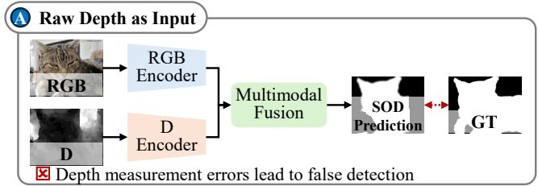
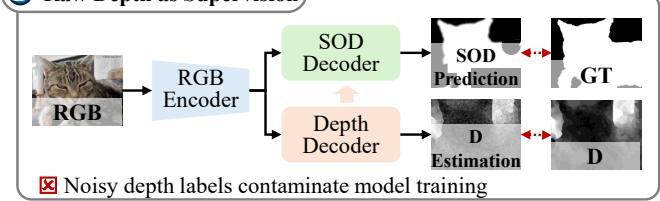
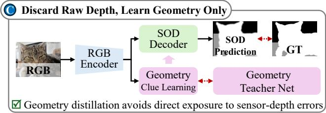
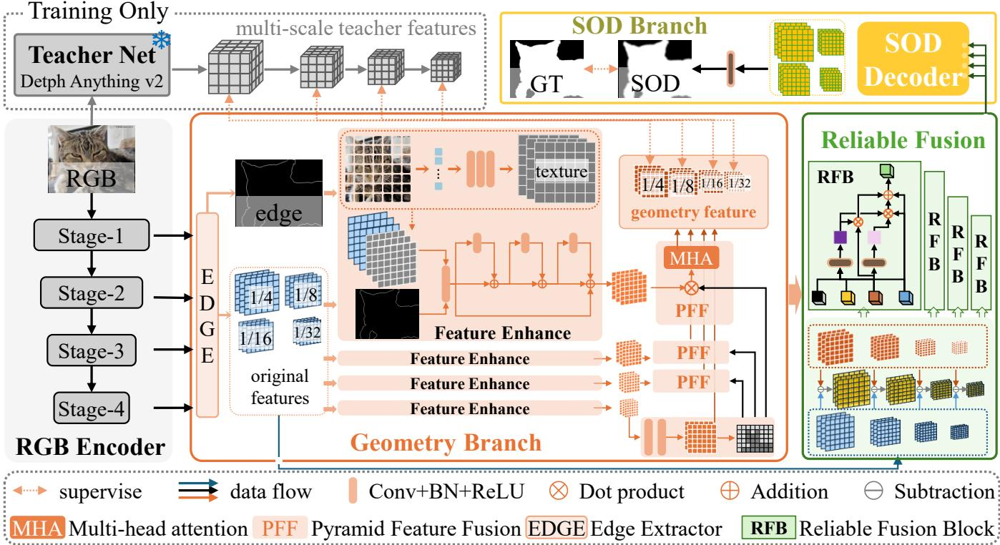
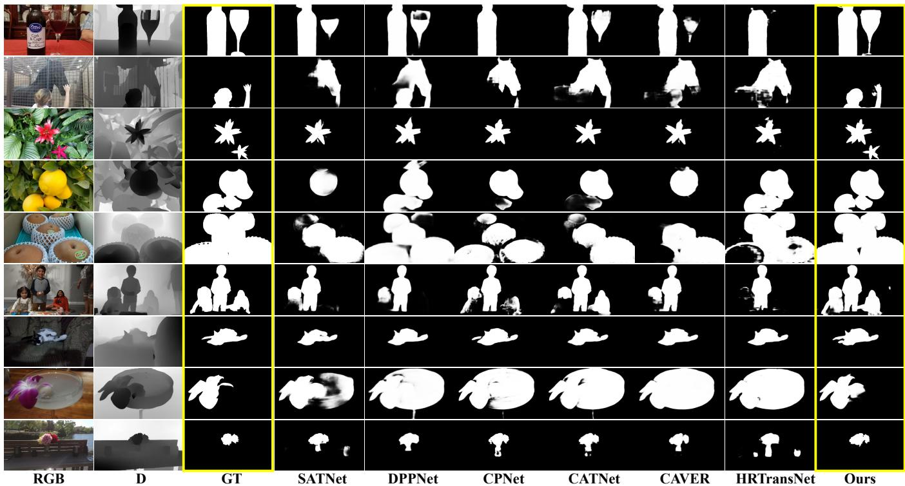
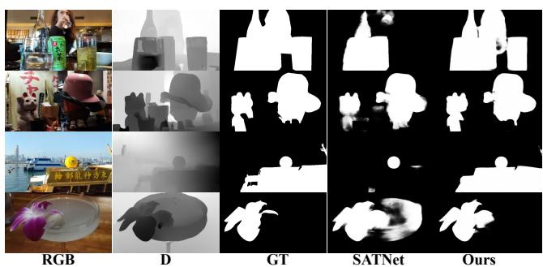

# When Depth Hurts: Reliability-Aware Geometry Distillation for Depth-Free RGB-D Salient Object Detection

Xuehao Wang1,2, Jiaxin Hua1, Runmei Li1, Zhenyu Wu4,2, Chenglizhao Chen3, Ke Gu5, Aimin Hao2

1University of International Business and Economics, 2State Key Laboratory of Virtual Reality Technology and Systems,3China University of Petroleum, 4Southwest Jiaotong University, 5Beijing University Of Technology

## Abstract

Depth can resolve appearance ambiguity in RGB-D salient object detection (SOD), yet sensor depth is not uniformly reliable. Missing regions, blurred boundaries, and structural artifacts can propagate through multimodal fusion and make an RGB-D detector less accurate than its RGB-only counterpart. Existing quality-aware approaches regulate observed depth but remain dependent on the same potentially defective modality. We propose GeoDistill, a reliability-aware geometry distillation framework developed for RGB-D SOD benchmarks without using dataset-provided depth during training or inference. A frozen Depth Anything V2 model serves only as a training-time teacher, transferring dense relative geometry, hierarchical spatial attention, and boundary structure to a compact edge-aware geometry branch. Pooled bidirectional interaction aligns geometry with appearance, and a pixel-wise reliability estimator selectively injects geometry that is compatible with the current RGB representation. The teacher is removed after training, leaving an RGB-only inference network. Trained on 2,985 RGB-mask pairs, GeoDistill achieves the best or tied-best result in 26 of 36 metric-dataset comparisons against ten recent RGB-D SOD methods, including a 13.4% relative MAE reduction on ReDWeb-S. When retrained on DUTS-TR, it also improves the strongest prior F-measure by 4.2% on PASCAL-S, showing that the distilled geometry transfers beyond a particular sensor or dataset domain. Code will be released upon publication.

## Introduction

Salient object detection aims to localize the most visually distinctive objects in a scene and supports image understanding, editing, retrieval, and segmentation. Modern RGB SOD models have advanced through multi-scale aggregation, boundary supervision, feedback refinement, and transformerbased context modeling (Borji et al. 2015; Wang et al. 2022; Qin et al. 2019; Zhao et al. 2019; Wei, Wang, and Huang 2020; Wang et al. 2023). RGB-D SOD further uses depth to resolve appearance ambiguity: reliable geometric discontinuities can separate objects with similar colors or textures and improve boundary localization (Peng et al. 2014; Chen and Li 2018; Fu et al. 2020; Pang et al. 2020).

The common assumption that depth is always beneficial is fragile. Public RGB-D benchmarks combine measurements from heterogeneous sensors and reconstruction pipelines, so depth quality varies markedly across scenes. Missing values, foreground-background bleeding, weak contrast, and structural artifacts can contaminate appearance features once they enter a tightly coupled fusion network. Existing methods alleviate this problem through uncertainty modeling, quality calibration, depth filtering, or selective fusion (Zhang et al. 2020; Ji et al. 2021; Fan et al. 2021). These strategies improve how observed depth is consumed, but do not remove the model’s dependence on its quality and availability.

B Raw Depth as Supervision  

  
Figure 1: Three paradigms for using geometry in RGB-D SOD. Raw depth is either processed as a parallel input (A) or used to supervise a monocular-depth branch (B); measurement errors can contaminate fusion or optimization in both cases. GeoDistill discards dataset depth and distills task-oriented geometry from a frozen teacher (C), which is removed at inference.

Figure 1 summarizes the resulting gap. Conventional RGB-D SOD either treats raw depth as a parallel input or uses it to supervise a monocular-depth branch coupled with saliency learning. The first paradigm is vulnerable to fusiontime corruption; the second transfers the same measurement errors into optimization. Removing raw depth avoids both failure modes but raises two questions: how can an RGBonly network acquire geometry informative for saliency, and how can it prevent geometrically valid yet saliency-irrelevant structures from dominating prediction?

We address these questions by separating geometry acquisition from geometry utilization. During training, a frozen Depth Anything V2 teacher transfers dense relative depth, multi-scale spatial attention, and boundary structure to a compact geometry branch that shares the RGB pyramid. The learned geometry exchanges context with appearance through memory-eficient bidirectional attention, after which a pixel-wise reliability estimator controls its contribution to the saliency representation. Distillation determines what geometry is learned; reliability-aware fusion determines when that geometry should be trusted.

We call this formulation depth-free RGB-D SOD: the model follows established RGB-D benchmarks and comparison protocols but never reads their sensor depth maps. The final network requires only RGB input and does not retain the depth teacher. Our contributions are threefold:

• We formulate depth-free RGB-D SOD to directly address depth-induced negative transfer, excluding dataset depth from both optimization and inference.

• We develop multi-level geometry distillation that transfers relative depth, hierarchical attention, and boundary structure into an edge-aware student, preserving useful geometry after the foundation teacher is removed.

• We introduce cross-modal enhancement and reliabilityaware fusion to regulate geometry at each scale. Extensive comparisons on nine RGB-D and four RGB benchmarks, including a direct study against pseudo-depth substitution, verify the efectiveness and transferability of the framework.

## Related Work

RGB and RGB-D salient object detection. RGB SOD combines contextual reasoning with structure preservation through attention, partial decoding, boundary supervision, feedback, and object-level enhancement (Liu and Han 2018; Wu, Su, and Huang 2019; Qin et al. 2019; Zhao et al. 2019; Wei, Wang, and Huang 2020; Wang et al. 2023). RGB-D methods extend these designs with dual-stream or progressive cross-modal interaction, including PCFNet, JL-DCF, BBS-Net, HDFNet, and RD3D (Chen and Li 2018; Fu et al. 2020; Fan et al. 2020; Pang et al. 2020; Chen et al. 2021). In contrast, our geometry is learned from RGB rather than supplied as a sensor modality.

Unreliable or unavailable depth. Prior work models depth uncertainty, calibrates modality quality, filters unreliable maps, distills depth for eficient inference, or removes depth at test time (Zhang et al. 2020; Ji et al. 2021; Fan et al. 2021; Piao et al. 2020; Zhang et al. 2022). Recent transformer, self-supervised, and difusion frameworks strengthen multimodal interaction (Zhao et al. 2022; Pang et al. 2023; Wu et al. 2023; Zhang et al. 2025). SATNet (Duan et al. 2025)

further replaces sensor depth with a monocularly estimated depth prior, but still treats the final single-channel map as an explicit input modality. In contrast, GeoDistill distills hierarchical teacher geometry into a compact student and removes both dataset depth and the teacher at inference.

Foundation geometry and distillation. Knowledge distillation transfers prediction, feature, or attention knowledge from a high-capacity teacher to a compact student (Hinton, Vinyals, and Dean 2015; Romero et al. 2015; Zagoruyko and Komodakis 2017). Self-supervised encoders and depth foundation models provide transferable scene geometry (Oquab et al. 2024; Yang et al. 2024a,b). We use Depth Anything V2 as a frozen training-only teacher and transfer dense values, hierarchical attention, and boundaries rather than regressing only a pseudo-depth map. AETP and ESC-style operators from ESCNet (Ye et al. 2025) serve as established edge-aware decoding blocks; our contribution is their integration into a geometry student and reliability-controlled SOD framework.

## Method

## Overview

As shown in Figure 2, GeoDistill follows three stages: appearance encoding, geometry acquisition, and reliabilitycontrolled saliency prediction. A shared encoder constructs a four-level RGB pyramid and projects all levels to a common width. A geometry branch converts this pyramid into hierarchical geometry features and a dense relative-geometry map. During training, a frozen Depth Anything V2 teacher supervises the branch at the value, feature, and boundary levels; all teacher paths disappear after optimization.

The learned geometry is not sent directly to the saliency decoder. At each scale, appearance and geometry first exchange contextual information. A reliability estimator then evaluates their agreement and controls geometry injection. The fused pyramid is decoded by a separate edge-aware SOD branch. The teacher supplies transferable geometry, the student adapts it to SOD, and reliability-aware fusion suppresses structures that are geometrically plausible but irrelevant to saliency.

## Shared Pyramid and Common Projection

Let I ∈ R3×H×W denote an RGB image. The backbone produces four feature levels {Xi}4i=1 at strides {4, 8, 16, 32}. Because ResNet-50, PVT-v2, and Swin-B expose diferent channel configurations, each level is transformed by an independent 1 × 1 convolution, batch normalization, and ReLU:

$$
A _ { i } = P _ { i } ( X _ { i } ) , \qquad A _ { i } \in \mathbb { R } ^ { C \times H _ { i } \times W _ { i } } .\tag{1}
$$

The common width C controls the capacity of geometry learning, cross-modal interaction, and saliency decoding. We use C = 128 by default and study C ∈ {64, 128, 256} in the capacity ablation.

## Teacher-Guided Geometry Learning

Training-only teacher. A frozen Depth Anything V2 teacher T receives the same RGB image after teacher-specific resizing and normalization. We expose four DINOv2 intermediate

  
Figure 2: Architecture of GeoDistill. A shared encoder forms a four-level appearance pyramid. During training, Depth Anything V2 supervises the geometry branch at the prediction, feature, and boundary levels. Cross-modal enhancement and reliability aware fusion produce a geometry-calibrated pyramid for the SOD decoder. Dashed teacher paths are removed after training.

layers and the DPT depth head:

$$
( D ^ { T } , \{ T _ { i } \} _ { i = 1 } ^ { 4 } ) = \mathcal { T } ( I ) .\tag{2}
$$

$D ^ { T }$ is treated as relative geometry and normalized independently per image. Teacher parameters are never updated.

Geometry branch. The student branch G receives the image and projected pyramid. An AETP edge extractor followed by an ESC decoder stack produces intermediate geometry predictions, four geometry features, and a geometry-edge logit:

$$
( \{ D _ { k } \} _ { k = 1 } ^ { K } , \{ G _ { i } \} _ { i = 1 } ^ { 4 } , E ^ { G } ) = \mathcal { G } ( I , \{ A _ { i } \} ) .\tag{3}
$$

AETP combines shallow details with the deepest semantics and uses deformable convolution and self-attention to infer geometry boundaries. The ESC decoder employs image-patch references, edge-conditioned deformable sampling, multi-kernel enhancement, and coarse-to-fine feedback. These operators are inherited from ESCNet (Ye et al. 2025) and adapted from camouflage-mask decoding to geometry learning.

Dense relative-depth supervision. After min-max normalization, teacher depth $\widetilde { D } ^ { T }$ supervises every decoder prediction through value and gradient consistency:

$$
\mathcal { L } _ { d } = \sum _ { k = 1 } ^ { K } \omega _ { k } \left( \| \sigma ( D _ { k } ) - \widetilde { D } _ { k } ^ { T } \| _ { 1 } + \eta \mathcal { L } _ { \nabla } ( \sigma ( D _ { k } ) , \widetilde { D } _ { k } ^ { T } ) \right) ,\tag{4}
$$

where $\omega _ { k }$ emphasizes later outputs and $\mathcal { L } _ { \nabla }$ measures horizontal and vertical gradient discrepancies.

Hierarchical feature alignment. Because teacher and student features difer architecturally, we align their normalized channel-energy maps rather than raw tensors. For feature $F .$ define

$$
\mathcal { A } ( F ) = \mathcal { N } \left( \frac { 1 } { C _ { F } } \sum _ { c = 1 } ^ { C _ { F } } F _ { c } ^ { 2 } \right) ,\tag{5}
$$

where $\mathcal { N }$ denotes spatial min-max normalization. The alignment objective is

$$
\mathcal { L } _ { a } = \frac { 1 } { 4 } \sum _ { i = 1 } ^ { 4 } \| \mathcal { A } ( G _ { i } ) - \mathcal { A } ( T _ { i } ) \| _ { 1 } .\tag{6}
$$

This transfers the teacher’s spatial focus while allowing taskspecific student channels.

Geometry-boundary supervision. The gradient-derived boundary of $\widetilde { D } ^ { T }$ supervises EG: $E ^ { G }$

$$
\mathcal { L } _ { g e } = \mathrm { B C E } ( E ^ { G } , \mathrm { E d g e } ( \widetilde { D } ^ { T } ) ) .\tag{7}
$$

Thus, $\mathcal { L } _ { d } , \mathcal { L } _ { a }$ , and $\mathcal { L } _ { g e }$ transfer value-, feature-, and boundary-level geometry knowledge.

## Cross-Modal Enhancement

Appearance and geometry originate from the same image but encode diferent inductive biases. At each level, nativeresolution queries attend to adaptively pooled keys and values, reducing spatial attention from quadratic complexity to

$O ( H _ { i } W _ { i } P ^ { 2 } )$ for pooled size $P \times P { \mathrm { : } }$

$$
\bar { A } _ { i } = A _ { i } + \alpha _ { i } \mathrm { A t t n } ( Q _ { A } ( A _ { i } ) , K _ { G } ( \Pi ( G _ { i } ) ) , V _ { G } ( \Pi ( G _ { i } ) ) ) ,\tag{8}
$$

$$
\bar { G } _ { i } = G _ { i } + \beta _ { i } \mathrm { A t t n } ( Q _ { G } ( G _ { i } ) , K _ { A } ( \Pi ( A _ { i } ) ) , V _ { A } ( \Pi ( A _ { i } ) ) ) ,\tag{9}
$$

where Π is adaptive average pooling. Residual gates $\alpha _ { i }$ and $\beta _ { i }$ are initialized to zero so training starts from the independent branches. Residual coordinate attention further captures horizontal and vertical dependencies (Hou, Zhou, and Feng 2021).

## Reliability-Aware Geometry Fusion

Monocular geometry may describe walls, ground planes, or background discontinuities that are valid in 3D but irrelevant to saliency. We therefore estimate a pixel-wise reliability map instead of assigning geometry a fixed contribution. After modality-specific projection, the estimator receives appearance, geometry, their absolute discrepancy, and the resized geometry prediction:

$$
r _ { i } = \sigma \left( \phi _ { i } ( [ \bar { A } _ { i } , \bar { G } _ { i } , { | \bar { A } _ { i } - \bar { G } _ { i } | } , { \mathcal U } _ { i } ( \sigma ( D ) ) ] ) \right) .\tag{10}
$$

A channel-wise geometry attention map is $q _ { i } = \sigma ( \psi _ { i } ( { \bar { G } } _ { i } ) )$ and fusion is

$$
F _ { i } = { \rho _ { i } } \left( { { { \bar { A } } _ { i } } \odot \left( { 1 + { r _ { i } } \odot { q _ { i } } } \right) + { r _ { i } } \odot { { \bar { G } } _ { i } } } \right) .\tag{11}
$$

This RGB-dominant formulation approaches the appearance baseline when $r _ { i }$ is small and activates multiplicative modulation and residual geometry injection when the branches agree. A negative bias in the final reliability layer prevents unstable geometry from dominating early optimization.

## Edge-Aware Saliency Decoding

A separate AETP and ESC decoder stack transforms $\{ F _ { i } \}$ into saliency logits $\{ S _ { j } \} _ { j = 1 } ^ { J }$ and an SOD edge logit $E ^ { S }$ Geometry and saliency decoding share the same progressive structure but not parameters, allowing one branch to preserve teacher geometry and the other to optimize foreground selection. The saliency branch uses structure loss with deep supervision:

$$
\mathcal { L } _ { s } = \sum _ { j = 1 } ^ { J } \nu _ { j } \mathcal { L } _ { \mathrm { s t r } } ( S _ { j } , Y ) , \qquad \mathcal { L } _ { e } = \mathrm { B C E } ( E ^ { S } , \mathrm { E d g e } ( Y ) ) .\tag{12}
$$

The complete objective is

$$
\mathcal { L } = \mathcal { L } _ { s } + \lambda _ { e } \mathcal { L } _ { e } + \lambda _ { g e } \mathcal { L } _ { g e } + \lambda _ { d } \mathcal { L } _ { d } + \lambda _ { a } \mathcal { L } _ { a } .\tag{13}
$$

We set $\lambda _ { e } = 0 . 4 , \lambda _ { q e } = 0 . 1 , \lambda _ { d } = 0 . 2$ , and $\lambda _ { a } = 0 . 0 5 . \mathrm { A t }$ inference, T and all supervision paths are removed.

## Experiments

## Experimental Protocol

Datasets. For RGB-D SOD, we train on 2,985 RGB-mask pairs: 1,485 from NJU2K (Ju et al. 2015), 700 from NLPR (Peng et al. 2014), and 800 from DUT-RGBD (Piao et al. 2019). Dataset depth is ignored. Evaluation uses NJU2K (500 test images), NLPR (300), DUT-RGBD (400), ReDWeb-S (1,000) (Liu et al. 2022), SIP (929) (Fan et al. 2021), SSD (80) (Zhou et al. 2021), STERE (1,000) (Niu et al. 2012), COME-E (4,600), and COME-H (3,000) (Zhang et al. 2021). For RGB-only generalization, we retrain on the 10,553- image DUTS training split and evaluate on DUTS-TE (5,019) (Wang et al. 2017), ECSSD (1,000) (Shi et al. 2016), HKU-IS (4,447) (Li and Yu 2016), and PASCAL-S (850) (Li et al. 2014).

Metrics. We report structure measure $S _ { m }$ (Fan et al. 2017), maximum F-measure $F _ { \beta } ^ { \mathrm { m a x } }$ with $\beta ^ { 2 } = 0 . 3 .$ , maximum enhanced-alignment measure $E _ { \xi } ^ { \mathrm { m a x } }$ (Fan et al. 2018), and mean absolute error M. Higher values are better for the first three metrics, whereas lower M is better.

Implementation details. Unless stated otherwise, we use PVT-v2-B5 as the encoder, Depth Anything V2-Small as the frozen teacher, projector width $C \stackrel { \cdot } { = } 1 2 8$ , and one ESC block in each branch. Student and teacher inputs are resized to $4 1 6 \times 4 1 6$ and $3 6 4 \times 3 6 4$ , respectively. We apply random cropping and horizontal flipping. Training lasts 80 epochs with batch size 4 and AdamW. The learning rate is $7 . 5 \times \mathrm { 1 0 ^ { - 5 } }$ for newly initialized modules and $7 . 5 \times 1 0 ^ { - 6 }$ for the encoder; weight decay is $1 . 5 \times 1 0 ^ { - 4 }$ and gradients are clipped to 1.0. Training is conducted on a single RTX 4090 GPU with 24 GB memory.

Table 1: Quantitative comparison on nine RGB-D SOD benchmarks. Numbers in parentheses are test-set sizes. Best and tied-best results are bold.
<table><tr><td>Method</td><td colspan="4">NJU2K (500)</td><td colspan="4">NLPR (300)</td><td colspan="4">DUT-RGBD (400)</td><td colspan="4">ReDWeb-S (1,000)</td><td colspan="4">SIP (929)</td></tr><tr><td></td><td> $S _ { m }$ </td><td> $F _ { \beta } ^ { \mathrm { m a x } }$ </td><td> $E _ { \xi } ^ { \mathrm { m a x } }$ </td><td>M</td><td> $S _ { m }$ </td><td> $F _ { \beta } ^ { \mathrm { m a x } }$ </td><td> $E _ { \xi } ^ { \mathrm { m a x } }$ </td><td>M</td><td> $S _ { m }$ </td><td> $\overline { { F _ { \beta } ^ { \mathrm { m a x } } } }$ </td><td> $E _ { \xi } ^ { \mathrm { m a x } }$ </td><td>M</td><td> $S _ { m }$ </td><td> $F _ { \beta } ^ { \mathrm { m a x } }$ </td><td> $E _ { \xi } ^ { \mathrm { m a x } }$ </td><td>M</td><td> $S _ { m }$ </td><td> $F _ { \beta } ^ { \mathrm { m a x } }$ </td><td>E m ax</td><td>M</td></tr><tr><td>C2DFNet</td><td>.861</td><td>.854</td><td>.912</td><td>.054</td><td>.909</td><td>.895</td><td>.953</td><td>.025</td><td>.896</td><td>.904</td><td>.942</td><td>.037</td><td>.613</td><td>.580</td><td>.708</td><td>.175</td><td>.793</td><td>.784</td><td>.855</td><td>.088</td></tr><tr><td>RD3D</td><td>.893</td><td>.883</td><td>.927</td><td>.047</td><td>.903</td><td>.880</td><td>.937</td><td>.033</td><td>.863</td><td>.841</td><td>.894</td><td>.060</td><td>.671</td><td>.621</td><td>.730</td><td>.163</td><td>.835</td><td>.826</td><td>.884</td><td>.074</td></tr><tr><td>PICRNet</td><td>.386</td><td>.274</td><td>.526</td><td>.423</td><td>.389</td><td>.157</td><td>.609</td><td>.383</td><td>.362</td><td>.247</td><td>.515</td><td>.432</td><td>.356</td><td>.311</td><td>.486</td><td>.447</td><td>.312</td><td>.246</td><td>.571</td><td>.464</td></tr><tr><td>HRTransNet</td><td>.917</td><td>.920</td><td>.952</td><td>.032</td><td>.931</td><td>.925</td><td>.966</td><td>.019</td><td>.918</td><td>.925</td><td>.951</td><td>.033</td><td>.724</td><td>.710</td><td>.800</td><td>.127</td><td>.860</td><td>.876</td><td>.916</td><td>.056</td></tr><tr><td>CAVER</td><td>.926</td><td>.928</td><td>.959</td><td>.030</td><td>.934</td><td>.929</td><td>.970</td><td>.021</td><td>.938</td><td>.944</td><td>.966</td><td>.026</td><td>.736</td><td>.737</td><td>.808</td><td>.121</td><td>.904</td><td>.915</td><td>.945</td><td>.038</td></tr><tr><td>CPNet</td><td>.935</td><td>.941</td><td>.964</td><td>.025</td><td>.940</td><td>.936</td><td>.973</td><td>.016</td><td>.951</td><td>.959</td><td>.975</td><td>.019</td><td>.752</td><td>.755</td><td>.822</td><td>.112</td><td>.907</td><td>.927</td><td>.946</td><td>.035</td></tr><tr><td>LAFB</td><td>.907</td><td>.912</td><td>.946</td><td>.036</td><td>.930</td><td>.921</td><td>.965</td><td>.020</td><td>.927</td><td>.934</td><td>.956</td><td>.028</td><td>.722</td><td>.721</td><td>.792</td><td>.129</td><td>.897</td><td>.913</td><td>.942</td><td>.041</td></tr><tr><td>CATNet</td><td>.932</td><td>.937</td><td>.961</td><td>.026</td><td>.940</td><td>.934</td><td>.972</td><td>.018</td><td>.953</td><td>.958</td><td>.976</td><td>.019</td><td>.748</td><td>.750</td><td>.816</td><td>.115</td><td>.911</td><td>.928</td><td>.952</td><td>.034 .042</td></tr><tr><td>SATNet</td><td>.923</td><td>.925</td><td>.954</td><td>.030</td><td>.929</td><td>.920</td><td>.964</td><td>.021</td><td>.942</td><td>.947</td><td>.966</td><td>.022</td><td>.705</td><td>.701</td><td>.782</td><td>.131</td><td>.898</td><td>.904</td><td>.931</td><td>.042</td></tr><tr><td>DPPNet</td><td>.929</td><td>.932</td><td>.962</td><td>.028</td><td>.937</td><td>.927</td><td>.968</td><td>.020</td><td>.939</td><td>.946</td><td>.965</td><td>.025</td><td>.749</td><td>.746</td><td>.817</td><td>.115</td><td>.896</td><td>.911</td><td>.938</td><td>.033</td></tr><tr><td>GeoDistill</td><td>.935</td><td>.940</td><td>.964</td><td>.025</td><td>.935</td><td>.928</td><td>.967</td><td>.019</td><td>.948</td><td>.957</td><td>.973</td><td>.020</td><td>.781</td><td>.789</td><td>.842</td><td>.097</td><td>.912</td><td>.928</td><td>.951</td><td></td></tr></table>

<table><tr><td rowspan="2">Method</td><td colspan="4">SSD (80)</td><td colspan="4">STERE (1,000)</td><td colspan="4">COME-E (4,600)</td><td colspan="4">COME-H (3,000)</td></tr><tr><td> $S _ { m }$ </td><td> $F _ { \beta } ^ { \mathrm { m a x } }$ </td><td> $E _ { \xi } ^ { \mathrm { m a x } }$ </td><td>M</td><td>Sm</td><td>Fm ax</td><td> $E _ { \xi } ^ { \mathrm { m a x } }$ </td><td>M</td><td> $S _ { m }$ </td><td>Fmax</td><td>E max</td><td>M</td><td> $S _ { m }$ </td><td>Fmax</td><td> $E _ { \xi } ^ { \mathrm { m a x } }$ </td><td>M</td></tr><tr><td>C2DFNet</td><td>.807</td><td>.762</td><td>.872</td><td>.067</td><td>.868</td><td>.863</td><td>.919</td><td>.048</td><td>.779</td><td>.776</td><td>.848</td><td>.094</td><td>.724</td><td>.726</td><td>.800</td><td>.130</td></tr><tr><td>RD3D</td><td>.852</td><td>.814</td><td>.901</td><td>.058</td><td>.889</td><td>.868</td><td>.920</td><td>.048</td><td>.836</td><td>.818</td><td>.877</td><td>.073</td><td>.782</td><td>.764</td><td>.824</td><td>.109</td></tr><tr><td>PICRNet</td><td>.344</td><td>.253</td><td>.444</td><td>.467</td><td>.386</td><td>.253</td><td>.539</td><td>.421</td><td>.362</td><td>.295</td><td>.489</td><td>.427</td><td>.361</td><td>.329</td><td>.483</td><td>.434</td></tr><tr><td>HRTransNet</td><td>.848</td><td>.820</td><td>.909</td><td>.053</td><td>.915</td><td>912</td><td>.954</td><td>.032</td><td>.858</td><td>.856</td><td>.909</td><td>.056</td><td>.816</td><td>.818</td><td>.869</td><td>.084</td></tr><tr><td>CAVER</td><td>.890</td><td>.884</td><td>.936</td><td>.039</td><td>.917</td><td>.916</td><td>.955</td><td>.033</td><td>.870</td><td>.874</td><td>.918</td><td>.052</td><td>.822</td><td>.831</td><td>.872</td><td>.082</td></tr><tr><td>CPNet</td><td>.893</td><td>.893</td><td>.935</td><td>.035</td><td>.920</td><td>.923</td><td>.960</td><td>.029</td><td>.884</td><td>.889</td><td>.928</td><td>.045</td><td>.843</td><td>.854</td><td>.889</td><td>.071</td></tr><tr><td>LAFB</td><td>.857</td><td>.841</td><td>.922</td><td>.045</td><td>.908</td><td>.906</td><td>.945</td><td>.037</td><td>.864</td><td>.864</td><td>.908</td><td>.056</td><td>.814</td><td>.817</td><td>.860</td><td>.088</td></tr><tr><td>CATNet</td><td>.892</td><td>.879</td><td>.927</td><td>.036</td><td>.921</td><td>.922</td><td>.958</td><td>.030</td><td>.892</td><td>.897</td><td>.932</td><td>.043</td><td>.847</td><td>.855</td><td>.890</td><td>.071</td></tr><tr><td>SATNet</td><td>.871</td><td>.852</td><td>.917</td><td>.044</td><td>.919</td><td>.913</td><td>.951</td><td>.032</td><td>.864</td><td>.855</td><td>.901</td><td>.056</td><td>.814</td><td>.809</td><td>.857</td><td>.087</td></tr><tr><td>DPPNet</td><td>.891</td><td>.885</td><td>.938</td><td>.037</td><td>.922</td><td>.919</td><td>.957</td><td>.032</td><td>.878</td><td>.876</td><td>.917</td><td>.052</td><td>.839</td><td>.840</td><td>.879</td><td>.078</td></tr><tr><td>GeoDistill</td><td>.898</td><td>.894</td><td>.948</td><td>.031</td><td>.927</td><td>.925</td><td>.960</td><td>.028</td><td>.896</td><td>.902</td><td>.935</td><td>.041</td><td>.856</td><td>.869</td><td>.899</td><td>.065</td></tr></table>

## Quantitative Comparison on RGB-D SOD

We compare GeoDistill with ten recent RGB-D SOD methods: C2DFNet (Miao et al. 2022), RD3D (Chen et al. 2022), PICRNet (Cong et al. 2023), HRTransNet (Tang et al. 2023), CAVER (Pang et al. 2023), CPNet (Hu et al. 2024), LAFB (Wang et al. 2024), CATNet (Sun et al. 2024), SATNet (Duan et al. 2025), and DPPNet (Yuan et al. 2025). Table 1 reports all four metrics on nine benchmarks; numbers in parentheses denote evaluated test images.

Across the 36 metric-dataset comparisons, GeoDistill is best or tied-best in 26 cases (72.2%), including 21 outright best results. Its advantage is most pronounced on benchmarks that difer substantially from the training distribution. On ReDWeb-S, the strongest prior $S _ { m } , F _ { \beta } ^ { \mathrm { m a x } }$ , and $E _ { \xi } ^ { \mathrm { m a x } }$ are improved by 3.9%, 4.5%, and 2.4%, respectively, while MAE decreases by 13.4%. MAE is also reduced by 11.4% on SSD, 8.5% on COME-H, 4.7% on COME-E, and 3.5% on STERE. On NJU2K, GeoDistill ties the best $S _ { m } , E _ { \xi } ^ { \mathrm { m a x } }$ and MAE, and its $F _ { \beta } ^ { \mathrm { m a x } }$ is within 0.1% of the top result. Performance on NLPR and DUT-RGBD remains competitive but is not uniformly best. Overall, the results support a precise conclusion: distilled geometry is particularly robust to cross-dataset variation and heterogeneous depth quality.

Figure 3 groups challenging cases by depth condition. When RGB appearance is ambiguous but geometry is informative, GeoDistill recovers complete foreground regions. When raw depth contains structured background responses, it suppresses the false positives and missed objects produced by competing models. When depth boundaries are incomplete or blurred, it preserves object contours more consistently. These examples illustrate the benefit of learning geometry from RGB and regulating its contribution instead of directly

consuming sensor depth.

## Comparison with Pseudo-Depth Substitution

SATNet (Duan et al. 2025) also avoids direct use of sensor depth, but follows a diferent strategy: it replaces raw depth with a monocularly estimated single-channel prior and processes RGB and pseudo-depth through symmetric input streams. By contrast, GeoDistill uses Depth Anything V2 only during training and distills its dense prediction, multiscale representations, and boundaries into an internal geometry branch. Table 1 shows that GeoDistill exceeds SATNet in all 36 metric-dataset comparisons; relative MAE reductions reach 29.5% on SSD, 26.8% on COME-E, 26.0% on ReDWeb-S, and 25.3% on COME-H. Figure 4 provides representative examples, where hierarchical geometry distillation yields more complete objects and fewer background responses than final-map substitution. These results suggest that preserving multi-scale teacher structure is more efective than compressing geometry into a single pseudo-depth input.

## Generalization to RGB SOD

We retrain the same architecture on DUTS-TR while retaining Depth Anything V2 only as a geometry teacher. As shown in Table 2, the framework attains the best result in nine of twelve metric-dataset comparisons. On PASCAL-S, it improves the strongest prior $\bar { S } _ { m } , F _ { \beta } ^ { \mathrm { m a x } }$ , and $E _ { \xi } ^ { \mathrm { m a x } }$ by 1.3%, 4.2%, and 3.3%, respectively; on HKU-IS, all three metrics improve by approximately 0.5%. Gains on DUTS-TE are smaller but consistent (0.2–0.4%), while all ECSSD results remain within 0.2% of the best. The geometry student therefore learns a transferable structural prior rather than a sensoror dataset-specific shortcut.

  
Figure 3: Qualitative comparison. Rows cover three representative depth conditions: informative but RGB-ambiguous geometry, depth maps contaminated by structured background, and incomplete or blurred depth boundaries. GeoDistill preserves complete salient regions and suppresses depth-induced false positives across all three conditions.

Table 2: Comparison with RGB SOD methods. Numbers in parentheses are test-set sizes. Best results are bold.
<table><tr><td>Method</td><td colspan="3">DUTS-TE (5,019)</td><td colspan="3">ECSSD (1,000)</td><td colspan="3">HKU-IS (4,447)</td><td colspan="3">PASCAL-S (850)</td></tr><tr><td></td><td> $S _ { m }$ </td><td> $F _ { \beta } ^ { \mathrm { m a x } }$ </td><td> $E _ { \xi } ^ { \mathrm { m a x } }$ </td><td> $S _ { m }$ </td><td> $F _ { \beta } ^ { \mathrm { m a x } }$ </td><td> $E _ { \xi } ^ { \mathrm { m a x } }$ </td><td> $S _ { m }$ </td><td> $F _ { \beta } ^ { \mathrm { m a x } }$ </td><td> $E _ { \xi } ^ { \mathrm { m a x } }$ </td><td> $S _ { m }$ </td><td> $F _ { \beta } ^ { \mathrm { m a x } }$ </td><td> $E _ { \xi } ^ { \mathrm { m a x } }$ </td></tr><tr><td>VST (Liu et al. 2021)</td><td>.896</td><td>.877</td><td>.939</td><td>.932</td><td>.944</td><td>.964</td><td>.928</td><td>.937</td><td>.968</td><td>.873</td><td>.850</td><td>.900</td></tr><tr><td>ICON (Zhuge et al. 2023)</td><td>.890</td><td>.876</td><td>.931</td><td>.928</td><td>.943</td><td>.960</td><td>.920</td><td>.931</td><td>.960</td><td>.862</td><td>.844</td><td>.888</td></tr><tr><td>VST-T++ (Liu et al. 2024)</td><td>.901</td><td>.887</td><td>.943</td><td>.937</td><td>.949</td><td>.968</td><td>.930</td><td>.939</td><td>.968</td><td>.878</td><td>.855</td><td>.901</td></tr><tr><td>MENet (Wang et al. 2023)</td><td>.905</td><td>.895</td><td>.943</td><td>.927</td><td>.938</td><td>.956</td><td>.927</td><td>.939</td><td>.965</td><td>.871</td><td>.848</td><td>.892</td></tr><tr><td>VSCode-T (Luo et al. 2024)</td><td>.917</td><td>.910</td><td>.954</td><td>.945</td><td>.957</td><td>.971</td><td>.935</td><td>.946</td><td>.970</td><td>.878</td><td>.852</td><td>.900</td></tr><tr><td>VSCode-v2-T (Luo et al. 2026)</td><td>.922</td><td>.917</td><td>.957</td><td>.940</td><td>.950</td><td>.965</td><td>.929</td><td>.936</td><td>.962</td><td>.875</td><td>.847</td><td>.891</td></tr><tr><td>GeoDistill</td><td>.926</td><td>.920</td><td>.959</td><td>.943</td><td>.956</td><td>.970</td><td>.940</td><td>.951</td><td>.975</td><td>.889</td><td>.891</td><td>.931</td></tr></table>

## Ablation Study

All ablations use the same split, validation criterion, and evaluation protocol. We examine three questions: how much shared feature capacity is required, whether distilled geometry can replace raw depth, and whether teacher-guided geometry learning adds value beyond the branch architecture alone.

Projector capacity. Table 3 varies $C \in \{ 6 4 , 1 2 8 , 2 5 6 \}$ Increasing C from 64 to 128 reduces MAE by 36.5% on SIP and 24.4% on COME-H, with relative gains of up to 0.8% in the region metrics. Increasing C further to 256 does not improve accuracy: the 128-channel model is slightly better on every reported metric while using 43.9% fewer parameters and 68.5% fewer FLOPs. Thus, C = 64 under-represents the geometry and saliency pyramids, whereas $C \ = \ 2 5 6$ adds substantial redundancy. We adopt C = 128 as the best accuracy-eficiency trade-of.

Table 3: Projector-capacity ablation. Best results are bold.
<table><tr><td rowspan="2">C</td><td rowspan="2">Params (M)</td><td rowspan="2">FLOPs (G)</td><td colspan="4">SIP</td><td colspan="4">COME-H</td></tr><tr><td> $S _ { m }$ </td><td> $F _ { \beta } ^ { \mathrm { m a x } }$ </td><td> $E _ { \xi } ^ { \mathrm { m a x } }$ </td><td>M</td><td> $S _ { m }$ </td><td> $F _ { \beta } ^ { \mathrm { m a x } }$ </td><td> $E _ { \xi } ^ { \mathrm { m a x } }$ </td><td>M</td></tr><tr><td>64</td><td>89.68</td><td>139.46</td><td>.906</td><td>.921</td><td>.944</td><td>.052</td><td>.855</td><td>.865</td><td>.898</td><td>.086</td></tr><tr><td>128</td><td>111.76</td><td>311.34</td><td>.912</td><td>.928</td><td>.951</td><td>.033</td><td>.856</td><td>.869</td><td>.899</td><td>.065</td></tr><tr><td>256</td><td>199.03</td><td>989.56</td><td>.911</td><td>.926</td><td>.949</td><td>.034</td><td>.854</td><td>.866</td><td>.897</td><td>.066</td></tr></table>

Depth-use strategy. Table 4 compares three conceptually distinct settings. RGB-only removes the geometry branch and retains only saliency and boundary supervision. Raw depth replaces teacher-guided geometry learning with a parallel depth encoder and concatenates sensor-depth features with RGB features. Distilled geometry is the complete depthfree model. Relative to RGB-only, distilled geometry reduces MAE by 28.3% on SIP and 18.8% on COME-H, while improving the region metrics by 2.1–3.3%. It also outperforms raw-depth fusion, reducing MAE by 8.3% and 3.0%, respectively, with gains of up to 0.6% in the remaining metrics. This strategic comparison is not parameter matched; it directly verifies that training-time geometry transfer can replace testtime sensor depth.

  
Figure 4: Comparison with SATNet. SATNet replaces sensor depth with a monocular pseudo-depth input, whereas GeoDistill distills hierarchical teacher geometry and produces more complete masks with fewer background responses.

Table 4: Depth-use strategies. Best results are bold.
<table><tr><td rowspan="2">Strategy</td><td colspan="4">SIP</td><td colspan="4">COME-H</td></tr><tr><td> $S _ { m }$ </td><td>Fmax</td><td>Emax</td><td>M</td><td> $S _ { m }$ </td><td> $F _ { \beta } ^ { \mathrm { m a x } }$ </td><td>Em ax</td><td>M</td></tr><tr><td>RGB-only</td><td>.883</td><td>.902</td><td>.931</td><td>.046</td><td>.831</td><td>.841</td><td>.875</td><td>.080</td></tr><tr><td>Raw depth</td><td>.908</td><td>.923</td><td>.945</td><td>.036</td><td>.853</td><td>.866</td><td>.898</td><td>.067</td></tr><tr><td>Distilled geometry</td><td>.912</td><td>.928</td><td>.951</td><td>.033</td><td>.856</td><td>.869</td><td>.899</td><td>.065</td></tr></table>

Geometry architecture and teacher supervision. Table 5 separates architectural capacity from teacher guidance. RGB-only contains the shared encoder and SOD decoder. Geometry architecture adds the geometry branch but optimizes it only through the downstream saliency objective. Full model further introduces Depth Anything V2 supervision at the value, feature, and boundary levels. Adding the geometry branch without teacher guidance to RGB-only reduces MAE by 19.6% on SIP and 15.0% on COME-H, with gains of up to 2.9% in the region metrics. Teacher-guided geometry learning then reduces MAE by a further 10.8% and 4.4%, respectively. Overall, the full model lowers MAE by 28.3% on SIP and 18.8% on COME-H relative to RGBonly, showing that branch capacity and multi-level geometry supervision are complementary.

## Discussion

The experiments provide complementary evidence. The nine-benchmark comparison shows that distilled geometry is particularly robust under cross-dataset variation. The direct comparison with SATNet indicates that hierarchical teacher transfer is more efective than substituting a final pseudodepth map, while the RGB SOD results show that the benefit is not tied to an RGB-D sensor domain. The strategy, capacity, and component studies further verify that training-time geometry can replace test-time raw depth and identify the contributions of feature capacity and multi-level teacher supervision.

Table 5: Geometry architecture and teacher-supervision ablation. Best results are bold.
<table><tr><td>Setting</td><td></td><td>Geo. DA-V2</td><td colspan="4">SIP</td><td colspan="4">COME-H</td></tr><tr><td></td><td></td><td></td><td>Sm</td><td>F m ax</td><td>E m ax</td><td>M</td><td>Sm</td><td>F m ax</td><td>E max</td><td>M</td></tr><tr><td>RGB-only</td><td></td><td></td><td>.883</td><td>.902</td><td>.931</td><td>.046</td><td>.831</td><td>.841</td><td>.875</td><td>.080</td></tr><tr><td>Geometry architecture</td><td>√</td><td></td><td>.908</td><td>.923</td><td>.945</td><td>.037</td><td>.854</td><td>.865</td><td>.896</td><td>.068</td></tr><tr><td>Full model</td><td>√</td><td>√</td><td>.912</td><td>.928</td><td>.951</td><td>.033</td><td>.856</td><td>.869</td><td>.899</td><td>.065</td></tr></table>

The geometry map represents task-oriented relative structure, not calibrated metric depth, and should not be interpreted as a replacement for a physical sensor in measurement tasks. Training also requires a frozen teacher, although it contributes no parameters or computation at inference. Caching teacher outputs or using a smaller geometry foundation model could reduce training cost.

## Conclusion

We presented GeoDistill, a reliability-aware geometry distillation framework for depth-free RGB-D SOD. Instead of fusing potentially unreliable sensor depth or substituting a final pseudo-depth map, the model transfers relative depth, hierarchical attention, and boundary structure from a frozen Depth Anything V2 teacher into a compact geometry branch. Cross-modal enhancement and pixel-wise reliability estimation then determine when geometry should influence appearance. The teacher is removed after training, so inference requires only RGB. Results on nine RGB-D and four RGB benchmarks show that selectively distilled geometry is a more stable and transferable auxiliary signal than unconditional raw-depth or pseudo-depth input.

## References

Borji, A.; Cheng, M.-M.; Hou, Q.; Jiang, H.; and Li, J. 2015. Salient Object Detection: A Benchmark. IEEE Transactions on Image Processing, 24(12): 5706–5722.

Chen, H.; and Li, Y. 2018. Progressively Complementarity-Aware Fusion Network for RGB-D Salient Object Detection. In IEEE Conference on Computer Vision and Pattern Recognition, 3051–3060.

Chen, Q.; Liu, Z.; Zhang, Y.; Fu, K.; Zhao, Q.; and Du, H. 2021. RGB-D Salient Object Detection via 3D Convolutional Neural Networks. In AAAI Conference on Artificial Intelligence, volume 35, 1063–1071.

Chen, Q.; Zhang, Z.; Lu, Y.; Fu, K.; and Zhao, Q. 2022. 3-D convolutional neural networks for RGB-D salient object detection and beyond. IEEE Transactions on Neural Networks and Learning Systems, 35(3): 4309–4323.

Cong, R.; Liu, H.; Zhang, C.; Zhang, W.; Zheng, F.; Song, R.; and Kwong, S. 2023. Point-aware interaction and CNNinduced refinement network for RGB-D salient object detection. In Proceedings of the 31st ACM international conference on multimedia, 406–416.

Duan, S.; Yang, X.; Wang, N.; and Gao, X. 2025. Lightweight RGB-D salient object detection from a speed-accuracy tradeof perspective. IEEE Transactions on Image Processing.

Fan, D.-P.; Cheng, M.-M.; Liu, Y.; Li, T.; and Borji, A. 2017. Structure-Measure: A New Way to Evaluate Foreground Maps. In IEEE International Conference on Computer Vision, 4548–4557.

Fan, D.-P.; Gong, C.; Cao, Y.; Ren, B.; Cheng, M.-M.; and Borji, A. 2018. Enhanced-Alignment Measure for Binary Foreground Map Evaluation. In International Joint Conference on Artificial Intelligence, 698–704.

Fan, D.-P.; Lin, Z.; Zhang, Z.; Zhu, M.; and Cheng, M.-M. 2021. Rethinking RGB-D Salient Object Detection: Models, Data Sets, and Large-Scale Benchmarks. IEEE Transactions on Neural Networks and Learning Systems, 32(5): 2075– 2089.

Fan, D.-P.; Zhai, Y.; Borji, A.; Yang, J.; and Shao, L. 2020. BBS-Net: RGB-D Salient Object Detection with a Bifurcated Backbone Strategy Network. In European Conference on Computer Vision, 275–292.

Fu, K.; Fan, D.-P.; Ji, G.-P.; and Zhao, Q. 2020. JL-DCF: Joint Learning and Densely-Cooperative Fusion Framework for RGB-D Salient Object Detection. In IEEE Conference on Computer Vision and Pattern Recognition, 3052–3062.

Hinton, G.; Vinyals, O.; and Dean, J. 2015. Distilling the Knowledge in a Neural Network. arXiv preprint arXiv:1503.02531.

Hou, Q.; Zhou, D.; and Feng, J. 2021. Coordinate Attention for Eficient Mobile Network Design. In IEEE Conference on Computer Vision and Pattern Recognition, 13713–13722.

Hu, X.; Sun, F.; Sun, J.; Wang, F.; and Li, H. 2024. Cross-Modal Fusion and Progressive Decoding Network for RGB-D Salient Object Detection. International Journal of Computer Vision, 132(8): 3067–3085.

Ji, W.; Li, J.; Zhang, M.; Piao, Y.; and Lu, H. 2021. Calibrated RGB-D Salient Object Detection. In IEEE Conference on Computer Vision and Pattern Recognition, 9471–9481.

Ju, R.; Ge, L.; Geng, W.; Ren, T.; and Wu, G. 2015. Depth-Aware Salient Object Detection Using Anisotropic Center-Surround Diference. Signal Processing: Image Communication, 38: 115–126.

Li, G.; and Yu, Y. 2016. Visual Saliency Detection Based on Multiscale Deep CNN Features. IEEE Transactions on Image Processing, 25(11): 5012–5024.

Li, Y.; Hou, X.; Koch, C.; Rehg, J. M.; and Yuille, A. L. 2014. The Secrets of Salient Object Segmentation. In IEEE Conference on Computer Vision and Pattern Recognition, 280–287.

Liu, N.; and Han, J. 2018. PiCANet: Learning Pixel-Wise Contextual Attention for Saliency Detection. In IEEE Conference on Computer Vision and Pattern Recognition, 3089– 3098.

Liu, N.; Luo, Z.; Zhang, N.; and Han, J. 2024. Vst++: Eficient and stronger visual saliency transformer. IEEE Transactions on Pattern Analysis and Machine Intelligence, 46(11): 7300– 7316.

Liu, N.; Zhang, N.; Shao, L.; and Han, J. 2022. Learning Selective Mutual Attention and Contrast for RGB-D Saliency Detection. IEEE Transactions on Pattern Analysis and Machine Intelligence, 44(12): 9026–9042.

Liu, N.; Zhang, N.; Wan, K.; Shao, L.; and Han, J. 2021. Visual Saliency Transformer. In IEEE International Conference on Computer Vision, 4722–4732.

Luo, Z.; Liu, N.; Zhao, W.; Yang, X.; Zhang, D.; Fan, D.-P.; Khan, F. S.; and Han, J. 2026. VSCode-V2: Dynamic Prompt Learning for General Visual Salient and Camouflaged Object Detection with Two-Stage Optimization. IEEE Transactions on Pattern Analysis and Machine Intelligence.

Luo, Z.; et al. 2024. VSCode: General Visual Salient and Camouflaged Object Detection with 2D Prompt Learning. In IEEE Conference on Computer Vision and Pattern Recognition.

Miao, Z.; Shunyu, Y.; Beiqi, H.; et al. 2022. C2DFNet: Crisscross Dynamic Filter Network for RGB-D Salient Object Detection [J/OL]. IEEE Trans. Multimed., 25: 1–13.

Niu, Y.; Geng, Y.; Li, X.; and Liu, F. 2012. Leveraging Stereopsis for Saliency Analysis. In IEEE Conference on Computer Vision and Pattern Recognition, 454–461.

Oquab, M.; Darcet, T.; Moutakanni, T.; Vo, H.; Szafraniec, M.; Khalidov, V.; Fernandez, P.; Haziza, D.; Massa, F.; El-Nouby, A.; et al. 2024. DINOv2: Learning Robust Visual Features without Supervision. Transactions on Machine Learning Research.

Pang, Y.; Zhang, L.; Zhao, X.; and Lu, H. 2020. HDFNet: Hierarchical Dynamic Filtering Network for RGB-D Salient Object Detection. In European Conference on Computer Vision.

Pang, Y.; Zhao, X.; Zhang, L.; and Lu, H. 2023. CAVER: Cross-Modal View-Mixed Transformer for Bi-Modal Salient Object Detection. IEEE Transactions on Image Processing, 32: 892–904.

Peng, H.; Li, B.; Xiong, W.; Hu, W.; and Ji, R. 2014. RGBD Salient Object Detection: A Benchmark and Algorithms. In European Conference on Computer Vision, 92–109.

Piao, Y.; Rong, Z.; Zhang, M.; Ren, W.; and Lu, H. 2019. Depth-Induced Multi-Scale Recurrent Attention Network for Saliency Detection. In IEEE International Conference on Computer Vision, 7254–7263.

Piao, Y.; Rong, Z.; Zhang, M.; Ren, W.; and Lu, H. 2020. A2dele: Adaptive and Attentive Depth Distiller for Eficient RGB-D Salient Object Detection. In IEEE Conference on Computer Vision and Pattern Recognition, 9060–9069.

Qin, X.; Zhang, Z.; Huang, C.; Gao, C.; Dehghan, M.; and Jagersand, M. 2019. BASNet: Boundary-Aware Salient Object Detection. In IEEE Conference on Computer Vision and Pattern Recognition, 7479–7489.

Romero, A.; Ballas, N.; Kahou, S. E.; Chassang, A.; Gatta, C.; and Bengio, Y. 2015. FitNets: Hints for Thin Deep Nets. In International Conference on Learning Representations.

Shi, J.; Yan, Q.; Xu, L.; and Jia, J. 2016. Hierarchical Image Saliency Detection on Extended CSSD. IEEE Transactions on Pattern Analysis and Machine Intelligence, 38(4): 717– 729.

Sun, F.; Ren, P.; Yin, B.; Wang, F.; and Li, H. 2024. CAT-Net: A Cascaded and Aggregated Transformer Network for RGB-D Salient Object Detection. IEEE Transactions on Multimedia.

Tang, B.; Liu, Z.; Tan, Y.; and He, Q. 2023. HRTransNet: HRFormer-Driven Two-Modality Salient Object Detection. IEEE Transactions on Circuits and Systems for Video Technology, 33(2): 728–742.

Wang, K.; Tu, Z.; Li, C.; Zhang, C.; and Luo, B. 2024. Learning adaptive fusion bank for multi-modal salient object detection. IEEE Transactions on Circuits and Systems for Video Technology, 34(8): 7344–7358.

Wang, L.; Lu, H.; Wang, Y.; Feng, M.; Wang, D.; Yin, B.; and Ruan, X. 2017. Learning to Detect Salient Objects with Image-Level Supervision. In IEEE Conference on Computer Vision and Pattern Recognition, 136–145.

Wang, W.; Lai, Q.; Fu, H.; Shen, J.; Ling, H.; and Yang, R. 2022. Salient Object Detection in the Deep Learning Era: An In-Depth Survey. IEEE Transactions on Pattern Analysis and Machine Intelligence, 44(6): 3239–3259.

Wang, Y.; Wang, R.; Fan, X.; Wang, T.; and He, X. 2023. Pixels, Regions, and Objects: Multiple Enhancement for Salient Object Detection. In IEEE Conference on Computer Vision and Pattern Recognition.

Wei, J.; Wang, S.; and Huang, Q. 2020. F3Net: Fusion, Feedback and Focus for Salient Object Detection. In AAAI Conference on Artificial Intelligence, volume 34, 12321– 12328.

Wu, Z.; Allibert, G.; Meriaudeau, F.; Ma, C.; and Demonceaux, C. 2023. HiDAnet: RGB-D Salient Object Detection via Hierarchical Depth Awareness. IEEE Transactions on Image Processing, 32.

Wu, Z.; Su, L.; and Huang, Q. 2019. Cascaded Partial Decoder for Fast and Accurate Salient Object Detection. In IEEE Conference on Computer Vision and Pattern Recognition, 3907–3916.

Yang, L.; Kang, B.; Huang, Z.; Xu, X.; Feng, J.; and Zhao, H. 2024a. Depth Anything: Unleashing the Power of Large-Scale Unlabeled Data. In IEEE Conference on Computer Vision and Pattern Recognition.

Yang, L.; Kang, B.; Huang, Z.; Zhao, Z.; Xu, X.; Feng, J.; and Zhao, H. 2024b. Depth Anything V2. In Advances in Neural Information Processing Systems.

Ye, S.; Chen, X.; Zhang, Y.; Lin, X.; and Cao, L. 2025. ESCNet: Edge-Semantic Collaborative Network for Camouflaged Object Detection. In IEEE International Conference on Computer Vision.

Yuan, J.; Wang, Y.; Wang, Z.; Xu, Q.; Veeravalli, B.; and Yang, X. 2025. DPPNet: a depth pixel-wise potential-aware network for RGB-D salient object detection. IEEE Transactions on Multimedia.

Zagoruyko, S.; and Komodakis, N. 2017. Paying More Attention to Attention: Improving the Performance of Convolutional Neural Networks via Attention Transfer. In International Conference on Learning Representations.

Zhang, J.; Fan, D.-P.; Dai, Y.; Anwar, S.; Saleh, F. S.; Zhang, T.; and Barnes, N. 2020. UC-Net: Uncertainty Inspired RGB-D Saliency Detection via Conditional Variational Autoencoders. In IEEE Conference on Computer Vision and Pattern Recognition, 8582–8591.

Zhang, J.; Fan, D.-P.; Dai, Y.; Yu, X.; Zhong, Y.; Barnes, N.; and Shao, L. 2021. RGB-D Saliency Detection via Cascaded Mutual Information Minimization. In IEEE International Conference on Computer Vision, 4338–4347.

Zhang, S.; Huang, J.; Tang, W.; Wu, Y.; Hu, T.; Xu, X.; and Liu, J. 2025. DiMSOD: A Difusion-Based Framework for Multi-Modal Salient Object Detection. In AAAI Conference on Artificial Intelligence, volume 39, 10103–10111.

Zhang, Y.-F.; Zheng, J.; Jia, W.; Huang, W.; Li, L.; Liu, N.; Li, F.; and He, X. 2022. Deep RGB-D Saliency Detection without Depth. IEEE Transactions on Multimedia, 24: 755– 767.

Zhao, J.-X.; Liu, J.-J.; Fan, D.-P.; Cao, Y.; Yang, J.; and Cheng, M.-M. 2019. EGNet: Edge Guidance Network for Salient Object Detection. In IEEE International Conference on Computer Vision, 8779–8788.

Zhao, X.; Pang, Y.; Zhang, L.; Lu, H.; and Ruan, X. 2022. Self-Supervised Pretraining for RGB-D Salient Object Detection. In AAAI Conference on Artificial Intelligence, volume 36, 3463–3471.

Zhou, T.; Fan, D.-P.; Cheng, M.-M.; Shen, J.; and Shao, L. 2021. RGB-D Salient Object Detection: A Survey. Computational Visual Media, 7: 37–69.

Zhuge, M.; Fan, D.-P.; Liu, N.; Zhang, D.; Xu, D.; and Shao, L. 2023. Salient Object Detection via Integrity Learning. IEEE Transactions on Pattern Analysis and Machine Intelligence, 45(3): 3738–3752.