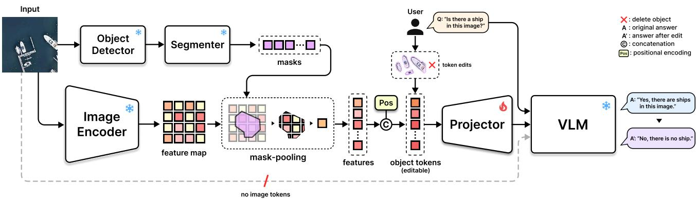
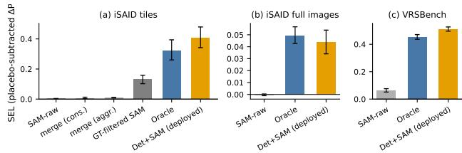
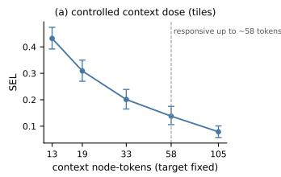
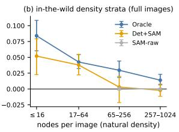

# When Do Frozen VLMs Respond to Image-Free Object-Token Edits? An Answer-Key-Free Protocol and What It Reveals

Wonbin Son1,\* Gyumun Choi1 Junil Seo1 Seungmin Rho2 Mi Young Lee2 Hyungjoon Kim1,† 1Changwon National University 2Chung-Ang University \*First author †Corresponding author

{diwjidghk78, cgyumun, junil0106}@gmail.com {smrho, miylee}@cau.ac.kr hyungjoon@changwon.ac.kr

## Abstract

Answering what-if queries about a scene with a VLM usually means injecting the assumption as text or repainting the scene with a generative model. We instead move the edit to the representation level, before the model input. The image is abstracted into a set of object-level tokens, and the original image never enters the VLM. This design rests on an open question—when do frozen VLMs actually respond to such token edits? We introduce an answer-keyfree protocol: no post-edit answer is annotated. It scores edits whose answers are logically determined, and audits itself by reversing each scoreable choice. The protocol reveals three structures. The response is notfree: explicit edit teaching, not ordinary VQA training, produces it in dense scenes and multiplies it in sparse ones, on all three operations. Once on, it is governed by token cleanliness and density, with deployable detector+segmenter tokens competitive with the oracle and outperforming it on VRSBench. And reading is a separable axis: the image-free token route preserves 92–96% ofa matchedpatch-token baseline’sfreetext VQA, and the answers measurably depend on the tokens. The response, cleanliness, and reading structures are sign-preserved across two remote-sensing datasets (iSAID, VRSBench) and threefrozen LM backbones. We release the probe generator, records, judge logs, and code.

## 1. Introduction

Over satellite and aerial imagery, analysts constantly test assumptions—what if these ships were gone, what if that facility were moved across the river, what if aircraft appeared on the empty runway. The demand for such what-if reasoning is real across strategy, simulation, and plan verification—in remote sensing (RS), concrete enough that systems answering scenario queries have already appeared [10].

Existing ways of posing a counterfactual to a VLM largely divide into two paths. One injects the assumption through the prompt (“suppose X is absent”) [41, 46]—but X remains in the visual input, so instruction and evidence stay in conflict, and nothing in the answer reveals which one the model followed. That the conflict is consequential is a measurement, not a hypothesis: with the unedited image left in the input, the response to representation-level edits itself collapses (Sec. 4.7). The other path regenerates the edited scene with a generative model and feeds it back [1, 45]— tying the answer to that model’s hallucinations and priors, and adding synthesis artifacts as a new error source.

We move the edit to the representation level, before the model input. The image is abstracted into a set of object tokens—each token hereafter called a node—edits are defined as operations on that set, and the original image is never fed to the VLM. This design removes both error sources structurally: there are no pixels to fabricate, and no original evidence to conflict with.

But this design rests on one premise—that a frozen VLM actually responds to token edits. The premise is not selfevident: a model that performs VQA well from nodes can still answer that a deleted object is “there,” and in fact it does (Sec. 4.2). The central question of this paper is therefore not the completion of a framework but the characterization of its premise: when do frozen VLMs respond to image-free object-token edits?

This paper is a use-case-inspired evaluation study built around a minimal editable testbed. The testbed is apparatus, not claim: measuring edit-responsiveness at all requires a representation that can be edited and a model that can be taught to respond, so we build the simplest such pair and hold it fixed across every condition (Fig. 1)—object tokens as the only visual input, formed by pooling a frozen encoder’s feature map with segmenter masks and attaching positional encodings (Sec. 3.1), and a single standard 2- layer projector (∼15M) trained edit-aware (Sec. 3.2), with edits as token operations: delete = token removal, move = position rewriting, add = grafting of real node features. Its cost is measured, not assumed: the node route’s freetext VQA stays close to a matched patch-token baseline’s, and the answers measurably depend on the nodes (Sec. 4.7).

  
Figure 1. The image-free object-token testbed. Masks proposed by a frozen detector-then-segmenter pool the feature map of a frozen encoder and are concatenated with positional encodings, abstracting the image into an editable set of object tokens. Only the projector (∼15M) is trained, and no image tokens enter the VLM—the tokens are the only visual evidence, so a user edit (e.g., deleting the ship tokens) has no original evidence to compete with.

What we contribute is the instrument and what it reveals.

• An answer-key-free protocol for edit-responsiveness (Sec. 3.3): selectivity, monotonicity, and insertionselectivity, defined over edits whose answers the edit determines, with every metric placebo-subtracted and conditioned on pre-edit-correct cases, plus a shuffledevidence control that measures the node-dependent component against a mismatched-node floor, and a measurement of what these choices themselves do to the conclusions (Sec. 4.5).

• The characterization it yields (Sec. 4): taught-not-free, cleanliness/density governance, no detected cost to deployable nodes, reading as a separable axis, individuation and position rather than silhouette precision as the representational load, and sign preservation across two RS testbeds and three frozen LM backbones.

• The measurement resources (Sec. 4.1): probegeneration rules over the two RS testbeds (iSAID [36], VRSBench [26]) that supply instance-level object ground truth and VQA at once, released with the measurement records, judge logs, per-cell results, and code.

This characterization may also serve as a design guide: a what-if editing system must respect a density budget, its segmenter choice lives on the cleanliness axis, explicit edit teaching reliably amplifies responsiveness, and closedvocabulary configurations can skip the segmentation stage.

## 2. Related Work

Counterfactual queries and answer reliability. Counterfactuals reach VLMs through a text premise (“suppose X is absent”) [41, 46] or a regenerated image—from the origin of delete-then-QA evaluation to counterfactual finetuning [1, 45]; Sec. 1 gave the failure mode of each. The closest recent instance is object-level: MindEdit-Bench [41] asks whether VLMs can predict the consequence of hypothetically moving an object, differing on the two axes that define this study—the edit is described rather than applied, and the yardstick is accuracy against a key reconstructed from a 3D scene graph and human audit, not responsiveness measured without one. A separate lineage measures answer reliability: language-prior separation [2, 5, 7, 31], an image-level visual-reliance audit in medical VLMs [43], and objectlevel diagnostics that substitute context features (Swap-Mix [13]) or remove objects in pixel space (BEAF [40]); Sec. 3.3 contrasts ours with the nearest of these.

Object-token inputs to LLMs. Object-level rather than dense patch tokens is a format validated across domains: object-token sets stand in for the scene in driving, 3D scenes, and graphs [15, 32, 34]. In 2D images, mask-pooled object tokens have been added alongside patches (LLM finetuned) or fed alone (LoRA-tuned) [17, 48], and regionlevel MLLMs [18, 42, 47] handle mask-referenced understanding. In all of these the token is a unit of reading, recognition, or compression; none places it as an interface to be manipulated so as to change the model’s answer, measuring that responsiveness. The finding that understanding collapses when visual tokens fragment objects [37] agrees with our cleanliness axis (Sec. 4.4).

Intervention-aware learning. That interventionresponsiveness does not come for free was shown earlier in the concept-bottleneck lineage: IntCEM [11] found standard CBMs have no training incentive to accommodate interventions, leaving their effects unstable, and put intervention response into the training objective—our edit teaching (Sec. 3.2) is the object-token version of that proposition. Formalizing intervention effects [23], hallucination-mitigating edits in VL internal representations [19], and counterfactual audits of explanation faithfulness [9] are the nearest comparisons, but their object of intervention is a concept scalar, a hidden representation, or a regenerated image, and when the response holds is unquantified.

Remote-sensing VLMs. Mainstream RS VLMs layer heavy instruction finetuning on image inputs—region referencing, relation understanding, geospatial chain-ofthought [22, 28, 30]; interactive change analysis exists but needs real bi-temporal imagery [8]. The what-if demand is already evidenced: ChatENV [10] is a conversational RS VLM trained to answer scenario questions (“what if $\cdots ^ { ? ^ { \prime } ) }$ —but as free-generation chat against reference answers, the assumption never enters the input structurally and nothing verifies that a response depended on it. An RS precedent for image-free LM input also exists: Prompt-RSVQA [6] converts the image into predicted label text—a discrete, lossy text bottleneck with no object-level structure and no editing.

## 3. Testbed and protocol

## 3.1. An object-token set as an editable interface

We abstract the image into an editable set of object tokens—each token is the unit of editing. The construction has three steps. First, a frozen vision encoder produces a dense spatial feature map of the image (we require only a spatially structured feature map; the encoder choice is consequential, Secs. 4.1 and 4.4). Second, for every candidate object mask we average-pool the features over its region to form the node feature, and subtract the imagemean feature at a ratio λ to separate the global component (de-globalization; SEL is flat in λ with only λ=0 slightly worse—we default to λ=.5; supplementary). Third, each node receives a positional encoding—a continuous vector that Fourier-encodes its centroid, bounding box, and area (K=10)—and no class label is attached: masks are all we use (the detector’s classes only propose masks and are discarded). The tokens enter the LM as a flat sequence with no delimiters (supplementary), and the image itself never enters: the tokens are the only visual evidence.

Where the masks come from is not a fixed design choice but an experimental variable: deliberately varying the source—from ground-truth instance masks (oracle), to a detector-then-segmenter pipeline (deployable), to the segmenter’s raw all-masks output (over-segmented)—is the cleanliness axis of Sec. 4.4. The axis is operational rather than single-variable: swapping the source changes node count, fragmentation, and recall along with mask precision, and Sec. 4.6 separates which of these the response actually depends on.

On this representation, edits are defined as operations on the token set—not on pixels (Fig. 1). delete = removing the object’s token. move = rewriting its positional encoding (features kept). add = copying the features of a real node and rewriting the position—grafting an instance’s features from the same or another scene into an empty location, with nothing synthesized. The token, rather than the pixel array, is thus the unit of editing—and its edit-responsiveness is what we measure.

## 3.2. Teaching edits to a frozen VLM

Edit-responsiveness does not come for free from standard VQA training (Sec. 4.2), so we teach it explicitly. The only trained component is a 2-layer MLP projector (∼15M; hidden size matched to the LLM); the vision encoder and the LLM are entirely frozen. This simplicity is a deliberate control variable—the contribution of this paper is not an architecture but a measurement, on the simplest adapter, of the conditions under which edit-responsiveness holds.

Teaching data are programmatic simulations of before/after token-set pairs, using only edits whose answers are logically determined. Presence pairs: for a region-restricted existence query (“Is there a {cls} in the {region}?”), the input with the corresponding nodes deleted is targeted to no. Position pairs: a node moved across the midline is targeted to a scene description with its location phrase changed—both the vertical and horizontal axes are taught. Add triplets: an empty-region baseline (no) / insertion of real-node features (yes) / insertion of an irrelevant class (placebo; no maintained). Edit-teaching pairs are constructed for only half of the class set (a deterministic hash split)—the other half is held out as untaught classes to measure generalization (Sec. 4.3). These pairs are mixed with standard VQA at a weighting of presence-family : position ≈ 1.5:1—a mixing ratio selected once by an early sweep to attain all three response axes at once and held fixed thereafter. The full training configuration is summarized in the supplementary material.

## 3.3. An answer-key-free edit-responsiveness protocol

The post-edit world has no recorded ground truth—no photograph of the counterfactual scene exists, so any answer key must be manufactured. It can be reconstructed from scene geometry and audited by hand [41]; we instead let the edit determine the answer, so the key is entailed rather than recorded and no post-edit answer is annotated or verified; the pre-correct gate reuses the annotation that generated the probe. Two devices do the work: (i) only edits whose answers are logically determined are used for measurement (not “did something change” but “did it change to the determined answer”), with monotonicity the exception (supplementary); (ii) every metric is placebo-subtracted— we subtract the probability change caused by a placebo edit of the same kind applied to a target that should not change the answer, so that the metric reads whether the model responds to the right edit rather than to any edit. All three metrics share pre-correct conditioning and a continuous $\Delta P .$ . Each probe is a two-way forced choice stated in the query (“. . . Answer with only yes or no.”), scored at the first decoding step by renormalizing over that pair alone:

$$
P ( a \mid Z , q ) = { \frac { \exp \ell _ { a } } { \sum _ { a ^ { \prime } \in A _ { q } } \exp \ell _ { a ^ { \prime } } } } , \qquad \ell _ { a } = \operatorname* { m a x } _ { t \in { \mathcal { T } } _ { a } } z _ { t } ,
$$

with z the next-token logits given node set $Z$ and query $q , \ A _ { q }$ the answer pair ({yes, no}; {top, bottom}; {left, right}), and $\mathcal { T } _ { a }$ the first-token ids of $\therefore { } a \mathbf { \hat { s } }$ surface forms (case and leading-space variants) in each model’s own tokenizer. Nothing is sampled and no temperature is applied, and precorrect conditioning keeps only cases with $P > 0 . 5$ on the correct answer before the edit.

Selectivity (delete). Deleting the nodes of the target class determines the answer to be no: $\mathrm { S E L } \ = \ \Delta P _ { \mathrm { r e l } } \ -$ $\Delta P _ { \mathrm { i r r e l } }$ —the drop in $P ( \mathrm { y e s } )$ caused by deleting target nodes, minus the change caused by deleting nodes irrelevant to the query (placebo). Monotonicity (move). Moving a node across the midline flips a position query’s answer for a scene-unique class: $\mathrm { M O N } = \Delta P _ { \mathrm { c r o s s } } - \vert \Delta P _ { \mathrm { n u l l } } \vert$ |—the answer-direction shift of a boundary-crossing move, minus the magnitude of a within-half move (placebo), per axis; otherwise it reads boundary-crossing sensitivity. Insertionselectivity (add). Inserting real-node features into a region empty of class C changes that region’s answer from no to yes: $\mathrm { S E L } _ { \mathrm { a d d } } = \Delta P - \Delta P _ { \mathrm { p l a c e b o } } -$ subtracting the yes-drift of inserting an irrelevant class, with a region placebo in the supplementary.

The remaining threat is the path that answers correctly regardless of the edit—the answer prior that training installs. The shuffled-evidence control estimates it: we re-ask the same queries with the entire node set replaced by that of another evaluation image—a fixed permutation, so the same node sets are re-used and only their pairing with the query changes—to measure a floor, and read only driven = normal − shufle as the node-dependent component (Sec. 4.7). The difference from prior object-level diagnostics lies in the manipulation: BEAF removes objects in pixel space and SwapMix substitutes context features [13, 40], whereas we edit the queried object’s token and add a position axis (monotonicity). What these three choices do to the conclusions is itself measured (Sec. 4.5).

## 4. Experiments

## 4.1. Setup

We evaluate on two remote-sensing datasets. On iSAID [36, 39] we use all 374 full images of the validation split (up to 4,096 nodes per image), with real VQA queries drawn from RSVLM-QA [49]. Because iSAID provides dense instance annotations—the median node count per image is ∼47 under the oracle construction and reaches ∼1005 under raw SAM masks—it serves as the density-stress regime. We use iSAID at two granularities: controlled measurements of cleanliness and density use dense tiles (512×512 crops with ≥10 objects; 459 tiles), while the main evaluation uses full images (the 374 images above, at natural density)—Sec. 4.4 draws on both. VRSBench [26] (1,121 tiles of 512×512), averaging ∼1.8 objects per tile, serves as the sparse regime and provides short-answer VQA; its oracle arm is built by prompting SAM with the groundtruth oriented boxes (15% box padding). Our characterization needs both instance-level object ground truth (for the oracle arm and the cleanliness/density axes) and VQA (for reading preservation); few RS datasets provide both— VRSBench does on its own, and iSAID does when paired with RSVLM-QA over the same imagery. On both, the edit probes—region-restricted presence, binary position, and insertion triplets—are generated programmatically from the object ground truth; we release the generator, the measurement records, and a reference implementation of the protocol interface, so another editable-representation system can be scored by the same generation rules and axes.

Node sources are manipulated along the cleanliness axis declared in Sec. 3.1: Oracle (ground-truth instance masks; the oracle upper end) / Det+SAM (YOLO-OBB detection [20] followed by SAM box prompts [21]; deployable) / SAM-raw (SAM all-masks; the over-segmented lower end). As a reference route we keep Patch: a 256-token image-route baseline that pools the same feature map over a fixed 16×16 grid instead of object masks—encoder, projector, and training are all identical, so the only difference from the node route is what the features are pooled with. Training conditions are the two of Sec. 3.2: EA (standard VQA mixed with the delete and move edit-teaching pairs; add teaching enters only in Sec. 4.3) vs. VO (standard VQA only)—same architecture, same images and epoch budget.

The base model is LLaVA-OneVision-7B [25] (frozen; LM = Qwen2-7B; the vision encoder is SigLIP [44], which is not involved in our image-free route and enters only the image-copresence experiment of Sec. 4.7). The only trained component is a 2-layer MLP projector (∼15M parameters). Node features are obtained by mask-pooling the feature map of ConvNeXt [16, 29] at its native 512 resolution (how the encoder was chosen is in the supplementary). The scale and transfer axes—a 0.5B sibling and two further LM families—are introduced in Sec. 4.8.

Statistical protocol. Unless noted otherwise, every interval is a percentile bootstrap 95% CI (B=5000) over the 9 cells of 3 folds × 3 seeds, resampling cell means (seed and image-split variation, not item resampling); folds split images (parent images at tile level), so no scene is shared between training and evaluation. Arm contrasts are unpaired—each cell set resampled independently, which discards the matching and widens the interval—except where a paired ∆ is stated and Fig. 3b, which bootstraps image clusters. Responsiveness measurements are conditioned on pre-correct cases throughout: only cases answered correctly before the edit enter the population. Per-cell scores with intervals, probe and eligible counts are in the supplementary.

Training budget. Every cell is trained with the same fixed budget—same epochs, learning rate, and recipe, with no per-cell tuning and no convergence-based early stopping— a requirement of controlled comparison, not a performance choice. Absolute levels therefore reflect that budget, and our claims rest on ordering, CI separation, and sign preservation (Secs. 4.4 and 4.8), not magnitude.

Scoring. The edit-responsiveness probes are scored by the two-way answer probability of Sec. 3.3; counting is scored by programmatic extraction from free generation, and free-text VQA with an LLM judge fixed to the openweight Qwen2.5-72B [33] for reproducibility. On a blind stratified sample of 150 responses the judge agrees with two independent annotators’ consensus at 91.6% (κ=.83)—insample, as the rubric was refined on it—where the annotators agree with each other at 95.3% (κ=.90). Together with code, we provide prompt templates, cell-level details, exclusion rules, the judge rubric and its human validation, all judge logs, implementation and hardware details, regionrestricted reading, and additional ablations in the supplementary material. For the later experiments, hypotheses and pass criteria were fixed before measurement, and results are reported as obtained (Secs. 4.3 and 4.6; parts of Sec. 4.8).

Why remote sensing. RS supplies both the demand (Sec. 1) and the conditions this characterization needs: dense instance annotations make the oracle and density ladders constructible, and the nadir viewpoint keeps mutual occlusion low.

## 4.2. Edit-responsiveness is not the default

In the dense regime, even a model trained to answer VQA from node inputs does not, by default, respond to edits applied to those nodes. An adapter trained VQAonly (VO) reads from the nodes, yet its selectivity to delete edits is essentially zero: SEL is +.002 on oracle nodes and +.003 on deployable nodes—in neither arm does deleting an object register in the answer (Tab. 1). This is not a failure to read—these adapters retain reading’s node-dependence (driven > 0, Sec. 4.7). Good reading does not guarantee edit-responsiveness; what turns it on comes next.

  
Figure 2. The cleanliness ladder (SEL, placebo-subtracted). (a) iSAID dense tiles, (b) iSAID full images, (c) VRSBench. Bars: means; error bars: bootstrap 95% CIs. Absolute levels differ across panels with density, so y-scales are per-panel.

## 4.3. Teaching unlocks all three edits

Teaching the edits explicitly is what produces editresponsiveness in dense scenes—and multiplies it where scenes are sparse—on all three operations. First, delete and move: in the EA-vs-VO contrast that changes only the teaching (same nodes, same budget), iSAID image-level SEL is +.049 vs. +.002 on the oracle arm and +.044 vs. +.003 on the deployable arm, and the EA−VO gaps $( \Delta + . 0 4 7 , \Delta + . 0 4 1 )$ are CI-separated in both arms (Tab. 1). On the taught clean arms, monotonicity is CI-confirmed above zero on both axes, except the deployable arm’s horizontal axis in the dense regime (Tab. 1). The structure replicates on VRSBench, with one difference the density law predicts: the EA−VO gap is ∆+.425 (SEL +.510 on the deployable arm), but the untaught arm is no longer at zero $( + . 0 8 5 ; + . 1 4 8$ on the oracle arm)—without the dilution of dense scenes (Sec. 4.4) a single deletion already registers, so here teaching amplifies a partial response rather than creating one (Tab. 1).

The third operation, add, is evaluated on a three-rung ladder of feature provenance: L1 (re-inserting the deleted instance in place; a sanity rung, supplementary), L2 (copying a same-scene instance’s features into an empty region; the operation proper), and L3 (grafting the features of a sameclass instance from a different scene; the deployment case). $\mathrm { S E L _ { a d d } }$ is placebo-subtracted (Sec. 3.3). On the deployable arm over 9 multi-seed cells, taught L2 reaches +.122 vs. zero-shot (add never taught) +.033, and L3 exemplar transfer also holds at +.099 (Tab. 2). The delete/move guards did not degrade but improved there $( \Delta \mathrm { S E L + . 0 7 3 } ,$ ∆MON+.032). The unlocking is not iSAID-specific: training with the same recipe on VRSBench reproduces $\mathrm { S E L } _ { \mathrm { a d d } } + . 2 4 4 \left[ . 2 1 2 , . 2 7 4 \right]$ with $\mathrm { C I } > 0 .$ . Finally, add responds selectively within taught classes (untaught classes $\mathrm { { S E L } _ { a d d } \ \approx \ 0 ; }$ only the oracle arm stays above zero, +.038)—a stronger class-locality than delete/move.

## 4.4. Cleanliness and density govern the response

The magnitude of the unlocked response is governed by how clean and how sparse the nodes are. Cleanliness first. Along the cleanliness axis that changes only the node source (Sec. 3.1), SEL forms a ladder: at tile level it climbs from +.002 (SAM-raw) to +.408 (Det+SAM), with the three dirty arms pinned to the floor and CI-separated from the clean side (Fig. 2). The intermediate merge arms (unsupervised merging of SAM masks by overlap and feature similarity) do not reach the clean side: conservative merging does not reduce density enough, while aggressive merging fuses objects and breaks addressability. This is why a detector is needed. The same ordering replicates at image level and on VRSBench (Fig. 2, Tab. 1), and add follows it as well (Tab. 2)—the ordering crosses operations. The key rung for deployment: we detect no gap between Det+SAM and the oracle—at image level Oracle−Det+SAM is $\Delta \mathrm { + . 0 0 5 } \left[ \mathrm { - . 0 0 7 , + . 0 1 8 } \right]$ , and on VRSBench it is detectably better.

Table 1. Edit-responsiveness by node source and training (SEL/MON). MON is shown as the mean, with ⋆ marking a 95% CI above zero. VRSBench SAM-raw sits off the floor because the scenes are sparse; the ladder ordering is unchanged.
<table><tr><td rowspan="2">Arm</td><td rowspan="2">Train</td><td colspan="3">iSAID (374 full images)</td><td colspan="3">VRSBench (1,121 tiles)</td></tr><tr><td>SEL</td><td>MONV</td><td> $\mathrm { M O N } _ { H }$ </td><td>SEL</td><td> $\mathrm { M O N } _ { V }$ </td><td> $\mathrm { M O N } _ { H }$ </td></tr><tr><td>Oracle</td><td>EA</td><td>+.049 [.043, .057]</td><td>+.016*</td><td> $+ . 0 1 1 ^ { \star }$ </td><td>+.454 [.436, .471]</td><td> $+ . 6 5 8 ^ { \star }$ </td><td> $+ . 6 2 5 ^ { \star }$ </td></tr><tr><td>Oracle</td><td>VO</td><td>+.002 [−.000, .004]</td><td>-.027</td><td>-.021</td><td>+.148 [.140, .154]</td><td> $+ . 1 9 6 ^ { \star }$ </td><td> $+ . 1 9 6 ^ { \star }$ </td></tr><tr><td>Det+SAM</td><td>EA</td><td>+.044 [.034, .054]</td><td>+.034*</td><td>+.004</td><td>+.510 [.496, .526]</td><td> $+ . 5 2 1 ^ { \star }$ </td><td> $+ . 4 9 1 ^ { \star }$ </td></tr><tr><td>Det+SAM</td><td>VO</td><td>+.003 [.000, .005]</td><td>-.024</td><td>-.020</td><td>+.085 [.080, .090]</td><td> $+ . 1 0 2 ^ { \star }$ </td><td> $+ . 0 7 6 ^ { \star }$ </td></tr><tr><td>SAM-raw</td><td>EA</td><td> $- . 0 0 0 [ - . 0 0 1 , . 0 0 0 ]$ </td><td>-.011</td><td>-.011</td><td>+.064 [.051, .076]</td><td> $+ . 1 1 3 ^ { \star }$ </td><td> $+ . 0 5 1 ^ { \star }$ </td></tr><tr><td>SAM-raw</td><td>VO</td><td> $+ . 0 0 0 [ - . 0 0 1 , . 0 0 1 ]$ </td><td>-.013</td><td>-.013</td><td> $\cdot . 0 0 0 [ - . 0 0 1 , . 0 0 1 ]$ </td><td>-.012</td><td>-.025</td></tr></table>

Table 2. Taught add across the cleanliness ladder. L2 copies a same-scene instance’s features; L3 grafts a same-class exemplar from another scene. Taught exceeds zero-shot with CI separation in every arm. The region placebo is in the supplementary.
<table><tr><td></td><td colspan="3"> $\mathrm { S E L } _ { \mathrm { a d d } } \ \mathrm { L } 2$ </td><td>L3</td><td colspan="2">Untaught</td></tr><tr><td>Arm (9 cells)</td><td colspan="2">taught</td><td>zero-shot</td><td>taught</td><td colspan="2">classes</td></tr><tr><td>Oracle</td><td></td><td>+.195 [.179, .210]</td><td>+.050</td><td>+.169</td><td></td><td>+.038 [.013, .064]</td></tr><tr><td>Det+SAM</td><td></td><td>+.122 [.093, .153]</td><td>+.033</td><td>+.099</td><td></td><td>+.022 [−.003, .044]</td></tr><tr><td>SAM-raw</td><td></td><td>+.076 [.057, .093]</td><td>-.002</td><td>+.066</td><td></td><td>−.004 [−.015, .008]</td></tr></table>

  
Figure 3. Density curves. (a) A controlled curve varying only the number of irrelevant context nodes, with the edit target fixed (tiles; dashed line: ∼58 node-tokens). (b) An in-the-wild curve stratified by each item’s actual node count (full images; error bars: imagecluster bootstrap 95% CIs).

The second condition is density—already visible in the ladder: that tile-level Det+SAM appears to exceed the oracle is a density effect, not mask superiority (at matched N, GT ≥ Det+SAM and the response follows the density prediction (predicted .455, observed .446); pre-subtraction $\Delta P$ analysis in the supplementary). Matched N also runs the other way: the semi-oracle rung of Fig. 2a—SAM masks kept only where they match a ground-truth instance—has 33 nodes per tile against the oracle’s 36 yet reaches only +.131 [.103, .159] against +.321 [.260, .394], so the ladder is not node count in disguise. Within the same arm, lowering only the node count raises the response as density predicts, and we generalize this in two ways. (i) Controlled curve: fixing the edit target and increasing only irrelevant context nodes, SEL decays steadily as context grows (Fig. 3a)—the largest tested context size whose SEL interval stays at or above .10 is ∼58 node-tokens—≈10 annotated objects plus SAM over-segmentation—and this ceiling is encoder-dependent—only our ConvNeXt reaches ${ \sim } 5 8 .$ . The ceiling tracks how distinguishable the node features are, and recognition quality orders the encoders the other way (supplementary). (ii) In-the-wild replication: stratifying natural density variation by each item’s actual node count shows the same decay, with Det+SAM congruent and SAM-raw at floor throughout (Fig. 3b). Fitting the controlled curve gives SEL $\propto N ^ { - 0 . 6 7 } [ 0 . 5 7 , 0 . 7 9 ] \mathrm { - a }$ monotonic power-law dilution, shallower than the $O ( 1 / n )$ that self-attention sensitivity-dilution theory anticipates [4, 12, 14, 35]. Two scope notes: the density axis is iSAIDonly—VRSBench’s scenes are too sparse for N-stress to engage—and the small absolute image-level scale (∼.05, ${ \sim } 1 / 7$ of tile level) reflects the higher node counts at image level.

## 4.5. What the design choices change

Every scoring choice we reversed moves the numbers; none of them moves a conclusion (Tab. 3). Dropping the placebo subtraction inflates the cleanliness contrasts detectably $( + . 0 0 9 , ~ + . 0 1 4 )$ but not taught-not-free (+.002, $+ . 0 0 8 .$ , covering zero): deleting any node carries an offset that largely cancels between arms sharing a node source but not between arms that differ, so it must be measured per condition, not absorbed into a constant. Dropping the pre-correct conditioning deflates all four detectably (−.013 to −.016): 41–44% of candidate probes on the edit-taught arms are already wrong before the edit and cannot respond, against 9–17% on the untaught arms, where there is no response to dilute and the shift is ≈0.

Table 3. What reversing each design choice does. SEL is the protocol as specified, consistent with Tab. 1. ∆ columns are paired per-cell differences—reversed choice minus as specified— over the same nine cells; ⋆ marks a 95% CI excluding zero. The pre-correct column re-scores the same adapters, not retrained ones.
<table><tr><td>Claim</td><td>SEL</td><td>∆ no placebo</td><td>∆ no pre- correct</td></tr><tr><td>taught-not-free Oracle</td><td>+.047 [.040, .055]</td><td>+.002</td><td>-.013*</td></tr><tr><td>taught-not-free Det+SAM</td><td>+.041 [.031, .051]</td><td>+.008</td><td>-.016*</td></tr><tr><td>cleanliness Oracle—SAM-raw</td><td>+.050 [.043, .057]</td><td>+.009*</td><td>-.013*</td></tr><tr><td>cleanliness Det+SAM—SAM-raw</td><td>+.044 [.034, .054]</td><td>+.014*</td><td>-.016*</td></tr><tr><td>Oracle-Det+SAM gap</td><td>+.005 [−.007, .018]</td><td>-.005</td><td>+.004</td></tr></table>

That asymmetry is what the gate asks for: it keeps cases answered yes with the object still present, which an indiscriminate yes almost always passes—the same one that leaves VO at SEL≈0 (Tab. 1). This cost tracks unlocking: the two arms with real selectivity have the lowest eligibility, while edit-taught SAM-raw—where teaching never unlocked—keeps 99.8% (supplementary). On probes both arms answer correctly before the edit the contrast is intact (Oracle +.040 [.030, .051], Det+SAM +.043 [.028, .061]; paired against the conditioned value from the same run, the difference covers zero).

Scoring answer flips instead of ∆P gives contrasts of +9.7 to +13.8 points, every verdict unchanged. Scoring an unconstrained sentence instead of the forced choice flips only the taught arms (50–75% vs. 0–2%; supplementary)— the response is not an artifact of the yes/no format. The no-effect verdict holds too: the Oracle−Det+SAM interval covers zero under every setting, so no reversal turns up a gap the protocol as specified misses. The fourth element—using only edits whose answers are logically determined—cannot be reversed: without a determined answer there is nothing to score against. Nor does the audit extend past the delete axis, which carries the largest probe population and bears the cleanliness claims.

## 4.6. What the representation actually carries

What this representation actually carries is individuation—which objects become single tokens— and position, not silhouette-precise pooling. Two manipulations agree. Dosing the pooling support to a +2- cell dilation (mean ∼17% cross-node contamination, over 30% in the worst tenth; retraining at each step) leaves delete SEL flat in dose (oracle-arm slope +.004 [−.008, +.017]), with the post-delete residual dose-unresponsive and reading’s node-dependence undrifted. When silhouette precision is removed entirely, nodes built from detection boxes alone show no detected difference from the deployable Det+SAM on all metrics—paired SEL ∆−.012 on iSAID and ∆−.003 on VRSBench, where box/mask divergence is large (rect/mask area ratio: mean 1.92)—while SAM-raw, whose individuation is broken, collapses (Sec. 4.4).

Table 4. Free-text VQA: preservation and node-dependence. LLM-judge scored; preservation is relative to Patch.
<table><tr><td>Arm</td><td>Train</td><td>Norm.</td><td>Shuf.</td><td>driven [CI]</td><td>Pres.</td></tr><tr><td colspan="6">iSAID (judge: Qwen2.5-72B; 17,812 verdicts; Patch .564)</td></tr><tr><td>Oracle</td><td>EA</td><td>.541</td><td>.382</td><td>+.159 [.137, .186]</td><td>96%</td></tr><tr><td>Det+SAM</td><td>EA</td><td>.527</td><td>.381</td><td>+.145 [.107, .178]</td><td>93% 93%</td></tr><tr><td>SAM-raw</td><td>EA</td><td>.526</td><td>.380</td><td>+.144 [.110, .175]</td><td>92%</td></tr><tr><td>Oracle Det+SAM</td><td>VO VO</td><td>.517 .527</td><td>.361 .353</td><td>+.156 [.117, .192] +.175 [.147, .202]</td><td>94%</td></tr><tr><td>SAM-raw</td><td>VO</td><td>.529 .564</td><td>.385</td><td>+.146 [.109, .178] +.187 [.159, .214]</td><td>94% 100%</td></tr><tr><td colspan="6">Patch VO .377 VRSBench (16,640 verdicts; Patch .528)</td></tr><tr><td>Det+SAM EA</td><td></td><td>.533</td><td>.341</td><td>+.191 [.161, .218]</td><td>101%</td></tr><tr><td>SAM-raw</td><td>EA</td><td>.487</td><td>.379</td><td>+.107 [.088, .123]</td><td>92%</td></tr><tr><td>Det+SAM</td><td>VO</td><td>.469</td><td>.361</td><td>+.107 [.088, .127]</td><td>89%</td></tr><tr><td>SAM-raw</td><td>VO</td><td>.445</td><td>.397</td><td>+.049 [.024, .077]</td><td>84%</td></tr><tr><td>Patch</td><td>VO</td><td>.528</td><td>.444</td><td>+.084 [.044, .116]</td><td>100%</td></tr></table>

Closed-vocabulary configurations can therefore bypass the segmentation stage; in open-set configurations the segmenter still issues nodes beyond the detector’s vocabulary and remains the human’s editing surface. Mask-pooling nonetheless stays our default [27, 38]: a characterization study should fix the representation in its cleanest form. Dose curves and per-metric values are in the supplementary.

## 4.7. Reading survives—and actually uses the nodes

Dropping the image barely dents reading, and the answers measurably depend on the nodes. Scoring free-text VQA with the LLM judge (Sec. 4.1), the node route preserves 92–96% of the image route (Patch, .564) on iSAID, and this replicates at 84–101% on VRSBench (against Patch .528; Det+SAM-EA at 101%) (Tab. 4). Beyond preservation, node-dependence holds: in the shuffled-evidence control (Sec. 3.3), driven is +.144–+.175 with CI > 0 across all iSAID arms and CI > 0 across all VRSBench arms, where Det+SAM-EA even exceeds Patch (Tab. 4)— on iSAID, that is ∼27–33% of each arm’s judged accuracy. Conversely, the axes are separable but not independent: iSAID’s VO arms stay node-dependent with SEL at zero, and driven is flat across training and node source there, but on VRSBench it tracks both.

Image copresence is the necessity evidence: feeding the unedited image alongside the nodes—through the model’s native vision path, adapter fixed—collapses edit selectivity by 76–81% and takes driven from CI > 0 to ≈0, and cotraining recovers little of it. Though not eliminated, nodedependence is strongly attenuated once an image is present.

Table 5. Universality across training recipe and LM lineage (∆; SEL-based except the last row; ⋆ marks a 95% CI excluding zero). The 0.5B scale arm is reported in the text.
<table><tr><td>Structure</td><td>LLaVA-OV-7B Qwen2.5-VL Idefics3-8B</td><td></td><td></td></tr><tr><td colspan="4">iSAID</td></tr><tr><td>Cleanliness Oracle—SAM-raw (EA)</td><td> $+ . 0 5 0 ^ { \star }$ </td><td> $+ . 0 6 6 ^ { \star }$ </td><td> $+ . 0 6 0 ^ { \star }$ </td></tr><tr><td>Taught Oracle EA— VO</td><td> $+ . 0 4 7 ^ { \star }$ </td><td> $+ . 0 6 3 ^ { \star }$ </td><td>+.050*</td></tr><tr><td>Taught Det+SAM EA-VO</td><td> $+ . 0 4 1 ^ { \star }$ </td><td> $+ . 0 3 3 ^ { \star }$ </td><td>+.031*</td></tr><tr><td colspan="4">VRSBench</td></tr><tr><td>Taught Det+SAM EA—VO</td><td> $+ . 4 2 5 ^ { \star }$ </td><td> $+ . 4 4 8 ^ { \star }$ </td><td> $+ . 4 0 6 ^ { \star }$ </td></tr><tr><td>Cleanliness Det+SAM—SAM-raw (EA)</td><td> $+ . 4 4 6 ^ { \star }$ </td><td> $+ . 4 4 4 ^ { \star }$ </td><td> $+ . 3 2 0 ^ { \star }$ </td></tr><tr><td>Free-text driven &gt; 0</td><td> $\checkmark ( \mathrm { T a b . 4 } )$ </td><td> $+ . 1 7 6 ^ { \star }$ </td><td> $+ . 1 4 2 ^ { \star }$ </td></tr></table>

## 4.8. Universality across LM backbones

This structure is sign-preserved across model scale, training recipe, and LM lineage. Retraining with only the LM swapped on Qwen2.5-VL-7B-Instruct [3] (a different training recipe) and Idefics3-8B [24] (a different LM lineage) and applying the protocol unchanged, the two core structures—cleanliness separation and taughtnot-free—replicate with CI confirmation in all three 7B– 8B backbones, and VRSBench replicates them as well, together with VQA preservation (101%/111%/93%) and node-dependence (free-text driven CI > 0 for all models) (Tab. 5). Absolute magnitudes differ by family (Qwen is mostly the highest); the claim of this subsection is the preservation of signs, not of magnitudes. Capacity bounds this universality: shrinking the primary LLaVA-OV family to 0.5B (LM ∼14× smaller; the projector shrinks alongside—a confound), the sign of cleanliness separation survives but teaching all but fails to unlock (EA−VO CI ∋ 0 on the oracle arm; $1 / 6$ of the 7B level on the deployable arm; supplementary).

## 5. Discussion and Limitations

The boundary map. The results of Sec. 4 draw a map of the conditions under which edit-responsiveness holds. Query-type boundary: counting fails representationagnostically—pooled over the node and image-patch settings alike, driven is +.016 [−.000, +.032] (n=51 cells), a query type where reading fails before edit-response does; both routes answer from a prior floor rather than from the visual evidence. Teaching boundary: add is selective only within taught classes—in contrast to delete/move, which decay yet usually survive on untaught classes. A plausible account is an asymmetry: delete/move only read the class of a node perception has already built, and class-reading partially transfers; add asks one inserted token to be trusted as evidence of existence, and that trust appears to be granted per class. Domain boundary: our measurements hold at a mean ∼17% cross-node contamination (Sec. 4.6); natural scenes where mutual occlusion pushes contamination higher are unverified—there, silhouette masks may regain load. Capacity boundary: unlocking all but fails at 0.5B (Sec. 4.8); one reading is that the machinery for position and existence already sits inside the frozen LM and teaching supplies only the alignment, though that arm cannot separate this from a projector-size effect.

Limitations of the measurement. The measurement has several limitations. First, the edits are programmatic simulations of user operations—a study with real users remains future work. Second, the quantification of editresponsiveness is restricted to targeted queries with determined answers, monotonicity aside—a consequence of the design of Sec. 3.3. How edits surface in free-form generation is shown qualitatively in the supplementary; quantifying it needs a separate yardstick for outputs with no determined answer, which is future work. Third, the “empty region” decision for add leans on GT annotation (semioracle): unlike delete/move, where the target is positively annotated, add’s pre-edit no assumes the annotation is exhaustive over that region. Fourth, the protocol has so far been applied only to representations we built ourselves; carrying it to third-party editable-representation systems—the strongest test available for an evaluation protocol—is future work. What it requires of a target is narrow: an editable set-valued representation, queries whose answers its edits determine, and a scoreable answer set; how the target was trained is not part of the protocol.

Intended use. The testbed is evaluated only on public RS benchmarks and on edits whose answers are logically determined; it is not validated for operational surveillance, targeting, or safety-critical planning. A deployed editor should keep applied edits as a reviewable record, expose perception and model uncertainty, and retain human review.

## 6. Conclusion

When do frozen VLMs respond to image-free objecttoken edits? When explicitly taught—all three operations, add within taught classes—on clean and sparse tokens, and within sufficient capacity; the training and nodesource orderings replicate across two RS datasets and three frozen LM backbones, with reading preserved at 92–96% of a matched patch-token baseline and still node-dependent. None of these readings needed an annotated post-edit answer key: they come from a protocol that lets the edit determine the answer, subtracts a placebo from every metric, conditions on pre-edit-correct cases, and is audited by reversing each scoreable choice on the delete axis. We release it with the measurement records, judge verdict logs, and code, so that other editable-representation systems can be scored on the same axes. The conditions it measures may also serve as a design guide: a density budget, a segmenter choice on the cleanliness axis, and edit teaching as a requirement.

## References

[1] Vedika Agarwal, Rakshith Shetty, and Mario Fritz. Towards causal VQA: Revealing and reducing spurious correlations by invariant and covariant semantic editing. In IEEE Conf. Comput. Vis. Pattern Recog., 2020. 1, 2

[2] Aishwarya Agrawal, Dhruv Batra, Devi Parikh, and Aniruddha Kembhavi. Don’t just assume; look and answer: Overcoming priors for visual question answering. In IEEE Conf. Comput. Vis. Pattern Recog., 2018. 2

[3] Shuai Bai, Keqin Chen, Xuejing Liu, Jialin Wang, Wenbin Ge, Sibo Song, Kai Dang, Peng Wang, Shijie Wang, Jun Tang, Humen Zhong, Yuanzhi Zhu, Mingkun Yang, Zhaohai Li, Jianqiang Wan, Pengfei Wang, Wei Ding, Zheren Fu, Yiheng Xu, Jiabo Ye, Xi Zhang, Tianbao Xie, Zesen Cheng, Hang Zhang, Zhibo Yang, Haiyang Xu, and Junyang Lin. Qwen2.5-VL technical report, 2025. arXiv:2502.13923. 8

[4] Federico Barbero, Andrea Banino, Steven Kapturowski, Dharshan Kumaran, Joao G.M. Ara˜ ujo, Alex Vitvitskyi,´ Razvan Pascanu, and Petar Velickoviˇ c. Transformers need´ glasses! information over-squashing in language tasks. In Adv. Neural Inform. Process. Syst., 2024. 6

[5] Remi Cadene, Corentin Dancette, Hedi Ben-Younes, Matthieu Cord, and Devi Parikh. RUBi: Reducing unimodal biases for visual question answering. In Adv. Neural Inform. Process. Syst., 2019. 2

[6] Christel Chappuis, Valerie Zermatten, Sylvain Lobry,´ Bertrand Le Saux, and Devis Tuia. Prompt-RSVQA: Prompting visual context to a language model for remote sensing visual question answering. In IEEE Conf. Comput. Vis. Pattern Recog. Worksh., 2022. 3

[7] Lin Chen, Jinsong Li, Xiaoyi Dong, Pan Zhang, Yuhang Zang, Zehui Chen, Haodong Duan, Jiaqi Wang, Yu Qiao, Dahua Lin, and Feng Zhao. Are we on the right way for evaluating large vision-language models? In Adv. Neural Inform. Process. Syst., 2024. 2

[8] Pei Deng, Wenqian Zhou, and Hanlin Wu. DeltaVLM: Interactive remote sensing image change analysis via instructionguided difference perception. Remote Sens., 18(4):541, 2026. 3

[9] Sihao Ding, Santosh Vasa, and Aditi Ramadwar. Explanation-driven counterfactual testing for faithfulness in vision-language model explanations, 2025. NeurIPS Workshop on Regulatable ML. arXiv:2510.00047. 3

[10] Hosam Elgendy, Ahmed Sharshar, Ahmed Aboeitta, and Mohsen Guizani. ChatENV: An interactive vision-language model for sensor-guided environmental monitoring and scenario simulation. IEEE Trans. Geosci. Remote Sens., 64: 4703710, 2026. 1, 3

[11] Mateo Espinosa Zarlenga, Katherine M. Collins, Krishnamurthy Dvijotham, Adrian Weller, Zohreh Shams, and Mateja Jamnik. Learning to receive help: Intervention-aware concept embedding models. In Adv. Neural Inform. Process. Syst., 2023. 2

[12] Siddharth Gollapudi, Nilesh Gupta, Prasann Singhal, and Sewon Min. Can language models actually retrieve incontext? drowning in documents at million token scale, 2026. arXiv:2607.01538. 6

[13] Vipul Gupta, Zhuowan Li, Adam Kortylewski, Chenyu Zhang, Yingwei Li, and Alan Yuille. SwapMix: Diagnosing and regularizing the over-reliance on visual context in visual question answering. In IEEE Conf. Comput. Vis. Pat tern Recog., 2022. 2, 4

[14] Michael Hahn. Theoretical limitations of self-attention in neural sequence models. Trans. Assoc. Comput. Linguistics, 8:156–171, 2020. 6

[15] Haifeng Huang, Yilun Chen, Zehan Wang, Rongjie Huang, Runsen Xu, Tai Wang, Luping Liu, Xize Cheng, Yang Zhao, Jiangmiao Pang, and Zhou Zhao. Chat-scene: Bridging 3D scene and large language models with object identifiers. In Adv. Neural Inform. Process. Syst., 2024. 2

[16] Gabriel Ilharco, Mitchell Wortsman, Ross Wightman, Cade Gordon, Nicholas Carlini, Rohan Taori, Achal Dave, Vaishaal Shankar, Hongseok Namkoong, John Miller, Han naneh Hajishirzi, Ali Farhadi, and Ludwig Schmidt. Open CLIP, 2021. Zenodo. doi:10.5281/zenodo.5143773. 4

[17] Soumya Jahagirdar, Walid Bousselham, Anna Kukleva, and Hilde Kuehne. When LLaVA meets objects: Token composition for vision-language-models, 2026. arXiv:2602.04864. 2

[18] Jitesh Jain, Jianwei Yang, and Humphrey Shi. VCoder: Ver satile vision encoders for multimodal large language models. In IEEE Conf. Comput. Vis. Pattern Recog., 2024. 2

[19] Nicholas Jiang, Anish Kachinthaya, Suzanne Petryk, and Yossi Gandelsman. Interpreting and editing vision-language representations to mitigate hallucinations. In Int. Conf. Learn. Represent., 2025. 2

[20] Glenn Jocher and Jing Qiu. Ultralytics YOLO11, 2024. https : / / github . com / ultralytics / ultralytics. 4

[21] Alexander Kirillov, Eric Mintun, Nikhila Ravi, Hanzi Mao, Chloe Rolland, Laura Gustafson, Tete Xiao, Spencer Whitehead, Alexander C. Berg, Wan-Yen Lo, Piotr Dollar, and´ Ross Girshick. Segment anything. In Int. Conf. Comput. Vis., 2023. 4

[22] Kartik Kuckreja, Muhammad Sohail Danish, Muzammal Naseer, Abhijit Das, Salman Khan, and Fahad Shahbaz Khan. GeoChat: Grounded large vision-language model for remote sensing. In IEEE Conf. Comput. Vis. Pattern Recog., 2024. 3

[23] Sonia Laguna, Ricards Marcinkeviˇ cs, Moritz Vandenhirtz,ˇ and Julia E. Vogt. Beyond concept bottleneck models: How to make black boxes intervenable? In Adv. Neural Inform. Process. Syst., 2024. 2

[24] Hugo Laurenc¸on, Andres Marafioti, Victor Sanh, and L´ eo´ Tronchon. Building and better understanding visionlanguage models: Insights and future directions, 2024. arXiv:2408.12637. 8

[25] Bo Li, Yuanhan Zhang, Dong Guo, Renrui Zhang, Feng Li, Hao Zhang, Kaichen Zhang, Peiyuan Zhang, Yanwei Li, Ziwei Liu, and Chunyuan Li. LLaVA-OneVision: Easy visual task transfer. Trans. Mach. Learn. Res., 2025. 4

[26] Xiang Li, Jian Ding, and Mohamed Elhoseiny. VRSBench: A versatile vision-language benchmark dataset for remote sensing image understanding. In Adv. Neural Inform. Pro cess. Syst., 2024. 2, 4

[27] Yongkang Li, Tianheng Cheng, Bin Feng, Wenyu Liu, and Xinggang Wang. Mask-adapter: The devil is in the masks for open-vocabulary segmentation. In IEEE Conf. Comput. Vis. Pattern Recog., 2025. 7

[28] Jiaqi Liu, Lang Sun, Ronghao Fu, and Bo Yang. Towards faithful reasoning in remote sensing: A perceptuallygrounded GeoSpatial chain-of-thought for vision-language models. In Int. Conf. Learn. Represent., 2026. 3

[29] Zhuang Liu, Hanzi Mao, Chao-Yuan Wu, Christoph Feichtenhofer, Trevor Darrell, and Saining Xie. A ConvNet for the 2020s. In IEEE Conf. Comput. Vis. Pattern Recog., 2022. 4

[30] Junwei Luo, Zhen Pang, Yongjun Zhang, Tingzhu Wang, Linlin Wang, Bo Dang, Jiangwei Lao, Jian Wang, Jingdong Chen, Yihua Tan, and Yansheng Li. Sky-SenseGPT: A fine-grained instruction tuning dataset and model for remote sensing vision-language understanding, 2024. arXiv:2406.10100. 3

[31] Yulei Niu, Kaihua Tang, Hanwang Zhang, Zhiwu Lu, Xian-Sheng Hua, and Ji-Rong Wen. Counterfactual VQA: A cause-effect look at language bias. In IEEE Conf. Comput. Vis. Pattern Recog., 2021. 2

[32] Bryan Perozzi, Bahare Fatemi, Dustin Zelle, Anton Tsitsulin, Mehran Kazemi, Rami Al-Rfou, and Jonathan Halcrow. Let your graph do the talking: Encoding structured data for LLMs, 2024. arXiv:2402.05862. 2

[33] Qwen Team. Qwen2.5 technical report, 2024. arXiv:2412.15115. 5

[34] Ran Tian, Boyi Li, Xinshuo Weng, Yuxiao Chen, Edward Schmerling, Yue Wang, Boris Ivanovic, and Marco Pavone. Tokenize the world into object-level knowledge to address long-tail events in autonomous driving. In Conf. Robot Learn., 2024. 2

[35] Petar Velickoviˇ c, Christos Perivolaropoulos, Federico Bar-´ bero, and Razvan Pascanu. Softmax is not enough (for sharp size generalisation). In Int. Conf. Mach. Learn., 2025. 6

[36] Syed Waqas Zamir, Aditya Arora, Akshita Gupta, Salman Khan, Guolei Sun, Fahad Shahbaz Khan, Fan Zhu, Ling Shao, Gui-Song Xia, and Xiang Bai. iSAID: A large-scale dataset for instance segmentation in aerial images. In IEEE Conf. Comput. Vis. Pattern Recog. Worksh., pages 28–37, 2019. 2, 4

[37] Shengqiong Wu, Hao Fei, Xiangtai Li, Jiayi Ji, Hanwang Zhang, Tat-Seng Chua, and Shuicheng Yan. Towards semantic equivalence of tokenization in multimodal LLM. In Int. Conf. Learn. Represent., 2025. 2

[38] Monika Wysoczanska, Oriane Sim´ eoni, Micha´ el Ramamon-¨ jisoa, Andrei Bursuc, Tomasz Trzcinski, and Patrick P´ erez.´ CLIP-DINOiser: Teaching CLIP a few DINO tricks for open-vocabulary semantic segmentation. In Eur. Conf. Comput. Vis., 2024. 7

[39] Gui-Song Xia, Xiang Bai, Jian Ding, Zhen Zhu, Serge Belongie, Jiebo Luo, Mihai Datcu, Marcello Pelillo, and Liangpei Zhang. DOTA: A large-scale dataset for object detection in aerial images. In IEEE Conf. Comput. Vis. Pattern Recog., 2018. 4

[40] Moon Ye-Bin, Nam Hyeon-Woo, Wonseok Choi, and Tae-Hyun Oh. BEAF: Observing BEfore-AFter changes to eval-

uate hallucination in vision-language models. In Eur. Conf. Comput. Vis., 2024. 2, 4

[41] Leyuan Yu, Xiao Tang, Minghao Liu, Xinyuan Li, Xiaokai Bai, Sheng Zhou, Qunshu Lin, Weihao Xuan, and Naoto Yokoya. MindEdit-Bench: Benchmarking object-level counterfactual spatial reasoning in VLMs from in-the-wild pho tos, 2026. arXiv:2607.00491. 1, 2, 3

[42] Yuqian Yuan, Wentong Li, Jian Liu, Dongqi Tang, Xinjie Luo, Chi Qin, Lei Zhang, and Jianke Zhu. Osprey: Pixel understanding with visual instruction tuning. In IEEE Conf. Comput. Vis. Pattern Recog., 2024. 2

[43] Anas Zafar, Leema Krishna Murali, Siddhant Bharadwaj, Ashish Vashist, and Jia Wu. Do medical vision language models actually see? a counterfactual grounding framework and hard-negative contrastive training for visually-reliant medical VLMs, 2026. arXiv:2607.03647. 2

[44] Xiaohua Zhai, Basil Mustafa, Alexander Kolesnikov, and Lucas Beyer. Sigmoid loss for language image pre-training. In Int. Conf. Comput. Vis., 2023. 4

[45] Jusheng Zhang, Kaitong Cai, Yijia Fan, Jian Wang, and Keze Wang. CF-VLM: Counterfactual vision-language finetuning. In Adv. Neural Inform. Process. Syst., 2025. 1, 2

[46] Letian Zhang, Xiaotong Zhai, Zhongkai Zhao, Yongshuo Zong, Xin Wen, and Bingchen Zhao. What if the TV was off? examining counterfactual reasoning abilities of multi modal language models. In IEEE Conf. Comput. Vis. Pattern Recog., 2024. 1, 2

[47] Tao Zhang, Xiangtai Li, Hao Fei, Haobo Yuan, Shengqiong Wu, Shunping Ji, Chen Change Loy, and Shuicheng Yan. OMG-LLaVA: Bridging image-level, object-level, pixellevel reasoning and understanding. In Adv. Neural Inform. Process. Syst., 2024. 2

[48] Xinliang Zhang, Lei Zhu, Hangzhou He, Shuang Zeng, Ourui Fu, Jiakui Hu, Zhengjian Yao, and Yanye Lu. AdaTok: Adaptive token compression with object-aware representations for efficient multimodal LLMs, 2025. arXiv:2511.14169. 2

[49] Xing Zi, Jinghao Xiao, Yunxiao Shi, Xian Tao, Jun Li, Ali Braytee, and Mukesh Prasad. RSVLM-QA: A bench mark dataset for remote sensing vision language modelbased question answering. In ACM Int. Conf. Multimedia, pages 12905–12911, 2025. 4