# OPIS: An Input-Grounded Benchmark for Multi-Object Memory in Video World Models

Hao Wang1,4,∗,‡, Tao Yu2,∗,†, Liuzhou Zhang3,∗, HeXin Wang4, Haopeng Jin2, Yuxuan Zhou5, Xinming Wang2, Hongzhu Yi6, Xinye Li7, Yuanlei Wang8, Ping Nie9, Yan Huang2,12, Yuxuan Zhang10, Pengfei Zhou4,11,†, Yanyan Zou13, Wei Yang1,†

1USTC 2CASIA 3HKUST 4Infrec 5Tsinghua University 6UCAS 7The Chinese University of Hong Kong 8Sun Yat-sen University 9University of Waterloo 10Jiangnan University 11NUS 12Fiveages 13SUTD

∗Equal contribution. †Corresponding authors. ‡Work done during an internship at Infrec Tech.

## Abstract

Video world models must preserve the visual state of the world over time, but existing evaluation protocols often rely on generated histories, video reference, or selected revisit viewpoints that can confound the assessment of a model’s true memory capability. To address this, we introduce OPIS, an input-grounded benchmark that strictly anchors the assessment to a fixed set of object instances from the initial observation for evaluating multi-object memory in video world models. The OPIS dataset comprises 500 cases across real-world, embodied-robotic, and game-world domains, providing dense object-level annotations for 12,672 rigid, articulated, and deformable instances. Our object-centric evaluator combines association and explicit visibility reasoning to hierarchically measure Object (O) Presence (P), Identity (I), and Structure (S), utilizing static or dynamic evaluation tracks based on object kinematics. Across eight image-to-video or camera-conditioned world models, our proposed OPIS scores range from 48.65 to 56.01. As the reference inventory grows from less than 20 to more than 40 objects, the Presence, Identity, and Structure scores show an overall decline, with the average Identity score falling from 40.22 to 23.11. The results demonstrate that preserving the particular object instances in the input is considerably harder than generating plausible visual elements.

z Date: September 26, 2026

§ Code: https://github.com/SSStarain/OPIS

õ Data: https://huggingface.co/datasets/Kirito-Lab/OPIS-dataset

## 1 Introduction

Video world models are increasingly being used as visual simulators, with systems spanning learned latent dynamics (Ha & Schmidhuber, 2018; Hafner et al., 2023), interactive environment generation (Bruce et al., 2024), video prediction for autonomous driving (Hu et al., 2023), and long-term spatial memory (Wu et al., 2026b). Given an initial observation and an instruction, they must carry the observed world forward over time while preserving the state that makes it the same world. For these models, the initial observation is the only source of ground-truth visual information. It is therefore essential to distinguish the input, the state carried forward from it, and the generated output.

Existing protocols ofer complementary views of generated worlds through independentframe quality (Huang et al., 2024), comparison between complete generated and reference videos (Ye et al., 2026), consistency with generated history (Wu et al., 2026c), and recovery at revisits (Zhang et al., 2026a; Gu et al., 2026) (Figure 1, a–d). Although valuable for their intended tasks, these protocols do not fully isolate the preservation of the world observed in the input. Independent-frame evaluation lacks an input-object anchor; video-reference comparison may penalize valid trajectory diferences; generated-history comparison can inherit accumulated drift; and revisit tests cover only selected frames and viewpoints. Meanwhile, image-level scores may conceal missing objects, identity changes, or structural degradation within otherwise plausible scenes. These limitations motivate evaluating individual objects throughout generation against a fixed reference derived solely from the initial observation, with explicit reasoning about their visibility (Figure 1, e). The same input reference can support diferent valid rollouts, while visibility reasoning distinguishes memory failures from events such as a vase moving out of view or a bookshelf becoming partially occluded.

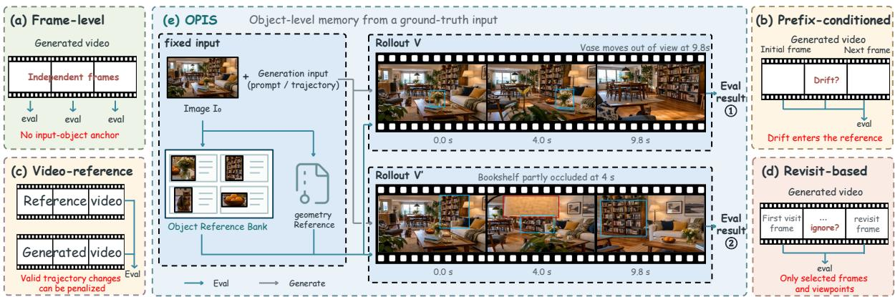  
Figure 1: Comparison of evaluation paradigms and the input-grounded approach. Panels (a)–(d) illustrate evaluation using independent frames, generated prefixes, reference videos, and selected revisits. Panel (e) anchors both rollouts to the same object reference bank and geometry.

We introduce OPIS, an input-grounded benchmark for multi-object memory in video world generation. Our annotation pipeline constructs dense object-level references with instance masks, appearance descriptors, and mobility labels, together with an auxiliary, precomputed reference geometric representation. The dataset contains 500 cases across 3 scene domains (real worlds, embodied-robotic, and game worlds) and 10 subcategories. It covers 12,672 object instances: 8,432 rigid, 2,046 articulated, and 2,194 deformable objects. The evaluator is deliberately evidence-first. It compares sampled generated frames against the fixed input reference through one-to-one association and explicit visibility reasoning, measuring Presence, whether instances are accounted for when observable; Identity, whether observed instances retain their input identities; and Structure, whether their geometry or structural properties persist. Based on object kinematics and motion expectations, Structure uses two tracks: static geometry for rigid objects expected to remain stationary, and dynamic structure for the remaining objects, assessing input-grounded structural properties while allowing motion, articulation, and deformation.

Experiments on eight image-to-video (i2v) and camera-conditioned world models show that object accounting is substantially easier than preserving the particular input instances. Presence remains acceptable across models (85.63–93.49), whereas Identity is much lower (28.12–36.88). Seedance 2.0 (Seedance et al., 2026), one of the leading i2v models, achieves the highest overall OPIS score (56.01), while Echo-WM-Flash (Zhang et al., 2026b), a recently released camera-conditioned world model, leads the evaluated camera-conditioned group (51.42). The dificulty scales with the number of addressable objects: average Identity falls from 40.22 for scenes with at most 20 reference object instances to 23.11 for scenes with more than 40. These findings show that input-grounded, object-centric evaluation exposes memory failures that aggregate video-quality measures can conceal.

Our contributions are fourfold:

• An input-grounded formulation of multi-object memory. We anchor evaluation to a fixed set of object instances from the initial observation, measuring their persistence under camera motion and partial visibility without requiring a reference continuation.

• A cross-domain dataset with fine-grained annotations. OPIS comprises 500 cases across 3 scene domains and 10 subcategories, covering 12,672 rigid, articulated, and deformable instances. It provides dense object-level annotations.

• An object-centric, hierarchical evaluator. We assess object memory through Presence, Identity, and Structure, combining object-level association and explicit visibility reasoning with static or dynamic evaluation tracks selected according to each object’s kinematics.

• Experiments across eight models reveal a persistent gap between object presence and object identity and show that object memory preservation declines as the number of addressable objects increases.

## 2 Related Work

## 2.1 Evaluation References and Memory

Table 1 compares evaluation references and object-level evidence. Frame-quality components in VBench (Huang et al., 2024) assess individual images without testing input-instance preservation. Reference-video tests in MIND (Ye et al., 2026) and Latent Spatial Memory (LSM) (Wang et al., 2026) measure reconstruction under prescribed trajectories; their errors can also reflect alternative valid continuations in open-ended generation. Local consistency in WorldScore (Duan et al., 2025) and WorldTrace (Wu et al., 2026c) uses generated history, which may already contain drift. Revisit tests in MBench (Zhang et al., 2026a), LoopBench (Wu et al., 2026c), and R2M-Bench (Gu et al., 2026) probe selected return views; R2M additionally controls for generic temporal stability.

The initial-frame return comparison in LSM (Wang et al., 2026) and the first-frame subject anchor in WBENCH (Ying et al., 2026) show that input or first-frame anchoring already has precedents.

## 2.2 Object-Level Evidence

Object-level evaluation is also established: T2V-CompBench (Sun et al., 2025) assesses text-grounded composition, VBench-2.0 (Zheng et al., 2025) includes human identity and anatomy, and MBench (Zhang et al., 2026a) and R2M-Bench (Gu et al., 2026) measure entity consistency. Visibility handling ranges from valid-observation filtering (Ying et al., 2026) to occlusion-aware VLM judgments (Gu et al., 2026); PDI-Bench (Wu et al., 2026a) directly measures object rigidity from reconstructed trajectories. These mechanisms

Table 1: Evaluation design comparison.
<table><tr><td>Method</td><td>Eval. protocol</td><td>Object- level</td><td>Fixed input set</td><td>Visib.- aware</td><td>Object struct.</td></tr><tr><td>VBench</td><td>F, PW</td><td>△</td><td>x</td><td>x</td><td>x</td></tr><tr><td>VBench-2.0</td><td>F, PW</td><td>△</td><td>x</td><td>△</td><td>△</td></tr><tr><td>MIND</td><td>F, VR, R</td><td>x</td><td>x</td><td>x</td><td>x</td></tr><tr><td>MBench</td><td>PW, R</td><td>△</td><td>x</td><td>△</td><td>△</td></tr><tr><td>R2M-Bench</td><td>R, PW</td><td>△</td><td>x</td><td>△</td><td>△</td></tr><tr><td>WorldTrace</td><td>PW, R</td><td>x</td><td>x</td><td>x</td><td>x</td></tr><tr><td>LSM</td><td>VR, R, IG</td><td>△</td><td>x</td><td>x</td><td>x</td></tr><tr><td>WorldScore</td><td>F, PW</td><td>△</td><td>x</td><td>x</td><td>x</td></tr><tr><td>WBENCH</td><td>F, PW, R</td><td>△</td><td>△</td><td>△</td><td>△</td></tr><tr><td>T2V-CompBench</td><td>F</td><td>△</td><td>x</td><td>x</td><td>x</td></tr><tr><td>PDI-Bench</td><td>PW</td><td>√</td><td>x</td><td>△</td><td>√</td></tr><tr><td>OPIS (ours)</td><td>IG</td><td>√</td><td>√</td><td>√</td><td>√</td></tr></table>

Symbols denote explicit $( \checkmark ) ,$ partial $( \triangle ) ,$ or no explicit (✗) support under the definitions below. F: frame-level; VR: video-reference; PW: generated-prefix/window; R: revisit; IG: input-grounded.

difer from retaining a fixed input inventory and distinguishing missing instances from unobservable ones. OPIS combines that inventory with one-to-one association, explicit visibility and unknown states, and object-level Presence, Identity, and Structure. Its distinction is this integrated evaluation contract, rather than object scoring or first-frame anchoring alone.

## 3 OPIS Dataset

## 3.1 Task and Scope

Each OPIS case consists of an initial image $I _ { 0 } , \mathsf { a }$ generation instruction $u ,$ and a fixed evaluatorside reference $\mathcal { R } _ { 0 } \mathrm { : \Omega }$

$$
d = ( I _ { 0 } , u , \mathcal { R } _ { 0 } ) , \qquad V = G _ { \theta } ( I _ { 0 } , u ) , \qquad \mathcal { R } _ { 0 } = ( \mathcal { O } _ { 0 } , \mathcal { G } _ { 0 } ) .\tag{1}
$$

The instance set $\mathcal { O } _ { 0 }$ records the objects visible in the input, while $\mathcal { G } _ { 0 }$ provides auxiliary geometric evidence derived from the same image. The generator receives only $( I _ { 0 } , u ) _ { \it { \cdot } }$ ; the reference is constructed once before generation and is never updated with generated content. OPIS therefore evaluates how well a rollout preserves input-grounded object evidence across time, without requiring a target continuation or access to the model’s internal memory.

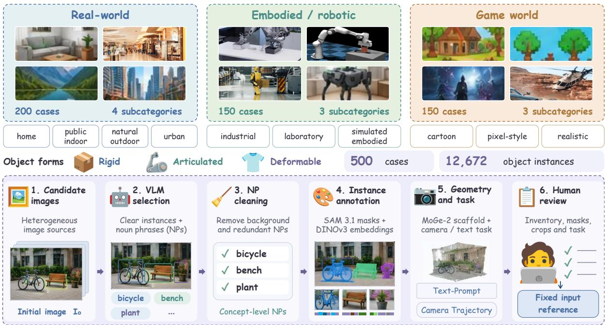  
Figure 2: OPIS dataset composition and construction pipeline. Top: 500 cases span real-world, embodiedrobotic, and game-world domains, with ten subcategories and rigid, articulated, and deformable objects. Bottom: candidate images undergo VLM-assisted selection, noun-phrase (NP) cleaning, instance annotation, geometry and task construction, and human review to produce a fixed input reference.

The instructions are designed to expose memory under changing viewpoints, motion, and partial visibility. They encourage smooth camera movement, parallax, and re-observation of selected objects, including cases in which an object leaves view and later reappears. These instructions define the evaluation challenge rather than a prescribed future trajectory. OPIS scores observable memory while allowing valid changes in camera pose, object motion, articulation, and deformation.

## 3.2 Data Coverage and Sources

The OPIS dataset contains 500 cases spanning three scene domains and ten subcategories (Figure 2). Each subcategory contains 50 cases: home, public indoor, natural outdoor, and urban scenes; industrial, laboratory, and simulated embodied environments; and cartoon, pixel-style, and realistic game worlds. Across the benchmark, 12,672 addressable rigid, articulated, and deformable instances support memory evaluation across varied object densities and motion expectations. Domain-level counts and evaluation-track assignments are detailed in Appendix C (Table 3).

OPIS combines real-world imagery, game screenshots, simulator-rendered scenes, and images generated with gpt-image-2.5-sunburst. Real-world sources include Visual Genome (Krishna et al., 2017), ADE20K (Zhou et al., 2017), COCO (Lin et al., 2014) images indexed through RefCOCO (Yu et al., 2016), and embodied or industrial collections such as BridgeData V2 (Walke et al., 2023) and IndustryShapes (Sapoutzoglou et al., 2026). Game imagery comes from gameplay-caption collections, including Minecraft (Fan et al., 2022) and SuperTuxKart 1 scenes; locally rendered AI2-THOR (Kolve et al., 2017) images provide simulated embodied environments. Together with the generated images, these sources provide complementary scene layouts, visual styles, and object configurations.

## 3.3 Data Construction

Our construction pipeline turns heterogeneous source images into a common input-grounded reference, combining VLM-assisted selection and annotation, concept-guided instance segmentation, and final human review (Figure 2).

Image selection and object vocabulary. A VLM first screens candidate images for a suficient number of distinguishable object instances with clear boundaries, while proposing a list of noun phrases (NPs) describing the visible objects. When source annotations or simulator metadata already provide suitable NPs, we prioritize that vocabulary. Each NP denotes a concept and may correspond to multiple instances. A subsequent VLM-assisted cleaning stage removes background NPs and incomplete object phrases, and consolidates semantically similar or subsuming NPs.

Instance segmentation and annotation. Using the cleaned NP list, we perform multiple rounds of perceptual concept segmentation (PCS) with SAM 3.1 (Carion et al., 2025) to recover individual object instances. We retain each instance mask and its corresponding image crop, and compare masks using intersection-over-union (IoU) to remove highly overlapping duplicates across queries and rounds. DINOv3 (Siméoni et al., 2026) extracts an appearance embedding from each instance crop to support identity matching. Each instance is further assigned a persistent identifier, distinguishing its kinematic form. MoGe-2 (Wang et al., 2025) provides a fixed scene-level geometric scafold from the initial image for viewpoint and occlusion reasoning.

Instruction design and review. For each case, we construct a structured task specification including a camera trajectory and a text prompt. These plans define the intended memory challenge while allowing variation in the generated trajectory. A VLM assists with the initial specification, which is then individually reviewed together with the object inventory, masks, and crops to verify annotation quality and task coherence. Finally, each case is verified by humans.

## 4 OPIS Evaluation

OPIS evaluates memory through the persistence of individual objects, using the initial observation as a fixed reference throughout generation. The evaluator first establishes which instances can be associated and observed, then measures their Presence, Identity, and Structure (Figure 3). This separates object accounting from appearance fidelity and structural preservation, while retaining uncertainty when the available evidence is insuficient. Although OPIS evaluates individual object instances, we assess frames and videos by the number rather than the proportion of failed instances, since quality within a fixed image area should not depend on object density.

## 4.1 Association and Visibility

For each sampled frame $I _ { t } ,$ we independently extract object observations using concept-guided segmentation and appearance encoding. Each observation contains a mask, bounding box, category, appearance attributes, and embedding. We associate these observations with the fixed input inventory $\mathcal { O } _ { 0 }$ through a partial one-to-one assignment constrained by the reference geometric representation, following bipartite matching formulations (Kuhn, 2010) used in object detection and tracking (Carion et al., 2020). Pairwise afinity combines embedding, attribute, and category similarity, with weights renormalized over available evidence. Null assignments allow unmatched instances, and minimum appearance-evidence requirements prevent category agreement alone from establishing identity. The one-to-one constraint prevents a detected object from being matched to multiple reference instances, while small afinity gaps between competing candidates flag ambiguous matches. Visibility reasoning distinguishes an absent object from one that cannot be assessed. For static instances, we project the input geometry into the current frame and test image bounds, projected size, and depth ordering. Camera motion is estimated with MASt3R (Leroy et al., 2024) correspondences supported by the non-target background, with all annotated target masks excluded from camera fitting. Held-out background matches and aligned MoGe-2 depth provide reliability checks. A matched observation can also establish visibility directly. Independently moving objects are assessed through direct observations, since a static reference projection cannot determine their current location. Confirmed occlusion and out-of-view states are excluded from presence accounting.

## 4.2 Presence and Identity

OPIS uses a frame-level criterion: a confirmed missing or extra object invalidates Presence for the frame, while a failure on any evaluable instance invalidates Identity or Structure. This prevents well-preserved objects from concealing a single object-memory failure or an additional generated object.

Presence (P). Let $\mathcal { E } _ { t }$ contain the input instances with evidence that they should be visible in frame $t ,$ and let $p _ { i , t } \in \{ 0 , 1 \}$ indicate whether instance i is matched to an observation. Let $\mathcal { X } _ { t }$ denote the confirmed unmatched observations after one-to-one association, with unresolved extra-object attribution excluded. For a frame with $\mathcal { E } _ { t } \cup \mathcal { X } _ { t } \ne \emptyset .$

$$
P _ { t } = \mathbb { M } [ \forall i \in \mathcal { E } _ { t } , p _ { i , t } = 1 ] \mathbb { M } [ | \mathcal { X } _ { t } | = 0 ] .\tag{2}
$$

Any confirmed missing instance or confirmed unmatched extra observation makes the frame score zero. Confirmed occluded, out-of-view, or too-small instances are excluded, while unresolved visibility or unattributable extras remain unknown. Presence therefore requires complete one-to-one accounting among the instances and observations supported by sufficient evidence.

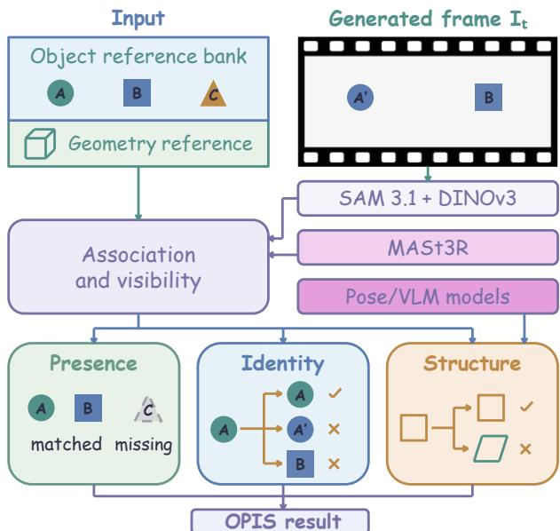  
Figure 3: Input-grounded evaluation of object presence, identity, and structure. Generated observations are associated with the fixed input reference using appearance and geometric evidence. The examples distinguish a missing object $( C ,$ when expected visible), an appearance change (A to A′), and a structural change; valid viewpoint and motion changes are allowed.

Identity (I). For an observed match, appearance fidelity is the nonnegative cosine similarity between its input and generated DI-NOv3 embeddings, $a _ { i , t } = \operatorname* { m a x } ( 0 , \cos ( e _ { i } , \widehat { e } _ { i , t } ) )$

Let $\boldsymbol { A } _ { t }$ contain matches with valid appearance evidence. For $\boldsymbol A _ { t } \neq \boldsymbol O$ , let $\tau _ { I }$ denote the identity acceptance threshold, and define

$$
I _ { t } = \mathcal { k } \bigg [ \operatorname* { m i n } _ { i \in \mathcal { A } _ { t } } a _ { i , t } \geq \tau _ { I } \bigg ] \frac { 1 } { | \mathcal { A } _ { t } | } \sum _ { i \in \mathcal { A } _ { t } } a _ { i , t } .\tag{3}
$$

If any valid identity score falls below $\tau _ { I } ,$ the entire frame receives zero; otherwise, it retains the mean fidelity of its valid matches. Missing objects contribute to P and do not supply an identity measurement.

## 4.3 Structure Across Static and Dynamic Objects

Structure evaluates properties that should persist despite valid changes in viewpoint or motion. Mobility annotations route rigid objects expected to remain stationary to a static-geometry track; articulated, deformable, and other dynamic-track instances are assessed through dynamic structure. The tracks share an input-grounded reference but use evidence appropriate to each object’s physical characteristics.

Static geometry. For a matched static instance, the estimated camera transform projects its fixed input geometry into the current frame. We measure the discrepancy between these projections and image correspondences within the reference and observed bounding boxes:

$$
\rho _ { i , t } = \frac { \mathrm { m e d i a n } _ { n \in \mathcal { M } _ { i , t } } \| \Pi ( K _ { t } ( R _ { t } X _ { n } ^ { 0 } + T _ { t } ) ) - x _ { n , t } \| _ { 2 } } { \mathrm { d i a g } ( b _ { i , t } ) } , \qquad s _ { i , t } ^ { \mathrm { s t a t } } = \exp ( - \rho _ { i , t } / \lambda _ { g } ) .\tag{4}
$$

Here $\mathcal { M } _ { i , t }$ contains instance-associated correspondences, $X _ { n } ^ { 0 }$ is their input-derived geometry, and $b _ { i , t }$ is the observed bounding box. Residuals use all selected correspondences rather than only camera-fit inliers. Reliable camera and visibility evidence and suficient correspondences are required for scoring. The resulting measure captures projective preservation of the visible input structure.

Dynamic structure. The hybrid evaluator first uses specialist pose models, ViTPose (Xu et $\mathrm { a l . , }$ 2022) and ViTPose++ (Xu et al., 2024), for supported articulated categories. Visible landmarks are lifted using monocular geometry, and corresponding segment lengths are compared after removing a single scale factor per instance:

$$
r _ { i , t , e } = \log \frac { \ell _ { i , t , e } } { \ell _ { i , 0 , e } } , \qquad s _ { i , t } ^ { \mathrm { p o s e } } = \frac { 1 } { \left| \mathcal { E } _ { i , t } \right| } \sum _ { e \in \mathcal { E } _ { i , t } } \exp \left( - \frac { \left| r _ { i , t , e } - \mathrm { m e d i a n } _ { e ^ { \prime } \in \mathcal { E } _ { i , t } } r _ { i , t , e ^ { \prime } } \right| } { \tau } \right) .\tag{5}
$$

This assesses segment proportions without directly penalizing joint angles or global pose; uniform scale changes are removed by normalization. For other objects, a VLM assesses localized structural claims established from the input image. Claims concern visible parts, connectivity, local shape, or material continuity, as appropriate to the object’s kinematic class. Each judgment is supported, contradicted, or unknown. The score averages the supported fraction within each evaluable claim family, then across families.

## 4.4 Aggregation and Evidence Coverage

Let $B _ { t }$ contain instances with valid structural measurements in frame $t ,$ using the static or dynamic track assigned to each instance. The structural score uses the per-instance structure acceptance threshold $\tau _ { S } \colon$

$$
S _ { t } = \mathcal { k } \left[ \operatorname* { m i n } _ { i \in \mathcal { B } _ { t } } s _ { i , t } \geq \tau _ { S } \right] \frac { 1 } { | \mathcal { B } _ { t } | } \sum _ { i \in \mathcal { B } _ { t } } s _ { i , t } , \qquad \mathcal { B } _ { t } \not = \mathcal { O } .\tag{6}
$$

Thus, any valid structure score below $\tau _ { S }$ invalidates the frame; otherwise, the frame retains the mean score over its valid instances. Let $\mathcal { F }$ be all sampled frames, let $\mathcal { F } _ { P }$ contain frames with expected-visible reference evidence or confirmed extra-observation evidence, and let $\mathcal { F } _ { I }$ and $\mathcal { F } _ { S }$ contain frames with valid appearance and structural measurements, respectively. Case scores are

$$
\boldsymbol { P } = \frac { \sum _ { t \in \mathcal { F } _ { P } } \boldsymbol { P } _ { t } } { | \mathcal { F } _ { P } | } , \quad \boldsymbol { I } = \frac { \sum _ { t \in \mathcal { F } _ { I } } \boldsymbol { I } _ { t } } { | \mathcal { F } _ { I } | } , \quad \boldsymbol { S } = \underbrace { \frac { | \mathcal { F } _ { S } | } { | \mathcal { F } | } } _ { C _ { S } } \frac { \sum _ { t \in \mathcal { F } _ { S } } \boldsymbol { S } _ { t } } { | \mathcal { F } _ { S } | } .\tag{7}
$$

A structure-valid frame contains at least one valid static or dynamic measurement; a measured score below $\tau _ { S }$ still counts toward coverage. Multiplication by $C _ { S }$ prevents a few assessable frames from representing an entire rollout. We report coverage separately because a low S can reflect structural failure or insuficient evidence.

The case-level OPIS score is a weighted arithmetic mean with nonnegative component weights $( w _ { P } , w _ { I } , w _ { S } )$ satisfying $w _ { P } + w _ { I } + w _ { S } = 1$ :

$$
\mathrm { S c o r e } _ { \mathrm { O P I S } } = 1 0 0 \left( w _ { P } P + w _ { I } I + w _ { S } S \right) .\tag{8}
$$

The three components are evaluated on their respective evidence sets: confirmed missing instances are penalized through Presence, whereas Identity and Structure characterize the fidelity of instances with valid measurements. Consequently, the weighted OPIS score is a composite diagnostic rather than a joint probability that all input objects are preserved. Scores are macro-averaged over cases within each subcategory, then over subcategories within each domain, and finally over domains. This hierarchy prevents densely annotated cases or larger domains from dominating the benchmark.

## 5 Experiments

## 5.1 Experimental Setup

Evaluator implementation. We use SAM 3.1 (Carion et al., 2025) for instance segmentation, DINOv3 (Siméoni et al., 2026) for appearance embeddings, and MoGe-2 (Wang et al., 2025) with MASt3R (Leroy et al., 2024) for input-grounded geometric evidence. The geometric reference uses up to 128 query points per instance. The association threshold is 0.35, the ambiguity margin is 0.05, and the normalized geometric tolerance is $\lambda _ { g } = 0 . 0 5$ . Dynamic structure uses a hybrid pose–VLM pipeline: human and animal models based on ViTPose (Xu et al., 2022) and ViTPose++ (Xu et al., 2024) measure landmark proportions, with VLM evidence used for other supported cases and pose fallback. The pose tolerance is $\tau = 0 . 2 ;$ VLM assessment uses at most 12 claims per object and a confidence threshold of 0.7. Identity and Structure retain the mean valid object score only when all valid objects meet their respective thresholds. The identity and structure thresholds are $\tau _ { I } = 0 . 3 5$ and $\tau _ { S } = 0 . 3 5$ , respectively, and $\mathrm { P / I } / \mathrm { S }$ weights are fixed to $( w _ { P } , w _ { I } , w _ { S } ) = ( 0 . 2 , 0 . 4 , 0 . 4 )$

Evaluation setup. We target approximately 10-second rollouts for each case, using the case-specific text instruction for image-to-video models and the corresponding structured camera task for camera-conditioned world models. Generation uses model-specific adapters and supported output resolutions and frame rates. Evaluation samples every eight frames. Temporal diagnostics use timestamps derived from the recorded output frame rate. Results are macro-averaged through the case–subcategory–domain hierarchy. We estimate 95% confidence intervals using 2,000 bootstrap resamples of cases within each subcategory, retaining the same aggregation hierarchy. We evaluate eight systems spanning two interfaces. The image-to-video group comprises Wan 3.0, Seedance 2.0 (Seedance et al., 2026), Gemini Omni Flash v1.1, and MiniMax H3-Max-Turbo. The camera-conditioned group comprises SANA-WM (Zhu et al., 2026), LingBot-World 2.0 (Gao et al., 2026), Matrix-Game 3.5 (Qian et al., 2026), and Echo-WM-Flash (Zhang et al., 2026b).

## 5.2 Main Results

Table 2 reports the formal OPIS results. Seedance 2.0 and H3-Max-Turbo obtain the highest point estimates, at 56.01 and 55.57, respectively. Within the camera-conditioned group, Echo-WM-Flash has the highest point estimate at 51.42. We also report confidence intervals for the formal OPIS results.

Identity fidelity is substantially weaker than object accounting. Presence ranges from 85.63 to 93.49, while strict Identity ranges from 28.12 to 36.88. Across all rollouts, roughly half of the frames with appearance evidence contain at least one identity score below τI. The gap is consistent across both model interfaces: systems can account for objects that remain observable, yet frequently fail to preserve the identity of the particular instances established in the input. Matrix-Game records the strongest Identity score (36.88), while Gemini-Omni-Flash records the strongest Presence score (93.49); neither dimension alone predicts the overall ranking. This separation is precisely what an object-centric memory benchmark should reveal and what a single scene-level score would hide.

Presence is relatively mature, but not uniform across systems. All eight systems obtain high Presence scores (85.63–93.49), indicating that accounting for observable objects is comparatively mature, while still leaving a measurable gap between the strongest and weakest systems. Gemini-Omni-Flash has the highest Presence score (93.49), yet its Identity (30.03), Structure (49.30), and OPIS (50.43) scores are not among the strongest. The contrast shows that high object accounting does not imply faithful preservation of the particular input instances; overall memory quality depends on balancing Presence with Identity and Structure rather than optimizing P alone.

Table 2: Formal OPIS results. P, I, S, and structural frame coverage $C _ { S }$ are shown on a 0–100 scale. S already includes the coverage multiplier. All columns use the case–subcategory–domain hierarchy. OPIS reports a 95% stratified case-bootstrap interval.
<table><tr><td>Model</td><td>P↑</td><td>I↑</td><td>S↑</td><td> $C _ { S } ( \% )$ </td><td>OPIS ↑ [95% CI]</td></tr><tr><td>Image-to-video</td><td></td><td></td><td></td><td></td><td></td></tr><tr><td>Seedance 2.0</td><td>89.75</td><td>35.07</td><td>60.08</td><td>81.53</td><td>56.01 [52.13, 59.69]</td></tr><tr><td>H3-Max-Turbo</td><td>93.04</td><td>36.77</td><td>55.64</td><td>76.77</td><td>55.57 [52.20, 58.93]</td></tr><tr><td>Wan-3.0</td><td>88.95</td><td>34.47</td><td>50.58</td><td>75.86</td><td>51.81 [48.55, 55.03]</td></tr><tr><td>Gemini-Omni-Flash</td><td>93.49</td><td>30.03</td><td>49.30</td><td>70.94</td><td>50.43 [47.13, 53.76]</td></tr><tr><td>Camera-conditioned</td><td></td><td></td><td></td><td></td><td></td></tr><tr><td>Echo-WM-Flash</td><td>89.65</td><td>34.73</td><td>49.00</td><td>80.22</td><td>51.42 [47.19, 55.62]</td></tr><tr><td>LingBot-World 2.0</td><td>89.71</td><td>36.01</td><td>45.04</td><td>67.42</td><td>50.36 [46.48, 54.25]</td></tr><tr><td>Matrix-Game 3.5</td><td>85.63</td><td>36.88</td><td>45.85</td><td>77.01</td><td>50.22 [45.73, 54.48]</td></tr><tr><td>SANA-WM</td><td>90.46</td><td>28.12</td><td>48.26</td><td>75.97</td><td>48.65 [45.14, 52.29]</td></tr></table>

Structural preservation requires both fidelity and evidence. Strong models not only preserve object structure more efectively, but also provide verifiable evidence of that preservation across a larger fraction of generated frames. Seedance 2.0 achieves the highest coverage-adjusted Structure score (60.08) and the broadest structural frame coverage (81.53%). Across models, $C _ { S }$ ranges from 67.42% to 81.53%, showing that structural memory depends both on preservation quality and evidence availability. Reporting Structure together with its coverage therefore distinguishes robust structural preservation from high scores supported by only a small number of assessable frames. Additional coverage diagnostics are provided in the appendix (Table 10). Per-subcategory results are included in Appendix D.

## 5.3 Object-Centric Diagnostics

Multi-object load exposes a scaling challenge. Figure 4(c) shows a clear scaling efect: scenes with at most 20 reference objects achieve an average strict Identity of 40.22, compared with 33.10 for 21–40 objects and 23.11 for more than 40 objects. The fraction of identity-valid frames containing at least one threshold failure rises from 44.24% to 51.58% and then 67.55%, as shown in Figure 4(e). As the number of addressable instances grows, preserving every identity becomes substantially harder, revealing a central limitation of current world models in dense multi-object scenes. Cross-domain behavior. Figure 4(a) shows a clear advantage on game worlds for seven of the eight systems, while Matrix-Game performs best on embodied scenes. The domain spread is substantial: LingBot-World reaches 58.74 on game worlds versus 44.00 on embodied scenes, whereas Matrix-Game reaches 56.21 on embodied scenes versus 48.65 on game worlds. These shifts show that memory performance depends strongly on scene composition, object configuration, and the type of visual evidence available, motivating evaluation across diverse domains rather than on a single scene family.

## 5.4 Evaluator Validation and Ablations

Aggregation. Figure 4(b) recomputes scores from exactly the same archived object measurements. Removing the structural threshold raises scores by 5.05–8.60 points, because strong objects can then ofset a weak one within the same frame. Removing the structural coverage multiplier raises scores by 3.62–9.61 points, with the largest increase for LingBot-World, whose structural coverage is lowest. Replacing the mean on passing frames with the minimum lowers scores by 3.71–5.24 points. Together, these ablations show that changing the aggregation rules produces consistent score shifts across models.

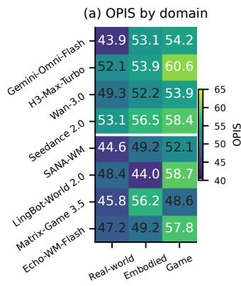

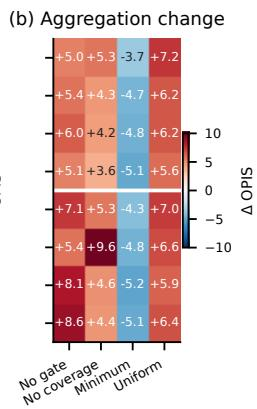

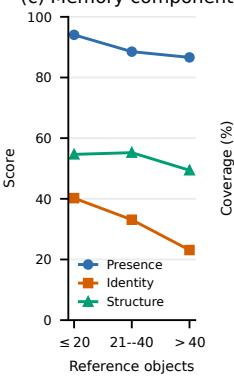

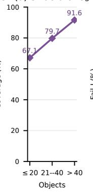

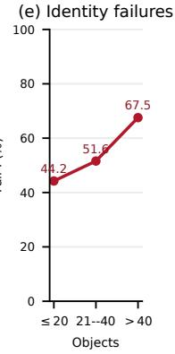  
Figure 4: Object-centric diagnostic views. Panel (a) reports OPIS across scene domains; each cell averages subcategories equally within a domain. Panel (b) shows the change in OPIS under aggregation variants relative to the strict score. Panels (c)–(e) show how reference-inventory size afects the memory components $P , I ,$ and $S ,$ structural evidence coverage $C _ { S } ,$ and the fraction of identity-valid frames containing at least one strict-Identity threshold failure, respectively. Density values use the reported common-case diagnostic.

Evaluator validity. We assess structural-claim repeatability and agreement with manual review of association, visibility, identity, and structure. Table 13 in Appendix G reports 90.5% repeat agreement (181/200 claim pairs). Agreement with manual review is 92.7% for association, 90.7% for visibility, 86.0% for identity, and 83.3% for structure (150 decisions per dimension). Structure has the lowest agreement in this audit. Appendix G describes the evaluation units, agreement metric, and interpretation.

## 6 Conclusion

OPIS evaluates multi-object memory against a fixed initial observation through Presence, Identity, and Structure. Its strict frame-level criterion exposes failures that can be concealed by averaging over many objects, while separate coverage diagnostics identify limits of the available evidence. The current eight-model study reveals a substantial diference between object accounting and identity fidelity, as well as sensitivity to structural coverage. These findings motivate input-grounded object evaluation alongside broader measures of video quality and world-model capability.

## AI Use Statement

Generative AI tools were used to assist with manuscript drafting and editing, dataset construction, and evaluation. Specifically, gpt-image-2.5-sunburst generated 83 benchmark input images. Vision-language models assisted with image selection, noun-phrase cleaning, task-specification drafting, quality-control review, and selected dynamic-structure judgments. No generative AI was used to replace human responsibility for scientific claims, mathematical definitions, citations, final statistics, or release decisions; other required AI-use categories are not applicable. All AI-assisted outputs were reviewed by the authors. We verified the dataset inventory, masks, task specifications, evaluator implementation, thresholds, aggregation rules, and reported statistics.

## Ethics Statement

This work does not involve human-subject experiments, participant interaction, private data, or sensitive personal information. OPIS uses licensed or attributed real-world, simulator, and game assets, together with a limited set of AI-generated images. The benchmark is intended

for academic evaluation of video world models and does not provide instructions for harmful activity or surveillance. Its results may reflect biases in source datasets, generated imagery, segmentation models, and vision-language judgments.

## Reproducibility Statement

The paper specifies the input-grounded task, annotation pipeline, evaluator, Presence–Identity– Structure metrics, aggregation hierarchy, thresholds, sampling procedure, and bootstrap analysis. OPIS contains 500 cases and 12,672 annotated object instances across three domains and ten subcategories. The appendices provide dataset composition, detailed results, ablations, generation configurations, AI-image provenance, and evaluator-validity checks. The evaluation code and configuration information are available at https://github.com/SSStarain/OPIS; the dataset is available at https://huggingface.co/datasets/Kirito-Lab/OPIS-dataset, subject to applicable licenses. The reported implementation uses SAM 3.1, DINOv3, MoGe-2, MASt3R, ViTPose/ViTPose++, and the documented association, geometry, pose, identity, structure, and aggregation settings, enabling independent reruns of the evaluator and reported analyses.

## References

Jake Bruce, Michael D Dennis, Ashley Edwards, Jack Parker-Holder, Yuge Shi, Edward Hughes, Matthew Lai, Aditi Mavalankar, Richie Steigerwald, Chris Apps, et al. Genie: Generative interactive environments. In Forty-first international conference on machine learning, 2024.

Nicolas Carion, Francisco Massa, Gabriel Synnaeve, Nicolas Usunier, Alexander Kirillov, and Sergey Zagoruyko. End-to-end object detection with transformers, 2020. URL https: //arxiv.org/abs/2005.12872.

Nicolas Carion, Laura Gustafson, Yuan-Ting Hu, Shoubhik Debnath, Ronghang Hu, Didac Suris, Chaitanya Ryali, Kalyan Vasudev Alwala, Haitham Khedr, Andrew Huang, Jie Lei, Tengyu Ma, Baishan Guo, Arpit Kalla, Markus Marks, Joseph Greer, Meng Wang, Peize Sun, Roman Rädle, Triantafyllos Afouras, Efrosyni Mavroudi, Katherine Xu, Tsung-Han Wu, Yu Zhou, Liliane Momeni, Rishi Hazra, Shuangrui Ding, Sagar Vaze, Francois Porcher, Feng Li, Siyuan Li, Aishwarya Kamath, Ho Kei Cheng, Piotr Dollár, Nikhila Ravi, Kate Saenko, Pengchuan Zhang, and Christoph Feichtenhofer. SAM 3: Segment anything with concepts. CoRR, abs/2511.16719, 2025. doi: 10.48550/ARXIV.2511.16719. URL https://doi.org/10.48550/arXiv.2511.16719.

Haoyi Duan, Hong-Xing Yu, Sirui Chen, Li Fei-Fei, and Jiajun Wu. Worldscore: A unified evaluation benchmark for world generation, 2025. URL https://arxiv.org/abs/2504.00983.

Linxi Fan, Guanzhi Wang, Yunfan Jiang, Ajay Mandlekar, Yuncong Yang, Haoyi Zhu, Andrew Tang, De-An Huang, Yuke Zhu, and Anima Anandkumar. Minedojo: Building open-ended embodied agents with internet-scale knowledge. In Sanmi Koyejo, S. Mohamed, A. Agarwal, Danielle Belgrave, K. Cho, and A. Oh (eds.), Advances in Neural Information Processing Systems 35: Annual Conference on Neural Information Processing Systems 2022, NeurIPS 2022, New Orleans, LA, USA, November 28 - December 9, 2022, 2022. URL http://papers.nips.cc/paper\_files/paper/ 2022/hash/74a67268c5cc5910f64938cac4526a90-Abstract-Datasets\_and\_Benchmarks.html.

Zelin Gao, Qiuyu Wang, Jiapeng Zhu, Jingye Chen, Zichen Liu, Qingyan Bai, Jiahao Wang, Yufeng Yuan, Hanlin Wang, Yichong Lu, Ka Leong Cheng, Haojie Zhang, Jian Gao, Tianrui Feng, Yuzheng Liu, Yao Yao, Yinghao Xu, Xing Zhu, Yujun Shen, and Hao Ouyang. Infinite worlds with versatile interactions, 2026. URL https://arxiv.org/abs/2607.07534.

Qiwen Gu, Bingjie Gao, Rui Chen, Geng Li, Jifan Li, Qishuai Wen, Li Niu, Jing Tang, Xiangxiang Chu, and Junqiao Zhao. R2m-bench: Evaluating revisit memory via relative consistency in interactive video world models. arXiv preprint arXiv:2608.27328, 2026.

David Ha and Jürgen Schmidhuber. World models. arXiv preprint arXiv:1803.10122, 2(3):440, 2018.

Danijar Hafner, Jurgis Pasukonis, Jimmy Ba, and Timothy Lillicrap. Mastering diverse domains through world models. arXiv preprint arXiv:2301.04104, 2023.

Anthony Hu, Lloyd Russell, Hudson Yeo, Zak Murez, George Fedoseev, Alex Kendall, Jamie Shotton, and Gianluca Corrado. Gaia-1: A generative world model for autonomous driving. arXiv preprint arXiv:2309.17080, 2023.

Ziqi Huang, Yinan He, Jiashuo Yu, Fan Zhang, Chenyang Si, Yuming Jiang, Yuanhan Zhang, Tianxing Wu, Qingyang Jin, Nattapol Chanpaisit, Yaohui Wang, Xinyuan Chen, Limin Wang, Dahua Lin, Yu Qiao, and Ziwei Liu. Vbench: Comprehensive benchmark suite for video generative models. In IEEE/CVF Conference on Computer Vision and Pattern Recognition, CVPR 2024, Seattle, WA, USA, June 16-22, 2024, pp. 21807–21818. IEEE, 2024. doi: 10.1109/ CVPR52733.2024.02060. URL https://doi.org/10.1109/CVPR52733.2024.02060.

Eric Kolve, Roozbeh Mottaghi, Daniel Gordon, Yuke Zhu, Abhinav Gupta, and Ali Farhadi. AI2-THOR: an interactive 3d environment for visual AI. CoRR, abs/1712.05474, 2017. URL http://arxiv.org/abs/1712.05474.

Ranjay Krishna, Yuke Zhu, Oliver Groth, Justin Johnson, Kenji Hata, Joshua Kravitz, Stephanie Chen, Yannis Kalantidis, Li-Jia Li, David A. Shamma, Michael S. Bernstein, and Li Fei-Fei. Visual genome: Connecting language and vision using crowdsourced dense image annotations. Int. J. Comput. Vis., 123(1):32–73, 2017. doi: 10.1007/S11263-016-0981-7. URL https://doi.org/10.1007/s11263-016-0981-7.

Harold W. Kuhn. The hungarian method for the assignment problem. In Michael Jünger, Thomas M. Liebling, Denis Naddef, George L. Nemhauser, William R. Pulleyblank, Gerhard Reinelt, Giovanni Rinaldi, and Laurence A. Wolsey (eds.), 50 Years of Integer Programming 1958-2008 - From the Early Years to the State-of-the-Art, pp. 29–47. Springer, 2010. doi: 10.1007/ 978-3-540-68279-0\_2. URL https://doi.org/10.1007/978-3-540-68279-0\_2.

Vincent Leroy, Yohann Cabon, and Jérôme Revaud. Grounding image matching in 3d with mast3r. In Ales Leonardis, Elisa Ricci, Stefan Roth, Olga Russakovsky, Torsten Sattler, and Gül Varol (eds.), Computer Vision - ECCV 2024 - 18th European Conference, Milan, Italy, September 29-October 4, 2024, Proceedings, Part LXXII, volume 15130 of Lecture Notes in Computer Science, pp. 71–91. Springer, 2024. doi: 10.1007/978-3-031-73220-1\_5. URL https://doi.org/10.1007/978-3-031-73220-1\_5.

Tsung-Yi Lin, Michael Maire, Serge J. Belongie, James Hays, Pietro Perona, Deva Ramanan, Piotr Dollár, and C. Lawrence Zitnick. Microsoft COCO: common objects in context. In David J. Fleet, Tomás Pajdla, Bernt Schiele, and Tinne Tuytelaars (eds.), Computer Vision - ECCV 2014 - 13th European Conference, Zurich, Switzerland, September 6-12, 2014, Proceedings, Part V, volume 8693 of Lecture Notes in Computer Science, pp. 740–755. Springer, 2014. doi: 10.1007/978-3-319-10602-1\_48. URL https://doi.org/10.1007/978-3-319-10602-1\_48.

Runjia Qian, Zile Wang, Jihai Zhang, Kai Zou, Wei Yu, Jiaxing Li, Zexiang Liu, Yaokun Li, Fei Kang, Kaichen Huang, Mengyin An, Haobo Zhang, Biao Jiang, Jiahua Wang, Haofeng Sun, Yang Liu, and Yangguang Li. Matrix-game 3.5: Enhancing real-time streaming interactive world models with patch memory, 2026. URL https://arxiv.org/abs/2608.29910.

Panagiotis Sapoutzoglou, Orestis Vaggelis, Athina Zacharia, Evangelos Sartinas, and Maria Pateraki. Industryshapes: An rgb-d benchmark dataset for 6d object pose estimation of industrial assembly components and tools, 2026. URL https://arxiv.org/abs/2602.05555.

Team Seedance, De Chen, Liyang Chen, Xin Chen, Ying Chen, Zhuo Chen, Zhuowei Chen, Feng Cheng, Tianheng Cheng, Yufeng Cheng, Mojie Chi, Xuyan Chi, Jian Cong, Qinpeng Cui, Fei Ding, Qide Dong, Yujiao Du, Haojie Duanmu, Junliang Fan, Jiarui Fang, Jing Fang, Zetao Fang, Chengjian Feng, Yu Gao, Diandian Gu, Dong Guo, Hanzhong Guo, Qiushan Guo, Boyang Hao, Hongxiang Hao, Haoxun He, Jiaao He, Qian He, Tuyen Hoang, Heng Hu, Ruoqing Hu, Yuxiang Hu, Jiancheng Huang, Weilin Huang, Zhaoyang Huang, Zhongyi Huang, Jishuo Jin, Ming Jing, Ashley Kim, Shanshan Lao, Yichong Leng, Bingchuan Li, Gen Li, Haifeng Li, Huixia Li, Jiashi Li, Ming Li, Xiaojie Li, Xingxing Li, Yameng Li, Yiying Li, Yu Li, Yueyan Li, Chao Liang, Han Liang, Jianzhong Liang, Ying Liang, Wang Liao, J. H. Lien, Shanchuan Lin, Xi Lin, Feng Ling, Yue Ling, Fangfang Liu, Jiawei Liu, Jihao Liu, Jingtuo Liu, Shu Liu, Sichao Liu, Wei Liu, Xue Liu, Zuxi Liu, Ruijie Lu, Lecheng Lyu, Jingting Ma, Tianxiang Ma, Xiaonan Nie, Jingzhe Ning, Junjie Pan, Xitong Pan, Ronggui Peng, Xueqiong Qu, Yuxi Ren, Yuchen Shen, Guang Shi, Lei Shi, Yinglong Song, Fan Sun, Li Sun, Renfei Sun, Wenjing Tang, Boyang Tao, Zirui Tao, Dongliang Wang, Feng Wang, Hulin Wang, Ke Wang, Qingyi Wang, Rui Wang, Shuai Wang, Shulei Wang, Weichen Wang, Xuanda Wang, Yanhui Wang, Yue Wang, Yuping Wang, Yuxuan Wang, Zijie Wang, Ziyu Wang, Guoqiang Wei, Meng Wei, Di Wu, Guohong Wu, Hanjie Wu, Huachao Wu, Jian Wu, Jie Wu, Ruolan Wu, Shaojin Wu, Xiaohu Wu, Xinglong Wu, Yonghui Wu, Ruiqi Xia, Xin Xia, Xuefeng Xiao, Shuang Xu, Bangbang Yang, Jiaqi Yang, Runkai Yang, Tao Yang, Yihang Yang, Zhixian Yang, Ziyan Yang, Fulong Ye, Bingqian Yi, Xing Yin, Yongbin You, Linxiao Yuan, Weihong Zeng, Xuejiao Zeng, Yan Zeng, Siyu Zhai, Zhonghua Zhai, Bowen Zhang, Chenlin Zhang, Heng Zhang, Jun Zhang, Manlin Zhang, Peiyuan Zhang, Shuo Zhang, Xiaohe Zhang, Xiaoying Zhang, Xinyan Zhang, Xinyi Zhang, Yichi Zhang, Zixiang Zhang, Haiyu Zhao, Huating Zhao, Liming Zhao, Yian Zhao, Guangcong Zheng, Jianbin Zheng, Xiaozheng Zheng, Zerong Zheng, Kuan Zhu, and Feilong Zuo. Seedance 2.0: Advancing video generation for world complexity, 2026. URL https://arxiv.org/abs/2604.14148.

Oriane Siméoni, Huy V. Vo, Maximilian Seitzer, Federico Baldassarre, Maxime Oquab, Cijo Jose, Vasil Khalidov, Marc Szafraniec, Seung Eun Yi, Michaël Ramamonjisoa, Francisco Massa, Daniel Haziza, Luca Wehrstedt, Jianyuan Wang, Timothée Darcet, Théo Moutakanni, Leonel Sentana, Claire Roberts, Andrea Vedaldi, Jamie Tolan, John Brandt, Camille Couprie, Julien Mairal, Hervé Jégou, Patrick Labatut, and Piotr Bojanowski. Dinov3. Trans. Mach. Learn. Res., 2026, 2026. URL https://openreview.net/forum?id=2NlGyqNjns.

Kaiyue Sun, Kaiyi Huang, Xian Liu, Yue Wu, Zihan Xu, Zhenguo Li, and Xihui Liu. T2v-compbench: A comprehensive benchmark for compositional text-to-video generation. In IEEE/CVF Conference on Computer Vision and Pattern Recognition, CVPR 2025, Nashville, TN, USA, June 11-15, 2025, pp. 8406–8416. Computer Vision Foundation / IEEE, 2025. doi: 10.1109/CVPR52734.2025.00787. URL https://openaccess.thecvf.com/ content/CVPR2025/html/Sun\_T2V-CompBench\_A\_Comprehensive\_Benchmark\_for\_ Compositional\_Text-to-video\_Generation\_CVPR\_2025\_paper.html.

Homer Rich Walke, Kevin Black, Tony Z. Zhao, Quan Vuong, Chongyi Zheng, Philippe Hansen-Estruch, Andre Wang He, Vivek Myers, Moo Jin Kim, Max Du, Abraham Lee, Kuan Fang, Chelsea Finn, and Sergey Levine. Bridgedata V2: A dataset for robot learning at scale. In Jie Tan, Marc Toussaint, and Kourosh Darvish (eds.), Conference on Robot Learning, CoRL 2023, 6-9 November 2023, Atlanta, GA, USA, volume 229 of Proceedings of Machine Learning Research, pp. 1723–1736. PMLR, 2023. URL https://proceedings.mlr.press/v229/walke23a.html.

Ruicheng Wang, Sicheng Xu, Yue Dong, Yu Deng, Jianfeng Xiang, Zelong Lv, Guangzhong Sun, Xin Tong, and Jiaolong Yang. Moge-2: Accurate monocular geometry with metric scale and sharp details. In Danielle Belgrave, Cheng Zhang, Laura N. Montoya, Hsuan-Tien Lin, Razvan Pascanu, Piotr Koniusz, Marzyeh Ghassemi, Nancy Chen, Iván Vladimir Meza Ruíz, and Arturo Loaiza-Bonilla (eds.), Advances in Neural Information

Processing Systems 38: Annual Conference on Neural Information Processing Systems 2025, NeurIPS 2025, San Diego, CA, USA, December 2-7, 2025 / Mexico City, Mexico, November 30 - December 5, 2025, 2025. URL http://papers.nips.cc/paper\_files/paper/2025/hash/ 336572db3e99930814d6b328d4220cb6-Abstract-Conference.html.

Weijie Wang, Haoyu Zhao, Yifan Yang, Feng Chen, Zeyu Zhang, Yefei He, Zicheng Duan, Donny Y Chen, Yuqing Yang, and Bohan Zhuang. Latent spatial memory for video world models. arXiv preprint arXiv:2606.09828, 2026.

Jiaxin Wu, Yihao Pi, Yinling Zhang, Yuheng Li, and Xueyan Zou. Quantitative video world model evaluation for geometric-consistency. arXiv preprint arXiv:2605.15185, 2026a.

Tong Wu, Shuai Yang, Ryan Po, Yinghao Xu, Ziwei Liu, Dahua Lin, and Gordon Wetzstein. Video world models with long-term spatial memory. Advances in Neural Information Processing Systems, 38:49371–49393, 2026b.

Xindi Wu, Sven Elflein, James Lucas, Olga Russakovsky, Laura Leal-Taixé, Despoina Paschalidou, Jonathan Lorraine, and Aljoša Ošep. Addressable memory for video world models. arXiv preprint arXiv:2608.07408, 2026c.

Yufei Xu, Jing Zhang, Qiming Zhang, and Dacheng Tao. Vitpose: Simple vision transformer baselines for human pose estimation. In Sanmi Koyejo, S. Mohamed, A. Agarwal, Danielle Belgrave, K. Cho, and A. Oh (eds.), Advances in Neural Information Processing Systems 35: Annual Conference on Neural Information Processing Systems 2022, NeurIPS 2022, New Orleans, LA, USA, November 28 - December 9, 2022, 2022. URL http://papers.nips.cc/paper\_files/ paper/2022/hash/fbb10d319d44f8c3b4720873e4177c65-Abstract-Conference.html.

Yufei Xu, Jing Zhang, Qiming Zhang, and Dacheng Tao. Vitpose++: Vision transformer for generic body pose estimation. IEEE Trans. Pattern Anal. Mach. Intell., 46(2):1212–1230, 2024. doi: 10.1109/TPAMI.2023.3330016. URL https://doi.org/10.1109/TPAMI.2023.3330016.

Yixuan Ye, Xuanyu Lu, Yuxin Jiang, Yuchao Gu, Rui Zhao, Qiwei Liang, Jiachun Pan, Fengda Zhang, Weijia Wu, and Alex Jinpeng Wang. Mind: Benchmarking memory consistency and action control in world models. arXiv preprint arXiv:2602.08025, 2026.

Kaining Ying, Hengrui Hu, Siyu Ren, Jiamu Li, Fengjiao Chen, Ziwen Wang, Xuezhi Cao, Xunliang Cai, and Henghui Ding. Wbench: A comprehensive multi-turn benchmark for interactive video world model evaluation, 2026. URL https://arxiv.org/abs/2605.25874.

Licheng Yu, Patrick Poirson, Shan Yang, Alexander C. Berg, and Tamara L. Berg. Modeling context in referring expressions. In Bastian Leibe, Jiri Matas, Nicu Sebe, and Max Welling (eds.), Computer Vision - ECCV 2016 - 14th European Conference, Amsterdam, The Netherlands, October 11-14, 2016, Proceedings, Part II, volume 9906 of Lecture Notes in Computer Science, pp. 69–85. Springer, 2016. doi: 10.1007/978-3-319-46475-6\_5. URL https://doi.org/10.1007/ 978-3-319-46475-6\_5.

Shengjun Zhang, Zhang Zhang, Simin Huang, Zhenyu Tang, Hanyang Wang, Chensheng Dai, Min Chen, Yifan Li, Yuxin Li, Yingjie Chen, et al. Mbench: A comprehensive benchmark on memory capability for video world models. arXiv preprint arXiv:2606.00793, 2026a.

Songchun Zhang, Yaowei Li, Junhao Zhuang, Weiyang Jin, Haoyu Wang, Xin Lu, Yilang Sun, Shiyi Zhang, Haoran Li, Xiaoxiao Ma, Yuming Li, Yijun Liu, Yaofeng Su, Yanwen Ma, Haoyu Wu, Zihan Su, Yue Ma, Lvmin Zhang, Haoyang Huang, Zeyue Xue, Anyi Rao, and Nan Duan. Echowm: Open and enterable omnimodal world models, 2026b. URL https://arxiv.org/abs/2608.23189.

Table 3: Composition of OPIS. Static and dynamic columns indicate the evaluation track assigned to each reference instance.
<table><tr><td>Domain</td><td>Scenes</td><td>Instances</td><td>Static</td><td>Dynamic</td></tr><tr><td>Real-world scenes</td><td>200</td><td>8,082</td><td>3,565</td><td>4,517</td></tr><tr><td>Embodied / robotic</td><td>150</td><td>1,932</td><td>864</td><td>1,068</td></tr><tr><td>Game worlds</td><td>150</td><td>2,658</td><td>1,699</td><td>959</td></tr><tr><td>Total</td><td>500</td><td>12,672</td><td>6,128</td><td>6,544</td></tr></table>

Dian Zheng, Ziqi Huang, Hongbo Liu, Kai Zou, Yinan He, Fan Zhang, Yuanhan Zhang, Jingwen He, Wei-Shi Zheng, Yu Qiao, and Ziwei Liu. Vbench-2.0: Advancing video generation benchmark suite for intrinsic faithfulness. CoRR, abs/2503.21755, 2025. doi: 10.48550/ARXIV.2503.21755. URL https://doi.org/10.48550/arXiv.2503.21755.

Bolei Zhou, Hang Zhao, Xavier Puig, Sanja Fidler, Adela Barriuso, and Antonio Torralba. Scene parsing through ADE20K dataset. In 2017 IEEE Conference on Computer Vision and Pattern Recognition, CVPR 2017, Honolulu, HI, USA, July 21-26, 2017, pp. 5122–5130. IEEE Computer Society, 2017. doi: 10.1109/CVPR.2017.544. URL https://doi.org/10.1109/CVPR.2017.544.

Haoyi Zhu, Haozhe Liu, Yuyang Zhao, Tian Ye, Junsong Chen, Jincheng Yu, Tong He, Song Han, and Enze Xie. Sana-wm: Eficient minute-scale world modeling with hybrid linear difusion transformer, 2026. URL https://arxiv.org/abs/2605.15178.

## A Code and Data Availability

The OPIS evaluation code is available at https://github.com/SSStarain/OPIS, and the dataset is available at https://huggingface.co/datasets/Kirito-Lab/OPIS-dataset.

## B Limitations

OPIS measures observable preservation of input objects, rather than internal memory mechanisms, physical causality, or complete world-model competence. Its monocular reference provides estimated visible geometry, not complete 3D ground truth. Segmentation, association, camera estimation, and pose or VLM judgments can all limit the evidence. Strict frame scoring amplifies individual failures, including evaluator errors, and is more demanding in frames with more evaluable objects. The maximum video-generation length supported by some models also limits the study, so long-rollout behavior is not evaluated.

## C Dataset Composition

OPIS contains 12,672 object instances across 500 cases, with 6,128 assigned to static-geometry evaluation and 6,544 to dynamic-structure evaluation (Table 3).

## D Detailed Results and Reproducibility

This section provides the numeric tables corresponding to the main-text figures (Table 4, Table 5, and Table 6), and additional per-subcategory scores (Table 7, Table 8, and Table 9). They are retained for reproducibility and detailed lookup.

The reported confidence intervals are computed only for the main results in Table 2. For each model, we perform a stratified case-level bootstrap: within each of its ten subcategories, we resample the available cases with replacement, recompute the subcategory–domain–overall

Table 4: Multi-object load across reference-inventory sizes. All score and rate columns use a 0–100 scale.
<table><tr><td>Reference objects</td><td>P</td><td>I</td><td>S</td><td>Fail-I (%)</td><td>Cs (%)</td></tr><tr><td>≤ 20</td><td>94.06</td><td>40.22</td><td>54.65</td><td>44.24</td><td>67.14</td></tr><tr><td>21-40</td><td>88.52</td><td>33.10</td><td>55.22</td><td>51.58</td><td>79.74</td></tr><tr><td>&gt; 40</td><td>86.63</td><td>23.11</td><td>49.42</td><td>67.55</td><td>91.60</td></tr></table>

Table 5: Aggregation sensitivity on the reported evaluation set. No gate removes only the τS structural threshold; no coverage removes only CS; minimum replaces the within-frame mean for both I and S after thresholding; uniform uses equal P/I/S weights. All perception and association evidence is held fixed.
<table><tr><td>Model</td><td>Strict</td><td>No gate</td><td>No coverage</td><td>Minimum</td><td>Uniform</td></tr><tr><td>Gemini-Omni-Flash</td><td>50.43</td><td>55.48</td><td>55.75</td><td>46.72</td><td>57.61</td></tr><tr><td>H3-Max-Turbo</td><td>55.57</td><td>60.99</td><td>59.87</td><td>50.90</td><td>61.81</td></tr><tr><td>Wan-3.0</td><td>51.81</td><td>57.84</td><td>55.97</td><td>47.00</td><td>58.00</td></tr><tr><td>Seedance 2.0</td><td>56.01</td><td>61.08</td><td>59.62</td><td>50.93</td><td>61.63</td></tr><tr><td>SANA-WM</td><td>48.65</td><td>55.70</td><td>53.96</td><td>44.38</td><td>55.62</td></tr><tr><td>LingBot-World 2.0</td><td>50.36</td><td>55.78</td><td>59.97</td><td>45.60</td><td>56.92</td></tr><tr><td>Matrix-Game 3.5</td><td>50.22</td><td>58.27</td><td>54.78</td><td>44.97</td><td>56.12</td></tr><tr><td>Echo-WM-Flash</td><td>51.42</td><td>60.02</td><td>55.86</td><td>46.36</td><td>57.80</td></tr></table>

hierarchy using the same aggregation rules, and take the 2.5th and 97.5th percentiles over 2,000 replicates. This preserves the intended domain weights while propagating case-level variation through the reported hierarchy.

## E Temporal Memory Diagnostics

The temporal diagnostic averages each model’s hierarchy-weighted scores equally across the matched evaluation set (Figure 5). Strict Identity drops from 43.13 in the 1–4 s interval to 31.60 in 4–7 s, before reaching 33.24 in 7–10 s. Structure is more stable, moving from 54.23 to 50.33 and 51.90, while structural frame coverage changes from 83.79% to 69.89% and then 76.27%. The result identifies identity preservation as the most fragile component of multi-object memory as generation proceeds.

## F Additional Protocols

## F.1 Generation and evaluator configurations.

Table 12 records the output format and sampling density in the evaluation. Duration is measured from the output file, which can difer slightly from the requested 10 seconds. All models use an eight-frame stride after the first second, so their efective sampling rates difer. Temporal plots use seconds rather than sample indices. Evaluator thresholds are given in Section 5.1; per-run manifests retain generation settings and judge configurations.

## F.2 AI-Generated Dataset Images and VLM Quality Control

To supplement the collected real-world, embodied, and game scenes, we include a small procedurally specified subset of AI-generated initial images. The final subset contains 83 images generated with gpt-image-2.5-sunburst: 21 home indoor, 30 natural outdoor, 17 public indoor, and 15 urban outdoor cases. These images are used as benchmark initial observations.

Table 6: OPIS by scene domain. Each domain score averages its subcategories equally.
<table><tr><td>Model</td><td>Real-world</td><td>Embodied</td><td>Game</td></tr><tr><td>Gemini-Omni-Flash</td><td>43.92</td><td>53.14</td><td>54.23</td></tr><tr><td>H3-Max-Turbo</td><td>52.13</td><td>53.92</td><td>60.65</td></tr><tr><td>Wan-3.0</td><td>49.31</td><td>52.19</td><td>53.93</td></tr><tr><td>Seedance 2.0</td><td>53.13</td><td>56.54</td><td>58.35</td></tr><tr><td>SANA-WM</td><td>44.62</td><td>49.21</td><td>52.11</td></tr><tr><td>LingBot-World 2.0</td><td>48.35</td><td>44.00</td><td>58.74</td></tr><tr><td>Matrix-Game 3.5</td><td>45.79</td><td>56.21</td><td>48.65</td></tr><tr><td>Echo-WM-Flash</td><td>47.22</td><td>49.23</td><td>57.82</td></tr></table>

Table 7: Real-world subcategories: OPIS score.
<table><tr><td>Model</td><td>Home</td><td>Natural</td><td>Public indoor</td><td>Urban</td></tr><tr><td>Gemini-Omni-Flash</td><td>36.89</td><td>54.23</td><td>32.57</td><td>51.99</td></tr><tr><td>H3-Max-Turbo</td><td>41.02</td><td>70.88</td><td>45.81</td><td>50.83</td></tr><tr><td>Wan-3.0</td><td>29.17</td><td>70.69</td><td>43.79</td><td>53.61</td></tr><tr><td>Seedance 2.0</td><td>35.33</td><td>69.12</td><td>47.73</td><td>60.34</td></tr><tr><td>SANA-WM</td><td>23.11</td><td>54.68</td><td>46.86</td><td>53.83</td></tr><tr><td>LingBot-World 2.0</td><td>27.55</td><td>66.33</td><td>40.68</td><td>58.84</td></tr><tr><td>Matrix-Game 3.5</td><td>26.12</td><td>62.54</td><td>40.70</td><td>53.78</td></tr><tr><td>Echo-WM-Flash</td><td>32.24</td><td>64.36</td><td>41.68</td><td>50.62</td></tr></table>

Image generation. For each subcategory, the generator instantiates a setting description and a composition variant (for example, a kitchen, a botanical garden path, a library, or a transit plaza). A variation index is included to request a distinct location and layout across cases. The prompt is designed for image-to-video conditioning: it requests a single coherent 16:9 view with a layered foreground and middle ground, at least 12 clearly visible object instances, varied depth and overlap, and surfaces and edges that can support subsequent motion. It also excludes readable text, logos, watermarks, UI elements, borders, duplicated or malformed objects, heavy blur, and scenes dominated by undiferentiated background scenery. The reusable template is shown below.

<table><tr><td>Image-generation prompt template</td></tr><tr><td>Create &lt;setting&gt;.</td></tr><tr><td>Scene category: &lt;subcategory&gt;.</td></tr><tr><td>Scene variation index: &lt;variation-index&gt;. Use this as a distinct location and layout from every other generated case; do not reuse a generic view.</td></tr><tr><td>Composition variation: &lt;composition-variant&gt;.</td></tr><tr><td>This is a benchmark initial frame for image-to-video generation. Compose a single coherent 16:9 camera view with a rich, layered foreground and middle ground. Include at least 12 clearly visible, distinct foreground object instances with varied sizes and depths, including several overlapping but individually recognizable objects. Make the scene useful for motion: objects</td></tr></table>

Table 8: Embodied subcategories: OPIS score.
<table><tr><td>Model</td><td>Industrial</td><td>Laboratory</td><td>Simulated</td></tr><tr><td>Gemini-Omni-Flash</td><td>43.50</td><td>65.41</td><td>50.50</td></tr><tr><td>H3-Max-Turbo</td><td>45.17</td><td>65.63</td><td>50.95</td></tr><tr><td>Wan-3.0</td><td>49.05</td><td>64.79</td><td>42.71</td></tr><tr><td>Seedance 2.0</td><td>51.73</td><td>67.21</td><td>50.68</td></tr><tr><td>SANA-WM</td><td>44.83</td><td>62.44</td><td>40.35</td></tr><tr><td>LingBot-World 2.0</td><td>40.70</td><td>48.72</td><td>42.57</td></tr><tr><td>Matrix-Game 3.5</td><td>51.35</td><td>68.38</td><td>48.89</td></tr><tr><td>Echo-WM-Flash</td><td>45.70</td><td>68.08</td><td>33.90</td></tr></table>

Table 9: Game subcategories: OPIS score.
<table><tr><td>Model</td><td>Cartoon</td><td>Pixel</td><td>Realistic</td></tr><tr><td>Gemini-Omni-Flash</td><td>54.68</td><td>55.03</td><td>52.99</td></tr><tr><td>H3-Max-Turbo</td><td>63.11</td><td>58.09</td><td>60.76</td></tr><tr><td>Wan-3.0</td><td>45.49</td><td>56.30</td><td>60.00</td></tr><tr><td>Seedance 2.0</td><td>54.24</td><td>52.10</td><td>68.71</td></tr><tr><td>SANA-WM</td><td>46.97</td><td>54.72</td><td>54.64</td></tr><tr><td>LingBot-World 2.0</td><td>56.06</td><td>66.83</td><td>53.32</td></tr><tr><td>Matrix-Game 3.5</td><td>46.67</td><td>41.01</td><td>58.28</td></tr><tr><td>Echo-WM-Flash</td><td>52.57</td><td>61.78</td><td>59.12</td></tr></table>

Use natural photographic lighting, sharp focus on the main scene, realistic materials, balanced composition, and high detail. Keep important objects away from the extreme edges. Do not make a collage, catalog, isolated studio arrangement, empty landscape, or minimalist scene.

No text. Exclude readable text, logos, watermarks, UI, borders, subtitles, artificial labels, duplicated objects, malformed objects, extra limbs, and heavy blur. Do not let sky, grass, pavement, walls, or other scenery dominate the frame; they may appear only as supporting context behind many concrete foreground objects. The result must look like one real photograph.

Image requests use one sample per prompt (n=1), the high-quality setting, and a 1536×1024 JPEG response. Each response is converted to RGB and normalized to a 1280×720 JPEG before it enters the benchmark. The generation model, prompt revision, variation index, output dimensions, and response metadata are retained with each case for provenance.

VLM review and acceptance. Every generated candidate is reviewed with gemini-2.5-flash using the image and a structured instruction. The reviewer returns one JSON object containing (i) the final list of short, lowercase noun phrases for concrete foreground objects, (ii) phrases removed from or added to the candidate list, (iii) a list with one entry per distinct visible foreground instance, (iv) a quality score from 1 to 5, and (v) quality flags. The review removes background-only surfaces and scenery, as well as text and HUD/UI elements; multiple instances of the same category remain separate in the instance list. The resulting noun-phrase inventory is used for the generated-image metadata, while dense object-level masks and other benchmark annotations are produced by the general annotation pipeline.

Table 10: Coverage audit. Percentage columns follow hierarchical averaging. No-S is a rollout count.
<table><tr><td>Model</td><td> $C _ { P }$ </td><td> $C _ { I }$ </td><td>Static</td><td>Dynamic</td><td>Unknown</td><td>No-S</td></tr><tr><td>Gemini-Omni-Flash</td><td>97.39</td><td>97.32</td><td>17.35</td><td>67.33</td><td>24.27</td><td>3</td></tr><tr><td>H3-Max-Turbo</td><td>97.46</td><td>97.46</td><td>19.68</td><td>74.23</td><td>26.50</td><td>3</td></tr><tr><td>Wan-3.0</td><td>98.68</td><td>98.52</td><td>23.64</td><td>72.41</td><td>25.19</td><td>3</td></tr><tr><td>Seedance 2.0</td><td>97.20</td><td>97.20</td><td>18.99</td><td>79.19</td><td>28.59</td><td>2</td></tr><tr><td>SANA-WM</td><td>96.88</td><td>96.88</td><td>23.73</td><td>75.02</td><td>23.79</td><td>3</td></tr><tr><td>LingBot-World 2.0</td><td>91.88</td><td>91.88</td><td>24.59</td><td>65.23</td><td>35.62</td><td>1</td></tr><tr><td>Matrix-Game 3.5</td><td>90.37</td><td>90.22</td><td>28.77</td><td>73.40</td><td>33.21</td><td>2</td></tr><tr><td>Echo-WM-Flash</td><td>99.26</td><td>99.26</td><td>27.61</td><td>76.83</td><td>18.78</td><td>2</td></tr></table>

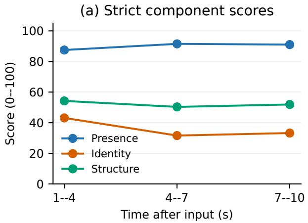

(b) Structural frame coverage  
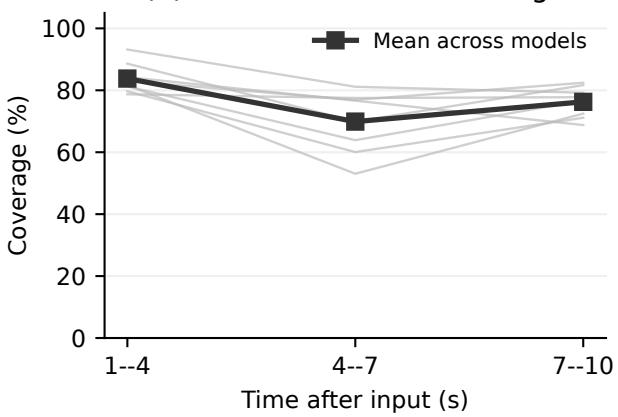  
Figure 5: Temporal memory diagnostics. Each interval is scored independently using the same strict rules. Left: component scores, averaged equally across models after hierarchical aggregation. Right: structural frame coverage; gray curves show individual models and black shows their mean.

## VLM review prompt template

Inspect the image and clean the candidate noun-phrase list. Keep only concrete visible foreground objects, characters, and useful object parts. Add visible foreground objects that are missing from the list, but do not invent objects.

Remove background-only scenery and surfaces, readable text, logos, watermarks, HUDs, menus, buttons, icons, counters, and other interface elements.

Return one JSON object with the fields noun\_phrases, removed\_noun\_phrases, added\_noun\_phrases, foreground\_object\_instances, quality\_score, and quality\_flags.

Use short lowercase English noun phrases without leading articles. List one entry per distinct visible foreground instance in foreground\_object\_instances.

Assign quality\_score from 1 (unusable) to 5 (clear), and return an empty quality\_flags list when no quality issue is present.

A candidate is retained only if the review reports at least 10 foreground object instances, a quality score of at least $4 / 5 ,$ at least 5 usable noun phrases, and no quality flags. This gate is intended to enforce scene complexity and visual usability for an image-to-video initial frame; it does not replace the object-level evaluation protocol. Per-case provenance records the generation and review models, prompt versions, extracted object phrases, instance count, quality score, and any review decisions. AI-generated images are not assumed to be redistributable solely because they were generated; any release must separately verify the applicable usage and

Table 11: AI-generated images in the real-world portion of OPIS.
<table><tr><td>Scene subcategory</td><td>Number of cases</td></tr><tr><td>Home indoor</td><td>21</td></tr><tr><td>Natural outdoor</td><td>30</td></tr><tr><td>Public indoor</td><td>17</td></tr><tr><td>Urban outdoor</td><td>15</td></tr><tr><td>Total</td><td>83</td></tr></table>

Table 12: Recorded generation formats and evaluation sampling. The Samples column counts evaluated frames per rollout.
<table><tr><td>Model</td><td>Resolution</td><td>FPS</td><td>Duration (s)</td><td>Stride</td><td>Samples</td></tr><tr><td>Wan-3.0</td><td>854× 480</td><td>30</td><td>10.000</td><td>8</td><td>34</td></tr><tr><td>H3-Max-Turbo</td><td>864× 496</td><td>24</td><td>10.042</td><td>8</td><td>28</td></tr><tr><td>Gemini-Omni-Flash</td><td>640 × 360</td><td>24</td><td>10.000</td><td>8</td><td>27</td></tr><tr><td>Seedance 2.0</td><td>832× 480</td><td>24</td><td>10.125</td><td>8</td><td>28</td></tr><tr><td>SANA-WM</td><td>1280 × 704</td><td>16</td><td>10.000</td><td>8</td><td>18</td></tr><tr><td>LingBot-World 2.0</td><td>832 × 464</td><td>16</td><td>10.000</td><td>8</td><td>18</td></tr><tr><td>Matrix-Game 3.5</td><td>1280 × 704</td><td>16</td><td>10.000</td><td>8</td><td>18</td></tr><tr><td>Echo-WM-Flash</td><td>1280 × 704</td><td>16</td><td>10.000</td><td>8</td><td>18</td></tr></table>

licensing conditions.

## G Evaluator Validity

We report two complementary checks: agreement between repeated structural-claim judgments and agreement between evaluator decisions and manual review. Table 13 gives the number of comparisons and exact matches for each check. The repeatability check contains 200 pairs of judgments on the same structural claims. The manual audit contains 150 object–frame decisions for each of association, visibility, identity, and structure, yielding 600 dimension-specific comparisons.

Structural-Judge Repeatability. Structural-claim repeatability concerns the VLM branch of dynamic structure. Agreement requires the same categorical judgment for a claim across the two evaluations: supported, contradicted, or unknown. Exact label agreement measures repeatability. The two calls agree on 181 of 200 claims, giving 90.5% agreement and 19 disagreements. Repeatability alone cannot establish correctness. A judge can reproduce the same error.

Object–Frame Audit and Agreement Metric. The audit contains 150 decisions for each of four dimensions, using the following rubric.

• Association: choose the generated observation corresponding to the reference instance, or label it null or ambiguous.

• Visibility: assign expected-visible, occluded, out-of-view, too-small, or unknown.

• Identity: assign preserved, changed, or unassessable using input-specific appearance, including color pattern, texture, and distinctive parts.

Table 13: Evaluator-validity results. Repeatability uses 200 claim pairs. Each manual-audit dimension contains 150 decisions. Agreement is the number of agreeing judgments divided by N, expressed as a percentage.
<table><tr><td>Check</td><td>N</td><td>Agreeing</td><td>Agreement (%)</td></tr><tr><td>Structural-claim repeatability</td><td>200</td><td>181</td><td>90.5</td></tr><tr><td>Association: exact assignment</td><td>150</td><td>139</td><td>92.7</td></tr><tr><td>Visibility: five labels</td><td>150</td><td>136</td><td>90.7</td></tr><tr><td>Identity: three labels</td><td>150</td><td>129</td><td>86.0</td></tr><tr><td>Structure: three labels</td><td>150</td><td>125</td><td>83.3</td></tr></table>

• Structure: assign preserved, changed, or unassessable for input-supported properties. Static objects are judged for shape and part-layout preservation under viewpoint change; dynamic objects allow articulation and deformation consistent with their kinematic class while retaining supported proportions, connectivity, and material continuity.

We report exact agreement as $1 0 0 \times n _ { \mathrm { a g r e e } } / N .$ , where $n _ { \mathrm { a g r e e } }$ is the reported number of matching judgments and N is the total number of comparisons. For repeatability, the comparison is between two judgments of the same claim; for the manual audit, it is between the evaluator decision and manual review. Association uses exact assignment agreement, while visibility, identity, and structure use categorical label agreement. Percentages are computed directly from the counts and rounded to one decimal place.

Association, visibility, identity, and structure have 11, 14, 21, and 25 disagreements, respectively. Across these four dimensions, 529 of 600 decisions agree with manual review, giving a descriptive pooled agreement of 88.2%. This denominator counts dimension-specific decisions rather than independent samples and excludes the separate repeatability check. Structure has the largest number of disagreements in this audit. The 90.5% repeat agreement measures judge stability rather than correctness against manual review.

## H Rationale for OPIS scoring.

Although object instances are the basic units of evaluation, OPIS aims to assess memory fidelity at the frame and video levels. For a fixed image extent, we argue that the penalty for an object-memory failure should not be diluted merely because the scene contains more correctly preserved instances. We therefore use an absolute failure criterion rather than the proportion of failed instances: a single confirmed failure is suficient to invalidate the corresponding frame-level component. This design deliberately measures whether all evaluable instances are preserved together, rather than the average success rate of an individual instance. Accordingly, lower scores in denser scenes indicate greater dificulty in preserving the complete observable inventory, but do not by themselves establish a decline in per-instance memory fidelity.

## I Case Study

Figure 6 shows one example for each evaluated model, spanning seven dataset subcategories. We manually compared every displayed frame with its reference and retained only cases with a visible preservation failure; cases whose low score was attributable only to an incorrect evaluator association were excluded. Table 14 reports the corresponding case-level scores.

## I.1 Four detailed visual comparisons

We show four of the eight cases below. The selection includes two image-to-video models and two camera-conditioned world models. Each figure places the reference and generated frame in one row.

SANA-WM — Public indoor — public\_indoor\_0004 SANA-WM | public\_indoor\_0004

Matrix-Game 3.5 — Realistic 3D world — Realistic\_style\_3D\_world\_0001 Matrix-Game 3.5 | Realistic\_style\_3D world\_0001

LingBot-World 2.0 — Robot lab — robot lab setup 0029  
Seedance 2.0 — Home indoor — home\_indoor\_0020  

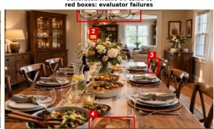  
Wan 3.0 — Home indoor — home\_indoor\_0006

Gemini-Omni-Flash — Urban outdoor — urban\_outdoor\_0005  
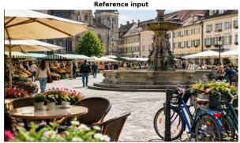

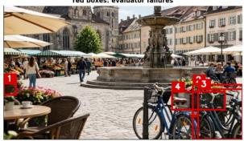  
H3-Max-Turbo — Simulated environment — simulated environment 0023

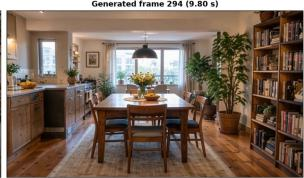  
Echo-WM-Flash — Natural outdoor — natural outdoor 0037

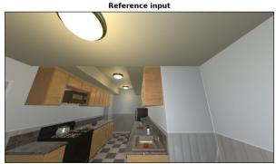

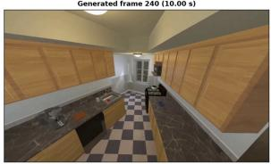

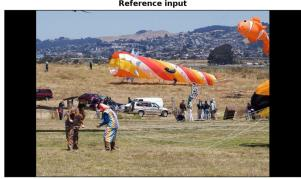

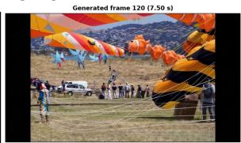

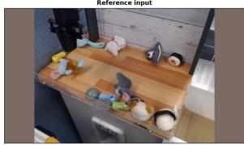

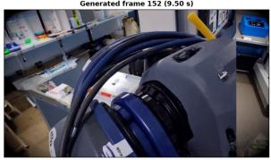

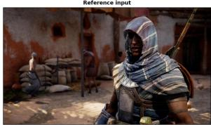

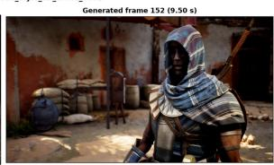

  
Figure 6: Eight visual case studies. Each tile pairs the reference input (left) with a frame from that model’s evaluated generation (right). The selected examples span seven subcategories and show visible instance-appearance or structural drift. Red boxes in the two archived panels indicate the evaluator observations used in the original comparison.

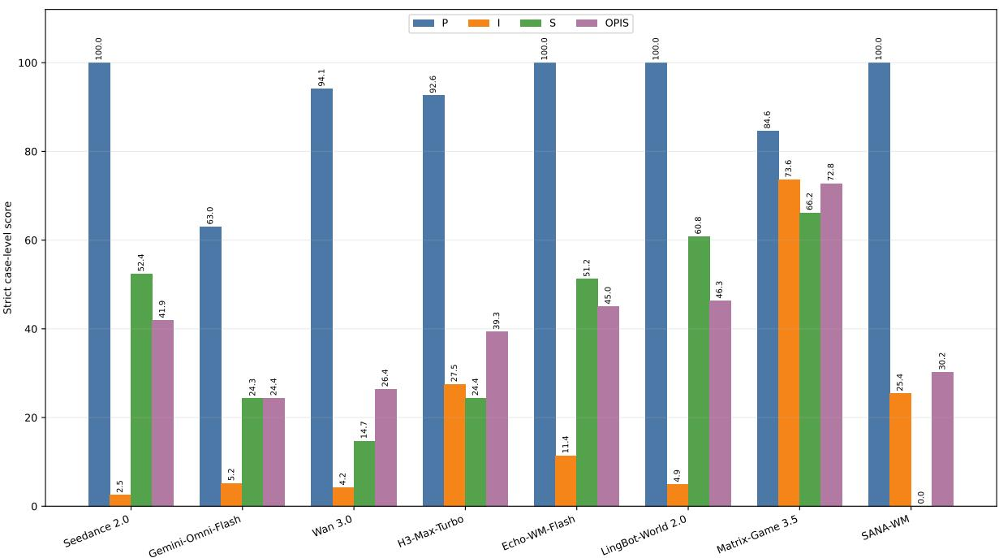  
Figure 7: Strict case-level Presence (P), Identity (I), Structure (S), and OPIS scores for the eight displayed cases. The chart visualizes the same values reported in Table 14.

Table 14: Eight visual case studies, one per model, spanning seven dataset subcategories. P, I, S, and OPIS are strict case-level scores on a 0–100 scale.
<table><tr><td>Model</td><td>Subcategory</td><td>Released case</td><td>Visible change</td><td></td><td>I</td><td>S</td><td>OPIS</td></tr><tr><td>Seedance 2.0</td><td>Home indoor</td><td>home_indoor_0020</td><td>tabletop and lighting details drift</td><td>100.0</td><td>2.5</td><td>52.4</td><td>41.9</td></tr><tr><td>Gemini-Omni-Flash</td><td>Urban outdoor</td><td>urban_outdoor_0005</td><td>foreground bicycles and furniture drift</td><td>63.0</td><td>5.2</td><td>24.3</td><td>24.4</td></tr><tr><td>Wan 3.0</td><td>Home indoor</td><td>home_indoor_0006</td><td>cat, coffee table, and sofa area disappear</td><td>94.1</td><td>4.2</td><td>14.7</td><td>26.4</td></tr><tr><td>H3-Max-Turbo</td><td>Simulated environment</td><td>simulated_environment_0023</td><td>cabinetry and fixture layout changes</td><td>92.6</td><td>27.5</td><td>24.4</td><td>39.3</td></tr><tr><td>Echo-WM-Flash</td><td>Natural outdoor</td><td>natural_outdoor_0037</td><td>inflatable forms multiply and change shape</td><td>100.0</td><td>11.4</td><td>51.2</td><td>45.0</td></tr><tr><td>LingBot-World 2.0</td><td>Robot lab</td><td>robot_lab_setup_0029</td><td>tabletop objects and equipment are replaced</td><td>100.0</td><td>4.9</td><td>60.8</td><td>46.3</td></tr><tr><td>Matrix-Game 3.5</td><td>Realistic 3D world</td><td>Realistic_style_3D_world_0001</td><td>character and background object details change</td><td>84.6</td><td>73.6</td><td>66.2</td><td>72.8</td></tr><tr><td>SANA-WM</td><td>Public indoor</td><td>public_indoor_0004</td><td>foreground furniture and people change</td><td>100.0</td><td>25.4</td><td>0.0</td><td>30.2</td></tr></table>

Seedance 2.0: home\_indoor\_0020. For Seedance 2.0 on home\_indoor\_0020, the scores are $P = 1 0 0 . 0 , I = 2 . 5 , S = 5 2 . 4 ,$ and OPIS = 41.9. At frame 56 (2.33 seconds), the dining-room composition remains visible, while the chandelier branches, several chairs, and small tabletop objects difer from the reference.

Wan 3.0: home\_indoor\_0006. For Wan 3.0 on home\_indoor\_0006, the scores are $P = 9 4 . 1$ $I = 4 . 2 , S = 1 4 . 7 ,$ and OPIS = 26.4. At frame 294 (9.80 seconds), the cat, cofee table, and sofa area visible in the reference are absent, leaving the dining table and bookcase as the dominant foreground structures.

LingBot-World 2.0: robot\_lab\_setup\_0029. LingBot-World 2.0 is camera-conditioned. On robot\_lab\_setup\_0029, its scores are P = 100.0, I = 4.9, S = 60.8, and $\mathrm { O P I S } = 4 6 . 3$ . At frame 152 (9.50 seconds), after the requested return interval, the original tabletop arrangement is no longer restored: a large dark object fills the foreground and the remaining items difer in color and shape.

Matrix-Game 3.5: Realistic\_style\_3D\_world\_0001. Matrix-Game 3.5 is cameraconditioned. On Realistic\_style\_3D\_world\_0001, its scores are $P = 8 4 . 6 , I = 7 3 . 6 , S = 6 6 . 2 ,$ and OPIS = 72.8. At frame 152 (9.50 seconds), after the requested return interval, the hooded character’s facial and armor details difer, while the standing figure and sacks at the left are replaced by a blue bag and a diferent container arrangement.

Seedance 2.0 | home\_indoor\_0020  
Reference input  

Generated frame 56 (2.33 s)  
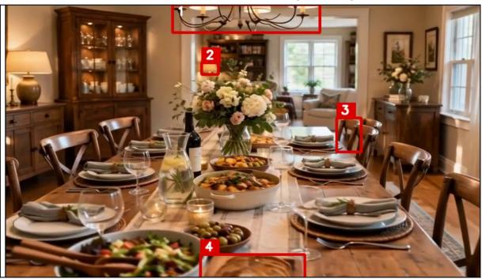  
Figure 8: Seedance 2.0 on home\_indoor\_0020: full-frame reference and generated-frame comparison.

Wan 3.0 | home\_indoor\_0006  
Reference input  

Generated frame 294 (9.80 s)  
  
Figure 9: Wan 3.0 on home\_indoor\_0006: full-frame reference and generated-frame comparison.

## LingBot-World 2.0 | robot\_lab\_setup\_0029

Reference input  
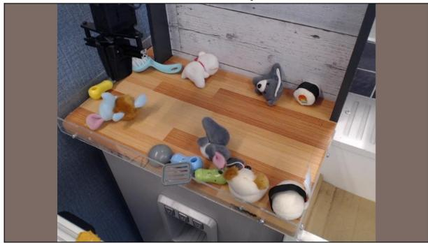

Generated frame 152 (9.50 s)  
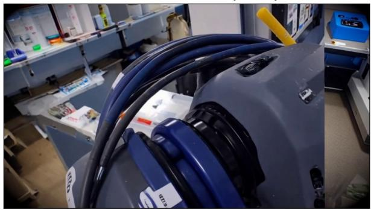  
Figure 10: LingBot-World 2.0 on robot\_lab\_setup\_0029: full-frame reference and generated-frame comparison.

Matrix-Game 3.5 |Realistic\_style\_3D world\_0001  
Reference input  
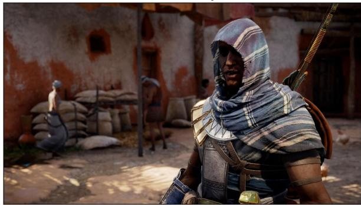

Generated frame 152 (9.50 s)  
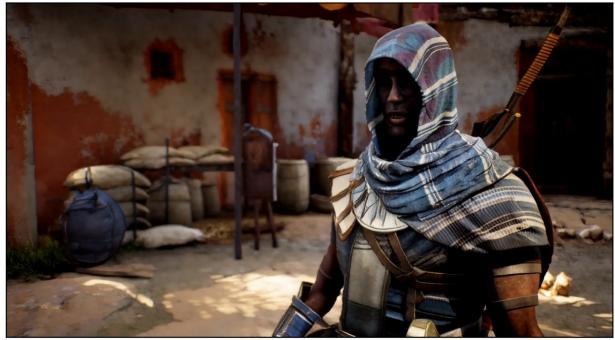  
Figure 11: Matrix-Game 3.5 on Realistic\_style\_3D\_world\_0001: full-frame reference and generatedframe comparison.