# ORAV: BENCHMARKING AUDIO-VIDEO GENERATION FROM MULTIMODAL CONTEXTS

Jiacheng Hua1,2 Xiaokun Feng2 Jiaqi Hua1 Chang Liu1 Yilin Wang1 Biao Wang2† Miao Liu1‡

1College of AI, Tsinghua University 2Tencent Hy

hjc21@mails.tsinghua.edu.cn miaoliu@mail.tsinghua.edu.cn

## ABSTRACT

Audio-video generation using heterogeneous multimodal references has emerged as a new challenge, requiring both compositional control over generation and grounded understanding of multimodal context. In this paper, we introduce ORAV Bench for Omni Reference Audio-Video Generation, comprising 380 task instances with 2–10 references, 9 semantic roles, and 30 role compositions. Instructions specify the relationships among references; the media supply the identities, dynamics, and audio characteristics to be realized. To evaluate these open-ended outputs, we develop a reference-aware pairwise protocol that prepares visual and auditory evidence, compares the intended contribution of each reference, and checks the overall verdict in both presentation orders. On held-out instances, it achieves 86.08% effective agreement with human judgments. Across 5 frontier systems, overall rankings conceal distinct strengths across reference compositions. A recurring failure is to reproduce unintended source content in place of the requested result, despite closely resembling a reference. Reproducible pointwise diagnostics of quality, reference affinity, and speech reveal distinct dimensions of model behavior. ORAV thus offers a benchmark for tracking progress toward controllable, compositional, and reference-faithful audio-video generation.

## 1 INTRODUCTION

Generative models have enabled realistic synthesis of images, videos, and audio-video content (Rombach et al., 2022; Chen et al., 2026). A growing focus is to make this process more precisely and flexibly controllable through user-provided references. Such references can convey a person’s appearance, a movement, or a voice more directly than words alone (Jiang et al., 2024b; Zhao et al., 2025; Lin et al., 2025), as illustrated in Fig. 1a. Frontier systems now accept heterogeneous image, video, and audio references together (Wan et al., 2025; Kling Team et al., 2025; Team Seedance et al., 2026; Chen et al., 2026; Vorch Team et al., 2026; MiniMax, 2026), enabling the omni-reference audio-video generation setting in Fig. 1b. Using these inputs together requires multimodal context understanding and generation: understanding how textual instructions assign contributions to the references and composing them into the requested audio-video result.

Beyond its practical value for fine-grained content creation, omni-conditioning raises a more fundamental scientific question about the compositional capabilities of generative models: whether existing generative methods can maintain controllability when composing heterogeneous, cross-modal conditions. Studying this capability requires a systematic benchmark that pairs multimodal references with textual instructions, specifying how individual references should be composed into semantically plausible and contextually grounded audio-video outputs. Existing audio-video benchmarks emphasize perceptual quality (Huang et al., 2024; Liu et al., 2024), fidelity to individual references (Yuan et al., 2025), and audio-video coherence (Cao et al., 2026; Hua et al., 2026), offering complementary perspectives on how audio-video outputs are rendered and controlled, but lack systematic evaluation of compositional controllability under heterogeneous, cross-modal references, leaving omni-reference audio-video generation insufficiently assessed.

To bridge this gap, we introduce ORAV Bench, a benchmark for Omni Reference Audio-Video Generation.1 ORAV covers diverse multimodal reference conditions, and organizes them into a hierarchical taxonomy that supports both coarse-grained reporting and fine-grained diagnostic analysis. Each instance specifies a composition contract that defines which reference should control which output factor, enabling ORAV to probe whether models can selectively extract relevant information, bind it to the intended role, and realize it in the generated audio-video output.

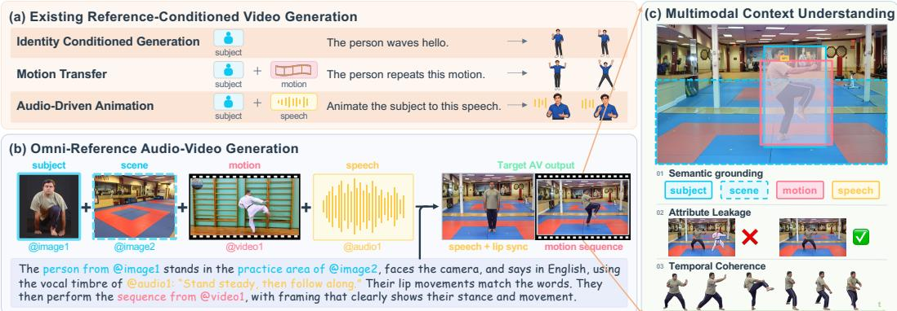  
Fig. 1: Omni-reference audio-video generation requires selectively composing information from heterogeneous references. (a) Representative reference-conditioned task types include identityconditioned generation, motion transfer, and audio-driven animation. (b) An omni-reference task instance combines subject and scene images, a motion video, and a speech reference under a textual instruction. The target subject speaks the specified utterance using the referenced vocal timbre, then performs the referenced motion in the designated scene. (c) Successful generation preserves assigned properties, prevents attribute leakage, and coherently combines speech and motion.

Evaluating ORAV requires understanding the intended use of a reference, as illustrated in Fig. 1c. An output may inherit the performer and setting of a motion source, or preserve a voice by replaying words the task asks it to replace. Such outcomes reveal a gap between resemblance to source material and fulfillment of the requested composition. We develop a reference-aware pairwise evaluator that interprets visual and auditory evidence through each reference’s semantic contract. It compares the assigned contributions and their binding, then judges how their differences affect the complete event. This connects overall preferences to identifiable successes and failures in using multimodal context.

Across 5 frontier systems, overall rankings conceal complementary strengths on different reference compositions. The evaluation also reveals a recurring failure: copying a reference instead of using it as instructed, such as reproducing the original performers and scene of a motion video in place of the requested ones. Quality and source-affinity diagnostics further separate well-rendered or reference-like outputs from successful task fulfillment. These findings establish selective composition of multimodal context as a distinct evaluation target.

Our work therefore makes three main contributions:

• We introduce ORAV Bench for omni reference audio-video generation, making multimodal context understanding and generation testable through diverse reference roles and compositions.

• We develop a reference-aware pairwise evaluation protocol that connects task-level preferences to visual and auditory evidence, and validate it through held-out human evaluation.

• We evaluate audio-video systems on ORAV and analyze their capabilities and failure modes, revealing challenges in composing heterogeneous references. Reproducible pointwise metrics provide a diagnostic interface for quality, reference affinity, and speech following.

## 2 RELATED WORK

## 2.1 REFERENCE CONDITIONED VIDEO GENERATION

Reference-conditioned generation uses images, videos, or audio to guide synthesis. Prior work has explored subject preservation and identity binding (Jiang et al., 2024b; Wei et al., 2024a; Deng et al., 2026), motion transfer and trajectory control (Zhao et al., 2025; Ren et al., 2025; Wei et al., 2024b), and audio-driven human animation (Lin et al., 2025). Recent systems support multimodal generation and task orchestration (Jiang et al., 2025; Pan et al., 2026; Vorch Team et al., 2026). These advances broaden the conditioning interface, but input modality alone does not specify a reference’s intended contribution. ORAV Bench evaluates how models extract and compose information from heterogeneous references under text-specified factor–target contracts.

Tab. 1: Comparison with related video and audio–video generation benchmarks. Reference modalities and semantic coverage are pooled across task instances; joint composition reports the largest set of semantic families required together from distinct references in a single instance.
<table><tr><td rowspan="2">Benchmark</td><td colspan="2">Generation</td><td colspan="3">Reference-derived factors</td><td rowspan="2">Joint composition</td></tr><tr><td>Output</td><td>References</td><td>Content</td><td>Dynamics</td><td>Audio</td></tr><tr><td>T2AV-Compass (2026)</td><td>AV</td><td>一</td><td></td><td></td><td></td><td></td></tr><tr><td>VABench (2026)</td><td>AV</td><td>I</td><td>√</td><td></td><td></td><td></td></tr><tr><td>UI2V-Bench (2025)</td><td>V</td><td>I</td><td>√</td><td></td><td></td><td></td></tr><tr><td>LongAV-Compass (2026)</td><td>AV</td><td>I, V</td><td>√</td><td></td><td></td><td></td></tr><tr><td>OpenS2V-Eval (2025)</td><td>V</td><td>I</td><td>√</td><td></td><td></td><td>C</td></tr><tr><td>UniVBench‡ (2026a)</td><td>V</td><td>I</td><td>√</td><td></td><td>一</td><td>C</td></tr><tr><td>MotionBench (2026)</td><td>V</td><td>V</td><td></td><td>√</td><td>一</td><td></td></tr><tr><td>MSAVBench (2026b)</td><td>AV</td><td>I, A</td><td>√</td><td></td><td>√</td><td>C+A</td></tr><tr><td>MultiRef-Compass (2026)</td><td>AV</td><td>I, V†, A†</td><td>√</td><td></td><td>vt</td><td>(C +A)†</td></tr><tr><td>ORAV Bench (ours)</td><td>AV</td><td>I, V, A</td><td></td><td></td><td>←</td><td>C+D+A</td></tr></table>

Notation. I/V/A: image/video/audio references; V/AV: video/audio–video output. Reference-derived factors: C, content/appearance; D, motion/camera movement/visual effects; A, audio attributes. C alone denotes within-family composition. ✓/–: included/not included in the listed setting; †: extended track; ‡: T2V/R2V only.

## 2.2 VIDEO AND AUDIO-VIDEO GENERATION EVALUATION

Video-generation benchmarks assess perceptual quality, temporal consistency, and semantic alignment (Huang et al., 2024; Liu et al., 2024). Recent work extends evaluation to audio quality and audio-video coherence (Cao et al., 2026; Hua et al., 2026), minute-scale and multi-shot generation (Liu et al., 2026; Wei et al., 2026b), and reference-based subject preservation (Yuan et al., 2025). Most closely related, MultiRef-Compass evaluates multi-reference fidelity, binding, and audio-video consistency (Zhang et al., 2026); its visual references primarily specify subject, object, and scene appearance. ORAV Bench asks a complementary, explicitly factorized question: whether generators can selectively extract, bind, and compose information from heterogeneous references across modalities, entities, and time. Its coverage includes reference-supplied motion, camera movement, and visual effects alongside appearance and audio semantics, as summarized in Tab. 1. The evaluation assesses how well each generated output jointly satisfies the prompt-specified factor–target contracts.

## 2.3 PAIRWISE EVALUATION AND MODEL-BASED JUDGING

Arena-style evaluation derives model rankings from blind comparisons between outputs generated for the same input (Jiang et al., 2024a). Prior work explores human-aligned automated pairwise judging (Li et al., 2026) and trains video reward models using multidimensional human preferences (Liu et al., 2025a). Agent-based and multimodal evaluators incorporate structured prompts, temporal tools, automatic metrics, and cross-model rejudging (Yang et al., 2025; Zhang et al., 2026), while model judges remain susceptible to order and self-enhancement biases (Zheng et al., 2023). Building on these evaluation practices, ORAV organizes comparisons around the intended contribution of each heterogeneous reference and its target in the output. Factor-level diagnostics complement the rankings by identifying failures of transfer, binding, and selection of the intended source content.

## 3 BENCHMARK DESIGN

Our benchmark studies multimodal context understanding and generation through omni-reference audio-video synthesis. Each instance pairs multimodal references with an instruction specifying their contributions and relationships. Fig. 2 summarizes ORAV’s semantic roles, compositions, and scale.

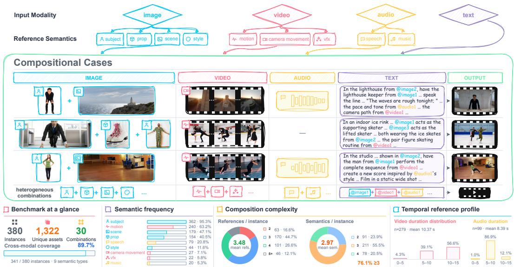  
Fig. 2: Overview ofthe benchmark. Top: Nine semantic roles describe the intended contributions of image, video, and audio references. Middle: Representative task instances combine heterogeneous references with a global textual instruction, which specifies what to extract from each reference and how to bind and compose the selected information in the generated audio-video output. Bottom: Benchmark statistics summarize dataset scale, semantic-role frequencies, composition complexity, and video/audio reference-duration distributions.

## 3.1 TASK FORMULATION

In omni-reference audio-video generation, a model synthesizes video and audio from a textual instruction and a collection of references drawn from image, video, and audio modalities. Let

$$
\mathcal { R } = \mathcal { R } ^ { I } \cup \mathcal { R } ^ { V } \cup \mathcal { R } ^ { A } = \{ r _ { 1 } , . . . , r _ { J } \} ,
$$

where $\mathcal { R } ^ { I } , \mathcal { R } ^ { V }$ , and $\mathcal { R } ^ { A }$ denote the image, video, and audio reference sets, respectively, and J is the total number of references. Given instruction $T$ and references R, the model $G _ { \theta }$ generates

$$
\hat { Y } = G _ { \theta } ( T , \mathcal { R } ) = ( \hat { Y } ^ { v } , \hat { Y } ^ { a } ) ,
$$

where $\hat { Y } ^ { v }$ and ${ \hat { Y } } ^ { a }$ are the generated visual and audio streams. The output should be perceptually natural and temporally coherent across audio and video, while faithfully realizing the semantic requirements and cross-reference relationships specified by $T$ and R.

Crucially, references are not intended to be reproduced in their entirety. Each reference has an intended semantic role that specifies which information it should contribute. For example, a video may provide motion without providing actor identity, while an audio clip may provide speaker timbre without providing its original lexical content. The model must therefore determine what to extract from each reference, where to apply it, and what source information to ignore.

We make this intended use explicit through a semantic reference contract. For reference $r _ { j } .$ , the instruction assigns a role $s _ { j } = \rho _ { T } ( r _ { j } )$ from the nine-role vocabulary S. Its contract is

$$
c _ { j } = { \big ( } r _ { j } , ~ s _ { j } , ~ b _ { j } , ~ \mathcal { P } _ { j } , ~ \mathcal { N } _ { j } { \big ) } , \qquad s _ { j } \in \mathcal { S } .
$$

Here $r _ { j }$ identifies the source, $s _ { j }$ specifies its semantic use, and $b _ { j }$ identifies the output target, such as a person, event, or audio track. The requirements $\mathcal { P } _ { j }$ describe what should be realized from the source, including task-permitted variation in viewpoint or timing. The exclusions ${ \mathcal { N } } _ { j }$ describe source content whose transfer would violate the instruction or another reference’s assignment; this set can be empty. These components formalize the task semantics; the judge interprets them directly from the English instruction and reference media.

As illustrated in Fig. 1b, the motion contract preserves the demonstrated movement while excluding the original performer and background, whereas the speech contract preserves vocal character while enforcing the instructed utterance. These contracts disentangle transferable attributes from conflicting source content, with modality providing the evidence and the contract specifying the required correspondence. The complete task combines the contracts $\mathcal { C } ( T , \mathcal { R } ) = \dot { \{ c _ { j } \} } _ { j = 1 } ^ { J ^ { \bullet } }$ , with instruction-level binding and temporal relationships among their targets. An output may show the requested person while someone else performs the reference motion. Both sources are recognizable, but the requested subject–action binding is missing.

## 3.2 BENCHMARK CONSTRUCTION

Semantic role and composition design. Community use cases and expert discussions inform nine semantic roles, organized by the intended contribution of each reference. Image references specify content and appearance through subject, prop, scene, and style. Video references provide dynamic visual cues through motion, camera movement, and vfx (visual effects). Audio references provide speech and music.

To test how reference contributions work together, we group task instances by their composition signature: the set of roles assigned to the references, irrespective of multiplicity. For example, separate subject images and a group photograph can yield the same signature but require different subject bindings. We select compositions from community examples and expert analysis of events that naturally combine complementary reference contributions. The resulting signatures support comparison across task contexts, with coverage across signatures rather than equal instance counts.

Task instantiation and binding. Task instantiation requires both observable source attributes and a feasible joint event. We combine task-driven retrieval with reference-driven design: proposed scenarios guide media search, and suitable source material can suggest new instances. Candidates are drawn from existing media collections and supplementary public sources, then screened for clarity, suitability, relevance, and observability of the intended semantic attribute. Video references undergo human inspection, while audio screening combines model-assisted inspection with signal-level checks. During task assembly, we check cross-reference compatibility: scenes must accommodate the requested action and required facilities, props must support the intended interactions, and all necessary participants must be specified. A motion reference contributes the demonstrated action; the assigned subject and scene may come from different sources.

Instructions establish how the selected sources should contribute to one output. Each reference receives a unique handle, such as @image1, @video1, or @audio1. The text specifies the objective, role assignments, and relationships; the references retain the detailed perceptual information needed to realize them. Spatial cues such as “the person on the left” are anchored to a specified reference image or video frame. Instructions for multi-person actions explicitly bind target subjects to the corresponding performers or actions. Instances without a scene reference receive environmental context in text. Speech instructions specify the words to be spoken and the intended on-screen speaker. For instances coupling music and motion, instructions identify which reference defines the timing and what temporal adjustments are permitted.

Quality control and benchmark scale. Model-assisted checks and repeated human review verify that each instance defines an observable, consistent contract through reference-role alignment, clear bindings, complete participants and facilities, and instruction–media consistency. Review feedback drives revisions to references, instructions, and bindings; modified instances are flagged for renewed review. Human experts make all final inclusion decisions. For each instance, the total duration of video references and the total duration of audio references are each capped at 15 s, with excerpts trimmed as needed. These limits are chosen to accommodate the reference-input constraints of the evaluated systems. Packaged instances include media assets, textual instructions, reference-handle mappings, and source and review metadata.

The resulting benchmark contains 380 task instances spanning 30 composition signatures and using 1,322 unique reference assets. Each instance includes 2–10 references covering 2–4 semantic roles. References are counted as media assets rather than individual subjects depicted within them. Text is part of the conditioning context but is excluded from both counts. Reference assets are not reused across instances, reducing cross-instance correlations and preventing repeated source content from disproportionately influencing aggregate results.

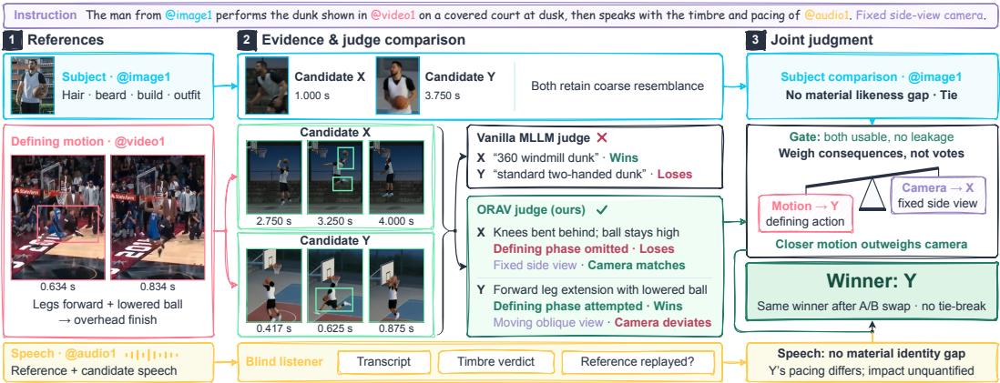  
Fig. 3: From reference evidence to ajointjudgment. With subject likeness tied, Y’s closer reproduction of forward leg extension with a lowered ball outweighs $X \mathrm { { s } }$ better fixed-camera compliance. The visual case contrasts Gemini-3.1-Pro-Preview on native video with GPT-6-Astra on panels; the speech branch illustrates the integration of auditory evidence.

## 4 REFERENCE-AWARE PAIRWISE EVALUATION

Successful reference use requires both correspondence with the assigned sources and coherence among their contributions. The evaluator in Fig. 3 reasons across these two levels: it establishes what each candidate realizes from each reference, then determines how those contributions combine into the requested event. Semantic contracts define the comparison; visual and auditory observations support it; task-level reasoning turns the supported differences into an overall preference.

## 4.1 COMPARING REFERENCE USE IN CONTEXT

Reference fidelity depends on intended use. A motion clip may supply an action but not its performer or setting; a speech recording may supply vocal character for a new utterance. The contracts in Sec. 3.1 formalize this selective correspondence: properties $\mathcal { P } _ { j }$ should appear at target $b _ { j }$ , subject to exclusions ${ \mathcal { N } } _ { j }$ . Reference matching assesses each source’s assigned contribution.

Movements, camera paths, and spoken utterances call for different evidence. Comparing two candidates under the same instruction and references lets the judge assess each requirement on its own terms and express the result as a relative preference. For each reference, candidate-specific evidence precedes the preference in the record

$$
q _ { j } = \big ( e _ { j } ^ { A } , e _ { j } ^ { B } , d _ { j } , o _ { j } \big ) , \qquad d _ { j } \in \{ A , B , \mathrm { t i e } \} ,
$$

where $e _ { j } ^ { A }$ and $e _ { j } ^ { B }$ describe the observed correspondence, $d _ { j }$ gives the relative preference, and $o _ { j }$ records evidence sufficiency. This record connects each preference to its supporting observations.

Composition requires these contributions to belong to the same instructed event. Binding judgments ask whether the reference-like subject is the one performing the demonstrated action; instruction judgments connect that event to requirements such as camera placement and temporal order. These relationships link the reference-level comparisons to overall task fulfillment. The judge returns the linked judgments and overall preference together in one call per presentation order.

## 4.2 GROUNDING COMPARISONS IN VISUAL AND AUDITORY EVIDENCE

Motion fidelity depends on how an action unfolds. Timestamped panels spanning the reference and candidate clips expose phases and trajectories that distinguish movements within the same action category. In the dunk of Fig. 3, forward leg extension with a lowered ball distinguishes the demonstrated maneuver from a conventional dunk. The judge compares these mechanics and their sequence, citing supporting timestamps and accounting for permitted timing changes. Its evidence identifies realized and altered action phases, providing a concrete basis for the later preference.

Independent listening supplies the corresponding auditory basis. Without video or system identity, the listener records what is said, how the voice resembles its reference, and whether the source recording is replayed. These observations separate successful utterance generation from vocal resemblance and recording reuse. The final judge interprets them against the requested speech and assigned speaker, bringing auditory reference use into the same task comparison as visual reference use.

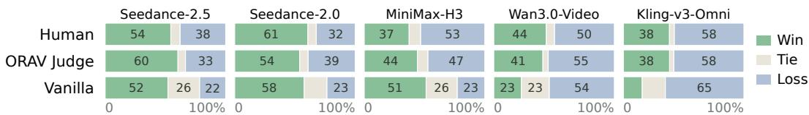  
Fig. 4: Human and automated win–tie–loss profiles. The three evaluators share 324 candidate pair from 38 held-out instances, with equal instance weights. Automated ties include AB/BA conflicts.

## 4.3 COMBINING EVIDENCE INTO A PREFERENCE AND RANKING

The overall preference follows three priorities: usability, taskfulfillment, and general quality. Usability asks whether the delivered artifact supplies the requested integrated rendition. Preserving a specified scene or making a permitted timing change remains legitimate, as do harmless incidental details. Source content fails usability when its intrusion materially replaces or obstructs the requested rendition; lesser discrepancies remain task-level differences. The boundary follows the instruction and contracts, rather than a universal similarity or duration threshold. When usability does not distinguish the candidates, the judge weighs supported differences by their magnitude and task consequence; general quality breaks a task tie. Each supported difference counts once, with priorities determined by the task rather than a fixed role hierarchy.

In the underlying dunk task, candidate X supplies the requested static side view but performs a conventional dunk, omitting the reference’s forward leg extension with a lowered ball. Candidate Y more closely preserves these defining features, although its camera moves. With subject likeness tied at the available resolution, the judge favors Y: preserving more of the defining action contributes more to the requested event than X’s camera advantage. Both presentation orders select Y.

Reversing presentation order checks whether the preference follows candidate identity rather than presentation position. Matching overall decisions are retained; order conflicts contribute a tie for ranking. A Davidson–Bradley–Terry model aggregates the pairwise results on 350 shared-delivery instances, with bootstrap intervals clustered by instance. Delivery is reported separately, keeping the ranking focused on task performance among delivered outputs.

## 4.4 HELD-OUT HUMAN VALIDATION

Five expert annotators independently performed blind evaluations (Bojar et al., 2014) on a random 10% sample of benchmark instances held out from evaluator development.

We compare against a vanilla Gemini-3.1-Pro-Preview judge on the same 38 held-out instances. Given the instruction, references, and candidate videos, it is explicitly prompted to assess reference fidelity and audio-video quality in both presentation orders. Our evaluator achieves 86.08% effective human agreement versus 71.82% for this baseline, averaging instances equally over each evaluator’s valid non-tied comparisons. Fig. 4 compares the resulting win–tie–loss profiles. Notably, the vanilla judge tends to make incorrect judgments due to its limited ability to identify subtle differences, whereas our evaluation framework aligns more closely with human annotations.

With the same Astra judge and prepared evidence, ORAV’s structured protocol improves paired human agreement by 7.45 percentage points over the simplified prompt in Appx. A.9.

## 5 EXPERIMENTS

We evaluate Seedance-2.5, Seedance-2.0, MiniMax-H3, Wan3.0-Video, and Kling-v3-Omni on 380 task instances. Generation uses 720p for four systems and 768p for MiniMax-H3, whose available settings are 768p and 2K. Candidate frames are presented at a common width, with task fulfillment prioritized over general quality to limit the influence of sharpness differences. We use GPT-6-Astra for final judgments and Gemini-3.1-Pro-Preview for independent listening.

Tab. 2: Overall and role-conditioned performance on ORAV. Systems are ordered by Davidson– Bradley–Terry strength on 350 shared-delivery instances, with 95% bootstrap intervals over instances. Role columns report expected win rates (%) for overlapping subsets containing each role, including their co-occurring requirements. Bold marks the highest estimate in each column.
<table><tr><td rowspan="2">#</td><td rowspan="2">System</td><td colspan="2">Overall</td><td colspan="4">Image</td><td colspan="3">Video</td><td colspan="2">Audio</td></tr><tr><td>Strength</td><td>95% CI</td><td>Subj.</td><td>Prop</td><td>Scene</td><td>Style</td><td>Motion</td><td>Cam.</td><td>VFX</td><td></td><td>Speech Music</td></tr><tr><td>1</td><td>Seedance-2.5</td><td>+0.70</td><td>[+0.56, +0.85]</td><td>68.92</td><td>64.07</td><td>68.61</td><td>65.48</td><td>71.01</td><td>65.38</td><td>82.63</td><td>68.04</td><td>76.56</td></tr><tr><td>2</td><td>Seedance-2.0</td><td>+0.48</td><td>[+0.36, +0.59]</td><td>62.82</td><td>61.01</td><td>61.85</td><td>63.54</td><td>65.70</td><td>64.90</td><td>71.36</td><td>59.95</td><td>50.98</td></tr><tr><td>3</td><td>MiniMax-H3</td><td>+0.15</td><td>[+0.02, +0.28]</td><td>53.39</td><td>56.40</td><td>56.87</td><td>57.51</td><td>42.37</td><td>65.87</td><td>58.28</td><td>73.58</td><td>39.85</td></tr><tr><td>4</td><td>Wan3.0-Video</td><td>-0.56</td><td>[−0.70, −0.42]</td><td>35.50</td><td>38.90</td><td>34.71</td><td>36.47</td><td>30.06</td><td>25.00</td><td>30.00</td><td>40.90</td><td>40.42</td></tr><tr><td></td><td>5 Kling-v3-Omni</td><td>-0.77</td><td>[−0.93, −0.63]</td><td>29.37</td><td>29.63</td><td>27.96</td><td>27.00</td><td>40.86</td><td>28.85</td><td>7.73</td><td>7.53</td><td>42.19</td></tr></table>

## 5.1 OVERALL PERFORMANCE

Tab. 2 gives the overall ranking on ORAV. Seedance-2.5 leads, followed by Seedance-2.0 and MiniMax-H3; Wan3.0-Video and Kling-v3-Omni trail. The estimated win rates against a random opponent range from 68.4% to 29.9%. The full order is unchanged across 12 aggregation and datahandling settings. Instance-clustered bootstrap intervals quantify uncertainty, and shared-delivery evaluation fixes the instances across all five systems. The ranking also remains unchanged when missing videos are counted as losses, as detailed in Appx. A.1.

On shared-delivery instances, Seedance-2.5 achieves an observed pairwise win rate of 58% against Seedance-2.0 and 80% against Kling-v3-Omni, with ties counted as half wins. Its advantage is modest over the runner-up and substantially larger over the lowest-ranked system. The role-conditioned results further reveal which reference contexts favor each system.

## 5.2 CONTEXT-DEPENDENT STRENGTHS

Tab. 2 refits the overall preference model within instances containing each role. Seedance-2.5 has the highest estimate in seven of nine buckets; MiniMax-H3 leads the speech and camera buckets despite ranking third overall. It also leads four of the five speech-containing composition signatures evaluated in Appx. A.2. Each subset evaluates the complete task requirements of instances containing that role. Their different leaders reveal complementary strengths that the overall ranking alone cannot express.

The disaggregated results show why a reference role must be interpreted in context. MiniMax-H3 leads subject+speech at 77.8% expected win rate, compared with 58.3% for Seedance-2.5. In subject+motion+speech, Seedance-2.5 leads at 73.4%, while MiniMax-H3 reaches 53.6%. These signatures contain different instances; their contrast describes context-specific strengths and motivates controlled studies of how speech and motion requirements interact. The camera subset offers a different picture: the top three estimates cluster within one percentage point. The most informative outcome is therefore the pattern and size of the differences, rather than the number of columns won.

Seedance-2.0 ranks second overall and in every image-reference bucket, while MiniMax-H3 combines a speech advantage with lower estimates on motion-containing instances. Their relative order reverses between those two contexts. Overall strength and context-specific advantages therefore provide complementary guidance for comparing systems.

## 5.3 QUALITY, REFERENCE AFFINITY, AND TASK FULFILLMENT

The diagnostic results distinguish rendering an output, preserving source properties, and using those properties as instructed. Tab. 3 provides reproducible pointwise diagnostics of visual quality, reference affinity, audio production quality, and speech alongside ORAV performance. Each diagnostic uses shared measurable instances to explain differences in overall task performance.

Rendering quality and task fulfillment expose different strengths among the leading systems. Seedance-2.0 leads the visual composite and technical quality, Seedance-2.5 leads ORAV, and Wan3.0-Video has the highest mean aesthetic score. Comp. z and ORAV are positively associated across the five systems, with Spearman $\rho = 0 . 7 0 ;$ ; the quality ordering persists on ORAV’s 350 shared-delivery instances. The paired bootstrap in Appx. A.4 more clearly supports Seedance-2.5’s Comp. z advantage over Wan3.0-Video than the ordering among the leading three systems.

Tab. 3: Diagnostic measurements and ORAV performance. Diagnostic means weight instances measurable for all five systems equally. Comp. z: VBench-style quality; TQ: raw DOVER++ technical score ×100; AP: Aesthetic Predictor V2.5. Subject/Scene are full-frame DINO/CLIP similarities ×100; PQ is Audiobox production quality; Voice is ECAPA cosine. CER/WER are character/word error rates (%); insertions can yield errors above 100%. ORAV reports Davidson– Bradley–Terry expected win rates (%) on shared-delivery instances. Kling-v3-Omni receives audio through a retained-soundtrack adapter because its tested interface lacks an audio-reference channel.
<table><tr><td rowspan="2">System</td><td colspan="3">Visual quality ↑</td><td colspan="2">Ref. affinity ↑</td><td>Audio ↑</td><td colspan="3">Speech</td><td>ORAV ↑</td></tr><tr><td>Comp. z</td><td>TQ</td><td>AP</td><td>Subject</td><td>Scene</td><td>PQ</td><td>Voice ↑</td><td>CER↓</td><td>WER↓</td><td>Win rate</td></tr><tr><td>Seedance-2.5</td><td>+0.10</td><td>-1.78</td><td>4.95</td><td>40.61</td><td>77.87</td><td>6.99</td><td>0.45</td><td>5.51</td><td>5.58</td><td>68.38</td></tr><tr><td>Seedance-2.0</td><td>+0.17</td><td>-0.67</td><td>4.99</td><td>39.29</td><td>79.01</td><td>7.11</td><td>0.48</td><td>19.17</td><td>16.23</td><td>62.69</td></tr><tr><td>MiniMax-H3</td><td>+0.13</td><td>-1.30</td><td>4.60</td><td>40.15</td><td>75.49</td><td>6.82</td><td>0.59</td><td>14.76</td><td>18.09</td><td>54.00</td></tr><tr><td>Wan3.0-Video</td><td>-0.16</td><td>-1.91</td><td>5.05</td><td>38.94</td><td>77.09</td><td>7.12</td><td>0.39</td><td>10.27</td><td>112.48</td><td>35.04</td></tr><tr><td>Kling-v3-Omni</td><td>-0.19</td><td>-3.97</td><td>4.46</td><td>40.45</td><td>77.64</td><td>6.72</td><td>1.00</td><td>187.84</td><td>178.14</td><td>29.90</td></tr></table>

Reference affinity reveals why resemblance to a source is distinct from task success. Seedance-2.5 leads subject DINO similarity (Caron et al., 2021), with Kling-v3-Omni close behind despite ranking last on ORAV; Seedance-2.0 leads scene CLIP similarity (Radford et al., 2021). These full-frame affinities measure resemblance to assigned sources, whereas Comp. z consistency measures stability within an output. Binding judgments assess whether the intended subject, motion, and scene are realized together in the requested event.

Speech diagnostics separate vocal resemblance from newly requested content. MiniMax-H3 has higher mean voice similarity than the other systems apart from Kling-v3-Omni, while Seedance-2.5 has the lowest mean CER and WER. Wan3.0-Video combines a high mean production-quality score with substantial word-error rates. Kling-v3-Omni’s near-unit voice similarity reflects the retained-soundtrack adaptation used because its interface lacks a separate audio-reference channel.

Wan3.0-Video exhibits both recording replay and visual source carryover. The listener identifies reference-recording replay in 9/78 speech instances with available observations. Visual judgments also describe the motion source’s performers and scene appearing in place of the instructed subjects and setting. These outputs retain reference information while changing the participants, setting, or utterance specified by the instruction.

These visual and auditory failures illustrate reference substitution, in which unrequested source content replaces the intended event. Across the tested system configurations, source carryover or replay is mentioned in 95% of explanations for outputs judged unusable, as summarized in Appx. A.6. These outcomes make selective reference use a concrete challenge: preserving the requested properties and binding them to the specified participants, actions, and scene.

These findings motivate instruction-conditioned reference representations and training examples that separate transferable properties from source-specific context. The same motion should support different performers and settings, and the same voice should support new utterances. Progress should be assessed by how reliably these properties are recomposed across reference combinations. ORAV links this goal to reference-level evidence and overall task preferences.

## 6 CONCLUSION

ORAV Bench makes multimodal context understanding and generation testable through semantic reference contracts. Its pairwise evaluator uses visual and auditory evidence to weigh differences in reference use by their impact on task fulfillment, achieving 86.08% effective human agreement on held-out instances. Across five systems, strengths vary with reference composition, while reference substitution exposes a gap between source resemblance and task success. These findings motivate omni-reference generators that transfer assigned properties into new contexts, exclude conflicting source content, and bind the selected properties to their intended targets in the requested event.

## REFERENCES

Ondˇrej Bojar, Christian Buck, Christian Federmann, Barry Haddow, Philipp Koehn, Johannes Leveling, Christof Monz, Pavel Pecina, Matt Post, Herve Saint-Amand, Radu Soricut, Lucia Specia, and Ales Tamchyna. Findings of the 2014 workshop on statistical machine translation. Inˇ Ondˇrej Bojar, Christian Buck, Christian Federmann, Barry Haddow, Philipp Koehn, Christof Monz, Matt Post, and Lucia Specia (eds.), Proceedings of the Ninth Workshop on Statistical Machine Translation, pp. 12–58, Baltimore, Maryland, USA, June 2014. Association for Computational Linguistics. doi: 10.3115/v1/W14-3302. URL https://aclanthology.org/W14-3302/.

Ralph Allan Bradley and Milton E. Terry. Rank analysis of incomplete block designs: I. the method of paired comparisons. Biometrika, 39(3/4):324–345, 1952. ISSN 00063444, 14643510. URL http://www.jstor.org/stable/2334029.

Zhe Cao, Tao Wang, Jiaming Wang, Yanghai Wang, Yuanxing Zhang, Jiahao Wang, Jialu Chen, Miao Deng, Chenxi Liao, Yize Zhang, Yubin Guo, Zhaoxiang Zhang, and Jiaheng Liu. T2AV-compass: Towards unified evaluation for text-to-audio-video generation. In Forty-third International Conference on Machine Learning, 2026. URL https://openreview.net/forum?id=8V2Qf6mNx3.

Mathilde Caron, Hugo Touvron, Ishan Misra, Herve J´ egou, Julien Mairal, Piotr Bojanowski, and´ Armand Joulin. Emerging properties in self-supervised vision transformers. In Proceedings of the IEEE/CVF International Conference on Computer Vision (ICCV), pp. 9650–9660, October 2021.

Guibin Chen, Dixuan Lin, Jiangping Yang, Youqiang Zhang, Zhengcong Fei, Debang Li, Sheng Chen, Chaofeng Ao, Nuo Pang, Yiming Wang, Yikun Dou, Zheng Chen, Mingyuan Fan, Tuanhui Li, Mingshan Chang, Hao Zhang, Xiaopeng Sun, Jingtao Xu, Yuqiang Xie, Jiahua Wang, Zhiheng Xu, Weiming Xiong, Yuzhe Jin, Baoxuan Gu, Binjie Mao, Yunjie Yu, Jujie He, Yuhao Feng, Shiwen Tu, Chaojie Wang, Rui Yan, Wei Shen, Jingchen Wu, Peng Zhao, Xuanyue Zhong, Zhuangzhuang Liu, Kaifei Wang, Fuxiang Zhang, Weikai Xu, Wenyan Liu, Binglu Zhang, Yu Shen, Tianhui Xiong, Bin Peng, Liang Zeng, Xuchen Song, Haoxiang Guo, Peiyu Wang, Max W. Y. Lam, Chien-Hung Liu, and Yahui Zhou. Skyreels-v4: Multi-modal video-audio generation, inpainting and editing model, 2026. URL https://arxiv.org/abs/2602.21818.

Roger R. Davidson. On extending the bradley-terry model to accommodate ties in paired comparison experiments. Journal of the American Statistical Association, 65(329):317–328, 1970. doi: 10.1080/01621459.1970.10481082. URL https://www.tandfonline.com/doi/abs/10.1080/01621459 .1970.10481082.

Jiankang Deng, Jia Guo, Niannan Xue, and Stefanos Zafeiriou. Arcface: Additive angular margin loss for deep face recognition. In Proceedings ofthe IEEE/CVF Conference on Computer Vision and Pattern Recognition (CVPR), June 2019.

Yufan Deng, Yuanyang Yin, Xun Guo, Yizhi Wang, Zhiyuan Fang, Shenghai Yuan, Yiding Yang, Angtian Wang, Bo Liu, Haibin Huang, and Chongyang Ma. Magref: Masked guidance for anyreference video generation with subject disentanglement. In C. Vondrick, B. Hariharan, C. Raffel, L. Pinto, D. Yang, and A. Faust (eds.), International Conference on Learning Representations, volume 2026, pp. 1–32, 2026. URL https://proceedings.iclr.cc/paper files/paper/2026/file/0021c2 cb1b9b6a71ac478ea52a93b25a-Paper-Conference.pdf.

Brecht Desplanques, Jenthe Thienpondt, and Kris Demuynck. ECAPA-TDNN: Emphasized Channel Attention, Propagation and Aggregation in TDNN Based Speaker Verification. In Interspeech 2020, pp. 3830–3834, 2020. doi: 10.21437/Interspeech.2020-2650.

Daili Hua, Xizhi Wang, Bohan Zeng, Xinyi Huang, Hao Liang, Junbo Niu, Xinlong Chen, Quanqing Xu, and Wentao Zhang. Vabench: A comprehensive benchmark for audio-video generation. In Proceedings of the IEEE/CVF Conference on Computer Vision and Pattern Recognition (CVPR), pp. 23345–23355, June 2026.

Ziqi Huang, Yinan He, Jiashuo Yu, Fan Zhang, Chenyang Si, Yuming Jiang, Yuanhan Zhang, Tianxing Wu, Qingyang Jin, Nattapol Chanpaisit, Yaohui Wang, Xinyuan Chen, Limin Wang, Dahua Lin, Yu Qiao, and Ziwei Liu. Vbench: Comprehensive benchmark suite for video generative models. In 2024 IEEE/CVF Conference on Computer Vision and Pattern Recognition (CVPR), pp. 21807–21818, 2024. doi: 10.1109/CVPR52733.2024.02060.

Dongfu Jiang, Max Ku, Tianle Li, Yuansheng Ni, Shizhuo Sun, Rongqi Fan, and Wenhu Chen. Genai arena: An open evaluation platform for generative models. In A. Globerson, L. Mackey, D. Belgrave, A. Fan, U. Paquet, J. Tomczak, and C. Zhang (eds.), Advances in Neural Information Processing Systems, volume 37, pp. 79889–79908. Curran Associates, Inc., 2024a. doi: 10.52202 /079017-2538. URL https://proceedings.neurips.cc/paper files/paper/2024/file/92249f9233286e43 7f808fa535d88b26-Paper-Datasets and Benchmarks Track.pdf.

Yuming Jiang, Tianxing Wu, Shuai Yang, Chenyang Si, Dahua Lin, Yu Qiao, Chen Change Loy, and Ziwei Liu. Videobooth: Diffusion-based video generation with image prompts. In 2024 IEEE/CVF Conference on Computer Vision and Pattern Recognition (CVPR), pp. 6689–6700, 2024b. doi: 10.1109/CVPR52733.2024.00639.

Zeyinzi Jiang, Zhen Han, Chaojie Mao, Jingfeng Zhang, Yulin Pan, and Yu Liu. Vace: All-in-one video creation and editing. In 2025 IEEE/CVF International Conference on Computer Vision (ICCV), pp. 17191–17202, 2025. doi: 10.1109/ICCV51701.2025.01597.

Nikita Karaev, Yuri Makarov, Jianyuan Wang, Natalia Neverova, Andrea Vedaldi, and Christian Rupprecht. Cotracker3: Simpler and better point tracking by pseudo-labelling real videos. In Proceedings of the IEEE/CVF International Conference on Computer Vision (ICCV), pp. 6013– 6022, October 2025.

Junjie Ke, Qifei Wang, Yilin Wang, Peyman Milanfar, and Feng Yang. MUSIQ: Multi-scale Image Quality Transformer . In 2021 IEEE/CVF International Conference on Computer Vision (ICCV), pp. 5128–5137, Los Alamitos, CA, USA, October 2021. IEEE Computer Society. doi: 10.1109/ICCV 48922.2021.00510. URL https://doi.ieeecomputersociety.org/10.1109/ICCV48922.2021.00510.

Kling Team, Jialu Chen, Yuanzheng Ci, Xiangyu Du, Zipeng Feng, Kun Gai, Sainan Guo, Feng Han, Jingbin He, Kang He, Xiao Hu, Xiaohua Hu, Boyuan Jiang, Fangyuan Kong, Hang Li, Jie Li, Qingyu Li, Shen Li, Xiaohan Li, Yan Li, Jiajun Liang, Borui Liao, Yiqiao Liao, Weihong Lin, Quande Liu, Xiaokun Liu, Yilun Liu, Yuliang Liu, Shun Lu, Hangyu Mao, Yunyao Mao, Haodong Ouyang, Wenyu Qin, Wanqi Shi, Xiaoyu Shi, Lianghao Su, Haozhi Sun, Peiqin Sun, Pengfei Wan, Chao Wang, Chenyu Wang, Meng Wang, Qiulin Wang, Runqi Wang, Xintao Wang, Xuebo Wang, Zekun Wang, Min Wei, Tiancheng Wen, Guohao Wu, Xiaoshi Wu, Zhenhua Wu, Da Xie, Yingtong Xiong, Yulong Xu, Sile Yang, Zikang Yang, Weicai Ye, Ziyang Yuan, Shenglong Zhang, Shuaiyu Zhang, Yuanxing Zhang, Yufan Zhang, Wenzheng Zhao, Ruiliang Zhou, Yan Zhou, Guosheng Zhu, and Yongjie Zhu. Kling-omni technical report, 2025. URL https://arxiv.org/abs/2512.16776.

Ruihang Li, Leigang Qu, Jingxu Zhang, Dongnan Gui, Mengde Xu, Xiaosong Zhang, Han Hu, Wenjie Wang, and Jiaqi Wang. Genarena: How can we achieve human-aligned evaluation for visual generation tasks?, 2026. URL https://arxiv.org/abs/2602.06013.

Zhen Li, Zuo-Liang Zhu, Ling-Hao Han, Qibin Hou, Chun-Le Guo, and Ming-Ming Cheng. Amt: All-pairs multi-field transforms for efficient frame interpolation. In Proceedings of the IEEE/CVF Conference on Computer Vision and Pattern Recognition (CVPR), pp. 9801–9810, June 2023.

Gaojie Lin, Jianwen Jiang, Jiaqi Yang, Zerong Zheng, Chao Liang, Yuan Zhang, and Jingtuo Liu. Omnihuman-1: Rethinking the scaling-up of one-stage conditioned human animation models. In 2025 IEEE/CVF International Conference on Computer Vision (ICCV), pp. 13848–13858, 2025. doi: 10.1109/ICCV51701.2025.01285.

Jie Liu, Gongye Liu, Jiajun Liang, Ziyang Yuan, Xiaokun Liu, Mingwu Zheng, Xiele Wu, Qiulin Wang, Menghan Xia, Xintao Wang, Xiaohong Liu, Fei Yang, Pengfei Wan, Di ZHANG, Kun Gai, Yujiu Yang, and Wanli Ouyang. Improving video generation with human feedback. In D. Belgrave, C. Zhang, H. Lin, R. Pascanu, P. Koniusz, M. Ghassemi, and N. Chen (eds.), Advances in Neural Information Processing Systems, volume 38, Main Conference, pp. 82155–82192. Curran Associates, Inc., 2025a. doi: 10.52202/085713-2750. URL https://proceedings.neurips.cc/paper f iles/paper/2025/file/76227feb18ea0ee40bd15cf02c33e18e-Paper-Conference.pdf.

Shilong Liu, Zhaoyang Zeng, Tianhe Ren, Feng Li, Hao Zhang, Jie Yang, Qing Jiang, Chunyuan Li, Jianwei Yang, Hang Su, Jun Zhu, and Lei Zhang. Grounding dino: Marrying dino with grounded pre-training for open-set object detection. In Ales Leonardis, Elisa Ricci, Stefan Roth, Olgaˇ Russakovsky, Torsten Sattler, and Gul Varol (eds.), ¨ Computer Vision – ECCV 2024, pp. 38–55, Cham, 2025b. Springer Nature Switzerland. ISBN 978-3-031-72970-6.

Tengfei Liu, Yang Shi, Xuanyu Zhu, Jiafu Tang, Liu Yang, Qixun Wang, Zhuoran Zhang, Yuqi Tang, Fengxiang Wang, Yuhao Dong, Xinlong Chen, Bozhou Li, Bohan Zeng, Yue Ding, Xiaohan Zhang, Jialu Chen, Haotian Wang, Yuanxing Zhang, Pengfei Wan, and Leye Wang. Longav-compass: Towards unified evaluation of minute-scale audio-visual generation across t2av, i2av, and v2av, 2026. URL https://arxiv.org/abs/2605.26244.

Yaofang Liu, Xiaodong Cun, Xuebo Liu, Xintao Wang, Yong Zhang, Haoxin Chen, Yang Liu, Tieyong Zeng, Raymond Chan, and Ying Shan. Evalcrafter: Benchmarking and evaluating large video generation models. In 2024 IEEE/CVF Conference on Computer Vision and Pattern Recognition (CVPR), pp. 22139–22149, 2024. doi: 10.1109/CVPR52733.2024.02090.

Yue Ma, Yulong Liu, Qiyuan Zhu, Xiangpeng Yang, Kunyu Feng, Xinhua Zhang, Zexuan Yan, Zhifeng Li, Sirui Han, Chenyang Qi, and Qifeng Chen. EffiVMT: Video motion transfer via efficient spatial-temporal decoupled finetuning. In The Fourteenth International Conference on Learning Representations, 2026. URL https://openreview.net/forum?id=vRgEutPE4m.

MiniMax. MiniMax H3: An open model breaking the boundaries between tasks and modalities, July 2026. URL https://www.minimax.io/blog/minimax-h3.

Gabriel Mittag, Babak Naderi, Assmaa Chehadi, and Sebastian Moller. NISQA: A Deep CNN-Self-¨ Attention Model for Multidimensional Speech Quality Prediction with Crowdsourced Datasets. In Interspeech 2021, pp. 2127–2131, 2021. doi: 10.21437/Interspeech.2021-299.

Kaihang Pan, Qi Tian, Jianwei Zhang, Weijie Kong, Jiangfeng Xiong, Yanxin Long, Shixue Zhang, Haiyi Qiu, Tan Wang, Zheqi Lv, Yue Wu, Liefeng Bo, Siliang Tang, and Zhao Zhong. Omniweaving: Towards unified video generation with free-form composition and reasoning, 2026. URL https://arxiv.org/abs/2603.24458.

Alec Radford, Jong Wook Kim, Chris Hallacy, Aditya Ramesh, Gabriel Goh, Sandhini Agarwal, Girish Sastry, Amanda Askell, Pamela Mishkin, Jack Clark, Gretchen Krueger, and Ilya Sutskever. Learning transferable visual models from natural language supervision. In Marina Meila and Tong Zhang (eds.), Proceedings ofthe 38th International Conference on Machine Learning, volume 139 of Proceedings ofMachine Learning Research, pp. 8748–8763. PMLR, 18–24 Jul 2021. URL https://proceedings.mlr.press/v139/radford21a.html.

Alec Radford, Jong Wook Kim, Tao Xu, Greg Brockman, Christine Mcleavey, and Ilya Sutskever. Robust speech recognition via large-scale weak supervision. In Andreas Krause, Emma Brunskill, Kyunghyun Cho, Barbara Engelhardt, Sivan Sabato, and Jonathan Scarlett (eds.), Proceedings of the 40th International Conference on Machine Learning, volume 202 of Proceedings ofMachine Learning Research, pp. 28492–28518. PMLR, 23–29 Jul 2023. URL https://proceedings.mlr.press/ v202/radford23a.html.

Nikhila Ravi, Valentin Gabeur, Yuan-Ting Hu, Ronghang Hu, Chaitanya Ryali, Tengyu Ma, Haitham Khedr, Roman Radle, Chloe Rolland, Laura Gustafson, Eric Mintun, Junting Pan, Kalyan Vasudev¨ Alwala, Nicolas Carion, Chao-Yuan Wu, Ross Girshick, Piotr Dollar, and Christoph Feichtenhofer. SAM 2: Segment anything in images and videos. In The Thirteenth International Conference on Learning Representations, 2025. URL https://openreview.net/forum?id=Ha6RTeWMd0.

Chandan K A Reddy, Vishak Gopal, and Ross Cutler. Dnsmos p.835: A non-intrusive perceptual objective speech quality metric to evaluate noise suppressors. In ICASSP 2022 - 2022 IEEE International Conference on Acoustics, Speech and Signal Processing (ICASSP), pp. 886–890, 2022. doi: 10.1109/ICASSP43922.2022.9746108.

Yixuan Ren, Yang Zhou, Jimei Yang, Jing Shi, Difan Liu, Feng Liu, Mingi Kwon, and Abhinav Shrivastava. Customize-a-video: One-shot motion customization of text-to-video diffusion models. In Ales Leonardis, Elisa Ricci, Stefan Roth, Olga Russakovsky, Torsten Sattler, and Gˇ ul Varol¨ (eds.), Computer Vision – ECCV 2024, pp. 332–349, Cham, 2025. Springer Nature Switzerland. ISBN 978-3-031-73024-5.

Robin Rombach, Andreas Blattmann, Dominik Lorenz, Patrick Esser, and Bjorn Ommer. High-¨ resolution image synthesis with latent diffusion models. In 2022 IEEE/CVF Conference on Computer Vision and Pattern Recognition (CVPR), pp. 10674–10685, 2022. doi: 10.1109/CVPR 52688.2022.01042.

Dan Ruta, Saeid Motiian, Baldo Faieta, Zhe Lin, Hailin Jin, Alex Filipkowski, Andrew Gilbert, and John Collomosse. Aladin: All layer adaptive instance normalization for fine-grained style similarity. In Proceedings ofthe IEEE/CVF International Conference on Computer Vision (ICCV), pp. 11926–11935, October 2021.

Team Seedance, De Chen, Liyang Chen, Xin Chen, Ying Chen, Zhuo Chen, Zhuowei Chen, Feng Cheng, Tianheng Cheng, Yufeng Cheng, Mojie Chi, Xuyan Chi, Jian Cong, Qinpeng Cui, Fei Ding, Qide Dong, Yujiao Du, Haojie Duanmu, Junliang Fan, Jiarui Fang, Jing Fang, Zetao Fang, Chengjian Feng, Yu Gao, Diandian Gu, Dong Guo, Hanzhong Guo, Qiushan Guo, Boyang Hao, Hongxiang Hao, Haoxun He, Jiaao He, Qian He, Tuyen Hoang, Heng Hu, Ruoqing Hu, Yuxiang Hu, Jiancheng Huang, Weilin Huang, Zhaoyang Huang, Zhongyi Huang, Jishuo Jin, Ming Jing, Ashley Kim, Shanshan Lao, Yichong Leng, Bingchuan Li, Gen Li, Haifeng Li, Huixia Li, Jiashi Li, Ming Li, Xiaojie Li, Xingxing Li, Yameng Li, Yiying Li, Yu Li, Yueyan Li, Chao Liang, Han Liang, Jianzhong Liang, Ying Liang, Wang Liao, J. H. Lien, Shanchuan Lin, Xi Lin, Feng Ling, Yue Ling, Fangfang Liu, Jiawei Liu, Jihao Liu, Jingtuo Liu, Shu Liu, Sichao Liu, Wei Liu, Xue Liu, Zuxi Liu, Ruijie Lu, Lecheng Lyu, Jingting Ma, Tianxiang Ma, Xiaonan Nie, Jingzhe Ning, Junjie Pan, Xitong Pan, Ronggui Peng, Xueqiong Qu, Yuxi Ren, Yuchen Shen, Guang Shi, Lei Shi, Yinglong Song, Fan Sun, Li Sun, Renfei Sun, Wenjing Tang, Boyang Tao, Zirui Tao, Dongliang Wang, Feng Wang, Hulin Wang, Ke Wang, Qingyi Wang, Rui Wang, Shuai Wang, Shulei Wang, Weichen Wang, Xuanda Wang, Yanhui Wang, Yue Wang, Yuping Wang, Yuxuan Wang, Zijie Wang, Ziyu Wang, Guoqiang Wei, Meng Wei, Di Wu, Guohong Wu, Hanjie Wu, Huachao Wu, Jian Wu, Jie Wu, Ruolan Wu, Shaojin Wu, Xiaohu Wu, Xinglong Wu, Yonghui Wu, Ruiqi Xia, Xin Xia, Xuefeng Xiao, Shuang Xu, Bangbang Yang, Jiaqi Yang, Runkai Yang, Tao Yang, Yihang Yang, Zhixian Yang, Ziyan Yang, Fulong Ye, Bingqian Yi, Xing Yin, Yongbin You, Linxiao Yuan, Weihong Zeng, Xuejiao Zeng, Yan Zeng, Siyu Zhai, Zhonghua Zhai, Bowen Zhang, Chenlin Zhang, Heng Zhang, Jun Zhang, Manlin Zhang, Peiyuan Zhang, Shuo Zhang, Xiaohe Zhang, Xiaoying Zhang, Xinyan Zhang, Xinyi Zhang, Yichi Zhang, Zixiang Zhang, Haiyu Zhao, Huating Zhao, Liming Zhao, Yian Zhao, Guangcong Zheng, Jianbin Zheng, Xiaozheng Zheng, Zerong Zheng, Kuan Zhu, and Feilong Zuo. Seedance 2.0: Advancing video generation for world complexity, 2026. URL https://arxiv.org/abs/2604.14148.

Andros Tjandra, Yi-Chiao Wu, Baishan Guo, John Hoffman, Brian Ellis, Apoorv Vyas, Bowen Shi, Sanyuan Chen, Matt Le, Nick Zacharov, Carleigh Wood, Ann Lee, and Wei-Ning Hsu. Meta audiobox aesthetics: Unified automatic assessment for speech, music and sound. In 2025 IEEE Automatic Speech Recognition and Understanding Workshop (ASRU), pp. 1–8, 2025. doi: 10.1109/ASRU65441.2025.11434623.

Vorch Team, Xiaoyu Chen, Yang Ding, Cong Han, Menglin Han, Yuxin Hong, Jiebo Hou, Zequn Jie, Xiang Li, Jing Liu, Qi Liu, Yulei Lu, Siyuan Luo, Lin Ma, Xin Ma, Yinlong Qian, Peng Shi, Fang Wan, Siqi Wang, Yaohui Wang, Yaole Wang, Yidi Wu, Siqian Yang, Mingyu Yin, Haoran Yu, Gang Yue, Lisai Zhang, and Yuting Zhang. Vorch-omni: Multi-task orchestration of sight and sound, 2026. URL https://arxiv.org/abs/2608.05803.

Team Wan, Ang Wang, Baole Ai, Bin Wen, Chaojie Mao, Chen-Wei Xie, Di Chen, Feiwu Yu, Haiming Zhao, Jianxiao Yang, Jianyuan Zeng, Jiayu Wang, Jingfeng Zhang, Jingren Zhou, Jinkai Wang, Jixuan Chen, Kai Zhu, Kang Zhao, Keyu Yan, Lianghua Huang, Mengyang Feng, Ningyi Zhang, Pandeng Li, Pingyu Wu, Ruihang Chu, Ruili Feng, Shiwei Zhang, Siyang Sun, Tao Fang, Tianxing Wang, Tianyi Gui, Tingyu Weng, Tong Shen, Wei Lin, Wei Wang, Wei Wang, Wenmeng Zhou, Wente Wang, Wenting Shen, Wenyuan Yu, Xianzhong Shi, Xiaoming Huang, Xin Xu, Yan Kou, Yangyu Lv, Yifei Li, Yijing Liu, Yiming Wang, Yingya Zhang, Yitong Huang, Yong Li, You Wu, Yu Liu, Yulin Pan, Yun Zheng, Yuntao Hong, Yupeng Shi, Yutong Feng, Zeyinzi Jiang, Zhen Han, Zhi-Fan Wu, and Ziyu Liu. Wan: Open and advanced large-scale video generative models, 2025. URL https://arxiv.org/abs/2503.20314.

Jianhui Wei, Xiaotian Zhang, Yichen Li, Yuan Wang, Yan Zhang, Ziyi Chen, Zhihang Tang, Wei Xu, and Zuozhu Liu. Univbench: Towards unified evaluation for video foundation models. In Proceedings of the IEEE/CVF Conference on Computer Vision and Pattern Recognition (CVPR), pp. 25654–25666, June 2026a.

Yujie Wei, Shiwei Zhang, Zhiwu Qing, Hangjie Yuan, Zhiheng Liu, Yu Liu, Yingya Zhang, Jingren Zhou, and Hongming Shan. Dream Video: Composing Your Dream Videos with Customized

Subject and Motion . In 2024 IEEE/CVF Conference on Computer Vision and Pattern Recognition (CVPR), pp. 6537–6549, Los Alamitos, CA, USA, June 2024a. IEEE Computer Society. doi: 10.1109/CVPR52733.2024.00625. URL https://doi.ieeecomputersociety.org/10.1109/CVPR52733. 2024.00625.

Yujie Wei, Shiwei Zhang, Hangjie Yuan, Xiang Wang, Haonan Qiu, Rui Zhao, Yutong Feng, Feng Liu, Zhizhong Huang, Jiaxin Ye, Yingya Zhang, and Hongming Shan. Dreamvideo-2: Zero-shot subject-driven video customization with precise motion control, 2024b. URL https://arxiv.org/abs 2410.13830.

Yujie Wei, Yujin Han, Zhekai Chen, Yongming Li, Kaixun Jiang, Zhihang Liu, Quanhao Li, Zhiwu Qing, Xiang Wang, Zhen Xing, Ruihang Chu, Lingyi Hong, Yefei He, Junjie Zhou, Junqiu Yu, Yang Shi, Difan Zou, Kai Zhu, Shiwei Zhang, Yingya Zhang, Yu Liu, Xihui Liu, and Hongming Shan. Msavbench: Towards comprehensive and reliable evaluation of multi-shot audio-video generation, 2026b. URL https://arxiv.org/abs/2605.20183.

Haoning Wu, Erli Zhang, Liang Liao, Chaofeng Chen, Jingwen Hou, Annan Wang, Wenxiu Sun, Qiong Yan, and Weisi Lin. Exploring video quality assessment on user generated contents from aesthetic and technical perspectives. In Proceedings ofthe IEEE/CVF International Conference on Computer Vision (ICCV), pp. 20144–20154, October 2023a.

Yusong Wu, Ke Chen, Tianyu Zhang, Yuchen Hui, Taylor Berg-Kirkpatrick, and Shlomo Dubnov. Large-scale contrastive language-audio pretraining with feature fusion and keyword-to-caption augmentation. In ICASSP 2023 - 2023 IEEE International Conference on Acoustics, Speech and Signal Processing (ICASSP), pp. 1–5, 2023b. doi: 10.1109/ICASSP49357.2023.10095969.

Yuhang Yang, Ke Fan, Shangkun Sun, Hongxiang Li, Ailing Zeng, FeiLin Han, Wei Zhai, Wei Liu, Yang Cao, and Zheng-Jun Zha. Videogen-eval: Agent-based system for video generation evaluation, 2025. URL https://arxiv.org/abs/2503.23452.

Shenghai Yuan, Xianyi He, Yufan Deng, Yang Ye, Jinfa Huang, lin bin, Chongyang Ma, Jiebo Luo, and Li Yuan. Opens2v-nexus: A detailed benchmark and million-scale dataset for subject-to-video generation. In D. Belgrave, C. Zhang, H. Lin, R. Pascanu, P. Koniusz, M. Ghassemi, and N. Chen (eds.), Advances in Neural Information Processing Systems, volume 38, Main Conference. Curran Associates, Inc., 2025. doi: 10.52202/085713-4982. URL https://proceedings.neurips.cc/paper fil es/paper/2025/file/dae77d03bd51a5acfe8519848a3af6c9-Paper-Datasets and Benchmarks Tra ck.pdf.

Xiaohua Zhai, Basil Mustafa, Alexander Kolesnikov, and Lucas Beyer. Sigmoid loss for language image pre-training. In Proceedings ofthe IEEE/CVF International Conference on Computer Vision (ICCV), pp. 11975–11986, October 2023.

Ailing Zhang, Lina Lei, Dehong Kong, Zhixin Wang, Jiaqi Xu, Fenglong Song, Chun-Le Guo, Chang Liu, Fan Li, and Jie Chen. Ui2v-bench: An understanding-based image-to-video generation benchmark, 2025.

Xiaohan Zhang, Yuqing Wen, Junlin Chen, Yuqi Tang, Yiting He, Lizhuo Shao, Weiming Zhu, Tengfei Liu, Yang Shi, Jialu Chen, Yuanxing Zhang, and Huaxiong Li. Multiref-compass: Towards comprehensive evaluation of multi-reference-to-audio-video generation, 2026. URL https://arxiv. org/abs/2607.14189.

Rui Zhao, Yuchao Gu, Jay Zhangjie Wu, David Junhao Zhang, Jia-Wei Liu, Weijia Wu, Jussi Keppo, and Mike Zheng Shou. Motiondirector: Motion customization of text-to-video diffusion models. In Ales Leonardis, Elisa Ricci, Stefan Roth, Olga Russakovsky, Torsten Sattler, and Gˇ ul Varol¨ (eds.), Computer Vision – ECCV 2024, pp. 273–290, Cham, 2025. Springer Nature Switzerland. ISBN 978-3-031-72992-8.

Lianmin Zheng, Wei-Lin Chiang, Ying Sheng, Siyuan Zhuang, Zhanghao Wu, Yonghao Zhuang, Zi Lin, Zhuohan Li, Dacheng Li, Eric Xing, Hao Zhang, Joseph Gonzalez, and Ion Stoica. Judging llm-as-a-judge with mt-bench and chatbot arena. In A. Oh, T. Naumann, A. Globerson, K. Saenko, M. Hardt, and S. Levine (eds.), Advances in Neural Information Processing Systems, volume 36, pp. 46595–46623. Curran Associates, Inc., 2023. doi: 10.52202/075280-2020. URL

https://proceedings.neurips.cc/paper files/paper/2023/file/91f18a1287b398d378ef22505bf41832 -Paper-Datasets and Benchmarks.pdf.

Haina Zhu, Yizhi Zhou, Hangting Chen, Jianwei Yu, Ziyang Ma, Rongzhi Gu, Yi Luo, Wei Tan, and Xie Chen. Muq: Self-supervised music representation learning with mel residual vector quantization. IEEE Transactions on Audio, Speech and Language Processing, 33:3653–3664, 2025. doi: 10.1109/TASLPRO.2025.3602320.

## A SUPPLEMENTARY RESULTS AND EVALUATION DETAILS

## A.1 RANKING, COVERAGE, AND EXACT PAIRWISE RECORDS

The overall ranking separates task performance from delivery. Tab. 4 reports delivery and evaluation coverage; Fig. 5 preserves the exact pairwise records on the 350 shared-delivery instances. Each instance contributes at most one outcome per system pair after AB/BA fusion. Ranking ties include genuine ties and order conflicts; unavailable or evidence-insufficient comparisons are excluded.

For systems i and k in a given subset, let $w _ { i k }$ count preferences for i over $k ,$ and let $t _ { i k } = t _ { k i }$ count ranking ties. The Davidson extension of Bradley–Terry assigns each system a log-strength $\lambda _ { i }$ and uses a common tie parameter $\nu > 0$ within the fit (Bradley & Terry, 1952; Davidson, 1970):

$$
D _ { i k } = e ^ { \lambda _ { i } } + e ^ { \lambda _ { k } } + \nu e ^ { ( \lambda _ { i } + \lambda _ { k } ) / 2 } ,
$$

$$
P ( i \succ k ) = \frac { e ^ { \lambda _ { i } } } { D _ { i k } } , \qquad P ( i \sim k ) = \frac { \nu e ^ { ( \lambda _ { i } + \lambda _ { k } ) / 2 } } { D _ { i k } } .
$$

Under $\textstyle \sum _ { i } \lambda _ { i } = 0$ , we jointly maximize the log-likelihood over λ and $\nu { : }$

$$
\ell ( \lambda , \nu ) = \sum _ { i < k } \left[ w _ { i k } \log P ( i \sim k ) + w _ { k i } \log P ( k \sim i ) + t _ { i k } \log P ( i \sim k ) \right] .
$$

With $\widehat { P }$ denoting probabilities from the fitted model, the expected win rate against a uniformly selected opponent gives half credit to ties:

$$
R _ { i } = \frac { 1 } { K - 1 } \sum _ { k \neq i } \left[ \widehat { P } ( i \succ k ) + \frac { 1 } { 2 } \widehat { P } ( i \sim k ) \right] , \qquad K = 5 .
$$

Tab. 2 reports $\hat { \lambda } _ { i }$ as overall strength; its role columns and the ORAV column of Tab. 3 report 100Ri.   
Each role- or composition-conditioned fit re-estimates both the strengths and ν within its own subset.   
Fig. 5 instead reports empirical win rates from the observed counts.

The order is unchanged across all 12 combinations of balanced versus all-instance scope, conflict-astie versus conflict exclusion, and Davidson, Rao–Kupper, or half-credit Bradley–Terry aggregation. A separate counterfactual that counts undelivered candidates as defeats also preserves the order. Ranking intervals use 2,000 bootstrap replicates resampling whole instances.

Tab. 4: Delivery and evaluation coverage. Delivered videos are counted over all 380 task instances. Usable comparisons are the system’s resolved or tied comparisons divided by attempted comparisons between delivered candidates, across all instances. These denominators differ from the 350-instance ranking subset. Neither missing videos nor unavailable judgments are counted as task defeats.
<table><tr><td>System</td><td>Delivered</td><td>Rate</td><td>Usable comparisons</td><td>Rate</td></tr><tr><td>Seedance-2.5</td><td>362/380</td><td>95.3%</td><td>1344/1436</td><td>93.6%</td></tr><tr><td>Seedance-2.0</td><td>359/380</td><td>94.5%</td><td>1340/1427</td><td>93.9%</td></tr><tr><td>MiniMax-H3</td><td>375/380</td><td>98.7%</td><td>1373/1459</td><td>94.1%</td></tr><tr><td>Wan3.0-Video</td><td>376/380</td><td>98.9%</td><td>1368/1464</td><td>93.4%</td></tr><tr><td>Kling-v3-Omni</td><td>380/380</td><td>100.0%</td><td>1375/1472</td><td>93.4%</td></tr></table>

Column opponent · system numbers match the rows
<table><tr><td rowspan=1 colspan=1></td><td rowspan=1 colspan=1>1</td><td rowspan=1 colspan=1>2</td><td rowspan=1 colspan=1>3</td><td rowspan=1 colspan=1>4</td><td rowspan=1 colspan=1>5</td></tr><tr><td rowspan=5 colspan=1>1 Seedance-2.52 Seedance-2.03 MiniMax-H34 Wan3.0-Video5 Kling-v3-Omni</td><td rowspan=1 colspan=1></td><td rowspan=1 colspan=1>57.6%170-120-37</td><td rowspan=1 colspan=1>60.5%185-116-29</td><td rowspan=1 colspan=1>75.4%238–72-17</td><td rowspan=1 colspan=1>80.1%253–57–16</td></tr><tr><td rowspan=1 colspan=1>42.4%120-170-37</td><td rowspan=1 colspan=1></td><td rowspan=1 colspan=1>59.8%185-120-25</td><td rowspan=1 colspan=1>70.3%219–86–22</td><td rowspan=1 colspan=1>78.2%250–64–16</td></tr><tr><td rowspan=1 colspan=1>39.5%116-185-29</td><td rowspan=1 colspan=1>40.2%120-185-25</td><td rowspan=1 colspan=1></td><td rowspan=1 colspan=1>71.3%224-83-24</td><td rowspan=1 colspan=1>64.9%205-107-16</td></tr><tr><td rowspan=1 colspan=1>24.6%72–238–17</td><td rowspan=1 colspan=1>29.7%86-219–22</td><td rowspan=1 colspan=1>28.7%83–224–24</td><td rowspan=1 colspan=1></td><td rowspan=1 colspan=1>57.3%182-135-7</td></tr><tr><td rowspan=1 colspan=1>19.9%57–253–16</td><td rowspan=1 colspan=1>21.8%64–250–16</td><td rowspan=1 colspan=1>35.1%107-205-16</td><td rowspan=1 colspan=1>42.7%135-182-7</td><td rowspan=1 colspan=1></td></tr></table>

Fig. 5: Exact pairwise outcomes on shared-delivery instances. Each cell gives the row system’s empirical win rate, $( W + T / 2 ) / ( W + L + T )$ , above its wins–losses–ties record. Ties include order conflicts; unavailable judgments are excluded. Column numbers identify the systems listed in the rows. Color encodes the win rate, with blue above and red below 50%.

## A.2 PERFORMANCE BY REFERENCE COMPOSITION

Composition signatures reveal interactions that role-conditioned means can conceal. MiniMax-H3 leads four of the five displayed speech signatures, while Seedance-2.5 leads subject+motion+speech. These shifts show that role averages summarize complete compositions, whose co-occurring requirements can change the leading system.

Ranking without audio references. Kling-v3-Omni receives audio references through a retainedsoundtrack adapter, while its tested interface directly accepts image and video references. We compare the five systems on tasks with entirely visual references. The 281 instances without speech or music references include 259 with outputs from all five systems. We refit Davidson–Bradley–Terry on these instances, retain order conflicts as ties, and judge both audio and video.

Tab. 5: System ranking without audio references. Davidson–Bradley–Terry estimates use 2,406 comparisons on 259 shared-delivery instances with no speech or music references. Intervals use 2,000 instance-bootstrap replicates. Strengths sum to zero; win rates (%) are expected against a uniformly chosen other system. Bold marks the highest estimate.
<table><tr><td># System</td><td>Strength</td><td>95% CI</td><td>Win rate (%)</td></tr><tr><td>1 Seedance-2.5</td><td>+0.67</td><td>[+0.51, +0.84]</td><td>67.93</td></tr><tr><td>2 Seedance-2.0</td><td>+0.53</td><td>[+0.39, +0.68]</td><td>64.24</td></tr><tr><td>3 MiniMax-H3</td><td>-0.03</td><td>[−0.17, +0.10]</td><td>49.18</td></tr><tr><td>4 Kling-v3-Omni</td><td>-0.53</td><td>[−0.69, -0.37]</td><td>35.76</td></tr><tr><td>5 Wan3.0-Video</td><td>-0.64</td><td>[−0.84, −0.47]</td><td>32.89</td></tr></table>

The top three systems retain their order from the full benchmark. MiniMax-H3’s expected win rate decreases from 54.00% to 49.18%, consistent with its strong performance on speech-containing compositions. Kling-v3-Omni rises from fifth to fourth, ahead of Wan3.0-Video in 81.25% of bootstrap fits. These rankings show how system strengths vary across reference compositions.

Expected win rate (%)
<table><tr><td rowspan="2">Composition signature</td><td colspan="2">Seedance</td><td rowspan="2">MiniMax H3</td><td rowspan="2">Wan3.0 Video</td><td rowspan="2">Kling-v3 Omni</td><td rowspan="2">n</td><td rowspan="2">Pairs</td></tr><tr><td>2.5</td><td>2.0</td></tr><tr><td>subject + motion</td><td>72.1</td><td>66.4</td><td>45.3</td><td>25.1</td><td>41.1</td><td>56</td><td>519</td></tr><tr><td>subject + prop + scene + motion</td><td>66.3</td><td>63.8</td><td>40.9</td><td>27.7</td><td>51.4</td><td>41</td><td>345</td></tr><tr><td>subject + prop + motion</td><td>59.4</td><td>67.4</td><td>42.9</td><td>39.6</td><td>40.7</td><td>35</td><td>332</td></tr><tr><td>subject + scene + motion</td><td>73.1</td><td>63.4</td><td>42.9</td><td>36.7</td><td>33.9</td><td>33</td><td>300</td></tr><tr><td>subject + prop + speech</td><td>72.7</td><td>55.7</td><td>79.0</td><td>42.5</td><td>&lt;0.1</td><td>18</td><td>172</td></tr><tr><td>subject + prop + scene + speech</td><td>66.9</td><td>56.3</td><td>76.8</td><td>48.5</td><td>1.5</td><td>17</td><td>169</td></tr><tr><td>subject + style + motion</td><td>72.7</td><td>73.4</td><td>34.4</td><td>30.5</td><td>39.1</td><td>16</td><td>160</td></tr><tr><td>subject + prop + style</td><td>55.0</td><td>64.8</td><td>71.6</td><td>41.7</td><td>16.8</td><td>13</td><td>126</td></tr><tr><td>subject + motion + music</td><td>85.0</td><td>53.4</td><td>29.2</td><td>32.4</td><td>50.0</td><td>13</td><td>124</td></tr><tr><td>subject + scene + vfx</td><td>80.1</td><td>72.7</td><td>61.1</td><td>27.3</td><td>8.8</td><td>12</td><td>116</td></tr><tr><td>subject + scene + speech</td><td>58.1</td><td>63.6</td><td>81.4</td><td>45.8</td><td>1.1</td><td>12</td><td>112</td></tr><tr><td>scene + camera</td><td>50.0</td><td>65.3</td><td>61.1</td><td>26.4</td><td>47.2</td><td>9</td><td>90</td></tr><tr><td>subject + speech</td><td>58.3</td><td>54.2</td><td>77.8</td><td>59.7</td><td>&lt;0.1</td><td>9</td><td>88</td></tr><tr><td>subject + motion + speech</td><td>73.4</td><td>64.1</td><td>53.6</td><td>21.9</td><td>37.0</td><td>9</td><td>79</td></tr></table>

n: shared-delivery instances; pairs: retained ranking outcomes.  
Bold: highest unrounded estimate. Color scale: 0–100%, centered at 50%.

Fig. 6: Performance across composition signatures. Expected win rates are refit within the 14 signatures with at least eight shared-delivery instances. Bold marks the highest unrounded estimate; n gives shared instances and pairs gives retained ranking outcomes.

## A.3 DIAGNOSTIC MEASURES AND AGGREGATION

Pointwise diagnostics distinguish output quality, reference affinity, and requested content. They operate on the same 1,852 delivered candidates used in ORAV. Each reported system mean gives equal weight to the instances on which all five systems have a valid value for that metric. Shared instance counts vary with the required reference role and observability, as recorded for the main comparison in Tab. 6. Missing audio, undetected faces, and invalid outputs are excluded rather than assigned a score of zero. Correlations use the same candidates for both measurements; their sample sizes count candidates, not independent instances.

For reference affinity, scores are averaged over sampled frames and references of the same role. A role-level value requires all its references to be measurable. Confidence intervals resample instances 2,000 times. Paired changes use identical instance–candidate pairs. These descriptive analyses do not fit human labels or correct for multiple comparisons. Correspondence with ORAV concerns the complete task, including its co-occurring roles.

The diagnostics use published pretrained models: CLIP/DINO for visual affinity, ECAPA and Whisper for voice and speech, and CoTracker3 for motion. ArcFace (Deng et al., 2019) and ALADIN (Ruta et al., 2021) provide face and style features. DOVER++, Aesthetic Predictor V2.5, Audiobox Aesthetics, NISQA, and DNSMOS predict output quality.

Tab. 6: Shared instance countsfor the main comparison. Diagnostic counts require valid values from all five systems for each metric; Subject uses DINO and Scene uses CLIP. ORAV uses instances with all five outputs delivered, retaining 3,280 available pairwise outcomes for the strength fit.
<table><tr><td>Measure</td><td>Comp. z</td><td>TQ</td><td>AP</td><td>Subject</td><td>Scene</td><td>PQ</td><td>Voice</td><td>CER</td><td>WER</td><td>ORAV</td></tr><tr><td>Shared instances (n)</td><td>350</td><td>350</td><td>350</td><td>332</td><td>166</td><td>91</td><td>72</td><td>52</td><td>22</td><td>350</td></tr></table>

Tab. 7: Pretrained components for affinity, speech, and motion diagnostics. Component names identify the evaluated variants; references identify their published methods.
<table><tr><td>Measurement</td><td>Component</td><td>Source</td></tr><tr><td>Visual affinity</td><td>CLIP ViT-B/32</td><td>Radford et al. (2021)</td></tr><tr><td>Visual affinity</td><td>DINOv1 ViT-B/16</td><td>Caron et al. (2021)</td></tr><tr><td>Voice similarity</td><td>ECAPA-TDNN</td><td>Desplanques et al. (2020)</td></tr><tr><td>Speech text</td><td>Whisper-small</td><td>Radford et al. (2023)</td></tr><tr><td>Motion direction</td><td>CoTracker3 scaled_offline</td><td>Karaev et al. (2025)</td></tr></table>

## A.4 VISUAL QUALITY AND REFERENCE FIDELITY

The VBench-style control (Huang et al., 2024) uses DINO for subject consistency, CLIP for background consistency, AMT-S (Li et al., 2023) for motion smoothness, CLIP/LAION for aesthetics, and MUSIQ-SPAQ (Ke et al., 2021) for imaging quality. Each dimension is standardized over all 1,852 candidates, and their unweighted mean gives Comp. z. It is a corpus-relative control, not a published VBench leaderboard score. The quality and ORAV rankings are positively associated across five systems, with Spearman $\rho = 0 . 7 0$ , while differing among the leaders. Restricting these corpus-standardized scores to 350 shared-delivery instances preserves the quality order. Paired intervals include zero for adjacent leading systems; the Seedance-2.5–Wan3.0-Video gap is 0.266, with a 95% confidence interval [0.205, 0.328].

The additional quality models measure related but distinct properties, as Fig. 7 shows. DOVER++ (Wu et al., 2023a) uses official fragment sampling: three 32-frame technical clips and a 32-frame aesthetic branch, with technical and aesthetic scores reported separately. Aesthetic Predictor V2.5 averages eight temporal midpoint frames using its SigLIP-SO400M processor (Zhai et al., 2023). On 350 common instances, Seedance-2.5 minus Seedance-2.0 has a raw technical-quality difference of −0.0111 with 95% interval [−0.0128, −0.0095]. Wan3.0-Video has the highest V2.5 mean, but its difference from Seedance-2.0 is 0.057 with interval [−0.010, 0.123].

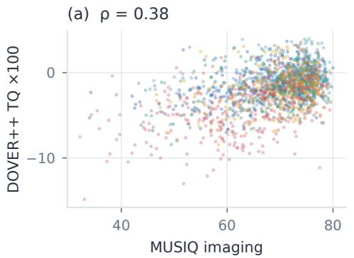

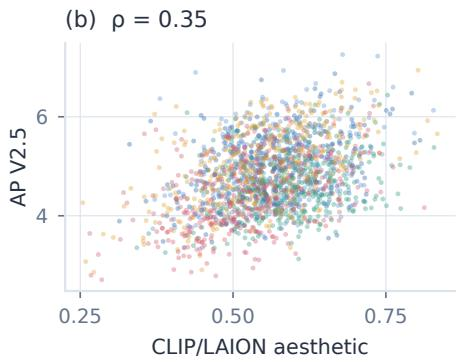  
Seedance-2.5 Seedance-2.0 MiniMax-H3 Wan3.0-Video Kling-v3-Omni  
Fig. 7: Quality models capture different aspects of the same outputs. Each panel compares two measures on the same 1,852 candidates, colored by system. DOVER++ technical quality and AP V2.5 aesthetics show partial correspondence with MUSIQ imaging quality and CLIP/LAION aesthetics, respectively. Spearman correlations summarize the overlap between these quality measures.

Reference similarity addresses a different question: which source properties are visible in the output? CLIP and DINO compare eight uniformly spaced midpoint frames with the assigned image or sampled video references, averaging frame-pair cosine similarities. Full-frame inputs preserve aspect ratio and are padded to 224 pixels. Localized affinity uses GroundingDINO (Liu et al., 2025b) boxes with within-category one-to-one matching; scene comparisons use SAM2.1 (Ravi et al., 2025) foreground masks to contrast the assigned scene with the motion-source background.

Tab. 8: Additional visual-quality dimensions. VBench-style consistency, smoothness, and aesthetic scores are multiplied by 100; imaging quality retains its 0–100 scale. DOVER++ AQ reports its raw aesthetic score. Means use the shared instances in each column. Higher values indicate better quality within each measure; scales differ across columns.
<table><tr><td>System Shared instances (n)</td><td>Subj. 350</td><td>Bkgd. 350</td><td>Smooth. 350</td><td>Aesth. 350</td><td>Imag. 350</td><td>AQ 350</td></tr><tr><td>Seedance-2.5</td><td>91.6</td><td>93.9</td><td>99.3</td><td>56.3</td><td>67.3</td><td>+0.035</td></tr><tr><td>Seedance-2.0</td><td>92.4</td><td>93.3</td><td>99.2</td><td>57.0</td><td>71.0</td><td>+0.040</td></tr><tr><td>MiniMax-H3</td><td>90.6</td><td>92.2</td><td>99.3</td><td>59.4</td><td>70.7</td><td>+0.036</td></tr><tr><td>Wan3.0-Video</td><td>89.8</td><td>91.2</td><td>99.1</td><td>54.7</td><td>70.0</td><td>+0.038</td></tr><tr><td>Kling-v3-Omni</td><td>90.9</td><td>93.0</td><td>99.1</td><td>53.1</td><td>64.2</td><td>+0.028</td></tr></table>

On identical non-tied pairs with equal instance weights, neither localization nor target-minus-source affinity shows a clear gain in correspondence with ORAV preferences over its full-frame or target-only counterpart; all paired 95% intervals include zero.

Face and style measurements provide feature-specific views in Tab. 9. ArcFace uses detected single-face references, grayscale bounding-box crops, and concatenated original/flip features without landmark alignment. Its correlation with localized DINO is 0.256 over 1,542 joint candidates, showing limited correspondence between face identity and whole-subject appearance.

Tab. 9: Complementary reference diagnostics. Face cosine uses ArcFace on detected faces; style cosines use ALADIN, CLIP, and DINO; motion compares visible foreground track directions. Each column uses its own five-system common subset. These affinities describe the measured feature and do not establish the identity of the actor performing an action or the correctness of the complete task.
<table><tr><td>System Shared instances (n)</td><td>Face 252</td><td>ALADIN 43</td><td>CLIP-Style 43</td><td>DINO-Style 43</td><td>Motion dir. 73</td></tr><tr><td>Seedance-2.5</td><td>0.360</td><td>0.324</td><td>0.627</td><td>0.272</td><td>0.290</td></tr><tr><td>Seedance-2.0</td><td>0.347</td><td>0.349</td><td>0.621</td><td>0.286</td><td>0.301</td></tr><tr><td>MiniMax-H3</td><td>0.336</td><td>0.246</td><td>0.610</td><td>0.244</td><td>0.311</td></tr><tr><td>Wan3.0-Video</td><td>0.332</td><td>0.371</td><td>0.643</td><td>0.342</td><td>0.572</td></tr><tr><td>Kling-v3-Omni</td><td>0.234</td><td>0.287</td><td>0.635</td><td>0.309</td><td>0.606</td></tr></table>

CoTracker3 compares visible moving-track directions on 32 relative-time frames, matching foreground tracks in both directions. The common foreground subset of 73 instances supports inspection of motion orientation. This score measures direction under relative-time alignment; it does not establish speed fidelity or the identity of the acting subject.

## A.5 AUDITORY QUALITY AND SELECTIVE REFERENCE USE

Speech measurements separate listening quality, vocal identity, and the specified utterance. Audiobox production quality (Tjandra et al., 2025) averages ten-second windows by duration. ECAPA-TDNN compares VAD-selected speech with the voice reference. Whisper-small transcription is normalized for punctuation and case, with character error rate for targets containing Chinese characters and word error rate for other targets. Normalized edit distance includes insertions and can exceed 100%. Recording reuse is measured by the maximum normalized waveform correlation over time shifts at 4 kHz, requiring at least three seconds and half the shorter recording to overlap.

These measurements reveal complementary differences. MiniMax-H3 has higher voice affinity than Seedance-2.5, Seedance-2.0, and Wan3.0-Video, while Seedance-2.5 has lower mean errors on the requested text. Wan3.0-Video’s production-quality mean is 7.12 even though its word-error rate is 112.5%; the listener also identifies recording replay in 9/78 assessed speech outputs.

For Kling-v3-Omni, the tested interface lacks an independent audio-reference channel, so the retained soundtrack adapter provides audio through video input. Its voice cosine of 0.998 and waveform correlation of 0.9998 quantify recording retention under this configuration.

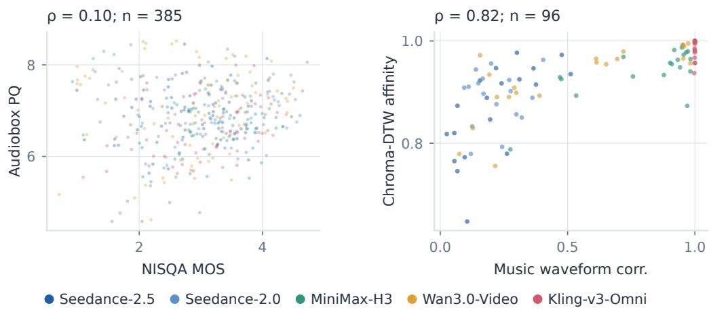  
Fig. 8: Auditory quality and music-reference use. Left: Audiobox PQ versus NISQA MOS on 385 speech candidates. Right: chroma-DTW affinity versus waveform reuse on 96 music candidates. High music affinity can reflect retained source audio.

Tab. 10: Speech quality and music-reference affinity. NISQA MOS and DNSMOS OVRL measure speech quality. CLAP, MuQ, chroma-DTW, and waveform correlation compare music references with the output. Music affinity has no universal quality direction: a task may request a new composition rather than the source recording. Kling-v3-Omni uses retained reference soundtracks.
<table><tr><td>System Shared instances (n)</td><td>NISQA 74</td><td>DNSMOS 72</td><td>CLAP 17</td><td>MuQ 17</td><td>Chroma 17</td><td>Waveform 17</td></tr><tr><td>Seedance-2.5</td><td>2.83</td><td>2.80</td><td>0.404</td><td>0.668</td><td>0.884</td><td>0.229</td></tr><tr><td>Seedance-2.0</td><td>3.11</td><td>2.97</td><td>0.509</td><td>0.763</td><td>0.890</td><td>0.216</td></tr><tr><td>MiniMax-H3</td><td>3.20</td><td>2.90</td><td>0.562</td><td>0.783</td><td>0.940</td><td>0.800</td></tr><tr><td>Wan3.0-Video</td><td>2.89</td><td>2.76</td><td>0.560</td><td>0.792</td><td>0.925</td><td>0.508</td></tr><tr><td>Kling-v3-Omni</td><td>3.01</td><td>2.68</td><td>0.661</td><td>0.929</td><td>0.988</td><td>1.000</td></tr></table>

Audiobox PQ and NISQA MOS correlate only weakly on the same 385 speech candidates, with ρ = 0.103; NISQA and DNSMOS correlate more strongly, with $\rho = 0 . 5 7 8$ on 381 candidates. These models target production quality, speech impairment (Mittag et al., 2021), and denoising quality (Reddy et al., 2022), respectively, providing complementary views of the generated soundtrack.

Music diagnostics use the mixed output audio. CLAP (Wu et al., 2023b) and MuQ (Zhu et al., 2025) provide pretrained embedding affinity; chroma-DTW measures pitch-class sequence resemblance. Across 96 candidates, chroma affinity and waveform reuse correlate at $\rho = 0 . 8 2 5$ . The five-system common music subset contains 17 instances, including different instructions for retaining or recreating musical content. These scores expose reference use without a universal upward ranking.

## A.6 REFERENCE SUBSTITUTION AND TASK FULFILLMENT

Reference-use failures distinguish source resemblance from task fulfillment. Tab. 11 separates candidate-level usability judgments, substitution cues, and unique-output replay counts. Kling-v3- Omni’s replay count characterizes the retained-soundtrack adapter used by its tested interface.

Tab. 11: Reference-usefailures. Unusability rates count ordered candidate judgments; substitution cues are a share of vetoes. Replay counts use unique outputs for speech instances.
<table><tr><td rowspan="2">System</td><td colspan="3">Ruled unusable</td><td rowspan="2">Substitution cues Share of vetoes</td><td rowspan="2">Reference voice Replayed</td></tr><tr><td>All</td><td>Video ref.</td><td>No video ref.</td></tr><tr><td>Seedance-2.5</td><td>2.3%</td><td>3.2%</td><td>0.0%</td><td>95%</td><td>0/75</td></tr><tr><td>Seedance-2.0</td><td>4.7%</td><td>6.0%</td><td>1.4%</td><td>91%</td><td>0/75</td></tr><tr><td>MiniMax-H3</td><td>7.7%</td><td>10.7%</td><td>0.0%</td><td>94%</td><td>0/78</td></tr><tr><td>Wan3.0-Video</td><td>43.8%</td><td>55.9%</td><td>12.0%</td><td>94%</td><td>9/78</td></tr><tr><td>Kling-v3-Omni</td><td>32.0%</td><td>31.4%</td><td>33.9%</td><td>96%</td><td>79/79</td></tr></table>

Tab. 11 summarizes whether each candidate supplies a usable rendition and why. Candidates are vetoed in 18.2% of candidate-level judgments. Vetoes determine 27% of resolved pairs, rising to 32% on instances with a video reference. In 95% of veto explanations, the text contains cues of reference substitution: source content appearing in place of the requested result. Examples include transferring the motion reference’s original performers and environment, or replaying a voice reference instead of producing the specified utterance. These are failures to use context as instructed, even when the output resembles a reference closely. The distinction is central to evaluating context use: the desired attributes must be composed into the requested event.

Wan3.0-Video’s veto rate is 56% with a video reference and 12% without one, reflecting frequent reproduction of source scenes and performers. The listening stage also identifies reference-recording replay in 9/78 speech instances with available observations; no replay is observed for Seedance-2.5, Seedance-2.0, or MiniMax-H3. Its visual source carryover and recording replay illustrate how recognizable source information can displace the requested composition across modalities.

Tab. 11 counts candidate judgments across all successful ordered comparisons, including different opponents and both presentation orders. Unavailable responses are excluded. Substitution shares use a fixed vocabulary of source-carryover and replay terms in veto explanations, summarizing textual cues rather than independently annotated causes. Speech replay is counted once per instance and system, using the listening-stage observations.

The recorded cases in Figs. 9 and 10 illustrate how reference-specific evidence distinguishes the demonstrated movement and its intended performers from visually similar source content.

## Motion correspondence

The man from @image1 performs the dunk from @video1 on a covered outdoor court at dusk; static side full-body shot, identity clearly recognizable.

## References

  
@image1

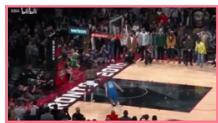  
0.00 s

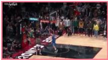  
0.40 s

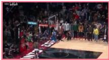  
0.63 s

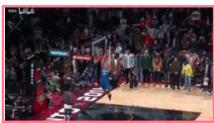  
0.90 s

## Kling-v3-Omni

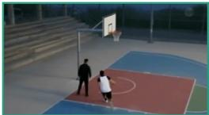

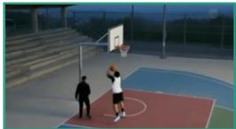

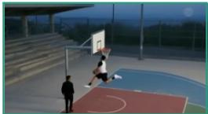  
Closer reference motion

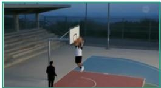  
“A reproduces that ordered structure: approach/gather at A\_P000, 0–0.375s; pronounced airborne leg split and low ball position at 0.500–0.625s; upward ball sweep and two-handed finish at […]”

Wan3.0-Video  
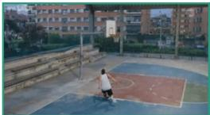

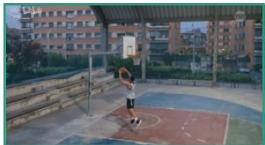

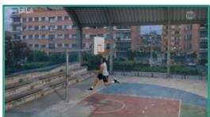

Closer reference motion

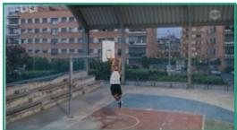  
“A preserves collection, a low airborne ball sweep with extended/split legs, and a two-handed rim finish in that order (A\_P000, 0.400–0.900s), followed by landing and departure […]”

## Seedance-2.5

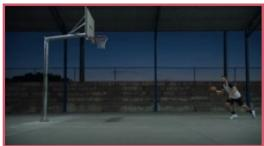

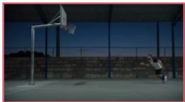

Conventional dunk

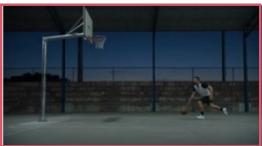  
“A reproduces approach, takeof, overhead dunk and landing, but its flight keeps the knees bent behind the body with the ball held high (A\_P002–A\_P004, 2.750–4.875s). It omits the […]”

Fig. 9: Reference-specific motion beyond overall appearance. In subject-motion-7f681a, forward leg extension with a lowered ball distinguishes the demonstrated dunk from a conventional rendition. Frames and verbatim quotations come from the recorded evaluation.

## Selective transfer and binding

@image1 leads and @image2 follows the foxtrot phrase of @video1 in an empty, windowless ballroom; fixed full-body wide shot.

## References

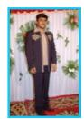  
@image1

  
@image2

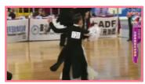  
0.50 s

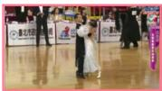  
4.00 s

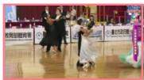  
8.00 s

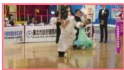  
12.00 s

## Seedance-2.5

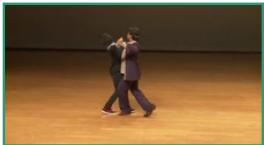

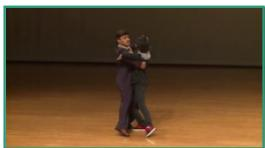

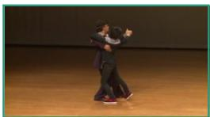  
Usable rendition

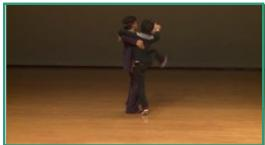  
“The complete 15.07s artifact remains coherent and usable. B\_P000–B\_P005 show only the integrated pair and bare dance space, with no observed reference inserts or unselected subjects. […]”

## Kling-v3-Omni

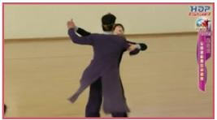

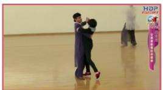

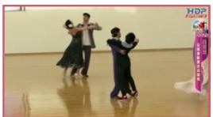

Reference-content leakage

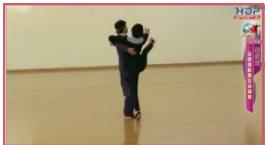

“Material unrequested reference-content leakage compromises the complete rendition: a cropped foreground dancer appears from approximately 0.750–4.000s (A\_P000–A\_P001), and another […]”

## Wan3.0-Video

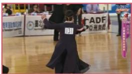

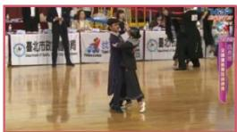

Reference-content leakage

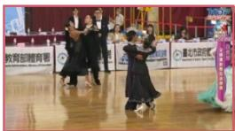

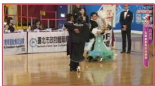  
“Material source-content retention occupies the entire observed artifact: B\_P000 at 0–2.4s includes the foreground spectator and competition crowd, while B\_P001–B\_P005 at 2.5–14.9s retain […]”

Fig. 10: Selective transfer ofmotion and performers. In subject-motion-be4824, reproducing the competition hall and its original dancers replaces the requested performers and scene. Frames and verbatim quotations reveal reference substitution rather than task fulfillment.

## A.7 EVALUATION SCOPE

ORAV assesses multimodal context understanding and generation through the complete system’s outputs. Reference-level judgments explain their relation to the task; they do not isolate the model’s internal understanding from synthesis. Timestamped panels and auditory observations support inspection of the evidence, while fine-grained audio-video synchronization remains outside the validated measurement scope. The human-validation subset was held out from evaluator development, and its labels are used only for independent validation.

## A.8 CANDIDATE PROVENANCE

Of 1,900 system–instance slots, 1,852 contributed a video and 48 did not. Content policies and related service restrictions account for undelivered videos and unavailable judge responses. Each delivered slot contributes one candidate. The manifest records instance and media identities, delivery status, and tested system configurations.

Each ordered comparison contributes at most one valid response. Failed requests may be retried with unchanged inputs and settings, without selection among valid responses.

Kling-v3-Omni’s tested interface accepts image and video references but no independent audio input. We package each audio reference as a video-input soundtrack, using the task’s video reference when available and a static reference image otherwise. Speech instances use original-sound retention. This compatibility adapter lets the system receive the task’s audio content through its supported interface.

## A.9 EVALUATION SETTINGS AND HUMAN VALIDATION

Tab. 12: Judge and listener settings. Output budgets are in tokens.
<table><tr><td>Component</td><td>Reasoning</td><td>Temperature</td><td>Output budget</td></tr><tr><td>GPT-6-Astra judge</td><td>medium</td><td></td><td>8,192</td></tr><tr><td>Gemini-3.1-Pro listener</td><td>medium</td><td>0.3</td><td>32,768</td></tr><tr><td>Gemini-3.1-Pro vanilla</td><td>high</td><td>0.3</td><td>16,384</td></tr></table>

Reasoning denotes effort or thinking level; — denotes default temperature without an explicit override.

The reasoning judge receives the English instruction, visual references, chronological candidate panels, and textual auditory observations. Frames are sampled at 8 fps, resized to width 512 with aspect ratio preserved, and arranged in at most six panels per clip, bounded by 2048 pixels per side. Row-major grids retain all frames at the largest fitting scale. Both Gemini components use Gemini-3.1-Pro-Preview. Vanilla receives native videos and references with default sampling; its prompt requests reference fidelity and audio-video quality in both presentation orders.

Each valid response provides reference-level, binding, instruction, usability, and overall preferences. Contract targets, requirements, and exclusions are interpreted within the request, not supplied as separate annotations. Ranking compares identity-mapped overall preferences across orders. The implementation retains the complete prompts and response schemas.

Human agreement averages eligible reviewer–pair agreement within each of the 38 held-out instances, then averages instances equally. Genuine ties and unavailable or order-conflicting automated decisions are excluded. Human rankings are not replaced with majority-vote labels. On common support, the W/T/L visualization retains genuine ties and counts automated order conflicts in its tie segment.

Validating the ORAV judge. ORAV evaluation connects observations of individual references to the success of the requested event. Timestamped panels expose motion phases, and the listener distinguishes voice characteristics, spoken content, and recording reuse. The decision protocol then weighs these observations according to their consequences for task fulfillment. We examine this design through two paired comparisons with human rankings. Simplified Astra retains ORAV’s prepared evidence and uses a simple pairwise prompt to return an overall winner and a brief reason. Every pair is evaluated in both orders.

Tab. 13: Paired human agreement on the 38 held-out instances. Each row uses its own shared eligible comparisons. Scores follow evaluator order; $\Delta$ is their paired difference. Instances receive equal weight; 95% intervals for $\Delta$ use 2,000 instance-bootstrap replicates.
<table><tr><td>Comparison</td><td>Agreement (%)</td><td>∆(pp)</td><td>95% CI (∆)</td></tr><tr><td>ORAV Judge vs. Simplified Astra</td><td>86.97 / 79.52</td><td>+7.45</td><td> $\left[ + 1 . 0 8 , + 1 5 . 8 3 \right]$ </td></tr><tr><td>Simplified Astra vs. Vanilla Gemini</td><td>82.09 / 71.89</td><td>+10.20</td><td> $[ + 4 . 4 8 , + 1 7 . 7 4 ]$ </td></tr></table>

ORAV Judge vs. Simplified Astra. Both settings use the same Astra model, visual and auditory evidence, reasoning-effort setting, and maximum output budget. The full protocol relates perreference matches to binding and instruction fulfillment, then resolves competing local advantages using usability, task fulfillment, and general quality as ordered priorities. The 7.45-percentage-point gain supports ORAV’s structured decision protocol over the simplified pairwise prompt under the same judge model and prepared evidence.

Simplified Astra vs. Vanilla Gemini. Both use the same simple instruction to assess reference fidelity and audio-video quality. Vanilla Gemini reads native videos and references, while Simplified Astra combines the Astra judge with timestamped panels and listener observations. Human agreement is 10.20 points higher for the latter configuration. Together, these comparisons support preparing multimodal evidence and judging how reference contributions jointly fulfill the instruction.