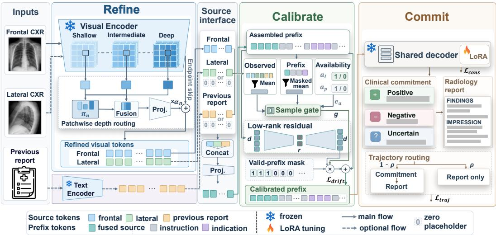
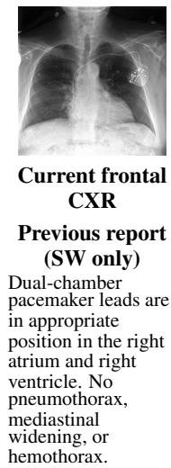

# PACER: PROGRESSIVE AVAILABILITY-CONDITIONEDEVIDENCE ROUTING FOR RADIOLOGY REPORTGENERATION UNDER INCOMPLETE CLINICALCONTEXT

Yulong Chen<sup>1</sup> Yadong Liu<sup>1</sup> Haoyu Cao<sup>1</sup> Sen Xu<sup>2</sup> Yueying Wang<sup>3</sup> Jie Wen<sup>1,∗</sup>

<sup>1</sup>Harbin Institute of Technology, Shenzhen, China

<sup>2</sup>Yancheng Institute of Technology, Yancheng, China

<sup>3</sup>Shanghai University, Shanghai, China

chenyulonghit@163.com, liuyadong221010@163.com, haoyucao1016@gmail.com

xusen@ycit.cn, yueyingwang@shu.edu.cn, jiewen pr@126.com

<sup>∗</sup>Corresponding author

## ABSTRACT

Radiology report generation (RRG) increasingly incorporates heterogeneous clinical evidence, such as multi-view radiographs and previous reports, whose availability varies across examinations. However, accommodating different input combinations does not ensure effective evidence use: generated reports may still omit or inaccurately describe clinically relevant findings. To address this problem, we propose PACER, a Progressive Availability-Conditioned Evidence Routing framework for structured incomplete-context RRG that follows a Refine–Calibrate– Commit pipeline. It first refines observed visual representations through endpointpreserving patchwise routing across frozen encoder depths, incorporating complementary cues while retaining the pretrained terminal representation. It then calibrates the language-model prefix according to the observed evidence and availability state, adapting the shared generator’s conditioning as the available source set changes. Finally, it generates polarity-structured clinical commitments before the report in the same autoregressive trajectory, providing structured clinical context for subsequent generation. Experiments demonstrate state-of-the-art clinical efficacy across all four MIMIC-RG4 settings and strong MIMIC-CXR performance, while maintaining competitive language-generation quality.

## 1 INTRODUCTION

Radiology report generation (RRG) aims to translate radiographic examinations into clinically meaningful reports, potentially reducing repetitive reporting workload and improving interpretation efficiency (Wang et al., 2025b; Liu et al., 2024). In clinical practice, however, radiologists may draw on heterogeneous evidence whose availability varies across examinations. Such source-level variability motivates RRG models that operate under structured incompleteness, where optional evidence sources may be present or absent as whole sources (Liu et al., 2025b;a; 2026a).

Recent RRG research increasingly treats multi-view radiographs and historical context as complementary clinical evidence. Multi-view longitudinal learning, historical constraints, and prior-guided decoding improve the extraction and integration of complementary spatial and longitudinal evidence (Liu et al., 2025a;b; 2026a). To accommodate unavailable context, MLRG introduces tokenized absence encoding, while LLM-RG4 supports four input configurations through adaptive token fusion and token-level weighting (Liu et al., 2025a; Wang et al., 2025b). Related incomplete multimodal methods further improve robustness to missing sources through adaptive fusion, dynamic weighting, retrieval, or prompting (Yao et al., 2024; Li et al., 2025; Lang et al., 2025). These advances substantially improve heterogeneous evidence integration and robustness under varying input con ditions. However, as the available source set changes, how a shared generator should adapt its use of observed evidence throughout the generation process remains insufficiently explored. Without such coordinated adaptation, clinically relevant cues may still be underused, resulting in omitted or inaccurately described findings.

To address this gap, we propose PACER, a Progressive Availability-Conditioned Evidence Routing framework organized as a Refine–Calibrate–Commit pipeline. At the visual-representation interface, relying only on the terminal encoder representation may leave complementary information distributed across encoder depths underutilized. Refine therefore performs endpoint-preserving patchwise depth routing to enrich the observed visual evidence while retaining the pretrained terminal representation. Building on the refined evidence, changes in the observed source set further call for adaptive language-model conditioning. Calibrate addresses this by adjusting the languagemodel prefix according to both the observed evidence and its availability state. Finally, even with adapted representations and conditioning, free-form decoding still lacks an explicit polarity-aware clinical scaffold to guide subsequent report generation. Commit addresses this by generating positive, negative, and uncertain clinical commitments before the report within the same autoregressive trajectory, thereby structuring the clinical evidence that conditions the subsequent report. Overall, PACER progressively coordinates available evidence under varying input configurations. We validate the framework through extensive experiments on MIMIC-RG4 and MIMIC-CXR.

Our main contributions are as follows:

• To the best of our knowledge, we are the first to explicitly formulate structured incompletecontext RRG as an availability-conditioned evidence-routing problem, emphasizing how observed evidence should be progressively utilized rather than merely accommodated as source availability changes.

• We develop PACER to implement multi-interface evidence routing through three coordinated mechanisms: endpoint-preserving patchwise depth routing, availability-conditioned low-rank prefix calibration, and polarity-structured clinical commitment.

• Experiments on MIMIC-RG4 and MIMIC-CXR show that PACER achieves state-of-theart CE F1 across all four MIMIC-RG4 settings while maintaining competitive languagegeneration performance, together with strong conventional-RRG results. Component and mechanism ablations further validate the proposed routing design.

## 2 RELATED WORK

We review three lines of work most relevant to our setting: flexible and context-enriched RRG, incomplete multimodal learning, and evidence-grounded structured generation.

Flexible and context-enriched RRG. Multi-view and longitudinal RRG exploit additional projections and historical information to enrich spatial and temporal evidence (Liu et al., 2025b;a; 2026a), while recent methods further model disease evolution through temporal decoupling and progression-aware prompting (Dong et al., 2026; Liu et al., 2026b). LLM-RG4 establishes a flexible four-context setting with adaptive token fusion and token-level weighting for variable inputs (Wang et al., 2025b). These methods improve contextual flexibility and evidence integration under variable input conditions. PACER complements this line by focusing on effective evidence utilization rather than input accommodation alone as source availability changes.

Incomplete multimodal learning. Existing methods address missing inputs through reconstruction, representation decoupling, and adaptive fusion (Liu et al., 2023; Wang et al., 2024; Yao et al., 2024), or through dynamic weighting, retrieval, and prompting (Li et al., 2025; Lang et al., 2025; Pipoli et al., 2025). In RRG, DiA-gnostic VLVAE handles missing clinical context through MoE based shared-latent inference, allowing the shared posterior to rely on observed modalities when context is unavailable (Shaik et al., 2026). In contrast, PACER focuses on availability-conditioned adaptation of the shared generator, calibrating its language-model prefix according to both observed evidence and source availability.

Evidence grounding and structured generation. RRG methods improve visual grounding through hierarchical representations, anatomical regions, and auxiliary alignment (Huang et al.,

  
Figure 1: Overview of PACER under structured incomplete clinical context. Refine enhances observed visual evidence through endpoint-preserving patchwise depth routing, Calibrate applies availability-conditioned prefix calibration, and Commit generates polarity-structured clinical commitments before the report in the same autoregressive trajectory.

2023; Tanida et al., 2023; Gao et al., 2026). Structured generation has explored description planning, diagnosis-derived prompting, observation planning, topic organization, and explicit clinical reasoning (Nishino et al., 2022; Jin et al., 2024; Hou et al., 2023; Cheng & Subramanian, 2026; Zhang et al., 2026). Recent work further explores self-critique and confidence-guided rewriting (Yan et al., 2026; Yu et al., 2026). Compared with prior work, PACER couples endpoint-preserving visual refinement with polarity-structured clinical commitments to guide subsequent report generation.

## 3 METHOD

## 3.1 PROBLEM FORMULATION AND FRAMEWORK OVERVIEW

We study radiology report generation under structured incomplete clinical context, where incompleteness is defined at the source level over three predefined sources: a frontal radiograph $\mathbf { I } _ { f } ,$ a lateral radiograph I<sub>l</sub>, and a previous report $\mathbf { T } _ { p }$ . The frontal radiograph is always observed, whereas the lateral radiograph and previous report may be unavailable. Indication/history, when available, is included as prompt context and is not treated as an availability axis.

We represent auxiliary-source availability by $\mathbf { a } = ( a _ { l } , a _ { p } ) \in \{ 0 , 1 \} ^ { 2 }$ , where $a _ { l }$ and $a _ { p }$ indicate the presence of the lateral view and previous report. SN, SW, MN, and MW correspond to (0, 0), (0, 1), (1, 0), and (1, 1), respectively. Here S/M denote frontal-only/frontal–lateral image inputs, and N/W denote the absence/presence of a previous report. Let $\mathbf { Y } = ( y _ { 1 } , \dots , y _ { T } )$ be the scenario-specific target report. Following LLM-RG4 (Wang et al., 2025b), unavailable sources occupy zero-valued feature slots in a fixed source layout.

PACER progressively routes observed evidence through the Refine–Calibrate–Commit pipeline (Figure 1). Refine processes the observed radiographs, while a separate text encoder handles the pre vious report; their representations are assembled into the language-model prefix. Calibrate adapts this prefix to the observed evidence and availability state, and Commit generates polarity-structured commitments to guide report content.

## 3.2 REFINE: ENDPOINT-PRESERVING PATCHWISE DEPTH ROUTING

Representations from different Transformer depths encode complementary visual information (Ranftl et al., 2021; Lin et al., 2025; Huang et al., 2023). Because clinically relevant radiographic evidence can be spatially localized (Tanida et al., 2023), we allow each patch to select its own depth distribution rather than using a global mixture shared across the image.

For each observed radiograph $\mathbf { I } _ { s } , s \in \{ f , l \}$ , let $\mathbf V _ { s } ^ { ( \ell ) } = [ { \mathbf v } _ { s , 1 } ^ { ( \ell ) } , \ldots , { \mathbf v } _ { s , N _ { \mathrm { * } } } ^ { ( \ell ) } ] ^ { \top } \in \mathbb { R } ^ { N _ { v } \times d _ { v } }$ denote the non-CLS patch features extracted by frozen RAD-DINO (Perez-Garc´ ´ıa et al., 2025) at encoder depth $\ell \in \kappa$ . Here, $N _ { v }$ is the number of non-CLS patch tokens, $d _ { v }$ is their feature dimension, and $\kappa$ is the set of selected encoder depths. The same encoder and depth router are applied independently to the frontal and lateral sources. For readability, we omit the source index s below and write $\mathbf { V } ^ { ( \ell ) }$ and $\mathbf { v } _ { n } ^ { ( \ell ) }$ . To align depth-dependent feature statistics, we map each patch into a common routing space:

$$
\mathbf { u } _ { n } ^ { ( \ell ) } = \mathbf { P } _ { \ell } \operatorname { L N } _ { \ell } \left( \mathbf { v } _ { n } ^ { ( \ell ) } \right) + \mathbf { b } _ { \ell } ,\tag{1}
$$

where $\mathbf { P } _ { \ell } \in \mathbb { R } ^ { d _ { r } \times d _ { \tau } }$ <sup>v</sup> is a learnable projection, $\mathrm { L N } _ { \ell }$ is a layer-specific normalization, $\mathbf { b } _ { \ell } \in \mathbb { R } ^ { d _ { r } }$ is the corresponding bias, and $d _ { r }$ is the routing dimension.

A shared scorer produces a patch-specific distribution over the selected depths:

$$
\pi _ { n , \ell } = \frac { \exp \Big ( \mathbf { w } _ { \boldsymbol { \pi } } ^ { \intercal } \mathbf { u } _ { n } ^ { ( \ell ) } + \beta _ { \ell } \Big ) } { \sum _ { j \in K } \exp \Big ( \mathbf { w } _ { \boldsymbol { \pi } } ^ { \intercal } \mathbf { u } _ { n } ^ { ( j ) } + \beta _ { j } \Big ) } , \qquad \sum _ { \ell \in K } \pi _ { n , \ell } = 1 ,\tag{2}
$$

where $\mathbf { w } _ { \pi } \in \mathbb { R } ^ { d _ { r } }$ is the shared routing vector, $\beta _ { \ell } \in \mathbb { R }$ is a learnable depth-specific bias, and $j$ indexes candidate depths in $\kappa .$ . Thus, ${ \pmb { \pi } } _ { n } ~ = ~ ( { \boldsymbol { \pi } } _ { n , \ell } ) \varrho _ { \in \mathcal { K } }$ varies across patches, allowing spatially localized evidence to draw differently on representations from different encoder depths rather than sharing a single image-level depth mixture.

To incorporate complementary cross-depth cues without replacing the pretrained terminal representation, we use the routed mixture to predict an additive correction. This preserves a direct path from the pretrained endpoint while allowing each patch to incorporate information from earlier encoder depths:

$$
\delta _ { n } = \mathbf { W } _ { o } \operatorname { L N } _ { \delta } \left( \sum _ { \ell \in \mathcal { K } } \pi _ { n , \ell } \mathbf { u } _ { n } ^ { ( \ell ) } \right) + \mathbf { b } _ { o } ,\tag{3}
$$

$$
\widehat { \mathbf { v } } _ { n } = \mathbf { v } _ { n } ^ { \mathrm { e n d } } + \alpha _ { D } \delta _ { n } , \qquad \alpha _ { D } = \bar { \alpha } _ { D } \mathrm { s i g m o i d } ( \eta _ { D } ) ,\tag{4}
$$

where ${ \bf v } _ { n } ^ { \mathrm { e n d } }$ denotes the final normalized RAD-DINO patch representation, $\mathrm { L N } _ { \delta }$ normalizes the routed mixture, $\mathbf { W } _ { o } \in \mathbb { R } ^ { d _ { v } \times d _ { r } }$ and $\mathbf { b } _ { o } \in \mathbb { R } ^ { d _ { v } }$ project it back to the encoder feature space, $\eta _ { D }$ is a learnable scalar, and $\hat { \alpha } _ { D }$ bounds the scalar residual weight $\alpha _ { D }$

With $\mathbf { W } _ { o }$ and $\mathbf { b } _ { o }$ initialized to zero, the module starts exactly from the pretrained terminal representation and learns patch-specific corrections during training. Restoring the source index, Refine outputs $\widehat { \mathbf { V } } _ { f }$ and, when available, $\widehat { \mathbf { V } } _ { l }$ , which are passed to the source interface used by Calibrate.

## 3.3 CALIBRATE: AVAILABILITY-CALIBRATED PREFIX ROUTING

Motivated by context-aware prompting for incomplete multimodal inputs (Lang et al., 2025; Pipoli et al., 2025), we adapt the pre-Transformer prefix to observed evidence and source availability. Each observed source—the refined image features $\widehat { \mathbf { V } } _ { f } , \widehat { \mathbf { V } } _ { l }$ or the text encoding of $\mathbf { T } _ { p }$ —is compressed and projected into pre-fusion tokens $\mathbf { Z } _ { s } \in \mathbb { R } ^ { N _ { q } \times d } , \dot { s } \in \{ f , l , p \}$ , where $N _ { q }$ is the number of compressed tokens per source and d is the language-model embedding dimension. Unavailable sources use zero-valued slots. The source tokens are fused, then assembled with the prompt context into $\mathbf { E } _ { P }$

During teacher forcing, ${ \bf E } = [ { \bf E } _ { P } ; { \bf E } _ { T } ] \in \mathbb { R } ^ { T ^ { \prime } \times d }$ concatenates this prefix with the target-side embeddings $\mathbf { E } _ { T }$ of the routed sequence in Section 3.4, where $T ^ { \prime }$ counts input positions. The mask m $\in \{ 0 , 1 \} ^ { T ^ { \prime } }$ selects valid prefix positions, excluding target-side positions and padding. We define

$$
\begin{array} { l } { { \displaystyle { { \bar { \bf h } } _ { P } } = \frac { { { \bf E } ^ { \top } } { \bf m } } { \| { \bf m } \| _ { 1 } } } , \qquad { { \bf { \bar { z } } } _ { s } } = \frac { { ( { \bf Z } _ { s } ) ^ { \top } } { \bf 1 } _ { N _ { q } } } { N _ { q } } , } \\ { { \displaystyle { \bar { \bf z } } _ { \bf a } = \frac { { { \bf \bar { z } } _ { f } } + a _ { l } { \bf \bar { z } } _ { l } + a _ { p } { \bf \bar { z } } _ { p } } { 1 + a _ { l } + a _ { p } } } , } \end{array}\tag{5}
$$

where $\| \mathbf { m } \| .$ counts valid prefix positions, 1 $N _ { q }$ is an $N _ { q }$ -dimensional all-ones vector, $\bar { \mathbf { h } } _ { P } \in \mathbb { R } ^ { d }$ is the prefix summary, and $\bar { \mathbf { z } } _ { \mathbf { a } } \in \mathbb { R } ^ { d }$ averages only observed sources, avoiding dilution by missing-source zero slots.

Each availability state a is associated with a learnable embedding $\mathbf { e _ { a } } ~ \in ~ \mathbb { R } ^ { d _ { a } }$ , where $d _ { a }$ is the availability-embedding dimension. The three inputs provide complementary conditioning cues: $\mathbf { h } _ { P }$ summarizes the assembled prefix after source fusion and prompting, $\bar { \mathbf { z } } _ { \mathbf { a } }$ explicitly summarizes the observed sources before fusion, and $\mathbf { e _ { a } }$ identifies which optional sources are available. Their combination conditions the adaptation strength on both evidence content and source availability:

$$
g = \mathrm { s i g m o i d } \big ( \mathbf { w } _ { g } ^ { \top } \mathrm { G E L U } \big ( \mathbf { W } _ { g } [ \bar { \mathbf { h } } _ { P } ; \bar { \mathbf { z } } _ { \mathbf { a } } ; \mathbf { e } _ { \mathbf { a } } ] + \mathbf { b } _ { g } \big ) + b _ { \mathrm { o u t } } \big ) ,\tag{6}
$$

where $[ \cdot ; \cdot ]$ denotes concatenation, $\mathbf { W } _ { g } \in \mathbb { R } ^ { d _ { g } \times ( 2 d + d _ { a } ) }$ and $\mathbf { b } _ { g } \in \mathbb { R } ^ { d _ { g } }$ parameterize the hidden layer, ${ \bf w } _ { g } \in \mathbb { R } ^ { d _ { g } }$ and $b _ { \mathrm { o u t } } \in \mathbb { R }$ are the output projection and scalar bias, respectively, and $d _ { g }$ is the gate hidden dimension. The resulting scalar $g \in ( 0 , 1 )$ controls the adaptation strength for each sample.

To provide token-specific corrections with a compact residual parameterization, we use a positionwise bottleneck mapping $\boldsymbol { B } : \mathbb { R } ^ { T ^ { \prime } \times d }  \mathbb { R } ^ { T ^ { \prime } \times d }$ , scaled by the sample-wise gate $g \colon$

$$
\begin{array} { r l r } {  { \mathcal { B } ( \mathbf { E } ) = \mathrm { D r o p o u t } \big [ \mathrm { G E L U } \big ( \mathrm { L N } ( \mathbf { E } ) \mathbf { W } _ { \downarrow } ^ { \top } \big ) \big ] \mathbf { W } _ { \uparrow } ^ { \top } , } } \\ & { } & { \widetilde { \mathbf { E } } = \mathbf { E } + g \mathrm { ~ D i a g } ( \mathbf { m } ) \mathcal { B } ( \mathbf { E } ) , } \end{array}\tag{7}
$$

where LN denotes layer normalization, $\mathbf { W _ { \downarrow } } \in \mathbb { R } ^ { r \times d }$ and $\mathbf { W } _ { \uparrow } \in \mathbb { R } ^ { d \times r }$ are the learnable down- and up-projection matrices, $r \ll d$ is the bottleneck dimension, and $\mathrm { D i a g } ( { \bf m } ) \in \mathbb { R } ^ { T ^ { \prime } \times T ^ { \prime } }$ is the diagonal mask induced by m. Thus, B(E) is a token-wise correction with the same shape as E, while only valid prefix positions receive this correction. Zero-initializing $\mathbf { W } _ { \uparrow }$ gives $\widetilde { \mathbf { E } } = \mathbf { E }$ at initialization.

The gate is target-blind because it uses only valid-prefix information, observed sources, and availability, not $\mathbf { E } _ { T }$ . Together with the position-wise $B ,$ this gives $\partial \widetilde { \bf E } _ { P } / \partial { \bf E } _ { T } = { \bf 0 }$ . The mask ensures $[ \widetilde { \mathbf { E } } - \mathbf { E } ] _ { t , : } = \mathbf { 0 }$ whenever $m _ { t } = 0$ . The same prefix-only correction is applied before the Transformer during teacher forcing and autoregressive generation.

## 3.4 COMMIT: POLARITY-STRUCTURED CLINICAL COMMITMENT ROUTING

Building on structured RRG generation (Nishino et al., 2022; Jin et al., 2024; Hou et al., 2023), the shared decoder uses the calibrated prefix $\mathbf { E } _ { P }$ to generate a polarity-structured clinical commitment before the report, providing structured clinical context for subsequent generation. Supervision is provided by $\mathbf { \bar { q } } ^ { \star } = ( \mathbf { q } ^ { \mathrm { p o s } } , \mathbf { \bar { q } } ^ { \mathrm { n e g } } , \mathbf { q } ^ { \mathrm { u n c } } )$ , which organizes positive, negative, and uncertain findings, with its construction detailed in Appendix A.

To combine explicit clinical commitment supervision with direct-report supervision, we stochastically route complete supervised trajectories through the same decoder. Let $\xi \sim$ Bernoulli $( 1 - \rho )$ where $\rho$ is the probability of selecting the direct-report route, and let $\pmb { \iota } _ { \mathrm { C } }$ and $\pmb { \imath } _ { \mathrm { D } }$ denote the commitment-first and direct-report instructions, respectively. The corresponding route-specific target sequence $\tau _ { \xi } ^ { \star }$ is

$$
( \iota _ { \xi } , \tau _ { \xi } ^ { \star } ) = \left\{ \begin{array} { l l } { ( \iota _ { \mathrm { C } } , [ \langle \mathrm { A N C H O R } \rangle , \mathbf { q } ^ { \star } , \langle / \mathrm { A N C H O R } \rangle , \langle \mathrm { R E P O R T } \rangle , \mathbf { Y } , \langle / \mathrm { R E P O R T } \rangle ] ) , } & { \xi = 1 , } \\ { ( \iota _ { \mathrm { D } } , \mathbf { Y } ) , } & { \xi = 0 . } \end{array} \right.\tag{8}
$$

The route is sampled before instruction and target construction, so routing changes the complete supervised sequence rather than isolated tokens. Inference always uses the commitment-first route, with one decoder generating the commitment followed by the report in a single left-to-right pass.

## 3.5 OVERALL LEARNING OBJECTIVE

Training follows the Refine–Calibrate–Commit design in two optimization stages (phase details in Appendix A). Refine and Commit are first optimized with autoregressive trajectory supervision; the resulting parent is then frozen and only Calibrate is trained with output- and representation-level regularization.

For training example b, let $\xi _ { b }$ denote the route sampled as in Section 3.4, and let $\tau _ { b } ^ { \star } = \tau _ { \xi _ { b } } ^ { \star }$ denote the corresponding routed target sequence. We then let $\Omega _ { \mathrm { Q } } ^ { ( b ) }$ and $\Omega _ { \mathrm { Y } } ^ { ( b ) }$ denote its supervised commitmentand report-side positions, respectively, with $\Omega _ { \mathrm { Q } } ^ { ( b ) } = \emptyset$ for direct-report samples, and define $\quad { \cal S } _ { b } = $ $\Omega _ { \mathrm { Q } } ^ { ( b ) } \cup \Omega _ { \mathrm { Y } } ^ { ( b ) }$ . Given

$$
\ell _ { b t } = - \log p _ { \boldsymbol \theta } \left( \tau _ { b t } ^ { \star } \mid \tau _ { b , < t } ^ { \star } , \mathbf { E } _ { P , b } \right) ,
$$

where $p _ { \theta }$ denotes the complete model; observed-source and availability conditioning is omitted for brevity. To balance commitment and report supervision, we set $\omega _ { b t } = \lambda _ { \mathrm { Q } }$ on $\Omega _ { \mathrm { Q } } ^ { ( b ) }$ and $\omega _ { b t } = 1$ on $\Omega _ { \mathbf { Y } } ^ { ( b ) }$ . Let $\kappa _ { b } = \lambda _ { \mathrm { Q } }$ for commitment-first samples and $\kappa _ { b } = 1$ for direct-report samples denote the ignored-BOS weight retained by the implementation normalizer. The trajectory objective is

$$
{ \mathcal { L } } _ { \mathrm { t r a j } } = { \frac { \sum _ { b } \sum _ { t \in S _ { b } } \omega _ { b t } \ell _ { b t } } { \sum _ { b } \sum _ { t \in S _ { b } } \omega _ { b t } + \sum _ { b } \kappa _ { b } + \varepsilon } } + \lambda _ { \mathrm { T L W } } { \mathcal { L } } _ { \mathrm { T L W } } ,\tag{9}
$$

where $\varepsilon$ is a numerical stabilizer and ${ \mathcal { L } } _ { \mathrm { T L W } }$ is an independently normalized report-side auxiliary loss using the emphasized-token annotations from LLM-RG4 (Wang et al., 2025b). Exact span boundaries, masking, and token weighting are detailed in Appendix A.

During Calibrate training, the frozen parent provides a reference for limiting output deviation and prefix drift. Let $p _ { 0 }$ denote the next-token distribution of the frozen parent model with prefix routing disabled, and $p _ { \theta }$ that of the adapted model, both conditioned on the same observed case. Let $\Omega _ { \mathrm { c o n } } ^ { ( b ) }$ denote the valid prediction positions used for output consistency. We regularize output deviation and valid-prefix representation drift by

$$
\mathcal { L } _ { \mathrm { c o n s } } = \mathbb { E } _ { b , t \in \Omega _ { \mathrm { c o n s } } ^ { ( b ) } } D _ { \mathrm { K L } } \left( p _ { 0 } ( \cdot \mid \tau _ { b , < t } ^ { \star } , \mathbf { E } _ { P , b } ) \Vert p _ { \theta } ( \cdot \mid \tau _ { b , < t } ^ { \star } , \mathbf { E } _ { P , b } ) \right) ,\tag{10}
$$

$$
\mathcal { L } _ { \mathrm { d r i f t } } = \mathbb { E } _ { b , t : m _ { b t } = 1 } \frac { \left\| \widetilde { \mathbf { E } } _ { b t , : } - \mathbf { E } _ { b t , : } \right\| _ { 2 } ^ { 2 } } { d } ,\tag{11}
$$

where $\mathbf { m } _ { b }$ is the prefix mask defined in Section 3.3. The Calibrate stage minimizes

$$
\mathcal { L } _ { \mathrm { P A C E R } } = \mathcal { L } _ { \mathrm { t r a j } } + \lambda _ { \mathrm { c o n s } } \mathcal { L } _ { \mathrm { c o n s } } + \lambda _ { \mathrm { d r i f t } } \mathcal { L } _ { \mathrm { d r i f t } } ,\tag{12}
$$

where $\lambda _ { \mathrm { { c o n s } } }$ and $\lambda _ { \mathrm { d r i f t } }$ weight the output-consistency and prefix-drift regularizers, respectively.

## 4 EXPERIMENTS

## 4.1 EXPERIMENTAL SETUP

Task and data. We evaluate PACER under both structured incomplete-context and conventional RRG settings. The primary evaluation uses MIMIC-RG4 (Wang et al., 2025b), constructed from MIMIC-CXR (Johnson et al., 2019), under the four availability states defined in Section 3.1. Following the benchmark protocol, the four-context evaluation uses findings-and-impression reports, whereas conventional SN uses findings only. For this fixed-availability setting, we evaluate a dedicated Refine+Commit model, while Calibrate is evaluated in the multi-context setting where structured source availability varies.

Baselines and metrics. For the four-context comparison, we use the published LLM-RG4, CXR-Mate, and RadFM results from Wang et al. (2025b), and include local adaptations of SimMLM (Li et al., 2025) and RAGPT (Lang et al., 2025) under the same four-context MIMIC-RG4 evaluation protocol; provenance and adaptation details are provided in Appendix C. Clinical efficacy (CE) is measured by micro-averaged precision, recall, and F1 from CheXbert-extracted labels (Smit et al., 2020), and language quality by BLEU-1–4 (B@1–4), ROUGE-L (R-L), and METEOR (MTR) (Papineni et al., 2002; Lin, 2004; Banerjee & Lavie, 2005). Ablations are summarized by the arithmetic mean over the four MIMIC-RG4 contexts, computed before rounding.

Implementation. Following LLM-RG4, we use Vicuna-7B v1.5 with LoRA (Hu et al., 2022) as the language decoder and frozen RAD-DINO as the visual backbone. The depth router uses encoder layers {4, 8, 12}, and the prefix residual branch uses rank r = 16. Clinical commitment targets are constructed offline from reference reports using a hybrid LLM-assisted and rule-based extraction pipeline. Training follows the staged optimization in Section 3.5; stage-specific trajectory sampling, loss weights, and other implementation details are provided in Appendix A.

Table 1: Four-context results on MIMIC-RG4. Published baselines follow Wang et al. (2025b); ∗ denotes CXRMate retrained therein and † our SimMLM/RAGPT adaptations. Bold/underline indicate the best/second-best non-tied values per context; ties for best are bold.
<table><tr><td colspan="2" rowspan="2">Setting Model</td><td colspan="3">CE Metrics</td><td colspan="6">NLG Metrics</td></tr><tr><td>P</td><td>R</td><td>F1</td><td>B@1</td><td>B@2</td><td>B@3</td><td>B@4</td><td>R-L</td><td>MTR</td></tr><tr><td rowspan="6">SN</td><td>CXRMate*</td><td>0.572</td><td>0.560</td><td>0.566</td><td>0.421</td><td>0.271</td><td>0.179</td><td>0.122</td><td>0.311</td><td>0.174</td></tr><tr><td>RadFM</td><td>0.413</td><td>0.303</td><td>0.350</td><td>0.188</td><td>0.090</td><td>0.048</td><td>0.028</td><td>0.190</td><td>0.094</td></tr><tr><td>LLM-RG4</td><td>0.588</td><td>0.632</td><td>0.609</td><td>0.479</td><td>0.343</td><td>0.255</td><td>0.196</td><td>0.384</td><td>0.209</td></tr><tr><td>SimMLM†</td><td>0.568</td><td>0.591</td><td>0.579</td><td>0.425</td><td>0.277</td><td>0.186</td><td>0.128</td><td>0.313</td><td>0.168</td></tr><tr><td>RAGPT†</td><td>0.565</td><td>0.564</td><td>0.564</td><td>0.423</td><td>0.278</td><td>0.188</td><td>0.129</td><td>0.314</td><td>0.168</td></tr><tr><td>PACER (Ours)</td><td>0.620</td><td>0.645</td><td>0.632</td><td>0.468</td><td>0.337</td><td>0.251</td><td>0.192</td><td>0.390</td><td>0.208</td></tr><tr><td rowspan="5">SW</td><td>CXRMate*</td><td>0.573</td><td>0.549</td><td>0.561</td><td>0.361</td><td>0.220</td><td>0.139</td><td>0.093</td><td>0.284</td><td>0.153</td></tr><tr><td>RadFM</td><td>0.508</td><td>0.365</td><td>0.425</td><td>0.211</td><td>0.103</td><td>0.056</td><td>0.033</td><td>0.183</td><td>0.105</td></tr><tr><td>LLM-RG4</td><td>0.599</td><td>0.622</td><td>0.610</td><td>0.455</td><td>0.321</td><td>0.239</td><td>0.186</td><td>0.382</td><td>0.199</td></tr><tr><td>SimMLM†</td><td>0.583</td><td>0.556</td><td>0.569</td><td>0.379</td><td>0.236</td><td>0.152</td><td>0.105</td><td>0.306</td><td>0.152</td></tr><tr><td>RAGPT†</td><td>0.568</td><td>0.556</td><td>0.562</td><td>0.387</td><td>0.244</td><td>0.158</td><td>0.106</td><td>0.307</td><td>0.156</td></tr><tr><td rowspan="5">MN</td><td>PACER (Ours) CXRMate*</td><td>0.623 0.544</td><td>0.654 0.522</td><td>0.638</td><td>0.456 0.437</td><td>0.323 0.289</td><td>0.240 0.199</td><td>0.186 0.141</td><td>0.386 0.332</td><td>0.202 0.179</td></tr><tr><td>RadFM</td><td>0.323</td><td>0.187</td><td>0.533 0.237</td><td></td><td></td><td></td><td></td><td></td><td>0.2460.1130.0600.0340.1940.104</td></tr><tr><td>LLM-RG4</td><td>0.541</td><td>0.578</td><td>0.559</td><td></td><td>0.4910.3590.2740.2160.405</td><td></td><td></td><td></td><td></td></tr><tr><td>SimMLM†</td><td>0.512</td><td>0.558</td><td>0.534</td><td>0.429</td><td>0.283</td><td>0.195</td><td>0.138</td><td></td><td>0.214</td></tr><tr><td>RAGPT†</td><td>0.544</td><td>0.531</td><td>0.537</td><td>0.431</td><td>0.288</td><td>0.200</td><td>0.142</td><td>0.325 0.327</td><td>0.172 0.174</td></tr><tr><td rowspan="5">MW</td><td>PACER (Ours) CXRMate*</td><td>0.586</td><td>0.580</td><td>0.583</td><td>0.483</td><td>0.357</td><td>0.273</td><td>0.216</td><td>0.413</td><td>0.215</td></tr><tr><td></td><td>0.548</td><td>0.499</td><td>0.523</td><td>0.379</td><td>0.241</td><td>0.158</td><td>0.110</td><td>0.305</td><td>0.159</td></tr><tr><td>RadFM</td><td>0.456</td><td>0.297</td><td>0.360</td><td>0.191</td><td>0.095</td><td>0.054</td><td>0.034</td><td>0.178</td><td>0.095</td></tr><tr><td>LLM-RG4</td><td>0.560</td><td>0.565</td><td>0.563</td><td></td><td>0.461 0.331 0.250</td><td></td><td>0.197</td><td>0.401</td><td>0.204</td></tr><tr><td>SimMLM† RAGPT†</td><td>0.529</td><td>90.538 0.5290.5230.5260.397</td><td>0.533</td><td>0.387</td><td>0.245 0.255</td><td>0.161 0.169</td><td>0.113</td><td>0.317 0.1180.3240.163</td><td>0.157</td></tr></table>

## 4.2 MAIN RESULTS UNDER STRUCTURED INCOMPLETE CONTEXTS

Table 1 reports the four-context comparison. PACER achieves the highest CE F1 in all four settings, improving over LLM-RG4 by 0.023–0.028, with gains in both precision and recall. These clinical gains largely preserve language-generation quality: BLEU changes marginally, while ROUGE-L improves in all four settings and METEOR in most. Overall, PACER strengthens clinical-label agreement without materially degrading reference-based language quality.

## 4.3 CONVENTIONAL SN EVALUATION

Table 2 further evaluates PACER under the conventional findings-only SN setting. On the common MIMIC-RG4 test set, PACER achieves the highest CE F1 (0.620) and recall (0.654), exceeding LLM-RG4 by 0.032 and 0.061, respectively, while PromptMRG retains the highest precision. For language generation, PACER obtains the best BLEU-1 and BLEU-4 on clean references and ties LLM-RG4 for the best clean-reference ROUGE-L. Against the corresponding original MIMIC-CXR reports, it achieves the best BLEU-4 and the second-best ROUGE-L while remaining competitive on BLEU-1. Literature-reported results under different original protocols are included in the upper block of Table 2 for broader context rather than direct ranking.

Table 2: Conventional findings-only SN results. The upper block provides literature context under original protocols, while the lower block evaluates methods on a common findings-only SN test set, with clean and original references reported separately. † denotes local downstream training initialized from released pretrained weights, and ‡ denotes a released checkpoint evaluated by us. Bold/underline indicate best/second-best values within the common-test block.
<table><tr><td rowspan="2">Model</td><td colspan="3">CE Metrics</td><td colspan="3">Clean NLG</td><td colspan="3">Original NLG</td></tr><tr><td>P</td><td>R</td><td>F1</td><td>B@1</td><td>B@4</td><td>R-L</td><td>B@1</td><td>B@4</td><td>R-L</td></tr><tr><td>Literature-reported results under original protocols</td><td></td><td></td><td></td><td></td><td></td><td></td><td></td><td></td><td></td></tr><tr><td>KiUT (Huang et al., 2023)</td><td></td><td>0.371 0.3180.321</td><td></td><td></td><td></td><td></td><td></td><td>0.393 0.113 0.285</td><td></td></tr><tr><td>RGRG (Tanida et al., 2023)</td><td></td><td>0.4610.4750.447</td><td></td><td></td><td></td><td></td><td></td><td>0.3730.1260.264</td><td></td></tr><tr><td>EKAGen (Bu et al., 2024)</td><td></td><td>0.517 0.4830.499</td><td></td><td></td><td></td><td></td><td></td><td>0.419 0.119 0.287</td><td></td></tr><tr><td>MAIRA-1 (7B) (Hyland et al., 2023)</td><td></td><td></td><td></td><td>0.553</td><td></td><td></td><td></td><td>0.392 0.142 0.289</td><td></td></tr><tr><td>Med-PaLM M (562B) (Tu et al., 2024)</td><td></td><td></td><td></td><td>0.516</td><td></td><td></td><td></td><td>0.317 0.115 0.275</td><td></td></tr><tr><td>R2-LLM (14.2B) (Liu et al., 2024)</td><td></td><td>0.4650.482 0.473</td><td></td><td></td><td></td><td></td><td></td><td>0.402 0.1280.291</td><td></td></tr><tr><td>InVERGe (7B) (Deria et al., 2024)</td><td></td><td></td><td></td><td></td><td></td><td></td><td></td><td>0.4250.100 0.309</td><td></td></tr><tr><td>REVTAF (Zhou et al., 2025)</td><td></td><td>0.6280.613 0.592</td><td></td><td></td><td></td><td></td><td></td><td>0.4650.182 0.336</td><td></td></tr><tr><td>ESC-RL (Zhou et al., 2026)</td><td></td><td>0.632 0.625 0.608</td><td></td><td></td><td></td><td></td><td></td><td>0.4870.1990.352</td><td></td></tr><tr><td>S2D-Align (Gao et al., 2026)</td><td></td><td>0.6130.606 0.608</td><td></td><td></td><td></td><td></td><td></td><td>0.4220.1490.332</td><td></td></tr><tr><td colspan="2">Evaluation on the common MIMIC-RG4 test set</td><td></td><td></td><td></td><td></td><td></td><td></td><td></td><td></td></tr><tr><td>R2Gen (Chen et al., 2020)</td><td></td><td></td><td></td><td></td><td></td><td></td><td></td><td>0.456 0.306 0.366 0.363 0.090 0.269 0.356 0.0970.267</td><td></td></tr><tr><td>R2GenCMN (Chen et al., 2021)</td><td></td><td></td><td></td><td></td><td></td><td></td><td></td><td>0.4860.400 0.4390.3850.1020.2780.3490.0940.270</td><td></td></tr><tr><td>CvT2DistilGPT2 (Nicolson et al., 2023)</td><td></td><td></td><td></td><td></td><td></td><td></td><td></td><td>0.4980.414 0.452 0.374 0.1030.272 0.390 0.1230.282</td><td></td></tr><tr><td>PromptMRG (Jin et al., 2024)</td><td></td><td></td><td></td><td></td><td></td><td></td><td></td><td>0.618 0.491 0.5480.326 0.080 0.261 0.381 0.096 0.258</td><td></td></tr><tr><td>R2GenGPT (7B) (Wang et al., 2023)</td><td></td><td></td><td></td><td></td><td></td><td></td><td></td><td>0.5060.4140.4560.4010.1180.2770.3960.1130.273</td><td></td></tr><tr><td>CheXagent (7B) (Chen et al., 2024)</td><td></td><td></td><td></td><td></td><td></td><td></td><td></td><td>0.506 0.306 0.3810.265 0.058 0.239 0.189 0.040 0.208</td><td></td></tr><tr><td>LLM-RG4 (Wang et al., 2025b)</td><td></td><td></td><td></td><td></td><td></td><td></td><td></td><td>0.5830.5930.5880.4980.2030.3870.3770.1440.318</td><td></td></tr><tr><td>MambaXray-VL-Large† (Wang et al., 2025a)0.555 0.526 0.540 0.449 0.137 0.3280.376 0.103 0.264</td><td></td><td></td><td></td><td></td><td></td><td></td><td></td><td></td><td></td></tr><tr><td>CheXOne‡ (Zhang et al., 2026)</td><td></td><td></td><td></td><td></td><td></td><td></td><td></td><td>0.6130.5740.5930.4280.1240.3110.1990.0370.177</td><td></td></tr><tr><td>PACER (Ours)</td><td></td><td></td><td></td><td></td><td></td><td></td><td></td><td>0.5900.6540.620 0.511 0.2080.3870.3890.1460.315</td><td></td></tr></table>

Table 3: Component ablations averaged over the four MIMIC-RG4 contexts. Base denotes the local ablation baseline. Bold/underline indicate the best/second-best values.
<table><tr><td>Model</td><td>P</td><td>R</td><td>F1</td><td>B@1</td><td>B@4</td><td>R-L</td></tr><tr><td>Base</td><td>0.576</td><td>0.587</td><td>0.581</td><td>0.461</td><td>0.198</td><td>0.395</td></tr><tr><td>Refine only</td><td>0.575</td><td>0.598</td><td>0.586</td><td>0.470</td><td>0.200</td><td>0.396</td></tr><tr><td>Commit only</td><td>0.599</td><td>0.587</td><td>0.593</td><td>0.455</td><td>0.194</td><td>0.399</td></tr><tr><td>Refine + Commit</td><td>0.598</td><td>0.603</td><td>0.600</td><td>0.452</td><td>0.192</td><td>0.396</td></tr><tr><td>PACER (+ Calibrate)</td><td>0.603</td><td>0.617</td><td>0.610</td><td>0.466</td><td>0.198</td><td>0.399</td></tr></table>

## 4.4 COMPONENT AND MECHANISM ABLATIONS

Component contributions. Table 3 reveals complementary effects across the three components. Refine primarily improves recall and BLEU overlap, whereas Commit yields a larger gain in precision. Combining them improves both precision and recall over the Base, raising CE F1 from 0.581 to 0.600. Training Calibrate on the frozen Refine+Commit parent further increases F1 to 0.610 while improving the B@1 and B@4 scores of the combined model, supporting complementary roles across the three components.

Mechanism analysis. Table 4 further clarifies the role of each design. Global depth weighting improves recall but reduces precision and language overlap, whereas patchwise routing preserves the recall gain while recovering precision, yielding the best CE F1 among the depth variants. For commitment routing, always using the commitment-first trajectory improves precision at the cost of BLEU, while stochastic routing further improves F1 and partially restores language overlap. For prefix routing, Calibrate improves over the no-routing control. Under matched gate architectures and parameter counts, explicitly incorporating availability and observed-evidence cues provides additional gains over prefix-only calibration, with their joint use performing best. This supports conditioning adaptation that accounts for both source availability and observed evidence.

Table 4: Mechanism ablations averaged over the four MIMIC-RG4 contexts. For prefix routing, h, z, and e denote the prefix summary, observed-evidence summary, and availability embedding. Bold/underline indicate best/second-best values within each group.
<table><tr><td>Mechanism</td><td>Variant</td><td>P</td><td>R</td><td>F1</td><td>B@1</td><td>B@4</td><td>R-L</td></tr><tr><td rowspan="3">Refine</td><td>No Refine (endpoint only)</td><td>0.599</td><td>0.587</td><td>0.593</td><td>0.455</td><td>0.194</td><td>0.399</td></tr><tr><td>Global depth weighting</td><td>0.588</td><td>0.603</td><td>0.595</td><td>0.444</td><td>0.185</td><td>0.390</td></tr><tr><td>Patchwise depth routing</td><td>0.598</td><td>0.603</td><td>0.600</td><td>0.452</td><td>0.192</td><td>0.396</td></tr><tr><td rowspan="3">Commit</td><td>No Commit (direct report)</td><td>0.575</td><td>0.598</td><td>0.586</td><td>0.470</td><td>0.200</td><td>0.396</td></tr><tr><td>Always commitment-first</td><td>0.594</td><td>0.596</td><td>0.595</td><td>0.448</td><td>0.190</td><td>0.394</td></tr><tr><td>Stochastic trajectory routing</td><td>0.598</td><td>0.603</td><td>0.600</td><td>0.452</td><td>0.192</td><td>0.396</td></tr><tr><td rowspan="5">Calibrate</td><td>No Calibrate (no prefix routing)</td><td>0.598</td><td>0.603</td><td>0.600</td><td>0.452</td><td>0.192</td><td>0.396</td></tr><tr><td> $g ( h )$ </td><td>0.601</td><td>0.611</td><td>0.606</td><td>0.464</td><td>0.196</td><td>0.398</td></tr><tr><td> $g ( h , e )$ </td><td>0.602</td><td>0.612</td><td>0.607</td><td>0.465</td><td>0.197</td><td>0.398</td></tr><tr><td> $g ( h , z )$ </td><td>0.601</td><td>0.613</td><td>0.607</td><td>0.463</td><td>0.196</td><td>0.398</td></tr><tr><td> $g ( h , z , e )$  (PACER)</td><td>0.603</td><td>0.617</td><td>0.610</td><td>0.466</td><td>0.198</td><td>0.399</td></tr></table>

Controls. Refine variants share the Commit training protocol, and Commit variants share the Refine architecture and the checkpoint obtained after the SN Refine warm-up, with Calibrate disabled in both; Calibrate variants share the same frozen Refine+Commit parent.



<table><tr><td>Context</td><td>Reference</td><td>LLM-RG4</td><td>PACER</td></tr><tr><td>SN: no previous report</td><td>The right PICC line projects over the mid ŠVC. The course is un- remarkable. There is no evidence of complication, notably no pneumothorax.</td><td>The PICC tip projects over the mid-to-low SVC. There is no evidence of complications, notably no pneumothorax. The paċemaker leads are in position.</td><td>The patient has a right- sided PICC line. The course is unremarkable and the tip projects over the mid SVC. No evidence of complications, notably no pneumothorax.</td></tr><tr><td>SW: with previous report</td><td>As compared with the pre- vious radiograph, a new right PICC liñe has been inserted. The tip projects over the mid SVC. The course is unremarkable and there is no complica- tion.</td><td>As compared with the previous radiograph, the PICC line has been pulled back. The tip now projects over the mid SVC. Thěre is no evidence of com- plications, notably no pneumothorax.</td><td>As compared with the previous radiograph, the patient has received a right-sided PICC line. The course is unremark- able and the tip projects over the mid $VC. There is no evidence of com- plications, notably no pneumothorax.</td></tr></table>

Color coding: reference-supported shared content; reference longitudinal event; PACER-captured longitudinal event; reference-unverified description.  
Longitudinal change: the reference indicates a new PICC insertion; PACER captures the same event, whereas LLM-RG4 describes the line as having been pulled back.  
Figure 2: Qualitative comparison of longitudinal evidence utilization, showing how the generated report changes when the previous report becomes available.

## 4.5 QUALITATIVE ANALYSIS

Figure 2 illustrates an example of longitudinal evidence utilization. Without the previous report, both PACER and LLM-RG4 largely agree on the current PICC position and the absence of complications. The key difference emerges when the previous report becomes available: PACER introduces the reference-supported new PICC insertion, whereas the fixed LLM-RG4 checkpoint describes the line as having been pulled back. Meanwhile, the current-image findings remain largely consistent across the two contexts. This example suggests that PACER can adapt the longitudinal interpretation of the report to newly available previous-report evidence while preserving the description of current findings. Further discussion of the findings and study limitations is provided in Appendix D.

## 5 CONCLUSION

In this work, we presented PACER, a Progressive Availability-Conditioned Evidence Routing framework for radiology report generation under structured incomplete clinical context. Its Refine– Calibrate–Commit pipeline coordinates available evidence across visual representation, languagemodel conditioning, and clinical report generation within a unified model. PACER achieves stateof-the-art CE F1 across all four MIMIC-RG4 settings while maintaining competitive languagegeneration performance, with strong results in the conventional MIMIC-CXR setting. These findings highlight effective evidence utilization, beyond accommodating variable inputs alone, as an important design dimension for flexible-context RRG.

## AI USE STATEMENT

Generative AI tools were used to assist with literature discovery, research ideation and methodological or experimental feedback, manuscript organization, language editing, LaTeX preparation, and consistency checking. All AI-assisted suggestions, reported experimental results, scientific claims, citations, and implementation descriptions were reviewed and verified by the authors. Separately, a hybrid LLM-assisted and rule-based extraction pipeline was used to construct offline clinical commitment supervision, as described in Appendix A; this external pipeline is not required during inference. The authors take responsibility for the final content of this work.

## REPRODUCIBILITY STATEMENT

Section 3 specifies the proposed routing mechanisms, information-flow constraints, staged optimization, and learning objectives. Appendix A provides implementation details including module initialization, prefix masking, commitment supervision, trajectory routing, report extraction, and loss configuration. Tables 1 and 2 report the complete main comparisons, while Appendices B and C document evaluation protocols, result provenance, local baseline adaptations, and ablation settings. Together, these sections specify the methodological and evaluation procedures used for the reported experiments.

## REFERENCES

Satanjeev Banerjee and Alon Lavie. METEOR: An automatic metric for MT evaluation with improved correlation with human judgments. In Proceedings ofthe ACL Workshop on Intrinsic and Extrinsic Evaluation Measures for Machine Translation and/or Summarization, pp. 65–72, 2005.

Benedikt Boecking, Naoto Usuyama, Shruthi Bannur, Daniel C Castro, Anton Schwaighofer, Stephanie Hyland, Maria Wetscherek, Tristan Naumann, Aditya Nori, Javier Alvarez-Valle, et al. Making the most of text semantics to improve biomedical vision–language processing. In European conference on computer vision, pp. 1–21. Springer, 2022.

Shenshen Bu, Taiji Li, Yuedong Yang, and Zhiming Dai. Instance-level expert knowledge and aggregate discriminative attention for radiology report generation. In Proceedings of the IEEE/CVF Conference on Computer Vision and Pattern Recognition, pp. 14194–14204, 2024.

Zhihong Chen, Yan Song, Tsung-Hui Chang, and Xiang Wan. Generating radiology reports via memory-driven transformer. In Proceedings of the 2020 Conference on Empirical Methods in Natural Language Processing (EMNLP), pp. 1439–1449. Association for Computational Linguistics, 2020. doi: 10.18653/v1/2020.emnlp-main.112.

Zhihong Chen, Yaling Shen, Yan Song, and Xiang Wan. Cross-modal memory networks for radiology report generation. In Proceedings ofthe 59th Annual Meeting ofthe Associationfor Computational Linguistics and the 11th International Joint Conference on Natural Language Processing (Volume 1: Long Papers), pp. 5904–5914. Association for Computational Linguistics, 2021. doi: 10.18653/v1/2021.acl-long.459.

Zhihong Chen, Maya Varma, Justin Xu, Magdalini Paschali, Dave Van Veen, Andrew Johnston, Alaa Youssef, Louis Blankemeier, Christian Bluethgen, Stephan Altmayer, et al. A vision-language foundation model to enhance efficiency of chest x-ray interpretation, 2024.

Sheng Cheng and Devika Subramanian. Rethinking radiology report generation: From narrative flow to topic-guided findings. In The Fourteenth International Conference on Learning Representations, 2026.

Ankan Deria, Komal Kumar, Snehashis Chakraborty, Dwarikanath Mahapatra, and Sudipta Roy. InVERGe: Intelligent visual encoder for bridging modalities in report generation. In Proceedings of the IEEE/CVF Conference on Computer Vision and Pattern Recognition Workshops, pp. 2028– 2038, 2024. doi: 10.1109/CVPRW63382.2024.00208.

Yiheng Dong, Yi Lin, Shilong Huang, Xiyan Yang, and Xin Yang. TIM: Temporal decoupling with iterative mutual-refinement model for longitudinal radiology report generation. In Proceedings of the IEEE/CVF Conference on Computer Vision and Pattern Recognition (CVPR), pp. 6951–6961, 2026.

Jiechao Gao, Chang Liu, and Yuangang Li. S2D-Align: Shallow-to-deep auxiliary learning for anatomically-grounded radiology report generation. Proceedings of the AAAI Conference on Artificial Intelligence, 40(36):30780–30788, 2026. doi: 10.1609/aaai.v40i36.40335.

Wenjun Hou, Kaishuai Xu, Yi Cheng, Wenjie Li, and Jiang Liu. ORGAN: Observation-guided radiology report generation via tree reasoning. In Proceedings of the 61st Annual Meeting of the Association for Computational Linguistics (Volume 1: Long Papers), pp. 8108–8122. Association for Computational Linguistics, 2023. doi: 10.18653/v1/2023.acl-long.451.

Edward J. Hu, Yelong Shen, Phillip Wallis, Zeyuan Allen-Zhu, Yuanzhi Li, Shean Wang, Lu Wang, and Weizhu Chen. LoRA: Low-rank adaptation of large language models. In International Conference on Learning Representations, 2022.

Zhongzhen Huang, Xiaofan Zhang, and Shaoting Zhang. KiUT: Knowledge-injected U-transformer for radiology report generation. In Proceedings ofthe IEEE/CVF Conference on Computer Vision and Pattern Recognition, pp. 19809–19818, 2023.

Stephanie L Hyland, Shruthi Bannur, Kenza Bouzid, Daniel C Castro, Mercy Ranjit, Anton Schwaighofer, Fernando Perez-Garc ´ ´ıa, Valentina Salvatelli, Shaury Srivastav, Anja Thieme, et al. MAIRA-1: A specialised large multimodal model for radiology report generation, 2023.

Haibo Jin, Haoxuan Che, Yi Lin, and Hao Chen. PromptMRG: Diagnosis-driven prompts for medical report generation. Proceedings of the AAAI Conference on Artificial Intelligence, 38(3): 2607–2615, 2024. doi: 10.1609/aaai.v38i3.28038.

Alistair E. W. Johnson, Tom J. Pollard, Seth J. Berkowitz, Nathaniel R. Greenbaum, Matthew P. Lungren, Chih-ying Deng, Roger G. Mark, and Steven Horng. MIMIC-CXR, a de-identified publicly available database of chest radiographs with free-text reports. Scientific Data, 6:317, 2019. doi: 10.1038/s41597-019-0322-0.

Ashwin Kumar, Robbie Holland, Corey Barrett, Jangwon Kim, Maya Varma, Zhihong Chen, Yunhe Gao, Greg Zaharchuk, Tara Taghavi, Krishnaram Kenthapadi, et al. CheXmix: Unified generative pretraining for vision language models in medical imaging. In Proceedings of the IEEE/CVF Conference on Computer Vision and Pattern Recognition (CVPR) Findings, pp. 9466–9476, 2026. arXiv preprint arXiv:2604.22989.

Jian Lang, Zhangtao Cheng, Ting Zhong, and Fan Zhou. Retrieval-augmented dynamic prompt tuning for incomplete multimodal learning. Proceedings of the AAAI Conference on Artificial Intelligence, 39(17):18035–18043, 2025. doi: 10.1609/aaai.v39i17.33984.

Sijie Li, Chen Chen, and Jungong Han. SimMLM: A simple framework for multi-modal learning with missing modality. In Proceedings of the IEEE/CVF International Conference on Computer Vision, pp. 24068–24077, 2025.

Chin-Yew Lin. ROUGE: A package for automatic evaluation of summaries. In Text Summarization Branches Out, pp. 74–81, Barcelona, Spain, 2004. Association for Computational Linguistics.

Junyan Lin, Haoran Chen, Yue Fan, Yingqi Fan, Xin Jin, Hui Su, Jinlan Fu, and Xiaoyu Shen. Multi-layer visual feature fusion in multimodal LLMs: Methods, analysis, and best practices. In Proceedings of the IEEE/CVF Conference on Computer Vision and Pattern Recognition, pp. 4156–4166, 2025.

Chang Liu, Yuanhe Tian, Weidong Chen, Yan Song, and Yongdong Zhang. Bootstrapping large language models for radiology report generation. Proceedings of the AAAI Conference on Artificial Intelligence, 38(17):18635–18643, 2024. doi: 10.1609/aaai.v38i17.29826.

Hong Liu, Dong Wei, Donghuan Lu, Jinghan Sun, Liansheng Wang, and Yefeng Zheng. M3AE: Multimodal representation learning for brain tumor segmentation with missing modalities. Proceedings of the AAAI Conference on Artificial Intelligence, 37(2):1657–1665, 2023. doi: 10.1609/aaai.v37i2.25253.

Kang Liu, Zhuoqi Ma, Xiaolu Kang, Yunan Li, Kun Xie, Zhicheng Jiao, and Qiguang Miao. Enhanced contrastive learning with multi-view longitudinal data for chest x-ray report generation. In Proceedings of the IEEE/CVF Conference on Computer Vision and Pattern Recognition, pp. 10348–10359, 2025a. doi: 10.1109/CVPR52734.2025.00968.

Kang Liu, Zhuoqi Ma, Zikang Fang, Yunan Li, Kun Xie, and Qiguang Miao. PriorRG: Priorguided contrastive pre-training and coarse-to-fine decoding for chest x-ray report generation. Proceedings of the AAAI Conference on Artificial Intelligence, 40(9):7206–7214, 2026a. doi: 10.1609/aaai.v40i9.37657.

Tengfei Liu, Jiapu Wang, Yongli Hu, Mingjie Li, Junfei Yi, Xiaojun Chang, Junbin Gao, and Baocai Yin. HC-LLM: Historical-constrained large language models for radiology report generation. Proceedings of the AAAI Conference on Artificial Intelligence, 39(6):5595–5603, 2025b. doi: 10.1609/aaai.v39i6.32596.

Tengfei Liu, Yijian Fan, Boyue Wang, Yongli Hu, Mingjie Li, Jinghua Li, Junbin Gao, Xiaojun Chang, Zhihui Li, and Baocai Yin. BiOTPrompt: Bidirectional optimal transport guided prompting for disease evolution-aware radiology report generation. In Proceedings of the IEEE/CVF Conference on Computer Vision and Pattern Recognition (CVPR), pp. 13755–13765, 2026b.

Aaron Nicolson, Jason Dowling, and Bevan Koopman. Improving chest x-ray report generation by leveraging warm starting. Artificial Intelligence in Medicine, 144:102633, 2023. doi: 10.1016/j. artmed.2023.102633.

Toru Nishino, Yasuhide Miura, Tomoki Taniguchi, Tomoko Ohkuma, Yuki Suzuki, Shoji Kido, and Noriyuki Tomiyama. Factual accuracy is not enough: Planning consistent description order for radiology report generation. In Yoav Goldberg, Zornitsa Kozareva, and Yue Zhang (eds.), Proceedings of the 2022 Conference on Empirical Methods in Natural Language Processing, pp. 7123–7138, Abu Dhabi, United Arab Emirates, 2022. Association for Computational Linguistics. doi: 10.18653/v1/2022.emnlp-main.480.

Kishore Papineni, Salim Roukos, Todd Ward, and Wei-Jing Zhu. Bleu: a method for automatic evaluation of machine translation. In Pierre Isabelle, Eugene Charniak, and Dekang Lin (eds.), Proceedings of the 40th Annual Meeting of the Association for Computational Linguistics, pp. 311–318, Philadelphia, Pennsylvania, USA, 2002. Association for Computational Linguistics. doi: 10.3115/1073083.1073135. URL https://aclanthology.org/P02-1040/.

Fernando Perez-Garc´ ´ıa, Harshita Sharma, Sam Bond-Taylor, Kenza Bouzid, Valentina Salvatelli, Maximilian Ilse, Shruthi Bannur, Daniel C Castro, Anton Schwaighofer, Matthew P Lungren, et al. Exploring scalable medical image encoders beyond text supervision. Nature Machine Intelligence, 7:119–130, 2025. doi: 10.1038/s42256-024-00965-w.

Vittorio Pipoli, Alessia Saporita, Federico Bolelli, Marcella Cornia, Lorenzo Baraldi, Costantino Grana, Rita Cucchiara, and Elisa Ficarra. MissRAG: Addressing the missing modality challenge in multimodal large language models. In Proceedings ofthe IEEE/CVF International Conference on Computer Vision, pp. 3215–3224, 2025.

Rene Ranftl, Alexey Bochkovskiy, and Vladlen Koltun. Vision transformers for dense prediction. In´ Proceedings of the IEEE/CVF International Conference on Computer Vision, pp. 12179–12188, 2021.

Nagur Shareef Shaik, Teja Krishna Cherukuri, Adnan Masood, and Dong Hye Ye. DiA-gnostic VLVAE: Disentangled alignment-constrained vision language variational autoencoder for robust radiology reporting with missing modalities. Proceedings of the AAAI Conference on Artificial Intelligence, 40(11):8814–8823, 2026. doi: 10.1609/aaai.v40i11.37835.

Akshay Smit, Saahil Jain, Pranav Rajpurkar, Anuj Pareek, Andrew Ng, and Matthew Lungren. Combining automatic labelers and expert annotations for accurate radiology report labeling using BERT. In Proceedings of the 2020 Conference on Empirical Methods in Natural Language Processing (EMNLP), pp. 1500–1519, Online, 2020. Association for Computational Linguistics. doi: 10.18653/v1/2020.emnlp-main.117.

Tim Tanida, Philip Muller, Georgios Kaissis, and Daniel Rueckert. Interactive and explainable¨ region-guided radiology report generation. In Proceedings of the IEEE/CVF Conference on Computer Vision and Pattern Recognition, pp. 7433–7442, 2023.

Tao Tu, Shekoofeh Azizi, Danny Driess, Mike Schaekermann, Mohamed Amin, Pi-Chuan Chang, Andrew Carroll, Charles Lau, Ryutaro Tanno, Ira Ktena, et al. Towards generalist biomedical ai. NEJM AI, 1(3):AIoa2300138, 2024. doi: 10.1056/AIoa2300138.

Hao Wang, Shengda Luo, Guosheng Hu, and Jianguo Zhang. Gradient-guided modality decoupling for missing-modality robustness. Proceedings of the AAAI Conference on Artificial Intelligence, 38(14):15483–15491, 2024. doi: 10.1609/aaai.v38i14.29474.

Xiao Wang, Fuling Wang, Yuehang Li, Qingchuan Ma, Shiao Wang, Bo Jiang, and Jin Tang. CXPMRG-Bench: Pre-training and benchmarking for x-ray medical report generation on CheXpert Plus dataset. In Proceedings of the IEEE/CVF Conference on Computer Vision and Pattern Recognition, pp. 5123–5133, 2025a.

Zhanyu Wang, Lingqiao Liu, Lei Wang, and Luping Zhou. R2GenGPT: Radiology report generation with frozen llms. Meta-Radiology, 1(3):100033, 2023. doi: 10.1016/j.metrad.2023.100033.

Zhuhao Wang, Yihua Sun, Zihan Li, Xuan Yang, Fang Chen, and Hongen Liao. LLM-RG4: Flexible and factual radiology report generation across diverse input contexts. Proceedings of the AAAI Conference on Artificial Intelligence, 39(8):8250–8258, 2025b. doi: 10.1609/aaai.v39i8.32890.

Sixing Yan, Ziao Wang, Kejing Yin, William Kwok-wai Cheung, Ka Chun Cheung, and Simon See. Learning self-critiquing mechanisms for region-guided chest x-ray report generation. In The Fourteenth International Conference on Learning Representations, 2026.

Wenfang Yao, Kejing Yin, William K. Cheung, Jia Liu, and Jing Qin. DrFuse: Learning disentangled representation for clinical multi-modal fusion with missing modality and modal inconsistency. Proceedings of the AAAI Conference on Artificial Intelligence, 38(15):16416–16424, 2024. doi: 10.1609/aaai.v38i15.29578.

Shiying Yu, Jielei Wang, and Guoming Lu. AnchorDiff: Topology-aware masked diffusion with confidence-based rewriting for radiology report generation, 2026.

Yabin Zhang, Chong Wang, Yunhe Gao, Jiaming Liu, Maya Varma, Justin Xu, Sophie Ostmeier, Jin Long, Sergios Gatidis, Seena Dehkharghani, et al. A reasoning-enabled vision-language foundation model for chest x-ray interpretation. arXiv preprint arXiv:2604.00493, 2026.

Qin Zhou, Guoyan Liang, Xindi Li, Jingyuan Chen, Zhe Wang, Chang Yao, and Sai Wu. Learnable retrieval enhanced visual-text alignment and fusion for radiology report generation. In Proceedings of the IEEE/CVF International Conference on Computer Vision, pp. 22529–22538, 2025.

Qin Zhou, Guoyan Liang, Qianyi Yang, Jingyuan Chen, Sai Wu, Chang Yao, and Zhe Wang. Enhancing reinforcement learning for radiology report generation with evidence-aware rewards and self-correcting preference learning. In Proceedings of the 64th Annual Meeting of the Association for Computational Linguistics (Volume 1: Long Papers), pp. 37044–37056, 2026. doi: 10.18653/v1/2026.acl-long.1718.


Yulong Chen received the B.S. degree in Computer Science and Technology from South China University of Technology in 2023. He is currently pursuing the Ph.D. degree with the School of Computer Science and Technology, Harbin Institute of Technology, Shenzhen, China. His research interests include the safety of large language models against jailbreak attacks and multimodal large language models in the medical domain.


Yadong Liu (Student Member, IEEE) received the M.S. degree in computer science from The Chinese University of Hong Kong, Hong Kong, China, in 2024, and the B.S. degree in cyberspace security from Harbin Institute of Technology, Weihai, China, in 2023. He is currently a Ph.D. student in the School of Computer Science and Technology of Harbin Institute of Technology, Shenzhen, China.


Haoyu Cao received his B.S. degree from the School of Science, Harbin Institute of Technology, in 2022, and the M.S. degree from the School of Science, Harbin Institute of Technology, Shenzhen, in 2025. He is currently pursuing his Ph.D. degree in Computer Science and Technology at Harbin Institute of Technology, Shenzhen. His research interests include medical image processing, multimodal diagnosis, and agentic diagnosis.


Sen Xu was born in Yancheng, China, in 1983. He received B.S., M.S., and Ph.D. degrees in computer science from Harbin Engineering University, Harbin, China, in 2004, 2007, and 2010, respectively. He joined Yancheng Institute of Technology, Yancheng, China, in 2010, where he is currently a Professor with the School of Information Engineering. His research interests include pattern recognition, machine learning, and data mining. His current research focuses on cluster ensemble and multiview clustering. Dr. Xu is a reviewer for several high-quality international journals, including Artificial Intelligence Review, Pattern Recognition, and Neurocomputing. He is also a member of China Computer Federation and CAAI.


Yueying Wang (Senior Member, IEEE) received the B.S. degree in mechanical engineering and automation from Beijing Institute of Technology, Beijing, China, in 2006, and the M.S. degree in navigation, guidance, and control and the Ph.D. degree in control science and engineering from Shanghai Jiao Tong University, Shanghai, China, in 2010 and 2015, respectively. He is currently a Full Professor with the School of Mechatronic Engineering and Automation, Shanghai University, Shanghai. His research interests include intelligent perception, control, and decision-making of complex dynamic systems, and unmanned surface vehicles. He is an Associate Editor of IEEE Transactions on Neu ral Networks and Learning Systems and IEEE Transactions on Cybernetics.


Jie Wen received the Ph.D. degree in Computer Science and Technology at Harbin Institute of Technology, Shenzhen in 2019. He is currently a Professor at the School of Computer Science and Technology, Harbin Institute of Technology, Shenzhen. His research interests include image and video enhancement, pattern recognition, and machine learning. He serves as an Associate Editor of IEEE Transactions on Pattern Analysis and Machine Intelligence, IEEE Transactions on Image Processing, IEEE Transactions on Information Forensics and Security, IEEE Transactions on Multimedia, IEEE Transactions on Circuits and Systems for Video Technology, Pattern Recognition, and an Area Editor of Information Fusion. He was on the Young Editorial Board of CAAI Transactions on Intelligence Technology and was an Action Editor of Transactions on Machine Learning Research. He also served as the Area Chair of NeurIPS, ICLR, ICML, AAAI, and ACM MM. For more information, please refer to the homepage: https://sites.google.com/view/jerry-wen-hit/home.

## A IMPLEMENTATION DETAILS

Interface and visual routing. Following LLM-RG4, source encodings are query-compressed and arranged in a fixed frontal–lateral–previous-report layout, with unavailable lateral and previousreport branches represented by zero-valued slots before fusion (Wang et al., 2025b). Images are processed with the RAD-DINO image processor at $5 1 8 \times 5 1 8$ resolution without data augmentation in the reported runs. The visual router uses frozen RAD-DINO features from depths $\mathcal { K } = \bar { \{ 4 , 8 , 1 2 \} }$ removes the CLS token, and preserves patch correspondence across depths. The same RAD-DINO encoder and depth router are applied to frontal and lateral views. Refine produces 1,369 non-CLS patch tokens of dimension 768 per image. The frontal branch is compressed by 128 learned visual queries through cross-attention; the resulting 128 frontal query features are reused as queries for lateral-image and previous-report compression. Previous reports are first encoded by frozen CXR-BERT (Boecking et al., 2022) with a maximum input length of 100 tokens. Each compressed source is subsequently projected from 768 to the 4096-dimensional language-model space, yielding $\mathbf { Z } _ { s } \in$ $\mathbb { R } ^ { 1 2 8 \times 4 0 ^ { 4 } 6 }$ for $s \in \{ f , l , p \}$

In the reported implementation, $d _ { r } = d _ { v } = 7 6 8 .$ , so each alignment projection $\mathbf { P } _ { \ell } \in \mathbb { R } ^ { 7 6 8 \times 7 6 8 }$ is initialized as a square identity matrix with $\mathbf { b } _ { \ell } = \mathbf { 0 }$ . The affine scale and bias of each layer-specific normalization module are initialized to one and zero, respectively, while the shared routing scorer and depth biases are initialized to zero. The routed residual projection is also zero-initialized, so the initial correction is exactly zero. The residual scale is initialized to $\alpha _ { D } = 0 . 1$ with upper bound $\bar { \alpha } _ { D } = 0 . 5$ . The routing candidates are taken from RAD-DINO hidden states at depths $4 , 8 ,$ and 12, whereas the residual endpoint is the encoder’s final hidden state after final normalization. The depth-12 routing candidate and the normalized endpoint preserve the same patch indexing but need not be numerically identical.

Prefix routing. The Calibrate module is inserted once at the pre-Transformer input-embedding level and is used at the same site during teacher forcing and autoregressive generation. The low-rank residual branch uses rank $r = 1 6$ and dropout 0.05. The availability embedding and gate hidden dimension are both 4096 in the reported model. With $d = d _ { a } = d _ { g } = 4 0 9 6$ , the gate projection has $\mathbf { W } _ { g } \in \mathbb { R } ^ { 4 0 9 6 \times 1 2 2 8 8 }$ . The gate output vector ${ \bf w } _ { g }$ is initialized to zero with $b _ { \mathrm { o u t } } = - 2 . 2$ , while $\mathbf { W } _ { \uparrow }$ is zero-initialized; the module therefore starts from an identity mapping with an initial sample-wise gate of approximately 0.1.

The valid-prefix mask follows the prompt attention mask and excludes padding and all teacherforcing target-side positions. The routing gate is computed from the mean valid-prefix representation, the mean of the actually observed source representations, and the learned availability embedding. Missing lateral or previous-report sources are omitted from this observed-evidence average. A single scalar gate is produced per sample and broadcast across valid prefix positions, whereas the low-rank residual branch produces token-specific corrections.

Commitment supervision. Clinical commitments are supervised by a hybrid offline pipeline. We construct a cache of 10,000 training records, with 2,500 records from each of SN, SW, MN, and MW. The selected records are drawn only from the training split using a fixed stratified sampling procedure that emphasizes clinically relevant patterns such as uncertainty, negation, devices, common findings, and temporal comparisons. The preserved cache contains no validation- or test-split records.

For cached records, an external model with API identifier gpt-4.1-mini is queried with temperature 0 and a maximum of 600 output tokens. The request contains the current reference report together with a rule-based candidate anchor and sampling metadata. The output schema contains positive, negative, and uncertain lists over the fixed 13-finding vocabulary reproduced in Appendix A.2, together with a short rationale used only for validation. Outputs are normalized, restricted to the predefined vocabulary, and deduplicated across polarity fields before entering the cache.

For a training sample not covered by the cache, a deterministic rule-based extractor constructs the commitment over the same 13 findings. Reports are lower-cased, whitespace-normalized, and segmented at sentence or semicolon boundaries. For each finding, uncertainty cues such as possible, probable, may represent, could represent, questionable, and suspect are checked before local negation cues. Negation is detected within local windows around the finding using expressions such as no, not, without, absent, negative for, and no evidence of, with an exception for phrases such as no change. The formal fallback does not apply a separate temporal-state resolver: expressions such as stable, resolved, or no new are handled only through these surface matching rules. Negative matches remain candidates while subsequent mentions are inspected, whereas the first positive or uncertain match terminates the search for that finding. Support devices are matched through explicit tube, catheter, PICC, central-line, device, and pacemaker patterns. Each polarity field is deduplicated and serialized with at most eight findings; completely empty anchors use none for all three fields. The external model is never called online during PACER training or inference.

The commitment-first target has the form

<ANCHOR> positive: ...; negative: ...; uncertain: ... </ANCHOR>   
<REPORT>   
report text   
</REPORT></s>

whereas the direct-report target contains only the cleaned report followed by $< / { \mathsf { s } } { \mathsf { > } }$ . Both routes use the same task-specific base instruction inherited from LLM-RG4. The commitment-first instruction $\pmb { \iota } _ { \mathrm { C } }$ appends the exact suffix First output <ANCHOR> positive, negative and uncertain findings, then output the final report in <REPORT>., whereas the direct-report instruction $\pmb { \iota } _ { \mathrm { D } }$ appends no additional suffix. The same commitment-first instruction is used during inference. At inference, the Vicuna decoder generates the commitment and report in a single left to-right call; neither the external model nor a cached ground-truth commitment is used as inference guidance.

## A.1 OPTIMIZATION PROTOCOL

The two optimization stages described in the main text map to three physical training phases. Paper Stage 1 consists of an SN Refine warm-up followed by four-context Refine+Commit parent construction. Paper Stage 2 then freezes that parent and optimizes only Calibrate. Table 5 summarizes the run-level settings that are directly supported by the saved checkpoints and logs.

Table 5: Optimization protocol used for PACER. “Batch” denotes per-device batch size and $^ { 6 6 } { \mathrm { A c } } -$ cum.” gradient accumulation.
<table><tr><td>Phase</td><td>Context</td><td>LR</td><td>Batch</td><td>Accum.</td><td>Updates</td></tr><tr><td>Refine warm-up</td><td>SN</td><td> $3 \times 1 0 ^ { - 4 }$ </td><td>24</td><td>2</td><td>14,384</td></tr><tr><td>Refine+Commit parent</td><td>SN/SW/MN/MW</td><td> $3 \times 1 0 ^ { - 4 }$ </td><td>16</td><td>2</td><td>43,152</td></tr><tr><td>Calibrate</td><td>SN/SW/MN/MW</td><td> $1 \times 1 0 ^ { - 4 }$ </td><td>16</td><td>2</td><td>21,576</td></tr></table>

All three training phases were executed as single-GPU runs on NVIDIA RTX PRO 6000 Blackwell Workstation Edition GPUs. Accordingly, the effective global batch sizes, computed as per-device batch size times gradient accumulation, are 48 for Refine warm-up and 32 for both Refine+Commit and Calibrate. During Refine warm-up, the depth router and frontal visual interface are optimized while RAD-DINO, CXR-BERT, and the base Vicuna parameters remain frozen. Refine+Commit parent construction continues to train Refine and the source interfaces, introduces the commitment trajectory, and applies LoRA to Vicuna with rank 32, scaling 64, and dropout 0.1 on the effective q proj/v proj target modules. During Calibrate training, the full parent—including Refine, source interfaces, fusion modules, and Vicuna LoRA—is frozen, and only the Calibrate parameters, including the availability embeddings, gate network, and low-rank residual branch, are updated.

Trajectory-routing and commitment-loss weights are stage-specific. During Refine+Commit parent construction, the direct-report probability increases linearly from 0.1 to 0.5 over the first 16,000 optimizer updates and remains at 0.5 thereafter, with commitment-token weight $\lambda _ { \mathrm { Q } } = 0 . 3 5$ . During Calibrate training, the direct-report probability is fixed at $\rho = 0 . 5$ and $\lambda _ { \mathrm { Q } } = 0 . 2 0$ . The report-side TLW coefficient is $\lambda _ { \mathrm { T L W } } ~ = ~ 0 . 7 5$ in both stages that use the report-generation objective. Under trajectory weighting, the commitment-side span extends through the opening <REPORT> delimiter and its following newline, while the report-side span begins with the report content and includes the closing delimiter and EOS. The tokenizer-added BOS label is ignored by cross-entropy but retains its route-dependent weight in the normalization denominator.

Inherited token-level weighting. We reuse the report-side emphasized-token mask released with LLM-RG4 (Wang et al., 2025b) and incorporate it through the independently normalized auxiliary term ${ \mathcal { L } } _ { \mathrm { T L W } }$ defined below. In the original construction, CheXbert first identifies positive or uncertain observations, Integrated Gradients provides token attribution scores, and Gaussian smoothing is applied within the report. If an attribution score in a sentence exceeds the threshold of $0 . 4 ,$ the tokens of that sentence receive the elevated coefficient 1.75 rather than the default coefficient 1. In the released annotations used here, these emphasized report positions are stored as binary new scores. Let $s _ { b t } \in \{ 0 , 1 \}$ denote this stored mask after alignment to the report span. The auxiliary term used by PACER is

$$
\mathcal { L } _ { \mathrm { T L W } } = \frac { \sum _ { b , t \in \Omega _ { Y } ^ { ( b ) } } s _ { b t } \ell _ { b t } } { \sum _ { b , t \in \Omega _ { Y } ^ { ( b ) } } s _ { b t } + \varepsilon } .
$$

PACER preserves the inherited report-side scores but shifts them to the report positions of the routed trajectory; commitment positions have $s _ { b t } = 0$ and are supervised separately through the trajectory loss. We use $\lambda _ { \mathrm { T L W } } = 0 . 7 5$ and $\varepsilon = 1 0 ^ { - 3 }$

Calibrate regularization. During the final Calibrate stage, the residual-off frozen parent provides the teacher next-token distribution and the adapted model provides the student distribution on the same observed case and routed target. The consistency term uses $\mathrm { K L } ( p _ { 0 } \| p _ { \boldsymbol { \theta } } )$ with temperature 1 and coefficient $\lambda _ { \mathrm { c o n s } } ~ = ~ 0 . 0 5$ . The consistency set $\Omega _ { \mathrm { c o n s } } ^ { ( b ) }$ excludes the complete <ANCHOR>...</ANCHOR> prediction span and includes the subsequent report structural tokens, report content, and EOS when present. The prefix-drift term is the mean squared magnitude of the actual gated residual over valid prefix positions, with coefficient $\lambda _ { \mathrm { d r i f t } } = 0 . 0 1$ . We use $\varepsilon = 1 0 ^ { - 3 }$ in the weighted trajectory-loss normalization.

Trajectory routing and report extraction. Route selection precedes both instruction and target construction, so a direct-report sample contains neither commitment nor report delimiters, whereas a commitment-first sample contains the complete commitment–report trajectory. At evaluation, configurations with Commit use commitment-first decoding, whereas configurations without Commit use direct-report decoding. For the four-context evaluation, PACER uses deterministic beam search with three beams, do sample=False, 80–260 generated tokens, repetition penalty 2.0, and length penalty 2.0. The conventional findings-only SN evaluation uses five beams, do sample=False, 50–200 generated tokens, repetition penalty 2.0, and length penalty 2.15. Because commitment and report are produced by a single autoregressive generation call, the repetition penalty is applied over the complete generated history rather than being reset at the beginning of the report.

The decoded report is extracted from the text following the last <REPORT> marker and ends at the corresponding </REPORT> marker when present. If a valid opening marker is absent or the extracted report is empty, the raw decoded generation is retained as a fallback. We audited all reported PACER outputs under both the four-context MIMIC-RG4 evaluation and the conventional SN evaluation. Every output contained a valid opening marker and yielded a nonempty extracted report, so the raw-generation fallback was never invoked for the reported CE or NLG results.

## A.2 PRESERVED COMMITMENT-LABELING PROMPT

For transparency, we reproduce below the preserved system prompt associated with the offline commitment-labeling pipeline. The instruction content and ordering are preserved; the internal implementation header is normalized for presentation, and line wrapping is adjusted only for typesetting.

## # Clinical Commitment Labeling Prompt

You are labeling chest X-ray report facts for a radiology report generation experiment. Your task is to produce a compact clinical anchor from the provided report. The anchor is used for training only. Do not add facts that are not supported by the report.

4. Put a finding in ‘negative‘ only when the report explicitly denies that   
specific finding or a very direct synonym of that finding.

Allowed finding vocabulary:

- atelectasis   
- cardiomegaly   
- consolidation   
- edema   
- enlarged mediastinum   
- fracture   
- lung lesion   
- lung opacity   
- pleural effusion   
- pleural abnormality   
- pneumonia   
- pneumothorax   
- support devices

Output exactly one JSON object with this schema:

{   
"sample\_uid": "<copy from input>",   
"positive": ["finding\_name"],   
"negative": ["finding\_name"],   
"uncertain": ["finding\_name"],   
"rationale": {   
"finding\_name": "short evidence phrase copied or paraphrased from report"   
}   
}

## Rules:

1. Use only the allowed finding names. Do not invent new labels.

2. A finding must appear in at most one of ‘positive‘, ‘negative‘, or   
‘uncertain‘.

3. Put a finding in ‘positive‘ only when the report states it is present.

- Good: "no pleural effusion" -> pleural effusion negative.

- Good: "no focal consolidation" -> consolidation negative.

- Good: "heart size is normal" -> cardiomegaly negative.

- Bad: "lungs are clear" -> do not automatically list every lung finding   
as negative.

- Bad: a finding is not mentioned -> do not label it negative.

- Bad: "no support devices mentioned" -> do not label support devices   
negative.

- Bad: "normal chest" -> do not enumerate all findings as negative.

- Bad: "mediastinal and hilar contours are normal" -> do not list   
unrelated lung findings as negative.

5. Put a finding in ‘uncertain‘ for possible/probable/suspected/

6. ‘no new‘, ‘unchanged‘, ‘stable‘, and ‘no interval change‘ do not mean   
negative. If the finding is still described as present, label it positive.   
If the report only says no new finding but does not state a current finding   
is present, do not label that finding.

7. ‘resolved‘, ‘cleared‘, ‘resolution of‘, and ‘no longer seen‘ usually mean the finding is currently absent. Put it in ‘negative‘ only if the wording clearly says it has resolved or is no longer present.

8. Support devices include tubes, catheters, PICC lines, central lines, ports, pacemakers, ICDs, leads, drains, chest tubes, and feeding/enteric/NG/ET

9. Do not mark ‘support devices‘ positive just because the report says support devices are unchanged if no device is named.

10. Do not mark ‘fracture‘ positive when the report says no fracture or no displaced fracture.

11. Hydropneumothorax should imply ‘pneumothorax‘ positive and usually ‘pleural effusion‘ positive unless the report clearly separates them.

12. Pleural thickening/scarring/plaques should be ‘pleural abnormality‘, not ‘pleural effusion‘, unless fluid/effusion is also stated.

13. Use ‘lung lesion‘ for nodules, masses, lesions, or metastatic pulmonary nodules.

14. Use ‘lung opacity‘ for opacities, infiltrates, airspace disease, or opacification. If the report says opacity may represent pneumonia, put ‘lung opacity‘ positive and ‘pneumonia‘ uncertain.

15. Keep each list concise and clinically important. Empty lists are allowed.

16. The negative list should usually be short. Do not enumerate all absent or unmentioned findings. For this training anchor, unknown/unmentioned means omitted, not negative. Prefer negative labels only for directly denied high-value findings such as pneumothorax, pleural effusion, consolidation, edema, pneumonia, fracture, cardiomegaly, or enlarged mediastinum. Do not put ‘lung opacity‘, ‘lung lesion‘, ‘atelectasis‘, ‘support devices‘, or ‘pleural abnormality‘ in negative unless those exact concepts are clearly denied in the report. If the negative list would exceed 6 findings, keep only the most explicit direct negations and omit broad inferred negatives.

17. If a report says vascular congestion, elevated pulmonary venous pressure, pulmonary vascular engorgement, or fluid overload, label ‘edema‘ positive or uncertain depending on certainty. Do not label ‘edema‘ negative. - If the phrase is hedged, such as "could reflect elevated pulmonary venous pressure", label ‘edema‘ uncertain. - If the report explicitly says "pulmonary edema" or "vascular congestion", label ‘edema‘ positive.

18. If a report says "no focal consolidation concerning for pneumonia", label ‘consolidation‘ negative and ‘pneumonia‘ negative, not uncertain.

19. If the report says the mediastinum is widened or the cardiomediastinal silhouette is enlarged, label ‘enlarged mediastinum‘ positive.

20. If the report says heart size is normal, you may label ‘cardiomegaly‘ negative. If the report says mediastinal contours are normal, you may label ‘enlarged mediastinum‘ negative. Do not use these normal statements to infer other negative findings.

21. Never copy a finding into multiple state lists. If evidence is mixed, choose the most clinically accurate single state in this priority: positive if definitely present; uncertain if possible/suspected; negative if explicitly denied and not also described as present.

Input format:

```json
{
"sample_uid": "...",
"scenario": "sn|sw|mn|mw",
"report": "...",
"regex_anchor": {
"positive": [],
"negative": [],
"uncertain": []
},
"risk_buckets": []
}
```

Return only the JSON object. No markdown and no explanation outside JSON.

## B EVALUATION PROTOCOL AND RESULT PROVENANCE

## B.1 DATASET SPLITS AND AVAILABILITY SETTINGS

We use the existing MIMIC-RG4 train/validation/test splits rather than creating a new random split. Table 6 reports the scenario-record counts used by the four availability settings. Records can correspond to the same underlying examination across multiple availability states, so the sum across scenarios should not be interpreted as the number of independent examinations. An audit of the current annotations found no direct train–validation, train–test, or validation–test overlap at the study or subject level.

Table 6: Scenario-record counts in the four MIMIC-RG4 availability states.
<table><tr><td>Context</td><td>Train</td><td>Validation</td><td>Test</td></tr><tr><td>SN</td><td>172,608</td><td>1,391</td><td>2,357</td></tr><tr><td>SW</td><td>112,776</td><td>937</td><td>2,026</td></tr><tr><td>MN</td><td>91,341</td><td>701</td><td>1,004</td></tr><tr><td>MW</td><td>47,686</td><td>371</td><td>828</td></tr></table>

The structured availability axes are only the lateral radiograph and previous report. Indication/history may be included in the prompt when available but is not treated as an availability axis. The previous-report source in SW/MW is encoded with frozen CXR-BERT; a previous image is not used as an additional model input in the PACER configuration reported here.

## B.2 CLINICAL AND LANGUAGE METRICS

Clinical efficacy is computed with the repository CheXbert evaluator over 14 report labels. Blank/negative outputs are treated as absent, while uncertain and positive outputs are treated as present for the reported CE scores. Precision, recall, and F1 are micro-averaged over cases and labels. Four-context ablation summaries are arithmetic means of the four per-context metrics, giving equal weight to SN, SW, MN, and MW rather than re-micro-averaging all scenario records jointly.

Language metrics use the repository evaluation implementation for BLEU-1–4, ROUGE-L, and METEOR 1.5. The reported four-context results are scored against the complete cleaned MIMIC-RG4 references used by the formal evaluation pipeline.

## B.3 FOUR-CONTEXT RESULT PROVENANCE

Table 1 reports the complete CE and NLG comparison under the four MIMIC-RG4 input contexts. The published CXRMate, RadFM, and LLM-RG4 values follow the corresponding four-context comparison in Wang et al. (2025b). SimMLM and RAGPT are our local adaptations described in Appendix C, and the PACER row is obtained from our formal four-context evaluation.

Per-context values are reported to three decimal places. Ablation averages are computed from unrounded per-context outputs and may therefore differ by 0.001 from values recomputed from the rounded entries in Table 1. The Base row in Table 3 is the controlled local ablation parent, whereas Table 1 reports the published LLM-RG4 result.

## B.4 CONVENTIONAL SN EVALUATION

For this fixed-availability findings-only setting, PACER is trained separately with the Refine+Commit configuration, without Calibrate. Table 2 separates literature-reported results under their original protocols from results evaluated on the common findings-only SN test set. Clean NLG metrics use the cleaned findings references, whereas Original NLG metrics use the corresponding original MIMIC-CXR findings reports. Because the upper block preserves the original evaluation protocols, it is included for broader literature context rather than direct ranking; direct comparisons in Section 4.3 refer to the common-test block. CE values in the literature-only block retain the metric definitions and aggregation protocols reported by the original studies; our unified micro-averaged CheXbert evaluation applies to the common-test evaluation.

Table 7: Supplementary checkpoint-transfer and common-test SN evaluations. RGRG decoding settings and EKAGen missing-entry handling are protocol variants rather than independent models.
<table><tr><td>Method</td><td>P</td><td>R</td><td>F1</td><td>B@1</td><td>B@4 R-L</td></tr><tr><td>MLRG checkpoint</td><td>0.536</td><td>0.402</td><td>0.460</td><td>0.365</td><td>0.097 0.269</td></tr><tr><td>RGRG (official beam4)</td><td>0.515</td><td>0.523</td><td>0.519</td><td>0.366 0.105</td><td>0.264</td></tr><tr><td>RGRG (greedy)</td><td>0.489</td><td>0.603</td><td>0.540</td><td>0.362 0.109</td><td>0.271</td></tr><tr><td>RGRG (dedup.)</td><td>0.517</td><td>0.515</td><td>0.516</td><td>0.294</td><td>0.093 0.254</td></tr><tr><td>EKAGen (missing→empty)</td><td>0.528</td><td>0.442</td><td>0.481</td><td>0.346 0.089</td><td>0.275</td></tr><tr><td>EKAGen (nearest-neighbor)</td><td>0.529</td><td>0.444</td><td>0.483</td><td>0.346 0.089</td><td>0.276</td></tr><tr><td>CheXmix</td><td>0.180</td><td>0.077</td><td>0.108</td><td>0.045</td><td>0.014 0.142</td></tr></table>

The common-test baselines through LLM-RG4 follow Table 2 of Wang et al. (2025b). The literature rows through InVERGe use the same comparison set, with KiUT BLEU-1 and EKAGen BLEU-4 reported according to their original sources. REVTAF, ESC-RL, and S2D-Align are additional recent literature references (Zhou et al., 2025; 2026; Gao et al., 2026). The additional MambaXray-VL-Large and CheXOne results are produced locally under the protocols detailed in Appendix C.2.

## C LOCAL ADAPTATIONS AND ABLATION EVALUATION

## C.1 INCOMPLETE-MULTIMODAL BASELINE ADAPTATIONS

The four-context SimMLM and RAGPT rows in Table 1 are local mechanism-transfer adaptations of Li et al. (2025) and Lang et al. (2025), respectively, to the MIMIC-RG4 structured incompletecontext setting. They are not values reported in the original papers and should not be interpreted as full official end-to-end reproductions.

For SimMLM, we retain a frozen common RRG parent and introduce source-specific residual experts for frontal, lateral, and previous-report representations. A learned availability-aware gate mixes the observed experts, and training uses paired more-evidence/fewer-evidence examples with a ranking term while retaining the parent report-generation objective. For RAGPT, we transfer the published missing-modality generation and contextual adaptive prompting modules to the frontal/lateral/previous-report source layout; the adapted model uses a train-only retrieval bank and trains only the added RAGPT modules while the common parent remains frozen.

Both adaptations use the same canonical four-context test populations and the same CE/NLG evaluator used for the PACER comparison. Their final adaptation budgets are fixed at 20,000 optimizer updates with seed 42.

Additional checkpoint-transfer and common-test evaluations. We additionally evaluated several released checkpoints and implementations as supplementary transfer references using the same frozen CE/NLG evaluator. The released MLRG checkpoint (Liu et al., 2025a) is evaluated without local parameter updates. Because it was trained for MLRG’s original multi-view longitudinal setting rather than the four-context MIMIC-RG4 training protocol, we do not include it in the direct ranking of Table 1. In addition to its SN result reported in Table 7, its arithmetic mean over the four MIMIC-RG4 contexts is 0.535/0.394/0.454 for P/R/F1 and 0.297/0.080/0.250 for B@1/B@4/R-L.

We further evaluate RGRG (Tanida et al., 2023), EKAGen (Bu et al., 2024), and CheXmix (Kumar et al., 2026) on the common findings-only SN test population. For RGRG, the official beamsearch configuration is treated as the primary transfer setting, while greedy decoding and completededuplication are included only as inference-sensitivity variants. For EKAGen, 11 test cases have unavailable knowledge-base entries; we therefore report both mapping these cases to empty outputs and a nearest-neighbor handling variant. CheXmix produces empty native Findings for 1,217 cases, contributing to its substantially lower transfer performance. The complete supplementary SN results are summarized in Table 7.

## C.2 ADDITIONAL CONVENTIONAL-SN BASELINES

MambaXray-VL-Large. The reported MambaXray-VL-Large result (Wang et al., 2025a) is obtained by locally training its Stage-3 downstream model from the released MambaXrayCLIP-L.pth Stage-2 visual weights with Llama-2-7B-chat. The language model is frozen while the visual encoder, projection, and normalization modules are optimized using AdamW with learning rate $1 0 ^ { - 4 }$ weight decay 0.01, batch size 6, no gradient accumulation, and seed 42. Training runs for five epochs (111,545 optimizer updates) with cosine annealing to a minimum learning rate of $1 0 ^ { - 6 }$ . Checkpoint selection maximizes 0.8 BLEU4 + 0.2 CIDEr on validation data. Evaluation uses deterministic three-beam decoding with 80–120 generated tokens and repetition/length penalties of 2.0/2.0.

CheXOne. The CheXOne result uses the released StanfordAIMI/CheXOne checkpoint (Zhang et al., 2026) with no local parameter updates. The inference prompt is Write an example findings section for the CXR. Please reason step by step, and put your final answer within \boxed {{}}. Generation is deterministic with one beam and at most 1,024 new tokens. The final findings are extracted from the last \boxed $\{ \ldots \}$ block using brace-depth matching rather than a regular expression; an absent or unclosed box yields an empty extraction. Both baselines are scored with the same frozen SN evaluator used for the common-test block of Table 2.

## C.3 ABLATION EVALUATION AND SHARED CONFIGURATIONS

Component and mechanism ablations are summarized by the arithmetic mean over the four MIMIC-RG4 contexts. Table 3 starts from a local ablation parent and evaluates Refine alone, Commit alone, their combination, and the final Calibrate stage. Table 4 varies one mechanism group at a time. Refine variants use the same Commit training protocol with Calibrate disabled; Commit variants use the same Refine architecture and the checkpoint obtained after the SN Refine warm-up with Calibrate disabled; and Calibrate variants are trained from the same frozen Refine+Commit parent.

Shared control configurations are intentionally repeated across mechanism groups for within-group comparison. Consequently, identical values for Patchwise depth routing, Stochastic trajectory routing, and No Calibrate (no prefix routing) correspond to the same evaluated Refine+Commit control configuration rather than independent configurations that happened to produce the same rounded scores. Global depth weighting learns a single set of softmax-normalized depth weights shared across all samples and spatial positions. For the Calibrate input ablations, all gate variants use the same architecture and parameter count; disabled cues are replaced by zero vectors while the full 12,288-dimensional gate input is retained.

## D DISCUSSION AND LIMITATIONS

The results reinforce a key distinction in flexible-context RRG: supporting heterogeneous input combinations does not by itself ensure effective evidence utilization. The consistent gains across availability states suggest that adaptation should extend beyond input fusion to visual representation, language-model conditioning, and report generation.

Several limitations remain. Our evaluation is centered on MIMIC-RG4 and the conventional MIMIC-CXR setting, leaving generalization to other institutions and less structured forms of incomplete or corrupted context for future study. Clinical efficacy follows the benchmark CheXbert binarization and therefore does not directly measure the full three-way polarity distinction among positive, negative, and uncertain findings, nor finer-grained properties such as anatomical grounding or temporal relations. The commitment ablations instead evaluate the downstream effect of polaritystructured supervision on report generation, while Figure 2 provides qualitative evidence of temporal evidence utilization. Finally, commitment supervision is constructed with a hybrid offline pipeline that combines GPT-assisted labels for a stratified 10k subset with deterministic rule-based fallback targets for the remaining training records. Future work should evaluate expert-verified commitment supervision, polarity-sensitive and relation-aware clinical metrics, and external clinical distributions.