# PANOVLN: TOWARDS EFFECTIVE PANORAMIC VISION-AND-LANGUAGE NAVIGATION

Zhen Wang1 Changpeng Wang1 Zhe Liu2 Zhangyang Qi2 Yuxiang Lu2 Zimo Zeng1 Donglian Qi1 Xi Chen2

1Zhejiang University 2The University of Hong Kong

Exit the beginning room and enter the open area.   
Turn right into the farthest right room. Stop in front of the table.

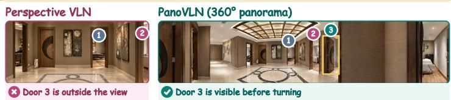

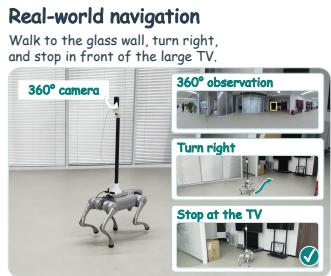

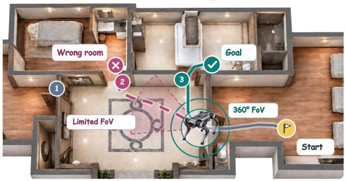

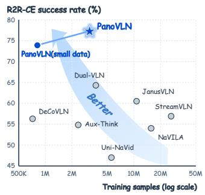  
Figure 1: PanoVLN fully exploits the wider visual context of panoramas to make vision-and-language navigation more accurate and efficient.

## ABSTRACT

Recent vision-language models (VLMs) have advanced vision-and-language navigation (VLN), enabling models to predict navigation actions from visual observations and language instructions. In this work, we explore VLN with panoramic observations and introduce PanoVLN. The motivation is straightforward: more complete visual context should enable better-informed navigation decisions. For example, a panorama can reveal a passage outside a perspective camera’s field of view, allowing the model to identify the intended route without additional exploration. However, we find that simply replacing perspective images with panoramas yields only limited gains. Our diagnosis suggests that fully exploiting wider visibility requires modifications to action prediction, training supervision, and visual representation. First, wider visibility supports longer-horizon action planning. We make the model predict longer action sequences, enabling larger turns and subsequent movement from a single panorama. Specifically, we introduce a confidence-guided execution (CGE) strategy that dynamically determines how many predicted actions to execute before replanning. Second, wider visibility also brings more complex route choices. We therefore construct training routes with frequent branching points and clear instructions to provide targeted supervision for route selection. Third, panoramic navigation requires understanding spatial relationships across viewing directions, beyond recognizing individual landmarks. We combine semantic and geometric features from RGB panoramas to capture both scene content and spatial layout without adding vi-

sual tokens. With a 4B backbone and RGB-only input, PanoVLN surpasses the previous SOTA by 11.9% and 8.7% in success rate on R2R-CE and RxR-CE Val-Unseen. Real-world experiments on a quadruped further demonstrate faster navigation with fewer pauses than prior VLN methods. Our project page is available at https://wangzhen-w.github.io/PanoVLN/.

## 1 INTRODUCTION

Vision-and-language navigation (VLN) requires an agent to navigate through an environment by following a natural-language instruction (Anderson et al., 2018; Krantz et al., 2020). Recent visionlanguage models (VLMs) have advanced this task by predicting navigation actions from visual observations and instructions (Zhang et al., 2024; Cheng et al., 2025; Wei et al., 2026b).

Most of the previous works take perspective images as input; in this work, we explore whether panoramic observations can further improve navigation by making more of the surrounding environment available for each decision. The motivation is straightforward: an equirectangular panorama (ERP) provides a 360◦ view, exposing passages, landmarks, and route alternatives across different viewing directions and providing a more complete visual basis for navigation decisions.

However, we find that simply replacing perspective images with ERPs under the same training and inference setup does not improve performance. Motivated by this observation, we conduct a detailed diagnostic analysis and find that exploiting panoramic context requires targeted adaptations. Specifically, we adapt action prediction, training supervision, and visual representation to panoramic inputs, and propose PanoVLN.

First, as a route changes direction, it may extend beyond the left or right edge of a perspective image. A panorama’s 360◦ view can show where the route continues, providing visual context for a longer sequence of navigation actions. We therefore train PanoVLN with a longer prediction horizon, and our horizon study shows that panoramic policies favor much longer action sequences than perspective policies. Predictions farther into the future are naturally less reliable, so executing the entire sequence is not always desirable. We therefore introduce confidence-guided execution (CGE), which uses action uncertainty to determine how many predicted actions to execute before reobserving and replanning.

Second, a panorama is particularly useful at a branching point, where its wider field of view can reveal several possible paths. However, branching points are relatively sparse in existing VLN training data, providing limited supervision for learning to use this advantage. We therefore construct a dataset of 98K trajectories across 800 HM3D scenes (Ramakrishnan et al., 2021), with routes that contain frequent branching points and instructions that clearly specify which path to take. We generate and verify the instructions against route observations to ensure that the described movements and choices are visually grounded. We further increase the sampling frequency around turns and stopping points, providing stronger supervision where route decisions and completion matter most. Together, these choices provide dense, targeted supervision for learning route decisions and following the selected path to completion.

Third, using panoramic observations for navigation requires understanding the spatial relationships among different parts of the scene. The VLM’s visual features mainly capture scene semantics, while navigation also depends on how landmarks, passages, and other scene elements are spatially arranged. We therefore combine the VLM’s semantic features with geometric features extracted by PanoVGGT (Guo et al., 2026b) from the same RGB panorama. We align and fuse features from corresponding ERP regions, providing both semantic and geometric information without additional visual tokens or depth input.

With a 4B backbone and RGB-only observations, PanoVLN achieves success rates of 77.3% on R2R-CE Val-Unseen and 78.0% on RxR-CE Val-Unseen, exceeding the previous state of the art by 11.9% and 8.7%, respectively. On a quadruped robot, PanoVLN navigates indoor and outdoor routes in less time, with fewer policy calls and pauses than prior VLN baselines.

## 2 RELATED WORK

Vision-and-language navigation. Vision-and-language navigation in continuous environments (VLN-CE) extends instruction-following routes from navigation graphs to executable motion (Anderson et al., 2018; Ku et al., 2020; Krantz et al., 2020). Waypoint and map-based methods predict reachable locations, maintain spatial representations, or look ahead along candidate routes to support planning and control (Hong et al., 2022; Georgakis et al., 2022; Wang et al., 2023a; An et al., 2025; Wang et al., 2024). VLM-based policies use visual histories or streaming video to predict navigation commands, sometimes passing intermediate decisions to a separate execution policy (Zhang et al., 2024; 2025a; Wei et al., 2026b; Cheng et al., 2025; Wei et al., 2026a). Complementary work improves waypoint supervision, the scale of navigation data, and instruction generation (Raychaudhuri et al., 2021; Wang et al., 2023b; Yan et al., 2024). PanoVLN builds on these advances to study how full-surround visual observations support vision-and-language navigation.

Panoramic geometry. Panoramic geometry methods account for spherical projection when estimating depth and 3D scene structure. Depth estimation has used ERP–cubemap fusion, cameraindependent spherical representations, and models trained for panoramic inputs (Jiang et al., 2021; Piccinelli et al., 2025; Li et al., 2026; Lin et al., 2025). Feed-forward reconstruction models jointly estimate camera and scene geometry from images, with PanoVGGT extending this approach to panoramas (Wang et al., 2025a; Guo et al., 2026b). Navigation methods likewise represent spatial layout through cross-modal maps, grid memories, lookahead scene features, or separate spatial and semantic memories (Georgakis et al., 2022; Wang et al., 2023a; 2024; Zeng et al., 2026). PanoVLN brings panoramic geometry into VLN to strengthen spatial reasoning.

## 3 METHOD

In this work, we study how to fully exploit the complete visual context provided by panoramas in VLN task. Starting from a baseline model with panoramas as input, we make three key adaptations: First, to fully utilize the wider visibility, we train and execute in longer action sequences. Second, we construct a decision-centric training dataset more suitable for panoramic settings. Third, we develop geometric-aware visual representations to better understand the panoramic observations.

## 3.1 PRELIMINARIES

Perspective baseline. We begin with a VLM-based policy for VLN-CE (Krantz et al., 2020). At step t, the policy receives a natural-language instruction $x ,$ the current perspective RGB image $I _ { t } ,$ and sampled visual history $\mathcal { T } _ { < t } . \mathrm { ~ A ~ }$ visual encoder extracts image features, which are projected into the language model’s embedding space and combined with instruction tokens. The language model autoregressively predicts a sequence of actions from A = {forward, left, right, stop}. The policy learns from expert action sequences and, at inference, executes a fixed-length prefix of its prediction before observing again. Movement actions use fixed translation and rotation increments. The stop action ends the episode, and success requires stopping within the benchmark’s goal region.

Panoramic baseline. We obtain a panoramic baseline by replacing both current and historical perspective images with RGB equirectangular panoramas (ERPs) during training and inference. An ERP linearly maps a $3 6 0 ^ { \circ } \times 1 8 0 ^ { \circ }$ field of view to a rectangle. The agent’s heading is centered, and the left and right image boundaries are adjacent across a seam behind the agent. The policy input becomes $\mathcal { O } _ { t } \bar { = } \left( x , \bar { \mathcal { P } } _ { < t } , P _ { t } \right)$ , where $P _ { t }$ is the current ERP and $\mathcal { P } _ { < t }$ is the sampled panoramic history. We retain the same VLM, training trajectories, action supervision, and execution procedure. In our experiments, this input-only replacement yields limited gains and can even reduce navigation performance, motivating the adaptations described below.

## 3.2 LONGER ACTION-SEQUENCE SUPERVISION AND EXECUTION

A panorama can show where a route continues after it turns beyond the field of view of a perspective image. Short action targets use only part of this visual context for supervision. We therefore use longer action-sequence supervision and adapt the execution length according to prediction uncertainty.

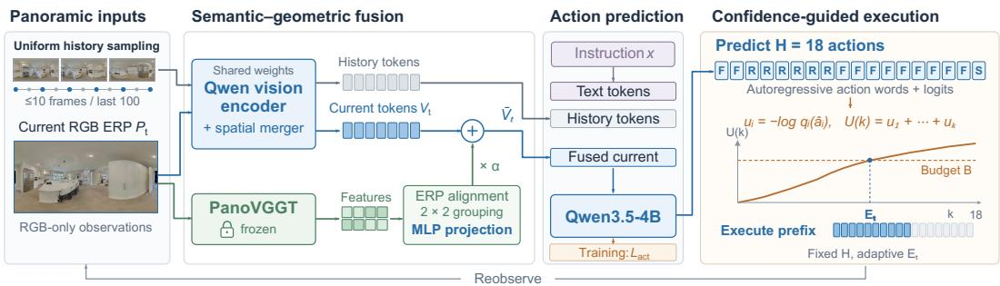  
Figure 2: PanoVLN pipeline. Current and historical panoramas share a fixed visual-token budget. Aligned geometric features enrich the current visual tokens, and uncertainty determines how much of the predicted action sequence to execute.

Action-sequence supervision. At training state $t ,$ the target $\mathbf { A } _ { t } ^ { * } = ( a _ { t , 1 } ^ { * } , \ldots , a _ { t , H } ^ { * } )$ contains the next H expert actions, padded with stop beyond the trajectory end. The policy predicts these actions autoregressively. Using teacher forcing, we minimize

$$
\mathcal { L } _ { \mathrm { a c t } } = - \frac { 1 } { H } \sum _ { i = 1 } ^ { H } \log p _ { \theta } \left( a _ { t , i } ^ { * } \mid \mathcal { O } _ { t } , \mathbf { A } _ { t , < i } ^ { * } \right) ,\tag{1}
$$

where $\mathbf { A } _ { t , < i } ^ { * }$ contains the preceding expert actions and $p _ { \theta }$ is the VLM’s next-token distribution.

Confidence-guided execution (CGE). The prediction horizon H determines how far ahead the policy predicts, whereas the execution length determines when it reobserves. CGE selects this length according to the uncertainty of the predicted actions.

Given ${ \mathcal { O } } _ { t }$ and preceding predictions, let $z _ { t , i } ( a )$ be the logit for action a at position i. Normalizing over ${ \mathcal { A } } ,$ we define uncertainty for the generated action $\hat { a } _ { t , i }$ as

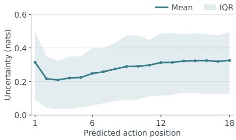

$$
\begin{array} { c l c r } { { q _ { t , i } ( a ) = \displaystyle \frac { \exp { z _ { t , i } ( a ) } } { \sum _ { b \in \cal A } \exp { z _ { t , i } ( b ) } } , } } \\ { { u _ { t , i } = - \log q _ { t , i } ( \hat { a } _ { t , i } ) . } } \end{array}\tag{2}
$$

Figure 3: Action uncertainty. Uncertainty rises after an initial dip and varies across policy calls, motivating adaptive execution.

Mean uncertainty rises after an initial dip, with substantial variation across policy calls (Figure 3).

Let $\begin{array} { r } { U _ { t } ( k ) = \sum _ { i = 1 } ^ { k } u _ { t , i } } \end{array}$ , with $U _ { t } ( 0 ) = 0$ . CGE extends the prefix while $U _ { t } ( k ) \leq B$ for an uncertainty budget ${ \dot { B } } ,$ selecting at least $E _ { \mathrm { m i n } }$ actions:

$$
E _ { t } = \operatorname* { m a x } \left\{ k \in \left\{ 1 , \dots , H \right\} : k \leq E _ { \operatorname* { m i n } } \mathrm { o r } U _ { t } ( k ) \leq B \right\} .\tag{3}
$$

The agent executes this prefix, then reobserves unless it stops.

## 3.3 DECISION-CENTRIC DATA CONSTRUCTION

Existing VLN training data contains relatively few trajectories with frequent route choices among multiple visible paths. This provides limited supervision for learning to select the intended path from panoramic observations. We therefore construct trajectories with frequent branching points and pair them with instructions that clearly identify the chosen path. We further sample turns and stopping points more densely during data construction.

Route construction and filtering. We construct 98K navigation trajectories across 800 HM3D scenes, dividing walkable space into connected areas using the navigation mesh. A branching point has at least two visible, traversable paths to different areas, excluding the incoming path. We sample endpoints in different areas and retain routes through branching points. Rendering-quality checks remove candidates with mesh holes or incomplete geometry, followed by near-duplicate removal. An expert converts the remaining routes into primitive action sequences; replay verifies goal reachability and visibility of the chosen path and its alternatives at each branching point.

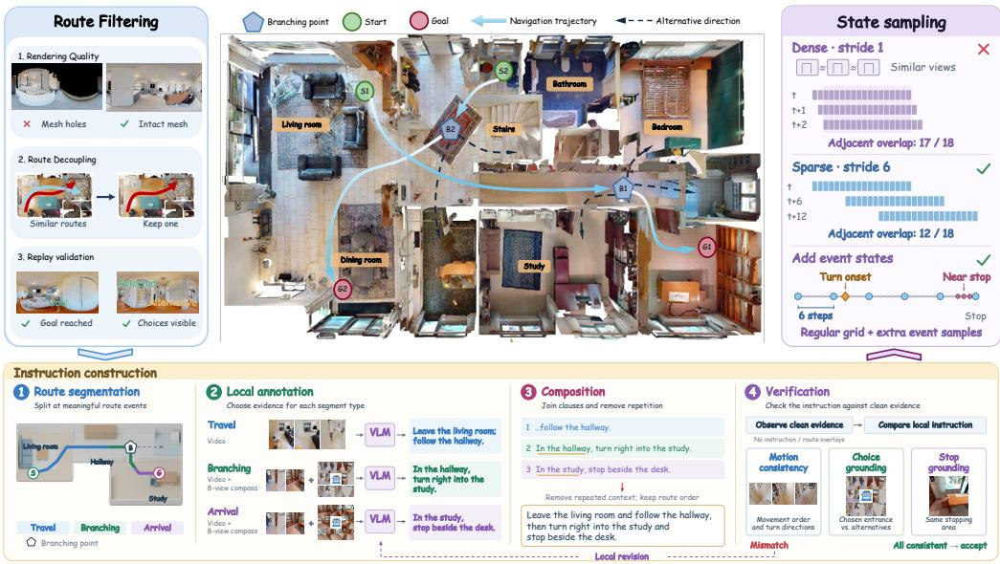  
Figure 4: Data construction pipeline. We construct routes with frequent branching points, generate and verify instructions, and sample training states.

Instruction construction. We divide trajectories by route events into travel, branching, and arrival segments. Each segment uses first-person video with the expert path marked on the ground; branching and arrival also use eight-view compass images. Qwen3.8-27B (Qwen Team, 2026b) describes movement, identifies the chosen path from visible cues, and specifies the stopping location. We combine descriptions in route order, remove repetition, and refine the wording.

We verify each instruction segment using clean videos and compass images without instruction or route overlays. Motion consistency checks movement order and turn directions against the replay. Choice grounding checks whether the instruction identifies the demonstrated entrance among alternatives; stop grounding checks whether it describes the observed arrival area. Mismatched segments are revised locally and reverified; only samples passing all three checks are retained.

Training sample selection. Adjacent states often have similar observations and overlapping action targets. For H = 18, we use a stride-six grid, reducing overlap between adjacent grid targets from 17 to 12 actions. We add states at sustained-turn onsets and near termination to supervise turning and stopping. Each state is paired with its H-step expert action sequence. The grid preserves route coverage; added states emphasize action transitions.

## 3.4 GEOMETRY-AWARE VISUAL REPRESENTATION

A panoramic observation brings different parts of the surrounding scene into a single view, making their spatial relationships important for navigation. We therefore fuse semantic and aligned geometric features from the current RGB panorama without adding visual tokens.

Visual context allocation. We allocate $N _ { c }$ tokens to the current ERP and $N _ { h } < N _ { c }$ tokens to each history frame. The finer current features support route selection, while coarser historical features provide context for instruction progress. We uniformly sample up to M past observations from a recent temporal window, giving a total visual-token budget of $N _ { c } + M N _ { h }$

Spatially aligned geometric fusion. A pretrained PanoVGGT encoder (Guo et al., 2026b) extracts geometric features from the current RGB panorama. We resample them in ERP coordinates and group them to cover the same regions as the VLM’s merged current tokens $V _ { t } .$ A trainable MLP $f _ { \psi }$ projects the aligned geometric groups $G _ { t }$ into the visual-token embedding space for residual fusion:

Table 1: Simulation benchmark comparison. We evaluate performance on R2R-CE and RxR-CE Val-Unseen with the indicated observation modalities. ∗ denotes the waypoint predictor from Hong et al. (2022); † denotes training without navigation data beyond R2R-CE and RxR-CE. NE is in meters; other scores are percentages. PanoVLN achieves the highest SR and SPL on both benchmarks.
<table><tr><td rowspan="2">Method</td><td colspan="3">Observation</td><td colspan="2">R2R Val-Unseen</td><td colspan="4">RxR Val-Unseen</td></tr><tr><td>Pano.</td><td></td><td>Odo. Depth S.RGB</td><td>|NE↓ OS↑ SR↑</td><td>SPL↑</td><td>NE↓</td><td>SR↑</td><td></td><td>SPL↑ nDTW↑</td></tr><tr><td>CMA* Hong et al. (2022)</td><td>V</td><td>√</td><td>√</td><td>6.20 52.0</td><td>41.0 36.0</td><td>8.76</td><td>26.5</td><td>22.1</td><td>47.0</td></tr><tr><td>GridMM* Wang et al. (2023a)</td><td>√</td><td>√</td><td>√</td><td>5.11 61.049.0</td><td>41.0</td><td></td><td></td><td></td><td></td></tr><tr><td>ETPNav* An et al. (2025)</td><td>√</td><td>√</td><td>√</td><td>4.71 65.057.0</td><td>49.0</td><td>5.64</td><td>54.7</td><td>44.8</td><td>61.9</td></tr><tr><td>HNR* Wang et al. (2024)</td><td>√</td><td>√</td><td>√</td><td>4.42 67.0 61.0</td><td>51.0</td><td>5.50</td><td>56.3</td><td>46.7</td><td>63.5</td></tr><tr><td>ScaleVLN* Wang et al. (2023b)</td><td>√</td><td>√</td><td>√</td><td>4.80 55.0</td><td>51.0</td><td></td><td></td><td></td><td></td></tr><tr><td>InstructNav Long et al. (2025)</td><td>√</td><td>√</td><td>√</td><td>6.89</td><td>31.0 24.0</td><td></td><td></td><td></td><td></td></tr><tr><td>LAW Raychaudhuri et al. (2021)</td><td></td><td>√</td><td>√ √</td><td>6.83 44.035.0</td><td>31.0</td><td>10.90</td><td>8.0</td><td>8.0</td><td>38.0</td></tr><tr><td>CM² Georgakis et al. (2022)</td><td></td><td>√</td><td>√ √</td><td>7.02 41.534.3</td><td>27.6</td><td></td><td></td><td></td><td></td></tr><tr><td>WS-MGMap Chen et al. (2022)</td><td></td><td>√</td><td>√ √</td><td>6.28 47.6 38.9</td><td>34.3</td><td></td><td></td><td></td><td></td></tr><tr><td>CMA Krantz et al. (2020)</td><td></td><td></td><td>√ √</td><td>7.37 40.032.0</td><td>30.0</td><td></td><td></td><td></td><td></td></tr><tr><td>MapNav† Zhang et al. (2025b)</td><td></td><td>√</td><td>√ √</td><td>4.93 53.039.7</td><td>37.2</td><td>7.62</td><td>32.6</td><td>27.7</td><td>43.5</td></tr><tr><td>StreamVLN† Wei et al. (2026b)</td><td></td><td></td><td>√</td><td>5.43 62.5 52.8</td><td>47.2</td><td>6.72</td><td>48.6</td><td>42.5</td><td>60.2</td></tr><tr><td>Aux-Think† Wang et al. (2025b)</td><td></td><td></td><td>√</td><td>6.0860.0 54.8</td><td>46.9</td><td>6.24</td><td>52.2</td><td>40.2</td><td></td></tr><tr><td>JanusVLN† Zeng et al. (2026)</td><td></td><td></td><td>√</td><td>5.17 58.0 52.8</td><td>49.2</td><td>6.46</td><td>51.4</td><td>44.3</td><td>59.1</td></tr><tr><td>CorrectNav† Yu et al. (2026)</td><td></td><td></td><td>√</td><td>4.24 67.5 65.1</td><td>62.3</td><td>4.09</td><td>69.3</td><td>63.3</td><td>75.2</td></tr><tr><td>PanoVLN† (Ours)</td><td>√</td><td></td><td></td><td>3.10 79.7 73.9</td><td>67.9</td><td>3.14</td><td>74.1</td><td>63.9</td><td>71.4</td></tr><tr><td>NaVid Zhang et al. (2024)</td><td></td><td></td><td>√</td><td>5.47 49.1 37.4</td><td>35.9</td><td></td><td></td><td></td><td></td></tr><tr><td>Uni-NaVid Žhang et al. (2025a)</td><td></td><td></td><td>√</td><td>5.58 53.3 47.0</td><td>42.7</td><td>6.24</td><td>48.7</td><td></td><td>1</td></tr><tr><td></td><td></td><td></td><td>√</td><td>5.22 62.554.0</td><td></td><td></td><td></td><td>40.9</td><td></td></tr><tr><td>NaVILA Cheng et al. (2025)</td><td></td><td></td><td>√</td><td>4.90 63.6 56.4 50.2</td><td>49.0</td><td>6.77</td><td>49.3</td><td>44.0</td><td>58.8</td></tr><tr><td>StreamVLN Wei et al. (2026b)</td><td></td><td></td><td>√</td><td>4.78 65.2 60.5</td><td></td><td>5.65</td><td>54.4</td><td>45.4</td><td>63.7</td></tr><tr><td>JanusVLN Zeng et al. (2026)</td><td></td><td></td><td></td><td></td><td>56.8</td><td>6.06</td><td>56.2</td><td>47.5</td><td>62.1</td></tr><tr><td>DualVLN Wei et al. (2026a)</td><td></td><td></td><td>√</td><td>4.05 70.7 64.3</td><td>58.5</td><td>4.58</td><td>61.4</td><td>51.8</td><td>70.0</td></tr><tr><td>AwareVLN Guo et al. (2026a)</td><td></td><td></td><td>√</td><td>4.02 73.5 65.4 55.1</td><td></td><td>3.95</td><td>67.6</td><td>56.1</td><td>65.7</td></tr><tr><td>PanoVLN (Ours)</td><td>√</td><td></td><td></td><td>2.83 83.1 77.3 70.6</td><td></td><td>2.85</td><td></td><td>78.0 65.9</td><td>73.3</td></tr></table>

$$
\bar { V } _ { t } = V _ { t } + \alpha f _ { \psi } ( G _ { t } ) ,\tag{4}
$$

where α is a fixed residual scale. Fusion combines semantics and geometry from corresponding ERP regions, preserving token count and order. The instruction, history, and fused tokens condition action prediction. We train the VLM and projection with Eq. 1 and freeze the geometry encoder.

## 4 EXPERIMENTS

## 4.1 EXPERIMENTAL SETUP

We evaluate on the R2R-CE and RxR-CE Val-Unseen splits (Krantz et al., 2020; Ku et al., 2020) in Matterport3D scenes (Chang et al., 2017) using Habitat (Savva et al., 2019). We report navigation error (NE), oracle success rate (OS), success rate (SR), success weighted by path length (SPL), and normalized dynamic time warping (nDTW). OS records whether a trajectory comes within 3 m of the goal; SR also requires stopping there. SPL measures path efficiency and nDTW reference-route agreement. NE is in meters; other scores use a 0–100 scale.

PanoVLN uses RGB-only observations. The default model combines Qwen3.5-4B (Qwen Team, 2026a) with a frozen PanoVGGT encoder (Guo et al., 2026b) and uses an H = 18 prediction horizon with CGE for execution. PanoVLN† trains on R2R-CE and RxR-CE navigation data; the full model additionally uses our constructed dataset. Ablation configurations are specified with each study. Training settings and the navigation prompt are in Appendix B.

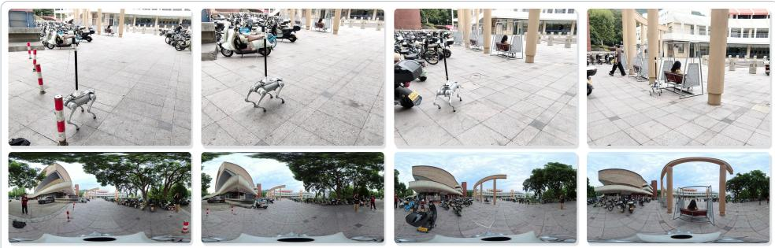  
Instruction: Go straight. On the left, there is a brown recliner. Walk over there and stop.

Figure 5: Real-world navigation. PanoVLN deployed on a quadruped robot and transfers to realworld instruction following without scene-specific fine-tuning.  
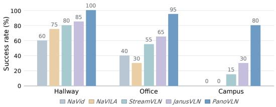

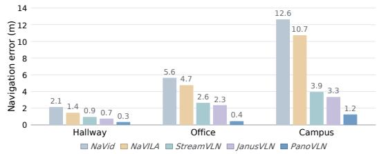  
Figure 6: Real-world navigation performance. We compare SR and NE on 20 shared instruction– route pairs each in Hallway, Office, and Campus and achieves the best navigation performance.

## 4.2 SIMULATION EXPERIMENTS

Comparison with prior methods. PanoVLN achieves state-of-the-art SR of 77.3% on R2R-CE and 78.0% on RxR-CE, exceeding the previous best results by 11.9 and 8.7 percentage points, respectively (Table 1). PanoVLN† also leads the restricted-data group in SR and SPL on both benchmarks. Adding our decision-centric trajectories further improves performance in unseen scenes.

Use of panoramic context. With the same ERP and instruction, short-horizon training concentrates attention ahead, resembling a perspective policy, while PanoVLN attends to instructed passages across directions. Short targets often share initial movements across routes; longer targets include route choices and subsequent movement, making the distinguishing visual cues relevant to prediction and encouraging use of the full panorama.

## 4.3 REAL-WORLD EXPERIMENTS

Deployment and evaluation. All methods use a Unitree Go2, the same Insta360 X5 mounted 1.5 m above ground, and a remote RTX 3090. PanoVLN uses approximately 12 GB of GPU memory; network overhead averages 272 ms per call, excluding inference. Execution is synchronous: the robot waits for a response, executes its actions, then requests the next prediction.

We compare NaVid (Zhang et al., 2024), NaVILA (Cheng et al., 2025), StreamVLN (Wei et al., 2026b), JanusVLN (Zeng et al., 2026), and PanoVLN on 20 shared instruction–route pairs per setting, without scene-specific fine-tuning. Hallway tests successive turns; Office adds clutter and room transitions. Campus covers gardens, sports fields, and plazas, testing transfer from indoor training to outdoor spaces and varied terrain.

Navigation performance. The results test both local route complexity and transfer across scene types (Figure 6; qualitative trials are in the supplementary video). NaVid struggles with instruction progress over long routes, while clutter and room transitions disrupt NaVILA in Office. StreamVLN and JanusVLN handle indoor routes more reliably but struggle to transfer to open outdoor layouts in Campus. PanoVLN follows successive indoor route choices and transfers this ability outdoors, maintaining instruction-to-route grounding across changes in appearance and spatial layout.

Table 2: Real-world execution efficiency. PanoVLN achieves the best overall navigation efficiency among the compared methods.
<table><tr><td>Method</td><td colspan="2">Navigation</td><td colspan="2">Continuity</td><td colspan="2">Planning</td></tr><tr><td></td><td>Time (s) ↓</td><td>Speed (cm/s) ↑</td><td>Wait (%) ↓</td><td>Pauses ↓</td><td>Calls ↓</td><td>Latency (s) ↓</td></tr><tr><td>NaVid</td><td>135.2</td><td>12.9</td><td>23.2</td><td>15.7</td><td>29.4</td><td>0.90</td></tr><tr><td>NaVILA</td><td>194.0</td><td>8.2</td><td>24.7</td><td>29.6</td><td>41.3</td><td>1.05</td></tr><tr><td>StreamVLN</td><td>117.8</td><td>13.3</td><td>27.1</td><td>8.3</td><td>34.3</td><td>0.58</td></tr><tr><td>JanusVLN</td><td>412.9</td><td>5.3</td><td>39.2</td><td>95.3</td><td>101.7</td><td>1.32</td></tr><tr><td>PanoVLN (Ours)</td><td>86.4</td><td>25.7</td><td>13.6</td><td>5.4</td><td>7.4</td><td>1.08</td></tr></table>

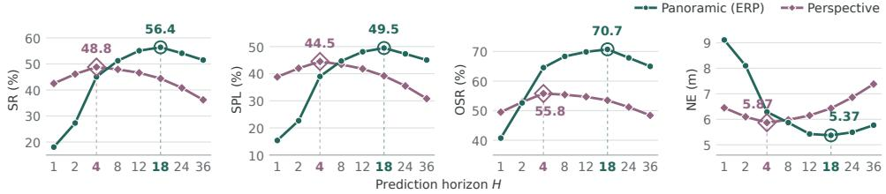  
Figure 7: Prediction horizon ablation. Panoramic policies benefit from longer supervision and outperform perspective policies at longer horizons.

Execution efficiency. Table 2 reports trial averages (see Appendix B.2). Time is navigation duration; Speed is traveled distance divided by duration, including waiting. Wait is the fraction of time awaiting policy responses; Pauses counts stationary intervals longer than 1 s. Calls counts policy requests; Latency is inference time per request, excluding network communication.

Under synchronous execution, frequent policy requests add inference and communication delay and interrupt motion. JanusVLN requests a prediction for each action; StreamVLN has lower per-call latency but replans every four actions. PanoVLN predicts longer segments, and CGE selects a confident prefix before requesting a new observation. Sustaining motion while predictions remain confident reduces interruptions and total navigation time.

## 4.4 ABLATION STUDIES

The horizon, execution, sampling, and geometry studies use R2R-CE and RxR-CE training data; the data study varies the additional trajectories. Evaluation uses the corresponding Val-Unseen splits.

Prediction horizon. We vary the prediction horizon while fixing the VLM, visual-token budget, and random-start sampling, training geometry-free policies for 4,000 updates (Figure 7). ERP policies trail perspective policies at short horizons but overtake them as targets lengthen. Perspective performance peaks at H = 4, while ERP favors H = 18.

Short targets may end before visible routes diverge; longer ERP targets supervise the intended choice. Longer perspective targets increasingly require cues outside the current view. ERP improves from H = 8 to H = 18 with execution fixed at six actions, linking the gain to longer supervision. These results favor matching supervision to visible route information; we use H = 18 thereafter.

Training-state sampling. We compare random starts with our turn- and termination-aware sampling. Both variants use a geometry-free H = 18 architecture, 4,000 updates, and six-action execution. The random variant is the H = 18 ERP run in Figure 7.

Table 3: Training data comparison.
<table><tr><td>Sampling NE↓</td><td>OS↑</td><td>SR↑</td><td>SPL↑</td></tr><tr><td>Random</td><td>5.37 70.7</td><td>56.4</td><td>49.5</td></tr><tr><td>Ours</td><td>4.40 69.9</td><td>62.8</td><td>57.2</td></tr></table>

Long stretches of forward motion supply similar targets, while brief turn and stop states determine route transitions and completion. Our sampling gives these states more supervision (Table 3).

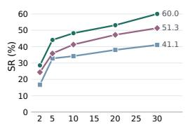

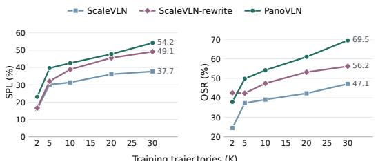  
Training trajectories (K)

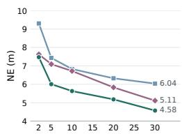  
Figure 8: Training data comparison. We compare data sources across training scales on R2R-CE Val-Unseen. Our data consistently delivers the best navigation performance.

Table 4: Execution strategy comparison. We compare fixed, random, and confidence-guided execution. CGE achieves the best navigation performance on both benchmarks.
<table><tr><td rowspan="2">Execution strategy</td><td colspan="4">R2R-CE</td><td colspan="4">RxR-CE</td></tr><tr><td>NE↓</td><td>OS↑</td><td>SR↑</td><td>SPL↑</td><td>NE↓</td><td>SR↑</td><td>SPL↑</td><td>nDTW↑</td></tr><tr><td>Fixed: 1 action</td><td>4.42</td><td>68.2</td><td>64.6</td><td>60.5</td><td>4.11</td><td>65.7</td><td>55.6</td><td>70.3</td></tr><tr><td>Fixed: 6 actions</td><td>4.43</td><td>70.8</td><td>64.2</td><td>58.7</td><td>4.25</td><td>65.4</td><td>54.2</td><td>69.0</td></tr><tr><td>Fixed: 12 actions</td><td>4.65</td><td>69.7</td><td>61.4</td><td>55.4</td><td>4.98</td><td>61.1</td><td>46.4</td><td>64.6</td></tr><tr><td>Fixed: 18 actions</td><td>4.89</td><td>67.0</td><td>57.2</td><td>50.9</td><td>5.64</td><td>54.9</td><td>43.4</td><td>59.8</td></tr><tr><td>Random: 1-18 actions</td><td>4.62</td><td>68.5</td><td>61.3</td><td>55.6</td><td>5.07</td><td>59.9</td><td>52.3</td><td>64.9</td></tr><tr><td>CGE (Ours)</td><td>4.10</td><td>71.0</td><td>66.6</td><td>61.5</td><td>4.06</td><td>66.5</td><td>56.4</td><td>70.8</td></tr></table>

Table 5: Geometry encoder comparison. We compare geometric features from different encoders. PanoVGGT yields the highest success rates on both benchmarks.
<table><tr><td rowspan="2">Extra encoder</td><td colspan="4">R2R-CE</td><td colspan="4">RxR-CE</td></tr><tr><td>NE↓</td><td>OS↑</td><td>SR↑</td><td>SPL↑</td><td>NE↓</td><td>SR↑</td><td>SPL↑</td><td>nDTW↑</td></tr><tr><td>None</td><td>4.10</td><td>71.0</td><td>66.6</td><td>61.5</td><td>4.06</td><td>66.5</td><td>56.4</td><td>70.8</td></tr><tr><td>UniK3D</td><td>3.77</td><td>73.2</td><td>67.8</td><td>63.3</td><td>3.92</td><td>65.4</td><td>57.3</td><td>68.1</td></tr><tr><td>DA2</td><td>4.01</td><td>72.3</td><td>65.5</td><td>61.6</td><td>4.35</td><td>63.0</td><td>55.9</td><td>67.7</td></tr><tr><td>DAP</td><td>4.15</td><td>70.9</td><td>64.5</td><td>60.4</td><td>4.48</td><td>61.1</td><td>54.3</td><td>66.5</td></tr><tr><td>PanoVGGT (Ours)</td><td>3.91</td><td>73.6</td><td>68.6</td><td>63.7</td><td>4.02</td><td>67.1</td><td>57.2</td><td>71.5</td></tr></table>

Comparable OS and higher SR indicate more reliable termination in the goal region, highlighting the value of learning when to change or end an action sequence.

Confidence-guided execution. Table 4 compares fixed, random, and confidence-guided execution using the same geometry-free H = 18 checkpoint, trained for one epoch with our sampling.

Long fixed prefixes commit to increasingly uncertain actions, while random prefixes ignore the model’s confidence. CGE adapts execution to each state, outperforming random prefixes and all fixed strategies, including one-action execution. These studies separate two choices: long targets teach route selection, while CGE determines when to reobserve.

Geometric features. We compare frozen UniK3D (Piccinelli et al., 2025), $\mathrm { D A } ^ { 2 }$ (Li et al., 2026), DAP (Lin et al., 2025), and PanoVGGT encoders with the same fusion design, visual-token budget, and CGE (Table 5). The alternative encoders have mixed effects, whereas PanoVGGT improves SR on both benchmarks. Its panoramic features link landmarks to neighboring passages and directions, complementing semantic appearance with spatial cues for route selection.

Training data. We compare ScaleVLN (Wang et al., 2023b), ScaleVLN-rewrite, and our data at matched trajectory counts, using PanoVGGT and CGE without DAgger (Ross et al., 2011) (Figure 8). ScaleVLN-rewrite retains the original routes and regenerates instructions using our instruction pipeline. Its gains over ScaleVLN demonstrate the benefit of improved instruction quality. Our full pipeline yields further gains across training scales by combining clear instructions with decisionrich routes, providing repeated supervision for language-guided selection among paths visible in a panorama. Appendices C.1 and C.2 provide data-composition and backbone comparisons.

## 5 CONCLUSION

We presented PanoVLN for vision-and-language navigation from RGB panoramas, combining longer action supervision, confidence-guided execution, decision-centric training, and geometric features. With a 4B backbone, it achieves state-of-the-art success rates on R2R-CE and RxR-CE and enables faster real-world navigation with fewer pauses. Our findings suggest that broader visibility should shape how navigation policies learn and act.

## REFERENCES

Dong An, Hanqing Wang, Wenguan Wang, Zun Wang, Yan Huang, Keji He, and Liang Wang. ETP-Nav: Evolving topological planning for vision-language navigation in continuous environments. IEEE Transactions on Pattern Analysis and Machine Intelligence, 47(7):5130–5145, July 2025. doi: 10.1109/TPAMI.2024.3386695. URL https://doi.org/10.1109/TPAMI.2024.3 386695.

Peter Anderson, Qi Wu, Damien Teney, Jake Bruce, Mark Johnson, Niko Sünderhauf, Ian Reid, Stephen Gould, and Anton van den Hengel. Vision-and-language navigation: Interpreting visually grounded navigation instructions in real environments. In Proceedings ofthe IEEE Conference on Computer Vision and Pattern Recognition (CVPR), pp. 3674–3683, June 2018. URL https: //openaccess.thecvf.com/content\_cvpr\_2018/html/Anderson\_Vision-a nd-Language\_Navigation\_Interpreting\_CVPR\_2018\_paper.html.

Shuai Bai, Yuxuan Cai, Ruizhe Chen, Keqin Chen, Xionghui Chen, Zesen Cheng, Lianghao Deng, Wei Ding, Chang Gao, Chunjiang Ge, Wenbin Ge, Zhifang Guo, Qidong Huang, Jie Huang, Fei Huang, Binyuan Hui, Shutong Jiang, Zhaohai Li, Mingsheng Li, Mei Li, Kaixin Li, Zicheng Lin, Junyang Lin, Xuejing Liu, Jiawei Liu, Chenglong Liu, Yang Liu, Dayiheng Liu, Shixuan Liu, Dunjie Lu, Ruilin Luo, Chenxu Lv, Rui Men, Lingchen Meng, Xuancheng Ren, Xingzhang Ren, Sibo Song, Yuchong Sun, Jun Tang, Jianhong Tu, Jianqiang Wan, Peng Wang, Pengfei Wang, Qiuyue Wang, Yuxuan Wang, Tianbao Xie, Yiheng Xu, Haiyang Xu, Jin Xu, Zhibo Yang, Mingkun Yang, Jianxin Yang, An Yang, Bowen Yu, Fei Zhang, Hang Zhang, Xi Zhang, Bo Zheng, Humen Zhong, Jingren Zhou, Fan Zhou, Jing Zhou, Yuanzhi Zhu, and Ke Zhu. Qwen3-VL technical report, 2025a. URL https://arxiv.org/abs/2511.21631.

Shuai Bai, Keqin Chen, Xuejing Liu, Jialin Wang, Wenbin Ge, Sibo Song, Kai Dang, Peng Wang, Shijie Wang, Jun Tang, Humen Zhong, Yuanzhi Zhu, Mingkun Yang, Zhaohai Li, Jianqiang Wan, Pengfei Wang, Wei Ding, Zheren Fu, Yiheng Xu, Jiabo Ye, Xi Zhang, Tianbao Xie, Zesen Cheng, Hang Zhang, Zhibo Yang, Haiyang Xu, and Junyang Lin. Qwen2.5-VL technical report, 2025b. URL https://arxiv.org/abs/2502.13923.

Angel Chang, Angela Dai, Thomas Funkhouser, Maciej Halber, Matthias Niessner, Manolis Savva, Shuran Song, Andy Zeng, and Yinda Zhang. Matterport3D: Learning from RGB-D data in indoor environments. In 2017 International Conference on 3D Vision (3DV), 2017. URL https: //niessner.github.io/Matterport/.

Peihao Chen, Dongyu Ji, Kunyang Lin, Runhao Zeng, Thomas H. Li, Mingkui Tan, and Chuang Gan. Weakly-supervised multi-granularity map learning for vision-and-language navigation. In Advances in Neural Information Processing Systems, volume 35, pp. 38149–38161, 2022. doi: 10.52202/068431-2764. URL https://proceedings.neurips.cc/paper\_files/p aper/2022/hash/f959b05dd74ba8a735276c3df4ae8b71-Abstract-Confere nce.html.

An-Chieh Cheng, Yandong Ji, Zhaojing Yang, Zaitian Gongye, Xueyan Zou, Jan Kautz, Erdem Biyik, Hongxu Yin, Sifei Liu, and Xiaolong Wang. NaVILA: Legged robot vision-language-action model for navigation. In Proceedings ofRobotics: Science and Systems, Los Angeles, CA, USA, June 2025. doi: 10.15607/RSS.2025.XXI.018. URL https://www.roboticsproceedings. org/rss21/p018.html.

Georgios Georgakis, Karl Schmeckpeper, Karan Wanchoo, Soham Dan, Eleni Miltsakaki, Dan Roth, and Kostas Daniilidis. Cross-modal map learning for vision and language navigation. In Proceedings ofthe IEEE/CVF Conference on Computer Vision and Pattern Recognition (CVPR), pp. 15460–15470, June 2022. URL https://openaccess.thecvf.com/content/CV PR2022/html/Georgakis\_Cross-Modal\_Map\_Learning\_for\_Vision\_and\_L anguage\_Navigation\_CVPR\_2022\_paper.html.

Wenxuan Guo, Xiuwei Xu, Yichen Liu, Xiangyu Li, Hang Yin, Huangxing Chen, Wenzhao Zheng, Jianjiang Feng, Jie Zhou, and Jiwen Lu. AwareVLN: Reasoning with self-awareness for visionlanguage navigation. In Proceedings ofthe IEEE/CVF Conference on Computer Vision and Pattern Recognition (CVPR), pp. 4065–4075, June 2026a. URL https://openaccess.thecvf. com/content/CVPR2026/html/Guo\_AwareVLN\_Reasoning\_with\_Self-aware ness\_for\_Vision-Language\_Navigation\_CVPR\_2026\_paper.html.

Yijing Guo, Mengjun Chao, Luo Wang, Tianyang Zhao, Haizhao Dai, Yingliang Zhang, Jingyi Yu, and Yujiao Shi. PanoVGGT: Feed-forward 3D reconstruction from panoramic imagery. In Proceedings of the IEEE/CVF Conference on Computer Vision and Pattern Recognition (CVPR), pp. 36444–36453, June 2026b. URL https://openaccess.thecvf.com/content/CV PR2026/html/Guo\_PanoVGGT\_Feed-Forward\_3D\_Reconstruction\_from\_Pa noramic\_Imagery\_CVPR\_2026\_paper.html.

Yicong Hong, Zun Wang, Qi Wu, and Stephen Gould. Bridging the gap between learning in discrete and continuous environments for vision-and-language navigation. In Proceedings ofthe IEEE/CVF Conference on Computer Vision and Pattern Recognition (CVPR), pp. 15439–15449, June 2022. URL https://openaccess.thecvf.com/content/CVPR2022/html/Hong\_Bri dging\_the\_Gap\_Between\_Learning\_in\_Discrete\_and\_Continuous\_Enviro nments\_CVPR\_2022\_paper.html.

Hualie Jiang, Zhe Sheng, Siyu Zhu, Zilong Dong, and Rui Huang. UniFuse: Unidirectional fusion for 360◦ panorama depth estimation. IEEE Robotics and Automation Letters, 2021. doi: 10.1109 LRA.2021.3058957. URL https://arxiv.org/abs/2102.03550.

Jacob Krantz, Erik Wijmans, Arjun Majumdar, Dhruv Batra, and Stefan Lee. Beyond the nav-graph: Vision-and-language navigation in continuous environments. In Computer Vision – ECCV 2020, volume 12373 of Lecture Notes in Computer Science, pp. 104–120. Springer, 2020. doi: 10.1007/ 978-3-030-58604-1\_7. URL https://doi.org/10.1007/978-3-030-58604-1\_7.

Alexander Ku, Peter Anderson, Roma Patel, Eugene Ie, and Jason Baldridge. Room-across-room: Multilingual vision-and-language navigation with dense spatiotemporal grounding. In Proceedings of the 2020 Conference on Empirical Methods in Natural Language Processing (EMNLP), pp. 4392–4412, Online, November 2020. Association for Computational Linguistics. doi: 10.18653/v1/ 2020.emnlp-main.356. URL https://aclanthology.org/2020.emnlp-main.356/.

Haodong Li, Wangguandong Zheng, Jing He, Yuhao Liu, Xin Lin, Xin Yang, Ying-Cong Chen, and Chunchao Guo. DA2: Depth anything in any direction. In The Fourteenth International Conference on Learning Representations, 2026. URL https://proceedings.iclr.cc/paper\_fi les/paper/2026/hash/786e39208b37bfcb0ad89413f155df99-Abstract-C onference.html.

Xin Lin, Meixi Song, Dizhe Zhang, Wenxuan Lu, Haodong Li, Bo Du, Ming-Hsuan Yang, Truong Nguyen, and Lu Qi. Depth any panoramas: A foundation model for panoramic depth estimation, 2025. URL https://arxiv.org/abs/2512.16913.

Yuxing Long, Wenzhe Cai, Hongcheng Wang, Guanqi Zhan, and Hao Dong. InstructNav: Zero-shot system for generic instruction navigation in unexplored environment. In Proceedings of The 8th Conference on Robot Learning, volume 270 of Proceedings ofMachine Learning Research, pp. 2049–2060. PMLR, 2025. URL https://proceedings.mlr.press/v270/long25b .html.

Luigi Piccinelli, Christos Sakaridis, Mattia Segu, Yung-Hsu Yang, Siyuan Li, Wim Abbeloos, and Luc Van Gool. UniK3D: Universal camera monocular 3D estimation. In Proceedings of the IEEE/CVF Conference on Computer Vision and Pattern Recognition (CVPR), pp. 1028–1039, June 2025. URL https://openaccess.thecvf.com/content/CVPR2025/html/Picc inelli\_UniK3D\_Universal\_Camera\_Monocular\_3D\_Estimation\_CVPR\_2025 \_paper.html.

Qwen Team. Qwen3.5: Towards native multimodal agents, February 2026a. URL https://qwen .ai/blog?id=qwen3.5.

Qwen Team. Qwen3.8-Max: A new bar for coding and cowork, August 2026b. URL https: //qwen.ai/blog?id=qwen3.8.

Santhosh K. Ramakrishnan, Aaron Gokaslan, Erik Wijmans, Oleksandr Maksymets, Alex Clegg, John Turner, Eric Undersander, Wojciech Galuba, Andrew Westbury, Angel X. Chang, Manolis Savva, Yili Zhao, and Dhruv Batra. Habitat-Matterport 3D dataset (HM3D): 1000 large-scale 3D environments for embodied AI, 2021. URL https://arxiv.org/abs/2109.08238.

Sonia Raychaudhuri, Saim Wani, Shivansh Patel, Unnat Jain, and Angel Chang. Language-aligned waypoint (LAW) supervision for vision-and-language navigation in continuous environments. In Proceedings ofthe 2021 Conference on Empirical Methods in Natural Language Processing, pp. 4018–4028, Online and Punta Cana, Dominican Republic, November 2021. Association for Computational Linguistics. doi: 10.18653/v1/2021.emnlp-main.328. URL https: //aclanthology.org/2021.emnlp-main.328/.

Stephane Ross, Geoffrey Gordon, and Drew Bagnell. A reduction of imitation learning and structured prediction to no-regret online learning. In Proceedings ofthe Fourteenth International Conference on Artificial Intelligence and Statistics, volume 15 of Proceedings of Machine Learning Research, pp. 627–635. PMLR, 2011. URL https://proceedings.mlr.press/v15/ross11a. html.

Manolis Savva, Abhishek Kadian, Oleksandr Maksymets, Yili Zhao, Erik Wijmans, Bhavana Jain, Julian Straub, Jia Liu, Vladlen Koltun, Jitendra Malik, Devi Parikh, and Dhruv Batra. Habitat: A platform for embodied AI research. In Proceedings of the IEEE/CVF International Conference on Computer Vision (ICCV), October 2019. URL https://openaccess.thecvf.com/cont ent\_ICCV\_2019/html/Savva\_Habitat\_A\_Platform\_for\_Embodied\_AI\_Rese arch\_ICCV\_2019\_paper.html.

Jianyuan Wang, Minghao Chen, Nikita Karaev, Andrea Vedaldi, Christian Rupprecht, and David Novotny. VGGT: Visual geometry grounded transformer. In Proceedings of the IEEE/CVF Conference on Computer Vision and Pattern Recognition (CVPR), 2025a. URL https://arxi v.org/abs/2503.11651.

Shuo Wang, Yongcai Wang, Wanting Li, Xudong Cai, Yucheng Wang, Maiyue Chen, Kaihui Wang, Zhizhong Su, Deying Li, and Zhaoxin Fan. Aux-Think: Exploring reasoning strategies for dataefficient vision-language navigation. In Advances in Neural Information Processing Systems, volume 38, pp. 34960–34984, 2025b. doi: 10.52202/085713-1040. URL https://proceedi ngs.neurips.cc/paper\_files/paper/2025/hash/2c90bf5bffe6497730eca de3a3a37458-Abstract-Conference.html.

Zihan Wang, Xiangyang Li, Jiahao Yang, Yeqi Liu, and Shuqiang Jiang. GridMM: Grid memory map for vision-and-language navigation. In Proceedings ofthe IEEE/CVF International Conference on Computer Vision (ICCV), pp. 15625–15636, October 2023a. URL https://openaccess.t hecvf.com/content/ICCV2023/html/Wang\_GridMM\_Grid\_Memory\_Map\_for\_ Vision-and-Language\_Navigation\_ICCV\_2023\_paper.html.

Zihan Wang, Xiangyang Li, Jiahao Yang, Yeqi Liu, Junjie Hu, Ming Jiang, and Shuqiang Jiang. Lookahead exploration with neural radiance representation for continuous vision-language navigation. In Proceedings of the IEEE/CVF Conference on Computer Vision and Pattern Recognition (CVPR), pp. 13753–13762, June 2024. URL https://openaccess.thecvf.com/cont ent/CVPR2024/html/Wang\_Lookahead\_Exploration\_with\_Neural\_Radianc e\_Representation\_for\_Continuous\_Vision-Language\_Navigation\_CVPR\_ 2024\_paper.html.

Zun Wang, Jialu Li, Yicong Hong, Yi Wang, Qi Wu, Mohit Bansal, Stephen Gould, Hao Tan, and Yu Qiao. Scaling data generation in vision-and-language navigation. In Proceedings of the IEEE/CVF International Conference on Computer Vision (ICCV), pp. 12009–12020, October 2023b. URL https://openaccess.thecvf.com/content/ICCV2023/html/Wa ng\_Scaling\_Data\_Generation\_in\_Vision-and-Language\_Navigation\_ICC V\_2023\_paper.html.

Meng Wei, Chenyang Wan, Jiaqi Peng, Xiqian Yu, Yuqiang Yang, Delin Feng, Wenzhe Cai, Chenming Zhu, Tai Wang, Jiangmiao Pang, and Xihui Liu. Ground slow, move fast: A dual-system foundation model for generalizable vision-and-language navigation. In The Fourteenth International Conference on Learning Representations, 2026a. URL https://proceedings.iclr .cc/paper\_files/paper/2026/file/14da7aea05debb963b3d8d46449d51a0 -Paper-Conference.pdf.

Meng Wei, Chenyang Wan, Xiqian Yu, Tai Wang, Yuqiang Yang, Xiaohan Mao, Chenming Zhu, Wenzhe Cai, Hanqing Wang, Yilun Chen, Xihui Liu, and Jiangmiao Pang. StreamVLN: Streaming vision-and-language navigation via SlowFast context modeling. In 2026 IEEE International Conference on Robotics and Automation (ICRA), Vienna, Austria, June 2026b. URL https: //arxiv.org/abs/2507.05240.

Yu Yan, Rongtao Xu, Jiazhao Zhang, Peiyang Li, Xiaodan Liang, and Jianqin Yin. InstruGen: Automatic instruction generation for vision-and-language navigation via large multimodal models. arXiv preprint arXiv:2411.11394, 2024. URL https://arxiv.org/abs/2411.11394.

Zhuoyuan Yu, Yuxing Long, Zihan Yang, Chengyan Zeng, Hongwei Fan, Jiyao Zhang, and Hao Dong. CorrectNav: Self-correction flywheel empowers vision-language-action navigation model. Proceedings ofthe AAAI Conference on Artificial Intelligence, 40(22):18737–18745, 2026. doi: 10.1609/aaai.v40i22.38942. URL https://ojs.aaai.org/index.php/AAAI/articl e/view/38942.

Shuang Zeng, Dekang Qi, Xinyuan Chang, Feng Xiong, Shichao Xie, Xiaolong Wu, Shiyi Liang, Mu Xu, and Xing Wei. JanusVLN: Decoupling semantics and spatiality with dual implicit memory for vision-language navigation. In The Fourteenth International Conference on Learning Representations, 2026. URL https://proceedings.iclr.cc/paper\_files/pape r/2026/hash/3812c3c803e986eca64000fe92467991-Abstract-Conference. html.

Jiazhao Zhang, Kunyu Wang, Rongtao Xu, Gengze Zhou, Yicong Hong, Xiaomeng Fang, Qi Wu, Zhizheng Zhang, and He Wang. NaVid: Video-based VLM plans the next step for vision-andlanguage navigation. In Proceedings ofRobotics: Science and Systems, Delft, Netherlands, July 2024. doi: 10.15607/RSS.2024.XX.079. URL https://roboticsproceedings.org/ rss20/p079.html.

Jiazhao Zhang, Kunyu Wang, Shaoan Wang, Minghan Li, Haoran Liu, Songlin Wei, Zhongyuan Wang, Zhizheng Zhang, and He Wang. Uni-NaVid: A video-based vision-language-action model for unifying embodied navigation tasks. In Proceedings of Robotics: Science and Systems, Los Angeles, CA, USA, June 2025a. doi: 10.15607/RSS.2025.XXI.013. URL https: //www.roboticsproceedings.org/rss21/p013.html.

Lingfeng Zhang, Xiaoshuai Hao, Qinwen Xu, Qiang Zhang, Xinyao Zhang, Pengwei Wang, Jing Zhang, Zhongyuan Wang, Shanghang Zhang, and Renjing Xu. MapNav: A novel memory representation via annotated semantic maps for VLM-based vision-and-language navigation. In Proceedings ofthe 63rd Annual Meeting ofthe Associationfor Computational Linguistics (Volume 1: Long Papers), pp. 13032–13056, Vienna, Austria, July 2025b. Association for Computational Linguistics. doi: 10.18653/v1/2025.acl-long.638. URL https://aclanthology.org/202 5.acl-long.638/.

We used GPT-5.6 and GPT-6 to edit manuscript language and layout. The authors review all edits and are responsible for the technical content, experimental results, and conclusions.

For dataset construction, Qwen3.8-27B (Qwen Team, 2026b) generates instructions from trajectory videos and compass images. We verify these against the observations, revise incorrect route or stopping descriptions, and discard samples that fail verification (Section 3.3).

## B IMPLEMENTATION DETAILS

## B.1 MODEL AND TRAINING SETTINGS

Table 6 lists model and training settings; Figure 9 gives the training and inference prompt.

Table 6: Default PanoVLN settings. Image dimensions are width × height.
<table><tr><td>Setting</td><td>Value</td></tr><tr><td>VLM / frozen geometry encoder Geometry features / fusion</td><td>Qwen3.5-4B / PanoVGGT Last aggregator layer; 2 × 2 grouping; fusion after the visual</td></tr><tr><td>Geometry normalization / projection</td><td>merger  $\mathrm { R M \bar { S } N o r m / M L P ( 8 1 9 2  4 0 9 6  2 5 6 0 , G E L U ) }$ </td></tr><tr><td>Residual scale Current / history ERP resize Visual-encoder ERP crop</td><td> $\alpha = 0 . 2$   $9 6 0 \times 4 8 0 / 4 4 8 \times 2 2 4$  before cropping 20° from each pole</td></tr><tr><td>Geometry-encoder input Visual history Optimizer / epochs Effective batch size</td><td>1036 × 518; full panorama Up to 10 earlier frames from the latest 100 observations</td></tr><tr><td></td><td>Fused AdamW / 1 128 (8 GPUs × 4 examples × 4 accumulation steps)</td></tr><tr><td>Vision-encoder learning rate</td><td> $2 \times 1 0 ^ { - 6 }$ </td></tr><tr><td>Language / merger / projector LR</td><td> $2 \times 1 0 ^ { - 5 }$ </td></tr><tr><td></td><td></td></tr><tr><td>Learning-rate schedule / warmup</td><td>Cosine / 3% of training steps</td></tr><tr><td>Weight decay / gradient clipping</td><td>0.01 / max norm 10</td></tr><tr><td></td><td></td></tr><tr><td>Precision / random seed</td><td>bfloat16 / 42</td></tr><tr><td>Gradient checkpointing</td><td>Enabled</td></tr><tr><td>Prediction horizon / decoding</td><td></td></tr><tr><td>CGE budget / minimum execution</td><td>18 actions / greedy  $B = 1 . 2 / \bar { E _ { \mathrm { m i n } } } \dot { = } 4$  actions</td></tr><tr><td>Action space</td><td> $\mathtt { f o r w a r d : } 2 5 \mathtt { c m : } \mathtt { l e f t / r i g h t : } 1 5 ^ { \circ } ; \mathtt { s t o p }$ </td></tr><tr><td></td><td></td></tr><tr><td colspan="2"></td></tr></table>

Figure 9: Navigation prompt (H = 18). Italic fields are inputs; history is omitted when unavailable.

## B.2 REAL-WORLD EXECUTION METRICS

Table 2 summarizes the time and planning costs of complete navigation trials under synchronous execution (Sec. 4.3). The robot requests a prediction, waits for the response, executes the selected actions, and then starts the next request. We compute the six metrics for each trial before averaging them across trials.

Navigation duration and speed. For trial i, let $T _ { i }$ be its elapsed navigation time in seconds and $L _ { i }$ its traveled distance in meters. The two navigation metrics are

$$
\mathrm { T i m e } _ { i } = T _ { i } , \qquad \mathrm { S p e e d } _ { i } = { \frac { 1 0 0 L _ { i } } { T _ { i } } } \mathrm { c m / s } .\tag{5}
$$

Time includes both action execution and waiting for policy responses. Speed measures progress along the executed trajectory per unit of elapsed time, with waiting included in the denominator. It therefore captures the combined effect of robot motion and interruptions during the trial.

Waiting time and motion interruptions. Let $K _ { i }$ be the number of policy requests and $w _ { i j }$ the elapsed time from issuing request $j$ to receiving its response. Total policy-waiting time is $\begin{array} { r } { W _ { i } = \sum _ { j = 1 } ^ { K _ { i } } w _ { i j } } \end{array}$ , giving

$$
{ \mathrm { W a i t } } _ { i } = 1 0 0 { \frac { W _ { i } } { T _ { i } } } \ \% .\tag{6}
$$

Each waiting interval includes model inference and network communication. Wait measures the fraction of the trial consumed by these response intervals. Pauses counts continuous stationary intervals lasting longer than 1 s during the trial. Writing their durations as $d _ { i k }$

$$
\mathrm { P a u s e s } _ { i } = \sum _ { k } \mathbf { 1 } [ d _ { i k } > 1 \mathrm { s } ] .\tag{7}
$$

A continuous interval is counted once. Wait describes the duration of policy-related delays, whereas Pauses describes the frequency of sustained motion interruptions. A response received within one second contributes to Wait even when it creates no pause longer than the threshold.

Policy calls and inference latency. Calls counts the requests issued during a trial. Let $\ell _ { i j }$ be the model inference time for request j on the RTX 3090. We compute

$$
{ \mathrm { C a l l s } } _ { i } = K _ { i } , \qquad { \mathrm { L a t e n c y } } _ { i } = { \frac { 1 } { K _ { i } } } \sum _ { j = 1 } ^ { K _ { i } } \ell _ { i j } { \mathrm { ~ s } } .\tag{8}
$$

Latency measures server-side model inference; the request–response interval used for Wait also includes communication. The measured mean network overhead is 272 ms per call. Calls and Latency describe the frequency and duration of planning, respectively, and together explain the policy-related waiting accumulated during navigation.

Aggregation. For each method, the table reports the arithmetic mean of each trial-level metric over the evaluated trials. Speed and Wait are computed separately for each trial and then averaged. Latency is first averaged over requests within a trial, then over trials. Pauses and Calls are integer counts for individual trials; their reported means can be fractional.

## C MORE ABLATION STUDIES

These studies complement Sec. 4.4 by examining training-source composition and the VLM backbone.   
Both use the R2R-CE and RxR-CE Val-Unseen evaluation protocol in Sec. 4.1.

## C.1 TRAINING DATA COMPOSITION

Table 7 adds training sources while holding Qwen3.5-4B, PanoVGGT, CGE, H = 18, and sample selection fixed. Starting from R2R-CE and RxR-CE, DAgger raises SR by 5.3 and 7.0 points and SPL by 4.2 and 6.7 points, respectively. This configuration corresponds to PanoVLN† in Table 1. Adding our constructed dataset further improves SR by 3.4/3.9 points and SPL by 2.7/2.0 points, yielding the full PanoVLN model. RxR-CE nDTW also increases from 71.4 to 73.3, indicating closer agreement with the instructed route alongside better completion.

The two added sources therefore provide complementary gains: our decision-centric data remains useful after DAgger has already strengthened the policy. This cumulative comparison assesses the full training recipe; Figure 8 complements it by comparing data construction strategies at matched trajectory counts.

Table 7: Training data composition on R2R-CE and RxR-CE Val-Unseen. All settings retain PanoVGGT, CGE, and the H = 18 prediction setting.
<table><tr><td colspan="3">Training data</td><td colspan="4">R2R-CE</td><td colspan="4">RxR-CE</td></tr><tr><td>R2R RxR1</td><td></td><td>DAgger PanoVLN</td><td>NE↓</td><td>OS↑</td><td>SR↑</td><td>SPL↑</td><td>NE↓</td><td>SR↑</td><td>SPL↑</td><td>nDTW↑</td></tr><tr><td>√</td><td>√</td><td></td><td>3.91</td><td></td><td>73.6 68.6</td><td>63.7</td><td>4.02</td><td>67.1</td><td>57.2</td><td>71.5</td></tr><tr><td>√</td><td>√</td><td>√</td><td>3.10</td><td></td><td>79.7 73.9</td><td>67.9</td><td></td><td>3.14 74.1</td><td>63.9</td><td>71.4</td></tr><tr><td>√</td><td>√</td><td>√</td><td>2.83</td><td></td><td>83.1 77.3</td><td>70.6</td><td>2.85</td><td>78.0</td><td>65.9</td><td>73.3</td></tr></table>

## C.2 VISION-LANGUAGE BACKBONE

Table 8 evaluates the backbone choice (Bai et al., 2025a;b) with all four training sources, PanoVGGT, CGE, visual history, and H = 18 held fixed. Qwen3-VL-4B already achieves 76.2% and 75.7% SR on R2R-CE and RxR-CE, respectively, with corresponding SPL scores of 70.4% and 64.9%. Replacing it with Qwen3.5-4B improves SR by 1.1 and 2.3 points, respectively, and also improves the remaining reported metrics. These modest, consistent gains motivate our default backbone, while the strong Qwen3-VL-4B results show that PanoVLN’s performance is not confined to a single VLM backbone.

Table 8: VLM backbone comparison on R2R-CE and RxR-CE Val-Unseen. All backbones use the full training-data configuration, PanoVGGT, CGE, and H = 18.
<table><tr><td rowspan="2">Backbone</td><td colspan="4">R2R-CE</td><td colspan="4">RxR-CE</td></tr><tr><td>NE↓</td><td>OS↑</td><td>SR↑</td><td>SPL↑</td><td>NE↓</td><td>SR↑</td><td>SPL↑</td><td>nDTW↑</td></tr><tr><td>Qwen2.5-VL-7B</td><td>2.96</td><td>82.2</td><td>75.9</td><td>68.6</td><td>2.88</td><td>76.3</td><td>65.1</td><td>72.7</td></tr><tr><td>Qwen3-VL-4B</td><td>2.91</td><td>81.5</td><td>76.2</td><td>70.4</td><td>2.96</td><td>75.7</td><td>64.9</td><td>71.6</td></tr><tr><td>Qwen3.5-4B</td><td>2.83</td><td>83.1</td><td>77.3</td><td>70.6</td><td>2.85</td><td>78.0</td><td>65.9</td><td>73.3</td></tr></table>

## D TRAINING DATA ANALYSIS

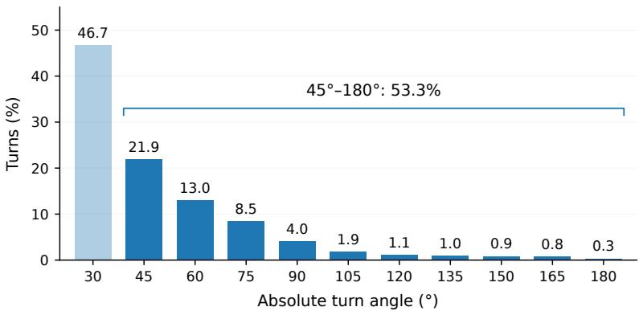  
Figure 10: Reference-path turn distribution in R2R-CE and RxR-CE, normalized over 54,457 turns of at least $3 0 ^ { \circ }$ . The $4 5 ^ { \circ } - 1 8 0 ^ { \circ }$ categories account for 53.3% of turns.

Reference-path turns. Figure 10 summarizes directional changes along reference paths in R2R-CE and RxR-CE. The pooled distribution uses $1 5 ^ { \circ }$ angle categories and is normalized over 54,457 turns of at least 30◦. The $4 5 ^ { \circ } - 1 8 0 ^ { \circ }$ categories account for 53.3% of these turns, showing that substantial direction changes are common in the reference routes.

For a forward $9 0 ^ { \circ }$ view aligned with the incoming path, an outgoing direction beyond $4 5 ^ { \circ }$ lies outside the current field of view. ERP observations retain these directions before rotation, providing visual context for the route beyond the turn.

## E QUALITATIVE RESULTS

## E.1 PAIRED PANORAMIC ATTENTION CASES

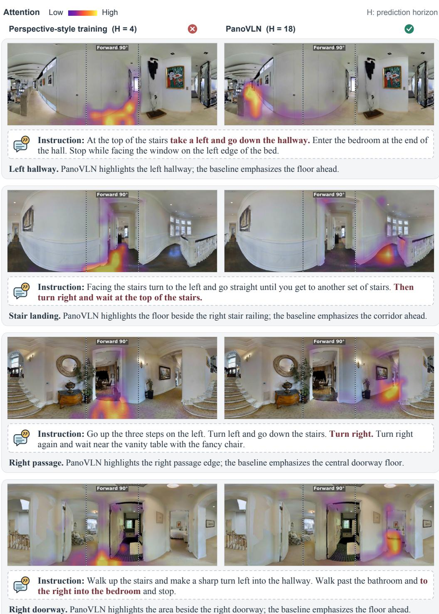  
Figure 11: Additional paired attention cases, each using the same ERP and instruction. Red bold text marks the relevant route clause; dashed lines bound the forward 90◦ sector. Each case note identifies the visible hotspot locations.

## E.2 REAL-WORLD NAVIGATION CASES

REAL-WORLD NAVIGATION  
Third-person (top) · First-person ERP (bottom)  
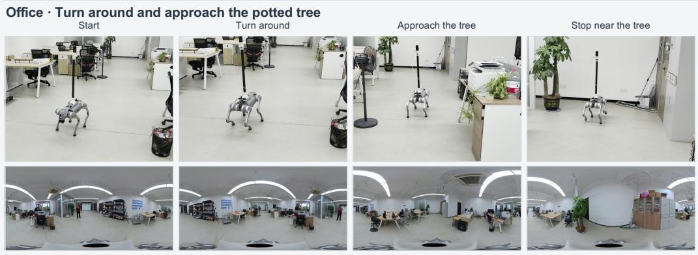

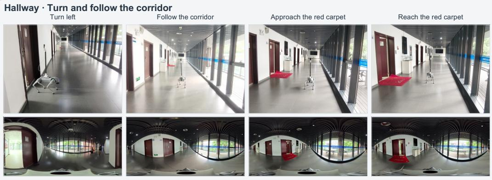  
Instruction: Turn left and go straight. Walk until you reach the red carpet and stop.

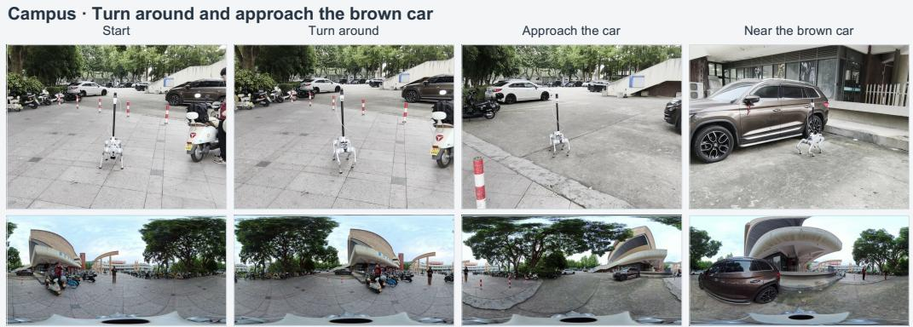  
Instruction: Turn around and walk over to the brown car to stop there.  
Figure 12: Real-world navigation cases in Hallway, Office, and Campus. Each row shows the instruction and successive observations from one trial, with route annotations.

## E.3 R2R-CE NAVIGATION CASES

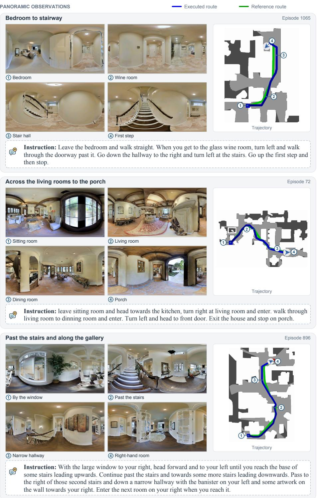  
Figure 13: Navigation cases on R2R-CE Val-Unseen. Each case shows four panoramic observations in reading order and the full instruction. Numbered markers link each observation to its location on the trajectory; blue and green denote the executed and reference routes.

## E.4 RXR-CE NAVIGATION CASES

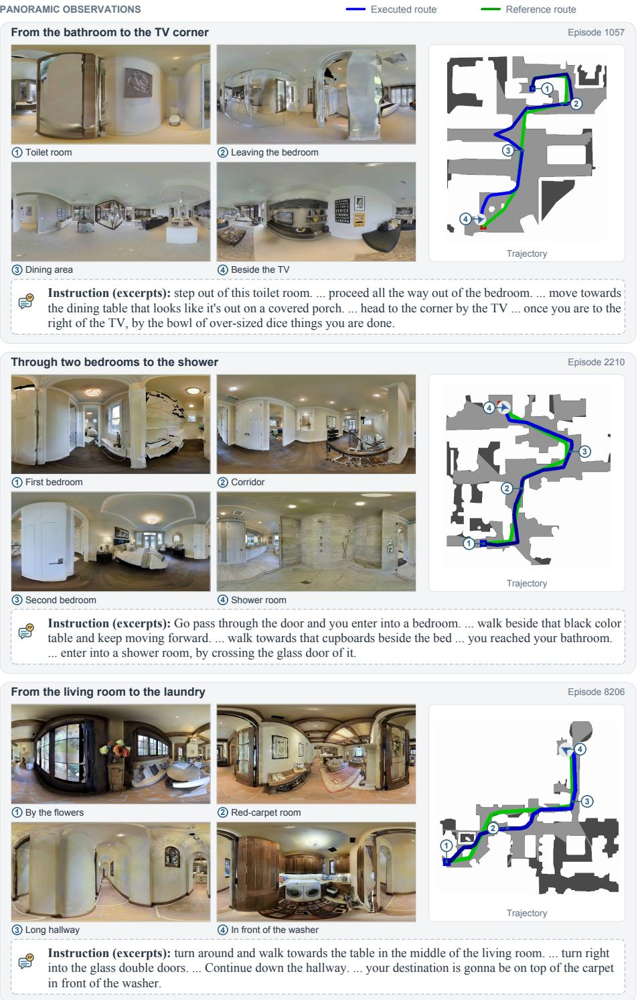  
Figure 14: Navigation cases on RxR-CE Val-Unseen. Four panoramic observations per case are linked to the trajectory by numbered markers. Blue and green denote the executed and reference routes. Instruction excerpts retain the original wording; ellipses mark omissions.