# PIVOT: PIVOT-AWARE ON POLICY SELF DISTILLA-TION FOR MULTI-TURN VLM AGENTS

Project Page

Jiazhou Zhou1,2∗ Hu Zhou3 Yucheng Chen4 Jinyuan Qu5,2 Ying-Cong Chen1 Lei Zhang2†

1AI Thrust, The Hong Kong University of Science and Technology (Guangzhou)

2International Digital Economy Academy (IDEA)

3The Hong Kong Polytechnic University

4MedVisAI Lab, Lee Kong Chian School of Medicine, Nanyang Technological University, and Centre of AI in Medicine 5Tsinghua University

## ABSTRACT

Reinforcement learning with verifiable rewards (RLVR) via Group-Relative Policy Optimization (GRPO) is widely used for multi-turn VLM agent training, yet it suffers from zero-gradient silence on uniform failures and coarse episodelevel credit assignment. While On-Policy Distillation (OPD) and On-Policy Self-Distillation (OPSD) mitigates sparse rewards using hindsight information, its underlying mechanisms remain poorly understood. Through controlled counterfactual rollback probes across five multi-turn VLM agent benchmarks, we reveal that performance gains in OPSD/OPD are largely driven by physical state rollback at the pivot step, defined as the first unrecoverable action without remaining step budget. However, physical state rollbacks are computationally prohibitive and infeasible in real-world environments. To bridge this gap, we present Pivot-Aware Internalized Visual On-Policy Training (PIVOT), an RL framework that internalizes pivot localization and state restoration directly into token-level parameter updates, eliminating environment rollbacks during RL training and additional skill hints at test time. PIVOT unifies three functional roles within a single architecture: a failure Analyzer non-invasively localizes the pivot step and diagnoses failure modes from visual trajectory collages and action logs; a detached Teacher re-scores failed tokens under this privileged diagnostic context; and a Student optimizes joint GRPO and confidence-gated OPD objectives. At test time, both Teacher and Analyzer branches are stripped. Evaluated on five multi-turn VLM agent tasks across cognitive grid puzzles, 3D embodied control and navigation, and generative reasoning, PIVOT achieves 0.90 overall accuracy on Qwen2.5- VL-3B (+8% over SFT+GRPO baseline and +5% over previous SOTA) and scales to 0.92 on Qwen3-VL-2B (+12% over SFT+GRPO baseline).

## 1 INTRODUCTION

Reinforcement learning (RL) has become a dominant post-training paradigm for vision-language model (VLM) agents (Ouyang et al., 2022; Guo et al., 2025; Yao et al., 2023; Wang et al., 2026b; Shen et al., 2025; Li et al., 2026). The prevailing RLVR framework, Group-Relative Policy Optimization (GRPO) (Shao et al., 2024), samples multiple rollouts per prompt and computes relative advantages by normalizing episode-level returns within each group. However, as analyzed in Sec. 2.1 (Fig. 1(a)) across five multi-turn VLM agent benchmarks, GRPO suffers from two critical failure modes: zero-gradient silence, where the policy gradient vanishes as the group returns are identical (Yu et al., 2026), and coarse episode-level credit assignment, which ranks entire trajectories by scalar returns without pinpointing which step first renders the task unrecoverable (Lightman et al., 2024; Uesato et al., 2022).

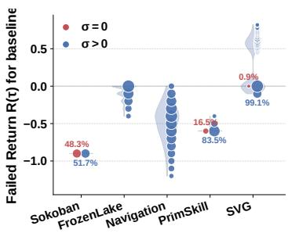  
(a)

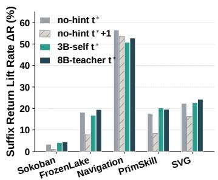  
(b)

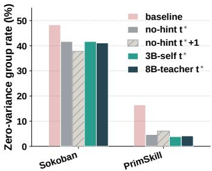  
(c)  
Figure 1: (a) Base policy failed-rollout returns $R ( \tau )$ , distinguishing zero-variance (σ=0, red) from variance-bearing $( \sigma { > } 0 ,$ , blue) groups (marker size scales with trajectory frequency; percentages denote $\sigma { = } 0$ share). (b) Suffix return lift ∆R (%) across four rollback probes at the pivot step: no-hint resets at $t ^ { * }$ and $t ^ { * } { + 1 }$ , alongside 3B-self and 8B-teacher skill hints at t∗. (c) Zero-variance group rate (%) across four rollback probes on Sokoban and PrimitiveSkill.

On-Policy Distillation (OPD) (Agarwal et al., 2024; Lu et al., 2026) mitigates sparse rewards via token-level supervision, but fundamentally requires access to white-box teacher logits and matched vocabularies. To bypass these constraints, On-Policy Self-Distillation (OPSD) (Wang et al., 2026a; Zhao et al., 2026; Andrychowicz et al., 2017; Shinn et al., 2023) performs self-supervision by conditioning policy updates on hindsight information. However, the mechanisms driving OPSD/OPD gains in multi-turn VLM agents remain poorly understood. To figure out these underlying mechanisms, we conduct counterfactual probes by systematically rolling back the environment to the pivot step, defined as the first unrecoverable action within the remaining step budget, and then resampling trajectory suffixes to evaluate the performance gains.

Empirically, as shown in Sec. 2.2 and Figs. 1(b)–(c), our probe reveals three key findings: (i) Restoring the environment state to the pivot step without any skill hints provides the primary share of suffix return lift and substantially reduces zero-advantage GRPO groups; (ii) Delaying this state reset by even a single step $( t ^ { * } + 1 )$ causes suffix return gains to sharply diminish; and (iii) Incorporating explicit skill hints, whether self-generated or teacher-provided, yields only marginal incremental gains over hint-free state restoration (Fig. 1(b)). These observations yield a vital insight: the efficacy of OPD/OPSD in multi-turn VLM agents is largely driven by precise state rollbacks at the pivot step, rather than by additional skill prompting.

However, state rollback is computationally prohibitive and infeasible in real-world, non-rewindable environments, while inference cannot tolerate additional skill prompt overhead. Therefore, a practical RL framework for multi-turn VLM agents must: (i) non-invasively and precisely localize the pivot step directly from trajectory histories, and (ii) convert this localized pivot step into fine-grained, token-level policy gradients wihout environment rollbacks during RL training and additional skill hints at test time.

To this end, we present Pivot-Aware Internalized Visual On-Policy Training (PIVOT), an on-policy distillation framework that internalizes pivot step localization and failure diagnostic hints directly into parameter updates without simulator rollbacks (Fig. 2, Sec. 3). In Stage I, a lightweight SFT phase cold-starts a failure Analyzer to non-invasively predict the pivot step, failure mode, and op tional guidance skills directly from visual trajectory collages and action logs (Sec. 3.1). In Stage II, a three-role unified architecture orchestrates training by consolidating Student, Analyzer, and Teacher roles within shared parameters: the Analyzer extracts a localized visual panel around the pivot step, combining it with the predicted failure mode and guidance skills to construct a privileged context. A detached Teacher then re-scores original failed tokens under this privileged context, while the Student optimizes joint GRPO and Gated OPD objectives (Sec. 3.2). At test time, both Analyzer and Teacher are stripped away, deploying the agent strictly as an unprivileged Student with zero computational and skill prompt overhead. Our main contributions are summarized as follows:

• Mechanistic Insight into OPSD: We characterize GRPO failure modes in multi-turn VLM agents and empirically analyze via counterfactual rollback probes that the OPSD/OPD performance gains stem mainly from state rollback at the critical pivot step, rather than skill hints as additional prompts.

• Non-Invasive Pivot Step Localization: We propose PIVOT, introducing a trajectory Analyzer that non-invasively localizes pivot steps and provide failure diagnoses directly from complete visual collages and action logs.

• Unified Three-Role Architecture: We formulate a single-model paradigm consolidating Student, Analyzer, and Teacher roles, internalizing state rollback during training while preserving zero computational and skill prompt overhead at inference.

• Superior Performance: Evaluated on five multi-turn VLM agent benchmarks across cognitive grid puzzles, 3D embodied control and navigation, and generative reasoning, PIVOT achieves 0.90 overall accuracy on Qwen2.5-VL-3B (Bai et al., 2025b) $( + 8 \%$ over the SFT+GRPO baseline and +5% over dense-reward SOTA) and scales to 0.92 on Qwen3- VL-2B (Bai et al., 2025a) (+12% over the SFT+GRPO baseline).

## 2 MECHANISTIC ANALYSIS: PHYSICAL RESTORATION DOMINATES HINDSIGHT GUIDANCE

## 2.1 LIMITATIONS OF EPISODE-LEVEL CREDIT ASSIGNMENT

Preliminaries. We formulate a multi-turn vision-language agent task as a partially observable Markov decision process (POMDP) (Astr˚ om, Karl Johan, 1965) defined by the tuple¨ $\begin{array} { r l } { \mathcal { M } } & { { } = } \end{array}$ $( S , \mathcal { O } , \mathcal { A } , \mathcal { P } , \mathcal { R } , \Omega , \gamma )$ , where S is the state space, O the observation space, A the action space, $\mathcal { P } ( s _ { t + 1 } ~ \mid ~ s _ { t } , a _ { t } )$ the transition dynamics, $\mathcal { R } ( s _ { t } , a _ { t } )$ the reward function, $\Omega ( o _ { t } \mid s _ { t } )$ the observation emission model, and $\gamma \in \mathsf { \Gamma } ( 0 , 1 ]$ the discount factor. At turn t, the agent receives observation $o _ { t } \ \sim \ \Omega ( \cdot \ | \ s _ { t } )$ , maintains execution history $h _ { t } ~ = ~ ( o _ { 0 } , a _ { 0 } , . . . , o _ { t } )$ , and samples action $a _ { t } \sim \pi _ { \theta } ( \cdot \ | \ h _ { t } )$ . Execution yields a rollout trajectory $\tau = \left( o _ { 0 } , a _ { 0 } , r _ { 0 } , \ldots , o _ { T - 1 } , a _ { T - 1 } , r _ { T - 1 } \right)$ of length $T$ with cumulative return $\begin{array} { r } { R ( \tau ) = \sum _ { t = 0 } ^ { T - 1 } \gamma ^ { t } r _ { t } } \end{array}$ . Given prompt $q \sim \mathcal { Q } .$ , post-training RL optimizes expected trajectory return $J ( \theta ) = \overline { { \mathbb { E } } } _ { q , \tau } [ R ( \tau ) ]$

The prevailing estimator for RLVR, Group-Relative Policy Optimization (GRPO) (Shao et al., 2024), samples a group of N rollouts $\{ \tau ^ { ( n ) } \} _ { n = 1 } ^ { N }$ per prompt and computes standardized group advantages:

$$
A _ { n } ^ { \mathrm { r l } } = \frac { R ( \tau ^ { ( n ) } ) - \mu } { \sigma + \epsilon } , \quad \mu = \frac { 1 } { N } \sum _ { n = 1 } ^ { N } R ( \tau ^ { ( n ) } ) , \quad \sigma = \sqrt { \frac { 1 } { N } \sum _ { n = 1 } ^ { N } \bigl ( R ( \tau ^ { ( n ) } ) - \mu \bigr ) ^ { 2 } } ,\tag{1}
$$

where $\epsilon > 0$ is a numerical stabilizer. GRPO assigns this scalar $A _ { n } ^ { \mathrm { r l } }$ uniformly to every action token in $\tau ^ { ( n ) }$ . Consequently, it evaluates trajectories solely by episode-level return, ignoring which specific turn rendered the task unrecoverable.

Failed Rollouts vs. Zero-Advantage Groups. Let $R _ { \mathrm { s u c c } }$ denote the domain-specific success return threshold. We define the set of failed rollouts within a sampled group as $N ^ { - } ~ = ~ \left\{ \tau ^ { ( n ) } ~ \right\}$ $R ( \tau ^ { ( n ) } ) < R _ { \mathrm { s u c c } } \}$ . While failed rollouts can still receive non-zero advantages when group returns vary, a zero-advantage group arises when return variance vanishes (σ=0 in Eq. eq. 1). In such cases, GRPO suffers from zero-gradient silence $( A _ { n } ^ { \mathrm { r l } } = 0 )$ , rendering policy updates inactive even when execution trajectories exhibit diverse failure behaviors.

Empirical Observation. We evaluate untrained Qwen2.5-VL-3B-Instruct across five VAGEN environments (Wang et al., 2026b) (Sec. 4.1, N=8). As shown in Fig. 1(a), low baseline success on Sokoban (17.8%) and PrimitiveSkill (8.9%) yields frequent zero-variance groups $( \sigma { = } 0$ on 48.3% and 16.5%), where identical returns cause all GRPO advantages $A _ { n } ^ { \mathrm { r l } }$ to vanish despite diverse errors. In FrozenLake and Navigation $( 0 . 0 \% \ \sigma { = } 0 )$ , the −0.1 per-step penalty differentiates returns across varying trajectory lengths,forming the −0.1 ladder in Figure 1(a), but $\sigma { > } 0$ merely penalizes episode length without isolating the critical failure turn. Similarly, SVG visual scores yield low $\sigma { = } 0 \mathrm { ( 0 . 9 \% ) }$ , yet credit assignment remains episode-level rather than step-level.

Takeaway. Failed GRPO trajectories suffer from zero-gradient silence or coarse credit.

## 2.2 DISENTANGLING OPD/OPSD: PHYSICAL STATE ROLLBACK DOMINATES SKILL HINTS

Recently, OPD has gained traction by supplying token-level targets via negative KL divergence with a teacher (Agarwal et al., 2024; Lu et al., 2026). On-Policy Self-Distillation (OPSD) relaxes whitebox constraints by conditioning policy updates on hindsight information (Wang et al., 2026a; Shinn et al., 2023; Zhao et al., 2026). However, the underlying mechanism driving OPSD in multi-turn VLM agents remains poorly understood. By systematically restoring environment states at critical steps and resampling trajectory suffixes with or without textual guidance, we isolate the true driver of post-failure performance gains.

Pivot Step $t ^ { * } .$ . Given a domain feasibility certificate Feas $( s , k ) \in \{ 0 , 1 \}$ indicating whether state s can reach the goal within k steps $( \mathbf { A p p . B } )$ , we define the pivot step $t ^ { * }$ as the first action that renders the task unfeasible under the remaining budget:

$$
t ^ { * } = \operatorname* { m i n } \bigl ( \{ t \in [ 0 , T - 1 ] : \mathsf { F e a s } ( s _ { t + 1 } , T - t - 1 ) = 0 \} \cup \{ T - 1 \} \bigr ) .\tag{2}
$$

Suffix Return Lift Rate. Let $\tau _ { t ^ { * } }$ : denote the suffix of τ from pivot step $t ^ { * }$ onward; its discounted return is $\begin{array} { r } { R ( \tau _ { t ^ { * } : } ) = \sum _ { t = t ^ { * } } ^ { T - 1 } \gamma ^ { t - t ^ { * } } r _ { t } } \end{array}$ . After rolling back the environment state to $s _ { t }$ ∗ and resampling a new suffix $\tilde { \tau } _ { t ^ { * } } , \sim \pi _ { \mathrm { b a s e } }$ on faliure trajectories $\bar { N } ^ { - }$ , we record a successful recovery if $R ( \tilde { \tau } _ { t ^ { * } : } ) >$ $R ( \tau _ { t ^ { * } : } )$ . We quantify recovery via the suffix return lift rate $\Delta R \colon$

$$
\Delta R = \left| \left\{ \tau \in N ^ { - } : R ( \tilde { \tau } _ { t ^ { * } : } ) > R ( \tau _ { t ^ { * } : } ) \right\} \right| / \left| N ^ { - } \right| .\tag{3}
$$

Counterfactual Rollback Setup. On failed rollouts, we roll back the environment state to $s _ { t ^ { * } }$ and resample a single suffix under four controlled conditions: (1) no-hint: resamples purely from the rolled-back state $s _ { t ^ { * } }$ ∗ without skill hints; (2) no-hint $( t ^ { * } { + } 1 )$ : rolls back state to $s _ { t ^ { * } + 1 }$ to evaluate temporal localization sensitivity; (3) 3B-self: appends failure mode $m ^ { * }$ and self-generated skill hints from $\pi _ { \mathrm { b a s e } }$ (mirroring OPSD); (4) 8B-teacher: appends skill hints generated by a larger teacher model $( \mathsf { Q w e n 3 - V L - 8 B }$ , mirroring OPD).

Empirical Findings. Fig. 1(b) and (c) summarize the $n { = } 1$ probe (numerical details in App. D): (i) Rollback $s _ { t ^ { \ast } }$ ∗ with no hints boosts suffix returns $\Delta R$ across all tasks $( 3 . 3 \% - 5 6 . 6 \% )$ while cutting zero-variance group rates $( 4 8 . 3 \%  4 1 . 7 \%$ on Sokoban, $1 6 . 5 \%  3 . 8 \%$ on PrimitiveSkill; Fig. 1(c)),confirming that state rollback delivers the primary performance gains and resolves zerogradient silence. (ii) Resetting just one step later $( t ^ { * } + 1 )$ sharply drops $\Delta R$ on four tasks (e.g., Sokoban $3 . 3 \%  0 . 9 \%$ , PrimitiveSkill $1 7 . { \dot { 7 } } \% \to 8 . 3 \% ;$ Fig. 1(b)), demonstrating that recovery strictly hinges on temporal precision. (iii) Skill hints yield marginal additional gain (3B-self differs from no-hint by $\leq 2 . 6$ points; 8B-teacher advances 3B-self within 0.3–3.5 points).

Takeaway. (i) State Rollback Drives Recovery: State rollback at $t ^ { * }$ provides the predominant performance gain, serving as the core mechanism underlying OPSD/OPD paradigms. (ii) Skill Hints Offer Marginal Value: Skill hints, whether self-generated (3B-self) or teacher-provided (8Bteacher), yield negligible gains beyond pure state rollback. (iii) Temporal Precision is Critical: Delaying state rollback by even a single step $( t ^ { * } { + } 1 )$ severely degrades recovery capacity.

## 2.3 FROM PHYSICAL ROLLBACKS TO PARAMETER-INTERNALIZED UPDATES

These mechanistic findings expose the Rollback Paradox in post-training VLM agents: while trajectory recovery stems overwhelmingly from state rollback at the pivot turn $( t ^ { * } )$ , explicit physical rollbacks are computationally prohibitive during online RL and impossible in real-world, nonrewindable environments.

To bridge this gap and convert physical state rollback directly into parameter updates without simulator resets, a practical post-training framework must fulfill three core requirements: (i) Non-Invasive Pivot Localization: identifying the critical pivot step (t∗) directly from failure trajectory histories, bypassing environment resets; (ii) Internalized Credit Assignment: converting the localized pivot turn into fine-grained, token-level policy gradients directly on original failed rollouts without physical rollbacks; and (iii) Zero Test-Time Overhead: internalizing hindsight diagnostic capabilities into policy parameters to enable unprivileged deployment without additional skill prompts or auxil iary models at test time.

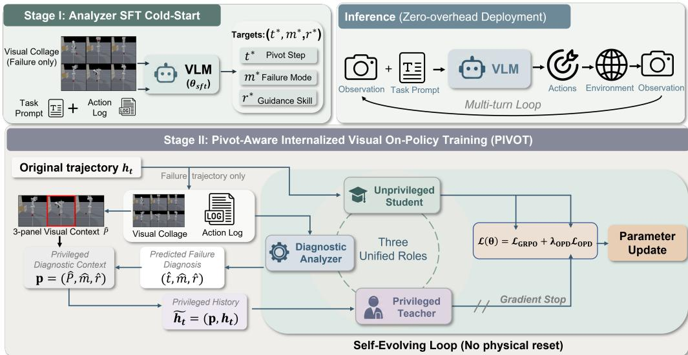  
Figure 2: PIVOT Architecture Overview. PIVOT unifies Student, Analyzer, and Teacher roles within a single shared policy $\pi _ { \theta } .$ . Stage I: SFT cold-starts the Analyzer to predict diagnostic triplets $( t ^ { * } , m ^ { * } , r ^ { * } )$ from visual trajectory collages $C ( \tau )$ and action logs. Stage II: For failed rollouts, the Analyzer localizes the pivot step tˆto construct a privileged context p, enabling the detached Teacher to re-score failed tokens under $\tilde { h } _ { t } = ( p , h _ { t } )$ for joint GRPO and confidence-gated OPD training. Inference: Analyzer and Teacher branches are stripped, deploying $\pi _ { \theta }$ strictly as an unprivileged Student with zero computational and prompt overhead.

## 3 PIVOT: PIVOT-AWARE INTERNALIZED VISUAL ON-POLICY TRAINING

In this section, we present PIVOT, a post-training framework that consolidates Student, Analyzer, and Teacher roles within a single parameterized VLM policy $\pi _ { \theta } .$ . Specifically, $\pi _ { \theta }$ non-invasively localizes the pivot step $t ^ { * }$ and diagnoses failure via a visual trajectory Analyzer (Sec. 3.1), and acts as its own Privileged Teacher to distill fine-grained visual hindsight into token-level policy updates on original failed rollouts (Sec. 3.2). By internalizing visual state restoration directly into model parameters, PIVOT eliminates environment rollbacks during training while maintaining zero computational and prompt overhead at test time.

## 3.1 STAGE I: VISUAL DIAGNOSTIC COLD-START FOR PIVOT STEP LOCALIZATION

To bypass state rollbacks during online RL training, the agent first learns to non-invasively localize the recoverable pivot step $t ^ { * }$ directly from VLM agent’s trajectory history. As shown in Fig. 2 (Stage I), we initialize this diagnostic capability via the Supervised Fine-Tuning (SFT) phase.

Diagnostic Target Triplets $( t ^ { * } , m ^ { * } , r ^ { * } )$ . Each failed trajectory $\tau \in N ^ { - }$ is annotated with a target diagnostic triplet $z _ { \tau } = ( t ^ { * } , m ^ { * } , r ^ { * } )$ , where $t ^ { * }$ is the ground-truth pivot step from Eq. eq. $2 , m ^ { * } \in$ $\mathcal { M } _ { \mathrm { f a i l } }$ denotes a discrete failure mode category (e.g., deadlock, timeout), and $r ^ { * }$ represents an optional guidance skill prompt generated offline via a teacher (App. G).

Visual Collage Construction & Input. The Analyzer receives a multi-frame visual collage $C ( \tau ) = { \mathrm { G r i d } } ( o _ { 0 } , \dots , o _ { T - 1 } )$ augmented with explicit step indices, alongside the full action sequence $a _ { 0 : T - 1 } = ( a _ { 0 } , \dots , a _ { T - 1 } )$ and task prompt $q .$ Crucially, this input relies strictly on observable trajectory histories without requiring access to environment states or internal memories. Fig. 3 shows one accepted training pair on FrozenLake, Navigation, and PrimitiveSkill.

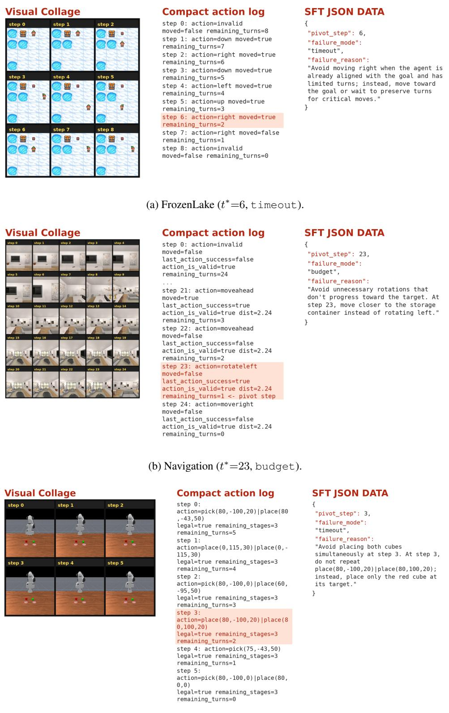  
(c) PrimitiveSkill (t∗=3, timeout).  
Figure 3: Analyzer SFT input–output examples. Each row pairs a visual trajectory collage and compact action log with the JSON supervision target. The highlighted log line is the pivot step. Additional environments and samples are in App. H.

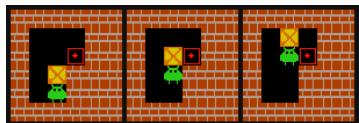

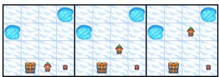

  
(c) Navigation (t∗=21, budget).

(a) Sokoban (t∗=4, deadlock).  
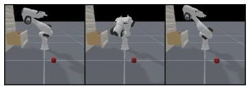

  
(d) PrimSkill (t∗=4, timeout).  
(e) SVG (t∗=1, timeout).  
Figure 4: Hindsight Visual Panels $P _ { t ^ { * } } = [ o _ { t ^ { * } - 1 } , o _ { t ^ { * } } , o _ { t ^ { * } + 1 } ] ,$ . Localized visual neighborhood extracted around the pivot step $t ^ { * }$ across five benchmark tasks (boundary frames zero-padded).

SFT Training. We optimize $\pi _ { \theta }$ on the diagnostic dataset $\begin{array} { r c l } { { \mathcal D _ { \mathrm { s f t } } } } & { { = } } & { { \{ ( q , C ( \tau ) , a _ { 0 : T - 1 } ) \quad  } } \end{array}$ $( t ^ { * } , m ^ { * } , r ^ { * } ) \}$ using standard autoregressive cross-entropy loss $( \mathrm { A p p . ~ F } )$ . The resulting checkpoin $\theta _ { \mathrm { s f t } }$ equips πθ with visual diagnostic capabilities, providing a robust cold-start for Stage II.

## 3.2 STAGE II: INTERNALIZING LOCALIZED PIVOT STEP HINDSIGHT INTO POLICY UPDATES

In Stage II, PIVOT translates localized pivot step hindsight directly into fine-grained, token-level policy gradients on original failed rollouts without physical environment resets (Fig. 2, Stage II). Each online RL iteration synchronizes on-policy rollout sampling with privileged target scoring, optimizing policy parameters under a unified joint objective.

Role 1: Diagnostic Analyzer (Pivot Localization). Given a sampled rollout group $\mathcal { G } ^ { \mathrm { ~ ~ } } =$ $\{ \tau ^ { ( 1 ) } , \dots , \tau ^ { ( N ) } \}$ }, the Diagnostic Analyzer processes each failed rollout $\tau \in N ^ { - }$ to predict:

$$
\begin{array} { r } { ( \hat { t } , \hat { m } , \hat { r } ) = \pi _ { \theta } \big ( q , C ( \tau ) , a _ { 0 : T - 1 } \big ) , } \end{array}\tag{4}
$$

where $\hat { t }$ denotes the predicted pivot step, $\hat { m } \in \mathcal { M } _ { \mathrm { f a i l } }$ the predicted failure category, and $\hat { r }$ the predicted guidance skill. Using the predicted pivot step tˆ, the Analyzer extracts a 3-panel visual neighborhood crop $P _ { \hat { t } } = [ o _ { \hat { t } - 1 } , o _ { \hat { t } } , o _ { \hat { t } + 1 } ]$ centered around tˆ (with boundary frames zero-padded), illustating in Fig. 4. The privileged diagnostic context is then constructed as $\boldsymbol { p } = \left( P _ { \hat { t } } , \hat { m } , \hat { r } \right)$

Role 2: Privileged Teacher (Hindsight Target Scoring). The Privileged Teacher re-evaluates the Student’s original action tokens under the privileged history $\tilde { h } _ { t } .$ , formed by prepending diagnostic context $p$ to the standard interaction history $h _ { t } = ( o _ { 0 } , a _ { 0 } , \ldots , o _ { t } )$

$$
\tilde { h } _ { t } = ( p , h _ { t } ) , \qquad \ell _ { t } ^ { \mathrm { t e a } } = \mathrm { s g } \bigl [ \log \pi _ { \theta } ( a _ { t } \mid \tilde { h } _ { t } ) \bigr ] .\tag{5}
$$

Without executing extra simulation steps or resetting environment states, the Teacher acts as a detached target evaluator: the stop-gradient operator sg[·] prevents Teacher-side parameter updates. Conditioning on $\tilde { h } _ { t }$ enables the Teacher to provide precise token-level credit by implicitly answering how original actions should be re-weighted under privileged context $p .$

Role 3: Acting Student (Token-Level Policy Update). Concurrently, the Unprivileged Student branch evaluates action tokens under standard interaction histories $h _ { t }$ , producing unprivileged logprobabilities $\ell _ { t } ^ { \mathrm { s t u } } = \log \pi _ { \theta } ( a _ { t } \mid h _ { t } )$ . GRPO optimizes policy updates based on group-normalized advantages $A ^ { \mathrm { r I } }$ :

$$
\begin{array} { r } { \mathcal { L } _ { \mathrm { G R P O } } ( \theta ) = - \mathbb { E } \Bigl [ m _ { \mathrm { a c t } } \operatorname* { m i n } \bigl ( \rho _ { t } A ^ { \mathrm { r l } } , \mathrm { c l i p } ( \rho _ { t } , 1 - \varepsilon , 1 + \varepsilon ) A ^ { \mathrm { r l } } \bigr ) \Bigr ] , } \end{array}\tag{6}
$$

where $\rho _ { t } = \exp ( \ell _ { t } ^ { \mathrm { s t u } } - \ell _ { t } ^ { \mathrm { o l d } } ) , \ell _ { t } ^ { \mathrm { o l d } } = \log \pi _ { \theta _ { \mathrm { o l d } } } ( a _ { t } \mid h _ { t } ) , \varepsilon > 0$ is the clipping threshold, and $m _ { \mathrm { a c t } }$ masks valid action tokens. For failed rollouts $( \mathbb { I } [ R ( \tau ) < R _ { \mathrm { s u c c } } ] )$ , confidence-gated OPD (Agarwal et al., 2024; Lu et al., 2026) (More details in App. F) provides dense token-level targets:

$$
\begin{array} { r } { \mathcal { L } _ { \mathrm { O P D } } ( \boldsymbol { \theta } ) = \mathbb { E } \Big [ \mathbb { I } [ R ( \tau ) < R _ { \mathrm { s u c c } } ] m _ { \mathrm { a c t } } g _ { t } \big ( \mathrm { s g } [ \ell _ { t } ^ { \mathrm { t e a } } ] - \ell _ { t } ^ { \mathrm { s t u } } \big ) \Big ] , } \end{array}\tag{7}
$$

where $g _ { t } = \sigma ( \beta _ { \mathrm { o p d } } \delta _ { t } )$ is the confidence gating weight, $\delta _ { t } = \ell _ { t } ^ { \mathrm { t e a } } - \ell _ { t } ^ { \mathrm { s t u } }$ measures the privileged log-probability gap, σ(·) is the sigmoid function, and $\beta _ { \mathrm { o p d } } > 0$ controls the gating temperature.

The overall joint training objective is formulated as:

$$
\begin{array} { r } { \mathcal { L } ( \theta ) = \mathcal { L } _ { \mathrm { G R P O } } ( \theta ) + \lambda _ { \mathrm { o p d } } \mathcal { L } _ { \mathrm { O P D } } ( \theta ) , } \end{array}\tag{8}
$$

where $\lambda _ { \mathrm { o p d } } > 0$ balances RL exploration and token-level self-distillation. When all rollouts within a group fail (σ = 0), LGRPO vanishes while $\mathcal { L } _ { \mathrm { O P D } }$ actively maintains informative policy gradients.

Inference. During deployment (Fig. 2, top-right), Analyzer and Teacher branches are stripped away, executing π strictly as an unprivileged Student $a _ { t } \sim \pi _ { \theta } ( \cdot \mid h _ { t } )$ with zero extra cost.

## 4 EXPERIMENTS

## 4.1 EXPERIMENTAL SETUP

Environments. To evaluate the learning dynamics and visual reasoning capabilities of VLM agents, we adopt the VAGEN (Wang et al., 2026b) evaluation suite, comprising five agentic tasks across three paradigms: Cognitive Grid Puzzles, Embodied 3D Control, and Generative Reasoning. App. E details the task families, environment specifications, horizon limits, and metrics.

Experimental Setup & Reference Baselines. We evaluate PIVOT across two backbone models: Qwen2.5-VL-3B-Instruct (Bai et al., 2025b) and Qwen3-VL-2B-Instruct (Bai et al., 2025a). We compare against three reference baselines: (i) Vanilla-GRPO: Pure RL post-training initialized directly from raw Instruct checkpoints with Analyzer components disabled; (ii) SFT-GRPO: GRPO initialized from Stage I Analyzer SFT weights $\theta _ { \mathrm { s f t } }$ (with OPD disabled during RL), isolating SFT initialization gains from token-level distillation; and (iii) SDAR (Lu et al., 2026): A reproduced state-of-the-art on-policy distillation baseline using a frozen Qwen3-VL-7B-Instruct teacher and Qwen2.5-VL-3B student (More details in App. I) with the same Gated OPD (Eq. 7), isolating Gated OPD’s contribution.

PIVOT Variants & Ablation Arms. All PIVOT variants initialize $\pi _ { \theta }$ from Stage I weights $\theta _ { \mathrm { s f t } }$ and modulate the Teacher’s privileged context $p \mathrm { : }$ (i) P: Includes localized visual panel only, $p = ( P _ { \hat { t } } ) ;$ ; (ii) M: Includes failure mode diagnosis only, $p = ( { \hat { m } } )$ ; (iii) M+P (Default): Combines localized visual panel, failure mode, and predicted pivot step, $p = ( P _ { \hat { t } } , \hat { m } , \hat { t } ) ;$ ; and (iv) M+P+R: Extends $\mathsf { M } { + } \mathsf { P }$ by appending predicted guidance skill prompts, $\boldsymbol { p } = ( P _ { \boldsymbol { \hat { t } } } , \boldsymbol { \hat { m } } , \boldsymbol { \hat { t } } , \boldsymbol { \hat { r } } )$ . Additionally, Tab. 2 incorporates a negative control M+P-Random+R, which replaces predicted pivot steps tˆwith uniform random step indices to evaluate temporal localization sensitivity.

Metrics. Performance across puzzle and embodied control tasks is evaluated using the average Success Rate (SR) under sparse goal-completion rewards. For SVG Reconstruction, we report a composite visual similarity score averaging DINO and DreamSim embeddings.

Implementation Details. SFT stage. For each environment we sample failed on-policy rollouts from the raw Instruct checkpoint and retain ∼960–1.7k accepted trajectories after loose factual filtering (Tab. 11). Each example pairs an trajectory collage with a compact action log; supervision is JSON $( t ^ { * } , m ^ { * } , r ^ { * } )$ , with task solvers pinning the pivot step $t ^ { * }$ and failure mode $m ^ { * }$ and a frozen teacher optionally writing guidance skill $r ^ { * } \left( \mathrm { A p p . \bf G } \right)$ . We fine-tune the backbone for three epochs per environment to obtain a dedicated Analyzer $\theta _ { \mathrm { s f t } }$ . RL stage. We set $\theta  \theta _ { \mathrm { s f t } }$ for the shared Student $\left( \pi _ { \boldsymbol { \theta } } \right)$ , Analyzer, and Teacher. We run 250 policy updates with a GRPO group size of $N { = } 8 ;$ the OPD loss $( \lambda _ { \mathrm { o p d } } { = } 0 . 0 1$ , gate $\beta _ { \mathrm { o p d } } { = } 5 )$ is applied only on failed trajectories. Validation uses 128 episodes per environment. Further SFT data, collage, optimization, reward and hyperparameter details, plus collages and JSON targets, are in Appendices G and H.

## 4.2 MAIN RESULTS

Main Results & SOTA Comparison. As presented in Tab. 1, the full PIVOT framework (M+P+R) consistently outperforms all reference baselines across both backbones. On

Table 1: Main results across five VLM agentic benchmarks. Vanilla-GRPO, SFT-GRPO, and $M / \mathsf { M } + \mathsf { P } / \mathsf { M } + \mathsf { P } + \mathsf { R }$ denote vanilla GRPO, GRPO after Analyzer SFT, and Teacher context with failure mode mˆ , pivot panel $P _ { \hat { t } } .$ , or added skill text rˆ; SDAR (Lu et al., 2026) is our reproduced Gated OPD baseline. Bold marks the best result; cyan percentages on M+P+R are relative gains over SFT-GRPO in the same block; light-gray rows follow (Wang et al., 2026b; Li et al., 2026).
<table><tr><td rowspan="3">Method</td><td colspan="2">Cognitive Grid Puzzles</td><td colspan="8">Embodied 3D Control</td><td colspan="2">Generative Reasoning</td><td rowspan="3">All</td></tr><tr><td rowspan="2">Sokoban</td><td rowspan="2">Frozen Lake</td><td colspan="3">Navigation</td><td colspan="5">PrimitiveSkill</td><td colspan="2">SVG</td></tr><tr><td>Base</td><td>Com.</td><td>Avg.</td><td>Place Stack</td><td>Draw.</td><td>Align</td><td>Avg.</td><td>DINO</td><td>DS</td><td>Avg.</td></tr><tr><td>Open-source VLMs</td><td></td><td></td><td></td><td></td><td></td><td></td><td></td><td></td><td></td><td></td><td></td><td></td><td></td></tr><tr><td>Qwen2.5-VL-72B</td><td>0.20</td><td>0.44</td><td>0.70</td><td>0.77 0.74</td><td>1.00</td><td>0.50</td><td>0.00</td><td>1.00</td><td>0.63</td><td>0.84</td><td>0.62</td><td>0.73</td><td>0.55</td></tr><tr><td>Qwen2.5-VL-7B</td><td>0.14</td><td>0.14</td><td>0.33</td><td>0.38 0.35</td><td>0.00</td><td>0.00</td><td>0.00</td><td>0.75</td><td>0.19</td><td>0.84</td><td>0.27</td><td>0.56</td><td>0.28</td></tr><tr><td>Qwen2.5-VL-3B (Bai et al., 2025b)</td><td>0.13</td><td>0.14</td><td>0.20 0.26</td><td>0.23</td><td>0.00</td><td>0.00</td><td>0.00</td><td>0.00</td><td>0.00</td><td>0.79</td><td>0.30</td><td>0.54</td><td>0.21</td></tr><tr><td>VLM-R1-3B (Shen et al., 2025)</td><td>0.16</td><td>0.15</td><td>0.33</td><td>0.34 0.34</td><td>0.00</td><td>0.00</td><td>0.00</td><td>0.00</td><td>0.00</td><td>0.79</td><td>0.27</td><td>0.54</td><td>0.24</td></tr><tr><td>Proprietary VLMs</td><td></td><td></td><td></td><td></td><td></td><td></td><td></td><td></td><td></td><td></td><td></td><td></td><td></td></tr><tr><td>o4-mini</td><td>0.44</td><td>0.82</td><td>0.75</td><td>0.75 0.75</td><td>1.00</td><td>0.50</td><td>0.00</td><td>0.75</td><td>0.56</td><td>0.90</td><td>0.66</td><td>0.78</td><td>0.67</td></tr><tr><td>GPT-40</td><td>0.43</td><td>0.54</td><td>0.75 0.69</td><td>0.72</td><td>0.50</td><td>0.63</td><td>0.00</td><td>0.88</td><td>0.50</td><td>0.91</td><td>0.69</td><td>0.80</td><td>0.60</td></tr><tr><td>Gemini 2.5 Pro</td><td>0.58</td><td>0.78</td><td>0.63 0.63</td><td>0.63</td><td>0.63</td><td>0.63</td><td>0.00</td><td>0.75</td><td>0.50</td><td>0.93</td><td>0.78</td><td>0.86</td><td>0.67</td></tr><tr><td>Claude 4.5 Sonnet</td><td>0.31</td><td>0.80</td><td>0.67 0.67 0.48</td><td>0.67</td><td>0.63</td><td>0.50</td><td>0.00</td><td>1.00</td><td>0.53</td><td>0.95</td><td>0.81</td><td>0.88</td><td>0.64</td></tr><tr><td>Claude 3.7 Sonnet</td><td>0.25</td><td>0.69</td><td>0.47</td><td>0.47</td><td>0.63</td><td>0.13</td><td>0.00</td><td>1.00</td><td>0.44</td><td>0.94</td><td>0.77</td><td>0.85</td><td>0.54</td></tr><tr><td colspan="10">Previous SOTA with World Model Reasoning for Visual State Reconstruction (Qwen2.5-VL-3B-Instruct) 0.81</td><td></td><td></td><td></td><td></td></tr><tr><td>VAGEN-Full (Wang et al., 2026b)</td><td>0.79</td><td>0.72</td><td>0.80</td><td>0.81</td><td>1.00</td><td>0.88</td><td>1.00</td><td>1.00</td><td>0.97</td><td>0.90</td><td>0.66</td><td>0.78</td><td>0.81</td></tr><tr><td>GLANCE-Full (Li et al., 2026)</td><td>0.85</td><td>0.78</td><td>0.86 0.88</td><td>0.87</td><td>1.00</td><td>0.88</td><td>1.00</td><td>1.00</td><td>0.97</td><td>0.92</td><td>0.70</td><td>0.81</td><td>0.86</td></tr><tr><td colspan="10">Reproduced OPD baseline (Qwen2.5-VL-3B-Instruct)</td><td></td><td></td><td></td><td></td></tr><tr><td>SDAR (Lu et al., 2026)</td><td>0.52</td><td>0.77</td><td>0.88</td><td>0.84 0.86</td><td>1.00</td><td>1.00</td><td>1.00</td><td>1.00</td><td>1.00</td><td>0.91</td><td>0.68</td><td>0.80</td><td>0.79</td></tr><tr><td colspan="10">PIVOT (Qwen2.5-VL-3B-Instruct)</td><td></td><td></td><td></td><td></td></tr><tr><td>Vanilla-GRPO</td><td>0.78</td><td>0.87 0.75</td><td>0.75</td><td>0.81</td><td>0.92</td><td>0.86</td><td>0.89</td><td>0.93</td><td>0.90</td><td>0.90</td><td>0.66</td><td>0.78</td><td>0.80</td></tr><tr><td>SFT-GRPO</td><td>0.82</td><td>0.93</td><td>0.77</td><td>0.85</td><td>0.96</td><td>0.90</td><td>0.93</td><td>0.97</td><td>0.94</td><td>0.92</td><td>0.68</td><td>0.80</td><td>0.83</td></tr><tr><td>M M+P</td><td>0.86</td><td>0.83</td><td>0.94 0.78 0.83</td><td>0.86</td><td>1.00</td><td>1.00</td><td>1.00</td><td>1.00</td><td>1.00</td><td>0.93</td><td>0.73</td><td>0.83</td><td>0.88</td></tr><tr><td>M+P+R</td><td>0.90</td><td>0.77</td><td>0.95</td><td>0.89</td><td>1.00</td><td>1.00</td><td>1.00</td><td>1.00</td><td>1.00</td><td>0.93</td><td>0.74</td><td>0.84</td><td>0.88</td></tr><tr><td></td><td>0.95+16%</td><td>0.84+12%</td><td>0.97 +4%</td><td>0.83+8%</td><td>0.90+6%</td><td>1.00+4% 1.00+11%</td><td>1.00+8%</td><td>1.00+3%</td><td>1.00+6%</td><td>0.93+1%</td><td>0.71 +4%</td><td>0.82+3%</td><td>0.90+8%</td></tr><tr><td colspan="10">PIVOT (Qwen3-VL-2B-Instruct)</td><td></td><td></td><td></td><td></td><td></td></tr><tr><td>Vanilla-GRPO</td><td>0.77</td><td>0.89</td><td>0.97</td><td>0.73 0.85</td><td>0.77</td><td>0.77</td><td>0.77</td><td>0.77</td><td>0.77</td><td>0.90</td><td>0.68</td><td>0.79</td><td>0.81</td></tr><tr><td>SFT-GRPO</td><td>0.80</td><td>0.87</td><td>0.92</td><td>0.74 0.83</td><td>0.83</td><td>0.80</td><td>0.81</td><td>0.84</td><td>0.82</td><td>0.91</td><td>0.67</td><td>0.79</td><td>0.82</td></tr><tr><td>M</td><td>0.82</td><td>0.81</td><td>0.93</td><td>0.75 0.84</td><td>1.00</td><td>1.00</td><td>1.00</td><td>1.00</td><td>1.00</td><td>0.92</td><td>0.70</td><td>0.81</td><td>0.86</td></tr><tr><td>M+P</td><td>0.97</td><td>0.89</td><td>0.97</td><td>0.89</td><td>1.00</td><td>1.00</td><td>1.00</td><td>1.00</td><td>1.00</td><td>0.93</td><td>0.71</td><td>0.82</td><td>0.91</td></tr><tr><td>M+P+R</td><td>0.92+15%</td><td>0.90+3%</td><td>0.80 0.98+7% 0.91+23% 0.95+14%</td><td></td><td></td><td>1.00+20% 1.00+25% 1.00+23%</td><td></td><td></td><td>1.00+19% 1.00+22% 0.93+2% 0.76+13% 0.85+8% 0.92+12%</td><td></td><td></td><td></td><td></td></tr></table>

Qwen2.5-VL-3B, M+P+R achieves a 0.90 overall accuracy, delivering a +8% gain over SFT-GRPO (0.83 → 0.90) and a +13% lift over pure Vanilla-GRPO. Crucially, PIVOT surpasses both the dense-reward SOTA (GLANCE-Full, 0.86) and the reproduced on-policy distillation baseline SDAR (0.79; App. I), achieving these state-of-the-art results with zero inference-time overhead. The gains are most pronounced in cognitive grid puzzles and embodied control—where early pivot blunders render trajectory suffixes unrecoverable—highlighted by Sokoban surging from 0.82 to 0.95 and PrimitiveSkill reaching 1.00 (vs. 0.94 under SFT-GRPO).

Domain Insights & Backbone Scaling. PIVOT demonstrates strong generalizability and progressive scaling behavior across task domains and model families. On generative reasoning (SVG) with Qwen2.5-VL-3B, M+P achieves a peak composite score of 0.84; appending guidance skill prompts (M+P+R) keeps DINO at 0.93 but lowers DreamSim (0.74→0.71). On Qwen3-VL-2B (SFT-GRPO at 0.82), enriching the Teacher’s privileged context yields continuous performance lifts: M (0.86) → M+P (0.91) → M+P+R (0.92 overall, +12% over SFT-GRPO). Under M+P+R, task-level scores reach 0.90 on FrozenLake, 0.95 on Navigation, and 0.85 on SVG; on Sokoban, M+P attains the peak (0.97).

## 4.3 ABLATION STUDY

Impact of Pivot Step Localization. Tab. 2 dissects diagnostic contributions. Compared to Vanilla-GRPO (0.78 Sokoban / 0.81 Navigation), single channels P and M both raise accuracy to ∼ 0.86, their combination (M +P) reaches 0.90/0.89, and the full stack $( M + P + R )$ peaks at 0.95/0.90. Crucially, substituting the localized step $t ^ { * }$ with a random frame (M+P-Random+R) degrades performance below Vanilla-GRPO (0.75/0.80). This negative control confirms that arbitrary visual context introduces harmful noise, proving precise pivot localization indispensable.

<table><tr><td rowspan=1 colspan=1>Variant            Sok.Nav.</td></tr><tr><td rowspan=1 colspan=1> $M { + } P { + } R$             0.95 0.90</td></tr><tr><td rowspan=1 colspan=1>M+P-Random+R0.75 0.80</td></tr></table>

Table 2: Pivot-step ablation.

Optimal Diagnostic Context. Tab. 1 shows that progressively enriching privileged context from M to M +P +R delivers strong multimodal synergy, driving overall performance to 0.90 on Qwen2.5- VL-3B (+8% over SFT-GRPO) and 0.92 on Qwen3-VL-2B (+12%). The full $M + P + { \bar { R } }$ stack peaks on FrozenLake, Navigation, and PrimitiveSkill on both backbones, and on Sokoban for 3B (0.95); on Qwen3-VL-2B, $M + P$ attains the Sokoban peak (0.97). SVG is mixed: on 3B the predicted guidance skill rˆ slightly degrades the composite $( 0 . 8 4 \substack {  } 0 . 8 2 )$ , whereas on 2B $M + P + R$ is best (0.85). Overall, pairing visual state restoration with failure modes and guidance skills forms the primary foundation for effective credit assignment.

## 4.4 FURTHER ANALYSIS

Self-Evolving Pivot Localization. Fig. 5 illustrates the coevolution of the Analyzer’s diagnostic accuracy $\begin{array} { r } { \mathrm { ~ ( \hat { t } ~ = ~ } t ^ { \ast } \mathrm { ) } } \end{array}$ alongside policy optimization on FrozenLake, as this environment shortest-path solver provides ground-truth pivot labels t∗ on failed rollouts. Under $M { + } P { + } R ,$ 15-step moving accuracy starts near 0.56, rises after step 50 to 0.90 by step 100, and later holds near 0.95. This trajectory confirms the Analyzer is genuinely self-evolving, forming a loop where sharper pivot localization yields finer credit.

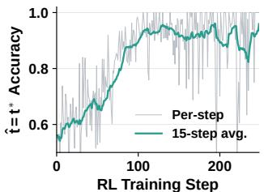

Training Efficiency. Fig. 6 compares the average per-step runtime during RL optimization on Sokoban. Despite incorporating a multi-role diagnostic branch, PIVOT achieves a lower per-update latency (95 s) than standard Vanilla-GRPO (102 s). This advantage stems from PIVOT rapidly suppressing unviable actions and converging toward shorter, successful trajectories, which significantly reduces rollout sampling time as it’s the primary computational bottleneck in VLM RL. In contrast, delegating hindsight diagnosis to an external frozen $\mathtt { Q w e n 3 - V I - 8 B }$ teacher introduces cross-model inference overhead, inflating the step time to 373 s (3.9×). At test time, stripping all diagnostic branches leaves an unprivileged student with zero parameter or inference overhead.

Figure 5: FrozenLake tˆaccuracy.  
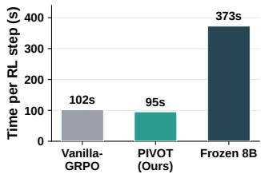  
Figure 6: Time per RL step (s).

## 5 RELATED WORK

RL and Hindsight Distillation for VLM Agents. VLMs serve as goal-driven agents across web navigation, device control, and embodied decision-making tasks (Koh et al., 2024; Shridhar et al., 2021). Beyond test-time prompting with frozen backbones (Yao et al., 2023; Shinn et al., 2023), task adaptability is enhanced via fine-tuning and online RL (Bai et al., 2025b; Shen et al., 2025; Ouyang et al., 2022). However, standard outcome RL and process supervision (Schulman et al., 2017; Shao et al., 2024; Guo et al., 2025; Li et al., 2026; Lightman et al., 2024; Wang et al., 2024) rely on trial-and-error or dense shaping, providing coarse feedback that fails to isolate unrecoverable decision points. Retrospective feedback from hindsight, reflection, and memory systems (Andrychowicz et al., 2017; Madaan et al., 2023; Zhao et al., 2024; Wang et al., 2023) yields post-hoc signals but incurs severe prompt-length and latency overhead at inference. While on-policy distillation internalizes feedback into parameters via self-generated rollouts (Ross et al., 2011; Agarwal et al., 2024; Lu et al., 2026; Wang et al., 2026a), agentic self-teachers remain structurally decoupled or promptdependent (Wu et al., 2026). In contrast, PIVOT localizes pivot turns from visual histories and distills token-level hindsight directly into policy parameters without dense shaping, extra prompts, or environment rollbacks.

Policy Entropy Collapse and Multi-turn Credit Assignment. Outcome-based RL frequently suffers from policy entropy collapse, prematurely shrinking pass@k exploration diversity and trapping policies in local optima (Yue et al., 2026; Cui et al., 2025; Yu et al., 2026). This degeneration is acute in multi-turn agent interaction (Wang et al., 2026b; Li et al., 2026), where standard policy gradients over-reinforce frequent success paths while suppressing alternative exploration branches (Schulman et al., 2017; Cui et al., 2025). In sequential settings, an uncorrected early blunder distorts subsequent state observations, compounding downstream execution errors and pruning viable subtrees (Andrychowicz et al., 2017; Sinha et al., 2026). Although recent diversity-preserving techniques attempt to mitigate policy sharpening, they remain bound to trajectory-level returns or group-level advantages (Sinha et al., 2026; Shao et al., 2024; Yu et al., 2026; Kazemnejad et al., 2025). Consequently, they sustain only surface-level diversity without identifying the exact pivot turn where task failure originated (Uesato et al., 2022; Lightman et al., 2024). PIVOT bridges thi credit-assignment gap by isolating critical pivot steps via visual panels and distilling confidencegated token-level gradients onto failed rollouts, maintaining informative optimization even within zero-variance failure groups where conventional RL advantages vanish.

## 6 DISCUSSION AND LIMITATIONS

While PIVOT demonstrates strong performance and efficiency across multi-turn VLM agent tasks, several scope boundaries and promising directions for future work remain:

• Pivot Supervision Source & Discovery: Stage I SFT currently relies on offline target labels generated via feasibility heuristics. Extending PIVOT to complex environments lacking explicit solvers presents an exciting opportunity for unsupervised or selfdiagnostic pivot discovery. Inspired by recent insights on token-level uncertainty and selfadaptation (Ding & Zhang, 2026), the pivot step t∗ could be determined intrinsically using token-level entropy metrics (e.g., locating critical state transitions via minimum-entropy positions), or empirically via rollout sampling by identifying the step where the suffix return lift growth is minimized.

• Task Domain Applicability: The current definition of the pivot step t∗ relies on remainingbudget goal reachability, which naturally aligns with structured visual environments. Adapting it to open-ended dialogue or continuous control may use dynamic, probabilistic, or entropy-guided reachability.

• Model Scale and Physical Realization: Our evaluation focuses on compact VLM backbones (Qwen2.5-VL-3B and Qwen3-VL-2B) within simulated benchmarks. Scaling this internalized distillation recipe to larger parameters and non-rewindable physical robotic systems represents an important direction for future exploration.

## 7 CONCLUSION

In this work, we address the credit assignment bottleneck of outcome-based RL in multi-turn VLM agents. Our analysis shows that post-failure recovery is driven by physical state restoration at pivot steps (t∗), rather than textual skill guidance. To avoid prohibitive simulator rollbacks, we present PIVOT, which internalizes visual state restoration into a unified Student-Analyzer-Teacher policy. By localizing t∗ and distilling gated hindsight onto failed rollouts, PIVOT removes physical resets at training and prompt overhead at deployment, outperforming SOTAs and prior distillation methods.

## REFERENCES

Astr ˚ om, Karl Johan. Optimal control of markov processes with incomplete state information i.¨ Journal ofmathematical analysis and applications, 10:174–205, 1965.

Rishabh Agarwal, Nino Vieillard, Yongchao Zhou, Piotr Stanczyk, Sabela Ramos Garea, Matthieu Geist, and Olivier Bachem. On-policy distillation of language models: Learning from selfgenerated mistakes. In International Conference on Learning Representations, pp. 21246–21263, 2024.

Marcin Andrychowicz, Filip Wolski, Alex Ray, Jonas Schneider, Rachel Fong, Peter Welinder, Bob McGrew, Josh Tobin, OpenAI Pieter Abbeel, and Wojciech Zaremba. Hindsight experience replay. volume 30, 2017.

Shuai Bai, Yuxuan Cai, Ruizhe Chen, Keqin Chen, Xionghui Chen, Zesen Cheng, Lianghao Deng, Wei Ding, Chang Gao, Chunjiang Ge, et al. Qwen3-VL technical report. arXiv preprint arXiv:2511.21631, 2025a.

Shuai Bai, Keqin Chen, Xuejing Liu, Jialin Wang, Wenbin Ge, Sibo Song, Kai Dang, Peng Wang, Shijie Wang, Jun Tang, et al. Qwen2.5-VL technical report. arXiv preprint arXiv:2502.13923, 2025b.

Ganqu Cui, Yuchen Zhang, Jiacheng Chen, Lifan Yuan, Zhi Wang, Yuxin Zuo, Haozhan Li, Yuchen Fan, Huayu Chen, Weize Chen, et al. The entropy mechanism of reinforcement learning for reasoning language models. arXiv preprint arXiv:2505.22617, 2025.

Yi Ding and Ruqi Zhang. Does on-policy distillation really distill? from noisy teacher to selfimprovement. arXiv preprint arXiv:2608.31046, 2026.

Daya Guo, Dejian Yang, Haowei Zhang, Junxiao Song, Peiyi Wang, Qihao Zhu, Runxin Xu, Ruoyu Zhang, Shirong Ma, Xiao Bi, et al. DeepSeek-R1: Incentivizing reasoning capability in LLMs via reinforcement learning. arXiv preprint arXiv:2501.12948, 2025.

Ayano Hiranaka, Minjune Hwang, Sharon Lee, Chen Wang, Li Fei-Fei, Jiajun Wu, and Ruohan Zhang. Primitive skill-based robot learning from human evaluative feedback. In 2023 IEEE/RSJ International Conference on Intelligent Robots and Systems (IROS), pp. 7817–7824. IEEE, 2023.

Amirhossein Kazemnejad, Milad Aghajohari, Eva Portelance, Alessandro Sordoni, Siva Reddy, Aaron Courville, and Nicolas Le Roux. VinePPO: Refining credit assignment in RL training of LLMs. In Proceedings of the 42nd International Conference on Machine Learning, 2025.

Jing Yu Koh, Robert Lo, Lawrence Jang, Vikram Duvvur, Ming Lim, Po-Yu Huang, Graham Neubig, Shuyan Zhou, Russ Salakhutdinov, and Daniel Fried. VisualWebArena: Evaluating multimodal agents on realistic visual web tasks. In Proceedings ofthe 62nd Annual Meeting ofthe Association for Computational Linguistics (Volume 1: Long Papers), pp. 881–905, 2024.

Eric Kolve, Roozbeh Mottaghi, Winson Han, Eli VanderBilt, Luca Weihs, Alvaro Herrasti, Matt Deitke, Kiana Ehsani, Daniel Gordon, Yuke Zhu, et al. AI2-THOR: An interactive 3D environ ment for visual AI. arXiv preprint arXiv:1712.05474, 2017.

Haoxi Li, Qinglin Hou, Jianfei Ma, Jinxiang Lai, Tao Han, Sikai Bai, Jingcai Guo, Jie ZHANG, and Song Guo. What you think is what you see: Driving exploration in VLM agents via visuallinguistic curiosity. In Proceedings of the 43rd International Conference on Machine Learning, 2026.

Hunter Lightman, Vineet Kosaraju, Yuri Burda, Harrison Edwards, Bowen Baker, Teddy Lee, Jan Leike, John Schulman, Ilya Sutskever, and Karl Cobbe. Let’s verify step by step. In International Conference on Learning Representations, volume 2024, pp. 39578–39601, 2024.

Zhengxi Lu, Zhiyuan Yao, Zhuowen Han, Zi-Han Wang, Jinyang Wu, Qi Gu, Xunliang Cai, Weiming Lu, Jun Xiao, Yueting Zhuang, et al. Self-distilled agentic reinforcement learning. arXiv preprint arXiv:2605.15155, 2026.

Aman Madaan, Niket Tandon, Prakhar Gupta, Skyler Hallinan, Luyu Gao, Sarah Wiegreffe, Uri Alon, Nouha Dziri, Shrimai Prabhumoye, Yiming Yang, et al. Self-refine: Iterative refinement with self-feedback. Advances in neural information processing systems, 36:46534–46594, 2023.

Long Ouyang, Jeffrey Wu, Xu Jiang, Diogo Almeida, Carroll Wainwright, Pamela Mishkin, Chong Zhang, Sandhini Agarwal, Katarina Slama, Alex Ray, et al. Training language models to follow instructions with human feedback. volume 35, pp. 27730–27744, 2022.

Juan A Rodriguez, Abhay Puri, Shubham Agarwal, Issam H Laradji, Pau Rodriguez, Sai Rajeswar, David Vazquez, Christopher Pal, and Marco Pedersoli. Starvector: Generating scalable vector graphics code from images and text. In 2025 IEEE/CVF Conference on Computer Vision and Pattern Recognition (CVPR), pp. 16175–16186. IEEE, 2025.

Stephane Ross, Geoffrey Gordon, and Drew Bagnell. A reduction of imitation learning and struc-´ tured prediction to no-regret online learning. In Proceedings of the fourteenth international conference on artificial intelligence and statistics, pp. 627–635. JMLR Workshop and Conference Proceedings, 2011.

Sebastian Schrader. Sokoban. Gymnasium environment, 2018. https://github.com/ mpSchrader/gym-sokoban.

John Schulman, Filip Wolski, Prafulla Dhariwal, Alec Radford, and Oleg Klimov. Proximal policy optimization algorithms. arXiv preprint arXiv:1707.06347, 2017.

Zhihong Shao, Peiyi Wang, Qihao Zhu, Runxin Xu, Junxiao Song, Xiao Bi, Haowei Zhang, Mingchuan Zhang, YK Li, Yang Wu, et al. DeepSeekMath: Pushing the limits of mathematical reasoning in open language models. arXiv preprint arXiv:2402.03300, 2024.

Haozhan Shen, Peng Liu, Jingcheng Li, Chunxin Fang, Yibo Ma, Jiajia Liao, Qiaoli Shen, Zilun Zhang, Kangjia Zhao, Qianqian Zhang, et al. VLM-R1: A stable and generalizable R1-style large vision-language model. arXiv preprint arXiv:2504.07615, 2025.

Noah Shinn, Federico Cassano, Ashwin Gopinath, Karthik Narasimhan, and Shunyu Yao. Reflexion: Language agents with verbal reinforcement learning. Advances in neural information processing systems, 36:8634–8652, 2023.

Mohit Shridhar, Xingdi Yuan, Marc-Alexandre Cote, Yonatan Bisk, Adam Trischler, and Matthew Hausknecht. ALFWorld: Aligning text and embodied environments for interactive learning. In International Conference on Learning Representations, 2021.

Abhijeet Sinha, Sundari Elango, and Dianbo Liu. Expected return causes outcome-level mode collapse in reinforcement learning and how to fix it with inverse probability scaling. arXiv preprint arXiv:2601.21669, 2026.

Stone Tao, Fanbo Xiang, Arth Shukla, Yuzhe Qin, Xander Hinrichsen, Xiaodi Yuan, Chen Bao, Xinsong Lin, Yulin Liu, Tse-Kai Chan, et al. Maniskill3: Gpu parallelized robot simulation and rendering for generalizable embodied ai. In 7th Robot Learning Workshop: Towards Robots with Human-Level Abilities, 2025.

Mark Towers, Ariel Kwiatkowski, John Balis, Gianluca De Cola, Tristan Deleu, Manuel Goulao,˜ Kallinteris Andreas, Markus Krimmel, Arjun Kg, Rodrigo Perez-Vicente, et al. Gymnasium: A standard interface for reinforcement learning environments. Advances in Neural Information Processing Systems, 38, 2026.

Jonathan Uesato, Nate Kushman, Ramana Kumar, Francis Song, Noah Siegel, Lisa Wang, Antonia Creswell, Geoffrey Irving, and Irina Higgins. Solving math word problems with process-and outcome-based feedback. arXiv preprint arXiv:2211.14275, 2022.

Guanzhi Wang, Yuqi Xie, Yunfan Jiang, Ajay Mandlekar, Chaowei Xiao, Yuke Zhu, Linxi Fan, and Anima Anandkumar. Voyager: An open-ended embodied agent with large language models. arXiv preprint arXiv:2305.16291, 2023.

Hao Wang, Guozhi Wang, Han Xiao, Yufeng Zhou, Yue Pan, Jichao Wang, Ke Xu, Yafei Wen, Xiaohu Ruan, Xiaoxin Chen, et al. Skill-SD: Skill-conditioned self-distillation for multi-turn LLM agents. arXiv preprint arXiv:2604.10674, 2026a.

Kangrui Wang, Pingyue Zhang, Zihan Wang, Yaning Gao, Linjie Li, Qineng Wang, Hanyang Chen, Yiping Lu, Zhengyuan Yang, Lijuan Wang, et al. VAGEN: Reinforcing world model reasoning for multi-turn VLM agents. Advances in Neural Information Processing Systems, 38:172871– 172933, 2026b.

Peiyi Wang, Lei Li, Zhihong Shao, Runxin Xu, Damai Dai, Yifei Li, Deli Chen, Yu Wu, and Zhifang Sui. Math-Shepherd: Verify and reinforce LLMs step-by-step without human annotations. In Proceedings of the 62nd Annual Meeting of the Association for Computational Linguistics (Volume 1: Long Papers), pp. 9426–9439, 2024.

Jinyang Wu, Shuo Yang, Zhengxi Lu, Fan Zhang, Yuhao Shen, Lang Feng, Haoran Luo, Zheng Lian, Shuai Zhang, Zhengqi Wen, et al. SEED: Self-evolving on-policy distillation for agentic reinforcement learning. arXiv preprint arXiv:2607.14777, 2026.

Rui Yang, Hanyang Chen, Junyu Zhang, Mark Zhao, Cheng Qian, Kangrui Wang, Qineng Wang, Teja Venkat Koripella, Marziyeh Movahedi, Manling Li, et al. Embodiedbench: Comprehensive benchmarking multi-modal large language models for vision-driven embodied agents. arXiv preprint arXiv:2502.09560, 2025.

Shunyu Yao, Jeffrey Zhao, Dian Yu, Nan Du, Izhak Shafran, Karthik R Narasimhan, and Yuan Cao. ReAct: Synergizing reasoning and acting in language models. In The Eleventh International Conference on Learning Representations, 2023.

Qiying Yu, Zheng Zhang, Ruofei Zhu, Yufeng Yuan, Xiaochen Zuo, Yu Yue, Weinan Dai, Tiantian Fan, Gaohong Liu, Lingjun Liu, et al. DAPO: An open-source LLM reinforcement learning system at scale. Advances in Neural Information Processing Systems, 38:113222–113244, 2026.

Yang Yue, Zhiqi Chen, Rui Lu, Andrew Zhao, Zhaokai Wang, Shiji Song, and Gao Huang. Does reinforcement learning really incentivize reasoning capacity in LLMs beyond the base model? Advances in Neural Information Processing Systems, 38:57654–57689, 2026.

Andrew Zhao, Daniel Huang, Quentin Xu, Matthieu Lin, Yong-Jin Liu, and Gao Huang. ExpeL: LLM agents are experiential learners. In Proceedings of the AAAI Conference on Artificial Intelligence, volume 38, pp. 19632–19642, 2024.

Siyan Zhao, Zhihui Xie, Mengchen Liu, Jing Huang, Guan Pang, Feiyu Chen, and Aditya Grover. Self-distilled reasoner: On-policy self-distillation for large language models. arXiv preprint arXiv:2601.18734, 2026.

# PIVOT: PIVOT-AWARE ON-POLICY SELF-DISTILLATION FOR MULTI-TURN VLM AGENTS –Supplementary Material (Text)–

## APPENDIX CONTENTS

A Notation . . 15   
B Pivot Certificates . 15   
C GRPO Grouping and Zero-Gradient Groups . . 15   
D Counterfactual Recovery. .17   
E Environments and Rewards. . .17   
F Training Objectives . . . 18   
G SFT Data and Optimization . . 19   
H Analyzer Collages, Prompts, and SFT Targets . . .19   
I SDAR Reproduction . . . 33   
J Training Curves . . 34

## A NOTATION

Tab. 3 lists symbols used in Sec. 2–3.2 and their meanings.

## B PIVOT CERTIFICATES

Offline Analyzer SFT and counterfactual probes pin a diagnostic pair $( t ^ { * } , m ^ { * } )$ on each failed rollout. Tab. 4 lists the certificate used per VAGEN task; all modes lie in the closed vocabulary $\mathcal { M } _ { \mathrm { f a i l } }$ referenced in Sec. 3.1.

Pivot step $t ^ { * } .$ . When a feasibility test $\mathsf { F e a s } ( s , k ) \ \in \ \{ 0 , 1 \}$ is defined (Sokoban, FrozenLake, Navigation proxy, PrimitiveSkill stage budget), we use the main-text pivot step Eq. eq. 2: the first turn after which the goal is unreachable within the remaining $k _ { t } = T - t - 1$ actions, defaulting to $T - 1$ if the trajectory never becomes infeasible. Navigation may pin an earlier $t ^ { * }$ when a terminal event fires first (invalid-action suffix, blocked move, or stagnation window); only if none fire do we fall back to the travel-time proxy in Eq. eq. 2. SVG does not use spatial Feas: each step submits a full canvas, so we set $t ^ { * }$ to the index of the last scored submission (typically $T - 1$ with $\dot { T } _ { \mathrm { m a x } } { = } 2 )$

Failure mode $m ^ { * }$ on grid puzzles. For Sokoban and FrozenLake, after $t ^ { * }$ from Eq. eq. 2 we label timeout versus irreversible deadlock with two reachability checks at the post-action state $s _ { t ^ { * } + 1 } .$

$$
m ^ { * } = \left\{ \begin{array} { l l } { \mathsf { t i m e o u t } , } & { \mathsf { F e a s } ( s _ { t ^ { * } + 1 } , k _ { t ^ { * } } ) = 0 \land \mathsf { F e a s } ( s _ { t ^ { * } + 1 } , \infty ) = 1 , } \\ { \mathsf { d e a d l o c k } , } & { \mathsf { F e a s } ( s _ { t ^ { * } + 1 } , \infty ) = 0 , } \end{array} \right.\tag{9}
$$

where $k _ { t ^ { * } } = T - t ^ { * } - 1$ and the Feas $( \cdot , \infty )$ probe uses unbounded search on grid worlds.

Failure modes on other benchmarks. Eq. eq. 9 does not apply outside the two grid puzzles. Navigation assigns the earliest matching event among format, blocked, and stagnation; if none occur, budget marks insufficient remaining moves under a Euclidean travel-time lower bound. PrimitiveSkill compares unfinished manipulation stages with the remaining turn budget (timeout) and may further tag format, target, or ordering mistakes at $t ^ { * }$ . SVG reads parsing validity and DINO/DreamSim progression on the final canvas (format, regression, stagnation, mismatch). Tab. 4 summarizes each environment in one place.

## C GRPO GROUPING AND ZERO-GRADIENT GROUPS

We form GRPO groups as contiguous blocks of $N { = } 8$ rollouts that share the same prompt key (task id, goal idx, eval set). Blocks with fewer than eight rollouts are discarded, leaving

Table 3: Notation (Sec. 2–3.2).
<table><tr><td>Symbol</td><td>Meaning</td></tr><tr><td> $\mathcal { M }$ </td><td>Partially observable Markov decision process.</td></tr><tr><td> $s , \mathcal { O } , A$ </td><td>Latent-state, observation, and action spaces.</td></tr><tr><td> $\mathcal { P } , \Omega$ </td><td>State-transition and observation kernels.</td></tr><tr><td> $\mathcal { R } , \gamma$ </td><td>Per-step reward function and discount factor.</td></tr><tr><td> $q , \mathcal { Q }$ </td><td>Task prompt and task-prompt distribution.</td></tr><tr><td> $s _ { t } , o _ { t } , a _ { t } , r _ { t }$ </td><td>Latent state, observation, action, and reward at turn  $t .$ </td></tr><tr><td> $h _ { t }$ </td><td>Observable interaction history  $\left( o _ { 0 } , a _ { 0 } , \ldots , o _ { t } \right) ( \mathrm { S e c . } 2 . 1 ) .$ </td></tr><tr><td> $\tilde { h } _ { t }$ </td><td>Privileged Teacher history with diagnostic context prepended,  $\tilde { h } _ { t } = ( p , h _ { t } ) ( \mathrm { E q . ~ e q . ~ } 5 ) .$  from</td></tr><tr><td> $\pi _ { \theta }$ </td><td>Shared autoregressive VLM: Student  $a _ { t } \sim \pi _ { \theta } ( { \cdot } \mid h _ { t } ) ;$  Analyzer outputs  $( \hat { t } , \hat { m } , \hat { r } )$ </td></tr><tr><td> $\theta$ </td><td>(Eq. eq. 4); Teacher supplies  $\ell ^ { \mathrm { t e a } }$  under  $\tilde { h } _ { t } .$ </td></tr><tr><td> $J ( \theta )$ </td><td>Trainable weights shared by all roles of πθ.</td></tr><tr><td> $\tau , \dot { T } , T _ { \mathrm { m a x } }$ </td><td>Outcome-based objective  $\begin{array} { r } { \dot { \mathbb E } _ { q \sim \mathcal { Q } , \tau \sim \pi _ { \theta } } [ R ( \tau ) ] , } \end{array}$ </td></tr><tr><td></td><td>Trajectory, realized trajectory length, and maximum horizon.</td></tr><tr><td> $R ( \tau )$ </td><td>Discounted trajectory return  $\textstyle \sum _ { t = 0 } ^ { T - 1 } \gamma ^ { t } r _ { t } .$ </td></tr><tr><td> $R _ { \mathrm { s u c c } }$   $N ^ { - }$ </td><td>Success-return threshold; rollouts with  $R ( \tau ) < R _ { \mathrm { s u c c } }$  are failures for OPD (Eq. eq. 7). is its cardinality.</td></tr><tr><td></td><td>Failed-rollout set  $\{ \tau : R ( \tau ) < R _ { \mathrm { s u c c } } \} ; | \dot { N ^ { - } }$ </td></tr><tr><td> $\mathcal { G } _ { q }$   $N$ </td><td>On-policy GRPO group  $\{ \tau _ { q } ^ { ( 1 ) } , \dots , \tau _ { q } ^ { ( N ) } \}$  for prompt q. Number of on-policy trajectories sampled per prompt.</td></tr><tr><td></td><td></td></tr><tr><td> $\mu , \sigma , \epsilon$ </td><td>Group return mean, standard deviation, and stabilizer in Eq. eq. 1 (distinct from clip ε).</td></tr><tr><td> $A _ { n } ^ { \mathrm { r l } }$ </td><td>Group-relative advantage of rollout  $n ;$  per-prompt form  $A _ { q , n } ^ { \mathrm { r l } } .$ </td></tr><tr><td> $k _ { t }$ </td><td>Remaining action budget after step t in Eq.  $\mathrm { e q . } \bar { 2 } \colon T - t - \mathrm { 1 } .$ </td></tr><tr><td> ${ \sf F e a s } ( s , k )$ </td><td>Indicator that state s is goal-reachable within k actions. if none.</td></tr><tr><td> $t ^ { * }$ </td><td>Pivot step (Eq. eq. 2): first infeasible action, or  $T - 1$ </td></tr><tr><td> $\tau _ { t ^ { * } } .$ </td><td>Original trajectory suffix from pivot step  $t ^ { * } .$ </td></tr><tr><td> $\tilde { \tau } _ { t ^ { * } } .$ </td><td>Resampled suffix after state restoration at  $t ^ { * } .$ </td></tr><tr><td> $\Delta R$ </td><td>Suffix-return lift rate in Eq. eq. 3 (distinct from the OPD log-prob gap</td></tr><tr><td> $\mathcal { M } _ { \mathrm { f a i l } }$ </td><td>Closed vocabulary of discrete failure modes.</td></tr><tr><td> ${ m ^ { * } , r ^ { * } }$ </td><td>Ground-truth failure mode and optional guidance skill in SFT labels.</td></tr><tr><td> $\boldsymbol { \hat { t } } , \boldsymbol { \hat { m } } , \boldsymbol { \hat { r } }$ </td><td>Analyzer-predicted pivot, failure mode, and guidance skill.</td></tr><tr><td> $z _ { \tau }$   $C ( \tau )$ </td><td>SFT diagnosis triplet  $( t ^ { * } , m ^ { * } , r ^ { * } ) ; r ^ { * }$  may be empty.</td></tr><tr><td> $a _ { 0 : T - 1 } ^ { \mathrm { t x t } }$ </td><td>Full-trajectory visual collage  $C ( \tau ) = \mathrm { G r i d } ( o _ { 0 } , \dots , o _ { T - 1 } )$  with step labels (Sec. 3.1). Compact textual action transcript fed to the Analyzer (serializes the action sequence  $a _ { 0 : T - 1 }$ </td></tr><tr><td></td><td>in Eqs. eq. 4 and eq. 10).</td></tr><tr><td> $x _ { \tau }$ </td><td>Serialized Analyzer input  $( q , C ( \tau ) , a _ { 0 : T - 1 } ^ { \mathrm { t x t } } ) .$ </td></tr><tr><td> $P _ { \hat { t } }$ </td><td>Local visual panel  $[ o _ { \hat { t } - 1 } , o _ { \hat { t } } , o _ { \hat { t } + 1 } ]$  (boundary frames zero-padded; Sec. 3.2).</td></tr><tr><td> $p$ </td><td>Teacher privileged context; ablation arms use  $( P _ { \hat { t } } ) , ( P _ { \hat { t } } , \hat { m } ) , ( P _ { \hat { t } } , \hat { m } , \hat { t } )$  , or  $( P _ { \hat { t } } , \hat { m } , \hat { t } , \hat { r } )$  (Sec. 4.1).</td></tr><tr><td>πbase</td><td>Fixed untrained instruct checkpoint for offline rollouts and the Sec. 2.2 probe.</td></tr><tr><td> $\pi _ { \theta _ { \mathrm { o l d } } }$ </td><td>Frozen behavior policy for on-policy collection; synced from θ after each RL update.</td></tr><tr><td> $\nu _ { \tau }$ </td><td>Loose factual-filter accept flag  $( \operatorname { A p p . } \operatorname { G } ) .$ </td></tr><tr><td> $\mathcal { D } _ { \mathrm { s f t } }$ </td><td>Accepted SFT set after loose filtering.</td></tr><tr><td> $m _ { \mathrm { a c t } }$ </td><td>Valid-action token mask (distinct from failure mode  $m ^ { * } ) .$ </td></tr><tr><td> $\ell ^ { \mathrm { s t u } } , \ell ^ { \mathrm { o l d } } , \ell ^ { \mathrm { t e a } }$ </td><td>Student, frozen-behavior, and Teacher token log-probabilities.</td></tr><tr><td> $\rho$ </td><td>Token-level importance ratio exp  $( { \ell } ^ { \mathrm { { s t u } } } - { \ell } ^ { \mathrm { { o l d } } } )$ </td></tr><tr><td> $\varepsilon$ </td><td>GRPO PPO-style clip radius in  $\operatorname { E q . e q . } 6 .$ </td></tr><tr><td> $\delta _ { t } , g _ { t }$ </td><td>Privileged log-prob gap  $\delta _ { t } = \ell _ { t } ^ { \mathrm { t e a } } - \bar { \ell } _ { t } ^ { \mathrm { s t u } }$  and gate  $g _ { t } = \sigma ( \beta _ { \mathrm { o p d } } \delta _ { t } )$  (Eq. eq. 7; token-level</td></tr><tr><td> $\beta _ { \mathrm { o p d } } , \lambda _ { \mathrm { o p d } }$ </td><td>form in Eq. eq. 11). OPD gate sharpness and joint-loss weight.</td></tr></table>

720 of 1680 Navigation rollouts and seven PrimitiveSkill rollouts unused. Tab. 5 reports two grouplevel rates: All-fail is the fraction of groups with no successful rollout; $\sigma { = } 0$ is the fraction whose eight returns match at $1 0 ^ { - 8 }$ rounding. These two rates need not agree when failures receive different partial credit, as on FrozenLake and SVG.

Table 4: Offline pivot certificate $( t ^ { * } , m ^ { * } )$ by environment (Eq. eq. 2 when applicable; Eq. eq. 9 for Sokoban/FrozenLake only).
<table><tr><td>Environment</td><td>Pivot  $t ^ { * }$ </td><td>Failure modes  $m ^ { * }$ </td></tr><tr><td>Sokoban</td><td>Eq. eq. 2; Feas = box-pushing plan  $\leq k$ </td><td>timeout,deadlock</td></tr><tr><td>FrozenLake</td><td>Eq. eq. 2; Feas = hole-free path  $\leq k$ </td><td>timeout,deadlock</td></tr><tr><td>Navigation</td><td>earliest terminal event; else Eq. eq. 2 (travel-time proxy)</td><td>format,blocked, stagnation, budget</td></tr><tr><td>PrimitiveSkill</td><td>Eq. eq. 2; unfinished stages vs. remaining turns</td><td>timeout,format, wrong-target,</td></tr><tr><td>SVG</td><td>index of last scored canvas</td><td>order_error format, regression, stagnation,mismatch</td></tr></table>

Table 5: Untrained 3B GRPO groups (N=8).
<table><tr><td>Environment</td><td>Traj.</td><td>Grps.</td><td>SR (%)</td><td>All-fail (%) σ=0 (%)</td></tr><tr><td>Sokoban</td><td>1440</td><td>180</td><td>17.8 48.3</td><td>48.3</td></tr><tr><td>FrozenLake</td><td>1728</td><td>216</td><td>20.3 39.4</td><td>0.0</td></tr><tr><td>Navigation</td><td>960</td><td>120</td><td>43.0</td><td>5.8 0.0</td></tr><tr><td>PrimitiveSkill</td><td>2912</td><td>364</td><td>8.9 46.2</td><td>16.5</td></tr><tr><td>SVG</td><td>1728</td><td>216</td><td>0.1 99.5</td><td>0.9</td></tr><tr><td>Pooled</td><td>8768</td><td>1096</td><td></td><td>51.3 13.6</td></tr></table>

Table 6: Counterfactual rollback arms.
<table><tr><td>Arm</td><td>Injected at restore</td></tr><tr><td>no-hint</td><td>none</td></tr><tr><td>3B-self</td><td> $m ^ { * }$  pinned; î from</td></tr><tr><td rowspan="2">8B-teach.</td><td>untrained 3B</td></tr><tr><td> $m ^ { * }$  pinned; î from Qwen3-VL-8B</td></tr></table>

## D COUNTERFACTUAL RECOVERY

Counterfactual recovery protocol. Tab. 6 summarizes the rollback arms used in Sec. 2.2. Every arm starts from the same failed untrained Qwen2.5-VL-3B-Instruct rollouts, restores the environment at the solver-pinned pivot step $t ^ { \ast } \left( \mathrm { E q . ~ e q . ~ } 2 \right)$ , and resamples the suffix with $\pi _ { \mathrm { b a s e } } .$ A retry counts as a lift when the new suffix return strictly exceeds the original suffix return from t∗. By default we restore at $t _ { \mathrm { r e s t o r e } } { = } t ^ { * }$ and roll forward to the horizon; the $\bar { t } ^ { * } { + 1 }$ control instead restores one step later as a negative control, and lift collapses on all five environments. Hinted arms inject solver-pinned $m ^ { * }$ plus an arm-specific guidance string into the actor prompt at restore; the no-hint arm skips injection entirely. Tab. 7 gives the main-text n=1 results at $t ^ { * }$ , and Tab. 8 reports the matching no-hint run at $t ^ { * } { + 1 }$

## E ENVIRONMENTS AND REWARDS

Benchmarks. We evaluate five tasks from VAGEN (Wang et al., 2026b) (Tab. 9), grouped into the three families of Tab. 1.

Sokoban (Schrader, 2018). In this classic puzzle, the agent must push all boxes onto target locations. The visual state is a 6×6 grid $( T _ { \mathrm { m a x } } { = } 9 )$ , and the action space is discrete (up, down, left, right). Validation reports success rate.

FrozenLake (Towers et al., 2026). The agent navigates a 4×4 grid to reach a goal while avoiding holes $( T _ { \mathrm { m a x } } { = } 9 )$ . The visual state and discrete action space match Sokoban; we disable the slippery setting for determinism. Validation reports success rate.

Navigation (Kolve et al., 2017; Yang et al., 2025). A 3D embodied task $( T _ { \mathrm { m a x } } { = } 2 5 )$ : the agent follows instructions to find an object from a first-person view with discrete actions (e.g., moveahead). We average success rate on the Base and Common-sense splits.

PrimitiveSkill (Tao et al., 2025; Hiranaka et al., 2023). The agent controls a Panda arm to perform tabletop manipulation $( T _ { \mathrm { m a x } } { = } 6 )$ . Actions use a hybrid space $\left( \mathbf { e } . \mathbf { g } . , \mathsf { p i c k } \left( x , y , z \right) \right)$ ): the policy must ground objects in a third-person 3D scene to coordinates. Validation reports mean success rate over four skills.

Table 7: Suffix lift $\Delta R$ at $t ^ { * }$ (n=1; % with $R ( \tilde { \tau } _ { t ^ { * } : } ) > R ( \tau _ { t ^ { * } : } ) )$
<table><tr><td>Environment</td><td>Fail no-hint 3B-self</td><td></td><td>8B-teach.</td></tr><tr><td>Sokoban</td><td>1165</td><td>3.3</td><td>4.1</td></tr><tr><td>FrozenLake</td><td>1378</td><td>18.2</td><td>4.4 16.8 19.5</td></tr><tr><td>Navigation</td><td>969</td><td>56.6</td><td>50.8 52.7</td></tr><tr><td>PrimitiveSkill</td><td>2898</td><td>17.7</td><td>20.3 19.6</td></tr><tr><td>SVG</td><td>1727</td><td>22.4</td><td>22.8 24.3</td></tr></table>

Table 8: n=1 no-hint lift at $t ^ { * } \mathbf { v } \mathbf { s } .$ t∗+1 (%).
<table><tr><td>Environment</td><td> $t ^ { * }$ </td><td> ${ t ^ { * } } { + 1 }$ </td></tr><tr><td>Sokoban</td><td>3.3</td><td>0.9</td></tr><tr><td>FrozenLake</td><td>18.2</td><td>8.1</td></tr><tr><td>Navigation</td><td>56.6</td><td>53.6</td></tr><tr><td>PrimitiveSkill</td><td>17.7</td><td>8.3</td></tr><tr><td>SVG</td><td>22.4</td><td>16.2</td></tr></table>

Table 12: Stage II RL hyperparameters (3B & 2B).

Table 9: VAGEN tasks: $T _ { \mathrm { m a x } }$ and validation metrics.
<table><tr><td>Task</td><td> $T _ { \mathrm { m a x } }$ </td><td>Metric</td></tr><tr><td>Cognitive Grid</td><td></td><td></td></tr><tr><td>Sokoban [6, 6], 1 box FrozenLake 4×4</td><td>9 9</td><td>success rate success rate</td></tr><tr><td>Embodied 3D</td><td></td><td></td></tr><tr><td>Navigation (Base / Com.)</td><td>25</td><td>avg. SR</td></tr><tr><td>PrimitiveSkill (4</td><td>6</td><td>mean SR</td></tr><tr><td>skills)</td><td></td><td></td></tr><tr><td>Generative</td><td></td><td></td></tr><tr><td></td><td></td><td></td></tr><tr><td>SVG reconstruction</td><td>2</td><td></td></tr><tr><td></td><td></td><td>mean DINO &amp;</td></tr><tr><td></td><td></td><td>DreamSim</td></tr></table>

<table><tr><td>Item</td><td>Value</td></tr><tr><td>Shared πθ</td><td> $\mathtt { Q w e n 2 . 5 - V I - 3 B } /$   $\mathtt { Q w e n 3 - V I - 2 B }$ </td></tr><tr><td>Analyzer / Teacher GRPO N, clip ε</td><td>policy_vllm; panel  $P _ { \hat { t } }$  8;0.2</td></tr><tr><td>γ; actor LR</td><td> $0 . 9 5 ; 1 \times 1 0 ^ { - 6 }$ </td></tr><tr><td>KL coeff.</td><td> $\mathtt { l o w \mathrm { \_ v a r \mathrm { _ { \mathtt { d } , 0 . 0 1 } } } }$ </td></tr><tr><td> $\lambda _ { \mathrm { o p d } } / \beta _ { \mathrm { o p d } }$  OPD mask</td><td>0.01/5 failed traj., all valid tokens</td></tr><tr><td>Invalid-action pen.</td><td>0.1</td></tr><tr><td>Temps (train / val)</td><td>1.0 / 0.4</td></tr><tr><td>History; max</td><td>2; 512</td></tr><tr><td>response</td><td></td></tr><tr><td>Batch / val n</td><td>16 / 128 (Nav.8)</td></tr><tr><td></td><td></td></tr><tr><td>Updates; GPUs</td><td>250 (Sok. 350); 8</td></tr></table>

Table 10: Episode return $R ( \tau )$ (GRPO).
<table><tr><td>Env</td><td>Reward structure</td></tr><tr><td>Sokoban</td><td> $- 0 . 1 / \mathrm { s t e p } ; + 1 1$  goal; fail  $R = - 0 . 9$ </td></tr><tr><td>FrozenLake</td><td> $- 0 . 1 / \mathrm { s t e p } ;$  sparse goal</td></tr><tr><td>Navigation</td><td> $- 0 . 1 / \mathrm { s t e p } ; + 1 0$  on target</td></tr><tr><td></td><td>PrimitiveSkill —0.1/step; +2/stage; +10 success</td></tr><tr><td>SVG</td><td>last canvas:  $\scriptstyle { \frac { 1 } { 2 } } \left( \mathrm { D I N O } + \mathrm { D S } \right)$ </td></tr></table>

Table 11: Analyzer SFT splits (90/10; 3B packs, same recipe on 2B).
<table><tr><td>Environment</td><td>Acc.</td><td>Train</td><td>Val</td></tr><tr><td>Sokoban</td><td>1170</td><td>1053</td><td>117</td></tr><tr><td>FrozenLake</td><td>1375</td><td>1237</td><td>138</td></tr><tr><td>Navigation</td><td>959</td><td>863</td><td>96</td></tr><tr><td>PrimitiveSkill</td><td>1677</td><td>1509</td><td>168</td></tr><tr><td>SVG</td><td>1719</td><td>1547</td><td>172</td></tr></table>

SVG reconstruction (Rodriguez et al., 2025). The agent generates SVG code that replicates a target image $( T _ { \mathrm { m a x } } { = } 2 )$ . The action space is open-ended text: each step submits a full canvas. Validation averages DINO and DreamSim on the final submission.

Rewards and task specs. Tables 9–12 collect per-task horizons and validation metrics, the episodereturn structure used in GRPO (logged as final reward with discount γ=0.95), Analyzer SFT split sizes, and Stage II training settings. Invalid actions receive an additional 0.1 penalty on top of the domain reward. For OPD masking we mark a rollout as failed when its logged return falls below the success threshold $R _ { \mathrm { s u c c } } { = } 1 . 0$ whenever the environment does not expose a separate success bit.

## F TRAINING OBJECTIVES

The main text defines group advantages (Eq. eq. 1), the GRPO surrogate (Eq. eq. 6), gated OPD (Eq. eq. 7), and their sum (Eq. eq. 8). Below we give the Stage I Analyzer loss explicitly and expand Stage II objectives to token indices, including the KL regularizer omitted from the main display.

Analyzer SFT. Stage I (Sec. 3.1) trains the shared checkpoint to read a failed rollout without environment access: input $x _ { \tau } = ( q , C ( \tau ) , a _ { 0 : T - 1 } ^ { \mathrm { t x t } } )$ matches Eq. eq. 4, and the label is the solversupervised triplet $z _ { \tau } = ( t ^ { * } , m ^ { * } , r ^ { * } )$ . Pivot step $t ^ { * }$ and mode $m ^ { * }$ are pinned offline as in $\mathrm { A p p }$ . B; optional guidance text $r ^ { * }$ is produced by a frozen teacher on records that pass the loose factual filter (App. G). Let $z _ { \tau , 1 : L , }$ denote the tokenized JSON string for that object. We minimize lengthnormalized autoregressive negative log-likelihood,

$$
\mathcal { L } _ { \mathrm { s f t } } ( \theta ) = - \mathbb { E } _ { ( x _ { \tau } , z _ { \tau } ) \sim \mathcal { D } _ { \mathrm { s f t } } } \left[ \frac { 1 } { L _ { \tau } } \sum _ { \ell = 1 } ^ { L _ { \tau } } \log \pi _ { \theta } \left( z _ { \tau , \ell } \mid x _ { \tau } , z _ { \tau , < \ell } \right) \right] .\tag{10}
$$

The resulting weights $\theta _ { \mathrm { s f t } }$ initialize Stage II and supply the Analyzer used at training time; at inference only the unprivileged Student is deployed (Sec. 3.1).

Confidence-gated OPD. Sec. 3.2 uses the same $\pi _ { \theta }$ as a detached Teacher: privileged log-probs $\ell _ { q , n , t , \ell } ^ { \mathrm { t e a } }$ condition on $\tilde { h } _ { t } = ( p , h _ { t } )$ from Eq. eq. 5, while $\ell _ { q , n , t , \ell } ^ { \mathrm { s t u } }$ uses the unprivileged history $h _ { t }$ only. Rollout actions are not resampled; both branches re-score the tokens already taken on the failed trajectory. For each failed rollout we define the hindsight gap and gate

$$
\begin{array} { r } { \Delta _ { q , n , t , \ell } = \mathrm { s g } \left[ \ell _ { q , n , t , \ell } ^ { \mathrm { t e a } } - \ell _ { q , n , t , \ell } ^ { \mathrm { s t u } } \right] , \qquad g _ { q , n , t , \ell } = \sigma ( \beta _ { \mathrm { o p d } } \Delta _ { q , n , t , \ell } ) , } \end{array}\tag{11}
$$

matching the main-text $\delta _ { t }$ and $g _ { t }$ in Eq. eq. $7 \ : ( \lambda _ { \mathrm { o p d } }$ and $\beta _ { \mathrm { o p d } }$ in Tab. 12). The failed-trajectory loss aggregates over all valid action tokens on $R ( \tau _ { q } ^ { ( n ) } ) < R _ { \mathrm { s u c c } } ;$

$$
\begin{array} { r } { \mathcal { L } _ { \mathrm { o p d } } ( \theta ) = \mathbb { E } _ { q , n , t , \ell } \left[ \mathbb { I } \Big [ R ( \tau _ { q } ^ { ( n ) } ) < R _ { \mathrm { s u c c } } \Big ] m _ { \mathrm { a c t } , q , n , t , \ell } g _ { q , n , t , \ell } \left( \mathrm { s g } \big [ \ell _ { q , n , t , \ell } ^ { \mathrm { t e a } } \big ] - \ell _ { q , n , t , \ell } ^ { \mathrm { s t u } } \right) \right] . } \end{array}\tag{12}
$$

Stop-gradient on Teacher logits and on $\Delta$ leaves the update on Student parameters:

$$
\begin{array} { r } { \nabla _ { \theta } \mathcal { L } _ { \mathrm { o p d } } = - \mathbb { E } _ { q , n , t , \ell } \left[ \mathbb { I } \Big [ R \big ( \tau _ { q } ^ { ( n ) } \big ) < R _ { \mathrm { s u c c } } \Big ] m _ { \mathrm { a c t } , q , n , t , \ell } g _ { q , n , t , \ell } \nabla _ { \theta } \ell _ { q , n , t , \ell } ^ { \mathrm { s t u } } \right] . } \end{array}\tag{13}
$$

When a GRPO group has $\sigma _ { q } { = } 0 , A _ { q , n } ^ { \mathrm { r l } }$ vanishes for every token but this term can still train the Student on failed rollouts (Sec. 3.2).

SFT and RL optimization. Analyzer SFT optimizes Eq. eq. 10 with AdamW at learning rate $2 \times 1 0 ^ { - 6 }$ (batch size 8, maximum sequence length 8192, three epochs per environment). Each environment yields its own $\theta _ { \mathrm { s f t } }$ checkpoint, which initializes Stage II for that task only. All Stage II knobs not listed here (GRPO group size, OPD weights, KL coefficient, batching, and validation counts) match Tab. 12.

## G SFT DATA AND OPTIMIZATION

Loose factual filter for Analyzer SFT. Sec. 3.1 trains on accepted failures only; each example must pass a loose factual filter $\nu _ { \tau }$ after the solver pins $\left( t ^ { * } , m ^ { * } \right) ^ { - } \left( \mathrm { A p p . ~ B } \right)$ . We require parseable Analyzer JSON, $m ^ { * } \in \mathcal { M } _ { \mathrm { f a i l } }$ , and consistency between the solver replay and the logged trajectory. When a guidance field $r ^ { * } { \mathrm { ~ i s ~ } }$ present, it must be non-empty and refer to the action at $t ^ { * } .$ Taskspecific checks further drop bad labels: Sokoban deadlock unless the replay matches the pinned state; FrozenLake skills that contradict hole-fall or budget markers; Navigation skills that mention an unreached goal. Any failed check removes the record; we do not apply lift-based replay filtering when building $\mathcal { D } _ { \mathrm { s f t } }$

Analyzer SFT data. Data come from failed rollouts of the raw instruct checkpoint at sampling temperature 1.0 (one dataset per environment). The environment solver supplies $( t ^ { * } , m ^ { * } )$ a frozen Qwen3-VL-8B model writes optional $r ^ { * }$ on records that survive $\nu _ { \tau }$ . Tab. 11 lists the resulting 90/10 train/validation counts for Qwen2.5-VL-3B packs (Qwen3-VL-2B follows the same pipeline). Example collages, role prompts, and JSON targets appear in App. H; AdamW and Stage II settings are in Tab. 12.

## H ANALYZER COLLAGES, PROMPTS, AND SFT TARGETS

This section documents training-time prompts and the remaining Analyzer supervision visuals. Representative FrozenLake, Navigation, and PrimitiveSkill pairs are shown in Fig. 3. Prompt templates appear first, followed by multi-page collage figures.

Role prompts by environment. For each VAGEN task we include three prompt families: the unprivileged Student (task instruction plus short RGB history), the Analyzer (full collage C(τ ) and atxt Pˆ plus mode and optional skill text; see Fig. 4). Vision placeholders use <image>; closed failuremode lists follow App. B. Ground-truth SFT targets $( t ^ { * } , m ^ { * } , r ^ { * } )$ are built as in App. G.

## Sokoban

## Sokoban — Student (πθ, RL rollout)

You are an expert agent operating in the Sokoban environment. Your goal is to push all the boxes onto the target spots. Once all boxes are on the targets, you win!

\# Rules You can only push boxes. You can’t pull them, so plan ahead to avoid getting stuck. You can’t walk through or push boxes into walls. To avoid traps, do not push boxes into corners or against walls where they can’t be moved again.

\# Visual Elements in the Image: Character: A small, green alien-like figure with two antennae and black eyes. It represents you. Box: A yellow crate marked with an orange "X" across its front. It is the box you need to push. Target: A black tile outlined in red, with a small red diamond shape in the center. It marks the destination where a box should be pushed.

\# Current Step Your current observation is shown in the image: <image> Your admissible actions are ["up", "down", "left", "right"].

Now it’s your turn to make a move (choose ONE action only for the current step). You should first reason step-by-step about the current situation | observe the positions of boxes and targets, plan a path to push a box toward a target, and avoid traps like corners or walls. This reasoning process MUST be enclosed within <redacted thinking> </redacted thinking> tags. Once you’ve finished your reasoning, you should choose an admissible action for current step and present it within <action> </action> tags.

## Sokoban — Analyzer (failed rollout, SFT/online)

Screenshot collage (<image>): 3x3 grid in row-major order, each panel labeled by original 0-based step index (0..8). Match the panel label with that step in the trajectory text below.

Analyze this failed agent episode from the screenshot collage and the compact action log.   
Return ONLY valid JSON.

You need to complete three fields: 1. pivot step: the 0-based index of the first step after which the remaining step budget cannot solve the puzzle. 2. failure mode: "timeout" if the puzzle is still solvable with more steps, or "deadlock" if the box is irreversibly stuck. 3. failure reason: extract the failed trajectory into avoidance rules (the core mistake and warning signs), then one short imperative sentence the policy can act on at pivot step, not a retrospective explanation. Put both parts in this one string.

Important constraints: - Use the screenshot collage together with the compact action log; do not ignore the images. - Step indices are 0-based integers. - pivot step MUST be an integer in [0, 8] matching a labeled collage panel. - Do not copy an example index;pick the true fatal step for THIS trajectory. - Prefer a valid box-push that made the remaining budget insufficient. Invalid / no-op actions (action=invalid or moved=false) are usually not the pivot. - failure mode must be exactly timeout or deadlock. - Return only these top-level fields: pivot step, failure mode, failure reason.

Return format: { "pivot step": <integer>, "failure mode": "timeout", "failure reason": "Avoid repeating the core mistake. At the pivot, take the productive action instead of that compact-log action." }

Episode context: - Task description: Push the box onto the target without trapping it against a wall or corner. - episode success: failure - Number of steps: 9 - Valid pivot step range: [0, 8] - Compact action log: step 0: action=left moved=true step 1: action=right moved=true step 2: action=right moved=false step 3: action=left moved=true step 4: action=left moved=true step 5: action=up moved=false step 6: action=right moved=true step 7: action=left moved=true step 8: action=down moved=true

## Sokoban — Teacher (M+P+R{}, privileged scoring)

You are an expert agent operating in the Sokoban environment. Your goal is to push all the boxes onto the target spots. Once all boxes are on the targets, you win!

\# Rules You can only push boxes. You can’t pull them, so plan ahead to avoid getting stuck. You can’t walk through or push boxes into walls. To avoid traps, do not push boxes into corners or against walls where they can’t be moved again.

\# Visual Elements in the Image: Character: A small, green alien-like figure with two antennae and black eyes. It represents you. Box: A yellow crate marked with an orange "X" across its front. It is the box you need to push. Target: A black tile outlined in red, with a small red diamond shape in the center. It marks the destination where a box should be pushed.

\# Current Step Your current observation is shown in the image: <image> Hindsight 3-panel around the predicted failure pivot (not available when selecting the current action): <image>

Your admissible actions are ["up", "down", "left", "right"].

\*\*Episode-Level Skill\*\* Refer to this episode-level skill when deciding what action to take in the current episode: [Failure mode: deadlock Refer to this episode-level skill when deciding what action to take: Avoid pushing the box into a corner where it becomes trapped. At step 4, do not push up again;instead, move right to create space.] Now it’s your turn to make a move (choose ONE action only for the current step). You should first reason step-by-step about the current situation | observe the positions of boxes and targets, plan a path to push a box toward a target, and avoid traps like corners or walls. This reasoning process MUST be enclosed within <redacted thinking> </redacted thinking> tags. Once you’ve finished your reasoning, you should choose an admissible action for current step and present it within <action> </action> tags.

## FrozenLake

## FrozenLake — Student (πθ, RL rollout)

You are an expert agent operating in the FrozenLake environment. Reach the goal (G) without falling into holes (O).   
# Rules Move carefully on the ice. Holes end the episode. The goal tile wins.   
# Current Step Your current observation is shown in the image: <image> Your admissible actions are ["up", "down", "left", "right"].   
Now it’s your turn to make a move (choose ONE action only for the current step). You should first reason step-by-step about the current situation. This reasoning process MUST be enclosed within <redacted thinking> </redacted thinking> tags. Once you’ve finished your reasoning, you should choose an admissible action for current step and present it within <action> </action> tags.

## FrozenLake — Analyzer (failed rollout, SFT/online)

Screenshot collage (<image>): 2x2 grid in row-major order, each panel labeled by original 0-based step index (0..2). Match the panel label with that step in the trajectory text below.

Analyze this failed agent episode from the screenshot collage and the compact action log.   
Return ONLY valid JSON.

You need to complete three fields: 1. pivot step: the 0-based index of the first step after which the remaining step budget cannot reach the goal. 2. failure mode: "timeout" if the agent is still on safe ice and more steps could reach the goal, or "deadlock" if the agent fell into a hole (irreversible). 3. failure reason: extract the failed trajectory into avoidance rules (the core mistake and warning signs), then one short imperative sentence the policy can act on at pivot step, not a retrospective explanation. Put both parts in this one string.

Important constraints: - Use the screenshot collage together with the compact action log; do not ignore the images. - Step indices are 0-based integers. - pivot step MUST be an integer in [0, 2] matching a labeled collage panel. - Do not copy an example index;pick the true fatal step for THIS trajectory. - Prefer the step that walked into a hole, or a valid move that made the remaining budget insufficient. Invalid / empty / no-op actions (action=invalid or moved=false) are usually not the pivot, unless the episode ends on that empty action. - failure mode must be exactly timeout or deadlock. - Return only these top-level fields: pivot step, failure mode, failure reason.

Return format: { "pivot step": <integer>, "failure mode": "timeout", "failure reason": "Avoid repeating the core mistake. At the pivot, take the productive action instead of that compact-log action." }

Episode context: - Task description: Navigate from the start to the goal on the frozen lake without falling into holes. - episode success: failure - Number of steps: 3 - Valid pivot step range: [0, 2] - Compact action log: step 0: action=left moved=true remaining turns=8 step 1: action=right moved=true remaining turns=7 step 2: action=right moved=true remaining turns=6

## FrozenLake — Teacher (M+P+R{}, privileged scoring)

You are an expert agent operating in the FrozenLake environment. Reach the goal (G) without falling into holes (O).   
# Rules Move carefully on the ice. Holes end the episode. The goal tile wins.   
# Current Step Your current observation is shown in the image: <image>   
Hindsight 3-panel around the predicted failure pivot (not available when selecting the current action): <image>   
Your admissible actions are ["up", "down", "left", "right"].   
Episode-Level Skill Refer to this episode-level skill when deciding what action to take in the current episode: [Failure mode: deadlock Refer to this episode-level skill when deciding what action to take: Avoid stepping onto hole tiles when a safe path exists. At step 1, move right along safe ice instead of up into the hole.]   
Now it’s your turn to make a move (choose ONE action only for the current step). You should first reason step-by-step about the current situation. This reasoning process MUST be enclosed within <redacted thinking> </redacted thinking> tags. Once you’ve finished your reasoning, you should choose an admissible action for current step and present it within <action> </action> tags.

## Navigation

## Navigation — Student (πθ, RL rollout)

You are an embodied agent navigating an AI2-THOR indoor environment from egocentric RGB. # Instruction navigate to the Bread in the room and be as close as possible to it # Actions (choose ONE) - moveahead / moveback / moveright / moveleft: translate 0.5m - rotateright / rotateleft: yaw 90 degrees - lookup / lookdown: pitch 30 degrees   
Prior steps: 3. Recent actions (2): step 2: moveahead;step 3: rotateright Now at step 4. Current egocentric view: <image>   
Reason in <redacted thinking> </redacted thinking>, then put ONE action in <action> </action>.

## Navigation — Analyzer (failed rollout, SFT/online)

Screenshot collage (<image>): 5x5 grid in row-major order, each panel labeled by original 0-based step index (0..24). Match the panel label with that step in the trajectory text below.

Analyze this failed agent episode from the screenshot collage and the compact action log.   
Return ONLY valid JSON.

You need to complete three fields: 1. pivot step: the 0-based index of the earliest structural mistake | a terminal blocked translation, the start of a no-progress loop, a trailing invalid suffix, or else the first step whose remaining translations cannot cover the Euclidean distance. 2. failure mode: exactly one of "budget", "format", "blocked", "stagnation". budget = remaining translations cannot cover remaining distance. format = empty/invalid action exhausted slack. blocked = a move was rejected by a wall/door. stagnation = recent moves did not reduce distance. 3. failure reason: extract the failed trajectory into avoidance rules (the core mistake and warning signs), then one short imperative sentence the policy can act on at pivot step, not a retrospective explanation. Put both parts in this one string.

Important constraints: - Use the screenshot collage together with the compact action log; do not ignore the images. - Step indices are 0-based integers. - pivot step MUST be an integer in [0, 24] matching a labeled collage panel. - Do not copy an example index;pick the true fatal step for THIS trajectory. - Prefer the earliest real navigation action that matches that mode. Rotate/look are valid and may be a stagnation pivot. Empty/invalid is the format pivot when it is a trailing suffix. - failure mode must be exactly one of: budget, format, blocked, stagnation. - Return only these top-level fields: pivot step, failure mode, failure reason.

Return format: { "pivot step": <integer>, "failure mode": "budget", "failure reason": "Avoid repeating the core mistake. At the pivot, take the productive action instead of that compact-log action." }

Episode context: - Task description: navigate to the Bread in the room and be as close as possible to it - episode success: failure - Number of steps: 25 - Valid pivot step range: [0, 24] - Compact action log: step 0: action=moveright moved=false last action success=false action is valid=true dist=2.87 remaining turns=24 step 1: action=moveright moved=false last action success=false action is valid=false dist=2.87 remaining turns=23 step 2: action=moveahead moved=true last action success=true action is valid=true dist=2.39 remaining turns=22 step 3: action=moveleft moved=true last action success=true action is valid=true dist=2.56 remaining turns=21 step 4: action=rotateright moved=false last action success=false action is valid=false dist=2.56 remaining turns=20 step 5: action=moveahead moved=false last action success=false action is valid=false dist=2.39 remaining turns=19 step 6: action=moveright moved=true last action success=true action is valid=true dist=2.87 remaining turns=18 step 7: action=moveright moved=true last action success=true action is valid=true dist=3.36 remaining turns=17 step 8: action=moveleft moved=true last action success=true action is valid=true dist=2.87 remaining turns=16 step 9: action=rotateleft moved=false last action success=true action is valid=true dist=2.87 remaining turns=15 step 10: action=moveleft moved=false last action success=false action is valid=false dist=3.02 remaining turns=14 step 11: action=moveahead moved=true last action success=true action is valid=true dist=2.56 remaining turns=13 step 12: action=invalid moved=false last action success=false action is valid=true remaining turns=12 step 13: action=invalid moved=false last action success=false action is valid=true remaining turns=11 step 14: action=invalid moved=false last action success=false action is valid=true remaining turns=10 step 15: action=moveleft moved=true last action success=true action is valid=true dist=2.82 remaining turns=9 step 16: action=invalid moved=false last action success=false action is valid=false remaining turns=8 step 17: action=invalid moved=false last action success=false action is valid=false remaining turns=7 step 18: action=moveleft moved=false last action success=false action is valid=true dist=2.82 remaining turns=6 step 19: action=moveleft moved=false last action success=false action is valid=true dist=2.82 remaining turns=5 step 20: action=invalid moved=false last action success=false action is valid=false remaining turns=4 step 21: action=moveahead moved=false last action success=false action is valid=true dist=2.82 remaining turns=3 step 22: action=rotateright moved=false last action success=true action is valid=true dist=2.82 remaining turns=2 step 23: action=rotateright moved=false last action success=true action is valid=true dist=2.82 remaining turns=1 step 24: action=moveahead moved=false last action success=false action is valid=true dist=2.82 remaining turns=0

## Navigation — Teacher (M+P+R{}, privileged scoring)

You are an embodied agent navigating an AI2-THOR indoor environment from egocentric RGB. # Instruction navigate to the Bread in the room and be as close as possible to it   
# Actions (choose ONE) - moveahead / moveback / moveright / moveleft: translate 0.5m - rotateright / rotateleft: yaw 90 degrees - lookup / lookdown: pitch 30 degrees   
Prior steps: 3. Recent actions (2): step 2: moveahead;step 3: rotateright Now at step 4. Current egocentric view: <image>   
Reason in <redacted thinking> </redacted thinking>, then put ONE action in <action> </action>.   
\*\*Episode-Level Skill\*\* Refer to this episode-level skill when deciding what action to take in the current episode: [Failure mode: blocked Refer to this episode-level skill when deciding what action to take: Avoid repeated moveahead into a closed door. At step 22, rotate or sidestep before advancing again.]   
Hindsight 3-panel around the predicted failure pivot (not available when selecting the current action): <image>

## PrimitiveSkill

## PrimitiveSkill — Student (π , RL rollout)

You are an AI assistant controlling a Franka Emika robot arm. Your goal is to understand human instructions and translate them into a sequence of executable actions for the robot, based on visual input and the instruction.

1. pick(x, y, z) # To grasp an object located at position(x,y,z) in the robot’s workspace. 2. place(x, y, z) # To place the object currently held by the robot’s gripper at the target position (x,y,z). 3. push(x1, y1, z1, x2, y2, z2) # To push an object from position (x1,y1,z1) to (x2,y2,z2).

Hints: 1. The coordinates (x, y, z) are in millimeters and are all integers. 2. Please ensure that the coordinates are within the workspace limits. 3. The position is the center of the object, when you place, please consider the volume of the object. It’s always fine to set z much higher when placing an item. 4. We will provide the object positions to you, but you need to match them to the object in the image by yourself. You’re facing toward the negative x-axis, and the negative y-axis is to your left, the positive y-axis is to your right, and the positive z-axis is up.   
Examples: round1: image1 Human Instruction: Put red cube on

[(62,-55,20),(75,33,20),(-44,100,20),(100,-43,0),(100,43,0)] Reasoning: I can see from the picture that the red cube is on my left and green cube is on my right and near me. Since I’m looking toward the negative x axis, and negative y-axis is to my left, (62,-55,20) would be the position of the red cube, (75,33,20) would be the position of the green cube and (-44,100,20) is the position of the yellow cube. Also the (100,-43,0) would be the position of the left target, and (100,43,0) would be the porition of the right target. I need to pick up red cube first and place it on the green cube, when placing, I should set z much higher. Anwer: pick(62,-55,20)|place(75,33,50) round2: image2 Human Instruction: Put red cube on green cube and yellow cube on left target Object positions: [(75,33,50),(75,33,20),(-44,100,20),(100,-43,0),(100,43,0)] Reasoning: Now the red cube is on the green cube, so I need to pick up the yellow cube and place it on the left target. Anwer: pick(-44,100,20)|place(100,-43,50)

You can take up to 2 action(s) at a time, separated by |. You should first give your thought process, and then your answer. Your response should be in the format of: <redacted thinking>...</redacted thinking><answer>...</answer> e.g. <redacted thinking>I need to pick the red cube pos at (10,20,30) and place it on the green block pos at (50,60,40).</redacted thinking><answer>pick(10,20,30)| place(50,60,70)</answer>

Prior steps: 3. Recent actions (2): step 2: pick(62,-55,20)|place(75,33,50);step 3: pick(-44,100,20) Now at step 4.

[Current Observation]: <image> Human Instruction: Please align the cubes in the y-axis, which means the x-coordinates of both cubes should be 0 (+-10mm) x workspace limit: [-100, 100] y workspace limit: [-100, 100] z workspace limit: [0, 120] Object positions: [(62,-55,20),(75,33,20),(-44,100,20),(100,-43,0),(100,43,0)] Other information: (none) Decide your next action(s).

## PrimitiveSkill — Analyzer (failed rollout, SFT/online)

Screenshot collage (<image>): 3x2 grid in row-major order, each panel labeled by original 0-based step index (0..5). Match the panel label with that step in the trajectory text below.   
Analyze this failed agent episode from the screenshot collage and the compact action log. Return ONLY valid JSON.   
You need to complete three fields: 1. pivot step: the 0-based index of the first step after which the remaining turns cannot finish the remaining task stages. 2. failure mode: exactly one of "timeout", "format", "wrong target", "order error". timeout = remaining stages exceed remaining turns. format = no legal pick/place/push. wrong target = a legal action missed the object or target. order error = place/push before a required pick. 3. failure reason: extract the failed trajectory into avoidance rules (the core mistake and warning signs), then one short imperative sentence the policy can act on at pivot step, not a retrospective explanation. Put both parts in this one string.   
Important constraints: - Use the screenshot collage together with the compact action log; do not ignore the images. - Step indices are 0-based integers. - pivot step MUST be an integer in [0, 5] matching a labeled collage panel. - Do not copy an example index;pick the true fatal step for THIS trajectory. - Prefer a real pick/place/push that made the remaining stage budget insufficient. Empty/invalid is usually not the pivot unless that empty action exhausted the last slack. - failure mode must be exactly one of: timeout, format, wrong target, order error. - Return only these top-level fields: pivot step, failure mode, failure reason.   
Return format: { "pivot step": <integer>, "failure mode": "timeout", "failure reason": "Avoid repeating the core mistake. At the pivot, take the productive action instead of that compact-log action." }   
Episode context: - Task description: Please align the cubes in the y-axis, which means the x-coordinates of both cubes should be 0 (+-10mm) - episode success: failure - Number of steps: 6 - Valid pivot step range: [0, 5] - Compact action log: step 0: action=empty legal=false remaining stages=2 remaining turns=5 step 1: action=empty legal=false remaining stages=2 remaining turns=4 step 2: action=empty legal=false   
remaining stages=2 remaining turns=3 step 3: action=empty legal=false remaining stages=2 remaining turns=2 step 4: action=empty legal=false remaining stages=2 remaining turns=1 step 5: action=pick(107,64,20)|place(0,-185,120) legal=true remaining stages=1   
remaining turns=0

## PrimitiveSkill — Teacher (M+P+R{}, privileged scoring)

You are an AI assistant controlling a Franka Emika robot arm. Your goal is to understand human instructions and translate them into a sequence of executable actions for the robot, based on visual input and the instruction.   
Action Space Guide You can command the robot using the following actions:   
1. pick(x, y, z) # To grasp an object located at position(x,y,z) in the robot’s workspace. 2. place(x, y, z) # To place the object currently held by the robot’s gripper at the target position (x,y,z). 3. push(x1, y1, z1, x2, y2, z2) # To push an object from position (x1,y1,z1) to (x2,y2,z2).   
Hints: 1. The coordinates (x, y, z) are in millimeters and are all integers. 2. Please ensure that the coordinates are within the workspace limits. 3. The position is the center of the object, when you place, please consider the volume of the object. It’s always fine to set z much higher when placing an item. 4. We will provide the object positions to you, but you need to match them to the object in the image by yourself. You’re facing toward the negative x-axis, and the negative y-axis is to your left, the positive y-axis is to your right, and the positive z-axis is up.   
Examples: round1: image1 Human Instruction: Put red cube on   
green cube and yellow cube on left target Object positions:   
[(62,-55,20),(75,33,20),(-44,100,20),(100,-43,0),(100,43,0)] Reasoning: I can see   
from the picture that the red cube is on my left and green cube is on my right and near me. Since I’m looking toward the negative x axis, and negative y-axis is to my left, (62,-55,20) would be the position of the red cube, (75,33,20) would be the position of the green cube and (-44,100,20) is the position of the yellow cube. Also the (100,-43,0) would be the position of the left target, and (100,43,0) would be the porition of the right target. I need to pick up red cube first and place it on the green cube, when placing, I should set z much higher. Anwer: pick(62,-55,20)|place(75,33,50) round2: image2 Human Instruction: Put red cube on green cube and yellow cube on left target Object positions: [(75,33,50),(75,33,20),(-44,100,20),(100,-43,0),(100,43,0)] Reasoning: Now the red cube is on the green cube, so I need to pick up the yellow cube and place it on the left target. Anwer: pick(-44,100,20)|place(100,-43,50)   
You can take up to 2 action(s) at a time, separated by |. You should first give   
your thought process, and then your answer. Your response should be in the format   
of: <redacted thinking>...</redacted thinking><answer>...</answer> e.g.   
<redacted thinking>I need to pick the red cube pos at (10,20,30) and place it on   
the green block pos at (50,60,40).</redacted thinking><answer>pick(10,20,30)|   
place(50,60,70)</answer>   
Prior steps: 3. Recent actions (2): step 2: pick(62,-55,20)|place(75,33,50);step 3: pick(-44,100,20) Now at step 4.   
[Current Observation]: <image> Human Instruction: Please align the cubes in the y-axis, which means the x-coordinates of both cubes should be 0 (+-10mm) x workspace limit:   
[-100, 100] y workspace limit: [-100, 100] z workspace limit: [0, 120] Object positions: [(62,-55,20),(75,33,20),(-44,100,20),(100,-43,0),(100,43,0)] Other information: (none) \*\*Episode-Level Skill\*\* Refer to this episode-level skill when deciding what action to take in the current episode: [Failure mode: wrong target Refer to this episode-level skill when deciding what action to take: Avoid placing on the wrong cube. At step 4, pick the yellow cube and place on the left target.]   
Hindsight 3-panel around the predicted failure pivot (not available when selecting the current action): <image>   
Decide your next action(s).

## SVG Reconstruction

## SVG Reconstruction — Student (πθ, RL rollout)

SVG Quick Guide Goal: Transform the provided image into precise SVG code that replicates the image.   
Process: 1. First analyze the image carefully, identifying distinct visual elements 2. Identify colors, dimensions, positions, and relationships between elements 3. Generate accurate SVG code that reproduces the image;you can use <path> for better shape   
Rewards: - Overall visual similarity: +5.0 - Structural accuracy: +10.0   
Example: <redacted thinking>I can see the image contains a red circle and a   
blue rectangle. The circle is positioned at the top-left, while the rectangle   
is at the bottom-right.</redacted thinking> <answer><svg viewBox="0 0 100 100"   
xmlns="http://www.w3.org/2000/svg"> <circle cx="25" cy="25" r="15" fill="red" /> <rect x="60" y="60" width="30" height="20" fill="blue" /> </svg></answer>   
You can take up to 1 action(s) at a time, separated by ,. You should first give   
your thought process, and then your answer. Your response should be in the   
format of: <redacted thinking>...</redacted thinking><answer>...</answer>   
e.g. <redacted thinking>I can see the image contains a red circle and a blue   
rectangle. The circle is positioned at the top-left, while the rectangle is   
at the bottom-right.</redacted thinking> <answer><svg viewBox="0 0 100 100"   
xmlns="http://www.w3.org/2000/svg"> <circle cx="25" cy="25" r="15" fill="red" /> <rect x="60" y="60" width="30" height="20" fill="blue" /> </svg></answer>   
[Initial Observation]: Your target image is shown here: <image> Please carefully observe the image, and generate SVG code that reproduces it as accurately as possible. Decide on your SVG code.

## SVG Reconstruction — Analyzer (failed rollout, SFT/online)

Screenshot collage (<image>): 2x2 grid in row-major order. The panel labeled target is the ground-truth icon;panels labeled step k are the rasterized SVG submitted at that 0-based step. Match step k with the compact action log.

Analyze this failed agent episode from the screenshot collage and the compact action log.   
Return ONLY valid JSON.

You need to complete three fields: 1. pivot step: the 0-based index of the terminating submission (the drawing that was scored, or the empty action that ended the episode). 2. failure mode: "timeout" if the task is still solvable but the remaining budget is not enough, or "deadlock" if the failure is irreversible. Prefer timeout;pin the last submission (empty SVG stays action=empty in the log). 3. failure reason: extract the failed trajectory into avoidance rules (the core mistake and warning signs), then one short imperative sentence the policy can act on at pivot step, not a retrospective explanation. Put both parts in this one string.

Important constraints: - Use the screenshot collage together with the compact action log; do not ignore the images. - Step indices are 0-based integers. - pivot step MUST be an integer in [0, 1] matching a labeled collage panel. - Do not copy an example index;pick the true fatal step for THIS trajectory. - Empty submissions are still a timeout pivot;do not skip them. For a valid SVG, prefer the last submission. - failure mode must be exactly timeout or deadlock. - Return only these top-level fields: pivot step, failure mode, failure reason.

Return format: { "pivot step": <integer>, "failure mode": "timeout", "failure reason": "Avoid repeating the core mistake. At the pivot, take the productive action instead of that compact-log action." }

Episode context: - Task description: Reconstruct the target image as SVG code. - episode success: failure - Number of steps: 2 - Valid pivot step range: [0, 1] - Compact action log: step 0: action=svg valid svg=true remaining turns=1 average score=0.50 step 1: action=svg valid svg=true remaining turns=0 average score=0.50

## SVG Reconstruction — Teacher (M+P+R{}, privileged scoring)

You are a precise SVG code generator.

SVG Quick Guide Goal: Transform the provided image into precise SVG code that replicates the image.

Process: 1. First analyze the image carefully, identifying distinct visual elements 2. Identify colors, dimensions, positions, and relationships between elements 3. Generate accurate SVG code that reproduces the image;you can use <path> for better shape Rewards: - Overall visual similarity: +5.0 - Structural accuracy: +10.0 Example: <redacted thinking>I can see the image contains a red circle and a blue rectangle. The circle is positioned at the top-left, while the rectangle is at the bottom-right.</redacted thinking> <answer><svg viewBox="0 0 100 100" xmlns="http://www.w3.org/2000/svg"> <circle cx="25" cy="25" r="15" fill="red" /> <rect x="60" y="60" width="30" height="20" fill="blue" /> </svg></answer> You can take up to 1 action(s) at a time, separated by ,. You should first give your thought process, and then your answer. Your response should be in the format of: <redacted thinking>...</redacted thinking><answer>...</answer> e.g. <redacted thinking>I can see the image contains a red circle and a blue rectangle. The circle is positioned at the top-left, while the rectangle is at the bottom-right.</redacted thinking> <answer><svg viewBox="0 0 100 100" xmlns="http://www.w3.org/2000/svg"> <circle cx="25" cy="25" r="15" fill="red" /> <rect x="60" y="60" width="30" height="20" fill="blue" /> </svg></answer>

[Initial Observation]: Your target image is shown here: <image> Please carefully observe   
the image, and generate SVG code that reproduces it as accurately as possible.   
\*\*Episode-Level Skill\*\* Refer to this episode-level skill when deciding what action to take   
in the current episode: [Failure mode: timeout Refer to this episode-level skill when   
deciding what action to take: Avoid omitting the main icon strokes. At step 1, redraw the   
sun disk and rays before submitting.]   
Hindsight 3-panel around the predicted failure pivot (not available when selecting the   
current action): <image>   
Decide on your SVG code.  
Analyzer SFT collages. Figure 9 summarizes SFT-stage input–output examples across environments (continued on subsequent pages as noted). Each figure is environment-specific: columns 1–2 are the visual trajectory collage and compact action log; column 3 is the JSON supervision target (Navigation logs truncate with “. . . ” around the pivot step).

Visual Collage  
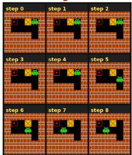

Visual Collage  
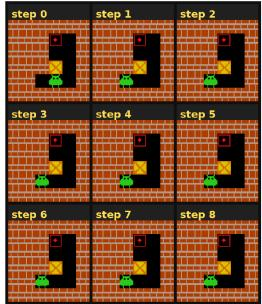

Visual Collage  
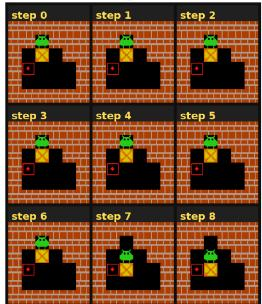

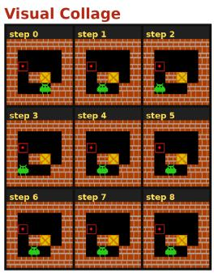  
Figure 7: Sokoban. SFT-stage input–output examples for this environment. Columns 1–2 are the visual trajectory collage and compact action log; column 3 is the JSON supervision target.

## Compact action log

step 0: action=right moved=false   
step 1: action=up moved=false   
step 2: action=invalid   
moved=false   
step 3: action=invalid   
moved=false   
step 4: action=down moved=true   
step 5: action=left moved=true   
step 6: action=left moved=true   
step 7: action=invalid   
moved=false   
step 8: action=down moved=false

## Compact action log

step 0: action=left moved=true step 1: action=down moved=false step 2: action=down moved=false step 3: action=down moved=false step 4: action=up moved=false step 5: action=left moved=false step 6: action=invalid moved=false step 7: action=up moved=false step 8: action=right moved=true

## Compact action log

step 0: action=right moved=false step 1: action=right moved=false step 2: action=right moved=false step 3: action=up moved=false step 4: action=up moved=false step 5: action=right moved=false step 6: action=down moved=true step 7: action=invalid moved=false step 8: action=right moved=true

## Compact action log

step 0: action=left moved=true step 1: action=left moved=true step 2: action=down moved=false step 3: action=right moved=true step 4: action=down moved=false step 5: action=down moved=false step 6: action=invalid   
moved=false   
step 7: action=invalid   
moved=false   
step 8: action=down moved=false

## SFT JSON DATA

"pivot step": 5.   
"failure\_mode":   
"timeout",   
"failure\_reason":   
"At step 5, action=left moved=true placed the box against a wall,   
wasting one step of budget."

## SFT JSON DATA

"pivot step": 6,   
"failure\_mode":   
"timeout",   
"failure\_reason":   
"At step 6, the agent performed an   
invalid action that wasted a step   
budget without moving the box,   
leaving insufficient steps to   
complete the task."

## SFT JSON DATA

"pivot\_step": 5,   
"failure mode":   
"timeout",   
"failure reason":   
"At step 5. action=right did not move   
the box, wasting a step budget while   
the agent was still far from the   
target."

## SFT JSON DATA

{ "pivot\_step": 2, "failure\_mode": "timeout", "At step 2, action=down did not move the box, wasting a step and leaving the agent with insufficient budget to complete the task."

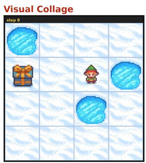

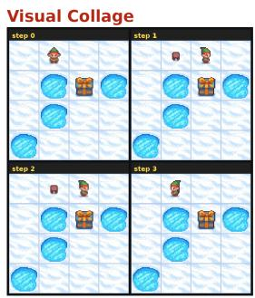

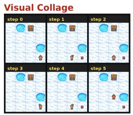

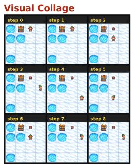  
Figure 8: FrozenLake. SFT-stage input–output examples for this environment. Columns 1–2 are the visual trajectory collage and compact action log; column 3 is the JSON supervision target.

## Compact action log step θ: action=down moved=true remaining\_turns=8

## Compact action log

step 0: action=right moved=true   
remaining\_turns=8   
step 1: action=invalid   
moved=false remaining turns=7   
step 2: action=left moved=true   
remaining\_turns=6   
step 3: action=down moved=true   
remaining turns=5

## Compact action log

step 0: action=left moved=true   
remaining\_turns=8   
step 1: action=down moved=false   
remaining turns=7   
step 2: action=right moved=true   
remaining turns=6   
step 3: action=left moved=true   
remaining turns=5   
step 4: action=up moved=true   
remaining turns=4   
step 5: action=right moved=true   
remaining turns=3   
Compact action log   
step 0: action=invalid   
moved=false remaining turns=8   
step 1: action=down moved=true   
remaining\_turns=7   
step 2: action=right moved=true   
remaining turns=6   
step 3: action=down moved=true   
remaining turns=5   
step 4: action=left moved=true   
remaining turns=4   
step 5: action=up moved=true   
remaining turns=3   
step 6: action=right moved=true   
remaining turns=2   
step 7: action=right moved=false   
remaining\_turns=1   
step 8: action=invalid   
moved=false remaining turns=0

## SFT JSON DATA

"pivot\_step": 0, "failure\_mode": "deadlock" "failure reason": "Avoid moving down from the starting position when surrounded by holes; it leads to immediate fall. At step 0, do not move down." }

## SFT JSON DATA

"pivot\_step": 3, "failure mode": "deadlock", "failure reason": "Avoid moving down when already adjacent to the goal; instead, move right to claim the goal. At step 3, do not move down. }

## SFT JSON DATA

"pivot step": 5, "failure\_mode": "deadlock", "failure reason": "Avoid moving right when adjacent to   
a hole and the goal is reachable by other means. At step 5. do not move right; move up instead."

## SFT JSON DATA

"pivot step": 6, "failure mode"; "timeout", "failure\_reason": "Avoid moving right when the agent is already aligned with the goal and has limited turns; instead, move toward the goal or wait to preserve turns for critical moves."   
}

## Visual Collage

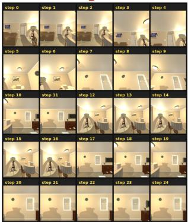

## Visual Collage

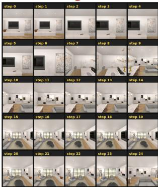

## Compact action log

step 0: action=moveback   
moved=true   
last action success=true   
action is valid=true dist=3.10   
remaining\_turns=24   
step 20: action=invalid   
moved=false   
last\_action\_success=false   
action\_ is\_valid=true   
remaining turns=4   
step 21: action=invalid   
moved=false   
last action success=false   
action is valid=true   
remaining turns=3   
step 22: action=moveright   
moved=true   
last action success=true   
action is valid=true dist=2.70   
remaining turns=2 <- pivot step   
step 23: action=moveleft   
moved=true   
last\_action\_success=true   
action is valid=true dist=2.32   
remaining turns=1   
step 24: action=invalid   
moved=false   
last\_action\_success=false   
action is valid=true   
remaining turns=0

## Compact action log

step 0: action=invalid moved=false last action success=false action\_is\_valid=true remaining\_turns=24

step 21: action=moveaheac   
moved=true   
last\_action\_success=true   
action is valid=true dist=2.24   
remaining turns=3   
step 22: action=moveahead   
moved=false   
last action success=false   
action is valid=true dist=2.24   
remaining turns=2   
step 23: action=rotateleft   
moved=false   
last action success=true   
action is valid=true dist=2.24   
remaining\_turns=1 <- pivot step   
step 24: action=moveright   
moved=false   
last\_action\_success=false   
action is valid=true dist=2.24   
remaining turns=0

## SFT JSON DATA

"pivot\_step": 22, "failure\_mode": "budget", "failure\_reason": "Avoid moving right when already facing away from the FloorLamp; it only wastes budget. At step 22, pivot left instead of moving right. }

## SFT JSON DATA

{ "pivot\_step": 23, "failure\_mode": "budget", "failure\_reason": "Avoid unnecessary rotations that don't progress toward the target. At step 23, move closer to the storage container instead of rotating left."

Visual Collage  
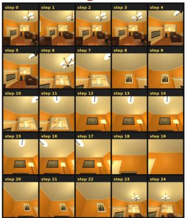

## Compact action log

step 0: action=moveleft   
moved=true   
last action success=true   
action is valid=true dist=3.05   
remaining turns=24   
step 20: action=lookup   
moved=false   
last action success=false   
action\_is\_valid=true dist=3.01   
remaining turns=4   
step 21: action=moveahead   
moved=true   
last action success=true   
action is valid=true dist=2.99   
remaining turns=3   
step 22: action=rotateright   
moved=false   
last action success=true   
action is valid=true dist=2.99   
remaining turns=2 <- pivot step   
step 23: action=moveright   
moved=true   
last action success=true   
action is valid=true dist=3.01   
remaining turns=1   
step 24: action=moveahead   
moved=true   
last action success=true   
action is valid=true dist=2.52   
remaining turns=0

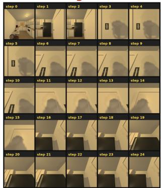

## Visual Collage

## Compact action log

step 0: action=rotateright   
moved=false   
last action success=true   
action is valid=true dist=2.75   
remaining\_turns=24   
step 21: action=moveright   
moved=false   
last action success=false   
action is valid=false dist=2.29   
remaining turns=3   
step 22: action=moveahead   
moved=false   
last action success=false   
action is valid=true dist=2.29   
remaining turns=2   
step 23: action=moveaheac   
moved=false   
last action success=false   
action is valid=true dist=2.29   
remaining turns=1 <- pivot step   
step 24: action=moveright   
moved=false   
last action success=false   
action is valid=true dist=2.29   
remaining turns=0

## SFT JSON DATA

{ "pivot\_step": 22, "failure\_mode": "stagnation", "failure reason": "Avoid rotating right when already facing the GarbageCan: it only delays progress. At step 22, move forward instead of rotateright.'

## SFT JSON DATA

3 "pivot\_step": 23, "failure\_mode": "blocked", "failure reason": "Repeatedly tried moveahead in blocked corridors without pivoting or backing up. At step 23, pivot or step back instead of repeating moveahead."   
}

Figure 7: Navigation. SFT-stage input–output examples for this environment. Columns 1–2 are the visual trajectory collage and compact action log; column 3 is the JSON supervision target.

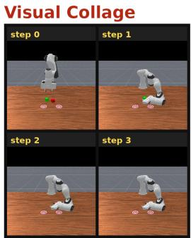

## Compact action log

step 0:   
action=pick(-73,-69,20)lpush(-36   
,23, 20, 10,0, 10)   
legal=true remaining\_stages=3   
remaining turns=5   
step 1:   
action=pick(80,-100,0)lplace(100   
, -150,50)   
legal=true remaining stages=3   
remaining\_turns=4   
step 2:   
action=pick(80.-100.0)lplace(100   
,-100,50)   
legal=true remaining\_stages=3   
remaining\_turns=3   
step 3:   
action=pick(80.-100.20)lpick(80   
100,20)   
legal=true remaining stages=3   
remaining turns=2

## SFT JSON DATA

"pivot\_step": 3, "failure mode": "timeout", "failure reason": "Avoid picking up the wrong cube again. At step 3, do not repeat pick(80,-100,20)lpick(80,100,20)." }

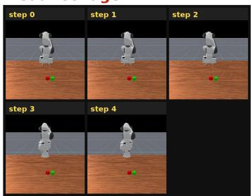

Compact action log   
step 0:   
action=push(109,105,20,100,34,20   
legal=true remaining stages=2   
remaining turns=5   
step 1:   
action=push(154,33,20,159,33,20)   
legal=true remaining\_stages=2   
remaining\_turns=4   
step 2:   
action=place(146,108,20)|place(1   
46,39,50)   
legal=true remaining stages=2   
remaining\_turns=3   
step 3:   
action=push(146,33,20,100,33,160   
)|place(146,33,20)   
legal=true remaining stages=2   
remaining turns=2   
step 4:   
action=push(154.108.20.164.102.2   
0)|place(146.33.20)   
legal=true remaining stages=2   
remaining turns=1

## SFT JSON DATA

"pivot\_step": 4,   
"failure\_mode":   
"order\_error", "failure reason": "Avoid pushing the red cube right   
while placing the green cube at   
(146,33,20) - that action misaligns   
the cubes. At step 4, do not repeat   
push(154,108,20,164,102,20)|place(146   
,33,20);   
instead, push the red cube left to align both cubes at x=0."   
1

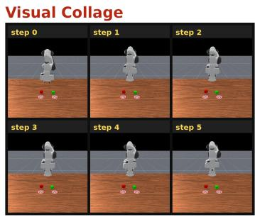

## Compact action log

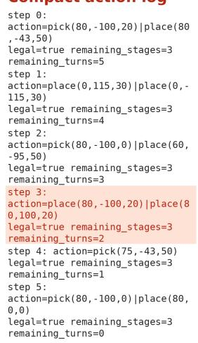  
Figure 8: PrimitiveSkill. SFT-stage input–output examples for this environment. Columns 1–2 are the visual trajectory collage and compact action log; column 3 is the JSON supervision target.

## SFT JSON DATA

"pivot step": 3,   
"failure mode":   
"timeout",   
"failure reason":   
"Avoid placing both cubes   
simultaneously at step 3. At step 3. do not repeat   
place(80, -100,20)|place(80,100,20); instead, place only the red cube at its target."

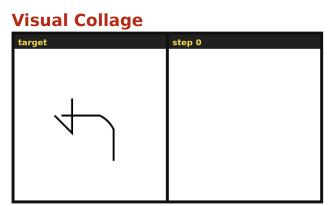

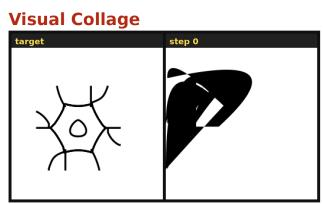

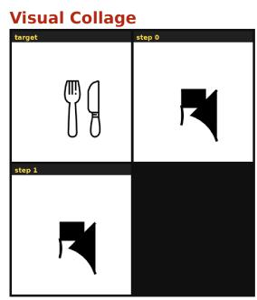

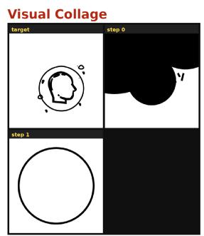  
Figure 9: SVG. SFT-stage input–output examples for this environment. Columns 1–2 are the visual trajectory collage and compact action log; column 3 is the JSON supervision target.

## Compact action log

valid\_svg=true remaining\_turns=1   
averaãe score=θ.62

## Compact action log

step 0: action=svg   
valid\_svg=true remaining\_turns=1   
average\_score=0.57

## Compact action log

step 0: action=svg   
valid\_svg=true remaining\_turns=1   
average score=0.64   
step 1: action=svg   
valid\_svg=true remaining\_turns=0   
average\_score=0.64

## Compact action log

step 0: action=svg   
valid\_svg=true remaining\_turns=1   
average\_score=0.60   
step 1: action=svg   
valid\_svg=true remaining\_turns=0   
average score=0.73

## SFT JSON DATA

"pivot step": 0,   
"failure mode":   
"timeout",   
"failure reason":   
"Avoid submitting a blank or   
incomplete SVG that doesn't start   
forming the target shape. At step 0,   
begin drawing the first line segment   
of the target icon."

## SFT JSON DATA

"pivot\_step": 0,   
"failure mode":   
"timeout",   
"failure\_reason":   
"Avoid submitting a large, abstract   
shape that doesn't match the target's   
structure. At step 0, start with a   
small, precise stroke to begin   
forming the target's outline."

## SFT JSON DATA

"pivot step": 1,   
"failure mode":   
"timeout",   
"failure\_reason":   
"Avoid repeating the same incorrect   
SVG. At step 1, do not submit the   
same arrow SVG again; instead,   
generate the fork and knife icons.'   
1

## SFT JSON DATA

"pivot step": 1, "failure mode": "timeout", "failure reason": "Avoid starting with a full circle when the target has a profile inside. At step 1, draw only the outline of the head profile, not the enclosing circle."

Table 13: SDAR settings (3B student, frozen 7B teacher).
<table><tr><td>Item</td><td>Value</td></tr><tr><td>Student  $\pi _ { \theta }$  / teacher  $\pi _ { \phi }$ </td><td>Qwen2.5-VL-3B/7B-Instruct (frozen)</td></tr><tr><td>Skill</td><td>seed_visual, episode_only; all frames, no collage</td></tr><tr><td>Distillation</td><td>all valid tokens;  $\lambda _ { \mathrm { s d a r } } { = } 0 . 0 1 , \beta _ { \mathrm { s d a r } } { = } 5$ </td></tr><tr><td>RL (shared with PIVOT)</td><td>N=8, LR 1× 10−6, KL 0.01, invalid pen. 0.1</td></tr><tr><td>Training</td><td>batch 16/val 128; 250 updates (Sok. 350); history 2</td></tr><tr><td>Pivot Analyzer  $\mathbf { \Omega } ^ { \prime } P _ { \hat { t } }$ </td><td>none</td></tr></table>

## I SDAR REPRODUCTION

We reproduce SDAR (Lu et al., 2026) on the same five VAGEN tasks, rewards, and validation budget as PIVOT. Unlike PIVOT, SDAR skips Stage I Analyzer SFT and never localizes a pivot step: a frozen larger VLM writes one episode-level visual skill and supplies gated reverse-KL targets on all valid action tokens. The student remains Qwen2. $5 \mathrm { - } \mathrm { \overline { { V } } L \mathrm { - } 3 B \mathrm { - } I n s t r u c t }$ initialized from the raw Instruct checkpoint; because the Qwen2.5 family has no 8B variant, the teacher is $\mathtt { Q w e n 2 . 5 - V L - 7 B - I n s t r u c t }$ . Tab. 1 reports scores; the following records roles and implementation flags for audit.

Roles. Only the 3B student $\pi _ { \theta }$ is trained; a frozen 7B teacher $\pi _ { \phi }$ is queried through an OpenAIcompatible vision API (analysis backend=openai). There is no Analyzer head, failuremode vocabulary, or pivot panel. On each on-policy trajectory, $\pi _ { \phi }$ sees every RGB frame as its own image (use visual collage=False) together with the action transcript, generates a single free-form episode skill $r _ { \phi }$ (skill mode=episode only, prompt seed visual), and rescores the student’s sampled tokens under $\tilde { h } _ { t } ^ { \phi } = ( h _ { t } , r _ { \phi } )$ The 7B model is dropped at inference, leaving the same zero-overhead student rollout as PIVOT.

Objective. Let $\ell _ { t } ^ { \mathrm { s t u } } = \log \pi _ { \theta } ( a _ { t } \mid h _ { t } )$ and $\ell _ { t } ^ { \phi } = \log \pi _ { \phi } ( a _ { t } \mid \tilde { h } _ { t } ^ { \phi } )$ , with gated reverse KL

$$
\Delta _ { t } ^ { \phi } = \mathrm { s g } \big [ \ell _ { t } ^ { \phi } - \ell _ { t } ^ { \mathrm { s t u } } \big ] , \qquad g _ { t } ^ { \phi } = \sigma \big ( \beta _ { \mathrm { s d a r } } \Delta _ { t } ^ { \phi } \big ) ,\tag{14}
$$

$$
\mathcal { L } _ { \mathrm { S D A R } } ( \boldsymbol { \theta } ) = \mathbb { E } \left[ m _ { \mathrm { a c t } } g _ { t } ^ { \boldsymbol { \phi } } \left( \mathrm { s g } [ \boldsymbol { \ell } _ { t } ^ { \boldsymbol { \phi } } ] - \boldsymbol { \ell } _ { t } ^ { \mathrm { s t u } } \right) \right] .\tag{15}
$$

The joint loss is the same GRPO-plus-distillation form as Eq. eq. 8,

$$
\begin{array} { r } { \mathcal { L } ( \theta ) = \mathcal { L } _ { \mathrm { G R P O } } ( \theta ) + \lambda _ { \mathrm { s d a r } } \mathcal { L } _ { \mathrm { S D A R } } ( \theta ) , } \end{array}\tag{16}
$$

with $\phi$ under stop-gradient. Unlike PIVOT, Eq. eq. 15 is applied to all valid action tokens rather than failed trajectories only, and the teacher context is a global episode skill rather than a localized visual panel $P _ { \hat { t } }$

Protocol. We match the VAGEN data, horizons, sparse rewards, GRPO grouping, and validation budget of Sec. 4.1 and App. E: Sokoban (room [6, 6], 1 box, solution length $[ 1 , \mathsf { 7 } ] , T _ { \mathrm { m a x } } { = } 9 )$ FrozenLake 4×4 with no slip $( T _ { \mathrm { m a x } } { = } 9 )$ , Navigation $( \dot { T } _ { \mathrm { m a x } } \dot { = } 2 5 )$ , PrimitiveSkill $( T _ { \mathrm { m a x } } { = } 6 )$ , and SVG $( T _ { \mathrm { m a x } } { = } 2 )$ . SDAR runs only on Qwen2.5-VL-3B (no Qwen3-VL-2B row in Tab. 1).

## J TRAINING CURVES

Figs. 10 and 11 show Stage II validation learning curves for Vanilla-GRPO, M, M+P, and M+P+R on Qwen2.5-VL-3B and Qwen3-VL-2B; dots mark running-best validation points aligned with Tab. 1.

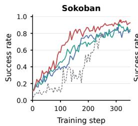

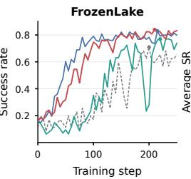

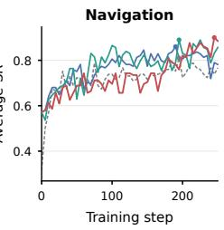

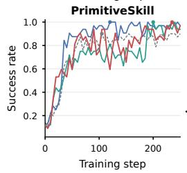

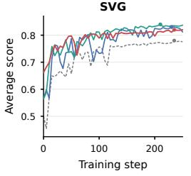  
Vanilla-GRPO M M+P M+P+R

Figure 10: Training curves for Vanilla-GRPO, M, M+P, and M+P+R on Qwen2.5-VL-3B. Dots mark the running-best validation point.  
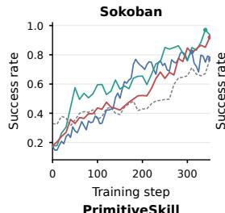

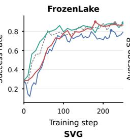

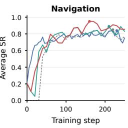

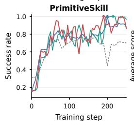

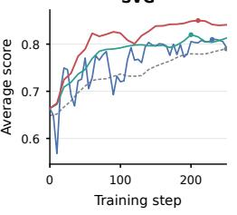  
Vanilla-GRPO M M+P M+P+R  
Figure 11: Training curves for Vanilla-GRPO, M, M+P, and $\mathsf { M } { + } \mathsf { P } { + } \mathsf { R }$ on Qwen3-VL-2B. Dots mark the running-best point.