# PLAYLISTEVAL: CAN VIDEO-LANGUAGE JUDGES BE TRUSTED AT DAY SCALE AND BEYOND?

Shayekh Bin Islam KAIST shayekh.islam@kaist.ac.kr

Hwanjun Song<sup>∗</sup> KAIST songhwanjun@kaist.ac.kr

## ABSTRACT

Video-language models are increasingly used as judges of video understanding, both for evaluating model outputs and for training reward models. Whether their judgments remain reliable when the evidence is buried in day-long videos has yet to be established. Existing benchmarks cannot answer this. Their videos are typically only a few minutes long, many answer pairs can be separated from the transcript alone, and collecting human judgments does not scale to ultra-long videos. We introduce PLAYLISTEVAL, an agentic framework that builds video-language judge benchmarks over 100-hour playlist collection without human annotation. It automatically generates questions with paired answers whose differences are controlled by causal degradation, so that every pair demands retrieval across the collection. The resulting benchmark contains 630 pairs across seven domains spanning both static and dynamic knowledge, and on a stratified subset of 152 pairs it agrees with human judgments 93.0% of the time (IAA 0.781). Evaluating 17 omnimodal and multimodal models from eight families reveals that frontier judges reach only 75.4% pairwise accuracy, while open-source judge models perform far behind. We further show that both retrieval and final judgment depend on using multiple modalities, and that judge accuracy degrades as the playlist set grows. We release our pipeline, benchmark, and evaluation code at playlisteval.github.io.

## 1 INTRODUCTION

Video-language judges, which score candidate responses against video evidence, now underpin both the evaluation and the training of multimodal systems (Zhang et al., 2025b; Waheed et al., 2026; Hu et al., 2026), and nowhere more so than for long video. On the evaluation side, long-video question answering is moving from multiple choice to long-form answers grounded in hours of video that no single reference can grade (Fang et al., 2024; Luo et al., 2025). On the training side, video MLLMs are increasingly optimized against judge-provided rewards (Waheed et al., 2026; Wei et al., 2026). Since human feedback does not scale to long video, the judge is the only practical source in both roles, and a misjudged answer becomes a misranked system or a misguided update. Yet judges have rarely been tested on video beyond an hour (Zhang et al., 2025b; Waheed et al., 2026; Wei et al., 2026), so we do not know whether that trust survives once the video grows to days.

Three problems in how existing judge benchmarks are built keep it that way. The first is length. The videos are short. Most run under a minute and few approach an hour (Waheed et al., 2026; Zhang et al., 2025b; Wei et al., 2026), so the judge sees the whole clip at once and never has to decide where to look. The second is grounding. Answer pairs come from human labels, ground-truth answers, or text descriptions of the video, and long-video systems are often graded by text-only judges. A judge that never looks at a frame can therefore still score well (Wei et al., 2026; Waheed et al., 2026; Ren et al., 2026). The third is scalability. Annotating hours of video for fine visual detail is the main cost of building long-video sets (Wang et al., 2025a; Hu et al., 2026), which keeps existing benchmarks narrow in domain, fixed in difficulty, and impossible to rebuild over new collections.

To bridge these gaps, we introduce PLAYLISTEVAL, an agentic benchmark curator that tests whether a video-language judge can be trusted over a multi-day playlist, a set of related videos totaling abou

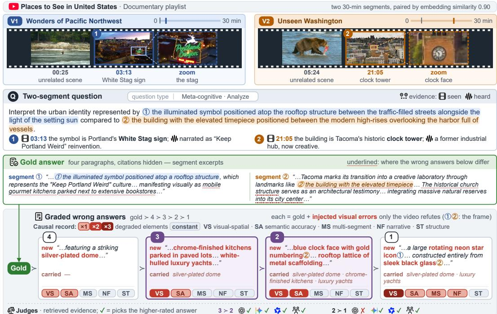  
Figure 1: An item in PLAYLISTEVAL: Two 30-minute segments of a 100-hour Documentary playlist, paired by embedding similarity, each supply one of the question’s two entities. The question names neither entity and identifies each only by its surroundings, so its evidence must be found across the collection and confirmed by what is seen and heard. From the gold answer, four wrong answers are derived by injecting visual errors of graded severity (rating 4 to 1), invisible in the tran script. Any two answers form a pair, so the rating gap sets how hard each pair is.

100 hours in each of seven domains (see an example in Figure 1). It builds such preferences fully automatically from native video collections, matching human judgments without human annotation. Its two stages and the feedback loop around them address the three problems above in turn.

As seen in Figure 2, Phase I targets length. It indexes the playlist and generates a question whose evidence lies in two distant moments of it, with a gold answer that cites its supporting spans, so the judge faces a needle-in-a-haystack search rather than a clip it can watch in full. Phase II targets grounding. It derives four incorrect answers from the gold by injecting visual errors of varying severity, each indistinguishable from the gold on the transcript alone, so every incorrect answer differs in what is seen rather than in what is said. The feedback loop targets scalability. Validity gates at both phases return their rejection reasons to the generator, making the pipeline self-correcting; at roughly \$1 per question, it retries until all gates are passed or the budget is exhausted, and can be rerun on any new playlist. Applied to playlists from seven domains, this pipeline yields PLAYLISTBENCH, a benchmark of 630 preference pairs, each pairing two answers of different error severity with the milder one as the intended preference. Human annotators confirmed these preferences in 93.0% of sampled cases, with an inter-annotator agreement of 0.781.

These design choices make PLAYLISTEVAL a controlled testbed. (i) Playlist size: because the gold answer is grounded in two verified spans, we can vary the playlist length without losing the answer and check whether retrieval surfaces those spans. (ii) Modality: wrong answers are indistinguishable from the gold on the transcript alone, so we can measure the contributions of frames, transcript, and audio to judging and retrieval. (iii) Difficulty: graded wrong answers let the rating gap control pair difficulty, from obvious errors to single-detail changes. With these controls, we evaluate 17 general-purpose and judge-tuned models from eight families, and pair them with four retrievers to test whether retrieval helps on long playlists. These controls uncover systematic failures across length, modality, retrieval, and answer order, with several becoming visible only at day scale and beyond, which prior benchmarks do not cover.

• The best judge reaches 75.4% against 93.0% for humans, small models sit near chance, and judges fine-tuned on short video fall to or below chance.

• Judge accuracy drops steadily from 1 hour to 100 hours, retrieval recovers up to +10.5 points, but the best retriever finds the right video segments only 37.9% of the time.

• Frames or transcript alone costs 2–7 points against using both, so neither suffices. More thinking or higher resolution barely helps, so the bottleneck is finding the evidence, not seeing it.

• When the two answers swap sides, weaker judges (e.g., Gemma-4-26B-A4B and Gemini-3.5- Flash-Lite) reverse their verdict on roughly half of pairs, whereas stronger judges (e.g., Qwen-3.8-Max and Gemini-3.7-Flash) stay largely consistent.

## 2 RELATED WORK

Multimodal Judge Models. Using a strong model to score another model’s output, as a reward model or an LLM-as-a-judge, has become the standard scalable proxy for human preference, since its introduction in RLHF (Christiano et al., 2017; Ouyang et al., 2022), and this paradigm has since moved into the multimodal setting. On images, LLaVA-Critic (Xiong et al., 2025) is trained as a generalist evaluator for both pointwise scoring and pairwise ranking, while InternLM-XComposer-2.5-Reward (Zang et al., 2025), Skywork-VL Reward (Wang et al., 2025b), and MM-RLHF (Zhang et al., 2025a) learn multimodal reward models to align vision–language models to human preference, with recent work hardening such rewards against spurious cues (Srivastava et al., 2026). Extending judges to video is far less explored: VideoJudge (Waheed et al., 2026) bootstraps an MLLM-asa-judge, and Wei et al. (2026) train dedicated video reward models. These judges, however, are developed and validated on clips of mostly a few minutes, leaving open whether they can supervise reasoning over ultra-long, multi-segment video, the regime PLAYLISTEVAL targets.

Judge Model Evaluation. The reliability of a judge is itself measured by dedicated benchmarks, which pair each prompt with a preferred and a dispreferred response and report how often the judge agrees with human preference. In the text-only setting, RewardBench (Lambert et al., 2025) and its harder successor RewardBench 2 (Malik et al., 2026) evaluate reward models across chat, reasoning, and safety, while JudgeBench (Tan et al., 2025) stress-tests LLM-as-a-judge on response pairs whose correctness is objectively verifiable. For image–text inputs, VL-RewardBench (Li et al., 2025) and Multimodal RewardBench (Yasunaga et al., 2025) extend this evaluation to vision–language judges, and Multimodal RewardBench 2 (Hu et al., 2026) broadens it to interleaved understanding and generation. Video-language judges are assessed by VideoJudge (Waheed et al., 2026), VideoRewardBench (Zhang et al., 2025b), and VURB (Wei et al., 2026). These video benchmarks, however, span clips of only a few minutes and rely on costly human annotation, which sharply limits their reach to ultra-long scenarios. In contrast, PLAYLISTEVAL is the first fully automated, native-video judge benchmark, built by a scalable pipeline while retaining high accuracy.

## 3 PLAYLISTEVAL: PLAYLISTS TO JUDGE BENCHMARKS

PLAYLISTEVAL takes a playlist collection and returns preference pairs for judge evaluation without any human annotation (see Figure 2). It is designed to produce pairs that are long and videogrounded, and, by keeping human involvement to a minimum, to scale to any new playlist collection. The first two properties are enforced by two generation phases, one generating QA over evidence scattered across the playlist and the other generating distractors beyond what the transcript reveals, and the third by a self-correcting feedback loop that wraps around both and selects the final pairs.

Manual Playlist Collection. Selecting playlists is the only step of PLAYLISTEVAL that involves a human. Following existing video benchmarks (Wu et al., 2024; Wang et al., 2025a), we chose seven domains—Education, Drama, Life, Art, History, Documentary, and Podcasts—that cover static factual knowledge, dynamic narrative content, and mixtures of both (Appendix B.6). For each domain we searched YouTube playlists under varied filters to gather an initial pool of 100 playlists of diverse topics and lengths. From this pool, we curated the final set in three passes. We first discarded private or deleted video links from the playlists, then, where a playlist’s order disagreed with its titles, re-sorted the videos by the episode keywords in those titles (e.g., Episode 4 before Episode 5), and finally trimmed or extended each domain until it covered about 100 hours. As a result, the curated collection spans 29 playlists and 457 videos with about 4 playlists per domain on average.

Automatic Indexing. A 100-hour playlist collection cannot be reliably processed as a whole by any current video-language model. Indexing it into smaller units is therefore indispensable, both for generating questions and for grounding every answer in the exact moments that support it, which is central to PLAYLISTEVAL. We split every video into 30-second chunks, a length short enough to localize a single visual moment yet long enough to carry a complete utterance (Ren et al., 2026), transcribe each with Qwen3-ASR-1.7B (Shi et al., 2026), and embed it into a single vector with Qwen3-VL-Embedding-8B (Li et al., 2026) from its sampled frames and transcript together, so that both what is seen and said are represented. Chunk embeddings are further averaged over the 10–30- minute segment, the granularity at which evidence is grounded. Together, these chunk and segment embeddings form a searchable index over the playlist that every later stage builds on. Before it is used, we remove near-duplicate videos, since duplicated contents would make a question answerable from a second copy and repeat content across questions. We flag any pair of segments with similarity above 0.95 and fill the gap with newer videos until each domain again covers 100 hours.

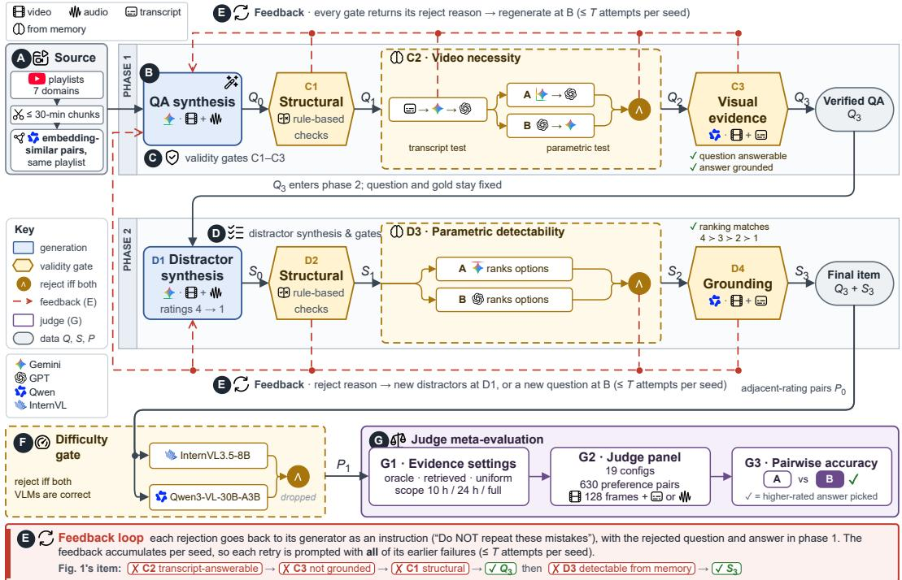  
Figure 2: Overview of PLAYLISTEVAL: ⃝A From indexed and paired playlist segments, ⃝B Phase I generates a QA and ⃝C verifies it through three gates, ⃝D Phase II generates graded distractors and verifies them likewise, and ⃝E the feedback loop returns every rejection to its generator. ⃝F Surviving items pass a difficulty gate and ⃝G form the preference pairs for judge meta-evaluation.

## 3.1 PHASE I: GENERATING QA OVER SCATTERED EVIDENCE

Phase I turns a segment pair into a question and a gold answer that are grounded in both segments as evidence, and keeps only those that cannot be answered without watching the video.

Evidence-Cited QA Generation. This step generates a question that cannot be answered from any single moment of the playlist. Its evidence is scattered across two distant segments of a 100-hour playlist, so the judge must first find both and then combine them, and the gold answer cites exactly where each piece lies. In detail, each question is seeded by a pair of same-domain segments with embedding similarity in [0.40, 0.90], close enough to share a question yet distinct enough to require both. Gemini-3-Flash receives both segments as native video (0.5 fps, 720p) with audio narration, and produces a question, a gold answer, and verification metadata in one inference call.

The output is constrained so that neither the question nor the answer can be resolved without the video. The question, following Wu et al. (2024), refers to entities only by their surroundings in the frame rather than by name, so that recognizing them requires locating the scene, and it targets the complex cells of Bloom’s Knowledge Dimension Matrix (Ullrich & Geierhos, 2021), so that answering requires reasoning over both segments rather than recalling a fact. The gold answer is a 3–5 paragraph response in which every claim cites its supporting span as (video-id @ MM:SS– MM:SS). These citations form the evidence map of the question, as exemplified in Figure 6.

Validity Gates. The constraints above are imposed only at generation time, and prior work has shown that such instructions alone are insufficient (Nagrani et al., 2025). Synthesized multimodal QA is often answerable from the transcript or parametric knowledge alone (Mangalam et al., 2023; Nagrani et al., 2025), and cited spans do not always support their claims. We therefore verify each QA through three sequential stages, where cheap structural and text-only checks screen out early failures before the costly video call, and the verifier never belongs to the generator’s family to mitigate self-preference bias.

• Structural Validity. A rule-based check with no model call. The answer must contain at least 3 paragraphs, with citations covering 2–15 of the 30-second chunks in each segment (i.e., 1.0–7.5 minutes of evidence), ensuring that the evidence is neither insufficient nor overly diffuse.

• Video Necessity. After the structural checks, we reject any question answerable without the video. In the transcript test, Gemini-3-Flash answers from transcripts alone, with the relevant transcript shuffled among windows from another video of the same playlist, and GPT-5.4-mini rejects the question if the answer matches the gold. In the parametric test, the question is answered from model memory with no input, under two generator–verifier pairs (Gemini-3-Flash with GPT-5.4, and GPT-5.4-mini with Gemini-3.1-Pro), and rejected only if both recover the gold. Generator and verifier always come from different families to mitigate self-preference bias.

• Video Sufficiency. Finally, we reject questions that the video itself cannot answer. Qwen-3.7-Plus, a third family, receives each segment’s full video at 0.5 fps with its transcript and verifies that the question is answerable from the video and that every claim in the gold answer is supported by its segment pairs. As this model does not support native audio, the narration is fed as ASR transcript.

Questions that clear all three stages are fixed for Phase II. Those that fail at any stage are sent back to the generator with the reason for rejection, which drives the feedback loop described in Sec. 3.3. Appendix B.4 discusses each stage’s model, inputs and acceptance rule; and Appendix G.2 the prompts.

## 3.2 PHASE II: GENERATING DISTRACTORS BEYOND THE TRANSCRIPT

Phase II turns a verified QA into a set of wrong answers that differ from the gold only in what is seen, so that a judge who reads the transcript but never watches the video cannot tell them apart.

Graded Visual Degradation. This step generates four wrong answers from the gold with controlled severity, rated 4 to 1 with the gold as 5, so that any two answers form a preference pair whose difficulty is set by their rating gap. Gemini-3-Flash receives the question’s two evidence segments as native video with the fixed question and gold, and rewrites the gold by injecting visual-only errors (color, spatial layout, gesture, props, on-screen graphics) that a reader with only the transcript or world knowledge cannot detect, while preserving its length, tone, and structure. Following causal rubric prompting (Srivastava et al., 2026), the model also records which question-specific attributes each answer degrades and through which elements, so that severity is an explicit, auditable quantity rather than an impression. This record fixes the intended order “gold ≻ 4 ≻ 3 ≻ 2 ≻ 1.”

Detectability Gates. A degraded set is useful only if its errors are invisible in text yet visible in video, and neither property is guaranteed by the prompt. Each set therefore passes three gates, run in the same cheap-to-costly order and with the same cross-family generator–verifier assignment.

• Structural Validity. A rule-based check with no model call. Each degraded answer must carry a well-formed causal record with at least one visual-only degradation.

• Textual Undetectability. We reject any set whose ranking can be recovered without the video. Gemini-3.1-Pro and GPT-5.4 each rank the gold and the four degraded answers, shuffled and identically formatted, from text alone with the question-specific attributes as rubric. The set is rejected only if both judges recover the intended order.

• Visual Detectability. Finally, we reject any set whose ranking cannot be recovered even with the video. Qwen-3.7-Plus receives each evidence segment’s full video at 0.5 fps with its transcript and ranks the four degraded answers, each accompanied by its causal record to verify against the frames. The set passes only if the judge reproduces the intended order exactly.

Sets that clear all gates form a final item with their question. Those that fail return to the distractor generator with the reason for rejection, driving the feedback loop in Section 3.3. Details including prompts, the model, the inputs and the acceptance rule of every stage are in Appendices B.4 and G.2.

## 3.3 SELF-CORRECTING LOOP AND PAIR SELECTION

The two phases above are not a fixed pipeline of filters but a closed loop, in which every rejection becomes an instruction for the next attempt. This is what lets PLAYLISTEVAL run end-to-end on a new playlist without a human deciding what to regenerate, and what keeps its cost bounded.

Rejection as Feedback. Whenever a gate rejects an item, its reason and the rejected output are appended to the generator’s prompt as an explicit instruction, so that the next attempt is conditioned on the exact failure. Feedback accumulates per seed, and a Phase II initial rejection regenerates only the distractors up to two more times, keeping the verified question fixed so that the costly video checks of Phase I are minimized. After three Phase II rejections, the cycle restarts from Phase I to generate a new QA with the same video segment pair, considering the previous failure history as feedback. To bound cost and avoid overfitting to the automated verifiers (Waheed et al., 2026), we allow at most $T = 6$ attempts per seed and phase, after which the segment pair is discarded.

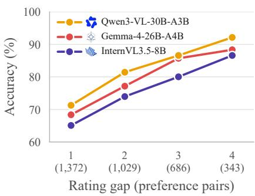  
Figure 3: Difficulty by rating gap.

Controllable Pair Selection. Any two of the five answers of an item form a preference pair with the higher-rated answer as the intended preference, but pairs with a large rating gap are trivially easy. We thus add a difficulty gate independent of the models above. Two open-weight judges, Qwen3-VL-30B-A3B and InternVL3.5-8B, evaluate every candidate pair, and only those that at least one of them fails are retained. Both are deliberately weaker than the judges evaluated in Sec. 4, so the gate removes pairs that even a modest judge solves without biasing the benchmark toward any evaluated model. As Figure 3 shows, their accuracy rises monotonically with the rating gap, confirming that our framework generates pairs of controllable difficulty. Finally, sampling 90 preference pairs per domain yields PLAYLISTBENCH, which contains 630 pairs over 327 unique questions and is dominated by rating gaps of 1 and 2. Appendix B.5 gives the statistics of the resulting benchmark.

Cost and Fidelity. The pipeline is cheap because each gate decides whether an item proceeds, so free rule-based and cent-level text-only checks run first and only survivors reach the two nativevideo models that account for over 90% of the bill (see Table 20). Building the benchmark cost 352 USD, or roughly 1 USD per accepted question including all retries, and each question yields up to 10 preference pairs from its five graded answers. This economy does not trade away fidelity. On a stratified subset of 152 pairs, human annotators agreed with the intended preference in 93.0% of cases with an inter-annotator agreement of 0.781 (see Appendix F). The same comparison also shows why human annotation cannot scale to this setting. Verifying those 152 pairs alone cost about 4.7 USD each, whereas our pipeline verified every pair at about 0.5 USD each, roughly ×8 cheaper.

## 4 EVALUATION

Setup. No judge can read a 100-hour collection at once, so each pair is judged over frames drawn from the question’s domain in one of two ways: (i) Retrieval ranks the indexed 30-second chunks by similarity to the question and takes two frames from each of the top-64;<sup>1</sup> and (ii) Uniform Sampling spaces the frames evenly over the whole domain, without looking at the question. In both, the judge receives 128 frames of size 640×480, resized from 720p. Audio-capable judges additionally receive the audio of the chunks the frames come from, merged into one file with 0.6-second pauses for the three Gemini models, whose API accepts a single audio input, and as separate turns for the locally run Qwen3-Omni-30B-A3B; all other judges receive those chunks’ ASR transcript.

Judge models. We evaluate 17 video-language models from eight families. Fourteen are generalpurpose: seven hosted API models (Gemini-3.1-Pro, 3.5-Flash-Lite, and 3.7-Flash; GPT-5.6-Terra; Kimi-K2.6; Qwen-3.7-Flash and 3.8-Max) and seven open-weight models run on our own GPUs (Gemma-4-E2B, E4B, and 26B-A4B; Qwen-3.5-2B, 4B, and 9B; Qwen3-Omni-30B-A3B). Three are fine-tuned as judges: InternLM-XComposer-2.5-Reward (Zang et al., 2025), a reward model trained on text, image, and video preferences, and VideoJudge-3B/7B (Waheed et al., 2026), trained for video understanding evaluation. Refer to Appendix B.3 for configuration details.

Table 1: Judge accuracy (%) per content domain and overall, with domain-retrieved frames versus uniform frame sampling. Each cell reports retrieved / uniform accuracy. Kimi-K2.6 is 1T-A32B and Qwen-3.8-Max is 2.4T-A95B. Per column, the best value is in bold and the second best has a dashed underline, separately for retrieved and uniform. Doc = Documentary, Educ = Education, Hist = History, Pod = Podcast. Input modalities: video frames, text transcript, audio track.
<table><tr><td></td><td></td><td colspan="6">Domain (retrieved/uniform)</td><td></td><td colspan="2">Overall</td></tr><tr><td>Judge</td><td>Input</td><td>Educ</td><td>Drama</td><td>Life</td><td>Art</td><td>Hist</td><td>Doc</td><td>Pod</td><td>R/U</td><td>∆</td></tr><tr><td colspan="9">Hosted API models (general-purpose)</td></tr><tr><td>Gemini-3.7-Flash</td><td>日w</td><td>68/61</td><td>72/69</td><td>76/6677/7478/74</td><td></td><td></td><td>79/74</td><td>79/78</td><td>75.4/71.0</td><td>+4.4</td></tr><tr><td>Gemini-3.1-Pro</td><td>日w</td><td>67/64</td><td>63/60</td><td>73/70</td><td>71/70</td><td>69/68</td><td>73/73</td><td>74/71</td><td>70.2/68.1</td><td>+2.1</td></tr><tr><td>Gemini-3.5-Flash-Lite</td><td>日W</td><td>49/51</td><td>56/52</td><td>59/54</td><td>61/50</td><td>63/59</td><td>58/57</td><td>71/61</td><td>59.5/54.9</td><td>+4.6</td></tr><tr><td>六 Qwen-3.8-Max</td><td>8</td><td>76/59</td><td>64/68</td><td>82/74</td><td>73/78</td><td>76/71</td><td>72/68</td><td>74/70</td><td>73.9/69.7</td><td>+4.2</td></tr><tr><td>Qwen-3.7-Flash</td><td>8日</td><td>64/61</td><td>62/62</td><td>73/72</td><td>71/61</td><td>65/63</td><td>68/61</td><td>69/51</td><td>67.5/61.7</td><td>±5.7</td></tr><tr><td>GPT-5.6-Terra</td><td>8</td><td>66/64</td><td>68/66</td><td>81/70</td><td>71/77</td><td>69/71</td><td>77/73</td><td>77/67</td><td>72.5/69.7</td><td>+2.9</td></tr><tr><td>Kimi-K2.6</td><td>8</td><td>71/60</td><td>68/61</td><td>77/64</td><td>70/67</td><td>73/70</td><td>67/69</td><td>75/69</td><td>71.4/65.7</td><td>±5.7</td></tr><tr><td colspan="11">Open-weight local models</td></tr><tr><td>Gemma-4-26B-A4B</td><td>8</td><td>51/40</td><td>58/46</td><td>60/48</td><td>59/51</td><td>(general-purpose) 63/51</td><td>61/52</td><td>66/57</td><td>59.7/49.2</td><td>+10.5</td></tr><tr><td>Gemma-4-E2B</td><td>8</td><td>43/47</td><td>50/42</td><td>56/50</td><td>44/42</td><td>42/46</td><td>39/41</td><td>48/41</td><td>46.0/44.1</td><td>+1.9</td></tr><tr><td>Gemma-4-E4B</td><td>8日</td><td>43/43</td><td>42/47</td><td>47/52</td><td>38/40</td><td>51/41</td><td>41/40</td><td>48/43</td><td>44.3/43.8</td><td>+0.5</td></tr><tr><td>Qwen-3.5-9B</td><td>8</td><td>64/51</td><td>53/56</td><td>59/49</td><td>46/53</td><td>63/52</td><td>58/51</td><td>53/61</td><td>56.7/53.3</td><td>+3.3</td></tr><tr><td>Qwen-3.5-4B</td><td>8</td><td>51/53</td><td>57/58</td><td>61/56</td><td>64/57</td><td>58/50</td><td>57/49</td><td>46/44</td><td>56.2/52.4</td><td>+3.8</td></tr><tr><td>Qwen-3.5-2B</td><td>8日</td><td>49/42</td><td>47/51</td><td>53/51</td><td>51/39</td><td>50/47</td><td>56/47</td><td>56/49</td><td>51.6/46.5</td><td>+5.1</td></tr><tr><td>Qwen3-Omni-30B-A3B</td><td>日</td><td>43/39</td><td>50/49</td><td>54/49</td><td>51/51</td><td>50/49</td><td>49/51</td><td>44/47</td><td>48.9/47.8</td><td>+1.1</td></tr><tr><td colspan="9">Open-weight local models (fine-tuned as judges)</td><td></td></tr><tr><td>InternLM-2.5-Reward</td><td>8</td><td>58/43</td><td>54/59</td><td>48/50</td><td>54/57</td><td>47/5851/47</td><td></td><td>57/67</td><td>52.7/54.3</td><td>-1.6</td></tr><tr><td>CMU VideoJudge-3B</td><td>8</td><td>41/44</td><td>42/47</td><td>42/40</td><td>50/43</td><td>51/49</td><td>53/54</td><td>59/62</td><td>48.3/48.3</td><td>+0.0</td></tr><tr><td>CMU VideoJudge-7B</td><td>8日</td><td>49/51</td><td>49/48</td><td>34/36</td><td>48/50</td><td>49/50</td><td>48/52</td><td>58/57</td><td>47.8/49.0</td><td>-1.3</td></tr></table>

Metrics. Following Lambert et al. (2025); Waheed et al. (2026), a judge is scored by “pairwise accuracy,” the fraction of the 630 pairs on which it prefers the answer the benchmark designates as better; the side each answer appears on is fixed per pair by a shared seed. A retriever is scored at the 10–30-minute segment level, where evidence is grounded: for each of the 343 questions, it ranks the few hundred segments of the domain by the mean of their three highest chunk similarities, and we report “Hit@k,” the fraction of questions with both gold segments in the top k (Xiong et al., 2021), and “nDCG@k,” which further rewards ranking them near the top, with k = 10. Requiring both segments makes Hit@k strict (chance 0.11% at k = 10), since a two-segment question cannot be answered from one. Appendix B.2 and Table 15 give the definitions and per-segment breakdown.

## 4.1 TRUST: JUDGES FALL FAR SHORT OF HUMANS

Even the strongest judges fall far short of humans. The best judge overall, Gemini-3.7-Flash, reaches only 75.4% pairwise accuracy with retrieved evidence (Table 1), trailing the 93.0% agreement of the human annotators (Appendix F). The remaining hosted judges cluster below it, from Qwen-3.8-Max (73.9%), GPT-5.6-Terra (72.5%), and Kimi-K2.6 (71.4%) down to Gemini-3.5- Flash-Lite (59.5%), showing that reliable judgment over ultra-long video is far from solved even for frontier systems.

Smaller and open-weight judges approach chance. Below the hosted API models, the generalpurpose open-weight models perform substantially worse: only Gemma-4-26B-A4B (59.7%) rises clearly above the 50% chance floor, while the rest fall between 44 and 57% (Table 1). Accuracy broadly tracks scale, with the largest member of each family ahead of its smaller variants, indicating that the spatio-temporal reasoning our pairs demand emerges only at scale.

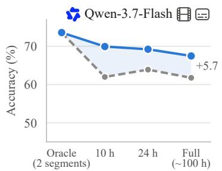

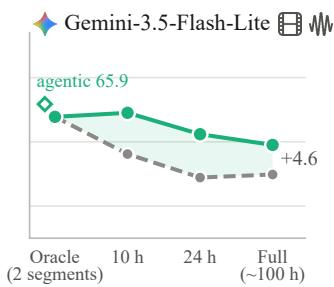

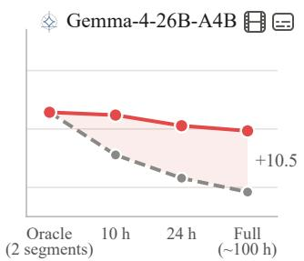  
Figure 4: Retrieval scope. Pairwise accuracy of three judges as the haystack shrinks from the full ∼100-hour domain to 24- and 10-hour corpora around the gold segments, down to the oracle (the two gold segments alone). Solid: retrieved evidence; dashed: uniform sampling over the same scope; shaded: retrieval gain. N = 630 pairs per point.

Domain-specific short-video reward models do not transfer. The judges fine-tuned for video evaluation, InternLM-XComposer-2.5-Reward, VideoJudge-7B, and VideoJudge-3B, perform no better than chance (47.8–52.7%), despite being trained for video preference tasks. Retrieval, which lifts the general-purpose models, leaves them unchanged or slightly worse (e.g., −1.6 points for InternLM-XComposer-2.5-Reward), suggesting that short-context training does not equip a judge to locate and reason over evidence scattered across a 100-hour collection.

Retrieval helps, but only for models that can exploit it. Supplying domain-retrieved frames in place of uniform sampling improves nearly every capable judge, by up to +10.5 points for Gemma-4-26B-A4B and +4.4 for Gemini-3.7-Flash (Table 1); the exceptions are the fine-tuned critics, whose accuracy does not move. Delivering the right evidence is therefore necessary but not sufficient: it raises accuracy only when the judge can reason over what it receives.

Weaker judges also show position bias. Swapping the two answers’ A/B sides flips roughly half of the verdicts for the weaker models, while stronger judges stay more consistent (Appendix C.1).

## 4.2 LENGTH: ACCURACY FALLS AS THE PLAYLIST GROWS

Judge accuracy declines as the collection grows. We sweep the retrieval haystack from the two oracle segments (∼1 hour) through frozen 10- and 24-hour corpora to the full ∼100-hour domain (Figure 4). Every judge is most accurate at the oracle scope and degrades as the haystack expands: with retrieval, Qwen-3.7-Flash falls from 73.6% to 67.5%, Gemini-3.5-Flash-Lite from 63.9% to 59.5%, and Gemma-4-26B-A4B from 62.9% to 59.7% between the oracle and full scopes. Retrieval matters more as the haystack grows. Uniform frame sampling degrades far more steeply than retrieval over the same corpora—Gemma-4-26B-A4B loses 13.7 points from oracle to full under uniform sampling but only 3.2 with retrieval—so the retrieval advantage widens with collection size, reaching +10.5 points at the full domain. Retrieval narrows but never closes the length penalty, leaving a persistent gap from the oracle even for the strongest judge.

## 4.3 MODALITY: NEITHER FRAMES NOR TRANSCRIPT SUFFICES

Both frames and transcript are needed. Judges peak with combined video-text input, and removing either the frames or the transcript costs 2–7 points across judges under our default retriever Qwen3-VL-Embedding-8B (Figure 5, left). No single modality suffices: our pairs are constructed so that the deciding evidence appears in the frames while the surrounding context is carried by the narration, and both must be exploited for optimal performance.

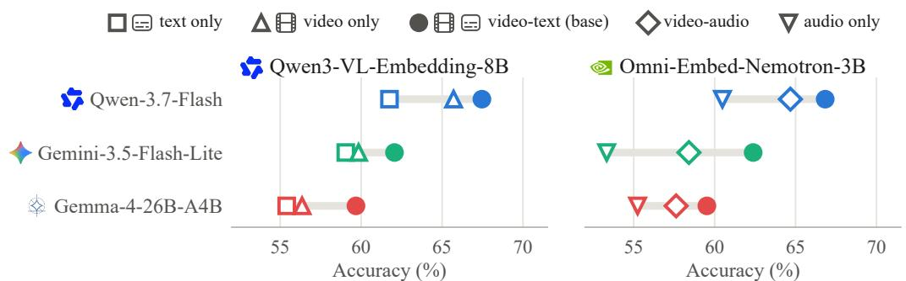  
Figure 5: Judge accuracy by modality. Accuracy under vision-text (left) and vision-audio (right) retrieval, varying the judge’s input stream.

Text-space retrieval beats audio-space retrieval. Retrieving in video-text space consistently beats video-audio retrieval with Omni-Embed-Nemotron-3B, both in retriever quality: Hit@10 of 30.6% (video-text) vs. 26.2% (video-audio); and 7.3% (audio only), as in Table 2; and in the downstream judges each index feeds (Figure 5, right). We deliberately exclude questions about purely auditory properties, such as music or vocal tone, so that the two modalities are com-

Table 2: Retriever performance evaluation.
<table><tr><td>Retriever</td><td>Input Hit@10</td><td></td><td>nDCG@10</td></tr><tr><td rowspan="3">六 Qwen3-VL-Embedding-8B</td><td>8日</td><td>37.9</td><td>45.0</td></tr><tr><td>日</td><td>32.9</td><td>37.9</td></tr><tr><td>日</td><td>30.0</td><td>37.0</td></tr><tr><td>中 WeMM-Embedding-9B</td><td>8日</td><td>37.6</td><td>42.9</td></tr><tr><td>六 Qwen3-VL-Embedding-2B</td><td>8日</td><td>32.7</td><td>38.1</td></tr><tr><td rowspan="3">@ Omni-Embed-Nemotron-3B</td><td>8日</td><td>30.6</td><td>39.9</td></tr><tr><td>日w</td><td>26.2</td><td>33.4</td></tr><tr><td>M</td><td>7.3</td><td>14.0</td></tr></table>

pared fairly, and under this setting text is the stronger channel for both retrieval and judgment.

## 4.4 BOTTLENECK: FINDING THE EVIDENCE, NOT SEEING IT

Effect of reasoning. Reasoning helps, then saturates. Enabling reasoning lifts Gemini-3.5- Flash-Lite by 7.8 points over its minimal setting (51.7→59.5%), but further budget barely moves it: from low to high accuracy rises only 0.5 points (59.2→59.7%) even as output tokens more than quintuple (Table 3). A modest amount of thinking is therefore worthwhile, but scaling it up does not close the gap to humans.

Table 3: Effect of reasoning budget.
<table><tr><td rowspan="2">Setting</td><td rowspan="2">Accuracy</td><td colspan="2">Tokens</td><td rowspan="2">USD</td></tr><tr><td>Prompt</td><td>Output</td></tr><tr><td>minimal</td><td>51.7 (−7.8)</td><td>84k</td><td>364</td><td>8.26</td></tr><tr><td>low</td><td>59.2 (−0.3)</td><td>84k</td><td>1,035</td><td>8.79</td></tr><tr><td>medium (base) 59.5</td><td></td><td>84k</td><td>1,447</td><td>9.11</td></tr><tr><td>high</td><td>59.7 (+0.2)</td><td>84k</td><td>1,948</td><td>9.50</td></tr></table>

We also tested agentic reasoning with tool use, which yielded only marginal gains (Appendix C.2).

Effect of pixel budget. Pixel budget is not the bottleneck. Raising the judge’s per-frame token budget changes accuracy by at most 1.3 points (high 60.8% vs. low 59.5%) while roughly doubling API cost (\$9.11 → \$18.83), and medium is no better than low (Table 16). The limiting factor is thus finding the right evidence, not resolving fine visual detail once it is in view.

Effect of audio speed. Faster audio does not hurt. Playing the merged audio at 2× halves its duration and cuts prompt tokens from 84k to 60k, lowering cost by 25% (\$9.11 → \$6.84) while slightly improving accuracy (+1.6 points; Table 17). The shorter context helps rather than hurts, again pointing to context length, not evidence resolution, as the constraint.

## 4.5 ERROR ANALYSIS

To understand why judges made mistakes, we examined 100 pairs that the four strongest judges judged incorrectly and identified the root cause of each through manual inspection by the authors. These failures fall into four types: 1) Retrieval error (Appendix Fig. 9), the dominant failure: the retriever never surfaces the deciding evidence, so it never reaches the judge, in about 61% of examined cases. 2) Frame sampling error (Fig. 10): the right 30-second chunk is retrieved, but none of its sampled frames land on the deciding moment, in about 15% of cases. 3) Reasoning error (Fig. 12): the evidence is served, but the judge is misled by adversarial retrieved chunks and fails to identify the correct visual cues, in about 16% of cases. 4) Perception error (Fig. 11): the deciding frame is served and legible, but the judge misreads it, e.g. handwritten text or a character’s attributes, in about 6% of cases (see Appendix D for all examples). The remaining ≈2% we attribute to annotation noise in the ground-truth ratings.

## 5 CONCLUSION

In this work, we introduce PLAYLISTEVAL, a fully automated framework that constructs videolanguage judge benchmarks over 700 hours of playlist collections without human annotation. Our analysis reveals a wide gap between human and model accuracy where frontier video-language judge systems fail to retrieve and reason reliably. Moreover, judge models fine-tuned on short clips fail to transfer, and judge accuracy degrades as the collection grows, demonstrating that ultra-long spatiotemporal verification remains largely unsolved. We hope PLAYLISTEVAL plays a foundational role in the development of judge systems that are trustworthy over day-long video collections.

## AI USE STATEMENT

In this work, we used generative AI tools to generate synthetic data sets (Sections 3.1–3.3), design or provide feedback on research methodology or experiments, implement methods (e.g., for coding and verification), assist with translation, clean and reformat dataset, support qualitative and thematic data analysis. We have not used generative AI tools to propose or refine hypotheses, interpret results; and to help develop theoretical models or conceptual frameworks, formulate mathematical claims, provide critical ingredients for proving mathematical claims, assist in the writing of proofs are not applicable to this work. Additionally, we used generative AI tools to create or modify scientific figures or images, create or edit software code, creation of artifacts, summarize or analyse existing literature (e.g., finding related benchmarks and AI models), brainstorming, sourcing/searching for information, edit a research paper to improve readability, and identify relevant literature. For citations, we use official bibtex entries manually exported and verified from ICLR Proceedings, NeurIPS Proceedings, PMLR, ACL Anthology, CVF, ACM Digital Library and arXiv. For web URLs, we use a consistent format. We have reviewed all AI-assisted work. LLM-generated code was verified and tested for correctness by all authors. We take responsibility for the final content of this work, including text, claims or artifacts produced with the aid of generative AI.

## REPRODUCIBILITY STATEMENT

We provide detailed configurations for retrieval (Appendix B.1, B.2), judge models (Appendix B.3), and data generation (Appendix B.4), along with benchmark statistics and a complete data item (Appendices B.5, B.7). All prompts are reproduced verbatim (Appendices G.1–G.3), and cost breakdowns (Appendices E.1, E.2) and the human evaluation protocol (Appendix F) are included. We will release our pipeline, benchmark, and evaluation code upon publication.

## ETHICS STATEMENT

All videos in PLAYLISTEVAL are publicly available YouTube content. We release only the video URLs, timestamps, and our generated annotations; no raw video or audio files. YouTube videos may be removed or made private by their owners, any URL in our dataset may become inaccessible over time. For cases where a video is no longer publicly available, we will share the corresponding files only with the explicit permission of the video owner. Our benchmark does not collect or store any personally identifiable information beyond what is visible in the public videos themselves. As the study poses minimal risk and ensures participant anonymity during crowd-sourced human annotation, we did not seek ethics board approval, in accordance with standards commonly considered exempt from review.

## ACKNOWLEDGEMENTS

This work was supported by Institute of Information & communications Technology Planning & Evaluation (IITP) grant funded by the Korea government (MSIT) (No. RS-2024-00445087 & RS-2025-25464461) and National IT Industry Promotion Agency(NIPA) grant funded by the Korea government(MSIT) (No. RS-2026-25621604).

## REFERENCES

Paul F Christiano, Jan Leike, Tom Brown, Miljan Martic, Shane Legg, and Dario Amodei. Deep reinforcement learning from human preferences. In I. Guyon, U. Von Luxburg, S. Bengio, H. Wallach, R. Fergus, S. Vishwanathan, and R. Garnett (eds.), Advances in Neural Information Processing Systems, volume 30. Curran Associates, Inc., 2017. URL https://proceedings.neurips.cc/paper\_files/paper/2017/ file/d5e2c0adad503c91f91df240d0cd4e49-Paper.pdf.

Xinyu Fang, Kangrui Mao, Haodong Duan, Xiangyu Zhao, Yining Li, Dahua Lin, and Kai Chen. Mmbench-video: A long-form multi-shot benchmark for holistic video understanding. In A. Globerson, L. Mackey, D. Belgrave, A. Fan, U. Paquet, J. Tomczak, and C. Zhang (eds.), Advances in Neural Information Processing Systems, volume 37, pp. 89098–89124. Curran Associates, Inc., 2024. doi: 10.52202/079017-2827. URL https://proceedings.neurips.cc/paper\_files/paper/2024/file/ a2326c9715a516c91174132e0170073a-Paper-Datasets\_and\_Benchmarks\_ Track.pdf.

Gemma Team, Sherif El Abd, Vaibhav Aggarwal, Robin Algayres, Alek Andreev, Olivier Bachem, Ian Ballantyne, Cormac Brick, Victor Carbune, Michelle Casbon, Mayank Chaturvedi, Aditya˘ Chawla, Victor Cotruta, Alice Coucke, Phil Culliton, Robert Dadashi, Lucas Dixon, Mohamed Elhawaty, Utku Evci, Clement Farabet, Johan Ferret, Filippo Galgani, Sertan Girgin, Jean-Bastien´ Grill, Maarten Grootendorst, Jiaxian Guo, Cassidy Hardin, Yanzhang He, Steven M. Hernandez, Omri Homburger, Leonard Hussenot, Juyeong Ji, Armand Joulin, Aishwarya Kamath, Parnian´ Kassraie, Olivier Lacombe, Preethi Lahoti, Gael Liu, Gus Martins, Luciano Martins, Tatiana¨ Matejovicova, Ramona Merhej, Nikola Momchev, Sneha Mondal, Ryan Mullins, Sindhu Raghuram Panyam, Shreya Pathak, Sarah Perrin, Andre Susano Pinto, Etienne Pot, Ang´ eline Pouget,´ Alexandre Rame, Sabela Ramos, Douglas Reid, David Rim, Morgane Rivi´ ere, Karsten Roth,\` Louis Rouillard, Omar Sanseviero, Pier Giuseppe Sessa, Shane Settle, Danila Sinopalnikov, Sara Smoot, Piotr Stanczyk, Andreas Steiner, Lawrence Stewart, Ilya Tolstikhin, Michael Tschannen, Anton Tsitsulin, Nino Vieillard, Renjie Wu, Pingmei Xu, Haichuan Yang, Edouard Yvinec, Biao Zhang, Li Zhang, Joe Zou, Nicolas Aagnes, Abdelrahman Abdelhamed, Jakub Adamek, Shivani Agrawal, Shubham Agrawal, Ibrahim Alabdulmohsin, Jean Baptiste Alayrac, Uri Alon, Chandramouli Amarnath, Ankesh Anand, Chrysovalantis Anastasiou, Setareh Ariafar, Franc¸ois-Xavier Aubet, Kyriakos Axiotis, Federico Barbero, Joelle Barral, Alexei Bendebury, Urs Bergmann, Stanley Bileschi, Kat Black, Mathieu Blondel, Sebastian Borgeaud, Arthur Brazinskas, Ryan Bur-ˇ nell, Robert Busa-Fekete, Mu Cai, Daniele Calandriello, Glenn Cameron, Charlotte Caucheteux, Rahma Chaabouni, Garima Chadha, Jetha Chan, Blake Jianhang Chen, Jesse Chen, Lin Chen, Xu Chen, Derek Cheng, Tzu hsiang Chien, Nikolai Chinaev, Yi Chou, Zhaohui Chu, Benjamin Coleman, Pooja Consul, Sam Conway-Rahman, Scott Crowell, Dylan Cutler, Vivek Dani, Samira Daruki, Anil Das, Daniel Deutsch, Nishanth Dikkala, Li Ding, Qiuhan Ding, Shenil Dodhia, Konstantin Donhauser, Tulsee Doshi, Anca Dragan, Alex Druinsky, Sahil Dua, Zoltan Egyed, Danielle Eisenbud, Daniel Eppens, Cindy Fan, Bahare Fatemi, Yassir Fathullah, Vlad Feinberg, Milen Ferev, Sebastian Flennerhag, Takumi Fujimoto, Joao Gabriel Oliveira, Isaac Galatzer-Levy,˜ Joao Gante, Simon Geisler, Soham Ghosal, Antonious M. Girgis, Tamara von Glehn, Alec Go,˜ Alhaad Gokhale, Alex Grills, Yiming Gu, Mayank Gupta, Pramod Gupta, Guru Guruganesh, Raia Hadsell, Hamza Harkous, Jitendra Harlalka, Demis Hassabis, Anja Hauth, Joe Heyward, Arian Hosseini, Chih-Yang Hsia, I-Hung Hsu, Xiaopeng Huang, Yangsibo Huang, Kevin Hui, Adrian Hutter, Te I, Fotis Iliopoulos, Advait Jain, Ganesh Jawahar, Ziwei Ji, Qilin Jin, Melvin Johnson, Kandarp Joshi, Arun Kandoor, Wang-Cheng Kang, Koray Kavukcuoglu, Mehran Kazemi, Kathleen Kenealy, Amr Khalifa, Phoebe Kirk, Ivan Korotkov, Suraj Kothawade, Vitaly Kovalev, Neel Kovelamudi, Adam Kraft, Ravin Kumar, Vivek Kumar, Harish Kuppam, Justin Lannin, Chen-Yu

Lee, Seungji Lee, Dmitry Lepikhin, Alon Levkovitch, Dongdong Li, Qiujia Li, Valentin Lievin,´ Ethan Lin, Ziqian Lin, Casper Liu, Tianlin Liu, Tianqi Liu, Xin Liu, Ivan Lobov, Mayank Lunayach, Min Ma, Gagan Madan, Andrii Maksai, Eric Malmi, Michal Matuszak, Daniel McDuff, Gaurav Menghani, Maciej Mikuła, Daniil Mirylenka, Karolis Misiunas, Vedant Misra, Andreea Mitran, Kareem Mohamed, Maksim Mukha, Eric Noland, James O’Donnell, Brendan O’Donoghue, Kate Olszewska, Bernett Orlando, Wanqiong Pan, Rina Panigrahy, Unnati Parekh, Nicolas Perez-Nieves, Chunjong Park, Eric Paskie, Liqian Peng, Bryce Petrini, Slav Petrov, Jonas Pfeiffer, Bilal Piot, Martyna Plomecka, Siim Poder, Octavio Ponce, Arijit Pramanik, David Racz, Anish Rajan, Michelle Ramanovich, Anand Rao, Marvin Ritter, Vitor Rodrigues, Evan Rosen, Mikołaj Rybinski, Noveen Sachdeva, Micha´ el E. Sander, Rohit Sathyanarayana, Sagar Savla, Samuel¨ Schmidgall, Tal Schuster, George Scrivener, Benoit Seguin, Andrew Sellergren, Aliaksei Severyn, Izhak Shafran, Dhruv Shah, Bobak Shahriari, Yuan Shangguan, Ashish Shenoy, Pradeep Shenoy, Rakesh Shivanna, Pauline Sho, Lucas Spangher, Wojciech Stokowiec, Tim Strother, Yao Su, Yinghao Sun, Mukund Sundararajan, Andrea Tacchetti, Mor Hazan Taege, Pouya Tafti, Jean Tarbouriech, Chetan Tekur, Shantanu Thakoor, Rahul Thapa, Madeleine Traverse, Lenart Treven, Tao Tu, Chien Te Tung, C¸ aglar˘ Unl<sup>¨</sup> u, Petar Veli¨ ckoviˇ c, Malini Pooni Venkat, Sagar Gubbi´ Venkatesh, Vidya Venkiteswaran, Francesco Visin, Alex Vitvitskyi, Kiran Vodrahalli, Weiyi Wang, Xin Wang, Tris Warkentin, Jan Wassenberg, John Wieting, Cindy Wu, Lechao Xiao, Hao Xu, Yuhui Xu, Fuzhao Xue, Arun Yadav, Jun Yan, Antoine Yang, Lin Yang, Ming-Hsuan Yang, Ziyu Ying, Jae Hyeon Yoo, Morteza Zadimoghaddam, Sajjad Zafar, Fred Zhang, Jiageng Zhang, Jianyi Zhang, Xiaofan Zhang, Chao Zhao, David Zhou, and Chen Zou. Gemma 4 technical report. arXiv preprint arXiv:2607.02770, 2026. URL https://arxiv.org/abs/2607.02770.

Google Team. Gemini 3 Flash: frontier intelligence built for speed. Google Blog, December 2025. URL https://blog.google/products/gemini/gemini-3-flash/.

Google Team. Gemini 3.1 Pro: a smarter model for your most complex tasks. Google Blog, February 2026a. URL https://blog.google/innovation-and-ai/ models-and-research/gemini-models/gemini-3-1-pro/.

Google Team. Introducing Gemini 3.6 Flash, 3.5 Flash-Lite, and 3.5 Flash Cyber. Google Blog, July 2026b. URL https://blog.google/ innovation-and-ai/models-and-research/gemini-models/ gemini-3-6-flash-3-5-flash-lite-3-5-flash-cyber/.

Google Team. Introducing Gemini 3.7 Flash. Google Blog, August 2026c. URL https://blog.google/innovation-and-ai/models-and-research/ gemini-models/introducing-gemini-3-7-flash/.

Google Team, Rohan Doshi, and Mario Luciˇ c. Introducing agentic video under-´ standing with Gemini. Google Blog, September 2026. URL https://blog. google/innovation-and-ai/models-and-research/gemini-models/ introducing-agentic-video-in-gemini/.

Yushi Hu, Reyhane Askari-Hemmat, Melissa Hall, Emily Dinan, Luke Zettlemoyer, and Marjan Ghazvininejad. Multimodal rewardbench 2: Evaluating omni reward models for interleaved text and image. In Proceedings ofthe IEEE/CVF Conference on Computer Vision and Pattern Recognition (CVPR), pp. 36904–36915, June 2026.

Klaus Krippendorff. Computing krippendorff’s alpha-reliability. 2011. URL https://api. semanticscholar.org/CorpusID:59901023.

Nathan Lambert, Valentina Pyatkin, Jacob Morrison, LJ Miranda, Bill Yuchen Lin, Khyathi Chandu, Nouha Dziri, Sachin Kumar, Tom Zick, Yejin Choi, Noah A. Smith, and Hannaneh Hajishirzi. RewardBench: Evaluating reward models for language modeling. In Luis Chiruzzo, Alan Ritter, and Lu Wang (eds.), Findings of the Association for Computational Linguistics: NAACL 2025, pp. 1755–1797, Albuquerque, New Mexico, April 2025. Association for Computational Linguistics. ISBN 979-8-89176-195-7. doi: 10.18653/v1/2025.findings-naacl.96. URL https: //aclanthology.org/2025.findings-naacl.96/.

Lei Li, Yuancheng Wei, Zhihui Xie, Xuqing Yang, Yifan Song, Peiyi Wang, Chenxin An, Tianyu Liu, Sujian Li, Bill Yuchen Lin, Lingpeng Kong, and Qi Liu. Vl-rewardbench: A challenging

benchmark for vision-language generative reward models. In Proceedings ofthe IEEE/CVF Conference on Computer Vision and Pattern Recognition (CVPR), pp. 24657–24668, June 2025.

Mingxin Li, Yanzhao Zhang, Dingkun Long, Keqin Chen, Sibo Song, Shuai Bai, Zhibo Yang, Pengjun Xie, An Yang, Dayiheng Liu, Jingren Zhou, and Junyang Lin. Qwen3-VL-Embedding and Qwen3-VL-Reranker: A unified framework for state-of-the-art multimodal retrieval and ranking. arXiv preprint arXiv:2601.04720, 2026. URL https://arxiv.org/abs/2601. 04720.

Ziyang Luo, Haoning Wu, Dongxu Li, Jing Ma, Mohan Kankanhalli, and Junnan Li. Videoautoarena: An automated arena for evaluating large multimodal models in video analysis through user simulation. In Proceedings of the IEEE/CVF Conference on Computer Vision and Pattern Recognition (CVPR), pp. 8461–8474, June 2025.

Saumya Malik, Valentina Pyatkin, Sander Land, Jacob Morrison, Noah Smith, Hanna Hajishirzi, and Nathan Lambert. Rewardbench 2: Advancing reward model evaluation. In C. Vondrick, B. Hariharan, C. Raffel, L. Pinto, D. Yang, and A. Faust (eds.), International Conference on Learning Representations, volume 2026, pp. 144839–144866, 2026. URL https://proceedings.iclr.cc/paper\_files/paper/2026/file/ ea4fe0a56d02c93401902b5b4c6b12da-Paper-Conference.pdf.

Karttikeya Mangalam, Raiymbek Akshulakov, and Jitendra Malik. Egoschema: A diagnostic benchmark for very long-form video language understanding. In A. Oh, T. Naumann, A. Globerson, K. Saenko, M. Hardt, and S. Levine (eds.), Advances in Neural Information Processing Systems, volume 36, pp. 46212–46244. Curran Associates, Inc., 2023. doi: 10.52202/075280-2004. URL https://proceedings.neurips.cc/paper\_files/paper/2023/file/ 90ce332aff156b910b002ce4e6880dec-Paper-Datasets\_and\_Benchmarks. pdf.

Moonshot AI Team. Kimi K2.6: advancing open-source coding. Moonshot AI Blog, April 2026. URL https://www.kimi.ai/blog/kimi-k2-6.

Arsha Nagrani, Mingda Zhang, Ramin Mehran, Rachel Hornung, Nitesh Bharadwaj Gundavarapu, Nilpa Jha, Austin Myers, Xingyi Zhou, Boqing Gong, Cordelia Schmid, Mikhail Sirotenko, Yukun Zhu, and Tobias Weyand. Neptune: The long orbit to benchmarking long video understanding. arXiv preprint arXiv:2412.09582, 2025. URL https://arxiv.org/abs/2412. 09582.

OpenAI Team. Introducing GPT-5.4. OpenAI Blog, March 2026a. URL https://openai. com/index/introducing-gpt-5-4/.

OpenAI Team. Introducing GPT-5.4 mini and nano. OpenAI Blog, March 2026b. URL https: //openai.com/index/introducing-gpt-5-4-mini-and-nano/.

OpenAI Team. GPT-5.6: frontier intelligence that scales with your ambition. OpenAI Blog, July 2026c. URL https://openai.com/index/gpt-5-6/.

Long Ouyang, Jeffrey Wu, Xu Jiang, Diogo Almeida, Carroll Wainwright, Pamela Mishkin, Chong Zhang, Sandhini Agarwal, Katarina Slama, Alex Ray, John Schulman, Jacob Hilton, Fraser Kelton, Luke Miller, Maddie Simens, Amanda Askell, Peter Welinder, Paul F Christiano, Jan Leike, and Ryan Lowe. Training language models to follow instructions with human feedback. In S. Koyejo, S. Mohamed, A. Agarwal, D. Belgrave, K. Cho, and A. Oh (eds.), Advances in Neural Information Processing Systems, volume 35, pp. 27730–27744. Curran Associates, Inc., 2022. doi: 10.52202/ 068431-2011. URL https://proceedings.neurips.cc/paper\_files/paper/ 2022/file/b1efde53be364a73914f58805a001731-Paper-Conference.pdf.

Qwen Team. Qwen3.5: towards native multimodal agents. Qwen Blog, February 2026a. URL https://qwen.ai/blog?id=qwen3.5.

Qwen Team. Qwen3.7-Flash model documentation. Alibaba Cloud Model Studio, 2026b. URL https://www.alibabacloud.com/help/en/model-studio/qwen3-7-flash.

Qwen Team. Qwen3.7-Plus: multimodal agent intelligence. Qwen Blog, June 2026c. URL https: //qwen.ai/blog?id=qwen3.7-plus.

Qwen Team. Qwen3.8-Max: a new bar for coding and cowork. Qwen Blog, August 2026d. URL https://qwen.ai/blog?id=qwen3.8.

Qwen Team. Qwen3.8-Omni-Flash: Omni senses. agentic delivery. Qwen Blog, September 2026e. URL https://qwen.ai/blog?id=qwen3.8-omni-flash.

Xubin Ren, Lingrui Xu, Long Xia, Shuaiqiang Wang, Dawei Yin, and Chao Huang. Videorag: Retrieval-augmented generation with extreme long-context videos. In Proceedings of the 32nd ACM SIGKDD Conference on Knowledge Discovery and Data Mining V.1, KDD ’26, pp. 2390–2401, New York, NY, USA, 2026. Association for Computing Machinery. ISBN 9798400722585. doi: 10.1145/3770854.3783944. URL https://doi.org/10.1145/ 3770854.3783944.

Xian Shi, Xiong Wang, Zhifang Guo, Yongqi Wang, Pei Zhang, Xinyu Zhang, Zishan Guo, Hongkun Hao, Yu Xi, Baosong Yang, Jin Xu, Jingren Zhou, and Junyang Lin. Qwen3-asr technical report. arXiv preprint arXiv:2601.21337, 2026. URL https://arxiv.org/abs/2601.21337.

Pragya Srivastava, Harman Singh, Rahul Madhavan, Gandharv Patil, Sravanti Addepalli, Arun Suggala, Rengarajan Aravamudhan, Soumya Sharma, Anirban Laha, Aravindan Raghuveer, Karthikeyan Shanmugam, and Doina Precup. Robust reward modeling via causal rubrics. In C. Vondrick, B. Hariharan, C. Raffel, L. Pinto, D. Yang, and A. Faust (eds.), International Conference on Learning Representations, volume 2026, pp. 154269–154327, 2026. URL https://proceedings.iclr.cc/paper\_files/paper/2026/file/ fa0a1013e171c1be6121c9bc9fb6589f-Paper-Conference.pdf.

Sijun Tan, Siyuan Zhuang, Kyle Montgomery, William Tang, Alejandro Cuadron, Chenguang Wang, Raluca Popa, and Ion Stoica. Judgebench: A benchmark for evaluating llm-based judges. In Y. Yue, A. Garg, N. Peng, F. Sha, and R. Yu (eds.), International Conference on Learning Representations, volume 2025, pp. 63277–63303, 2025. URL https://proceedings.iclr.cc/paper\_files/paper/2025/file/ 9e720fce64f91114c49cfd640d821da3-Paper-Conference.pdf.

Sabine Ullrich and Michaela Geierhos. Using bloom’s taxonomy to classify question complexity. In Mourad Abbas and Abed Alhakim Freihat (eds.), Proceedings of the 4th International Conference on Natural Language and Speech Processing (ICNLSP 2021), pp. 285– 289, Trento, Italy, 12–13 November 2021. Association for Computational Linguistics. URL https://aclanthology.org/2021.icnlsp-1.34/.

Abdul Waheed, Zhen Wu, Dareen Alharthi, Seungone Kim, and Bhiksha Raj. Videojudge: Bootstrapping enables scalable supervision of mllm-as-a-judge for video understanding. In C. Vondrick, B. Hariharan, C. Raffel, L. Pinto, D. Yang, and A. Faust (eds.), International Conference on Learning Representations, volume 2026, pp. 103923–103955, 2026. URL https://proceedings.iclr.cc/paper\_files/paper/2026/file/ aa1b1a959c80086cba61d0fd66de412f-Paper-Conference.pdf.

Weihan Wang, Zehai He, Wenyi Hong, Yean Cheng, Xiaohan Zhang, Ji Qi, Ming Ding, Xiaotao Gu, Shiyu Huang, Bin Xu, Yuxiao Dong, and Jie Tang. Lvbench: An extreme long video understanding benchmark. In Proceedings of the IEEE/CVF International Conference on Computer Vision (ICCV), pp. 22958–22967, October 2025a.

Xiaokun Wang, Peiyu Wang, Jiangbo Pei, Wei Shen, Yi Peng, Yunzhuo Hao, Weijie Qiu, Ai Jian, Tianyidan Xie, Xuchen Song, Yang Liu, and Yahui Zhou. Skywork-vl reward: An effective reward model for multimodal understanding and reasoning. arXiv preprint arXiv:2505.07263, 2025b. URL https://arxiv.org/abs/2505.07263.

Yuancheng Wei, Linli Yao, Lei Li, Haojie Zhang, Hao Zhou, Fandong Meng, and Xu Sun. Video understanding reward modeling: A robust benchmark and performant reward models. arXiv preprint arXiv:2605.07872, 2026. URL https://arxiv.org/abs/2605.07872.

Haoning Wu, Dongxu Li, Bei Chen, and Junnan Li. Longvideobench: A benchmark for long-context interleaved video-language understanding. In A. Globerson, L. Mackey, D. Belgrave, A. Fan, U. Paquet, J. Tomczak, and C. Zhang (eds.), Advances in Neural Information Processing Systems, volume 37, pp. 28828–28857. Curran Associates, Inc., 2024. doi: 10.52202/079017-0907. URL https://proceedings.neurips.cc/paper\_files/paper/2024/file/ 329ad516cf7a6ac306f29882e9c77558-Paper-Datasets\_and\_Benchmarks\_ Track.pdf.

Tianyi Xiong, Xiyao Wang, Dong Guo, Qinghao Ye, Haoqi Fan, Quanquan Gu, Heng Huang, and Chunyuan Li. Llava-critic: Learning to evaluate multimodal models. In Proceedings of the IEEE/CVF Conference on Computer Vision and Pattern Recognition (CVPR), pp. 13618–13628, June 2025.

Wenhan Xiong, Xiang Li, Srini Iyer, Jingfei Du, Patrick Lewis, William Yang Wang, Yashar Mehdad, Scott Yih, Sebastian Riedel, Douwe Kiela, and Barlas Oguz. Answering complex opendomain questions with multi-hop dense retrieval. In International Conference on Learning Representations, 2021. URL https://openreview.net/forum?id=EMHoBG0avc1.

Jin Xu, Zhifang Guo, Hangrui Hu, Yunfei Chu, Xiong Wang, Jinzheng He, Yuxuan Wang, Xian Shi, Ting He, Xinfa Zhu, Yuanjun Lv, Yongqi Wang, Dake Guo, He Wang, Linhan Ma, Pei Zhang, Xinyu Zhang, Hongkun Hao, Zishan Guo, Baosong Yang, Bin Zhang, Ziyang Ma, Xipin Wei, Shuai Bai, Keqin Chen, Xuejing Liu, Peng Wang, Mingkun Yang, Dayiheng Liu, Xingzhang Ren, Bo Zheng, Rui Men, Fan Zhou, Bowen Yu, Jianxin Yang, Le Yu, Jingren Zhou, and Junyang Lin. Qwen3-omni technical report. arXiv preprint arXiv:2509.17765, 2025a. URL https: //arxiv.org/abs/2509.17765.

Mengyao Xu, Wenfei Zhou, Yauhen Babakhin, Gabriel Moreira, Ronay Ak, Radek Osmulski, Bo Liu, Even Oldridge, and Benedikt Schifferer. Omni-Embed-Nemotron: A unified multimodal retrieval model for text, image, audio, and video. arXiv preprint arXiv:2510.03458, 2025b. URL https://arxiv.org/abs/2510.03458.

Michihiro Yasunaga, Luke Zettlemoyer, and Marjan Ghazvininejad. Multimodal rewardbench: Holistic evaluation of reward models for vision language models. arXiv preprint arXiv:2502.14191, 2025. URL https://arxiv.org/abs/2502.14191.

Yuhang Zang, Xiaoyi Dong, Pan Zhang, Yuhang Cao, Ziyu Liu, Shengyuan Ding, Shenxi Wu, Yubo Ma, Haodong Duan, Wenwei Zhang, Kai Chen, Dahua Lin, and Jiaqi Wang. InternLM-XComposer2.5-reward: A simple yet effective multi-modal reward model. In Wanxiang Che, Joyce Nabende, Ekaterina Shutova, and Mohammad Taher Pilehvar (eds.), Findings of the Asso ciation for Computational Linguistics: ACL 2025, pp. 6547–6563, Vienna, Austria, July 2025. Association for Computational Linguistics. ISBN 979-8-89176-256-5. doi: 10.18653/v1/2025. findings-acl.340. URL https://aclanthology.org/2025.findings-acl.340/.

Yifan Zhang, Tao Yu, Haochen Tian, Chaoyou Fu, Peiyan Li, Jianshu Zeng, Wulin Xie, Yang Shi, Huanyu Zhang, Junkang Wu, Xue Wang, Yibo Hu, Bin Wen, Tingting Gao, Zhang Zhang, Fan Yang, Di Zhang, Liang Wang, and Rong Jin. MM-RLHF: The next step forward in multimodal LLM alignment. In Aarti Singh, Maryam Fazel, Daniel Hsu, Simon Lacoste-Julien, Felix Berkenkamp, Tegan Maharaj, Kiri Wagstaff, and Jerry Zhu (eds.), Proceedings of the 42nd International Conference on Machine Learning, volume 267 of Proceedings of Machine Learning Research, pp. 76625–76654. PMLR, 13–19 Jul 2025a. URL https://proceedings.mlr. press/v267/zhang25cs.html.

Zhihong Zhang, Xiaojian Huang, Jin Xu, Zhuodong Luo, Xinzhi Wang, Jiansheng Wei, and Xuejin Chen. Videorewardbench: Comprehensive evaluation of multimodal reward models for video understanding. arXiv preprint arXiv:2509.00484, 2025b. URL https://arxiv.org/abs/ 2509.00484.

Junjie Zhou, Ke Mei, Lei Li, Tianyi Wang, Fengyun Rao, and Jing Lyu. WeMM-Embedding: WeChat multi-modal embedding technical report. arXiv preprint arXiv:2608.24053, 2026. URL https://arxiv.org/abs/2608.24053.

## APPENDIX CONTENTS

A Limitations and Future Work 16   
B Additional Experimental Settings 17   
B.1 Retriever configurations . 17   
B.2 Retrieval metrics 18   
B.3 Video LM configurations 19   
B.4 Data generation configurations 20   
B.5 Benchmark statistics 21   
B.6 Domain descriptions 21   
B.7 A complete PLAYLISTBENCH item 22   
C Additional Results and Analysis 22   
C.1 Position bias . 22   
C.2 Effect of agentic tool use 24   
C.3 Correlation with long-video understanding . 24   
C.4 Retrieval by segment 25   
C.5 Frame budget and embedding width of the retriever 25   
C.6 Pixel budget and audio speed of the judge 26   
D Failure Cases 26   
E Cost Analysis 31   
E.1 Data generation cost 31   
E.2 Downstream evaluation cost 31   
F Human evaluation details 32   
G Prompts 36   
G.1 Reward model evaluation prompt . 36   
G.2 Data generation prompts 37   
G.3 Human evaluation evidence prompt 51

## A LIMITATIONS AND FUTURE WORK

Generator bias. PLAYLISTEVAL relies on Gemini-3-Flash for question and answer generation, with other model families reserved for verification. This asymmetry may introduce systematic biases in the generated data. As cheaper omni-modal models become available (Qwen Team, 2026e), future work could diversify the generator pool to mitigate family-specific artifacts.

Evaluation cost. Because each preference pair requires serving long video to every judge, scaling the benchmark to substantially more pairs or judges increases cost. Nevertheless, automated evaluation remains an order of magnitude cheaper than manual human annotation at this video duration scale (see Appendix E.1 for cost breakdown).

Language coverage. The current playlist collection is primarily in English, so the benchmark may not capture challenges specific to multilingual or low-resource settings, where ASR, embedding and generative models may underperform at various stages of our framework.

## B ADDITIONAL EXPERIMENTAL SETTINGS

## B.1 RETRIEVER CONFIGURATIONS

Every video segment is split into 30-second chunks, and each retriever embeds a chunk once into a single vector (Table 4). At evaluation time the chunks of the question’s domain are ranked and the best 64 are handed to the judge in chronological order in the video and video order in the playlist collection. We discuss this default setup in Table 5 with the settings our experiments vary around it, and in Table 6 the automated speech recognition system behind a chunk’s transcript.

Table 4: Retrievers. Every index stores one float32 vector per 30-second chunk, for about 100k chunks across the seven domains. Latency is the average measured time to answer a single query.
<table><tr><td>Retriever</td><td>Dim.</td><td>Index size</td><td>Query latency (H200 GPU)</td></tr><tr><td>Qwen3-VL-Embedding-8B (Li et al., 2026) Qwen/Qwen3-VL-Embedding-8B</td><td>4,096</td><td>1.59 GB</td><td>13.0ms</td></tr><tr><td>Qwen3-VL-Embedding-2B (Li et al., 2026) Qwen/Qwen3-VL-Embedding-2B</td><td>2,048</td><td>0.79 GB</td><td>7.5 ms</td></tr><tr><td>C WeMM-Embedding-9B (Zhou et al., 2026) tencent/WeMM-Embedding-9B</td><td>4,096</td><td>1.59 GB</td><td>13.4 ms</td></tr><tr><td>@ Omni-Embed-Nemotron-3B (Xu et al., 2025b) nvidia/omni-embed-nemotron-3b</td><td>2,048</td><td>0.79 GB</td><td>7.5 ms</td></tr></table>

Table 5: Retrieval settings. Each default applies to every experiment except the one that varies that setting; the last column lists the values swept and where. The pixel limits, input length, and precision are the loading arguments of Qwen3-VL-Embedding-8B, our default retriever.
<table><tr><td>Setting</td><td>Default</td><td>Varied over</td></tr><tr><td>Retrieval index</td><td></td><td></td></tr><tr><td>Indexed unit</td><td>30-second chunk</td><td></td></tr><tr><td>Chunk representation</td><td>video + transcript</td><td>video only, text only; video + audio, audio only (Fig. 5)</td></tr><tr><td>Frames per chunk vector</td><td>at most 16</td><td>8, 4 (Fig. 8 left)</td></tr><tr><td>Pixels per frame</td><td>64 × 64 to 960 × 720</td><td></td></tr><tr><td>Pixel budget per chunk</td><td>frames × 960 × 720, so every frame keeps its full size</td><td></td></tr><tr><td>Input length</td><td>at most 32,000 tokens</td><td></td></tr><tr><td>Precision Embedding width</td><td>bfloat16 full</td><td>2,048 to 64 dimensions</td></tr><tr><td></td><td></td><td>(WeMM-Embedding-9B; Fig. 8 right)</td></tr><tr><td>Search</td><td></td><td></td></tr><tr><td>Corpus</td><td>the question&#x27;s domain (~100 h)</td><td>24 h, 10 h, oracle (Fig. 4)</td></tr><tr><td>Retrieved chunks</td><td>top 64</td><td></td></tr><tr><td>Order shown to the judge</td><td>chronological</td><td></td></tr><tr><td>Baseline without retrieval</td><td>uniform sampling over the same corpus</td><td></td></tr><tr><td>Retriever evaluation (Table 2)</td><td></td><td></td></tr><tr><td>Ranked unit</td><td>GT 10-30-minute segments,</td><td></td></tr><tr><td></td><td>247–366 per domain</td><td></td></tr><tr><td>Segment score</td><td>mean of its 3 best chunk scores</td><td></td></tr><tr><td>Questions; relevant segments</td><td>343; 2 per question (random</td><td></td></tr></table>

Table 6: Speech recognition. Qwen3-ASR-1.7B produces the transcript that is indexed with every 30-second chunk.
<table><tr><td>Setting</td><td>Value</td></tr><tr><td>Model</td><td>Qwen/Qwen3-ASR-1.7B</td></tr><tr><td>Forced aligner</td><td>Qwen/Qwen3-ForcedAligner-0.6B,bfloat16</td></tr><tr><td>Inference engine</td><td>vLLM</td></tr><tr><td>Output length</td><td>at most 4,096 new tokens per audio input</td></tr></table>

## B.2 RETRIEVAL METRICS

We formally define the two metrics used to score retrievers in Table 2 and Table 15.

Setup. The ranking unit is the ground-truth evidence segment, the 10–30 minute portion of a video named by the dataset. For a question q, the corpus is the set of segments in $q ^ { * }$ domain (N ≈ 288 on average), and the gold set $G _ { q } \ = \ \{ g _ { 1 } , g _ { 2 } \}$ holds the two segments that contain its evidence; $\left| G _ { q } \right| = 2$ for all 343 questions. Each segment c contains m ≈ 60 thirty-second chunks with unitnorm embeddings $\mathbf { s } _ { 1 } , \ldots , \mathbf { s } _ { m }$ , and the query embedding $\mathbf { e } _ { q }$ is unit-norm, so an inner product is a cosine similarity. We score a segment by the mean of its three highest chunk similarities,

$$
\mathrm { s c o r e } ( c ) = \frac { 1 } { 3 } \sum _ { j \in \mathcal { T } _ { 3 } ( c ) } \langle \mathbf { e } _ { q } , \mathbf { s } _ { j } \rangle ,
$$

where ${ \mathcal { T } } _ { 3 } ( c )$ is the set of three chunks in c most similar to $\mathbf { e } _ { q } .$ . We rank all segments by score(·) in descending order and let rank(c) be the resulting 1-indexed position. Every metric below is reported as a mean over the 343 questions.

Hit@k. Writing $r _ { 1 } = \mathrm { r a n k } ( g _ { 1 } )$ and $r _ { 2 } = \mathrm { r a n k } ( g _ { 2 } )$ , the default metric requires both segments within the top k,

$$
\mathrm { H i t } _ { \mathrm { b o t h } } @ k = { \bf 1 } [ \operatorname* { m a x } ( r _ { 1 } , r _ { 2 } ) \le k ] ,
$$

the two-segment analogue of top-k retrieval accuracy: a two-segment question is unanswerable from a single segment, so the evidence is delivered only when both segments arrive. For comparison we also report the single-segment convention (at least one segment in the top k) and the per-segment rates,

$$
\mathrm { H i t _ { a n y } @ } k = { \mathbf 1 } [ \operatorname* { m i n } ( r _ { 1 } , r _ { 2 } ) \leq k ] , \qquad \mathrm { H i t _ { s e g } } \ : h \ @ k = { \mathbf 1 } [ r _ { h } \leq k ] ,
$$

which Table 15 lists alongside ${ \mathrm { H i t } } _ { \mathrm { b o t h } } @ k$ . Drawing k of N segments uniformly at random with two relevant gives the chance floors

$$
P ( { \mathrm { H i t } } _ { \mathrm { a n y } } @ k ) = 1 - { \frac { { \binom { N - 2 } { k } } } { \binom { N } { k } } } , \qquad P ( { \mathrm { H i t } } _ { \mathrm { b o t h } } @ k ) = { \frac { k ( k - 1 ) } { N ( N - 1 ) } } ;
$$

at $N = 2 8 8$ and $k = 1 0$ these are 6.8% and 0.11%, so a low “both” value is not weak in the way its gap from the $ { ^ { \circ } } \mathrm { a n y } ^ {  { \mathbf { \mu } } }$ value would suggest.

nDCG@k. With binary relevance re ${ \bf \nabla } _ { \cdot i } = { \bf 1 }$ [the segment at rank $i \in G _ { q } ]$

$$
\mathrm { D C G } \ @ k = \sum _ { i = 1 } ^ { k } \frac { \mathrm { r e l } _ { i } } { \log _ { 2 } ( i + 1 ) } , \qquad \mathrm { I D C G @ } k = \sum _ { i = 1 } ^ { \operatorname* { m i n } ( | { \mathcal G } _ { q } | , k ) } \frac { 1 } { \log _ { 2 } ( i + 1 ) } , \qquad \mathrm { n D C G @ } k = \frac { \mathrm { D C G @ } k } { \mathrm { I D C G @ } k } .
$$

Unlike Hit@ $k ,$ which is a step function of k, nDCG@k is rank-sensitive and rewards placing both gold segments near the top of the ranking, which matters because the judge’s frame budget is spread over the retrieved chunks in rank order. For $| G _ { q } | = 2 \mathrm { a n d } k \geq 2 , \mathrm { I D C G @ \bar { k } = 1 + 1 / \log _ { 2 } 3 \approx \bar { 1 } . 6 3 1 } .$ We report $k = 1 0$

## B.3 VIDEO LM CONFIGURATIONS

Table 7 lists the 17 judges and how each is accessed via official APIs or local GPUs. All of them see the same evidence: 128 frames at $6 4 0 \times 4 8 0$ , two from each retrieved chunk, together with a second stream, which is the chunks’ audio for audio-capable judges and their transcript for rest of the judges (Table 8).

Table 7: Details of the 17 judges. Models are grouped by how they are served: through a hosted official API, or on local GPUs. The last column gives the narration stream format each judge receives alongside the video frames.
<table><tr><td>Judge</td><td>Serving</td><td>Stream</td></tr><tr><td>Hosted Official APIs</td><td></td><td></td></tr><tr><td>1 Gemini-3.7-Flash (Google Team, 2026c)</td><td>API</td><td>audio</td></tr><tr><td>Gemini-3.1-Pro (Google Team, 2026a)</td><td>API</td><td>audio</td></tr><tr><td>Gemini-3.5-Flash-Lite (Google Team, 2026b) 1</td><td>API</td><td>audio</td></tr><tr><td>GPT-5.6-Terra (OpenAI Team, 2026c)</td><td>API</td><td>transcript</td></tr><tr><td>Kimi-K2.6 (Moonshot AI Team, 2026)</td><td>API</td><td>transcript</td></tr><tr><td>Qwen-3.8-Max (Qwen Team, 2026d)</td><td>API</td><td>transcript</td></tr><tr><td>六 Qwen-3.7-Flash (Qwen Team, 2026b)</td><td>API</td><td>transcript</td></tr><tr><td>Run on Local GPUs</td><td></td><td></td></tr><tr><td>Gemma-4-26B-A4B (Gemma Team et al., 2026)</td><td>vLLM</td><td>transcript</td></tr><tr><td>Gemma-4-E4B (Gemma Team et al., 2026)</td><td>vLLM</td><td>transcript</td></tr><tr><td>校 Gemma-4-E2B (Gemma Team et al., 2026)</td><td>vLLM</td><td>transcript</td></tr><tr><td>Qwen-3.5-9B (Qwen Team, 2026a)</td><td>vLLM</td><td>transcript</td></tr><tr><td>Qwen-3.5-4B (Qwen Team, 2026a)</td><td>vLLM</td><td>transcript</td></tr><tr><td>Qwen-3.5-2B (Qwen Team, 2026a)</td><td>vLLM</td><td>transcript</td></tr><tr><td>Qwen3-Omni-30B-A3B (Xu et al., 2025a)</td><td>vLLM</td><td>audio</td></tr><tr><td>InternLM-XComposer-2.5-Reward (Zang et al., 2025)</td><td>Transformers</td><td>transcript</td></tr><tr><td>short name: InternLM-2.5-Reward</td><td></td><td></td></tr><tr><td>CMU VideoJudge-7B (Waheed et al., 2026) CMU VideoJudge-3B (Waheed et al., 2026)</td><td>Transformers Transformers</td><td>transcript transcript</td></tr></table>

Table 8: Judge input. Each default holds in every experiment except the one that varies that setting. The three settings in the last group apply only to Gemini-3.5-Flash-Lite, the judge the sweeps are run on.
<table><tr><td>Setting</td><td>Default</td><td>Varied over</td></tr><tr><td>Retrieved chunks</td><td>64</td><td></td></tr><tr><td>Frames per chunk</td><td>2</td><td></td></tr><tr><td>Frames in total</td><td>128</td><td></td></tr><tr><td>Frame size</td><td>640 × 480</td><td>480 × 360, 720 × 540</td></tr><tr><td>Transcript</td><td>ASR of the retrieved chunks</td><td>removed (video only)</td></tr><tr><td>Audio (audio-capable judges)</td><td>the chunks&#x27; audio, one track</td><td>follows the retrieval scope</td></tr><tr><td>Frames</td><td>kept</td><td>removed (text/audio only)</td></tr><tr><td>Side of the chosen answer</td><td>fixed per pair by a shared seed</td><td>both sides (position bias)</td></tr><tr><td>Thinking level</td><td>medium</td><td>minimal, low, high</td></tr><tr><td>Media resolution</td><td>low</td><td>medium, high</td></tr><tr><td>Audio speed</td><td>1.0×</td><td>1.5×, 2.0×</td></tr></table>

For audio judges the 64 chunks’ audio is merged into one track with 0.6 s pauses for the Gemini models, which accept a single audio input, and sent as separate turns to Qwen3-Omni-30B-A3B. Gemma-4-26B-A4B pools every frame to the same number of visual tokens (max soft tokens= 280) by default.

## B.4 DATA GENERATION CONFIGURATIONS

The remaining tables cover the data pipeline of Figure 2: the model behind each block with its reasoning setting (Table 9), how video and transcripts are supplied (Table 10), and the acceptance rule of every gate (Table 11). The prompts and JSON schemas themselves are in Appendix G.2.

Table 9: Models used in the data pipeline, by block of Figure 2. Gemini models run with their default thinking mode enabled, GPT models with reasoning effort high, and Qwen-3.7-Plus with the provider’s default. We override no sampling parameter (temperature, nucleus size, or output length) for any model.
<table><tr><td>Block</td><td>Step</td><td>Model</td><td>API identifier</td></tr><tr><td>B</td><td>QA generation</td><td>Gemini-3-Flash (Google Team, 2025)</td><td>gemini-3-flash-preview</td></tr><tr><td>C2</td><td>transcript-only answer</td><td>Gemini-3-Flash</td><td>gemini-3-flash-preview</td></tr><tr><td></td><td>verification</td><td>GPT-5.4-mini (OpenAI Team, 2026b)</td><td>gpt-5.4-mini</td></tr><tr><td></td><td>parametric answer, A</td><td>Gemini-3-Flash</td><td>gemini-3-flash-preview</td></tr><tr><td></td><td>verification, A</td><td>GPT-5.4 (OpenAI Team, 2026a)</td><td>gpt-5.4</td></tr><tr><td></td><td>parametric answer, B</td><td>GPT-5.4-mini</td><td>gpt-5.4-mini</td></tr><tr><td></td><td>verification, B</td><td>Gemini-3.1-Pro (Google Team, 2026a)</td><td>gemini-3.1-pro-preview</td></tr><tr><td>C3</td><td>video grounding</td><td>Qwen-3.7-Plus (Qwen Team, 2026c)</td><td>qwen3.7-plus</td></tr><tr><td>D1</td><td>graded wrong answers</td><td>Gemini-3-Flash</td><td>gemini-3-flash-preview</td></tr><tr><td>D3</td><td>ranking without the video</td><td>Gemini-3.1-Pro</td><td>gemini-3.1-pro-preview</td></tr><tr><td>D4</td><td></td><td>GPT-5.4</td><td>gpt-5.4</td></tr><tr><td></td><td>ranking with the video</td><td>Qwen-3.7-Plus</td><td>qwen3.7-plus</td></tr></table>

qwen3.7-plus resolves to the snapshot qwen3.7-plus-2026-05-26. Blocks C1 and D2 are rule-based and call no AI model.

Table 10: Inputs to the data pipeline. A clip is a single segment of at most 30 minutes, and each question is built from two clips.
<table><tr><td>Blocks</td><td>Setting</td><td>Value</td></tr><tr><td>B, D1</td><td>video</td><td>the two segments as native video, each introduced by a text marker</td></tr><tr><td></td><td>sampling rate</td><td>0.5 frames per second medium</td></tr><tr><td></td><td>media resolution</td><td></td></tr><tr><td>C2</td><td>transcript (B only)</td><td>the transcript of both clips, appended to the prompt each segment&#x27;s 30-minute transcript plus one window on either side:</td></tr><tr><td></td><td>transcript windows</td><td>three per segment, six in total, in an order shuffled per item</td></tr><tr><td>C2, D3</td><td>source of the extra windows parametric input</td><td>a different video of the same playlist</td></tr><tr><td></td><td></td><td>text only: the question (C2), the shuffled answers (D3)</td></tr><tr><td>C3, D4</td><td>video</td><td>each segment&#x27;s full 30-minute source video, audio removed</td></tr><tr><td></td><td>frame size</td><td>resized to fit 640 × 480, aspect ratio kept</td></tr><tr><td></td><td>sampling rate</td><td>0.5 frames per second, from a file stored at 2 frames per second</td></tr><tr><td>all</td><td>transcript</td><td>the segment&#x27;s full 30-minute transcript, after its video JSON under a schema (Gemini), strict JSON schema (GPT, Qwen)</td></tr></table>

Table 11: Acceptance rule for each gate of Figure 2. The gates run in the order listed, so an item reaches the costly video steps only after it has passed the cheaper ones.
<table><tr><td>Block</td><td>An item is kept when</td></tr><tr><td>C1</td><td>the answer has at least 3 paragraphs and its citations, mapped onto 30-second chunks, cover at least 2 chunks per segment and 4 to 30 chunks in total (2 to 15 minutes of evidence).</td></tr><tr><td>C2</td><td>transcript test: the verifier judges the transcript-only answer not to match the gold an- swer. parametric test: at least one of the two combinations judges the memory-only answer</td></tr><tr><td>C3</td><td>not to match. Combination B runs only for items that combination A flagged. both verdicts are Yes: the question is answerable from the videos, and the gold answer is grounded in them.</td></tr><tr><td>D2</td><td>each of the four degraded answers carries at least one attribute-degradation entry.</td></tr><tr><td>D3</td><td>at least one of the two judges fails to recover the intended order without the video. The second judge runs only for sets that the first one ordered correctly.</td></tr><tr><td>D4</td><td>the judge that watches the video reproduces the intended order exactly.</td></tr><tr><td>E</td><td>A rejected item is regenerated with the rejection reason, for at most 6 attempts per item in each phase and seed video segment pair.</td></tr></table>

## B.5 BENCHMARK STATISTICS

Table 12 summarizes the resulting benchmark produced by the pipeline of Figure 2, reporting the number of playlists processed, the questions and pairs retained, and the length distributions of the questions and of the two answers in each pair.

## B.6 DOMAIN DESCRIPTIONS

Table 13 lists the seven domains in PLAYLISTEVAL with representative topics and their knowledge type. Static domains test largely fixed factual knowledge (e.g., historical events, species biology), dynamic domains test evolving narrative or personal content (e.g., TV plot lines, daily vlogs), and mixed domains contain both.

Table 12: Benchmark statistics.
<table><tr><td>Statistic</td><td>Value</td></tr><tr><td>Corpus</td><td></td></tr><tr><td>Domains</td><td>7</td></tr><tr><td>Playlists</td><td>29</td></tr><tr><td>Source videos</td><td>457</td></tr><tr><td>Benchmark</td><td></td></tr><tr><td>Accepted Questions</td><td>376</td></tr><tr><td>Sampled Questions (before pair sampling)</td><td>343</td></tr><tr><td>Sampled Questions (after pair sampling)</td><td>327</td></tr><tr><td>Preference pairs</td><td>630 (90 per domain × 7 domains)</td></tr><tr><td>Length in words (mean / max)</td><td></td></tr><tr><td>Question</td><td>64.0 / 127</td></tr><tr><td>Gold answer</td><td>234.6 / 477</td></tr><tr><td>Degraded answers</td><td>245.1 / 359</td></tr><tr><td>Per pair</td><td></td></tr><tr><td>Chosen minus rejected, words</td><td>-2.2</td></tr><tr><td>Longer answer wins (%)</td><td>41.7</td></tr></table>

Table 13: Domains in PLAYLISTEVAL with example topics and knowledge type.
<table><tr><td>Domain</td><td>Example topics</td><td>Knowledge</td></tr><tr><td>Education</td><td>Academic lectures, software tutorials</td><td>Static</td></tr><tr><td>History</td><td>Ancient civilizations, military strategies</td><td>Static</td></tr><tr><td>Art</td><td>Painter biographies, classical music</td><td>Static</td></tr><tr><td>Documentary</td><td>Marine wildlife, space exploration</td><td>Static</td></tr><tr><td>Drama</td><td>Scripted TV series</td><td>Dynamic</td></tr><tr><td>Life</td><td>Cooking, daily vlogs</td><td>Dynamic</td></tr><tr><td>Podcasts</td><td>Interviews, sports analysis</td><td>Mixed</td></tr></table>

## B.7 A COMPLETE PLAYLISTBENCH ITEM

Figure 6 shows the item of Figure 1 in full. In the gold answer, every claim cites its supporting span inline as a chip giving the segment (⃝1 or ⃝2 ) and the time range, and a dotted underline marks every span that some wrong answer alters, found by diffing the gold against each rating.

Each graded wrong answer is the gold with visual errors injected (new) or inherited from the answer above (carried); its pills show the attributes its causal record degrades, darker for more elements. Two pairs run over these answers: on answers 3 vs. 2 both difficulty-gate VLMs fail while all three annotators prefer answer 3, and on answers 2 vs. 1 with retrieved evidence, a Rotterdam narration that echoes segment ⃝2 outranks the true tower and misleads GPT-5.6-Terra.

## C ADDITIONAL RESULTS AND ANALYSIS

## C.1 POSITION BIAS

Running the benchmark twice with the two answers’ A/B sides exchanged, strong judges track the answer rather than the slot: when the sides swap, they switch letters accordingly, giving low letter agreement (14.8% for Qwen-3.8-Max, 21.6% for Gemini-3.7-Flash). Weaker judges instead tend to pick the same slot regardless of content, with letter agreement rising to 47.5% for Gemini-3.5- Flash-Lite and 49.1% for Gemma-4-26B-A4B (Table 14). Position bias thus tracks judge quality and is another axis on which the weaker models prove unreliable.

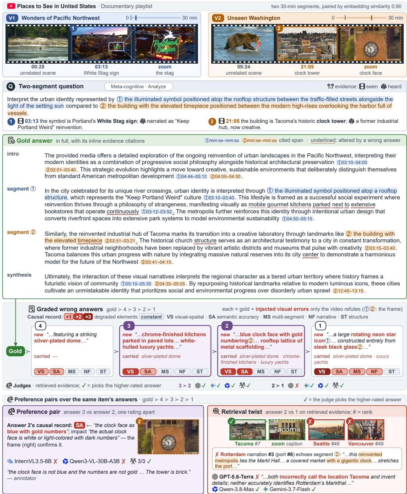  
Figure 6: A detailed PLAYLISTBENCH example, the item of Figure 1 in full. Two 30-minute segments of a Documentary playlist, paired by embedding similarity, each supply one of the question’s two entities, with the gold answer, its four graded wrong answers, and two preference pairs scored over them.

Table 14: Sensitivity to answer position by the judge models.
<table><tr><td rowspan="2"></td><td colspan="3">Consistent (&lt; 25%)</td><td colspan="2">Inconsistent (≥ 25%)</td></tr><tr><td>六 Qwen 3.8-Max</td><td>Gemini 3.7-Flash</td><td>Qwen 3.7-Flash</td><td>2 Gemini 3.5-Flash-Lite</td><td>Gemma 4-26B-A4B</td></tr><tr><td>Input</td><td>8日</td><td>日W</td><td>8</td><td>日w</td><td>8日</td></tr><tr><td>Accuracy, forward (%)</td><td>74.4</td><td>75.4</td><td>67.9</td><td>59.5</td><td>59.6</td></tr><tr><td>Accuracy, reversed (%)</td><td>75.9</td><td>76.7</td><td>68.7</td><td>62.5</td><td>59.8</td></tr><tr><td>Picked A, forward (%)</td><td>49.5</td><td>57.9</td><td>48.5</td><td>67.8</td><td>70.6</td></tr><tr><td>Picked A, reversed (%)</td><td>58.8</td><td>61.4</td><td>52.3</td><td>70.8</td><td>68.4</td></tr><tr><td>Letter agreement (%)</td><td>14.8</td><td>21.6</td><td>22.3</td><td>47.5</td><td>49.1</td></tr><tr><td>Solved in both runs (%)</td><td>67.8</td><td>65.2</td><td>57.2</td><td>37.3</td><td>35.1</td></tr><tr><td>Wrong in both runs (%)</td><td>17.4</td><td>13.2</td><td>20.5</td><td>15.2</td><td>15.7</td></tr></table>

## C.2 EFFECT OF AGENTIC TOOL USE

At the oracle scope of Figure 4, where the judge receives only the two gold segments, Gemini-3.5- Flash-Lite with agentic tool use (Google Team et al., 2026), which fetches its own evidence from the video instead of receiving a fixed sample of frames, reaches 65.9%. That is only 2.0 points above the same model with fixed frames at the same scope (63.9%), and 27.1 points below human agreement (93.0%). Even without retrieval, letting the judge search for itself does not close the gap: finding and reading the deciding moment within a 10–30 minute segment remains hard.

## C.3 CORRELATION WITH LONG-VIDEO UNDERSTANDING

A judge’s accuracy on PLAYLISTEVAL tracks its long-video question answering ability. For the seven judges with a published LVBench score (Wang et al., 2025a), the two accuracies are strongly correlated (Pearson $\bar { r } = 0 . 9 6 , p = 6 . 3 { \times } 1 0 ^ { - 4 }$ ; Figure 7). This suggests that our fully automated generation pipeline recovers the same model ranking as human-annotated benchmarks, while remaining far from saturated (best judge system 75.4% vs. 93.0% human).

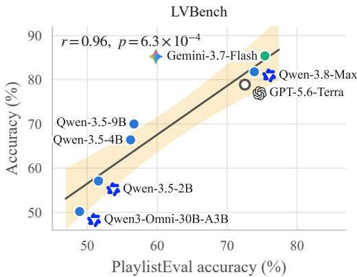  
Figure 7: Accuracy on PLAYLISTEVAL vs. accuracy on LVBench.

## C.4 RETRIEVAL BY SEGMENT

Table 15: Hit@10 by segment: the breakdown behind the Hit@10 column of Table 2; the both, either, and per-segment rates are defined in Appendix B.2. All values in % over the 343 questions. Best per column in bold, second best dashed. Glyphs: video frames, transcript, audio track.
<table><tr><td>Retriever</td><td>Input Both segments</td><td></td><td>Either segment</td><td>Segment 1</td><td>Segment 2</td></tr><tr><td rowspan="3">Qwen3-VL-Embedding-8B</td><td>8日</td><td>37.9</td><td>79.0</td><td>56.9</td><td>60.1</td></tr><tr><td>8</td><td>32.9</td><td>70.3</td><td>51.6</td><td>51.6</td></tr><tr><td>日</td><td>30.0</td><td>69.7</td><td>46.4</td><td>53.4</td></tr><tr><td>C WeMM-Embedding-9B</td><td>8日</td><td>37.6</td><td>76.7</td><td>52.5</td><td>61.8</td></tr><tr><td>六 Qwen3-VL-Embedding-2B @ Omni-Embed-Nemotron-3B</td><td>8日</td><td>32.7</td><td>72.0</td><td>47.5</td><td>57.1</td></tr><tr><td rowspan="3"></td><td>8日</td><td>30.6</td><td>74.9</td><td>51.3</td><td>54.2</td></tr><tr><td>日州</td><td>26.2</td><td>67.9</td><td>47.5</td><td>46.6</td></tr><tr><td>W</td><td>7.3</td><td>37.3</td><td>22.2</td><td>22.4</td></tr></table>

Table 15 splits the Hit@10 of Table 2 into the rate at which each segment is retrieved on its own, and the rate at which at least one of the two arrives. The either-segment rate is the number usually reported as Hit@10; both segments together, which is what a two-segment question needs, is roughly half of it.

## C.5 FRAME BUDGET AND EMBEDDING WIDTH OF THE RETRIEVER

Figure 8 varies two costs of the retriever while holding the rest of the setup fixed. Embedding a chunk from more frames barely helps: going from 4 to 16 frames moves Hit@10 from 35.6 to 37.9 (it peaks at 38.8 with 8 frames) and nDCG@10 from 42.6 to 45.0. The embedding width can be cut much further before it matters. Truncating WeMM-Embedding-9B from 4,096 to 1,024 dimensions costs 0.9 points of Hit@10 at a quarter of the storage; below that the loss grows fast, and at 64 dimensions Hit@10 has fallen by 14.3 points, to 23.3. The full truncation shrinks the float32 vector stored per chunk from 16 KB to 256 B.

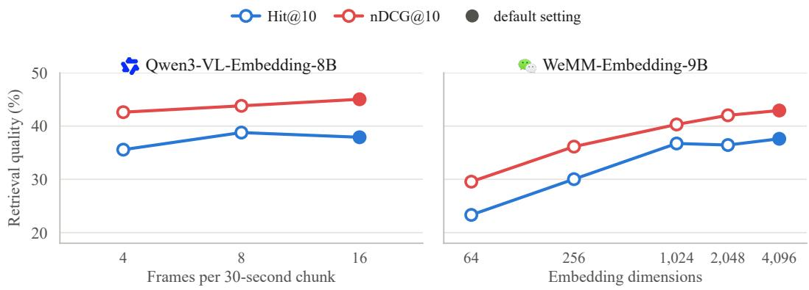  
Figure 8: Frame budget and embedding width of the retriever. Left: Qwen3-VL-Embedding-8B embeds each 30-second chunk from 4, 8, or 16 frames (16 is the default). Right: WeMM-Embedding-9B truncated along its matryoshka dimensions from 4,096 down to 64. Filled markers are each retriever’s default; every point retrieves over the question’s whole domain for the same 343 questions (Hit@10 and nDCG@10 as defined in Appendix B.2).

## C.6 PIXEL BUDGET AND AUDIO SPEED OF THE JUDGE

Table 16: Effect of judge’s image resolution.
<table><tr><td rowspan="2">Setting</td><td rowspan="2">Accuracy</td><td colspan="2">Tokens</td></tr><tr><td>Prompt Output</td><td>USD</td></tr><tr><td>low (base)</td><td>59.5</td><td>84k 1,447</td><td>9.11</td></tr><tr><td>medium</td><td>58.4 (−1.1)</td><td>119k 1,514</td><td>12.48</td></tr><tr><td>high</td><td>60.8 (+1.3)</td><td>186k 1,528</td><td>18.83</td></tr></table>

Table 17: Effect of judge’s audio playback speed.
<table><tr><td rowspan="2">Setting</td><td rowspan="2">Accuracy</td><td colspan="2">Tokens</td></tr><tr><td>Prompt Output</td><td>USD</td></tr><tr><td>1.0× (base) 59.5</td><td></td><td>84k 1,447</td><td>9.11</td></tr><tr><td>1.5×</td><td>60.6 (+1.1)</td><td>68k 1,445</td><td>7.60</td></tr><tr><td>2.0×</td><td>61.1 (+1.6)</td><td>60k 1,441</td><td>6.84</td></tr></table>

Table 18 repeats the pixel-budget sweep of Table 16 on Gemma-4-26B-A4B, which we run on our own GPUs (NVIDIA H200). It pools every frame to the same number of visual tokens (Table 8), so a larger budget only sharpens what it sees before pooling; its accuracy does not improve.

## D FAILURE CASES

Table 18: Pixel-budget on Gemma-4-26B-A4B. Accuracy (%), with the paired difference from the low default in parentheses (percentage points). Best accuracy in bold.
<table><tr><td>Setting</td><td>Max soft tokens</td><td>Accuracy</td></tr><tr><td>low (base)</td><td>280</td><td>59.7</td></tr><tr><td>medium</td><td>560</td><td>57.8 (−1.8)</td></tr><tr><td>high</td><td>1,120</td><td>57.6 (−2.1)</td></tr></table>

Section 4.5 counts how often each kind of error decides a pair. Figures 9 to 12 show one pair of each kind in full. Each panel shares the following layout.

The header names the domain, playlist, segment similarity, and the pair’s rating gap. A banner below it labels the error type and how many of the four strongest judges it affected. A five-step chain (in the video, retrieved, sampled, read, weighed) marks the first step at which the deciding evidence was lost: retrieval and sampling are delivery steps, while reading and weighing are the judge’s own reasoning.

The two segment blocks each show a timeline with ticks for every served frame, the deciding moment highlighted in green (served) or red (missed), the entity each segment identifies, and zoomed thumbnails of the key evidence. Below them, the two-segment question is shown with entity names withheld, as the judge must resolve them from the video alone.

The bottom panel shows the span where the two answers differ over the deciding evidence, the four judges’ verdicts, and a diagnosis of the failure.

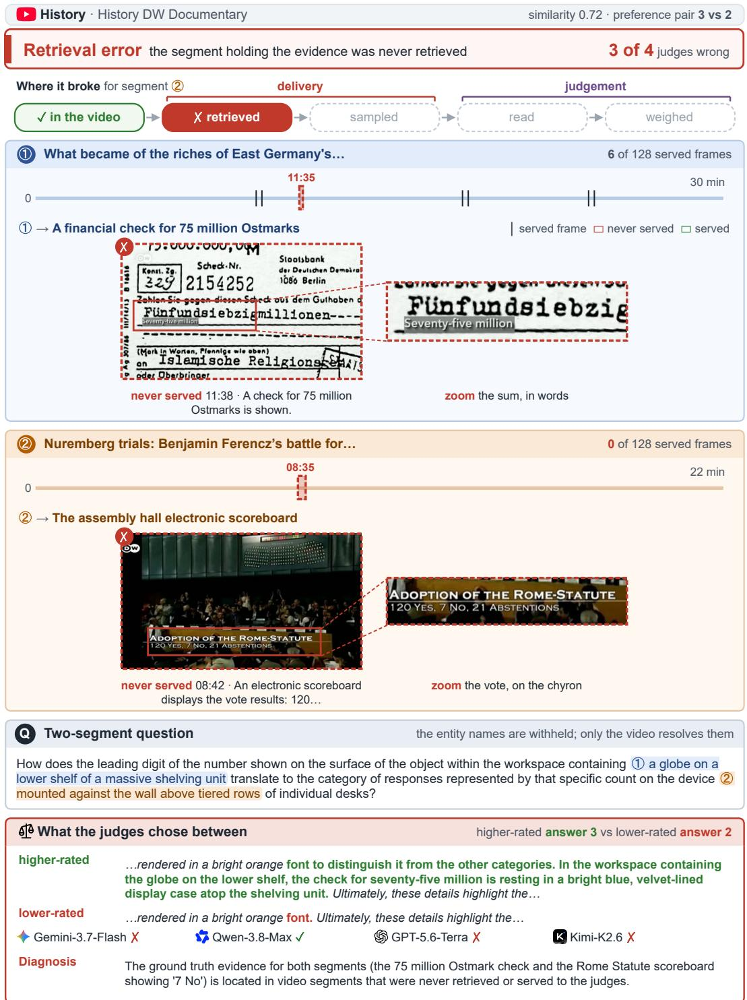  
Figure 9: Retrieval error. A History pair, answers 3 versus 2, that three of the four judges lost. The question bridges the leading 7 of a 75-million-Ostmark cheque in segment ⃝1 to the 7 no votes on the Rome Statute scoreboard in segment ⃝2 . Segment ⃝2 was never retrieved, and none of the six frames served from segment ⃝1 lands on the cheque, so neither number reached the judges; only Qwen-3.8-Max chose the higher-rated answer.

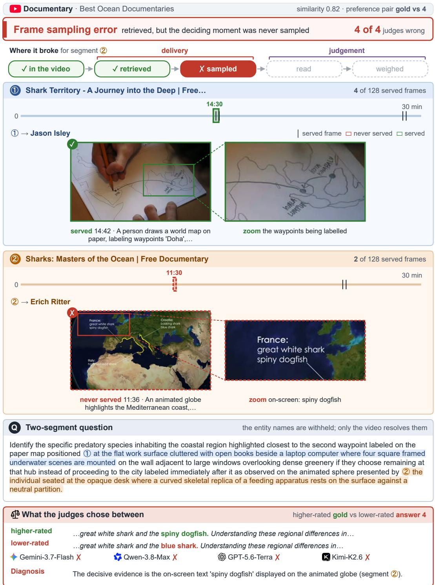  
Figure 10: Frame sampling error. A Documentary pair, the gold answer versus answer 4, that all four judges lost. Both segments were retrieved, but none of the 128 sampled frames lands on the deciding moment — the on-screen label spiny dogfish at 11:36 in segment ⃝2 — so the judges fell back on the transcript, which names a different species in an unrelated passage.

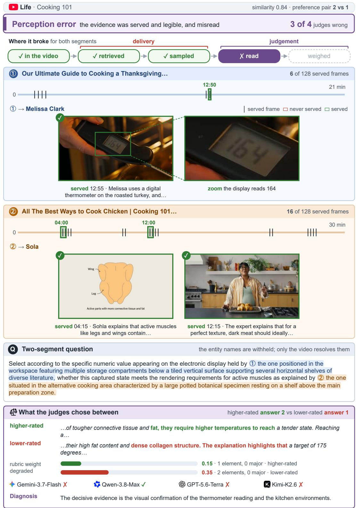  
Figure 11: Perception error. A Life pair, answers 2 versus 1, that three of the four judges lost. The deciding evidence is present and legible — a served frame at 12:55 shows a handheld probe thermometer reading 164 over the roasted bird — yet the judges misread the display, and three preferred the answer whose account of it is wrong.

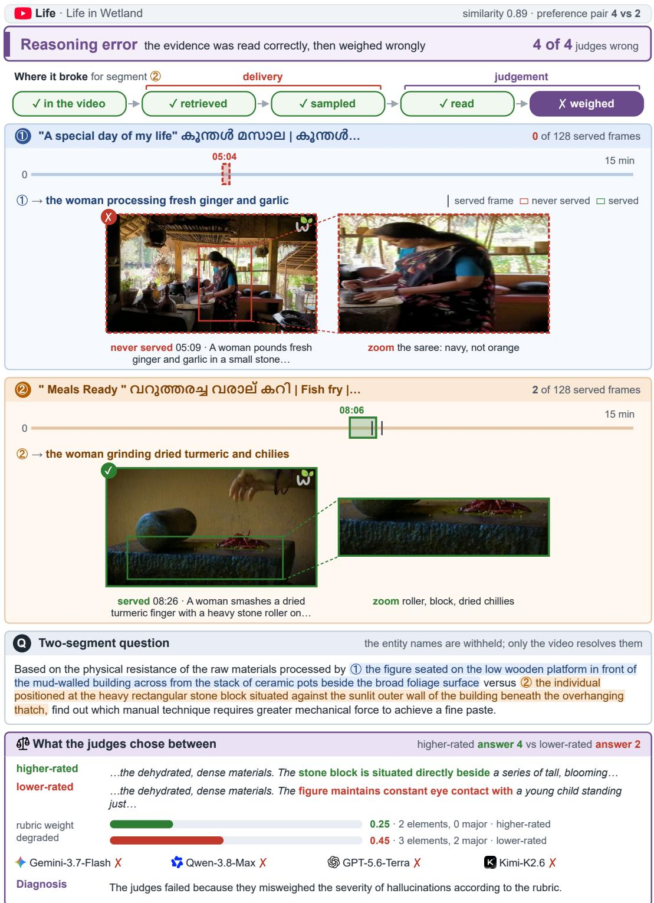  
Figure 12: Reasoning error. A Life pair, answers 4 versus 2, that all four judges lost. A served frame lands on the grinding sequence in segment ⃝2 , which shows neither the purple flowering plant nor the child that the lower-rated answer describes — its two major fabrications. By the generator’s own rubric that answer is degraded on 0.45 of the weight and the higher-rated one on 0.25 with no major element, yet all four judges preferred the lower-rated answer.

Table 19: Cost to generate a question, by domain. Spend is the domain’s total API cost, and pooled and mean are two per-question averages of it (defined in the text). All figures are in US dollars.
<table><tr><td colspan="5"></td><td colspan="2">Per question ($)</td></tr><tr><td>Domain</td><td>Runs</td><td>Questions</td><td>Spend ($)</td><td>Pooled</td><td> $\mathrm { M e a n } \pm \mathrm { s d }$ </td><td>Range</td></tr><tr><td>Art</td><td>5</td><td>56</td><td>57.37</td><td>1.02</td><td> $1 . 0 5 \pm 0 . 1 6$ </td><td>0.80-1.22</td></tr><tr><td>Documentary</td><td>4</td><td>47</td><td>47.04</td><td>1.00</td><td> $1 . 0 2 \pm 0 . 2 1$ </td><td>0.83-1.29</td></tr><tr><td>Drama</td><td>4</td><td>49</td><td>39.01</td><td>0.80</td><td> $0 . 8 3 \pm 0 . 1 3$ </td><td>0.71-1.00</td></tr><tr><td>Education</td><td>4</td><td>62</td><td>60.54</td><td>0.98</td><td> $0 . 9 7 \pm 0 . 0 9$ </td><td>0.90-1.09</td></tr><tr><td>History</td><td>5</td><td>47</td><td>49.25</td><td>1.05</td><td> $1 . 1 7 \pm 0 . 3 0$ </td><td>0.75-1.54</td></tr><tr><td>Life</td><td>4</td><td>65</td><td>46.20</td><td>0.71</td><td> $0 . 6 4 \pm 0 . 1 3$ </td><td>0.52–0.79</td></tr><tr><td>Podcast</td><td>4</td><td>50</td><td>53.04</td><td>1.06</td><td> $1 . 1 0 \pm 0 . 1 1$ </td><td>0.99-1.25</td></tr><tr><td>All</td><td>30</td><td>376</td><td>352.45</td><td>0.94</td><td></td><td></td></tr></table>

Table 20: Cost to generate a question, by model. Tokens counts prompt and output together, and per question divides a model’s spend by all 376 accepted questions. All figures are in US dollars.
<table><tr><td>Model</td><td>Tokens</td><td>Spend ($)</td><td>Share (%)</td><td>Per question ($)</td></tr><tr><td>Gemini-3-Flash</td><td>518M</td><td>165.34</td><td>46.9</td><td>0.440</td></tr><tr><td>Qwen-3.7-Plus</td><td>189M</td><td>154.75</td><td>43.9</td><td>0.412</td></tr><tr><td>Gemini-3.1-Pro </td><td>4M</td><td>16.61</td><td>4.7</td><td>0.044</td></tr><tr><td>GPT-5.4</td><td>3M</td><td>12.84</td><td>3.6</td><td>0.034</td></tr><tr><td>GPT-5.4-mini</td><td>3M</td><td>2.90</td><td>0.8</td><td>0.008</td></tr><tr><td>All</td><td>717M</td><td>352.44</td><td>100.0</td><td>0.937</td></tr></table>

## E COST ANALYSIS

As long-video input is quite costly, we analyze the cost of our data generation process with details of each pipeline stage including the retries.

## E.1 DATA GENERATION COST

Building the benchmark cost \$352.45 in API calls, or \$0.94 per accepted question. That figure is the whole bill divided by the questions that survived: retries and the candidates a gate rejected are paid for too, and are included here. Table 19 breaks it down by domain and Table 20 by model. Two models carry almost all of it, and both are the ones that read native video: question and wronganswer generation with Gemini-3-Flash, and the video-grounded checks with Qwen-3.7-Plus. The text-only verifiers, which see a transcript or nothing at all, together account for under a tenth.

In Table 19, pooled divides a domain’s spend by its accepted questions, while mean averages the per-question cost across its runs (batches), counting a small run the same as a large one. In Table 20, tokens counts prompt and output together and per question divides a model’s spend by all 376 accepted questions; the rounded per-model figures sum to a cent below the \$352.45 total.

## E.2 DOWNSTREAM EVALUATION COST

Scoring the benchmark once with all seventeen judges cost \$340.16: \$245.39 for the hosted models and \$94.77 of GPU time, 23.7 NVIDIA H200 GPU-hours, for the ones we run ourselves locally. Table 21 gives it per judge, in the groups and order of Table 1, with each of the 17 judges scoring all 630 pairs on retrieved evidence. Only this main run is counted here and each ablation is a further pass of the same kind.

Table 21: Cost of one pass over the benchmark, per judge. A hosted judge is billed for the tokens it reads and writes, and a locally served judge for the GPU time it occupies (at \$4 per NVIDIA H200 GPU-hour), so each row fills one column or the other. Spend is in US dollars.
<table><tr><td>Judge Tokens</td><td>GPU-hours</td><td>Spend ($)</td></tr><tr><td colspan="3">Hosted API models (general-purpose) Gemini-3.7-Flash 53.9M</td></tr><tr><td>1 Gemini-3.1-Pro 67.5M 一 Gemini-3.5-Flash-Lite 54.0M</td><td></td><td>21.44 82.21 9.11</td></tr><tr><td>Qwen-3.8-Max Qwen-3.7-Flash</td><td>32.4M 34.5M</td><td>33.92 4.32</td></tr><tr><td colspan="3">GPT-5.6-Terra 23.5M</td></tr><tr><td>Kimi-K2.6 46.2M Open-weight local models (general-purpose)</td><td></td><td>68.60</td></tr><tr><td>Gemma-4-26B-A4B Gemma-4-E2B</td><td>3.9</td><td>15.50</td></tr><tr><td>Gemma-4-E4B</td><td>0.9 0.4</td><td>3.61</td></tr><tr><td></td><td></td><td>1.69</td></tr><tr><td>Qwen-3.5-9B</td><td>6.2</td><td>24.61</td></tr><tr><td>Qwen-3.5-4B</td><td>4.9</td><td>19.56</td></tr><tr><td>Qwen-3.5-2B</td><td>2.6</td><td>10.51</td></tr><tr><td>Qwen3-Omni-30B-A3B</td><td>1.2</td><td>4.83</td></tr><tr><td>Open-weight local models (fine-tuned as judges)</td><td></td><td></td></tr><tr><td>InternLM-XComposer-2.5-Reward</td><td>0.6</td><td>2.55</td></tr><tr><td></td><td></td><td></td></tr><tr><td>CMU VideoJudge-3B</td><td>0.2</td><td>0.97</td></tr><tr><td>CMU VideoJudge-7B</td><td>2.7</td><td>10.92</td></tr><tr><td>All 312.1M</td><td>23.7</td><td>340.16</td></tr></table>

## F HUMAN EVALUATION DETAILS

To reduce the burden of watching long videos, we retrieve the key moments corresponding to each part of the question and each answer sentence using Qwen-3.7-Plus from both video segments in a preference pair; Appendix G.3 gives the prompt it is asked this with and the schema of its response. Moreover, we underline the differences between two answers in each preference pair to spot subtle changes in text, with the option to toggle by the annotators.

We have collected 87 hours of human annotation with median time spent 7 to 11 minutes across workers. The annotators received 8.23 USD per hour on average, which is higher than the federal minimum wage in the US.

We restrict the task to workers who meet four Amazon Mechanical Turk qualifications: a lifetime HIT approval rate of at least 95%, at least 1,000 approved HITs, residence in a majority-Englishspeaking country (Australia, Canada, New Zealand, the United Kingdom, or the United States), and the Masters qualification granted by Amazon. To further improve the annotation quality, we include 10% attention check samples, trivial questions with straightforward answers, and we discard the ratings of any worker who fails it.

We summarize the study in Table 22. The three annotators of a pair agree with each other at α = 0.781, and 93.0% of the individual ratings fall on the answer PLAYLISTEVAL intends to win. Taking the majority of a pair’s ratings, 147 of the 152 pairs side with the benchmark and five overturn it. Neither slot is favoured, so the position preference the judges show (Table 14) is a property of the judges rather than of the task.

The task as a worker sees it is shown in Figures 13, 14 and 15: the instructions and payment terms, the question with its evidence video and the two answers, and the decision and written explanation the worker submits.

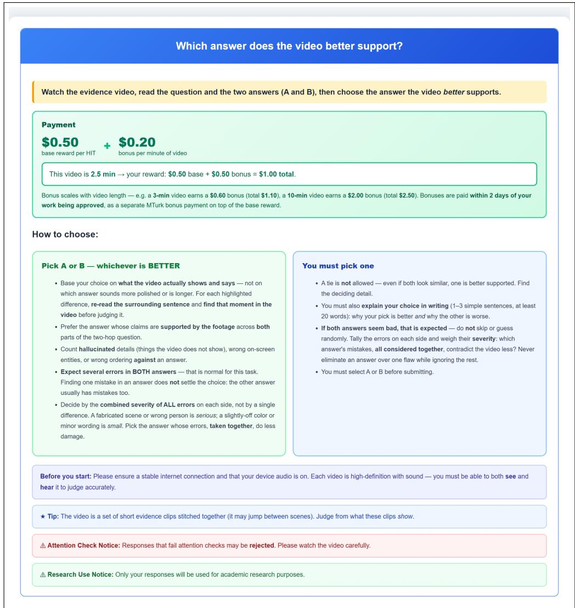  
Figure 13: Annotation task on Amazon Mechanical Turk, part 1 of 3: what the worker is asked to do, what it pays, and how to choose between the two answers.

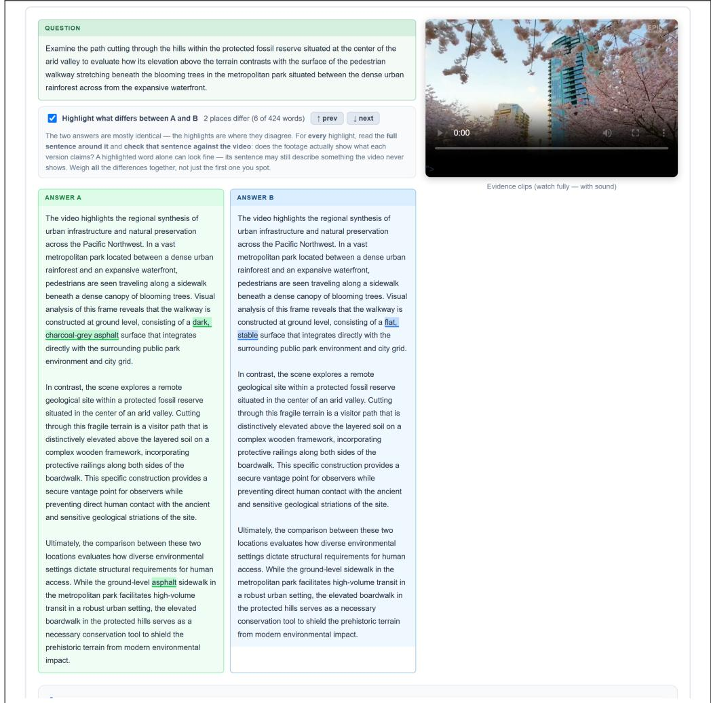  
Figure 14: Part 2 of 3: the two-segment question with the evidence video beside it, and the two answers. Differences between the answers are highlighted and can be stepped through, so a worker compares only the few places where they disagree rather than re-reading both in full.

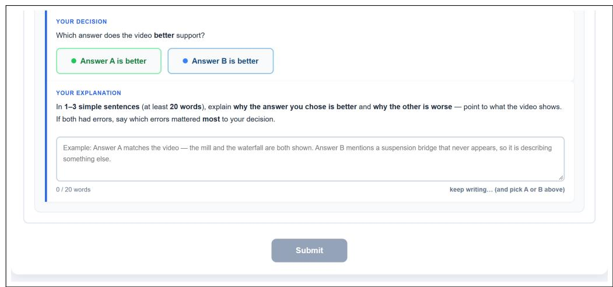  
Figure 15: Part 3 of 3: the forced choice between the two answers, and the written explanation of at least 20 words that a worker must give before submitting.

Table 22: Summary of human evaluation. Each pair was a forced A/B choice shown to three annotators, with the benchmark’s intended answer placed in a random slot. The middle block reports agreement among the annotators, the last block agreement with the intended answer (per rating and per pair majority), and the final row the share of ratings per slot.
<table><tr><td>Statistic</td><td>Value</td></tr><tr><td>Study</td><td></td></tr><tr><td>Pairs</td><td>152</td></tr><tr><td>Valid ratings</td><td>456</td></tr><tr><td>Attention checks passed</td><td>40/40</td></tr><tr><td>Agreement between annotators</td><td></td></tr><tr><td>Krippendorff&#x27;s α (Krippendorff, 2011)</td><td>0.781</td></tr><tr><td>Unanimous pairs (3 of 3)</td><td>126</td></tr><tr><td>Agreement with the intended preference</td><td></td></tr><tr><td>Ratings that agree (%)</td><td>93.0</td></tr><tr><td>Majority agrees</td><td>147 (96.7%)</td></tr><tr><td>Majority overturns</td><td>5 (3.3%)</td></tr><tr><td>Answer position</td><td></td></tr><tr><td>Preferred slot A/B (%)</td><td>49.8/50.2</td></tr></table>

## G PROMPTS

## G.1 REWARD MODEL EVALUATION PROMPT

Every judge in the meta-evaluation (block G of Figure 2) receives the prompt below, and the difficulty gate (block F) runs InternVL3.5-8B and Qwen3-VL-30B-A3B on the same prompt. Following Luo et al. (2025); Lambert et al. (2025), the judge is shown two answers to one question, one ranked above the other in the intended order, and must pick the better one; a tie is not accepted. The frames are attached to the request. The transcript block is sent only when the judge input includes the transcript, as it does by default for every judge that does not receive audio (Table 8). The verdict is the [[A]] or [[B]] in the reply. In the meta-evaluation, which answer appears as Model A is drawn once per pair with a shared seed, so every judge sees a given pair the same way round, and a reply without a verdict, whether unparsed output or a provider’s refusal, is credited at chance.

## Pairwise judging

Blocks F and G · InternVL3.5-8B and Qwen3-VL-30B-A3B (F), every judge of Table 7 (G) · input: frames, with the transcript or the audio of their segments

You are an expert video understanding evaluator. You are shown frames sampled from a set of short video segments retrieved from a video library — they are NOT one clip per hop, they are not in a guaranteed order of relevance, and some may be irrelevant to the question. Together they may or may not contain what is needed to answer BOTH hops. You are given the two-hop question and two candidate answers to it (from Model A and Model B). Act as an impartial judge and decide which answer is better, grounding EVERY judgement in what the frames actually show and say — not in surface plausibility. If the frames do not show something an answer asserts, treat that assertion as unsupported rather than assuming a segment you were not shown covers it.

## Two-hop question:

<question> {{question}} </question>

sent only when the judge input includes the transcript

Transcript (dialogue from the retrieved segments):

<transcript> {{transcript}} </transcript>

## Model A’s answer:

<answer model a> {{answer a}} </answer model a>

Model B’s answer:

<answer model b>

{{answer b}}

</answer model b>

Evaluate both answers against these standards:

1. [Instruction Following]: The answer closely follows the question and directly addresses the specified two-hop task.

2. [Accuracy]: The answer uses the frames faithfully — correct events, on-screen entities, and the order in which they appear across BOTH hops and the bridge between them; no hallucinated visual/audio details, no actions attributed to the wrong subject or phase; contextually coherent with precise terminology.

3. [Relevance]: The answer is comprehensive and on-topic, covering both hops and their connecting bridge without straying, and offering the detail the question calls for.

4. [Helpfulness]: The answer gives clear, valuable information that actually resolves the question, avoiding vague or irrelevant content.

```handlebars
You MUST choose one answer. A tie is not an option. Even when the two answers look similar in
quality — both strong, both weak, or both partly unsupported by the frames — one of them is still better
on the standards above. Find the discriminating detail and commit to it: a claim one answer grounds in
the frames and the other does not, a hop one covers and the other skips, a hallucinated entity, a wrong
ordering across the bridge. Do NOT say both are good, do NOT say neither is good, and do NOT decline
to choose.
Avoid any position biases and ensure that the order in which the answers were presented does not influence
your decision. Do not allow the length of an answer to influence your evaluation — a longer answer is
not a better one, and extra detail that the frames do not support counts against it, not for it. Be as objective
as possible.
Follow these steps for your judgement:
• Step 1: Analyze which answer is better on [Instruction Following].
• Step 2: Analyze which answer is better on [Accuracy].
• Step 3: Analyze which answer is better on [Relevance].
• Step 4: Analyze which answer is better on [Helpfulness].
• Step 5: From Steps 1-4, determine the overall winner. If the four standards are split, weigh [Accuracy]
highest — grounding in the frames is what this task is testing. The outcome is either Model A or
Model B; there is no third option. Emit it as [[A]] or [[B]].
Respond strictly in the following format:
‘‘‘[Instruction Following]
[Your Analysis]
111
‘‘‘[Accuracy]
[Your Analysis]
‘‘‘[Relevance]
[Your Analysis]
‘‘‘[Helpfulness]
[Your Analysis]
‘‘‘[Overall Judge]
[[A]] if assistant A is better, [[B]] if assistant B is better.
slotformats
{{answer a}} and {{answer b}} are the two answers with their citations removed.
{{transcript}} has one line per segment, in the order of the frames; i numbers the source videos by
first appearance, and mm:ss is where the segment starts in its video:
[Video i @ mm:ss] <transcript of the segment>
```

## G.2 DATA GENERATION PROMPTS

This section gives every prompt of the data pipeline, in the order of Figure 2, each followed by the schema of the response it must return. Table 23 maps each block of the figure to its model and prompt. The wording inside each prompt box is the prompt as sent; Markdown emphasis, headings and bullets in the templates are rendered as typography. Slots such as {{question}} are filled for each request, and marked dividers show text added to a template at run time. Every call returns JSON constrained by a response schema, passed to Gemini models as a JSON schema and to the GPT and Qwen models as a strict JSON schema. Each schema box shows the typed field tree and then the field descriptions verbatim, because the model reads those descriptions too, and for question generation and wrong-answer generation they carry much of the specification.

## G.2.1 TWO-SEGMENT QA GENERATION (B)

Gemini-3-Flash receives the two paired 30-minute clips as native video sampled at 0.5 fps, each introduced by a marker (---Here is Clip 1:---, ---Here is Clip 2:---), followed by the prompt below. The model answers in a structured format whose field descriptions carry most of the question and answer specification; the schema box after the prompt gives them in full. The keyword {{question type word}} is drawn per request, uniformly over the Understand, Apply, Analyze and Evaluate columns of the knowledge dimension matrix.

Table 23: Steps of the data pipeline, by block of Figure 2, with the model that runs each step and its prompt. Blocks C1 and D2 are rule-based and call no model.
<table><tr><td>Block</td><td>Step</td><td>Model</td><td>Prompt</td></tr><tr><td>B</td><td>Two-segment QA generation</td><td>Gemini-3-Flash</td><td>G.2.1</td></tr><tr><td>C1</td><td>Structural checks</td><td></td><td></td></tr><tr><td rowspan="4">C2</td><td>Transcript test: transcript-only answer verification of that answer</td><td>Gemini-3-Flash GPT-5.4-mini</td><td>G.2.2 G.2.4</td></tr><tr><td>Parametric test: answer, combination A</td><td>Gemini-3-Flash</td><td>G.2.3</td></tr><tr><td>verification, combination A</td><td>GPT-5.4</td><td>G.2.4</td></tr><tr><td>Parametric test: answer, combination B</td><td>GPT-5.4-mini</td><td>G.2.3</td></tr><tr><td></td><td>verification, combination B</td><td>Gemini-3.1-Pro</td><td>G.2.4</td></tr><tr><td>C3</td><td>Video grounding</td><td>Qwen-3.7-Plus</td><td>G.2.5</td></tr><tr><td>D1</td><td>Graded wrong answers</td><td>Gemini-3-Flash</td><td>G.2.6</td></tr><tr><td>D2</td><td>Structural checks</td><td></td><td></td></tr><tr><td>D3</td><td>Ranking without the video</td><td>Gemini-3.1-Pro and GPT-5.4</td><td>G.2.7</td></tr><tr><td>D4</td><td>Ranking with the video</td><td>Qwen-3.7-Plus</td><td>G.2.8</td></tr><tr><td>E</td><td>Regeneration feedback</td><td>appended to the B and D1 prompts</td><td>G.2.9</td></tr></table>

## Two-segment QA generation — prompt

Block B · Gemini-3-Flash · input: two clips as video

## Role

You are an expert video analyst and educational content designer specializing in multi-hop reasoning.

## Task

Generate one diverse, complex, two-hop question that require synthesizing information from two distinct video segments. These video segments are the part of a large video database on a specific topic.

## Output Requirements

• JSON Format: Must be a strictly valid JSON object.

• Timestamps: Provide start time and end time in seconds. This duration must contain necessary information to understand the question context and the answer to the corresponding question.

• Clip IDs: Use 1-indexed video indices.

<table><tr><td>The Knowledge Dimension</td><td>1 Remember</td><td>2 Understand 3 Apply</td><td></td><td>4Analyze</td><td>5 Evaluate</td></tr><tr><td>A Factual</td><td>name, list, define, label</td><td>restate, order</td><td>state, determine</td><td>distinguish, classify</td><td>select according to</td></tr><tr><td>B Conceptual</td><td>identify, locate</td><td>e describe, explain</td><td>illustrate, show</td><td>examine, analyze</td><td>rank, compare</td></tr><tr><td>C Procedural</td><td>tell, describe</td><td>summarize, translate</td><td>solve, demonstrate</td><td>deduct, diagram</td><td>conclude, choose</td></tr><tr><td>D Meta Cognitive</td><td></td><td>interpret, paraphrase</td><td>find out, use</td><td>infer, examine jutsify, judge</td><td></td></tr></table>

The keywords in the Knowledge Dimension Matrix indicate the level of complexity within a search query. While simpler questions are located at the top left, more complex questions are positioned on the bottom right of the table. Please formulate diverse and more complex questions requiring multi-hop reasoning.

## Contextual Identification Protocol

• Zero Nominal Reference: Do not use pronouns, names, or formal titles.

• Environmental Anchoring: Refer to participants only by their position relative to fixed landmarks (e.g., “the one positioned between the flickering lamp and the open doorway”).

• Attribute Exclusion: Strictly avoid describing what an entity looks like, wears, is doing, is acting or is made of. The viewer must deduce “who” or “what” based solely on where they are and within the shot. For example, you MUST avoid the COLOR.

• Anti-Generic Detail: Use hyper-specific environmental cues that exist only in this specific sequence to ensure the video is the only key to the description.

• Process: Find a scene, observe the people, entities or objects in this scene. Describe/outline the scene information in the question stem.

• Example Question stem: On the red wooden table, there is an iron grid rack with a glass bowl containing four rolls of food. In the frame, there is a brush covered with yellow liquid decorating them.

appended at run time: the transcript of both clips

## Audio transcript of the clips (everything SPOKEN in the two videos)

```handlebars
{{transcript}}
```

## CRITICAL — visual grounding requirement

The generated question AND its answer MUST require WATCHING the video. The transcript above is the complete spoken audio. Your question+answer must NOT be answerable from this transcript alone, nor from general world knowledge — the answer must depend on VISUAL details shown on screen but NOT stated in the transcript (e.g. colours, spatial layout, gestures, on-screen objects/text, who or what appears). Do not merely restate what is said.

## Two-segment QA generation — response schema

Structured output Recipe, enforced as a JSON schema; its field descriptions, below the tree, are read by the model together with the prompt

Recipe   
qa\_pairs : list of QA\_Pair   
question : string   
answer : string   
question\_type : { row : "Factual" | "Conceptual" | "Procedural" | "Meta   
,→ Cognitive",   
column : "Remember" | "Understand" | "Apply" | "Analyze" | "   
,→ Evaluate" }   
bridge : string   
hop\_1 : string   
hop\_2 : string   
scene\_references : list of { scene\_description : string, actual\_entity\_name : string   
,→ }   
clip\_ranges : list of { clip\_id : integer, start\_time : integer,   
end\_time : integer, qa\_reference : string }

## field descriptions

## qa pairs List of QA pairs.

• Linguistic Architecture

• Entity Diversity: Each QA pair must focus on different objects, people, or concepts to ensure zero repetition.

• Unified Media Perspective

• Single Entity Rule: Treat all provided clips as one single video.

• Terminology: Use only “the video,” “the scene,” “the frame,” or “the shot.”

• Prohibited References: Never use “Video 1,” “first lecture,” “second clip,” or any term implying the media is split.

## Each QA pair

question Question stem sentence(s), followed by a multihop question.

• Forbidden Terms: You must not use the word “and” in any question.

• Forbidden Syntax: Avoid semicolons or comma-splices used to mimic the word “and.”

• Question Specifications

• Draft as a single, grammatically correct sentence without the word “and.”

• Temporal Distance: The two segments used for each question must be at least 4 minutes apart.

• The “Two-Hop” Logic:

• Hop 1: Extract a specific fact or concept from Video A.

• Bridge: Connect that fact to a related concept in Video B.

• Hop 2: Derive the final answer based on the interaction of both facts.

• Complexity: Target the bottom-right of the Knowledge Dimension Matrix (Analyze, Evaluate, Meta-Cognitive).

## Multi-Hop QA Generation Tasks

## • Question 1: The Justification Query

• Keyword Requirement: The question must include the word “{{question type word}}”.

• Multi-Hop Logic:

• Hop 1: Information must originate from the Clip 1.

• Hop 2: Information must originate from the Clip 2.

• Anti-Generic Detail: Use hyper-specific environmental cues that exist only in this specific sequence to ensure the video is the only key to the description.

• Detailed Scene Description: Give detailed description of the scene surrounding the entity. Avoid very short and vague descriptions. Use at least 20 words per entity.

• Attribute Exclusion: Strictly avoid describing what an entity looks like, wears, is doing, is acting or is made of. The viewer must deduce “who” or “what” based solely on where they are and within the shot. For example, you MUST avoid the color, organs or any direct physcial attribute.

answer Task: Comprehensive Video Answer Synthesis. Objective: Generate a detailed, long-form summary of the provided video content, organized into distinct thematic paragraphs.

1. Citation Formatting Constraints. You MUST cite the video source for every claim made. Use the following strict format for timestamp ranges:

• Format: (video-id @ MM:SS - MM:SS) — the 1-indexed clip id, then @, then a start - end range in MM:SS.

• Multiple ranges: comma-separate them inside one bracket, repeating video-id @ whenever the clip changes, e.g. (1 @ 04:20 - 05:15, 2 @ 10:02 - 13:32).

• One clip per range: each start - end range belongs to a SINGLE clip. NEVER mix two clips in one range (do NOT write (1 @ 04:20 - 2 @ 05:15)).

• Placement: Brackets must be placed only at the end of the sentence or section they support.

• Example: “The speaker argues that renewable energy costs have plummeted significantly (1 @ 04:20 - 05:15).”

2. Structural Requirements.

• Multi-Paragraph Format: Do not use bullet points for the main body. Use 3-5 distinct paragraphs to group related concepts.

• Introduction: Briefly state the primary topic and the speaker’s core thesis.

• Deep Dive: Summarize the specific evidence, data, or narrative sequences presented in the footage.

• Conclusion: Summarize the final takeaways or calls to action provided at the end of the video.

3. Content Accuracy. Summarize only the information retrieved from the video. Do not add outside information. Ensure the summary is cohesive and maintains the original context of the discussion.

question type Type of question as per the Knowledge Dimension Matrix (row: Factual, Conceptual, Procedural or Meta Cognitive; column: Remember, Understand, Apply, Analyze or Evaluate).

## bridge Logical bridge between hops. hop 1 First hop. hop 2 Second hop.

scene references Scene references where entity has been encoded with the scene-referred surrounding description in the QA pair with decoded identity. Each gives scene description (the scence-referred hint or description used in the question) and actual entity name (the real identity of the entity).

clip ranges Comprehensive list of clip ranges for covering all the references to the question context and answer. Each gives clip id (1-indexed video index), start time (absolute start time (adding start offset) in seconds where any reference to the question context and/or answer begins), end time (absolute end time (adding start offset) in seconds covering a particular reference to the question context and answer from the start time) and qa reference (the reference to the question context and/or answer).

## G.2.2 TRANSCRIPT-ONLY ANSWER (C2)

The transcript-shortcut check asks whether a question can be answered without the video. Gemini-3-Flash answers from transcripts alone; GPT-5.4-mini then compares that answer with the gold answer using the verification prompt of Appendix G.2.4. To make the relevant passage harder to locate, each segment’s own 30-minute transcript is placed among two further 30-minute windows from a different video of the playlist, in an order shuffled per item.

```handlebars
Transcript-only answer
Block C2 · Gemini-3-Flash · input: text only
Task: Comprehensive Answer Synthesis (Transcript-Grounded)
Objective: Answer the given question using ONLY the provided transcript(s). Do not use outside knowl
edge and do not infer visual details that are not stated in the transcript. Organize the answer into distinct
thematic paragraphs.
Structural Requirements
• Multi-Paragraph Format: Do not use bullet points for the main body. Use 3-5 distinct paragraphs to
group related concepts.
• Transcript Grounding: Base every claim on the transcript text. If the transcript does not contain the
information needed to answer, state that plainly rather than guessing.
Output Fields (return JSON)
• explanation: FIRST, briefly reason about the question — identify the two hops it spans and how the
transcript connects them. This is your scratchpad; it is not part of the answer.
• answer: THEN write the transcript-grounded answer as described above (3-5 paragraphs). Do not
restate the explanation or add any prelude/follow-up.
Transcript
{{transcript}}
Question
{{question}}
```

Transcript-only answer — response schema   
Structured output GeneratedAnswer, enforced as a JSON schema; the explanation comes first so the   
model reasons before it answers   
GeneratedAnswer   
explanation : string   
answer : string   
field descriptions   
explanation Reasoning: identify the two hops the question spans and how they connect, before   
writing the answer. Not shown to the verifier.   
answer The detailed, long-form answer: 3-5 distinct thematic paragraphs, no bullet points.  
G.2.3 PARAMETRIC ANSWER (C2)

The parametric-recall check asks whether a question can be answered from memory, with neither the video nor its transcript. It runs in two combinations with the generator and verifier swapped: Gemini-3-Flash answers and GPT-5.4 verifies (combination A), and GPT-5.4-mini answers and Gemini-3.1-Pro verifies (combination B). A question is rejected only when both combinations judge the memory-only answer correct. Both generators receive the same prompt.

Parametric answer   
Block C2 · combination A: Gemini-3-Flash · combination B: GPT-5.4-mini · input: the question only   
Task: Comprehensive Answer Synthesis   
Objective: Generate a detailed, long-form answer to the given question, organized into distinct thematic   
paragraphs, using your own parametric knowledge.   
Structural Requirements   
• Multi-Paragraph Format: Do not use bullet points for the main body. Use 3-5 distinct paragraphs to   
group related concepts.   
• Introduction: Briefly state the primary topic and the core thesis.   
• Deep Dive: Summarize the specific evidence, data, or narrative.   
• Conclusion: Summarize the final takeaways or calls to action.   
Output Fields (return JSON)   
• explanation: FIRST, briefly reason about the question — identify the two hops it spans and how they   
connect. This is your scratchpad; it is not part of the answer.   
• answer: THEN write the answer as described above (3-5 paragraphs). Do not restate the explanation   
or add any prelude/follow-up.   
Question:   
{{question}}

Parametric answer — response schema   
Structured output GeneratedAnswer, the same as for the transcript-only answer (Appendix G.2.2);   
only its answer field reaches the verifier   
GeneratedAnswer   
explanation : string   
answer : string   
field descriptions   
explanation Reasoning: identify the two hops the question spans and how they connect, before   
writing the answer. Not shown to the verifier.   
answer The detailed, long-form answer: 3-5 distinct thematic paragraphs, no bullet points.  
G.2.4 ANSWER VERIFICATION (C2)

One verification prompt serves all three shortcut checks. It compares the answer produced without the video, from the transcript (Appendix G.2.2) or from memory (Appendix G.2.3), with the gold answer. A Yes means the shortcut succeeded. In the transcript check a single Yes rejects the question; the parametric check rejects it only when both combinations return Yes.

Answer verification   
Block C2 · transcript test: GPT-5.4-mini · parametric test: GPT-5.4 (combination A), Gemini-3.1-Pro   
(combination B) · input: text only   
You are an expert evaluator assessing the accuracy of an AI’s predicted answer against a ground-truth   
reference answer for a complex multi-hop question.   
Both the Reference Answer and the Predicted Answer may be long-form text. Your task is to extract the   
core factual claims and determine if the predicted text successfully resolves the multi-hop logic without   
introducing fatal contradictions.   
Evaluation Criteria:   
1. Deconstruct the Truth: Analyze the Reference Answer and identify the core factual conclusion neces  
sary to answer the multi-hop question.

2. Scan the Prediction: Read through the long-form Predicted Answer to locate where (or if) it addresses those core facts.

• Match (Yes): The predicted answer explicitly states the core factual truth found in the reference. Ignore extra verbosity, tangential information, or conversational filler, provided the core truth is present and unequivocally supported by the text.

• Mismatch (No): The predicted answer fails to include the core truth, completely misses one of the necessary logical “hops”, or includes a direct contradiction that negates the correct information.

```handlebars
Input
Question
{{question}}
Reference Answer
{{reference answer}}
Predicted Answer
{{predicted answer}}
```

Answer verification — response schema   
Structured output QueryJudgement, enforced as a JSON schema; the explanation precedes the verdict   
QueryJudgement   
explanation : string   
judgement : "Yes" | "No"   
field descriptions   
explanation Reasoning identifying the core facts in the reference, mapping them to the long-form   
prediction, and noting any contradictions.   
judgement Whether the prediction is factually consistent with the reference answer for the question.

## G.2.5 VIDEO GROUNDING (C3)

Qwen-3.7-Plus receives the prompt first and then, for each segment, the full 30-minute source video (resized to fit 640 × 480, audio removed, sampled at 0.5 fps) followed by its complete transcript, labelled as shown at the end of the box. The question’s own two-segment decomposition, written by the generator in Appendix G.2.1, is added as a checklist to verify rather than to trust. An item is kept only when both verdicts are Yes.

## Video grounding

Block C3 · Qwen-3.7-Plus · input: two full videos and their transcripts

You are a video content analyst. You will receive video segments with their audio transcripts.

You are given a two-hop QUERY and its proposed ANSWER. Perform TWO assessments. An item is accepted ONLY when BOTH are “Yes”, so judge each carefully and independently.

Assessment 1 — Is the QUERY answerable from the videos? → query grounded

Determine if the following two-hop query can be answered using the information present in the provided videos.

Rules for Two-Hop Evaluation:

• Primary Goal (The Facts): Both distinct pieces of foundational information (the “hops”) required to answer the query MUST be explicitly present in the videos or transcripts.

• Secondary Goal (The Reasoning): If both hops are explicitly present, you may apply commonsense reasoning to connect them and draw the final conclusion. The final conclusion or relation itself does NOT need to be explicitly stated in the videos.

• “Yes” ONLY if both foundational facts are explicitly present and the logical connection between them can be safely drawn.

appended: the generator’s own decomposition

• “No” if either of the required foundational hops is missing, or if the connection requires specialized outside knowledge beyond basic commonsense.

Assessment 2 — Is the proposed ANSWER grounded in the videos? → answer grounded

Determine whether the specific claims made in the proposed ANSWER are actually SUPPORTED BY (grounded in) the video content and transcripts — not merely plausible or answerable in principle.

• “Yes” ONLY if every substantive claim in the ANSWER is directly supported by what is shown on screen or said in the provided videos/transcripts.

• “No” if the ANSWER asserts details that are absent, contradicted, hallucinated, or that rely on outside knowledge beyond the videos.

For BOTH assessments, provide video references by their IDs in your explanations, indicating which video contains which hop / supports which claim.

Query: {{question}}   
Proposed Answer: {{answer}}   
Respond in this exact JSON format:   
{   
"query\_grounding\_explanation": "<1-2 sentence reasoning identifying where the two   
,→ hops are found and how they connect>",   
"query\_grounded": "<Yes or No>",   
"answer\_grounding\_explanation": "<1-2 sentence reasoning on whether the proposed   
,→ answer’s specific claims are supported by the videos/transcripts>",   
"answer\_grounded": "<Yes or No>"

INTENDED TWO-HOP DECOMPOSITION (authored with the question; the deliberately-obfuscated wording above encodes exactly these claims). Your task is to VERIFY each part is actually supported by the corresponding video AND its transcript — confirm it, do not assume it:

• Hop 1 — should be grounded in Video 1 (+ Transcript 1): {{hop 1}}

• Hop 2 — should be grounded in Video 2 (+ Transcript 2): {{hop 2}}

• Bridge — the entity/reasoning linking hop 1 to hop 2: {{bridge}}

appended: how the input is laid out

You are given, for each hop, the FULL ∼30-minute source video FOLLOWED BY its full spoken-audio transcript: Video 1 (hop 1) then Transcript 1, Video 2 (hop 2) then Transcript 2. These are the WHOLE source videos (not pre-selected clips), so the relevant moment may be anywhere within — search the full transcript for the spoken facts and the video for the visuals. Judge grounding from BOTH.

```handlebars
content parts thatfollow the prompt, once per segment k ∈ {1, 2}
Video k (hop k) — the FULL ∼30-minute source video ({{duration}}s): [video]
Transcript for Video k (the full spoken audio, which the video frames alone do not convey):
{{transcript}}
```

```csv
Video grounding — response schema
Structured output VideoQueryJudgement, enforced as a strict JSON schema; each verdict is pre
ceded by its explanation so the model reasons first
VideoQueryJudgement
query_grounding_explanation : string
query_grounded "Yes" | "No"
answer_grounding_explanation : string
answer_grounded : "Yes" | "No"
field descriptions
query grounding explanation 1-2 sentence reasoning identifying where the two hops are found
and how they connect.
query grounded Whether the two-hop QUERY is answerable from the provided videos/transcripts.
```

answer grounding explanation 1-2 sentence reasoning on whether the proposed answer’s specific claims are supported by (grounded in) the provided video content and transcripts.

answer grounded Whether the proposed ANSWER’s claims are actually grounded in the videos/- transcripts (not merely plausible or answerable in principle).

## G.2.6 GRADED WRONG ANSWERS (D1)

With a question and its gold answer fixed, Gemini-3-Flash writes four degraded answers rated 4 to 1 while watching the same two clips, supplied as in Appendix G.2.1. The seven visual categories are listed in a fresh random order for every request, so no category is anchored to a fixed position. The response schema again carries much of the specification: the constraint every degraded answer must meet, and a severity clause that differs by rating.

## Graded wrong answers — prompt

Block D1 · Gemini-3-Flash · input: two clips as video

You are provided with two long video clips from a large database of multiple videos, a gold standard longform response rated 5 (perfectly accurate, highest quality, comprehensive synthesis), and a corresponding multi-hop question for a long-video understanding task. These video segments are part of a large video database on a specific topic. This task requires detailed narrative generation, complex event synthesis, temporal reasoning, or comprehensive summarization over extended video durations.

## Citation Formatting Constraints

The gold standard long-form response also contains citations from the videos. For every claim made, the video source has been cited using the following strict format for timestamp ranges:

• Format: (video-id @ MM:SS - MM:SS) — the 1-indexed clip id, then @, then a start - end range in MM:SS. Comma-separate multiple ranges inside one bracket when needed, repeating video-id @ whenever the clip changes.

• Placement: Brackets are placed only at the end of the sentence or section they support.

• Example: “The speaker argues that renewable energy costs have plummeted significantly (1 @ 04:20 - 05:15).”

Your task is to generate four additional long-form responses that simulate progressively lower-quality outputs for the same multi-hop question. Each generated response should correspond to a quality rating from 4 to 1, where Rating 5 is the provided gold standard and Ratings 4 through 1 represent decreasing quality.

As the rating decreases, the responses should reflect increasing levels of degradation specific to challenges in long-video processing. These degradations should include temporal hallucinations (mixing up the timeline), omission of entire key segments, loss of narrative coherence, and so on.

Crucial Length Constraint: All generated responses must remain similar in tone, length and structural depth (e.g., multi-paragraph) to the gold standard. Do not simply truncate the gold response to lower its quality—simulate realistic, meaningful degradation and narrative drift while maintaining the long-form format. Use the provided videos to ground the correctness of the response content.

Hard Negative Constraint: The degradations introduced in the lower-rated responses (particularly Ratings 4 and 3) must act as hard negatives. Avoid obvious gibberish, blatant self-contradictions, or sudden, jarring shifts to unrelated topics that make the errors easily detectable. Instead:

• Weave in plausible but subtly incorrect details, possibly grounded on the video.

• Make realistic-sounding visual swaps (e.g., attributing an action to the wrong on-screen subject).

• Maintain an authoritative, fluent, and confident tone while presenting flawed reasoning.

The errors should require careful reading and deep comparison with the provided videos to spot, forcing the evaluator to actively verify the logic and timeline rather than relying on surface-level structural flaws.

## Visual Modality Taxonomy

Degradations should come from purely visual-only cues — such as, but not limited to, the following categories. You may also use other purely-visual details not listed here, as long as they stay invisible to a transcript-only or world-knowledge reader:

• COLOR/APPEARANCE: Object color, texture, material, clothing color

• SPATIAL: Left/right positioning, foreground/background, proximity

• ENVIRONMENT: Background setting details, room layout, visible signage

• ON-SCREEN GRAPHICS: Slide content, diagrams, charts shown (if not read aloud)

• CROWD/PRESENCE: Number of people visible, audience reactions

## DO NOT degrade using:

• Speaker identity, names, or roles (text-verifiable)

• Numerical claims, statistics (text-verifiable)

• Event sequence or temporal order (text-verifiable)

• Causal relationships between events (text-verifiable)

• What is explicitly said or described verbally (text-verifiable)

## Output Format

Return a valid JSON object matching the provided schema (causal attributes, gold standard analysis, and rating 4 . . . rating 1). Each rating contains the degraded long-form response plus its causal-attribute analysis. EXCLUDE all timestamps and citations from the degraded answers. Do not include any commentary outside the JSON object.

## Input

multi-hop question:

{{question}}

Gold Standard Long-Form Response (Rating 5) containing timestamp references: {{gold standard response}}

## Graded wrong answers — response schema

Structured output VideoResponseDegradation, enforced as a JSON schema; its field descriptions, below the tree, are read by the model together with the prompt

VideoResponseDegradation   
causal\_attributes : list of CausalAttribute   
attribute\_name : string   
importance\_score : number   
description : string   
gold\_standard\_analysis : GoldStandardAnalysis   
attribute\_analysis : list of GoldAttributes   
attribute\_name : string   
quality\_by\_elements : list of { element : string, impact : string }   
rating\_4, rating\_3, rating\_2, rating\_1 : DegradedResponse   
response : string   
attribute\_degradations : list of AttributeDegradations   
attribute\_name : string   
degradation\_by\_elements : list of { element : string, impact : string,   
modality : "visual\_only" | "audio\_visual" |   
,→ text\_verifiable" }   
constant\_attributes : list of ConstantAttributes   
attribute\_name : string   
consistency\_by\_elements : list of { element : string, impact : string }   
upgraded\_attributes : list of UpgradedAttributes   
attribute\_name : string   
improvement\_by\_elements : list of { element : string, impact : string }

## field descriptions

causal attributes As a reward model, rate answers for the given question across multiple attributes. First identify these attributes and give an importance score between 0 and 1 for each, based on how important they are for rating a response to that question. The importance scores should sum to 1.

Provide 5 mutually exclusive and important attributes required to rate an answer holistically, along with their importance score. These attributes should be independent of each other and depend largely on the given Question. Each gives attribute name (the name of the holistic evaluation attribute), importance score (ranging from 0 to 1) and description (what this attribute measures in the context of the question).

gold standard analysis Analysis of how the gold standard response (Rating 5) satisfies the identified causal attributes. Try to mention all five causal attributes in GoldAttributes. For each attribute, the specific causal elements that make the gold standard response high quality, with the direct causal impact of each on the attribute’s high rating.

rating 4, rating 3, rating 2, rating 1 Each carries the same constraint text, differing only in clause 3:

CRITICAL CONSTRAINTS:

1. Structural Equivalence: Maintain the exact length, tone, and 2-hop QA structural depth of the gold standard.

2. Strict Exclusions: No timestamps, no meta-commentary, and strictly use positive phrasing only.

3. Visual-Dependent Degradation: (clause for this rating, below)

Try to mention all causal attributes in AttributeDegradations, ConstantAttributes, and UpgradedAttributes as a whole; the same attribute can be repeated across these three.

• Rating 4: The text must read as perfectly logical and plausible; the error must be purely visual and undetectable relying solely on the transcript or world knowledge (minor visual alteration).

• Rating 3: The text must NOT be disjointed or logically broken; it must read smoothly. The hallucination must rely entirely on inventing visual elements undetectable without video playback (moderate visual substitution).

• Rating 2: Despite severe factual drift from the video, the text MUST remain cohesive and plausible. Do not ramble. The error must be purely visual and impossible to detect by reading the text or transcript (major visual event/subject change).

• Rating 1: The text MUST NOT be incoherent, repetitive, or structurally broken. It must read flawlessly as a highly plausible long-form answer to a different video — the total fabrication is 100% visual and undetectable without watching the video (completely fabricated visual sequence).

## Each rating’s fields

response Gold-Standard Response Constraints. The gold standard response was generated with the following constraints:

• Structural Requirements

• Multi-Paragraph Format: Do not use bullet points for the main body. Use 3-5 distinct paragraphs to group related concepts.

• Introduction: Briefly state the primary topic and the speaker’s core thesis.

• Deep Dive: Summarize the specific evidence, data, or narrative sequences presented in the footage.

• Conclusion: Summarize the final takeaways or calls to action provided at the end of the video.

• Content Accuracy. Summarize only the information retrieved from the video. Do not add outside information. Ensure the summary is cohesive and maintains the original context of the discussion.

Based on the provided Gold Standard Response and Video, generate a degraded response that strictly adheres to the following constraints:

1. Structural Equivalence: Maintain the exact length, tone, and structural depth of the gold standard.

2. 2-Hop QA Format: strictly follow the 2-hop question-answering structure used in the gold standard.

3. No Timestamps: Do not include or reference any video timestamps or citations.

4. No Meta-Commentary: Do not mention, hint, or imply that the response is fabricated, altered, or artificial.

5. Positive Phrasing Only: Strictly avoid Negative Polarity sentences (e.g., do not use phrasing like “There is no real connection. . . ”, “The video does not show. . . ”, or “Unlike. . . ”).

6. Visual-Dependent Degradation (CRITICAL): The error or hallucination introduced must rely entirely on visual elements of the video. A reviewer reading only the text transcript/audio or relying on general parametric world knowledge must not be able to detect the degradation. It must read as perfectly logical and plausible unless compared directly against the actual video playback.

Generate a degraded response that passes the following adversarial test:

TEST: Give only the audio transcript of the video (no visuals) to a strong AI judge and ask it to rate this response. The judge MUST rate this response as high quality (4-5/5) because the degradation is invisible in the transcript or parametric knowledge.

To pass this test, degradations must ONLY target:

• Visual appearance details (colors, clothing, object appearance)

• Spatial/positional details (where things are placed on screen)

• Gestural/body language details (what gesture accompanies speech)

• Environmental/background details (what is visible in the scene)

• Unnarrated on-screen graphics content

Degradations MUST NOT target anything a transcript reveals:

• What is said, claimed, or argued

• The sequence or timing of verbal events

• Names, titles, statistics, or quoted content

• Causal logic stated in the narration

SELF-CHECK before finalizing: Read your response alongside only the audio transcript. If a fact-checker with only the transcript could flag your error, revise it. The error must survive transcript-only verification as plausible.

attribute degradations As an expert in causal reasoning and response evaluation, identify generalizable causal elements that directly affect the strength of each attribute (CausalAttribute) in the degraded response.

• Identify a list of causal elements that impact each attribute.

• Each element must have a clear role in decreasing the attribute; explain its direct causal impact.

• Do not include any non-causal heuristics.

Each element gives element, impact and modality, which must be visual only for valid degradation (the alternatives are audio visual and text verifiable).

constant attributes Identify causal elements explaining how certain attributes remained consistent with the gold standard.

• Each element must have a clear role in maintaining stability.

• Explain the direct causal impact on keeping the attribute stable.

upgraded attributes Identify causal elements explaining how certain attributes were improved compared to the gold standard (if any).

• Each element must have a clear role in the enhancement.

• Explain the direct causal impact on the improvement.

## G.2.7 RANKING WITHOUT THE VIDEO (D3)

This check asks whether the degradations can be spotted without watching. Two judges, Gemini-3.1- Pro and GPT-5.4, each rank the gold answer together with its four degraded answers, shuffled, with neither the video nor the transcript. Every candidate is formatted identically, so the gold answer cannot be picked out by its text structure. The rubric is the set of attributes that Appendix G.2.6 produced for this question. A set is rejected only when both judges recover the intended order.

## Ranking without the video

Block D3 · two judges: Gemini-3.1-Pro and GPT-5.4 · input: text only

You are an expert evaluator. You are given a multi-hop question about long videos and several long-form response candidates that each attempt to answer it.

You are NOT given the videos or their transcripts. Using ONLY your own reasoning about internal consistency, plausibility, coherence, and general world knowledge, rank the candidates from best (rank 1) to worst.

Multi-hop Question:

{{question}}

Response Candidates:

{{candidates}}

Evaluation Criteria:

• Accuracy / Plausibility: Which candidate reads as the most accurate, internally consistent account?

• Temporal Consistency: Which maintains a coherent timeline of events?

• Hallucination: Which weaves in implausible or self-contradictory details?

• Coherence: Which flows most logically across paragraphs?

Structured output WrongAnswerRanking, enforced as a JSON schema; the gate compares the returned   
order with the intended one   
WrongAnswerRanking   
rankings : list of RankEntry   
rank : integer   
candidate\_index : integer   
reasoning : string   
overall\_summary : string   
field descriptions

Question-Specific Attributes (weigh the candidates on these):

Rank ALL candidates from best to worst. Give particular problems in each response, not vague differences. Return the full ranking plus a brief overall summary.

slot formats   
{{candidates}}, one block per candidate i:   
### Response Candidate i:   
<candidate\_response>   
</candidate\_response>   
{{rubric}}, one line per attribute:   
<sub>\*\*</sub><attribute\_name><sub>\*\*</sub> (importance <importance\_score>): <description>

## Ranking without the video — response schema

rankings A full ranking of ALL candidates, from best (rank 1) to worst.

• rank: 1 = best. Increasing rank = lower quality.

• candidate index: The 1-indexed candidate placed at this rank.

• reasoning: Specific problems or strengths that justify this placement. Name particular issues in the response; do not give vague differences.

overall summary A brief summary of the key factors that discriminated the candidates.

## G.2.8 RANKING WITH THE VIDEO (D4)

The complementary check asks whether the degradations are visible once the video is available. Qwen-3.7-Plus receives the prompt followed by the two full videos and transcripts, laid out as in Appendix G.2.5, and ranks the four degraded answers. The gold answer is left out here, so each candidate can carry the degradation analysis that Appendix G.2.6 wrote for it without making any one of them stand out. A set passes only if the judge reproduces the intended order exactly.

## Ranking with the video

Block D4 · Qwen-3.7-Plus · input: two full videos and their transcripts

You are an expert video evaluator. You are given video clips (as sampled frames) together with their audio transcripts, a multi-hop question, and several long-form response candidates that each attempt to answer it.

Your task is to rank these response candidates from best (rank 1) to worst based on their accuracy, temporal consistency, and alignment with the actual VIDEO evidence — not merely on surface plausibility. Ground every judgement in what the clips actually show and say.

## Multi-hop Question:

{{question}}

Response Candidates:

```handlebars
{{candidates}}
```

Question-Specific Attributes (weigh the candidates on these):

{{rubric}}

Evaluation Criteria:

• Accuracy: Does the response correctly identify events and details actually shown in the video?

• Temporal Consistency: Does it maintain the correct timeline of events as they appear in the clips?

• Hallucination: Does it invent visual details or attribute actions to the wrong on-screen subject/phase?

• Coherence: Does the narrative flow logically across paragraphs?

Each candidate is accompanied by its intended degradation analysis for internal verification. Verify those degradations against the video, then rank ALL candidates from best to worst. Give particular problems grounded in the video, not vague differences. Return the full ranking plus a brief overall summary.

slotformat   
{{candidates}}, one block per candidate i; {{rubric}} as in Appendix G.2.7:   
### Response Candidate i:   
<candidate\_response>   
</candidate\_response>   
#### Intended Degradation Analysis (for internal verification):   
<rubrics>   
[   
{   
"attribute\_name": "...",   
"degradation\_by\_elements": [   
{   
"element": "...",   
"impact": "...",   
"modality": "visual\_only"   
}   
]   
}   
]   
</rubrics>

## Ranking with the video — response schema

Structured output WrongAnswerRanking, enforced as a strict JSON schema; the same schema and field descriptions as for the ranking without the video (Appendix G.2.7)

WrongAnswerRanking   
rankings : list of RankEntry   
rank : integer   
candidate\_index : integer   
reasoning : string   
overall\_summary : string

## G.2.9 REGENERATION FEEDBACK (E)

When an item fails a gate, the reason is fed back and the item is generated again, up to the attempt limit. The block below is appended to the question-generation prompt (Appendix G.2.1) or, if only the wrong answers were rejected, to the wrong-answer prompt (Appendix G.2.6), listing every earlier failed attempt for that item. {{reason}} is replaced by the matching guidance for the gate that rejected it.

Regeneration feedback — question and answer

Block E · appended to the question-generation prompt (B) on retry

Feedback — regenerate a BETTER two-hop QA

Your previous attempt(s) were REJECTED. Do NOT repeat these mistakes:

• Previous question: {{question}} Previous answer: {{answer}} Rejected because: {{reason}}

Generate a NEW question+answer that REQUIRES watching the video: not answerable from the transcript/audio alone, nor from world knowledge, with both hops explicitly grounded in the clips.

{{reason}}, by the gate that rejected the item

• Structural checks (C1): the answer had a structural/format issue — use 3-5 paragraphs with proper (id @ MM:SS - MM:SS) citations covering at least two 30s segments per hop.

• Transcript test (C2): it could be answered from the transcript/audio ALONE (no video needed) — make the answer depend on VISUAL details that appear only in the video.

• Parametric test (C2): it could be answered from general world knowledge — make it depend on specific content unique to THESE clips, not common knowledge.

• Video grounding (C3): the answer was not actually shown in the video — ensure BOTH hops are explicitly present in the clips.

## Regeneration feedback — wrong answers

Block E · appended to the wrong-answer prompt (D1) on retry; the question and gold answer stay fixed

## Feedback — regenerate BETTER distractors (wrong answers)

Your previous degraded-answer set(s) were REJECTED. Do NOT repeat these mistakes:

• Question: {{question}}

Rejected because: {{reason}}

Produce a NEW set of four degraded answers (Rating 4→1) with VISUAL-ONLY degradations that survive a text-only check but are detectable WITH the video.

{{reason}}, by the gate that rejected the set

• Structural checks (D2): some degraded answers were malformed — every rating (4→1) must carry a non-empty attribute degradations analysis and a proper response.

• Parametric detectability (D3): the degradations were too obvious: BOTH text-only judges ranked them correctly WITHOUT the video. Degrade ONLY visual details (colour, spatial layout, gesture, on-screen objects/text) that a reader cannot infer from the question or the gold answer wording, so the wrong answers are indistinguishable from text alone.

## G.3 HUMAN EVALUATION EVIDENCE PROMPT

An annotator sees short evidence clips, not the two full segments. To choose them, Qwen-3.7-Plus reads both segments of a question in full — each downscaled to 480p with the audio track removed and encoded at 2 fps — together with their complete transcripts, and returns time ranges for two things: the aspect the question asks about in each segment, and every sentence of the reference answer. Those ranges become the 30-second chunks in the worker’s video panel (Figure 14). The transcript handed to the model is relabelled to its segment’s own clock, so the [MM:SS-MM:SS] labels on its lines and the timestamps we ask for share one time base. The pass reads the video itself rather than reusing the timestamps that the generator recorded when it wrote the question.

## Evidence selection for human evaluation

Human study · Qwen-3.7-Plus · input: both segment videos in full and their transcripts

You are given, for each of the two hops of a two-hop question, the FULL source video (each label states its exact length) followed by its full spoken-audio transcript: Video 1 (hop 1) then Transcript 1, Video 2 (hop 2) then Transcript 2. These are the WHOLE source videos — the relevant moment may be anywhere within.

• TEXT (transcript): confirm what is SAID at that moment matches.

```handlebars
Video k (hop k) — the FULL source video, ∼{{minutes}} min ({{duration}}s):
[video]
Transcript for Video k:
{{transcript}}
```

{{question}}

You will ground TWO things against the videos. For each, output the moment(s) it occurs as time ranges start time and end time in MM:SS (minutes:seconds, relative to the start of the relevant hop’s video; each video is under an hour, so use minutes:seconds only, e.g. 05:15 is 5 min 15 s and 23:40 is 23 min 40 s) plus a short event describing what actually happens on screen / is said there. The transcript lines are labelled [MM:SS-MM:SS] in the SAME clock, matching the video’s own time.

(A) the two QUESTION HOPS — the specific aspect the question asks about in each hop. Hop 1 is grounded in Video 1, Hop 2 in Video 2 (each hop’s aspect lives in its own video).

(B) the REFERENCE ANSWER, sentence by sentence — for each sentence give the hop (1 or 2) that supports it and the range(s); a sentence may span one hop or both, one range or a few. If a sentence is a general summary not tied to any specific moment, return an empty ranges list for it.

Use BOTH modalities to locate every timestamp — do not rely on the transcript text alone:

• IMAGE (video frames): confirm what is actually SEEN on screen at that moment (objects, people,   
actions, on-screen text, scene) matches.

A time range is valid only when the visual evidence AND/OR the spoken text at that moment genuinely support it; cross-check the frames against the transcript and prefer moments where they agree. Use the smallest ranges that cover the evidence, and make event a concrete description of that moment.

Question hops (ground each in ITS video — Hop 1 in Video 1, Hop 2 in Video 2):

```handlebars
• Hop 1: {{hop 1}}
• Hop 2: {{hop 2}}
```

Reference answer sentences (ground each in whichever hop supports it):

```handlebars
{{numbered}}
```

Respond with a SINGLE valid JSON object and NOTHING else (no prose, no markdown, no code fences), of this EXACT shape:

```jsonl
{"hop_groundings": [{"hop": 1, "ranges": [{"start_time": "MM:SS", "end_time": "MM:SS", "
,→ event": "<what happens there>"}]}, {"hop": 2, "ranges": [{"start_time": "MM:SS",
,→ "end_time": "MM:SS", "event": "<what happens there>"}]}], "groundings": [{"
,→ sentence": <int>, "ranges": [{"hop": 1, "start_time": "MM:SS", "end_time": "MM:SS
,→ ", "event": "<what happens there>"}]}]}
```

content parts that follow the prompt, once per segment k ∈ {1, 2}

## Evidence selection — response schema

Structured output grounding, enforced as a strict JSON schema. It fixes the types and the MM:SS pattern only, so the meaning of each field is carried by the prompt above

grounding   
hop\_groundings : list of one entry per question hop   
hop : integer 1 or 2   
ranges : list of   
start\_time : string ˆ\d{1,2}:\d{2}\$   
end\_time : string ˆ\d{1,2}:\d{2}\$   
event : string   
groundings : list of one entry per reference-answer sentence   
sentence : integer   
ranges : list of   
hop : integer 1 or 2   
start\_time : string ˆ\d{1,2}:\d{2}\$   
end\_time : string ˆ\d{1,2}:\d{2}\$   
event : string

field descriptions

hop groundings The two QUESTION HOPS: the specific aspect the question asks about in each hop, with the moment(s) it occurs. Hop 1 is grounded in Video 1 and hop 2 in Video 2, so a range here needs no hop of its own.

groundings The REFERENCE ANSWER, sentence by sentence, by the sentence’s position in the numbered list the prompt shows, counting from zero. A sentence may be supported in one hop or both, by one range or a few; a general summary tied to no specific moment returns an empty ranges list.

hop Which hop’s video the range lies in, for a range that supports an answer sentence.

start time, end time The range, in MM:SS on the clock of that hop’s video — the same clock the transcript lines are labelled in. The smallest range that covers the evidence.

event A concrete description of what happens on screen or is said in that range.