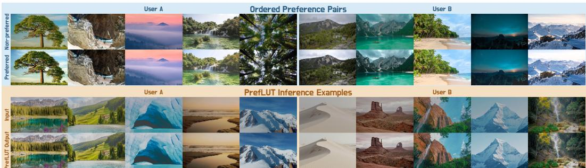
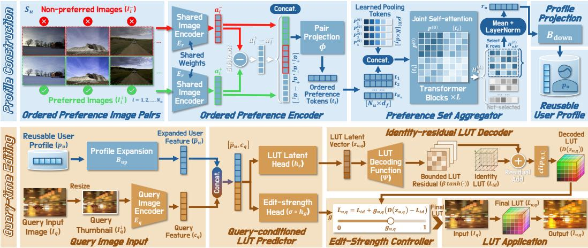
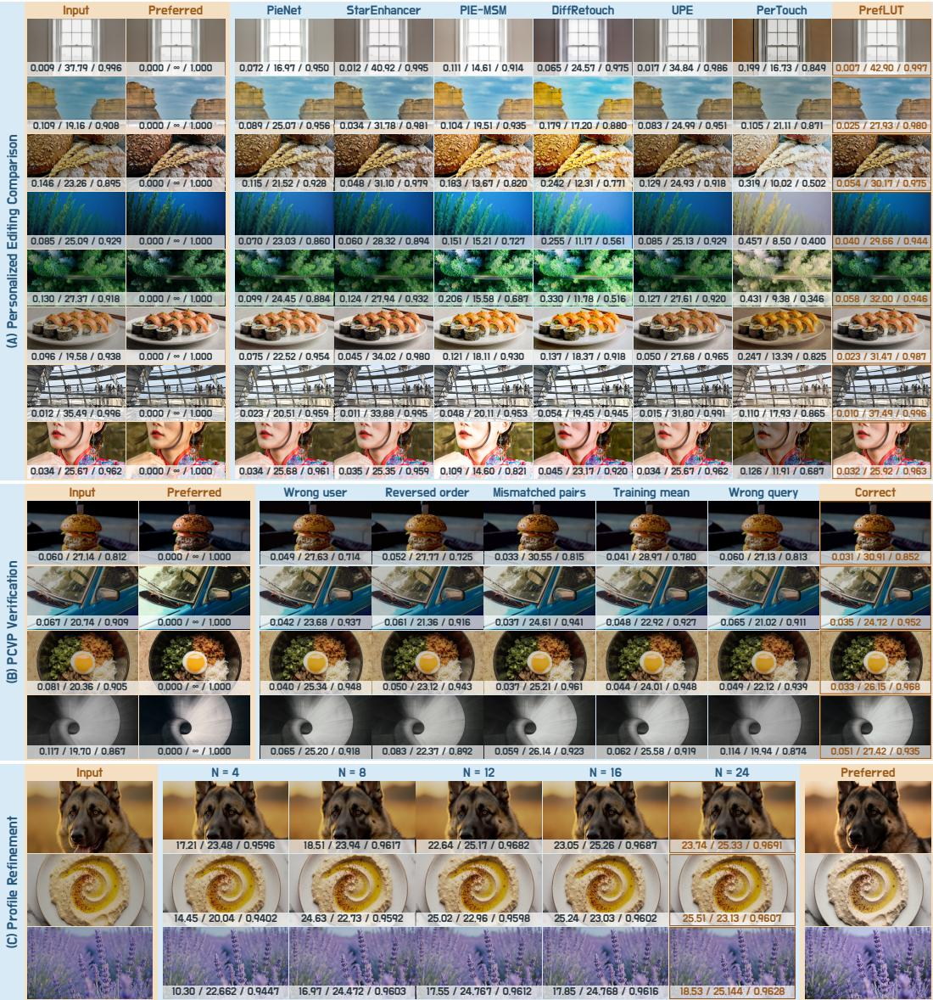
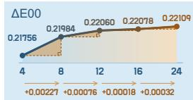
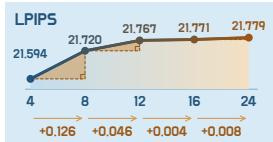
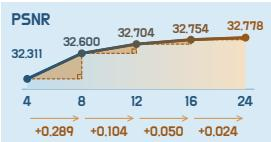
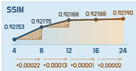
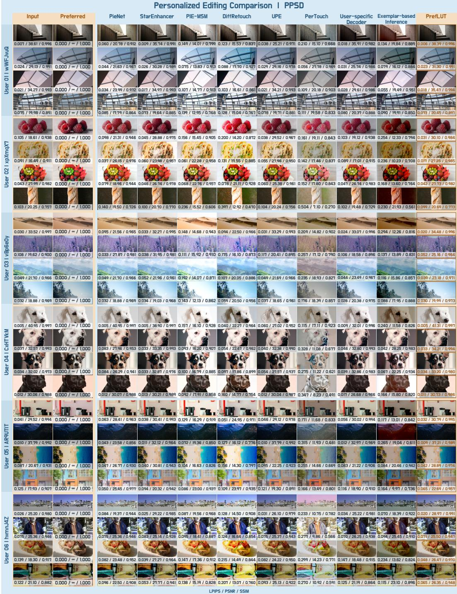
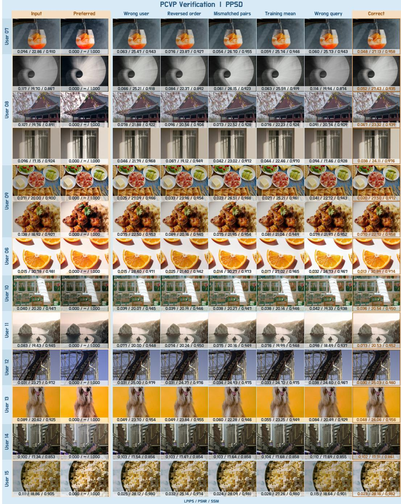
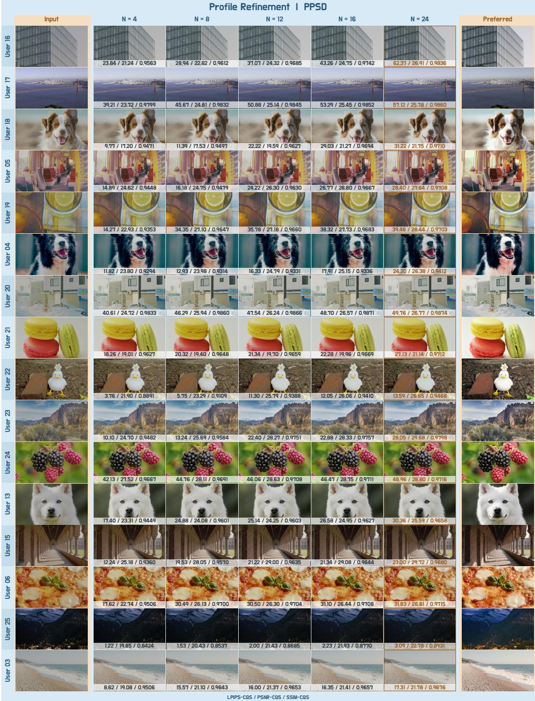

# PREFLUT: REUSABLE AND REFINABLE PERSONALIZED COLOR EDITING FROM PAIRWISE PREFERENCES

Chuanzhi Xu1,\* Langyi Chen1 Chengkun Yue2 Xuanhua Yin1 Boyu Wei1 Qingwen Zeng1 Zihan Deng3 Weidong Cai1

1The University of Sydney 2Indiana University 3The University of Hong Kong

Corresponding author: chuanzhi.xu@sydney.edu.au Project Page

## ABSTRACT

Photographic color editing is inherently personal: the same image can appear too warm, too muted, or already satisfactory to different users. Most lookup table (LUT) and reference-guided methods target a specified appearance rather than model persistent preferences from repeated user choices. To address this gap, we introduce PrefLUT, a reusable and refinable user-preference modeling framework for deployable 3D LUTs, encoding ordered preferred/non-preferred image pairs into a lightweight Reusable User Profile that is reused across queries and refined using additional user preference pairs, without per-user optimization. A Query-Conditioned LUT Predictor combines this profile with each image to predict a LUT latent vector and edit strength. An Identity-Residual LUT Decoder and Edit-Strength Controller then produce an exportable 3D LUT. Experiments on three datasets demonstrate effective personalized editing and general-purpose enhancement. Each quantized profile requires only 260 bytes, and editing takes 1.365 ms/image on an RTX 5090 GPU. We also introduce the Preference-Conditioning Verification Protocol (PCVP), an evaluation protocol to verify whether personalized image edits depend on user preferences and the query image through controlled changes to user profiles, preference orders, pair correspondences, and query images.

## 1 INTRODUCTION

Color and tone shape a photograph’s perceived quality, mood, and visual intent. Modern retouching methods learn fast global or spatially aware color transforms from expert-edited images (Bychkovsky et al., 2011; Zeng et al., 2022; Yang et al., 2022a;b; Kim & Cho, 2024). Lookup table (LUT) models predict lightweight color mappings that can be applied to full-resolution images, exported, inspected, and reused, making LUTs attractive for efficient color editing. Nevertheless, most learned-LUT methods optimize a shared target, such as one retoucher in MIT-Adobe FiveK or one expert in PPR10K (Bychkovsky et al., 2011; Liang et al., 2021), whereas reference-guided methods use a single style image to define the desired appearance and predict a preset, implicit color map, 3D LUT, or spatial 4D LUT (Ho & Zhou, 2021; Lin et al., 2023; Ke et al., 2023; Li et al., 2025; Gong et al., 2025; Ma et al., 2026).

However, a personal preference is different: it is expressed through repeated choices, may be stable only along selected color dimensions, must be separated from image content unrelated to preferences, and refined as feedback accumulates. The Personalized Photographic Style Dataset (PPSD) establishes this setting through pairwise user choices and evaluates whether an output remains faithful while moving toward a user’s preferred appearance (Kim et al., 2026). However, its proposed baselines do not explicitly output LUTs. Moreover, without comparing edits of the same query conditioned on the intended user, another user, or a population-level preference, its preference-alignment scores alone cannot distinguish the use of user-specific preferences from editing tendencies shared across users.

  
Figure 1: Preference-conditioned editing across users. Examples from two PPSD users show ordered preferred/non-preferred image pairs (top) and unseen inputs with PrefLUT outputs (bottom). PrefLUT outputs reflect each user’s color preferences across different scenes.

We answer this question with PrefLUT, which is a reusable and refinable user-preference modeling framework designed for deployable 3D LUTs. The framework divides personalized color editing into profile construction and query-time editing. During profile construction, an Ordered Preference Encoder maps each ordered preference pair to an ordered preference token, and the Preference Set Aggregator summarizes the tokens before a Reusable User Profile is stored. During query-time editing, a Query Image Encoder extracts a query feature from the new image. The Query-Conditioned LUT Predictor combines this feature with the Reusable User Profile to predict a LUT latent vector and edit strength. An Identity-Residual LUT Decoder converts the latent vector into a LUT, and the Edit-Strength Controller scales its residual before full-resolution application. New preference selections or user-confirmed edits provide additional preferred/non-preferred image pairs, which are aggregated with retained pairs to refine the profile while keeping network weights frozen. Figure 1 shows examples of personalized color editing for different users.

We evaluate PrefLUT on three datasets and introduce the Preference-Conditioning Verification Protocol (PCVP) to test whether edits respond to user preferences and the query image. Results demonstrate strong personalized editing and general-purpose enhancement. Experiments that accumulate retouching preference feedback to refine profiles show improved editing on unseen queries without updating network weights. Our contributions can be summarized as follows:

• We propose PrefLUT, a reusable and refinable user-preference modeling framework for deployable 3D LUTs. Its profile can be rebuilt from updated feedback and supports explicit, query-conditioned LUT prediction for new images without per-user optimization.

• We introduce PCVP as a systematic verification protocol for personalized image enhancement and color grading. Its five controlled tests assess quality gains from the intended user’s preferences and current query image, providing the field with a rigorous personalization test.

• Experiments on three datasets demonstrate effective personalized editing and generalpurpose enhancement. PrefLUT leads all four direct fidelity metrics and achieves the highest Comparative Quality Score (CQS) (Kim et al., 2026) under $\Delta E _ { 0 0 }$ , LPIPS, and SSIM among the compared PPSD methods and passes all five PCVP tests. Additional preference feedback improves editing on unseen queries through profile refinement with frozen network weights.

## 2 RELATED WORK

Learned LUTs and Reusable Color Transforms. Learned LUT methods express global or spatial color edits as lightweight mappings without requiring full-resolution neural decoding. LUT-based representatives include Image-Adaptive 3D-LUT, Spatial-Aware 3D LUT, 4D LUT, BGrid, AdaInt, SepLUT, CLUT-Net, NILUT, and neural LUT encoding (Zeng et al., 2022; Wang et al., 2021; Liu et al., 2023; Kim & Cho, 2024; Yang et al., 2022a;b; Zhang et al., 2022; Conde et al., 2024; Zehtab et al., 2025). Meanwhile, preset-based methods such as Deep Preset, AdaCM, and Neural Preset encode reusable appearance through retouching parameters, implicit mappings, or style representations (Ho & Zhou, 2021; Lin et al., 2023; Ke et al., 2023). However, these methods are typically trained to reproduce a shared target, select from a fixed set of styles, or transfer the appearance of a single reference image. In contrast, our PrefLUT infers a persistent preference from multiple ordered choices and predicts an explicit query-conditioned LUT, enabling reusable and refinable personalization, efficient full-resolution application, and direct export to color-grading workflows.

  
Figure 2: PrefLUT pipeline. Profile Construction (top) encodes ordered preference image pairs into a Reusable User Profile that can be refined with new feedback. Query-Time Editing (bottom) combines the stored profile with each query image to predict a 3D LUT for full-resolution editing.

Reference-Guided and Generative LUTs. Reference-image-guided and generative LUT methods use a current image, reference, text, or generative prior to produce flexible color transforms. Representative methods include D-LUT, SA-LUT, AceTone, StatLUT, and FlowLUT (Li et al., 2025; Gong et al., 2025; Ma et al., 2026; Wang et al., 2026; Hu et al., 2025). However, they condition each edit independently and do not aggregate repeated ordered choices into a persistent user preference. In contrast, our PrefLUT updates the profile when feedback arrives and reuses it to predict explicit query-conditioned LUTs, without reprocessing preference references at query time.

Personalized Aesthetic Enhancement. Personalized enhancement follows individual preferences, whereas general-purpose enhancement optimizes a shared aesthetic target. PieNet encodes preferred images into user preference vectors (Kim et al., 2020). StarEnhancer represents multiple tonal styles within one model (Song et al., 2021), while PIE-MSM uses masked style modeling to predict contentaware edits from preferred images (Kosugi & Yamasaki, 2024). PerTouch combines diffusion-based retouching with user feedback and scene-aware memory (Chang et al., 2026). PPSD evaluates User specific Decoder, User Preference Embedding (UPE), and Exemplar-based Inference for learning pairwise preferences (Kim et al., 2026). However, these methods do not jointly support profile refinement from pairwise feedback and exportable LUT-based editing. PrefLUT uses a compact, reusable profile refined from preference pairs to predict exportable, query-conditioned 3D LUTs.

## 3 PREFLUT

Overview and Problem Formulation. Figure 2 illustrates the two stages of PrefLUT: Profile Construction and Query-Time Editing. For user $u ,$ the current reference set ${ \cal S } _ { u } = \{ ( I _ { i } ^ { + } , I _ { i } ^ { - } ) \} _ { i = 1 } ^ { N _ { u } }$ contains $N _ { u }$ ordered preference image pairs used to construct the profile, where $I _ { i } ^ { + }$ and $I _ { i } ^ { - }$ are the preferred and non-preferred images for user u. Given an unseen query image $\dot { I _ { q } }$ and its resized thumbnail $I _ { q } ^ { \downarrow } { . }$ , PrefLUT predicts a global 3D LUT $\widehat { L } _ { u , q }$ . Its trilinear color mapping $\mathcal { T } ( \widehat { L } _ { u , q } , I _ { q } )$ should move the query toward the user’s repeated color choices in $S _ { u }$ while preserving its content.

The pipeline outlined in Section 1 and Appendix A.1 is expressed mathematically as:

$$
\begin{array} { r l r } & { } & { p _ { u } = f _ { \mathrm { p r o f i l e } } ( S _ { u } ) , \qquad ( z _ { u , q } , g _ { u , q } ) = f _ { \mathrm { q u e r y } } ( p _ { u } , I _ { q } ^ { \downarrow } ) , } \\ & { } & { \widehat { L } _ { u , q } = f _ { \mathrm { L U T } } ( z _ { u , q } , g _ { u , q } ) , \qquad \widehat { I } _ { u , q } = \mathcal { T } ( \widehat { L } _ { u , q } , I _ { q } ) . } \end{array}\tag{1}
$$

Here $f _ { \mathrm { p r o f i l e } }$ constructs or refines the profile from the current $S _ { u } , f _ { \mathrm { q u e r y } }$ predicts the LUT latent vector and edit strength, and $f _ { \mathrm { L U T } }$ produces the final LUT. $\widehat { I } _ { u , q }$ is the edited image. $p _ { u } \in \mathbb { R } ^ { d _ { p } }$ is the

Reusable User Profile, where $d _ { p }$ is the profile width. $z _ { u , q } \in \mathbb { R } ^ { d _ { z } }$ is the lightweight LUT latent vector predicted for the current query, where $d _ { z }$ is the LUT latent vector width. Finally, $g _ { u , q } \in [ 0 , 1 ]$ is its edit strength.

## 3.1 PROFILE CONSTRUCTION

Ordered Preference Encoder. Each image in an ordered preference image pair passes through the same reference image encoder $E _ { r }$ . For pair $i ,$ the preferred and non-preferred features are $a _ { i } ^ { + } = E _ { r } ( I _ { i } ^ { + } )$ and $\begin{array} { r } { a _ { i } ^ { - } = \bar { E _ { r } } ( I _ { i } ^ { - } ) } \end{array}$ . The Ordered Preference Encoder keeps the preference direction in each token:

$$
t _ { i } = \phi \big ( [ a _ { i } ^ { + } , a _ { i } ^ { - } , a _ { i } ^ { + } - a _ { i } ^ { - } ] \big ) \in \mathbb { R } ^ { d _ { f } } ,\tag{2}
$$

where $d _ { f }$ is the feature width, [·] denotes concatenation, and ϕ is a learned pair projection. The first two terms retain the preferred and non-preferred image features, while $a _ { i } ^ { + } - a _ { i } ^ { - }$ records the feature change from the non-preferred image to the preferred image. Swapping the preference labels reverses both the feature order and the sign of the difference. $t _ { i }$ is termed an ordered preference token. It records preference direction without requiring pixel alignment.

Preference Set Aggregator and Reusable User Profile. The Preference Set Aggregator combines all ordered preference tokens into a user feature that is invariant to their list order. The aggregator prepends K learned pooling tokens $P ^ { ( 0 ) } \in \mathbb { R } ^ { K \times d _ { f } }$ to the ordered preference tokens and processes them jointly with L standard Transformer blocks that do not use positional embeddings, following the attention-based set formulation of Set Transformer (Lee et al., 2019):

$$
H _ { u } ^ { ( 0 ) } = [ P ^ { ( 0 ) } , t _ { 1 } , \dots , t _ { N _ { u } } ] , \qquad H _ { u } ^ { ( \ell + 1 ) } = \mathrm { T r B l o c k } _ { \ell } ( H _ { u } ^ { ( \ell ) } ) .\tag{3}
$$

Here $H _ { u } ^ { ( \ell ) }$ is the token sequence after ℓ blocks, and TrBlock is the ℓ-th Transformer block. Appendix A.2 details batching and valid-pair masking. After the final block, the learned pooling token outputs are averaged and layer-normalized to obtain the aggregated user feature $r _ { u } =$ $\begin{array} { r } { \mathrm { L N } ( K ^ { - 1 } \sum _ { k = 1 } ^ { K } H _ { u , k } ^ { ( L ) } ) \in \mathbb { R } ^ { d _ { f } } } \end{array}$ , where k indexes the K learned pooling tokens. The Profile Projection $B _ { \mathrm { d o w n } }$ then produces the Reusable User Profile $p _ { u } = B _ { \mathrm { d o w n } } ( r _ { u } ) \in \mathbb R ^ { d _ { p } }$ . The profile is the only per-user data needed at query time. When users make new choices or confirm manual edits, this feedback is converted into ordered preference image pairs to refine the profile. Selected and rejected images, or edited results and preceding candidates, serve as the preferred and non-preferred images, respectively. These new pairs are incorporated into the reference set at update t. The retained pairs are then re-encoded and aggregated to obtain $p _ { u } ^ { ( t ) } = f _ { \mathrm { p r o f i l e } } ( S _ { u } ^ { ( t ) } )$ , with all network weights frozen. $S _ { u } ^ { ( t ) }$ retains either cumulative feedback or a recent feedback window. The updated profile is stored and reused to predict a personalized LUT for each subsequent query image.

## 3.2 QUERY-TIME EDITING

Query-Conditioned LUT Predictor. At query time, Profile Expansion maps the profile back to the feature width, while the separate Query Image Encoder extracts the query feature from the thumbnail. The expanded user feature summarizes the currently retained preferences, while the query feature describes the content and color distribution of the current image. The Query-Conditioned LUT Predictor concatenates these two vectors and passes them to the LUT latent vector head and edit-strength head:

$$
\begin{array} { r l r } & { \bar { p } _ { u } = B _ { \mathrm { u p } } ( p _ { u } ) , \quad } & { c _ { q } = E _ { q } ( I _ { q } ^ { \downarrow } ) , \quad } \\ & { z _ { u , q } = h _ { z } ( [ \bar { p } _ { u } , c _ { q } ] ) , \quad } & { g _ { u , q } = \sigma ( h _ { g } ( [ \bar { p } _ { u } , c _ { q } ] ) ) , } \end{array}\tag{4}
$$

where $h _ { z }$ and $h _ { g }$ are the LUT latent vector and edit-strength heads, and σ is the sigmoid function.   
PrefLUT predicts a new LUT latent vector and edit strength for every query.

Identity-Residual LUT Decoder. PrefLUT uses a learned low-dimensional Identity-Residual LUT Decoder. For grid resolution R, the Identity-Residual LUT Decoder predicts a residual around the identity LUT and clips the resulting LUT to $[ 0 , 1 ] ^ { R \times R \times R \times 3 }$

$$
D ( z ) = \mathrm { c l i p } _ { [ 0 , 1 ] } \big ( L _ { \mathrm { i d } } + \beta \operatorname { t a n h } \big ( \Psi ( z ) \big ) \big ) ,\tag{5}
$$

where $L _ { \mathrm { i d } }$ is the identity LUT, Ψ is the learned LUT decoding function, and $\beta$ limits the residual amplitude. $D ( z )$ is termed the decoded LUT. The decoder is pretrained on fitted target LUTs and frozen during personalized training, when the losses act on edited images. Thus, preference training does not require a target LUT for every pair. Appendices A.3 and A.4 detail target fitting and decoder pretraining.

Edit-Strength Controller and LUT Application. $D ( z _ { u , q } ) - L _ { \mathrm { i d } }$ is the predicted LUT residual. The Edit-Strength Controller scales this residual before it is applied to the query:

$$
\widehat { L } _ { u , q } = L _ { \mathrm { i d } } + g _ { u , q } \left( D ( z _ { u , q } ) - L _ { \mathrm { i d } } \right) , \qquad \widehat { I } _ { u , q } = \mathcal { T } ( \widehat { L } _ { u , q } , I _ { q } ) .\tag{6}
$$

Here $g _ { u , q }$ depends on both the Reusable User Profile and the query image. $\widehat { L } _ { u , q }$ is the final LUT. Trilinear interpolation is differentiable during training, and its cost grows linearly with the number of output pixels. The final LUT has a fixed grid size, so it can be saved and applied to images at different resolutions.

## 3.3 TRAINING WITH SEPARATE QUERY PAIRS

For each user, a reference set $S _ { u }$ and separate query pairs are sampled anew each training epoch. The following equations describe one sampled query pair $( Q _ { u } ^ { + } , Q _ { u } ^ { - } )$ , where $Q _ { u } ^ { + }$ is preferred to $Q _ { u } ^ { - }$ . Here $\widehat { I } ( p , Q )$ denotes PrefLUT’s output for profile p and query image $Q$ . Both query images use the same profile, yielding $Y _ { u } ^ { - } = \widehat { I } ( p _ { u } , Q _ { u } ^ { - } )$ and $Y _ { u } ^ { + } = \widehat { I } ( p _ { u } , Q _ { u } ^ { + } )$ .

Most ordered preference image pairs are not geometrically aligned, so PrefLUT uses a global colorstatistics descriptor $\chi$ that is less sensitive to spatial misalignment. It summarizes the means and standard deviations of color, luminance, and saturation (Appendix A.5). For images $A$ and $B ,$ the distance is $d _ { \chi } ( A , B ) = \operatorname* { m e a n } ( | \chi ( A ) - \chi ( B ) | )$ . Let $d ^ { + }$ be the distance from the edited non-preferred query to the preferred query, $d ^ { - }$ the distance to the non-preferred query, and $d ^ { 0 }$ the distance between the query pair: $d ^ { + } = \bar { d _ { \chi } } ( \dot { Y _ { u } ^ { - } } , Q _ { u } ^ { + } ) , d ^ { - } = d _ { \chi } ( Y _ { u } ^ { - } , Q _ { u } ^ { - } )$ , and $d ^ { 0 } = \dot { d } _ { \chi } \dot { ( Q _ { u } ^ { - } , Q _ { u } ^ { + } ) }$ . The color-distance loss and ranking loss are:

$$
{ \mathcal { L } } _ { \mathrm { c o l o r } } = { \frac { d ^ { + } } { d ^ { 0 } + \tau } } , \qquad { \mathcal { L } } _ { \mathrm { r a n k } } = [ m + d ^ { + } - d ^ { - } ] _ { + } ,\tag{7}
$$

where $[ x ] _ { + } = \operatorname* { m a x } ( x , 0 ) , \tau > 0$ prevents instability when the distance between the two query images is small, and m $> 0$ is the ranking margin. The auxiliary losses enforce reconstruction on aligned pairs $( \mathcal { L } _ { \mathrm { a l i g n e d } } )$ , preservation of preferred inputs $( \mathcal { L } _ { \mathrm { p r e s e r v e } } )$ , edit/preserve strength supervision $\begin{array} { r l } {  { ( \mathcal { L } _ { \mathrm { s t r e n g t h } } . } } \end{array}$ with targets 1 for non-preferred queries and 0 for preferred queries), and limited LUT deviation from identity $( \mathcal { L } _ { \mathrm { L U T } } )$ . Their definitions are given in Appendix A.6.

Without an explicit comparison between users, the model could produce the same average edit for every user even when $p _ { u }$ contains user-specific information. The Wrong-User Contrast Loss is introduced to address this. For the same query $Q _ { u } ^ { - } , p _ { u }$ is replaced with a wrong-user profile $p _ { u ^ { \prime } } .$ where $u ^ { \prime } \ne u$ (Appendix A.7). If $\widetilde { Y } _ { u  u ^ { \prime } } ^ { - }$ is the resulting output and $\widetilde { d } ^ { + } = d _ { \chi } ( \widetilde { Y } _ { u  u ^ { \prime } } ^ { - } , Q _ { u } ^ { + } )$ , then:

$$
\mathcal { L } _ { \mathrm { u s e r } } = [ m + d ^ { + } - \widetilde { d } ^ { + } ] _ { + } .\tag{8}
$$

The loss is zero only when the Correct User Profile output is at least m closer to $Q _ { u } ^ { + }$ than the Fixed Wrong-User Profile output for the same query. The complete objective is:

$$
\begin{array} { r } { \begin{array} { r l } & { { \mathcal { L } } = \lambda _ { c } { \mathcal { L } } _ { \mathrm { c o l o r } } + \lambda _ { r } { \mathcal { L } } _ { \mathrm { r a n k } } + \lambda _ { a } { \mathcal { L } } _ { \mathrm { a l i g n e d } } + \lambda _ { p } { \mathcal { L } } _ { \mathrm { p r e s e r v e } } } \\ & { ~ + \lambda _ { g } { \mathcal { L } } _ { \mathrm { s t r e n g t h } } + \lambda _ { l } { \mathcal { L } } _ { \mathrm { L U T } } + \lambda _ { u } { \mathcal { L } } _ { \mathrm { u s e r } } . } \end{array} } \end{array}\tag{9}
$$

## 4 PREFERENCE-CONDITIONING VERIFICATION PROTOCOL

Personalized image enhancement is commonly evaluated by comparing outputs with retouched targets and measuring preference alignment (Kim et al., 2020; 2026). However, such scores alone cannot distinguish the use of individual preferences from editing tendencies shared across users. Therefore, we believe the field needs a common evaluation protocol to verify user-specific conditioning by comparing edits of the same query under intended-user, other-user, and population preferences.

Table 1: Personalized editing quality and efficiency on PPSD. (A) Direct fidelity to preferred target images (Preferred) for edited non-preferred queries. (B) Personalized editing quality measured by CQS. (C) Model size and inference efficiency. † marks baselines adapted to PPSD.
<table><tr><td rowspan="3">Method</td><td colspan="4">(A) Direct Fidelity to Preferred(B) Personalized Editing Quality Output vs. Target</td><td colspan="4"></td><td colspan="4">(C) Model Size and Inference Efficiency Profile Construct. Editing</td></tr><tr><td colspan="4"></td><td colspan="4">CQS ↑</td><td colspan="4">Params Compute</td></tr><tr><td> $\mid \Delta E _ { 0 0 } .$ </td><td>LPIPS ↓ PSNR ↑ SSIM ↑</td><td></td><td></td><td> $\lvert \Delta E _ { 0 0 }$ </td><td>↑LPIPS ↑PSNR ↑ SSIM ↑</td><td></td><td></td><td>(M) (GFLOPs)</td><td>(B/user)</td><td>(ms/user) (ms/image)</td><td></td></tr><tr><td>PieNet†</td><td>8.432</td><td>0.118</td><td>21.719</td><td>0.818|</td><td>0.218</td><td>14.978 36.611</td><td>0.901</td><td>26.349</td><td>76.094</td><td>2,048</td><td>130.626</td><td>4.091</td></tr><tr><td>StarEnhancer†</td><td>8.077</td><td>0.090</td><td>21.949</td><td>0.835</td><td>0.213 21.477</td><td>30.960</td><td>0.918</td><td>38.052</td><td>3.638</td><td>4,096</td><td>141.096</td><td>3.253</td></tr><tr><td>PIE-MSM†</td><td>8.179</td><td>0.092</td><td>21.576</td><td>0.829</td><td>0.173 17.711</td><td>26.827</td><td>0.905</td><td>90.756</td><td>55.909</td><td>32,768</td><td>119.766</td><td>9.401</td></tr><tr><td>DiffRetouch†</td><td>9.380</td><td>0.108</td><td>20.881</td><td>0.823</td><td>0.121 13.184</td><td>22.328</td><td>0.884</td><td></td><td>924.13915,939.293</td><td>16</td><td>12.705</td><td>653.309</td></tr><tr><td>PerTouch†</td><td>8.615</td><td>0.115</td><td>21.184</td><td>0.795</td><td>0.147 12.301</td><td>23.487</td><td>0.850</td><td>1,654.939</td><td>58,386.024</td><td>16</td><td>76.520</td><td>1,765.465</td></tr><tr><td>User-specific Decoder</td><td>9.493</td><td>0.105</td><td>20.612</td><td>0.830</td><td>0.166 18.086</td><td>29.414</td><td>0.912</td><td>2.956</td><td>1,551.5236,940,284</td><td></td><td>3,518.416</td><td>70.406</td></tr><tr><td>UPE</td><td>8.929</td><td>0.100</td><td>20.882</td><td>0.832</td><td>0.217 19.900</td><td>39.206</td><td>0.916</td><td>26.330</td><td>1,585.883</td><td>1,024</td><td>117.030</td><td>73.637</td></tr><tr><td>Exemplar-based Inference</td><td>14.330</td><td>0.163</td><td>16.921</td><td>0.750</td><td>0.082</td><td>8.342 19.136</td><td>0.817</td><td>92.330</td><td>55.960</td><td>49,152</td><td>122.329</td><td>9.562</td></tr><tr><td>PrefLUT (ours)</td><td>8.067</td><td>0.089</td><td>22.094</td><td>0.843</td><td>0.219 21.615</td><td>32.734</td><td></td><td>0.920</td><td>10.264</td><td>1.966</td><td>260 2.938</td><td>1.365</td></tr></table>

Evaluation Principle. We introduce PCVP to verify whether a personalized image enhancement or color-grading method uses the supplied preference evidence and current query image. The protocol applies to methods that condition predictions on preference examples or a user representation derived from these preferences. It comprises five control tests and keeps the evaluated method, users and query samples, image-processing steps, and metric computation fixed. It changes only one condition at a time, so each quality difference measures the response to that condition.

PCVP Controls. (1) Wrong User: The Fixed Wrong-User Profile replaces $p _ { u }$ , the profile of the current user $u ,$ with a fixed profile from another user. (2) Reversed Order: The Reversed-Order Profile swaps the preferred and non-preferred image in every reference pair before profile construction. (3) Mismatched Pairs: The Mismatched-Pair Profile breaks within-user pair correspondence while preserving the preferred and non-preferred image sets. (4) Training Mean: The Training-User Mean Profile replaces $p _ { u }$ with the arithmetic mean of profiles constructed from training users only. (5) Wrong Query: The Cyclic Wrong-Query Control conditions the predictor on a different query from the same user. Any separate image-application path retains the original query. Appendix D.1 gives the exact constructions, preserved information, and dependencies tested for these five controls.

For a query sample $( u , q )$ , let $F ( p , Q _ { \mathrm { c o n d } } , Q _ { \mathrm { a p p l y } } )$ denote the complete edit under profile $p$ and conditioning image $Q _ { \mathrm { c o n d } }$ , with $Q _ { \mathrm { a p p l y } }$ retained on any separate image-application path. The correct and controlled outputs are defined as follows:

$$
\widehat { I } _ { u , q } ^ { ( 0 ) } = F ( p _ { u } , Q _ { u , q } , Q _ { u , q } ) , \qquad \widehat { I } _ { u , q } ^ { ( c ) } = \left\{ F ( p _ { u } ^ { ( c ) } , Q _ { u , q } , Q _ { u , q } ) , \quad c \in \mathcal { C } _ { \mathrm { p r o f l e } } , \right.\tag{10}
$$

where $\mathcal { C } _ { \mathrm { p r o f i l e } }$ contains the four profile controls above. Let $s _ { k } ( \widehat { I } \mid \mathcal { E } )$ be a metric defined so that higher values are better. The paired PCVP gain for measure k and control c is:

$$
\Delta _ { k } ^ { ( c ) } = s _ { k } \Big ( \widehat { I } ^ { ( 0 ) } \mid \mathcal { E } \Big ) - s _ { k } \Big ( \widehat { I } ^ { ( c ) } \mid \mathcal { E } \Big ) ,\tag{11}
$$

where $\mathcal { E }$ is the same set of paired users and query samples for both terms. On PPSD, $s _ { k }$ is the comparative quality score (CQS), with $s _ { k } = \mathrm { C Q S } _ { k }$ for $\mathsf { \bar { k } } \in \{ \Delta E _ { 0 0 } , \mathrm { L P I P S } , \mathrm { P S N R } , \mathrm { S S I M } \}$ . We call the evaluation a PCVP pass when the lower endpoint of the paired 95% bootstrap interval for every ${ \Delta } _ { k } ^ { \left( c \right) }$ is above zero. When a control is repeated across preregistered evaluation episodes, the same direction is required for the repeated estimate:

$$
\mathrm { P C V P - p a s s } \Longleftrightarrow \mathrm { L C B } _ { 9 5 \% } { \Big ( } \Delta _ { k } ^ { ( c ) } { \Big ) } > 0 \quad \forall k , c .\tag{12}
$$

Here $\mathrm { L C B _ { 9 5 \% } }$ denotes the lower endpoint of the paired bootstrap interval. Each control passes only when all metrics satisfy this condition, and a full PCVP pass requires all five controls to pass.

## 5 EXPERIMENTS AND RESULTS

Implementation Details and Experimental Settings. (1) Datasets: We evaluate PrefLUT on three datasets for different purposes. We use PPSD, a recent large-scale dataset specifically designed for learning personalized photographic styles from pairwise user preferences, as our primary benchmark. MIT-Adobe FiveK Expert C and PPR10K Experts A/B/C evaluate general-purpose (non-personalized) aesthetic enhancement (Appendix E.2). (2) Metrics: On PPSD, personalized enhancement is evaluated using CQS (Appendix B.4), computed separately from $\Delta E _ { 0 0 }$ , LPIPS, PSNR, and SSIM, combining image fidelity with color movement toward user preferences to assess both preservation and preference alignment (Kim et al., 2026). Full dataset and evaluation protocols are provided in Appendices B and D. (3) Experimental Settings: PPSD evaluation uses 50 users excluded from training, each with 16 ordered reference pairs and 16 query pairs with disjoint image and scene identities. The standard PrefLUT setting uses a 256-dimensional Reusable User Profile and a $1 7 ^ { 3 }$ LUT (Appendix C.1). All our experiments are conducted on a single NVIDIA RTX 5090 GPU. (4) Baselines: We select personalized enhancement methods and controllable retouching methods adaptable to user preferences, including PieNet (Kim et al., 2020), StarEnhancer (Song et al., 2021), PIE-MSM (Kosugi & Yamasaki,

  
Figure 3: Qualitative results on PPSD. Input is the non-preferred query and Preferred its paired target. (A) Baseline comparisons. (B) Correct (the intended user’s profile and current query image) versus five PCVP controls. (C) Profile refinement from N = 4 to 24 feedback pairs with frozen network weights. Overlays report LPIPS/PSNR/SSIM against Preferred in (A,B) $( \downarrow / \uparrow / \uparrow )$ , and per-output LPIPS-CQS/PSNR-CQS/SSIM-CQS in (C) (all ↑). More examples are in Appendix H.

Table 2: PCVP gains (∆CQS) are correct-condition CQS minus control-condition CQS. Each test lists gains (left) and the number of passing metrics out of four (right). Bold blue marks passing metrics. A test requires 4/4, and full PCVP requires all five tests. A dash denotes a structurally inapplicable control. † marks PPSD-adapted baselines. Evaluation settings are in Appendix D.2.
<table><tr><td>Method</td><td>Metric</td><td>Wrong user</td><td>[Reversed order Mismatched pairs</td><td>+0.00068</td><td></td><td>Training mean</td><td></td><td>Wrong query</td><td>Full Pass</td></tr><tr><td>PieNet† (ECCV 2020)</td><td>∆E0o LPIPS PSNR SSIM</td><td>-0.00006 -0.07606 0/4 -0.10056 -0.00059 +0.00145</td><td>+0.00001 +0.07724 +0.14574 -0.00027</td><td>+0.11300 0/4 +0.22164 +0.00035</td><td>0/4</td><td>-0.00360 -0.33478 -0.64456 -0.00169</td><td>0/4</td><td>+0.00454 -0.35530 1/4 -0.21505 +0.00011</td><td>No (0/5)</td></tr><tr><td>StarEnhancer† (ICCV 2021)</td><td>∆E0o LPIPS PSNR SSIM</td><td>+0.20574 1/4 +0.14513 +0.00065 +0.00359</td><td>+0.00334 +0.19325 +0.27924 +0.00123</td><td>3/4</td><td></td><td></td><td>-0.00414 -0.14146 0/4 -0.84752 -0.00037</td><td>+0.02791 +3.75054 4/4 +1.30143 +0.00982</td><td>No (1/4)</td></tr><tr><td>PIE-MSM† (TCSVT 2024)</td><td>∆E0o LPIPS PSNR SSIM</td><td>+0.29696 2/4 +0.15297 +0.00047</td><td>+0.00792 +0.60508 +0.51038 +0.00114</td><td>4/4</td><td>+0.03463 +3.31201 +2.96831 +0.01072</td><td>4/4</td><td>-0.00111 +0.05089 0/4 -0.23564 +0.00030</td><td>+0.01114 +1.59296 4/4 +0.58833 +0.00617</td><td>No (3/5)</td></tr><tr><td>DiffRetouch† (AAAI 2025)</td><td>∆E0o LPIPS PSNR SSIM</td><td>+0.00053 +0.06096 0/4 +0.05703 +0.00032</td><td>-0.00229 -0.22642 -0.10169 -0.00267</td><td>0/4</td><td>-0.00094 -0.10286 -0.02648 -0.00091</td><td>0/4</td><td>+0.00014 -0.00917 0/4 +0.03741 +0.00005</td><td>+0.01422 +3.05005 4/4 +1.14541 +0.02181</td><td>No (1/5)</td></tr><tr><td>PerTouch† (AAAI 2026)</td><td>∆E0o LPIPS PSNR SSIM</td><td>+0.00227 +0.14506 0/4 +0.10407 +0.00074</td><td>+0.00617 +0.28275 +0.39237 +0.00055</td><td>3/4</td><td>-0.00106 -0.06002 -0.06274 -0.00081</td><td>0/4</td><td>-0.00128 -0.08118 0/4 -0.07681 -0.00070</td><td>+0.11441 +10.88617 4/4 +14.32032 +0.61326</td><td>No (1/5)</td></tr><tr><td>User-specific Decoder (CVPR 2026)</td><td>∆E0o LPIPS PSNR SSIM</td><td>+0.00089 +0.08042 0/4 -0.00132 +0.00086</td><td>+0.01660 +1.17893 +0.34232 +0.00032</td><td>2/4</td><td>-0.00237 +0.02181 -1.19466 -0.00062</td><td>0/4</td><td>+0.01229 +0.79596 2/4 -0.01615 +0.00072</td><td>+0.00000 -0.00012 0/4 +0.00001 -0.00000</td><td>No (0/5)</td></tr><tr><td>UPE (CVPR 2026)</td><td>∆E00 LPIPS PSNR SSIM</td><td>+0.00022 +0.01448 1/4 -0.01553 +0.00003</td><td>-0.00067 -0.00233 -0.37663 +0.00001</td><td>0/4</td><td>-0.00073 -0.00851 -0.30116 +0.00001</td><td>1/4 +0.00001</td><td>-0.00133 -0.00101 0/4 -0.70954</td><td>+0.00004 +0.05344 2/4 -0.22842 +0.00018</td><td>No (0/5)</td></tr><tr><td>Exemplar-based Inference (CVPR 2026)</td><td>∆E00 LPIPS PSNR SSIM</td><td>+0.00024 +0.03730 0/4 +0.02825 +0.00029</td><td>-0.00099 -0.09915 -0.14419 -0.00237</td><td>0/4</td><td>-0.00090 -0.10712 -0.18782 -0.00125</td><td>+0.00090 +0.15598 0/4 +0.19090 +0.00008</td><td>3/4</td><td>+0.00029 +0.02920 1/4 +0.00499 +0.00162</td><td>No (0/5)</td></tr><tr><td>PrefLUT (ours)</td><td>∆E00 LPIPS PSNR SSIM</td><td>+0.00437 +0.44810 4/4 +0.40935 +0.00148</td><td>+0.00687 +0.33821 +0.78150 +0.00106</td><td>4/4</td><td>+0.00723 +0.44371 4/4 +0.90339 +0.00118</td><td>+0.00235 +0.26901 +0.32984 +0.00078</td><td>4/4</td><td>+0.01445 +2.26491 4/4 +0.88546 +0.00480</td><td>Yes (5/5)</td></tr></table>

2024), DiffRetouch (Duan et al., 2025), PerTouch (Chang et al., 2026), and PPSD’s User-specific Decoder, User Preference Embedding (UPE), and Exemplar-based Inference (Kim et al., 2026). Baseline reproduction and evaluation settings are detailed in Appendix C.

PPSD Personalized Editing. PrefLUT balances perceptual quality, per-user storage, and editing latency (Table 1 and Appendix C.4), with the highest CQS under $\Delta E _ { 0 0 }$ , LPIPS, and SSIM among the listed methods. On edited non-preferred queries, PrefLUT also leads the compared methods in direct fidelity to Preferred under $\Delta E _ { 0 0 }$ , LPIPS, PSNR, and SSIM. For qualitative evaluation, Figure 3(A) compares outputs across baselines and illustrates PrefLUT’s robustness to varying preferences. For example, users prefer both brighter and darker appearances, yet PIE-MSM and DiffRetouch tend to brighten these examples, while PrefLUT often follows the preferred brightness and color more closely (additional examples in Appendix H).

PCVP Evaluation. PrefLUT passes all five PPSD controls across all four CQS measures (Table 2). None of the eight baseline adaptations passes all five. Relative to the correct condition, all five controls significantly reduce CQS, indicating that PrefLUT uses both the supplied user preferences and the query image (Appendix E.1). In Figure 3(B), changing the profile or query condition shifts brightness and color away from the preferred appearance, while correct conditioning more closely preserves the intended look.

  
Figure 4: Profile refinement on PPSD. Points show CQS (all ↑) at $N = 4 , 8 , 1 2 , 1 6$ , 24 accumulated feedback pairs. Orange labels give CQS gains over the preceding stage.

Table 3: Core ablations on PPSD. Differences in CQS and Fixed Wrong-User Profile PCVP gain are reported as variant minus its matched full model. In row order, we remove the Explicit Feature Difference $a _ { i } ^ { + } - a _ { i } ^ { - }$ , replace the Set Transformer with masked mean pooling in the Preference Set Aggregator, remove the Query Feature $c _ { q } ,$ , and remove the Wrong-User Contrast Loss ${ \mathcal { L } } _ { \mathrm { u s e r } }$ . All ablations support the contribution of the corresponding components.
<table><tr><td rowspan="2">Variant</td><td colspan="4">CQS difference</td><td colspan="4">Wrong-user PCVP gain difference</td></tr><tr><td> $\Delta E _ { 0 0 }$ </td><td>LPIPS</td><td>PSNR</td><td>SSIM</td><td> $\Delta E _ { 0 0 }$ </td><td>LPIPS</td><td>PSNR</td><td>SSIM</td></tr><tr><td>- Explicit Feature Difference</td><td>-0.001062</td><td>-0.200</td><td>-0.214</td><td>-0.000553</td><td>-0.003074</td><td>-0.32296</td><td>-0.28613</td><td>-0.001116</td></tr><tr><td>- Set Transformer</td><td>-0.019845</td><td>-1.484</td><td>-2.250</td><td>-0.002619</td><td>-0.004238</td><td>-0.42888</td><td>-0.39226</td><td>-0.001401</td></tr><tr><td>Query Feature</td><td>-0.003771</td><td>-1.438</td><td>+1.482</td><td>-0.003514</td><td>-0.003290</td><td>-0.33886</td><td>-0.34294</td><td>-0.001110</td></tr><tr><td>- Wrong-User Contrast Loss</td><td>-0.00000679</td><td>-0.003</td><td>+0.003</td><td>-0.00000439</td><td>-0.00003627</td><td>-0.00487</td><td>-0.00223</td><td>-0.00001351</td></tr></table>

Profile Refinement. With weights and unseen queries fixed, additional feedback improves editing through profile updates alone (Figure 4, Figure 3(C)). The examples progressively approach the preferred brightness and color as feedback accumulates from 4 to 24 pairs. Correct new feedback outperforms reversed new feedback on identical images, indicating that the preference direction contributes to the improvement (Appendix F.1).

Ablation Studies. Table 3 compares each ablation with its matched full model under equal training budgets. Removing the Explicit Feature Difference from the Ordered Preference Encoder reduces all four CQS measures and the quality advantage of correct over wrong-user profiles. Replacing the Set Transformer in the Preference Set Aggregator with masked mean pooling reduces CQS and nearly eliminates this advantage, supporting learned aggregation of preference pairs. Removing the Query Feature from the Query-Conditioned LUT Predictor reduces $\Delta E _ { 0 0 }$ , LPIPS, and SSIM CQS and weakens user-specific editing, despite higher PSNR CQS. The Wrong-User Contrast Loss further improves the wrong-user PCVP gain across both training seeds. Paired confidence intervals and further ablations are in Appendices F.2 and F.3.

Extended Experiments. The profile interface supports general-purpose, non-personalized enhancement on FiveK and PPR10K using configurations with an additional spatial residual (Appendices C.3 and E.2). On FiveK Expert C, PrefLUT achieves 24.572 dB PSNR, 0.917 SSIM, $7 . 8 3 3 \Delta E _ { 7 6 }$ , and 0.067 LPIPS, averaged over eight training seeds. On PPR10K, PrefLUT shares one model across Experts A/B/C and achieves 25.105 dB PSNR, 7.822 $\Delta E _ { 7 6 }$ , 28.368 dB PSNR-HC, and 5.069 $\Delta E _ { \mathrm { 7 6 ^ { - } H C } }$ averaged over three experts and two training seeds on 2,286 validation images per expert.

## 6 CONCLUSION

We presented PrefLUT, which encodes ordered preferences into a reusable, refinable user profile and predicts query-conditioned 3D LUTs without per-user fine-tuning. We also introduced PCVP, an evaluation protocol that verifies dependence on user preferences and the query image through five controlled tests. This distinguishes user-specific preference conditioning from quality gains produced by applying shared editing rules across users. Additional feedback improves unseen-query editing with frozen network weights, while each quantized profile requires only 260 bytes and supports repeated editing without re-encoding reference images. PrefLUT passes all five PCVP tests and, among the compared personalized image enhancement methods on PPSD, leads all four direct fidelity metrics and CQS under $\Delta E _ { 0 0 }$ , LPIPS, and SSIM, with editing at 1.365 ms/image. Experiments on FiveK and PPR10K further demonstrate general-purpose enhancement across expert targets.

## AI USE STATEMENT

Generative AI tools assisted manuscript writing and the development of code for figure layout. Qualitative figures show images from the released datasets and actual outputs of the evaluated methods. These dataset images and method outputs were cropped and resized for display.

## ETHICS STATEMENT

This work uses released datasets of pairwise preferences and retouched images and conducts no new interaction with human participants. We follow the dataset licenses and do not redistribute raw user data. Dataset splits and evaluation procedures are documented in the appendix. This research adheres to the ICLR Code of Ethics.

## REPRODUCIBILITY STATEMENT

The main paper specifies the PrefLUT architecture, training objectives, and evaluation protocol. The appendix details data preprocessing, dataset splits, experimental configurations, control conditions, statistical procedures, and hardware. The supplementary material includes anonymous source code, training and evaluation scripts, configuration files, PPSD split definitions, exact reference/query assignments, and the PrefLUT model weights. We also provide complete per-query and per-user evaluation CSVs, aggregate results, and selected qualitative examples with preference references. The accompanying documentation maps the implementation to the paper and provides instructions for training, profile construction, inference, and metric computation.

## REFERENCES

Simone Bianco, Claudio Cusano, Flavio Piccoli, and Raimondo Schettini. Personalized image enhancement using neural spline color transforms. IEEE Transactions on Image Processing, 29: 6223–6236, 2020. doi: 10.1109/TIP.2020.2989584.

Vladimir Bychkovsky, Sylvain Paris, Eric Chan, and Fredo Durand. Learning photographic ´ global tonal adjustment with a database of input/output image pairs. In Proceedings of the IEEE Conference on Computer Vision and Pattern Recognition, pp. 97–104, 2011. doi: 10.1109/CVPR.2011.5995413.

Zewei Chang, Zheng-Peng Duan, Jianxing Zhang, Chun-Le Guo, Siyu Liu, Hyungju Chun, Hyunhee Park, Zikun Liu, and Chongyi Li. PerTouch: VLM-driven agent for personalized and semantic image retouching. Proceedings ofthe AAAI Conference on Artificial Intelligence, 40(4):2752–2759, 2026. doi: 10.1609/aaai.v40i4.37264.

CIE. International Lighting Vocabulary. International Commission on Illumination, second edition, 2020. CIE S 017:2020, term 17-23-077: CIE 1976 L\*a\*b\* colour difference.

Marcos V. Conde, Javier Vazquez-Corral, Michael S. Brown, and Radu Timofte. NILUT: Conditional neural implicit 3D lookup tables for image enhancement. Proceedings ofthe AAAI Conference on Artificial Intelligence, 38:1371–1379, 2024. doi: 10.1609/aaai.v38i2.27901.

Zheng-Peng Duan, Jiawei Zhang, Zheng Lin, Xin Jin, XunDong Wang, Dongqing Zou, Chun-Le Guo, and Chongyi Li. DiffRetouch: Using diffusion to retouch on the shoulder of experts. Proceedings of the AAAI Conference on Artificial Intelligence, 39(3):2825–2833, 2025. doi: 10.1609/aaai.v39i3.32288.

Zerui Gong, Zhonghua Wu, Qingyi Tao, Qinyue Li, and Chen Change Loy. SA-LUT: Spatial adaptive 4D look-up table for photorealistic style transfer. In Proceedings of the IEEE/CVF International Conference on Computer Vision, pp. 18294–18303, 2025.

Samuel Goree, Weslie Khoo, and David J. Crandall. Correct for whom? Subjectivity and the evaluation of personalized image aesthetics assessment models. Proceedings of the AAAI Conference on Artificial Intelligence, 37:11818–11827, 2023.

Man M. Ho and Jinjia Zhou. Deep Preset: Blending and retouching photos with color style transfer. In Proceedings of the IEEE/CVF Winter Conference on Applications of Computer Vision, pp. 2113–2121, 2021.

Liubing Hu, Chen Wu, Anrui Wang, Dianjie Lu, Guijuan Zhang, and Zhuoran Zheng. FlowLUT: Efficient image enhancement via differentiable LUTs and iterative flow matching. arXiv preprint arXiv:2509.23608, 2025. URL https://arxiv.org/abs/2509.23608.

Zhanghan Ke, Yuhao Liu, Lei Zhu, Nanxuan Zhao, and Rynson W. H. Lau. Neural Preset for color style transfer. In Proceedings of the IEEE/CVF Conference on Computer Vision and Pattern Recognition, pp. 14173–14182, 2023.

Han-Ul Kim, Young Jun Koh, and Chang-Su Kim. PieNet: Personalized image enhancement network. In European Conference on Computer Vision, pp. 374–390, 2020. doi: 10.1007/ 978-3-030-58577-8 23.

Jinwoo Kim, Jihye Yoo, and Seon Joo Kim. Learning personalized photographic style from pairwise user preferences. In Proceedings ofthe IEEE/CVF Conference on Computer Vision and Pattern Recognition, pp. 1134–1144, 2026.

Wontae Kim and Nam Ik Cho. Image-adaptive 3D lookup tables for real-time image enhancement with bilateral grids. In European Conference on Computer Vision, pp. 91–108, 2024. doi: 10.1007/978-3-031-72967-6 6.

Satoshi Kosugi and Toshihiko Yamasaki. Personalized image enhancement featuring masked style modeling. IEEE Transactions on Circuits and Systems for Video Technology, 34(1):140–152, 2024. doi: 10.1109/TCSVT.2023.3285765.

Juho Lee, Yoonho Lee, Jungtaek Kim, Adam R. Kosiorek, Seungjin Choi, and Yee Whye Teh. Set Transformer: A framework for attention-based permutation-invariant neural networks. In Proceedings ofthe 36th International Conference on Machine Learning, volume 97, pp. 3744–3753, 2019.

Mujing Li, Guanjie Wang, Xingguang Zhang, Qifeng Liao, and Chenxi Xiao. D-LUT: Photorealistic style transfer via diffusion process. In Proceedings of the Winter Conference on Applications of Computer Vision, pp. 9188–9196, 2025.

Jie Liang, Hui Zeng, Miaomiao Cui, Xuansong Xie, and Lei Zhang. PPR10K: A large-scale portrait photo retouching dataset with human-region mask and group-level consistency. In Proceedings of the IEEE/CVF Conference on Computer Vision and Pattern Recognition, pp. 653–661, 2021.

Tianwei Lin, Honglin Lin, Fu Li, Dongliang He, Wenhao Wu, Meiling Wang, Xin Li, and Yong Liu. AdaCM: Adaptive ColorMLP for real-time universal photo-realistic style transfer. Proceedings ofthe AAAI Conference on Artificial Intelligence, 37:1613–1621, 2023. doi: 10.1609/aaai.v37i2. 25248.

Chengxu Liu, Huan Yang, Jianlong Fu, and Xueming Qian. 4D LUT: Learnable context-aware 4D lookup table for image enhancement. IEEE Transactions on Image Processing, 32:4742–4756, 2023. doi: 10.1109/TIP.2023.3290849. URL https://arxiv.org/abs/2209.01749.

Tianren Ma, Mingxiang Liao, Xijin Zhang, and Qixiang Ye. AceTone: Bridging words and colors for conditional image grading. In Proceedings of the IEEE/CVF Conference on Computer Vision and Pattern Recognition, pp. 25851–25860, 2026.

Jian Ren, Xiaohui Shen, Zhe Lin, Radom´ır Mech, and David J. Foran. Personalized image aesthetics.ˇ In Proceedings ofthe IEEE International Conference on Computer Vision, pp. 638–647, 2017.

Gaurav Sharma, Wencheng Wu, and Edul N. Dalal. The CIEDE2000 color-difference formula: Implementation notes, supplementary test data, and mathematical observations. Color Research & Application, 30(1):21–30, 2005. doi: 10.1002/col.20070.

Yuda Song, Hui Qian, and Xin Du. StarEnhancer: Learning real-time and style-aware image enhancement. In Proceedings of the IEEE/CVF International Conference on Computer Vision, pp. 4126–4135, 2021.

Tao Wang, Yong Li, Jingyang Peng, Yipeng Ma, Xian Wang, Fenglong Song, and Youliang Yan. Real-time image enhancer via learnable spatial-aware 3D lookup tables. In Proceedings of the IEEE/CVF International Conference on Computer Vision, pp. 2471–2480, 2021.

Yifan Wang, Zhixiang Hao, Yu Wang, and Congchao Zhu. Multimodal 3D LUT generation via StatLUT with statistical features for photorealistic style transfer. arXiv preprint arXiv:2607.08227, 2026. URL https://arxiv.org/abs/2607.08227.

Zhou Wang, Alan C. Bovik, Hamid R. Sheikh, and Eero P. Simoncelli. Image quality assessment: From error visibility to structural similarity. IEEE Transactions on Image Processing, 13(4): 600–612, 2004. doi: 10.1109/TIP.2003.819861.

Temesgen Muruts Weldengus, Binnan Liu, Fei Kou, Youwei Lyu, Jinwei Chen, Qingnan Fan, and Changqing Zou. RefRetouch: Personalized image retouching without test-time fine-tuning. In European Conference on Computer Vision, 2026.

Chuanzhi Xu, Ziyuan Tao, Jean Julien KNell, Yanrong Chen, Haolan Guo, Xuanhua Yin, Adnan Mahmood, and Weidong Cai. Learning color grading, no photo sharing: Federated aesthetic preference learning for personalized image enhancement. arXiv preprint arXiv:2607.27659, 2026. URL https://arxiv.org/abs/2607.27659.

Canqian Yang, Meiguang Jin, Xu Jia, Yi Xu, and Ying Chen. AdaInt: Learning adaptive intervals for 3D lookup tables on real-time image enhancement. In Proceedings of the IEEE/CVF Conference on Computer Vision and Pattern Recognition, pp. 17522–17531, 2022a.

Canqian Yang, Meiguang Jin, Yi Xu, Rui Zhang, Ying Chen, and Huaida Liu. SepLUT: Separable image-adaptive lookup tables for real-time image enhancement. In European Conference on Computer Vision, pp. 201–217, 2022b.

Vahid Zehtab, David B. Lindell, Marcus A. Brubaker, and Michael S. Brown. Efficient neural network encoding for 3D color lookup tables. Proceedings ofthe AAAI Conference on Artificial Intelligence, 39:9772–9779, 2025. doi: 10.1609/aaai.v39i9.33059.

Hui Zeng, Jianrui Cai, Lida Li, Zisheng Cao, and Lei Zhang. Learning image-adaptive 3D lookup tables for high performance photo enhancement in real-time. IEEE Transactions on Pattern Analysis and Machine Intelligence, 44(4):2058–2073, 2022. doi: 10.1109/TPAMI.2020.3026740.

Fengyi Zhang, Hui Zeng, Tianjun Zhang, and Lin Zhang. CLUT-Net: Learning adaptively compressed representations of 3DLUTs for lightweight image enhancement. In Proceedings of the 30th ACM International Conference on Multimedia, pp. 6493–6501, 2022. doi: 10.1145/3503161.3547879.

Richard Zhang, Phillip Isola, Alexei A. Efros, Eli Shechtman, and Oliver Wang. The unreasonable effectiveness of deep features as a perceptual metric. In Proceedings of the IEEE Conference on Computer Vision and Pattern Recognition, pp. 586–595, 2018.

Algorithm A1: profile construction and query-time editing   
Profile-construction input: reference set $S _ { u } = \{ ( I _ { i } ^ { + } , I _ { i } ^ { - } ) \} _ { i = 1 } ^ { N _ { u } }$ . When users have different   
numbers of reference pairs, shorter sets are padded to a common length. The mask $m _ { u , i }$ marks   
valid pairs.   
1. Encode both images of every valid pair with the shared Reference Image Encoder, producing   
$a _ { i } ^ { + }$ and $a _ { i } ^ { - }$   
2. Compute $t _ { i } = \phi ( [ a _ { i } ^ { + } , a _ { i } ^ { - } , a _ { i } ^ { + } - a _ { i } ^ { - } ] )$ with the Ordered Preference Encoder.   
3. Place the valid ordered preference tokens in deterministic order and jointly update them with   
the learned pooling tokens in the Preference Set Aggregator. Use the valid-pair mask to exclude   
padding and do not add positional embeddings.   
4. Average and layer-normalize the updated learned pooling tokens to obtain the aggregated   
user feature $r _ { u }$ . Apply Profile Projection $p _ { u } = B _ { \mathrm { d o w n } } ( \bar { r } _ { u } )$ and store the resulting Reusable User   
Profile $p _ { u }$ . The reference images are no longer needed at query time.   
Query-time input: Reusable User Profile $p _ { u }$ and query image $I _ { q } .$   
5. Apply Profile Expansion $\bar { p } _ { u } = B _ { \mathrm { u p } } ( p _ { u } )$ . Resize $I _ { q }$ to the query thumbnail $I _ { q } ^ { \downarrow }$ and use the   
Query Image Encoder to obtain the query feature $c _ { q } .$   
6. Use the Query-Conditioned LUT Predictor to predict the LUT latent vector $z _ { u , q }$ and edit   
strength $g _ { u , q }$ from $[ \bar { p } _ { u } , c _ { q } ]$   
7. Use the Identity-Residual LUT Decoder to convert $z _ { u , q }$ into the decoded LUT $D ( z _ { u , q } )$ . The   
Edit-Strength Controller scales the decoded LUT residual from the identity LUT by $g _ { u , q }$ to obtain   
the final LUT $\widehat { L } _ { u , q } .$   
8. Apply $\widehat { L } _ { u , q }$ to the full-resolution query image by trilinear interpolation to obtain $\widehat { I } _ { u , q } .$

## Appendix

## A METHOD DETAILS

## A.1 PROFILE CONSTRUCTION AND QUERY-TIME EDITING

Algorithm A1 summarizes Profile Construction and Query-Time Editing, including the inputs and outputs of each module. Appendix A.2 explains how reference sets with different numbers of pairs are processed in one batch.

Profile refinement and reuse. Add new preference pairs to the retained reference set and repeat Steps 1 to 4 with network weights frozen. Steps 5 to 8 reuse the updated profile for later queries without processing references or performing per-user optimization.

## A.2 BATCHING AND VALID-PAIR MASKING

In a batch, the valid-pair mask $m _ { u , i }$ identifies whether ordered preference image pair i belongs to user u’s reference set. Padding makes reference sets equally long, and the mask excludes padded tokens from attention and profile aggregation. Learned pooling tokens are always valid. Equation 3 therefore uses only valid ordered preference tokens. The Preference Set Aggregator uses a fixed token order and no positional embeddings.

Valid tokens are sorted in ascending order by their first eight feature coordinates, comparing each coordinate in turn. Tokens with identical sorting coordinates keep their relative order, and padded tokens are placed last. This fixed order is based on token features rather than the time of user feedback. The aggregated user feature $r _ { u }$ is computed from the updated learned pooling tokens. Sorting reduces input-order effects in finite-precision attention. Permutation invariance comes from the set architecture without positional embeddings, rather than from sorting.

## A.3 TARGET LUT FITTING

For each ordered preference image pair identified as pixel-aligned by the data protocol, a target LUT L∗ maps the non-preferred image to the preferred image. The training subset contains 2,683 eligible

D1 pairs and 3,028 eligible D2 pairs, giving 5,711 target LUTs. Eligibility requires a D1 or D2 pair with matching image dimensions. Each $1 7 ^ { 3 } \mathrm { L U T }$ is initialized as the identity LUT and fitted on 128-pixel image crops using Adam for 30 steps at learning rate 0.03. The objective combines mean absolute image reconstruction error with smoothness, monotonicity, and identity penalties weighted by 1, 0.01, 0.01, and 0.001, respectively. After each update, LUT values are clipped to $[ 0 , 1 ] ^ { \cdot }$ . The fitted LUTs supervise Identity-Residual LUT Decoder pretraining. Query-Time Editing uses the trained decoder without fitting additional target LUTs.

## A.4 IDENTITY-RESIDUAL LUT DECODER PRETRAINING

The fitted target LUTs supervise an autoencoder whose Identity-Residual LUT Decoder follows Equation 5. Let $E _ { L }$ be the LUT encoder, let $\overline { { L } } = L _ { \mathrm { i d } } + \beta \operatorname { t a n h } ( \Psi ( E _ { L } ( L ^ { * } ) ) )$ be the unclipped decoder output, let $\widetilde L = \mathrm { c l i p } _ { [ 0 , 1 ] } ( \overline { { L } } ) = D ( E _ { L } ( L ^ { * } ) )$ , and let I be the non-preferred image used to fit $L ^ { * } , E _ { L }$ and the Identity-Residual LUT Decoder are trained jointly with LUT reconstruction, image application, smoothness, monotonicity, and a LUT range penalty:

$$
\begin{array} { r l } & { \mathcal { L } _ { \mathrm { A E } } = \eta _ { \mathrm { r e c } } \| \widetilde { L } - L ^ { * } \| _ { 1 } + \eta _ { \mathrm { a p p } } \| \mathcal { T } ( \widetilde { L } , I ) - \mathcal { T } ( L ^ { * } , I ) \| _ { 1 } } \\ & { \qquad + \eta _ { \mathrm { s m } } \mathcal { R } _ { \mathrm { s m } } ( \widetilde { L } ) + \eta _ { \mathrm { m o n o } } \mathcal { R } _ { \mathrm { m o n o } } ( \widetilde { L } ) + \eta _ { \mathrm { r a n g e } } \mathcal { R } _ { \mathrm { r a n g e } } ( \overline { { L } } ) . } \end{array}\tag{13}
$$

$\mathcal { R } _ { \mathrm { s m } }$ sums the mean squared differences between adjacent LUT entries along the three input-color axes. ${ \mathcal { R } } _ { \mathrm { m o n o } }$ penalizes negative adjacent differences, and $\mathcal { R } _ { \mathrm { r a n g e } }$ penalizes values of L that fall below zero or above one. During personalized training, the Query-Conditioned LUT Predictor outputs $z _ { u , q } ,$ , which the frozen Identity-Residual LUT Decoder converts into the decoded LUT. Equation 9 combines image-based supervision with edit-strength supervision and LUT regularization, without requiring fitted target LUTs for the preference pairs.

## A.5 GLOBAL COLOR-STATISTICS DESCRIPTOR

For an RGB image I, the global color-statistics descriptor contains the means and standard deviations of the RGB channels, luminance, and saturation:

$$
\begin{array} { r l } & { \chi ( I ) = [ \mu _ { R } ( I ) , \mu _ { G } ( I ) , \mu _ { B } ( I ) , \sigma _ { R } ( I ) , \sigma _ { G } ( I ) , \sigma _ { B } ( I ) , } \\ & { ~ \quad \quad \mu _ { Y } ( I ) , \sigma _ { Y } ( I ) , \mu _ { S } ( I ) , \sigma _ { S } ( I ) ] . } \end{array}\tag{14}
$$

Here $\mu$ and σ are the mean and population standard deviation over image pixels. The luminance and saturation at each pixel are computed as:

$$
Y = 0 . 2 1 2 6 R + 0 . 7 1 5 2 G + 0 . 0 7 2 2 B , \qquad S = \operatorname* { m a x } ( R , G , B ) - \operatorname* { m i n } ( R , G , B ) .\tag{15}
$$

The distance $d _ { \chi } ( A , B )$ averages the absolute differences between the ten descriptor components. RGB, luminance, and saturation lie in [0, 1], so their means and standard deviations are bounded in the same intensity units. Equal coefficients assign the same cost to an equal absolute change in any statistic, without variance normalization or learned component weights. Global statistics reduce sensitivity to spatial misalignment but do not impose pixelwise correspondence. Pixel-aligned pairs also receive reconstruction supervision (Appendix A.6).

## A.6 AUXILIARY TRAINING LOSSES

The following losses supplement the color-distance loss, ranking loss, and Wrong-User Contrast Loss in Equation 9. Let B index all query pairs in the current minibatch, with $( u , j )$ identifying user u and query pair j. Training uses four query pairs per user. The outputs are $Y _ { u , j } ^ { \pm } = \widehat { I } ( p _ { u } , Q _ { u , j } ^ { \pm } )$ . The color-distance, ranking, and Wrong-User Contrast Loss terms are averaged over B. Image and LUT $\ell _ { 1 }$ terms below average over their pixels or grid entries and color channels.

Aligned-Pair Reconstruction Loss. Let ${ \mathcal { A } } \subseteq B$ index the query pairs treated as pixel-aligned by the data protocol. The aligned-pair reconstruction loss is:

$$
\mathcal { L } _ { \mathrm { a l i g n e d } } = | A | ^ { - 1 } \sum _ { ( u , j ) \in A } \| Y _ { u , j } ^ { - } - Q _ { u , j } ^ { + } \| _ { 1 } .\tag{16}
$$

The reconstruction loss is zero when the minibatch contains no aligned query pairs.

Preservation Loss. The preservation loss keeps the edited preferred query close to its input:

$$
\mathcal { L } _ { \mathrm { p r e s e r v e } } = \frac { 1 } { | \mathcal { B } | } \sum _ { ( u , j ) \in \mathcal { B } } \| Y _ { u , j } ^ { + } - Q _ { u , j } ^ { + } \| _ { 1 } .\tag{17}
$$

Edit-Strength Loss. Let $g _ { u , j } ^ { \pm }$ and $\widehat { L } _ { u , j } ^ { \pm }$ be the edit strengths and final LUTs predicted for $Q _ { u , j } ^ { \pm } .$ Binary supervision assigns strength targets of one to non-preferred queries and zero to preferred queries:

$$
\mathcal { L } _ { \mathrm { s t r e n g t h } } = \frac { 1 } { 2 | \mathcal { B } | } \sum _ { ( u , j ) \in \mathcal { B } } \big [ \mathrm { B C E } ( g _ { u , j } ^ { - } , 1 ) + \mathrm { B C E } ( g _ { u , j } ^ { + } , 0 ) \big ] ,\tag{18}
$$

where BCE denotes binary cross-entropy.

LUT-Deviation Loss. The LUT-deviation loss penalizes differences between each final LUT and the identity LUT:

$$
\mathcal { L } _ { \mathrm { L U T } } = \frac { 1 } { 2 | \mathcal { B } | } \sum _ { ( u , j ) \in \mathcal { B } } \big ( \| \widehat { L } _ { u , j } ^ { - } - L _ { \mathrm { i d } } \| _ { 1 } + \| \widehat { L } _ { u , j } ^ { + } - L _ { \mathrm { i d } } \| _ { 1 } \big ) .\tag{19}
$$

## A.7 WRONG-USER PROFILE SELECTION

The Wrong-User Contrast Loss uses minibatches of distinct users. A fixed nonzero cyclic shift within each minibatch pairs each user u with another user $u ^ { \prime } \ne u$ . The other user’s profile $p _ { u ^ { \prime } }$ replaces $p _ { u }$ while the query $Q _ { u } ^ { - }$ and preferred target $Q _ { u } ^ { + }$ remain unchanged. The resulting output $\widetilde { Y } _ { u  u ^ { \prime } } ^ { - }$ defines $\widetilde { d } ^ { + } = d _ { \chi } ( \widetilde { Y } _ { u  u ^ { \prime } } ^ { - } , Q _ { u } ^ { + } )$ in Equation 8. Thus, the two outputs are compared on the same query and preferred target, with only the user profile changed.

## B DATASETS AND EVALUATION PROTOCOLS

## B.1 PPSD

Preference Supervision. Rating-based datasets such as Flickr-AES capture overall aesthetic judgments, which depend on image content and aesthetic attributes (Ren et al., 2017). A single score can mix color preference with content or composition, and its numerical scale depends on the rater. Guiding enhancement with a learned scorer can carry these biases into editing. Existing rating labels and personalized predictors also represent some users’ preferences better than others (Goree et al., 2023). PrefLUT uses PPSD’s pairwise choices to specify the preferred direction without assigning an absolute aesthetic score or optimizing a separate scorer.

Data and Split. The processed PPSD release contains 34,699 pairwise comparisons from 521 users after filtering. The public release provides the dataset but not the official user split or evaluationepisode generator (Kim et al., 2026). We therefore define our own deterministic user split and evaluation episodes. The split assigns 471 users to training and 50 to validation. Validation users are excluded from training and construction of the Training-User Mean Profile. Checkpoint selection is described in Appendix C.1.

An evaluation episode specifies the reference and query pairs sampled for every user. The main quality and PCVP episodes use N = 16 reference pairs and M = 16 query pairs per user. The two sets share no pair, scene, or image identities. An episode seed fixes the sampling and ordering of these pairs. The adapted baselines follow the same protocol, with implementation details in Appendix C.2.

Resolution. For PrefLUT, the main quality comparison and Fixed Wrong-User Profile test encode reference images at 256 pixels and apply the predicted $1 7 ^ { 3 }$ LUTs to 512-pixel query images. Outputs and targets are resized to 256 pixels for metric computation. The Reversed-Order Profile and Mismatched-Pair Profile tests apply LUTs at 256 pixels. The Training-User Mean Profile and Cyclic Wrong-Query Control tests apply LUTs at the original image resolution and compute metrics at 256 pixels. Within each test, the correct condition and the control use identical image-processing steps. Baseline resolutions and repeated-episode settings are specified in Appendix D.2.

CQS Interpretation. CQS combines the Base Fidelity Score with the Comparative Margin Ratio, following PPSD (Kim et al., 2026). Its full definition and aggregation are given in Appendix B.4. On PPSD, PCVP uses the five PCVP controls defined in Section 4 and Appendix D.1.

## B.2 MIT-ADOBE FIVEK

FiveK Expert C uses 4,500 training images and 500 test images. Model development uses 4,050 images for training and 450 for validation within the training set. The selected architecture and training duration are fixed before training on all 4,500 images. One Expert-C profile is constructed from 16 fixed training pairs, with the source as non-preferred and the expert-retouched image as preferred. Test images are excluded from profile construction and model selection. Training uses paired Lightroom sRGB images, and evaluation uses the LPTN 480p test pairs while preserving image aspect ratios. Metrics are computed on 8-bit outputs. The reported SSIM uses Wang-2009 automatic downsampling, and LPIPS uses AlexNet. Results average all eight predefined training seeds, 2029 to 2036.

## B.3 PPR10K

PPR10K is evaluated on the same released 2,286-image validation split for Experts A, B, and C (Liang et al., 2021). PrefLUT shares one model across all three experts, with one 16-pair reference set constructed for each expert from training images. Appendix C.3 details the architecture and training.

Evaluation uses the released 360-pixel sources, 8-bit outputs, and the same implementations of PSNR, $\Delta E _ { 7 6 }$ , and their human-centered (HC) variants for all experts. The HC variants use the released human mask. RGB and Lab errors retain unit weight inside the mask and are multiplied by 0.5 outside it before PSNR-HC and $\Delta E _ { \mathrm { 7 6 ^ { - } H C } }$ are computed. Results average training seeds 2034 and 2036.

## B.4 METRICS AND STATISTICAL TESTING

Comparative Quality Score. Following Section 4.5 of PPSD (Kim et al., 2026), CQS combines the Base Fidelity Score (BFS) and Comparative Margin Ratio (CMR). It is computed separately for $\Delta E _ { 0 0 }$ (Sharma et al., 2005), LPIPS (Zhang et al., 2018), PSNR, and SSIM (Wang et al., 2004). For query pair $i ,$ let $I _ { p } ^ { ( i ) }$ and $I _ { n } ^ { ( i ) }$ denote the preferred and non-preferred images. The evaluated method edits both under the same user condition, producing $\hat { I } _ { p } ^ { ( i ) }$ and $\hat { I } _ { n } ^ { ( i ) }$ . For metric $m _ { k }$ , the four comparisons are:

$$
\begin{array} { r l } & { d _ { p p , k } ^ { ( i ) } = m _ { k } ( \hat { I } _ { p } ^ { ( i ) } , I _ { p } ^ { ( i ) } ) , d _ { p n , k } ^ { ( i ) } = m _ { k } ( \hat { I } _ { p } ^ { ( i ) } , I _ { n } ^ { ( i ) } ) , } \\ & { d _ { n p , k } ^ { ( i ) } = m _ { k } ( \hat { I } _ { n } ^ { ( i ) } , I _ { p } ^ { ( i ) } ) , d _ { n n , k } ^ { ( i ) } = m _ { k } ( \hat { I } _ { n } ^ { ( i ) } , I _ { n } ^ { ( i ) } ) . } \end{array}\tag{20}
$$

The first subscript identifies the input and the second identifies the target. Using both inputs evaluates adjustment of non-preferred images and preservation of preferred images. For the aggregate results reported here, the raw scores are averaged across the preferred and non-preferred inputs and all $Q$ query pairs before the nonlinear CQS calculation:

$$
\bar { d } _ { p , k } = \frac { 1 } { 2 Q } \sum _ { i = 1 } ^ { Q } \left( d _ { p p , k } ^ { ( i ) } + d _ { n p , k } ^ { ( i ) } \right) , \qquad \bar { d } _ { n , k } = \frac { 1 } { 2 Q } \sum _ { i = 1 } ^ { Q } \left( d _ { p n , k } ^ { ( i ) } + d _ { n n , k } ^ { ( i ) } \right) .\tag{21}
$$

The standard episode has $Q = 8 0 0$ , with 16 query pairs per user, so users receive equal weight. For lower-is-better metrics, $k \in \{ \Delta E _ { 0 0 }$ , LPIPS}:

$$
\mathrm { B F S } _ { k } = \frac { 1 } { \sqrt { \bar { d } _ { p , k } \bar { d } _ { n , k } } } , \qquad \mathrm { C M R } _ { k } = \frac { \bar { d } _ { n , k } - \bar { d } _ { p , k } } { \bar { d } _ { n , k } + \bar { d } _ { p , k } } .\tag{22}
$$

For higher-is-better metrics, k ∈ {PSNR, SSIM}:

$$
\mathrm { B F S } _ { k } = \sqrt { \bar { d } _ { p , k } \bar { d } _ { n , k } } , \qquad \mathrm { C M R } _ { k } = \frac { \bar { d } _ { p , k } - \bar { d } _ { n , k } } { \bar { d } _ { p , k } + \bar { d } _ { n , k } } .\tag{23}
$$

The final score is:

$$
\mathrm { C Q S } _ { k } = \mathrm { B F S } _ { k } \left( 1 + \mathrm { C M R } _ { k } \right) .\tag{24}
$$

BFS measures fidelity to both targets, while positive CMR indicates closer agreement with the preferred target. All four CQS measures are higher-is-better. The four CQS values are reported separately. The implementation adds $1 0 ^ { - 1 2 }$ to the CMR denominator and floors the reciprocal BFS denominator at $1 0 ^ { - 1 2 }$ for numerical stability. Bootstrap samples repeat the aggregation and CQS calculation rather than averaging per-query CQS values. Per-output CQS in qualitative figures instead uses that output’s two target comparisons. Direct Fidelity to Preferred in Table 1 reports only $Q ^ { - 1 } \sum _ { i } d _ { n p , k } ^ { ( i ) }$ , which measures edited non-preferred inputs against preferred targets and is distinct from both $\bar { d } _ { p , k }$ and CQS.

Color-Difference Notation. The CIE 1976 color difference is the Euclidean distance in CIELAB, $\Delta E _ { 7 6 } = \sqrt { ( \Delta L ^ { * } ) ^ { 2 } + ( \Delta a ^ { * } ) ^ { 2 } + ( \Delta b ^ { * } ) ^ { 2 } }$ , also denoted $\Delta E _ { a b } ^ { * }$ (CIE, 2020). The published results in Tables E2 and E3 retain the notation $\Delta E _ { a b }$ , while our evaluations use $\Delta E _ { 7 6 }$ . Both refer to CIELAB Euclidean color difference. Values still depend on image processing and averaging within each protocol. This metric differs from PPSD’s CIEDE2000 $\Delta E _ { 0 0 }$ (Sharma et al., 2005).

Other Metrics and Statistical Testing. FiveK reports PSNR, SSIM, $\Delta E _ { 7 6 }$ , and Alex-LPIPS, with means and sample standard deviations over eight training seeds. PPR10K reports PSNR and $\Delta E _ { 7 6 }$ together with their human-centered variants for configurations that use expert profiles. Each expert’s result is averaged over two training seeds, followed by an equal average across the three experts.

PPSD uses paired user-bootstrap sampling. Each resample selects 50 users with replacement and includes all queries for each selected user under both conditions. When several evaluation episodes are combined, measurements are grouped by user. Control-specific resample counts are given in Appendix D.2. For PPSD paired comparisons, a gain is statistically positive when the lower endpoint of its paired 95% user-bootstrap interval is above zero.

## C EXPERIMENTAL SETTINGS

Training uses BF16 for StarEnhancer, PIE-MSM, DiffRetouch, and PerTouch. The diffusion baselines quality and PCVP evaluation also use BF16. PrefLUT refinement and the PrefLUT FiveK/PPR10K configurations use FP32. Efficiency measurement settings are specified in Appendix C.4. Compact PrefLUT deployment uses FP32 weights, int8 profiles with one FP32 scale, and uint8 LUTs.

## C.1 PREFLUT SETTINGS

Architecture. The standard PrefLUT configuration uses $N = 1 6$ ordered preference image pairs. The Reference Image Encoder and Query Image Encoder each use four stride- $2 3 \times 3$ convolutional blocks with 32, 64, 128, and 256 output channels, GroupNorm, and SiLU. Global average pooling and a 256 → 256 linear projection produce each image feature. The Ordered Preference Encoder uses a $7 6 8  5 1 2  2 5 6$ projection to form each ordered preference token. The Preference Set Aggregator has $K = 4$ learned pooling tokens, $L = 4$ Transformer blocks, eight attention heads, and no positional embeddings. The aggregated user feature and Reusable User Profile have widths $d _ { f } = d _ { p } = 2 5 6$ . Profile Projection and Profile Expansion are identity mappings in this standard configuration. When $d _ { p } \neq d _ { f }$ , they are learned linear maps without biases. The expanded user feature and query feature feed the LUT latent vector head $( 5 1 \bar { 2 }  5 1 2  2 5 6 )$ and edit-strength head $( 5 1 2  2 5 6  1 )$ . The Identity-Residual LUT Decoder linearly maps the $d _ { z } = 2 5 6$ latent vector to a $1 2 8 \times 4 \times 4 \times 4$ feature volume. Three $3 ^ { 3 }$ convolutions map channels $1 2 8 \to 6 4 \to 3 2 \to 3$ , with SiLU after the first two. Trilinear interpolation with aligned corners resizes the output to $1 7 ^ { 3 }$ , followed by tanh, residual scaling by $\beta = 0 . 5$ , identity addition, and clipping. Descriptor computation and token ordering follow Appendices A.5 and A.2.

Pretraining. The LUT autoencoder is pretrained for 50 epochs on 5,711 fitted training LUTs (Appendix A.3), with 64-pixel images for its image-application loss. Its loss weights $( \eta _ { \mathrm { r e c } } , \eta _ { \mathrm { a p p } }$ , ηsm, ηmono, $\eta _ { \mathrm { r a n g e } } )$ are $( 1 , 1 , 1 0 ^ { - 3 } , 1 0 ^ { - 2 } , 1 0 ^ { - 1 } )$ . An image-pair-to-LUT model is then pretrained for 30 epochs on the same aligned training pairs and fitted LUTs, using 128-pixel images and the frozen autoencoder. Given a preferred/non-preferred pair, it predicts a LUT latent vector whose target is $E _ { L } ( L ^ { * } )$ . The objective combines latent $\ell _ { 1 }$ error, decoded-LUT $\ell _ { 1 }$ error, image-application $\ell _ { 1 }$ error, an order-direction hinge loss, and a confidence loss, with weights (1, 1, 1, 0.1, 0.05). The image target is the non-preferred image transformed by $L ^ { * }$ . The direction term uses margin 0.1 to favor the correctly ordered pair over its reversal in latent distance to $E _ { L } ( L ^ { * } )$ . Binary cross-entropy supervises the confidence head with the fitted $\mathrm { L U T } \mathbf { s }$ relative image $\scriptstyle - \ell _ { 1 }$ improvement over identity, clipped to [0, 1]. Both pretraining stages use batch size 32, AdamW at $2 \times 1 0 ^ { - 4 }$ , cosine decay, weight decay $1 0 ^ { - \bar { 4 } }$ , gradient clipping at 1.0, and seed 2026. Checkpoint selection minimizes total validation loss on 413 fitted validation LUTs and their paired images, selecting epochs 50 and 30, respectively.

The pretrained pair encoder initializes the Ordered Preference Encoder, including the Reference Image Encoder and pair projection. Its image-encoder weights initialize the Query Image Encoder. The pretraining latent and confidence heads are discarded. The Ordered Preference Encoder, Query Image Encoder, and Identity-Residual LUT Decoder remain frozen during personalized training.

Personalized Training. The Preference Set Aggregator, LUT latent vector head, and edit-strength head are randomly initialized and optimized during personalized training. The standard identity profile mappings have no trainable parameters. The objective weights $( \lambda _ { c } , \lambda _ { r } , \lambda _ { a } , \lambda _ { p } , \lambda _ { g } , \lambda _ { l } , \lambda _ { u } )$ are (1, 1, 2, 3, 0.5, 0.05, 0.5), with ranking margin $m = 0 . 0 2$ and $\tau = 0 . 0 5$ in the color-distance loss denominator. The model is trained for 100 epochs using 128-pixel crops, batch size 16, four query pairs per user, and AdamW with learning rate $2 \times 1 0 ^ { - 4 }$ , cosine decay, weight decay $1 0 ^ { - 4 }$ , and gradient clipping at 1.0.

The five checkpoints with the lowest fixed validation loss are evaluated on the full validation episode. Epoch 91 gives the highest CQS on all four measures among these candidates. PrefLUT uses this epoch-91 checkpoint for PPSD quality, PCVP, and profile refinement. PPSD quality results are validation estimates after checkpoint selection on the same users and evaluation episode.

Inference. The main PPSD quality results use training seed 2026 and an evaluation episode constructed with sampling seed 2028. Query construction and image processing follow Appendix D.2. The effective inference strength in Equation 6 is $g _ { u , q } ^ { \mathrm { e v a l } } = 0 . 7 g _ { u , q }$ . The residual scale of 0.7 is fixed across all users, control conditions, and five candidate checkpoints. Table 1(A,B) uses unquantized FP32 profiles. The int8 deployment and timing configuration is specified in Appendix C.4.

## C.2 BASELINE REPRODUCTION AND ADAPTATION

The following descriptions follow the baseline order in Table 1. All eight baseline adaptations use ten PPSD training epochs and report the final-epoch checkpoint without validation-based checkpoint selection. PieNet also receives ten epochs of triplet pretraining before this adaptation stage. PieNet, StarEnhancer, PIE-MSM, DiffRetouch, and PerTouch are adapted to PPSD using training seed 2026. Training uses 471 users, 16 reference pairs, and four query pairs per user. Reference and query pairs are disjoint. The shared pairwise objective assigns weights (1, 1, 2, 3) to the color-distance, ranking, aligned-pair reconstruction, and preservation losses. Evaluation uses 50 validation users, $N = M = 1 6$ , and episode seed 2028, giving 800 query pairs. For the Cyclic Wrong-Query Control, the conditioning features below are computed from another query image of the same user.

PieNet. The PieNet adaptation (Kim et al., 2020) uses a ResNet-18 encoder and randomly initialized personalized layers. The model first receives triplet pretraining using reference images, followed by pairwise training with Adam at learning rate $\mathbf { \bar { 1 0 } ^ { - \bar { 4 } } }$ and 256-pixel images. For each new user, a normalized 512-dimensional user code is fitted to 16 preference pairs while the networks remain frozen. Fitting uses a triplet margin of 0.2 and 100 Adam steps at learning rate 0.05. The Cyclic Wrong-Query Control replaces the condition at the global bottleneck while keeping skip-connection features from the original query.

StarEnhancer. StarEnhancer (Song et al., 2021) starts from public pretrained weights. The mapping network and enhancer are updated while the style encoder remains frozen. Training uses Adam at learning rate $1 0 ^ { - 5 }$ , 256-pixel images, and gradient clipping at 1.0. Non-preferred and preferred reference features are aggregated separately to form the source and target style centers. The Mismatched-Pair Profile preserves both centers and is therefore marked as not applicable. The Cyclic Wrong-Query Control replaces the query features used to predict enhancement parameters.

PIE-MSM. PIE-MSM (Kosugi & Yamasaki, 2024) starts from public pretrained weights. Training updates the Transformer, masked-style and content modules, and enhancer using Adam at learning rate $1 0 ^ { - 5 }$ , 512-pixel images, and gradient clipping at 1.0. Each reference token combines the preferred-minus-non-preferred style feature difference with the content feature of the non-preferred image. The Cyclic Wrong-Query Control replaces the query image’s content features supplied to the Transformer while keeping the original image as the editing input.

DiffRetouch. DiffRetouch (Duan et al., 2025) starts from public weights and updates the U-Net and HDR decoder while the VAE remains frozen. Training uses AdamW at learning rate $1 0 ^ { - 6 }$ and weight decay 0.01. A denoising loss with weight one is added to the shared pairwise objective for preferred-input preservation and aligned-pair reconstruction. Quality and PCVP evaluation use 20 sampling steps. The method’s attribute measurements produce a four-dimensional control vector from 16 reference pairs. For each attribute, the sign of the preferred-minus-non-preferred difference is averaged over the pairs. The attributes are colorfulness, brightness, contrast, and temperature, in that order. The Cyclic Wrong-Query Control replaces the low-resolution image condition. Bilateral-grid guidance and application use the original query.

PerTouch. The PerTouch adaptation (Chang et al., 2026) starts from public weights and updates the ControlNet and output convolution while the VAE remains frozen. Training uses AdamW at learning rate $1 0 ^ { - 6 }$ , weight decay 0.01, and the shared pairwise objective. A denoising loss with weight one is added for preferred-input preservation and aligned-pair reconstruction. Quality and PCVP evaluation use 50 sampling steps. Attribute measurements produce a four-dimensional control vector by averaging the signs of preferred-minus-non-preferred differences over 16 pairs. The attribute order is colorfulness, contrast, temperature, and brightness. The vector is expanded to a spatially constant parameter map for the public diffusion backbone. This adaptation excludes the VLM Agent’s semantic masks and editing memory. The Cyclic Wrong-Query Control replaces the VAE image condition. The architecture has no separate path that applies a predicted transform to the original query. This control measures dependence on the VAE image condition, including image content, rather than isolating color-transform prediction on a fixed image. For both diffusion methods, the Training-User Mean Profile averages profiles from 471 training users. Correct and controlled conditions share diffusion seed 2028 + 32i + 2j + b, where i is the user index, j is the query-pair index, and $b \in \{ 0 , 1 \}$ } identifies the preferred or non-preferred input. All indices start at zero.

User-specific Decoder. The implementation follows the EDSR/HIIF mechanism in Kim et al. (2026) and is trained on PPSD. For a new user, the shared image encoder remains frozen while decoder weights are fitted to the user’s reference pairs using 100 Adam steps at learning rate $1 0 ^ { - 4 }$ . This implementation uses the released image-processing components and supplies the quality, PCVP, and efficiency results. The Training-User Mean Profile is formed by averaging decoder weights fitted to the reference sets of 471 training users.

User Preference Embedding (UPE). The UPE adaptation (Kim et al., 2026) combines a frozen DINOv2 ViT-S/14 encoder with a locally implemented enhancement network. Training uses the shared pairwise loss and Adam at learning rate $1 0 ^ { - 4 }$ . This model supplies the quality results in Table 1(A,B) and the PCVP results. The Cyclic Wrong-Query Control replaces spatial encoder features while keeping the original query’s RGB values, coordinates, and residual skip connections. The efficiency results in Table 1(C) use a separate, untrained EDSR/HIIF model with a 256-dimensional preference embedding and a pretrained frozen DINOv2 encoder. For this timing model, the preference embedding is concatenated with the input to the first HIIF MLP. Preference fusion uses two layers and eight attention heads.

Exemplar-based Inference. The implementation follows Kim et al. (2026) and adapts PIE-MSM using triplets of scene, preferred, and non-preferred images. A learned projection maps the resulting 1,536-dimensional triplet features to 1,024 dimensions. This implementation uses the released imageprocessing components and supplies the quality, PCVP, and efficiency results. The Reversed-Order Profile and Mismatched-Pair Profile retain the original scene and content features.

## C.2.1 PERSONALIZED ENHANCEMENT METHODS NOT COMPARED ON PPSD

RefRetouch. RefRetouch (Weldengus et al., 2026) combines a LoRA-adapted Siamese SigLIPv2 encoder, a conditional color-space MLP, and retrieval of reference retouching latents. It learns from original/retouched image pairs. Its project page lists ECCV 2026 and marks the code as “to be released” as of 19 September 2026.1 PPSD comparison requires adapting the reference interface and training objective to ordered preferences that need not be pixel-aligned. RefRetouch is therefore discussed but excluded from quantitative comparisons.

FedPAIE. The 2026 preprint FedPAIE (Xu et al., 2026) studies federated learning from private scalar aesthetic ratings. A locally calibrated scorer guides per-user adaptation of a CLUT enhancer. Calibration combines rating regression, pairwise ranking derived from ratings, and a rating-variance objective. PPSD supplies relative choices without the scalar targets required by these objectives. Adapting FedPAIE would therefore require redefining its scorer supervision and client training protocol, in addition to the enhancement objective. Its decentralized data constraints and scorerguided adaptation thus place it outside the current PPSD comparison.

## C.3 IMPLEMENTATION DETAILS FOR EXTENDED EXPERIMENTS

FiveK uses Expert C, and PPR10K uses Experts A, B, and C to evaluate expert-target enhancement.   
Dataset splits and processing are specified in Appendices B.2 and B.3.

Color Curves, LUT, and Spatial Residual. Both configurations concatenate the expanded user feature and query feature as $\dot { \boldsymbol { \xi } } = [ \bar { p } _ { u } , c _ { q } ] \in \mathbb { R } ^ { 5 1 2 }$ . Two heads, each using LayerNorm, a $5 1 2  5 1 2$ linear layer and SiLU, predict 48 curve logits and 64 LUT coefficients, respectively. For channel $c ,$ the 16 logits $v _ { c , k }$ define positive increments and 17 monotone knots:

$$
a _ { c , k } = \mathrm { s o f t p l u s } ( v _ { c , k } ) + 1 0 ^ { - 6 } , \qquad q _ { c , 0 } = 0 , \qquad q _ { c , j } = \frac { \sum _ { k = 1 } ^ { j } a _ { c , k } } { \sum _ { k = 1 } ^ { 1 6 } a _ { c , k } } .
$$

Linear interpolation between knots at input values $j / 1 6$ defines the channelwise curve $C _ { \xi } .$ . Let $B _ { 0 }$ and $\{ B _ { k } \} _ { k = 1 } ^ { 6 4 }$ be learned residual grids of size $1 7 ^ { 3 } \times 3 ,$ , and let $b _ { k } ( \xi )$ be the coefficient-head outputs. The query-conditioned LUT is:

$$
L _ { \xi } = \mathrm { c l i p } _ { [ 0 , 1 ] } \left( L _ { \mathrm { i d } } + 0 . 5 \operatorname { t a n h } \left( B _ { 0 } + \sum _ { k = 1 } ^ { 6 4 } \operatorname { t a n h } ( b _ { k } ( \xi ) ) B _ { k } \right) \right) .
$$

The rank refers to the 64 learned residual bases. For query image I, the global output is $J =$ $\mathcal { T } ( L _ { \xi } , C _ { \xi } ( I ) )$ . A spatial network takes the six-channel concatenation $[ I , J ]$ resized to half resolution. Its three $\mathrm { { \bar { 3 } \times 3 } }$ convolutions have channels $6  2 4  2 4  3 \quad$ , with SiLU after the first two. After the first SiLU, the feature map $F$ is modulated as $( 1 + \gamma ) \odot F + \delta$ , where a linear map of ξ predicts the channelwise scale $\gamma$ and shift δ. Bilinear upsampling restores the spatial residual $\grave { R } _ { \xi } ( I , \grave { J } )$ to the original resolution. Both configurations use full edit strength, giving the final image:

$$
\begin{array} { r } { \widehat { I } = \mathrm { c l i p } _ { [ 0 , 1 ] } \big ( J + 0 . 2 5 \operatorname { t a n h } ( R _ { \xi } ( I , J ) ) \big ) . } \end{array}
$$

Spatial resizing uses bilinear interpolation without aligned corners. These components are trained jointly for the expert targets. The additional spatial residual is applied after the global color transform and remains a separate image-processing component.

## C.3.1 FIVEK EXPERT-TARGET ENHANCEMENT

The 6.127M-parameter FiveK configuration uses the components above. Its Reference Image Encoder and compact Query Image Encoder are trained from scratch. Each of the eight training runs uses batch size 32, Adam with learning rate $3 \times 1 0 ^ { - 4 }$ , no weight decay, warmup followed by cosine decay, and gradient clipping at 1.0. References are resized to 128 pixels. Training uses 384-pixel crops, horizontal flips, and brightness and saturation augmentation. The architecture and training duration are selected using the validation subset of the training images, and each final checkpoint is evaluated on all 500 test images. All eight training runs contribute equally to the mean.

## C.3.2 PPR10K EXPERT-TARGET ENHANCEMENT

The 17.156M-parameter PrefLUT configuration jointly trains a shared model with monotone color curves, a rank-64 $1 7 ^ { 3 } \mathrm { L U T }$ an ImageNet-pretrained ResNet-18 Query Image Encoder, and a spatial residual. The Reference Image Encoder and Preference Set Aggregator are randomly initialized, and no PPSD enhancement checkpoint is reused. Each expert profile is constructed from the same 16 training images, with the expert-retouched target as preferred and the source as non-preferred.

Architecture selection uses 8,005 training images and an internal validation subset of 870 images, with no shared image groups, and compares the epoch-8 checkpoints. The selected architecture is then trained on all 8,875 training images for eight epochs using seeds 2034 and 2036. References are resized to 128 pixels and training inputs to 224 pixels. Training uses batch size 12, AdamW at $3 \times 1 0 ^ { - 4 }$ , cosine decay, weight decay $1 0 ^ { - 4 }$ , and gradient clipping at 1.0. The final epoch-8 checkpoint of each run is evaluated against each expert’s targets for the same 2,286 source images in the released 360p validation set (Liang et al., 2021). Results average both training runs equally.

## C.4 EFFICIENCY MEASUREMENT

PrefLUT latency measurements and the profile-reuse benchmark use FP32. Baseline latency measurements use BF16 automatic mixed precision. Latency measurements disable TF32.

Main Comparison. All methods use one RTX 5090 and four CPU threads on a Ryzen 9 9950X3D. All methods use the same eight PPSD validation users, 32 query images at $5 1 2 \times 5 1 2$ , and 16 reference pairs per user from episode seed 2028. Users are sorted by identifier, and the first eight are selected. Both images from each user’s first two sampled query pairs are timed. Query batch size is one. After one profile-construction warmup and five editing warmups, latency is the mean elapsed time measured with GPU synchronization. Loading, external resizing, input transfer, serialization, and quality metrics are excluded. All internal image transforms, LUT application, and decoding are timed.

Reference features are extracted one image at a time at 224×224 for DINOv2 and 256×256 otherwise. Construction includes both images of each pair, PieNet’s user-code fitting, PIE-MSM’s style and content encoding, and UPE’s DINOv2 features. UPE uses the untrained HIIF implementation specified in Appendix C.2. User-specific Decoder construction includes 100 Adam fitting steps at $1 \bar { 0 } ^ { - 4 }$ . Exemplar-based Inference encodes the scene, preferred, and non-preferred reference images. DiffRetouch and PerTouch compute their image attributes on the CPU and use 20 and 50 sampling steps, respectively.

Parameters include the complete networks needed by either stage, including frozen backbones. Profile storage follows each method’s saved representation. User-specific Decoder stores its fitted decoder parameters per user. For PrefLUT, Table 1(A,B) reports the epoch-91 model with an unquantized 256- dimensional FP32 profile, occupying 1,024 bytes per user. Panel (C) measures a separate checkpoint with the same architecture and an int8 profile: 256 bytes for its entries plus one four-byte FP32 scale, totaling 260 bytes per user. Profile quantization and dequantization are included in the timed stages.

The computational cost includes convolutions and matrix multiplications needed to edit one query using a stored profile. Each multiply-add counts as two FLOPs. Attention and all diffusion steps are included. Grid sampling, resizing, normalization, softmax, activations, and other elementwise operations are excluded, making these counts lower bounds on total arithmetic. The same counting rule applies to every method.

Profile Reuse Benchmark. A separate benchmark uses two users with 16 reference pairs and 16 query pairs per user, giving 64 query images per batch. The benchmark covers reference encoding and parameter prediction, excluding LUT decoding, image application, and profile quantization. References and queries are resized to 256 and 512 pixels, respectively. Timing uses three warmup iterations followed by 500 measured repetitions. Predicting LUT latent vectors and edit strengths takes 77.204236 ms when reference sets are encoded separately for all 64 queries and 8.437795 ms when the two Reusable User Profiles are reused. The ratio is 77.204236/8.437795 = 9.149812 ≈ 9.150. Initial reference encoding costs 2.131532 ms, giving 10.569326 ms for the first batch and a 7.305× speedup when that cost is included. Table 1(C) instead measures complete single-query editing with a stored profile.

## D PREFERENCE-CONDITIONING VERIFICATION PROTOCOL (PCVP)

PCVP assesses whether collecting and storing a user’s preferences improves editing for that user. An editor can produce attractive images using an enhancement rule shared across users, so image quality alone does not establish the value of personal feedback. PCVP compares edits of the same query under controlled changes to preference and query conditions. The resulting gains provide a common basis for verifying that the supplied preferences and current image contribute to editing quality. The controls, pass criteria, and PPSD settings are detailed below.

## D.1 DETAILED PCVP CONTROLS

PCVP tests whether editing quality benefits from the intended user’s profile, preference order, pair correspondence, individual preferences, and the query image. Each test changes one condition while keeping the shared model parameters, evaluated users, query-target pairs, image-processing steps, and metric computation fixed. The four profile controls keep the query condition unchanged. The Cyclic Wrong-Query Control keeps the user profile unchanged.

Let $S _ { u } = \{ ( I _ { i } ^ { + } , I _ { i } ^ { - } ) \} _ { i = 1 } ^ { N _ { u } }$ be user u’s ordered preference image pairs, where $I _ { i } ^ { + }$ and $I _ { i } ^ { - }$ are the preferred and non-preferred images, and let G denote the evaluated method’s profile construction function, so $p _ { u } = G ( S _ { u } )$ . The function $F ( p , Q _ { \mathrm { c o n d } } , Q _ { \mathrm { a p p l y } } )$ denotes the output under profile p and conditioning query $Q _ { \mathrm { c o n d } } .$ , retaining $Q _ { \mathrm { a p p l y } }$ on any separate image-application path. Under the correct condition, $Q _ { \mathrm { c o n d } } = Q _ { \mathrm { a p p l y } }$ is the current query image. Method-specific conditioning interfaces are given in Appendix C.2.

## D.1.1 FIXED WRONG-USER PROFILE

Users can prefer different brightness, contrast, or color for the same photo. This test asks whether using the intended user’s profile improves the result compared with another user’s profile. It evaluates whether stored profiles preserve user differences that matter for editing.

A fixed user reassignment $\rho _ { U }$ replaces $p _ { u }$ with another user’s profile $p _ { \rho _ { U } ( u ) }$ , with $\rho _ { U } ( u ) \neq u$ . On PPSD, each user receives the next user’s profile in a fixed order, and the last user receives the first user’s profile. Each replacement profile is built from the other user’s correct reference set. The evaluated user’s query images and targets remain fixed. A positive CQS gain for the correct profile therefore shows the benefit of the intended user’s preferences.

## D.1.2 REVERSED-ORDER PROFILE

Pairwise feedback records the preferred alternative. Choosing the darker or brighter version of the same pair should provide different editing guidance. This test checks whether the editor follows the user’s choice and whether preference labels affect editing quality.

The preferred and non-preferred images are exchanged within every reference pair:

$$
S _ { u } ^ { \mathrm { r e v } } = \{ ( I _ { i } ^ { - } , I _ { i } ^ { + } ) \} _ { i = 1 } ^ { N _ { u } } , \qquad p _ { u } ^ { \mathrm { r e v } } = G ( S _ { u } ^ { \mathrm { r e v } } ) .\tag{25}
$$

The reference images, pair membership, and reference count remain unchanged. Only preference direction changes. A positive gain supports the use of ordered choices beyond an unordered collection of reference appearances.

## D.1.3 MISMATCHED-PAIR PROFILE

Each choice is made against a specific alternative. Choosing a warm image over a cooler image conveys a different comparison from choosing it over a more saturated image. This test assesses whether preserving each original pair improves the resulting edits.

For methods using paired references, $\rho _ { P } ( i ) = 1 + ( i$ mod $N _ { u } )$ cyclically shifts the reference-pair indices. Each preferred image is paired with the next non-preferred image:

$$
S _ { u } ^ { \mathrm { m i s } } = \{ ( I _ { i } ^ { + } , I _ { \rho _ { P } ( i ) } ^ { - } ) \} _ { i = 1 } ^ { N _ { u } } , \qquad p _ { u } ^ { \mathrm { m i s } } = G ( S _ { u } ^ { \mathrm { m i s } } ) .\tag{26}
$$

The reassignment preserves the complete preferred and non-preferred image sets and the number of reference pairs, but breaks the original pair correspondence within each user. A positive CQS gain shows the benefit of that correspondence beyond separately aggregating the two image sets. The Reversed-Order Profile changes which image is preferred within each pair. The Mismatched-Pair Profile changes which images are paired.

## D.1.4 TRAINING-USER MEAN PROFILE

An editing service could apply one default profile to every user. Here, that default is the mean profile of training users. This test asks whether an individual’s feedback provides better edits than the shared default, evaluating the value of collecting personal feedback and maintaining individual profiles.

One profile is constructed from a fixed reference set for each training user, then averaged with equal user weights:

$$
\overline { { p } } _ { \mathrm { t r a i n } } = \frac { 1 } { \vert \mathcal { U } _ { \mathrm { t r a i n } } \vert } \sum _ { v \in \mathcal { U } _ { \mathrm { t r a i n } } } G ( S _ { v } ) , \qquad p _ { u } ^ { \mathrm { m e a n } } = \overline { { p } } _ { \mathrm { t r a i n } } .\tag{27}
$$

Only training users contribute to the mean profile. When a profile contains a sequence of features, the features are first averaged within each training user, then across users. The averaging rules for User-specific Decoder, DiffRetouch, and PerTouch are specified in Appendix C.2.

Every evaluated user’s profile is replaced by the same training-user mean. A positive CQS gain shows the benefit of individual preferences over the shared population profile. The Fixed Wrong-User Profile instead compares the intended user’s preferences with another individual’s preferences.

## D.1.5 CYCLIC WRONG-QUERY CONTROL

Applying the same preference to photos with different exposures and color distributions can require different transforms. For example, a transform predicted for a dark indoor image may be unsuitable for a bright outdoor image. This test checks whether reusable preferences are translated into edits suited to each current photo.

For PrefLUT, query pairs are sorted by pair identifier and cyclically shifted within each user. Preferred and non-preferred inputs use the corresponding image from the next pair as their query condition. Here $\rho _ { Q } ( q )$ indexes the corresponding conditioning image for query q, with $\rho _ { Q } ( q ) \neq q$ . The original query is retained on any separate image-application path:

$$
\widehat { I } _ { u , q } ^ { \mathrm { w r o n g Q } } = F ( p _ { u } , Q _ { u , \rho _ { Q } ( q ) } , Q _ { u , q } ) , \qquad \widehat { I } _ { u , q } ^ { ( 0 ) } = F ( p _ { u } , Q _ { u , q } , Q _ { u , q } ) .\tag{28}
$$

The user profile and evaluation target remain fixed. In PrefLUT, the substituted query determines the predicted LUT and edit strength. Both transforms are applied to the same original image, so a positive CQS gain shows the benefit of using the current query to predict its color transform. PerTouch instead replaces its VAE image condition. Its gain also reflects image-content dependence (Appendix C.2).

## D.2 EVALUATION CRITERION AND PPSD SETTINGS

Pass Criterion. The gain is correct-condition CQS minus control-condition CQS (Equation 11). On PPSD, CQS is computed separately for $\Delta E _ { 0 0 }$ , LPIPS, PSNR, and SSIM, with higher scores indicating better quality. Positive gains favor the correct condition. A change in output alone does not show better quality.

The paired bootstrap resamples users while retaining all queries of each selected user and the pairing between conditions. A metric passes when the lower endpoint of its paired 95% interval is strictly positive. For repeated evaluation episodes, the gain must also retain its direction as required by the main protocol. Bootstrap procedures are given in Appendix B.4, with control-specific settings below.

For each control, the pass count is the number of metrics with a statistically positive CQS gain, ranging from 0/4 to 4/4. This count measures the evidence for effective conditioning rather than absolute image quality. A full PCVP pass requires 4/4 for all five controls, as defined in Equation 12. PCVP changes the profile or query condition while keeping shared model parameters fixed. Architecture ablations instead compare models trained with different components.

PPSD Evaluation Settings. The eight baseline adaptations are evaluated with 50 validation users, 16 reference pairs and 16 query pairs per user, and episode seed 2028. Reference images are resized to 256 pixels and query images to 512 pixels. Metrics are computed at 256 pixels. Each baseline control uses the same model checkpoint and sampled reference and query sets as its correct condition. Confidence intervals use 250,000 paired user-bootstrap resamples.

PrefLUT’s Fixed Wrong-User Profile test uses the same episode and 512-pixel queries as the quality evaluation. Its confidence intervals use 250,000 paired user-bootstrap resamples with bootstrap seed 2028. The Reversed-Order Profile and Mismatched-Pair Profile tests use 256-pixel inputs and 100,000 resamples. The Training-User Mean Profile and Cyclic Wrong-Query Control tests apply transforms at the original image resolution and compute metrics at 256 pixels, using 250,000 resamples. PPSD training uses seeds 2026 and 2027. The main comparison reports training seed 2026 and evaluation episode seed 2028.

Repeated Evaluation Episodes. For the fixed model, three additional episodes use seeds 2029 to 2031 to repeat the Fixed Wrong-User Profile, Reversed-Order Profile, and Cyclic Wrong-Query Control tests. These episodes keep the validation users, reference and query counts, image-processing steps, metrics, and control rules unchanged.

## E ADDITIONAL EXPERIMENTAL RESULTS

## E.1 PPSD PCVP RESULTS

Control Applicability. StarEnhancer constructs source and target style centers by separately averaging non-preferred and preferred reference features, then normalizing the two averages. The Mismatched-Pair Profile changes pair correspondence but preserves both image sets, so neither style center changes. This control therefore leaves StarEnhancer’s condition unchanged and is marked as not applicable in Table 2. The conditioning interface determines whether a control applies, independently of the measured gain. StarEnhancer passes one of its four applicable controls. The reported 1/4 counts applicable controls, whereas full PCVP requires passing all five.

Baseline Conditioning Patterns. Table 2 distinguishes dependence on the query image from the benefit of an individual user’s preferences. StarEnhancer, DiffRetouch, and PerTouch pass all four metrics in the Cyclic Wrong-Query Control, but none passes all four in either the Fixed Wrong-User Profile or Training-User Mean Profile test. Thus, their use of the current image does not establish a consistent quality advantage for the intended user’s profile. In the two diffusion adaptations, references are reduced to four averaged attribute-sign values, which can map different reference sets to similar controls. PerTouch’s query intervention also changes its VAE image condition, so its large query gains include image-content dependence, as explained in Appendix C.2.

PIE-MSM passes the Reversed-Order Profile, Mismatched-Pair Profile, and Cyclic Wrong-Query Control tests, consistent with its joint use of style-difference and content features. However, its correct profile does not improve all four metrics over another user’s profile or the training-user mean. These results support its use of structured reference evidence while leaving the stronger user-specific benefit unverified by the full PCVP criterion. PieNet, UPE, User-specific Decoder, and Exemplar-based Inference show gains on selected metrics or controls without passing any complete test. For PieNet and UPE, the query intervention retains original-image paths, so weak query gains concern the replaced conditioning features rather than dependence on the input image as a whole. These conclusions apply to the evaluated PPSD adaptations and their conditioning interfaces, without ruling out personalization in the original methods.

## E.1.1 PREFLUT STABILITY ACROSS EVALUATION EPISODES

We test the stability of PrefLUT’s PCVP results across repeated evaluation sampling, keeping the trained checkpoint and validation users fixed. We repeat the Fixed Wrong-User Profile, Reversed-Order Profile, and Cyclic Wrong-Query Control tests with episode seeds 2029 to 2031, in addition to the seed-2028 evaluation in Table 2. This experiment measures sensitivity to evaluation sampling, rather than variation across independently trained models. For PrefLUT, combining the three episodes yields positive gains supported by the PCVP criterion for all four metrics in each test. The Fixed Wrong-User Profile test passes three, three, and four metrics in the individual episodes, respectively. The other two tests pass all four metrics in every episode. Table E1 reports these combined PrefLUT results.

## E.2 ENHANCEMENT ON FIVEK AND PPR10K

Tables E2 and E3 include published results for SpliNet (Bianco et al., 2020), PieNet, StarEnhancer, and PIE-MSM. Their values come from Table I of Kosugi & Yamasaki (2024), using 100 reference pairs per new expert and averaging ten reference-set samples. The experts are unseen during model training. PrefLUT uses 16 reference pairs and is trained toward the evaluated expert targets (Appendix C.3). These settings differ in training data, expert coverage, and image resolution, so the tables separate the protocols without a shared ranking.

Table E1: PrefLUT PCVP gains across evaluation episodes on PPSD. Gains are correct-condition CQS minus the named control’s CQS, combined over sampling seeds 2029–2031 with the model and users fixed. Brackets give paired 95% user-bootstrap confidence intervals.
<table><tr><td>PCVP Test</td><td> $\Delta E _ { 0 0 } \uparrow$ </td><td>LPIPS ↑</td><td>PSNR ↑</td><td>SSIM ↑</td></tr><tr><td>Fixed Wrong-User Profile</td><td>0.003999 [002139,.006048]</td><td>0.412528 [194432,.698803]</td><td>0.267460 [036182,.512614]</td><td>0.001102 [000600,.001662]</td></tr><tr><td>Reversed-Order Profile</td><td>0.006449 [003358,.010141]</td><td>0.383434 [109178,.764762]</td><td>0.612272 [265722,.991219]</td><td>0.001116 [000539,.001746]</td></tr><tr><td>Cyclic Wrong-Query Control</td><td>0.015708 [012523,.019271]</td><td>2.393584 [1.629063,3.454507]</td><td>0.881433 [773038,.990171]</td><td>0.005383 [004403,.006354]</td></tr></table>

## E.2.1 MIT-ADOBE FIVEK

Table E2(A) averages the published personalization results across Experts A/B/C/D/E. Panel (B) evaluates PrefLUT on the 500-image Expert-C test set across eight training seeds. Its 480-pixel evaluation preserves aspect ratio and uses Wang-2009 automatic downsampling for SSIM (Appendix B.2). The published protocol uses 512 × 512 inputs to the enhancer.

Table E2: MIT-Adobe FiveK results under different evaluation protocols. (A) Published unseen-expert personalization results averaged over Experts A/B/C/D/E. (B) PrefLUT trained for Expert C and evaluated on held-out images, reported as mean ± sample standard deviation over 8 training seeds.
<table><tr><td rowspan=1 colspan=4>(A) Unseen-Expert Personalization, 100 Reference Pairs</td></tr><tr><td rowspan=1 colspan=1>Method</td><td rowspan=1 colspan=1>PSNR ↑</td><td rowspan=1 colspan=1>SSIM↑</td><td rowspan=1 colspan=1> $\Delta E _ { a b } \downarrow$ </td></tr><tr><td rowspan=4 colspan=1>SpliNet (TIP 2020)PieNet (ECCV 2020)StarEnhancer (ICCV 2021)PIE-MSM (TCSVT 2024)</td><td rowspan=1 colspan=2>19.94                0.840</td><td rowspan=1 colspan=1>13.87</td></tr><tr><td rowspan=1 colspan=1>20.54</td><td rowspan=1 colspan=1>0.851</td><td rowspan=1 colspan=1>13.56</td></tr><tr><td rowspan=1 colspan=1>19.68</td><td rowspan=1 colspan=1>0.833</td><td rowspan=1 colspan=1>14.94</td></tr><tr><td rowspan=1 colspan=1>23.18</td><td rowspan=1 colspan=1>0.898</td><td rowspan=1 colspan=1>10.13</td></tr></table>

(B) Expert-C Enhancement, 16 Reference Pairs
<table><tr><td>Method</td><td>PSNR ↑</td><td>SSIM↑</td><td>ΔE76 ↓</td><td>Alex-LPIPS ↓</td></tr><tr><td>PrefLUT</td><td>24.5717± 0.08150.91718± 0.00060 7.8331 ± 0.06290.06663±0.00054</td><td></td><td></td><td></td></tr></table>

## E.2.2 PPR10K

Table E3(A) averages published personalization results across Experts A/B/C. Panel (B) evaluates a shared PrefLUT model trained on all three expert targets. Both settings use 2,286 evaluation images per expert. PrefLUT uses the 360-pixel release, while the published protocol uses 512 × 512 enhancer inputs. The PrefLUT results average two training seeds and include human-centered metrics that give greater weight to regions covered by the released human masks (Appendix B.3).

## F PROFILE REFINEMENT AND ABLATION STUDIES

## F.1 PROFILE REFINEMENT

Feedback and Controls. Each evaluation episode uses 50 PPSD validation users. Ten sampling seeds, 2026 to 2035, determine the feedback and query sets. For each user, 16 query pairs remain fixed while 24 feedback pairs are sampled. Feedback and query sets share no image or scene identities. Each recorded choice provides one ordered preference image pair. The first $N \in \{ 4 , 8 , 1 2 , 1 6 , 2 4 \}$ pairs of the same feedback sequence form the reference sets at successive stages. The Frozen Initial Profile is built from the first four pairs and remains unchanged. Cumulative Feedback rebuilds the profile from all pairs available at each stage. Reversed New Feedback swaps the preferred and non-preferred images in newly added pairs while keeping the initial four pairs unchanged. The primary comparison evaluates Cumulative Feedback against the Frozen Initial Profile at $N = 1 6$ Figure 4 shows how quality changes as feedback accumulates.

Table E3: PPR10K results under different evaluation protocols. (A) Published unseen-expert personalization results averaged over Experts A/B/C. (B) One PrefLUT model trained jointly for these experts, with each row averaged over 2 training seeds. HC denotes human-centered metrics.
<table><tr><td colspan="4">(A) Unseen-Expert Personalization, 100 Reference Pairs</td></tr><tr><td>Method</td><td>PSNR ↑</td><td>SSIM↑</td><td> $\Delta E _ { a b } \downarrow$ </td></tr><tr><td>SpliNet (TIP 2020)</td><td>20.34</td><td>0.865</td><td>12.84</td></tr><tr><td>PieNet (ECCV 2020) StarEnhancer (ICCV 2021)</td><td>19.97</td><td>0.824 0.885</td><td>14.32</td></tr><tr><td>PIE-MSM (TCSVT 2024)</td><td>21.22</td><td>0.921</td><td>12.29</td></tr><tr><td></td><td>22.97</td><td></td><td>9.83</td></tr><tr><td colspan="4">(B) Enhancement for Experts A/B/C, 16 Reference Pairs</td></tr><tr><td>Target Expert</td><td>PSNR ↑ ΔE76 ↓</td><td>PSNR-HC ↑</td><td>ΔE76-HC↓</td></tr><tr><td>Expert A</td><td>25.2211 7.5897</td><td>28.4737</td><td>4.9233</td></tr><tr><td>Expert B</td><td>24.8876 7.9971</td><td>28.1469</td><td>5.1686</td></tr><tr><td>Expert C</td><td>25.2069 7.8780</td><td>28.4842</td><td>5.1150</td></tr><tr><td>Mean over A/B/C</td><td>25.1052 7.8216</td><td>28.3683</td><td>5.0690</td></tr></table>

Table F1: Profile refinement on PPSD. N counts accumulated feedback pairs. Gains subtract Frozen Initial Profile CQS (4 pairs) from Cumulative Feedback CQS. † uses Reversed New Feedback as the comparison at N = 16. Brackets give paired 95% user-bootstrap confidence intervals.
<table><tr><td rowspan="2">Feedback Pairs N</td><td colspan="4">CQS Gain ↑</td></tr><tr><td> $\Delta E _ { 0 0 }$ </td><td>LPIPS</td><td>PSNR</td><td>SSIM</td></tr><tr><td>8</td><td>+0.002274 [0.001578, 0.003031]</td><td>+0.125910 [0.073599, 0.199634]</td><td>+0.289340 [0.196488, 0.379035]</td><td>+0.000223 [0.000117,0.000339]</td></tr><tr><td>12</td><td>+0.003037 [0.002116,0.004013]</td><td>+0.172396 [0.104210,0.267251]</td><td>+0.393652 [0.255991,0.521696]</td><td>+0.000350 [0.000222, 0.000488]</td></tr><tr><td></td><td>+0.003215</td><td>+0.176357</td><td>+0.443595</td><td>+0.000359</td></tr><tr><td>16</td><td>[0.002309, 0.004167] +0.003531</td><td>[0.107124,0.271374] +0.184820</td><td>[0.303425, 0.575171] +0.467157</td><td>[0.000224, 0.000503] +0.000374</td></tr><tr><td>24</td><td>[0.002684, 0.004431]</td><td>[0.114342,0.282361]</td><td>[0.328338, 0.597955]</td><td>[0.000237, 0.000520]</td></tr><tr><td>16†</td><td>+0.003572 [0.002074, 0.005299]</td><td>+0.179112 [0.083788, 0.314092]</td><td>+0.749985 [0.468387, 1.039789]</td><td>+0.000482 [0.000263, 0.000727]</td></tr></table>

Profile Updates and Inference. Profile refinement uses the epoch-91 model trained with seed 2026 and the frozen LUT autoencoder. All network weights remain frozen. Each profile update re-encodes the retained ordered preference image pairs and saves a 260-byte Reusable User Profile for later queries. Reference images and query thumbnails are encoded at 256 and 512 pixels, respectively. LUTs are applied at full resolution, and metrics are computed at 256 pixels. Predicted edit strength is multiplied by 0.7.

Statistical Evaluation. For each feedback stage and condition, raw metric components are first averaged over queries and all ten feedback sampling seeds within each user. These components are then averaged equally across the 50 users before computing CQS. Paired 95% intervals use 100,000 user-bootstrap resamples, retaining all sampling seeds, feedback stages, and conditions for each selected user. Each resample repeats the component aggregation and CQS calculation. The intervals quantify user variation with model weights fixed. Table F1 gives the complete paired gains.

## F.2 CORE ABLATIONS

The full-model control uses a 256-dimensional Reusable User Profile, four learned pooling tokens, four Transformer blocks, and frozen image encoders. Each structural ablation changes one component while retaining the other settings. In the Set Transformer ablation, masked mean pooling replaces the learned set aggregation. The Explicit Feature Difference and Query Feature ablations set $a _ { i } ^ { + } - a _ { i } ^ { - }$ and c to zero, respectively, while retaining the original input dimensions and layer shapes. The variants and full-model control are initialized from the same personalized PrefLUT checkpoint and trained for 10 additional epochs on the 471 training users, using seed 2026 and AdamW with a learning rate of 10−5. Each run selects its lowest-validation-loss checkpoint: epoch 3 for the full model, epoch 10 for the feature-difference and Set Transformer ablations, and epoch 9 for the query-feature ablation. Evaluation uses sampling seed 2028, 50 users, and 16 reference pairs and 16 query pairs per user. Reference and query images and metrics use 256 pixels. Profiles use int8 quantization, and predicted edit strength is multiplied by 0.7. These comparisons measure component effects under this shared training and evaluation setting, separately from the epoch-91 model and 512-pixel query inputs with unquantized profiles used for the main quality results in Table 1(A,B). Table F2(A) reports absolute CQS and Fixed Wrong-User Profile PCVP gains for the variants and their shared full-model control.

Table F2: Core ablations on PPSD. (A) CQS and Fixed Wrong-User Profile PCVP gains. (B) Differences in Fixed Wrong-User Profile PCVP gain, computed as each variant’s gain minus its matched full model’s gain, with paired 95% user-bootstrap confidence intervals. Blue values mark intervals entirely below zero. Minus signs denote removed components, with the Set Transformer replaced by masked mean pooling. (A) CQS and Wrong-User PCVP Gains
<table><tr><td></td><td colspan="4">Correct User Profile CQS ↑</td><td colspan="4">Wrong-User PCVP Gain ↑</td></tr><tr><td>Variant</td><td>∆E0o</td><td>LPIPS</td><td>PSNR</td><td>SSIM</td><td>∆E0o</td><td>LPIPS</td><td>PSNR</td><td>SSIM</td></tr><tr><td>– Explicit Feature</td><td></td><td></td><td></td><td></td><td></td><td></td><td></td><td></td></tr><tr><td>Difference</td><td>.20928</td><td>21.00842</td><td>31.73068</td><td>.91467</td><td>+.00102</td><td>+.10579</td><td>+.10323</td><td>+.00028</td></tr><tr><td>Set Transformer</td><td>.19050</td><td>19.72441</td><td>29.69401</td><td>.91261</td><td>-.00014</td><td>-.00014</td><td>-.00290</td><td>-.00001</td></tr><tr><td>Query Feature</td><td>.20657</td><td>19.77052</td><td>33.42625</td><td>.91171</td><td>+.00081</td><td>+.08989</td><td>+.04642</td><td>+.00028</td></tr><tr><td>PrefLUT</td><td>.21034</td><td>21.20822</td><td>31.94439</td><td>.91523</td><td>+.00410</td><td>+.42875</td><td>+.38935</td><td>+.00139</td></tr></table>

(B) Change in Wrong-User PCVP Gain (Variant Minus Full Model)
<table><tr><td>Variant</td><td>∆E0o (10-3)</td><td>LPIPS</td><td>PSNR</td><td>SSIM (10 -3)</td></tr><tr><td colspan="5">Structural ablations</td></tr><tr><td>– Explicit Feature</td><td>-3.074</td><td>-0.322957</td><td>-0.286126</td><td>-1.116 [-1.782,-0.527]</td></tr><tr><td>Difference</td><td>[-5.035,-1.074] -4.238</td><td>-.533102,-.168424][-.619128,.028585] –0.428884</td><td>-0.392256</td><td>-1.401</td></tr><tr><td>— Set Transformer</td><td>[-6.382,-2.060] -3.290</td><td>[-.680801,-.245940][-.749216,-.053438] -0.338858</td><td>-0.342936</td><td>[-2.165,-0.735] -1.110</td></tr><tr><td>— Query Feature</td><td>[-5.462, -1.312]</td><td>[-.566963,-.175087] [-.855309,.138272]</td><td></td><td>[-1.758,-0.539]</td></tr><tr><td colspan="5">Loss ablations</td></tr><tr><td>Wrong-User Contrast</td><td>-0.037053</td><td>-0.004843</td><td>-0.002883</td><td>-0.013593</td></tr><tr><td>Loss (Seed 2026)</td><td></td><td></td><td></td><td>[-.065623,-.007432][-.007850,-.002235] [-.006968,.001180][-.024760,-.004833]</td></tr><tr><td>- Wrong-User Contrast</td><td>-0.035488</td><td>-0.004894</td><td>-0.001582</td><td>-0.013424</td></tr><tr><td>Loss (Seed 2027)</td><td></td><td>-.064323,-.005684][-.009005,-.001913][-.006312,.003404]</td><td></td><td>[-.027026,-.001900]</td></tr></table>

The Wrong-User Contrast Loss is evaluated in two comparisons using training seeds 2026 and 2027. Within each seed, the full model and the variant without the loss share the same personalized initialization and undergo 10 additional training epochs with the same optimization settings as above. Minimum validation loss selects epoch 5 for both models with seed 2026 and epoch 6 for both with seed 2027. These runs provide their own full-model controls, separate from the structural study, and are evaluated at 256 pixels with an edit-strength scale of 0.7. Seed 2026 combines two evaluation episodes, while seed 2027 uses one. Each episode includes 50 users and 800 query pairs.

Table F2(B) reports each variant’s Fixed Wrong-User Profile PCVP gain minus its matched full model’s gain, with paired 95% user-bootstrap intervals. Structural ablations use 250,000 resamples, and loss ablations use 100,000. Table 3 uses the same difference definition and averages the two loss-ablation training runs equally.

Removing learned set aggregation reduces the Fixed Wrong-User Profile PCVP gain, with paired intervals entirely below zero on all four metrics. Removing the Explicit Feature Difference, Query

Feature, or Wrong-User Contrast Loss gives intervals entirely below zero on three metrics. Each comparison uses the full model trained under the same settings as the corresponding ablation.

## F.3 PROFILE WIDTH

Table F3 compares profile widths using the initialization, 10-epoch training budget, checkpointselection rule, and evaluation settings of the structural study in Appendix F.2. The 256-dimensional reference is the same full-model checkpoint used in Table F2(A). The selected epochs for widths 32, 64, 128, 256, and 512 are 10, 9, 3, 3, and 3, respectively. An int8 profile stores one byte per dimension and a four-byte scale. For each width, the paired CQS difference is measured against the 256-dimensional profile. Quality is considered retained when the lower bound of the 95% interval exceeds −1% of the reference CQS on every metric. Among the tested widths, the 256-dimensional profile is the smallest that meets this quality criterion, using 260 bytes. Increasing the width to 512 provides comparable quality while nearly doubling storage.

Table F3: Reusable User Profile dimension on PPSD. CQS uses the correct user profile, and PCVP gain compares it with the Fixed Wrong-User Profile. The standard profile has 256 dimensions.
<table><tr><td rowspan="2">Profile Dimension</td><td colspan="4">Correct User Profile CQS ↑</td><td colspan="4">Wrong-User PCVP Gain ↑</td></tr><tr><td> $\Delta E _ { 0 0 }$ </td><td>LPIPS</td><td>PSNR</td><td>SSIM</td><td> $\Delta E _ { 0 0 }$ </td><td>LPIPS</td><td>PSNR</td><td>SSIM</td></tr><tr><td>32</td><td>.20557</td><td>20.8993</td><td>31.2043</td><td>.91469</td><td>.00138</td><td>.1432</td><td>.1089</td><td>.00046</td></tr><tr><td>64</td><td>.20773</td><td>21.0845</td><td>31.4524</td><td>.91501</td><td>.00237</td><td>.2263</td><td>.2219</td><td>.00072</td></tr><tr><td>128</td><td>.20806</td><td>21.0872</td><td>31.5174</td><td>.91502</td><td>.00312</td><td>.3105</td><td>.2948</td><td>.00099</td></tr><tr><td>256</td><td>.21034</td><td>21.2082</td><td>31.9444</td><td>.91523</td><td>.00410</td><td>.4287</td><td>.3894</td><td>.00139</td></tr><tr><td>512</td><td>.21014</td><td>21.1969</td><td>31.9005</td><td>.91520</td><td>.00411</td><td>.4284</td><td>.3896</td><td>.00138</td></tr></table>

## G LIMITATIONS

PPSD does not release its official user split or episode generator, so this evaluation uses a deterministic split and sampling procedure. Validation users are excluded from gradient-based training but used for checkpoint selection, including selection of epoch 91 by CQS on the reported episode. These validation-set estimates may therefore be optimistic. Repeated episodes measure sensitivity to reference and query sampling. Independent-user generalization requires users excluded from model development and selection. Standard PrefLUT uses a global 3D LUT. Spatially varying retouching requires the additional spatial component used in the FiveK and PPR10K configurations (Appendix C.3). PPSD tests personalized conditioning. FiveK and PPR10K evaluate enhancement toward fixed expert targets.

## H EXTENDED QUALITATIVE EVALUATION

Personalized Editing. Figure H1 compares methods on the same queries and reference sets, grouped by user. Preferred targets include both brighter and darker appearances, so the desired edit direction varies across examples. PrefLUT adjusts brightness and color toward these targets across animal, food, and outdoor scenes. The side-by-side outputs also show differences in saturation and preservation of scene detail.

PCVP. Figure H2 holds the displayed input fixed and changes only the profile or query condition. The tunnel, food, and building examples show visible changes in brightness and color balance under the five controls. Correct conditioning more closely follows the paired preferred appearance. These comparisons connect the PCVP tests to visible editing behavior on individual queries.

Profile Refinement. Figure H3 follows each query as feedback accumulates from N = 4 to 24 pairs. Additional feedback refines brightness, saturation, and color balance toward the paired target while the scene layout is retained. The query and network weights stay fixed, so the changes result from updating the Reusable User Profile. Per-output CQS labels summarize the combined changes in fidelity and preference alignment alongside the visual results.

  
Figure H1: Personalized editing comparisons on PPSD. Queries are grouped by user. Input and Preferred show the non-preferred query and its paired preferred target. All methods share queries and 16 reference pairs per user. Labels report direct LPIPS ↓/PSNR ↑/SSIM ↑ against Preferred.

  
Figure H2: PrefLUT PCVP examples on PPSD. Each row compares Correct conditioning with the five controls in Appendix D.1. Wrong query denotes the Cyclic Wrong-Query Control, which uses another query from the same user to predict the LUT and edit strength applied to the displayed input. Labels report direct LPIPS ↓/PSNR ↑/SSIM ↑ against Preferred.

  
Figure H3: PrefLUT profile refinement on PPSD. Each row fixes the query and network weights while the profile is rebuilt from the first N = 4, 8, 12, 16, 24 feedback pairs. Input is the non-preferred query, and Preferred is its paired target. Labels report per-output LPIPS-CQS, PSNR-CQS, and SSIM-CQS (all ↑). Per-output CQS compares each output with Preferred and Input (Appendix B.4).