# PROJECTIVE NORMAL FIELDS: A CONVEX OPTIMIZATION METHOD FOR CONSTRUCTING SMOOTH UDFS

A PREPRINT

Jiayi Kong S-Lab Nanyang Technological University Singapore

Junhui Hou Department of Computer Science City University of Hong Kong China

Chen Zong College of Mathematics Nanjing University of Aeronautics and Astronautics China

Wenping Wang Department of Computer Science and Engineering Texas A&M University USA

Fei Hou Institute of Software Chinese Academy of Sciences China

Ying He\* S-Lab Nanyang Technological University Singapore

## AbstractS

8 Constructing a smooth approximation of an unsigned distance2 field (UDF) from a raw point cloud is challenging because the input provides neither surface connectivity nor consistently oriented normals. Methods that directly learn a scalar UDF must also handle its non-differentiability on the zero level set andC weak supervision away from the samples, which can lead to. unstable optimization and spatial artifacts. We introduce Pro-c jective Normal Fields (PNFs), an orientation-free representation[ and convex optimization framework for estimating bidirectional normals from point positions alone. Each normal axis is encoded by a rank-one projector, which is invariant to normal re-4 versal. We relax the non-convex set of hard projectors to its con-8 vex hull: the symmetric positive-semidefinite matrices with unit7 trace. Each soft tensor defines a local quadratic distance model4 and retains the relative weights of candidate normal axes. We3 estimate a coherent PNF by combining local tangent-plane fit-. ting, soft-PCA anchoring, and overlap regularization on a fixed neighborhood graph. With positive anchoring weights, the ob-6 jective is strongly convex and admits a unique global minimizer.2 Principal eigenvectors provide bidirectional normals, while the: corresponding eigengaps provide spectral confidence indicators. We use these indicators to select and weight directional sources for heat diffusion, followed by Poisson integration to construct a regularized UDF approximation. By separating local geom-a etry estimation from scalar-field construction, PNF avoids directly fitting the non-differentiable UDF. Experiments demonstrate reduced sensitivity to neighborhood size, competitive reconstruction under noise and outliers, and improved accuracy near non-manifold junctions. The project page is available at https://anonymous17777367.github.io/PNF-page/.

## 1 Introduction

Implicit distance fields provide a compact and flexible representation of 3D geometry for reconstruction, generation, and geometric processing. Signed distance fields (SDFs) are particularly effective when a consistent inside–outside partition is available (Park et al., 2019; Wang et al., 2023; Ma et al., 2021). For open, non-orientable, or non-manifold surfaces, however, such a partition may be undefined or unnecessarily restrictive. Unsigned distance fields (UDFs) avoid this requirement and accommodate a broader class of surface geometries.

Constructing a reliable UDF from raw point samples remains challenging. The input provides neither surface connectivity nor consistently oriented normals, and noise, outliers, or nearby surface sheets can make local geometry difficult to infer. Moreover, an ideal UDF is non-differentiable at the surface, while regions away from the samples receive little direct supervision. Methods that learn the scalar field directly must therefore approximate a non-smooth target while controlling its behavior in weakly constrained regions (Xu et al., 2025). These difficulties can lead to unstable optimization, inaccurate gradients, and spatial artifacts.

We adopt a geometry-first perspective: estimate local surface geometry in an orientation-free form before constructing the global scalar field. A tangent plane depends on a normal axis, not on which of its two directions is designated positive. This observation motivates Projective Normal Fields (PNFs), which represent bidirectional normals using sign-invariant tensors. Relaxing hard normal-axis projectors to soft tensors allows neighboring estimates to be optimized jointly while retaining ambiguity in the local directional evidence.

Our method first estimates a coherent PNF from point positions through joint normal-axis optimization, then uses confidenceguided heat diffusion and scalar integration to construct a regularized UDF approximation. This two-stage design combines geometric evidence across samples and propagates directional information through the surrounding domain. Without requiring a globally consistent normal orientation, it accommodates open, non-orientable, and non-manifold surfaces. Our experiments evaluate sensitivity to neighborhood selection, robustness to noise and outliers, and reconstruction accuracy near nonmanifold junctions. Figure 1 illustrates these capabilities on a corrupted Goldfish point cloud, alongside reconstructions from competing methods.

Our main contributions are threefold. First, we introduce Projective Normal Fields, an orientation-free representation based on hard normal-axis projectors and their convex relaxation to soft tensors. Second, we formulate PNF estimation as a strongly convex problem combining local tangent-plane fitting, soft-PCA anchoring, and graph-based overlap regularization, with a unique global minimizer under positive anchoring weights. Third, we develop a two-stage reconstruction framework that uses the decoded normal axes and their spectral confidence to select and weight directional sources for heat-based UDF construction.

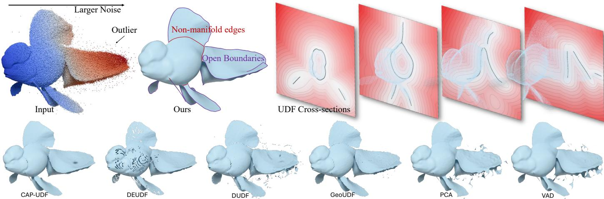  
Figure 1: Reconstruction under spatially varying noise and outliers. Top row: the corrupted Goldfish point cloud, the PNF reconstruction, and planar cross-sections of the computed UDF. Warmer input point colors indicate greater corruption. PNF preserves thin fins, open boundaries, and non-manifold junction geometry, while the color-coded distance values and level-set contours illustrate smooth spatial variation in the displayed slices. Bottom row: reconstructions from competing methods, which exhibit holes, surface irregularities, or spurious fragments.

## 2 Related Work

## 2.1 Direct UDF Learning

Direct approaches reconstruct surfaces by learning scalar unsigned-distance functions from point-cloud observations. NDF (Chibane et al., 2020) introduces a neural UDF conditioned on sparse point clouds. GeoUDF (Ren et al., 2023) incorporates local geometry through learned combinations of distances to neighboring tangent planes. LoSF-UDF (Hu et al., 2025) learns local UDFs from analytically defined shape functions, providing a lightweight model that generalizes across shapes.

Projection-based objectives constrain distance-field learning through spatial query updates. Neural-Pull (Ma et al., 2021), formulated for SDFs, projects queries toward input points using predicted distances and gradients. In the unsigned setting, CAP-UDF (Zhou et al., 2022) progressively pulls queries toward the surface under a field-consistency constraint, while LevelSetUDF (Zhou et al., 2023) improves zero-level-set continuity through projection from smoother nonzero level sets. SuperUDF (Tian et al., 2024) combines LOP-inspired projection with a learned geometry prior and sparsity regularization. RMSMS (Liu et al., 2025) uses recurrent multi-step query updates with distance and gradient regularization. These methods share the principle of enforcing consistency between the learned field, query motion, and sampled surface geometry.

Another line of work addresses the non-differentiability of the ideal UDF at the surface by modifying the field representation or its regularization. DUDF (Fainstein et al., 2024) learns a differentiable hyperbolic transformation of the UDF. DEUDF (Xu et al., 2025) combines an unconstrained neural output, normal alignment, adaptive Eikonal regularization, and a sinusoidal network to improve near-surface gradients and geometric detail. S2DF (Yang et al., 2025) instead uses a differentiable scaledsquared distance representation with Monge–Ampère regularization. These approaches retain a scalar UDF or a transformed distance field as the primary prediction target.

Hybrid representations augment distance information with additional geometric or topological cues. HSDF (Wang et al., 2022) jointly learns unsigned distances and an auxiliary sign field to support surface extraction. GIFS (Ye et al., 2022) predicts whether a surface separates a pair of spatial points and uses an auxiliary UDF branch to enhance spatial features. MPF (Kong et al., 2026) separates an unsigned metric field from a smooth phase field, then combines them into a signed implicit function for thin-structure reconstruction.

## 2.2 Geometry-First and Alternative Implicit Representations

Geometric reconstruction methods provide alternatives to direct distance-field regression. Moving least-squares surfaces (Alexa et al., 2001; Kolluri, 2008) construct local surface approximations, while variational implicit point set methods (Huang et al., 2019; Xia and Ju, 2025) recover implicit geometry through variational optimization. These methods provide geometric reconstruction precedents rather than direct neural UDF predictors.

Closest-point and vector-valued representations offer another alternative by explicitly encoding the relationship between spatial queries and the surface. The closest-surface-point representation (Venkatesh et al., 2021) predicts the nearest surface point associated with each query, from which unsigned distance and local differential information can be derived. VF (Mello Rella et al., 2025) predicts the unit direction toward the nearest surface point, whereas NVF (Yang et al., 2023) predicts the full displacement vector, whose magnitude also encodes distance. These representations make surface correspondence or directional information explicit, rather than encoding geometry solely through scalar distance values.

Among geometry-first UDF construction methods, VAD (Kong et al., 2025) is the most closely related to PNF. It estimates bidirectional normals by reducing discrepancies between local projection-distance fields and their gradients across Voronoi bisectors. The optimized directional information is then diffused through the ambient domain and integrated into a scalar UDF. PNF retains this normal-first decomposition but changes the normal-estimation formulation: it jointly optimizes soft normalaxis tensors over a fixed neighborhood graph, without requiring a Voronoi construction. With positive anchoring weights, the resulting objective is strongly convex and admits a unique global minimizer. The distinction therefore lies in the representation and optimization of the local normal field, rather than in the use of diffusion for downstream UDF construction. Appendix F.3 provides a detailed comparison.

## 3 Overview

Let $\mathcal { X } = \{ { \bf p } _ { i } \} _ { i = 1 } ^ { N } \subset \mathbb { R } ^ { 3 }$ be a raw point cloud representing an unknown surface S, which may be open, non-orientable, or nonmanifold. Given only the point positions, our method constructs a smooth approximation of its unsigned distance field $u _ { \cal S }$ in two stages.

Stage I estimates a local normal axis at each input point without imposing a global orientation. Since n and −n describe the same local tangent plane, we represent their common axis by the rank-one projector $\mathbf { \bar { P } } _ { i } = \mathbf { n } _ { i } \mathbf { n } _ { i } ^ { \top }$ . This representation removes the arbitrary sign choice. We call the collection $\{ \mathbf { P } _ { i } \} _ { i = } ^ { N }$ a hard projective normal field. Because hard projectors form a non-convex set, we relax them to soft normal-axis tensors $\{ \mathbf { M } _ { i } \} _ { i = 1 } ^ { N }$ in a convex feasible set. We estimate the resulting soft projective normal field by combining local tangent-plane evidence with compatibility between neighboring local distance models. With a fixed graph and positive anchoring weights, the objective is strongly convex and has a unique global minimizer. After optimization, a principal eigenvector provides a hard normal axis, while the corresponding eigengap indicates how strongly the tensor favors that axis.

Stage II uses the decoded axes and their confidence values to construct a global UDF approximation. Confidence-based source selection and weighting modulate the directional information propagated by heat diffusion, and Poisson integration assembles this information into a scalar field. The pipeline thus separates orientation-free local geometry estimation from global distance-field construction.

Figure 2 illustrates the process on a 2D toy model. We present Stage I in Section 4 and describe Stage II in Appendix D.

## 4 Convex Optimization of Bidirectional Normals

This section develops the normal-axis representation and optimization used in Stage I. We first describe hard normal-axis projectors, then introduce their convex relaxation to soft tensors, and finally formulate a graph-based objective for estimating a coherent projective normal field.

## 4.1 Hard Normal-Axis Projectors

Let $\mathbf { n } \in \mathbb { S } ^ { 2 }$ be a unit normal. The vectors n and −n represent the same unoriented normal axis span{n}, which we encode by $\mathbf { P } = \mathbf { n } \mathbf { n } ^ { \top }$ . We call P a hard normal-axis projector or simply a hard projector. This representation is sign invariant because $( - \mathbf { n } ) ( - \mathbf { n } ) ^ { \top } = \mathbf { n } \mathbf { n } ^ { \top }$ . Conversely, every rank-one orthogonal projector in $\mathbb { R } ^ { 3 }$ has this form, with n unique up to sign. Hard projectors and bidirectional normals are therefore equivalent representations.

Since $\| \mathbf { n } \| _ { 2 } = 1$ , the projector P satisfies $\mathbf { P } = \mathbf { P } ^ { \top } , \mathbf { P } \succeq \mathbf { 0 } .$ $\begin{array} { r } { \mathbf { P } ^ { 2 } = \mathbf { \ddot { P } } , } \end{array}$ and rank $( \bar { \bf P } ) \bar { = } \mathrm { t r } ( { \bf P } ) = 1$ . For any displacement d $\in \mathbb { R } ^ { 3 } , \mathbf { P d } = ( \mathbf { n } ^ { \top } \mathbf { d } ) \mathbf { \mathbb { 1 } }$ n is its normal component, while $( \mathbf { I } - \mathbf { P } ) \mathbf { d }$ is its tangential component. In particular, $\| \mathbf { P d } \| _ { 2 } ^ { 2 } = \mathbf { d } ^ { \top } \mathbf { P d } =$ $( \mathbf { n } ^ { \top } \mathbf { d } ) ^ { 2 }$ . The tangent plane through p with normal projector P is $\Pi ( \mathbf { p } , \mathbf { P } ) : = \{ \mathbf { \bar { x } } \in \mathbb { R } ^ { 3 } : \mathbf { P } ( \mathbf { \bar { x } } - \mathbf { \bar { p } } ) = \mathbf { 0 } \} = \{ \mathbf { \bar { x } } \in \mathbb { R } ^ { 3 }$ $( { \bf x } - { \bf p } ) ^ { \top } { \bf P } ( { \bf x } - { \bf p } ) = 0 \}$ . For a query point $\mathbf { y } \in \mathbb { R } ^ { 3 }$ , its squared Euclidean distance to this plane is dis $\mathbf { \dot { \eta } } ^ { 2 } ( \mathbf { y } , \Pi ( \mathbf { p } , \mathbf { P } ) ) = \| \mathbf { P } ( \mathbf { y } - \mathbf { \eta }$ $\mathbf { p } ) \| _ { 2 } ^ { 2 } = ( \mathbf { y } - \mathbf { p } ) ^ { \top } \mathbf { P } ( \mathbf { y } - \mathbf { p } )$

Consider two hard projectors $\mathbf { P } = \mathbf { n } \mathbf { n } ^ { \top }$ and $\mathbf Q = \mathbf m \mathbf m ^ { \top }$ , and let θ := arccos $\vert \mathbf { n } ^ { \dagger } \mathbf { m } \vert \in [ 0 , \pi / 2 ]$ be the acute angle between their axes. Then $\operatorname { t r } ( \mathbf { P } \mathbf { Q } ) = ( \mathbf { \bar { n } } ^ { \top } \mathbf { m } ) ^ { 2 } = \cos ^ { 2 } \theta$ , and $\frac { 1 } { 2 } \lVert { \bf P } - { \bf \Phi }$ $\mathbf { Q } \| _ { F } ^ { 2 } = 1 - ( \mathbf { n } ^ { \top } \mathbf { m } ) ^ { 2 } = \sin ^ { 2 } \theta$ . The Frobenius distance therefore compares normal axes directly, without requiring sign alignment.

The set of all hard normal-axis projectors is

$$
\mathcal { P } _ { 3 } : = \{ \mathbf { n } \mathbf { n } ^ { \top } : \mathbf { n } \in \mathbb { S } ^ { 2 } \} = \left\{ \begin{array} { l l } { \mathbf { P } \in \mathrm { S y m } ( 3 ) : \mathbf { P } \succeq \mathbf { 0 } , } \\ { \mathrm { r a n k } ( \mathbf { P } ) = 1 , \mathrm { ~ t r } ( \mathbf { P } ) = 1 \right\} , } \end{array}\tag{1}
$$

where $\operatorname { S y m } ( 3 )$ denotes the space of real symmetric $3 \times 3$ matrices. The term projective reflects the identification of opposite unit normals n and −n as a single unoriented axis. Accordingly, $\mathcal { P } _ { 3 }$ is a matrix realization of the real projective plane $\mathbb { R P } ^ { 2 } = \bar { \mathbb { S } } ^ { 2 } / \{ \pm 1 \}$ . A discrete hard PNF assigns one such projector to each input point.

The projector representation also behaves naturally under sign changes: while the signed vectors n and −n cancel when averaged, their projectors are identical. An average of different hard projectors, however, is generally no longer rank one. This observation motivates the soft representation introduced next.

## 4.2 Soft Normal-Axis Tensors

The hard-projector set $\mathcal { P } _ { 3 }$ is non-convex. For example, the midpoint of the projectors associated with the orthogonal axes $( 1 , \stackrel { \star } { 0 } , 0 ) ^ { \top }$ and $( \bar { 0 } , 1 , 0 ) ^ { \top }$ is diag $( 1 / 2 , 1 / 2 , 0 )$ , which has rank two. We obtain a convex relaxation by dropping the rank-one constraint while retaining symmetry, positive semidefiniteness, and unit trace. Within this class, the rank-one and idempotence conditions are equivalent.

A soft normal-axis tensor is a matrix in

$$
\mathcal { P } _ { 3 } ^ { \mathrm { c v x } } : = \{ \mathbf { M } \in \mathrm { S y m } ( 3 ) : \mathbf { M } \succeq \mathbf { 0 } , \mathrm { t r } ( \mathbf { M } ) = 1 \} .\tag{2}
$$

For brevity, we also use the term soft projector. This is only shorthand: a general soft tensor need not satisfy $\mathbf { M } ^ { 2 } = \mathbf { M }$ and is therefore not an orthogonal projector.

Proposition 4.1 (Convex relaxation and the hard–soft relationship) The set $\mathcal { P } _ { 3 } ^ { \mathrm { c v x } }$ is compact and convex. Every $\mathbf { M } \in \mathcal { P } _ { 3 } ^ { \mathrm { c v x } }$ admits an eigendecomposition

$$
\mathbf { M } = \sum _ { r = 1 } ^ { 3 } \lambda _ { r } \mathbf { e } _ { r } \mathbf { e } _ { r } ^ { \top } , \qquad \lambda _ { r } \geq 0 , \qquad \sum _ { r = 1 } ^ { 3 } \lambda _ { r } = 1 ,\tag{3}
$$

where $\{ \mathbf { e } _ { r } \} _ { r = 1 } ^ { 3 }$ is an orthonormal basis and each $\mathbf { e } _ { r } \mathbf { e } _ { r } ^ { \top }$ is a hard projector. Conversely, every convex combination ofhard projectors belongs to $\mathcal { P } _ { 3 } ^ { \mathrm { c v x } }$ . Hence, $\mathcal { P } _ { 3 } ^ { \mathrm { c v x } }$ is the convex hull $o f \mathcal { P } _ { 3 } ,$ , and its extreme points are exactly the hard projectors.

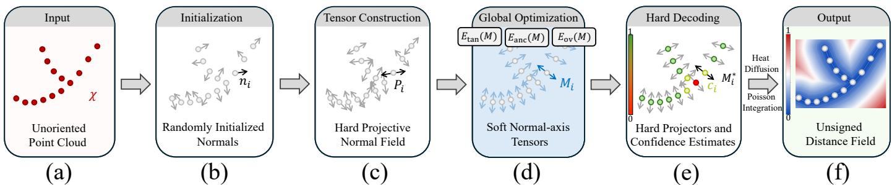  
Figure 2: Two-stage PNF reconstruction on a 2D Y-shaped point cloud. Given unoriented samples (a), Stage I initializes random normal axes (b), encodes them as rank-one projectors (c), and optimizes their soft relaxation using tangent-plane fitting, soft-PCA anchoring, and overlap regularization (d). Principal eigenvectors yield the decoded normal axes, while eigengaps provide confidence values (e). Bidirectional arrows represent unoriented axes; colors in (e) indicate confidence, which is lower near the junction, where multiple branch directions compete, and higher along the regular branches. Stage II applies confidence-guided heat diffusion followed by Poisson integration to construct the UDF approximation (f).

Appendix A provides the proof. The eigendecomposition gives a direct geometric interpretation: the eigenvectors define candidate normal axes, and the eigenvalues specify their nonnegative mixture weights. A hard projector assigns all weight to one axis, whereas a more diffuse spectrum retains competing directional preferences. We optimize the soft tensors first and decode a single hard normal axis afterward.

Proposition 4.2 (Nearest hard projector) Let $\lambda _ { 1 } \geq \lambda _ { 2 } \geq \lambda _ { 3 }$ be the eigenvalues of $\textbf { M } \in \ \bar { \mathcal { P } } _ { 3 } ^ { \mathrm { c v x } }$ , and let $\mathbf { e } _ { 1 }$ be any unit eigenvector associated with $\lambda _ { 1 }$ . Define the hardening operator Hard $( \mathbf { M } ) : = \mathbf { e } _ { 1 } \mathbf { e } _ { 1 } ^ { \top }$ . Then

$$
\mathrm { H a r d } ( \mathbf { M } ) \in \arg \operatorname* { m i n } _ { \mathbf { P } \in \mathcal { P } _ { 3 } } \| \mathbf { M } - \mathbf { P } \| _ { F } ^ { 2 } ,\tag{4}
$$

with minimum value $\mathrm { 1 + t r ( { \bf M } ^ { 2 } ) - 2 \lambda _ { 1 } }$ . The minimizing projector is unique if and only $i f \lambda _ { 1 } > \lambda _ { 2 }$ . Moreover, $\begin{array} { r } { \frac 1 3 \le \mathrm { t r } \big ( \mathbf { \tilde { M } } ^ { 2 } \big ) \le 1 } \end{array}$ with equality at the upper bound exactlyfor hard projectors and at the lower bound exactlyfor the isotropic tensor $\mathbf { I } / 3 .$

Appendix B provides the proof. The soft representation offers two advantages: it removes the non-convex rank constraint from optimization, and it retains directional preference in the tensor spectrum. We use the principal eigengap $c ( \mathbf { M } ) : = \lambda _ { 1 } - \lambda _ { 2 }$ as a spectral confidence indicator. A large gap indicates a clearly preferred axis, whereas a small gap indicates competing leading directions. This indicator describes the optimized tensor’s preference, not the correctness of the decoded normal.

## 4.3 A Convex PNF Objective

Neighborhood graph. We optimize one soft tensor $\mathbf { M } _ { i } \in \mathcal { P } _ { 3 } ^ { \mathrm { c v x } }$ at each input point pi. To couple neighboring estimates, we construct a fixed undirected graph $G \doteq ( V , { \check { E } } )$ , where $V =$ $\{ 1 , \ldots , N \}$ . Possible constructions include radius-based neighborhoods, symmetrized k-nearest neighbors, and Voronoi adjacency. The graph is computed before optimization and remains fixed during the solve. Each edge expresses the intended compatibility between local surface models at its endpoints. For every edge, we define the unit direction $\hat { \mathbf { d } } _ { i j } : = ( \mathbf { p } _ { j } - \mathbf { p } _ { i } ) / \| \mathbf { p } _ { j } - \mathbf { p } _ { i } \| _ { 2 }$ Either orientation may be used for an undirected edge: replacing $\widehat { \mathbf { d } } _ { i j } \mathbf { b } \mathbf { y } - \widehat { \mathbf { d } } _ { i j }$ leaves the objective unchanged.

Local scatter matrix. For each point $\mathbf { p } _ { i } ,$ let $\mathcal { N } _ { C } ( i )$ be a fixed, nonempty neighborhood. We define $\begin{array} { r l } { \mathbf { C } _ { i } } & { { } : = } \end{array}$ $\begin{array} { r } { \frac { 1 } { | \mathcal { N } _ { C } ( i ) | } \sum _ { j \in \mathcal { N } _ { C } ( i ) } ( \dot { \bf p } _ { j } - \dot { \bf p } _ { i } ) \big ( \bar { \bf p } _ { j } - { \bf p } _ { i } \big ) ^ { \top } } \end{array}$ . The symmetric positivesemidefinite matrix $\mathbf { C } _ { i }$ describes the directional spread of the neighboring points around $\mathbf { p } _ { i } .$ . For any unit vector $\mathbf { v } , \mathbf { v } ^ { \top } \mathbf { C } _ { i } \mathbf { v } =$ $\begin{array} { r } { \frac { 1 } { \left| \mathcal { N } _ { C } ( i ) \right| } \sum _ { j \in \mathcal { N } _ { C } ( i ) } \bigl ( \mathbf { v } ^ { \top } ( \mathbf { p } _ { j } - \mathbf { p } _ { i } ) \bigr ) ^ { 2 } } \end{array}$ , which is the average squared displacement along v. For a locally planar neighborhood, the direction of least spread approximates the surface normal.

Soft-PCA prior. We convert the local scatter matrix into a fixed soft prior $\begin{array} { r } { \bar { \mathbf { M } } _ { i } : = \frac { \exp ( - \mathbf { C } _ { i } / \tau _ { i } ) } { \mathrm { t r } \big ( \exp ( - \mathbf { C } _ { i } / \tau _ { i } ) \big ) } \in \mathcal { P } _ { 3 } ^ { \mathrm { c v x } } } \end{array}$ , with $\tau _ { i } ~ > ~ 0$ . The matrix exponential preserves the eigenvectors of $\mathbf { C } _ { i }$ and assigns larger weights to directions with smaller eigenvalues. The prior therefore favors the local PCA normal while retaining competing directions when the local geometry is ambiguous. The parameter $\tau _ { i }$ controls this preference: as $\tau _ { i } \to 0$ , the prior approaches the rank-one PCA normal projector provided that the smallest eigenvalue of C is simple.

Local quadratic model. Each point–tensor pair $( \mathbf { p } _ { i } , \mathbf { M } _ { i } )$ defines a local model of squared distance, $\psi _ { i } ( \mathbf { x } ; \mathbf { M } _ { i } ) : = \mathbf { \Gamma } ( \mathbf { x } - \mathbf { \Gamma }$ $\mathbf { p } _ { i } ) ^ { \top } \mathbf { M } _ { i } ( \mathbf { x } - \mathbf { p } _ { i } )$ . For a hard projector $\mathbf { P } _ { i } = \mathbf { n } _ { i } \mathbf { n } _ { i } ^ { \top }$ , this becomes $\psi _ { i } ( \mathbf { x } ; \mathbf { P } _ { i } ) = \left( \mathbf { n } _ { i } ^ { \top } ( \mathbf { x } - \mathbf { p } _ { i } ) \right) ^ { 2 }$ , the squared distance to the plane through $\mathbf { p } _ { i }$ with normal axis ${ \bf n } _ { i }$ . For a soft tensor, it is a weighted blend of squared distances to planes associated with the tensor’s candidate axes. Although $\psi _ { i }$ is quadratic in $\mathbf { x } ,$ it is linear in the unknown tensor M .

Tangent-plane fitting. We collect the unknowns as M $\mathbf { \Psi } : = \mathbf { \bar { \Gamma } } \left( \mathbf { M } _ { 1 } , \dots , \mathbf { M } _ { N } ^ { - } \right)$ and fit each local quadratic model to the neighboring input points. By the definition of $\mathbf { C } _ { i } .$ $\begin{array} { r l r } { \mathrm { t r } ( { \bf C } _ { i } { \bf M } _ { i } ) { \mathrm { \Sigma } } = } & { { } \frac { \mathbb { Y } } { | \mathcal { N } _ { C } ( i ) | } \sum _ { j \in \mathcal { N } _ { C } ( i ) } ( { \bf p } _ { j } { \mathrm { \Sigma } } - { \bf p } _ { i } ) ^ { \top } { \bf M } _ { i } ( { \bf p } _ { j } - { \bf p } _ { i } ) \ = } \end{array}$ $\begin{array} { r } { \frac { 1 } { \left| \mathcal { N } _ { C } ( i ) \right| } \sum _ { j \in \mathcal { N } _ { C } ( i ) } \psi _ { i } ( \mathbf { p } _ { j } ; \mathbf { M } _ { i } ) } \end{array}$ . The trace is therefore the average value assigned by the local model to its neighboring samples. This motivates $\begin{array} { r } { E _ { \tan } ( \mathbf { M } ) \ : = \ \sum _ { i = 1 } ^ { N } \gamma _ { i } \operatorname { t r } ( \mathbf { C } _ { i } \mathbf { M } _ { i } ) } \end{array}$ , where $\gamma _ { i } ~ \geq ~ 0$ is fixed. For a hard projector $\bar { \mathbf { P } } _ { i } ,$ the trace becomes $\begin{array} { r } { \mathrm { t r } ( { \bf C } _ { i } { \bf P } _ { i } ) = \frac { 1 } { | { \cal N } _ { C } ( i ) | } \sum _ { j \in { \cal N } _ { C } ( i ) } \bigl ( { \bf n } _ { i } ^ { \top } \bigl ( { \bf p } _ { j } - { \bf p } _ { i } \bigr ) \bigr ) ^ { 2 } } \end{array}$ . Each summand is the squared distance of a neighboring point to the estimated plane. Minimizing $E _ { \mathrm { t a n } }$ therefore encourages local tangentplane agreement. The energy is linear in the unknown tensors.

Anchoring. Tangent-plane fitting favors directions of small local variation, but does not by itself retain the directional balance encoded by the soft-PCA prior. We therefore penalize deviations from that prior $\begin{array} { r } { E _ { \mathrm { a n c } } ( \mathbf { M } ) : = \frac { 1 } { 2 } \sum _ { i = 1 } ^ { N } \rho _ { i } \left\| \mathbf { M } _ { i } - \overline { { \mathbf { M } } } _ { i } \right\| _ { F } ^ { 2 } , } \end{array}$ where $\rho _ { i } \geq 0$ is a fixed anchoring weight. A larger ρi places greater emphasis on the local soft-PCA estimate, whereas a smaller value allows stronger modification through neighboring evidence. The anchor term thus balances local fidelity against graph-based coupling. Strictly positive anchoring weights also make the quadratic anchoring energy strongly convex.

Overlap regularization. The fitting and anchoring terms act independently at each sample. To obtain a coherent field, we additionally encourage neighboring quadratic models to agree where their local neighborhoods overlap. Differentiating the local model gives $\nabla _ { \mathbf { x } } \psi _ { i } ( \mathbf { x } ; \mathbf { M } _ { i } ) ~ = ~ 2 \mathbf { M } _ { i } ( \mathbf { x } ~ - ~ \mathbf { p } _ { i } )$ and $\nabla _ { \mathbf { x } } ^ { 2 } \psi _ { i } ( \mathbf { x } ; \mathbf { M } _ { i } ) = 2 \mathbf { M } _ { i }$ Thus, $\dot { \mathbf { M } } _ { i } ~ - ~ \mathbf { M } _ { j }$ is proportional to the Hessian discrepancy between two neighboring models. At the midpoint ${ \bf q } _ { i j } = ( { \bf p } _ { i } + { \bf p } _ { j } ) / 2$ of an edge $\{ i , j \} \in E$ , the gradient difference is $\nabla _ { \mathbf { x } } \psi _ { i } \left( \mathbf { q } _ { i j } ; \mathbf { M } _ { i } \right) \ -$ $\nabla _ { \mathbf { x } } \psi _ { j } ( \mathbf { q } _ { i j } ; \mathbf { M } _ { j } ) = \| \mathbf { p } _ { j } - \mathbf { p } _ { i } \| _ { 2 } ( \mathbf { M } _ { i } + \mathbf { M } _ { j } ) \widehat { \mathbf { d } } _ { i j }$ , whereas their value difference is ψ $\mathbf { \ddot { \varepsilon } } _ { i } \left( \mathbf { \dot { q } } _ { i j } ; \mathbf { M } _ { i } \right) - \psi _ { j } \left( \mathbf { q } _ { i j } ; \mathbf { \dot { M } } _ { j } \right) = 0 . 2 5 \| \mathbf { p } _ { j } -$ $\mathbf { p } _ { i } \| _ { 2 } ^ { 2 } \widehat { \mathbf { d } } _ { i j } ^ { \top } ( \mathbf { M } _ { i } - \mathbf { M } _ { j } ) \widehat { \mathbf { d } } _ { i j }$ . These identities motivate the overlap energy $\begin{array} { r } { E _ { \mathrm { o v } } ( \mathbf { M } ) : = \frac { 1 } { 2 } \sum _ { \{ i , j \} \in E } w _ { i j } \left| \beta _ { s } \| \mathbf { M } _ { i } - \mathbf { M } _ { j } \| _ { F } ^ { 2 } + \beta _ { t } \| ( \mathbf { M } _ { i } + \mathbf { \beta } _ { 1 } ) \| _ { F } ^ { 2 } \right| , } \end{array}$ $\mathbf { M } _ { j } ) \widehat { \mathbf { d } } _ { i j } \| _ { 2 } ^ { 2 } + \beta _ { q } \left( \widehat { \mathbf { d } } _ { i j } ^ { \top } ( \mathbf { M } _ { i } - \mathbf { M } _ { j } ) \widehat { \mathbf { d } } _ { i j } \right) ^ { 2 } \Big \|$ , where $w _ { i j } \geq 0$ is a fixed symmetric edge weight, and $\beta _ { s } , \beta _ { t } , \bar { \beta _ { q } } \geq 0$ are fixed global coefficients. We consider uniform weights $w _ { i j } \equiv 1$ or Gaussian distance-decaying weights $w _ { i j } \ = \ \exp \left( - \| \mathbf { \bar { p } } _ { i } - \mathbf { p } _ { j } \| ^ { 2 } / ( 2 \sigma ^ { 2 } ) \right)$ , where $\sigma > 0$ is a fixed global length scale. The three terms penalize discrepancies in Hessians, midpoint gradients, and midpoint values, respectively. Gradient differences are normalized by the edge length, and value differences by its square; fixed proportionality factors are absorbed into the global coefficients. This normalization prevents the residuals from increasing solely because an edge is longer, while the edge weights modulate the influence of individual neighbors.

PNF objective. Combining the three terms, we define $E _ { \mathrm { P N F } } ( \mathbf { M } ) : = E _ { \mathrm { t a n } } ( \mathbf { M } ) + E _ { \mathrm { a n c } } ( \mathbf { M } ) + E _ { \mathrm { o v } } ( \mathbf { M } )$ , and solve

$$
\mathbf { M } ^ { \star } \in \arg \operatorname* { m i n } _ { \mathbf { M } \in ( \mathcal { P } _ { 3 } ^ { \mathrm { c v x } } ) ^ { N } } E _ { \mathrm { P N F } } ( \mathbf { M } ) .\tag{5}
$$

All neighborhoods, priors, edge directions, and weights are fixed before optimization. The fitting term uses local point positions, the anchor term retains soft-PCA evidence, and the overlap term couples neighboring local models.

Theorem 4.3 (Convexity and uniqueness of PNF optimization) Under the fixed-data construction above, assume that $\rho _ { i } > 0$ for every $i ,$ and let $\rho _ { \mathrm { m i n } } : = \mathrm { m i n } _ { 1 \leq i \leq N } \rho _ { i } > 0 .$ . Then $E _ { \mathrm { P N F } }$ is continuous and $\rho _ { \mathrm { m i n } ^ { - } } s t r o n g l y$ convex on $( \mathcal { P } _ { 3 } ^ { \mathrm { c v x } } ) ^ { N }$ with respect to the block Frobenius norm $\begin{array} { r } { \| \mathbf { M } \| _ { \mathbb { F } } ^ { 2 } : = \sum _ { i = 1 } ^ { N } \| \mathbf { M } _ { i } \| _ { F } ^ { 2 } } \end{array}$ . Consequently, the constrained minimization problem in Equation (5) has a unique global minimizer.

Appendix C provides the proof. This guarantee concerns the selected fixed-graph model; it does not ensure that every retained edge connects geometrically compatible surface samples.

Hard bidirectional normal decoding. From the optimized tensors, we recover hard normal projectors $\mathbf { P } _ { i } : = \mathrm { H a r d } ( \mathbf { M } _ { i } ^ { \star } )$ and spectral confidence values $c _ { i } : = \lambda _ { i 1 } - \lambda _ { i 2 } .$ , where $\lambda _ { i 1 } \geq \dot { \lambda } _ { i 2 } \geq$ $\lambda _ { i 3 }$ are the eigenvalues of $\mathbf { M } _ { i } ^ { \star }$ . The eigengap indicates how distinctly the optimized tensor selects its leading axis. Stage II uses this confidence to modulate the axis’s contribution to directional diffusion.

## 5 Experimental Results

PCA versus PNF: ambiguous local neighborhoods. PCA estimates a normal axis from the direction of least local point variation. This estimate becomes less reliable when the neighborhood lacks a clear tangent-plane structure. Such ambiguity often arises in three challenging settings: noisy inputs, where perturbations obscure local directional structure; outlier-contaminated inputs, where spurious samples distort the local point distribution; and thin structures, where a neighborhood may contain points from distinct nearby surface sheets. In each case, the neighborhood size k can substantially affect the PCA estimate. Rather than estimating each axis independently, PNF jointly optimizes the normal-axis field using tangent-plane evidence, soft-PCA anchoring, and compatibility between neighboring quadratic models. Figure 3 shows higher normal-axis accuracy for PNF on the illustrated thin structures and noisy inputs. Table 1 further shows smaller variations in accuracy across the tested neighborhood sizes. These results support the benefit ofjoint normal-axis optimization when individual neighborhoods provide ambiguous geometric evidence.

Confidence as a geometric cue. Besides a decoded normal axis, PNF provides the eigengap confidence $c _ { i } .$ . This quantity measures how strongly the optimized tensor favors its leading axis. During reconstruction, we use confidence to modulate directional source contributions and suppress sources below a fixed threshold (Appendix D). This reduces the influence of weakly preferred axes without automatically discarding the corresponding input samples. Confidence also provides a cue for locating ambiguous normal axes before surface reconstruction. Figure 5 visualizes the optimized confidence on non-manifold geometry and outlier-contaminated inputs. Low values can occur near junctions with competing axes or around samples with inconsistent directional support. However, confidence is not a point-type classifier: low values alone cannot distinguish junctions, outliers, noise, or sparse sampling, and high values do not guarantee a correct normal.

Comparisons. We compare PNF with CAP-UDF (Zhou et al., 2022), GeoUDF (Ren et al., 2023), DUDF (Fainstein et al., 2024), DEUDF (Xu et al., 2025), and VAD (Kong et al., 2025). For the non-manifold experiments, we also include PCA+HM, which replaces PNF estimation with local PCA normal axes (Hoppe et al., 1992) before heat-based UDF construction. The experiments examine robustness to corrupted inputs and reconstruction near non-manifold junctions, where a unique normal axis may be undefined.

Benchmark and evaluation. The benchmark contains 60 models evaluated under five input conditions: clean samples, two noise levels (0.3% and 0.8%), and two outlier levels (2% and 5%). The underlying model set is the same across conditions. We use ground-truth meshes as references when available and otherwise use the original clean point clouds. Table 2 reports arithmetic means of the per-model errors. We evaluate directed Chamfer distance (CD) and Hausdorff distance (HD) from the reference geometry to the reconstruction, corresponding to the mean and maximum nearest-surface distances, respectively. PNF achieves lower CD and HD than VAD under all five tested conditions. Across all compared methods, PNF obtains the lowest CD in four conditions and the second-lowest CD under 0.8% noise. GeoUDF obtains the lowest HD in four conditions, while PNF obtains the lowest HD under 0.8% noise. These results demonstrate competitive performance of the complete PNF pipeline under the evaluated input corruptions.

Non-manifold reconstruction. We further evaluate three synthetic models: a cross-junction, a multi-junction, and the selfintersecting Henneberg surface. The bottom three rows of Figure 4 show these models, which test reconstruction near locations where a single normal axis is insufficient to describe the local geometry. PNF retains competing directional preferences in its soft tensors and reduces the influence of low-confidence directional sources during Stage II. Table 5 reports global and junction-region accuracy. PNF achieves the lowest global CD, junction-region CD and HD95 on all three models, together with 100% junction recall in each case, including ties with other methods. These results demonstrate accurate reconstruction near the evaluated non-manifold structures. Appendix F.1 examines the effects of the normal estimator and confidence weighting and describes the graph-construction comparison.

Table 1: Sensitivity to neighborhood size k. We report mean absolute cosine similarity between estimated and reference normal axes on four models with thin structures. Higher values are better, with 1 indicating perfect agreement. PNF exhibits less variation across the tested neighborhood sizes than local PCA. The better result for each model and neighborhood size is shown in bold. The plots visualize the same data.
<table><tr><td colspan="6">Model Method k 二 3 k 二 5 k 二 10 k 二 15 k = 20 k = 30</td></tr><tr><td>Toy</td><td>PCA Ours</td><td>0.9693 0.9900 0.9934 0.9937</td><td>0.9660 0.9746 0.9938 0.9937</td><td>0.9828 0.9937</td><td>0.9833 0.9934</td></tr><tr><td>Ship</td><td>PCA Ours</td><td>0.9525 0.9079 0.9628 0.9621</td><td>0.8815 0.9301 0.9555 0.9523</td><td>0.9408 0.9505</td><td>0.9451 0.9515</td></tr><tr><td>Leaf</td><td>PCA Ours</td><td>0.9609 0.9725 0.9863 0.9878</td><td>0.9707 0.9605 0.9876 0.9869</td><td>0.9629 0.9860</td><td>0.9778 0.9847</td></tr><tr><td>Coil</td><td>PCA Ours</td><td>0.90000.9576 0.97000.9795</td><td>0.9733 0.9755 0.9796 0.9779</td><td>0.9763 0.9757</td><td>0.9750 0.9841</td></tr></table>

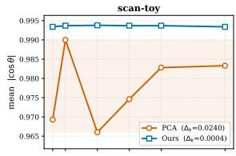

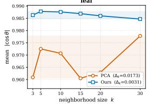

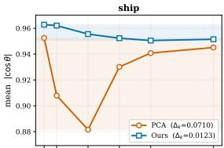

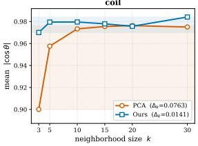

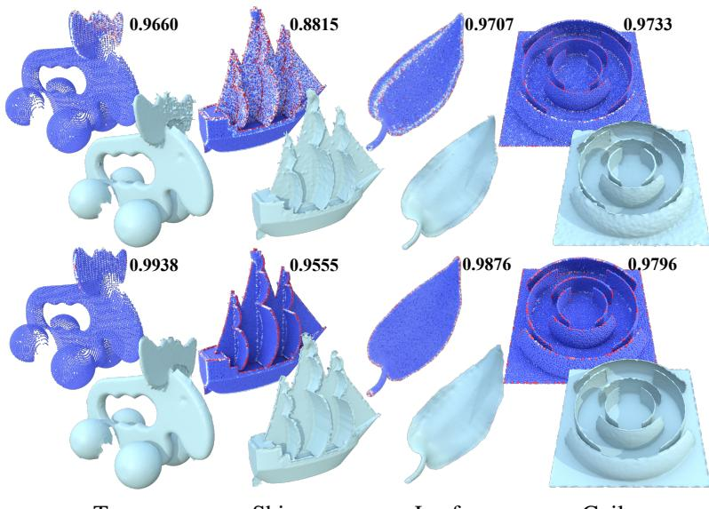  
Toy  
Ship  
Leaf

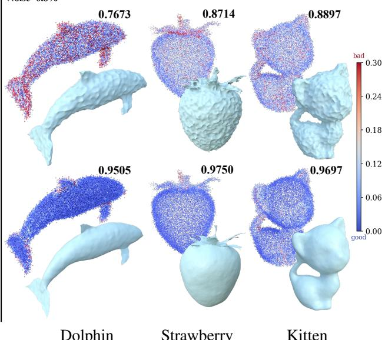  
Coil  
Dolphin  
Strawberry  
Figure 3: Global PNF optimization vs. local PCA fitting. We compare normal-axis estimates from PCA (top row) and PNF (bottom row) on thin structures with k = 10 (left) and inputs corrupted by 0.8% noise (right), together with the corresponding surface reconstruction results. Colors indicate per-point normal error, from blue (low) to red (high). Numbers report the mean absolute cosine similarity between estimated and reference normals; higher values are better, with 1 indicating perfect agreement. Unlike PCA, which fits each neighborhood independently, PNF jointly optimizes the normal-axis field over the entire neighborhood graph. This global formulation combines local geometric evidence with inter-sample consistency, yielding more accurate axes and improved surface reconstructions in these challenging examples.

## 6 Conclusion

We introduced Projective Normal Fields, an orientation-free representation that separates local normal-axis estimation from global UDF construction. By relaxing rank-one projectors to positive-semidefinite, unit-trace tensors, we combine tangentplane evidence, soft-PCA anchoring, and overlap consistency in a strongly convex optimization on a fixed graph with positive anchoring weights. The optimized tensors provide normal axes and spectral confidence, which guide directional-source selection, heat diffusion, and subsequent UDF construction. Experiments demonstrate reduced sensitivity to neighborhood size compared with local PCA, competitive reconstruction under noise and outliers, and improved accuracy near the evaluated non-manifold junctions.

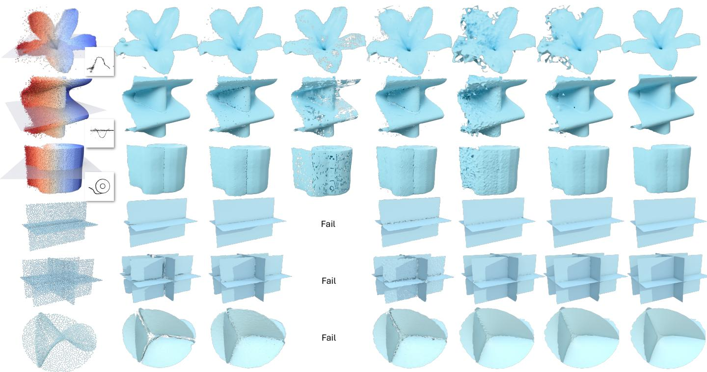  
Input  
CAP-UDF  
GeoUDF  
DEUDF  
DUDF  
VAD  
Ours

PCA+HM

Figure 4: Qualitative comparison on non-manifold models. The top three rows show reconstructions from inputs with spatially varying noise and outliers; warmer point colors indicate greater corruption, and insets show cross-sections at the indicated planes. The bottom three rows show a cross-junction, a multi-junction, and the self-intersecting Henneberg surface. Several baselines exhibit holes, surface irregularities, or spurious floating fragments, whereas PNF produces smoother, more coherent reconstructions that closely follow the junction geometry. DEUDF failed on the three synthetic non-manifold models due to its reliance on locally estimated PCA normals for gradient alignment. See also Table 5 for quantitative results for these non-manifold models.

## References

Marc Alexa, Johannes Behr, Daniel Cohen-Or, Shachar Fleishman, David Levin, and Claudio T Silva. 2001. Point set surfaces. In Proceedings Visualization, 2001. VIS’01. IEEE, 21– 29.

Julian Chibane, Aymen Mir, and Gerard Pons-Moll. 2020. Neural Unsigned Distance Fields for Implicit Function Learning. In Advances in Neural Information Processing Systems (NeurIPS).

Miguel Fainstein, Viviana Siless, and Emmanuel Iarussi. 2024. DUDF: Differentiable Unsigned Distance Fields with Hyperbolic Scaling. In Proceedings of the IEEE/CVF Conference on Computer Vision and Pattern Recognition (CVPR). 4484– 4493.

Nicole Feng and Keenan Crane. 2024. A heat method for generalized signed distance. ACM Transactions on Graphics (TOG) 43, 4 (2024), 1–19.

Hugues Hoppe, Tony DeRose, Tom Duchamp, John McDonald, and Werner Stuetzle. 1992. Surface reconstruction from unorganized points. In Proceedings of the 19th Annual Conference on Computer Graphics and Interactive Techniques (SIG-GRAPH ’92). Association for Computing Machinery, New York, NY, USA, 71–78.

Fei Hou, Xuhui Chen, Wencheng Wang, Hong Qin, and Ying He. 2023. Robust Zero Level-Set Extraction from Unsigned Distance Fields Based on Double Covering. ACM Trans. Graph. 42, 6, Article 245 (2023), 15 pages.

Jiangbei Hu, Yanggeng Li, Fei Hou, Junhui Hou, Zhebin Zhang, Shengfa Wang, Na Lei, and Ying He. 2025. A Lightweight UDF Learning Framework for 3D Reconstruction Based on Local Shape Functions. In IEEE/CVF Conference on Computer Vision and Pattern Recognition, CVPR 2025.

Zhiyang Huang, Nathan Carr, and Tao Ju. 2019. Variational implicit point set surfaces. ACM Trans. Graph. 38, 4 (2019), 124:1–124:13.

Ravikrishna Kolluri. 2008. Provably good moving least squares. ACM Transactions on Algorithms (TALG) 4, 2 (2008), 1–25.

Jiayi Kong, Xuhui Chen, Chen Zong, Fei Hou, Junhui Hou, Wenping Wang, and Ying He. 2026. Metric—Phase Fields: Decoupling Distance and Sign for Thin-Structure Reconstruction from Unoriented Point Clouds. In ICML 2026.

Jiayi Kong, Chen Zong, Junkai Deng, Xuhui Chen, Fei Hou, Shiqing Xin, Junhui Hou, Chen Qian, and Ying He. 2025. Voronoi-Assisted Diffusion for Computing Unsigned Distance Fields from Unoriented Points. CoRR abs/2510.12524 (2025).

Zheng Liu, Jianjun Zhang, Ming Zhang, Runze Ke, Chengcheng Yu, and Ligang Liu. 2025. Unsupervised point cloud reconstruction via recurrent multi-step moving strategy. IEEE Transactions on Multimedia 28 (2025), 972–984.

William E. Lorensen and Harvey E. Cline. 1987. Marching Cubes: A High Resolution 3D Surface Construction Algorithm. In Proceedings ofthe 14th Annual Conference on Computer Graphics and Interactive Techniques (SIGGRAPH ’87). 163–169.

Table 2: Robustness to input corruptions. Mean per-shape directed CD and HD, evaluated from the reference geometry to the reconstruction, on the same 60 test shapes. Distances are reported in units of $1 0 ^ { - 3 }$ ; lower values are better. The best and secondbest results in each metric column are shown in bold and underlined, respectively.
<table><tr><td rowspan="2">Method</td><td colspan="2">Clean</td><td colspan="2">Noise (0.3%)</td><td colspan="2">Noise (0.8%)</td><td colspan="2">Outliers (2%)</td><td colspan="2">Outliers (5%)</td></tr><tr><td>CD</td><td>HD</td><td>CD</td><td>HD</td><td>CD</td><td>HD</td><td>CD</td><td>HD</td><td>CD</td><td>HD</td></tr><tr><td>CAP-UDF</td><td>0.329</td><td>6.592</td><td>1.232</td><td>9.329</td><td>2.990</td><td>19.492</td><td>0.407</td><td>7.101</td><td>0.452</td><td>7.886</td></tr><tr><td>GeoUDF</td><td>0.206</td><td>5.253</td><td>1.691</td><td>7.628</td><td>2.968</td><td>11.888</td><td>0.241</td><td>5.757</td><td>0.243</td><td>5.832</td></tr><tr><td>DUDF</td><td>0.395</td><td>7.818</td><td>2.836</td><td>18.463</td><td>2.047</td><td>10.802</td><td>0.628</td><td>9.381</td><td>0.639</td><td>10.956</td></tr><tr><td>DEUDF</td><td>0.465</td><td>15.079</td><td>2.358</td><td>15.999</td><td>4.634</td><td>24.952</td><td>0.615</td><td>19.658</td><td>0.671</td><td>21.009</td></tr><tr><td>VAD</td><td>0.133</td><td>7.195</td><td>1.199</td><td>8.495</td><td>2.311</td><td>10.491</td><td>1.089</td><td>14.194</td><td>1.050</td><td>13.331</td></tr><tr><td>PNF (Ours)</td><td>0.123</td><td>7.166</td><td>1.179</td><td>8.377</td><td>2.199</td><td>10.172</td><td>0.194</td><td>6.707</td><td>0.150</td><td>11.269</td></tr></table>

Baorui Ma, Zhizhong Han, Yu-Shen Liu, and Matthias Zwicker. 2021. Neural-Pull: Learning Signed Distance Functions from Point Clouds by Learning to Pull Space onto Surfaces. In Proceedings of the International Conference on Machine Learning (ICML).

Edoardo Mello Rella, Ajad Chhatkuli, Ender Konukoglu, and Luc Van Gool. 2025. Neural vector fields for implicit surface representation and inference. International Journal of Computer Vision 133, 4 (2025), 1855–1878.

Jeong Joon Park, Peter Florence, Julian Straub, Richard Newcombe, and Steven Lovegrove. 2019. DeepSDF: Learning Continuous Signed Distance Functions for Shape Representation. In 2019 IEEE/CVF Conference on Computer Vision and Pattern Recognition (CVPR). 165–174.

Yue Qian, Junhui Hou, Sam Kwong, and Ying He. 2020. PUGeo-Net: A Geometry-Centric Network for 3D Point Cloud Upsampling. In ECCV 2020. 752–769.

Siyu Ren, Junhui Hou, Xiaodong Chen, Ying He, and Wenping Wang. 2023. GeoUDF: Surface Reconstruction from 3D Point Clouds via Geometry-guided Distance Representation. In ICCV. 14168–14178.

Hui Tian, Chenyang Zhu, Yifei Shi, and Kai Xu. 2024. SuperUDF: Self-Supervised UDF Estimation for Surface Reconstruction. IEEE Transactions on Visualization and Computer Graphics 30, 9 (2024), 5965–5975.

Rahul Venkatesh, Tejan Karmali, Sarthak Sharma, Aurobrata Ghosh, R. Venkatesh Babu, László A. Jeni, and Maneesh Singh. 2021. Deep Implicit Surface Point Prediction Networks. In 2021 IEEE/CVF International Conference on Computer Vision (ICCV). 12633–12642. https://doi.org/10. 1109/ICCV48922.2021.01242

Li Wang, Jie Yang, Wei-Kai Chen, Xiao-Xu Meng, Bo Yang, Jin-Tao Li, and Lin Gao. 2022. HSDF: Hybrid Sign and Distance Field for Modeling Surfaces with Arbitrary Topologies. In Neural Information Processing Systems (NeurIPS).

Zixiong Wang, Yunxiao Zhang, Rui Xu, Fan Zhang, Peng-Shuai Wang, Shuangmin Chen, Shiqing Xin, Wenping Wang, and Changhe Tu. 2023. Neural-Singular-Hessian: Implicit Neural Representation of Unoriented Point Clouds by Enforcing Singular Hessian. ACM Trans. Graph. 42, 6 (2023).

Jianjun Xia and Tao Ju. 2025. Variational surface reconstruction using natural neighbors. ACM Transactions on Graphics (TOG) 44, 4 (2025), 1–19.

Cheng Xu, Fei Hou, Wencheng Wang, Hong Qin, Zhebin Zhang, and Ying He. 2025. Details Enhancement in Unsigned Distance Field Learning for High-fidelity 3D Surface Reconstruction. In Proc. ofAAAI.

Chuanxiang Yang, Yuanfeng Zhou, Guangshun Wei, Long Ma, Junhui Hou, Yuan Liu, and Wenping Wang. 2025. Monge-Ampere Regularization for Learning Arbitrary Shapes from Point Clouds. IEEE Transactions on Pattern Analysis and Machine Intelligence 47, 8 (2025), 1–15.

Xianghui Yang, Guosheng Lin, Zhenghao Chen, and Luping Zhou. 2023. Neural vector fields: Implicit representation by explicit learning. In 2023 IEEE/CVF Conference on Computer Vision and Pattern Recognition (CVPR). IEEE, 16727–16738.

Jianglong Ye, Yuntao Chen, Naiyan Wang, and Xiaolong Wang. 2022. Gifs: Neural implicit function for general shape representation. In 2022 IEEE/CVF Conference on Computer Vision and Pattern Recognition (CVPR). IEEE, 12819–12829.

Junsheng Zhou, Baorui Ma, Shujuan Li, Yu-Shen Liu, and Zhizhong Han. 2023. Learning a More Continuous Zero Level Set in Unsigned Distance Fields through Level Set Projection. 2023 IEEE/CVF International Conference on Computer Vision (ICCV) (2023), 3158–3169.

Junsheng Zhou, Baorui Ma, Yu-Shen Liu, Yi Fang, and Zhizhong Han. 2022. Learning Consistency-Aware Unsigned Distance Functions Progressively from Raw Point Clouds. In Advances in Neural Information Processing Systems (NeurIPS).

Appendices A–C prove the propositions and main theorem. Appendix D describes confidence-guided heat diffusion, scalar integration, and surface extraction. Appendix E describes the benchmark used for evaluation and comparison. Finally, Appendix F presents ablation studies, compares PNF with VAD, presents additional visual and quantitative results, and discusses the limitations.

## A Proof of Proposition 4.1

We establish convexity, compactness, the convex-hull identity, and the characterization of extreme points.

Convexity. Let M, $\mathbf { N } \in \mathcal { P } _ { 3 } ^ { \mathrm { c v x } }$ and $t \in [ 0 , 1 ]$ . The matrix $\mathbf { L } =$ $( 1 - t ) \mathbf { M } + t \mathbf { N }$ is symmetric. For every $\bar { \mathbf { x } } \in \mathbb { R } ^ { 3 }$

$$
\mathbf { x } ^ { \top } \mathbf { L } \mathbf { x } = ( 1 - t ) \mathbf { x } ^ { \top } \mathbf { M } \mathbf { x } + t \mathbf { x } ^ { \top } \mathbf { N } \mathbf { x } \geq 0 ,
$$

so $\mathbf { L } \succeq 0 .$ . Moreover,

$$
\mathrm { t r } ( \mathbf { L } ) = ( 1 - t ) \mathrm { t r } ( \mathbf { M } ) + t \mathrm { t r } ( \mathbf { N } ) = 1 .
$$

Thus, $\mathbf { L } \in \mathcal { P } _ { 3 } ^ { \mathrm { c v x } }$ , proving convexity.

Compactness. The positive-semidefinite cone and the unit trace constraint are closed, so $\mathcal { P } _ { 3 } ^ { \mathrm { c v x } }$ is closed in $\operatorname { S y m } ( 3 )$ . For any M $\in \mathcal { P } _ { 3 } ^ { \mathrm { c v x } }$ , its eigenvalues are nonnegative and sum to one. Hence

$$
\| \mathbf { M } \| _ { F } ^ { 2 } = \sum _ { r = 1 } ^ { 3 } \lambda _ { r } ^ { 2 } \leq \left( \sum _ { r = 1 } ^ { 3 } \lambda _ { r } \right) ^ { 2 } = 1 .
$$

The set is therefore bounded. Since $\mathrm { S y m ( 3 ) }$ is finitedimensional, closedness and boundedness imply compactness.

Convex-hull identity. By the spectral theorem, every ${ \textbf { M } } \in$ $\mathcal { P } _ { 3 } ^ { \mathrm { c v x } }$ can be written as

$$
\mathbf { M } = \sum _ { r = 1 } ^ { 3 } \lambda _ { r } \mathbf { e } _ { r } \mathbf { e } _ { r } ^ { \top } , \qquad \lambda _ { r } \geq 0 , \qquad \sum _ { r = 1 } ^ { 3 } \lambda _ { r } = 1 ,
$$

where the eigenvectors form an orthonormal basis. Each $\mathbf { e } _ { r } \mathbf { e } _ { r } ^ { \top }$ belongs to $\bar { \mathcal { P } _ { 3 } }$ . Thus, $\mathcal { P } _ { 3 } ^ { \mathrm { c v x } } \subseteq \mathrm { c o n v } ( \mathcal { P } _ { 3 } )$

Conversely, $\mathcal { P } _ { 3 } \subseteq \mathcal { P } _ { 3 } ^ { \mathrm { c v x } }$ , and the latter set is convex. It therefore contains every convex combination of hard projectors. Hence

$$
\mathcal { P } _ { 3 } ^ { \mathrm { c v x } } = \mathrm { c o n v } ( \mathcal { P } _ { 3 } ) .
$$

Extreme points. First, let $\mathbf { P } = \mathbf { n } \mathbf { n } ^ { \top } \in \mathcal { P } _ { 3 }$ and suppose

$$
\mathbf { P } = ( 1 - t ) \mathbf { M } + t \mathbf { N } , \qquad \mathbf { M } , \mathbf { N } \in \mathscr { P } _ { 3 } ^ { \mathrm { c v x } } , \qquad 0 < t < 1 .
$$

For every $\mathbf { x } \perp \mathbf { n } ,$

$$
0 = \mathbf { x } ^ { \top } \mathbf { P x } = ( 1 - t ) \mathbf { x } ^ { \top } \mathbf { M } \mathbf { x } + t \mathbf { x } ^ { \top } \mathbf { N } \mathbf { x } .
$$

Both terms on the right are nonnegative, so each must vanish.

For a positive-semidefinite matrix A, $\mathbf { x } ^ { \top } \mathbf { A x } = 0$ implies $\mathbf { A x } =$ 0, because

$$
\mathbf { x } ^ { \top } \mathbf { A } \mathbf { x } = \| \mathbf { A } ^ { 1 / 2 } \mathbf { x } \| _ { 2 } ^ { 2 } .
$$

Consequently, M and N vanish on $\mathbf { n } ^ { \perp }$ . By symmetry, their ranges are contained in span{n}. Their unit traces then imply $\mathbf { M } = \mathbf { N } = \mathbf { P }$ . Thus, every hard projector is an extreme point.

Conversely, suppose $\mathbf { M } \in \mathcal { P } _ { 3 } ^ { \mathrm { c v x } }$ has rank greater than one. At least two eigenvalues are positive; denote them by $\lambda _ { 1 } , \lambda _ { 2 } > 0$

with corresponding orthonormal eigenvectors $\mathbf { e } _ { 1 } , \mathbf { e } _ { 2 }$ . Choose $0 < \varepsilon < \operatorname* { m i n } \{ \lambda _ { 1 } , { \bar { \lambda } } _ { 2 } \}$ and define

$$
\mathbf { M } _ { \pm } : = \mathbf { M } \pm \varepsilon \left( \mathbf { e } _ { 1 } \mathbf { e } _ { 1 } ^ { \top } - \mathbf { e } _ { 2 } \mathbf { e } _ { 2 } ^ { \top } \right) .
$$

Both matrices are positive semidefinite, symmetric, and have unit trace. They are distinct and satisfy $\bar { \mathbf { M } } = ( \mathbf { M } _ { + } + \mathbf { M } _ { - } ) / 2$ Therefore, M is not extreme. The extreme points of $\mathcal { P } _ { 3 } ^ { \mathrm { c v x } }$ are exactly the hard projectors. □

## B Proof of Proposition 4.2

Every hard projector has the form $\mathbf { P } = \mathbf { n } \mathbf { n } ^ { \top }$ , with $\| \mathbf { n } \| _ { 2 } = 1$ Using $\mathbf { P } ^ { 2 } = \mathbf { P }$ and $\operatorname { t r } ( \mathbf { P } ) = 1$ , we obtain

$$
\begin{array} { r l } & { \| \mathbf { M } - \mathbf { P } \| _ { F } ^ { 2 } = \operatorname { t r } \left( ( \mathbf { M } - \mathbf { P } ) ^ { 2 } \right) } \\ & { \qquad = \operatorname { t r } ( \mathbf { M } ^ { 2 } ) + \operatorname { t r } ( \mathbf { P } ^ { 2 } ) - 2 \operatorname { t r } ( \mathbf { M } \mathbf { P } ) } \\ & { \qquad = \operatorname { t r } ( \mathbf { M } ^ { 2 } ) + 1 - 2 \mathbf { n } ^ { \top } \mathbf { M } \mathbf { n } . } \end{array}
$$

The first two terms are independent of n. Finding the nearest hard projector is therefore equivalent to maximizing n⊤Mn over unit vectors.

By the Rayleigh–Ritz theorem,

$$
\operatorname* { m a x } _ { \| \mathbf { n } \| _ { 2 } = 1 } \mathbf { n } ^ { \top } \mathbf { M } \mathbf { n } = \lambda _ { 1 } ,
$$

where $\lambda _ { 1 }$ is the largest eigenvalue of M. The maximizers are exactly the unit vectors in the leading eigenspace. Hence the minimum squared distance is $1 + \mathrm { t r } ( \mathbf { \tilde { M } } ^ { 2 } ) - \mathbf { \tilde { \alpha } } ^ { 2 } \lambda _ { 1 }$ , attained by Hard(M). The minimizing projector is unique exactly when the leading eigenspace is one-dimensional, equivalently when $\lambda _ { 1 } >$ $\lambda _ { 2 }$

Finally, the eigenvalues of M are nonnegative and sum to one, so

$$
\operatorname { t r } ( \mathbf { M } ^ { 2 } ) = \sum _ { r = 1 } ^ { 3 } \lambda _ { r } ^ { 2 } \leq \left( \sum _ { r = 1 } ^ { 3 } \lambda _ { r } \right) ^ { 2 } = 1 .
$$

Equality holds exactly when one eigenvalue is one and the others are zero, which characterizes the hard projectors.

The Cauchy–Schwarz inequality gives

$$
1 = \left( \sum _ { r = 1 } ^ { 3 } \lambda _ { r } \right) ^ { 2 } \leq 3 \sum _ { r = 1 } ^ { 3 } \lambda _ { r } ^ { 2 } .
$$

Therefore, $\mathrm { t r } ( \mathbf { M } ^ { 2 } ) \geq \frac { 1 } { 3 }$ , with equality exactly when all three eigenvalues equal $1 / 3$ , that is, when ${ \bf M } = { \bf I } / 3$ □

## C Proof of Theorem 4.3

By Proposition 4.1, $\mathcal { P } _ { 3 } ^ { \mathrm { c v x } }$ is compact and convex. It is nonempty because it contains $\mathbf { I } / 3 .$ . Its finite Cartesian product $( \mathcal { P } _ { 3 } ^ { \mathrm { c v x } } ) ^ { N }$ is therefore nonempty, compact, and convex.

All local scatter matrices, soft-PCA priors, graph edges, unit edge directions, and weights are fixed. The objective is a finite sum of linear and quadratic functions of the tensor entries, so it is continuous.

To prove strong convexity, we use

$$
\| ( 1 - t ) \mathbf { a } + t \mathbf { b } \| ^ { 2 } = ( 1 - t ) \| \mathbf { a } \| ^ { 2 } + t \| \mathbf { b } \| ^ { 2 } - t ( 1 - t ) \| \mathbf { a } - \mathbf { b } \| ^ { 2 } , \qquad 0 \leq t \leq 1 .
$$

This identity holds for the Euclidean and Frobenius norms and for the ordinary square of a scalar.

Let A and B be feasible tensor fields, and set $\mathbf { L } _ { t } = ( 1 - t ) \mathbf { A } +$ tB. The field $\mathbf { L } _ { t }$ is feasible by convexity. Since the fitting energy is linear,

$$
\begin{array} { r } { E _ { \mathrm { t a n } } ( \mathbf { L } _ { t } ) = ( 1 - t ) E _ { \mathrm { t a n } } ( \mathbf { A } ) + t E _ { \mathrm { t a n } } ( \mathbf { B } ) . } \end{array}\tag{7}
$$

Applying Equation (6) to each anchoring term yields

$$
E _ { \mathrm { a n c } } ( \mathbf { L } _ { t } ) = ( 1 - t ) E _ { \mathrm { a n c } } ( \mathbf { A } ) + t E _ { \mathrm { a n c } } ( \mathbf { B } ) - \frac { t ( 1 - t ) } { 2 } \sum _ { i = 1 } ^ { N } \rho _ { i } \| \mathbf { A } _ { i } - \mathbf { B } _ { i } \| _ { F } ^ { 2 } .\tag{8}
$$

Because $\begin{array} { r } { \rho _ { i } \geq \rho _ { \operatorname* { m i n } } : = \operatorname* { m i n } _ { 1 \leq i \leq N } \rho _ { i } > 0 , } \end{array}$

$$
E _ { \mathrm { a n c } } ( \mathbf { L } _ { t } ) \leq ( 1 - t ) E _ { \mathrm { a n c } } ( \mathbf { A } ) + t E _ { \mathrm { a n c } } ( \mathbf { B } ) - \frac { \rho _ { \mathrm { m i n } } } { 2 } t ( 1 - t ) \| \mathbf { A } - \mathbf { B } \| _ { \mathbb { R } } ^ { 2 } .\tag{9}
$$

For every edge $\{ i , j \} \in E$ , the expressions

$$
\mathbf { M } _ { i } - \mathbf { M } _ { j } , \qquad ( \mathbf { M } _ { i } + \mathbf { M } _ { j } ) { \widehat { \mathbf { d } } } _ { i j } , \qquad { \widehat { \mathbf { d } } } _ { i j } ^ { \top } ( \mathbf { M } _ { i } - \mathbf { M } _ { j } ) { \widehat { \mathbf { d } } } _ { i j }
$$

are linear in the tensor field. Equation (6) therefore implies that their squared norms or scalar squares are convex. Since all overlap weights are nonnegative,

$$
\begin{array} { r } { E _ { \mathrm { o v } } ( \mathbf { L } _ { t } ) \leq ( 1 - t ) E _ { \mathrm { o v } } ( \mathbf { A } ) + t E _ { \mathrm { o v } } ( \mathbf { B } ) . } \end{array}\tag{10}
$$

Combining the fitting, anchoring, and overlap inequalities gives

$$
E _ { \mathrm { P N F } } ( \mathbf { L } _ { t } ) \leq ( 1 - t ) E _ { \mathrm { P N F } } ( \mathbf { A } ) + t E _ { \mathrm { P N F } } ( \mathbf { B } ) - \frac { \rho _ { \mathrm { m i n } } } { 2 } t ( 1 - t ) \| \mathbf { A } - \mathbf { B } \|\tag{11}
$$

This is precisely $\rho _ { \mathrm { m i n } }$ -strong convexity with respect to the block Frobenius norm.

Continuity on the nonempty compact feasible set guarantees the existence of a global minimizer. To prove uniqueness, suppose that two distinct feasible fields A and B both attain the minimum $E ^ { \star }$ . Their midpoint is feasible, and Equation (11) with $t = 1 / 2$ gives

$$
E _ { \mathrm { P N F } } \left( \frac { \mathbf { A } + \mathbf { B } } { 2 } \right) \leq E ^ { \star } - \frac { \rho _ { \operatorname* { m i n } } } { 8 } \| \mathbf { A } - \mathbf { B } \| _ { \mathbb { F } } ^ { 2 } < E ^ { \star } .
$$

This contradicts minimality. The global minimizer is therefore unique. □

## D Confidence-Guided Heat Diffusion for UDF Construction

Stage II converts the normal axes estimated by PNF into a global scalar distance approximation. Following the geometry-first strategy of VAD (Kong et al., 2025), we propagate directional information through the ambient domain before scalar integration. PNF additionally supplies the eigengap confidence, which controls source selection and weighting. Thus, Stage I optimizes soft tensors, whereas Stage II uses their decoded axes and confidence values.

Bidirectional sources. For each sample p , choose either unit representative n of the decoded axis and place two sources at $\mathbf { p } _ { i } \pm \varepsilon \mathbf { n } _ { i } .$ , where $\varepsilon > \complement$ is a small offset. The sources carry directions $+ \mathbf { n } _ { i }$ and − $\mathbf { \nabla } \cdot \mathbf { n } _ { i } ,$ pointing away from the local plane on their respective sides. Changing the representative ${ \mathbf { t o } } - { \mathbf { n } } _ { i }$ exchanges the two sources but leaves the construction unchanged. Placing the opposite directions at distinct positions avoids the cancellation that would occur if they were averaged at the same point. The construction therefore provides two-sided directional information without globally orienting the input normals.

Confidence weighting and truncation. We propagate the paired directional sources through the ambient domain using heat-kernel evaluations, with contributions weighted by the eigengap confidence $c _ { i } .$ Some outliers retain small but nonzero confidence values despite unreliable normal-axis estimates, allowing their source contributions to influence the propagated field. To limit this residual influence, we define the effective source weight as follows:

$$
\begin{array} { r } { \widetilde { c } _ { i } = \left\{ \begin{array} { l l } { 0 , } & { c _ { i } < 0 . 1 , } \\ { c _ { i } , } & { c _ { i } \ge 0 . 1 . } \end{array} \right. } \end{array}
$$

The threshold 0.1 was selected empirically from the tested examples. Both sources in each pair receive the same weight, preserving invariance to reversal of the chosen normal representation.

The truncation suppresses weak directional evidence rather than classifying or removing input points. It can suppress ambiguous axes near valid non-manifold junctions as well as those associated with corrupted observations. By itself, it neither removes the original samples nor modifies their scalar-value constraints. Table 4 compares uniform source weighting, raw confidence weighting, and the truncation scheme.

The propagated field can be evaluated at arbitrary spatial positions, rather than only at reconstruction-grid vertices. However, cancellation and ambiguity can persist near the surface, junc-2tions, and medial structures; the field therefore need not coin-Fcide with an exact UDF gradient, which may be undefined at such locations. Likewise, $c _ { i }$ measures how distinctly the optimized tensor favors a normal axis, not whether that axis agrees with the unknown ground-truth normal.

Scalar integration. Following heat-based distance reconstruction (Feng and Crane, 2024; Kong et al., 2025), we use the propagated directions to guide scalar integration on a discretized ambient domain. Continuous directional queries provide local guidance, while the discrete solve assembles a global distance approximation. Source weighting and truncation are distinct from scalar-value constraints: suppressing a directional source does not automatically relax a zero-value constraint imposed at the corresponding sample.

Surface extraction. We use the double-covering approach of DCUDF (Hou et al., 2023). Using a small positive isovalue, Marching Cubes (Lorensen and Cline, 1987) first extracts an isosurface around the target. DCUDF then jointly optimizes its vertices toward the zero level set, using field values at vertices and triangle centroids together with geometric regularization. In our implementation, vertex updates use continuous queries of the propagated directional field rather than relying solely on numerical derivatives of the discretized UDF. For orientable manifold targets, DCUDF can separate the double cover into a single-layer mesh; otherwise, it retains a double-layered geometric approximation.

## E Benchmark

Our benchmark contains 60 point-cloud models: 10 medialgeometry models, 10 garments, 5 models with complex topology, 15 everyday objects with open or non-manifold surfaces, and 20 indoor scenes. The benchmark point clouds contain approximately 50,000–150,000 samples. Together, they cover thin sheets, open boundaries, closely spaced surface layers, nonmanifold junctions, and geometrically complex scenes.

These categories test complementary aspects of reconstruction. Thin-structure models require nearby surface sheets to remain distinct, while open and non-manifold models test reconstruction around boundaries and junctions. Models with complex topology and scene-level geometry provide additional configurations in which local surface evidence must be combined into a coherent distance field.

For each model, we evaluate five input conditions: clean samples, positional noise at levels of 0.3% and 0.8%, and outlier contamination at levels of 2% and 5%. The same set of 60 models is used across all conditions, and all methods are evaluated under the same corruption settings. Noise perturbs the local surface geometry, whereas outliers introduce samples that do not belong to the underlying surface. These experiments assess reconstruction accuracy and robustness across the different geometric categories and input conditions.

## F Additional Results and Discussion

This section examines graph construction, normal estimation, and confidence guidance through controlled comparisons. It also compares PNF with VAD, reports the computational cost of the pipeline, and discusses its limitations.

## F.1 Ablation of Normal Estimation and Confidence Guidance

The main experiments evaluate the complete reconstruction pipeline. Table 4 isolates the effects of the normal source and the use of PNF confidence while keeping the reconstruction backend fixed. Table 3 specifies a separate comparison of neighbor hood graph constructions.

Graph construction. We compare symmetrized k-nearestneighbor, radius-based, and Voronoi-adjacency graphs while keeping the input, objective weights, and reconstruction settings fixed. Each graph is constructed before optimization and remains fixed throughout the solve. We also compare PCA and PNF using identical local neighborhoods, helping distinguish the contribution of joint tensor optimization from that of neighborhood selection.

Table 3 reports the results on the four thin-structure models and three non-manifold models in Figures 3 and 4, respectively. PNF maintains comparable normal-estimation accuracy across the three graph constructions on these densely and approximately uniformly sampled inputs. This suggests that its joint optimization is not strongly dependent on a particular neighborhood rule under the tested sampling conditions.

Confidence guidance. Table 4 compares PCA, VAD, and PNF normal sources under uniform weighting, then evaluates two additional PNF variants: direct weighting by the raw eigengap confidence and confidence truncation as described in Appendix D. The input contains both noise and outliers, and the reconstruction back-end and remaining settings are held fixed. These comparisons separate the choice of normal source from the subsequent use of confidence.

With uniform weights, PNF improves CD and F-score relative to both PCA and VAD, although VAD has a slightly lower HD95. Applying raw confidence weights to PNF improves CD from 6.98 to 6.44 and F-score from 95.65% to 96.06%, while HD95 increases slightly from 26.07 to 26.53. Confidence truncation achieves the best reported result in all three metrics: CD 3.73, HD95 6.22, and F-score 99.20%. These results support the use of source truncation in the evaluated corruption setting, rather than assuming that raw confidence weighting alone improves every aspect of reconstruction.

## F.2 Robustness to Input Density

We further evaluate the robustness of different reconstruction methods to variations in input point density (Figure 6). The network-based methods included in our experiments generally exhibit degraded reconstruction quality as the number of input points decreases, and may even fail to recover a valid surface mesh under sufficiently sparse inputs. In contrast, our optimization-based approach consistently produces stable reconstructions across a wide range of input point counts. Even with substantially fewer input points, PNF continues to recover coherent surface geometry while preserving fine structures and complex topological configurations. These results indicate that our method is less dependent on a specific sampling density and remains effective under varying degrees of input sparsity.

## F.3 Comparison with VAD

PNF and VAD (Kong et al., 2025) share a geometry-first strategy: estimate bidirectional normals from point positions, propagate the resulting directional information, and integrate it into a global UDF. VAD also represents optimized bidirectional normals by rank-one tensors $\mathbf { n } _ { i } \mathbf { n } _ { i } ^ { \mathsf { I } }$ during tensor diffusion.

Despite their shared sign-invariant tensor representation, the two methods differ fundamentally in how the bidirectional normal field is formulated and optimized.

VAD directly optimizes bidirectional normal vectors by enforcing consistency between local projection-distance fields across Voronoi bisectors. Its Voronoi diagram determines both which fields interact and where their value and gradient discrepancies are evaluated. The Voronoi structure is therefore an integral part of its normal-optimization framework, rather than merely a neighborhood data structure. The resulting optimization is solved iteratively without a reported global-optimality guarantee.

PNF instead uses normal-axis projectors as optimization variables and relaxes the rank-one constraint to obtain a convex set of positive-semidefinite, unit-trace tensors. It couples these tensors over a fixed neighborhood graph by comparing the Hessians, midpoint gradients, and midpoint values of local quadratic models. A Voronoi construction is not required, and positive anchoring weights guarantee a unique global minimizer. The optimized tensor spectrum also provides axial confidence, which PNF uses for directional-source selection and weighting during reconstruction. Thus, PNF combines convex soft-tensor optimization with confidence-guided propagation while retaining the high-level geometry-first pipeline.

The reported results also favor the complete PNF pipeline over VAD: PNF achieves lower directed CD and HD under every corruption condition in Table 2, and lower global CD, junctionregion CD, and HD95 on all three non-manifold models in Table 5.

Table 3: Effect of neighborhood graph construction on bidirectional normal estimation. We evaluate PNF using symmetrized k-NN, radius-based, and Voronoi-adjacency graphs while keeping the input, objective weights, and optimization settings unchanged. Each graph remains fixed during optimization. We report mean absolute cosine similarity (higher is better) and mean angular error in degrees (lower is better) between estimated and reference normal axes. For non-manifold models, evaluation is restricted to junction neighborhoods rather than the entire surface. PNF maintains comparable accuracy across the three graph constructions and outperforms local PCA in both metrics on the evaluated thin structures and non-manifold models.
<table><tr><td>Model features</td><td>Graph type</td><td>Normal accuracy (↑)</td><td>Mean angular error  $( ^ { \circ } , \downarrow )$ </td></tr><tr><td rowspan="4">Thin structures</td><td>k-NN</td><td>0.9661</td><td>3.673</td></tr><tr><td>Radius</td><td>0.9657</td><td>3.877</td></tr><tr><td>Voronoi</td><td>0.9651</td><td>4.236</td></tr><tr><td>PCA</td><td>0.9479</td><td>9.132</td></tr><tr><td rowspan="4">Non-manifold models</td><td>k-NN</td><td>0.9540</td><td>10.040</td></tr><tr><td>Radius</td><td>0.9444</td><td>10.976</td></tr><tr><td>Voronoi</td><td>0.9483</td><td>10.690</td></tr><tr><td>PCA</td><td>0.9184</td><td>14.822</td></tr></table>

Table 4: Ablation of normal sources and confidence guidance. Inputs contain both noise and outliers, while the reconstruction back-end and remaining settings are fixed. PCA, VAD, and the first PNF variant use uniform source weights $c _ { i } \equiv 1$ . The remaining PNF variants use raw eigengap weights $c _ { i }$ or thresholded weights $\widetilde { c } _ { i }$ as defined in Appendix D. CD and HD95 are reported in units of $1 0 ^ { - 3 }$ ; F-score is reported as a percentage at distance tolerance 0.01. The best result in each metric is shown in bold.
<table><tr><td>Normal</td><td>Confidence</td><td>CD (↓)</td><td>HD95 (↓)</td><td>F-score (↑)</td></tr><tr><td>PCA</td><td>Uniform  $c _ { i } \equiv 1$ </td><td>8.98</td><td>34.03</td><td>89.36</td></tr><tr><td>VAD</td><td>Uniform  $c _ { i } \equiv 1$ </td><td>7.04</td><td>25.49</td><td>95.11</td></tr><tr><td>PNF</td><td>Uniform  $c _ { i } \equiv 1$ </td><td>6.98</td><td>26.07</td><td>95.65</td></tr><tr><td>PNF</td><td>Raw eigengap  $c _ { i }$ </td><td>6.44</td><td>26.53</td><td>96.06</td></tr><tr><td>PNF</td><td>Thresholded eigengap  $\widetilde { c } _ { i }$ </td><td>3.73</td><td>6.22</td><td>99.20</td></tr></table>

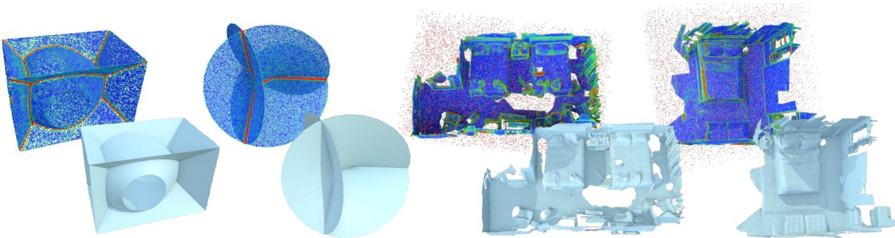  
Figure 5: Normal-axis confidence as a geometric cue. The upper row shows input points colored by the eigengap confidence of the optimized PNF tensors; the lower row shows the corresponding reconstructions. The left examples contain non-manifold junctions, and the right examples contain outliers. Low confidence indicates weak axial preference and can highlight candidate junction regions or unreliable directional estimates.

## F.4 Computational Cost and Runtime

The pipeline consists of PNF-based normal-axis estimation followed by UDF construction and surface extraction. During PNF estimation, the neighborhood graph is constructed once and remains fixed. With fixed-size tensor updates at each point and a bounded amount of work per graph edge, each optimization iteration requires $O ( N + | E | )$ operations, where $\dot { N }$ and |E| denote the number of input points and graph edges, respectively. We adopt a simple gradient descent solver and use 500 optimization iterations per point cloud.

On the evaluated non-manifold point clouds, PNF optimization takes 8.299 s on average, excluding graph construction. Among the tested graph constructions, Voronoi adjacency has the largest average construction time, 0.0272 s, at the evaluated point-cloud scale.

Stage II uses confidence-guided heat diffusion and scalar integration to construct the UDF, followed by DCUDF surface extraction. Field computation and surface extraction take 329.269 s and 35.036 s on average, respectively. We report these components separately to distinguish the cost of PNF estimation from that of downstream reconstruction. On these examples, field computation accounts for most of the reported time.

## F.5 Limitations

PNF’s global-optimality guarantee applies to the fixed-graph soft-tensor optimization in Stage I, not to exact surface recovery. Reconstruction remains dependent on graph connectivity, local geometric evidence, and numerical discretization. Surface extraction may retain a double-layered mesh whose geometry approximates the target without reproducing its topology. Recovering an appropriate single-layer representation requires additional post-processing, particularly for non-manifold or non-orientable targets.

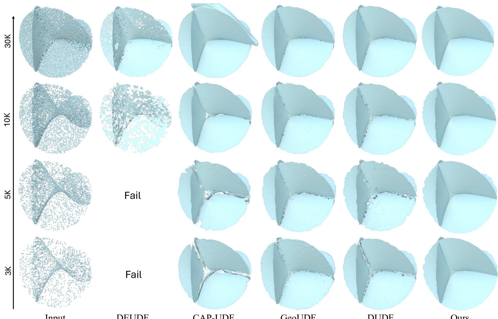  
Input  
DEUDF  
CAP-UDF  
GeoUDF  
DUDF  
Ours

Figure 6: Qualitative comparison under varying point-cloud densities. With the input size decreasing from 30K to 3K points, competing methods gradually suffer from geometric distortions or reconstruction failures, whereas our method consistently produces stable and coherent surfaces, demonstrating robustness to sparse point-cloud observations.

Table 5: Reconstruction accuracy on non-manifold models. Global and junction-region metrics are reported for three synthetic shapes. Distances are evaluated from the reference geometry to the reconstruction. CD and HD95 are reported in units of $1 0 ^ { - 3 }$ and recall as a percentage. The junction-band width and recall tolerance are 2% and 0.5% of the reference bounding-box diagonal, respectively. The best result for each metric and shape is shown in bold, including ties. GeoUDF uses the PUGeo-Net ×16 upsampling variant (Qian et al., 2020). DEUDF was not included in the table, since it produced severely degraded reconstructions on these examples under the evaluated settings. The main reason is its reliance on locally estimated PCA normals for gradient alignment. Near non-manifold junctions, neighborhoods containing multiple surface sheets can yield unreliable normal axes and misleading directional constraints. Although PNF also uses local PCA information, it treats the resulting tensors as soft priors rather than final normal-axis estimates. Crucially, PNF jointly optimizes the entire normal-axis field over a connectivity graph, allowing individua estimates to be refined through compatibility with neighboring geometric evidence. This global coupling enables information from well-supported neighborhoods to help resolve ambiguous local estimates, while the soft representation retains competing directional preferences where ambiguity persists. Thus, PNF’s advantage lies not in avoiding local PCA, but in reconciling its evidence through a globally coupled, strongly convex normal-estimation problem.
<table><tr><td>Model</td><td>Method</td><td>Global CD↓</td><td>Junction CD ↓</td><td>Junction Recall ↑</td><td>HD95↓</td></tr><tr><td rowspan="5">Crosns-ton (&#x27;0n p0nt)</td><td>CAP-UDF</td><td>0.148</td><td>0.356</td><td>99.77</td><td>0.299</td></tr><tr><td>GeoUDF</td><td>0.050</td><td>0.224</td><td>100.00</td><td>0.117</td></tr><tr><td>DUDF</td><td>0.200</td><td>1.221</td><td>99.75</td><td>0.597</td></tr><tr><td>VAD</td><td>0.038</td><td>0.321</td><td>100.00</td><td>0.204</td></tr><tr><td>PCA+HM Ours</td><td>0.066 0.014</td><td>0.598 0.115</td><td>100.00</td><td>0.380</td></tr><tr><td rowspan="6">Muu-ton (t pnis)</td><td>CAP-UDF</td><td></td><td></td><td>100.00</td><td>0.071</td></tr><tr><td>GeoUDF</td><td>0.808</td><td>3.189 0.289</td><td>85.17</td><td>5.546</td></tr><tr><td>DUDF</td><td>0.082</td><td>2.066</td><td>100.00</td><td>0.210</td></tr><tr><td>VAD</td><td>0.591</td><td></td><td>96.49</td><td>2.580</td></tr><tr><td>PCA+HM</td><td>0.090</td><td>0.371 0.789</td><td>100.00</td><td>0.417</td></tr><tr><td>Ours</td><td>0.188 0.031</td><td>0.123</td><td>100.00 100.00</td><td>1.021 0.156</td></tr><tr><td rowspan="6">Heng sHueace (.n1 p0nt1s)</td><td>CAP-UDF</td><td></td><td></td><td></td><td></td></tr><tr><td>GeoUDF</td><td>1.072</td><td>3.675</td><td>85.59</td><td>5.899</td></tr><tr><td>DUDF</td><td>0.535 0.562</td><td>1.359 2.020</td><td>99.85 97.07</td><td>1.830</td></tr><tr><td>VAD</td><td>0.475</td><td>1.795</td><td>99.30</td><td>2.638 2.483</td></tr><tr><td>PCA+HM</td><td>0.456</td><td>1.758</td><td>99.17</td><td>2.567</td></tr><tr><td>Ours</td><td>0.384</td><td>1.255</td><td>100.00</td><td>1.688</td></tr></table>

Ours

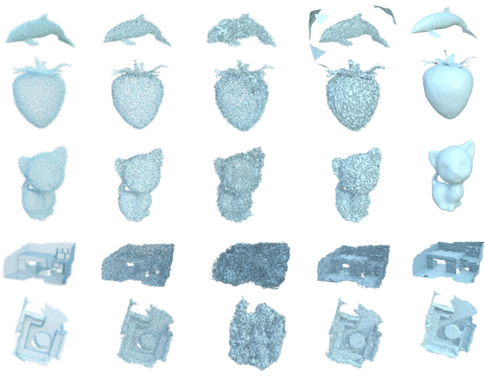  
Input  
GeoUDF  
DUDF  
CAP-UDF

Figure 7: Reconstruction from noisy inputs. The input point clouds are corrupted by 0.8% Gaussian noise. Several competing methods produce fragmented patches or irregular surfaces, whereas PNF yields smoother, more coherent reconstructions in these examples. Table 2 reports quantitative results on the 60-model benchmark.

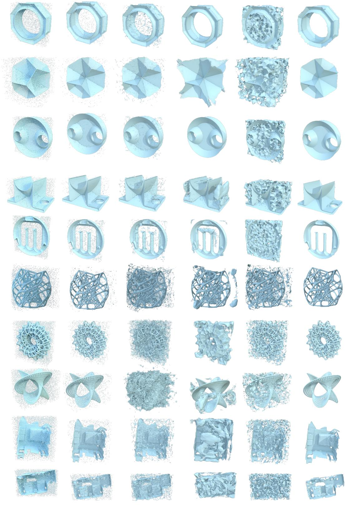  
Input  
DUDF  
GeoUDF  
CAP-UDF  
VAD  
Ours

Figure 8: Reconstruction from outlier-contaminated inputs. The point clouds contain 5% outliers sampled within the bounding box. Several competing methods produce spurious patches or surface distortions, whereas PNF yields more coherent reconstructions with fewer visible artifacts in these examples. Table 2 reports quantitative results on the 60-model benchmark.