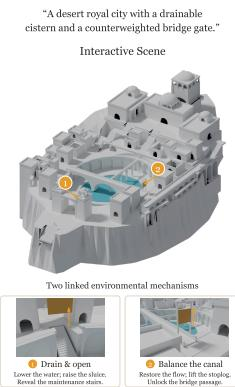
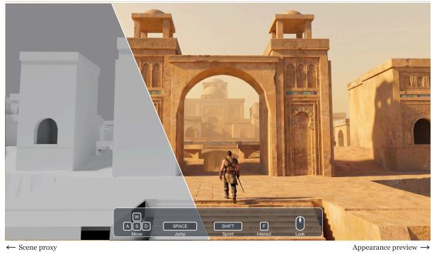
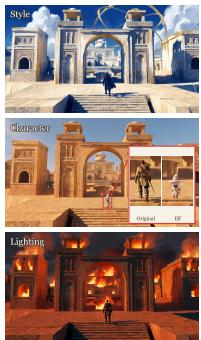
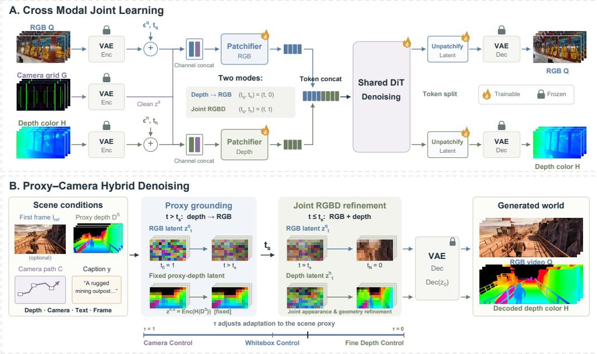
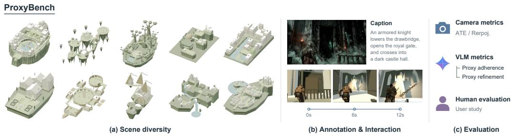
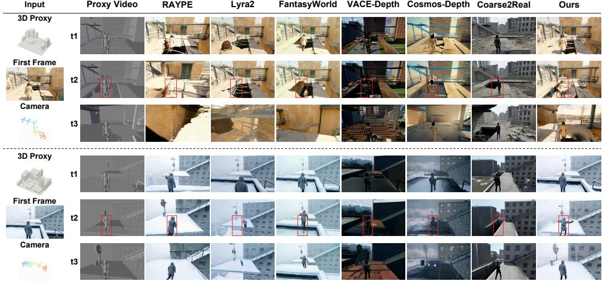
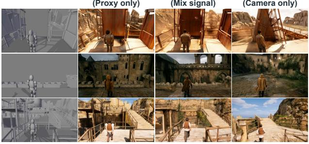
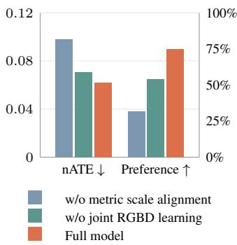

# PROXY2WORLD: LEARNING TO GENERATE WORLDSFROM LIGHTWEIGHT PROXIES WITHOUT SEEINGTHEM

Hongli Xu Weilong Yan Anbang Wang Chunyu Zou Siyu Hong Jingwei Huang Tencent \*Corresponding author.

## ABSTRACT

Lightweight scene proxies let creators control scene layout and motion while leaving room for imagination in appearance, lighting, and visual effects. However, a suitable proxy is not uniquely defined, making paired proxy–video data difficult to construct automatically at scale. We present Proxy2World, a controllable world model that learns these complementary capabilities from ordinary posed RGBD videos, without training on authored proxy–video pairs. The model jointly learns depth-conditioned RGB generation and joint RGBD generation through cross-modal flow matching. Learning both tasks enables proxy– camera hybrid denoising at inference to follow the proxy structure while producing natural, detailed visuals. We further introduce ProxyBench to evaluate this capability across a diverse set of scenes, camera trajectories, and subject motions. Experiments on ProxyBench show that Proxy2World achieves a better balance between structural adherence and visual quality than camera-controlled and geometry-conditioned methods, supported by quantitative metrics, VLM assessments, human evaluations and diverse qualitative results. Project page: https://dumdumgura.github.io/proxy2world/

Proxy2World  

Same world Flexible appearance  
  
Figure 1: Build the structure. Generate the world. Proxy2World transforms lightweight, interactive scene proxies into visually rich, structure-aligned worlds without paired proxy–video training data. Creators specify layouts and interactions through editable proxies (left), while the model generates detailed visuals (center) and variations in style, character, and lighting (right).

## 1 INTRODUCTION

Creating worlds that users can explore and direct is a central goal in gaming, filmmaking, and embodied AI. Recent models support action-driven interaction and camera-controlled exploration (Bruce et al., 2024; Che et al., 2025; He et al., 2025; Shen et al., 2026), while generative rendering translates explicit scene states into realistic imagery (Gu et al., 2025; Liang et al., 2025;

Gomez-Nogales et al., 2026; Chen et al., 2026b). For practical use, visual realism must be accom-´ panied by control over scene layout, camera motion, and object movement. Yet specifying these properties should not require constructing every geometric and visual detail of the final world.

Existing approaches provide different levels of spatial control. Camera-controlled video models, including CameraCtrl, SCoPE, and GEN3C, guide viewpoint changes through pose conditioning, ray-based representations, or reconstructed scene caches (He et al., 2024; Yin et al., 2026; Ren et al., 2025). These methods enable controlled exploration, but a camera trajectory alone does not specify the desired scene layout or object motion. Geometry-aware video models introduce additional spatial structure. VACE and Cosmos-Transfer1 use depth or other spatial signals to guide video synthesis (Jiang et al., 2025; Alhaija et al., 2025), while DAR and UnividX use G-Buffer to connect editable scene states to generated observations (Chen et al., 2026b;a). World-consistent Video Diffusion, FantasyWorld, and Gen3R further couple visual generation with geometry, learning to generate appearance and spatial structure together (Zhang et al., 2025; Dai et al., 2026; Huang et al., 2026a). Video world models draw on learned priors to synthesize rich scenes and dynamics from sparse inputs, while generative rendering offers direct control through explicit scene representations. Bringing these capabilities together would allow users to prescribe scene structure and motion while leaving their visual realization to the generative model.

This raises a fundamental question: how much of a world must be specified before generation can take over? We study how lightweight scene proxies can guide world generation without specifying every detail of the final scene. A proxy may use low-poly meshes or simple primitives and may omit parts of the scene; the goal is to follow its intended layout and motion while generating plausible geometry and appearance beyond it.

Learning to generate from such proxies, however, presents several coupled challenges. First, a scene proxy reflects a designer’s abstraction of the world—which objects should be represented, how strongly they should be simplified, and which geometry can safely be omitted—so large-scale paired proxy-to-RGB data are difficult to obtain automatically.

Second, structural adherence must coexist with geometric refinement (Yan et al., 2026). A primitive specifies where an object is and how much space it occupies, but its simplified shape should be refined rather than reproduced exactly. Recent work C2R learns control using paired synthetic coarse-to-real examples (Gomez-Nogales et al., 2026); we istead aim to learn from ordinary RGBD´ videos and transferring that control to proxies at different levels of abstraction. Together, these challenges raise our central question: can proxy-based control be learned without any paired proxyto-RGB training data and adapt to different level of abstraction?

We answer this question with Proxy2World, a controllable world model that learns proxy-based control from ordinary posed RGBD videos without paired proxy–video supervision. As illustrated in Figure 1, it turns editable scene proxies into visually rich worlds while allowing variations in style, character, and lighting. Our key insight is to jointly learn depth-conditioned RGB generation and joint RGBD generation through cross-modal flow matching. Learning both tasks enables proxy–camera hybrid denoising at inference to follow the proxy structure while producing natural, detailed visuals. We retain camera guidance throughout and align camera translations with the metric scale of depth to keep the two control signals consistent. We further introduce Proxy-Bench to evaluate proxy adherence, generative refinement, and camera control across diverse scenes, proxy abstractions, camera trajectories, and subject motions. Experiments show that Proxy2World achieves a better balance between structural adherence and visual quality than camera-controlled and geometry-conditioned methods, supported by operator-based metrics, VLM assessments, and human evaluations.

Our contributions are threefold:

1. Proxy-based world generation without paired proxy supervision. We introduce Proxy2World, a controllable world model that learns structural grounding and generative completion from ordinary posed RGBD videos, without paired proxy–RGB training data.

2. Cross-Modal hybrid flow matching. We combine proxy-grounded structure formation with camera-guided joint RGBD refinement, aligning geometry and camera motion in a shared metric scale to preserve the intended layout while refining geometry and appearance.

3. ProxyBench and comprehensive evaluation. We introduce ProxyBench, an agent-driven benchmark spanning diverse scenes, camera trajectories, subject motions, and proxy abstractions. Evaluations using operator-based metrics, VLM assessments, and human preferences show that Proxy2World achieves a better balance between structural adherence and visual quality than camera-controlled and geometry-conditioned baselines.

## 2 RELATED WORK

Video foundations such as Stable Video Diffusion, CogVideoX, HunyuanVideo, and Wan provide generative priors for conditional synthesis (Blattmann et al., 2023; Yang et al., 2025; Kong et al., 2024; Wan et al., 2025). We review how subsequent methods expose camera, geometry, and scenestate controls, focusing on their relationship to generation from authored proxies.

## 2.1 CAMERA-CONTROLLED VIDEO GENERATION

Recent video diffusion models have substantially improved explicit camera control.MotionCtrl separates camera and object motion control (Wang et al., 2023b), while CameraCtrl and VD3D inject camera representations into pretrained video models (He et al., 2024; Bahmani et al., 2025). CamCo and CamI2V use epipolar constraints to structure cross-frame interactions (Xu et al., 2024; Zheng et al., 2024). CameraCtrl II extends camera-driven generation to dynamic scene exploration across wider viewpoints (He et al., 2025), and SCoPE incorporates camera sightlines into diffusion-transformer attention (Yin et al., 2026). These methods improve how a generator follows a requested viewpoint sequence. Geometric reprojection provides a complementary control interface. ViewCrafter uses point-based scene clues for novel-view generation (Yu et al., 2024), and GEN3C renders a reconstructed 3D cache along target camera trajectories (Ren et al., 2025). TrajectoryCrafter combines point-cloud renders with a source video to redirect its camera path (Yu et al., 2025). CamTrol obtains training-free camera control by using 3D layout rearrangement to guide noisy latents (Hou & Chen, 2024). CamCtrl3D combines pose, ray, reprojection, and 3D feature conditions (Popov et al., 2025), while RealCam-I2V aligns camera parameters with metric scene depth and applies scene-constrained noise shaping (Li et al., 2025). Proxy2World also couples geometry and camera scale, but accepts an externally authored scene proxy whose layout need not be reconstructed from the reference imagery.

## 2.2 GEOMETRY-AWARE VIDEO WORLD MODELS

Geometry can guide video synthesis as an input condition or be generated jointly with appearance. DiffusionRenderer learns rendering through G-buffers (Liang et al., 2025), while DaS and DAR synthesize video from mesh-derived controls (Gu et al., 2025; Chen et al., 2026b). VideoComposer, Control-A-Video, VACE, and Cosmos-Transfer1 support depth or other structural conditions (Wang et al., 2023a; Chen et al., 2023; Jiang et al., 2025; Alhaija et al., 2025), complemented by trajectory control in DragNUWA, Motion-I2V, and DragAnything (Yin et al., 2023; Shi et al., 2024; Wu et al., 2024). Geometry Forcing and GeoVideo improve geometric consistency (Wu et al., 2025; Bai et al., 2026). WVD, Aether, Voyager, FantasyWorld, Gen3R, VideoWeave, and DualCamCtrl further couple visual and geometric generation (Zhang et al., 2025; Zhu et al., 2025; Huang et al., 2025b; Dai et al., 2026; Huang et al., 2026a; Xiang et al., 2026; Zhang et al., 2026). We combine depth-conditioned grounding with joint RGBD refinement to follow abstract proxies while allowing their geometry to evolve.

## 2.3 PROXY-TO-RGB GENERATION.

C2R learns coarse-simulation control from paired synthetic examples (Gomez-Nogales et al., 2026).´ Concurrent work CWM and PWM separate programmable world states from visual synthesis, training their renderers on paired proxy–video or structured-control–video data (Chen et al., 2026c; Huang et al., 2026b). Marionette similarly renders predicted articulated states into pose controls for RGB generation (Meng et al., 2026). Proxy2World instead learns from ordinary posed RGBD videos, without paired proxy–RGB training data. Proxy–camera hybrid denoising combines struc tural grounding with joint geometry–appearance refinement, enabling transfer to low-poly, primitive, and incomplete proxies.

  
Figure 2: Overview of the Method. (A) Cross Modal Joint learning. We use a shared DiT to learn depth-conditioned RGB generation and joint RGBD generation, with camera-grid conditioning for both tasks. We train on ordinary posed RGBD videos without paired proxy–video supervision. (B) Proxy–camera hybrid denoising. We combine these learned capabilities during sampling: we first use proxy depth to establish scene structure, then jointly refine RGB and depth to enrich geometry and appearance. We retain camera-grid conditioning throughout. The refinement ratio τ controls the balance between proxy adherence and generative refinement.

## 3 METHOD

## 3.1 PROBLEM FORMULATION

Given an interactive scene proxy S, a control sequence ${ \mathcal { A } } ,$ and a camera trajectory $\begin{array} { r l } { \mathcal { C } } & { { } = } \end{array}$ $\{ ( { \bf K } _ { i } , { \bf R } _ { i } , { \bf t } _ { i } ) \} _ { i = 1 } ^ { F }$ , we render a proxy depth sequence:

$$
\mathbf { D } ^ { S } = \{ D _ { i } ^ { S } \} _ { i = 1 } ^ { F } = \mathcal { R } _ { \mathrm { d e p t h } } ( S , A , \mathcal { C } ) ,\tag{1}
$$

where F is the number of frames, and $\mathbf { K } _ { i } , \mathbf { R } _ { i }$ , and $\mathbf { t } _ { i }$ denote camera intrinsics, rotation, and translation, respectively. The controls drive subject motion and scene interactions, which are conveyed to the generative model through rendered depth. Given a text description y and an optional reference image $\mathbf { I } _ { \mathrm { r e f } }$ spatially aligned with the initial proxy view, our goal is to generate an RGB video:

$$
\mathbf { Q } = \{ \mathbf { Q } _ { i } \} _ { i = 1 } ^ { F } \sim p _ { \theta } \big ( \mathbf { Q } \mid \mathbf { D } ^ { S } , \mathcal { C } , \mathbf { I } _ { \mathrm { r e f } } , y \big ) .\tag{2}
$$

This task requires balancing structural adherence with generative freedom: strict conditioning can reproduce coarse proxy artifacts, while unconstrained generation can lose the intended layout and behavior. We seek to preserve proxy intent while refining geometry and appearance, learning from ordinary RGBD videos without paired proxy-to-RGB supervision.

## 3.2 SCENE PROXIES FOR EXPLICIT WORLD CONTROL

A scene proxy specifies control-relevant structure and behavior without prescribing the world’s final visual realization. Its geometry may be simplified or incomplete, preserving layout, occupancy, and subject motion while leaving visual details to the generative prior. We represent camera motion and scene geometry separately, supporting camera-only generation and additional structural control through proxy depth.

Camera grid. Following OmniDirector (Liu et al., 2026), we represent camera motion by rendering a fixed spatial grid G along the prescribed trajectory:

$$
\mathbf { G } = { \mathcal { R } } _ { \operatorname { g r i d } } ( { \mathcal { G } } , { \mathcal { C } } ) .\tag{3}
$$

The grid provides spatial references whose projected motion expresses camera movement without specifying the target scene’s surfaces or appearance.

Metric depth. We express video depth and camera translations in consistent metric units. For training sequences whose depth and camera estimates share an arbitrary scale (Yan et al., 2025), we use DA3 (Lin et al., 2025) to estimate first-frame metric depth and align the sequence depth to this reference. The resulting sequence-level scale factor s is applied to both depth and camera translations:

$$
D _ { i } ^ { \mathrm { m e t r i c } } = s D _ { i } , \qquad \mathbf { t } _ { i } ^ { \mathrm { m e t r i c } } = s \mathbf { t } _ { i } .\tag{4}
$$

This preserves their relative geometry while anchoring both to a common physical scale. Authored proxy depth and camera trajectories are likewise expressed in consistent metric units.

Following Vision Banana (Gabeur et al., 2026), we convert metric depth into a three-channel falsecolor representation:

$$
\mathbf { H } _ { i } = \mathcal { H } ( D _ { i } ^ { \mathrm { m e t r i c } } ) = h \big ( f ( D _ { i } ^ { \mathrm { m e t r i c } } ) \big ) ,\tag{5}
$$

where f nonlinearly maps metric distances to a bounded interval and h maps the result along a Hilbert-like path on the RGB cube. The nonlinear transform allocates greater precision to nearby geometry, while the invertible color mapping enables recovery of metric depth. A fixed mapping across frames and scenes preserves scale information and provides a common representation for observed depth and rendered proxy geometry.

## 3.3 CROSS-MODAL JOINT LEARNING

We jointly train depth-to-RGB generation and joint RGBD generation within a single flow-matching model. Both tasks are sampled throughout training and share the same parameters, allowing depth to serve as either a fixed geometric condition or a generated variable.

Shared architecture. As shown in Figure $2 ( \mathrm { A } )$ , a frozen video VAE encoder Enc maps RGB, metric-depth color, and camera-grid videos to latents ${ \bf z } _ { 0 } ^ { q } , { \bf z } _ { 0 } ^ { h }$ , and $\mathbf { z } ^ { g }$ , respectively. The subscript 0 denotes clean data. Each modality latent is concatenated channel-wise with the clean camera latent and tokenized by a separate patch embedding. RGB and depth tokens are then concatenated along the sequence dimension and processed by a shared DiT, which predicts modality-specific velocities:

$$
\begin{array} { r } { ( { \bf v } _ { \theta } ^ { q } , { \bf v } _ { \theta } ^ { h } ) = { \bf v } _ { \theta } ( { \bf z } _ { t _ { q } } ^ { q } , { \bf z } _ { t _ { h } } ^ { h } , t _ { q } , t _ { h } ; { \bf z } ^ { g } , { \bf c } ) , } \end{array}\tag{6}
$$

where $t _ { q }$ and $t _ { h }$ are modality-specific noise levels, and c contains text and optional reference-frame conditions. After sampling, the frozen decoder Dec recovers RGB and depth-color videos. We train the patch embeddings, shared DiT, and output projections.

Cross-modal flow matching. For each modality $m \in \{ q , h \}$ , we construct a noisy latent by interpolating between the clean latent $\mathbf { z } _ { 0 } ^ { m }$ and independent standard Gaussian noise:

$$
\begin{array} { r } { { \bf z } _ { t _ { m } } ^ { m } = ( 1 - t _ { m } ) { \bf z } _ { 0 } ^ { m } + t _ { m } \epsilon ^ { m } , \qquad \epsilon ^ { m } \sim \mathcal { N } ( { \bf 0 } , { \bf I } ) , } \end{array}\tag{7}
$$

where $t _ { m } \in [ 0 , 1 ]$ , with 0 denoting clean data and 1 denoting pure noise. The target velocity is $\mathbf { u } ^ { m } = \epsilon ^ { m } - \dot { \mathbf { z } } _ { 0 } ^ { m }$ . For depth-conditioned RGB generation, we set $\left( t _ { q } , t _ { h } \right) = \left( t , 0 \right)$ : depth remains clean and only RGB is supervised. For joint RGBD generation, we set $\left( t _ { q } , t _ { h } \right) = \left( t , t \right)$ and supervise both modalities. Both tasks share the same model and are optimized through:

$$
\mathcal { L } = \mathbb { E } \left[ \sum _ { m \in \{ q , h \} } w _ { m } \left\| \mathbf { v } _ { \boldsymbol { \theta } } ^ { m } \left( \mathbf { z } _ { t _ { q } } ^ { q } , \mathbf { z } _ { t _ { h } } ^ { h } , t _ { q } , t _ { h } ; \mathbf { z } ^ { g } , \mathbf { c } \right) - \mathbf { u } ^ { m } \right\| _ { 2 } ^ { 2 } \right] .\tag{8}
$$

The expectation covers task sampling, training data, noise levels, and Gaussian noise. We use $( w _ { q } , w _ { h } ) = ( 1 , 0 )$ for depth-conditioned RGB generation and $( w _ { q } , w _ { h } ) = ( 1 , 1 )$ for joint RGBD generation. This joint training allows the same model to use depth as a fixed structural condition or generate it together with RGB, providing the two capabilities combined during hybrid denoising.

## 3.4 PROXY–CAMERA HYBRID DENOISING

We compose the two learned generation modes within a single sampling trajectory. As illustrated in Figure 2(B), early steps use proxy depth to establish scene structure, while later steps jointly refine RGB and depth. Camera-grid guidance is retained throughout both stages. Let $\tau \in [ 0 , 1 ]$ denote the fraction of sampling steps allocated to joint RGBD refinement. For a sampling schedule $1 = t _ { 0 } > \cdot \cdot \cdot > t _ { N } = 0$ , we switch at $k _ { s } = \lfloor ( 1 - \overline { { \tau } } ) N \rfloor$ , with noise level $t _ { s } = t _ { k _ { s } }$

Proxy grounding. We encode the proxy depth-color sequence into $\mathbf { z } ^ { h , S } = \mathrm { E n c } ( \mathcal { H } ( \mathbf { D } ^ { S } ) )$ , where H is applied frame-wise, and initialize the RGB latent with Gaussian noise. During the early, highnoise steps, proxy depth remains fixed as a clean condition, and the model updates RGB using its depth-to-RGB mode:

$$
\frac { d \mathbf { z } _ { t } ^ { q } } { d t } = \mathbf { v } _ { \theta } ^ { q } \left( \mathbf { z } _ { t } ^ { q } , \mathbf { z } ^ { h , S } , t , 0 ; \mathbf { z } ^ { g } , \mathbf { c } \right) , \qquad t > t _ { s } .\tag{9}
$$

Sampling proceeds from $t = 1$ toward $t = 0$ . This stage grounds generation in the proxy’s layout, occupied regions, and subject motion.

Joint RGBD refinement. $\mathbf { A } \mathbf { t } t = t _ { s }$ , we retain the current RGB latent and initialize the depth state by adding noise to the proxy latent at the switching noise level:

$$
\begin{array} { r } { { \mathbf { z } } _ { t _ { s } } ^ { h } = ( 1 - t _ { s } ) { \mathbf { z } } ^ { h , S } + t _ { s } { \epsilon } ^ { h } , \qquad { \epsilon } ^ { h } \sim \mathcal { N } ( \mathbf { 0 } , \mathbf { I } ) . } \end{array}\tag{10}
$$

Depth then becomes a generated variable, and both modalities evolve under the joint RGBD mode:

$$
\frac { d \mathbf { z } _ { t } ^ { m } } { d t } = \mathbf { v } _ { \theta } ^ { m } \left( \mathbf { z } _ { t } ^ { q } , \mathbf { z } _ { t } ^ { h } , t , t ; \mathbf { z } ^ { g } , \mathbf { c } \right) , \qquad m \in \{ q , h \} , \quad t \leq t _ { s } .\tag{11}
$$

The proxy is no longer imposed as a fixed depth condition, allowing geometry and appearance to be refined together while camera guidance continues to constrain the viewpoint sequence.

The refinement fraction $\tau$ controls the balance between adherence and refinement. A smaller $\tau$ retains proxy grounding for more sampling steps, whereas a larger $\tau$ allocates more steps to joint refinement. ${ \bf A t } \boldsymbol { \tau } = 0 .$ , depth remains fixed throughout sampling; at $\tau = 1$ , both modalities start from noise, yielding camera-conditioned generation without proxy grounding. Intermediate settings combine the two capabilities using the same checkpoint, without additional proxy-specific training.

## 4 EXPERIMENTS

Implementation details. We initialize Proxy2World from Wan2.2-I2V-A14B (Wan et al., 2025) and train on 120,624 RGBD clips from DL3DV (Ling et al., 2024), RealEstate10K (Zhou et al., 2018), and gampeplay dataset(Zhou et al., 2025), each with 81 frames at 480 × 832 and 16 FPS, without paired proxy–RGB supervision. We freeze the video VAE and text encoder and optimize patch embeddings, DiT blocks, and output projections using AdamW (lr $1 0 ^ { - 5 }$ , weight decay 0.01) on 48 GPUs. High-/low-noise experts are trained for 50,000/35,000 steps, with equal sampling weights for depth-to-RGB and joint RGBD tasks and uniformly sampled discrete noise levels within each expert’s shifted-flow schedule. Depth-to-RGB supervises RGB only; joint RGBD assigns unit loss weights to both modalities. The encoded RGB reference and temporal mask are concatenated to both streams, with reference dropout 0.5. At inference, available reference images provide DA3- estimated metric depth for proxy alignment, with the same scale correction applied to camera translations. We use 40-step Euler sampling, flow shift 3.0, and CFG 3.5. The joint-refinement fraction τ determines the switch $k _ { s } = \lfloor ( 1 - \tau ) N \rfloor$ for $1 = t _ { 0 } > \cdot \cdot \cdot > t _ { N } = 0$ . We set $\tau ^ { \star } = 0 . 9 2 5$ : three geometry-conditioned steps followed by 37 joint RGBD steps, initializing refinement by noising proxy depth to $t _ { k _ { s } }$

## 4.1 EXPERIMENTAL SETUP

ProxyBench. We introduce ProxyBench to evaluate world generation from coarse scene proxies. It comprises 25 scenes—15 medium-scale and 10 large-scale—with 300 five-second video sequences. For evaluation, we select a subset of 78 sequences emphasizing interaction and balanced coverage of motion types. Each case provides a proxy scene, a target camera trajectory, synchronized proxy renderings, a text prompt, and a reference first frame. Successful generation should preserve the intended layout and behavior while enriching coarse geometry and appearance. Figure 3 provides an overview of ProxyBench, including scene diversity, interaction annotations, and the evaluation protocol.

  
Figure 3: (a) Diverse lightweight scene proxies. (b) Text descriptions and scripted interactions specify the intended scene behavior and subject motion. (c) Evaluation combines camera and spatial consistency metrics, VLM assessments of proxy adherence and refinement, and human preferences.

Table 1: Evaluation on ProxyBench. Input icons indicate text, reference image, camera trajectory, and proxy control; gray icons denote unused inputs. Trajectory errors are computed from VIPEestimated poses, and reprojection error excludes dynamic objects. Adherence and refinement are evaluated through Gemini pairwise win rates (%). Human ranks reflect overall preference. Bold and underline indicate the best and second-best results within each conditioning group. All our variants share one checkpoint trained without paired proxy–RGB data.
<table><tr><td></td><td></td><td colspan="2">Camera</td><td>Spatial Cons.</td><td colspan="5">Proxy Evaluation</td></tr><tr><td></td><td></td><td></td><td></td><td></td><td colspan="2">Operator-based</td><td colspan="2">VLM-based</td><td>Human</td></tr><tr><td>Method</td><td>Input</td><td></td><td>nATEt ↓ nATEr ↓</td><td>Reproj.↓</td><td>Geo. Align↑</td><td>Temp. Align↑</td><td>Adh. WR↑</td><td>Ref. WR↑</td><td>Rank↓</td></tr><tr><td colspan="10">Camera-conditioned methods</td></tr><tr><td>Lyra 2.0 (Shen et al., 2026)</td><td>T O</td><td>0.0418</td><td>0.0413</td><td>2.171</td><td>0.4965</td><td>0.7068</td><td>32.21</td><td>39.48</td><td>10</td></tr><tr><td>SCoPE / RAYPE (Yin et al., 2026)</td><td>T O</td><td>0.1066</td><td>0.1229</td><td>4.338</td><td>0.4508</td><td>0.5780</td><td>29.51</td><td>47.06</td><td>9</td></tr><tr><td>FantasyWorld (Dai et al., 2026)</td><td>T O</td><td>0.2966</td><td>0.3472</td><td>2.449</td><td>0.4711</td><td>0.6158</td><td>36.51</td><td>50.25</td><td>7</td></tr><tr><td>Ours (TI2V, τ = 1)</td><td>T O</td><td>0.0681</td><td>0.0524</td><td>1.956</td><td>0.5340</td><td>0.7033</td><td>53.55</td><td>71.44</td><td>5</td></tr><tr><td colspan="10">Depth-conditioned methods</td></tr><tr><td>VACE-Depth (Jiang et al., 2025)</td><td>T à</td><td>0.0764</td><td>0.0584</td><td>6.264</td><td>0.7576</td><td>0.7335</td><td>60.14</td><td>45.32</td><td>4</td></tr><tr><td>Cosmos-Depth (Alhaija et al., 2025)</td><td>T 日 a</td><td>0.0446</td><td>0.0362</td><td>3.259</td><td>0.7713</td><td>0.7504</td><td>72.26</td><td>40.28</td><td>3</td></tr><tr><td>Ours (T2V, τ = 0)</td><td>T 日</td><td>0.0302</td><td>0.0270</td><td>2.280</td><td>0.7749</td><td>0.7645</td><td>68.79</td><td>31.71</td><td>6</td></tr><tr><td colspan="10">Proxy-conditioned methods</td></tr><tr><td>Coarse2Real (Gómez-Nogales et al., 2026)</td><td>T </td><td>0.1637</td><td>0.3152</td><td>5.312</td><td>0.5520 0.6616</td><td></td><td>40.03</td><td>45.21</td><td>8</td></tr><tr><td>Ours (T2V, τ = τ*)</td><td>T</td><td>0.0863</td><td>0.0719</td><td>2.067</td><td>0.7084</td><td>0.7126</td><td>42.81</td><td>51.30</td><td>21</td></tr><tr><td>Ours (TI2V, τ = τ*)</td><td>T OI</td><td>0.0659</td><td>0.0558</td><td>2.524</td><td>0.6795</td><td>0.7173</td><td>64.18</td><td>77.96</td><td></td></tr></table>

Baselines. We select baselines covering geometry-conditioned rendering, camera-controlled world generation, and coarse-to-real synthesis. Among geometry-conditioned approaches, we focus on VACE (Jiang et al., 2025) and Cosmos-Transfer (Alhaija et al., 2025) as strong depthconditioned video generators, adapting them to proxy control using depth rendered from our coarse scenes. For camera-controlled generation, Lyra 2.0 (Shen et al., 2026) represents projection-based approaches, but its static-scene formulation limits dynamic interactions. We therefore also include SCoPE/RayPE (Yin et al., 2026) for ray-based camera control and FantasyWorld (Dai et al., 2026) for joint RGBD world generation. Coarse2Real (Gomez-Nogales et al., 2026) serves as the most´ direct baseline, explicitly translating coarse simulations into realistic videos. Our camera-only (τ = 1), depth-only (τ = 0), and mixed-control (τ = τ⋆) variants share one checkpoint. Table 1 specifies the inputs used by each configuration.

Evaluation Protocol. We evaluate camera control using normalized translation and rotation errors (nATE and nATE ) computed from VIPE-estimated poses(Huang et al., 2025a). Spatial consistency is measured by reprojection error after excluding dynamic objects. Geometric and temporal alignment measure agreement with the proxy. We further use Gemini-v3.7-flash(Team et al., 2023) for pairwise evaluation of Proxy Adherence and Proxy Refinement. Adherence assesses preservation of the intended layout and subject behavior, while refinement assesses plausible enrichment of geometry, appearance, and motion. We report average win rates across opponents, counting ties as half a win, alongside overall human preference ranks. We evaluate all methods on a common set of 78 sequences using operator-based metrics and VLM assessments, complemented by a human preference study with 10 participants on 10 sequences. Detailed protocols are provided in the appendix.

  
Figure 4: Qualitative comparison on ProxyBench. Red boxes highlight the intended subject locations specified by the proxy, highlighting differences in subject placement and shape. Cameraconditioned methods can deviate from the prescribed subject placement, while depth-conditioned methods can retain coarse body shapes and produced distorted characters. Ours preserves the intended placement while generating more natural character shapes and detailed scene appearance.

## 4.2 EVALUATION ON PROXYBENCH

Quantitative comparison. Table 1 shows that Proxy2World achieves a strong balance between proxy adherence and generative refinement. Compared with camera-controlled methods, our mixed TI2V model achieves higher geometric alignment and VLM adherence while also attaining the highest refinement win rate. The comparison with our own camera-only TI2V variant isolates the benefit of proxy guidance: geometric alignment improves by 27.2%, while adherence and refinement win rates increase by 10.63 and 6.52 percentage points, respectively. Thus, explicit proxy control improves structural adherence without sacrificing the model’s generative flexibility. Compared with depth-conditioned methods, mixed generation allows greater refinement of the supplied coarse geometry. Cosmos-Depth achieves stronger VLM adherence (72.26% vs. 64.18%), but our mixed TI2V model achieves a substantially higher refinement win rate (77.96% vs. 40.28%). Together with its first-place ranking in human preference, these results support the benefit of balancing structural constraints with the freedom to refine coarse inputs. Compared with the proxy-conditioned baseline Coarse2Real as the same proxy method, our mixed T2V model reduces translation and rotation errors by 47.3% and 77.2%, respectively, and improves geometric alignment by 28.3%. These gains are obtained without authored proxy–video training pairs, demonstrating that ordinary RGBD supervision can support effective structural control on authored proxies.

Qualitative comparison. Figure 4 highlights two common failure modes. Depth-conditioned methods follow the supplied structure but can reproduce the coarse proxy’s simplified body shapes, resulting in distorted characters and unnatural proportions. Camera-conditioned methods generate more natural-looking content, but can deviate from the proxy’s scene layout, subject placement, and motion. Proxy2World combines structural adherence with geometric refinement: it preserves the prescribed spatial relationships and subject motion while producing more natural character shapes and detailed scene appearance. The highlighted regions illustrate this difference, showing how our method refines coarse subjects while retaining their intended placement within the scene.

τ=τ\*(Mix signal)  
τ=0 (Proxy only)  
Proxy  
  
(a) Effect of the refinement ratio τ

  
(b) Component ablation  
Figure 5: Effect of the refinement ratio and model components. (a) Varying τ with all other inputs and the random seed fixed illustrates the trade-off between proxy adherence and refinement. (b) Ablation of metric scale alignment and joint RGBD learning, evaluated through camera accuracy and human preference.

## 4.3 ABLATION STUDIES

Hybrid denoising. Figure 5(a) examines how the two generation modes contribute to proxy-based control. Proxy-only generation preserves the prescribed layout and subject placement, but tends to carry simplified proxy shapes into the output, particularly for characters. Camera-only generation produces more natural shapes and richer appearance, but can alter subject placement and scene structure. Mixed generation preserves the major spatial relationships while refining coarse characters and adding scene details. These results support our use of early proxy grounding to establish structure and subsequent joint RGBD refinement to improve its visual realization, combining the strengths of both learned modes without additional proxy-specific training.

Metric scale alignment. We align depth and camera translations to a common metric scale across training scenes. Normalizing both consistently within each scene preserves their relative geometry, but does not establish a shared physical scale across scenes. Metric alignment therefore provides a consistent scale convention for learning from depth and camera-grid conditioning. Figure 5(b) shows that removing this alignment during training yields the largest camera error among the tested variants and substantially lowers human preference. These results highlight the importance of a shared metric scale across training scenes for accurate camera control and preferred visual results.

Joint RGBD learning. To test whether refinement requires joint geometry–appearance modeling, we replace joint RGBD generation with camera-conditioned RGB-only generation while retaining the initial depth-conditioned grounding stage. This variant still releases the fixed proxy-depth constraint during later sampling steps, but no longer generates depth alongside RGB. As shown in Figure 5(b), it yields higher camera error and lower human preference than the full model. The improvement therefore cannot be attributed solely to removing the depth constraint: explicitly generating geometry together with appearance contributes to both camera accuracy and visual quality. This supports joint RGBD learning as a key component of our refinement stage.

## 5 CONCLUSION

We presented Proxy2World, a unified RGBD world model that generates camera-controllable videos from lightweight proxies without paired proxy–video training data. Proxy–camera hybrid denoising combines structural grounding with joint RGBD refinement, balancing proxy adherence and visual quality as demonstrated on ProxyBench. Our approach lets creators specify coarse structure while leaving visual details to generation. Long-horizon interactive generation remains future work.

## REFERENCES

Nvidia Hassan Abu Alhaija, Jose M. Alvarez, Maciej Bala, Tiffany Cai, Tianshi Cao, Liz Cha, Joshua Chen, Mike Chen, Francesco Ferroni, Sanja Fidler, Dieter Fox, Yunhao Ge, Jinwei Gu, Ali Hassani, Michael Isaev, Pooya Jannaty, Shiyi Lan, Tobias Lasser, Huan Ling, Ming-Yu Liu, Xian Liu, Yifan Lu, Alice Luo, Qianli Ma, Hanzi Mao, Fabio Ramos, Xuanchi Ren, Tianchang Shen, Shitao Tang, Tingjun Wang, Jay Zhangjie Wu, Jiashu Xu, Stella Xu, Kevin Xie, Yunyao Ye, Xiaodong Yang, Xiaohui Zeng, and Yuan Zeng. Cosmos-transfer1: Conditional world generation with adaptive multimodal control. ArXiv, abs/2503.14492, 2025. URL https://arxiv.org/ abs/2503.14492.

Sherwin Bahmani, Ivan Skorokhodov, Aliaksandr Siarohin, Willi Menapace, Guocheng Qian, Michael Vasilkovsky, Hsin-Ying Lee, Chaoyang Wang, Jiaxu Zou, Andrea Tagliasacchi, et al. Vd3d: Taming large video diffusion transformers for 3d camera control. In International Conference on Learning Representations, volume 2025, pp. 66712–66737, 2025.

Yunpeng Bai, Shaoheng Fang, Chaohui Yu, Fan Wang, and Qixing Huang. Geovideo: Introducing geometric regularization into video generation model. Advances in Neural Information Processing Systems, 38:57602–57622, 2026.

Andreas Blattmann, Tim Dockhorn, Sumith Kulal, Daniel Mendelevitch, Maciej Kilian, Dominik Lorenz, Yam Levi, Zion English, Vikram Voleti, Adam Letts, et al. Stable video diffusion: Scaling latent video diffusion models to large datasets. arXiv preprint arXiv:2311.15127, 2023.

Jake Bruce, Michael D Dennis, Ashley Edwards, Jack Parker-Holder, Yuge Shi, Edward Hughes, Matthew Lai, Aditi Mavalankar, Richie Steigerwald, Chris Apps, et al. Genie: Generative interactive environments. In Forty-first international conference on machine learning, 2024.

Haoxuan Che, Xuanhua He, Quande Liu, Cheng Jin, and Hao Chen. Gamegen-x: Interactive openworld game video generation. In International Conference on Learning Representations, volume 2025, pp. 37546–37593, 2025.

Houyuan Chen, Hong Li, Xianghao Kong, Tianrui Zhu, Shaocong Xu, Weiqing Xiao, Yuwei Guo, Chongjie Ye, Lvmin Zhang, Hao Zhao, et al. Unividx: A unified multimodal framework for versatile video generation via diffusion priors. arXiv preprint arXiv:2605.00658, 2026a.

Junhao Chen, Mingjin Chen, Henghaofan Zhang, Minglin Chen, Liaoyuan Fan, Boran Zhang, Saining Zhang, Mingze Sun, Hao Zhao, Ruqi Huang, Zhihao Li, and Yufei Wang. Video models as native 4d renderers: World-grounded conditioning from animated mesh. arXiv preprint arXiv:2608.00094, 2026b.

Weifeng Chen, Yatai Ji, Jie Wu, Hefeng Wu, Pan Xie, Jiashi Li, Xin Xia, Xuefeng Xiao, and Liang Lin. Control-a-video: Controllable text-to-video diffusion models with motion prior and reward feedback learning. arXiv preprint arXiv:2305.13840, 2023.

Yiwen Chen, Guosheng Lin, and Chi Zhang. Code world model: Coding agent as world brain. arXiv preprint arXiv:2608.25927, 2026c.

Yixiang Dai, Fan Jiang, Chiyu Wang, Mu Xu, and Yonggang Qi. Fantasyworld: Geometryconsistent world modeling via unified video and 3d prediction. In International Conference on Learning Representations (ICLR), 2026. URL https://openreview.net/forum?id= 3q9vHEqsNx.

Valentin Gabeur, Shangbang Long, Songyou Peng, Paul Voigtlaender, Shuyang Sun, Yanan Bao, Karen Truong, Zhicheng Wang, Wenlei Zhou, Jonathan T Barron, et al. Image generators are generalist vision learners. arXiv preprint arXiv:2604.20329, 2026.

Gonzalo Gomez-Nogales, Yicong Hong, Chongjian Ge, Marc Comino-Trinidad, Dan Casas,´ and Yi Zhou. Coarse-to-real: Generative rendering for populated dynamic scenes. ArXiv, abs/2601.22301, 2026. URL https://arxiv.org/abs/2601.22301.

Zekai Gu, Rui Yan, Jiahao Lu, Peng Li, Zhiyang Dou, Chenyang Si, Zhen Dong, Qifeng Liu, Cheng Lin, Ziwei Liu, et al. Diffusion as shader: 3d-aware video diffusion for versatile video generation control. In Proceedings of the Special Interest Group on Computer Graphics and Interactive Techniques Conference Conference Papers, pp. 1–12, 2025.

Hao He, Yinghao Xu, Yuwei Guo, Gordon Wetzstein, Bo Dai, Hongsheng Li, and Ceyuan Yang. Cameractrl: Enabling camera control for text-to-video generation. arXiv preprint arXiv:2404.02101, 2024.

Hao He, Ceyuan Yang, Shanchuan Lin, Yinghao Xu, Meng Wei, Liangke Gui, Qi Zhao, Gordon Wetzstein, Lu Jiang, and Hongsheng Li. Cameractrl ii: Dynamic scene exploration via cameracontrolled video diffusion models. In 2025 IEEE/CVF International Conference on Computer Vision (ICCV), pp. 13416–13426. IEEE, 2025.

Chen Hou and Zhibo Chen. Training-free camera control for video generation. arXiv preprint arXiv:2406.10126, 2024.

Jiahui Huang, Qunjie Zhou, Hesam Rabeti, Aleksandr Korovko, Huan Ling, Xuanchi Ren, Tianchang Shen, Jun Gao, Dmitry Slepichev, Chen-Hsuan Lin, et al. Vipe: Video pose engine for 3d geometric perception. arXiv preprint arXiv:2508.10934, 2025a.

Jiaxin Huang, Yuanbo Yang, Bangbang Yang, Lin Ma, Yuewen Ma, and Yiyi Liao. Gen3r: 3d scene generation meets feed-forward reconstruction. In IEEE Conference on Computer Vision and Pattern Recognition (CVPR), pp. 25358–25369, June 2026a.

Tianyu Huang, Wangguandong Zheng, Tengfei Wang, Yuhao Liu, Zhenwei Wang, Junta Wu, Jie Jiang, Hui Li, Rynson Lau, Wangmeng Zuo, et al. Voyager: Long-range and world-consistent video diffusion for explorable 3d scene generation. ACM Transactions on Graphics (TOG), 44 (6):1–15, 2025b.

Zheng-Hui Huang, Guixu Lin, Jiacheng Lin, Yi-Chuan Huang, Ruihan Yu, Muyao Niu, Siqi Yang, Yu-Lun Liu, Yung-Yu Chuang, Kaipeng Zhang, et al. Programmable world model. arXiv preprint arXiv:2609.10540, 2026b.

Zeyinzi Jiang, Zhen Han, Chaojie Mao, Jingfeng Zhang, Yulin Pan, and Yu Liu. Vace: All-in-one video creation and editing. In IEEE International Conference on Computer Vision (ICCV), pp. 17191–17202, 2025.

Weijie Kong, Qi Tian, Zijian Zhang, Rox Min, Zuozhuo Dai, Jin Zhou, Jiangfeng Xiong, Xin Li, Bo Wu, Jianwei Zhang, et al. Hunyuanvideo: A systematic framework for large video generative models. arXiv preprint arXiv:2412.03603, 2024.

Teng Li, Guangcong Zheng, Rui Jiang, Shuigen Zhan, Tao Wu, Yehao Lu, Yining Lin, Chuanyun Deng, Yepan Xiong, Min Chen, Lin Cheng, and Xi Li. Realcam-i2v: Real-world image-tovideo generation with interactive complex camera control. In Proceedings of the IEEE/CVF International Conference on Computer Vision (ICCV), pp. 28785–28796, October 2025.

Ruofan Liang, Zan Gojcic, Huan Ling, Jacob Munkberg, Jon Hasselgren, Chih-Hao Lin, Jun Gao, Alexander Keller, Nandita Vijaykumar, Sanja Fidler, et al. Diffusionrenderer: Neural inverse and forward rendering with video diffusion models. In 2025 IEEE/CVF Conference on Computer Vision and Pattern Recognition (CVPR), pp. 26069–26080. IEEE, 2025.

Haotong Lin, Sili Chen, Junhao Liew, Donny Y Chen, Zhenyu Li, Guang Shi, Jiashi Feng, and Bingyi Kang. Depth anything 3: Recovering the visual space from any views,(2025). arXiv preprint arXiv:2511.10647, 5, 2025.

Lu Ling, Yichen Sheng, Zhi Tu, Wentian Zhao, Cheng Xin, Kun Wan, Lantao Yu, Qianyu Guo, Zixun Yu, Yawen Lu, et al. Dl3dv-10k: A large-scale scene dataset for deep learning-based 3d vision. In Proceedings of the IEEE/CVF Conference on Computer Vision and Pattern Recognition, pp. 22160–22169, 2024.

Jiwen Liu, Shujuan Li, Zhixue Fang, Xiaohan Li, Yan Zhou, Zijie Meng, Zhimin Zhang, Yawen Luo, Guoxin Zhang, Yu-Shen Liu, et al. Omnidirector: General multi-shot camera cloning without cross-paired data. arXiv preprint arXiv:2606.13432, 2026.

Zian Meng, Zhen Li, Chuanhao Li, Qiang Li, and Kaipeng Zhang. Marionette: Predicting world states, rendering geometry, painting appearance. arXiv preprint arXiv:2608.14530, 2026.

Stefan Popov, Amit Raj, Michael Krainin, Yuanzhen Li, William T Freeman, and Michael Rubinstein. Camctrl3d: Single-image scene exploration with precise 3d camera control. In 2025 International Conference on 3D Vision (3DV), pp. 649–658. IEEE, 2025.

Xuanchi Ren, Tianchang Shen, Jiahui Huang, Huan Ling, Yifan Lu, Merlin Nimier-David, Thomas Muller, Alexander Keller, Sanja Fidler, and Jun Gao. Gen3c: 3d-informed world-consistent video¨ generation with precise camera control. In Proceedings of the IEEE/CVF Conference on Computer Vision and Pattern Recognition, 2025.

Tianchang Shen, Sherwin Bahmani, Kai He, Sangeetha Grama Srinivasan, Tianshi Cao, Jiawei Ren, Ruilong Li, Zian Wang, Nicholas Sharp, Zan Gojcic, et al. Lyra 2.0: Explorable generative 3d worlds. arXiv preprint arXiv:2604.13036, 2026.

Xiaoyu Shi, Zhaoyang Huang, Fu-Yun Wang, Weikang Bian, Dasong Li, Yi Zhang, Manyuan Zhang, Ka Chun Cheung, Simon See, Hongwei Qin, et al. Motion-i2v: Consistent and controllable image-to-video generation with explicit motion modeling. In ACM SIGGRAPH 2024 Conference Papers, pp. 1–11, 2024.

Gemini Team, Rohan Anil, Sebastian Borgeaud, Jean-Baptiste Alayrac, Jiahui Yu, Radu Soricut, Johan Schalkwyk, Andrew M Dai, Anja Hauth, Katie Millican, et al. Gemini: a family of highly capable multimodal models. arXiv preprint arXiv:2312.11805, 2023.

Team Wan, Ang Wang, Baole Ai, Bin Wen, Chaojie Mao, Chen-Wei Xie, Di Chen, Feiwu Yu, Haiming Zhao, Jianxiao Yang, et al. Wan: Open and advanced large-scale video generative models. arXiv preprint arXiv:2503.20314, 2025.

Xiang Wang, Hangjie Yuan, Shiwei Zhang, Dayou Chen, Jiuniu Wang, Yingya Zhang, Yujun Shen, Deli Zhao, and Jingren Zhou. Videocomposer: Compositional video synthesis with motion con trollability. Advances in Neural Information Processing Systems, 36:7594–7611, 2023a.

Zhouxia Wang, Ziyang Yuan, Xintao Wang, Yaowei Li, Tianshui Chen, Menghan Xia, Ping Luo, and Ying Shan. Motionctrl: A unified and flexible motion controller for video generation. 2023b.

Haoyu Wu, Diankun Wu, Tianyu He, Junliang Guo, Yang Ye, Yueqi Duan, and Jiang Bian. Geometry forcing: Marrying video diffusion and 3d representation for consistent world modeling. arXiv preprint arXiv:2507.07982, 2025.

Weijia Wu, Zhuang Li, Yuchao Gu, Rui Zhao, Yefei He, David Junhao Zhang, Mike Zheng Shou, Yan Li, Tingting Gao, and Di Zhang. Draganything: Motion control for anything using entity representation. In European Conference on Computer Vision, pp. 331–348. Springer, 2024.

Xunzhi Xiang, Zixuan Duan, Yabo Chen, Zhengxuan Wei, Guiyu Zhang, Zixiao Gu, Zhe Gao, Haibin Huang, Chi Zhang, Qi Fan, et al. Videoweave: Unlocking geometric consistency in video generation via joint geometry-video modeling. arXiv preprint arXiv:2606.14162, 2026.

Dejia Xu, Weili Nie, Chao Liu, Sifei Liu, Jan Kautz, Zhangyang Wang, and Arash Vahdat. Camco: Camera-controllable 3d-consistent image-to-video generation. arXiv preprint arXiv:2406.02509, 2024.

Weilong Yan, Ming Li, Haipeng Li, Shuwei Shao, and Robby T. Tan. Synthetic-to-real selfsupervised robust depth estimation via learning with motion and structure priors. In Proceedings of the Computer Vision and Pattern Recognition Conference (CVPR), pp. 21880–21890, June 2025.

Weilong Yan, Haipeng Li, Hao Xu, Nianjin Ye, Yihao Ai, Shuaicheng Liu, and Jingyu Hu. LaS-Comp: Zero-shot 3D completion with latent-spatial consistency. In Proceedings of the IEEE/CVF Conference on Computer Vision and Pattern Recognition (CVPR), pp. 7588–7599, June 2026.

Zhuoyi Yang, Jiayan Teng, Wendi Zheng, Ming Ding, Shiyu Huang, Jiazheng Xu, Yuanming Yang, Wenyi Hong, Xiaohan Zhang, Guanyu Feng, et al. Cogvideox: Text-to-video diffusion models with an expert transformer. In International Conference on Learning Representations, volume 2025, pp. 83048–83077, 2025.

Minghao Yin, Jiahao Lu, Wenbo Hu, Wang Zhao, Shan Ying, and Kai Han. Scope: Sightlinecoordinate positional encoding for video diffusion transformers. ArXiv, abs/2606.27345, 2026. URL https://arxiv.org/abs/2606.27345.

Shengming Yin, Chenfei Wu, Jian Liang, Jie Shi, Houqiang Li, Gong Ming, and Nan Duan. Dragnuwa: Fine-grained control in video generation by integrating text, image, and trajectory. arXiv preprint arXiv:2308.08089, 2023.

Mark Yu, Wenbo Hu, Jinbo Xing, and Ying Shan. Trajectorycrafter: Redirecting camera trajectory for monocular videos via diffusion models. In 2025 IEEE/CVF International Conference on Computer Vision (ICCV), pp. 100–111. IEEE, 2025.

Wangbo Yu, Jinbo Xing, Li Yuan, Wenbo Hu, Xiaoyu Li, Zhipeng Huang, Xiangjun Gao, Tien-Tsin Wong, Ying Shan, and Yonghong Tian. Viewcrafter: Taming video diffusion models for high-fidelity novel view synthesis. arXiv preprint arXiv:2409.02048, 2024.

Hongfei Zhang, Kanghao Chen, Zixin Zhang, Harold H Chen, Yuanhuiyi Lyu, Kun Zhou, Yuqi Zhang, Shuai Yang, and Ying-cong Chen. Dualcamctrl: Dual-branch diffusion model for geometry-aware camera-controlled video generation. In European Conference on Computer Vision, pp. 655–678. Springer, 2026.

Qihang Zhang, Shuangfei Zhai, Miguel Martin, Kevin Miao, Alexander T. Toshev, Joshua M. Susskind, and Jiatao Gu. World-consistent video diffusion with explicit 3d modeling. 2025 IEEE/CVF Conference on Computer Vision and Pattern Recognition (CVPR), pp. 21685–21695, 2025.

Guangcong Zheng, Teng Li, Rui Jiang, Yehao Lu, Tao Wu, and Xi Li. Cami2v: Camera-controlled image-to-video diffusion model. arXiv preprint arXiv:2410.15957, 2024.

Tinghui Zhou, Richard Tucker, John Flynn, Graham Fyffe, and Noah Snavely. Stereo magnification: learning view synthesis using multiplane images. TOG, 37(4), July 2018. ISSN 0730-0301. doi: 10.1145/3197517.3201323. URL https://doi.org/10.1145/3197517.3201323.

Yang Zhou, Yifan Wang, Jianjun Zhou, Wenzheng Chang, Haoyu Guo, Zizun Li, Kaijing Ma, Xinyue Li, Yating Wang, Haoyi Zhu, et al. Omniworld: A multi-domain and multi-modal dataset for 4d world modeling. arXiv preprint arXiv:2509.12201, 2025.

Haoyi Zhu, Yifan Wang, Jianjun Zhou, Wenzheng Chang, Yang Zhou, Zizun Li, Junyi Chen, Chunhua Shen, Jiangmiao Pang, and Tong He. Aether: Geometric-aware unified world modeling. In 2025 IEEE/CVF International Conference on Computer Vision (ICCV), pp. 8535–8546. IEEE, 2025.