# PSM: DATASET DISTILLATION BASED ON PRECISE STATISTICAL MATCHING BY DIFFICULTY

Hongxu Ma<sup>1,\*</sup>, Guang Li<sup>2,\*†</sup>, Shijie Wang<sup>3</sup>, Dongzhan Zhou<sup>4</sup>, Suorong Yang<sup>5</sup>, Baoli Sun<sup>6</sup>, Takahiro Ogawa<sup>2</sup>, Miki Haseyama<sup>2</sup>, Zhihui Wang<sup>6,†</sup>

<sup>1</sup>Zhejiang University <sup>2</sup>Hokkaido University <sup>3</sup>The University of Queensland

<sup>4</sup>Shanghai Artificial Intelligence Laboratory

<sup>5</sup>National University of Singapore <sup>6</sup>Dalian University of Technology

Equal contribution. <sup>†</sup>Corresponding authors.

guang@lmd.ist.hokudai.ac.jp, zhihuiwang@dlut.edu.cn

## ABSTRACT

Dataset distillation (DD) condenses a large original set into a small distilled set with high training utility. Decoupled statistical matching methods substantially reduce distillation time and memory overhead while achieving strong performance. However, they typically supervise all distilled data with running statistics estimated from the entire original set. These statistics mainly capture the average feature distribution while ignoring the difficulty differences among original data, making them insufficient for characterizing the difficulty structure of the original data. To address this issue, we propose Precise Statistical Matching (PSM) by difficulty. After pretraining, PSM uses the Global Precision Score (GPS) to evaluate image difficulty, sorts the original data according to the scores, and then partitions it into IPC (Images Per Class of distilled data) difficulty groups. During distillation, Statistics Updated Again (SUA) updates the teacher’s BN running statistics using original data from each group via forward passes, providing precise supervision with corresponding difficulty for distilled data at each $i d _ { \mathrm { I P C } }$ . Meanwhile, Initial Sample Screening (ISS) initializes distilled data with original images from the corresponding group, providing an effective starting point for precise matching. Experiments across multiple datasets and model architectures demonstrate the effectiveness of PSM, showing that it broadens the difficulty range of distilled samples and further improves the final performance. Code will be released.

## 1 INTRODUCTION

As datasets grow and neural networks advance, the computational and storage resources required for models have increased substantially (Hoffmann et al., 2022; Sangermano et al., 2022), becoming a major limitation on model development. Dataset distillation (DD) aims to distill a large original set into a small set with high training utility (Lei & Tao, 2024; Liu & Du, 2025), such that models trained on the distilled set can achieve performance comparable to those trained on the original set.

Representative DD methods include gradient matching (Zhao & Bilen, 2021), distribution match ing (Li et al., 2026), trajectory matching (Zhong et al., 2025a), generative methods (Gan et al., 2026), and decoupled methods (Shang et al., 2026). Matching methods often rely on bi-level optimization, while generative methods require large generative models, incurring substantial computational and time costs. Recently, decoupled methods (Yin et al., 2023) based on BN (Batch Normalization) statistics matching (Ioffe & Szegedy, 2015) have received increasing attention. By separating teacher pretraining from data distillation, and using the teacher’s BN running statistics to supervise distilled data, they markedly reduce these costs while retaining strong performance.

However, existing decoupled methods typically apply BN running statistics estimated from the entire original set to all distilled data. These global statistics mainly characterize the average feature distribution; uniformly matching them therefore smooths out the representation differences between easy and hard data. As shown in Figure 1a, the data distilled by FADRM exhibit visually similar difficulty, and Figure 1b further reveals that their difficulty remains nearly constant. Consequently, the distilled data cannot adequately cover the range of feature distributions spanned by original data of varying difficulty, limiting the student’s ability to learn the difficulty structure of the original data.

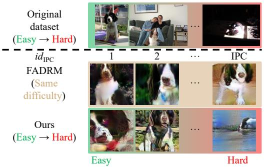  
(a)

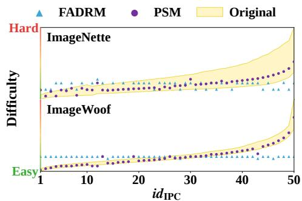  
(b)  
Figure 1: (a) Visualizations for the English Springer class in the original ImageNette dataset and the distilled datasets. The original data exhibit a progression in difficulty from easy to hard. Ours effectively preserves this difficulty structure, whereas the data distilled by FADRM show limited variation in difficulty. (b) Difficulty distributions of original and distilled data on Imagenette/Woof. FADRM exhibits nearly constant difficulty across $i d _ { \mathrm { I P C } }$ , indicating limited variation. In contrast, ours increases with $i d _ { \mathrm { I P C } }$ in line with the original data and covers a broader difficulty range.

To address this limitation, we propose Precise Statistical Matching (PSM) by difficulty. To align difficulty estimation with statistical matching in the same feature space, we carefully design the Global Precision Score (GPS): after pretraining, for each original image, GPS computes statistics at the inputs to the teacher’s BN layers, and then measures image difficulty as their distance from the corresponding BN running statistics (under the ensemble-based paradigm, PSM averages the GPS rankings of all teachers to integrate their judgments); a higher GPS indicates greater deviation from the average feature distribution, and thus greater difficulty; based on the GPS ranking, PSM then partitions the original data within each class into IPC (Images per Class) difficulty groups.

During distillation, when optimizing the $g \cdot$ th batch of distilled data, Statistics Updated Again (SUA) feeds original data from the g-th group through the teacher to update its BN running statistics via forward propagation, producing supervision that more accurately characterizes the current difficulty group. Initial Sample Screening (ISS) selects real images from the same group to initialize the distilled data, aligning their initial difficulty with the target group. Together, SUA and ISS construct statistical supervision and initialization for different difficulty groups, enabling the distilled data to cover a broader difficulty range, and helping the student to learn a more complete difficulty structure. Extensive experiments on multiple datasets demonstrate that PSM outperforms existing state-of-theart (SOTA) methods, validating its effectiveness. Our contributions are summarized as follows:

• We revisit the existing decoupled DD paradigm, in which BN running statistics estimated from the original set serve as supervision signals, and show that this paradigm limits variation in difficulty within the distilled data. To address this issue, we propose GPS, a difficulty metric closely aligned with statistical supervision, to rank the original data by difficulty.

• We propose PSM, a method that broadens the range of difficulty covered by the distilled data by adjusting statistical supervision and initial data: SUA updates the teacher model’s BN running statistics through forward propagation; ISS selects original images from the corresponding difficulty group to initialize the distilled data.

• We conducted experiments on multiple datasets and model architectures, and the results show that PSM broadens the difficulty range of distilled samples, further improving the final performance and demonstrating its effectiveness.

## 2 RELATED WORK

Dataset distillation (DD) compresses a large dataset into a small set of samples with high training utility, reducing storage and training costs while retaining performance comparable to training on the full dataset. Existing methods mainly include gradient matching (Lee et al., 2022; Liu et al., 2023), distribution matching (Zhao & Bilen, 2023; Li et al., 2025c), trajectory matching (Chen et al., 2023; Guo et al., 2024), decoupled distillation (Yin & Shen, 2024; Xiao & He, 2024), and generative distillation (Zhong et al., 2025b; Cai et al., 2026). Further related work is discussed in the appendix A.

## 3 PRELIMINARIES

## 3.1 DATASET DISTILLATION

Let $\mathcal { T } = \{ ( x _ { i } , y _ { i } ) \} _ { i = 1 } ^ { N }$ denote the original set, and let $\boldsymbol { \mathcal { D } } = \{ ( \tilde { x } _ { j } , \tilde { y } _ { j } ) \} _ { j = 1 } ^ { M }$ denote the distilled set, where $M \ll N . \operatorname { L e t } \theta _ { \tau }$ and $\theta _ { \mathcal { D } }$ represent the parameters obtained by training on $\tau$ and $\mathcal { D } ,$ respectively. DD aims to construct $\mathcal { D }$ such that models trained on $\mathcal { D }$ achieve performance comparable to those trained on T. Given a distillation budget $M ,$ this objective can be formulated as

$$
\mathcal { D } ^ { * } = \operatorname * { a r g m i n } _ { \mathcal { D } : | \mathcal { D } | = M } \operatorname* { s u p } _ { ( x , y ) \in \mathcal { T } } \left| \mathcal { L } ( f _ { \theta _ { \mathcal { T } } } ( x ) , y ) - \mathcal { L } ( f _ { \theta _ { \mathcal { D } } } ( x ) , y ) \right| ,\tag{1}
$$

where $\mathcal L ( \cdot , \cdot )$ denotes the task loss. Under a given distillation budget, the number of images per class (IPC) is the same across all classes. Typically, a student trained on the distilled set is evaluated on the original test set, and its test performance is used to measure the quality of the distilled set.

## 3.2 DECOUPLED DATASET DISTILLATION

$\mathrm { S R e ^ { 2 } L }$ (Yin et al., 2023) introduced a three-stage framework that separates model training from data distillation. During distillation, the pretrained teacher is fixed, and only the distilled data are optimized, avoiding the inner optimization of model parameters and reducing computational overhead.

I. Teacher model pretraining. The teacher is trained on the original set $\tau$ to learn feature representations, while its BN layers accumulate running means and variances from the training data. The resulting parameters $\theta _ { T }$ and BN statistics are then fixed to guide distillation.

II. Distillation. A distilled batch $\widetilde { \boldsymbol { B } } = \left( \widetilde { x } _ { j } , \widetilde { y } _ { j } \right) _ { j = 1 } ^ { B }$ is fed into the frozen teacher, where B is typically equal to the number of classes $C .$ . The classification loss $\mathcal { L } _ { \mathrm { c l s } }$ enforces semantic consistency, while the statistics matching loss $\mathcal { L } _ { \mathrm { B N } }$ aligns the batch statistics with the teacher’s running statistics:

$$
\begin{array} { r l r } & { } & { \mathcal { L } _ { \mathrm { d i s t } } ( \widetilde { B } ) = \mathcal { L } _ { \mathrm { c l s } } \left( \tilde { x } , \tilde { y } \right) + \lambda _ { \mathrm { B N } } \mathcal { L } _ { \mathrm { B N } } \left( \{ \tilde { x } _ { j } \} _ { j = 1 } ^ { B } \right) , } \\ & { } & { \mathrm { w h e r e } \quad \mathcal { L } _ { \mathrm { c l s } } \left( \tilde { x } , \tilde { y } \right) = \mathbb { E } _ { ( \tilde { x } , \tilde { y } ) \sim \widetilde { B } } \left[ \mathcal { L } _ { \mathrm { C E } } \left( f _ { \theta _ { T } } ( \tilde { x } ) , \tilde { y } \right) \right] , \quad } \\ & { } & { \mathcal { L } _ { \mathrm { B N } } \left( \{ \tilde { x } _ { j } \} _ { j = 1 } ^ { B } \right) = \sum _ { \ell = 1 } ^ { L } \left( \left\| \mu _ { \ell } - \bar { \mu } _ { \ell } \right\| _ { 2 } + \left\| \sigma _ { \ell } ^ { 2 } - \bar { \sigma } _ { \ell } ^ { 2 } \right\| _ { 2 } \right) , } \end{array}\tag{2}
$$

where $\mathcal { L } _ { \mathrm { C E } }$ is the cross entropy loss; $\lambda _ { \mathrm { B N } }$ weights statistics matching; and $L$ is the number of BN layers, indexed by ℓ. For a BN layer with $\bar { C _ { \ell } }$ channels, $\mu _ { \ell } , \sigma _ { \ell } ^ { 2 } \in \mathbf { \mathbb { R } } ^ { C _ { \ell } }$ are the batch mean and variance at its input, while $\bar { \mu } _ { \ell } , \bar { \sigma } _ { \ell } ^ { 2 } \in \mathbb { R } ^ { C _ { \ell } }$ are the corresponding teacher running statistics.

III. Soft label generation. The distilled data are fed into the pretrained teacher, whose class probability distributions are used as soft labels. These labels also preserve semantic relationships for all classes. The student is then trained on the distilled data and soft labels, receiving richer supervision.

## 3.3 BATCH NORMALIZATION

Batch Normalization (BN) (Ioffe & Szegedy, 2015) was originally introduced to mitigate changes in intermediate feature distributions. For features entering a BN layer, BN first computes the mean and variance of the current batch for each channel, and uses them to normalize the features. Thi process stabilizes feature scales across layers and improves optimization stability.

During training, each BN layer uses the current batch statistics for feature normalization, and its running mean and variance are continuously updated through an exponential moving average. Given the training batch $B _ { t }$ at step $t ,$ the running statistics of BN layer ℓ are updated as follows:

$$
\bar { \mu } _ { \ell , t } = ( 1 - \rho ) \bar { \mu } _ { \ell , t - 1 } + \rho \mu _ { \ell } ( \mathcal { B } _ { t } ) , \qquad \bar { \sigma } _ { \ell , t } ^ { 2 } = ( 1 - \rho ) \bar { \sigma } _ { \ell , t - 1 } ^ { 2 } + \rho \sigma _ { \ell } ^ { 2 } ( \mathcal { B } _ { t } ) ,\tag{3}
$$

where $\rho \in ( 0 , 1 ]$ controls the statistics update, a larger $\rho$ assigns more weight to the current batch.

## 4 METHOD

## 4.1 LIMITATIONS OF DECOUPLED DATASET DISTILLATION

$\mathrm { S R e ^ { 2 } I }$ L (Yin et al., 2023) pioneered the decoupled DD paradigm, which uses the BN running statistics stored in a pretrained teacher as supervisory signals to guide the optimization, as shown in equation 2. Because of its efficiency, this paradigm has attracted considerable attention. Recent studies have improved this paradigm by reducing storage overhead (Cui et al., 2026), lowering computational complexity (Shang et al., 2026), and enhancing performance (Shi et al., 2026). However, most of these studies rely on additional components or optimization mechanisms, with limited attention paid to the fundamental supervisory signals and their influence.

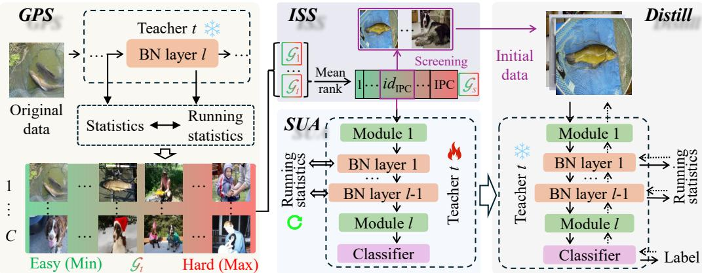  
Figure 2: Overview of the PSM. First, GPS evaluates the difficulty of the original data and ranks them from easy to hard within each class. The ordered data are then divided into IPC difficulty groups. When distilling the $g \cdot$ -th batch, SUA feeds the original data in difficulty group g into the teacher for forward propagation, allowing the statistics of each BN layer to characterize the data features. Meanwhile, ISS selects original data from the same difficulty group to initialize the corresponding distilled data, thereby providing a favorable starting point for subsequent optimization.

Homogeneous Supervision. Existing decoupled methods use the global BN running statistics stored in the pretrained teacher as the target for every distilled batch. Let $\tau _ { g }$ denote the statistical supervision assigned to batch $^ { g , }$ and let $\tau ^ { \mathrm { G } }$ denote the global BN statistics. Then

$$
\tau _ { g } = \tau ^ { \mathrm { G } } , \forall g \quad \Longrightarrow \quad \mathcal { D } _ { \mathrm { s u p } } ( \tau _ { g } , \tau _ { h } ) = 0 , \forall g , h .
$$

Consequently, the statistical target is independent of the batch index, and cannot explicitly provide batch-specific difficulty supervision. Although initialization and optimization may introduce difficulty variation, this variation is not controlled by the supervision signal, making it difficult to preserve the difficulty structure of the original data, as illustrated in Figure 1b.

## 4.2 DATASET DISTILLATION BASED ON PRECISE STATISTICAL MATCHING BY DIFFICULTY

Figure 2 illustrates the overall pipeline of the proposed method. Given the original set and a pretrained teacher, we first employ GPS to evaluate the difficulty of each original data point and rank the data within each class from easy to hard. We then divide the ordered data of each class into IPC difficulty groups, with different groups representing data of varying difficulty in the original set. When distilling the g-th batch, SUA feeds the original data in difficulty group g into the teacher to further adapt its BN running statistics to the characteristics of the current group, thereby constructing distinct statistical supervision signals for the corresponding distilled batch. $\boldsymbol { \mathrm { B y } }$ matching the respective statistical supervision signals, the distilled data in different batches progressively learn original data patterns from easy to hard. Meanwhile, ISS selects original data from the corresponding difficulty group to initialize the distilled data, aligning the difficulty of the initial data with that of the target distilled batch, and providing a favorable starting point for subsequent optimization. GPS, SUA, and ISS are introduced in the following sections. See the appendix D for pseudocode.

## 4.2.1 GPS: GLOBAL PRECISION SCORE

To accurately partition the original set by difficulty and ensure that difficulty estimation and BN statistics operate in the same feature space, we propose a new difficulty partitioning method, GPS.

Operation and Purpose. We compute the per-channel mean and variance of $x _ { i }$ at the input to each BN layer, and compare them with the corresponding running mean and variance. GPS is defined as

$$
\mathrm { G P S } ( x _ { i } ) = \mathbb { E } _ { k \in \{ 1 , \dots , K \} } \left[ \operatorname { r a n k } _ { c } \left( \mathbb { E } _ { \ell \in \{ 1 , \dots , L _ { k } \} } \left[ \frac { \| \mu _ { \ell , i , k } - \bar { \mu } _ { \ell , k } \| _ { 2 } + \beta \left\| \log \frac { \sigma _ { \ell , i , k } ^ { 2 } + \epsilon } { \sigma _ { \ell , k } ^ { 2 } + \epsilon } \right\| _ { 2 } } { \sqrt { C _ { \ell , k } } } \right] \right) \right]\tag{4}
$$

Here K denotes the number of teachers, rank $c ( \cdot )$ is the rank of a sample within class $c , \beta$ balances the mean and variance distances, and ϵ ensures numerical stability. For the variance, we first compute the ratio between the sample variance and the BN running variance to reduce the effect of variance scale differences across channels. We then take the logarithm of this ratio to stabilize its numerical range. Finally, we normalize the statistical distance at each layer by $\sqrt { C _ { \ell , k } }$ to reduce distance scale discrepancies caused by the number of channels across BN layers.

A larger GPS indicates that the data exhibits more pronounced statistical deviations across multiple feature layers, and thus corresponds to greater difficulty. Based on the GPS ranking, PSM divides the ordered data of each class into IPC difficulty groups of approximately equal size, which sequentially represent the original data from easy to hard. The resulting difficulty groups provide the basis for SUA to construct distinct supervision, and for ISS to select the corresponding initialization data.

Empirical Observation. A larger GPS indicates more pronounced deviations between the sample statistics and the teacher’s BN running statistics. To verify the correlation between statistics deviations and classification difficulty, we sort the original samples in ascending order of GPS, and compute the teacher’s cross-entropy loss on each sample’s ground truth label. The empirical relationship between GPS and classification difficulty is expressed as

$$
\mathrm { G P S } ( x _ { i } ) \uparrow \implies \mathcal { L } _ { \mathrm { C E } } ( f _ { \boldsymbol { \theta } } ( x _ { i } ) , y _ { i } ) = - \log p _ { \boldsymbol { \theta } } ( y _ { i } \mid x _ { i } ) \uparrow .\tag{5}
$$

Experimental results show that the cross-entropy loss generally increases along the GPS ranking. Samples with larger GPS values tend to have higher classification losses. These results indicate that GPS effectively reflects the sample difficulty perceived by the teacher, providing a basis for grouping samples from easy to hard. A detailed analysis is provided in the appendix B.1.

## 4.2.2 SUA: STATISTICS UPDATED AGAIN

To convert the difficulty groups obtained by GPS into statistical supervision corresponding to individual distillation batches, we propose SUA.

Operation and Purpose. Let $\mathcal { T } _ { g }$ denote the g-th difficulty group. We set IPC difficulty groups, with the g-th group corresponding to the $i d _ { \mathrm { I P C ^ { - } } }$ th distillation batch. For teacher k, SUA starts from the global BN running statistics $\check { \tau } _ { k } ^ { \mathrm { G } }$ stored in the pretrained teacher, freezes the teacher parameters $\theta _ { k } ,$ and performs $\lfloor r _ { \mathrm { f w d } } E _ { k } ^ { \mathrm { p r e } } \rfloor$ epochs of forward propagation over $\mathcal { T } _ { g }$ . During this process, only the BN running statistics are updated according to equation 3. This process is expressed as

$$
\tau _ { k } ^ { \mathrm { G } } \xrightarrow { f _ { \theta _ { k } = \mathrm { c o n s t a n t } } ^ { \lfloor r _ { \mathrm { f w d } } E _ { k } ^ { \mathrm { p r e } } \rfloor } ( \mathcal { T } _ { g } ) } \tau _ { k , g } ^ { \mathrm { S U A } } .\tag{6}
$$

where $r _ { \mathrm { f w d } }$ denotes the ratio of forward propagation epochs, $E _ { k } ^ { \mathrm { p r e } }$ denotes the number of pretraining epochs for teacher k, $\lfloor r _ { \mathrm { f w d } } E _ { k } ^ { \mathrm { p r e } } \rfloor$ denotes the actual number of forward propagation epochs, and $\tau _ { k , g } ^ { \mathrm { { \tiny S U A } } }$ denotes the BN running statistics obtained by SUA.

Through this update, the BN running statistics of the teacher gradually approach those of the current difficulty group, and serve as the statistical matching signal for distillation batch $^ { g , }$ , thereby providing each distillation batch with supervision signal corresponding to its difficulty.

Proposition 1 (Expected Convergence; Proof in Appendix B.2). For any fixed teacher k, let $\tau _ { k , g } ^ { \star }$ and $\tau _ { k , g } ^ { ( t ) }$ denote the expected BN batch statistics of $\mathcal { T } _ { g }$ and the running statistics after t forward batch updates, respectively. Iftheforward batches are independently drawnfrom $\begin{array} { r } { \mathcal { T } _ { g } , } \end{array}$ , then

$$
\mathbb { E } [ \pmb { \tau } _ { k , g } ^ { ( t ) } ] - \pmb { \tau } _ { k , g } ^ { \star } = ( 1 - \rho ) ^ { t } ( \pmb { \tau } _ { k } ^ { \mathrm { G } } - \pmb { \tau } _ { k , g } ^ { \star } ) \xrightarrow { t  \infty } \mathbf { 0 } .\tag{7}
$$

Thus, SUA statistics converge in expectation to those of the current difficulty group. The updated statistics then serve as the matching signal for batch g, guiding its distilled data to match the corresponding feature statistics.

## 4.2.3 ISS: INITIAL SAMPLE SCREENING

The initialization of distilled data significantly affects final performance. EDC (Shao et al., 2024b) shows that real image initialization reduces the distribution gap between the initialized and original data. SelMatch (Lee & Chung, 2024) further shows that real samples of appropriate difficulty help introduce corresponding complex features. Motivated by these findings, we propose ISS to initialize each distillation batch with real data matching its target difficulty.

Specifically, let $\mathcal { T } _ { g , c }$ denote the original data of class c in difficulty group g. ISS further selects real images from $\mathcal { T } _ { g , c }$ based on their difficulty, and uses them to initialize the distilled data ${ \widetilde x } _ { g , c } ^ { ( 0 ) }$ . Since the initialization images and the statistical supervision come from the same difficulty group, they are aligned in difficulty, reducing the statistical bias at the beginning of optimization. Experiments show that ISS significantly improves final distillation performance.

## 5 EXPERIMENTS

## 5.1 EXPERIMENTAL SETUP

Baselines. FADRM (Cui et al., 2025a) is a recent SOTA method for decoupled DD, achieving improved performance while substantially reducing memory and time costs, we therefore adopt it as our primary baseline and further compare with FADRM+, its extension using multiple models. $\mathrm { S R e ^ { 2 } L }$ (Yin et al., 2023), a representative foundational method for decoupled DD, is also included for comparison. In addition, we include RDED (Sun et al., 2024) as a representative method from other DD paradigms, it constructs distilled data by assembling real images, which has been adopted by other DD methods for distilled data initialization.

Datasets. We evaluate PSM on benchmark datasets widely used in dataset distillation. For low resolution datasets, we use CIFAR-10/100 (Krizhevsky, 2009) at $3 2 \times 3 2$ , and Tiny-ImageNet (Le & Yang, 2015) at $6 4 \times 6 4 .$ . For high-resolution datasets, we mainly use ImageNet-1K (Deng et al., 2009) at $2 2 4 \times 2 2 4$ and its subsets, ImageWoof (fine-grained dataset) and ImageNette.

Implementation Details. For PSM, we follow the post-evaluation protocol of FADRM. Students are trained for 1000 epochs on Tiny-ImageNet with $\mathrm { I P C } = 1$ and CIFAR-10/100, and for 300 epochs in all other settings. For a fair comparison with FADRM+, we further adopt the multi teacher variant PSM+, which consistently employs ShuffleNetV2 (Ma et al., 2018), ResNet18 (He et al., 2016), MobileNetV2 (Sandler et al., 2018), and DenseNet121 (Huang et al., 2017) as teachers for distillation across all datasets. The remaining parameters are kept consistent with FADRM, while other baselines follow their original settings. See the appendix D for more details.

## 5.2 COMPARISON WITH STATE-OF-THE-ART METHODS

## 5.2.1 MAIN RESULTS

In Table 1, methods marked with “+” use multiple teachers for distillation and a single student for evaluation, while the remaining methods follow the standard same-architecture evaluation protocol.

Low-resolution datasets. As shown in Table 1, we evaluate PSM on CIFAR-10/100 and Tiny-ImageNet. The results show that PSM outperforms its corresponding baselines in most settings when evaluated with ResNet18/50. Notably, on CIFAR-10 with $\mathrm { I P C } \stackrel { = } { = } 1 0$ , PSM achieves a Top-1 accuracy of 52.7% with ResNet50, outperforming FADRM by 8.9%, and demonstrating the effectiveness of PSM. On CIFAR-10 with $\mathrm { \bar { I P C } } = 1$ , PSM performs comparably to its corresponding baselines. This may be mainly attributed to CIFAR-10 containing only 10 coarse categories, for which the global statistics may already adequately characterize the overall difficulty distribution. Consequently, SUA induces only limited changes in the statistics, resulting in small performance differences.

High-resolution datasets. We evaluate PSM on ImageNette, ImageWoof, and ImageNet-1K. As shown in Table 1, PSM achieves consistent performance gains in most settings, demonstrating its strong robustness. Performance degradation occurs mainly on ImageWoof with ResNet50 as the stu dent under the $\mathrm { I P C } = 1 / 1 0$ . One possible explanation is the limited compatibility of ResNet50 with ImageWoof: when trained on the original set, ResNet18 achieves an accuracy of 85.0%, whereas ResNet50 achieves only 80.3%. Under low IPC, the limited distilled data may further amplify this mismatch, making it difficult for ResNet50 to learn the difficulty information preserved by PSM.

## 5.2.2 DIFFICULTY AND EFFICIENCY ANALYSIS.

Difficulty. Figure 3a shows the difficulty distributions on CIFAR-10/100. Together with Figure 1b, these results show that the difficulty of the data distilled by PSM follows a trend consistent with that of the original data and spans a broad range, whereas the difficulty of the data distilled by FADRM remains nearly constant, exhibiting limited variation. These results demonstrate that PSM effectively preserves the difficulty structure of the original data across datasets of different scales and resolutions, enabling students to learn sample patterns ranging from easy to hard more comprehensively, and validating the robustness and effectiveness of PSM.

Table 1: Top-1 accuracy comparison of PSM, extended variant PSM+, and other SOTA methods. For each dataset, IPC, and student setting, the mean values of the best and second best results are marked in bold and underlined, respectively. Values in parentheses after the PSM and PSM+ results indicate their performance changes relative to FADRM and FADRM+, respectively.
<table><tr><td colspan="2">Student</td><td colspan="6">ResNet18</td><td colspan="5">ResNet50 (He et al., 2016)</td></tr><tr><td>Dataset</td><td>IPC</td><td>SRe2L RDED</td><td></td><td>FADRM</td><td>PSM</td><td>FADRM+</td><td>PSM+</td><td>SRe2L RDED</td><td>FADRM</td><td>PSM</td><td>FADRM+</td><td>PSM+</td></tr><tr><td rowspan="4">CIFAR-10</td><td>1</td><td> $1 6 . 6 { \scriptstyle \pm 0 . 9 }$ </td><td>22.9±0.4</td><td>19.3±0.620.9±0.1 (†1.6)</td><td>23.7±0.8</td><td>22.3±0.6 (↓ 1.4)</td><td></td><td>15.2±1.3 19.7±1.7</td><td>23.2±0.723.2±0.2 (= 0.0)</td><td></td><td> $2 3 . 5 { \scriptstyle \pm 1 . 3 }$ </td><td> $\underline { { 2 3 . 3 } } _ { \pm 0 . 4 } ( \downarrow 0 . 2 )$ </td></tr><tr><td>10</td><td>29.3±0.5 37.1±0.3</td><td></td><td>48.2±0.4 54.5±1.3 († 6.3)</td><td> $5 5 . 9 _ { \pm 1 . 0 }$ </td><td>61.1±0.8 (↑ 5.2)</td><td></td><td>30.3±1.7 32.5±0.9</td><td>43.8±1.1</td><td> $5 2 . 7 { \scriptstyle \pm 0 . 1 \ ( \uparrow \ 8 . 9 ) }$ </td><td> $\underline { { 5 5 . 1 } } _ { \pm 0 . 8 }$ </td><td> ${ \bf 5 6 . 8 { \scriptstyle \pm 1 . 1 \ ( \uparrow 1 . 7 ) } }$ </td></tr><tr><td>50</td><td></td><td>45.0±0.7 62.1±0.1</td><td>80.6±0.7 81.1±0.1 (↑ 0.5)</td><td>85.8±0.1</td><td>86.7±0.2 († 0.9)</td><td></td><td>52.9±1.3 52.5±2.0</td><td>79.7±1.282.7±0.7 († 3.0)</td><td></td><td> $\underline { { 8 3 . 7 } } _ { \pm 0 . 6 }$ </td><td> ${ \bf 8 6 . 0 { \scriptstyle \pm 0 . 9 } \ ( \uparrow 2 . 3 ) }$ </td></tr><tr><td>Whole dataset</td><td></td><td></td><td>92.9</td><td></td><td></td><td></td><td></td><td></td><td>93.1</td><td></td><td></td></tr><tr><td rowspan="4">CIFAR-100</td><td>1</td><td> $6 . 6 { \scriptstyle \pm 0 . 2 }$   $1 1 . 1 _ { \pm 0 . 3 }$ </td><td> $3 1 . 3 { \scriptstyle \pm 0 . 2 }$ </td><td>32.9±0.9 († 1.6)</td><td> $\underline { { 3 7 . 9 } } _ { \pm 0 . 8 }$ </td><td>39.1±0.1 († 1.2)</td><td>6.0±0.1 11.6±0.4</td><td></td><td>24.4±1.6</td><td> $2 6 . 2 _ { \pm 1 . 4 } ( \uparrow 1 . 8 )$ </td><td> $\underline { { 3 3 . 6 } } _ { \pm 0 . 8 }$ </td><td> $3 4 . 9 _ { \pm 1 . 3 } ( \uparrow 1 . 3 )$ </td></tr><tr><td>10</td><td> $2 7 . 0 { \scriptstyle \pm 0 . 4 }$ </td><td>42.6±0.2 64.7±0.4</td><td>66.7±0.4 († 2.0)</td><td>62.5±0.2</td><td></td><td> $6 6 . 1 _ { \pm 0 . 2 } \ : ( \uparrow \ : 3 . 6 ) 3 5 . 4 _ { \pm 1 . 9 } 5 0 . 3 _ { \pm 0 . 4 } 6 1 . 8 _ { \pm 0 . 5 } 6 4 . 6 _ { \pm 0 . 1 } ( \uparrow \ : 2 . 8 ) $ </td><td></td><td></td><td></td><td> $6 2 . 3 { \scriptstyle \pm 0 . 2 }$ </td><td> $6 5 . 7 _ { \pm 0 . 4 } ( \uparrow 3 . 4 )$ </td></tr><tr><td>50</td><td> $5 0 . 2 { \scriptstyle \pm 0 . 4 }$ </td><td>62.6±0.1</td><td>69.3±0.369.7±0.3 (↑ 0.4)</td><td>67.4±0.4</td><td>70.1±0.1 (↑ 2.7)</td><td></td><td></td><td>52.9±0.1 66.8±0.367.6±0.569.8±0.1(↑ 2.2)</td><td></td><td> $6 8 . 2 _ { \pm 0 . 1 }$ </td><td> ${ \bf 7 0 . 7 { \scriptstyle \pm 0 . 2 \ ( \uparrow \ 2 . 5 ) } }$ </td></tr><tr><td>Whole dataset</td><td></td><td></td><td>73.6</td><td></td><td></td><td></td><td></td><td></td><td>74.4</td><td></td><td></td></tr><tr><td rowspan="4">Tiny-ImageNet</td><td>1</td><td> $2 . 6 { \pm } 0 . 1$   $9 . 7 { \pm } 0 . 4 $ </td><td></td><td>28.6±0.130.6±1.3 (†2.0)</td><td></td><td>35.4±0.7 (↑ 3.0)</td><td></td><td>5.1±0.1 6.5±0.5</td><td>31.1±0.431.3±0.7(↑ 0.2)</td><td></td><td>31.0±1.3</td><td> $3 2 . 9 _ { \pm 0 . 9 } ( \uparrow 1 . 9 )$ </td></tr><tr><td>10</td><td></td><td> $1 6 . 1 \pm 0 . 2 4 1 . 9 \pm 0 . 2 4 6 . 5 \pm 0 . 4 8 . 1 \pm 0 . 3 ( \uparrow 1 . 6 )$ </td><td></td><td> $3 2 . 4 _ { \pm 0 . 2 }$  47.3±1.1</td><td>48.4±0.3 († 1.1)</td><td>43.0±0.5 36.9±0.4</td><td></td><td>47.5±0.3</td><td>48.0±0.3 (↑ 0.5)</td><td>47.1±0.4</td><td> $4 8 . 2 _ { \pm 0 . 9 } ( \uparrow 1 . 1 )$ </td></tr><tr><td>50</td><td>41.1±0.4 58.2±0.1</td><td></td><td>51.4±0.151.7±0.1 († 0.3)52.0±1.0</td><td></td><td></td><td>52.1±0.1(↑ 0.1)58.3±0.1 48.0±0.8</td><td></td><td>57.8±0.1</td><td>56.6±0.7 (↓ 1.2)</td><td> $5 2 . 2 { \pm } 1 . 8 $ </td><td> $5 3 . 0 { \scriptstyle \pm 0 . 2 } \ ( \uparrow 0 . 8 )$ </td></tr><tr><td>Whole dataset</td><td></td><td></td><td>60.3</td><td></td><td></td><td></td><td></td><td></td><td>63.4</td><td></td><td></td></tr><tr><td rowspan="4">ImageNette</td><td>1</td><td></td><td></td><td></td><td></td><td></td><td></td><td></td><td></td><td></td><td></td><td> ${ \bf 2 9 . 2 _ { \pm 0 . 6 } ( \uparrow 3 . 7 ) }$ </td></tr><tr><td>10</td><td> $1 9 . 1 _ { \pm 1 . 1 }$  35.8±1.0  $2 9 . 4 { \scriptstyle \pm 3 . 0 }$  61.4±0.4</td><td>28.2±0.6 64.0±0.1</td><td>25.0±0.5 (↓ 3.2) 67.1±0.2 (↑ 3.1)</td><td>30.5±1.3 68.5±0.4</td><td>69.4±0.8 († 0.9)</td><td>32.5±0.5 († 2.0)13.6±0.5 23.6±1.4 32.5±1.1 52.6±2.8</td><td></td><td>23.7±0.422.9±0.8 (↓ 0.8) 60.9±0.5</td><td> $6 2 . 4 { \scriptstyle \pm 0 . 4 } \left( \uparrow 1 . 5 \right)$ </td><td> $2 5 . 5 { \scriptstyle \pm 0 . 7 }$ </td><td> ${ \bf 6 7 . 6 { \scriptstyle \pm 0 . 5 } } \left( \uparrow 1 . 3 \right)$ </td></tr><tr><td>50</td><td></td><td></td><td></td><td></td><td></td><td></td><td></td><td></td><td></td><td> $\underline { { 6 6 . 3 } } _ { \pm 0 . 8 }$ </td><td> $4 0 , 9 \pm \alpha _ { 3 } , 3 \cot 4 \pm \alpha _ { 4 } , \pm 8 2 , 8 \pm \alpha , 6 4 , 0 \pm \alpha _ { 3 } ( \uparrow 1 , 2 ) , \quad \stackrel { \mathrm { g . ~ 4 . 6 } } { = } \frac { 8 4 } { 4 } , 6 \pm \alpha _ { 5 } , 7 \quad 6 5 , 1 \pm \alpha _ { 3 } ( \uparrow 0 , 5 ) \ 6 0 , 8 \pm 1 , 0 \mp 4 , 5 \pm 2 , 5 \times 1 , 6 \pm \alpha _ { 5 } , 8 1 , 6 \pm \alpha _ { 6 } , 8 2 , 3 \pm \alpha _ { 3 } , 3 \mp \alpha _ { 7 } ( \uparrow 0 , 7 ) \quad \stackrel { \mathrm { g . ~ 4 . 6 } } { = } \frac { 8 4 } { 4 } \alpha _ { 1 } , \ 8 5 , 9 \pm \alpha _ { 2 } ( \uparrow 0 , 5 )$ </td></tr><tr><td>Whole dataset</td><td></td><td></td><td>90.2</td><td></td><td></td><td></td><td></td><td></td><td></td><td></td><td></td></tr><tr><td rowspan="4">ImageWoof</td><td>1</td><td></td><td></td><td></td><td></td><td></td><td></td><td></td><td></td><td>89.1</td><td></td><td></td></tr><tr><td>10</td><td> $1 3 . 3 { \scriptstyle \pm 0 . 5 }$   ${ 2 0 . 8 \pm 1 . 2 }$ </td><td> $2 0 . 2 \pm 0 . 2 3 8 . 5 \pm 2 . 1 4 3 . 8 \pm 0 . 2 4 4 . 5 \pm 0 . 5 ( \uparrow 0 . 7 ) 4 7 . 2 \pm 0 . 2$ </td><td>19.3±0.320.2±0.7(↑ 0.9)19.4±0.5</td><td></td><td></td><td> $1 4 . 9 \pm 0 . 9 \ ( \downarrow \ 4 . 5 ) 1 2 . 2 \pm 2 . 2 \ \underline { { { 2 1 . 1 } } } _ { \pm 1 . 9 }$   $4 8 . 3 _ { \pm 0 . 6 ~ ( \uparrow ~ 1 . 1 ) ~ 1 9 . 8 \pm 1 . 4 ~ 4 0 . 9 \pm 3 . 1 }$ </td><td></td><td>21.6±0.516.5±0.7 (↓ 5.1) 37.8±0.6</td><td> $3 4 . 0 { \scriptstyle \pm 1 . 0 \ ( \downarrow . 3 . 8 ) }$ </td><td> $1 8 . 4 \pm 0 . 2$   $\mathbf { 4 4 . 9 2 0 . 9 }$ </td><td>15.1±0.7 (↓ 3.3)  $\underline { { 4 3 . 5 } } _ { \pm 1 . 2 } ( \downarrow 1 . 4 )$ </td></tr><tr><td>50</td><td> $2 3 . 3 { \pm } 0 . 3 $  68.5±0.7</td><td>767.7±1.069.6±0.9 († 1.9)</td><td></td><td> $\underline { { 7 3 . 0 } } _ { \pm 0 . 6 }$ </td><td></td><td>74.4±0.5 (†1.4)35.7±0.4 59.8±3.2</td><td></td><td>66.5±1.1</td><td> $6 8 . 0 { \pm } 1 . 0 \ ( \uparrow 1 . 5 )$ </td><td> $\underline { { 7 2 . 7 } } \pm 0 . 7$ </td><td>73.7±0.7 († 1.0)</td></tr><tr><td>Whole dataset</td><td></td><td></td><td>85</td><td></td><td></td><td></td><td></td><td></td><td></td><td></td><td></td></tr><tr><td rowspan="3">ImageNet-1K</td><td>10</td><td></td><td></td><td></td><td></td><td></td><td></td><td></td><td></td><td>80.3</td><td></td><td></td></tr><tr><td>50</td><td></td><td> $2 1 . 3 _ { \pm 0 . 6 } 4 2 . 0 _ { \pm 0 . 1 } 4 7 . 8 _ { \pm 0 . 4 } 4 8 . 8 _ { \pm 0 . 2 } ( \uparrow 1 . 0 ) 5 0 . 8 _ { \pm 0 . 1 }$   $4 6 . 8 _ { \pm 0 . 2 } \ 5 6 . 5 _ { \pm 0 . 1 } \ 6 0 . 9 _ { \pm 0 . 1 } \ 6 1 . 3 _ { \pm 0 . 1 } \ ( \uparrow \ 0 . 4 ) 5 9 . 2 _ { \pm 0 . 2 } \ 5 9 . 8 _ { \pm 0 . 1 } \ ( \uparrow \ 0 . 6 ) 5 5 . 6 _ { \pm 0 . 3 }$ </td><td></td><td></td><td></td><td> $\mathbf { 5 1 . 6 _ { \pm 0 . 3 } ( \uparrow 0 . 8 ) 2 8 . 4 _ { \pm 0 . 1 } }$ </td><td></td><td> $4 5 . 6 { \scriptstyle \pm 1 . 6 } 4 5 . 3 { \scriptstyle \pm 0 . 8 } ( { \scriptstyle \downarrow } 0 . 3 )$   $6 5 . 0 _ { \pm 0 . 1 } 6 5 . 6 { \scriptstyle \pm 0 . 2 \left( \uparrow 0 . 6 \right) }$ </td><td></td><td> $\underline { { 5 6 . 9 } } _ { \pm 0 . 2 }$   $\underline { { 6 6 . 4 } } _ { \pm 0 . 3 }$ </td><td> ${ \bar { \mathbf { s } } } 7 . 1 _ { \pm 0 . 5 } \ : ( \uparrow 0 . 2 )$   ${ \bf 6 6 . 6 { \scriptstyle \pm 0 . 1 \ ( \uparrow 0 . 2 ) } }$ </td></tr><tr><td>Whole dataset</td><td></td><td></td><td>69.8</td><td></td><td></td><td></td><td></td><td>76.1</td><td></td><td></td><td></td></tr></table>

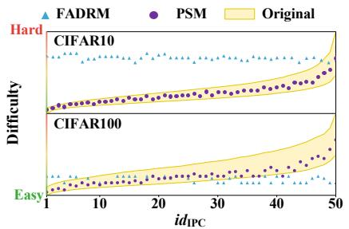  
(a)

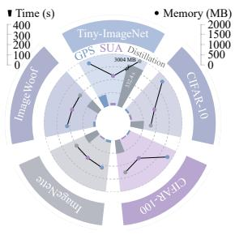  
(b)  
Figure 3: (a) With ResNet18 as the teacher and $\mathrm { I P C } = 5 0$ , the difficulty distributions of the original data and the data distilled by FADRM and PSM on CIFAR-10/100. (b) Runtime and peak GPU memory usage of GPS, as well as SUA and distillation for a single id , with $\mathrm { I P C } = 1 0 . \mathrm { \Omega } ^ {  } / / \mathrm { \Omega } ^ { \ast }$ indicates that the corresponding value exceeds the plotting range.

Efficiency. To evaluate the additional overhead of GPS computation and SUA forward passes, we measure their runtime and peak GPU memory. Since PSM and FADRM use the same distillation process, their efficiency difference mainly arises from these two steps. The costs of SUA and distillation are measured for the distilled batch corresponding to a single $i d _ { \mathrm { I P C } }$ . As shown in Figure 3b, GPS, SUA, and distillation require similar amounts of memory on small datasets, while distillation requires substantially more memory on Tiny-ImageNet. GPS and SUA also require much less time than distillation because they involve no gradient computation. Therefore, PSM introduces limited additional overhead while maintaining high computational efficiency and improving performance.

## 5.2.3 CROSS-ARCHITECTURE GENERALIZATION.

Small-scale datasets. We evaluate cross-architecture generalization on CIFAR-10/100 and ImageNette/Woof using students with different scales and architectures. As shown in Table 2, under

Table 2: Cross-architecture Top-1 accuracy on small-scale datasets with $\mathrm { I P C } = 1 0 .$ FADRM and PSM use ResNet18 as the teacher. Results evaluated with ResNet18 as the student are also reported.
<table><tr><td colspan="2">Datasets</td><td colspan="2">CIFAR-10</td><td colspan="2">CIFAR-100</td><td colspan="2">ImageNette</td><td colspan="2">ImageWoof</td></tr><tr><td>Student</td><td>Parameters</td><td>FADRM</td><td>PSM</td><td>FADRM</td><td>PSM</td><td>FADRM</td><td>PSM</td><td>FADRM</td><td>PSM</td></tr><tr><td>ShuffleNetV2</td><td>2.3M</td><td> $3 9 . 3 { \scriptstyle \pm 1 . 0 }$ </td><td> $4 1 . 5 { \scriptstyle \pm 0 . 8 } ( \uparrow 2 . 2 )$ </td><td> $5 7 . 2 { \scriptstyle \pm 0 . 3 }$ </td><td> $5 8 . 6 { \scriptstyle \pm 0 . 3 } ( \uparrow 1 . 4 )$ </td><td> $4 8 . 4 { \scriptstyle \pm 1 . 1 }$ </td><td> $5 2 . 1 { \scriptstyle \pm 0 . 2 } \ ( \uparrow 3 . 7 )$ </td><td> $3 0 . 5 { \scriptstyle \pm 2 . 2 }$ </td><td> $2 8 . 9 { \scriptstyle \pm 1 . 6 } \ ( { \downarrow } \ 1 . 6 )$ </td></tr><tr><td>MobileNetV2</td><td>3.4M</td><td> $4 3 . 0 { \scriptstyle \pm 0 . 4 }$ </td><td> $4 1 . 3 { \scriptstyle \pm 0 . 5 } \ : ( \downarrow . 1 . 7 )$ </td><td> $5 6 . 4 { \scriptstyle \pm 0 . 2 }$ </td><td> $5 7 . 8 { \scriptstyle \pm 0 . 3 } ( \uparrow 1 . 4 )$ </td><td> $5 4 . 2 { \scriptstyle \pm 0 . 2 }$ </td><td> $5 6 . 1 _ { \pm 0 . 6 } ( \uparrow 1 . 9 )$ </td><td> $3 0 . 1 { \pm } 1 . 0 $ </td><td> $3 2 . 0 { \scriptstyle \pm 1 . 4 } \left( \uparrow 1 . 9 \right)$ </td></tr><tr><td>DenseNet121</td><td>8.0M</td><td> $4 8 . 0 { \scriptstyle \pm 0 . 6 }$ </td><td> $4 6 . 0 { \scriptstyle \pm 1 . 0 \ ( \downarrow \ 2 . 0 ) }$ </td><td> $6 2 . 1 { \pm } 0 . 3 $ </td><td> $6 3 . 9 { \scriptstyle \pm 0 . 2 } ( \uparrow 1 . 8 )$ </td><td> $6 6 . 3 { \scriptstyle \pm 0 . 6 }$ </td><td> $6 7 . 8 { \scriptstyle \pm 1 . 0 \ ( \uparrow 1 . 5 ) }$ </td><td> $4 3 . 0 { \scriptstyle \pm 1 . 0 }$ </td><td> $4 3 . 6 { \scriptstyle \pm 0 . 5 } \left( \uparrow 0 . 6 \right)$ </td></tr><tr><td>ResNet18</td><td>11.7M</td><td> $4 8 . 2 _ { \pm 0 . 4 }$ </td><td> $5 4 . 5 { \scriptstyle \pm 1 . 3 } ( \uparrow 6 . 3 )$ </td><td> $6 4 . 7 _ { \pm 0 . 4 }$ </td><td> $6 6 . 7 _ { \pm 0 . 4 } ( \uparrow 2 . 0 )$ </td><td> $6 4 . 0 { \scriptstyle \pm 0 . 1 }$ </td><td> $6 7 . 1 _ { \pm 0 . 2 } ( \uparrow 3 . 1 )$ </td><td> $4 3 . 8 _ { \pm 0 . 2 }$ </td><td> $4 4 . 5 { \scriptstyle \pm 0 . 5 } ( \uparrow 0 . 7 )$ </td></tr><tr><td>ResNet50</td><td>25.6M</td><td> $3 6 . 5 { \scriptstyle \pm 1 . 0 }$ </td><td> $4 0 . 2 { \scriptstyle \pm 1 . 3 } ( \uparrow 3 . 7 )$ </td><td> $6 0 . 2 { \scriptstyle \pm 0 . 2 }$ </td><td> $6 2 . 6 { \scriptstyle \pm 0 . 7 } ( \uparrow 2 . 4 )$ </td><td> $6 2 . 4 { \scriptstyle \pm 0 . 7 }$ </td><td> $6 5 . 0 { \scriptstyle \pm 1 . 0 \ ( \uparrow 2 . 6 ) }$ </td><td> $4 0 . 5 { \scriptstyle \pm 0 . 4 }$ </td><td> $4 0 . 5 { \scriptstyle \pm 1 . 1 } ( = 0 . 0 )$ </td></tr><tr><td>ResNet101</td><td>44.5M</td><td> $3 9 . 8 { \scriptstyle \pm 0 . 1 }$ </td><td> $3 8 . 4 { \pm } 1 . 0 \ ( \downarrow \ 1 . 4 )$ </td><td> $5 9 . 3 { \scriptstyle \pm 1 . 0 }$ </td><td> $6 1 . 7 { \scriptstyle \pm 0 . 4 } ( \uparrow 2 . 4 )$ </td><td> $5 5 . 7 { \scriptstyle \pm 0 . 7 }$ </td><td> $6 2 . 2 { \scriptstyle \pm 0 . 8 } ( \uparrow 6 . 5 )$ </td><td> $3 6 . 9 { \scriptstyle \pm 0 . 7 }$ </td><td> $3 7 . 2 { \scriptstyle \pm 0 . 2 } \left( \uparrow 0 . 3 \right)$ </td></tr></table>

<table><tr><td colspan="2">Datasets</td><td colspan="2">Tiny-ImageNet</td><td colspan="2">ImageNet-1K</td></tr><tr><td>Student</td><td>Parameters</td><td>FADRM</td><td>PSM</td><td>FADRM</td><td>PSM</td></tr><tr><td>DeiT-Ti</td><td>5.7M</td><td> $1 8 . 6 { \scriptstyle \pm 0 . 3 }$ </td><td> $1 9 . 9 _ { \pm 0 . 2 } ( \uparrow 1 . 3 )$ </td><td> $3 6 . 5 { \scriptstyle \pm 0 . 5 }$ </td><td> $3 7 . 3 { \scriptstyle \pm 0 . 1 } \left( \uparrow 0 . 8 \right)$ </td></tr><tr><td>ResNet18</td><td>11.7M</td><td> $5 1 . 4 { \scriptstyle \pm 0 . 1 }$ </td><td> $5 1 . 7 { \scriptstyle \pm 0 . 1 } \left( \uparrow 0 . 3 \right)$ </td><td> $6 0 . 9 { \scriptstyle \pm 0 . 1 }$ </td><td> $6 1 . 3 { \scriptstyle \pm 0 . 1 } \left( \uparrow 0 . 4 \right)$ </td></tr><tr><td>ResNet101</td><td>44.5M</td><td> $5 1 . 1 { \pm } 1 . 8 $ </td><td> $5 3 . 1 _ { \pm 0 . 9 } ( \uparrow 2 . 0 )$ </td><td> $6 5 . 5 { \scriptstyle \pm 0 . 1 }$ </td><td> $6 5 . 2 _ { \pm 0 . 1 } ( \downarrow 0 . 3 )$ </td></tr></table>

Table 4: Top-1 accuracy of different difficulty calculation methods with $\mathrm { I P C } = 1 0 $ and ResNet18 as both the teacher and student.  
Table 3: Cross-architecture Top-1 accuracy on large-scale datasets with $\mathrm { I P C } \ = \ 5 0 .$ To further evaluate the generalization of the distilled data across different models, we also use DeiT (Touvron et al., 2021), which adopts a Transformer (Vaswani et al., 2017) architecture, as a student.

<table><tr><td>Difficulty Calculation CIFAR-10 CIFAR-100 ImageNette ImageWoof</td><td></td><td></td><td></td><td></td></tr><tr><td>Forgetting score</td><td> $\underline { { 4 8 . 5 } } _ { \pm 0 . 2 }$ </td><td> $6 5 . 3 { \scriptstyle \pm 0 . 2 }$ </td><td> $\underline { { 6 5 . 6 } } _ { \pm 0 . 3 }$ </td><td> $3 9 . 6 _ { \pm 1 . 1 }$ </td></tr><tr><td>Confidence score</td><td> $4 3 . 3 { \scriptstyle \pm 0 . 5 }$ </td><td> $\underline { { 6 5 . 7 } } _ { \pm 0 . 6 }$ </td><td> $6 4 . 0 { \scriptstyle \pm 0 . 4 }$ </td><td> $4 2 . 1 _ { \pm 0 . 6 }$ </td></tr><tr><td>Logits</td><td> $4 3 . 2 { \pm } 1 . 1$ </td><td> $\underline { { 6 5 . 7 } } \pm 0 . 3$ </td><td> $6 4 . 8 { \scriptstyle \pm 0 . 9 }$ </td><td> $\underline { { 4 3 . 8 } } _ { \pm 0 . 6 }$ </td></tr><tr><td>GPS</td><td> ${ \bar { 5 } } 4 . 5 _ { \pm 1 . 3 }$ </td><td> ${ \bf 6 6 . 7 _ { \pm 0 . 4 } }$ </td><td> ${ \bf 6 7 . 1 _ { \pm 0 . 2 } }$ </td><td> $4 4 . 5 _ { \pm 0 . 5 }$ </td></tr></table>

Table 5: Top-1 accuracy in the ablation study of SUA and ISS with $\mathrm { I P C } = 1 0 $ and ResNet18 as both the teacher and student.
<table><tr><td></td><td></td><td></td><td></td><td>SUA ISS CIFAR-10 CIFAR-100 ImageNette ImageWoof</td><td></td></tr><tr><td rowspan="2"></td><td></td><td> $4 8 . 2 _ { \pm 0 . 4 }$ </td><td> $6 4 . 7 _ { \pm 0 . 4 }$ </td><td> $6 4 . 0 { \scriptstyle \pm 0 . 1 }$ </td><td> $\underline { { 4 3 . 8 } } _ { \pm 0 . 2 }$ </td></tr><tr><td></td><td> $\underline { { 5 0 . 7 } } _ { \pm 0 . 5 }$ </td><td> $6 5 . 2 { \scriptstyle \pm 0 . 4 }$ </td><td> $\underline { { 6 5 . 9 } } _ { \pm 0 . 9 }$ </td><td> $4 2 . 1 _ { \pm 1 . 3 }$ </td></tr><tr><td></td><td>√</td><td> $4 7 . 6 { \scriptstyle \pm 0 . 1 }$ </td><td> $\underline { { 6 5 . 3 } } _ { \pm 0 . 2 }$ </td><td> $6 5 . 8 { \scriptstyle \pm 0 . 4 }$ </td><td> $4 0 . 0 { \scriptstyle \pm 0 . 8 }$ </td></tr><tr><td>V</td><td>√</td><td> ${ \bar { 5 } } 4 . 5 _ { \pm 1 . 3 }$ </td><td> ${ \bf 6 6 . 7 _ { \pm 0 . 4 } }$ </td><td> ${ \bf 6 7 . 1 _ { \pm 0 . 2 } }$ </td><td> $4 4 . 5 _ { \pm 0 . 5 }$ </td></tr></table>

most settings, PSM consistently outperforms FADRM across all datasets and student architectures. For example, on ImageNette, PSM outperforms FADRM by 6.5% when using ResNet101 (44.5M parameters) as the student, demonstrating its strong cross-architecture generalization ability.  
Large-scale datasets. We conduct cross-architecture generalization experiments on Tiny-ImageNet and ImageNet-1K, and further include DeiT-Ti (5.7M parameters), which adopts a Transformer architecture, to evaluate the generalization of PSM across different architectures. As shown in Table 3, PSM performs well with both ResNet architecture and the newer DeiT architecture, demonstrating strong cross-architecture generalization on large-scale datasets.

## 5.3 ABLATION STUDY

Difficulty Calculation Methods. We compare GPS with existing difficulty calculation methods, including Forgetting Score (Toneva et al., 2019), Confidence Score (Swayamdipta et al., 2020), and Logits (Chen et al., 2025). As shown in Table 4, GPS achieves the highest Top-1 accuracy on all datasets, indicating that it effectively partitions the original data into groups with distinct difficulties, provides reliable difficulty groups for SUA, and validates the effectiveness of PSM.

Epoch Ratio in SUA and Screening Method in ISS. SUA updates the teacher BN statistics through forward passes. We multiply the epoch ratio $r _ { \mathrm { f w d } } \in \{ 0 . 1 , 0 . 2 , \ldots , 1 . 0 \}$ by the pretraining epochs $E _ { k } ^ { \mathrm { p r e } }$ of teacher k to determine the number of SUA forward epochs. For ISS, we compare four screening methods within each difficulty group: Random samples randomly, while Front, Middle, and Back select images from the front, middle, and back of the difficulty ranking, respectively.

We systematically study $r _ { \mathrm { f w d } }$ and ISS methods on CIFAR-10/100 and ImageNette/Woof. As shown in Figure 4, Back performs best on CIFAR-10/100 and ImageWoof, while Front performs best on ImageNette. Under the optimal methods, CIFAR-10/100 (54.5% / 66.7%) and ImageNette (67.1%) achieve the highest accuracy at $r _ { \mathrm { f w d } } ~ = ~ 0 . 9 / 1 . 0$ , whereas ImageWoof (44.5%) performs best at $r _ { \mathrm { f w d } } = 0 . 4$ . Too few forward passes may update statistics insufficiently, while too many may overadapt them to the current difficulty group. Thus, the optimal $r _ { \mathrm { f w d } }$ depends on the dataset distribution.

Ablation of Mechanisms. SUA and ISS control distilled data difficulty through supervision and initialization, respectively. As shown in Table 5, removing both reduces PSM to FADRM. Individually, they improve several datasets but hurt ImageWoof, likely due to mismatched initialization and supervision. Jointly, they achieve the best results across all datasets, demonstrating their comple mentarity in constructing the difficulty structure.

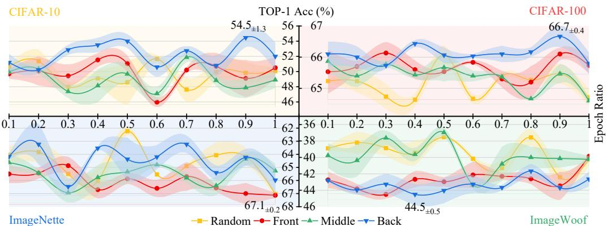  
Figure 4: Hyperparameter study of SUA and ISS. On CIFAR-10/100 and ImageNette/Woof, we set $\mathrm { I P C } = 1 0$ and use ResNet18 as both the teacher and student. We investigate the forward epoch ratio $r _ { \mathrm { f w d } } \in \{ 0 . 1 , 0 . 2 , \ldots , 1 . 0 \}$ in SUA and the screening method (Random, Front, Middle, Back) in ISS.

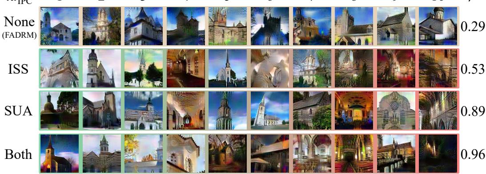  
Figure 5: Distilled data on ImageNette with $\mathrm { I P C } = 1 0 $ and ResNet18 as the teacher, using neither mechanism (FADRM), ISS, SUA, or both. Spearman’s $\rho$ measures the agreement between the difficulty trends of the distilled and original data, with values closer to 1 indicating better agreement.

During SUA, we use the same batch size as pretraining. For PSM+, all teachers share the same r<sub>fwd</sub> and pretraining batch size. Further details and ablations are provided in the appendix C and D.

## 5.4 VISUALIZATION

Figure 5 visualizes the effect of PSM on distilled data difficulty. Spearman’s $\rho$ (Spearman, 1904) measures agreement between the difficulty trends of distilled and original data, with values closer to 1 indicating stronger agreement. FADRM produces similar data difficulties and the lowest $\rho .$ Using ISS or SUA introduces clear difficulty variation, while combining both yields the clearest variation and the highest $\rho ,$ confirming that PSM effectively captures the difficulty structure.

## 6 CONCLUSION

In this work, we identify that existing decoupled methods struggle to capture the difficulty variation in the original data fully. To address this issue, we propose Precise Statistical Matching (PSM) by Difficulty. We first introduce GPS to rank and group original data by difficulty using BN statistics. We then propose SUA to update teacher BN statistics through efficient forward propagation, enabling difficulty-specific statistical supervision. Meanwhile, ISS selects real samples from the corresponding difficulty groups for initialization, providing distilled data with starting points consistent with the target difficulty. Extensive experiments show that PSM consistently improves student performance and better preserves the difficulty distribution of the original data. Future work will further improve PSM under extreme settings $( \mathrm { e . g . , I P C = 1 } )$ , and investigate the effects of its parameters on datasets with different distributions (e.g., fine-grained datasets).

## REFERENCES

Wenqi Cai, Yawen Zou, Guang Li, Chunzhi Gu, and Chao Zhang. Evlf: Early vision-language fusion for generative dataset distillation. In Proceedings of the IEEE/CVF Conference on Computer Vision and Pattern Recognition (CVPR), pp. 33953–33962, 2026.

George Cazenavette, Tongzhou Wang, Antonio Torralba, Alexei A. Efros, and Jun-Yan Zhu. Dataset distillation by matching training trajectories. In Proceedings of the IEEE/CVF Conference on Computer Vision and Pattern Recognition (CVPR), pp. 10718–10727, 2022.

Mingyang Chen, Bo Huang, Junda Lu, Bing Li, Yi Wang, Minhao Cheng, and Wei Wang. Dataset distillation via adversarial prediction matching. arXiv preprint arXiv:2312.08912, 2023.

Yanda Chen, Gongwei Chen, Miao Zhang, Weili Guan, and Liqiang Nie. Curriculum coarse-to-fine selection for high-ipc dataset distillation. In Proceedings of the Computer Vision and Pattern Recognition Conference (CVPR), pp. 20437–20446, 2025.

Yutian Chen, Max Welling, and Alex Smola. Super-samples from kernel herding. In Proceedings of the Conference on Uncertainty in Artificial Intelligence (UAI), 2010.

Jiacheng Cui, Xinyue Bi, Yaxin Luo, Xiaohan Zhao, Jiacheng Liu, and Zhiqiang Shen. FADRM: Fast and accurate data residual matching for dataset distillation. In Proceedings of the Advances in Neural Information Processing Systems (NeurIPS), 2025a.

Jiacheng Cui, Zhaoyi Li, Xiaochen Ma, Xinyue Bi, Yaxin Luo, and Zhiqiang Shen. Dataset distillation via committee voting. arXiv preprint arXiv:2501.07575, 2025b.

Jiacheng Cui, Bingkui Tong, Xinyue Bi, Xiaohan Zhao, Jiacheng Liu, and Zhiqiang Shen. Hard labels in! rethinking the role of hard labels in mitigating local semantic drift. In Proceedings of the International Conference on Machine Learning (ICML), 2026.

Justin Cui, Ruochen Wang, Si Si, and Cho-Jui Hsieh. Scaling up dataset distillation to imagenet-1k with constant memory. In Proceedings of the International Conference on Machine Learning (ICML), pp. 6565–6590, 2023.

Jia Deng, Wei Dong, Richard Socher, Li-Jia Li, Kai Li, and Li Fei-Fei. Imagenet: A large-scale hierarchical image database. In Proceedings of the IEEE Conference on Computer Vision and Pattern Recognition (CVPR), pp. 248–255, 2009.

Ziang Gan, Qi Zhu, and Libao Zhang. Set-coupled guidance: Set-level coordination in diffusionbased dataset distillation. In Proceedings of the International Conference on Machine Learning (ICML), 2026.

Jianyang Gu, Saeed Vahidian, Vyacheslav Kungurtsev, Haonan Wang, Wei Jiang, Yang You, and Yiran Chen. Efficient dataset distillation via minimax diffusion. In Proceedings of the IEEE/CVF Conference on Computer Vision and Pattern Recognition (CVPR), pp. 15793–15803, 2024.

Ziyao Guo, Kai Wang, George Cazenavette, Hui Li, Kaipeng Zhang, and Yang You. Towards lossless dataset distillation via difficulty-aligned trajectory matching. In Proceedings ofthe International Conference on Learning Representations (ICLR), 2024.

Kaiming He, Xiangyu Zhang, Shaoqing Ren, and Jian Sun. Deep residual learning for image recognition. In Proceedings of the IEEE Conference on Computer Vision and Pattern Recognition (CVPR), pp. 770–778, 2016.

Jordan Hoffmann, Sebastian Borgeaud, Arthur Mensch, Elena Buchatskaya, Trevor Cai, Eliza Rutherford, Diego de Las Casas, Lisa Anne Hendricks, Johannes Welbl, Aidan Clark, Tom Hennigan, Eric Noland, Katie Millican, George van den Driessche, Bogdan Damoc, Aurelia Guy, Simon Osindero, Karen Simonyan, Erich Elsen, Jack W. Rae, Oriol Vinyals, and Laurent Sifre. Training compute-optimal large language models. In Proceedings of the Advances in Neural Information Processing Systems (NeurIPS), 2022.

Gao Huang, Zhuang Liu, Laurens Van Der Maaten, and Kilian Q Weinberger. Densely connected convolutional networks. In Proceedings ofthe IEEE Conference on Computer Vision and Pattern Recognition (CVPR), pp. 4700–4708, 2017.

Sergey Ioffe. Batch renormalization: Towards reducing minibatch dependence in batch-normalized models. In Proceedings of the Advances in Neural Information Processing Systems (NeurIPS), 2017.

Sergey Ioffe and Christian Szegedy. Batch normalization: Accelerating deep network training by reducing internal covariate shift. In Proceedings of the International Conference on Machine Learning (ICML), pp. 448–456. PMLR, 2015.

Alex Krizhevsky. Learning multiple layers of features from tiny images. Technical report, University of Toronto, 2009.

Ya Le and Xuan Yang. Tiny imagenet visual recognition challenge. CS 231N, 7(7):3, 2015.

Saehyung Lee, Sanghyuk Chun, Sangwon Jung, Sangdoo Yun, and Sungroh Yoon. Dataset condensation with contrastive signals. In Proceedings of the International Conference on Machine Learning (ICML), pp. 12352–12364, 2022.

Yongmin Lee and Hye Won Chung. SelMatch: Effectively scaling up dataset distillation via selection-based initialization and partial updates by trajectory matching. In Proceedings of the International Conference on Machine Learning (ICML), 2024.

Shiye Lei and Dacheng Tao. A comprehensive survey of dataset distillation. IEEE Transactions on Pattern Analysis and Machine Intelligence, 46(1):17–32, 2024.

Guang Li, Ren Togo, Takahiro Ogawa, and Miki Haseyama. Soft-label anonymous gastric x-ray image distillation. In Proceedings of the IEEE International Conference on Image Processing (ICIP), pp. 305–309, 2020.

Guang Li, Ren Togo, Takahiro Ogawa, and Miki Haseyama. Compressed gastric image generation based on soft-label dataset distillation for medical data sharing. Computer Methods and Programs in Biomedicine, 227:107189, 2022a.

Guang Li, Bo Zhao, and Tongzhou Wang. Awesome dataset distillation. https://github.com/Guang000/Awesome-Dataset-Distillation, 2022b.

Guang Li, Ren Togo, Takahiro Ogawa, and Miki Haseyama. Dataset distillation using parameter pruning. IEICE Transactions on Fundamentals of Electronics, Communications and Computer Sciences, 107(6):936–940, 2024a.

Guang Li, Ren Togo, Takahiro Ogawa, and Miki Haseyama. Importance-aware adaptive dataset distillation. Neural Networks, 172:106154, 2024b.

Mingzhuo Li, Guang Li, Jiafeng Mao, Linfeng Ye, Takahiro Ogawa, and Miki Haseyama. Taskspecific generative dataset distillation with difficulty-guided sampling. In IEEE/CVF International Conference on Computer Vision (ICCV), Workshop, 2025a.

Wenyuan Li, Guang Li, Keisuke Maeda, Takahiro Ogawa, and Miki Haseyama. Decoupled audiovisual dataset distillation. arXiv preprint arXiv:2511.17890, 2025b.

Wenyuan Li, Guang Li, Keisuke Maeda, Takahiro Ogawa, and Miki Haseyama. Hyperbolic dataset distillation. In Proceedings of the Advances in Neural Information Processing Systems (NeurIPS), 2025c.

Xuhui Li, Zhengquan Luo, Zihui Cui, and Zhiqiang Xu. Geodm: Geometry-aware distribution matching for dataset distillation. In Proceedings of the International Conference on Machine Learning (ICML), 2026.

Yanghao Li, Naiyan Wang, Jianping Shi, Jiaying Liu, and Xiaodi Hou. Revisiting batch normalization for practical domain adaptation. In International Conference on Learning Representations (ICLR) Workshop, 2017.

Ping Liu and Jiawei Du. The evolution of dataset distillation: Toward scalable and generalizable solutions. arXiv preprint arXiv:2502.05673, 2025.

Yanqing Liu, Jianyang Gu, Kai Wang, Zheng Zhu, Wei Jiang, and Yang You. DREAM: Efficient dataset distillation by representative matching. In Proceedings of the IEEE/CVF International Conference on Computer Vision (ICCV), pp. 17314–17324, 2023.

Ping Luo, Xinjiang Wang, Wenqi Shao, and Zhanglin Peng. Towards understanding regularization in batch normalization. In Proceedings ofthe International Conference on Learning Representations (ICLR), 2019.

Ningning Ma, Xiangyu Zhang, Hai-Tao Zheng, and Jian Sun. Shufflenet v2: Practical guidelines for efficient cnn architecture design. In Proceedings of the European Conference on Computer Vision (ECCV), pp. 116–131, 2018.

William Peebles and Saining Xie. Scalable diffusion models with transformers. In Proceedings of the IEEE/CVF International Conference on Computer Vision (ICCV), pp. 4195–4205, 2023.

Ahmad Sajedi, Samir Khaki, Ehsan Amjadian, Lucy Z. Liu, Yuri A. Lawryshyn, and Konstantinos N. Plataniotis. DataDAM: Efficient dataset distillation with attention matching. In Proceedings of the IEEE/CVF International Conference on Computer Vision (ICCV), pp. 17097–17107, 2023.

Mark Sandler, Andrew Howard, Menglong Zhu, Andrey Zhmoginov, and Liang-Chieh Chen. Mobilenetv2: Inverted residuals and linear bottlenecks. In Proceedings of the IEEE Conference on Computer Vision and Pattern Recognition (CVPR), pp. 4510–4520, 2018.

Mattia Sangermano, Antonio Carta, Andrea Cossu, and Davide Bacciu. Sample condensation in online continual learning. In Proceedings ofthe International Joint Conference on Neural Networks (IJCNN), pp. 1–8. IEEE, 2022.

Shibani Santurkar, Dimitris Tsipras, Andrew Ilyas, and Aleksander Madry. How does batch normalization help optimization? In Proceedings ofthe Advances in Neural Information Processing Systems (NeurIPS), 2018.

Xinyi Shang, Peng Sun, Bei Shi, Zixuan Wang, and Tao Lin. Condensing large-scale datasets directly with minimal information loss. In Proceedings of the European Conference on Computer Vision (ECCV), 2026.

Shitong Shao, Zeyuan Yin, Muxin Zhou, Xindong Zhang, and Zhiqiang Shen. Generalized largescale data condensation via various backbone and statistical matching. In Proceedings of the IEEE/CVF Conference on Computer Vision and Pattern Recognition (CVPR), pp. 16709–16718, 2024a.

Shitong Shao, Zikai Zhou, Huanran Chen, and Zhiqiang Shen. Elucidating the design space of dataset condensation. In Proceedings of the Advances in Neural Information Processing Systems (NeurIPS), 2024b.

Guanghui Shi, Xuefeng Liang, and Qixiang Wen. Balanced dataset distillation via modeling multiple visual pattern distribution. In Proceedings ofthe IEEE/CVF Conference on Computer Vision and Pattern Recognition (CVPR), pp. 19634–19643, 2026.

Charles Spearman. The proof and measurement of association between two things. The American Journal ofPsychology, 15(1):72–101, 1904. doi: 10.2307/1412159.

Duo Su, Junjie Hou, Weizhi Gao, Yingjie Tian, and Bowen Tang. D4M: Dataset distillation via disentangled diffusion model. In Proceedings of the IEEE/CVF Conference on Computer Vision and Pattern Recognition (CVPR), pp. 5809–5818, 2024.

Peng Sun, Bei Shi, Daiwei Yu, and Tao Lin. On the diversity and realism of distilled dataset: An efficient dataset distillation paradigm. In Proceedings of the IEEE/CVF Conference on Computer Vision and Pattern Recognition (CVPR), pp. 9390–9399, 2024.

Swabha Swayamdipta, Roy Schwartz, Nicholas Lourie, Yizhong Wang, Hannaneh Hajishirzi, Noah A. Smith, and Yejin Choi. Dataset cartography: Mapping and diagnosing datasets with training dynamics. In Proceedings of the Conference on Empirical Methods in Natural Language Processing (EMNLP), pp. 9275–9293, 2020.

Mariya Toneva, Alessandro Sordoni, Remi Tachet des Combes, Adam Trischler, Yoshua Bengio, and Geoffrey J. Gordon. An empirical study of example forgetting during deep neural network learning. In Proceedings of the International Conference on Learning Representations (ICLR), 2019.

Hugo Touvron, Matthieu Cord, Matthijs Douze, Francisco Massa, Alexandre Sablayrolles, and Herve J ´ egou. Training data-efficient image transformers & distillation through attention. In ´ Proceedings of the International Conference on Machine Learning (ICML), pp. 10347–10357, 2021.

Ashish Vaswani, Noam Shazeer, Niki Parmar, Jakob Uszkoreit, Llion Jones, Aidan N. Gomez, Łukasz Kaiser, and Illia Polosukhin. Attention is all you need. In Proceedings ofthe Advances in Neural Information Processing Systems (NeurIPS), 2017.

Kai Wang, Bo Zhao, Xiangyu Peng, Zheng Zhu, Shuo Yang, Shuo Wang, Guan Huang, Hakan Bilen, Xinchao Wang, and Yang You. CAFE: Learning to condense dataset by aligning features. In Proceedings ofthe IEEE/CVF Conference on Computer Vision and Pattern Recognition (CVPR), pp. 12196–12205, 2022.

Tongzhou Wang, Jun-Yan Zhu, Antonio Torralba, and Alexei A. Efros. Dataset distillation. arXiv preprint arXiv:1811.10959, 2018.

Lingao Xiao and Yang He. Are large-scale soft labels necessary for large-scale dataset distillation? In Proceedings ofthe Advances in Neural Information Processing Systems (NeurIPS), 2024.

Linfeng Ye, Shayan Mohajer Hamidi, Guang Li, Takahiro Ogawa, Miki Haseyama, and Konstantinos N. Plataniotis. Information-guided diffusion sampling for dataset distillation. In Advances in Neural Information Processing Systems (NeurIPS), Workshop, 2025.

Zeyuan Yin and Zhiqiang Shen. Dataset distillation in large data era. Transactions on Machine Learning Research, 2024.

Zeyuan Yin, Eric Xing, and Zhiqiang Shen. Squeeze, recover and relabel: Dataset condensation at imagenet scale from a new perspective. In Proceedings of the Advances in Neural Information Processing Systems (NeurIPS), 2023.

Bo Zhao and Hakan Bilen. Dataset condensation with differentiable siamese augmentation. In Proceedings of the International Conference on Machine Learning (ICML), pp. 12674–12685, 2021.

Bo Zhao and Hakan Bilen. Dataset condensation with distribution matching. In Proceedings of the IEEE/CVF Winter Conference on Applications of Computer Vision (WACV), pp. 6514–6523, 2023.

Bo Zhao, Konda Reddy Mopuri, and Hakan Bilen. Dataset condensation with gradient matching. In Proceedings of the International Conference on Learning Representations (ICLR), 2021.

Wenliang Zhong, Haoyu Tang, Qinghai Zheng, Mingzhu Xu, Yupeng Hu, and Weili Guan. Towards stable and storage-efficient dataset distillation: Matching convexified trajectory. In Proceedings ofthe IEEE/CVF Conference on Computer Vision and Pattern Recognition (CVPR), 2025a.

Xinhao Zhong, Hao Fang, Bin Chen, Xulin Gu, Meikang Qiu, Shuhan Qi, and Shu-Tao Xia. Hierarchical features matter: A deep exploration of progressive parameterization method for dataset distillation. In Proceedings ofthe Computer Vision and Pattern Recognition Conference (CVPR), pp. 30462–30471, 2025b.

Yawen Zou, Guang Li, Duo Su, Zi Wang, Jun Yu, and Chao Zhang. Dataset distillation via visionlanguage category prototype. In Proceedings of the IEEE/CVF International Conference on Computer Vision (ICCV), pp. 2941–2950, 2025.

## A ADDITIONAL RELATED WORK

Dataset Distillation. Dataset distillation (DD) (Wang et al., 2018; Li et al., 2022b) compresses a large dataset into a small set of samples with high training utility, substantially reducing storage and training costs while maintaining performance comparable to training on the full dataset (Li et al., 2020; 2022a). Existing methods mainly include gradient matching (Zhao et al., 2021; Zhao & Bilen, 2021; Lee et al., 2022; Liu et al., 2023), distribution matching (Zhao & Bilen, 2023; Wang et al., 2022; Sajedi et al., 2023; Li et al., 2025b), trajectory matching (Cui et al., 2023; Chen et al., 2023; Guo et al., 2024; Li et al., 2024a;b), decoupled distillation (Yin et al., 2023; Cui et al., 2025a; Shao et al., 2024b; Yin & Shen, 2024), and generative distillation (Zhong et al., 2025b; Gu et al., 2024; Su et al., 2024; Li et al., 2025a; Ye et al., 2025; Zou et al., 2025; Cai et al., 2026).

Decoupled Dataset Distillation. $\mathrm { S R e ^ { 2 } L }$ (Yin et al., 2023) pioneered decoupled DD by separating teacher pretraining from distilled data optimization. ${ \mathrm { S R e ^ { 2 } L + + } }$ (Cui et al., 2025b) improves robustness through stronger data augmentation and soft labels specific to each batch. FADRM (Cui et al., 2025a) uses multiscale data residual connections to preserve original information and enrich distilled samples, while FADRM+ extends it to multiple teachers. G-VBSM (Shao et al., 2024a) employs lightweight model ensembles to improve generalization across architectures, while CDA (Yin & Shen, 2024) stabilizes optimization through a curriculum strategy. LPLD (Xiao & He, 2024) reexamines the need for large volumes of soft labels and provides a lighter alternative. Despite their strong performance on standard benchmarks, these methods do not explicitly consider the difficulty structure of the original data and its influence on distilled samples.

Batch Normalization. Batch Normalization (BN) (Ioffe & Szegedy, 2015) normalizes intermediate features using batch means and variances, improving training speed and stability. Batch Renormalization (Ioffe, 2017) uses running statistics to reduce dependence on batch composition and improve training with small batches. Santurkar et al. (Santurkar et al., 2018) show that BN smooths the optimization landscape and stabilizes gradients. Luo et al. (Luo et al., 2019) interpret BN as implicit regularization and analyze its effects on convergence and generalization. AdaBN (Li et al., 2017) adapts BN statistics across domains, showing that they characterize domain distributions. Overall, BN improves training stability, while its running means and variances capture layer-wise feature distributions, supporting their use as statistical supervision in decoupled dataset distillation.

## B THEORETICAL ANALYSIS

## B.1 THE EMPIRICAL RELATIONSHIP BETWEEN GPS AND CLASSIFICATION DIFFICULTY

GPS measures the distance between the statistics produced by a sample at the inputs to the teacher’s BN layers and the corresponding BN running statistics, thereby characterizing its deviation from the feature distribution learned by the teacher. To analyze the correlation between statistical deviation and classification difficulty, we measure sample difficulty using the teacher’s cross-entropy loss on the ground truth label. For a sample $( x _ { i } , y _ { i } )$ , its classification difficulty is defined as

$$
\ell _ { i } = \mathcal { L } _ { \mathrm { C E } } ( f _ { \theta } ( x _ { i } ) , y _ { i } ) = - \log p _ { \theta } ( y _ { i } \mid x _ { i } ) ,\tag{8}
$$

where $p _ { \theta } ( y _ { i } \mid x _ { i } )$ denotes the probability that the teacher assigns to the ground truth class $y _ { i }$ . A larger $\ell _ { i }$ indicates lower confidence in the ground truth class and thus greater classification difficulty. We conduct this analysis on CIFAR-10/100 and ImageNette/Woof using a pretrained ResNet18 teacher to compute the GPS of each original sample. Suppose the dataset contains N samples, and let π denote the index sequence obtained by sorting them in ascending order of GPS:

$$
\mathrm { G P S } \bigl ( x _ { \pi ( 1 ) } \bigr ) \leq \mathrm { G P S } \bigl ( x _ { \pi ( 2 ) } \bigr ) \leq \cdots \leq \mathrm { G P S } \bigl ( x _ { \pi ( N ) } \bigr ) .\tag{9}
$$

We then compute the corresponding cross-entropy loss $\ell _ { \pi ( r ) }$ for each ordered sample and examine how the classification loss changes along the GPS ranking. As shown in Figure 6, the cross-entropy loss generally increases with GPS, and samples with larger GPS values tend to exhibit higher classification losses. This empirical result indicates that the statistical deviation measured by GPS varies consistently with the classification difficulty perceived by the teacher, supporting the use of GPS to rank and group the original samples from easy to difficult.

## B.2 THE EXPECTED CONVERGENCE OF STATISTICS

ProofofProposition 1. Fix an arbitrary teacher k and difficulty group $g .$ . Let $B _ { t }$ denote the t-th forward batch independently drawn from $\mathcal { T } _ { g }$ , and let $\widehat { \tau } _ { k , g } ^ { ( t ) }$ denote the batch statistics induced by $B _ { t }$

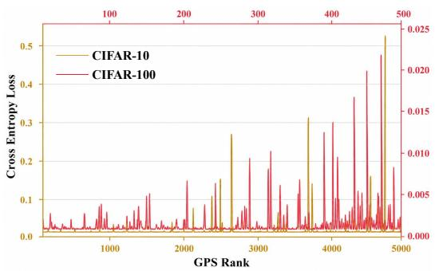

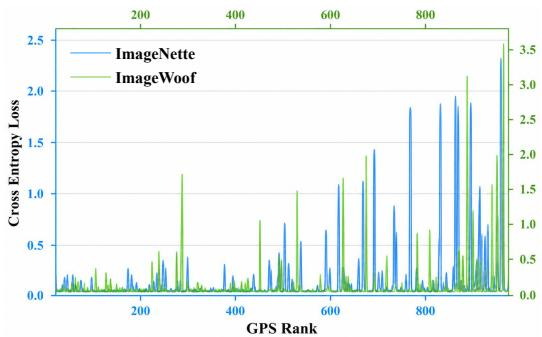  
(a) CIFAR-10 and CIFAR-100.  
(b) ImageNette and ImageWoof.  
Figure 6: Relationship between GPS and classification difficulty on different datasets.

at all BN layers. Since the teacher parameters are fixed and the forward batches are identically distributed, we have

$$
\mathbb { E } \left[ \widehat { \pmb { \tau } } _ { k , g } ^ { ( t ) } \right] = \pmb { \tau } _ { k , g } ^ { \star } , \qquad \forall t .\tag{10}
$$

Applying the BN update rule in equation $^ 3$ componentwise to all running means and variances gives

$$
\begin{array} { r } { \pmb { \tau } _ { k , g } ^ { ( t ) } = ( 1 - \rho ) \pmb { \tau } _ { k , g } ^ { ( t - 1 ) } + \rho \pmb { \widehat { \tau } } _ { k , g } ^ { ( t ) } , } \end{array}\tag{11}
$$

where SUA starts from the global statistics stored in the pretrained teacher:

$$
\tau _ { k , g } ^ { ( 0 ) } = \tau _ { k } ^ { \mathrm { G } } .\tag{12}
$$

Taking expectations in equation 11 and using equation 10, we obtain

$$
\mathbb { E } \left[ \pmb { \tau } _ { k , g } ^ { ( t ) } \right] - \pmb { \tau } _ { k , g } ^ { \star } = ( 1 - \rho ) \left( \mathbb { E } \left[ \pmb { \tau } _ { k , g } ^ { ( t - 1 ) } \right] - \pmb { \tau } _ { k , g } ^ { \star } \right) .\tag{13}
$$

Recursively applying equation 13 and substituting equation 12 yields

$$
\mathbb { E } \left[ \pmb { \tau } _ { k , g } ^ { ( t ) } \right] - \pmb { \tau } _ { k , g } ^ { \star } = ( 1 - \rho ) ^ { t } \left( \pmb { \tau } _ { k } ^ { \mathrm { G } } - \pmb { \tau } _ { k , g } ^ { \star } \right) .\tag{14}
$$

Since $\rho \in ( 0 , 1 ]$ , we have $0 \leq 1 - \rho < 1$ . Therefore,

$$
\mathbb { E } [ \pmb { \tau } _ { k , g } ^ { ( t ) } ] - \pmb { \tau } _ { k , g } ^ { \star } \xrightarrow { t  \infty } \mathbf { 0 } .\tag{15}
$$

Thus, the expected discrepancy between the SUA running statistics and the statistics of the current difficulty group decreases geometrically with the number of forward batch updates. This result holds for the running means and variances of all BN layers. Consequently, SUA statistics converge in expectation to those of the current difficulty group and provide the corresponding statistical matching signal for distillation batch g. □

## C MORE RESULTS

## C.1 COMPARISON WITH OTHER SOTA METHODS

To further evaluate the effectiveness, we compare PSM with more representative SOTA dataset distillation methods, including the coreset selection methods Random and Herding (Chen et al., 2010), the gradient matching method DSA (Zhao & Bilen, 2021), the distribution matching method DM (Zhao & Bilen, 2023), the trajectory matching methods MTT (Cazenavette et al., 2022), DATM (Guo et al., 2024) and TESLA (Cui et al., 2023), the generative method Minimax (Gu et al., 2024), and the decoupled methods $\mathrm { S R e ^ { 2 } I }$ L and FADRM. Specifically, DSA uses ConvNet as the teacher model, DM uses ConvNet and ResNetAP-10, MTT uses ConvNet-BN, DATM and TESLA use ConvNet-IN, and Minimax uses DiT (Peebles & Xie, 2023), while SRe<sup>2</sup>L, FADRM, and PSM use ResNet18. All methods are evaluated using ResNet18 as the student model.

As shown in Table $^ { 6 , }$ coreset selection methods generally achieve lower accuracy, but gradually approach DD methods as IPC increases. For example, Random achieves 75.8% on ImageNette with $\mathrm { \bar { I P C } } = 5 0$ . DD methods perform better in most settings, where gradient matching, distribution matching, trajectory matching, and generative methods use gradients, feature distributions, weight trajectories, and generative priors to guide distillation, respectively. Although these methods compress data effectively, their supervision signals usually describe the overall data distribution in an aggregated form, making it difficult to capture the internal difficulty structure. As dataset scale increases, sample difficulty differences are more easily smoothed by aggregated objectives, causing distilled data to concentrate at similar difficulties and limiting coverage of the original difficulty range. Among decoupled methods, FADRM performs strongly, while PSM preserves a broader difficulty structure, enabling students to learn sample patterns ranging from easy to difficult, and achieving the best results in most settings.

Table 6: Top-1 accuracy (%) comparison of representative dataset distillation methods with ResNet18 as the student. Standard deviations are reported when available.
<table><tr><td rowspan="2">Dataset</td><td rowspan="2">IPC</td><td colspan="2">Coreset</td><td></td><td>Gradient Distribution</td><td colspan="3">Trajectory</td><td>Generative</td><td colspan="3">Decoupled</td></tr><tr><td></td><td>Random Herding</td><td>DSA</td><td>DM</td><td>MTT</td><td>DATM</td><td>TESLA</td><td>Minimax</td><td> $\mathrm { S R e ^ { 2 } L }$ </td><td>FADRM</td><td>PSM</td></tr><tr><td rowspan="3">CIFAR-10</td><td>1</td><td></td><td></td><td></td><td></td><td></td><td></td><td></td><td></td><td> $1 6 . 6 { \scriptstyle \pm 0 . 9 }$ </td><td> $\underline { { 1 9 . 3 } } _ { \pm 0 . 6 }$ </td><td> $2 { \bf 0 . 9 } _ { \pm 0 . 1 }$ </td></tr><tr><td>10</td><td> $2 5 . 1 { \pm } 0 . 5$ </td><td>28.4±0.1</td><td> $4 2 . 1 { \pm } 0 . 6 $ </td><td> $3 8 . 2 { \scriptstyle \pm 1 . 1 }$ </td><td> $4 6 . 1 { \pm } 1 . 4$ </td><td>48.66</td><td> $\underline { { 4 8 . 9 } } _ { \pm 2 . 2 }$ </td><td></td><td> $2 9 . 3 { \scriptstyle \pm 0 . 5 }$ </td><td> $4 8 . 2 { \scriptstyle \pm 0 . 4 }$ </td><td> ${ \pm } 4 . 5 { \scriptstyle \pm 1 . 3 }$ </td></tr><tr><td>50</td><td>54.96</td><td></td><td> $4 7 . 8 { \scriptstyle \pm 0 . 9 }$ </td><td> $5 2 . 9 { \scriptstyle \pm 0 . 4 }$ </td><td> $5 8 . 7 { \scriptstyle \pm 0 . 2 }$ </td><td>66.27</td><td></td><td>一</td><td> $4 5 . 0 { \scriptstyle \pm 0 . 7 }$ </td><td> $\underline { { 8 0 . 6 } } _ { \pm 0 . 7 }$ </td><td> ${ \bf 8 1 . 1 { \scriptstyle \pm 0 . 1 } }$ </td></tr><tr><td rowspan="3">CIFAR-100</td><td>1</td><td>1</td><td></td><td></td><td></td><td></td><td></td><td>一</td><td>1</td><td> $6 . 6 { \scriptstyle \pm 0 . 2 }$ </td><td> $3 1 . 3 _ { \pm 0 . 2 }$ </td><td> $3 2 . 9 _ { \pm 0 . 9 }$ </td></tr><tr><td>10</td><td> $1 0 . 9 { \scriptstyle \pm 0 . 1 }$ </td><td> $1 3 . 3 { \scriptstyle \pm 0 . 3 }$ </td><td> $2 1 . 9 { \scriptstyle \pm 0 . 4 }$ </td><td> $1 8 . 7 { \scriptstyle \pm 0 . 5 }$ </td><td> $2 6 . 8 { \scriptstyle \pm 0 . 6 }$ </td><td></td><td> $2 7 . 1 { \scriptstyle \pm 0 . 7 }$ </td><td>一</td><td> $2 7 . 0 { \scriptstyle \pm 0 . 4 }$ </td><td> $\underline { { 6 4 . 7 } } \pm 0 . 4$ </td><td> ${ \bf 6 6 . 7 \bot 0 . 4 }$ </td></tr><tr><td>50</td><td> $4 0 . 7 { \scriptstyle \pm 1 . 0 }$ </td><td></td><td> $4 3 . 6 { \scriptstyle \pm 0 . 7 }$ </td><td> $4 2 . 6 { \scriptstyle \pm 0 . 5 }$ </td><td> $5 1 . 3 { \scriptstyle \pm 0 . 4 }$ </td><td> $5 1 . 0 { \scriptstyle \pm 0 . 5 }$ </td><td></td><td>1</td><td> $5 0 . 2 { \scriptstyle \pm 0 . 4 }$ </td><td> $\underline { { 6 9 . 3 } } _ { \pm 0 . 3 }$ </td><td> ${ \bf 6 9 . 7 { \scriptstyle \pm 0 . 3 } }$ </td></tr><tr><td rowspan="3">ImageNette</td><td>1</td><td>1</td><td></td><td></td><td></td><td></td><td></td><td></td><td>1</td><td> $1 9 . 1 { \pm } 1 . 1 $ </td><td> $2 8 . 2 _ { \pm 0 . 6 }$ </td><td> $2 5 . 0 _ { \pm 0 . 5 }$ </td></tr><tr><td></td><td> $1 0 \quad 5 5 . 8 { \scriptstyle \pm 1 . 0 }$ </td><td></td><td></td><td> $6 0 . 9 { \scriptstyle \pm 0 . 7 }$ </td><td></td><td></td><td></td><td> $\underline { { 6 4 . 9 } } _ { \pm 0 . 6 }$ </td><td> $2 9 . 4 { \scriptstyle \pm 3 . 0 }$ </td><td> $6 4 . 0 { \scriptstyle \pm 0 . 1 }$ </td><td> ${ \bf 6 7 . 1 { \scriptstyle \pm 0 . 2 } }$ </td></tr><tr><td>50</td><td> $7 5 . 8 { \scriptstyle \pm 1 . 1 }$ </td><td></td><td></td><td> $7 5 . 0 { \scriptstyle \pm 1 . 0 }$ </td><td></td><td></td><td></td><td> $7 8 . 1 { \pm } 0 . 6 $ </td><td> $4 0 . 9 { \scriptstyle \pm 0 . 3 }$ </td><td> $\underline { { 8 2 . 8 } } _ { \pm 0 . 6 }$ </td><td> ${ \bf 8 4 . 0 _ { \pm 0 . 3 } }$ </td></tr><tr><td rowspan="3">ImageWoof</td><td>1</td><td>一</td><td></td><td></td><td></td><td></td><td></td><td></td><td></td><td>13.3±0.5</td><td> $\underline { { 1 9 . 3 } } _ { \pm 0 . 3 }$ </td><td> $2 0 . 2 { \scriptstyle \pm 0 . 7 }$ </td></tr><tr><td>10</td><td> $2 7 . 7 { \scriptstyle \pm 0 . 9 }$ </td><td> $3 0 . 2 { \scriptstyle \pm 1 . 2 }$ </td><td></td><td> $3 3 . 4 { \scriptstyle \pm 0 . 7 }$ </td><td></td><td></td><td></td><td> $3 7 . 6 { \scriptstyle \pm 0 . 9 }$ </td><td> $2 0 . 2 { \scriptstyle \pm 0 . 2 }$ </td><td> $\underline { { 4 3 . 8 } } _ { \pm 0 . 2 }$ </td><td> ${ \pm } 4 . 5 { \scriptstyle \pm 0 . 5 }$ </td></tr><tr><td>50</td><td> $4 7 . 9 { \pm } 1 . 8$ </td><td> $4 8 . 3 { \scriptstyle \pm 1 . 2 }$ </td><td></td><td> $4 6 . 2 { \scriptstyle \pm 0 . 6 }$ </td><td></td><td></td><td></td><td> $5 7 . 1 { \pm } 0 . 6 $ </td><td> $2 3 . 3 { \pm } 0 . 3 $ </td><td> $\underline { { 6 7 . 7 } } \pm 1 . 0$ </td><td> ${ \bf 6 9 . 6 { \scriptstyle \pm 0 . 9 } }$ </td></tr><tr><td rowspan="3">Tiny-ImageNet</td><td>1</td><td></td><td></td><td></td><td></td><td></td><td></td><td></td><td></td><td> $2 . 6 { \scriptstyle \pm 0 . 1 }$ </td><td> $2 8 . 6 _ { \pm 0 . 1 }$ </td><td> $3 0 . 6 { \scriptstyle \pm 1 . 3 }$ </td></tr><tr><td>10</td><td> $7 . 5 { \pm } 0 . 1$ </td><td> $9 . 0 { \scriptstyle \pm 0 . 3 }$ </td><td></td><td></td><td></td><td></td><td></td><td></td><td> $1 6 . 1 { \scriptstyle \pm 0 . 2 }$ </td><td> $\underline { { 4 6 . 5 } } _ { \pm 0 . 4 }$ </td><td> ${ \bf 4 8 . 1 _ { \pm 0 . 3 } }$ </td></tr><tr><td>50</td><td> $3 0 . 1 { \pm } 0 . 6 $ </td><td></td><td> $2 7 . 8 { \scriptstyle \pm 1 . 4 }$ </td><td> $3 1 . 0 { \scriptstyle \pm 0 . 6 }$ </td><td> $4 0 . 3 { \scriptstyle \pm 0 . 3 }$ </td><td> $4 2 . 2 { \scriptstyle \pm 0 . 2 }$ </td><td></td><td></td><td>41.1±0.4</td><td> $5 1 . 4 _ { \pm 0 . 1 }$ </td><td> $5 1 . 7 _ { \pm 0 . 1 }$ </td></tr><tr><td rowspan="2">ImageNet-1K</td><td>10</td><td> $4 . 4 { \pm } 0 . 1$ </td><td> $5 . 8 { \scriptstyle \pm 0 . 1 }$ </td><td></td><td></td><td></td><td></td><td> $7 . 7 _ { \pm 0 . 1 }$ </td><td> $4 4 . 3 { \scriptstyle \pm 0 . 5 }$ </td><td>21.3±0.6</td><td> $\underline { { 4 7 . 8 } } _ { \pm 0 . 4 }$ </td><td> ${ \bf 4 8 . 8 { \scriptstyle \pm 0 . 2 } }$ </td></tr><tr><td>50</td><td>1</td><td></td><td></td><td></td><td></td><td></td><td></td><td> $5 8 . 6 { \scriptstyle \pm 0 . 3 }$ </td><td> $4 6 . 8 { \scriptstyle \pm 0 . 2 }$ </td><td> $\underline { { 6 0 . 9 } } _ { \pm 0 . 1 }$ </td><td> ${ \bf 6 1 . 3 _ { \pm 0 . 1 } }$ </td></tr></table>

<table><tr><td>Epoch Ratio DenseNet121 MobileNetV2 ShuffleNetV2 ResNet18</td><td></td><td></td><td></td><td></td></tr><tr><td>0.1</td><td> $6 8 . 6 { \scriptstyle \pm 0 . 6 }$ </td><td> $5 1 . 5 { \scriptstyle \pm 0 . 6 }$ </td><td> $4 9 . 1 { \pm } 1 . 1 $ </td><td> $6 5 . 5 { \scriptstyle \pm 0 . 7 }$ </td></tr><tr><td>0.2</td><td> $6 8 . 8 { \scriptstyle \pm 0 . 7 }$ </td><td> $5 1 . 8 { \scriptstyle \pm 1 . 0 }$ </td><td> $\underline { { 5 0 . 2 } } _ { \pm 2 . 5 }$ </td><td> $6 5 . 4 _ { \pm 0 . 4 }$ </td></tr><tr><td>0.3</td><td> $6 8 . 9 { \scriptstyle \pm 1 . 0 }$ </td><td> $5 0 . 0 { \scriptstyle \pm 0 . 7 }$ </td><td> $4 8 . 8 { \scriptstyle \pm 0 . 1 }$ </td><td> $6 4 . 9 _ { \pm 0 . 7 }$ </td></tr><tr><td>0.4</td><td> $6 8 . 3 { \scriptstyle \pm 0 . 9 }$ </td><td> $5 3 . 7 _ { \pm 1 . 1 }$ </td><td> $4 8 . 0 _ { \pm 2 . 1 }$ </td><td> $6 6 . 7 _ { \pm 0 . 7 }$ </td></tr><tr><td>0.5</td><td> $6 7 . 4 { \scriptstyle \pm 1 . 1 }$ </td><td> $5 1 . 1 { \scriptstyle \pm 0 . 5 }$ </td><td> ${ \bar { 5 } } 0 . 3 _ { \pm 1 . 3 }$ </td><td> $6 5 . 9 { \scriptstyle \pm 0 . 4 }$ </td></tr><tr><td>0.6</td><td> $6 7 . 2 { \scriptstyle \pm 0 . 2 }$ </td><td> $5 2 . 3 { \scriptstyle \pm 0 . 8 }$ </td><td> $5 0 . 0 { \scriptstyle \pm 1 . 5 }$ </td><td> $6 6 . 6 { \scriptstyle \pm 0 . 7 }$ </td></tr><tr><td>0.7</td><td> $6 7 . 7 { \scriptstyle \pm 1 . 2 }$ </td><td> ${ \bar { 5 } } 4 . 2 _ { \pm 0 . 7 }$ </td><td> $5 0 . 1 { \pm } 1 . 6 $ </td><td> $6 5 . 7 { \pm } 1 . 1$ </td></tr><tr><td>0.8</td><td> $6 8 . 9 { \scriptstyle \pm 0 . 3 }$ </td><td> $5 2 . 8 { \scriptstyle \pm 1 . 5 }$ </td><td> $4 9 . 1 { \scriptstyle \pm 0 . 8 }$ </td><td> $6 6 . 6 { \scriptstyle \pm 0 . 2 }$ </td></tr><tr><td>0.9</td><td> $\underline { { 6 9 . 1 } } _ { \pm 0 . 6 }$ </td><td> $5 3 . 9 _ { \pm 3 . 4 }$ </td><td> $4 9 . 4 { \scriptstyle \pm 1 . 3 }$ </td><td> $\underline { { 6 7 . 0 } } _ { \pm 0 . 8 }$ </td></tr><tr><td>1.0</td><td> ${ \bf 6 9 . 1 { \scriptstyle \pm 0 . 7 } }$ </td><td> $5 2 . 0 { \scriptstyle \pm 0 . 8 }$ </td><td> $4 9 . 5 { \scriptstyle \pm 0 . 2 }$ </td><td> ${ \bf 6 7 . 1 { \scriptstyle \pm 0 . 2 } }$ </td></tr></table>

Table 7: Top-1 accuracy under different epoch ratios on ImageNette with $\mathrm { I P C } = 1 0 $ under the same-architecture protocol.

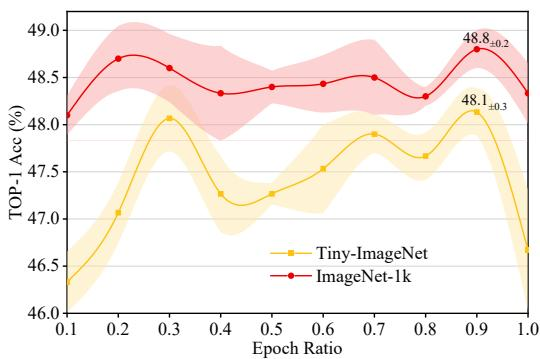  
Figure 7: Top-1 accuracy under different epoch ratios on Tiny-ImageNet and ImageNet-1K with $\mathrm { I P C } = 1 0$ and teacher=student=ResNet18.

## C.2 MORE ABLATION STUDY

Optimal Epoch Ratios for other Models. To determine the optimal epoch ratio $r _ { \mathrm { f w d } }$ for the other teacher models (DenseNet121, MobileNetV2, and ShuffleNetV2) in PSM+, we conduct an ablation study on ImageNette under the same-architecture protocol with $\mathrm { I P C } = 1 0 $ . As shown in Table 7, the optimal $r _ { \mathrm { f w d } }$ values for DenseNet121, MobileNetV2, and ShuffleNetV2 are 1.0 (69.1%), 0.7 (54.2%), and 0.5 (50.3%), respectively. Overall, models with more parameters require more forward passes to better capture the distribution of the current difficulty group. Since the performance gaps between the optimal $r _ { \mathrm { f w d } }$ and $r _ { \mathrm { f w d } } = 1 . 0$ are small for MobileNetV2 and ShuffleNetV2, we apply the optimal $r _ { \mathrm { f w d } }$ determined for ResNet18 to the other teacher models in PSM+ on other datasets and IPC settings for simplicity.

Table 8: Top-1 accuracy under different patch grid settings with $\mathrm { I P C } \doteq 1 0 ,$ , using ResNet18 as both the teacher and student models.
<table><tr><td></td><td></td><td>Patch Grid CIFAR-10 CIFAR-100 ImageNette ImageWoof</td><td></td><td></td></tr><tr><td> $1 \times 1$ </td><td> $5 4 . 5 { \scriptstyle \pm 1 . 3 }$ </td><td> $6 6 . 7 _ { \pm 0 . 4 }$ </td><td> $6 7 . 1 { \scriptstyle \pm 0 . 2 }$ </td><td> $4 4 . 5 { \scriptstyle \pm 0 . 5 }$ </td></tr><tr><td> $2 \times 2$ </td><td> $5 4 . 3 { \scriptstyle \pm 1 . 9 }$ </td><td> $6 5 . 0 { \scriptstyle \pm 0 . 4 }$ </td><td> $6 5 . 1 { \pm } 0 . 9$ </td><td> $4 0 . 2 { \scriptstyle \pm 1 . 9 }$ </td></tr></table>

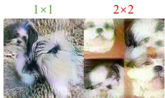  
Figure 8: Visualization of different patch grids.

Table 9: Hyperparameter settings during pretraining and GPS.
<table><tr><td>Hyperparameter</td><td>CIFAR-10</td><td>CIFAR-100</td><td>Tiny-ImageNet</td><td>ImageNette</td><td>ImageWoof</td><td>ImageNet-1K</td></tr><tr><td>learning rate</td><td>1.00E-03</td><td>1.00E-03</td><td>1.00E-02</td><td>1.00E-02</td><td>1.00E-02</td><td></td></tr><tr><td>optimizer</td><td>Adam</td><td>Adam</td><td>SGD</td><td>SGD</td><td>SGD</td><td>PyTorch</td></tr><tr><td>scheduler</td><td>COS</td><td>coS</td><td>COS</td><td>cos</td><td>COS</td><td></td></tr><tr><td>epoch</td><td>150</td><td>100</td><td>50</td><td>150</td><td>200</td><td>90</td></tr><tr><td>batch</td><td>512</td><td>512</td><td>128</td><td>64</td><td>64</td><td>64</td></tr><tr><td>β</td><td>1</td><td>1</td><td>1</td><td>1</td><td>1</td><td>1</td></tr><tr><td>€</td><td>1.00E-06</td><td>1.00E-06</td><td>1.00E-06</td><td>1.00E-06</td><td>1.00E-06</td><td>1.00E-06</td></tr></table>

Epoch Ratio $r _ { \mathrm { f w d } }$ on Tiny-ImageNet and ImageNet-1K. Due to limited computational resources, we do not further investigate the effect of the ISS screening methods on Tiny-ImageNet and ImageNet-1K. Instead, we only examine the effect of different $r _ { \mathrm { f w d } }$ under $\mathrm { I P C } { \bf \bar { \Lambda } } = { \bf \bar { \Lambda } } 1 0 $ , using ResNet18 as the teacher and student. As shown in Figure 7, consistent with the observations in Figure 4, larger $r _ { \mathrm { f w d } }$ allows the statistics to better characterize the distribution of the current difficulty group. Both Tiny-ImageNet and ImageNet-1K achieve the highest accuracy at $r _ { \mathrm { f w d } } = 0 . 9 $ reaching 48.1% and 48.8%, respectively. Therefore, we set $r _ { \mathrm { f w d } } = 0 . 9$ for the other experiments on Tiny-ImageNet and ImageNet-1K.

Patch Grids in the Initial Image. Since PSM modifies the sample initialization method, we further investigate the effect of different patch grids on performance. We use ResNet18 as the teacher and student with IPC = 10, and the specific patch grid settings are illustrated in Figure 8. As shown in Table 8, the $1 \times 1$ patch grid achieves the best performance on all datasets, consistent with the findings of (Cui et $\mathrm { a l . } .$ , 2025a). When the patch grid increases to $2 \times 2$ , compressing local image regions may cause information loss, which is more evident on high-resolution datasets. Therefore, we use the 1 × 1 initialization setting in all experiments.

Algorithm 1 Global Precision Score (GPS)   
Require: Original set $\mathcal { T } = \{ ( x _ { i } , y _ { i } ) \} _ { i = 1 } ^ { N }$ ; pretrained teachers $\{ f _ { \theta _ { k } } \} _ { k = 1 } ^ { K } ;$ repeated evaluations R   
1: for each teacher $k = 1 , \ldots , K$ do   
2: for $r = 1 , \ldots , R$ do   
3: for each sample $x _ { i } \in \tau$ do   
4: Forward $x _ { i }$ through $f _ { \theta _ { k } }$ and compute its statistics at all BN layers   
5: Compute $s _ { i , k } ^ { ( r ) }$ using the statistical distances in equation 4   
6: end for   
7: end for   
8: $\begin{array} { r } { s _ { i , k } \gets \frac { 1 } { R } \sum _ { r = 1 } ^ { R } s _ { i , k } ^ { ( r ) } } \end{array}$   
9: Rank $s _ { i , k }$ within each class: $r _ { i , k } \gets \mathrm { r a n k } _ { c } ( s _ { i , k } )$   
10: end for   
11: $\begin{array} { r } { \mathrm { G P S } ( x _ { i } )  \frac { 1 } { K } \sum _ { k = 1 } ^ { K } r _ { i , k } } \end{array}$ for each $x _ { i } \in \tau$   
12: return Class-wise GPS rankings from easy to hard

Table 10: Hyperparameter settings during distillation.
<table><tr><td>Hyperparameter</td><td>CIFAR-10</td><td>CIFAR-100</td><td>Tiny-ImageNet</td><td>ImageNette</td><td>ImageWoof</td><td>ImageNet-1K</td></tr><tr><td>Epoch ratio</td><td>0.9</td><td>0.9</td><td>0.9</td><td>1.0</td><td>0.4</td><td>0.9</td></tr><tr><td>Screening method</td><td>Back</td><td>Back</td><td>Back</td><td>Front</td><td>Back</td><td>Back</td></tr><tr><td>PSM+ teachers</td><td colspan="6">ShuffleNetV2, MobileNetV2, DenseNet121, ResNet18</td></tr></table>

```latex
Algorithm 2 Precise Statistical Matching
Require: Difficulty groups $\{ \mathcal { T } _ { g , c } \}$ obtained by GPS; pretrained teachers $\{ f _ { \theta _ { k } } \} _ { k = 1 } ^ { K } ;$ forward ratio
r<sub>fwd</sub>; pretraining epochs $\{ \bar { E } _ { k } ^ { \mathrm { p r e } } \} _ { k = 1 } ^ { K } ;$ optimization iterations T
Ensure: Distilled dataset $\widetilde { \tau }$
1: Initialize $\bar { \tau }  \emptyset$
2: for $g = 1 , \ldots , \mathrm { I P C }$ do
3: SUA: construct difficulty-specific statistical supervision
4: for each teacher $k = 1 , \cdot \cdot \cdot , K$ do
5: Freeze $\theta _ { k }$ and initialize BN statistics with $\tau _ { k } ^ { \mathrm { G } }$
6: Forward $\textstyle T _ { g } = \bigcup _ { c } { \mathcal { T } } _ { g , c }$ through $f _ { \theta _ { k } }$ for $\lfloor r _ { \mathrm { f w d } } E _ { k } ^ { \mathrm { p r e } } \rfloor$ epochs
7: Update only BN running statistics according to equation 3
8: Store the updated statistics as $\tau _ { k , g } ^ { \mathrm { S U A } }$
9: end for
10: ISS: initialize distilled data with matched difficulty
11: for each class c do
12: Select real samples from $\mathcal { T } _ { g , c }$ using ISS
13: Initialize ${ \widetilde x } _ { g , c } ^ { ( 0 ) }$ with the selected samples
14: end for
15: Distillation:
16: for $t = 1 , \dots , T$ do
17: Select teacher k and use $\tau _ { k , g } ^ { \mathrm { S U A } }$ as its statistical target
18: Update $\widetilde { \mathcal { T } } _ { g }$ by minimizing equation 2 with the SUA statistics
19: end for
20: $\mathcal { \tilde { T } }  \mathcal { \tilde { T } } \cup \mathcal { \tilde { T } } _ { g }$
21: end for
22: return $\widetilde { \tau }$
```

## D IMPLEMENTATION DETAILS

## D.1 PRETRAINING.

As shown in Table 9, we report the pretraining hyperparameters for ShuffleNetV2, ResNet18, ResNet50, MobileNetV2, and DenseNet121 on each dataset. To ensure that all teacher models in PSM+ undergo the same number of forward passes under the same $r _ { \mathrm { f w d } }$ , we use the same number of pretraining epochs and the same pretraining configuration for all models on each dataset. For ImageNet-1K, we directly use the official pretrained weights provided by PyTorch.

After pretraining the teacher models, we compute GPS. The batch size is kept the same as in pretraining, with $\beta \stackrel { - } { = } 1 . 0$ and $\epsilon = 1 \times 1 0 ^ { - 6 }$ . The detailed procedure is shown in Algorithm 1.

## D.2 DISTILLATION.

For PSM+, to simplify the experimental setup, we use ShuffleNetV2, ResNet18, MobileNetV2, and DenseNet121 as teacher models on all datasets, while using the same teacher model settings as FADRM+. During the forward passes of SUA, the batch size fed into the teacher models is kept the same as that used during pretraining to reduce statistical bias. The remaining hyperparameters are shown in Table 10, and the detailed procedure is provided in Algorithm 2. It is worth noting that when $\mathrm { I P C } = 1$ , there is only one difficulty group, meaning that the entire dataset is treated as a single group. In this case, only ISS takes effect in PSM. Therefore, as shown in Table 1, PSM and FADRM(+) achieve similar performance on most datasets when $\mathrm { I P C } = 1$

## D.3 SOFT LABEL GENERATION.

To maintain consistency in the soft label distribution, we use the original pretrained teachers to generate soft labels, rather than the teachers after forward passes. For FADRM+ and PSM+, we assign equal weights to all teachers during soft label generation to simplify the experimental setup.

## E MORE VISUALIZATION

To more intuitively illustrate the changes in the difficulty of distilled samples, we visualize the samples generated by FADRM and PSM with ResNet18 as the teacher model and IPC = 10. Due to space limitations, we only show results on CIFAR-10, ImageNette, and ImageWoof.

As shown in Figure 9, 11 and 13, the distilled samples generated by FADRM are typically concentrated within a relatively narrow difficulty range. In contrast, as shown in Figure 10, 12 and 14, PSM generates distilled samples that cover a broader difficulty range, promoting the student model to learn a more complete difficulty structure.

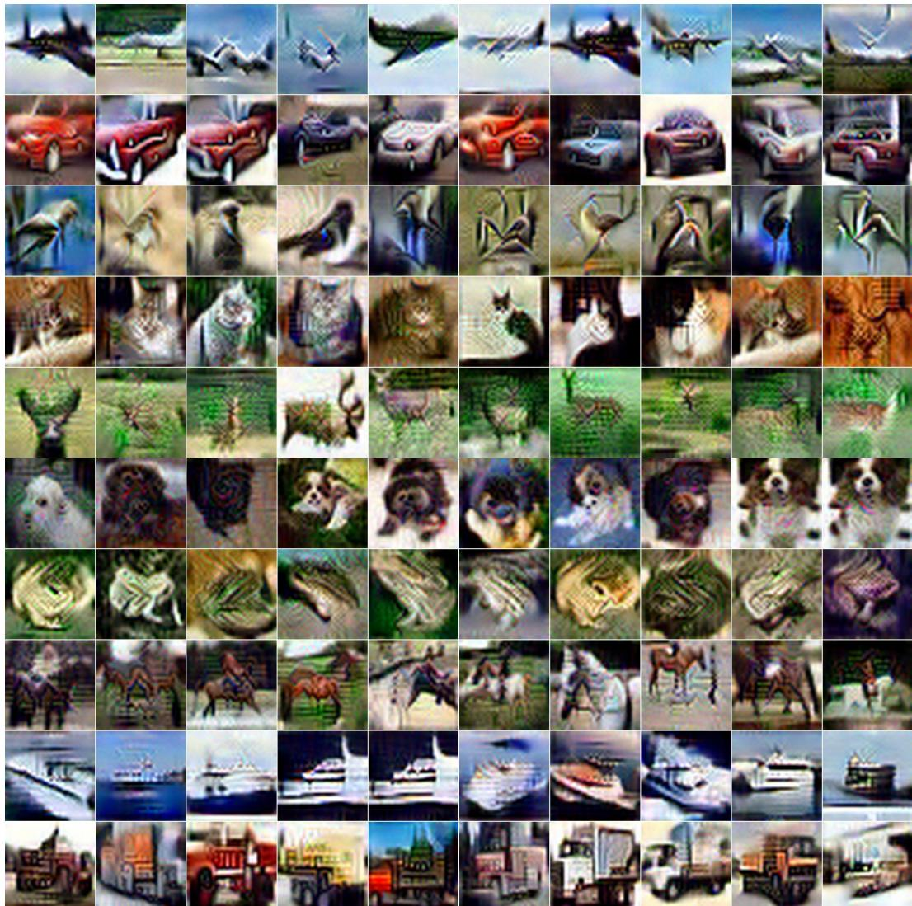  
Figure 9: Visualization of the distilled CIFAR-10 samples generated by FADRM with IPC = 10 and teacher=ResNet18.

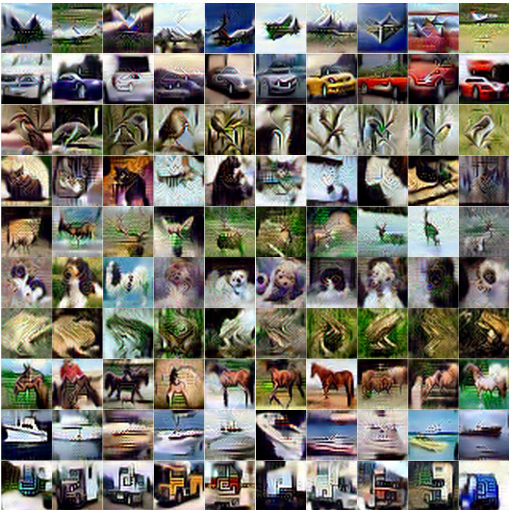  
Figure 10: Visualization of the distilled CIFAR-10 samples generated by PSM with IPC = 10 and teacher=ResNet18.

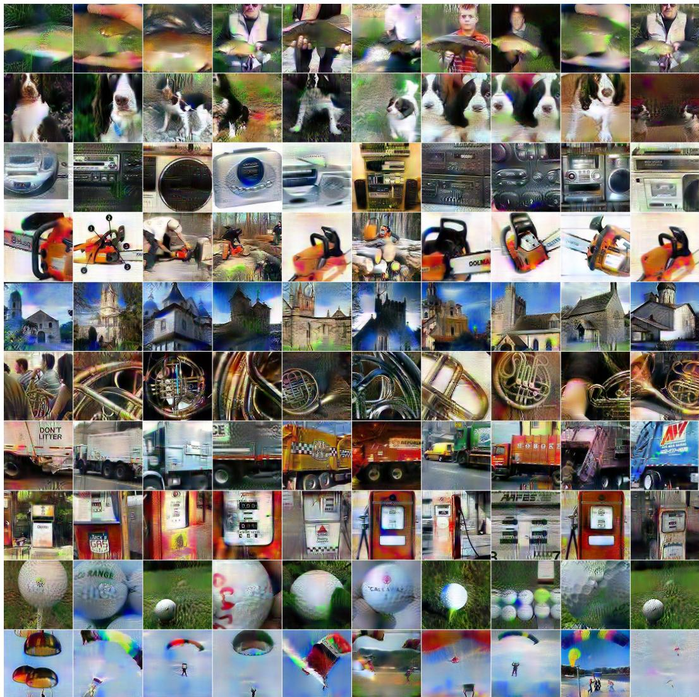  
Figure 11: Visualization of the distilled ImageNette samples generated by FADRM with IPC = 10 and teacher=ResNet18.

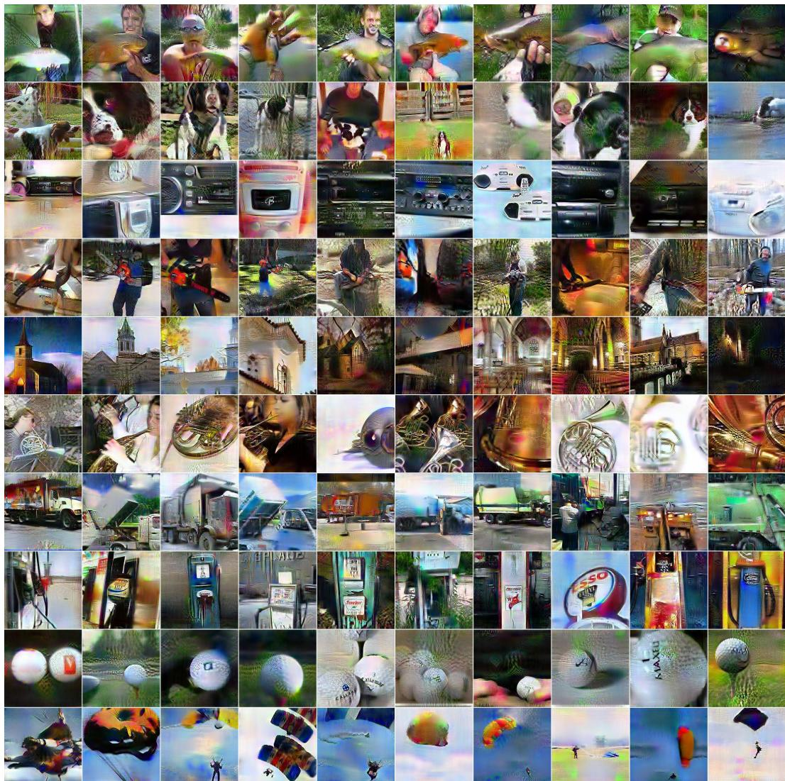  
Figure 12: Visualization of the distilled ImageNette samples generated by PSM with IPC = 10 and teacher=ResNet18.

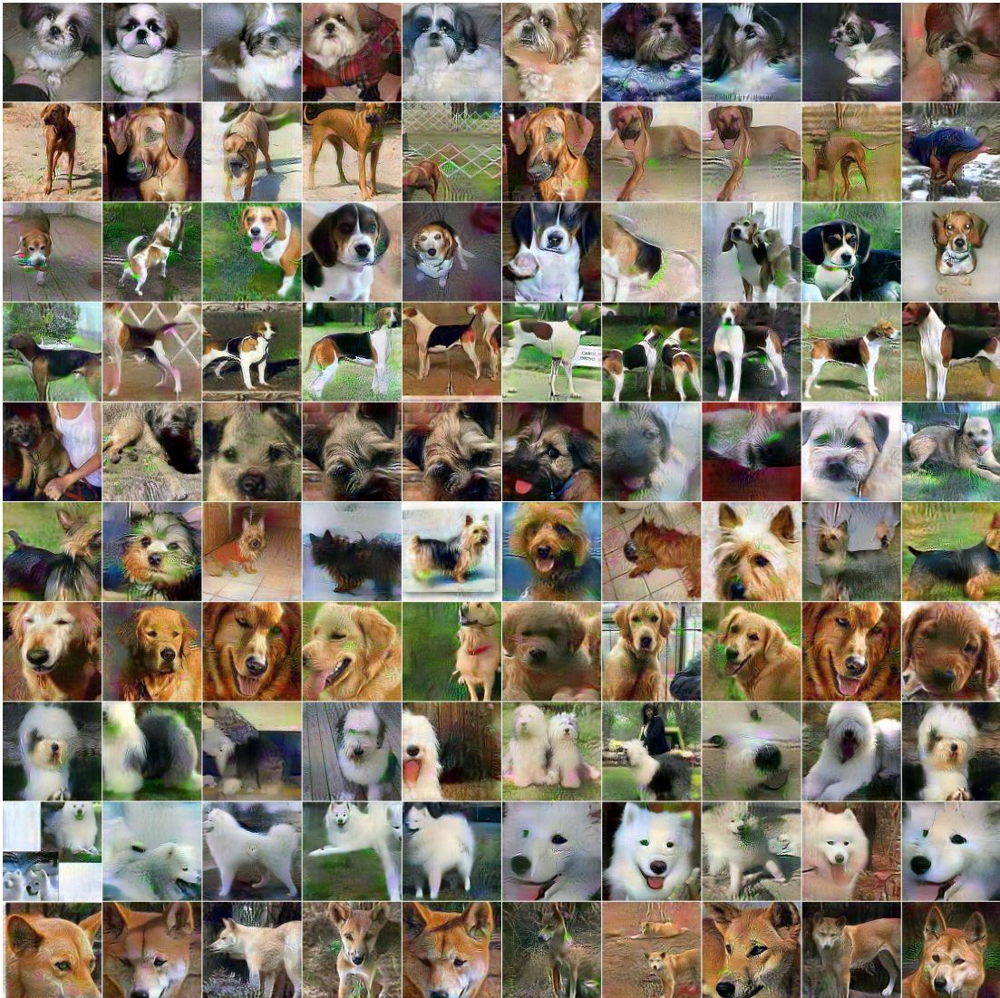  
Figure 13: Visualization of the distilled ImageWoof samples generated by FADRM with IPC = 10 and teacher=ResNet18.

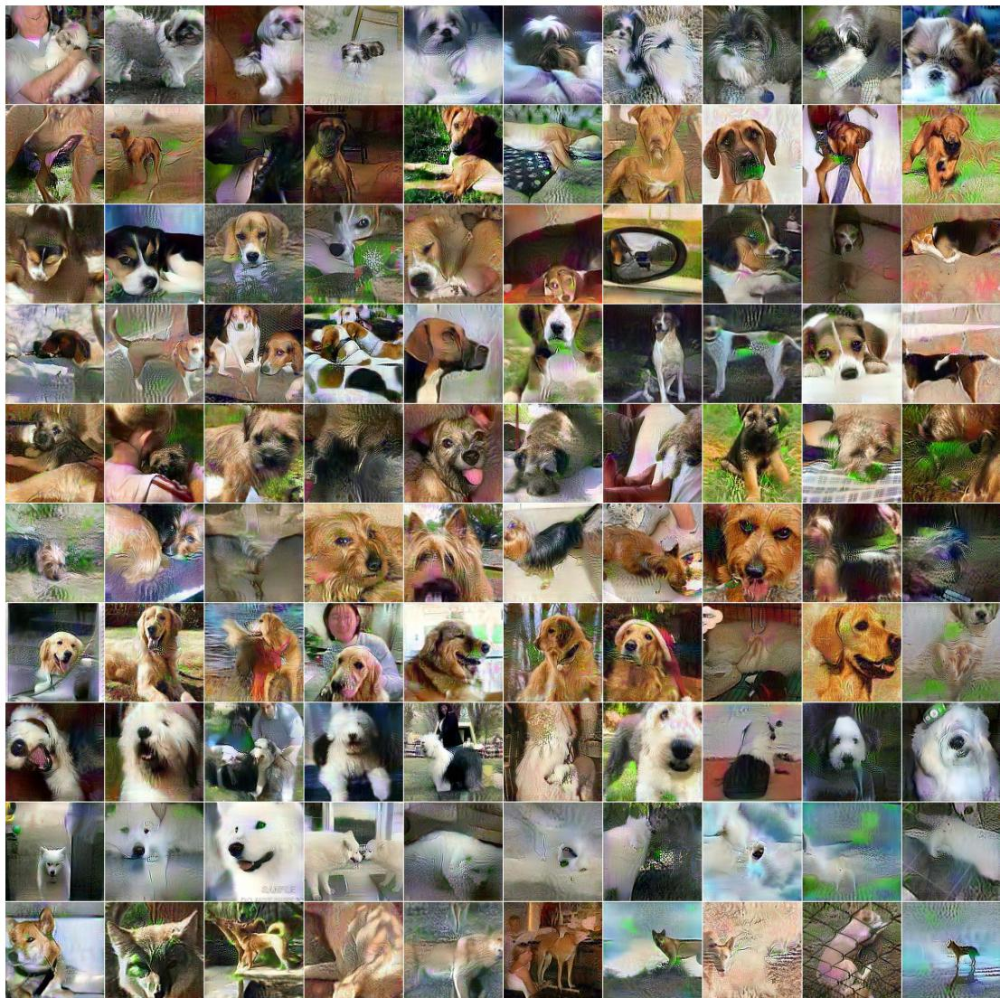  
Figure 14: Visualization of the distilled ImageWoof samples generated by PSM with IPC = 10 and teacher=ResNet18.