# Physics-Guided Spectral Distillation for Underwater Image Enhancement on Resource-Constrained Devices

Yifan Chen†, Kai He†, Ye Zheng, Jijun Lu, Zhe Sun∗, and Tao Chen∗, Senior Member, IEEE

Abstract—Underwater image enhancement is crucial for improving visual perception in marine applications. Existing underwater image enhancement studies mainly focus on enhancement quality and visual fidelity, while rarely considering realtime deployment capability, which is essential for resourceconstrained underwater robots. To this end, we introduce a physics-guided spectral distillation (PSD) method, which reduces model capacity for real-time applications while maintaining the high performance of underwater image enhancement models. To decompose the outputs of teacher and student models, PSD adopts a multilevel Haar discrete wavelet transform. It transfers low-frequency color and illumination information as well as highfrequency structural details through band-specific objectives. Moreover, the distillation process of PSD is degradation-aware. We estimate degradation-aware weights through a physical head and combine them with ground-truth-guided reliability masks to selectively retain valuable teacher guidance. Experiments on the UIEB, LSUI, and EUVP datasets validate the effectiveness of the proposed method. Furthermore, we demonstrate the benefits of enhanced images for downstream perception tasks, including object detection. Deployment on a self-developed ROV further demonstrates its practical applicability in real-world underwater scenarios.

Index Terms—Underwater image enhancement, knowledge distillation, physics-guided learning, spectral learning, real-time deployment.

## I. INTRODUCTION

NDERWATER image enhancement (UIE) improves image color, contrast, and detail to support underwater   
observation, robotic inspection, and object detection [1]–[3].   
However, water absorbs different wavelengths unequally and   
scatters light, leaving captured images with distorted colors,   
reduced contrast, and blurred details [4], [5]. Correcting these   
coupled degradations remains challenging across real-world   
water and illumination conditions [3], [6]. For underwater

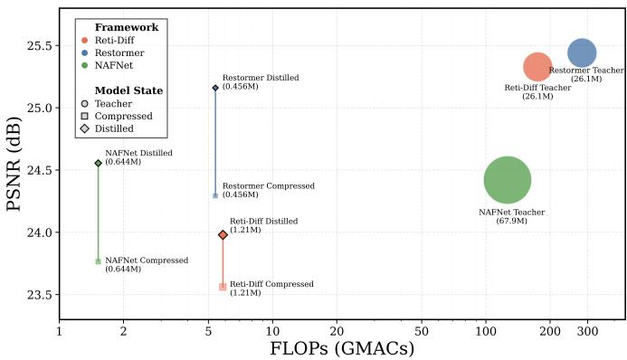  
Fig. 1. Accuracy–efficiency comparison across Reti-Diff, Restormer, and NAFNet. PSD improves each compact student at unchanged inference cost; circles denote teachers and annotations report parameter counts.

robots, enhancement must also keep pace with image acquisition under limited computation, memory, and power budgets. These resource constraints make preserving image quality at a low inference cost a central requirement for practical UIE [7].

Traditional UIE methods use handcrafted enhancement rules or physical imaging models to correct underwater degradation. Multiscale fusion combines complementary image corrections to improve color and contrast [8]. Transmission priors and wavelength-aware models instead estimate light attenuation to recover scene appearance [5], [9], [10]. Their effectiveness depends on whether the assumed image statistics or estimated optical parameters remain appropriate for the scene. Changes in water properties and illumination can therefore leave residual color casts or cause overcorrection. These limitations motivate learned restoration methods that accommodate a wider range of underwater conditions.

Learning-based UIE has advanced from convolutional restoration [11] to Transformer, spatial–spectral, and diffusion architectures [12]–[15]. These models learn richer restoration mappings, but their computational and memory demands can limit real-time processing on embedded underwater platforms. Reducing network width and depth lowers inference cost, although the resulting capacity loss can weaken color recovery and boundary preservation. Knowledge distillation (KD) offers a way to improve compact students by transferring supervision from a high-capacity teacher during training [16]–[18].

Effective distillation for UIE requires selecting both what to transfer and where teacher guidance is useful. A single imagespace matching objective does not separately control lowfrequency appearance correction and high-frequency structural recovery. Frequency-aware KD provides separate spectral targets [19]–[21], but these targets alone do not describe spatially varying, channel-dependent underwater attenuation. Moreover, teacher predictions can remain inaccurate in particular regions, making indiscriminate imitation counterproductive. The downsampling examples in Fig. 2 illustrate how structural information can be weakened, motivating explicit attention to high-frequency details. Compact UIE students therefore need band-specific supervision that accounts for degradation severity and teacher reliability.

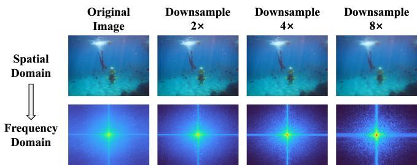  
Fig. 2. Spatial and spectral changes under downsampling by factors of 2, 4, and 8, showing progressive high-frequency detail loss.

To address these requirements, we propose physics-guided spectral distillation (PSD), an output-level distillation framework for compact UIE models. A multilevel Haar transform separates low-frequency color and illumination from highfrequency directional structures. Transmission-derived weights emphasize degraded regions and channels, while ground-truthguided reliability masks retain spectral teacher targets only where they are more accurate than student predictions. An unmasked image-space loss complements spectral transfer by correcting residual RGB discrepancies. These objectives guide student training without retaining the teacher, physical head, or auxiliary computations at inference. Figure 1 summarizes the resulting accuracy–efficiency improvements across Reti-Diff, Restormer, and NAFNet students.

The main contributions are summarized as follows:

• We propose PSD, which combines multilevel bandspecific spectral transfer and image-space compensation to preserve color, illumination, and structural information in compact UIE students.

• We introduce transmission-derived degradation weighting and teacher-reliability gating to focus distillation on degraded regions while filtering inaccurate teacher guidance, without inference-time overhead.

• Across three backbone–dataset settings, PSD enables compact students to reduce the teacher parameter counts by 95.45%–99.06%, while incurring average performance drops of only 0.501 dB in PSNR and 0.0059 in SSIM.

• We validate downstream utility on UDD and practical deployment on a self-developed remotely operated vehicle (ROV). Detection gains over raw inputs reach 3.22 and 1.85 percentage points in m $\mathrm { A P _ { 5 0 } }$ and $\mathrm { m A P _ { 5 0 : 9 5 } }$ , respectively. The students achieve 35.7–84.6 FPS at $2 5 6 \times 2 5 6$ resolution.

## II. RELATED WORK

## A. Underwater Image Enhancement

UIE restores visibility, color, and structure degraded by underwater absorption and scattering. Classical models describe direct transmission and scattering [4], while later work introduced wavelength-aware imaging models [5], [10], transmission priors [9], and multiscale fusion [8]. UIEB established a common real-image benchmark [22]. Physics-aware learning incorporates transmission, color-space, reflectance, and diffusion priors [23]–[25]; PUGAN and GUPDM combine image formation with learned restoration [26], [27].

Data-driven UIE ranges from adversarial and convolutional restoration [11], [28] to Transformers and reduced-supervision learning. TUDA addresses synthetic-to-real and intra-real domain gaps [29], while U-Shape Transformer models longrange, spatially varying degradation [12]. Related computational ghost imaging methods use self-supervised information extraction and attention to improve underwater image reconstruction [30], [31]. These advances motivate effective information recovery, while efficient enhancement of conventional RGB images remains the focus of PSD.

Frequency-domain and diffusion methods provide complementary priors. WF-Diff combines wavelet and Fourier representations [14]; CPDM and Reti-Diff preserve content through diffusion and Retinex priors [15], [32]; and SS-UIE models non-uniform spatial–spectral degradation [13]. Such designs improve global appearance and fine structure, but iterative or multi-branch processing increases memory and computation. Lightweight UIE networks consequently reduce parameters and operations for embedded underwater platforms [7], [33]. These architecture-specific designs motivate a complementary question: whether a common distillation objective can compress different high-performance UIE backbones while preserving their restoration knowledge.

## B. Knowledge Distillation

Knowledge distillation (KD) transfers teacher knowledge through softened outputs [16], intermediate features or attention [34], [35], and pairwise geometry [36]. Curriculum-based distillation adjusts transfer difficulty during optimization [37]. These methods mainly target semantic representations rather than dense, frequency-sensitive restoration outputs.

Restoration-oriented KD transfers degradation and spectral knowledge. Wavelet KD emphasizes high-frequency signals [19], while MRDA distills implicit degradation representations [17]. Frequency Attention learns spectral filters [20], and FreeKD selects frequency components using semantic prompts and pixel-wise masks [21]. DCKD adapts the distilled solution space to student learning [18]. For UIE, an important distinction is therefore whether knowledge selection reflects the degradation of the input or only the informativeness of the teacher representation. However, these selection rules do not encode channel-dependent underwater attenuation. PSD couples transmission-derived weighting with ground-truth-guided reliability masks for spectral transfer, complemented by an unmasked RGB loss.

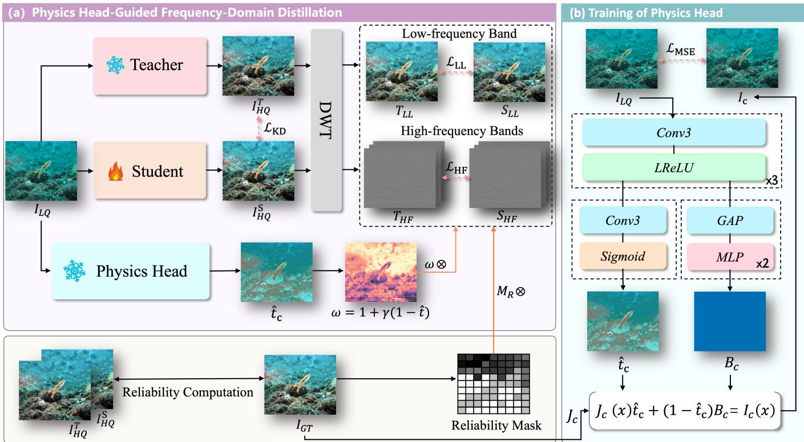  
Fig. 3. Overview of PSD. (a) The frozen teacher and compact student produce restored images that are decomposed into low- and high-frequency bands Transmission-derived degradation weights ω and ground-truth-guided reliability masks $\mathbf { M } _ { R } { \bf \Psi }$ regulate band-specific transfer, while the image-space term complements the spectral objectives. (b) The physical head is calibrated using the underwater image-formation model to estimate channel-wise transmission bt and global background light Bb . The teacher and all PSD-specific components are removed at inference.

## III. PROPOSED METHOD

## A. Problem Formulation and Overview

Let $\mathbf { I } \in [ 0 , 1 ] ^ { 3 \times H \times W }$ denote a degraded underwater image and J its paired reference. A frozen teacher $\tau$ and a compact student $\scriptstyle { \mathcal { S } } _ { \theta }$ produce

$$
\mathbf { Y } ^ { t } = \mathcal { T } ( \mathbf { I } ) , \qquad \mathbf { Y } ^ { s } = \mathcal { S } _ { \boldsymbol { \theta } } ( \mathbf { I } ) ,\tag{1}
$$

where t and s denote the teacher and student, respectively. We optimize $\scriptstyle { S _ { \theta } }$ using its native restoration objective together with additional teacher supervision. The teacher and all PSDspecific components are used only during training. Only the compact student is deployed; PSD adds no inference-time modules.

Direct image matching does not distinguish spatially and spectrally varying degradation or unreliable teacher predictions. PSD estimates degradation with a physical head, decomposes restored outputs into wavelet bands, and gates spectral transfer by the teacher’s advantage over the student. An unmasked RGB loss complements these objectives (Fig. 3).

Algorithm 1 summarizes physical-head calibration followed by student training with task, spectral, and image-space losses. Here, $\eta _ { n }$ is the auxiliary weight at training step n.

## B. Underwater-Formation-Guided Degradation Weighting

1) Physical-head calibration: We adopt the channeldependent underwater image-formation model

$$
\mathbf { I } _ { c } ( \mathbf { x } ) = \mathbf { J } _ { c } ( \mathbf { x } ) \mathbf { t } _ { c } ( \mathbf { x } ) + \mathbf { B } _ { c } \left[ 1 - \mathbf { t } _ { c } ( \mathbf { x } ) \right] ,\tag{2}
$$

where $c \in \{ r , g , b \}$ denotes a color channel and x indexes a spatial location. Here, t is the channel-wise transmission, and B is the global background light. A lightweight physical head $\mathcal { H } _ { \phi }$ predicts both quantities from the degraded input. Its shared trunk comprises three $3 \times 3$ convolutional layers with 32 channels and Leaky-ReLU activations. Given the trunk feature $\mathbf { F } = \mathcal { H } _ { \phi } ^ { \mathrm { t r u n k } } ( \mathbf { I } )$ , the two prediction branches are

$$
\widehat { \mathbf { t } } = t _ { \mathrm { m i n } } + ( t _ { \mathrm { m a x } } - t _ { \mathrm { m i n } } ) \sigma ( \mathrm { C o n v } _ { t } ( \mathbf { F } ) ) ,\tag{3}
$$

$$
\widehat { \bf B } = \sigma ( \mathrm { M L P } _ { B } ( \mathrm { G A P } ( { \bf F } ) ) ) .\tag{4}
$$

We set $t _ { \mathrm { m i n } } = 0 . 0 5$ and $t _ { \mathrm { m a x } } = 0 . 9 9$ to bound the decomposition.

We calibrate the physical head before using it for distillation. The degraded observation is reconstructed as

$$
\widehat { \mathbf { I } } = \mathbf { J } \odot \widehat { \mathbf { t } } + \widehat { \mathbf { B } } \odot ( 1 - \widehat { \mathbf { t } } ) ,\tag{5}
$$

where $\widehat { \bf B }$ is broadcast spatially. The calibration objective is

$$
\mathcal { L } _ { \mathrm { p h y } } = \Big | \Big | \widehat { \mathbf { I } } - \mathbf { I } \Big | \Big | _ { 1 } + \lambda _ { \mathrm { t v } } \mathrm { T V } ( \widehat { \mathbf { t } } ) .\tag{6}
$$

We set $\lambda _ { \mathrm { t v } } = 0 . 0 5$ . During this phase, the reference image is detached so that only the physical head is updated. For the standalone Restormer and NAFNet implementations, calibration also includes $0 . 1 \| \nabla \widehat { \mathbf { I } } - \nabla \mathbf { I } \| _ { 1 }$ . This auxiliary term stabilizes the physical estimator but does not supervise the student. After calibration, $\mathcal { H } _ { \phi }$ remains frozen.

Algorithm 1 Complete training procedure of PSD   
Require: Paired training set $\overline { { \mathcal { D } ; } }$ frozen teacher T; student $\overline { { { \cal { S } } _ { \theta } ; } }$ physical head   
$\mathcal { H } _ { \phi }$   
Require: Native task loss $\mathcal { L } _ { \mathrm { t a s k } } ;$ wavelet depth K; auxiliary schedule $\eta _ { n }$   
Ensure: Trained compact student $\scriptstyle { S _ { \theta } }$   
1: Initialize θ and ϕ   
2: for each physical-head calibration step do   
3: Sample $\mathbf { \check { ( I , J ) } } \sim \mathcal { D }$   
4: $( \widehat { \mathbf { t } } , \widehat { \mathbf { B } } ) \gets \mathcal { H } _ { \phi } ( \mathbf { I } )$   
5: Reconstruct bI using $( 5 )$   
6: Compute ${ \mathcal { L } } _ { \mathrm { p h y } }$ using (6)   
7: if calibrating the Restormer or NAFNet implementation then   
8: $\mathcal { L } _ { \mathrm { p h y } }  \mathcal { L } _ { \mathrm { p h y } } + 0 . 1 \| \nabla \widehat { \mathbf { I } } - \nabla \mathbf { I } \| _ { 1 }$   
9: end if   
10: Update ϕ by minimizing ${ \mathcal { L } } _ { \mathrm { p h y } }$   
11: end for   
12: Freeze $\phi$   
13: for each student-training step n do   
14: Sample $( \mathbf { I } , \mathbf { J } ) \sim \mathcal { D }$   
15: $\mathbf { Y } ^ { t } \dot {  } \dot { \mathbf { s g } } [ \mathcal { T } ( \mathbf { I } ) ]$   
16: $\mathbf { Y } ^ { s } \gets \tilde { S _ { \theta } } ( \mathbf { I } )$   
17: $( \widehat \mathbf { t } , \widehat \mathbf { B } ) \gets \mathrm { s g } [ \mathcal { H } _ { \phi } ( \mathbf { I } ) ]$   
18: Compute ω from bt using $( 7 ) \AA { - } ( 8 )$   
19: Compute normalized K-level Haar bands using (10)–(11)   
20: Compute the LL and HF reliability masks using Algorithm 2   
21: Compute the spectral losses using (16)–(18)   
22: Compute the image-space and PSD losses using (19)–(20)   
23: $\mathcal { L } _ { \mathrm { t o t a l } }  \mathcal { L } _ { \mathrm { t a s k } } ( \mathbf { \tilde { Y } } ^ { s } , \mathbf { \tilde { J } } ) .$ + ηnL   
24: Update θ by minimizing Ltotal   
25: end for   
26: Remove $\tau$ and ${ \mathcal { H } } _ { \phi } ;$ return $\scriptstyle { S _ { \theta } }$

2) Transmission-derived degradation weight: Low transmission indicates strong attenuation. We therefore convert the calibrated transmission into a channel-wise spatial weight

$$
\widetilde { \omega } = 1 + \gamma ( 1 - \widehat { \mathbf { t } } ) ,\tag{7}
$$

$$
\omega = \frac { \widetilde { \omega } } { \operatorname* { m e a n } ( \widetilde { \omega } ) + \epsilon } .\tag{8}
$$

This normalization fixes the mean scale of the resulting weight map. We set $\gamma = 2$ and detach the weight before applying the distillation losses. Consequently, the physical head cannot alter its transmission prediction merely to reduce the teacher– student discrepancy. Background light supports calibration of the image-formation model, whereas transmission provides the spatial and channel weighting used by PSD.

## C. Reliability-Aware Multilevel Spectral Distillation

1) Two-level Haar representation: Following the multiresolution wavelet formulation [38], PSD applies the discrete wavelet transform directly to restored outputs rather than intermediate features or residuals. For a $2 \times 2$ neighborhood $( a , b , c , d )$ , the channel-preserving Haar transform is

$$
\begin{array} { c c } { { L = ( a + b + c + d ) / 2 , } } & { { H ^ { h } = ( - a - b + c + d ) / 2 , } } \\ { { { } } } & { { { } } } \\ { { H ^ { v } = ( - a + b - c + d ) / 2 , } } & { { H ^ { d } = ( a - b - c + d ) / 2 . } } \end{array}\tag{9}
$$

The low-frequency band $L$ primarily represents coarse intensity and chromatic content. The signed bands $H ^ { h } , H ^ { v }$ , and $H ^ { d }$ represent horizontal, vertical, and diagonal structures.

Let $q \in \{ s , t , g \}$ index the student, teacher, and ground truth, respectively. We set $\mathbf { L } _ { 0 } ^ { q } = \mathbf { Y } ^ { q }$ and $\mathbf { Y } ^ { g } = \mathbf { J }$ . At level ℓ, we recursively compute

$$
\begin{array} { r } { ( \mathbf { L } _ { \ell } ^ { q } , \mathbf { H } _ { \ell , h } ^ { q } , \mathbf { H } _ { \ell , v } ^ { q } , \mathbf { H } _ { \ell , d } ^ { q } ) = \mathcal { W } ( \mathbf { L } _ { \ell - 1 } ^ { q } ) . } \end{array}\tag{10}
$$

We use $K \ : = \ : 2$ decomposition levels. To make coefficient magnitudes comparable across resolutions, we define

$$
\begin{array} { r } { \overline { { \mathbf { L } } } _ { K } ^ { q } = \mathbf { L } _ { K } ^ { q } / 2 ^ { K } , \qquad \overline { { \mathbf { H } } } _ { \ell , b } ^ { q } = \mathbf { H } _ { \ell , b } ^ { q } / 2 ^ { \ell } , } \end{array}\tag{11}
$$

where $b ~ \in ~ \{ h , v , d \}$ . Before each transform, we crop odd spatial dimensions by one pixel.

2) Ground-truth-guided teacher-advantage masks: Uniform teacher imitation may propagate coefficients that are less accurate than those already produced by the student. PSD therefore compares detached teacher and student errors with the paired reference. For the final low-frequency band, we compute

$$
\begin{array} { r } { \mathbf { e } _ { \mathrm { L L } } ^ { q } = ( \overline { { \mathbf { L } } } _ { K } ^ { q } - \overline { { \mathbf { L } } } _ { K } ^ { g } ) ^ { 2 } , \qquad q \in \{ s , t \} . } \end{array}\tag{12}
$$

For the three high-frequency orientations at level $\ell ,$ the channel-wise error is

$$
\mathbf { e } _ { \mathrm { H F } , \ell } ^ { q } = \frac { 1 } { 3 } \sum _ { b \in \{ h , v , d \} } ( \overline { { \mathbf { H } } } _ { \ell , b } ^ { q } - \overline { { \mathbf { H } } } _ { \ell , b } ^ { g } ) ^ { 2 } .\tag{13}
$$

The corresponding hard masks are

$$
\mathbf { M } _ { \mathrm { L L } } = \mathrm { s g } \big [ \mathbf { 1 } ( \mathbf { e } _ { \mathrm { L L } } ^ { t } < \mathbf { e } _ { \mathrm { L L } } ^ { s } ) \big ] ,\tag{14}
$$

$$
\mathbf { M } _ { \mathrm { H F } , \ell } = \mathrm { s g } \left[ \mathbf { 1 } ( \mathbf { e } _ { \mathrm { H F } , \ell } ^ { t } < \mathbf { e } _ { \mathrm { H F } , \ell } ^ { s } ) \right] ,\tag{15}
$$

where $\mathrm { s g }$ denotes the stop-gradient operation. A coefficient therefore contributes to knowledge transfer only when the teacher is closer to the reference than the current student. The masks are recomputed online as the student evolves.

3) Band-specific spectral objectives: We downsample ω to match the resolution of each subband. The final LL band retains the channel-wise weight $\omega _ { K }$ . High-frequency transfer instead uses the channel average $\overline { { \omega } } _ { \ell } .$ . The low-frequency objective is

$$
\mathcal { L } _ { \mathrm { L L } } = \mathbb { E } \left[ \alpha _ { \mathrm { L L } } \omega _ { K } \odot \mathbf { M } _ { \mathrm { L L } } \odot ( \overline { { \mathbf { L } } } _ { K } ^ { s } - \overline { { \mathbf { L } } } _ { K } ^ { t } ) ^ { 2 } \right] .\tag{16}
$$

This term transfers coarse intensity and channel-dependent chromatic correction. The high-frequency objective is

$$
\begin{array} { r l r } { \mathscr { L } _ { \mathrm { H F } } = \frac { 1 } { \sum _ { \ell = 1 } ^ { K } \rho ^ { \ell - 1 } } \displaystyle \sum _ { \ell = 1 } ^ { K } \rho ^ { \ell - 1 } \mathbb { E } \left[ \alpha _ { \mathrm { H F } } \overline { { \omega } } _ { \ell } \odot \mathbf { M } _ { \mathrm { H F } , \ell } \right. } & { } & \\ { \qquad \left. \odot \displaystyle \sum _ { b \in \{ h , v , d \} } ( \overline { { \mathbf { H } } } _ { \ell , b } ^ { s } - \overline { { \mathbf { H } } } _ { \ell , b } ^ { t } ) ^ { 2 } \right] , } & { } & \end{array}\tag{17}
$$

where $\rho \ = \ 0 . 5$ reduces the contribution of coarser highfrequency levels. We set the band factors to $\alpha _ { \mathrm { L L } } = 1$ and $\alpha _ { \mathrm { H F } } = 0 . 5$ . The spectral loss is

$$
\mathcal { L } _ { \mathrm { s p e c } } = \lambda _ { \mathrm { L L } } \mathcal { L } _ { \mathrm { L L } } + \lambda _ { \mathrm { H F } } \mathcal { L } _ { \mathrm { H F } } ,\tag{18}
$$

with $\lambda _ { \mathrm { L L } } = 1$ and $\lambda _ { \mathrm { H F } } = 0 . 1$

## D. Image-Space Compensation

The wavelet objectives separate appearance and structural supervision. We additionally use a low-weight image-space loss to align the student and teacher RGB outputs. In our experiments, reliability gating was applied only to the LL and HF spectral losses; the image-space loss used no reliability mask.

Algorithm 2 Ground-truth-guided reliability computation   
Require: Normalized bands $\{ \overline { { \mathbf { L } } } _ { K } ^ { q } , \overline { { \mathbf { H } } } _ { \ell , b } ^ { q } \}$ for $q \in \{ s , t , g \}$   
Ensure: Reliability masks for the LL and HF spectral bands   
1: for $q \in \{ s , t \}$ do   
2: ${ \bf e } _ { \mathrm { L L } } ^ { \overline { { q } } }  ( \overline { { \bf L } } _ { K } ^ { q } - \overline { { \bf L } } _ { K } ^ { g } ) ^ { 2 }$   
3: end for   
4: $\mathbf { M } _ { \mathrm { L L } }  \mathrm { s g } [ \mathbf { 1 } ( \mathbf { e } _ { \mathrm { L L } } ^ { t } < \mathbf { e } _ { \mathrm { L L } } ^ { s } ) ]$   
5: for ℓ = 1 to K do   
6: for $q \in \{ s , t \}$ do   
7: Compute $\dot { \mathbf { e } } _ { \mathrm { H F } , \ell } ^ { q }$ using (13)   
8: end for   
9: $\mathbf { M } _ { \mathrm { H F } , \ell }  \mathrm { s g } [ \mathbf { 1 } ( \mathbf { e } _ { \mathrm { H F } , \ell } ^ { t } < \mathbf { e } _ { \mathrm { H F } , \ell } ^ { s } ) ]$   
10: end for   
11: return ${ \mathbf { M } } _ { \mathrm { L L } } , \{ { \mathbf { M } } _ { \mathrm { H F } , \ell } \} _ { \ell = 1 } ^ { K }$

Algorithm 2 summarizes the reliability computation for the spectral objectives, preserving the native channel structure of the corresponding coefficients.

We then define

$$
\mathcal { L } _ { \mathrm { i m g } } = \mathbb { E } \left[ ( \mathbf { Y } ^ { s } - \mathrm { s g } [ \mathbf { Y } ^ { t } ] ) ^ { 2 } \right] .\tag{19}
$$

The expectation averages squared differences over all RGB channels, pixels, and batch samples, with the teacher output detached from gradient computation. This term provides global output alignment alongside the selectively gated spectral supervision.

The complete distillation objective is

$$
\mathcal { L } _ { \mathrm { P S D } } = \mathcal { L } _ { \mathrm { s p e c } } + \lambda _ { \mathrm { i m g } } \mathcal { L } _ { \mathrm { i m g } } , \lambda _ { \mathrm { i m g } } = 0 . 2 5 .\tag{20}
$$

## IV. EXPERIMENTS AND APPLICATION VALIDATION

## A. Experimental Setup

1) Datasets and evaluation metrics: We used the 890 reference-paired images from UIEB’s 950 images [22]. LSUI provides 4,279 pairs covering scenes, water types, and illumination conditions [12]. For EUVP [39], we merged EUVP−I, EUVP−D, and EUVP−S, and divided the combined data into training and validation sets at an 8:2 ratio. All teachers, students, and distillation baselines shared identical partitions within each backbone–dataset setting. We report peak signalto-noise ratio (PSNR) and structural similarity (SSIM), computed against paired references on RGB outputs without border cropping. Scores were averaged over each evaluation split, using the validation set for EUVP; higher values indicate better fidelity. All experiments used one fixed random seed, without repeated-run confidence intervals.

2) Compared distillation methods: For each dataset, the original Reti-Diff [15], Restormer [40], or NAFNet [41] model served as the frozen teacher. We compare six settings: the teacher, the task-only compact student, CTKD [37], DCKD [18], FreeKD+ [42], and PSD. Within each backbone– dataset setting, all distillation methods used the same teacher checkpoint, student architecture, data split, task loss, and training budget. These controls allow comparisons among student variants at a fixed model capacity.

3) Cross-backbone students and training protocol: The students cover diffusion-guided, Transformer, and convolutional restoration. Compact Reti-Diff retains the original dual-prior interface and uses a 128-dimensional prior, one deterministic reverse step, base width 16, and one block per level. Restormer and NAFNet use base width 12 and one block per encoder– decoder stage. Each student followed the training strategy and native task objective of its original framework. For PSD, we calibrated and froze the physical head before applying the twolevel spectral and image-space losses in Sec. III. Because PSD operates on restored outputs, it requires no feature adapters or matched internal dimensions. All auxiliary components are training-only, leaving only the compact student at inference.

## B. Model Compression and Computational Cost

At 256 × 256, students retain 0.94–4.6% of teacher parameters and 1.2–2.5% of GMACs (Table I). Reti-Diff, Restormer, and NAFNet contain 1.19M, 0.46M, and 0.64M restoration parameters; Reti-Diff totals approximately 1.21M with its fixed Retinex module. GFLOPs are approximately twice GMACs. These reductions come from compact architectures; PSD improves their quality without inference overhead. Platform throughput is evaluated in Sec. IV-F.

## C. Comparison with Teachers and Distillation Methods

Table II compares teachers and compact students under matched training budgets. With 95.45%–99.06% fewer parameters, PSD students reduced the mean signed teacher–student gap across nine settings from 1.191 to 0.501 dB in PSNR and from 0.0156 to 0.0059 in SSIM. A negative gap denotes a student exceeding its teacher. PSD improved both metrics over task-only training in every setting and led 12 of 18 compactstudent comparisons.

For Reti-Diff, the mean PSNR/SSIM gaps decreased from 1.767/0.0068 to 1.350/0.0031. On UIEB, PSD exceeded teacher PSNR by 0.23 dB but retained a 0.0040 SSIM deficit. On LSUI, it narrowed the PSNR deficit from 4.20 to 3.98 dB, whereas other distillation methods enlarged it. Thus, substantial compression losses remain for this backbone. For Restormer, the mean PSNR/SSIM gaps decreased from 1.147/0.0305 to 0.287/0.0108, with the largest recovery on EUVP. PSD led student PSNR on UIEB and LSUI, but CTKD achieved higher SSIM; DCKD marginally led on EUVP. For NAFNet, the mean gaps changed from 0.660/0.0094 to −0.133/0.0038, and PSD led all six student comparisons. On LSUI, it exceeded teacher PSNR by 0.44 dB, although SSIM remained 0.0082 lower.

The ablations below support complementary roles for degradation weighting, spectral transfer, and RGB alignment rather than uniform teacher imitation. Figures 4 and 5 illustrate the resulting appearance and detail recovery. A plausible explanation is that band-specific objectives separate appearance correction from structural recovery, while reliability gating suppresses spectral targets that are less accurate than the student’s predictions. This selective guidance may reduce conflicting supervision when student capacity is limited.

## D. Ablation Study

We performed leave-one-component-out ablations on LSUI for all three backbone architectures. Table III reports the effects of individually removing the physical head, low- or high-frequency transfer, spectral reliability gating, or imagespace compensation. Every removal reduced both metrics, supporting each component’s contribution to the complete framework.

TABLE I  
COMPLEXITY OF THE TEACHER AND COMPRESSED STUDENT MODELS FOR A 256 × 256 INPUT. RETENTION IS THE STUDENT-TO-TEACHER RATIO.
<table><tr><td rowspan="3">Backbone</td><td rowspan="3">Source</td><td colspan="2">Parameters (M)</td><td colspan="2">GMACs</td><td rowspan="3">Param. retained (%)</td><td rowspan="3">GMACs retained (%)</td></tr><tr><td>Teacher</td><td>Student</td><td>Teacher</td><td>Student</td></tr><tr><td>Reti-Diff [15]</td><td>ICLR’ 2025</td><td>26.13</td><td>1.19</td><td>175.01</td><td>4.32</td><td>4.6</td><td>2.5</td></tr><tr><td>Restormer [40]</td><td>CVPR’ 2022</td><td>26.12</td><td>0.46</td><td>281.98</td><td>5.39</td><td>1.8</td><td>1.9</td></tr><tr><td>NAFNet [41]</td><td>ECCV’ 2022</td><td>67.89</td><td>0.64</td><td>126.17</td><td>1.52</td><td>0.94</td><td>1.2</td></tr></table>

TABLE II

QUANTITATIVE COMPARISON ON UIEB, LSUI, AND THE MERGED EUVP DATASET ACROSS THREE BACKBONE ARCHITECTURES. BOLD AND UNDERLINED VALUES DENOTE THE BEST AND SECOND-BEST RESULTS AMONG COMPACT STUDENT VARIANTS WITHIN EACH BACKBONE, RESPECTIVELY. TEACHER MODELS ARE REFERENCES; ARROWS SHOW CHANGES FROM THE TASK-ONLY STUDENT.
<table><tr><td rowspan="2">Reti-Diff</td><td rowspan="2">Source</td><td colspan="2">UIEB</td><td colspan="2">LSUI</td><td colspan="2">Merged EUVP</td></tr><tr><td>PSNR ↑</td><td>SSIM ↑</td><td>PSNR ↑</td><td>SSIM ↑</td><td>PSNR ↑</td><td>SSIM ↑</td></tr><tr><td>Teacher</td><td></td><td>24.54</td><td>0.9341</td><td>28.59</td><td>0.8782</td><td>22.86</td><td>0.8191</td></tr><tr><td>Task only</td><td></td><td>24.18</td><td>0.9263</td><td>24.39</td><td>0.8680</td><td>22.12</td><td>0.8166</td></tr><tr><td>CTKD [37]</td><td>AAAI&#x27; 2023</td><td>23.76↓0.42</td><td>0.9239↓0.0024</td><td>23.40↓0.99</td><td>0.8629 ↓0.0051</td><td>22.16 ↑0.04</td><td>0.8202 ↑0.0036</td></tr><tr><td>DCKD [18]</td><td>AAAI&#x27; 2025</td><td>24.72 ↑0.54</td><td>0.9324↑0.0061</td><td>22.13 ↓2.26</td><td>0.8474↓0.0206</td><td>22.57 ↑0.45</td><td>0.8218 ↑0.0052</td></tr><tr><td>FreeKD+ [42]</td><td>TPAMI&#x27; 2026</td><td>23.74↓0.44</td><td>0.9236 ↓0.0027</td><td>23.06↓1.33</td><td>0.8687 ↑0.0007</td><td>22.28 ↑0.16</td><td>0.8156↓0.0010</td></tr><tr><td>PSD (ours)</td><td></td><td>24.77 ↑0.59</td><td>0.9301 ↑0.0038</td><td>24.61 ↑0.22</td><td>0.8694↑0.0014</td><td>22.56↑0.44</td><td>0.8227 ↑0.0061</td></tr><tr><td rowspan="2">Restormer</td><td rowspan="2">Source</td><td colspan="2">UIEB</td><td colspan="2">LSUI</td><td colspan="2">Merged EUVP</td></tr><tr><td>PSNR ↑</td><td>SSIM ↑</td><td>PSNR ↑</td><td>SSIM ↑</td><td>PSNR ↑</td><td>SSIM ↑</td></tr><tr><td>Teacher</td><td>一</td><td>23.01</td><td>0.9204</td><td>28.97</td><td>0.9134</td><td>24.35</td><td>0.8844</td></tr><tr><td>Task only</td><td></td><td>22.98</td><td>0.9136</td><td>27.79</td><td>0.8964</td><td>22.12</td><td>0.8166</td></tr><tr><td>CTKD [37]</td><td>AAAI&#x27; 2023</td><td>23.23 ↑0.25</td><td>0.9188 ↑0.0052</td><td>28.17↑0.38</td><td>0.9014↑0.0050</td><td>22.16 ↑0.04</td><td>0.8202 ↑0.0036</td></tr><tr><td>DCKD [18]</td><td>AAAI&#x27; 2025</td><td>23.09 ↑0.11</td><td>0.9169 ↑0.0033</td><td>27.92 ↑0.13</td><td>0.9002 ↑0.0038</td><td>23.96↑1.84</td><td>0.8684↑0.0518</td></tr><tr><td>FreeKD+ [42]</td><td>TPAMI&#x27; 2026</td><td>22.79 ↓0.19</td><td>0.9093 ↓0.0043</td><td>27.84 ↑0.05</td><td>0.8969 ↑0.0005</td><td>23.86 ↑1.74</td><td>0.8664 ↑0.0498</td></tr><tr><td>PSD (ours)</td><td>一</td><td>23.34 ↑0.36</td><td>0.9185 ↑0.0049</td><td>28.18 ↑0.39</td><td>0.8996 ↑0.0032</td><td>23.95↑1.83</td><td>0.8677 ↑0.0511</td></tr><tr><td rowspan="2">NAFNet</td><td rowspan="2">Source</td><td colspan="2">UIEB</td><td colspan="2">LSUI</td><td colspan="2">Merged EUVP</td></tr><tr><td>PSNR ↑</td><td>SSIM ↑</td><td>PSNR ↑</td><td>SSIM ↑</td><td>PSNR ↑</td><td>SSIM ↑</td></tr><tr><td>Teacher</td><td></td><td>22.20</td><td>0.8969</td><td>26.84</td><td>0.8971</td><td>24.22</td><td>0.8752</td></tr><tr><td>Task only</td><td></td><td>22.12</td><td>0.9002</td><td>25.31</td><td>0.8757</td><td>23.85</td><td>0.8651</td></tr><tr><td>CTKD [37]</td><td>AAAI&#x27; 2023</td><td>22.24 ↑0.12</td><td>0.8987 ↓0.0015</td><td>25.73 ↑0.42</td><td>0.8778 ↑0.0021</td><td>23.88 ↑0.03</td><td>0.8650 ↓0.0001</td></tr><tr><td>DCKD [18]</td><td>AAAI&#x27; 2025</td><td>22.24 ↑0.12</td><td>0.8961 ↓0.0041</td><td>25.54 ↑0.23</td><td>0.8746↓0.0011</td><td>23.90↑0.05</td><td>0.8658 ↑0.0007</td></tr><tr><td>FreeKD+ [42]</td><td>TPAMI&#x27; 2026</td><td>22.34 ↑0.22</td><td>0.8966 ↓0.0036</td><td>25.54 ↑0.23</td><td>0.8766 ↑0.0009</td><td>23.89 ↑0.04</td><td>0.8649 ↓0.0002</td></tr><tr><td>PSD (ours)</td><td></td><td>22.47 ↑0.35</td><td>0.9027 ↑0.0025</td><td>27.28↑1.97</td><td>0.8889 ↑0.0132</td><td>23.91 ↑0.06</td><td>0.8661 ↑0.0010</td></tr></table>

The dominant component varied by backbone. Removing LL transfer caused Reti-Diff’s largest PSNR drop (0.15 dB), while removing reliability gating caused its largest SSIM drop (0.0026). Restormer was most sensitive to physical weighting (0.40 dB), and NAFNet to image-space compensation (0.61 dB and 0.0066 SSIM). Removing HF transfer reduced SSIM for every backbone. These results support complementary appearance, structure, and reliability constraints; Fig. 6 illustrates their effects. These sensitivities suggest that transmission weighting directs learning toward attenuated regions, whereas

LL and RGB constraints address complementary appearance errors. The SSIM decreases without HF transfer or reliability gating are consistent with losing structural guidance or admitting inaccurate teacher coefficients.

## E. Downstream Object Detection

We evaluated downstream detection on UDD’s 2,227 images of sea cucumbers, sea urchins, and scallops [43]. Each teacher and PSD student generated an enhanced image domain. Under identical splits and a common protocol, a separate YOLOv9s [44] was trained and tested in each enhanced domain and the raw domain, avoiding train–test appearance mismatch.

All six enhanced domains improved both aggregate metrics over Raw (Table IV). Restormer led the teachers at

FreeKD+

Input

GT

GT  
Student  
Teacher  
CTKD  
DCKD  
Ours  
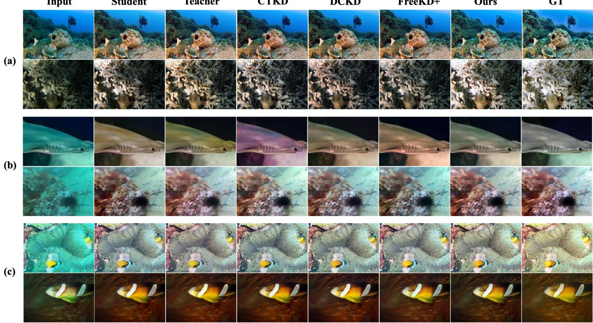  
Fig. 4. Qualitative comparison for (a) Reti-Diff, (b) Restormer, and (c) NAFNet. Columns show input, task-only student, teacher, CTKD, DCKD, FreeKD+, PSD, and ground truth.

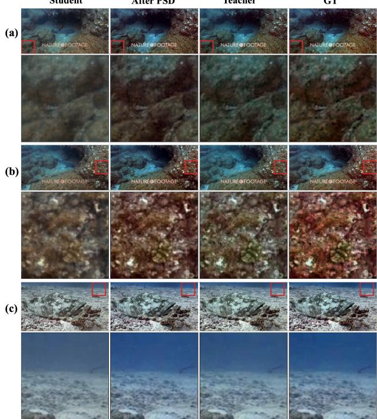  
Fig. 5. Detail comparison of task-only student, PSD student, teacher, and ground truth. Red-box crops in examples (a) and (b) highlight local contrast, color, and structure.

68.81 m $\mathrm { A P _ { 5 0 } }$ and 29.74 m $\mathrm { A P _ { 5 0 : 9 5 } }$ . Among PSD students, Restormer achieved the largest m $\mathrm { A P _ { 5 0 } }$ gain (3.22 points), and NAFNet the largest m ${ \mathrm { A P } } _ { 5 0 : 9 5 }$ gain (1.85 points).

Uneven category gains are consistent with UDD’s class imbalance: sea urchins dominate, while sea cucumbers and scallops provide fewer training examples and less stable AP estimates. Enhancement cannot replace this missing supervision, and scallop AP does not improve consistently. Nevertheless, mAP weights classes equally, so aggregate gains are not simply driven by instance counts. Figure 7 shows additional organism detections alongside residual misses.

## F. Application on a Self-Developed ROV

We deployed all three teacher–student pairs on our selfdeveloped ROV and collected images in Dushu Lake, Suzhou, China. Figure 8 shows the vehicle, onboard GoPro, and stereo camera.

At 256 × 256, the students reached 35.7–84.6 FPS, yielding 3.30–8.30× teacher speedups (Table V). All exceeded 30 FPS under this protocol. NAFNet was selected for field deployment because it achieved the highest throughput, despite having more parameters than Restormer.

The deployed NAFNet student used LSUI-trained weights [12]. SIFT matches [45] across four frame pairs increased from 2, 7, 12, and 26 to 8, 17, 36, and 52 (Fig. 9), raising the mean from 11.75 to 28.25 (2.40×). More correspondences suggest improved feature visibility but do not establish match correctness or localization accuracy.

On the collected images, UIQM increased by 24.43% and UCIQE by 29.57% (Table VI), complementing the featurematching results. These findings support real-time enhancement on the sampled lake imagery; no-reference scores do not independently establish fidelity to true scene colors.

TABLE III  
LEAVE-ONE-COMPONENT-OUT ABLATION ON LSUI. PH, LL, HF, REL., AND IMG. DENOTE PHYSICAL WEIGHTING, LOW- AND HIGH-FREQUENCY TRANSFER, SPECTRAL RELIABILITY GATING, AND IMAGE-SPACE COMPENSATION. ALL COMPONENTS EXCEPT THE NAMED ONE ARE RETAINED; TASK-ONLY USES NONE. ARROWS INDICATE PERFORMANCE GAINS OVER THE TASK-ONLY BASELINE.
<table><tr><td></td><td colspan="2">Reti-Diff</td><td colspan="2">Restormer</td><td colspan="2">NAFNet</td></tr><tr><td>Variant</td><td>PSNR ↑</td><td>SSIM ↑</td><td>PSNR ↑</td><td>SSIM ↑</td><td>PSNR ↑</td><td>SSIM ↑</td></tr><tr><td>Task only</td><td>24.39</td><td>0.8680</td><td>27.79</td><td>0.8964</td><td>25.31</td><td>0.8757</td></tr><tr><td>(A) w/o PH</td><td>24.58 ↑0.19</td><td>0.8681 ↑0.0001</td><td>27.78 ↓0.01</td><td>0.8960 ↓0.0004</td><td>26.81 ↑1.50</td><td>0.8840 ↑0.0083</td></tr><tr><td>(B) w/o LL</td><td>24.46 ↑0.07</td><td>0.8679 ↓0.0001</td><td>27.83 ↑0.04</td><td>0.8975 ↑0.0011</td><td>26.81 ↑1.50</td><td>0.8858 ↑0.0101</td></tr><tr><td>(C) w/o HF</td><td>24.49 ↑0.10</td><td>0.8681 ↑0.0001</td><td>27.99 ↑0.20</td><td>0.8978 ↑0.0014</td><td>27.17 ↑1.86</td><td>0.8861 ↑0.0104</td></tr><tr><td>(D) w/o Rel.</td><td>24.47 ↑0.08</td><td>0.8668 ↓0.0012</td><td>27.89 ↑0.10</td><td>0.8972 ↑0.0008</td><td>26.78 ↑1.47</td><td>0.8864 ↑0.0107</td></tr><tr><td>(E) w/o Img.</td><td>24.53 ↑0.14</td><td>0.8676 ↓0.0004</td><td>28.00 ↑0.21</td><td>0.8978 ↑0.0014</td><td>26.67 ↑1.36</td><td>0.8823 ↑0.0066</td></tr><tr><td>Full PSD</td><td>24.61 ↑0.22</td><td>0.8694 ↑0.0014</td><td>28.18 ↑0.39</td><td>0.8996 ↑0.0032</td><td>27.28 ↑1.97</td><td>0.8889 ↑0.0132</td></tr></table>

GT  
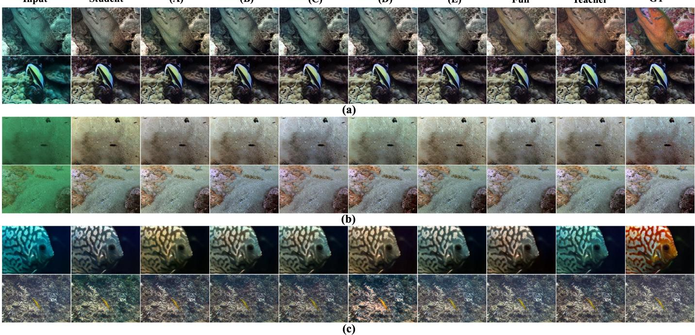  
Fig. 6. Qualitative ablation of PSD on (a) Reti-Diff, (b) Restormer, and (c) NAFNet. From left to right, (A)–(E) denote w/o PH, w/o LL, w/o HF, w/o Rel. and w/o Img., matching the component order in Table III. Full denotes the complete PSD model. Removing individual components produces complementary degradations in color, illumination, contrast, or local structure.

TABLE IV  
YOLOV9S OBJECT DETECTION ON UDD. EACH DETECTOR IS TRAINED AND TESTED ON THE CORRESPONDING RAW OR ENHANCED IMAGE DOMAIN. VALUES ARE PERCENTAGES; HIGHER IS BETTER. THE BEST RESULT IN EACH COLUMN IS BOLD.
<table><tr><td></td><td colspan="4"> $\mathrm { A P _ { 5 0 } }$ </td><td colspan="4"> $\mathrm { A P _ { 5 0 : 9 5 } }$ </td></tr><tr><td>Input domain</td><td>Sea cucumber</td><td>Sea urchin</td><td>Scallop</td><td>mAP</td><td>Sea cucumber</td><td>Sea urchin</td><td>Scallop</td><td>mAP</td></tr><tr><td>Raw</td><td>50.18</td><td>87.56</td><td>54.46</td><td>64.06</td><td>21.04</td><td>38.01</td><td>20.85</td><td>26.63</td></tr><tr><td>Reti-Diff teacher</td><td>58.80</td><td>88.97</td><td>51.66</td><td>66.47</td><td>22.85</td><td>37.14</td><td>20.43</td><td>26.80</td></tr><tr><td>Reti-Diff student (PSD)</td><td>55.13</td><td>88.86</td><td>54.97</td><td>66.32</td><td>21.57</td><td>40.23</td><td>21.19</td><td>27.66</td></tr><tr><td>Restormer teacher</td><td>54.90</td><td>89.21</td><td>62.33</td><td>68.81</td><td>22.74</td><td>40.57</td><td>25.92</td><td>29.74</td></tr><tr><td>Restormer student (PSD)</td><td>58.72</td><td>88.86</td><td>54.27</td><td>67.28</td><td>23.85</td><td>37.34</td><td>21.65</td><td>27.61</td></tr><tr><td>NAFNet teacher</td><td>58.54</td><td>87.07</td><td>54.09</td><td>66.56</td><td>23.37</td><td>37.63</td><td>22.35</td><td>27.78</td></tr><tr><td>NAFNet student (PSD)</td><td>57.32</td><td>87.81</td><td>51.06</td><td>65.39</td><td>24.76</td><td>39.26</td><td>21.42</td><td>28.48</td></tr></table>

## V. CONCLUSION

This paper presented PSD for compressing highperformance UIE models for resource-constrained devices.

PSD combines degradation-aware weighting, reliabilitygated low- and high-frequency transfer, and image-space

Raw

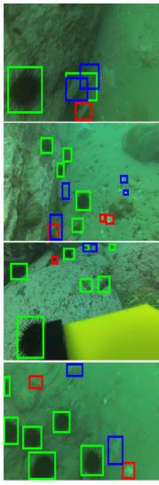

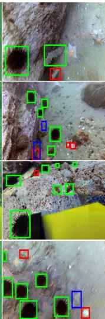  
Reti-Diff Teacher

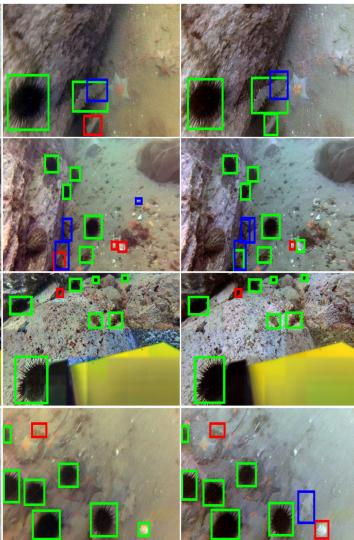  
Reti-Diff Student  
Restormer Teacher

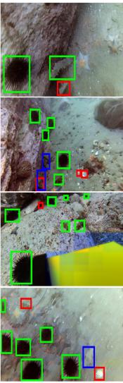  
Restormer Student

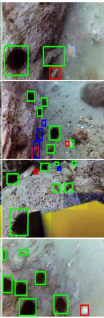  
NAFNet Teacher

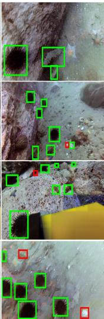  
NAFNet Student

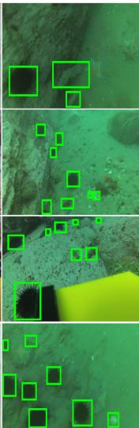  
GT

Fig. 7. YOLOv9s detections on UDD. Columns: Raw; Reti-Diff teacher/student; Restormer teacher/student; NAFNet teacher/student; ground truth. All students use PSD. Detectors are trained and tested in their corresponding domains.  
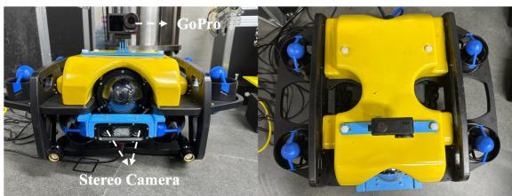  
Fig. 8. The self-developed ROV used for field data collection in Dushu Lake. Front and top views show the compact vehicle configuration and the locations of the onboard GoPro and stereo camera.

TABLE V  
END-TO-END INFERENCE SPEED ON THE SELF-DEVELOPED ROV PLATFORM USING A FIXED 256 × 256 INPUT. HIGHER IS BETTER.
<table><tr><td></td><td colspan="3">Backbone Teacher (FPS) Student (FPS) Speedup (×)</td></tr><tr><td>Reti-Diff</td><td>5.0</td><td>36.4</td><td>7.28</td></tr><tr><td>Restormer</td><td>4.3</td><td>35.7</td><td>8.30</td></tr><tr><td>NAFNet</td><td>25.6</td><td>84.6</td><td>3.30</td></tr></table>

TABLE VI

NO-REFERENCE QUALITY SCORES ON THE IMAGES COLLECTED IN DUSHU LAKE. HIGHER IS BETTER.
<table><tr><td>Metric</td><td>Raw</td><td>Enhanced</td><td>Gain (%)</td></tr><tr><td>UIQM ↑</td><td>1.7902</td><td>2.2276</td><td>24.43</td></tr><tr><td>UCIQE↑</td><td>0.2184</td><td>0.2830</td><td>29.57</td></tr></table>

compensation without adding inference-time modules. Across three backbones and datasets, PSD consistently improved compact students that retained only 0.94–4.6% of teacher parameters and 1.2–2.5% of teacher GMACs. UDD experiments showed benefits for downstream detection, while ROV deployment demonstrated real-time throughput and improved field-image quality. These results support PSD as a practical training framework for efficient underwater enhancement, with long-duration and closed-loop deployment left for future validation.

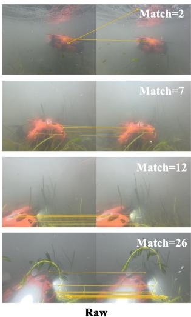

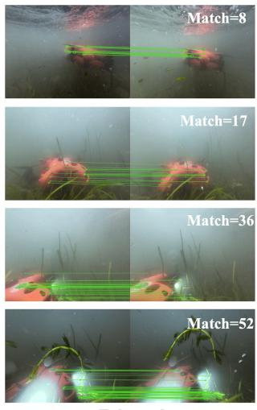  
Enhanced  
Fig. 9. SIFT feature matching on images collected by the ROV. The left half shows matches between raw frame pairs (yellow), and the right half shows matches between the corresponding NAFNet-student-enhanced pairs (green). The numbers below the panels denote the retained matches for each pair.

## REFERENCES

[1] Z. Sun and X. Li, “Water-related optical imaging: From algorithm to hardware,” Science China Technological Sciences, vol. 68, no. 1, p. 1100401, 2025.

[2] Z. Sun, T. Tian, H. Hu, Y. He, M. Shangguan, T. Yu, Q. Yang, M. Chen, X. Wang, Y. Chen, K. Yao, Y. Zheng, Y. Qian, M. Dou, J. Xu, Q. Li, G. Wu, and X. Li, “Extreme-depth water-related optical imaging: Conquering ultra-low illumination environments from epipelagic zone to mariana trench,” PhotoniX, vol. 7, p. 7, 2026.

[3] Q. Jiang, Y. Kang, Z. Wang, W. Ren, and C. Li, “Perception-driven deep underwater image enhancement without paired supervision,” IEEE Transactions on Multimedia, vol. 26, pp. 4884–4897, 2024.

[4] J. S. Jaffe, “Computer modeling and the design of optimal underwater imaging systems,” IEEE Journal of Oceanic Engineering, vol. 15, no. 2, pp. 101–111, 1990.

[5] D. Akkaynak and T. Treibitz, “A revised underwater image formation model,” in Proceedings ofthe IEEE Conference on Computer Vision and Pattern Recognition, 2018, pp. 6723–6732.

[6] J. Zhou, S. Wang, Z. Lin, Q. Jiang, and F. Sohel, “A pixel distribution remapping and multi-prior retinex variational model for underwater image enhancement,” IEEE Transactions on Multimedia, vol. 26, pp. 7838–7849, 2024.

[7] S. Zhang, S. Zhao, D. An, D. Li, and R. Zhao, “LiteEnhanceNet: A lightweight network for real-time single underwater image enhancement,” Expert Systems with Applications, vol. 240, p. 122546, 2024.

[8] C. Ancuti, C. O. Ancuti, T. Haber, and P. Bekaert, “Enhancing underwater images and videos by fusion,” in Proceedings ofthe IEEE Conferenc on Computer Vision and Pattern Recognition, 2012, pp. 81–88.

[9] P. D. Jr., E. R. do Nascimento, F. Moraes, S. S. C. Botelho, and M. F. M. Campos, “Transmission estimation in underwater single images,” in Proceedings of the IEEE International Conference on Computer Vision Workshops, 2013, pp. 825–830.

[10] D. Akkaynak and T. Treibitz, “Sea-Thru: A method for removing water from underwater images,” in Proceedings of the IEEE/CVF Conference on Computer Vision and Pattern Recognition, 2019, pp. 1682–1691.

[11] C. Li, S. Anwar, and F. Porikli, “Underwater scene prior inspired deep underwater image and video enhancement,” Pattern Recognition, vol. 98, p. 107038, 2020.

[12] L. Peng, C. Zhu, and L. Bian, “U-shape transformer for underwater image enhancement,” IEEE Transactions on Image Processing, vol. 32, pp. 2593–2607, 2023.

[13] L. Peng and L. Bian, “Adaptive dual-domain learning for underwater image enhancement,” in Proceedings of the AAAI Conference on Artificial Intelligence, vol. 39, no. 6, 2025, pp. 6461–6469.

[14] C. Zhao, W. Cai, C. Dong, and C. Hu, “Wavelet-based fourier information interaction with frequency diffusion adjustment for underwater image restoration,” in Proceedings of the IEEE/CVF Conference on Computer Vision and Pattern Recognition, 2024, pp. 8281–8291.

[15] C. He, C. Fang, Y. Zhang, L. Tang, J. Huang, K. Li, Z. Guo, X. Li, and S. Farsiu, “Reti-diff: Illumination degradation image restoration with retinex-based latent diffusion model,” in International Conference on Learning Representations, 2025.

[16] G. Hinton, O. Vinyals, and J. Dean, “Distilling the knowledge in a neural network,” in NeurIPS Deep Learning and Representation Learning Workshop, 2015.

[17] B. Xia, Y. Tian, Y. Zhang, Y. Hang, W. Yang, and Q. Liao, “Metalearning-based degradation representation for blind super-resolution,” IEEE Transactions on Image Processing, vol. 32, pp. 3383–3396, 2023.

[18] Y. Zhou, J. Qiao, J. Liao, W. Li, S. Li, J. Xie, Y. Shen, J. Hu, and S. Lin, “Dynamic contrastive knowledge distillation for efficient image restoration,” in Proceedings of the AAAI Conference on Artificial Intelligence, vol. 39, no. 10, 2025, pp. 10 861–10 869.

[19] L. Zhang, X. Chen, X. Tu, P. Wan, N. Xu, and K. Ma, “Wavelet knowledge distillation: Towards efficient image-to-image translation,” in Proceedings of the IEEE/CVF Conference on Computer Vision and Pattern Recognition, 2022, pp. 12 464–12 474.

[20] C. Pham, V.-A. Nguyen, T. Le, D. Phung, G. Carneiro, and T.-T. Do, “Frequency attention for knowledge distillation,” in Proceedings of the IEEE/CVF Winter Conference on Applications of Computer Vision, 2024, pp. 2277–2286.

[21] Y. Zhang, T. Huang, J. Liu, T. Jiang, K. Cheng, and S. Zhang, “FreeKD: Knowledge distillation via semantic frequency prompt,” in Proceedings of the IEEE/CVF Conference on Computer Vision and Pattern Recognition, 2024, pp. 15 931–15 940.

[22] C. Li, C. Guo, W. Ren, R. Cong, J. Hou, S. Kwong, and D. Tao, “An underwater image enhancement benchmark dataset and beyond,” IEEE Transactions on Image Processing, vol. 29, pp. 4376–4389, 2020.

[23] C. Li, S. Anwar, J. Hou, R. Cong, C. Guo, and W. Ren, “Underwater image enhancement via medium transmission-guided multi-color space embedding,” IEEE Transactions on Image Processing, vol. 30, pp. 4985– 5000, 2021.

[24] P. Zhuang, J. Wu, F. Porikli, and C. Li, “Underwater image enhancement with hyper-laplacian reflectance priors,” IEEE Transactions on Image Processing, vol. 31, pp. 5442–5455, 2022.

[25] C. Li, Z. Sun, and X. Li, “Bridging physics and priors: A unified diffusion framework for underwater image restoration,” IEEE Transactions on Multimedia, 2026, early Access.

[26] R. Cong, W. Yang, W. Zhang, C. Li, C.-L. Guo, Q. Huang, and S. Kwong, “PUGAN: Physical model-guided underwater image enhancement using GAN with dual-discriminators,” IEEE Transactions on Image Processing, vol. 32, pp. 4472–4485, 2023.

[27] P. Mu, H. Xu, Z. Liu, Z. Wang, S. Chan, and C. Bai, “A generalized physical-knowledge-guided dynamic model for underwater image enhancement,” in Proceedings of the ACM International Conference on Multimedia, 2023, pp. 7111–7120.

[28] C. Fabbri, M. J. Islam, and J. Sattar, “Enhancing underwater imagery using generative adversarial networks,” in Proceedings of the IEEE International Conference on Robotics and Automation, 2018, pp. 7159– 7165.

[29] Z. Wang, L. Shen, M. Xu, M. Yu, K. Wang, and Y. Lin, “Domain adaptation for underwater image enhancement,” IEEE Transactions on Image Processing, vol. 32, pp. 1442–1457, 2023.

[30] Y. Chen, Z. Sun, C. Li, and X. Li, “Computational ghost imaging in turbulent water based on self-supervised information extraction network,” Optics & Laser Technology, vol. 167, p. 109735, 2023.

[31] Y. Chen, T. Tian, X. Lu, C. Li, R. Zhu, Z. Sun, and X. Li, “Attentionenhanced computational ghost imaging,” Science China Information Sciences, vol. 68, no. 6, p. 162104, 2025.

[32] X. Shi and Y.-G. Wang, “CPDM: Content-preserving diffusion model for underwater image enhancement,” Scientific Reports, vol. 14, no. 1, p. 31309, 2024.

[33] S. Zheng, R. Wang, S. Zheng, F. Wang, L. Wang, and Z. Liu, “A multi-scale feature modulation network for efficient underwater image enhancement,” Journal of King Saud University–Computer and Information Sciences, vol. 36, no. 1, p. 101888, 2024.

[34] A. Romero, N. Ballas, S. E. Kahou, A. Chassang, C. Gatta, and Y. Bengio, “FitNets: Hints for thin deep nets,” in International Conference on Learning Representations, 2015.

[35] S. Zagoruyko and N. Komodakis, “Paying more attention to attention: Improving the performance of convolutional neural networks via attention transfer,” in International Conference on Learning Representations, 2017.

[36] W. Park, D. Kim, Y. Lu, and M. Cho, “Relational knowledge distillation,” in Proceedings of the IEEE/CVF Conference on Computer Vision and Pattern Recognition, 2019, pp. 3967–3976.

[37] Z. Li, X. Li, L. Yang, B. Zhao, R. Song, L. Luo, J. Li, and J. Yang, “Curriculum temperature for knowledge distillation,” in Proceedings of the AAAI Conference on Artificial Intelligence, vol. 37, no. 2, 2023, pp. 1504–1512.

[38] S. G. Mallat, “A theory for multiresolution signal decomposition: The wavelet representation,” IEEE Transactions on Pattern Analysis and Machine Intelligence, vol. 11, no. 7, pp. 674–693, 1989.

[39] M. J. Islam, Y. Xia, and J. Sattar, “Fast underwater image enhancement for improved visual perception,” IEEE Robotics and Automation Letters, vol. 5, no. 2, pp. 3227–3234, 2020.

[40] S. W. Zamir, A. Arora, S. Khan, M. Hayat, F. S. Khan, and M.-H. Yang, “Restormer: Efficient transformer for high-resolution image restoration,” in Proceedings of the IEEE/CVF Conference on Computer Vision and Pattern Recognition, 2022, pp. 5728–5739.

[41] L. Chen, X. Chu, X. Zhang, and J. Sun, “Simple baselines for image restoration,” in Proceedings of the European Conference on Computer Vision, 2022, pp. 17–33.

[42] Y. Zhang, T. Huang, G. Dai, J. Liu, W. Zheng, J. Lu, and S. Zhang, “FreeKD+: A frequency knowledge distillation framework for dense prediction,” IEEE Transactions on Pattern Analysis and Machine Intelligence, 2026, early Access.

[43] C. Liu, Z. Wang, S. Wang, T. Tang, Y. Tao, C. Yang, H. Li, X. Liu, and X. Fan, “A new dataset, poisson GAN and AquaNet for underwater object grabbing,” arXiv preprint arXiv:2003.01446, 2020.

[44] C.-Y. Wang, I.-H. Yeh, and H.-Y. M. Liao, “YOLOv9: Learning what you want to learn using programmable gradient information,” arXiv preprint arXiv:2402.13616, 2024.

[45] D. G. Lowe, “Distinctive image features from scale-invariant keypoints,” International Journal of Computer Vision, vol. 60, no. 2, pp. 91–110, 2004.