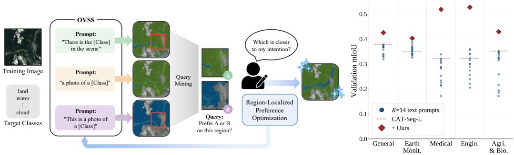
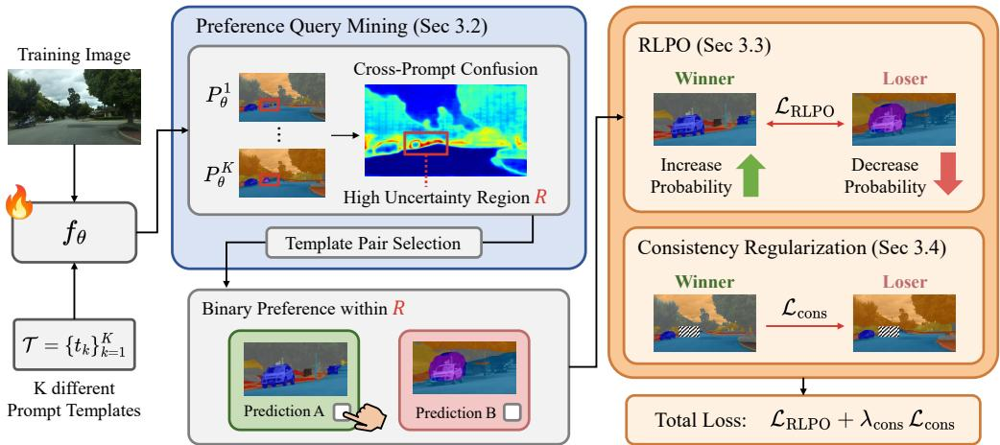
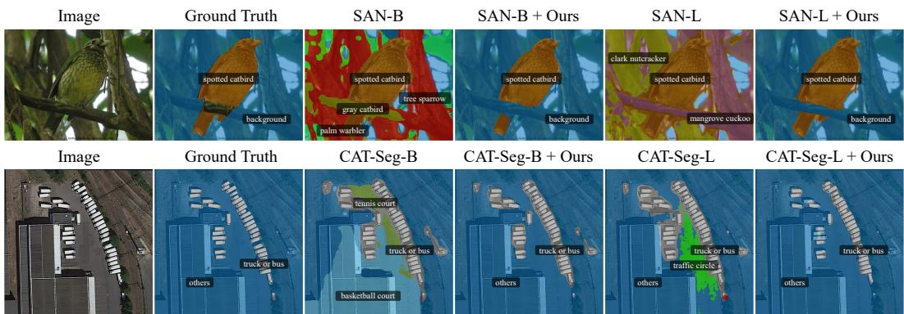
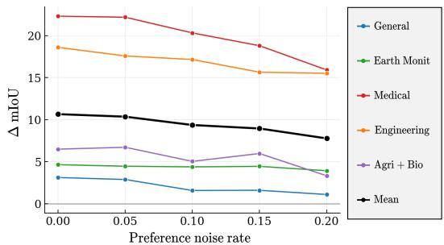
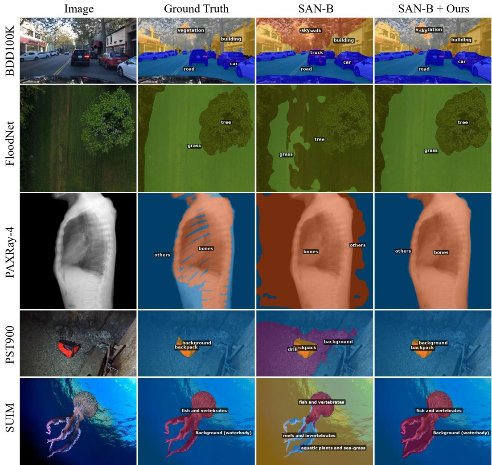
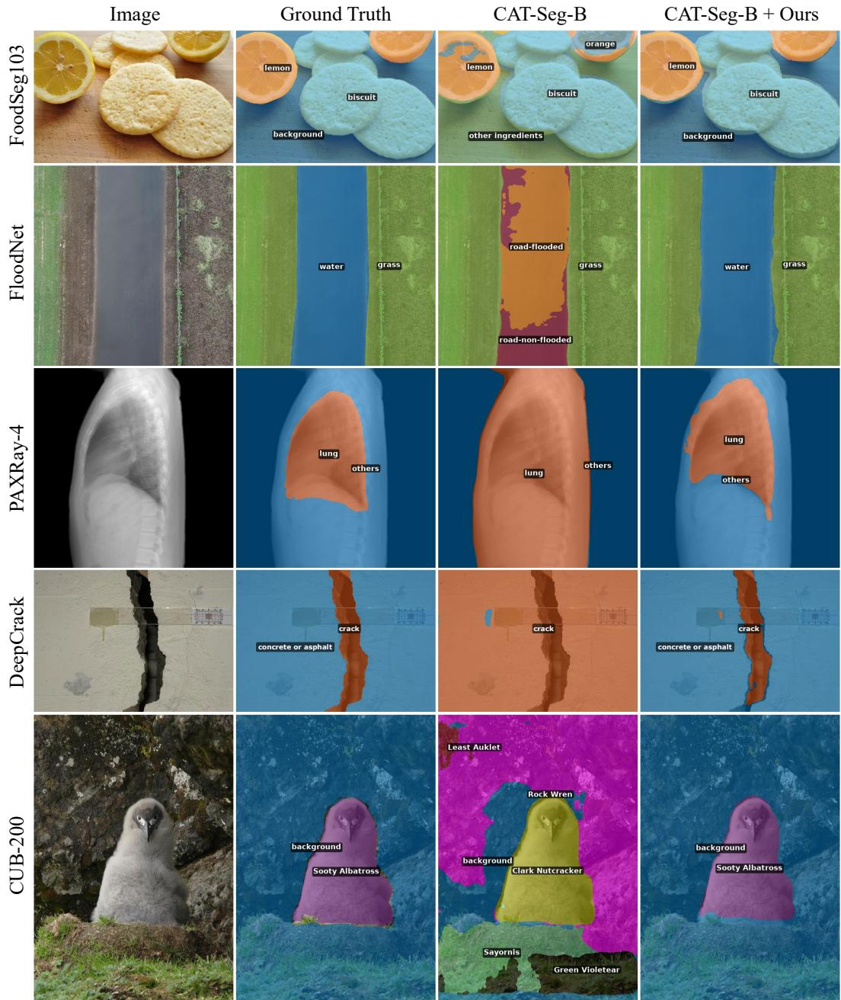
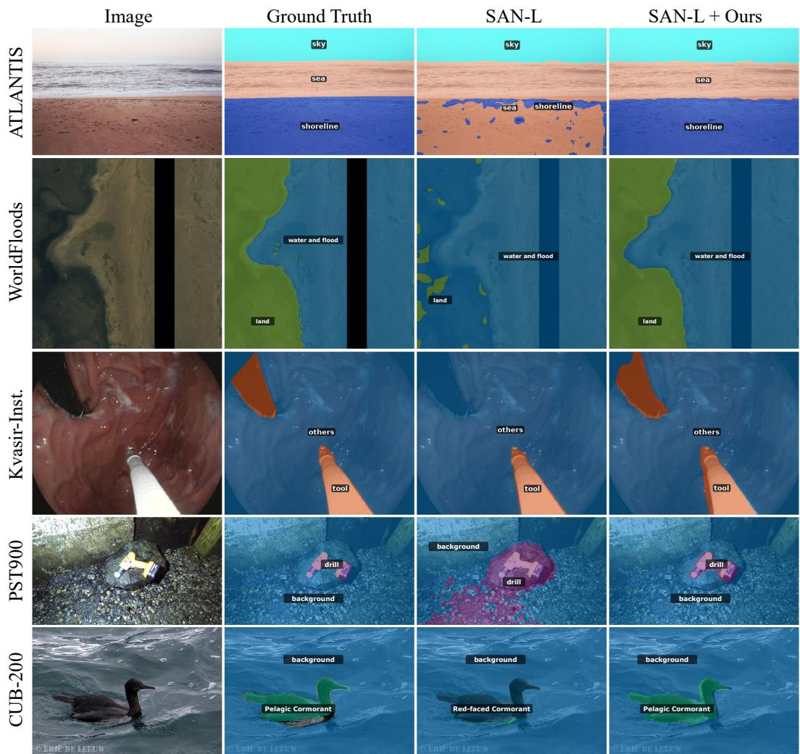
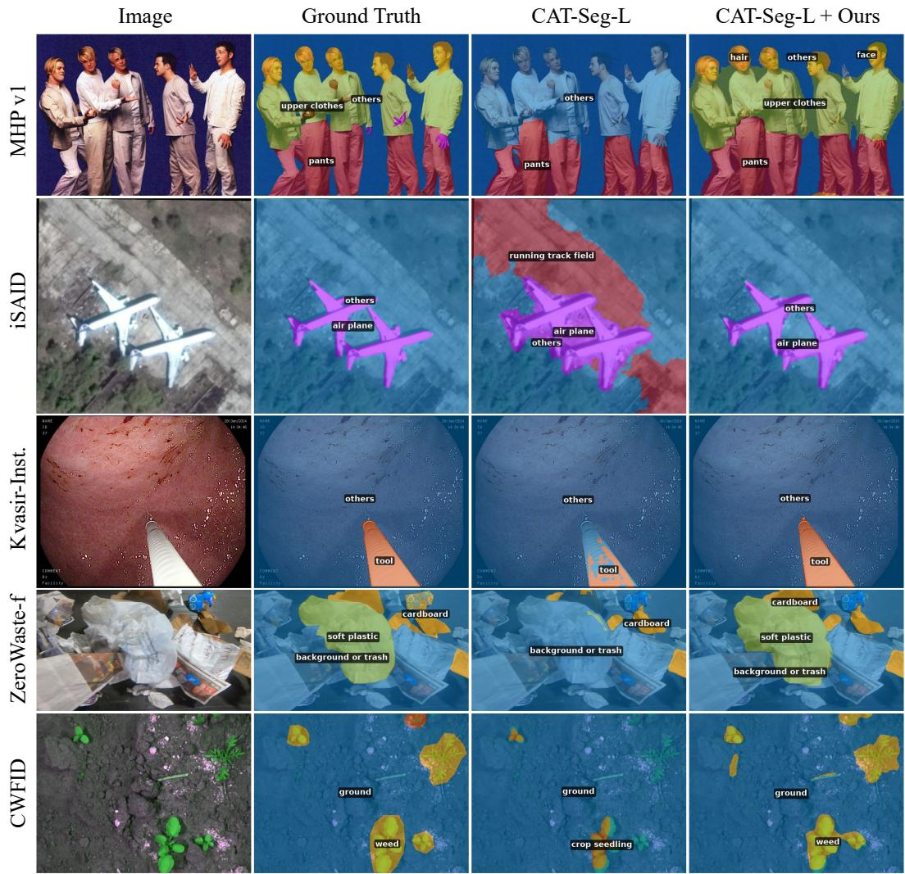
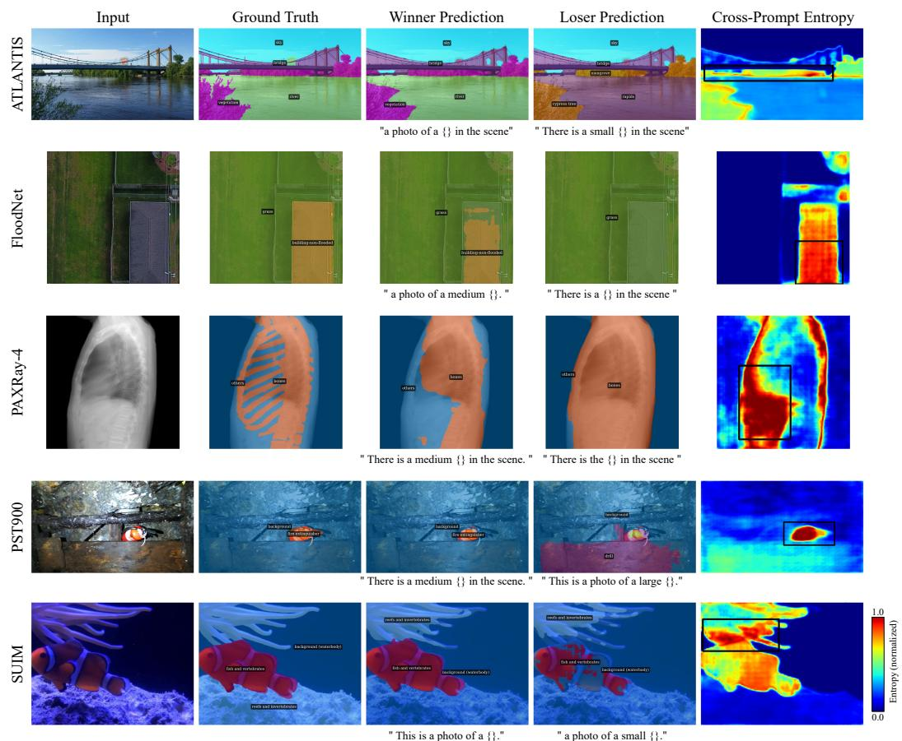

# Preference-Guided Adaptation for Open-Vocabulary Semantic Segmentation via Prompt Disagreement

Hyun-Kurl Jang   
Visual Intelligence Lab.   
KAIST   
jhg0001@kaist.ac.kr

Jihun Kim Visual Intelligence Lab. KAIST jihun1998@kaist.ac.kr

Kuk-Jin Yoon   
Visual Intelligence Lab.   
KAIST   
kjyoon@kaist.ac.kr

## Abstract

Open-vocabulary semantic segmentation (OVSS) enables pixel-level prediction over arbitrary text-specified vocabularies and has shown strong generalization on common benchmarks. However, OVSS performance often degrades in specialized domains such as medical imaging, remote sensing, and industrial inspection, where dense pixel-level masks for adaptation are costly to obtain and require domainspecific expertise. We propose a preference-guided adaptation framework that replaces dense mask supervision with binary preferences. We observe that different prompt templates produce systematically different segmentations for the same image, a phenomenon we call prompt disagreement, and we repurpose it as a built-in source of preference supervision. Building on this, we mine localized preference queries from regions of high cross-template uncertainty, and adapt the OVSS model with Region-Localized Preference Optimization (RLPO) together with consistency regularization that stabilizes updates outside the queried region. Across extensive experiments on the MESS benchmark, the proposed method achieves consistent gains across diverse OVSS backbones without any pixel-level annotation, and remains effective under noisy preferences. Our code is available at https://github.com/blue-531/pref-ovss.

## 1 Introduction

Semantic segmentation has long been studied under a closed-set assumption, where models are trained and evaluated on a fixed set of categories [1–10]. This limits their ability to recognize novel concepts and operate in open-world settings. Open-vocabulary semantic segmentation (OVSS) [11– 39] addresses this limitation by allowing class names to be specified in natural language at inference time. Powered by vision-language models (VLMs) such as CLIP [40], OVSS aligns dense visual features with text embeddings and has shown strong generalization to categories unseen during training.

As OVSS moves toward real-world deployment, adapting it to specialized domains has become increasingly important. Applications such as medical imaging, remote sensing, industrial inspection, and agriculture differ substantially from web-scale pretraining data in appearance, label granularity, and vocabulary [17, 41]. Prior adaptation strategies for OVSS have explored prompt tuning [42–44] and adapter-based fine-tuning [45, 46]. However, many of these approaches often assume access to target-domain mask supervision, which are difficult to obtain in specialized domains. Unlike common-object datasets, specialized domains often involve fine-grained categories, ambiguous visual boundaries, and domain-specific terminology, making reliable mask annotation dependent on expert knowledge. Since target classes and annotation criteria often vary across specialized domains, relying on dense masks creates a recurring annotation bottleneck for OVSS adaptation.

These limitations motivate a different form of supervision that does not require annotators to construct dense ground truth yet still guides model predictions toward the intended concept. Pairwise preferences provide such a signal. Preference-based supervision has emerged as an effective way to align model outputs with human intent in language and vision-language generation, largely because relative judgments can convey useful training signals without requiring fully specified target outputs [47–49]. Translating this principle to OVSS leads to a lightweight protocol: given two candidate segmentations for the same image, annotators simply choose the prediction that better matches the intention. By indicating which prediction better matches the intended segmentation in a target-domain image, this relative feedback provides a natural form of supervision for adapting OVSS models without requiring pixel-level masks.

  
Figure 1: Left: For each target-domain image, our framework runs multiple prompt templates through a OVSS backbone, mines a localized preference query from regions where the templates disagree most, and uses a binary judgment ("which prediction is closer to the intended concept on this region?") to drive an update of OVSS model. Right: Validation mIoU across diverse specialized domains [41] when only the prompt template is varied. Across all domains, performance varies widely across templates. Our method harnesses this variance as supervision and lifts performance above the entire per-domain spread, turning prompt disagreement into training signal.

To make this supervision actionable, however, OVSS requires meaningful candidate segmentations to compare. We observe that such candidates naturally arise from the prompting interface itself. Different prompt templates can produce systematically different masks for the same image and class name [40, 50, 51]; we refer to this template-induced prediction variance as prompt disagreement. As shown in Fig. 1 (right), prompt disagreement is pronounced in practice: across diverse specialized domains, validation mIoU varies widely across templates for the same backbone. Rather than treating prompt disagreement as a nuisance, we repurpose it as a built-in source of pairwise supervision: promptinduced masks serve as competing hypotheses, and binary preferences identify which hypothesis better captures the intended concept.

Building on this idea, we propose a preference-guided adaptation framework for OVSS that turns prompt disagreement into an actionable training signal, illustrated in Fig. 1 (left). The framework consists of three components. First, we mine informative preference queries from prompt ensembles. We localize high-uncertainty regions using cross-prompt entropy and, within each region, select the pair of template-induced predictions with the largest disagreement. This jointly determines where feedback should be collected and which pair of segmentation hypotheses should be compared. Second, we introduce Region-Localized Preference Optimization (RLPO) for adapting OVSS models from binary preferences. Rather than treating the preference as a single image-level signal, our objective applies it to pixel-level segmentation scores inside the selected region, enabling dense spatial supervision from a single comparison. Third, we introduce a consistency regularization to stabilize preference optimization. Because the preference objective only supervises the selected region, it resolves the queried disagreement but leaves predictions outside that region unconstrained. Our consistency regularizer therefore uses the preferred prediction as a pseudo-target for the rejected prediction outside the selected region, preventing unintended drift beyond the adapted area.

We evaluate the proposed method on the MESS benchmark [41], which covers five domain groups: general scenes, earth monitoring, medical sciences, engineering, and agriculture & biology. Across these diverse settings, our approach consistently improves OVSS performance without dense masks, demonstrating that prompt disagreement provides a practical supervision signal for adapting OVSS to specialized domains. We further show that the proposed adaptation strategy yields consistent improvements across different OVSS baselines [18, 30], suggesting that it is not specific to a single model design. The method also remains effective under noisy preference feedback, highlighting the robustness of binary preferences.

Our main contributions are as follows:

• We show that prompt disagreement can be repurposed as a source of preference supervision, enabling OVSS adaptation without human-provided pixel-level masks.

• We propose Region-Localized Preference Optimization (RLPO), which adapts OVSS models from binary preferences mined via prompt disagreement.

• We demonstrate consistent improvements on the MESS benchmark across diverse specialized domains, validating binary preference feedback as a practical supervision signal for OVSS adaptation.

## 2 Related Works

## 2.1 Open-Vocabulary Semantic Segmentation

Open-vocabulary semantic segmentation (OVSS) aims to assign pixel-level labels from an arbitrary set of text-specified classes, including those unseen during training. Building on vision-language foundations such as CLIP [40], recent methods have explored diverse strategies for bridging imagelevel pretraining with dense prediction. Two-stage approaches [12, 13, 15, 16, 19, 21, 23] first generate mask proposals and then classify each region via CLIP, while one-stage methods [18, 25, 34] produce masks within a side adapter during inference. Cost aggregation approaches [30, 31, 38, 52] instead refine patch-level embeddings through cost aggregation or learned decoders to directly produce per-pixel predictions.

Despite strong results on standard benchmarks dominated by everyday imagery, such as ADE20K [53] and Pascal Context [54], OVSS models often struggle in specialized domains. Such domains often exhibit domain-specific vocabulary, high inter-class similarity, ambiguous boundaries, and atypical visual appearance. Existing adaptation strategies, including prompt tuning [42–44], adapterbased methods [37, 45, 46], and personalized OVSS approaches [55], typically rely on dense mask supervision. This reliance limits scalability in specialized domains, where annotation often requires expert knowledge and must be repeated for each target vocabulary. To address this gap, we propose a preference-guided OVSS adaptation framework that learns from binary comparisons between candidate segmentations rather than dense masks.

## 2.2 Preference Learning

Preference learning [47, 48, 56–62] uses relative judgments between candidate outputs as supervision, instead of requiring fully specified ground-truth targets. This formulation is especially useful in settings where dense annotation is difficult to obtain but comparative feedback is easier to collect. Among recent approaches, Direct Preference Optimization (DPO) [48] has emerged as a simple objective that learns directly from pairwise preferences without requiring an explicit reward model.

While DPO was originally proposed for language model alignment, preference-based objectives have since been extended to visual tasks, including image generation [63, 49, 64, 65] and dense prediction [66, 67]. Recent work has also begun to explore preference-based objectives for segmentation [68, 69]. However, these studies have been limited to fixed-target settings, typically in medical imaging, where the task involves a single foreground structure or a small closed label space.

As a result, preference-guided adaptation remains largely unexplored for open-vocabulary semantic segmentation. We address this gap by using prompt-induced variation to construct localized binary comparisons, enabling OVSS adaptation from preference feedback without dense masks.

## 3 Method

Our goal is to adapt an OVSS model to a specialized target domain using binary preference feedback. Given target-domain images and a target vocabulary, we use prompt disagreement to construct localized comparison queries and obtain binary preferences over candidate segmentations. These preferences serve as the supervision signal for adaptation, without requiring dense annotations. Our overall framework is illustrated in Fig. 2, which consists of three components: preference query mining, RLPO, and consistency regularization. We first introduce the problem setting and then describe each component.

  
Figure 2: Given a training image, our method generates K prompt-conditioned predictions with model $f _ { \theta } .$ . It mines a preference query by selecting a high-uncertainty region R from prompt-ensemble entropy and the most disagreeing template pair within R. A binary preference identifies the winner and loser predictions. RLPO updates $f _ { \theta }$ by increasing the winner’s score relative to the loser’s inside R, while the consistency regularization aligns the loser prediction with the winner pseudo-label.

## 3.1 Preliminaries

Open-vocabulary semantic segmentation (OVSS). OVSS aims to assign a class label to every pixel of an image given an arbitrary class vocabulary specified at test time, including categories unseen during training. Modern OVSS systems build on vision–language models such as CLIP [40], predicting segmentation maps by aligning dense visual features with text embeddings of class names prompted through templates (e.g., “a photo of a [CLASS]”). The choice of prompt template is known to materially affect predictions [40, 50, 51]: different templates can produce noticeably different segmentations on the same image, particularly under domain shift, where the source-trained alignment is no longer well calibrated to the target distribution.

Direct preference optimization (DPO). Standard reinforcement learning from human feedback first fits a reward model on preference data and then optimizes a policy against it; DPO [48] avoids the reward modeling stage by deriving a closed-form objective that learns directly from preference pairs. Specifically, DPO adapts a policy $\pi _ { \theta }$ from a frozen reference $\pi _ { \mathrm { r e f } }$ using preference pairs $( y _ { w } , y _ { l } )$ where $y _ { w }$ is preferred to $y _ { l }$ for the same input. It interprets the log-probability ratio

$$
r _ { \theta } ( y ) = \log \frac { \pi _ { \theta } ( y ) } { \pi _ { \mathrm { r e f } } ( y ) }\tag{1}
$$

as an implicit reward, and optimizes the Bradley–Terry objective [70]

$$
\begin{array} { r } { \mathcal { L } _ { \mathrm { D P O } } ( \boldsymbol { \theta } ) = - \log \sigma \big ( \beta \big [ r _ { \boldsymbol { \theta } } ( y _ { w } ) - r _ { \boldsymbol { \theta } } ( y _ { l } ) \big ] \big ) , } \end{array}\tag{2}
$$

which raises $r _ { \theta } ( y _ { w } )$ for the winner while lowering $r _ { \theta } ( y _ { l } )$ for the loser. Because the reward is defined relative to $\pi _ { \mathrm { r e f } } ,$ , the reference distribution acts as a KL anchor that prevents $\pi _ { \theta }$ from drifting far from its initial behavior, with $\beta$ controlling the trade-off between matching the preferences and staying close to $\pi _ { \mathrm { r e f } } .$ . We adapt this principle to OVSS in Section 3.3 by replacing the policy log-probability ratio with a region-localized segmentation score, so that Eq. (2) takes a form directly applicable to template-conditional segmentation.

Problem setting. We adapt an OVSS model to a target domain in a streaming, single-step setting: training images from the target domain arrive sequentially, and for each image we elicit a binary preference and perform a single gradient update on the model parameters θ before moving on, without revisiting images or accumulating preferences for batch optimization. Let $\boldsymbol { x } \in \mathbb { R } ^ { H \times W \times \mathrm { 3 } }$ denote a target-domain image with pixel domain Ω and pixel positions $\mathbf { u } \in \Omega$ . Let $\mathcal { C } = \{ c _ { 1 } , \ldots , c _ { N } \}$ denote the target vocabulary, and let $\mathcal { T } = \{ t _ { k } \} _ { k = 1 } ^ { K }$ denote a fixed set of K templates with prompted vocabulary ${ \mathcal { C } } ^ { k } = \{ t _ { k } ( c ) : c \in { \mathcal { C } } \}$ . We adapt an OVSS model $f _ { \theta }$ from a frozen reference $f _ { \mathrm { r e f } }$

Both share the same backbone; $f _ { \theta }$ adds lightweight adapters on the vision and text branches as the only trainable parameters, while $f _ { \mathrm { r e f } }$ corresponds to the initial state of $f _ { \theta }$ before adaptation. The template-k pixel-level prediction is

$$
P _ { \theta } ^ { k } ( c \mid x , \mathbf { u } ) = f _ { \theta } ( x , \mathcal { C } ^ { k } ) _ { \mathbf { u } , c } , \qquad c \in \mathcal { C } ,\tag{3}
$$

with $P _ { \mathrm { r e f } } ^ { k }$ defined analogously. Given a small set of target-domain images, we adapt θ using binary preferences elicited between pairs of template-specific predictions $\{ P _ { \theta } ^ { k } \} _ { k = 1 } ^ { K }$

## 3.2 Preference Query Mining

We design the preference protocol around two requirements: each query should be cognitively simple to answer, and the resulting binary signal should still carry enough supervision to drive adaptation. Richer feedback formats (e.g., ratings, rankings, or multi-way selections) place a heavier cognitive load on annotators and are prone to inconsistent calibration across examples and annotators [71]. We therefore restrict each annotation to a binary choice. Even with binary feedback, whole-image preferences remain ambiguous in segmentation, because two candidates may each be better in different parts of the image. Therefore, we further localize each comparison to a small region $R \subseteq \Omega$ on which the question becomes concrete: within R, which of two template predictions $\check { P _ { \theta } ^ { a } } , \check { P _ { \theta } ^ { b } }$ better matches the intended concept?

We construct queries by exploiting prompt disagreement, the variation across template predictions $\{ P _ { \theta } ^ { k } \} _ { k = 1 } ^ { K }$ . Template-induced predictions provide useful candidates because they vary the segmentation hypothesis while preserving the target vocabulary. This makes the resulting candidates directly comparable under the same semantic target. Concretely, prompt disagreement on a single image yields two operational signals: where the templates collectively disagree, and which pair of templates disagrees most strongly. To localize regions of high disagreement, we measure cross-prompt uncertainty at each pixel by the entropy of the ensemble distribution

$$
\bar { P } ( c \mid x , { \bf u } ) = \frac { 1 } { K } \sum _ { k = 1 } ^ { K } P _ { \theta } ^ { k } ( c \mid x , { \bf u } ) , \qquad \mathcal { H } ( { \bf u } ) = - \sum _ { c \in \mathcal { C } } \bar { P } ( c \mid x , { \bf u } ) \log \bar { P } ( c \mid x , { \bf u } ) .\tag{4}
$$

We binarize H at its 0.95-quantile and take R as the bounding box of the largest connected component of the resulting high-entropy mask. Within R, we identify the most informative template pair by counting pixel-level disagreement between hard predictions and selecting the pair with the largest count:

$$
( a , b ) = \arg \operatorname* { m a x } _ { 1 \leq k < k ^ { \prime } \leq K } \sum _ { \mathbf { u } \in R } \mathbf { 1 } \Big [ \hat { Y } ^ { k } ( \mathbf { u } ) \neq \hat { Y } ^ { k ^ { \prime } } ( \mathbf { u } ) \Big ] , \quad \hat { Y } ^ { k } ( \mathbf { u } ) = \arg \operatorname* { m a x } _ { c } P _ { \theta } ^ { k } ( c | x , \mathbf { u } ) .\tag{5}
$$

By targeting both the most uncertain region and the most disagreeing template pair within it, each query is visually concrete enough to be judged at a glance yet carries dense supervision for adaptation.

## 3.3 Region-Localized Preference Optimization (RLPO)

Given the query $( R , a , b )$ , an oracle provides a binary preference indicating which of the two predictions $P _ { \theta } ^ { a }$ and $P _ { \theta } ^ { b }$ is preferred on R. We denote the winner and loser template indices by w and l, respectively, with corresponding hard predictions ${ \hat { Y } } ^ { w }$ and $\hat { Y } ^ { l }$

Region-level score. To instantiate the DPO objective in our setting, we need a per-template scalar score that plays the role of log $\pi _ { \boldsymbol { \theta } } ( y )$ in Eq. (1). A natural choice is the log-likelihood that template k assigns to its own hard prediction, averaged over R. However, a simple pixelwise average would be dominated by classes that occupy the largest area in $R ,$ so a single large class could obscure the contribution of smaller but semantically important ones. We therefore use a class-balanced average: pixels in R are grouped by the winner’s prediction ${ \hat { Y } } ^ { w }$ to define a stable, k-independent partition, and per-pixel scores are first averaged within each class before averaging across classes. Let

$$
R _ { c } = \{ \mathbf { u } \in R : { \hat { Y } } ^ { w } ( \mathbf { u } ) = c \} , \qquad U _ { R } = \{ c \in { \mathcal { C } } : R _ { c } \neq \emptyset \} .\tag{6}
$$

For $k \in \{ w , l \}$ , the score is

$$
S _ { \theta } ^ { k } ( R ) = \frac { 1 } { | U _ { R } | } \sum _ { c \in U _ { R } } \frac { 1 } { | R _ { c } | } \sum _ { \mathbf { u } \in R _ { c } } \log P _ { \theta } ^ { k } \big ( \hat { Y } ^ { k } ( \mathbf { u } ) \mid x , \mathbf { u } \big ) ,\tag{7}
$$

and the reference score $S _ { \mathrm { r e f } } ^ { k } ( R )$ is defined analogously by replacing $P _ { \theta } ^ { k }$ with Pk . $P _ { \mathrm { r e f } } ^ { k }$

Region-localized preference loss. Treating the score difference $S _ { \theta } ^ { k } ( R ) - S _ { \mathrm { r e f } } ^ { k } ( R )$ as the implicit reward $r _ { \theta }$ of Eq. (1), we instantiate the Bradley–Terry objective of Eq. (2) for template-conditional segmentation:

$$
\begin{array} { r } { \mathcal { L } _ { \mathrm { R L P O } } ( \theta ) = - \log \sigma \big ( \beta \big [ \big ( S _ { \theta } ^ { w } ( R ) - S _ { \mathrm { r e f } } ^ { w } ( R ) \big ) - \big ( S _ { \theta } ^ { l } ( R ) - S _ { \mathrm { r e f } } ^ { l } ( R ) \big ) \big ] \big ) . } \end{array}\tag{8}
$$

Intuitively, minimizing $\mathcal { L } _ { \mathrm { R L P O } }$ produces the same winner-up/loser-down dynamic as standard DPO, but applied to region-localized segmentation scores: within $\bar { R , f _ { \theta } }$ becomes more confident in the winner template’s prediction ${ \hat { Y } } ^ { w }$ and less confident in the loser’s prediction $\hat { Y } ^ { l }$ , with $f _ { \mathrm { r e f } }$ anchoring both shifts. The full derivation of $\mathcal { L } _ { \mathrm { { R L P O } } }$ from the standard DPO formulation is provided in Appendix A.

## 3.4 Consistency Regularization

The preference loss in Eq. (8) only updates the model within R, leaving the loser branch unconstrained elsewhere. Without an additional anchor, the strong preference signal applied on R can shift the loser’s predictions outside R in unintended directions. To prevent this, we add a consistency regularizer that keeps the loser-template prediction aligned with the winner pseudo-label $\hat { Y } ^ { w }$ outside $R ,$ restricted to pixels where the winner is sufficiently confident. We use the Lovász–Softmax loss [72]:

$$
\mathcal { L } _ { \mathrm { c o n s } } ( \theta ) = \mathcal { L } _ { \mathrm { L o v \hat { a } s z } } \Big ( P _ { \theta } ^ { l } \big | _ { R _ { \mathrm { c o n f } } } , ~ \hat { Y } ^ { w } \big | _ { R _ { \mathrm { c o n f } } } \Big ) ,\tag{9}
$$

where $R _ { \mathrm { c o n f } }$ denotes the pixels outside R at which confidence exceeds a threshold $\tau _ { \mathrm { c o n f } }$

The full per-shot objective combines preference and consistency:

$$
\mathcal { L } _ { \mathrm { t o t a l } } ( \theta ) = \mathcal { L } _ { \mathrm { R L P O } } ( \theta ) + \lambda _ { \mathrm { c o n s } } \mathcal { L } _ { \mathrm { c o n s } } ( \theta ) ,\tag{10}
$$

where $\lambda _ { \mathrm { { c o n s } } }$ balances the two terms. Following the streaming protocol of Section 3.1, each incoming image produces exactly one minimization step of $\mathcal { L } _ { \mathrm { t o t a l } } ( \theta )$ .

## 4 Experiments

## 4.1 Experimental Setup

Datasets. We evaluate on the MESS benchmark [41], a suite designed to stress-test open-vocabulary segmentation models on domains that substantially differ from web-scale image-text pretraining. MESS spans five domain groups—General [73–76], Earth Monitoring [77–80], Medical Sciences [81– 83], Engineering [84–87], and Agriculture & Biology [88–90]—each containing multiple datasets with distinct visual appearance, label granularity, and vocabulary. We exclude four datasets from the original MESS benchmark—Dark Zurich [91], DRAM [92], ISPRS Potsdam [93], and CryoNuSeg [94]—as they either lack a training split or are no longer publicly accessible. Following the original benchmark protocol, we report mean intersection-over-union (mIoU, %) per domain and the overall mean across datasets; per-dataset results are provided in Appendix F. Adaptation samples are drawn from each dataset’s training split, while evaluation is performed on the official held-out split.

Base OVSS models. We apply our adaptation framework to two OVSS backbones, SAN [18] and CAT-Seg [30], each in two CLIP-scale variants (ViT-B/16 and ViT-L/14). All backbones are kept frozen except for lightweight adapters: a LoRA module of rank 4 on the vision branch and a residual prompt embedding on the text branch. For adaptation, we draw K = 14 prompt templates from the ViLD prompt pool [50]. The full template list and an analysis of template diversity are provided in Appendix B. At evaluation time, we use each backbone’s default template (the ViLD pool for SAN and “a photo of a [CLASS] in the scene” for CAT-Seg) to match its baseline configuration.

Preference oracle. The binary preference for each query $( R , a , b )$ is provided by an oracle that compares the two candidate predictions to the ground-truth segmentation within $R \colon$ the winner $w \in \{ a , b \}$ is the template whose prediction has the higher intersection-over-union with the ground truth restricted to $R .$ This mimics an annotator who, given two segmentations cropped to a small region, selects the one closer to the intended target. We verify that this is a faithful stand-in for a human annotator in Appendix D.

Table 1: Quantitative evaluation on the MESS benchmark (mIoU, %). Numbers for our method are mean ± standard deviation. Dense-mask rows use ground-truth mask supervision under the same streaming protocol, providing the dense-supervision counterpart.
<table><tr><td>VLM</td><td>Method</td><td>General</td><td>Earth Monit.</td><td>Medical Sci.</td><td>Engineering</td><td>Agri. &amp; Biology</td><td>Mean</td></tr><tr><td rowspan="5">CLIP ViT-B/16</td><td>SAN-B</td><td>21.60</td><td>26.90</td><td>33.51</td><td>28.19</td><td>15.99</td><td>25.29</td></tr><tr><td>+ Ours</td><td>22.09±0.18</td><td>27.69±0.60</td><td>52.97 ±1.04</td><td>33.47±0.21</td><td>30.36 ±0.23</td><td>32.39 ±0.09</td></tr><tr><td>+ Dense-mask</td><td>24.74±0.33</td><td>28.59±0.44</td><td>44.37 ±0.60</td><td>35.64±0.72</td><td>31.48 ±2.95</td><td>32.41 ±0.46</td></tr><tr><td>CAT-Seg-B</td><td>34.51</td><td>34.52</td><td>37.82</td><td>29.95</td><td>28.95</td><td>33.12</td></tr><tr><td>+ Ours</td><td>36.06±1.85</td><td>35.88 ±0.60</td><td>52.66 ±2.48</td><td>43.82 ±2.16</td><td>31.04 ±0.46</td><td>39.67 ±0.08</td></tr><tr><td rowspan="6">CLIP ViT-L/14</td><td>+ Dense-mask</td><td>38.69±0.13</td><td>38.22 ±0.35</td><td>60.08±1.37</td><td>46.01 ±1.37</td><td>41.61 ±0.87</td><td>44.26 ±0.49</td></tr><tr><td>SAN-L</td><td>26.23</td><td>34.51</td><td>32.00</td><td>24.15</td><td>19.24</td><td>27.40</td></tr><tr><td>+ Ours</td><td>27.43±0.37</td><td>37.09 ±0.78</td><td>38.62 ±2.69</td><td>36.13 ±0.35</td><td>31.15 ±3.41</td><td>33.99 ±0.90</td></tr><tr><td>+ Dense-mask</td><td>31.18 ±0.31</td><td>35.74 ±0.73</td><td>50.05 ±1.30</td><td>38.03 ±0.26</td><td>35.86±0.64</td><td>37.64 ±0.15</td></tr><tr><td>CAT-Seg-L</td><td>39.36</td><td>35.64</td><td>29.52</td><td>34.22</td><td>36.41</td><td>35.26</td></tr><tr><td>+ Ours + Dense-mask</td><td>42.48 ±0.35 44.04±0.41</td><td>40.28±0.35 41.82 ±1.69</td><td>51.83 ±0.81 55.48±1.98</td><td>52.68±0.41 49.18±0.69</td><td>42.86±1.45 44.48±0.78</td><td>45.88 ±0.38 46.67±0.74</td></tr></table>

Baselines. We compare against two reference points: (i) the baseline OVSS model with no adaptation, evaluated zero-shot on each target domain; and (ii) the Dense-mask reference, which follows the same streaming adaptation protocol but replaces the binary preference with ground-truth mask supervision, isolating the effect of the supervision format under a matched budget rather than serving as a fully-supervised upper bound. Unless stated otherwise, both our method and the Dense-mask reference adapt each backbone with 64 target domain images per dataset1. The effect of varying the number of training images is studied in Section 4.3. All adaptation results are averaged over three seeds, each with independently sampled adaptation images. A broader comparison, against additional baselines, is provided in Appendix E. Additional implementation details are provided in Appendix C.

## 4.2 Main Results

Table 1 reports mIoU on the MESS benchmark. Our method consistently improves over the baseline across all backbones, with mean gains of +7.10, +6.55, +6.59, and +10.62 mIoU on SAN-B, CAT-Seg-B, SAN-L, and CAT-Seg-L, surpassing the supervised reference on several specialized domains (e.g., Medical Sciences on SAN-B, Engineering on CAT-Seg-L). The improvement is robust to backbone scale (ViT-B/16 vs ViT-L/14) and architecture, suggesting that prompt disagreement provides a generic source of supervision rather than one specific to a particular OVSS design.

Our method is most effective on domains with the largest gap from the pretrained distribution. Medical Sciences shows the largest improvement on every backbone (e.g., +19.46 on SAN-B and +22.31 on CAT-Seg-L), followed by Engineering and Agriculture & Biology. These results demonstrate the applicability of our method to specialized-domain adaptation.

Figure 3 shows qualitative comparisons for SAN and CAT-Seg across two CLIP scales (ViT-B/16 and ViT-L/14). The baseline zero-shot predictions often miss or mislabel domain-specific objects—for example, confusing fine-grained bird species in CUB-200 or hallucinating non-existent classes in aerial scenes— while our adapted predictions align much more closely with the ground truth. Improvements are consistent across both scales, indicating that the gains observed in Table 1 translate into perceptually clearer segmentations. Additional qualitative results spanning all five domain groups for each backbone are provided in Appendix I.

## 4.3 Ablation Studies

In this section, we ablate three components of our framework: the loss formulation, the candidate source, and the adaptation budget. All ablations are conducted on CAT-Seg-L and follow the default protocol of Section 4.2. A hyperparameter sensitivity analysis is provided in Appendix G.

Candidate generation. We use prompt disagreement as the source of comparison candidates for preference queries. Prior visual preference learning methods rely on auxiliary mechanisms such as stochastic sampling, input perturbation, or output sampling to produce candidate diversity [49, 63, 64, 95]. We instead exploit a source of variation already present in the prompted OVSS interface. This choice has two principled advantages. First, template-induced predictions vary the segmentation hypothesis while preserving the target vocabulary, so candidates remain comparable under the same semantic target—unlike input perturbation, which can shift the visual content itself. Second, no additional mechanism or hyperparameter (e.g., dropout rate, augmentation strength) is introduced; the diversity is obtained for free from the existing prompting interface.

Table 2: Comparison of candidate generation strategies. We contrast prompt disagreement against MC Dropout and test-time augmentation, with matched candidate size $( K = 1 4 )$  
Table 3: Loss function ablation. We ablate the two components of our objective: $\mathcal { L } _ { \mathrm { { R L P O } } }$ (preference loss within the queried region) and $\mathcal { L } _ { \mathrm { c o n s } }$ (consistency regularizer outside)
<table><tr><td rowspan="2">Domain</td><td rowspan="2">Baseline</td><td colspan="3">Strategies</td></tr><tr><td>MC Dropout</td><td>TTA</td><td>Prompt</td></tr><tr><td>General</td><td>39.36</td><td>36.48</td><td>40.95</td><td>42.48</td></tr><tr><td>Earth</td><td>35.64</td><td>32.10</td><td>37.73</td><td>40.28</td></tr><tr><td>Medical</td><td>29.52</td><td>42.64</td><td>53.15</td><td>51.83</td></tr><tr><td>Engin.</td><td>34.22</td><td>47.66</td><td>50.68</td><td>52.68</td></tr><tr><td>Agri.&amp; Bio</td><td>36.41</td><td>36.90</td><td>42.36</td><td>42.86</td></tr><tr><td>Mean</td><td>35.26</td><td>39.09</td><td>44.66</td><td>45.88</td></tr></table>

<table><tr><td rowspan="2">Domain</td><td rowspan="2">Baseline</td><td colspan="3">Ablation</td></tr><tr><td>w/o LRLPO</td><td>w/o  ${ \mathcal { L } } _ { \mathrm { c o n s } }$ </td><td>Ours</td></tr><tr><td>General</td><td>39.36</td><td>41.80</td><td>41.80</td><td>42.48</td></tr><tr><td>Earth</td><td>35.64</td><td>38.52</td><td>38.11</td><td>40.28</td></tr><tr><td>Medical</td><td>29.52</td><td>36.25</td><td>48.93</td><td>51.83</td></tr><tr><td>Engin.</td><td>34.22</td><td>44.83</td><td>47.88</td><td>52.68</td></tr><tr><td>Agri.&amp; Bio</td><td>36.41</td><td>39.97</td><td>41.41</td><td>42.86</td></tr><tr><td>Mean</td><td>35.26</td><td>40.51</td><td>43.45</td><td>45.88</td></tr></table>

  
Figure 3: Qualitative comparison on the MESS benchmark. Each row shows one sample, comparing the zero-shot baseline against our adapted prediction at both CLIP scales (ViT-B/16 and ViT-L/14). Top: SAN on CUB-200 (Agriculture & Biology). Bottom: CAT-Seg on iSAID (Earth Monitoring).

To verify this design empirically, we compare prompt disagreement against two representative alternatives: MC Dropout [96] (stochastic forward) and test-time augmentation [97] (input perturbation). For MC Dropout, we apply dropout with rate 0.1 during inference. For test-time augmentation, we generate variants of each image through horizontal flips and random scaling between 0.75× and 1.25×. Table 2 reports results with a matched ensemble size of $K = 1 4$ . Prompt disagreement achieves the highest mean mIoU (45.88), outperforming MC Dropout (39.09) and test-time augmentation (44.66). In Appendix B, we further analyze the role of template diversity and observe that combining different types of prompt variation is essential.

Loss components. Our framework combines a region-localized preference loss, $\mathcal { L } _ { \mathrm { { R L P O } } }$ , for supervising the queried region with a consistency regularizer, ${ \mathcal { L } } _ { \mathrm { c o n s } } ,$ for stabilizing the loser-template prediction outside that region. Table 3 ablates these two components. Removing $\mathcal { L } _ { \mathrm { R L P O } }$ reduces the mean mIoU from 45.88 to 40.51 (−5.37), whereas removing ${ \mathcal { L } } _ { \mathrm { c o n s } }$ yields 43.45 (−2.43). This indicates that RLPO is the primary driver of adaptation, while the consistency regularizer provides complementary stability by mitigating unintended drift outside the queried region.

Number of training images. Table 4 reports the effect of varying the number of target images per dataset from 4 to 128. The mean mIoU improves rapidly with more images at first, gaining +3.00, +4.24, and +7.05 over the zero-shot baseline at 4, 8, and 16 images, respectively, and continues improving up to 64 images (+10.62). Beyond this point, the mean gain saturates: 128 images yield +10.53, essentially the same as 64. Different domains exhibit different sample efficiency. On Medica

Table 4: Effect of training set size. We vary the number of target-domain training images per dataset from 0, corresponding to the zero-shot baseline, to 128. We report mIoU for each domain group and the gain over the zero-shot baseline.
<table><tr><td></td><td colspan="7">Number of training images</td></tr><tr><td>Domain group</td><td>0</td><td>4</td><td>8</td><td>16</td><td>32</td><td>64</td><td>128</td></tr><tr><td>General</td><td>39.36</td><td> $3 9 . 5 7 ( + 0 . 2 1 )$ </td><td> $4 0 . 5 2 \left( + 1 . 1 6 \right)$ </td><td> $4 0 . 8 5 \ : ( + 1 . 4 9 )$ </td><td> $4 1 . 9 6 \ : ( + 2 . 6 0 )$ </td><td> $4 2 . 4 8 \ : ( + 3 . 1 2 )$ </td><td> $4 2 . 5 6 ( + 3 . 2 0 )$ </td></tr><tr><td>Earth Monitoring</td><td>35.64</td><td> $3 8 . 2 2 \left( + 2 . 5 8 \right)$ </td><td> $3 7 . 3 8 ( + 1 . 7 4 )$ </td><td> $3 9 . 5 0 ( + 3 . 8 6 )$ </td><td> $3 8 . 6 9 \left( + 3 . 0 5 \right)$ </td><td> $\mathbf { 4 0 . 2 8 } \left( + 4 . 6 4 \right)$ </td><td> $3 9 . 3 5 \ : ( + 3 . 7 1 )$ </td></tr><tr><td>Medical Sciences</td><td>29.52</td><td> $4 1 . 0 3 ( + 1 1 . 5 1 )$ </td><td> $4 2 . 7 5 \left( + 1 3 . 2 3 \right)$ </td><td> $4 6 . 3 0 ( + 1 6 . 7 8 )$ </td><td> $4 8 . 8 9 ( + 1 9 . 3 7 )$ </td><td> ${ \pmb 5 } { \bf 1 . 8 3 } _ { ( + 2 2 . 3 1 ) }$ </td><td> $5 1 . 4 2 \ : ( + 2 1 . 9 0 )$ </td></tr><tr><td>Engineering</td><td>34.22</td><td> $3 6 . 2 8 \ : ( + 2 . 0 6 )$ </td><td> $3 9 . 1 9 \left( + 4 . 9 7 \right)$ </td><td> $4 5 . 2 0 ( + 1 0 . 9 8 )$ </td><td> $5 0 . 5 7 ( + 1 6 . 3 5 )$ </td><td> $5 2 . 6 8 \ : ( + 1 8 . 4 6 ) $ </td><td> ${ \pmb 5 4 . 1 3 ( + 1 9 . 9 1 ) }$ </td></tr><tr><td>Agriculture &amp; Biology</td><td>36.41</td><td> $3 6 . 4 2 \ : ( + 0 . 0 1 )$ </td><td> $3 8 . 1 2 ( + 1 . 7 1 ) $ </td><td> $4 0 . 1 6 \left( + 3 . 7 5 \right)$ </td><td> $4 1 . 3 6 \ : ( + 4 . 9 5 )$ </td><td> ${ \pm 2 . 8 6 } _ { ( + 6 . 4 5 ) }$ </td><td> $4 1 . 9 3 \ : ( + 5 . 5 2 )$ </td></tr><tr><td>Mean</td><td>35.26</td><td> $3 8 . 2 6 \left( + 3 . 0 0 \right)$ </td><td> $3 9 . 5 0 ( + 4 . 2 4 ) $ </td><td> $4 2 . 3 1 \ : ( + 7 . 0 5 )$ </td><td> $4 4 . 2 0 \ : ( + 8 . 9 4 )$ </td><td> $4 5 . 8 8 \ : ( + 1 0 . 6 2 )$ </td><td> $4 5 . 7 9 \left( + 1 0 . 5 3 \right)$ </td></tr></table>

Sciences, our method already $\mathrm { \ g a i n s + 1 1 . 5 1 }$ mIoU at 4 images and saturates by 64 images, while on Engineering the gain grows more gradually and peaks at 128 images (+19.91). These results indicate that preference-guided adaptation is sample-efficient, particularly on specialized domains, where most of the gain is achieved with only a handful of preference queries.

## 4.4 Robustness Analysis

Our method is designed to keep annotation simple by asking the user for only a binary choice between two region-localized candidates. In practice, however, users may still occasionally make mistakes, marking the wrong candidate as preferred. To assess how sensitive our method is to such errors, we simulate noisy oracle feedback: after the oracle selects a winner w and a loser l for each query, we flip the two labels with probability p. We sweep $p$ from 0 (clean) to 0.20 on $\mathbf { C A T - S e g { \mathrm { - } } L }$ and report the mIoU gain over the zero-shot baseline.

  
Figure 4: Robustness to noisy preferences. We flip a fraction $p$ of preference labels and report the mIoU gain over the zero-shot baseline for each domain as well as the mean across datasets.

Figure 4 shows the result. Our method is robust to a substantial level of preference noise: at $p = 0 . 0 5$ the gain is essentially unchanged from the clean setting, and even at $p = 0 . 2 0$ the method still recovers roughly 8 mIoU on average. Medical Sciences and Engineering, which benefit most from adaptation, also retain the largest gains under heavy noise, indicating that the robustness extends to the regimes where our method is most useful. This robustness suggests that our framework can tolerate the imperfect feedback expected in real world applications.

## 5 Conclusion

We presented a preference-guided adaptation framework for open-vocabulary semantic segmentation that turns prompt disagreement into an actionable supervision signal. By mining localized comparison queries from prompt ensembles and learning from them via Region-Localized Preference Optimization with consistency regularization, our method adapts OVSS models to specialized target domains using only binary preferences over small image regions. Across the MESS benchmark, we observed consistent improvements without dense masks. The method remains sample-efficient at small adaptation budgets and robust under noisy preference feedback, suggesting that prompt-induced variation can serve as a practical supervision signal for OVSS adaptation in regimes where dense annotation is costly.

## 6 Limitations

Our framework assumes that the target vocabulary can be reasonably expressed through naturallanguage prompts and that prompt-induced candidates contain at least one useful hypothesis within the queried region. When all templates produce similarly inaccurate predictions, the preference signal becomes less informative, since selecting the “less wrong” candidate provides limited guidance toward the correct segmentation. This limitation is likely to arise for highly domain-specific concepts whose terminology, visual appearance, or label granularity is not well captured by natural-image-style templates. Extending preference-guided adaptation with richer prompt sources, such as learned, domain-specific, or expert-provided templates, is a promising direction for future work.

## References

[1] Liang-Chieh Chen, George Papandreou, Iasonas Kokkinos, Kevin Murphy, and Alan L Yuille. Deeplab: Semantic image segmentation with deep convolutional nets, atrous convolution, and fully connected crfs. IEEE transactions on pattern analysis and machine intelligence, 40(4): 834–848, 2017.

[2] Liang-Chieh Chen. Rethinking atrous convolution for semantic image segmentation. arXiv preprint arXiv:1706.05587, 2017.

[3] Liang-Chieh Chen, Yukun Zhu, George Papandreou, Florian Schroff, and Hartwig Adam. Encoder-decoder with atrous separable convolution for semantic image segmentation. In Proceedings of the European conference on computer vision (ECCV), pages 801–818, 2018.

[4] Hengshuang Zhao, Jianping Shi, Xiaojuan Qi, Xiaogang Wang, and Jiaya Jia. Pyramid scene parsing network. In Proceedings of the IEEE conference on computer vision and pattern recognition, pages 2881–2890, 2017.

[5] Jingdong Wang, Ke Sun, Tianheng Cheng, Borui Jiang, Chaorui Deng, Yang Zhao, Dong Liu, Yadong Mu, Mingkui Tan, Xinggang Wang, et al. Deep high-resolution representation learning for visual recognition. IEEE transactions on pattern analysis and machine intelligence, 43 (10):3349–3364, 2020.

[6] Bowen Cheng, Alex Schwing, and Alexander Kirillov. Per-pixel classification is not all you need for semantic segmentation. Advances in neural information processing systems, 34: 17864–17875, 2021.

[7] Bowen Cheng, Ishan Misra, Alexander G Schwing, Alexander Kirillov, and Rohit Girdhar. Masked-attention mask transformer for universal image segmentation. In Proceedings ofthe IEEE/CVF conference on computer vision and pattern recognition, pages 1290–1299, 2022.

[8] Enze Xie, Wenhai Wang, Zhiding Yu, Anima Anandkumar, Jose M Alvarez, and Ping Luo. Segformer: Simple and efficient design for semantic segmentation with transformers. Advances in neural information processing systems, 34:12077–12090, 2021.

[9] Yuhui Yuan, Xilin Chen, and Jingdong Wang. Object-contextual representations for semantic segmentation. In Computer Vision–ECCV 2020: 16th European Conference, Glasgow, UK, August 23–28, 2020, Proceedings, Part VI 16, pages 173–190. Springer, 2020.

[10] Jihun Kim, Hoyong Kwon, Hyeokjun Kweon, and Kuk-Jin Yoon. Bootstrapping video semantic segmentation model via distillation-assisted test-time adaptation. arXiv preprint arXiv:2604.10950, 2026.

[11] Boyi Li, Kilian Q Weinberger, Serge Belongie, Vladlen Koltun, and René Ranftl. Languagedriven semantic segmentation. arXiv preprint arXiv:2201.03546, 2022.

[12] Golnaz Ghiasi, Xiuye Gu, Yin Cui, and Tsung-Yi Lin. Scaling open-vocabulary image segmentation with image-level labels. In European conference on computer vision, pages 540–557. Springer, 2022.

[13] Mengde Xu, Zheng Zhang, Fangyun Wei, Yutong Lin, Yue Cao, Han Hu, and Xiang Bai. A simple baseline for open-vocabulary semantic segmentation with pre-trained vision-language model. In European conference on computer vision, pages 736–753. Springer, 2022.

[14] Huaishao Luo, Junwei Bao, Youzheng Wu, Xiaodong He, and Tianrui Li. Segclip: Patch aggregation with learnable centers for open-vocabulary semantic segmentation. In International Conference on Machine Learning, pages 23033–23044. PMLR, 2023.

[15] Zheng Ding, Jieke Wang, and Zhuowen Tu. Open-vocabulary universal image segmentation with maskclip. arXiv preprint arXiv:2208.08984, 2022.

[16] Feng Liang, Bichen Wu, Xiaoliang Dai, Kunpeng Li, Yinan Zhao, Hang Zhang, Peizhao Zhang, Peter Vajda, and Diana Marculescu. Open-vocabulary semantic segmentation with mask-adapted clip. In Proceedings of the IEEE/CVF conference on computer vision and pattern recognition, pages 7061–7070, 2023.

[17] Xueyan Zou, Zi-Yi Dou, Jianwei Yang, Zhe Gan, Linjie Li, Chunyuan Li, Xiyang Dai, Harkirat Behl, Jianfeng Wang, Lu Yuan, et al. Generalized decoding for pixel, image, and language. In Proceedings of the IEEE/CVF conference on computer vision and pattern recognition, pages 15116–15127, 2023.

[18] Mengde Xu, Zheng Zhang, Fangyun Wei, Han Hu, and Xiang Bai. Side adapter network for open-vocabulary semantic segmentation. In Proceedings ofthe IEEE/CVF conference on computer vision and pattern recognition, pages 2945–2954, 2023.

[19] Jiarui Xu, Sifei Liu, Arash Vahdat, Wonmin Byeon, Xiaolong Wang, and Shalini De Mello. Open-vocabulary panoptic segmentation with text-to-image diffusion models. In Proceedings ofthe IEEE/CVF conference on computer vision and pattern recognition, pages 2955–2966, 2023.

[20] Xin Xu, Tianyi Xiong, Zheng Ding, and Zhuowen Tu. Masqclip for open-vocabulary universal image segmentation. In Proceedings ofthe IEEE/CVF International Conference on Computer Vision, pages 887–898, 2023.

[21] Xi Chen, Shuang Li, Ser-Nam Lim, Antonio Torralba, and Hengshuang Zhao. Open-vocabulary panoptic segmentation with embedding modulation. In Proceedings of the IEEE/CVF Interna tional Conference on Computer Vision, pages 1141–1150, 2023.

[22] Xudong Wang, Shufan Li, Konstantinos Kallidromitis, Yusuke Kato, Kazuki Kozuka, and Trevor Darrell. Hierarchical open-vocabulary universal image segmentation. Advances in Neural Information Processing Systems, 36:21429–21453, 2023.

[23] Siyu Jiao, Yunchao Wei, Yaowei Wang, Yao Zhao, and Humphrey Shi. Learning mask-aware clip representations for zero-shot segmentation. Advances in Neural Information Processing Systems, 36:35631–35653, 2023.

[24] Chaofan Ma, Yang Yuhuan, Chen Ju, Fei Zhang, Ya Zhang, and Yanfeng Wang. Attrseg: open-vocabulary semantic segmentation via attribute decomposition-aggregation. Advances in neural information processing systems, 36:10258–10270, 2023.

[25] Qihang Yu, Ju He, Xueqing Deng, Xiaohui Shen, and Liang-Chieh Chen. Convolutions die hard: Open-vocabulary segmentation with single frozen convolutional clip. Advances in Neural Information Processing Systems, 36:32215–32234, 2023.

[26] Jie Qin, Jie Wu, Pengxiang Yan, Ming Li, Ren Yuxi, Xuefeng Xiao, Yitong Wang, Rui Wang, Shilei Wen, Xin Pan, et al. Freeseg: Unified, universal and open-vocabulary image segmentation. In Proceedings ofthe IEEE/CVF Conference on Computer Vision and Pattern Recognition, pages 19446–19455, 2023.

[27] Cong Han, Yujie Zhong, Dengjie Li, Kai Han, and Lin Ma. Open-vocabulary semantic segmentation with decoupled one-pass network. In Proceedings of the IEEE/CVF International Conference on Computer Vision, pages 1086–1096, 2023.

[28] Hao Zhang, Feng Li, Xueyan Zou, Shilong Liu, Chunyuan Li, Jianwei Yang, and Lei Zhang. A simple framework for open-vocabulary segmentation and detection. In Proceedings ofthe IEEE/CVF International Conference on Computer Vision, pages 1020–1031, 2023.

[29] Jingxuan Xu, Wuyang Chen, Yao Zhao, and Yunchao Wei. Transferable and principled efficiency for open-vocabulary segmentation. In Proceedings ofthe IEEE/CVF Conference on Computer Vision and Pattern Recognition, pages 15814–15824, 2024.

[30] Seokju Cho, Heeseong Shin, Sunghwan Hong, Anurag Arnab, Paul Hongsuck Seo, and Seungryong Kim. Cat-seg: Cost aggregation for open-vocabulary semantic segmentation. In Proceedings ofthe IEEE/CVF Conference on Computer Vision and Pattern Recognition, pages 4113–4123, 2024.

[31] Bin Xie, Jiale Cao, Jin Xie, Fahad Shahbaz Khan, and Yanwei Pang. Sed: A simple encoderdecoder for open-vocabulary semantic segmentation. In Proceedings of the IEEE/CVF conference on computer vision and pattern recognition, pages 3426–3436, 2024.

[32] Xiangheng Shan, Dongyue Wu, Guilin Zhu, Yuanjie Shao, Nong Sang, and Changxin Gao. Open-vocabulary semantic segmentation with image embedding balancing. In Proceedings of the IEEE/CVF Conference on Computer Vision and Pattern Recognition, pages 28412–28421, 2024.

[33] Siyu Jiao, Hongguang Zhu, Jiannan Huang, Yao Zhao, Yunchao Wei, and Humphrey Shi. Collaborative vision-text representation optimizing for open-vocabulary segmentation. In European Conference on Computer Vision, pages 399–416. Springer, 2024.

[34] Ziqin Zhou, Yinjie Lei, Bowen Zhang, Lingqiao Liu, and Yifan Liu. Zegclip: Towards adapting clip for zero-shot semantic segmentation. In Proceedings of the IEEE/CVF conference on computer vision and pattern recognition, pages 11175–11185, 2023.

[35] Yongkang Li, Tianheng Cheng, Bin Feng, Wenyu Liu, and Xinggang Wang. Mask-adapter: The devil is in the masks for open-vocabulary segmentation. In Proceedings ofthe IEEE/CVF conference on computer vision and pattern recognition, pages 14998–15008, 2025.

[36] Hongwei Niu, Jie Hu, Jianghang Lin, Guannan Jiang, and Shengchuan Zhang. Eov-seg: Efficient open-vocabulary panoptic segmentation. In Proceedings of the AAAI Conference on Artificial Intelligence, volume 39, pages 6254–6262, 2025.

[37] Reza Qorbani, Gianluca Villani, Theodoros Panagiotakopoulos, Marc Botet Colomer, Linus Härenstam-Nielsen, Mattia Segu, Pier Luigi Dovesi, Jussi Karlgren, Daniel Cremers, Federico Tombari, et al. Semantic library adaptation: Lora retrieval and fusion for open-vocabulary semantic segmentation. In Proceedings ofthe IEEE/CVF Conference on Computer Vision and Pattern Recognition, pages 9804–9815, 2025.

[38] Ziyu Zhao, Xiaoguang Li, Lingjia Shi, Nasrin Imanpour, and Song Wang. Dpseg: dual-prompt cost volume learning for open-vocabulary semantic segmentation. In Proceedings of the Computer Vision and Pattern Recognition Conference, pages 25346–25356, 2025.

[39] Sung-Hoon Yoon, Hoyong Kwon, Changgyoon Oh, and Kuk-Jin Yoon. Dinode: Continuous vision-text alignment for open-vocabulary semantic segmentation. In European Conference on Computer Vision, pages 258–277. Springer, 2026.

[40] Alec Radford, Jong Wook Kim, Chris Hallacy, Aditya Ramesh, Gabriel Goh, Sandhini Agarwal, Girish Sastry, Amanda Askell, Pamela Mishkin, Jack Clark, et al. Learning transferable visual models from natural language supervision. In International conference on machine learning, pages 8748–8763. PmLR, 2021.

[41] Benedikt Blumenstiel, Johannes Jakubik, Hilde Kühne, and Michael Vössing. What a MESS: Multi-Domain Evaluation of Zero-shot Semantic Segmentation. Advances in Neural Information Processing Systems, 2023.

[42] Gonca Yilmaz, Songyou Peng, Marc Pollefeys, Francis Engelmann, and Hermann Blum. Opendas: Open-vocabulary domain adaptation for 2d and 3d segmentation. arXiv preprint arXiv:2405.20141, 2024.

[43] Rabin Adhikari, Safal Thapaliya, Manish Dhakal, and Bishesh Khanal. Tunevlseg: Prompt tuning benchmark for vision-language segmentation models. In Proceedings of the Asian Conference on Computer Vision, pages 126–144, 2024.

[44] Kanchan Poudel, Manish Dhakal, Prasiddha Bhandari, Rabin Adhikari, Safal Thapaliya, and Bishesh Khanal. Exploring transfer learning in medical image segmentation using visionlanguage models. arXiv preprint arXiv:2308.07706, 2023.

[45] Manish Dhakal, Rabin Adhikari, Safal Thapaliya, and Bishesh Khanal. Vlsm-adapter: Finetuning vision-language segmentation efficiently with lightweight blocks. In International Conference on Medical Image Computing and Computer-Assisted Intervention, pages 712–722. Springer, 2024.

[46] Ujjwal Mishra, Vinita Shukla, Praful Hambarde, and Amit Shukla. Improvise, adapt, overcome– telescopic adapters for efficient fine-tuning of vision language models in medical imaging. In Proceedings of the IEEE/CVF Winter Conference on Applications of Computer Vision, pages 7605–7615, 2026.

[47] Paul F Christiano, Jan Leike, Tom Brown, Miljan Martic, Shane Legg, and Dario Amodei. Deep reinforcement learning from human preferences. Advances in neural information processing systems, 30, 2017.

[48] Rafael Rafailov, Archit Sharma, Eric Mitchell, Christopher D Manning, Stefano Ermon, and Chelsea Finn. Direct preference optimization: Your language model is secretly a reward model. Advances in neural information processing systems, 36:53728–53741, 2023.

[49] Bram Wallace, Meihua Dang, Rafael Rafailov, Linqi Zhou, Aaron Lou, Senthil Purushwalkam, Stefano Ermon, Caiming Xiong, Shafiq Joty, and Nikhil Naik. Diffusion model alignment using direct preference optimization. In Proceedings of the IEEE/CVF Conference on Computer Vision and Pattern Recognition, pages 8228–8238, 2024.

[50] Xiuye Gu, Tsung-Yi Lin, Weicheng Kuo, and Yin Cui. Open-vocabulary object detection via vision and language knowledge distillation. arXiv preprint arXiv:2104.13921, 2021.

[51] Kaiyang Zhou, Jingkang Yang, Chen Change Loy, and Ziwei Liu. Learning to prompt for vision-language models. International journal ofcomputer vision, 130(9):2337–2348, 2022.

[52] Aditya Gandhamal, Aniruddh Sikdar, and Suresh Sundaram. Ov-coast: Cost aggregation with optimal transport for open-vocabulary semantic segmentation. arXiv preprint arXiv:2506.03706, 2025.

[53] Bolei Zhou, Hang Zhao, Xavier Puig, Sanja Fidler, Adela Barriuso, and Antonio Torralba. Scene parsing through ade20k dataset. In Proceedings ofthe IEEE Conference on Computer Vision and Pattern Recognition, 2017.

[54] Roozbeh Mottaghi, Xianjie Chen, Xiaobai Liu, Nam-Gyu Cho, Seong-Whan Lee, Sanja Fidler, Raquel Urtasun, and Alan Yuille. The role of context for object detection and semantic segmentation in the wild. In IEEE Conference on Computer Vision and Pattern Recognition (CVPR), 2014.

[55] Sunghyun Park, Jungsoo Lee, Shubhankar Borse, Munawar Hayat, Sungha Choi, Kyuwoong Hwang, and Fatih Porikli. Personalized ovss: Understanding personal concept in openvocabulary semantic segmentation. arXiv preprint arXiv:2507.11030, 2025.

[56] Ashesh Jain, Brian Wojcik, Thorsten Joachims, and Ashutosh Saxena. Learning trajectory preferences for manipulators via iterative improvement. Advances in neural information processing systems, 26, 2013.

[57] Róbert Busa-Fekete, Balázs Szörényi, Paul Weng, Weiwei Cheng, and Eyke Hüllermeier. Preference-based reinforcement learning: evolutionary direct policy search using a preferencebased racing algorithm. Machine learning, 97(3):327–351, 2014.

[58] Andras Kupcsik, David Hsu, and Wee Sun Lee. Learning dynamic robot-to-human object handover from human feedback. In Robotics Research: Volume 1, pages 161–176. Springer, 2017.

[59] Dorsa Sadigh, Anca Dragan, Shankar Sastry, and Sanjit Seshia. Active preference-based learning of reward functions. 2017.

[60] Mohammad Gheshlaghi Azar, Zhaohan Daniel Guo, Bilal Piot, Remi Munos, Mark Rowland, Michal Valko, and Daniele Calandriello. A general theoretical paradigm to understand learning from human preferences. In International Conference on Artificial Intelligence and Statistics, pages 4447–4455. PMLR, 2024.

[61] Ruiqi Zhang, Licong Lin, Yu Bai, and Song Mei. Negative preference optimization: From catastrophic collapse to effective unlearning. arXiv preprint arXiv:2404.05868, 2024.

[62] Chongyu Fan, Jiancheng Liu, Licong Lin, Jinghan Jia, Ruiqi Zhang, Song Mei, and Sijia Liu. Simplicity prevails: Rethinking negative preference optimization for llm unlearning. arXiv preprint arXiv:2410.07163, 2024.

[63] Zhanhao Liang, Yuhui Yuan, Shuyang Gu, Bohan Chen, Tiankai Hang, Mingxi Cheng, Ji Li, and Liang Zheng. Aesthetic post-training diffusion models from generic preferences with stepby-step preference optimization. In Proceedings of the IEEE/CVF Conference on Computer Vision and Pattern Recognition, pages 13199–13208, 2025.

[64] Kai Yang, Jian Tao, Jiafei Lyu, Chunjiang Ge, Jiaxin Chen, Weihan Shen, Xiaolong Zhu, and Xiu Li. Using human feedback to fine-tune diffusion models without any reward model. In Proceedings of the IEEE/CVF Conference on Computer Vision and Pattern Recognition, pages 8941–8951, 2024.

[65] Shentao Yang, Tianqi Chen, and Mingyuan Zhou. A dense reward view on aligning text-toimage diffusion with preference. arXiv preprint arXiv:2402.08265, 2024.

[66] Miaomiao Cai, Simiao Li, Wei Li, Xudong Huang, Hanting Chen, Jie Hu, and Yunhe Wang. Dspo: Direct semantic preference optimization for real-world image super-resolution. arXiv preprint arXiv:2504.15176, 2025.

[67] Rongyuan Wu, Lingchen Sun, Zhengqiang Zhang, Shihao Wang, Tianhe Wu, Qiaosi Yi, Shuai Li, and Lei Zhang. DP2O-SR: Direct perceptual preference optimization for real-world image super-resolution. arXiv preprint arXiv:2510.18851, 2025.

[68] Aishik Konwer, Zhijian Yang, Erhan Bas, Cao Xiao, Prateek Prasanna, Parminder Bhatia, and Taha Kass-Hout. Enhancing sam with efficient prompting and preference optimization for semi-supervised medical image segmentation. In Proceedings ofthe IEEE/CVF Conference on Computer Vision and Pattern Recognition, pages 20990–21000, 2025.

[69] Yonghuang Wu, Wenwen Zeng, Xuan Xie, Chengqian Zhao, Guoqing Wu, and Jinhua Yu. Sampo: Visual preference optimization for intent-aware segmentation with vision foundation models. arXiv preprint arXiv:2508.02464, 2025.

[70] Ralph Allan Bradley and Milton E Terry. Rank analysis of incomplete block designs: I. the method of paired comparisons. Biometrika, 39(3/4):324–345, 1952.

[71] Stephen Casper, Xander Davies, Claudia Shi, Thomas Krendl Gilbert, Jérémy Scheurer, Javier Rando, Rachel Freedman, Tomasz Korbak, David Lindner, Pedro Freire, et al. Open problems and fundamental limitations of reinforcement learning from human feedback. arXiv preprint arXiv:2307.15217, 2023.

[72] Maxim Berman, Amal Rannen Triki, and Matthew B Blaschko. The lovász-softmax loss: A tractable surrogate for the optimization of the intersection-over-union measure in neural networks. In Proceedings of the IEEE conference on computer vision and pattern recognition, pages 4413–4421, 2018.

[73] Seyed Mohammad Hassan Erfani, Zhenyao Wu, Xinyi Wu, Song Wang, and Erfan Goharian. Atlantis: A benchmark for semantic segmentation of waterbody images. Environmental Modelling & Software, 149:105333, 2022.

[74] Xiongwei Wu, Xin Fu, Ying Liu, Ee-Peng Lim, Steven CH Hoi, and Qianru Sun. A large-scale benchmark for food image segmentation. In Proceedings of the 29th ACM International Conference on Multimedia, pages 506–515, 2021.

[75] Jianshu Li, Jian Zhao, Yunchao Wei, Congyan Lang, Yidong Li, Terence Sim, Shuicheng Yan, and Jiashi Feng. Multiple-human parsing in the wild. arXiv preprint arXiv:1705.07206, 2017.

[76] Fisher Yu, Haofeng Chen, Xin Wang, Wenqi Xian, Yingying Chen, Fangchen Liu, Vashisht Madhavan, and Trevor Darrell. BDD100K: A diverse driving dataset for heterogeneous multitask learning. Proceedings of the IEEE/CVF conference on computer vision and pattern recognition, pages 2636–2645, 2020.

[77] Ye Lyu, George Vosselman, Gui-Song Xia, Alper Yilmaz, and Michael Ying Yang. UAVid: A semantic segmentation dataset for UAV imagery. ISPRS journal of photogrammetry and remote sensing, 165:108–119, 2020.

[78] Maryam Rahnemoonfar, Tashnim Chowdhury, Argho Sarkar, Debvrat Varshney, Masoud Yari, and Robin Roberson Murphy. Floodnet: A high resolution aerial imagery dataset for post flood scene understanding. IEEE Access, 9:89644–89654, 2021.

[79] Gonzalo Mateo-Garcia, Joshua Veitch-Michaelis, Lewis Smith, Silviu Vlad Oprea, Guy Schumann, Yarin Gal, Atılım Güne¸s Baydin, and Dietmar Backes. Towards global flood mapping onboard low cost satellites with machine learning. Scientific reports, 11(1):1–12, 2021.

[80] Syed Waqas Zamir, Aditya Arora, Akshita Gupta, Salman Khan, Guolei Sun, Fahad Shahbaz Khan, Fan Zhu, Ling Shao, Gui-Song Xia, and Xiang Bai. iSAID: A large-scale dataset for instance segmentation in aerial images. Proceedings of the IEEE/CVF Conference on Computer Vision and Pattern Recognition Workshops, pages 28–37, 2019.

[81] Constantin Seibold, Simon Reiß, Saquib Sarfraz, Matthias A. Fink, Victoria Mayer, Jan Sellner, Moon Sung Kim, Klaus H. Maier-Hein, Jens Kleesiek, and Rainer Stiefelhagen. Detailed Annotations of Chest X-Rays via CT Projection for Report Understanding. In Proceedings of the 33th British Machine Vision Conference (BMVC), 2022.

[82] Muhammad Moazam Fraz, Paolo Remagnino, Andreas Hoppe, Bunyarit Uyyanonvara, Alicja R Rudnicka, Christopher G Owen, and Sarah A Barman. An ensemble classification-based approach applied to retinal blood vessel segmentation. IEEE Transactions on Biomedical Engineering, 59(9):2538–2548, 2012.

[83] Debesh Jha, Sharib Ali, Krister Emanuelsen, Steven A Hicks, Vajira Thambawita, Enrique Garcia-Ceja, Michael A Riegler, Thomas de Lange, Peter T Schmidt, Håvard D Johansen, et al. Kvasir-instrument: Diagnostic and therapeutic tool segmentation dataset in gastrointestinal endoscopy. MultiMedia Modeling: 27th International Conference, MMM 2021, pages 218–229, 2021.

[84] Dina Bashkirova, Mohamed Abdelfattah, Ziliang Zhu, James Akl, Fadi Alladkani, Ping Hu, Vitaly Ablavsky, Berk Calli, Sarah Adel Bargal, and Kate Saenko. Zerowaste dataset: Towards deformable object segmentation in cluttered scenes. In Proceedings of the IEEE/CVF Conference on Computer Vision and Pattern Recognition, pages 21147–21157, 2022.

[85] Shreyas S Shivakumar, Neil Rodrigues, Alex Zhou, Ian D Miller, Vijay Kumar, and Camillo J Taylor. PST900: RGB-thermal calibration, dataset and segmentation network. 2020 IEEE international conference on robotics and automation (ICRA), pages 9441–9447, 2020.

[86] Yahui Liu, Jian Yao, Xiaohu Lu, Renping Xie, and Li Li. Deepcrack: A deep hierarchical feature learning architecture for crack segmentation. Neurocomputing, 338:139–153, 2019. doi: 10.1016/j.neucom.2019.01.036.

[87] Eric Bianchi and Matthew Hebdon. Corrosion condition state semantic segmentation dataset. University Libraries, Virginia Tech: Blacksburg, VA, USA, 2021.

[88] Sebastian Haug and Jörn Ostermann. A crop/weed field image dataset for the evaluation of computer vision based precision agriculture tasks. In Computer Vision - ECCV 2014 Workshops, pages 105–116. Springer, 2015.

[89] Catherine Wah, Steve Branson, Peter Welinder, Pietro Perona, and Serge Belongie. Caltech-UCSD Birds 200. California Institute ofTechnology, 2011.

[90] Md Jahidul Islam, Chelsey Edge, Yuyang Xiao, Peigen Luo, Muntaqim Mehtaz, Christopher Morse, Sadman Sakib Enan, and Junaed Sattar. Semantic segmentation of underwater imagery: Dataset and benchmark. IEEE/RSJ International Conference on Intelligent Robots and Systems (IROS), pages 1769–1776, 2020.

[91] Christos Sakaridis, Dengxin Dai, and Luc Van Gool. Guided curriculum model adaptation and uncertainty-aware evaluation for semantic nighttime image segmentation. In Proceedings of the IEEE/CVF International Conference on Computer Vision, pages 7374–7383, 2019.

[92] Nadav Cohen, Yael Newman, and Ariel Shamir. Semantic Segmentation in Art Paintings. Computer Graphics Forum, 41(2):261–275, 2022. ISSN 1467-8659. doi: 10.1111/cgf.14473.

[93] BSF Swissphoto. Isprs potsdam dataset within the isprs test project on urban classification, 3d building reconstruction and semantic labeling. https://www.isprs.org/education/ benchmarks/UrbanSemLab/default.aspx, 2012. URL https://www.isprs.org/education/ benchmarks/UrbanSemLab/default.aspx.

[94] Amirreza Mahbod, Gerald Schaefer, Benjamin Bancher, Christine Löw, Georg Dorffner, Rupert Ecker, and Isabella Ellinger. CryoNuSeg: A dataset for nuclei instance segmentation of cryosectioned H&E-stained histological images. Computers in biology and medicine, 132: 104349, 2021.

[95] Shamil Ayupov, Maksim Nakhodnov, Anastasia Yaschenko, Andrey Kuznetsov, and Aibek Alanov. Dreamboothdpo: Improving personalized generation using direct preference optimization, 2025. URL https://arxiv.org/abs/2505.20975.

[96] Yarin Gal and Zoubin Ghahramani. Dropout as a bayesian approximation: Representing model uncertainty in deep learning. In international conference on machine learning, pages 1050–1059. PMLR, 2016.

[97] Guotai Wang, Wenqi Li, Michael Aertsen, Jan Deprest, Sébastien Ourselin, and Tom Vercauteren. Aleatoric uncertainty estimation with test-time augmentation for medical image segmentation with convolutional neural networks. Neurocomputing, 338:34–45, 2019.

[98] Daniele Calandriello, Daniel Guo, Remi Munos, Mark Rowland, Yunhao Tang, Bernardo Avila Pires, Pierre Harvey Richemond, Charline Le Lan, Michal Valko, Tianqi Liu, et al. Human alignment of large language models through online preference optimisation. arXiv preprint arXiv:2403.08635, 2024.

[99] Wei Xiong, Hanze Dong, Chenlu Ye, Ziqi Wang, Han Zhong, Heng Ji, Nan Jiang, and Tong Zhang. Iterative preference learning from human feedback: Bridging theory and practice for rlhf under kl-constraint. arXiv preprint arXiv:2312.11456, 2023.

[100] Yongming Rao, Wenliang Zhao, Guangyi Chen, Yansong Tang, Zheng Zhu, Guan Huang, Jie Zhou, and Jiwen Lu. Denseclip: Language-guided dense prediction with context-aware prompting. In 2022 IEEE/CVF conference on computer vision and pattern recognition (CVPR), pages 18061–18070. IEEE, 2022.

## A Derivation of the Region-Localized Preference Optimization Loss

We derive the RLPO loss by specializing the standard DPO framework [48] to OVSS. Section A.1 compresses the standard derivation; Section A.2 carries out the specialization, including the cross-template Bradley–Terry comparison, the class-balanced regional score, and the online-DPO interpretation.

## A.1 DPO Recap

We briefly recall the standard DPO derivation [48]. Given a generative policy $\pi ( y \mid c )$ over responses $y \in \mathcal { V }$ conditioned on a context $c ,$ the KL-regularized objective

$$
\operatorname* { m a x } _ { \pi } \mathbb { E } _ { c \sim \mathcal { D } } \big [ \mathbb { E } _ { y \sim \pi ( \cdot \vert c ) } [ r ( c , y ) ] - \beta D _ { \mathrm { K L } } ( \pi ( \cdot \vert c ) \vert \vert \pi _ { \mathrm { r e f } } ( \cdot \vert c ) ) \big ]\tag{11}
$$

admits the closed-form per-context optimum

$$
\pi ^ { * } ( y \mid c ) = \frac { 1 } { Z ( c ) } \pi _ { \mathrm { r e f } } ( y \mid c ) \exp \left( \frac { 1 } { \beta } r ( c , y ) \right) ,\tag{12}
$$

which can be equivalently rearranged as a log-ratio expression for the reward,

$$
r ( c , y ) = \beta \log { \frac { \pi ^ { * } ( y \mid c ) } { \pi _ { \mathrm { r e f } } ( y \mid c ) } } + \beta \log Z ( c ) .\tag{13}
$$

Substituting Eq. (13) into the Bradley–Terry preference $P ( y _ { w } \succ y _ { l } \mid c ) = \sigma ( r ( c , y _ { w } ) - r ( c , y _ { l } ) )$ [70], the context-dependent normalizers β log $Z ( c )$ cancel, yielding the DPO loss

$$
\mathscr { L } _ { \mathrm { D P O } } ( \theta ) = - \mathbb { E } _ { ( c , y _ { w } , y _ { l } ) \sim \mathcal { D } _ { \mathrm { p r e f } } } \left[ \log \sigma \left( \beta \log \frac { \pi _ { \theta } ( y _ { w } \mid c ) } { \pi _ { \mathrm { r e f } } ( y _ { w } \mid c ) } - \beta \log \frac { \pi _ { \theta } ( y _ { l } \mid c ) } { \pi _ { \mathrm { r e f } } ( y _ { l } \mid c ) } \right) \right] .\tag{14}
$$

The remainder of this appendix specializes Eq. (14) to our setting.

## A.2 Adaptation to Template-Conditional Segmentation

Setting. We instantiate the abstract context c of Section A.1 as $c = \left( x , t _ { k } \right)$ , an input image $\boldsymbol { x } \in \mathbb { R } ^ { \breve { H } \times W \times 3 }$ paired with one of K prompt templates $t _ { k } \in \mathcal T$ ; the term prompt hereafter refers exclusively to these OVSS templates, while context denotes the DPO input as in Section A.1. The response of template k is the segmentation it induces:

$$
\hat { Y } ^ { k } = \left\{ \hat { Y } ^ { k } ( \mathbf { u } ) \right\} _ { \mathbf { u } \in \Omega } , \qquad \hat { Y } ^ { k } ( \mathbf { u } ) = \arg \operatorname* { m a x } _ { c ^ { \prime } \in \mathcal { C } } P _ { \theta } ^ { k } ( c ^ { \prime } \mid x , \mathbf { u } ) .\tag{15}
$$

Under a pixelwise-independence factorization $\begin{array} { r } { \pi _ { \theta } ( \hat { Y } ^ { k } \mid x , t _ { k } ) = \prod _ { \mathfrak { u } \in \Omega } P _ { \theta } ^ { k } ( \hat { Y } ^ { k } ( \mathfrak { u } ) \mid x , \mathbf { u } ) } \end{array}$ , which is standard for OVSS heads producing per-pixel softmax outputs, the response log-likelihood decomposes additively across pixels,

$$
\log \pi _ { \theta } ( \hat { Y } ^ { k } \mid x , t _ { k } ) = \sum _ { \mathbf { u } \in \Omega } \log \operatorname* { m a x } _ { c ^ { \prime } \in \mathcal { C } } P _ { \theta } ^ { k } ( c ^ { \prime } \mid x , \mathbf { u } ) ,\tag{16}
$$

where log $P _ { \theta } ^ { k } ( \hat { Y } ^ { k } ( \mathbf { u } ) \mid x , \mathbf { u } ) = \log \operatorname* { m a x } _ { c ^ { \prime } } P _ { \theta } ^ { k } ( c ^ { \prime } \mid x , \mathbf { u } )$ holds by the definition of ${ \hat { Y } } ^ { k } ( \mathbf { u } )$

Cross-template Bradley–Terry comparison. Standard DPO compares two responses under a shared context, so that the context-dependent normalizers β log Z(c) in Eq. (13) cancel inside the BT difference. In our setting the winner and loser responses arise from sibling contexts $c _ { w } = ( x , t _ { w } )$ and $c _ { l } = ( x , t _ { l } )$ that share the underlying image x and the target vocabulary C but differ in the prompt template. Substituting Eq. (13) into the BT preference therefore yields

$$
\begin{array} { r l } & { r ( c _ { w } , \hat { Y } ^ { w } ) - r ( c _ { l } , \hat { Y } ^ { l } ) } \\ & { \quad = \beta \Bigg [ \log \frac { \pi _ { \theta } ( \hat { Y } ^ { w } \mid c _ { w } ) } { \pi _ { \mathrm { r e f } } ( \hat { Y } ^ { w } \mid c _ { w } ) } - \log \frac { \pi _ { \theta } ( \hat { Y } ^ { l } \mid c _ { l } ) } { \pi _ { \mathrm { r e f } } ( \hat { Y } ^ { l } \mid c _ { l } ) } \Bigg ] } \\ & { \quad \quad + \underbrace { \beta [ \log Z ( c _ { w } ) - \log Z ( c _ { l } ) ] } _ { = : \Delta _ { Z } ( c _ { w } , c _ { l } ) , \mathrm { c o n s t a n t i n } \theta } . } \end{array}\tag{17}
$$

The residual term $\Delta _ { Z } ( c _ { w } , c _ { l } )$ does not vanish in general, but it depends only on the ground-truth reward and the reference policy, not on the trainable parameters θ. As an additive offset inside the BT log-sigmoid loss it contributes no gradient to the optimization, so the closed form of Eq. (14) extends to our cross-template setting up to a θ-independent constant. The KL regularization of Eq. (11) is thus inherited per template: each context $c _ { k } = ( x , t _ { k } )$ is anchored to its own $\pi _ { \mathrm { r e f } } ( \cdot \mid c _ { k } )$ , which is precisely the regularization our adaptation needs.

Region restriction. Preferences in our setting are elicited over a query region $R \subseteq \Omega$ rather than the full image. Restricting the sum in Eq. (16) to R yields a region-localized log-likelihood,

$$
\bar { S } _ { \theta } ^ { k } ( R ) = \sum _ { \mathbf { u } \in R } \log \operatorname* { m a x } _ { c ^ { \prime } \in \mathcal { C } } P _ { \theta } ^ { k } ( c ^ { \prime } \mid x , \mathbf { u } ) ,\tag{18}
$$

which is the strict consequence of Eq. (16) under region restriction.

Class-balanced averaging. Eq. (18) weights each pixel uniformly, so a class that occupies most of R dominates the score and can suppress contributions from smaller but semantically important classes. To prevent this, we replace the uniform sum with a class-balanced average that equalizes contributions across present classes:

$$
S _ { \theta } ^ { k } ( R ) = \frac { 1 } { | \mathcal { U } _ { R } | } \sum _ { c \in \mathcal { U } _ { R } } \frac { 1 } { | R _ { c } | } \sum _ { \mathbf { u } \in R _ { c } } \log \operatorname* { m a x } _ { c ^ { \prime } \in \mathcal { C } } P _ { \theta } ^ { k } ( c ^ { \prime } \mid x , \mathbf { u } ) ,\tag{19}
$$

with buckets $R _ { c } = \{ \mathbf { u } \in R : \hat { Y } ^ { w } ( \mathbf { u } ) = c \}$ and present-class set ${ \mathcal { U } } _ { R } = \{ c \in { \mathcal { C } } : R _ { c } \neq \emptyset \}$ . We use the winner’s hard prediction $\hat { Y } ^ { w }$ to define a stable, k-independent partition: the same buckets $\{ R _ { c } \}$ are used in all four score evaluations $\{ ( \theta , w ) , ( \theta , l ) , ( \mathrm { r e f } , w ) , ( \mathrm { r e f } , l ) \}$ , so the BT difference depends only on the per-template logits, not on which template’s prediction is used to bucket. We view this class-balanced averaging as a deliberate departure from the strict derivation, motivated by class imbalance within R, rather than a derived consequence of Eq. (14). The same construction defines $S _ { \mathrm { r e f } } ^ { k } ( R )$ by replacing $P _ { \theta } ^ { k }$ with $P _ { \mathrm { r e f } } ^ { k }$

Online-DPO interpretation. Within each optimization step, ${ \hat { Y } } ^ { k }$ is a fixed discrete label, so the BT closed form of Eq. (14) applies to $( y _ { w } , y _ { l } ) = ( \hat { Y } ^ { w } , \hat { Y } ^ { l } )$ . Across steps, ${ \hat { Y } } ^ { k }$ evolves with θ, placing RLPO within the family of online/iterative DPO methods [98, 99]; the arg max corresponds to a deterministic mode response equivalent to the zero-temperature limit of softmax sampling.

The RLPO loss. Combining the cross-template BT extension with the class-balanced region score, and defining the region-localized implicit reward $r ^ { k } ( R ) = \beta \big [ S _ { \theta } ^ { k } ( R ) - S _ { \mathrm { r e f } } ^ { k } ( R ) \big ]$ , the BT closed form of Eq. (14) applied to $( \hat { Y } ^ { w } , \hat { Y } ^ { l } )$ yields

$$
\begin{array} { r l } & { \mathcal { L } _ { \mathrm { R L P O } } ( \theta ) = - \log \sigma \big ( r ^ { w } ( R ) - r ^ { l } ( R ) \big ) } \\ & { \qquad = - \log \sigma \big ( \beta \big [ \big ( S _ { \theta } ^ { w } ( R ) - S _ { \mathrm { r e f } } ^ { w } ( R ) \big ) - \big ( S _ { \theta } ^ { l } ( R ) - S _ { \mathrm { r e f } } ^ { l } ( R ) \big ) \big ] \big ) . } \end{array}\tag{20}
$$

## B Template Analysis

We further analyze how different prompt-template variations affect adaptation. Table 12 lists the full ViLD template pool used in our main experiments. Table 5 compares the full ViLD pool with two diagnostic template sets—a sentence-only ViLD subset and a controlled scale-only set—to isolate the roles of sentence and scale variation. The sentence-only subset consists of the five ViLD templates without scale modifiers (rows 1–5). The scale-only subset fixes the sentence structure to a photo of a [scale] {} in the scene and varies only the scale modifier over {none, small, medium, large}.

The sentence-only and scale-only subsets achieve similar mean mIoU, 43.79 and 43.65, respectively, suggesting that scale modifiers alone do not consistently improve segmentation quality. However, their effects are complementary across domains: scale-only templates improve over sentence-only templates in some agriculture and engineering datasets, whereas sentence-only templates are stronger in several medical datasets. Using the full 14-template set achieves the best mean mIoU of 45.88, outperforming both subsets. This indicates that the benefit of scale-aware prompts is not simply higher standalone accuracy, but the additional candidate diversity they introduce around the same target vocabulary. By combining sentence and scale variations, the full prompt ensemble provides more diverse yet semantically aligned segmentation hypotheses, which improves preference-query mining.

Table 5: Per-dataset adaptation performance for three template subsets that vary along different diversity axes. The best per dataset across the three subsets is highlighted in bold; the zero-shot baseline is shown for reference.
<table><tr><td rowspan="2"></td><td colspan="4">General</td><td colspan="4">Earth Monit.</td><td colspan="4">Medical</td><td colspan="4">Engineering</td><td colspan="4">Agri. &amp; Bio.</td></tr><tr><td>BDD10K</td><td>MHVI</td><td>F0o103</td><td>ATLIS</td><td>SAID</td><td>Wooods</td><td>Flodddet</td><td>UAVid</td><td></td><td>Kvsssist.</td><td>CHEBI</td><td>PXR-4</td><td>Cororsocs</td><td>Deprack</td><td>PS00</td><td>Zerose</td><td>SUM</td><td>CUB-0</td><td>CWID</td><td></td></tr><tr><td>Baseline</td><td>48.23</td><td>30.77</td><td>32.92</td><td>45.51</td><td>19.67</td><td>39.94</td><td>41.05</td><td></td><td>41.90</td><td>65.49</td><td>3.32</td><td>19.75</td><td>7.47</td><td>25.27</td><td>78.73</td><td>25.42</td><td>49.75</td><td>21.89</td><td>37.58</td><td>35.26</td></tr><tr><td>Sentence-only</td><td>50.76</td><td>36.95</td><td>36.73</td><td>45.70</td><td>35.74</td><td>39.90</td><td>41.19</td><td>43.76</td><td>80.21</td><td></td><td>19.65</td><td>46.05</td><td>21.40</td><td>60.22</td><td>80.75</td><td>24.33</td><td>55.74</td><td>22.38</td><td>46.69</td><td>43.79</td></tr><tr><td>Scale-only</td><td>50.89</td><td>34.67</td><td>37.41</td><td>45.41</td><td>32.59</td><td>40.33</td><td>41.16</td><td>46.19</td><td>76.12</td><td>20.14</td><td>47.09</td><td>20.94</td><td>61.44</td><td>79.98</td><td>24.76</td><td>57.71</td><td>22.47</td><td></td><td>46.48</td><td>43.65</td></tr><tr><td>Full pool</td><td>50.58</td><td>36.41</td><td>37.41</td><td>45.50</td><td>36.17</td><td>41.13</td><td>41.07</td><td>42.74</td><td>87.41</td><td>20.74</td><td>47.34</td><td>22.90</td><td>74.39</td><td>80.96</td><td>32.47</td><td>58.49</td><td>22.22</td><td>47.87</td><td></td><td>45.88</td></tr></table>

Table 6: Detailed Implementation configuration.
<table><tr><td colspan="2">CAT-Seg [30]</td><td colspan="2">SAN [18]</td></tr><tr><td>optimizer</td><td>AdamW</td><td>optimizer</td><td>AdamW</td></tr><tr><td>weight decay</td><td>1e-4</td><td>weight decay</td><td>1e-4</td></tr><tr><td>learning rate</td><td>3e-3</td><td>learning rate</td><td>1e-3</td></tr><tr><td> $\beta$ </td><td>0.1</td><td> $\beta$ </td><td>0.1</td></tr><tr><td> $\lambda _ { \mathrm { c o n s } }$ </td><td>0.1</td><td> $\lambda _ { \mathrm { c o n s } }$ </td><td>0.1</td></tr><tr><td> $\tau _ { \mathrm { c o n f } }$ </td><td>0.8</td><td> $\tau _ { \mathrm { c o n f } }$ </td><td>0.8</td></tr><tr><td>q</td><td>0.95</td><td> $q$ </td><td>0.95</td></tr><tr><td>vision LoRA rank, α</td><td> $r = 4 , \alpha = 1 . 0$ </td><td>vision LoRA rank, α</td><td> $r = 4 , \alpha = 1 . 0$ </td></tr><tr><td>text adapter rank</td><td> $r = 4$ </td><td>text adapter rank</td><td> $r = 4$ </td></tr><tr><td>exception lr</td><td> $1 \mathrm { e } { - 3 } ^ { \dagger }$ </td><td>exception lr</td><td> $3 \mathrm { e } { \cdot } 4 ^ { \dagger }$ </td></tr></table>

†Applied to cub\_200, atlantis, isaid, pst900.  
†Applied to cub\_200, atlantis, pst900.

## C Implementation Details

Adapter configuration. The adapter consists of two lightweight modules: a vision LoRA on the CLIP image encoder and a residual adapter on the text classifier embedding. Both modules are rank 4. The vision LoRA is attached to the Q and V projections of the last four transformer blocks of the CLIP image encoder. The text adapter is a low-rank residual on the mean-of-K classifier embedding. All other backbone parameters are kept frozen.

Training protocol. We adapt each OVSS backbone with AdamW (weight decay 1e-4) and a constant learning rate, kept fixed throughout the streaming run. Across all backbones we use the same DPO temperature $\beta = 0 . 1$ , consistency weight $\lambda _ { \mathrm { c o n s } } = 0 . 1$ , confidence threshold $\tau _ { \mathrm { c o n f } } = 0 . 8 .$ , and entropy quantile $q = 0 . 9 5$ . Each adaptation step processes a single image (batch size 1), consistent with the streaming protocol of Section 3.1. The default learning rate differs by backbone. For a small subset of datasets, we additionally use a lower learning rate. The full configuration, including backbone-specific learning rates and dataset-specific exceptions, is summarized in Table 6.

## D Validation of the Preference Oracle

Throughout the main experiments, each binary preference is supplied by an oracle that compares the two candidate predictions against the ground-truth mask within the queried region (Section 4.1). While this enables large-scale evaluation, it raises the question of how well the oracle reflects human judgments. We examine this in two ways: whether humans agree with the oracle (Appendix D.1) and whether the method remains robust to errors concentrated on cases where humans and the oracle disagree (Appendix D.2).

Table 7: Agreement between human annotators and the preference oracle. Mined preference pairs are split into three difficulty tiers by the IoU margin between the two candidates, with boundaries set to the terciles of the margin distribution observed during actual adaptation runs. Each of the 20 participants judged 30 pairs (10 per tier), for 600 judgments in total.
<table><tr><td>Tier</td><td>IoU margin</td><td>#Judgments</td><td>Agreement</td></tr><tr><td>Easy</td><td>≥ 0.18</td><td>200</td><td>0.967</td></tr><tr><td>Medium</td><td>[0.04, 0.18)</td><td>200</td><td>0.953</td></tr><tr><td>Hard</td><td>&lt; 0.04</td><td>200</td><td>0.840</td></tr><tr><td>Overall</td><td></td><td>600</td><td>0.920</td></tr></table>

Table 8: Robustness to preference noise placed where humans actually disagree (CAT-Seg-L, mIoU %). Noise is injected only into near-tie queries whose IoU margin falls below τ. Random replaces the oracle choice with a coin flip; Flip actively inverts it, an adversarial upper bound on annotator error.
<table><tr><td>Condition</td><td>T</td><td>General</td><td>Earth Monit.</td><td>Medical Sci.</td><td>Engineering</td><td>Agri. &amp; Biology</td><td>Mean</td></tr><tr><td rowspan="2">Zero-shot Clean (oracle)</td><td></td><td>39.36</td><td>35.64</td><td>29.52</td><td>34.22</td><td>36.41</td><td>35.26</td></tr><tr><td></td><td>42.48</td><td>40.28</td><td>51.83</td><td>52.68</td><td>42.86</td><td>45.88</td></tr><tr><td rowspan="3">Random</td><td>0.05</td><td>42.39</td><td>39.83</td><td>51.60</td><td>49.38</td><td>43.74</td><td>45.13</td></tr><tr><td>0.10</td><td>42.08</td><td>39.18</td><td>50.66</td><td>51.95</td><td>40.85</td><td>44.85</td></tr><tr><td>0.15</td><td>42.21</td><td>37.52</td><td>50.57</td><td>48.68</td><td>42.93</td><td>44.12</td></tr><tr><td rowspan="3">Flip</td><td>0.05</td><td>42.74</td><td>39.25</td><td>51.30</td><td>51.78</td><td>41.62</td><td>45.21</td></tr><tr><td>0.10</td><td>41.62</td><td>38.93</td><td>48.86</td><td>48.40</td><td>37.33</td><td>43.02</td></tr><tr><td>0.15</td><td>40.80</td><td>39.32</td><td>46.93</td><td>49.10</td><td>35.34</td><td>42.43</td></tr></table>

## D.1 Human–Oracle Agreement

Protocol. We construct a preference-pair database by running Preference Query Mining (Section 3.2), the same procedure that generates comparisons during adaptation, so that the pairs shown to participants follow the same distribution as those encountered in an actual run. Pairs are grouped into easy, medium, and hard tiers by the IoU margin between the two candidates inside the queried region. The tier boundaries, 0.04 and 0.18, are set to the terciles of the margin distribution over all queries answered during our adaptation runs, so each tier reflects a third of the comparisons the method actually issues. Each participant judged 30 pairs, 10 sampled from each tier, which allows agreement to be estimated separately at every difficulty level rather than only in aggregate. In total, 20 participants provided 600 judgments.

Results. Table 7 reports agreement with the oracle. Humans select the same candidate as the oracle on 0.920 of all pairs, taking 9.4 seconds per judgment on average. Agreement is near-ceiling on easy and medium pairs (0.967 and 0.953) and drops on hard pairs (0.840), which is the expected pattern: when the two candidates are separated by a very small IoU margin they are close to equally good, and the choice becomes genuinely ambiguous rather than incorrect. The oracle is therefore a close proxy for human preference over the range of comparisons our method issues, with the residual disagreement concentrated in near-tie queries.

## D.2 Noise Concentrated on Near-Tie Queries

Section 4.4 studies robustness under preference labels flipped uniformly at random. The agreement study above suggests a more targeted stress test, since human error is not uniform but concentrated on hard, near-tie pairs. We therefore inject noise only into queries whose IoU margin falls below a threshold τ , under two models: Random replaces the oracle choice with a coin flip, and Flip actively inverts it, which is adversarial rather than merely noisy and upper-bounds any realistic annotator.

Table 9: Comparison with alternative adaptation strategies on CAT-Seg-L (mIoU, %). Annotation denotes target-domain supervision as type / scope, with rows ordered by annotation cost. Grayed rows require stronger supervision than binary preferences and are included as references. Results are mean ± standard deviation over three runs.
<table><tr><td>Method</td><td>Annotation</td><td>General</td><td>Earth Monit.</td><td>Medical Sci.</td><td>Engineering</td><td>Agri. &amp; Biology</td><td>Mean</td></tr><tr><td>CAT-Seg-L</td><td></td><td>39.36</td><td>35.64</td><td>29.52</td><td>34.22</td><td>36.41</td><td>35.26</td></tr><tr><td>+ Prompt ens.</td><td></td><td>39.53</td><td>37.66</td><td>25.11</td><td>34.97</td><td>33.78</td><td>34.74</td></tr><tr><td>+ Ours</td><td>binary preference / image</td><td>42.48 ±0.35</td><td>40.28 ±0.35</td><td>51.83 ±0.81</td><td>52.68 ±0.41</td><td>42.86 ±1.45</td><td>45.88±0.38</td></tr><tr><td>+ Weakly-sup. (point)</td><td>click / object</td><td>41.79±0.62</td><td> $3 4 . 2 0 \pm 0 . 8 6$ </td><td> $5 I . 8 6 \pm 2 . 7 0$ </td><td> $4 4 . I 5 \pm 2 . 0 7$ </td><td> $4 2 . 4 3 \pm 0 . 9 7$ </td><td>42.41 ±0.68</td></tr><tr><td>+ Prompt selection</td><td>dense mask / image</td><td>39.61 ±0.29</td><td> $4 0 . I 5 \pm 0 . 7 3$ </td><td> $3 5 . 0 5 \pm 0 . I O$ </td><td> $3 9 . I 3 \pm 0 . 0 4$ </td><td> $3 5 . 6 7 \pm 0 . 2 6$ </td><td>38.20±0.08</td></tr><tr><td>+ Dense-mask</td><td>dense mask / image</td><td> $4 4 . 0 4 \pm 0 . 4 I$ </td><td> $4 I . 8 2 \pm I . 6 9$ </td><td> $5 5 . 4 8 \pm { \cal I } . 9 8 $ </td><td> $4 9 . I 8 \pm 0 . 6 9$ </td><td> $4 4 . 4 8 \pm 0 . 7 8$ </td><td>46.67±0.74</td></tr><tr><td>+ Supervised</td><td>dense mask / image</td><td> $4 5 . 8 3 \pm 0 . 2 3$ </td><td> $4 6 . 9 6 \pm 1 . 3 6$ </td><td> $7 3 . O 3 \pm 0 . 5 O$ </td><td> $5 5 . 9 I \pm 0 . 8 6$ </td><td> $4 7 . 7 3 \pm 0 . 5 I$ </td><td>53.17±0.50</td></tr></table>

Table 8 reports the result. Performance degrades gracefully in both models. Even in the most severe setting, where every near-tie query with margin below 0.15 is actively inverted, the mean remains at 42.43, well above the 35.26 zero-shot baseline. Since humans disagree with the oracle on only 16% of hard pairs, the realistic error regime sits comfortably inside the range the method tolerates.

## E Comparison with Alternative Adaptation Strategies

Section 4.1 compares our method with the zero-shot baseline and a matched-budget Dense-mask reference while keeping the adaptation protocol fixed. Because no prior method uses an equivalent preference-supervision budget, we further compare against alternatives ranging from no annotation to stronger point and dense supervision. All methods use the same CAT-Seg-L backbone and the same 64 target-domain images, with results summarized in Table 9.

Strategies compared. Prompt ensemble averages predictions from the K templates in our candidate pool without training or annotation. Weakly-sup. (point) supervises one point at the distance-transform maximum of each connected component, requiring instance-level localization. Prompt selection uses dense ground-truth masks to select the best template for each dataset, without updating model parameters. Dense-mask, introduced in Section 4.1, follows our single-step adaptation protocol but replaces the binary preference with a ground-truth mask. Supervised is a fully supervised upper reference, using GT-based prompt tuning following [51] and [100] on dense masks from the same 64 images for 200 epochs. Together, these baselines span supervision from annotation-free inference to full dense supervision.

Results. Prompt ensembling does not improve over the zero-shot baseline (34.74 versus 35.26). Prompt selection reaches 38.20 despite requiring per-dataset dense masks, so template choice alone does not account for the gain, and the point baseline reaches 42.41 while requiring the annotator to click every object instance. Our method surpasses both at 45.88 with a single binary judgment per image. The two mask-supervised references bracket it from above: at a matched single-step budget dense masks reach 46.67, and multi-epoch fully-supervised prompt tuning reaches 53.17, which we do not claim to match.

## F Detailed Results on MESS Benchmark

We provide details of the MESS datasets used in this work and report per-dataset performance for each of the four base OVSS backbones, as well as per-dataset breakdowns of the ablation studies in Section 4.3. Table 13 lists the datasets grouped by domain, along with class count, license, and a sample of class labels.

Table 14 expands the group-level numbers in Table 1 of the main paper with per-dataset results for all four backbones (SAN-B, CAT-Seg-B, SAN-L, and CAT-Seg-L). Within each backbone, the better of the zero-shot baseline and our method is highlighted in bold; the supervised reference is shown for reference and excluded from the comparison.

Tables 15–17 expand the three ablation studies of Section 4.3 with per-dataset results on CAT-Seg-L. Table 15 breaks down the loss ablation of Table 3, comparing the full method against ablating LRLPO

Table 10: Sensitivity to the hyperparameters of our method. Default values and the best per domain group within each hyperparameter group are shown in bold.
<table><tr><td>Param</td><td>Value</td><td>General</td><td>Earth Monit.</td><td>Medical Sci.</td><td>Engineering</td><td>Agri. &amp; Bio.</td><td>Mean</td></tr><tr><td rowspan="3"> $\beta$ </td><td rowspan="3">0.05 0.1 0.2</td><td>42.50</td><td>39.95</td><td>52.02</td><td>50.27</td><td>43.01</td><td>45.33</td></tr><tr><td>42.47</td><td>40.28</td><td>51.83</td><td>52.68</td><td>42.86</td><td>45.88</td></tr><tr><td>41.77</td><td>40.31</td><td>51.61</td><td>51.84</td><td>43.24</td><td>45.57</td></tr><tr><td rowspan="2"> $\lambda _ { \mathrm { c o n s } }$ </td><td>0.05 0.1</td><td>41.60</td><td>40.21 40.28</td><td>50.98</td><td>52.06</td><td>42.42</td><td>45.31 45.88</td></tr><tr><td>0.2</td><td>42.47 41.90</td><td>39.83</td><td>51.83 51.96</td><td>52.68 50.41</td><td>42.86 41.80</td><td>44.99</td></tr><tr><td rowspan="2">q</td><td>0.90 0.95</td><td>42.31</td><td>39.84</td><td>50.00</td><td>53.80</td><td>41.53</td><td>45.47</td></tr><tr><td>0.98</td><td>42.47 41.70</td><td>40.28 39.30</td><td>51.83 52.65</td><td>52.68</td><td>42.86</td><td>45.88 45.43</td></tr><tr><td rowspan="3"> $\tau _ { \mathrm { c o n f } }$ </td><td>0.70</td><td></td><td></td><td></td><td>52.48</td><td>41.95</td><td></td></tr><tr><td>0.80</td><td>41.95 42.47</td><td>40.02 40.28</td><td>51.39 51.83</td><td>51.25</td><td>43.43</td><td>45.41</td></tr><tr><td>0.90</td><td>41.82</td><td>40.68</td><td>51.29</td><td>52.68 50.34</td><td>42.86 42.72</td><td>45.88 45.19</td></tr></table>

Table 11: Compute and memory profile of our adaptation on single NVIDIA H200 GPU.
<table><tr><td>Metric</td><td>CAT-Seg-L</td><td>SAN-L</td></tr><tr><td>Full model parameters</td><td>433.7M</td><td>436.7M</td></tr><tr><td>Trainable parameters</td><td>71,681</td><td>71,681</td></tr><tr><td>Vision LoRA</td><td>65,536</td><td>65,536</td></tr><tr><td>Text residual adapter</td><td>6,145</td><td>6,145</td></tr><tr><td>Trainable fraction</td><td>0.017%</td><td>0.016%</td></tr><tr><td colspan="3">Inference cost</td></tr><tr><td>Inference time (ms)</td><td>72.61</td><td>53.41</td></tr><tr><td>Inference peak memory (MiB)</td><td>5,869</td><td>2,918</td></tr><tr><td colspan="3">Adaptation cost (per training step)</td></tr><tr><td>Step time (ms)</td><td>1,616</td><td>418</td></tr><tr><td>Step peak memory (MiB)</td><td>7,335</td><td>8,392</td></tr></table>

and $\mathcal { L } _ { \mathrm { c o n s } }$ . Table 16 contrasts prompt disagreement against MC Dropout and test-time augmentation under matched candidate size, expanding Table 2. Finally, Table 17 reports the effect of varying the number of target-domain training images per dataset from 0 (zero-shot baseline) to 128, expanding Table 4. The best per dataset is highlighted in bold across all three ablation tables.

## G Hyperparameter Sensitivity

We analyze the sensitivity of our method to four hyperparameters on CAT-Seg-L: the DPO temperature $\beta ,$ the consistency weight $\lambda _ { \mathrm { c o n s } } .$ , the entropy quantile q used for query-region selection, and the confidence threshold $\tau _ { \mathrm { c o n f } }$ for winner-pseudo-label pixels. Each ablation varies one hyperparameter while keeping the others fixed to their default values. Table 10 reports mIoU for each domain group and the mean across groups. Across all four hyperparameters, the mean mIoU remains within approximately $\pm 1$ point of the default setting, and every variation stays substantially above the zero-shot baseline of 35.26. The default values achieve the best overall mean and are competitive across domain groups, indicating that our method is robust to hyperparameter choices.

## H Compute Resources and Efficiency Analysis

In Table 11, we report the compute and memory profile of our adaptation framework on a single NVIDIA H200 GPU, using BDD100K (998 validation images, 19 classes) as a representative target.

## H.1 Trainable Parameters

Our adaptation introduces only two trainable modules per backbone: a vision LoRA on the last four CLIP-ViT blocks (Q and V projections, rank 4) and a rank-4 residual text adapter shared across all classes and templates. The trainable footprint is 71,681 parameters on both CAT-Seg-L and SAN-L (65,536 vision LoRA + 6,145 text adapter), corresponding to roughly 0.017% of the full model. The footprint is essentially identical because both adapter modules attach to shared CLIP components, independent of the surrounding OVSS architecture.

## H.2 Adaptation Cost

We measure the additional cost incurred by our adaptation as the gap between a base inference forward and a single training step, where each step performs one update on a support image including the K = 14 candidate forwards used for winner/loser selection. The adaptation overhead is +1,466 MiB and +1,543 ms on CAT-Seg-L, and +5,474 MiB and +365 ms on SAN-L. CAT-Seg-L incurs a smaller memory overhead but a longer per-step time because its IoU-based winner/loser selection requires one full sliding-window forward per template, whereas SAN-L scores all K = 14 candidates with native single-pass forwards.

## I Additional Qualitative Results

We present additional qualitative results. Figures 5–8 show per-backbone adaptation results across the five MESS domain groups: for each backbone (SAN-B, CAT-Seg-B, SAN-L, CAT-Seg-L), we visualize one sample per domain group, comparing the input image, the zero-shot baseline prediction, our adapted prediction, and the ground-truth segmentation.

Figure 9 visualizes the preference query mining process described in Section 3.2. For each example, we show the input image, the cross-prompt uncertainty map (per-pixel ensemble entropy across the K = 14 templates), and the selected query region R overlaid on the prediction as a bounding box. The high-entropy regions concentrate on object boundaries and parts of the image where templates disagree most strongly, illustrating how prompt disagreement provides a localized, informative signal for preference query mining.

Table 12: The K = 14 prompt templates from the ViLD prompt pool used throughout this work.
<table><tr><td>#</td><td>Template</td></tr><tr><td>1</td><td>a photo of a {}.</td></tr><tr><td>2</td><td>This is a photo of a {}.</td></tr><tr><td>3</td><td>There is ā { } in the scene. There is the {} in the scene.</td></tr><tr><td>4 5</td><td>a photo of a { } in the scene.</td></tr><tr><td>6 7</td><td>a photo of a small {}. a photo of a medium { }.</td></tr><tr><td>8 9</td><td>a photo of a large {}. This is a photo of a small {}.</td></tr><tr><td>10</td><td>This is a photo of a medium {}.</td></tr><tr><td>11</td><td>This is a photo of a large {}.</td></tr><tr><td>12</td><td>There is à small {} in the scene.</td></tr><tr><td></td><td></td></tr><tr><td>13</td><td>There is a medium {} in the scene.</td></tr><tr><td>14</td><td>There is a large {} in the scene.</td></tr></table>

Table 13: Datasets in the MESS benchmark used in this work, grouped by domain.
<table><tr><td>Dataset</td><td>License</td><td># classes</td><td>Classes</td></tr><tr><td colspan="4">General Scenes</td></tr><tr><td>BDD100K [76]</td><td>custom</td><td>19</td><td>[road; sidewalk; building; wall; fence; pole; traffic light; . .. ]</td></tr><tr><td>MHP v1 [75]</td><td>custom</td><td>19</td><td>[others; hat; hair; sunglasses; upper clothes; skirt; pants; . .. ]</td></tr><tr><td>FoodSeg103 [74]</td><td>Apache 2.0</td><td>104</td><td>[background; candy; egg tart; french fries; chocolate; biscuit; . .. ]</td></tr><tr><td>ATLANTIS [73]</td><td>Flickr (images)</td><td>56</td><td>[bicycle; boat; breakwater; bridge; building; bus; canal; . . . ]</td></tr><tr><td colspan="4">Earth Monitoring</td></tr><tr><td>iSAID [80]</td><td>Google Earth (images)</td><td>16</td><td>[others; boat; storage tank; baseball diamond; tennis court; . . .]</td></tr><tr><td>WorldFloods [79]</td><td>CC NC 4.0</td><td>3</td><td>[land; water and flood; cloud]</td></tr><tr><td>FloodNet [78]</td><td>custom</td><td>10</td><td>[building-flooded; building-non-flooded; road-flooded; water; .. .]</td></tr><tr><td>UAVid [77]</td><td>CC BY-NC-SA 4.0</td><td>8</td><td>[others; building; road; tree; grass; moving car; parked car; humans]</td></tr><tr><td colspan="4">Medical Sciences</td></tr><tr><td>Kvasir-Instrument [83]</td><td>custom</td><td></td><td>[others; tool]</td></tr><tr><td>CHASE_DB1 [82]</td><td>CC BY 4.0</td><td>22</td><td>[others; blood vessels]</td></tr><tr><td>PAXRay-4 [81]</td><td>custom</td><td>4×2</td><td>[others, lungs], [others, bones], [others, mediastinum], [others, diaphragm]</td></tr><tr><td colspan="4">Engineering</td></tr><tr><td>Corrosion CS [87]</td><td>CCO</td><td></td><td></td></tr><tr><td>DeepCrack [86]</td><td>custom</td><td></td><td>[others; steel with fair, poor, severe corrosion] [concrete or asphalt; crack]</td></tr><tr><td>PST900 [85]</td><td>GPL-3.0</td><td>425</td><td>[background; fire extinguisher; backpack; drill; human]</td></tr><tr><td>ZeroWaste-f [84]</td><td>CC-BY-NC 4.0</td><td>5</td><td>[background or trash; rigid plastic; cardboard; metal; soft plastic]</td></tr><tr><td colspan="4">Agriculture &amp; Biology</td></tr><tr><td>SUIM [90]</td><td>MIT</td><td>8</td><td>[human diver; reefs and invertebrates; fish and vertebrates; .. .]</td></tr><tr><td>CUB-200 [89]</td><td>custom</td><td>201</td><td>[background; Laysan Albatross; Sooty Albatross; Crested Auklet; .. . ]</td></tr><tr><td>CWFID [88]</td><td>custom</td><td>3</td><td>[ground; crop seedling; weed]</td></tr></table>

Table 14: Per-dataset results on the MESS benchmark across four OVSS backbones (mIoU, %). Within each backbone, the better of the zero-shot baseline and our method (+ Ours) is highlighted in bold. (+ Dense.) indicates the supervised reference.
<table><tr><td rowspan="2"></td><td rowspan="2"></td><td rowspan="2"></td><td colspan="3">General</td><td colspan="4">Earth Monit.</td><td colspan="3">Medical</td><td colspan="4">Engineering</td><td colspan="3">Agri. &amp; Bio.</td><td colspan="3"></td></tr><tr><td>BDDD0K</td><td>MHHVI</td><td>Fo0o103</td><td>ATLATIS</td><td>SAID</td><td>Woods</td><td>FodNet</td><td>UAVid</td><td>Kvasi-nst</td><td>CHAEDBI</td><td>PAARa4</td><td>Corrscs</td><td>Deprack</td><td>PS00</td><td></td><td>Zerovse-</td><td>SUM</td><td>CUB-0</td><td>CWID</td><td></td></tr><tr><td rowspan="3">SAN-B</td><td rowspan="3">base + Ours</td><td>35.36</td><td>9.39</td><td>8.40</td><td>33.25</td><td>4.18</td><td>30.15</td><td></td><td>33.95</td><td>39.31</td><td>62.38</td><td>18.47</td><td>19.69</td><td>4.53</td><td>49.27</td><td>40.69</td><td>18.25</td><td>36.54</td><td>5.79</td><td>5.63</td><td>Mean 25.29</td></tr><tr><td></td><td>37.78 10.69</td><td></td><td>6.59 33.31</td><td></td><td>4.19</td><td>32.59</td><td>33.73</td><td>40.25</td><td>73.30</td><td>46.43</td><td>39.18</td><td>21.01</td><td>48.23</td><td>46.49</td><td>18.16</td><td>40.64</td><td>6.77</td><td>43.68</td><td>32.39</td><td></td></tr><tr><td>+ Dense.</td><td>40.04</td><td>12.40</td><td>12.77</td><td>33.75</td><td>6.70</td><td>33.30</td><td>34.70</td><td>39.66</td><td>47.71</td><td>46.68</td><td>38.71</td><td>21.01</td><td>61.59</td><td>42.20</td><td>17.76</td><td>49.58</td><td></td><td>6.82</td><td>38.05</td><td>32.41</td></tr><tr><td rowspan="3">CAT-Seg-B</td><td rowspan="3">base</td><td>47.03</td><td>23.89</td><td>26.67</td><td>40.43</td><td>19.34</td><td>38.52</td><td></td><td>37.16</td><td>43.04</td><td>48.20</td><td>23.99</td><td>41.26</td><td>12.46</td><td></td><td>57.13</td><td>17.51</td><td>44.82</td><td>10.41</td><td>31.61</td><td>33.12</td></tr><tr><td></td><td>48.12</td><td>29.00</td><td>27.78</td><td>39.35</td><td>24.70</td><td>36.60</td><td>37.91</td><td>44.29</td><td>84.05</td><td>23.16</td><td>50.77</td><td>22.33</td><td>32.71 61.49</td><td>73.79</td><td>17.65</td><td>47.08</td><td>9.43</td><td>36.60</td><td></td><td>39.67</td></tr><tr><td>+ Ours + Dense.</td><td>48.93</td><td>34.69</td><td>29.67</td><td>41.48</td><td>24.14</td><td>39.57</td><td>40.18</td><td>49.00</td><td>77.39</td><td>46.65</td><td>56.21</td><td>26.67</td><td>56.11</td><td>75.31</td><td>25.94</td><td>63.58</td><td>14.98</td><td>46.26</td><td></td><td>44.26</td></tr><tr><td rowspan="3">SAN-L</td><td>base</td><td>42.65</td><td>9.16</td><td>14.50</td><td>38.61</td><td>10.31</td><td>48.89</td><td></td><td>37.42</td><td>41.42</td><td>62.25</td><td>4.43</td><td>29.33</td><td>8.17 19.65</td><td></td><td>53.73</td><td>15.03</td><td>48.03</td><td>8.27</td><td>1.43</td><td>27.40</td></tr><tr><td>+ Ours</td><td>44.68</td><td>11.17</td><td>15.23</td><td>38.63</td><td>19.38</td><td>47.95</td><td></td><td>38.56</td><td>42.45</td><td>67.50</td><td>5.97</td><td>42.40</td><td>20.88</td><td>47.84</td><td>59.38</td><td>16.41</td><td>47.07</td><td>8.84</td><td>37.54</td><td>33.99</td></tr><tr><td>+ Dense.</td><td>46.75</td><td>14.91</td><td>23.86</td><td>39.19</td><td>22.77</td><td>37.75</td><td>38.51</td><td>43.91</td><td></td><td>85.10</td><td>15.47 49.59</td><td></td><td>21.04 47.84</td><td></td><td>63.29</td><td>19.96</td><td>49.13</td><td>9.78</td><td>48.68</td><td>37.64</td></tr><tr><td rowspan="3">CAT-Seg-L</td><td>base</td><td>48.23</td><td>30.77</td><td>32.92</td><td>45.51</td><td>19.67</td><td>39.94</td><td>41.05</td><td></td><td>41.90</td><td>65.49 3.32</td><td>19.75</td><td>7.47</td><td>25.27</td><td>78.73</td><td></td><td>25.42</td><td>49.75</td><td>21.89</td><td>37.58</td><td>35.26</td></tr><tr><td>+ Ours</td><td>50.58</td><td>36.41</td><td>37.41</td><td>45.50</td><td>36.17</td><td></td><td>41.13</td><td>41.07</td><td>42.74</td><td>87.41</td><td>20.74</td><td>47.34 22.90</td><td>74.39</td><td></td><td>80.96</td><td>32.47</td><td>58.49</td><td>22.22</td><td>47.87</td><td>45.88</td></tr><tr><td>+ Dense.</td><td>51.59</td><td>39.03</td><td>38.57</td><td>46.97</td><td>31.51</td><td>40.63</td><td>43.63</td><td>51.49</td><td></td><td>85.13 21.45</td><td>59.85</td><td>22.74</td><td>62.14</td><td>78.68</td><td></td><td>33.17</td><td>59.01</td><td>26.93</td><td>47.49</td><td>46.67</td></tr></table>

Table 15: Per-dataset loss ablation. The best performance is highlighted in bold.
<table><tr><td></td><td colspan="3">General</td><td></td><td colspan="3">Earth Monit.</td><td></td><td colspan="3">Medical</td><td colspan="3">Engineering</td><td colspan="3">Agri. &amp; Bio.</td><td></td><td></td></tr><tr><td>Method</td><td>BDD10K</td><td>MHVI</td><td>Fo2103</td><td></td><td>ATLNATIS</td><td>SAID</td><td>Worlods</td><td>FoNet</td><td>UAΛVid</td><td>Kyvas--inst.</td><td>CHESDDBI</td><td>PAXR-4</td><td>Cororosscs</td><td>Deprack</td><td>PS0</td><td>Zerose-</td><td>SUM</td><td>CUB-0</td><td>CWID</td><td>Mean</td></tr><tr><td>Baseline W/o LRLPO</td><td>48.23 50.08</td><td>30.77 35.41</td><td>32.92 36.65</td><td></td><td>45.51 45.05</td><td>19.67</td><td>39.94</td><td>41.05</td><td>41.90 41.56</td><td>65.49</td><td>3.32</td><td>19.75</td><td>7.47</td><td>25.27</td><td>78.73</td><td>25.42</td><td>49.75 55.04</td><td>21.89</td><td>37.58</td><td>35.26 40.51</td></tr><tr><td>wlo Lcons</td><td>50.36</td><td>34.48</td><td>36.79</td><td></td><td>45.56</td><td>31.67 25.45</td><td>40.83 41.29</td><td>40.01 42.07</td><td>43.64</td><td>70.68 84.86</td><td>3.32 20.52</td><td>34.76 41.40</td><td>20.88 23.78</td><td>61.25 59.33</td><td>80.62 80.22</td><td>16.57 28.18</td><td>54.90</td><td>21.54 21.15</td><td>43.32 48.17</td><td>43.45</td></tr><tr><td></td><td></td><td></td><td></td><td></td><td></td><td></td><td></td><td></td><td></td><td></td><td></td><td>47.34 22.90</td><td>74.39</td><td></td><td>80.96</td><td>32.47</td><td>58.49</td><td>22.22</td><td></td><td>45.88</td></tr><tr><td>Ours</td><td>50.58</td><td>36.41</td><td>37.41</td><td></td><td>45.50</td><td>36.17</td><td>41.13</td><td>41.07</td><td>42.74</td><td>87.41</td><td>20.74</td><td></td><td></td><td></td><td></td><td></td><td></td><td></td><td>47.87</td><td></td></tr></table>

Table 16: Per-dataset candidate generation comparison. With matched candidate size (K = 14), we contrast prompt disagreement (Ours) against MC Dropout and test-time augmentation (TTA). The best performance is highlighted in bold.
<table><tr><td></td><td colspan="3">General</td><td colspan="4"></td><td colspan="3"></td><td colspan="3">Engineering</td><td colspan="3"></td><td colspan="3">Agri. &amp; Bio.</td></tr><tr><td>Method</td><td>BDD10K</td><td>MHHVI</td><td>F0103</td><td>ATLNTIS</td><td>SAID</td><td>Worods</td><td>Foddet</td><td>UAVid</td><td>Kvsa-st.</td><td>CHAESDB1</td><td>PAXR4</td><td>Corrsocs</td><td>Deprack</td><td>PS00</td><td></td><td>Zerovse- SUM</td><td></td><td>CBB-0 CWID</td><td></td><td>Mean</td></tr><tr><td>Baseline</td><td>48.23</td><td>30.77</td><td>32.92</td><td>45.51</td><td>19.67</td><td>39.94</td><td>41.05</td><td>41.90</td><td></td><td>65.49</td><td>3.32</td><td>19.75 7.47</td><td>25.27</td><td>78.73</td><td></td><td>25.42</td><td>49.75</td><td>21.89</td><td>37.58</td><td>35.26</td></tr><tr><td>MC Dropout</td><td>47.59</td><td>17.67</td><td>35.41</td><td>45.23</td><td>18.63</td><td>29.23</td><td>38.28</td><td>42.27</td><td></td><td>81.48</td><td>15.01</td><td>31.43</td><td>23.22</td><td>70.32</td><td>77.16</td><td>19.93</td><td>45.85</td><td>21.33</td><td>43.52 47.17</td><td>39.09</td></tr><tr><td>TTA</td><td>47.59</td><td>34.41</td><td>35.78</td><td>46.01</td><td>27.12</td><td>40.02</td><td>41.11</td><td>42.66</td><td>88.12</td><td>21.06</td><td>50.28</td><td>22.30</td><td>72.84</td><td>74.21</td><td>33.36</td><td>57.35</td><td></td><td>22.56</td><td>44.66</td><td></td></tr><tr><td>Ours</td><td>50.58</td><td>36.41</td><td>37.41</td><td>45.50</td><td>36.17</td><td>41.13</td><td>41.07</td><td>42.74</td><td>87.41</td><td>20.74</td><td></td><td>47.34 22.90</td><td>74.39</td><td>80.96</td><td></td><td>32.47</td><td>58.49</td><td>22.22</td><td>47.87</td><td>45.88</td></tr></table>

Table 17: Per-dataset effect of training set size. The best performance is highlighted in bold.
<table><tr><td></td><td colspan="3">General</td><td></td><td colspan="3">Earth Monit.</td><td colspan="3">Medical</td><td colspan="3">Engineering</td><td colspan="3">Agri. &amp; Bio.</td><td></td><td></td></tr><tr><td># images</td><td>BDD10K</td><td>MHVI</td><td>Fo0o103</td><td>AILAIS</td><td>SSAID</td><td>Wooods</td><td>FoNt</td><td>UAΛVid</td><td>Kvsasist.</td><td>CHASDBI</td><td>PA-XR-4</td><td>Cororosocs</td><td>Deprack</td><td>PS0</td><td>Zerost-</td><td>SUM</td><td>CUB-0</td><td>CWID</td><td>Mean</td></tr><tr><td>0 4</td><td>48.23 49.59</td><td>30.77</td><td>32.92</td><td>45.51</td><td>19.67</td><td>39.94</td><td>41.05</td><td>41.90</td><td>65.49</td><td>3.32</td><td>19.75</td><td>7.47 15.21</td><td>25.27</td><td>78.73</td><td>25.42</td><td>49.75</td><td>21.89 37.58</td><td>35.26</td></tr><tr><td>8</td><td>50.24</td><td>31.71</td><td>33.30</td><td>43.69</td><td>29.30</td><td>39.96</td><td>41.04</td><td>42.57</td><td>68.67</td><td>20.24 20.74</td><td>34.17 38.19</td><td></td><td>26.02</td><td>79.57</td><td>24.33 52.39</td><td>18.64</td><td>38.24</td><td>38.26</td></tr><tr><td></td><td></td><td>32.36</td><td>34.10</td><td>45.40</td><td>26.51</td><td>39.78</td><td>41.14</td><td>42.10</td><td>69.34</td><td></td><td>23.04</td><td>29.24</td><td>79.86</td><td>24.63</td><td>52.54</td><td>21.08</td><td>40.75</td><td>39.50</td></tr><tr><td>16</td><td>50.73</td><td>31.89</td><td>35.67</td><td>45.13</td><td>34.12</td><td>40.47</td><td>41.22</td><td>42.20</td><td>74.79</td><td>20.74</td><td>43.38 22.89</td><td>53.77</td><td>80.58</td><td>23.53</td><td>54.73</td><td>19.25</td><td>46.51</td><td>42.31</td></tr><tr><td>32</td><td>50.78</td><td>34.43</td><td>37.20</td><td>45.43</td><td>30.62</td><td>40.27</td><td>41.25</td><td>42.63</td><td>80.26</td><td>20.74</td><td>45.68 22.24</td><td>72.25</td><td>80.31</td><td>27.46</td><td>53.58</td><td>22.64</td><td>47.85</td><td>44.20</td></tr><tr><td>64</td><td>50.58</td><td>36.41</td><td>37.41</td><td>45.50</td><td>36.17</td><td>41.13</td><td>41.07</td><td>42.74</td><td>87.41</td><td>20.74 47.34</td><td>22.90</td><td>74.39</td><td>80.96</td><td>32.47</td><td>58.49</td><td>22.22</td><td>47.87</td><td>45.88</td></tr><tr><td>128</td><td>51.24</td><td>36.71</td><td>36.83</td><td>45.47</td><td>33.85</td><td>41.34</td><td>40.76</td><td>41.44</td><td>85.21</td><td>20.74</td><td>48.30 25.47</td><td>75.99</td><td>80.49</td><td>34.59</td><td>54.53</td><td>23.41</td><td>47.85</td><td>45.79</td></tr></table>

  
Figure 5: Qualitative results on SAN-B. Each row shows one sample from one of the five MESS domain groups (top to bottom: General, Earth Monitoring, Medical Sciences, Engineering, Agriculture & Biology). Columns show the input image, ground-truth segmentation, zero-shot baseline prediction, and our adapted prediction.

  
Figure 6: Qualitative results on CAT-Seg-B. Each row shows one sample from one of the five MESS domain groups (top to bottom: General, Earth Monitoring, Medical Sciences, Engineering, Agriculture & Biology). Columns show the input image, ground-truth segmentation, zero-shot baseline prediction, and our adapted prediction.

  
Figure 7: Qualitative results on SAN-L. Each row shows one sample from one of the five MESS domain groups (top to bottom: General, Earth Monitoring, Medical Sciences, Engineering, Agriculture & Biology). Columns show the input image, ground-truth segmentation, zero-shot baseline prediction, and our adapted prediction.

  
Figure 8: Qualitative results on CAT-Seg-L. Each row shows one sample from one of the five MESS domain groups (top to bottom: General, Earth Monitoring, Medical Sciences, Engineering, Agriculture & Biology). Columns show the input image, ground-truth segmentation, zero-shot baseline prediction, and our adapted prediction.

  
Figure 9: Visualization of preference query mining. For each example (one per row), we show the input image, ground truth, winner prediction, loser prediction, and cross-template entropy (K = 14 ViLD templates). The selected query region R is overlaid on the entropy map as a bounding box.