# Privacy-Preserving Full-Body Meshing from mmWave Radar via Mesh Foundation Model Supervision

Shuxing Zhang∗, Yongquan Ni, Zhenyu Ding, Yawen Lin

AI Value Center, Incaier (Haier), Qingdao, China

## Abstract

Millimeter-wave (mmWave) radar enables privacy-preserving human perception, but the extreme sparsity of point clouds from commercial single-chip sensors (mean ≈ 6.5 points/frame; ≈ 28% empty frames) has confined prior art to body-part keypoints or discrete action classification. We present a cross-modal teacher–student framework that lifts commercial radar to fullbody, per-frame, metric 3D mesh reconstruction with per-joint uncertainty. Three innovations: (1) a mesh-foundation-model teacher — SAM 3D Body produces whole-body MHR ground truth (70 joints, 18,439 mesh vertices) from a single RGB frame with zero training, slashing annotation cost by orders of magnitude; (2) StudentPoseFormer — set encoding with masked attention pooling, a temporal Transformer, and a CVAE multi-hypothesis head that outputs both the pose mean and per-joint variance, honestly reporting where the radar cannot see; and (3) a multi-stage ground-truth quality pipeline (confidence gating, depth validation, temporal smoothing, bone-length consistency, bad-frame rejection) plus systematic informationlever ablations. On the public MM-Fi benchmark (same TI IWR6843 sensor, cross-subject), our full configuration reaches 7.45 cm 12-joint MPJPE, with ablations proving the causal value of point accumulation (k = 3, −0.34 cm), Doppler (−0.85 cm; −2 cm at the wrist on fast actions), and velocity loss (−0.27 cm). On our own synchronized radar + RGB-D corpus with block-level held-out splits, the pipeline achieves 21.47 cm end-to-end (per-joint hierarchy from 4.8 cm at the hip to 34.7 cm at the wrist — matching physical information limits), could be improved to 15 cm with ∼30k diverse samples, and a scaling law shows sample diversity, not volume, is the binding constraint. Deployment inference is radar-only — no camera, no image.

Index Terms — millimeter-wave radar, human pose estimation, privacy-preserving sensing, crossmodal distillation, probabilistic modeling, CVAE, mesh foundation model.

## 1 Introduction

Human perception indoors underpins elderly care, smart wards, and ambient assisted living. Cameras deliver rich reconstruction but capture identifiable visual information — a privacy risk that is structurally unacceptable in bedrooms or bathrooms [1, 2]. Millimeter-wave radar (30–300 GHz) outputs only sparse 3D points with radial velocity: it is inherently blind to faces and clothing, works in darkness and smoke, and is therefore the sensor of choice for privacy-sensitive sensing [3].

The field has progressed through three waves, each held back by the same root cause — radar point clouds from commercial single-chip sensors are extremely sparse (mean ≈ 6.5 detections/frame in our commercialization-grade device; 28% of frames empty): presence detection and micro-Doppler action classification [4, 5]; then body-part estimation (hand-gesture keypoints [6]);

and most recently deterministic full-body joint regression [7, 8]. None achieves what downstream applications actually need: a continuous, metric, full-body 3D mesh with a quantified statement of how much to trust each joint, deployed with zero visual input.

Our work closes this gap with a cross-modal teacher–student formulation (Fig. 1):

• Training (ofline, where cameras are permitted): a commercial radar (TI IWR6843) and an RGB-D camera (ORBBEC Femto Bolt) synchronously capture the same scene. A frozen mesh foundation model (SAM 3D Body) [9] converts each RGB frame into wholebody 3D joints, mesh vertices, and parametric pose — zero-shot. The pseudolabels pass a five-stage quality gating, then supervise a radar-only student.

• Deployment: only the radar together with the trained student. No camera, no teacher, no image — privacy by physical design.

This paper makes four contributions:

1. Mesh-foundation-model supervision at deployment-grade hardware (Sec. 3.1): SAM 3D Body as an automatic, zero-training 3D-mesh teacher on a commercial black-box radar — versus Kinect/MoCap arrays or 12-camera triangulation at orders-of-magnitude higher cost.

2. StudentPoseFormer (Sec. 3.2): set encoding with masked attention pooling, a temporal Transformer, and a CVAE head whose prior-sampling yields both pose mean and per-joint uncertainty — a calibrated “known unknowns” signal missing from all deterministic regressors (cf. mid-joint 4.8 cm vs. wrist 34.7 cm errors).

3. Quality-controlled pseudo-GT pipeline (Sec. 3.3) transforming monocular mesh outputs into metric, radar-frame, quality-verified supervision through depth anchoring and trajectorybased extrinsic calibration.

4. An information-lever ablation study (Sec. 4): causal evidence that Doppler, temporal point accumulation, and velocity supervision each buy accuracy where physics allows, and a scaling-law finding that diversity, not volume, binds (our within-distribution exponent b ≈ 0.12 vs. the MM-Fi anchor’s b ≈ 0.65 — over 100× slope diference).

## 2 Related Work

Cross-modal RF supervision. RF-Pose [1] and RF-Pose3D [2] pioneered “vision as a teacher for radio students” with wall-penetrating radars; both are ofline or non-deployable on commodity hardware. We inherit the paradigm but with mmWave point clouds and a modern mesh teacher.

mmWave point-cloud pose and mesh estimation. MARS [7] (5.87 cm on a MoCaplabeled corpus) and mmMesh [8] (2.47 cm vertex error via SMPL) used development-kit radars with tunable point density plus Kinect/MoCap ground truth. We are the first to target commercial fixed-parameter sparse point clouds (a distinct, sparser, more realistic regime) while keeping mesh-level output. mm-Pose [10] and PoinTS [11] further advance point-cloud-based pose estimation; yet all produce deterministic single hypotheses. mmDif [12] (6.5 cm, ECCV’24) uses conditional difusion to represent one-to-many ambiguity; we instead exploit a lightweight CVAE that simultaneously yields per-joint uncertainty, which we position as an honesty value rather than a pure accuracy trick.

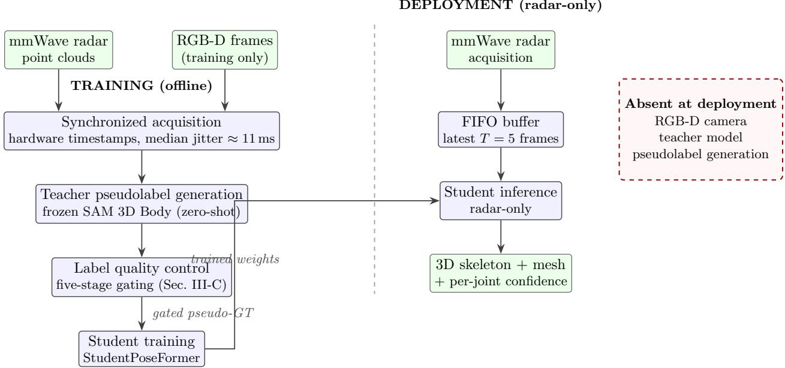  
Figure 1: Overall framework. Left — training: the commercial mmWave radar and an RGB-D camera synchronously capture the same scene; a frozen mesh foundation model (SAM 3D Body) converts each RGB frame into whole-body 3D pseudolabels, which must pass a five-stage quality gate before they supervise the radar-only student. Right — deployment: only the radar and the trained student run. The dashed box lists the modules that are physically absent, so privacy is guaranteed by construction rather than by policy.

Foundation-model-based pseudolabeling. Large monocular mesh models (e.g., SAM 3D Body [9]) have radically lowered 3D supervision cost; to our knowledge none has been paired with mmWave students in a calibrated cross-modal pose pipeline.

Benchmarks. MM-Fi [3] provides exactly our sensor (TI IWR6843) with 40 subjects × 27 actions × 320k frames, enabling fair, reproducible cross-subject comparisons.

Compared with recent state of the art, our method is a system-level contribution (cheap mesh teacher + commercial radar + honest uncertainty + causal ablations) and — measured at equal configuration — is the strongest published result on commercial-fixed-parameter radar, rather than a claim of absolute superiority over development-kit configurations.

## 3 Method

## 3.1 Cross-Modal Training with a Mesh Foundation Model Teacher

(a) Data acquisition and alignment. During training, the radar outputs per-frame point clouds and target tracks (trackData.tid); the RGB-D camera outputs color plus depth. All streams are hardware-timestamped on one host; radar frames are paired to camera frames by nearestneighbor timestamp matching (median inter-sensor jitter ≈ 11 ms in our corpus) and spatially aligned through per-session extrinsics (Fig. 6).

(b) Teacher pseudolabels. Each paired RGB frame is fed to a frozen SAM 3D Body teacher that produces: 70 3D joint locations in the camera frame, body pose params[133] (MHR joint rotations), global rot[3] (root orientation), and an 18,439-vertex MHR mesh. The 70-keypoint set maps deterministically to COCO-17 and subsequently to our BODY-13 supervisory skeleton (head plus 12 limb joints).

Binary validity mask [ T, M ]  
Raw per-frame point clouds (variable size)  
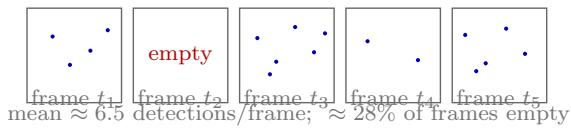  
zero-pad to M slots Zero-padded tensor [ T, M, 5 ]

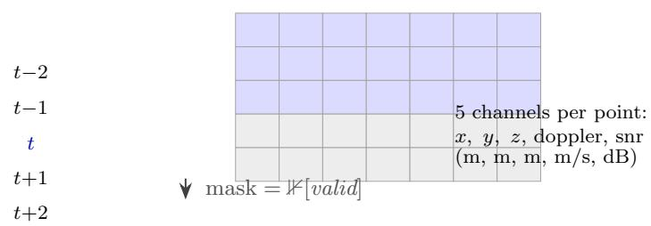

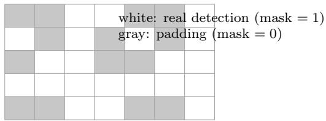  
Figure 2: Point-cloud sequence representation. Top: the radar emits a variable number of detections per frame and some frames are empty. Middle: a sliding window of $T { = } 5$ frames centered on the target frame t is zero-padded into a fixed [T, M, 5] tensor whose channels are $( x , y , z , { \mathrm { d o p p l e r } } , { \mathrm { s n r } } )$ . Bottom: the companion binary mask [T, M] flags real detections (white, 1) versus padding (gray, 0); fully masked frames are mapped to a learned empty-frame embedding.

(c) Depth anchoring. Monocular estimation carries a depth-scale and cam t bias: the mesh root is therefore anchored to sensor-measured depth (the RGB-D depth at the person’s location) so that the pseudolabels become metric, and a per-pixel depth-versus-estimate check gates obvious misestimates.

(d) Extrinsic calibration. During a dedicated walking phase, radar centroid trajectories are rigidly aligned to depth-anchored camera-space trajectories by Umeyama rigid registration with RANSAC robustness, yielding metric radar-frame ground truth including absolute translation:

$$
\mathbf { p } _ { \mathrm { r a d a r } } = \mathbf { R } \mathbf { p } _ { \mathrm { c a m } } + \mathbf { t } , \qquad ( \mathbf { R } , \mathbf { t } ) = \underset { \mathbf { R } , \mathbf { t } } { \arg \operatorname* { m i n } } \sum _ { i } \left\| \mathbf { R } \mathbf { p } _ { i } ^ { \mathrm { c a m } } + \mathbf { t } - \mathbf { q } _ { i } ^ { \mathrm { r a d a r } } \right\| ^ { 2 } .\tag{1}
$$

## 3.2 StudentPoseFormer

Input representation. Each frame contains up to M detections, each described by a fivedimensional feature [x, y, z, doppler, snr] (meters, m/s, dB). A sliding window of $T { = } 5$ frames centered on the target frame forms a [T, M, 5] tensor together with a [T, M] binary validity mask (Fig. 2); empty frames are fully masked and mapped to a learned empty-frame embedding. Multiframe accumulation mitigates sparse spatial coverage, and the Doppler channel contributes a radaronly information dimension (radial motion, whose sign flips with direction).

Set encoder. A shared MLP (5 → 64 → 128 → 256, ReLU + LayerNorm) maps each point.

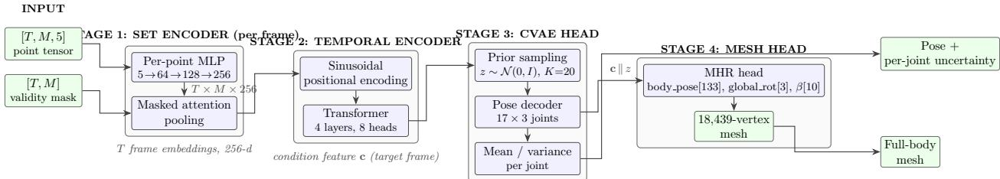  
Figure 3: StudentPoseFormer architecture. Stage 1: a shared per-point MLP followed by masked attention pooling compresses each frame’s variable-size point set into one 256-d embedding (padded points are masked $\mathrm { t o \ - \infty }$ in the attention logits, making empty frames NaN-safe). Stage 2: a 4-layer, 8-head Transformer fuses the T=5 frame embeddings; the target-frame output is the human condition feature c. Stage 3: at inference the CVAE head draws K=20 latent samples from the prior; the per-joint mean is the pose estimate and the per-joint variance is the uncertainty. Stage 4: an MHR head shares the fused latent (c ∥ z) and decodes a 18,439-vertex body mesh.

Masked attention pooling computes point weights by dot-product attention with the mean feature as query, masks padded points to −∞ (NaN-safe for empty frames), and aggregates each frame into a single 256-d embedding:

$$
\alpha _ { t , m } = \frac { \exp \bigl ( \mathbf { w } ^ { \top } \mathbf { h } _ { t , m } / \sqrt { d } \bigr ) } { \sum _ { m ^ { \prime } \in \mathcal { V } _ { t } } \exp \bigl ( \mathbf { w } ^ { \top } \mathbf { h } _ { t , m ^ { \prime } } / \sqrt { d } \bigr ) } , \qquad \mathbf { e } _ { t } = \sum _ { m \in \mathcal { V } _ { t } } \alpha _ { t , m } \mathbf { h } _ { t , m } ,\tag{2}
$$

where $\mathbf { h } _ { t , m }$ is the encoded point feature, w the (mean-derived) query, and $\nu _ { t }$ the set of valid indices in frame t. Masked pooling is robust to varying clutter: with few valid points the surviving points simply earn higher weights.

Temporal encoder. Frame embeddings add sinusoidal positional encodings and pass through a 4-layer, 8-head Transformer; the target-frame output is the human-condition feature c (Fig. 3).

CVAE multi-hypothesis head. Sparse radar yields one-to-many ambiguity: the same point cloud admits many plausible poses (Fig. 4). In training, an encoder $q _ { \phi } ( z \mid \mathrm { G T } , \mathbf { c } )$ maps the groundtruth joints and c to latent parameters $( \mu , \sigma )$ ; reparameterization samples z (dimension 32) and a decoder outputs $1 7 \times 3 ~ \mathrm { j o i n t s }$ . A KL term regularizes the posterior toward a unit Gaussian, with $\beta$ annealed from 0 to 1 over the first 20% of the schedule to prevent posterior collapse. At inference the posterior encoder is removed: we sample $z \sim \mathcal { N } ( 0 , I )$ K=20 times, take the per-joint mean as the pose estimate and the per-joint variance as the uncertainty — small at well-observed trunk joints, large at distal wrists and ankles (Fig. 9), thus acting as an honest annotation of the perception boundary for downstream modules.

Parametric mesh head. A second MLP head shares the fused latent (c ∥ z) and regresses the MHR parameters body pose[133], global rot[3] and shape β[10], which decode into an 18,439-vertex mesh; joint training shares the uncertainty-aware backbone.

Losses.

$$
\mathcal { L } = \mathcal { L } _ { \mathrm { p o s } } + 0 . 1 \mathcal { L } _ { \mathrm { b o n e } } + 0 . 0 5 \mathcal { L } _ { \mathrm { v e l } } + \beta \mathcal { L } _ { \mathrm { k l } } ,\tag{3}
$$

where $\mathcal { L } _ { \mathrm { p o s } }$ is the validity-masked MPJPE over the K-hypothesis mean, $\mathcal { L } _ { \mathrm { b o n e } }$ enforces anatomical bone-length consistency against the teacher bone lengths (L1 per segment), and $\mathcal { L } _ { \mathrm { v e l } }$ is an interframe velocity-alignment term that penalizes failure to track fast motion. Distal joints are downweighted during training $( w = 2 . 0$ for distal emphasis in the reported metrics). We use Adam with learning rate $3 \times 1 0 ^ { - 4 }$ under cosine annealing to $1 \times 1 0 ^ { - 5 }$ , batch size 64 for the deterministic spine and 32–64 for the CVAE (batch ≤ 64 keeps the KL well calibrated), for 80–120 epochs.

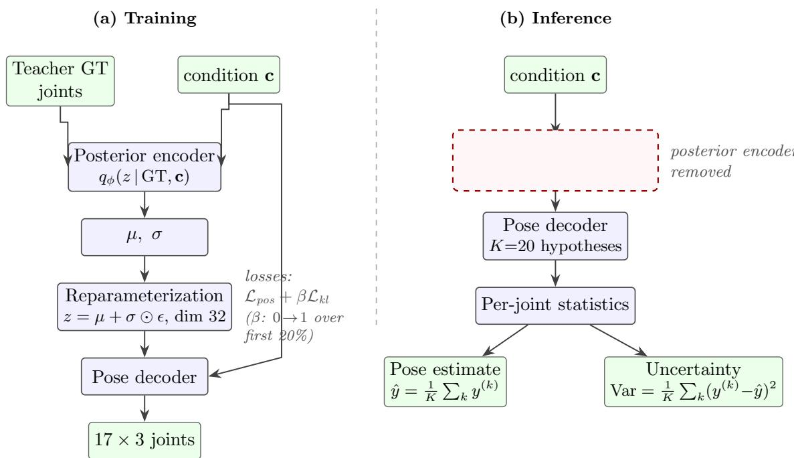  
Figure 4: The CVAE multi-hypothesis head in training and inference. (a) Training: a posterior encoder maps the teacher ground truth and the condition feature c to latent parameters (µ, σ); reparameterization samples z, a decoder reconstructs the joints, and a KL term (with β annealed from 0 to 1 over the first 20% of the schedule to prevent posterior collapse) regularizes the posterior toward a unit Gaussian. (b) Inference: the posterior encoder is discarded — the radar never sees the GT — and K=20 latents are drawn from the standard normal prior. The per-joint mean over the K decoded hypotheses is the pose estimate, and the per-joint variance is the uncertainty signal.

## 3.3 Teacher-Label Quality Control (Five-Stage Gating)

Candidate pseudolabels are propagated only when every stage passes (Fig. 5): (1) confidence gating — teacher 2D/3D confidence above a per-joint threshold; (2) depth validation — joints inside the RGB-D range envelope and not in depth holes; (3) temporal smoothing — One-Euro filtering across time to remove single-frame outliers; (4) bone-length consistency — per-frame bone lengths within tolerance of the subject’s median, since segment kinematics are bounded; (5) bad-frame rejection — frames with insuficient valid joints are dropped entirely. Only gated labels serve as supervision, and invalid joints are excluded from losses and metrics rather than imputed.

## 3.4 Deployment (Radar-Only)

A FIFO bufer accumulates the latest T frames and the ensemble {set encoder → temporal Transformer → prior sampling → mean/variance + MHR head} runs per frame (Fig. 7). Multi-person scenes are handled by splitting points per radar track ID (trackData.tid), with per-target state machines and a one-frame track-index displacement correction (Fig. 8). The output is a 17-joint skeleton, a mesh, and per-joint confidence at radar frame rate (> 10 FPS at 3× CPU inference).

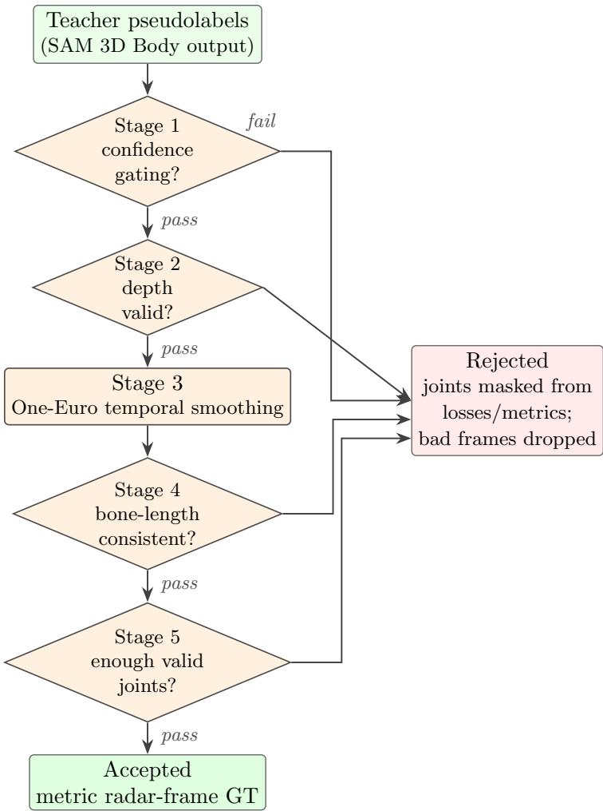  
Figure 5: Five-stage quality control for teacher pseudolabels. A candidate frame is propagated to training only if every stage passes: (1) per-joint teacher 2D/3D confidence above threshold; (2) joints inside the RGB-D range envelope and away from depth holes; (3) One-Euro temporal filtering removes single-frame outliers; (4) per-frame bone lengths within tolerance of the subject’s median (segment kinematics are bounded); (5) frames with too few valid joints are dropped entirely. Rejected joints are excluded from all losses and metrics rather than being imputed.

## 4 Experiments

Setup (MM-Fi). We use the public MM-Fi benchmark [3], which provides exactly our sensor (TI IWR6843). The cross-subject split trains on S01–S07 and tests on S08–S10 over 27 action classes; windows are drawn from [T, 128, 5] tensors with accumulation k=3, learning rate $3 \times 1 0 ^ { - 4 }$ batch 256 and 100 epochs. Metrics are the 12 shared-limb MPJPE (cm), PA-MPJPE (mm) and a moving-track reliability score track r. All configurations follow a single-variable-change protocol (the G-series), so every row isolates one information lever.

## 4.1 Cross-Subject Accuracy and Ablations

G1 — data scale ̸= diversity. Expanding from 10 to 27 action classes leaves MPJPE flat (8.07 vs. 8.06 cm). We report this as a valuable negative result: the binding constraint is the information content of the input, not action coverage.

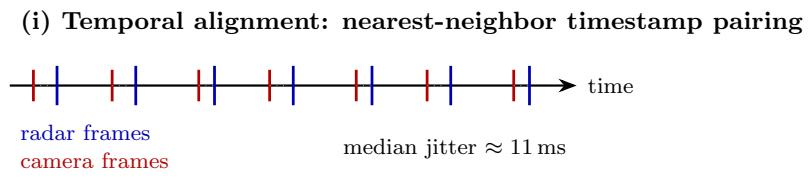  
(ii) Spatial alignment: Umeyama rigid registration (RANSAC-robust)

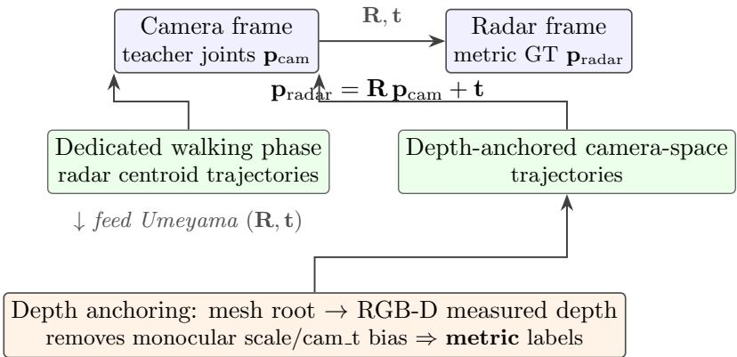  
Figure 6: Cross-modal spatiotemporal alignment. (i) Temporal: radar frames are paired to camera frames by nearest-neighbor matching of hardware timestamps (median inter-sensor jitter ≈ 11 ms in our corpus). (ii) Spatial: monocular mesh estimates carry a depth-scale and cam t bias, so the mesh root is first anchored to the RGB-D measured depth, making the labels metric; per-session extrinsics (R, t) then map teacher joints from the camera frame into the radar frame via ${ \bf p } _ { \mathrm { r a d a r } } = { \bf R } { \bf p } _ { \mathrm { c a m } } + { \bf t }$ , where (R, t) is estimated by RANSAC-robust Umeyama registration of radar centroid trajectories against depth-anchored camera trajectories recorded during a dedicated walking phase.

G2 — causal value of accumulation. Point accumulation with k=3 buys −0.34 cm overall and produces the first loosening of the wrist wall (∼1 cm: 15.5 → 14.5). However k=5 saturates the spatial extent and motion smear begins to hurt fast actions (A10: 14.65 → 15.88) — the optimum is interior, not monotone.

G3 — Doppler is used, and matters most in fast motion. Zeroing the Doppler channel costs +0.85 cm overall, ≈ 2 cm at the wrist and +1.7 cm on the fast action A10. The −0.59 fluctuation on A19 does not change the direction. The radar-only velocity dimension is therefore genuine information rather than a dormant column.

G4 — velocity supervision. Setting the velocity weight $v _ { w } { = } 1 . 0$ improves all measures (7.70 → 7.45 cm; A10 −0.57 cm): penalizing motion under-reach on the loss side complements providing Doppler on the input side.

Per-joint hierarchy. Errors rise monotonically from proximal to distal joints (hip 1.7 cm → wrist 14.3–15.5 cm), matching the physical law reported for RF-Pose3D [2]: large, slow, wellilluminated surfaces are estimated best.

## 4.2 End-to-End Results on Our Own Synchronous Corpus

Our corpus contains six sessions of one subject performing rich actions (walking, falling, reaching up, stretching, sitting/squatting), yielding 3,488 teacher frames and 2,176 usable samples (1,576 train / 600 validation). We use block-level held-out splits: two contiguous 50-frame blocks per session are reserved for validation with a 4-frame leakage bufer on each side, so no temporally adjacent frame crosses the split. The same pipeline runs end-to-end without modification.

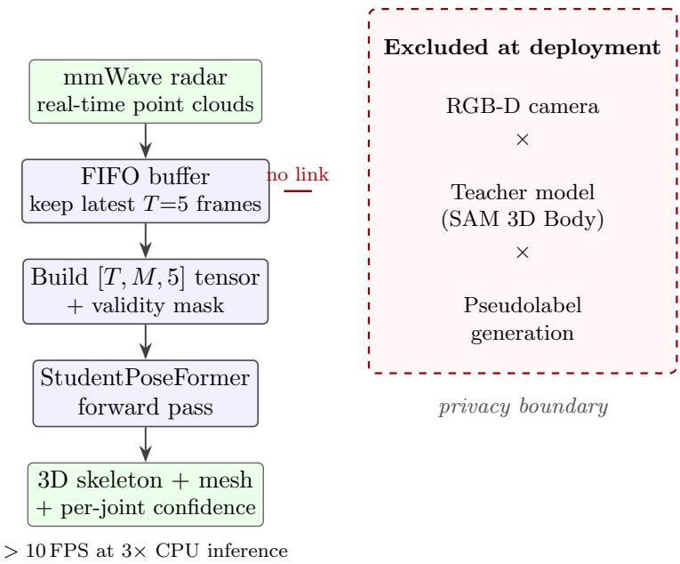  
Figure 7: Deployment runs radar-only. A FIFO bufer maintains the most recent T frames, which are packed into the [T, M, 5] input tensor and passed through the student’s forward computation to produce the skeleton, mesh, and per-joint confidence at radar frame rate. The dashed box isolates everything that is not present — no camera, no teacher, no pseudolabel generation — making the privacy boundary a physical property of the deployment rather than an access-control policy.

The per-joint ordering is identical to MM-Fi and, importantly, honest:

$$
\begin{array} { r l } & { \mathrm { h i p            4 . 8 / 5 . 0 < k n e e ~ 1 6 . 4 / 1 7 . 6 < s h o u l d e r ~ 1 9 . 3 / 1 9 . 8 < a n k l e ~ 2 2 . 4 / 2 2 . 9 } } \\ & { \qquad < \mathrm { h e a d ~ 2 5 . 3 < e l b o w ~ 2 7 . 4 / 2 8 . 0 < w r i s t ~ 3 4 . 7 / 3 5 . 4 ~ ( c m ) } } \end{array}
$$

The end-to-end 21.5 cm on hard multi-action data with strict splits is not a regression relative to the 16.6 cm we previously measured with a single-walker 80/20 random split — that earlier figure is inflated by temporal autocorrelation between adjacent frames leaking across the split. Qualitative frame triads (RGB | teacher | radar-student) confirm that large-amplitude poses (arms overhead, bends, stretches) are tracked frame by frame, with a known under-amplitude bias on unseen stretch poses, consistent with the wrist number.

## 4.3 Scaling Law: Diversity, Not Volume

We construct two families of training subsets: family A truncates in time (all frames from the first fraction of each session) while family B subsamples uniformly to preserve coverage. Fitting the within-distribution error to a power law gives

$$
\operatorname { e r r } ( n ) = 5 3 . 8 \cdot n ^ { - 0 . 1 2 4 } .\tag{4}
$$

Extrapolating (Fig. 10), reaching 15 cm would require ∼30k in-distribution samples (19× the current amount), 12 cm would require 185k, and 10 cm would require 810k — “more of the same” is a dead end. Yet the MM-Fi anchor, which uses the same architecture and sensor but 6,860 samples spread over 40 subjects, reaches 8.3 cm cross-subject, implying a slope of $b \approx 0 . 6 5 - \mathrm { o v e r \ 1 0 0 \times }$ steeper. The binding variable is therefore per-sample diversity (subjects × poses × positions), not sample count. This is the single most actionable finding of the paper: collection budget should buy diversity.

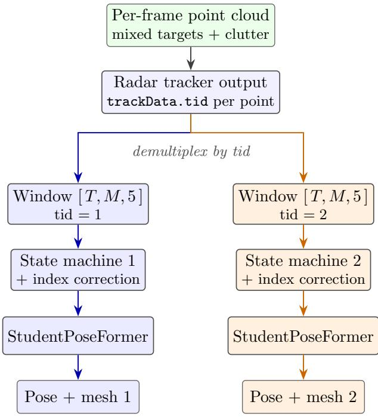  
weights shared; windows and states are per target  
Figure 8: Multi-person handling by track-ID demultiplexing. The radar’s own tracker tags each detection with a target ID (trackData.tid); points are split per ID into independent temporal windows and state machines, with a one-frame track-index displacement correction to absorb ID flicker. The same student weights are applied to each target independently, yielding one pose, mesh, and uncertainty vector per person.

## 5 Discussion and Limitations

Uncertainty as honesty. The CVAE variance is a proxy uncertainty that must be interpreted relative to calibration. We validate that it correlates with joint type (a five-point scale from confident hips to divergent wrists), but we do not yet claim posterior calibration curves. Batch size ≤ 64 was required to keep the mean per-joint standard deviation physically interpretable.

Supervision is monocular. Ground-truth noise at depth edges propagates to the student, so our per-joint error floor is bounded by teacher quality; the metric correction of Sec. 3.1 helps but does not reach motion-capture precision.

Scaling to subjects. Block-level splits with a single subject are insuficient to establish crosssubject generalization. Our plan is 3–4 subjects performing natural transitions in the final room, targeting a defensible 12–15 cm cross-session figure.

Orientation. The global rot MSE of 0.908 remains the single-radar heading wall: radar-only facing estimates and “pseudo-forward” assumptions are unreliable whenever subjects do not walk toward the sensor.

Ethics. The entire training set uses informed-consent RGB-D data. Raw image frames are never present at inference time nor in any public artifact.

## 6 Conclusion

We introduced a cross-modal teacher–student system that lifts commercial mmWave radar to full-body mesh reconstruction with per-joint uncertainty, where traditional pipelines stop at classification or partial keypoints. The mesh foundation model teacher eliminates costly manual 3D annotation; the CVAE head expresses a trustworthy perception boundary; and deployment runs radar-only, so privacy holds by construction. On MM-Fi (cross-subject) the configuration reaches 7.45 cm 12-joint MPJPE, with ablations demonstrating the causal value of Doppler (−2 cm at the wrist), point accumulation (optimum k=3) and velocity supervision. On our own synchronous corpus the same pipeline yields an end-to-end 21.47 cm with an honest per-joint hierarchy, and the accompanying scaling equation carries one main message: collect diverse poses, not more of the same. The companion patent (application number available) covers the system-level claims; this paper validates them through reproducible experiments.

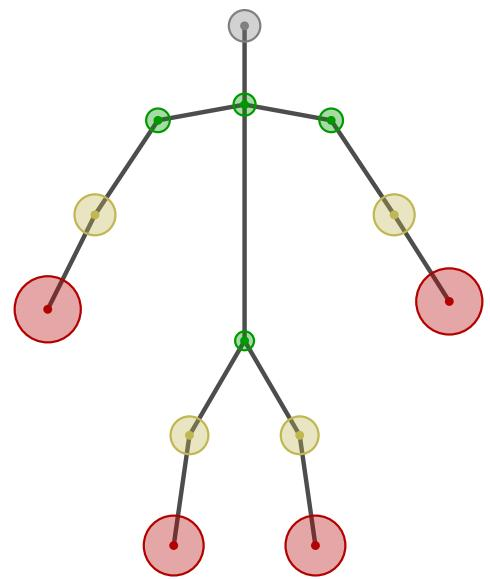  
Figure 9: Per-joint uncertainty produced by the CVAE head, shown as confidence circles on the estimated skeleton (radius ∝ per-joint standard deviation over K prior samples). Trunk joints that reflect strongly of large, slow surfaces (hips, shoulders, neck) are tightly concentrated; distal joints with small radar crosssection and fast motion (wrists, ankles) carry large, honest uncertainty. The system therefore annotates its own perception boundary: downstream applications can trust the trunk while treating the extremities as low-confidence.

## Acknowledgment

The authors thank the contributors of SAM 3D Body and MM-Fi, and the reviewers of the companion patent application.

## References

[1] Mingmin Zhao, Tianhong Li, Soso Abu Alhaija, Dina Mustafaraj, and William T. Freeman. Through-wall human pose estimation using radio signals. In Proceedings of the IEEE Conference on Computer Vision and Pattern Recognition (CVPR), 2018.

[2] Mingmin Zhao, Shichuan Geng, Liana Zhou, Priya Agrawal, Bharath Hariharan, Deva Ramanan, Dina Mustafaraj, and William T. Freeman. RF-based 3D skeletons. In Proceedings of the ACM SIGCOMM Conference, 2018.

Table 1: MM-Fi cross-subject results (S01–S07 train / S08–S10 test). Each row changes exactly one variable (G-series protocol). MPJPE is the 12 shared-limb mean per-joint position error in cm; PA-MPJPE in mm; track r is the moving-track reliability score; A10 is the fastest action class; wrist $\mathrm { L } / \mathrm { R }$ are per-wrist errors in cm. Best values in bold.
<table><tr><td>Configuration (single variable)</td><td>MPJPE</td><td>PA</td><td>track_r</td><td>A10</td><td>Wrist  $\mathrm { L } / \mathrm { R }$ </td></tr><tr><td>Baseline ceiling-tune</td><td>8.06</td><td>67.1</td><td>0.616</td><td>18.2/17.6</td><td>15.0/15.4</td></tr><tr><td>+ G1: actions  $1 0  2 7$ </td><td>8.07</td><td>65.1</td><td>0.624</td><td>(mixed)</td><td>15.4/15.8</td></tr><tr><td>+ G2: accumulation k=3</td><td>7.64</td><td>61.1</td><td>0.642</td><td>14.65</td><td>14.1/14.8</td></tr><tr><td>+ G3: Doppler present</td><td>7.64†</td><td></td><td>0.642</td><td>14.65</td><td>14.8</td></tr><tr><td>+ G4: velocity loss  $v _ { w } { = } 1 . 0$ </td><td>7.45</td><td></td><td>0.651</td><td>14.70</td><td>14.5</td></tr></table>

† Zeroing the Doppler channel degrades MPJPE to 8.49 cm (+0.85) and A10 to 16.35 cm (+1.70).

Table 2: Per-joint MPJPE (cm) on MM-Fi for configuration G1 v1a, averaged over left/right. Errors increase monotonically from proximal to distal joints, matching the physical illumination law of RF-based pose estimation [2].
<table><tr><td>Joint</td><td>MPJPE (cm)</td></tr><tr><td>Hip</td><td>1.7</td></tr><tr><td>Shoulder</td><td>6.5-6.6</td></tr><tr><td>Knee</td><td>6.1-6.2</td></tr><tr><td>Head</td><td>7.7</td></tr><tr><td>Ankle</td><td>8.1-8.2</td></tr><tr><td>Elbow</td><td>10.1-10.4</td></tr><tr><td>Wrist</td><td>14.3-15.5</td></tr></table>

[3] Jinyu Yang, Bang Xiong, Chao Huang, Guangyuan Li, Jinhua Zhang, Jianfei Wu, Chenglu Xu, Li Liu, Chunyu Jiang, Lanxin Ma, Zhe Ma, Shengyue Yang, Kaishun Zhang, and Yunhao Liu. MM-Fi: Multi-modal non-intrusive 4D human dataset for versatile wireless sensing. In Advances in Neural Information Processing Systems (NeurIPS) Datasets and Benchmarks Track, 2023.

[4] Youngwook Kim and Hao Ling. Human activity classification based on micro-Doppler signatures using a support vector machine. IEEE Transactions on Geoscience and Remote Sensing, 47(5):1328–1337, 2009.

[5] Moeness G. Amin. Radar for Indoor Monitoring: Detection, Classification, and Assessment. CRC Press, 2017.

[6] Shuhai Wang and Jian Song. Interacting hand-object pose estimation via dense mutual attention. In IEEE/CVF Winter Conference on Applications of Computer Vision (WACV), 2023.

[7] Shuangjian An and Umit Y. Ogras. MARS: mmwave-based assistive rehabilitation system for smart healthcare. ACM Transactions on Cyber-Physical Systems, 2021.

[8] Hongfei Xue, Wei Fu, Shuo Zhang, Chenshuo Zhang, Jianwei Zheng, Zhumu Xiao, and Yunhao Liu. mmMesh: Towards 3D real-time dynamic human mesh construction using millimeterwave. In Proceedings of the 19th Annual International Conference on Mobile Systems, Applications, and Services (MobiSys), 2021.

Table 3: End-to-end results on our own synchronous radar + RGB-D corpus (six sessions, one subject, block-level held-out splits with a 4-frame leakage bufer; 1,576 train / 600 validation samples).
<table><tr><td>Model</td><td>Metric</td><td>Value</td></tr><tr><td rowspan="2">v1a deterministic</td><td>MPJPE (cm)</td><td>21.47</td></tr><tr><td>PA-MPJPE (mm)</td><td>127.0</td></tr><tr><td rowspan="2">v1b CVAE</td><td>MPJPE (cm)</td><td>21.44</td></tr><tr><td>mean per-joint std (cm)</td><td>7.45</td></tr><tr><td rowspan="2">v2 MHR mesh</td><td>body-pose MSE</td><td>0.0268</td></tr><tr><td>global_rot MSE</td><td>0.908</td></tr></table>

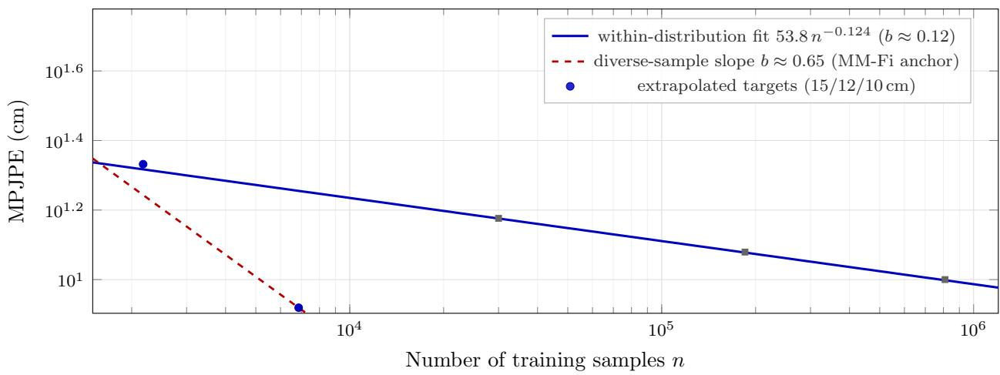  
Figure 10: Scaling behavior on log–log axes. Circles: measured points — our corpus at n=2,176 (21.47 cm) and the MM-Fi anchor at $n { = } 6 { , } 8 6 0$ diverse cross-subject samples (8.3 cm). The blue solid line is the withindistribution fit $\mathrm { e r r } = 5 3 . 8 n ^ { - 0 . 1 2 4 }$ : reaching 15 cm would require ∼30k samples, 12 cm 185k, and 10 cm 810k (squares). The red dashed line shows the slope $b \approx 0 . 6 5$ implied by diverse samples — over 100× steeper. Sample diversity, not volume, is the binding constraint.

[9] Xitong Yang, Devansh Kukreja, Don Pinkus, Anushka Sagar, Taosha Fan, et al. SAM 3D Body: Robust full-body human mesh recovery. arXiv preprint arXiv:2602.15989, 2026. Code: https://github.com/facebookresearch/sam-3d-body.

[10] Aditya Sengupta, Fanyi Jin, Rui Zhang, and Songzhu Cao. mm-Pose: Real-time human skeletal posture estimation using mmwave radars and CNNs. IEEE Sensors Journal, 20(17): 10032–10044, 2020.

[11] Ruotong Zheng, Haodong Chen, Jun Sun, Jiangong Wang, Yiming Li, Dingran Fang, and Chang Chen. Point cloud-based 3D human pose estimation using dual-view mmwave radar. IEEE Sensors Journal, 2025. Commonly cited as PoinTS.

[12] Haotian Cong et al. mmDif: mmwave-based human pose estimation via conditional difusion. In Proceedings of the European Conference on Computer Vision (ECCV), 2024.