# QUANTILE HEAD FOR VISION-LANGUAGE-ACTION MODELS

Xuan Wang   
Department of Automation Tsinghua University   
xwangrs@gmail.com   
Yinan Wu   
Department of Automation   
Tsinghua University   
yinanwu@ieee.org

Haoran Duan Department of Automation Tsinghua University haoran.duan@ieee.org

Jungong Han Department of Automation Tsinghua University jghan@tsinghua.edu.cn

## ABSTRACT

Vision-Language-Action (VLA) models integrate pretrained Vision-Language Models (VLMs) with action heads for robot control. Common action heads have distinct limitations: point regression provides only a point estimate of the action distribution, while standard flow-matching samplers require costly iterative sampling. To address these limitations, we unify regression and flow matching under a shared objective and extend it to derive a quantile objective. This quantile objective guides the design of our Quantile Head, which predicts a median and positive gaps to form ordered marginal action quantiles in one forward pass. These quantiles support multiple sampling strategies without retraining and are jointly supervised to train the default median policy. Our local analysis of this joint supervision shows that, with calibrated nearby quantiles, fixed gaps, and matched correction speed, direct median updates have lower variance than under median-only supervision. Experiments show that this jointly supervised median policy achieves the highest average success rates among the compared methods on LIBERO, LIBERO-Plus, LIBERO-Pro, and two real-robot tasks, together with the shortest mean episode time among matched LIBERO baselines; code is available at https://github.com/xwangrs/Quantile-Head-for-VLA.

## 1 INTRODUCTION

Vision–Language–Action (VLA) models offer a promising approach to robot control by mapping visual observations and language instructions to actions. To learn this mapping, models such as RT-2 (Brohan et al., 2023), OpenVLA (Kim et al., 2024), and $\pi _ { 0 . 5 }$ (Black et al., 2025) adapt pretrained Vision-Language Models (VLMs) using robot demonstrations. From these demonstrations, an action head learns to translate multimodal representations into executable controls, making its design central to how actions are represented and predicted.

Two common action head designs, regression and flow matching, offer complementary capabilities. Regression heads predict actions directly in one forward pass, providing a simple interface for deterministic control (Kim et al., 2024). Their point outputs, however, do not explicitly represent conditional action distributions for sampling. Flow-matching heads model these distributions by learning a velocity field that transforms noise into action samples, as in $\pi _ { 0 }$ (Black et al., 2024). Their standard sampling procedures typically require iterative integration and repeated action expert evaluations, adding inference cost (Kim et al., 2025).

These complementary capabilities raise a natural question: Can we combine the single-pass predic tion of regression with the distributional modeling offlow matching? To this end, we can extend a single action prediction to a set of quantiles, where the median represents the action center and lower and upper quantiles describe its variability. Predicting these quantiles together allows our Quantile Head (Figure 1) to directly characterize the conditional distribution of each action coordinate. To formalize this intuition, we formulate a distributional learning objective and derive its equivalent quantile regression form, leading to Theorem 1.

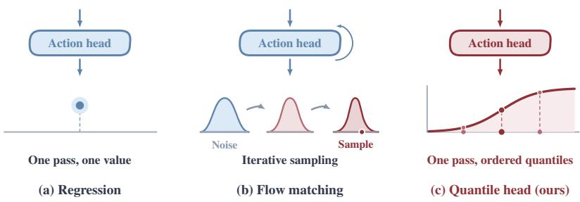  
Figure 1: Action head comparison. Regression predicts a point, iterative flow matching reuses the same head at updated action states and integration times, and our head predicts ordered marginal quantiles in one pass for direct median control or optional sampling.

Building on this quantile objective, we further analyze how auxiliary quantiles can improve the training signal for the median. Specifically, we study the noise in direct median updates under joint quantile supervision, leading to Theorem 2. Under the stated conditions, calibrated quantiles near the median reduce update variance relative to median-only supervision, with gaps held fixed and local correction speed matched. This result motivates the joint supervision of the median and auxiliary quantiles in our Quantile Head.

We integrate Quantile Head with a pretrained VLM for action learning. To limit the number of trainable parameters, we freeze the VLM and introduce learnable prompts that extract task context from its fixed features. Conditioned on this context, the quantile head jointly predicts a median and gaps between adjacent quantiles on either side for each action coordinate. The gaps are constrained to be positive and cumulatively subtracted from or added to the median, yielding ordered lower and upper quantiles. The quantiles for the entire action chunk are generated together in a single forward pass, capturing the center and variability of each action coordinate. To mitigate overfitting to demonstrations, we use a masked pinball loss that randomly withholds supervision for selected action coordinates, sharing the mask across all quantiles of each coordinate.

Our contributions cover theory, quantile action head design, and experimental evaluation:

1. Theory. Starting from a unified supervision framework for regression and flow matching, we derive a quantile objective for action distribution modeling and show that joint quantile supervision reduces noise in direct median updates under stated conditions.

2. Quantile Head. We propose a quantile action head that predicts ordered quantiles in a single forward pass. A masked pinball loss jointly supervises these outputs to model each action coordinate’s conditional distribution.

3. Experimental Evaluation. We achieve state of the art performance on LIBERO and state of the art generalization on LIBERO-Plus and LIBERO-Pro, together with the best performance among the compared methods on two physical robot tasks.

## 2 RELATED WORK

Regression-style action heads. Regression heads map observation-conditioned features directly to continuous actions using losses such as $L _ { 1 }$ or $L _ { 2 }$ . For an unrestricted predictor, squared loss tar gets the conditional mean, while absolute loss targets the conditional median (Koenker & Bassett Jr, 1978). OpenVLA-OFT combines continuous $L _ { 1 }$ regression with parallel action-chunk decoding, demonstrating the effectiveness of direct action prediction in VLA models (Kim et al., 2025). Such heads produce actions in a single forward pass and provide a simple interface for control. However, a point prediction for each action coordinate does not explicitly represent its conditional distribution, motivating supervision beyond a single central estimate.

Flow-matching-style action heads. Diffusion and flow-matching heads transform noise into samples from conditional action distributions (Zhang et al., 2026). Diffusion Policy learns action sequences through denoising (Chi et al., 2025), while $\pi _ { 0 }$ (Black et al., 2024) and $\pi _ { 0 . 5 }$ (Black et al., 2025) use flow-matching velocity supervision to connect noise and continuous action chunks. Their standard samplers use successive denoising or numerical integration steps, requiring repeated model evaluations. Recent flow-based VLAs also support one-step generation. SnapFlow uses progressive self-distillation of a pretrained flow policy, adding model evaluations to construct training targets (Luan et al., 2026). Let It Be Simple (Chen et al., 2026b) uses high-noise training to enable onestep action generation without distillation. Its LIBERO-Long ablation shows that the success-rate advantage over a uniformly trained ten-step baseline diminishes as the action horizon increases.

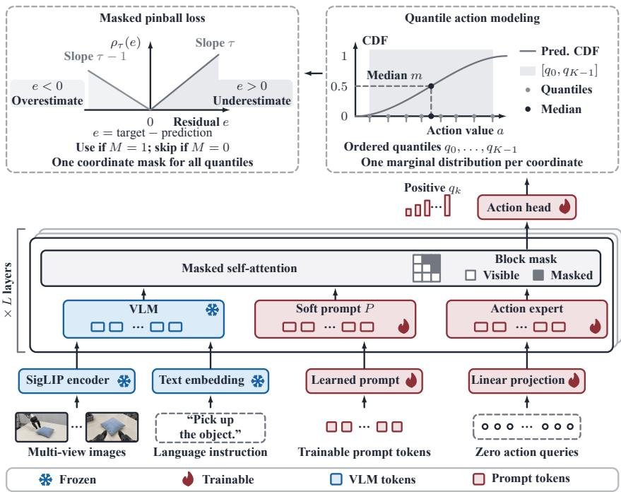  
Figure 2: Architecture of the Quantile Head. Our model combines a frozen VLM, learnable prompts, and a Quantile Head. The VLM encodes images and instructions. Learnable prompts precede action tokens; masked self-attention lets prompts read VLM features and action tokens read both VLM and prompt features. The action head maps the resulting action features to a median and positive gaps, then accumulates these gaps around the median to form ordered marginal quantiles. We supervise these quantiles with masked pinball loss. Inference uses the median by default or samples from the predicted marginal quantiles.

Quantile-based learning. Richter & Wattenhofer (2019) learn continuous-action policies through advantage-weighted quantile regression. Learning across quantile levels can improve estimation of a target quantile under suitable conditions (Narayan et al., 2024). In probabilistic forecasting, OrderFusion constructs ordered outputs from a median anchor and nonnegative gaps (Yu et al., 2026). Within VLA systems, ReconVLA uses conformally calibrated action-error quantiles to rank candidates from a pretrained policy (Chen et al., 2026a). We jointly supervise ordered action quantiles for VLA control, with median decoding by default and optional quantile sampling.

Novelty. 1. Quantile Head extends point regression to jointly supervised conditional action quantiles, combining single-pass prediction with an explicit representation of action marginals. It predicts action values directly rather than learning a flow-matching velocity field, and the same outputs support median control and optional sampling. 2. Our focus is how auxiliary action quantiles contribute to learning the median used for VLA control. A local analysis identifies conditions under which this joint supervision reduces noise in direct median updates, while matched ablations demonstrate improved closed-loop performance even when inference uses only the median.

## 3 METHOD

## 3.1 THEORETICAL ANALYSIS

A unified objective for action heads. Let X denote visual observations, language instructions, and the robot’s proprioceptive state, and let $A \in \mathbb { R } ^ { H \times D }$ denote a demonstrated action chunk with H future steps and D action dimensions. For each coordinate $Y = A _ { h , d } , L _ { 2 }$ regression predicts Y from X. Conditional flow matching (CFM) predicts a velocity from X, an interpolated action, and time, then integrates the velocity field to generate actions. We unify their squared losses on action and velocity targets through a reference path. Draw $B \sim \nu ( \cdot \mid X )$ with $B \perp Y \mid X$ and an independent time $\alpha \sim \pi \mathrm { o n } [ 0 , 1 ]$ , and set $A _ { \alpha } = ( 1 - \alpha ) B + \alpha Y$ . The shared objective is

$$
\begin{array} { r } { \mathcal { L } _ { \nu , \pi } ( \theta ) = \mathbb { E } \left| f _ { \theta } ( X , A _ { \alpha } , \alpha ) - ( Y - B ) \right| ^ { 2 } . } \end{array}\tag{1}
$$

Setting $B = \alpha = 0$ recovers squared action regression; a Gaussian reference and sampled times give CFM velocity supervision (Lipman et al., 2023). Appendix A.1 derives both cases.

Deriving quantile supervision. Under equation 1, unrestricted regression learns the mean action, whereas CFM learns a mean velocity field whose integration generates actions. Both squared losses have output gradients that grow with residuals (Appendix A.1). To learn action distributions directly, we extend squared supervision to the threshold labels $Z _ { z } = \mathbf { 1 } \{ Y \leq z \}$ . Their conditional means $F _ { X } ( z ) = \operatorname { P r } ( Y \leq z { \hat { \mid } } X )$ , over all $z \in \mathbb { R }$ , determine the action distribution. The following result connects predicting these probabilities to quantile supervision.

Theorem 1 (proof in Appendix A.1). Let q be measurable and nondecreasing in its quantile level, and let $G _ { \theta } ( \cdot \mid X )$ be the conditional cumulative distribution function (CDF) of $q _ { \theta } ( { \bf \dot { \boldsymbol { X } } } , U )$ , where $U \sim \mathrm { U n i f } ( 0 , 1 )$ is independent of $( X , Y )$ . If both the true action Y and the predicted action $q _ { \theta } ( X , U )$ havefinitefirst absolute moments, then

$$
\underbrace { \mathbb { E } _ { X , Y } \int _ { \mathbb { R } } \left( G _ { \theta } ( z \mid X ) - \mathbf { 1 } \{ Y \le z \} \right) ^ { 2 } \mathrm { d } z } _ { \mathcal { L } _ { \mathrm { C D F } } ( \theta ) } = 2 \mathbb { E } _ { X , Y } \int _ { 0 } ^ { 1 } \rho _ { \tau } \left( Y - q _ { \theta } ( X , \tau ) \right) \mathrm { d } \tau .\tag{2}
$$

Here $\rho _ { \tau }$ is the pinball loss. If the true conditional distribution is representable, the populationoptimal quantilefunction equals the true conditional quantilefunction almost everywhere.

Theorem 1 shows that integrated pinball loss is equivalent to CDF supervision up to a factor of two. Conditional action distributions can therefore be learned through quantile supervision, without constructing threshold labels. Our head jointly supervises a finite set of quantiles to represent each action coordinate’s conditional distribution.

Local noise reduction in median updates. Theorem 1 provides a distributional basis for quantile supervision. Since our default policy executes the median, we further examine whether auxiliary quantile supervision can reduce noise in direct median updates.

Theorem 2 (Noise reduction in median updates). Under the assumptions in Appendix A.2, consider calibrated quantiles at distinct levels symmetric about and sufficiently close to $1 / 2 .$ . With fixed gaps and matched local mean correction rates, the updates at the true median satisfy

$$
\mathrm { V a r } ( \Delta m _ { Q } ) < \mathrm { V a r } ( \Delta m _ { M } ) .\tag{3}
$$

Here $\Delta m _ { Q }$ and $\Delta m _ { M }$ are the joint-quantile and median-only random center updates, respectively.

Theorem 2 shows that auxiliary quantiles can reduce direct median-update variance at matched local correction rates under the stated conditions. This motivates jointly supervising the median and auxiliary quantiles in our Quantile Head. We evaluate the resulting policy empirically with jointly learned gaps and a wider quantile grid.

## 3.2 QUANTILE HEAD

Architecture overview. As shown in Figure 2, our design combines prompt adaptation of a frozen VLM with an ordered quantile head. We freeze the VLM to preserve its pretrained representations and limit the parameters learned from action demonstrations. We insert learnable prompts that read the frozen VLM features and provide task-specific context to the action expert. The expert produces action-token features for the quantile head, which constructs ordered predictions from a median and positive gaps. Joint pinball supervision follows the distributional interpretation in Theorem 1. Theorem 2 isolates a local center-update mechanism under calibrated, fixed gaps. Positive gaps enforce noncrossing marginal outputs for quantile decoding; the effect of joint supervision on median control is assessed in the matched experiments.

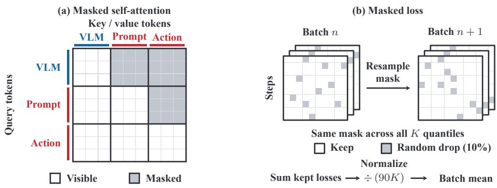  
Figure 3: Attention and loss masks (schematic). (a) Block self-attention controls information flow among VLM, prompt, and action tokens. (b) Coordinate masks are independently resampled for each example in every training batch and shared across all quantiles.

Learnable prompt insertion. We prepend $N _ { p }$ learnable prompt tokens $P \in \mathbb { R } ^ { N _ { p } \times d _ { e } }$ to the actiontoken sequence at the input of the action expert, where $d _ { e }$ is the expert’s hidden width. Prompt embeddings are shared across observations, while their hidden states evolve with action tokens through the expert layers. At each layer, the block attention mask in Figure 3(a) allows prompt queries to attend to VLM and prompt tokens, while action queries attend to VLM, prompt, and action tokens. VLM queries attend only to VLM tokens, and attention is bidirectional within each group. The resulting prompt features provide observation-conditioned context for action prediction. We use $N _ { p } = 1 6$ and jointly train ${ \hat { P } } ,$ , the action expert, and output heads with the VLM frozen.

Ordered quantile head. We feed the final H action-token features from the action expert into two linear projections shared across future steps. For each action coordinate, one projection predicts a median m, and the other predicts raw gaps $r _ { i } ^ { - } , r _ { i } ^ { + }$ on its two sides. Let $K = \dot { 2 } c \dot { + } 1$ and index the quantiles from 0 to $K - 1$ , suppressing the step and coordinate indices. We map the raw gaps to positive values and accumulate them around m:

$$
g _ { i } ^ { \pm } = \frac { \delta _ { 0 } } { \log 2 } \ \mathrm { s o f t p l u s } ( r _ { i } ^ { \pm } ) , q _ { c } = m ,\tag{4}
$$

$$
q _ { c - j } = m - \sum _ { i = 1 } ^ { j } g _ { i } ^ { - } , \qquad q _ { c + j } = m + \sum _ { i = 1 } ^ { j } g _ { i } ^ { + } , \quad j = 1 , \dots , c .\tag{5}
$$

Positive gaps prevent quantile crossing; separately learned left and right gaps allow asymmetric spacing. We use $K = 2 1$ levels $\tau _ { k } = 0 . 0 2 5 + 0 . 9 5 k / 2 0 .$ , with $\tau _ { c } = 0 . 5$ . The scale $\delta _ { 0 } = 0 . 0 2$ sets the gap at zero raw output; the gaps can shrink or expand during training. All K predictions receive pinball supervision with a shared label mask for each action coordinate. For median decoding, we collect $q _ { c } = m$ across steps and coordinates and unnormalize the action chunk.

Action expert inputs. The observation prefix combines SigLIP image embeddings with text embeddings of the task and discretized robot state. The state is normalized before being discretized into 256 bins and included in the text prompt. The action tokens are obtained by linearly projecting H all-zero action queries. Both training and inference fix the time condition to zero; its embedding and MLP still condition the expert’s adaptive normalization.

Table 1: Success rates (%) on LIBERO and LIBERO-Pro. Best in bold; second-best underlined. Superscripts indicate result sources: aKim et al. (2025); bWu et al. (2026b).  
(a) LIBERO
<table><tr><td>Method</td><td>Spatial Object Goal Long Avg.</td><td></td><td></td><td></td></tr><tr><td>Diffusion Policya (Chi et al., 2025)</td><td>78.3</td><td>92.5</td><td>68.3 50.5</td><td>72.4</td></tr><tr><td>OpenVLAa (Kim et al., 2024)</td><td>84.7</td><td>88.4</td><td>79.2 53.7</td><td>76.5</td></tr><tr><td>π0-FASTa (Pertsch et al., 2025)</td><td>96.4</td><td>96.8</td><td>88.6 60.2</td><td>85.5</td></tr><tr><td>π0a (Black et al., 2024)</td><td>96.8</td><td>98.8</td><td>95.8 85.2</td><td>94.2</td></tr><tr><td>OpenVLA-OFT (Kim et al., 2025)</td><td>97.6</td><td>98.4</td><td>97.9 94.5</td><td>97.1</td></tr><tr><td>π0.5 (Black et al., 2025)</td><td>98.8</td><td>98.2</td><td>98.0</td><td>92.4 96.85</td></tr><tr><td>VLANeXt (Wu et al., 2026a)</td><td>99.0</td><td>99.2</td><td>96.6 94.8</td><td>97.4</td></tr><tr><td>SimVLA (Luo et al., 2026)</td><td>99.6</td><td>99.8</td><td>98.6 96.4</td><td>98.6</td></tr><tr><td>WLA-0 (Yang et al., 2026)</td><td>99.0</td><td>100.0</td><td>97.8 97.6</td><td>98.6</td></tr><tr><td>InternVLA-A1.5 (Ma et al., 2026)</td><td>98.6</td><td>99.8</td><td>98.6 98.4</td><td>98.9</td></tr><tr><td>Quantile Head</td><td>99.0</td><td>100.0</td><td>99.6 98.6</td><td>99.3</td></tr></table>

(b) LIBERO-Pro
<table><tr><td>Method</td><td>Object Pos. Sem. Task Avg.</td></tr><tr><td>OpenVLA (Kim et al., 2024)</td><td>93.0 0.0 97.3 0.0 47.6</td></tr><tr><td>π0 (Black et al., 2024)</td><td>90.5 0.0 90.5 0.0 45.3</td></tr><tr><td>π0.5 (Black et al., 2025)</td><td>96.0 20.8 95.8 0.8 53.3</td></tr><tr><td>MolmoAct (Lee et al., 2025)</td><td>76.0 1.5 85.8 1.5 41.2</td></tr><tr><td>X-VLA (Zheng et al., 2026)</td><td>79.0 0.8 96.8 6.8 45.8</td></tr><tr><td>OpenVLA-OFTb (Kim et al., 2025)</td><td>27.6 5.8 59.0 0.6 23.3</td></tr><tr><td>X-VLA (CR eval.)b (Zheng et al., 2026)</td><td>78.4 1.6 82.916.4 44.8</td></tr><tr><td>VLA-Adapterb (Wang et al., 2026)</td><td>73.8 0.090.8 19.8 46.1</td></tr><tr><td>SimVLA (Luo et al., 2026)</td><td>81.5 8.3 98.8 6.048.6</td></tr><tr><td>SUREFlow (Islam et al., 2026)</td><td>68.5 0.087.8 0.039.1</td></tr><tr><td>Quantile Head</td><td>85.8 31.3 97.8 26.0 60.2</td></tr></table>

## 3.3 MASKED PINBALL LOSS

We apply pinball supervision from Theorem 1 to each action coordinate’s K ordered quantiles. For sample $b ,$ let $a _ { b h d }$ be the normalized action target at future step h and dimension $d ,$ and let $q _ { b h d k }$ be its predicted quantile at level $\tau _ { k }$ . With residual $e _ { b h d k } = a _ { b h d } - q _ { b h d k }$ , the pinball loss is

$$
\rho _ { \tau } ( e ) = \operatorname* { m a x } \{ \tau e , ( \tau - 1 ) e \} .\tag{6}
$$

Underprediction is penalized with weight τ, and overprediction with weight $1 - \tau .$

During training, we randomly withhold supervision for a subset of valid action coordinates. Let $V _ { b h d } \in \{ 0 , 1 \}$ indicate a non-padded coordinate and $\begin{array} { r } { N _ { b } = \sum _ { h , d } V _ { b h d } . } \end{array}$ For each sample, we uniformly select min( $\lceil r N _ { b } \rceil , \operatorname* { m a x } ( N _ { b } - 1 , 0 ) )$ valid coordinates without replacement and exclude their labels from the loss, using $r = 0 . 1$ . The mask is redrawn on each training forward pass and retains at least one label whenever $N _ { b } > 0$ . Define $M _ { b h d } = 1$ for valid, retained coordinates and 0 otherwise. As illustrated in Figure 3(b), each $M _ { b h d }$ is shared across all K quantiles, so the entire set of losses for a coordinate is retained or dropped together. This mask acts on the supervision terms.

We average over the retained coordinates and all K quantile levels within each sample, then over the B samples in the batch:

$$
\mathcal { L } = \frac { 1 } { B } \sum _ { b = 1 } ^ { B } \frac { \sum _ { h , d , k } M _ { b h d } \rho _ { \tau _ { k } } ( e _ { b h d k } ) } { K \operatorname* { m a x } \Bigl ( 1 , \sum _ { h , d } M _ { b h d } \Bigr ) } .\tag{7}
$$

Action dimensions introduced for model padding are removed before loss computation. Evaluation losses use all valid coordinates, with random dropping disabled and padded action steps excluded.

## 4 EXPERIMENTS

## 4.1 EXPERIMENTAL SETTING

Benchmarks and Tasks. We evaluate our method on three simulation benchmarks and two realrobot tasks. The simulation benchmarks are LIBERO (Liu et al., 2023), LIBERO-Plus (Fei et al., 2026), and LIBERO-Pro (Zhou et al., 2025). We use four LIBERO suites: Spatial, Object, Goal, and Long (LIBERO-10), with ten tasks each. LIBERO-Plus perturbs these 40 tasks to create 10,030 instances, covering camera viewpoints, robot initial states, language instructions, lighting, backgrounds, sensor noise, and object layouts. LIBERO-Pro also evaluates robustness to changes in objects, positions, instructions, task goals, and environments. We further evaluate real-world performance on two manipulation tasks, with results in Table 3 and the platform and tasks described in Appendix B.2. Evaluation protocols and implementation details are provided in Appendix B. Baselines cited from other work retain their reported protocols.

Table 2: Success rates (%) on LIBERO-Plus. Within each setting, best in bold; second-best underlined. Superscript sources: aFei et al. (2026); bZhong et al. (2026); dShi et al. (2026a). Unmarked baselines use their original papers.
<table><tr><td>Method</td><td>Camera</td><td>Robot</td><td>Lang.</td><td>Light</td><td>Bkg.</td><td>Noise</td><td>Layout</td><td>Total</td></tr><tr><td>OpenVLAª (Kim et al., 2024)</td><td>0.8</td><td>3.5</td><td>23.0</td><td>8.1</td><td>34.8</td><td>15.2</td><td>28.5</td><td>15.6</td></tr><tr><td>π0-FASTa (Pertsch et al., 2025)</td><td>65.1</td><td>21.6</td><td>61.0</td><td>73.2</td><td>73.2</td><td>74.4</td><td>68.8</td><td>61.6</td></tr><tr><td>π0a (Black et al., 2024)</td><td>13.8</td><td>6.0</td><td>58.8</td><td>85.0</td><td>81.4</td><td>79.0</td><td>68.9</td><td>53.6</td></tr><tr><td>OpenVLA-OFTa (Kim et al., 2025)</td><td>56.4</td><td>31.9</td><td>79.5</td><td>88.7</td><td>93.3</td><td>75.8</td><td>74.2</td><td>69.6</td></tr><tr><td> $\pi _ { 0 . 5 } { } ^ { \mathrm { b } }$  (Black et al., 2025)</td><td>75.8</td><td>79.4</td><td>83.3</td><td>95.5</td><td>95.0</td><td>89.6</td><td>87.0</td><td>85.7</td></tr><tr><td>VLANeXt (Wu et al., 2026a)</td><td>90.4</td><td>65.7</td><td>81.8</td><td>95.9</td><td>82.5</td><td>94.1</td><td>80.8</td><td>83.9</td></tr><tr><td>GAM (Han et al., 2026)</td><td>83.1</td><td>70.0</td><td>84.8</td><td>97.2</td><td>94.3</td><td>95.3</td><td>79.1</td><td>85.5</td></tr><tr><td>GE-Act 2.0 (Liu et al., 2026)</td><td>94.1</td><td>50.7</td><td>81.4</td><td>94.0</td><td>60.5</td><td>95.5</td><td>83.1</td><td>80.4</td></tr><tr><td>ACoT-VLAb (Zhong et al., 2026)</td><td>68.9</td><td>80.3</td><td>84.1</td><td>95.6</td><td>93.1</td><td>81.5</td><td>88.3</td><td>83.6</td></tr><tr><td>Quantile Head</td><td>71.6</td><td>80.7</td><td>87.6</td><td>96.1</td><td>97.2</td><td>94.8</td><td>87.8</td><td>87.1</td></tr><tr><td colspan="9">(b) Supervised fine-tuning</td></tr><tr><td>Method</td><td>Camera</td><td>Robot</td><td>Lang.</td><td>Light</td><td>Bkg.</td><td>Noise</td><td>Layout</td><td>Total</td></tr><tr><td> $\pi { _ { 0 } } ^ { \mathrm { b } }$  (Black et al., 2024)</td><td>79.6</td><td>21.1</td><td>72.5</td><td>84.7</td><td>86.2</td><td>68.3</td><td>69.4</td><td>67.4</td></tr><tr><td> $\pi _ { 0 . 5 } { } ^ { \mathrm { b } }$  (Black et al., 2025)</td><td>70.3</td><td>41.7</td><td>81.1</td><td>97.3</td><td>94.6</td><td>71.8</td><td>84.9</td><td>75.7</td></tr><tr><td>OpenVLA-OFT+ (Fei et al., 2026)</td><td>92.8</td><td>30.3</td><td>85.8</td><td>94.9</td><td>93.9</td><td>89.3</td><td>77.6</td><td>79.6</td></tr><tr><td>MemoryVLAd (Shi et al., 2026b)</td><td>91.4</td><td>48.6</td><td>79.4</td><td>95.2</td><td>95.3</td><td>94.0</td><td>75.7</td><td>81.9</td></tr><tr><td>MemoryVLA++ (Shi et al., 2026a)</td><td>96.8</td><td>49.7</td><td>71.0</td><td>96.6</td><td>97.0</td><td>96.0</td><td>78.6</td><td>82.7</td></tr><tr><td>ACoT-VLAb (Zhong et al., 2026)</td><td>91.2</td><td>62.5</td><td>80.3</td><td>95.1</td><td>91.5</td><td>88.3</td><td>84.9</td><td>84.1</td></tr><tr><td>Quantile Head (SFT)</td><td>88.6</td><td>77.0</td><td>86.2</td><td>97.4</td><td>97.3</td><td>94.1</td><td>87.3</td><td>89.1</td></tr></table>

Table 3: Real-robot success rates (%). The $\pi _ { 0 . 5 }$ baseline is fully fine-tuned. ∆ gives the gain over $\pi _ { 0 . 5 }$ in percentage points.
<table><tr><td>Real-robot Task</td><td> $\pi _ { 0 . 5 }$ </td><td>Quantile Head</td><td> $\Delta$ </td></tr><tr><td>Place apple on yellow plate</td><td>31</td><td>52</td><td>+21</td></tr><tr><td>Remove cuboid from blue plate</td><td>86</td><td>98</td><td>+12</td></tr><tr><td>Average</td><td>58.5</td><td>75.0</td><td>+16.5</td></tr></table>

## 4.2 TASK PERFORMANCE WITH DEFAULT MEDIAN DECODING

Overall Performance. With median decoding, Quantile Head achieves 99.3% average success across the four LIBERO suites, 0.4 percentage points above the strongest compared baseline (Table 1). On LIBERO-Plus, it reaches 87.1% zero-shot and 89.1% fine-tuned success, exceeding the respective strongest compared baselines by 1.4 and 5.0 percentage points (Table 2). On LIBERO-Pro, it achieves 60.2% without further training, exceeding $\pi _ { 0 . 5 }$ at 53.3% by 6.9 percentage points. These mean success rates support the generalization of the full median policy across the evaluated benchmarks and perturbations. Matched head ablations examine the benefit of joint quantile supervision in Section 4.3.

Real-robot Performance. With median decoding, Quantile Head achieves 75.0% average success across the two real-robot tasks, compared with 58.5% for $\pi _ { 0 . 5 }$ , a 16.5 percentage point gain (Table 3). The $\pi _ { 0 . 5 }$ baseline is fully fine-tuned; both methods use the same demonstration data, optimization settings, and evaluation conditions (Appendix B.2). Success increases from 31% to 52% for apple placement (+21 percentage points) and from 86% to 98% for cuboid removal (+12 percentage points). These results show higher success on both evaluated tasks using deterministic median decoding, although apple placement remains challenging at 52% success.

## 4.3 ABLATION STUDIES

Head and Component Ablations. Under matched training and evaluation conditions, mediandecoded Quantile Head achieves 99.3% average success across the four LIBERO suites, compared with 96.0%, 97.3%, and 96.3% for $L _ { 2 } , L _ { 1 }$ , and sampled Flow Matching, respectively (Table 4(a)). Mean episode time, including failures, decreases from 8.13 s for $L _ { 1 }$ to 5.88 s, a 27.7% reduction.

Table 4: Ablations on the four LIBERO suites: success rates (%) and episode times (s). Episode times in (a) average over all evaluation episodes. See Appendix B for ablation settings.
<table><tr><td>Setting</td><td></td><td>|Spatial↑</td><td>Object↑</td><td>Goal↑</td><td>Long↑</td><td>Avg.↑</td></tr><tr><td colspan="7">(a) Supervised Fine-Tuning Avg. Episode Time (s)↓</td></tr><tr><td>L2</td><td>8.73</td><td>97.0</td><td>98.0</td><td>96.0</td><td>93.0</td><td>96.0</td></tr><tr><td> $L _ { 1 }$ </td><td>8.13</td><td>99.0</td><td>99.0</td><td>96.0</td><td>95.0</td><td>97.3</td></tr><tr><td>Flow Matching</td><td>12.57</td><td>97.0</td><td>98.0</td><td>96.0</td><td>94.0</td><td>96.3</td></tr><tr><td>Quantile Head</td><td>5.88</td><td>99.0</td><td>100.0</td><td>99.6</td><td>98.6</td><td>99.3</td></tr><tr><td colspan="7">(b) Prompt + Label Mask</td></tr><tr><td>Quantile Head</td><td></td><td>99.0</td><td>100.0</td><td>99.6</td><td>98.6</td><td>99.3</td></tr><tr><td>Median-Only</td><td></td><td>98.0</td><td>99.0</td><td>97.0</td><td>96.0</td><td>97.5</td></tr><tr><td>Detached Median Anchor</td><td></td><td>99.0</td><td>99.0</td><td>99.0</td><td>97.8</td><td>98.7</td></tr><tr><td>Symmetric Quantiles</td><td></td><td>99.0</td><td>98.0</td><td>98.0</td><td>96.6</td><td>97.9</td></tr><tr><td>Noise Query</td><td></td><td>94.0</td><td>95.0</td><td>93.0</td><td>93.0</td><td>93.8</td></tr><tr><td>VLM Query</td><td></td><td>94.0</td><td>96.0</td><td>91.0</td><td>90.0</td><td>92.8</td></tr><tr><td colspan="7">(c) Component Ablations (Frozen VLM) Prompts Pinball Loss Label Mask</td></tr><tr><td></td><td></td><td>83.0</td><td>86.0</td><td>80.0</td><td>85.0</td><td>83.5</td></tr><tr><td>√</td><td></td><td>97.0</td><td>97.0</td><td>95.0</td><td>93.0</td><td>95.5</td></tr><tr><td></td><td></td><td>90.0</td><td>94.0</td><td>94.0</td><td>89.0</td><td>91.8</td></tr><tr><td></td><td></td><td>85.0</td><td>88.0</td><td>85.0</td><td>86.0</td><td>86.0</td></tr><tr><td></td><td></td><td>98.0</td><td>99.0</td><td>97.0</td><td>96.0</td><td>97.5</td></tr><tr><td>√ √</td><td></td><td>99.0</td><td>100.0</td><td>98.0</td><td>98.0</td><td>98.8</td></tr><tr><td></td><td></td><td>97.0</td><td>99.0</td><td>99.0</td><td>93.0</td><td>97.0</td></tr><tr><td>√</td><td></td><td></td><td>100.0</td><td>99.6</td><td>98.6</td><td>99.3</td></tr></table>

In Table 4(b), Median-Only reaches 97.5% mean success, compared with 99.3% for the full head. Detached Median Anchor reaches 98.7%: noncentral losses still update shared features and gaps, but their direct gradient to the median projection is blocked. These mean rates are consistent with potential benefits from both shared supervision and the direct gradient path; task success does not measure error to the true conditional median. Symmetric Quantiles reaches 97.9%, below the full head with independently learned left and right offsets. Noise Query and VLM Query reach 93.8% and 92.8%, respectively, showing that all-zero action queries outperform both alternatives.

In (c), joint quantile supervision yields higher mean evaluation success across all four prompt and label-mask configurations: 83.5% to 91.8%, 95.5% to 98.8%, 86.0% to 97.0%, and 97.5% to 99.3%. These matched comparisons suggest potential generalization benefits from joint quantile supervision for the median policy, even when inference uses only the median without quantile sampling.

## 4.4 EXPLORING ALTERNATIVE SAMPLING STRATEGIES

Sampling Analysis. In the LIBERO-Long sampling evaluation, with cross-chunk correlation $\rho = 0 . 7$ , narrowing the sampling window from [0.1, 0.9] to [0.4, 0.6] increases LIBERO-Long success from 93.0% to 99.6%, exceeding median decoding (98.6%) by 1.0 percentage point (Figure 4). These results illustrate flexibility at inference and motivate future work on selecting sampling strategies. Median decoding requires no sampling choices and remains our default. Narrow windows keep sampled quantile levels near 0.5, and temporal correlation couples these levels across chunks; median decoding directly uses the learned center.

Action Distribution Analysis. Figure 5 shows predicted marginal ranges in one LIBERO-Long rollout: narrower at selected transport moments and wider during grasping and placing. This pattern suggests a possible role for local action adjustments around object contact, but does not establish distributional accuracy. Per-dimension ranges appear in Appendix Figure 9.

Sampling in Two Controlled Scenes. We train each head on two demonstrations per scene, with identical initial observations and instructions but opposite detours (Figure 6). Without an obstacle, median-decoded Quantile Head and both regression heads $( L _ { 1 } , L _ { 2 } )$ reach 100% success; uniform and density-weighted quantile sampling reach 92% and 95%. With an obstacle, these sampling rules reach 6% and 13%, while median decoding, both regression heads, and Flow Matching reach 0%. Sampling benefits are thus task-dependent, and obstacle-scene success remains low. Density weighting requires no retraining.

(a) Action decoding.  
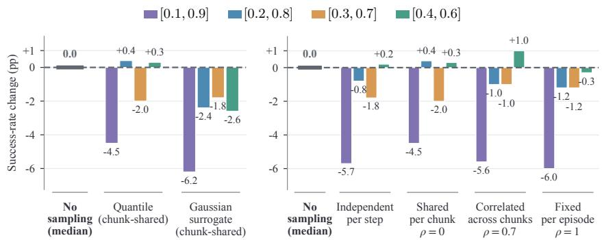  
(b) Temporal sampling structure.

Figure 4: Inference-time sampling on LIBERO-Long. Colors denote quantile windows; bars show success-rate changes from median decoding (98.6%; dashed lines) in percentage points. Quantile (a) and Shared per chunk (b) use the same setting $( \rho = 0 )$ . See Appendix B.  
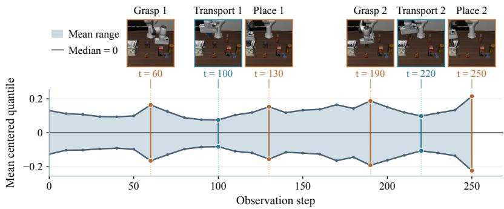  
Figure 5: Mean predicted action spread during manipulation. Median-centered $Q _ { 0 } – Q _ { 1 }$ ranges averaged over six normalized action dimensions $( h = 0 )$ ; endpoints use linear tail extrapolation.

## 5 CONCLUSION

We presented Quantile Head, a theory-inspired method that jointly supervises ordered marginal action quantiles for single-pass median control. Our local analysis shows lower median-update variance than median-only supervision with nearby calibrated quantiles, fixed gaps, smooth densities, and matched correction rates. Joint supervision improves mean success across four matched LIBERO configurations. The median policy reaches 99.3% on LIBERO and 75.0% across two realrobot tasks. Sampling yields gains and losses; systematic strategy selection remains future work.

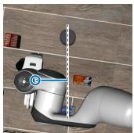  
(a) No obstacle: left detour

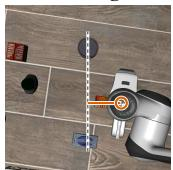  
Training demonstrations (top views)  
(b) No obstacle: right detour.

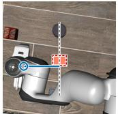  
(c) Central obstacle: left detour.

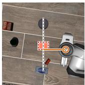  
(d) Central obstacle: right detour.

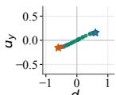  
(e) Quantile: shared ranks. 92% success.

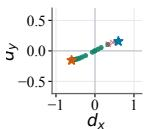  
(f) Quantile: density-weighted. 95% success.

No obstacle  
  
(g) Quantile: median. 100% success.

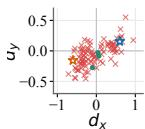  
(h) Flow Matching. 3% success.

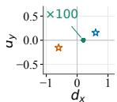  
(i) L1. 100% success.

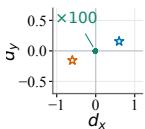  
(j) L2. 100% success.  
(k) Quantile: shared ranks. 6% success.

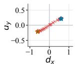

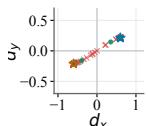  
(l) Quantile: density-weighted. 13% success.

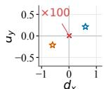  
(m) Quantile: median. 0% success.

Central obstacle  
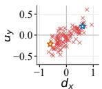  
(n) Flow Matching. 0% success.

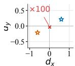  
(o) L1. 0% success.

• Success × Failure Stars: left demo / right demo  
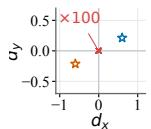  
(p) L2. 0% success.

Figure 6: Training demonstrations and action head outputs. Top views show demonstration states; points show initial $( d _ { x } , d _ { y } )$ commands from one training run, colored by outcome. Subcap tions report success rates; ×100 marks overlapping points. Details: Appendices B.3–B.4.

## AI USE STATEMENT

We used generative AI tools to assist with language polishing, including refining sentence structure and improving the clarity and readability of the manuscript.

## REFERENCES

Kevin Black, Noah Brown, Danny Driess, Adnan Esmail, Michael Equi, Chelsea Finn, Niccolo Fusai, Lachy Groom, Karol Hausman, Brian Ichter, et al. π : A vision-language-action flow model for general robot control. arXiv preprint arXiv:2410.24164, 2024.

Kevin Black, Noah Brown, James Darpinian, et al. π : a vision-language-action model with openworld generalization. In Joseph Lim, Shuran Song, and Hae-Won Park (eds.), Proceedings ofThe 9th Conference on Robot Learning, volume 305 of Proceedings of Machine Learning Research, pp. 17–40. PMLR, 27–30 Sep 2025.

Anthony Brohan, Noah Brown, Justice Carbajal, Yevgen Chebotar, Xi Chen, Krzysztof Choromanski, Tianli Ding, Danny Driess, Avinava Dubey, Chelsea Finn, et al. Rt-2: Vision-language-action models transfer web knowledge to robotic control. arXiv preprint arXiv:2307.15818, 2023.

Lingling Chen, Zongyao Lyu, and William J. Beksi. ReconVLA: An uncertainty-guided and failureaware vision-language-action framework for robotic control. arXiv preprint arXiv:2604.16677, 2026a.

Yitong Chen, Shiduo Zhang, Jingjing Gong, and Xipeng Qiu. Let it be simple: One-step action generation for vision-language-action models. arXiv preprint arXiv:2606.05737, 2026b.

Cheng Chi, Zhenjia Xu, Siyuan Feng, Eric Cousineau, Yilun Du, Benjamin Burchfiel, Russ Tedrake, and Shuran Song. Diffusion policy: Visuomotor policy learning via action diffusion. The International Journal ofRobotics Research, 44(10-11):1684–1704, 2025.

Senyu Fei, Siyin Wang, Junhao Shi, Zihao Dai, Jikun Cai, Pengfang Qian, Li Ji, Xinzhe He, Shiduo Zhang, Zhaoye Fei, et al. Libero-plus: A progressive robustness benchmark for visual-languageaction models. In Proceedings of the IEEE/CVF Conference on Computer Vision and Pattern Recognition, pp. 38574–38583, 2026.

Tilmann Gneiting and Adrian E Raftery. Strictly proper scoring rules, prediction, and estimation. Journal ofthe American statistical Association, 102(477):359–378, 2007.

Jisang Han, Seonghu Jeon, Jaewoo Jung, Rene Zurbr ´ ugg, Honggyu An, Tifanny Portela, Marco ¨ Hutter, Marc Pollefeys, Seungryong Kim, and Sunghwan Hong. Geometric action model for robot policy learning. arXiv preprint arXiv:2606.17046, 2026.

Md Tanvir Islam, Sai Navaneet Peddapalli, Sangmoon Lee, and Sangtae Ahn. SUREFlow: Statespace uncertainty-aware REsidual flow matching for robust robot manipulation. arXiv preprint arXiv:2607.10504, 2026.

Moo Jin Kim, Karl Pertsch, Siddharth Karamcheti, Ted Xiao, Ashwin Balakrishna, Suraj Nair, Rafael Rafailov, Ethan P Foster, Pannag R Sanketi, Quan Vuong, Thomas Kollar, Benjamin Burchfiel, Russ Tedrake, Dorsa Sadigh, Sergey Levine, Percy Liang, and Chelsea Finn. Open-VLA: An open-source vision-language-action model. In 8th Annual Conference on Robot Learning, 2024.

Moo Jin Kim, Chelsea Finn, and Percy Liang. Fine-tuning vision-language-action models: Optimizing speed and success. arXiv preprint arXiv:2502.19645, 2025.

Roger Koenker and Gilbert Bassett Jr. Regression quantiles. Econometrica: journal of the Econometric Society, pp. 33–50, 1978.

Jason Lee, Jiafei Duan, Haoquan Fang, Yuquan Deng, Shuo Liu, Boyang Li, Bohan Fang, Jieyu Zhang, Yi Ru Wang, Sangho Lee, et al. Molmoact: Action reasoning models that can reason in space. arXiv preprint arXiv:2508.07917, 2025.

Yaron Lipman, Ricky T. Q. Chen, Heli Ben-Hamu, Maximilian Nickel, and Matthew Le. Flow matching for generative modeling. In The Eleventh International Conference on Learning Representations, 2023.

Bo Liu, Yifeng Zhu, Chongkai Gao, Yihao Feng, Qiang Liu, Yuke Zhu, and Peter Stone. Libero: Benchmarking knowledge transfer for lifelong robot learning. Advances in Neural Information Processing Systems, 36:44776–44791, 2023.

Renhang Liu, Wenzhi Zhao, Zhuo Yang, Liliang Chen, Pengfei Zhou, Shengcong Chen, Guanghui Ren, Youlun Peng, Rongjun Jin, Nan Wang, et al. Ge-act 2.0: Pretraining and scaling a worldaction model for robotic manipulation. arXiv preprint arXiv:2609.05588, 2026.

Wuyang Luan, Junhui Li, Weiguang Zhao, Wenjian Zhang, Tieru Wu, and Rui Ma. Snapflow: One-step action generation for flow-matching vlas via progressive self-distillation. arXiv preprint arXiv:2604.05656, 2026.

Yuankai Luo, Woping Chen, Tong Liang, Baiqiao Wang, and Zhenguo Li. Simvla: A simple vla baseline for robotic manipulation. arXiv preprint arXiv:2602.18224, 2026.

Haoxiang Ma, Junhao Cai, Xiaoxu Xu, Hao Li, Yuyin Yang, Yang Tian, Jiafei Cao, Hongrui Zhu, Zherui Qiu, Yuqiang Yang, et al. InternVLA-A1.5: Unifying understanding, latent foresight, and action for compositional generalization. arXiv preprint arXiv:2607.04988, 2026.

Taman Narayan, Serena Lutong Wang, Kevin Robert Canini, and Maya Gupta. Expected pinball loss for quantile regression and inverse cdf estimation. Transactions on Machine Learning Research, 2024.

Karl Pertsch, Kyle Stachowicz, Brian Ichter, Danny Driess, Suraj Nair, Quan Vuong, Oier Mees, Chelsea Finn, and Sergey Levine. Fast: Efficient action tokenization for vision-language-action models. arXiv preprint arXiv:2501.09747, 2025.

Oliver Richter and Roger Wattenhofer. Learning policies through quantile regression. arXiv preprint arXiv:1906.11941, 2019.

Hao Shi, Weiye Li, Bin Xie, Yulin Wang, Renping Zhou, Tiancai Wang, Xiangyu Zhang, Ping Luo, and Gao Huang. MemoryVLA++: Temporal modeling via memory and imagination in vision language-action models. arXiv preprint arXiv:2606.09827, 2026a.

Hao Shi, Bin Xie, Yingfei Liu, Lin Sun, Fengrong Liu, Tiancai Wang, Erjin Zhou, Haoqiang Fan, Xiangyu Zhang, and Gao Huang. Memoryvla: Perceptual-cognitive memory in vision-languageaction models for robotic manipulation. In International Conference on Learning Representations, volume 2026, pp. 18567–18602, 2026b.

Yihao Wang, Pengxiang Ding, Lingxiao Li, Can Cui, Zirui Ge, Xinyang Tong, Wenxuan Song, Han Zhao, Wei Zhao, Pengxu Hou, et al. Vla-adapter: An effective paradigm for tiny-scale vision-language-action model. In Proceedings of the AAAI conference on artificial intelligence, volume 40, pp. 18638–18646, 2026.

Xiao-Ming Wu, Bin Fan, Kang Liao, Jian-Jian Jiang, Runze Yang, Yihang Luo, Zhonghua Wu, Wei-Shi Zheng, and Chen Change Loy. Vlanext: Recipes for building strong vla models. arXiv preprint arXiv:2602.18532, 2026a.

Yueh-Hua Wu, Tatsuya Matsushima, and Kei Ota. Continuous reasoning for vision-language-action. arXiv preprint arXiv:2606.00229, 2026b.

Yi Yang, Zhihong Liu, Siqi Kou, Yiyang Chen, Yanzhe Hu, Jianbo Zhou, Boyuan Zhao, Zhijie Wei, Xiao Xia, Xueqi Li, et al. World-language-action model for unified world modeling, language reasoning, and action synthesis. arXiv preprint arXiv:2606.05979, 2026.

Runyao Yu, Yuchen Tao, Fabian Leimgruber, Tara Esterl, Jochen Stiasny, Derek W Bunn, Qingsong Wen, Hongye Guo, and Jochen L Cremer. Orderfusion: Encoding orderbook for end-to-end probabilistic intraday electricity price forecasting. Advanced Engineering Informatics, 76:105131, 2026.

Yan Zhang, Yinan Wu, Haoran Duan, and Jungong Han. CofactVLA: Deconfounding visionlanguage-action models via counterfactual intervention. arXiv preprint arXiv:2608.04396, 2026.

Jinliang Zheng, Jianxiong Li, Zhihao Wang, Dongxiu Liu, Xirui Kang, Yuchun Feng, Yinan Zheng, Jiayin Zou, Yilun Chen, Jia Zeng, et al. X-vla: Soft-prompted transformer as scalable crossembodiment vision-language-action model. In International Conference on Learning Representations, volume 2026, pp. 60580–60606, 2026.

Linqing Zhong, Yi Liu, Yifei Wei, Ziyu Xiong, Si Liu, and Guanghui Ren. Acot-vla: Action chainof-thought for vision-language-action models. In Proceedings of the IEEE/CVF Conference on Computer Vision and Pattern Recognition, pp. 8152–8162, 2026.

Xueyang Zhou, Yangming Xu, Guiyao Tie, Yongchao Chen, Guowen Zhang, Duanfeng Chu, Pan Zhou, and Lichao Sun. Libero-pro: Towards robust and fair evaluation of vision-language-action models beyond memorization. arXiv preprint arXiv:2510.03827, 2025.

Hui Zou and Ming Yuan. Composite quantile regression and the oracle model selection theory. The Annals ofStatistics, 36(3):1108–1126, 2008.

## A QUANTILE OBJECTIVES AND LOCAL CENTER UPDATES

## A.1 PROOF OF THEOREM 1

We first give the background for the change from numerical targets to threshold events in Section 3.1. The formal proof then establishes the two claims of Theorem 1 in order: the loss identity and the population optimum. We explain each condition where it is used, then assess its implications for the finite quantile head. All predictors below are measurable.

Recovering squared regression. Let X be the observation context and $Y$ a scalar action coordi nate. In equation 1, choose $\nu ( \cdot \mid X ) = \delta _ { 0 }$ and $\pi = \delta _ { 0 }$ , where $\delta _ { 0 }$ is a point mass at zero. Then $B = 0 , \alpha \stackrel { - } { = } 0 , A _ { 0 } = 0$ , and $Y - \overset { \cdot } { B } = Y$ . Writing $g _ { \theta } ( X ) = f _ { \theta } ( X , 0 , 0 )$ gives

$$
\mathcal { L } _ { \delta _ { 0 } , \delta _ { 0 } } ( \theta ) = \mathbb { E } _ { X , Y } | g _ { \theta } ( X ) - Y | ^ { 2 } = : \mathcal { L } _ { \mathrm { r e g } } ( \theta ) .\tag{A.1}
$$

Thus the shared objective reduces exactly to squared action regression.

Recovering conditional flow matching. Choose $\nu ( \cdot \mid X ) = N ( 0 , 1 )$ and let π be the CFM training-time distribution. Draw $B \perp \check { Y } \mid X$ and $\alpha \perp ( \dot { X } , \dot { Y } , B )$ . The straight path and its target velocity are

$$
A _ { \alpha } = ( 1 - \alpha ) B + \alpha Y , \qquad { \frac { \mathrm { d } A _ { \alpha } } { \mathrm { d } \alpha } } = Y - B .
$$

With $v _ { \theta } = f _ { \theta }$ , direct substitution gives

$$
\mathcal { L } _ { \nu , \pi } ( \theta ) = \mathbb { E } _ { X , Y , B , \alpha } \left| v _ { \theta } ( X , ( 1 - \alpha ) B + \alpha Y , \alpha ) - ( Y - B ) \right| ^ { 2 } = : \mathcal { L } _ { \mathrm { C F M } } ( \theta ) .\tag{A.2}
$$

This is the straight-path CFM loss (Lipman et al., 2023). The independent draws of B and α specify training augmentation; they impose no independence assumption on the demonstrated action coordinates. The implementation uses reverse time $t = 1 - \alpha .$ , so its path is $A _ { t } = t B + ( 1 - t ) Y$ and its velocity target is $B - Y$ . The formulas above describe a scalar path. For action chunks, use the full path $\bar { \mathbf { A } } _ { \alpha } \overset { - } { = } \left( 1 - \alpha \right) \mathbf { B } + \alpha \mathbf { Y }$ with Gaussian reference $\mathbf { B } \sim N ( 0 , I ) ;$ ; each velocity coordinate conditions on this full path, and summing the coordinate losses gives the squared Frobenius loss.

What squared supervision learns. Write $C = ( X , A _ { \alpha } , \alpha )$ and $\Delta = Y - B$ . Under finite second moments,

$$
\begin{array} { r } { \mathbb { E } [ ( f _ { \theta } ( C ) - \Delta ) ^ { 2 } \mid C ] = \left( f _ { \theta } ( C ) - \mathbb { E } [ \Delta \mid C ] \right) ^ { 2 } + \mathrm { V a r } ( \Delta \mid C ) . } \end{array}\tag{A.3}
$$

The second-moment condition is used only for this squared-risk decomposition; the quantile result below requires only first moments. Consequently, unrestricted regression learns $\mathbb { E } [ { \dot { Y } } \mid X ]$ , while CFM learns $\mathbb { E } [ Y \dot { - } B \mid X , A _ { \alpha } , \alpha ]$ The former is a point action estimate. The latter is a mean velocity field whose integration from random reference noise can generate the conditional action distribution (Lipman et al., 2023). For both losses, the output derivative $\partial _ { f } ( f - \Delta ) ^ { 2 } = 2 ( f - \Delta )$ grows linearly with the residual. These observations motivate direct distribution supervision with bounded feedback at the action-head outputs.

Extending supervision to threshold events. For direct action-distribution prediction, replace the numerical target by the family of binary targets $Z _ { z } \ = \ \mathbf { 1 } \{ Y \ \le \ z \} , \ z \ \in \ \mathbb { R }$ This is an explicit extension of the supervised representation; it is not a requirement of CFM. Squared supervision of each event has conditional optimum $\mathbb { E } [ Z _ { z } \mid X ] = F _ { X } ( z )$ . The full family of threshold probabilities determines the scalar action distribution. Moreover, for any two scalar actions $a , b ,$

$$
\int _ { \mathbb { R } } \bigl ( { \bf 1 } \{ a \leq z \} - { \bf 1 } \{ b \leq z \} \bigr ) ^ { 2 } { \mathrm { d } } z = | a - b | ,\tag{A.4}
$$

because the indicators differ precisely between a and b. Lebesgue integration over thresholds therefore respects distance on the action axis without selecting a finite set of cutoffs. It is a choice of supervision, not the only possible weighting of threshold events.

ProofofTheorem 1. Let $q _ { \theta } ( X , u )$ be jointly measurable and nondecreasing in u. Measurability makes the probabilities and expectations below well-defined and is satisfied by the network operations used in our head. For $U ^ { ^ { \star } } \sim \operatorname { U n i f } ( 0 , 1 )$ independent of (X, Y), the induced conditional CDF is

$$
G _ { \theta } ( z \mid X ) = \int _ { 0 } ^ { 1 } { \bf 1 } \{ q _ { \theta } ( X , u ) \le z \} \mathrm { d } u .
$$

The variable U indexes quantile levels; its uniform law imposes no distributional assumption on the action Y. As in the theorem, assume $\mathbb { E } | Y | < \infty$ and $\begin{array} { r } { \mathbb { E } _ { X } \int _ { 0 } ^ { 1 } \left| q _ { \theta } ( X , u ) \right| \mathrm { d } u < \infty } \end{array}$ . The integrated threshold score is the continuous ranked probability score (Gneiting & Raftery, 2007):

$$
S ( G _ { \theta } ; y \mid X ) = \int _ { \mathbb { R } } \bigl ( G _ { \theta } ( z \mid X ) - \mathbf { 1 } \{ y \le z \} \bigr ) ^ { 2 } \mathrm { d } z , \qquad \mathscr { L } _ { \mathrm { C D F } } ( \theta ) = \mathbb { E } _ { X , Y } S ( G _ { \theta } ; Y \mid X ) .\tag{A.5}
$$

To see why first moments suffice, set $R = q _ { \theta } ( X , U )$ . Jensen’s inequality, Tonelli’s theorem, and equation A.4 give

$$
0 \leq \mathcal { L } _ { \mathrm { C D F } } ( \theta ) \leq \mathbb { E } | R - Y | \leq \mathbb { E } | R | + \mathbb { E } | Y | < \infty .
$$

Tonelli applies to the nonnegative terms; the first moments make the pairwise distances below finite and justify subsequent signed integral exchanges and subtraction. They are mild sufficient conditions: bounded actions satisfy the label condition. For the finite head, a fixed continuous network on a compact input domain has bounded selected outputs. Bounded image inputs and fixed-length token sequences provide such an effective input domain. For a general continuous quantile representation, integrability over both context and quantile level remains an explicit requirement. Our action normalization is affine and does not clip outliers, so normalization alone does not establish bounded targets.

Step 1: loss equivalence. For almost every X, the conditional first moments are finite. Fix such an $\bar { X }$ and abbreviate its predictive CDF by G. Let $R , R ^ { \prime }$ be independent draws from $G ,$ also independent of the action label conditional on $\dot { \boldsymbol { X } }$ . The threshold identity equation A.4 gives

$$
\begin{array} { r l } & { \displaystyle { \mathbb { E } } | R - y | = \int _ { \mathbb { R } } [ G ( z ) + \mathbf { 1 } \{ y \le z \} - 2 G ( z ) \mathbf { 1 } \{ y \le z \} ] \mathrm { d } z , } \\ & { \displaystyle \frac { 1 } { 2 } { \mathbb { E } } | R - R ^ { \prime } | = \int _ { \mathbb { R } } G ( z ) ( 1 - G ( z ) ) \mathrm { d } z . } \end{array}
$$

Subtracting yields

$$
S ( G ; y ) = \mathbb { E } | R - y | - \frac { 1 } { 2 } \mathbb { E } | R - R ^ { \prime } | .\tag{A.6}
$$

The pairwise term and its coefficient therefore follow from the integrated threshold loss; they are not added to the regression or CFM objective.

To express this score through quantiles, write $q = q _ { \theta } ( X , \cdot )$ and $R = q ( U )$ for $U \sim \mathrm { U n i f } ( 0 , 1 )$ . If $U ^ { \prime }$ is an independent copy, nondecreasingness and integrability give

$$
\begin{array} { r l } & { \displaystyle \frac { 1 } { 2 } \mathbb { E } | q ( U ) - q ( U ^ { \prime } ) | = \int _ { 0 } ^ { 1 } \int _ { 0 } ^ { \tau } \big ( q ( \tau ) - q ( v ) \big ) \mathrm { d } v \mathrm { d } \tau } \\ & { \quad \quad \quad = \int _ { 0 } ^ { 1 } ( 2 \tau - 1 ) q ( \tau ) \mathrm { d } \tau . } \end{array}
$$

Here nondecreasingness permits replacing $| q ( \tau ) - q ( v ) | \mathrm { b y } q ( \tau ) - q ( v )$ when $v < \tau ;$ ; integrability permits changing the order of integration. Flat segments and jumps are allowed, so this step requires neither strict ordering nor a continuous density. Using $\rho _ { \tau } ( e ) = | e | / 2 + ( \tau - 1 / 2 ) \epsilon$ and $ { \int _ { 0 } ^ { 1 } ( 2 \tau - }$ $\lfloor ) y \mathrm { d } \tau = 0$ , we obtain

$$
\begin{array} { l } { S ( G ; y ) = \displaystyle \int _ { 0 } ^ { 1 } \left[ | y - q ( \tau ) | - ( 2 \tau - 1 ) q ( \tau ) \right] \mathrm { d } \tau } \\ { \displaystyle = 2 \int _ { 0 } ^ { 1 } \rho _ { \tau } \left( y - q ( \tau ) \right) \mathrm { d } \tau . } \end{array}\tag{A.7}
$$

Taking expectation over $( X , Y )$ proves equation $^ { 2 , }$ , the first claim of the theorem. This identity holds for every admissible predictor, whether or not its model class can represent the true distribution.

Step 2: population optimum. Since $Z _ { z }$ is binary, the conditional squared-risk decomposition is

$$
{ \mathbb E } \big [ ( G _ { \theta } ( z \mid X ) - Z _ { z } ) ^ { 2 } \mid X \big ] = \big ( G _ { \theta } ( z \mid X ) - F _ { X } ( z ) \big ) ^ { 2 } + F _ { X } ( z ) ( 1 - F _ { X } ( z ) ) .
$$

For a conditional CDF H, write $\mathcal { L } _ { \mathrm { C D F } } ( H ) = \mathbb { E } _ { X , Y } S ( H ; Y \mid X )$ . Integrating the decomposition gives

$$
{ \mathcal { L } } _ { \mathrm { C D F } } ( G _ { \theta } ) - { \mathcal { L } } _ { \mathrm { C D F } } ( F ) = \mathbb { E } _ { X } \int _ { \mathbb { R } } \left( G _ { \theta } ( z \mid X ) - F _ { X } ( z ) \right) ^ { 2 } \mathrm { d } z \geq 0 .\tag{A.8}
$$

Equality implies $G _ { \theta } ( \cdot \mid X ) = F _ { X }$ for almost every X: zero integral first gives equality for almost every threshold, and right continuity extends it to every threshold. Thus the true conditional CDF is the unique population optimum whenever it is representable. Its nondecreasing quantile representation equals $\operatorname { \dot { \phantom { } } } \textstyle F _ { X } ^ { - 1 } ( \tau ) : = \operatorname* { i n f } \{ z : F _ { X } ( z ) \geq \tau \}$ almost everywhere, with respect to the law of X and Lebesgue measure on (0, 1). By Step 1, this is also the optimum of the integrated quantile loss, proving the second claim. The argument allows atoms and requires neither a density nor symmetry. Representability is used only to attain the lower bound at $F _ { X }$ within the model class. Without it, equation A.8 still holds: minimizing population loss seeks the best class approximation in expected integrated squared CDF distance. This describes an infimum and does not assert that a finite parameter attains it. Thus representability is an ideal population benchmark, not a property guaranteed by a finite head. □

Consequences for a finite quantile head. For selected levels $0 < \tau _ { 0 } < \cdot \cdot \cdot < \tau _ { K - 1 } < 1$ and positive weights $w _ { k }$ summing to one, the finite training objective is

$$
\ell _ { Q } ( X , Y ) = \sum _ { k = 0 } ^ { K - 1 } w _ { k } \rho _ { \tau _ { k } } \left( Y - q _ { k } ( X ) \right) .\tag{A.9}
$$

Weight normalization only fixes the loss scale. Assume finite first moments for Y and the selected outputs $q _ { k } ( X )$ ). Its conditional subgradient for a single quantile is

$$
\partial _ { q } \mathbb { E } \big [ \rho _ { \tau } ( Y - q ) \mid X \big ] = [ F _ { X } ( q ^ { - } ) - \tau , F _ { X } ( q ) - \tau ] .
$$

It contains zero exactly when $F _ { X } ( q ^ { - } ) \leq \tau \leq F _ { X } ( q )$ . Thus free nondecreasing output functions attain the population minimum at the selected true quantiles, uniquely when each quantile is unique. A shared model attains this minimum if it can jointly represent those quantile functions. This is weaker than representing the entire conditional distribution. If it cannot, its approximation error is the infimum excess finite pinball risk over its model class. This finite-grid argument does not require the finite loss to equal the continuous integral. For example, linear interpolation with constant tails extends an ordered finite vector to an integrable nondecreasing representation. Theorem 1 applies to that extension, but its integrated loss need not equal the finite sum. In particular, our $K = 2 1$ levels on [0.025, 0.975] supervise those selected quantiles; they do not determine the intervening quantiles or the omitted tails. Applying this scalar result coordinate-wise identifies only the selected quantiles of each action marginal; it does not identify their joint dependence.

Ordering and bounded output feedback. The median-and-gap construction in Equations 4–5 enforces ordering at the selected levels. Separate left and right gaps allow asymmetric spacing, so the head adds no symmetry requirement. Away from ties, the per-output derivative is

$$
\partial _ { q _ { k } } \ell _ { Q } = w _ { k } \left[ 1 \{ Y \le q _ { k } \} - \tau _ { k } \right] ,
$$

with subgradient interval $w _ { k } [ - \tau _ { k } , 1 - \tau _ { k } ]$ at a tie. Hence $| \partial _ { q _ { k } } \ell _ { Q } | \le w _ { k } \operatorname* { m a x } ( \tau _ { k } , 1 - \tau _ { k } )$ for every subgradient, independently of residual magnitude. This is a bound on loss feedback at each quantile output, not on gradients through an arbitrary network parameterization.

Repeated quantiles and strict gaps. At a fixed input, positive gaps can represent any strictly ordered finite quantile vector. Repeated true quantiles, which can occur for discrete or deterministic actions, cannot be represented exactly by strictly positive gaps. The scale $\delta _ { 0 }$ in equation 4 is not a positive lower bound: softplus gaps can approach zero.

The resulting approximation can be quantified at the output level. Let $K = 2 c + 1$ with $c \geq 1$ , let $q _ { k } ^ { * } ( X ) = F _ { X } ^ { - 1 } \bar { ( } \bar { \tau } _ { k } )$ be the true selected quantiles, and define $\begin{array} { r } { R _ { K } ( q ) = \mathbb { E } \sum _ { k } w _ { k } \rho _ { \tau _ { k } } ( Y - q _ { k } ( X ) ) } \end{array}$ The label first moment ensures that these interior true quantiles are integrable. Our grid has $c = 1 0$ For any $\varepsilon > 0$ , set $q _ { k } ^ { \varepsilon } ( X ) = q _ { k } ^ { * } ( X ) + \varepsilon ( k - c ) / c$ . Adjacent gaps are at least $\varepsilon / c$ , the middle output is unchanged, and each output moves by at most ε. Since pinball loss is 1-Lipschitz in its predicted value,

$$
0 \leq R _ { K } ( q ^ { \varepsilon } ) - R _ { K } ( q ^ { * } ) \leq \sum _ { k } w _ { k } \mathbb { E } | q _ { k } ^ { \varepsilon } ( X ) - q _ { k } ^ { * } ( X ) | \leq \varepsilon .
$$

Thus strict ordering alone need not create a positive infimum gap in population risk. This outputlevel approximation does not establish that the shared finite network can represent all such functions or that training finds them; network approximation, estimation, and optimization errors remain separate from Theorem 1.

Relation to masked training. The random label mask in equation 7 preserves the finite objective in expectation over the fresh mask. Conditional on a sample with $N > 0$ valid coordinates, the rule retains a uniform subset of fixed size $R \geq 1$ . Each valid coordinate has inclusion probability $R / N$ , so its expected weight in the retained-coordinate average is $1 / N$ . This gives the full validcoordinate average without assuming independent coordinate masks. When no coordinate is valid, both losses are zero. This argument concerns random dropping. For a coordinate j, write its effective weight as $\omega _ { j } = V _ { j } / \operatorname* { m a x } ( 1 , N )$ . At inputs where $\mathbb { E } [ \omega _ { j } \ | \ \check { X } ] > 0 .$ , a sufficient condition for the original conditional quantiles to remain optimal is that $\omega _ { j }$ be determined by $X$ or conditionally independent of $Y _ { j }$ given X. In general, the target is the conditional distribution reweighted by $\omega _ { j }$ These distinctions specify how the population result applies to the implemented supervision; they do not establish a finite-sample convergence or closed-loop performance guarantee.

## A.2 PROOF OF THEOREM 2

We compare direct scalar center updates at matched local mean correction speed. All expectations below are conditional on a fixed input.

Calibrated cumulative gaps and the center direction. Let F be the scalar conditional action CDF, with unique median $m ^ { * }$ and a density f that is positive and twice continuously differentiable near $m ^ { * }$ . Write $f _ { 0 } = f ( m ^ { * } ) > 0$ . Then $\dot { F ( m ^ { * } ) } = 1 \dot { / } 2$ , and F has a locally smooth inverse. Fix an odd $K \geq 3$ and strictly ordered locations $t _ { 1 } < \cdots < t _ { K }$ with $t _ { K + 1 - k } = - t _ { k }$ and $t _ { k } \in [ - 1 , 1 ]$ . Set $c = ( K + 1 ) / 2$ and $\tau _ { k } = 1 / 2 + \varepsilon t _ { k }$ . For sufficiently small $\varepsilon > 0 .$ , the quantiles $q _ { k } ^ { * } = \dot { F } ^ { - 1 } ( \dot { \tau _ { k } } )$ lie in this neighborhood, are strictly ordered, and satisfy $q _ { c } ^ { * } = m ^ { * }$

These quantiles are compatible with the implemented positive cumulative gaps. In particular, their adjacent differences define

$$
g _ { j } ^ { - * } = q _ { c - j + 1 } ^ { * } - q _ { c - j } ^ { * } > 0 , \qquad g _ { j } ^ { + * } = q _ { c + j } ^ { * } - q _ { c + j - 1 } ^ { * } > 0 , \qquad 1 \leq j \leq ( K - 1 ) / 2 .
$$

Each positive value is representable as κ softplus(r) for any fixed $\kappa > 0 .$ . There is no equality constraint between the two sides. Writing $d _ { k } ^ { * } = q _ { k } ^ { * } - m ^ { * }$ , hold these calibrated gaps fixed and consider the scalar center direction

$$
q _ { k } ( m ) = m + d _ { k } ^ { * } , \qquad q _ { k } ( m ^ { * } + \delta ) = q _ { k } ^ { * } + \delta .\tag{A.10}
$$

Thus every quantile has direct derivative one with respect to m. For the equal-weight pinball loss and the median-only pinball loss, the direct center gradients are, away from their breakpoints,

$$
\begin{array} { l } { \displaystyle { G _ { Q } ( m , Y ) = \frac { 1 } { K } \sum _ { k = 1 } ^ { K } \bigl [ { \mathbf 1 } \{ Y < q _ { k } ( m ) \} - \tau _ { k } \bigr ] , } } \\ { \displaystyle { G _ { M } ( m , Y ) = \mathbf 1 \{ Y < m \} - \frac { 1 } { 2 } . } } \end{array}\tag{A.11}
$$

The density assumption makes the breakpoints probability-zero events in the neighborhood used below. This identifies the gradients of the actual cumulative-gap construction along the stated center direction.

Exact gradient variance at calibration. Define $s _ { k } = 1 \{ Y < q _ { k } ^ { * } \} - \tau _ { k }$ . Calibration gives $\mathbb { E } [ s _ { k } ] =$ 0 and hence $\mathbb { E } [ G _ { Q } ( m ^ { * } , Y ) ] = \mathbb { E } [ G _ { M } ( m ^ { * } , Y ) ] = 0$ . The indicators are nested, so their product has expectation min $( \tau _ { k } , \tau _ { \ell } )$ . Consequently,

$$
\mathrm { C o v } ( s _ { k } , s _ { \ell } ) = \operatorname* { m i n } ( \tau _ { k } , \tau _ { \ell } ) - \tau _ { k } \tau _ { \ell } .\tag{A.12}
$$

This is the usual composite-quantile score covariance (Zou & Yuan, 2008); in particular, the proof does not assume that the quantile scores from the same label are independent.

Let $B _ { h } = \mathrm { V a r } ( G _ { h } ( m ^ { * } , Y ) )$ for $h \in \{ Q , M \}$ . Since $\tau _ { c } = 1 / 2 , B _ { M } = 1 / 4$ . For the joint gradient, substituting the selected levels in Equation $_ { \mathrm { A } . 1 2 }$ gives

$$
\operatorname* { m i n } ( \tau _ { k } , \tau _ { \ell } ) - \tau _ { k } \tau _ { \ell } = \frac { 1 } { 4 } - \frac { \varepsilon } { 2 } | t _ { k } - t _ { \ell } | - \varepsilon ^ { 2 } t _ { k } t _ { \ell } .
$$

Symmetry implies $\textstyle \sum _ { k } t _ { k } = 0$ , so summing over all pairs yields the exact identity

$$
B _ { Q } = \frac { 1 } { 4 } - C _ { t } \varepsilon , \qquad C _ { t } = \frac { 1 } { 2 K ^ { 2 } } \sum _ { k , \ell = 1 } ^ { K } | t _ { k } - t _ { \ell } | > 0 .\tag{A.13}
$$

Strict positivity follows from the distinct levels. The variance reduction is therefore of first order in ε.

Local mean correction. Under the fixed-gap perturbation in Equation A.10,

$$
\mathbb { E } [ G _ { Q } ( m ^ { * } + \delta , Y ) ] = \frac { 1 } { K } \sum _ { k = 1 } ^ { K } \bigl [ F ( q _ { k } ^ { * } + \delta ) - F ( q _ { k } ^ { * } ) \bigr ] .
$$

It follows that

$$
a _ { Q } : = \left. \frac { \partial } { \partial m } \mathbb { E } [ G _ { Q } ( m , Y ) ] \right| _ { m = m ^ { * } } = \frac { 1 } { K } \sum _ { k = 1 } ^ { K } f ( q _ { k } ^ { * } ) ,\tag{A.14}
$$

$$
a _ { M } : = \left. { \frac { \partial } { \partial m } } \mathbb { E } [ G _ { M } ( m , Y ) ] \right| _ { m = m ^ { * } } = f _ { 0 } .
$$

Both are positive. Define $r ( \tau ) = f ( F ^ { - 1 } ( \tau ) )$ in a neighborhood of $1 / 2$ . The local positivity and $C ^ { 2 }$ smoothness of $f$ imply that r is $C ^ { 2 }$ there. Its Taylor expansion gives

$$
r ( 1 / 2 + \varepsilon t _ { k } ) = f _ { 0 } + \varepsilon t _ { k } r ^ { \prime } ( 1 / 2 ) + \frac { \varepsilon ^ { 2 } t _ { k } ^ { 2 } } { 2 } r ^ { \prime \prime } ( 1 / 2 ) + o ( \varepsilon ^ { 2 } ) .
$$

Because $K$ and the $t _ { k }$ are fixed, this remainder can be summed over the finite set of levels. The first-order terms cancel, giving

$$
a _ { Q } = f _ { 0 } + \frac { \varepsilon ^ { 2 } r ^ { \prime \prime } ( 1 / 2 ) } { 2 K } \sum _ { k = 1 } ^ { K } t _ { k } ^ { 2 } + o ( \varepsilon ^ { 2 } ) = f _ { 0 } + O ( \varepsilon ^ { 2 } ) .\tag{A.15}
$$

Thus the local mean correction slope changes only at second order. This cancellation uses symmetry of the probability levels, not symmetry of $f$ or equality of the left and right gaps.

Noise after matching correction speeds. The normalized noise coefficient is $V _ { h } = B _ { h } / a _ { h } ^ { 2 }$ for $h \in \{ Q , M \}$ . Equations A.13 and A.15 imply

$$
\frac { V _ { Q } } { V _ { M } } = \frac { ( 1 / 4 - C _ { t } \varepsilon ) / a _ { Q } ^ { 2 } } { ( 1 / 4 ) / f _ { 0 } ^ { 2 } } = ( 1 - 4 C _ { t } \varepsilon ) \frac { f _ { 0 } ^ { 2 } } { a _ { Q } ^ { 2 } } = 1 - 4 C _ { t } \varepsilon + O ( \varepsilon ^ { 2 } ) .
$$

Since $C _ { t } \quad > \quad 0$ , there is an $\varepsilon _ { 0 } ~ > ~ 0$ such that this ratio is strictly less than one whenever $0 < \varepsilon < \varepsilon _ { 0 }$ . For fixed $K$ , this inequality also holds uniformly over symmetric grid shapes. Normalize ma $\mathrm { { x } } _ { k } \left| t _ { k } \right| = 1$ , so ε is the largest distance of a level from $1 / \dot { 2 }$ . The two extreme rows of the pairwise sum each contribute $K ,$ , giving $C _ { t } \geq 1 / K$ ; bounded $r ^ { \prime \prime }$ makes the $O ( \varepsilon ^ { 2 } )$ remainder uniform for $| t _ { k } | \leq 1$ . Thus sufficiently close symmetric levels give $V _ { Q } / V _ { M } < 1$ without requiring fixed relative spacing. We now translate this normalized noise comparison into the update variance stated in the theorem.

For an explicit update interpretation, fix $0 < \eta < 1$ and set $\delta _ { h } ^ { + } = \delta - \eta G _ { h } ( m ^ { * } + \delta , Y ) / a _ { h }$ . Taylor expansion of the mean gradient in δ gives, for each fixed sufficiently small $\varepsilon ,$

$$
\mathbb { E } [ \delta _ { h } ^ { + } ] = ( 1 - \eta ) \delta + O ( \delta ^ { 2 } ) , \qquad h \in \{ Q , M \} .
$$

The two updates therefore have the same first-order mean correction speed. At the true center, $\delta = 0$ the center increments in the theorem are $\Delta m _ { h } = - \eta G _ { h } ( m ^ { * } , Y ) / a _ { h } = \delta _ { h } ^ { + }$ . They have zero mean, so

$$
\operatorname { V a r } ( \Delta m _ { h } ) = \mathbb { E } [ ( \delta _ { h } ^ { + } ) ^ { 2 } ] = \eta ^ { 2 } V _ { h } , \qquad \frac { \operatorname { V a r } ( \Delta m _ { Q } ) } { \operatorname { V a r } ( \Delta m _ { M } ) } = \frac { V _ { Q } } { V _ { M } } < 1 .
$$

This proves Equation 3. The improvement is consequently not explained solely by a smaller gradient magnitude or an unmatched learning rate. □

Scope of the conclusion. The limit is a shrinking quantile-level spread for fixed finite $K ;$ it is neither a sample-size limit nor a statement uniform in the number of quantiles. Each sufficiently small positive ε gives strictly positive representable gaps. No parametric distribution family or symmetry of the conditional density is required. Calibration and the fixed-gap center direction are substantive conditions: the result does not account for inaccurate gaps or simultaneous updates to gaps and shared network parameters. The normalization by $a _ { h }$ defines the comparison of local correction speeds; it is not a change to the optimizer used in our experiments. Accordingly, the theorem establishes a local center-update mechanism, not a guarantee ofjoint-training generalization or task success, and does not by itself certify the wider quantile grid used in the experiments.

## B EXPERIMENTAL DETAILS AND ADDITIONAL RESULTS

Simulation training. We implement our method on $\pi _ { 0 . 5 }$ with a frozen VLM, training the action expert, 16 prompt tokens, and quantile heads. The head uses the 21 levels, positive-gap parameterization, and 10% random coordinate-label mask specified in Section 3. Simulation training uses AdamW with a global batch size of 128 across two GPUs. Prompt tokens use a peak learning rate of $1 0 ^ { - 4 }$ and no weight decay; other trainable parameters use $2 . 5 \times \dot { 1 } 0 ^ { - 5 }$ and weight decay 0.01. Both learning rates follow cosine decay with 200 warmup steps for LIBERO and 666 for LIBERO-Plus. Both models start from the same pretrained checkpoint and train for one epoch on their respective datasets.

Training and transfer settings. On LIBERO, we evaluate policies trained on its standard demonstrations. To assess their robustness, we directly evaluate these policies on LIBERO-Plus and LIBERO-Pro without further training. For LIBERO-Plus, we also evaluate policies fine-tuned on its training set, reporting zero-shot transfer and supervised fine-tuning results separately. Quantile Head uses deterministic median decoding for Tables 1–4; alternative sampling rules are evaluated separately in Section 4.4 and the two-demonstration studies. At each replanning step, the policy supplies a ten-step action sequence to the controller, which executes it before obtaining a new observation and replanning. Evaluation does not update model parameters. An episode succeeds if the benchmark’s task-success condition is met within its rollout budget; an episode that terminates without success is a failure.

LIBERO evaluation and aggregation. We evaluate all ten tasks in each of Spatial, Object, Goal, and Long (LIBERO-10). Our results in Table 1 use models trained with three different random seeds, with each model evaluated for 1,000 episodes per suite. Within each trained model, a suite success rate averages its ten task success rates, and Avg. averages the four suite rates with equal weight. We report the arithmetic mean of the corresponding success rates over the three training seeds. The matched head and component comparisons in Table 4 use the same four suites and task/suite averaging, with 100 evaluation episodes per task and setting.

LIBERO-Plus protocol. Both zero-shot and fine-tuned evaluations cover all 10,030 benchmark instances, with one rollout per instance and trained model, using the benchmark-provided initial states. Spatial, Object, Goal, and Long contain 2,402, 2,518, 2,591, and 2,519 instances, respectively. Their rollout limits are 280, 280, 300, and 520 environment steps. We assign instances to the seven official perturbation categories. Within each model, each category rate pools successful rollouts over all its instances across the four suites; Total pools all 10,030 instances. Thus, Total is instance-weighted, rather than an unweighted mean of the seven category rates or four suite rates. For Table 2, we train models with three different random seeds and report the arithmetic mean of their corresponding success rates.

LIBERO-Pro protocol. We evaluate the three seed-trained LIBERO policies on object, position, semantic, and task perturbations. For each trained model, we evaluate each task for 100 episodes. We use the benchmark-provided initial states; rollout limits are 280 steps for Spatial and Object, 300 for Goal, and 800 for Long. Within each model, each perturbation rate averages the four suite rates, and $\operatorname { A v g }$ . averages the four perturbation rates with equal weight. Reported rates then average the corresponding values over the three training seeds. Original and Environment are excluded from Avg. The Original column in Table 5 is the unperturbed control from the separate Pro evaluation, rather than a reuse of the standard LIBERO result.

External comparisons. Cited baselines in Tables 1 and 2 retain their source-reported training, evaluation, and aggregation protocols. Their pretraining, trainable modules, observation histories, and per-suite versus joint training can differ. These tables compare reported system performance; Table 4 provides the matched comparisons of action heads and training components. Superscripts in the comparison tables identify the source of each reused result.

Ablation Settings. Each setting in Table 4 is evaluated for 100 episodes per task on the four LIBERO suites. Quantile and direct-regression variants use deterministic center decoding. Avg. reports the mean success rate across the four LIBERO suites. Average episode time in (a) is measured over all evaluation episodes, including both successful and failed trials. The relative reduction in average episode time uses $L _ { 1 }$ as the reference. This episode-level quantity includes the effects of rollout length and termination, and is distinct from the latency of one policy forward pass. Unspecified components in Table 4 follow the full model. The $L _ { 2 }$ and $L _ { 1 }$ rows use direct regression heads with $e ^ { 2 }$ and |e| losses, respectively; Median-Only in (b) retains the quantile head and supervises only its median. Detached Anchor detaches m only in noncentral quantiles, whose losses still update shared features. This variant additionally multiplies the gradient with respect to the median output m by $K = 2 1$ . Symmetric Quantiles share left/right offsets.

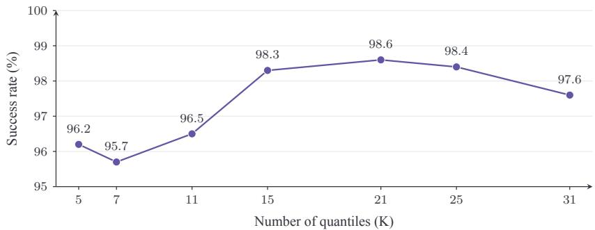  
Figure 7: Number of quantiles on LIBERO-Long. Success rate as the number of predicted quantiles K varies. Rates average three training seeds, with 1,000 evaluation episodes per seed and setting. The default K = 21 attains the highest observed rate of 98.6%.

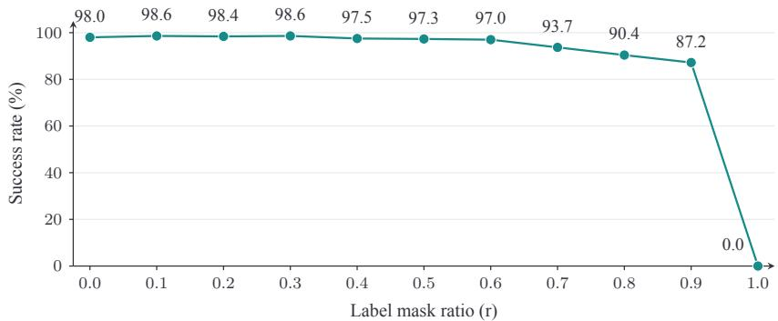  
Figure 8: Label mask ratio on LIBERO-Long. Success rate as the fraction of masked action labels r increases. Rates average three training seeds, with 1,000 evaluation episodes per seed and setting. The sweep includes the fully masked setting r = 1.0.

The component ablations in (c) retain the ordered median-and-positive-gap head. Pinball Loss supervises 21 quantiles; disabling it uses only 0.5|e| center supervision, normalized over one output. Label Mask randomly drops 10% of valid coordinate labels, sharing the mask across quantiles. Prompts are 16 trainable context tokens. Checkmarks enable components; blanks disable them. Rows cover all eight combinations of the three listed components: all off, three single-component, three two-component, and all on. Without joint supervision, gap branches receive no supervised gradients. Removing only Pinball Loss matches Median-Only in (b). Task instructions and validity/padding masks remain active.

Flow-matching inference. The matched Flow Matching baseline in Table 4(a) starts from Gaussian noise and uses ten Euler integration steps from t = 1 to t = 0 per replanning call. These are numerical integration steps; the controller executes ten environment actions between replanning calls.

Number of Quantiles. We compare seven quantile counts, from K = 5 to $K = 3 1$ , on LIBERO-Long. For each setting, we train models with three different random seeds, evaluate each model over 1,000 episodes, and report the arithmetic mean of the three success rates. Figure 7 shows higher success rates for $K \stackrel { - } { = } 1 5 \substack { - 2 5 } ( 9 8 . 3 \ – 9 8 . 6 \% )$ than for $K = 5 \mathrm { - } 1 1 ( 9 5 . 7 \mathrm { - } 9 6 . 5 \% )$ , followed by a decrease to 97.6% at $K = 3 1$ . Our default $K = 2 1$ achieves the best observed success rate while using fewer quantiles than $K = 2 5 ;$ increasing K beyond 21 provides no further gain in this exploratory study.

Label Mask Ratio. We vary r from 0 to 1.0 in steps of 0.1 on LIBERO-Long. For each setting, we train models with three different random seeds, evaluate each model over 1,000 episodes, and report the arithmetic mean of the three success rates. In Figure $^ { 8 , }$ the default $r = 0 . 1$ and $r = 0 . 3$ both reach 98.6% success, compared with 98.0% without masking. Success declines at higher masking ratios, reaching 87.2% at $r = 0 . 9$ and 0.0% at $r = 1 . 0$ . For the fully masked $r = 1 . 0$ setting, we disable the requirement to retain at least one label in Section 3.3 and drop all valid action labels.

Table 5: Quantile Head success rates (%) by suite and perturbation type on LIBERO-Pro.
<table><tr><td>Suite</td><td>Original</td><td>Object</td><td>Position</td><td>Semantic</td><td>Task</td><td>Avg.</td></tr><tr><td>Spatial</td><td>99.0</td><td>100.0</td><td>49.0</td><td>98.0</td><td>47.0</td><td>73.5</td></tr><tr><td>Object</td><td>100.0</td><td>95.0</td><td>26.0</td><td>99.0</td><td>10.0</td><td>57.5</td></tr><tr><td>Goal</td><td>95.0</td><td>81.0</td><td>34.0</td><td>97.0</td><td>27.0</td><td>59.8</td></tr><tr><td>Long</td><td>98.0</td><td>67.0</td><td>16.0</td><td>97.0</td><td>20.0</td><td>50.0</td></tr><tr><td>Mean</td><td>98.0</td><td>85.8</td><td>31.3</td><td>97.8</td><td>26.0</td><td>60.2</td></tr></table>

Table 6: Quantile Head success rates (%) on LIBERO-Plus by suite and perturbation. Overall uses instance-weighted aggregation across the four suites.

<table><tr><td>Suite</td><td>Camera</td><td>Robot</td><td>Lang.</td><td>Light</td><td>Bkg.</td><td>Noise</td><td>Layout</td><td>Total</td></tr><tr><td>Spatial</td><td>75.8</td><td>89.4</td><td>97.2</td><td>100.0</td><td>99.6</td><td>98.6</td><td>98.4</td><td>93.7</td></tr><tr><td>Object</td><td>87.1</td><td>73.6</td><td>93.5</td><td>100.0</td><td>100.0</td><td>99.1</td><td>92.3</td><td>91.5</td></tr><tr><td>Goal</td><td>78.2</td><td>79.0</td><td>68.5</td><td>91.8</td><td>95.4</td><td>94.7</td><td>73.2</td><td>81.7</td></tr><tr><td>Long</td><td>46.8</td><td>81.9</td><td>92.7</td><td>92.0</td><td>94.5</td><td>87.8</td><td>88.8</td><td>82.1</td></tr><tr><td>Overall</td><td>71.6</td><td>80.7</td><td>87.6</td><td>96.1</td><td>97.2</td><td>94.8</td><td>87.8</td><td>87.1</td></tr><tr><td colspan="9">(b) Supervised fine-tuning</td></tr><tr><td>Suite</td><td>Camera</td><td>Robot</td><td>Lang.</td><td>Light</td><td> $\mathrm { B k g . }$ </td><td>Noise</td><td>Layout</td><td>Total</td></tr><tr><td>Spatial</td><td>97.9</td><td>88.3</td><td>95.9</td><td>100.0</td><td>100.0</td><td>96.6</td><td>96.9</td><td>96.3</td></tr><tr><td>Object</td><td>97.5</td><td>68.8</td><td>91.0</td><td>100.0</td><td>100.0</td><td>99.5</td><td>91.1</td><td>91.9</td></tr><tr><td>Goal</td><td>79.9</td><td>77.3</td><td>65.6</td><td>97.5</td><td>92.2</td><td>94.5</td><td>72.0</td><td>81.3</td></tr><tr><td>Long</td><td>80.4</td><td>74.8</td><td>94.0</td><td>91.6</td><td>97.6</td><td>86.6</td><td>91.7</td><td>87.3</td></tr><tr><td>Overall</td><td>88.6</td><td>77.0</td><td>86.2</td><td>97.4</td><td>97.3</td><td>94.1</td><td>87.3</td><td>89.1</td></tr></table>

Sampling Analysis Settings. We study action decoding and temporal sampling structure on LIBERO-10. Each configuration in Figure 4 is evaluated for 100 episodes per task across all ten tasks. The eleven configurations for [0.2, 0.8] and [0.3, 0.7], including the median baseline, follow this budget. We use $T _ { s } = 0 . 3 5$ . At each replanning call, the controller receives and executes a ten-step action sequence; the gripper uses its median. Sampled decoders transform standard-normal latent variables into ranks by $\bar { U ^ { - } } = \ell + ( 1 - 2 \ell ) \Phi ( T _ { s } Z )$ , where Φ is the standard normal CDF, using windows $[ \ell , 1 - \ell ] = [ 0 . 2 , 0 . 8 ]$ and [0.3, 0.7]. Let $Q ( u )$ interpolate the predicted quantile knots piecewise linearly for each step and coordinate. Quantile decoders use $Q \bar { ( } U ) ;$ ; the Gaussian surrogate below uses the same ranks and matches the predicted median and 10–90% width. For each predicted step and action coordinate, it decodes

$$
a _ { G } ( U ) = m + \sigma _ { G } \Phi ^ { - 1 } ( U ) , \qquad m = Q ( 0 . 5 ) , \qquad \sigma _ { G } = \frac { Q ( 0 . 9 ) - Q ( 0 . 1 ) } { 2 \Phi ^ { - 1 } ( 0 . 9 ) } .\tag{B.1}
$$

It retains the same rank window, temperature, temporal rank process, and median-decoded gripper. Thus the comparison changes the marginal inverse CDF while matching its center and central interval width. The median result is shared across panels. Both panels additionally evaluate sampling windows [0.1, 0.9] and [0.4, 0.6]. The two additional Gaussian-surrogate configurations in (a) each use 100 episodes per task, giving 1,000 episodes per configuration. Both panels reuse the median and all four chunk-shared quantile results. Chunk-shared ranks vary independently across motion coordinates; $\rho$ controls the Gaussian latent AR process.

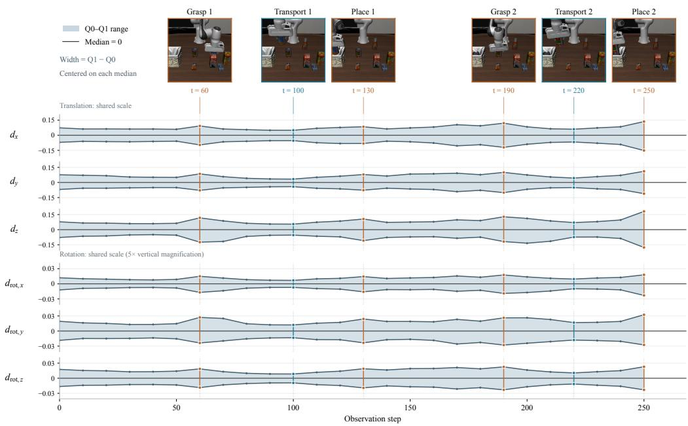  
Figure 9: Predicted action spread across six motion dimensions. Median-centered ranges in environment-command units from the rollout in Figure $5 ;$ rotation panels use fivefold vertical magnification.

## B.1 PER-DIMENSION ACTION DISTRIBUTIONS

Let $\widetilde { Q } _ { \tau , d } ( t )$ be the normalized quantile for coordinate d at observation t in Figure 5. Averaging its median-centered endpoints over six coordinates, excluding the gripper, gives:

$$
\begin{array} { l l } { { \displaystyle { \cal L } ( t ) = \frac { 1 } { 6 } \sum _ { d = 1 } ^ { 6 } \left( \widetilde { Q } _ { 0 , d } ( t ) - \widetilde { Q } _ { 0 . 5 , d } ( t ) \right) , } } & { { \displaystyle { \cal U } ( t ) = \frac { 1 } { 6 } \sum _ { d = 1 } ^ { 6 } \left( \widetilde { Q } _ { 1 , d } ( t ) - \widetilde { Q } _ { 0 . 5 , d } ( t ) \right) , } } \\ { { \displaystyle { \cal W } ( t ) = { \cal U } ( t ) - { \cal L } ( t ) = \frac { 1 } { 6 } \sum _ { d = 1 } ^ { 6 } \left( \widetilde { Q } _ { 1 , d } ( t ) - \widetilde { Q } _ { 0 , d } ( t ) \right) . } } & { { } } \end{array}
$$

This is a descriptive mean of marginal ranges, not the quantile range of an averaged action. All outputs use the first prediction step $( h = 0 ) ; Q _ { 0 }$ and $Q _ { 1 }$ are obtained by linear extrapolation of the outer quantile knots.

Figure 9 shows the individual ranges in environment-command units. The three translation panels share one vertical scale; the three rotation panels share another, magnified fivefold. Both figures use 26 replanning observations from one successful LIBERO-Long episode that places alphabet soup and tomato sauce in a basket. Video frames are matched to observations by their recorded indices. “Place” marks lowering into the basket and does not imply that release is complete.

## B.2 REAL-ROBOT EXPERIMENTS

Platform. The platform has an AgileX Piper arm, a two-finger gripper, a wrist RGB camera, and a fixed external RGB camera (Figure 10).

Tasks. We evaluate two tasks: placing an apple on a yellow plate and removing a cuboid from a blue plate. Figure 11 illustrates their action sequences using frames from the recorded videos.

Training. Each task has 100 demonstration trajectories. We train using two NVIDIA A8000 GPUs for 6,000 optimizer updates per training run. The compared methods are Quantile Head and $\pi _ { 0 . 5 }$ Both methods use the same demonstration data, optimization settings, and training budget. The $\pi _ { 0 . 5 }$ baseline is fully fine-tuned, including its VLM. Quantile Head keeps the VLM frozen and trains the action expert, prompts, and output heads, as described in Section 3.2. Quantile Head uses deterministic median decoding at deployment. At each replanning call, the policy supplies a ten-step action sequence to the controller, which executes it before obtaining a new observation and replanning.

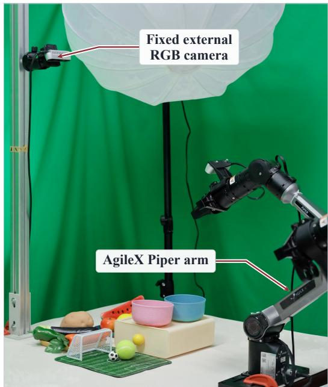  
(a) Platform overview

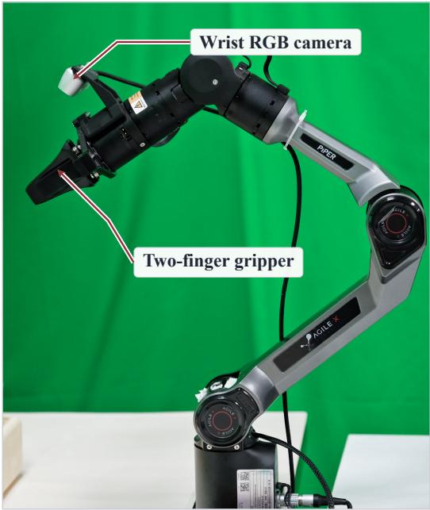  
(b) Wrist and gripper

Figure 10: Real-robot platform. The experimental setup and arm assembly, with the AgileX Piper arm, two-finger gripper, wrist RGB camera, and fixed external RGB camera labeled.  
(a) Apple: table → yellow plate  
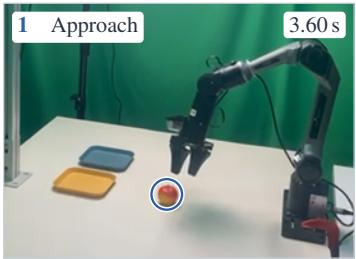

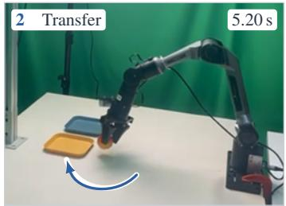

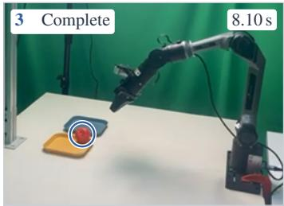

(b) Cuboid: blue plate → table  
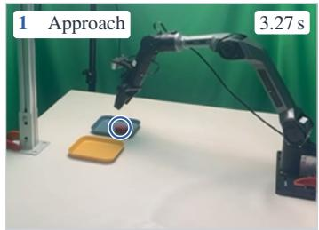

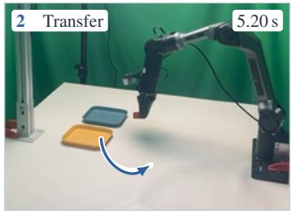

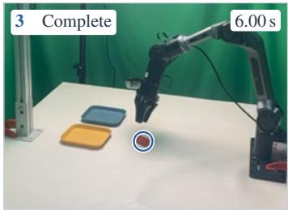  
Figure 11: Two real-robot tasks. Frames from the task videos show apple placement and cuboid removal. Numbered keyframes indicate temporal order, with source-video times in seconds. Blue circles mark the manipulated objects, and arrows schematically indicate the direction of motion.

Evaluation conditions. For each task, both methods are evaluated over the same ranges of initial robot and scene configurations, using the same task-specific success criteria and timeout limits. A trial is successful when the task goal is achieved within its time limit; a trial that reaches the timeout without meeting the success criterion is counted as a failure.

Evaluation budget and aggregation. For each method and task, we evaluate each trained model with a budget of 100 trials. We compute each model’s task success rate as the percentage of successful trials. Table 3 reports per-task success rates; its Average row gives the unweighted mean over the two tasks. The reported $\Delta$ is the difference between the two methods in percentage points. The video frames in Figure 11 illustrate task execution and are not additional evaluation trials.

## B.3 CONTROLLED TWO-DEMONSTRATION EXPERIMENT

Task and demonstration construction. We use task 0 of LIBERO-Object with the instruction “pick up the alphabet soup and place it in the basket.” A scripted geometric controller generates two successful, complete demonstrations, each containing 315 actions. Starting from the same simulator state, the demonstrations take opposite 11 cm lateral detours, perpendicular to the initial approach direction, before aligning with the object and completing grasping, transport, and placement. Both use initial-state index 0, environment seed 20260922, and ten settling steps. The initial external camera image, wrist-camera image, robot state, and simulator state are verified to be identical. The instruction contains no left/right cue, so the shared initial observation has two different demonstrated actions. Each observation contains two 224 × 224 RGB images and an eight-dimensional robot state; each action contains six motion commands and one gripper command. Figure 12 shows the recorded approach paths, the first ten action commands, and representative observations from these two training trajectories, with top-down renderings of the saved states at maximum route separation.

Training samples and shared initialization. Each training example pairs a pre-action observation with the next ten actions from the same demonstration, giving 630 available start indices. We mask steps beyond the end of a trajectory and unused action dimensions. Each batch contains 16 examples: two copies of the initial observation from each demonstration and six uniformly sampled start indices from each demonstration. Thus, 25% of the batch slots are reserved for the ambiguous start; the remaining 75% samples both trajectories equally, with replacement. All four variants use the same batch sequence, instruction, and native state/action preprocessing from the same pretrained $\pi _ { 0 . 5 }$ checkpoint. They also share the initialization of the action expert, the freshly initialized linear output projection, and 16 trainable prompt tokens. The VLM is frozen; each variant trains its action expert and other action-side modules, including the prompt tokens and output head. Quantile Head additionally trains its gap projection, so the trainable parameter counts are not identical.

Objectives and optimization. Quantile Head uses ordered quantiles at 21 equally spaced levels from 0.025 to 0.975 and averages their pinball losses. The $L _ { 1 }$ and $L _ { 2 }$ heads use absolute and squared action errors, respectively. For Flow Matching, we draw standard-normal noise ϵ, set $x _ { t } =$ $( 1 - t ) a + t \epsilon$ , and supervise the velocity $\epsilon - a$ with squared error, where $t = 0 . 0 0 1 + 0 . 9 9 9 b$ and $\boldsymbol { b } \sim \mathrm { B e t a } ( 1 . 5 , 1 )$ . All losses average over valid coordinates within each example and then over the batch. This controlled experiment uses padding masks only, without random coordinate-label dropping. We train each variant for 6,000 updates on one NVIDIA RTX 5090 GPU in float32, with AMP and TF32 disabled. AdamW uses $( \bar { \beta _ { 1 } } , \beta _ { 2 } ) = ( 0 . 9 , 0 . 9 5 ) , \epsilon = 1 0 ^ { - 8 }$ , and gradient clipping at norm 1. The peak learning rate is $1 0 ^ { - 4 }$ for prompts and $2 . 5 \times 1 0 ^ { - 5 }$ for other trainable parameters, with weight decay 0 and 0.01, respectively. Both rates use 200 linear warmup updates followed by cosine decay toward 10% of their peak values. Frozen VLM prefixes are cached during training; cached and complete forward passes are checked for output and gradient agreement. The frozen parameters are also verified to remain unchanged.

Fixed-observation distribution sampling. For one illustrated training run, we compare 1,000 action samples per head at the shared initial observation. Each sample contains ten prediction steps; Figure 13 shows the first step only. These 1,000 draws are distinct from the 100 closed-loop trials per decoder visualized in Figure 6. Quantile Head draws one $z \sim \mathcal { N } ( 0 , 1 )$ per sample and uses $\tau = \Phi ( z )$ for all six motion coordinates and all ten prediction steps, with the gripper at its median. Here, Φ denotes the standard normal CDF. Actions are decoded from the exported quantile function using piecewise-linear interpolation and linear tail extrapolation beyond its [0.025, 0.975] knots. This fixed-observation decoding does not require a new network forward pass for each noise draw. Flow Matching uses ten integration steps; its samples and the deterministic $L _ { 1 } / L _ { 2 }$ outputs use the same observation and instruction. No noise is added after decoding. These draws characterize conditional output distributions, rather than variation across training runs or closed-loop episodes. The shared quantile rank specifies a coupling across coordinates; the marginal plots alone do not establish learned joint dependence.

t = 120.  
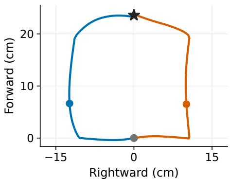

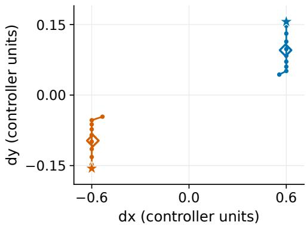  
(b) First ten action commands.

(a) Measured approach paths.  
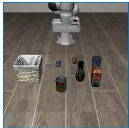  
(c) Left: shared start. t = 0.

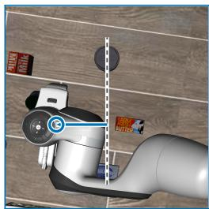  
(d) Left: top view. t = 29; 12.37 cm left.

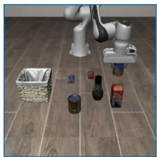  
(e) Left: object lifted. t = 120.

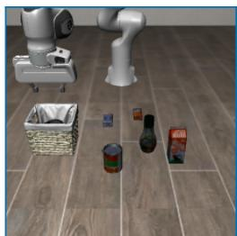  
(f) Left: final success. t = 315.

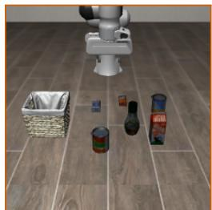  
(g) Right: shared start. t = 0.

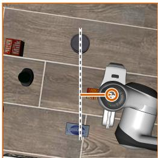  
(h) Right: top view.  
t = 29; 10.07 cm right.

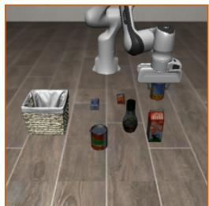  
(i) Right: object lifted.

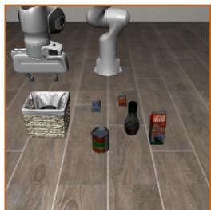  
(j) Right: final success. t = 315.  
Figure 12: Two training demonstrations with the same initial observation. Blue and orange denote left and right detours under the shared instruction “pick up the alphabet soup and place it in the basket.” (a) Measured end-effector paths for $t = 0 , \ldots , 6 5$ , resolved into rightward and forward displacement relative to the initial approach direction. The gray circle marks the shared start, the black star the initial target position, and colored dots the largest simultaneous XY separation (22.45 cm at $t = 2 9 )$ . (b) Raw controller commands: stars mark the first actions and hollow diamonds the tenstep means. (d), (h) Top-down renderings of the recorded $t = 2 9$ states, with screen right aligned to the rightward axis in (a). Dashed lines mark the shared start–target centerline; colored rings mark the projected end effector and arrows show its lateral offset in the restored state. All other frames are original training-camera observations. Here t counts executed actions. Both 315-step demonstrations end in task success.

Closed-loop sampling settings. Using the same trained checkpoints, we initially evaluate seven settings: three stochastic Quantile decoders, Quantile median, Flow Matching, $L _ { 1 } ,$ , and $L _ { 2 }$ . For each stochastic Quantile decoder, the latent for motion coordinate d in replanning chunk k follows

$$
z _ { 0 , d } \sim \mathcal { N } ( 0 , 1 ) , \qquad z _ { k , d } = 0 . 9 z _ { k - 1 , d } + \sqrt { 1 - 0 . 9 ^ { 2 } \epsilon _ { k , d } } , \qquad \epsilon _ { k , d } \sim \mathcal { N } ( 0 , 1 ) .\tag{B.2}
$$

Innovations are independent across coordinates and episodes. The native decoder uses $\tau _ { k , d } = 0 . 1 +$ $0 . 8 \Phi ( 0 . 3 5 z _ { k , d } ) ;$ ; the independent-rank decoder uses $\tau _ { k , d } = \Phi ( z _ { k , d } ) $ ; the shared-rank decoder uses $\tau _ { k , d } = \Phi ( z _ { k , 1 } )$ for all six motion coordinates. Each rank is held constant over the ten prediction steps in its chunk, and the gripper always uses rank 0.5. The three stochastic decoders therefore share the same temporal correlation; “independent” refers to ranks across coordinates. All use the quantile interpolation and tail rule described above. Median decoding sets every rank to 0.5. Flow Matching draws fresh Gaussian noise at each replan and uses ten Euler integration steps. The $L _ { 1 }$ and $L _ { 2 }$ heads return deterministic commands.

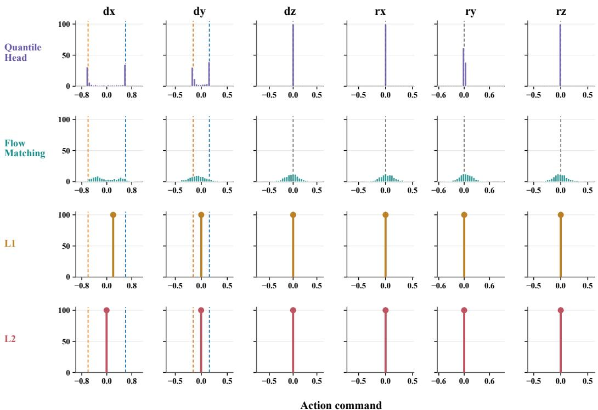  
Figure 13: Action distributions learned across six motion dimensions. Rows compare the four heads and columns show first-step action commands from the no-obstacle setting in Figure 6. Every panel uses 1,000 samples from one illustrated training run; bins and axes are shared across heads within each column. The vertical axis is probability mass per bin (%); stems denote point masses. Blue and orange dashed lines mark the two demonstrations, with a gray line where their values coincide. Only $d _ { x }$ and $d _ { y }$ have distinct demonstration targets at this step; the other four targets are zero. A narrow sampled distribution can occupy a single bin and need not be a point mass.

Table 7: Closed-loop success rates in the two-demonstration experiment. Evaluation uses the same training initial state. These rates measure completion at this fixed state.
<table><tr><td>Setting</td><td>Success rate (%)</td></tr><tr><td>Quantile: native ranks</td><td>94.0</td></tr><tr><td>Quantile: independent ranks</td><td>87.0</td></tr><tr><td>Quantile: shared ranks</td><td>92.0</td></tr><tr><td>Quantile: median</td><td>100.0</td></tr><tr><td>Flow Matching (10 integration steps)</td><td>3.0</td></tr><tr><td> $L _ { 1 }$ </td><td>100.0</td></tr><tr><td> $L _ { 2 }$ </td><td>100.0</td></tr></table>

Closed-loop evaluation protocol. We use an evaluation budget of 100 complete simulator episodes per setting. Every episode resets to the same training initial state and environment seed used to collect the demonstrations, with the same images, robot state, and instruction at the start. Random generators and temporal latents are maintained separately for each episode. The policy predicts and executes ten actions before observing again. Evaluation stops on environment termination or truncation, with a maximum of 400 executed actions. Success means that the environment’s success flag becomes true during the episode. Every recorded success also has a successful final state. Evaluation performs no weight updates. Inference batches eight separate environments; the first two predicted chunks and decoded actions are checked against single-example inference with the same inputs and noise. The illustrated run records executed actions, states, predictions, noise, success flags, and video for checking the plotted trajectories.

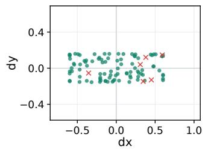  
(a) Quantile: native ranks. 94% success.

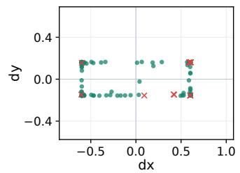  
(b) Quantile: independent ranks. 87% success.

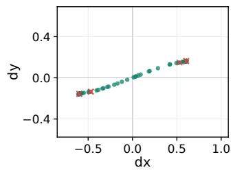  
(c) Quantile: shared ranks. 92% success.

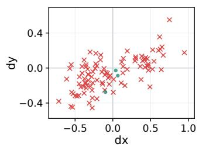  
(d) Flow Matching. 3% success.

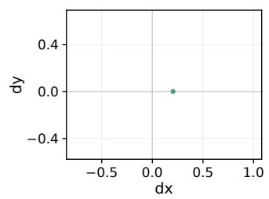  
(e) L1. 100% success.

  
(f) $L _ { 2 } .$ 100% success.

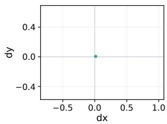  
(g) Quantile: median.  
100% success.  
Figure 14: Initial action commands and closed-loop outcomes. Points show one training run’s 100 episodes per decoder; subcaptions report success rates. Each point represents one episode’s first executed action. Green circles indicate eventual success; red crosses indicate failure. All panels use the same axes and, within this experiment, the same initial observation. Axis limits also match Figure 17 for comparison with the obstacle setting. The 100 points in each of (e), (f), and (g) coincide exactly; no coordinate jitter is added. Colors label whole episodes, rather than the correctness of individual action coordinates.

Action coordinates and interpretation. Figure 14 places each episode’s first executed action from one illustrated training run at its $( d _ { x } , d _ { y } )$ coordinates and colors it by the final episode outcome. These coordinates are environment action commands, not measured Cartesian displacements in meters. We use the first action because its observation is shared across all episodes; later actions may be conditioned on different states. The successful and failed Quantile episodes occupy overlapping regions, so these coordinates do not define a success/failure threshold: other action dimensions and later sampled actions also affect completion. As shown in Table 7, the three sampled Quantile decoders achieve 87–94% success, while Flow Matching achieves 3%. Median, $L _ { 1 }$ , and $L _ { 2 }$ each achieve 100% with identical repeated action sequences within each trained model. Repeated executions at this fixed state are not independent task instances. Moreover, high task success alone does not establish coverage of both demonstrated approach routes.

Supplemental density-weighted sampling. We additionally evaluate the same no-obstacle Quantile models with the six-motion-coordinate density-weighted decoder defined in Equations (B.4)– (B.5). It squares the mean marginal density over six motion coordinates and ten prediction steps, samples one shared rank, and fixes the gripper at its median. The initial state, instruction, 400-action limit, ten-action execution chunks, AR coefficient 0.9, and evaluation budget match the original shared-rank evaluation. No weights are updated. The success rate is 95%, compared with 92% for uniform shared ranks and 100% for median decoding. Figure 6 illustrates 100 first-action point and their episode outcomes from one training run.

## B.4 TWO DEMONSTRATIONS WITH A CENTRAL OBSTACLE

Appendix B.3 permits deterministic policies to complete the task despite the two distinct demonstrated routes. We add a physical obstruction to examine completion in a setting where the prescribed direct approach fails.

Task and demonstration construction. We extend the task in Appendix B.3 with a fixed, visible, collidable box on the approach to the alphabet soup. The box measures $6 \times 4 . 4 \times 1 9$ cm and is centered 10 cm ahead of the initial end-effector position along the tabletop approach direction. The task instruction remains “pick up the alphabet soup and place it in the basket,” with no left/right cue. Initial-state index 0 and environment seed 20260922 are retained, and both demonstrations are collected anew in this modified scene. Their initial external and wrist images, robot states, and simulator states are identical to each other. The original and modified scenes have different rendered observations and full simulator states, so this equality applies within each experiment.

The scripted controller generates one complete left-detour demonstration and one complete rightdetour demonstration. Each contains 430 actions, uses a nominal 15 cm lateral route offset, and completes the task without recorded obstacle contact. In comparison, the demonstrations in Appendix B.3 contain 315 actions each and use 11 cm offsets in a scene without the added box. The approach height is reduced from 18 to 12 cm, and transport after grasping also follows a lateral detour around the box. A separate straight-approach control fails to complete the obstacle task and records contact on 179 of its 475 executed steps. This failed control is excluded from training. It verifies that this particular direct approach is obstructed; the environment retains the original objectin-basket success criterion. Obstacle contact alone does not terminate an episode or label it a failure.

Figure 15 documents the two training samples in the same format as Figure 12. The measured paths and aligned overhead views show the two approaches passing on opposite sides of the central box; both demonstrations then lift the object and complete placement.

Training samples and optimization. We train all four variants anew on only the two obstacle demonstrations, giving 860 available pre-action start indices. The observation and action formats, ten-action training targets, padding masks, balanced batch of 16, and forced sampling of the shared start follow Appendix B.3. All four heads start from the same pretrained $\pi _ { 0 . 5 }$ checkpoint and share the action-side and 16-token prompt initialization and training batch sequence within this experiment. The VLM remains frozen; the action expert, other action-side modules, output head, and prompts are trained for 6,000 updates. Objectives, optimizer settings, learning-rate schedules, and float32 precision also follow the earlier experiment. The changed demonstrations produce a new training cache and newly fitted checkpoints. Cached/full forward and gradient agreement and un changed frozen weights are verified for every head.

Fixed-observation action distributions. Figure 16 extends the four-head comparison in Figure 13 to the obstacle demonstrations. Using the checkpoints from one illustrated training run, we draw 1,000 action chunks per head at their common training-start observation and instruction. Each chunk contains ten actions; the figure shows the first action’s six motion coordinates. Quantile Head draws $z \sim \mathcal { N } ( 0 , 1 )$ ) independently for each sample and uses $\tau = \Phi ( z )$ ) across all six coordinates and all ten prediction steps, with the gripper fixed at its median. We decode the exported quantile function with the same piecewise-linear interpolation and tail extrapolation as in Appendix B.3. Flow Matching uses fresh Gaussian noise and ten integration steps; $L _ { 1 }$ and $L _ { 2 }$ are evaluated repeatedly at the same observation. The frozen VLM prefix is cached, and no parameters are updated.

Bins and axes are shared across heads within each dimension. Blue and orange reference lines denote the two demonstrations; gray lines mark coincident targets. At this first step, the targets differ in $d _ { x }$ and $d _ { y } ,$ share $d _ { z } = - 0 . 6$ , and have zero rotational commands. Thus, the vertical approach command differs from the zero $d _ { z }$ target in Figure 13. These plots characterize conditional output distributions at one observation. Task-completion accuracy is evaluated separately below.

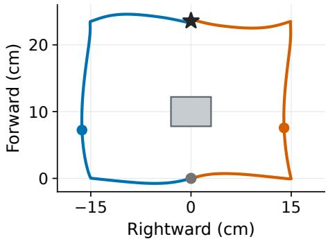

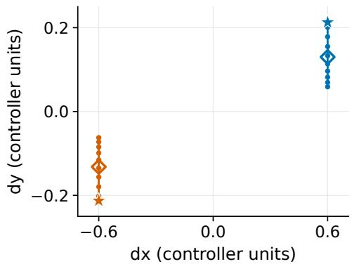

(a) Measured approach paths.  
  
(c) Left: shared start. t = 0.

  
(d) Left: top view. t = 40; 16.32 cm left.

(b) First ten action commands.  
  
(e) Left: object lifted. t = 180.

  
(f) Left: final success. t = 430.

  
(g) Right: shared start. t = 0.

  
(h) Right: top view.  
t = 40; 13.92 cm right.

  
(i) Right: object lifted.

  
(j) Right: final success. t = 430.  
Figure 15: Two successful training demonstrations around a central obstacle. Blue and orange denote left and right detours from the same initial observation under the shared instruction “pick up the alphabet soup and place it in the basket.” (a) Measured end-effector approach paths for $t = 0 , \ldots , 1 0 5 ;$ the shaded rectangle is the footprint of the $6 \times 4 . 4 \times 1 9 \mathrm { c m }$ obstacle. The gray circle marks the shared start, the black star the initial target position, and colored dots the largest simultaneous XY separation (30.24 cm at $t = 4 0 )$ . (b) Raw controller commands: stars mark the first actions and hollow diamonds the ten-step means. (d), (h) True overhead renderings of the saved $t ~ = ~ 4 0$ states, with screen right aligned to the rightward axis in (a). Dashed centerlines and colored end-effector rings and offset arrows distinguish the two routes; the red dashed outline marks the obstacle’s projected top face, including occluded edges. All other frames are original training-camera observations. Here t counts executed actions. Both 430-action demonstrations finish successfully without recorded obstacle contact and are the only training trajectories for this experiment.

Quantile samples have peaks near both demonstrated $d _ { x }$ and $d _ { y }$ values, with some mass remaining between the peaks. In these coordinates, $L _ { 1 }$ and $L _ { 2 }$ each produce a single value between the two targets, while Flow Matching spreads its mass over wider action ranges.

Closed-loop sampling and evaluation. We compare the same seven decoders as in Appendix B.3. Stochastic Quantile latents use the AR coefficient 0.9 in equation B.2. Native ranks use 0.1 + $0 . 8 \Phi ( 0 . 3 5 z _ { d } )$ , independent ranks use $\Phi ( z _ { d } )$ , and shared ranks use $\Phi ( z _ { 1 } )$ across all six motion coordinates. The gripper uses its median, and each rank is held over the ten actions in a chunk. Quantile median, $L _ { 1 }$ , and $L _ { 2 }$ are deterministic; Flow Matching uses fresh Gaussian noise and ten Euler integration steps. Every episode starts in the obstacle training state and predicts and executes ten actions before replanning. The action budget increases from 400 to 600 to accommodate the longer demonstrations. Each decoder has an evaluation budget of 100 episodes. In the illustrated run, median actions and simulator trajectories are identical across repeated executions. The illustrated trajectories are checked against their recorded success flags, executed actions, resets, noise, and obstacle contacts.

  
Figure 16: Conditional action distributions with a central obstacle. Rows compare four heads; columns show six motion coordinates of the first predicted action, using 1,000 samples per head from one illustrated training run at a shared initial observation. Each column shares 32 bins and axes. The vertical axis gives probability mass per bin (%) on a 0–105% scale. Stems denote exactly constant outputs; narrow distributions remain histograms. Blue and orange dashed lines mark the two demonstrations, with gray where references coincide: $d _ { z } = - 0 . 6$ and all rotation targets zero. Quantile Head uses one shared rank $\tau = \Phi ( z )$ across motion coordinates; Flow Matching uses ten integration steps. These marginal distributions do not establish learned joint dependence or measure closed-loop success.

Task success rates. Table 8 reports task-completion accuracy, defined as the percentage of completed episodes in which the original environment success flag becomes true. All recorded successes also have successful final states. Among these seven matched decoders in the obstacle setting, shared-rank Quantile sampling attains the highest observed success rate, 6.0%, followed by independent ranks at 4.0% and native ranks at 1.0%. Flow Matching, L , L , and Quantile median each achieve 0.0%. Thus, the deterministic decoders that achieved 100% in the earlier setting fail in this modified setting, while stochastic Quantile decoding retains a small number of successful episodes. The highest rate within this seven-decoder comparison is only 6%; it does not establish reliable obstacle avoidance. Because the scene, demonstrations, fitted checkpoints, and action budget all change, the cross-experiment difference is a comparison of two controlled settings rather than an isolated estimate of the obstacle’s effect. Each setting uses one training initial state; repeated deterministic episodes are not independent task instances.

Table 8: Task success rates in the original and obstacle settings. Each head is trained for 6,000 updates on its setting’s two demonstrations. These rates measure completion at a fixed training initial state.
<table><tr><td rowspan="2">Setting</td><td colspan="2">Success rate  $( \% )$ </td></tr><tr><td>Earlier (B.3)</td><td>Obstacle</td></tr><tr><td>Quantile: native ranks</td><td>94.0</td><td>1.0</td></tr><tr><td>Quantile: independent ranks</td><td>87.0</td><td>4.0</td></tr><tr><td>Quantile: shared ranks</td><td>92.0</td><td>6.0</td></tr><tr><td>Quantile: median</td><td>100.0</td><td>0.0</td></tr><tr><td>Flow Matching (10 steps)</td><td>3.0</td><td>0.0</td></tr><tr><td> $L _ { 1 }$ </td><td>100.0</td><td>0.0</td></tr><tr><td> $L _ { 2 }$ </td><td>100.0</td><td>0.0</td></tr></table>

  
(a) Quantile: native ranks. 1% success.

  
(b) Quantile: independent ranks. 4% success.

  
(c) Quantile: shared ranks. 6% success.

  
(d) Flow Matching. 0% success.

  
(e) $L _ { 1 } .$  
0% success.

  
(f) $L _ { 2 } .$ 0% success.

  
(g) Quantile: median.  
0% success.  
Figure 17: Initial action commands and outcomes with a central obstacle. Points illustrate one training run; subcaptions report success rates. Each point is one episode’s first action: green circles indicate eventual success and red crosses indicate failure. All settings share the same obstacle-task initial observation. Axes match Figure 14 for visual comparison; coordinates are environment action commands, not physical displacements. The $1 0 0 L _ { 1 }$ and $L _ { 2 }$ points and the 100 median points each coincide exactly within their respective panels. No coordinate jitter is added. Colors describe whole episodes, rather than the correctness of an individual action.

Table 9: Density-based decoding in the obstacle setting. All variants use the same trained Quantile models.
<table><tr><td>Selection</td><td>Scored coordinates</td><td>Gripper rank</td><td>Success (%)</td></tr><tr><td>Random, squared density</td><td>Six motion</td><td>Median</td><td>13</td></tr><tr><td>Random, linear density</td><td>All seven</td><td>Shared sampled rank</td><td>14</td></tr><tr><td>Maximum mean density</td><td>All seven</td><td>Shared selected rank</td><td>0</td></tr></table>

Table 10: Two-demonstration task success rates (%). Evaluation uses each setting’s fixed training initial state. Uniform shared ranks cover $[ 0 , 1 ] ;$ density weighting uses six motion coordinates with exponent two. Deterministic repeats are not independent task instances.
<table><tr><td>Decoder</td><td>No obstacle</td><td>Obstacle</td></tr><tr><td>Quantile: uniform shared ranks</td><td>92</td><td>6</td></tr><tr><td>Quantile: density-weighted shared ranks</td><td>95</td><td>13</td></tr><tr><td>Quantile: median</td><td>100</td><td>0</td></tr><tr><td>Flow Matching (10 integration steps)</td><td>3</td><td>0</td></tr><tr><td> $L _ { 1 }$ </td><td>100</td><td>0</td></tr><tr><td> $L _ { 2 }$ </td><td>100</td><td>0</td></tr></table>

Action coordinates and interpretation. Figure 17 relates the first executed $( d _ { x } , d _ { y } )$ command to each complete episode’s outcome in one illustrated training run, using the same axes and colors as Figure 14 for the earlier experiment. These are action commands, not measured end-effector positions. All episodes within each experiment share their initial observation. The obstacle setting places the deterministic median, $L _ { 1 }$ , and $L _ { 2 }$ outputs near the origin, with all their episodes failing. Shared-rank sampling traces a narrow curve; successes occur near its two ends, alongside failures. Independent ranks span a broader set of coordinate combinations. This association does not make a first-action coordinate a sufficient condition for success: other coordinates and later actions also differ. Inspection of the illustrated run’s successful trajectories confirms that the end-effector first crosses the obstacle-center plane on the left in three shared-rank episodes and on the right in three. This describes the end-effector’s first crossing of the plane; it does not imply that every sampled route succeeds or remains free of contact throughout the episode.

Effect of the shared sampling interval. We next vary only the sampling interval of each trained Quantile model, retaining the obstacle scene, task instruction, initial state, and 600-action evaluation budget above. For a lower endpoint $\ell \in \{ 0 , 0 . 1 , 0 . 2 , 0 . 3 , 0 . 4 \}$ , the shared motion rank in chunk k is

$$
\tau _ { k } = \ell + ( 1 - 2 \ell ) \Phi ( z _ { k , 1 } ) , \qquad \tau _ { k , d } = \tau _ { k } \quad ( d = 1 , \ldots , 6 ) ,\tag{B.3}
$$

where $z _ { k , 1 }$ follows the Gaussian AR process in equation B.2. The rank is shared across all ten actions in each chunk, and the gripper remains at rank 0.5. This affine CDF mapping gives a marginally uniform rank within $[ \ell , 1 - \ell ]$ , with temporal correlation across chunks; it uses neither density weighting nor the native decoder’s temperature factor 0.35. In particular, the shared [0.1, 0.9] setting differs from the native decoder in both its temperature and its cross-coordinate rank sharing. The sixth setting fixes every coordinate at its median, $\tau = 0 . 5$

Each setting uses an evaluation budget of 100 simulator episodes. Corresponding stochastic evaluations use matched underlying Gaussian sequences. The full-range shared and median results reuse the evaluations in Table 8. No model is retrained when changing the sampling interval.

Success rates and action distributions. For [0, 1], [0.1, 0.9], [0.2, 0.8], [0.3, 0.7], [0.4, 0.6], and fixed 0.5, respectively, success rates are 6%, 4%, 15%, 7%, 3%, and 0%. The highest success rate is 15% for [0.2, 0.8], 9 percentage points above full-range shared sampling. Success does not increase monotonically as the interval narrows. Figure 18 plots the first executed $( d _ { x } , d _ { y } )$ command from each episode in one illustrated training run and labels it by the full episode’s outcome. The narrowest stochastic window reduces coverage of the demonstrated endpoints; median decoding produces one central command, with all illustrated episodes failing. Successful episodes coexist with nearby failed first commands, so these coordinates alone do not determine task completion. These success rates describe performance at one training initial state; they do not establish a universally optimal interval or reliable obstacle avoidance.

Density-weighted shared-rank sampling. We further evaluate a density-weighted decoder using the same obstacle Quantile models, without retraining. For each model at a new observation, let

  
(a) τ ∈ [0, 1]. 6% success.

  
(b) τ ∈ [0.1, 0.9]. 4% success.

  
(c) τ ∈ [0.2, 0.8]. 15% success.

  
(d) τ ∈ [0.3, 0.7]. 7% success.

  
(e) τ ∈ [0.4, 0.6]. 3% success.

  
(f) τ = 0.5 (median). 0% success. 100 identical points overlap.  
Figure 18: Shared quantile sampling intervals and obstacle-task outcomes. Each panel illustrates 100 episodes from one training run at the same initial observation; subcaptions report success rates. Each point is the first executed action command: green circles indicate eventual episode success, red crosses indicate failure, and blue diamonds mark the two training demonstrations’ first actions. The six motion coordinates share one rank; the gripper uses its median. All panels use identical axes in environment action-command units, with no jitter or removal of coincident points. The deterministic median repeats are not independent task instances.

$Q _ { h , d , j }$ be its predicted quantile at learned level $\tau _ { j }$ , in the model’s normalized action coordinates. For each interval between learned levels, we compute

$$
s _ { j } = \frac { 1 } { 6 0 } \sum _ { h = 0 } ^ { 9 } \sum _ { d = 1 } ^ { 6 } \frac { \tau _ { j + 1 } - \tau _ { j } } { \operatorname* { m a x } ( Q _ { h , d , j + 1 } - Q _ { h , d , j } , 1 0 ^ { - 6 } ) } .\tag{B.4}
$$

The 21 learned levels span [0.025, 0.975]. Adding the two outer intervals gives 22 intervals covering [0, 1]; each outer interval copies the adjacent learned interval’s density, consistently with linear tail extrapolation. For interval $I _ { j }$ of width $\Delta _ { j }$ , the normalized sampling weight is

$$
p _ { j } = \frac { \Delta _ { j } s _ { j } ^ { 2 } } { \sum _ { k } \Delta _ { k } s _ { k } ^ { 2 } } .\tag{B.5}
$$

We draw a continuous rank by inverting the resulting piecewise-linear CDF with $U _ { k } = \Phi ( z _ { k , 1 } )$ retaining the AR coefficient 0.9 in equation B.2. The sampled rank is shared across all six motion coordinates and all ten steps of the chunk; the gripper is excluded from scoring and decoded at rank 0.5. Scores are recomputed after each new observation. This is a state-dependent proposal based on average marginal densities, not an estimate of joint action likelihood. Soft weighting does not exclude low-density intervals.

The trained models, initial state, instruction, ten-action execution chunks, 600-action limit, and evaluation budget match the full-range shared-rank baseline. The success rate is 13%, versus 6% for uniform shared ranks, a 7-percentage-point difference at this fixed initial state. The low absolute success rate does not establish reliable obstacle avoidance. Applying the same decoding rule to the no-obstacle models gives 95% success; see Appendix B.3 for that supplemental evaluation, which retains its original 400-action limit.

For completeness, an earlier random decoder averages density over all seven coordinates, including the gripper, uses linear weights $p _ { j } \propto \Delta _ { j } s _ { j }$ , and applies the selected rank to all seven coordinates. It achieves 14% success. A separate deterministic diagnostic selects the midpoint of the learned interval with the highest seven-coordinate mean density, again using that rank for all coordinates; its success rate is 0%. These variants are summarized in Table 9. The six- and seven-coordinate random variants differ in the scoring dimensions, weighting exponent, and gripper decoding, so their one-percentage-point difference does not isolate any one of these changes.

Table 10 summarizes the two settings across action heads and the three Quantile decoding strategies shown in Figure 6.