# RATE-DISTORTION ADAPTIVE PRIMITIVE SELECTIONFOR OMNIDIRECTIONAL GAUSSIAN SPLATTING

Yulong Cheng1 Youneng Bao2 Junfeng Zhou1 Mu Li1\* Jie Wen1

1Harbin Institute of Technology, Shenzhen, China

2Shenzhen University, Shenzhen, China

dark.stven@gmail.com,baoyn@szu.edu.cn,limu403@163.com

## ABSTRACT

Learned image codecs (LICs) achieve high reconstruction quality, but their decoding speed is often insufficient for immersive virtual reality (VR). Gaussian splatting (GS) codecs render much faster, yet still lag in reconstruction quality and typically decide primitive allocation without considering the coding cost of each primitive. We introduce OIC-GS, an omnidirectional GS codec with a new hierarchical HEALPix primitive grid representation. Gaussian primitives are anchored at predefined spherical locations, eliminating explicit coordinate coding. Finer levels refine their coarser ancestors, naturally supporting coarse-to-fine reconstruction and layered transmission. The predefined grid also enables efficient viewport decoding by selecting only view-relevant primitives. We further introduce a lightweight entropy model for quantized primitives and optimize the codec under a spherical rate-distortion objective. Primitives with insufficient rate-distortion benefit are automatically removed when their quantized opacity becomes zero, allowing OIC-GS to adapt both primitive density and level of detail without a fixed primitive budget. A single bitstream supports full-sphere, viewport-dependent, and progressive decoding. The first viewport reaches final quality after decoding only 52% of the bitstream, and is then rendered at 1,270 FPS. On a 100-image omnidirectional benchmark, OIC-GS outperforms all evaluated GS codecs, reducing WS-PSNR BD-rate by 49.6% over GaussianImage++ and 68.6% over SGI, which uses a learned entropy model.

## 1 INTRODUCTION

Immersive virtual reality (VR) requires high-resolution omnidirectional content with low decoding latency. Although learned image codecs (LICs) achieve strong reconstruction quality, they typically require entropy decoding of the full latent representation followed by a decoding network, making real-time decoding challenging. Gaussian splatting (GS) (Kerbl et al., 2023) offers a more efficient alternative by reconstructing images through lightweight rasterization of explicit primitives.

However, existing GS codecs for omnidirectional images are typically built on the equirectangular projection (ERP), whose highly non-uniform sampling density causes severe oversampling near the poles. As a result, optimization tends to allocate excessive primitives to these oversampled regions, leading to inefficient bitrate allocation and degraded rate-distortion (R-D) performance. Existing approaches also commonly adopt a two-stage optimization strategy (Li et al., 2026; Zhu et al., 2025; Pan et al., 2026): the primitive locations or numbers are first determined based on reconstruction quality, and the resulting primitive set is then fixed while its attributes are optimized. This separation prevents the coding cost and distortion reduction of each primitive from being jointly considered, making R-D-optimal primitive selection difficult.

VR viewing introduces another important requirement. Unlike conventional images, an omnidirectional image is viewed only through a local viewport at any given time. Existing learned and GS codecs nevertheless reconstruct the entire panorama before projecting the requested viewport, introducing unnecessary transmission and decoding latency. A more efficient solution is to transmit and decode only the primitives required by the current viewport, while progressively delivering the remaining content when needed.

To address these issues, we propose OIC-GS (Fig. 1), a content-adaptive hierarchical GS codec that is fitted to each panorama following the overfitted coding paradigm (Dupont et al., 2021; Strümpler et al., 2022; Ladune et al., 2023; Kim et al., 2024) and optimized end-to-end under a rate-distortion (R-D) objective. Primitives are organized on hierarchical HEALPix grids (Gorski et al., 2005), where each level progressively refines its coarser ancestors. Since primitive positions are predefined by the spherical grid, only their existence needs to be coded, eliminating the overhead of explicitly coding coordinates. Moreover, HEALPix operates directly on the sphere with approximately uniform sampling, avoiding the severe sampling imbalance introduced by ERP. A lightweight entropy model estimates the rate of primitive attributes using Gaussian mixtures conditioned on previously decoded hierarchy levels as a prior and on a spherical checkerboard context within each level. Primitive existence is jointly optimized through quantized opacity, such that a primitive is selected only when its distortion reduction justifies its estimated coding cost. The resulting hierarchical bitstream supports two complementary forms of progressive decoding: coarse-to-fine refinement across hierarchy levels and viewport-to-full-sphere decoding, where only the primitives required by the current viewport are transmitted and decoded first. With a tile-aligned storage format that increases file size by only 1.2% on average, a single bitstream supports full-sphere, viewport-dependent, and progressive streaming decoding (App. D).

In summary, our main contributions are threefold:

• Rate-distortion adaptive primitive selection. We couple the quantized opacity of each primitive with the bitrate estimated by the entropy model and optimize the resulting rate jointly with distortion. This encourages primitives with limited distortion reduction to gradually reduce their opacity to zero, enabling automatic primitive selection within a unified R-D optimization framework.

• One bitstream, three decoding modes, and real-time viewport rendering. OIC-GS supports full-sphere, viewport-dependent, and progressive decoding, all bit-exact within the viewport; the first viewport needs only 52% of the file.

• A new hierarchical HEALPix GS representation for single omnidirectional image compression. Built directly on the sphere, the proposed representation avoids ERP sampling imbalance and enables hierarchical coarse-to-fine coding. Experiments show that OIC-GS outperforms all tested GS image codecs across all bitrates, reducing WS-PSNR BD-rate by 49.6% compared with GaussianImage++.

## 2 RELATED WORK

In this section, we briefly review omnidirectional image compression and compression methods based on Gaussian splatting.

Omnidirectional image compression. Panoramas are conventionally projected onto a plane (e.g., ERP, cubemap or hybrid projections) and compressed with planar image or video codecs (Wallace, 1992; Skodras et al., 2001; Sullivan et al., 2012; Bross et al., 2021), where padding or contentadaptive projections reduce the projection distortion (He et al., 2018; Xu et al., 2020). Learned image codecs (Ballé et al., 2018; Minnen et al., 2018; Cheng et al., 2020; He et al., 2022) have also been extended to omnidirectional images. An end-to-end optimized 360° codec (Li et al., 2022) allocates bits adaptively to regions at different ERP latitudes, and pseudocylindrical representations (Li et al., 2025) sample the sphere nearly uniformly, so that standard convolutions can be applied with pseudocylindrical padding. OSLO (Bidgoli et al., 2022) instead learns directly on the sphere, building on HEALPix-based spherical networks such as DeepSphere (Perraudin et al., 2019). More recently, a viewport-based codec (Liao et al., 2026) replaces the projection with a fixed set of extracted viewports, which are coded one after another under a cross-viewport context model. These methods decode a static image in full, or a fixed chain of viewports, before the requested viewport is shown, so their decoding latency becomes significant at high resolutions. The addressable precincts of JPEG2000 (Taubman & Prandolini, 2003) provide region-wise access, and 360° video is delivered with viewport-adaptive streaming (Corbillon et al., 2017), but both operate on the projection plane, where a viewport near the poles becomes a full-width band. In contrast, OIC-GS renders a viewport directly from the primitives at display resolution, without a full-image network pass, and its tiles are equal-area HEALPix cells, so a polar viewport is not expanded into a full-width band. Once decoded, the viewport is rendered in real time, which supports interactive viewing.

Gaussian splatting compression. Adapted from 3D reconstruction (Kerbl et al., 2023), 2DGS (Zhang et al., 2024b) represents an image with colored Gaussians rendered by accumulated blending, and a growing number of methods improve this representation (Zhang et al., 2025; Zeng et al., 2025; Zhu et al., 2025; Takabe et al., 2026), including layered progressive coding on the plane (Wang et al., 2026). In these works, attribute compression is driven by reconstruction quality rather than by a probability model: they learn their quantizers but use fixed entropy coding or bit counting (Zhang et al., 2024b; Li et al., 2026; Zhang et al., 2024a; Liang et al., 2025), so the number of primitives cannot be driven by a rate gradient–GaussianImage++ (Li et al., 2026) densifies primitives according to reconstruction error and LIG (Zhu et al., 2025) allocates them by level of detail, neither comparing a primitive against the bits it would cost.

To our knowledge, SGI (Pan et al., 2026) is the only GS image codec with a learned entropy model. Its probability model, however, is conditioned on primitive locations through a hash grid that must itself be transmitted, and the number of primitives is fixed a priori rather than determined by the rate term. Both limitations also appear in 3D Gaussian splatting compression, where conditional entropy models over anchor attributes (Chen et al., 2024; Wang et al., 2024b) and learnable masks (Lee et al., 2024; Wang et al., 2024a) have been studied: HAC (Chen et al., 2024) queries a hash grid at the anchor position, and its mask loss counts the retained Gaussians, so pruning any Gaussian saves the same amount regardless of its actual code length. We instead condition the probability model on the rendering state that the decoder has already reconstructed, which costs no side information, and let the code length assigned to each primitive drive its existence. Following the overfitted coding paradigm (Dupont et al., 2021; Ladune et al., 2023; Kim et al., 2024), OIC-GS fits one model per image and entropy-codes its quantized parameters into the bitstream.

## 3 METHOD

In this section, we first present the hierarchical spherical Gaussian representation of OIC-GS, including its quantization, the rate-distortion adaptive primitive selection (RDPS) and the rendering process (Sec. 3.1). We then describe the entropy and rate model based on the rendering-conditioned context (RCC, Sec. 3.2), and finally the joint rate-distortion (R-D) optimization (Sec. 3.3).

## 3.1 HIERARCHICAL SPHERICAL GAUSSIAN REPRESENTATION

Representation. OIC-GS represents an omnidirectional image as a hierarchy of primitives $X =$ $\{ \pmb { x } ^ { \mathrm { ( 0 ) } } , \ldots , \pmb { x } ^ { ( L - 1 ) } \}$ on the sphere, where $L = 7$ by default and each level is an equal-area HEALPix grid that holds one primitive per cell (Fig. 1). Denoting the cells of level l by $\Omega ^ { ( \ell ) }$ , with $| \Omega ^ { ( \ell ) } | =$ $1 2 \cdot ( 4 \cdot 2 ^ { \ell } ) ^ { 2 }$ , we have $\mathbf { \Delta x } ^ { ( \ell ) } = \{ x _ { i } ^ { ( \ell ) } \mid i \in \Omega ^ { ( \ell ) } \}$ . With NESTED indexing, each cell at level $\ell - 1$ exactly covers four cells at level l. Every primitive is anchored at its cell center and carries two attributes, $x _ { i } ^ { ( \ell ) } = ( f _ { i } ^ { ( \ell ) } , \alpha _ { i } ^ { ( \ell ) } )$ : the feature $f _ { i } ^ { ( \ell ) }$ is what it contributes to the reconstruction, and the opacity $\alpha _ { i } ^ { ( \ell ) }$ acts as an existence variable that decides whether the primitive is kept. With this fixedposition design, a primitive has no position or covariance of its own: its position is given by the grid, and all primitives of a level share one isotropic kernel width.

Quantization. Both attributes are quantized with the uniform b-bit quantizer

$$
Q _ { b } ( u ) = \Delta _ { b } \Big \lfloor \frac { u } { \Delta _ { b } } \Big \rceil , \qquad \Delta _ { b } = \frac { 1 } { 2 ^ { b } - 1 } ,\tag{1}
$$

which gives the features $\hat { f } _ { i } ^ { ( \ell ) } = Q _ { 4 } ( f _ { i } ^ { ( \ell ) } )$ with the quantization step $\Delta _ { f } = \Delta _ { 4 }$ , and the opacities $\hat { \alpha } _ { i } ^ { ( \ell ) } = Q _ { 2 } ( \alpha _ { i } ^ { ( \ell ) } ) \in \{ 0 , \frac { 1 } { 3 } , \frac { 2 } { 3 } , 1 \}$ . During training, the rounding is bypassed with the straight-through estimator (STE) (Bengio et al., 2013) in the reconstruction and replaced by additive uniform noise (Ballé et al., 2017) in the rate estimate.

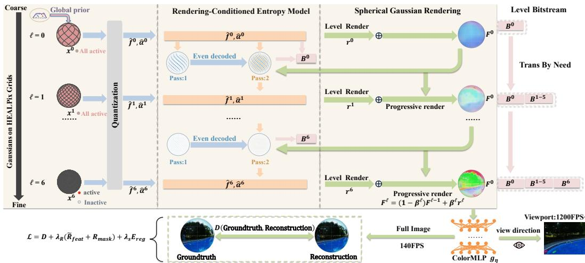  
Figure 1: Overview of OIC-GS. Primitives are anchored on hierarchical HEALPix levels and carry a quantized feature and opacity, coded level by level. The levels are rendered from coarse to fine; a primitive whose quantized opacity is zero becomes inactive, and its cell falls back to the coarser levels. The rendering state $( F ^ { ( \ell ) } , r ^ { ( \ell ) } )$ is reconstructed identically at the encoder and the decoder.

Primitive selection and existence mask. The existence of a primitive is determined by its quantized opacity through the mask

$$
m _ { i } ^ { ( \ell ) } = { \bf 1 } \big [ \hat { \alpha } _ { i } ^ { ( \ell ) } > \tau \big ] , \qquad \tau = 0 . 2 .\tag{2}
$$

Selection is a binary decision. However, deactivating a primitive within a single update removes its contribution at once, while the neighboring primitives and the coarser levels have not yet adapted to cover its region. Instead, we let a primitive leave the representation gradually. Among the four opacity states, only $\hat { \alpha } _ { i } ^ { ( \ell ) } = 0$ falls below τ, i.e., the two intermediate states $\bigl \{ \frac 1 3 , \frac 2 3 \bigr \}$ act as a buffer between being active and inactive, in which a primitive still contributes with a reduced opacity, allowing the neighboring primitives and the coarser levels to adapt gradually. Since the opacities are optimized under the R-D objective of Sec. 3.3, the mask, and hence the set of active primitives, is determined by rate-distortion optimization rather than by a preset primitive budget; we refer to this mechanism as rate-distortion adaptive primitive selection (RDPS). Only the active primitives are rendered with their own attributes and written into the bitstream.

Rendering. Given a direction $( \theta , \phi )$ with unit vector $v ( \theta , \phi )$ , the levels are rendered from coarse to fine, so that the rendering state $\overset { \cdot } { F } ^ { ( \ell - 1 ) } ( v )$ of the coarser levels is available when level l is rendered, with $F ^ { ( - 1 ) } \equiv 0$ . Since the rendering of a direction combines several neighboring primitives of each level, an inactive primitive that contributed nothing would leave the result determined only by the remaining active neighbors, which may misrepresent the content of its region. We therefore let an inactive primitive take its attributes from the coarser levels:

$$
\left( { \tilde { \alpha } } _ { i } ^ { ( \ell ) } , { \tilde { f } } _ { i } ^ { ( \ell ) } \right) = m _ { i } ^ { ( \ell ) } \big ( { \hat { \alpha } } _ { i } ^ { ( \ell ) } , { \hat { f } } _ { i } ^ { ( \ell ) } \big ) + \big ( 1 - m _ { i } ^ { ( \ell ) } \big ) \big ( \alpha _ { \mathrm { f i l } } , { \bar { F } } _ { i } ^ { ( \ell - 1 ) } \big ) ,\tag{3}
$$

where $\bar { F } _ { i } ^ { ( \ell - 1 ) }$ , the coarse-level prediction, is the average of $F ^ { ( \ell - 1 ) }$ over cell i, and $\alpha _ { \mathrm { f i l l } }$ is a fixed value. At level l, only the cell containing v and its 8 HEALPix neighbors, denoted $\mathscr { C } ^ { ( \ell ) } ( v )$ , are involved, and the feature of level l at v is the normalized weighted average

$$
r ^ { ( \ell ) } ( v ) = \frac { \sum _ { i \in \mathcal { C } ^ { ( \ell ) } ( v ) } w _ { v , i } \tilde { f } _ { i } ^ { ( \ell ) } } { \sum _ { i \in \mathcal { C } ^ { ( \ell ) } ( v ) } w _ { v , i } } ,\tag{4}
$$

where the weight $w _ { v , i }$ is the product of $\tilde { \alpha } _ { i } ^ { ( \ell ) }$ and a spherical Gaussian kernel of the great-circle distance between v and the center of cell $i ( \mathrm { A p p . } \mathrm { A . } 1 )$ . The opacity thus plays two roles: its quantized value decides the existence of the primitive, and its effective value weights the contribution of the primitive in Eq. (4). The per-level results are accumulated from coarse to fine,

$$
\begin{array} { r } { F ^ { ( \ell ) } ( v ) = \big ( 1 - \beta ^ { ( \ell ) } ( v ) \big ) F ^ { ( \ell - 1 ) } ( v ) + \beta ^ { ( \ell ) } ( v ) r ^ { ( \ell ) } ( v ) , } \end{array}\tag{5}
$$

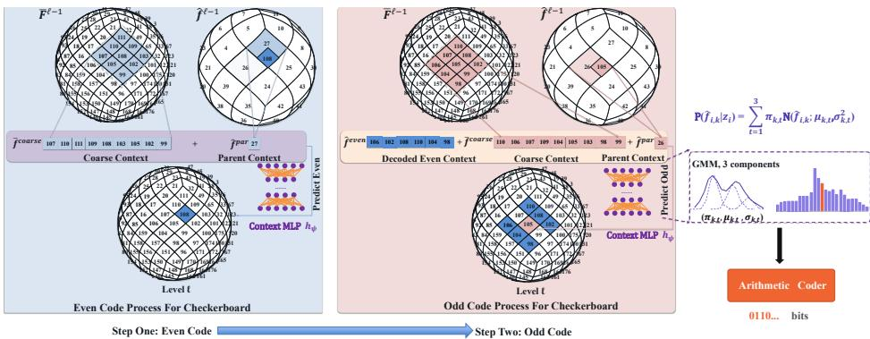  
Figure 2: The rendering-conditioned entropy model (RCC). Even cells (pass 1) are coded with the coarse and parent contexts; the decoded even cells are then added to the context of the odd cells (pass 2). The ContextMLP $h _ { \psi }$ predicts a 3-component Gaussian mixture for the arithmetic coder, and the decoder reconstructs the identical context by construction. Cell indices are illustrative.

where the blending weight $\beta ^ { ( \ell ) } ( v ) \le 0 . 5$ ensures that the final image is never carried by the finest level alone. Finally, the ColorMLP $g _ { \eta }$ maps the final state of each direction to its RGB color,

$$
\hat { Y } ( \theta , \phi ) = g _ { \eta } \big ( F ^ { ( L - 1 ) } ( v ( \theta , \phi ) ) \big ) ,\tag{6}
$$

where $\hat { Y }$ denotes the reconstructed panorama. Since any direction can be rendered in this way, the same procedure renders either the full sphere or only the pixel directions of a viewport (App. D). As all levels share one feature space and a single ColorMLP, and each level only refines the coarser state, the state after any level can also be decoded by ${ { g } _ { \eta } } ,$ which yields a coarse-to-fine preview from partially received levels.

## 3.2 ENTROPY AND RATE MODEL

Rendering-conditioned context. The features are coded level by level from coarse to fine. Before primitive $\bar { x _ { i } ^ { ( \ell ) } }$ is decoded, all coarser levels have been decoded and rendered, and this rendering state serves as its context, which we call the rendering-conditioned context (RCC, Fig. 2). The context consists of three parts,

$$
z _ { i } ^ { ( \ell ) } = \big \{ c _ { \mathrm { c o a r s e } } ( \ell , i ) , c _ { \mathrm { p a r } } ( \ell , i ) , c _ { \mathrm { e v e n } } ( \ell , i ) \big \} .\tag{7}
$$

The coarse context $c _ { \mathrm { c o a r s e } } ( \ell , i )$ consists of the coarse-level predictions $\bar { F } ^ { ( \ell - 1 ) }$ of Eq. (3) at cell i and its 8 neighbors, denoted $B _ { 9 } ( i ) { \mathrm { ; } }$ they have the resolution of level l and lie in the same feature space as the coded feature, and thus serve directly as a prediction reference. The parent context $c _ { \mathrm { p a r } } ( \ell , i )$ is the decoded feature of the parent cell, which covers the same region at the next coarser scale. The even context $c _ { \mathrm { e v e n } } ( \ell , i )$ follows the two-pass schedule of He et al. (2021), adapted to HEALPix: the cells of each level are split by the parity of their NESTED index (App. A.2), the even cells are decoded in the first pass, with $c _ { \mathrm { e v e n } }$ replaced by the corresponding coarse values, and the odd cells in the second pass, with $c _ { \mathrm { e v e n } }$ given by the decoded features of their even neighbors. Since every part of the context is computed from previously decoded symbols, the decoder reconstructs it identically without any side information.

Weighted entropy model. The k-th channel of the quantized feature $\hat { f } _ { i } ^ { ( \ell ) }$ is modeled by a discretized 3-component Gaussian mixture,

$$
P ( \hat { f } _ { i , k } ^ { ( \ell ) } \mid z _ { i } ^ { ( \ell ) } ) = \int _ { \hat { f } _ { i , k } ^ { ( \ell ) } - \Delta _ { f } / 2 } ^ { \hat { f } _ { i , k } ^ { ( \ell ) } + \Delta _ { f } / 2 } \sum _ { t = 1 } ^ { 3 } \pi _ { k , t } \mathcal { N } \big ( \xi ; \mu _ { k , t } , \sigma _ { k , t } ^ { 2 } \big ) d \xi ,\tag{8}
$$

where the weights $\pi _ { k , t } ,$ means $\mu _ { k , t }$ and variances $\sigma _ { k , t } ^ { 2 }$ are produced by the ContextMLP $h _ { \psi }$ from $z _ { i } ^ { ( \ell ) }$ ; level 0, which has no coarser level, uses a global prior GMM instead. Since we model the channels as conditionally independent given $z _ { i } ^ { ( \ell ) }$ , the code length of a primitive and the feature rate

of the representation are

$$
R _ { i } ^ { ( \ell ) } = - \frac { 1 } { N _ { \mathrm { E R P } } } \sum _ { k = 1 } ^ { C } \log _ { 2 } P \big ( \hat { f } _ { i , k } ^ { ( \ell ) } \mid \boldsymbol { z } _ { i } ^ { ( \ell ) } \big ) , \qquad R _ { \mathrm { f e a t } } = \sum _ { \ell = 0 } ^ { L - 1 } \sum _ { i \in \Omega ^ { ( \ell ) } } m _ { i } ^ { ( \ell ) } R _ { i } ^ { ( \ell ) } ,\tag{9}
$$

where $N _ { \mathrm { E R P } }$ is the number of ERP pixels, so that rates are measured in bits per pixel (bpp), and the mask keeps only the active primitives, whose features are written with an adaptive arithmetic coder driven by these mixtures. In training, the binary mask is replaced by a fraction of the quantized opacity, so that a primitive in the buffer of Sec. 3.1 is charged only part of its rate. The fraction is the piecewise-linear function

$$
\begin{array} { r } { \omega ( \hat { \alpha } ) = \left\{ \begin{array} { l l } { \displaystyle \frac { \hat { \alpha } } { \tau } \omega _ { \mathrm { l o } } , } & { \hat { \alpha } \leq \tau , } \\ { \displaystyle \omega _ { \mathrm { h i } } + \frac { ( \hat { \alpha } - \tau ) ( 1 - \omega _ { \mathrm { h i } } ) } { 1 - \tau } , } & { \hat { \alpha } > \tau , } \end{array} \right. } \end{array}\tag{10}
$$

which reduces to $\omega ( \hat { \alpha } ) = \hat { \alpha }$ with the default constants $\omega _ { \mathrm { l o } } = \omega _ { \mathrm { h i } } = \tau$ , and the charged feature rate used in training is

$$
\widetilde { R } _ { \mathrm { f e a t } } = \sum _ { \ell = 0 } ^ { L - 1 } \sum _ { i \in \Omega ^ { ( \ell ) } } \omega \big ( \hat { \alpha } _ { i } ^ { ( \ell ) } \big ) R _ { i } ^ { ( \ell ) } .\tag{11}
$$

Mask rate. In the proposed representation, the mask determines which cells of each level hold an active primitive, and therefore has to be coded as well. We model the mask entries of level l as i.i.d. Bernoulli variables, $m _ { i } ^ { ( \ell ) } \sim$ Bernoulli $. \left( \bar { m } ^ { ( \ell ) } \right)$ , whose parameter is the selection ratio $\begin{array} { r } { \bar { m } ^ { ( \ell ) } = | \Omega ^ { ( \ell ) } | ^ { - 1 } \sum _ { i } m _ { i } ^ { ( \ell ) } } \end{array}$ of the level. The mask rate is then

$$
R _ { \mathrm { m a s k } } = \frac { 1 } { N _ { \mathrm { E R P } } } \sum _ { \ell = 0 } ^ { L - 1 } \left| \Omega ^ { ( \ell ) } \right| H \left( \bar { m } ^ { ( \ell ) } \right) , \qquad H ( p ) = - p \log _ { 2 } p - ( 1 - p ) \log _ { 2 } ( 1 - p ) .\tag{12}
$$

The masks are written with a static binary arithmetic coder under the same per-level probability, so that $R _ { \mathrm { m a s k } }$ matches the written mask bits up to the header overhead. The nonzero opacities of the active primitives take only three values and are coded with a static frequency table. The bitstream stores, level by level from coarse to fine, the mask, the nonzero opacities and the features of each level (App. D.1).

## 3.3 RATE-DISTORTION OPTIMIZATION

All parameters of the image, i.e., the continuous features and opacities of the primitives, the ColorMLP, the ContextMLP, and the per-level kernel and blending parameters, are jointly fitted by minimizing

$$
\begin{array} { r } { \mathcal { L } = D + \lambda _ { R } \big ( \widetilde { R } _ { \mathrm { f e a t } } + R _ { \mathrm { m a s k } } \big ) + \lambda _ { s } E _ { \mathrm { r e g } } , } \end{array}\tag{13}
$$

where D is the mean squared error between the rendered colors and the target colors, i.e., the input panorama resampled to the equal-area target grid, so that the sphere is uniformly weighted, $\lambda _ { R }$ controls the trade-off between quality and bitrate, and $E _ { \mathrm { r e g } }$ is a light regularizer on the per-level kernel widths and blending parameters (App. A.1). In this objective, the opacity of each primitive is balanced between the distortion reduction it provides and its own code length (Eq. (11)), so that the number and placement of the active primitives emerge from the optimization.

## 4 EXPERIMENTS

## 4.1 EXPERIMENTAL SETUPS

Our main benchmark consists of 100 panoramas at 2048×1024 ERP resolution, stored as PNG, from the Flickr-sourced 360° dataset of Li et al. (2025); for cross-dataset evaluation, we use all 100 images of the SUN360 (Xiao et al., 2012) test set provided by Deng et al. (2021). We report WS-PSNR (Sun et al., 2017) under the JVET common test conditions (Boyce et al., 2017), and V-PSNR, V-SSIM (Wang et al., 2004) and V-LPIPS (Zhang et al., 2018) over six $9 0 ^ { \circ } \times 9 0 ^ { \circ }$ viewports;

<table><tr><td></td><td colspan="4">Main benchmark</td><td colspan="4">SUN360</td></tr><tr><td>Method</td><td>WS-PSNR</td><td>V-PSNR</td><td>V-SSIM</td><td>V-LPIPS</td><td>WS-PSNR</td><td>V-PSNR</td><td>V-SSIM</td><td>V-LPIPS</td></tr><tr><td colspan="9">Gaussian splatting image codecs</td></tr><tr><td>SGI</td><td>+77.6</td><td>+54.0</td><td>+73.1</td><td>+89.9</td><td>+84.2</td><td>+69.5</td><td>+76.1</td><td>+95.2</td></tr><tr><td>GaussianImage</td><td>+42.3</td><td>+22.9</td><td>+49.8</td><td>+68.0</td><td>+69.0</td><td>+56.4</td><td>+67.5</td><td>+80.2</td></tr><tr><td>GaussianImage++</td><td>+5.5</td><td>-9.5</td><td>+31.3</td><td>+66.5</td><td>+26.8</td><td>+16.9</td><td>+68.1</td><td>+103.6</td></tr><tr><td>LIG</td><td>+165.9</td><td>+95.4</td><td>+254.2</td><td>+369.7</td><td>+214.0</td><td>+159.3</td><td>+308.7</td><td>+396.2</td></tr><tr><td>OIC-GS (ours)</td><td>-29.6</td><td>-35.8</td><td>-17.2</td><td>-20.3</td><td>-13.3</td><td>-14.4</td><td>-4.1</td><td>+0.5</td></tr><tr><td colspan="9">Non-GS reference codecs</td></tr><tr><td>COIN</td><td>+15.4</td><td>+2.9</td><td>+69.5</td><td>+102.1</td><td>+28.6</td><td>+18.3</td><td>+94.1</td><td>+125.0</td></tr><tr><td>JPEG2000</td><td>-52.4</td><td>-46.3</td><td>-30.3</td><td>-22.0</td><td>-55.4</td><td>-47.1</td><td>-28.3</td><td>-21.8</td></tr></table>

Table 1: BD-rate (Bjontegaard, 2001) against JPEG on the main benchmark and on the 100 SUN360 images; a negative value means fewer bits at equal quality

planar ERP metrics are not used, since the polar caps take 33% of the ERP pixels for 13% of the sphere, and bitrates are measured in bits per ERP pixel. Every GS baseline is fitted per image with its public implementation (Zhang et al., 2024b; Li et al., 2026; Zhu et al., 2025; Pan et al., 2026; Zhang et al., 2024a) (settings in App. A.3), and JPEG (Wallace, 1992), JPEG2000 (Skodras et al., 2001) and COIN (Dupont et al., 2021) serve as reference codecs.

## 4.2 RATE-DISTORTION PERFORMANCE

As shown in Figs. 3 and 4 and Table 1, OIC-GS outperforms all GS codecs at all tested bitrates on all four metrics, on both the main benchmark and SUN360. Against SGI, the only existing GS codec with a learned entropy model, it reduces the BD-rate by 68.6%, 67.1%, 57.7% and 66.3% on WS-PSNR, V-PSNR, V-SSIM and V-LPIPS, respectively, and against GaussianImage++ by 49.6% on WS-PSNR (Table 7).

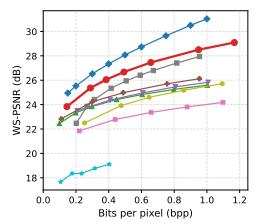

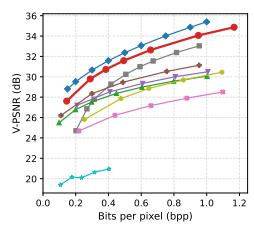

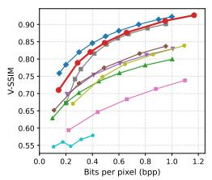

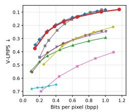  
Figure 3: Rate-distortion performance on the 100-image main benchmark. OIC-GS outperforms every GS codec at every tested bitrate on all four metrics.

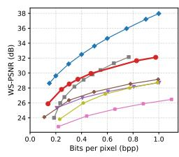

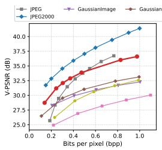

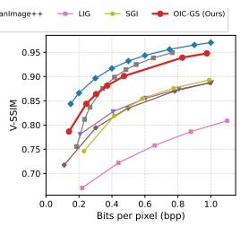

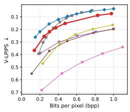  
Figure 4: Rate-distortion performance on the 100 SUN360 images. OIC-GS again outperforms every GS codec at every tested bitrate on all four metrics.

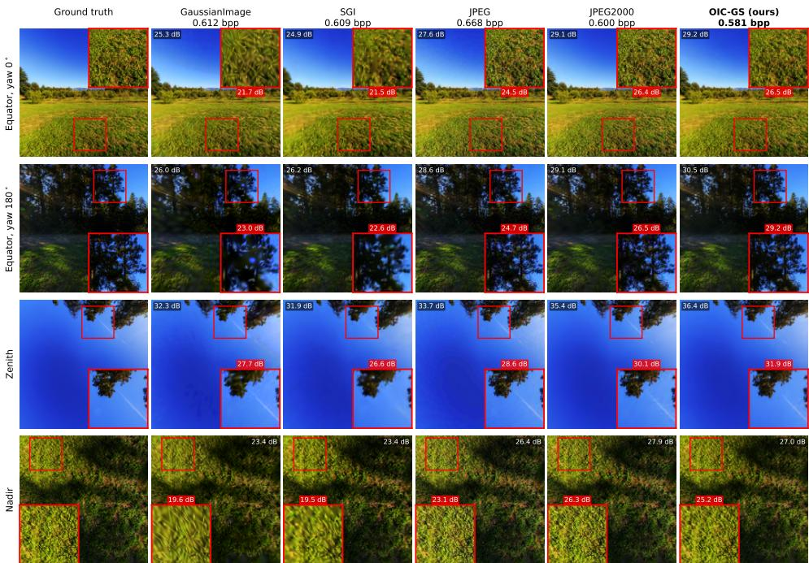  
Figure 5: Reconstructed viewports. Every baseline uses at least as many bits as OIC-GS. The labels give the viewport PSNR and, for each 2× zoomed-in patch, the PSNR of the textured $1 2 8 ^ { 2 }$ window. App. G shows five scenes in all six directions.

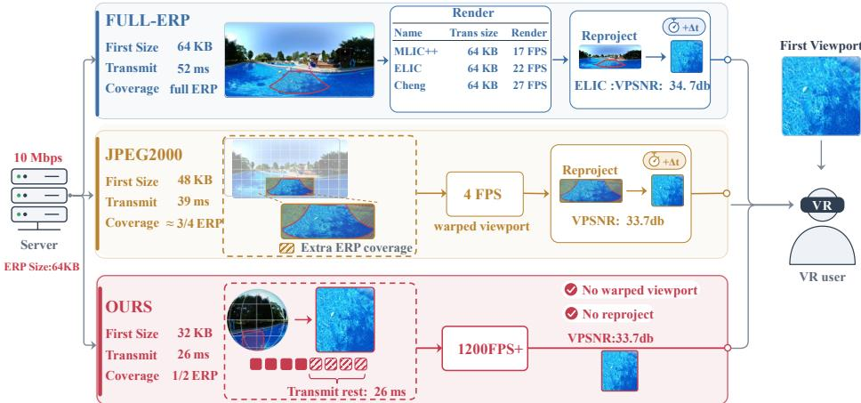  
Figure 6: Schematic comparison of first-viewport delivery over a 10 Mbps link for full-ERP codecs, tiled JPEG2000 and OIC-GS. Size: bytes transmitted before the first viewport is shown; Transmit: transfer time of these bytes.

## 4.3 DECODING RUNTIME AND QUALITATIVE EVALUATION

Decoding runtime. For panorama viewing, the latency before the first viewport matters more than the speed of full reconstruction. OIC-GS displays a viewport without the whole file or an ERP reprojection (Fig. 6): the first viewport reaches final quality from 52% of the file, bit-exact with full decoding, and is rendered at 1,270 FPS (Table 2). Further details are given in App. D.

Qualitative evaluation. As shown in Fig. 5, OIC-GS uses the lowest bitrate among all methods, and compared with GaussianImage and SGI, it preserves the fine details of the grass and foliage markedly better.

<table><tr><td>Method</td><td>Category</td><td>Entropy decoding (ms)</td><td>Reconstruction (FPS)</td></tr><tr><td>JPEG (Wallace, 1992)</td><td>Traditional</td><td></td><td>97</td></tr><tr><td>JPEG2000 (Skodras et al., 2001)</td><td>Traditional</td><td></td><td>3.8</td></tr><tr><td>ELIC (He et al., 2022)</td><td>LIC, checkerboard context</td><td>466</td><td>22.1</td></tr><tr><td>MLIC++ (Jiang et al., 2025)</td><td>LIC, multi-reference context</td><td>621</td><td>17.4</td></tr><tr><td>mbt2018 (Minnen et al., 2018)</td><td>LIC, autoregressive</td><td>30,480</td><td>67.1</td></tr><tr><td>cheng2020-attn (Cheng et al., 2020)</td><td>LIC, autoregressive</td><td>30,490</td><td>27.4</td></tr><tr><td>GaussianImage (Zhang et al., 2024b)</td><td>2D GS</td><td></td><td>2,706-3,224</td></tr><tr><td>GaussianImage++ (Li et al., 2026)</td><td>2D GS</td><td></td><td>2,659-3,094</td></tr><tr><td>LIG (Zhu et al., 2025)</td><td>2D GS</td><td></td><td>1,091-1,153</td></tr><tr><td>SGI (Pan et al., 2026) OIC-GS (full sphere)</td><td>GS + learned entropy</td><td>140-665</td><td>297-371</td></tr><tr><td>OIC-GS (viewport, 1024×768)</td><td>GS + learned entropy</td><td>12.3</td><td>140</td></tr><tr><td></td><td>GS + learned entropy</td><td>8.3</td><td>1,270</td></tr></table>

Table 2: Decoding time and rendering speed on one 2048× 1024 ERP image (one idle RTX 4090). Entropy decoding includes the context networks of the LIC rows and the rendering-conditioned contexts of OIC-GS; reconstruction is the synthesis network of the LIC rows and the rendering of the GS rows. JPEG and JPEG2000 report the full CPU decoding speed, and – marks codecs without a learned entropy model. The viewport row decodes only the streams of the first viewport. Details are given in App. D.
<table><tr><td rowspan="2">Variant (default in parentheses)</td><td colspan="2">∆rate at equal quality (%), + is worse</td></tr><tr><td>WS-PSNR</td><td>V-PSNR</td></tr><tr><td>Full model</td><td>0.0</td><td>0.0</td></tr><tr><td>Rate-distortion adaptive primitive selection (Sec. 3.1)</td><td></td><td></td></tr><tr><td>w/o rate-aware opacity weighting  $( \omega _ { \mathrm { l o } } = \omega _ { \mathrm { h i } } = 1 )$ </td><td>+31.2</td><td>+33.4</td></tr><tr><td>selection threshold  $\tau { = } 0 . 1 \ ( \tau { = } 0 . 2 )$ </td><td>+0.3</td><td>+0.4</td></tr><tr><td>selection threshold  $\tau { = } 0 . 3 \ ( \tau { = } 0 . 2 )$ </td><td>+0.1</td><td>+0.1</td></tr><tr><td colspan="3">Rendering-conditioned checkerboard entropy model (Sec. 3.2)</td></tr><tr><td>w/o RCC</td><td>+5.9</td><td>+7.7</td></tr><tr><td>checkerboard on levels  $\{ 5 , 6 \} ( \{ 4 , 5 , 6 \} )$ </td><td>+0.4</td><td>+0.3</td></tr><tr><td>STE in the feature rate estimate (uniform noise)</td><td>+2.5</td><td>+3.2</td></tr></table>

Table 3: Ablation studies of the main components and of the design parameters of each module on the 100 images of the main benchmark: rate difference against the full model at equal quality at $\scriptstyle \lambda _ { R } = 3 \times 1 0 ^ { - 5 }$ (positive is worse). The protocol, the variant specifications and the SUN360 results are given in App. E.2.

## 4.4 ABLATION STUDIES

We report the WS-PSNR rate difference at equal quality of each variant relative to the full model (Table 3; details in App. E.2). For primitive selection, charging every active primitive its full bitrate $( \omega _ { \mathrm { l o } } = \omega _ { \mathrm { h i } } = 1 )$ increases the rate by 31.2%, the largest degradation among all variants, whereas setting τ to 0.1 or 0.3, which at b=2 leaves the mask unchanged, has no measurable effect (at most 0.3%). For the entropy model, replacing RCC with a context-free prior leads to a loss of 5.9%, while restricting the two-pass schedule to levels {5, 6} has a negligible impact (+0.4%). Finally, using straight-through rounding instead of additive uniform noise in the feature rate estimate increases the rate by 2.5%.

## 5 CONCLUSION

In this paper, we have presented OIC-GS, an omnidirectional GS codec built on hierarchical HEALPix grids. Primitives are anchored at predefined spherical locations, so their coordinates need not be coded and only their existence is signaled. A lightweight entropy model estimates the bitrate of each primitive, and the existence mask derived from the quantized opacity keeps only the primitives whose distortion reduction justifies this cost. A single bitstream supports full-sphere, viewport-dependent, and progressive decoding, and the first viewport reaches final quality after decoding only 52% of the bitstream. OIC-GS outperforms all tested GS codecs, reducing WS-PSNR BD-rate by 49.6% over GaussianImage++ and 68.6% over SGI.

## REFERENCES

Johannes Ballé, Valero Laparra, and Eero P. Simoncelli. End-to-end optimized image compression. In International Conference on Learning Representations (ICLR), 2017.

Johannes Ballé, David Minnen, Saurabh Singh, Sung Jin Hwang, and Nick Johnston. Variational image compression with a scale hyperprior. In International Conference on Learning Representations (ICLR), 2018.

Yoshua Bengio, Nicholas Léonard, and Aaron Courville. Estimating or propagating gradients through stochastic neurons for conditional computation. arXiv preprint arXiv:1308.3432, 2013.

Navid Mahmoudian Bidgoli, Roberto G de A Azevedo, Thomas Maugey, Aline Roumy, and Pascal Frossard. Oslo: On-the-sphere learning for omnidirectional images and its application to 360- degree image compression. IEEE Transactions on Image Processing, 31:5813–5827, 2022.

Gisle Bjontegaard. Calculation of average psnr differences between rd-curves. ITU SG16 Doc. VCEG-M33, 2001.

Jill Boyce, Elena Alshina, Adeel Abbas, and Yan Ye. Jvet common test conditions and evaluation procedures for 360 video. Technical report, 2017.

Benjamin Bross, Ye-Kui Wang, Yan Ye, Shan Liu, Jianle Chen, Gary J. Sullivan, and Jens-Rainer Ohm. Overview of the versatile video coding (VVC) standard and its applications. IEEE Transactions on Circuits and Systems for Video Technology, 31(10):3736–3764, 2021.

Yihang Chen, Qianyi Wu, Weiyao Lin, Mehrtash Harandi, and Jianfei Cai. Hac: Hash-grid assisted context for 3d gaussian splatting compression. In European Conference on Computer Vision, pp. 422–438. Springer, 2024.

Zhengxue Cheng, Heming Sun, Masaru Takeuchi, and Jiro Katto. Learned image compression with discretized gaussian mixture likelihoods and attention modules. In 2020 IEEE/CVF Conference on Computer Vision and Pattern Recognition (CVPR), pp. 7936–7945, 2020.

Xavier Corbillon, Gwendal Simon, Alisa Devlic, and Jacob Chakareski. Viewport-adaptive navigable 360-degree video delivery. In 2017 IEEE international conference on communications (ICC), pp. 1–7. IEEE, 2017.

Xin Deng, Hao Wang, Mai Xu, Yichen Guo, Yuhang Song, and Li Yang. Lau-net: Latitude adaptive upscaling network for omnidirectional image super-resolution. In 2021 IEEE/CVF Conference on Computer Vision and Pattern Recognition (CVPR), pp. 9185–9194. IEEE, 2021.

Emilien Dupont, Adam Goliński, Milad Alizadeh, Yee Whye Teh, and Arnaud Doucet. Coin: Compression with implicit neural representations. arXiv preprint arXiv:2103.03123, 2021.

Krzysztof M Gorski, Eric Hivon, Anthony J Banday, Benjamin D Wandelt, Frode K Hansen, Mstvos Reinecke, and Matthia Bartelmann. Healpix: A framework for high-resolution discretization and fast analysis of data distributed on the sphere. The Astrophysical Journal, 622(2):759–771, 2005.

Dailan He, Yaoyan Zheng, Baocheng Sun, Yan Wang, and Hongwei Qin. Checkerboard context model for efficient learned image compression. In 2021 IEEE/CVF Conference on Computer Vision and Pattern Recognition (CVPR), pp. 14766–14775. IEEE, 2021.

Dailan He, Ziming Yang, Weikun Peng, Rui Ma, Hongwei Qin, and Yan Wang. Elic: Efficient learned image compression with unevenly grouped space-channel contextual adaptive coding. In 2022 IEEE/CVF Conference on Computer Vision and Pattern Recognition (CVPR), pp. 5708– 5717. IEEE, 2022.

Yuwen He, Xiaoyu Xiu, Philippe Hanhart, Yan Ye, Fanyi Duanmu, and Yao Wang. Content-adaptive 360-degree video coding using hybrid cubemap projection. In 2018 Picture Coding Symposium (PCS), pp. 313–317. IEEE, 2018.

Wei Jiang, Jiayu Yang, Yongqi Zhai, Feng Gao, and Ronggang Wang. Mlic++: Linear complexity multi-reference entropy modeling for learned image compression. ACM Transactions on Multimedia Computing, Communications and Applications, 21(5):1–25, 2025.

Bernhard Kerbl, Georgios Kopanas, Thomas Leimkühler, and George Drettakis. 3d gaussian splatting for real-time radiance field rendering. ACM Transactions on Graphics, 42(4), July 2023.

Hyunjik Kim, Matthias Bauer, Lucas Theis, Jonathan Richard Schwarz, and Emilien Dupont. C3: High-performance and low-complexity neural compression from a single image or video. In 2024 IEEE/CVF Conference on Computer Vision and Pattern Recognition (CVPR), pp. 9347–9358. IEEE, 2024.

Diederik P Kingma and Jimmy Ba. Adam: A method for stochastic optimization. arXiv preprint arXiv:1412.6980, 2014.

Théo Ladune, Pierrick Philippe, Félix Henry, Gordon Clare, and Thomas Leguay. Cool-chic: Coordinate-based low complexity hierarchical image codec. In 2023 IEEE/CVF International Conference on Computer Vision (ICCV), pp. 13469–13476. IEEE, 2023.

Joo Chan Lee, Daniel Rho, Xiangyu Sun, Jong Hwan Ko, and Eunbyung Park. Compact 3d gaussian representation for radiance field. In 2024 IEEE/CVF Conference on Computer Vision and Pattern Recognition (CVPR), pp. 21719–21728. IEEE, 2024.

Mu Li, Jinxing Li, Shuhang Gu, Feng Wu, and David Zhang. End-to-end optimized 360° image compression. IEEE Transactions on Image Processing, 31:6267–6281, 2022.

Mu Li, Kede Ma, Jinxing Li, and David Zhang. Pseudocylindrical convolutions for learned omnidirectional image compression. IEEE Transactions on Circuits and Systems for Video Technology, 2025.

Tiantian Li, Xinjie Zhang, Xingtong Ge, Tongda Xu, Dailan He, Jun Zhang, and Yan Wang. Gaussianimage++: Boosted image representation and compression with 2d gaussian splatting. In Proceedings of the AAAI Conference on Artificial Intelligence, volume 40, pp. 6442–6449, 2026.

Huanxiong Liang, Yunuo Chen, Yicheng Pan, Sixian Wang, Jincheng Dai, Guo Lu, and Wenjun Zhang. Structure-guided allocation of 2d gaussians for image representation and compression. arXiv preprint arXiv:2512.24018, 2025.

Jingwei Liao, Bo Chen, Klara Nahrstedt, and Zhisheng Yan. Viewport-based neural 360° image compression. ACM Transactions on Multimedia Computing, Communications and Applications, 2026.

David Minnen, Johannes Ballé, and George D. Toderici. Joint autoregressive and hierarchical priors for learned image compression. In Advances in Neural Information Processing Systems (NeurIPS), volume 31, 2018.

Zixuan Pan, Kaiyuan Tang, Jun Xia, Yifan Qin, Lin Gu, Chaoli Wang, Jianxu Chen, and Yiyu Shi. Sgi: Structured 2d gaussians for efficient and compact large image representation. In Proceedings of the IEEE/CVF Conference on Computer Vision and Pattern Recognition (CVPR), pp. 12162– 12172, June 2026.

Nathanaël Perraudin, Michaël Defferrard, Tomasz Kacprzak, and Raphael Sgier. Deepsphere: Efficient spherical convolutional neural network with healpix sampling for cosmological applications. Astronomy and Computing, 27:130–146, 2019.

A. Skodras, C. Christopoulos, and T. Ebrahimi. The jpeg 2000 still image compression standard. IEEE Signal Processing Magazine, 18(5):36–58, 2001.

Yannick Strümpler, Janis Postels, Ren Yang, Luc Van Gool, and Federico Tombari. Implicit neural representations for image compression. In European conference on computer vision, pp. 74–91. Springer, 2022.

Gary J. Sullivan, Jens-Rainer Ohm, Woo-Jin Han, and Thomas Wiegand. Overview of the high efficiency video coding (hevc) standard. IEEE Transactions on Circuits and Systems for Video Technology, 22(12):1649–1668, 2012.

Yule Sun, Ang Lu, and Lu Yu. Weighted-to-spherically-uniform quality evaluation for omnidirectional video. IEEE signal processing letters, 24(9):1408–1412, 2017.

Masaya Takabe, Hiroshi Watanabe, Sujun Hong, Tomohiro Ikai, Zheming Fan, Ryo Ishimoto, Kakeru Sugimoto, and Ruri Imichi. Contour information aware 2d gaussian splatting for image representation. In 2026 IEEE International Conference on Consumer Electronics (ICCE), pp 1–6. IEEE, 2026.

David S. Taubman and Robert Prandolini. Architecture, philosophy, and performance of JPIP: internet protocol standard for JPEG 2000. In Touradj Ebrahimi and Thomas Sikora (eds.), Visual Communications and Image Processing 2003, volume 5150, pp. 791 – 805. International Society for Optics and Photonics, SPIE, 2003.

G.K. Wallace. The jpeg still picture compression standard. IEEE Transactions on Consumer Electronics, 38(1):xviii-xxxiv, 1992.

Henan Wang, Hanxin Zhu, Tianyu He, Runsen Feng, Jiajun Deng, Jiang Bian, and Zhibo Chen. End-to-end rate-distortion optimized 3d gaussian representation. In European Conference on Computer Vision, pp. 76–92. Springer, 2024a.

Longan Wang, Yuang Shi, and Wei Tsang Ooi. P-gsvc: Layered progressive 2d gaussian splatting for scalable image and video. In Proceedings of the ACM Multimedia Systems Conference 2026, MMSys '26, pp. 156–166, 2026. doi: 10.1145/3793853.3795755.

Yufei Wang, Zhihao Li, Lanqing Guo, Wenhan Yang, Alex C Kot, and Bihan Wen. Contextgs: Compact 3d gaussian splatting with anchor level context model. volume 37, pp. 51532–51551, 2024b.

Zhou Wang, Alan C Bovik, Hamid R Sheikh, and Eero P Simoncelli. Image quality assessment: from error visibility to structural similarity. IEEE transactions on image processing, 13(4):600– 612, 2004.

Jianxiong Xiao, Krista A Ehinger, Aude Oliva, and Antonio Torralba. Recognizing scene viewpoint using panoramic place representation. In 2012 IEEE conference on computer vision and pattern recognition, pp. 2695–2702. IEEE, 2012.

Mai Xu, Chen Li, Shanyi Zhang, and Patrick Le Callet. State-of-the-art in 360 video/image processing: Perception, assessment and compression. IEEE Journal of Selected Topics in Signal Processing, 14(1):5–26, 2020.

Zhaojie Zeng, Yuesong Wang, Tao Guan, Chao Yang, and Lili Ju. Instant gaussianimage: A generalizable and self-adaptive image representation via 2d gaussian splatting. In Proceedings of the IEEE/CVF International Conference on Computer Vision (ICCV), pp. 27896–27905, October 2025.

Pingping Zhang, Xiangrui Liu, Meng Wang, Shiqi Wang, and Sam Kwong. 2d gaussian splatting for image compression. APSIPA Transactions on Signal and Information Processing, 13(6):e501, 2024a.

Richard Zhang, Phillip Isola, Alexei A Efros, Eli Shechtman, and Oliver Wang. The unreasonable effectiveness of deep features as a perceptual metric. In 2018 IEEE/CVF conference on computer vision and pattern recognition, pp. 586–595. IEEE, 2018.

Xinjie Zhang, Xingtong Ge, Tongda Xu, Dailan He, Yan Wang, Hongwei Qin, Guo Lu, Jing Geng, and Jun Zhang. GaussianImage: 1000 FPS image representation and compression by 2D Gaussian splatting. In Proceedings of the European Conference on Computer Vision (ECCV), pp. 327–345, 2024b.

Yunxiang Zhang, Bingxuan Li, Alexandr Kuznetsov, Akshay Jindal, Stavros Diolatzis, Kenneth Chen, Anton Sochenov, Anton Kaplanyan, and Qi Sun. Image-gs: Content-adaptive image representation via 2d gaussians. In Proceedings of the Special Interest Group on Computer Graphics and Interactive Techniques Conference Conference Papers, pp. 1–11, 2025.

Lingting Zhu, Guying Lin, Jinnan Chen, Xinjie Zhang, Zhenchao Jin, Zhao Wang, and Lequan Yu. Large images are gaussians: High-quality large image representation with levels of 2d gaussian splatting. In Proceedings of the AAAI Conference on Artificial Intelligence, volume 39, pp. 10977–10985, 2025.

Andrea Zonca, Leo Singer, Daniel Lenz, Martin Reinecke, Cyrille Rosset, Eric Hivon, and Krzysztof Gorski. healpy: equal area pixelization and spherical harmonics transforms for data on the sphere in python. Journal of Open Source Software, 4(35):1298, 2019.

## OVERVIEW OF THE APPENDIX

The appendix is organized as follows. App. A specifies the implementation details and the evaluation protocol. App. B gives the full operating points, the pairwise comparisons and the details of the cross-dataset evaluation. App. C analyzes the bit allocation over the sphere. App. D describes the bitstream format and evaluates full-sphere, viewport-dependent and progressive decoding. App. E verifies the bitrate estimate and reports additional ablation and sensitivity results. App. F analyzes the resolution limit of the finest level and evaluates a codec with an additional level 7. App. G provides additional qualitative results.

## A IMPLEMENTATION DETAILS AND EVALUATION PROTOCOL

This appendix provides the constants, conventions and protocol details referred to in Secs. 3.1–3.3 and 4.1, including the network architecture and training schedule $( \mathrm { A p p . ~ A . l } )$ , the rate and gradient conventions (App. A.2), and the baselines and metrics (App. A.3).

## A.1 ARCHITECTURE AND TRAINING

Architecture. The spherical hierarchy has $L = 7$ primitive levels, $\ell \in \{ 0 , \ldots , 6 \}$ , with $n _ { \mathrm { s i d e } } =$ $4 \cdot 2 ^ { \ell } \in \{ 4 , \ldots , 2 5 6 \}$ and $| \Omega ^ { ( \ell ) } | = 1 2 n _ { \mathrm { s i d e } } ^ { 2 }$ cells per level (Sec. 3.1), and a target grid at $n _ { \mathrm { s i d e } } = 5 1 2$ with $M = 3$ ,145,728 directions. Each feature $f _ { i } ^ { ( \ell ) } = ( f _ { i , 1 } ^ { ( \ell ) } , \ldots , f _ { i , C } ^ { ( \ell ) } )$ has $C = 2$ channels in [0, 1], and the opacity $\alpha _ { i } ^ { ( \ell ) }$ lies in [0, 1] as well. In the training configuration used throughout the paper, the levels are coded in three groups: levels $\ell \leq 2$ are always active, with their masks and opacities fixed to one and not coded; level 3 takes part in primitive selection and is coded in a single pass; and levels $\{ 4 , 5 , 6 \}$ take part in primitive selection and are coded with the two-pass checkerboard schedule of Sec. 3.2. The ContextMLP $h _ { \psi }$ has a convolutional structure: the same small network with about 3.2k parameters, is applied to the neighborhood context of every cell.

Quantization. Both attributes are quantized with the uniform quantizer of Eq. (1) and straightthrough gradients (Sec. 3.1). Each feature channel is quantized with $b = 4$ bits, $\hat { f } _ { i , k } ^ { ( \ell ) } = Q _ { 4 } ( f _ { i , k } ^ { ( \ell ) } )$ with the step $\Delta _ { f } = \Delta _ { 4 } = 1 / 1 5 ; \Delta _ { f }$ is also the bin width of the discretized likelihood in Eq. (8) and of the uniform noise added in the rate estimate (Sec. 3.1). The opacity is quantized with $b = 2$ bits, $\hat { \alpha } _ { i } ^ { ( \ell ) } = Q _ { 2 } ( \alpha _ { i } ^ { ( \ell ) } ) \in \{ 0 , \frac { 1 } { 3 } , \frac { 2 } { 3 } , 1 \}$ , and thresholded at $\tau = 0 . 2$ to give the mask $m _ { i } ^ { ( \ell ) }$ of Eq. (2).

Rendering and selection constants. The weight $w _ { v , i }$ of Eq. (4) uses the spherical Gaussian kernel

$$
G _ { v , i } = \exp \Bigl ( - \frac { 1 - \langle v , u _ { i } \rangle } { ( s ^ { ( \ell ) } ) ^ { 2 } } \Bigr ) , \qquad s ^ { ( \ell ) } = 0 . 5 \rho ^ { ( \ell ) } e ^ { \delta ^ { ( \ell ) } } , \qquad \rho ^ { ( \ell ) } = \sqrt { 4 \pi / | \Omega ^ { ( \ell ) } | } ,\tag{14}
$$

where $u _ { i }$ is the unit vector of the center of cell $i , s ^ { ( \ell ) }$ is the isotropic kernel width shared by all primitives of level $\ell , \rho ^ { ( \ell ) }$ is the mean angular spacing of the grid, and $\delta ^ { ( \ell ) }$ is learnable. The blending weight of Eq. (5) is

$$
\beta ^ { ( \ell ) } ( v ) = \operatorname* { m i n } \Bigl ( \frac { W ^ { ( \ell ) } ( v ) } { W ^ { ( \ell ) } ( v ) + e ^ { \gamma ^ { ( \ell ) } } } , 0 . 5 \Bigr ) , \qquad W ^ { ( \ell ) } ( v ) = \sum _ { i \in \mathcal { C } ^ { ( \ell ) } ( v ) } w _ { v , i } ,\tag{15}
$$

where $W ^ { ( \ell ) } ( v )$ is the accumulated weight of Eq. (4) and $\gamma ^ { ( \ell ) }$ is a learnable per-level blending parameter. The remaining constants are listed in Table 4. With $\omega _ { \mathrm { l o } } { = } \omega _ { \mathrm { h i } } { = } \tau$ , the four opacity states are charged $0 , { \frac { 1 } { 3 } } , { \frac { 2 } { 3 } }$ and 1 of their feature rate, and $\omega ^ { \prime } { = } 1$ on both sides of the threshold. Since the lower branch of Eq. (10) is reached only at $\scriptstyle { \hat { \alpha } } = 0$ in the forward pass, $\omega _ { \mathrm { l o } }$ controls the STE slope of inactive primitives rather than their forward weight.

Training. The training hyperparameters are listed in Table 5.

<table><tr><td>Constant</td><td>Value</td></tr><tr><td>Evaluation grid of Eq. (4) Candidate set  $\mathscr { C } ^ { ( \ell ) } ( v )$ </td><td>target grid,  $ n _ { \mathrm { s i d e } } = 5 1 2 .$  M=3,145,728 directions K=9 cells (the cell containing v and its 8 neighbors);</td></tr><tr><td></td><td> $\mathrm { a l l ~ } | \Omega ^ { ( 0 ) } | { = } 1 9 2$  primitives at  $\ell { = } 0$ </td></tr><tr><td>Denominator floor of Eq. (4)</td><td> $\epsilon { = } 1 0 ^ { - 8 }$ </td></tr><tr><td>Fill opacity in Eq. (3) Selection threshold in Eq. (2)</td><td> $\alpha _ { \mathrm { f i l l } } { = } 0 . 1$ </td></tr><tr><td>Opacity weight of Eq. (10)</td><td> $\tau { = } 0 . 2$   $\omega _ { \mathrm { l o } } = \omega _ { \mathrm { h i } } = \tau , \mathrm { i . e . , } \omega ( \hat { \alpha } ) { = } \hat { \alpha }$ </td></tr></table>

Table 4: Rendering and selection constants.
<table><tr><td>Item</td><td>Setting</td></tr><tr><td>Optimizer</td><td>Adam (Kingma &amp; Ba, 2014)</td></tr><tr><td>Learning rate, features</td><td> $1 0 ^ { - 2 }$  at the finest level, decreasing linearly with the level to  $1 0 ^ { - 3 }$  at  $\ell { = } 0$ </td></tr><tr><td>Learning rate, opacities</td><td> $1 0 ^ { - 2 }$ </td></tr><tr><td>Learning rate, entropy model</td><td> $3 \times 1 0 ^ { - 3 }$ </td></tr><tr><td>Learning rate, ColorMLP</td><td> $3 \times 1 0 ^ { - 3 }$ </td></tr><tr><td>Learning rate, kernel widths</td><td> $1 0 ^ { - 3 }$ </td></tr><tr><td>Regularization (Eq. (13))</td><td> $\begin{array} { r } { \lambda _ { s } = 1 0 ^ { - 2 } , E _ { \mathrm { r e g } } = \sum _ { \ell } ( \delta ^ { ( \ell ) } ) ^ { 2 } + 1 0 ^ { - 2 } \sum _ { \ell } ( \gamma ^ { ( \ell ) } ) ^ { 2 } } \end{array}$ </td></tr><tr><td>Iterations</td><td>10k per benchmark fit</td></tr><tr><td>Warm-up</td><td>first 6k iterations:  $\lambda _ { R } { = } 0$  for 3k, then linear increase to its target over the next 3k</td></tr><tr><td>Fitting time</td><td>12.7 min for 10k iterations on one RTX 4090</td></tr></table>

Table 5: Training hyperparameters.

## A.2 RATE AND GRADIENT CONVENTIONS

Context conventions. The context $z _ { i } ^ { ( \ell ) }$ of Eq. (7) is fed to the ContextMLP as the concatenation of its three parts and the level index,

$$
\begin{array} { r } { z _ { i } ^ { ( \ell ) } = \underbrace { \left[ c _ { \mathrm { c o a r s e } } ( \ell , i ) \right] } _ { \mathfrak { O C } } \mid \underbrace { c _ { \mathrm { p a r } } ( \ell , i ) } _ { C } \mid \underbrace { c _ { \mathrm { e v e n } } ( \ell , i ) } _ { \mathfrak { O C } } \mid \ell ] , } \\ { c _ { \mathrm { c o a r s e } } ( \ell , i ) = \big ( \bar { F } _ { j } ^ { ( \ell - 1 ) } \big ) _ { j \in B _ { 9 } ( i ) } , \qquad c _ { \mathrm { p a r } } ( \ell , i ) = \hat { f } _ { \mathrm { p a r } ( i ) } ^ { ( \ell - 1 ) } , } \end{array}\tag{16}
$$

which gives a (19C+1)-dimensional input. Here $\bar { F } _ { j } ^ { ( \ell - 1 ) }$ is the coarse-level prediction of Eq. (3), i.e., the mean of the rendering $F ^ { ( \ell - 1 ) }$ over the $4 ^ { 7 - \ell }$ target-grid directions inside cell j (a contiguous NESTED index range), and $\mathrm { p a r } ( i ) = \lfloor i / 4 \rfloor$ is the parent cell of i under the NESTED ordering. $c _ { \mathrm { e v e n } } ( \ell , i )$ holds one C-dimensional entry per cell $j \in B _ { 9 } ( i )$ : the effective feature $\tilde { f } _ { j } ^ { ( \ell ) }$ of Eq. (3) if cell j has already been decoded when the current pass begins $( \mathrm { i . e . , } \hat { f } _ { j } ^ { ( \ell ) }$ for an active cell and $\bar { F } _ { j } ^ { ( \ell - 1 ) }$ for an inactive one), and the coarse value $\bar { F } _ { j } ^ { ( \ell - 1 ) }$ otherwise; in pass 1 and on the single-pass levels, all of its entries are therefore coarse values, and no entry is ever set to zero. $c _ { \mathrm { p a r } } ( \ell , i )$ is set to zero when the parent is inactive. The two passes of Sec. 3.2 split the cells of a level by the parity of their NESTED index: pass 1 codes the even cells and pass 2 the odd cells. Since the lowest bit of a NESTED index is the lowest bit of one face-local coordinate, this split alternates along one axis of each base face: for an odd cell inside a base face, six of its eight neighbors are even and have been decoded in pass 1, while the remaining two, as well as cross-face neighbors of the same parity, take the coarse value $\bar { F } _ { i } ^ { ( \ell - 1 ) }$ , identically at the encoder and the decoder. The same rule is applied in training, encoding and decoding, which enables the round-trip check of App. D.1.

Differentiable primitive selection. In the charged feature rate $\widetilde { R } _ { \mathrm { f e a t } }$ of Eq. (11), the code length $R _ { i } ^ { ( \ell ) }$ is evaluated with the discretized likelihood of Eq. (8) at the rate-path feature during training, and $\omega \equiv 1$ on the always-active levels $\ell \leq 2$ . Differentiating it gives

$$
\frac { \partial { \widetilde { R } } _ { \mathrm { f e a t } } } { \partial \alpha _ { i } ^ { ( \ell ) } } = R _ { i } ^ { ( \ell ) } \omega ^ { \prime } \big ( \hat { \alpha } _ { i } ^ { ( \ell ) } \big ) ,\tag{17}
$$

where the STE provides ${ \partial \hat { \alpha } _ { i } ^ { ( \ell ) } } / { \partial \alpha _ { i } ^ { ( \ell ) } } { = } 1$ , and the context used to predict $R _ { i } ^ { ( \ell ) }$ is detached, so that $R _ { i } ^ { ( \ell ) }$ acts as a fixed per-primitive cost. The more bits the entropy model predicts for a primitive, the more strongly its opacity is pushed down.

For an active primitive, Eq. (17) is only the rate side of the gradient on α: its α also enters the weighted average of Eq. (4), so it receives a gradient from the distortion term D as well, and the balance between the two decides how the primitive moves among the four states. A better entropy model therefore changes not only the code lengths but also which primitives are active.

## A.3 BASELINES AND METRICS

Baselines. Every GS codec is fitted per image on the same panoramas with its public implementation. SGI, the only existing GS image codec with a learned entropy model, is fitted per image with its released source code. Its seed budget is varied over 1,224-10,704 seeds to obtain five operating points covering 0.25-1.09 bpp, which matches our bitrate range. Its bitrates are the actual bitstream bytes written by its own encoder (anchors, hash grid, MLPs, masks, and positions coded with the MPEG geometry-based point cloud codec (G-PCC)), and its reconstructions are rendered after one encoding-decoding round trip. LIG, 2DGS-IC (Zhang et al., 2024a) and COIN are fitted with the released code of their authors and evaluated against the original ERP images under the same protocol. GaussianImage and GaussianImage++ are both fitted with their official released compression configurations: GaussianImage with the two-stage recipe of a 50k-iteration representation fit followed by 50k iterations of quantization-aware training, and GaussianImage++ with color normalization enabled and a growth budget above its initial number of primitives, so that its error-driven densification is active. We restrict the comparison to GS image codecs, with JPEG, JPEG2000 and COIN as reference codecs. JPEG2000, like intra-mode video codecs, still outperforms all compared GS codecs, and we do not claim parity with VVC intra coding.

## Metrics.

• Resampling. The HEALPix reconstruction of OIC-GS is first resampled to the 2048× 1024 ERP grid with a Lanczos-3 kernel, so every method is evaluated on an ERP image. The codecs fitted on the ERP plane are thus scored on their own sampling grid, whereas OIC-GS is additionally charged the resampling loss (App. F).

• WS-PSNR. WS-PSNR uses the standard latitude weights $\begin{array} { r } { \varpi ( y ) = \cos \left( \left( y + \frac { 1 } { 2 } - \frac { N _ { \mathrm { r o w } } } { 2 } \right) \frac { \pi } { N _ { \mathrm { r o w } } } \right) } \end{array}$ of the JVET common test conditions (Boyce et al., 2017), where $y \in \{ 0 , \dots , N _ { \mathrm { r o w } } - 1 \}$ indexes the $N _ { \mathrm { r o w } } { = } 1 0 2 4 \mathrm { E R P }$ rows.

• Viewport extraction. The six viewports (yaw $0 ^ { \circ } / 9 0 ^ { \circ } / 1 8 0 ^ { \circ } / 2 7 0 ^ { \circ }$ at the equator, plus zenith and nadir) are extracted from every decoded ERP image by bilinear grid\_sample projection, identically for all methods. V-PSNR, V-SSIM and V-LPIPS are all computed with this projection pipeline.

• V-SSIM and V-LPIPS. V-SSIM uses the pytorch\_msssim implementation of SSIM (Wang et al., 2004), and V-LPIPS uses the AlexNet LPIPS of Zhang et al. (2018) with inputs scaled to [—1, 1]; both are computed on the same six viewports and averaged over viewports and then over images.

• BD-rate on V-LPIPS. BD-rates on V-LPIPS are computed after negating the metric, so that the sign convention of Table 1 is the same for all four metrics.

## B ADDITIONAL RATE-DISTORTION AND CROSS-DATASET RESULTS

This appendix supplements the results of Sec. 4.2. App. B.1 lists the operating points and the direct pairwise comparisons, and App. B.2 gives the protocol and additional statistics of the cross-dataset evaluation.

## B.1 OPERATING POINTS AND PAIRWISE BD-RATES

Variation across images. At a fixed $\lambda _ { R } ,$ the bitrate varies by \~3× across images at the highest bitrate and by \~4× at the lowest (0.56-1.76 and 0.07-0.26 bpp, respectively), so the budget adapts to the image content, which corresponds to the 0.9-9.4% range (median 3.5%) of level-6 selection ratios at $\bar { \lambda _ { R } } { = } 2 { \times } 1 0 ^ { - 3 }$

<table><tr><td> $\lambda _ { R }$ </td><td>bpp</td><td>WS-PSNR (dB)</td><td>V-PSNR (dB)</td><td>V-SSIM</td><td>V-LPIPS ↓</td></tr><tr><td> $9 . 0 \times 1 0 ^ { - 3 }$ </td><td>0.1448</td><td>23.83</td><td>27.61</td><td>0.7099</td><td>0.3750</td></tr><tr><td> $3 . 0 \times 1 0 ^ { - 3 }$ </td><td>0.2885</td><td>25.36</td><td>29.79</td><td>0.7888</td><td>0.2522</td></tr><tr><td> $2 . 0 { \times } 1 0 ^ { - 3 }$ </td><td>0.3843</td><td>26.05</td><td>30.72</td><td>0.8202</td><td>0.2083</td></tr><tr><td> $1 . 4 \times 1 0 ^ { - 3 }$ </td><td>0.4931</td><td>26.67</td><td>31.58</td><td>0.8469</td><td>0.1733</td></tr><tr><td> $0 . 9 \times 1 0 ^ { - 3 }$ </td><td>0.6576</td><td>27.45</td><td>32.63</td><td>0.8764</td><td>0.1372</td></tr><tr><td> $4 . 7 \times 1 0 ^ { - 4 }$ </td><td>0.9494</td><td>28.50</td><td>34.06</td><td>0.9103</td><td>0.0981</td></tr><tr><td> $3 . 0 \times 1 0 ^ { - 4 }$ </td><td>1.1675</td><td>29.09</td><td>34.86</td><td>0.9266</td><td>0.0802</td></tr></table>

Table 6: Operating points of OIC-GS: mean values over the 100 panoramas, measured end-to-end against the original ERP images (Sec. 4.1). These are the points of OIC-GS plotted in Fig. 3. Bitrates are the written bitstream sizes in bits (bytes × 8) divided by the number of ERP pixels. The decoding measurements of App. D use the 500 trained models of the first five points.
<table><tr><td rowspan="2">Baseline</td><td colspan="3">OIC-GS BD-rate (%) vs. baseline ↓</td></tr><tr><td>WS-PSNR</td><td>V-PSNR V-SSIM</td><td>V-LPIPS</td></tr><tr><td>SGI</td><td>-68.6</td><td>-67.1 -57.7</td><td>-66.3</td></tr><tr><td>GaussianImage++</td><td>-49.6</td><td>-45.6 -47.4</td><td>-65.1</td></tr><tr><td>GaussianImage</td><td>-58.2</td><td>-56.1 -50.4</td><td>-66.7</td></tr><tr><td>LIG</td><td>-84.2</td><td>-82.1 -83.2</td><td>-88.6</td></tr></table>

Table 7: Direct pairwise BD-rates of OIC-GS against the GS baselines, each computed on the common quality range of that pair.

Table 7 gives the pairwise BD-rates reported in Sec. 4.2. Each value is computed on the common quality range of that pair, so the values are not directly comparable with the JPEG-anchored values in Table 1. On V-LPIPS, the quality ranges of the two pairs differ enough to reverse the order of SGI and GaussianImage in Table 1.

## B.2 CROSS-DATASET EVALUATION

The 100-image benchmark comes from a single source, so the ranking of methods could reflect properties of this dataset rather than of the methods. We therefore repeat the comparison on all 100 images of the SUN360 (Xiao et al., 2012) test set provided by Deng et al. (2021), an independently collected public 360° dataset distributed as 2048×1024 JPEG ERP images. We refit every GS method in this comparison on all images under the protocol of Sec. 4.1. We verified that the two datasets do not overlap: a perceptual-hash screening flagged 8 candidate pairs, and a 128×64 RGB comparison rejected all of them (RMSE 34-67).

Comparison with GS codecs. OIC-GS again outperforms every refitted GS codec at every tested bitrate on all four metrics, with larger margins than on the main benchmark (Fig. 4). At 0.6 bpp on V-PSNR, OIC-GS is +3.9 dB higher than GaussianImage, +4.1 than SGI, +6.9 than LIG, and +3.2 than GaussianImage++, compared with +3.0/+3.7/+5.4/+2.3 dB on the main benchmark. The ranking among the other GS codecs is not fully preserved: GaussianImage and GaussianImage++ swap places on V-SSIM and V-LPIPS (Table 1). Because the SUN360 images are themselves JPEGcompressed, the JPEG anchor re-encodes decoded JPEG content, which may favor it; this can shift the JPEG-anchored SUN360 values in Table 1, but not the comparisons among the GS codecs, which do not depend on the anchor.

Statistical significance. Since each image yields a paired margin, the margins can be estimated with confidence intervals rather than only by their sign: over the 90 images on which the curve of OIC-GS reaches 0.6 bpp (the curves of all baselines cover it on every image), the paired V-PSNR margins have standard deviations of 0.9-1.4 dB, which gives 95% t-intervals of ±0.2-0.3 dB (against

GaussianImage: $+ 4 . 0 \pm 0 . 2 1 \mathrm { d B } )$ . The +4.0 dB is the mean of the per-image margins, whereas the +3.9 dB above is read from the mean R-D curves; the mean-curve margin over the same 90 images is also +3.9 dB.

## C BIT ALLOCATION OVER THE SPHERE

In this section, we examine how the feature coding cost of the representation is distributed over the sphere, i.e., whether placing primitives on equal-area grid points changes where the bits are spent.

## C.1 MEASUREMENT PROTOCOL

The sphere is divided into 64 latitude bands of 16 ERP rows each. Band $n ,$ with boundary latitudes $\phi _ { n } ^ { \mathrm { t o p } } > \phi _ { n } ^ { \mathrm { b o t } }$ , covers a solid angle of ${ \cal A } _ { n } = 2 \pi ( \sin \phi _ { n } ^ { \mathrm { t o p } } - \sin \phi _ { n } ^ { \mathrm { b o t } } )$ steradians, and all methods are divided into bands in the same way. For OIC-GS, each coded feature is assigned its exact code length under the CDF table used by the arithmetic coder, at the NESTED position of its primitive. We report these feature bits, which carry the image content; the mask and opacity streams, the header and the MLP weights are not assigned to any band. For JPEG, the bytes between restart markers inserted after each row of minimum coded units (MCUs) are assigned to their bands; for JPEG2000, the bytes are obtained from the lengths of 2048× 16 tiles in a fixed-quality encoding. For the learned codecs, cheng2020-attn and MLIC++ with their released MSE weights, the code length $- \log _ { 2 } p$ of every latent element is computed from the likelihoods of the entropy model in an evaluation forward pass with rounding: with a stride of 16, each row of the latent y covers exactly one band, and each row of the hyper-latent $z ,$ with a stride of 64, covers four bands, over which its code length is split equally.

For the GS codecs, the bits of each Gaussian are assigned to the band that contains its center. GaussianImage codes the two coordinates of each position with 16 fixed bits each and its Cholesky and color indices with per-image static histograms, for which we use the ideal code length of each symbol; GaussianImage++ uses 72 fixed bits per Gaussian in its released code, for the Gaussians that remain after its quantization step; and LIG stores 128 bits per Gaussian without quantization or entropy coding, with the centers of its half-resolution level scaled to the ERP rows.

## C.2 BIT ALLOCATION OVER LATITUDE BANDS

As shown in Fig. 7, the equal-area representation removes the concentration of bits at the poles caused by the projection. The polar share of the ERP-based codecs (27.9-34.4%) is about two to two and a half times the 14.2% area share and close to the 34.4% ERP pixel share, i.e., their bits follow the number of pixels. This holds in particular for the GS codecs (32.9-34.4%), and the bit density of GaussianImage++ closely follows the ERP sampling density (Fig. 7(a)). The polar share of the feature bits of OIC-GS (13.1%) is instead close to the 14.2% area share, i.e., its feature cost follows the area of the sphere (Fig. 7(b)). Since the equal-area grid samples the sphere uniformly, the remaining variation of this density (Fig. 7(a)) reflects a redistribution of the feature bits according to the image content.

## D BITSTREAM FORMAT AND DECODING MODES

A panorama viewer can decode the same bitstream in three modes. Path I decodes the whole sphere. Path II decodes only the bytes required by one viewport. Path III performs progressive streaming: it displays the first viewport from part of the file, completes the sphere in the background, and then follows the head motion of the user. This section first describes the two bitstream formats and the measurement protocol, and then evaluates the three modes. None of them changes the trained representation or affects Eq. (13).

## D.1 BITSTREAM FORMAT AND CODEC VERIFICATION

The default bitstream contains a header, the quantized weights of the two MLPs, a feature stream for every level coded with arithmetic coding (global prior at l=0, context-adaptive otherwise), and, for each selectable level, an existence mask and the α symbols of its active primitives. Whereas the feature streams are coded with the learned context model of Sec. 3.2, the mask and the α symbols are written with simple coders whose probabilities are not learned. Averaged over the 100 panoramas at the lowest and the highest operating point of Table 6, the feature streams take 38 and 68% of the file, the mask and opacity streams 30 and 29% (mask 22 and 23%, opacity symbols 8 and 6%), and the header and the MLP weights 32 and 3%. All reported bitrates of OIC-GS are byte counts of written files, not estimates; the differentiable estimates of App. A are used only inside Eq. (13) and for checkpoint selection. All R-D results in Sec. 4.2 and the Path I measurements use full decoding of this format; the tile-aligned format of App. D.3 changes only how the symbols are stored.

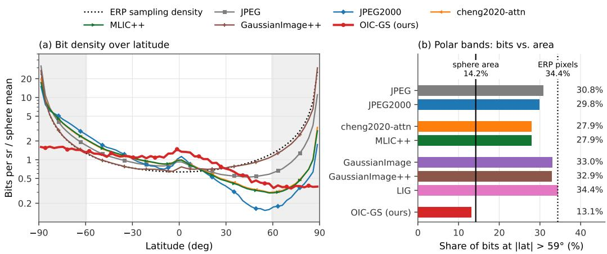  
Figure 7: Bit allocation over the sphere on the benchmark panoramas at matched bitrates. Bits are assigned to 64 latitude bands, divided by the solid angle of each band, and normalized by the global mean of each method; for OIC-GS, the feature bits are shown. (a) The ERP-based codecs follow the sampling density of the projection, while OIC-GS is distributed substantially more evenly; GaussianImage and LIG are omitted from (a) for readability. (b) The polar bands (the 11 outermost bands on each side, $\lvert \mathrm { l a t } \rvert > 5 9 ^ { \circ } )$ cover 14.2% of the sphere and receive 13.1% of the feature bits of OIC-GS, close to their area share, compared with 27.9-34.4% for the ERP-based codecs, close to the 34.4% ERP pixel share.

Bit-exactness requires the ContextMLP to see a fixed batch shape: otherwise the GPU accumulation order perturbs $\mu$ and $\sigma \ \mathrm { b y } \sim 1 0 ^ { - 5 }$ , which can move an arithmetic-coding CDF boundary. The decoder therefore evaluates it over the same full active block as the encoder and passes only the required rows to arithmetic decoding. Round-trip tests confirm bit-exact recovery of the quantized features and α for every reported configuration, and a pixel-level regression test confirms that viewport-dependent decoding matches full decoding.

The opacity symbols of the active primitives are coded with a static arithmetic coder: for each selectable level we write the counts of the three states $\hat { \alpha } _ { i } ^ { ( \ell ) } \in \{ \textstyle { \frac { 1 } { 3 } } , \frac { 2 } { 3 } , 1 \}$ as a header and then code the symbols under that frequency table. Inactive primitives write no opacity symbol, since the mask already marks them.

## D.2 MEASUREMENT PROTOCOL AND RUNTIME DEFINITIONS

The quality evaluation of Sec. 4.1 uses six square $9 0 ^ { \circ } \times 9 0 ^ { \circ }$ viewports, whereas the decoding experiments use viewports with horizontal and vertical fields of view of $9 0 ^ { \circ } \times 6 0 ^ { \circ }$ on a 1024×768 raster to represent a typical viewer workload; the raster size sets the output resolution, while the number of evaluated directions is set by the target grid (App. D.4). All frame rates of OIC-GS and the GS baselines are measured on one idle NVIDIA RTX 4090. We refer to scene 1 at the $\scriptstyle \lambda _ { R } = 2 \times 1 0 ^ { - 3 }$ point of Table 6 as the representative scene. Bitrates use the number of ERP pixels, and $1 \mathrm { K B } = 1 \mathrm { , } \mathrm { \bar { 0 2 4 } B }$ throughout.

We report the frame rates of three rendering modes; all frames stay on the GPU, as in the GS baseline measurements of Table 2. Rendering the full sphere runs at 140 FPS. Repeated rendering of a fixed viewport, after its lookup table is built, runs at 1,270 FPS on average over scenes 1, 7 and 46 and both viewports (30 decodes; minimum 1,231) and at 1,247-1,289 FPS on the representative scene; 200 decodes of all 100 benchmark scenes at the lowest bitrate give 1,250 FPS. A moving viewport runs at 314 FPS on average by re-splatting, and at about 900 FPS by looking up a cached sphere. The cached sphere is still slower than a fixed viewport because the two differ in what must be recomputed per frame: a fixed viewport builds its pixel-to-cell lookup table once and reuses it, whereas a moving viewport changes the direction of every pixel in each frame, so the exact NESTED ang2pix has to be evaluated again for all 786,432 pixels of the 1024×768 frame, more than the 417,508 directions rendered for a fixed viewport. Skipping splatting, blending and the ColorMLP therefore does not bring the frame time below that of a fixed viewport (1.08 against 0.79 ms; Tables 8 and 11). For OIC-GS, the entropy decoding time in Table 2 includes the existence masks and the opacity symbols as well as the feature streams, and all arithmetic decoding runs on the GPU; parsing the stream layout, selecting the streams of a viewport and one-time initialization are excluded.

<table><tr><td rowspan="2">Stage (per frame)</td><td colspan="2">Fixed viewport</td></tr><tr><td>ms</td><td>share</td></tr><tr><td>Level-0 splatting (192 primitives)</td><td>0.046</td><td>6.3%</td></tr><tr><td>Levels 1-6 splatting (K=9)</td><td>0.063</td><td>8.5%</td></tr><tr><td>Coarse-level downsampling</td><td>0.140</td><td>19.0%</td></tr><tr><td>Blending (Eq. (5))</td><td>0.022</td><td>3.0%</td></tr><tr><td>ColorMLP</td><td>0.443</td><td>60.2%</td></tr><tr><td>Raster lookup</td><td>0.016</td><td>2.2%</td></tr><tr><td>Other kernels</td><td>0.007</td><td>0.9%</td></tr><tr><td>Sum of GPU kernel times</td><td>0.736</td><td>100%</td></tr><tr><td>Frame time</td><td>0.787 (1,270 FPS)</td><td></td></tr></table>

Table 8: Per-frame time breakdown of the repeated rendering of a fixed viewport (one idle RTX 4090). The viewport rendering evaluates the 417,508 target-grid directions inside the padded $9 0 ^ { \circ } \times 6 0 ^ { \circ }$ frustum and maps them to a $1 0 2 4 \times 7 6 8$ frame that stays on the GPU; the host copy is not included. Stage times are GPU kernel times recorded with the PyTorch profiler over 200 frames, as medians over 15 models (scenes 1, 7 and $4 6 \times 5$ bitrates; two viewports, yaw $0 ^ { \circ }$ and 90°, per model).

Frame time breakdown. Table 8 breaks down the frame of the fixed viewport into its stages. The viewport path evaluates the 417,508 target-grid directions inside the padded frustum, and a raster lookup maps them to the 1024× 768 pixels. Splatting takes 15% of the GPU time of a frame and blending 3%, both restricted to these directions, whereas coarse-level downsampling still operates on the full target grid and takes 19%; the ColorMLP takes the largest share, 60%. These kernels sum to 0.74 ms of the 0.79 ms frame; for the rest of the frame the GPU waits for kernel launches. Copying the frame to the host would add 0.85 ms and is not part of the benchmark frame rate of 1,270 FPS, which keeps the frame on the GPU. Table 2 compares the frame rate with those of other codecs.

## D.3 TILE-ALIGNED RANDOM ACCESS

The default format divides the feature symbols of each coding pass into 32 arithmetic-coding streams with equal numbers of occupied cells. This format is well suited to parallel decoding on the GPU but poorly suited to skipping, because the stream boundaries are not aligned with spatial tiles, and because the existence mask, the opacities and the coarse levels are each stored as a single block. We therefore add a tile-aligned format, which can be selected at encoding time without retraining. The feature streams are divided at NESTED tile boundaries, with 4,096 cells per tile. Levels 4/5/6 have 12/48/192 tiles, each containing one feature segment per coding pass, which gives 96/384 tile streams on levels 5/6. The existence mask and the opacities are likewise coded per tile, all segment sizes are stored in the header, and the decoder detects the format from a header flag. The mask, opacity and feature segments of every tile are then contiguous byte ranges that can be skipped independently. Similar to the precinct size of JPEG2000, the tile size is fixed at encoding time. The difference is that the tiles are equal-area HEALPix cells, so a polar viewport is not expanded into a full-width band of tiles (our decoding measurements use equatorial viewports).

<table><tr><td>Format</td><td>File size</td><td>∆ size</td><td>Saved (yaw 0°/90°)</td></tr><tr><td>32 equal streams per pass (default)</td><td>116,089 B (0.4429 bpp)</td><td></td><td></td></tr><tr><td>Tile-aligned (4,096 cells/tile)</td><td>117,352 B (0.4477 bpp)</td><td>+1.1%</td><td> $5 0 . 0 \% / 3 9 . 4 \%$ </td></tr></table>

Table 9: Two storage formats of the same symbols on the representative scene $( 9 0 ^ { \circ } \times 6 0 ^ { \circ }$ viewports). The tile-aligned format increases the file size by 1.1% (1.2% benchmark mean) and allows 39-50% of the file to be skipped for one viewport; the default format has no tile boundaries to skip.

## D.4 FULL-SPHERE AND VIEWPORT-DEPENDENT DECODING

As described in Sec. 3.1, a viewport is rendered by evaluating Eqs. (3)–(6) only for its pixel directions. In our implementation, each pixel direction is mapped to its cell on the target grid by a precomputed lookup table, and the equations are evaluated once per visible target-grid cell, without an ERP intermediate. The target grid has a mean angular spacing of about $0 . 1 1 ^ { \overline { { \circ } } }$ , comparable to the pixel pitch at the center of the 1024×768 viewport (0.09-0.11°), so the viewport is rendered at approximately display resolution. Given a padded viewing frustum, we select the visible cells of the finest grid and propagate visibility to coarser levels of the NESTED hierarchy by taking the union over children, which gives one visibility mask per level, and restrict the neighbor tables of Eqs. (4)–(5) to the visible rows. A $9 0 ^ { \circ } \times 6 0 ^ { \circ }$ frustum with $3 ^ { \circ }$ padding covers about 13% of the target directions (417,508 of 3,145,728), but the skipped fraction of the file is much smaller, because the coarse levels and the context dependencies are shared. The visibility culling is bit-exact with full rendering inside the viewport. The viewport-dependent and progressive measurements below use the tile-aligned format, while Path I decodes the default format.

Path I: full-sphere decoding. Full decoding recovers the quantized features and opacities of the encoder bit-exactly, and reconstructs the sphere of the representative scene at 27.7133 dB native PSNR (PSNR on the HEALPix representation). Full-sphere rendering runs at 140 FPS, and repeated rendering of a fixed viewport from the decoded representation reaches 1,247-1,289 FPS on the representative scene; Table 8 gives the breakdown of the viewport frame.

Path II: viewport-dependent decoding. A two-pass procedure first parses the stream boundaries, then extends the viewport with its ring, parent and two-pass dependencies, and decodes only the streams that intersect it; skipped primitives can only affect pixels outside the viewport. This is verified on the two viewports of the representative scene and on all 500 benchmark models with two viewports each: inside the viewport, every decode is bit-exact with full decoding.

## D.5 PROGRESSIVE STREAMING AND HEAD ROTATION

Path III uses the tile-aligned format for streaming. A session has three phases: in phase $T _ { 0 }$ , the tiles of the first viewport are received and decoded; in phase $T _ { 1 }$ , the remaining tiles complete the sphere in the background; and in phase $T _ { 2 } ,$ every head rotation only requires rendering. Table 10 measures the whole process on scenes 1, 7 and 46, one fresh process per session, and Table 11 compares the two strategies for head rotation on the representative scene over a 180-frame pan. In phase $T _ { 2 } ,$ the two strategies differ in what is computed per frame. The re-splatting strategy renders every frame from the primitives: it runs the splatting of Eq. (4), the blending of Eq. (5) and the ColorMLP on the directions of the current viewport. To avoid recomputing visibility at every frame, it keeps a visible set with a margin around the viewport and updates it only when the viewport leaves this margin, which happens four times during the 180-frame pan. The cached strategy instead renders the full sphere once on the target grid after phase $T _ { 1 }$ (7.1 ms at 140 FPS) and stores the RGB color of every target direction. Each frame then only maps the direction of every viewport pixel to its target-grid cell and reads the cached color, so splatting, blending and the ColorMLP are skipped entirely, at the cost of one full-sphere rendering and a color buffer for the whole sphere. Since the re-splatting strategy evaluates the same target-grid directions and uses the same direction-to-cell lookup, the two strategies produce bit-identical frames. Both use an exact GPU implementation of the NESTED ang $\mathsf { I P i x }$ function (zero mismatches against healpy (Zonca et al., 2019) over $2 \times 1 0 ^ { 5 }$ directions) and produce identical PSNR along the trajectory in every session; a per-frame CPU lookup, which rebuilds the lookup table every frame, is far slower and is not reported.

<table><tr><td> $\lambda _ { R }$ </td><td>First view (bpp) Deferred</td><td></td><td> $T _ { 1 }$ </td><td>(KB) Unchanged</td><td> $T _ { 2 }$  (FPS)</td></tr><tr><td> $0 . 9 \times 1 0 ^ { - 3 }$ </td><td>0.338</td><td>48%</td><td>82</td><td>3/3</td><td>314/891</td></tr></table>

Table 10: Progressive streaming: the models of scenes 1, 7 and 46 at the $\scriptstyle \lambda _ { R } = 0 . 9 \times 1 0 ^ { - 3 }$ point of Table 6 played end-to-end in fresh processes (3 sessions; first viewport at yaw $0 ^ { \circ } .$ , followed by a 180- frame pan to 90°). $^ { 6 6 } T _ { 1 }$ (KB)" is the data size of phase $T _ { 1 }$ , and ${ } ^ { 6 6 } T _ { 2 }$ (FPS)" is the rendering speed of phase ${ \bar { T } } _ { 2 }$ .“Deferred" is the fraction of the file not yet received when the first viewport is displayed in each session. “Unchanged" counts the sessions whose first-viewport pixels are bit-identical after completion; $T _ { 2 }$ gives the re-splatting/cached speeds of Table 11.
<table><tr><td>Strategy</td><td>ms/frame</td><td>FPS</td><td>GT-PSNR</td><td>Notes</td></tr><tr><td>Re-splatting, visible set with margin</td><td>3.22</td><td>310</td><td>27.994</td><td>4 updates of the visible set</td></tr><tr><td>Cached sphere, lookup only</td><td>1.08</td><td>923</td><td>27.994</td><td>bit-identical to re-splatting</td></tr></table>

Table 11: Head-rotation speed on the representative scene (180 frames from yaw $0 ^ { \circ }$ to $9 0 ^ { \circ }$ 1024×768 at $9 0 ^ { \circ } \times 6 0 ^ { \circ }$ , idle RTX 4090). FPS is computed from the unrounded mean frame time. Both strategies are measured in a single run that decodes once and then pans; over the sessions of Table 10, they run at 314/891 FPS on average. GT-PSNR, the mean viewport PSNR along the trajectory against the ground-truth projection, is identical for all strategies, so the acceleration does not affect quality.

## D.6 DEPLOYMENT CONSIDERATIONS

Bandwidth and completion. Path II displays a bit-exact viewport at final quality from the tiles that the viewport requires. Path III uses sessions with a fixed initial yaw and displays the first viewport from 52% of the file; after the remaining tiles arrive, the sphere is completed without changing any pixel on screen (Table 10). Level-aligned prefixes serve a different purpose: they provide a coarse preview of the full sphere from the first 10% of the file (Fig. 8).

Interaction and infrastructure. Both GPU strategies for head rotation stay within the 11.1 ms frame budget of a 90 Hz display (Table 11). Since tile sizes and offsets are stored explicitly, a static file supports viewport-adaptive HTTP range requests without server-side transcoding or per-client bitstreams; the storage overhead of the tile-aligned format is 1.2% on average (Table 9).

## E ADDITIONAL ABLATION STUDIES AND BITRATE ESTIMATE ANALYSIS

This appendix extends Sec. 4.4. App. E.1 compares the bitrate estimate used for selection with the actually written bytes. App. E.2 gives a detailed analysis of the ablation variants of Table 3 and the sensitivity to the design constants.

## E.1 ESTIMATED BITRATE VERSUS WRITTEN FILE

We compare the bitrate estimate used in training with the actually written bytes over the encodings of Table 6.

Accuracy of the bitrate estimate. Let $R _ { \mathrm { f e a t } }$ denote the masked feature rate of Eq. (9), i.e., $\begin{array} { r } { \sum _ { \ell } \sum _ { i } m _ { i } ^ { ( \ell ) } R _ { i } ^ { ( \ell ) } } \end{array}$ with the code lengths $R _ { i } ^ { ( \ell ) }$ of Eq. (9) evaluated at the quantized $\hat { f } _ { i } ^ { ( \ell ) }$ of the symbols actually coded. It is obtained from ${ \widetilde { R } } _ { \mathrm { f e a t } } \left( \mathrm { E q . } \left( 1 1 \right) \right)$ by setting ω≡1 and excluding the inactive primitives, whereas the ω-weighted $\widetilde { R } _ { \mathrm { f e a t } }$ is used only in the training objective. The written feature bytes exceed $R _ { \mathrm { f e a t } }$ by only 1.9% on average (median 0.7%), which can be attributed to the termination overhead of the 32 parallel streams.

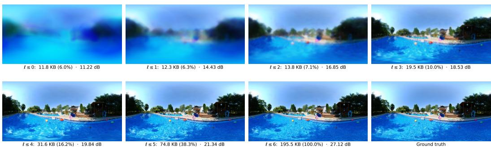  
Figure 8: Progressive decoding by level, from the written bitstream of scene 1 at the $\scriptstyle \lambda _ { R } = 0 . 9 \times 1 0 ^ { - 3 }$ operating point (195.5 KB; Lanczos-3 resampling to ERP). Each panel shows the full sphere reconstructed only from the levels $\ell \leq L ^ { \prime } .$ , labeled with the bytes of this prefix (share of the file) and the end-to-end WS-PSNR. Because of the coarse-to-fine order of Sec. 3.2, every prefix gives a complete sphere with less detail: a recognizable preview requires the first 10% of the file (levels $\ell \leq 3 )$ , and the final prefix is bit-exact with full decoding.

## E.2 ABLATION VARIANTS AND DESIGN CONSTANTS

All variants of Table 3 are retrained from scratch on all 100 images of the main benchmark at the operating point $\scriptstyle \lambda _ { R } = 3 \times 1 0 ^ { - 3 }$ of Table 6, with the schedule of Table 5; to verify that the conclusions do not depend on the dataset, they are also retrained on all 100 SUN360 images of App. B.2. Each variant is compared with the full model at equal quality: its mean operating point is projected onto the mean rate-distortion curve of the full model on the same dataset (seven operating points; Table 6 for the main benchmark), interpolated with PCHIP in quality against $\log _ { 1 0 }$ bpp, and Table 3 reports the relative rate difference at the quality of the variant. Since this operating point is bracketed by the curve of the full model, the WS-PSNR and V-PSNR of every variant lie within the quality range of the full model on every image of both datasets, so no extrapolation is needed. On SUN360, the variants give +29.0%/+28.1% (WS-PSNR/V-PSNR) without rate-aware opacity weighting, $+ 6 . 5 \% / + 7 . 9 \%$ without $\mathrm { R C C , + 2 . 4 \% / + 3 . 3 \% }$ with STE instead of uniform noise in the feature rate estimate, and between —0.6% and +0.5% for the design constants, which reproduces the ranking on the main benchmark.

Rate-aware opacity weighting (+31.2%). This variant sets $\scriptstyle \omega _ { \mathrm { l o } } = \omega _ { \mathrm { h i } } = 1$ in Eq. (10), i.e., $\omega ( \hat { \alpha } ) =$ min $( \hat { \alpha } / \tau , 1 )$ . At b=2, its forward value is the mask $m _ { i } ^ { ( \ell ) } = \mathbf { 1 } [ \hat { \alpha } _ { i } ^ { ( \ell ) } > \tau ]$ of Eq. (2), so it removes the rate slope above τ and charges every active primitive its full bitrate, while the straight-through slope $1 / \tau$ still pushes inactive primitives down. The variant is worse than the full model on 96 of the 100 images of the main benchmark, and the effect is visible in the selection: at the same $\lambda _ { R } ,$ it keeps 6.1× as many active primitives (288,576 against 47,031 on average) and spends 0.66 instead of 0.29 bpp. The deviation between its written and estimated feature bytes is 2.5%, similar to that of the full model (App. E.1), so this variant is itself a well-calibrated codec. Another possible variant, $\omega { \equiv } 1$ , would also charge the objective for the bits of inactive primitives, which are never written by the coder. Since the features of inactive primitives receive no distortion gradient, this variant would only push them toward cheaper values that are never transmitted. We therefore use the former variant as the ablation of RDPS.

RCC (+5.9%). This variant sets all context inputs of the ContextMLP to zero, so that the network reduces to one learned mixture per level, and it is retrained end to end, so the representation re-adapts to the weaker prior. It is worse than the full model on 98 of the 100 images of the main benchmark. The re-adaptation is visible in the selection: without context, the variant selects 0.84× as many primitives, because a prior without context raises the predicted cost of an average primitive, so Eq. (17) pushes all opacities down more strongly at a fixed $\lambda _ { R }$ . RCC therefore lowers the predicted cost of an average primitive, which allows more primitives to be kept at the same $\lambda _ { R }$

Uniform noise in the feature rate estimate (+2.5%). With straight-through rounding instead of uniform noise in the feature rate estimate, the likelihood of Eq. (8) is evaluated at the rounded features and still estimates the bitrate of the coded symbols; only its gradient changes, so the quality is essentially unaffected (within 0.02 dB WS-PSNR on the main benchmark) and the loss appears in the bitrate. The variant is worse than the full model on 96 of the 100 images of the main benchmark.

<table><tr><td rowspan="2">Scene</td><td>Reference round-trip</td><td colspan="3">Native sphere PSNR (dB)</td><td colspan="3">End-to-end ERP WS-PSNR (dB)</td></tr><tr><td>fidelity</td><td>L6</td><td>L7</td><td> $\Delta$ </td><td>L6</td><td>L7</td><td> $\Delta$ </td></tr><tr><td>87</td><td>30.921</td><td>32.952</td><td>45.466</td><td>+12.514</td><td>28.702</td><td>30.737</td><td>+2.035</td></tr><tr><td>88</td><td>32.016</td><td>33.349</td><td>43.963</td><td>+10.614</td><td>29.225</td><td>31.660</td><td>+2.435</td></tr><tr><td>84</td><td>32.659</td><td>32.515</td><td>41.484</td><td>+8.969</td><td>28.959</td><td>31.959</td><td>+3.000</td></tr><tr><td>86</td><td>33.541</td><td>32.290</td><td>40.666</td><td>+8.375</td><td>28.892</td><td>32.574</td><td>+3.682</td></tr><tr><td>73</td><td>34.341</td><td>35.009</td><td>44.354</td><td>+9.345</td><td>31.496</td><td>33.848</td><td>+2.352</td></tr><tr><td>66</td><td>34.910</td><td>34.702</td><td>43.424</td><td>+8.722</td><td>31.456</td><td>34.196</td><td>+2.740</td></tr><tr><td>28</td><td>35.479</td><td>35.584</td><td>44.792</td><td>+9.209</td><td>32.432</td><td>34.941</td><td>+2.508</td></tr><tr><td>35</td><td>36.934</td><td>34.158</td><td>38.465</td><td>+4.307</td><td>31.749</td><td>34.214</td><td>+2.465</td></tr><tr><td>100</td><td>38.024</td><td>35.226</td><td>40.222</td><td>+4.996</td><td>32.790</td><td>35.436</td><td>+2.646</td></tr><tr><td>20</td><td>40.000</td><td>37.823</td><td>45.799</td><td>+7.975</td><td>35.042</td><td>38.699</td><td>+3.657</td></tr><tr><td>Mean</td><td>34.882</td><td>34.361</td><td>42.863</td><td>+8.502</td><td>31.074</td><td>33.826</td><td>+2.752</td></tr></table>

Table 12: Paired L6/L7 resolution analysis. “Reference round-trip fidelity" is the WS-PSNR of the original ERP image after the reference ERP→HEALPix→ERP round trip; it is used to stratify the image selection and as the reference score in Fig. 9, and it is not a mathematical upper bound. Both the native and the end-to-end scores improve on all $1 0 / 1 0$ scenes. These fits use only the distortion loss, continuous features and all primitives active, and are therefore not codec operating points or results at matched bitrates.

Design constants. The two-pass schedule has no measurable effect (Table 3): removing level 4 from it changes the rate by +0.4% to +0.3%, which is of the order of the run-to-run variation of the training (0.48% in bpp, 0.027 dB in native PSNR over repeated identical runs), as expected since level 4 contains less than 5% of the cells coded with the two-pass schedule.

## F RESOLUTION LIMIT AND THE L7 EXTENSION

The main model ends at level $6 ( n _ { \mathrm { s i d e } } { = } 2 5 6 )$ , one resolution level below its target and resampling grid at $n _ { \mathrm { s i d e } } { = } 5 1 2$ . In this appendix, L6 denotes this default configuration (L=7 levels, $\ell \in \{ 0 , \ldots , 6 \} )$ and L7 denotes the configuration with an additional level $\ell { = } 7$ at $n _ { \mathrm { s i d e } } { = } 5 1 2 ~ ( L { = } 8$ levels). App. È.1 measures the capacity of the two configurations without a rate term, and $\mathrm { A p p }$ . F.2 evaluates the L7 codec at matched bitrates.

## F.1 CAPACITY ANALYSIS WITHOUT RATE

Setup. To select test images without using the results of our method, we rank all 100 images by the WS-PSNR of the model-independent ERP → HEALPix → Lanczos-3 ERP round trip, divide the ranking into ten bins, and take the middle image of each bin (scenes 87, 88, 84, 86, 73, 66, 28, 35, 100 and 20). For each scene, we fit paired L6 and L7 models for 10k iterations with the same fixed seed and optimization settings. L6 contains 1,048,512 primitives up to $n _ { \mathrm { s i d e } } { = } 2 5 6 ; \mathrm { L } 7$ adds the 3,145,728 cells of the target grid, for 4,194,240 in total. Both fits use $\lambda _ { R } { = } 0$ and continuous features, keep all primitives active, and select the best checkpoint every 250 iterations. This is therefore a capacity analysis with a fixed number of primitives, not a comparison at matched bitrates; Table 12 and Fig. 9 report the results for each scene.

Findings. The additional level raises the native sphere PSNR by +8.502 dB and the end-to-end WS-PSNR by +2.752 dB on average, on all $1 0 / 1 0$ scenes, so level 6 is an empirical capacity limit under this setting. The end-to-end gain is smaller because the ERP score includes the two resamplings between the ERP grid and the sphere: the reference round trip, which involves no codec, reaches only 34.882 dB on these scenes, and the gap of the fits to it decreases from 3.808 to 1.056 dB. Codecs fitted on the ERP plane never perform these resamplings, so the ERP-based scores of Sec. 4.2 charge OIC-GS an additional resampling loss (App. A.3); on the main benchmark, the operating points of Table 6 score 1.9-2.8 dB higher in the native domain than end-to-end. Whether the additional level is worth its bitrate once the rate term, quantization and selection are enabled is evaluated next.

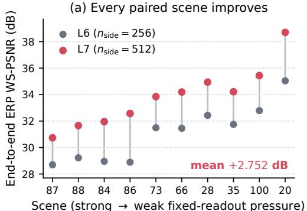

(b) Stronger pressure predicts a larger native gain  
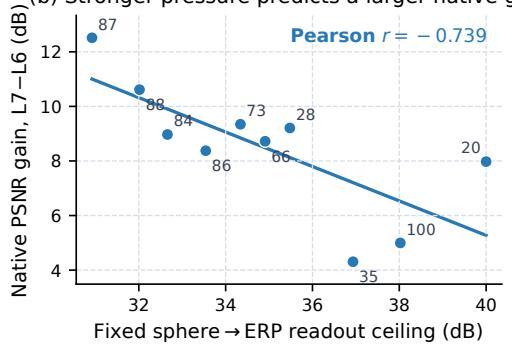  
Figure 9: Resolution analysis. Left: the finest level at $n _ { \mathrm { s i d e } } { = } 5 1 2$ improves the end-to-end ERP WS-PSNR for every selected image (+2.752 dB on average; range +2.035-+3.682 dB). Right: images with lower round-trip fidelity of the reference ERP→HEALPix→ERP path, which indicates stronger resampling loss and more high-frequency content, obtain a larger native L7 gain (Pearson correlation —0.739). The native gain is also correlated with the global and nadir high-frequency energy (+0.642 and +0.721), and is +10.480 dB on average at the nadir against +8.022 dB at the equator.

<table><tr><td>Metric</td><td>BD-rate (%)</td><td>∆ at matched bitrate</td><td>Negative on</td></tr><tr><td>WS-PSNR</td><td>-7.7</td><td>+0.24dB</td><td>20/20</td></tr><tr><td>V-PSNR</td><td>-8.2</td><td>+0.35 dB</td><td>20/20</td></tr><tr><td>native sphere PSNR</td><td>-11.7</td><td>+0.46 dB</td><td>20/20</td></tr></table>

Table 13: The L7 codec against the L6 configuration on the 20-image subset of App. F.2, at the three operating points $\lambda _ { R } \in \{ 2 . 0 , 1 . 4 , 0 . 9 \} \times \mathbf { \breve { l } } 0 ^ { - 3 }$ , computed with the estimator of Table 1 on the common quality range of each pair. A negative value means fewer bits at equal quality; "Negative on" counts the images with a defined BD-rate. Native sphere PSNR is measured on the HEALPix representation and excludes the effect of resampling.

## F.2 RATE-DISTORTION EVALUATION WITH L7

Setup. We retrain the full codec with the additional level on a 20-image subset of the main benchmark (scenes 20, 21, 25, 34, 42, 46, 48, 51, 52, 62, 67, 71, 75, 80, 86, 87, 89, 95, 98 and 100), changing only the number of levels and the two-pass schedule $( \ell \in \{ 4 , 5 , 6 , 7 \} ) ;$ all other hyperparameters follow App. A, and the target and resampling grid remains $n _ { \mathrm { s i d e } } { = } 5 1 2$ Both configurations are evaluated at $\lambda _ { R } \in \{ 2 . 0 , 1 . 4 , 0 . 9 \} \times 1 0 ^ { - 3 }$ with the rate term, quantization and RDPS enabled, so the additional level must justify its own bitrate. All bitrates are byte counts of written bitstreams, and the round-trip properties of App. D.1 still hold: the decoded PSNR matches the encoder within 0.0014 dB and re-encoding gives identical bytes on 60/60 runs. Fitting L7 takes 18.0 against 12.7 min per image, and its run-to-run variation is larger (0.05-0.15 against 0.027 dB; App. E.2), so we keep L6 as the default and report L7 as a scalability result: the same selection mechanism extends to a finer level without any other change.

Rate-distortion performance. The L7 codec reduces the WS-PSNR BD-rate by 7.7% relative to L6 (+0.24 dB at matched bitrate) and the V-PSNR BD-rate by 8.2%, on all 20/20 images with a defined BD-rate (Table 13).

<table><tr><td rowspan="3">λR</td><td>Level 7</td><td colspan="3">Selection ratio, L6 config → L7 config</td><td>Active primitives</td></tr><tr><td>median (range)</td><td>Level 4</td><td>Level 5</td><td>Level 6</td><td> $\mathrm { L } 6 \to \mathrm { L } 7$ </td></tr><tr><td> $2 . 0 { \times } 1 0 ^ { - 3 }$ </td><td>0.14% (0.02-0.60)</td><td> $7 1 . 9  7 6 . 1 \%$ </td><td> $3 4 . 0  4 2 . 3 \%$ </td><td> $8 . 7  6 . 3 \%$ </td><td> $1 8 6 \mathrm { K }  1 9 1 \mathrm { K }$ </td></tr><tr><td> $1 . 4 \times 1 0 ^ { - 3 }$ </td><td>0.25% (0.04-1.02)</td><td> $7 3 . 6 \to 7 7 . 8 \%$ </td><td> $3 7 . 2 \to 4 6 . 6 \%$ </td><td> $1 1 . 8 \to 5 . 2 \%$ </td><td> $2 1 7 \mathrm { K }  1 9 7 \mathrm { K }$ </td></tr><tr><td> $0 . 9 \times 1 0 ^ { - 3 }$ </td><td> $0 . 5 6 \% ( 0 . 1 1 - 1 . 8 7 )$ </td><td> $7 5 . 4 \to 7 8 . 6 \%$ </td><td> $4 5 . 8 \to 4 9 . 9 \%$ </td><td> $1 8 . 2  8 . 4 \%$ </td><td> $2 8 5 \mathrm { K }  2 4 1 \mathrm { K }$ </td></tr></table>

Table 14: Selection ratios after training, once the inactive primitives are removed, on the 20-image subset of App. F.2 at the three operating points $\lambda _ { R } ~ \in ~ \bar { \{ 2 . 0 , 1 . 4 , 0 . 9 \} } \times 1 0 ^ { - 3 }$ . Level 7 contains 3,145,728 cells; the median column gives the per-image median selection ratio (range in parentheses), and the remaining columns compare the same level between the two configurations at the same $\lambda _ { R } .$

Selection on the additional level. The median image selects only 0.14-0.56% of the additional level across the three bitrates (per-image range 0.02-1.87%; Table 14). Level 6 loses 28-56% of its active primitives while levels 4-5 keep slightly more, and the total number of active primitives is unchanged at the lowest bitrate and 9-15% lower at the two highest, so RDPS redistributes primitives across levels rather than simply adding more. The selection is not degenerate: the median selection ratio of level 7 increases by $4 . 0 \times \mathrm { a s } \ \lambda _ { R }$ decreases by 2.2×; all cells start above τ (mean opacity 0.616), and 45% of level 7 is still active after the 3k warm-up iterations without the rate term, before the rate term selects among them; and the active primitives concentrate on high-frequency content, with a ground-truth Sobel gradient of 2.4-4.7× the solid-angle-weighted image mean and 65-88% of them in the top gradient quartile (against 1.9-3.2× for level 6). Fig. 10 shows their locations on scene $^ { 8 7 ; }$ the polar caps receive more than their 13.4% solid-angle share of them, because the nadir often contains textured ground, where the native L7 gain is also the largest (Fig. 9).

λ= 0.002

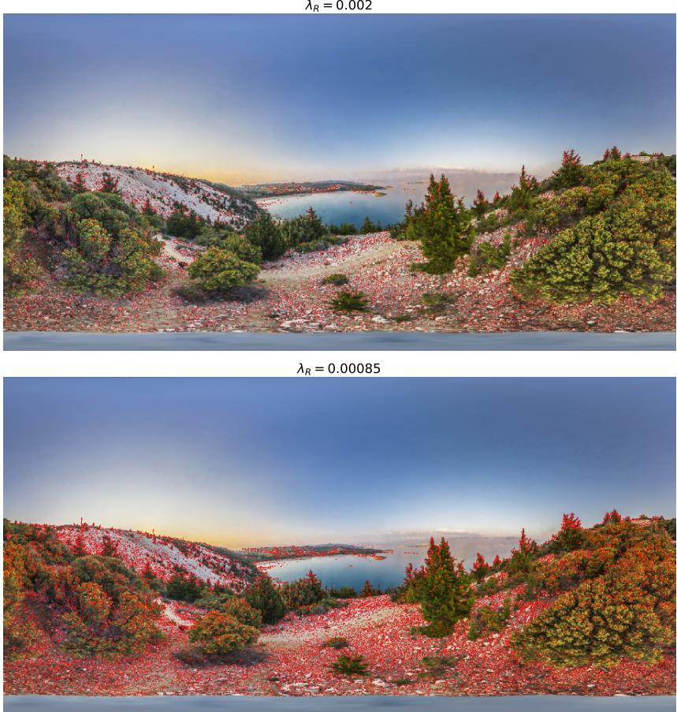  
Figure 10: Locations of active primitives of the additional level on scene $8 7 \colon$ active level-7 cells are shown in red over the ground truth. They concentrate on foliage, rocky ground and the shoreline, and are absent from the sky and open water; decreasing $\lambda _ { R }$ (bottom) selects more of them without changing where they are located.

## G ADDITIONAL QUALITATIVE RESULTS

Figs. 11–13 extend Fig. 5 to five scenes and all six viewing directions, comparing against every method of Table 1 and against the JPEG anchor. The column headers report the actual bitrate of each scene, and every baseline uses at least as many bits as OIC-GS on every displayed scene. The scenes are the 10th, 30th, 50th, 70th and 90th percentiles of the per-image WS-PSNR gain of OIC-GS over SGI (+1.2-+3.0 dB), and were selected before inspecting the results. The 90° ×90° viewports follow the projection protocol of App. A.3; labels and zoomed-in patches follow Fig. 5. A window in which OIC-GS outperforms JPEG exists in 28 of the 30 panels, and the best window ties at the zenith of scene 55; for the remaining panel, the nadir of scene 74, we show the most textured window. Showing all six directions compares each panorama in full. Some regions, such as the sky at the zenith, are largely uniform and contain mainly low-frequency content, so the methods differ little there; in textured regions such as grass and buildings, OIC-GS recovers noticeably more high-frequency detail, as the zoomed-in patches show.

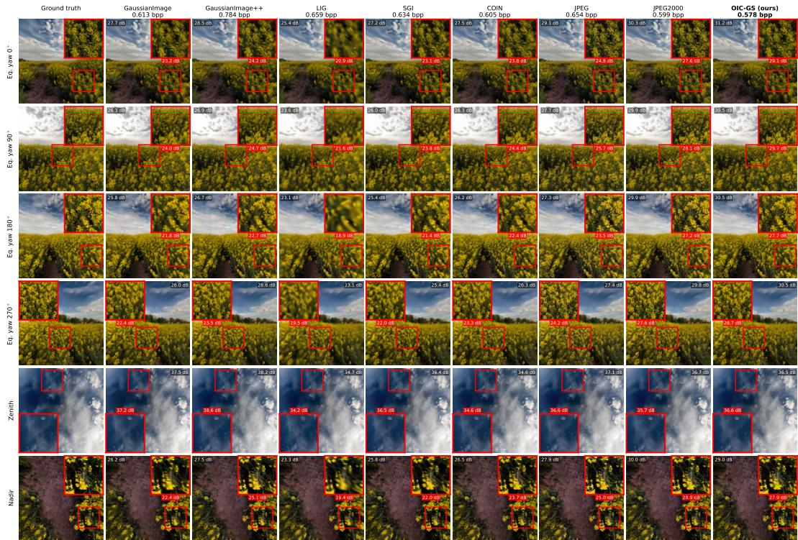  
Figure 11: Additional qualitative results (part 1 of 3): scene 55 in all six viewing directions, under the protocol described in the text. Across the five scenes, OIC-GS achieves the highest viewport PSNR among the GS codecs and COIN in 25 of the 30 panels, and the highest patch PSNR in 27. On this scene, the only exception is the zenith, where GaussianImage++ and GaussianImage exceed OIC-GS by 1.7 and 1.0 dB at 0.784 and 0.613 bpp, compared with 0.578 bpp for OIC-GS; the other four exceptions are shown in Fig. 12. OIC-GS matches or exceeds JPEG2000 in 11 of the 12 equatorial panels of scenes 7, 32 and 55, while JPEG2000 remains ahead at the nadir of every scene.

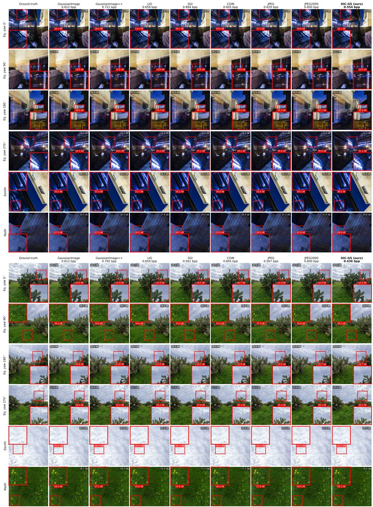  
Figure 12: Additional qualitative results (part 2 of 3): scenes 74 (top) and 46 (bottom) in all six viewing directions, under the protocol of Fig. 11. Every baseline uses more bits than OIC-GS on both scenes (0.554 against 0.600-0.894 bpp on scene 74, and 0.436 against 0.561-0.792 bpp on scene 46). Four of the five panels in Figs. 11–13 where a GS codec exceeds OIC-GS in viewport PSNR are shown here, all for GaussianImage++ at a 30-82% higher bitrate and by 0.1-0.6 dB: the yaw-180° and nadir views of scene 74 and the zenith and nadir of scene 46. The nadir patch of scene 74 is the only panel where no textured window favors OIC-GS over JPEG; at the zenith of scene 55, the best window ties.

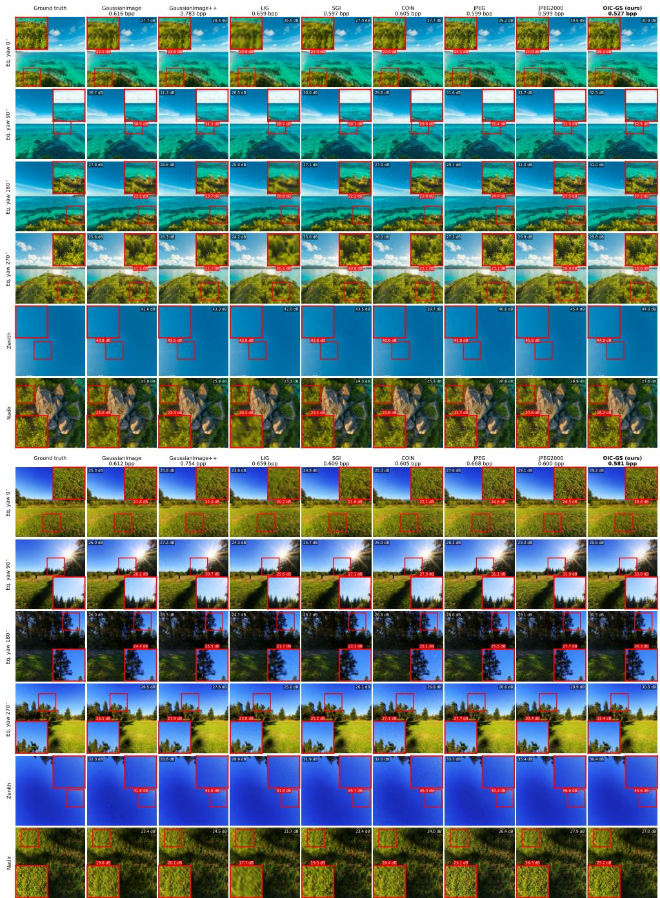  
Figure 13: Additional qualitative results (part 3 of 3): scenes 7 (top) and 32 (bottom) in all six viewing directions, under the protocol of Fig. 11. Every baseline uses more bits than OIC-GS on both scenes (0.527 against 0.597-0.783 bpp on scene 7, and 0.581 against 0.600-0.754 bpp on scene 32), and OIC-GS achieves the highest viewport PSNR among the GS codecs and COIN in all twelve panels.