# REGDIFF: Guided Diffusion in Regulated Latent Space for Exploring Metamaterial Voxel Geometry

Wangzhi Zhan Department of Computer Science Virginia Tech Blacksburg, VA 24061 wzhan24@vt.edu

Dongqi Fu   
Meta   
Menlo Park, CA 94025   
dongqifu@meta.com   
Jianpeng Chen   
Department of Computer Science   
Virginia Tech   
Blacksburg, VA 24061   
jianpengc@vt.edu

Dawei Zhou Department of Computer Science Virginia Tech Blacksburg, VA 24061 zhoud@vt.edu

## Abstract

Metamaterials are artificially engineered structures whose mechanical and physical behaviors are strongly shaped by geometry rather than composition. Voxel representation provides a unified format for metamaterial geometry generation, as it can express diverse classes such as truss, shell, and porous structures within a single cubic discretization. However, voxel-based generation faces a plausibility–novelty trade-off: staying close to known geometries helps preserve geometric regularities, while moving away from them is necessary for novelty but may produce degenerate geometries. To address this challenge, we propose REGDIFF, a generative framework that couples voxel representation with latent space regulation and guided diffusion. REGDIFF introduces a repel-and-sink (RAS) mechanism to smooth the latent distribution of plausible geometries, and short-range repulsion (SRR) guidance to discourage generation overly close to known samples while maintaining geometric plausibility. We further contribute a voxel-based benchmark covering truss- and shell-type metamaterial geometries, together with an evaluation module for geometric plausibility, novelty, and diversity. Experiments show that REGDIFF outperforms voxel-based generative baselines, achieving +8.9% in geometric plausibility, +46.4% in novelty, and +128.6% in diversity on average across two datasets. These results suggest that REGDIFF is a strong geometry candidate generator for downstream evaluation. Our code is provided at https://github.com/wzhan24/ReGDiff.

## 1 Introduction

Metamaterials are artificially engineered structures whose unusual behaviors arise from carefully designed geometries rather than intrinsic chemical composition. This structural programmability enables properties rarely observed in natural materials, such as negative Poisson’s ratio, ultrahigh stiffness-to-weight ratio, and extreme energy absorption [1, 2]. These capabilities have driven breakthroughs across domains including biomedical scaffolds, vibration isolation, acoustic cloaking, soft robotics, and thermal management [3, 4]. The ability to tailor functionality through geometry positions metamaterials as a critical frontier for next-generation engineering systems.

Given their extraordinary potential, metamaterials have become a rising focus in material science over the past two decades [5]. Early geometry construction efforts relied heavily on human expertise and manual design, but the emergence of machine learning has enabled data-driven approaches for generating and screening candidate structures. Existing methods largely fall into two categories: modeling metamaterials as 3D graphs [6, 7, 8], or designing 2D patterns that are extruded uniformly along a third axis [9, 10, 11]. Graph representations provide an abstract and interpretable view of metamaterials, yet they lack the ability to express fine-grained geometric details, as edges are usually instantiated as simple cylinders. In contrast, 2D pattern-based designs construct a repeating planar motif and then extend it uniformly along the third axis to form a 3D structure. Such designs can achieve superior performance in the two in-plane directions defined by the patterned motif, but along the extended axis the properties remain largely unchanged from the base material.

Recently, voxel representation, i.e., discretizing a cubic space into small cells marked as void or solid, has become an emerging direction for metamaterial geometry generation. Unlike representations tailored to specific classes of metamaterials, such as graphs for trusses or images for 2D patterns, voxel representation provides a unified and fine-grained format that can express diverse metamaterial geometries, including truss-based, shell-based, porous, 2D, and kirigami structures. This makes voxel representation a compelling modality for geometry candidate generation and evaluation. However, only a few attempts [12, 13, 14] have explored this direction, often by directly adapting 3D generative models from the computer vision domain to metamaterial geometries without explicitly considering the structural regularities expected in metamaterial unit cells.

Despite its promise, voxel-based metamaterial geometry generation faces a key plausibility–novelty trade-off. Generated candidates must satisfy basic geometric plausibility requirements, including symmetry, periodic boundary consistency, and connected solid regions. At the same time, they should not remain too close to training geometries. Existing voxel-based approaches remain limited in this respect: diffusion-based methods [13, 14] and generative adversarial models [12] often approximate the observed geometry distribution directly, which can bias generation toward memorized samples; when pushed toward more aggressive exploration, they may instead produce degenerate structures such as disconnected fragments, or even pure voids. This motivates a generation framework that can encourage novelty while maintaining geometric plausibility.

Formally, we identify two key challenges for voxel-based metamaterial geometry generation. C1. Plausibility–Novelty Trade-off: generated candidates should be sufficiently different from known samples while still satisfying basic geometric constraints, including symmetry, periodicity, and connectivity. C2. Lack of Benchmark: to the best of our knowledge, only Yang et al. 2024 [14] provides a public large-scale voxel dataset of shell-type metamaterials suitable for training deep generative models. However, many important metamaterial families, such as truss-based structures, are not yet covered in voxel form. Moreover, existing evaluations are often based on visualization or limited structural checks, and a systematic benchmark for voxel-based metamaterial geometry generation is still lacking.

To address C1, we propose REGDIFF, a generative framework that combines latent Regulation with Guided Diffusion. REGDIFF encodes voxel structures into a low-dimensional latent space via an autoencoder, then applies a repel-and-sink (RAS) mechanism to separate plausible geometries from perturbed degenerate ones while smoothing the latent distribution of plausible samples. To further encourage novelty, we introduce short-range repulsion (SRR) guidance into the diffusion process, which discourages generation overly close to known samples while keeping the guidance local to avoid pushing samples outside plausible regions. To address C2, we construct, to the best of our knowledge, the first publicly available large-scale voxel dataset for truss-based metamateria geometries and propose five metrics to jointly evaluate geometric plausibility, novelty, and diversity.

Through extensive experiments on our dataset and the dataset from [14], we show that REGDIFF outperforms voxel-based generative baselines, improving geometric plausibility by 8.9%, novelty by 46.4%, and diversity by 128.6% on average across both datasets. Additional analyses and visualizations of the latent space and generated structures further verify the effectiveness of RAS for latent regulation and SRR for guided generation.

In this work, we make the following contributions:

• Framework. We propose REGDIFF, combining RAS latent regulation with SRR-guided latent diffusion for structurally plausible and novel voxel metamaterial geometry generation.

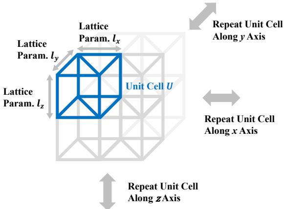  
(a) Unit cell and lattice of metamaterials.

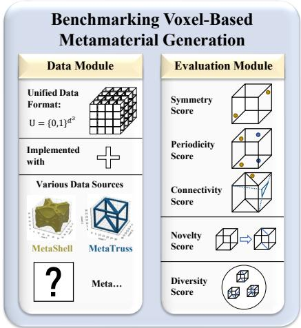  
(b) Benchmark development.  
Figure 1: Overview of metamaterials and benchmark development.

• Benchmark. We build a systematic voxel benchmark covering data and evaluation: we release MetaTruss together with MetaShell, and provide metrics for geometric plausibility, novelty, and diversity.

• Experiments. We conduct comprehensive geometry-level experiments showing that REGDIFF better balances geometric plausibility, novelty, and diversity than voxel-based generative baselines.

## 2 Preliminaries

This section introduces metamaterial geometry representation, related voxel generation models, and the geometry candidate generation problem studied in this work.

## 2.1 Voxel-Representation for Metamaterials

Metamaterials are artificial micro-structures composed of substrate material (e.g., plastics, metals, ceramics). Their geometry can be naturally described by a unit cell U and a lattice vector l = $( l _ { x } , l _ { y } , l _ { z } ) \in \mathbb { R } ^ { 3 }$ , where U defines the spatial distribution of substrate material within a cube or cuboid unit, and l specifies repetition intervals along the x, y, and z axes (Figure 1a). A metamaterial geometry can therefore be denoted as $\mathcal { M } = ( \mathbf { U } , l )$ . In this work, we focus on generating unit-cell geometries. Specifically, U is expressed in voxel form as a binary tensor $\mathbf { U } \in \mathbb { B } ^ { d ^ { 3 } }$ , where $\mathbb { B } = \{ 0 , 1 \}$ and d is the voxel resolution. We denote the dataset of voxelized unit-cell samples as U.

## 2.2 Related Models for Voxel Generation

Autoencoders (AEs). An AE maps voxel data to a latent space via an encoder E and reconstructs it with a decoder D. Training minimizes reconstruction loss:

$$
L _ { \mathrm { r e c o n } } = \frac { 1 } { N } \sum _ { i = 1 } ^ { N } | | \mathcal { D } \circ \mathcal { E } ( \mathbf { U } _ { i } ) - \mathbf { U } _ { i } | | ,\tag{1}
$$

where Ui is the ith voxel sample, N is the dataset size, and · ◦ · denotes function composition. The latent variable is $\pmb { x } _ { i } = \mathcal { E } ( \mathbf { U } _ { i } )$ . To enable generation, the latent distribution of x must be specified or approximated. For instance, variational AEs (VAEs [15]) regularize x to follow a Gaussian distribution and sample $\pmb { x } \sim \mathcal { N } ( 0 , 1 )$ for decoding.

Diffusion Models (DMs). DMs connect arbitrary data distributions with Gaussian noise through reverse denoising. Following DDPM [16], each denoising step can be expressed as:

$$
\pmb { x } _ { t - 1 } = \frac { 1 } { \sqrt { 1 - \beta _ { t } } } \left( \pmb { x } _ { t } - \frac { \beta _ { t } } { \sqrt { 1 - \alpha _ { t } ^ { 2 } } } \phi _ { \mathrm { d i f f } } ( \pmb { x } _ { t } , t ) \right) + \rho _ { t } \epsilon ,\tag{2}
$$

where ϕ is the diffusion model, ϵ is Gaussian noise, and $\alpha _ { t } , \beta _ { t }$ , and $\rho _ { t }$ are hyperparameters. DMs can also be applied in latent spaces, commonly referred to as latent DMs [17].

## 2.3 Problem Definition

This work studies geometry candidate generation for voxel-based metamaterials. Given a set of voxelized unit-cell samples, our goal is to learn a generative model that produces candidate geometries balancing three aspects: geometric plausibility, novelty, and diversity. Geometric plausibility measures whether a generated unit cell satisfies basic geometric regularities expected in metamaterial candidates, including symmetry, periodic boundary consistency, and connectivity. Novelty measures how different a generated candidate is from known samples, and is therefore defined with respect to a reference dataset. Diversity measures whether the generated candidates cover varied regions of the geometry space rather than collapsing to a small number of similar structures.

Problem Definition. Let f denote a generative model that maps a latent variable x to a voxelized unit cell, i.e., $\mathbf { U } \ = \ f ( { \pmb x } )$ . The objective is to identify an f that generates voxel metamaterial candidates with high geometric plausibility, novelty, and diversity.

## 3 Benchmark Development

To the best of our knowledge, MetaShell [14] is the only publicly available large-scale voxel-based metamaterial geometry dataset suitable for training deep generative models. Meanwhile, existing evaluation of generated voxel metamaterial geometries is often based on visualization or human assessment, and a systematic evaluation framework is still lacking. To enable a more comprehensive study of voxel-based metamaterial geometry generation, we propose a benchmark that provides both data support and quantitative evaluation for geometry candidate generation.

## 3.1 Dataset Development

We propose a unified voxel-based representation for metamaterial geometry datasets. MetaShell [14] contains voxel data of shell-type (whose unit cells comprise curved surfaces) metamaterial geometries. While valuable, this dataset covers only one class of geometries. Truss-based metamaterials represent another critical category for mechanical applications [2, 18], yet existing truss datasets rely on graph representations [19, 7], which lack fine-grained geometric detail. Reformatting truss structures into voxel space not only unifies them with shell-type geometries under a common representation, but also preserves richer geometric detail. To close this gap, we construct a truss-based voxel dataset, which we call MetaTruss. MetaTruss is derived from [19], where original samples are provided in 3D graph format. Each unit cell is discretized into a $4 8 ^ { 3 }$ voxel grid: voxels lying within a truss radius of any graph edge are marked as solid, while all others remain void. Following this procedure, we process the first 10,000 samples from [19]. With MetaShell also included, our benchmark establishes a unified data module that remains compatible with future metamaterial geometry datasets. More details are in Appendix C.

## 3.2 Evaluation Mechanism

To systematically evaluate generated voxel geometries, we propose five metrics from three aspects. Geometric Plausibility Scores: we use symmetry score $\bar { S } _ { \mathrm { s y m } }$ to evaluate the central symmetry degree of a geometry; periodicity score $S _ { \mathrm { p e r } }$ to evaluate how similar each facet of the cube frame is to its parallel counterpart; and connectivity score $S _ { \mathrm { c o n } }$ to evaluate whether the solid voxels form a connected geometry, measured as the volume fraction of the largest connected component. Novelty Score: we use $S _ { \mathrm { n o v } }$ to evaluate the IoU (intersection over union) distance between a generated sample and its nearest neighbor in the training dataset. Diversity Score: we use $S _ { \mathrm { d i v } }$ to evaluate how many different training samples serve as nearest neighbors of generated samples, normalized by the number of generated samples. More details regarding the benchmark can be found in Appendix C.

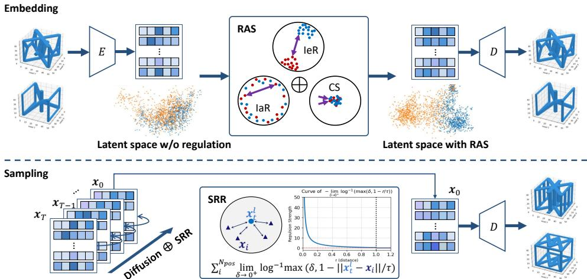  
Figure 2: An overview of the proposed framework REGDIFF. It encodes voxel geometries into latent space, applies RAS for latent regulation, and employs SRR-guided diffusion to generate novel yet geometrically plausible metamaterial geometry candidates.

## 4 Methodology

This section introduces REGDIFF, our framework for voxel-based metamaterial geometry generation. We first give an overview, then present the autoencoder, RAS latent regulation, and SRR-guided diffusion for novel candidate generation.

## 4.1 Framework Overview

The main challenge in voxel-based metamaterial geometry generation is the plausibility–novelty trade-off (C1): candidates that stay too close to known samples may preserve geometric plausibility but offer limited novelty, while candidates that move too far away may become geometrically degenerate. REGDIFF tackles this challenge in two steps. First, an autoencoder maps voxels into a compact latent space regulated by the RAS mechanism, which separates plausible geometries from perturbed degenerate ones and smooths the latent distribution of plausible samples. This reduces the sensitivity of decoding to small latent perturbations and improves the robustness of geometry generation. Second, a latent diffusion model with SRR guidance discourages samples from staying overly close to known geometries, promoting novel candidate generation while keeping the guidance local. Together, RAS provides a geometry-aware latent space and SRR encourages novelty, enabling REGDIFF to balance geometric plausibility, novelty, and diversity.

## 4.2 Autoencoding with RAS Latent Regulation

To mitigate the high dimensionality of voxel representation, we use an AE to compress voxel data into a low-dimensional latent space. However, simply regularizing the latent distribution, as in VAEs, often reduces geometric plausibility, since metamaterial unit cells are expected to satisfy basic geometric regularities such as periodic boundary consistency and connectivity. Even slight deviations, such as isolated floating clusters, may lead to geometrically degenerate candidates. Prior AE-based methods lack tailored latent regulation, resulting in a latent space where plausible and perturbed degenerate geometries can be entangled. Such entanglement may lead to poorly formed generated candidates. To address this issue, we propose the RAS mechanism, which separates plausible and perturbed degenerate regions in the latent space through three component mechanisms: inter-class repulsion (IeR), intra-class repulsion (IaR), and central sink (CS). We first synthesize negative voxel samples by perturbing ground-truth geometries for the purpose of this separation. Let $\mathcal { U } _ { \mathrm { p o s } } ,$ $\mathcal { U } _ { \mathrm { n e g } } ,$ and $\mathcal { U } = \mathcal { U } _ { \mathrm { p o s } } \cup \mathcal { U } _ { \mathrm { n e g } }$ denote the positive, negative, and full datasets. Encoding U with E yields latent datasets X, with ${ \mathcal { X } } _ { \mathrm { p o s } }$ and $\mathcal { X } _ { \mathrm { n e g } }$ denoting the positive and negative subsets.

Inter-Class Repulsion.1 IeR aims to simplify the decision boundary between ${ \mathcal { X } } _ { \mathrm { p o s } }$ and $\mathcal { X } _ { \mathrm { n e g } }$ by adding inverse-square repulsion similar to Coulomb repulsion [20]:

$$
F _ { \mathrm { i n t e r } } ( \mathcal { X } _ { \mathrm { p o s } } , \mathcal { X } _ { \mathrm { n e g } } ) = \sum _ { i = 1 } ^ { | \mathcal { X } _ { \mathrm { p o s } } | } \sum _ { j = 1 } ^ { | \mathcal { X } _ { \mathrm { n e g } } | } \frac { \pmb { x } _ { \mathrm { p o s } , i } - \pmb { x } _ { \mathrm { n e g } , j } } { | | \pmb { x } _ { \mathrm { p o s } , i } - \pmb { x } _ { \mathrm { n e g } , j } | | ^ { 3 } } ,\tag{3}
$$

where $\scriptstyle { \pmb { x } } _ { \mathrm { p o s } , i }$ and $\pmb { x } _ { \mathrm { n e g } , j }$ are the ith positive latent sample and jth negative latent sample, respectively. The simulated distribution of adding IeR alone can be found in Figure 3. To optimize the latent distribution with IeR, we minimize the integral of $F _ { \mathrm { i n t e r } } , \mathrm { i . e . }$ ., the Coulomb potential:

$$
P _ { \mathrm { i n t e r } } ( \mathcal { X } _ { \mathrm { p o s } } , \mathcal { X } _ { \mathrm { n e g } } ) = \sum _ { i = 1 } ^ { | \mathcal { X } _ { \mathrm { p o s } } | } \sum _ { j = 1 } ^ { | \mathcal { X } _ { \mathrm { n e g } } | } | | \pmb { x } _ { \mathrm { p o s } , i } - \pmb { x } _ { \mathrm { n e g } , j } | | ^ { - 1 } .\tag{4}
$$

Intra-Class Repulsion. As illustrated in Figure 3, using IeR alone can simplify the decision boundary, but it drives the two classes into two distant clusters. In this case, only a small portion of the latent space is covered, so the decoder may not decode latents well outside these concentrated regions. To alleviate this issue, unlike contrastive learning which pulls positive latents closer together [21], we propose IaR to reduce the converging tendency within each class and encourage broader latent coverage. Similar to IeR, IaR and its potential are:

$$
F _ { \mathrm { i n t r a } } ( \mathcal X _ { \mathrm { p o s } } ) = \sum _ { \stackrel { i , j = 1 } { i \neq j } } ^ { | \mathcal X _ { \mathrm { p o s } } | } \frac { \boldsymbol x _ { \mathrm { p o s } , i } - \boldsymbol x _ { \mathrm { p o s } , j } } { \left\| \boldsymbol x _ { \mathrm { p o s } , i } - \boldsymbol x _ { \mathrm { p o s } , j } \right\| ^ { 3 } } , \qquad F _ { \mathrm { i n t r a } } ( \mathcal X _ { \mathrm { p o s } } ) = \sum _ { \stackrel { i , j = 1 } { i \neq j } } ^ { | \mathcal X _ { \mathrm { p o s } } | } \left\| \boldsymbol x _ { \mathrm { p o s } , i } - \boldsymbol x _ { \mathrm { p o s } , j } \right\| ^ { - 1 } .\tag{5}
$$

By substituting the $ { \mathrm { ^ { 6 6 } p o s } } ^ { \prime }$ subscript with “neg” we can obtain the IaR equations for negative samples.

Central Sink (CS). IeR and IaR simplify the latent decision boundary and avoid intra-class convergence, but they can also force latents to be far from each other, making the latent distribution overly sparse. To alleviate this problem, we propose $\mathrm { \check { C } } \mathrm { \check { S } }$ to attract all latents toward the origin. Let $\mathbf { \Delta } _ { \mathbf { \mathcal { X } } _ { i } }$ be the ith latent variable, the force and potential of CS are:

$$
F _ { \mathrm { s i n k } } ( { \mathcal { X } } ) = \sum _ { i = 1 } ^ { | { \mathcal { X } } | } { \pmb x } _ { i } , ~ \mathrm { a n d } ~ P _ { \mathrm { s i n k } } ( { \mathcal { X } } ) = \sum _ { i = 1 } ^ { | { \mathcal { X } } | } | | { \pmb x } _ { i } | | ^ { 2 } .
$$

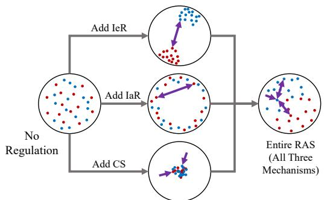

(6)

The effect of adding CS alone is also shown in Figure $^ { 3 , }$ . Combining all three mechanisms together, the RAS loss can be defined as:

Figure 3: Illustration of the effect of RAS and its components.

$$
\begin{array} { r } { L _ { \mathrm { R A S } } = \lambda _ { \mathrm { i n t e r } } P _ { \mathrm { i n t e r } } ( \mathcal X _ { \mathrm { p o s } } , \mathcal X _ { \mathrm { n e g } } ) + \lambda _ { \mathrm { i n t r a } } \big ( P _ { \mathrm { i n t r a } } ( \mathcal X _ { \mathrm { p o s } } ) + P _ { \mathrm { i n t r a } } ( \mathcal X _ { \mathrm { n e g } } ) \big ) + \lambda _ { \mathrm { s i n k } } P _ { \mathrm { s i n k } } ( \mathcal X ) . } \end{array}\tag{7}
$$

where $\lambda _ { \mathrm { { i n t e r } } } , \lambda _ { \mathrm { { i n t r a } } }$ and $\lambda _ { \mathrm { s i n k } }$ are hyperparameters. Then we can obtain the total loss function for training the autoencoder:

$$
L _ { \mathrm { a u t o } } = \lambda _ { \mathrm { r e c o n } } L _ { \mathrm { r e c o n } } + \lambda _ { \mathrm { R A S } } L _ { \mathrm { R A S } } ,\tag{8}
$$

where $L _ { \mathrm { r e c o n } }$ is defined in Equation 1, and $\lambda _ { \mathrm { { r e c o n } } }$ and $\lambda _ { \mathrm { R A S } }$ are two hyperparameters.

Combining the three mechanisms, RAS regulates the AE latent space so that plausible and perturbed degenerate geometries are better separated. At the same time, the positive latents are encouraged to occupy a smoother distribution while maintaining distances among samples, avoiding latent collapse where all latents converge to a small region.

## 4.3 Latent Diffusion with SRR Guidance

The RAS mechanism regulates the latent distribution so that the latent decision boundary is simplified, making the decoder more robust to variations around the positive latent sample region. In this latent space, we use diffusion models to approximate the latent distribution and connect it with a Gaussian distribution for sampling. However, a vanilla diffusion paradigm such as DDPM, without further guidance, may still favor regions close to known samples because these regions usually have high generation probability. This can limit novelty in generated candidates.

Table 1: Performance evaluation of different approaches.
<table><tr><td rowspan="2">Approaches</td><td colspan="4">Geometric Plausibility Scores</td><td>Novelty Score</td><td>Diversity Score</td></tr><tr><td> $ { S _ { \mathrm { s y m } } }$  ↑</td><td> $S _ { \mathrm { p e r } } \cdot$  ←  $S _ { \mathrm { c o n } } \cdot$ </td><td>7</td><td>Mean ↑</td><td> $S _ { \mathrm { n o v } }$  ↑</td><td> $S _ { \mathrm { d i v } } \uparrow$ </td></tr><tr><td colspan="7">MetaTruss (ours)</td></tr><tr><td>DiT-3D ([22]) Y. Yang et al. ([14]) XCube ([23]) Trellis ([24]) 3D-CDM ([13]) REGDIFF (ours)</td><td>0.358 0.800 0.506 0.081 0.470</td><td>0.248 0.585 0.525 0.063 0.270 0.487</td><td>0.500 0.494 0.522 0.133 0.999</td><td>0.369 0.626 0.518 0.092 0.580 0.725</td><td>0.003 0.163 0.000 0.000 0.000</td><td>0.010 0.158 0.004 0.001 0.001</td></tr><tr><td colspan="7">0.718 0.969 0.296 0.420 MetaShell [14]</td></tr><tr><td>DiT-3D ([22]) Y. Yang et al. ([14])</td><td>0.465 0.922</td><td>0.259</td><td>0.704</td><td>0.476 0.901</td><td>0.023</td><td>0.013</td></tr><tr><td>XCube ([23])</td><td>0.522</td><td>0.791 0.523</td><td>0.991 0.526</td><td>0.524</td><td>0.342 0.000</td><td>0.409 0.005</td></tr><tr><td>Trellis ([24])</td><td>0.795</td><td>0.576</td><td>0.999</td><td>0.790</td><td>0.103</td><td></td></tr><tr><td></td><td></td><td></td><td></td><td></td><td></td><td>0.032</td></tr><tr><td>3D-CDM ([13])</td><td>0.668</td><td>0.529</td><td>0.999</td><td>0.732</td><td>0.390</td><td>0.113</td></tr><tr><td>REGDIFF (ours)</td><td>0.923</td><td>0.856</td><td>0.978</td><td>0.919</td><td>0.380</td><td>0.783</td></tr></table>

To address this issue, we introduce a repulsion force between the sample being generated and the latents of known samples, guiding the diffusion process away from overly similar regions of the latent space. Crucially, this repulsion must be short-ranged: if it extends too far, the generated sample could be pushed outside the region where the decoder produces geometrically plausible candidates. Building on this idea, we propose the SRR mechanism, which augments the DDPM model with an additional SRR guidance term. Based on Equation 2, the denoising step of an SRR-guided DDPM can be expressed as:

$$
\begin{array} { r l r } {  { \boldsymbol { x } _ { t - 1 } = \frac { 1 } { \sqrt { 1 - \beta _ { t } } } ( \boldsymbol { x } _ { t } - \frac { \beta _ { t } } { \sqrt { 1 - \alpha _ { t } ^ { 2 } } } \phi _ { \mathrm { d i f f } } ( \boldsymbol { x } _ { t } , t ) ) + \rho _ { t } \boldsymbol { \epsilon } } } \\ & { } & { + \lambda _ { \mathrm { S R R } } \sum _ { i = 1 } ^ { N _ { \mathrm { p o s } } } \frac { \boldsymbol { x } _ { \mathrm { p o s } , i } - \boldsymbol { x } _ { t } } { | | \boldsymbol { x } _ { \mathrm { p o s } , i } - \boldsymbol { x } _ { t } | | } \operatorname* { l i m } _ { \delta \to 0 ^ { + } } \log ^ { - 1 } \operatorname* { m a x } ( \delta , 1 - | | \boldsymbol { x } _ { t } - \boldsymbol { x } _ { \mathrm { p o s } , i } | | / \tau ) , } \end{array}\tag{9}
$$

where $\lambda _ { \mathrm { S R R } }$ and τ are two hyperparameters controlling the SRR guidance strength. The SRR guidance, corresponding to the last term in Equation 9, introduces an additional force that pushes the latent variable $\mathbf { \Delta } _ { \mathbf { \mathcal { X } } _ { t } }$ away from known latents. The logarithmic formulation ensures that this repulsion decays rapidly with distance, aligning with the intuition that only nearby samples should influence the current denoising step. In practice, computing distances to all known latents is prohibitively expensive, so we cluster the known latents before training the diffusion model. During denoising, clusters outside the neighborhood of the current latent variable are ignored by the SRR mechanism, reducing computational cost. Importantly, SRR guidance is applied only at inference, while the training scheme follows the standard DDPM paradigm.

To summarize, RAS regulates the AE latent space to separate plausible geometries from perturbed degenerate ones and to form a smoother positive latent distribution for candidate generation. In this regulated latent space, SRR-guided diffusion discourages generated latents from staying overly close to known samples, increasing the chance of producing novel and geometrically plausible candidates.

## 5 Experiments

In this section, we evaluate REGDIFF as a geometry candidate generator for voxel-based metamaterial unit cells. We compare it with voxel-based generative baselines using geometric plausibility, novelty, and diversity metrics, followed by ablation studies, model capacity analysis, and sample visualizations.

## 5.1 Overall Comparison

We evaluate REGDIFF against five voxel-based generative baselines: DiT-3D [22], Yang et al. [14], XCube [23], Trellis [24], and 3D-CDM [13]. The experiments are conducted on our proposed benchmark, which includes the MetaTruss and MetaShell datasets, and the task is voxel-based metamaterial geometry generation. Performance is assessed using five complementary metrics covering three dimensions: geometric plausibility $( S _ { \mathrm { s y m } } , S _ { \mathrm { p e r } } , S _ { \mathrm { c o n } } )$ , novelty $( S _ { \mathrm { n o v } } )$ , and diversity $( S _ { \mathrm { d i v } } )$ . All models are trained and evaluated on a single NVIDIA A100 GPU (except XCube whose large model size requires two A100 GPUs). To compare the candidate generation capability of REGDIFF with other baseline models, we train each model on each of the two datasets and compute the five metrics for the generated geometries. Specific results are shown in Table 1.

Across both MetaTruss and MetaShell datasets, REGDIFF achieves the best balance of geometric plausibility, novelty, and diversity. On MetaTruss, it delivers competitive geometric plausibility while substantially outperforming baselines in novelty and diversity, reducing the memorization tendency observed in prior methods. On MetaShell, it matches or exceeds baseline-level geometric plausibility and nearly doubles diversity. These results suggest that RAS helps maintain geometric plausibility, while SRR encourages generation away from overly similar training samples. Together, they show that REGDIFF better addresses the plausibility–novelty trade-off than other baselines.

Table 2: Latent distribution visualization and generated samples with RAS regulation, contrastive regulation, or no regulation. Reg. denotes regulation, and Contra. denotes contrastive.  
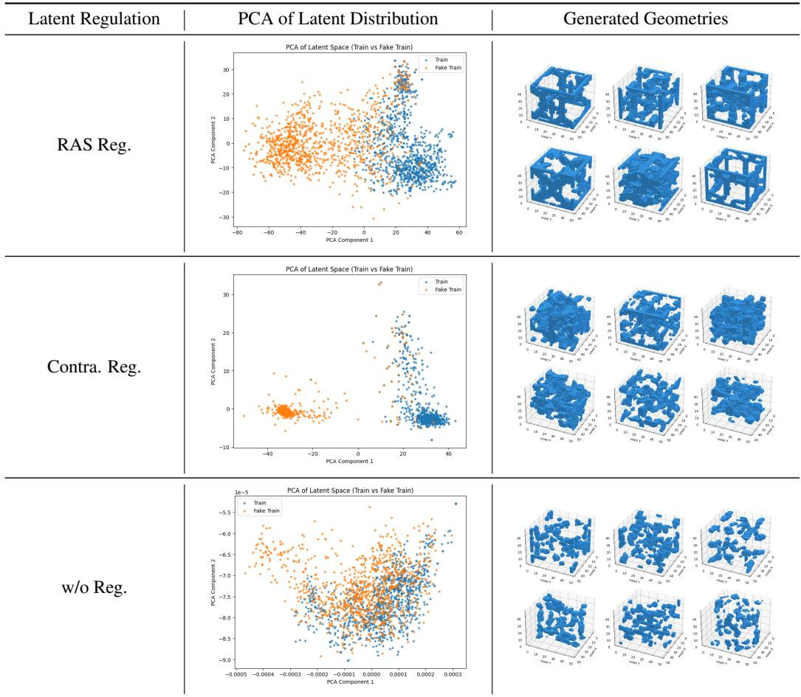

## 5.2 Ablation Study

Experiments in this section are conducted on MetaTruss (Results on MetaShell are in Appendix D.1).

Latent Space Regulations Comparison. To verify the effect of RAS, we train the autoencoder under three settings: (1) without latent regulation; (2) with contrastive regulation [21]; and (3) with RAS regulation. We visualize the PCA-compressed latent distributions and generated geometries in Table 2. Without regulation, positive and negative latents are mixed, which harms geometric plausibility during generation. Contrastive regulation separates the two classes but pulls each class into a compact region, limiting latent coverage. In contrast, RAS better separates positive and negative latents while maintaining a smoother latent distribution, leading to more diverse and well-formed geometries. The quantitative results in Table 3 further verify its effectiveness.

Table 3: Ablation on RAS regulation and SRR diffusion.
<table><tr><td rowspan="2">Approaches</td><td colspan="4">Geometric Plausibility Scores</td><td colspan="2">Novelty Score Diversity Score</td></tr><tr><td> $ { S _ { \mathrm { s y m } } }$  ↑</td><td> $S _ { \mathrm { p e r } }$  ←</td><td> $S _ { \mathrm { c o n } }$  ↑</td><td>Mean ↑</td><td> $S _ { \mathrm { n o v } } \uparrow$ </td><td> $S _ { \mathrm { d i v } } \uparrow$ </td></tr><tr><td>Case 1 (RAS + vanilla DDPM)</td><td>0.753</td><td>0.632</td><td>0.885</td><td>0.757</td><td>0.208</td><td>0.336</td></tr><tr><td>Case 2 (w/o reg + SRR Diff.)</td><td>0.873</td><td>0.801</td><td>0.295</td><td>0.656</td><td>0.014</td><td>0.011</td></tr><tr><td>Case 3 (full framework)</td><td>0.718</td><td>0.487</td><td>0.969</td><td>0.725</td><td>0.296</td><td>0.420</td></tr></table>

Table 4: Ablation on model capacity. Param. Num. denotes parameter number.
<table><tr><td rowspan="2">Approaches</td><td colspan="4">Geometric Plausibility Scores</td><td rowspan="2">Novelty Score</td><td rowspan="2">Diversity Score</td></tr><tr><td> $ { S _ { \mathrm { s y m } } }$  ←</td><td> $S _ { \mathrm { p e r } }$  个</td><td> $S _ { \mathrm { c o n } }$  ↑</td><td>Mean ↑</td></tr><tr><td>Increase AE Param. Num.</td><td>0.753</td><td>0.471</td><td>0.977</td><td>0.734</td><td> $S _ { \mathrm { n o v } }$  ← 0.308</td><td> $S _ { \mathrm { d i v } } \uparrow$  0.411</td></tr><tr><td>Decrease AE Param. Num.</td><td>0.688</td><td>0.479</td><td>0.953</td><td>0.707</td><td>0.280</td><td>0.413</td></tr><tr><td>Increase diff. Param. Num.</td><td>0.705</td><td>0.474</td><td>0.936</td><td>0.705</td><td>0.330</td><td>0.444</td></tr><tr><td>Decrease diff. Param. Num.</td><td>0.722</td><td>0.493</td><td>0.955</td><td>0.723</td><td>0.286</td><td>0.409</td></tr><tr><td>Original setting</td><td>0.718</td><td>0.487</td><td>0.969</td><td>0.725</td><td>0.296</td><td>0.420</td></tr></table>

SRR diffusion vs. vanilla DDPM. Our high-level aim is to generate voxel candidates that are both geometrically plausible and novel. To verify the effect of SRR guidance, we compare two cases: (1) RAS + vanilla DDPM model; and (2) RAS + SRR diffusion, corresponding to our full framework. We train the model under these two settings and report the results in Table 3. From Table 3, we can see that SRR diffusion provides substantially higher novelty and diversity scores, while keeping the geometric plausibility scores close to vanilla DDPM. The mild decrease in geometric plausibility is expected, because vanilla DDPM tends to generate samples closer to the training distribution, where geometric regularities are easier to preserve. These results show that SRR guidance increases novelty and diversity while maintaining competitive geometric plausibility.

Model Capacity Sensitivity Analysis. We further study the effect of model capacity by increasing or decreasing the number of layers in the autoencoder and diffusion backbone (Table 4). Results show that changing the autoencoder depth only slightly alters geometric plausibility, novelty, and diversity, indicating that encoding and decoding are relatively robust to capacity variations. In contrast, modifying the diffusion backbone has a more pronounced impact: adding a layer improves novelty and diversity, while removing a layer reduces both. This suggests that the diffusion model’s capacity is more critical than that of the autoencoder, as it directly governs the ability to model the latent distribution and balance geometric plausibility with novelty.

## 6 Related Work

3D Visual Content Generation. Generative modeling of 3D structures has advanced rapidly with voxel-based autoencoders, implicit representations, and diffusion models. Early works such as voxel GANs and VAEs [25, 26] produced coarse but plausible shapes, while point cloud and mesh models [27, 28] improved geometric fidelity. Recent diffusion-based approaches [29, 30, 22] achieve strong quality and diversity for generic 3D content. However, these methods primarily target visual plausibility, whereas metamaterial geometry generation requires additional geometric regularities, such as periodic boundary consistency, symmetry, and connectivity. Thus, direct adoption of generic 3D generation is insufficient, motivating domain-specific frameworks that explicitly regulate and guide voxel geometry generation.

Metamaterial Geometry Generation. AI-driven metamaterial generation has explored multiple representations. Graph-based methods [6, 31, 32] model unit cells as nodes and edges, which is well-suited for truss-based geometries and property prediction but struggles with fine-grained geometric detail due to simplified primitives. 2D image-based approaches [9, 10, 11] construct patterned planar motifs and extrude them along one axis, enabling strong in-plane performance but limited geometric variation along the extruded direction. Voxel-based approaches [13, 12, 14] offer a unified representation that can express different metamaterial geometries, such as truss, shell, and porous structures, within a single discretization. Yet, current voxel generative models often face a plausibility–novelty trade-off: staying close to the training distribution yields geometrically plausible but less novel candidates, while moving aggressively away from known samples can lead to degenerate geometries. This motivates our focus on guided voxel generation that balances geometric plausibility, novelty, and diversity.

## 7 Conclusion

In this paper, we introduced REGDIFF, a framework for voxel-based metamaterial geometry generation that combines latent space regulation with guided diffusion. RAS separates plausible geometries from perturbed degenerate ones for robust decoding, while SRR discourages generation overly close to known samples while maintaining geometric plausibility. We also introduced MetaTruss, a voxel dataset for truss-based metamaterial geometries, and a benchmark covering geometric plausibility, novelty, and diversity. Experiments on MetaTruss and MetaShell show consistent gains over voxelbased generative baselines, suggesting that REGDIFF effectively balances these three aspects. This work supports diverse metamaterial geometry candidate generation for downstream evaluation.

## References

[1] Qiangqiang Zhang, Xiang Xu, Dong Lin, Wenli Chen, Guoping Xiong, Yikang Yu, Timothy S Fisher, and Hui Li. Hyperbolically patterned 3d graphene metamaterial with negative poisson’s ratio and superelasticity. Advanced materials, 28(11):2229–2237, 2016.

[2] Luke Mizzi and Andrea Spaggiari. Lightweight mechanical metamaterials designed using hierarchical truss elements. Smart Materials and Structures, 29(10):105036, 2020.

[3] Katia Bertoldi, Vincenzo Vitelli, Johan Christensen, and Martin Van Hecke. Flexible mechanical metamaterials. Nature Reviews Materials, 2(11):1–11, 2017.

[4] Yongmin Liu and Xiang Zhang. Metamaterials: a new frontier of science and technology. Chemical Society Reviews, 40(5):2494–2507, 2011.

[5] Muamer Kadic, Graeme W Milton, Martin van Hecke, and Martin Wegener. 3d metamaterials. Nature reviews physics, 1(3):198–210, 2019.

[6] Wangzhi Zhan, Jianpeng Chen, Dongqi Fu, and Dawei Zhou. Unimate: A unified model for mechanical metamaterial generation, property prediction, and condition confirmation. In ICML, 2025.

[7] Jan-Hendrik Bastek, Siddhant Kumar, Bastian Telgen, Raphaël N Glaesener, and Dennis M Kochmann. Inverting the structure–property map of truss metamaterials by deep learning. Proceedings of the National Academy of Sciences, 119(1):e2111505119, 2022.

[8] Marco Maurizi, Derek Xu, Yu-Tong Wang, Desheng Yao, David Hahn, Mourad Oudich, Anish Satpati, Mathieu Bauchy, Wei Wang, Yizhou Sun, et al. Designing metamaterials with programmable nonlinear responses and geometric constraints in graph space. Nature Machine Intelligence, pages 1–14, 2025.

[9] Hunter T Kollmann, Diab W Abueidda, Seid Koric, Erman Guleryuz, and Nahil A Sobh. Deep learning for topology optimization of 2d metamaterials. Materials & Design, 196:109098, 2020.

[10] Jie Tian, Keke Tang, Xianyan Chen, and Xianqiao Wang. Machine learning-based prediction and inverse design of 2d metamaterial structures with tunable deformation-dependent poisson’s ratio. Nanoscale, 14(35):12677–12691, 2022.

[11] Jackson K Wilt, Charles Yang, and Grace X Gu. Accelerating auxetic metamaterial design with deep learning. Advanced Engineering Materials, 22(5):1901266, 2020.

[12] Xiaoyang Zheng, Ta-Te Chen, Xiaoyu Jiang, Masanobu Naito, and Ikumu Watanabe. Deep-learning-based inverse design of three-dimensional architected cellular materials with the target porosity and stiffness using voxelized voronoi lattices. Science and Technology ofAdvanced Materials, 24(1):2157682, 2023.

[13] Xiaoyang Zheng, Junichiro Shiomi, and Takayuki Yamada. Optimizing metamaterial inverse design with 3d conditional diffusion model and data augmentation. Advanced Materials Technologies, page 2500293, 2025.

[14] Yanyan Yang, Lili Wang, Xiaoya Zhai, Kai Chen, Wenming Wu, Yunkai Zhao, Ligang Liu, and Xiao-Ming Fu. Guided diffusion for fast inverse design of density-based mechanical metamaterials. arXiv preprint arXiv:2401.13570, 2024.

[15] Diederik P Kingma and Max Welling. Auto-encoding variational bayes. arXiv preprint arXiv:1312.6114, 2013.

[16] Jonathan Ho, Ajay Jain, and Pieter Abbeel. Denoising diffusion probabilistic models. Advances in neural information processing systems, 33:6840–6851, 2020.

[17] Robin Rombach, Andreas Blattmann, Dominik Lorenz, Patrick Esser, and Björn Ommer. High-resolution image synthesis with latent diffusion models. In Proceedings of the IEEE/CVF conference on computer vision and pattern recognition, pages 10684–10695, 2022.

[18] Xuehao Song, Chengjun Zeng, Junqi Hu, Wei Zhao, Liwu Liu, Yanju Liu, and Jinsong Leng. Compressive behavior and energy absorption of novel body-centered cubic lattice metamaterials incorporating simple cubic truss units. Composite Structures, page 119230, 2025.

[19] Thomas S Lumpe and Tino Stankovic. Exploring the property space of periodic cellular structures based on crystal networks. Proceedings ofthe National Academy ofSciences, 118(7):e2003504118, 2021.

[20] VI Anisimov, Dm M Korotin, MA Korotin, AV Kozhevnikov, Jan Kuneš, AO Shorikov, SL Skornyakov, and SV Streltsov. Coulomb repulsion and correlation strength in lafeaso from density functional anddynamical mean-field theories. Journal ofPhysics: Condensed Matter, 21(7):075602, 2009.

[21] Nikunj Saunshi, Orestis Plevrakis, Sanjeev Arora, Mikhail Khodak, and Hrishikesh Khandeparkar. A theoretical analysis of contrastive unsupervised representation learning. In International conference on machine learning, pages 5628–5637. PMLR, 2019.

[22] Shentong Mo, Enze Xie, Ruihang Chu, Lanqing Hong, Matthias Niessner, and Zhenguo Li. Dit-3d: Exploring plain diffusion transformers for 3d shape generation. Advances in neural information processing systems, 36:67960–67971, 2023.

[23] Xuanchi Ren, Jiahui Huang, Xiaohui Zeng, Ken Museth, Sanja Fidler, and Francis Williams. Xcube: Large-scale 3d generative modeling using sparse voxel hierarchies. In Proceedings of the IEEE/CVF conference on computer vision and pattern recognition, pages 4209–4219, 2024.

[24] Jianfeng Xiang, Zelong Lv, Sicheng Xu, Yu Deng, Ruicheng Wang, Bowen Zhang, Dong Chen, Xin Tong, and Jiaolong Yang. Structured 3d latents for scalable and versatile 3d generation. In Proceedings of the Computer Vision and Pattern Recognition Conference, pages 21469–21480, 2025.

[25] Jiajun Wu, Chengkai Zhang, Tianfan Xue, Bill Freeman, and Josh Tenenbaum. Learning a probabilistic latent space of object shapes via 3d generative-adversarial modeling. Advances in neural information processing systems, 29, 2016.

[26] A Brock, T Lim, JM Ritchie, and N Weston. Generative and discriminative voxel modeling with convolutional neural networks. arxiv 2016. arXiv preprint arXiv:1608.04236, 4232, 2016.

[27] Guandao Yang, Xun Huang, Zekun Hao, Ming-Yu Liu, Serge Belongie, and Bharath Hariharan. Pointflow: 3d point cloud generation with continuous normalizing flows. In Proceedings ofthe IEEE/CVF international conference on computer vision, pages 4541–4550, 2019.

[28] Zhen Liu, Yao Feng, Michael J Black, Derek Nowrouzezahrai, Liam Paull, and Weiyang Liu. Meshdiffu sion: Score-based generative 3d mesh modeling. arXiv preprint arXiv:2303.08133, 2023.

[29] Alexander Quinn Nichol and Prafulla Dhariwal. Improved denoising diffusion probabilistic models. In International conference on machine learning, pages 8162–8171. PMLR, 2021.

[30] Jiaqi Guan, Wesley Wei Qian, Xingang Peng, Yufeng Su, Jian Peng, and Jianzhu Ma. 3d equivariant diffusion for target-aware molecule generation and affinity prediction. arXiv preprint arXiv:2303.03543, 2023.

[31] Minkai Xu, Alexander S Powers, Ron O. Dror, Stefano Ermon, and Jure Leskovec. Geometric latent diffusion models for 3D molecule generation. In Proceedings of the 40th ICML, volume 202, pages 38592–38610, 23–29 Jul 2023.

[32] Li Zheng, Konstantinos Karapiperis, Siddhant Kumar, and Dennis M Kochmann. Unifying the design space and optimizing linear and nonlinear truss metamaterials by generative modeling. Nature Communications, 14(1):7563, 2023.

[33] Jianpeng Chen, Wangzhi Zhan, Haohui Wang, Zian Jia, Jingru Gan, Junkai Zhang, Jingyuan Qi, Tingwei Chen, Lifu Huang, Muhao Chen, et al. Metamatbench: Integrating heterogeneous data, computational tools, and visual interface for metamaterial discovery. In Proceedings ofthe 31st ACM SIGKDD Conference on Knowledge Discovery and Data Mining V. 2, pages 5334–5344, 2025.

## A More Generation Results

## A.1 Generation Results for MetaTruss

Figure 4 shows some generated samples from all baselines and our model, which are trained on MetaTruss dataset.

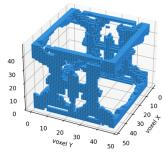

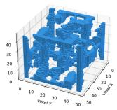

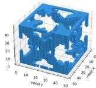

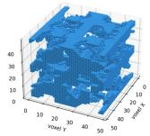

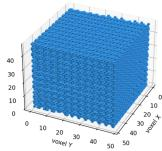  
(a) REGDIFF (ours)

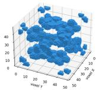

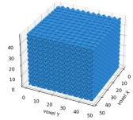

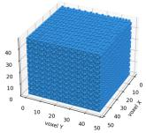

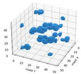

(b) Dit-3D  
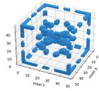

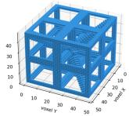  
(c) [14]

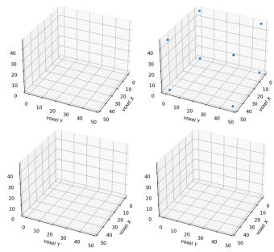  
(d) XCube

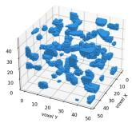

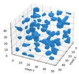

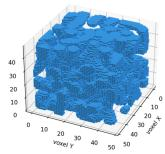

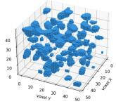

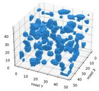

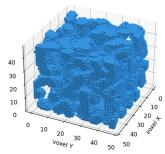

(e) Trellis  
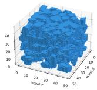

(f) 3D-CDM  
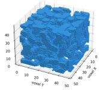  
Figure 4: Generated samples on MetaTruss with different models.

## A.2 Generation Results for MetaShell

Figure 5 shows some generated samples from all baselines and our model, which are trained on MetaShell dataset.

Remarks. The generation results of our REGDIFF have both improved novelty and genuine plausibility compared with other baselines. These results can serve as novel geometry candidates for human experts to evaluate or find inspiration from.

## B Details on Model Architecture and Training Scheme

## B.1 Model Architecture

The encoder and decoder we use are two transformers of the same structure, which have 4 layers and whose model dimension is by default 128. The latent space is also set to be 128-dimensional. The voxel data are decomposed into patches with the size of 83, and flattened as the input to the encoder. After the encoder E and before the decoder D, there is each an 2-layer multilayer-perceptron (MLP) to resize the data to and from 128-dimensional.

The latent diffusion model we use has a backbone of MLP, which has 16 layers and a model dimension of 512, with residual links connecting adjacent layers.

## B.2 Training Scheme

The autoencoder is trained with RAS regulation. To enable this operation, we have to construct a negative dataset and combine it with the initial positive dataset. The negative data are created by

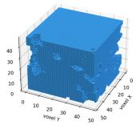

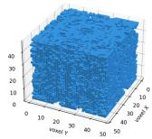

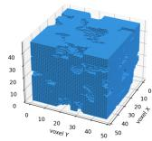

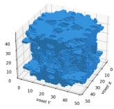

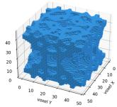

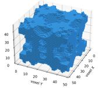

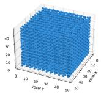  
(a) REGDIFF (ours)

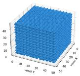

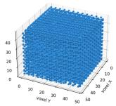

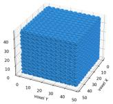  
(b) Dit-3D

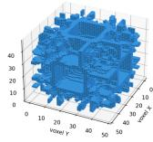

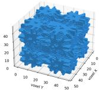

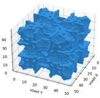  
(c) [14]

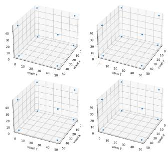  
(d) XCube

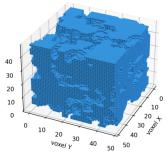

(e) Trellis  
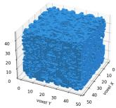  
(f) 3D-CDM  
Figure 5: Generated samples on MetaShell with different models.

noising each positive sample. We randomly select an eighth of the voxels and substitute them to void or Gaussian noise or an eighth of another positive sample, or simply add Gaussian to the initial values.

The diffusion model is trained following the DDPM paradigm, and the SRR mechanism only functions in inference stage.

## C Details on Benchmark

## C.1 Dataset Creation and Representation Unification

Our dataset is created based on the dataset from [19], which comprises over 17,000 samples in 3D graph representation (left side of Figure 6). We select the first 10,000 samples from [19] and compute whether each voxel is close enough to any 3D edge in the 3D graph. If the distance is less than a predefined radius (e.g., 0.06), then the voxel is decided to be solid, or else the voxel is void. The distance δ between a voxel’s center c an edge whose endpoints are $\pmb { p } _ { 1 }$ and $\pmb { p } _ { 2 }$ is:

$$
\delta = \frac { | | ( \pmb { p } _ { 1 } - \pmb { c } ) \times ( \pmb { p } _ { 1 } - \pmb { p } _ { 2 } ) | | } { | | \pmb { p } _ { 1 } - \pmb { p } _ { 2 } | | } ,\tag{10}
$$

where × means outer product. Figure 6 gives an example of a structure before and after the above operation.

In the setting of our benchmark, the resolution of a voxel sample is determined to be 48. When constructing MetaTruss dataset, we directly make the shape of data to be $4 8 ^ { 3 }$ . The voxel data in MetaShell is initially of shape $1 2 8 ^ { 3 }$ . To unify the data representation, we use “skimage.transform.resize" to resize the voxel data into the needed dimension with interpolation.

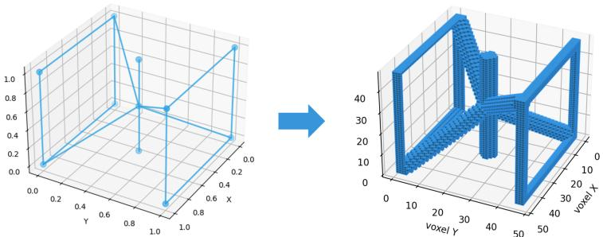  
Figure 6: Data creation for MetaTruss.

## C.2 Evaluation Module

The evaluation module of our benchmark systematically evaluates the voxel data from three aspects: geometric plausibility, novelty and diversity. For geometric plausibility, we are inspired from [33] where the symmetry, periodicity and connectivity of the generated samples are calculated. However, the benchmark in [33] is designed for graph-representation. In this paper we generalize the idea to voxel domain, and define the following three quality metrics:

$$
S _ { \mathrm { s y m } } ( \mathbf { U } ^ { \mathrm { g e n } } ) = 1 - \frac { \sum _ { i , j , k = 1 } ^ { N } | u _ { i , j , k } ^ { \mathrm { g e n } } - u _ { N + 1 - i , N + 1 - j , N + 1 - k } ^ { \mathrm { g e n } } | } { 2 | \mathbf { U } ^ { \mathrm { g e n } } | } ,\tag{11}
$$

$$
S _ { \mathrm { p e r } } ( \mathbf { U } ^ { \mathrm { g e n } } ) = \frac { 1 } { 3 } \left( \frac { \mathbf { U } | _ { i = 1 } ^ { \mathrm { g e n } } \cap \mathbf { U } | _ { i = N } ^ { \mathrm { g e n } } } { \mathbf { U } | _ { i = 1 } ^ { \mathrm { g e n } } \cup \mathbf { U } | _ { i = N } ^ { \mathrm { g e n } } } + \frac { \mathbf { U } | _ { j = 1 } ^ { \mathrm { g e n } } \cap \mathbf { U } | _ { j = N } ^ { \mathrm { g e n } } } { \mathbf { U } | _ { j = 1 } ^ { \mathrm { g e n } } \cup \mathbf { U } | _ { j = N } ^ { \mathrm { g e n } } } + \frac { \mathbf { U } | _ { k = 1 } ^ { \mathrm { g e n } } \cap \mathbf { U } | _ { k = N } ^ { \mathrm { g e n } } } { \mathbf { U } | _ { k = 1 } ^ { \mathrm { g e n } } \cup \mathbf { U } | _ { k = N } ^ { \mathrm { g e n } } } \right) ,\tag{12}
$$

$$
S _ { \mathrm { c o n } } ( { \bf U } ^ { \mathrm { g e n } } ) = \frac { \operatorname* { m a x } _ { i } | { \bf C } _ { i } | } { | { \bf U } ^ { \mathrm { g e n } } | } ,\tag{13}
$$

where $ { S _ { \mathrm { s y m } } }$ measure the central symmetry degree, $S _ { \mathrm { p e r } }$ measures the periodicity degree, and $S _ { \mathrm { c o n } }$ measures the connectivity degree; $\mathbf { U } ^ { \mathrm { g e n } }$ is a generated sample in voxel representation, $\mathbf { C } _ { i }$ is the ith cluster of connected voxels in $\mathbf { U } ^ { \mathrm { g e n } } , u _ { i , j , k } ^ { \mathrm { g e n } }$ is a voxel in $\mathbf { U } ^ { \mathrm { g e n } }$ whose indices are $i , j , k , \mathbf { U } | _ { i = 1 } ^ { \mathrm { g e n } }$ is a slice of voxels in $\mathbf { U } ^ { \mathrm { g e n } }$ whose the index along x axis is $i = 1$ , and $| \mathbf { U } ^ { \mathrm { g e n } } |$ is the number of solid voxels in $\mathbf { U } ^ { \mathrm { g e n } }$

For novelty we propose a distribution-based novelty score:

$$
S _ { \mathrm { n o v } } ( \mathbf { U } ^ { \mathrm { g e n } } ; \mathcal { U } _ { \mathrm { t r a i n } } ) = 1 - \frac { \mathbf { U } ^ { \mathrm { g e n } } \cap \mathbf { U } _ { \mathrm { N N } } ^ { \mathrm { t r a i n } } } { \mathbf { U } ^ { \mathrm { g e n } } \cup \mathbf { U } _ { \mathrm { N N } } ^ { \mathrm { t r a i n } } } ,\tag{14}
$$

where $\mathbf { U } _ { \mathrm { N N } } ^ { \mathrm { t r a i n } }$ is the nearest neighbor of $\mathbf { U } ^ { \mathrm { g e n } }$ in the training dataset $\mathcal { U } ^ { \mathrm { t r a i n } }$

For diversity we propose a distribution-based diversity score:

$$
S _ { \mathrm { d i v } } ( \mathcal { U } ^ { \mathrm { g e n } } ; \mathcal { U } ^ { \mathrm { t r a i n } } ) = \frac { | \mathcal { L } | } { | \mathcal { U } ^ { \mathrm { g e n } } | } ,\tag{15}
$$

$$
\mathcal { L } = \left\{ l _ { i } | l _ { i } = \arg \operatorname* { m a x } _ { l ^ { \prime } \in \{ 1 , 2 , \cdots , | l ^ { \mathrm { t r a i n } } | \} } \frac { \mathbf { U } _ { i } ^ { \mathrm { g e n } } \cap \mathbf { U } _ { l ^ { \prime } } ^ { \mathrm { t r a i n } } } { \mathbf { U } _ { i } ^ { \mathrm { g e n } } \cup \mathbf { U } _ { l ^ { \prime } } ^ { \mathrm { t r a i n } } } , i \in \{ 1 , 2 , \cdots , | \mathcal { U } ^ { \mathrm { g e n } } | \} \right\} ,\tag{16}
$$

where $\mathbf { U } _ { i } ^ { \mathrm { g e n } }$ is the ith elements in the set of generated samples $\mathcal { U } ^ { \mathrm { g e n } } , { \bf U } _ { l ^ { \prime } } ^ { \mathrm { t r a i n } }$ is the l′th elements in $\mathcal { U } ^ { \mathrm { t r a i n } }$

## D More Analytical Experiments

## D.1 Ablation Results on MetaShell Dataset

In this section we provide some extra ablation results conducted on the MetaShell dataset.

Table 5: Ablation on RAS regulation and SRR diffusion.
<table><tr><td rowspan="2">Approaches</td><td colspan="4">Geometric Plausibility Scores</td><td>Novelty Score</td><td>Diversity Score</td></tr><tr><td> $ { S _ { \mathrm { s y m } } }$  ←</td><td> $S _ { \mathrm { p e r } }$  ←</td><td> $S _ { \mathrm { c o n } } \cdot$  个</td><td> $\mathbf { M e a n } \uparrow$ </td><td> $S _ { \mathrm { n o v } } \uparrow$ </td><td> $S _ { \mathrm { d i v } } \uparrow$ </td></tr><tr><td>Case 1 (RAS + vanilla DDPM)</td><td>0.935</td><td>0.884</td><td>0.930</td><td>0.916</td><td>0.305</td><td>0.625</td></tr><tr><td>Case 2 (w/o reg + SRR Diff.)</td><td>0.910</td><td>0.795</td><td>0.842</td><td>0.849</td><td>0.237</td><td>0.477</td></tr><tr><td>Case 3 (full framework)</td><td>0.923</td><td>0.856</td><td>0.978</td><td>0.919</td><td>0.380</td><td>0.783</td></tr></table>

Table 6: Ablation on model capacity. Param. Num. denotes parameter number.
<table><tr><td rowspan="2">Approaches</td><td colspan="4">Geometric Plausibility Scores</td><td colspan="2">Novelty Score</td></tr><tr><td> $S _ { \mathrm { s y m } }$  ←</td><td> $S _ { \mathrm { p e r } }$  ←</td><td> $S _ { \mathrm { c o n } }$  ↑</td><td>Mean ↑</td><td> $S _ { \mathrm { n o v } }$  ←</td><td> $S _ { \mathrm { d i v } }$  ←</td></tr><tr><td>Increase AE Param. Num.</td><td>0.915</td><td>0.858</td><td>0.985</td><td>0.919</td><td>0.362</td><td>0.711</td></tr><tr><td>Decrease AE Param. Num.</td><td>0.894</td><td>0.823</td><td>0.963</td><td>0.893</td><td>0.363</td><td>0.742</td></tr><tr><td>Increase diff. Param. Num.</td><td>0.920</td><td>0.810</td><td>0.953</td><td>0.894</td><td>0.389</td><td>0.781</td></tr><tr><td>Decrease diff. Param. Num.</td><td>0.907</td><td>0.852</td><td>0.956</td><td>0.905</td><td>0.359</td><td>0.775</td></tr><tr><td>Original setting</td><td>0.923</td><td>0.856</td><td>0.978</td><td>0.919</td><td>0.380</td><td>0.783</td></tr></table>

## D.2 Time Efficiency Comparison

In this section we compare the efficiency of metamaterial generation of different models. All models are set to generate 1,000 metamaterial structures, and Table 7 shows the time consumed for this task.

Table 7: Time efficiency comparison.
<table><tr><td>Approaches</td><td>Time (s)</td></tr><tr><td>DiT-3D ([22])</td><td>326</td></tr><tr><td>Y. Yang et al. ([14])</td><td>28</td></tr><tr><td>XCube ([23])</td><td>94</td></tr><tr><td>Trellis ([24])</td><td>5</td></tr><tr><td>3D-CDM ([13])</td><td>813</td></tr><tr><td>REGDIFF (ours)</td><td>31</td></tr></table>

## E Limitations and Broader Impact

Limitations. This work focuses on two representative voxel-based metamaterial families, trussbased and shell-based structures. Broader design families, physics-based validation, and higherresolution generation remain valuable extensions to further strengthen the benchmark and framework.

Broader Impact. This work may accelerate metamaterial discovery by reducing manual trialand-error and supporting applications such as lightweight structures, energy absorption, vibration isolation, soft robotics, and biomedical scaffolds. Generated structures should be treated as design candidates and validated by domain experts before safety-critical or real-world deployment.

## NeurIPS Paper Checklist

## 1. Claims

Question: Do the main claims made in the abstract and introduction accurately reflect the paper’s contributions and scope?

Answer: [Yes]

Justification: The abstract and introduction clearly state the proposed framework, benchmark contribution, evaluation metrics, and experimental scope. The claims are supported by the main experimental results in Section 1 and the ablation studies.

Guidelines:

• The answer [N/A] means that the abstract and introduction do not include the claims made in the paper.

• The abstract and/or introduction should clearly state the claims made, including the contributions made in the paper and important assumptions and limitations. A [No] or [N/A] answer to this question will not be perceived well by the reviewers.

• The claims made should match theoretical and experimental results, and reflect how much the results can be expected to generalize to other settings.

• It is fine to include aspirational goals as motivation as long as it is clear that these goals are not attained by the paper.

## 2. Limitations

Question: Does the paper discuss the limitations of the work performed by the authors?

Answer: [Yes]

Justification: Limitations are discussed in Appendix E.

Guidelines:

• The answer [N/A] means that the paper has no limitation while the answer [No] means that the paper has limitations, but those are not discussed in the paper.

• The authors are encouraged to create a separate “Limitations” section in their paper.

• The paper should point out any strong assumptions and how robust the results are to violations of these assumptions (e.g., independence assumptions, noiseless settings, model well-specification, asymptotic approximations only holding locally). The authors should reflect on how these assumptions might be violated in practice and what the implications would be.

• The authors should reflect on the scope of the claims made, e.g., if the approach was only tested on a few datasets or with a few runs. In general, empirical results often depend on implicit assumptions, which should be articulated.

• The authors should reflect on the factors that influence the performance of the approach. For example, a facial recognition algorithm may perform poorly when image resolution is low or images are taken in low lighting. Or a speech-to-text system might not be used reliably to provide closed captions for online lectures because it fails to handle technical jargon.

• The authors should discuss the computational efficiency of the proposed algorithms and how they scale with dataset size.

• If applicable, the authors should discuss possible limitations of their approach to address problems of privacy and fairness.

• While the authors might fear that complete honesty about limitations might be used by reviewers as grounds for rejection, a worse outcome might be that reviewers discover limitations that aren’t acknowledged in the paper. The authors should use their best judgment and recognize that individual actions in favor of transparency play an important role in developing norms that preserve the integrity of the community. Reviewers will be specifically instructed to not penalize honesty concerning limitations.

## 3. Theory assumptions and proofs

Question: For each theoretical result, does the paper provide the full set of assumptions and a complete (and correct) proof?

Answer: [N/A]

Justification: The paper does not present formal theoretical results or theorem-style proofs. Guidelines:

• The answer [N/A] means that the paper does not include theoretical results.

• All the theorems, formulas, and proofs in the paper should be numbered and crossreferenced.

• All assumptions should be clearly stated or referenced in the statement of any theorems.

• The proofs can either appear in the main paper or the supplemental material, but if they appear in the supplemental material, the authors are encouraged to provide a short proof sketch to provide intuition.

• Inversely, any informal proof provided in the core of the paper should be complemented by formal proofs provided in appendix or supplemental material.

• Theorems and Lemmas that the proof relies upon should be properly referenced.

## 4. Experimental result reproducibility

Question: Does the paper fully disclose all the information needed to reproduce the main experimental results of the paper to the extent that it affects the main claims and/or conclusions of the paper (regardless of whether the code and data are provided or not)?

Answer: [Yes]

Justification: The paper describes the benchmark construction, evaluation metrics, model components, baselines, and experimental protocol. Code is released through an anonymized repository.

Guidelines:

• The answer [N/A] means that the paper does not include experiments.

• If the paper includes experiments, a [No] answer to this question will not be perceived well by the reviewers: Making the paper reproducible is important, regardless of whether the code and data are provided or not.

• If the contribution is a dataset and/or model, the authors should describe the steps taken to make their results reproducible or verifiable.

• Depending on the contribution, reproducibility can be accomplished in various ways. For example, if the contribution is a novel architecture, describing the architecture fully might suffice, or if the contribution is a specific model and empirical evaluation, it may be necessary to either make it possible for others to replicate the model with the same dataset, or provide access to the model. In general. releasing code and data is often one good way to accomplish this, but reproducibility can also be provided via detailed instructions for how to replicate the results, access to a hosted model (e.g., in the case of a large language model), releasing of a model checkpoint, or other means that are appropriate to the research performed.

• While NeurIPS does not require releasing code, the conference does require all submissions to provide some reasonable avenue for reproducibility, which may depend on the nature of the contribution. For example

(a) If the contribution is primarily a new algorithm, the paper should make it clear how to reproduce that algorithm.

(b) If the contribution is primarily a new model architecture, the paper should describe the architecture clearly and fully.

(c) If the contribution is a new model (e.g., a large language model), then there should either be a way to access this model for reproducing the results or a way to reproduce the model (e.g., with an open-source dataset or instructions for how to construct the dataset).

(d) We recognize that reproducibility may be tricky in some cases, in which case authors are welcome to describe the particular way they provide for reproducibility. In the case of closed-source models, it may be that access to the model is limited in some way (e.g., to registered users), but it should be possible for other researchers to have some path to reproducing or verifying the results.

## 5. Open access to data and code

Question: Does the paper provide open access to the data and code, with sufficient instructions to faithfully reproduce the main experimental results, as described in supplemental material?

Answer: [Yes]

Justification: The paper provides an anonymized code repository and describes the construction of the MetaTruss dataset and the use of MetaShell.

## Guidelines:

• The answer [N/A] means that paper does not include experiments requiring code.

• Please see the NeurIPS code and data submission guidelines (https://neurips.cc/ public/guides/CodeSubmissionPolicy) for more details.

• While we encourage the release of code and data, we understand that this might not be possible, so [No] is an acceptable answer. Papers cannot be rejected simply for not including code, unless this is central to the contribution (e.g., for a new open-source benchmark).

• The instructions should contain the exact command and environment needed to run to reproduce the results. See the NeurIPS code and data submission guidelines (https: //neurips.cc/public/guides/CodeSubmissionPolicy) for more details.

• The authors should provide instructions on data access and preparation, including how to access the raw data, preprocessed data, intermediate data, and generated data, etc.

• The authors should provide scripts to reproduce all experimental results for the new proposed method and baselines. If only a subset of experiments are reproducible, they should state which ones are omitted from the script and why.

• At submission time, to preserve anonymity, the authors should release anonymized versions (if applicable).

• Providing as much information as possible in supplemental material (appended to the paper) is recommended, but including URLs to data and code is permitted.

## 6. Experimental setting/details

Question: Does the paper specify all the training and test details (e.g., data splits, hyperparameters, how they were chosen, type of optimizer) necessary to understand the results?

Answer: [Yes]

Justification: The paper specifies the datasets, baselines, evaluation metrics, model architecture, and training setup.

Guidelines:

• The answer [N/A] means that the paper does not include experiments.

• The experimental setting should be presented in the core of the paper to a level of detail that is necessary to appreciate the results and make sense of them.

• The full details can be provided either with the code, in appendix, or as supplemental material.

## 7. Experiment statistical significance

Question: Does the paper report error bars suitably and correctly defined or other appropriate information about the statistical significance of the experiments?

Answer: [No]

Justification: The paper reports results across two datasets and multiple baselines though does not currently include error bars. This is mainly due to the high computational cost of repeatedly training 3D generative models and baselines.

## Guidelines:

• The answer [N/A] means that the paper does not include experiments.

• The authors should answer [Yes] if the results are accompanied by error bars, confidence intervals, or statistical significance tests, at least for the experiments that support the main claims of the paper.

• The factors of variability that the error bars are capturing should be clearly stated (for example, train/test split, initialization, random drawing of some parameter, or overall run with given experimental conditions).

• The method for calculating the error bars should be explained (closed form formula, call to a library function, bootstrap, etc.)

• The assumptions made should be given (e.g., Normally distributed errors).

• It should be clear whether the error bar is the standard deviation or the standard error of the mean.

• It is OK to report 1-sigma error bars, but one should state it. The authors should preferably report a 2-sigma error bar than state that they have a 96% CI, if the hypothesis of Normality of errors is not verified.

• For asymmetric distributions, the authors should be careful not to show in tables or figures symmetric error bars that would yield results that are out of range (e.g., negative error rates).

• If error bars are reported in tables or plots, the authors should explain in the text how they were calculated and reference the corresponding figures or tables in the text.

## 8. Experiments compute resources

Question: For each experiment, does the paper provide sufficient information on the computer resources (type of compute workers, memory, time of execution) needed to reproduce the experiments?

Answer: [Yes]

Justification: The paper reports the main compute resource in the “Overall Comparison” subsection.

Guidelines:

• The answer [N/A] means that the paper does not include experiments.

• The paper should indicate the type of compute workers CPU or GPU, internal cluster, or cloud provider, including relevant memory and storage.

• The paper should provide the amount of compute required for each of the individual experimental runs as well as estimate the total compute.

• The paper should disclose whether the full research project required more compute than the experiments reported in the paper (e.g., preliminary or failed experiments that didn’t make it into the paper).

## 9. Code of ethics

Question: Does the research conducted in the paper conform, in every respect, with the NeurIPS Code of Ethics https://neurips.cc/public/EthicsGuidelines?

Answer: [Yes]

Justification: The work uses scientific structure datasets and computational experiments, does not involve private personal data or human subjects, and is released anonymously for double-blind review. We have reviewed the NeurIPS Code of Ethics and believe the work conforms to it.

Guidelines:

• The answer [N/A] means that the authors have not reviewed the NeurIPS Code of Ethics.

• If the authors answer [No], they should explain the special circumstances that require a deviation from the Code of Ethics.

• The authors should make sure to preserve anonymity (e.g., if there is a special consideration due to laws or regulations in their jurisdiction).

## 10. Broader impacts

Question: Does the paper discuss both potential positive societal impacts and negative societal impacts of the work performed?

Answer: [Yes]

Justification: Broader impact is discussed in Appendix E

Guidelines:

• The answer [N/A] means that there is no societal impact of the work performed.

• If the authors answer [N/A] or [No], they should explain why their work has no societal impact or why the paper does not address societal impact.

• Examples of negative societal impacts include potential malicious or unintended uses (e.g., disinformation, generating fake profiles, surveillance), fairness considerations (e.g., deployment of technologies that could make decisions that unfairly impact specific groups), privacy considerations, and security considerations.

• The conference expects that many papers will be foundational research and not tied to particular applications, let alone deployments. However, if there is a direct path to any negative applications, the authors should point it out. For example, it is legitimate to point out that an improvement in the quality of generative models could be used to generate Deepfakes for disinformation. On the other hand, it is not needed to point out that a generic algorithm for optimizing neural networks could enable people to train models that generate Deepfakes faster.

• The authors should consider possible harms that could arise when the technology is being used as intended and functioning correctly, harms that could arise when the technology is being used as intended but gives incorrect results, and harms following from (intentional or unintentional) misuse of the technology.

• If there are negative societal impacts, the authors could also discuss possible mitigation strategies (e.g., gated release of models, providing defenses in addition to attacks, mechanisms for monitoring misuse, mechanisms to monitor how a system learns from feedback over time, improving the efficiency and accessibility of ML).

## 11. Safeguards

Question: Does the paper describe safeguards that have been put in place for responsible release of data or models that have a high risk for misuse (e.g., pre-trained language models, image generators, or scraped datasets)?

Answer: [N/A]

Justification: The paper does not release high-risk models. The released assets are intended for scientific metamaterial generation and evaluation.

Guidelines:

• The answer [N/A] means that the paper poses no such risks.

• Released models that have a high risk for misuse or dual-use should be released with necessary safeguards to allow for controlled use of the model, for example by requiring that users adhere to usage guidelines or restrictions to access the model or implementing safety filters.

• Datasets that have been scraped from the Internet could pose safety risks. The authors should describe how they avoided releasing unsafe images.

• We recognize that providing effective safeguards is challenging, and many papers do not require this, but we encourage authors to take this into account and make a best faith effort.

## 12. Licenses for existing assets

Question: Are the creators or original owners of assets (e.g., code, data, models), used in the paper, properly credited and are the license and terms of use explicitly mentioned and properly respected?

Answer: [Yes]

Justification: The paper cites the original sources of existing datasets, models, and baselines used in the experiments. We respect the licenses and terms of use of all existing assets used in this work.

Guidelines:

• The answer [N/A] means that the paper does not use existing assets.

• The authors should cite the original paper that produced the code package or dataset.

• The authors should state which version of the asset is used and, if possible, include a URL.

• The name of the license (e.g., CC-BY 4.0) should be included for each asset.

• For scraped data from a particular source (e.g., website), the copyright and terms of service of that source should be provided.

• If assets are released, the license, copyright information, and terms of use in the package should be provided. For popular datasets, paperswithcode.com/datasets has curated licenses for some datasets. Their licensing guide can help determine the license of a dataset.

• For existing datasets that are re-packaged, both the original license and the license of the derived asset (if it has changed) should be provided.

• If this information is not available online, the authors are encouraged to reach out to the asset’s creators.

## 13. New assets

Question: Are new assets introduced in the paper well documented and is the documentation provided alongside the assets?

Answer: [Yes]

Justification: The paper introduces the MetaTruss dataset and provides details on its construction. Documentation and code are provided through the anonymized repository.

Guidelines:

• The answer [N/A] means that the paper does not release new assets.

• Researchers should communicate the details of the dataset/code/model as part of their submissions via structured templates. This includes details about training, license, limitations, etc.

• The paper should discuss whether and how consent was obtained from people whose asset is used.

• At submission time, remember to anonymize your assets (if applicable). You can either create an anonymized URL or include an anonymized zip file.

## 14. Crowdsourcing and research with human subjects

Question: For crowdsourcing experiments and research with human subjects, does the paper include the full text of instructions given to participants and screenshots, if applicable, as well as details about compensation (if any)?

Answer: [N/A]

Justification: The paper does not involve crowdsourcing, user studies, or research with human subjects.

Guidelines:

• The answer [N/A] means that the paper does not involve crowdsourcing nor research with human subjects.

• Including this information in the supplemental material is fine, but if the main contribution of the paper involves human subjects, then as much detail as possible should be included in the main paper.

• According to the NeurIPS Code of Ethics, workers involved in data collection, curation, or other labor should be paid at least the minimum wage in the country of the data collector.

## 15. Institutional review board (IRB) approvals or equivalent for research with human subjects

Question: Does the paper describe potential risks incurred by study participants, whether such risks were disclosed to the subjects, and whether Institutional Review Board (IRB) approvals (or an equivalent approval/review based on the requirements of your country or institution) were obtained?

Answer: [N/A]

Justification: The paper does not involve crowdsourcing, user studies, or research with human subjects, so IRB approval is not applicable.

Guidelines:

• The answer [N/A] means that the paper does not involve crowdsourcing nor research with human subjects.

• Depending on the country in which research is conducted, IRB approval (or equivalent) may be required for any human subjects research. If you obtained IRB approval, you should clearly state this in the paper.

• We recognize that the procedures for this may vary significantly between institutions and locations, and we expect authors to adhere to the NeurIPS Code of Ethics and the guidelines for their institution.

• For initial submissions, do not include any information that would break anonymity (if applicable), such as the institution conducting the review.

## 16. Declaration of LLM usage

Question: Does the paper describe the usage of LLMs if it is an important, original, or non-standard component of the core methods in this research? Note that if the LLM is used only for writing, editing, or formatting purposes and does not impact the core methodology, scientific rigor, or originality of the research, declaration is not required.

Answer: [N/A]

Justification: The core method development in this research does not involve LLMs as important, original, or non-standard components.

Guidelines:

Guidelines:

• The answer [N/A] means that the core method development in this research does not involve LLMs as any important, original, or non-standard components.

• Please refer to our LLM policy in the NeurIPS handbook for what should or should not be described.