# REINFORCEMENT LEARNING FROM INTERMEDIATE RENDERS FOR IMAGE-TO-CODE GENERATION

Omri Kaduri1\* Kate Feingold1\* Phillip Isola2 Tali Dekel¹ 1 Weizmann Institute of Science 2MIT Project page: https://ir4rl.github.io

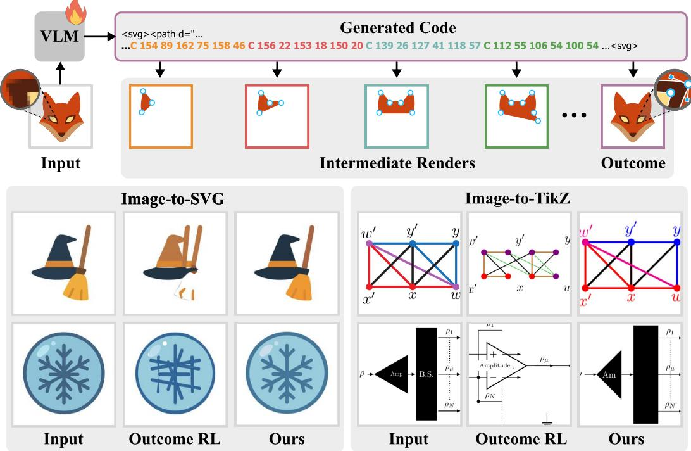  
Figure 1: We introduce a method that leverages Intermediate Renders for Reinforcement Learning (IR4RL) post-training of image-to-code VLMs as a supervision signal, allowing us to improve over outcome-only RL and achieve state-of-the-art results in Image-to-SVG and Image-to-TikZ tasks.

## ABSTRACT

Reinforcement learning is increasingly used to post-train vision-language models for image-to-code generation, such as generating SVG code from a reference image, by optimizing rewards computed from the final rendered output. However, relying on a single terminal reward provides sparse feedback that is poorly aligned with the contribution of individual tokens. A generated program may contain operations that accurately reproduce some parts of the target image alongside others that introduce errors, yet all tokens are trained from the same final outcome. We observe that many intermediate code prefixes are not only executable, but already produce meaningful partial renders that reflect progress toward the target. This property provides a natural source of denser supervision during generation. Based on this observation, we introduce IR4RL, an RL framework with a token-level render-progress reward that turns changes between intermediate renders into localized feedback for the generated sequence. We evaluate our approach on Image-to-SVG and Image-to-TikZ generation. Across both tasks, our method improves over supervised fine-tuning and standard GRPO, yielding new state-ofthe-art open-source models. This shows that intermediate rendering provides a simple and effective source of process supervision for RL post-training of imageto-code models.

## 1 INTRODUCTION

Recent generative image models synthesize illustrations, icons, and slides directly in pixel space with striking visual quality (Rombach et al., 2022; Esser et al., 2024). Yet raster outputs do not expose their underlying elements for structured editing and cannot be scaled arbitrarily without loss of quality. Many downstream applications therefore require the underlying code. Image-to-code generation produces a program whose rendering reproduces the image while making it editable, scalable, and compatible with existing graphics and design pipelines. Recent vision-language models (VLMs) have made substantial progress on this task, spanning a growing range of representations, including vector graphics (Yang et al., 2025), scientific figures (Belouadi et al., 2024; Zhao et al., 2025), vector animations (Yang et al., 2026a; Chen et al., 2026), and parametric CAD (Chen et al., 2025a).

These models are typically first trained with supervised fine-tuning (SFT) on paired image and code data. SFT learns from reference programs, without observing how an error in the code translates into a visual error in the rendered image. Rendering-based reinforcement learning has therefore emerged as a natural post-training step, grounding generated code in its visual outcome (Rodriguez et al., 2025b; Zhao et al., 2025). However, a program may contain both helpful and harmful decisions, yet a single final reward cannot distinguish their individual contributions.

Our key observation is that image-to-code generation exposes meaningful visual feedback during generation. Intermediate prefixes can be rendered as partial programs, revealing how the reconstruction evolves toward the target, as shown in Fig. 1. Based on this insight, we introduce IR4RL (Intermediate Renders for Reinforcement Learning), a framework with a render-progress reward that uses the change in visual similarity between consecutive renders as a local signal of the contribution of newly generated code. We propagate this reward backward to the tokens that produced it and combine the resulting token-level reward with the outcome reward from the final render.

Our approach applies naturally to image-to-code representations where intermediate program states can be rendered and evaluated, and where generated elements persist as the program evolves. Under these conditions, changes between successive renders directly reflect the visual contribution of newly generated code. We study two such settings, Image-to-SVG and Image-to-TikZ generation, which differ in representation syntax and rendering pipeline but satisfy both properties.

Across both tasks, our method consistently improves over supervised fine-tuning and outcome-only RL with GRPO (Shao et al., 2024), establishing new state-of-the-art results among open-source models while producing substantially shorter programs. Our analysis shows that the render-progress reward accounts for most of the improvement, with the combination of process and outcome feedback performing best. We further find that finer-grained intermediate feedback improves performance and that our method shifts probability toward high-quality generations, making them easier to obtain with limited test-time scaling. These results highlight intermediate renderings as an effective source of process-level supervision for image-to-code post-training.

In summary, our contributions are:

• Render-progress reward. We identify intermediate renderings as a source of processlevel supervision for image-to-code generation, and introduce a reward that turns changes between consecutive renders into render-progress rewards.

• Efficient RL method for image-to-code post-training. Building on the render-progress reward, we propose an RL method IR4RL and demonstrate that it outperforms standard outcome-based supervision, successfully generalizing across two image-to-code tasks. We study its behavior across design choices, including combining with outcome reward and supervision granularity.

• Strong results on Image-to-SVG and Image-to-TikZ. Extensive evaluations demonstrate consistent gains on Image-to-SVG and Image-to-TikZ tasks over available baselines, establishing new state-of-the-art results among open-source models while producing substantially shorter programs.

The model weights for both tasks will be open-sourced upon publication.

## 2 RELATED WORK

Image-to-code tasks. Image-to-code generation converts an image into a program whose rendering reproduces the input, spanning vector graphics, scientific figures, webpages, and CAD (Yang et al., 2025; Belouadi et al., 2024; Yun et al., 2024; Chen et al., 2025b; Zhao et al., 2026). Image-to-SVG supports scalable and editable graphics. Optimization-based methods such as DiffVG (Li et al., 2020) and LIVE (Ma et al., 2022) directly optimize rendered similarity and achieve strong reconstruction, but require slow per-image optimization and can produce complex geometry that limits editability. VLM-based approaches such as StarVector (Rodriguez et al., 2025a), OmniSVG (Yang et al., 2025), and InternSVG (Wang et al., 2026b) instead learn to generate SVG programs from large-scale image-code pairs. Image-to-TikZ methods similarly generate executable programs for diagrams and scientific figures (Belouadi et al., 2024; Saito et al., 2025; Zhao et al., 2025), alongside related chart- and document-to-code tasks (Tan et al., 2025; Ling et al., 2025). These learned models are trained on reference code with SFT, without visual grounding in the rendered output.

Learning from rendering feedback. Rendering provides a natural way to supervise image-to-code models beyond matching reference programs. Recent approaches therefore post-train models using rewards computed from generated renderings, including Image-to-SVG (Rodriguez et al., 2025b; Wang et al., 2026a) and Image-to-TikZ (Zhao et al., 2025; Zeng et al., 2026). However, these rewards are aggregated at the sequence level, even when augmented with signals for format, code efficiency, language alignment, structural consistency, or compilation success (Wang et al., 2026a; Zhao et al., 2025; Zeng et al., 2026), collapsing informative visual progress into a single outcomelevel signal. Intermediate renders have been exploited during inference. Iterative methods render partial or completed programs and feed the visual state back to the model for refinement (Liang et al., 2026; Deng et al., 2026; Yang et al., 2026b), while search-based approaches use MCTS for Image-to-TikZ (Belouadi et al., 2024) or ERM for vision-to-code (Liu et al., 2026). In contrast, we use intermediate renders during training to identify which parts of a generation improve or degrade the reconstruction, while leaving inference unchanged.

Fine-grained credit assignment. Fine-grained credit assignment has been extensively studied in mathematical reasoning, where outcome reward models score solutions while process reward models provide feedback at intermediate reasoning steps (Cobbe et al., 2021; Uesato et al., 2022). Such supervision has been obtained from human step-level labels (Lightman et al., 2024), automatic stepwise supervision (Wang et al., 2024), and learned estimates of the process (Setlur et al., 2025). In theorem proving, Lean has similarly been used directly as a process oracle, converting tactic-level verification into fine-grained RL feedback without a learned reward model (Kim & Yun, 2026). Related ideas also appear beyond mathematical reasoning: code-generation methods use compiler and execution feedback for finer-grained optimization (Dou et al., 2024; Ye et al., 2025), while RLHF-V uses segment-level human corrections for dense multimodal alignment (Yu et al., 2024).

A central challenge is obtaining reliable intermediate supervision, which may require human annotations, learned or sampling-based verifiers, or domain-specific execution signals. Our key observation is that image-to-code generation exposes directly evaluable intermediate states: many partial programs can already be rendered and compared with the target. We exploit this property to measure changes in visual alignment between successive renders, obtaining localized process rewards without human annotations or a learned verifier.

## 3 PRELIMINARY

Given a reference image $x ,$ a vision-language model πθ generates a graphics program y whose rendering aims to reconstruct the input. Supervised fine-tuning trains the model to match a reference code $y ^ { * }$ , potentially penalizing visually accurate programs that differ from it. In contrast, renderingbased reinforcement learning (Zhao et al., 2025; Rodriguez et al., 2025b) does not use ground truth code and rewards visual similarity S between the target and the program's rendering $\mathcal { R } ( y )$ with an outcome reward $R ( y , x ) = S ( \mathcal { R } ( y ) , x )$

Group Relative Policy Optimization. For each image prompt $x ,$ GRPO (Shao et al., 2024) samples a group of G programs $\{ y _ { i } \} _ { i = } ^ { G }$ from the current policy $\pi _ { \theta }$ and scores them with outcome rewards $R _ { i } = R ( y _ { i } , x )$ . The group-relative outcome advantage is:

$$
A _ { i } ^ { \mathrm { O u t c o m e } } = \frac { R _ { i } - \mu _ { R } } { \sigma _ { R } + \varepsilon } ,\tag{1}
$$

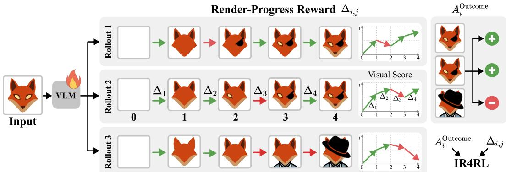  
Figure 2: Process Reward from Intermediate Renders. Rollouts 1 and 2 reach similar final quality through different generation trajectories while Rollout 3 makes early progress that later operations reverse. Outcome-only advantage rewards all tokens within a rollout equally without distinguishing helpful from harmful decisions. Our method complements it with localized feedback leveraging changes in visual score between consecutive renders (the arrows $\Delta _ { j } )$

where $\mu _ { R }$ and $\sigma _ { R }$ are the group mean and standard deviation, and $\varepsilon > 0$ ensures numerical stability. With on-policy updates, PPO-style clipping is not used, and the policy is trained with

$$
\mathcal { L } ( \theta ) = - \mathbb { E } \left[ \frac { 1 } { G } \sum _ { i = 1 } ^ { G } \frac { 1 } { T _ { i } } \sum _ { t = 1 } ^ { T _ { i } } A _ { i } ^ { \mathrm { O u t c o m e } } \log \pi _ { \theta } ( y _ { i , t } \mid x , y _ { i , < t } ) \right] + \beta \mathcal { L } _ { \mathrm { K L } } ( \theta ) ,\tag{2}
$$

where $T _ { i }$ is the length of $y _ { i } , y _ { i , t }$ is its t-th token, and ${ \mathcal { L } } _ { \mathrm { K L } }$ is a regularizer toward a reference policy.

## 4 METHOD

The outcome reward evaluates only the final program and therefore cannot localize which decisions helped or hurt the reconstruction. Intermediate renders provide this missing information by revealing how visual quality changes during generation (Fig. 2).

Our method uses these intermediate changes as process supervision, while retaining outcome supervision on the completed program. We first define a render-progress reward from changes in visual score between successive executable prefixes (Sec. 4.1). We then propagate these rewards through the generated tokens (Sec. 4.2) and combine the resulting process signal with the group-relative outcome advantage (Sec. 4.3).

## 4.1 RENDER-PROGRESS REWARD

Let $y = ( y _ { 1 } , \dots , y _ { T } )$ be a generated program and let $0 = b _ { 0 } < b _ { 1 } < \dots < b _ { M } = T$ be the token positions at which a drawing command is completed, with $b _ { M } = T$ marking the end of the program. We place a boundary after every completed command, so M is as large as the representation allows. Finer boundaries give more localized feedback. The tokens $y _ { b _ { j } : b _ { j + 1 } }$ form the j-th segment. A prefix $y _ { b _ { 0 } : b _ { j } }$ is generally not a well-formed program, since enclosing structures are still open, so we apply a closure operator C that appends the missing closing syntax $( \mathrm { e . g . , < / { s v g } > } )$ to obtain the executable prefix $\bar { P _ { j } } ^ { \bar { } } = \mathcal { C } ( y _ { 1 : b _ { j } } )$ . Its visual score is

$$
F _ { j } = S \big ( \mathcal { R } ( P _ { j } ) , x \big ) .\tag{3}
$$

$F _ { 0 }$ is the score of an empty canvas and $F _ { M } = R ( y , x )$ corresponds to a complete generation.

We want newly generated code to receive feedback that captures its marginal impact on the reconstruction. The absolute score $F _ { j }$ does not isolate this contribution, since it conflates the progress established by earlier segments. Thus, we define the render-progress reward as a delta score

$$
\Delta _ { j } = F _ { j } - F _ { j - 1 } ,\tag{4}
$$

such that $\Delta _ { j } ~ > ~ 0$ rewards a segment that improves alignment with the target, whereas $\Delta _ { j } < 0$ penalizes one that degrades it (green and red arrows in Fig. 2). We analyze the effect of rendering granularity in Fig. 6c.

## 4.2 PROPAGATING RENDER-PROGRESS REWARDS

The delta reward $\Delta _ { j }$ is defined per segment, whereas the policy is updated at every token. Tokens within a segment therefore receive no direct reward, even though they affect the render at the next boundary. We address this by propagating future render-progress rewards backward through the sequence with exponentially decaying weights.

For token t, let ${ \mathcal { F } } ( t ) = \{ j \mid b _ { j } \geq t \}$ denote the future render events, and let $d ( t , j ) = b _ { j } - t$ be the token distance from t to event j. We aggregate the corresponding render-progress rewards as

$$
A _ { t } ^ { \mathrm { P r o c e s s } } = \sum _ { j \in \mathcal { F } ( t ) } \lambda ^ { d ( t , j ) } \Delta _ { j } , \qquad \lambda \in [ 0 , 1 ] .\tag{5}
$$

The parameter λ controls how far each render-progress reward propagates backward. This lets later improvements partially compensate for temporary degradations, while preserving stronger influence from nearby renders. $\mathrm { { A t } } \lambda = 0$ , each reward is assigned only at its render boundary, while larger values extend its influence to earlier tokens, in the spirit of GAE (Schulman et al., 2015). We analyze the effect of λ in Fig. 6b.

## 4.3 COMBINING PROCESS AND OUTCOME REWARDS

Outcome and process supervision operate at complementary levels. While $A _ { i , t } ^ { \mathrm { P r o c e s s } }$ rewards each segment's marginal contribution, final quality is reflected only by $A _ { i } ^ { \mathrm { O u t c o m e } }$ . A sum of good steps does not guarantee a good final result: a rollout can accumulate exclusively positive deltas and still end far from the target, e.g. by stopping before it is reached. We therefore combine both signals:

$$
A _ { i , t } = A _ { i } ^ { \mathrm { O u t c o m e } } + \alpha A _ { i , t } ^ { \mathrm { P r o c e s s } } ,\tag{6}
$$

where α controls the contribution of the aggregated render-progress reward. We substitute $A _ { i , t }$ for $A _ { i } ^ { \mathrm { O u t c o m e } }$ in Eq. 2, so each token is weighted by both final outcome and its visual progress during generation. As shown in Fig. 6a, the process term alone accounts for most of the improvement over outcome-only, while combining both signals performs best.

## 5 APPLICATIONS

Our method is designed for image-to-code settings where partial programs can be executed, rendered, and compared with the target, and where newly generated drawing elements persist as generation continues. These properties make changes between consecutive renders informative of the visual contribution of newly generated code.

We evaluate our method on two such image-to-code tasks: Image-to-SVG (Sec. 5.1) and Imageto-TikZ (Sec. 5.2) generation. Across both tasks, we show that intermediate-render supervision consistently improves over supervised fine-tuning and outcome-based reinforcement learning. Furthermore, we provide an extensive empirical analysis (Sec. 5.3) of the proposed objective, studying the contribution of process and outcome rewards, the granularity of intermediate renderings, and the propagation of render-progress reward through the generated sequence.

## 5.1 IMAGE-TO-SVG

Setup. We use OmniSVG-4B (Yang et al., 2025) as our SFT base model. SVG represents vector graphics as sequences of drawing commands and their parameters (e.g. C, L), making intermediate stages after each segment renderable. We train on svg-stack (Rodriguez et al., 2025a) trainset using the scale-invariant L2 reward of Rodriguez et al. (2025b) as a visual score F (Eq. 3). We evaluate on MMSVGBench (Yang et al., 2025) using reconstruction metrics (Wang et al., 2004; Zhang et al., 2018; Oquab et al., 2024; Radford et al., 2021), aesthetic quality (Wu et al., 2023), and token length.

We compare against optimization-based methods DiffVG (Li et al., 2020) and LIVE (Ma et al. 2022). We also evaluate general-purpose models, including Qwen3-VL-235B (Bai et al., 2025), Gemini 3 Flash (Google DeepMind, 2025), Sonnet 5 (Anthropic, 2026), and GPT-5.2 (OpenAI, 2025), and task-specific models, including StarVector (Rodriguez et al., 2025a), InternSVG (Wang et al., 2026b), and OmniSVG in 4B and 8B sizes. Existing outcome-reward (GRPO) baselines (Rodriguez et al., 2025b; Wang et al., 2026a) are not open-source. Hence, to isolate the effect of our reward, we also compare post-training methods initialized from the same base model. The outcome-only RL baseline uses only the final rendering reward, with GRPO as described in Sec. 3. RAFT (Dong et al., 2023) iteratively fine-tunes the model on its highest-scoring samples with a rejection-sampling SFT. See App. A for more details on SVG intermediate renderings, training and evaluation parameters.

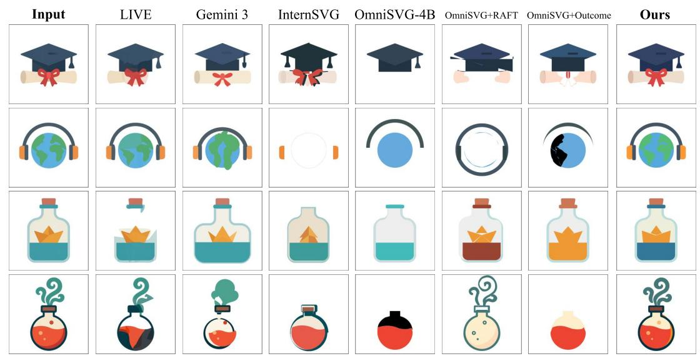

Figure 3: Qualitative evaluation of Image-to-SVG. We compare LIVE, Gemini-3-Flash, taskspecific SVG models, and post-training baselines. Our method better preserves structure, color, geometry, and fine details, while competing methods more often omit or distort visual elements.  
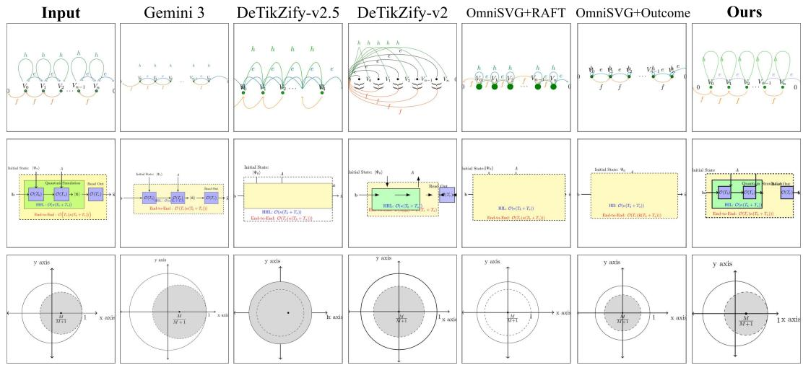  
Figure 4: Qualitative evaluation of Image-to-TikZ. We compare our method with general-purpose VLMs, task-specific TikZ models, and post-training baselines. Our method better preserves structure, geometry, and annotations, with fewer omitted or distorted elements.

Results. Table 1 reports results on both MMSVGBench splits. Our method consistently improves the OmniSVG-4B base model across metrics and outperforms both outcome-only RL and RAFT. It also surpasses existing task-specific SVG models, despite having only 4B parameters, and compares favorably with substantially larger general-purpose VLMs. In addition to improving reconstruction quality, our model produces considerably shorter SVG programs than the base model.

Figure 3 shows representative qualitative comparisons. Our model more faithfully reconstructs the target structure, geometry, and colors, while supervised and outcome-only baselines more frequently omit or distort visual elements. We complement these metrics with human preferences and VLMas-a-judge evaluation. As shown in Table 2, both consistently prefer our method over external and post-training baselines.

<table><tr><td rowspan="2"></td><td colspan="7">MMSVGBench-Illustrations</td><td colspan="7">MMSVGBench-Icons</td></tr><tr><td colspan="10">DINO ↑ LPIPS ↓ MSE ↓ SSIM ↑ CLIP ↑ Aesthetic ↑ Tokens ↓DINO ↑ LPIPS ↓ MSE ↓ SSIM ↑ CLIP ↑ Aesthetic ↑ Tokens ↓</td><td colspan="4"></td></tr><tr><td>Optimization-based</td></tr><tr><td>DiffVG</td><td>92.03</td><td>9.23</td><td>0.35</td><td>94.10</td><td>93.52</td><td>4.85</td><td>79.6k</td><td>90.97</td><td>9.24</td><td>0.44</td><td>93.76</td><td>95.29</td><td>4.89</td><td>79.5k</td></tr><tr><td>LIVE</td><td>94.55</td><td>10.02</td><td>0.72</td><td>95.48</td><td>93.68</td><td>4.99</td><td>8.4k</td><td>94.24</td><td>9.18</td><td>0.86</td><td>95.19</td><td>95.60</td><td>4.91</td><td>8.4k</td></tr><tr><td>General-purpose (M)LLMs</td></tr><tr><td></td><td></td><td></td><td>5.30</td><td>87.89</td><td>89.82</td><td>4.82</td><td>5.0k</td><td>92.23</td><td>29.90</td><td>7.78</td><td>84.77</td><td>91.61</td><td>4.77</td><td>5.9k</td></tr><tr><td>Qwen3-VL-235B Gemini 3 Flash</td><td>92.81 96.66</td><td>28.32 18.63</td><td>2.96</td><td>90.63</td><td>95.80</td><td>5.09</td><td>2.6k</td><td>96.92</td><td>20.14</td><td>4.39</td><td>88.58</td><td>97.47</td><td>4.97</td><td>3.5k</td></tr><tr><td>Sonnet 5</td><td>95.95</td><td>25.70</td><td>4.40</td><td>88.64</td><td>94.69</td><td>5.02</td><td>0.7k</td><td>96.58</td><td>26.01</td><td>6.09</td><td>86.61</td><td>97.10</td><td>4.94</td><td>0.5k</td></tr><tr><td>GPT-5.2</td><td>94.71</td><td>28.97</td><td>5.30</td><td>87.41</td><td>92.90</td><td>5.02</td><td>1.7k</td><td>94.96</td><td>29.83</td><td>7.82</td><td>84.31</td><td>94.87</td><td>4.96</td><td>1.5k</td></tr><tr><td>SVG VLMs</td></tr><tr><td></td><td></td><td></td><td></td><td></td><td></td><td></td><td></td><td></td><td></td><td></td><td></td><td></td><td></td><td></td></tr><tr><td>StarVector-8B</td><td>85.22</td><td>25.04</td><td>5.18</td><td>89.41</td><td>83.45</td><td>4.64</td><td>2.5k</td><td>88.66</td><td>25.08</td><td>6.98</td><td>86.66</td><td>89.01</td><td>4.71 4.82</td><td>2.2k 2.3k</td></tr><tr><td>InternSVG-8B OmniSVG-8B</td><td>91.31</td><td>19.18</td><td>3.45</td><td>91.09</td><td>88.88 85.57</td><td>4.77 4.68</td><td>3.7k 9.1k</td><td>92.42 92.04</td><td>17.57 18.09</td><td>4.46 4.92</td><td>89.68 89.28</td><td>92.92 91.89</td><td>4.79</td><td>6.0k</td></tr><tr><td>OmniSVG-4B (SFT)</td><td>88.81 85.48</td><td>21.15 22.26</td><td>4.98 5.11</td><td>88.85 89.70</td><td>82.03</td><td>4.55</td><td>11.3k</td><td>89.21</td><td>19.82</td><td>5.80</td><td>87.96</td><td>88.42</td><td>4.65</td><td>8.4k</td></tr><tr><td>OmniSVG-4B + RAFT</td><td>92.20</td><td>17.56</td><td>4.60</td><td>89.32</td><td>89.34</td><td>4.81</td><td>4.8k</td><td>96.55</td><td>12.21</td><td>2.57</td><td>91.55</td><td>96.05</td><td>4.93</td><td>3.3k</td></tr><tr><td>OmniSVG-4B + Outcome</td><td>92.85</td><td>16.89</td><td>5.08</td><td>88.97</td><td>90.52</td><td>4.88</td><td>5.7k</td><td>95.68</td><td>13.04</td><td>4.12</td><td>90.20</td><td>95.57</td><td>4.90</td><td>3.6k</td></tr><tr><td>OmniSVG-4B + Process</td><td>95.89</td><td>12.28</td><td>2.27</td><td>92.68</td><td>93.57</td><td>4.99</td><td>3.5k</td><td>97.35</td><td>11.27</td><td>2.20</td><td>92.11</td><td>97.03</td><td>4.95</td><td>2.8k</td></tr><tr><td>OmniSVG-4B + Ours</td><td>97.48</td><td>9.79</td><td>1.17</td><td>94.22</td><td>96.05</td><td>5.09</td><td>2.5k</td><td>98.26</td><td>8.67</td><td>1.23</td><td>93.88</td><td>98.01</td><td>4.98</td><td>2.1k</td></tr></table>

Table 1: Quantitative evaluation on MMSVGBench. We compare optimization-based methods, general-purpose VLMs, SVG models, and post-training baselines on the Illustrations and Icons splits. Our method surpasses baselines, substantially improves the SFT base model, and performs best when process and outcome supervision are combined. Bold and underline denote the best and second-best results among learned methods, excluding optimization-based methods.
<table><tr><td></td><td></td><td></td><td>Gemini 3 Flash InternSVG-8B OmniSVG-4B (SFT)</td><td></td><td>OmniSVG-4B + RAFT OmniSVG-4B + Outcome RL</td></tr><tr><td>Users ↑</td><td>60.6%</td><td>76.3%</td><td>92.7%</td><td>74.9%</td><td>74.0%</td></tr><tr><td>VLM↑</td><td>54.0%</td><td>74.0%</td><td>94.0%</td><td>78.0%</td><td>76.0%</td></tr></table>

Table 2: User Study and VLM evaluation. 2AFC win rate (%) of our method vs. each baseline demonstrates our method is preferred by humans and a VLM (VLM-human agreement: 88%).

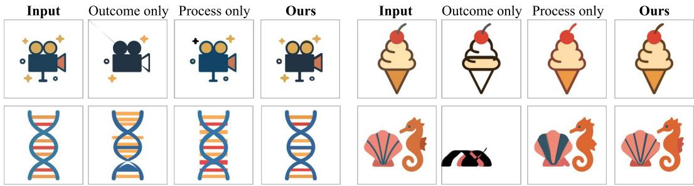  
Figure 5: Qualitative reward composition ablation. Process-only training recovers much of the gain over outcome-only, while combining both rewards yields the most faithful reconstructions.

## 5.2 IMAGE-TO-TIKZ

Setup. For Image-to-TikZ generation, we use DeTikZify-v2 (Belouadi et al., 2025) as the supervised base model. TikZ programs similarly construct figures through sequences of drawing commands, allowing intermediate states to be rendered and evaluated. We train on DaTikZ-v3 (Belouadi et al., 2025) training set and use the DeTikZify (Belouadi et al., 2024) SelfSim reward as a visual score F (Eq. 3), following its reported correlation with human judgment of scientific diagrams. We evaluate on the DaTikZ-v3 test set using visual reconstruction metrics (Zhai et al., 2023; Fu et al.. 2023), token length, and reference-based code metrics (Stanchev et al., 2019; Eghbali & Pradel, 2022), comparing to general-purpose models, task-specific models, including VinciCoder (Zhao et al., 2025) and DeTikZify-v2.5. Notably, we surpass VinciCoder-8B and DeTikZify-v2.5, which both represent open-source GRPO baselines. As in the Image-to-SVG application, we additionally compare against RAFT and outcome-only RL initialized from the same SFT model. See App. B for more details on TikZ intermediate rendering, training and evaluation parameters.

<table><tr><td colspan="8">DreamSim ↑ SigLIP ↑ CLIP ↑ LPIPS ↓ KID ↓ C-BLEU ↑ TED ↓ Tokens ↓</td></tr><tr><td colspan="2">General-purpose (M)LLMs</td><td></td><td></td><td></td><td></td><td></td><td></td></tr><tr><td>Qwen3-VL-235B</td><td>80.3</td><td>91.5</td><td>89.0</td><td>40.4</td><td>0.74</td><td>3.4</td><td>54.1 3.9k</td></tr><tr><td>Gemini 3 Flash</td><td>91.0</td><td>96.1</td><td>94.3</td><td>27.2</td><td>-0.05</td><td>6.6 51.7</td><td>2.4k</td></tr><tr><td>Sonnet 5</td><td>85.4</td><td>94.0</td><td>92.2</td><td>35.9</td><td>0.06</td><td>3.7 52.8</td><td>0.7k</td></tr><tr><td>GPT-5.2</td><td>84.9</td><td>93.8</td><td>91.4</td><td>35.7</td><td>0.41</td><td>4.4 54.0</td><td>1.5k</td></tr><tr><td colspan="8">TikZ VLMs</td></tr><tr><td>VinciCoder-8B</td><td>82.6</td><td>92.5</td><td>90.6</td><td>38.3</td><td>0.77</td><td>7.4 55.1</td><td>1.1k</td></tr><tr><td>DeTikZify-v2.5</td><td>83.6</td><td>92.2</td><td>91.0</td><td>34.8</td><td>0.72</td><td>4.6 52.9</td><td>0.8k</td></tr><tr><td>DeTikZify-v2 (SFT)</td><td>80.3</td><td>90.0</td><td>88.9</td><td>38.3</td><td>0.72</td><td>7.0 55.7</td><td>1.3k</td></tr><tr><td>DeTikZify-v2 + RAFT</td><td>81.5</td><td>90.9</td><td>89.8</td><td>36.9</td><td>0.44</td><td>8.9 54.6</td><td>1.3k</td></tr><tr><td>DeTikZify-v2 + Outcome</td><td>83.9</td><td>92.1</td><td>90.9</td><td>34.3</td><td>0.45</td><td>7.4 53.3</td><td>1.0k</td></tr><tr><td>DeTikZify-v2 + Ours</td><td>86.9</td><td>94.0</td><td>92.8</td><td>32.8</td><td>0.20</td><td>3.1</td><td>53.9 0.6k</td></tr></table>

Table 3: Quantitative evaluation on DaTikZ-v3. Our method improves DeTikZify-v2 and posttraining baselines across the visual reconstruction metrics while producing substantially shorter programs. Bold and underline mark best and second-best results among task-specific TikZ models.

Results. Table 3 shows that the gains from intermediate-render supervision also extend to Imageto-TikZ generation. Our method improves over the DeTikZify-v2 SFT base model and over outcome-only RL across all metrics, while once again producing shorter TikZ programs. We note a small decline in code-similarity metrics, expected since unlike SFT and RAFT, RL post-training does not enforce a code-matching objective. Figure 4 shows representative qualitative comparisons and reflects the same trend. Our method more faithfully reconstructs the visual structure and content of the target figures, while the supervised model and outcome-based GRPO more frequently omit or distort visual elements.

Across both SVG and TikZ, our method outperforms SFT and outcome-only RL, demonstrating the effectiveness of intermediate-render supervision across distinct image-to-code representations.

## 5.3 ANALYSIS

Having established gains on both SVG and TikZ, we use Image-to-SVG to further analyze the proposed supervision. We study the contributions of process and outcome rewards, the impact of reward propagation, intermediate rendering frequency, and test-time sampling performance.

Process and Outcome Rewards. We first ablate the two components of our objective (Eq. 6). As shown in Tab. 1, process reward alone substantially outperforms outcome-only and recovers most of the gain of the full method, while combining both performs best across all metrics. Fig. 5 shows the same qualitative trend. We report the corresponding TikZ ablation in Tab. B.1.

We further vary the weight of the process reward α (Eq. 6). As shown in Fig. 6a, increasing its contribution improves peak test reward around α = 10. Larger values provide no further gain.

Reward Propagation. We vary λ, which controls how far each render-progress reward propagates to preceding tokens (Eq. 5). As shown in Fig. 6b, propagation substantially improves performance, with the best result at λ = 0.9. Fully undiscounted propagation (λ = 1) performs worse, suggesting that preserving locality in the process signal is beneficial.

Render Frequency. Our default formulation renders after every completed drawing command (Sec. 4.1). We vary this frequency by rendering once every N commands while keeping the training procedure fixed. Figure 6c shows that performance consistently decreases as renders become less frequent, with the best result at N = 1. This supports measuring visual progress as frequently as the representation allows.

(a) Reward composition  
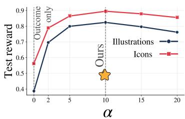

(b) Reward propagation  
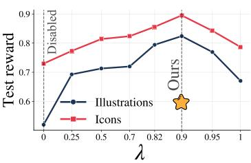

(c) Reward sparsity  
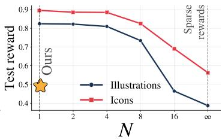  
Figure 6: Ablations of process supervision. (a) Increasing the process contribution improves performance up to α = 10. (b) Reward propagation performs best at λ = 0.9. (c) More frequent intermediate renders consistently improve performance. Stars mark our default settings.

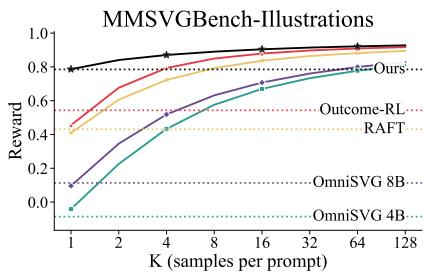

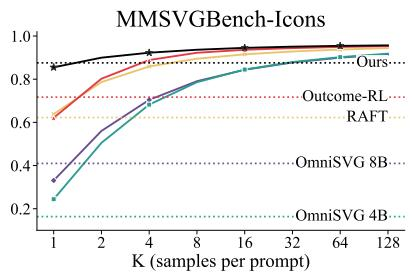  
Figure 7: Best-of-K sampling. For each image, we sample K candidate SVGs and report the mean reward of the best ones. Horizontal lines show greedy decoding. Our method performs best across both dataset subsets, with the largest gains at small K.

Test-time Scaling. We evaluate how sampling of additional K candidates per image improves generation quality. Figure 7 shows that our model consistently achieves the highest best-of-K reward, with the largest margin at small K. The narrowing gap at larger K suggests that training primarily increases the probability of high-quality generations of the base model, consistent with prior observations (Yue et al., 2025). In Appendix A.1, we extend this analysis to an additional test set and sampling temperatures and observe the same trend. Interestingly, OmniSVG-8B also approaches the 4B variant at large K, despite it being substantially stronger at K = 1. We therefore examine its effect on our post-training in Appendix A.4.

## 6 CONCLUSIONS

We introduced IR4RL, a method for reinforcement learning from intermediate renders for imageto-code generation. By using changes between consecutive renders, our method provides localized reward during generation while retaining the global outcome signal. Across Image-to-SVG and Image-to-TikZ, it consistently improves over supervised fine-tuning and outcome-only RL, yielding state-of-the-art results among open-source models. Our analysis further shows that highly granular render-progress reward accounts for most of the gains.

A limitation is that intermediate program prefixes must be convertible into meaningful executable states that can be evaluated against the target. This holds naturally for SVG and TikZ, but not for arbitrary image-to-code generation tasks. Intermediate rendering also adds training-time computation but, importantly, maintains inference cost unchanged. As base models continue to advance rapidly through large-scale pretraining, our method could serve as a natural post-training step for image-tocode tasks. Future work could extend this idea to other incrementally rendered representations, such as Lottie animations, HTML interfaces, and 3D scene programs. More broadly, our results highlight intermediate execution as a natural source of process-level supervision for improving credit assignment beyond terminal rewards.

## AI USE STATEMENT

In this work, we used generative AI tools to implement methods, creating and editing software code, drafting parts of the paper, editing for readability, identifying relevant literature, and formatting references. We reviewed all AI-assisted work: code was tested and verified for correctness by the authors, and all AI-drafted or AI-edited text was checked against the underlying results and revised by the authors. We take responsibility for the final content of this work, including text, claims, and artifacts produced with the aid of generative AI.

## ETHICS STATEMENT

This work includes a human evaluation conducted through Prolific, in which participants compared model-generated images against reference images. The study collected preference judgments only and did not involve sensitive personal data. Participants were compensated through the Prolific platform. The remaining experiments use publicly available datasets and models. We also note that image-to-code generation could in principle be used to reproduce copyrighted visual content (e.g., logos, diagrams). We do not target or evaluate this use case, and mitigating such misuse is left to downstream deployment safeguards.

## REPRODUCIBILITY STATEMENT

We build on open-source base models and train/evaluate only on open datasets; code will be released upon publication. Implementation and training details, including hyperparameters and dataset splits, are provided in A and B.

## ACKNOWLEDGMENTS

This research was supported by the Sagol Weizmann-MIT Bridge Program and made possible through a GPU compute resource grant funded by the Association of University Heads, the Council for Higher Education and the AI Research Compute Center.

## REFERENCES

Anthropic. Claude sonnet 5 system card. https://anthropic.com/ claude-sonnet-5-system-card, 6 2026. System card. Accessed 2026-09-22.

Shuai Bai, Yuxuan Cai, Ruizhe Chen, Keqin Chen, Xionghui Chen, Zesen Cheng, Lianghao Deng, Wei Ding, Chang Gao, Chunjiang Ge, Wenbin Ge, Zhifang Guo, Qidong Huang, Jie Huang, Fei Huang, Binyuan Hui, Shutong Jiang, Zhaohai Li, Mingsheng Li, Mei Li, Kaixin Li, Zicheng Lin, Junyang Lin, Xuejing Liu, Jiawei Liu, Chenglong Liu, Yang Liu, Dayiheng Liu, Shixuan Liu, Dunjie Lu, Ruilin Luo, Chenxu Lv, Rui Men, Lingchen Meng, Xuancheng Ren, Xingzhang Ren, Sibo Song, Yuchong Sun, Jun Tang, Jianhong Tu, Jianqiang Wan, Peng Wang, Pengfei Wang, Qiuyue Wang, Yuxuan Wang, Tianbao Xie, Yiheng Xu, Haiyang Xu, Jin Xu, Zhibo Yang, Mingkun Yang, Jianxin Yang, An Yang, Bowen Yu, Fei Zhang, Hang Zhang, Xi Zhang, Bo Zheng, Humen Zhong, Jingren Zhou, Fan Zhou, Jing Zhou, Yuanzhi Zhu, and Ke Zhu. Qwen3-vl technical report. arXiv preprint arXiv:2511.21631, 2025.

Jonas Belouadi, Simone Paolo Ponzetto, and Steffen Eger. DeTikZify: Synthesizing graphics programs for scientific figures and sketches with TikZ. In The Thirty-eighth Annual Conference on Neural Information ProcessingSystems, 2024. URL https: //openreview.net/forum? id=bcVLFQCOjc.

Jonas Belouadi, Eddy Ilg, Margret Keuper, Hideki Tanaka, Masao Utiyama, Raj Dabre, Steffen Eger, and Simone Paolo Ponzetto. TikZero: Zero-shot text-guided graphics program synthesis, 2025.URLhttps://arxiv.org/abs/2503.11509.

Cheng Chen, Jiacheng Wei, Tianrun Chen, Chi Zhang, Xiaofeng Yang, Shangzhan Zhang, Bingchen Yang, Chuan-Sheng Foo, Guosheng Lin, Qixing Huang, et al. Cadcrafter: Generating computeraided design models from unconstrained images. In 2025 IEEE/CVF Conference on Computer Vision and Pattern Recognition (CVPR), pp. 11073–11082. IEEE, 2025a.

Junhao Chen, Kejun Gao, Yuehan Cui, Mingze Sun, Mingjin Chen, Shaohui Wang, Xiaoxiao Long, Fei Ma, Qi Tian, Hao Zhao, and Ruqi Huang. Lottiegpt: Tokenizing vector animation for autoregressive generation. In Proceedings of the IEEE/CVF Conference on Computer Vision and Pattern Recognition (CVPR), pp. 31639–31651, June 2026.

Tianrun Chen, Chunan Yu, Yuanqi Hu, Jing Li, Tao Xu, Runlong Cao, Lanyun Zhu, Ying Zang, Yong Zhang, Zejian Li, and Lingyun Sun. Img2CAD: Conditioned 3D CAD model generation from single image with structured visual geometry. IEEE Transactions on Industrial Informatics, 21(11):8539–8549, 2025b.

Karl Cobbe, Vineet Kosaraju, Mohammad Bavarian, Jacob Hilton, Reiichiro Nakano, Christopher Hesse, and John Schulman. Training verifiers to solve math word problems, 2021.

Jie Deng, Kaichun Yao, and Libo Zhang. VisRefiner: Learning from visual differences for screenshot-to-codegeneration, 2026.URL https://arxiv.org/abs/2602.05998.

Hanze Dong, Wei Xiong, Deepanshu Goyal, Yihan Zhang, Winnie Chow, Rui Pan, Shizhe Diao, Jipeng Zhang, KaShun SHUM, and Tong Zhang. RAFT: Reward ranked finetuning for generative foundation model alignment. Transactions on Machine Learning Research, 2023. ISSN 2835- 8856.URLhttps://openreview.net/forum?id=m7p507zblY.

Shihan Dou, Yan Liu, Haoxiang Jia, Enyu Zhou, Limao Xiong, Junjie Shan, Caishuang Huang, Xiao Wang, Xiaoran Fan, Zhiheng Xi, et al. Stepcoder: improving code generation with reinforcement learning from compiler feedback. In Proceedings of the 62nd Annual Meeting of the Association for Computational Linguistics (Volume 1: Long Papers), pp. 4571–4585, 2024.

Aryaz Eghbali and Michael Pradel. CrystalBLEU: Precisely and efficiently measuring the similarity of code. In Proceedings of the 37th IEEE/ACM International Conference on Automated Software Engineering, ASE '22, pp. 1–12, New York, NY, USA, 2022. Association for Computing Machinery. doi: 10.1145/3551349.3556903.

Patrick Esser, Sumith Kulal, Andreas Blattmann, Rahim Entezari, Jonas Müller, Harry Saini, Yam Levi, Dominik Lorenz, Axel Sauer, Frederic Boesel, et al. Scaling rectified flow transformers for high-resolution image synthesis. In Forty-first international conference on machine learning, 2024.

Stephanie Fu, Netanel Y. Tamir, Shobhita Sundaram, Lucy Chai, Richard Zhang, Tali Dekel, and Phillip Isola. Dreamsim: Learning new dimensions of human visual similarity using synthetic data. In Advances in Neural Information Processing Systems (NeurIPS), 2023.

Google DeepMind. Gemini 3 flash. https://deepmind.google/models/gemini/ f1ash/, 12 2025. Model card. Accessed 2026-09-22.

Edward J Hu, Yelong Shen, Phillip Wallis, Zeyuan Allen-Zhu, Yuanzhi Li, Shean Wang, Lu Wang, and Weizhu Chen. LoRA: Low-rank adaptation of large language models. In International Conference on Learning Representations, 2022. URL https://openreview.net/forum? id=nZeVKeeFYf9.

Minsu Kim and Se-Young Yun. Process-verified reinforcement learning for theorem proving via lean. arXiv preprint arXiv:2606.20068, 2026.

Tzu-Mao Li, Michal Lukáč, Michaël Gharbi, and Jonathan Ragan-Kelley. Differentiable vector graphics rasterization for editing and learning. ACM Trans. Graph. (Proc. SIGGRAPH Asia), 39 (6):193:1–193:15, 2020.

Guotao Liang, Zhangcheng Wang, Juncheng Hu, Haitao Zhou, Ziteng Xue, Jing Zhang, Dong Xu, and Qian Yu. Render-in-the-loop: Vector graphics generation via visual self-feedback, 2026. URLhttps://arxiv.org/abs/2604.20730.

Hunter Lightman, Vineet Kosaraju, Yuri Burda, Harrison Edwards, Bowen Baker, Teddy Lee, Jan Leike, John Schulman, Ilya Sutskever, and Karl Cobbe. Let's verify step by step. In International Conference on Learning Representations, volume 2024, pp. 39578–39601, 2024

Jun Ling, Yao Qi, Tao Huang, Shibo Zhou, Yanqin Huang, Jiang Yang, Ziqi Song, Ying Zhou, Yang Yang, Heng Tao Shen, and Peng Wang. Table2LaTeX-RL: High-fidelity LaTeX code generation from table images via reinforced multimodal language models. In Advances in Neural Information Processing Systems, volume 38, 2025.

Ziyu Liu, Shengyuan Ding, Xinyu Fang, Xuanlang Dai, Penghui Yang, Jianze Liang, Jiaqi Wang, Kai Chen, Dahua Lin, and Yuhang Zang. Visual-ERM: Reward modeling for visual equivalence, 2026.URLhttps://arxiv.org/abs/2603.13224.

Xu Ma, Yuqian Zhou, Xingqian Xu, Bin Sun, Valerii Filev, Nikita Orlov, Yun Fu, and Humphrey Shi. Towards layer-wise image vectorization. In Proceedings of the IEEE conference on computer vision and pattern recognition, 2022.

OpenAI. Gpt-5.2 systemcard. https://openai.com/index/ gpt-5-system-card-update-gpt-5-2, 12 2025. System card. Accessed 2026- 09-22.

Maxime Oquab, Timothée Darcet, Théo Moutakanni, Huy V. Vo, Marc Szafraniec, Vasil Khalidov, Pierre Fernandez, Daniel Haziza, Francisco Massa, Alaaeldin El-Nouby, Mahmoud Assran, Nicolas Ballas, Wojciech Galuba, Russell Howes, Po-Yao Huang, Shang-Wen Li, Ishan Misra, Michael Rabbat, Vasu Sharma, Gabriel Synnaeve, Hu Xu, Hervé Jegou, Julien Mairal, Patrick Labatut, Armand Joulin, and Piotr Bojanowski. DINOv2: Learning robust visual features without supervision. Transactions on Machine Learning Research, 2024. arXiv:2304.07193.

Prolific. Prolific. https://www.prolific.com/,2024.

Alec Radford, Jong Wook Kim, Chris Hallacy, Aditya Ramesh, Gabriel Goh, Sandhini Agarwal, Girish Sastry, Amanda Askell, Pamela Mishkin, Jack Clark, Gretchen Krueger, and Ilya Sutskever. Learning transferable visual models from natural language supervision. In Proceedings of the 38th International Conference on Machine Learning (ICML), volume 139 of Proceedings of Machine Learning Research, pp. 8748–8763, 2021.

Juan A. Rodriguez, Abhay Puri, Shubham Agarwal, Issam H. Laradji, Pau Rodriguez, Sai Rajeswar, David Vazquez, Christopher Pal, and Marco Pedersoli. StarVector: Generating Scalable Vector Graphics Code from Images and Text. In Proceedings of the IEEE/CVF Conference on Computer Vision and Pattern Recognition (CVPR), pp. 16175–16186, June 2025a.

Juan A. Rodriguez, Haotian Zhang, Abhay Puri, Aarash Feizi, Rishav Pramanik, Pascal Wichmann, Arnab Mondal, Mohammad Reza Samsami, Rabiul Awal, Perouz Taslakian, Spandana Gella, Sai Rajeswar, David Vazquez, Christopher Pal, and Marco Pedersoli. Rendering-aware reinforcement learning for vector graphics generation. In Advances in Neural Information Processing Systems, volume 38, pp. 67317–67355, 2025b.

Robin Rombach, Andreas Blattmann, Dominik Lorenz, Patrick Esser, and Björn Ommer. Highresolution image synthesis with latent diffusion models. In 2022 IEEE/CVF conference on computer vision and pattern recognition (CVPR), pp. 10674–10685. ieee, 2022.

Itsumi Saito, Haruto Yoshida, and Keisuke Sakaguchi. Sketch2Diagram: Generating vector diagrams from hand-drawn sketches. In International Conference on Learning Representations, 2025.

John Schulman, Philipp Moritz, Sergey Levine, Michael Jordan, and Pieter Abbeel. Highdimensional continuous control using generalized advantage estimation. arXiv preprint arXiv:1506.02438, 2015.

Amrith Setlur, Chirag Nagpal, Adam Fisch, Xinyang Geng, Jacob Eisenstein, Rishabh Agarwal, Alekh Agarwal, Jonathan Berant, and Aviral Kumar. Rewarding progress: Scaling automated process verifiers for llm reasoning. In International Conference on Learning Representations, volume 2025, pp. 60808–60838, 2025.

Zhihong Shao, Peiyi Wang, Qihao Zhu, Runxin Xu, Junxiao Song, Xiao Bi, Haowei Zhang, Mingchuan Zhang, Y. K. Li, Y. Wu, and Daya Guo. Deepseekmath: Pushing the limits of mathematical reasoning in open language models, 2024. URL https: //arxiv. org/abs/2402. 03300.

Peter Stanchev, Weiyue Wang, and Hermann Ney. EED: Extended edit distance measure for machine translation. In Proceedings of the Fourth Conference on Machine Translation (Volume 2: Shared Task Papers, Day 1), pp. 514–520, Florence, Italy, August 2019. Association for Computational Linguistics. doi: 10.18653/v1/W19-5359. URL https: //aclanthology.org/ W19-5359.

Wentao Tan, Qiong Cao, Chao Xue, Yibing Zhan, Changxing Ding, and Xiaodong He. ChartMaster: Advancing chart-to-code generation with real-world charts and chart similarity reinforcement learning,2025.URL https://arxiv.org/abs/2508.17608.

Jonathan Uesato, Nate Kushman, Ramana Kumar, Francis Song, Noah Siegel, Lisa Wang, Antonia Creswell, Geoffrey Irving, and Irina Higgins. Solving math word problems with process- and outcome-based feedback. arXiv preprint arXiv:2211.14275, 2022.

Haomin Wang, Qi Wei, Qianli Ma, Shengyuan Ding, Jinhui Yin, Kai Chen, and Hongjie Zhang. Reliable reasoning in SVG-LLMs via multi-task multi-reward reinforcement learning, 2026a. URLhttps://arxiv.org/abs/2603.16189.

Haomin Wang, Jinhui Yin, Qi Wei, Wenguang Zeng, Lixin Gu, Shenglong Ye, Zhangwei Gao, Yaohui Wang, Yanting Zhang, Yuanqi Li, Yanwen Guo, Wenhai Wang, Kai Chen, Yu Qiao, and Hongjie Zhang. Internsvg: Towards unified svg tasks with multimodal large language models. In International Conference on Learning Representations, 2026b.

Peiyi Wang, Lei Li, Zhihong Shao, Runxin Xu, Damai Dai, Yifei Li, Deli Chen, Yu Wu, and Zhifang Sui. Math-shepherd: Verify and reinforce llms step-by-step without human annotations. In Proceedings of the 62nd Annual Meeting of the Association for Computational Linguistics (Volume 1: Long Papers), pp. 9426–9439, 2024.

Yiping Wang, Qing Yang, Zhiyuan Zeng, Liliang Ren, Liyuan Liu, Baolin Peng, Hao Cheng, Xuehai He, Kuan Wang, Jianfeng Gao, Weizhu Chen, Shuohang Wang, Simon Shaolei Du, and Yelong Shen. Reinforcement learning for reasoning in large language models with one training example. arXiv preprint arXiv:2504.20571, 2025.

Zhou Wang, Alan C. Bovik, Hamid R. Sheikh, and Eero P. Simoncelli. Image quality assessment: From error visibility to structural similarity. IEEE Transactions on Image Processing, 13(4): 600–612, 2004. doi: 10.1109/TIP.2003.819861.

Xiaoshi Wu, Yiming Hao, Keqiang Sun, Yixiong Chen, Feng Zhu, Rui Zhao, and Hongsheng Li. Human preference score v2: A solid benchmark for evaluating human preferences of text-toimage synthesis. arXiv preprint arXiv:2306.09341, 2023.

Ge Yang, Edward Hu, Igor Babuschkin, Szymon Sidor, Xiaodong Liu, David Farhi, Nick Ryder, Jakub Pachocki, Weizhu Chen, and Jianfeng Gao. Tuning large neural networks via zero-shot hyperparameter transfer. In Advances in Neural Information Processing Systems, 2021.

Yiying Yang, Wei Cheng, Sijin Chen, Xianfang Zeng, Fukun Yin, Jiaxu Zhang, Liao Wang, Gang Yu, Xingjun Ma, and Yu-Gang Jiang. Omnisvg: A unified scalable vector graphics generation model. In Advances in Neural Information Processing Systems, volume 38, 2025. doi: 10.52202/ 085713-3791.

Yiying Yang, Wei Cheng, Sijin Chen, Honghao Fu, Xianfang Zeng, Yujun Cai, Gang Yu, and Xinjun Ma. Omnilottie: Generating vector animations via parameterized lottie tokens. arXiv preprint arxiv:2603.02138, 2026a.

Zhen Yang, Wenyi Hong, Mingde Xu, Xinyue Fan, Weihan Wang, Jiale Cheng, Xiaotao Gu, and Jie Tang. UI2CodeN: UI-to-code generation as interactive visual optimization. In Proceedings of the 43rd International Conference on Machine Learning, volume 306 of Proceedings of Machine LearningResearch,2026b.URL https://arxiv.org/abs/2511.08195.

Yufan Ye, Ting Zhang, Wenbin Jiang, and Hua Huang. Process-supervised reinforcement learning for code generation. In Proceedings of the 2025 Conference on Empirical Methods in Natural Language Processing, pp. 14224–14237, 2025.

Tianyu Yu, Yuan Yao, Haoye Zhang, Taiwen He, Yifeng Han, Ganqu Cui, Jinyi Hu, Zhiyuan Liu, Hai-Tao Zheng, Maosong Sun, et al. Rlhf-v: Towards trustworthy mllms via behavior alignment from fine-grained correctional human feedback. In Proceedings of the IEEE/CVF Conference on Computer Vision and Pattern Recognition, pp. 13807–13816, 2024.

Yang Yue, Zhiqi Chen, Rui Lu, Andrew Zhao, Zhaokai Wang, Yang Yue, Shiji Song, and Gao Huang. Does reinforcement learning really incentivize reasoning capacity in llms beyond the base model?arXiv preprint arXiv:2504.13837, 2025.

Sukmin Yun, Haokun Lin, Rusiru Thushara, Mohammad Qazim Bhat, Yongxin Wang, Zutao Jiang, Mingkai Deng, Jinhong Wang, Tianhua Tao, Junbo Li, Haonan Li, Preslav Nakov, Timothy Baldwin, Zhengzhong Liu, Eric P. Xing, Xiaodan Liang, and Zhiqiang Shen. Web2Code: A large-scale webpage-to-code dataset and evaluation framework for multimodal LLMs. In Advances in Neural Information Processing Systems, volume 37, pp. 112134–112157, 2024. doi: 10.52202/079017-3560.

Xingchen Zeng, Zhewei Su, Hengming Zhang, Juyong Jiang, Jiazhi Xia, and Wei Zeng. DaVinci: Reinforcing visual-structural syntax in MLLMs for generalized scientific diagram parsing. In International Conference on Learning Representations, 2026.

Xiaohua Zhai, Basil Mustafa, Alexander Kolesnikov, and Lucas Beyer. Sigmoid loss for language image pre-training. In Proceedings of the IEEE/CVF International Conference on Computer Vision (ICCV), pp. 11975–11986, 2023.

Richard Zhang, Phillip Isola, Alexei A. Efros, Eli Shechtman, and Oliver Wang. The unreasonable effectiveness of deep features as a perceptual metric. In Proceedings of the IEEE Conference on Computer Vision and Pattern Recognition (CVPR), pp. 586–595, 2018.

Xuanle Zhao, Deyang Jiang, Zhixiong Zeng, Lei Chen, Haibo Qiu, Jing Huang, Yufeng Zhong, Liming Zheng, Yilin Cao, and Lin Ma. Vincicoder: Unifying multimodal code generation via coarse-to-fine visual reinforcement learning. arXiv preprint arXiv:2511.00391, 2025.

Xuanle Zhao, Qiushi Sun, Jingyu Xiao, Xuexin Liu, Haoyue Yang, Qiaosheng Chen, Xianzhen Luo, Jing Huang, Yufeng Zhong, Lei Chen, Shuai Fu, Zhenlin Wei, Jinhe Bi, Lei Jiang, Haibo Qiu, Siqi Yang, Peng Shi, Jian Hu, and Zhixiong Zeng. Beyond NL2Code: A structured survey of multimodal code intelligence. arXiv preprint arXiv:2606.15932, 2026. URL ht tps : / / arxiv . org/abs/2606.15932.

## Appendix

Appendix Contents   
A Image-to-SVG setup details . . . 15   
A.1 Test-time scaling . 15   
A.2 Prefix closure . 15   
A.3 Training parameters . . 16   
A.4 Impact of Base Model Size . 17   
A.5 Baseline parameters . 17   
A.6 Metrics.. .17   
B Image-to-TikZ setup details . . .18   
B.1 Reward ablation. .18   
B.2 Prefix closure . 19   
B.3 Training parameters. .19   
B.4 Baseline parameters . 19   
B.5 Metrics .. .19

## A IMAGE-TO-SVG SETUP DETAILS

## A.1 TEST-TIME SCALING

We extend the test-time scaling analysis from Sec. 5.3 across three evaluation sets and four sampling temperatures, $T \in \{ 0 . 3 , \bar { 0 } . 7 , 1 . \bar { 0 } , 1 . 3 \}$ in Fig. A.1. Our method achieves the highest reward across nearly all sampling budgets and temperatures, with the largest advantage at small K. As K increases, the gap to the baselines narrows, consistent with our method assigning greater probability to high-quality generations rather than relying on large sampling budgets to discover them. This trend is consistent across SVG-Stack, MMSVGBench-Illustrations, and MMSVGBench-Icons.

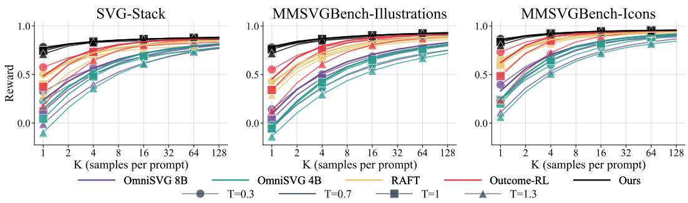  
Figure A.1: Best-of-K sampling on SVG generation. For each image, we sample K candidate SVGs and report the mean reward of the best candidate. Across multiple datasets and temperature values, our method performs best across all sampling budgets, with the largest gains at small K.

## A.2 PREFIX CLOSURE

To achieve the highest possible reward granularity, we place a boundary $b _ { j }$ after every completed SVG drawing command (move, line, curve, arc, or close). This is possible because any prefix of an SVG path's segments is already well-formed: it can be closed back to its starting point with a default black color, well before its enclosing path is finished. In practice, for our setup this results in $b _ { j }$ boundaries accounting for roughly 15% of tokens.

Realizing C (Sec. 4.1) requires knowing what syntax a truncated prefix is still missing before it can be closed into an executable, renderable program. For SVG, OmniSVG's tokenization never represents the container tags a document would normally nest through (e.g., <svg>. . . </ svg>, or a path's own <path $\mathrm { d } { = } " \dots { } " > \dots { < } /$ path> wrapper), only the underlying path commands and their coordinate/color arguments. C therefore just wraps commands decoded from $y _ { 1 : b _ { j } }$ in the standard container boilerplate, yielding a well-formed, renderable document at every boundary. The process is demonstrated in Fig. A.2a.

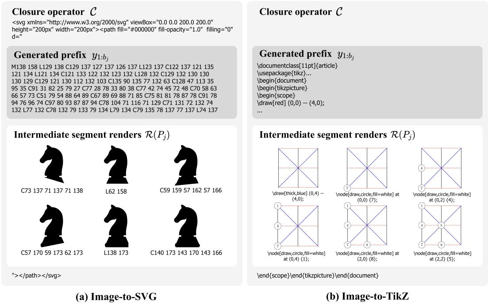

Figure A.2: Prefix closure for (a) Image-to-SVG, (b) Image-to-TikZ. A model generates a program code y that is separated into granular segments $y _ { 1 : b _ { j } }$ , well-formed by a closure operator C into $P _ { j } =$ $\mathcal { C } ( y _ { 1 : b _ { j } } )$ and rendered. This process depends on the task and a tokenizer. Specifically, OmniSVG does not generate the <svg> tag, while in DeTikZify the opening code is part of the sequence.
<table><tr><td rowspan="2"></td><td colspan="8">MMSVGBench-Illustrations</td><td colspan="8">MMSVGBench-Icons</td></tr><tr><td colspan="2"></td><td colspan="2"></td><td colspan="2"></td><td colspan="2"></td><td colspan="2"></td><td colspan="2">DINO ↑ LPIPS ↓ MSE ↓ SSIM ↑ CLIP ↑ Aesthetic ↑ Tokens ↓DINO ↑ LPIPS ↓ MSE ↓ SSIM ↑ CLIP ↑ Aesthetic ↑ Tokens ↓</td><td colspan="2"></td><td></td></tr><tr><td>700 samples</td><td>97.48</td><td>9.79</td><td>1.17</td><td>94.22</td><td>96.05</td><td>5.09</td><td></td><td>2.5k</td><td>98.26</td><td>8.67</td><td>1.23</td><td>93.88</td><td>98.01</td><td>4.98</td><td>2.1k</td></tr><tr><td>10k samples</td><td>97.26</td><td>10.11</td><td>1.27</td><td>94.11</td><td>95.35</td><td>5.08</td><td>2.2k</td><td>98.49</td><td>8.42</td><td>1.20</td><td>94.12</td><td>98.35</td><td></td><td>5.02</td><td>1.9k</td></tr></table>

Table A.1: Effect of the number of training samples. We observe that increasing the size of the trainset provides only marginal gains on Icons subset at the cost of mild degradation on Illustrations, and increases the overall generation length. We thus opt for a smaller trainset in all experiments.

## A.3 TRAINING PARAMETERS

The visual similarity function S between SVG renders and a target is defined following prior work (Rodriguez et al., 2025a) as a scale-invariant normalized L2 that emphasizes structural and color discrepancies:

$$
S = \mathrm { c l i p } \left( 1 - \frac { 1 } { N } \left| \left| I _ { \mathrm { i n } } ^ { \mathrm { n o r m } } - I _ { \mathrm { p r e d } } ^ { \mathrm { n o r m } } \right| \right| _ { 2 } ^ { 2 } , - 1 , 1 \right) ,\tag{A.1}
$$

where $I ^ { \mathrm { n o r m } }$ is z-score normalized image. S lies within [—1, 1], and for blank or malformed SVGs it is equal $\mathbf { t o } - 1$

We train OmniSVG-4B with a learning rate 5e-5, KL coefficient $\beta = 0 ,$ a group size 16, and an effective batch of 8 unique images per optimizer step, resulting in 128 rollouts per update sampled with temperature 1.1. We attach a LoRA adapter (Hu et al., 2022) (rank $r = 6 4 , \alpha = 1 2 8 .$ dropout 0.05) to the query/key/value/output projections and gate/up/down MLP projections of the LLM part of the model. Training is done for 300 steps on a single B200 GPU for 2 days. The training set size is only 700 samples of svg-stack (Rodriguez et al., 2025a). Tab. A.1 shows that scaling to 10k samples (a 14× increase) brings no consistent gain in reconstruction quality: 700 samples wins on

<table><tr><td rowspan="2"></td><td colspan="7">MMSVGBench-Illustrations</td><td colspan="8">MMSVGBench-Icons</td></tr><tr><td>DINO ↑ LPIPS ↓ MSE ↓</td><td></td><td></td><td>SSIM↑</td><td></td><td>CLIP ↑ Aesthetic ↑ Tokens ↓</td><td></td><td></td><td>DINO ↑ LPIPS ↓</td><td>MSE↓</td><td></td><td></td><td>SSIM ↑ CLIP ↑ Aesthetic ↑ Tokens ↓</td><td></td><td></td></tr><tr><td>OmniSVG-4B</td><td>85.48</td><td>22.26</td><td>5.11</td><td>89.70</td><td>82.03</td><td>4.55</td><td></td><td>11.3k</td><td>89.21</td><td>19.82</td><td>5.80</td><td>87.96</td><td>88.42</td><td>4.65</td><td>8.4k</td></tr><tr><td>OmniSVG-8B</td><td>88.81</td><td>21.15</td><td>4.98</td><td>88.85</td><td>85.57</td><td>4.68</td><td></td><td>9.1k</td><td>92.04</td><td>18.09</td><td>4.92</td><td>89.28</td><td>91.89</td><td>4.79</td><td>6.0k</td></tr><tr><td>OmniSVG-4B + Ours</td><td>97.48</td><td>9.79</td><td>1.17</td><td>94.22</td><td>96.05</td><td>5.09</td><td></td><td>2.5k</td><td>98.26</td><td>8.67</td><td>1.23</td><td>93.88</td><td>98.01</td><td>4.98</td><td>2.1k</td></tr><tr><td>OmniSVG-8B + Ours</td><td>97.34</td><td>9.56</td><td>1.20</td><td>94.32</td><td>96.29</td><td></td><td>5.09</td><td>3.0k</td><td>98.38</td><td>8.47</td><td>1.12</td><td>94.25</td><td>98.47</td><td>4.99</td><td>2.3k</td></tr></table>

Table A.2: Effect of Delta at 4B and 8B scale. Despite a significant margin between 4B and 8B base models, applying our method to both models produces similar results, motivating us to adopt a smaller variant.

Illustrations, 10k on Icons, with marginal difference in both cases. This aligns with recent findings that RL fine-tuning can saturate on remarkably few examples (Wang et al., 2025), and we adopt the smaller, cheaper set.

## A.4 IMPACT OF BASE MODEL SIZE

Table A.2 compares our method applied to OmniSVG-4B and OmniSVG-8B. The 8B model follows the same training recipe as the 4B model, except that we scale the learning rate by 0.7× to account for model size, following (Yang et al., 2021), which we found to work best for 8B. Before post-training, the 8B SFT model is stronger under greedy decoding, but Fig. 7 shows that the 4B and 8B models approach similar performance at larger sampling budgets. After post-training, this gap largely disappears, while the 8B model produces approximately 20% longer completions. This is consistent with prior observations that RL can increase the probability of high-quality generations already reachable under the base policy (Shao et al., 2024; Yue et al., 2025). We therefore use OmniSVG-4B for the remaining experiments, as it achieves comparable final result at lower computational cost.

## A.5 BASELINE PARAMETERS

DiffVG was run with 500 iterations and 128 paths, and LIVE with 200 iterations and 16 paths, following their default settings. General-purpose (M)LLMs (Qwen3-VL-235B (Bai et al., 2025), Gemini 3 Flash (Google DeepMind, 2025), Sonnet 5 (Anthropic, 2026), GPT-5.2 (OpenAI, 2025)) are prompted with the input image via each provider's API using the system prompt in Fig. A.4a. StarVector-8B (Rodriguez et al., 2025a) and InternSVG-8B (Wang et al., 2026b) are decoded with each model's default sampling parameters. OmniSVG's base models (4B, 8B) are sampled with default top-p = 0.95, top-k = 50, temperature 0.3, and all the discussed post-training variants follow the same sampling configuration. All non-API evaluations are done with 2048 max tokens. RAFT (Dong et al., 2023) is trained for 15 iterations, sampling 32 completions per input per iteration, selecting the highest-reward sample, and fine-tuning for two SFT epochs on the selected set.

## A.6 METRICS

CLIP is computed image-vs-image rather than image-vs-text. Both CLIP and DINO use their basesize checkpoints (ViT-B/32, dinov2-base), and LPIPS uses the AlexNet backbone. Aesthetic is a noreference score of the generated image alone. For fair comparison, token counts for all models use OmniSVG's tokenizer (Qwen2.5-VL-3B-Instruct), applied to the extracted SVG markup, following OmniSVG evaluation setup. For the API responses, the leaked prose and thinking-trace text is additionally taken into account.

A user study was conducted on Prolific (Prolific, 2024) platform with 50 samples drawn at random from MMSVGBench. For each baseline, participants saw the reference image alongside two candidates, ours and the baseline's, presented in random order as a two-alternative forced-choice (interface in Fig. A.3). They were asked: "Which image, A or B, matches the reference image above better? Judge overall accuracy compared to the reference in detail, shape, color, and spatial placement.". Each comparison was rated by 6 participants, giving 1500 judgments from 30 participants in total.

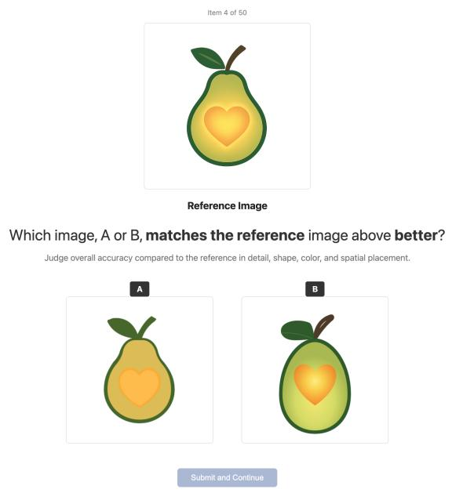

Figure A.3: User study interface. Example of an interface with a question comparing Ours to Gemini 3 Flash.  
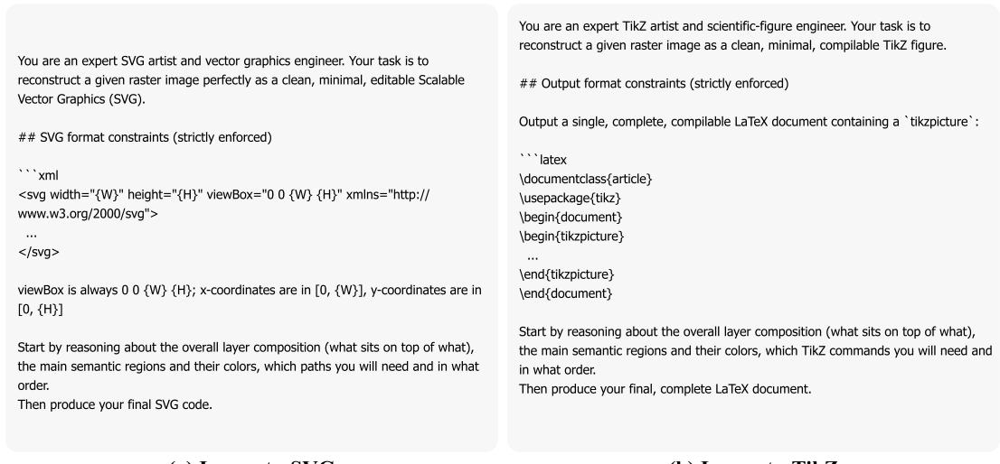  
(a) Image-to-SVG  
(b) Image-to-TikZ  
Figure A.4: API evaluation prompts. System prompts used for evaluation with closed-source API models of (a) Image-to-SVG, (b) Image-to-TikZ.

As an automatic counterpart with a VLM-as-a-judge, we ran the same comparisons through Gemini 3 Flash (Google DeepMind, 2025), providing it with the input and the question matching the one seen by humans, and asking it to answer with A or B plus a brief justification.

## B IMAGE-TO-TIKZ SETUP DETAILS

## B.1 EXTENDED REWARD ABLATION FOR IMAGE-TO-TIKZ

In addition to numeric evaluations in Tab. 3, we provide a reward composition ablation in Table B.1, which demonstrates the same trend as the one observed in Image-to-SVG of a higher contribution of the process reward to the full performance of the method.

<table><tr><td colspan="7">DreamSim ↑ SigLIP ↑ CLIP ↑ LPIPS ↓ TED Norm ↓ C-BLEU ↑ Tokens ↓</td></tr><tr><td></td><td>80.9</td><td>90.6</td><td>89.3</td><td>37.8</td><td>57.3</td><td></td></tr><tr><td>w/ Outcome only</td><td>81.1</td><td>91.3</td><td>90.2</td><td>37.3 56.8</td><td>12.9 11.9</td><td>1.3k 0.7k</td></tr><tr><td>w/ Process only w/ Process + Outcome (Ours)</td><td>83.8</td><td>92.5 91.2</td><td>35.4</td><td>55.5</td><td>14.4</td><td>1.0k</td></tr></table>

Table B.1: Reward composition ablation on Image-to-TikZ. Ablation done at 30% of training schedule.

## B.2 PREFIX CLOSURE

To achieve the highest reward granularity, a boundary $b _ { j }$ is placed after every completed TikZ statement: a semicolon-terminated drawing command (e.g. \draw or \fi11), the smallest unit that the representation allows as a complete, renderable drawing primitive. In practice, for our setup this results in $b _ { j }$ boundaries accounting for roughly 5% of tokens.

Realizing C (Sec. 4.1) for TikZ requires tracking syntax that the base model's standard sub-word tokenizer emits as free-form text rather than as structured commands: brace groups, bracketed options, and \begin{env}. . . end{env} environments can all still be open at a prefix boundary. We close these by tracking which delimiters and environments are still open at the cut point and appending their closers back in, innermost first, to obtain a compilable file. The process is demonstrated in Fig. A.2b.

## B.3 TRAINING PARAMETERS

The visual similarity function S between TikZ renders and a target is defined as Self-Sim, following prior work (Belouadi et al., 2024). Self-Sim uses $\mathrm { D e T i k Z i f y  – v 2 ^ { \circ } s }$ own fine-tuned SigLIP vision encoder to extract patch-level features $f _ { \mathrm { i n } } , f _ { \mathrm { p r e d } }$ for the target and rendered image, and computes their Earth Mover's Distance $d _ { \mathrm { E M D } }$ under patch-wise cosine cost:

$$
S = 2 \operatorname { t a n h } { ( - d _ { \mathrm { E M D } } ( f _ { \mathrm { i n } } , f _ { \mathrm { p r e d } } ) ) } + 1 ,\tag{B.1}
$$

S lies within $[ - 1 , 1 ]$ , and for blank or malformed renders it is equal to —1. This score has been shown to correlate with human judgment of scientific figure reconstruction.

We train DeTikZify-8B with a learning rate of 1e-5, KL coefficient $\beta = 0 ,$ a group size of 32, and an effective batch of 4 unique images per optimizer step, resulting in 128 rollouts per update sampled with temperature 1.1. We attach a LoRA adapter (rank $r = 6 4 , \alpha = 1 2 8$ , dropout 0.05) to the query/key/value/output and gate/up/down MLP projections of the LLM decoder, leaving the vision encoder frozen. Training is done for 900 steps on a single B200 GPU for 6 days. The training set is \~25k trainset samples from the DaTikZ-v3 dataset (Belouadi et al., 2024).

## B.4 BASELINE PARAMETERS

General-purpose (M)LLMs are prompted with the input image via each provider's API using the system prompt in Fig. A.4b. VinciCoder (Zhao et al., 2025) and DeTikZify-v2 (Belouadi et al., 2024) are decoded with each model's default sampling parameters, with a generation budget of 4096 tokens for all non-API models. All the post-training variants are reported with greedy sampling. RAFT (Dong et al., 2023) is trained for 40 iterations, sampling 32 completions per input on a subset of 700 trainset images per iteration due to the high sampling runtime cost, selecting the highestreward sample, and fine-tuning for two SFT epochs on the selected set.

## B.5 METRICS

For all methods, generations that fail to compile are re-sampled up to 10 retries, until the first success. SigLIP and CLIP use their large checkpoints (so400m/384, ViT-L/14). TED is computed as an edit distance over TeX-tokenized source following DeTikZify's evaluation. For fair comparison, token counts for all models use DeTikZify-v2's tokenizer, applied to the extracted TikZ code, and in the case of the API responses, the leaked prose and thinking-trace text, following the same convention as the SVG setup above.