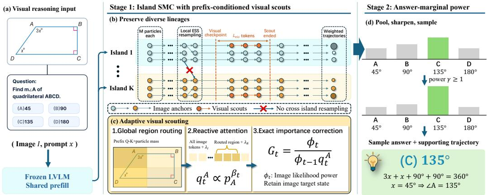

# RESIGHT-SMC: TWO-STAGE POWER SAMPLING VIA ISLAND SMC WITH VISUAL SCOUTS

Yaowen Zhang   
Independent Researcher   
yaowenzhang196@outlook.com   
Junyi Hu   
Tsinghua University   
hujy24@mails.tsinghua.edu.cn   
Wenwen Tian   
University of Electronic Science   
and Technology of China   
wenwen tain@std.uestc.edu.cn

Junhai Luo University of Electronic Science and Technology of China junhai luo@uestc.edu.cn

Xiangyu Qiu   
University of Electronic Science   
and Technology of China   
xiangyuqiu@std.uestc.edu.cn

Zhi Lu University of Electronic Science and Technology of China zhilu@uestc.edu.cn

Aoqin Wang University of Electronic Science and Technology of China aoqin wang@std.uestc.edu.cn

Zhenming Peng University of Electronic Science and Technology of China zmpeng@uestc.edu.cn

## ABSTRACT

Power sampling has emerged as a powerful training-free approach to LLM reasoning, eliciting capabilities comparable to reinforcement learning by sharpening the model distribution over complete responses. Despite this success, power sampling remains underexplored in large vision-language models (LVLMs). We first transfer Power-SMC to LVLM decoding by defining a sequence-power target over complete responses conditioned on both the image and the prompt. This direct multimodal transfer provides a strong training-free baseline, but leaves two aspects of finite-particle multimodal inference unaddressed. At the particle level, global resampling can collapse genealogies, while particle-based power sampling does not diversify trajectories through distinct visual cues in multimodal decoding, limiting exploration under a finite particle budget. At the answer level, sequence-level sharpening makes distinct reasoning trajectories compete even when they support the same answer. We introduce ReSight-SMC, a verifier-free two-stage power sampler for LVLM inference. Its first stage uses ancestry-isolated SMC islands to preserve independent trajectory families and routes a bounded set of prefix-conditioned visual scouts to prefix-relevant image regions while discouraging redundant overlap. Each scout temporarily increases attention to the image tokens and further emphasizes its routed region. Exact importance correction preserves the base LVLM sequence-power target. The second stage aggregates terminal importance mass by canonical answer, powers the resulting answer marginal, and samples an answer together with a supporting trajectory. Across four LVLM backbones and five benchmarks, ReSight-SMC achieves stronger aggregate performance than Power-SMC over both the reasoning and perception benchmark groups. Without post-training, it remains competitive in aggregate with backbone-matched models trained using reinforcement learning. Code is available at https://github.com/yaowenzhang1/resight-smc.

## 1 INTRODUCTION

Test-time scaling improves LLM reasoning without parameter updates by allocating additional inference compute to sampling, aggregation, search, or refinement (Wei et al., 2022; Wang et al., 2023; Sammani et al., 2026). Sequence-level power sampling provides a model-internal target for test-time scaling. Given a base distribution $p _ { \theta } ( y \mid x )$ , it samples complete responses from the sharpened distribution $\pi _ { \alpha } ( y \mid x ) \propto p _ { \theta } ( y \mid x ) ^ { \alpha }$ , where $\alpha > 1$ This sharpens completeresponse probabilities rather than independently lowering each next-token temperature. Reasoning with Sampling (Karan & Du, 2025) shows that this target can approach reinforcement-learning performance without training or external verifiers, while Power-SMC (Azizi et al., 2026) implements it efficiently with parallel weighted trajectories. Despite its success in LLMs, sequence-level power sampling remains underexplored for open-ended LVLM decoding. Existing multimodal applications focus on embodied control or iterative visual-reasoning refinement (Park et al., 2026; Chen et al., 2026; Jiang et al., 2026b). We transfer Power-SMC (Azizi et al., 2026) to LVLM decoding by defining its target over complete responses conditioned jointly on the image and prompt. As our experiment show, this direct multimodal transfer already provides a strong training-free baseline.

However, global resampling can repeatedly duplicate high-weight trajectories, reducing genealogical coverage and causing the classical path-degeneracy problem in SMC (Del Moral et al., 2006; Doucet & Johansen, 2011). During long visual reasoning, visual reliance can decline as the textual trace grows (Sammani et al., 2026; Favero et al., 2024), while direct Power-SMC lacks a mechanism for leveraging visual attention early in generation to promote trajectory diversity. Moreover, sequencelevel power sharpens individual trajectories before answer aggregation. Trajectories that support the same answer therefore compete through their separate sequence-level weights, allowing one or a few high-probability paths to outweigh collective support distributed across multiple moderate-probability paths (Yang et al., 2026).

We introduce ReSight-SMC, a verifier-free two-stage power sampler for LVLM inference. Its first stage improves finite-particle coverage of the base LVLM sequence-power target. Ancestry-isolated islands resample independently to preserve distinct trajectory families. At a prescribed checkpoint, current prefixes route a bounded set of visual scouts to image regions in the input image while discouraging redundant spatial overlap. Each scout temporarily reactivates attention to all image tokens and gives its assigned region an additional boost. Unfinished base-proposal anchors remain active under the original proposal. Exact importance correction preserves the base LVLM target, so scouting changes exploration rather than the distribution being estimated.

The second stage aggregates normalized terminal trajectory mass by canonical answer, raises the resulting answer masses to a finite power γ, and samples an answer together with a supporting trajec tory. Applying the second power after aggregation balances a few high-weight trajectories against broader same-answer support. Across four LVLM backbones and five benchmarks spanning mathematical, logical, and general multimodal reasoning, perception, and real-world spatial understanding, ReSight-SMC outperforms Power-SMC in aggregate on both reasoning and perception-focused tasks. Without post-training, it remains competitive with backbone-matched TRACE-RL and surpasses Game-RL across all benchmarks at the 7B scale.

Our contributions are:

• We extend Power-SMC (Azizi et al., 2026), which approximates the sequence-power target with parallel weighted particles, to open-ended LVLM reasoning.

• We formulate two-stage sequence-to-answer power sampling, combining a sequence-power population with answer-marginal sharpening.

• We formulate an autoregressive island SMC sampler that combines ancestry-isolated resampling with exact sequential importance correction for the sequence-power target.

• We design prefix-conditioned visual scouts that reactivate attention to routed image regions to diversify finite-particle exploration.

## 2 RELATED WORK

LVLM test-time scaling. LVLM test-time scaling spans structured multimodal reasoning and the transfer of sampling, aggregation, and refinement strategies (Mitra et al., 2024; Sammani et al., 2026). Longer traces can improve difficult problems but also weaken attention to image tokens (Sammani et al., 2026). AVIS (Jeddi et al., 2026) jointly adapts visual-token retention and the reasoningrollout budget through key-based pruning and a learned difficulty predictor. TTAdapt (Kaya et al., 2025) updates model parameters at inference from consensus pseudolabels. ReSight-SMC keeps its parameters fixed and introduces scout proposals within a verifier-free weighted sampler.

Sequence-level power sampling and island SMC. Reasoning with Sampling (Karan & Du, 2025) targets p(y | x)α with suffix-resampling Metropolis–Hastings (MH). Later work improves cut selection and scalability and connects power distributions to self-reward objectives (Zhou et al., 2026; Ji et al., 2026; Tomihari & Sato, 2026). MH is serial and requires 16–28× the latency of standard decoding on MATH500. Power-SMC (Azizi et al., 2026) instead advances weighted particles in parallel and resamples when the ESS falls below a threshold, reducing MATH500 latency to 1.44– 3.25× standard decoding across four models. Global resampling can duplicate a few high-weight trajectories, a classical particle-impoverishment failure mode (Del Moral et al., 2006). We use an island particle system (Verge et al., 2015) that confines resampling ancestry within each island. Island´ parallelism also appears in SMCEvolve (Jiang et al., 2026a), which uses migratory SMC chains for reward-tilted program search, whereas our non-migrating islands approximate a common sequencepower target in token-level autoregressive decoding. Multimodal power sampling has so far focused on embodied action and planning (Park et al., 2026; Chen et al., 2026) or MCMC-based refinement of open-ended LVLM reasoning (Jiang et al., 2026b). We transfer Power-SMC to open-ended LVLM decoding under a base LVLM sequence-power target and extend it with ancestry-isolated islands and prefix-conditioned visual proposals.

Answer aggregation and marginal sharpening. Self-consistency (Wang et al., 2023) samples multiple reasoning paths and returns the most frequent answer as a deterministic decision rule. Marginal sharpening (Arzhantsev et al., 2026) instead defines a powered answer marginal and approximately samples from it through multi-trace decoding. Our readout starts from a sequencepower population: it aggregates corrected SMC mass by canonical answer, applies a second finite power, and samples from the resulting distribution. This composes sequence- and answer-level sharpening without unweighted voting. Yang et al. (2026) modify the trajectory target to preserve support and control per-problem deformation. Our second-stage readout leaves the sequence target unchanged and applies finite-power sharpening after aggregating trajectory mass by answer.

Visual conditioning during inference. Training-free methods modulate visual influence through image-signal amplification (Favero et al., 2024), contrastive decoding (Leng et al., 2024), attention driven region selection (Gao et al., 2025), or external visual tools (Wang et al., 2025). ReSight-SMC introduces prefix-conditioned visual scouts to diversify particle proposals: each reactivates attention to all image tokens and emphasizes a routed region, while exact importance correction preserves the base LVLM sequence-power target.

## 3 METHOD

## 3.1 OVERVIEW

ReSight-SMC separates sharpening into a trajectory stage and a readout stage. The trajectory stage uses island SMC to construct a weighted population for a base LVLM sequence-power target. Islands resample independently so that a single successful lineage cannot eliminate all genealogical diversity. At a prespecified checkpoint, a bounded subset of particles becomes visual scouts: their current prefixes guide routing among candidate image regions under an overlap penalty, and each scout temporarily samples from a proposal that increases attention to image tokens and further emphasizes its routed region. Exact importance correction preserves the same base LVLM sequence-power target.

After generation, the readout stage pools terminal particle mass by canonical answer and applies a finite power to this answer marginal. This lets an answer draw strength from support distributed across multiple moderate-weight trajectories. By contrast, a single-stage sequence-power sampler sharpens trajectories individually and can concentrate mass on a few dominant paths, even when other paths support the same answer.

Together, these components form a coverage-to-decision pipeline. Island-local resampling preserves distinct lineages, so visual scouts operate over more diverse reasoning prefixes. The scouts can discover region-guided continuations that the base proposal may miss in a finite population. Importance correction assigns them substantial weight only when they are also supported by the base LVLM sequence-power target. The answer readout then pools corrected mass across trajectories supporting the same answer and sharpens the resulting answer marginal, allowing these trajectories to contribute jointly to answer selection. Figure 1 summarizes the pipeline, and Appendix G gives the complete inference procedure.

## 3.2 LVLM SEQUENCE-POWER TARGET AND ISLAND SMC

Let I be an image, x a prompt, H the decoding horizon, and $y = ( y _ { 1 } , \dots , y _ { T } )$ a response completed at step $T \leq H$ . The fixed LVLM distribution factorizes as $\begin{array} { r } { p _ { F } ( y \mid I , x ) = \prod _ { s = 1 } ^ { T } p _ { F } ( y _ { s } \mid y _ { < s } , I , x ) } \end{array}$ and stage one targets

$$
\pi _ { \alpha } ^ { F } ( y \mid I , x ) = { \frac { p _ { F } ( y \mid I , x ) ^ { \alpha } } { Z _ { \alpha } ^ { F } ( I , x ) } } , \qquad \alpha > 1 .\tag{1}
$$

We apply Power-SMC (Azizi et al., 2026) to the autoregressive response tokens while leaving the model’s native image conditioning unchanged. It approaches the LVLM sequence-power target through intermediate exponents $1 = \beta _ { 0 } \le \cdots \le \beta _ { H } = \alpha$ . At step t, the unnormalized target is $\varphi _ { t } ( y _ { 1 : t } ) = p _ { F , t } ( y _ { 1 : t } \mid I , \stackrel { . } { x } ) ^ { \beta _ { t } }$ and the base proposal locally powers the native next-token conditional, $q _ { t } ^ { F } ( v \mid y _ { < t } , I , x ) \propto p _ { F } ( v \mid y _ { < t } , I , x ) ^ { \beta _ { t } }$ . Local normalization depends on the prefix, so these conditionals alone do not induce Eq. (1). The generic importance weight in Eq. (3) supplies the required sequence-level correction. Its expansion and terminal-sequence treatment are derived in Appendix B.

We maintain K isolated islands with M particles each. A single multimodal prefill of $( I , x )$ produces an image-conditioned decoder state from which all KM particles are initialized. Let $\mathcal { F } _ { t - 1 }$ denote the particle-system history available before step t, including particle prefixes, weights, ancestry, completion states, and any active scout assignments. At step t, the sampler uses $\mathcal { F } _ { t - 1 }$ to select the decoder branch and its settings. For particle $( k , m )$ , the selected branch runs the LVLM autoregressively on $( I , x , y _ { < t } ^ { k , m } )$ and produces next-token logits. Their softmax is the branch-specific next-token distribution. At step t, particle $( k , m )$ draws its next token from the locally powered proposal

$$
q _ { t } ^ { F , k , m } ( v \mid y _ { < t } ^ { k , m } , I , x ) = \frac { p _ { F } ( v \mid y _ { < t } ^ { k , m } , I , x ) ^ { \beta _ { t } } } { \sum _ { u \in \mathcal { V } } p _ { F } ( u \mid y _ { < t } ^ { k , m } , I , x ) ^ { \beta _ { t } } } .\tag{2}
$$

The next token is drawn as $y _ { t } ^ { k , m } \sim q _ { t } ^ { k , m }$ . The incremental importance ratio below corrects this branch-specific proposal toward the intermediate target:

$$
\begin{array} { r l } & { G _ { t } ^ { k , m } = \cfrac { \varphi _ { t } ( y _ { 1 : t } ^ { k , m } ) } { \varphi _ { t - 1 } ( y _ { < t } ^ { k , m } ) q _ { t } ^ { k , m } ( y _ { t } ^ { k , m } \mid y _ { < t } ^ { k , m } , \mathcal { F } _ { t - 1 } ) } , } \\ & { w _ { 0 } ^ { k , m } = \cfrac { 1 } { M } , \qquad w _ { t } ^ { k , m } = w _ { t - 1 } ^ { k , m } G _ { t } ^ { k , m } . } \end{array}\tag{3}
$$

Here $G _ { t } ^ { k , m }$ is the incremental correction for the sampled token, and $w _ { t } ^ { k , m }$ is the resulting unnormalized particle weight. A particle that emits EOS remains fixed while the remaining bridge corrections bring its completed response to the common terminal exponent α. Within island k, the weights are normalized as $\bar { w } _ { t } ^ { k , m } = { \dot { w } _ { t } ^ { k , m } } / { \sum _ { j = 1 } ^ { M } w _ { t } ^ { k , j } }$ . The corresponding effective sample size is $\mathrm { E S S } _ { k , t } =$ $( \sum _ { m = 1 } ^ { M } ( \bar { w } _ { t } ^ { k , m } ) ^ { 2 } ) ^ { - 1 }$ . We evaluate this criterion every $L _ { \mathrm { S M C } }$ generated tokens. At each checkpoint, island k resamples only when $\mathrm { E S S } _ { k , t } < \rho _ { w } M$ . When triggered, island k independently applies stratified resampling:

$$
A _ { k , t } ^ { 1 : M } \sim \mathrm { S t r a t R e s a m p l e } ( \bar { w } _ { t } ^ { k , 1 : M } ) , \qquad A _ { k , t } ^ { m } \in \{ 1 , \ldots , M \} .\tag{4}
$$

Here, $A _ { k , t } ^ { m }$ is the within-island ancestor selected for descendant $m .$ . Power-SMC (Azizi et al., 2026) uses systematic resampling. We instead use stratified resampling because it is not only

  
Figure 1: ReSight-SMC. Stage one maintains ancestry-isolated SMC islands for the base LVLM sequence-power target. Islands test for ESS-triggered resampling at regular token intervals. At a prespecified visual checkpoint, the remaining unfinished particles continue with the base proposal, while selected scouts use prefix-conditioned routing and attention-reactivated image tokens to form scout proposals. Exact importance correction preserves the base LVLM target. Stage two aggregates terminal mass by answer, applies a finite answer power, and samples an answer with a supporting trajectory.

conditionally unbiased but also consistent as $M \to \infty$ without imposing an ordering condition on the particles (Gerber et al., 2019). Descendants receive weight $1 / \hat { M }$ , and all ancestors remain within island k, preventing population-wide genealogical collapse.

Before any resampling at step t, each island updates its normalizing-constant estimate as

$$
c _ { k , t } = \sum _ { m = 1 } ^ { M } \bar { w } _ { t - 1 } ^ { k , m } G _ { t } ^ { k , m } , \qquad \widehat { Z } _ { k , t } = \widehat { Z } _ { k , t - 1 } c _ { k , t } , \qquad \widehat { Z } _ { k , 0 } = 1 .\tag{5}
$$

The terminal-sequence convention and derivation of these recursions are given in Appendix B.1.

At termination, island mass and normalized within-island weight combine into the pooled first-stage particle mass

$$
\widetilde { W } _ { H } ^ { k , m } = \frac { \widehat { Z } _ { k , H } \bar { w } _ { H } ^ { k , m } } { \sum _ { j = 1 } ^ { K } \widehat { Z } _ { j , H } } .\tag{6}
$$

Because particle weights are normalized separately within each island, $\bar { w } _ { H } ^ { k , m }$ only compares particles within island k. Multiplying by $\widehat { Z } _ { k , H }$ yields pooled particle masses used by the answer-level readout.

## 3.3 PREFIX-CONDITIONED VISUAL SCOUTS

The visual-scout episode is a bounded intervention invoked once at the prescribed checkpoint $\tau _ { \mathrm { v i s } } .$ Each eligible island receives a scout quota of $\lceil \rho _ { V } M \rceil$ , capped to retain at least one unfinished base-proposal anchor. A population router pairs these scouts with regions from a fixed multiscale grid bank $\mathcal { R } = \{ R _ { 1 } , \ldots , R _ { G } \}$ . Each scout emphasizes its assigned region for $L _ { \mathrm { v i s } }$ tokens and resumes the base proposal before the next resampling checkpoint. This introduces region-guided proposal variation across selected particles while retaining base-proposal anchors.

Routing scouts to evidence. $\mathbf { A t } \tau _ { \mathrm { v i s } }$ , we compute a visual-only Q–K softmax for the current prefix, normalizing separately within each head over the original image tokens. For each candidate region, we sum this relevance over its tokens, average across heads, and apply region-size normalization:

$$
A _ { g } ^ { k , m } = \frac { 1 } { N _ { h } | R _ { g } | ^ { \zeta } } \sum _ { a = 1 } ^ { N _ { h } } \sum _ { i \in R _ { g } } \xi _ { i , a } ^ { k , m } , \qquad 0 \le \zeta \le 1 .\tag{7}
$$

Here $\xi _ { i , a } ^ { k , m }$ is the visual-only Q–K softmax weight assigned by attention head a at the final decoder layer to image token i for particle $( k , m )$ , normalized over all original-image tokens. $N _ { h }$ is the number of attention heads, $| \bar { R } _ { g } |$ | is the number of visual tokens covered by region $R _ { g } ,$ , and ζ controls the degree of region-size normalization. We combine this score with the particle’s pooled SMC mass $\widetilde { W } _ { \tau _ { \mathrm { v i s } } } ^ { k , m }$ to define the particle–region utility:

$$
u _ { k , m , g } = \widetilde { W } _ { \tau _ { \mathrm { v i s } } } ^ { k , m } \frac { A _ { g } ^ { k , m } } { \operatorname* { m a x } ( \sum _ { g ^ { \prime } = 1 } ^ { G } A _ { g ^ { \prime } } ^ { k , m } , \epsilon ) } .\tag{8}
$$

Here $\epsilon = 1 0 ^ { - 1 2 }$ prevents division by zero when a particle assigns zero total relevance to the candidate region bank. We min–max normalize these utilities over the eligible particle–region candidates to obtain $\widetilde { u } _ { k , m , g } \in [ 0 , 1 ]$ . The router then greedily selects

$$
( k _ { b } , m _ { b } , g _ { b } ) = \arg \operatorname* { m a x } _ { ( k , m , g ) \in { \mathcal { C } } _ { b } } \left[ \widetilde { u } _ { k , m , g } - \mu \operatorname* { m a x } _ { r < b } \mathrm { I o U } ( R _ { g } , R _ { g _ { r } } ) \right] .\tag{9}
$$

Exact score ties favor larger k, then $m ,$ , and finally $g .$ The candidate set $\mathcal { C } _ { b }$ enforces the per-island quota and assigns at most one region to each particle. The utility directs scouts toward prefix-relevant evidence carried by high-mass hypotheses. Here $\mu$ is the global soft-overlap coefficient; it discourages redundant assignments without forbidding overlapping evidence. Exact Q–K aggregation, mass and utility normalization, quota edge cases, and routing complexity are given in Appendix C.

Attention reactivation and proposal correction. Let $\mathcal { V } _ { I }$ denote the image-token positions and $\mathcal { V } _ { I } ( R _ { g } ) \subseteq \mathcal { V } _ { I }$ the positions covered by a routed region. For a scout assigned to $R _ { g } .$ , we add the following bias to the causal self-attention logits:

$$
b _ { j } ( R _ { g } ) = \lambda _ { I } { \bf 1 } [ j \in \mathcal { V } _ { I } ] + \lambda _ { R } { \bf 1 } [ j \in \mathcal { V } _ { I } ( R _ { g } ) ] .\tag{10}
$$

At every decoder layer, the same visual-token logit bias is added to the current query’s attention logits across all heads. It raises attention to all image tokens while giving the routed region an additional boost. Let $p _ { A } ^ { k , m }$ be the frozen LVLM conditional under this intervention. The scout samples directly from its locally powered proposal

$$
q _ { t } ^ { A , k , m } ( v ) = \frac { p _ { A } ^ { k , m } ( v \mid y _ { < t } , I , x ) ^ { \beta _ { t } } } { \sum _ { u } p _ { A } ^ { k , m } ( u \mid y _ { < t } , I , x ) ^ { \beta _ { t } } } .\tag{11}
$$

To make the intervention effective from the scout’s first newly generated token, we fork the selected particle’s decoder state, roll back its cached latest-token computation, and recompute that fixed token once under Eq. (10). This updates the next-token proposal without duplicating or resampling any response token. During the bounded episode, every token sampled from the scout proposal is also passed through an unmodified persistent base target state. This parallel state provides the base-model likelihood required for importance correction and maintains a bias-free $\bar { \mathsf { K V } }$ cache along the same sampled trajectory. The biased state is advanced only when another scout proposal is required and is discarded after $L _ { \mathrm { v i s } }$ tokens, after which decoding continues from the persistent base target state.

The scout branch changes only the proposal. Its exact probability enters the incremental weight:

$$
G _ { t } ^ { A , k , m } = \frac { \varphi _ { t } ( y _ { 1 : t } ^ { k , m } ) } { \varphi _ { t - 1 } ( y _ { < t } ^ { k , m } ) q _ { t } ^ { A , k , m } ( y _ { t } ^ { k , m } ) } .\tag{12}
$$

Since $\varphi _ { t }$ is evaluated under the base LVLM, this ratio supplies exact importance correction for every scout transition to the sequence target in Eq. (1). Routing therefore alters finite-population exploration and subsequent ancestry while maintaining proper weighting for the same sequence target. The importance-weight derivation is given in Appendix $\mathbf { B } ,$ and the finite-sample proper-weighting argument is given in Appendix D.

## 3.4 ANSWER-MARGINAL POWER READOUT

Let $\operatorname { A n s } ( y )$ be the canonical answer of response y. We first pool the terminal masses in Eq. (6) by answer and then apply a finite answer-level power:

$$
\widehat { \mu } _ { \alpha } ( a ) = \sum _ { k = 1 } ^ { K } \sum _ { m = 1 } ^ { M } \widetilde { W } _ { H } ^ { k , m } \mathbf { 1 } [ \mathrm { A n s } ( y ^ { k , m } ) = a ] ,\tag{13}
$$

$$
{ \widehat { q } } _ { \alpha , \gamma } ( a ) = { \frac { { \widehat { \mu } } _ { \alpha } ( a ) ^ { \gamma } } { \sum _ { b } { \widehat { \mu } } _ { \alpha } ( b ) ^ { \gamma } } } , \qquad \gamma \geq 1 .\tag{14}
$$

We draw the final answer from $\widehat { q } _ { \alpha , \gamma } .$ At the population level, $( \alpha , \gamma ) = ( 2 , 2 )$ produces a fourth-order score in the base trajectory probabilities. Unlike direct $\alpha = 4$ sequence sampling, the second square is applied after trajectories supporting the same answer have pooled their mass. It therefore preserves cross-trajectory support, reducing domination by a few high-weight paths without reverting to unweighted majority voting. A formal comparison, a separating example, the optional recovery of a supporting trajectory, and the corresponding population-level output distribution are given in Appendices E and E.1.

## 4 EXPERIMENTS

## 4.1 EXPERIMENTAL SETUP

Our experiments examine whether sequence-power sampling is effective when transferred to openended LVLM decoding and whether ReSight-SMC further improves this direct-transfer baseline. We evaluate Qwen2.5-VL-3B-Instruct, Qwen2.5-VL-7B-Instruct, Qwen3-VL-4B-Instruct, and Qwen3- VL-8B-Instruct (Bai et al., 2025b;a). The benchmarks are MathVista, LogicVista, MMStar, and RealWorldQA (Lu et al., 2023; Xiao et al., 2024; Chen et al., 2024; xAI, 2024). We partition MMStar into reasoning (MMStar-R) and perception (MMStar-P) subsets (see Appendix I.1 for details). Together, these benchmarks cover visual mathematical reasoning, visual logical reasoning, broad perception, and real-world spatial understanding. Accuracy is measured on each released evaluation split.

All systems use the same image preprocessing, answer evaluator, response horizon, and task-specific prompt for a given backbone. MathVista, MMStar-R, and LogicVista use chain-of-thought prompting. MMStar-P and RealWorldQA use direct answering. We evaluate the ESS criterion every 32 generated tokens and resample an island only when its ESS falls below the threshold. Visual scouting is invoked once at $\tau _ { \mathrm { v i s } } = 4 0$ and is skipped when generation terminates earlier. Population methods use 32 particles. We report pass@1 as the mean ± sample standard deviation over four runs with random seeds {0, 1, 2, 3}. Complete hyperparameters, benchmark protocols, and numerical implementation details are provided in Appendix I.

Compared systems. For every backbone, we compare the base model, low-temperature autoregressive sampling, our direct LVLM transfer of Power-SMC (Azizi et al., 2026), and ReSight-SMC. The transferred Power-SMC baseline applies sequence-power SMC to autoregressive response tokens conditioned on the backbone’s native full-image prefill and uses the same backbone, prompt, and total particle budget as ReSight-SMC. All sharpening baselines use the same sequence-level exponent $\alpha = 2 .$ . Low-temperature sampling uses temperature $1 / \alpha = 0 . 5$ . ReSight-SMC uses $K = 4$ islands with $M = 8$ particles each and answer exponent $\gamma = 2$

At the Qwen2.5-VL scales, we additionally evaluate the released TRACE-RL 3B and 7B checkpoints, each trained with GRPO from the corresponding Instruct backbone on procedural visual-reasoning data (Alam, 2026). At 7B we include Game-RL-Qwen2.5-VL-7B, which applies GRPO on GameQA (Tong et al., 2025). These rows provide backbone-matched post-training references.

## 4.2 RESULTS ACROSS BACKBONES

Table 1 compares all systems across backbones and benchmarks.

Power-SMC improves the all-data average over base sampling on all four backbones and over lowtemperature sampling on three of four. ReSight-SMC further achieves the best training-free average on every backbone, outperforming Power-SMC on 18 of the 20 benchmark results. Without post-training, ReSight-SMC surpasses Game-RL across all reported benchmarks and remains competitive with TRACE-RL. More specifically, ReSight-SMC performs better on perception-focused benchmarks, while TRACE-RL performs better on reasoning benchmarks.

Table 1: Pass@1 accuracy (%) across backbones and benchmarks, reported as mean ± sample standard deviation over four seeds. The all-data average is question-weighted. Bold denotes the best non-RL result within each backbone.
<table><tr><td>System</td><td>LogicVista</td><td>MathVista</td><td>MMStar-R</td><td>MMStar-P</td><td>RealWorldQA | All-data avg.</td><td></td></tr><tr><td colspan="7">Qwen2.5-VL-3B-Instruct</td></tr><tr><td>Base</td><td> $3 1 . 8 \pm 2 . 7$ </td><td> $4 6 . 2 \pm { 1 . 8 }$ </td><td> $4 2 . 9 \pm 0 . 5$ </td><td> $4 9 . 8 \pm 4 . 2$ </td><td> $5 3 . 4 \pm 4 . 7$ </td><td> $4 5 . 5 \pm 1 . 8$ </td></tr><tr><td>Low-temp. sampling</td><td> $3 3 . 5 \pm 1 . 2$ </td><td> $5 4 . 4 \pm 1 . 0$ </td><td> ${ \bf 4 8 . 3 \pm 2 . 1 }$ </td><td> $5 4 . 9 \pm 1 . 8$ </td><td> $5 8 . 2 \pm 0 . 9$ </td><td> $5 1 . 1 \pm 0 . 4$ </td></tr><tr><td>Power-SMC</td><td> $3 4 . 9 \pm 1 . 1$ </td><td> ${ \bf 5 4 . 6 \pm 0 . 6 }$ </td><td> $4 7 . 0 \pm 1 . 7$ </td><td> $5 3 . 5 \pm 1 . 5$ </td><td> $5 6 . 1 \pm 1 . 5$ </td><td> $5 0 . 3 \pm 0 . 5$ </td></tr><tr><td>ReSight-SMC (Ours)</td><td> ${ \bf 3 5 . 8 \pm 1 . 1 }$ </td><td> $5 4 . 2 \pm 1 . 1$ </td><td> $4 7 . 2 \pm 1 . 2$ </td><td> ${ \bf 5 6 . 3 \pm 1 . 2 }$ </td><td> ${ \bf 5 8 . 8 \pm 0 . 5 }$ </td><td> ${ \bf 5 1 . 3 \pm 0 . 5 }$ </td></tr><tr><td>TRACE-RL</td><td> $3 7 . 9 \pm 2 . 7$ </td><td> $5 6 . 4 \pm 0 . 8$ </td><td> $5 3 . 7 \pm 0 . 4$ </td><td> $5 3 . 2 \pm 3 . 1$ </td><td> $5 5 . 5 \pm 1 . 9$ </td><td> $5 2 . 8 \pm 0 . 8$ </td></tr><tr><td colspan="7">Qwen2.5-VL-7B-Instruct</td></tr><tr><td>Base</td><td> $4 0 . 3 \pm 0 . 9$ </td><td> $6 6 . 5 \pm 0 . 3$ </td><td> $6 1 . 0 \pm 1 . 0$ </td><td> $6 0 . 2 \pm 1 . 3$ </td><td> $6 6 . 0 \pm 2 . 5$ </td><td> $6 0 . 9 \pm 0 . 5$ </td></tr><tr><td>Low-temp. sampling</td><td> $4 1 . 2 \pm 1 . 3$ </td><td> $6 9 . 5 \pm 0 . 3$ </td><td> $6 2 . 6 \pm 1 . 4$ </td><td> $6 1 . 5 \pm 1 . 0$ </td><td> $6 9 . 5 \pm 1 . 9$ </td><td> $6 3 . 1 \pm 0 . 3$ </td></tr><tr><td>Power-SMC</td><td> $4 2 . 8 \pm 1 . 0$ </td><td> $7 0 . 2 \pm 0 . 7$ </td><td> $6 3 . 7 \pm 0 . 8$ </td><td> $6 1 . 7 \pm 0 . 9$ </td><td> $6 9 . 2 \pm 0 . 4$ </td><td> $6 3 . 8 \pm 0 . 4$ </td></tr><tr><td>ReSight-SMC (Ours)</td><td> ${ \bf 4 3 . 5 \pm 2 . 1 }$ </td><td> ${ \bf 7 1 . 7 \pm 0 . 8 }$ </td><td> ${ \bf 6 5 . 3 \pm 1 . 0 }$ </td><td> ${ \bf 6 3 . 1 \pm 0 . 4 }$ </td><td> ${ \bf 7 0 . 0 \pm 0 . 7 }$ </td><td> ${ \bf 6 5 . 0 \pm 0 . 3 }$ </td></tr><tr><td>TRACE-RL</td><td> $4 4 . 0 \pm 1 . 2$ </td><td> $7 4 . 3 \pm 1 . 5$ </td><td> $6 6 . 6 \pm 0 . 8$ </td><td> $6 2 . 6 \pm 0 . 0$ </td><td> $6 7 . 6 \pm 1 . 8$ </td><td> $6 5 . 6 \pm 0 . 6$ </td></tr><tr><td>Game-RL</td><td> $4 1 . 4 \pm 3 . 3$ </td><td> $6 6 . 4 \pm 1 . 2$ </td><td> $6 1 . 1 \pm 0 . 4$ </td><td> $6 1 . 0 \pm 1 . 9$ </td><td> $6 6 . 1 \pm 2 . 4$ </td><td> $6 1 . 1 \pm 0 . 2$ </td></tr><tr><td colspan="7">Qwen3-VL-4B-Instruct</td></tr><tr><td>Base</td><td> $3 3 . 9 \pm 1 . 4$ </td><td> $6 2 . 7 \pm 0 . 7$ </td><td> $5 7 . 0 \pm 0 . 6$ </td><td> $6 4 . 0 \pm 1 . 8$ </td><td> $6 9 . 0 \pm 1 . 1$ </td><td> $5 9 . 2 \pm 0 . 4$ </td></tr><tr><td>Low-temp. sampling</td><td> $3 6 . 2 \pm 1 . 0$ </td><td> $6 3 . 5 \pm 0 . 9$ </td><td> $5 7 . 3 \pm 0 . 9$ </td><td> $6 4 . 5 \pm 0 . 5$ </td><td> $6 8 . 9 \pm 0 . 6$ </td><td> $5 9 . 8 \pm 0 . 3$ </td></tr><tr><td>Power-SMC</td><td> $4 5 . 2 \pm 1 . 0$ </td><td> $7 2 . 5 \pm 0 . 6$ </td><td> $6 5 . 4 \pm 0 . 9$ </td><td> $6 7 . 7 \pm 0 . 8$ </td><td> $6 9 . 8 \pm 0 . 5$ </td><td> $6 6 . 1 \pm 0 . 5$ </td></tr><tr><td> $\mathbf { R e S i g h t - S M C \ ( O u r s ) }$ </td><td> ${ \bf 4 8 . 8 \pm 0 . 6 }$ </td><td> ${ \bf 7 3 . 6 \pm 0 . 4 }$ </td><td> ${ \bf 6 7 . 9 \pm 0 . 8 }$ </td><td> ${ \bf 6 8 . 2 \pm 0 . 7 }$ </td><td> ${ \bf 7 0 . 8 \pm 0 . 6 }$ </td><td> ${ \bf 6 7 . 8 \pm 0 . 2 }$ </td></tr><tr><td colspan="7">Qwen3-VL-8B-Instruct</td></tr><tr><td>Base</td><td> $4 0 . 0 \pm 0 . 9$ </td><td> $6 6 . 1 \pm 1 . 6$ </td><td> $6 0 . 8 \pm 0 . 6$ </td><td> $6 5 . 5 \pm 1 . 5$ </td><td> $6 9 . 9 \pm 1 . 4$ </td><td> $6 2 . 2 \pm 0 . 4$ </td></tr><tr><td>Low-temp. sampling</td><td> $4 3 . 2 \pm 1 . 0$ </td><td> $6 6 . 9 \pm 1 . 0$ </td><td> $6 0 . 6 \pm 0 . 6$ </td><td> $6 3 . 0 \pm 1 . 8$ </td><td> $7 0 . 1 \pm 0 . 9$ </td><td> $6 2 . 5 \pm 0 . 4$ </td></tr><tr><td>Power-SMC</td><td> $4 9 . 8 \pm 1 . 0$ </td><td> $7 4 . 8 \pm 0 . 7$ </td><td> $6 8 . 1 \pm 0 . 5$ </td><td> $6 7 . 7 \pm 0 . 5$ </td><td> ${ \bf 7 0 . 5 \pm 0 . 6 }$ </td><td> $6 8 . 1 \pm 0 . 2$ </td></tr><tr><td>ReSight-SMC (Ours)</td><td> ${ \bf 5 3 . 3 \pm 1 . 1 }$ </td><td> ${ \bf 7 6 . 0 \pm 0 . 6 }$ </td><td> ${ \bf 6 9 . 9 \pm 0 . 6 }$ </td><td> ${ \bf 6 7 . 8 \pm 0 . 5 }$ </td><td> $7 0 . 1 \pm 0 . 7$ </td><td> ${ \bf 6 9 . 3 \pm 0 . 1 }$ </td></tr></table>

## 4.3 COMPONENT ABLATION

All ablations use Qwen2.5-VL-7B-Instruct on five benchmarks. Relative to ReSight-SMC, w/o islands uses $K = 1 , M = 3 2$ , w/o visual scouts disables scouting, and w/o answer power sets $\gamma = 1$ Additional scout ablations appear in Appendix A.4. All accuracy analyses use the same seeded categorical readout as the main results.

Table 2: Pass@1 (%) for component ablations at a matched 32-particle budget. All-data averages are question-weighted.
<table><tr><td>Variant</td><td>LogicVista</td><td>MathVista</td><td>MMStar-R</td><td>MMStar-P</td><td>RealWorldQA| All-data avg.</td><td></td></tr><tr><td>ReSight-SMC</td><td> ${ \bf 4 3 . 5 3 \pm 2 . 0 9 }$ </td><td> ${ \bf 7 1 . 7 0 \pm 0 . 7 7 }$ </td><td> ${ \bf 6 5 . 2 5 \pm 1 . 0 4 }$ </td><td> ${ \bf 6 3 . 0 5 \pm 0 . 4 1 }$ </td><td> ${ \bf 7 0 . 0 0 \pm 0 . 7 4 }$ </td><td> ${ \bf 6 5 . 0 5 \pm 0 . 3 3 }$ </td></tr><tr><td>w/o islands</td><td> $4 0 . 4 0 \pm 1 . 0 6$ </td><td> $7 0 . 6 8 \pm 0 . 7 3$ </td><td> $6 4 . 1 0 \pm 1 . 7 6$ </td><td> $6 2 . 5 5 \pm 0 . 8 2$ </td><td> $6 9 . 9 7 \pm 0 . 6 7$ </td><td> $6 4 . 0 1 \pm 0 . 6 3$ </td></tr><tr><td>w/o visual scouts</td><td> $4 1 . 5 7 \pm 1 . 0 4$ </td><td> $7 1 . 1 0 \pm 0 . 8 1$ </td><td> $6 4 . 6 5 \pm 0 . 5 1$ </td><td> $6 2 . 5 5 \pm 0 . 7 2$ </td><td> ${ \bf 7 0 . 0 0 \pm 0 . 7 4 }$ </td><td> $6 4 . 4 2 \pm 0 . 2 6$ </td></tr><tr><td>w/o answer power</td><td> $4 3 . 0 2 \pm 1 . 4 6$ </td><td> $7 1 . 1 3 \pm 1 . 1 9$ </td><td> $6 5 . 1 3 \pm 0 . 9 9$ </td><td> $6 2 . 0 5 \pm 1 . 3 4$ </td><td> $6 8 . 0 4 \pm 0 . 5 1$ </td><td> $6 4 . 2 6 \pm 0 . 3 3$ </td></tr></table>

All three components improve the all-data average in Tab. 2. Island isolation improves every benchmark and provides the largest aggregate gain. Answer-marginal power also improves all five benchmarks. At the default scout fraction, visual scouting improves all four benchmarks on which it activates. RealWorldQA is unchanged because no evaluated run reaches the scout phase (see Tab. 7 in Appendix A.3).

## 5 DISCUSSION

## 5.1 FROM ISLAND COVERAGE TO PASS@1

We report pass@1 for each system and readout, pass@4 across four independently seeded executions, and Coverage@32, the fraction of terminal populations containing a correct answer. On tasks that reach an intervention checkpoint, the first stage generally raises Coverage@32 and pass@4. The second stage further raises pass@1 by concentrating answer mass, reducing pass@4 on four of five benchmarks as probability mass becomes more concentrated on the leading answers. Crossbenchmark and generation-horizon analyses are given in Appendices A.2 and A.3.

Reasoning. Reasoning traces remain active beyond the first resampling checkpoint, allowing preserved islands to develop different continuations. Across all three reasoning benchmarks, the first stage raises Coverage@32 and pass@4, while answer-level sharpening further improves pass@1 (Tab. 3 and Appendix A.2). The genealogy statistics in Appendix A.1 associate this gain with more surviving roots and less mass concentrated in the largest ancestral family.

Perception. RealWorldQA is the limiting no-intervention case: every response finishes before the first checkpoint, and no run activates visual scouting (Tab. 7). On RealWorldQA, the first stages of ReSight-SMC and Power-SMC therefore induce the same output distribution. The small observed differences in pass@1, pass@4, and Coverage@32 reflect finite-sample variation rather than a first-stage mechanism. The resulting pass@1 gain mainly comes from the second-stage readout (Tab. 3).

Table 3: Representative reasoning and perception behavior with Qwen2.5-VL-7B-Instruct. The $\gamma = 1$ rows replay the ReSight-SMC populations without answer-level sharpening.
<table><tr><td>Task</td><td>System/readout</td><td>Pass@1</td><td>Pass@4</td><td>Coverage@32</td></tr><tr><td>LogicVista</td><td>Power-SMC</td><td> $4 2 . 8 \pm 1 . 0$ </td><td>65.2</td><td> $6 3 . 1 \pm 0 . 8$ </td></tr><tr><td></td><td>ReSight-SMC, γ = 1</td><td> $4 3 . 0 2 \pm 1 . 4 6$ </td><td>66.3</td><td> ${ \bf 7 7 . 4 \pm 1 . 4 }$ </td></tr><tr><td></td><td>ReSight-SMC, γ = 2</td><td> $\mathbf { 4 3 . 5 3 \pm 2 . 0 9 }$ </td><td>67.9</td><td> ${ \bf 7 7 . 4 \pm 1 . 4 }$ </td></tr><tr><td>RealWorldQA</td><td>Power-SMC</td><td> $6 9 . 2 \pm 0 . 4$ </td><td>81.2</td><td> $9 6 . 5 { \pm } 0 . 2 $ </td></tr><tr><td></td><td>ReSight-SMC, γ = 1</td><td> $6 8 . 0 4 \pm 0 . 5 1 $ </td><td>81.7</td><td> ${ \bf 9 6 . 6 \pm 0 . 2 }$ </td></tr><tr><td></td><td>ReSight-SMC, γ = 2</td><td> $\mathbf { 7 0 . 0 0 } { \pm } \mathbf { 0 . 7 4 }$ </td><td>78.3</td><td> ${ \bf 9 6 . 6 \pm 0 . 2 }$ </td></tr></table>

## 5.2 TRAJECTORY POWER AND ANSWER-LEVEL SUPPORT

The two exponents act at different levels. Increasing α favors individually likely trajectories, whereas applying γ after answer aggregation rewards their collective terminal mass. Our answer-marginal second stage therefore mediates between a few high-weight trajectories and broader support from many medium- or low-weight trajectories. Table 4 compares answer-marginal power with one-stage sequence power at $\alpha = 2$ and $\alpha = 4 \cdot$

Table 4: Pass@1 (%) under alternative sharpening rules. The all-data average is question-weighted. Rows sharing α replay the same token-40 populations; changing α requires separate sampling.
<table><tr><td>(α, γ)</td><td>LogicVista</td><td>MathVista</td><td>MMStar-R</td><td>MMStar-P</td><td>RealWorldQA | All-data avg.</td><td></td></tr><tr><td>(2, 1)</td><td> $4 3 . 0 2 \pm 1 . 4 6$ </td><td> $7 1 . 1 3 { \pm } 1 . 1 9$ </td><td> $6 5 . 1 3 { \pm } 0 . 9 9$ </td><td> $6 2 . 0 5 { \pm } 1 . 3 4 $ </td><td> $6 8 . 0 4 \pm 0 . 5 1 $ </td><td> $6 4 . 2 6 { \pm } 0 . 3 3$ </td></tr><tr><td>(4, 1)</td><td> $4 2 . 5 8 \pm 1 . 2 0 $ </td><td>71.25±0.66</td><td> $6 4 . 0 8 \pm 1 . 0 5$ </td><td> $\mathbf { 6 3 . 1 0 \pm 0 . 8 9 }$ </td><td> ${ \bf 7 0 . 5 9 } \pm { \bf 0 . 5 6 }$ </td><td> $6 4 . 6 2 { \pm } 0 . 3 5 $ </td></tr><tr><td>(2, 2)</td><td> $\mathbf { 4 3 . 5 3 \pm 2 . 0 9 }$ </td><td> $\mathbf { 7 1 . 7 0 { \pm } 0 . 7 7 }$ </td><td> $\mathbf { 6 5 . 2 5 } { \pm } \mathbf { 1 . 0 4 }$ </td><td> $6 3 . 0 5 { \pm } 0 . 4 1$ </td><td> $7 0 . 0 0 { \scriptstyle \pm 0 . 7 4 }$ </td><td> ${ \bf 6 5 . 0 5 \pm 0 . 3 3 }$ </td></tr></table>

Relative to one-stage $\alpha = 2$ , answer-marginal second power improves pass@1 on all five benchmarks. It also outperforms one-stage $\alpha = 4$ on all reasoning benchmarks. As shown in Appendix E.1, squaring the aggregated answer mass introduces cross terms between trajectories supporting the same answer, allowing their evidence to reinforce one another. On MMStar-P and RealWorldQA, (2, 2) achieves slightly lower pass@1 than one-stage (4, 1). Appendix F analyzes this behavior in a simplified direct-answer setting.

## 5.3 EFFICIENCY

The principal additional cost is bounded decoding on the temporary scout branches. Answer aggregation requires no additional model forward pass. On a single NVIDIA RTX 5090 GPU with a common Transformers runtime, per-example latency and peak VRAM are 4.11 seconds and 15.61 GB for base sampling, 7.85 seconds and 17.27 GB for Power-SMC, and 10.37 seconds and 17.35 GB for ReSight-SMC. The complete cost table and asymptotic analysis are provided in Appendix H.

## 5.4 LIMITATIONS

The answer readout cannot repair a wrong or missing first-stage answer mode and depends on a taskappropriate canonicalizer. For unconstrained free-form responses, semantically equivalent strings that cannot be merged deterministically are treated as different answers, fragmenting their marginal mass. Merging them requires an external semantic-equivalence model or LLM judge. Without one, distinct strings remain separate. When every trajectory produces a unique string, answer-level power reduces to particle-wise trajectory sharpening rather than a separate aggregation stage. Access to model logits and decoder states restricts the method to open-weight LVLMs.

## 6 CONCLUSION

We first transfer Power-SMC to open-ended LVLM decoding by formulating a sequence-power target over responses conditioned on the image and prompt, establishing a strong training-free baseline for power sampling in LVLMs. We then introduce ReSight-SMC to improve finite-particle exploration and answer-marginal aggregation and sharpening. Island-local resampling preserves trajectory families that seed prefix-conditioned visual scouts, whose routed proposals are corrected to the base LVLM target. The second stage aggregates terminal mass by answer before a finite answer-level power and stochastic draw. Overall, ReSight-SMC delivers aggregate improvements over Power-SMC on both reasoning and perception tasks and remains competitive with post-trained systems, without parameter updates or a learned verifier.

## REFERENCES

Md Tanvirul Alam. Trace: A taxonomy-guided environment for multidomain visual reasoning. arXiv preprint arXiv:2607.19790, 2026.

Aleksei Arzhantsev, Otmane Sakhi, and Nicolas Chopin. Self-consistency via marginal sharpening. arXiv preprint arXiv:2605.28142, 2026.

Seyedarmin Azizi, Erfan Baghaei Potraghloo, Minoo Ahmadi, Souvik Kundu, and Massoud Pedram. Power-smc: Low-latency sequence-level power sampling for training-free llm reasoning. arXiv preprint arXiv:2602.10273, 2026.

Shuai Bai, Yuxuan Cai, Ruizhe Chen, Keqin Chen, Xionghui Chen, Zesen Cheng, Lianghao Deng, Wei Ding, Chang Gao, Chunjiang Ge, et al. Qwen3-vl technical report. arXiv preprint arXiv:2511.21631, 2025a.

Shuai Bai, Keqin Chen, Xuejing Liu, Jialin Wang, Wenbin Ge, Sibo Song, Kai Dang, Peng Wang, Shijie Wang, Jun Tang, et al. Qwen2.5-vl technical report. arXiv preprint arXiv:2502.13923, 2025b.

Kewei Chen, Yayu Long, and Mingsheng Shang. Drift is a sampling error: Snr-aware power distributions for long-horizon robotic planning. arXiv preprint arXiv:2605.09537, 2026.

Lin Chen, Jinsong Li, Xiaoyi Dong, Pan Zhang, Yuhang Zang, Zehui Chen, Haodong Duan, Jiaqi Wang, Yu Qiao, Dahua Lin, and Feng Zhao. Are we on the right way for evaluating large vision-language models? In Advances in Neural Information Processing Systems, 2024.

Pierre Del Moral, Arnaud Doucet, and Ajay Jasra. Sequential monte carlo samplers. Journal of the Royal Statistical Society: Series B, 68(3):411–436, 2006.

Arnaud Doucet and Adam M. Johansen. A tutorial on particle filtering and smoothing: Fifteen years later. In Dan Crisan and Boris Rozovskii (eds.), Handbook of Nonlinear Filtering, pp. 656–704. Oxford University Press, 2011.

Alessandro Favero, Luca Zancato, Matthew Trager, Siddharth Choudhary, Pramuditha Perera, Alessandro Achille, Ashwin Swaminathan, and Stefano Soatto. Multi-modal hallucination control by visual information grounding. In IEEE/CVF Conference on Computer Vision and Pattern Recognition, pp. 14303–14312, 2024.

Jun Gao, Yongqi Li, Ziqiang Cao, and Wenjie Li. Interleaved-modal chain-of-thought. In IEEE/CVF Conference on Computer Vision and Pattern Recognition, pp. 19520–19529, 2025.

Mathieu Gerber, Nicolas Chopin, and Nick Whiteley. Negative association, ordering and convergence of resampling methods. The Annals ofStatistics, 47(4):2236–2260, 2019.

Ahmadreza Jeddi, Minh Ngoc Le, Amirhossein Kazerouni, Hakki Can Karaimer, Hue Nguyen, Iqbal Mohomed, Michael Brudno, Alex Levinshtein, Konstantinos G. Derpanis, Babak Taati, and Radek Grzeszczuk. Avis: Adaptive test-time scaling for vision-language models. arXiv preprint arXiv:2606.11576, 2026.

Xiaotong Ji, Rasul Tutunov, Matthieu Zimmer, and Haitham Bou Ammar. Scalable power sampling: Unlocking efficient, training-free reasoning for llms via distribution sharpening. arXiv preprint arXiv:2601.21590, 2026.

Jiachen Jiang, Huminhao Zhu, and Zhihui Zhu. SMCEvolve: Principled scientific discovery via sequential monte carlo evolution. arXiv preprint arXiv:2605.15308, 2026a.

Tianbao Jiang, Weicong Ni, Gerard de Melo, and Linlin Wang. Aligning large vision–language models at test time: A trajectory-guided structured sampling approach. arXiv preprint arXiv:2608.03204, 2026b.

Aayush Karan and Yilun Du. Reasoning with sampling: Your base model is smarter than you think. arXiv preprint arXiv:2510.14901, 2025.

Mehmet Onurcan Kaya, Desmond Elliott, and Dim P. Papadopoulos. Efficient test-time scaling for small vision-language models. arXiv preprint arXiv:2510.03574, 2025.

Sicong Leng, Hang Zhang, Guanzheng Chen, Xin Li, Shijian Lu, Chunyan Miao, and Lidong Bing. Mitigating object hallucinations in large vision-language models through visual contrastive decoding. In IEEE/CVF Conference on Computer Vision and Pattern Recognition, 2024.

Pan Lu, Hritik Bansal, Tony Xia, Jiacheng Liu, Chunyuan Li, Hannaneh Hajishirzi, Hao Cheng, Kai-Wei Chang, Michel Galley, and Jianfeng Gao. Mathvista: Evaluating mathematical reasoning of foundation models in visual contexts. arXiv preprint arXiv:2310.02255, 2023.

Chancharik Mitra, Brandon Huang, Trevor Darrell, and Roei Herzig. Compositional chain-of-thought prompting for large multimodal models. In IEEE/CVF Conference on Computer Vision and Pattern Recognition, 2024.

Jimin Park, Wonjeong Choi, and Jaekyun Moon. Policy-only power sampling for vision-languageaction control. ICML Workshop on Decision-Making from Offline Datasets to Online Adaptation, 2026.

Fawaz Sammani, Tzoulio Chamiti, and Nikos Deligiannis. On test-time scaling for vision-language models. arXiv preprint arXiv:2606.28864, 2026.

Akiyoshi Tomihari and Issei Sato. Power distribution bridges sampling, self-reward rl, and selfdistillation. arXiv preprint arXiv:2605.04542, 2026.

Jingqi Tong, Jixin Tang, Hangcheng Li, Yurong Mou, Ming Zhang, Jun Zhao, Yanbo Wen, Fan Song, Jiahao Zhan, Yuyang Lu, et al. Game-rl: Synthesizing multimodal verifiable game data to boost vlms’ general reasoning. arXiv preprint arXiv:2505.13886, 2025.

Christelle Verge, Cyrille Dubarry, Pierre Del Moral, and Eric Moulines. On parallel implementation´ of sequential monte carlo methods: The island particle model. Statistics and Computing, 25(2): 243–260, 2015.

Xuezhi Wang, Jason Wei, Dale Schuurmans, Quoc V. Le, Ed H. Chi, Sharan Narang, Aakanksha Chowdhery, and Denny Zhou. Self-consistency improves chain of thought reasoning in language models. In International Conference on Learning Representations, 2023.

Yikun Wang, Siyin Wang, Qinyuan Cheng, Zhaoye Fei, Liang Ding, Qipeng Guo, Dacheng Tao, and Xipeng Qiu. Visuothink: Empowering LVLM reasoning with multimodal tree search. In Proceedings ofthe 63rd Annual Meeting ofthe Associationfor Computational Linguistics (Volume 1: Long Papers), pp. 21707–21719, 2025.

Jason Wei, Xuezhi Wang, Dale Schuurmans, Maarten Bosma, Brian Ichter, Fei Xia, Ed Chi, Quoc V. Le, and Denny Zhou. Chain-of-thought prompting elicits reasoning in large language models. In Advances in Neural Information Processing Systems, 2022.

xAI. Realworldqa. https://huggingface.co/datasets/xai-org/RealworldQA, 2024.

Yijia Xiao, Edward Sun, Tianyu Liu, and Wei Wang. Logicvista: Multimodal llm logical reasoning benchmark in visual contexts. arXiv preprint arXiv:2407.04973, 2024.

Haohui Yang, Jiaxing Sun, and Xiujun Ma. More correct mass, worse answers: Why power sampling can fail and how to fix it. arXiv preprint arXiv:2608.14420, 2026.

Felix Zhou, Anay Mehrotra, and Quanquan C. Liu. Reasoning with sampling: Cutting at decision points. arXiv preprint arXiv:2605.30327, 2026.

## A ADDITIONAL ANALYSIS

## A.1 ISLAND GENEALOGY

We report terminal-ancestry statistics to characterize the genealogical effect of island-local resampling. Let $\rho _ { r }$ denote the normalized terminal mass carried by descendants of initial particle r. We report the effective number of roots $\begin{array} { r } { N _ { \mathrm { r o o t } } ^ { \mathrm { e f f } } = \exp ( - \sum _ { r } \rho _ { r } } \end{array}$ log ρr) and the mass of the largest root maxr $\rho _ { r } .$ These statistics use the first-stage terminal weights, before answer-level sharpening.

Table 5: Terminal genealogy on the reasoning benchmarks with Qwen2.5-VL-7B-Instruct. The two rows for each dataset share the same 32-particle budget, visual proposal, and power parameters.
<table><tr><td>Dataset</td><td>Population</td><td></td><td>Effective roots ↑ Largest-root mass ↓</td></tr><tr><td>LogicVista</td><td>1 × 32 (w/o islands)</td><td> $1 . 6 2 5 { \pm } 0 . 0 4 8$ </td><td> $0 . 9 0 0 { \scriptstyle \pm 0 . 0 0 6 }$ </td></tr><tr><td></td><td>4 × 8 (ReSight-SMC)</td><td> $\mathbf { 1 . 8 5 9 \pm 0 . 0 5 1 }$ </td><td> $\mathbf { 0 . 8 4 4 { \overset { . } { \bot } } 0 . 0 1 0 }$ </td></tr><tr><td>MathVista</td><td> $1 \times 3 2 ( \mathrm { w } / \mathrm { o i s l a n d s } )$ </td><td> $3 . 7 9 0 { \scriptstyle \pm 0 . 0 3 0 }$ </td><td> $0 . 6 7 1 { \scriptstyle \pm 0 . 0 0 4 }$ </td></tr><tr><td></td><td> $4 \times 8 ( \mathrm { R e S i g h t } { - } \mathrm { S M C } )$ </td><td>4.005±0.050</td><td> $\mathbf { 0 . 6 4 8 \pm 0 . 0 0 5 }$ </td></tr><tr><td>MMStar-R</td><td> $1 \times 3 2 ( \mathrm { w } / \mathrm { o i s l a n d s } )$ </td><td> $2 . 6 2 8 { \pm } 0 . 0 2 7$ </td><td> $0 . 7 8 9 { \pm } 0 . 0 0 4$ </td></tr><tr><td></td><td> $4 \times 8 ( \mathrm { R e S i g h t } { - } \mathrm { S M C } )$ </td><td> $\mathbf { 2 . 8 3 2 \pm 0 . 0 3 3 }$ </td><td> $\mathbf { 0 . 7 5 4 } \pm \mathbf { 0 . 0 0 8 }$ </td></tr></table>

Across all three reasoning benchmarks, island isolation increases the effective number of terminal roots and reduces the largest ancestral family’s mass. The effect is obtained at the same total particle budget and with the same visual and power parameters, so it directly measures the consequence of replacing global resampling with island-local resampling. The result supports the intended mechanism: a high-weight family can expand within its island without erasing promising families maintained by the other islands.

## A.2 COVERAGE, PASS@1, AND PASS@4 ACROSS BENCHMARKS

Table 6 extends the comparison in Tab. 3 across the remaining benchmarks.

Table 6: Realized pass@1, pass@4, and Coverage@32 (%) with Qwen2.5-VL-7B-Instruct. Pass@1 and Coverage@32 are mean ± sample standard deviation; pass@4 measures success across four independently seeded complete executions.
<table><tr><td>Benchmark</td><td>System</td><td>Pass@1</td><td>Pass@4</td><td>Coverage@32</td></tr><tr><td>MathVista</td><td> $\mathrm { P o w e r  – S M C , 1 \times 3 2 }$ </td><td> $7 0 . 2 \pm 0 . 7$ </td><td>80.4</td><td> $8 1 . 3 { \pm } 0 . 4 $ </td></tr><tr><td>MathVista</td><td>ReSight-SMC, γ = 1</td><td> $7 1 . 1 3 { \pm } 1 . 1 9$ </td><td>81.9</td><td>86  ${ \bf . 6 \pm 0 . 3 }$ </td></tr><tr><td>MathVista</td><td>ReSight-SMC, γ = 2</td><td> $\mathbf { 7 1 . 7 0 { \pm } 0 . 7 7 }$ </td><td>81.3</td><td> ${ \bf 8 6 . 6 \pm 0 . 3 }$ </td></tr><tr><td>MMStar-R</td><td>Power-SMC, 1 × 32</td><td> $6 3 . 7 { \pm } 0 . 8 $ </td><td>78.4</td><td> $7 6 . 3 { \pm } 0 . 9$ </td></tr><tr><td>MMStar-R</td><td>ReSight-SMC, γ = 1</td><td> $6 5 . 1 3 { \pm } 0 . 9 9$ </td><td>78.9</td><td> ${ \bf 8 5 . 5 \pm 1 . 0 }$ </td></tr><tr><td>MMStar-R</td><td> $\mathrm { R e S i g h t { - } S M C } , \dot { \gamma } = 2$ </td><td> ${ \bf 6 5 . 2 5 \pm 1 . 0 4 }$ </td><td>78.2</td><td> ${ \bf 8 5 . 5 \pm 1 . 0 }$ </td></tr><tr><td>MMStar-P</td><td> $\mathrm { P o w e r  – S M C , 1 \times 3 2 }$ </td><td> $6 1 . 7 { \pm } 0 . 9$ </td><td>72.2</td><td> $8 9 . 3 { \pm } 1 . 0 $ </td></tr><tr><td> $ { \mathbf { M M S } } _ { \mathrm { t a r - P } }$ </td><td> $\mathrm { R e S i g h t - S M C } , \gamma = 1$ </td><td> $6 2 . 0 5 { \pm } 1 . 3 4 $ </td><td>72.0</td><td> ${ \bf 9 0 . 0 { \pm 0 . 4 } }$ </td></tr><tr><td> $ { \mathbf { M M S } } _ { \mathrm { t a r - P } }$ </td><td> $\mathrm { R e S i g h t { - } S M C } , \dot { \gamma } = 2$ </td><td> ${ \bf 6 3 . 0 5 \pm 0 . 4 1 }$ </td><td>68.8</td><td> ${ \bf 9 0 . 0 { \pm 0 . 4 } }$ </td></tr></table>

Together, these tables show that, before answer-level sharpening, ReSight-SMC attains higher empirical pass@4 than Power-SMC on four of five benchmarks while also increasing Coverage@32. Applying $\gamma = 2$ subsequently improves pass@1 over the $\gamma = 1$ readout on every benchmark, but lowers pass@4 on four of the five benchmarks as probability mass becomes more concentrated on the leading answers. LogicVista is the exception, improving both pass@1 and pass@4.

## A.3 GENERATION HORIZON AND SCOUT ACTIVATION

The fraction active at a checkpoint counts particles that have not emitted EOS. Completed particles continue through the exponent bridge and checkpoint calculation, but resampling them cannot create new continuations. As shown in Tab. 7, nearly every reasoning particle remains active through both

checkpoints, whereas direct-answer responses are usually complete before resampling and visual scouting.

Table 7: Generation activity and scout activation. “Scout questions” is the fraction of question–seed runs in which at least one particle activates visual scouting.
<table><tr><td>Benchmark</td><td>Active at 32 (%)</td><td>Active at 40 (%)</td><td>Scout questions (%)</td></tr><tr><td>LogicVista</td><td>100.0</td><td>100.0</td><td>100.0</td></tr><tr><td>MathVista</td><td>100.0</td><td>99.9</td><td>100.0</td></tr><tr><td>MMStar-R</td><td>100.0</td><td>100.0</td><td>100.0</td></tr><tr><td>MMStar-P</td><td>5.9</td><td>4.7</td><td>31.2</td></tr><tr><td>RealWorldQA</td><td>0.0</td><td>0.0</td><td>0.0</td></tr></table>

## A.4 ADDITIONAL VISUAL-STAGE ABLATIONS

Table 8 tests the region-specific attention bias and the scope of the overlap penalty. The globalattention-only variant removes the region-specific second bias. The island-local penalty variant changes only the scope of the overlap penalty, retaining the default coefficient $\mu = 1$ and all other settings.

Table 8: Pass@1 (%) for additional visual-stage ablations with Qwen2.5-VL-7B-Instruct.
<table><tr><td>Variant</td><td>LogicVista</td><td>MathVista</td><td>MMStar-R</td><td>MMStar-P</td><td>RealWorldQA | All-data avg.</td><td></td></tr><tr><td>ReSight-SMC</td><td> $4 3 . 5 3 \pm 2 . 0 9$ </td><td> $7 1 . 7 0 \pm 0 . 7 7$ </td><td> $6 5 . 2 5 \pm 1 . 0 4$ </td><td> $6 3 . 0 5 \pm 0 . 4 1$ </td><td> $7 0 . 0 0 \pm 0 . 7 4$ </td><td> $6 5 . 0 5 \pm 0 . 3 3$ </td></tr><tr><td>global attention only</td><td> $4 2 . 6 9 \pm 1 . 2 8$ </td><td> $7 0 . 7 5 \pm 0 . 7 6$ </td><td> $6 4 . 6 5 \pm 0 . 5 6$ </td><td> $6 2 . 6 5 \pm 0 . 8 4$ </td><td> $7 0 . 0 0 \pm 0 . 7 4$ </td><td> $6 4 . 4 8 \pm 0 . 1 9$ </td></tr><tr><td>island-local overlap penalty</td><td> $4 2 . 8 0 \pm 1 . 3 6$ </td><td> $7 1 . 5 8 \pm 1 . 3 5$ </td><td> $6 5 . 0 0 \pm 1 . 2 8$ </td><td> $6 3 . 2 0 \pm 0 . 5 9$ </td><td> $7 0 . 0 0 \pm 0 . 7 4$ </td><td> $6 4 . 8 8 \pm 0 . 6 9$ </td></tr></table>

The region-specific bias improves pass@1 over global attention only on every benchmark where scouts activate. With $\mu = 1 ,$ , global overlap penalization improves the all-data average over islandlocal penalization from 64.88% to 65.05% and gives higher means on three of the four scout-active benchmarks. RealWorldQA is unchanged because no scout activates there.

Overlap-penalty coefficient. Table 9 varies the global overlap coefficient µ while retaining the biased route and all other settings. Among the evaluated values, µ = 1 gives the highest questionweighted average; $\mu = 0 . 5$ gives the highest MathVista and MMStar-P means.

Table 9: Global overlap-penalty sensitivity in realized pass@1 (%) with Qwen2.5-VL-7B-Instruct. Values are mean ± sample standard deviation over four seeds; the all-data average is questionweighted.
<table><tr><td>Overlap coefficient </td><td>LogicVista</td><td>MathVista</td><td>MMStar-R</td><td>MMStar-P</td><td>RealWorldQA | All-data avg.</td><td></td></tr><tr><td> $\mu = 0$ </td><td> $4 3 . 1 4 \pm 0 . 7 1$ </td><td> $7 1 . 3 8 \pm 1 . 7 6$ </td><td> $6 5 . 0 3 \pm 1 . 3 5$ </td><td> $6 2 . 6 5 { \pm } 0 . 7 7$ </td><td> $7 0 . 0 0 { \scriptstyle \pm 0 . 7 4 }$ </td><td>64.80±0.66</td></tr><tr><td> $\mu = 0 . 5$ </td><td> $4 3 . 0 2 \pm 1 . 7 9$ </td><td> $\mathbf { 7 1 . 8 0 \pm 0 . 6 2 }$ </td><td> $6 4 . 4 5 { \pm } 0 . 2 9$ </td><td> ${ \bf 6 3 . 2 5 \pm 0 . 5 3 }$ </td><td> $7 0 . 0 0 { \scriptstyle \pm 0 . 7 4 }$ </td><td> $6 4 . 8 3 \pm 0 . 3 7$ </td></tr><tr><td> $\mu = 1$ </td><td> $\mathbf { 4 3 . 5 3 \pm 2 . 0 9 }$ </td><td> $7 1 . 7 0 { \scriptstyle \pm 0 . 7 7 }$ </td><td> ${ \bf 6 5 . 2 5 \pm 1 . 0 4 }$ </td><td> $6 3 . 0 5 { \pm } 0 . 4 1$ </td><td> $7 0 . 0 0 { \scriptstyle \pm 0 . 7 4 }$ </td><td> ${ \bf 6 5 . 0 5 \pm 0 . 3 3 }$ </td></tr></table>

Region-size normalization. Table 10 compares the area exponent $\zeta ,$ which sets the balance between total attention mass and average per-token relevance in region scoring. The intermediate value $\zeta = 0 . 7 5$ gives the highest question-weighted average and is used by default.

Scout fraction. Table 11 varies the per-island scout fraction while keeping the particle budget and all other visual settings fixed. The default $\rho _ { V } = 0 . 2 5$ gives the strongest LogicVista, MathVista, and MMStar-R results and the highest all-data average. At $\rho _ { V } = 0 . 5$ , these three scores decline slightly but remain above the visual-off variant.

Table 10: Area-exponent sensitivity in realized pass@1 (%).
<table><tr><td>Area exponent</td><td>LogicVista</td><td>MathVista</td><td>MMStar-R</td><td>MMStar-P</td><td>RealWorldQA | All-data avg.</td><td></td></tr><tr><td> $\zeta = 0 . 5$ </td><td> $4 2 . 4 7 \pm 1 . 7 6$ </td><td> $7 0 . 8 5 \pm 0 . 8 7$ </td><td> $6 4 . 6 0 \pm 1 . 0 4$ </td><td> $6 2 . 6 0 { \pm } 0 . 8 5 $ </td><td> $7 0 . 0 0 { \scriptstyle \pm 0 . 7 4 }$ </td><td> $6 4 . 4 6 \pm 0 . 6 5$ </td></tr><tr><td> $\zeta = 0 . 7 5$ </td><td> $\mathbf { 4 3 . 5 3 \pm 2 . 0 9 }$ </td><td> $\mathbf { 7 1 . 7 0 { \pm } 0 . 7 7 }$ </td><td> ${ \bf 6 5 . 2 5 \pm 1 . 0 4 }$ </td><td> ${ \bf 6 3 . 0 5 \pm 0 . 4 1 }$ </td><td> $7 0 . 0 0 { \scriptstyle \pm 0 . 7 4 }$ </td><td> ${ \bf 6 5 . 0 5 \pm 0 . 3 3 }$ </td></tr><tr><td> $\zeta = 1$ </td><td> $4 2 . 1 3 { \pm } 1 . 7 6$ </td><td> $7 0 . 4 8 \pm 0 . 5 8$ </td><td> $6 4 . 6 3 { \pm } 0 . 9 0 \ $ </td><td> $6 2 . 7 5 { \pm } 0 . 7 5$ </td><td> $7 0 . 0 0 { \scriptstyle \pm 0 . 7 4 }$ </td><td> $6 4 . 3 4 \pm 0 . 3 8$ </td></tr></table>

Table 11: Scout-fraction sensitivity in realized pass@1 (%).
<table><tr><td>Scout fraction</td><td>LogicVista</td><td>MathVista</td><td>MMStar-R</td><td>MMStar-P</td><td>RealWorldQA | All-data avg.</td><td></td></tr><tr><td>visual-off</td><td> $4 1 . 5 7 \pm 1 . 0 4$ </td><td> $7 1 . 1 0 { \pm } 0 . 8 1 $ </td><td> $6 4 . 6 5 { \pm } 0 . 5 1 $ </td><td> $6 2 . 5 5 { \pm } 0 . 7 2 $ </td><td> $7 0 . 0 0 { \scriptstyle \pm 0 . 7 4 }$ </td><td> $6 4 . 4 2 \pm 0 . 2 6 $ </td></tr><tr><td> $\rho _ { V } = 0 . 1 2 5$ </td><td> $4 3 . 0 8 \pm 0 . 8 7$ </td><td> $7 1 . 1 8 \pm 0 . 1 5$ </td><td> $6 4 . 1 3 { \pm } 0 . 7 5 $ </td><td> ${ \bf 6 3 . 0 5 \pm 1 . 2 2 }$ </td><td> $7 0 . 0 0 { \scriptstyle \pm 0 . 7 4 }$ </td><td> $6 4 . 5 5 { \pm } 0 . 2 1 $ </td></tr><tr><td> $\rho _ { V } = 0 . 2 5$ </td><td> $\mathbf { 4 3 . 5 3 \pm 2 . 0 9 }$ </td><td> $\mathbf { 7 1 . 7 0 { \pm } 0 . 7 7 }$ </td><td> ${ \bf 6 5 . 2 5 \pm 1 . 0 4 }$ </td><td> ${ \bf 6 3 . 0 5 \pm 0 . 4 1 }$ </td><td> $7 0 . 0 0 { \scriptstyle \pm 0 . 7 4 }$ </td><td> ${ \bf 6 5 . 0 5 \pm 0 . 3 3 }$ </td></tr><tr><td> $\rho _ { V } = 0 . 5$ </td><td> $4 3 . 3 6 \pm 0 . 8 0$ </td><td> $7 1 . 2 8 \pm 0 . 5 7$ </td><td> $6 4 . 8 0 { \pm } 0 . 5 5 $ </td><td> $6 2 . 1 0 { \pm } 1 . 0 9 \ $ </td><td> $7 0 . 0 0 { \scriptstyle \pm 0 . 7 4 }$ </td><td> $6 4 . 6 6 \pm 0 . 4 2 $ </td></tr></table>

## B IMPORTANCE-WEIGHT DERIVATION

Suppressing the fixed conditioning pair $( I , x )$ , let $p _ { F , t } ( y _ { 1 : t } )$ denote the base-model likelihood accumulated by step t, with the likelihood held fixed after a trajectory ends. For $\varphi _ { t } = p _ { F , t } ^ { \beta _ { t } }$ , the generic SMC increment, with proposal-history dependence suppressed, is

$$
G _ { t } = \frac { \varphi _ { t } ( y _ { 1 : t } ) } { \varphi _ { t - 1 } ( y _ { < t } ) q _ { t } ( y _ { t } \mid y _ { < t } ) } .\tag{15}
$$

Meaning of the proposal. Let $\mathcal { F } _ { t - 1 }$ denote the information available to the sampler immediately before token t is drawn. It contains all particle prefixes, weights, island masses, resampling ancestry, completion states, and any scout routes and schedules selected by that time. Thus, $\mathcal { F } _ { t - 1 }$ is an information state maintained by the SMC controller. For particle $( k , m )$ , the model is evaluated with the standard autoregressive context $( I , x , y _ { < t } ^ { k , m } )$ , represented computationally by its decoder KV cache and attention mask. Population-level information in $\mathcal { F } _ { t - 1 }$ is used outside the LVLM to select the proposal branch and, for a scout, its routed attention bias. We display $y _ { < t } ^ { k , m }$ separately in the conditioning notation to emphasize autoregressive dependence, although it is contained in $\mathcal { F } _ { t - 1 }$

Let $S _ { t - 1 }$ be the particles whose scout window is active before step t. The next token is drawn from the realized proposal

$$
q _ { t } ^ { k , m } ( v \mid y _ { < t } ^ { k , m } , \mathcal { F } _ { t - 1 } ) = \left\{ \begin{array} { l l } { q _ { t } ^ { A , k , m } ( v \mid y _ { < t } ^ { k , m } , I , x ) , } & { ( k , m ) \in S _ { t - 1 } , } \\ { q _ { t } ^ { F } ( v \mid y _ { < t } ^ { k , m } , I , x ) , } & { \mathrm { o t h e r w i s e } . } \end{array} \right.\tag{16}
$$

We write $q _ { t } ^ { F }$ when the particle indices are clear from the conditioned prefix. It is the powered native next-token conditional, whereas $q _ { t } ^ { A , k , m }$ is the powered conditional produced by the routed attention bias. See Eqs. (11) and (26). An active scout has $q _ { t } ^ { A , k , m }$ as its next-token proposal. The realized-token probability appears in the denominator of $G _ { t } ,$ , ensuring that a continuation does not receive excess target mass merely because its proposal samples it more often.

From a path weight to an incremental weight. For a fixed ancestral path, suppress the particle indices and let

$$
Q _ { t } ( y _ { 1 : t } ) = Q _ { t - 1 } ( y _ { < t } ) q _ { t } ( y _ { t } \mid y _ { < t } , { \mathcal F } _ { t - 1 } ) , \qquad Q _ { 0 } = 1 ,\tag{17}
$$

be its joint proposal probability. Iterating this recursion gives $\begin{array} { r } { Q _ { t } ( y _ { 1 : t } ) = \prod _ { s = 1 } ^ { t } q _ { s } ( y _ { s } \mid y _ { < s } , \mathcal { F } _ { s - 1 } ) } \end{array}$ Let $\pi _ { t } ( y _ { 1 : t } ) = \varphi _ { t } ( y _ { 1 : t } ) / Z _ { t }$ denote the normalized target, where $\begin{array} { r } { Z _ { t } = \sum _ { { y } _ { 1 : t } } \bar { \varphi _ { t } } \bar { ( y _ { 1 : t } ) } } \end{array}$ . Under standard importance sampling (Doucet & Johansen, 2011), a prefix drawn from $Q _ { t }$ receives weight

$$
\frac { \pi _ { t } ( y _ { 1 : t } ) } { Q _ { t } ( y _ { 1 : t } ) } = \frac { \varphi _ { t } ( y _ { 1 : t } ) } { Z _ { t } Q _ { t } ( y _ { 1 : t } ) } .\tag{18}
$$

The normalizer $Z _ { t }$ is generally unavailable, but it is common to every particle and therefore cancels when the weights are normalized. Ignoring this common factor and the initial particle weight $1 / M$

the cumulative unnormalized importance weight is

$$
\mathcal { W } _ { t } ( y _ { 1 : t } ) : = \frac { \varphi _ { t } ( y _ { 1 : t } ) } { Q _ { t } ( y _ { 1 : t } ) } .\tag{19}
$$

This ratio has a direct interpretation. A prefix is sampled with probability $Q _ { t } ( y _ { 1 : t } )$ and receives weight $\mathcal { W } _ { t } ( y _ { 1 : t } ) = \varphi _ { t } ( y _ { 1 : t } ) / Q _ { t } ( y _ { 1 : t } )$ . Multiplying sampling probability by weight gives $Q _ { t } ( y _ { 1 : t } ) \mathcal { W } _ { t } ( y _ { 1 : t } ) = \varphi _ { t } ( y _ { 1 : t } ) ;$ : the proposal probability cancels path by path, leaving exactly the unnormalized target mass.

Here ${ \mathcal { W } } _ { t }$ is only an auxiliary cumulative weight used to derive $G _ { t } .$ . The implemented particle weights $w _ { t } ^ { k , m }$ follow the same incremental update and are reset after resampling. Hence,

$$
\begin{array} { r l } & { \frac { \mathscr { W } _ { t } ( y _ { 1 : t } ) } { \mathscr { W } _ { t - 1 } ( y _ { < t } ) } = \frac { \varphi _ { t } ( y _ { 1 : t } ) } { \varphi _ { t - 1 } ( y _ { < t } ) } \frac { Q _ { t - 1 } ( y _ { < t } ) } { Q _ { t } ( y _ { 1 : t } ) } } \\ & { \qquad = \frac { \varphi _ { t } ( y _ { 1 : t } ) } { \varphi _ { t - 1 } ( y _ { < t } ) q _ { t } ( y _ { t } \mid y _ { < t } , \mathscr { F } _ { t - 1 } ) } = G _ { t } . } \end{array}\tag{20}
$$

At the one-step level, the same cancellation is immediate. A token v is sampled with probability $q _ { t } ( v \mid y _ { < t } , \mathcal { F } _ { t - 1 } )$ , while its incremental weight contains the reciprocal of this probability. Their product therefore cancels $q _ { t }$ token by token. This correction is valid for any proposal chosen from the available population history, provided that it assigns positive probability wherever the target increment is positive.

Before the response ends, the intermediate targets satisfy

$$
\varphi _ { t } ( y _ { 1 : t } ) = p _ { F } ( y _ { 1 : t } \mid I , x ) ^ { \beta _ { t } } , \qquad \varphi _ { t - 1 } ( y _ { < t } ) = p _ { F } ( y _ { < t } \mid I , x ) ^ { \beta _ { t - 1 } } .
$$

Using the autoregressive factorization

$$
p _ { F } ( y _ { 1 : t } \mid I , x ) = p _ { F } ( y _ { < t } \mid I , x ) p _ { F } ( y _ { t } \mid y _ { < t } , I , x )
$$

in the incremental-weight definition yields

$$
G _ { t } = \frac { p _ { F } ( y _ { t } \mid y _ { < t } , I , x ) ^ { \beta _ { t } } p _ { F } ( y _ { < t } \mid I , x ) ^ { \beta _ { t } - \beta _ { t - 1 } } } { q _ { t } ( y _ { t } \mid y _ { < t } ) } .\tag{21}
$$

The two corrections under the base proposal. Equation (21) follows by writing $p _ { F } ( y _ { 1 : t } \mid I , x ) =$ $p _ { F } ( y _ { < t } \mid I , x ) p _ { F } ( y _ { t } \mid y _ { < t } , I , x )$ and dividing the target at exponent $\bar { \beta } _ { t }$ by the preceding target at exponent $\beta _ { t - 1 }$ . To see what the importance weight corrects, define the prefix-dependent local normalizer

$$
\begin{array} { c } { \displaystyle Z _ { t } ^ { \mathrm { l o c } } ( y _ { < t } ) : = \displaystyle \sum _ { u \in \mathcal { V } } p _ { F } ( u \mid y _ { < t } , I , x ) ^ { \beta _ { t } } , } \\ { \displaystyle q _ { t } ^ { F } ( y _ { t } \mid y _ { < t } , I , x ) = \frac { p _ { F } ( y _ { t } \mid y _ { < t } , I , x ) ^ { \beta _ { t } } } { Z _ { t } ^ { \mathrm { l o c } } ( y _ { < t } ) } . } \end{array}\tag{22}
$$

Substituting $q _ { t } = q _ { t } ^ { F }$ into Eq. (21) cancels the current-token power and gives

$$
G _ { t } = Z _ { t } ^ { \mathrm { l o c } } ( y _ { < t } ) p _ { F } ( y _ { < t } \mid I , x ) ^ { \beta _ { t } - \beta _ { t - 1 } } .\tag{23}
$$

The two remaining factors have distinct roles. First, independently sampling each token from the locally normalized $q _ { t } ^ { F }$ would place the prefix-dependent factor $1 { \dot { / } } Z _ { t } ^ { \mathrm { l o c } } ( { \bar { y } } _ { < t } )$ in the joint proposal. Multiplying the particle weight by $Z _ { t } ^ { \mathrm { l o c } } ( y _ { < t } )$ cancels this factor. Otherwise, local temperature sampling would generally define a different distribution from the desired power of the complete sequence. Second, the prefix was evaluated under exponent $\beta _ { t - 1 }$ at the preceding step, whereas the new intermediate target evaluates the entire extended prefix under $\beta _ { t }$ . The factor $p _ { F } ( y _ { < t }$ $I , x ) ^ { \beta _ { t } - \beta _ { t - 1 } }$ supplies exactly this missing exponent difference to all previously generated tokens.

For an active scout, $y _ { t } ^ { k , m }$ is sampled from $q _ { t } ^ { A , k , m } ( \cdot \mid y _ { < t } ^ { k , m } )$ , while $\varphi _ { t }$ remains defined by the base LVLM. Along the particle’s ancestral path, the joint proposal probability therefore extends as

$$
Q _ { t } ( y _ { 1 : t } ^ { k , m } ) = Q _ { t - 1 } ( y _ { < t } ^ { k , m } ) q _ { t } ^ { A , k , m } ( y _ { t } ^ { k , m } \mid y _ { < t } ^ { k , m } ) .
$$

Substituting this factorization into the ratio of consecutive cumulative importance weights gives

$$
\begin{array} { r l } & { G _ { t } ^ { A , k , m } = \cfrac { \mathcal { W } _ { t } ( y _ { 1 : t } ^ { k , m } ) } { \mathcal { W } _ { t - 1 } ( y _ { < t } ^ { k , m } ) } } \\ & { \quad \quad \quad = \cfrac { \varphi _ { t } ( y _ { 1 : t } ^ { k , m } ) / Q _ { t } ( y _ { 1 : t } ^ { k , m } ) } { \varphi _ { t - 1 } ( y _ { < t } ^ { k , m } ) / Q _ { t - 1 } ( y _ { < t } ^ { k , m } ) } } \\ & { \quad \quad \quad = \cfrac { \varphi _ { t } ( y _ { 1 : t } ^ { k , m } ) } { \varphi _ { t - 1 } ( y _ { < t } ^ { k , m } ) q _ { t } ^ { A , k , m } ( y _ { t } ^ { k , m } \mid y _ { < t } ^ { k , m } ) } . } \end{array}\tag{24}
$$

The last equality cancels the preceding-path proposal probability $Q _ { t - 1 }$ . Consequently,

$$
\varphi _ { t - 1 } ( y _ { < t } ^ { k , m } ) q _ { t } ^ { A , k , m } ( y _ { t } ^ { k , m } \mid y _ { < t } ^ { k , m } ) G _ { t } ^ { A , k , m } = \varphi _ { t } ( y _ { 1 : t } ^ { k , m } ) .
$$

Thus attention reactivation changes how often each continuation is proposed, while importance weighting maps its mass back to the same base LVLM intermediate target.

Completed trajectories. Suppose a response emits EOS at step $e < t .$ . The completed sequence $y _ { 1 : e }$ then remains fixed: no new token is drawn, so there is no new proposal probability to divide out. The update therefore reduces to

$$
\begin{array} { l } { G _ { t } = \frac { \varphi _ { t } ( y _ { 1 : e } ) } { \varphi _ { t - 1 } ( y _ { 1 : e } ) } } \\ { = p _ { F } ( y _ { 1 : e } \mid I , x ) ^ { \beta _ { t } - \beta _ { t - 1 } } . } \end{array}\tag{25}
$$

Multiplying these post-EOS increments from $e + 1$ through H telescopes the completed sequence’s exponent from $\beta _ { e } \mathrm { t o } \beta _ { H } = \alpha$ . Thus every terminal response is ultimately weighted by its base-model likelihood raised to the same exponent α, regardless of when it emitted EOS. Response length affects the model likelihood, but not the terminal target exponent.

## B.1 ISLAND RESAMPLING AND TERMINAL MASS

For completeness, the normalized base proposal used outside the scout episode is

$$
q _ { t } ^ { F } ( v \mid y _ { < t } , I , x ) = \frac { p _ { F } ( v \mid y _ { < t } , I , x ) ^ { \beta _ { t } } } { \sum _ { u } p _ { F } ( u \mid y _ { < t } , I , x ) ^ { \beta _ { t } } } .\tag{26}
$$

Within island $k ,$ weights are normalized as $\textstyle { \bar { w } } _ { t } ^ { k , m } = w _ { t } ^ { k , m } / \sum _ { j = 1 } ^ { M } w _ { t } ^ { k , j }$ . At a checkpoint, the island resamples if

$$
\mathrm { E S S } _ { k , t } = \left( \sum _ { m = 1 } ^ { M } ( \bar { w } _ { t } ^ { k , m } ) ^ { 2 } \right) ^ { - 1 } < \rho _ { w } M ,\tag{27}
$$

where $\rho _ { w } \in ( 0 , 1 ]$ is the threshold fraction. Stratified resampling law draws M parents from $\bar { w } _ { t } ^ { k , 1 : M }$ and resets their weights to $1 / M$ . If the test is not triggered, the particles and their weights pass through unchanged. In either case, ancestry is confined to the island:

$$
\operatorname { A n c } ( k , m , t ) \subseteq \{ k \} \times \{ 1 , \dots , M \} .\tag{28}
$$

Confining ancestry within each island preserves $K$ separate genealogies.

Each island maintains the standard SMC normalizing-constant estimate. With the pre-update normalized weights, define

$$
c _ { k , t } = \sum _ { m = 1 } ^ { M } \bar { w } _ { t - 1 } ^ { k , m } G _ { t } ^ { k , m } ,\tag{29}
$$

$$
\widehat { Z } _ { k , t } = \widehat { Z } _ { k , t - 1 } c _ { k , t } , \qquad \widehat { Z } _ { k , 0 } = 1 .\tag{30}
$$

At the terminal bridge exponent, the normalized island mass is

$$
\Omega _ { k , H } = \frac { \widehat { Z } _ { k , H } } { \sum _ { j = 1 } ^ { K } \widehat { Z } _ { j , H } } .\tag{31}
$$

An ordinary hierarchical Island-SMC output first draws an island and then a particle within it:

$$
k ^ { \star } \sim \mathrm { C a t } ( \Omega _ { 1 : K , H } ) ,\tag{32}
$$

$$
m ^ { \star } \mid k ^ { \star } \sim \mathrm { C a t } ( \bar { w } _ { H } ^ { k ^ { \star } , 1 : M } ) .\tag{33}
$$

Multiplying these two probabilities gives the pooled terminal mass in Eq. (6). Thus the normalizer estimates compare the target mass represented by different islands without allowing cross-island resampling.

## C VISUAL-SCOUT ROUTING SPECIFICATION

The visual intervention occurs after token $\tau _ { \mathrm { v i s } }$ has been weighted and before the next response token is sampled. We permit $\tau _ { \mathrm { v i s } } ~ \geq ~ 1$ . The implementation requires a generated token whose query can condition the route. The $L _ { \mathrm { v i s } }$ scout transitions finish before the next island-local resampling checkpoint. If no island contains at least two unfinished particles, routing is skipped.

Let $\mathcal { U } _ { k }$ be the unfinished particles in island k at the checkpoint. Its scout quota is

$$
B _ { k } = \operatorname* { m i n } \left\{ \lceil \rho _ { V } M \rceil , \operatorname* { m a x } ( \lvert \mathcal { U } _ { k } \rvert - 1 , 0 ) \right\} , \qquad B = \sum _ { k = 1 } ^ { K } B _ { k } .\tag{34}
$$

Hence an island with enough unfinished particles receives the common quota, whereas a smaller active island retains at least one base-proposal anchor. The quota is independent of island ESS.

For a fixed decoder layer ℓ, the current text query and original-image visual keys define

$$
\xi _ { i , a } ^ { k , m } = \frac { \exp ( \langle q _ { a } ^ { \ell , k , m } , k _ { i , a } ^ { \ell } \rangle / \sqrt { d _ { h } } ) } { \sum _ { j \in \mathcal { V } _ { I } } \exp ( \langle q _ { a } ^ { \ell , k , m } , k _ { j , a } ^ { \ell } \rangle / \sqrt { d _ { h } } ) } .\tag{35}
$$

Here $\mathcal { V } _ { I }$ is the visual-token index set, $a \in \{ 1 , \ldots , N _ { h } \}$ indexes attention heads, and $d _ { h }$ is the per-head key dimension. The softmax is restricted to visual tokens, so $\xi _ { i , a } ^ { k , m }$ records where the current response prefix looks within the image. The score in Eq. (7) aggregates this visual-only relevance over heads and the visual tokens covered by each candidate region. The exponent $\zeta = 0$ uses total relevance mass and favors larger regions, while $\zeta = 1$ uses average relevance per visual token. We use $\zeta = 0 . 7 5$ to partially normalize area, balancing the large-region preference of total relevance against the sensitivity of full averaging to compact high-attention regions.

At the routing checkpoint, the pooled mass of particle $( k , m )$ is

$$
\widetilde { W } _ { \tau _ { \mathrm { v i s } } } ^ { k , m } = \frac { \widehat { Z } _ { k , \tau _ { \mathrm { v i s } } } \bar { w } _ { \tau _ { \mathrm { v i s } } } ^ { k , m } } { \sum _ { j = 1 } ^ { K } \widehat { Z } _ { j , \tau _ { \mathrm { v i s } } } } .\tag{36}
$$

This is the checkpoint analogue of Eq. (6). After computing Eq. (8), let $u _ { \mathrm { m i n } }$ and $u _ { \mathrm { m a x } }$ be the extrema over all initially eligible particle–region pairs. We use

$$
\widetilde { u } _ { k , m , g } = \frac { u _ { k , m , g } - u _ { \operatorname* { m i n } } } { u _ { \operatorname* { m a x } } - u _ { \operatorname* { m i n } } + \epsilon } , \qquad \epsilon = 1 0 ^ { - 1 2 } ,\tag{37}
$$

where the constant only prevents division by zero when every utility is equal.

Let $\mathcal { P } _ { b - 1 }$ be the particles selected in the first b − 1 routing steps, with $\mathcal { P } _ { 0 } = \varnothing$ , and let $n _ { k } ( \mathcal P )$ count selected particles from island k. The candidates for step b are

$$
\mathcal { C } _ { b } = \left\{ ( k , m , g ) : ( k , m ) \in \mathcal { U } _ { k } \ \backslash \ \mathcal { P } _ { b - 1 } , \quad n _ { k } ( \mathcal { P } _ { b - 1 } ) < B _ { k } \right\} .\tag{38}
$$

This set permits at most one view per particle and at most $B _ { k }$ scouts from island k. Applying Eq. (9) and updating $\mathcal { P } _ { b } = \mathcal { P } _ { b - 1 } \cup \{ ( k _ { b } , \bar { m _ { b } } ) \}$ produces B assignments. Maintaining each region’s maximum overlap with previously selected regions gives $O ( B K \mathbf { \breve { M } } G )$ greedy selection.

## D UNBIASEDNESS AND EXACT TARGET CORRECTION

Let $\mathcal { F } _ { t } ^ { - }$ denote the sigma-field generated by the complete algorithmic history through propagation and weighting at step t, including the current particles, normalized weights, and normalizing-constant estimates, but before the step-t resampling decision. Let $\mathcal { F } _ { t }$ additionally include the resulting ancestry and proposal decisions. $\mathrm { \bf A t } \tau _ { \mathrm { v i s } } .$ particle selection, region assignment, attention-bias construction, cache branching, and one-token replay are included in $\bar { \mathcal { F } } _ { \tau _ { \mathrm { v i s } } }$ and affect proposals beginning at $\tau _ { \mathrm { v i s } } + 1$

We assume that each proposal is normalized and has support wherever the target increment is positive, and that token draws are conditionally independent given the population history. For the analysis, a response that emits EOS at step e is padded at every later step by a deterministic absorbing EOS transition. This transition has proposal probability one, leaves the completed response $y _ { 1 : e }$ unchanged, and uses the bridge increment $\varphi _ { t } ( y _ { 1 : e } ) / \varphi _ { t - 1 } ( y _ { 1 : e } )$ . All other transitions from that completed state have zero target mass. Thus the token-step sums below cover active and completed particles within the same recursion. Write $\mathcal { V } _ { t } ( y )$ for the available transitions from state $y \colon$ it is the full vocabulary for an active prefix and the singleton absorbing EOS transition for a completed response.

The implementation applies stratified resampling separately within each island. When the ESS rule triggers resampling, the stratified-resampling procedure constructs the ancestor indices as follows:

$$
\begin{array} { l l } { { \displaystyle C _ { 0 } = 0 , \mathrm { ~ } \mathrm { ~ } C _ { j } = \sum _ { \ell = 1 } ^ { j } \bar { w } _ { t } ^ { k , \ell } , \mathrm { ~ } } } & { { ~ I _ { j } = [ C _ { j - 1 } , C _ { j } ) , \quad j = 1 , \ldots , M , } } \\ { { \mathrm { ~ } } } & { { } } \\ { { \displaystyle S _ { m } = [ ( m - 1 ) / M , m / M ) , \mathrm { ~ } } } & { { ~ U _ { m } \stackrel { \mathrm { { i n d } } } { \sim } \mathrm { U n i f } ( S _ { m } ) , \quad m = 1 , \ldots , M , } } \\ { { \displaystyle A _ { k , t } ^ { m } = j \mathrm { ~ } \mathrm { ~ w h e n ~ } U _ { m } \in I _ { j } , \mathrm { ~ } } } & { { ~ } } \\ { { \displaystyle N _ { j } = \sum _ { m = 1 } ^ { M } \mathbf { 1 } \{ A _ { k , t } ^ { m } = j \} } } & { { ~ } } \end{array}\tag{39}
$$

Here $I _ { j }$ is the cumulative-weight interval assigned to particle $j , S _ { m }$ is the m-th equal stratum, and $N _ { j }$ is the number of offspring of particle j. Conditional on $\mathcal { F } _ { t } ^ { - }$ ,

$$
\mathbb { E } [ N _ { j } \mid \mathcal { F } _ { t } ^ { - } ] = \sum _ { m = 1 } ^ { M } M | S _ { m } \cap I _ { j } | = M | I _ { j } | = M \bar { w } _ { t } ^ { k , j } ,\tag{40}
$$

where $\left| \cdot \right|$ denotes interval length. Consequently, for every bounded function $f ,$

$$
\begin{array} { r l } & { \mathbb { E } \Bigg [ \frac { 1 } { M } \sum _ { m = 1 } ^ { M } f \Big ( y _ { 1 : t } ^ { k , A _ { k , t } ^ { m } } \Big ) \Bigg | { \mathcal F } _ { t } ^ { - } \Bigg ] } \\ & { \qquad = \displaystyle \sum _ { j = 1 } ^ { M } \bar { w } _ { t } ^ { k , j } f ( y _ { 1 : t } ^ { k , j } ) . } \end{array}\tag{41}
$$

This proves the conditional unbiasedness of stratified resampling. Because $A _ { k , t } ^ { m } \in \{ 1 , \dots , M \}$ indexes only particles in island $k ,$ resampling cannot introduce cross-island ancestors. When resampling is not triggered, the current particles and normalized weights are carried forward unchanged, so their weighted empirical measure is preserved deterministically. When $\bar { w } _ { t } ^ { k , m }$ subsequently appears as the weight entering step $t + 1$ , it therefore equals $1 / M$ for a resampled descendant and remains the current normalized weight otherwise.

For particle $i = ( k , m )$ , write its proposal as $q _ { t } ^ { i } ( v \mid \mathcal { F } _ { t - 1 } )$ . For any bounded function $f ,$

$$
\begin{array} { r l } & { \mathbb { E } \big [ G _ { t } ^ { i } ( Y _ { t } ^ { i } ) f ( ( y _ { < t } ^ { i } , Y _ { t } ^ { i } ) ) \mid \mathcal { F } _ { t - 1 } \big ] } \\ & { = \displaystyle \sum _ { v \in \mathcal { V } _ { t } ( y _ { < t } ^ { i } ) } \frac { \varphi _ { t } ( ( y _ { < t } ^ { i } , v ) ) } { \varphi _ { t - 1 } ( y _ { < t } ^ { i } ) } f ( ( y _ { < t } ^ { i } , v ) ) . } \end{array}\tag{42}
$$

The proposal cancels conditionally even though visual routing depends on the joint population at the preceding checkpoint. Between resampling events, each particle therefore follows ordinary sequential importance sampling: it extends its current prefix according to its actual sequence of token proposals and multiplies its weight by the corresponding incremental importance ratios. Conditional on the incoming weighted population, the expected updated weighted measure equals the target update of that empirical measure. Combined with conditionally unbiased resampling and the island normalizing-mass recursion, this establishes the unbiasedness of the pooled unnormalized estimator in Eq. (44).

After propagation and importance-weight updating at step $t ,$ and before any optional resampling, define the pooled unnormalized empirical measure

$$
\widehat { \Gamma } _ { t } ^ { K , M } ( f ) = \frac { 1 } { K } \sum _ { k = 1 } ^ { K } \widehat { Z } _ { k , t } \sum _ { m = 1 } ^ { M } \bar { w } _ { t } ^ { k , m } f ( y _ { 1 : t } ^ { k , m } )\tag{43}
$$

and $\begin{array} { r } { \Gamma _ { t } ( f ) = \sum _ { y _ { 1 : t } } \varphi _ { t } ( y _ { 1 : t } ) f ( y _ { 1 : t } ) } \end{array}$

Proposition 1 (unbiased unnormalized measure). For every bounded $f ,$

$$
\mathbb { E } \left[ \widehat { \Gamma } _ { t } ^ { K , M } ( f ) \right] = \Gamma _ { t } ( f ) .\tag{44}
$$

Consequently, $K ^ { - 1 } \sum _ { k = 1 } ^ { K } \widehat Z _ { k , }$ t is an unbiased estimator of the normalizing constant $Z _ { t }$

Proof. For each island k, write

$$
\widehat { \Gamma } _ { k , t } ^ { M } ( f ) : = \widehat { Z } _ { k , t } \sum _ { m = 1 } ^ { M } \bar { w } _ { t } ^ { k , m } f ( y _ { 1 : t } ^ { k , m } ) ,
$$

so that $\begin{array} { r } { \widehat { \Gamma } _ { t } ^ { K , M } ( f ) = K ^ { - 1 } \sum _ { k = 1 } ^ { K } \widehat { \Gamma } _ { k , t } ^ { M } ( f ) } \end{array}$

Induction statement. We prove that, for every island k and every bounded test function $f$ on the step-t prefix space,

$$
\mathbb { E } \left[ \widehat { \Gamma } _ { k , t } ^ { M } ( f ) \right] = \Gamma _ { t } ( f )\tag{45}
$$

by induction on $t .$

Base case $\left( t \right) = \left. 0 \right)$ . Every island contains the empty prefix with normalized weights $1 / M$ and $\widehat { Z } _ { k , 0 } = 1$ . Hence $\widehat { \Gamma } _ { k , 0 } ^ { M } ( f ) = f ( \emptyset ) = \Gamma _ { 0 } ( f )$

Inductive step (t − 1 to t). Assume Eq. (45) holds at step $t - 1$ . Before optional resampling at step t, the particle-weight and island-mass recursions give

$$
\begin{array} { l } { { \displaystyle { \widehat \Gamma } _ { k , t } ^ { M } ( f ) = { \widehat Z } _ { k , t - 1 } c _ { k , t } \sum _ { m = 1 } ^ { M } \frac { \bar { w } _ { t - 1 } ^ { k , m } G _ { t } ^ { k , m } } { c _ { k , t } } f ( y _ { 1 : t } ^ { k , m } ) } } \\ { { \displaystyle \ = { \widehat Z } _ { k , t - 1 } \sum _ { m = 1 } ^ { M } \bar { w } _ { t - 1 } ^ { k , m } G _ { t } ^ { k , m } f ( y _ { 1 : t } ^ { k , m } ) } . } \end{array}\tag{46}
$$

Thus the normalization factor $c _ { k , t }$ cancels from the unnormalized island measure. For a bounded $f ,$ define the one-step target update

$$
( \mathcal T _ { t } f ) ( y _ { < t } ) : = \sum _ { v \in \mathcal V _ { t } ( y _ { < t } ) } \frac { \varphi _ { t } ( ( y _ { < t } , v ) ) } { \varphi _ { t - 1 } ( y _ { < t } ) } f ( ( y _ { < t } , v ) ) .
$$

This function is bounded on the finite set of reachable states. Conditioning on the complete population history and expanding the next-token draw yields

$$
\begin{array} { r l } & { \mathbb { E } \Big [ \widehat { \Gamma } _ { k , t } ^ { M } ( f ) \mid \mathcal { F } _ { t - 1 } \Big ] } \\ & { = \widehat { Z } _ { k , t - 1 } \displaystyle \sum _ { m = 1 } ^ { M } \bar { w } _ { t - 1 } ^ { k , m } \displaystyle \sum _ { v \in \mathcal { V } _ { t } ( y _ { < t } ^ { k , m } ) } q _ { t } ^ { k , m } ( v \mid \mathcal { F } _ { t - 1 } ) G _ { t } ^ { k , m } ( v ) f ( ( y _ { < t } ^ { k , m } , v ) ) } \\ & { = \widehat { Z } _ { k , t - 1 } \displaystyle \sum _ { m = 1 } ^ { M } \bar { w } _ { t - 1 } ^ { k , m } ( \mathcal { T } _ { t } f ) ( y _ { < t } ^ { k , m } ) . } \end{array}\tag{47}
$$

The last equality uses Eq. (42): the actual proposal cancels with the proposal denominator in the incremental importance ratio. Taking expectation again, applying the induction hypothesis to the bounded function $\tau _ { t } f .$ , and then expanding its definition gives

$$
\begin{array} { r l } & { \mathbb { E } \left[ \widehat { \Gamma } _ { k , t } ^ { M } ( f ) \right] = \mathbb { E } \left[ \widehat { Z } _ { k , t - 1 } \displaystyle \sum _ { m = 1 } ^ { M } \bar { w } _ { t - 1 } ^ { k , m } ( { T } _ { t } f ) ( y _ { < t } ^ { k , m } ) \right] } \\ & { \qquad = \Gamma _ { t - 1 } ( { T } _ { t } f ) } \\ & { \qquad = \displaystyle \sum _ { y _ { < t } } \varphi _ { t - 1 } ( y _ { < t } ) \displaystyle \sum _ { v \in \mathcal { V } _ { t } ( y _ { < t } ) } \frac { \varphi _ { t } ( ( y _ { < t } , v ) ) } { \varphi _ { t - 1 } ( y _ { < t } ) } f ( ( y _ { < t } , v ) ) } \\ & { \qquad = \displaystyle \sum _ { y _ { 1 : t } } \varphi _ { t } ( y _ { 1 : t } ) f ( y _ { 1 : t } ) = \Gamma _ { t } ( f ) . } \end{array}\tag{48}
$$

The first equality is the tower property together with Eq. (47); the second applies the induction hypothesis at step $t - 1$ . In the final equality, $\varphi _ { t - 1 } ( y _ { < t } )$ cancels and $\scriptstyle ( y _ { < t } , v )$ ranges over all step-t states. The absorbing-EOS convention makes the same calculation valid for completed responses.

If resampling is not triggered, the weighted empirical measure is unchanged. If it is triggered, $\widehat { Z } _ { k , t }$ remains unchanged and Eq. (41) gives

$$
\mathbb { E } \left[ \widehat { Z } _ { k , t } \frac { 1 } { M } \sum _ { m = 1 } ^ { M } f ( y _ { 1 : t } ^ { k , A _ { k , t } ^ { m } } ) \bigg | \mathcal { F } _ { t } ^ { - } \right] = \widehat { Z } _ { k , t } \sum _ { m = 1 } ^ { M } \bar { w } _ { t } ^ { k , m } f ( y _ { 1 : t } ^ { k , m } ) = \widehat { \Gamma } _ { k , t } ^ { M } ( f ) .
$$

Both cases therefore preserve the induction statement at step t, completing the induction. The proof conditions on the joint population history, so the adaptive proposal and resampling decisions are measurable and independence among islands is not required.

Averaging Eq. (45) over the K islands gives Eq. (44). Finally, take $f \equiv 1$ . Since the normalized weights in each island sum to one,

$$
\begin{array} { r l r } {  { \mathbb { E } \bigg [ \frac { 1 } { K } \sum _ { k = 1 } ^ { K } \widehat { Z } _ { k , t } \bigg ] = \mathbb { E } \Big [ \widehat { \Gamma } _ { t } ^ { K , M } ( 1 ) \Big ] } } \\ & { } & { = \Gamma _ { t } ( 1 ) = \sum _ { y _ { 1 : t } } \varphi _ { t } ( y _ { 1 : t } ) = : Z _ { t } . } \end{array}\tag{49}
$$

This proves the normalizing-constant claim.

Proposition 2 (M → ∞ consistency). Fix K, a finite horizon H, and an input $( I , x )$ . Before each next-token draw, $\mathcal { F } _ { t - 1 }$ determines the actual proposal $q _ { t } ^ { k , m }$ used by every particle. At routed steps, the proposal may depend on the particle population observed at the preceding routing checkpoint. Both the base and scout proposals are normalized over the same finite vocabulary $\bar { \nu }$ and assign positive probability wherever the corresponding target increment is positive. Exact score ties favor the larger island index, then the larger within-island particle index, and finally the larger region index. Under this deterministic ordering, the routing decision and hence the actual proposal are determined by $\mathcal { F } _ { t - 1 }$ . For the fixed input and finite $H ,$ , the set of possible particle-local proposal states is finite and independent of $M .$ . It comprises active and EOS-padded response states, scout status, routed regions, and the cache states determined by these finite histories. All proposal hyperparameters are also fixed independently of $M$ . Because each realized proposal is positive on the support of its target increment, the minimum positive proposal probability over these particle-local states is strictly positive. The incremental importance weights therefore have uniformly bounded second moments: there exists a finite constant $\bar { C } .$ , independent of M and the realized population history, such that

$$
\mathbb { E } \bigg [ \Big ( G _ { t } ^ { k , m } ( Y _ { t } ^ { k , m } ) \Big ) ^ { 2 } \mid \mathcal { F } _ { t - 1 } \bigg ] \leq C , \qquad t \leq H .\tag{50}
$$

Conditional on $\mathcal { F } _ { t - 1 }$ , the particles use independent random draws. Let

$$
Z _ { t } : = \sum _ { y _ { 1 : t } } \varphi _ { t } ( y _ { 1 : t } ) , \qquad \pi _ { t } : = \frac { \varphi _ { t } } { Z _ { t } } .
$$

At the terminal step, $\pi _ { H } = \pi _ { \alpha } ^ { F }$ and $Z _ { H } = Z _ { \alpha } ^ { F }$ . Under these conditions, for every bounded $f ,$

$$
\sum _ { k = 1 } ^ { K } \sum _ { m = 1 } ^ { M } \widetilde { W } _ { H } ^ { k , m } f ( y ^ { k , m } ) \xrightarrow [ M  \infty ] { \mathsf { P } } \sum _ { y } \pi _ { H } ( y ) f ( y ) .\tag{51}
$$

Here $y ^ { k , m }$ denotes the completed terminal response of particle $( k , m )$ . In addition, the island normalizing-mass estimates satisfy

$$
\frac { 1 } { K } \sum _ { k = 1 } ^ { K } \widehat { Z } _ { k , H } \ \frac { \mathsf { P } } { M \to \infty } Z _ { H } = Z _ { \alpha } ^ { F } .
$$

Proof. We proceed by induction over token steps $t = 0 , \ldots , H$

Induction statements. For each fixed island $k ,$ after completing token step t and any optional resampling, we prove the following three statements.

Statement 1 (empirical-measure consistency). For every bounded test function $f$ on the prefix space at step t,

$$
\sum _ { m = 1 } ^ { M } \bar { w } _ { t } ^ { k , m } f ( y _ { 1 : t } ^ { k , m } ) \xrightarrow [ M \to \infty ] { \mathrm { \tiny ~ \textnormal ~ { \tiny ~ \sum ~ } } } \pi _ { t } ( y _ { 1 : t } ) f ( y _ { 1 : t } ) .\tag{52}
$$

Statement 2 (weight control). The squared normalized-weight mass satisfies

$$
S _ { t , M } ^ { k } : = \sum _ { m = 1 } ^ { M } ( \bar { w } _ { t } ^ { k , m } ) ^ { 2 } , \qquad S _ { t , M } ^ { k } = O _ { \mathsf { P } } ( M ^ { - 1 } ) .\tag{53}
$$

Statement 3 (normalizing-mass consistency). The island estimate satisfies $\widehat { Z } _ { k , t } \stackrel { \mathsf { P } } { \to } Z _ { t }$

Base case $\left( t \right) = \left. 0 \right)$ . Every particle represents the empty prefix and has weight $1 / M$ , while $\pi _ { 0 }$ is concentrated on that same empty prefix. Therefore the two sides of Statement 1 are identical, $S _ { 0 , M } ^ { k } = M ( 1 / M ) ^ { 2 } = 1 / M$ , and $\widehat { Z } _ { k , 0 } = Z _ { 0 } = 1$ . All three statements hold at $t = 0$

Inductive step (t − 1 to t). Assume all three statements hold at step $t - 1$ . Let $\bar { w } _ { t - 1 } ^ { k , m }$ be the normalized weight carried by particle $( k , m )$ into token step t, after any optional resampling at step $t - 1$ . We first establish the three statements after propagation and importance weighting, before optional resampling at step t.

(a) Shared corrected-propagation result. At step t, particle $( k , m )$ draws $Y _ { t } ^ { k , m } \sim q _ { t } ^ { k , m } ( \cdot \mid \mathcal { F } _ { t - 1 } )$ Write $G _ { t } ^ { k , m } ( v )$ for the incremental weight associated with candidate token v. After sampling, the realized incremental weight is $G _ { t } ^ { k , m } ( Y _ { t } ^ { k , m } )$ . For any bounded test function $f$ on the prefix space at step t, define $X _ { t } ^ { k , m } : = \bar { G } _ { t } ^ { k , m } ( \bar { Y } _ { t } ^ { k , m } ) \bar { f } ( ( y _ { < t } ^ { k , m } , Y _ { t } ^ { k , m } ) )$ . Here $( y _ { < t } ^ { k , m } , v )$ denotes the length-t state obtained by appending token v to an active prefix. Under the absorbing-EOS convention, it denotes the same completed response for a completed state. Conditioning on the complete population history gives

$$
\begin{array} { r l } & { \mathbb { E } \Big [ X _ { t } ^ { k , m } \mid \mathcal { F } _ { t - 1 } \Big ] } \\ & { = \displaystyle \sum _ { v \in \mathcal { V } _ { t } ( g _ { < t } ^ { k , m } ) } q _ { t } ^ { k , m } ( v \mid \mathcal { F } _ { t - 1 } ) G _ { t } ^ { k , m } ( v ) f ( ( y _ { < t } ^ { k , m } , v ) ) } \\ & { = \displaystyle \sum _ { v \in \mathcal { V } _ { t } ( g _ { < t } ^ { k , m } ) } q _ { t } ^ { k , m } ( v \mid \mathcal { F } _ { t - 1 } ) \frac { \varphi _ { t } ( ( y _ { < t } ^ { k , m } , v ) ) } { \varphi _ { t - 1 } ( y _ { < t } ^ { k , m } ) q _ { t } ^ { k , m } ( v \mid \mathcal { F } _ { t - 1 } ) } f ( ( y _ { < t } ^ { k , m } , v ) ) } \\ & { = \displaystyle \sum _ { v \in \mathcal { V } _ { t } ( g _ { < t } ^ { k , m } ) } \frac { \varphi _ { t } ( ( y _ { < t } ^ { k , m } , v ) ) } { \varphi _ { t - 1 } ( y _ { < t } ^ { k , m } ) } f ( ( y _ { < t } ^ { k , m } , v ) ) . } \end{array}\tag{54}
$$

The population-dependent proposal therefore cancels from the conditional target update. Consequently, the consistency argument does not require the route-selected proposal itself to converge as M grows. Define the propagated weighted sum before normalization

$$
U _ { t , M } ^ { k } ( f ) : = \sum _ { m = 1 } ^ { M } \bar { w } _ { t - 1 } ^ { k , m } G _ { t } ^ { k , m } ( Y _ { t } ^ { k , m } ) f ( ( y _ { < t } ^ { k , m } , Y _ { t } ^ { k , m } ) ) .\tag{55}
$$

Conditional mean. By the definition of $U _ { t , M } ^ { k } ( f )$ , linearity of conditional expectation, and the proposal cancellation above,

$$
\begin{array} { r l } & { \mathbb { E } [ U _ { t } ^ { k } , L _ { t } ^ { m } ( f ) \mid \mathcal { F } _ { t - 1 } ] } \\ & { = \mathbb { E } \Bigg [ \underset { m = 1 } { \overset { M } { \sum } } \ : \overline { { \pi } } _ { t - 1 } ^ { k , m } G _ { t } ^ { k , m } ( Y _ { t } ^ { k , m } ) f ( ( y _ { < t } ^ { k , m } , Y _ { t } ^ { k , m } ) ) \Bigg | \mathcal { F } _ { t - 1 } \Bigg ] } \\ & { = \underset { m = 1 } { \overset { M } { \sum } } \ : \bar { \pi } _ { t - 1 } ^ { k , m } \mathbb { E } \Bigg [ \underset { ( \xi _ { t } ^ { k } , ( \xi _ { t } ^ { m } ) \underset { \xi = 1 } { \overset { M } { \sum } } \xi _ { t } ^ { k , m } ) f } { \overset { M } { \sum } } \big ( ( y _ { < t } ^ { k , m } , Y _ { t } ^ { k , m } ) \big ) \mid \mathcal { F } _ { t - 1 } \Bigg ] } \\ & { = \underset { m = 1 } { \overset { M } { \sum } } \ : \bar { \pi } _ { t - 1 } ^ { k , m } \ : \sum _ { t \in \mathcal { V } ( y _ { < t } ^ { k , m } ) } \ : \mathcal { G } _ { t } ^ { k , m } ( y \mid \mathcal { F } _ { t - 1 } ) G _ { t } ^ { k , m } ( v ) f ( ( y _ { < t } ^ { k , m } , v ) ) } \\ & { = \underset { m = 1 } { \overset { M } { \sum } } \ : \bar { \pi } _ { t - 1 } ^ { \xi _ { t } , m } \ : \sum _ { t \in \mathcal { V } ( y _ { < t } ^ { k , m } ) } \ : \bar { \varphi } _ { t } ^ { \ell _ { t } } ( ( y _ { \leq t } ^ { k , m } , v ) ) } \\ &  = \underset { m = 1 } { \overset { M } { \sum } } \ : \bar { \pi } _ { t - 1 } ^ { k , m } \ : \sum _ { t \in \mathcal { V } ( y _ { < t } ^ { k , m } ) } \ : \bar \end{array}\tag{56}
$$

The inner sum in the last line is a bounded function of the incoming prefix: $f$ is bounded, $\nu$ is finite, every reachable prefix has $\varphi _ { t - 1 } ( y _ { < t } ) > 0$ , and a fixed finite horizon admits only finitely many reachable active and EOS-padded states. Statement 1 at step $t - 1$ therefore applies to this inner sum. Substituting $\pi _ { t - 1 } ( y _ { < t } ) = \varphi _ { t - 1 } ( y _ { < t } ) / Z _ { t - 1 }$ gives

$$
\begin{array} { r l } & { \mathbb { E } \big [ U _ { t , M } ^ { k } ( f ) \mid \mathcal { F } _ { t - 1 } \big ] } \\ & { \xrightarrow { \mathbb { P } } \displaystyle \sum _ { y < t } \pi _ { t - 1 } ( y _ { < t } ) \sum _ { v \in \mathcal { V } _ { t } ( y _ { < t } ) } \frac { \varphi _ { t } ( ( y _ { < t } , v ) ) } { \varphi _ { t - 1 } ( y _ { < t } ) } f ( ( y _ { < t } , v ) ) } \\ & { = \frac { 1 } { Z _ { t - 1 } } \displaystyle \sum _ { y _ { < t } } \sum _ { v \in \mathcal { V } _ { t } ( y _ { < t } ) } \varphi _ { t } ( ( y _ { < t } , v ) ) f ( ( y _ { < t } , v ) ) } \\ & { = \frac { \Gamma _ { t } ( f ) } { Z _ { t - 1 } } . } \end{array}\tag{57}
$$

The second line substitutes the induction hypothesis. The following equality uses the definition of $\pi _ { t - 1 }$ and cancels $\varphi _ { t - 1 } ( y _ { < t } )$ . The double sum then equals $\Gamma _ { t } ( f )$ because $\scriptstyle ( y _ { < t } , v )$ ranges over all length-t prefixes.

Vanishing propagation noise. Conditional independence, the uniform second-moment bound, and Statement $2$ at step t − 1 give

$$
\begin{array} { r l } & { \mathrm { V a r } \left[ \mathrm { V } _ { t } ^ { k } , M _ { t } / f \right] \left[ \mathcal { F } _ { t - 1 } \right] } \\ & { = \mathrm { V a r } \left[ \displaystyle \sum _ { m = 1 } ^ { M } \frac { \partial _ { m } k _ { m } ^ { m - 1 } X _ { t } ^ { k - m } } { \partial _ { t } ^ { k - 1 } } \Bigg | \mathcal { F } _ { t - 1 } \right] } \\ & { = \displaystyle \sum _ { m = 1 } ^ { M } ( \overline { { n } } _ { t - m } ^ { k - m } ) ^ { 2 } \mathrm { V a r } \left[ X _ { t } ^ { k } , m \right] \left[ \mathcal { F } _ { t - 1 } \right] } \\ & { \leq \displaystyle \sum _ { m = 1 } ^ { M } ( \overline { { n } } _ { t - m } ^ { k - m } ) ^ { 2 } \mathrm { E } \left[ ( X _ { t } ^ { k } , m ) ^ { 2 } \right] \left[ \mathcal { F } _ { t - 1 } \right] } \\ & { = \displaystyle \sum _ { m = 1 } ^ { M } ( \overline { { n } } _ { t - m } ^ { k - m } ) ^ { 2 } \mathrm { E } \left[ \left( \mathcal { G } _ { t } ^ { k , m } ( Y _ { t } ^ { k , m } ) \right) ^ { 2 } J \left( [ \theta _ { t < 0 } ^ { k , m } , Y _ { t } ^ { k , m } ) \right) ^ { 2 } \right] \left[ \mathcal { F } _ { t - 1 } \right] } \\ & { \leq C \| { \mathrm { f l } } \| _ { \infty } ^ { 2 } \displaystyle \sum _ { m = 1 } ^ { M } ( \overline { { n } } _ { t - m } ^ { k - m } ) ^ { 2 } = C { \| \mathrm { f l } \| } _ { \infty } ^ { 2 } S _ { t - 1 , M } ^ { k } = O _ { P } ( \mathrm {  { \mathbb { M } } } ^ { - 1 } ) . } \end{array}\tag{58}
$$

Here $\| f \| _ { \infty }$ is the largest absolute value of $f$ over length-t prefixes and is finite because $f$ is bounded. For any $\varepsilon > 0 .$ , conditional Chebyshev’s inequality gives

$$
\begin{array} { r l } & { \operatorname* { P r } \bigr ( \bigl | U _ { t , M } ^ { k } ( f ) - \mathbb { E } [ U _ { t , M } ^ { k } ( f ) \mid \mathcal { F } _ { t - 1 } ] \bigr | > \varepsilon \bigl | \mathcal { F } _ { t - 1 } \bigr ) } \\ & { \quad \le \frac { \mathrm { V a r } [ U _ { t , M } ^ { k } ( f ) \mid \mathcal { F } _ { t - 1 } ] } { \varepsilon ^ { 2 } } \le \frac { C \parallel f \parallel _ { \infty } ^ { 2 } } { \varepsilon ^ { 2 } } S _ { t - 1 , M } ^ { k } \overset { \mathtt { P } } {  } 0 . } \end{array}\tag{59}
$$

These conditional probabilities lie in $[ 0 , 1 ]$ . Taking expectations and using the law of total probability therefore gives

$$
U _ { t , M } ^ { k } ( f ) - \mathbb { E } \big [ U _ { t , M } ^ { k } ( f ) \mid \mathcal { F } _ { t - 1 } \big ] \stackrel { \mathtt { P } } {  } 0 .\tag{60}
$$

Thus the conditional mean approaches the correct target update, and the random fluctuation around that mean vanishes.

Combining Eq. (60) and Eq. (57) makes both contributions explicit:

$$
\begin{array} { r l } & { U _ { t , M } ^ { k } ( f ) = \big ( U _ { t , M } ^ { k } ( f ) - \mathbb { E } [ U _ { t , M } ^ { k } ( f ) \mid \mathcal { F } _ { t - 1 } ] \big ) + \mathbb { E } [ U _ { t , M } ^ { k } ( f ) \mid \mathcal { F } _ { t - 1 } ] } \\ & { \qquad \xrightarrow { \boldsymbol { \mathrm { P } } } 0 + \frac { \boldsymbol { \Gamma } _ { t } ( f ) } { Z _ { t - 1 } } = \frac { \boldsymbol { \Gamma } _ { t } ( f ) } { Z _ { t - 1 } } . } \end{array}\tag{61}
$$

(b) Proof of Statement 1: empirical-measure consistency. Taking $f = 1$ in the shared propagation limit above gives

$$
c _ { k , t } : = U _ { t , M } ^ { k } ( 1 ) \stackrel { \textsf { P } } { \to } \frac { Z _ { t } } { Z _ { t - 1 } } > 0 .\tag{62}
$$

The propagated normalized weights satisfy $\bar { w } _ { t } ^ { k , m } = \bar { w } _ { t - 1 } ^ { k , m } G _ { t } ^ { k , m } ( Y _ { t } ^ { k , m } ) / c _ { k , t }$ t. Therefore,

$$
\begin{array} { r l r } {  { \sum _ { m = 1 } ^ { M } \bar { w } _ { t } ^ { k , m } f ( y _ { 1 : t } ^ { k , m } ) = \frac { U _ { t , M } ^ { k } ( f ) } { c _ { k , t } } } } \\ & { } & { \overset { \mathrm { P } } { \to } \frac { \Gamma _ { t } ( f ) / Z _ { t - 1 } } { Z _ { t } / Z _ { t - 1 } } = \sum _ { y _ { 1 : t } } \pi _ { t } ( y _ { 1 : t } ) f ( y _ { 1 : t } ) . } \end{array}\tag{63}
$$

The numerator uses $\mathrm { E q . } \left( 6 1 \right)$ , and the positive denominator uses Eq. (62). This proves Statement 1 at step t before optional resampling.

(c) Proof of Statement 2: weight control. The uniform second-moment bound gives

$$
\mathbb { E } \left[ \sum _ { m = 1 } ^ { M } ( \bar { w } _ { t - 1 } ^ { k , m } ) ^ { 2 } \left( G _ { t } ^ { k , m } ( Y _ { t } ^ { k , m } ) \right) ^ { 2 } \middle | \mathcal { F } _ { t - 1 } \right]
$$

$$
\leq C \sum _ { m = 1 } ^ { M } ( \bar { w } _ { t - 1 } ^ { k , m } ) ^ { 2 } = O _ { \mathsf { P } } ( M ^ { - 1 } ) .\tag{64}
$$

Conditional Markov’s inequality shows that the sum inside the expectation is itself $O _ { \mathsf { P } } ( M ^ { - 1 } )$ Dividing it by $c _ { k , t } ^ { 2 }$ , whose limit is positive, gives

$$
\sum _ { m = 1 } ^ { M } ( \bar { w } _ { t } ^ { k , m } ) ^ { 2 } = O _ { \mathsf { P } } ( M ^ { - 1 } ) .\tag{65}
$$

This proves Statement 2 at step t before optional resampling.

(d) Proof of Statement 3: normalizing-mass consistency. By Statement 3 at step $t - 1$ , the island-mass recursion, and Eq. (62),

$$
\widehat { Z } _ { k , t } = \widehat { Z } _ { k , t - 1 } c _ { k , t } \stackrel { \mathsf { P } } {  } Z _ { t - 1 } \frac { Z _ { t } } { Z _ { t - 1 } } = Z _ { t } .\tag{66}
$$

This proves Statement 3 at step t before optional resampling.

(e) Preservation of Statements 1–3 under optional resampling. If resampling is not triggered, the particles and normalized weights are carried forward unchanged, so all three statements remain true. If it is triggered, stratified resampling draws island-local ancestors $A _ { k , t } ^ { 1 : M }$ and assigns weight $1 / M$ to every descendant. Conditional on the pre-resampling population $\mathcal { F } _ { t } ^ { - }$

$$
\begin{array} { r l } & { \mathbb { E } \Bigg [ \bigg \lvert \frac { 1 } { M } \sum _ { m = 1 } ^ { M } f ( y _ { 1 : t } ^ { k , A _ { k , t } ^ { m } } ) \bigg \rvert \mathcal { F } _ { t } ^ { - } \Bigg ] = \displaystyle \sum _ { j = 1 } ^ { M } \bar { w } _ { t } ^ { k , j } f ( y _ { 1 : t } ^ { k , j } ) , } \\ & { \mathrm { V a r } \Bigg [ \frac { 1 } { M } \displaystyle \sum _ { m = 1 } ^ { M } f ( y _ { 1 : t } ^ { k , A _ { k , t } ^ { m } } ) \bigg \rvert \mathcal { F } _ { t } ^ { - } \Bigg ] \leq \frac { \| f \| _ { \infty } ^ { 2 } } { M } . } \end{array}\tag{67}
$$

Statement 1 is preserved because the first line is conditionally unbiased and the second, together with Chebyshev’s inequality, makes the resampling error converge to zero in probability. Statement 2 is preserved because the equal descendant weights have squared mass exactly $1 / M$ . Statement 3 is preserved because resampling leaves $\widehat { Z } _ { k , t }$ unchanged. The ESS trigger is determined by $\mathcal { F } _ { t } ^ { - }$ , so the argument covers both branches without requiring the trigger to stabilize as M grows. This completes the inductive step from $t - 1$ to t, and hence the induction over $t = 0 , \ldots , H$

Set $t = H$ . Statements 1 and 2 give, for each fixed island k,

$$
\sum _ { m = 1 } ^ { M } \bar { w } _ { H } ^ { k , m } f ( y ^ { k , m } ) \xrightarrow { \mathsf { P } } \sum _ { y } \pi _ { H } ( y ) f ( y ) , \qquad \sum _ { m = 1 } ^ { M } ( \bar { w } _ { H } ^ { k , m } ) ^ { 2 } = O _ { \mathsf { P } } ( M ^ { - 1 } ) .\tag{68}
$$

Statement 3 gives $\widehat { Z } _ { k , H } \stackrel { \mathsf { P } } {  } Z _ { H }$

Finally, substitute $\begin{array} { r } { \widetilde { W } _ { H } ^ { k , m } = \widehat { Z } _ { k , H } \bar { w } _ { H } ^ { k , m } / \sum _ { j = 1 } ^ { K } \widehat { Z } _ { j , H } } \end{array}$ . Because K is fixed, the per-island limits above imply

$$
\begin{array} { r l r } { \left. { \sum _ { k = 1 } ^ { K } \sum _ { m = 1 } ^ { M } \widetilde { W } _ { H } ^ { k , m } f ( y ^ { k , m } ) = \frac { \sum _ { k = 1 } ^ { K } \widehat { Z } _ { k , H } \sum _ { m = 1 } ^ { M } \bar { w } _ { H } ^ { k , m } f ( y ^ { k , m } ) } { \sum _ { j = 1 } ^ { K } \widehat { Z } _ { j , H } } } \right.} \\ & { } & { \overset { \mathrm { P } } {  } \frac { \sum _ { k = 1 } ^ { K } Z _ { H } \sum _ { y } \pi _ { H } ( y ) f ( y ) } { K Z _ { H } } = \sum _ { y } \pi _ { H } ( y ) f ( y ) . } \end{array}\tag{69}
$$

This proves Eq. (51). The same normalizer limit gives $\begin{array} { r } { K ^ { - 1 } \sum _ { k = 1 } ^ { K } \widehat { Z } _ { k , H } \overset { \mathsf { P } } {  } Z _ { H } = Z _ { \alpha } ^ { F } } \end{array}$ , which completes the proof.

## E ANSWER-MARGINAL POWER READOUT

For the population-level analysis, write $\pi _ { \alpha } ( y ) = \pi _ { \alpha } ^ { F } ( y \mid I , x )$ and suppress the fixed conditioning pair (I, x). Let Ans : $\mathcal { V } _ { H } \to \mathcal { A }$ map a completed response to its canonical answer. The sequence-power

target induces

$$
\mu _ { \alpha } ( a ) = \sum _ { y : \mathrm { A n s } ( y ) = a } \pi _ { \alpha } ( y ) ,\tag{70}
$$

and the corresponding finite answer power is

$$
q _ { \alpha , \gamma } ( a ) = \frac { \mu _ { \alpha } ( a ) ^ { \gamma } } { \sum _ { b } \mu _ { \alpha } ( b ) ^ { \gamma } } , \qquad \gamma \geq 1 .\tag{71}
$$

These population quantities are approximated by Eqs. (13) and (14).

After drawing $a ^ { \star } \sim \widehat { q } _ { \alpha , \gamma } ,$ the implementation returns a complete response by drawing one supporting terminal particle according to

$$
\operatorname* { P r } ( k , m \mid a ^ { \star } ) = \frac { \widetilde { W } _ { H } ^ { k , m } \mathbf { 1 } [ \mathrm { A n s } ( y ^ { k , m } ) = a ^ { \star } ] } { \widehat { \mu } _ { \alpha } ( a ^ { \star } ) } .\tag{72}
$$

For a terminal particle $( k , m )$ , let $a _ { k , m } : = \operatorname { A n s } ( y ^ { k , m } )$ . This particle can be returned only when the first-stage answer draw selects ${ a } _ { k , m }$ . Therefore,

$$
\begin{array} { r l } & { \mathrm { P r } ( k , m ) = \mathrm { P r } ( a ^ { \star } = a _ { k , m } ) \mathrm { P r } ( k , m \mid a ^ { \star } = a _ { k , m } ) } \\ & { \qquad = \displaystyle \frac { \widehat { \mu } _ { \alpha } ( a _ { k , m } ) ^ { \gamma } } { \sum _ { b } \widehat { \mu } _ { \alpha } ( b ) ^ { \gamma } } \frac { \widetilde { W } _ { H } ^ { k , m } } { \widehat { \mu } _ { \alpha } ( a _ { k , m } ) } . } \end{array}\tag{73}
$$

The indicator in Eq. (72) equals one by the definition of ${ a } _ { k , m }$ . Cancelling one factor of $\widehat { \mu } _ { \alpha } ( a _ { k , m } )$ gives the induced terminal-particle distribution

$$
\widehat { \pi } _ { \alpha , \gamma } ( k , m ) = \frac { \widetilde { W } _ { H } ^ { k , m } \widehat { \mu } _ { \alpha } ( \operatorname { A n s } ( y ^ { k , m } ) ) ^ { \gamma - 1 } } { \sum _ { b } \widehat { \mu } _ { \alpha } ( b ) ^ { \gamma } } .\tag{74}
$$

The population analogue replaces the weighted terminal-particle measure by $\pi _ { \alpha }$ . For a completed trajectory y, let $a _ { y } : = \operatorname { A n s } ( y )$ . At the population level, this gives

$$
\begin{array} { r l } & { \pi _ { \alpha , \gamma } ^ { \mathrm { 2 s t a g e } } ( y ) : = q _ { \alpha , \gamma } ( a _ { y } ) \pi _ { \alpha } ( y \mid \mathrm { A n s } ( Y ) = a _ { y } ) } \\ & { \qquad = \frac { \mu _ { \alpha } ( a _ { y } ) ^ { \gamma } } { \sum _ { b } \mu _ { \alpha } ( b ) ^ { \gamma } } \frac { \pi _ { \alpha } ( y ) } { \mu _ { \alpha } ( a _ { y } ) } } \\ & { \qquad = \frac { \pi _ { \alpha } ( y ) \mu _ { \alpha } ( \mathrm { A n s } ( y ) ) ^ { \gamma - 1 } } { \sum _ { b } \mu _ { \alpha } ( b ) ^ { \gamma } } . } \end{array}\tag{75}
$$

Empirically, Eq. (13) defines the pushforward of the weighted terminal particle measure through Ans. Both distributions recover their respective first-stage terminal measures when $\gamma = 1$ . For $\gamma > 1$ trajectories supporting the same answer receive the same answer-mass multiplier, preserving their relative probabilities within that answer while favoring answers with larger marginal mass. This empirical readout does not alter the unbiased normalizing-constant statement in Eq. (44).

## E.1 SPLIT SHARPENING AND CROSS-TRAJECTORY SUPPORT

For an answer a, enumerate its trajectories as ${ \mathcal { Y } } _ { a } = \{ y _ { a , 1 } , y _ { a , 2 } , . . . \}$ and write $p _ { a , i } = p _ { F } ( y _ { a , i } \mid I , x )$ Common normalizing constants can be omitted when comparing answers. Applying one sequence exponent $\alpha \gamma$ gives the answer mass

$$
D _ { \alpha \gamma } ( a ) = \sum _ { i } p _ { a , i } ^ { \alpha \gamma } ,\tag{76}
$$

whereas splitting the powers across trajectories and answers gives

$$
S _ { \alpha , \gamma } ( a ) = \left( \sum _ { i } p _ { a , i } ^ { \alpha } \right) ^ { \gamma } .\tag{77}
$$

For $\gamma = 2$

$$
S _ { \alpha , 2 } ( a ) = D _ { 2 \alpha } ( a ) + 2 \sum _ { i < j } p _ { a , i } ^ { \alpha } p _ { a , j } ^ { \alpha } .\tag{78}
$$

The excess over direct sequence power is therefore exactly the sum of same-answer cross terms. It is nonnegative and is zero only when at most one trajectory with positive mass supports the answer. Because this excess differs across answers, normalization can change their ranking. In particular, $( \alpha , \gamma ) = ( 2 , 2 )$ retains the direct fourth-power term while also crediting collective support from multiple trajectories.

A separating two-token example. Following the two-token construction used to illustrate sequencepower lookahead (Karan & Du, 2025), let the first token choose a reasoning branch and the second choose a completion within that branch. Consider six complete trajectories with

$$
\begin{array} { r } { p ( a _ { 1 } ) = p ( a _ { 2 } ) = p ( a _ { 3 } ) = 3 / 2 2 , } \\ { p ( b _ { 1 } ) = p ( b _ { 2 } ) = 4 / 2 2 , } \\ { p ( c _ { 1 } ) = 5 / 2 2 , } \end{array}\tag{79}
$$

where branches $a , b ,$ and c yield answers A, B, and C, respectively. This is a valid autoregressive model: the first-token probabilities are $( 9 , 8 , 5 ) / 2 2$ , and completions are uniform within each branch. Under sequence-level $\alpha = 4$ , the first-token and answer masses are obtained by summing the fourth powers of complete future trajectories:

$$
D _ { 4 } ( A ) : D _ { 4 } ( B ) : D _ { 4 } ( C ) = 3 \cdot 3 ^ { 4 } : 2 \cdot 4 ^ { 4 } : 5 ^ { 4 } = 2 4 3 : 5 1 2 : 6 2 5 .\tag{80}
$$

Thus weak continuations are suppressed before the first token is sampled. With the split construction, the sequence-square marginal is $\bar { \mu } _ { 2 } ( A ) : \mu _ { 2 } ( B ) : \mu _ { 2 } ( C ) = 2 7 : 3 2 : \bar { 2 } 5$ , and the answer-level square gives ${ \bar { q } } _ { 2 , 2 } ( A ) : { \bar { q } } _ { 2 , 2 } ( B ) : { \bar { q } } _ { 2 , 2 } ( C ) = 7 2 9 : 1 0 2 4 : 6 2 5 .$

Table 12: A two-token autoregressive example in which base sampling, split sharpening, and direct fourth-power sequence sampling have different answer modes.
<table><tr><td></td><td>Base α = 1</td><td>Split (2, 2)</td><td>Seq.  $\alpha = 4$ </td></tr><tr><td>A (3 weak)</td><td>9/22</td><td>729/2378</td><td>243/1380</td></tr><tr><td>B (2 moderate)</td><td>8/22</td><td>1024/2378</td><td>512/1380</td></tr><tr><td>C (1 strong)</td><td>5/22</td><td>625/2378</td><td>625/1380</td></tr><tr><td>Mode</td><td>A</td><td>B</td><td>C</td></tr></table>

Base sampling favors A because its three individually weakest trajectories carry the largest total mass. Direct sequence-level fourth power selects C, whose powered future mass is already largest at the first token. Split sharpening selects $B \colon$ the trajectory square discounts weak paths while retaining collective support from two moderate paths, and the second square is applied only after their answer mass is combined.

The split therefore remains fourth-order in the base trajectory probabilities while avoiding both unweighted majority behavior and the pathwise concentration of direct fourth-power sequence sampling.

## F FINITE-PARTICLE BEHAVIOR ON DIRECT-ANSWER TASKS

MMStar-P consists of single-choice questions, and our instruction asks the model to end with Final answer:.... Across four seeds, 1,854 of 2,000 selected outputs under $( \alpha , \gamma ) = ( 2 , 2 )$ and 1,866 of 2,000 under (4, 1) contain this marker. All 3,060 selected RealWorldQA outputs give a direct answer. These formats motivate a simplified analysis in which one generated token determines the answer.

Direct-answer model. We assume that each admissible answer a corresponds to one complete trajectory. The answer is either the first generated token or the token immediately following the fixed generated prefix Final answer:. We assume one fixed format for each question within a dataset, so the two cases never occur together in one particle population. Under the Qwen tokenization used here, Final answer: comprises the tokens Final, answer, and :; an option such as A is the next token. Thus the answer position is $t _ { * } = 4$ in the fixed-prefix format and $t _ { * } = 1$ in the immediate-answer format. We assume that the remaining suffix and termination are fixed and contribute the same likelihood factor for every answer. Particle draws are independent, without scouting or resampling.

Let $p _ { a }$ be the base-model probability of selecting answer a, with $\textstyle \sum _ { a } p _ { a } = 1$ . At the answer position, the run with sequence exponent α draws from

$$
Q _ { \alpha } ( a ) = \frac { p _ { a } ^ { \beta _ { t * } ^ { ( \alpha ) } } } { \sum _ { b } p _ { b } ^ { \beta _ { t * } ^ { ( \alpha ) } } } , \qquad \beta _ { t } ^ { ( \alpha ) } = 1 + ( \alpha - 1 ) \operatorname* { m i n } \{ t / 1 2 8 , 1 \} .\tag{81}
$$

For $t _ { * } = 1$ , the proposal exponents are $\beta _ { 1 } ^ { ( 2 ) } = 1 . 0 0 7 8 1 2 5$ and $\beta _ { 1 } ^ { ( 4 ) } = 1 . 0 2 3 4 3 7 5$ . For $t _ { * } = 4$ , they are $\beta _ { 4 } ^ { ( 2 ) } = 1 . 0 3 1 2 5$ and $\beta _ { 4 } ^ { ( 4 ) } = 1 . 0 9 3 7 5$ . These exponents determine the proposals, not the terminal targets. Importance correction and the updates after completion bring each trajectory to terminal exponent α. Since the other trajectory factors are common to all answers and cancel on normalization, its terminal importance weight is proportional to

$$
W _ { \alpha } ( a ) = \frac { p _ { a } ^ { \alpha } } { Q _ { \alpha } ( a ) } .\tag{82}
$$

Finite-particle readouts. Let $n = K M = 3 2$ and let $N _ { a } ^ { ( \alpha ) }$ be the number of particles selecting a in a run with exponent α. Direct sequence power (4, 1) assigns a the probability

$$
\widehat { P } _ { 4 , 1 } ( a ) = \frac { N _ { a } ^ { ( 4 ) } W _ { 4 } ( a ) } { \sum _ { b } N _ { b } ^ { ( 4 ) } W _ { 4 } ( b ) } .\tag{83}
$$

The two-stage (2, 2) readout first aggregates particles by answer and then squares each aggregate:

$$
\widehat { P } _ { 2 , 2 } ( a ) = \frac { \left( N _ { a } ^ { ( 2 ) } W _ { 2 } ( a ) \right) ^ { 2 } } { \sum _ { b } \left( N _ { b } ^ { ( 2 ) } W _ { 2 } ( b ) \right) ^ { 2 } } .\tag{84}
$$

As $n  \infty , N _ { a } ^ { ( \alpha ) } / n  Q _ { \alpha } ( a )$ . Both readouts therefore converge to $p _ { a } ^ { 4 } / \sum _ { b } p _ { b } ^ { 4 }$ . At finite n, however, the second-stage power acts on an estimated answer mass. Since $N _ { a } ^ { ( 2 ) } \sim$ Binomial $( n , Q _ { 2 } ( a ) )$ , its mean is $n Q _ { 2 } ( a )$ and its variance is $n Q _ { 2 } ( a ) ( 1 - Q _ { 2 } ( a ) )$ . Applying $\mathbb { E } [ N ^ { 2 } ] = \mathrm { V a r } ( N ) + \mathbb { E } [ N ] ^ { 2 }$ gives

$$
\begin{array} { c l } { { \mathbb { E } \Big [ \big ( N _ { a } ^ { ( 2 ) } W _ { 2 } ( a ) \big ) ^ { 2 } \Big ] = \displaystyle \frac { p _ { a } ^ { 4 } } { { \cal Q } _ { 2 } ( a ) ^ { 2 } } \left[ n { \cal Q } _ { 2 } ( a ) ( 1 - { \cal Q } _ { 2 } ( a ) ) + n ^ { 2 } { \cal Q } _ { 2 } ( a ) ^ { 2 } \right] } } \\ { { = n ^ { 2 } p _ { a } ^ { 4 } + n p _ { a } ^ { 4 } \left( \displaystyle \frac { 1 } { { \cal Q } _ { 2 } ( a ) } - 1 \right) . } } \end{array}\tag{85}
$$

The second term comes from finite-particle count variation. To obtain expected pass@1, the answer masses must be normalized within each realized population before averaging over populations.

Exact finite-particle example. Consider four answers with $p = ( 0 . 4 , 0 . 3 , 0 . 2 , 0 . 1 )$ , where the highest-probability answer A is correct. A population is described by nonnegative counts ${ \textbf { n } } =$ $( n _ { A } , n _ { B } , n _ { C } , n _ { D } )$ summing to 32. There are ${ \bf \ddot { \rho } } ( ^ { 3 2 + 3 } _ { 3 } ) = { \binom { 3 5 } { 3 } } = 6 { , } 5 4 5$ such vectors: distributing 32 selections among four answers is equivalent to placing three separators among 35 positions. Under proposal $Q _ { \alpha }$ , the probability of a count vector is

$$
\operatorname* { P r } _ { \alpha } ( \mathbf { n } ) = \frac { 3 2 ! } { n _ { A } ! n _ { B } ! n _ { C } ! n _ { D } ! } \prod _ { \alpha \in \{ A , B , C , D \} } Q _ { \alpha } ( a ) ^ { n _ { a } } .\tag{86}
$$

For each vector, we insert its counts into Eqs. (83) and (84) to obtain the conditional probability of selecting A, multiply by Eq. (86), and sum over all 6,545 vectors:

$$
\mathbb { E } [ \widehat { P } _ { \alpha , \gamma } ( A ) ] = \sum _ { \stackrel { \mathbf { n } \geq 0 } { n _ { A } + n _ { B } + n _ { C } + n _ { D } = 3 2 } } \operatorname* { P r } _ { \alpha } ( \mathbf { n } ) \widehat { P } _ { \alpha , \gamma } ( A \mid \mathbf { n } ) , \quad ( \alpha , \gamma ) \in \{ ( 4 , 1 ) , ( 2 , 2 ) \} .\tag{87}
$$

The two runs use their respective proposals $Q _ { 4 }$ and $Q _ { 2 }$ . Evaluating this finite sum gives Tab. 13.

As n grows, both readouts converge to $0 . 4 ^ { 4 } / ( 0 . 4 ^ { 4 } + 0 . 3 ^ { 4 } + 0 . 2 ^ { 4 } + 0 . 1 ^ { 4 } ) = 7 2 . 3 2 \%$ . This idealized direct-answer case illustrates a finite-particle mechanism relevant to MMStar-P and RealWorldQA: when each answer has only one trajectory, aggregation supplies no cross-trajectory support, while the (2, 2) readout squares noisy empirical answer masses. The exact calculation shows how direct (4, 1) can therefore have higher expected pass@1 in this setting.

Table 13: Expected pass@1 in the 32-particle direct-answer example with $p = ( 0 . 4 , 0 . 3 , 0 . 2 , 0 . 1 )$ and correct answer A.
<table><tr><td>Answer position</td><td>Direct  $( 4 , 1 )$ </td><td>Two-stage (2, 2)</td></tr><tr><td>First generated token,  $t _ { * } = 1$ </td><td>71.59%</td><td>69.12%</td></tr><tr><td>After Final  $\mathsf { a n s w e r : } , t _ { * } = 4$ </td><td>71.62%</td><td>69.14%</td></tr></table>

## G INFERENCE ALGORITHM

Algorithm 1 summarizes the complete inference procedure, from island-local SMC and visual scouting to answer-marginal sampling.

## H COMPUTATIONAL COST

Table 14 reports measured end-to-end latency and peak memory for base sampling, Power-SMC, and ReSight-SMC under a common hardware and software setup.

Table 14: End-to-end inference cost with Qwen2.5-VL-7B-Instruct on one RTX 5090. Latency and peak memory are question-weighted over LogicVista, MathVista, and MMStar-R for seed 0. All systems use the Transformers backend.
<table><tr><td>System</td><td>Population</td><td>Latency (s)</td><td>Peak VRAM (GB)</td></tr><tr><td>Base sampling</td><td>1</td><td>4.11</td><td>15.61</td></tr><tr><td>Power-SMC</td><td> ${ \mathrm { ~ 1 ~ } \times \mathrm { ~ 3 2 ~ } }$ </td><td>7.85</td><td>17.27</td></tr><tr><td>ReSight-SMC</td><td> $4 \times 8$ </td><td>10.37</td><td>17.35</td></tr></table>

In the worst case, when all KM trajectories remain active for H decoding steps, Island-SMC requires

$$
T _ { F } = \mathcal { O } ( K M H C _ { F } ^ { \mathrm { s t e p } } ) .\tag{88}
$$

The visual phase creates at most B temporary scout decoder states. Let $N _ { I } : = | \mathcal { V } _ { I } |$ be the number of original-image visual tokens, $N _ { h }$ the number of heads, $d _ { h }$ the per-head key dimension, and $C _ { F } ^ { \mathrm { s t e p } }$ one full-context decoder step. Its additional computation is

$$
T _ { A } = \mathcal { O } \big ( K M N _ { h } N _ { I } d _ { h } + B K M G + B ( L _ { \mathrm { v i s } } + 1 ) C _ { F } ^ { \mathrm { s t e p } } \big ) .\tag{89}
$$

The first term computes prefix-to-image relevance at the routing layer, the second performs greedy routing, and the final term covers one-token replay plus the bounded scout episode. Image keys and particle caches come from the initial prefill, and all temporary states are released after the visual phase.

Additional peak state memory is

$$
S _ { A } = \mathcal { O } ( B L ( P _ { F } + \tau _ { \mathrm { v i s } } + L _ { \mathrm { v i s } } ) d _ { \mathrm { k v } } + B N _ { I } ) ,\tag{90}
$$

where L is the number of decoder layers, $P _ { F }$ the original multimodal-prefix length, and $d _ { \mathrm { k v } }$ the per-layer key–value width. I $\mathrm { f } ~ U \leq K { \dot { M } }$ distinct canonical answers occur, terminal aggregation and sampling require $\mathcal { O } ( K M )$ time and ${ \mathcal { O } } ( U )$ memory, with no additional model forward.

## I EXPERIMENTAL DETAILS

The main configuration uses $H = 1 0 2 4 , \alpha = 2$ , and

$$
\beta _ { t } = 1 + ( \alpha - 1 ) \operatorname* { m i n } \{ t / 1 2 8 , 1 \} , \qquad \beta _ { H } = \alpha .\tag{91}
$$

The base sampler uses temperature 1. The low-temperature baseline draws one autoregressive response with temperature $\bar { 1 / \alpha } = 0 . 5$ and otherwise uses the same prompt, image preprocessing, response horizon, and full-vocabulary sampling rule. Both use $\mathrm { { t o p } _ { - } \mathrm { { p } _ { } = 1 } }$ and $\mathrm { { t o p . k } = 0 . }$ . The lowtemperature baseline does not apply sequence-level importance weights or resampling. Power-SMC uses one population of 32 particles with global resampling. The island-only variant and ReSight-SMC use $K = \bar { 4 }$ islands with $M = 8$ particles, stratified resampling with threshold $\rho _ { w } \ = \ 0 . 5 ,$ , and checkpoint interval $L _ { \mathrm { S M C } } = 3 2$ . Every triggered resampling operation is confined to one island.

Algorithm 1 ReSight-SMC   
Require: Image I, prompt x, horizon H, islands K, particles M   
1: Initialize $\check { K } M$ base-proposal particles and a multiscale region bank   
2: Cache the image-token keys at the routing layer   
3: Set the active scout set $s  \emptyset$   
4: for $t = 1 , \dots , H$ do   
5: for all unfinished particles $( k , m )$ do   
6: if $( k , m ) \in S$ then   
7: Sample the next token from $q _ { t } ^ { A , k , m }$ in Eq. (11)   
8: Update the base-model likelihood and importance weight   
9: if the sampled token is nonterminal then   
10: Advance the persistent base target state with that token   
11: if another scout proposal is required then   
12: Advance the temporary attention state with that token   
13: end if   
14: end if   
15: else   
16: Sample the next token from $q _ { t } ^ { F }$   
17: Update the base-model likelihood and importance weight   
18: if the sampled token is nonterminal then   
19: Advance the persistent base target state with that token   
20: end if   
21: end if   
22: end for   
23: Advance the bridge for completed trajectories   
24: Normalize weights and update $\widehat { Z } _ { k , t }$ within each island   
25: if $t = \tau _ { \mathrm { v i s } } + L _ { \mathrm { v i s } }$ then   
26: Release the temporary attention states and set $s \gets \emptyset$   
27: end if   
28: if t is an SMC checkpoint then   
29: for $k = 1 , \ldots , K$ do   
30: Compute $\mathrm { E S S } _ { k , t }$   
31: if $\mathrm { E S S } _ { k , t } < \rho _ { w } \dot { M }$ then   
32: Resample only island k and reset its weights to $1 / M$   
33: end if   
34: end for   
35: end if   
36: if $t = \tau _ { \mathrm { v i s } }$ then   
37: Compute the per-island quotas $B _ { k }$ and total budget B from Eq. (34)   
38: Score eligible particle–region pairs using Eq. (8)   
39: Select $B$ pairs using Eq. (9)   
40: Fork their decoder states, replay $y _ { t }$ under Eq. (10), and set S to the selected particles   
41: end if   
42: end for   
43: Form terminal masses $\widetilde { W } _ { H } ^ { k , m }$ using Eq. (6)   
44: Aggregate $\widehat { \mu } _ { \alpha }$ by canonical answer using Eq. (13)   
45: Draw $a ^ { \star } \sim \widehat { q } _ { \alpha , \gamma }$ using Eq. (14)   
46: Draw a supporting particle conditional on $a ^ { \star }$ using Eq. (72) and return its response

The visual configuration is

$$
\rho _ { V } = 0 . 2 5 , \quad \tau _ { \mathrm { v i s } } = 4 0 , \quad L _ { \mathrm { v i s } } = 1 6 , \quad \lambda _ { I } = \log 2 , \quad \lambda _ { R } = \log 4 .\tag{92}
$$

Thus the default population assigns two scouts to each fully active island, for at most eight scouts in total, and retains base-proposal anchors in every island. Visual scouting is invoked once after token 40: tokens 41–56 use the scout proposals, and tokens 57–64 return to the base proposal before the token-64 resampling checkpoint. The region bank contains $2 \times 2$ and $3 \times 3$ grid cells together with horizontal and vertical thirds. We set the area exponent to $\zeta = 0 . 7 5$ and the overlap coefficient to $\mu = 1$ . Routing uses the final decoder layer. The attention bias is applied at every decoder layer and shared across heads. With these values, attention odds for every image token are doubled relative to unmodified keys, and tokens inside the routed region receive a further factor of four.

We fix prompting by benchmark category. MathVista, MMStar-R, and LogicVista use CoT prompting. The perception-focused MMStar-P and RealWorldQA use direct answering. All five benchmarks use $\tau _ { \mathrm { v i s } } = 4 0$ and retain the same scout fraction, episode length, attention biases, region bank, and particle budget. A response that terminates before token 40 simply skips the scout stage.

The main ReSight-SMC configuration uses answer exponent $\gamma = 2$ . Power-SMC, the island-only variant, and the trajectory-stage ReSight ablation use $\gamma = 1$ . Terminal answers are grouped by the reference-free canonicalizer detailed in Appendix I.1. The returned reasoning text comes from a terminal particle that supports the sampled canonical answer.

The component ablation compares $K = 1 , M = 3 2$ with $K = 4 , M = 8$ under identical base proposals, bridge schedules, ESS thresholds, and total particle counts. It then adds the complete visual proposal stage and the answer-marginal readout in turn.

The backbone suite contains Qwen2.5-VL-3B-Instruct, Qwen2.5-VL-7B-Instruct, Qwen3-VL-4B-Instruct, and Qwen3-VL-8B-Instruct. The Qwen2.5-VL post-training references are maveryn/trace-qwen2.5-vl-3b and maveryn/trace-qwen2.5-vl-7b (Alam, 2026), trained with GRPO on the 64K-instance Trace corpus. At 7B we additionally evaluate Game-RL-Qwen2.5-VL-7B (Tong et al., 2025), trained with GRPO on GameQA. Each checkpoint uses the same benchmark-specific prompt, response horizon, image preprocessing, and answer evaluator as its corresponding training-free backbone. Ablations and appendix analyses use Qwen2.5-VL-7B-Instruct.

## I.1 PROMPTS AND ANSWER EVALUATION

Prompt protocol. All compared methods use each checkpoint’s native chat template without an additional system message. The user turn contains the image, the benchmark-released question, and, where applicable, a fixed generation instruction. MathVista, LogicVista, and MMStar-R append Think step by step and end with ‘Final answe $\hat { \bf \Phi } : \quad \dots \setminus \dots ,$ whereas MMStar-P appends Answer directly and end with ‘Final answer: ...‘.. RealWorldQA already includes a direct-answer instruction in its released question, so no additional suffix is appended. Base sampling, low-temperature sampling, Power-SMC, ReSight-SMC, and the posttrained checkpoints use the same dataset-specific prompt.

Deterministic answer extraction. The shared parser applies the following priority order: the last output line that parses as a JSON object with an answer field; the last span introduced by Final answer:, Answer:, or their Chinese equivalent; the last \boxed{...} expression; and finally the last nonempty output line. Textual comparisons apply Unicode NFKC normalization, lowercasing, Unicode-minus normalization, removal of common surrounding punctuation and LaTeX $\backslash \ t e x t \{ \}$ or $\mathtt { \backslash m a t h r m \{ \} }$ wrappers, and whitespace normalization. No LLM judge or LLM-based answer extractor is used.

Dataset-specific scoring. We use the 1,500 questions in the Lin-Chen/MMStar val split and partition them by the released category field. MMStar-R contains instance reasoning, logical reasoning, math, and science and technology; MMStar-P contains coarse perception and fine-grained perception (250 questions per category). The subsets are disjoint and cover the full split. Cross-subset comparisons reflect both category and prompting differences.

For MathVista, we use the 1,000-example testmini split and answer-type-aware normalization. Multiple-choice predictions are mapped from an option label or generated option text to the listed choice; integer answers are converted numerically, floating-point answers are rounded to the datasetprovided precision, and list and other free-form answers use normalized exact match. This follows

MathVista’s answer-type-aware normalization while replacing its optional LLM answer-extraction stage with the deterministic parser above. MMStar-R and MMStar-P use the same option-letter exact-match evaluator, and a generated option string is mapped back to its listed letter.

RealWorldQA (xAI, 2024) uses its released 765-question test set, which combines multiple-choice and short-answer questions over real-world scenes. We retain the released question text and directanswer instructions. Multiple-choice responses are scored by extracting the option letter; other responses use case-insensitive exact match after removing a final period. The visual ablation uses this protocol for both rows.

LogicVista (Xiao et al., 2024) uses its released 448-question test split and reports accuracy over the five reasoning skills. We extract the final option labels and require exact equality with the reference set; answer order is ignored for multi-select questions.

Reference-free answer grouping. Before answer-marginal aggregation, the same deterministic extraction rules canonicalize every terminal particle. Canonicalization may use the dataset identifier, question type, and listed choices, but it never accesses the reference answer. Terminal masses are grouped by these canonical strings, powered, and sampled as described in Appendix E. Only the sampled answer is then passed to the benchmark-specific evaluator.

Numerical evaluation. Proposal distributions and target factors are formed by casting logits to FP32 before a full-vocabulary log-softmax. Incremental and cumulative weights remain in the log domain. The target-preserving SMC path applies no top-k or nucleus truncation, retaining the support required by the importance correction.

Pass@1 averages four independently seeded complete executions with seeds {0, 1, 2, 3}. Pass@4 uses the same four executions. Coverage@32 uses the terminal particle set from one execution and is reported separately because those candidates share ancestry. All timing measurements include image processing, visual encoding, decoder prefill, token generation, resampling, visual routing, and output selection.