# RETHINKING VISUAL TOKEN COMPRESSION FOR VIDEO LARGE LANGUAGE MODELS: A SIMPLE YET STRONG BASELINE

Xiao Zhang1,2 Wang Zeng2 Sheng Jin2∗ Wentao Liu2 Chen Qian2 Shichao Kan1† 1School of Computer Science and Engineering, Central South University

2SenseTime Research and Tetras.AI

xiaozhang@csu.edu.cn jinsheng@tetras.ai kanshichao@csu.edu.cn

## ABSTRACT

Video Large Language Models (Video LLMs) have achieved remarkable progress in video understanding, but their inference efficiency is constrained by the large number of visual tokens produced by long videos. Recent video token compression methods increasingly introduce sophisticated strategies for token selection, pruning, and merging. This raises a fundamental question: how much of compression performance can be obtained by simply preserving the structure encoded in the visual representations? We investigate this question with SimpleCluster, a simple and training-free baseline that performs position-aware cross-frame clustering in the visual feature space and represents each cluster using the mean of its original visual features. Extensive experiments across four video understanding benchmarks and three representative Video LLMs show that SimpleCluster achieves competitive or superior performance over recent compression methods across a wide range of token retention ratios, with particularly strong robustness under extremely low retention rates (e.g., 1%). To understand this behavior, we analyze the feature space preserved by different compression methods in terms of local approximation fidelity and global coverage. The results show that stronger downstream performance is consistently associated with better preservation of the original visual feature distribution, especially its global coverage. These findings highlight feature-space preservation as an important consideration for video token compression under highly constrained token budgets. Our code is available at https://github.com/xiaozhang79/SimpleCluster.

## 1 INTRODUCTION

Video Large Language Models (Video LLMs) have achieved remarkable capabilities in video understanding by combining powerful vision encoders with large language models (Li et al., 2025; Zhang et al., 2025b; Zhu et al., 2025; Bai et al., 2025; Jin et al., 2024). However, processing long videos remains computationally expensive due to the large number of visual tokens produced by dense spatial-temporal representations (Wu et al., 2024; Fu et al., 2025a; Wang et al., 2025). This has motivated a growing body of research on visual token compression, which aims to reduce the visual sequence length while preserving downstream understanding performance (Yang et al., 2025; Shen et al., 2025a; Tao et al., 2025; Wang et al., 2026a; Li et al., 2026a; Shao et al., 2026).

Early studies on visual token compression mainly focused on image understanding, exploring token merging, pruning, and selection to reduce visual redundancy (Bolya et al., 2023; Chen et al., 2024; Xing et al., 2025; Vasu et al., 2025). Recent methods extend this paradigm to Video LLMs by exploiting temporal redundancy through importance-based selection, density-aware pruning, token merging, context-aware aggregation, and spatiotemporal compression (Yang et al., 2025; Shen et al., 2025a; Shao et al., 2025; Wang et al., 2026a; Li et al., 2026a; Shen et al., 2025b; Wang et al., 2026b). These approaches provide increasingly sophisticated mechanisms for deciding which visual tokens to retain or merge. However, under a highly constrained token budget, it remains unclear how much of the compression performance depends on such elaborate selection mechanisms, and how much can be obtained by simply preserving the structure already encoded in the visual representations.

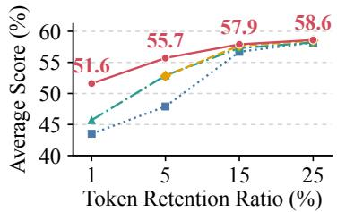  
(a) LLaVA-OneVision-7B

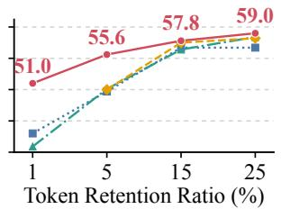  
(b) LLaVA-Video-7B

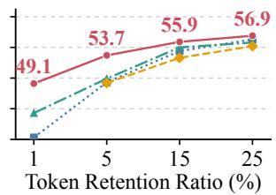  
(c) InternVL3-2B  
Figure 1: Performance comparison on LLaVA-OneVision-7B, LLaVA-Video-7B, and InternVL3- 2B. SimpleCluster remains competitive across different token retention ratios and is particularly robust under aggressive compression.

We explore this question with SimpleCluster, a deliberately simple and training-free baseline for video token compression. SimpleCluster operates on visual tokens after the projector and performs cross-frame clustering in a position-aware feature space. Each cluster is represented by the mean of its original visual features, and the resulting compact sequence is directly fed into the LLM. The method introduces no additional training or architectural modification. Despite this simple design, SimpleCluster achieves competitive or superior performance to recently published compression methods across multiple Video LLMs and token retention ratios, with particularly strong robustness under aggressive compression, as illustrated in Figure 1.

The strong performance of such a simple baseline raises a more fundamental question: what makes feature-space clustering effective for visual token compression? We investigate this question from the perspective of feature-space preservation. Since SimpleCluster directly approximates the visual feature distribution with a limited set of representatives, we analyze both local approximation fidelity and global coverage of the original feature space. Across different compression methods and token budgets, we find that stronger downstream performance is consistently associated with better preservation of the original visual feature distribution. In particular, SimpleCluster maintains substantially broader feature-space coverage while preserving local feature fidelity, providing an empirical explanation for its robustness under aggressive compression.

## Our contributions are summarized as follows:

• We introduce SimpleCluster, a simple and training-free baseline for video token compression that performs position-aware cross-frame clustering in the visual feature space, without additional training or architectural modification.

• Through extensive experiments on three representative Video LLMs and four video understanding benchmarks, we show that SimpleCluster achieves competitive or superior performance across a wide range of token retention ratios, with particularly strong robustness under aggressive compression.

• We analyze why simple feature-space clustering remains effective under constrained token budgets and find that stronger compression performance is consistently associated with better preservation of the original visual feature distribution, especially its global coverage. This observation highlights feature-space preservation as an important consideration for video token compression.

## 2 RELATED WORK

## 2.1 VIDEO LARGE LANGUAGE MODELS

Recent advances in multimodal large language models (MLLMs) have substantially improved general visual-language understanding, with Video LLMs further extending these capabilities to temporal perception and reasoning (Li et al., 2025; Zhang et al., 2025b; Zhu et al., 2025; Bai et al., 2025; Jin et al., 2024; Li et al., 2026b; Maaz et al., 2024; Cheng et al., 2024; Zhang et al., 2026). LLaVA-OneVision (Li et al., 2025) unifies single-image, multi-image, and video understanding, demonstrating strong image-to-video task transfer. LLaVA-Video (Zhang et al., 2025b) strengthens video instruction following through large-scale synthetic video-language data. InternVL3 (Zhu et al., 2025) adopts native multimodal pre-training to improve general visual reasoning over diverse multimodal inputs.

Despite their strong video understanding capabilities, Video LLMs often suffer from substantial inference overhead due to the large number of redundant visual tokens generated from video inputs (Wu et al., 2024; Fu et al., 2025a; Wang et al., 2025; Shen et al., 2025b). The pronounced spatial and temporal redundancy in videos motivates visual token compression as an important direction for efficient Video LLMs (Yang et al., 2025; Shen et al., 2025a; Tao et al., 2025; Wang et al., 2026a; Li et al., 2026a; Shen et al., 2025b; Wang et al., 2026b).

## 2.2 VISUAL TOKEN COMPRESSION

Visual token compression has been widely explored for efficient MLLMs. Early methods mainly focus on image compression, exploring token merging, pruning, and importance-based selection to reduce redundant visual representations while preserving critical information (Bolya et al., 2023; Chen et al., 2024; Xing et al., 2025; Vasu et al., 2025; Alvar et al., 2025).

Recent work extends visual token compression to Video LLMs by further exploiting temporal redundancy across frames (Tao et al., 2025; Shen et al., 2025a; Wang et al., 2026a; Li et al., 2026a; Fu et al., 2025b; Huang et al., 2025; Cho et al., 2026; Shao et al., 2026; Liao et al., 2026). DyCoke (Tao et al., 2025) reduces redundant tokens through cross-frame token merging and dynamic KV-cache pruning, while FastVID (Shen et al., 2025a) leverages temporal segmentation and density-aware pruning for adaptive compression. EarlyTom (Wang et al., 2026a) explores early-stage compression within the vision encoder through token merging and spatial selection, and AOT (Li et al., 2026a) further improves token aggregation through attention-guided anchors and optimal transport.

Despite achieving strong compression performance, existing methods typically rely on increasingly complex and hand-crafted designs. This raises an important question: are such complex designs truly necessary? In this work, we revisit video token compression from this perspective and explore the potential of simple visual feature-space clustering as a strong baseline.

## 3 FROM COMPLEX VIDEO TOKEN COMPRESSION TO SIMPLECLUSTER

## 3.1 MOTIVATION

Given an input video V and a text query $\mathcal { Q } ,$ a Video LLM extracts visual tokens $X = [ x _ { 1 } , \dotsc , x _ { N } ] \in$ $\mathbb { R } ^ { N \times d }$ from T sampled frames using a pretrained vision encoder, where N and d denote the number of visual tokens and feature dimension, respectively. Since visual tokens encode features extracted by the vision encoder, token compression can be formulated as transforming the dense feature sequence X into a compact representation $Y = [ y _ { 1 } , \dots , y _ { B } ] \in \mathbb { R } ^ { B \times d }$ , where $B \ll N$ denotes the token budget and $r = B / N$ is the token retention ratio. The goal is to preserve the original featurespace structure under a substantially reduced token budget.

Motivated by this observation, we revisit video token compression from the perspective of featurespace organization. Existing methods typically rely on hand-crafted criteria, such as attention-based selection, density-aware pruning, and spatiotemporal redundancy modeling, to guide token compression. Instead, we exploit the inherent redundancy in visual feature spaces by directly clustering dense visual tokens into compact representations according to feature similarity, leading to SimpleCluster, a deliberately simple baseline for video token compression.

## 3.2 SIMPLECLUSTER: A SIMPLE FEATURE-SPACE CLUSTERING BASELINE

As shown in Figure 2, SimpleCluster performs cross-frame clustering in the visual feature space and represents each cluster by the mean of its original projected features, producing compact visual tokens for the LLM.

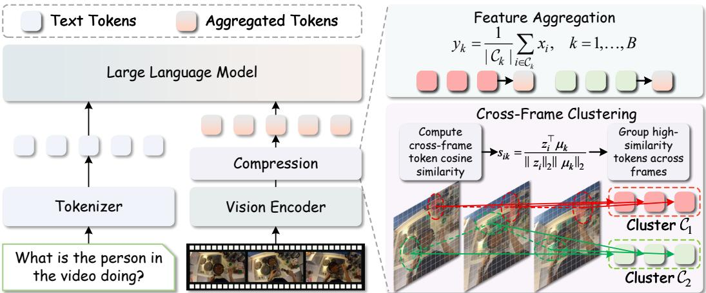  
Figure 2: Overall pipeline of SimpleCluster. SimpleCluster compresses visual tokens in Video LLMs by performing cross-frame clustering in the visual feature space and representing each cluster with the mean of its original projected features.

Position-Aware Feature Construction. Visual similarity alone does not fully characterize the structure of video tokens, as tokens with similar appearance may arise from different spatial locations or temporal moments. We therefore incorporate spatiotemporal information into the metric space used for clustering, allowing visually similar tokens from different temporal or spatial locations to be distinguished during grouping. For each visual token $x _ { i } ,$ we denote its position by $p _ { i } = ( f _ { i } , h _ { i } , w _ { i } )$ , where $f _ { i } , h _ { i } .$ , and $w _ { i }$ correspond to its frame, row, and column indices, respectively. We then apply 3D RoPE according to $p _ { i }$ and normalize the transformed feature:

$$
z _ { i } = \frac { R ( p _ { i } ) x _ { i } } { \| R ( p _ { i } ) x _ { i } \| _ { 2 } } ,\tag{1}
$$

where $R ( p _ { i } )$ denotes the rotary transformation associated with the spatiotemporal position $p _ { i }$ . The resulting feature $z _ { i }$ is only used to define a spatiotemporal-aware clustering space, while the original feature $x _ { i }$ remains unchanged and is retained for the final feature aggregation. This separation allows positional information to guide token grouping without altering the projected visual representation consumed by the LLM.

Cross-Frame Clustering. Based on the position-aware features $\{ z _ { i } \} _ { i = 1 } ^ { N }$ , SimpleCluster jointly clusters visual tokens from all T sampled frames. Specifically, the $N$ visual tokens are partitioned into B clusters by minimizing the within-cluster cosine distance:

$$
\{ \mathcal { C } _ { k } \} _ { k = 1 } ^ { B } = \arg \operatorname* { m i n } _ { \mathcal { C } , \{ \mu _ { k } \} _ { k = 1 } ^ { B } } \sum _ { k = 1 } ^ { B } \sum _ { i \in \mathcal { C } _ { k } } \left( 1 - \frac { z _ { i } ^ { \top } \mu _ { k } } { \| z _ { i } \| _ { 2 } \| \mu _ { k } \| _ { 2 } } \right) ,\tag{2}
$$

where B denotes the target token budget and $\mu _ { k }$ denotes the prototype of cluster $\mathcal { C } _ { k }$ . Since clustering is performed in the 3D RoPE-enhanced feature space using cosine similarity, the grouping process jointly considers visual similarity and spatiotemporal relationships. This allows SimpleCluster to group redundant tokens across frames while distinguishing visually similar tokens arising from different spatial or temporal positions, enabling adaptive allocation of the limited token budget.

Cluster-Wise Feature Aggregation. After obtaining the cross-frame cluster assignments, we aggregate the visual tokens within each cluster to construct the compressed representation. Specifically, each cluster $\mathcal { C } _ { k }$ is represented by the mean of its original visual features:

$$
y _ { k } = \frac { 1 } { \left| \mathcal { C } _ { k } \right| } \sum _ { i \in \mathcal { C } _ { k } } x _ { i } , \quad k = 1 , \ldots , B .\tag{3}
$$

Here, 3D RoPE is used only for determining the cluster assignments, while feature aggregation is performed in the original projected visual feature space. The resulting B aggregated tokens preserve the visual representations already aligned with the LLM and are directly fed into the LLM for downstream video understanding.

## 4 EXPERIMENTS

## 4.1 EXPERIMENTAL SETUP

Benchmarks. We evaluate our method on four widely used video understanding benchmarks, including MVBench (Li et al., 2024), EgoSchema (Mangalam et al., 2023), LongVideoBench (Wu et al., 2024), and VideoMME (Fu et al., 2025a). These benchmarks cover diverse video durations and scenarios, providing a comprehensive testbed for evaluating visual token compression.

Implementation Details. We conduct experiments at 1%, 5%, 10%, 15%, 20%, and 25% token retention ratios on three representative Video LLMs: LLaVA-OneVision-7B (Li et al., 2025), LLaVA-Video-7B (Zhang et al., 2025b), and InternVL3-2B (Zhu et al., 2025). For LLaVA-OneVision-7B and LLaVA-Video-7B, we adopt available baseline results reported in EarlyTom (Wang et al., 2026a) and AOT (Li et al., 2026a), and further evaluate the remaining settings using their released implementations. For InternVL3-2B, we extend the released baseline implementations to this backbone while following their original compression procedures and hyperparameter settings. All experiments are conducted on NVIDIA A800 80GB GPUs using LMMs-Eval (Zhang et al., 2025a).

Compared Baselines. We compare SimpleCluster with five recent visual token compression methods: DyCoke (Tao et al., 2025), which performs cross-frame token merging and dynamic KVcache pruning; VisionZip (Yang et al., 2025), which selects dominant tokens via visual attention and merges redundant ones; FastVID (Shen et al., 2025a), which applies temporal segmentation and density-aware pruning; EarlyTom (Wang et al., 2026a), which performs early-stage compression within the vision encoder; and AOT (Li et al., 2026a), which aggregates tokens through attentionguided anchors and optimal transport.

## 4.2 MAIN RESULTS

Tables 1, 2, and 3 compare SimpleCluster with state-of-the-art methods under different token retention ratios. Overall, SimpleCluster demonstrates strong performance across all three Video LLM backbones. At a 5% token retention ratio, SimpleCluster achieves average scores of 55.7, 55.6, and 53.7 on LLaVA-OneVision-7B, LLaVA-Video-7B, and InternVL3-2B, respectively, consistently outperforming all competing methods. When the retention ratio is further reduced to an extremely low 1%, the advantage becomes more pronounced. Notably, using only 1% of the original visua tokens, SimpleCluster retains 88.3%, 84.8%, and 85.8% of the performance of the corresponding uncompressed models, demonstrating strong robustness under aggressive visual token compression. Additional results at 10% and 20% retention ratios are provided in Appendix B.1.

These results demonstrate that organizing visual tokens according to the structure of the original feature space provides an effective compression approach, especially under highly constrained token budgets. As shown in Figure 3(a), SimpleCluster assigns visually related tokens from different frames into the same cluster, demonstrating that feature-space clustering can effectively capture cross-frame visual redundancy. Figure 3(b) further shows the temporal distribution of representative clusters, where each cluster spans multiple frames and aggregates redundant tokens into a compact representation.

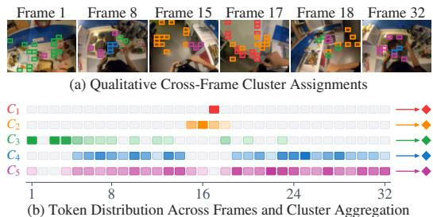  
Figure 3: Visualization of cross-frame token clustering in SimpleCluster. Different colors indicate different clusters.

## 4.3 COMPARISON WITH SIMPLE TOKEN COMPRESSION STRATEGIES

To isolate the effect of feature-space clustering, we compare SimpleCluster with several simple token compression strategies, including Random Sampling, Spatial Average Pooling, Spatiotemporal Average Pooling, Spatial Grid Sampling, and Spatiotemporal Grid Sampling. For grid-based sampling, we consistently select tokens from the top-left regions of the spatial or spatiotemporal grids. All methods are evaluated on LLaVA-OneVision-7B under the 10% token retention ratio.

Table 1: Comparison with state-of-the-art methods on LLaVA-OneVision-7B. “Avg. Score” and “Avg. %” denote the average score across benchmarks and the relative performance to the unpruned model. FastVID and AOT are omitted at 1% because their structural constraints require more tokens than the available budget. The best and second-best results are in bold and underlined, respectively.
<table><tr><td>Method</td><td>Before LLM Retained Ratio</td><td>MVBench ↑</td><td>EgoSchema ↑</td><td>LongVideo Bench ↑</td><td>VideoMME ↑</td><td>Avg. ↑ Score</td><td>%</td></tr><tr><td>LLaVA-OV-7B</td><td>100%</td><td>58.3</td><td>60.4</td><td>56.4</td><td>58.6</td><td>58.4</td><td>100.0</td></tr><tr><td>DyCoke[CVPR/25]</td><td>25%</td><td>53.1</td><td>59.5</td><td>49.5</td><td>54.3</td><td>54.1</td><td>92.6</td></tr><tr><td>VisionZip[CVPR/25]</td><td>25%</td><td>57.9</td><td>60.3</td><td>56.5</td><td>58.2</td><td>58.2</td><td>99.7</td></tr><tr><td>FastVID[NeurIPS/25]</td><td>25%</td><td>56.5</td><td>58.2</td><td>56.3</td><td>58.0</td><td>57.3</td><td>98.1</td></tr><tr><td>EarlyTom[CVPR/26]</td><td>25%</td><td>57.4</td><td>60.5</td><td>56.3</td><td>58.5</td><td>58.2</td><td>99.7</td></tr><tr><td>AOT[CVPR/26]</td><td>25%</td><td>58.7</td><td>61.3</td><td>56.3</td><td>57.5</td><td>58.5</td><td>100.0</td></tr><tr><td>SimpleCluster</td><td>25%</td><td>58.0</td><td>60.4</td><td>57.6</td><td>58.4</td><td>58.6</td><td>100.3</td></tr><tr><td>VisionZip[CVPR/25]</td><td>15%</td><td>56.5</td><td>59.8</td><td>54.4</td><td>56.1</td><td>56.7</td><td>97.1</td></tr><tr><td>FastVID[NeurIPS/25]</td><td>15%</td><td>56.0</td><td>57.4</td><td>56.2</td><td>57.7</td><td>56.8</td><td>97.3</td></tr><tr><td>EarlyTom[CVPR/26]</td><td>15%</td><td>57.5</td><td>60.2</td><td>54.4</td><td>56.9</td><td>57.3</td><td>98.1</td></tr><tr><td>AOT[CVPR/26]</td><td>15%</td><td>57.8</td><td>61.3</td><td>55.2</td><td>56.6</td><td>57.7</td><td>98.8</td></tr><tr><td>SimpleCluster</td><td>15%</td><td>57.4</td><td>60.1</td><td>56.9</td><td>57.3</td><td>57.9</td><td>99.1</td></tr><tr><td>VisionZip[CVPR/25]</td><td>5%</td><td>45.1</td><td>51.9</td><td>46.2</td><td>48.4</td><td>47.9</td><td>82.0</td></tr><tr><td>FastVID[NeurIPS&#x27;25]</td><td>5%</td><td>53.9</td><td>56.9</td><td>51.8</td><td>53.9</td><td>54.1</td><td>92.7</td></tr><tr><td>EarlyTom[CVPR/26]</td><td>5%</td><td>51.9</td><td>58.2</td><td>50.2</td><td>51.4</td><td>52.9</td><td>90.6</td></tr><tr><td>AOT[CVPR/26]</td><td>5%</td><td>52.5</td><td>57.9</td><td>48.2</td><td>52.7</td><td>52.8</td><td>90.5</td></tr><tr><td>SimpleCluster</td><td>5%</td><td>56.1</td><td>59.1</td><td>52.4</td><td>55.1</td><td>55.7</td><td>95.3</td></tr><tr><td>VisionZip[CVPR/25]</td><td>1%</td><td>40.8</td><td>43.7</td><td>44.7</td><td>44.7</td><td>43.5</td><td>74.4</td></tr><tr><td>EarlyTom[CVPR/26]</td><td>1%</td><td>43.3</td><td>48.1</td><td>45.3</td><td>45.9</td><td>45.7</td><td>78.2</td></tr><tr><td>SimpleCluster</td><td>1%</td><td>51.6</td><td>53.9</td><td>49.7</td><td>51.1</td><td>51.6</td><td>88.3</td></tr></table>

Table 2: Comparison with state-of-the-art methods on LLaVA-Video-7B. “Avg. Score” and “Avg. %” denote the average score across benchmarks and the relative performance to the unpruned model. AOT is omitted at 1% because its structural constraints require more tokens than the available budget. The best and second-best results are in bold and underlined, respectively.
<table><tr><td>Method</td><td>Before LLM Retained Ratio</td><td>MVBench ↑</td><td>EgoSchema ↑</td><td>LongVideo Bench ↑</td><td>VideoMME ↑</td><td>Avg. ↑ Score</td><td>%</td></tr><tr><td>LLaVA-Video-7B</td><td>100%</td><td>60.4</td><td>57.2</td><td>58.9</td><td>64.3</td><td>60.2</td><td>100.0</td></tr><tr><td>VisionZip[CVPR/25]</td><td>25%</td><td>56.7</td><td>54.7</td><td>54.7</td><td>60.7</td><td>56.7</td><td>94.2</td></tr><tr><td>EarlyTom[CVPR/26]</td><td>25%</td><td>59.1</td><td>55.3</td><td>57.3</td><td>61.9</td><td>58.4</td><td>97.0</td></tr><tr><td>AOT[CVPR/26]</td><td>25%</td><td>58.8</td><td>55.4</td><td>56.2</td><td>62.4</td><td>58.2</td><td>96.7</td></tr><tr><td>SimpleCluster</td><td>25%</td><td>60.5</td><td>54.8</td><td>58.1</td><td>62.7</td><td>59.0</td><td>98.0</td></tr><tr><td>VisionZip[CVPR/25]</td><td>15%</td><td>56.7</td><td>54.7</td><td>54.7</td><td>60.7</td><td>56.7</td><td>94.2</td></tr><tr><td>EarlyTom[CVPR/26]</td><td>15%</td><td>55.8</td><td>54.7</td><td>53.9</td><td>61.3</td><td>56.4</td><td>93.7</td></tr><tr><td>AOT[CVPR/26]</td><td>15%</td><td>57.8</td><td>55.2</td><td>55.0</td><td>62.0</td><td>57.5</td><td>95.5</td></tr><tr><td>SimpleCluster</td><td>15%</td><td>59.2</td><td>53.2</td><td>57.7</td><td>61.1</td><td>57.8</td><td>96.0</td></tr><tr><td>VisionZip[CVPR/25]</td><td>5%</td><td>49.9</td><td>45.0</td><td>50.1</td><td>53.6</td><td>49.7</td><td>82.5</td></tr><tr><td>EarlyTom[CVPR/26]</td><td>5%</td><td>53.0</td><td>44.7</td><td>49.1</td><td>53.4</td><td>50.1</td><td>83.1</td></tr><tr><td>AOT[CVPR/26]</td><td>5%</td><td>52.2</td><td>46.2</td><td>48.3</td><td>53.3</td><td>50.0</td><td>83.1</td></tr><tr><td>SimpleCluster</td><td>5%</td><td>58.0</td><td>50.1</td><td>55.0</td><td>59.2</td><td>55.6</td><td>92.3</td></tr><tr><td>VisionZip[CVPR&#x27;25]</td><td>1%</td><td>43.5</td><td>36.6</td><td>45.0</td><td>46.7</td><td>43.0</td><td>71.3</td></tr><tr><td>EarlyTom[CVPR/26]</td><td>1%</td><td>42.4</td><td>33.0</td><td>43.4</td><td>44.7</td><td>40.9</td><td>67.9</td></tr><tr><td>SimpleCluster</td><td>1%</td><td>54.1</td><td>44.7</td><td>50.6</td><td>54.7</td><td>51.0</td><td>84.8</td></tr></table>

As shown in Table 4, SimpleCluster achieves the best overall performance with an average score of 57.3. Although simple token compression strategies can preserve considerable visual information, fixed selection and aggregation schemes based on spatial or temporal coordinates may fail to capture the underlying feature structure. In contrast, SimpleCluster performs clustering directly in the visual feature space while considering temporal relationships across frames, enabling tokens with similar visual representations to be effectively grouped together. These results demonstrate the effectiveness of structure-aware visual token organization for video token compression.

Table 3: Comparison with state-of-the-art methods on InternVL3-2B. “Avg. Score” and “Avg. %” denote the average score across benchmarks and the relative performance to the unpruned model. AOT is omitted at 1% because its structural constraints require more tokens than the available budget. The best and second-best results are in bold and underlined, respectively.
<table><tr><td>Method</td><td>Before LLM Retained Ratio</td><td>MVBench ↑</td><td>EgoSchema ↑</td><td>LongVideo Bench ↑</td><td>VideoMME ↑</td><td>Avg. ↑ Score</td><td>%</td></tr><tr><td>InternVL3-2B</td><td>100%</td><td>68.6</td><td>49.1</td><td>53.7</td><td>57.2</td><td>57.2</td><td>100.0</td></tr><tr><td>VisionZip[CVPR/25]</td><td>25%</td><td>67.3</td><td>47.9</td><td>53.3</td><td>56.9</td><td>56.3</td><td>98.4</td></tr><tr><td>EarlyTom[CVPR/26]</td><td>25%</td><td>68.8</td><td>47.8</td><td>53.5</td><td>55.0</td><td>55.8</td><td>97.6</td></tr><tr><td>AOT[CVPR/26]</td><td>25%</td><td>64.9</td><td>47.8</td><td>52.5</td><td>55.6</td><td>55.2</td><td>96.5</td></tr><tr><td>SimpleCluster</td><td>25%</td><td>67.1</td><td>47.6</td><td>54.9</td><td>57.8</td><td>56.9</td><td>99.5</td></tr><tr><td>VisionZip[CVPR/25]</td><td>15%</td><td>63.2</td><td>46.3</td><td>52.1</td><td>56.2</td><td>54.4</td><td>95.1</td></tr><tr><td>EarlyTom[CVPR/26]</td><td>15%</td><td>68.4</td><td>45.2</td><td>52.6</td><td>53.7</td><td>55.0</td><td>96.2</td></tr><tr><td>AOT[CVPR/26]</td><td>15%</td><td>62.2</td><td>46.6</td><td>50.6</td><td>53.9</td><td>53.3</td><td>93.2</td></tr><tr><td>SimpleCluster</td><td>15%</td><td>66.5</td><td>46.4</td><td>53.0</td><td>57.7</td><td>55.9</td><td>97.7</td></tr><tr><td>VisionZip[CVPR&#x27;25]</td><td>5%</td><td>54.6</td><td>41.2</td><td>48.9</td><td>52.6</td><td>49.3</td><td>86.2</td></tr><tr><td>EarlyTom[CVPR/26]</td><td>5%</td><td>58.8</td><td>41.8</td><td>47.9</td><td>51.3</td><td>49.9</td><td>87.2</td></tr><tr><td>AOT[CVPR/26]</td><td>5%</td><td>60.1</td><td>39.2</td><td>47.9</td><td>49.4</td><td>49.2</td><td>86.0</td></tr><tr><td>SimpleCluster</td><td>5%</td><td>64.2</td><td>42.0</td><td>52.5</td><td>56.0</td><td>53.7</td><td>93.9</td></tr><tr><td>VisionZip[CVPR&#x27;25]</td><td>1%</td><td>44.0</td><td>30.2</td><td>43.1</td><td>44.1</td><td>40.3</td><td>70.5</td></tr><tr><td>EarlyTom[CVPR/26]</td><td>1%</td><td>51.5</td><td>34.0</td><td>43.1</td><td>46.4</td><td>44.3</td><td>77.4</td></tr><tr><td>SimpleCluster</td><td>1%</td><td>59.4</td><td>36.0</td><td>48.5</td><td>52.6</td><td>49.1</td><td>85.8</td></tr></table>

Table 4: Comparison with simple token compression strategies on LLaVA-OneVision-7B.
<table><tr><td>Method</td><td>Before LLM Retained Ratio</td><td>↑</td><td>↑</td><td>MVBench EgoSchema LongVideo VideoMME Bench ↑</td><td>↑</td><td>Avg. ↑</td></tr><tr><td>Spatial AvgPooling</td><td>10%</td><td>53.3</td><td>57.7</td><td>54.2</td><td>54.1</td><td>54.8</td></tr><tr><td>Spatiotemporal AvgPooling</td><td>10%</td><td>54.1</td><td>57.4</td><td>54.4</td><td>53.5</td><td>54.9</td></tr><tr><td>Spatial Grid Sampling</td><td>10%</td><td>53.9</td><td>58.5</td><td>54.8</td><td>55.0</td><td>55.6</td></tr><tr><td>Spatiotemporal Grid Sampling</td><td>10%</td><td>55.0</td><td>58.8</td><td>53.1</td><td>54.8</td><td>55.4</td></tr><tr><td>SimpleCluster</td><td>10%</td><td>56.8</td><td>59.9</td><td>56.5</td><td>56.0</td><td>57.3</td></tr></table>

## 4.4 ABLATION STUDIES

We analyze the key design choices of our SimpleCluster. All ablation experiments are conducted on LLaVA-OneVision-7B with a 10% token retention ratio.

Effect of 3D RoPE. We first analyze the effect of 3D RoPE on feature-space clustering. As shown in Table 5, removing 3D RoPE decreases the average score from 57.3 to 56.6. This indicates that incorporating spatiotemporal information into the clustering space provides useful structural cues for organizing visual tokens and helps distinguish visually similar tokens appearing at different spatial or temporal positions.

Effect of Clustering Scope. We next examine the effect of clustering scope by comparing crossframe and per-frame clustering. Cross-frame clustering improves the average score from 56.1 to 57.3 in Table 5. By jointly organizing visual tokens from different frames, the model can better exploit cross-frame redundancy and allocate the limited token budget according to the global feature distribution, leading to more effective video token compression.

Table 5: Ablation studies of 3D RoPE encoding, clustering scope, and cluster representation on LLaVA-OneVision-7B. The default configuration is highlighted in gray.
<table><tr><td>Setting</td><td>Before LLM Retained Ratio</td><td>MVBench ↑</td><td>EgoSchema ↑</td><td>LongVideo Bench ↑</td><td>VideoMME ↑</td><td>Avg. ↑</td></tr><tr><td>None</td><td>10%</td><td>55.8</td><td>59.3</td><td>55.4</td><td>55.8</td><td>56.6</td></tr><tr><td>3D RoPE</td><td>10%</td><td>56.8</td><td>59.9</td><td>56.5</td><td>56.0</td><td>57.3</td></tr><tr><td>Per-frame</td><td>10%</td><td>55.0</td><td>59.3</td><td>54.1</td><td>55.8</td><td>56.1</td></tr><tr><td>Cross-frame</td><td>10%</td><td>56.8</td><td>59.9</td><td>56.5</td><td>56.0</td><td>57.3</td></tr><tr><td>Nearest</td><td>10%</td><td>57.0</td><td>59.7</td><td>55.7</td><td>56.4</td><td>57.2</td></tr><tr><td>Mean</td><td>10%</td><td>56.8</td><td>59.9</td><td>56.5</td><td>56.0</td><td>57.3</td></tr></table>

Effect of Feature Aggregation. Finally, we compare different strategies for representing each cluster, including selecting the nearest token and mean aggregation, as reported in Table 5. Both strategies achieve comparable performance, suggesting that the quality of cluster assignment plays a more important role than the specific aggregation operation.

## 4.5 EFFICIENCY ANALYSIS

Although token compression effectively improves the efficiency of Video LLMs, the compression process itself may introduce additional computational overhead. We evaluate efficiency on LLaVA-OneVision-7B at a 10% token retention ratio, comparing SimpleCluster with AOT, the strongestperforming baseline. All experiments are conducted on a single NVIDIA A800 GPU using fixed video-prompt pairs. We report the floating-point operations (FLOPs) of the visual encoder and the LLM prefill stage, as well as the time to first token (TTFT), with TTFT averaged over 10 runs.

As shown in Table 6, both methods substantially reduce prefill computation and latency while largely preserving model performance. SimpleCluster achieves 27.5T prefill FLOPs and 514.1 ms TTFT, reducing them by 73.2% and 45.5% over the uncompressed model, respectively, while retaining 98.1% of its average

Table 6: Efficiency analysis of SimpleCluster on LLaVA-OneVision-7B with 10% token retention.
<table><tr><td>Method</td><td>Prefilling FLOPs (T) ↓</td><td>TTFT (ms) ↓</td><td colspan="2">Avg. ↑ Score %</td></tr><tr><td>LLaVA-OneVision-7B</td><td>102.5</td><td>943.3</td><td>58.4</td><td>100.0</td></tr><tr><td>AOT</td><td>28.1</td><td>696.5</td><td>57.0</td><td>97.6</td></tr><tr><td>SimpleCluster</td><td>27.5</td><td>514.1</td><td>57.3</td><td>98.1</td></tr></table>

performance. Compared with AOT, SimpleCluster further reduces TTFT by 26.2% and achieves a higher average score. This efficiency stems from its simple feature-space clustering across frames, without attention-based anchor selection or optimal transport matching. Additional efficiency results on LLaVA-Video-7B and InternVL3-2B are provided in Appendix B.2.

## 5 WHY DOES FEATURE-SPACE CLUSTERING WORK?

Video token compression transforms dense visual features into a compact representation under a limited token budget, while SimpleCluster performs this transformation directly in feature space through similarity-based clustering and aggregation. We analyze feature preservation from local approximation and global coverage perspectives, and examine its relation to downstream performance.

Local Fidelity and Global Coverage. To quantify how well the compression process preserves the original visual feature space, we directly compare the dense visual tokens before compression with the compressed tokens produced by each method. We conduct this analysis on LLaVA-OneVision-7B under 10% and 5% token retention ratios. We evaluate feature preservation from two complementary perspectives: (1) L2 Normalized Quantization Error (L2-NQE) measures the distance between each dense token and its nearest compressed token, reflecting the fidelity of local approximation. (2) Cosine Coverage@0.90 measures the fraction of dense tokens for which at least one compressed token achieves a cosine similarity above 0.90, reflecting how broadly the compressed representation covers the original feature distribution. For each benchmark, we first deduplicate the videos and then average each metric over all videos. We finally report the equally weighted average across MVBench, EgoSchema, LongVideoBench, and VideoMME.

As shown in Table 7, SimpleCluster consistently preserves the visual feature space more effectively across both retention ratios. At 10% retention, SimpleCluster achieves an L2-NQE of 0.281 and a cosine coverage of 59.7%, reducing the quantization error by 31.0% compared with the strongest competing result (0.407 from EarlyTom), while improving coverage by 24.7 percentage points over FastVID (35.0%). Under the more aggressive 5% retention setting, the advantage becomes even more pronounced: SimpleCluster achieves an L2-NQE of 0.336 and a cosine coverage of 45.9%, compared with the best competing L2-NQE of 0.531 from AOT

Table 7: Comparison of local fidelity and global coverage of the original visual feature space across different visual token compression methods on LLaVA-OneVision-7B.
<table><tr><td>Method</td><td>Before LLM Retention</td><td>L2-NQE ↓</td><td>Cosine Coverage@0.90 ↑</td></tr><tr><td>VisionZip</td><td>10%</td><td>0.554</td><td>19.3%</td></tr><tr><td>FastVID</td><td>10%</td><td>0.408</td><td>35.0%</td></tr><tr><td>EarlyTom</td><td>10%</td><td>0.407</td><td>28.6%</td></tr><tr><td>AOT</td><td>10%</td><td>0.410</td><td>22.1%</td></tr><tr><td>SimpleCluster</td><td>10%</td><td>0.281</td><td>59.7%</td></tr><tr><td>VisionZip</td><td>5%</td><td>0.690</td><td>8.2%</td></tr><tr><td>FastVID</td><td>5%</td><td>0.555</td><td>21.4%</td></tr><tr><td>EarlyTom</td><td>5%</td><td>0.555</td><td>16.2%</td></tr><tr><td>AOT</td><td>5%</td><td>0.531</td><td>11.8%</td></tr><tr><td>SimpleCluster</td><td>5%</td><td>0.336</td><td>45.9%</td></tr></table>

and coverage of 21.4% from FastVID. Notably, even with only 5% of the visual tokens retained, SimpleCluster still achieves lower L2-NQE and higher cosine coverage than all competing methods at 10% retention. These results demonstrate that SimpleCluster not only provides more faithful local approximations of dense visual tokens, but also preserves substantially broader coverage of the original feature distribution under aggressive compression.

From Feature Preservation to Downstream Performance. The feature-space preservation results are consistent with the downstream performance trends in Table 1. At both 10% and 5% retention, SimpleCluster achieves the lowest L2-NQE and the highest cosine coverage, while also obtaining the best average downstream scores of 57.3 and 55.7, respectively. In contrast, methods with weaker feature preservation generally exhibit larger performance degradation under compression. These results suggest that preserving the original feature-space structure, particularly its global coverage, is closely associated with stronger downstream video understanding performance.

SimpleCluster further exhibits strong robustness as the token budget becomes more constrained. When the retention ratio decreases from 10% to 5%, its L2-NQE increases by only 0.055 and its cosine coverage retains 76.9% of the original level, compared with 0.121–0.148 and 42.5%–61.1% for competing methods. Correspondingly, its downstream score drops by only 1.6 points, whereas other methods decrease by 2.4–5.6 points. This demonstrates that SimpleCluster preserves informative visual representations more effectively under aggressive compression, leading to more stable downstream performance.

## 6 CONCLUSION

We present SimpleCluster, a simple and training-free baseline for video token compression based on position-aware cross-frame clustering in the visual feature space. Across three representative Video LLMs and four video understanding benchmarks, SimpleCluster achieves competitive or superior performance over recent compression methods across a wide range of token retention ratios, with particularly strong robustness under aggressive compression. To understand this behavior, we analyzed the feature space preserved by different compression methods and found that stronger downstream performance is consistently associated with better preservation of the original visual feature distribution, in terms of both local approximation fidelity and global coverage. These findings suggest that preserving the structure of the visual feature space is an important consideration for video token compression, particularly when the available token budget is highly constrained.

## 7 LIMITATION

Scope as a Strong Baseline Study. This work is positioned as a strong baseline study rather than a new video token compression algorithm. Although SimpleCluster achieves strong performance across a wide range of settings, more sophisticated compression mechanisms may still be beneficial in certain scenarios. Our current study does not fully characterize when such designs provide additional advantages. Future work could explore adaptive compression strategies that explicitly account for feature-space coverage and local fidelity while balancing efficiency, generality, and computational cost.

## AI USE STATEMENT

In this work, we used Large Language Models (LLMs) to improve the clarity, grammar, and readability of the manuscript. After using these tools, we carefully reviewed and edited the content as needed and take full responsibility for the final content of this work.

## REFERENCES

Saeed Ranjbar Alvar, Gursimran Singh, Mohammad Akbari, and Yong Zhang. Divprune: Diversitybased visual token pruning for large multimodal models. In Proceedings of the IEEE/CVF Conference on Computer Vision and Pattern Recognition, pp. 9392–9401, 2025.

Shuai Bai, Keqin Chen, Xuejing Liu, Jialin Wang, Wenbin Ge, Sibo Song, Kai Dang, Peng Wang, Shijie Wang, Jun Tang, et al. Qwen2.5-vl technical report. arXiv preprint arXiv:2502.13923, 2025.

Daniel Bolya, Cheng-Yang Fu, Xiaoliang Dai, Peizhao Zhang, Christoph Feichtenhofer, and Judy Hoffman. Token merging: Your vit but faster. In International Conference on Learning Representations, 2023.

Liang Chen, Haozhe Zhao, Tianyu Liu, Shuai Bai, Junyang Lin, Chang Zhou, and Baobao Chang. An image is worth 1/2 tokens after layer 2: Plug-and-play inference acceleration for large visionlanguage models. In European Conference on Computer Vision, pp. 19–35, 2024.

Zesen Cheng, Sicong Leng, Hang Zhang, Yifei Xin, Xin Li, Guanzheng Chen, Yongxin Zhu, Wenqi Zhang, Ziyang Luo, Deli Zhao, et al. Video-llama 2: Advancing spatial-temporal modeling and audio understanding in video-llms. arXiv preprint arXiv:2406.07476, 2024.

Janghoon Cho, Jungsoo Lee, Munawar Hayat, Kyuwoong Hwang, Fatih Porikli, and Sungha Choi. Floc: Facility location-based efficient visual token compression for long video understanding. In International Conference on Learning Representations, volume 2026, pp. 102973–102996, 2026.

Mohsen Fayyaz, Soroush Abbasi Koohpayegani, Farnoush Rezaei Jafari, Sunando Sengupta, Hamid Reza Vaezi Joze, Eric Sommerlade, Hamed Pirsiavash, and Jurgen Gall. Adaptive token sam-¨ pling for efficient vision transformers. In European conference on computer vision, pp. 396–414. Springer, 2022.

Chaoyou Fu, Yuhan Dai, Yongdong Luo, Lei Li, Shuhuai Ren, Renrui Zhang, Zihan Wang, Chenyu Zhou, Yunhang Shen, Mengdan Zhang, et al. Video-mme: The first-ever comprehensive evaluation benchmark of multi-modal llms in video analysis. In Proceedings of the IEEE/CVF Conference on Computer Vision and Pattern Recognition, pp. 24108–24118, 2025a.

Tianyu Fu, Tengxuan Liu, Qinghao Han, Guohao Dai, Shengen Yan, Huazhong Yang, Xuefei Ning, and Yu Wang. Framefusion: Combining similarity and importance for video token reduction on large vision language models. In Proceedings of the IEEE/CVF International Conference on Computer Vision, pp. 22654–22663, 2025b.

Xiaohu Huang, Hao Zhou, and Kai Han. Prunevid: Visual token pruning for efficient video large language models. In Findings of the Association for Computational Linguistics: ACL 2025, pp. 19959–19973, 2025.

Peng Jin, Ryuichi Takanobu, Wancai Zhang, Xiaochun Cao, and Li Yuan. Chat-univi: Unified visual representation empowers large language models with image and video understanding. In Proceedings of the IEEE/CVF Conference on Computer Vision and Pattern Recognition, pp. 13700– 13710, 2024.

Bo Li, Yuanhan Zhang, Dong Guo, Renrui Zhang, Feng Li, Hao Zhang, Kaichen Zhang, Peiyuan Zhang, Yanwei Li, Ziwei Liu, and Chunyuan Li. Llava-onevision: Easy visual task transfer. Transactions on Machine Learning Research, 2025.

Jinlong Li, Liyuan Jiang, Haonan Zhang, and Nicu Sebe. Token reduction via local and global contexts optimization for efficient video large language models. In Proceedings ofthe IEEE/CVF Conference on Computer Vision and Pattern Recognition, pp. 10451–10461, 2026a.

Kunchang Li, Yali Wang, Yinan He, Yizhuo Li, Yi Wang, Yi Liu, Zun Wang, Jilan Xu, Guo Chen, Ping Luo, et al. Mvbench: A comprehensive multi-modal video understanding benchmark. In Proceedings of the IEEE/CVF Conference on Computer Vision and Pattern Recognition, pp. 22195–22206, 2024.

Xinhao Li, Yi Wang, Jiashuo Yu, Xiangyu Zeng, Yuhan Zhu, Haian Huang, Jianfei Gao, Kunchang Li, Yinan He, Chenting Wang, et al. Videochat-flash: Hierarchical compression for long-context video modeling. In International Conference on Learning Representations, 2026b.

Youwei Liang, Chongjian Ge, Zhan Tong, Yibing Song, Jue Wang, and Pengtao Xie. Not all patches are what you need: Expediting vision transformers via token reorganizations. In International Conference on Learning Representations, 2022.

Chenfei Liao, Wensong Wang, Zichen Wen, Xu Zheng, Yiyu Wang, Haocong He, Yuanhuiyi Lyu, Lutao Jiang, Xin Zou, Yuqian Fu, et al. Are we using the right benchmark: An evaluation framework for visual token compression methods. In Proceedings of the 64th Annual Meeting of the Associationfor Computational Linguistics (Volume 1: Long Papers), pp. 4236–4253, 2026.

Stuart Lloyd. Least squares quantization in pcm. IEEE transactions on information theory, 28(2): 129–137, 1982.

Muhammad Maaz, Hanoona Rasheed, Salman Khan, and Fahad Khan. Video-chatgpt: Towards detailed video understanding via large vision and language models. In Proceedings of the 62nd Annual Meeting of the Association for Computational Linguistics (Volume 1: Long Papers), pp. 12585–12602, 2024.

Karttikeya Mangalam, Raiymbek Akshulakov, and Jitendra Malik. Egoschema: A diagnostic benchmark for very long-form video language understanding. In Advances in Neural Information Processing Systems, volume 36, pp. 46212–46244, 2023.

James McQueen. Some methods of classification and analysis of multivariate observations. In Proceedings of the Fifth Berkeley Symposium on Mathematical Statistics and Probability, pp. 281–297, 1967.

Yongming Rao, Wenliang Zhao, Benlin Liu, Jiwen Lu, Jie Zhou, and Cho-Jui Hsieh. Dynamicvit: Efficient vision transformers with dynamic token sparsification. In Advances in neural information processing systems, volume 34, pp. 13937–13949, 2021.

Michael Ryoo, AJ Piergiovanni, Anurag Arnab, Mostafa Dehghani, and Anelia Angelova. Tokenlearner: Adaptive space-time tokenization for videos. In Advances in neural information processing systems, volume 34, pp. 12786–12797, 2021.

Kele Shao, Keda Tao, Can Qin, Haoxuan You, Yang Sui, and Huan Wang. Holitom: Holistic token merging for fast video large language models. In Advances in Neural Information Processing Systems, volume 38, pp. 135547–135570, 2025.

Kele Shao, Keda Tao, Kejia Zhang, Sicheng Feng, Mu Cai, Yuzhang Shang, Haoxuan You, Can Qin, Yang Sui, and Huan Wang. A survey of token compression for efficient multimodal large language models. Transactions on Machine Learning Research, 2026.

Leqi Shen, Guoqiang Gong, Tao He, Yifeng Zhang, Pengzhang Liu, Sicheng Zhao, and Guiguang Ding. Fastvid: Dynamic density pruning for fast video large language models. In Advances in Neural Information Processing Systems, volume 38, pp. 123553–123581, 2025a.

Xiaoqian Shen, Yunyang Xiong, Changsheng Zhao, Lemeng Wu, Jun Chen, Chenchen Zhu, Zechun Liu, Fanyi Xiao, Balakrishnan Varadarajan, Florian Bordes, et al. Longvu: Spatiotemporal adaptive compression for long video-language understanding. In Proceedings of the 42nd International Conference on Machine Learning, volume 267 of Proceedings of Machine Learning Research, pp. 54582–54599, 2025b.

Jianlin Su, Murtadha Ahmed, Yu Lu, Shengfeng Pan, Wen Bo, and Yunfeng Liu. Roformer: Enhanced transformer with rotary position embedding. Neurocomputing, 568:127063, 2024.

Keda Tao, Can Qin, Haoxuan You, Yang Sui, and Huan Wang. Dycoke: Dynamic compression of tokens for fast video large language models. In Proceedings of the IEEE/CVF Conference on Computer Vision and Pattern Recognition, pp. 18992–19001, 2025.

Pavan Kumar Anasosalu Vasu, Fartash Faghri, Chun-Liang Li, Cem Koc, Nate True, Albert Antony, Gokula Santhanam, James Gabriel, Peter Grasch, Oncel Tuzel, et al. Fastvlm: Efficient vision encoding for vision language models. In Proceedings ofthe IEEE/CVF Conference on Computer Vision and Pattern Recognition, pp. 19769–19780, 2025.

Hesong Wang, Xin Jin, Lu Lu, Chenhaowen Li, Jian Chen, Qiang Liu, and Huan Wang. Earlytom: Early token compression completes fast video understanding. In Proceedings of the IEEE/CVF Conference on Computer Vision and Pattern Recognition, pp. 40559–40568, 2026a.

Yiyu Wang, Xuyang Liu, Xiyan Gui, Xinying Lin, Boxue Yang, Chenfei Liao, Tailai Chen, and Linfeng Zhang. Accelerating streaming video large language models via hierarchical token compression. In Proceedings of the IEEE/CVF Conference on Computer Vision and Pattern Recognition, pp. 18523–18533, 2026b.

Zekun Wang, Minghua Ma, Zexin Wang, Rongchuan Mu, Liping Shan, Ming Liu, and Bing Qin. Effivlm-bench: A comprehensive benchmark for evaluating training-free acceleration in large vision-language models. In Proceedings of the 63rd Annual Meeting of the Association for Computational Linguistics (Volume 1: Long Papers), pp. 25546–25572, 2025.

Haoning Wu, Dongxu Li, Bei Chen, and Junnan Li. Longvideobench: A benchmark for longcontext interleaved video-language understanding. In Advances in Neural Information Processing Systems, volume 37, pp. 28828–28857, 2024.

Long Xing, Qidong Huang, Xiaoyi Dong, Jiajie Lu, Pan Zhang, Yuhang Zang, Yuhang Cao, Conghui He, Jiaqi Wang, Feng Wu, et al. Conical visual concentration for efficient large vision-language models. In Proceedings of the IEEE/CVF Conference on Computer Vision and Pattern Recognition, pp. 14593–14603, 2025.

Senqiao Yang, Yukang Chen, Zhuotao Tian, Chengyao Wang, Jingyao Li, Bei Yu, and Jiaya Jia. Visionzip: Longer is better but not necessary in vision language models. In Proceedings of the IEEE/CVF Conference on Computer Vision and Pattern Recognition, pp. 19792–19802, 2025.

Kaichen Zhang, Bo Li, Peiyuan Zhang, Fanyi Pu, Joshua Adrian Cahyono, Kairui Hu, Shuai Liu, Yuanhan Zhang, Jingkang Yang, Chunyuan Li, et al. Lmms-eval: Reality check on the evaluation of large multimodal models. In Findings of the Association for Computational Linguistics: NAACL 2025, pp. 881–916, 2025a.

Xiao Zhang, Wang Zeng, Sheng Jin, Wentao Liu, Chen Qian, and Shichao Kan. Thinking with cameras: Active visual reasoning via dynamic viewpoint control for surveillance video understanding. arXiv preprint arXiv:2609.06475, 2026.

Yuanhan Zhang, Jinming Wu, Wei Li, Bo Li, Zejun Ma, Ziwei Liu, and Chunyuan Li. Llava-video: Video instruction tuning with synthetic data. Transactions on Machine Learning Research, 2025b.

Jinguo Zhu, Weiyun Wang, Zhe Chen, Zhaoyang Liu, Shenglong Ye, Lixin Gu, Hao Tian, Yuchen Duan, Weijie Su, Jie Shao, et al. Internvl3: Exploring advanced training and test-time recipes for open-source multimodal models. arXiv preprint arXiv:2504.10479, 2025.

## Appendix

## CONTENTS

A Evaluation Benchmarks 14   
B Additional Experimental Results 14   
B.1 Performance Results 14   
B.2 Efficiency Analysis 14   
C Additional Analysis 16   
D Additional Implementation Details 17   
D.1 Reproduction Details of Compared Methods . 17   
D.2 Implementation Details of SimpleCluster 18   
E Additional Visualizations 19   
E.1 Cross-Frame Cluster Assignments . 19   
E.2 Dense-Feature Coverage 20

## A EVALUATION BENCHMARKS

We evaluate SimpleCluster on four widely used video understanding benchmarks, covering diverse aspects of video-language understanding, including temporal reasoning, egocentric video understanding, long-context comprehension, and multimodal retrieval.

MVBench. MVBench (Li et al., 2024) is a comprehensive benchmark targeting temporal understanding in multimodal video tasks. Different from conventional image-based evaluation datasets, MVBench constructs 20 video-centric tasks by extending static image tasks into dynamic scenarios. These tasks require models to capture temporal dynamics and perform various forms of video reasoning, making it suitable for evaluating fine-grained temporal understanding capabilities.

EgoSchema. EgoSchema (Mangalam et al., 2023) is a large-scale benchmark for evaluating longhorizon reasoning in egocentric videos. It contains approximately 5,000 five-choice multiple-choice questions collected from 250 hours of egocentric video data. Each video clip lasts around 3 minutes and contains extended temporal interactions across 289 video segments. Compared with conventional video benchmarks, EgoSchema requires models to maintain temporal consistency and track objects and actions over substantially longer durations, posing challenges for long-range perception and reasoning.

LongVideoBench. LongVideoBench (Wu et al., 2024) is designed to evaluate long-context videolanguage understanding. It contains 3,763 videos with durations spanning from 8 seconds to 1 hour and provides 6,678 human-annotated multiple-choice questions. Based on a referring-reasoning formulation, LongVideoBench requires models to retrieve relevant visual and linguistic evidence from long videos and perform fine-grained reasoning. The benchmark covers 17 question categories from both perceptual and relational perspectives, providing a challenging evaluation of long-video comprehension.

VideoMME. VideoMME (Fu et al., 2025a) is a comprehensive benchmark for evaluating the video understanding capabilities of Video LLMs. It consists of 900 videos collected from 6 major domains and 30 fine-grained categories, with video durations ranging from 11 seconds to 1 hour. Each video is paired with carefully curated human annotations, resulting in 2,700 multiple-choice questionanswer pairs. The benchmark evaluates models’ ability to perceive, understand, and reason over diverse video content across different temporal scales.

## B ADDITIONAL EXPERIMENTAL RESULTS

We provide additional experimental results to further evaluate the effectiveness and efficiency of SimpleCluster across different Video LLM backbones. In Appendix B.1, we report additional performance comparisons at 10% and 20% token retention ratios on LLaVA-OneVision-7B, LLaVA-Video-7B, and InternVL3-2B. In Appendix B.2, we further analyze the inference efficiency of SimpleCluster on LLaVA-Video-7B and InternVL3-2B.

## B.1 PERFORMANCE RESULTS

Tables 8, 9, and 10 report additional results at 10% and 20% token retention ratios. On LLaVA-OneVision-7B, SimpleCluster remains competitive at 20% retention and achieves the best average score of 57.3 at 10% retention. On LLaVA-Video-7B, SimpleCluster achieves an average score of 58.4 at 20% retention and the best average score of 57.3 at 10% retention. On InternVL3-2B, SimpleCluster achieves the best average performance at both retention ratios, reaching 56.2 and 55.1 at 20% and 10%, respectively. These results further demonstrate the effectiveness of SimpleCluster across different Video LLM backbones and token budgets.

## B.2 EFFICIENCY ANALYSIS

We further evaluate the inference efficiency of SimpleCluster on LLaVA-Video-7B and InternVL3- 2B at a 10% token retention ratio. As shown in Tables 11 and 12, SimpleCluster reduces prefilling

Table 8: Comparison with state-of-the-art methods on LLaVA-OneVision-7B. “Avg. Score” and “Avg. %” denote the average score across benchmarks and the relative performance to the unpruned model. The best and second-best results are in bold and underlined, respectively.
<table><tr><td>Method</td><td>Before LLM Retained Ratio</td><td>MVBench ↑</td><td>EgoSchema ↑</td><td>LongVideo Bench ↑</td><td>VideoMME ↑</td><td>Avg. ↑ Score</td><td>%</td></tr><tr><td>VisionZip[CVPR/25]</td><td>20%</td><td>57.7</td><td>59.8</td><td>55.2</td><td>57.9</td><td>57.7</td><td>98.8</td></tr><tr><td> $\mathrm { F a s t V I D } _ { [ \mathrm { N e u r I P S ^ { \prime } 2 5 } ] }$ </td><td>20%</td><td>56.3</td><td>57.9</td><td>57.1</td><td>57.9</td><td>57.3</td><td>98.1</td></tr><tr><td>EarlyTom[CVPR/26]</td><td>20%</td><td>57.8</td><td>60.6</td><td>55.6</td><td>58.0</td><td>58.1</td><td>99.3</td></tr><tr><td>AOT[CVPR/26]</td><td>20%</td><td>58.1</td><td>61.3</td><td>56.2</td><td>57.2</td><td>58.2</td><td>99.7</td></tr><tr><td>SimpleCluster</td><td>20%</td><td>57.0</td><td>59.8</td><td>56.6</td><td>57.6</td><td>57.8</td><td>98.8</td></tr><tr><td>VisionZip[CVPR/25]</td><td>10%</td><td>53.5</td><td>58.0</td><td>49.3</td><td>53.4</td><td>53.5</td><td>91.6</td></tr><tr><td>FastVID[NeurIPS/25]</td><td>10%</td><td>55.9</td><td>56.5</td><td>56.3</td><td>57.3</td><td>56.5</td><td>96.7</td></tr><tr><td>EarlyTom[CVPR/26]</td><td>10%</td><td>56.5</td><td>60.1</td><td>52.4</td><td>55.8</td><td>56.2</td><td>96.2</td></tr><tr><td>AOT[CVPR/26]</td><td>10%</td><td>57.0</td><td>60.6</td><td>54.2</td><td>56.1</td><td>57.0</td><td>97.6</td></tr><tr><td>SimpleCluster</td><td>10%</td><td>56.8</td><td>59.9</td><td>56.5</td><td>56.0</td><td>57.3</td><td>98.1</td></tr></table>

Table 9: Comparison with state-of-the-art methods on LLaVA-Video-7B. “Avg. Score” and “Avg. %” denote the average score across benchmarks and the relative performance to the unpruned model. The best and second-best results are in bold and underlined, respectively.
<table><tr><td>Method</td><td>Before LLM Retained Ratio</td><td>MVBench ↑</td><td>EgoSchema ↑</td><td>LongVideo Bench ↑</td><td>VideoMME ↑</td><td>Avg. ↑ Score</td><td>%</td></tr><tr><td>LLaVA-Video-7B</td><td>100%</td><td>60.4</td><td>57.2</td><td>58.9</td><td>64.3</td><td>60.2</td><td>100.0</td></tr><tr><td>VisionZip[CVPR&#x27;25]</td><td>20%</td><td>60.5</td><td>55.5</td><td>57.1</td><td>62.0</td><td>58.8</td><td>97.7</td></tr><tr><td>EarlyTom[CVPR/26]</td><td>20%</td><td>59.2</td><td>54.5</td><td>54.4</td><td>61.3</td><td>57.4</td><td>95.3</td></tr><tr><td>AOT[CVPR/26]</td><td>20%</td><td>61.0</td><td>55.2</td><td>56.5</td><td>62.0</td><td>58.7</td><td>97.5</td></tr><tr><td>SimpleCluster</td><td>20%</td><td>60.3</td><td>54.1</td><td>57.7</td><td>61.6</td><td>58.4</td><td>97.0</td></tr><tr><td>VisionZip[CVPR/25]</td><td>10%</td><td>57.9</td><td>53.1</td><td>53.9</td><td>59.1</td><td>56.0</td><td>93.0</td></tr><tr><td>EarlyTom[CVPR/26]</td><td>10%</td><td>56.9</td><td>47.1</td><td>50.9</td><td>56.0</td><td>52.7</td><td>87.5</td></tr><tr><td>AOT[CVPR/26]</td><td>10%</td><td>59.1</td><td>53.4</td><td>54.2</td><td>60.9</td><td>56.9</td><td>94.5</td></tr><tr><td>SimpleCluster</td><td>10%</td><td>59.2</td><td>52.0</td><td>57.3</td><td>60.7</td><td>57.3</td><td>95.2</td></tr></table>

Table 10: Comparison with state-of-the-art methods on InternVL3-2B. “Avg. Score” and “Avg. %” denote the average score across benchmarks and the relative performance to the unpruned model. The best and second-best results are in bold and underlined, respectively.
<table><tr><td>Method</td><td>Before LLM Retained Ratio</td><td>MVBench ↑</td><td>EgoSchema ↑</td><td>LongVideo Bench ↑</td><td>VideoMME ↑</td><td>Avg. ↑ Score</td><td>%</td></tr><tr><td>InternVL3-2B</td><td>100%</td><td>68.6</td><td>49.1</td><td>53.7</td><td>57.2</td><td>57.2</td><td>100.0</td></tr><tr><td>VisionZip[CVPR/25]</td><td>20%</td><td>65.2</td><td>47.4</td><td>52.5</td><td>57.0</td><td>55.5</td><td>97.0</td></tr><tr><td>EarlyTom[CVPR/26]</td><td>20%</td><td>65.7</td><td>47.1</td><td>50.7</td><td>54.9</td><td>54.6</td><td>95.5</td></tr><tr><td>AOT[CVPR/26]</td><td>20%</td><td>65.6</td><td>44.5</td><td>49.8</td><td>51.3</td><td>52.8</td><td>92.3</td></tr><tr><td>SimpleCluster</td><td>20%</td><td>66.7</td><td>47.2</td><td>53.4</td><td>57.4</td><td>56.2</td><td>98.3</td></tr><tr><td>VisionZip[CVPR/25]</td><td>10%</td><td>59.9</td><td>45.0</td><td>51.2</td><td>54.6</td><td>52.7</td><td>92.1</td></tr><tr><td>EarlyTom[CVPR/26]</td><td>10%</td><td>62.8</td><td>44.3</td><td>49.9</td><td>53.7</td><td>52.7</td><td>92.1</td></tr><tr><td>AOT[CVPR/26]</td><td>10%</td><td>63.4</td><td>41.6</td><td>48.1</td><td>51.3</td><td>51.1</td><td>89.3</td></tr><tr><td>SimpleCluster</td><td>10%</td><td>65.4</td><td>45.4</td><td>53.3</td><td>56.4</td><td>55.1</td><td>96.3</td></tr></table>

FLOPs by 71.2% and 66.5%, and TTFT by 37.1% and 20.1% on the two backbones, respectively, while retaining 95.2% and 96.3% of the uncompressed model performance. These results show that the efficiency gains of SimpleCluster consistently transfer across different Video LLMs.

Table 11: Efficiency analysis of SimpleCluster on LLaVA-Video-7B with 10% token retention.
<table><tr><td rowspan="2">Method</td><td rowspan="2">Prefilling FLOPs (T)</td><td rowspan="2">TTFT (ms)</td><td colspan="2"> $\operatorname { A v g } .$ </td></tr><tr><td>Score</td><td>%</td></tr><tr><td>LLaVA-Video-7B</td><td>218.1</td><td>1722.3</td><td>60.2</td><td>100.0</td></tr><tr><td>SimpleCluster</td><td>62.8</td><td>1082.6</td><td>57.3</td><td>95.2</td></tr></table>

Table 12: Efficiency analysis of SimpleCluster on InternVL3-2B with 10% token retention.
<table><tr><td rowspan="2">Method</td><td rowspan="2">Prefilling FLOPs (T)</td><td rowspan="2">TTFT (ms)</td><td colspan="2"> $\operatorname { A v g } .$ </td></tr><tr><td>Score</td><td>%</td></tr><tr><td>InternVL3-2B</td><td>227.3</td><td>1079.2</td><td>57.2</td><td>100.0</td></tr><tr><td>SimpleCluster</td><td>76.2</td><td>862.6</td><td>55.1</td><td>96.3</td></tr></table>

## C ADDITIONAL ANALYSIS

SimpleCluster compresses dense visual tokens by organizing them in a position-aware feature space under a fixed token budget. We analyze several properties of this formulation to better understand why such a simple clustering-based design can remain effective under aggressive compression. This formulation is closely related to classical clustering and vector quantization objectives, where compact representations are obtained by minimizing within-cluster distortion (McQueen, 1967; Lloyd, 1982). Related efficient vision methods have also explored adaptive token learning, dynamic token sparsification, token reorganization, and adaptive token sampling (Ryoo et al., 2021; Rao et al., 2021; Liang et al., 2022; Fayyaz et al., 2022). Different from these approaches, SimpleCluster directly organizes projected video features through training-free cross-frame clustering under a fixed token budget.

Position-Aware Feature-Space Clustering. Given an original visual token $x _ { i } \in \mathbb { R } ^ { d }$ at spatiotemporal position $p _ { i } .$ , SimpleCluster constructs the normalized clustering feature

$$
z _ { i } = \frac { R ( p _ { i } ) x _ { i } } { \| R ( p _ { i } ) x _ { i } \| _ { 2 } } ,\tag{4}
$$

where $R ( p _ { i } )$ denotes the 3D rotary transformation extended from rotary position embedding (RoPE) (Su et al., 2024). The similarity between two clustering features is therefore

$$
z _ { i } ^ { \top } z _ { j } = \frac { x _ { i } ^ { \top } R ( p _ { i } ) ^ { \top } R ( p _ { j } ) x _ { j } } { \| x _ { i } \| _ { 2 } \| x _ { j } \| _ { 2 } } .\tag{5}
$$

Since $R ( p _ { i } ) ^ { \top } R ( p _ { j } )$ depends on the relative spatiotemporal positions of the two tokens, clustering in this space considers both visual similarity and spatiotemporal relationships. This allows visually related tokens to be grouped while reducing unnecessary merging between tokens occurring at substantially different spatial or temporal locations.

Under a token budget $B \ < \ N$ , SimpleCluster partitions the N dense tokens into B clusters by minimizing

$$
J _ { B } ^ { \star } = \operatorname* { m i n } _ { \substack { \mathcal { C } , \{ \mu _ { k } \} _ { k = 1 } ^ { B } } } \sum _ { k = 1 } ^ { B } \sum _ { i \in C _ { k } } \| z _ { i } - \mu _ { k } \| _ { 2 } ^ { 2 } ,\tag{6}
$$

where $\mathcal { C } = \{ C _ { 1 } , \ldots , C _ { B } \}$ . For a fixed assignment, the optimal cluster representative is

$$
\mu _ { k } ^ { \star } = \frac { 1 } { | C _ { k } | } \sum _ { i \in C _ { k } } z _ { i } .\tag{7}
$$

The corresponding distortion can be written as

$$
\sum _ { i \in C _ { k } } \| z _ { i } - \mu _ { k } ^ { \star } \| _ { 2 } ^ { 2 } = \frac { 1 } { 2 | C _ { k } | } \sum _ { \substack { i , j \in C _ { k } } } \| z _ { i } - z _ { j } \| _ { 2 } ^ { 2 } .\tag{8}
$$

Therefore, the limited token budget is naturally allocated according to the structure of the feature distribution: dense and redundant regions can share representatives, while more distinct regions require additional representatives to avoid large feature distortion.

Cross-Frame Budget Sharing. SimpleCluster jointly clusters tokens from all sampled frames rather than assigning a fixed budget to each frame. Consider a frame-wise strategy that allocates $B _ { t }$ representatives to frame t, where $\textstyle \sum _ { t = 1 } ^ { F } B _ { t } = B$ . Any such frame-wise solution is also feasible

for joint clustering, while joint clustering additionally allows visually related tokens from different frames to share the same representative. Thus, under the same distance metric and globally optimal solutions,

$$
J _ { \mathrm { j o i n t } } ^ { \star } ( B ) \leq \operatorname* { m i n } _ { { B _ { 1 } , \ldots , B _ { F } } \atop \sum _ { t } B _ { t } = B } \sum _ { t = 1 } ^ { F } J _ { t } ^ { \star } ( B _ { t } ) .\tag{9}
$$

This additional flexibility is particularly useful for videos, where repeated objects, backgrounds, and scene patterns often produce substantial cross-frame redundancy. A shared video-level budget can therefore adapt to the actual feature distribution instead of reserving tokens independently for each frame. This provides a theoretical explanation for the empirical benefit of cross-frame clustering observed in our ablation study.

Mean Aggregation in the Original Feature Space. After determining the cluster assignments, SimpleCluster represents each cluster using the mean of its original visual features:

$$
y _ { k } = { \frac { 1 } { | C _ { k } | } } \sum _ { i \in C _ { k } } x _ { i } .\tag{10}
$$

For a fixed cluster $C _ { k }$ , this representation minimizes the squared reconstruction error,

$$
y _ { k } = \arg \operatorname* { m i n } _ { y } \sum _ { i \in C _ { k } } \| x _ { i } - y \| _ { 2 } ^ { 2 } .\tag{11}
$$

Thus, positional information is used only to determine which tokens should be grouped, while the compressed representations remain in the original projected visual feature space. This separation preserves the visual semantics already aligned with the LLM while allowing spatiotemporal information to guide token organization.

Behavior under Constrained Token Budgets. The optimal clustering distortion is monotonic with respect to the token budget:

$$
J _ { B + 1 } ^ { \star } \leq J _ { B } ^ { \star } .\tag{12}
$$

As B decreases, each representative must summarize a larger portion of the original feature distribution, making efficient budget allocation increasingly important. Under such aggressive compression, fixed spatial or temporal allocation may waste representatives on highly redundant regions, whereas SimpleCluster adaptively redistributes the available budget according to feature-space structure.

This analysis also connects naturally to our empirical observations on local fidelity and global feature-space coverage. A lower clustering distortion implies that more original features remain close to their compressed representatives, while adaptive cross-frame allocation helps avoid leaving distinct feature regions insufficiently represented. This is consistent with the substantially better L2-NQE and cosine coverage achieved by SimpleCluster under low token retention ratios. Nevertheless, the clustering objective captures feature similarity rather than query-specific importance; its relationship with downstream video understanding performance is therefore evaluated empirically in our feature-space analysis.

## D ADDITIONAL IMPLEMENTATION DETAILS

## D.1 REPRODUCTION DETAILS OF COMPARED METHODS

We compare SimpleCluster with representative video token compression methods: VisionZip (Yang et al., 2025), FastVID (Shen et al., 2025a), EarlyTom (Wang et al., 2026a), and AOT (Li et al., 2026a). We use the official implementations whenever available and preserve their original token selection, token merging, and optimization procedures. When a released implementation does not directly support a specific backbone, we adapt only the model interface and visual-token layout required for execution, while keeping the core compression operation unchanged.

For each backbone, all methods use the same model checkpoint, sampled video frames, visual preprocessing, textual prompts, generation configuration, and benchmark scorer. Unless otherwise specified, the retention ratio is computed over visual content tokens immediately before they are fed into the LLM. Model-specific structural tokens, such as video newline or spatial-grid newline tokens, are excluded from the token budget and remain unchanged.

• VisionZip (CVPR 2025). Following VisionZip (Yang et al., 2025), we obtain tokenimportance scores and key features from the penultimate layer of the vision encoder. The compressed representation consists of dominant tokens selected according to attentionbased importance and contextual tokens obtained by assigning the remaining visual tokens to the selected representatives. We retain the original dominant-to-contextual allocation strategy. For video inputs containing multiple frames or image tiles, we distribute the total token budget across frames or tiles using integer largest-remainder allocation, ensuring the requested video-level budget while maintaining non-empty dominant and contextual branches whenever the available budget permits.

• FastVID (NeurIPS 2025). We reproduce FastVID (Shen et al., 2025a) using its released dynamic segmentation, spatiotemporal pruning, and dynamic token-merging components. We set $c = 8$ and $\tau = 0 . 9$ for dynamic segmentation, $d = 0 . 4$ for spatiotemporal pruning, and $p = 4$ and $\beta = 0 . 6$ for dynamic token merging. The original frame-wise salient and contextual token construction and merging procedures are retained. At extremely low retention ratios, we evaluate only configurations that produce a valid non-empty token representation, without truncating or padding the output to create otherwise infeasible settings.

• EarlyTom (CVPR 2026). We use the released EarlyTom (Wang et al., 2026a) implementation with its task-specific configurations. The exponential moving average coefficient is set to 0.9, and the temporal matching range is set to $M = 6$ . The pruning threshold and layer schedule follow the corresponding benchmark and retention-ratio settings. We also retain its internal LLM token-reduction operation at layer 18 with a retention ratio of 0.5. When applying EarlyTom to vision encoders with different numbers of layers, we map its pruning locations to the corresponding relative encoder depths while preserving the original operation order and pruning rule.

• AOT (CVPR 2026). We reproduce AOT (Li et al., 2026a) using its original intra-frame and inter-frame optimal-transport operations. The Sinkhorn regularization coefficient is set to 0.1, with at most 100 Sinkhorn iterations. The intra-frame and inter-frame transport-cost scales are both set to 1.0. We retain the method-specific keep ratios and anchor construction for each backbone. Since AOT permits only a discrete set of valid anchor configurations, its output size may not exactly match an arbitrary target ratio. We therefore select the valid configuration whose actual retention ratio is closest to the target and report the resulting token count without additional truncation or padding.

## D.2 IMPLEMENTATION DETAILS OF SIMPLECLUSTER

Visual Token Construction. SimpleCluster operates on the visual content tokens produced by the original visual processing pipeline of each backbone. The vision encoder, multimodal projector, and native spatial pooling operations remain unchanged. SimpleCluster is applied after these operations and before the visual tokens are fed into the LLM. Model-specific structural tokens are excluded from compression.

For LLaVA-OneVision-7B, we uniformly sample 32 video frames. After the native stride-2 bilinear spatial pooling, each frame contains a 14 × 14 visual-token grid, resulting in

$$
N = 3 2 \times 1 4 \times 1 4 = 6 { , } 2 7 2\tag{13}
$$

visual content tokens.

For LLaVA-Video-7B, we uniformly sample 64 frames following the fixed-64-frame evaluation protocol. Each frame produces a $1 3 \times \mathrm { { 1 3 } }$ content-token grid after the native average pooling, resulting in

$$
N = 6 4 \times 1 3 \times 1 3 = 1 0 { , } 8 1 6\tag{14}
$$

visual content tokens. The original spatial-grid newline tokens are preserved but excluded from compression and token-budget calculation.

For InternVL3-2B, we uniformly sample 32 frames and retain its official dynamic image-tiling procedure. Each image tile produces a $1 6 \times 1 6$ projected token grid. Since the number of image tiles varies across videos, the dense visual-token count is sample dependent. SimpleCluster jointly organizes all visual tokens from the same video under a single video-level token budget.

Position-Aware Feature Construction. Let

$$
X = \{ x _ { i } \} _ { i = 1 } ^ { N } , \qquad x _ { i } \in \mathbb { R } ^ { D } ,\tag{15}
$$

denote the original visual content tokens. Each token is associated with a spatiotemporal coordinate pi = (ti, hi, wi), (16)

where $t _ { i }$ denotes its frame index and $( h _ { i } , w _ { i } )$ its position in the spatial token grid.

To incorporate spatiotemporal information, we divide the feature channels into temporal, vertical, and horizontal groups and apply a three-dimensional rotary transformation:

$$
\widetilde { x } _ { i } = R ( p _ { i } ) x _ { i } ,\tag{17}
$$

where $R ( p _ { i } )$ ) denotes the rotary transformation determined by $( t _ { i } , h _ { i } , w _ { i } )$ . We use the standard rotary frequency base $\theta = 1 0 { , } 0 0 0$ . The transformed feature is then L2-normalized:

$$
z _ { i } = \frac { \widetilde { x } _ { i } } { \operatorname* { m a x } \left( \| \widetilde { x } _ { i } \| _ { 2 } , \epsilon \right) } .\tag{18}
$$

The resulting position-aware features $\{ z _ { i } \} _ { i = 1 } ^ { N }$ are used for token organization, while the original features $\{ x _ { i } \} _ { i = 1 } ^ { \bar { N } }$ are retained to construct the compressed representation.

Global Cross-Frame Clustering. Given a target retention ratio r, SimpleCluster constructs

$$
B = \operatorname* { m i n } \left( N , \operatorname* { m a x } \left( 1 , \operatorname { r o u n d } ( r N ) \right) \right)\tag{19}
$$

visual groups. The value of B directly determines the number of visual tokens delivered to the LLM. SimpleCluster partitions all video tokens into B groups:

$$
{ \mathcal { G } } = \{ { \mathcal { C } } _ { 1 } , \ldots , { \mathcal { C } } _ { B } \} .\tag{20}
$$

The partition is obtained by minimizing the cosine quantization objective

$$
\mathcal { L } _ { \mathrm { c l u s t e r } } = \sum _ { i = 1 } ^ { N } \left( 1 - \frac { z _ { i } ^ { \top } \mu _ { a _ { i } } } { \| z _ { i } \| _ { 2 } \| \mu _ { a _ { i } } \| _ { 2 } } \right) ,\tag{21}
$$

where $\mu _ { k }$ denotes the prototype of group $\mathcal { C } _ { k }$ and $a _ { i }$ denotes the group assignment of token i.

For fixed group prototypes, each token is assigned to its most similar prototype:

$$
a _ { i } = \arg \operatorname* { m a x } _ { k \in \{ 1 , \ldots , B \} } { \frac { z _ { i } ^ { \top } \mu _ { k } } { \| z _ { i } \| _ { 2 } \| \mu _ { k } \| _ { 2 } } } .\tag{22}
$$

For fixed assignments, each prototype is updated using the normalized mean of its assigned positionaware features:

$$
\mu _ { k }  \frac { \sum _ { i \in \mathcal { C } _ { k } } z _ { i } } { \| \sum _ { i \in \mathcal { C } _ { k } } z _ { i } \| _ { 2 } } .\tag{23}
$$

## E ADDITIONAL VISUALIZATIONS

We provide additional visualizations to complement the quantitative feature-preservation analysis in Section 5. These examples illustrate how SimpleCluster aggregates visual information across frames and how different compression methods preserve the original dense feature space.

## E.1 CROSS-FRAME CLUSTER ASSIGNMENTS

Figure 4 presents cross-frame clustering results on four videos with different visual content and temporal dynamics. For each video, (a) shows six sampled frames, where boxes of the same color identify original visual tokens assigned to the same cluster. The displayed frames are selected independently for each video, while clustering is performed jointly over all tokens from the complete 32-frame input. (b) shows the membership of these clusters across all 32 input frames; darker cells indicate that the corresponding frame contributes more tokens, and each diamond denotes the resulting aggregated token. Only five representative clusters are displayed for clarity.

The visualization shows that SimpleCluster naturally forms both temporally localized clusters and clusters spanning many frames. It can therefore aggregate recurring visual features across time while separately representing transient or visually distinct content. The colored regions indicate feature-space cluster assignments rather than verified object tracks or token importance.

## E.2 DENSE-FEATURE COVERAGE

Figure 5 visualizes how well compressed tokens cover the original dense visual features under nominal 5% retention. For every dense token $\mathbf { x } _ { i }$ , we compute its maximum cosine similarity to the compressed tokens:

$$
s _ { i } = \operatorname* { m a x } _ { j } \frac { \mathbf { x } _ { i } ^ { \top } \mathbf { y } _ { j } } { \| \mathbf { x } _ { i } \| _ { 2 } \| \mathbf { y } _ { j } \| _ { 2 } } ,\tag{24}
$$

where $\mathbf { y } _ { j }$ denotes a compressed token. We then map the resulting values back to the original spatial token grid.

All methods, frames, and examples use the same color scale. SimpleCluster exhibits more uniformly high similarity across both videos, indicating that its compressed tokens provide nearby representatives for a broader portion of the dense feature distribution. In contrast, competing methods contain larger low-similarity regions, suggesting more substantial coverage gaps. This observation is consistent with the lower L2-NQE and higher Cosine Coverage@0.90 reported in Table 7. The maps measure feature-space proximity rather than visual attention or task-specific token importance.

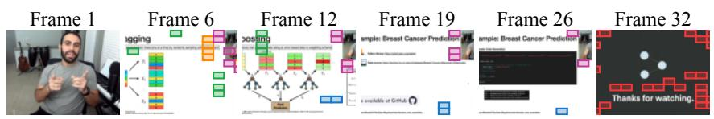

(a) Qualitative Cross-Frame Cluster Assignments  
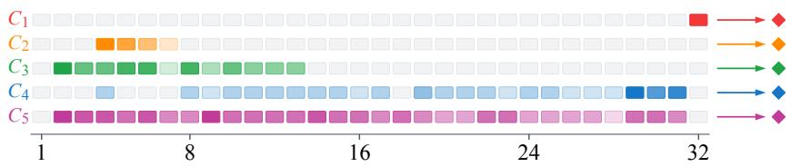  
(b) Token Distribution Across Frames and Cluster Aggregation

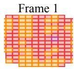

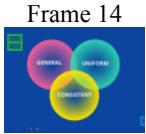

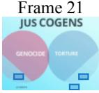

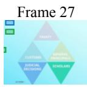  
(a) Qualitative Cross-Frame Cluster Assignments

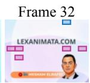

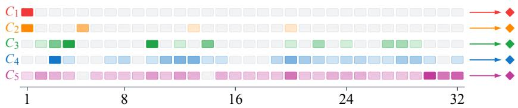  
(b) Token Distribution Across Frames and Cluster Aggregation

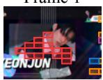

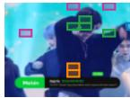

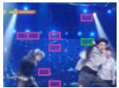

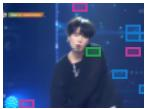

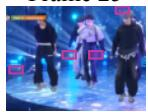  
(a) Qualitative Cross-Frame Cluster Assignments

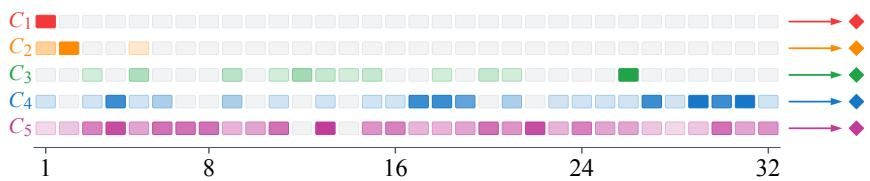  
(b) Token Distribution Across Frames and Cluster Aggregation

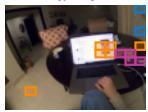

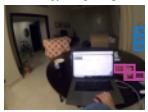

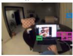

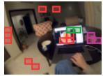

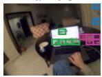

(a) Qualitative Cross-Frame Cluster Assignments  
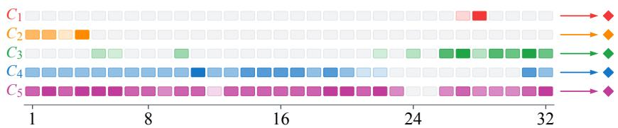  
(b) Token Distribution Across Frames and Cluster Aggregation  
Figure 4: Cross-frame cluster assignments produced by SimpleCluster on four videos.

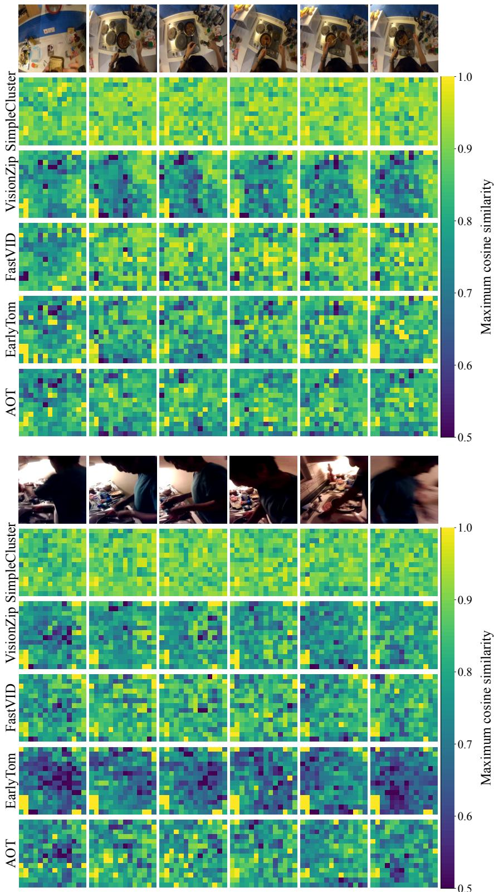  
Figure 5: Dense-feature coverage under nominal 5% token retention. Each heatmap cell shows the maximum cosine similarity between an original dense visual token and the compressed tokens produced by the corresponding method. All methods and frames share the same color scale, with brighter colors indicating better feature-space coverage. The maps measure representational prox imity rather than attention or task relevance.