# REVA: A SCENE-CENTRIC DATASET BEYOND REPE-TITION FOR REMOTE SENSING VIDEO QUESTION AN-SWERING

Zhen Yao1∗, Likai Wang1∗, Yuming Yang1, Zhihao Zheng1, Bo Lang1, Qiuyu Tang1, Jialu Sheng1, Jingqi Xu2, Yuehai Yang1, Jumal Barker1, Xiaowen Ying3, Mooi Choo Chuah1 1Lehigh University, 2University of Southern California, 3Qualcomm AI Research

## ABSTRACT

Multimodal Large Language Models (MLLMs) have demonstrated remarkable advances in remote sensing. However, existing remote sensing multimodal reasoning benchmarks exhibit two critical limitations: they rely on (i) template-driven questions, which causes repetitive questions; and (ii) static images that fail to capture the inherent temporal nature of drone/UAV videos. This leaves systematic evaluation of remote sensing video reasoning largely unexplored. To address this gap, we introduce ReVA, a new dataset for remote sensing video question answering, designed to assess spatiotemporal, scene-centric, and reasoning-oriented capabilities of MLLMs. ReVA comprises 2,438 drone videos spanning 18 cities worldwide (580K frames) and 22K high-quality question–answer pairs across 11 challenging QA tasks. We develop a semi-automatic annotation pipeline that leverages Text LLMs and MLLMs for question-answer generation with human verification. We evaluate 23 proprietary and open-source Video LLMs on ReVA, exposing fundamental limitations of current models. These findings position ReVA as a critical benchmark toward better remote sensing video understanding and temporal reasoning capabilities for real-world deployments. Our code and dataset are available at: https://github.com/zyaocoder/ReVA

## 1 INTRODUCTION

Recent advances in Multimodal Large Language Models (MLLMs) have significantly improved remote sensing image understanding, achieving strong performance in scene parsing. By coupling visual representation with natural language, these approaches demonstrate enhanced reasoning capabilities for complex aerial scenes.

Despite these advances, current remote sensing scene understanding faces two critical limitations: (i) Template-driven Questions: Existing benchmarks Wang et al. (2024a); Massih & Cosatto (2026) rely on pre-defined, fixed question templates, e.g., "Is there [Class] in the image?". While improving annotation scalability, it restricts linguistic diversity and reasoning complexity, yielding an oversimplified, repetitive QA paradigm ill-suited for real-world deployment. (ii) Limited Video-Centric Evaluation: Most established works Bashmal et al. (2023); Zhang et al. (2023) primarily focused on static images, yet remote sensing increasingly utilizes Unmanned Aerial Vehicles (UAVs) to capture continuous videos where the scenes change rapidly. The inherent temporal dynamics pose fundamental challenges that image-based reasoning cannot fully address. Concurrent studies have begun extending aerial understanding to videos; however, their objectives are mostly navigationrelated reasoning, leaving scene-centric VideoQA largely underexplored.

To this end, we introduce ReVA, a scene-centric dataset for remote sensing video understanding. Unlike prior image-based datasets, ReVA is built upon UAV video sequences and emphasizes holistic scene reasoning. As shown in Fig. 1, it comprises diverse aerial scenarios and a wide range of question types, establishing a rigorous benchmark for thoroughly evaluating multimodal reasoning in real-world remote sensing contexts. Beyond standard question categories (e.g., factual perception), it introduces two unique yet challenging categories: temporal understanding and causal reasoning.

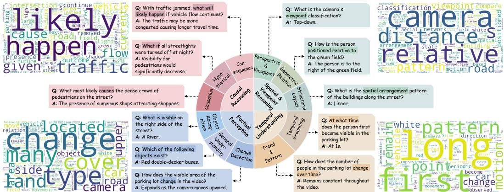  
Figure 1: Overview of ReVA. ReVA contains 22K question-answer pairs under 4 major categories and 11 QA tasks. Word clouds are presented, highlighting different attributes of various categories.

Furthermore, we propose a five-stage semi-automatic QA generation and annotation workflow, designed to be generalizable and to facilitate future research in remote sensing video understanding.

Building on ReVA, we further propose ReMoSense, a motion-aware framework for remote sensing video understanding. ReMoSense explicitly captures camera motions and object temporal dynamics to achieve robust cross-frame alignment and long-range temporal reasoning. Specifically, we introduce global motion tokens that encode camera ego-motion via cost volumes, and object motion tokens that auto-regressively refine object temporal dynamics across frames.

In summary, our contributions in this paper include:

• We introduce ReVA, a fully real-world, scene-centric remote sensing video question answering dataset with 2,438 UAV videos (580K frames) from 18 cities worldwide and 22K high-quality question-answer pairs (17K unique questions). Unlike prior UAV-view VideoQA benchmarks focused on urban/navigation settings, ReVA covers urban and rural scenes and evaluates a broader spectrum of remote sensing capabilities.

• We propose ReMoSense, a motion-aware framework for remote sensing video understanding that explicitly disentangles camera motion and object temporal dynamics via two complementary components: global motion tokens encoding camera ego-motion through cost volumes, and object motion tokens that iteratively refine object dynamics across frames.

• We develop a five-stage semi-automatic QA generation workflow for diverse, scene-centric, and reasoning-intensive QA pairs of 11 distinct tasks, reducing template-induced repetition.

• We comprehensively evaluate 23 mainstream MLLMs on remote sensing video understanding capabilities. These in-depth analysis demonstrate limitations of existing models and heuristic observations for future works.

## 2 RELATED WORK

## 2.1 DATASET AND BENCHMARK

In remote sensing (RS), VisualQA has attracted increasing research attention, yet existing remote sensing VisualQA datasets are image-based. HRVQA Li et al. (2024b) releases a large-scale remote sensing VisualQA benchmark for specific challenges like scale variation. EarthVQA Wang et al. (2024a) targets relation-centric reasoning by exploring geographical interactions among entities. RSVLM-QA Zi et al. (2025) emphasizes quantitative reasoning (e.g., counting). Despite these advances, image-based VisualQA cannot capture temporal dynamics, limiting evaluation of temporal reasoning required by applications such as disaster monitoring. Recent works have begun exploring dynamic UAV videos. UAVBench Ferrag et al. (2026) studies UAV cognition through single- and two-frame based flight scenarios but still has no video inputs. Concurrently, RSVideo-10K Zhou et al. (2026) explores remote sensing video understanding. As RSVideo-10K is concurrent with our work, we discuss it for completeness rather than include it in the direct comparison in Table 1. These efforts demonstrate growing interest in video reasoning, while differing from ReVA in task formulation,

Table 1: Dataset Comparison. ReVA is a real-world, scene-centric remote sensing VideoQA dataset comprising 2.4K videos with 22K human-annotated QA pairs and 17K unique questions.
<table><tr><td>Dataset</td><td>Year</td><td>#Video</td><td>#Image</td><td>#QA</td><td>Annotate</td><td>Unique question</td><td>FP</td><td>TU</td><td>SR</td><td>CR</td></tr><tr><td colspan="9">Natural Domain VideoQA</td><td></td><td></td></tr><tr><td>ActivityNet-QA Yu et al. (2019)</td><td>2019</td><td>5,800</td><td></td><td>58,000</td><td>Manual</td><td>18,897</td><td></td><td>X</td><td></td><td>X</td></tr><tr><td>Social-IQ Zadeh et al. (2019)</td><td>2019</td><td>1,250</td><td></td><td>7,500</td><td>Manual</td><td>5,713</td><td></td><td>X</td><td>X</td><td></td></tr><tr><td>NExT-QA Xiao et al. (2021)</td><td>2021</td><td>5,440</td><td></td><td>52,044</td><td>Auto</td><td>31,173</td><td></td><td></td><td>X</td><td></td></tr><tr><td>WildQA Castro et al. (2022)</td><td>2022</td><td>369</td><td></td><td>916</td><td>Manual</td><td>251</td><td></td><td></td><td></td><td></td></tr><tr><td>EgoSchema Mangalam et al. (2023)</td><td>2023</td><td>5,063</td><td></td><td>5,063</td><td>Auto</td><td>5,031</td><td></td><td></td><td>X</td><td></td></tr><tr><td>MVBench Li et al. (2024c)</td><td>2023</td><td>3,641</td><td></td><td>4,000</td><td>Auto</td><td>4,000</td><td></td><td></td><td></td><td></td></tr><tr><td>STAR Wu et al. (2024a)</td><td>2024</td><td>23,517</td><td></td><td>60,000</td><td>Auto</td><td>2,385</td><td></td><td></td><td>X</td><td>X</td></tr><tr><td colspan="9">Remote Sensing VisualQA</td><td></td><td></td></tr><tr><td>RSIVQA Zheng et al. (2021)</td><td>2021</td><td></td><td>37,264</td><td>111,134</td><td>Auto</td><td>91</td><td></td><td>X</td><td>X</td><td>X</td></tr><tr><td>FloodNet Rahnemoonfar et al. (2021)</td><td>2021</td><td></td><td>3,200</td><td>11,000</td><td>Manual</td><td>15</td><td></td><td>X</td><td>x</td><td>X</td></tr><tr><td>TextRS-VQA Bashmal et al. (2023)</td><td>2023</td><td></td><td>2,144</td><td>6,245</td><td>Manual</td><td>3,608</td><td></td><td>X</td><td>X</td><td>X</td></tr><tr><td>CRSVQA Zhang et al. (2023)</td><td>2023</td><td></td><td>4,639</td><td>4,644</td><td>Manual</td><td>674</td><td></td><td>X</td><td></td><td>X</td></tr><tr><td>RSIEval Hu et al. (2025)</td><td>2023</td><td></td><td>100</td><td>943</td><td>Manual</td><td>382</td><td></td><td></td><td></td><td>X</td></tr><tr><td>EarthVQA Wang et al. (2024a)</td><td>2024</td><td></td><td>6,000</td><td>208,593</td><td>Auto</td><td>28</td><td></td><td>X</td><td></td><td>X</td></tr><tr><td>SQuID Massih &amp; Cosatto (2026)</td><td>2026</td><td></td><td>2,000</td><td>2,000</td><td>Manual</td><td>391</td><td></td><td>X</td><td></td><td>X</td></tr><tr><td>UĀVBench Ferrag et al. (2026)</td><td>2026</td><td></td><td>47,488</td><td>47,488</td><td>Auto</td><td>47,453</td><td></td><td>X</td><td></td><td></td></tr><tr><td>ReVA (Ours)</td><td>2026</td><td>2,438</td><td></td><td>21,773</td><td>Manual</td><td>16,695</td><td></td><td></td><td></td><td></td></tr></table>

\* FP: Factual Perception, TU: Temporal Understanding, SR: Spatial Reasoning, CR: Causal Reasoning.  
scope, and repetition. ReVA focuses specifically on scene-centric VideoQA over real-world videos, with diverse questions spanning four major categories.

In contrast, natural domain VideoQA increasingly push beyond image-level reasoning toward long-horizon video understanding. NExT-QA Xiao et al. (2021) advances video understanding from shallow descriptions to deeper explanation of temporal action reasoning. LongVideoBench Wu et al. (2024b) first extends the task to challenging long-context videos and constructs a dataset with hour-level videos, while EgoSchema Mangalam et al. (2023) evaluates long-form comprehension on three-minute-long video clips. Ego4D Grauman et al. (2022) provides a large-scale egocentric video dataset containing daily human activities across diverse environments including home and workplace. MovieChat-1K Song et al. (2024) evaluates long-video understanding with redundant frames to measure robustness to long-range dependencies.

As summarized in Table 1, existing remote sensing VisualQA and natural-domain VideoQA benchmarks leave a critical gap: a benchmark for remote sensing video understanding that demands RS-relevant spatiotemporal reasoning. This motivates the construction of ReVA, which addresses this gap along two key dimensions. First, ReVA emphasizes linguistic diversity, containing 17K unique questions that substantially reduce template-driven repetition. Second, ReVA introduces challenging question types (e.g., temporal understanding) absent from prior datasets. It enables systematic evaluation of video-specific reasoning under real-world remote sensing conditions.

## 2.2 MULTIMODAL REASONING IN REMOTE SENSING

Multimodal reasoning in remote sensing aims to integrate visual and language reasoning over aerial or satellite imagery. Some researchers design domain-specific MLLM. GeoChat Kuckreja et al. (2024) finetunes LLaVA Liu et al. (2023); Li et al. (2024a); Zhang et al. (2024c) for a remote sensing MLLM on self-collected dataset. RSGPT Hu et al. (2025) finetunes the Q-Former network of LLMs for cross-modal alignment. Another line of works explore prompt- or reasoning-driven approaches. Prompt-RSVQA Chappuis et al. (2022) converts the image context into a text prompt for better remote sensing understanding. MQVQA Zhang et al. (2023) uses a question-driven multi-step reasoning mechanism to select local regions for fine-grained, question-related visual features. RemoteReasoner Yao et al. (2025) aggregates pixel-, object-, and region-level for multi-scale reasoning. SkyAnchor Sun et al. (2026) propsoes a Semantics-Aware Token Router to preserve tiny objects in video streams.

## 3 REVA DATASET

## 3.1 VIDEO DATA CURATION

Remote sensing has become an essential field for environmental monitoring Yao et al. (2024), disaster response Sarkar et al. (2023), and traffic analysis Parikh et al. (2025). With the rapid advancement of drone technology, high-resolution aerial videos are increasingly available, enabling dynamic observation of complex real-world scenes.

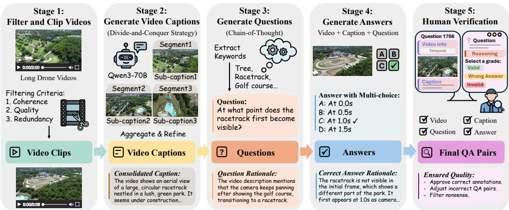  
Figure 2: Overview of the five-stage QA generation workflow. Stage 1: Long drone video filtering and clipping; Stage 2: Comprehensive video caption generation; Stage 3: Scene-relevant keywords and questions with rationales generation; Stage 4: Multi-choice answers with answer rationales generation; Stage 5: Human verification.

For diversity of aerial scenarios, ReVA comprises videos from four sources: 525 from ERA Mou et al. (2020), 544 from VisDrone Zhu et al. (2021), 89 from UAVDT Du et al. (2018), and 1280 our self-collected videos using a DJI MINI 4 drone. This diverse collection ensures comprehensive coverage of various aerial perspectives and geographic contexts.

All videos are resized to 640×360 and trimmed to 15-second clips. Specifically, the ERA subset covers a wide range of activities (e.g., sports and disasters) for scene diversity. The VisDrone subset captures near-ground perspectives at altitudes <50 meters, covering urban scenes like city streets and traffic activities. UAVDT comprises long videos for temporal variations. In contrast, our collected videos offer higher altitudes approximately at 100 meters, covering rural scenes. Together, these subsets ensure ReVA covers diverse altitude ranges and scene types from near-ground urban activities to high-altitude rural landscapes, providing comprehensive aerial coverage for thorough evaluation.

To prevent scene leakage from training to evaluation, we split the dataset at the original video sequence level rather than clip-level. All clips from the same original video sequence are assigned exclusively to one of the training, validation, or test sets. Therefore, adjacent clips from the same video sequence never appear across different splits, ensuring that training is fully disjoint from testing.

## 3.2 FORMULATION

We formulate ReVA as a scene-centric video question answering (VideoQA) dataset for remote sensing. Each question-answer pair consists of a video clip $V = \{ \bar { f _ { 1 } } , f _ { 2 } , \dots , f _ { T } \}$ where f is a single frame and a natural language question Q. For video-dependent questions, the correct answer requires integrating evidence across multiple frames or over temporal changes, while other questions evaluate scene-level understanding within the video. To facilitate objective evaluation, each question Q is presented in a multiple-choice format with candidate options $C = \{ c _ { 1 } , c _ { 2 } , \ldots , c _ { n } \}$

## 3.3 QUESTION-ANSWER PAIR CONSTRUCTION

Existing RS VisualQA annotation pipelines often scale by enumerating semantic classes with fixed templates (e.g., class existence), yielding repetitive questions. To this end, we propose a five-stage semi-automatic QA generation workflow conditioned on scene context, task objectives, and temporal evidence, producing diverse, scene-centric QA pairs. Fig. 2 illustrates the full pipeline.

Video Filtering and Clipping. We manually filtered all videos according to three criteria: coherence (narratively inconsistent videos), quality (static or blurry videos), and redundancy (duplicated sequences). The filtered videos are then trimmed to approximately 15-second clips to ensure sufficient scene information for meaningful question generation.

Video Caption Generation. We adopt a divide-and-conquer strategy to generate comprehensive captions using Qwen3-VL-30B-A3B-Instruct Bai et al. (2025). Each video is divided into three segments, with Qwen3 generating an individual caption per segment. The full video and segment-level captions are then fed into the MLLM for a consolidated caption capturing global scene context.

Q: How does the number of people visible on the pathway change throughout the video? A. It increases, then decreases as camera moves forward. B: It increases as the camera moves forward. C: It decreases as the camera moves forward. D: It remains constant throughout the video.

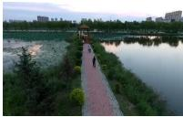

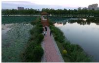

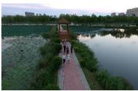

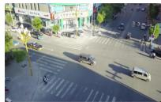

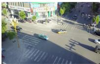

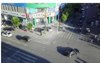

## Q: How long does the yellow taxi remain visible in the video frame?

A: From 0.0s to 6.0s (duration: 6.0s)

B: From 0.0s to 2.5s (duration: 2.5s)

C: From 1.0s to 5.0s (duration: 4.0s)

D: From 0.5s to 3.5s (duration: 3.0s)

Figure 3: Examples of ReVA. Correct answers are marked in green.  
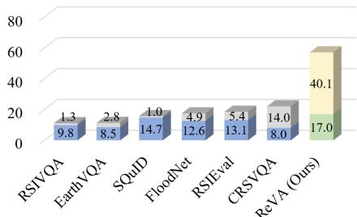  
(a) Average token length

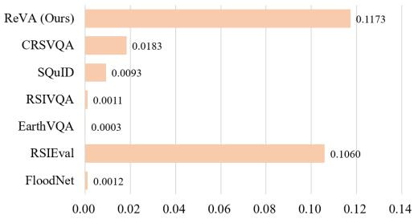  
(b) 2-gram diversity  
Figure 4: QA uniqueness analysis. ReVA achieves the highest (a) average token length (question on bottom and answer on top) and (b) 2-gram diversities, reflecting superior lexical diversity.

Question Generation. We generate questions via a Chain-of-Thought Wei et al. (2022) pipeline using caption and video as inputs. The MLLM is prompted to output scene-relevant keywords and generate reasoning-intensive questions with rationales justifying their significance based on keywords.

Answer Generation. Subsequently, each generated question is fed back into the MLLM alongside the video and consolidated caption to produce a multi-choice answer with its reasoning process. While the rationale is excluded from the final released QA pairs, we empirically find that requiring explicit reasoning encourages deeper inference, yielding more contextually grounded, solid answers.

Human Verification. To reduce LLM hallucinations, all automatically generated QA pairs undergo a multi-stage human verification process. In the first stage, eight trained reviewers inspect assigned QA pairs for correctness of the answer and question-answer-option quality. Each QA pair is reviewed by two reviewers. Reviewers either (1) accept the QA pair, (2) make minor corrections, (3) reject the QA, or (4) flag it for further review. In the second stage, two additional expert reviewers examine flagged samples and adjudicate ambiguous cases. QA pairs that cannot be reliably grounded in the video are removed. More details are in the Appendix. Fig. 3 shows two examples of our data.

## 3.4 STATISTICS AND ANALYSIS

Geographical Distribution. ReVA spans 18 cities, 14 from China (VisDrone) and 4 from the United States (rural areas) spanning Illinois, Pennsylvania, and New York (our collected videos):

• China: Tianjin, Hong Kong, Daqing, Ganzhou, Guangzhou, Jinchang, Liuzhou, Nanjing, Shaoxing, Shenyang, Nanyang, Zhangjiakou, Suzhou, and Xuzhou.

• United States: Champaign (IL), Philadelphia (PA), Bethlehem (PA), and New York (NY).

The videos comprise multiple viewpoints (e.g., top-down and low-angle view) and cover diverse scene elements such as roads and farmlands, recorded under varying weather conditions. Geographic metadata for ERA is unavailable, as videos were collected from public internet sources.

Dataset Statistics. As summarized in Table 2, ReVA contains 2,438 videos, with 15,773, 2,000, and 4,000 QA pairs in the training, validation, and test sets, respectively. The corresponding split-level video counts are 1,045, 379, and 1,014. The training videos are kept disjoint from both evaluation subsets. As shown in Fig. 4, ReVA achieves the highest average token length and 2-gram diversity, demonstrating greater linguistic diversity and scene-centric QA pairs.

Table 2: ReVA Statistics.
<table><tr><td>Split</td><td>Video</td><td>QA pairs</td></tr><tr><td>Train</td><td>1,045</td><td>15,773</td></tr><tr><td>Val</td><td>379</td><td>2,000</td></tr><tr><td>Test</td><td>1,014</td><td>4,000</td></tr><tr><td>Total</td><td>2,438</td><td>21,773</td></tr></table>

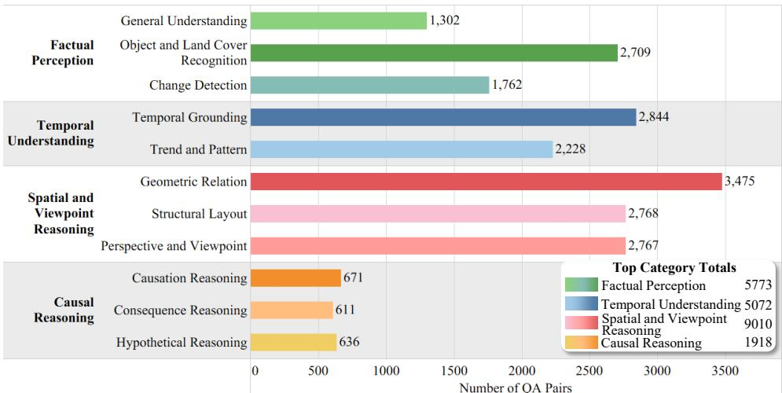  
Figure 5: Question distribution by categories and tasks.

Question Taxonomy. We organize ReVA questions into 4 major categories with 11 QA tasks as shown in Fig. 5: (1) Factual Perception focuses on observable visual content in the scene, comprising 5,773 QA pairs: (a) General Understanding with overall scene-level perception (1,302); (b) Object and Land Cover Recognition covering brief questions like existence, counting, and classification (2,709); and (c) Change Detection with differences across frames (1,762). (2) Temporal Understanding evaluates capabilities of reasoning over time and aggregating cross-frame information, comprising 5,072 samples: (a) Temporal Grounding with precise timestamp localization (2,844); and (b) Trend and Pattern demanding temporal reasoning of dynamic processes (2,228). (3) Spatial and Viewpoint Reasoning measures spatial relational reasoning and camera-scene interaction, comprising 9,010 samples: (a) Geometric Relation with spatial relationships between objects (3,475); (b) Structural Layout for spatial arrangement and network structure patterns such as roads and rivers (2,768); and (c) Perspective and Viewpoint covering camera states and motion understanding (2,767). (4) Causal Reasoning assesses higher-level logical inference grounded in observable evidence, comprising 1,918 samples: (a) Causation Reasoning identifying cause-effect relationships (671); (b) Consequence Reasoning predicting plausible outcomes from observed trends (611); and (c) Hypothetical Reasoning for counterfactual reasoning against direct observation (636). This hierarchical taxonomy enables temporal aggregation and spatial reasoning rather than low-level perception only, establishing a comprehensive benchmark for scene-centric, reasoning-intensive remote sensing video understanding.

## 4 REMOSENSE: MOTION-AWARE REMOTE SENSING VIDEOQA

## 4.1 MOTIVATION

Remote sensing drone videos exhibit motion patterns distinct from natural videos: dominant camera ego-motion from viewpoint and altitude changes coexists with small, subtle object dynamics. Generic video models typically learn motion implicitly, making it difficult to separate camera-induced motion from true scene changes, especially under limited remote sensing supervision. This ambiguity disrupts cross-frame correspondence and degrades viewpoint and long-range temporal understanding.

To address these limitations, we propose ReMoSense, a motion-aware framework for remote sensing video understanding that explicitly disentangles inter-frame correspondence motion from object temporal dynamics. By modeling dual motion as explicit, structured inputs rather than implicit features, ReMoSense directly mitigates the motion ambiguity, improving spatiotemporal reasoning.

## 4.2 ARCHITECTURE OVERVIEW

Fig. 6 provides an overview of our proposed ReMoSense. Our model follows a standard next-token prediction paradigm and consists of 4 components: an image encoder Dosovitskiy et al. (2020), a text encoder, a Motion-Aware Alignment Module, and an LLM decoder. We first encode each input frame independently to extract patch-level visual tokens $X _ { \mathrm { i m g } }$ . The alignment module then computes cost volumes between consecutive frames to derive global correspondence tokens $X _ { \mathrm { c o r r } }$ for cross-frame correlation. In parallel, we initialize learnable object motion tokens $X _ { \mathrm { o b j } }$ at $t = 1$ and propagate them. For each subsequent frame $t = 2 , \ldots , T$ , previous object tokens $X _ { \mathrm { o b j } } ^ { t - \mathrm { { \bar { 1 } } } }$ are updated $X _ { \mathrm { o b j } } ^ { t }$ using the current visual tokens to iteratively refine object dynamics. Finally, we concatenate visual tokens and two motion tokens, generating a motion-enhanced visual representation $X ^ { 1 : T } = [ X _ { \mathrm { i m g } } ^ { 1 : T } ; X _ { \mathrm { c o r r } } ^ { 1 : T } ; X _ { \mathrm { o b j } } ^ { 1 : T } ]$ with the encoded question and feed the sequence X to decoder for final answer.

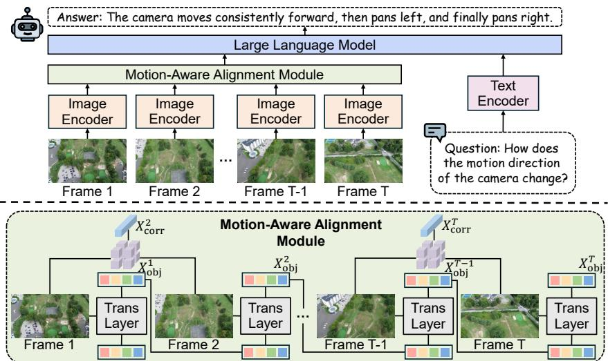  
Figure 6: Overview of ReMoSense Framework and Motion-Aware Alignment Module. The Motion-Aware Alignment Module captures inter-frame correspondence for global motion alignment. It then captures salient object motion iteratively for long-range temporal consistency.

## 4.3 DUAL MOTION-AWARE ALIGNMENT

ReMoSense introduces motion-aware alignment by modeling global correspondence tokens that encode general inter-frame visual changes via cost volumes, and object motion tokens that autoregressively update temporal dynamics of salient objects across frames for long-range dependency. These two key components form our Dual Motion-Aware Alignment Module, which injects explicit geometric motion, enhancing spatiotemporal coherence for long-range reasoning.

Global Inter-frame Correspondence. Given visual tokens $\{ X _ { \mathrm { i m g } } ^ { n } , X _ { \mathrm { i m g } } ^ { n + 1 } \} \in \mathbb { R } ^ { H \times W \times C }$ for two consecutive frames, we construct cost volume maps $\mathcal { C } ^ { n + 1 } \in \mathbb { R } ^ { H W / }$ /16×HW/16 by computing pairwise similarities between their downsampled patch tokens $( X _ { \mathrm { i m g } } ^ { n }$ and $X _ { \mathrm { i m g } } ^ { n + 1 }$ to $H / 4 \times \mathbf { \bar { W } } / 4 \times \mathbf { \bar { C } }$ resolution):

$$
\mathcal { C } ^ { n + 1 } ( i , j ) = \frac { { X _ { \mathrm { i m g } } ^ { n } ( i ) ^ { \prime } } ^ { \top } { X _ { \mathrm { i m g } } ^ { n + 1 } ( j ) ^ { \prime } } } { \left\| { X _ { \mathrm { i m g } } ^ { n } ( i ) ^ { \prime } } \right\| _ { 2 } \left\| { X _ { \mathrm { i m g } } ^ { n + 1 } ( j ) ^ { \prime } } \right\| _ { 2 } } , \quad i , j \in \{ 1 , \ldots , H W / 1 6 \} ,\tag{1}
$$

where $X _ { \mathrm { i m g } } ^ { \prime }$ are downsampled visual tokens. We then expand each scalar value through an MLP, yielding a channel-expanded correspondence representation $\mathcal { C } ^ { n + 1 \prime } \in \mathbb { R } ^ { H W / 1 6 \times H W / 1 6 \times C }$ . Finally, we apply global pooling over the two spatial dimensions to obtain a compact global correspondence token $\bar { X } _ { \mathrm { c o r r } } ^ { n + 1 } \in \mathbb { R } ^ { 1 \times C }$ and concatenate it to $X _ { \mathrm { i m g } } ^ { n + 1 }$ . This representation summarizes aggregate interframe correspondence patterns associated with global visual changes, such as those induced by camera and viewpoint movement, and provides compact motion-aware cue for cross-frame reasoning.

Iterative Object Motion Modeling. To capture temporally consistent object dynamics in an endto-end framework, we introduce learnable object motion tokens $X _ { \mathrm { o b j } } \in \mathbf { \bar { \mathbb { R } } } ^ { K \times \check { C } }$ propagated autoregressively across frames. $\mathbf { A } \mathbf { t } t = 1$ , we initialize $X _ { \mathrm { o b j } } ^ { t = 1 }$ as learnable parameters. For each subsequent frame $t = n$ , previous queries $X _ { \mathrm { o b j } } ^ { n - 1 }$ are updated via Transformer layers, injecting frame-specific visual features $X _ { \mathrm { i m g } } ^ { n }$ while preserving temporal states. The output $X _ { \mathrm { o b j } } ^ { n }$ is a refined object-centric representation that follow subtle motions and appearance changes across frames. We repeat this refinement process over $t = 1 : T ,$ , yielding a sequence of temporally aligned object tokens that encode motion and appearance changes across frames. These tokens are concatenated with their corresponding frame’s visual tokens, as input to the LLM decoder, augmenting each frame with an object-centric association. This recurrent design provides a lightweight mechanism for maintaining object consistency over long horizons, enhancing long-range dependency in dynamic aerial scenes.

Table 3: Accuracy (%) on ReVA test set. The best-performing results are presented in bold, while the second-best results are underlined.
<table><tr><td rowspan="3">Model</td><td rowspan="3">Size</td><td colspan="2">Factual Perception</td><td colspan="2">Temporal Understanding</td><td colspan="3">Spatial Reasoning</td><td colspan="3">Causal Reasoning</td><td rowspan="3">Overall</td></tr><tr><td colspan="3">GU</td><td colspan="2">TG TP</td><td colspan="2">GR SL</td><td colspan="3">CA</td></tr><tr><td></td><td>OR</td><td>CD</td><td></td><td></td><td></td><td>PV</td><td></td><td>CO</td><td>HR</td></tr><tr><td colspan="10">Based on Proprietary MLLMs</td><td></td><td></td><td></td></tr><tr><td>LLoVi</td><td></td><td>86.67</td><td>65.15</td><td>55.00 49.06</td><td>68.33</td><td>63.75</td><td>76.76</td><td>55.21</td><td>88.89</td><td>90.00</td><td>85.62</td><td>64.73</td></tr><tr><td>VideoTree</td><td></td><td>75.00</td><td>46.67 49.60</td><td>45.63</td><td>63.33</td><td>48.50</td><td>64.12</td><td>50.63</td><td>88.89</td><td>83.00</td><td>86.88</td><td>56.20</td></tr><tr><td>VideoAgent</td><td></td><td>74.44 43.33</td><td></td><td>47.20 39.69</td><td>59.44</td><td>46.25</td><td>62.94</td><td>52.71</td><td>85.56</td><td>79.00</td><td>85.00</td><td>53.62</td></tr><tr><td colspan="10">Open-source MLLMs Trained on Our 22K ReVA Video Data</td><td colspan="3"></td></tr><tr><td>LLaVA-NeXT-Video</td><td>7B</td><td>78.33</td><td>55.76 46.20</td><td>39.06</td><td>51.67</td><td>50.75</td><td>62.35</td><td>39.79</td><td>83.89</td><td>82.00</td><td>65.00</td><td>52.98</td></tr><tr><td>VideoChat-Flash</td><td>7B</td><td>96.67</td><td>77.42 66.60</td><td>60.47</td><td>74.44</td><td>70.50</td><td>77.06</td><td>61.88</td><td>91.67</td><td>92.00</td><td>83.12</td><td>72.60</td></tr><tr><td>Video-LLaVA</td><td>7B</td><td>62.78</td><td>49.55</td><td>44.40</td><td>64.22 59.44</td><td>64.00</td><td>56.47</td><td>61.46</td><td>86.67</td><td>81.00</td><td>60.62</td><td>59.10</td></tr><tr><td>VideoLLaMA2 BIMBA</td><td>7B</td><td>92.22 94.44</td><td>71.51 71.20</td><td>73.70</td><td>73.56</td><td>70.75</td><td>79.64</td><td>76.68</td><td>92.22</td><td>98.00</td><td>85.62</td><td>76.33</td></tr><tr><td>ReMoSense (Ours)</td><td>7B</td><td>72.42</td><td>64.40</td><td>64.06</td><td>63.89</td><td>69.00</td><td>78.24</td><td>80.83</td><td>94.44</td><td>96.00</td><td>83.75</td><td>73.50</td></tr><tr><td></td><td>7B</td><td>96.12 78.03</td><td>70.85</td><td>76.21</td><td>76.40</td><td>74.25</td><td>83.27</td><td>83.74</td><td>95.32</td><td>97.65</td><td>90.74</td><td>80.04</td></tr><tr><td colspan="10">Open-source MLLMs Trained on Larger Scale Instruction LLaVA-Video-178K Data</td><td colspan="3"></td></tr><tr><td>NVILA VideoLLaMA2</td><td>3B</td><td>88.89</td><td>57.88</td><td>27.20</td><td>45.62</td><td>35.00</td><td>42.00 64.71</td><td>50.42</td><td>43.33</td><td>62.00</td><td>60.00</td><td>49.05</td></tr><tr><td>LLaVA-NeXT-Video</td><td>7B</td><td>78.89</td><td>57.12</td><td>56.00</td><td>47.50</td><td>68.89</td><td>43.00 61.18</td><td>41.88</td><td>90.56</td><td>88.00</td><td>84.38</td><td>57.95</td></tr><tr><td>VideoChat-Flash</td><td>7B</td><td>95.00</td><td>75.61</td><td>59.00</td><td>40.47</td><td>66.94</td><td>69.00</td><td>72.06 60.21</td><td>88.89</td><td>87.00</td><td>82.50</td><td>66.35</td></tr><tr><td></td><td>7B</td><td>94.44</td><td>74.70</td><td>63.20</td><td>56.72</td><td>72.22</td><td>69.50</td><td>70.00 55.00</td><td>92.78</td><td>93.00</td><td>83.75</td><td>69.40</td></tr><tr><td>Video-LLaVA BIMBA</td><td>7B</td><td>88.89</td><td>65.76</td><td>57.20</td><td>59.06</td><td>56.11</td><td>68.00</td><td>77.06 54.17</td><td>91.11</td><td>90.00</td><td>82.50</td><td>66.00 72.85</td></tr><tr><td>MovieChat-OneVision</td><td>7B 7B</td><td>97.78</td><td>75.15 73.64</td><td>59.60 62.00</td><td>65.62</td><td>65.56 63.33</td><td>61.50 60.00</td><td>73.53 80.83</td><td>94.44</td><td>96.00</td><td>86.25</td><td>64.37</td></tr><tr><td>VideoMind</td><td>7B</td><td>95.56 92.22</td><td>70.45</td><td>60.40</td><td>55.31 32.66</td><td>63.33</td><td>65.50</td><td>62.35 35.83 67.06</td><td>94.78</td><td>96.00</td><td>83.75</td><td>62.40</td></tr><tr><td>VITAL</td><td>7B</td><td>85.56</td><td>68.03</td><td>57.60</td><td>38.12</td><td>68.89</td><td>65.50</td><td>53.75 69.41 67.29</td><td>90.56 87.22</td><td>87.00 84.00</td><td>80.00 83.75</td><td>64.48</td></tr><tr><td>Tarsier2</td><td>7B</td><td>93.89</td><td>74.09</td><td>62.20</td><td>41.41</td><td>63.61</td><td>59.25</td><td>67.94 58.96</td><td>90.00</td><td>82.00</td><td>80.00</td><td>64.65</td></tr><tr><td>AVATAR</td><td>7B</td><td>34.44</td><td>43.94</td><td>49.40</td><td>37.81</td><td>56.39</td><td>62.25</td><td>54.12</td><td>41.04 85.00</td><td>87.00</td><td>78.12</td><td>50.98</td></tr><tr><td>InternVL3</td><td>7B</td><td>94.44</td><td>71.36</td><td>63.00</td><td>40.00</td><td>68.06</td><td>70.75</td><td>70.88</td><td>59.79 90.00</td><td>85.00</td><td>85.00</td><td>66.28</td></tr><tr><td>NVILA</td><td>8B</td><td>93.33</td><td>77.88</td><td>55.20</td><td>36.25</td><td>70.00</td><td>67.50</td><td>61.76 68.33</td><td>90.00</td><td>92.00</td><td>82.50</td><td>65.90</td></tr><tr><td>Gemma3</td><td>27B</td><td>92.22</td><td>76.67</td><td>57.40</td><td>42.03</td><td>65.28</td><td>69.25</td><td>75.00 58.96</td><td>89.44</td><td>90.00</td><td>87.50</td><td>66.72</td></tr><tr><td>Nemotron3-Nano-Omni</td><td>30B</td><td>93.89</td><td>72.73</td><td>60.80</td><td>38.91</td><td>69.72</td><td>71.75</td><td>72.35 63.12</td><td>90.56</td><td>95.00</td><td>83.12</td><td>67.00</td></tr><tr><td>ReMoSense (Ours)</td><td>7B</td><td>97.78</td><td>74.85</td><td>67.20</td><td>58.44</td><td>75.00</td><td>78.00 85.29</td><td>81.25</td><td>96.67</td><td>98.00</td><td>90.00</td><td>76.45</td></tr><tr><td></td><td></td><td></td><td></td><td></td><td></td><td></td><td></td><td></td><td></td><td></td><td></td><td></td></tr></table>

\* GU: General Understanding, OR: Object and Land Cover Recognition, CD: Change Detection, TG: Temporal Grounding, TP: Trend and Pattern, GR: Geometric Relation, SL: Structural Layout, PV: Perspective and Viewpoint, CA: Causation Reasoning, CO: Consequence Reasoning, and HR: Hypothetical Reasoning

## 5 EXPERIMENTS

## 5.1 EVALUATION DETAILS

Experimental Setting. To thoroughly evaluate video reasoning capabilities of MLLMs on ReVA, we selected: (1) Proprietary MLLMs, e.g., LLoVi Zhang et al. (2024a), VideoAgent Wang et al. (2024b), and VideoTree Wang et al. (2025); (2) Open-source MLLMs fine-tuned on ReVA training set, e.g., VideoChat-Flash Li et al. (2024d), LLaVA-NeXT-Video Zhang et al. (2024b), VideoLLaVA Lin et al. (2024), VideoLLaMA2 Cheng et al. (2024), BIMBA Islam et al. (2025); (3) Open-source MLLMs from 3B to 30B trained on large instruction video data, e.g., MovieChat-OneVision Song et al. (2025), InternVL3 Zhu et al. (2025), NVILA Liu et al. (2025b), VideoMind Liu et al. (2025a), VITAL Zhang et al. (2025), Tarsier2 Yuan et al. (2025). Note that for (3), we test baselines pre-trained on the LLaVA-Video-178K dataset Zhang et al. (2024c) following common practice Islam et al. (2025).

To ensure fair comparison, all baselines trained on ReVA video data are fine-tuned for 24K steps with a global batch size of 1. All other training details including frame sampling rate and other hyper-parameters follow their respective original settings. We set maximum output token length to 512 following common practice. For our model training, we use AdamW optimizer Loshchilov & Hutter (2017) with a learning rate of 2e-4, cosine decay schedule, and warmup ratio of 0.03 under DeepSpeed ZeRO-1 framework Rasley et al. (2020). All training and evaluation are conducted on 2 NVIDIA 80GB A100 GPUs.

Implementation Details. For ReMoSense, we set number of object motion token to K = 16 and they are randomly initialized. We downsample visual tokens from 64 × 64 to 16 × 16 when computing cost volumes, which reduces the overhead to only 10%. We use standard cross-entropy loss for text generation following common practice Islam et al. (2025).

## 5.2 QUANTITATIVE RESULTS

We evaluate baseline model performance on ReVA test set in Table 3. When fine-tuned on ReVA, our proposed method, ReMoSense, achieves 80.04% overall accuracy, outperforming the previous best fine-tuned baseline VideoLLaMA2 by 3.7%. Compared to our baseline model with the same backbone, BIMBA, the performance improves 6.5%. When trained on large-scale data, ReMoSense achieves 76.45% overall accuracy, outperforming the previous best model, BIMBA, by 3.6%. Among all categories, our model demonstrates the most improvements on Geometric Relation (+6.3%) and Structural Layout (+8.2%).

Table 4: Ablation study for various design choices. The best-performing results are presented in bold, while the second-best results are underlined.
<table><tr><td rowspan="3">Variant</td><td rowspan="3">Global</td><td rowspan="3">Object</td><td colspan="3">Factual Perception</td><td colspan="2">Temporal Understanding</td><td colspan="3">Spatial Reasoning</td><td colspan="3">Causal Reasoning</td><td rowspan="3">Overall</td></tr><tr><td colspan="3">GU</td><td colspan="2">TG</td><td colspan="3"></td><td colspan="3"></td></tr><tr><td></td><td>OR</td><td>CD</td><td></td><td>TP</td><td>GR</td><td>SL</td><td>PV</td><td>CA</td><td>CO</td><td>HR</td></tr><tr><td>I</td><td></td><td></td><td>94.44</td><td>72.42</td><td>64.40</td><td>64.06</td><td>63.89</td><td>69.00</td><td>78.24</td><td>80.83</td><td>94.44</td><td>96.00</td><td>83.75</td><td>73.50</td></tr><tr><td>ⅡI</td><td>√</td><td></td><td>95.00</td><td>74.85</td><td>69.80</td><td>65.62</td><td>65.28</td><td>70.50</td><td>78.24</td><td>81.25</td><td>92.78</td><td>93.00</td><td>87.50</td><td>75.18</td></tr><tr><td>ⅢII</td><td></td><td>√</td><td>95.56</td><td>76.67</td><td>67.20</td><td>67.18</td><td>65.66</td><td>71.50</td><td>80.94</td><td>81.50</td><td>94.44</td><td>96.00</td><td>91.25</td><td>76.12</td></tr><tr><td>IV</td><td>√</td><td>√</td><td>96.12</td><td>78.03</td><td>70.85</td><td>76.21</td><td>76.40</td><td>74.25</td><td>83.27</td><td>83.74</td><td>95.32</td><td>97.65</td><td>90.74</td><td>80.04</td></tr></table>

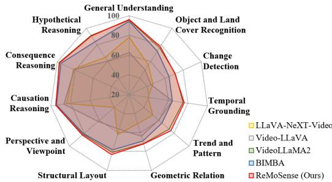  
(a) Open-source MLLMs trained on ReVA

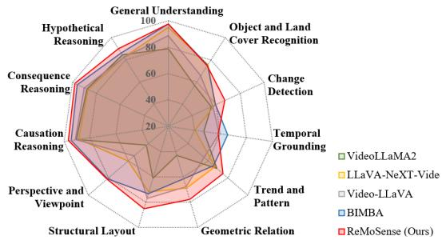  
(b) Open-source MLLMs trained on large-scale data  
Figure 7: Per-task comparisons with SOTA methods on ReVA test set.

## 5.3 ABLATION STUDY

Table 4 presents ablation studies of ReMoSense when trained on ReVA data with the same Qwen2.5- VL backbone: (I) baseline; (II) ReMoSense without object motion tokens; (III) ReMoSense without global correspondence tokens; (IV) full model. Removing global correspondence tokens leads to an average drop of 3.9%. Among all tasks, Temporal Grounding decreases by 9.0%, confirming its role in capturing cross-frame dynamics. Removing object motion tokens causes 4.9% degradation. The proposed global motion complements the object motion by providing scene-level temporal context. The full model achieves the best performance, showing the complementary nature of both tokens.

## 5.4 DISCUSSION

Our analysis reveals three key limitations of current MLLMs on remote sensing video understanding. (1) Existing models exhibit a systematic bias of spatial priors: they tend to output descriptions such as “left-top corner” when they are uncertain, suggesting pretrained spatial heuristics over true geometric reasoning. (2) Their failures are particularly evident in temporal grounding and viewpoint reasoning, where models confuse activity order, over-rely on visually salient key frames, and fail to disentangle camera ego-motion from object motion. It indicates that video MLLMs lack explicit mechanisms for modeling inter-frame continuity and orientation. (3) Results from ReVA fine-tuning show that domain-aligned training is more effective than simply scaling model size, especially for spatiotemporal tasks. These findings show that remote sensing videoQA requires benchmarks and models that go beyond generic video-language pretraining. More details are in the Appendix.

## 6 CONCLUSION

In this paper, we present ReVA, a fully real-world remote sensing VideoQA dataset designed for scene-centric understanding, comprising 22K QA pairs across 2,438 videos from 18 cities and 17K unique questions spanning 11 tasks. We further develop a five-stage semi-automatic QA generation pipeline that ensures scalability and facilitates future dataset construction. We thoroughly evaluate 23 proprietary and open-source Video LLMs on ReVA, revealing fundamental limitations in temporal grounding and viewpoint reasoning under aerial perspectives. To address these gaps, we propose ReMoSense, a motion-aware framework that explicitly models global correspondence motion for robust cross-frame alignment and object motion for long-range temporal reasoning. Together, ReVA and ReMoSense advance the boundary of remote sensing video understanding, offering a promising direction and a strong baseline for future remote sensing reasoning research.

## REFERENCES

Josh Achiam, Steven Adler, Sandhini Agarwal, Lama Ahmad, Ilge Akkaya, Florencia Leoni Aleman, Diogo Almeida, Janko Altenschmidt, Sam Altman, Shyamal Anadkat, et al. Gpt-4 technical report. arXiv preprint arXiv:2303.08774, 2023.

Jinze Bai, Shuai Bai, Yunfei Chu, Zeyu Cui, Kai Dang, Xiaodong Deng, Yang Fan, Wenbin Ge, Yu Han, Fei Huang, et al. Qwen technical report. arXiv preprint arXiv:2309.16609, 2023.

Shuai Bai, Yuxuan Cai, Ruizhe Chen, Keqin Chen, Xionghui Chen, Zesen Cheng, Lianghao Deng, Wei Ding, Chang Gao, Chunjiang Ge, et al. Qwen3-vl technical report. arXiv preprint arXiv:2511.21631, 2025.

Laila Bashmal, Yakoub Bazi, Farid Melgani, Riccardo Ricci, Mohamad M Al Rahhal, and Mansour Zuair. Visual question generation from remote sensing images. IEEE Journal ofSelected Topics in Applied Earth Observations and Remote Sensing, 16:3279–3293, 2023.

Santiago Castro, Naihao Deng, Pingxuan Huang, Mihai Burzo, and Rada Mihalcea. In-the-wild video question answering. In Proceedings of the 29th International Conference on Computational Linguistics, pp. 5613–5635, 2022.

Christel Chappuis, Valérie Zermatten, Sylvain Lobry, Bertrand Le Saux, and Devis Tuia. Promptrsvqa: Prompting visual context to a language model for remote sensing visual question answering. In Proceedings of the IEEE/CVF conference on computer vision and pattern recognition, pp. 1372–1381, 2022.

Zesen Cheng, Sicong Leng, Hang Zhang, Yifei Xin, Xin Li, Guanzheng Chen, Yongxin Zhu, Wenqi Zhang, Ziyang Luo, Deli Zhao, et al. Videollama 2: Advancing spatial-temporal modeling and audio understanding in video-llms. arXiv preprint arXiv:2406.07476, 2024.

Alexey Dosovitskiy, Lucas Beyer, Alexander Kolesnikov, Dirk Weissenborn, Xiaohua Zhai, Thomas Unterthiner, Mostafa Dehghani, Matthias Minderer, Georg Heigold, Sylvain Gelly, et al. An image is worth 16x16 words: Transformers for image recognition at scale. arXiv preprint arXiv:2010.11929, 2020.

Dawei Du, Yuankai Qi, Hongyang Yu, Yifan Yang, Kaiwen Duan, Guorong Li, Weigang Zhang, Qingming Huang, and Qi Tian. The unmanned aerial vehicle benchmark: Object detection and tracking. In Proceedings ofthe European conference on computer vision (ECCV), pp. 370–386, 2018.

Mohamed Amine Ferrag, Abderrahmane Lakas, and Merouane Debbah. Uavbench: An open benchmark dataset for autonomous and agentic ai uav systems via llm-generated flight scenarios. IEEE Open Journal of Vehicular Technology, 2026.

Kristen Grauman, Andrew Westbury, Eugene Byrne, Zachary Chavis, Antonino Furnari, Rohit Girdhar, Jackson Hamburger, Hao Jiang, Miao Liu, Xingyu Liu, et al. Ego4d: Around the world in 3,000 hours of egocentric video. In Proceedings of the IEEE/CVF conference on computer vision and pattern recognition, pp. 18995–19012, 2022.

Edward J Hu, Yelong Shen, Phillip Wallis, Zeyuan Allen-Zhu, Yuanzhi Li, Shean Wang, Liang Wang, Weizhu Chen, et al. Lora: Low-rank adaptation of large language models. Iclr, 1(2):3, 2022.

Yuan Hu, Jianlong Yuan, Congcong Wen, Xiaonan Lu, Yu Liu, and Xiang Li. Rsgpt: A remote sensing vision language model and benchmark. ISPRS Journal of Photogrammetry and Remote Sensing, 224:272–286, 2025.

Md Mohaiminul Islam, Tushar Nagarajan, Huiyu Wang, Gedas Bertasius, and Lorenzo Torresani. Bimba: Selective-scan compression for long-range video question answering. In Proceedings of the Computer Vision and Pattern Recognition Conference, pp. 29096–29107, 2025.

Kartik Kuckreja, Muhammad Sohail Danish, Muzammal Naseer, Abhijit Das, Salman Khan, and Fahad Shahbaz Khan. Geochat: Grounded large vision-language model for remote sensing. In Proceedings of the IEEE/CVF conference on computer vision and pattern recognition, pp. 27831–27840, 2024.

Bo Li, Yuanhan Zhang, Dong Guo, Renrui Zhang, Feng Li, Hao Zhang, Kaichen Zhang, Peiyuan Zhang, Yanwei Li, Ziwei Liu, et al. Llava-onevision: Easy visual task transfer. arXiv preprint arXiv:2408.03326, 2024a.

Kun Li, George Vosselman, and Michael Ying Yang. Hrvqa: A visual question answering benchmark for high-resolution aerial images. ISPRS Journal of Photogrammetry and Remote Sensing, 214: 65–81, 2024b.

Kunchang Li, Yali Wang, Yinan He, Yizhuo Li, Yi Wang, Yi Liu, Zun Wang, Jilan Xu, Guo Chen, Ping Luo, et al. Mvbench: A comprehensive multi-modal video understanding benchmark. In Proceedings of the IEEE/CVF Conference on Computer Vision and Pattern Recognition, pp. 22195–22206, 2024c.

Xinhao Li, Yi Wang, Jiashuo Yu, Xiangyu Zeng, Yuhan Zhu, Haian Huang, Jianfei Gao, Kunchang Li, Yinan He, Chenting Wang, et al. Videochat-flash: Hierarchical compression for long-context video modeling. arXiv preprint arXiv:2501.00574, 2024d.

Bin Lin, Yang Ye, Bin Zhu, Jiaxi Cui, Munan Ning, Peng Jin, and Li Yuan. Video-llava: Learning united visual representation by alignment before projection. In Proceedings ofthe 2024 conference on empirical methods in natural language processing, pp. 5971–5984, 2024.

Haotian Liu, Chunyuan Li, Qingyang Wu, and Yong Jae Lee. Visual instruction tuning. Advances in neural information processing systems, 36:34892–34916, 2023.

Ye Liu, Kevin Qinghong Lin, Chang Wen Chen, and Mike Zheng Shou. Videomind: A chain-of-lora agent for long video reasoning. arXiv e-prints, pp. arXiv–2503, 2025a.

Zhijian Liu, Ligeng Zhu, Baifeng Shi, Zhuoyang Zhang, Yuming Lou, Shang Yang, Haocheng Xi, Shiyi Cao, Yuxian Gu, Dacheng Li, et al. Nvila: Efficient frontier visual language models. In Proceedings ofthe IEEE/CVF Conference on Computer Vision and Pattern Recognition, pp. 4122–4134, 2025b.

Ilya Loshchilov and Frank Hutter. Decoupled weight decay regularization. arXiv preprint arXiv:1711.05101, 2017.

Karttikeya Mangalam, Raiymbek Akshulakov, and Jitendra Malik. Egoschema: A diagnostic benchmark for very long-form video language understanding. Advances in Neural Information Processing Systems, 36:46212–46244, 2023.

Peter A Massih and Eric Cosatto. Reasoning with pixel-level precision: Qvlm architecture and squid dataset for quantitative geospatial analytics. arXiv preprint arXiv:2601.13401, 2026.

Lichao Mou, Yuansheng Hua, Pu Jin, and Xiao Xiang Zhu. Era: A data set and deep learning benchmark for event recognition in aerial videos [software and data sets]. IEEE Geoscience and Remote Sensing Magazine, 8(4):125–133, 2020.

Chirag Parikh, Deepti Rawat, Tathagata Ghosh, Ravi Kiran Sarvadevabhatla, et al. Roadsocial: A diverse videoqa dataset and benchmark for road event understanding from social video narratives. In Proceedings of the Computer Vision and Pattern Recognition Conference, pp. 19002–19011, 2025.

Maryam Rahnemoonfar, Tashnim Chowdhury, Argho Sarkar, Debvrat Varshney, Masoud Yari, and Robin Roberson Murphy. Floodnet: A high resolution aerial imagery dataset for post flood scene understanding. IEEE Access, 9:89644–89654, 2021.

Jeff Rasley, Samyam Rajbhandari, Olatunji Ruwase, and Yuxiong He. Deepspeed: System optimizations enable training deep learning models with over 100 billion parameters. In Proceedings of the 26th ACM SIGKDD international conference on knowledge discovery & data mining, pp. 3505–3506, 2020.

Argho Sarkar, Tashnim Chowdhury, Robin Roberson Murphy, Aryya Gangopadhyay, and Maryam Rahnemoonfar. Sam-vqa: Supervised attention-based visual question answering model for postdisaster damage assessment on remote sensing imagery. IEEE Transactions on Geoscience and Remote Sensing, 61:1–16, 2023.

Enxin Song, Wenhao Chai, Guanhong Wang, Yucheng Zhang, Haoyang Zhou, Feiyang Wu, Haozhe Chi, Xun Guo, Tian Ye, Yanting Zhang, et al. Moviechat: From dense token to sparse memory for long video understanding. In Proceedings ofthe IEEE/CVF Conference on Computer Vision and Pattern Recognition, pp. 18221–18232, 2024.

Enxin Song, Wenhao Chai, Tian Ye, Jenq-Neng Hwang, Xi Li, and Gaoang Wang. Moviechat+: Question-aware sparse memory for long video question answering. IEEE Transactions on Pattern Analysis and Machine Intelligence, 2025.

Penglei Sun, Yehua Huang, Zhuoli Tao, Xiang Li, Runwei Guan, Yaoxian Song, Kaiyong Zhao, Henghui Ding, Bo Han, Yang Yang, et al. Memory-augmented multimodal large language models for small object understanding in streaming aerial videos. arXiv preprint arXiv:2607.19857, 2026.

Junjue Wang, Zhuo Zheng, Zihang Chen, Ailong Ma, and Yanfei Zhong. Earthvqa: Towards queryable earth via relational reasoning-based remote sensing visual question answering. In Proceedings of the AAAI conference on artificial intelligence, volume 38, pp. 5481–5489, 2024a.

Xiaohan Wang, Yuhui Zhang, Orr Zohar, and Serena Yeung-Levy. Videoagent: Long-form video understanding with large language model as agent. In European Conference on Computer Vision, pp. 58–76. Springer, 2024b.

Ziyang Wang, Shoubin Yu, Elias Stengel-Eskin, Jaehong Yoon, Feng Cheng, Gedas Bertasius, and Mohit Bansal. Videotree: Adaptive tree-based video representation for llm reasoning on long videos. In Proceedings of the Computer Vision and Pattern Recognition Conference, pp. 3272–3283, 2025.

Jason Wei, Xuezhi Wang, Dale Schuurmans, Maarten Bosma, Fei Xia, Ed Chi, Quoc V Le, Denny Zhou, et al. Chain-of-thought prompting elicits reasoning in large language models. Advances in neural information processing systems, 35:24824–24837, 2022.

Bo Wu, Shoubin Yu, Zhenfang Chen, Joshua B Tenenbaum, and Chuang Gan. Star: A benchmark for situated reasoning in real-world videos. arXiv preprint arXiv:2405.09711, 2024a.

Haoning Wu, Dongxu Li, Bei Chen, and Junnan Li. Longvideobench: A benchmark for long-context interleaved video-language understanding. Advances in Neural Information Processing Systems, 37:28828–28857, 2024b.

Junbin Xiao, Xindi Shang, Angela Yao, and Tat-Seng Chua. Next-qa: Next phase of questionanswering to explaining temporal actions. In Proceedings of the IEEE/CVF conference on computer vision and pattern recognition, pp. 9777–9786, 2021.

Liang Yao, Fan Liu, Hongbo Lu, Chuanyi Zhang, Rui Min, Shengxiang Xu, Shimin Di, and Pai Peng. Remotereasoner: Towards unifying geospatial reasoning workflow. arXiv preprint arXiv:2507.19280, 2025.

Zhen Yao, Jiawei Xu, Shuhang Hou, and Mooi Choo Chuah. Cracknex: a few-shot low-light crack segmentation model based on retinex theory for uav inspections. In 2024 IEEE International Conference on Robotics and Automation (ICRA), pp. 11155–11162. IEEE, 2024.

Zhou Yu, Dejing Xu, Jun Yu, Ting Yu, Zhou Zhao, Yueting Zhuang, and Dacheng Tao. Activitynet-qa: A dataset for understanding complex web videos via question answering. In Proceedings of the AAAI conference on artificial intelligence, volume 33, pp. 9127–9134, 2019.

Liping Yuan, Jiawei Wang, Haomiao Sun, Yuchen Zhang, and Yuan Lin. Tarsier2: Advancing large vision-language models from detailed video description to comprehensive video understanding. arXiv preprint arXiv:2501.07888, 2025.

Amir Zadeh, Michael Chan, Paul Pu Liang, Edmund Tong, and Louis-Philippe Morency. Social-iq: A question answering benchmark for artificial social intelligence. In Proceedings of the IEEE/CVF Conference on Computer Vision and Pattern Recognition, pp. 8807–8817, 2019.

Ce Zhang, Taixi Lu, Md Mohaiminul Islam, Ziyang Wang, Shoubin Yu, Mohit Bansal, and Gedas Bertasius. A simple llm framework for long-range video question-answering. In Proceedings of the 2024 Conference on Empirical Methods in Natural Language Processing, pp. 21715–21737, 2024a.

Haoji Zhang, Xin Gu, Jiawen Li, Chixiang Ma, Sule Bai, Chubin Zhang, Bowen Zhang, Zhichao Zhou, Dongliang He, and Yansong Tang. Thinking with videos: Multimodal tool-augmented reinforcement learning for long video reasoning. arXiv preprint arXiv:2508.04416, 2025.

Meimei Zhang, Fang Chen, and Bin Li. Multistep question-driven visual question answering for remote sensing. IEEE Transactions on Geoscience and Remote Sensing, 61:1–12, 2023.

Yuanhan Zhang, Bo Li, haotian Liu, Yong jae Lee, Liangke Gui, Di Fu, Jiashi Feng, Ziwei Liu, and Chunyuan Li. Llava-next: A strong zero-shot video understanding model, April 2024b. URL https://llava-vl.github.io/blog/2024-04-30-llava-next-video/.

Yuanhan Zhang, Jinming Wu, Wei Li, Bo Li, Zejun Ma, Ziwei Liu, and Chunyuan Li. Llava-video: Video instruction tuning with synthetic data. arXiv preprint arXiv:2410.02713, 2024c.

Xiangtao Zheng, Binqiang Wang, Xingqian Du, and Xiaoqiang Lu. Mutual attention inception network for remote sensing visual question answering. IEEE Transactions on Geoscience and Remote Sensing, 60:1–14, 2021.

Hongjie Zhou, Shiqin Wang, Haoyang Chen, Haonan Guo, Di Wang, Juhua Liu, Fu Lin, and Yong Luo. Rsvideo: Are your vision-language models ready for remote sensing videos? arXiv preprint arXiv:2608.02039, 2026.

Jinguo Zhu, Weiyun Wang, Zhe Chen, Zhaoyang Liu, Shenglong Ye, Lixin Gu, Hao Tian, Yuchen Duan, Weijie Su, Jie Shao, et al. Internvl3: Exploring advanced training and test-time recipes for open-source multimodal models. arXiv preprint arXiv:2504.10479, 2025.

Pengfei Zhu, Longyin Wen, Dawei Du, Xiao Bian, Heng Fan, Qinghua Hu, and Haibin Ling. Detection and tracking meet drones challenge. IEEE Transactions on Pattern Analysis and Machine Intelligence, 44(11):7380–7399, 2021.

Xing Zi, Jinghao Xiao, Yunxiao Shi, Xian Tao, Jun Li, Ali Braytee, and Mukesh Prasad. Rsvlm-qa: A benchmark dataset for remote sensing vision language model-based question answering. In Proceedings ofthe 33rd ACM International Conference on Multimedia, pp. 12905–12911, 2025.

## APPENDIX OVERVIEW

In this Appendix, we provide additional details of the paper, including discussion A, additional implementation details (Section B), additional results (Section C), additional dataset details (Section D), question type details (Section E), future work (Section F), privacy policy (Section G), prompt details (Section I), and examples by categories (Section J).

## A DISCUSSION

Observation 1: Spatial Reasoning Bias. Beyond object localization, we observe a systematic bias showing spurious spatial priors. When highly uncertain, several models tend to have biased, fixed spatial descriptions of "left-top corner" regardless of the true spatial configuration. It suggests that spatial heuristics acquired during pretraining might override implicit geometric reasoning.

This qualitative finding demonstrates that spatial reasoning in ReVA requires structured design for geometric modeling. Errors typically arise not from inaccurate object recognition, but from incorrect reasoning about orientation, viewpoint, and relative configuration due to the spatial bias.

Observation 2: Temporal and Viewpoint Failures. We further observe systematic failures of SOTA models on temporal grounding and viewpoint-reasoning tasks, which are identified as two principal failure modes: (1) Temporal order confusion: existing models tend to confuse event ordering (e.g., before/after). This is because they over-emphasize visually salient key frames while neglecting inter-frame continuity. This reflects a reliance on frame-level semantic salience rather than explicit sequential modeling. (2) Viewpoint mismatch: these models fail to distinguish camera-induced ego-motion from scene dynamics, treating global background shifts as independent transitions. Consequently, they struggle with spatial relationships such as orientation and directions over correctly localized objects. For example, they predict the motion of a car with left-to-right motion as an opposite trajectory when correctly detected.

These observations are quantitatively verified in Table 5, where spatiotemporal tasks are generally the weakest sub-tasks. The fact that pre-training on large-scale video data fails to solve these limitations reveals the significance of robust temporal and viewpoint localization on remote sensing, demonstrating the necessity of both ReVA and ReMoSense.

Observation 3: Dataset-Level Implications. Model results trained on ReVA reveal that domainaligned fine-tuning is more effective than scaling model size. Fine-tuning on ReVA yields substantial gains on spatiotemporal sub-tasks (e.g., Temporal Grounding and Viewpoint and Perspective) by 10–20%. Tasks relying primarily on language-level reasoning (although visually grounded), such as Causal Reasoning, show limited incremental gains, suggesting pre-training saturation. This asymmetry indicates that domain-aligned fine-tuning benefits explicit temporal localization and spatial structure modeling, capabilities that general domain video pre-training at scale fails to achieve.

## B ADDITIONAL IMPLEMENTATION DETAILS

Model details. We adopt Qwen2.5-VL-7B-InstructBai et al. (2023) as our backbone, which consists of a Qwen2.5 visual encoder and a Qwen2.5 text encoder (using re-engineered ViT Dosovitskiy et al. (2020)) connected via a patch merger. We present a two-stage training pipeline. In the first stage, all backbone parameters are frozen and only the proposed Motion-Aware Alignment Module is optimized. In the second stage, we apply LoRA Hu et al. (2022) tuning method to further improve the performance, with the rank of LoRA is 16 and the alpha is 32.

Training details. The parameters for the AdamW optimizer Loshchilov & Hutter (2017) are $\beta _ { 1 } = 0 . 9 $ $\beta _ { 2 } = 0 . \bar { 9 } 9 9 , \epsilon = 1 0 ^ { - \bar { 8 } }$ . The gradient clipping is set to be 1.0. During training, the batch size per device is set to be 1. For large open-source MLLMs (30B), we use their released checkpoints for evaluation only; no additional fine-tuning is performed.

Data preprocessing. We uniformly sample 32 frames from each video, following the common practice in video understanding Islam et al. (2025). All frames are resized to $6 4 0 \times 3 6 0$ . Our configuration provides sufficient spatial and temporal detail while maintaining low computational cost during training and inference.

Table 5: Accuracy (%) on ReVA validation set. For each block, the best-performing results are presented in bold, while the second-best results are underlined.
<table><tr><td rowspan="3">Model</td><td rowspan="3">Size</td><td colspan="3">Factual Perception</td><td colspan="2">Temporal Understanding</td><td colspan="3">Spatial Reasoning</td><td colspan="3">Causal Reasoning</td><td rowspan="3">Overall</td></tr><tr><td colspan="3">GU</td><td colspan="2"></td><td colspan="3"></td><td colspan="3">CA</td></tr><tr><td>OR</td><td></td><td>CD</td><td>TG</td><td>TP</td><td>GR</td><td>SL</td><td>PV</td><td>CO</td><td></td><td>HR</td></tr><tr><td colspan="10">Based on Proprietary MLLMs</td><td></td><td></td><td></td><td></td></tr><tr><td>VideoAgent</td><td></td><td>76.67</td><td>41.21</td><td>43.80</td><td>32.92</td><td>53.89</td><td>38.19</td><td>52.66</td><td>64.85</td><td>86.67</td><td>91.84</td><td>86.08</td><td>51.53</td></tr><tr><td>LLoVi</td><td></td><td>91.11</td><td>63.03</td><td>48.80</td><td>47.50</td><td>66.11</td><td>64.50</td><td>71.18</td><td>72.50</td><td>93.33</td><td>92.00</td><td>86.25</td><td>65.30</td></tr><tr><td>VideoTree</td><td></td><td>84.44</td><td>49.70</td><td>51.20</td><td>49.38</td><td>71.11</td><td>64.00</td><td>66.47</td><td>64.58</td><td>91.11</td><td>90.00</td><td>86.25</td><td>62.30</td></tr><tr><td colspan="10">Open-source MLLMs Trained on Our ReVA Video Data</td><td colspan="3"></td><td></td></tr><tr><td>VideoLLaMA2 LLaVA-NeXT-Video</td><td>7B</td><td>98.89</td><td>76.97</td><td>70.00</td><td>59.06</td><td>78.33</td><td>76.00</td><td>82.94</td><td>80.83</td><td>94.44</td><td>92.00</td><td>90.00</td><td>76.90</td></tr><tr><td></td><td>7B</td><td>97.78</td><td>76.36</td><td>70.40</td><td>63.44</td><td>81.67</td><td>75.00</td><td>80.00</td><td>80.00</td><td>96.67</td><td>92.00</td><td>86.25</td><td>77.30</td></tr><tr><td>VideoChat-Flash</td><td>7B</td><td>98.89</td><td>82.42</td><td>64.80</td><td>63.75</td><td>75.56</td><td>76.00</td><td>78.82</td><td>77.50</td><td>96.67</td><td>92.00</td><td>85.00</td><td>76.80</td></tr><tr><td>VideoLLaVA</td><td>7B</td><td>91.11</td><td>70.54</td><td>48.57</td><td>51.03</td><td>57.26</td><td>69.61</td><td>78.98</td><td>41.30</td><td>90.36</td><td>89.23</td><td>75.29</td><td>66.70</td></tr><tr><td>BIMBA ReMoSense (Ours)</td><td>7B 7B</td><td>95.56</td><td>79.09</td><td>58.00</td><td>55.94</td><td>70.56</td><td>69.00</td><td>77.06</td><td>77.50</td><td>92.22</td><td>92.00</td><td>81.25</td><td>72.35</td></tr><tr><td></td><td>97.78</td><td>76.67</td><td>71.49</td><td>69.91</td><td></td><td>82.78</td><td>77.00</td><td>85.88</td><td>81.67</td><td>96.67</td><td>94.00</td><td>87.50</td><td>79.63</td></tr><tr><td colspan="10">Open-source MLLMs Trained on Larger Scale Instruction Video Data</td><td colspan="3"></td><td></td><td></td></tr><tr><td>VideoLLaMA2</td><td>7B</td><td>86.67</td><td>62.73</td><td>55.60</td><td>41.25</td><td>59.44</td><td>65.50</td><td>68.82</td><td>63.33</td><td>94.44</td><td>90.00</td><td>81.25</td><td>62.90</td></tr><tr><td>LLaVA-NeXT-Video</td><td>7B</td><td>88.89</td><td>65.76</td><td>53.20</td><td>35.00</td><td>65.56</td><td>52.50</td><td>66.47</td><td>30.83</td><td>90.00</td><td>86.00</td><td>78.75</td><td>56.95</td></tr><tr><td>VideoChat-Flash</td><td>7B</td><td>95.56</td><td>77.27</td><td>57.20</td><td>51.56</td><td>72.22</td><td>64.00</td><td>61.76</td><td>32.92</td><td>95.56</td><td>90.00</td><td>78.75</td><td>64.25</td></tr><tr><td>VideoLLaVA</td><td>7B</td><td>94.44</td><td>67.88</td><td>56.80</td><td>51.56</td><td>61.11</td><td>66.00</td><td>77.65</td><td>48.33</td><td>90.00</td><td>90.00</td><td>75.00</td><td>64.60</td></tr><tr><td>BIMBA</td><td>7B</td><td>97.78</td><td>79.09</td><td>55.20</td><td>52.50</td><td>75.00</td><td>66.00</td><td>77.06</td><td>75.42</td><td>93.33</td><td>92.00</td><td>87.50</td><td>71.70</td></tr><tr><td>MovieChat-OneVision</td><td>7B</td><td>97.78</td><td>81.82</td><td>60.80</td><td>57.50</td><td>68.89</td><td>72.00</td><td>74.12</td><td>71.67</td><td>94.44</td><td>92.00</td><td>82.50</td><td>72.85</td></tr><tr><td>VideoMind</td><td>7B</td><td>91.11</td><td>73.94</td><td>51.60</td><td>36.25</td><td>70.00</td><td>53.00</td><td>60.00</td><td>52.92</td><td>88.89</td><td>88.00</td><td>80.00</td><td>61.00</td></tr><tr><td>VITAL</td><td>7B 7B</td><td>76.67</td><td>70.61</td><td>60.40</td><td>34.69</td><td>64.44</td><td>61.50</td><td>62.94</td><td>68.75</td><td>86.67</td><td>92.00</td><td>86.25</td><td>63.40</td></tr><tr><td>Tarsier2 AVATAR</td><td>7B</td><td>94.40 52.22</td><td>62.10 48.18</td><td>56.80 46.80</td><td>51.20 35.00</td><td>58.30 55.00</td><td>67.00 55.00</td><td>77.10 46.47</td><td>78.30 49.58</td><td>86.70 84.44</td><td>90.00</td><td>75.00</td><td>66.80 51.50</td></tr><tr><td>InternVL3</td><td>8B</td><td>94.44</td><td>78.48</td><td>62.00</td><td>43.75</td><td>74.44</td><td>71.00</td><td>64.71</td><td>45.83</td><td>95.56</td><td>90.00</td><td>83.75</td><td></td></tr><tr><td>ReMoSense (Ours)</td><td>7B</td><td>95.56</td><td></td><td></td><td></td><td>73.89</td><td>77.00</td><td>84.71</td><td>81.25</td><td></td><td>88.00</td><td>85.00</td><td>66.65</td></tr><tr><td></td><td></td><td></td><td>74.55</td><td>67.20</td><td>58.13</td><td></td><td></td><td></td><td></td><td>95.56</td><td>94.00</td><td>87.50</td><td>75.75</td></tr></table>

\* GU: General Understanding, OR: Object and Land Cover Recognition, CD: Change Detection, TG: Temporal Grounding, TP: Trend and Pattern, GR: Geometric Relation, SL: Structural Layout, PV: Perspective and Viewpoint, CA: Causation Reasoning, CO: Consequence Reasoning, and HR: Hypothetical Reasoning.  
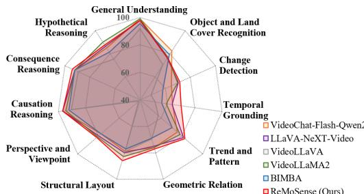  
(a) Open-source MLLMs trained on ReVA

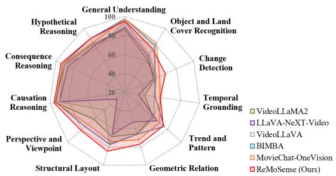  
(b) Open-source MLLMs trained on large-scale data  
Figure 8: Per-task comparisons with SOTA methods on ReVA validation set.

Evaluation Metrics. Since all QA pairs in ReVA are multiple-choice, we report top-1 accuracy (the percentage of question answered correctly).

## C ADDITIONAL RESULTS

## C.1 QUANTITATIVE RESULTS

Table 5 summarizes the quantitative results on ReVA validation set. We evaluated 16 open-source and 3 proprietary MLLMs on 11 reasoning tasks. When fine-tuned on ReVA, our proposed method, ReMoSense, achieves 79.63% overall accuracy, outperforming SOTA fine-tuned baseline LLaVA-NeXT-Video by 2.3% and proprietary model LLoVi based on GPT-4o Achiam et al. (2023) by 14.3%. Compared to our baseline model, BIMBA, the performance improves 7%. When trained on largescale data, ReMoSense achieves 75.75% overall accuracy, outperforming MovieChat-OneVision by 3% and proprietary model LLoVi by 10%. Compared to our baseline model, BIMBA, the performance improves 4%.

Among all categories, our model demonstrates the most improvements on Temporal Grounding (+6.5%) and Structural Layout (+3%), which we attribute to explicit motion modeling provided by ego motion alignment and object-level tracking. More quantitative results are in the Appendix.

Table 6: Ablation studies of different inputs of ReMoSense on ReVA.
<table><tr><td>Category / Subcategory</td><td>Text-only</td><td>First frame</td><td>Middle frame</td><td>Full</td></tr><tr><td>Factual Perception</td><td>29.55</td><td>38.96</td><td>39.33</td><td>75.08</td></tr><tr><td>General Understanding</td><td>35.00</td><td>22.78</td><td>24.44</td><td>97.78</td></tr><tr><td>Object and Land Cover Recognition</td><td>30.00</td><td>39.85</td><td>40.30</td><td>74.85</td></tr><tr><td>Change Detection</td><td>27.00</td><td>43.60</td><td>43.40</td><td>67.20</td></tr><tr><td>Temporal Understanding</td><td>27.00</td><td>37.70</td><td>37.80</td><td>64.40</td></tr><tr><td>Temporal Grounding</td><td>25.94</td><td>32.19</td><td>32.50</td><td>58.44</td></tr><tr><td>Trend and Pattern</td><td>28.89</td><td>47.50</td><td>47.22</td><td>75.00</td></tr><tr><td>Spatial Reasoning</td><td>28.52</td><td>37.13</td><td>37.13</td><td>81.31</td></tr><tr><td>Geometric Relation</td><td>29.00</td><td>38.00</td><td>37.50</td><td>78.00</td></tr><tr><td>Structural Layout</td><td>30.00</td><td>41.76</td><td>41.47</td><td>85.29</td></tr><tr><td>Perspective and Viewpoint</td><td>27.08</td><td>33.12</td><td>33.75</td><td>81.25</td></tr><tr><td>Causal Reasoning</td><td>41.82</td><td>72.73</td><td>73.18</td><td>94.55</td></tr><tr><td>Causation Reasoning</td><td>38.89</td><td>75.56</td><td>75.00</td><td>96.67</td></tr><tr><td>Consequence Reasoning</td><td>40.00</td><td>71.00</td><td>70.00</td><td>98.00</td></tr><tr><td>Hypothetical Reasoning</td><td>46.25</td><td>70.62</td><td>73.12</td><td>90.00</td></tr><tr><td>Overall</td><td>29.95</td><td>41.80</td><td>42.00</td><td>76.45</td></tr></table>

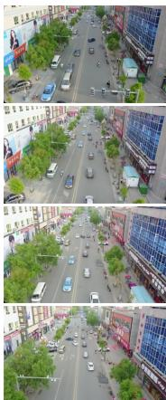

Q: What is the consistent motion pattern of vehicles on the main road? A: Vehicles move in both di rections, with a steady flow away from and toward the camera. B: Vehicles consistently move away from the camera in the left lanes and toward the camera in the right lanes C: Vehicles move in a circular pattern around the intersection. D: Vehicles move primarily from left to right across the frame.

<table><tr><td rowspan=1 colspan=1>Model</td><td rowspan=1 colspan=1>Prediction</td></tr><tr><td rowspan=1 colspan=1>BIMBA</td><td rowspan=1 colspan=1>B</td></tr><tr><td rowspan=1 colspan=1>VideoChat-Flash</td><td rowspan=1 colspan=1>B</td></tr><tr><td rowspan=1 colspan=1>InternVL3</td><td rowspan=1 colspan=1>A</td></tr><tr><td rowspan=1 colspan=1>LLaVA-NeXT</td><td rowspan=1 colspan=1>B</td></tr><tr><td rowspan=1 colspan=1>ReMoSense</td><td rowspan=1 colspan=1>A</td></tr></table>

(a) Trend and Pattern QA

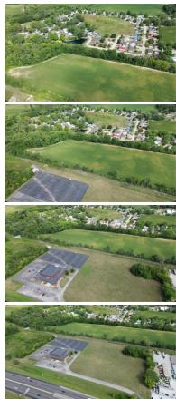

Q: Which description best   
characterizes the road network   
pattern visible in the video?   
A: A linear pattern of parallel   
roads running alongside the   
highway   
B: A grid-like pattern of intersecting   
streets forming blocks   
C: A radial pattern emanating from   
a central point   
D: A branching network of roads   
connecting to the highway

<table><tr><td rowspan=1 colspan=1>Model</td><td rowspan=1 colspan=1>Prediction</td></tr><tr><td rowspan=1 colspan=1>BIMBA</td><td rowspan=1 colspan=1>B</td></tr><tr><td rowspan=1 colspan=1>VideoChat-Flash</td><td rowspan=1 colspan=1>D</td></tr><tr><td rowspan=1 colspan=1>InternVL3</td><td rowspan=1 colspan=1>B</td></tr><tr><td rowspan=1 colspan=1>LLaVA-NeXT</td><td rowspan=1 colspan=1>B</td></tr><tr><td rowspan=1 colspan=1>ReMoSense</td><td rowspan=1 colspan=1>A</td></tr></table>

(b) Structural Layout QA  
Figure 9: Visualization of answer predictions on ReVA. The correct answers and correct predictions are highlighted in green, and incorrect predictions are in red.

## C.2 ABLATION STUDIES

To evaluate whether ReVA can be solved primarily through language priors or static visual cues, we evaluate ReMoSense on the ReVA test set under four input conditions: (1) QA pairs alone without video input (text-only); (2) QA pairs with only the first video frame; (3) QA pairs with only the middle video frame; and (4) the original full-video input. As shown in Table 6, the text-only setting achieves only 29.95% overall accuracy, while incorporating a single frame improves performance to 41.80% and 42.00% for the first- and middle-frame settings, respectively. In contrast, using the full video substantially increases the overall accuracy to 76.45%, outperforming the two single-frame settings by 34%. This improvement is consistent across all four categories. In particular, Temporal Understanding increases from 27.00% with text only and approximately 37.8% with a single frame to 64.40% with the full video. More notably, despite the high full-video accuracy on Causal Reasoning (94.55%), removing the video reduces performance to 41.82%, while using a single frame achieves only 72%. This progressive improvement indicates that generic linguistic or commonsense priors alone are insufficient for these questions: visual scene context provides substantial additional evidence, and the complete video provides information beyond an isolated frame. Together with our construction criterion that causal and hypothetical questions are conditioned on observable scene elements, these diagnostic results provide empirical support that these tasks are grounded in the remote-sensing video rather than primarily evaluating generic commonsense reasoning.

Algorithm 1 Training Process of ReMoSense   
Require: Training set $\mathcal { D } = \{ ( V , Q , A ) \}$ , where $V = \{ I ^ { 1 } , \ldots , I ^ { T } \}$ is a video clip, Q is the question,   
and A is the ground-truth answer; image encoder $E _ { \mathrm { i m g } } ;$ text encoder $E _ { \mathrm { t e x t } } ;$ ; Motion-Aware   
Alignment Module $\mathcal { M } _ { \mathrm { a l i g n } } ; \mathrm { L L M }$ decoder $\mathcal { F } _ { \mathrm { L L M } }$   
Ensure: Trained ReMoSense model.   
1: for each training sample $( V , Q , A ) \in { \mathcal { D } }$ do   
2: $X _ { q }  E _ { \mathrm { t e x t } } ( Q )$ ▷ Encode question tokens   
3: for $t = 1$ to T do   
4: $X _ { \mathrm { i m g } } ^ { t }  E _ { \mathrm { i m g } } ( I ^ { t } )$ ▷ Patch-level visual tokens, $X _ { \mathrm { i m g } } ^ { t } \in \mathbb { R } ^ { H \times W \times C }$   
5: end for   
6: for $t = 2$ to $T$ do   
7: $\bar { X } _ { \mathrm { i m g } } ^ { t - 1 } , \bar { X } _ { \mathrm { i m g } } ^ { t } \gets \mathrm { D o w n s a m p l e } ( X _ { \mathrm { i m g } } ^ { t - 1 } , X _ { \mathrm { i m g } } ^ { t } )$ ▷ Reduce resolution to $H / 4 \times W / 4$   
8: $\begin{array} { r } { \begin{array} { r } { \mathcal { C } ^ { t } ( i , i ) \longleftarrow \frac { \bar { X } _ { \mathrm { i m g } } ^ { t - 1 } ( i ) ^ { \top } \bar { X } _ { \mathrm { i m g } } ^ { t } ( j ) } { \cdots + 1 \cdots } } \end{array} } \end{array}$ ▷ Cost volume between consecutive frames   
$\overline { { | | \bar { X } _ { \mathrm { i m g } } ^ { t - 1 } ( i ) | | _ { 2 } | | \bar { X } _ { \mathrm { i m g } } ^ { t } ( j ) | | _ { 2 } } }$   
9: $\mathcal { C } ^ { t \prime } \gets \mathrm { M L P } ( \mathcal { C } ^ { t } )$ ▷ Correspondence representation   
10: $X _ { \mathrm { c o r r } } ^ { t } \gets \mathrm { G l o b a l P o o l } ( \mathcal { C } ^ { t \prime } )$ ▷ Global correspondence token, $X _ { \mathrm { c o r r } } ^ { i } \in \mathbb { R } ^ { 1 \times C }$   
11: end for   
12: $X _ { \mathrm { c o r r } } ^ { 1 }  \mathbf { 0 }$ ▷ No previous frame for the first frame   
13: Initialize $X _ { \mathrm { o b j } } ^ { 1 } \in \mathbb { R } ^ { K \times C }$ ▷ Learnable object-centric tokens   
14: $Z ^ { 1 } \gets \mathrm { C o n c a } \dot { \mathrm { t } } ( X _ { \mathrm { i m g } } ^ { 1 } , X _ { \mathrm { c o r r } } ^ { 1 } , X _ { \mathrm { o b j } } ^ { 1 } )$ ▷ Initial frame representation   
15: for $t = 2$ to T do   
16: $X _ { \mathrm { o b j } } ^ { t } \gets '$ Transformer $( X _ { \mathrm { o b j } } ^ { t - 1 } , X _ { \mathrm { i m g } } ^ { t } )$ ▷ Update object tokens using current-frame   
features   
17: $Z ^ { t } \gets \mathrm { C o n c a t } ( X _ { \mathrm { i m g } } ^ { t } , X _ { \mathrm { c o r r } } ^ { t } , X _ { \mathrm { o b j } } ^ { t } )$ ▷ Motion-enhanced frame representation   
18: end for   
19: $X ^ { 1 : T } \gets \mathrm { C o n c a t } ( Z ^ { 1 } , Z ^ { 2 } , \ldots , Z ^ { T } )$ ▷ Motion-enhanced video representation   
20: $X \gets \mathrm { C o n c a t } ( X ^ { \mathrm { i } : T } , X _ { q } )$ ▷ Multimodal input sequence   
21: $\hat { A } \gets \mathcal { F } _ { \mathrm { L L M } } ( X )$ ▷ Generate answer by next-token prediction   
22: $\mathcal { L }  \mathcal { L } _ { \mathrm { C E } } ( \hat { A } , A )$ ▷ Language modeling loss   
23: Update trainable parameters by gradient descent on L   
24: end for   
25: return Trained ReMoSense model

## C.3 QUALITATIVE RESULTS

We visualize qualitative results of our method with SOTA models using their default settings in Fig. 9. We present diverse scenarios from various tasks, including Trend and Pattern (column 1) and Structural Layout (column 2). Existing models struggle to handle complex relative motion pattern and locate remote layouts. For example, in column 1, these models cannot correctly identify the correct motion of cars. In column 2, the road structure pattern is misclassified as “grid”. In contrast, ReMoSense preserves object motion and layout integrity in crowded scenes, demonstrating superior robustness in challenging scenarios.

In addition, we provide the pseudo code for traing our proposed ReMoSense in Algorithm 1.

## D ADDITIONAL DATASET DETAILS

Reviewing process. Each QA pair is assigned one of four review labels during the annotation process:

• Accept. The question is clearly stated, the options are reasonable, and the labeled answer is correct.

• Modify. The question is valid, but the provided answer is incorrect or missing from the options. In this case, annotators specify the correct answer and optionally provide revision notes.

Table 7: Statistics of per-category annotations.
<table><tr><td>Category</td><td>Initial candidates</td><td>Final total</td><td>Accept</td><td>Minor correction</td><td>Reject</td><td>Review</td></tr><tr><td>Factual</td><td>6314</td><td>5773</td><td>4834 (76.6%)</td><td>610 (9.7%)</td><td>541 (8.6%)</td><td>329 (5.2%)</td></tr><tr><td>Temporal</td><td>5887</td><td>5072</td><td>3613 (61.4%)</td><td>1058 (18.0%)</td><td>815 (13.8%)</td><td>401 (6.8%)</td></tr><tr><td>Spatial</td><td>9849</td><td>9010</td><td>7389 (75.0%)</td><td>1301 (13.2%)</td><td>839 (8.5%)</td><td>320 (3.2%)</td></tr><tr><td>Causal</td><td>2113</td><td>1918</td><td>1797 (85.0%)</td><td>72 (3.4%)</td><td>195 (9.2%)</td><td>49 (2.3%)</td></tr><tr><td>Overall</td><td>24163</td><td>21773</td><td>17633 (73.0%)</td><td>3041 (12.6%)</td><td>2390 (9.9%)</td><td>1099 (4.5%)</td></tr></table>

• Reject. The question is ambiguous, meaningless, duplicated, or cannot be answered using the video content.

• Review. The QA pair is generally valid but requires additional review due to ambiguity, uncertainty, or domain-specific knowledge.

The eight first-stage reviewers were provided with the same annotation instructions and examples before verification. For each candidate QA pair, reviewers evaluated whether (1) the question is supported by the video, (2) the annotated answer is correct, (3) distractor options are plausible but incorrect, and (4) the wording is clear and unambiguous. For example, questions about object motion should focus on objects in the video rather than the camera itself, and questions that require object orientation are rejected if the orientation cannot be reliably inferred from the visual evidence. For problematic samples, annotators may provide correction suggestions or explanatory notes describing the issue and how the QA pair should be improved. These notes are later used to refine the final QA annotations. Samples requiring further review were then examined by two additional expert reviewers, who either finalized the corrected QA pair or removed it when a reliable answer could not be established from the video.

Table 7 shows the statistics of the annotation. This analysis shows how frequently the automatic pipeline produced directly acceptable samples and where stronger human intervention was required. Across all QA candidates, 73.0% were accepted, 12.6% required minor correction, 9.9% rejected, and 4.5% needed reviewing. In the meanwhile, 8 shows the task-wise number and ratio of the initial QA pairs that require revisions, which stands that temporal and spatial questions remain particularly challenging for the automatic QA generation pipeline.

Table 8: Task-wise number and ratio of initial QA pairs that require revision.
<table><tr><td>Categories</td><td>Count</td><td>Required revision</td><td>Ratio</td></tr><tr><td>Change detection</td><td>1879</td><td>774</td><td>41.2%</td></tr><tr><td>Temporal grounding</td><td>3142</td><td>1247</td><td>39.7%</td></tr><tr><td>Trend and pattern analysis</td><td>2745</td><td>1027</td><td>37.4%</td></tr><tr><td>Viewpoint and perspective analysis</td><td>2820</td><td>857</td><td>30.4%</td></tr><tr><td>Geometric relation reasoning</td><td>4194</td><td>1254</td><td>29.9%</td></tr><tr><td>Object and land-cover recognition</td><td>3014</td><td>588</td><td>19.5%</td></tr><tr><td>Hypothetical reasoning</td><td>701</td><td>123</td><td>17.5%</td></tr><tr><td>Consequence reasoning</td><td>704</td><td>111</td><td>15.8%</td></tr><tr><td>Structural layout reasoning</td><td>2835</td><td>349</td><td>12.3%</td></tr><tr><td>Causation reasoning</td><td>708</td><td>82</td><td>11.6%</td></tr><tr><td>General Understanding</td><td>1421</td><td>118</td><td>8.3%</td></tr></table>

Through this multi-step reviewing and correction process, we significantly reduce LLM hallucinations and ensure that the final QA pairs are accurate, meaningful, and suitable for evaluating video understanding in remote sensing.

Answer Distribution and Bias Mitigation. We observe a systematic answer-option bias in the initially generated question-answer pairs: the correct answer is assigned to option A in approximately

Table 9: Correct answer distribution before and after answer-option shuffling.
<table><tr><td>Option</td><td>Initial generation</td><td>Final release</td></tr><tr><td>A</td><td>15345 (70.5%)</td><td>5,443 (25.0%)</td></tr><tr><td>B</td><td>3730 (17.1%)</td><td>5,443 (25.0%)</td></tr><tr><td>C</td><td>1806 (8.3%)</td><td>5,443 (25.0%)</td></tr><tr><td>D</td><td>802 (3.7%)</td><td>5,444 (25.0%)</td></tr><tr><td>E</td><td>90 (0.4%)</td><td>0 (0.0%)</td></tr></table>

Table 10: Agreement Results Across Different Categories
<table><tr><td>Category</td><td>Pairwise agreement</td><td>Majority-vote agreement</td></tr><tr><td>Factual perception</td><td>1512 (84.4%)</td><td>90.6%</td></tr><tr><td>Temporal understanding</td><td>1378 (86.3%)</td><td>92.1%</td></tr><tr><td>Spatial &amp; viewpoint reasoning</td><td>852 (82.2%)</td><td>89.2%</td></tr><tr><td>Causal reasoning</td><td>929 (79.0%)</td><td>87.2%</td></tr><tr><td>Overall</td><td>4671 (83.4%)</td><td>90.1%</td></tr></table>

70.5% of cases, while other options appear significantly less frequently. This bias originates from the generative models that tend to place the correct answer first. This imbalance leads to an accuracy of 70% when always predicting A, further distorting model performance.

To mitigate this bias, we randomly shuffle the order of answer candidates for each question. This procedure ensures that the correct answers are evenly distributed across different option positions, preventing models from exploiting positional biases. After shuffling, as shown in Table 9, the correct answer distribution becomes nearly uniform across options.

Temporal grounding annotation. Temporal grounding annotations are created directly from the final video clips, rather than from the 32 uniformly sampled frames used for model inference. Annotators can continuously play, pause, and inspect the complete video to identify when the queried object or event becomes visible and when it disappears. Since the clips are approximately 15 seconds long, temporal intervals at a 0.5-second granularity can be reliably inspected by human annotators. The reported 32-frame sampling is applied only to model inputs during evaluation and does not constrain the temporal resolution of human annotation. Temporal Grounding is evaluated as a multiple-choice task, where models select the correct annotated interval rather than predicting frame-level temporal boundaries.

Inter-reviewer agreement. To evaluate the reliability of our dataset annotations, we conduct an inter-reviewer agreement analysis among 200 questions in total. We randomly select questions across four major categories: 64 factual perception questions, 57 temporal understanding questions, 37 spatial and viewpoint reasoning, and 42 for causal reasoning. Eight reviewers independently re-annotated the 200-question audit set. For each question, we compare all possible annotator pairs (C82 = 28 pairs per question), resulting in 5600 total pairwise comparisons across 200 questions. For those QA pairs that are marked as “Need review”, we recruited two additional experts to perform final adjudication of these cases (QA counted when only both experts reached agreement), resulting in a total of ten annotators involved in the complete verification pipeline.

The overall pairwise agreement rate is 83.4% (4671 agreements out of 5600 comparisons) and the majority-vote agreement is 90.1%, indicating good annotation consistency. In addition, agreement varies slightly across question categories. As shown in Table 10, temporal understanding shows the highest agreement, which is 86.3% in pairwise agreement and 92.1% in majority-vote agreement while casual reasoning shows the lowest agreement, it have 79.0% pairwise agreement and 87.2% majority-vote agreement.

Review platform. As shown in Fig. 10, we develop a web-based review platform that allows reviewers to simultaneously inspect the video, captions, and multiple-choice QA pairs. The interface displays the video player alongside automatically generated captions and the associated question with answer options, enabling annotators to verify whether the question is grounded in the visual evidence.

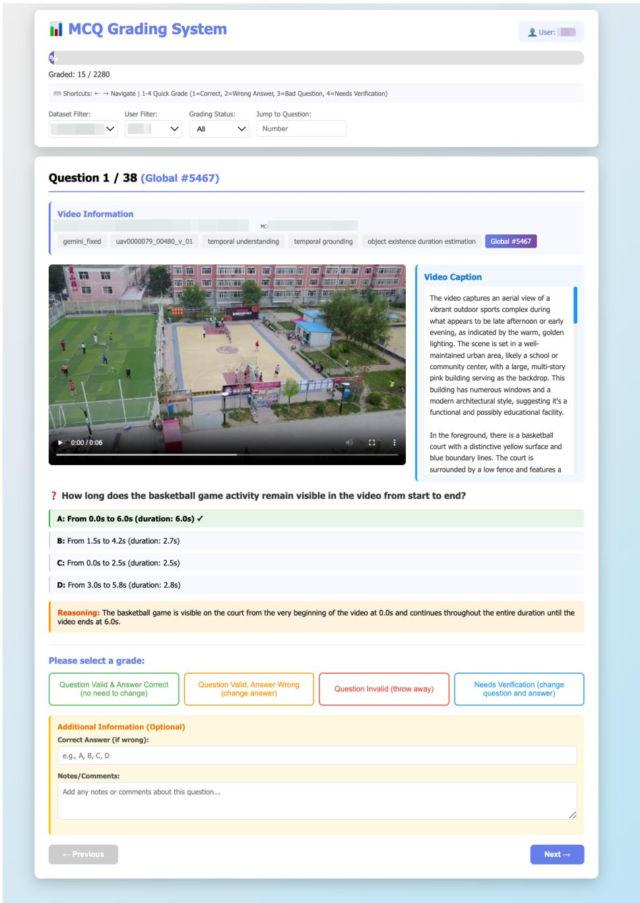  
Figure 10: Web-based QA review platform for human verification of generated QA pairs.

## E REVA QUESTION TYPE DETAILS

As shown in Table 11, we present the question examples for 11 QA tasks under 4 categories. During dataset construction, the agent will generate question for each given example, and then decide whether to delete or modify it.

## F FUTURE WORK

As future work, we plan to extend ReVA beyond the current 15-second clips to long videos that can be used to evaluate long-horizon dependencies, such as multi-stage event evolution. The present clip length was a deliberate design choice to balance annotation quality, question difficulty, and computational efficiency. However, certain remote sensing scenarios unfold over longer time spans (e.g., slow construction progress, traffic pattern transitions, which are only partially reflected in short clips. In the future work, we will curate longer sequences, and introduce question types that require reasoning over extended temporal context. This extension will complement the current benchmark and provide a more comprehensive assessment of long-range spatiotemporal understanding in remote sensing videos.

Table 11: ReVA Question Type Details. Each category has 2-3 QA tasks with representative question examples.
<table><tr><td>Category</td><td>QA task</td><td>Question example</td></tr><tr><td rowspan="5">Factual Perception</td><td>General Understanding</td><td>Activity Recognition; Object Existence Identification; Overall Scene Description;</td></tr><tr><td>Object and Land Cover Recognition</td><td>Object Counting; Object Category Classification; Object Spatial Distribution</td></tr><tr><td>Change Detection</td><td>Object Appearance/Disappearance; Shape Expansion/Shrinkage;</td></tr><tr><td>Temporal Grounding</td><td>Object Movement Detection Object Appearance Time Estimation;</td></tr><tr><td></td><td>Object Existence Duration Estimation Motion Direction Estimation for Objects;</td></tr><tr><td rowspan="5">Spatial Reasoning</td><td>Trend and Pattern</td><td>Periodic Change Detection Relative Position Reasoning;</td></tr><tr><td>Geometric Relation</td><td>Object Orientation Estimation; Distance and Adjacency Estimation</td></tr><tr><td>Structural Layout</td><td>Spatial Arrangement Pattern Classification; Road/River Network Pattern Recognition</td></tr><tr><td>Perspective and Viewpoint</td><td>Camera Viewpoint Classification;</td></tr><tr><td></td><td>Camera Motion State Recognition</td></tr><tr><td rowspan="2">Causal Reasoning Hypothetical Reasoning</td><td>Causation Reasoning</td><td>Cause Inference</td></tr><tr><td>Consequence Reasoning</td><td>Future Outcome Prediction</td></tr></table>

## G ETHICS STATEMENT

Our UAV data collection follows a privacy-first policy and relevant flight regulations. Our selfcollected videos were recorded only in rural areas with no visible people, while urban videos were obtained from existing publicly released datasets under their original licenses. We selected only legally accessible and authorized locations, avoided prohibited and sensitive areas, registered our UAV with the Federal Aviation Administration (FAA), completed the required TRUST training, and operated under applicable FAA DroneZone authorization and relevant state and local regulations.

We apply privacy screening throughout the pre-, during-, and post-review stages. Before annotation, every video is manually examined and clips containing identifiable individuals, visible faces, license plates, private property at close range, or other sensitive or personally identifiable information are excluded. During annotation and verification, reviewers are instructed to report any potential privacy issue missed during the initial screening. After annotation, videos with QA pairs are re-examined through cross-review, and any clip that does not satisfy our privacy criteria is removed. The same privacy screening is applied to third-party ERA and VisDrone videos, even though these datasets were previously publicly released.

Before final release, we also consulted legal counsel regarding dataset release and usage. We remove location-sensitive metadata, document the filtering criteria, intended research use, and licensing conditions in the dataset card, and provide a channel for reporting potential privacy concerns. Reported content will be promptly reviewed and, when appropriate, removed from future versions of the dataset.

## H LLM USAGE

In accordance with the applicable policy on the use of LLMs, we disclose that LLMs were used in two aspects of this work. First, during dataset construction, LLMs were used to generate initial question-answer pairs, which were subsequently carefully reviewed, revised, and verified by human annotators before inclusion in the final dataset. Second, LLMs were used as general-purpose writing tools to improve the clarity and readability of the manuscript. All research design, experimental analysis, result interpretation, and final decisions were conducted by the authors.

## I PROMPT DETAILS

In this section, we present the complete set of prompts utilized in the data generation pipeline, alongside those employed for subjective evaluation. Specifically, these include caption generation prompt in Fig. 11, caption consolidation prompt in Fig. 12, question-answer generation prompt in Fig. 13, and QA refinement prompt in Fig. 14.

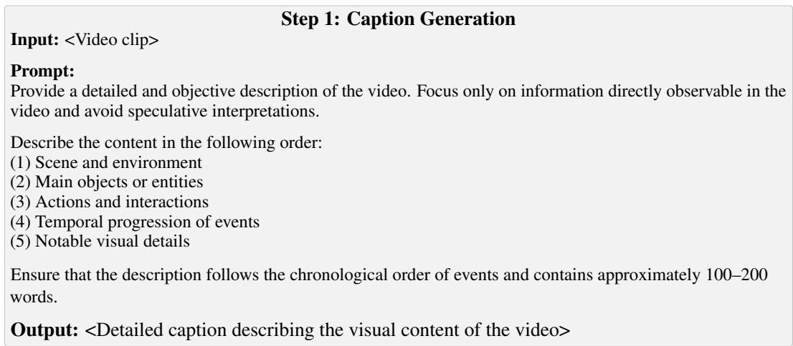  
Figure 11: Caption Generation Prompt.

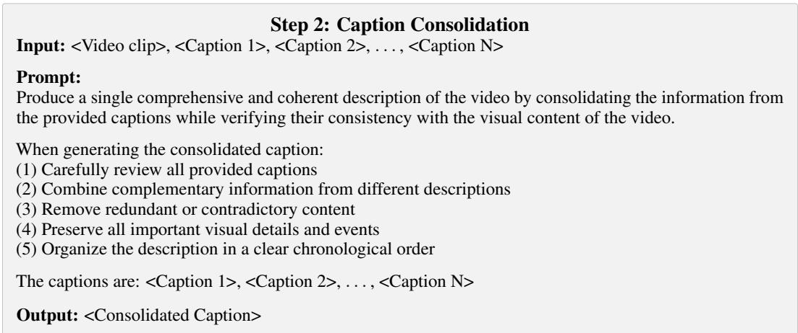  
Figure 12: Caption Consolidation Prompt.

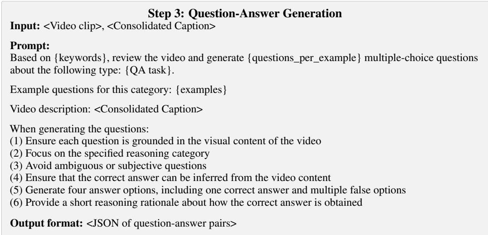  
Figure 13: Question-Answer Generation Prompt.

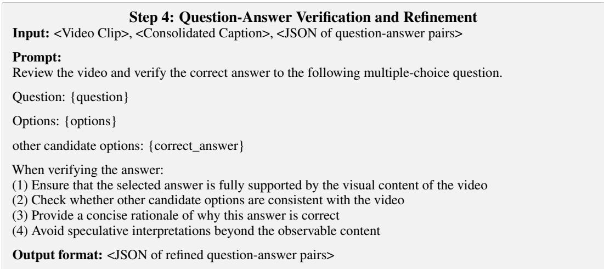  
Figure 14: Question-Answer Refinement Prompt.

## J EXAMPLES

We further provide representative examples for each question category and QA task in our dataset. As illustrated in Fig. 15, each example consists of three video frames accompanied by a question and its corresponding answer, covering diverse scenes, resolutions, and temporal scales across the four major domains: Factual Perception, Temporal Understanding, Spatial Reasoning, and Causal Reasoning.

These examples illustrate both scene-level understanding and video-dependent reasoning in ReVA. Some factual and spatial questions may be answerable from a representative frame, while questions involving change, temporal grounding, trends, camera motion, or evolving events require evidence across multiple frames. For causal and hypothetical questions, we emphasize video-conditioned reasoning grounded in observable scene content, temporal evolution, spatial layouts, objects, and motion patterns, rather than unrestricted commonsense inference. We therefore view scene-level and video-dependent questions as complementary components of comprehensive remote sensing video understanding.

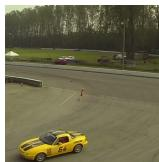

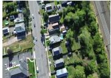

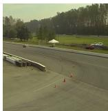

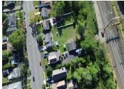

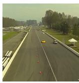

## Q: How does the movement of the yellow car change?

A: It moves from the right side of the track to the left side, then   
continues straight.   
B: It moves from the left side of the track to the right side, then   
continues straight.   
C: It moves from the foreground to the background, progressing along the track.   
D: It moves from the background to the foreground, reversing its direction.   
Q: How long does the red car remain visible in the video?   
A: From 0.0s to 2.5s (duration: 2.5s)   
B: From 1.0s to 3.0s (duration: 2.0s)   
C: From 0.5s to 2.0s (duration: 1.5s)   
D: From 0.0s to 3.0s (duration: 3.0s)   
Q: What is the camera motion state through the video?   
A. Zooming in/out   
B. Moving forward   
C. Panning left/right   
D. Rotating   
Q: What caused the massive cloud of dust and debris in the   
video?   
A. A powerful explosion at the base of the cliff   
B. A heavy rainstorm washing away the topsoil and vegetation   
C. A controlled demolition using explosives   
D. A sudden collapse of the cliff face, sending soil, rock,   
and vegetation downward

(a) Factual Perception  
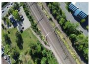

(b) Temporal Understanding  

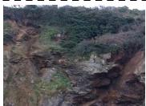

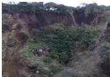

(c) Spatial Reasoning  
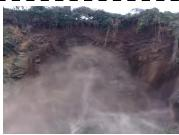

(d) Causal Reasoning

Figure 15: Examples of each category. From top to bottom: (a) Factual Perception; (b) Temporal Understanding; (c) Spatial Reasoning; (d) Causal Reasoning.