# REVISIT TO SEGMENT: WORKING MEMORY DISTILLA-TION FOR REASONING SEGMENTATION

Cilin Yan1∗ Yilun Qiu1,2∗ Wanyang Zhang1,3 Rui Zu1,3 Xiaolong Jiang1 Yao Hu1 Jiayin Cai1✉ Xiaohongshu1 NTU2 PKU3 ∗ Equal contribution ✉ Corresponding author https://github.com/yancilin/SWiM

## ABSTRACT

Multimodal large language models (MLLMs) have approached image segmentation by reasoning about visual content and predicting target locations. Their generated responses contain reasoning traces and localization proposals that can serve as working memory when revisiting the same image and query. Our exploration reveals that MLLMs benefit from using this self-generated working memory as context, leading to enhanced reasoning segmentation. Motivated by this finding, we seek to strengthen the backbone model’s reasoning segmentation capabilities by distilling the guidance gained from revisiting prior attempts, enabling it to benefit with or without working memory at inference time. To this end, we propose Reasoning Segmenter with Working Memory (SWiM), a working-memory distillation framework for reasoning segmentation. Specifically, SWiM selects rollouts based on segmentation quality to construct working memory and uses the memory-conditioned model as a teacher. The teacher provides token-level distributional supervision along student-generated trajectories, while the student receives only the original image and query. Joint optimization of on-policy selfdistillation and outcome-based reinforcement learning combines working-memory guidance with direct feedback on segmentation quality. Extensive experiments on reasoning segmentation benchmarks demonstrate that SWiM achieves state-of-theart performance, validating the effectiveness of working-memory distillation.

## 1 INTRODUCTION

Multimodal large language models (MLLMs) have advanced visual understanding through their ability to reason about image content and complex queries (Team et al., 2023; 2026; Bai et al., 2025). These capabilities enable segmentation models to infer target regions from descriptions that require contextual understanding (Kirillov et al., 2023; Rasheed et al., 2024; Zhang et al., 2024; Ravi et al., 2025; Carion et al., 2026). Reasoning segmentation brings these capabilities together, requiring both target identification and pixel-level delineation (Lai et al., 2024; Ren et al., 2024; Zhu et al., 2025; Jang et al., 2025; Yun et al., 2026; Sun et al., 2026; Liu et al., 2026b; Yang et al., 2026b; Qian et al., 2026). This task calls for approaches that connect multimodal reasoning with accurate spatia localization and mask prediction.

Existing approaches typically adapt MLLMs for reasoning segmentation through supervised finetuning, coupling language representations with mask prediction to translate query understanding into pixel-level outputs (Lai et al., 2024; Ren et al., 2024). Subsequent work incorporates structured reasoning and visual prompting to guide target localization and segmentation (Bao et al., 2024; Lu et al., 2025). More recently, reinforcement learning has emerged as an effective approach to strengthening visual reasoning and target localization through outcome-based rewards (Huang et al., 2025; Liu et al., 2025; 2026a). Beyond their role in producing a final prediction, the generated reasoning traces and localization proposals capture how the model interprets the query and identifies potential target regions. This raises an open question: can these prior attempts guide more effective reasoning and more accurate segmentation when the model revisits the same image and query?

To answer this question, we retain the model’s self-generated reasoning traces and localization proposals as working memory, which is provided as additional context when the model revisits the same image and query. As illustrated in Figure 1, this memory enables the model to reconsider its interpretation of the query in light of its previously proposed regions. By preserving both the reasoning and its spatial predictions, working memory provides a record of how the model approached the problem to inform a subsequent reasoning and localization attempt. The results in Figure 2 show that conditioning on working memory consistently improves reasoning segmentation performance across model scales and benchmarks. These improvements suggest that the information in prior attempts remains valuable beyond the predictions they initially produce. This finding establishes self-generated working memory as a source of guidance for reasoning segmentation, allowing the model to benefit from revisiting its own reasoning and localization decisions.

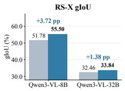

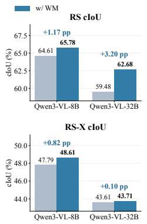

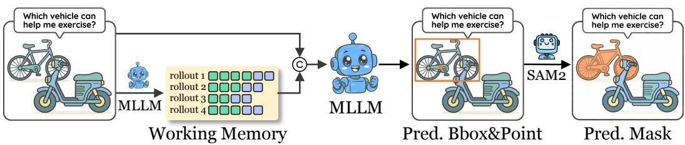  
Figure 1: Working-memory-guided reasoning segmentation. Given an image and a query, the MLLM generates reasoning traces and localization proposals that form its working memory. It then revisits the same image and query with this memory as additional input, predicting boxes and points that prompt a frozen SAM2 model to produce the final mask.

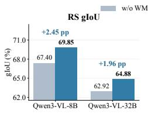

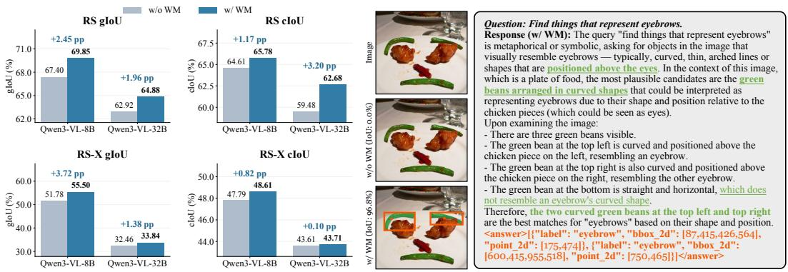  
(a) Quantitative comparison.  
(b) Qualitative example.  
Figure 2: Reasoning segmentation without and with working memory (WM). (a) Quantitative results; gains are in percentage points. (b) A qualitative example of improved target identification.

Motivated by this finding, we therefore seek to convert this contextual guidance into training supervision, allowing the segmentation policy to learn from revisiting prior attempts while retaining the flexibility to predict with or without working memory at inference time. On-policy selfdistillation (OPSD) (Zhao et al., 2026) provides a direct way to achieve this transfer by aligning a student operating on the original image and query with a memory-conditioned teacher along student generated trajectories. The teacher provides token-level distributional supervision at each step of the student’s own responses, translating working-memory guidance into a learning signal for reasoning and localization. Resampling trajectories as training progresses keeps this guidance aligned with the student’s evolving behavior.

To this end, we propose Reasoning Segmenter with Working Memory (SWiM), an on-policy self-distillation framework that transfers working-memory-guided reasoning into the segmentation policy. At each training iteration, SWiM samples rollouts from the current policy and selects responses based on segmentation quality to construct working memory. The working-memoryconditioned model then serves as a self-teacher, providing token-level distributional supervision along student-generated trajectories, while the student receives only the original image and query. To complement this guidance with feedback on actual segmentation outcomes, we incorporate outcomebased reinforcement learning (RL), which directly rewards the quality of the predicted outputs. Joint optimization of these two objectives enables the student to learn from revisiting its prior attempts while aligning its predictions with segmentation quality. At inference time, the resulting model can retain the flexibility to predict from the image and query alone, or revisit the problem with self-generated working memory as additional context.

We conduct extensive experiments on reasoning segmentation benchmarks, where SWiM achieves state-of-the-art performance. Through further analyses, we examine the contributions of individual components and validate the effectiveness of our key design choices.

Our main contributions are summarized as follows:

• We formulate self-generated reasoning traces and localization proposals as working memory and validate its effectiveness as both contextual information and training guidance for reasoning segmentation.

• To the best of our knowledge, we are the first to bring on-policy self-distillation to reasoning segmentation, where a working-memory-conditioned teacher transfers its guidance to the student through token-level supervision on student-generated trajectories.

• We propose SWiM, a working-memory distillation framework that constructs memory from qualityselected rollouts and jointly optimizes distillation and outcome-based reinforcement learning, enabling the segmentation policy to benefit from revisiting prior attempts.

• SWiM achieves state-of-the-art performance on reasoning segmentation benchmarks, with further analyses validating the effectiveness of our key design choices.

## 2 RELATED WORK

Reasoning segmentation. Reasoning segmentation extends language-guided segmentation to queries that require contextual reasoning and world knowledge to identify the target regions. LISA (Lai et al., 2024) introduces this task and connects MLLM reasoning to mask prediction by passing the projected representation of a segmentation token to a SAM mask decoder (Kirillov et al., 2023). Early MLLM-based segmentation approaches, including PixelLM, GLaMM, and OMG-LLaVA, use supervised fine-tuning to align language representations with pixel-level outputs (Ren et al., 2024; Rasheed et al., 2024; Zhang et al., 2024). CoReS (Bao et al., 2024) and RSVP (Lu et al., 2025) further incorporate structured reasoning and visual prompting to guide localization, emphasizing the reasoning process that precedes mask generation. Reinforcement learning has also been adopted to strengthen visual reasoning and localization in Seg-Zero, SAM-R1, and VisionReasoner (Liu et al., 2025; Huang et al., 2025; Liu et al., 2026a). StAR (Yun et al., 2026) further explores reward design and rollout-based training, together with mask-level voting at inference time.

On-policy self-distillation. On-policy distillation (Lu, 2025) trains a student on its own generated trajectories using token-level supervision from a teacher, aligning the training distribution with the student’s behavior (Agarwal et al., 2024; Song & Zheng, 2026; Li et al., 2026). On-policy selfdistillation extends this approach by using the model itself as a teacher conditioned on additional information (Zhao et al., 2026). Existing work explores guidance from verified reasoning traces (Zhao et al., 2026), reusable skills (Wang et al., 2026), environment feedback (Zhang et al., 2026b), and reflections (Zhang et al., 2026b). Multi-Rollout On-Policy Distillation (Yu et al., 2026) conditions the teacher on successful and failed peer rollouts from the same problem, while SEED (Wu et al., 2026) dynamically extracts hindsight skills from on-policy trajectories for joint distillation and reinforcement learning.

## 3 PROBLEM FORMULATION

Reasoning segmentation aims to identify and segment the target regions implicitly described by a natural-language query (Lai et al., 2024). Given an image I and a query q, the goal is to predict a binary segmentation mask $\widehat { M }$ that matches the reference mask $M ^ { \star }$ for the queried regions, drawing on visual reasoning and world knowledge.

Following prior work (Yun et al., 2026), we adopt a decoupled reasoning–segmentation formulation, where an MLLM performs reasoning and localization, and a segmentation model produces pixel-level masks. Specifically, given an image–query pair $x = ( I , q )$ , the MLLM policy $\pi _ { \theta }$ generates a response y containing textual reasoning and a structured answer, from which we extract the target locations:

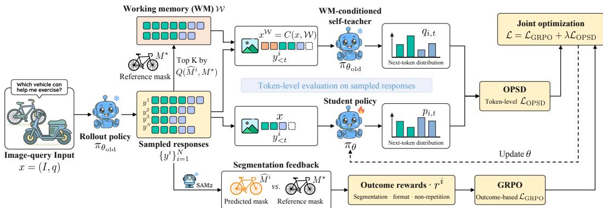  
Figure 3: Overview of SWiM. Top-K rollouts ranked by segmentation quality form working memory. OPSD transfers token-level guidance from the working-memory-conditioned teacher to the student along the same sampled trajectories. GRPO provides outcome-based feedback on segmentation quality. Both objectives jointly update the student, which receives only the original image and query.

$$
y \sim \pi _ { \boldsymbol \theta } ( . \cdot \mid x ) , \qquad \mathcal { P } ( y ) = \{ ( b _ { j } , p _ { j } ) \} _ { j = 1 } ^ { n _ { y } } ,\tag{1}
$$

where $\mathcal { P }$ extracts the localization prompts from the response, $n _ { y }$ denotes the number of predicted targets, and $b _ { j }$ and $p _ { j }$ are the bounding box and representative point for the j-th target, respectively. These boxes and points then serve as visual prompts for a frozen SAM2 model S (Ravi et al., 2025), which generates a mask for each target. The final segmentation mask is their union:

$$
\widehat { M } _ { j } = S ( I , b _ { j } , p _ { j } ) , \qquad \widehat { M } = \bigcup _ { j = 1 } ^ { n _ { y } } \widehat { M } _ { j } .\tag{2}
$$

## 4 METHODOLOGY

In this section, we propose Reasoning Segmenter with Working Memory (SWiM), a framework for learning from revisiting self-generated working memory. We first describe how working memory is constructed from quality-selected rollouts, followed by working memory distillation through joint optimization of on-policy self-distillation (Zhao et al., 2026) and reinforcement learning (Shao et al., 2024). Figure 3 provides an overview of SWiM.

## 4.1 WORKING MEMORY CONSTRUCTION

We construct working memory from the policy’s self-generated attempts at the same image–query pair, allowing it to revisit previous reasoning and localization proposals. Given an input $x = ( I , q )$ we sample a group of N responses $\{ y ^ { i } \} _ { i = 1 } ^ { N }$ from the rollout policy $\pi _ { \theta _ { \mathrm { o l d } } }$ and obtain their segmentation masks following Section 3.

To prioritize informative attempts, we rank the sampled responses by their segmentation quality against the reference mask $M ^ { \star }$ and retain the top K as working memory W:

$$
{ \mathcal { W } } = \operatorname { \mathrm { ~ { \cal ~ T o p K } ~ } } _ { y ^ { i } \in \{ y ^ { 1 } , \dots , y ^ { N } \} } Q ( \widehat { M } ^ { i } , M ^ { \star } ) ,\tag{3}
$$

where $Q$ measures segmentation quality, and TopK selects the K top-ranked responses.

Each selected response is retained in full, preserving both its textual reasoning and structured localization outputs. This preserves the connection between the policy’s query interpretation and its proposed regions, allowing the model to revisit both when forming a new prediction.

## 4.2 WORKING MEMORY DISTILLATION

Working memory makes the policy’s prior reasoning traces and localization proposals available when revisiting the same input. Building on this, we use on-policy self-distillation to transfer guidance from a working-memory-conditioned self-teacher along student-generated trajectories. We complement this guidance with reinforcement learning driven by outcome-based rewards for segmentation predictions. This joint optimization turns working memory into a source of token-level supervision, complemented by direct feedback on segmentation quality.

On-policy self-distillation (OPSD). At each training iteration, we construct a self-teacher from the current policy $\pi _ { \theta _ { \mathrm { o l d } } }$ by conditioning it on both the original image–query input $x = ( I , q )$ and working memory W:

$$
\begin{array} { r } { x ^ { \mathcal { W } } = C ( x , \mathcal { W } ) , } \end{array}\tag{4}
$$

where $C$ denotes the input constructor. Conditioned on $x ^ { \mathcal { W } }$ , the teacher can revisit prior reasoning traces and localization proposals, while the student operates solely on the original input x.

We reuse the responses $\{ y ^ { i } \} _ { i = 1 } ^ { N }$ sampled under x during working memory construction. For each response $y ^ { i }$ , we evaluate the student and teacher next-token distributions at the same student-generated prefix:

$$
p _ { i , t } = \pi _ { \boldsymbol { \theta } } ( \cdot  { | \boldsymbol { ~ x } , \boldsymbol { y } _ { < t } ^ { i } ) , } \qquad q _ { i , t } = \pi _ { \boldsymbol { \theta } _ { \mathrm { o l d } } } ( \cdot  { | \boldsymbol { ~ x } ^ { \mathcal { W } } , \boldsymbol { y } _ { < t } ^ { i } ) . }\tag{5}
$$

Here, $\boldsymbol y _ { < t } ^ { i }$ denotes the tokens preceding position $t ,$ and $p _ { i , t }$ and $q _ { i , t }$ are distributions over the model’s vocabulary V. This makes the distributions directly comparable, allowing the teacher to provide working-memory-conditioned guidance along the student’s own trajectory. The teacher distributions are computed without gradient tracking and held fixed during each policy update.

To transfer this guidance, we align the student and teacher next-token distributions using Jensen– Shannon divergence (JSD):

$$
\mathrm { J S D } ( p _ { i , t } \parallel q _ { i , t } ) = \frac { 1 } { 2 } D _ { \mathrm { K L } } ( p _ { i , t } \parallel m _ { i , t } ) + \frac { 1 } { 2 } D _ { \mathrm { K L } } ( q _ { i , t } \parallel m _ { i , t } ) ,\tag{6}
$$

where $m _ { i , t } = ( p _ { i , t } + q _ { i , t } ) / 2$ is the equally weighted mixture of the student and teacher distributions, and $D _ { \mathrm { K L } }$ denotes Kullback–Leibler divergence.

For efficient computation, we retain the teacher’s top-L tokens at each position and aggregate the remaining probability mass into a single residual category. Let $\widetilde { p } _ { i , t }$ and $\widetilde { q } _ { i , t }$ denote the student and teacher distributions over this shared partition. We minimize their JSD averaged over valid response tokens:

$$
\mathcal { L } _ { \mathrm { O P S D } } = \mathbb { E } _ { ( i , t ) \sim \mathcal { U } } \left[ \mathrm { J S D } ( \widetilde { p } _ { i , t } \Vert \widetilde { q } _ { i , t } ) \right] ,\tag{7}
$$

where $\mathcal { U }$ is uniform over valid token positions in the batch. Distillation over all N responses transfers working-memory guidance to the student conditioned only on the image and query.

Reinforcement learning (RL). We complement working-memory guidance with outcome-based reinforcement learning to directly optimize segmentation performance.

For each sampled response $y ^ { i }$ , we obtain the segmentation prediction $\widehat { M } ^ { i }$ by prompting the frozen segmentor $S$ with the predicted boxes and points and taking the union of the resulting masks. We then compute an outcome reward $r ^ { i } { \mathrm { : } }$

$$
r ^ { i } = 2 r _ { \mathrm { s e g } } ^ { i } + r _ { \mathrm { f m t } } ^ { i } + r _ { \mathrm { n r } } ^ { i } ,\tag{8}
$$

where $r _ { \mathrm { s e g } } ^ { i }$ measures segmentation quality, $r _ { \mathrm { f m t } } ^ { i }$ evaluates the required response structure and localization fields, and $r _ { \mathrm { n r } } ^ { i }$ rewards responses without excessive repetition.

We adopt Group Relative Policy Optimization (GRPO) to optimize the segmentation policy. For each group of sampled responses $\{ \bar { y ^ { i } } \} _ { i = 1 } ^ { N }$ , we compute the normalized advantage:

$$
A ^ { i } = \frac { r ^ { i } - \mu _ { r } } { \sigma _ { r } + \epsilon } ,\tag{9}
$$

where $\mu _ { r }$ and $\sigma _ { r }$ denote the mean and standard deviation of the group rewards, respectively, and ϵ is a small constant for numerical stability.

We define the token-level probability ratio between the student and rollout policies as

$$
\rho _ { i , t } ( \theta ) = \frac { \pi _ { \theta } ( y _ { t } ^ { i } \mid x , y _ { < t } ^ { i } ) } { \pi _ { \theta _ { \mathrm { o l d } } } ( y _ { t } ^ { i } \mid x , y _ { < t } ^ { i } ) } .\tag{10}
$$

The GRPO objective is formulated as:

$$
\mathcal { L } _ { \mathrm { G R P O } } = - \mathbb { E } _ { ( i , t ) \sim \mathcal { U } } \left[ \operatorname* { m i n } \left( \rho _ { i , t } ( \theta ) A ^ { i } , \mathrm { c l i p } ( \rho _ { i , t } ( \theta ) , 1 - \delta , 1 + \delta ) A ^ { i } \right) \right] ,\tag{11}
$$

where $\delta$ is the clipping threshold. Clipping limits the incentive for large probability changes during each update. Optimization over all $N$ responses encourages the student to produce accurate segmentation predictions from the original image and query.

Joint optimization. We jointly optimize working-memory-guided self-distillation and outcome-based reinforcement learning:

$$
\begin{array} { r } { \mathcal { L } _ { \mathrm { S W i M } } = \mathcal { L } _ { \mathrm { G R P O } } + \lambda \mathcal { L } _ { \mathrm { O P S D } } , } \end{array}\tag{12}
$$

where λ controls the strength of distillation.

Both objectives operate on the same student-generated responses: OPSD transfers token-level guidance from the working-memory-conditioned self-teacher, while GRPO provides feedback on segmentation outcomes. We update the student parameters θ by minimizing ${ \mathcal { L } } _ { \mathrm { S W i M } }$ , while keeping the teacher distributions and the segmentation model S fixed. At the next iteration, the updated policy generates new rollouts for working memory construction and serves as the self-teacher when conditioned on the resulting working memory. Together, the two objectives train the policy to benefi from revisiting prior attempts while predicting from the original image and query.

## 5 EXPERIMENTS

## 5.1 EXPERIMENTAL SETUP

Benchmarks and metrics. We evaluate reasoning segmentation on ReasonSeg (RS) (Lai et al., 2024), ReasonSeg-R (RS-R) (Yun et al., 2026), and ReasonSeg-X (RS-X) (Yun et al., 2026). These benchmarks evaluate the ability to reason about a query and segment the corresponding target regions at the pixel level. We report gIoU, the mean of per-example intersection-over-union scores, and cIoU, the ratio of the accumulated intersection to the accumulated union. We compute average gIoU and cIoU by taking the unweighted mean of each metric across the three benchmarks. Additional evaluations on referring expression segmentation and multi-target segmentation are provided in Appendix D.

Baselines. To systematically evaluate the effectiveness of SWiM, we compare it with representative reasoning segmentation methods: (1) Supervised fine-tuning / reinforcement learning, including LISA (Lai et al., 2024), SegLLM (Wang et al., 2025), READ (Qian et al., 2025), CoReS (Bao et al., 2024), RSVP (Lu et al., 2025), CoPRS (Lu et al., 2026a), SAM-R1 (Huang et al., 2025), DPAD (Yang et al., 2026a), SAM-Veteran (Du et al., 2026), SegCompass (Lu et al., 2026b), DR2Seg (He et al., 2026b), Seg-Zero (Liu et al., 2025), VisionReasoner (Liu et al., 2026a), LENS (Zhu et al., 2026), Seg-ReSearch (Liang et al., 2026), and SELF1E (Zhang et al., 2026a); (2) Inference-time scaling / multi-round tool use, including SAM 3 Agent (Carion et al., 2026), RSAgent (He et al., 2026a), and Rea2Seg (Gao et al., 2026); and (3) Reproduced StAR baselines, both with and without majority voting (Yun et al., 2026). To ensure a fair comparison under the same training setting, we reproduce StAR without its additional training on the RS-X training split.

Models and training. We instantiate SWiM using backbones from the Qwen3-VL family (Bai et al., 2025) and a frozen SAM2 (Ravi et al., 2025) model for mask generation. For training, we begin with an RL-only warm-up that trains the policy under both plain and working-memory-augmented inputs. Working memory is constructed online by randomly selecting up to eight preliminary responses generated by the current policy for the same image and query. In the following working-memory distillation stage, we jointly optimize GRPO (Shao et al., 2024) and OPSD (Zhao et al., 2026) on a selected training subset. We sample N = 16 rollouts per input, select the top $K = 8$ responses by segmentation quality to construct working memory, and set the distillation weight to $\lambda = 0 . 1$ . Detailed hyperparameters, training subset construction, and input prompts are provided in Appendices $\mathrm { A } { - } \mathrm { C }$

Evaluation settings. Our default evaluation setting uses a single response conditioned only on the image and query, without working memory or majority voting. We additionally evaluate workingmemory (WM) inference, which conditions a new prediction on prior attempts, and majority voting (MV), which aggregates multiple predicted masks. These settings are reported separately to distinguish their inference budgets.

Table 1: Performance results on reasoning segmentation benchmarks. “WM” denotes working memory, and “MV” denotes the majority voting strategy adapted for segmentation. The best results in each column are highlighted in bold, and the second-best results are underlined. Higher values indicate better segmentation performance across all metrics.
<table><tr><td rowspan=2 colspan=15>RS-X testBase model       RS test    RS-RMethod(Size)                             overall     P/F     C/KI     C/R     C/MHgIoU cIoUgIoUcIoUgIoUcIoUgIoUcIoUgIoUcIoUgIoUcIoUgIoUcIoU</td><td rowspan=1 colspan=2>Average</td></tr><tr><td rowspan=1 colspan=2>gIoUcIoU</td></tr><tr><td rowspan=1 colspan=15>Supervised Fine-Tuning / Reinforcement Learning</td><td rowspan=1 colspan=2></td></tr><tr><td rowspan=1 colspan=3>LISA           Llama2-13B     51.551.3</td><td rowspan=1 colspan=2>52.553.3</td><td rowspan=1 colspan=2>25.126.0</td><td rowspan=1 colspan=2>27.930.6</td><td rowspan=1 colspan=2>28.229.2</td><td rowspan=1 colspan=2>26.825.8</td><td rowspan=1 colspan=2>13.816.8</td><td rowspan=1 colspan=2>43.043.5</td></tr><tr><td rowspan=1 colspan=3>SegLLM         LLaVA1.5-7B   52.448.4</td><td rowspan=1 colspan=2></td><td rowspan=1 colspan=2></td><td rowspan=1 colspan=2>1</td><td rowspan=1 colspan=2></td><td rowspan=1 colspan=2></td><td rowspan=1 colspan=2></td><td rowspan=1 colspan=2></td></tr><tr><td rowspan=1 colspan=3>READ           LLaVA1.5-13B  62.262.8</td><td rowspan=1 colspan=2></td><td rowspan=1 colspan=2></td><td rowspan=1 colspan=2></td><td rowspan=1 colspan=2></td><td rowspan=1 colspan=2></td><td rowspan=1 colspan=2></td><td rowspan=1 colspan=2></td></tr><tr><td rowspan=1 colspan=3>CoReS          LLaVA1.5-13B   65.5</td><td rowspan=1 colspan=2></td><td rowspan=1 colspan=1></td><td rowspan=1 colspan=1></td><td rowspan=1 colspan=2></td><td rowspan=1 colspan=2></td><td rowspan=1 colspan=2></td><td rowspan=1 colspan=2></td><td rowspan=1 colspan=2></td></tr><tr><td rowspan=1 colspan=3>RSVP           GPT-40        60.360.0</td><td rowspan=1 colspan=2></td><td rowspan=1 colspan=1></td><td rowspan=1 colspan=1></td><td rowspan=1 colspan=2></td><td rowspan=1 colspan=2></td><td rowspan=1 colspan=2></td><td rowspan=1 colspan=2></td><td rowspan=1 colspan=2></td></tr><tr><td rowspan=1 colspan=2>CoPRS          Qwen2.5-VL-7B 59.8</td><td rowspan=1 colspan=1>55.1</td><td rowspan=1 colspan=2></td><td rowspan=1 colspan=1></td><td rowspan=1 colspan=1></td><td rowspan=1 colspan=2></td><td rowspan=1 colspan=2></td><td rowspan=1 colspan=1></td><td rowspan=1 colspan=1></td><td rowspan=1 colspan=2></td><td rowspan=1 colspan=2></td></tr><tr><td rowspan=1 colspan=2>SAM-R1         Qwen2.5-VL-7B 60.2</td><td rowspan=1 colspan=1>54.3</td><td rowspan=1 colspan=2></td><td rowspan=1 colspan=1></td><td rowspan=1 colspan=1></td><td rowspan=1 colspan=1></td><td rowspan=1 colspan=1></td><td rowspan=1 colspan=2></td><td rowspan=1 colspan=1></td><td rowspan=1 colspan=1></td><td rowspan=1 colspan=2></td><td rowspan=1 colspan=2></td></tr><tr><td rowspan=1 colspan=1>DPAD           Qwen2.5-VL-7B</td><td rowspan=1 colspan=1>60.8</td><td rowspan=1 colspan=1>57.5</td><td rowspan=1 colspan=1></td><td rowspan=1 colspan=1></td><td rowspan=1 colspan=1></td><td rowspan=1 colspan=1></td><td rowspan=1 colspan=1></td><td rowspan=1 colspan=1></td><td rowspan=1 colspan=2></td><td rowspan=1 colspan=1></td><td rowspan=1 colspan=1></td><td rowspan=1 colspan=2></td><td rowspan=1 colspan=2></td></tr><tr><td rowspan=1 colspan=1>SAM-Veteran      Qwen2.5-VL-7B</td><td rowspan=1 colspan=1>62.6</td><td rowspan=1 colspan=1>56.1</td><td rowspan=1 colspan=1></td><td rowspan=1 colspan=1></td><td rowspan=1 colspan=1></td><td rowspan=1 colspan=1></td><td rowspan=1 colspan=1></td><td rowspan=1 colspan=1></td><td rowspan=1 colspan=1></td><td rowspan=1 colspan=1></td><td rowspan=1 colspan=1></td><td rowspan=1 colspan=1></td><td rowspan=1 colspan=2></td><td rowspan=1 colspan=2></td></tr><tr><td rowspan=1 colspan=1>SegCompass      Qwen2.5-VL-7B</td><td rowspan=1 colspan=1>64.0</td><td rowspan=1 colspan=1>64.8</td><td rowspan=1 colspan=1></td><td rowspan=1 colspan=1>一</td><td rowspan=1 colspan=1></td><td rowspan=1 colspan=1></td><td rowspan=1 colspan=1>一</td><td rowspan=1 colspan=1></td><td rowspan=1 colspan=1></td><td rowspan=1 colspan=1>一</td><td rowspan=1 colspan=1></td><td rowspan=1 colspan=1>一</td><td rowspan=1 colspan=2></td><td rowspan=1 colspan=2></td></tr><tr><td rowspan=1 colspan=2>DR2Seg         Qwen2.5-VL-7B 66.1</td><td rowspan=1 colspan=1>63.6</td><td rowspan=1 colspan=1>67.4</td><td rowspan=1 colspan=1>61.4</td><td rowspan=1 colspan=1>45.2</td><td rowspan=1 colspan=1>36.6</td><td rowspan=1 colspan=1>52.1</td><td rowspan=1 colspan=1>40.9</td><td rowspan=1 colspan=1>55.9</td><td rowspan=1 colspan=1>47.3</td><td rowspan=1 colspan=1>43.9</td><td rowspan=1 colspan=1>34.1</td><td rowspan=1 colspan=2>23.725.7</td><td rowspan=1 colspan=2>59.653.9</td></tr><tr><td rowspan=1 colspan=2>Seg-Zero         Qwen2.5-VL-7B 57.5</td><td rowspan=1 colspan=1>52.0</td><td rowspan=1 colspan=1></td><td rowspan=1 colspan=1></td><td rowspan=1 colspan=1></td><td rowspan=1 colspan=1></td><td rowspan=1 colspan=1></td><td rowspan=1 colspan=1></td><td rowspan=1 colspan=1></td><td rowspan=1 colspan=1></td><td rowspan=1 colspan=1></td><td rowspan=1 colspan=1></td><td rowspan=1 colspan=2></td><td rowspan=1 colspan=2></td></tr><tr><td rowspan=1 colspan=2>VisionReasoner    Qwen2.5-VL-7B 63.6</td><td rowspan=1 colspan=1>55.7</td><td rowspan=1 colspan=1>64.8</td><td rowspan=1 colspan=1>56.8</td><td rowspan=1 colspan=1>42.2</td><td rowspan=1 colspan=1>33.8</td><td rowspan=1 colspan=1>50.1</td><td rowspan=1 colspan=1>45.1</td><td rowspan=1 colspan=1>50.7</td><td rowspan=1 colspan=1>39.0</td><td rowspan=1 colspan=1>39.4</td><td rowspan=1 colspan=1>31.1</td><td rowspan=1 colspan=2>24.523.8</td><td rowspan=1 colspan=2>56.948.8</td></tr><tr><td rowspan=1 colspan=2>LENS           Qwen2.5-VL-3B 57.2</td><td rowspan=1 colspan=1>58.0</td><td rowspan=1 colspan=1></td><td rowspan=1 colspan=1></td><td rowspan=1 colspan=1></td><td rowspan=1 colspan=1></td><td rowspan=1 colspan=1></td><td rowspan=1 colspan=1></td><td rowspan=1 colspan=1></td><td rowspan=1 colspan=1></td><td rowspan=1 colspan=1></td><td rowspan=1 colspan=1></td><td rowspan=1 colspan=2></td><td rowspan=1 colspan=2></td></tr><tr><td rowspan=1 colspan=2>Seg-ReSearch     Qwen3-VL-8B   67.4</td><td rowspan=1 colspan=1>59.0</td><td rowspan=1 colspan=1></td><td rowspan=1 colspan=1></td><td rowspan=1 colspan=1></td><td rowspan=1 colspan=1></td><td rowspan=1 colspan=1></td><td rowspan=1 colspan=1></td><td rowspan=1 colspan=1></td><td rowspan=1 colspan=1></td><td rowspan=1 colspan=1></td><td rowspan=1 colspan=1></td><td rowspan=1 colspan=2></td><td rowspan=1 colspan=2></td></tr><tr><td rowspan=1 colspan=2>SELF1E         InternVL3-8B   65.7</td><td rowspan=1 colspan=1>67.0</td><td rowspan=1 colspan=1></td><td rowspan=1 colspan=1></td><td rowspan=1 colspan=1></td><td rowspan=1 colspan=1></td><td rowspan=1 colspan=1></td><td rowspan=1 colspan=1></td><td rowspan=1 colspan=1></td><td rowspan=1 colspan=1></td><td rowspan=1 colspan=1></td><td rowspan=1 colspan=1></td><td rowspan=1 colspan=2></td><td rowspan=1 colspan=2></td></tr><tr><td rowspan=1 colspan=2>Inference-Time Scaling / Multi-Round Tool Use</td><td rowspan=1 colspan=1></td><td rowspan=1 colspan=1></td><td rowspan=1 colspan=1></td><td rowspan=1 colspan=1></td><td rowspan=1 colspan=1></td><td rowspan=1 colspan=1></td><td rowspan=1 colspan=1></td><td rowspan=1 colspan=1></td><td rowspan=1 colspan=1></td><td rowspan=1 colspan=1></td><td rowspan=1 colspan=1></td><td rowspan=1 colspan=2></td><td rowspan=1 colspan=2></td></tr><tr><td rowspan=1 colspan=2>SAM 3 Agent     Qwen2.5-VL-7B 62.6</td><td rowspan=1 colspan=1>56.2</td><td rowspan=1 colspan=1>63.1</td><td rowspan=1 colspan=1>58.0</td><td rowspan=1 colspan=1>34.4</td><td rowspan=1 colspan=1>29.5</td><td rowspan=1 colspan=1>41.7</td><td rowspan=1 colspan=1>37.9</td><td rowspan=1 colspan=1>37.7</td><td rowspan=1 colspan=1>31.8</td><td rowspan=1 colspan=1>35.3</td><td rowspan=1 colspan=1>26.0</td><td rowspan=1 colspan=1>17.9</td><td rowspan=1 colspan=1>21.9</td><td rowspan=1 colspan=1>53.4</td><td rowspan=1 colspan=1>47.9</td></tr><tr><td rowspan=1 colspan=2>SAM 3 Agent     Qwen3-VL-8B   70.2</td><td rowspan=1 colspan=1>67.3</td><td rowspan=1 colspan=1>69.3</td><td rowspan=1 colspan=1>64.1</td><td rowspan=1 colspan=1>42.3</td><td rowspan=1 colspan=1>39.7</td><td rowspan=1 colspan=1>50.6</td><td rowspan=1 colspan=1>43.6</td><td rowspan=1 colspan=1>48.4</td><td rowspan=1 colspan=1>45.1</td><td rowspan=1 colspan=1>40.5</td><td rowspan=1 colspan=1>40.8</td><td rowspan=1 colspan=1>25.8</td><td rowspan=1 colspan=1>26.0</td><td rowspan=1 colspan=1>60.6</td><td rowspan=1 colspan=1>57.0</td></tr><tr><td rowspan=1 colspan=2>SAM 3 Agent     Qwen2.5-VL-72B71.8</td><td rowspan=1 colspan=1>65.2</td><td rowspan=1 colspan=1>72.4</td><td rowspan=1 colspan=1>65.3</td><td rowspan=1 colspan=1>49.8</td><td rowspan=1 colspan=1>40.3</td><td rowspan=1 colspan=1>57.8</td><td rowspan=1 colspan=1>50.5</td><td rowspan=1 colspan=1>55.5</td><td rowspan=1 colspan=1>45.4</td><td rowspan=1 colspan=1>49.6</td><td rowspan=1 colspan=1>34.0</td><td rowspan=1 colspan=1>30.8</td><td rowspan=1 colspan=1>35.1</td><td rowspan=1 colspan=1>64.7</td><td rowspan=1 colspan=1>56.9</td></tr><tr><td rowspan=1 colspan=2>RSAgent         Qwen2.5-VL-7B 66.5</td><td rowspan=1 colspan=1>57.9</td><td rowspan=1 colspan=1></td><td rowspan=1 colspan=1>一</td><td rowspan=1 colspan=1></td><td rowspan=1 colspan=1></td><td rowspan=1 colspan=1>一</td><td rowspan=1 colspan=1></td><td rowspan=1 colspan=1></td><td rowspan=1 colspan=1></td><td rowspan=1 colspan=1></td><td rowspan=1 colspan=1></td><td rowspan=1 colspan=1></td><td rowspan=1 colspan=1>一</td><td rowspan=1 colspan=1></td><td rowspan=1 colspan=1></td></tr><tr><td rowspan=1 colspan=2>Rea2Seg         Qwen2.5-VL-3B 66.6</td><td rowspan=1 colspan=1>65.5</td><td rowspan=1 colspan=1></td><td rowspan=1 colspan=1></td><td rowspan=1 colspan=1></td><td rowspan=1 colspan=1></td><td rowspan=1 colspan=1></td><td rowspan=1 colspan=1></td><td rowspan=1 colspan=1></td><td rowspan=1 colspan=1></td><td rowspan=1 colspan=1></td><td rowspan=1 colspan=1></td><td rowspan=1 colspan=1></td><td rowspan=1 colspan=1>一</td><td rowspan=1 colspan=1></td><td rowspan=1 colspan=1></td></tr><tr><td rowspan=1 colspan=2>Reproduced StAR Baselines (w/o RS-X Training</td><td rowspan=1 colspan=1>Data)</td><td rowspan=1 colspan=1></td><td rowspan=1 colspan=1></td><td rowspan=1 colspan=1></td><td rowspan=1 colspan=1></td><td rowspan=1 colspan=1></td><td rowspan=1 colspan=1></td><td rowspan=1 colspan=1></td><td rowspan=1 colspan=1></td><td rowspan=1 colspan=1></td><td rowspan=1 colspan=1></td><td rowspan=1 colspan=1></td><td rowspan=1 colspan=1></td><td rowspan=1 colspan=1></td><td rowspan=1 colspan=1></td></tr><tr><td rowspan=1 colspan=2>StAR            Qwen3-VL-8B   68.6</td><td rowspan=1 colspan=1>60.2</td><td rowspan=1 colspan=1>71.3</td><td rowspan=1 colspan=1>65.7</td><td rowspan=1 colspan=1>54.0</td><td rowspan=1 colspan=1>49.2</td><td rowspan=1 colspan=1>60.9</td><td rowspan=1 colspan=1>51.6</td><td rowspan=1 colspan=1>62.5</td><td rowspan=1 colspan=1>55.1</td><td rowspan=1 colspan=1>53.5</td><td rowspan=1 colspan=1>49.1</td><td rowspan=1 colspan=1>33.5</td><td rowspan=1 colspan=1>39.4</td><td rowspan=1 colspan=1>64.6</td><td rowspan=1 colspan=1>58.4</td></tr><tr><td rowspan=1 colspan=2>StAR + MV       Qwen3-VL-8B   69.0</td><td rowspan=1 colspan=1>60.8</td><td rowspan=1 colspan=1>72.0</td><td rowspan=1 colspan=1>66.7</td><td rowspan=1 colspan=1>55.5</td><td rowspan=1 colspan=1>51.1</td><td rowspan=1 colspan=1>63.7</td><td rowspan=1 colspan=1>54.5</td><td rowspan=1 colspan=1>61.8</td><td rowspan=1 colspan=1>54.9</td><td rowspan=1 colspan=1>54.7</td><td rowspan=1 colspan=1>51.4</td><td rowspan=1 colspan=2>37.042.1</td><td rowspan=1 colspan=1>65.5</td><td rowspan=1 colspan=1>59.5</td></tr><tr><td rowspan=1 colspan=2>StAR           Qwen3-VL-32B  70.8</td><td rowspan=1 colspan=1>66.8</td><td rowspan=1 colspan=1>71.8</td><td rowspan=1 colspan=1>67.5</td><td rowspan=1 colspan=1>58.6</td><td rowspan=1 colspan=1>54.3</td><td rowspan=1 colspan=1>67.0</td><td rowspan=1 colspan=1>61.3</td><td rowspan=1 colspan=1>66.7</td><td rowspan=1 colspan=1>64.3</td><td rowspan=1 colspan=1>56.3</td><td rowspan=1 colspan=1>49.4</td><td rowspan=1 colspan=2>39.942.2</td><td rowspan=1 colspan=1>67.1</td><td rowspan=1 colspan=1>62.9</td></tr><tr><td rowspan=1 colspan=5>StAR + MV      Qwen3-VL-32B  71.766.773.267.3</td><td rowspan=1 colspan=1>61.4</td><td rowspan=1 colspan=2>57.771.6</td><td rowspan=1 colspan=1>68.1</td><td rowspan=1 colspan=1>68.5</td><td rowspan=1 colspan=1>66.9</td><td rowspan=1 colspan=1>58.0</td><td rowspan=1 colspan=1>50.8</td><td rowspan=1 colspan=2>43.446.4</td><td rowspan=1 colspan=2>68.863.9</td></tr><tr><td rowspan=1 colspan=13>Our Method (w/o RS-X Training Data)SWiM           Qwen3-VL-8B   70.865.873.070.855.649.362.554.965.660.454.144.4</td><td rowspan=1 colspan=2>35.639.8</td><td rowspan=1 colspan=2>66.562.0</td></tr><tr><td rowspan=1 colspan=5>SWiM + WM&amp;MVQwen3-VL-8B   71.667.373.570.3</td><td rowspan=1 colspan=1>58.1</td><td rowspan=1 colspan=2>51.565.4</td><td rowspan=1 colspan=1>57.1</td><td rowspan=1 colspan=1>67.0</td><td rowspan=1 colspan=1>63.9</td><td rowspan=1 colspan=1>54.8</td><td rowspan=1 colspan=1>45.7</td><td rowspan=1 colspan=2>41.942.4</td><td rowspan=1 colspan=2>67.863.0</td></tr><tr><td rowspan=1 colspan=5>SWiM           Qwen3-VL-32B  71.566.773.669.9</td><td rowspan=1 colspan=1>62.6</td><td rowspan=1 colspan=2>58.570.7</td><td rowspan=1 colspan=1>62.3</td><td rowspan=1 colspan=1>67.1</td><td rowspan=1 colspan=1>67.7</td><td rowspan=1 colspan=1>58.5</td><td rowspan=1 colspan=1>53.8</td><td rowspan=1 colspan=2>52.451.3</td><td rowspan=1 colspan=2>69.265.0</td></tr><tr><td rowspan=1 colspan=13>SWiM + WM&amp;MVQwen3-VL-32B  72.466.274.769.564.161.973.770.669.769.460.856.1</td><td rowspan=1 colspan=2>48.853.0</td><td rowspan=1 colspan=2>70.465.9</td></tr></table>

## 5.2 MAIN RESULTS

Table 1 presents the experimental results on reasoning segmentation benchmarks, from which we draw the following observations:

• Scaling the backbone from Qwen3-VL-8B to Qwen3-VL-32B improves most metrics, particularly on RS-X, demonstrating the scalability of SWiM. At both scales, incorporating working memory and majority voting yields further gains in average performance, highlighting the compatibility of working-memory distillation with working-memory-guided reasoning at inference time.

• SWiM achieves state-of-the-art overall performance, attaining the highest average gIoU and cIoU among the compared methods. When predicting from the image and query alone, without working memory or majority voting, SWiM outperforms the strongest reported results in both the Supervised Fine-Tuning / Reinforcement Learning and Inference-Time Scaling /Multi-Round Tool Use categories on both average metrics. Notably, with both models predicting directly from the image and query using the same Qwen3-VL-8B backbone, SWiM surpasses the reproduced StAR baseline by 1.9 and 3.6 percentage points in average gIoU and cIoU, respectively. These results demonstrate the effectiveness of our framework in strengthening reasoning segmentation.

## 5.3 ABLATION STUDIES

In this section, we conduct ablation studies to assess the contributions of individual components and examine the key design choices in SWiM.

Training and inference configurations. We investigate the contributions of working-memory-guided training, distillation, and inference through a progressive comparison of these configurations with

(a) Average gIoU  
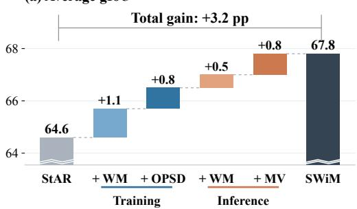

(b) Average cIoU  
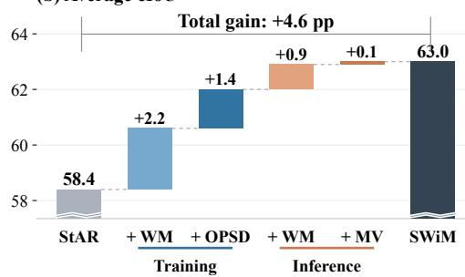  
Figure 4: Effects of training and inference configurations in SWiM. Results are averaged over RS, RS-R, and RS-X. Floating bars show gains in percentage points; solid bars show absolute scores.

Table 2: Ablation of training objectives. We compare GRPO, OPSD, and their joint optimization on RS, RS-R, and RS-X without working memory at inference.
<table><tr><td rowspan="2">GRPO</td><td rowspan="2">OPSD</td><td colspan="2">RS</td><td colspan="2">RS-R</td><td colspan="2">RS-X</td><td colspan="2">Average</td></tr><tr><td>gIoU</td><td>cIoU</td><td>gIoU</td><td>cIoU</td><td>gIoU</td><td>cIoU</td><td>gIoU</td><td>cIoU</td></tr><tr><td rowspan="3">√</td><td></td><td>69.6</td><td>64.4</td><td>72.4</td><td>67.6</td><td>55.1</td><td>50.0</td><td>65.7</td><td>60.6</td></tr><tr><td></td><td>70.6</td><td>64.7</td><td>73.0</td><td>70.2</td><td>55.1</td><td>47.8</td><td>66.2</td><td>60.9</td></tr><tr><td>√</td><td>70.1</td><td>65.9</td><td>72.3</td><td>68.4</td><td>54.8</td><td>48.4</td><td>65.7</td><td>60.9</td></tr><tr><td></td><td>√</td><td>70.8</td><td>65.8</td><td>73.0</td><td>70.8</td><td>55.6</td><td>49.3</td><td>66.5</td><td>62.0</td></tr></table>

Qwen3-VL-8B as the backbone. As shown in Figure 4, introducing working memory during the RL warm-up improves performance. Subsequent working-memory distillation yields further gains under plain inference, suggesting that memory-conditioned guidance can strengthen predictions from the image and query alone. Providing working memory at inference further improves performance, and combining it with majority voting achieves the best average results. The full configuration improves average gIoU and cIoU over the reproduced StAR baseline by 3.2 and 4.6 percentage points, respectively, supporting the benefits of working memory during both training and inference. Detailed per-benchmark results are provided in Appendix E.

GRPO and OPSD in working memory distillation. We examine the contributions of GRPO and OPSD by optimizing each objective independently and jointly, with all models evaluated without working memory at inference. As shown in Table 2, applying GRPO or OPSD alone yields modest improvements over the model after RL warm-up, while joint optimization achieves the best average performance, outperforming training with either objective alone. These results suggest that tokenlevel guidance from the memory-conditioned teacher complements outcome-based segmentation feedback, enabling more effective working-memory distillation and strengthening predictions from the image and query alone.

Distillation weight. We examine the effect of λ, which balances OPSD and GRPO in the joint training objective. As shown in Figure 5, λ = 0.1 achieves the best average gIoU and cIoU among the evaluated settings, while a high weight of λ = 10 reduces performance. These results suggest that the strength of working-memory guidance should be balanced with outcome-based optimization. We therefore use λ = 0.1 as the default setting. Additional analysis of working memory size is provided in Appendix I.

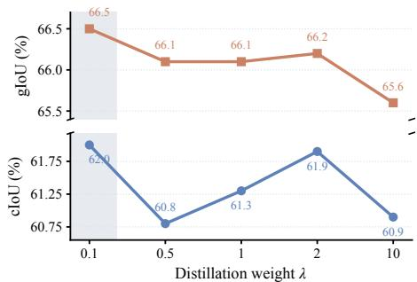

We further examine the design choices of SWiM through additional experiments reported in the appendix. The working-memory-size study in Appendix I shows that larger memory does not consistently improve perfor-

Figure 5: Effect of the distillation weight λ. gIoU and cIoU are averaged over RS, RS-R, and RS-X.

mance. The teacher-context comparison in Appendix F shows that working memory outperforms ground-truth-derived hints and their combination, whereas random-mask hints degrade performance. We also compare forward KL, reverse KL, and JSD in Appendix G; JSD achieves the best overall performance and is adopted as our default distillation objective.

Question: In many cultural festivals, people wear traditional clothing and accessories to represent specific characters or deities. What part of the person in the picture indicates his role in the festival?

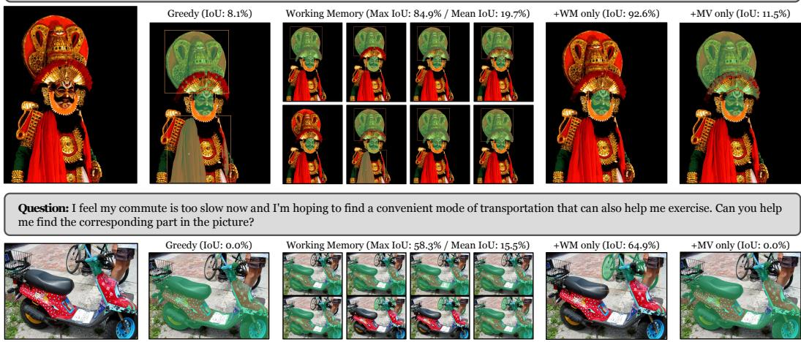  
Figure 6: Working memory versus majority voting on ReasonSeg. Each row shows a query, the input image, a greedy prediction, eight sampled candidate masks, a WM-guided prediction, and an MV-only prediction. WM-guided inference revisits the image and query using the corresponding responses as working memory, while MV directly aggregates the same eight masks.

## 5.4 QUALITATIVE ANALYSIS

To illustrate the advantages of working-memory-guided inference (WM) over majority voting (MV) (Yun et al., 2026), we present two representative ReasonSeg examples in Figure 6. All predictions are generated by the same SWiM model trained from Qwen3-VL-8B. We include greedy prediction as a reference, generating a single response from the image and query by selecting the highest-probability token at each decoding step. For each example, WM-guided inference revisits eight sampled responses to generate a new prediction, while MV-only inference directly aggregates the masks predicted by those same responses without using working memory.

In the first example, the query asks which part of the person indicates their role in the festival. Most sampled predictions include the large headdress, while the annotated target is the facial region. MV preserves this error, whereas WM-guided inference localizes the face, achieving 92.6% IoU compared with 11.5% for MV. In the second example, the query asks for a convenient means of transportation that also provides exercise. Most sampled responses select the foreground scooter, overlooking the exercise requirement. MV consequently retains the scooter, whereas revisiting these responses with working memory leads the model to identify the bicycle, which satisfies both requirements.

In both examples, WM-guided inference corrects target-selection errors that persist under majority voting and produces predictions with higher IoU than the best individual candidate. These observations highlight the effectiveness of working memory in SWiM, enabling the model to revisit prior attempts, refine its interpretation of the query, and localize the target more accurately.

## 6 CONCLUSION

In this work, we presented SWiM, a working-memory distillation framework for reasoning segmentation that enables a policy to learn from revisiting its own prior attempts. By retaining reasoning traces and localization proposals from quality-selected rollouts, SWiM constructs working memory that provides additional context for a self-teacher. Joint optimization of on-policy self-distillation and outcome-based reinforcement learning transfers this contextual guidance into the student through complementary token-level supervision and segmentation feedback. The resulting policy supports prediction from the image and query alone, while retaining the ability to revisit the input with working memory at inference time. Experiments on reasoning segmentation benchmarks demonstrate the effectiveness of our approach, highlighting self-generated working memory as a useful source of supervision for improving reasoning and localization.

## REFERENCES

Rishabh Agarwal, Nino Vieillard, Yongchao Zhou, Piotr Stanczyk, Sabela Ramos Garea, Matthieu Geist, and Olivier Bachem. On-policy distillation of language models: Learning from selfgenerated mistakes. In The Twelfth International Conference on Learning Representations, ICLR 2024, 2024.

Shuai Bai, Yuxuan Cai, Ruizhe Chen, Keqin Chen, Xionghui Chen, Zesen Cheng, Lianghao Deng, Wei Ding, Chang Gao, Chunjiang Ge, et al. Qwen3-vl technical report. arXiv preprint arXiv:2511.21631, 2025.

Xiaoyi Bao, Siyang Sun, Shuailei Ma, Kecheng Zheng, Yuxin Guo, Guosheng Zhao, Yun Zheng, and Xingang Wang. Cores: Orchestrating the dance of reasoning and segmentation. In European Conference on Computer Vision, pp. 187–204. Springer, 2024.

Nicolas Carion, Laura Gustafson, Yuan-Ting Hu, Shoubhik Debnath, Ronghang Hu, Didac Suris Coll-Vinent, Chaitanya Ryali, Kalyan Vasudev Alwala, Haitham Khedr, Andrew Huang, et al. Sam 3: Segment anything with concepts. In International conference on learning representations, volume 2026, pp. 138846–138923, 2026.

Tianyuan Du, Haopeng Li, Zhen Fan, Jiarui Zhang, Panwang Pan, and Yang Zhang. Sam-veteran: An mllm-based human-like sam agent for reasoning segmentation. In The Fourteenth International Conference on Learning Representations, 2026.

Xinyan Gao, Haoran Hao, and Xiangyu Yue. Reason twice: Segmentation via candidate discovery and comparative reasoning. arXiv preprint arXiv:2606.09303, 2026.

Xingqi He, Yujie Zhang, Shuyong Gao, Wenjie Li, Lingyi Hong, Mingxi Chen, Kaixun Jiang, Jiyuan Fu, and Wenqiang Zhang. Rsagent: Learning to reason and act via multi-turn tool invocations for text-guided segmentation. In Forty-third International Conference on Machine Learning, 2026a.

Yulin He, Wei Chen, Zhikang Jian, Tianhang Guo, Wenjuan Zhou, Minglong Li, Shaowu Yang, and Wenjing Yang. Dr2seg: Decomposed two-stage rollouts for efficient reasoning segmentation in multimodal large language models. arXiv preprint arXiv:2601.09981, 2026b.

Edward J Hu, Yelong Shen, Phillip Wallis, Zeyuan Allen-Zhu, Yuanzhi Li, Shean Wang, Lu Wang, and Weizhu Chen. Lora: Low-rank adaptation of large language models. arXiv preprint arXiv:2106.09685, 2021.

Jiaqi Huang, Zunnan Xu, Jun Zhou, Ting Liu, Yicheng Xiao, Mingwen Ou, Bowen Ji, Xiu Li, and Kehong Yuan. SAM-R1: leveraging SAM for reward feedback in multimodal segmentation via reinforcement learning. In Advances in Neural Information Processing Systems 38: Annual Conference on Neural Information Processing Systems 2025, NeurIPS 2025, 2025.

Donggon Jang, Yucheol Cho, Suin Lee, Taehyeon Kim, and Daeshik Kim. MMR: A large-scale benchmark dataset for multi-target and multi-granularity reasoning segmentation. In The Thirteenth International Conference on Learning Representations, ICLR 2025, 2025.

Alexander Kirillov, Eric Mintun, Nikhila Ravi, Hanzi Mao, Chloe Rolland, Laura Gustafson, Tete Xiao, Spencer Whitehead, Alexander C Berg, Wan-Yen Lo, et al. Segment anything. In 2023 IEEE/CVF international conference on computer vision (ICCV), pp. 3992–4003, 2023.

Xin Lai, Zhuotao Tian, Yukang Chen, Yanwei Li, Yuhui Yuan, Shu Liu, and Jiaya Jia. Lisa: Reasoning segmentation via large language model. In 2024 IEEE/CVF Conference on Computer Vision and Pattern Recognition (CVPR), pp. 9579–9589. IEEE, 2024.

Yaxuan Li, Yuxin Zuo, Bingxiang He, Jinqian Zhang, Chaojun Xiao, Cheng Qian, Tianyu Yu, Huanang Gao, Wenkai Yang, Zhiyuan Liu, et al. Rethinking on-policy distillation of large language models: Phenomenology, mechanism, and recipe. arXiv preprint arXiv:2604.13016, 2026.

Tianming Liang, Qirui Du, Jian-Fang Hu, Haichao Jiang, Zicheng Lin, and Wei-Shi Zheng. Seg-research: Segmentation with interleaved reasoning and external search. arXiv preprint arXiv:2602.04454, 2026.

Chang Liu, Henghui Ding, and Xudong Jiang. Gres: Generalized referring expression segmentation. In 2023 IEEE/CVF Conference on Computer Vision and Pattern Recognition (CVPR), pp. 23592– 23601. IEEE, 2023.

Yuqi Liu, Bohao Peng, Zhisheng Zhong, Zihao Yue, Fanbin Lu, Bei Yu, and Jiaya Jia. Segzero: Reasoning-chain guided segmentation via cognitive reinforcement. arXiv preprint arXiv:2503.06520, 2025.

Yuqi Liu, Tianyuan Qu, Zhisheng Zhong, Bohao Peng, Shu Liu, Bei Yu, and Jiaya Jia. Visionreasoner: Unified reasoning-integrated visual perception via reinforcement learning. In International Conference on Learning Representations, volume 2026, pp. 94069–94086, 2026a.

Yuyuan Liu, Yiping Ji, Anjie Le, Jiayuan Zhu, Jiazhen Pan, Can Peng, Jiajun Deng, Fengbei Liu, and Junde Wu. From failure to feedback: Group revision unlocks hard cases in object-level grounding. arXiv preprint arXiv:2605.15951, 2026b.

Ilya Loshchilov and Frank Hutter. Decoupled weight decay regularization. arXiv preprint arXiv:1711.05101, 2017.

Kevin Lu. Thinking machines lab. on-policy distillation. Thinking Machines Lab: Connectionism, 2025.

Yi Lu, Jiawang Cao, Yongliang Wu, Bozheng Li, Licheng Tang, Yangguang Ji, Chong Wu, Jay Wu, and Wenbo Zhu. RSVP: Reasoning segmentation via visual prompting and multi-modal chain-of-thought. In Proceedings ofthe 63rd Annual Meeting ofthe Associationfor Computational Linguistics (Volume 1: Long Papers), pp. 14699–14716, 2025.

Zhenyu Lu, Liupeng Li, Jinpeng Wang, Yan Feng, Bin Chen, Ke Chen, and Yaowei Wang. Coprs: Learning positional prior from chain-of-thought for reasoning segmentation. In International Conference on Learning Representations, volume 2026, pp. 37940–37959, 2026a.

Zhenyu Lu, Liupeng Li, Jinpeng Wang, Haoqian Kang, Yan Feng, Ke Chen, and Yaowei Wang. Segcompass: Exploring interpretable alignment with sparse autoencoders for enhanced reasoning segmentation. arXiv preprint arXiv:2605.22658, 2026b.

Rui Qian, Xin Yin, and Dejing Dou. Reasoning to attend: Try to understand how< seg> token works. In 2025 IEEE/CVF Conference on Computer Vision and Pattern Recognition (CVPR), pp. 24722–24731. IEEE, 2025.

Rui Qian, Chuanhang Deng, Qiang Huang, Jian Xiong, Mingxuan Li, Yingbo Zhou, Wei Zhai, Jintao Chen, and Dejing Dou. Anchorseg: Language grounded query banks for reasoning segmentation. In Proceedings of the 64th Annual Meeting of the Association for Computational Linguistics (Volume 1: Long Papers), pp. 20490–20505, 2026.

Hanoona Rasheed, Muhammad Maaz, Sahal Shaji, Abdelrahman Shaker, Salman Khan, Hisham Cholakkal, Rao M Anwer, Eric Xing, Ming-Hsuan Yang, and Fahad S Khan. Glamm: Pixel grounding large multimodal model. In 2024 IEEE/CVF Conference on Computer Vision and Pattern Recognition (CVPR), pp. 13009–13018. IEEE, 2024.

Nikhila Ravi, Valentin Gabeur, Yuan-Ting Hu, Ronghang Hu, Chaitanya Ryali, Tengyu Ma, Haitham Khedr, Roman Rädle, Chloé Rolland, Laura Gustafson, Eric Mintun, Junting Pan, Kalyan Vasudev Alwala, Nicolas Carion, Chao-Yuan Wu, Ross B. Girshick, Piotr Dollár, and Christoph Feichtenhofer. SAM 2: Segment anything in images and videos. In The Thirteenth International Conference on Learning Representations, ICLR 2025, 2025.

Zhongwei Ren, Zhicheng Huang, Yunchao Wei, Yao Zhao, Dongmei Fu, Jiashi Feng, and Xiaojie Jin. Pixellm: Pixel reasoning with large multimodal model. In 2024 IEEE/CVF Conference on Computer Vision and Pattern Recognition (CVPR), pp. 26364–26373. IEEE, 2024.

Zhihong Shao, Peiyi Wang, Qihao Zhu, Runxin Xu, Junxiao Song, Xiao Bi, Haowei Zhang, Mingchuan Zhang, YK Li, Yang Wu, et al. Deepseekmath: Pushing the limits of mathematical reasoning in open language models. arXiv preprint arXiv:2402.03300, 2024.

Mingyang Song and Mao Zheng. A survey of on-policy distillation for large language models. arXiv preprint arXiv:2604.00626, 2026.

Haoxiang Sun, Tao Wang, Chenwei Tang, Li Yuan, and Jiancheng Lv. Dr. seg: Revisiting grpo training for visual large language models through perception-oriented design. In Proceedings of the IEEE/CVF Conference on Computer Vision and Pattern Recognition, pp. 24320–24329, 2026.

Gemini Team, Rohan Anil, Sebastian Borgeaud, Jean-Baptiste Alayrac, Jiahui Yu, Radu Soricut, Johan Schalkwyk, Andrew M Dai, Anja Hauth, Katie Millican, et al. Gemini: a family of highly capable multimodal models. arXiv preprint arXiv:2312.11805, 2023.

Kimi Team, Tongtong Bai, Yifan Bai, Yiping Bao, Jianfeng Cai, Xinyuan Cai, Peizhou Cao, Yuxuan Cao, Ziwei Chai, Y Charles, et al. Kimi k3: Open frontier intelligence. arXiv preprint arXiv:2607.24653, 2026.

Hao Wang, Guozhi Wang, Han Xiao, Yufeng Zhou, Yue Pan, Jichao Wang, Ke Xu, Yafei Wen, Xiaohu Ruan, Xiaoxin Chen, et al. Skill-sd: Skill-conditioned self-distillation for multi-turn llm agents. arXiv preprint arXiv:2604.10674, 2026.

XuDong Wang, Shaolun Zhang, Shufan Li, Kehan Li, Konstantinos Kallidromitis, Yusuke Kato, Kazuki Kozuka, et al. Segllm: Multi-round reasoning segmentation with large language models. In International Conference on Learning Representations, volume 2025, pp. 56526–56547, 2025.

Jinyang Wu, Shuo Yang, Zhengxi Lu, Fan Zhang, Yuhao Shen, Lang Feng, Haoran Luo, Zheng Lian, Shuai Zhang, Zhengqi Wen, et al. Seed: Self-evolving on-policy distillation for agentic reinforcement learning. arXiv preprint arXiv:2607.14777, 2026.

Tao Yang, Qing Zhou, Yanliang Li, and Qi Wang. Discriminative perception via anchored description for reasoning segmentation. arXiv preprint arXiv:2603.04002, 2026a.

Yuting Yang, Haichao Jiang, Tianming Liang, Quan Zhang, and Jian-Fang Hu. Don’t guess, just ask: Resolving ambiguity in referring segmentation via multi-turn clarification. arXiv preprint arXiv:2605.17531, 2026b.

Licheng Yu, Patrick Poirson, Shan Yang, Alexander C Berg, and Tamara L Berg. Modeling context in referring expressions. In European conference on computer vision, pp. 69–85. Springer, 2016.

Weichen Yu, Xiaomin Li, Yizhou Zhao, Xiaoze Liu, Ruowang Zhang, Haixin Wang, Yinyi Luo, Chen Henry Wu, Gaurav Mittal, Matt Fredrikson, et al. Multi-rollout on-policy distillation via peer successes and failures. arXiv preprint arXiv:2605.12652, 2026.

Seokju Yun, Dongheon Lee, Noori Bae, Jaesung Jun, Chanseul Cho, and Youngmin Ro. Star: Segment anything reasoner. arXiv preprint arXiv:2603.14382, 2026.

Anqi Zhang, Xiaokang Ji, Guangyu Gao, Jianbo Jiao, Chi Harold Liu, and Yunchao Wei. Rethinking mllm itself as a segmenter with a single segmentation token. arXiv preprint arXiv:2603.19026, 2026a.

Tao Zhang, Xiangtai Li, Hao Fei, Haobo Yuan, Shengqiong Wu, Shunping Ji, Chen Change Loy, and Shuicheng Yan. Omg-llava: Bridging image-level, object-level, pixel-level reasoning and understanding. In Advances in Neural Information Processing Systems 37: Annual Conference on Neural Information Processing Systems 2024, NeurIPS 2024, 2024.

Yuwei Zhang, Sha Li, Changlong Yu, Qin Lu, Shuowei Jin, Chengyu Dong, Haoran Liu, Ilgee Hong, Xintong Li, Zhenyu Shi, et al. Learning with rare success but rich feedback via reflection-enhanced self-distillation. arXiv preprint arXiv:2605.12741, 2026b.

Siyan Zhao, Zhihui Xie, Mengchen Liu, Jing Huang, Guan Pang, Feiyu Chen, and Aditya Grover. Self-distilled reasoner: On-policy self-distillation for large language models. arXiv preprint arXiv:2601.18734, 2026.

Lanyun Zhu, Tianrun Chen, Qianxiong Xu, Xuanyi Liu, Deyi Ji, Haiyang Wu, De Wen Soh, and Jun Liu. Popen: Preference-based optimization and ensemble for lvlm-based reasoning segmentation. In 2025 IEEE/CVF Conference on Computer Vision and Pattern Recognition (CVPR), pp. 30231– 30240. IEEE, 2025.

Lianghui Zhu, Bin Ouyang, Yuxuan Zhang, Tianheng Cheng, Rui Hu, Haocheng Shen, Longjin Ran, Xiaoxin Chen, Li Yu, Wenyu Liu, et al. Lens: Learning to segment anything with unified reinforced reasoning. In Proceedings ofthe AAAI Conference on Artificial Intelligence, volume 40, pp. 13952–13960, 2026.

## A IMPLEMENTATION DETAILS

Architecture and optimization. We use Qwen3-VL-8B/32B-Instruct as the multimodal language model and SAM2.1 Hiera-Large as the mask generator. The vision backbone and SAM2.1 are frozen. We adapt the language model with LoRA (Hu et al., 2021) on its linear layers, using rank 64 and scaling factor 64. The model predicts a list of boxes, points, and short labels. SAM2.1 converts the spatial prompts into object masks, which are combined to obtain the query-level prediction. We use a weight decay (Loshchilov & Hutter, 2017) of 0.001, zero entropy regularization, gradient checkpointing, and a random seed of 42 in the release configuration.

RL-only Warm-up (Stage 1). Following StAR’s Stage-1 data construction (Yun et al., 2026), we use 5,166 training examples from LVIS, RefCOCOg, and gRefCOCO. Neither SWiM nor our reproduced StAR baseline uses the training split of ReasonSeg or ReasonSeg-X. Stage 1 runs for one epoch. The learning rate is 10−5, the query batch size is 24, and each query has 16 sampled responses. Training mixes ordinary queries and queries augmented with working memory. Working memory construction uses eight preliminary attempts. This stage teaches the model to reason about the image both with and without additional attempts in its context.

Working Memory Distillation (Stage 2). In this stage, we optimize the joint objective $\mathcal { L } _ { \mathrm { S W i M } } =$ L + λL . Stage 2 uses 869 examples selected from the 5,166-example Stage 1 training pool, as described in Appendix C. The consolidated training recipe runs for two epochs with a constant learning rate of 10−6 and a query batch size of 16. For each query, N = 16 attempts are sampled, and the top K = 8 according to training mask IoU form the teacher’s working memory. The student uses the ordinary context, while the teacher evaluates the student’s generated prefixes with the self-generated working memory. Both the student and the teacher use the current model parameters. Rollout tensor parallelism is 2, and the actor micro-batch size is 2. The maximum training response length is 2,048 tokens.

Training hardware. We train both stages of SWiM on 24 NVIDIA H800 GPUs.

Distributional supervision. The implementation computes JSD on a compressed vocabulary partition. It retains the teacher’s top-16 tokens at each position and groups the remaining probability mass into one residual bin for both teacher and student. Probabilities on the retained tokens are normalized over the full vocabulary before this grouping. The loss therefore compares distributions on the same partition, rather than renormalizing only the retained tokens.

Inference and mask generation. The default evaluation uses greedy generation with a maximum of 1,024 new tokens. The LoRA (Hu et al., 2021) adapter is loaded without merging. The image supplied to the language model is resized to 840 × 840, while the spatial prompts are mapped back to the original image geometry for SAM2.1. At test time, the ground-truth mask is not available to construct working memory. Instead, working memory contains unranked attempts sampled for the same image and query. The default working memory size (K) is 8. Multiple independently conditioned outputs can also be aggregated by mask voting. The main WM+MV configuration combines 32 WM-conditioned responses and 32 plain responses without working memory.

## B PROMPTS

We provide the instruction text used by SWiM. Question is replaced by the dataset query and Answer by the output-format example. The image is supplied through the model’s multimodal input.

RL-only warm-up (stage 1) and referring expression segmentation

Please find "{Question}" with bbox(es) and point(s). Also provide a short label for each object. Compare the difference between object(s) and find the most closely matched object(s). Return ALL matching instances; double-check none are missed. Output the thinking process first, then the final answer in <answer> </answer> tags. Output the bbox(es) and point(s) inside the interested object(s), along with a short label, in JSON format. i.e., thinking process (step-by-step reasoning) here <answer>{Answer}</answer>

## Working memory distillation (stage 2) and reasoning segmentation

Please find "{Question}" with bbox(es) and point(s). Also provide a short label for each object. First, understand and summarize what the query—"{Question}"—is likely referring to (which object or concept). Then apply this to the image and find the matched target object(s). Return ALL matching instances; if there are no matches, return an empty list (<answer>[]</answer>). double-check none are missed. Output the thinking process first, then the final answer in <answer> </answer> tags. Output the bbox(es) and point(s) inside the interested object(s), along with a short label, in JSON format. i.e., thinking process (step-by-step reasoning) here <answer>{Answer}</answer>

## Working-memory context appended to the query

Privileged hint:

Below are {n} previous attempts at answering this exact query. Use them to calibrate your answer — identify patterns in what works and what doesn’t. Answer exactly as you would without them: think step by step, then give <answer> with bbox(es) and point(s) in JSON format. Never mention these attempts in your response.

[Attempt 1] {text}

[Attempt n] {text}

JSON format example used by the plain evaluator   
[{"label": "chair", "bbox\_2d": [10,100,200,210], "point\_2d":   
[30,110]}, {"label": "train track", "bbox\_2d": [225,296,706,786],   
"point\_2d": [302,410]}]

## C WORKING MEMORY DISTILLATION TRAINING SET CONSTRUCTION

Working memory distillation (stage 2) focuses training on examples with different forms of remaining difficulty. We start from the 5,166-example RL-only warm-up (stage 1) training pool and generate eight plain responses per example using the stage 1 model. Each response is converted to a mask and scored against the training annotation. Let $u _ { 1 } , \ldots , u _ { 8 }$ denote these IoUs. We record their mean u¯, maximum $u _ { \mathrm { m a x } } .$ , minimum $u _ { \mathrm { m i n } } .$ the counts $n _ { 0 . 6 }$ and $n _ { 0 . 8 }$ at or above the corresponding thresholds, and the gap $\Delta = u _ { \mathrm { m a x } } - \bar { u }$ . These statistics distinguish inconsistent predictions from uniformly difficult or already reliable examples.

• Frontier examples have $1 \leq n _ { 0 . 6 } \leq 7 ,$ no parsing errors, and $\Delta > 0 . 1$ . Some attempts succeed, but performance remains inconsistent. The final subset contains 364 such examples.

• Refinement examples satisfy $n _ { 0 . 6 } = 8$ and $1 \leq n _ { 0 . 8 } \leq 7$ . They are broadly localized correctly but still leave room for mask-level improvement. We prioritize examples whose mean IoU is near 0.8 and retain 200.

• Hard but partially solvable examples have $n _ { 0 . 6 } = 0$ and $u _ { \mathrm { m a x } } \geq 0 . 5$ . We prioritize maximum IoUs near 0.6 and retain 97.

• Consistently unsuccessful examples have $u _ { \mathrm { m a x } } < 0 . 1$ . The final set includes 58 examples to retain exposure to difficult queries with no successful sampled attempt.

• Replay examples satisfy $u _ { \mathrm { m i n } } > 0 . 8$ . We randomly select 150 using seed 42 to retain examples on which the model is already reliable.

After validating the selected records, the final manifest contains 869 examples: 422 from LVIS, 265 from RefCOCOg (Yu et al., 2016), and 182 from gRefCOCO (Liu et al., 2023). We preserve the original images, queries, and masks. All selection statistics are computed on training data.

Table 3: Performance on MUSE val. Gray rows use the original evaluation protocol and are shown for reference.
<table><tr><td>Method</td><td>Base model (Size)</td><td>MUSE val cIoU</td></tr><tr><td>LISA</td><td>LLaVA-7B</td><td>42.0 46.1</td></tr><tr><td>PixelLM</td><td>LLaVA-7B</td><td>42.6 50.7</td></tr><tr><td>POPEN</td><td>LLaVA-7B</td><td>45.4 55.2</td></tr><tr><td>LISA</td><td>LLaVA-13B</td><td>43.6 50.2</td></tr><tr><td>PixelLM</td><td>LLaVA-13B</td><td>44.8 54.1</td></tr><tr><td>POPEN</td><td>LLaVA-13B</td><td>48.0 59.1</td></tr><tr><td>VisionReasoner</td><td>Qwen2.5-VL-7B</td><td>50.5 47.6</td></tr><tr><td>StAR</td><td>Qwen3-VL-8B</td><td>55.7 54.2</td></tr><tr><td>+MV</td><td>Qwen3-VL-8B</td><td>57.1 55.5</td></tr><tr><td>SWiM</td><td>Qwen3-VL-8B</td><td>57.2 55.7</td></tr><tr><td>+ WM&amp;MV</td><td>Qwen3-VL-8B</td><td>58.3 56.8</td></tr></table>

Table 4: Performance on MMR val and test. Gray entries (∗) use MMR training data and are shown for reference.
<table><tr><td rowspan="2">Method</td><td rowspan="2">Base model (Size)</td><td colspan="2">val</td><td colspan="2">test</td></tr><tr><td>gIoU</td><td>cIoU</td><td>gIoU</td><td>cIoU</td></tr><tr><td>LISA</td><td>Llama2-13B</td><td>15.4</td><td>20.0</td><td>16.1</td><td>19.8</td></tr><tr><td>LISA</td><td>Llama2-13B</td><td>22.3</td><td>33.4</td><td>23.0</td><td>29.2</td></tr><tr><td>M2SA*</td><td>LLaVA-7B</td><td>27.8</td><td>48.6</td><td>30.9</td><td>46.8</td></tr><tr><td>M2SA*</td><td>Llama2-13B</td><td>28.4</td><td>49.1</td><td>31.6</td><td>47.6</td></tr><tr><td>VisionReasoner</td><td>Qwen2.5-VL-7B</td><td>26.7</td><td>21.4</td><td>28.4</td><td>21.7</td></tr><tr><td>StAR</td><td>Qwen3-VL-8B</td><td>29.4</td><td>26.6</td><td>31.9</td><td>27.4</td></tr><tr><td>+MV</td><td>Qwen3-VL-8B</td><td>30.6</td><td>27.5</td><td>32.9</td><td>28.1</td></tr><tr><td>SWiM</td><td>Qwen3-VL-8B</td><td>30.3</td><td>27.7</td><td>32.8</td><td>28.5</td></tr><tr><td>+ WM&amp;MV</td><td>Qwen3-VL-8B</td><td>31.1</td><td>28.1</td><td>33.6</td><td>28.9</td></tr></table>

Table 5: Performance on referring expression segmentation benchmarks. We report cIoU results.
<table><tr><td>Method</td><td>RefCOCO testA</td><td>RefCOCO+ testA</td><td>RefCOCOg test</td></tr><tr><td>LISA-7B</td><td>76.5</td><td>67.4</td><td>68.5</td></tr><tr><td>SegLLM</td><td>81.5</td><td>73.0</td><td>73.6</td></tr><tr><td>READ</td><td>80.2</td><td>73.7</td><td>71.4</td></tr><tr><td>CoReS</td><td>78.6</td><td>70.0</td><td>70.7</td></tr><tr><td>CoPRS-7B</td><td>85.3</td><td>80.3</td><td>76.2</td></tr><tr><td>SAM-R1</td><td>79.2</td><td>74.7</td><td>73.1</td></tr><tr><td>SAM-Veteran</td><td>80.8</td><td>76.6</td><td>73.4</td></tr><tr><td>VisionReasoner</td><td>76.6</td><td>72.1</td><td>67.2</td></tr><tr><td>SAM 3 Agent-7B</td><td>64.3</td><td>57.0</td><td>58.8</td></tr><tr><td>SAM 3 Ağent-72B</td><td>74.9</td><td>70.8</td><td>70.2</td></tr><tr><td>StAR-8B +MV</td><td>77.4 78.0</td><td>73.0</td><td>73.1</td></tr><tr><td></td><td></td><td>73.4</td><td>73.4</td></tr><tr><td>SWiM-8B</td><td>79.0</td><td>75.6</td><td>73.5</td></tr><tr><td>+ WM&amp;MV</td><td>79.2</td><td>76.5</td><td>73.9</td></tr></table>

## D RESULTS ON ADDITIONAL BENCHMARKS

To further assess the generalization of SWiM, we follow StAR (Yun et al., 2026) and evaluate on three additional settings: MUSE (Ren et al., 2024) for multi-target segmentation, MMR (Jang et al., 2025) for compositional object-and-part segmentation, and the RefCOCO family (Yu et al., 2016) for referring expression segmentation. We report gIoU and cIoU on MUSE val and MMR val/test, and cIoU on RefCOCO testA, RefCOCO+ testA, and RefCOCOg test.

Multi-target and compositional object-and-part segmentation. As shown in Tables 3 and 4, SWiM generally outperforms the reproduced StAR baseline on MUSE and both MMR splits, even without working memory at inference. Combining working memory with majority voting further im proves gIoU and cIoU across these evaluations. These results demonstrate the generalization of SWiM beyond reasoning segmentation to multi-target and compositional object-and-part segmentation.

Referring expression segmentation. Table 5 presents the results on referring expression segmentation (RES) benchmarks. Although our training uses only about 1.8k examples from the RefCOCOg training split, SWiM outperforms the reproduced StAR baseline and remains competitive with existing methods, particularly VisionReasoner and SAM 3 Agent. With working memory and majority voting, SWiM achieves results comparable to SAM-R1, SAM-Veteran, and SegLLM, which make more extensive use of RefCOCOg training data. These results suggest that SWiM remains effective across RES tasks with varying reasoning demands.

Table 6: Progressive evaluation of the core components of SWiM. We report results on RS, RS-R, and RS-X using the Qwen3-VL-8B backbone.
<table><tr><td colspan="2">Training</td><td colspan="2">Inference</td><td colspan="2">RS</td><td colspan="2">RS-R</td><td colspan="2">RS-X</td><td colspan="2">Average</td></tr><tr><td>WM</td><td>OPSD</td><td>WM</td><td>MV</td><td>gIoU</td><td>cIoU</td><td>gIoU</td><td>cIoU</td><td>gIoU</td><td>cIoU</td><td>gIoU</td><td>cIoU</td></tr><tr><td></td><td></td><td></td><td></td><td>68.6</td><td>60.2</td><td>71.3</td><td>65.7</td><td>54.0</td><td>49.2</td><td>64.6</td><td>58.4</td></tr><tr><td>V</td><td></td><td></td><td></td><td>69.6</td><td>64.4</td><td>72.4</td><td>67.6</td><td>55.1</td><td>50.0</td><td>65.7</td><td>60.6</td></tr><tr><td>V</td><td>V</td><td></td><td></td><td>70.8</td><td>65.8</td><td>73.0</td><td>70.8</td><td>55.6</td><td>49.3</td><td>66.5</td><td>62.0</td></tr><tr><td>V</td><td>√</td><td>V</td><td></td><td>71.1</td><td>67.0</td><td>72.7</td><td>70.8</td><td>57.2</td><td>51.0</td><td>67.0</td><td>62.9</td></tr><tr><td>√</td><td>√</td><td>√</td><td></td><td>71.6</td><td>67.3</td><td>73.5</td><td>70.3</td><td>58.1</td><td>51.5</td><td>67.8</td><td>63.0</td></tr></table>

Table 7: Comparison of teacher context configurations. WM denotes working memory, GT denotes ground-truth visual hints, and Random denotes surrogate annotations generated by SAM2 from random point prompts.
<table><tr><td rowspan="2">WM</td><td rowspan="2">GT</td><td rowspan="2">Random</td><td colspan="2">RS</td><td colspan="2">RS-R</td><td colspan="2">RS-X</td><td colspan="2">Average</td></tr><tr><td>gIoU</td><td>cIoU</td><td>gIoU</td><td>cIoU</td><td>gIoU</td><td>cIoU</td><td>gIoU</td><td>cIoU</td></tr><tr><td></td><td></td><td>√</td><td>55.4</td><td>52.4</td><td>56.0</td><td>56.0</td><td>43.0</td><td>37.7</td><td>51.5</td><td>48.7</td></tr><tr><td>√</td><td></td><td></td><td>70.8</td><td>65.8</td><td>73.0</td><td>70.8</td><td>55.6</td><td>49.3</td><td>66.5</td><td>62.0</td></tr><tr><td></td><td>√</td><td></td><td>70.7</td><td>65.5</td><td>73.2</td><td>70.1</td><td>54.4</td><td>48.3</td><td>66.1</td><td>61.3</td></tr><tr><td>√</td><td>√</td><td></td><td>70.7</td><td>67.1</td><td>72.6</td><td>70.2</td><td>55.6</td><td>48.2</td><td>66.3</td><td>61.8</td></tr></table>

## E DETAILED RESULTS OF PROGRESSIVE CONFIGURATIONS

Table 6 provides the per-benchmark results underlying the progressive comparison in Figure 4. The configurations isolate the incremental contributions of introducing working memory during RL warmup, applying working-memory distillation, and incorporating working memory and majority voting at inference. All configurations use the Qwen3-VL-8B backbone. The full configuration achieves the highest average gIoU and cIoU, validating the effectiveness of integrating the core designs of SWiM.

## F EFFECT OF TEACHER CONTEXT

To examine how teacher context affects distillation, we compare working memory (WM), groundtruth visual hints (GT), their combination, and random visual hints. The random hints use SAM2 masks generated from random point prompts as surrogate annotations.

As shown in Table 7, working memory alone achieves the highest average gIoU and cIoU. GT hints improve some individual metrics but provide no overall advantage over working memory, either alone or in combination with it. These results show that providing the teacher with more direct target information does not necessarily produce more effective supervision for the student. In our setting, the student learns from the teacher’s next-token distributions while receiving only the original image and query. The value of teacher context therefore lies in the guidance transferred to the student, rather than the explicitness of the target information it contains. Working memory provides effective guidance by allowing the teacher to revisit the policy’s own reasoning traces and localization proposals, achieving better average student performance than annotation-based context.

Random hints yield substantially lower scores, further emphasizing the importance of relevant teacher context. Overall, these results validate working memory as an effective source of supervision for distillation.

## G DISTILLATION OBJECTIVE FOR OPSD

To examine the effect of the divergence used in OPSD, we compare forward KL, reverse KL, and JSD. All variants use working memory as the additional teacher context and are evaluated using only the original image and query, without working memory or majority voting.

Table 8: Comparison of OPSD divergence objectives. All variants use working memory as the teacher context during training and are evaluated without working memory or majority voting.
<table><tr><td rowspan="2">Loss</td><td colspan="2">RS</td><td colspan="2">RS-R</td><td colspan="2">RS-X test</td><td colspan="2">Average</td></tr><tr><td>gIoU</td><td>cIoU</td><td>gIoU</td><td>cIoU</td><td>gIoU</td><td>cIoU</td><td>gIoU</td><td>cIoU</td></tr><tr><td>Reverse KL</td><td>70.5</td><td>64.4</td><td>73.1</td><td>70.8</td><td>54.0</td><td>46.0</td><td>65.9</td><td>60.4</td></tr><tr><td>Forward KL</td><td>70.2</td><td>63.9</td><td>73.1</td><td>70.4</td><td>53.8</td><td>48.6</td><td>65.7</td><td>61.0</td></tr><tr><td>JSD</td><td>70.8</td><td>65.8</td><td>73.0</td><td>70.8</td><td>55.6</td><td>49.3</td><td>66.5</td><td>62.0</td></tr></table>

Table 9: Effect of the distillation weight λ. All settings are evaluated without working memory.
<table><tr><td rowspan="2">λ</td><td colspan="2">RS</td><td colspan="2">RS-R</td><td colspan="2">RS-X</td><td colspan="2">Average</td></tr><tr><td>gIoU</td><td>cIoU</td><td>gIoU</td><td>cIoU</td><td>gIoU</td><td>cIoU</td><td>gIoU</td><td>cIoU</td></tr><tr><td>0.1</td><td>70.8</td><td>65.8</td><td>73.0</td><td>70.8</td><td>55.6</td><td>49.3</td><td>66.5</td><td>62.0</td></tr><tr><td>0.5</td><td>70.5</td><td>65.0</td><td>72.7</td><td>68.8</td><td>55.0</td><td>48.5</td><td>66.1</td><td>60.8</td></tr><tr><td>1.0</td><td>70.8</td><td>63.4</td><td>73.0</td><td>71.1</td><td>54.4</td><td>49.5</td><td>66.1</td><td>61.3</td></tr><tr><td>2.0</td><td>70.8</td><td>65.7</td><td>72.9</td><td>69.9</td><td>54.9</td><td>49.9</td><td>66.2</td><td>61.9</td></tr><tr><td>10.0</td><td>70.3</td><td>65.1</td><td>72.4</td><td>69.6</td><td>54.0</td><td>48.0</td><td>65.6</td><td>60.9</td></tr></table>

As shown in Table 8, JSD achieves the highest average gIoU and cIoU, with the best results on both RS and RS-X. Forward and reverse KL attain slightly higher gIoU on RS-R, while reverse KL matches JSD in cIoU on this benchmark. Overall, JSD provides the strongest aggregate performance across the three benchmarks, supporting its use as the default distillation objective in SWiM.

## H SENSITIVITY OF THE DISTILLATION WEIGHT

Table 9 provides the per-benchmark results for the distillation-weight analysis in Figure 5. We vary λ to examine the balance between OPSD and GRPO, with all configurations evaluated without working memory at inference.

Among the evaluated settings, λ = 0.1 achieves the highest average gIoU and cIoU. Larger weights improve some individual metrics but do not yield better overall performance, and increasing λ to 10 lowers both average scores relative to the default. These results support a moderate contribution from distillation alongside outcome-based reinforcement learning and motivate our choice of λ = 0.1.

## I WORKING-MEMORY SIZE

We examine the effect of working-memory size at inference time by varying the number of prior responses provided as context, with K = 0 denoting plain inference. Figure 7 summarizes the average performance, and Table 10 provides the per-benchmark results.

Using eight prior responses improves both average metrics over plain inference and achieves the highest average gIoU. Increasing the memory size to K = 16 yields a further gain of 0.2 percentage points in average cIoU but reduces average gIoU. Thus, expanding working memory does not consistently improve performance across metrics. These results support K = 8 as a practical choice, providing strong overall performance with fewer contextual responses than K = 16.

## J ADDITIONAL QUALITATIVE ANALYSIS

Figure 8 presents four qualitative examples from ReasonSeg-X using SWiM with the Qwen3-VL-8B backbone. They illustrate route planning, reasoning about physical constraints, and recognition of functional roles.

In example (a), the model compares two delivery orders and chooses the 29th floor first, reducing the total travel from 48 to 40 floors before exiting on the first floor. In example (b), it compares the visible restraints on three dogs and selects the dog without a visible leash. Example (c) distinguishes a window covering from an object that physically obstructs closing the window, identifying the installed air conditioner. In example (d), the model connects the role of communicating with the pitcher to the catcher and grounds this interpretation using the protective equipment and crouched posture.

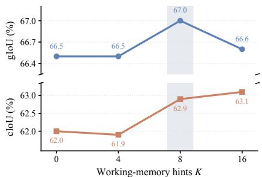  
Figure 7: Effect of working-memory size at inference. Scores are averaged over RS, RS-R, and RS-X.

Table 10: Effect of working-memory size at inference. K denotes the number of prior responses.
<table><tr><td rowspan="2">K</td><td colspan="2">RS</td><td colspan="2">RS-R</td><td colspan="2">RS-X</td><td colspan="2">Average</td></tr><tr><td>gIoU</td><td>cIoU</td><td>gIoU</td><td>cIoU</td><td>gIoU</td><td>cIoU</td><td>gIoU</td><td>cIoU</td></tr><tr><td>0</td><td>70.8</td><td>65.8</td><td>73.0</td><td>70.8</td><td>55.6</td><td>49.3</td><td>66.5</td><td>62.0</td></tr><tr><td>4</td><td>70.9</td><td>66.7</td><td>72.2</td><td>68.6</td><td>56.5</td><td>50.5</td><td>66.5</td><td>61.9</td></tr><tr><td>8</td><td>71.1</td><td>67.0</td><td>72.7</td><td>70.8</td><td>57.2</td><td>51.0</td><td>67.0</td><td>62.9</td></tr><tr><td>16</td><td>70.8</td><td>69.0</td><td>72.4</td><td>69.2</td><td>56.6</td><td>51.1</td><td>66.6</td><td>63.1</td></tr></table>

Comparison with StAR. Figure 9 presents a qualitative comparison between SWiM and our reproduced StAR baseline on the ReasonSeg series, both using the Qwen3-VL-8B backbone. Both models use plain greedy decoding with the same query template and input resolution, without working memory or majority voting at inference. In example (A), SWiM identifies the accordion from the functional description, improving mask IoU from 0.0% to 94.6%. Example (B) shows more complete coverage of the queried enclosure, with IoU increasing from 52.3% to 93.5%. In example (C), SWiM covers more of the annotated window-covering region. Example (D) further illustrates precise localization of a small target: SWiM selects the eye-black strips described by the query. Together, these cases illustrate improvements in target selection and spatial coverage under plain inference, consistent with the goal of transferring memory-conditioned guidance into the model parameters.

## K FAILURE CASE ANALYSIS

Figure 10 examines two sources of disagreement with the reference masks: ambiguity in the target extent and incomplete mask generation despite plausible localization.

Ambiguity in target extent. In examples (a) and (b), the queries may admit different plausible target extents, such as the handrail versus the railing and the fan control unit versus its knob; a single reference mask may therefore penalize a reasonable alternative. This motivates exploring multiple candidate masks for ambiguous queries and evaluating them against multiple human-validated reference masks.

Incomplete masks from plausible localization. In examples (c) and (d), the MLLM policy identifies and localizes the intended targets, but SAM2 produces incomplete masks (39.8% and 19.1% IoU, respectively). Future work could let the policy provide more spatial prompts or jointly optimize the policy and SAM2.

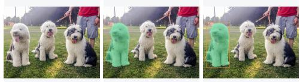

## (a) Route planning

Q. As a delivery driver who must exit on the 1st floor after completing both deliveries, starting from the 17th floor, determine which floor to visit first between the 13th and 29th floors to minimize total floors traveled, and locate it.

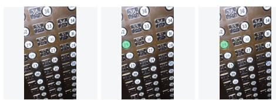  
Image GT mask RS-X | IoU 90.0% | SWiM-8B + WM  
Prediction  
A. Thinking (excerpt). Since 40 < 48, visiting the 29th floor first minimizes total floors traveled. [...] Now, I locate the 29th floor button in the image. It is in the left column, directly below the "30" button and above the "28" button. Answer (label): 29th floor button.

## (c) Physical obstruction

Q. identify the object that must be moved out of the way to fully close the window.

  
Image GT mask Prediction RS-X | IoU 99.0% | SWiM-8B + WM  
Q. A dog that can move freely.  
Image GT mask RS-X | IoU 99.8% | SWiM-8B + WM  
Prediction  
A. Thinking (excerpt). The dog on the right is clearly attached to a leash held by the person. The middle dog also has a visible leash connected to it. However, the dog on the far left does not have any visible leash or harness attached to it in the frame Answer (label): dog that can move freely.

A. Thinking (excerpt). However, the shade is not obstructing th window frame itself; it is the intended covering. The object that physically prevents the window from being fully closed is the window air conditioner unit installed in the window frame. Answer (label): window air conditioner.

## (b) Relational reasoning

## (d) Role understanding

Q. A person who sends signals to the pitcher to determine the strategy.

  
Image GT mask Prediction RS-X | IoU 97.9% | SWiM-8B + WM  
A. Thinking (excerpt). In baseball, this role is fulfilled by the catcher. [...] In the image, the person crouched behind the batter, wearing a catcher’s mask, chest protector, and mitt, is clearly the catcher. Answer (label): catcher.

Figure 8: Question–answer visualizations on ReasonSeg-X. Each panel shows the query, original image, ground-truth mask, and predicted mask with the model-generated box and point, followed by verbatim thinking excerpts and answer labels. Green overlays denote masks, orange rectangles denote predicted boxes, and pink markers denote predicted points. IoUs are per-example scores. The examples cover route planning, visible constraints on movement, physical obstruction, and role understanding.

SWiM (IoU: 88.2%)

Q: Street artists commonly perform in public spaces and use various instruments to entertain the audience. What musical instrument is the man in the picture playing?

  
Q: something that prevents the animal from getting out

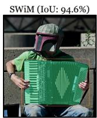

Q: If you want to enjoy the scenery outside, what object can be used to control the amount of sunlight coming into the room by adjusting the angle? (C)

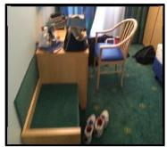

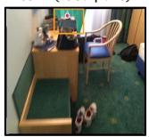

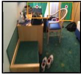  
Q: Something intended to reduce glare from sunlight or lighting, or to serve as a psychological routine.

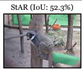

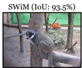

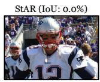

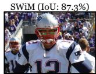  
Figure 9: Qualitative comparison with StAR on the ReasonSeg series. Each example shows the image and query alongside predictions from our reproduced StAR baseline and SWiM, both using Qwen3-VL-8B. These examples highlight improvements in target identification, region coverage, and small-target localization.

Image GT mask RS-R | IoU 12.9% | SWiM-8B + WM

## (a) Ambiguity: part vs. whole

Q. A person is standing near the edge of a building, posing for a photo. What part or feature of the building is the person using as support or barrier in this picture?

  
Image GT mask Prediction RS-R | IoU 8.5% | SWiM-8B + WM  
A. Thinking (excerpt). This railing consists of a golden top rail and dark green balusters below, serving as both a safety barrier and a support structure. Answer (label): railing.

## (c) Mask limitation: missing components

Q. It is too hard for the man to lift up, can you segment something that he should drop?

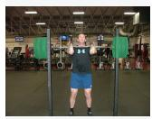

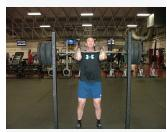  
A. Thinking (excerpt). The query asks to identify the object that is too hard for the man to lift, which is clearly the barbell he is holding. [...] The barbell includes the central bar and the weight plates on each side. I will segment the entire barbell assembly. Answer (label): barbell.

## (b) Ambiguity: control granularity

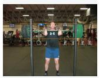  
Q. something that can control the fan speed

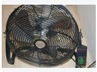

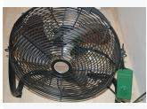

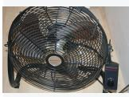  
A. Thinking (excerpt). This refers to the physical control mechanism on the fan, typically a knob or dial that allows adjustment of speed settings (e.g., low, medium, high). [...] The knob itself is the functional component used to control the fan speed. Answer (label): fan speed control knob.  
Prediction  
Prediction

## (d) Mask limitation: glass panes

Q. What structure in the room allows people to observe outdoor scenery while sitting?

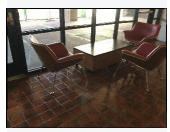

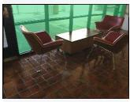

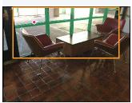  
Prediction

## Image GT mask RS | IoU 19.1% | SWiM-8B + WM

A. Thinking (excerpt). This is clearly the large glass windows or glass wall that spans the background of the image. These windows are positioned directly behind the chairs, allowing occupants to look outside while seated.   
Answer (label): large glass windows.

Figure 10: Two types of low-IoU predictions on the ReasonSeg series. All predictions are generated by SWiM with the Qwen3-VL-8B backbone using working memory at inference. The top row shows target-granularity ambiguities: handrail versus railing, and control unit versus knob. The bottom row shows incomplete SAM2 masks despite plausible object descriptions and localization prompts: a barbell and glass windows. Each panel includes the original image, GT mask, prediction with box and point, and verbatim thinking excerpts with answer labels. These examples diagnose possible error sources; they do not establish annotation errors or a causal attribution to the mask decoder.