# NHO: A NEURAL HAMILTONIAN OPERATOR FORANCHOR-BASED REGION LOCALIZATION AND DENSECORRESPONDANCE

Jing Li1, Yawei Luo2∗, Xiangze Meng1, Ying Li3, Tieru Wu1, Rui Ma1∗ 1Jilin University, 2Zhejiang University, 3North China University of Technology

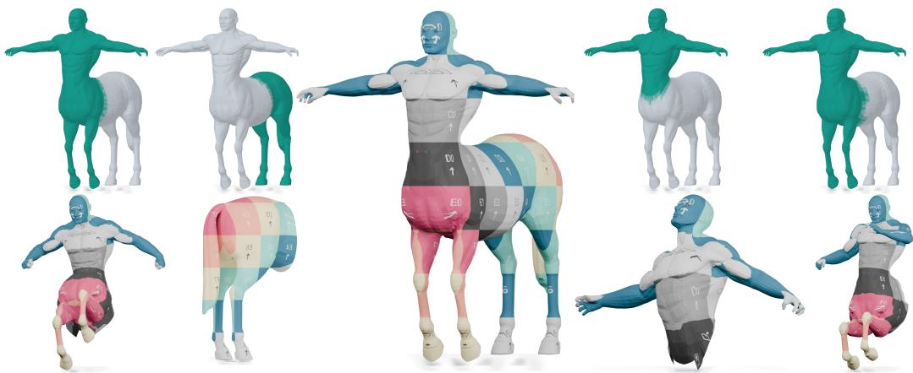

Figure 1: NHO (Neural Hamiltonian Operator) models a neural eigenspace using spatial cues, supporting both region localization and dense correspondence estimation for non-rigid partial-tofull shape matching.

## ABSTRACT

Non-rigid partial-to-full shape correspondence from sparse anchors requires identifying the corresponding region on the full surface and recovering dense correspondences between the partial shape and that region. We present NHO, which combines sparse anchors with the intrinsic geometry of the partial shape to learn a neural Hamiltonian operator whose localized eigenspace encodes both the region support and intrinsic coordinates for dense correspondence. NHO parameterizes the Hamiltonian potential as an intrinsic neural field and optimizes it using anchor evidence together with spectral and geometric constraints. To resolve the spatial ambiguity left by sparse anchors, we introduce reciprocal refinement between operator estimation and correspondence recovery. At each round, the current eigenspace provides spectral coordinates and restricts matching to its induced support, while geometrically reliable correspondences provide additional evidence for updating the potential. After refinement, aggregated eigenfunction energy yields the final localization, and the recovered map initializes dense correspondence refinement. Experiments demonstrate competitive accuracy on both tasks and robustness to uniform scaling and rotation.

## 1 INTRODUCTION

Establishing dense correspondence between non-rigid partial and full shapes is a fundamental problem in 3D shape analysis, with broad applications in shape retrieval, animation, and geometric learning. Compared with full-to-full matching, partial-to-full correspondence is inherently more ambiguous: only an unknown subset of the full shape admits valid correspondences, while the remaining geometry introduces structured distractors. A small number of reliable correspondences can often be obtained from manual landmarks or confident descriptor matches, providing a practical starting point for addressing this problem (Rakprayoon et al., 2021; Bensa¨ıd et al., 2023).

However, sparse correspondences provide spatial constraints at only a few locations. The extent of the corresponding region and the correspondences for the remaining points are still unknown. These two estimation problems are coupled. Identifying the region excludes irrelevant geometry and reduces correspondence ambiguity, while additional correspondences provide spatial evidence for determining the region. With limited spatial cues, uncertainty in either estimate can propagate to the other.

Existing methods differ in which aspect of this coupled inference they emphasize. Correspondenceoriented methods (Rakprayoon et al., 2021; Attaiki et al., 2021; Cao et al., 2023) recover dense pointwise correspondences either by expanding sparse initial matches or by estimating functional maps from learned vertex-wise features. Localization-oriented methods (Rampini et al., 2019; Bensa¨ıd et al., 2022; 2023) focus on the other unknown: they represent partiality as a region indicator or a spatially varying potential and recover the corresponding support through neural interpolation or spectral alignment. Joint spectral formulations (Rodola et al., 2017; Litany et al., 2017; Postolache \` et al., 2020; Wu et al., 2020) explicitly connect the two by jointly estimating partial support and a functional map, or by constructing spectral bases localized in the latent corresponding region. When sparse correspondences are available, existing methods primarily use them to initialize correspondence refinement or to fit a partiality indicator. How to lift such sparse evidence into a local spectral representation that supports both region localization and dense correspondence recovery remains underexplored. App. A provides a comparison with representative methods.

In this work, we introduce NHO, a method for learning a neural Hamiltonian operator on the full surface by parameterizing its potential as an intrinsic neural field. Sparse correspondences serve as anchors that provide spatial evidence about the corresponding region, while spectral agreement with the partial shape and geometric regularization constrain the Hamiltonian potential beyond the observed locations. To further reduce the spatial ambiguity left by the sparse anchors, we introduce a reciprocal refinement mechanism that alternates between operator estimation and correspondence refinement. At each round, the eigenfunctions of the current operator guide correspondence estimation, while the induced support restricts the search to the candidate region. The refined correspondences, in turn, provide additional spatial evidence for updating the potential. This reciprocal process yields two complementary outputs (Fig. 1): the aggregated eigenfunction energy of the learned operator localizes the corresponding region, while the recovered map provides a reliable initialization for subsequent dense correspondence refinement. Our key contributions are as follows:

• We propose an intrinsic neural-field parameterization of the Hamiltonian potential for learning a local spectral representation from sparse anchors and the intrinsic geometry of the partial shape.

• We introduce reciprocal operator–correspondence refinement to exploit the coupling between region localization and dense correspondence recovery.

• Extensive experiments demonstrate that the learned Hamiltonian operator supports both region localization and dense correspondence recovery from sparse anchors, while remaining robust to uniform scaling and rotation.

## 2 RELATED WORK

Partial Shape Correspondence. Functional maps (Ovsjanikov et al., 2012) provide a compact spectral representation for shape correspondence. For partial matching, Rodola et al. (2017) jointly\` estimate the corresponding region and a functional map, while FSPM (Litany et al., 2017) constructs localized quasi-harmonic bases through joint approximate diagonalization. Learning-based methods use learned per-vertex features within functional-map frameworks, as in DPFM (Attaiki et al., 2021) and ULRSSM (Cao et al., 2023), or directly estimate pointwise correspondences from feature similarities (Bracha et al., 2024a;b). Another line of work (Ehm et al., 2024b; Roetzer & Bernard, 2025) uses discrete optimization to enforce geometric consistency in the recovered matchings. Our approach instead uses reliable sparse correspondences to guide the learning of a Hamiltonian potential, yielding a localized spectral representation for both region localization and dense correspondence recovery.

Hamiltonian Spectral Localization. Hamiltonian operators (Choukroun et al., 2018) augment the Laplace–Beltrami operator (LBO) with a spatially varying potential, allowing low-energy eigenfunctions to concentrate in selected regions. Rampini et al. (2019) exploit this property for correspondence-free region localization through Hamiltonian spectrum alignment. Postolache et al. (2020) further analyze the Hamiltonian–Dirichlet connection and exploit it for functional-map-based partial shape matching. Subsequent work (Bensa¨ıd et al., 2022; Bensa¨ıd & Kimmel, 2024) extends spectral region localization by aligning operator spectra under multiple intrinsic metrics. Building on this foundation, our method parameterizes the Hamiltonian potential as an intrinsic neural field and iteratively updates it using sparse anchors and refined correspondences.

Correspondence Refinement. Spectral correspondence refinement typically improves an initial map by alternating between spectral and pointwise representations. The original functional-map framework (Ovsjanikov et al., 2012) introduces ICP-style refinement in spectral embedding space, while BCICP (Ren et al., 2018) further promotes bijectivity, continuity, and coverage during refinement. ZoomOut (Melzi et al., 2019) refines coarse or noisy initial maps by progressively increasing the spectral resolution. For partial matching, Wu et al. (2020) combine Hamiltonian spectral alignment with ZoomOut-based iterative upsampling. More recently, NAM (Vigano et al., 2025) gen-\` eralizes functional-map refinement through a nonlinear neural representation and Neural ZoomOut. We adopt this approach to refine the correspondences obtained by NHO.

## 3 PRELIMINARIES

Laplace–Beltrami Operator. We model each shape as a compact, connected, 2-manifold X , possibly with a smooth boundary ∂X. We denote its interior by int(X). The positive semi-definite LBO $\Delta { _ { X } }$ generalizes the basic differential operator from Euclidean analysis to Riemannian manifolds. It admits an eigendecomposition

$$
\Delta _ { { \mathcal { X } } } \phi _ { i } ( x ) = \lambda _ { i } \phi _ { i } ( x ) \qquad x \in \mathrm { i n t } ( { \mathcal { X } } )\tag{1}
$$

$$
\phi _ { i } ( x ) = 0 \qquad x \in \partial \mathcal { X } ,\tag{2}
$$

with homogeneous Dirichlet boundary conditions (2), where $\{ 0 \leq \lambda _ { 1 } \leq \lambda _ { 2 } \leq \cdots \}$ are the eigenvalues and $\phi _ { i }$ are the corresponding eigenfunctions.

Hamiltonian Operator. As a theoretical foundation for our method, the Hamiltonian operator augments the LBO with a scalar potential function defined over the manifold (Choukroun et al., 2018). Given a non-negative potential $v : \mathcal { X } \to \mathbb { R } _ { + }$ , the Hamiltonian is defined as $H _ { \mathcal { X } } = \Delta _ { \mathcal { X } } + v .$ acting on scalar functions as

$$
H _ { \mathcal { X } } f = \Delta _ { \mathcal { X } } f + v f ,\tag{3}
$$

where vf denotes pointwise multiplication. For $v \equiv 0 , H _ { \mathcal { X } }$ reduces to $\Delta { _ { X } }$ . On a compact manifold, $H _ { \mathcal { X } }$ is self-adjoint on the same domain as $\Delta { _ { X } }$ and has a discrete spectrum. Its eigenpairs satisfy

$$
H _ { \mathcal { X } } \psi _ { i } ( x ) = \mu _ { i } \psi _ { i } ( x ) ,\tag{4}
$$

where, as before, the eigenvalues $\mu _ { i }$ are listed in nondecreasing order, and the eigenfunctions $\psi _ { i }$ are chosen to form an orthonormal basis of $L ^ { 2 } ( \mathcal { X } )$ .

To illustrate the localization effect, consider a subdomain $\mathcal { R } \subset \mathcal { X }$ with smooth boundary and a finite step potential

$$
v _ { \tau } ( x ) = \left\{ { \begin{array} { l l } { 0 } & { x \in { \mathcal { R } } } \\ { \tau } & { x \in { \mathcal { X } } \setminus { \mathcal { R } } } \end{array} } \right.\tag{5}
$$

Here, $\tau$ denotes the potential barrier height outside R. For sufficiently high barriers, low-energy Hamiltonian eigenfunctions concentrate in R, although they generally do not vanish outside it (Choukroun et al., 2018). In this regime, the low-lying Hamiltonian eigenvalues approximate the corresponding Dirichlet eigenvalues of R (Postolache et al., 2020). This Hamiltonian–Dirichlet connection has been exploited for spectral region localization (Rampini et al., 2019) and motivates our use of the learned Hamiltonian eigenfunctions for region localization and alignment with the Dirichlet eigenbasis of the partial shape.

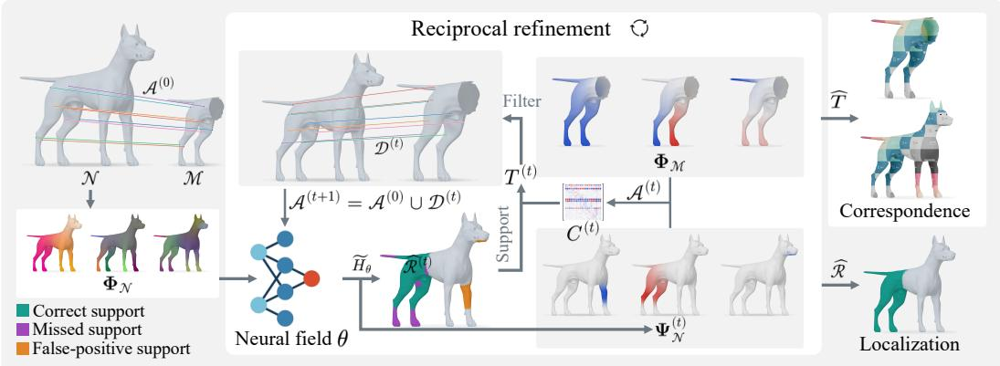  
Figure 2: Overview of the NHO framework. Given a partial shape $\mathcal { M } ,$ a full shape ${ \mathcal { N } } ,$ and sparse anchors $\mathbf { \mathcal { A } } ^ { ( 0 ) }$ , a neural field parameterizes the Hamiltonian potential on $\mathcal { N }$ using $\Phi _ { \mathcal { N } }$ as an intrinsic positional encoding. At round t, the Hamiltonian eigenspace induces the support $\widehat { \mathcal { R } } ^ { ( t ) }$ through aggregated energy and, together with $\Phi _ { \mathcal { M } }$ and $\mathbf { \mathcal { A } } ^ { ( t ) }$ , determines the alignment $C ^ { ( t ) }$ . The support restricts the recovery of $T ^ { ( t ) }$ , while geometrically reliable matches update the anchors and operator. The final support localizes the corresponding region, while the final-round map $\widehat { T }$ initializes dense correspondence refinement.

## 4 METHODOLOGY

Fig. 2 provides an overview of our framework. We first introduce the problem and notation. Sec. 4.1 then presents the intrinsic neural Hamiltonian field (INHF), followed by neural Hamiltonian optimization, reciprocal refinement, and dense correspondence recovery in Sec. 4.2.

Problem Formulation and Notation. Let M and $\mathcal { N }$ be connected partial and full triangle meshes with $n _ { \mathcal { M } }$ and $n _ { \mathcal { N } }$ vertices, respectively. We assume that M corresponds under a non-rigid deformation to an unknown region $\mathcal { R } \subseteq \mathcal { N }$ . Given a sparse set of reliable anchors ${ \mathcal A } ^ { ( 0 ) } = \{ ( p \ell , q \ell ) \} _ { \ell = 1 } ^ { m } .$ where $p _ { \ell } \in \mathcal { M }$ and $q _ { \ell } \in \mathcal { N }$ , our goal is to localize R and recover a dense map $T : \mathcal { M } \stackrel { } { \to } \mathcal { N }$

For vertices $p \in \mathcal { M }$ and $q \in \mathcal N .$ , let $a _ { p } ^ { \mathcal { M } }$ and $a _ { q } ^ { \mathcal { N } }$ denote the lumped vertex-area weights consistent with the Laplacian discretization. We denote the corresponding diagonal mass matrices by $A _ { { \mathcal { M } } }$ and $A _ { \mathcal { N } }$ , and the resulting discrete surface areas by $\mathrm { A r e a } ( \bar { \mathcal { M } } )$ and $\bar { \mathrm { A r e a } } ( \mathcal { N } )$ .

Let $\Phi _ { \mathcal { N } } ^ { j }$ denote the first $j$ mass-orthonormal LBO eigenfunctions of ${ \mathcal { N } } .$ , with $\Lambda _ { \mathcal { N } } ^ { j }$ the diagonal matrix of the corresponding eigenvalues. On M, we impose Dirichlet boundary conditions and denote its first $j$ mass-orthonormal eigenfunctions by $\Phi _ { \mathcal { M } } ^ { j }$ , with positive eigenvalues $\{ \lambda _ { i } ^ { \mathcal { M } } \} _ { i = 1 } ^ { j }$

## 4.1 INTRINSIC NEURAL HAMILTONIAN FIELD

Building on the Hamiltonian–Dirichlet connection, we formulate region localization as spectral fitting. When M and R are approximately isometric and share a common scale, aligning the lowfrequency Hamiltonian spectrum on N with the Dirichlet spectrum of M encourages the lowpotential region to recover R. However, spectrum-based potential estimation is non-convex and does not uniquely determine the location of the support, making it sensitive to initialization (Rampini et al., 2019). In our setting, sparse anchors provide additional spatial evidence, while the area of M serves as a soft prior on the size of $\mathcal { R }$ . These observations motivate a neural parameterization that allows spatial and spectral constraints to jointly guide operator estimation.

Following Bensa¨ıd et al. (2023), we use $\Phi _ { \mathcal { N } } ^ { r }$ as an intrinsic positional encoding. A single neural network ${ \bar { g } } _ { \theta } : \mathbb { R } ^ { r }  \mathbb { R }$ is applied row-wise to this encoding, with parameters shared across vertices, yielding an unconstrained scalar field $w _ { \theta } \in \mathbb { R } ^ { n _ { N } }$

$$
\begin{array} { r } { w _ { \theta } = g _ { \theta } \left( \Phi _ { \mathcal { N } } ^ { r } \right) . } \end{array}\tag{6}
$$

To obtain a differentiable representation of the candidate region, we transform $w _ { \theta }$ into a soft region indicator:

$$
s _ { \theta } = \frac { 1 - \operatorname { t a n h } ( w _ { \theta } ) } { 2 } ,\tag{7}
$$

where 1 is the all-ones vector and tanh is applied elementwise. We then define the bounded potential (Rampini et al., 2019) and neural Hamiltonian:

$$
v _ { \theta } = \tau ( { \bf 1 } - s _ { \theta } ) ,\tag{8}
$$

$$
H _ { \mathcal { N } , \theta } = \Delta _ { \mathcal { N } } + \mathrm { d i a g } ( v _ { \theta } ) .\tag{9}
$$

High region scores correspond to low potential, with $s _ { \theta } ~ \in ~ ( 0 , 1 ) ^ { n _ { N } }$ and $v _ { \theta } ~ \in ~ ( 0 , \tau ) ^ { n _ { N } }$ . As sθ approaches a binary indicator, v approaches the step potential in Eq. 5. We denote the first k Hamiltonian eigenpairs by $\{ ( \mu _ { i } , \bar { \psi } _ { i } ) \bar  \} _ { i = 1 } ^ { k }$ and collect the eigenfunctions in $\Psi _ { \mathcal { N } } ^ { k }$ , leaving their dependence on θ implicit. The field thus links the candidate region to a learned Hamiltonian spectral representation.

## 4.2 RECIPROCAL LOCALIZATION AND CORRESPONDENCE

With the neural Hamiltonian representation defined above, we first estimate its parameters using sparse spatial evidence and the intrinsic geometry of M.

Neural Hamiltonian optimization. Each anchor identifies a vertex $q _ { \ell } \in { \mathcal { N } } ,$ , so we encourage high region scores at these locations:

$$
\mathcal { L } _ { \mathrm { a n c } } = - \frac { 1 } { m } \sum _ { \ell = 1 } ^ { m } \log s _ { \theta } ( q _ { \ell } ) .\tag{10}
$$

Anchors constrain location but not region size. We therefore use Area(M) as a soft area prior. The soft area induced by s is $\textstyle \sum _ { q \in { \mathcal { N } } } a _ { q } ^ { \mathcal { N } } { s _ { \theta } } ( q )$ , leading to

$$
\mathcal { L } _ { \mathrm { a r e a } } = \left( \frac { \sum _ { q \in \mathcal { N } } a _ { q } ^ { \mathcal { N } } s _ { \theta } ( q ) - \mathrm { A r e a } ( \mathcal { M } ) } { \mathrm { A r e a } ( \mathcal { N } ) } \right) ^ { 2 } .\tag{11}
$$

Area alone does not enforce connectivity. We regularize the superlevel filtration of $s _ { \theta }$ using zerodimensional persistent homology (Edelsbrunner et al., 2002; Hu et al., 2019):

$$
\mathcal { L } _ { \mathrm { t o p o } } = \sum _ { ( b , d ) \in \mathcal { P } _ { 0 } ( s _ { \theta } ) } \bigl ( s _ { \theta } ( b ) - s _ { \theta } ( d ) \bigr ) ^ { 2 } ,\tag{12}
$$

where $\mathcal { P } _ { 0 } ( s _ { \theta } )$ contains finite persistence pairs indexed by vertices $( b , d )$ attaining their birth and death values. Penalizing these pairs, excluding the unique essential component, encourages a single connected region.

These spatial terms alone do not ensure intrinsic compatibility with M. Motivated by the Hamiltonian–Dirichlet connection (Postolache et al., 2020), we encourage agreement with its first k Dirichlet eigenvalues. We set the barrier above the target spectral range (Rampini et al., 2019):

$$
\tau = \beta \lambda _ { k } ^ { \mathcal { M } } , \qquad \beta > 1 .\tag{13}
$$

The spectral loss is

$$
\mathcal { L } _ { \mathrm { s p e c } } = \frac { 1 } { k } \sum _ { i = 1 } ^ { k } \log \left( 1 + \left( \frac { \mu _ { i } - \lambda _ { i } ^ { \mathcal { M } } } { \lambda _ { i } ^ { \mathcal { M } } } \right) ^ { 2 } \right) .\tag{14}
$$

Relative normalization balances errors across eigenvalue magnitudes, while the logarithm reduces the influence of large residuals.

For efficiency, we approximate the Hamiltonian eigensystem in the subspace spanned by the first K LBO eigenfunctions of $\mathcal { N }$ , where $k \le K \ll n _ { \mathcal { N } }$ . Using the same mass matrix, we form the reduced operator:

$$
\begin{array} { r } { \widetilde { H } _ { \theta } = \Lambda _ { \mathcal { N } } ^ { K } + ( \Phi _ { \mathcal { N } } ^ { K } ) ^ { \top } A _ { \mathcal { N } } \mathrm { d i a g } ( v _ { \theta } ) \Phi _ { \mathcal { N } } ^ { K } . } \end{array}\tag{15}
$$

We solve the resulting $K \times K$ differentiable eigenproblem and lift the first k eigenvectors back to the mesh through $\Phi _ { \mathcal { N } } ^ { K }$

Finally, we minimize

$$
\begin{array} { r } { \mathcal { L } _ { \mathrm { o p } } ( \theta ; \mathcal { A } ) = \alpha _ { 1 } \mathcal { L } _ { \mathrm { a n c } } ( A ) + \alpha _ { 2 } \mathcal { L } _ { \mathrm { a r e a } } + \alpha _ { 3 } \mathcal { L } _ { \mathrm { t o p o } } + \alpha _ { 4 } \mathcal { L } _ { \mathrm { s p e c } } , } \end{array}\tag{16}
$$

where $\alpha _ { 1 } , \ldots , \alpha _ { 4 } \geq 0$ weight the four terms. Optimization with $\mathcal { A } ^ { ( 0 ) }$ yields the initial parameters $\theta ^ { ( 0 ) }$

Reciprocal Refinement. The initial estimate may remain spatially ambiguous, as illustrated in App. B. We therefore alternate operator updates with support-restricted correspondence estimation, using geometrically consistent matches as additional spatial evidence.

A superscript (t) denotes quantities at round t. We extract the current region from aggregated eigenfunction energy:

$$
e ^ { ( t ) } ( \boldsymbol { q } ) = \frac { 1 } { k } | | \Psi _ { \mathcal { N } } ^ { ( t ) } ( \boldsymbol { q } , : ) | | _ { 2 } ^ { 2 } ,\tag{17}
$$

$$
\begin{array} { r } { \widehat { \mathcal { R } } ^ { ( t ) } = \left\{ q \in \mathcal { N } \vert e ^ { ( t ) } ( q ) > \eta \mu _ { 1 } ^ { ( t ) } \right\} , } \end{array}\tag{18}
$$

where $\eta > 0$ is a fixed empirical threshold factor. The estimated region restricts the target domain for matching. Using $\mathbf { \mathcal { A } } ^ { ( t ) }$ , we align the spectral coordinates:

$$
C ^ { ( t ) } \in \underset { C \in \mathbb { R } ^ { k \times k } } { \arg \operatorname* { m i n } } \sum _ { ( { p } , { q } ) \in { A } ^ { ( t ) } } \left\| \Psi _ { \mathcal { N } } ^ { ( t ) } ( { q } , : ) C - \Phi _ { \mathcal { M } } ^ { k } ( { p } , : ) \right\| _ { 2 } ^ { 2 } .\tag{19}
$$

We select the minimum-Frobenius-norm least-squares solution using a pseudoinverse. Restricted nearest-neighbor search then gives an intermediate map:

$$
\begin{array} { r } { T ^ { ( t ) } ( p ) = \underset { q \in \widehat { \mathcal { R } } ^ { ( t ) } } { \arg \operatorname* { m i n } } \left\| \Phi _ { \mathcal { M } } ^ { k } ( p , : ) - \Psi _ { \mathcal { N } } ^ { ( t ) } ( q , : ) C ^ { ( t ) } \right\| _ { 2 } ^ { 2 } . } \end{array}\tag{20}
$$

To limit unreliable feedback, we retain matches whose local mapping distortion (LMD) falls below a fixed threshold (Xiang et al., 2021). We merge them with the fixed original anchors, resolving conflicts among additional matches in favor of lower-LMD pairs. Denoting the retained additional pairs by $\mathcal { D } ^ { ( t ) }$ , we update

$$
\mathcal { A } ^ { ( t + 1 ) } = \mathcal { A } ^ { ( 0 ) } \cup \mathcal { D } ^ { ( t ) } ,\tag{21}
$$

and minimize $\mathcal { L } _ { \mathrm { o p } } ( \theta ; \mathcal { A } ^ { ( t + 1 ) } )$ , warm-starting from $\theta ^ { ( t ) }$ . The additional pairs are reselected at each round to adapt the spatial constraints on the operator.

Region Localization and Correspondence Recovery. After reciprocal refinement, the lowfrequency Hamiltonian eigenfunctions exhibit stronger spatial concentration within the corresponding region, as visualized in App. B. We then freeze the operator and obtain the final region estimate $\widehat { \mathcal { R } }$ using Eq. 18. For dense correspondence recovery, we denote the final-round map obtained by the restricted nearest-neighbor search in Eq. 20 as $\widehat { T }$ . We then refine $\widehat { T }$ using NAM-based Neural ZoomOut (Vigano et al., 2025) to obtain the final correspondence \` $T .$

## 5 EXPERIMENTS

Implementation Details. We optimize NHO independently for each shape pair. By default, we use m = 25 anchors selected by farthest-point sampling over the annotated partial vertices. Ours (DPFM) uses DPFM feature matches as initial anchors (App. C); complete settings are provided in App. D.

Comparison Methods. We compare PFM (Rodola et al., 2017), FSPM (Litany et al., 2017),\` DPFM (Attaiki et al., 2021), and EchoMatch (Xie et al., 2025) for both region localization and dense correspondence recovery. For region localization, we additionally include the original correspondence-free Hamiltonian spectrum alignment method of Rampini et al. (2019) and the piecewise-smooth localization method of Bensa¨ıd et al. (2023). For dense correspondence recovery, we further evaluate DPFM refined with ZoomOut (Melzi et al., 2019), ULRSSM (Cao et al., 2023), and Wormhole (Bracha et al., 2024b).

Table 1: Quantitative comparison of region localization on CUTS’24. All metrics are surface-areaweighted percentages; higher is better. Best in bold; second-best underlined.
<table><tr><td></td><td colspan="8">Default</td><td colspan="8">Normalized</td></tr><tr><td></td><td colspan="4">Unrotated</td><td colspan="4">Rotated</td><td colspan="4">Unrotated</td><td colspan="4">Rotated</td></tr><tr><td>Method</td><td></td><td></td><td>IoU Precision Recall F1-score</td><td></td><td></td><td>IoU Precision Recall F1-score</td><td></td><td></td><td></td><td></td><td></td><td>IoU Precision Recall F1-score</td><td>IoU Precision Recall</td><td></td><td></td><td>F1-score</td></tr><tr><td>PFM</td><td>71.88</td><td>78.40</td><td>85.27</td><td>81.60</td><td>72.22</td><td>78.60</td><td>85.50</td><td>81.82</td><td>50.58</td><td>59.88</td><td>67.61</td><td></td><td>63.2849.56</td><td>58.88</td><td>66.42</td><td>62.22</td></tr><tr><td>FSPM</td><td>51.59</td><td>57.17</td><td>80.02</td><td>66.28</td><td>51.56</td><td>57.21</td><td>79.84</td><td>66.25</td><td>50.52</td><td>56.38</td><td>79.32</td><td></td><td>65.47 50.39</td><td>56.35</td><td>79.30</td><td>65.46</td></tr><tr><td>Hamiltonian</td><td>50.73</td><td>60.34</td><td>62.37</td><td>61.02 50.38</td><td></td><td>60.02</td><td>61.58</td><td>60.48</td><td>52.43</td><td>62.04</td><td>64.40</td><td>62.85 52.96</td><td></td><td>62.69</td><td>65.37</td><td>63.63</td></tr><tr><td>DPFM</td><td>17.03</td><td>53.48</td><td>20.06</td><td>26.16</td><td>13.33</td><td>42.37</td><td>15.82</td><td>20.73</td><td>80.45</td><td>85.63</td><td>93.24</td><td>88.86 37.65</td><td></td><td>62.76</td><td>46.01</td><td>51.12</td></tr><tr><td>Piecewise Smooth</td><td>0.00</td><td>0.00</td><td>0.00</td><td>0.00</td><td>0.00</td><td>0.00</td><td>0.00</td><td>0.00</td><td>73.88</td><td>83.77</td><td>84.74</td><td>82.84 49.84</td><td></td><td>64.43</td><td>63.15</td><td>61.59</td></tr><tr><td>EchoMatch</td><td>43.15</td><td>50.25</td><td>76.34</td><td>58.19</td><td>41.30</td><td>49.58</td><td>75.21</td><td>56.43</td><td>82.14</td><td>86.95</td><td>93.80</td><td>89.94 76.69</td><td></td><td>86.18</td><td>87.65</td><td>86.21</td></tr><tr><td>Ours</td><td>75.24</td><td>79.43</td><td>94.11</td><td>85.37 75.23</td><td></td><td>79.38</td><td>93.95</td><td>85.36</td><td>75.15</td><td>80.31</td><td>92.18</td><td>85.13 75.06</td><td></td><td>80.16</td><td>92.08</td><td>85.02</td></tr><tr><td>Ours (DPFM)</td><td>44.39</td><td>53.67</td><td>64.66</td><td>58.06 22.51</td><td></td><td>31.80</td><td>36.97</td><td>33.65</td><td>80.92</td><td>84.92</td><td>93.91</td><td>89.11 53.01</td><td></td><td>61.46</td><td>68.08</td><td>64.45</td></tr></table>

Table 2: Mean geodesic correspondence error (×100, lower is better) on four partial shape matching benchmarks under four input settings. Avg. denotes the unweighted average over the four input settings within each dataset. Best in bold; second-best underlined.
<table><tr><td></td><td colspan="5">CUTS&#x27;24</td><td colspan="5">PFAUST-M</td><td colspan="5">PFAUST-H</td><td colspan="5">PFARM</td></tr><tr><td></td><td colspan="2">Default</td><td colspan="2">Normalized</td><td></td><td>Avg.</td><td>Default</td><td colspan="2">Normalized</td><td></td><td>Avg.</td><td colspan="2">Default</td><td colspan="2">Normalized</td><td>Avg.</td><td colspan="2">Default</td><td>Normalized</td><td>Avg.</td></tr><tr><td>Method</td><td colspan="2">Unrotated Rotated Unrotated Rotated</td><td colspan="2"></td><td></td><td></td><td colspan="2">Unrotated Rotated Unrotated Rotated</td><td colspan="2"></td><td></td><td colspan="2">Unrotated Rotated Unrotated Rotated</td><td></td><td></td><td></td><td colspan="2">Unrotated Rotated Unrotated Rotated</td><td></td><td></td></tr><tr><td>PFM</td><td>5.03</td><td>4.97</td><td>24.27</td><td>26.15</td><td>15.10</td><td>50.07</td><td>50.41</td><td>50.07</td><td>49.93</td><td>50.12</td><td>44.84</td><td>45.48</td><td>45.43</td><td>44.93</td><td>45.17</td><td>59.38</td><td>59.12</td><td></td><td>60.06</td><td>59.80 59.59</td></tr><tr><td>FSPM</td><td>19.33</td><td>19.22</td><td>19.97</td><td>19.99</td><td>19.63</td><td>49.93</td><td>50.09</td><td>50.04</td><td>50.06</td><td>50.03</td><td>45.89</td><td>45.76</td><td>45.78</td><td>45.65</td><td>45.77</td><td></td><td>63.20</td><td>63.38</td><td>62.79</td><td>62.69 63.02</td></tr><tr><td>DPFM</td><td>67.67</td><td>72.84</td><td>2.38</td><td>24.94</td><td>41.96</td><td>34.46</td><td>36.64</td><td>37.88</td><td>38.93</td><td>36.98</td><td>38.60</td><td>38.68</td><td>39.62</td><td>41.71</td><td>39.65</td><td></td><td>49.53 53.14</td><td></td><td>51.59</td><td>45.82 50.02</td></tr><tr><td>DPFM + ZoomOut</td><td>52.59</td><td>61.23</td><td>2.17</td><td>24.22</td><td>35.05</td><td>36.30</td><td>37.16</td><td>40.34</td><td>40.52</td><td>38.58</td><td>37.95</td><td>39.70</td><td>41.10</td><td>42.52</td><td>40.32</td><td>47.38</td><td>53.11</td><td>49.93</td><td>45.56</td><td>49.00</td></tr><tr><td>ULRSSM</td><td>39.92</td><td>54.93</td><td>2.85</td><td>29.11</td><td>31.70</td><td>35.33</td><td>36.57</td><td>35.35</td><td>36.83</td><td>36.02</td><td>42.01</td><td>42.34</td><td>42.63</td><td>43.25</td><td>42.56</td><td>52.92</td><td>48.93</td><td>54.12</td><td>48.02</td><td>51.00</td></tr><tr><td>EchoMatch</td><td>26.53</td><td>28.25</td><td>3.15</td><td>4.95</td><td>15.72</td><td>9.21</td><td>14.80</td><td>10.02</td><td>14.51</td><td>12.14</td><td>16.91</td><td>21.53</td><td>17.80</td><td>22.64</td><td>19.72</td><td>23.16</td><td>26.70</td><td>24.62</td><td>28.01</td><td>25.62</td></tr><tr><td>Wormhole</td><td>38.17</td><td>55.60</td><td>4.56</td><td>42.75</td><td>35.27</td><td>28.82</td><td>42.12</td><td>29.17</td><td>42.19</td><td>35.58</td><td>30.65</td><td>45.50</td><td>33.43</td><td>46.06</td><td>38.91</td><td>46.43</td><td>47.45</td><td>48.27</td><td>51.10</td><td>48.31</td></tr><tr><td>Ours</td><td>7.03</td><td>7.17</td><td>6.53</td><td>6.58</td><td>6.83</td><td>12.20</td><td>11.85</td><td>12.36</td><td>11.63</td><td>12.01</td><td>26.94</td><td>27.91</td><td>27.60</td><td>27.50</td><td>27.49</td><td>10.87</td><td>10.30</td><td>9.12</td><td>10.13</td><td>10.11</td></tr><tr><td>Ours (DPFM)</td><td>31.99</td><td>49.69</td><td>3.29</td><td>26.45</td><td>27.86</td><td>23.13</td><td>35.27</td><td>20.77</td><td>35.47</td><td>28.66</td><td>26.89</td><td>36.76</td><td>31.64</td><td>38.20</td><td>33.37</td><td>33.56</td><td>38.74</td><td>46.38</td><td></td><td>48.24 41.73</td></tr></table>

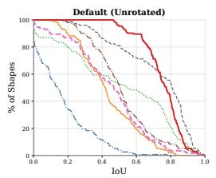

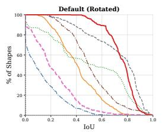

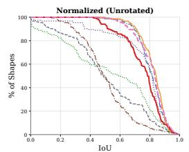  
PFM FSPM Hamiltonian DPFM Piecewise Smooth EchoMatch Ours Ours (DPFM)

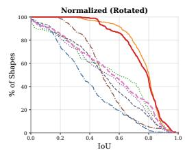

Figure 3: IoU success curves for region localization on CUTS’24 under four input settings. Each point reports the percentage of shapes whose surface-area-weighted IoU exceeds the corresponding threshold.  
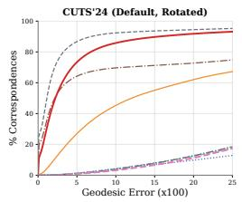

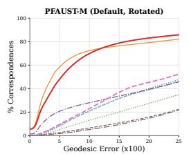

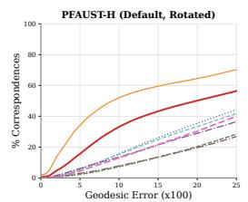  
DPFM DPFM + ZoomOut ULRSSM EchoMatch Wormhole Ours Ours (DPFM)

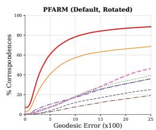  
Figure 4: PCK curves under the default-scale, rotated setting.

Evaluation Datasets and Metrics. We evaluate region localization and dense correspondence on the leakage-reduced CUTS’24 (Ehm et al., 2024a) split of SHREC’16 CUTS (Lahner et al., 2016),¨ PFAUST-M and PFAUST-H (Bracha et al., 2024a), and PFARM (Attaiki et al., 2021). The main paper reports localization results on CUTS’24 and correspondence results across all four datasets. Additional localization results on PFAUST-M, PFAUST-H, and PFARM and additional correspondence results are provided in Apps. E.1 and E.2, respectively. To assess sensitivity to scale and orientation, we evaluate both default-scale and normalized inputs under unrotated and independently rotated SO(3) settings. Region localization is evaluated using surface-area-weighted intersection over union (IoU), precision, recall, and F1 score; IoU success curves report the fraction of test pairs exceeding each IoU threshold. Dense correspondence accuracy is reported using the mean geodesic error (×100), with percentage of correct keypoints (PCK) curves illustrating performance across different error thresholds. Rotated results are averaged over three trials.

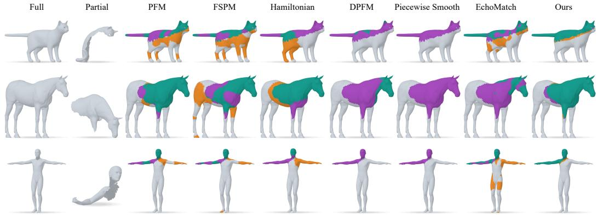

Figure 5: Qualitative comparison at the default scale under SO(3) rotations. Green, orange, and purple denote correct, false-positive, and missed support, respectively.  
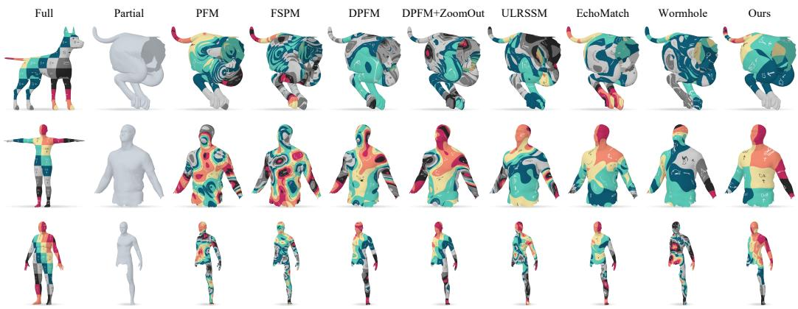  
Figure 6: Qualitative comparison of partial-to-full correspondence. Our method yields more accurate correspondences than competing methods, even for challenging non-isometric shape pairs.

## 5.1 COMPARATIVE STUDIES

Region Localization. Tab. 1 compares region localization on CUTS’24 under four scale–rotation settings. Traditional optimization-based methods remain sensitive to scale, whereas feature-learning methods perform well in the normalized regime used for feature training and degrade at the default scale. In contrast, NHO maintains IoU between 75.06 and 75.24 and F1 between 85.02 and 85.37, corresponding to variations of only 0.18 and 0.35 percentage points, respectively. The rotation stability follows from the intrinsic nature of the LBO and Hamiltonian operator. Under uniform rescaling, the area ratio remains unchanged, while the eigenvalues and the potential height τ = $\beta \lambda _ { k } ^ { \mathcal { M } }$ scale by the same inverse-square factor, leaving the relative spectral residual invariant. These properties explain why the optimization remains balanced across the tested transformations. The success curves in Fig. 3 show that NHO is substantially more consistent across configurations.

Dense Correspondence. Tab. 2 reports dense correspondence accuracy across four benchmarks and four input settings. Across these settings, NHO achieves the lowest average error on CUTS’24, PFAUST-M, and PFARM, and the second-lowest average error on PFAUST-H. Its advantage lies primarily in consistency across transformations rather than peak performance in a single regime. For example, rotating normalized CUTS’24 increases the error of DPFM with ZoomOut from 2.17 to 24.22, whereas the error of NHO changes only from 6.53 to 6.58. This behavior is consistent with the learned operator: its localized support removes irrelevant candidates from the search domain, while its eigenfunctions provide intrinsic coordinates adapted to that support. Correspondence recovery therefore depends less on transformation-sensitive feature similarities. The PCK curves in Fig. 4 show that this robustness extends across a range of error thresholds under the challenging default-scale, rotated setting. On normalized, unrotated CUTS’24, using reliable DPFM matches as anchors reduces the NHO error from 6.53 to 3.29, demonstrating that the operator can also incorporate stronger external correspondence evidence.

Qualitative Results. Fig. 5 shows that NHO produces fewer missed and false-positive regions, while Fig. 6 demonstrates accurate dense correspondence, including on challenging non-isometric shape pairs. Additional qualitative and quantitative results are provided in Apps. E.1 and E.2.

## 5.2 ABLATION STUDY

Tab. 3 and Fig. 7 examine the components of our default sparse-anchor configuration. Removing the topology loss has only a modest effect on the aggregate localization metrics, but produces spurious disconnected regions in the qualitative results. This indicates that the topology term mainly regularizes the spatial structure of the estimated support rather than substantially changing its overall overlap.

Reciprocal refinement improves support selectivity and correspondence accuracy. It increases precision from 78.55 to 80.31 and IoU from 74.37 to 75.15. Correspondence error decreases from 9.23 to 8.37 before NAM. These changes are consistent with reliable correspondence feedback reducing residual spatial ambiguity in an already plausible support, improving the balance between region coverage and the exclusion of distracting geometry.

Replacing the learned Hamiltonian operator with the global full-shape LBO reduces IoU from 75.15 to 55.48 and F1-score from 85.13 to 70.94, while increasing the final geodesic error from 6.53 to 9.84. This replacement produces the largest degradation among the evaluated ablations, highlighting the importance of a spectral representation adapted to the partial support.

Table 3: Component ablations on normalized, unrotated CUTS’24. Localization metrics are areaweighted percentages; correspondence is measured by mean geodesic error (×100) before and after external NAM refinement. The best result is shown in bold.
<table><tr><td></td><td colspan="4">Region localization</td><td colspan="2">Dense correspondence</td></tr><tr><td>Variant</td><td></td><td></td><td>IoU ↑ Precision ↑ Recall ↑ F1-score ↑</td><td></td><td>Geo. before NAM↓</td><td>Geo. after NAM↓</td></tr><tr><td>w/o topology loss</td><td>74.45</td><td>80.09</td><td>91.28</td><td>84.69</td><td>8.71</td><td>6.85</td></tr><tr><td>w/o reciprocal refinement 74.37</td><td></td><td>78.55</td><td>93.26</td><td>84.61</td><td>9.23</td><td>6.97</td></tr><tr><td>w/o Hamiltonian operator</td><td>55.48</td><td>68.08</td><td>74.20</td><td>70.94</td><td>12.69</td><td>9.84</td></tr><tr><td>Full method</td><td>75.15</td><td>80.31</td><td>92.18</td><td>85.13</td><td>8.37</td><td>6.53</td></tr></table>

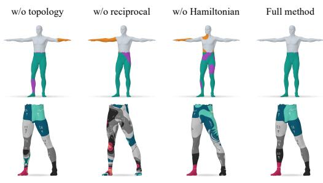  
Figure 7: Qualitative ablation results for region localization and dense correspondence. Green, orange, and purple denote correct, false-positive, and missed support, respectively.

Additional analyses are provided in App. F.

## 6 CONCLUSION

We presented NHO, which learns a localized Hamiltonian operator on a full surface from sparse anchors and the intrinsic geometry of a partial shape. The learned operator localizes the corresponding region and supports dense matching, while geometrically reliable correspondences feed back into operator estimation. Experiments across multiple benchmarks demonstrate competitive performance and robustness to uniform scaling and rotation, while ablations validate the contributions of the neural Hamiltonian representation, topology regularization, and reciprocal refinement. These results show that our method can use sparse spatial evidence to learn a local operator for coupled region localization and correspondence. They further support the value of localized spectral representations for partial-to-full shape matching.

## AI USE STATEMENT

Generative AI tools were used to draft and revise parts of the manuscript, improve readability, and assist with LAT X formatting. All AI-assisted text and formatting were reviewed by the authors. The authors take responsibility for the final content, including all claims and artifacts produced with the aid of generative AI.

## REFERENCES

Souhaib Attaiki, Gautam Pai, and Maks Ovsjanikov. Dpfm: Deep partial functional maps. In 2021 International Conference on 3D Vision (3DV), pp. 175–185. IEEE, 2021.

David Bensa¨ıd and Ron Kimmel. A multi-spectral geometric approach for shape analysis. Journal ofMathematical Imaging and Vision, 66(4):606–615, 2024.

David Bensa¨ıd, Amit Bracha, and Ron Kimmel. Partial shape similarity via alignment of multimetric hamiltonian spectra. arXiv preprint arXiv:2207.03018, 2022.

David Bensa¨ıd, Noam Rotstein, Nelson Goldenstein, and Ron Kimmel. Partial matching of nonrigid shapes by learning piecewise smooth functions. In Computer Graphics Forum, volume 42, pp. e14913. Wiley Online Library, 2023.

Amit Bracha, Thomas Dages, and Ron Kimmel. On unsupervised partial shape correspondence. In\` Asian Conference on Computer Vision, pp. 316–332. Springer, 2024a.

Amit Bracha, Thomas Dages, and Ron Kimmel. Wormhole loss for partial shape matching. In \` The Thirty-eighth Annual Conference on Neural Information Processing Systems, 2024b. URL https://openreview.net/forum?id=gPhBvrPdEs.

Dongliang Cao and Florian Bernard. Hyper-network neural functional maps for unsupervised robust 3d shape matching. arXiv preprint arXiv:2606.30131, 2026.

Dongliang Cao, Paul Roetzer, and Florian Bernard. Unsupervised learning of robust spectral shape matching. ACM Trans. Graph., 42(4), July 2023. ISSN 0730-0301. doi: 10.1145/3592107. URL https://doi.org/10.1145/3592107.

Dongliang Cao, Zorah Lahner, and Florian Bernard. Synchronous diffusion for unsupervised smooth¨ non-rigid 3d shape matching. In European conference on computer vision, pp. 262–281. Springer, 2024a.

Dongliang Cao, Paul Roetzer, and Florian Bernard. Revisiting map relations for unsupervised nonrigid shape matching. In 2024 International Conference on 3D Vision (3DV), pp. 1371–1381. IEEE, 2024b.

Yoni Choukroun, Alon Shtern, Alex Bronstein, and Ron Kimmel. Hamiltonian operator for spectral shape analysis. IEEE transactions on visualization and computer graphics, 26(2):1320–1331, 2018.

Edelsbrunner, Letscher, and Zomorodian. Topological persistence and simplification. Discrete & computational geometry, 28(4):511–533, 2002.

Viktoria Ehm, Maolin Gao, Paul Roetzer, Marvin Eisenberger, Daniel Cremers, and Florian Bernard. Partial-to-partial shape matching with geometric consistency. In 2024 IEEE/CVF Conference on Computer Vision and Pattern Recognition (CVPR), pp. 27478–27487. IEEE, 2024a.

Viktoria Ehm, Paul Roetzer, Marvin Eisenberger, Maolin Gao, Florian Bernard, and Daniel Cremers. Geometrically consistent partial shape matching. In 2024 International Conference on 3D Vision (3DV), pp. 914–922. IEEE, 2024b.

Xiaoling Hu, Fuxin Li, Dimitris Samaras, and Chao Chen. Topology-preserving deep image segmentation. Advances in neural information processing systems, 32, 2019.

Zorah Lahner, Emanuele Rodola, Michael M Bronstein, Daniel Cremers, Oliver Burghard, Luca¨ Cosmo, Alexander Dieckmann, Reinhard Klein, Y Sahillioglu, et al. Shrec’16: Matching ofˇ deformable shapes with topological noise. In Eurographics Workshop on 3D Object Retrieval, EG 3DOR, pp. 55–60. Eurographics Association, 2016.

Or Litany, Emanuele Rodola, Alexander M Bronstein, and Michael M Bronstein. Fully spectral \` partial shape matching. In Computer Graphics Forum, volume 36, pp. 247–258. Wiley Online Library, 2017.

Simone Melzi, Jing Ren, Emanuele Rodola, Abhishek Sharma, Peter Wonka, and Maks Ovsjanikov.\` Zoomout: spectral upsampling for efficient shape correspondence. ACM Trans. Graph., 38(6), November 2019. ISSN 0730-0301. doi: 10.1145/3355089.3356524. URL https://doi. org/10.1145/3355089.3356524.

Maks Ovsjanikov, Mirela Ben-Chen, Justin Solomon, Adrian Butscher, and Leonidas Guibas. Functional maps: a flexible representation of maps between shapes. ACM Transactions on Graphics (ToG), 31(4):1–11, 2012.

Emilian Postolache, Marco Fumero, Luca Cosmo, and Emanuele Rodola. A parametric analysis of discrete hamiltonian functional maps. In Computer Graphics Forum, volume 39, pp. 103–118. Wiley Online Library, 2020.

Panjawee Rakprayoon, Miti Ruchanurucks, Somying Thainimit, and Ikuhisa Mitsugami. Part-to-full shape matching of different human subjects. Heliyon, 7(10), 2021.

Arianna Rampini, Irene Tallini, Maks Ovsjanikov, Alex M Bronstein, and Emanuele Rodola.\` Correspondence-free region localization for partial shape similarity via hamiltonian spectrum alignment. In 2019 International Conference on 3D Vision (3DV), pp. 37–46. IEEE, 2019.

Jing Ren, Adrien Poulenard, Peter Wonka, and Maks Ovsjanikov. Continuous and orientationpreserving correspondences via functional maps. ACM Transactions on Graphics (ToG), 37(6): 1–16, 2018.

Emanuele Rodola, Luca Cosmo, Michael M Bronstein, Andrea Torsello, and Daniel Cremers. Partial\` functional correspondence. In Computer graphics forum, volume 36, pp. 222–236. Wiley Online Library, 2017.

Paul Roetzer and Florian Bernard. Fast globally optimal and geometrically consistent 3d shape matching. In 2025 IEEE/CVF International Conference on Computer Vision (ICCV), pp. 912– 922. IEEE, 2025.

Nicholas Sharp, Souhaib Attaiki, Keenan Crane, and Maks Ovsjanikov. Diffusionnet: Discretization agnostic learning on surfaces. ACM Transactions on Graphics (ToG), 41(3):1–16, 2022.

Giulio Vigano, Maks Ovsjanikov, and Simone Melzi. Nam: Neural adjoint maps for refining shape\` correspondences. ACM Transactions on Graphics (TOG), 44(4):1–15, 2025.

Yan Wu, Jun Yang, and Jinlong Zhao. Partial 3d shape functional correspondence via fully spectral eigenvalue alignment and upsampling refinement. Computers & Graphics, 92:99–113, 2020.

Rui Xiang, Rongjie Lai, and Hongkai Zhao. A dual iterative refinement method for non-rigid shape matching. In 2021 IEEE/CVF Conference on Computer Vision and Pattern Recognition (CVPR), pp. 15925–15934. IEEE, 2021.

Yizheng Xie, Viktoria Ehm, Paul Roetzer, Nafie El Amrani, Maolin Gao, Florian Bernard, and Daniel Cremers. Echomatch: Partial-to-partial shape matching via correspondence reflection. In 2025 IEEE/CVF Conference on Computer Vision and Pattern Recognition (CVPR), pp. 11665– 11675. IEEE, 2025.

## APPENDIX

## A METHODOLOGICAL COMPARISON

Table 4: Comparison with representative partial-to-full correspondence methods. “Anchor-source agnostic” indicates that a method can accept sufficiently reliable sparse anchors without prescribing how they are obtained.
<table><tr><td>Method</td><td>Region-localizing operator</td><td>Explicit region localization</td><td>Dense correspondence</td><td>Uniform-scale and rotation robustness</td><td>Anchor-source agnostic</td></tr><tr><td>PFM(Rodolà et al., 2017)</td><td>x</td><td>√</td><td>√</td><td>x</td><td>x</td></tr><tr><td>FSPM(Litany et al., 2017)</td><td>x</td><td>x</td><td>√</td><td>x</td><td>x</td></tr><tr><td>Hamiltonian(Rampini et al., 2019)</td><td>√</td><td>√</td><td>x</td><td>x</td><td>x</td></tr><tr><td>DPFM(Attaiki et al., 2021)</td><td>x</td><td>√</td><td>V</td><td>x</td><td>x</td></tr><tr><td>Piecewise Smooth(Bensaïd et al., 2023)</td><td>x</td><td>√</td><td>x</td><td>x</td><td>x</td></tr><tr><td>ULRSSM(Cao et al., 2023)</td><td>x</td><td>x</td><td>√</td><td>x</td><td>x</td></tr><tr><td>RMR(Cao et al., 2024b)</td><td>x</td><td>x</td><td>√</td><td>x</td><td>x</td></tr><tr><td>Synchronous Diffusion(Cao et al., 2024a)</td><td>×</td><td>x</td><td>√</td><td>x</td><td>x</td></tr><tr><td>EchoMatch(Xie et al., 2025)</td><td>x</td><td>√</td><td>√</td><td>x</td><td>x</td></tr><tr><td>NFM(Cao &amp; Bernard, 2026)</td><td>x</td><td>x</td><td>√</td><td>x</td><td>√</td></tr><tr><td>Ours</td><td>√</td><td>√</td><td>√</td><td>√</td><td>√</td></tr></table>

Tab. 4 summarizes the methodological differences between NHO and representative partial-to-full correspondence approaches. NHO retains the standard Hamiltonian construction $H = \Delta + v ;$ its distinction lies in parameterizing the potential as an intrinsic neural field, estimating it from sparse anchors and partial-shape geometry, and using the resulting localized eigenspace for both support recovery and dense correspondence. Classical Hamiltonian spectrum alignment uses the operator primarily for region localization, whereas correspondence-oriented methods do not explicitly learn a region-localizing operator. NHO connects these roles through reciprocal operator–correspondence refinement.

## B VISUALIZATION OF RECIPROCAL REFINEMENT

Fig. 8 visualizes the evolution of region localization and correspondence during reciprocal refinement. The initial estimate obtained from sparse anchors contains both false-positive and missed regions, accompanied by inaccurate correspondences. As geometrically reliable matches are fed back into operator estimation, the support becomes progressively more accurate and, in turn, provides a more reliable domain for subsequent correspondence recovery. The simultaneous reduction in support errors and improvement in correspondence consistency illustrate the reciprocal interaction between the two tasks.

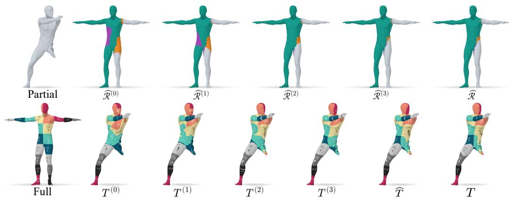  
Figure 8: Visualization of reciprocal refinement. The estimated support and correspondence progressively improve across rounds. Green, orange, and purple denote correct, false-positive, and missed support, respectively.

Fig. 9 further shows how reciprocal refinement changes the learned spectral representation. For reference, the top row presents the LBO eigenfunctions of the full shape and the Dirichlet eigenfunctions of the partial shape. The bottom row compares the anchor-aligned Hamiltonian eigenfunctions before and after reciprocal refinement. Initially, the Hamiltonian modes remain weakly localized and differ from the partial Dirichlet modes. After refinement, they concentrate on the corresponding region and exhibit more consistent spatial patterns, explaining the improved localization and correspondence.

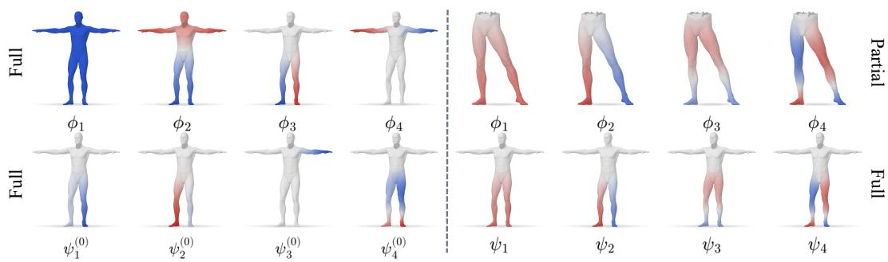  
Figure 9: Evolution of the Hamiltonian eigenfunctions during reciprocal refinement. Top: the first four LBO eigenfunctions of the full shape (left) and Dirichlet eigenfunctions of the partial shape (right). Bottom: the anchor-aligned neural Hamiltonian eigenfunctions after initial operator estimation (left) and reciprocal refinement (right).

## C DPFM-BASED ANCHOR INITIALIZATION

Ours (DPFM) replaces the annotated anchors with correspondences derived from features extracted by a pretrained Siamese DiffusionNet (Sharp et al., 2022; Attaiki et al., 2021). Let $\mathbf { F } _ { \mathcal { M } } \in \mathbb { R } ^ { n _ { \mathcal { M } } \times d _ { f } }$ and $\mathbf { \bar { F } } _ { \mathcal { N } } \in \mathbb { R } ^ { n _ { N } \times d _ { f } }$ denote the row-wise $\ell _ { 2 }$ -normalized feature matrices of the partial and full shapes, respectively. We first compute a dense feature-based nearest-neighbor map

$$
\widetilde { T } _ { \mathcal { M }  \mathcal { N } } ( p ) = \underset { q \in \mathcal { N } } { \arg \operatorname* { m a x } }  \mathbf { F } _ { \mathcal { M } } ( p ) , \mathbf { F } _ { \mathcal { N } } ( q )  .\tag{22}
$$

Since the features are normalized, maximizing their inner product is equivalent to minimizing their Euclidean distance.

The initial operator optimization and spectral alignment impose different requirements on these matches. The anchor loss in Eq. 10 uses their target vertices as positive spatial evidence; an incorrect match can therefore directly distort the estimated support, making precision the primary concern. In contrast, estimating the alignment matrix in Eq. 19 requires explicit correspondence pairs with sufficient coverage. We accordingly construct separate initial anchor sets for the two operations.

We measure the geometric consistency of $\tilde { T } _ {  { \mathcal { M } }   { \mathcal { N } } }$ using local mapping distortion (LMD) (Xiang et al., 2021), computed over the 30 nearest neighbors of each partial vertex under mesh-edge geodesic distance. The initial anchors for operator optimization are

$$
\mathcal { A } _ { H } ^ { ( 0 ) } = \{ ( p , \widetilde { T } _ { \mathcal { M }  \mathcal { N } } ( p ) ) \ : \middle | \ : \mathrm { L M D } _ { \widetilde { T } } ( p ) < \delta _ { H } \} ,\tag{23}
$$

where $\delta _ { H } = 0 . 4 2$ . We use $\boldsymbol { \mathcal { A } } _ { H } ^ { ( 0 ) }$ in $\mathcal { L } _ { \mathrm { o p } } ( \theta ; \mathcal { A } _ { H } ^ { ( 0 ) } )$ to obtain the initial operator.

For spectral alignment, we additionally require bidirectional feature consistency. The reverse nearest-neighbor map is

$$
\widetilde { T } _ { N  { \mathcal M } } ( q ) = \underset { p \in { \mathcal M } } { \arg \operatorname* { m a x } } \ \langle \mathbf { F } _ { N } ( q ) , \mathbf { F } _ { { \mathcal M } } ( p ) \rangle ,\tag{24}
$$

from which we construct

$$
A _ { C } ^ { ( 0 ) } = \{ ( p , q ) \Big | q = \widetilde { T } _ { M  N } ( p ) , p = \widetilde { T } _ { N  M } ( q ) , \mathrm { L M D } _ { \widetilde { T } } ( p ) < \delta _ { C } \} ,\tag{25}
$$

where $\delta _ { C } = 1 . 5 $ . This set is used in $\operatorname { E q } .$ . 19 to estimate the initial alignment matrix $C ^ { ( 0 ) }$

Table 5: Quantitative comparison of region localization on PFAUST-M, PFAUST-H, and PFARM under four input settings. All metrics are surface-area-weighted percentages; higher is better. Best in bold; second-best underlined.
<table><tr><td></td><td colspan="8">Default</td><td colspan="8">Normalized</td></tr><tr><td></td><td colspan="4">Unrotated</td><td colspan="4">Rotated</td><td colspan="4">Unrotated</td><td colspan="4">Rotated</td></tr><tr><td>Method</td><td></td><td></td><td>IoU Precision Recall F1-score</td><td></td><td></td><td>IoU Precision Recall F1-score</td><td></td><td></td><td>IoU Precision Recall F1-score</td><td></td><td></td><td></td><td></td><td></td><td>IoU Precision Recall F1-score</td><td></td></tr><tr><td>PFAUST-M</td><td></td><td></td><td></td><td></td><td></td><td></td><td></td><td></td><td></td><td></td><td></td><td></td><td></td><td></td><td></td><td></td></tr><tr><td>PFM</td><td>44.93</td><td>55.32</td><td>71.39</td><td>61.8446.45</td><td></td><td>55.93</td><td>73.97</td><td>63.23</td><td>51.32</td><td>57.44</td><td>83.14</td><td></td><td>67.5050.14</td><td>56.87</td><td>81.50</td><td>66.49</td></tr><tr><td>FSPM</td><td>51.52</td><td>51.52</td><td>85.00</td><td>63.92</td><td>51.52</td><td>51.52</td><td>85.00</td><td>63.92</td><td>51.52</td><td>51.52</td><td>85.00</td><td>63.92</td><td>51.52</td><td>51.52</td><td>85.00</td><td>63.92</td></tr><tr><td>Hamiltonian</td><td>51.48</td><td>60.66</td><td>75.31</td><td>65.72</td><td>51.72</td><td>61.01</td><td>75.49</td><td>66.05</td><td>53.55</td><td>62.62</td><td>78.59</td><td>68.28</td><td>52.96</td><td>62.41</td><td>77.48</td><td>67.62</td></tr><tr><td>DPFM</td><td>13.95</td><td>68.74</td><td>15.01</td><td>24.02</td><td>19.20</td><td>61.35</td><td>22.05</td><td>31.77</td><td>19.75</td><td>66.73</td><td>21.94</td><td>32.69</td><td>17.82</td><td>57.22</td><td>20.54</td><td>29.94</td></tr><tr><td>Piecewise Smooth 36.77</td><td></td><td>57.72</td><td>50.01</td><td>53.17</td><td>50.39</td><td>60.36</td><td>75.03</td><td>65.96</td><td>48.37</td><td>64.30</td><td>67.35</td><td></td><td>64.4651.76</td><td>61.33</td><td>77.32</td><td>67.37</td></tr><tr><td>EchoMatch</td><td>51.69</td><td>81.42</td><td>58.43</td><td>67.10</td><td>41.46</td><td>77.42</td><td>46.74</td><td>57.11</td><td>53.76</td><td>79.44</td><td>61.58</td><td>68.73</td><td>46.81</td><td>76.44</td><td>53.78</td><td>62.10</td></tr><tr><td>Ours</td><td>55.89</td><td>70.89</td><td>71.58</td><td>70.77</td><td>56.39</td><td>71.90</td><td>71.95</td><td>71.53</td><td>56.28</td><td>71.74</td><td>71.87</td><td>71.40 55.71</td><td></td><td>71.09</td><td>71.50</td><td>70.90</td></tr><tr><td>Ours (DPFM)</td><td>47.47</td><td>61.81</td><td>65.81</td><td>63.54 48.19</td><td></td><td>60.17</td><td>69.71</td><td>64.33</td><td>52.97</td><td>64.38</td><td>73.41</td><td>68.5046.64</td><td></td><td>58.58</td><td>67.30</td><td>62.45</td></tr><tr><td>PFAUST-H</td><td></td><td></td><td></td><td></td><td></td><td></td><td></td><td></td><td></td><td></td><td></td><td></td><td></td><td></td><td></td><td></td></tr><tr><td>PFM</td><td>46.36</td><td>52.37</td><td>80.53</td><td>63.1846.09</td><td></td><td>52.30</td><td>80.05</td><td>62.93</td><td>49.28</td><td>53.37</td><td>86.58</td><td>65.9148.69</td><td></td><td>53.09</td><td>85.57</td><td>65.38</td></tr><tr><td>FSPM</td><td>46.75</td><td>46.75</td><td>85.00</td><td>60.23</td><td>46.75</td><td>46.75</td><td>85.00</td><td>60.23</td><td>46.75</td><td>46.75</td><td>85.00</td><td>60.23</td><td>46.75</td><td>46.75</td><td>85.00</td><td>60.23</td></tr><tr><td>Hamiltonian</td><td>45.38</td><td>58.11</td><td>67.30</td><td>61.54</td><td>44.84</td><td>58.13</td><td>66.12</td><td>60.97</td><td>44.88</td><td>58.21</td><td>66.22</td><td>61.02</td><td>44.63</td><td>58.13</td><td>65.84</td><td>60.79</td></tr><tr><td>DPFM</td><td>13.62</td><td>61.75</td><td>14.87</td><td>23.70</td><td>18.52</td><td>54.37</td><td>22.00</td><td>30.80</td><td>19.25</td><td>58.67</td><td>22.13</td><td>32.03</td><td>17.62</td><td>51.84</td><td>20.98</td><td>29.66</td></tr><tr><td>Piecewise Smooth 32.31</td><td></td><td>53.45</td><td>45.06</td><td>48.1743.49</td><td></td><td>55.02</td><td>67.91</td><td>59.83</td><td>36.30</td><td>56.96</td><td>50.61</td><td>52.15</td><td>43.09</td><td>55.52</td><td>67.24</td><td>59.48</td></tr><tr><td>EchoMatch</td><td>37.04</td><td>77.44</td><td>41.98</td><td>52.95</td><td>32.85</td><td>69.71</td><td>38.87</td><td>48.10</td><td>35.96</td><td>77.56</td><td>40.30</td><td>51.81 31.80</td><td></td><td>69.72</td><td>37.13</td><td>47.02</td></tr><tr><td>Ours</td><td>39.55</td><td>61.12</td><td>52.27</td><td>56.07</td><td></td><td></td><td></td><td></td><td></td><td></td><td></td><td></td><td></td><td></td><td></td><td></td></tr><tr><td>Ours (DPFM)</td><td>43.00</td><td>58.93</td><td>61.11</td><td>59.82 38.69</td><td>39.43</td><td>61.09 54.02</td><td>52.59 57.49</td><td>56.14 55.43</td><td>40.20 44.71</td><td>61.64 60.21</td><td>53.50 63.36</td><td>61.54 43.05</td><td>56.9040.53</td><td>61.76</td><td>53.89</td><td>57.15 59.81</td></tr><tr><td></td><td></td><td></td><td></td><td></td><td></td><td></td><td></td><td></td><td></td><td></td><td></td><td></td><td></td><td>58.34</td><td>61.82</td><td></td></tr><tr><td>PFARM PFM</td><td>15.21</td><td>33.12</td><td>20.80</td><td></td><td></td><td></td><td></td><td></td><td></td><td></td><td></td><td>22.5714.33</td><td></td><td></td><td></td><td>23.49</td></tr><tr><td>FSPM</td><td>20.04</td><td>20.04</td><td>36.00</td><td>24.6214.32 25.35</td><td></td><td>32.31</td><td>19.65</td><td>23.63</td><td>13.70 22.64</td><td>31.58 25.20</td><td>18.42 39.50</td><td>29.5021.98</td><td></td><td>32.22 24.67</td><td>19.40 37.95</td><td>28.39</td></tr><tr><td>Hamiltonian</td><td>37.18</td><td>46.27</td><td>46.71</td><td>45.6437.64</td><td>19.03</td><td>20.38 47.89</td><td>34.36 45.24</td><td>24.75 45.77</td><td>30.59</td><td>40.25</td><td>38.85</td><td>38.86 33.10</td><td></td><td>42.91</td><td>39.91</td><td>40.74</td></tr><tr><td>DPFM</td><td>14.09</td><td>35.31</td><td>22.97</td><td>24.17</td><td>13.29</td><td>32.37</td><td>22.12</td><td>22.77</td><td>16.48</td><td>37.35</td><td>27.31</td><td>27.5917.24</td><td></td><td>38.32</td><td>26.77</td><td>27.97</td></tr><tr><td>Piecewise Smooth 37.07</td><td></td><td>44.05</td><td>65.48</td><td>49.29</td><td>35.24</td><td>40.07</td><td>66.57</td><td>46.82</td><td>37.49</td><td>46.68</td></table>

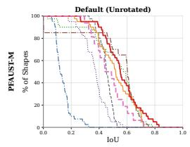

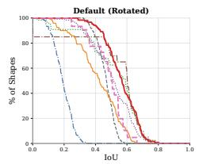

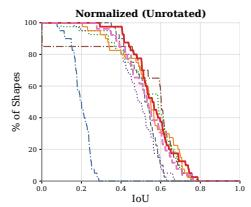

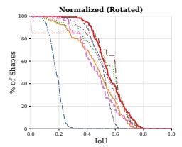

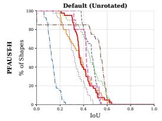

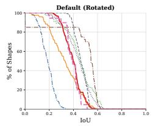

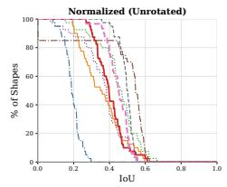

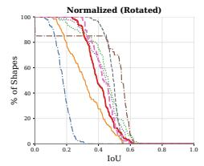

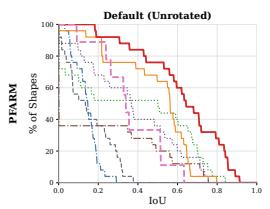

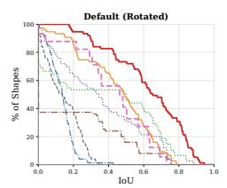

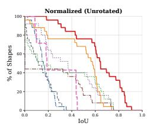

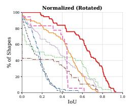  
Figure 10: IoU success curves for region localization on PFAUST-M, PFAUST-H, and PFARM under four input settings.

Thus, $\boldsymbol { \mathcal { A } } _ { H } ^ { ( 0 ) }$ uses a strict LMD threshold to provide high-confidence spatial constraints for the anchor loss, whereas ${ \mathcal A } _ { C } ^ { ( 0 ) }$ combines mutual-nearest-neighbor consistency with a less restrictive threshold to retain sufficient pairs for spectral alignment. Subsequent operator–correspondence refinement

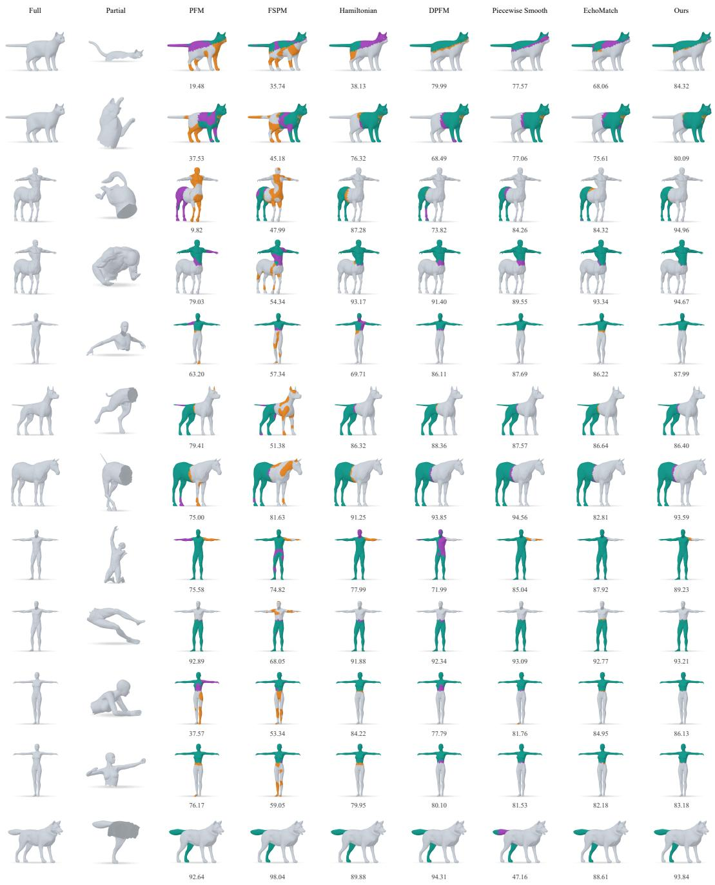  
Figure 11: Additional qualitative comparisons of region localization. Numbers report the surfacearea-weighted IoU for each prediction. Green, orange, and purple denote correctly localized, falsepositive, and missed regions, respectively.

proceeds as described in Sec. 4.2. Neither initialization uses ground-truth region or correspondence annotations.

## D IMPLEMENTATION DETAILS

The neural Hamiltonian field has three hidden layers of width 128. We optimize the initial operator and each of four reciprocal updates for 100 Adam steps with a learning rate of $1 0 ^ { - 2 }$ . We use r = 20 LBO eigenfunctions for intrinsic positional encoding, k = 20 Hamiltonian eigenpairs for spectral fitting and reciprocal alignment, and $K = 1 0 0$ dimensions for Galerkin projection. We fix $( \alpha _ { 1 } , \alpha _ { 2 } , \alpha _ { 3 } , \alpha _ { 4 } ) \ : = \ : ( 0 . 1 , 1 . 0 , 0 . 3 , 0 . 0 1 )$ , $\beta \ : = \ : 5 0 .$ , and $\eta \ : = \ : 0 . 0 1$ across all datasets. LMD is computed over the 30 nearest neighbors under mesh-edge geodesic distance, and matches below 0.42 are retained.

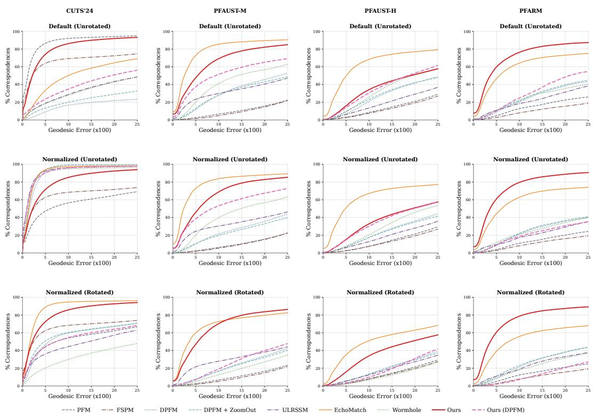  
Figure 12: PCK curves on four benchmarks under the three input settings not shown in Fig. 4. Each point reports the percentage of correspondences whose geodesic error (×100) does not exceed the threshold.

After reciprocal refinement, we freeze the neural-field parameters and use the final-round map to initialize correspondence refinement. We independently apply per-coordinate RMS normalization to the Hamiltonian coordinates induced by the frozen operator and the partial Dirichlet coordinates. We then apply an adapted Neural ZoomOut (Vigano et al., 2025), increasing the spectral dimension \` from 20 to 100 in steps of 5.

## E ADDITIONAL LOCALIZATION AND CORRESPONDENCE RESULTS

We provide additional quantitative and qualitative results for region localization and dense correspondence, complementing the comparisons in Sec. 5.

## E.1 REGION LOCALIZATION

Tab. 5 reports region localization results on PFAUST-M, PFAUST-H, and PFARM under four scale– rotation settings. On PFAUST-M, our default sparse-anchor configuration achieves the highest IoU and F1 score across all four settings. On PFARM, it also ranks first in both metrics. Its IoU ranges from 62.71% to 63.60%, and its F1 score ranges from 74.73% to 75.62%, while recall remains above 90% throughout the four settings.

PFAUST-H is substantially more challenging. It contains a larger number of small missing regions, producing multiple additional boundary components and more pronounced topological changes (Bracha et al., 2024a). Although the Hamiltonian–Dirichlet connection remains applicable to such regions, their fine boundary structure is difficult to recover from a truncated low-frequency spectrum and a smoothly parameterized potential. Moreover, our zero-dimensional topological regularizer promotes connectivity but does not explicitly characterize the hole structure. The lower IoU and recall may therefore reflect the difficulty of resolving fine-scale hole boundaries using a truncated low-frequency representation.

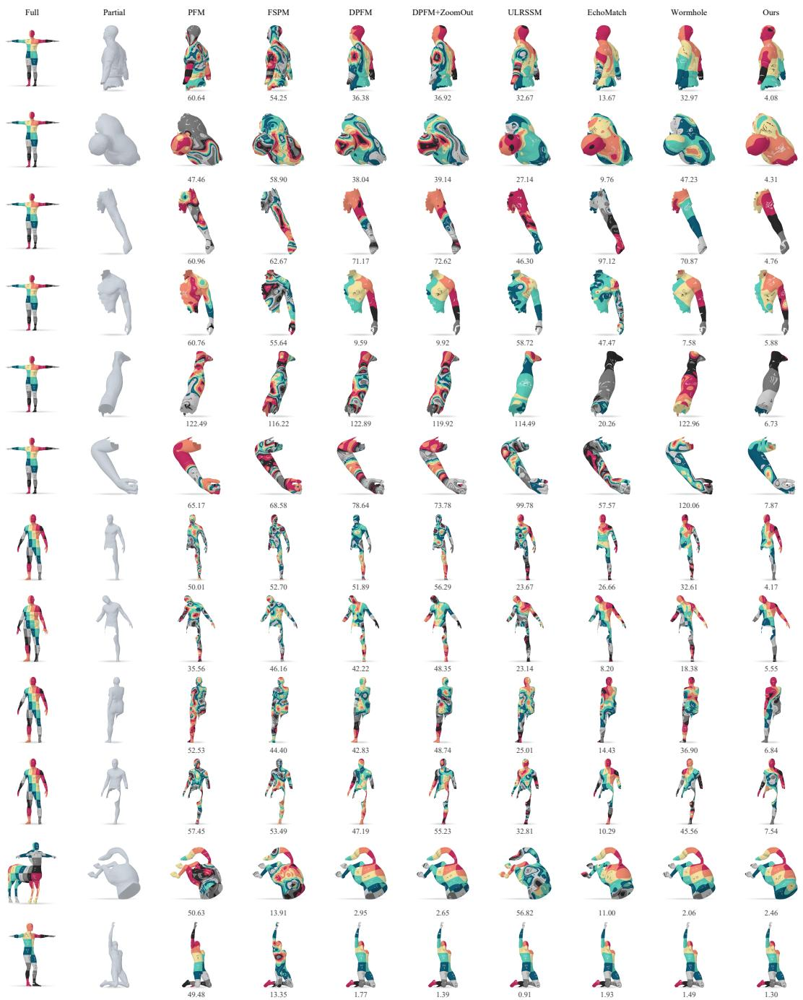  
Figure 13: Additional qualitative comparisons of partial-to-full dense correspondence. Numbers report the mean geodesic error (×100) for each case; lower is better.

Despite the variation in absolute accuracy across datasets, sparse-anchor NHO remains stable under changes in scale and orientation. Its IoU varies by only 0.68 percentage points on PFAUST-M, 1.10 on PFAUST-H, and 0.89 on PFARM across the four settings. The success curves in Fig. 10 provide a distribution-level view of this consistency, while Fig. 11 presents additional qualitative comparisons of region localization.

Table 6: Anchor sampling on normalized, unrotated CUTS’24. Localization scores are areaweighted percentages; Geo. is the final mean geodesic error (×100). Best values are bold.
<table><tr><td rowspan="2"></td><td colspan="4">Region localization</td><td rowspan="2">Dense correspondence</td></tr><tr><td>IoU↑</td><td>Precision ↑</td><td>Recall ↑</td><td>F1-score ↑</td></tr><tr><td>Sampling strategy Geodesic FPS</td><td>75.15</td><td>80.31</td><td>92.18</td><td>85.13</td><td>Geo. ↓ 6.53</td></tr><tr><td>Euclidean FPS</td><td>75.08</td><td>79.97</td><td>92.38</td><td>85.05</td><td>6.81</td></tr><tr><td>Uniform random</td><td>72.38</td><td>78.67</td><td>89.73</td><td>83.21</td><td>7.92</td></tr></table>

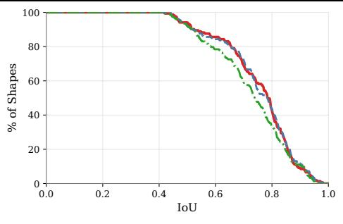  
(a)

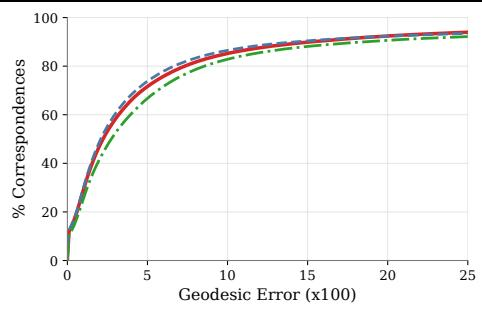  
(b)  
Geodesic FPS (default) Euclidean FPS Uniform random

Figure 14: Anchor sampling: (a) IoU success and (b) correspondence PCK curves.  
Table 7: Initial-anchor budget on normalized, unrotated CUTS’24. Metrics follow Table $\begin{array} { r } { 6 ; } \end{array}$ best values are bold.
<table><tr><td rowspan="2">m</td><td colspan="4">Region localization</td><td rowspan="2">Dense correspondence</td></tr><tr><td>IoU ↑</td><td>Precision ↑</td><td>Recall ↑</td><td>F1-score ↑</td></tr><tr><td>5</td><td>66.87</td><td>74.31</td><td>85.54</td><td>78.89</td><td>Geo. ↓ 17.73</td></tr><tr><td>15</td><td>72.78</td><td>78.68</td><td>90.26</td><td>83.38</td><td>11.43</td></tr><tr><td>25</td><td>75.15</td><td>80.31</td><td>92.18</td><td>85.13</td><td>6.53</td></tr><tr><td>50</td><td>75.49</td><td>80.60</td><td>92.14</td><td>85.29</td><td>4.75</td></tr><tr><td>100</td><td>77.47</td><td>81.73</td><td>93.81</td><td>86.67</td><td>3.95</td></tr></table>

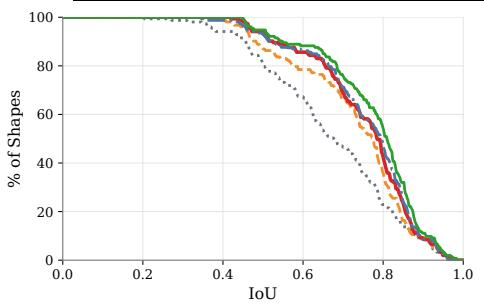  
(a)

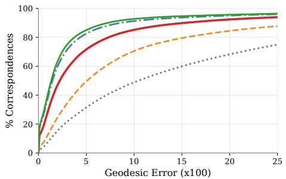  
(b)  
m = 5 m = 15 m = 25 (default) m = 50 m = 100  
Figure 15: Initial-anchor budget: (a) IoU success and (b) correspondence PCK curves.

## E.2 DENSE CORRESPONDENCE

Tab. 2 reports mean geodesic errors across four benchmarks and four input settings, while Figs. 4 and 12 provide the corresponding threshold-wise comparisons. The within-dataset error ranges of sparse-anchor NHO are 0.64, 0.73, 0.97, and 1.75 on the four benchmarks, respectively. This consistency indicates that the correspondence recovered from the learned operator is largely insensitive to the tested scale and orientation changes.

50% faces retained 20% faces retained  
Table 8: Robustness to mesh discretization on normalized, unrotated CUTS’24. Localization metrics are surface-area-weighted percentages; Geo. denotes the final mean geodesic error (×100). Best values are shown in bold.
<table><tr><td rowspan="2">Full faces retained</td><td colspan="4">Region localization</td><td rowspan="2">Dense correspondence</td></tr><tr><td>IoU ↑</td><td>Precision ↑</td><td>Recall ↑</td><td>F1-score ↑</td></tr><tr><td>50%</td><td>80.90</td><td>86.75</td><td>92.21</td><td>88.77</td><td>Geo. ↓ 6.74</td></tr><tr><td>20%</td><td>82.24</td><td>88.02</td><td>92.64</td><td>89.67</td><td>7.20</td></tr><tr><td>10%</td><td>82.45</td><td>87.92</td><td>92.93</td><td>89.74</td><td>8.39</td></tr><tr><td>5%</td><td>80.44</td><td>86.16</td><td>92.17</td><td>88.52</td><td>10.56</td></tr></table>

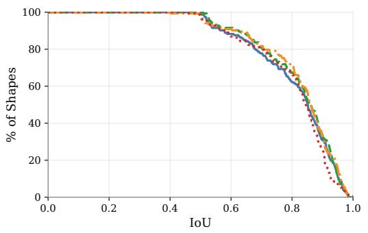  
(a)

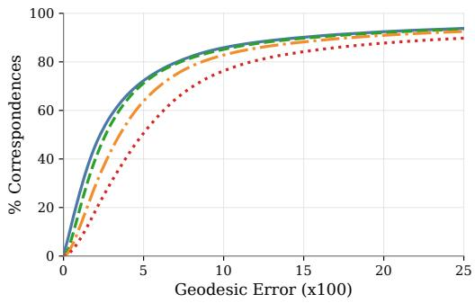  
(b)  
Figure 16: Robustness to mesh discretization on normalized, unrotated CUTS’24. (a) IoU success curves for region localization. (b) PCK curves for dense correspondence. Percentages denote the retained full-shape faces.

The PCK curves reveal additional behavior beyond the mean errors. On PFARM, NHO achieves higher PCK over most error thresholds in all four settings, showing that its advantage extends beyond the mean geodesic error to the overall distribution of correspondence accuracy. On PFAUST-M, EchoMatch is more accurate in the unrotated settings, whereas NHO becomes stronger after rotation: its error changes from 12.20 to 11.85 at the default scale and from 12.36 to 11.63 after normalization, while the corresponding EchoMatch errors increase from 9.21 to 14.80 and from 10.02 to 14.51. This comparison further highlights the rotation stability of the intrinsic operator representation.

Across the four benchmarks, sparse-anchor NHO records its lowest localization IoU and highest mean geodesic error on PFAUST-H. This shared degradation is consistent with the coupling between the two tasks: an inaccurate support may exclude valid target vertices or retain distracting regions, directly affecting the restricted correspondence search. Nevertheless, the correspondence error on PFAUST-H varies by only 0.97 across the four settings, suggesting that its lower absolute accuracy is primarily associated with the more challenging partiality pattern discussed in Sec. E.1, rather than sensitivity to scale or rotation. Fig. 13 provides additional qualitative comparisons of the recovered dense correspondences.

## F ADDITIONAL ANALYSIS

Effect of Anchor Sampling. We fix the number of initial anchors at $m = 2 5$ and compare the default geodesic FPS with Euclidean FPS and uniform random sampling over the annotated vertices of the partial shape. All other settings remain unchanged, and random sampling uses a fixed draw for each shape pair.

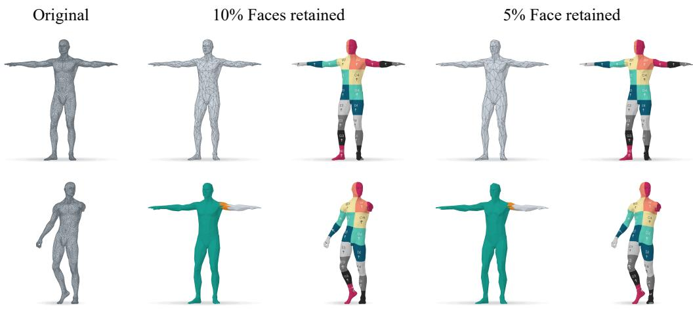  
Figure 17: Qualitative results under severe discretization mismatch. The full meshes retain 10% and 5% of their original faces, while the partial meshes remain unchanged. Green, orange, and purple denote correct, false-positive, and missed support, respectively.

Tab. 6 and Fig. 14 show that geodesic and Euclidean FPS yield nearly identical performance, with a modest decline under uniform random sampling. These results support NHO’s robustness across the evaluated sampling strategies, while the more uniform spatial coverage provided by FPS benefits both localization and correspondence.

Effect of the Anchor Budget. We vary the number of initial anchors $m \in \{ 5 , 1 5 , 2 5 , 5 0 , 1 0 0 \}$ on normalized, unrotated CUTS’24 while keeping all other settings fixed. When $m < k = 2 0$ , we set the spectral correspondence dimension to m to avoid an underdetermined anchor-based alignment.

Tab. 7 and Fig. 15 show that NHO remains effective with limited spatial evidence. Increasing m from 5 to the default budget of 25 improves IoU from 66.87 to 75.15 and reduces the final geodesic error from 17.73 to 6.53. Beyond 25 anchors, localization improves more gradually, whereas correspondence continues to benefit from the additional constraints, reaching an error of 3.95 with 100 anchors. We therefore use m = 25 uniformly across datasets as a sparse-anchor budget that balances supervision and accuracy, rather than as the best-performing anchor count.

Robustness to Mesh Discretization. We evaluate robustness to discretization mismatch by reducing the resolution of the full meshes to 50%, 20%, 10%, and 5% of their original faces while leaving the partial meshes unchanged. The geometric operators are recomputed at each resolution, with all other settings fixed.

Tab. 8 and Fig. 16 show that region localization remains stable across the tested resolutions. IoU varies only from 80.44% to 82.45%, while F1 ranges from 88.52% to 89.74%, and the corresponding success curves largely overlap. This stability is consistent with the low-frequency intrinsic formulation: when large-scale geometry is preserved, the low-frequency LBO and Hamiltonian subspaces remain comparatively stable under changes in mesh connectivity and sampling density. Localization through aggregated eigenfunction energy therefore does not rely on compatible discretizations of the partial and full shapes.

Dense correspondence is more sensitive to aggressive simplification. Reducing the retained fullshape faces from 50% to 5% increases the final mean geodesic error from 6.74 to 10.56, with a corresponding gradual decline in the PCK curves. Pointwise recovery requires resolving local geometry and selecting individual target vertices, both of which become less precise on coarser meshes. Moreover, the higher-frequency coordinates used during correspondence refinement are more sensitive to discretization than the low-frequency energy used for localization. Nevertheless, the gradual degradation shows that NHO retains useful correspondence accuracy even when the full and partial shapes have substantially different resolutions. Fig. 17 presents qualitative results at the two most aggressive simplification levels.

## G COMPUTATIONAL COST

To reduce dependence on a dataset-specific training distribution, NHO optimizes each shape pair independently rather than using amortized feed-forward inference. This design improves adaptabil ity across datasets and input transformations at the cost of additional test-time computation. The neural Hamiltonian field and the final 100-dimensional NAM stage contain 35.84K and 52.34K parameters, respectively, with forward costs of 0.709G and 1.040G FLOPs for 10,000 vertices. Operator estimation requires 500 Adam steps, including the initial estimate and four reciprocal updates, while multi-resolution correspondence refinement requires 3,400 steps. On an NVIDIA RTX 4090, the complete pipeline takes 143.15 seconds per shape pair on average, excluding cached spectral preprocessing.