# NOT EVERY CORRECTION HELPS: GAIN-GUIDED CONTINUAL TEST-TIME ADAPTATION

Youjia Zhang1∗ Huiling Liu1∗ Soyun Choi1 Jaehong Yoon2 Sungeun Hong1†

1Sungkyunkwan University 2 Nanyang Technological University

## ABSTRACT

Continual test-time adaptation (CTTA) adapts a source model to an unlabeled test stream whose distribution may change over time. Existing TTA methods often assess prediction reliability using confidence or entropy, which primarily reflect the model’s self-certainty for the current sample. In CTTA, accumulated target observations can provide complementary evidence for correcting the source prediction, but this history may become misaligned as the target distribution changes. The key question is therefore not how much the correction differs from the source prediction, but whether and how strongly it should be applied. This paper proposes Gain-Aware INtervention (GAIN), a backpropagation-free CTTA framework guided by a simple principle: history proposes, gain decides. GAIN maintains compact target statistics to form a correction proposal and a posterior-predictive evaluator that accounts for estimation uncertainty. The resulting source-relative gain estimates the proposal’s benefit and determines a sample-specific intervention strength along a continuous path through efficient one-dimensional optimization. Gain-controlled predictions then update the target statistics online, limiting the propagation of unreliable corrections, all without backpropagation, sample storage, or replay. Across five benchmarks, our method achieves strong predictive performance, with favorable accuracy–calibration–efficiency trade-offs in continual adaptation. On ImageNet-C, for example, GAIN achieves 61.9% accuracy with near-source calibration. It remains stable under diverse and challenging continual shifts while running 15.9× faster than a representative optimization-based CTTA baseline.

## 1 INTRODUCTION

Continual test-time adaptation (CTTA) (Wang et al., 2022) adapts a source model online to an unlabeled target stream whose distribution evolves over time. A central challenge is deciding when to retain the source prediction and when to correct it. Existing methods assess adaptation reliability from the current sample through entropy-based objectives (Wang et al., 2021; Song et al., 2023; Han et al., 2025a), reliability-aware sample selection (Niu et al., 2022; Lee et al., 2024b; Gong et al., 2023), or region-level confidence modeling (Hu et al., 2025). Such measures can be useful indicators of prediction reliability, yet they primarily characterize the model’s self-certainty. They do not explicitly capture how the same prediction may be supported differently by the evolving target context. This observation motivates us to look beyond the current output and treat accumulated target observations as additional predictive evidence.

Recent CTTA methods exploit historical target information through feature statistics or distribution estimation (Zhang et al., 2025c; Han et al., 2025b; Zhang et al., 2025a), allowing accumulated target information to guide subsequent predictions. However, this creates a distinct challenge in continual adaptation. As the target distribution evolves, historical statistics may become misaligned with the current domain, while erroneous corrections can accumulate in the target state and affect subsequent adaptation. Consequently, a history-induced correction is not necessarily beneficial simply because it differs from the source prediction. This raises a more fundamental question for CTTA: not whether target history suggests a correction, but whether that correction is worth applying.

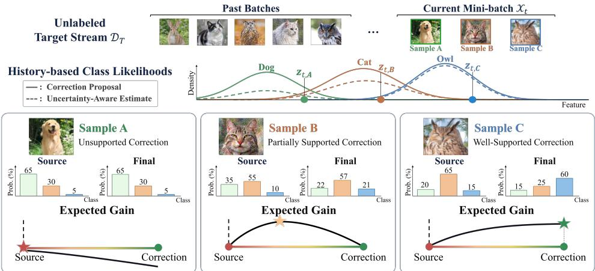  
Figure 1: Gain-Guided Sample-wise Intervention. Past target batches are summarized by compact statistics to construct a history-based correction proposal (solid) and an uncertainty-aware posterior-predictive estimate (dashed) that evaluates it. The resulting source-relative gain determines a sample-specific strength along the source-to-correction path: unsupported corrections are rejected (Sample A), partially supported corrections are applied conservatively (Sample B), and well-supported corrections are fully adopted (Sample C).

Motivated by this perspective, we introduce Gain-Aware INtervention (GAIN), following the principle that history proposes, gain decides. GAIN uses accumulated target statistics to propose a targetside correction and evaluates its source-relative gain while accounting for uncertainty in the evolving target statistics. The resulting gain determines whether and how strongly the correction should influence the current prediction.

To leverage correction gain for reliable continual adaptation, GAIN combines sample-specific intervention with online target-state maintenance. As shown in Fig. 1, the intervention strength is selected along a continuous path from source retention to full target correction through a concave one-dimensional objective with an efficient global solution. The resulting predictions then update the target state causally, limiting the propagation of unsupported history-induced corrections to subsequent adaptation. Throughout adaptation, the source model remains frozen, requiring no backpropagation, parameter updates, or replay of past target samples. Across diverse continual-shift settings, GAIN improves accuracy while maintaining strong calibration and long-horizon stability.

• We introduce a source-relative correction-gain perspective for CTTA, shifting the focus from the apparent reliability of the current prediction to whether a history-derived correction improves upon source retention.

• GAIN analytically marginalizes class-center uncertainty and selects a sample-specific intervention through a concave one-dimensional evidence-path objective, while updating compact target statistics online without sample storage or replay.

• Extensive experiments demonstrate that GAIN consistently achieves a strong accuracy– calibration–efficiency trade-off across structured, dynamic, mixed-domain, and long-horizon continual shifts.

## 2 RELATED WORK

Reliability and Stability in Test-Time Adaptation. CTTA extends test-time adaptation to evolving unlabeled streams, where repeated self-adaptation can amplify prediction errors and lead to long-term instability (Wang et al., 2022). Prior work improves reliability through entropy-based adaptation and sample filtering or reweighting (Wang et al., 2021; Niu et al., 2022; Lee et al., 2024b; Wang et al., 2024), stabilized or accelerated optimization (Song et al., 2023; Niu et al., 2023; Han et al., 2025a; Duan et al., 2025; Choi et al., 2025), and representation, structural, geometric, or subspace adaptation (Liu et al., 2024a; Yang et al., 2024; Wang et al., 2025; Ni et al., 2025; Liu et al., 2026; Murphy et al., 2026; Lai et al., 2026). CAS (Jiang et al., 2026) uses cross-augmentation similarity to make a binary adapt-or-skip decision when adaptation may be harmful. Beyond this binary decision, GAIN evaluates whether a history-induced correction improves over retaining the source prediction and continuously controls its intervention strength through source-relative gain.

Knowledge Preservation in CTTA. Under continual shifts, preserving useful knowledge is important for mitigating forgetting and cross-domain interference. Existing methods preserve or reuse information through source-weight restoration or ensembling (Wang et al., 2022; Marsden et al., 2024), sample storage (Yuan et al., 2023), domain-specific modules or experts (Liu et al., 2024b; Lee et al., 2024a; Zhao et al., 2026), and compact prompt or knowledge pools (Niu et al., 2024; Zhang et al., 2025c; Zhou et al., 2025). More recently, DO-ALL (Jang et al., 2026) improves longterm stability by distilling synthetic source anchors for replay during adaptation. In contrast, GAIN keeps the source model frozen and maintains only compact target statistics, using gain-guided intervention to regulate how history-induced corrections influence current predictions and subsequent target-state updates without sample storage or replay.

Distributional Modeling in CTTA. Distributional modeling has been increasingly explored for continual adaptation. PETAL (Brahma & Rai, 2023) formulates lifelong TTA probabilistically, while BayesTTA (Cui et al., 2025) incrementally models class-conditional distributions under temporal shifts. DOTA (Han et al., 2025b) further estimates evolving test-time feature distributions and derives posterior predictions from accumulated target statistics. Related statistical TTA methods incorporate source-informed priors or analytic inference (Zanella et al., 2025; Zhang et al., 2025a;b). While these approaches improve target-side estimation, accumulated statistics may become inaccurate or stale as the target distribution changes. Rather than directly treating the target estimate as the final prediction, GAIN uses it as a correction proposal and evaluates its source-relative gain to determine whether and how strongly it should influence the source prediction, thereby limiting the propagation of unreliable corrections through subsequent adaptation.

## 3 PRELIMINARIES

## 3.1 CONTINUAL TEST-TIME ADAPTATION

Problem Setup. Given a source model $f _ { \theta }$ pre-trained on a labeled source domain $\mathcal { D } _ { S }$ , continual test-time adaptation (CTTA) considers an unlabeled target stream $\mathcal { D } _ { T } = \{ \mathcal { X } _ { t } \} _ { t = 1 } ^ { T }$ whose distribution may change over time. We decompose the source model as $f _ { \theta } = g _ { \theta } \circ \phi _ { \theta }$ , where ϕ and $g _ { \theta }$ denote the feature extractor and classifier head, respectively. At time t, the model observes a target mini-batch $\mathcal { X } _ { t }$ with $| \mathcal { X } _ { t } | = B _ { t }$ . For each sample $\mathbf { x } _ { t } \in \mathcal { X } _ { t }$ , the frozen source model produces

$$
\mathbf { s } _ { t } = f _ { \theta } ( \mathbf { x } _ { t } ) \in \Delta ^ { K - 1 } , \qquad \hat { y } _ { t } ^ { s } = \arg \operatorname* { m a x } _ { k } s _ { t , k } ,\tag{1}
$$

where $\mathbf { s } _ { t }$ denotes the source predictive distribution and $\hat { y } _ { t } ^ { s }$ is the corresponding predicted class. Preceding target observations $\begin{array} { r } { \mathcal { H } _ { t } = \bigcup _ { \tau < t } \mathcal { X } _ { \tau } } \end{array}$ τ form the accumulated target context. We keep $f _ { \theta }$ frozen and exploit $\mathcal { H } _ { t }$ for single-pass adaptation without gradient-based model updates.

Beyond Source Confidence. Since target labels are unavailable, CTTA commonly relies on source-output proxies such as confidence or entropy to assess prediction reliability (Wang et al., 2021; Niu et al., 2022; Han et al., 2025a). However, these signals reflect only the model’s selfcertainty and ignore accumulated target context, under which the same source prediction may have different reliability (Appendix A). Historical observations can therefore provide complementary predictive information, but their relevance may diminish as the target distribution changes. We thus ask whether conditioning on $\mathcal { H } _ { t }$ provides useful evidence for the current sample.

## 3.2 ACCUMULATED TARGET CONTEXT AS PREDICTIVE EVIDENCE

Historical Target Evidence. Let $q _ { t , k } ^ { 0 } \triangleq P _ { T } ( Y _ { t } = k \ | \ \mathbf { x } _ { t } )$ denote the target posterior probability for class $k$ given the current observation alone, and let $q _ { t . k } ^ { H } \triangleq P _ { T } ( Y _ { t } { = } k \mid \mathbf { x } _ { t } , { \mathcal { H } } _ { t } )$ denote the corresponding probability additionally conditioned on the accumulated target context. By Bayes’ rule,

$$
q _ { t , k } ^ { H } = q _ { t , k } ^ { 0 } \frac { P _ { T } ( \mathcal { H } _ { t } \mid Y _ { t } = k , \mathbf { x } _ { t } ) } { P _ { T } ( \mathcal { H } _ { t } \mid \mathbf { x } _ { t } ) } ,\tag{2}
$$

showing that historical context contributes class-dependent evidence beyond the current observation. In log-probability space, this contribution is

$$
\log q _ { t , k } ^ { H } = \log q _ { t , k } ^ { 0 } + \xi _ { t , k } , \quad \quad \xi _ { t , k } \triangleq \log ( q _ { t , k } ^ { H } / q _ { t , k } ^ { 0 } ) = i ( Y _ { t } = k ; \mathcal { H } _ { t } \mid \mathbf { x } _ { t } ) ,\tag{3}
$$

where $\xi _ { t , k }$ is the conditional pointwise mutual information (C-PMI) (Fano, 1966; Ren et al., 2023). Positive and negative values indicate that the accumulated target context provides additional evi dence for and against class k, respectively. Details are provided in Appendix B.1.

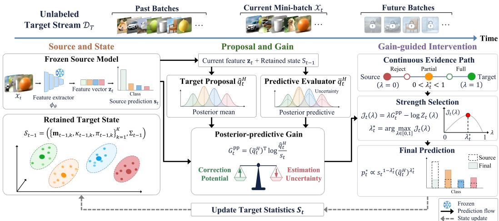  
Figure 2: Overview of GAIN: history proposes, gain decides. (i) The frozen source model produces the source prediction $\mathbf { s } _ { t }$ and current feature $\mathbf { z } _ { t } ,$ while the retained target state $S _ { t - 1 }$ summarizes past batches. (ii) Together, $\mathbf { z } _ { t }$ and $S _ { t - 1 }$ form the target proposal $\hat { \mathbf { q } } _ { t } ^ { H }$ and predictive evaluator $\bar { \mathbf q } _ { t } ^ { H }$ . The evaluator accounts for uncertainty to estimate the proposal’s source-relative gain $G _ { t } ^ { \mathrm { p p } }$ . (iii) This source-relative gain determines the intervention strength $\lambda _ { t } ^ { \star }$ along the continuous evidence path from st to $\hat { \mathbf { q } } _ { t } ^ { H }$ . The final prediction $\mathbf { p } _ { t } ^ { \star }$ then updates the target statistics $S _ { t }$ for future batches.

Proposition 3.1 (Non-Negative Predictive Value of Target History). For any predictive distribution $\mathbf { r } \in \Delta ^ { K - 1 }$ , define the logarithmic risk under the history-conditioned target posterior as $\mathcal { R } _ { t } ( \mathbf { r } ) \triangleq$ $\mathbb { E } _ { Y _ { t } \sim { \mathbf q } _ { t } ^ { H } } [ - \log ^ { \cdot } r _ { Y _ { t } } ] .$ . Conditioning on the accumulated target context $\mathcal { H } _ { t }$ then yields non-negative predictive value under logarithmic loss:

$$
\mathcal { R } _ { t } ( \mathbf { q } _ { t } ^ { 0 } ) - \mathcal { R } _ { t } ( \mathbf { q } _ { t } ^ { H } ) = D _ { \mathrm { K L } } ( \mathbf { q } _ { t } ^ { H } \Vert \mathbf { q } _ { t } ^ { 0 } ) = \mathbb { E } _ { Y _ { t } \sim \mathbf { q } _ { t } ^ { H } } [ \xi _ { t , Y _ { t } } ] \geq 0 .\tag{4}
$$

Equality holds if and only $i f \mathbf { q } _ { t } ^ { H } = \mathbf { q } _ { t } ^ { 0 }$

Proposition 3.1 establishes that target history is predictively useful in the oracle setting (proof in Appendix B.2). In practice, however, CTTA only has access to an estimate of $\mathbf { q } _ { t } ^ { H }$ constructed from finite, unlabeled, and potentially stale observations. Thus, informative history does not guarantee that the resulting estimated correction is beneficial, motivating our source-relative gain formulation.

## 4 GAIN: GAIN-AWARE INTERVENTION

For a current sample $\mathbf { x } _ { t } \in \mathcal { X } _ { t }$ , we denote its representation by $\mathbf { z } _ { t } = \phi _ { \theta } ( \mathbf { x } _ { t } ) \in \mathbb { R } ^ { D }$ . Conceptually, let $\mathcal { Z } _ { t } ^ { H } = \left\{ \mathbf { z } _ { i } ^ { H } \mid \mathbf { \bar { z } } _ { i } ^ { H } = \phi _ { \theta } ( \mathbf { x } _ { i } ^ { H } ) , \mathbf { x } _ { i } ^ { H } \in \mathcal { H } _ { t } \right\}$ with $N _ { t } ^ { H } = | \mathcal { H } _ { t } |$ denote the representations associated with preceding target observations. We introduce $\mathcal { Z } _ { t } ^ { H }$ only for notational convenience. In practice, we do not store or replay these historical representations, but maintain their aggregate effect through recursive sufficient statistics.

## 4.1 RELIABLE TARGET-SIDE GAIN ESTIMATION

From Historical Evidence to Correction Gain. Preliminaries establish that accumulated target context has non-negative predictive value in the oracle setting. At test time, however, the historyconditioned posterior $\mathbf { q } _ { t } ^ { H }$ is unavailable and must be approximated by an estimate $\hat { \mathbf { q } } _ { t } ^ { H }$ . If the source prediction $\mathbf { s } _ { t }$ is fully replaced by this target estimate, the resulting conditional log-risk reduction is

$$
\Delta _ { t } ^ { \mathrm { { f u l l } } } \triangleq { \mathcal { R } } _ { t } ( \mathbf { s } _ { t } ) - { \mathcal { R } } _ { t } ( { \hat { \mathbf { q } } } _ { t } ^ { H } ) = D _ { \mathrm { { K L } } } \big ( \mathbf { q } _ { t } ^ { H } \| \mathbf { s } _ { t } \big ) - D _ { \mathrm { { K L } } } \big ( \mathbf { q } _ { t } ^ { H } \| { \hat { \mathbf { q } } } _ { t } ^ { H } \big ) .\tag{5}
$$

Eq. 5 shows that informative target history does not necessarily yield a beneficial correction, since estimation error can offset its correction potential. This motivates two practical requirements: constructing a target-side correction proposal from accumulated history and evaluating whether that proposal improves upon retaining the source prediction.

Source-Anchored Probabilistic Target Estimation. As illustrated in Fig. 2, we address both requirements through a probabilistic model of accumulated target evidence. Its posterior mean defines a class-specific target correction proposal, while the posterior-predictive distribution accounts for estimation uncertainty when evaluating the source-relative utility of that proposal. Specifically, for each class $k ,$ we model target features with a class-conditional Gaussian distribution and place a source-centered prior on its unknown class center $\pmb { \mu } _ { k }$ to stabilize estimation when target evidence is limited or noisy:

$$
p _ { T } ( \mathbf { z } \mid Y = k , \mu _ { k } ) = { \mathcal { N } } ( \mathbf { z } ; \mu _ { k } , \Sigma _ { t - 1 } ) , \qquad \mu _ { k } \sim { \mathcal { N } } ( \mathbf { c } _ { k } , { \frac { \Sigma _ { t - 1 } } { \kappa _ { 0 } } } ) ,\tag{6}
$$

where $\mathbf { c } _ { k }$ is the source-derived class prototype $( i . e .$ , the k-th classifier-head weight) and $\kappa _ { 0 }$ controls the strength of the source-centered prior. We initialize $\Sigma _ { 0 } = \mathbf { I } _ { D }$ and update the shared diagonal covariance causally from preceding target observations.

Using the recursively maintained sufficient statistics induced by soft class assignments of preceding target observations, together with the pre-t covariance estimate, we obtain the following fractional Gaussian posterior over the class center:

$$
\mu _ { k } \mid { \mathcal { H } } _ { t } \approx { \mathcal { N } } ( \mathbf { m } _ { t - 1 , k } , { \frac { \Sigma _ { t - 1 } } { \kappa _ { t - 1 , k } } } ) , \qquad \kappa _ { t - 1 , k } = \kappa _ { 0 } + n _ { t - 1 , k } ,\tag{7}
$$

where $n _ { t - 1 , k }$ and $\mathbf { m } _ { t - 1 , k }$ denote the retained target support and the source-anchored center. The complete fractional-posterior derivation and recursive updates are given in Appendices C.1 and E.1.

Using the posterior mean geometry, we define

$$
d _ { t , k } = \big ( \mathbf { z } _ { t } - \mathbf { \bar { m } } _ { t - 1 , k } \big ) ^ { \top } \Sigma _ { t - 1 } ^ { - 1 } \big ( \mathbf { z } _ { t } - \mathbf { m } _ { t - 1 , k } \big ) , \qquad \hat { \ell } _ { t , k } ^ { H } = \log \pi _ { t - 1 , k } - \frac { 1 } { 2 } d _ { t , k } ,\tag{8}
$$

and obtain the posterior-mean target proposal:

$$
\hat { q } _ { t , k } ^ { H } = \frac { \pi _ { t - 1 , k } \exp ( - d _ { t , k } / 2 ) } { \sum _ { j } \pi _ { t - 1 , j } \exp ( - d _ { t , j } / 2 ) } .\tag{9}
$$

The distribution $\hat { \mathbf { q } } _ { t } ^ { H } = [ \hat { q } _ { t , 1 } ^ { H } , \dots , \hat { q } _ { t , K } ^ { H } ] ^ { \top }$ specifies the target-side correction proposed by the posteriormean geometry, where $\pi _ { t - 1 , k }$ is the pre-t target class prior. When $\mathcal { H } _ { t } = \mathcal { O }$ , we set $\hat { \mathbf { q } } _ { t } ^ { H } = \mathbf { s } _ { t }$

Posterior-Predictive Gain Evaluation. The proposal $\hat { \mathbf { q } } _ { t } ^ { H }$ is constructed from the posterior-mean target geometry and therefore does not account for the remaining uncertainty in the estimated class centers. To incorporate this uncertainty, we analytically marginalize the latent class centers. From Eq. 7 and the class-conditional observation model in Eq. 6, the posterior-predictive likelihood for class k is $p _ { T } ^ { \mathrm { p p } } ( \mathbf { z } _ { t } | Y _ { t } = k , \mathcal { H } _ { t } ) = \mathcal { N } \left( \mathbf { z } _ { t } ; \mathbf { m } _ { t - 1 , k } , h _ { t , k } \Sigma _ { t - 1 } \right) , h _ { t , k } \triangleq 1 + \kappa _ { t - 1 , k } ^ { - 1 }$ Thus, classes with less precisely estimated centers induce broader posterior-predictive distributions. Normalizing these predictive likelihoods gives the posterior-predictive evaluator

$$
\bar { q } _ { t , k } ^ { H } \propto \pi _ { t - 1 , k } h _ { t , k } ^ { - D / 2 } \exp ( - \frac { d _ { t , k } } { 2 h _ { t , k } } ) , \qquad h _ { t , k } = 1 + \kappa _ { t - 1 , k } ^ { - 1 } .\tag{10}
$$

Here, $\hat { \mathbf { q } } _ { t } ^ { H }$ and $\bar { \mathbf q } _ { t } ^ { H }$ serve distinct roles: the former specifies the correction proposed by the estimated target geometry, whereas the latter evaluates that correction after accounting for class-center uncertainty under the posterior-predictive working model. Define the source-relative correction evidence $\begin{array} { r } { \hat { \xi } _ { t , k } ^ { s } \triangleq \log \frac { \hat { q } _ { t , k } ^ { H } } { s _ { t , k } } } \end{array}$ . Then the oracle gain in Eq. 5 can be written as $\Delta _ { t } ^ { \mathrm { f u l l } } = ( { \bf q } _ { t } ^ { H } ) ^ { \top } \hat { \xi } _ { t } ^ { s }$ . Since $\mathbf { q } _ { t } ^ { H }$ is unavailable at test time, we evaluate the same correction under the posterior-predictive distribution:

$$
\begin{array} { r } { G _ { t } ^ { \mathrm { p p } } \triangleq \left( \bar { \mathbf { q } } _ { t } ^ { H } \right) ^ { \top } \hat { \pmb { \xi } } _ { t } ^ { s } = D _ { \mathrm { K L } } \left( \bar { \mathbf { q } } _ { t } ^ { H } \Vert \mathbf { s } _ { t } \right) - D _ { \mathrm { K L } } \left( \bar { \mathbf { q } } _ { t } ^ { H } \Vert \hat { \mathbf { q } } _ { t } ^ { H } \right) . } \end{array}\tag{11}
$$

The first KL term captures the potential benefit of correcting the source prediction, while the second KL measures the mismatch between the proposed correction and its posterior-predictive evaluation. Thus, source–target disagreement alone does not justify correction; the proposed correction must also remain supported after accounting for uncertainty in the estimated target geometry. Accordingly, $G _ { t } ^ { \mathrm { p p } }$ is the expected gain of the proposed correction under the posterior-predictive working model, rather than a lower bound on the unknown oracle gain $\Delta _ { t } ^ { \mathrm { f u l l } }$ . See Appendix C.2 for details.

## 4.2 POSTERIOR-PREDICTIVE EVIDENCE INTERVENTION

The posterior-predictive gain in Eq. 11 quantifies how strongly the proposed correction is supported after accounting for uncertainty in the target geometry. We now translate this quantity into the extent of intervention on the frozen source prediction.

Continuous Evidence Path. Rather than directly replacing $\mathbf { s } _ { t }$ with the target estimate, we continuously scale the source-relative correction evidence $\hat { \xi } _ { t } ^ { s }$ by an intervention coefficient $\lambda \in [ 0 , 1 ] \colon$

$$
p _ { t , k } ^ { ( \lambda ) } = \frac { s _ { t , k } \exp ( \lambda \hat { \xi } _ { t , k } ^ { s } ) } { Z _ { t } ( \lambda ) } = \frac { s _ { t , k } ^ { 1 - \lambda } ( \hat { q } _ { t , k } ^ { H } ) ^ { \lambda } } { \sum _ { j = 1 } ^ { K } s _ { t , j } ^ { 1 - \lambda } ( \hat { q } _ { t , j } ^ { H } ) ^ { \lambda } } ,\tag{12}
$$

where $\scriptstyle { Z _ { t } ( \lambda ) = \sum _ { j } s _ { t , j } \exp ( \lambda \hat { \xi } _ { t , j } ^ { s } ) }$ . The two endpoints satisfy $\mathbf { p } _ { t } ^ { ( 0 ) } { = } \mathbf { s } _ { t }$ and $\mathbf { p } _ { t } ^ { ( 1 ) } { = } \hat { \mathbf { q } } _ { t } ^ { H }$ . Thus, λ controls the amount of target-side correction introduced relative to the source prediction. Importantly, for the current prediction, the posterior-predictive distribution $\bar { q } _ { t } ^ { H }$ serves as an evaluator rather than as an additional replacement prediction. Define its conditional logarithmic risk as $\bar { \mathcal { R } } _ { t } ( \mathbf { p } ) { \overset { \Delta } { = } } - \sum _ { k } \bar { q } _ { t , k } ^ { H }$ log pk. Then, the reduction in posterior-predictive risk relative to the source prediction is

$$
\begin{array} { r l } & { \mathcal { I } _ { t } ( \lambda ) \triangleq \bar { \mathcal { R } } _ { t } ( \mathbf { s } _ { t } ) - \bar { \mathcal { R } } _ { t } ( { \mathbf { p } } _ { t } ^ { ( \lambda ) } ) } \\ & { \quad \quad \quad = \lambda ( \bar { \mathbf { q } } _ { t } ^ { H } ) ^ { \top } \hat { \pmb { \xi } } _ { t } ^ { s } - \log Z _ { t } ( \lambda ) } \\ & { \quad \quad = \lambda G _ { t } ^ { \mathrm { p p } } - \log Z _ { t } ( \lambda ) , \qquad \lambda \in [ 0 , 1 ] . } \end{array}\tag{13}
$$

Hence, intervention is determined by the gain of the same target correction after accounting for uncertainty in the estimated target geometry, while the normalization term follows exactly from the source-relative evidence path.

Theorem 4.1 (Globally Optimal Posterior-Predictive Intervention). For the evidence path $\mathbf { p } _ { t } ^ { ( \lambda ) }$ in Eq. 12, the posterior-predictive objective $\mathcal { T } _ { t } ( \lambda )$ is concave over $\lambda \in [ 0 , 1 ]$ . Consequently, it admits a globally optimal intervention coefficient ${ \boldsymbol { \lambda } } _ { t } ^ { \star }$ , yielding thefinal adapted prediction

$$
p _ { t , k } ^ { \star } = p _ { t , k } ^ { ( \lambda _ { t } ^ { \star } ) } \propto s _ { t , k } ^ { 1 - \lambda _ { t } ^ { \star } } \left( \hat { q } _ { t , k } ^ { H } \right) ^ { \lambda _ { t } ^ { \star } } , \qquad \lambda _ { t } ^ { \star } = \arg \operatorname* { m a x } _ { \lambda \in \left[ 0 , 1 \right] } \mathcal { I } _ { t } ( \lambda ) .\tag{14}
$$

The proof and the efficient one-dimensional solution for $\lambda _ { t } ^ { \star }$ are provided in Appendix D.

Continual Target Update. In CTTA, historical statistics can become mismatched with the current distribution, while unreliable corrections may accumulate through subsequent state updates. GAIN mitigates this propagation by updating the target state only from the gain-controlled predictions. Specifically, we define the reliability-weighted assignment $\omega _ { t , b , k } = \zeta _ { t , b } p _ { t , b , k } ^ { \star } ,$ , where $\zeta _ { t , b } = s _ { t , b , \hat { y } _ { t , \cdot } ^ { \star } }$ b measures frozen-source support for the adapted prediction $\hat { y } _ { t , b } ^ { \star } = \mathrm { a r g }$ maxk $p _ { t , b , k } ^ { \star }$ . The reliabilityweighted class support $\kappa _ { t , k }$ and predictive class mass $\hat { \kappa } _ { t , k }$ are then accumulated as:

$$
\kappa _ { t , k } = \kappa _ { t - 1 , k } + \sum _ { b = 1 } ^ { B _ { t } } \omega _ { t , b , k } , \qquad \hat { \kappa } _ { t , k } = \hat { \kappa } _ { t - 1 , k } + \sum _ { b = 1 } ^ { B _ { t } } p _ { t , b , k } ^ { \star } ,\tag{15}
$$

with $\kappa _ { 0 , k } = \hat { \kappa } _ { 0 , k } = \kappa _ { 0 }$ . While $\hat { \kappa } _ { t , k }$ reflects how frequently class k is predicted, $\kappa _ { t , k }$ measures how strongly these assignments are supported. To further prevent frequently predicted classes from being progressively reinforced, we define the historical class prior by combining reliability-normalized support with inverse-support balancing:

$$
\pi _ { t , k } \propto \frac { \kappa _ { t , k } } { \hat { \kappa } _ { t , k } } \cdot \frac { 1 } { \hat { \kappa } _ { t , k } } = \frac { \kappa _ { t , k } } { \hat { \kappa } _ { t , k } ^ { 2 } } .\tag{16}
$$

The same reliability-weighted evidence recursively updates the class centers and shared covariance, yielding $\mathbf { \mathcal { S } } _ { t } = \left( \{ \mathbf { m } _ { t , k } , \kappa _ { t , k } , \pi _ { t , k } \} _ { k = 1 } ^ { K } , \Sigma _ { t } \right)$ . The updated state is used only from time t+1 onward, limiting the repeated reinforcement of unreliable history-induced corrections without storing or replaying previous target samples. Full recursive updates are provided in Appendix E.1.

## 5 EXPERIMENTS

## 5.1 EXPERIMENTAL SETUP

Datasets and Metrics. We evaluate GAIN on ImageNet-C (Hendrycks & Dietterich, 2019), ImageNet-3DCC (Kar et al., 2022), ImageNet-R (Hendrycks et al., 2021), ImageNet-V2 (Recht et al., 2019), and ImageNet-Sketch (Wang et al., 2019) to assess robustness under diverse distribution shifts. For ImageNet-C and ImageNet-3DCC, we use corruption severity 5 unless otherwise specified and perform continual adaptation without reset across the stream. We consider four complementary stream settings: continual structured change (CSC) (Wang et al., 2022), continual dynamic change (CDC) (Zhang et al., 2025c), mixed-domain shift (MDS) (Niu et al., 2023; Hu et al., 2025), and long-horizon adaptation (LHA) (Liu et al., 2024b) over 10 repeated corruption cycles. We report top-1 accuracy (Acc.) and expected calibration error (ECE) (Naeini et al., 2015).

Table 1: CSC results on ImageNet-C. Accuracy (Acc., %) and expected calibration error (ECE, %) with ViT-Base at severity level 5. BP-free denotes backpropagation-free adaptation. Bold indicates the best results; Source is shown for reference only.
<table><tr><td rowspan=2 colspan=2>Method             BP-free Metric</td><td rowspan=1 colspan=15>Noise            Blur            Weather           Digital</td><td rowspan=2 colspan=1>Avg.</td></tr><tr><td rowspan=1 colspan=15>Gauss. Shot Impu.Defo.Glas. Moti.ZoomSnowFros.FogBrig.Cont.Elas. Pix.JPEG|</td></tr><tr><td rowspan=2 colspan=2>Source                    Acc. ↑|ECE↓</td><td rowspan=1 colspan=15>47.048.247.931.521.241.536.750.145.842.373.68.642.562.063.8</td><td rowspan=1 colspan=1>44.2</td></tr><tr><td rowspan=1 colspan=15>3.6 4.1 3.7 4.3 5.4 3.9 9.1 2.3 4.917.43.1 3.9 9.03.32.7</td><td rowspan=1 colspan=1>5.4</td></tr><tr><td rowspan=2 colspan=2>Tent (ICLR 2021)            Acc. ↑|xECE↓</td><td rowspan=1 colspan=10>47.851.150.834.227.045.541.656.052.349.7</td><td rowspan=1 colspan=5>76.127.244.365.666.1</td><td rowspan=1 colspan=1>|49.0</td></tr><tr><td rowspan=1 colspan=2>5.8 8.3</td><td rowspan=1 colspan=1>10.5</td><td rowspan=1 colspan=1>12.1</td><td rowspan=1 colspan=1>18.0</td><td rowspan=1 colspan=1>13.9</td><td rowspan=1 colspan=1>18.2</td><td rowspan=1 colspan=1>12.4</td><td rowspan=1 colspan=2>14.613.3</td><td rowspan=1 colspan=1>7.0</td><td rowspan=1 colspan=1>19.1</td><td rowspan=1 colspan=1>20.2</td><td rowspan=1 colspan=1>10.3</td><td rowspan=1 colspan=1>8.7</td><td rowspan=1 colspan=1>12.8</td></tr><tr><td rowspan=2 colspan=2>Acc. ↑CoTTA (CVPR 2022)    xECE</td><td rowspan=1 colspan=1>47.1</td><td rowspan=1 colspan=1>48.4</td><td rowspan=1 colspan=1>48.6</td><td rowspan=1 colspan=1>31.7</td><td rowspan=1 colspan=1>21.9</td><td rowspan=1 colspan=1>42.9</td><td rowspan=1 colspan=1>38.0</td><td rowspan=1 colspan=1>51.8</td><td rowspan=1 colspan=1>47.3</td><td rowspan=1 colspan=1>44.7</td><td rowspan=1 colspan=1>74.1</td><td rowspan=1 colspan=1>10.0</td><td rowspan=1 colspan=1>43.6</td><td rowspan=1 colspan=1>63.6</td><td rowspan=1 colspan=1>64.8</td><td rowspan=1 colspan=1>45.2</td></tr><tr><td rowspan=1 colspan=1>4.0</td><td rowspan=1 colspan=1>5.3</td><td rowspan=1 colspan=1>5.6</td><td rowspan=1 colspan=1>3.1</td><td rowspan=1 colspan=1>8.4</td><td rowspan=1 colspan=1>7.2</td><td rowspan=1 colspan=1>13.0</td><td rowspan=1 colspan=1>6.6</td><td rowspan=1 colspan=1>10.9</td><td rowspan=1 colspan=1>11.6</td><td rowspan=1 colspan=1>4.7</td><td rowspan=1 colspan=1>2.7</td><td rowspan=1 colspan=1>15.7</td><td rowspan=1 colspan=1>8.3</td><td rowspan=1 colspan=1>5.5</td><td rowspan=1 colspan=1>7.5</td></tr><tr><td rowspan=2 colspan=2>Acc. ↑SAR (ICLR 2023)       x  ECE↓</td><td rowspan=1 colspan=1>54.2</td><td rowspan=1 colspan=1>54.1</td><td rowspan=1 colspan=1>52.3</td><td rowspan=1 colspan=1>47.7</td><td rowspan=1 colspan=1>36.3</td><td rowspan=1 colspan=1>53.8</td><td rowspan=1 colspan=1>49.1</td><td rowspan=1 colspan=1>59.7</td><td rowspan=1 colspan=1>57.6</td><td rowspan=1 colspan=1>58.2</td><td rowspan=1 colspan=1>75.6</td><td rowspan=1 colspan=1>46.6</td><td rowspan=1 colspan=1>46.46</td><td rowspan=1 colspan=1>1.6</td><td rowspan=1 colspan=1>63.4</td><td rowspan=1 colspan=1>54.4</td></tr><tr><td rowspan=1 colspan=1>4.8</td><td rowspan=1 colspan=1>5.7</td><td rowspan=1 colspan=1>7.6</td><td rowspan=1 colspan=1>4.9</td><td rowspan=1 colspan=1>12.9</td><td rowspan=1 colspan=1>9.6</td><td rowspan=1 colspan=1>13.5</td><td rowspan=1 colspan=1>9.8</td><td rowspan=1 colspan=1>10.2</td><td rowspan=1 colspan=1>9.7</td><td rowspan=1 colspan=1>5.1</td><td rowspan=1 colspan=1>14.8</td><td rowspan=1 colspan=1>14.0</td><td rowspan=1 colspan=1>7.0</td><td rowspan=1 colspan=1>6.5</td><td rowspan=1 colspan=1>9.1</td></tr><tr><td rowspan=2 colspan=2>Acc. ↑ROID (WACV 2024)     xECE</td><td rowspan=1 colspan=1>56.3</td><td rowspan=1 colspan=1>62.3</td><td rowspan=1 colspan=1>60.7</td><td rowspan=1 colspan=1>51.0</td><td rowspan=1 colspan=1>50.6</td><td rowspan=1 colspan=1>59.2</td><td rowspan=1 colspan=1>54.8</td><td rowspan=1 colspan=1>63.9</td><td rowspan=1 colspan=1>62.2</td><td rowspan=1 colspan=1>64.0</td><td rowspan=1 colspan=1>78.7</td><td rowspan=1 colspan=1>50.7</td><td rowspan=1 colspan=1>58.86</td><td rowspan=1 colspan=1>9.5</td><td rowspan=1 colspan=1>70.0</td><td rowspan=1 colspan=1>60.8</td></tr><tr><td rowspan=1 colspan=1>56.4</td><td rowspan=1 colspan=1>61.9</td><td rowspan=1 colspan=1>60.5</td><td rowspan=1 colspan=1>51.3</td><td rowspan=1 colspan=1>51.3</td><td rowspan=1 colspan=1>58.9</td><td rowspan=1 colspan=1>54.6</td><td rowspan=1 colspan=1>63.4</td><td rowspan=1 colspan=1>62.3</td><td rowspan=1 colspan=1>64.5</td><td rowspan=1 colspan=1>78.3</td><td rowspan=1 colspan=1>49.1</td><td rowspan=1 colspan=1>58.8</td><td rowspan=1 colspan=1>69.9</td><td rowspan=1 colspan=1>69.5</td><td rowspan=1 colspan=1>60.7</td></tr><tr><td rowspan=2 colspan=2>ViDA (ICLR 2024)           Acc. ↑|xECE↓</td><td rowspan=1 colspan=1>52.3</td><td rowspan=1 colspan=1>57.5</td><td rowspan=1 colspan=1>57.1</td><td rowspan=1 colspan=1>47.8</td><td rowspan=1 colspan=1>43.1</td><td rowspan=1 colspan=1>54.5</td><td rowspan=1 colspan=1>51.1</td><td rowspan=1 colspan=1>61.1</td><td rowspan=1 colspan=1>57.3</td><td rowspan=1 colspan=1>59.3</td><td rowspan=1 colspan=1>75.7</td><td rowspan=1 colspan=1>47.2</td><td rowspan=1 colspan=1>50.9</td><td rowspan=1 colspan=1>66.5</td><td rowspan=1 colspan=1>66.9</td><td rowspan=1 colspan=1>56.6</td></tr><tr><td rowspan=1 colspan=1>6.8</td><td rowspan=1 colspan=1>11.0</td><td rowspan=1 colspan=1>13.7</td><td rowspan=1 colspan=1>10.8</td><td rowspan=1 colspan=1>20.4</td><td rowspan=1 colspan=1>14.7</td><td rowspan=1 colspan=1>19.5</td><td rowspan=1 colspan=1>13.9</td><td rowspan=1 colspan=1>16.5</td><td rowspan=1 colspan=1>15.3</td><td rowspan=1 colspan=1>8.1</td><td rowspan=1 colspan=1>24.0</td><td rowspan=1 colspan=1>23.3</td><td rowspan=1 colspan=1>11.2</td><td rowspan=1 colspan=1>11.0</td><td rowspan=1 colspan=1>14.7</td></tr><tr><td rowspan=2 colspan=2>Acc. ↑DeYO (ICLR 2024)      xECE</td><td rowspan=1 colspan=1>52.8</td><td rowspan=1 colspan=1>60.6</td><td rowspan=1 colspan=1>59.8</td><td rowspan=1 colspan=1>45.3</td><td rowspan=1 colspan=1>46.2</td><td rowspan=1 colspan=1>57.5</td><td rowspan=1 colspan=1>50.9</td><td rowspan=1 colspan=1>60.7</td><td rowspan=1 colspan=1>60.0</td><td rowspan=1 colspan=1>60.2</td><td rowspan=1 colspan=1>77.2</td><td rowspan=1 colspan=1>51.1</td><td rowspan=1 colspan=1>55.1</td><td rowspan=1 colspan=1>67.7</td><td rowspan=1 colspan=1>69.5</td><td rowspan=1 colspan=1>58.3</td></tr><tr><td rowspan=1 colspan=1>5.7</td><td rowspan=1 colspan=1>6.3</td><td rowspan=1 colspan=1>8.3</td><td rowspan=1 colspan=1>6.9</td><td rowspan=1 colspan=1>13.3</td><td rowspan=1 colspan=1>10.1</td><td rowspan=1 colspan=1>15.5</td><td rowspan=1 colspan=1>11.0</td><td rowspan=1 colspan=1>11.1</td><td rowspan=1 colspan=1>10.7</td><td rowspan=1 colspan=1>5.5</td><td rowspan=1 colspan=1>14.6</td><td rowspan=1 colspan=1>13.2</td><td rowspan=1 colspan=1>8.3</td><td rowspan=1 colspan=1>7.8</td><td rowspan=1 colspan=1>9.9</td></tr><tr><td rowspan=2 colspan=2>Acc. ↑AEA (ICLR 2025)       xECE</td><td rowspan=1 colspan=1>54.1</td><td rowspan=1 colspan=1>55.1</td><td rowspan=1 colspan=1>55.6</td><td rowspan=1 colspan=1>55.5</td><td rowspan=1 colspan=1>51.9</td><td rowspan=1 colspan=1>58.6</td><td rowspan=1 colspan=1>49.3</td><td rowspan=1 colspan=1>11.4</td><td rowspan=1 colspan=1>25.7</td><td rowspan=1 colspan=1>69..2</td><td rowspan=1 colspan=1>73.7</td><td rowspan=1 colspan=1>64.5</td><td rowspan=1 colspan=1>59.1</td><td rowspan=1 colspan=1>70.1</td><td rowspan=1 colspan=1>66.9</td><td rowspan=1 colspan=1>54.7</td></tr><tr><td rowspan=1 colspan=1>18.6</td><td rowspan=1 colspan=1>19.1</td><td rowspan=1 colspan=1>20.0</td><td rowspan=1 colspan=1>23.1</td><td rowspan=1 colspan=1>25.0</td><td rowspan=1 colspan=1>22.1</td><td rowspan=1 colspan=1>26.6</td><td rowspan=1 colspan=1>23.3</td><td rowspan=1 colspan=1>22.2</td><td rowspan=1 colspan=1>19.4</td><td rowspan=1 colspan=1>15.8</td><td rowspan=1 colspan=1>22.0</td><td rowspan=1 colspan=1>27.9</td><td rowspan=1 colspan=1>20.4</td><td rowspan=1 colspan=1>21.1</td><td rowspan=1 colspan=1>21.8</td></tr><tr><td rowspan=2 colspan=2>Acc. ↑ReCAP (ICML 2025)     x ECE↓</td><td rowspan=1 colspan=1>37.9</td><td rowspan=1 colspan=1>47.8</td><td rowspan=1 colspan=1>52.9</td><td rowspan=1 colspan=1>49.1</td><td rowspan=1 colspan=1>50.9</td><td rowspan=1 colspan=1>56.3</td><td rowspan=1 colspan=1>53.1</td><td rowspan=1 colspan=1>58.4</td><td rowspan=1 colspan=1>61.5</td><td rowspan=1 colspan=1>65.8</td><td rowspan=1 colspan=1>76.3</td><td rowspan=1 colspan=1>62.8</td><td rowspan=1 colspan=1>57.9</td><td rowspan=1 colspan=1>67.3</td><td rowspan=1 colspan=1>67.2</td><td rowspan=1 colspan=1>57.7</td></tr><tr><td rowspan=1 colspan=1>9.1</td><td rowspan=1 colspan=1>9.4</td><td rowspan=1 colspan=1>9.8</td><td rowspan=1 colspan=1>7.9</td><td rowspan=1 colspan=1>11.1</td><td rowspan=1 colspan=1>9.2</td><td rowspan=1 colspan=1>12.8</td><td rowspan=1 colspan=1>10.4</td><td rowspan=1 colspan=1>9.5</td><td rowspan=1 colspan=1>8.5</td><td rowspan=1 colspan=1>5.0</td><td rowspan=1 colspan=1>10.8</td><td rowspan=1 colspan=1>12.6</td><td rowspan=1 colspan=1>8.1</td><td rowspan=1 colspan=1>7.8</td><td rowspan=1 colspan=1>9.5</td></tr><tr><td rowspan=2 colspan=2>Acc. ↑REM (ICML 2025)      xECE↓</td><td rowspan=1 colspan=1>56.5</td><td rowspan=1 colspan=1>61.96</td><td rowspan=1 colspan=1>0.8</td><td rowspan=1 colspan=1>46.8</td><td rowspan=1 colspan=1>51.0</td><td rowspan=1 colspan=1>56.5</td><td rowspan=1 colspan=1>57.2</td><td rowspan=1 colspan=1>62.5</td><td rowspan=1 colspan=1>64.8</td><td rowspan=1 colspan=1>64.6</td><td rowspan=1 colspan=1>76.8</td><td rowspan=1 colspan=1>53.2</td><td rowspan=1 colspan=1>58.4</td><td rowspan=1 colspan=1>71.1</td><td rowspan=1 colspan=1>69.8</td><td rowspan=1 colspan=1>60.8</td></tr><tr><td rowspan=1 colspan=1>5.5</td><td rowspan=1 colspan=1>6.0</td><td rowspan=1 colspan=1>7.2</td><td rowspan=1 colspan=1>10.4</td><td rowspan=1 colspan=1>13.1</td><td rowspan=1 colspan=1>10.8</td><td rowspan=1 colspan=1>11.9</td><td rowspan=1 colspan=1>8.6</td><td rowspan=1 colspan=1>7.0</td><td rowspan=1 colspan=1>8.6</td><td rowspan=1 colspan=1>5.2</td><td rowspan=1 colspan=1>11.0</td><td rowspan=1 colspan=1>11.5</td><td rowspan=1 colspan=1>6.3</td><td rowspan=1 colspan=1>4.9</td><td rowspan=1 colspan=1>8.5</td></tr><tr><td rowspan=2 colspan=2>Acc. ↑DPCore (ICML 2025)    x ECE↓</td><td rowspan=1 colspan=1>57.8</td><td rowspan=1 colspan=1>61.3</td><td rowspan=1 colspan=1>60.7</td><td rowspan=1 colspan=1>52.8</td><td rowspan=1 colspan=1>48.6</td><td rowspan=1 colspan=1>52.3</td><td rowspan=1 colspan=1>53.1</td><td rowspan=1 colspan=1>60.7</td><td rowspan=1 colspan=1>63.1</td><td rowspan=1 colspan=1>62.6</td><td rowspan=1 colspan=1>78.0</td><td rowspan=1 colspan=1>55.6</td><td rowspan=1 colspan=1>54.9</td><td rowspan=1 colspan=1>69.1</td><td rowspan=1 colspan=1>70.4</td><td rowspan=1 colspan=1>60.1</td></tr><tr><td rowspan=1 colspan=1>ECE↓</td><td rowspan=1 colspan=1>7.4</td><td rowspan=1 colspan=1>8.1</td><td rowspan=1 colspan=1>8.0</td><td rowspan=1 colspan=1>6.4</td><td rowspan=1 colspan=1>4.7</td><td rowspan=1 colspan=1>7.2</td><td rowspan=1 colspan=1>6.6</td><td rowspan=1 colspan=1>10.9</td><td rowspan=1 colspan=1>9.6</td><td rowspan=1 colspan=1>8.3</td><td rowspan=1 colspan=1>9.7</td><td rowspan=1 colspan=1>7.7</td><td rowspan=1 colspan=1>8.4</td><td rowspan=1 colspan=1>10.8</td><td rowspan=1 colspan=1>10.0</td><td rowspan=1 colspan=1>8.2</td></tr><tr><td rowspan=2 colspan=1>PAID (NeurIPS 2025)    x</td><td rowspan=1 colspan=1>Acc. ↑</td><td rowspan=1 colspan=1>51.2</td><td rowspan=1 colspan=1>56.35</td><td rowspan=1 colspan=1>5.6</td><td rowspan=1 colspan=1>50.6</td><td rowspan=1 colspan=1>50.4</td><td rowspan=1 colspan=1>52.7</td><td rowspan=1 colspan=1>55.8</td><td rowspan=1 colspan=1>62.5</td><td rowspan=1 colspan=1>60.6</td><td rowspan=1 colspan=1>57.9</td><td rowspan=1 colspan=1>74.8</td><td rowspan=1 colspan=1>50.0</td><td rowspan=1 colspan=1>60.7</td><td rowspan=1 colspan=1>64.5</td><td rowspan=1 colspan=1>63.5</td><td rowspan=1 colspan=1>57.8</td></tr><tr><td rowspan=1 colspan=1>ECE↓</td><td rowspan=1 colspan=1>8.7</td><td rowspan=1 colspan=1>8.6</td><td rowspan=1 colspan=1>8.6</td><td rowspan=1 colspan=1>8.8</td><td rowspan=1 colspan=1>11.0</td><td rowspan=1 colspan=1>10.6</td><td rowspan=1 colspan=1>8.2</td><td rowspan=1 colspan=1>7.2</td><td rowspan=1 colspan=1>7.9</td><td rowspan=1 colspan=1>9.5</td><td rowspan=1 colspan=1>4.0</td><td rowspan=1 colspan=1>13.1</td><td rowspan=1 colspan=1>8.4</td><td rowspan=1 colspan=1>7.3</td><td rowspan=1 colspan=1>6.6</td><td rowspan=1 colspan=1>8.6</td></tr><tr><td rowspan=4 colspan=2>Acc. ↑DOTA (NeurIPS 2025)   √ECEAcc. ↑FreqCTTA (AAAI 2026)  xECE</td><td rowspan=1 colspan=1>57.2</td><td rowspan=1 colspan=1>57.65</td><td rowspan=1 colspan=1>9.1</td><td rowspan=1 colspan=1>48.9</td><td rowspan=1 colspan=1>38.0</td><td rowspan=1 colspan=1>55.2</td><td rowspan=1 colspan=1>47.4</td><td rowspan=1 colspan=1>63.6</td><td rowspan=1 colspan=1>65.1</td><td rowspan=1 colspan=1>68.5</td><td rowspan=1 colspan=1>78.5</td><td rowspan=1 colspan=1>33.1</td><td rowspan=1 colspan=1>47.5</td><td rowspan=1 colspan=1>68.5</td><td rowspan=1 colspan=1>69.9</td><td rowspan=1 colspan=1>57.2</td></tr><tr><td rowspan=1 colspan=1>35.5</td><td rowspan=1 colspan=1>36.83</td><td rowspan=1 colspan=1>6.3</td><td rowspan=1 colspan=1>44.1</td><td rowspan=1 colspan=1>55.5</td><td rowspan=1 colspan=1>40.5</td><td rowspan=1 colspan=1>47.9</td><td rowspan=1 colspan=1>33.7</td><td rowspan=1 colspan=1>31.7</td><td rowspan=1 colspan=1>27.6</td><td rowspan=1 colspan=1>20.2</td><td rowspan=1 colspan=1>57.8</td><td rowspan=1 colspan=1>48.5</td><td rowspan=1 colspan=1>29.3</td><td rowspan=1 colspan=1>28.0</td><td rowspan=1 colspan=1>38.2</td></tr><tr><td rowspan=2 colspan=1>52.34.6</td><td rowspan=1 colspan=1>54.9</td><td rowspan=1 colspan=1>57.8</td><td rowspan=1 colspan=1>53.4</td><td rowspan=1 colspan=1>50.3</td><td rowspan=1 colspan=1>57.2</td><td rowspan=1 colspan=1>53.5</td><td rowspan=1 colspan=1>65.0</td><td rowspan=1 colspan=1>62.0</td><td rowspan=1 colspan=1>64.8</td><td rowspan=1 colspan=1>78.4</td><td rowspan=1 colspan=1>48.3</td><td rowspan=1 colspan=1>56.5</td><td rowspan=1 colspan=1>73.1</td><td rowspan=1 colspan=1>69.0</td><td rowspan=1 colspan=1>59.8</td></tr><tr><td rowspan=1 colspan=1>7.0</td><td rowspan=1 colspan=1>7.8</td><td rowspan=1 colspan=1>7.5</td><td rowspan=1 colspan=1>9.7</td><td rowspan=1 colspan=1>9.0</td><td rowspan=1 colspan=1>13.1</td><td rowspan=1 colspan=1>8.9</td><td rowspan=1 colspan=1>9.5</td><td rowspan=1 colspan=1>11.0</td><td rowspan=1 colspan=1>5.5</td><td rowspan=1 colspan=1>14.7</td><td rowspan=1 colspan=1>14.2</td><td rowspan=1 colspan=1>7.8</td><td rowspan=1 colspan=1>8.1</td><td rowspan=1 colspan=1>9.2</td></tr><tr><td rowspan=4 colspan=2>NEO (ICLR 2026)       √  Acc. ↑ECE↓Acc. ↑GOLD (CVPR 2026)     x ECE↓</td><td rowspan=1 colspan=1>56.7</td><td rowspan=1 colspan=1>57.1</td><td rowspan=1 colspan=1>57.4</td><td rowspan=1 colspan=1>46.7</td><td rowspan=1 colspan=1>35.6</td><td rowspan=1 colspan=1>52.8</td><td rowspan=1 colspan=1>45.5</td><td rowspan=1 colspan=1>62.7</td><td rowspan=1 colspan=1>63.7</td><td rowspan=1 colspan=1>68.6</td><td rowspan=1 colspan=1>78.0</td><td rowspan=1 colspan=1>36.4</td><td rowspan=1 colspan=1>45.5</td><td rowspan=1 colspan=1>66.9</td><td rowspan=1 colspan=1>67.1</td><td rowspan=1 colspan=1>56.0</td></tr><tr><td rowspan=1 colspan=1>10.6</td><td rowspan=1 colspan=1>7.1</td><td rowspan=1 colspan=1>9.7</td><td rowspan=1 colspan=1>6.4</td><td rowspan=1 colspan=1>5.7</td><td rowspan=1 colspan=1>3.6</td><td rowspan=1 colspan=1>4.9</td><td rowspan=1 colspan=1>5.0</td><td rowspan=1 colspan=1>20.7</td><td rowspan=1 colspan=1>51.0</td><td rowspan=1 colspan=1>8.9</td><td rowspan=1 colspan=1>23.9</td><td rowspan=1 colspan=1>5.9</td><td rowspan=1 colspan=1>5.8</td><td rowspan=1 colspan=1>6.8</td><td rowspan=1 colspan=1>11.7</td></tr><tr><td rowspan=1 colspan=3>59.964.464.3</td><td rowspan=1 colspan=1>42.7</td><td rowspan=1 colspan=1>44.6</td><td rowspan=1 colspan=1>56.4</td><td rowspan=1 colspan=1>48.2</td><td rowspan=1 colspan=1>64.7</td><td rowspan=1 colspan=1>64.1</td><td rowspan=1 colspan=1>63.8</td><td rowspan=1 colspan=2>77.930.6</td><td rowspan=1 colspan=2>55.268.8</td><td rowspan=1 colspan=1>70.2</td><td rowspan=1 colspan=1>58.4</td></tr><tr><td rowspan=1 colspan=3>27.925.626.1</td><td rowspan=1 colspan=1>40.3</td><td rowspan=1 colspan=1>42.3</td><td rowspan=1 colspan=1>33.1</td><td rowspan=1 colspan=1>40.8</td><td rowspan=1 colspan=1>27.5</td><td rowspan=1 colspan=1>27.5</td><td rowspan=1 colspan=1>25.7</td><td rowspan=1 colspan=2>17.148.7</td><td rowspan=1 colspan=2>35.424.3</td><td rowspan=1 colspan=1>23.6</td><td rowspan=1 colspan=1>31.1</td></tr><tr><td rowspan=2 colspan=2>Acc. ↑|GAIN (Ours)           √ECE ↓</td><td rowspan=1 colspan=3>57.759.360.0</td><td rowspan=1 colspan=5>53.244.158.353.265.6</td><td rowspan=1 colspan=1>67.0</td><td rowspan=1 colspan=1>72.6</td><td rowspan=1 colspan=2>78.761.9</td><td rowspan=1 colspan=2>55.669.7</td><td rowspan=1 colspan=1>71.3</td><td rowspan=1 colspan=1>61.9</td></tr><tr><td rowspan=1 colspan=3>4.6 4.85.3</td><td rowspan=1 colspan=5>5.65.15.85.5 4.9</td><td rowspan=1 colspan=1>9.2</td><td rowspan=1 colspan=1>5.4</td><td rowspan=1 colspan=2>5.3 9.0</td><td rowspan=1 colspan=2>7.06.6</td><td rowspan=1 colspan=1>5.9</td><td rowspan=1 colspan=1>6.0</td></tr></table>

Implementation Details. All experiments use an ImageNet-pretrained ViT-B/16 with a batch size of 64 on a single NVIDIA RTX A6000 GPU. The source model remains frozen, while GAIN updates only compact target statistics without backpropagation or parameter updates. We set κ = 3 and use the same hyperparameters across CSC, CDC, MDS, and long-horizon evaluation. Unless otherwise specified, main-paper experiments are conducted on ImageNet-C. ECE is computed from the final outputs of each method’s official implementation. Further details are provided in Appendix F.

## 5.2 MAIN RESULTS ON IMAGENET-C

CSC Scenario. Continual structured change (CSC) introduces abrupt domain transitions while carrying historical information across corruptions, making error accumulation a key challenge. As shown in Table 1, GAIN achieves 61.9% accuracy with 6.0% ECE, improving accuracy over the frozen source by 17.7 points with only a 0.6-point increase in ECE. In contrast, ROID reaches 60.8% accuracy with 60.7% ECE, while the BP-free DOTA obtains 57.2% accuracy with 38.2% ECE. These results show that GAIN enables accurate and well-calibrated adaptation without backpropagation, supporting gain-guided source-relative intervention.

CDC Scenario. Continual dynamic change (CDC) further challenges adaptation through recurring corruptions with irregular durations and frequencies, making historical target statistics less consis tently aligned with the current distribution. As shown in Fig. 3a, GAIN maintains high accuracy and low calibration error throughout the dynamic stream, achieving 61.8% mean accuracy and 6.2% ECE. In contrast, several baselines exhibit either accuracy degradation or substantial miscalibration. These results show that gain-guided intervention remains reliable under irregular distribution changes by evaluating the source-relative utility of history-induced corrections.

MDS Scenario. Mixed-domain shift interleaves samples from heterogeneous corruption domains, making historical target statistics less specific to the current sample. As shown in Fig. 3b, GAIN achieves the highest accuracy averaged across severity levels of 71.5% with a low ECE of 6.1%, outperforming the BP-free NEO and DOTA in the accuracy–calibration trade-off. These results show that gain-guided intervention remains effective under heterogeneous target shifts.

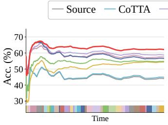

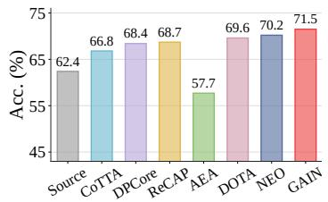

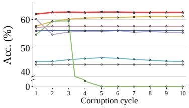

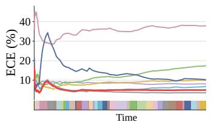  
(a) CDC Scenario

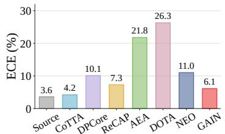  
(b) MDS Scenario

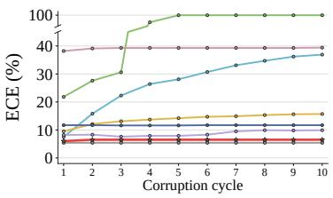  
(c) LHA Scenario  
Figure 3: Accuracy and calibration under three challenging CTTA scenarios on ImageNet-C. (a) CDC evaluates recurring corruptions with irregular durations. (b) MDS interleaves samples from multiple corruption domains, with results averaged over severity levels 1–5. (c) LHA evaluates error accumulation and long-term stability over 10 repeated corruption cycles.

LHA Scenario. The long-horizon setting evaluates adaptation stability under repeated exposure, where small errors may accumulate over time. As shown in Fig. 3c, GAIN remains stable across all 10 rounds: accuracy increases from 61.9% in R1 to 62.5–62.6% thereafter, while ECE stays around 6.5%. In contrast, CoTTA suffers severe calibration drift, DPCore exhibits noticeable accuracy degradation, ReCAP becomes increasingly miscalibrated, and AEA eventually collapses. DOTA remains persistently miscalibrated, while NEO is stable but substantially less accurate. These results demonstrate that GAIN maintains stable accuracy and calibration over long horizons by limiting the propagation of unreliable history-induced corrections.

## 5.3 EXPERIMENTS ON IMAGENET-3DCC

To evaluate robustness under more realistic shifts, we further consider ImageNet-3DCC (Kar et al., 2022), which covers diverse geometry- and imaging-related corruptions and provides a complementary test beyond conventional 2D corruptions. As shown in Fig. 4, GAIN achieves the highest classification accuracy while maintaining near-source inference speed, reaching 18.5× the inference speed of CoTTA, with low calibration error under CSC. In contrast, REM and DPCore achieve competitive accuracy at substantially lower inference speeds, while DOTA remains less accurate and more poorly calibrated. These results show that gain-guided intervention preserves a strong accuracy– calibration–efficiency trade-off beyond ImageNet-C under more diverse corruption shifts. Additional experiments and analyses are provided in Appendix G.

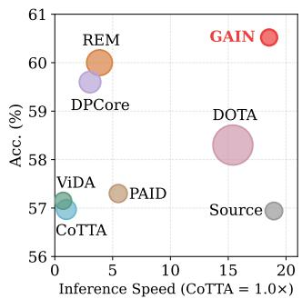  
Figure 4: Efficiency–accuracy trade-off on ImageNet-3DCC. Inference speed is normalized to CoTTA; bubble size indicates ECE.

## 5.4 ABLATION STUDIES AND FURTHER ANALYSIS

Ablation Studies. Table 2 compares different intervention rules under the same target-side estimation framework. Source retention does not exploit target evidence, whereas full correction substantially improves accuracy but leads to poor calibration. Fixed, entropy-based, and disagreementbased interventions partially alleviate this trade-off, but remain inferior to GAIN. In contrast, GAIN determines the intervention strength from the source-relative posterior-predictive gain, achieving the best overall performance with 61.9% accuracy, 6.0% ECE, and 1.9 NLL. These results reinforce our principle: history proposes, while gain decides whether and how strongly to intervene.

0  
Table 2: Ablation of intervention rules under CSC. Signal denotes the criterion for setting the intervention strength $\lambda _ { t } .$
<table><tr><td>Intervention Rule</td><td>Signal</td><td>λt Acc. ↑ ECE↓ NLL ↓</td><td></td><td></td><td></td></tr><tr><td>Source Retention</td><td></td><td>0</td><td>44.2</td><td>5.4</td><td>3.0</td></tr><tr><td>Full Correction</td><td>一</td><td>1</td><td>58.6</td><td>11.2</td><td>2.5</td></tr><tr><td>Fixed Intervention</td><td></td><td>0.5</td><td>59.7</td><td>8.9</td><td>2.1</td></tr><tr><td>Entropy-based</td><td> $H ( \mathbf { s } _ { t } )$ </td><td> $\lambda _ { t } ^ { \mathrm { e n t } }$ </td><td>58.9</td><td>8.4</td><td>2.1</td></tr><tr><td>Disagreement-based</td><td> $\mathrm { J S } ( \mathbf { s } _ { t } , \hat { \mathbf { q } } _ { t } ^ { H } )$ </td><td> $\lambda _ { t } ^ { \mathrm { d i s } }$ </td><td>58.9</td><td>9.2</td><td>2.1</td></tr><tr><td>GAIN (Ours)</td><td> $G _ { t } ^ { \mathrm { p p } }$ </td><td>λt</td><td>61.9</td><td>6.0</td><td>1.9</td></tr></table>

Table 3: Efficiency analysis on ImageNet-C. BP/FP: backward/forward propagation counts. Speed is normalized to CoTTA (1.0×); higher is faster.
<table><tr><td>Method</td><td colspan="7">#BP #FP Param.(M) ↓ Mem.(GB) ↓ Speed ↑ Acc. ↑ ECE ↓</td></tr><tr><td>CoTTA</td><td></td><td>1 5.1</td><td>86.42</td><td>23.01</td><td>1.0×</td><td>45.2</td><td>7.5</td></tr><tr><td>AEA</td><td></td><td>1 1</td><td>0.04</td><td>6.05</td><td>6.3×</td><td>54.7</td><td>21.8</td></tr><tr><td>REM</td><td></td><td>1 3</td><td>0.03</td><td>26.77</td><td>3.3×</td><td>60.8</td><td>8.5</td></tr><tr><td>DPCore</td><td></td><td>7.9 9.9</td><td>1.03</td><td>8.59</td><td>0.6×</td><td>60.1</td><td>8.2</td></tr><tr><td>PAID</td><td></td><td>1</td><td>0.81</td><td>11.63</td><td>4.6×</td><td>57.8</td><td>8.6</td></tr><tr><td>DOTA</td><td>0</td><td>1</td><td>0</td><td>9.54</td><td>12.7×</td><td>57.2</td><td>38.2</td></tr><tr><td>GAIN (Ours)</td><td>0</td><td>1</td><td>0</td><td>0.81</td><td>15.9×</td><td>61.9</td><td>6.0</td></tr></table>

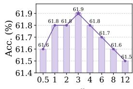  
0

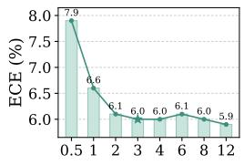

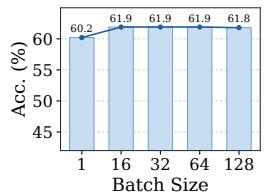

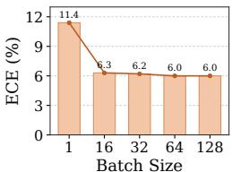  
(a) Source-centered Prior Strength κ0.  
(b) Test-Time Batch Size  
Figure 5: Sensitivity analysis. We study the sensitivity of GAIN to (a) the source-centered prior strength $\kappa _ { 0 }$ and (b) the test-time batch size. For each setting, we report both accuracy and ECE.

Sensitivity to $\kappa _ { 0 } .$ . We study the sensitivity of GAIN to the prior strength $\kappa _ { 0 } .$ , which controls the influence of the source prior on target-side estimation. As shown in Fig. 5a, increasing κ0 from 0.5 to 2 improves both accuracy and calibration, with accuracy rising from 61.6% to 61.8% and ECE decreasing from 7.9% to $6 . 1 \%$ . Performance remains stable for $\kappa _ { 0 } \in [ 2 , 4 ]$ , with the highest accuracy of 61.9% achieved at $\kappa _ { 0 } = 3$ . Larger values slightly improve ECE but gradually reduce accuracy as the source prior becomes more dominant. We therefore set $\kappa _ { 0 } = 3$ by default, which offers a favorable accuracy–calibration trade-off without careful tuning.

Effect of Test-Time Batch Size. We evaluate the effect of test-time batch size on adaptation performance. As shown in Fig. 5b, single-sample updates yield less reliable target statistics, with 60.2% accuracy and 11.4% ECE. Increasing the batch size to 16 improves accuracy to 61.9% and sharply reduces ECE to 6.3%. Beyond 16 samples, performance largely saturates: accuracy remains within 61.8–61.9%, while ECE only gradually decreases to 6.0% at a batch size of 128. This indicates that GAIN does not require large test-time batches. For a fair comparison, we use a default test-time batch size of 64 in all main experiments.

Computational Efficiency. Table 3 compares the computational efficiency of different CTTA methods on ImageNet-C. GAIN requires only a single forward pass, without backpropagation or trainable parameter updates, and uses only 0.81 GB of memory. With computational speed normalized to CoTTA (1.0×), GAIN achieves the highest relative speed of 15.9×, while also attaining the best accuracy of 61.9% with only 6.0% ECE. Compared with the BP-free DOTA, GAIN is also faster while improving accuracy by 4.7 points and reducing ECE from 38.2% to 6.0%. These results demonstrate that GAIN achieves a favorable accuracy–calibration–efficiency trade-off with a lightweight, forward-only adaptation pipeline.

## 6 CONCLUSION

We presented GAIN, a gain-guided framework for continual test-time adaptation following the principle that history proposes, gain decides. Rather than directly trusting history-derived corrections, GAIN evaluates their source-relative utility with a posterior-predictive evaluator and adaptively controls the intervention strength along a continuous evidence path. Combined with causal targetstatistic updates, GAIN limits the propagation of unreliable corrections while enabling efficient adaptation without backpropagation or replay. Across structured, dynamic, mixed-domain, and long-horizon shifts, GAIN achieves strong accuracy, calibration, and stability, highlighting the effectiveness of gain-guided intervention for reliable continual adaptation.

Limitations and future work. Our study follows the standard closed-set CTTA setting, where the source and target domains share the same label space. Extending gain-guided intervention to open-set adaptation and broader prediction tasks presents a promising direction for future work.

## REFERENCES

Pier Giovanni Bissiri, Chris C Holmes, and Stephen G Walker. A general framework for updating belief distributions. Journal of the Royal Statistical Society Series B: Statistical Methodology, 78 (5):1103–1130, 2016. 15

Dhanajit Brahma and Piyush Rai. A probabilistic framework for lifelong test-time adaptation. In Proc. ofComputer Vision and Pattern Recognition (CVPR), 2023. 3

Wonjeong Choi, Do-Yeon Kim, Jungwuk Park, Jungmoon Lee, Younghyun Park, Dong-Jun Han, and Jaekyun Moon. Adaptive energy alignment for accelerating test-time adaptation. In Proc. of Int’l Conf. on Learning Representations (ICLR), 2025. 2

Thomas M Cover, Joy A Thomas, and John Kieffer. Elements of information theory, volume 2. wiley New York, 1991. 18

Shuang Cui, Jinglin Xu, Yi Li, Xiongxin Tang, Jiangmeng Li, Jiahuan Zhou, Fanjiang Xu, Fuchun Sun, and Hui Xiong. Bayestta: Continual-temporal test-time adaptation for vision-language models via gaussian discriminant analysis. arXiv preprint arXiv:2507.08607, 2025. 3

Dexin Duan, Rui Xu, Peilin Liu, and Fei Wen. Lifelong test-time adaptation via online learning in tracked low-dimensional subspace. In Proc. of Neural Information Processing Systems (NeurIPS), 2025. 2

Robert Mario Fano. Transmission of Information: A statistical theory of communications. MIT Press, 1966. 3, 14

Taesik Gong, Yewon Kim, Taeckyung Lee, Sorn Chottananurak, and Sung-Ju Lee. Sotta: Robust test-time adaptation on noisy data streams. In Proc. of Neural Information Processing Systems (NeurIPS), 2023. 1

Jisu Han, Jaemin Na, and Wonjun Hwang. Ranked entropy minimization for continual test-time adaptation. In Proc. ofInt’l Conf. on Machine Learning (ICML), 2025a. 1, 2, 3, 23

Zongbo Han, Jialong Yang, Guangyu Wang, Junfan Li, Qianli Xu, Mike Zheng Shou, and Changqing Zhang. Dota: Distributional test-time adaptation of vision-language models. In Proc. ofNeural Information Processing Systems (NeurIPS), 2025b. 1, 3

Dan Hendrycks and Thomas Dietterich. Benchmarking neural network robustness to common corruptions and perturbations. In Proc. of Int’l Conf. on Learning Representations (ICLR), 2019. 6, 23

Dan Hendrycks, Steven Basart, Norman Mu, Saurav Kadavath, Frank Wang, Evan Dorundo, Rahul Desai, Tyler Zhu, Samyak Parajuli, Mike Guo, et al. The many faces of robustness: A critical analysis of out-of-distribution generalization. In Proc. of Int’l Conf. on Computer Vision (ICCV), 2021. 6, 24

Zixuan Hu, Yichun Hu, Xiaotong Li, Shixiang Tang, and Ling-Yu Duan. Beyond entropy: Region confidence proxy for wild test-time adaptation. In Proc. of Int’l Conf. on Machine Learning (ICML), 2025. 1, 6, 25

Hyun-Kurl Jang, Jihun Kim, Hyeokjun Kweon, and Kuk-Jin Yoon. Distill once, adapt life-long: Exploring dataset distillation for continual test-time adaptation. In Proc. of European Conf. on Computer Vision (ECCV), 2026. 3

Siru Jiang, Yuwei Liang, Jian Liang, Ran He, and Tieniu Tan. To adapt or not to adapt? selective adaptation for vision-language models. In Proc. ofEuropean Conf. on Computer Vision (ECCV), 2026. 2

Oguzhan Fatih Kar, Teresa Yeo, Andrei Atanov, and Amir Zamir. 3d common corruptions and data˘ augmentation. In Proc. ofComputer Vision and Pattern Recognition (CVPR), 2022. 6, 8, 24

Guannan Lai, Da-Wei Zhou, Zhenguo Li, and Han-Jia Ye. The golden subspace: Where efficiency meets generalization in continual test-time adaptation. In Proc. of Computer Vision and Pattern Recognition (CVPR), 2026. 2

Daeun Lee, Jaehong Yoon, and Sung Ju Hwang. Becotta: Input-dependent online blending of experts for continual test-time adaptation. In Proc. of Int’l Conf. on Machine Learning (ICML), 2024a. 3

Jonghyun Lee, Dahuin Jung, Saehyung Lee, Junsung Park, Juhyeon Shin, Uiwon Hwang, and Sungroh Yoon. Entropy is not enough for test-time adaptation: From the perspective of disentangled factors. In Proc. ofInt’l Conf. on Learning Representations (ICLR), 2024b. 1, 2

Chang Liu, Ruotong Zhao, Li Gao, and Yupei Zhang. Sateen: Learning structural alignment for continual test-time adaptation. In Proc. ofInt’l Conf. on Machine Learning (ICML), 2026. 2

Jiaming Liu, Ran Xu, Senqiao Yang, Renrui Zhang, Qizhe Zhang, Zehui Chen, Yandong Guo, and Shanghang Zhang. Continual-mae: Adaptive distribution masked autoencoders for continual testtime adaptation. In Proc. of Computer Vision and Pattern Recognition (CVPR), 2024a. 2

Jiaming Liu, Senqiao Yang, Peidong Jia, Renrui Zhang, Ming Lu, Yandong Guo, Wei Xue, and Shanghang Zhang. Vida: Homeostatic visual domain adapter for continual test time adaptation. In Proc. of Int’l Conf. on Learning Representations (ICLR), 2024b. 3, 6, 23, 25

Robert A Marsden, Mario Dobler, and Bin Yang. Universal test-time adaptation through weight¨ ensembling, diversity weighting, and prior correction. In Proc. of Winter Conf. on Applications ofComputer Vision (WACV), 2024. 3

Alexander Murphy, Michal Danilowski, Soumyajit Chatterjee, and Abhirup Ghosh. Neo—nooptimization test-time adaptation through latent re-centering. In Proc. of Int’l Conf. on Learning Representations (ICLR), 2026. 2

Mahdi Pakdaman Naeini, Gregory Cooper, and Milos Hauskrecht. Obtaining well calibrated probabilities using bayesian binning. In Proc. of Int’l Conf. on Artificial Intelligence (AAAI), 2015. 6, 24

Chenggong Ni, Fan Lyu, Jiayao Tan, Fuyuan Hu, Rui Yao, and Tao Zhou. Maintaining consistent inter-class topology in continual test-time adaptation. In Proc. of Computer Vision and Pattern Recognition (CVPR), 2025. 2

Shuaicheng Niu, Jiaxiang Wu, Yifan Zhang, Yaofo Chen, Shijian Zheng, Peilin Zhao, and Mingkui Tan. Efficient test-time model adaptation without forgetting. In Proc. of Int’l Conf. on Machine Learning (ICML), 2022. 1, 2, 3

Shuaicheng Niu, Jiaxiang Wu, Yifan Zhang, Zhiquan Wen, Yaofo Chen, Peilin Zhao, and Mingkui Tan. Towards stable test-time adaptation in dynamic wild world. In Proc. of Int’l Conf. on Learning Representations (ICLR), 2023. 2, 6, 25

Shuaicheng Niu, Chunyan Miao, Guohao Chen, Pengcheng Wu, and Peilin Zhao. Test-time model adaptation with only forward passes. In Proc. ofInt’l Conf. on Machine Learning (ICML), 2024. 3

Benjamin Recht, Rebecca Roelofs, Ludwig Schmidt, and Vaishaal Shankar. Do imagenet classifiers generalize to imagenet? In Proc. ofInt’l Conf. on Machine Learning (ICML), 2019. 6, 24

Liliang Ren, Mankeerat Sidhu, Qi Zeng, Revanth Gangi Reddy, Heng Ji, and ChengXiang Zhai. Cpmi: Conditional pointwise mutual information for turn-level dialogue evaluation. In Proceedings of the Third DialDoc Workshop on Document-grounded Dialogue and Conversational Question Answering, pp. 80–85, 2023. 3, 14

Junha Song, Jungsoo Lee, In So Kweon, and Sungha Choi. Ecotta: Memory-efficient continual test-time adaptation via self-distilled regularization. In Proc. of Computer Vision and Pattern Recognition (CVPR), 2023. 1, 2

Dequan Wang, Evan Shelhamer, Shaoteng Liu, Bruno Olshausen, and Trevor Darrell. Tent: Fully test-time adaptation by entropy minimization. In Proc. ofInt’l Conf. on Learning Representation (ICLR), 2021. 1, 2, 3

Haohan Wang, Songwei Ge, Zachary Lipton, and Eric P Xing. Learning robust global representations by penalizing local predictive power. In Proc. of Neural Information Processing Systems (NeurIPS), 2019. 6, 24

Kunyu Wang, Xueyang Fu, Yuanfei Bao, Chengjie Ge, Chengzhi Cao, Wei Zhai, and Zheng-Jun Zha. Paid: Pairwise angular-invariant decomposition for continual test-time adaptation. In Proc. ofNeural Information Processing Systems (NeurIPS), 2025. 2

Qin Wang, Olga Fink, Luc Van Gool, and Dengxin Dai. Continual test-time domain adaptation. In Proc. ofComputer Vision and Pattern Recognition (CVPR), 2022. 1, 2, 3, 6, 23, 25

Yanshuo Wang, Jie Hong, Ali Cheraghian, Shafin Rahman, David Ahmedt-Aristizabal, Lars Petersson, and Mehrtash Harandi. Continual test-time domain adaptation via dynamic sample selection. In WACV, 2024. 2

Xu Yang, Xuan Chen, Moqi Li, Kun Wei, and Cheng Deng. A versatile framework for continual testtime domain adaptation: Balancing discriminability and generalizability. In Proc. of Computer Vision and Pattern Recognition (CVPR), 2024. 2

Longhui Yuan, Binhui Xie, and Shuang Li. Robust test-time adaptation in dynamic scenarios. In Proc. ofComputer Vision and Pattern Recognition (CVPR), 2023. 3

Maxime Zanella, Clement Fuchs, Christophe De Vleeschouwer, and Ismail Ben Ayed. Realistic test-´ time adaptation of vision-language models. In Proc. ofComputer Vision and Pattern Recognition (CVPR), 2025. 3

Youjia Zhang, Youngeun Kim, Young-Geun Choi, Hongyeob Kim, Huiling Liu, and Sungeun Hong. Backpropagation-free test-time adaptation via probabilistic gaussian alignment. In Proc. of Neural Information Processing Systems (NeurIPS), 2025a. 1, 3

Yufei Zhang, Yicheng Xu, Hongxin Wei, Zhiping Lin, Xiaofeng Zou, Cen Chen, and Huiping Zhuang. Analytic continual test-time adaptation for multi-modality corruption. In Proc. of ACM International Conference on Multimedia (MM), 2025b. 3

Yunbei Zhang, Akshay Mehra, Shuaicheng Niu, and Jihun Hamm. Dpcore: Dynamic prompt coreset for continual test-time adaptation. In Proc. of Int’l Conf. on Machine Learning (ICML), 2025c. 1, 3, 6, 23, 25

Jianchao Zhao, Chenhao Ding, SongLin Dong, Jiangyang Li, Qiang Wang, Yuhang He, and Yihong Gong. Shared & domain self-adaptive experts with frequency-aware discrimination for continual test-time adaptation. In Proc. of Int’l Conf. on Artificial Intelligence (AAAI), 2026. 3

Jiahuan Zhou, Chao Zhu, Zhenyu Cui, Zichen Liu, Xu Zou, and Gang Hua. Class-aware domain knowledge fusion and fission for continual test-time adaptation. In Proc. of Neural Information Processing Systems (NeurIPS), 2025. 3

## Appendix

This Appendix provides additional theoretical derivations, implementation details, and experimental results supporting our method. The contents are organized as follows:

• Appendix A: Why source-only reliability is insufficient under continual target shift;

• Appendix B: Accumulated target context as additional predictive evidence;

• Appendix C: Posterior-predictive target-side gain estimation;

• Appendix D: Posterior-predictive evidence intervention;

• Appendix E: Causal continual target-statistic updates and algorithmic implementation;

• Appendix F: Experimental setup and implementation details;

• Appendix G: Additional experimental results and analyses.

## A SOURCE-ONLY RELIABILITY IS INSUFFICIENT

The main paper argues that source confidence alone is generally insufficient for deciding whether the current source prediction should be modified. We formalize this observation below.

Let

$$
\hat { y } _ { t } ^ { s } = \arg \operatorname* { m a x } _ { k } s _ { t , k } , \qquad C _ { t } ^ { s } = \mathbb { I } [ Y _ { t } = \hat { y } _ { t } ^ { s } ]\tag{17}
$$

denote the source prediction and its correctness indicator.

Proposition A.1 (Insufficiency of source-only reliability). Suppose there exist a source predictive distribution s and two target histories h and h′ with positive probability such that

$$
P _ { T } ( C _ { t } ^ { s } = 1 \mid \mathbf { s } _ { t } = \mathbf { s } , \mathcal { H } _ { t } = h ) \neq P _ { T } ( C _ { t } ^ { s } = 1 \mid \mathbf { s } _ { t } = \mathbf { s } , \mathcal { H } _ { t } = h ^ { \prime } ) .\tag{18}
$$

Then no function depending only on $\mathbf { s } _ { t }$ can recover the conditional correctness probability under both histories.

Proof. Assume that there exists a function $g$ such that $g ( \mathbf { s } _ { t } ) = P _ { T } ( C _ { t } ^ { s } = 1 \ | \ \mathbf { s } _ { t } , \mathcal { H } _ { t } )$ for every admissible history. For the same source distribution s in Eq. 18, this would require simultaneously

$$
g ( \mathbf { s } ) = P _ { T } ( C _ { t } ^ { s } = 1 \mid \mathbf { s } _ { t } = \mathbf { s } , \mathcal { H } _ { t } = h ) = a ,\tag{19}
$$

$$
g ( \mathbf { s } ) = P _ { T } ( C _ { t } ^ { s } = 1 \mid \mathbf { s } _ { t } = \mathbf { s } , \mathcal { H } _ { t } = h ^ { \prime } ) = b\tag{20}
$$

with a $\neq b .$ . This is a contradiction.

□

This result does not imply that confidence is uninformative. Rather, it shows that confidence is not a sufficient statistic for adaptation reliability when the correctness of an identical source prediction depends on the evolving target context.

## B ACCUMULATED TARGET CONTEXT AS PREDICTIVE EVIDENCE

This section provides the derivations underlying the C-PMI interpretation in Eq. 3, the non-negative oracle predictive value in Eq. 26, and the practical correction gain in Eq. 5.

## B.1 CONDITIONAL POINTWISE MUTUAL INFORMATION REPRESENTATION

For notational clarity, consider a fixed realization $X _ { t } = \mathbf { x } _ { t }$ and $\mathcal { H } _ { t } = h$ , and define

$$
q _ { k } ^ { 0 } \triangleq P _ { T } ( Y _ { t } = k \mid X _ { t } = \mathbf { x } _ { t } ) , \qquad q _ { k } ^ { H } \triangleq P _ { T } ( Y _ { t } = k \mid X _ { t } = \mathbf { x } _ { t } , \mathcal { H } _ { t } = h ) .\tag{21}
$$

Conditioning additionally on the maintained target context and applying Bayes’ rule gives

$$
\begin{array} { l } { q _ { k } ^ { H } = \frac { P _ { T } ( \mathcal { H } _ { t } = h \mid Y _ { t } = k , X _ { t } = \mathbf { x } _ { t } ) P _ { T } ( Y _ { t } = k \mid X _ { t } = \mathbf { x } _ { t } ) } { P _ { T } ( \mathcal { H } _ { t } = h \mid X _ { t } = \mathbf { x } _ { t } ) } } \\ { \quad = q _ { k } ^ { 0 } \frac { P _ { T } ( \mathcal { H } _ { t } = h \mid Y _ { t } = k , X _ { t } = \mathbf { x } _ { t } ) } { P _ { T } ( \mathcal { H } _ { t } = h \mid X _ { t } = \mathbf { x } _ { t } ) } . } \end{array}\tag{22}
$$

Thus, historical conditioning reweights the current-sample posterior by a class-dependent evidence term. The conditional pointwise mutual information (C-PMI) (Fano, 1966; Ren et al., 2023) associated with the realization is

$$
\begin{array} { r l } { i ( Y _ { t } = k ; \mathcal { H } _ { t } = h \mid X _ { t } = \mathbf { x } _ { t } ) \triangleq \log \frac { P _ { T } ( Y _ { t } = k \mid \mathcal { H } _ { t } = h , X _ { t } = \mathbf { x } _ { t } ) } { P _ { T } ( Y _ { t } = k \mid X _ { t } = \mathbf { x } _ { t } ) } } & { } \\ { = \log \frac { P _ { T } ( Y _ { t } = k , \mathcal { H } _ { t } = h \mid X _ { t } = \mathbf { x } _ { t } ) } { P _ { T } ( Y _ { t } = k \mid X _ { t } = \mathbf { x } _ { t } ) P _ { T } ( \mathcal { H } _ { t } = h \mid X _ { t } = \mathbf { x } _ { t } ) } } & { } \\ { = \log \frac { P _ { T } ( \mathcal { H } _ { t } = h \mid Y _ { t } = k , X _ { t } = \mathbf { x } _ { t } ) } { P _ { T } ( \mathcal { H } _ { t } = h \mid X _ { t } = \mathbf { x } _ { t } ) } } & { } \\ { = \log \frac { q _ { k } ^ { H } } { q _ { k } ^ { h } } . } & { } \end{array}\tag{23}
$$

We therefore obtain

$$
\xi _ { t , k } = \log \frac { q _ { t , k } ^ { H } } { q _ { t , k } ^ { 0 } } = i ( Y _ { t } = k ; \mathcal { H } _ { t } \mid \mathbf { x } _ { t } ) .\tag{24}
$$

Equivalently,

$$
\log q _ { t , k } ^ { H } = \log q _ { t , k } ^ { 0 } + \xi _ { t , k } .\tag{25}
$$

Hence, the class-wise log-posterior correction induced by accumulated target context is exactly a conditional pointwise mutual-information quantity, rather than an ad hoc calibration score.

## B.2 NON-NEGATIVE ORACLE PREDICTIVE VALUE

Proposition 3.1 [Non-Negative Predictive Value of Target History] Conditioning on the accumulated target context $\mathcal { H } _ { t }$ yields non-negative oracle predictive value under logarithmic loss:

$$
\mathcal { R } _ { t } ( \mathbf { q } _ { t } ^ { 0 } ) - \mathcal { R } _ { t } ( \mathbf { q } _ { t } ^ { H } ) = D _ { \mathrm { K L } } \big ( \mathbf { q } _ { t } ^ { H } \lVert \mathbf { q } _ { t } ^ { 0 } \big ) = \mathbb { E } _ { Y _ { t } \sim \mathbf { q } _ { t } ^ { H } } \big [ \xi _ { t , Y _ { t } } \big ] \geq 0 .\tag{26}
$$

The inequality is strict whenever $\mathbf { q } _ { t } ^ { H } \neq \mathbf { q } _ { t } ^ { 0 }$

Proof of Proposition 3.1 For any predictive distribution $\mathbf { r } \in \Delta ^ { K - 1 }$ , define the conditional logarithmic risk under the oracle history-conditioned target posterior as

$$
\mathcal { R } _ { t } ( \mathbf { r } ) \triangleq \mathbb { E } _ { Y _ { t } \sim \mathbf { q } _ { t } ^ { H } } \left[ - \log r _ { Y _ { t } } \right] = - \sum _ { k = 1 } ^ { K } q _ { t , k } ^ { H } \log r _ { k } .\tag{27}
$$

The predictive value of conditioning on the maintained target context is therefore

$$
\begin{array} { l } { \displaystyle \mathcal { R } _ { t } ( { \bf q } _ { t } ^ { 0 } ) - \mathcal { R } _ { t } ( { \bf q } _ { t } ^ { H } ) = - \sum _ { k = 1 } ^ { K } q _ { t , k } ^ { H } \log q _ { t , k } ^ { 0 } + \sum _ { k = 1 } ^ { K } q _ { t , k } ^ { H } \log q _ { t , k } ^ { H } } \\ { \displaystyle \quad \quad = \sum _ { k = 1 } ^ { K } q _ { t , k } ^ { H } \log \frac { q _ { t , k } ^ { H } } { q _ { t , k } ^ { 0 } } } \\ { \displaystyle \quad = D _ { \mathrm { K L } } \big ( { \bf q } _ { t } ^ { H } \big \| { \bf q } _ { t } ^ { 0 } \big ) } \\ { \displaystyle \quad = \mathbb { E } _ { Y _ { t } \sim { \bf q } _ { t } ^ { H } } \left[ \xi _ { t , Y _ { t } } \right] \ge 0 , } \end{array}\tag{28}
$$

where the last equality follows from the C-PMI $\xi _ { t , k } = \log ( q _ { t , k } ^ { H } / q _ { t , k } ^ { 0 } )$ , and the inequality follows from the non-negativity of KL divergence. Equality holds if and only if $\mathbf { q } _ { t } ^ { H } = \mathbf { q } _ { t } ^ { 0 }$ □

This result characterizes the value of conditioning on history under the oracle target posterior; it does not guarantee that an estimate constructed from accumulated unlabeled statistics improves upon the source prediction. The latter depends on the estimation gap, as shown in the practical correction-gain decomposition below.

## B.3 PRACTICAL CORRECTION GAIN

The oracle result above assumes access to the true history-conditioned posterior $\mathbf { q } _ { t } ^ { H }$ . In practice, CTTA can only infer an estimate $\hat { \mathbf { q } } _ { t } ^ { H }$ from finite, unlabeled target observations accumulated so far. Consider fully replacing the source prediction $\mathbf { s } _ { t }$ with $\hat { \mathbf { q } } _ { t } ^ { H }$ . The resulting reduction in conditional logarithmic risk is

$$
\begin{array} { r l } & { \displaystyle \Delta _ { t } ^ { \mathrm { f u l l } } \triangleq \mathcal { R } _ { t } ( \mathbf { s } _ { t } ) - \mathcal { R } _ { t } ( \hat { \mathbf { q } } _ { t } ^ { H } ) = \sum _ { k = 1 } ^ { K } q _ { t , k } ^ { H } \log \frac { \hat { q } _ { t , k } ^ { H } } { s _ { t , k } } } \\ & { \qquad = \displaystyle \sum _ { k = 1 } ^ { K } q _ { t , k } ^ { H } ( \log \frac { q _ { t , k } ^ { H } } { s _ { t , k } } - \log \frac { q _ { t , k } ^ { H } } { \hat { q } _ { t , k } ^ { H } } ) } \\ & { \qquad = \displaystyle \underbrace { D _ { \mathrm { K L } } ( \mathbf { q } _ { t } ^ { H } \lVert \mathbf { s } _ { t } \rVert } _ { \mathrm { c o r r e c t i o n ~ p o t e n t i a l } } - \underbrace { D _ { \mathrm { K L } } ( \mathbf { q } _ { t } ^ { H } \lVert \hat { \mathbf { q } } _ { t } ^ { H } ) } _ { \mathrm { e s t i m a l i o n ~ g a p } } . } \end{array}\tag{29}
$$

Unlike the non-negative oracle value, the practical correction gain $\Delta _ { t } ^ { \mathrm { f u l l } }$ is not guaranteed to be positive. The first term measures how far the source prediction lies from the oracle history-conditioned posterior, whereas the second measures the remaining gap between its finite-sample estimate and the oracle. Consequently, full correction is beneficial if and only if

$$
D _ { \mathrm { K L } } \big ( { \mathbf { q } } _ { t } ^ { H } \| \hat { \mathbf { q } } _ { t } ^ { H } \big ) < D _ { \mathrm { K L } } \big ( { \mathbf { q } } _ { t } ^ { H } \| { \mathbf { s } } _ { t } \big ) .\tag{30}
$$

This limitation is particularly relevant to CTTA, where continuously evolving target distributions can render accumulated statistics noisy, biased, or stale. Consequently, methods that directly reuse historical target information for calibration may propagate estimation errors and lead to unstable or degraded adaptation.

## C RELIABLE TARGET-SIDE GAIN ESTIMATION

This section provides the derivations underlying the target-side estimator introduced in Sec. 4.1. We first derive the source-anchored working posterior over the unknown target class centers, and then marginalize the remaining class-center uncertainty to construct a posterior-predictive evaluator of the proposed correction.

## C.1 SOURCE-ANCHORED PROBABILISTIC TARGET ESTIMATION

Before processing the current sample at time t, let $\mathcal { Z } _ { t } ^ { H } = \{ \mathbf { z } _ { i } ^ { H } \} _ { i = 1 } ^ { N _ { t } ^ { H } }$ denote the historical target representations from $\mathcal { H } _ { t }$ , where $\mathbf { z } _ { i } ^ { \bar { H } } = \phi _ { \theta } ( \mathbf { x } _ { i } ^ { H } ) \in \mathbb { R } ^ { \bar { D } }$ Throughout the following derivation, we condition on the soft responsibilities induced by preceding target predictions and the pre-t covariance estimate $\Sigma _ { t - 1 }$ . Thus, the uncertainty derived below characterizes uncertainty in the target class center conditional on the current historical statistical state.

For each class $k ,$ , we assume the class-conditional Gaussian model $p _ { T } \left( \mathbf { z } _ { i } ^ { H } | Y _ { i } { = } k , \pmb { \mu } _ { k } \right) =$ $\mathcal { N } \left( \mathbf { z } _ { i } ^ { H } ; \mu _ { k } , \Sigma _ { t - 1 } \right)$ , and place a source-centered prior on the unknown target class center

$$
p ( \pmb { \mu } _ { k } ) = \mathcal { N } \left( \pmb { \mu } _ { k } ; \mathbf { c } _ { k } , \frac { \Sigma _ { t - 1 } } { \kappa _ { 0 } } \right) ,\tag{31}
$$

where $\mathbf { c } _ { k }$ denotes the source-derived class prototype and $\kappa _ { 0 }$ controls the strength of the sourcecentered prior. At a fixed time $t , \Sigma _ { t - 1 }$ is shared across classes, while its estimate is updated causally as new target observations become available.

Since historical target labels are unavailable, each historical representation $\mathbf { z } _ { i } ^ { H }$ contributes to class k through a soft responsibility $\omega _ { i , k } \in [ 0 , 1 ]$ in Eq. 75, determined by the reliability-weighted prediction when the observation is incorporated into the target state. These responsibilities are used only to derive the corresponding sufficient statistics and need not be stored explicitly. Conditional on the soft responsibilities, we define the class-k fractional likelihood (Bissiri et al., 2016):

$$
\widetilde { \mathcal { L } } _ { t , k } ( \pmb { \mu } _ { k } ) \triangleq \prod _ { i = 1 } ^ { N _ { t } ^ { H } } \mathcal { N } \left( \mathbf { z } _ { i } ^ { H } ; \pmb { \mu } _ { k } , \boldsymbol { \Sigma } _ { t - 1 } \right) ^ { \omega _ { i , k } } .\tag{32}
$$

Combining the fractional likelihood with the source-centered prior gives

$$
\widetilde { p } \left( \pmb { \mu } _ { k } \ | \ \mathcal { Z } _ { t } ^ { H } , \{ \omega _ { i , k } \} _ { i = 1 } ^ { N _ { t } ^ { H } } , \Sigma _ { t - 1 } \right) \propto p ( \pmb { \mu } _ { k } ) \widetilde { \mathcal { L } } _ { t , k } ( \pmb { \mu } _ { k } ) .\tag{33}
$$

For brevity, we suppress the fixed conditioning on the soft responsibilities and $\Sigma _ { t - 1 }$ below. Taking the negative logarithm of Eq. 33 and multiplying by 2, we obtain the following expression, where = denotes equality up to additive terms independent of $\mu _ { k } { \mathrm {  i } }$

$$
\begin{array} { r l } { - 2 \log \widehat { \rho } ( \mu _ { k } ) | \mathcal { Z } _ { t } ^ { R } | \ } & { = - 2 \log \widehat { \rho } ( \mu _ { k } ) - 2 \log \widehat { \mathcal { E } } _ { k } ( \mu _ { k } ) } \\ & { \qquad + \log ( \mu _ { k } - \exp ) ^ { T } \succcurlyeq - 1 ( \mu _ { k } - \exp _ { k } ) + \sum _ { i = 1 } ^ { N _ { f } ^ { I } } \omega _ { k } ( \mathcal { B } _ { k } ^ { R } - \mu _ { k } ) ^ { T } \succeq \sum _ { j = 1 } ^ { N _ { f } ^ { I } - 1 } ( \mathcal { B } _ { i } ^ { R } - \mu _ { k } ) } \\ & { = \exp ( | \mu _ { k } ^ { R } - \Sigma _ { i } | ^ { T } \mu _ { k } - 2 \mathrm { K } ) | \mathcal { B } _ { i } ^ { R } - \mathrm { K } | \sum _ { j = 1 } ^ { N _ { f } ^ { I } - 1 } \omega _ { k } + \mathrm { C } _ { i } ^ { R } \sum _ { i = 1 } ^ { N _ { f } ^ { I } - 1 } \exp | } \\ & { \qquad + \sum _ { i = 1 } ^ { N _ { f } ^ { I } } \omega _ { k } \{ [ \mathcal { B } _ { i } ^ { R } ] ^ { T } \boldsymbol { \Sigma } _ { i - 1 } ^ { T } \boldsymbol { \Sigma } _ { i } ^ { R } - 2 ( \mathcal { B } _ { i } ^ { R } ) ^ { T } \boldsymbol { \Sigma } _ { i - 1 } ^ { T } \boldsymbol { \mu } _ { k } + \mu _ { k } ^ { T } \boldsymbol { \Sigma } _ { i - 1 } ^ { T } \boldsymbol { \mu } _ { k } \} } \\ &  = ( \kappa _ { 0 } + \sum _ { i = 1 } ^ { N _ { f } ^ { I } } \omega _ { k } ) \mu _ { k } ^ { T } \boldsymbol { \Sigma } _ { i - 1 } ^ { T } \mu _ { k } - 2 ( \kappa _ { 0 } \omega _ { k } + \end{array}\tag{34}
$$

Define the posterior precision parameter and the corresponding source-anchored posterior-mean center as

$$
\kappa _ { t - 1 , k } = \kappa _ { 0 } + \sum _ { i = 1 } ^ { N _ { t } ^ { H } } \omega _ { i , k } , \qquad \mathbf { m } _ { t - 1 , k } = \frac { \kappa _ { 0 } \mathbf { c } _ { k } + \sum _ { i = 1 } ^ { N _ { t } ^ { H } } \omega _ { i , k } \mathbf { z } _ { i } ^ { H } } { \kappa _ { t - 1 , k } } .\tag{35}
$$

Substituting Eq. 35 into Eq. 34 and completing the square gives

$$
\begin{array} { r l } & { - 2 \log \widetilde { p } \left( \mu _ { k } \mid \mathcal { Z } _ { t } ^ { H } \right) \doteq \kappa _ { t - 1 , k } \mu _ { k } ^ { \top } \Sigma _ { t - 1 } ^ { - 1 } \mu _ { k } - 2 \kappa _ { t - 1 , k } \mathbf { m } _ { t - 1 , k } ^ { \top } \Sigma _ { t - 1 } ^ { - 1 } \mu _ { k } } \\ & { \qquad \doteq \kappa _ { t - 1 , k } \left( \mu _ { k } - \mathbf { m } _ { t - 1 , k } \right) ^ { \top } \Sigma _ { t - 1 } ^ { - 1 } \left( \mu _ { k } - \mathbf { m } _ { t - 1 , k } \right) . } \end{array}\tag{36}
$$

Therefore, conditional on the effective responsibilities and the pre-t covariance estimate, the induced fractional posterior is

$$
\begin{array} { r } { \widetilde { p } \left( \mu _ { k } \mid \mathcal { Z } _ { t } ^ { H } , \{ \omega _ { i , k } \} _ { i = 1 } ^ { N _ { t } ^ { H } } , \Sigma _ { t - 1 } \right) = { \cal N } \left( \mu _ { k } ; \mathbf { m } _ { t - 1 , k } , \frac { \Sigma _ { t - 1 } } { \kappa _ { t - 1 , k } } \right) . } \end{array}\tag{37}
$$

Hence, the posterior mean ${ \bf m } _ { t - 1 , k }$ provides the history-conditioned estimate of the target class center, while $\Sigma _ { t - 1 } / \kappa _ { t - 1 , k }$ characterizes the corresponding center-estimation uncertainty. Here, $\kappa _ { t - 1 , k }$ measures the accumulated reliability-weighted support for class $k ,$ so stronger accumulated support yields a more concentrated estimate of its target center. The soft responsibilities are introduced only for derivation. In practice, their aggregate effect is maintained through recursive sufficient statistics in Appendix E.1, without storing or replaying historical representations.

Posterior-Mean Target Proposal. Given the class-center posterior in Eq. 37, we first construct a target-side proposal using its posterior mean $\mathbf { m } _ { t - 1 , k }$ . Specifically, plugging $\mathbf { m } _ { t - 1 , k }$ into the classconditional Gaussian model gives

$$
\hat { p } _ { T } \left( \mathbf { z } _ { t } \mid Y _ { t } = k , \mathcal { H } _ { t } \right) \triangleq { \mathcal { N } } \left( \mathbf { z } _ { t } ; \mathbf { m } _ { t - 1 , k } , \Sigma _ { t - 1 } \right) .\tag{38}
$$

Applying Bayes’ rule with the pre-t class prior $\pi _ { t - 1 , k }$ yields

$$
\hat { q } _ { t , k } ^ { H } = \frac { \pi _ { t - 1 , k } \hat { p } _ { T } ( \mathbf { z } _ { t } \mid Y _ { t } = k , \mathcal { H } _ { t } ) } { \sum _ { j = 1 } ^ { K } \pi _ { t - 1 , j } \hat { p } _ { T } ( \mathbf { z } _ { t } \mid Y _ { t } = j , \mathcal { H } _ { t } ) } .\tag{39}
$$

Expanding the Gaussian density,

$$
\widehat { p } _ { T } ( \mathbf { z } _ { t } \mid Y _ { t } = k , \mathcal { H } _ { t } ) = \frac { 1 } { ( 2 \pi ) ^ { D / 2 } | \Sigma _ { t - 1 } | ^ { 1 / 2 } } \exp \left[ - \frac { 1 } { 2 } ( \mathbf { z } _ { t } - \mathbf { m } _ { t - 1 , k } ) ^ { \top } \Sigma _ { t - 1 } ^ { - 1 } ( \mathbf { z } _ { t } - \mathbf { m } _ { t - 1 , k } ) \right] .\tag{40}
$$

Define the corresponding squared Mahalanobis distance

$$
\begin{array} { r } { d _ { t , k } \triangleq ( \mathbf { z } _ { t } - \mathbf { m } _ { t - 1 , k } ) ^ { \top } \ d { \Sigma } _ { t - 1 } ^ { - 1 } ( \mathbf { z } _ { t } - \mathbf { m } _ { t - 1 , k } ) . } \end{array}\tag{41}
$$

Since $\Sigma _ { t - 1 }$ is shared across classes, the Gaussian normalization factor $( 2 \pi ) ^ { - D / 2 } | \Sigma _ { t - 1 } | ^ { - 1 / 2 }$ is independent of k and therefore cancels in Eq. 39. Hence,

$$
\hat { q } _ { t , k } ^ { H } = \frac { \pi _ { t - 1 , k } \exp ( - d _ { t , k } / 2 ) } { \sum _ { j = 1 } ^ { K } \pi _ { t - 1 , j } \exp ( - d _ { t , j } / 2 ) } \propto \pi _ { t - 1 , k } \exp \left( - \frac { 1 } { 2 } d _ { t , k } \right) .\tag{42}
$$

Equivalently, the class-wise discriminant score can be written as

$$
\hat { \ell } _ { t , k } ^ { H } = \log \pi _ { t - 1 , k } - \frac { 1 } { 2 } d _ { t , k } , \qquad \hat { \mathbf { q } } _ { t } ^ { H } = \mathrm { s o f t m a x } ( \hat { \ell } _ { t } ^ { H } ) .\tag{43}
$$

Thus, $\hat { \mathbf { q } } _ { t } ^ { H }$ is the target-side correction proposed by the posterior-mean target geometry. Importantly, this is a plug-in estimate: it uses the posterior mean ${ \bf m } _ { t - 1 , k }$ but does not yet account for the remaining class-center uncertainty $\Sigma _ { t - 1 } / \kappa _ { t - 1 , k }$ . We marginalize this uncertainty next to construct the posterior-predictive evaluator.

## C.2 POSTERIOR-PREDICTIVE GAIN EVALUATION

The posterior-mean proposal $\hat { \mathbf { q } } _ { t } ^ { H }$ above is constructed by plugging the posterior mean ${ \bf m } _ { t - 1 , k }$ into the class-conditional model. We next marginalize the remaining uncertainty in the target class centers and use the resulting posterior-predictive distribution to evaluate the same proposed correction.

Posterior-Predictive Target Distribution. Recall from Eq. 37 that

$$
{ \pmb { \mu } } _ { k } \mid { \mathcal { H } } _ { t } \sim { \mathcal { N } } \left( \mathbf { m } _ { t - 1 , k } , { \frac { { \sum _ { t - 1 } } } { \kappa _ { t - 1 , k } } } \right) ,\tag{44}
$$

while the class-conditional representation model is

$$
\mathbf { z } _ { t } \mid Y _ { t } = k , { \boldsymbol { \mu } } _ { k } \sim { \mathcal { N } } ( { \boldsymbol { \mu } } _ { k } , { \boldsymbol { \Sigma } } _ { t - 1 } ) .\tag{45}
$$

Marginalizing the latent class center gives

$$
\begin{array} { r l } { p _ { T } ^ { \mathrm { p p } } ( \mathbf { z } _ { t } \mid Y _ { t } = k , \mathcal { H } _ { t } ) = \displaystyle \int p _ { T } ( \mathbf { z } _ { t } \mid Y _ { t } = k , \mu _ { k } ) \widetilde { p } ( \pmb { \mu } _ { k } \mid \mathcal { H } _ { t } ) d \pmb { \mu } _ { k } } & { } \\ { = \mathcal { N } \left( \mathbf { z } _ { t } ; \mathbf { m } _ { t - 1 , k } , \Sigma _ { t - 1 } + \frac { \Sigma _ { t - 1 } } { \kappa _ { t - 1 , k } } \right) } & { } \\ { = \mathcal { N } \left( \mathbf { z } _ { t } ; \mathbf { m } _ { t - 1 , k } , h _ { t , k } \Sigma _ { t - 1 } \right) , } \end{array}\tag{46}
$$

where

$$
h _ { t , k } \triangleq 1 + \kappa _ { t - 1 , k } ^ { - 1 } .\tag{47}
$$

Hence, the posterior-predictive covariance accounts for both the within-class representation variability and the remaining uncertainty in the estimated class center.

Applying Bayes’ rule with the pre-t class prior $\pi _ { t - 1 , k }$ gives

$$
\bar { q } _ { t , k } ^ { H } = \frac { \pi _ { t - 1 , k } p _ { T } ^ { \mathrm { p p } } ( \mathbf { z } _ { t } \mid Y _ { t } = k , \mathcal { H } _ { t } ) } { \sum _ { j = 1 } ^ { K } \pi _ { t - 1 , j } p _ { T } ^ { \mathrm { p p } } ( \mathbf { z } _ { t } \mid Y _ { t } = j , \mathcal { H } _ { t } ) } .\tag{48}
$$

Expanding Eq. 46,

$$
p _ { T } ^ { \mathrm { p p } } ( \mathbf { z } _ { t } \mid Y _ { t } = k , \mathcal { H } _ { t } ) = \frac { \exp \left[ - \frac { 1 } { 2 } ( \mathbf { z } _ { t } - \mathbf { m } _ { t - 1 , k } ) ^ { \top } ( h _ { t , k } \Sigma _ { t - 1 } ) ^ { - 1 } ( \mathbf { z } _ { t } - \mathbf { m } _ { t - 1 , k } ) \right] } { ( 2 \pi ) ^ { D / 2 } | h _ { t , k } \Sigma _ { t - 1 } | ^ { 1 / 2 } } .\tag{49}
$$

Using

$$
| h _ { t , k } \Sigma _ { t - 1 } | = h _ { t , k } ^ { D } | \Sigma _ { t - 1 } | , \qquad ( h _ { t , k } \Sigma _ { t - 1 } ) ^ { - 1 } = h _ { t , k } ^ { - 1 } \Sigma _ { t - 1 } ^ { - 1 } ,\tag{50}
$$

together with the Mahalanobis distance $d _ { t , k }$ in Eq. 41, we obtain

$$
p _ { T } ^ { \mathrm { p p } } ( \mathbf { z } _ { t } \mid Y _ { t } = k , \mathcal { H } _ { t } ) = C _ { t } h _ { t , k } ^ { - D / 2 } \exp \left( - \frac { d _ { t , k } } { 2 h _ { t , k } } \right) ,\tag{51}
$$

where $C _ { t } = ( 2 \pi ) ^ { - D / 2 } | \Sigma _ { t - 1 } | ^ { - 1 / 2 }$ is independent of k because $\Sigma _ { t - 1 }$ is shared across classes. The common factor therefore cancels during class normalization, yielding

$$
\bar { q } _ { t , k } ^ { H } = \frac { \pi _ { t - 1 , k } h _ { t , k } ^ { - D / 2 } \exp \left( - \frac { d _ { t , k } } { 2 h _ { t , k } } \right) } { \sum _ { j = 1 } ^ { K } \pi _ { t - 1 , j } h _ { t , j } ^ { - D / 2 } \exp \left( - \frac { d _ { t , j } } { 2 h _ { t , j } } \right) } .\tag{52}
$$

Equivalently, $\bar { \ell } _ { t , k } ^ { H } =$ log $\begin{array} { r } { \pi _ { t - 1 , k } - \frac { D } { 2 } } \end{array}$ log $\begin{array} { r } { h _ { t , k } - \frac { d _ { t , k } } { 2 h _ { t , k } } } \end{array}$ , and $\bar { \mathbf { q } } _ { t } ^ { H } = \mathrm { s o f t m a x } ( \bar { \ell } _ { t } ^ { H } )$

Compared with the posterior-mean proposal, $h _ { t , k }$ attenuates the distance penalty for uncertain class centers, while $( D / \bar { 2 } )$ log $h _ { t , k }$ accounts for the corresponding increase in predictive volume. The latter cannot, in general, be removed when $\kappa _ { t - 1 , k }$ varies across classes.

Posterior-Predictive Correction Gain. Recall the source-relative correction evidence $\hat { \xi } _ { t , k } ^ { s } \ \triangleq$ log $\frac { \hat { q } _ { t , k } ^ { H } } { s _ { t , k } }$ . The oracle practical gain in Eq. 29 can be written as $\Delta _ { t } ^ { \mathrm { f u l l } } = ( { \bf q } _ { t } ^ { H } ) ^ { \top } \hat { \xi } _ { t } ^ { s }$ , where the unknown $\mathbf { q } _ { t } ^ { H }$ evaluates the correction proposed by $\hat { \mathbf { q } } _ { t } ^ { H }$ . Since $\mathbf { q } _ { t } ^ { H }$ is unavailable at test time, we instead evaluate the same correction under the posterior-predictive target distribution:

$$
G _ { t } ^ { \mathrm { p p } } \triangleq ( \bar { \mathbf { q } } _ { t } ^ { H } ) ^ { \top } \hat { \xi } _ { t } ^ { s } = \sum _ { k = 1 } ^ { K } \bar { q } _ { t , k } ^ { H } \log \frac { \hat { q } _ { t , k } ^ { H } } { s _ { t , k } } .\tag{53}
$$

Equivalently, defining the posterior-predictive logarithmic risk

$$
\bar { \mathcal { R } } _ { t } ( \mathbf { p } ) \triangleq - \sum _ { k = 1 } ^ { K } \bar { q } _ { t , k } ^ { H } \log p _ { k } ,\tag{54}
$$

we have $G _ { t } ^ { \mathrm { p p } } = \bar { \mathcal { R } } _ { t } ( { \bf s } _ { t } ) - \bar { \mathcal { R } } _ { t } ( \hat { \bf q } _ { t } ^ { H } )$ . Moreover,

$$
\begin{array} { r l } & { G _ { t } ^ { \mathrm { p p } } = \displaystyle \sum _ { k = 1 } ^ { K } \bar { q } _ { t , k } ^ { H } \left[ \log \frac { \bar { q } _ { t , k } ^ { H } } { s _ { t , k } } - \log \frac { \bar { q } _ { t , k } ^ { H } } { \hat { q } _ { t , k } ^ { H } } \right] } \\ & { ~ = D _ { \mathrm { K L } } \left( \bar { \mathbf { q } } _ { t } ^ { H } \lVert \mathbf { s } _ { t } \right) - D _ { \mathrm { K L } } \left( \bar { \mathbf { q } } _ { t } ^ { H } \lVert \hat { \mathbf { q } } _ { t } ^ { H } \right) . } \end{array}\tag{55}
$$

The first term measures the potential benefit of correcting the source prediction, whereas the second measures the mismatch between the proposed correction and its posterior-predictive evaluation. Hence, source–target disagreement alone does not imply a reliable correction; the correction must remain supported after accounting for uncertainty in the estimated target geometry.

Relation to the Oracle Gain. The posterior-predictive gain evaluates the same source-relative correction as the oracle practical gain, but replaces the unknown history-conditioned target posterior $\mathbf { q } _ { t } ^ { H }$ with the posterior-predictive evaluator $\bar { \mathbf { q } } _ { t } ^ { H }$ . Their difference is therefore

$$
\Delta _ { t } ^ { \mathrm { f u l l } } - G _ { t } ^ { \mathrm { p p } } = \left( \mathbf { q } _ { t } ^ { H } - \bar { \mathbf { q } } _ { t } ^ { H } \right) ^ { \top } \hat { \xi } _ { t } ^ { s } .\tag{56}
$$

Let $\begin{array} { r } { \operatorname { s p a n } ( \hat { \xi } _ { t } ^ { s } ) \triangleq \operatorname* { m a x } _ { k } \hat { \xi } _ { t , k } ^ { s } - \operatorname* { m i n } _ { k } \hat { \xi } _ { t , k } ^ { s } } \end{array}$ . Since both $\mathbf { q } _ { t } ^ { H }$ and $\bar { \mathbf q } _ { t } ^ { H }$ are probability distributions, their difference sums to zero. Hence,

$$
\left| { \Delta _ { t } ^ { \mathrm { f u l l } } - G _ { t } ^ { \mathrm { p p } } } \right| \le \mathrm { T V } \left( { \bf { q } } _ { t } ^ { H } , \bar { { \bf { q } } } _ { t } ^ { H } \right) \mathrm { s p a n } ( \hat { \pmb { \xi } } _ { t } ^ { s } ) ,\tag{57}
$$

where $\begin{array} { r } { \mathrm { T V } ( \mathbf { p } , \mathbf { q } ) = \frac { 1 } { 2 } \| \mathbf { p } - \mathbf { q } \| _ { 1 } } \end{array}$ 1. By Pinsker’s inequality (Cover et al., 1991), this further implies

$$
\left| \Delta _ { t } ^ { \mathrm { f u l l } } - G _ { t } ^ { \mathrm { p p } } \right| \leq \mathrm { s p a n } ( \hat { \pmb { \xi } } _ { t } ^ { s } ) \sqrt { \frac { 1 } { 2 } D _ { \mathrm { K L } } \left( \mathbf { q } _ { t } ^ { H } \| \bar { \mathbf { q } } _ { t } ^ { H } \right) } .\tag{58}
$$

Thus, the discrepancy between the posterior-predictive and oracle gains is controlled jointly by the accuracy of the posterior-predictive evaluator and the magnitude of the proposed correction. In particular, $\mathbf { \overline { { \mathit { G } } } } _ { t } ^ { \mathrm { p p } }$ approaches the oracle practical gain whenever $\bar { \mathbf q } _ { t } ^ { H }$ approaches $\mathbf { q } _ { t } ^ { H }$ , while aggressive source-relative corrections amplify errors in the target evaluator. For numerical stability, probabilities entering log-ratios are lower bounded by $\epsilon _ { p }$ before renormalization.

## D POSTERIOR-PREDICTIVE EVIDENCE INTERVENTION

This section provides the derivations underlying the posterior-predictive evidence intervention introduced in Sec. 4.2. We first derive the continuous source-to-target evidence path and its exact posterior-predictive risk reduction. We then establish the concavity of the resulting objective, characterize its boundary behavior, and derive an efficient global solution for the intervention strength.

## D.1 CONTINUOUS EVIDENCE PATH AND PREDICTIVE OBJECTIVE

Continuous Evidence Path. To control the extent of target-side intervention, we construct a continuous evidence path by scaling the source-relative evidence with $\lambda ~ \in ~ [ 0 , 1 ]$ . Recall that $\hat { \xi } _ { t , k } ^ { s } = \log ( \hat { q } _ { t , k } ^ { H } / s _ { t , k } )$ . Scaling this evidence and normalizing across classes gives

$$
p _ { t , k } ^ { ( \lambda ) } = \frac { s _ { t , k } \exp ( \lambda \hat { \xi } _ { t , k } ^ { s } ) } { Z _ { t } ( \lambda ) } = \frac { s _ { t , k } ^ { 1 - \lambda } ( \hat { q } _ { t , k } ^ { H } ) ^ { \lambda } } { \sum _ { j = 1 } ^ { K } s _ { t , j } ^ { 1 - \lambda } ( \hat { q } _ { t , j } ^ { H } ) ^ { \lambda } } ,\tag{59}
$$

where $\begin{array} { r } { Z _ { t } ( \lambda ) { = } \sum _ { j { = 1 } } ^ { K } s _ { t , j } \exp ( \lambda \hat { \xi } _ { t , j } ^ { s } ) } \end{array}$ is the normalization factor. The two endpoints satisfy ${ \bf p } _ { t } ^ { ( 0 ) } = { \bf s } _ { t }$ and $\mathbf { p } _ { t } ^ { ( 1 ) } = \hat { \mathbf { q } } _ { t } ^ { H }$ . Hence, λ continuously controls the amount of target-side evidence introduced into the source prediction.

Posterior-Predictive Path-Wise Gain. As established in Sec. 4.1, the posterior-predictive distribution $\bar { \mathbf q } _ { t } ^ { H }$ evaluates the correction proposed by $\hat { \mathbf { q } } _ { t } ^ { H }$ after accounting for uncertainty in the estimated target geometry. Define the corresponding conditional logarithmic risk as

$$
\bar { \mathcal { R } } _ { t } ( \mathbf { p } ) \triangleq - \sum _ { k = 1 } ^ { K } \bar { q } _ { t , k } ^ { H } \log p _ { k } .\tag{60}
$$

From Eq. 59, log $\begin{array} { r } { \frac { p _ { t , k } ^ { ( \lambda ) } } { s _ { t , k } } = \lambda \hat { \xi } _ { t , k } ^ { s } - \log Z _ { t } ( \lambda ) } \end{array}$ . Therefore, the posterior-predictive risk reduction relative to the source prediction is

$$
\begin{array} { r l } & { \mathcal { I } _ { t } ( \lambda ) \triangleq \bar { \mathcal { R } } _ { t } ( \mathbf { s } _ { t } ) - \bar { \mathcal { R } } _ { t } \big ( \mathbf { p } _ { t } ^ { ( \lambda ) } \big ) = \displaystyle \sum _ { k = 1 } ^ { K } \bar { q } _ { t , k } ^ { H } \log \frac { p _ { t , k } ^ { ( \lambda ) } } { s _ { t , k } } } \\ & { \quad \quad \quad = \lambda ( \bar { \mathbf { q } } _ { t } ^ { H } ) ^ { \top } \hat { \xi } _ { t } ^ { s } - \log Z _ { t } ( \lambda ) } \\ & { \quad \quad = \lambda G _ { t } ^ { \mathrm { p p } } - \log Z _ { t } ( \lambda ) , \qquad \lambda \in [ 0 , 1 ] . } \end{array}\tag{61}
$$

Here, $G _ { t } ^ { \mathrm { p p } }$ is the posterior-predictive correction gain introduced in Sec. 4.1. Thus, Eq. 61 gives the exact reduction in posterior-predictive logarithmic risk along the evidence path. The same proposed correction $\hat { \mathbf { q } } _ { t } ^ { H }$ determines the path, whereas $\bar { \mathbf q } _ { t } ^ { H }$ determines how strongly that correction is supported under the uncertainty-aware target working model.

Equivalently, since $\bar { \mathcal { R } } _ { t } ( \mathbf { p } ) = H ( \bar { \bf q } _ { t } ^ { H } ) + D _ { \mathrm { K L } } \left( \bar { \bf q } _ { t } ^ { H } \| \mathbf { p } \right)$ , maximizing $\mathcal { I } _ { t } ( \lambda )$ is equivalent to finding the point on the source–target evidence path that minimizes $D _ { \mathrm { K L } } \left( \bar { \mathbf { q } } _ { t } ^ { H } \lVert \mathbf { p } _ { t } ^ { ( \lambda ) } \right)$ . Hence, the intervention coefficient can also be interpreted as the forward-KL projection of the posterior-predictive evaluator onto the continuous source–target evidence path.

## D.2 GLOBALLY OPTIMAL POSTERIOR-PREDICTIVE INTERVENTION

We now establish the global solution of Eq. 61 and prove Theorem 4.1.

Concavity and Global Optimality. Since $G _ { t } ^ { \mathrm { p p } }$ is independent of λ, differentiating the lognormalizer gives

$$
\frac { \mathrm { d } } { \mathrm { d } \lambda } \log Z _ { t } ( \lambda ) = \frac { \sum _ { k = 1 } ^ { K } s _ { t , k } \exp ( \lambda \hat { \xi } _ { t , k } ^ { s } ) \hat { \xi } _ { t , k } ^ { s } } { Z _ { t } ( \lambda ) } = \sum _ { k = 1 } ^ { K } p _ { t , k } ^ { ( \lambda ) } \hat { \xi } _ { t , k } ^ { s } = \mathbb { E } _ { k \sim \mathbf { p } _ { t } ^ { ( \lambda ) } } \left[ \hat { \xi } _ { t , k } ^ { s } \right] .\tag{62}
$$

Therefore, $\mathcal { I } _ { t } ^ { \prime } ( \lambda ) = G _ { t } ^ { \mathrm { p p } } - \mathbb { E } _ { k \sim \mathbf { p } _ { t } ^ { ( \lambda ) } } \left[ \hat { \xi } _ { t , k } ^ { s } \right]$ . Differentiating once more yields

$$
\begin{array} { r l } & { \mathcal { T } _ { t } ^ { \prime \prime } ( \lambda ) = - \displaystyle \frac { \mathrm { d } ^ { 2 } } { \mathrm { d } \lambda ^ { 2 } } \log Z _ { t } ( \lambda ) = - \left\{ \mathbb { E } _ { k \sim \mathbf { p } _ { t } ^ { ( \lambda ) } } \left[ ( \hat { \xi } _ { t , k } ^ { s } ) ^ { 2 } \right] - \left( \mathbb { E } _ { k \sim \mathbf { p } _ { t } ^ { ( \lambda ) } } \left[ \hat { \xi } _ { t , k } ^ { s } \right] \right) ^ { 2 } \right\} } \\ & { \quad \quad \quad = - \operatorname { V a r } _ { k \sim \mathbf { p } _ { t } ^ { ( \lambda ) } } \left[ \hat { \xi } _ { t , k } ^ { s } \right] \leq 0 . } \end{array}\tag{63}
$$

Hence, $\mathcal { I } _ { t } ( \lambda )$ is concave over $\lambda \in [ 0 , 1 ]$ . If $\hat { \mathbf { q } } _ { t } ^ { H } \neq \mathbf { s } _ { t }$ , the source-relative evidence is not constant across classes and the variance is strictly positive, yielding strict concavity. Therefore, the maximizer is unique except in the degenerate case $\hat { \mathbf { q } } _ { t } ^ { H } = \mathbf { s } _ { t }$

Boundary Behavior. The derivatives at the two endpoints further characterize when intervention is suppressed or fully applied. $\mathrm { A t } \lambda = 0 , \mathbf { p } _ { t } ^ { ( 0 ) } = \mathbf { s } _ { t }$ , and therefore

$$
\begin{array} { r l } & { \mathcal { T } _ { t } ^ { \prime } ( 0 ) = { G } _ { t } ^ { \mathrm { p p } } - { \sum } _ { k = 1 } ^ { K } s _ { t , k } \log \frac { \hat { q } _ { t , k } ^ { H } } { s _ { t , k } } } \\ & { \quad \quad = G _ { t } ^ { \mathrm { p p } } + D _ { \mathrm { K L } } \left( \mathbf { s } _ { t } \Vert \hat { \mathbf { q } } _ { t } ^ { H } \right) . } \end{array}\tag{64}
$$

Since $\mathcal { T } _ { t }$ is concave, $\mathcal { T } _ { t } ^ { \prime } ( 0 ) \leq 0$ implies that the objective is non-increasing from the source endpoint, and hence (65)

$$
G _ { t } ^ { \mathrm { p p } } \leq - D _ { \mathrm { K L } } \left( \mathbf { s } _ { t } \Vert \hat { \mathbf { q } } _ { t } ^ { H } \right) \quad \Longrightarrow \quad \lambda _ { t } ^ { \star } = 0 .\tag{65}
$$

Thus, the posterior-predictive evaluator assigns sufficiently negative gain to the proposed correction that even an infinitesimal target-side intervention is rejected.

$\mathrm { A t } \lambda = 1 , \mathbf { p } _ { t } ^ { ( 1 ) } = \hat { \mathbf { q } } _ { t } ^ { H }$ , giving

$$
\begin{array} { r l } & { \mathcal { T } _ { t } ^ { \prime } ( 1 ) = { G } _ { t } ^ { \mathrm { p p } } - { \sum } _ { k = 1 } ^ { K } \hat { q } _ { t , k } ^ { H } \log \frac { \hat { q } _ { t , k } ^ { H } } { s _ { t , k } } } \\ & { \quad \quad = G _ { t } ^ { \mathrm { p p } } - D _ { \mathrm { K L } } \left( \hat { \mathbf { q } } _ { t } ^ { H } \lVert \mathbf { s } _ { t } \right) . } \end{array}\tag{66}
$$

Since the objective remains non-decreasing up to the target endpoint,

$$
\begin{array} { r } { G _ { t } ^ { \mathrm { p p } } \geq D _ { \mathrm { K L } } \left( \hat { \mathbf { q } } _ { t } ^ { H } \Vert \mathbf { s } _ { t } \right) \quad \implies \quad \lambda _ { t } ^ { \star } = 1 . } \end{array}\tag{67}
$$

In this regime, the posterior-predictive evaluator sufficiently supports the full target-side correction. Finally, when

$$
\mathcal { T } _ { t } ^ { \prime } ( 0 ) > 0 \qquad \mathrm { a n d } \qquad \mathcal { T } _ { t } ^ { \prime } ( 1 ) < 0 ,\tag{68}
$$

strict concavity guarantees a unique interior optimum ${ \lambda } _ { t } ^ { \star } \in ( 0 , 1 )$ satisfying $\mathbb { E } _ { k \sim \mathbf { p } _ { t } ^ { ( \lambda _ { t } ^ { \star } ) } } \left[ \hat { \xi } _ { t , k } ^ { s } \right] = G _ { t } ^ { \mathrm { p p } }$ Thus, the optimal partial intervention is the point along the evidence path at which the path-wise expected source-relative evidence matches the gain supported by the posterior-predictive evaluator.

Efficient Global Solution. Combining the three regimes gives

$$
\lambda _ { t } ^ { \star } = \left\{ \begin{array} { l l } { 0 , } & { G _ { t } ^ { \mathrm { p p } } \leq - D _ { \mathrm { K L } } \left( \mathbf { s } _ { t } \| \hat { \mathbf { q } } _ { t } ^ { H } \right) , } \\ { \qquad } & { G _ { t } ^ { \mathrm { p p } } \geq D _ { \mathrm { K L } } \left( \hat { \mathbf { q } } _ { t } ^ { H } \| \mathbf { s } _ { t } \right) , } \\ { \mathrm { t h e ~ u n i q u e ~ r o o t ~ o f } ~ \mathcal { T } _ { t } ^ { \prime } ( \lambda ) = 0 , } & { \mathrm { o t h e r w i s e } . } \end{array} \right.\tag{69}
$$

Equivalently, the interior case corresponds to $- D _ { \mathrm { K L } } \left( \mathbf { s } _ { t } \Vert \hat { \mathbf { q } } _ { t } ^ { H } \right) < G _ { t } ^ { \mathrm { p p } } < D _ { \mathrm { K L } } \left( \hat { \mathbf { q } } _ { t } ^ { H } \Vert \mathbf { s } _ { t } \right)$

Since $\mathcal { T } _ { t } ^ { \prime } ( \lambda )$ is monotone non-increasing, the interior root can be found efficiently by bisection.   
Reaching a tolerance $\epsilon _ { \lambda }$ requires ${ \cal O } ( \log ( \bar { 1 } / \epsilon _ { \lambda } ) )$ iterations, with $O ( K )$ computation per iteration.

Substituting the optimal intervention strength into the evidence path gives

$$
p _ { t , k } ^ { \star } = p _ { t , k } ^ { ( \lambda _ { t } ^ { \star } ) } = \frac { s _ { t , k } ^ { 1 - \lambda _ { t } ^ { \star } } ( \hat { q } _ { t , k } ^ { H } ) ^ { \lambda _ { t } ^ { \star } } } { \sum _ { j = 1 } ^ { K } s _ { t , j } ^ { 1 - \lambda _ { t } ^ { \star } } ( \hat { q } _ { t , j } ^ { H } ) ^ { \lambda _ { t } ^ { \star } } } \propto s _ { t , k } ^ { 1 - \lambda _ { t } ^ { \star } } \left( \hat { q } _ { t , k } ^ { H } \right) ^ { \lambda _ { t } ^ { \star } } .\tag{70}
$$

If $\hat { \mathbf { q } } _ { t } ^ { H } = \mathbf { s } _ { t } ,$ , the evidence path collapses to a single prediction and $\mathcal { I } _ { t } ( \lambda ) \equiv 0$ . In this degenerate case, we set ${ \lambda } _ { t } ^ { \star } = 0$ as a conservative tie-breaking rule.

This completes the proof of Theorem 4.1.

## D.3 SCOPE OF OPTIMALITY AND RELATION TO TARGET RISK

Optimality under the Working Evaluator. Fix the current representation and the pre-t statistical state, so that $\mathbf { s } _ { t } , \hat { \mathbf { q } } _ { t } ^ { H }$ , and $\bar { \mathbf q } _ { t } ^ { H }$ remain fixed while optimizing λ. Assume $s _ { t , k } , \hat { q } _ { t , k } ^ { H } > 0$ for every class.

Theorem 4.1 establishes global optimality with respect to the posterior-predictive logarithmic risk $\begin{array} { r } { \bar { \mathcal { R } } _ { t } ( \mathbf { p } ) = - \sum _ { k } \bar { q } _ { t , k } ^ { H } \log \bar { p _ { k } } } \end{array}$ on the prescribed evidence path. In particular,

$$
\lambda _ { t } ^ { \star } \in \arg \operatorname* { m i n } _ { \lambda \in [ 0 , 1 ] } \bar { \mathcal { R } } _ { t } \big ( \mathbf { p } _ { t } ^ { ( \lambda ) } \big ) .\tag{71}
$$

Since both the source prediction and the target proposal belong to this path, the selected prediction satisfies

$$
\bar { \mathcal { R } } _ { t } ( \mathbf { p } _ { t } ^ { \star } ) \leq \operatorname* { m i n } \left\{ \bar { \mathcal { R } } _ { t } ( \mathbf { s } _ { t } ) , \bar { \mathcal { R } } _ { t } ( \hat { \mathbf { q } } _ { t } ^ { H } ) \right\} .\tag{72}
$$

Indeed, optimality implies $\mathcal { I } _ { t } ( \lambda _ { t } ^ { \star } ) \geq \operatorname* { m a x } \{ \mathcal { I } _ { t } ( 0 ) , \mathcal { I } _ { t } ( 1 ) \} = \operatorname* { m a x } \{ 0 , G _ { t } ^ { \mathrm { p p } } \}$ . This is optimality over the fixed evidence path, not over all predictive distributions.

## D.4 WHY USE THE POSTERIOR-PREDICTIVE DISTRIBUTION AS AN EVALUATOR?

A natural alternative is to directly use the posterior-predictive distribution $\bar { \mathbf q } _ { t } ^ { H }$ as the adapted prediction. However, its role in GAIN is deliberately different. The posterior-mean distribution $\mathbf { \hat { q } } _ { t } ^ { H }$ specifies the correction suggested by the estimated target geometry, whereas $\bar { \mathbf q } _ { t } ^ { H }$ marginalizes classcenter uncertainty and is used to evaluate whether this correction remains beneficial relative to the frozen source prediction.

This separation is important because using the same distribution both to propose and evaluate a correction leads to a degenerate intervention. Consider an arbitrary target distribution $\mathbf { r } _ { t }$ and the evidence path

$$
p _ { t , k } ^ { ( \lambda ) } = \frac { s _ { t , k } ^ { 1 - \lambda } r _ { t , k } ^ { \lambda } } { \sum _ { j } s _ { t , j } ^ { 1 - \lambda } r _ { t , j } ^ { \lambda } } .\tag{73}
$$

If $\mathbf { r } _ { t }$ is also used as the evaluator, the corresponding objective is $\begin{array} { r } { J _ { t } ^ { r } ( \lambda ) = \mathbb { E } _ { \mathbf { r } _ { t } } \left[ \log \frac { \mathbf { p } _ { t } ^ { ( \lambda ) } } { \mathbf { s } _ { t } } \right] . \mathrm { A t } \lambda = 1 } \end{array}$

$$
\begin{array} { r } { \mathbf { p } _ { t } ^ { ( 1 ) } = \mathbf { r } _ { t } \mathrm { a n d } \left. \frac { \partial J _ { t } ^ { r } ( \lambda ) } { \partial \lambda } \right| _ { \lambda = 1 } = D _ { \mathrm { K L } } ( \mathbf { r } _ { t } \| \mathbf { s } _ { t } ) - \mathbb { E } _ { \mathbf { r } _ { t } } \left[ \log \frac { \mathbf { r } _ { t } } { \mathbf { s } _ { t } } \right] = 0 . } \end{array}
$$

Since $J _ { t } ^ { r } ( \lambda )$ is concave, its optimum is attained at ${ { \lambda } ^ { \star } } = 1$ (except for the degenerate case $\mathbf { r } _ { t } = \mathbf { s } _ { t } )$ Therefore, self-evaluation simply reduces to directly adopting the target distribution and provides no meaningful mechanism for deciding whether the proposed correction should be applied.

GAIN instead separates the two roles: $\hat { \mathbf { q } } _ { t } ^ { H }$ proposes the correction, and $\bar { \mathbf q } _ { t } ^ { H }$ evaluates its sourcerelative utility. This asymmetric proposal–evaluation design enables $\lambda _ { t } ^ { \star }$ to reject, partially apply, or fully accept the history-derived correction rather than automatically trusting the target estimate.

Direct posterior-predictive prediction. To empirically examine whether the posterior-predictive evaluator should instead be used directly as the prediction, we compare GAIN with a variant that sets $\mathbf { p } _ { t } ^ { \star } = \bar { \mathbf { q } } _ { t } ^ { H }$ . As shown in Table 7, directly predicting with $\dot { \mathbf { q } } _ { t } ^ { H }$ is inferior to using it as an evaluator of $\bar { \hat { \mathbf { q } } } _ { t } ^ { H }$ . This confirms that accounting for target-statistic uncertainty is most effective for assessing the utility of a proposed correction rather than indiscriminately replacing the source prediction.

## E CONTINUAL TARGET UPDATE AND ALGORITHM

## E.1 CONTINUAL TARGET STATISTICS

Our target-side estimator is maintained through compact sufficient statistics rather than explicit replay of preceding target representations. At time step t, the state constructed from $\begin{array} { r } { \mathcal { H } _ { t } = \bigcup _ { \tau < t } \mathcal { X } _ { \tau } } \end{array}$ is used to estimate $\hat { \mathbf { q } } _ { t } ^ { H }$ in Sec. 4.1. After the current mini-batch is predicted, the statistics are updated once and carried forward to the next time step. This section details the resulting causal recursion.

Causal Update Protocol. Let $\mathcal { X } _ { t } = \{ \mathbf { x } _ { t , b } \} _ { b = } ^ { B _ { t } } .$ denote the target mini-batch at time step t, with frozen representations $\mathbf { z } _ { t , b } = \phi _ { \theta } ( \mathbf { x } _ { t , b } )$ . The predictive state available before processing $\mathcal { X } _ { t }$ is

$$
\begin{array} { r } { \mathcal { S } _ { t - 1 } = \left( \{ \mathbf { m } _ { t - 1 , k } , \kappa _ { t - 1 , k } , \pi _ { t - 1 , k } \} _ { k = 1 } ^ { K } , \Sigma _ { t - 1 } \right) . } \end{array}\tag{74}
$$

This state remains fixed while predicting all samples in $\mathcal { X } _ { t } .$ . After obtaining the gain-controlled predictions $\mathbf { p } _ { t , b } ^ { \star } ,$ we assign each sample to class k with reliability-weighted responsibility

$$
\omega _ { t , b , k } = \zeta _ { t , b } p _ { t , b , k } ^ { \star } , \qquad \mathrm { w h e r e } ~ \zeta _ { t , b } = s _ { t , b , \hat { y } _ { t , b } ^ { \star } } , \hat { y } _ { t , b } ^ { \star } = \arg \operatorname* { m a x } _ { k } p _ { t , b , k } ^ { \star } .\tag{75}
$$

The resulting weights satisfy $\begin{array} { r } { \sum _ { k = 1 } ^ { K } \omega _ { t , b , k } = \zeta _ { t , b } } \end{array}$ . Here, $\mathbf { p } _ { t , b } ^ { \star }$ determines the class-wise allocation, while $\zeta _ { t , b }$ measures how strongly the frozen source model supports the adapted prediction. Hence, corrections weakly supported by the source contribute less to the accumulated target statistics.

All predictions in $\mathcal { X } _ { t }$ are computed before any state update. Therefore, each prediction depends only on preceding target observations and the current sample, while the current mini-batch can affect only subsequent adaptation. This batch-causal predict-then-update protocol avoids within-batch feedback and limits the propagation of unreliable corrections through the continual target state.

Cold-Start Initialization. When $\mathcal { H } _ { 1 } = \mathcal { D }$ , no historical target evidence is available. As specified in Sec. 4.1, we set $\hat { \mathbf { q } } _ { 1 } ^ { H } = \mathbf { s } _ { 1 }$ , which yields the conservative choice $\lambda _ { 1 } ^ { \star } { = } 0$ and $\mathbf { p } _ { 1 , b } ^ { \star } = \mathbf { s } _ { 1 , b }$ . We initialize

$$
n _ { 0 , k } = 0 , \qquad \mathbf { U } _ { 0 , k } = \mathbf { 0 } , \qquad \mathbf { V } _ { 0 , k } = \mathbf { 0 } , \qquad Q _ { 0 , k } = 0 ,\tag{76}
$$

where $n _ { t , k }$ denotes the accumulated reliability-weighted class support, $\mathbf { U } _ { t , k }$ and $\mathbf { V } _ { t , k }$ are the corresponding weighted first- and second-moment statistics, and $Q _ { t , k }$ accumulates squared weights for covariance estimation. Together with $\begin{array} { r } { \mathbf { m } _ { 0 , k } = \mathbf { c } _ { k } , \kappa _ { 0 , k } = \kappa _ { 0 } . } \end{array}$ , and $\Sigma _ { 0 } = \mathbf { I } _ { D }$ , these quantities initialize the target state. The source predictions of $\mathcal { X } _ { 1 }$ then provide the initial reliability-weighted assignments for subsequent target-state updates.

Effective Class Support and Center Update. For class $k ,$ the current mini-batch contributes reliability-weighted soft support $\begin{array} { r } { \Delta n _ { t , k } = \sum _ { b = 1 } ^ { B _ { t } } \omega _ { t , b , k } } \end{array}$ . We accumulate this support as

$$
n _ { t , k } = n _ { t - 1 , k } + \Delta n _ { t , k } , \qquad \kappa _ { t , k } = \kappa _ { 0 } + n _ { t , k } ,\tag{77}
$$

where $\kappa _ { 0 }$ controls the strength of the source-centered prior and $\kappa _ { t , k }$ denotes the resulting effective class support. We further maintain the responsibility-weighted first moment

$$
\mathbf { U } _ { t , k } = \mathbf { U } _ { t - 1 , k } + \sum _ { b = 1 } ^ { B _ { t } } \omega _ { t , b , k } \mathbf { z } _ { t , b } ,\tag{78}
$$

from which the source-anchored target center is recovered as

$$
\mathbf { m } _ { t , k } = \frac { \kappa _ { 0 } \mathbf { c } _ { k } + \mathbf { U } _ { t , k } } { \kappa _ { 0 } + n _ { t , k } } = \frac { \kappa _ { 0 } \mathbf { c } _ { k } + \mathbf { U } _ { t , k } } { \kappa _ { t , k } } .\tag{79}
$$

Thus, the target center is updated from accumulated reliability-weighted evidence, while the source prior stabilizes the estimate when target support is limited.

Effective-Support Shared Covariance Update. We instantiate the shared covariance in Sec. 4.1 with a diagonal estimator. In addition to the first moment, we maintain the responsibility-weighted second moment

$$
\mathbf { V } _ { t , k } = \mathbf { V } _ { t - 1 , k } + \sum _ { b = 1 } ^ { B _ { t } } \omega _ { t , b , k } \mathbf { z } _ { t , b } ^ { \odot 2 } , \qquad \mathbf { V } _ { 0 , k } = \mathbf { 0 } .\tag{80}
$$

For $n _ { t , k } > 0$ , the corresponding target empirical center is $\bar { \mathbf { z } } _ { t , k } { = } \frac { \mathbf { U } _ { t , k } } { n _ { t , k } }$ , yielding the within-class scatter

$$
\mathbf { R } _ { t , k } = \mathbf { V } _ { t , k } - \mathbf { U } _ { t , k } ^ { \odot 2 } / n _ { t , k } .\tag{81}
$$

Unlike the source-anchored center $\mathbf { m } _ { t , k }$ used for classification, $\bar { \mathbf { z } } _ { t , k }$ is estimated solely from target evidence, isolating within-class target dispersion from source–target center shift.

Raw assignment mass does not directly quantify the statistical support available for covariance estimation. We therefore additionally maintain the squared effective-weight mass

$$
Q _ { t , k } = Q _ { t - 1 , k } + \sum _ { b = 1 } ^ { B _ { t } } \omega _ { t , b , k } ^ { 2 } , \qquad Q _ { 0 , k } = 0 ,\tag{82}
$$

and define the weighted residual degrees of freedom

$$
\nu _ { t , k } = n _ { t , k } - \frac { Q _ { t , k } } { n _ { t , k } } , \qquad n _ { t , k } > 0 .\tag{83}
$$

For $n$ unit-weight hard assignments, $\nu _ { t , k } = n - 1$ . In particular, a singleton gives $\nu _ { t , k } = 0$ and therefore does not spuriously increase the statistical support of the covariance estimate.

Pooling the within-class scatter across classes gives

$$
\nu _ { t } = { \sum _ { k : n _ { t , k } > 0 } } { \nu _ { t , k } , \hat { \mathbf { v } } _ { t } ^ { T } } = \frac { { \sum _ { k : n _ { t , k } > 0 } } { \mathbf { R } _ { t , k } } } { { \nu _ { t } } } , \qquad { \nu _ { t } } > 0 .\tag{84}
$$

We initialize the shared covariance isotropically with $\mathbf { v } _ { 0 } = \mathbf { 1 }$ , equivalently $\Sigma _ { 0 } = \mathbf { I } _ { D }$ , and shrink the empirical target variance toward this initialization:

$$
\mathbf { v } _ { t } = \left\{ \begin{array} { l l } { \displaystyle \frac { \kappa _ { 0 } \mathbf { v } _ { 0 } + \nu _ { t } \hat { \mathbf { v } } _ { t } ^ { T } } { \kappa _ { 0 } + \nu _ { t } } , } & { \displaystyle \nu _ { t } > 0 , } \\ { \mathbf { v } _ { 0 } , } & { \displaystyle \nu _ { t } = 0 . } \end{array} \right.\tag{85}
$$

The resulting shared covariance is

$$
\Sigma _ { t } = { \mathrm { D i a g } \left( \operatorname* { m a x } \{ { \bf v } _ { t } , \epsilon _ { \Sigma } { \bf 1 } \} \right) } ,\tag{86}
$$

where the maximum is applied element-wise and $\epsilon _ { \Sigma }$ is a fixed numerical variance floor. We reuse $\kappa _ { 0 }$ as the shrinkage pseudo-support to avoid introducing an additional tuning parameter. The effective degrees of freedom prevent weak or singleton class support from prematurely overriding the isotropic initialization.

Reliability-Balanced Historical Class Prior. As defined in Eq. 77, $n _ { t , k }$ denotes the retained target support accumulated from the reliability-weighted class weights $\omega _ { t , b , k } = \zeta _ { t , b } p _ { t , b , k } ^ { \star }$ , providing the effective support used in the Gaussian target-state update. For the historical class prior, we use this reliability-weighted support together with the corresponding predictive class mass obtained from the same adapted predictions. Specifically, we maintain the accumulated predictive class mass $\hat { \kappa } _ { t , k } = \hat { n } _ { t , k } + \kappa _ { 0 }$ with $\begin{array} { r } { \hat { n } _ { t , k } = \hat { n } _ { t - 1 , k } + \sum _ { b = 1 } ^ { B _ { t } } p _ { t , b , k } ^ { \star } } \end{array}$ . We then construct the historical class prior by combining reliability-normalized support with inverse-support balancing:

$$
\pi _ { t , k } \propto \underbrace { \frac { n _ { t , k } + \kappa _ { 0 } } { \hat { n } _ { t , k } + \kappa _ { 0 } } } _ { \mathrm { r e l i a b i l i t y - n o r m a l i z e d ~ s u p p o r t } } \cdot \underbrace { \frac { 1 } { \hat { n } _ { t , k } + \kappa _ { 0 } } } _ { \mathrm { c l a s s ~ b a l a n c i n g } } = \frac { \kappa _ { t , k } } { \hat { \kappa } _ { t , k } ^ { 2 } } ,\tag{87}
$$

where the proportionality is normalized across classes. The first factor measures how strongly the accumulated predictive mass for class k is supported by the reliability-weighted target statistics, while the second prevents frequently assigned classes from dominating the historical prior. At cold start, $n _ { 0 , k } = \hat { n } _ { 0 , k } = 0$ for all classes, so both factors are class-independent and the normalized prior reduces to $\pi _ { 0 , k } = 1 / K$ . The prior is updated only after the current mini-batch has been predicted; hence, $\pi _ { t - 1 , k }$ is used for samples in $\mathcal { X } _ { t }$ , while the updated $\pi _ { t , k }$ is carried forward to time $t + 1$

Carried-Forward State and Efficiency. After processing $\mathcal { X } _ { t }$ , the updated predictive state

$$
\mathbf { \mathcal { S } } _ { t } = \left( \{ \mathbf { m } _ { t , k } , \kappa _ { t , k } , \pi _ { t , k } \} _ { k = 1 } ^ { K } , \Sigma _ { t } \right)\tag{88}
$$

is used only from time step $t + 1$ onward. The quantities $\{ n _ { t , k } , \hat { n } _ { t , k } , \mathbf { U } _ { t , k } , \mathbf { V } _ { t , k } , Q _ { t , k } \} _ { k = 1 } ^ { K }$ are auxiliary sufficient statistics used only for recursive state updates. Consequently, the method neither stores preceding target representations nor revisits earlier samples. With a diagonal shared covariance, the maintained statistics require $O ( K D )$ memory independent of stream length, and all updates consist only of responsibility-weighted vector operations without backpropagation or replay.

## E.2 OVERALL ALGORITHM

Algorithm 1 summarizes the causal implementation of GAIN. The pre-t target state is fixed while predicting the entire mini-batch, and all sufficient statistics are updated only after the corresponding predictions have been obtained. The detailed recursions are given in Sec. E.1.

## F DETAILED EXPERIMENTAL SETUP

Datasets. We conduct our main continual adaptation experiments on ImageNet-C (Hendrycks & Dietterich, 2019), which contains 15 corruption types at five severity levels: Gaussian noise, shot noise, impulse noise, defocus blur, glass blur, motion blur, zoom blur, snow, frost, fog, brightness, contrast, elastic transform, pixelate, and JPEG compression. Following established CTTA proto cols (Wang et al., 2022; Zhang et al., 2025c; Han et al., 2025a), we evaluate all corruptions at severity level 5 unless otherwise specified. For each corruption, we use a fixed set of 5,000 images following the RobustBench-based evaluation protocol (Zhang et al., 2025c; Liu et al., 2024b), yielding 75,000 samples per complete corruption cycle. The same per-corruption samples are used across all stream settings, which differ only in their temporal organization and repetition. Target labels are never accessed during adaptation and are used solely for evaluation.

Algorithm 1 Gain-Aware INtervention (GAIN)   
Input: Unlabeled target stream $\{ \mathcal { X } _ { t } \} _ { t = 1 } ^ { T } ;$ frozen source model $f _ { \theta }$ with feature extractor $\phi _ { \theta } \mathrm { { : } }$ source   
prototypes $\{ \mathbf { c } _ { k } \} _ { k = 1 } ^ { K } ;$ source-centered prior strength $\kappa _ { 0 } .$   
Output: Adapted predictions $\{ \mathbf { p } _ { t , b } ^ { \star } \}$   
1: Initialize: $\begin{array} { r } { \mathbf { m } _ { 0 , k } = \mathbf { c } _ { k } , \kappa _ { 0 , k } = \kappa _ { 0 } , \hat { \kappa } _ { 0 , k } = \kappa _ { 0 } , \pi _ { 0 , k } = 1 / K , } \end{array}$ , and ${ \boldsymbol { \Sigma } } _ { 0 } { = } \mathbf { I } _ { D }$   
2: for $t = 1 , \dots , T$ do   
3: Receive $\mathcal { X } _ { t } = \{ \mathbf { x } _ { t , b } \} _ { b = 1 } ^ { B _ { t } }$ and freeze the pre-t state $S _ { t - 1 }$ in Eq. 74.   
4: Compute features $\mathbf { z } _ { t , b } = \phi _ { \theta } ( \mathbf { x } _ { t , b } )$ and source predictions $\mathbf { s } _ { t , b }$ using Eq. 1.   
5: if $t = 1$ then   
6: $\hat { q } _ { t , b } ^ { H }  s _ { t , b } , \bar { q } _ { t , b } ^ { H }  s _ { t , b } , \lambda _ { t , b } ^ { \star }  0 , p _ { t , b } ^ { \star }  s _ { t , b } .$   
7: else   
8: for $b = 1 , \dots , B _ { t }$ do   
9: Construct the target proposal $\hat { \mathbf { q } } _ { t , b } ^ { H }$ from $d _ { t , b , k }$ and $\hat { \ell } _ { t , b , k } ^ { H }$ using Eq. 8 and Eq. 9.   
10: Form source-relative evidence $\hat { \xi } _ { t , b , k } ^ { s } \gets \log ( \hat { q } _ { t , b , k } ^ { H } / s _ { t , b , k } )$   
11: Construct $\bar { \mathbf q } _ { t , b } ^ { H }$ and evaluate $G _ { t , b } ^ { \mathrm { p p } }$ using Eq. 10 and Eq. 11.   
12: Determine ${ \lambda } _ { t , b } ^ { \star }$ by Eq. 69.   
13: Obtain $\mathbf { p } _ { t , b } ^ { \star }$ from Eq. 70.   
14: end for   
15: end if   
16: Obtain $\omega _ { t , b , k }$ by Eq. 75.   
17: Update $\{ n _ { t , k } , \kappa _ { t , k } , \mathbf { m } _ { t , k } \}$ using Eqs. 77–79.   
18: Update $\dot { \Sigma } _ { t }$ using Eqs. 80–86.   
19: Update $\left\{ \hat { \kappa } _ { t , k } , \pi _ { t , k } \right\}$ using Eq. 87 and carry $S _ { t }$ in Eq. 88 to time $t + 1$   
20: end for   
21: return $\{ \mathbf { p } _ { t , b } ^ { \star } \}$

To further evaluate the robustness and generalizability of GAIN beyond ImageNet-C, we include additional evaluations on both CTTA and standard TTA settings. For continual adaptation, we consider ImageNet-3DCC (Kar et al., 2022), which contains 12 corruption types at five severity levels and introduces geometry-aware transformations that produce more realistic distribution shifts. We further extend the evaluation beyond CTTA to standard TTA on ImageNet-R (Hendrycks et al., 2021), ImageNet-V2 (Recht et al., 2019), and ImageNet-Sketch (Wang et al., 2019), assessing whether gain-guided intervention generalizes across diverse forms of domain shift.

Metrics. We report top-1 accuracy (Acc.) and expected calibration error (ECE) (Naeini et al., 2015) to evaluate predictive performance and confidence calibration. For each target sample $i ,$ let pi denote the predicted distribution, $\hat { y } _ { i } = \arg \operatorname* { m a x } _ { k } p _ { i , k }$ the predicted label, and $c _ { i } = \operatorname* { m a x } _ { k } p _ { i , k }$ the prediction confidence. Top-1 accuracy is

$$
\mathrm { \check { A } c c } = \frac { 1 } { N } \sum _ { i = 1 } ^ { N } \mathbb { I } [ \hat { y } _ { i } = y _ { i } ] .\tag{89}
$$

ECE partitions predictions into $M = 2 0$ confidence bins $\{ B _ { m } \} _ { m = 1 } ^ { M }$ and measures the discrepancy between empirical accuracy and mean confidence:

$$
\mathrm { E C E } = \sum _ { m = 1 } ^ { M } \frac { \left| \mathcal { B } _ { m } \right| } { N } \left| \operatorname { a c c } ( \mathcal { B } _ { m } ) - \operatorname { c o n f } ( \mathcal { B } _ { m } ) \right| ,\tag{90}
$$

where acc $\begin{array} { r } { ( \boldsymbol { B } _ { m } ) = | \boldsymbol { B } _ { m } | ^ { - 1 } \sum _ { i \in \mathcal { B } _ { m } } \mathbb { I } [ \boldsymbol { \hat { y } } _ { i } = y _ { i } ] } \end{array}$ and con $\begin{array} { r } { \mathsf { f } ( \boldsymbol { \mathcal { B } _ { m } } ) = | \boldsymbol { \mathcal { B } _ { m } } | ^ { - 1 } \sum _ { i \in \boldsymbol { \mathcal { B } _ { m } } } c _ { i } } \end{array}$ . For CSC and CDC, ECE is computed separately for each corruption and then averaged over corruption types, with the same protocol used within each LHA cycle. For MDS, ECE is computed over the pooled mixed stream at each severity level. We report both metrics in percentage points, with higher Acc. and lower ECE indicating better performance. For ablation studies, we additionally report negative log-likelihood (NLL), $\begin{array} { r } { \mathrm { N L L } = - \dot { N } ^ { - 1 } \sum _ { i } \log p _ { i , y _ { i } } } \end{array}$ , where lower is better.

Table 4: CDC results on ImageNet-C. Accuracy (Acc., %) and expected calibration error (ECE, %) with ViT-Base at severity level 5. BP-free denotes backpropagation-free adaptation. Bold indicates the best results; Source is shown for reference only. Our results are averaged over five runs.
<table><tr><td rowspan=2 colspan=3>Method           BP-free Metric</td><td rowspan=1 colspan=15>Noise            Blur             Weather           Digital</td><td rowspan=2 colspan=1>Avg.</td></tr><tr><td rowspan=1 colspan=15>|Gauss. Shot Impu.Defo.. Glas. Moti.ZoomSnow Fros.FogBrig.Cont.Elas.Pix.JPEG|</td></tr><tr><td rowspan=2 colspan=3>Acc. ↑Source                  ECE↓</td><td rowspan=1 colspan=15>47.048.247.931.521.241.536.750.145.842.373.68.642.562.063.8</td><td rowspan=1 colspan=1>44.2</td></tr><tr><td rowspan=1 colspan=15>3.6 4.1 3.7 4.3 5.43.9 9.1 2.34.917.43.1 3.9 9.03.3 2.7</td><td rowspan=1 colspan=1>5.4</td></tr><tr><td rowspan=2 colspan=3>Acc. ↑|CoTTA (CVPR 2022)   x  ECE↓</td><td rowspan=1 colspan=15>46.147.447.533.322.342.738.650.346.144.274.06.643.362.464.6</td><td rowspan=1 colspan=1>44.6</td></tr><tr><td rowspan=1 colspan=1>7.0</td><td rowspan=1 colspan=1>6.9</td><td rowspan=1 colspan=1>10.3</td><td rowspan=1 colspan=1>4.1</td><td rowspan=1 colspan=1>12.1</td><td rowspan=1 colspan=1>8.4</td><td rowspan=1 colspan=1>17.3</td><td rowspan=1 colspan=1>5.5</td><td rowspan=1 colspan=1>8.9</td><td rowspan=1 colspan=1>10.0</td><td rowspan=1 colspan=1>5.2</td><td rowspan=1 colspan=1>2.2</td><td rowspan=1 colspan=2>12.85.7</td><td rowspan=1 colspan=1>4.1</td><td rowspan=1 colspan=1>8.0</td></tr><tr><td rowspan=2 colspan=3>Acc. ↑SAR (ICLR 2023)     x  ECE↓</td><td rowspan=1 colspan=1>53.7</td><td rowspan=1 colspan=1>57.5</td><td rowspan=1 colspan=1>56.5</td><td rowspan=1 colspan=1>51.4</td><td rowspan=1 colspan=1>45.7</td><td rowspan=1 colspan=1>56.8</td><td rowspan=1 colspan=1>48.1</td><td rowspan=1 colspan=1>61.2</td><td rowspan=1 colspan=1>57.9</td><td rowspan=1 colspan=1>53.7</td><td rowspan=1 colspan=1>77.3</td><td rowspan=1 colspan=1>41.6</td><td rowspan=1 colspan=1>50.8</td><td rowspan=1 colspan=1>66.7</td><td rowspan=1 colspan=1>66.5</td><td rowspan=1 colspan=1>56.4</td></tr><tr><td rowspan=1 colspan=1>5.2</td><td rowspan=1 colspan=1>8.4</td><td rowspan=1 colspan=1>8.8</td><td rowspan=1 colspan=1>10.4</td><td rowspan=1 colspan=1>11.2</td><td rowspan=1 colspan=1>9.0</td><td rowspan=1 colspan=1>13.4</td><td rowspan=1 colspan=1>8.9</td><td rowspan=1 colspan=1>9.7</td><td rowspan=1 colspan=1>7.2</td><td rowspan=1 colspan=1>4.4</td><td rowspan=1 colspan=1>11.6</td><td rowspan=1 colspan=1>10.1</td><td rowspan=1 colspan=1>5.2</td><td rowspan=1 colspan=1>4.9</td><td rowspan=1 colspan=1>8.6</td></tr><tr><td rowspan=2 colspan=3>Acc. ↑ROID (WACV 2024)   x  ECE↓</td><td rowspan=1 colspan=1>56.5</td><td rowspan=1 colspan=1>58.8</td><td rowspan=1 colspan=1>56.5</td><td rowspan=1 colspan=1>50.9</td><td rowspan=1 colspan=1>47.4</td><td rowspan=1 colspan=1>54.5</td><td rowspan=1 colspan=1>52.2</td><td rowspan=1 colspan=1>62.5</td><td rowspan=1 colspan=1>59.3</td><td rowspan=1 colspan=1>60.9</td><td rowspan=1 colspan=1>78.2</td><td rowspan=1 colspan=1>43.9</td><td rowspan=1 colspan=1>56.3</td><td rowspan=1 colspan=1>67.0</td><td rowspan=1 colspan=1>67.7</td><td rowspan=1 colspan=1>58.2</td></tr><tr><td rowspan=1 colspan=1>56.4</td><td rowspan=1 colspan=1>58.7</td><td rowspan=1 colspan=1>56.4</td><td rowspan=1 colspan=1>50.8</td><td rowspan=1 colspan=1>47.3</td><td rowspan=1 colspan=1>54.4</td><td rowspan=1 colspan=1>52.1</td><td rowspan=1 colspan=1>62.4</td><td rowspan=1 colspan=1>59.2</td><td rowspan=1 colspan=1>60.8</td><td rowspan=1 colspan=1>78.1</td><td rowspan=1 colspan=1>43.8</td><td rowspan=1 colspan=1>56.2</td><td rowspan=1 colspan=1>66.9</td><td rowspan=1 colspan=1>67.6</td><td rowspan=1 colspan=1>58.1</td></tr><tr><td rowspan=2 colspan=3>Acc. ↑ViDA (ICLR 2024)    xECE↓</td><td rowspan=1 colspan=1>53.7</td><td rowspan=1 colspan=1>56.6</td><td rowspan=1 colspan=1>55.3</td><td rowspan=1 colspan=1>51.4</td><td rowspan=1 colspan=1>43.7</td><td rowspan=1 colspan=1>54.4</td><td rowspan=1 colspan=1>50.2</td><td rowspan=1 colspan=1>61.4</td><td rowspan=1 colspan=1>57.1</td><td rowspan=1 colspan=1>59.5</td><td rowspan=1 colspan=1>76.1</td><td rowspan=1 colspan=1>40.0</td><td rowspan=1 colspan=1>49.1</td><td rowspan=1 colspan=1>67.7</td><td rowspan=1 colspan=1>67.2</td><td rowspan=1 colspan=1>56.2</td></tr><tr><td rowspan=1 colspan=1>11.7</td><td rowspan=1 colspan=1>10.6</td><td rowspan=1 colspan=1>15.2</td><td rowspan=1 colspan=1>15.8</td><td rowspan=1 colspan=1>19.7</td><td rowspan=1 colspan=1>11.9</td><td rowspan=1 colspan=1>20.2</td><td rowspan=1 colspan=1>10.4</td><td rowspan=1 colspan=1>13.1</td><td rowspan=1 colspan=1>14.3</td><td rowspan=1 colspan=1>7.8</td><td rowspan=1 colspan=1>22.1</td><td rowspan=1 colspan=1>18.0</td><td rowspan=1 colspan=1>7.1</td><td rowspan=1 colspan=1>6.7</td><td rowspan=1 colspan=1>13.6</td></tr><tr><td rowspan=2 colspan=3>Acc. ↑DeYO (ICLR 2024)    x  ECE↓</td><td rowspan=1 colspan=1>55.8</td><td rowspan=1 colspan=1>58.8</td><td rowspan=1 colspan=1>57.0</td><td rowspan=1 colspan=1>50.9</td><td rowspan=1 colspan=1>47.9</td><td rowspan=1 colspan=1>54.7</td><td rowspan=1 colspan=1>48.6</td><td rowspan=1 colspan=1>60.8</td><td rowspan=1 colspan=1>59.1</td><td rowspan=1 colspan=1>61.4</td><td rowspan=1 colspan=1>77.3</td><td rowspan=1 colspan=1>41.9</td><td rowspan=1 colspan=1>53.46</td><td rowspan=1 colspan=1>7.4</td><td rowspan=1 colspan=1>68.6</td><td rowspan=1 colspan=1>57.6</td></tr><tr><td rowspan=1 colspan=1>9.1</td><td rowspan=1 colspan=1>7.8</td><td rowspan=1 colspan=1>10.8</td><td rowspan=1 colspan=1>12.8</td><td rowspan=1 colspan=1>13.7</td><td rowspan=1 colspan=1>10.1</td><td rowspan=1 colspan=1>16.5</td><td rowspan=1 colspan=1>9.7</td><td rowspan=1 colspan=1>9.8</td><td rowspan=1 colspan=1>11.4</td><td rowspan=1 colspan=1>6.1</td><td rowspan=1 colspan=1>13.8</td><td rowspan=1 colspan=1>12.1</td><td rowspan=1 colspan=1>6.2</td><td rowspan=1 colspan=1>5.3</td><td rowspan=1 colspan=1>10.3</td></tr><tr><td rowspan=2 colspan=3>Acc. ↑AEA (ICLR 2025)     x  ECE↓</td><td rowspan=1 colspan=1>47.9</td><td rowspan=1 colspan=1>47.7</td><td rowspan=1 colspan=1>51.9</td><td rowspan=1 colspan=1>48.5</td><td rowspan=1 colspan=1>47.6</td><td rowspan=1 colspan=1>49.7</td><td rowspan=1 colspan=1>49.8</td><td rowspan=1 colspan=1>47.0</td><td rowspan=1 colspan=1>55.2</td><td rowspan=1 colspan=1>65.1</td><td rowspan=1 colspan=1>75.0</td><td rowspan=1 colspan=1>37.4</td><td rowspan=1 colspan=1>49.1</td><td rowspan=1 colspan=1>64.4</td><td rowspan=1 colspan=1>64.5</td><td rowspan=1 colspan=1>53.4</td></tr><tr><td rowspan=1 colspan=1>22.4</td><td rowspan=1 colspan=1>20.5</td><td rowspan=1 colspan=1>25.2</td><td rowspan=1 colspan=1>27.8</td><td rowspan=1 colspan=1>26.1</td><td rowspan=1 colspan=1>24.7</td><td rowspan=1 colspan=1>60.6</td><td rowspan=1 colspan=1>26.0</td><td rowspan=1 colspan=1>21.8</td><td rowspan=1 colspan=1>21.0</td><td rowspan=1 colspan=1>16.6</td><td rowspan=1 colspan=1>34.4</td><td rowspan=1 colspan=1>28.2</td><td rowspan=1 colspan=1>18.9</td><td rowspan=1 colspan=1>19.6</td><td rowspan=1 colspan=1>26.2</td></tr><tr><td rowspan=2 colspan=3>Acc. ↑ReCAP (ICML 2025)   x  ECE↓</td><td rowspan=1 colspan=1>40.8</td><td rowspan=1 colspan=1>42.5</td><td rowspan=1 colspan=1>46.0</td><td rowspan=1 colspan=1>51.5</td><td rowspan=1 colspan=1>48.2</td><td rowspan=1 colspan=1>53.2</td><td rowspan=1 colspan=1>50.0</td><td rowspan=1 colspan=1>55.0</td><td rowspan=1 colspan=1>57.9</td><td rowspan=1 colspan=1>63.7</td><td rowspan=1 colspan=1>75.7</td><td rowspan=1 colspan=1>57.3</td><td rowspan=1 colspan=1>49.8</td><td rowspan=1 colspan=1>62.6</td><td rowspan=1 colspan=1>64.6</td><td rowspan=1 colspan=1>54.6</td></tr><tr><td rowspan=1 colspan=1>11.7</td><td rowspan=1 colspan=1>10.1</td><td rowspan=1 colspan=1>13.0</td><td rowspan=1 colspan=1>10.9</td><td rowspan=1 colspan=1>12.5</td><td rowspan=1 colspan=1>9.6</td><td rowspan=1 colspan=1>15.2</td><td rowspan=1 colspan=1>9.5</td><td rowspan=1 colspan=1>8.8</td><td rowspan=1 colspan=1>9.3</td><td rowspan=1 colspan=1>5.3</td><td rowspan=1 colspan=1>8.6</td><td rowspan=1 colspan=1>12.3</td><td rowspan=1 colspan=1>6.0</td><td rowspan=1 colspan=1>6.0</td><td rowspan=1 colspan=1>9.9</td></tr><tr><td rowspan=2 colspan=1>REM (ICML 2025)</td><td rowspan=2 colspan=2>Acc. ↑x  ECE↓</td><td rowspan=1 colspan=1>55.8</td><td rowspan=1 colspan=1>58.6</td><td rowspan=1 colspan=1>56.9</td><td rowspan=1 colspan=1>50.9</td><td rowspan=1 colspan=1>50.8</td><td rowspan=1 colspan=1>53.0</td><td rowspan=1 colspan=1>54.4</td><td rowspan=1 colspan=1>61.8</td><td rowspan=1 colspan=1>63.0</td><td rowspan=1 colspan=1>63.8</td><td rowspan=1 colspan=1>77.1</td><td rowspan=1 colspan=1>46.9</td><td rowspan=1 colspan=1>57.7</td><td rowspan=1 colspan=1>69.9</td><td rowspan=1 colspan=1>69.3</td><td rowspan=1 colspan=1>59.3</td></tr><tr><td rowspan=1 colspan=1>7.6</td><td rowspan=1 colspan=1>6.9</td><td rowspan=1 colspan=1>8.2</td><td rowspan=1 colspan=1>12.2</td><td rowspan=1 colspan=1>12.4</td><td rowspan=1 colspan=1>10.2</td><td rowspan=1 colspan=1>12.2</td><td rowspan=1 colspan=1>8.5</td><td rowspan=1 colspan=1>7.4</td><td rowspan=1 colspan=1>8.6</td><td rowspan=1 colspan=1>4.9</td><td rowspan=1 colspan=1>11.9</td><td rowspan=1 colspan=1>10.6</td><td rowspan=1 colspan=1>5.3</td><td rowspan=1 colspan=1>4.6</td><td rowspan=1 colspan=1>8.8</td></tr><tr><td rowspan=2 colspan=1>DPCore (ICML 2025)</td><td rowspan=2 colspan=2>Acc. ↑xECE</td><td rowspan=1 colspan=1>55.8</td><td rowspan=1 colspan=1>58.0</td><td rowspan=1 colspan=1>57.3</td><td rowspan=1 colspan=1>47.2</td><td rowspan=1 colspan=1>46.0</td><td rowspan=1 colspan=1>53.1</td><td rowspan=1 colspan=1>52.4</td><td rowspan=1 colspan=1>61.9</td><td rowspan=1 colspan=1>64.0</td><td rowspan=1 colspan=1>60.0</td><td rowspan=1 colspan=1>76.9</td><td rowspan=1 colspan=1>48.8</td><td rowspan=1 colspan=1>53.4</td><td rowspan=1 colspan=1>69.7</td><td rowspan=1 colspan=1>70.6</td><td rowspan=1 colspan=1>58.3</td></tr><tr><td rowspan=1 colspan=1>ECE↓</td><td rowspan=1 colspan=1>10.3</td><td rowspan=1 colspan=1>10.7</td><td rowspan=1 colspan=1>10.4</td><td rowspan=1 colspan=1>7.8</td><td rowspan=1 colspan=1>6.5</td><td rowspan=1 colspan=1>10.0</td><td rowspan=1 colspan=1>8.7</td><td rowspan=1 colspan=1>12.5</td><td rowspan=1 colspan=1>12.9</td><td rowspan=1 colspan=1>10.2</td><td rowspan=1 colspan=1>12.6</td><td rowspan=1 colspan=1>8.7</td><td rowspan=1 colspan=1>9.3</td><td rowspan=1 colspan=1>12.9</td><td rowspan=1 colspan=1>12.9</td><td rowspan=1 colspan=1>10.4</td></tr><tr><td rowspan=2 colspan=1>PAID (NeurIPS 2025)</td><td rowspan=2 colspan=1>x</td><td rowspan=1 colspan=1>Acc. ↑</td><td rowspan=1 colspan=1>49.8</td><td rowspan=1 colspan=1>54.8</td><td rowspan=1 colspan=1>49.9</td><td rowspan=1 colspan=1>45.1</td><td rowspan=1 colspan=1>48.5</td><td rowspan=1 colspan=1>49.4</td><td rowspan=1 colspan=1>51.0</td><td rowspan=1 colspan=1>61.5</td><td rowspan=1 colspan=1>59.9</td><td rowspan=1 colspan=1>55.8</td><td rowspan=1 colspan=1>71.1</td><td rowspan=1 colspan=1>44.7</td><td rowspan=1 colspan=1>57.9</td><td rowspan=1 colspan=1>65.5</td><td rowspan=1 colspan=1>64.6</td><td rowspan=1 colspan=1>55.3</td></tr><tr><td rowspan=1 colspan=1>ECE↓</td><td rowspan=1 colspan=1>10.9</td><td rowspan=1 colspan=1>9.1</td><td rowspan=1 colspan=1>12.0</td><td rowspan=1 colspan=1>13.3</td><td rowspan=1 colspan=1>12.2</td><td rowspan=1 colspan=1>11.9</td><td rowspan=1 colspan=1>11.7</td><td rowspan=1 colspan=1>6.6</td><td rowspan=1 colspan=1>8.3</td><td rowspan=1 colspan=1>10.7</td><td rowspan=1 colspan=1>4.6</td><td rowspan=1 colspan=1>14.2</td><td rowspan=1 colspan=1>8.1</td><td rowspan=1 colspan=1>5.4</td><td rowspan=1 colspan=1>5.4</td><td rowspan=1 colspan=1>9.6</td></tr><tr><td rowspan=2 colspan=1>DOTA (NeurIPS 2025)</td><td rowspan=1 colspan=1>1</td><td rowspan=1 colspan=1>Acc. ↑</td><td rowspan=1 colspan=1>59.1</td><td rowspan=1 colspan=1>59.2</td><td rowspan=1 colspan=1>60.1</td><td rowspan=1 colspan=1>50.2</td><td rowspan=1 colspan=1>38.1</td><td rowspan=1 colspan=1>56.1</td><td rowspan=1 colspan=1>46.9</td><td rowspan=1 colspan=1>64.1</td><td rowspan=1 colspan=1>64.8</td><td rowspan=1 colspan=1>66.3</td><td rowspan=1 colspan=1>78.3</td><td rowspan=1 colspan=1>32.5</td><td rowspan=1 colspan=1>47.4</td><td rowspan=1 colspan=1>68.5</td><td rowspan=1 colspan=1>69.4</td><td rowspan=1 colspan=1>57.4</td></tr><tr><td rowspan=1 colspan=1></td><td rowspan=1 colspan=1>ECE</td><td rowspan=1 colspan=1>37.0</td><td rowspan=1 colspan=1>36.9</td><td rowspan=1 colspan=1>36.7</td><td rowspan=1 colspan=1>44.9</td><td rowspan=1 colspan=1>55.9</td><td rowspan=1 colspan=1>40.4</td><td rowspan=1 colspan=1>47.9</td><td rowspan=1 colspan=1>33.0</td><td rowspan=1 colspan=1>31.5</td><td rowspan=1 colspan=1>25.9</td><td rowspan=1 colspan=1>20.3</td><td rowspan=1 colspan=1>56.8</td><td rowspan=1 colspan=1>48.0</td><td rowspan=1 colspan=1>28.6</td><td rowspan=1 colspan=1>27.3</td><td rowspan=1 colspan=1>38.1</td></tr><tr><td rowspan=2 colspan=1>NEO (ICLR 2026)</td><td rowspan=2 colspan=2>√ ECE↓</td><td rowspan=1 colspan=1>Acc. ↑</td><td rowspan=1 colspan=1>56.2</td><td rowspan=1 colspan=1>56.5</td><td rowspan=1 colspan=1>56.9</td><td rowspan=1 colspan=1>46.9</td><td rowspan=1 colspan=1>36.0</td><td rowspan=1 colspan=1>52.6</td><td rowspan=1 colspan=1>45.4</td><td rowspan=1 colspan=1>62.9</td><td rowspan=1 colspan=1>63.9</td><td rowspan=1 colspan=1>68.9</td><td rowspan=1 colspan=1>78.2</td><td rowspan=1 colspan=1>36.4</td><td rowspan=1 colspan=1>45.8</td><td rowspan=1 colspan=1>67.0</td><td rowspan=1 colspan=1>67.1</td></tr><tr><td rowspan=1 colspan=1>10.0</td><td rowspan=1 colspan=1>6.7</td><td rowspan=1 colspan=1>9.1</td><td rowspan=1 colspan=1>6.8</td><td rowspan=1 colspan=1>5.3</td><td rowspan=1 colspan=1>4.0</td><td rowspan=1 colspan=1>4.9</td><td rowspan=1 colspan=1>5.4</td><td rowspan=1 colspan=1>20.8</td><td rowspan=1 colspan=1>51.5</td><td rowspan=1 colspan=1>9.0</td><td rowspan=1 colspan=1>23.8</td><td rowspan=1 colspan=1>5.9</td><td rowspan=1 colspan=1>5.7</td><td rowspan=1 colspan=1>6.7</td><td rowspan=1 colspan=1>11.7</td></tr><tr><td rowspan=1 colspan=3>Acc. ↑</td><td rowspan=1 colspan=1>59.9</td><td rowspan=1 colspan=1>59.7</td><td rowspan=1 colspan=1>60.8</td><td rowspan=1 colspan=1>54.4</td><td rowspan=1 colspan=1>43.9</td><td rowspan=1 colspan=1>58.7</td><td rowspan=1 colspan=1>51.6</td><td rowspan=1 colspan=1>66.1</td><td rowspan=1 colspan=1>67.0</td><td rowspan=1 colspan=1>72.2</td><td rowspan=1 colspan=1>78.4</td><td rowspan=1 colspan=1>61.7</td><td rowspan=1 colspan=1>53.1</td><td rowspan=1 colspan=1>69.2</td><td rowspan=1 colspan=1>70.3</td><td rowspan=1 colspan=1>61.8</td></tr><tr><td rowspan=2 colspan=3>GAIN (Ours)              ECE↓</td><td rowspan=1 colspan=1>5.2</td><td rowspan=1 colspan=1>5.7</td><td rowspan=1 colspan=1>5.9</td><td rowspan=1 colspan=1>5.9</td><td rowspan=1 colspan=1>5.6</td><td rowspan=1 colspan=1>5.4</td><td rowspan=1 colspan=1>4.8</td><td rowspan=1 colspan=1>5.2</td><td rowspan=1 colspan=1>8.8</td><td rowspan=1 colspan=1>7.3</td><td rowspan=1 colspan=1>5.1</td><td rowspan=1 colspan=1>10.9</td><td rowspan=1 colspan=1>5.8</td><td rowspan=1 colspan=1>5.9</td><td rowspan=1 colspan=1>4.9</td><td rowspan=1 colspan=1>6.2</td></tr><tr><td rowspan=1 colspan=1>±0.52</td><td rowspan=1 colspan=1>±0.70</td><td rowspan=1 colspan=1>±1.12</td><td rowspan=1 colspan=1>±0.35</td><td rowspan=1 colspan=1>±0.31</td><td rowspan=1 colspan=1>±0.38</td><td rowspan=1 colspan=1>±0.52</td><td rowspan=1 colspan=1>±0.36±</td><td rowspan=1 colspan=1>0.52±</td><td rowspan=1 colspan=1>3.06 ±</td><td rowspan=1 colspan=1>0.75</td><td rowspan=1 colspan=1>±0.95</td><td rowspan=1 colspan=1>±0.40</td><td rowspan=1 colspan=2>±1.04±0.46</td><td rowspan=1 colspan=1>±0.23</td></tr></table>

Considered Settings. We evaluate GAIN under four complementary forms of continual distribution shift. Continual Structured Change (CSC) follows the conventional CTTA protocol (Wang et al., 2022), where the model encounters all 15 ImageNet-C corruptions sequentially at severity level 5, with 5,000 consecutive samples per corruption and no reset across domain transitions. We use the standard corruption order adopted in prior CTTA work. Continual Dynamic Change (CDC) follows DPCore (Zhang et al., 2025c) and reorganizes the same corruption domains into a less structured stream, where domains recur with non-uniform durations and frequencies. We use the released CDC construction with a Dirichlet concentration parameter of δ = 1. Mixed-Domain Shift (MDS) follows the mixed-domain evaluation protocol used in Wild TTA (Niu et al., 2023; Hu et al., 2025), where samples from multiple corruption domains are interleaved within the same test stream rather than appearing in locally homogeneous domain segments. This setting introduces concurrent domain heterogeneity and tests whether adaptation remains reliable when accumulated target statistics reflect a mixture of shifts. Finally, Long-Horizon Adaptation (LHA) evaluates stability under repeated exposure to previously observed shifts. Following prior repeating-domain protocols (Liu et al., 2024b; Zhang et al., 2025c), we repeat the complete 15-corruption stream for 10 rounds (R1–R10) without resetting either the model or the target state. No corruption identity or domain boundary is provided to GAIN in any setting.

Implementation Details. We use an ImageNet-pretrained ViT-B/16 as the source model and set the test-time mini-batch size to 64 for all main experiments. The feature representation $\mathbf { z } = \phi _ { \theta } ( \mathbf { x } )$ and source prediction $\mathbf { s } = f _ { \boldsymbol { \theta } } ( \mathbf { x } )$ are obtained from the frozen source network defined in Section 3.1; neither the backbone nor the classifier is updated during adaptation. GAIN maintains only the recursive target statistics described in Section E.1. We instantiate the shared covariance with a diagonal estimator, initialize $\Sigma _ { 0 } = \mathbf { I } _ { D }$ , and set the source-centered prior strength to $\kappa _ { 0 } = 3$ . The intervention coefficient $\lambda _ { t , b } ^ { \star }$ is determined independently for each test sample by the endpoint conditions in Eq. 69, with the interior case solved by one-dimensional bisection rather than treated as a tuned mixing coefficient. Unless otherwise specified, all hyperparameters and numerical tolerances are fixed across CSC, CDC, MDS, and long-horizon evaluation. For consistency, we compute ECE from the final outputs returned by each method’s official implementation. Experiments are implemented in PyTorch and conducted on a single NVIDIA RTX A6000 GPU.

Table 5: MDS results on ImageNet-C. Accuracy (Acc.,%) and expected calibration error (ECE,%) across corruption severity levels 5–1. BP-free denotes backpropagation-free adaptation. Bold indi cates the best results; Source is shown for reference only. Our results are averaged over five runs.
<table><tr><td>Method</td><td>BP-free</td><td>Metric</td><td>Level 5</td><td>Level 4</td><td>Level 3</td><td>Level 2</td><td>Level 1</td><td>Avg.</td></tr><tr><td>Source</td><td>一</td><td>Acc. ↑ ECE↓</td><td>44.2 3.4</td><td>55.4 4.3</td><td>68.3 4.2</td><td>69.2 3.3</td><td>74.8 2.8</td><td>62.4 3.6</td></tr><tr><td>CoTTA (CVPR 2022)</td><td>x</td><td>Acc. ↑ ECE↓</td><td>50.3 5.4</td><td>62.0 4.6</td><td>69.4 3.9</td><td>73.9 3.9</td><td>78.2 3.4</td><td>66.8 4.2</td></tr><tr><td>SAR (ICLR 2023)</td><td>x</td><td>Acc. ↑ ECE↓</td><td>56.1 8.5</td><td>64.9 5.9</td><td>70.9 4.4</td><td>74.0 3.8</td><td>78.3 3.2</td><td>68.8 5.2</td></tr><tr><td>ROID (WACV 2024)</td><td>x</td><td>Acc. ↑ ECE↓</td><td>56.9 56.8</td><td>65.5 65.4</td><td>71.2 71.1</td><td>74.4 74.3</td><td>78.5 78.4</td><td>69.3 69.2</td></tr><tr><td>DeYO (ICLR 2024)</td><td>x</td><td>Acc. 个 ECE↓</td><td>55.2 10.8</td><td>64.0 7.6</td><td>69.8 5.9</td><td>72.8 5.1</td><td>77.4 4.0</td><td>67.8 6.7</td></tr><tr><td>AEA (ICLR 2025)</td><td>x</td><td>Acc. 个 ECE↓</td><td>52.4 19.4</td><td>60.2 16.3</td><td>67.8 12.1</td><td>52.2 33.5</td><td>55.8 27.6</td><td>57.7 21.8</td></tr><tr><td>ReCAP (ICML 2025)</td><td>x</td><td>Acc. ↑ ECE↓</td><td>56.7 11.0</td><td>65.0 8.2</td><td>70.6 6.5</td><td>73.4 5.9</td><td>77.7 4.8</td><td>68.7 7.3</td></tr><tr><td>REM (ICML 2025)</td><td>x</td><td>Acc. ↑ ECE↓</td><td>59.5 8.6</td><td>66.8 6.6</td><td>72.1 5.3</td><td>74.8 4.9</td><td>78.6 4.2</td><td>70.4 5.9</td></tr><tr><td>DPCore (ICML 2025)</td><td>x</td><td>Acc. ↑ ECE↓</td><td>54.3 8.1</td><td>64.5 10.3</td><td>69.8 10.3</td><td>75.0 11.3</td><td>78.6 10.7</td><td>68.4 10.1</td></tr><tr><td>PAID (NeurIPS 2025)</td><td>x</td><td>Acc. ↑ ECE↓</td><td>53.0 7.0</td><td>62.2 4.7</td><td>68.9 3.5</td><td>72.9 2.8</td><td>77.8 2.1</td><td>67.0 4.0</td></tr><tr><td>DOTA (NeurIPS 2025)</td><td>√</td><td>Acc. ↑ ECE↓</td><td>55.6 37.9</td><td>65.9 29.4</td><td>71.8 24.4</td><td>75.3 21.5</td><td>79.2 18.3</td><td>69.6 26.3</td></tr><tr><td>NEO (ICLR 2026)</td><td>√</td><td>Acc. ↑ ECE↓</td><td>56.7 9.4</td><td>66.7 12.0</td><td>72.4 11.4</td><td>75.8 11.1</td><td>79.6 11.1</td><td>70.2 11.0</td></tr><tr><td>GAIN (Ours)</td><td>√</td><td>Acc. ↑ ECE</td><td>59.0 ± 0.07 8.1 ± 0.07</td><td>68.2 ± 0.03 6.6 ± 0.15</td><td>73.6 ± 0.04 5.6 ± 0.03</td><td>76.6 ± 0.06 5.1 ± 0.06</td><td>80.1 ± 0.03 5.2 ± 0.04</td><td>71.5 ± 0.02 6.1 ± 0.04</td></tr></table>

Table 6: LHA results on ImageNet-C. Accuracy (Acc., %) and expected calibration error (ECE, %) over 10 repeated corruption cycles with ViT-Base at severity 5. BP-free denotes backpropagationfree adaptation. Bold indicates the best results; Source is shown for reference only.
<table><tr><td>Method</td><td>BP-free</td><td>Metric</td><td>R1</td><td>R2</td><td>R3</td><td>R4</td><td>R5</td><td>R6</td><td>R7</td><td>R8</td><td>R9</td><td>R10</td><td>Avg.</td></tr><tr><td>Source</td><td>一</td><td>Acc. ↑ ECE↓</td><td>44.2 5.4</td><td>44.2 5.4</td><td>44.2 5.4</td><td>44.2 5.4</td><td>44.2 5.4</td><td>44.2 5.4</td><td>44.2 5.4</td><td>44.2 5.4</td><td>44.2 5.4</td><td>44.2 5.4</td><td>44.2 5.4</td></tr><tr><td>CoTTA (CVPR 2022)</td><td>x</td><td>Acc. ↑ ECE↓</td><td>45.2 7.5 56.6</td><td>45.3 15.8</td><td>45.9 22.3</td><td>46.3 26.4</td><td>46.6 28.1</td><td>46.4 30.7</td><td>46.0 33.1</td><td>45.7 34.7</td><td>45.4 36.2</td><td>45.3 36.9</td><td>45.8 27.2</td></tr><tr><td>ViDA (ICLR 2024)</td><td>x</td><td>Acc. ↑ ECE↓</td><td>14.7 54.7</td><td>57.3 21.0 59.4</td><td>57.3 24.1</td><td>57.4 26.3</td><td>57.5 28.0</td><td>57.5 29.3</td><td>57.3 29.9</td><td>54.1 31.1</td><td>54.8 31.9</td><td>54.9 32.9</td><td>56.5 26.9</td></tr><tr><td>AEA (ICLR 2025)</td><td>x</td><td>Acc. ↑ ECE Y Acc. ↑</td><td>21.8 57.7</td><td>27.6 59.3</td><td>59.5 30.6</td><td>8.0 90.3</td><td>0.1 99.9</td><td>0.1 99.9</td><td>0.1 99.9</td><td>0.1 99.9</td><td>0.1 99.9</td><td>0.1 99.9</td><td>18.2 77.0</td></tr><tr><td>ReCAP (ICML 2025)</td><td>x</td><td>ECE X Acc. ↑</td><td>9.5 60.8</td><td>12.1 61.3</td><td>60.1 13.1</td><td>60.5 13.7</td><td>60.6 14.2</td><td>60.7 14.7</td><td>60.9 14.9</td><td>61.0 15.3</td><td>61.0 15.6</td><td>61.1 15.7</td><td>60.3 13.9</td></tr><tr><td>REM (ICML 2025)</td><td>x</td><td>ECE Y Acc. ↑</td><td>8.5 60.1</td><td>10.3 54.7</td><td>61.4 11.1 55.6</td><td>62.0 11.4</td><td>62.1 11.8</td><td>62.2 12.1</td><td>61.9 12.7</td><td>61.9 13.0</td><td>61.9 13.3</td><td>61.8 13.7</td><td>61.7 11.8</td></tr><tr><td>DPCore (ICML 2025)</td><td>x</td><td>ECE↓ Acc. ↑</td><td>8.2 57.8</td><td>8.3 53.9</td><td>7.6 50.9</td><td>55.9 7.9</td><td>55.8 7.9 46.7</td><td>56.1 8.3</td><td>55.5 9.5</td><td>55.8 9.9</td><td>55.5 9.8</td><td>55.4 9.9</td><td>56.0 8.7 47.0</td></tr><tr><td>PAID (NeurIPS 2025)</td><td>x</td><td>ECE ↓ Acc. ↑</td><td>8.6 57.2</td><td>10.5 57.6</td><td>11.2 57.6</td><td>48.6 12.1</td><td>13.0</td><td>45.2 13.9</td><td>43.6 14.7</td><td>42.3 15.7</td><td>41.3 16.2</td><td>40.2 16.9</td><td>13.3 57.5</td></tr><tr><td>DOTA (NeurIPS 2025)</td><td>√</td><td>ECE↓ Acc. ↑</td><td>38.2 56.0</td><td>39.1 56.1</td><td>39.3 56.1</td><td>57.6 39.3</td><td>57.6 39.3</td><td>57.6 39.3</td><td>57.6 39.3</td><td>57.6 39.3</td><td>57.6 39.3 56.1</td><td>57.6 39.4</td><td>39.2 56.1</td></tr><tr><td>NEO (ICLR 2026)</td><td>√</td><td>ECE↓</td><td>11.7</td><td>11.7</td><td>11.6</td><td>56.1 11.6</td><td>56.1 11.6</td><td>56.1 11.7</td><td>56.1 11.7</td><td>56.1 11.7</td><td>11.7</td><td>56.1 11.7</td><td>11.7</td></tr><tr><td>GAIN (Ours)</td><td>√</td><td>Acc. ↑ ECE↓</td><td>61.9 6.0</td><td>62.6 6.5</td><td>62.6 6.5</td><td>62.6 6.5</td><td>62.6 6.5</td><td>62.6 6.5</td><td>62.5 6.5</td><td>62.5 6.5</td><td>62.5 6.5</td><td>62.5 6.5</td><td>62.5 6.4</td></tr></table>

## G ADDITIONAL EXPERIMENTAL RESULTS

## G.1 DETAILED EXPERIMENTAL RESULTS ON IMAGENET-C

Continual Dynamic Change (CDC). CDC introduces irregular and recurring domain shifts, making accumulated target statistics more susceptible to staleness. As shown in Table 4, GAIN achieves the highest accuracy of 61.8% with 6.2% ECE, outperforming the strongest competing baseline REM by 2.5 accuracy points while reducing ECE by 2.6 points. Several methods degrade from CSC to CDC, including DPCore, ReCAP, and PAID, while ROID and DOTA exhibit severe miscalibration. These results show that GAIN remains reliable under dynamic shifts by evaluating the source-relative utility of history-induced corrections before intervention.

Mixed-Domain Shift (MDS). Table 5 reports results across corruption severity levels. GAIN achieves the highest average accuracy of 71.5%, outperforming REM (70.4%) and NEO (70.2%), and ranks first from Levels 4 to 1. It also maintains a low average ECE of 6.1%, substantially below other high-accuracy BP-free methods such as NEO (11.0%) and DOTA (26.3%). Overall, GAIN maintains a favorable accuracy–calibration trade-off under heterogeneous mixed-domain shifts.

Table 7: Ablation of the proposal–evaluator roles under CSC. We compare direct target-side prediction, reversed proposal–evaluation roles, and the asymmetric design used by GAIN.
<table><tr><td>Variant</td><td>Proposal</td><td>Gain evaluation</td><td>Intervention | Acc. ↑</td><td></td><td>ECE↓</td><td>NLL↓</td></tr><tr><td>Proposal as Prediction</td><td> $\hat { \mathbf { q } } ^ { H }$ </td><td></td><td></td><td>58.6</td><td>11.2</td><td>2.5</td></tr><tr><td>Evaluator as Prediction</td><td> $\dot { \bar { \mathbf { q } } } ^ { H }$ </td><td></td><td></td><td>58.9</td><td>12.8</td><td>2.4</td></tr><tr><td>Swapped Roles</td><td> $\mathring { \mathbf { q } } ^ { H }$ </td><td> $\hat { \mathbf { q } } ^ { H }$ </td><td> $\tilde { \lambda } ^ { \star }$ </td><td>61.7</td><td>8.0</td><td>2.0</td></tr><tr><td>GAIN (Ours)</td><td> $\hat { \mathbf { q } } ^ { H }$ </td><td> $\bar { \mathbf { q } } ^ { H }$ </td><td>λ*</td><td>61.9</td><td>6.0</td><td>1.9</td></tr></table>

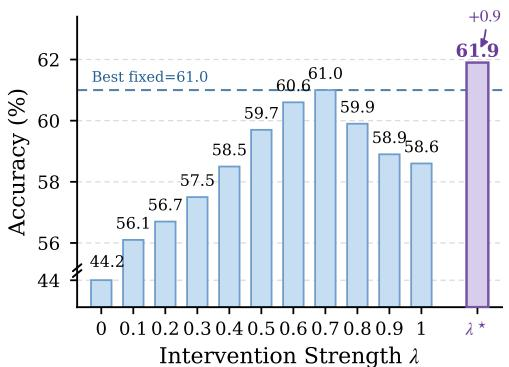

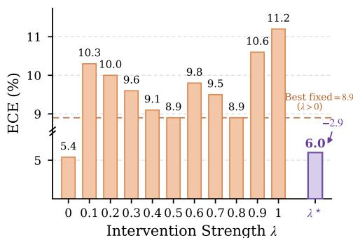  
Figure 6: Fixed vs. adaptive intervention strength. We compare fixed $\lambda \in [ 0 , 1 ]$ with the proposed sample-wise adaptive $\bar { \lambda ^ { \star } }$ . No single nonzero fixed intervention matches the accuracy–calibration trade-off of GAIN: the best fixed accuracy is 61.0%, while the lowest nonzero fixed ECE is 8.9%. The adaptive $\lambda ^ { \star }$ achieves 61.9% accuracy with 6.0% ECE.

Long-Horizon Adaptation (LHA). The long-horizon setting evaluates stability over ten repeated corruption cycles without resetting the adaptation state. As shown in Table 6, GAIN remains stable throughout all rounds, with accuracy increasing from 61.9% to 62.5–62.6% and ECE remaining around 6.5%. In contrast, DPCore shows a marked accuracy decline and PAID progressively deteriorates, while REM and ReCAP become increasingly miscalibrated despite competitive accuracy. These results show that gain-guided intervention limits the reinforcement of unreliable history induced corrections and maintains stable adaptation over long horizons.

## G.2 FURTHER ABLATION STUDY AND ANALYSIS

Proposal–Evaluator Roles. Table 7 examines the asymmetric roles of the posterior-mean proposal $\hat { \mathbf { q } } _ { t } ^ { H }$ and posterior-predictive evaluator $\bar { \mathbf q } _ { t } ^ { H }$ . Directly using either distribution as the prediction performs substantially worse than GAIN, showing that improved target-side estimation alone does not guarantee a reliable correction. In particular, using $\bar { \mathbf { q } } _ { t } ^ { H }$ directly yields 58.9% accuracy and 12.8% ECE, supporting its role as an uncertainty-aware evaluator rather than a replacement prediction. Reversing the proposal and evaluator retains competitive accuracy with 61.7% but degrades ECE from 6.0% to 8.0%. These results support the intended asymmetry of GAIN: $\hat { \mathbf { q } } _ { t } ^ { H }$ specifies the correction, while $\bar { \mathbf q } _ { t } ^ { H }$ evaluates its source-relative utility.

Fixed vs. Adaptive Intervention. Figure 6 further compares GAIN with fixed intervention strengths $\lambda \in \ [ 0 , 1 ]$ . Increasing λ initially improves accuracy by incorporating more target-side evidence, but aggressive correction eventually degrades both accuracy and calibration. No single nonzero fixed value achieves the same trade-off as the sample-wise adaptive intervention: the best fixed accuracy reaches 61.0%, while the lowest nonzero fixed ECE remains 8.9%. In contrast, GAIN achieves 61.9% accuracy with 6.0% ECE, showing that correction strength should adapt to the estimated source-relative gain rather than remain fixed across samples.

Continual Target-state Update. Table 8 first examines the reliability-weighted responsibility used for target-state updates in Eq. 75. Removing source support ζ consistently degrades all assignment variants, indicating that indiscriminately accumulating current predictions can amplify unreliable evidence over time. In particular, weighting the gain-controlled prediction by ζ improves accuracy from 59.9% to 61.9% and reduces ECE from 11.9% to 6.0%. This supports our update $\omega _ { t , b , k } = \zeta _ { t , b } p _ { t , b , k } ^ { \star } \mathrm { : \Omega }$ predictions weakly supported by the frozen source contribute less to future target statistics. Moreover, using the intervened prediction $\mathbf { p } _ { t } ^ { \star }$ outperforms updating with either the source prediction or the unfiltered target proposal, showing that gain-guided intervention also provides more reliable evidence for subsequent adaptation. We further ablate the reliability-balanced historical class prior in Eq. 87, which combines reliability-normalized support with inverse-support balancing. Reliability-normalized support favors classes whose accumulated predictions are better supported, while inverse-support balancing prevents frequently predicted classes from progressively dominating the prior. The full prior achieves the best accuracy and NLL while maintaining low ECE, reaching 61.9% accuracy, 1.9 NLL, and 6.0% ECE. Together, the reliability-weighted state update and reliability-balanced historical prior play complementary roles in limiting the reinforcement of unreliable predictions and class bias, thereby mitigating error accumulation and maintaining a stable continual target state.

Table 8: Ablation of continual target-state updates under CSC. RB denotes the reliabilitybalanced historical prior.
<table><tr><td rowspan="2">Variant</td><td rowspan="2">Assignment</td><td rowspan="2">Source Support ζ</td><td rowspan="2">Class Prior</td><td colspan="3">CSC</td></tr><tr><td>Acc.↑</td><td>ECE↓</td><td>NLL↓</td></tr><tr><td colspan="8">State Assignment</td></tr><tr><td rowspan="2">Source Assignment</td><td rowspan="2"> $\mathbf { s } _ { t }$ </td><td></td><td>RB</td><td>58.5</td><td>13.7</td><td>2.2</td></tr><tr><td>r</td><td>RB</td><td>60.8</td><td>7.2</td><td>2.0</td></tr><tr><td rowspan="2">Proposal Assignment</td><td> $\hat { \mathbf { q } } _ { t } ^ { H }$ </td><td></td><td>RB</td><td>59.6</td><td>12.2</td><td>2.2</td></tr><tr><td></td><td>r</td><td>RB</td><td>61.6</td><td>6.2</td><td>2.0</td></tr><tr><td rowspan="2">GAIN (Ours)</td><td rowspan="2"> $\mathbf { p } _ { t } ^ { \star }$ </td><td></td><td>RB</td><td>59.9</td><td>11.9</td><td>2.1</td></tr><tr><td>-√</td><td>RB</td><td>61.9</td><td>6.0</td><td>1.9</td></tr><tr><td colspan="8">Historical Class Prior</td></tr><tr><td>Uniform Prior</td><td> $\mathbf { p } _ { t } ^ { \star }$ </td><td>√</td><td> $1 / K$ </td><td>59.9</td><td>6.5</td><td>2.0</td></tr><tr><td>Reliability Only</td><td>p t</td><td>√</td><td> $\kappa _ { t , k } / { \hat { \kappa } _ { t , k } }$ </td><td>59.6</td><td>6.8</td><td>2.0</td></tr><tr><td>Balancing Only</td><td>p t</td><td>√</td><td> $1 / \hat { \kappa } _ { t , k }$ </td><td>60.5</td><td>5.5</td><td>2.0</td></tr><tr><td>GAIN (Ours)</td><td>p t</td><td>√</td><td>RB</td><td>61.9</td><td>6.0</td><td>1.9</td></tr></table>

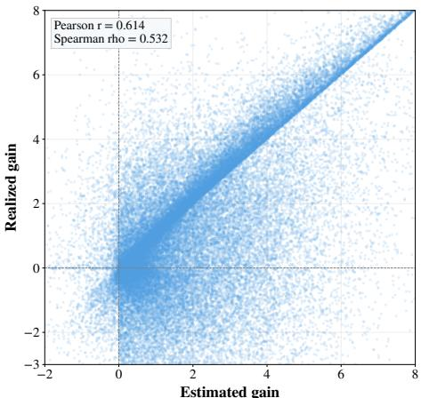

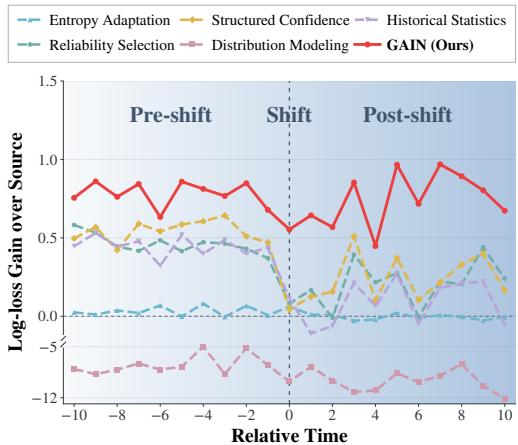  
(a) Estimated vs. Realized Correction Gain  
(b) Correction Gain Over Time  
Figure 7: Correction gain analysis. (a) The estimated posterior-predictive gain is positively associated with the realized source-relative correction gain across test samples. (b) Not every correction helps: the source-relative benefit of adaptation varies throughout the stream, and target-driven cor rections may yield limited or even negative gain.

Does Estimated Gain Reflect Correction Utility? To assess whether the posterior-predictive gain reflects correction utility, we compare $G _ { t } ^ { \mathrm { p p } }$ with the realized gain log $( \hat { q } _ { t , y _ { t } } ^ { H } / s _ { t , y _ { t } } )$ , measured using ground-truth labels $y _ { t }$ only for retrospective evaluation. This quantifies the full proposal’s log-loss improvement over the source prediction, whose conditional expectation corresponds to Eq. 5. As shown in Fig. 7a, the estimated and realized gains are positively associated across samples (Pearson $r = 0 . 6 1 4$ , Spearman $\rho = 0 . 5 3 2 )$ . Despite finite, unlabeled observations and non-stationary target shifts, $G _ { t } ^ { \mathrm { p p } }$ therefore meaningfully tracks and ranks the utility of a proposed correction. Unlike a confidence score, $G _ { t } ^ { \mathrm { p p } }$ estimates the expected benefit of a specific correction relative to retaining the source prediction. Fig. 7b further shows why this utility must be evaluated continually. Around distribution shifts, correction benefit changes substantially, with several alternative signals yielding limited or even negative gain, whereas GAIN remains consistently positive across the transition. Together, these results directly support our principle: history proposes, while gain determines whether and how strongly to intervene.

Table 9: CSC results on ImageNet-3DCC. Accuracy (Acc., %) and expected calibration error (ECE, %) with ViT-Base at severity 5. BP-free denotes backpropagation-free adaptation. Bold indicates the best results; Source is shown for reference only.
<table><tr><td rowspan=1 colspan=7> $_ \mathrm { B P - f r e e M e t r i c } |$ Depth of field        Noise      |Lighting|Weather|      VideoMethod|Near foc. Far foc.|Color quant. ISO Low light|Flash|Fog 3D |Bit err. H.265 abr. H.265 crf|XY-mot. Z-mot.|</td><td rowspan=1 colspan=1>Camera motion</td></tr><tr><td rowspan=2 colspan=1>Acc. ↑SourceECE↓</td><td rowspan=1 colspan=1>71.1  62.6</td><td rowspan=1 colspan=1>55.9  62.1 61.7</td><td rowspan=1 colspan=1>45.2</td><td rowspan=1 colspan=1>44.6</td><td rowspan=1 colspan=1>36.0  71.8   77.4</td><td rowspan=1 colspan=1>45.6 49.3</td><td rowspan=1 colspan=1>56.9</td></tr><tr><td rowspan=1 colspan=1>7.0  5.0</td><td rowspan=1 colspan=1>3.9  14.9 8.2</td><td rowspan=1 colspan=1>4.3</td><td rowspan=1 colspan=1>5.5</td><td rowspan=1 colspan=1>8.6  9.7   9.7</td><td rowspan=1 colspan=1>4.1  4.9</td><td rowspan=1 colspan=1>7.2</td></tr><tr><td rowspan=2 colspan=1>Acc. ↑|CoTTA (CVPR 2022)  x ECE↓</td><td rowspan=1 colspan=1>70.8 62.4</td><td rowspan=1 colspan=1>57.1  61.1 62.2</td><td rowspan=1 colspan=1>45.4</td><td rowspan=1 colspan=1>44.9</td><td rowspan=1 colspan=1>35.7  72.0   77.3</td><td rowspan=1 colspan=1>46.1 49.6|</td><td rowspan=1 colspan=1>57.0</td></tr><tr><td rowspan=1 colspan=1>6.1  4.8</td><td rowspan=1 colspan=1>3.8  8.1 2.7</td><td rowspan=1 colspan=1>8.0</td><td rowspan=1 colspan=1>4.8</td><td rowspan=1 colspan=1>18.3  3.3   3.7</td><td rowspan=1 colspan=1>15.0 18.5</td><td rowspan=1 colspan=1>8.1</td></tr><tr><td rowspan=2 colspan=1>Acc. ↑|ViDA (ICLR 2024)    x ECE↓</td><td rowspan=1 colspan=1>70.8  62.3</td><td rowspan=1 colspan=1>57.2 60.962.2</td><td rowspan=1 colspan=1>45.3</td><td rowspan=1 colspan=1>44.7</td><td rowspan=1 colspan=1>35.9  72.3   77.5</td><td rowspan=1 colspan=1>46.5 50.2</td><td rowspan=1 colspan=1>57.1</td></tr><tr><td rowspan=1 colspan=1>6.6  4.8</td><td rowspan=1 colspan=1>4.1  12.4 7.2</td><td rowspan=1 colspan=1>4.3</td><td rowspan=1 colspan=1>4.8</td><td rowspan=1 colspan=1>10.5  7.3   6.9</td><td rowspan=1 colspan=1>4.9  7.1</td><td rowspan=1 colspan=1>6.7</td></tr><tr><td rowspan=4 colspan=1>Acc. ↑|REM (ICML 2025)    x ECE↓</td><td rowspan=1 colspan=1>74.9  68.0</td><td rowspan=1 colspan=1>61.8 65.6 70.8</td><td rowspan=1 colspan=1>49.7</td><td rowspan=1 colspan=1>49.5</td><td rowspan=1 colspan=1>31.2  63.9   77.3</td><td rowspan=1 colspan=1>49.0 57.6</td><td rowspan=1 colspan=1>|60.0</td></tr><tr><td rowspan=1 colspan=1>3.4  4.5</td><td rowspan=1 colspan=1>6.1  5.0 4.8</td><td rowspan=1 colspan=1>10.7</td><td rowspan=1 colspan=1>8.6</td><td rowspan=1 colspan=1>36.6  15.3   6.2</td><td rowspan=1 colspan=1>16.8 14.7</td><td rowspan=1 colspan=1>11.1</td></tr><tr><td rowspan=4 colspan=1>ECE↓Acc. ↑|PAID (NeurIPS 2025)  xECE↓</td><td rowspan=1 colspan=1>74.5 67.7</td><td rowspan=1 colspan=1>62.1  63.069.3</td><td rowspan=1 colspan=1>48.1</td><td rowspan=1 colspan=1>41.2</td><td rowspan=1 colspan=1>34.4  74.0   78.3</td><td rowspan=1 colspan=1>48.8 53.6</td><td rowspan=1 colspan=1>59.6</td></tr><tr><td rowspan=1 colspan=1>12.6  10.9</td><td rowspan=1 colspan=1>10.4  11.5 11.6</td><td rowspan=1 colspan=1>6.7</td><td rowspan=1 colspan=1>4.8</td><td rowspan=1 colspan=1>5.9  12.7   10.5</td><td rowspan=1 colspan=1>5.9  7.6</td><td rowspan=1 colspan=1>9.2</td></tr><tr><td rowspan=1 colspan=1>73.3  65.4</td><td rowspan=1 colspan=1>58.4  56.2 65.2</td><td rowspan=1 colspan=1>47.7</td><td rowspan=1 colspan=1>46.5</td><td rowspan=1 colspan=1>33.5  68.8   74.1</td><td rowspan=1 colspan=1>43.6 54.6</td><td rowspan=1 colspan=1>|57.3</td></tr><tr><td rowspan=1 colspan=1>2.9  4.8</td><td rowspan=1 colspan=1>6.7  8.1  6.1</td><td rowspan=1 colspan=1>9.6</td><td rowspan=1 colspan=1>9.5</td><td rowspan=1 colspan=1>14.7  4.1   3.3</td><td rowspan=1 colspan=1>13.2 8.4</td><td rowspan=1 colspan=1>7.6</td></tr><tr><td rowspan=2 colspan=1>DOTA (NeurIPS 2025) √ Acc. ↑ECE↓</td><td rowspan=1 colspan=1>71.1  63.2</td><td rowspan=1 colspan=1>57.2 63.3 63.9</td><td rowspan=1 colspan=1>46.6</td><td rowspan=1 colspan=1>45.6</td><td rowspan=1 colspan=1>36.3  74.1   78.8</td><td rowspan=1 colspan=1>48.2 51.0</td><td rowspan=1 colspan=1>58.3</td></tr><tr><td rowspan=1 colspan=1>24.4  32.0</td><td rowspan=1 colspan=1>37.7  32.432.5</td><td rowspan=1 colspan=1>48.0</td><td rowspan=1 colspan=1>48.8</td><td rowspan=1 colspan=1>58.3  24.1   19.9</td><td rowspan=1 colspan=1>47.8 45.5</td><td rowspan=1 colspan=1>37.6</td></tr><tr><td rowspan=2 colspan=1>√ Acc. ↑GAIN (Ours)ECE ↓</td><td rowspan=1 colspan=1>71.8  64.7</td><td rowspan=1 colspan=1>59.5  65.9 66.5</td><td rowspan=1 colspan=1>48.2</td><td rowspan=1 colspan=1>46.8</td><td rowspan=1 colspan=2>40.3  74.8   78.8  52.4 56.5</td><td rowspan=1 colspan=1>|60.5</td></tr><tr><td rowspan=1 colspan=1>3.1  7.2</td><td rowspan=1 colspan=1>7.8  6.4 6.5</td><td rowspan=1 colspan=1>8.4</td><td rowspan=1 colspan=1>6.9</td><td rowspan=1 colspan=2>6.2   6.8   7.0   8.2  8.3</td><td rowspan=1 colspan=1>6.9</td></tr></table>

Table 10: CDC results on ImageNet-3DCC. Accuracy $( \mathrm { A c c . } , \% )$ and expected calibration error (ECE,%) with ViT-Base at severity 5. BP-free denotes backpropagation-free adaptation. Bold indicates the best results; Source is shown for reference only. Our results are averaged over five runs.
<table><tr><td rowspan="2">Method</td><td rowspan="2">BP-free Metric!</td><td rowspan="2"></td><td colspan="2">Depth of field</td><td colspan="3">Noise</td><td colspan="2">|Lighting|Weather|</td><td colspan="3">Video</td><td colspan="2">|Camera motion |</td><td rowspan="2">Avg.</td></tr><tr><td colspan="2">[Near foc. Far foc.|Color quant. ISO Low light|</td><td></td><td></td><td></td><td>Flash</td><td>|Fog 3D |Bit err. H.265 abr. H.265 crf|XY-mot. Z-mot.|</td><td></td><td></td><td></td><td></td><td></td></tr><tr><td rowspan="2">Source</td><td rowspan="2"></td><td rowspan="2">Acc. ↑ ECE↓</td><td>71.1 7.0</td><td>62.6 5.0</td><td>55.9 3.9</td><td>62.1 14.9</td><td>61.7 8.2</td><td>45.2 4.3</td><td>44.6 5.5</td><td>36.0 8.6</td><td>71.8 9.7</td><td>77.4 9.7</td><td>45.6 4.1</td><td>49.3 4.9</td><td>|56.9 7.2</td></tr><tr><td></td><td></td><td></td><td></td><td></td><td></td><td></td><td></td><td></td><td></td><td></td><td></td><td></td></tr><tr><td rowspan="2">CoTTA (CVPR 2022)</td><td rowspan="2">x</td><td>Acc. ↑| ECE↓</td><td>71.1 3.0</td><td>62.4 5.7</td><td>57.1 6.7</td><td>61.9 3.4</td><td>62.4 3.7</td><td>45.0</td><td>45.2</td><td>35.7</td><td>71.9</td><td>77.4</td><td>45.5</td><td>49.6</td><td>|57.1</td></tr><tr><td>71.1</td><td></td><td></td><td></td><td></td><td></td><td>14.3</td><td>4.8</td><td>15.9</td><td>3.1</td><td>5.0</td><td>9.1</td><td>10.1</td><td>7.1</td></tr><tr><td rowspan="2">ViDA (ICLR 2024)</td><td rowspan="2">x</td><td>Acc. ↑| ECE↓</td><td>5.6</td><td>62.5 4.7</td><td>57.2 3.9</td><td>61.0 10.5</td><td>62.2 7.5</td><td>45.3 5.2</td><td>44.7 4.3</td><td>36.0</td><td>72.1</td><td>77.4</td><td>45.9</td><td>49.9</td><td>57.1 6.5</td></tr><tr><td>74.3</td><td></td><td></td><td></td><td></td><td></td><td></td><td></td><td>10.4</td><td>7.8</td><td>8.4</td><td>4.4</td><td>5.7</td><td></td></tr><tr><td rowspan="2">REM (ICML 2025)</td><td rowspan="2">x</td><td>Acc. ↑| ECE↓</td><td></td><td>65.2 3.8</td><td>59.2 9.9</td><td>63.8 7.4</td><td>68.0 6.8</td><td>42.7 31.2</td><td>43.7 30.7</td><td>33.3</td><td>73.3</td><td>76.6</td><td>52.1</td><td>54.0</td><td>|58.9</td></tr><tr><td>5.0 72.7</td><td></td><td></td><td></td><td></td><td></td><td></td><td></td><td>28.4</td><td>7.0</td><td>6.0</td><td>14.7</td><td>15.2</td><td>13.8</td></tr><tr><td rowspan="2">DPCore (ICML 2025)</td><td rowspan="2">x</td><td>Acc. ↑| ECE↓</td><td></td><td>63.8 10.3</td><td>60.2 11.6</td><td>60.2 12.5</td><td>66.7 11.6</td><td>48.4 6.2</td><td>41.6 4.8</td><td>33.6 7.2</td><td>74.7</td><td>78.9</td><td>49.6</td><td>51.9 8.2</td><td>58.5 9.6</td></tr><tr><td>12.1 70.2</td><td>61.2</td><td></td><td></td><td></td><td></td><td></td><td></td><td></td><td>12.3</td><td>12.3</td><td>6.5</td><td></td><td></td></tr><tr><td rowspan="2">PAID (NeurIPS 2025)</td><td rowspan="2">x</td><td>Acc. ↑| ECE↓</td><td></td><td>6.6</td><td>54.9 9.3</td><td>54.2 9.2</td><td>64.3 6.1</td><td>45.2 12.1</td><td>45.4 10.8</td><td>34.1 16.2</td><td>71.4 3.5</td><td>77.0 2.8</td><td>46.8 12.4</td><td>53.7 9.5</td><td>56.5 8.6</td></tr><tr><td>4.4 72.2</td><td>63.9</td><td>57.8</td><td>63.7</td><td></td><td></td><td></td><td></td><td></td><td></td><td></td><td></td><td></td><td>|58.3</td></tr><tr><td rowspan="2">DOTA (NeurIPS 2025)</td><td rowspan="2">√</td><td>Acc. ↑ ECE↓ 24.8</td><td></td><td>32.9</td><td>38.6</td><td>32.6</td><td>63.6 32.0</td><td>46.6 48.4</td><td>45.4 49.7</td><td>36.4 57.1</td><td>73.8 24.1</td><td>77.8 19.7</td><td>47.6 47.0</td><td>50.2 44.3</td><td>37.6</td></tr><tr><td>72.9</td><td></td><td></td><td></td><td></td><td></td><td></td><td></td><td></td><td></td><td></td><td></td><td></td><td></td></tr><tr><td rowspan="2">GAIN (Ours)</td><td rowspan="2">√</td><td>Acc. ↑</td><td>±0.26</td><td>64.9 ±0.86</td><td>59.2 ±1.39</td><td>65.6 ±0.44</td><td>66.2 ±0.33</td><td>47.4 ±0.77</td><td>46.5 ±0.38</td><td>39.9 ±0.27</td><td>73.8 ±0.57</td><td>78.3 ±0.29</td><td>52.2 ±0.38</td><td>54.4 ±0.70</td><td>|60.1 ±0.09</td></tr><tr><td>ECE↓</td><td>6.7 ±0.51</td><td>6.9 ±1.84</td><td>7.5 ±0.93</td><td>6.7 ±0.52</td><td>6.3</td><td>8.0</td><td>7.5 ±0.25</td><td>7.4 ±0.81</td><td>5.7</td><td>6.7</td><td>7.6</td><td>8.1</td><td>7.1</td></tr></table>

## G.3 MORE RESULTS ON IMAGENET-3DCC

Tables 9–12 further evaluate GAIN on ImageNet-3DCC under CSC, CDC, MDS, and LHA. Compared with ImageNet-C, ImageNet-3DCC introduces more diverse shifts involving depth of field, lighting and weather, video compression, and camera motion, providing a complementary test of adaptation under heterogeneous distribution changes. GAIN achieves the highest average accuracy under CSC (60.5%), CDC (60.1%), and MDS (69.6%), while maintaining competitive calibration. The long-horizon setting further stresses error accumulation over 10 repeated corruption cycles without reset. GAIN remains stable throughout the stream, maintaining 60.5–60.8% accuracy with an average ECE of 8.2%, whereas several baselines exhibit substantial accuracy degradation or calibration drift. These results indicate that gain-guided intervention generalizes beyond ImageNet-C to more diverse corruption mechanisms, dynamic and mixed shifts, and prolonged continual adaptation.

## G.4 EVALUATION UNDER TEST-TIME ADAPTATION

Beyond continual test-time adaptation, we further evaluate GAIN under standard test-time adaptation (TTA) to examine its generalization to non-continual domain shifts. Following prior TTA evaluation, we consider shifts from ImageNet to ImageNet-R, ImageNet-V2, and ImageNet-Sketch, and compare against representative adaptation methods. Table 13 reports the top-1 accuracy on each target domain and their average. GAIN achieves the highest mean accuracy of 63.4%, with the best performance on ImageNet-V2 and ImageNet-Sketch, demonstrating that the proposed gain-guided intervention remains effective beyond continual adaptation.

Table 11: MDS results on ImageNet-3DCC. Accuracy (Acc., %) and expected calibration error (ECE, %) across severity levels 5–1. BP-free denotes backpropagation-free adaptation. Bold indicates the best results; Source is shown for reference only. Our results are averaged over five runs.
<table><tr><td>Method</td><td>BP-free</td><td>Metric</td><td>Level 5</td><td>Level 4</td><td>Level 3</td><td>Level 2</td><td>Level 1</td><td>Avg.</td></tr><tr><td>Source</td><td>一</td><td>Acc. ↑ ECE↓</td><td>56.9 4.3</td><td>64.1 5.9</td><td>69.4 6.7</td><td>73.6 7.7</td><td>76.6 8.3</td><td>68.1 6.6</td></tr><tr><td>CoTTA (CVPR 2022)</td><td>x</td><td>Acc. ↑ ECE↓</td><td>57.1 4.8</td><td>64.3 3.3</td><td>69.6 2.7</td><td>73.8 2.2</td><td>76.7 2.2</td><td>68.3 3.0</td></tr><tr><td>ViDA (ICLR 2024)</td><td>x</td><td>Acc. ↑ ECE↓</td><td>57.2 3.5</td><td>64.3 4.2</td><td>69.6 5.0</td><td>73.7 5.9</td><td>76.7 6.4</td><td>68.3 5.0</td></tr><tr><td>REM (ICML 2025)</td><td>x</td><td>Acc. ↑ ECE↓</td><td>58.3 6.4</td><td>65.4 6.8</td><td>70.7 7.1</td><td>74.8 7.7</td><td>77.6 8.1</td><td>69.4 7.2</td></tr><tr><td>DPCore (ICML 2025)</td><td>x</td><td>Acc. ↑ ECE↓</td><td>57.7 7.5</td><td>64.9 10.0</td><td>69.3 9.8</td><td>73.2 9.4</td><td>76.3 9.6</td><td>68.3 9.3</td></tr><tr><td>PAID (NeurIPS 2025)</td><td>x</td><td>Acc. ↑ ECE↓</td><td>55.1 6.5</td><td>62.5 4.8</td><td>68.2 3.8</td><td>72.8 2.9</td><td>76.2 2.2</td><td>67.0 4.1</td></tr><tr><td>DOTA (NeurIPS 2025)</td><td>√</td><td>Acc. ↑ ECE↓</td><td>57.0 36.9</td><td>64.1 31.0</td><td>69.5 26.6</td><td>73.6 23.0</td><td>76.6 20.6</td><td>68.1 27.6</td></tr><tr><td>GAIN (Ours)</td><td>√</td><td>Acc. ↑ ECE↓</td><td>58.9 ± 0.07 6.2 ± 0.10</td><td>65.8± 0.08 6.7 ± 0.09</td><td>70.8 ± 0.05 7.0 ± 0.10</td><td>74.9 ± 0.05 7.0±0.09</td><td>77.5±0.05 7.2± 0.04</td><td>69.6 ± 0.04 6.8±0.07</td></tr></table>

Table 12: LHA results on ImageNet-3DCC. Accuracy (Acc., %) and expected calibration error (ECE, %) over 10 repeated corruption cycles (R1–R10) with ViT-Base at severity 5. BP-free denotes backpropagation-free adaptation. Bold indicates the best results; Source is shown for reference only.
<table><tr><td>Method</td><td>BP-free</td><td>Metric</td><td>R1</td><td>R2</td><td>R3</td><td>R4</td><td>R5</td><td>R6</td><td>R7</td><td>R8</td><td>R9</td><td>R10</td><td>Avg.</td></tr><tr><td>Source</td><td></td><td>Acc. ↑ ECE↓</td><td>56.9 7.2</td><td>56.9 7.2</td><td>56.9 7.2</td><td>56.9 7.2</td><td>56.9 7.2</td><td>56.9 7.2</td><td>56.9 7.2</td><td>56.9 7.2</td><td>56.9 7.2</td><td>56.9 7.2</td><td>56.9 7.2</td></tr><tr><td>CoTTA (CVPR 2022)</td><td>x</td><td>Acc. ↑ ECE↓</td><td>57.0 8.1</td><td>57.0 17.3</td><td>57.1 23.8</td><td>56.9 27.4</td><td>56.8 29.5</td><td>56.8 31.1</td><td>56.9 32.1</td><td>57.1 33.2</td><td>57.1 33.7</td><td>57.0 34.3</td><td>57.0 27.0</td></tr><tr><td>ViDA (ICLR 2024)</td><td>x</td><td>Acc. ↑ ECE↓</td><td>57.1 6.7</td><td>57.9 6.0</td><td>58.3 6.8</td><td>58.6 8.9</td><td>58.8 11.2</td><td>58.9 13.1</td><td>59.0 14.7</td><td>59.0 16.1</td><td>59.1 17.2</td><td>59.1 18.1</td><td>58.6 11.9</td></tr><tr><td>REM (ICML 2025)</td><td>x</td><td>Acc. ↑ ECE↓</td><td>60.0 11.1</td><td>58.1 18.1</td><td>58.7 19.7</td><td>58.1 21.7</td><td>56.8 24.4</td><td>50.5 33.5</td><td>36.7 51.3</td><td>0.3 99.5</td><td>0.1 99.9</td><td>0.1 99.9</td><td>37.9 47.9</td></tr><tr><td>DPCore (ICML 2025)</td><td>x</td><td>Acc. ↑ ECE↓</td><td>59.6 9.2</td><td>59.4 8.3</td><td>58.5 8.5</td><td>58.4 8.8</td><td>58.1 9.0</td><td>57.7 9.0</td><td>57.5 9.3</td><td>57.2 9.5</td><td>56.8 9.6</td><td>56.6 9.6</td><td>58.0 9.1</td></tr><tr><td>PAID (NeurIPS 2025)</td><td>x</td><td>Acc. ↑ ECE↓</td><td>57.3 7.6</td><td>55.1 8.1</td><td>52.8 8.3</td><td>51.0 8.4</td><td>49.4 8.6</td><td>48.4 8.8</td><td>47.1 9.1</td><td>46.0 9.4</td><td>45.1 9.7</td><td>44.2 9.8</td><td>49.6 8.8</td></tr><tr><td>DOTA (NeurIPS 2025)</td><td>√</td><td>Acc. ↑ ECE↓</td><td>58.3 37.6</td><td>58.5 38.7</td><td>58.5 38.8</td><td>58.5 38.8</td><td>58.5 38.8</td><td>58.5 38.9</td><td>58.5 38.9</td><td>58.4 38.9</td><td>58.4 38.9</td><td>58.4 38.9</td><td>58.4 38.7</td></tr><tr><td>GAIN (Ours)</td><td>√</td><td>Acc.↑ ECE↓</td><td>60.5 6.9</td><td>60.8 8.0</td><td>60.8 8.2</td><td>60.8 8.3</td><td>60.8 8.3</td><td>60.8 8.4</td><td>60.8 8.4</td><td>60.8 8.4</td><td>60.8 8.4</td><td>60.7 8.4</td><td>60.7 8.2</td></tr></table>

Table 13: TTA results under domain shifts. Top-1 accuracy on ImageNet-R, ImageNet-V2, and ImageNet-Sketch. BP-free denotes backpropagation-free adaptation. Bold indicates the best results.
<table><tr><td>Method</td><td>BP-free</td><td>ImageNet-R</td><td>ImageNet-V2</td><td>ImageNet-Sketch</td><td>Avg.</td></tr><tr><td>Source</td><td>一</td><td>59.5</td><td>75.4</td><td>44.9</td><td>59.9</td></tr><tr><td>Tent (ICLR 2021)</td><td>x</td><td>63.9</td><td>75.2</td><td>49.1</td><td>62.7</td></tr><tr><td>CoTTA (CVPR 2022)</td><td>x</td><td>63.5</td><td>75.4</td><td>50.0</td><td>63.0</td></tr><tr><td>SAR (ICLR 2023)</td><td>x</td><td>63.3</td><td>75.1</td><td>48.7</td><td>62.4</td></tr><tr><td>FOA (ICML 2024)</td><td>√</td><td>63.8</td><td>75.4</td><td>49.9</td><td>63.0</td></tr><tr><td>REM (ICML 2025)</td><td>x</td><td>64.3</td><td>75.2</td><td>49.7</td><td>63.1</td></tr><tr><td>GAIN (Ours)</td><td>✓</td><td>63.0</td><td>75.8</td><td>51.5</td><td>63.4</td></tr></table>