# NRF-GS: Neural Residual Fields for Expressive and Compact Gaussian Splatting

Pratik Singh Bisht Computer Graphics Group University of Siegen pratik.bisht@uni-siegen.de

Andreas Kolb Computer Graphics Group University of Siegen andreas.kolb@uni-siegen.de

## Abstract

We revisit the role of appearance modeling in 3D Gaussian Splatting (3DGS) and show that limited expressiveness in view-dependent reflectance is a key driver of representation redundancy. In standard 3DGS, low-order spherical harmonics (SH) are used, restricting the splats’ ability to model high-frequency directional effects, which is typically compensated by increasing the number of splats. We propose NRF-GS: Neural Residual Fieldsfor Gaussian Splatting, a hybrid representation that replaces per-splat SH-bases with a shared neural residual field. Each Gaussian encodes a compact set of appearance features and a lambertian base color, while a lightweight global scene-level MLP predicts view-dependent residuals conditioned on viewing direction, distance, and per-splat features. This formulation enhances directional reflectance modeling by combining diffuse per-splat reflectance representations with a shared global function for high-frequency details, enabling both higher expressiveness and parameter sharing across splats. Our key insight is that by accurately capturing high-frequency directional reflectance, especially in specular regions, the GS-representation becomes more expressive, reducing the need for geometrically redundant splats. As a result, NRF-GS achieves comparable or better rendering quality while reducing the number of Gaussians by up to 50%, and produces visibly improved specular and high-frequency details.

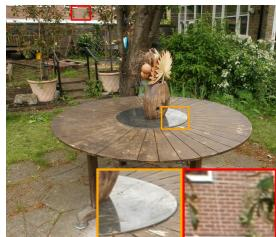  
(a) GT(PSNR/Points)

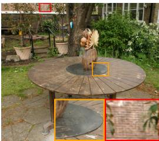  
(b) 3DGS (28.55/5.8M)

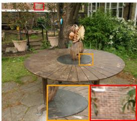  
(c) VDGS (28.76/5.7M)

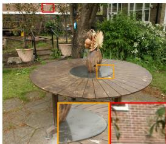  
(d) Ours (29.75/2.2M)  
Figure 1: Novel view from Mip-NeRF 360 dataset - Garden scene. Our method (d) achieves better specular representation on the foreground table as well as sharper details on the background wall with significantly lower number of points compared to other methods.

## 1 Introduction

Novel view synthesis has seen rapid progress with the emergence of radiance-field-based and explicit primitive-based scene representations [1, 12, 18]. Among these, 3D Gaussian Splatting (3DGS) [12] has recently gained significant attention due to its favorable balance between rendering quality, training efficiency, and real-time performance. By representing a scene as a set of anisotropic Gaussians and rendering them via differentiable splatting, 3DGS avoids expensive volumetric sampling while retaining high-fidelity reconstruction. This combination of explicit geometry and efficient rendering makes it particularly attractive for interactive view synthesis and large-scale scene reconstruction.

A central component of 3DGS is its appearance model, where each Gaussian independently represents the view-dependent reflectance using low-order spherical harmonic (SH) coefficients [19]. Although lightweight and efficient, SH coefficients are modeled per splat (commonly degree 3 in standard settings), which poses certain shortcomings: First, the expressiveness of low-order SH is limited for capturing complex view-dependent effects [29, 30]. Second, the limited expressiveness is partially compensated for by using more splats to better represent the high-frequency directional effects. Previous works [17, 29, 30, 34] partially address this by replacing the analytical basis with a neural one, but largely entangle geometry and appearance attributes in their neural formulation.

In this work, we propose Neural Residual Fields for Gaussian Splatting (NRF-GS), in which we deliberately split the representation of geometry and view-dependent reflectance. We, therefore, create a hybrid formulation that retains explicit Gaussian geometry while shifting view-dependent appearance modeling to a shared neural field which enables us to capture complex directional effects while maintaining a compact per-splat geometric representation with significantly lower splat count and competitive quality. Each splat is represented by a diffuse base color and latent features, while a lightweight scene-level network conditioned on frequency-encoded viewing direction, splat distance, and per-splat features predicts a view-dependent residual reflectance. This shared network introduces a scene-level appearance prior, enabling more expressive splats and a more efficient distribution. By effectively capturing high-frequency directional effects through the per-splat features and weighted frequency formulation of scene-level MLP, each Gaussian becomes more expressive, reducing the need for redundant splats. Based on this, our key insight is that appearance modeling plays a key role not only in rendering quality but also in controlling spatial complexity in Gaussian splatting.

In summary, this paper makes the following contributions:

1. We propose NRF-GS, a hybrid representation that models view-dependent appearance using a shared neural residual field conditioned on viewing direction, camera-splat distance, and compact per-splat features.

2. We introduce a frequency-decomposed network design, showing that low- and high-frequency components should be treated differently by selectively weighted high-frequency modeling.

3. Through controlled simulations, we demonstrate that a feature + MLP formulation is more expressive than low-order, analytical spherical harmonics under a matched parameter budget.

4. We show that improved shared appearance modeling leads to more compact scene representations, reducing Gaussian count by up to 50% while maintaining rendering quality.

Our results suggest that residual appearance modeling is a critical and under-explored direction for improving expressiveness in Gaussian splatting, and that combining explicit splat-based rendering with shared neural fields provides a simple and effective path toward more compact and improved scene representations.

## 2 Background and Related Works

Radiance Fields and Explicit Gaussian Representations. Neural Radiance Fields (NeRF) [18] introduced a fully neural representation for novel view synthesis followed by extensive work focused on improving the efficiency and scalability of NeRF. Mip-NeRF [2] addresses aliasing through multiscale sampling, while Plenoxels [7] replace neural networks with sparse voxel grids storing density and SH coefficients [19]. Instant-NGP [21] accelerates training via multi-resolution hash encoding, and related approaches like [6] explore structured representation such as tensor decomposi tions. Neural Reflectance Fields [4] explicitly model view-dependent appearance, while atlas-based representations [11, 26] learn spatially consistent mappings to better capture appearance variations. To overcome the cost of volumetric rendering, 3D Gaussian Splatting (3DGS) [12] represents scenes as collections of anisotropic Gaussians rendered via differentiable splatting [36], enabling real-time performance while maintaining high reconstruction quality. Subsequent work [8, 9, 10, 22, 35] extends this paradigm to improve geometric fidelity, representation, and stability. Recent hybrid approaches [24, 28] further incorporate neural fields into explicit representations, but primarily couple geometry and appearance or focus on neural texture generation.

Alternative Analytic Directional Bases. Other works attempt to improve the directional appearance model of GS by replacing SH with more expressive analytic functions. SG-splatting [29] and ARS-GS [31], e.g., replaces SH [19] with Spherical Gaussian (SG) (or Anisotropic-SG) [32] bases for representing directional color variation, which provide a low parameter analytic representation that can capture angular reflectance patterns more flexibly, but remains limited for high-frequency directional reflectance since they use fixed 3 orthogonal SG lobes (equivalent to degree 3 SH).

Neural Appearance and Feature-Based Gaussian Representations. Some works augment GS with neural networks or learned feature descriptors to improve appearance modeling. Viewing Direction GS (VDGS) [17] combines explicit Gaussian splats with a NeRF-style MLP and hash-encoded Gaussian means and camera position to predict view-dependent reflectance, while neural prediction remains tightly coupled to raw Gaussian parameters and local splat attributes.

Feature-3DGS [33] augments each splat with semantic feature embeddings aligned with 2D foundation models ( DINO [5], CLIP [23] and LSeg [15]), enabling downstream tasks, but still keeping the SH based appearance. SpecGaussian with Latent Features (Latent-SpecGS) [30] introduces a universal latent neural descriptor that are decoded by CNNs into diffuse and specular images separately. It is explicitly appearance-oriented, but its diffuse/specular decomposition and feature-map decoding are performed in image-space rather than at splat level.

Gaussian Splatting with Neural Basis (GSNB) [34] proposes to model view-dependent appearance using a learned set of basis functions, where per-Gaussian coefficients are combined with shared neural basis representations to produce directional color. This formulation increases the expressiveness of the appearance model by extending the degree 3 SH with additional neural information, but it is memory intensive due to the additional basis functions for higher frequency details

NRF-GS differs from the approaches described above in where and how appearance capacity is introduced. Unlike analytic bases(SH/SG), it replaces per-splat directional bases with a shared neural residual field. Unlike VDGS/GSNB, which condition on raw Gaussian parameters or add neural basis extensions, NRF-GS uses learned appearance features and a lightweight scene-level MLP to predict residual color and opacity directly at the splat level. Unlike Latent-SpecGS, which decodes diffuse and specular components in image space, NRF-GS remains integrated into the splatting pipeline. Specifically, our design decouples view-dependent appearance from the full Gaussian parameterization, improves high-frequency reflectance modeling, and reduces the number of splats.

## 3 Method

Our Neural Residual Fields for Gaussian Splatting (NRF-GS) combines the standard spatial representation using Gaussians (see Sec. 3.1) and replaces the Spherical Harmonics (SH) part in the appearance model with a learned, shared Neural Residual Field (NRF); see Sec. 3.2. One key component of NRF is the decomposition of directional encoding into low- and high-frequency components, which is depicted in Sec. 3.3.

## 3.1 3D Gaussian Splatting in a Nutshell

In order to establish a common notational basis, we will briefly recap the standard 3D Gaussian Splatting (3DGS) pipeline; for further details, refer to [12].

3DGS represents a scene as a set of N anisotropic Gaussian splats $\mathcal { G } _ { i } = \{ \mathbf { x } _ { i } , \pmb { \Sigma } _ { i } , { \alpha } _ { i } ^ { \mathrm { b a s e } } , \mathbf { c } _ { i } ^ { \mathrm { b a s e } } \}$ , where Gaussian splat index $i \in \{ 1 , \ldots , N \}$ , Gaussian position (i.e., mean) $\mathbf { x } _ { i } \in \mathbb { R } ^ { 3 }$ , covariance $\mathbf { \bar { E } } _ { i } \in \mathbb { R } ^ { 3 \times 3 }$ base opacity $\alpha _ { i } ^ { \mathrm { b a s e } } \in [ 0 , 1 ]$ , and view-independent base color $\mathbf { c } _ { i } ^ { \mathrm { { b a s e } } }$ . The directional appearance, i.e., view-dependent reflectance, is modeled using spherical harmonics (SH) [19]:

$$
\mathbf { c } _ { i } ( \mathbf { d } ) = \sum _ { l = 1 } ^ { L } \sum _ { m = - l } ^ { l } \mathbf { w } _ { i , l m } Y _ { l m } ( \mathbf { d } ) ,\tag{1}
$$

where unit sphere viewing direction d $\in \mathbb { S } ^ { 2 }$ , SH basis function $Y _ { l m } ( \cdot )$ of degree l and order $m ,$ and per-Gaussian coefficients $\mathbf { w } _ { i , l m } \in \mathbb { R } ^ { 3 }$ (one set per color channel) which are learned. In practice, a low-order expansion (e.g., max SH degree, $L = 3 )$ is used for efficiency, resulting in $( L + 1 ) ^ { 2 }$ basis functions per channel. In total, there are 48 parameters used to encode view-dependent reflectance information and a front-to-back accumulation of the individual splat contributions per pixel. For a given splat $i ,$ the estimated color is computed as $\mathbf { c } _ { i } = \mathbf { c } _ { i } ^ { \mathrm { b a s e } } + \mathbf { c } _ { i } ( \mathbf { d } )$ , where $\mathbf { c } _ { i } ^ { \mathrm { { b a s e } } }$ is the $l = 0$ dc component.

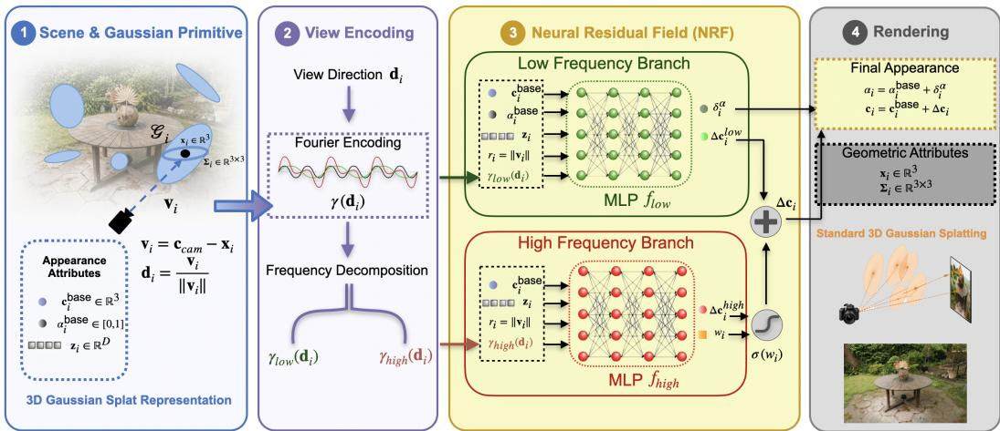  
Figure 2: NRF-GS architecture. Per Gaussian geometric attributes $\left( \mathbf { x } _ { i } , \pmb { \Sigma } _ { i } \right)$ and appearance attributes $( \mathbf { c } _ { i } ^ { \mathrm { b a s e } } , \alpha _ { i } ^ { \mathrm { b a s e } }$ , and a latent feature $\mathbf { z } _ { i } )$ . The viewing direction $\mathbf { d } _ { i }$ is frequency-encoded and decomposed into low $( \gamma _ { \mathrm { l o w } } ( \mathbf { d } _ { i } ) )$ ) and high-frequency $( \gamma _ { \mathrm { h i g h } } ( \mathbf { d } _ { i } ) )$ components. Two MLP branches $( f _ { \mathrm { l o w } } , \ f _ { \mathrm { h i g h } } )$ predict a low-frequency residual color and opacity residual $( \Delta \mathbf { c } _ { i } ^ { \mathrm { l o w } } , \delta _ { i } ^ { \alpha } )$ and a highfrequency color residual with a learned modulation weight $( \Delta \mathbf { c } _ { i } ^ { \mathrm { h i g h } } , w _ { i } )$ . The final color and opacity are then rendered using the unchanged standard Gaussian splatting rasterizer.

3DGS utilizes a differentiable rasterization applied to the splat representation, which incorporates an efficient, tile-based binning and sorting on GPU as well as front-to-back compositing using the splat’s estimated color $\mathbf { c } _ { i }$ and (base-)opacity $\alpha _ { i } ^ { \mathrm { b a s e } }$ as follows:

$$
C = \sum _ { i = 1 } ^ { N } T _ { i } \alpha _ { i } ^ { \mathrm { b a s e } } \mathbf { c } _ { i } , \quad T _ { i } = \prod _ { j < i } ( 1 - \alpha _ { j } ^ { \mathrm { b a s e } } ) ,\tag{2}
$$

where $T$ is the remaining transparency for the splats behind the current one. Note that we deliberately use $\alpha _ { i } ^ { \mathrm { b a s e } }$ here for 3DGS, as our NRF-GS approach does not use only the base opacity; see Sec. 3.3.

Further components of the 3DGS pipeline consist of densification and pruning heuristics to adapt the local splat density and to remove outliers during the learning process [12]. Our NRF-GS approach only modifies the color and density representation and estimation in the rendering state and leaves all other stages unchanged. This ensures that any observed improvements are attributable solely to the proposed appearance modeling, while being fully compatible with existing 3DGS implementations.

## 3.2 Shared Neural Residual Fields

To improve the limited ability of existing GS-methods in efficiently representing high-frequency direction reflectance, e.g., of a low-order analytical basis function, NRF-GS replaces the per-Gaussian SH representation (Eq. 1) with a shared neural residual formulation (Fig. 2) while retaining explicit geometry representation via splats.

In NRF-GS, each Gaussian is represented as $\mathcal { G } _ { i } = \left\{ \mathbf { x } _ { i } , \pmb { \Sigma } _ { i } , \alpha _ { i } ^ { \mathrm { b a s e } } , \mathbf { c } _ { i } ^ { \mathrm { b a s e } } , \mathbf { z } _ { i } \right\}$ , where $\mathbf { c } _ { i } ^ { \mathrm { b a s e } } \in \mathbb { R } ^ { 3 }$ and $\alpha _ { i } ^ { \mathrm { b a s e } } \in [ 0 , 1 ]$ represent base color and base opacity, and $\mathbf { z } _ { i } \in \mathbb { R } ^ { D }$ is a learned latent feature that captures the appearance-related properties of the splat. The final color is modeled as: $\mathbf { c } _ { i } = \mathbf { c } _ { i } ^ { \mathrm { b a s e } } + \Delta \mathbf { c } _ { i }$ where $\Delta \mathbf { c } _ { i }$ is a residual predicted from the Neural Residual Field (NRF) model. The view-independent base color $\mathbf { c } _ { i } ^ { \mathrm { { b a s e } } }$ captures the dominant, diffuse component of the appearance and provides a stable anchor that is optimized directly by the strong supervision provided by all views (as done in the standard 3DGS [12] pipeline). The role of shared NRF is to model only the directional variations, essentially replacing the analytical, smooth, low frequency Spherical Harmonic basis. For each Gaussian, the viewing direction is computed as:

$$
\mathbf { v } _ { i } = \mathbf { c } _ { c a m } - \mathbf { x } _ { i } , \quad r _ { i } = \| \mathbf { v } _ { i } \| , \quad \mathbf { d } _ { i } = \frac { \mathbf { v } _ { i } } { r _ { i } } ,\tag{3}
$$

where $\mathbf { c } _ { c a m }$ denotes the camera center, $r _ { i }$ the camera-splat distance, and $\mathbf { x } _ { i }$ the splat position. In addition, a scalar distance feature is defined as $\tilde { r } _ { i } = \log ( \operatorname* { m a x } ( r _ { i } , \epsilon ) )$ , where ϵ is a small constant for numerical stability. This provides a compact representation of scale and helps the model adapt appearance behavior across varying distances based on the observation that the apparent angular frequency of view-dependent effects varies with distance (Tab. 1). For distant splats, directional variation appears smoother due to reduced parallax, whereas nearby splats exhibit stronger highfrequency variation. Conditioning on distance as well as frequency decomposition approach (Sec. 3.3) allows the model to adapt its response accordingly (refer Tab. 1). To enable modeling of directional variation at multiple scales, the viewing direction is encoded using standard Fourier encoding similar to NeRF baselines [18, 21, 27]:

$$
\gamma ( \mathbf { d } _ { i } ) = \mathbf { d } _ { i } , \left[ \sin ( 2 ^ { k } \pi \mathbf { d } _ { i } ) , \cos ( 2 ^ { k } \pi \mathbf { d } _ { i } ) \right] _ { k = 0 } ^ { K - 1 } .\tag{4}
$$

## 3.3 Frequency-Decomposed Neural Appearance

A key design choice in NRF-GS is the decomposition of directional encoding into low- and highfrequency components (Fig. 2). This is motivated by empirical observations that different scenes exhibit varying sensitivity to directional frequency: in particular, bounded (indoor) scenes often benefit from higher-frequency angular modeling, while unbounded (outdoor) scenes are more sensitive to overfitting from high-frequency encoding (refer Sec. 4.1 and supplementary Tab. 4). This suggests that high-frequency directional effects should be modeled selectively rather than uniformly. Accordingly, we split the encoding as follows:

$$
\gamma ( \mathbf { d } _ { i } ) = [ \gamma _ { \mathrm { l o w } } ( \mathbf { d } _ { i } ) , \gamma _ { \mathrm { h i g h } } ( \mathbf { d } _ { i } ) ] ,\tag{5}
$$

where $\gamma _ { \mathrm { l o w } } ( \mathbf { d } _ { i } )$ captures coarse angular variation (including the lowest frequency components), and $\gamma _ { \mathrm { h i g h } } ( \mathbf { d } _ { i } )$ captures higher-frequency directional details. By separating low- and high-frequency components, the model ensures that smooth appearance variations are always represented, while high-frequency effects are selectively incorporated. This prevents overfitting to noisy directional signals, particularly in unbounded scenes where view sampling is sparse.

Two separate neural branches are used to model the low- and high-frequency components.

Low-frequency branch $\left( f _ { \mathrm { l o w } } \right)$ . The low-frequency branch models the smooth appearance variations that gradually change with the viewing direction. It takes as input the latent feature $\mathbf { z } _ { i }$ , base color $\mathbf { c } _ { i } ^ { \mathrm { { b a s e } } }$ , base opacity $\bar { \alpha _ { i } ^ { \mathrm { { b a s e } } } }$ , scalar distance $\tilde { r } _ { i }$ and $\gamma _ { \mathrm { l o w } } ( \mathbf { d } _ { i } )$ given to the light-weight $f _ { \mathrm { l o w } }$ MLP:

$$
\begin{array} { r } { ( \Delta \mathbf { c } _ { i } ^ { \mathrm { l o w } } , \delta _ { i } ^ { \alpha } ) = f _ { \mathrm { l o w } } ( \mathbf { z } _ { i } , \mathbf { c } _ { i } ^ { \mathrm { b a s e } } , \alpha _ { i } ^ { \mathrm { b a s e } } , \tilde { r } _ { i } , \gamma _ { \mathrm { l o w } } ( \mathbf { d } _ { i } ) ) . } \end{array}\tag{6}
$$

Here, $\Delta \mathbf { c } _ { i } ^ { \mathrm { { l o w } } }$ denotes the low-frequency color residual and $\delta _ { i } ^ { \alpha }$ is an intermediate opacity residual. Similarly to the findings in VDGS [17], we observed that updating the base opacity $\alpha _ { i } ^ { \mathrm { b a s e } }$ with the residual based on per-splat learned features improves the representation further. Restricting opacity prediction to this low-frequency branch encourages stable and smooth transmittance, and avoids introducing high-frequency instability and flickering behavior during rendering [17].

High-frequency branch $( f _ { \mathbf { h i g h } } )$ . The high-frequency branch takes the decomposed higher frequencies $\gamma _ { \mathrm { h i g h } } ( \mathbf { d } _ { i } )$ from the full frequency encoding $\gamma _ { ( } \mathbf { d } _ { i } )$ along with other appearance attributes (except opacity) and distance to model sharper directional effects.

$$
( \Delta \mathbf { c } _ { i } ^ { \mathrm { h i g h } } , w _ { i } ) = f _ { \mathrm { h i g h } } ( \mathbf { z } _ { i } , \mathbf { c } _ { i } ^ { \mathrm { b a s e } } , \tilde { r } _ { i } , \gamma _ { \mathrm { h i g h } } ( \mathbf { d } _ { i } ) ) .\tag{7}
$$

The scalar $w _ { i }$ acts as a learned modulation signal controlling the contribution of high-frequency components. The design of $f _ { \mathrm { h i g h } }$ MLP is similar to the $f _ { \mathrm { l o w } }$ branch but does not get the base density as input and results in a separate set of learned parameters.

Residual composition. The final color and opacity are obtained through bounded residual updates. The view-dependent color residual is computed as

$$
\Delta \mathbf { c } _ { i } = s _ { c } \cdot \operatorname { t a n h } \left( \Delta \mathbf { c } _ { i } ^ { \mathrm { l o w } } + \sigma ( w _ { i } ) \Delta \mathbf { c } _ { i } ^ { \mathrm { h i g h } } \right) ,\tag{8}
$$

where $\sigma ( \cdot )$ denotes the sigmoid function and $s _ { c }$ is a scaling factor hyper-parameter that bounds the magnitude of the color residual. $\sigma ( w _ { i } )$ enables adaptive incorporation of high-frequency effects while

Table 1: Ablation study of NRF-GS components on MipNeRF360 dataset.
<table><tr><td>Method</td><td>PSNR↑</td><td>SSIM↑</td><td>LPIPS↓</td><td>L1↓</td></tr><tr><td>NRF-GS (Ours)</td><td>27.86</td><td>0.814</td><td>0.191</td><td>0.029</td></tr><tr><td>w/o split</td><td>27.38</td><td>0.796</td><td>0.211</td><td>0.032</td></tr><tr><td>w/o opacity</td><td>27.51</td><td>0.801</td><td>0.195</td><td>0.031</td></tr><tr><td>w/o distance</td><td>27.65</td><td>0.809</td><td>0.201</td><td>0.031</td></tr></table>

Table 2: Average parameter and quality comparison across simulation setups.
<table><tr><td>Setup</td><td>#Points</td><td>Params (SH/NRF)</td><td>PSNR (SH / NRF)↑</td></tr><tr><td>Synthetic</td><td>328</td><td>15,744 / 15,707</td><td>21.1 / 29.0</td></tr><tr><td>Real (pixel)</td><td>328</td><td>15,744 / 15,707</td><td>27.8 / 28.8</td></tr><tr><td>Real (image)</td><td>160k</td><td>7.68M / 5.60M</td><td>31.3 / 31.9</td></tr></table>

bounded tanh non-linearity maintains stable predictions. The learned modulation is particularly important because not all regions exhibit strong view-dependent effects; enforcing uniform highfrequency modeling can lead to artifacts and overfitting (see Sec. 4.1 and the supplementary Tab. 4).

Finally, the opacity is updated using a similar residual formulation:

$$
\alpha _ { i } = \alpha _ { i } ^ { \mathrm { b a s e } } + s _ { \alpha } \cdot \operatorname { t a n h } ( \delta _ { i } ^ { \alpha } ) ,\tag{9}
$$

where $\delta _ { i } ^ { \alpha }$ is the predicted opacity residual from only low-frequency branch and $s _ { \alpha }$ controls its magnitude. Bounding the opacity update ensures stable transmittance accumulation during rendering.

## 3.4 Implementation Details

We use a shared neural appearance model implemented with tiny-cuda [20] FullyFusedMLP layers, similar to other neural baselines [17, 34]. Each Gaussian stores a latent feature $\mathbf { z } _ { i } \in \mathbb { R } ^ { 3 2 }$ along with $\alpha _ { i } ^ { \mathrm { b a s e } }$ and $\mathbf { c } _ { i } ^ { \mathrm { { b a s e } } }$ . The viewing direction is encoded using K = 3 bands (Eq. 4), split into low-frequency $\gamma _ { \mathrm { l o w } } ( \mathbf { d } _ { i } )$ (raw direction and $k = 0 )$ and high-frequency γ (d ) (remaining components). Both branches use a hidden layer of 64 neurons and ReLU activation, with hyper-parameters $s _ { c } = 0 . 2$ and $s _ { \alpha } = 0 . 2$ . This constrains updates to act as refinements over the base appearance and improves early training stability. We additionally perform a short warmup, once per view, where the residual field is trained to predict zero color residual and neutral opacity across views. This initializes the model to a view-independent state and avoids early overfitting to directional noise.

## 4 Experiments and Results

We perform extensive experiments with multiple datasets and multiple runs, mainly to compare our method with standard 3DGS [12] and other neural methods for view-dependent reflectance prediction ([17] and [34]). Additionally, we propose a study to validate our claim of more expressiveness of our feature based NRF method compared to fixed analytical approach under equal-memory conditions.

## 4.1 Ablation Study

We perform the ablation results and justification for three main design choices of NRF-GS:

Impact of frequency decomposition. We compare our split low-/high-frequency design with a singlebranch MLP processing all frequencies jointly. For fairness, the single branch uses a larger hidden size (128 vs 64), resulting in a slightly higher parameter count (∼8.0k vs ∼6.7k). As shown in Tab. 1, w/o split, the single-branch variant consistently underperforms. Per-scene results (supplementary Tab. 4) show larger degradation in challenging unbounded scenes (Bicycle, Garden, Stump, Flowers). This indicates that frequency separation improves robustness, especially when high-frequency signals are sparse or unreliable due to limited parallax.

Effect of opacity residual learning. We also test a variant that predicts only color (no opacity residual). Consistent with [17], this leads to slightly worse performance (Tab. 1, w/o opacity, middle row), showing that learning opacity residuals provides additional flexibility and improves overall reconstruction quality.

Effect of distance conditioning. Removing distance input (Tab. 1, w/o distance, last row) results in a small but consistent drop in performance. This shows that distance implicitly encodes the strength of parallax and the scale at which directional variations are observed. Without this information, the model must infer such effects solely from the viewing direction, which becomes ambiguous, especially for far-away splats, where angular changes correspond to smaller apparent variations.

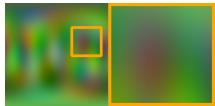  
(a) GT

  
(b) SH (20.98db)

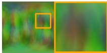

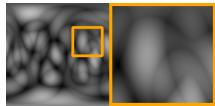

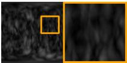  
(c) NRF (29.28db)  
(d) SH MSE (0.14) (e) NRF MSE (0.02)

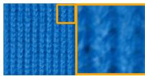  
(f) GT

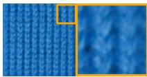  
(g) SH (28.24db)

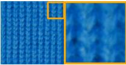  
(h) NRF (31.92db)

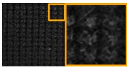

(i) SH MSE (0.010) (j) NRF MSE (0.006)  
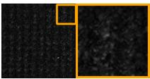  
Figure 3: Simulation results for synthetic degree-5 SH (top row) and real BTF data [25] (bottom row). Each row shows ground truth, degree-3 SH and NRF reconstruction, and corresponding error maps.

## 4.2 Expressiveness Evaluation

To evaluate view-dependent appearance modeling in terms of expressiveness independent of geometry, visibility, and rasterization, we design a controlled study comparing degree-3 SH modeling with our feature-based neural residual formulation. To independently assess the color estimation dependent on the viewing direction d, we observe a set of sampled viewing directions with corresponding ground-truth color and train a model to reconstruct the directional reflectance using (a) degree-3 SH (SH model) and (b) our per-splat latent features with a shared MLP (NRF-GS). Tab. 2 summarizes the average parameter budgets and reconstruction quality across all simulation settings, where for two settings we match the learnable parameter budgets.

Synthetic data. In the synthetic experiment, GT directional appearance is generated using degree-5 SH, producing high-frequency color variation. Tab. 2 shows that the shared MLP conditioned on latent features can represent high-frequency directional structure more effectively under matched budget. The results in Fig. 3 (top) show that NRF-GS recovers details beyond the low-order SH basis.

Real-world data. We also evaluate on real measured reflectance from the BTF dataset [25], which contains material samples captured under many view and illumination directions. In the pixelbased equal-memory setting, NRF-GS again improves reconstruction quality despite sparse angular sampling (Tab. 2). Since the equal memory setting uses only 328 sampled pixels, we additionally perform a dense 200×200 full image-based experiment for quantitative evaluation, in which NRF-GS uses fewer parameters while achieving higher quality; see Fig. 3 (bottom).

Overall, Fig. 3 and Tab. 2 support our hypothesis that feature-based neural representations are more expressive than fixed low-order SH under matched budgets and scale better under relaxed constraints.

## 4.3 Benchmark Experiments

We evaluate NRF-GS on standards benchmarks for novel view synthesis and compare them with various baselines.

## 4.3.1 Datasets and Baselines

We evaluate NRF-GS on three standard datasets: Mip-NeRF360 [3], DL3DV [16], and Tanks and Temples (TnT) [13]. MipNeRF360 and TnT are taken from the NerfBaselines [14] package which uses standard resolutions (∼1400p and 960p respectively), while DL3DV is evaluated at its standard benchmark [16] resolution of 960p. We randomly chose 9 scenes from the DL3DV dataset (10k scenes) to match the count with MipNeRF360 (9 scenes), while for TnT dataset all 19 scenes are used. For baseline methods, we compare NRF-GS against standard 3DGS [12] and two neural color prediction methods, VDGS [17] and GSNB [34]. We exclude [30] due to its

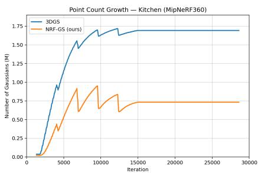  
Figure 4: Point count growth for the Kitchen scene (MipNeRF360). NRF-GS converges to fewer Gaussians under identical densification/pruning.

image-space formulation and high memory requirements, while [29] is not included due to the lack of a publicly available reference implementation, preventing a reliable and reproducible comparison.

Table 3: Average test-set results on MipNeRF360, DL3DV, and Tanks and Temples. Points are reported in millions. MipNeRF360\* excludes Bicycle and Garden, where GSNB goes out-of-memory. Best and second-best values in each dataset are highlighted.
<table><tr><td>Dataset</td><td>Method</td><td>Points (M)↓</td><td>Time (min)↓</td><td>MS-SSIM↑</td><td>LPIPS↓</td><td>L1↓</td><td>PSNR↑</td></tr><tr><td rowspan="3">MipNeRF360</td><td>3DGS</td><td>3.359</td><td>26.46</td><td>0.813</td><td>0.184</td><td>0.030</td><td>27.40</td></tr><tr><td>VDGS</td><td>3.548</td><td>41.27</td><td>0.813</td><td>0.186</td><td>0.029</td><td>27.65</td></tr><tr><td>NRF-GS (ours)</td><td>1.656</td><td>31.38</td><td>0.814</td><td>0.191</td><td>0.029</td><td>27.86</td></tr><tr><td rowspan="4">MipNeRF360*</td><td>3DGS</td><td>2.605</td><td>24.22</td><td>0.812</td><td>0.199</td><td>0.030</td><td>27.74</td></tr><tr><td>VDGS</td><td>2.828</td><td>36.70</td><td>0.813</td><td>0.200</td><td>0.029</td><td>28.03</td></tr><tr><td>GSNB</td><td>2.667</td><td>59.06</td><td>0.800</td><td>0.201</td><td>0.031</td><td>27.71</td></tr><tr><td>NRF-GS (ours)</td><td>1.361</td><td>28.83</td><td>0.815</td><td>0.205</td><td>0.028</td><td>28.27</td></tr><tr><td rowspan="4">DL3DV</td><td>3DGS</td><td>1.158</td><td>12.74</td><td>0.916</td><td>0.088</td><td>0.021</td><td>29.48</td></tr><tr><td>VDGS</td><td>1.404</td><td>21.15</td><td>0.918</td><td>0.089</td><td>0.021</td><td>29.92</td></tr><tr><td>GSNB</td><td>1.032</td><td>25.28</td><td>0.920</td><td>0.086</td><td>0.020</td><td>30.60</td></tr><tr><td>NRF-GS (ours)</td><td>0.595</td><td>14.52</td><td>0.925</td><td>0.089</td><td>0.018</td><td>30.82</td></tr><tr><td rowspan="4">TnT</td><td>3DGS</td><td>1.868</td><td>15.35</td><td>0.831</td><td>0.165</td><td>0.046</td><td>23.85</td></tr><tr><td>VDGS</td><td>2.113</td><td>26.37</td><td>0.834</td><td>0.163</td><td>0.045</td><td>24.12</td></tr><tr><td>GSNB</td><td>1.705</td><td>35.75</td><td>0.830</td><td>0.164</td><td>0.046</td><td>23.92</td></tr><tr><td>NRF-GS (ours)</td><td>1.040</td><td>19.91</td><td>0.845</td><td>0.164</td><td>0.040</td><td>24.68</td></tr></table>

## 4.3.2 Results

We report average splat count, training time, and standard metrics (1:8 split) in Tab. 3. Experiments are run on a single RTX 3090 (24GB) with a 24-core CPU and 64GB RAM. NRF-GS consistently yields the most compact representations while slightly improving quality over all baselines [12, 17, 34].

Parameter comparison. 3DGS with degree-3 SH [19] stores 48 appearance coefficients per Gaussian. NRF-GS instead uses a 32 latent, base color, and opacity (36 parameters), plus two small shared decoders (∼6.7k parameters total). For large scenes (e.g., 1M Gaussians), this reduces per-splat appearance parameters by ∼25% (48M vs 36M +6.7k).

Splat count. A key distinction of NRF-GS lies in the number of Gaussian splats required to represent the scene. Across all datasets, NRF-GS consistently converges to fewer splat count, reducing the number of splats by approximately 40–55%; see Fig. 4, which compares point growth over training iterations for a representative scene. Despite using the same densification and pruning heuristics as classical 3DGS, NRF-GS stabilizes at a lower point count, suggesting that each Gaussian captures richer appearance variation and reduces the need for redundant splats.

Quantitative and qualitative results. Even with significantly lower point count, NRF-GS achieves the best PSNR across all datasets, with strong MS-SSIM and L1. Although the gains are modest, they are consistent (∼0.3–0.8 dB), suggesting improved expressiveness rather than increased geometric capacity. Qualitatively (Fig. 1, 5), it produces sharper reconstructions and more accurate viewdependent effects, particularly for specularities (kitchen, room, 06da), and preserves fine details of low-parallax background in large scenes (palace, panther, 387e). The scene-level shared network and better high-frequency modeling helps achieve the improvement with efficient splat distribution.

Training time. NRF-GS lies between analytic and neural baselines: slightly slower than 3DGS due to neural overhead, but faster than VDGS and GSNB (Tab. 3). GSNB is significantly slower and fails on some high-resolution scenes (e.g., Bicycle, Garden) due to memory limits; we therefore also report results excluding these scenes. During inference, on average, NRF-GS runs at 105 FPS vs 115 FPS for 3DGS, still remaining faster than VDGS (65 FPS) and GSNB (92 FPS).

## 5 Conclusions

We presented NRF-GS, a hybrid formulation that augments 3DGS with a shared neural residual field and per-splat latent features for view-dependent appearance modeling, through which the method shifts directional modeling from independent analytic bases to a learned scene-level function. Across datasets, NRF-GS achieves comparable rendering quality while reducing the number of Gaussians by up to 50%, indicating that improved appearance modeling directly translates to higher representation efficiency. The frequency-decomposed design further improves robustness by separating stable low-frequency components from weighted high-frequency effects, leading to consistent performance across diverse scenes.

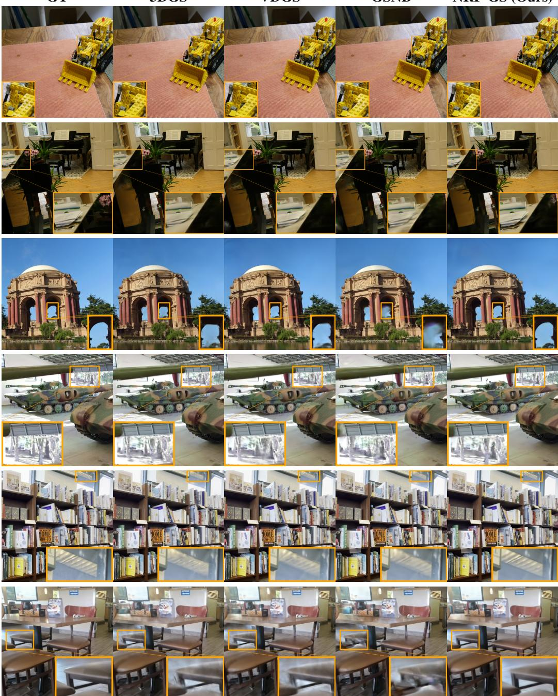  
Figure 5: Qualitative comparison across multiple scenes. Top to Bottom: MipNeRF360 - scenes ’kitchen’ and ’room’, TnT - scenes ’palace’ and ’panther’, DL3DV - scenes ’387e’ and ’06da’.

Limitations. Despite these advantages, NRF-GS introduces additional computational overhead due to per-splat neural evaluations, making it slower than purely analytic approaches such as standard 3DGS, but still faster than other neural baselines. Additionally, it inherits standard assumptions from 3DGS, including accurate camera poses and initialization, and does not explicitly optimize for runtime or memory efficiency beyond reducing the number of splats.

Future works. These limitations point to promising directions for future work, jointly optimizing appearance modeling with pruning, compression, and more efficient neural evaluation strategies. Also, the learned appearance features per splat could be further explored for more downstream tasks.

## References

[1] Kara-Ali Aliev, Artem Sevastopolsky, Maria Kolos, Dmitry Ulyanov, and Victor Lempitsky. Neural point-based graphics. In European conference on computer vision, pages 696–712. Springer, 2020.

[2] Jonathan T Barron, Ben Mildenhall, Matthew Tancik, Peter Hedman, Ricardo Martin-Brualla, and Pratul P Srinivasan. Mip-nerf: A multiscale representation for anti-aliasing neural radiance fields. In Proceedings of the IEEE/CVF international conference on computer vision, pages 5855–5864, 2021.

[3] Jonathan T Barron, Ben Mildenhall, Dor Verbin, Pratul P Srinivasan, and Peter Hedman. Mipnerf 360: Unbounded anti-aliased neural radiance fields. In Proceedings of the IEEE/CVF conference on computer vision and pattern recognition, pages 5470–5479, 2022.

[4] Sai Bi, Zexiang Xu, Pratul Srinivasan, Ben Mildenhall, Kalyan Sunkavalli, Miloš Hašan, Yannick Hold-Geoffroy, David Kriegman, and Ravi Ramamoorthi. Neural reflectance fields for appearance acquisition. arXiv preprint arXiv:2008.03824, 2020.

[5] Mathilde Caron, Hugo Touvron, Ishan Misra, Hervé Jégou, Julien Mairal, Piotr Bojanowski, and Armand Joulin. Emerging properties in self-supervised vision transformers. In Proceedings of the IEEE/CVF international conference on computer vision, pages 9650–9660, 2021.

[6] Anpei Chen, Zexiang Xu, Andreas Geiger, Jingyi Yu, and Hao Su. Tensorf: Tensorial radiance fields. In European conference on computer vision, pages 333–350. Springer, 2022.

[7] Sara Fridovich-Keil, Alex Yu, Matthew Tancik, Qinhong Chen, Benjamin Recht, and Angjoo Kanazawa. Plenoxels: Radiance fields without neural networks. In Proceedings ofthe IEEE/CVF conference on computer vision and pattern recognition, pages 5501–5510, 2022.

[8] Ahmed Hasssan, Jian Meng, Yuanbo Xiangli, and Jae-sun Seo. Dcsharp: 3d gaussian splatting with direction cosine spherical harmonics and shape-aware pruning. In Proceedings of the IEEE/CVF Winter Conference on Applications ofComputer Vision (WACV), pages 3628–3637, March 2026.

[9] Jan Held, Renaud Vandeghen, Abdullah Hamdi, Adrien Deliege, Anthony Cioppa, Silvio Giancola, Andrea Vedaldi, Bernard Ghanem, and Marc Van Droogenbroeck. 3d convex splatting: Radiance field rendering with 3d smooth convexes. In Proceedings ofthe IEEE/CVF Conference on Computer Vision and Pattern Recognition, pages 21360–21369, 2025.

[10] Binbin Huang, Zehao Yu, Anpei Chen, Andreas Geiger, and Shenghua Gao. 2d gaussian splatting for geometrically accurate radiance fields. In ACM SIGGRAPH 2024 conference papers, pages 1–11, 2024.

[11] Yoni Kasten, Dolev Ofri, Oliver Wang, and Tali Dekel. Layered neural atlases for consistent video editing. ACM Transactions on Graphics (TOG), 40(6):1–12, 2021.

[12] Bernhard Kerbl, Georgios Kopanas, Thomas Leimkühler, and George Drettakis. 3d gaussian splatting for real-time radiance field rendering. ACM Transactions on Graphics, 42(4), July 2023.

[13] Arno Knapitsch, Jaesik Park, Qian-Yi Zhou, and Vladlen Koltun. Tanks and temples: Benchmarking large-scale scene reconstruction. ACM Transactions on Graphics (ToG), 36(4):1–13, 2017.

[14] Jonas Kulhanek and Torsten Sattler. Nerfbaselines: Consistent and reproducible evaluation of novel view synthesis methods. arXiv preprint arXiv:2406.17345, 2024.

[15] Boyi Li, Kilian Q Weinberger, Serge Belongie, Vladlen Koltun, and René Ranftl. Languagedriven semantic segmentation. arXiv preprint arXiv:2201.03546, 2022.

[16] Lu Ling, Yichen Sheng, Zhi Tu, Wentian Zhao, Cheng Xin, Kun Wan, Lantao Yu, Qianyu Guo, Zixun Yu, Yawen Lu, et al. Dl3dv-10k: A large-scale scene dataset for deep learning-based 3d vision. In Proceedings of the IEEE/CVF Conference on Computer Vision and Pattern Recognition, pages 22160–22169, 2024.

[17] Dawid Malarz, Weronika Smolak-Dyzewska, Jacek Tabor, Sławomir Tadeja, and Przemysław˙ Spurek. Gaussian splatting with nerf-based color and opacity. Computer Vision and Image Understanding, 251:104273, 2025.

[18] Ben Mildenhall, Pratul P Srinivasan, Matthew Tancik, Jonathan T Barron, Ravi Ramamoorthi, and Ren Ng. Nerf: Representing scenes as neural radiance fields for view synthesis. Communications ofthe ACM, 65(1):99–106, 2021.

[19] Claus Müller. Spherical harmonics. Springer, 2006.

[20] Thomas Müller. tiny-cuda-nn, 4 2021.

[21] Thomas Müller, Alex Evans, Christoph Schied, and Alexander Keller. Instant neural graphics primitives with a multiresolution hash encoding. ACM transactions on graphics (TOG), 41(4):1– 15, 2022.

[22] Alp Bora Orgun, Marco Volino, Adrian Hilton, and Jean-Yves Guillemaut. Dual spherical harmonics for 3d gaussian splatting: Novel view synthesis with dynamic lighting. In Proceedings ofthe 22nd ACM SIGGRAPH European Conference on Visual Media Production, pages 1–11, 2025.

[23] Alec Radford, Jong Wook Kim, Chris Hallacy, Aditya Ramesh, Gabriel Goh, Sandhini Agarwal, Girish Sastry, Amanda Askell, Pamela Mishkin, Jack Clark, et al. Learning transferable visual models from natural language supervision. In International conference on machine learning, pages 8748–8763. PmLR, 2021.

[24] Victor Rong, Jan Held, Victor Chu, Daniel Rebain, Marc Van Droogenbroeck, Kiriakos N Kutulakos, Andrea Tagliasacchi, and David B Lindell. Nexels: Neurally-textured surfels for real-time novel view synthesis with sparse geometries. arXiv preprint arXiv:2512.13796, 2025.

[25] Mirko Sattler, Ralf Sarlette, and Reinhard Klein. Efficient and realistic visualization of cloth. In Eurographics Symposium on Rendering 2003, June 2003.

[26] Jan Philipp Schneider, Pratik Singh Bisht, Ilya Chugunov, Andreas Kolb, Michael Moeller, and Felix Heide. Neural atlas graphs for dynamic scene decomposition and editing. 38, 2025.

[27] Matthew Tancik, Pratul Srinivasan, Ben Mildenhall, Sara Fridovich-Keil, Nithin Raghavan, Utkarsh Singhal, Ravi Ramamoorthi, Jonathan Barron, and Ren Ng. Fourier features let networks learn high frequency functions in low dimensional domains. Advances in neural information processing systems, 33:7537–7547, 2020.

[28] Zhenyu Tang, Chaoran Feng, Xinhua Cheng, Wangbo Yu, Junwu Zhang, Yuan Liu, Xiao-Xiao Long, Wenping Wang, and Li Yuan. Neuralgs: Bridging neural fields and 3d gaussian splatting for compact 3d representations. In Proceedings of the AAAI Conference on Artificial Intelligence, volume 40, pages 9493–9501, 2026.

[29] Yiwen Wang, Siyuan Chen, and Ran Yi. Sg-splatting: accelerating 3d gaussian splatting with spherical gaussians. arXiv preprint arXiv:2501.00342, 2024.

[30] Zhiru Wang, Shiyun Xie, Chengwei Pan, and Guoping Wang. Specgaussian with latent features: A high-quality modeling of the view-dependent appearance for 3d gaussian splatting. In Proceedings of the 32nd ACM International Conference on Multimedia, pages 6270–6278, 2024.

[31] Chenrui Wu, Xinyu Shi, Zhenzhong Chu, and Yao Huang. Ars-gs: Anisotropic reflective spherical 3d gaussian splatting. Journal ofImaging, 12(4):170, 2026.

[32] Kun Xu, Wei-Lun Sun, Zhao Dong, Dan-Yong Zhao, Run-Dong Wu, and Shi-Min Hu. Anisotropic spherical gaussians. ACM Transactions on Graphics (TOG), 32(6):1–11, 2013.

[33] Shijie Zhou, Haoran Chang, Sicheng Jiang, Zhiwen Fan, Zehao Zhu, Dejia Xu, Pradyumna Chari, Suya You, Zhangyang Wang, and Achuta Kadambi. Feature 3dgs: Supercharging 3d gaussian splatting to enable distilled feature fields. In Proceedings of the IEEE/CVF Conference on Computer Vision and Pattern Recognition, pages 21676–21685, 2024.

[34] Zhi Zhou, Junke Zhu, and Zhangjin Huang. Gaussian splatting with neural basis extension. In Proceedings of the 32nd ACM International Conference on Multimedia, pages 6043–6052, 2024.

[35] Jialin Zhu, Jiangbei Yue, Feixiang He, and He Wang. 3d student splatting and scooping. In Proceedings ofthe Computer Vision and Pattern Recognition Conference, pages 21045–21054, 2025.

[36] Matthias Zwicker, Hanspeter Pfister, Jeroen Van Baar, and Markus Gross. Ewa volume splatting. In Proceedings Visualization, 2001. VIS’01., pages 29–538. IEEE, 2001.

## A Technical appendices and supplementary material

## A.1 Additional Ablation discussion

Tab. 4 shows the overfitting scenario discussed in Sec. 4.1. Note the for Single branch ablation, the unbounded scenes (namely bicycle, garden, flowers, stump and treehill) have a worse test score than Ours split branch design, although having better train metrics, showing the overfitting issue without splitting and weighted high-frequency formulation.

Table 4: Per-scene comparison of Single-branch vs Ours (NRF-GS) on MipNeRF360. Train/Test metrics are reported as sub-columns.
<table><tr><td rowspan="2">Scene</td><td rowspan="2">Method</td><td colspan="2">MS-SSIM↑</td><td colspan="2">LPIPS↓</td><td colspan="2">L1↓</td><td colspan="2">PSNR↑</td></tr><tr><td>Train</td><td>Test</td><td>Train</td><td>Test</td><td>Train</td><td>Test</td><td>Train</td><td>Test</td></tr><tr><td rowspan="2">Bicycle</td><td>Single</td><td>0.864</td><td>0.715</td><td>0.162</td><td>0.234</td><td>0.026</td><td>0.047</td><td>27.34</td><td>23.71</td></tr><tr><td>Ours</td><td>0.843</td><td>0.759</td><td>0.170</td><td>0.203</td><td>0.029</td><td>0.041</td><td>26.11</td><td>25.06</td></tr><tr><td rowspan="2">Bonsai</td><td>Single</td><td>0.950</td><td>0.942</td><td>0.138</td><td>0.144</td><td>0.012</td><td>0.013</td><td>34.54</td><td>33.23</td></tr><tr><td>Ours</td><td>0.950</td><td>0.944</td><td>0.136</td><td>0.137</td><td>0.012</td><td>0.014</td><td>34.10</td><td>33.24</td></tr><tr><td rowspan="2">Counter</td><td>Single</td><td>0.926</td><td>0.906</td><td>0.151</td><td>0.173</td><td>0.013</td><td>0.018</td><td>32.03</td><td>29.81</td></tr><tr><td>Ours</td><td>0.924</td><td>0.913</td><td>0.153</td><td>0.158</td><td>0.014</td><td>0.017</td><td>31.59</td><td>29.83</td></tr><tr><td rowspan="2">Flowers</td><td>Single</td><td>0.760</td><td>0.576</td><td>0.260</td><td>0.377</td><td>0.038</td><td>0.061</td><td>24.24</td><td>21.02</td></tr><tr><td>Ours</td><td>0.748</td><td>0.599</td><td>0.261</td><td>0.349</td><td>0.040</td><td>0.057</td><td>23.70</td><td>21.41</td></tr><tr><td rowspan="2">Garden</td><td>Single</td><td>0.915</td><td>0.852</td><td>0.075</td><td>0.100</td><td>0.018</td><td>0.028</td><td>31.05</td><td>27.20</td></tr><tr><td>Ours</td><td>0.907</td><td>0.864</td><td>0.070</td><td>0.082</td><td>0.020</td><td>0.026</td><td>30.20</td><td>27.67</td></tr><tr><td rowspan="2">Kitchen</td><td>Single</td><td>0.942</td><td>0.925</td><td>0.092</td><td>0.107</td><td>0.014</td><td>0.016</td><td>33.42</td><td>31.83</td></tr><tr><td>Ours</td><td>0.942</td><td>0.927</td><td>0.090</td><td>0.096</td><td>0.014</td><td>0.016</td><td>33.51</td><td>32.10</td></tr><tr><td rowspan="2">Room</td><td>Single</td><td>0.937</td><td>0.919</td><td>0.153</td><td>0.178</td><td>0.011</td><td>0.016</td><td>34.94</td><td>32.00</td></tr><tr><td>Ours</td><td>0.936</td><td>0.920</td><td>0.156</td><td>0.168</td><td>0.011</td><td>0.015</td><td>34.74</td><td>32.14</td></tr><tr><td rowspan="2">Stump</td><td>Single</td><td>0.902</td><td>0.716</td><td>0.126</td><td>0.206</td><td>0.018</td><td>0.040</td><td>31.06</td><td>25.06</td></tr><tr><td>Ours</td><td>0.890</td><td>0.762</td><td>0.135</td><td>0.178</td><td>0.019</td><td>0.034</td><td>30.10</td><td>26.39</td></tr><tr><td rowspan="2">Treehill</td><td>Single</td><td>0.787</td><td>0.612</td><td>0.255</td><td>0.380</td><td>0.034</td><td>0.048</td><td>24.54</td><td>22.63</td></tr><tr><td>Ours</td><td>0.788</td><td>0.636</td><td>0.252</td><td>0.350</td><td>0.033</td><td>0.045</td><td>24.15</td><td>22.84</td></tr></table>

## A.2 Additional Results

Tab. 5 shows the average test results on all datasets along with per scene standard deviations.

Also, some more qualitative results from all three datasets are shown in Fig. 6. In addition to the earlier mentioned distinction of better reflectance and far-away details, another specific improvement in color quality can be noticed in the scenes bonsai (cloth and petals) and lighthouse (window) which shows that the color contrast for Our method matches the ground truth better.

Table 5: Average test-set results $( \mathrm { m e a n } \pm \mathrm { s t d } )$ on MipNeRF360, DL3DV, and Tanks and Temples. $M i p N e R F 3 6 0 ^ { * }$ excludes Bicycle and Garden scenes where GSNB runs out-of-memory. Points are reported in millions.
<table><tr><td>Dataset</td><td>Method</td><td> $\mathrm { P o i n t s } \left( \mathbf { M } \right) \downarrow$ </td><td>Time (min)↓</td><td>MS-SSIM↑</td><td>LPIPS↓</td><td>L1↓</td><td>PSNR↑</td></tr><tr><td rowspan="3">MipNeRF360</td><td>3DGS</td><td> $3 . 3 5 9 \pm 1 . 9 8 6$ </td><td> $2 6 . 4 6 \pm 0 5 . 0 2$ </td><td> $0 . 8 1 3 \pm 0 . 1 3 0$ </td><td> $0 . 1 8 4 \pm 0 . 0 9 4$ </td><td> $0 . 0 3 0 \pm 0 . 0 1 5$ </td><td> $2 7 . 4 0 \pm 3 . 9 5$ </td></tr><tr><td>VDGS</td><td> $3 . 5 4 8 \pm 1 . 8 6 9$ </td><td> $4 1 . 2 7 \pm 0 9 . 9 5$ </td><td> $0 . 8 1 3 \pm 0 . 1 3 2$ </td><td> $0 . 1 8 6 \pm 0 . 0 9 6$ </td><td> $0 . 0 3 0 \pm 0 . 0 1 5$ </td><td> $2 7 . 6 5 \pm 4 . 0 9$ </td></tr><tr><td>NRF-GS (ours)</td><td> $1 . 6 5 6 \pm 1 . 0 1 5$ </td><td> $3 1 . 3 8 \pm 0 7 . 1 2$ </td><td> $0 . 8 1 4 \pm 0 . 1 3 1$ </td><td> $0 . 1 9 1 \pm 0 . 0 9 7$ </td><td> $0 . 0 2 9 \pm 0 . 0 1 6$ </td><td> $2 7 . 8 6 \pm 4 . 2 7$ </td></tr><tr><td rowspan="4">MipNeRF360*</td><td>3DGS</td><td> $2 . 6 0 5 \pm 1 . 5 0 3$ </td><td> $2 4 . 2 2 \pm 0 2 . 6 6$ </td><td> $0 . 8 1 3 \pm 0 . 1 4 7$ </td><td> $0 . 2 0 0 \pm 0 . 0 9 8$ </td><td> $0 . 0 2 9 \pm 0 . 0 1 7$ </td><td> $2 7 . 7 4 \pm 4 . 4 6$ </td></tr><tr><td>VDGS</td><td> $2 . 8 2 8 \pm 1 . 3 7 2$ </td><td> $3 6 . 6 9 \pm 0 4 . 5 8$ </td><td> $0 . 8 1 4 \pm 0 . 1 4 9$ </td><td> $0 . 2 0 0 \pm 0 . 1 0 1$ </td><td> $0 . 0 2 9 \pm 0 . 0 1 7$ </td><td> $2 8 . 0 4 \pm 4 . 5 9$ </td></tr><tr><td>GSNB</td><td> $2 . 6 6 7 \pm 1 . 3 1 5$ </td><td> $5 9 . 0 6 \pm 2 0 . 6 8$ </td><td> $0 . 8 0 0 \pm 0 . 1 6 2$ </td><td> $0 . 2 0 1 \pm 0 . 1 0 2$ </td><td> $0 . 0 3 2 \pm 0 . 0 2 0$ </td><td> $2 7 . 7 1 \pm 5 . 1 3$ </td></tr><tr><td>NRF-GS (ours)</td><td> $1 . 3 6 1 \pm 0 . 9 1 4$ </td><td> $2 8 . 8 3 \pm 0 5 . 3 5$ </td><td> $0 . 8 1 4 \pm 0 . 1 4 8$ </td><td> $0 . 2 0 5 \pm 0 . 1 0 2$ </td><td> $0 . 0 2 8 \pm 0 . 0 1 7$ </td><td> $2 8 . 2 8 \pm 4 . 7 8$ </td></tr><tr><td rowspan="4">DL3DV</td><td>3DGS</td><td> $1 . 1 5 8 \pm 0 . 3 1 6$ </td><td> $1 2 . 7 4 \pm 0 2 . 4 6$ </td><td> $0 . 9 1 6 \pm 0 . 0 5 7$ </td><td> $0 . 0 8 8 \pm 0 . 0 5 3$ </td><td> $0 . 0 2 1 \pm 0 . 0 0 9$ </td><td> $2 9 . 4 8 \pm 3 . 1 9$ </td></tr><tr><td>VDGS</td><td> $1 . 4 0 4 \pm 0 . 4 6 5$ </td><td> $2 1 . 1 5 \pm 0 5 . 4 5$ </td><td> $0 . 9 1 8 \pm 0 . 0 5 8$ </td><td> $0 . 0 8 9 \pm 0 . 0 5 5$ </td><td> $0 . 0 2 1 \pm 0 . 0 0 9$ </td><td> $2 9 . 9 2 \pm 3 . 3 5$ </td></tr><tr><td>GSNB</td><td> $1 . 0 3 2 \pm 0 . 2 7 4$ </td><td> $2 5 . 2 8 \pm 0 5 . 1 6$ </td><td> $0 . 9 2 0 \pm 0 . 0 5 6$ </td><td> $0 . 0 8 6 \pm 0 . 0 5 4$ </td><td> $0 . 0 2 0 \pm 0 . 0 1 0$ </td><td> $3 0 . 6 0 \pm 3 . 5 4$ </td></tr><tr><td>NRF-GS (ours)</td><td> $0 . 5 9 5 \pm 0 . 2 4 6$ </td><td> $1 4 . 5 2 \pm 0 3 . 2 5$ </td><td> $0 . 9 2 5 \pm 0 . 0 5 2$ </td><td> $0 . 0 8 9 \pm 0 . 0 5 3$ </td><td> $0 . 0 1 8 \pm 0 . 0 0 8$ </td><td> $3 0 . 8 2 \pm 3 . 2 3$ </td></tr><tr><td rowspan="4">TnT</td><td>3DGS</td><td> $1 . 8 6 8 \pm 1 . 0 6 4$ </td><td> $1 5 . 3 5 \pm 0 4 . 3 6$ </td><td> $0 . 8 3 1 \pm 0 . 0 5 2$ </td><td> $0 . 1 6 5 \pm 0 . 0 5 8$ </td><td> $0 . 0 4 6 \pm 0 . 0 1 6$ </td><td> $2 3 . 8 5 \pm 2 . 5 2$ </td></tr><tr><td>VDGS</td><td> $2 . 1 1 3 \pm 1 . 0 0 9$ </td><td> $2 6 . 3 7 \pm 0 7 . 8 3$ </td><td> $0 . 8 3 4 \pm 0 . 0 5 1$ </td><td> $0 . 1 6 3 \pm 0 . 0 5 4$ </td><td> $0 . 0 4 5 \pm 0 . 0 1 5$ </td><td> $2 4 . 1 2 \pm 2 . 5 1$ </td></tr><tr><td>GSNB</td><td> $1 . 7 0 5 \pm 0 . 9 0 2$ </td><td> $3 5 . 7 5 \pm 1 4 . 9 3$ </td><td> $0 . 8 3 0 \pm 0 . 0 5 1$ </td><td> $0 . 1 6 4 \pm 0 . 0 5 4$ </td><td> $0 . 0 4 7 \pm 0 . 0 1 7$ </td><td> $2 3 . 9 2 \pm 2 . 7 3$ </td></tr><tr><td>NRF-GS (ours)</td><td> $1 . 0 4 0 \pm 0 . 4 8 3$ </td><td> $1 9 . 9 1 \pm 0 5 . 3 4$ </td><td> $0 . 8 4 5 \pm 0 . 0 4 5$ </td><td> $0 . 1 6 4 \pm 0 . 0 5 2$ </td><td> $0 . 0 4 0 \pm 0 . 0 1 4$ </td><td> $2 4 . 6 8 \pm 2 . 4 1$ </td></tr></table>

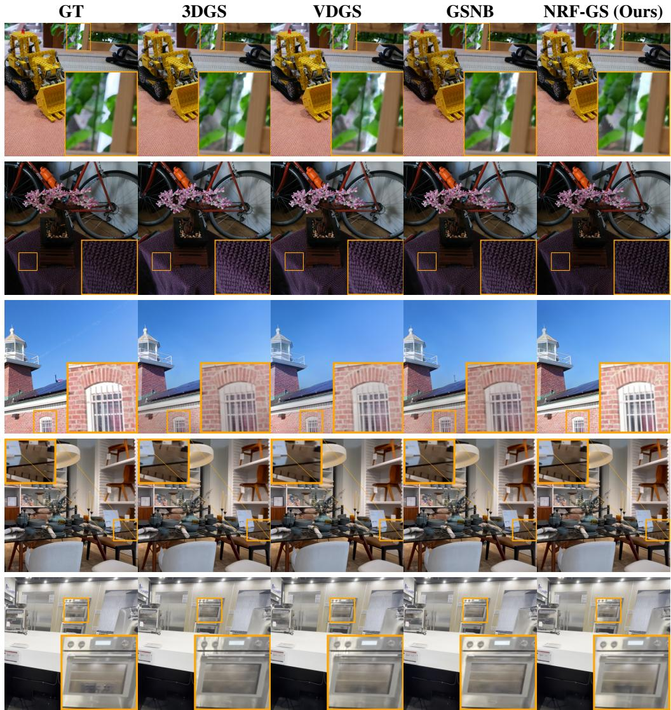  
Figure 6: Additional qualitative comparison across multiple scenes. Top to Bottom: MipNeRF360 - scenes ’bonsai’, TnT - scenes ’horse’ and ’lighthouse’, DL3DV - scenes ’5c3a’ and ’669c’.

We further report per scene level averages together with the standard deviation across multiple runs in Tab. 6 for MipNeRF 360 dataset. Please note that GSNB went OOM on scenes bicycle and garden.

Table 6: Per-scene test-set results on MipNeRF360.
<table><tr><td>Scene</td><td>Method</td><td>Points (M)↓</td><td>Time (min)↓</td><td>MS-SSIM↑</td><td>LPIPS↓</td><td>L1↓</td><td>PSNR↑</td></tr><tr><td rowspan="3">Bicycle</td><td>3DGS</td><td>6.137 ± 0.076</td><td>34.08 ± 0.13</td><td>0.765 ± 0.001</td><td>0.175 ± 0.001</td><td>0.039 ± 0.001</td><td>25.17 ± 0.04</td></tr><tr><td>VDGS</td><td>6.441 ± 0.069</td><td>58.88 ± 0.29</td><td>0.755 ± 0.002</td><td>0.195 ± 0.002</td><td>0.039 ± 0.001</td><td>25.14 ± 0.14</td></tr><tr><td>NRF-GS</td><td>3.187 ± 0.024</td><td>44.12 ± 0.28</td><td>0.759 ± 0.003</td><td>0.203 ± 0.006</td><td>0.041 ± 0.001</td><td>25.06 ± 0.16</td></tr><tr><td rowspan="4">Bonsai</td><td>3DGS</td><td>1.257 ± 0.005</td><td>20.12 ± 0.10</td><td>0.943 ± 0.001</td><td>0.133 ± 0.001</td><td>0.015 ± 0.001</td><td>32.23 ± 0.10</td></tr><tr><td>VDGS</td><td>1.617 ± 0.012</td><td>29.70 ± 0.33</td><td>0.945 ± 0.002</td><td>0.134 ± 0.005</td><td>0.014 ± 0.000</td><td>32.72 ± 0.15</td></tr><tr><td>GSNB</td><td>1.477 ± 0.042</td><td>39.15 ± 0.18</td><td>0.945 ± 0.002</td><td>0.127 ± 0.003</td><td>0.014 ± 0.001</td><td>33.19 ± 0.05</td></tr><tr><td>NRF-GS</td><td>0.573 ± 0.003</td><td>22.73 ± 0.12</td><td>0.944 ± 0.002</td><td>0.137 ± 0.001</td><td>0.014 ± 0.001</td><td>33.24 ± 0.09</td></tr><tr><td rowspan="4">Counter</td><td>3DGS</td><td>1.207 ± 0.003</td><td>22.78 ± 0.08</td><td>0.909 ± 0.001</td><td>0.156 ± 0.002</td><td>0.018 ± 0.001</td><td>29.02 ± 0.03</td></tr><tr><td>VDGS</td><td>1.548 ± 0.007</td><td>33.50 ± 0.46</td><td>0.912 ± 0.002</td><td>0.153 ± 0.001</td><td>0.018 ± 0.001</td><td>29.59 ± 0.20</td></tr><tr><td>GSNB</td><td>1.282 ± 0.002</td><td>36.83 ± 0.18</td><td>0.913 ± 0.001</td><td>0.147 ± 0.003</td><td>0.017 ± 0.001</td><td>29.81 ± 0.03</td></tr><tr><td>NRF-GS</td><td>0.538 ± 0.001</td><td>24.98 ± 0.10</td><td>0.913 ± 0.003</td><td>0.158 ± 0.003</td><td>0.017 ± 0.000</td><td>29.83 ± 0.01</td></tr><tr><td rowspan="4">Flowers</td><td>3DGS</td><td>3.650 ± 0.046</td><td>23.90 ± 0.15</td><td>0.600 ± 0.008</td><td>0.345 ± 0.005</td><td>0.057 ± 0.001</td><td>21.40 ± 0.09</td></tr><tr><td>VDGS</td><td>3.977 ± 0.060</td><td>38.83 ± 1.15</td><td>0.598 ± 0.002</td><td>0.348 ± 0.006</td><td>0.057 ± 0.001</td><td>21.39 ± 0.08</td></tr><tr><td>GSNB</td><td>3.400 ± 0.027</td><td>69.05 ± 0.15</td><td>0.576 ± 0.004</td><td>0.357 ± 0.006</td><td>0.063 ± 0.001</td><td>20.96 ± 0.05</td></tr><tr><td>NRF-GS</td><td>2.041 ± 0.019</td><td>31.75 ± 0.15</td><td>0.599 ± 0.002</td><td>0.349 ± 0.010</td><td>0.057 ± 0.000</td><td>21.41 ± 0.03</td></tr><tr><td rowspan="3">Garden</td><td>3DGS</td><td>5.869 ± 0.013</td><td>34.60 ± 1.82</td><td>0.865 ± 0.002</td><td>0.078 ± 0.002</td><td>0.028 ± 0.001</td><td>27.25 ± 0.06</td></tr><tr><td>VDGS</td><td>5.701 ± 0.016</td><td>55.73 ± 0.64</td><td>0.864 ± 0.003</td><td>0.081 ± 0.004</td><td>0.027 ± 0.001</td><td>27.52 ± 0.08</td></tr><tr><td>NRF-GS</td><td>2.190 ± 0.001</td><td>36.50 ± 0.00</td><td>0.864 ± 0.002</td><td>0.082 ± 0.002</td><td>0.026 ± 0.000</td><td>27.67 ± 0.02</td></tr><tr><td rowspan="4">Kitchen</td><td>3DGS</td><td>1.818 ± 0.026</td><td>27.75 ± 0.39</td><td>0.924 ± 0.002</td><td>0.097 ± 0.002</td><td>0.017 ± 0.001</td><td>31.46 ± 0.02</td></tr><tr><td>VDGS</td><td>2.031 ± 0.014</td><td>38.45 ± 0.22</td><td>0.927 ± 0.002</td><td>0.095 ± 0.001</td><td>0.017 ± 0.001</td><td>31.62 ± 0.05</td></tr><tr><td>GSNB</td><td>2.182 ± 0.061</td><td>54.88 ± 0.94</td><td>0.926 ± 0.003</td><td>0.095 ± 0.002</td><td>0.017 ± 0.001</td><td>31.95 ± 0.04</td></tr><tr><td>NRF-GS</td><td>0.652 ± 0.002</td><td>25.47 ± 0.06</td><td>0.927 ± 0.000</td><td>0.096 ± 0.005</td><td>0.016 ± 0.000</td><td>32.10 ± 0.02</td></tr><tr><td rowspan="4">Room</td><td>3DGS</td><td>1.535 ± 0.018</td><td>23.32 ± 0.13</td><td>0.918 ± 0.002</td><td>0.168 ± 0.001</td><td>0.017 ± 0.001</td><td>31.35 ± 0.06</td></tr><tr><td>VDGS</td><td>1.845 ± 0.021</td><td>34.28 ± 0.13</td><td>0.922 ± 0.001</td><td>0.165 ± 0.002</td><td>0.016 ± 0.000</td><td>31.77 ± 0.03</td></tr><tr><td>GSNB</td><td>1.724 ± 0.010</td><td>44.33 ± 0.45</td><td>0.919 ± 0.002</td><td>0.161 ± 0.001</td><td>0.016 ± 0.001</td><td>31.55 ± 0.08</td></tr><tr><td>NRF-GS</td><td>0.802 ± 0.011</td><td>25.92 ± 0.03</td><td>0.920 ± 0.001</td><td>0.168 ± 0.002</td><td>0.015 ± 0.000</td><td>32.14 ± 0.05</td></tr><tr><td rowspan="4">Stump</td><td>3DGS</td><td>4.934 ± 0.061</td><td>27.40 ± 0.05</td><td>0.763 ± 0.002</td><td>0.165 ± 0.001</td><td>0.033 ± 0.001</td><td>26.33 ± 0.12</td></tr><tr><td>VDGS</td><td>4.837 ± 0.025</td><td>43.82 ± 0.10</td><td>0.761 ± 0.001</td><td>0.164 ± 0.007</td><td>0.034 ± 0.001</td><td>26.50 ± 0.20</td></tr><tr><td>GSNB</td><td>4.422 ± 0.048</td><td>88.97 ± 0.10</td><td>0.707 ± 0.004</td><td>0.191 ± 0.001</td><td>0.041 ± 0.001</td><td>24.94 ± 0.14</td></tr><tr><td>NRF-GS</td><td>2.559 ± 0.028</td><td>36.58 ± 0.29</td><td>0.762 ± 0.001</td><td>0.178 ± 0.003</td><td>0.034 ± 0.001</td><td>26.39 ± 0.04</td></tr><tr><td rowspan="4">Treehill</td><td>3DGS</td><td>3.831 ± 0.023</td><td>24.27 ± 0.03</td><td>0.632 ± 0.001</td><td>0.332 ± 0.003</td><td>0.047 ± 0.001</td><td>22.42 ± 0.02</td></tr><tr><td>VDGS</td><td>3.938 ± 0.016</td><td>38.28 ± 0.19</td><td>0.632 ± 0.002</td><td>0.337 ± 0.006</td><td>0.047 ± 0.001</td><td>22.68 ± 0.03</td></tr><tr><td>GSNB</td><td>4.181 ± 0.037</td><td>80.22 ± 0.19</td><td>0.613 ± 0.012</td><td>0.332 ± 0.009</td><td>0.053 ± 0.002</td><td>21.60 ± 0.06</td></tr><tr><td>NRF-GS</td><td>2.361 ± 0.019</td><td>34.40 ± 0.17</td><td>0.636 ± 0.001</td><td>0.350 ± 0.000</td><td>0.045 ± 0.000</td><td>22.84 ± 0.01</td></tr></table>

Tab. 7 shows the per scene level average results on DL3DV dataset with standard deviations across all metrics.  
Table 7: Per-scene test-set results on DL3DV.
<table><tr><td>Scene</td><td>Method</td><td> $\mathrm { P o i n t s } \left( \mathbf { M } \right) \downarrow$ </td><td>Time (min)↓</td><td> $\mathbf { M S - S S I M \uparrow }$ </td><td>LPIPS↓</td><td>L1↓</td><td>PSNR↑</td></tr><tr><td rowspan="4">06da</td><td>3DGS</td><td> $1 . 3 3 0 \pm 0 . 0 0 7$ </td><td> $1 2 . 8 5 \pm 0 . 0 9$ </td><td> $0 . 9 0 5 \pm 0 . 0 0 1$ </td><td> $0 . 1 0 7 \pm 0 . 0 0 1$ </td><td> $0 . 0 2 4 \pm 0 . 0 0 1$ </td><td> $2 8 . 2 1 \pm 0 . 0 1$ </td></tr><tr><td>VDGS</td><td> $1 . 6 8 7 \pm 0 . 0 1 2$ </td><td> $2 2 . 3 0 \pm 0 . 0 5$ </td><td> $0 . 9 0 6 \pm 0 . 0 0 2$ </td><td> $0 . 1 1 0 \pm 0 . 0 0 2$ </td><td> $0 . 0 2 3 \pm 0 . 0 0 1$ </td><td> $2 8 . 4 1 \pm 0 . 1 3$ </td></tr><tr><td>GSNB</td><td> $1 . 4 0 4 \pm 0 . 0 0 7$ </td><td> $3 1 . 5 7 \pm 0 . 5 0$ </td><td> $0 . 9 0 8 \pm 0 . 0 0 2$ </td><td> $0 . 1 0 2 \pm 0 . 0 0 3$ </td><td> $0 . 0 2 1 \pm 0 . 0 0 1$ </td><td> $2 9 . 3 4 \pm 0 . 0 1$ </td></tr><tr><td>NRF-GS</td><td> $0 . 7 0 3 \pm 0 . 0 0 9$ </td><td> $1 5 . 1 3 \pm 0 . 1 3$ </td><td> $0 . 9 2 8 \pm 0 . 0 0 0$ </td><td> $0 . 0 9 8 \pm 0 . 0 0 1$ </td><td> $0 . 0 1 7 \pm 0 . 0 0 1$ </td><td> $3 0 . 9 1 \pm 0 . 0 3$ </td></tr><tr><td rowspan="4">093e</td><td>3DGS</td><td> $0 . 8 9 7 \pm 0 . 0 1 1$ </td><td> $1 1 . 0 5 \pm 0 . 1 3$ </td><td> $0 . 9 5 2 \pm 0 . 0 0 1$ </td><td> $0 . 0 7 3 \pm 0 . 0 0 1$ </td><td> $0 . 0 1 6 \pm 0 . 0 0 0$ </td><td> $3 1 . 2 1 \pm 0 . 0 2$ </td></tr><tr><td>VDGS</td><td> $0 . 9 5 7 \pm 0 . 0 0 4$ </td><td> $1 6 . 2 8 \pm 0 . 1 0$ </td><td> $0 . 9 5 5 \pm 0 . 0 0 2$ </td><td> $0 . 0 7 1 \pm 0 . 0 0 1$ </td><td> $0 . 0 1 6 \pm 0 . 0 0 0$ </td><td> $3 1 . 4 6 \pm 0 . 1 5$ </td></tr><tr><td>GSNB</td><td> $0 . 8 1 2 \pm 0 . 0 0 7$ </td><td> $2 2 . 0 0 \pm 0 . 1 0$ </td><td> $0 . 9 5 6 \pm 0 . 0 0 1$ </td><td> $0 . 0 6 7 \pm 0 . 0 0 2$ </td><td> $0 . 0 1 6 \pm 0 . 0 0 1$ </td><td> $3 2 . 2 2 \pm 0 . 0 8$ </td></tr><tr><td>NRF-GS</td><td> $0 . 3 7 7 \pm 0 . 0 0 1$ </td><td> $1 1 . 5 3 \pm 0 . 2 0$ </td><td> $0 . 9 5 3 \pm 0 . 0 0 2$ </td><td> $0 . 0 7 9 \pm 0 . 0 0 3$ </td><td> $0 . 0 1 6 \pm 0 . 0 0 1$ </td><td> $3 1 . 8 3 \pm 0 . 0 2$ </td></tr><tr><td rowspan="4">0a1b</td><td>3DGS</td><td> $0 . 9 7 5 \pm 0 . 0 0 3$ </td><td> $1 0 . 8 2 \pm 0 . 0 6$ </td><td> $0 . 9 6 6 \pm 0 . 0 0 1$ </td><td> $0 . 0 3 9 \pm 0 . 0 0 1$ </td><td> $0 . 0 1 2 \pm 0 . 0 0 1$ </td><td> $3 3 . 4 3 \pm 0 . 0 2$ </td></tr><tr><td>VDGS</td><td> $1 . 0 2 1 \pm 0 . 0 1 5$ </td><td> $1 5 . 8 8 \pm 0 . 1 3$ </td><td> $0 . 9 6 8 \pm 0 . 0 0 1$ </td><td> $0 . 0 3 8 \pm 0 . 0 0 0$ </td><td> $0 . 0 1 1 \pm 0 . 0 0 1$ </td><td> $3 3 . 7 6 \pm 0 . 2 2$ </td></tr><tr><td>GSNB</td><td> $0 . 8 8 9 \pm 0 . 0 1 9$ </td><td> $2 2 . 1 8 \pm 0 . 1 3$ </td><td> $0 . 9 6 7 \pm 0 . 0 0 1$ </td><td> $0 . 0 3 8 \pm 0 . 0 0 1$ </td><td> $0 . 0 1 1 \pm 0 . 0 0 0$ </td><td> $3 4 . 5 1 \pm 0 . 0 3$ </td></tr><tr><td>NRF-GS</td><td> $0 . 4 2 2 \pm 0 . 0 0 7$ </td><td> $1 1 . 9 0 \pm 0 . 0 9$ </td><td> $0 . 9 6 8 \pm 0 . 0 0 1$ </td><td> $0 . 0 4 0 \pm 0 . 0 0 1$ </td><td> $0 . 0 1 1 \pm 0 . 0 0 0$ </td><td> $3 3 . 9 5 \pm 0 . 0 2$ </td></tr><tr><td rowspan="4">0a48</td><td>3DGS</td><td> $1 . 0 4 7 \pm 0 . 0 0 5$ </td><td> $1 2 . 5 7 \pm 0 . 0 3$ </td><td> $0 . 9 4 5 \pm 0 . 0 0 1$ </td><td> $0 . 0 5 3 \pm 0 . 0 0 2$ </td><td> $0 . 0 1 7 \pm 0 . 0 0 1$ </td><td> $3 1 . 0 2 \pm 0 . 2 1$ </td></tr><tr><td>VDGS</td><td> $1 . 2 7 7 \pm 0 . 0 0 7$ </td><td> $2 1 . 2 3 \pm 0 . 0 6$ </td><td>0.949 ± 0.001</td><td> $0 . 0 5 1 \pm 0 . 0 0 1$ </td><td> $0 . 0 1 6 \pm 0 . 0 0 0$ </td><td></td></tr><tr><td>GSNB</td><td> $0 . 8 3 5 \pm 0 . 0 0 2$ </td><td> $2 1 . 8 5 \pm 0 . 0 5$ </td><td> $0 . 9 4 6 \pm 0 . 0 0 1$ </td><td> $0 . 0 5 6 \pm 0 . 0 0 1$ </td><td> $0 . 0 1 7 \pm 0 . 0 0 0$ </td><td> $3 1 . 4 7 \pm 0 . 5 5$ </td></tr><tr><td>NRF-GS</td><td> $0 . 5 1 8 \pm 0 . 0 0 5$ </td><td>13.92 ± 0.10</td><td>0.950 ± 0.002</td><td> $0 . 0 5 4 \pm 0 . 0 0 1$ </td><td> $0 . 0 1 5 \pm 0 . 0 0 1$ </td><td> $3 2 . 7 4 \pm 0 . 1 1$   $3 2 . 5 6 \pm 0 . 1 7$ </td></tr><tr><td rowspan="4">119f</td><td>3DGS</td><td> $1 . 0 7 0 \pm 0 . 0 2 8$ </td><td> $1 1 . 0 2 \pm 0 . 0 8$ </td><td> $0 . 8 6 4 \pm 0 . 0 0 1$ </td><td> $0 . 1 6 7 \pm 0 . 0 0 1$ </td><td> $0 . 0 2 8 \pm 0 . 0 0 1$ </td><td> $2 7 . 1 7 \pm 0 . 0 3$ </td></tr><tr><td>VDGS</td><td> $1 . 2 0 9 \pm 0 . 0 0 7$ </td><td> $1 7 . 9 0 \pm 0 . 0 5$ </td><td>0.867 ± 0.002</td><td> $0 . 1 6 9 \pm 0 . 0 0 1$ </td><td> $0 . 0 2 8 \pm 0 . 0 0 1$ </td><td> $2 7 . 3 6 \pm 0 . 1 2$ </td></tr><tr><td>GSNB</td><td> $1 . 1 3 1 \pm 0 . 0 6 1$ </td><td> $2 5 . 6 8 \pm 0 . 4 3$ </td><td>0.863 ± 0.001</td><td> $0 . 1 7 0 \pm 0 . 0 0 1$ </td><td> $0 . 0 3 0 \pm 0 . 0 0 2$ </td><td></td></tr><tr><td>NRF-GS</td><td> $0 . 5 5 1 \pm 0 . 0 0 1$ </td><td> $1 3 . 1 8 \pm 0 . 0 6$ </td><td>0.874 ± 0.001</td><td> $0 . 1 7 0 \pm 0 . 0 0 1$ </td><td> $0 . 0 2 5 \pm 0 . 0 0 1$ </td><td> $2 7 . 3 3 \pm 0 . 0 3$   $2 7 . 9 6 \pm 0 . 0 4$ </td></tr><tr><td rowspan="3">387e</td><td>3DGS</td><td> $1 . 8 6 6 \pm 0 . 0 0 4$ </td><td> $1 8 . 4 5 \pm 0 . 0 5$ </td><td> $0 . 9 5 3 \pm 0 . 0 0 0$ </td><td> $0 . 0 5 4 \pm 0 . 0 0 1$ </td><td> $0 . 0 1 7 \pm 0 . 0 0 1$ </td><td> $3 2 . 2 0 \pm 0 . 0 7$ </td></tr><tr><td>VDGS</td><td> $2 . 2 8 8 \pm 0 . 0 1 9$ </td><td> $3 2 . 6 5 \pm 0 . 3 1$ </td><td></td><td> $0 . 0 5 6 \pm 0 . 0 0 1$ </td><td></td><td></td></tr><tr><td>GSNB</td><td> $1 . 4 4 1 \pm 0 . 0 4 2$ </td><td> $3 3 . 8 2 \pm 0 . 1 6$ </td><td> $0 . 9 5 4 \pm 0 . 0 0 0$   $0 . 9 5 7 \pm 0 . 0 0 2$ </td><td> $0 . 0 5 4 \pm 0 . 0 0 0$ </td><td> $0 . 0 1 5 \pm 0 . 0 0 1$   $0 . 0 1 4 \pm 0 . 0 0 1$ </td><td> $3 3 . 2 3 \pm 0 . 1 0$   $3 3 . 4 6 \pm 0 . 0 4$ </td></tr><tr><td rowspan="4">5c3a</td><td>NRF-GS</td><td> $0 . 8 8 5 \pm 0 . 0 0 7$ </td><td> $1 9 . 4 2 \pm 0 . 0 8$ </td><td>0.955 ± 0.001</td><td> $0 . 0 5 7 \pm 0 . 0 0 2$ </td><td> $0 . 0 1 3 \pm 0 . 0 0 0$ </td><td> $3 3 . 9 2 \pm 0 . 0 2$ </td></tr><tr><td>3DGS</td><td> $0 . 9 3 8 \pm 0 . 0 0 4$ </td><td> $1 1 . 9 5 \pm 0 . 0 5$ </td><td> $0 . 9 4 9 \pm 0 . 0 0 1$ </td><td> $0 . 0 3 8 \pm 0 . 0 0 2$ </td><td></td><td></td></tr><tr><td>VDGS</td><td></td><td> $1 8 . 3 5 \pm 0 . 0 5$ </td><td></td><td></td><td> $0 . 0 1 6 \pm 0 . 0 0 1$ </td><td> $3 1 . 1 5 \pm 0 . 0 4$ </td></tr><tr><td>GSNB</td><td> $1 . 0 9 9 \pm 0 . 0 0 9$   $0 . 7 0 6 \pm 0 . 0 0 9$ </td><td> $1 8 . 8 5 \pm 0 . 1 3$ </td><td> $0 . 9 5 3 \pm 0 . 0 0 1$   $0 . 9 5 6 \pm 0 . 0 0 1$ </td><td> $0 . 0 3 5 \pm 0 . 0 0 1$   $0 . 0 3 2 \pm 0 . 0 0 1$ </td><td> $0 . 0 1 4 \pm 0 . 0 0 1$   $0 . 0 1 3 \pm 0 . 0 0 1$ </td><td> $3 1 . 9 7 \pm 0 . 0 6$   $3 2 . 6 5 \pm 0 . 0 5$ </td></tr><tr><td rowspan="4">669c</td><td>NRF-GS</td><td> $0 . 3 6 1 \pm 0 . 0 0 2$ </td><td> $1 1 . 8 5 \pm 0 . 1 3$ </td><td> $0 . 9 5 6 \pm 0 . 0 0 1$ </td><td> $0 . 0 3 5 \pm 0 . 0 0 1$ </td><td> $0 . 0 1 3 \pm 0 . 0 0 0$ </td><td> $3 2 . 5 1 \pm 0 . 0 4$ </td></tr><tr><td></td><td></td><td></td><td></td><td></td><td></td><td></td></tr><tr><td>3DGS</td><td> $0 . 9 2 6 \pm 0 . 0 0 4$ </td><td> $1 1 . 3 5 \pm 0 . 0 5$ </td><td> $0 . 9 2 5 \pm 0 . 0 0 0$ </td><td> $0 . 0 8 6 \pm 0 . 0 0 1$ </td><td> $0 . 0 2 1 \pm 0 . 0 0 1$ </td><td> $2 7 . 8 8 \pm 0 . 0 2$ </td></tr><tr><td>VDGS GSNB</td><td> $1 . 1 4 1 \pm 0 . 0 0 3$   $0 . 8 5 3 \pm 0 . 0 0 2$ </td><td> $1 9 . 1 2 \pm 0 . 0 8$   $2 2 . 1 5 \pm 0 . 0 5$ </td><td> $0 . 9 2 9 \pm 0 . 0 0 1$   $0 . 9 3 5 \pm 0 . 0 0 1$ </td><td> $0 . 0 8 5 \pm 0 . 0 0 1$   $0 . 0 7 9 \pm 0 . 0 0 1$ </td><td> $0 . 0 2 0 \pm 0 . 0 0 1$   $0 . 0 1 8 \pm 0 . 0 0 1$ </td><td> $2 8 . 4 3 \pm 0 . 1 6$   $2 9 . 7 5 \pm 0 . 0 5$ </td></tr><tr><td rowspan="4">e2ce</td><td>NRF-GS</td><td> $0 . 4 6 3 \pm 0 . 0 0 1$ </td><td> $1 3 . 4 2 \pm 0 . 0 3$ </td><td>0.935 ± 0.001</td><td> $0 . 0 8 2 \pm 0 . 0 0 2$ </td><td> $0 . 0 1 7 \pm 0 . 0 0 0$ </td><td>29.95 ± 0.05</td></tr><tr><td>3DGS</td><td> $1 . 3 7 2 \pm 0 . 0 0 8$ </td><td> $1 4 . 6 2 \pm 0 . 0 8$ </td><td> $0 . 7 9 0 \pm 0 . 0 0 1$ </td><td> $0 . 1 7 8 \pm 0 . 0 0 3$ </td><td> $0 . 0 4 2 \pm 0 . 0 0 1$ </td><td> $2 3 . 1 1 \pm 0 . 0 3$ </td></tr><tr><td>VDGS</td><td> $1 . 9 5 3 \pm 0 . 0 0 3$ </td><td> $2 6 . 6 2 \pm 0 . 1 2$ </td><td> $0 . 7 8 8 \pm 0 . 0 0 1$ </td><td> $0 . 1 8 5 \pm 0 . 0 0 1$ </td><td> $0 . 0 4 1 \pm 0 . 0 0 0$ </td><td> $2 3 . 2 6 \pm 0 . 0 1$ </td></tr><tr><td>GSNB</td><td> $1 . 2 2 6 \pm 0 . 0 1 6$ </td><td> $2 9 . 4 0 \pm 0 . 0 9$ </td><td> $0 . 7 9 8 \pm 0 . 0 0 3$ </td><td> $0 . 1 7 7 \pm 0 . 0 0 6$ </td><td> $0 . 0 4 2 \pm 0 . 0 0 1$ </td><td> $2 3 . 3 4 \pm 0 . 0 4$ </td></tr><tr><td rowspan="4"></td><td>NRF-GS</td><td> $1 . 0 7 4 \pm 0 . 0 0 6$ </td><td> $2 0 . 3 3 \pm 0 . 0 6$ </td><td>0.808 ± 0.002</td><td> $0 . 1 8 0 \pm 0 . 0 0 1$ </td><td> $0 . 0 3 8 \pm 0 . 0 0 0$ </td><td> $2 3 . 8 6 \pm 0 . 0 1$ </td></tr><tr><td></td><td></td><td></td><td></td><td></td><td></td><td></td></tr><tr><td></td><td></td><td></td><td></td><td></td><td></td><td></td></tr><tr><td></td><td></td><td></td><td></td><td></td><td></td><td></td></tr></table>

Tab. 8 and Tab. 9 are the 19 scenes from ’Tanks and Temples’ dataset taken from NerfBaselines package. We report the scene level average and standard deviation for all metrics.  
Table 8: Per-scene test-set results on Tanks and Temples.
<table><tr><td>Scene</td><td>Method</td><td>Points (M)↓</td><td> $\mathrm { T i m e } \left( \mathrm { m i n } \right) \downarrow$ </td><td>MS-SSIM↑</td><td>LPIPS↓</td><td>L1↓</td><td>PSNR↑</td></tr><tr><td rowspan="4">Auditorium</td><td>3DGS</td><td> $0 . 7 3 5 \pm 0 . 0 0 5$ </td><td> $1 0 . 9 2 \pm 0 . 0 8$ </td><td> $0 . 8 7 1 \pm 0 . 0 0 2$ </td><td> $0 . 2 0 5 \pm 0 . 0 0 5$ </td><td>0.044 ± 0.001</td><td> $2 4 . 2 8 \pm 0 . 0 3$ </td></tr><tr><td>VDGS</td><td> $0 . 8 5 6 \pm 0 . 0 0 2$ </td><td> $1 7 . 4 2 \pm 0 . 0 8$ </td><td> $0 . 8 5 8 \pm 0 . 0 0 3$ </td><td> $0 . 2 0 9 \pm 0 . 0 0 1$ </td><td> $0 . 0 4 7 \pm 0 . 0 0 1$ </td><td> $2 4 . 1 0 \pm 0 . 0 6$ </td></tr><tr><td>GSNB</td><td> $0 . 7 6 5 \pm 0 . 0 0 4$ </td><td> $2 1 . 1 7 \pm 0 . 0 6$ </td><td> $0 . 8 6 7 \pm 0 . 0 0 2$ </td><td> $0 . 1 9 9 \pm 0 . 0 0 1$ </td><td> $0 . 0 4 6 \pm 0 . 0 0 1$ </td><td> $2 4 . 2 5 \pm 0 . 0 4$ </td></tr><tr><td>NRF-GS</td><td> $0 . 3 7 5 \pm 0 . 0 0 3$ </td><td> $1 2 . 1 7 \pm 0 . 0 6$ </td><td> $0 . 8 8 6 \pm 0 . 0 0 2$ </td><td> $0 . 1 9 3 \pm 0 . 0 0 1$ </td><td> $0 . 0 3 8 \pm 0 . 0 0 1$ </td><td> $2 5 . 6 9 \pm 0 . 1 1$ </td></tr><tr><td rowspan="4">Ballroom</td><td>3DGS</td><td> $3 . 0 7 7 \pm 0 . 0 6 8$ </td><td> $2 2 . 4 8 \pm 0 . 0 8$ </td><td> $0 . 8 2 4 \pm 0 . 0 0 1$ </td><td> $0 . 1 0 2 \pm 0 . 0 0 3$ </td><td> $0 . 0 3 8 \pm 0 . 0 0 0$ </td><td> $2 4 . 1 5 \pm 0 . 0 6$ </td></tr><tr><td>VDGS</td><td> $3 . 8 0 2 \pm 0 . 0 0 7$ </td><td> $4 3 . 8 3 \pm 0 . 1 3$ </td><td> $0 . 8 3 0 \pm 0 . 0 0 2$ </td><td> $0 . 1 0 5 \pm 0 . 0 0 1$ </td><td> $0 . 0 3 5 \pm 0 . 0 0 1$ </td><td> $2 4 . 8 3 \pm 0 . 5 8$ </td></tr><tr><td>GSNB</td><td> $2 . 3 9 4 \pm 0 . 0 6 2$ </td><td> $4 8 . 2 3 \pm 0 . 1 8$ </td><td> $0 . 8 2 1 \pm 0 . 0 0 1$ </td><td> $0 . 1 0 5 \pm 0 . 0 0 1$ </td><td> $0 . 0 3 7 \pm 0 . 0 0 1$ </td><td> $2 4 . 1 4 \pm 0 . 0 8$ </td></tr><tr><td>NRF-GS</td><td> $1 . 7 8 0 \pm 0 . 0 2 1$ </td><td> $2 9 . 1 5 \pm 0 . 0 5$ </td><td> $0 . 8 4 4 \pm 0 . 0 0 1$ </td><td> $0 . 1 0 2 \pm 0 . 0 0 1$ </td><td> $0 . 0 3 3 \pm 0 . 0 0 1$ </td><td> $2 4 . 6 0 \pm 0 . 5 8$ </td></tr><tr><td rowspan="4">Barn</td><td>3DGS</td><td> $1 . 0 7 1 \pm 0 . 0 4 0$ </td><td> $1 1 . 7 2 \pm 0 . 0 8$ </td><td> $0 . 8 5 3 \pm 0 . 0 0 1$ </td><td> $0 . 1 6 3 \pm 0 . 0 0 1$ </td><td> $0 . 0 2 6 \pm 0 . 0 0 1$ </td><td> $2 7 . 4 5 \pm 0 . 0 3$ </td></tr><tr><td>VDGS</td><td> $1 . 4 1 4 \pm 0 . 0 0 6$ </td><td> $1 9 . 5 7 \pm 0 . 0 3$ </td><td> $0 . 8 5 6 \pm 0 . 0 0 1$ </td><td> $0 . 1 6 6 \pm 0 . 0 0 1$ </td><td> $0 . 0 2 4 \pm 0 . 0 0 1$ </td><td> $2 7 . 8 0 \pm 0 . 0 2$ </td></tr><tr><td>GSNB</td><td> $0 . 9 7 6 \pm 0 . 0 0 6$ </td><td> $2 2 . 9 5 \pm 0 . 0 5$ </td><td> $0 . 8 5 3 \pm 0 . 0 0 1$ </td><td> $0 . 1 6 3 \pm 0 . 0 0 2$ </td><td> $0 . 0 2 3 \pm 0 . 0 0 1$ </td><td> $2 7 . 7 7 \pm 0 . 0 4$ </td></tr><tr><td>NRF-GS</td><td> $0 . 6 9 4 \pm 0 . 0 0 1$ </td><td> $1 5 . 3 7 \pm 0 . 0 6$ </td><td> $0 . 8 5 5 \pm 0 . 0 0 1$ </td><td> $0 . 1 6 4 \pm 0 . 0 0 1$ </td><td> $0 . 0 2 2 \pm 0 . 0 0 1$ </td><td> $2 7 . 9 8 \pm 0 . 0 2$ </td></tr><tr><td rowspan="4">Caterpillar</td><td>3DGS</td><td> $1 . 3 0 8 \pm 0 . 0 2 6$ </td><td> $1 2 . 6 5 \pm 0 . 1 5$ </td><td> $0 . 7 9 1 \pm 0 . 0 0 1$ </td><td> $0 . 2 0 6 \pm 0 . 0 0 5$ </td><td> $0 . 0 5 3 \pm 0 . 0 0 1$ </td><td> $2 3 . 4 6 \pm 0 . 0 2$ </td></tr><tr><td>VDGS</td><td> $1 . 6 2 1 \pm 0 . 0 1 3$ </td><td> $2 1 . 5 8 \pm 0 . 0 3$ </td><td> $0 . 7 9 3 \pm 0 . 0 0 3$ </td><td>0.200 ± 0.002</td><td> $0 . 0 5 2 \pm 0 . 0 0 1$ </td><td> $2 3 . 5 0 \pm 0 . 1 0$ </td></tr><tr><td>GSNB</td><td> $1 . 1 7 9 \pm 0 . 0 0 4$ </td><td> $2 7 . 1 7 \pm 0 . 0 8$ </td><td> $0 . 7 9 1 \pm 0 . 0 0 1$ </td><td> $0 . 1 9 6 \pm 0 . 0 0 1$ </td><td> $0 . 0 5 0 \pm 0 . 0 0 1$ </td><td> $2 3 . 8 3 \pm 0 . 1 2$ </td></tr><tr><td>NRF-GS</td><td> $0 . 8 6 0 \pm 0 . 0 0 3$ </td><td> $1 7 . 1 5 \pm 0 . 0 5$ </td><td> $0 . 8 0 6 \pm 0 . 0 0 5$ </td><td> $0 . 1 9 8 \pm 0 . 0 0 1$ </td><td> $0 . 0 4 6 \pm 0 . 0 0 1$ </td><td> $2 4 . 0 7 \pm 0 . 0 5$ </td></tr><tr><td rowspan="4">Church</td><td>3DGS</td><td> $2 . 3 2 3 \pm 0 . 0 3 3$ </td><td> $1 8 . 6 2 \pm 0 . 0 8$ </td><td> $0 . 8 1 0 \pm 0 . 0 0 1$ </td><td> $0 . 1 8 1 \pm 0 . 0 0 1$ </td><td>0.052 ± 0.001</td><td> $2 2 . 8 5 \pm 0 . 0 3$ </td></tr><tr><td>VDGS</td><td> $2 . 5 3 6 \pm 0 . 0 1 5$ </td><td> $3 2 . 7 3 \pm 0 . 1 0$ </td><td> $0 . 8 1 4 \pm 0 . 0 0 2$ </td><td> $0 . 1 8 1 \pm 0 . 0 0 1$ </td><td> $0 . 0 5 2 \pm 0 . 0 0 1$ </td><td> $2 3 . 1 6 \pm 0 . 0 4$ </td></tr><tr><td>GSNB</td><td>2.270 ± 0.016</td><td> $4 5 . 6 0 \pm 0 . 0 5$ </td><td> $0 . 8 1 0 \pm 0 . 0 0 3$ </td><td> $0 . 1 7 4 \pm 0 . 0 0 1$ </td><td> $0 . 0 5 2 \pm 0 . 0 0 1$ </td><td> $2 2 . 9 2 \pm 0 . 0 3$ </td></tr><tr><td>NRF-GS</td><td>1.510 ± 0.033</td><td> $2 5 . 1 0 \pm 1 . 2 6$ </td><td>0.828 ± 0.002</td><td>0.177 ± 0.001</td><td>0.047 ± 0.001</td><td>23.29 ± 0.02</td></tr><tr><td rowspan="4">Courtroom</td><td>3DGS</td><td>2.937 ± 0.011</td><td> $1 9 . 6 0 \pm 0 . 0 5$ </td><td>0.786 ± 0.001</td><td> $0 . 1 7 1 \pm 0 . 0 0 1$ </td><td>0.052 ± 0.001</td><td>22.78 ± 0.02</td></tr><tr><td>VDGS</td><td> $2 . 8 9 2 \pm 0 . 0 2 8$ </td><td> $3 2 . 0 2 \pm 0 . 0 8$ </td><td> $0 . 7 9 8 \pm 0 . 0 0 2$ </td><td> $0 . 1 5 7 \pm 0 . 0 0 1$ </td><td> $0 . 0 5 3 \pm 0 . 0 0 1$ </td><td> $2 3 . 0 9 \pm 0 . 0 9$ </td></tr><tr><td>GSNB</td><td> $2 . 8 8 6 \pm 0 . 0 7 1$ </td><td> $5 4 . 2 2 \pm 0 . 0 8$ </td><td> $0 . 7 7 0 \pm 0 . 0 0 3$ </td><td> $0 . 1 7 2 \pm 0 . 0 0 1$ </td><td> $0 . 0 5 5 \pm 0 . 0 0 0$ </td><td> $2 2 . 5 5 \pm 0 . 1 3$ </td></tr><tr><td>NRF-GS</td><td> $1 . 4 0 7 \pm 0 . 0 1 6$ </td><td> $2 4 . 0 7 \pm 0 . 1 0$ </td><td> $0 . 8 1 9 \pm 0 . 0 0 2$ </td><td> $0 . 1 5 1 \pm 0 . 0 0 0$ </td><td> $0 . 0 4 4 \pm 0 . 0 0 1$ </td><td> $2 4 . 1 7 \pm 0 . 0 4$ </td></tr><tr><td rowspan="4">Family</td><td>3DGS</td><td> $2 . 2 7 9 \pm 0 . 0 8 7$ </td><td> $1 5 . 7 0 \pm 0 . 1 0$ </td><td> $0 . 8 6 6 \pm 0 . 0 0 1$ </td><td> $0 . 0 9 8 \pm 0 . 0 0 2$ </td><td> $0 . 0 3 6 \pm 0 . 0 0 1$ </td><td> $2 4 . 4 1 \pm 0 . 0 3$ </td></tr><tr><td>VDGS</td><td> $2 . 5 1 0 \pm 0 . 0 2 8$ </td><td> $2 6 . 4 8 \pm 0 . 0 3$ </td><td> $0 . 8 6 8 \pm 0 . 0 0 2$ </td><td> $0 . 0 9 7 \pm 0 . 0 0 3$ </td><td> $0 . 0 3 6 \pm 0 . 0 0 1$ </td><td> $2 4 . 6 7 \pm 0 . 0 3$ </td></tr><tr><td>GSNB</td><td> $2 . 0 5 8 \pm 0 . 0 5 6$ </td><td> $4 1 . 4 2 \pm 0 . 1 0$ </td><td> $0 . 8 8 0 \pm 0 . 0 6 5$ </td><td> $0 . 1 0 6 \pm 0 . 0 0 4$ </td><td> $0 . 0 4 0 \pm 0 . 0 0 1$ </td><td> $2 3 . 8 9 \pm 0 . 0 5$ </td></tr><tr><td>NRF-GS</td><td> $1 . 1 6 4 \pm 0 . 0 2 1$ </td><td> $1 9 . 9 0 \pm 0 . 0 5$ </td><td> $0 . 8 6 9 \pm 0 . 0 0 1$ </td><td> $0 . 1 0 6 \pm 0 . 0 0 1$ </td><td>0.033 ± 0.001</td><td> $2 4 . 7 7 \pm 0 . 0 3$ </td></tr><tr><td rowspan="4">Francis</td><td>3DGS</td><td> $0 . 8 0 7 \pm 0 . 0 0 5$ </td><td> $1 0 . 4 3 \pm 0 . 0 8$ </td><td> $0 . 8 9 5 \pm 0 . 0 0 1$ </td><td> $0 . 1 7 8 \pm 0 . 0 0 1$ </td><td> $0 . 0 3 2 \pm 0 . 0 0 1$ </td><td> $2 7 . 0 9 \pm 0 . 0 3$ </td></tr><tr><td>VDGS</td><td>0.816 ± 0.004</td><td> $1 5 . 7 7 \pm 0 . 1 5$ </td><td> $0 . 8 9 8 \pm 0 . 0 0 3$ </td><td> $0 . 1 7 6 \pm 0 . 0 0 1$ </td><td> $0 . 0 3 3 \pm 0 . 0 0 1$ </td><td> $2 7 . 2 3 \pm 0 . 0 2$ </td></tr><tr><td>GSNB</td><td> $0 . 7 9 6 \pm 0 . 0 0 7$ </td><td> $2 0 . 0 8 \pm 0 . 1 3$ </td><td> $0 . 9 0 4 \pm 0 . 0 0 4$ </td><td> $0 . 1 7 2 \pm 0 . 0 0 2$ </td><td> $0 . 0 3 2 \pm 0 . 0 0 1$ </td><td></td></tr><tr><td>NRF-GS</td><td> $0 . 4 4 3 \pm 0 . 0 0 9$ </td><td> $1 2 . 3 3 \pm 0 . 0 8$ </td><td> $0 . 9 1 1 \pm 0 . 0 0 1$ </td><td> $0 . 1 7 7 \pm 0 . 0 0 1$ </td><td> $0 . 0 2 9 \pm 0 . 0 0 1$ </td><td> $2 7 . 6 1 \pm 0 . 0 4$   $2 8 . 0 6 \pm 0 . 0 6$ </td></tr><tr><td rowspan="4">Horse</td><td>3DGS</td><td> $1 . 3 6 0 \pm 0 . 0 2 2$ </td><td> $1 2 . 3 3 \pm 0 . 0 8$ </td><td> $0 . 8 7 6 \pm 0 . 0 0 1$ </td><td> $0 . 1 1 0 \pm 0 . 0 0 1$ </td><td>0.037 ± 0.002</td><td> $2 3 . 8 9 \pm 0 . 0 5$ </td></tr><tr><td>VDGS</td><td> $1 . 4 8 8 \pm 0 . 0 1 5$ </td><td> $1 9 . 4 3 \pm 0 . 0 8$ </td><td> $0 . 8 8 4 \pm 0 . 0 0 1$ </td><td> $0 . 1 1 2 \pm 0 . 0 0 2$ </td><td> $0 . 0 3 5 \pm 0 . 0 0 1$ </td><td> $2 4 . 2 3 \pm 0 . 0 3$ </td></tr><tr><td>GSNB</td><td> $1 . 3 4 9 \pm 0 . 0 0 8$ </td><td> $2 9 . 8 8 \pm 0 . 1 0$ </td><td> $0 . 8 6 3 \pm 0 . 0 0 2$ </td><td> $0 . 1 0 9 \pm 0 . 0 0 2$ </td><td>0.039 ± 0.001</td><td> $2 3 . 7 4 \pm 0 . 0 4$ </td></tr><tr><td>NRF-GS</td><td> $0 . 7 8 1 \pm 0 . 0 1 1$ </td><td> $1 5 . 9 8 \pm 0 . 0 8$ </td><td> $0 . 8 8 7 \pm 0 . 0 0 3$ </td><td> $0 . 1 0 9 \pm 0 . 0 0 1$ </td><td> $0 . 0 2 7 \pm 0 . 0 0 1$ </td><td> $2 4 . 9 8 \pm 0 . 0 2$ </td></tr><tr><td rowspan="4">Ignatius</td><td>3DGS</td><td> $3 . 1 4 9 \pm 0 . 0 0 5$ </td><td> $1 9 . 5 2 \pm 0 . 0 3$ </td><td> $0 . 7 7 8 \pm 0 . 0 0 2$ </td><td> $0 . 1 5 6 \pm 0 . 0 0 3$ </td><td>0.063 ± 0.001</td><td> $2 1 . 7 1 \pm 0 . 0 3$ </td></tr><tr><td>VDGS</td><td> $3 . 3 1 0 \pm 0 . 0 0 7$ </td><td> $3 1 . 9 2 \pm 0 . 1 0$ </td><td> $0 . 7 7 9 \pm 0 . 0 0 1$ </td><td> $0 . 1 6 0 \pm 0 . 0 0 2$ </td><td>0.062 ± 0.001</td><td> $2 1 . 6 8 \pm 0 . 0 4$ </td></tr><tr><td>GSNB</td><td> $2 . 7 2 0 \pm 0 . 0 1 3$ </td><td> $5 2 . 8 8 \pm 0 . 0 8$ </td><td> $0 . 7 6 7 \pm 0 . 0 0 4$ </td><td> $0 . 1 6 2 \pm 0 . 0 0 1$ </td><td> $0 . 0 6 2 \pm 0 . 0 0 1$ </td><td> $2 1 . 7 0 \pm 0 . 0 2$ </td></tr><tr><td>NRF-GS</td><td> $1 . 6 3 1 \pm 0 . 0 1 7$ </td><td> $2 4 . 8 8 \pm 0 . 1 0$ </td><td> $0 . 7 8 7 \pm 0 . 0 0 1$ </td><td>0.167 ± 0.001</td><td>0.051 ± 0.001</td><td> $2 2 . 7 6 \pm 0 . 0 2$ </td></tr></table>

Table 9: Per-scene test-set results on Tanks and Temples, continued.
<table><tr><td>Scene</td><td>Method</td><td>Points (M)↓</td><td> $\mathrm { T i m e } \left( \mathrm { m i n } \right) \downarrow$ </td><td>MS-SSIM↑</td><td>LPIPS↓</td><td>L1↓</td><td>PSNR↑</td></tr><tr><td rowspan="4">Lighthouse</td><td>3DGS</td><td> $0 . 8 7 0 \pm 0 . 0 2 5$ </td><td> $1 2 . 4 0 \pm 0 . 2 2$ </td><td> $0 . 8 4 3 \pm 0 . 0 0 2$ </td><td> $0 . 1 6 1 \pm 0 . 0 0 1$ </td><td> $0 . 0 5 2 \pm 0 . 0 0 1$ </td><td> $2 2 . 3 1 \pm 0 . 0 2$ </td></tr><tr><td>VDGS</td><td> $1 . 2 0 1 \pm 0 . 0 3 1$ </td><td> $2 2 . 3 7 \pm 0 . 1 0$ </td><td> $0 . 8 4 1 \pm 0 . 0 0 2$ </td><td> $0 . 1 6 2 \pm 0 . 0 0 1$ </td><td> $0 . 0 5 1 \pm 0 . 0 0 1$ </td><td> $2 2 . 5 4 \pm 0 . 0 1$ </td></tr><tr><td>GSNB</td><td> $0 . 8 1 9 \pm 0 . 0 0 6$ </td><td> $2 1 . 4 5 \pm 0 . 1 3$ </td><td> $0 . 8 4 6 \pm 0 . 0 0 4$ </td><td> $0 . 1 6 5 \pm 0 . 0 0 2$ </td><td> $0 . 0 5 2 \pm 0 . 0 0 1$ </td><td> $2 2 . 5 7 \pm 0 . 0 1$ </td></tr><tr><td>NRF-GS</td><td> $0 . 5 2 2 \pm 0 . 0 0 8$ </td><td> $1 5 . 3 2 \pm 0 . 1 8$ </td><td> $0 . 8 5 4 \pm 0 . 0 0 1$ </td><td> $0 . 1 5 8 \pm 0 . 0 0 1$ </td><td> $0 . 0 4 5 \pm 0 . 0 0 1$ </td><td> $2 3 . 5 2 \pm 0 . 0 1$ </td></tr><tr><td rowspan="4">M60</td><td>3DGS</td><td> $1 . 6 5 2 \pm 0 . 0 0 6$ </td><td> $1 4 . 7 3 \pm 0 . 0 6$ </td><td> $0 . 9 0 3 \pm 0 . 0 0 1$ </td><td> $0 . 1 2 0 \pm 0 . 0 0 1$ </td><td> $0 . 0 2 3 \pm 0 . 0 0 1$ </td><td> $2 7 . 8 2 \pm 0 . 0 5$ </td></tr><tr><td>VDGS</td><td> $2 . 3 4 9 \pm 0 . 0 0 3$ </td><td> $2 7 . 7 8 \pm 0 . 0 8$ </td><td> $0 . 9 0 4 \pm 0 . 0 0 1$ </td><td> $0 . 1 1 9 \pm 0 . 0 0 1$ </td><td> $0 . 0 2 2 \pm 0 . 0 0 1$ </td><td> $2 8 . 0 5 \pm 0 . 0 5$ </td></tr><tr><td>GSNB</td><td> $1 . 5 1 8 \pm 0 . 0 0 5$ </td><td> $3 2 . 6 2 \pm 0 . 0 3$ </td><td> $0 . 9 0 4 \pm 0 . 0 0 1$ </td><td> $0 . 1 1 1 \pm 0 . 0 0 4$ </td><td> $0 . 0 2 2 \pm 0 . 0 0 1$ </td><td> $2 8 . 3 1 \pm 0 . 0 3$ </td></tr><tr><td>NRF-GS</td><td> $1 . 0 9 0 \pm 0 . 0 3 7$ </td><td> $2 0 . 4 2 \pm 0 . 0 3$ </td><td> $0 . 9 1 0 \pm 0 . 0 0 1$ </td><td> $0 . 1 2 0 \pm 0 . 0 0 1$ </td><td> $0 . 0 2 0 \pm 0 . 0 0 1$ </td><td> $2 8 . 4 5 \pm 0 . 0 4$ </td></tr><tr><td rowspan="4">Museum</td><td>3DGS</td><td> $4 . 6 0 1 \pm 0 . 0 1 7$ </td><td> $2 5 . 7 7 \pm 0 . 0 6$ </td><td> $0 . 7 3 8 \pm 0 . 0 0 1$ </td><td> $0 . 1 5 9 \pm 0 . 0 0 1$ </td><td> $0 . 0 6 6 \pm 0 . 0 0 1$ </td><td> $2 0 . 8 3 \pm 0 . 0 1$ </td></tr><tr><td>VDGS</td><td> $4 . 1 1 3 \pm 0 . 0 1 5$ </td><td> $4 1 . 1 0 \pm 0 . 0 5$ </td><td> $0 . 7 4 0 \pm 0 . 0 0 1$ </td><td> $0 . 1 6 0 \pm 0 . 0 0 1$ </td><td> $0 . 0 6 8 \pm 0 . 0 0 1$ </td><td> $2 0 . 8 8 \pm 0 . 0 4$ </td></tr><tr><td>GSNB</td><td> $4 . 1 0 1 \pm 0 . 0 3 1$ </td><td> $7 5 . 1 8 \pm 0 . 1 6$ </td><td> $0 . 7 4 6 \pm 0 . 0 0 2$ </td><td> $0 . 1 8 5 \pm 0 . 0 0 1$ </td><td> $0 . 0 7 7 \pm 0 . 0 0 0$ </td><td> $1 9 . 7 5 \pm 0 . 0 4$ </td></tr><tr><td>NRF-GS</td><td> $2 . 0 2 0 \pm 0 . 0 2 9$ </td><td> $3 1 . 4 2 \pm 0 . 0 8$ </td><td> $0 . 7 8 4 \pm 0 . 0 0 1$ </td><td> $0 . 1 5 0 \pm 0 . 0 0 1$ </td><td> $0 . 0 6 3 \pm 0 . 0 0 1$ </td><td> $2 1 . 3 3 \pm 0 . 0 2$ </td></tr><tr><td rowspan="4">Palace</td><td>3DGS</td><td> $0 . 7 2 5 \pm 0 . 0 1 2$ </td><td> $1 1 . 1 8 \pm 0 . 0 8$ </td><td> $0 . 7 3 6 \pm 0 . 0 0 1$ </td><td> $0 . 3 5 1 \pm 0 . 0 0 1$ </td><td> $0 . 0 8 0 \pm 0 . 0 0 1$ </td><td> $1 9 . 9 2 \pm 0 . 0 9$ </td></tr><tr><td>VDGS</td><td> $0 . 9 0 5 \pm 0 . 0 0 8$ </td><td> $1 9 . 7 5 \pm 0 . 0 5$ </td><td>0.740 ± 0.002</td><td> $0 . 3 3 1 \pm 0 . 0 0 1$ </td><td> $0 . 0 7 2 \pm 0 . 0 0 1$ </td><td> $2 0 . 6 2 \pm 0 . 0 2$ </td></tr><tr><td>GSNB</td><td> $0 . 7 8 1 \pm 0 . 0 0 8$ </td><td> $1 9 . 9 7 \pm 0 . 0 3$ </td><td> $0 . 7 7 1 \pm 0 . 0 0 1$ </td><td> $0 . 3 3 3 \pm 0 . 0 0 1$ </td><td> $0 . 0 7 7 \pm 0 . 0 0 1$ </td><td> $2 0 . 2 3 \pm 0 . 0 3$ </td></tr><tr><td>NRF-GS</td><td> $0 . 4 7 8 \pm 0 . 0 0 3$ </td><td> $1 8 . 9 0 \pm 0 . 0 5$ </td><td>0.765 ± 0.001</td><td> $0 . 3 3 0 \pm 0 . 0 0 1$ </td><td> $0 . 0 6 9 \pm 0 . 0 0 1$ </td><td> $2 0 . 8 4 \pm 0 . 0 1$ </td></tr><tr><td rowspan="4">Panther</td><td>3DGS</td><td> $1 . 7 8 0 \pm 0 . 0 0 5$ </td><td> $1 4 . 8 7 \pm 0 . 1 2$ </td><td>0.908 ± 0.002</td><td> $0 . 1 1 5 \pm 0 . 0 0 5$ </td><td> $0 . 0 2 4 \pm 0 . 0 0 1$ </td><td> $2 8 . 3 9 \pm 0 . 0 1$ </td></tr><tr><td>VDGS</td><td> $2 . 0 4 8 \pm 0 . 0 4 8$ </td><td> $2 4 . 8 5 \pm 0 . 0 5$ </td><td>0.909 ± 0.001</td><td>0.111 ± 0.001</td><td> $0 . 0 2 3 \pm 0 . 0 0 1$ </td><td>28.58 ± 0.02</td></tr><tr><td>GSNB</td><td> $1 . 6 1 6 \pm 0 . 0 1 3$ </td><td> $3 4 . 0 5 \pm 0 . 0 5$ </td><td> $0 . 9 0 7 \pm 0 . 0 0 1$ </td><td> $0 . 1 1 1 \pm 0 . 0 0 2$ </td><td> $0 . 0 2 3 \pm 0 . 0 0 1$ </td><td> $2 8 . 5 9 \pm 0 . 0 1$ </td></tr><tr><td>NRF-GS</td><td> $0 . 9 4 4 \pm 0 . 0 3 3$ </td><td> $1 8 . 9 3 \pm 0 . 0 3$ </td><td> $0 . 9 1 2 \pm 0 . 0 0 1$ </td><td> $0 . 1 1 1 \pm 0 . 0 0 1$ </td><td> $0 . 0 2 1 \pm 0 . 0 0 1$ </td><td> $2 8 . 6 8 \pm 0 . 0 2$ </td></tr><tr><td rowspan="4">Playground</td><td>3DGS</td><td> $2 . 2 6 9 \pm 0 . 0 0 8$ </td><td> $1 7 . 4 2 \pm 0 . 0 8$ </td><td> $0 . 8 6 1 \pm 0 . 0 0 1$ </td><td> $0 . 1 5 4 \pm 0 . 0 0 2$ </td><td> $0 . 0 3 6 \pm 0 . 0 0 1$ </td><td> $2 5 . 7 7 \pm 0 . 0 4$ </td></tr><tr><td>VDGS</td><td> $2 . 6 6 5 \pm 0 . 0 3 5$ </td><td> $3 1 . 0 8 \pm 0 . 1 0$ </td><td>0.864 ± 0.001</td><td>0.160 ± 0.001</td><td> $0 . 0 3 5 \pm 0 . 0 0 1$ </td><td> $2 6 . 1 9 \pm 0 . 0 4$ </td></tr><tr><td>GSNB</td><td> $2 . 0 4 9 \pm 0 . 0 4 6$ </td><td> $4 2 . 1 3 \pm 0 . 0 8$ </td><td> $0 . 8 6 3 \pm 0 . 0 0 1$ </td><td> $0 . 1 4 8 \pm 0 . 0 0 2$ </td><td> $0 . 0 3 1 \pm 0 . 0 0 1$ </td><td> $2 6 . 6 9 \pm 0 . 0 5$ </td></tr><tr><td>NRF-GS</td><td> $1 . 2 4 0 \pm 0 . 0 0 3$ </td><td> $2 2 . 2 0 \pm 0 . 0 5$ </td><td> $0 . 8 6 6 \pm 0 . 0 0 1$ </td><td> $0 . 1 5 9 \pm 0 . 0 0 1$ </td><td> $0 . 0 2 9 \pm 0 . 0 0 1$ </td><td> $2 6 . 9 4 \pm 0 . 0 3$ </td></tr><tr><td rowspan="4">Temple</td><td>3DGS</td><td> $0 . 8 5 0 \pm 0 . 0 0 4$ </td><td></td><td></td><td></td><td></td><td></td></tr><tr><td>VDGS</td><td></td><td> $1 1 . 2 3 \pm 0 . 1 2$ </td><td> $0 . 7 9 9 \pm 0 . 0 0 2$ </td><td> $0 . 2 2 6 \pm 0 . 0 0 2$ </td><td> $0 . 0 6 5 \pm 0 . 0 0 1$ </td><td> $2 0 . 4 5 \pm 0 . 0 5$ </td></tr><tr><td>GSNB</td><td> $1 . 0 5 7 \pm 0 . 0 3 8$   $0 . 9 1 0 \pm 0 . 0 0 3$ </td><td> $1 8 . 6 5 \pm 0 . 0 5$ </td><td> $0 . 8 0 9 \pm 0 . 0 0 2$ </td><td> $0 . 2 2 4 \pm 0 . 0 0 1$ </td><td> $0 . 0 6 3 \pm 0 . 0 0 1$ </td><td> $2 0 . 7 1 \pm 0 . 0 1$ </td></tr><tr><td>NRF-GS</td><td> $0 . 6 2 4 \pm 0 . 0 0 6$ </td><td> $2 2 . 2 5 \pm 0 . 0 0$   $1 5 . 0 2 \pm 0 . 0 3$ </td><td> $0 . 7 9 4 \pm 0 . 0 0 3$   $0 . 8 2 2 \pm 0 . 0 0 1$ </td><td> $0 . 2 2 3 \pm 0 . 0 0 1$ </td><td> $0 . 0 6 4 \pm 0 . 0 0 1$   $0 . 0 5 2 \pm 0 . 0 0 1$ </td><td> $2 0 . 4 9 \pm 0 . 0 5$ </td></tr><tr><td rowspan="4">Train</td><td>3DGS</td><td></td><td></td><td></td><td> $0 . 2 1 1 \pm 0 . 0 0 1$ </td><td></td><td> $2 2 . 0 0 \pm 0 . 0 3$ </td></tr><tr><td></td><td> $1 . 1 0 7 \pm 0 . 0 0 4$ </td><td> $1 2 . 3 5 \pm 0 . 0 5$ </td><td> $0 . 7 8 8 \pm 0 . 0 0 3$ </td><td> $0 . 1 7 3 \pm 0 . 0 0 1$ </td><td> $0 . 0 6 0 \pm 0 . 0 0 1$ </td><td> $2 1 . 6 3 \pm 0 . 0 1$ </td></tr><tr><td>VDGS GSNB</td><td> $1 . 6 3 1 \pm 0 . 0 0 4$ </td><td> $2 4 . 2 3 \pm 0 . 0 3$ </td><td> $0 . 7 9 9 \pm 0 . 0 0 1$ </td><td> $0 . 1 7 0 \pm 0 . 0 0 1$ </td><td> $0 . 0 5 5 \pm 0 . 0 0 2$ </td><td> $2 2 . 1 0 \pm 0 . 0 1$ </td></tr><tr><td>NRF-GS</td><td> $1 . 1 1 5 \pm 0 . 0 0 2$   $0 . 8 3 1 \pm 0 . 0 0 2$ </td><td> $2 6 . 5 0 \pm 0 . 0 5$   $1 7 . 5 5 \pm 0 . 0 5$ </td><td> $0 . 7 8 5 \pm 0 . 0 0 2$ </td><td> $0 . 1 7 3 \pm 0 . 0 0 1$ </td><td> $0 . 0 6 2 \pm 0 . 0 0 2$ </td><td> $2 1 . 9 3 \pm 0 . 5 6$ </td></tr><tr><td rowspan="4">Truck</td><td>3DGS</td><td></td><td></td><td> $0 . 8 0 5 \pm 0 . 0 0 3$ </td><td> $0 . 1 6 9 \pm 0 . 0 0 1$ </td><td> $0 . 0 5 4 \pm 0 . 0 0 1$ </td><td> $2 2 . 4 7 \pm 0 . 0 1$ </td></tr><tr><td>VDGS</td><td> $2 . 5 9 4 \pm 0 . 0 0 6$   $2 . 9 4 9 \pm 0 . 0 1 0$ </td><td> $1 7 . 7 2 \pm 0 . 1 9$   $3 0 . 4 7 \pm 0 . 1 0$ </td><td> $0 . 8 5 3 \pm 0 . 0 0 1$   $0 . 8 5 5 \pm 0 . 0 0 2$ </td><td> $0 . 1 1 1 \pm 0 . 0 0 2$  0.114 ± 0.001</td><td> $0 . 0 3 5 \pm 0 . 0 0 1$   $0 . 0 3 3 \pm 0 . 0 0 1$ </td><td> $2 4 . 1 0 \pm 0 . 0 8$   $2 4 . 4 4 \pm 0 . 0 2$ </td></tr><tr><td>GSNB</td><td> $2 . 0 9 1 \pm 0 . 0 2 9$ </td><td> $4 1 . 4 8 \pm 0 . 1 3$ </td><td> $0 . 8 3 5 \pm 0 . 0 0 3$ </td><td> $0 . 1 2 0 \pm 0 . 0 0 2$ </td><td> $0 . 0 4 1 \pm 0 . 0 0 1$ </td><td> $2 3 . 5 5 \pm 0 . 0 3$ </td></tr><tr><td>NRF-GS</td><td> $1 . 3 6 1 \pm 0 . 0 1 2$ </td><td> $2 2 . 5 8 \pm 0 . 0 8$ </td><td>0.855 ± 0.001</td><td>0.120 ± 0.000</td><td> $0 . 0 3 3 \pm 0 . 0 0 1$ </td><td> $2 4 . 4 5 \pm 0 . 0 2$ </td></tr></table>