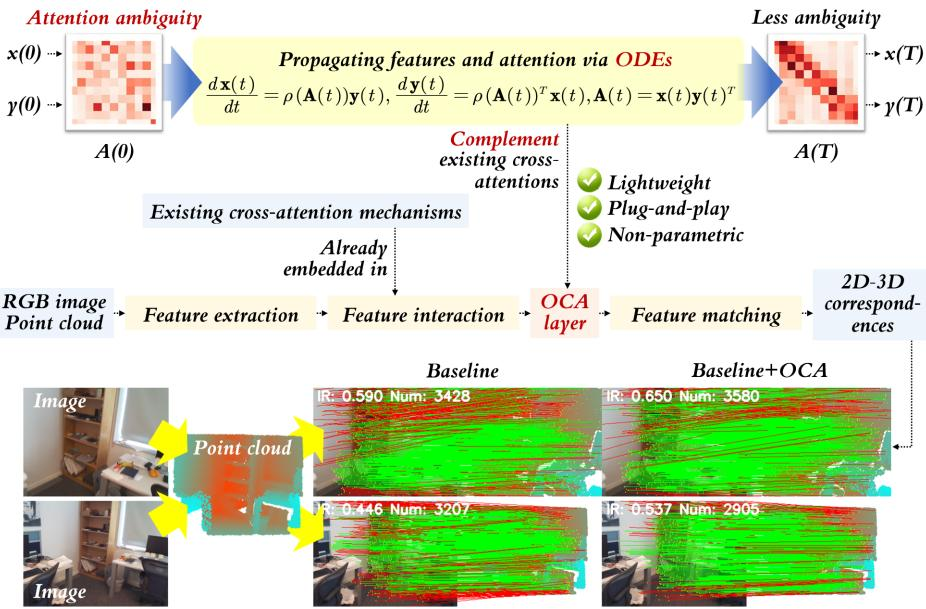
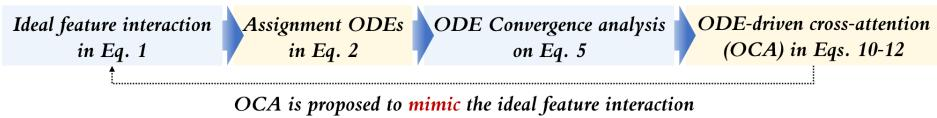
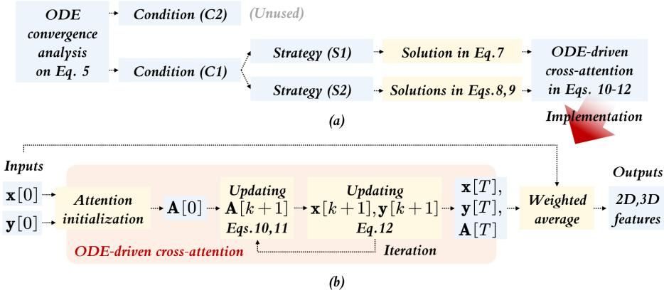
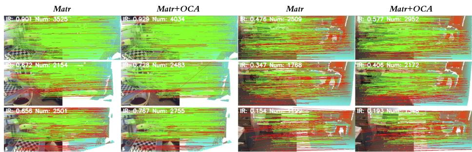
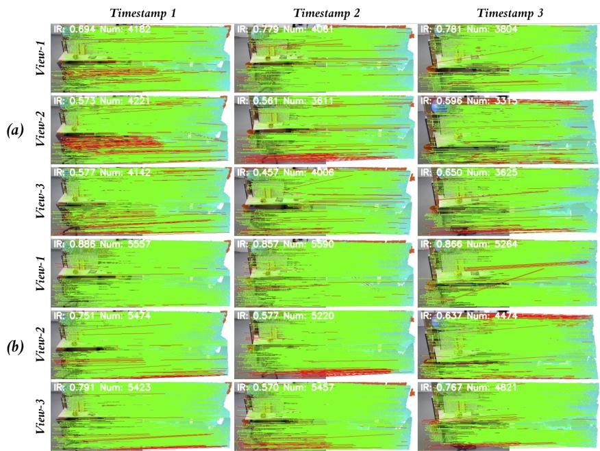
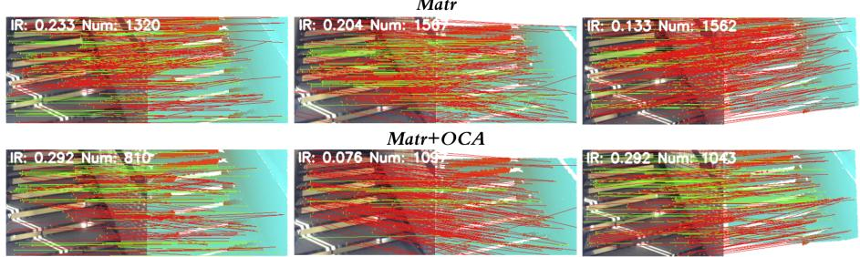
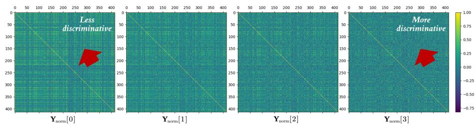
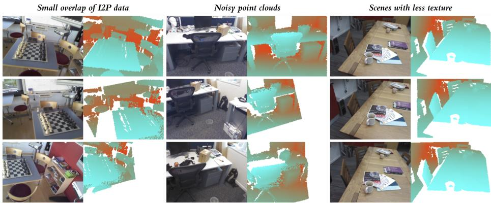
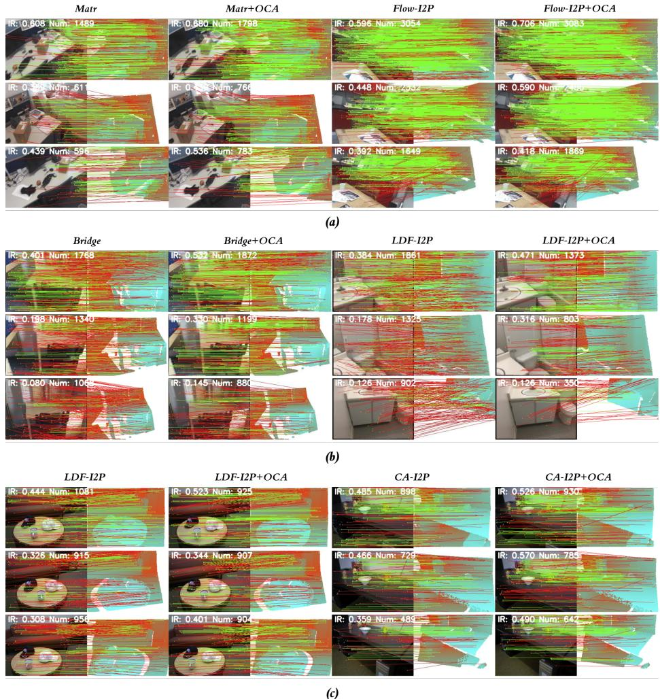
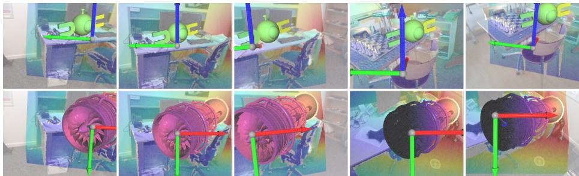

# OCA: ODE-Driven Cross-Attention for Image-to-Point-Cloud Registration

Pei An1 , Jiaqi Yang2 , Yulong Wang3 , Siwen Quan4† , and Liangliang Nan5†

1 Huazhong University of Science and Technology, China anpei96@hust.edu.cn

2 Northwestern Polytechnical University, China jqyang@nwpu.edu.cn

3 Huazhong Agricultural University, China ylwang@mail.hzau.edu.cn

4 Chang’an University, China siwenquan@chd.edu.cn

5 Delft University of Technology, Netherlands liangliang.nan@tudelft.nl

Abstract. Cross-attention is a crucial component in learning-based image to-point-cloud (I2P) registration. Although existing cross-attention mechanisms have achieved promising progress, attention ambiguity remains a fundamental challenge that hinders the learning of discriminative 2D-3D correspondences. To address this problem, we revisit cross-attention and establish ordinary diferential equations (ODEs) to model the ideal I2P feature interaction. Based on this formulation, we develop an ODEdriven cross-attention (OCA) module that refines feature representations and attention matrices through ODEs. In practice, OCA can be seamlessly integrated into existing I2P registration frameworks. To validate its efectiveness, we incorporate OCA into five state-of-the-art baselines and evaluate on four public benchmark datasets. Experimental results demonstrate that OCA improves registration recall by up to 5%, 9%, and 15% under the standard, fine-tuning, and zero-shot settings, respectively. Code is released at github.com/anpei96/oca-i2p-demo.

Keywords: Image-to-point-cloud registration · feature interaction · cross attention · ordinary diferential equation · attention ambiguity

## 1 Introduction

Image-to-point-cloud (I2P) registration is a fundamental task in computer vision [31]. Given an image and a 3D point cloud pair, it aims to establish 2D-3D pixel-to-point correspondences and estimate the camera pose within the point cloud coordinate system [37]. Accordingly, I2P registration supports a wide range of applications, including visual localization [6, 14], state estimation [34], point cloud colorization [30], and simultaneous localization and mapping (SLAM) [22]. Recently, learning-based I2P registration methods have attracted increasing attention [10, 17, 25]. In existing registration pipelines, feature interaction serves as a critical module. It bridges the modality gap and yields discriminative, modality-invariant features for robust I2P registration [5, 17, 21, 36].

  
Fig. 1: Motivation of ODE-driven cross-attention (OCA). Although existing crossattention models have made progress, attention ambiguity caused by the modality gap remains inevitable. To overcome this problem, we propose OCA to enhance I2P feature representations by propagating features and the attention matrix through ODEs. IR denotes the inlier ratio. Green and red lines represent inliers and outliers, respectively.

Cross-attention serves as the core component in feature interaction. In early works, cross-attention was adopted from representative intra-modal registration frameworks, including SuperGlue [26] and GeoTransformer [24]. In these methods [24, 26], cross-attention is employed to model the similarity of pairwise features between the source and target frames. Recently, cross-attention has been applied to I2P registration [17] since it models the feature similarity between 2D pixels and 3D points, thereby facilitating discriminative and modality-invariant correspondence learning [7].

However, when applying cross-attention from intra-modal to cross-modal I2P registration, attention ambiguity becomes an inevitable challenge. Due to the large modality gap, spurious 2D-3D correspondences may exhibit high similarity scores, which impedes the learning of reliable cross-modal correspondences [2,7]. To mitigate such ambiguity, researchers have improved cross-attention from various aspects, such as feature manifold alignment [2], feature uncertainty correction [7], feature covariance alignment [8], and keypoint-based correspondence learning [23]. Nevertheless, their capabilities (robustness and generalization ability) still have substantial room for improvement.

To strengthen the existing cross-attention mechanisms [2,7,8,17,23], we propose a plug-and-play module called ODE-driven cross-attention (OCA) (Fig.

1). To alleviate attention ambiguity, we establish the ordinary diferential equations (ODEs) termed assignment ODEs to mimic the ideal feature interaction. By analyzing the convergence conditions of the assignment ODEs, we develop the OCA module to refine I2P feature representations by propagating features and the attention matrix through ODEs. As a lightweight and non-parametric module, OCA can complement existing cross-attentions by integrating itself into current I2P registration frameworks. To validate the efectiveness of OCA, we perform extensive experiments on four standard datasets, namely 7-Scenes [11], RGBD-v2 [15], TUM [27], and ScanNet [9], across five state-of-the-art baselines with advanced cross-attention schemes [2, 7, 8, 17, 23]. Results demonstrate that OCA improves the registration recall by up to 5%, 9%, and 15% under the standard, fine-tuning, and zero-shot evaluation settings. In summary, our main contributions are as follows:

To approximate the ideal feature interaction, we construct the assignment ODEs, enabling the analysis of cross-attention from an ODE perspective.

– By analyzing the convergence condition of assignment ODEs, we propose a lightweight ODE-driven cross-attention (OCA) module to iteratively refine I2P representations through ODE propagation.

– OCA can be seamlessly integrated into existing I2P registration frameworks and complement the current cross-attention modules.

## 2 Related works

We provide a brief review of learning-based I2P registration and discuss the development of cross-attention for I2P registration.

Learning based I2P registration. To mitigate the modal discrepancy between images and point clouds, deep learning has become the dominant paradigm for image-to-point (I2P) registration. In 2019, Feng et al. [10] introduced the first learning-based I2P registration framework. Inspired by work [10], P2-Net [31], and Deep-I2P [16] were subsequently developed, which learn modality-invariant features using separate encoders for each modality [12, 29]. To suppress 2D-3D outliers, circle loss [28] is used to learn discriminative 2D-3D descriptors [31]. Since 2023, researchers have identified the lack of efective I2P feature interaction as the key bottleneck in suboptimal cross-modal representation learning [17, 25, 32, 36, 37]. Accordingly, transformer-based cross-attention has been integrated into existing I2P registration architectures [17], as illustrated in the middle image of Fig. 1. By designing dedicated feature interaction modules, recent I2P registration works [2, 7, 8] have achieved substantial performance gains on public benchmarks.

Cross-attention in I2P registration. Above works [2,7,8,17] have firmly established that cross-attention is indispensable for high-performance I2P registration. In this section, we review the evolution of cross-attention. Early approaches directly apply cross-attention between 2D and 3D keypoints [18,25,37]. However, without reliable priors, it is challenging to extract robust 2D and 3D keypoints that retain suficient true inliers. To avoid this issue, a naive alternative is to perform cross-attention between all 2D pixels and all 3D points, but this incurs an excessively heavy computational burden [37]. A practical compromise is to conduct cross-attention on 2D and 3D patches [17]. This solution has been widely adopted in state-of-the-art I2P registration frameworks [2, 7, 8, 21, 36].

  
Fig. 2: Overview of Sec. 3 and 4. OCA is designed to alleviate attention ambiguity by approximating the ideal feature interaction formulated in Eq. 1.

To pursue higher performance, researchers have recently developed advanced cross-attention to address the attention ambiguity. Current methods can be divided into two categories: prior-knowledge-based and prior-knowledge-free. Prior-knowledge-based cross-attention is to leverage geometric and semantic priors to suppress noisy feature correlations during cross-attention [1, 21, 32]. However, such methods are sensitive to the quality and generalization of pre-trained visual foundation models. Prior-knowledge-free based cross-attention is to design the more expressive deep neural networks [2, 7, 8, 17, 23], as discussed in Sec. 1. These methods do not rely on external pre-trained models, making them more convenient for real-world deployment.

In this paper, we attempt to strengthen the prior-knowledge-free based crossattention from an ODE perspective. Experimental results in Sec. 5 verify that our approach outperforms representative prior-free methods [2, 7, 8, 17, 23].

## 3 Rethinking cross-attention from ODEs

Starting from the ideal feature interaction, we reformulate cross-attention from an ODE perspective (see Fig. 2).

## 3.1 Assignment ODEs

To eliminate the modality diference of I2P data, we first model the procedure of ideal feature interaction. Let $\mathbf { x } \in \mathbb { R } ^ { N \times c }$ and $\mathbf { y } \in \mathbb { R } ^ { M \times c }$ be features of 2D pixels and 3D points, extracted separately from RGB image $\mathbf { I } \in \mathbb { R } ^ { H \times W \times 3 }$ and point cloud $\mathbf { P } \in \mathbb { R } ^ { M \times 3 }$ . c is the number of feature channels. $N = H W$ and M are the numbers of pixels and points, respectively. An ideal feature interaction can be constructed as:

$$
\mathbf { x } ^ { \prime } = \mathbf { x } + \mathbf { A } _ { g t } \mathbf { y } , \mathbf { \ x } ^ { \prime } = \mathbf { y } + \mathbf { A } _ { g t } ^ { T } \mathbf { x }\tag{1}
$$

where $\mathbf { A } _ { g t } \in \{ 0 , 1 \} ^ { N \times M }$ is the ground truth (GT) assignment matrix. $\begin{array} { r } { { \bf A } _ { g t } \mathbf { 1 } \leq N _ { : } } \end{array}$ $\mathbf { A } _ { g t } ^ { T } \mathbf { 1 } \leq \bar { M } . \mathbf { \partial } [ \dot { \mathbf { A } } _ { g t } ] _ { i j } = 1$ indicates that the i-th pixel and j-th point is a valid I2P correspondence (marked as $\langle i , j \rangle \in \mathcal { C }$ and C is a set of all valid correspondences).

Eq. 1 is the ideal interaction, because it ensures that $[ { \bf x } ^ { \prime } ] _ { i } = [ { \bf y } ^ { \prime } ] _ { j }$ for all $\langle i , j \rangle \in \mathcal { C }$ resulting in modality-invariant features after interaction. Since $\mathbf { A } _ { g t }$ is unknown before registration, Eq. 1 cannot be directly used in practice.

To mimic Eq. 1 in the correspondence learning, we model $\mathbf { x } ^ { \prime } , \mathbf { y } ^ { \prime } ;$ , and $\mathbf { A } _ { g t }$ as time-varying variables $( \mathrm { i . e . , } \ \mathbf { x } ( t ) , \ \mathbf { y } ( t )$ , and ${ \bf A } ( t ) )$ and develop a ODE-based feature interaction scheme:

$$
\frac { d \mathbf { x } ( t ) } { d t } = \rho ( \mathbf { A } ( t ) ) \mathbf { y } ( t ) , \ \frac { d \mathbf { y } ( t ) } { d t } = \rho ( \mathbf { A } ( t ) ) ^ { T } \mathbf { x } ( t ) , \ \mathbf { A } ( t ) = \mathbf { x } ( t ) \mathbf { y } ( t ) ^ { T } \in \mathbb { R } ^ { N \times M } .\tag{2}
$$

where ${ \bf A } ( t )$ is a feature correlation matrix, which is widely used in a transformer. $\rho ( \cdot )$ is a row-normalized operator for a matrix, i.e., softmax. $\rho ( \mathbf { A } ( t ) )$ describes the similarity of the i-th pixel and j-th point, serving as an approximation of $\mathbf { A } _ { g t }$ . Due to this reason, we name Eq. 2 as the assignment ODEs.

Discussions of assignment ODEs: The motivation of introducing assignment ODEs is to address attention ambiguity from the ODE viewpoint. Given an initial attention ${ \bf A } ( 0 )$ , our goal is to reduce attention ambiguity via $\rho ( \mathbf { A } ( + \infty ) )$ ≈ $\mathbf { A } _ { g t }$ . To reach such a $\mathbf { A } ( + \infty )$ , we derive ODEs to describe the dynamics of ${ \bf A } ( t )$ and develop the OCA module by analyzing the convergence conditions of ODEs. More specifically, according to Eq. 2, the interacted features are $\mathbf { x } ( T ) =$ $\begin{array} { r } { { \bf x } ( 0 ) + \int _ { 0 } ^ { T } \rho ( { \bf A } ( t ) ) { \bf y } ( t ) d t } \end{array}$ and $\begin{array} { r } { \mathbf { y } ( T ) = \mathbf { y } ( 0 ) + \int _ { 0 } ^ { T } \boldsymbol { \rho } ( \mathbf { A } ( t ) ) ^ { T } \mathbf { x } ( t ) d t } \end{array}$ . If the initial attention $\rho ( \mathbf { A } ( 0 ) )$ is closed to $\begin{array} { r } { { \bf A } _ { g t } , \int _ { 0 } ^ { T } \rho ( { \bf A } ( t ) ) { \bf y } ( t ) d t } \end{array}$ and $\begin{array} { r } { \int _ { 0 } ^ { T } \rho ( \mathbf { A } ( t ) ) ^ { T } \mathbf { x } ( t ) } \end{array}$ would enhance the feature similarity of correct correspondences inside $\mathbf { x } ( T )$ and $\mathbf { y } ( T )$ Then, $\rho ( \mathbf { A } ( t ) )$ tends to be sparser and approaches $\mathbf { A } _ { g t }$ . It indicates that attention ambiguity can be alleviated via the propagation of assignment ODEs.

## 3.2 Relation of cross-attention and assignment ODEs

In this subsection, we reveal the relation between cross-attention and assignment ODEs in Eq. 2. Using the explicit Euler method, Eq. 2 can be reformulated in a discrete form under the approximation $\rho ( \mathbf { A } ( t ) ) ^ { T } \approx \bar { \rho ( \mathbf { A } ( t ) ^ { T } ) }$ :

$$
\mathbf { x } [ k + 1 ] = \mathbf { x } [ k ] + \rho ( \mathbf { x } [ k ] \mathbf { y } [ k ] ^ { T } ) \mathbf { y } [ k ] , \ \mathbf { y } [ k + 1 ] = \mathbf { y } [ k ] + \rho ( \mathbf { y } [ k ] \mathbf { x } [ k ] ^ { T } ) \mathbf { x } [ k ]\tag{3}
$$

If $\rho ( \cdot )$ is a softmax with a scaling factor (reducing matrix elements by $1 / \sqrt { c }$ times), Eq. 3 can be formulated as a standard transformer-based cross-attention:

$$
\begin{array} { r l } & { \mathbf { x } [ k + 1 ] = \mathbf { x } [ k ] + \mathsf { s o f t m a x } \left( \mathbf { x } [ k ] \mathbf { y } [ k ] ^ { T } / \sqrt { c } \right) \mathbf { y } [ k ] , } \\ & { \mathbf { y } [ k + 1 ] = \mathbf { y } [ k ] + \mathsf { s o f t m a x } \left( \mathbf { y } [ k ] \mathbf { x } [ k ] ^ { T } / \sqrt { c } \right) \mathbf { x } [ k ] } \end{array}\tag{4}
$$

The approximate equivalence between Eqs. 3 and 4 highlights the close connection between cross-attention and assignment ODEs. Consequently, analyzing the assignment ODEs can help overcome the attention ambiguity inherent in cross-attention.

## 3.3 Convergence analysis of assignment ODEs

As discussed in Sec. 3.1, eliminating attention ambiguity is equivalent to determining whether $\rho ( \mathbf { A } ( t ) )$ converges to $\mathbf { A } _ { g t }$ as t is +∞. Consequently, we analyze the convergence of $\rho ( \mathbf { A } ( t ) )$ :

$$
{ \frac { d \rho ( \mathbf { A } ( t ) ) } { d t } } = { \frac { d \rho ( \mathbf { A } ( t ) ) } { \mathbf { A } ( t ) } } { \frac { d \mathbf { A } ( t ) } { d t } } = \rho ^ { \prime } ( \mathbf { A } ( t ) ) \left( \rho ( \mathbf { A } ( t ) ) \mathbf { Y } ( t ) + \mathbf { X } ( t ) \rho ( \mathbf { A } ( t ) ) \right)\tag{5}
$$

$$
\mathbf { X } ( t ) = \mathbf { x } ( t ) \mathbf { x } ( t ) ^ { T } , \mathbf { Y } ( t ) = \mathbf { y } ( t ) \mathbf { y } ( t ) ^ { T }\tag{6}
$$

$\rho ^ { \prime } ( { \bf A } ( t ) )$ is the abbreviation of $d \rho ( \mathbf { A } ( t ) ) / d \mathbf { A } ( t )$ . The derivation of Eq. 5 is shown in Appendix A. To ensure the convergence of $\rho ( \mathbf { A } ( t ) ) \ ( \mathrm { i . e . , \ } d \rho ( \mathbf { A } ( t ) ) / d t = \mathbf { 0 } )$ , a stationary condition can arise when one of the following holds:

Condition (C1): $\rho ^ { \prime } ( \mathbf { A } ( t ) ) = \mathbf { 0 }$ . Since $\rho ( \cdot )$ is a normalization operator, $\rho ^ { \prime } ( { \bf A } ( t ) ) =$ 0 if ${ \bf A } ( t )$ is a permutation matrix.

Condition (C2): $\rho ( \mathbf { A } ( t ) ) \mathbf { Y } ( t ) + \mathbf { X } ( t ) \rho ( \mathbf { A } ( t ) ) = \mathbf { 0 }$ . According to the theory of the Sylvester equation [3], non-zero $\rho ( \mathbf { A } ( t ) )$ can exist if $\mathbf X ( t )$ and $\mathbf { Y } ( t )$ have at least one same eigenvalue. In practice, this condition does not contribute to improving I2P registration performance (see discussion in Appendix A).

Motivated by this analysis, we derive, from condition (C1), two practical strategies that encourage $\rho ( \mathbf { A } ( t ) )$ to approximate $\mathbf { A } _ { g t } \mathbf { : }$

Strategy (S1): Ensure the sparsity of $\rho ( \mathbf { A } ( t ) )$ , since a sparse $\rho ( \mathbf { A } ( t ) )$ can bring $\rho ^ { \prime } ( { \bf A } ( t ) )$ close to a zero matrix.

Strategy (S2): Ensure that the initial value $\rho ( \mathbf { A } ( 0 ) )$ is close to $\mathbf { A } _ { g t }$

The standard transformer-based cross-attention defined in Eq. 4 struggles to satisfy strategies (S1) and (S2). The reasons are twofold. First, the softmax function cannot guarantee the sparsity of $\rho ( \mathbf { A } ( t ) )$ . Second, it is dificult to ensure that $\rho ( \mathbf { A } ( 0 ) )$ is close to $\mathbf { A } _ { g t }$ , as feature matching relies on L2-normalized features. Thus, the standard cross-attention fails to efectively resolve attention ambiguity.

## 4 Refining cross-attention with ODEs

From the analysis of assignment ODEs, we design the ODE-driven cross-attention (OCA) module and develop an OCA-embedded I2P registration framework.

## 4.1 Feasible solutions from ODE perspective

To improve cross-attention from strategies (S1) and (S2), we derive the feasible solutions that form the foundation of OCA. Towards (S1), a simple strategy is to prune $\rho ( \mathbf { A } ( t ) )$ . One naive way is the top-K based pruning. In the i-th row of $\rho ( \mathbf { A } ( t ) )$ ), the largest top-K elements are retained while others are set to zero. This procedure is described as:

$$
\rho _ { \mathrm { s p a r s e } } ( \mathbf { A } ( t ) ) = \mathrm { n o r m \_ r o w } ( \mathrm { p r u n e } ( \operatorname { s o f } \mathrm { t m a x } ( \mathbf { A } ( t ) ) , K ) ) \approx \mathrm { s o f t m a x } ( \gamma \mathbf { A } ( t ) )\tag{7}
$$

  
Fig. 3: Overview of OCA. (a) From the convergence condition (C1), we discover that solutions in Eqs. 7, 8, and 9 can guide the assignment ODEs to rapidly approach the ground-truth assignment matrix. After that, we propose OCA to unify the solutions in Eqs. $7 , 8 ,$ and 9. (b) The overall pipeline of OCA. For computation eficiency, Eqs. 10, 11, and 12 are adopted to approximate Eqs. 8 and 9.

where norm\_row(·) is a function that normalizes each row of a matrix by dividing the sum of the elements in this row. Nevertheless, this scheme risks gradient vanishing in the initial training phase, since the correct correspondence easily does not belong to the top-K elements. A safe pruning scheme incorporates the temperature parameter $\gamma$ into the softmax function (right-hand side in $\operatorname { E q . 7 } )$ $\gamma \geq 1$ amplifies the diference of each row in ${ \bf A } ( t )$ so that softmax $( \gamma \mathbf { A } ( t ) )$ can be regarded as an approximation of $\rho _ { \mathrm { s p a r s e } } ( \mathbf { A } ( t ) ) ,$ . Towards (S2), we redefine the computation of ${ \bf A } ( t )$ as:

$$
\mathbf { A } ( t ) = \mathbf { x } _ { \mathrm { n o r m } } ( t ) \mathbf { y } _ { \mathrm { n o r m } } ( t ) ^ { T } = \| \mathbf { x } ( t ) \| _ { 2 } ^ { - 1 } \mathbf { x } ( t ) \| \mathbf { y } ( t ) \| _ { 2 } ^ { - 1 } \mathbf { y } ( t ) ^ { T }\tag{8}
$$

The reason why Eq. 8 is more accurate than Eq. 2 is that 2D-3D correspondence is identified based on the L2-normalized feature distance [17, 31], whereas standard transformers do not normalize features during cross-attention computation.

Beyond Eqs. 7 and 8, the most crucial solution is to leverage ODEs in Eqs. 2 and 5. Given the initial values $\mathbf { x } ( 0 ) , \mathbf { y } ( 0 )$ , and ${ \bf A } ( 0 )$ , we can forecast $\mathbf { x } ( T )$ $\mathbf { y } ( T )$ , and ${ \bf A } ( T )$ by integrating $d \mathbf { x } ( t ) / d t , \ d \mathbf { y } ( t ) / d t$ , and $d \mathbf { A } ( t ) / d t$ . During the integrations, the feature similarity of incorrect correspondences is progressively suppressed5. In the above integrations, $\textstyle \int d \mathbf { A } ( t ) / d t$ should be carefully addressed:

$$
\mathbf { A } ( T ) = \mathbf { A } ( 0 ) + \int _ { 0 } ^ { T } d \mathbf { A } ( t ) = \mathbf { A } ( 0 ) + \int _ { 0 } ^ { T } \rho ( \mathbf { A } ( t ) ) \mathbf { Y } ( t ) + \mathbf { X } ( t ) \rho ( \mathbf { A } ( t ) ) d t\tag{9}
$$

If we use Eq. 8 to compute ${ \bf A } ( t )$ , the analytic derivation of ${ \bf A } ( t )$ to t is complex enough, not $\rho ( \mathbf { A } ( t ) ) \mathbf { Y } ( t ) + \mathbf { X } ( t ) \rho ( \mathbf { A } ( t ) )$ . To address this issue, we utilize a numerical approximation scheme, i.e., computing the derivation of ${ \bf A } ( t )$ to t after the normalization of ${ \bf x } ( t )$ and ${ \bf y } ( t )$ . Computation details are shown in Sec. 4.2. We do not integrate $d \rho ( \mathbf { A } ( t ) ) / d t$ , since $\rho ( \mathbf { A } ( t ) )$ is a matrix with constraints.

## 4.2 ODE-driven based cross-attention

To unify Eqs. 7, 8, and 9 into a single framework, we propose the OCA module, as shown in Fig. 3. It consists of two stages:

Step 1: attention initialization. Given the image and point cloud features $\mathbf { x } [ 0 ]$ and $\mathbf { y } [ 0 ]$ (details of them are provided in Sec. 4.3), A[0] is computed via Eq. 8 and then pruned via Eq. $7 . \rho _ { \mathrm { s p a r s e } } ( \mathbf { A } [ 0 ] )$ is obtained as the initialized attention.

Step 2: attention propagation. This step is to compute $\mathbf { A } [ T ]$ through Eq. 9 discretely. As discussed in Sec. 4.1, the derivation of ${ \bf A } ( t )$ to t is computed after the normalization of ${ \bf x } ( t )$ and $\mathbf { y } ( t )$ , so Eq. 6 needs to be corrected as:

$$
\mathbf { X } _ { \mathrm { n o r m } } [ k ] = \mathbf { x } _ { \mathrm { n o r m } } [ k ] \mathbf { x } _ { \mathrm { n o r m } } [ k ] ^ { T } , \mathbf { Y } _ { \mathrm { n o r m } } [ k ] = \mathbf { y } _ { \mathrm { n o r m } } [ k ] \mathbf { y } _ { \mathrm { n o r m } } [ k ] ^ { T }\tag{10}
$$

A discrete computation approach of Eq. 9 is provided as:

$$
\mathbf { A } [ k + 1 ] = \mathbf { A } [ k ] + \tau ( \rho _ { \mathrm { s p a r s e } } ( \mathbf { A } [ k ] ) \mathbf { Y } _ { \mathrm { n o r m } } [ k ] + \mathbf { X } _ { \mathrm { n o r m } } [ k ] \rho _ { \mathrm { s p a r s e } } ( \mathbf { A } [ k ] ) )\tag{11}
$$

$$
\begin{array} { r } { \left\{ \begin{array} { l l } { \mathbf { x } [ k + 1 ] = \mathbf { x } [ k ] + \tau \rho _ { \mathrm { s p a r s e } } ( \mathbf { A } [ k + 1 ] ) \mathbf { y } [ k ] } \\ { \mathbf { y } [ k + 1 ] = \mathbf { y } [ k ] + \tau \rho _ { \mathrm { s p a r s e } } ( \mathbf { A } [ k + 1 ] ^ { T } ) \mathbf { x } [ k ] } \end{array} \right. , k = 0 , . . . , T - 1 } \end{array}\tag{12}
$$

where $\tau \in [ 0 , 1 ]$ is a time step. During ODE propagation, Eqs. 11 and 12 are computed iteratively. Finally, the OCA module outputs weighted average features of $\mathbf { x } [ 0 ]$ and $\mathbf { x } [ T ] , \mathbf { y } [ 0 ]$ and $\mathbf { y } [ T ]$ , with a weighting factor ω. Also, Eqs. 10, 11, and 12 show that $\mathrm { O C A }$ is a lightweight and non-parametric module.

## 4.3 OCA-embedded I2P registration

To further leverage OCA, we develop a simple yet efective OCA-embedded I2P registration scheme. It is noted that existing $\mathrm { I 2 P }$ registration frameworks consist of three modules, $\mathrm { i . e . } .$ , feature extraction, feature interaction, and feature matching [2, 7, 8, 17, 23]. To complement existing cross-attention modules, we insert the proposed OCA module after the feature interaction module, as illustrated in the middle image of Fig. 1. To supervise the OCA-embedded I2P registration, we adopt a two-stage training strategy. In the first stage, we train the original I2P registration framework from scratch with $\tau = 0$ . In the next stage, we finetune the framework with the original τ . The default I2P registration loss [17] is adopted during the two-stage training. The usage of two-stage training enforces strategy (S1) by ensuring that $\rho _ { \mathrm { s p a r s e } } ( \mathbf { A } [ 0 ] )$ is closed to $\mathbf { A } _ { g t }$

## 5 Experiments and Discussions

To evaluate the efectiveness of the proposed OCA-embedded I2P registration, we conduct experiments on four public datasets with five state-of-the-art baselines [2, 7, 8, 17, 23] under the standard, fine-tuning, and zero-shot comparisons.

## 5.1 Configurations

We illustrate the experiment configurations, including datasets, baselines, metrics, and implementations of I2P registration.

Datasets. Four public indoor datasets are used for the I2P registration. 7-Scenes [11] is a common dataset for 2D and 3D registration evaluation. We follow the previous work [17] to decompose the training and testing splits. Then, to verify the stability of diferent I2P registration models in the new scenes, other datasets, such as RGBD-v2 [15], TUM [27] and ScanNet [9], are utilized for the fine-tuning comparisons where the ratio of training and testing samples are 1:10. In each dataset, the inputs of I2P registration are RGB images and point clouds (without color features). Input data is visualized and discussed in Appendix C.

Baselines. We conduct comparisons with five state-of-the-art baseline methods, including Matr (ICCV’23) [17], Flow-I2P (IJCV’25) [2], Bridge (AAAI’25) [7], CA-I2P (ICCV’25) [8], and LDF-I2P (TIM’25) [23]. They are feature-based registration methods that contain the various advanced prior-knowledge-free crossattention mechanisms. To evaluate the performance of the proposed method, OCA is embedded into the above I2P registration frameworks as X+OCA. For a fair comparison, we enforce the inputs of all methods to be the same (i.e., RGB images and point clouds) without using any geometric priors. Moreover, to verify the gain stemming from OCA versus more training epochs, we set a method X+Ref which is to train X with the epoch and optimizer settings the same as X+OCA. The comparison between X+Ref and X+OCA is fair, since they do not introduce any new learnable parameters.

Metrics. To fully measure the I2P registration performance, we use inlier ratio (IR) and registration recall (RR) as the main metrics, since they are common in any registration task. Compared with IR, RR can reflect the global registration accuracy. Moreover, we use the relative rotation error (RRE) and relative translation error (RTE) to evaluate the accuracy of the camera pose estimated from the predicted 2D-3D correspondences. Thresholds of IR and RR are 5cm and 10cm. Computation details of these metrics refer to work [17].

Implementations. All methods are trained, fine-tuned, and tested on the same computer with one NVIDIA GeForce RTX 3080 GPU. The learning rate is 1e-4. Training epochs of X and X+OCA (X+Ref) are set as 25 and 32, respectively. Adam optimizer is utilized in the training stage. The maximum number of point clouds is 30K, and RGB images have a size of 320×480. In the comparisons, some methods [2, 17, 23] are open-source, while others [7, 8] are implemented by ourselves based on the architecture of [17].

Table 1: Standard evaluation of the proposed OCA module with five baselines on the 7-Scene dataset [11].
<table><tr><td rowspan=1 colspan=3>Methods</td><td rowspan=1 colspan=1>IR     RR</td></tr><tr><td rowspan=1 colspan=3>Matr [17]</td><td rowspan=3 colspan=1>0.453   0.4720.475  0.5010.501 0.552+5%</td></tr><tr><td rowspan=1 colspan=2>Matr [17]+Ref</td><td rowspan=1 colspan=1></td></tr><tr><td rowspan=1 colspan=3>Matr [17]+OCA</td><td rowspan=1 colspan=1></td></tr><tr><td rowspan=1 colspan=3>Flow-I2P [2]Flow-I2P [2]+Ref</td><td rowspan=1 colspan=1></td></tr><tr><td rowspan=1 colspan=3>Flow-I2P [2]+OCA</td><td></td></tr><tr><td rowspan=1 colspan=3>Bridge [7]</td><td rowspan=3 colspan=1>0.460  0.5050.501  0.5200.529 0.550+3%</td></tr><tr><td rowspan=1 colspan=3>Bridge [7]+Ref</td></tr><tr><td rowspan=1 colspan=3>Bridge [7]+OCA</td><td rowspan=1 colspan=1></td></tr><tr><td rowspan=1 colspan=1>CA-I2P[8]</td><td rowspan=1 colspan=2></td><td rowspan=3 colspan=1>0.459  0.4950.503  0.5340.524 0.565+3%</td></tr><tr><td rowspan=1 colspan=3>CA-I2P[8]+Ref</td></tr><tr><td rowspan=1 colspan=3>CA-I2P[8]+OCA</td></tr><tr><td rowspan=1 colspan=3>LDF-I2P[23]LDF-I2P [23]+RefLDF-I2P [23]+OCA</td><td rowspan=1 colspan=1>0.446  0.5410.487  0.5510.525 0.591+4%</td></tr></table>

Table 2: Fine-tuning evaluation of the proposed OCA module with five baselines on the RGBD-v2 dataset [15].
<table><tr><td rowspan=1 colspan=2>Methods</td><td rowspan=1 colspan=1>IR     RR</td></tr><tr><td rowspan=1 colspan=2>Matr [17]</td><td rowspan=3 colspan=1>0.341   0.4570.372   0.4980.375 0.537+4%</td></tr><tr><td rowspan=1 colspan=2>Matr [17]+Ref</td></tr><tr><td rowspan=1 colspan=2>Matr [17]+OCA</td></tr><tr><td rowspan=1 colspan=2>Flow-I2P [2]</td><td rowspan=3 colspan=1>0.361   0.5470.379  0.5730.387 0.580+1%</td></tr><tr><td rowspan=2 colspan=2>Flow-I2P[2]+Ref</td></tr><tr><td rowspan=1 colspan=1>Flow-I2P [2]+OC</td></tr><tr><td rowspan=1 colspan=2>Bridge [7]</td><td rowspan=1 colspan=1></td></tr><tr><td rowspan=1 colspan=2>Bridge [7]+Ref</td><td rowspan=1 colspan=1>Bridge [7]+OCA</td></tr><tr><td rowspan=1 colspan=2>CA-I2P[8]</td><td rowspan=2 colspan=1>0.349  0.5330.335  0.5460.362 0.583+4%</td></tr><tr><td rowspan=1 colspan=2>CA-I2P[8]+RefCA-I2P[8]+OCA</td></tr><tr><td rowspan=1 colspan=2>LDF-I2P[23]LDF-I2P [23]+RefLDF-I2P [23]+OCA</td><td rowspan=1 colspan=1>0.325  0.5010.340  0.5270.370 0.540+1%</td></tr></table>

## 5.2 Comparisons

Standard comparisons. We first investigate the performance of OCA with five baseline methods on the 7-Scene dataset [11]. All methods are trained and tested on the training and testing samples split by the work [17]. The means of IR and RR on seven indoor scenes are shown in Table 1. With the help of the OCA module, the IR and RR metrics of baselines are significantly improved. For the Matr [17], Flow-I2P [2] and CA-I2P [8], the improvements on RR metric are beyond 3%. These results demonstrate that the gain of X+OCA stems from OCA rather than the extra training epochs.

Fine-tuning comparisons. To evaluate the performance of the OCA module on I2P registration in the new scenarios, we conduct fine-tuning experiments on multiple datasets. Methods, X, X+OCA and X+Ref, pretrained on the 7- Scenes [11], are fine-tuned and tested on the RGBD-v2 [15], TUM [27], and ScanNet [9] datasets. The comparison results are shown in Tables 2, 3, and 4. As scenes on RGBD-v2 [15] have less texture and sparser point clouds, the gains of OCA on five baselines are smaller compared with 7-Scenes [11]. On the TUM dataset [27], the improvements from the OCA module are significant. The RR gain of OCA on Matr [17] exceeds 8%. Since scenes in the ScanNet dataset [9] contain abundant textures, all compared methods yield promising registration results, with recall rates above 65%. In particular, X+OCA outperforms all other approaches and obtains state-of-the-art performance. Thus, the fine-tuning results support the efectiveness of the OCA module.

Zero-shot comparisons. To verify the generalization ability of OCA, we conduct zero-shot I2P registration experiments. Methods, X+Ref and X+OCA, are pretrained on the 7-Scene dataset [11], but tested on the ScanNet dataset [9]. We also set a new comparison method $\mathrm { X + Z e r o - O C A }$ . It directly inserts OCA into the X+Ref without any fine-tuning. Results are provided in Table 5 with the representative baselines [2,7,17,23]. Both OCA and Zero-OCA significantly improve the registration recall. In the baseline of Flow-I2P [2], the gain of Zero-OCA is 15%. While the gain of OCA on the baseline of Bridge [7] is 12%. It is also found that inlier ratios of OCA and Zero-OCA are smaller than the baseline. The reason is analyzed here. In the zero-shot I2P case, initial features are less accurate than in other situations. With inaccurate features, OCA remains high-confidence correspondences while discarding the low-confidence through propagation, and thus IR is dropping. The remaining high-confidence correspondences are accurate and lead to the precise camera pose estimation, and thus RR is finally improved. Overall, these experiments demonstrate the generalization capability of the OCA module.

Table 3: Fine-tuning evaluation of the proposed OCA module with five baselines on the TUM dataset [27].  
Table 4: Fine-tuning evaluation of the proposed OCA module with five baselines on the ScanNet dataset [9].
<table><tr><td rowspan=1 colspan=4>Methods</td><td rowspan=1 colspan=1>IR     RR</td></tr><tr><td rowspan=1 colspan=4>Matr [17]</td><td rowspan=3 colspan=1>0.568   0.4720.629   0.6470.703 $\mathbf { 0 . 7 0 5 ^ { + 8 \% } }$ </td></tr><tr><td rowspan=1 colspan=3>Matr [17]+Ref</td><td rowspan=2 colspan=1></td></tr><tr><td rowspan=1 colspan=2>Matr [17]+OCA</td><td></td></tr><tr><td rowspan=2 colspan=3>Flow-I2P [2]Flow-I2P [2]+Ref</td><td rowspan=1 colspan=1></td><td rowspan=3 colspan=1>0.666   0.6770.703  0.7320.737 0.775+4%</td></tr><tr><td rowspan=1 colspan=2></td></tr><tr><td rowspan=1 colspan=3>Flow-I2P [2]+OCA</td><td rowspan=1 colspan=1>A</td></tr><tr><td rowspan=1 colspan=4>Bridge [7]Bridge $[ 7 ] + { \tt R e f }$ </td><td rowspan=2 colspan=1>0.653   0.7160.716  0.7610.744 0.806+4%</td></tr><tr><td rowspan=1 colspan=4>Bridge [7]+OCA</td></tr><tr><td rowspan=1 colspan=4>CA-I2P[8]</td><td rowspan=2 colspan=1>0.668   0.7050.705   0.7430.744 $\mathbf { 0 . 7 7 8 ^ { + 3 \% } }$ </td></tr><tr><td rowspan=1 colspan=4>CA-I2P[8]+RefCA-I2P[8]+OCA</td></tr><tr><td rowspan=1 colspan=4>LDF-I2P [23] $\mathrm { L D F - I 2 P }$  $[ 2 3 ] { \ + } \mathtt { R e f }$ LDF-I2P [23]+OCA</td><td rowspan=1 colspan=1>0.627   0.6360.643   0.675 $\mathbf { 0 . 7 1 0 \ 0 . 7 6 4 } ^ { + 9 \% }$ </td></tr></table>

<table><tr><td rowspan=1 colspan=4>Methods</td><td rowspan=1 colspan=1>IR     RR</td></tr><tr><td rowspan=1 colspan=4>Matr [17]</td><td rowspan=3 colspan=1>0.342   0.6640.376   0.691 $\mathbf { 0 . 3 8 7 0 . 7 1 1 ^ { + 2 \% } }$ </td></tr><tr><td rowspan=2 colspan=4>Matr [17]+Ref</td></tr><tr><td rowspan=1 colspan=2>Matr [17]+OCA</td></tr><tr><td rowspan=1 colspan=3>Flow-I2P [2]</td><td rowspan=1 colspan=1></td><td rowspan=3 colspan=1>0.386   0.7630.391   0.7700.442 0.789+2%</td></tr><tr><td rowspan=1 colspan=3>Flow-I2P [2]+Ref</td><td rowspan=2 colspan=1>ef A</td></tr><tr><td rowspan=1 colspan=2>Flow-I2P [2]+OCA</td><td></td></tr><tr><td rowspan=1 colspan=4>Bridge [7]</td><td rowspan=1 colspan=1></td></tr><tr><td rowspan=1 colspan=4>Bridge [7]+Ref</td><td rowspan=2 colspan=1></td></tr><tr><td rowspan=1 colspan=2>Bridge [7]+OCA</td><td></td><td></td></tr><tr><td rowspan=1 colspan=3>CA-I2P [8]</td><td rowspan=1 colspan=1></td><td rowspan=2 colspan=1>0.383   0.7300.408  0.7390.439 $\mathbf { 0 . 7 4 3 ^ { + 1 \% } }$ </td></tr><tr><td rowspan=1 colspan=3>CA-I2P [8]+Ref</td><td rowspan=1 colspan=2>CA-I2P [8]+OCA</td></tr><tr><td rowspan=1 colspan=4>LDF-I2P [23] $\mathrm { L D F - I 2 P \ [ 2 3 ] + R e f }$ LDF-I2P [23]+OCA</td><td rowspan=1 colspan=1>0.392   0.6970.422  0.7440.461 0.783+4%</td></tr></table>

Table 5: Zero-shot registration evaluation of the proposed OCA module with representative baselines on the ScanNet dataset [9].

<table><tr><td>Matr [17]</td><td>+Ref +OCA</td><td> $+ { \tt Z e r o - O C A }$ </td><td>[Flow-I2P [17]]</td><td>+Ref +OCA</td><td> $+ \mathbf { Z e r o - O C A }$ </td></tr><tr><td>IR RR</td><td>0.259 0.253 0.184  $0 . 2 1 7 ^ { + 3 \% }$ </td><td>0.215  $\mathbf { 0 . 2 7 6 ^ { + 9 \% } }$ </td><td>IR RR</td><td>0.310 0.287  $0 . 2 6 3 \ : \ : 0 . 3 4 2 ^ { + 8 \% }$ </td><td>0.210  $\mathbf { 0 . 4 1 4 ^ { + 1 5 \% } }$ </td></tr><tr><td>Bridge [7]</td><td>+Ref +OCA</td><td> $\overline { { + \mathbf { Z  e r o - O C A } } }$ </td><td>LDF-I2P [23]</td><td>+Ref +OCA</td><td>+Zero-OCA</td></tr><tr><td>IR RR</td><td>0.330 0.307 0.224  $\mathbf { 0 . 3 4 2 ^ { + 1 2 \% } }$ </td><td>0.295  $0 . 3 1 6 ^ { + 9 \% }$ </td><td>IR IR</td><td>0.304 0.293 0.3090.349+4%</td><td>0.210  $\mathbf { 0 . 4 2 8 ^ { + 1 2 \% } }$ </td></tr></table>

Table 6: Comparisons with existing propagation-based methods on the TUM dataset [27].

<table><tr><td colspan="6">Methods|Matr+OCAMatr+Simple DDPM [13] Matr+Simple FM [19] Diff-Reg [32]</td></tr><tr><td>IR</td><td>0.703</td><td>0.465</td><td></td><td>0.448</td><td>0.623</td></tr><tr><td>RR</td><td>0.705</td><td></td><td>0.460</td><td>0.459</td><td>0.602</td></tr></table>

Fig. 4: Qualitative comparisons of Matr [17] and Matr+OCA on the 7-Scenes dataset [11]. Across various scenes with diferent overlap ratios, the proposed OCA module increases the number of inliers.  
  
Fig. 5: Qualitative comparison on the TUM dataset [27] under diferent viewpoints with consecutive timestamps. (a) CA-I2P [8] and (b) CA-I2P+OCA. With the integration of OCA, the I2P registration results become more stable and accurate.

Qualitative analysis. Visualizations of some representative baselines Matr [17] and CA-I2P [8] w/ and w/o OCA module are presented in Figs. 4 and 5. More visualizations with the diferent baselines and datasets are presented in Appendix

Matr

Fig. 6: Failure case of the proposed OCA module in extremely texture-less scenes. In the second column, the IR of Matr+OCA decreases to 7.6%.  
  
Fig. 7: Visualization of $\mathbf { Y } _ { \mathrm { n o r m } } [ k ]$ . As $\mathbf { Y } _ { \mathrm { n o r m } } [ k ] = \mathbf { y } _ { \mathrm { n o r m } } [ k ] \cdot \mathbf { y } _ { \mathrm { n o r m } } [ k ] ^ { T }$ , a sparse $\mathbf { Y } _ { \mathrm { n o r m } } [ k ]$ indicates that the point feature is less redundant with other points, suggesting greater feature discriminability. During ODE propagation, $\mathbf { Y } _ { \mathrm { n o r m } } [ k ]$ tends to become sparser, which empirically supports the efectiveness of the proposed OCA module.

D. Therefore, the above qualitative results indicate the efectiveness of the OCA module in a variety of scenes.

Comparisons with other propagating methods. The denoising difusion probabilistic model (DDPM) [13] and flow matching (FM) [19] are state-of-theart methods that can propagate the attention matrix with ODE. As OCA is a non-parametric method, for fair comparisons, we implement the simple versions of DDPM and FM. Dif-Reg [32], as a recent work that leverages DDPM for I2P registration, is also compared. Results in Table 6 show that the proposed OCA module is more efective than the lightweight DDPM [13] and FM [19] models as well as Dif-Reg [32]. In-depth analysis is shown in Appendix E.

Extended comparisons. To further verify the performance of OCA, we conduct two extended comparisons in Appendix F. The first experiment is to compare OCA with existing prior-knowledge-based cross-attention-based methods. The second is to test the extensibility of OCA on the 3D registration task. OCA can also strengthen the intra-modal correspondence learning.

Failure case analysis. One representative failure case is provided in Fig. 6. In scenes without texture, the initial attention matrix $\rho _ { \mathrm { s p a r s e } } ( \mathbf { A } [ 0 ] )$ has larger errors, so any ODE propagation in A[0] is unstable and inaccurate. In future work, we will design a feedback mechanism to evaluate the accuracy of $\rho _ { \mathrm { s p a r s e } } ( \mathbf { A } [ 0 ] )$ and

Table 7: Ablation study on the iteration number T on the 7-Scenes dataset [11].  
Table 8: Ablation study on the time step τ on the 7-Scenes dataset [11].
<table><tr><td rowspan=1 colspan=1>T</td><td rowspan=1 colspan=1>1    2</td><td rowspan=1 colspan=1>3</td><td rowspan=1 colspan=1>4    5</td></tr><tr><td rowspan=1 colspan=1>IR</td><td rowspan=1 colspan=1>0.571 0.554</td><td rowspan=1 colspan=1>0.501</td><td rowspan=1 colspan=1>0.433 0.415</td></tr><tr><td rowspan=1 colspan=1>RR</td><td rowspan=1 colspan=1>0.489 0.510</td><td rowspan=1 colspan=1>0.552</td><td rowspan=1 colspan=1>0.575 0.539</td></tr></table>

<table><tr><td rowspan=1 colspan=1>T</td><td rowspan=1 colspan=1>0.05</td><td rowspan=1 colspan=1>0.10</td><td rowspan=1 colspan=1>0.15 0.20 0.25</td></tr><tr><td rowspan=1 colspan=1>IR</td><td rowspan=1 colspan=1>0.562</td><td rowspan=1 colspan=1>0.501</td><td rowspan=1 colspan=1>0.443 0.400 0.379</td></tr><tr><td rowspan=1 colspan=1>RR</td><td rowspan=1 colspan=1>0.495</td><td rowspan=1 colspan=1>0.552</td><td rowspan=1 colspan=1>0.541 0.497 0.494</td></tr></table>

Table 10: Parameter selection of the ω.  
Table 11: Runtime analysis (seconds).

Table 9: Parameter selection of the γ.
<table><tr><td rowspan=1 colspan=1>γ</td><td rowspan=1 colspan=1>1</td><td rowspan=1 colspan=1>2</td><td rowspan=1 colspan=1>4    8</td></tr><tr><td rowspan=1 colspan=1>IR</td><td rowspan=1 colspan=1>0.531</td><td rowspan=1 colspan=1>0.501</td><td rowspan=1 colspan=1>0.4720.435</td></tr><tr><td rowspan=1 colspan=1>RR</td><td rowspan=1 colspan=1>0.527</td><td rowspan=1 colspan=1>0.552</td><td rowspan=1 colspan=1>0.561 0.532</td></tr></table>

<table><tr><td rowspan=1 colspan=1>ω</td><td rowspan=1 colspan=1>0.05</td><td rowspan=1 colspan=1>0.10</td><td rowspan=1 colspan=1>0.15 0.20</td></tr><tr><td rowspan=1 colspan=1>IR</td><td rowspan=1 colspan=1>0.492</td><td rowspan=1 colspan=1>0.501</td><td rowspan=1 colspan=1>0.527 0.511</td></tr><tr><td rowspan=1 colspan=1>RR</td><td rowspan=1 colspan=1>0.531</td><td rowspan=1 colspan=1>0.552</td><td rowspan=1 colspan=1>0.542 0.525</td></tr></table>

<table><tr><td rowspan=1 colspan=1></td><td rowspan=1 colspan=1>|Time</td></tr><tr><td rowspan=1 colspan=1>Matr [17]Matr+OCA</td><td rowspan=1 colspan=1>0.1320.138</td></tr></table>

propose a more stable ODE propagation strategy for A[T]. It will enhance the robustness of the ODE-based cross-attention scheme.

## 5.3 Ablation studies

Ablations are conducted on the 7-Scenes dataset [11]. Matr [17] is the baseline. Attention propagating analysis. The core of OCA is to propagate the attention matrix A(t) via Eq. 9. To implement Eq. 9, we adopt a discrete propagation scheme to compute A[T] where the iteration number T and time step τ are crucial parameters. Ablation of T is provided in Table 7. When T is increasing from 1 to 4, it is observed that the inlier ratio drops from 57.1% to 43.3% while the registration recall is improved from 48.9% to 57.5%. During the propagation of ODE, A[T] will refine the high-confidence correspondences while discarding the low-confidence correspondences, so that the inlier ratio is decreased, but registration recall is increased. When $T \geq 5 , \mathbf { A } [ T ]$ has a risk of overfitting to some 2D-3D correspondences. It causes both drops. So, we set T as 3 for better balancing both metrics. Ablation of τ is presented in Table 8. A large τ causes the instability of the assignment ODE, so we set τ to 0.10 for better performance. Besides, the efect of ODE propagation is visualized in Fig. 7. The above results support the efectiveness of the OCA module.

Other parameter selection. Ablations of other parameters γ and ω are shown in Tables 9 and 10. The above results validate that a suitable selection of parameters enhances the efectiveness of the OCA module. More in-depth analysis of γ and ω is provided in Appendix G. Table 11 shows that the propagation of assignment ODEs only costs 6ms, which verifies the eficiency of the OCA module.

## 6 Conclusions

In this paper, we address attention ambiguity caused by the cross-modal gap by revisiting cross-attention in I2P registration from the ODE perspective. Specifically, we construct the assignment ODEs to approximate ideal cross-modal feature interactions. We establish a conceptual connection between these ODEs and the conventional cross-attention mechanism. By analyzing the stability properties of the assignment ODEs, we develop the ODE-driven cross-attention (OCA) module, which enhances correspondence learning through iterative refinement within existing I2P registration frameworks. Finally, extensive experiments on four public datasets with five representative baselines demonstrate the efectiveness and generalizability of the proposed OCA module.

Limitation and future work. Although OCA is robust to initial features with the moderate noises (cross-dataset case in Tables 3 and 4) and large noises (zeroshot case in Table 5), it fails in the heavily noised cases as shown in Fig. 6. This limitation arises from the reliance of ODE propagation on a reasonably informative initialization. In future work, we plan to extend the theoretical framework and develop a more robust ODE-based feature interaction mechanism to further improve reliability in challenging I2P registration scenarios.

Acknowledgments. This work is partially supported by the National Natural Science Foundation of China (Grand ID: 62502171, 62372377), General Program of the Natural Science Basic Research Plan of Shaanxi Province (Grand ID: 2025JC-YBMS-651), and China Postdoctoral Science Foundation (Grand ID: 2024M761014, GZC20252285)

## A. Derivation of Eq. 5 and discussion of convergence condition (c2)

Derivation of Eq. 5. The core of Eq. 5 is to derive the time derivative $d \mathbf { A } ( t ) / d t$ Given $\mathbf { A } ( t ) = \mathbf { x } ( t ) \mathbf { y } ( t ) ^ { T }$ , we compute $d \mathbf { A } ( t ) / d t$ using the product rule for matrix diferentiation as follows:

$$
{ \frac { d \mathbf { A } ( t ) } { d t } } = { \frac { d \mathbf { x } ( t ) \mathbf { y } ( t ) ^ { T } } { d t } } = \left( { \frac { d \mathbf { x } ( t ) } { d t } } \right) \mathbf { y } ( t ) ^ { T } + \mathbf { x } ( t ) \left( { \frac { d \mathbf { y } ( t ) } { d t } } \right) ^ { T }\tag{13}
$$

Substituting the definitions of $d { \bf x } ( t ) / d t$ and $d \mathbf { y } ( t ) / d t$ into Eq. 13, we obtain:

$$
\frac { d \mathbf { A } ( t ) } { d t } = \rho ( \mathbf { A } ( t ) ) \mathbf { y } ( t ) \mathbf { y } ( t ) ^ { T } + \mathbf { x } ( t ) \mathbf { x } ( t ) ^ { T } \rho ( \mathbf { A } ( t ) ) = \rho ( \mathbf { A } ( t ) ) \mathbf { Y } ( t ) + \mathbf { X } ( t ) \rho ( \mathbf { A } ( t ) )\tag{14}
$$

Finally, Eq. 5 (in the main paper) is directly derived from Eq. 14.

Discussion of condition (c2). We explain why condition (C2) does not significantly contribute to enhancing I2P registration performance. According to the theory of the Sylvester equation [3], equation $\rho ( \mathbf { A } ( t ) ) \mathbf { Y } ( t ) + \mathbf { X } ( t ) \rho ( \mathbf { A } ( t ) ) = \mathbf { 0 }$ has a solution only if $\mathbf X ( t )$ and $\mathbf { Y } ( t )$ share at least one common eigenvalue. However, in the practical learning of deep neural networks (DNNs), it is dificult to ensure that feature matrices $\mathbf X ( t )$ and $\mathbf { Y } ( t )$ share at least one common eigenvalue. Even if the condition is satisfied, the solution to $\rho ( \mathbf { A } ( t ) ) \mathbf { Y } ( t ) + \mathbf { X } ( t ) \rho ( \mathbf { A } ( t ) ) = \mathbf { 0 }$ has a weak correlation with the ground truth assignment matrix $\mathbf { A } _ { g t }$ . Therefore, based on the above discussion, condition (C2) contributes very little to the design of ODE-driven cross-attention.

  
Fig. 8: Visualization of input data (RGB image and 3D point cloud) across diferent scenes. Three key challenges for real-world I2P registration are: (1) small overlap between the image and point cloud, (2) noisy point clouds, and (3) low-texture scenes.

## B. Explanation of existing solutions from an ODE perspective

Recent works leverage priors predicted by visual foundation models to enhance cross-attention in I2P registration. We explain their efectiveness from the proposed ODE-based framework.

Geometric priors: Common geometric priors include monocular depths [33] and surface normals [4]. Depth priors enable 3D scene reconstruction from a single RGB image; since the reconstructed 3D scene and the input point cloud approximately follow a 3D similarity transformation [32], depth features reduce the cross-modal gap in I2P data, allowing predicted depth to satisfy the objective of strategy (S2). Similarly, surface normals predicted from images and computed from point clouds approximately follow a 3D rotation transformation [2]; surface normal features thus also mitigate the cross-modal gap, facilitating the achievement of strategy (S2)’s objective.

Semantic priors: This type of prior refers to the use of 2D and 3D semantic (or instance) segmentation models to segment the image and point cloud as several 2D and 3D regions with various semantic labels [20]. Valid 2D-3D correspondences are only established between 2D and 3D regions with identical semantic labels. Semantic priors therefore enforce sparsity in $\rho ( \mathbf { A } ( t ) )$ , thereby achieving the objective of strategy (S1).

Topological priors: Topological priors characterize the overlapped relation between 2D and 3D regions [16, 25]. In practice, 2D and 3D regions can be segmented by 2D and 3D Segmentation Anything Model (SAM) [1]. Compared to semantic priors [20], topological priors exhibit stronger generalization capability. Valid 2D-3D correspondences are only established between overlapping 2D and 3D regions, so topological priors also enforce sparsity in ρ(A(t)) [1], achieving the objective of strategy (S1).

  
Fig. 9: Additional qualitative comparisons of the proposed OCA module integrated with five representative baselines: Matr [17], Flow-I2P [2], Bridge [7], LDF-I2P [23], and CA-I2P [8]. Results are shown for (a) 7-Scenes [11], (b) ScanNet [9], and (c) RGBD-v2 [15] datasets. Our ODE-based cross-attention module significantly increases the number of inliers across diverse scenarios.

Theoretically, a method incorporating all the aforementioned priors would achieve optimal I2P registration performance. However, in the practical applications, all these priors are subject to prediction errors (e.g., inaccurate depth estimates, erroneous normals, incorrect semantic labels, and improperly segmented regions), which limit the efectiveness of cross-modal feature interaction for I2P registration. Motivated by these limitations, we propose a prior-knowledge-free module to enhance cross-attention for I2P registration.

  
Fig. 10: I2P registration for augmented reality (AR) applications. With the OCA layer, virtual objects are rendered with high spatiotemporal consistency with the real world across continuous timestamps.

## C. Visualization of input data

Input data, such as the RGB image and the 3D point cloud, is visualized in Fig. 8. Since RGB images and 3D point clouds are captured in real-world environments, I2P registration faces three challenges: (i) small overlap between images and point clouds, (ii) noise in 3D point clouds introduced by range sensors, and (iii) low texture in certain indoor scenes. In the experiments of the main paper, we validate the efectiveness of OCA for I2P registration methods under these challenging conditions.

## D. More qualitative comparisons

We perform additional qualitative evaluations on the 7-Scenes [11], ScanNet [9], and RGBD-v2 [15] datasets using five representative baseline methods: Matr [17], Flow-I2P [2], Bridge [7], LDF-I2P [23], and CA-I2P [8]. Results on challenging scenes are shown in Fig. 9. Our results demonstrate that the proposed OCA module suppresses outliers and increases the number of inliers via attention matrix propagation, while achieving robust performance across diverse complex scenarios. Furthermore, we showcase an application in augmented reality (AR) (see Fig. 10): OCA improves registration recall, ensures accurate camera pose estimation, and thus enables high-quality virtual object rendering.

## E. In-depth discussion of other propagating methods

While our method is the first to investigate cross-attention from an ODE perspective, other propagation-based frameworks, including the well-known denoising difusion probabilistic models (DDPM) [13] and flow matching (FM) [19], can be adapted to propagate the attention matrix A[k]. Motivated by this insight, we conducted the experiments reported in Table 6 of the main paper. Due to space constraints in the main paper (only 14 pages), we provide a detailed analysis of these results here. As shown in Table 6, both DDPM [13] and FM [19] degrade I2P registration performance. This is because the original DDPM [13] and FM [19] lack an efective mechanism to enforce sparsity and accuracy of $\mathbf { A } [ k ]$ , making it dificult to enhance the discriminability of 2D and 3D features.

Table 12: Comparisons with the state-of-the-art prior-knowledge-based registration method [1] on the TUM dataset [27].
<table><tr><td colspan="5">Methods|Matr [17] Matr [17]+OCA Top-I2P [1] Top-I2P [1]+OCA</td></tr><tr><td>IR</td><td>0.568</td><td>0.703</td><td>0.683</td><td>0.742</td></tr><tr><td>RR</td><td>0.472</td><td>0.705</td><td>0.732</td><td>0.764</td></tr></table>

Table 13: Verification of the proposed OCA layer in 3D point cloud registration task on the 3DMatch dataset [35].

<table><tr><td>Number of Sampled Points</td><td>5000</td><td>2500</td><td>1000</td><td>500</td><td>250</td></tr><tr><td colspan="6">Inlier Ratio ↑</td></tr><tr><td>GeoTransformer [24] GeoTransformer+0CA (Ours)73.2% 75.8% 77.1% 82.7% 87.3%</td><td></td><td>71.9% 75.2% 76.0% 82.2% 85.1%</td><td></td><td></td><td></td></tr><tr><td colspan="6">Registration Recall ↑</td></tr><tr><td>GeoTransformer [24] GeoTransformer+OCA (Ours)92.4% 92.3% 92.6%91.7% 92.2%</td><td>92.0% 91.8% 91.8% 91.4% 91.2%</td><td></td><td></td><td></td><td></td></tr></table>

We further compare Matr+OCA with Dif-Reg [32]. In the original Dif-Reg framework, accurate metric depth is required to denoise A[k] during backward difusion. Specifically, accurate metric depth enables lifting 2D-3D correspondences to 3D-3D correspondences, allowing outliers to be identified via the iterative closest point (ICP) algorithm [32]. However, accurate metric depth constitutes a strong geometric prior. To ensure fair comparison, we modified Dif-Reg [32] to use only a U-Net-based neural network to denoise A[k] from $\mathbf { A } [ k + 1 ]$ during backward difusion. Without metric depth, Dif-Reg [32] also lacks a mechanism to enforce sparsity and accuracy of A[k], resulting in performance inferior to Matr+OCA.

## F. Extended comparisons

Comparisons with prior knowledge. We compare our proposed prior-knowledgefree OCA module with the state-of-the-art (SOTA) prior-knowledge-based method Top-I2P [1] on the TUM dataset [27]. Top-I2P employs 2D and 3D Segment Anything Models (SAMs) to partition images and point clouds into 2D and 3D regions. It then predicts topological relationships between these 2D and 3D regions and leverages these relationships to facilitate I2P feature matching [1]. Results are presented in Table 12. With the integration of OCA, even the classical baseline Matr [17] achieves a Registration Recall (RR) metric close to that of Top-I2P [1]. Furthermore, when equipped with the OCA module, both the Inlier Ratio (IR) and RR metrics of Top-I2P [1] are further improved. These results demonstrate that our proposed prior-knowledge-free OCA module can achieve performance nearly comparable to that of prior-knowledge-based methods.

OCA on 3D registration. In the main paper, OCA is proposed to mitigate attention ambiguity arising from cross-modal discrepancies. Notably, OCA can be seamlessly integrated into existing registration architectures for 3D point cloud registration tasks. To validate this extended capability, we use GeoTransformer [24] as the baseline method. For this experiment, we first pre-trained GeoTransformer and then fine-tuned the GeoTransformer+OCA model using the same experimental configuration described in Sec. 5.1 of the main paper. Experimental results on the 3DMatch dataset [35] are presented in Table 13, where both the Inlier Ratio (IR) and Registration Recall (RR) metrics are improved with the integration of the OCA module. This result suggests that OCA is not limited to cross-modal matching but can also enhance intra-modal geometric correspondence estimation. This demonstrates OCA’s strong generalization across diferent registration tasks.

## G. More analysis of parameters $\gamma$ and ω

Due to space constraints in the main paper, we conduct the in-depth analysis of $\gamma$ and ω corresponding to Tables 9 and $1 0 . \gamma$ in Eq. 7 regulates the sparsity of $\rho _ { \mathrm { s p a r s e } } ( { \bf A } [ k ] )$ . As $\gamma$ increases from 1 to 4, $\rho _ { \mathrm { s p a r s e } } ( { \bf A } [ k ] )$ becomes progressively sparser, focusing attention on high-confidence 2D-3D correspondences while disregarding low-confidence ones. This results in a decrease in Inlier Ratio (IR) but an improvement in Registration Recall (RR). However, when $\gamma$ exceeds 4, $\rho _ { \mathrm { s p a r s e } } ( { \bf A } [ k ] )$ becomes excessively sparse, making it highly sensitive to the accuracy of the initial matching matrix $\mathbf { A } [ 0 ]$ . Consequently, both IR and RR decline for $\gamma > 4$ . To balance IR and RR efectively, we set $\gamma = 2$ in all experiments.

We next analyze parameter $\omega ,$ which fuses 2D and 3D features as $( 1 - \omega ) \mathbf { X } [ 0 ] +$ $\omega \mathbf { X } [ T ]$ and $( 1 - \omega ) \mathbf { Y } [ 0 ] + \omega \mathbf { Y } [ T ]$ . As shown in Table 10, performance degrades for $\omega \geq 0 . 2 0$ , indicating that $\mathbf { X } [ T ]$ and $\mathbf { Y } [ T ]$ must be fused carefully to achieve optimal and stable performance. While this behavior is non-intuitive, we explain it from a deep learning perspective. ODE propagation impairs the efectiveness of loss backpropagation. We illustrate this using 2D features as an example:

$$
{ \bf X } _ { n e w } = ( 1 - \omega ) { \bf X } [ 0 ] + \omega { \bf X } [ T ]\tag{15}
$$

Let Θ denote the set of learnable parameters. The partial derivative of ${ \bf X } _ { n e w }$ with respect to $\Theta$ is:

$$
{ \begin{array} { r l } & { { \frac { \partial \mathbf { X } _ { n e w } } { \partial \Theta } } = ( 1 - \omega ) { \frac { \partial \mathbf { X } [ 0 ] } { \partial \Theta } } + \omega { \frac { \partial \mathbf { X } [ T ] } { \partial \Theta } } } \\ & { \qquad = ( 1 - \omega ) { \frac { \partial \mathbf { X } [ 0 ] } { \partial \Theta } } + \omega { \frac { \partial \mathbf { X } [ 0 ] } { \partial \Theta } } \cdot { \frac { \partial \mathbf { X } [ 1 ] } { \partial \mathbf { X } [ 0 ] } } \cdot \cdots \cdot { \frac { \partial \mathbf { X } [ T ] } { \partial \mathbf { X } [ T - 1 ] } } } \\ & { \qquad = ( 1 - \omega ) { \frac { \partial \mathbf { X } [ 0 ] } { \partial \Theta } } + \omega { \frac { \partial \mathbf { X } [ 0 ] } { \partial \Theta } } \cdot \prod _ { k = 1 } ^ { T } { \frac { \partial \mathbf { X } [ k ] } { \partial \mathbf { X } [ k - 1 ] } } } \end{array} }\tag{16}
$$

During ODE propagation, $\mathbf { X } [ k ]$ and $\mathbf { Y } [ k ]$ are tightly coupled, causing the stacked derivative term $\textstyle \prod _ { k = 1 } ^ { T } { \frac { \partial \mathbf { X } [ k ] } { \partial \mathbf { X } [ k - 1 ] } }$ to easily induce gradient instability. This analysis justifies the selection of a suitable $\omega$ in practical applications.

## References

1. An, P., Yang, J., Peng, M., et al.: Top-I2P: Explore open-domain image-to-point cloud registration using topology relationship. In: Proceedings of International Joint Conference on Artificial Intelligence. pp. 1–9 (2025)

2. An, P., Yang, Y., Yang, J., Peng, M., Liu, Q., Nan, L.: Enhance image-to-pointcloud registration with beltrami flow. International Journal of Computer Vision 1(1), 1–28 (2025)

3. Avrachenkov, K., Lasserre, J.B.: Analytic perturbation of sylvester matrix equations. IEEE Trans. Autom. Control. 47(7), 1116–1119 (2002)

4. Bae, G., Davison, A.J.: Rethinking inductive biases for surface normal estimation. In: Proceedings of IEEE Conference on Computer Vision and Pattern Recognition. pp. 1–10 (2024)

5. Bie, L., Pan, S., Li, S., et al.: Graphi2p: Image-to-point cloud registration with exploring pattern of correspondence via graph learning. In: Proceedings of IEEE Conference on Computer Vision and Pattern Recognition. pp. 22161–22171 (2025)

6. Chen, Z., Li, K., Li, H., Fu, Z., Zhang, H., Guo, Y.: Metric localization for lunar rovers via cross-view image matching. Vis. Intell. 2(1) (2024)

7. Cheng, Z., Deng, J., Li, X., et al.: Bridge 2d-3d: Uncertainty-aware hierarchical registration network with domain alignment. In: Proceedings of AAAI Conference on Artificial Intelligence. pp. 2491–2499 (2025)

8. Cheng, Z., Deng, J., Li, X., Yin, X., Liao, B., Yin, B., Yang, W., Zhang, T.: Ca-i2p: Channel-adaptive registration network with global optimal selection. In: Proceedings of IEEE/CVF International Conference on Computer Vision. pp. 1–9 (2025)

9. Dai, A., Chang, A.X., Savva, M., et al.: Scannet: Richly-annotated 3d reconstructions of indoor scenes. In: Proceedings of IEEE Conference on Computer Vision and Pattern Recognition. pp. 2432–2443 (2017)

10. Feng, M., Hu, S., Ang, M.H., Lee, G.H.: 2D3D-Matchnet: Learning to match keypoints across 2d image and 3d point cloud. In: Proceedings of IEEE International Conference on Robotics and Automation. pp. 4790–4796 (2019)

11. Glocker, B., Izadi, S., Shotton, J., Criminisi, A.: Real-time RGB-D camera relocalization. In: Proceedings of IEEE International Symposium on Mixed and Augmented Reality. pp. 173–179 (2013)

12. He, K., Zhang, X., Ren, S., Sun, J.: Deep residual learning for image recognition. In: Proceedings of IEEE Conference on Computer Vision and Pattern Recognition. pp. 770–778 (2016)

13. Ho, J., Jain, A., Abbeel, P.: Denoising difusion probabilistic models. In: Proceedings of Advances in Neural Information Processing Systems. pp. 1–12 (2020)

14. Huang, Z., Yu, H., Shentu, Y., Yuan, J., Zhang, G.: From sparse to dense: Camera relocalization with scene-specific detector from feature gaussian splatting. In: Proceedings of IEEE/CVF Conference on Computer Vision and Pattern Recognition. pp. 27059–27069 (2025)

15. Lai, K., Bo, L., Fox, D.: Unsupervised feature learning for 3d scene labeling. In: Proceedings of IEEE International Conference on Robotics and Automation. pp. 3050–3057 (2014)

16. Li, J., Lee, G.H.: DeepI2P: Image-to-point cloud registration via deep classification. In: Proceedings of IEEE Conference on Computer Vision and Pattern Recognition. pp. 15960–15969 (2021)

17. Li, M., Qin, Z., Gao, Z., Yi, R., Zhu, C., Guo, Y., Xu, K.: 2D3D-MATR: 2d-3d matching transformer for detection-free registration between images and point clouds. In: Proceedings of IEEE Conference on Computer Vision. pp. 1–10 (2023)

18. Li, X., Yang, W., Deng, J., et al.: Implicit correspondence learning for image-topoint cloud registration. In: Proceedings of IEEE Conference on Computer Vision and Pattern Recognition. pp. 16922–16931 (2025)

19. Lipman, Y., Chen, R.T.Q., Ben-Hamu, H., Nickel, M., Le, M.: Flow matching for generative modeling. In: Proceedings of International Conference on Learning Representations. pp. 1–12 (2023)

20. Liu, Z., Tang, H., Zhu, S., Han, S.: Semalign: Annotation-free camera-lidar calibration with semantic alignment loss. In: Proceedings of IEEE/RSJ International Conference on Intelligent Robots and Systems (IROS). pp. 8845–8851 (2021)

21. Mu, J., Ren, C., Zhang, W., Pan, L., Zhang, X.P., Gao, Y.: Dif2i2p: Diferentiable image-to-point cloud registration with difusion prior. In: Proceedings of IEEE/CVF International Conference on Computer Vision. pp. 1–9 (2025)

22. Murai, R., Dexheimer, E., Davison, A.J.: Mast3r-slam: Real-time dense slam with 3d reconstruction priors. In: Proceedings of IEEE/CVF Conference on Computer Vision and Pattern Recognition. pp. 1–10 (2025)

23. Peng, M., An, P., Yang, Y., Liu, Q.: LDF-I2P: learning discriminative crossmodality features for image-to-point cloud registration. IEEE Trans. Instrum. Meas. 74, 1–12 (2025)

24. Qin, Z., Yu, H., Wang, C., Guo, Y., Peng, Y., Xu, K.: Geometric transformer for fast and robust point cloud registration. In: Proceedings of IEEE Conference on Computer Vision and Pattern Recognition. pp. 11133–11142 (2022)

25. Ren, S., Zeng, Y., Hou, J., Chen, X.: CorrI2P: Deep image-to-point cloud registration via dense correspondence. IEEE Trans. Circuits Syst. Video Technol. 33(3), 1198–1208 (2023)

26. Sarlin, P.E., DeTone, D., Malisiewicz, T., Rabinovich, A.: Superglue: Learning feature matching with graph neural networks. In: Proceedings of IEEE/CVF Conference on Computer Vision and Pattern Recognition (CVPR). pp. 4937–4946 (2020)

27. Sturm, J., Engelhard, N., Endres, F., et al.: A benchmark for the evaluation of RGB-D SLAM systems. In: Proceedings of IEEE/RSJ International Conference on Intelligent Robots and Systems. pp. 573–580 (2012)

28. Sun, Y., Cheng, C., Zhang, Y., et al.: Circle loss: A unified perspective of pair similarity optimization. In: Proceedings of IEEE/CVF Conference on Computer Vision and Pattern Recognition. pp. 6397–6406 (2020)

29. Thomas, H., Qi, C.R., Deschaud, J., Marcotegui, B., Goulette, F., Guibas, L.J.: Kpconv: Flexible and deformable convolution for point clouds. In: Proceedings of IEEE/CVF International Conference on Computer Vision. pp. 6410–6419 (2019)

30. Vechersky, P., Cox, M., Borges, P.V.K., Lowe, T.: Colourising point clouds using independent cameras. IEEE Robotics Autom. Lett. 3(4), 3575–3582 (2018)

31. Wang, B., Chen, C., Cui, Z., Qin, J., Lu, C.X., Yu, Z., Zhao, P., Dong, Z., Zhu, F., Trigoni, N., Markham, A.: P2-net: Joint description and detection of local features for pixel and point matching. In: Proceedings of IEEE International Conference on Computer Vision. pp. 15984–15993 (2021)

32. Wu, Q., Jiang, H., Luo, L., et al.: Dif-reg: Difusion model in doubly stochastic matrix space for registration problem. In: Proceedings of European Conference on Computer Vision. vol. 15123, pp. 160–178 (2024)

33. Yang, L., Kang, B., Huang, Z., Zhao, Z., Xu, X., Feng, J., Zhao, H.: Depth anything V2. In: Proceedings of Advances in Neural Information Processing Systems. pp. 1–30 (2024)

34. Ye, H., Huang, H., Liu, M.: Monocular direct sparse localization in a prior 3d surfel map. In: Proceedings of IEEE International Conference on Robotics and Automation. pp. 8892–8898 (2020)

35. Zeng, A., Song, S., Nießner, M., Fisher, M., Xiao, J., Funkhouser, T.A.: 3dmatch: Learning local geometric descriptors from RGB-D reconstructions. In: Proceedings of IEEE/CVF Conference on Computer Vision and Pattern Recognition. pp. 199– 208 (2017)

36. Zhou, J., Ma, B., Zhang, W., Fang, Y., Liu, Y., Han, Z.: Diferentiable registration of images and lidar point clouds with voxelpoint-to-pixel matching. In: Proceedings of Advances in Neural Information Processing Systems. pp. 1–10 (2023)

37. Zhou, Q., Agostinho, S., Osep, A., Leal-Taixé, L.: Is geometry enough for matching in visual localization? In: Proceedings of European Conference on Computer Vision. vol. 13670, pp. 407–425 (2022)