# ORMA: OPTIMIZATION-BASED MONOCULAR4D RECONSTRUCTION OF ARTICULATED ANIMALS

Xuyi Hu1∗ Francesco Palandra2∗ Shangzhe Wu1 Daniel Cremers3,4 Riccardo Marin3,4 Silvia Zuffi2 1University of Cambridge 2IMATI-CNR, Milan, Italy 3Technical University of Munich, Germany 4Munich Center for Machine Learning, Germany

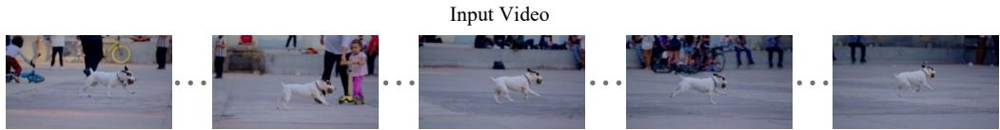  
Animal Motion in the World Frame

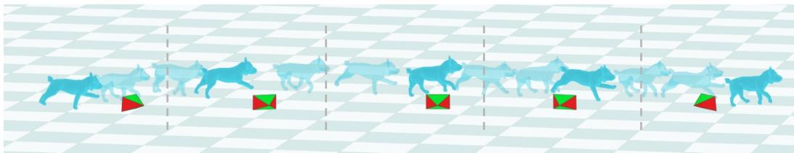  
Figure 1: 4D Reconstruction of Articulated Animals from Videos in the Wild. We present ORMA, an optimization-based framework that reconstructs the shape and motion of articulated animals in a shared world coordinate frame from monocular videos.

## ABSTRACT

Recovering articulated 4D representations of animals from monocular videos remains challenging due to the large diversity of quadruped morphologies and lack of animal 4D supervision data. Existing learning-based reconstruction methods operate on individual images and rely on synthetic or model-fitted 3D supervision, which inherits the constraints of strong parametric priors and limits generalization to out-of-distribution species. When applied to out-of-distribution animals, they often recover a plausible pose while producing inaccurate geometry because the underlying shape model cannot faithfully represent the observed instance. We present ORMA, a training-free reconstruction framework that decouples articulation from shape, using the predicted pose as reference for optimization while leveraging generative 3D priors for accurate shape reconstruction. Given a reference image, we reconstruct the animal geometry and register it to the parametric model SMAL+, yielding an articulated shape adapted to the observed instance. We then combine per-frame articulated pose estimates with globally consistent camera poses to recover animal motion in a shared world coordinate frame, and further refine the reconstruction using self-supervised DINO correspondences and temporal consistency. To enable quantitative evaluation, we introduce PAW4D, a synthetic multi-species benchmark with ground-truth 3D geometry and camera motion. Experiments on PAW4D, PFERD, and challenging in-the-wild videos demonstrate that ORMA improves reconstruction accuracy while recovering globally consistend animal motion across diverse quadruped species.

## 1 INTRODUCTION

Accurate 4D reconstruction of animals from monocular video, encompassing both 3D shape and motion estimation, remains a central challenge in computer vision with important implications for ecology, animation, biomechanics, and robotics. Parametric models able to represent the articulated shape of animals offer a structured foundation for 4D reconstruction, where learned shape spaces and motion priors enable temporally consistent estimation of an animal’s geometry and movement from ambiguous monocular data. Importantly, these models encode articulated motion in a biomechanical representation, typically as 3D joint rotation angles, facilitating motion analysis and retargeting.

Unlike humans, whose body shape and motion have been extensively modeled through large-scale datasets and parametric representations (Loper et al., 2023; Pavlakos et al., 2019), which have supported the recovery of global human motion (Ye et al., 2023), animals are difficult to capture, and exhibit far greater morphological diversity and motion complexity. Human-based, controlled, largescale capture setups generate accurate supervision datasets but this approach is infeasible to replicate for animals, although similar strategies have been applied to specific species, such as horses (Zuffi et al., 2024; Li et al., 2024a). The lack of large-scale 3D and motion data makes it difficult to build statistical models that generalize across species while capturing both fine-grained deformations and natural kinematics. Consequently, model-based methods, such as those relying on parametric models learned from small-scale training sets, like SMAL (Zuffi et al., 2017), struggle to capture unseen species or out-of-distribution poses. Recent multi-species learning-based 3D reconstruction methods are often trained on synthetic animal datasets with 3D supervision, leveraging strong parametric priors to recover articulated motion for in-distribution species (Lyu et al., 2025; Niewiadomski et al., 2025). However, when applied to out-of-distribution animals, they often recover a plausible pose while producing inaccurate geometry because the underlying shape model cannot faithfully represent the observed instance. Model-free methods that infer shape and motion directly from image evidence without assuming a pre-defined template offer greater flexibility, but often produce temporally inconsistent or physically implausible results due to the absence of explicit 3D priors to support the reconstruction of unseen parts (Yang et al., 2022a). Bridging this gap and combining the interpretability and stability of model-based approaches with the adaptability of model-free ones remains an open problem. Recent progress in 3D generative models offers a promising alternative: geometric priors learned from large-scale 3D assets (Zhao et al., 2025) can recover plausible instance-specific shapes from a reference frame. Registering these shapes to a rigged quadruped model then yields animatable representations compatible with existing pose estimators. Moreover, current methods for model-based 4D reconstruction of animals mostly recover pose in camera frame, often assuming a weak perspective camera. For quadrupeds, whose bodies often extend along the camera axis, this can lead to inaccurate shape and pose estimates. Recent advances in camera trajectory and intrinsics estimation provide an opportunity to recover global motion even from monocular in-the-wild video.

We present ORMA, a hybrid reconstruction method for 4D reconstruction that leverages the advantages of image-to-3D generative priors while retaining the structured pose representation of the SMAL+ model. In ORMA, we aim at recovering animal motion in world frame with the true global camera. To achieve this, we formulate 4D reconstruction as an unsupervised optimization problem over time. Given a video, we estimate the 3D animal shape from a reference frame with an image-to-3D generator (Zhao et al., 2025). We estimate the camera with a recent approach for camera estimation from video sequences (Li et al., 2025) and adapt the generated shape such that its projection matches the image under the estimated camera. We express the 3D shape as a SMAL+ model (Zuffi & Black, 2024) instance through registration, and initialize the pose of the obtained model in each frame with a quadruped pose estimator (Lyu et al., 2025), providing a strong starting point for optimization. We then employ a set of visual losses to better align the model to the data, employing a novel dense feature correspondences loss to establish semantically meaningful alignments between 3D surface points and image pixels.

Methods for 4D animal reconstruction have been evaluated so far on 2D test data due to the lack of video datasets with accurate 3D ground truth. While PFERD (Li et al., 2024a) provides real horse videos with diverse shapes and accurate motion-capture-based 3D ground truth, it is limited to horses. To make progress, we introduce the first multi-species synthetic dataset PAW4D that includes a variety of species performing short actions. Through experiments on our synthetic benchmark and on real videos with 3D ground truth (Li et al., 2024a), we show that ORMA recovers temporally coherent articulated geometry and motion in a consistent global frame from monocular video. Applied at scale to in-the-wild videos, the framework could support the construction of large and diverse 3D animal-motion datasets, analogous to recent efforts for humans (Tesch et al., 2026). Such datasets could be used to learn animal motion models and synthesize realistic training data for future 3D and 4D reconstruction methods. Ultimately, our framework bridges model-based and model-free paradigms, retaining the structural advantages of parametric models while adapting flexibly to diverse real-world animal forms and motions.

In summary, ORMA addresses the scarcity of 4D animal data through a modular optimization framework that composes complementary pretrained priors without requiring task- or species-specific training. Specifically, we introduce a shape–articulation decoupling formulation that combines instance-specific geometry with structured SMAL+ kinematics, a Robust Semantic Correspondence (RSC) module for reliable image-to-surface alignment, and a unified optimization objective for world-space geometry and motion recovery. We further introduce PAW4D, a synthetic multi-species benchmark with ground-truth geometry and camera motion for quantitative evaluation.

## 2 RELATED WORK

3D Animal Reconstruction from Images. The 3D reconstruction of animals has evolved along two primary paradigms: model-free and model-based approaches. Model-free methods aim to recover 3D geometry with minimal structural body assumptions. Given the significant inter-species variation in morphology, such flexibility is appealing. Early work, such as CMR (Kanazawa et al., 2018), reconstructed birds by deforming a spherical template. Subsequent approaches, including LASSIE (Yao et al., 2022), MagicPony (Wu et al., 2023b), and 3D-Fauna (Li et al., 2024b), learned articulated 3D representations from image collections. While model-free methods offer flexibility and category-level generalization, they typically lack explicit semantic control over skeletal pose, which limits their suitability for structured behavioral analysis or biomechanical interpretation. Model-based approaches instead assume access to a predefined 3D template or a model, whose shape and pose parameters are estimated from images or video. This paradigm provides representations that are particularly valuable for downstream tasks such as conformation analysis, health assessment, and motion tracking. A major milestone was the introduction of SMAL (Zuffi et al., 2017), a multi-animal model learned from toy scans that captures articulated shape variation across quadrupeds. SMAL is widely adopted (Zuffi et al., 2019) (Biggs et al., 2018; 2020; Rueegg et al., 2022). Species-specific parametric models have been developed for dogs and horses (Ruegg¨ et al., 2023; Li et al., 2021a), while related model-based approaches have also been extended to birds (Badger et al., 2020; Wang et al., 2021) and dolphins (Baieri et al., 2026). Recent efforts in creating parametric animal models include the horse model learned from real 4D scans introduced in (Zuffi et al., 2024) and the SMAL+ introduced in AWOL (Zuffi & Black, 2024), enhancing the original shape space with additional 3D scan data. While early works focused on pose and shape estimation for single species, the most recent efforts (Lyu et al., 2025; Niewiadomski et al., 2025; Yu et al., 2026) are multi-species regression networks trained with synthetic 3D data and eventually 2D supervision. SAM3D Animal (Hu et al., 2026) further extends this paradigm to promptable multi-species and multi-instance reconstruction.

4D Animal Reconstruction from Videos. Animal 4D reconstruction has been explored through both model-free and model-based approaches. Among model-free methods, ViSER (Yang et al., 2021b), LASR (Yang et al., 2021a), BANMo (Yang et al., 2022a), DOVE (Wu et al., 2023a), and PPR (Yang et al., 2023b) jointly optimize geometry, articulation, and appearance from monocular videos, often using neural implicit or part-based representations to model non-rigid deformation. More recently, Ponymation (Sun et al., 2024) and 4D-Fauna (Zhao et al., 2026b) extend 3D-Fauna (Li et al., 2024b) to videos and reconstructs articulated animal shape and motion from large-scale in-the-wild sequences. Model-based approaches instead exploit structured parametric animal representations. RAC (Yang et al., 2023a) disentangles instance shape and temporal motion from monocular videos, and PADR (Liao et al., 2025) reconstructs deformable objects using image-to-3D priors and deformable 3D Gaussians. AnimalAvatar (Sabathier et al., 2024) and 4DAnimal (Zhong et al., 2026) reconstruct dogs from monocular videos using optimization-based formulations with semantic correspondence cues. AniMer+ (An et al., 2025) extends image-based parametric reconstruction to video, while 4DEquine (Lyu et al., 2026) focuses on horses by disentangling 4D reconstruction into temporally coherent motion estimation and static appearance reconstruction. WildAni4D (Cho et al., 2026) further introduces a video-native framework that predicts temporally coherent animal meshes and global trajectories in the world frame. Kirin (Zhao et al., 2026a) further reconstructs large-scale 3D quadruped motion from in-the-wild videos to build motion priors for downstream animal motion generation and animation.

Datasets for 3D and 4D Animal Reconstruction. Early animal datasets were primarily developed for 2D animal pose estimation and typically provide keypoint annotations for animals. Existing animal datasets vary considerably in taxonomic coverage: many are species-specific, which target individual categories such as dogs (Biggs et al., 2020), horses (Mathis et al., 2021), Macaque (Labuguen et al., 2021), birds (Wah et al., 2011), pigs (An et al., 2023) or tigers (Li et al., 2019), while others aim to cover a broader range of animal species (Aamir et al., 2026; Cao et al., 2019; Yu et al., 2021; Banik et al., 2021; Yang et al., 2022b; Ng et al., 2022). However, these datasets primarily provide image-space supervision and therefore cannot directly support or evaluate 3D shape and motion reconstruction. Several datasets further introduce 3D supervision through multi-view capture (Joska et al., 2021), motion capture (Kearney et al., 2020), or model fitting (Xu et al., 2023). To alleviate the cost of acquiring real 3D annotations, synthetic datasets can provide an alternative source of scalable 3D supervision (Niewiadomski et al., 2025; Choi et al., 2026; Shooter et al., 2024; Hu et al., 2026). Beyond static 3D supervision, recent datasets increasingly capture temporal animal motion. PFERD (Li et al., 2024a), DogMo (Wang et al., 2025b), and InterPet4D (Peng et al., 2026) provide controlled multi-view or motion-capture recordings of horses and dogs, while CoP3D (Sinha et al., 2023b) and AiM (Zhao et al., 2026b) collect in-the-wild videos for dynamic animal reconstruction. Redirect4D-Bench (Cao et al., 2026) shows animal videos with pseudo-4D geometry and camera trajectories for dynamic videos. Synthetic datasets, including DeformingThings4D (Li et al., 2021b), VarenPoser (Lyu et al., 2026), and WildAni4D-Gen (Cho et al., 2026), further provide scalable dense supervision for animal geometry, motion, and camera dynamics.

## 3 METHODS

## 3.1 PRELIMINARY

SMAL+. We use SMAL+ (Zuffi & Black, 2024), an extended version of the SMAL model (Zuffi et al., 2017), as our articulated animal representation. Following the formulation of SMPL (Loper et al., 2023), SMAL+ represents animal shape and pose using a deformable mesh model. It retains the same articulated formulation as SMAL, but learns a substantially richer shape space from an expanded set of 145 registered 3D animal scans. The model is defined by a triangular template mesh $\mathbf { v } _ { t }$ with $n _ { V }$ vertices, a linear shape space represented by a matrix $\mathbf { B } \in \mathbb { R } ^ { 3 n _ { V } \times n _ { B } }$ containing $n _ { B }$ shape basis vectors, a joint regressor $\mathbf { J } _ { r }$ that maps mesh vertices to a set of $n _ { J }$ skeletal joint locations, and a skinning weight matrix W. In SMAL+, we use $n _ { B } = 1 4 5$ , such that the shape parameters are $\beta \in \mathbb { R } ^ { 1 4 5 }$

## 3.2 ORMA

To reconstruct animal motion in a consistent world coordinate frame, our framework combines coherent camera estimation, explicit geometric supervision, and robust semantic correspondence. We use MegaSaM (Li et al., 2025) to estimate camera poses consistently across video, together with perframe depth maps that provide explicit 3D geometric supervision. To further guide articulated pose optimization, we establish semantic correspondences using DINO features (Simeoni et al., 2025).´ Rather than relying on dense correspondences, we retain only sparse, high-confidence matches, which provide robust semantic cues for aligning the reconstructed animal with the observations.

We denote a SMAL+ model instance by $\mathcal { M } = S ( \beta , \pmb { \theta } , \mathbf { t } , \mathbf { R } _ { g } ) = ( \mathbf { V } , \mathbf { F } )$ , where M is a triangular mesh with vertices $\mathbf { V } \in \mathbb { R } ^ { 3 8 8 9 \times 3 }$ and faces $\mathbf { F } \in \mathbb { N } ^ { 7 7 7 4 \times 3 }$ . The shape parameters are $\beta \in \bar { \mathbb { R } } ^ { 1 4 5 }$ while $\pmb \theta \in \mathbb { R } ^ { 3 ( J - 1 ) }$ denotes the articulated pose in axis-angle representation, with $J = 3 5$ body joints. The global rigid transformation is parameterized by $\mathbf { t } \in \mathbb { R } ^ { 3 }$ and $\mathbf { R } _ { g } \in S O ( 3 )$

For brevity, we indicate a model instance as S and omit its parametrization when it is clear from context. The input to our method is a video $\mathbf { F } ~ \in ~ \mathbb { R } ^ { H \times W \times 3 \times N }$ composed of N frames ${ \bf { F } } _ { i } \in  { \bf { \Lambda } }$ $\mathbb { R } ^ { H \times W \times 3 }$ , each of height H and width W. We denote the binary foreground mask of the animal in frame $\mathbf { F } _ { i } ,$ obtained using SAM (Kirillov et al., 2023), as $M ( \mathbf { \bar { F } } _ { i } ) \in \{ 0 , 1 \} ^ { H \times W }$ . We define a differentiable image projector as:

$$
\pi ( \cdot \mid C ) : { \mathcal { M } } \mapsto I _ { C } ^ { \mathcal { M } } \in \mathbb { R } ^ { H \times W } ,\tag{1}
$$

which renders a triangular mesh M under camera C. When the camera is clear from context, we simply write $\pi ( \cdot )$

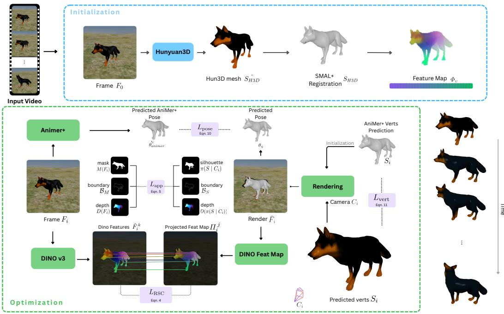  
Figure 2: ORMA takes a video as input and produces a 4D reconstruction of the animal, with a trajectory in world coordinates (bottom right). As initialization, ORMA leverages Hunyuan3D (Zhao et al., 2025) to obtain a reliable shape estimation of the first frame (blue box). After registering SMAL+ (Zuffi & Black, 2024), we perform a frame-by-frame optimization (green box). Unlike previous works, ORMA relies on MegaSaM (Li et al., 2025) to robustly estimate camera parameters across the entire video, along with a depth map. Additionally, we design a Robust Semantic Correspondence module using DINO (Simeoni et al., 2025) to produce a robust set of sparse correspon-´ dences between the frames and the SMAL+ registration. Equations are provided in the appendix.

Initialisation. We initialize each frame with AniMer+ (An et al., 2025) estimates of animal shape, pose, and camera, then use MegaSaM (Li et al., 2025) for video-wide camera poses and SAM (Kirillov et al., 2023) for per-frame animal masks.

Accurate 3D Shape Reconstruction. Our goal is to obtain an accurate 3D shape of the target animal. AniMer+ predicts shape in the SMAL parameter space, which may not adequately capture the morphology of a specific species, breed, or individual. We therefore reconstruct a textured 3D mesh from the first frame where the animal is fully visible and the Animer+ estimate is accurate using Hunyuan3D (Zhao et al., 2025). We rigidly align this reconstruction with the posed AniMer+ mesh using multi-start ICP, avoiding poor local minima (e.g., aligning the head with the tail). We first adjust the scale of the Hunyuan3D reconstruction using the estimated depth and camera parameters, such that its 3D mesh is consistent with the observed animal in the scene. We then fit SMAL+ to the aligned and scaled reconstruction by optimizing the shape coefficients $\beta ,$ articulated pose θ, global rotation $\mathbf { R } _ { g } ,$ , and translation t under a Chamfer objective. This yields fitted shape parameters $\beta _ { H 3 D }$ Starting from this parametric fit, we further refine the geometry directly at the vertex level using Chamfer optimization with ARAP regularization (Sorkine & Alexa, 2007), allowing local shape adaptation beyond the SMAL+ shape space. The fitted shape parameters $\beta _ { H 3 D }$ and the resulting vertex-level shape refinement are kept fixed throughout the sequence, while the articulated pose, global rotation, and world-space translation are optimized for each frame. For each frame, we then recover the articulated pose θ, global rotation $\mathbf { R } _ { g } ,$ and world-space translation t, initialized from the per-frame AniMer+ pose and the fixed shape S\_{H3D} .

## 3.3 LOSS FUNCTIONS

Total Loss. With the instance-specific shape $\beta _ { H 3 D }$ fixed, we optimize the articulated pose θ, global rotation $R _ { g }$ , and world-space translation t. Our optimization combines image-space geometric align-

ment, semantic correspondence, depth supervision, and motion regularization:

$$
L _ { \mathrm { t o t a l } } = L _ { \mathrm { a p p } } + w _ { D } L _ { \mathrm { R S C } } + w _ { p } L _ { \mathrm { p o s e } } + w _ { d } L _ { \mathrm { d e p t h } } + \lambda _ { \mathrm { t e m p } } L _ { \mathrm { t e m p } } ,\tag{2}
$$

where $w _ { \star }$ denotes the corresponding loss weights. $L _ { \mathrm { a p p } }$ aligns the rendered silhouette and boundaries with the observed foreground mask, while $L _ { \mathrm { R S C } }$ provides semantic correspondence between the articulated surface and the image. $L _ { \mathrm { p o s e } }$ regularizes the solution toward the AniMer+ pose initialization, and $L _ { \mathrm { d e p t h } }$ constrains both surface geometry and global 3D placement using MegaSaM depth estimates. Finally, $L _ { \mathrm { t e m p } }$ encourages temporally smooth translation, rotation, and motion.

## 3.4 ROBUST SEMANTIC CORRESPONDENCE

Silhouette and depth supervision constrain geometric alignment but do not explicitly establish semantic correspondence between body parts. Consequently, configurations with similar projections but incorrect limb assignments may remain local minima. Previous animal reconstruction methods use explicit surface correspondences, such as Continuous Surface Embeddings (CSE) (Sabathier et al., 2024; Rueegg et al., 2022), but we observe that these correspondences can be unstable across frames, particularly around articulated extremities. We instead use DINOv3 (Simeoni et al., 2025)´ features to construct sparse, high-confidence local correspondences between the reconstructed animal and each video frame.

Feature baking. We render the aligned Hunyuan3D reconstruction from V viewpoints and extract DINOv3 feature maps, which are upsampled to the image resolution using AnyUp (Wimmer et al., 2026). The features from all visible views are back-projected and averaged on the Hunyuan3D mesh vertices. We then transfer these descriptors to the fitted SMAL+ topology using nearest-neighbour association in 3D. We denote the resulting feature-decorated template as $\mathcal { F } _ { H 3 D } = \{ \mathbf { f } _ { u } \}$

Per-frame robust semantic correspondences. For each frame $i ,$ we project the visible vertices of $S _ { H 3 D }$ , each carrying its baked descriptor $\mathbf { f } _ { u } ,$ onto the image. For each projected vertex $u ,$ we search for semantically compatible features within a local foreground neighbourhood $\mathcal { N } _ { i } ( u )$ . The similarity between the baked vertex descriptor $\mathbf { f } _ { u }$ and an image feature is measured by cosine similarity:

$$
s _ { u , p } = \left. \overline { { \mathbf { f } } } _ { u } , \overline { { F } } _ { i } ( p ) \right. , \qquad p \in \mathcal { N } _ { i } ( u ) ,\tag{3}
$$

where the overline denotes $L _ { 2 }$ normalisation. We retain only vertices whose best local match exceeds a similarity threshold $\eta ,$ thereby removing unreliable correspondences. Rather than selecting a hard nearest neighbour, we use a soft weighting $\alpha _ { u , p } \propto \exp ( s _ { u , p } / \tau )$ over the valid local matches. The resulting correspondence loss is:

$$
L _ { \mathrm { R S C } } = \frac { 1 } { | \widehat { \mathcal { U } } _ { i } | } \sum _ { u \in \widehat { \mathcal { U } } _ { i } } \sum _ { p \in \mathcal { N } _ { i } ( u ) \cap M _ { i } } \alpha _ { u , p } \left( 1 - s _ { u , p } \right) ,\tag{4}
$$

where $\widehat { \mathcal { U } } _ { i }$ is the set of reliable visible vertices. This local, confidence-filtered matching provides semantic guidance for pose optimization while reducing the influence of unstable correspondences.

## 4 PAW4D DATASET

A substantial challenge for 4D animal reconstruction is the lack of datasets with ground-truth 3D annotations, particularly in world coordinates. To address this gap, we introduce PAW4D, a synthetic yet realistic benchmark with known 3D geometry and camera parameters. We build on DeformingThings4D (Li et al., 2021b), which provides a large collection of animated 4D meshes. We retain only realistic animal sequences, excluding atypical species (e.g., dragons), physically implausible motions (e.g., swimming on land), and sequences shorter than one second. Since the original textures are unavailable, we retexture the selected meshes using EmbodyGen (Wang et al., 2025a), which synthesizes plausible textures from a mesh and a text prompt. Each sequence is rendered in an outdoor environment with a flat ground plane and an HDRI background under three camera configurations: follow, where the camera tracks the animal; fixed, where the camera remains stationary after the first frame; and orbit, where the camera moves around the scene. We additionally apply small Gaussian perturbations to the follow and fixed cameras, while randomly sampling camera azimuth, elevation, initial position, and distance. PAW4D comprises 115 videos, including 51 dog, 47 fox, 13 puma, and 4 bear sequences. Each video contains RGB frames, ground-truth masks, known cameras, and per-frame ground-truth meshes.

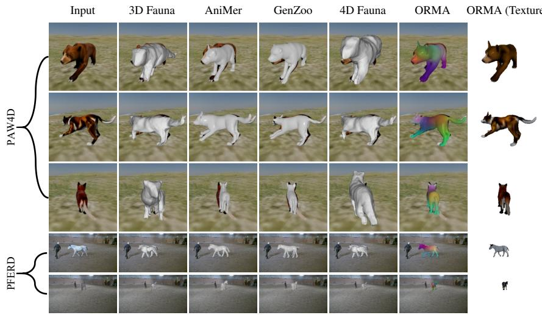  
Figure 3: Qualitative comparisons on the PAW4D and PFERD datasets. We compare our method with AniMer (Lyu et al., 2025), GenZoo (Niewiadomski et al., 2025), 3D Fauna (Li et al., 2024b), and 4D Fauna (Zhao et al., 2026b). AniMer, GenZoo, and 3D Fauna operate on individual images, whereas 4D Fauna and ORMA take videos as input and exploit temporal information across frames.

Table 1: Comparison with state-of-the-art animal reconstruction methods on PFERD (Li et al., 2024a). ↑ indicates higher is better, and ↓ indicates lower is better.
<table><tr><td rowspan="2">Method</td><td colspan="3">2D Appearance</td><td colspan="2">3D Geometry</td><td rowspan="2">Trajectory RMSE↓</td><td colspan="2">3D Pose</td></tr><tr><td>IoU ↑</td><td>PSNR ↑</td><td>LPIPS↓</td><td>IoU3D ↑</td><td>Chamfer ↓</td><td>PA-MPVPE ↓</td><td>PA-MPJPE↓</td></tr><tr><td>3D Fauna (Li et al., 2024b)</td><td>0.500</td><td>24.314</td><td>0.028</td><td>0.130</td><td>0.714</td><td>一</td><td>467.9</td><td>450.2</td></tr><tr><td>AniMer (Lyu et al., 2025)</td><td>0.676</td><td>25.370</td><td>0.020</td><td>0.204</td><td>0.407</td><td>一</td><td>193.6</td><td>251.4</td></tr><tr><td>GenZoo (Niewiadomski et al., 2025)</td><td>0.562</td><td>25.845</td><td>0.023</td><td>0.184</td><td>0.437</td><td>一</td><td>198.5</td><td>246.8</td></tr><tr><td>4D Fauna (Zhao et al., 2026b)</td><td>0.497</td><td>24.315</td><td>0.028</td><td>0.130</td><td>0.715</td><td>一</td><td>476.7</td><td>458.1</td></tr><tr><td>Ours</td><td>0.601</td><td>27.474</td><td>0.018</td><td>0.348</td><td>0.149</td><td>1.587</td><td>181.8</td><td>250.5</td></tr><tr><td>Ours (w/ GT Cam)</td><td>0.655</td><td>27.785</td><td>0.017</td><td>0.367</td><td>0.130</td><td>1.073</td><td>176.1</td><td>246.2</td></tr></table>

## 5 EXPERIMENTS

Datasets. For evaluation, we report results on PFERD (Li et al., 2024a) and our PAW4D. For PFERD, we randomly choose 26 videos from the 130 videos, covering all five horses in the dataset. For PAW4D, we use 109 of the 115 sequences for evaluation and reserve the remaining six sequences for ablation studies.

Baselines. We compare our method with four recent state-of-the-art (SOTA) methods. AniMer (Lyu et al., 2025) and GenZoo (Niewiadomski et al., 2025) are multi-species model-based approaches that reconstruct 3D animal from images. We additionally compare with 3D Fauna (Li et al., 2024b), a model-free animal reconstruction method, and its video-based extension 4D Fauna (Zhao et al., 2026b), which incorporates temporal information for 4D animal reconstruction.

Evaluation Metrics. For 2D appearance, we report Intersection over Union (IoU), Peak Signal-to-Noise Ratio (PSNR), and Learned Perceptual Image Patch Similarity (LPIPS). For 3D geometry, we use volumetric Intersection over Union (IoU3D) and Chamfer Distance (CD). On PFERD, which provides hSMAL ground-truth meshes and joints, we additionally report Procrustes-Aligned Mean Per-Vertex Position Error (PA-MPVPE) and Procrustes-Aligned Mean Per-Joint Position Error (PA MPJPE) to evaluate 3D reconstruction accuracy. Finally, we evaluate world-space motion using trajectory Root Mean Square Error (RMSE).

Implementation Details. We use an Adam optimizer for 300 epochs with early stopping. All our experiments run on a machine equipped with an H100 GPU.

Input VideoInput Video  
4D Fauna4D Fauna  
ORMAORMA  
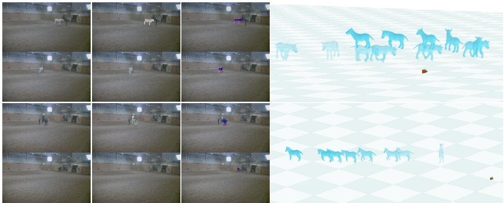  
ORMA Global TrajectoryORMA Global Trajectory

Figure 4: We compare ORMA with 4D-Fauna on two videos from PFERD. ORMA better aligns the reconstructed animal with the observations across frames, while additionally recovering its motion in a shared world coordinate frame. The rightmost column visualizes the resulting global trajectory.  
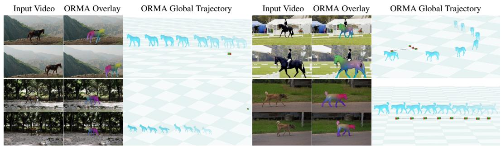  
Figure 5: Qualitative evaluation of ORMA under challenging in-the-wild scenarios, including large variations in viewpoint, scale, and camera motion. The overlay and global trajectory visualisations show that ORMA robustly reconstructs articulated animal motion and world-space displacement under unconstrained capture conditions.

## 5.1 COMPARISON

Comparison without GT camera. We report quantitative results in Tables 1 and 2. Using MegaSaM-estimated cameras, ORMA performs strongly on both datasets, substantially improving 3D reconstruction on PFERD and achieving the best 2D appearance metrics and highest IoU3D among the compared methods on PAW4D. This suggests improved geometric accuracy without sacrificing image alignment. Trajectory RMSE is reported only for ORMA, as the baselines do not recover camera-to-world transformations or global animal trajectories.

Qualitative comparison. Figs. 3 and 4 show qualitative comparisons on PAW4D and PFERD. Model-based methods such as AniMer and GenZoo recover plausible poses but are limited by their parametric shape spaces, whereas 3D Fauna and 4D Fauna allow more flexible geometry but can suffer from pose or alignment errors. ORMA combines instance-specific generative geometry with structured SMAL+ articulation and robust semantic correspondences, improving shape fidelity while maintaining accurate pose and image alignment. Additional in-the-wild results in Fig. 5 further demonstrate generalization across diverse animal appearances, poses, and camera motions.

## 5.2 ABLATION

Table 3 and Fig. 6 evaluate the contribution of each component of ORMA. Depth supervision has the largest impact: removing it substantially degrades both 3D reconstruction and trajectory accuracy, reducing IoU3D from 0.414 to 0.313 and increasing trajectory RMSE from 0.039 to 0.148. Removing Hunyuan3D or replacing SMAL+ with the original SMAL consistently reduces reconstruction quality, highlighting the benefits of instance-specific geometry and the richer SMAL+ shape space. DINO correspondences provide additional improvements in image alignment and 3D consistency, while temporal smoothing yields consistent gains in trajectory accuracy. Overall, the full model achieves the strongest performance across all metrics, indicating that the proposed components provide complementary supervision for appearance, geometry, and global motion reconstruction.

Table 2: Comparison with state-of-the-art animal reconstruction methods on our synthetic dataset PAW4D. ↑ indicates higher is better, and ↓ indicates lower is better.
<table><tr><td rowspan="2">Method</td><td colspan="3">2D Appearance</td><td colspan="2">3D Geometry</td><td>Trajectory</td></tr><tr><td>IoU ↑</td><td>PSNR ↑</td><td>LPIPS↓</td><td>IoU3D ↑</td><td>Chamfer ↓</td><td>RMSE↓</td></tr><tr><td>3D Fauna (Li et al., 2024b)</td><td>0.495</td><td>14.540</td><td>0.255</td><td>0.190</td><td>0.040</td><td></td></tr><tr><td>AniMer (Lyu et al., 2025)</td><td>0.668</td><td>14.690</td><td>0.140</td><td>0.196</td><td>0.046</td><td></td></tr><tr><td>GenZoo (Niewiadomski et al., 2025)</td><td>0.704</td><td>14.470</td><td>0.139</td><td>0.212</td><td>0.049</td><td></td></tr><tr><td>4D Fauna (Zhao et al., 2026b)</td><td>0.368</td><td>12.990</td><td>0.316</td><td>0.200</td><td>0.042</td><td></td></tr><tr><td>Ours</td><td>0.714</td><td>22.260</td><td>0.137</td><td>0.215</td><td>0.045</td><td>0.131</td></tr><tr><td>Ours (w/ GT Cam)</td><td>0.729</td><td>22.300</td><td>0.134</td><td>0.422</td><td>0.006</td><td>0.046</td></tr></table>

Table 3: Ablation study of the individual components of ORMA.
<table><tr><td rowspan="2">Variant</td><td colspan="3">2D Appearance</td><td colspan="2">3D Geometry</td><td rowspan="2">Trajectory</td></tr><tr><td>IoU↑</td><td>PSNR↑</td><td>LPIPS↓</td><td>IoU3D↑</td><td>Chamfer↓</td></tr><tr><td>w/o Hunyuan3D</td><td>0.756</td><td>22.45</td><td>0.1503</td><td>0.409</td><td>0.005</td><td>0.043</td></tr><tr><td>w/o DINO</td><td>0.755</td><td>22.63</td><td>0.1482</td><td>0.411</td><td>0.004</td><td>0.041</td></tr><tr><td>w/o SMAL+</td><td>0.744</td><td>22.62</td><td>0.1500</td><td>0.408</td><td>0.005</td><td>0.040</td></tr><tr><td>w/o Depth</td><td>0.706</td><td>22.51</td><td>0.1522</td><td>0.313</td><td>0.016</td><td>0.148</td></tr><tr><td>w/o Temporal Smoothing</td><td>0.755</td><td>22.63</td><td>0.1482</td><td>0.412</td><td>0.005</td><td>0.040</td></tr><tr><td>w/o Temporal &amp; Depth</td><td>0.706</td><td>22.52</td><td>0.1522</td><td>0.312</td><td>0.016</td><td>0.148</td></tr><tr><td>Full</td><td>0.761</td><td>22.64</td><td>0.1481</td><td>0.414</td><td>0.005</td><td>0.039</td></tr></table>

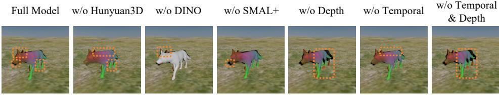  
Figure 6: Ablation studies. Hunyuan3D, DINO, SMAL+ and other optimization losses each lead to improved performance, as discussed in Sec. 5.2.

## 6 CONCLUSIONS

We presented ORMA, an optimization-based framework for monocular 4D reconstruction of articulated animals. ORMA combines instance-specific geometry from generative 3D priors with the structured articulation of SMAL+, and jointly leverages geometric and semantic supervision to recover temporally coherent animal motion in a consistent world coordinate frame. Experiments demonstrate improved reconstruction accuracy and robust global motion reconstruction across diverse quadruped species. We further introduce PAW4D, a synthetic multi-species benchmark with ground-truth geometry and camera motion for quantitative evaluation of 4D animal reconstruction.

Limitations. ORMA assumes that the target animal can be registered to the SMAL+ topology, limiting its applicability to quadrupeds with compatible morphology; substantially different body plans, such as birds or aquatic animals, are not supported. The method also relies on accurate camera estimation and does not explicitly model severe occlusions, making reference frames with substantial self-occlusion difficult to initialize. Finally, the SMAL+ representation relies on Linear Blend Skinning, which cannot fully capture strong pose- or motion-dependent non-rigid deformations. Extending the framework to more diverse animal topologies and dynamic deformations is an important direction for future work.

## ACKNOWLEDGMENTS

This work was supported by the European Research Council (ERC) Advanced Grant SIMU-LACRON and by the GNI Project ”AI4Twinning”.

## REFERENCES

Muhammad Aamir, Naoya Muramatsu, Sangyun Shin, Matthew Wijers, Jia-Xing Zhong, Xinyu Hou, Amir Patel, Andrew Loveridge, and Andrew Markham. Wilddepth: A multimodal dataset for 3d wildlife perception and depth estimation. arXiv preprint arXiv:2603.16816, 2026.

Liang An, Jilong Ren, Tao Yu, Tang Hai, Yichang Jia, and Yebin Liu. Three-dimensional surface motion capture of multiple freely moving pigs using mammal. Nature Communications, 14(1): 7727, 2023.

Liang An, Jin Lyu, Li Lin, Pujin Cheng, Yebin Liu, and Xiaoying Tang. Animer+: Unified pose and shape estimation across mammalia and aves via family-aware transformer. IEEE Transactions on Pattern Analysis and Machine Intelligence, 2025.

Marc Badger, Yufu Wang, Adarsh Modh, Ammon Perkes, Nikos Kolotouros, Bernd G Pfrommer, Marc F Schmidt, and Kostas Daniilidis. 3d bird reconstruction: a dataset, model, and shape recovery from a single view. In European conference on computer vision, pp. 1–17. Springer, 2020.

Daniele Baieri, Riccardo Cicciarella, Michael Krutzen, Emanuele Rodol¨ a, and Silvia Zuffi. Model-\` based metric 3d shape and motion reconstruction of wild bottlenose dolphins in drone-shot videos. International Journal of Computer Vision, 134(6):293, 2026.

Prianka Banik, Lin Li, and Xishuang Dong. A novel dataset for keypoint detection of quadruped animals from images. arXiv preprint arXiv:2108.13958, 2021.

Benjamin Biggs, Thomas Roddick, Andrew Fitzgibbon, and Roberto Cipolla. Creatures great and smal: Recovering the shape and motion of animals from video. In Asian Conference on Computer Vision, pp. 3–19. Springer, 2018.

Benjamin Biggs, Oliver Boyne, James Charles, Andrew Fitzgibbon, and Roberto Cipolla. Who left the dogs out? 3d animal reconstruction with expectation maximization in the loop. In European Conference on Computer Vision, pp. 195–211. Springer, 2020.

Jinkun Cao, Hongyang Tang, Hao-Shu Fang, Xiaoyong Shen, Cewu Lu, and Yu-Wing Tai. Crossdomain adaptation for animal pose estimation. In Proceedings of the IEEE/CVF international conference on computer vision, pp. 9498–9507, 2019.

Wei Cao, Hao Zhang, Jiapeng Tang, Yulun Wu, Yingying Li, Ning Yu, Shenlong Wang, and Yaoyao Liu. Redirect4d-bench: A scalable benchmark for camera redirection of monocular dynamic videos with pseudo-4d ground truth, 2026.

Gyeongsu Cho, Hezhen Hu, Donghyeon Soon, Changwoo Kang, and Kyungdon Joo. Wildani4d: Towards 4d animal mesh reconstruction. In Proceedings of the IEEE/CVF Conference on Computer Vision and Pattern Recognition, pp. 160–169, 2026.

Joo Young Choi, Wonkwang Lee, Ju-hyeong Seon, and Gunhee Kim. Every dog has its day, probably: A balanced synthetic benchmark and probabilistic modeling for 3d dog pose estimation. In Proceedings ofthe European Conference on Computer Vision (ECCV), 2026.

Xuyi Hu, Jin Lyu, Jiuming Liu, Yebin Liu, Silvia Zuffi, Liang An, and Stefan Goetz. Sam 3d animal: Promptable animal 3d reconstruction from images in the wild. arXiv preprint arXiv:2605.07604, 2026.

Daniel Joska, Liam Clark, Naoya Muramatsu, Ricardo Jericevich, Fred Nicolls, Alexander Mathis, Mackenzie W Mathis, and Amir Patel. Acinoset: a 3d pose estimation dataset and baseline models for cheetahs in the wild. In 2021 IEEE international conference on robotics and automation (ICRA), pp. 13901–13908. IEEE, 2021.

Angjoo Kanazawa, Shubham Tulsiani, Alexei A Efros, and Jitendra Malik. Learning categoryspecific mesh reconstruction from image collections. In European Conference on Computer Vision, pp. 386–402. Springer, 2018.

Sinead Kearney, Wenbin Li, Martin Parsons, Kwang In Kim, and Darren Cosker. Rgbd-dog: Predicting canine pose from rgbd sensors. In 2020 IEEE/CVF Conference on Computer Vision and Pattern Recognition (CVPR), pp. 8333–8342. IEEE, 2020.

Alexander Kirillov, Eric Mintun, Nikhila Ravi, Hanzi Mao, Chloe Rolland, Laura Gustafson, Tete Xiao, Spencer Whitehead, Alexander C Berg, Wan-Yen Lo, et al. Segment anything. In 2023 IEEE/CVF international conference on computer vision (ICCV), pp. 3992–4003. IEEE, 2023.

Nilesh Kulkarni, Abhinav Gupta, and Shubham Tulsiani. Canonical surface mapping via geometric cycle consistency. In Proceedings of the ieee/cvf international conference on computer vision, pp. 2202–2211, 2019.

Rollyn Labuguen, Jumpei Matsumoto, Salvador Blanco Negrete, Hiroshi Nishimaru, Hisao Nishijo, Masahiko Takada, Yasuhiro Go, Ken-ichi Inoue, and Tomohiro Shibata. Macaquepose: a novel “in the wild” macaque monkey pose dataset for markerless motion capture. Frontiers in behavioral neuroscience, 14:581154, 2021.

Ci Li, Nima Ghorbani, Sofia Broome, Maheen Rashid, Michael J Black, Elin Hernlund, Hedvig´ Kjellstrom, and Silvia Zuffi. hsmal: Detailed horse shape and pose reconstruction for motion¨ pattern recognition. arXiv preprint arXiv:2106.10102, 2021a.

Ci Li, Ylva Mellbin, Johanna Krogager, Senya Polikovsky, Martin Holmberg, Nima Ghorbani, Michael J Black, Hedvig Kjellstrom, Silvia Zuffi, and Elin Hernlund. The poses for equine¨ research dataset (pferd). Scientific Data, 11(1):497, 2024a.

Shuyuan Li, Jianguo Li, Hanlin Tang, Rui Qian, and Weiyao Lin. Atrw: A benchmark for amur tiger re-identification in the wild. arXiv preprint arXiv:1906.05586, 2019.

Yang Li, Hikari Takehara, Takafumi Taketomi, Bo Zheng, and Matthias Nießner. 4dcomplete: Nonrigid motion estimation beyond the observable surface. In 2021 IEEE/CVF International Conference on Computer Vision (ICCV), pp. 12686–12696. IEEE, 2021b.

Zhengqi Li, Richard Tucker, Forrester Cole, Qianqian Wang, Linyi Jin, Vickie Ye, Angjoo Kanazawa, Aleksander Holynski, and Noah Snavely. Megasam: Accurate, fast, and robust structure and motion from casual dynamic videos. In 2025 IEEE/CVF Conference on Computer Vision and Pattern Recognition (CVPR), pp. 10486–10496. IEEE, 2025.

Zizhang Li, Dor Litvak, Ruining Li, Yunzhi Zhang, Tomas Jakab, Christian Rupprecht, Shangzhe Wu, Andrea Vedaldi, and Jiajun Wu. Learning the 3d fauna of the web. In 2024 IEEE/CVF Conference on Computer Vision and Pattern Recognition (CVPR), pp. 9752–9762. IEEE, 2024b.

Ting-Hsuan Liao, Haowen Liu, Yiran Xu, Songwei Ge, Gengshan Yang, and Jia-Bin Huang. Pad3r: Pose-aware dynamic 3d reconstruction from casual videos. In Proceedings of the SIGGRAPH Asia 2025 Conference Papers, pp. 1–11, 2025.

Matthew Loper, Naureen Mahmood, Javier Romero, Gerard Pons-Moll, and Michael J Black. Smpl: A skinned multi-person linear model. In Seminal Graphics Papers: Pushing the Boundaries, Volume 2, pp. 851–866. 2023.

Jin Lyu, Tianyi Zhu, Yi Gu, Li Lin, Pujin Cheng, Yebin Liu, Xiaoying Tang, and Liang An. Animer: Animal pose and shape estimation using family aware transformer. In 2025 IEEE/CVF Conference on Computer Vision and Pattern Recognition (CVPR), pp. 17486–17496. IEEE, 2025.

Jin Lyu, Liang An, Pujin Cheng, Yebin Liu, and Xiaoying Tang. 4dequine: Disentangling motion and appearance for 4d equine reconstruction from monocular video. arXiv preprint arXiv:2603.10125, 2026.

Alexander Mathis, Thomas Biasi, Steffen Schneider, Mert Yuksekgonul, Byron Rogers, Matthias Bethge, and Mackenzie W Mathis. Pretraining boosts out-of-domain robustness for pose estimation. In Proceedings of the IEEE/CVF winter conference on applications of computer vision, pp. 1859–1868, 2021.

Xun Long Ng, Kian Eng Ong, Qichen Zheng, Yun Ni, Si Yong Yeo, and Jun Liu. Animal kingdom: A large and diverse dataset for animal behavior understanding. In 2022 IEEE/CVF Conference on Computer Vision and Pattern Recognition (CVPR), pp. 19001–19012. IEEE, 2022.

Tomasz Niewiadomski, Anastasios Yiannakidis, Hanz Cuevas-Velasquez, Soubhik Sanyal, Michael J Black, Silvia Zuffi, and Peter Kulits. Generative zoo. In 2025 IEEE/CVF Interna tional Conference on Computer Vision (ICCV), pp. 8492–8502. IEEE, 2025.

Georgios Pavlakos, Vasileios Choutas, Nima Ghorbani, Timo Bolkart, Ahmed AA Osman, Dimitrios Tzionas, and Michael J Black. Expressive body capture: 3d hands, face, and body from a single image. In Proceedings of the IEEE/CVF conference on computer vision and pattern recognition, pp. 10975–10985, 2019.

Yichen Peng, Jyun-Ting Song, Chen-Chieh Liao, Kris Kitani, Hideki Koike, and Erwin Wu. Interpet4d: A multimodal 4d human-pet interaction dataset for pet motion generation. arXiv preprint arXiv:2607.10287, 2026.

Nadine Rueegg, Silvia Zuffi, Konrad Schindler, and Michael J Black. Barc: Learning to regress 3d dog shape from images by exploiting breed information. In 2022 IEEE/CVF Conference on Computer Vision and Pattern Recognition (CVPR), pp. 3866–3874. IEEE, 2022.

Nadine Ruegg, Shashank Tripathi, Konrad Schindler, Michael J Black, and Silvia Zuffi. Bite: Be- ¨ yond priors for improved three-d dog pose estimation. In 2023 IEEE/CVF Conference on Computer Vision and Pattern Recognition (CVPR), pp. 8867–8876. IEEE, 2023.

Remy Sabathier, Niloy J Mitra, and David Novotny. Animal avatars: Reconstructing animatable 3d animals from casual videos. In European Conference on Computer Vision, pp. 270–287. Springer, 2024.

Moira Shooter, Charles Malleson, and Adrian Hilton. Digidogs: Single-view 3d pose estimation of dogs using synthetic training data. In 2024 IEEE/CVF Winter Conference on Applications of Computer Vision Workshops (WACVW), pp. 92–101. IEEE, 2024.

Oriane Simeoni, Huy V Vo, Maximilian Seitzer, Federico Baldassarre, Maxime Oquab, Cijo Jose,´ Vasil Khalidov, Marc Szafraniec, Seungeun Yi, Michael Ramamonjisoa, et al. Dinov3.¨ arXiv preprint arXiv:2508.10104, 2025.

Samarth Sinha, Roman Shapovalov, Jeremy Reizenstein, Ignacio Rocco, Natalia Neverova, Andrea Vedaldi, and David Novotny. Common pets in 3d: Dynamic new-view synthesis of real-life deformable categories. CVPR, 2023a.

Samarth Sinha, Roman Shapovalov, Jeremy Reizenstein, Ignacio Rocco, Natalia Neverova, Andrea Vedaldi, and David Novotny. Common pets in 3d: Dynamic new-view synthesis of real-life deformable categories. In 2023 IEEE/CVF Conference on Computer Vision and Pattern Recognition (CVPR), pp. 4881–4891. IEEE, 2023b.

Olga Sorkine and Marc Alexa. As-rigid-as-possible surface modeling. In Symposium on Geometry processing, volume 4, pp. 109–116, 2007.

Keqiang Sun, Dor Litvak, Yunzhi Zhang, Hongsheng Li, Jiajun Wu, and Shangzhe Wu. Ponymation: Learning articulated 3d animal motions from unlabeled online videos. In ECCV, 2024.

Joachim Tesch, Giorgio Becherini, Prerana Achar, Anastasios Yiannakidis, Muhammed Kocabas, Priyanka Patel, and Michael Black. Bedlam2. 0: Synthetic humans and cameras in motion. Ad vances in Neural Information Processing Systems, 38, 2026.

Catherine Wah, Steve Branson, Peter Welinder, Pietro Perona, and Serge Belongie. The caltech-ucsd birds-200-2011 dataset. 2011.

Xinjie Wang, Liu Liu, Yu Cao, Ruiqi Wu, Wenkang Qin, Dehui Wang, Wei Sui, and Zhizhong Su. Embodiedgen: Towards a generative 3d world engine for embodied intelligence. arXiv preprint arXiv:2506.10600, 2025a.

Yufu Wang, Nikos Kolotouros, Kostas Daniilidis, and Marc Badger. Birds of a feather: Capturing avian shape models from images. In 2021 IEEE/CVF Conference on Computer Vision and Pattern Recognition (CVPR), pp. 14734–14744. IEEE, 2021.

Zan Wang, Siyu Chen, Luya Mo, Xinfeng Gao, Yuxin Shen, Lebin Ding, and Wei Liang. Dogmo: A large-scale multi-view rgb-d dataset for 4d canine motion recovery. arXiv preprint arXiv:2510.24117, 2025b.

Thomas Wimmer, Prune Truong, Marie-Julie Rakotosaona, Michael Oechsle, Federico Tombari, Bernt Schiele, and Jan Eric Lenssen. Anyup: Universal feature upsampling. In International Conference on Learning Representations, volume 2026, pp. 140700–140720, 2026.

Shangzhe Wu, Tomas Jakab, Christian Rupprecht, and Andrea Vedaldi. DOVE: Learning deformable 3d objects by watching videos. IJCV, 2023a.

Shangzhe Wu, Ruining Li, Tomas Jakab, Christian Rupprecht, and Andrea Vedaldi. Magicpony: Learning articulated 3d animals in the wild. In 2023 IEEE/CVF Conference on Computer Vision and Pattern Recognition (CVPR), pp. 8792–8802. IEEE, 2023b.

Jiacong Xu, Yi Zhang, Jiawei Peng, Wufei Ma, Artur Jesslen, Pengliang Ji, Qixin Hu, Jiehua Zhang, Qihao Liu, Jiahao Wang, et al. Animal3d: A comprehensive dataset of 3d animal pose and shape. In 2023 IEEE/CVF International Conference on Computer Vision (ICCV), pp. 9065–9075. IEEE, 2023.

Gengshan Yang, Deqing Sun, Varun Jampani, Daniel Vlasic, Forrester Cole, Huiwen Chang, Deva Ramanan, William T Freeman, and Ce Liu. Lasr: Learning articulated shape reconstruction from a monocular video. arXiv preprint arXiv:2105.02976, 2021a.

Gengshan Yang, Deqing Sun, Varun Jampani, Daniel Vlasic, Forrester Cole, Ce Liu, and Deva Ramanan. Viser: Video-specific surface embeddings for articulated 3d shape reconstruction. Advances in Neural Information Processing Systems, 34:19326–19338, 2021b.

Gengshan Yang, Minh Vo, Natalia Neverova, Deva Ramanan, Andrea Vedaldi, and Hanbyul Joo. Banmo: Building animatable 3d neural models from many casual videos. In 2022 IEEE/CVF Conference on Computer Vision and Pattern Recognition (CVPR), pp. 2853–2863. IEEE, 2022a.

Gengshan Yang, Chaoyang Wang, N Dinesh Reddy, and Deva Ramanan. Reconstructing animatable categories from videos. In 2023 IEEE/CVF Conference on Computer Vision and Pattern Recognition (CVPR), pp. 16995–17005. IEEE, 2023a.

Gengshan Yang, Shuo Yang, John Z Zhang, Zachary Manchester, and Deva Ramanan. Ppr: Physically plausible reconstruction from monocular videos. In 2023 IEEE/CVF International Confer ence on Computer Vision (ICCV), pp. 3891–3901. IEEE, 2023b.

Yuxiang Yang, Junjie Yang, Yufei Xu, Jing Zhang, Long Lan, and Dacheng Tao. Apt-36k: A large-scale benchmark for animal pose estimation and tracking. Advances in Neural Information Processing Systems, 35:17301–17313, 2022b.

Chun-Han Yao, Wei-Chih Hung, Yuanzhen Li, Michael Rubinstein, Ming-Hsuan Yang, and Varun Jampani. Lassie: Learning articulated shapes from sparse image ensemble via 3d part discovery. Advances in Neural Information Processing Systems, 35:15296–15308, 2022.

Vickie Ye, Georgios Pavlakos, Jitendra Malik, and Angjoo Kanazawa. Decoupling human and camera motion from videos in the wild. In 2023 IEEE/CVF Conference on Computer Vision and Pattern Recognition (CVPR), pp. 21222–21232. IEEE, 2023.

Hang Yu, Yufei Xu, Jing Zhang, Wei Zhao, Ziyu Guan, and Dacheng Tao. Ap-10k: A benchmark for animal pose estimation in the wild. arXiv preprint arXiv:2108.12617, 2021.

Xiaohang Yu, Ti Wang, and Mackenzie Weygandt Mathis. Prima: Boosting animal mesh recovery with biological priors and test-time adaptation. arXiv preprint arXiv:2606.02366, 2026.

Brian Nlong Zhao, Zhuoyang Pan, James M Rehg, Jiajun Wu, and Shangzhe Wu. Kirin: Animal motion generation from in-the-wild video. In European Conference on Computer Vision, pp. 1–19. Springer, 2026a.

Brian Nlong Zhao, Jiajun Wu, and Shangzhe Wu. Web-scale collection of video data for 4d animal reconstruction. Advances in Neural Information Processing Systems, 38, 2026b.

Zibo Zhao, Zeqiang Lai, Qingxiang Lin, Yunfei Zhao, Haolin Liu, Shuhui Yang, Yifei Feng, Mingxin Yang, Sheng Zhang, Xianghui Yang, et al. Hunyuan3d 2.0: Scaling diffusion models for high resolution textured 3d assets generation. arXiv preprint arXiv:2501.12202, 2025.

Shanshan Zhong, Jiawei Peng, Zehan Zheng, Zhongzhan Huang, Wufei Ma, Guofeng Zhang, Qihao Liu, Alan Yuille, and Jieneng Chen. 4d-animal: Freely reconstructing animatable 3d animals from videos. In 2026 IEEE/CVF Winter Conference on Applications of Computer Vision (WACV), pp. 602–612. IEEE, 2026.

Silvia Zuffi and Michael J Black. Awol: Analysis without synthesis using language. In European Conference on Computer Vision, pp. 1–19. Springer, 2024.

Silvia Zuffi, Angjoo Kanazawa, David W Jacobs, and Michael J Black. 3d menagerie: Modeling the 3d shape and pose of animals. In 2017 IEEE conference on computer vision and pattern recognition (CVPR), pp. 5524–5532. IEEE, 2017.

Silvia Zuffi, Angjoo Kanazawa, Tanya Berger-Wolf, and Michael Black. Three-d safari: Learning to estimate zebra pose, shape, and texture from images “in the wild”. In 2019 IEEE/CVF International Conference on Computer Vision (ICCV), pp. 5358–5367. IEEE, 2019.

Silvia Zuffi, Ylva Mellbin, Ci Li, Markus Hoeschle, Hedvig Kjellstrom, Senya Polikovsky, Elin¨ Hernlund, and Michael J Black. Varen: Very accurate and realistic equine network. In Proceedings ofthe IEEE/CVF Conference on Computer Vision and Pattern Recognition, pp. 5374–5383, 2024.

## A APPENDIX

## A.1 MORE DETAILS ABOUT PAW4D

A major challenge for evaluating animal reconstruction methods is the lack of datasets with reliable 3D ground-truth annotations in world coordinates. Existing datasets such as COP3D (Sinha et al., 2023a) contain videos of real animals but do not provide ground-truth geometry or camera calibration, making it difficult to quantitatively verify whether reconstructed motion is correct in global space or to measure errors such as scale drift and temporally inconsistent poses.

To enable controlled evaluation, we generate a synthetic benchmark with full geometric supervision. Our dataset is built from DeformingThings4D (Li et al., 2021b), which contains animated meshes represented as sequences of per-vertex deformation offsets applied to a canonical base mesh. Applying these offsets sequentially reconstructs the mesh animation describing the animal motion. The original dataset contains $1 , 9 7 2$ deformation sequences across 26 categories. Following the filtering procedure described in the main paper, we discard sequences that are unsuitable for terrestrial outdoor scenes, including aquatic animals, physically implausible motions, or sequences shorter than one second. After filtering, 121 candidate animations remain.

Because the original textures were not released, we generate new textures using EmbodyGen (Wang et al., 2025a), which synthesizes plausible textures conditioned on a mesh and a text prompt. Multiple texture variations are generated for each animal category to increase appearance diversity (Fig. 8).

All sequences are rendered in a synthetic outdoor scene consisting of grassy terrain and HDRI sky illumination (note that, to ensure that the terrain provides realistic cues for depth and camera estimation, we use a 3D terrain asset rendered under the scene camera). For each animation we render three camera configurations: follow (camera tracks the animal), fixed (camera remains static), and orbit (camera rotates around the scene). Camera azimuth, elevation, distance, and initial position are randomly sampled, and the follow and fixed configurations additionally include small Gaussian camera jitter.

For every frame, we export RGB images, segmentation masks, depth maps, and the ground-truth mesh in world coordinates, together with the full camera calibration parameters (intrinsics and camera-to-world transformations).

<table><tr><td></td><td colspan="5">Species</td></tr><tr><td>Asset</td><td>Dog</td><td>Fox</td><td>Puma</td><td>Bear</td><td>Total</td></tr><tr><td>Animations</td><td>51</td><td>47</td><td>13</td><td>4</td><td>115</td></tr><tr><td>Textures</td><td>13</td><td>2</td><td>3</td><td>1</td><td>19</td></tr></table>

Table 4: Statistics of the animal assets used in our synthetic dataset PAW4D, including the number of animation sequences and generated texture variants.

## A.2 LOSS FUNCTIONS

2D Geometric Loss. The 2D geometric loss encourages the projected template to align with the 2D observation in frame $F _ { i }$ and consists of three terms:

$$
L _ { \mathrm { a p p } } = w _ { \mathrm { d i c e } } L _ { \mathrm { d i c e } } + w _ { \mathrm { p e r } } L _ { \mathrm { p e r } } + w _ { \mathrm { b o u n d } } L _ { \mathrm { b o u n d } } .\tag{5}
$$

Let $M _ { i } ^ { \mathrm { r e n d } }$ denote the rendered soft silhouette of $S _ { H 3 D } ( \theta _ { i } , { \bf R } _ { g , i } , { \bf t } _ { i } )$ under camera $C _ { i }$ , and let $M _ { i }$ denote the corresponding SAM mask. The first term is a Dice loss that aligns the projected silhouette with the observed foreground mask:

$$
L _ { \mathrm { d i c e } } = 1 - \frac { 2 \langle M _ { i } ^ { \mathrm { r e n d } } , M _ { i } \rangle } { \| M _ { i } ^ { \mathrm { r e n d } } \| _ { 1 } + \| M _ { i } \| _ { 1 } + \epsilon } .\tag{6}
$$

While the Dice loss encourages overall foreground overlap, it is less sensitive to contour discrepancies. We therefore introduce two complementary boundary terms. Let $\mathcal { E } ( \cdot )$ denote a differentiable edge-magnitude map computed using Sobel gradients.

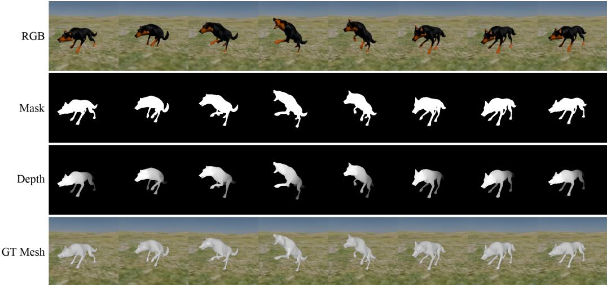  
Figure 7: PAW4D Dataset.

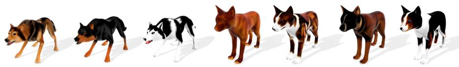  
Figure 8: Examples of generated textures.

The first encourages the rendered and observed silhouettes to have similar overall boundary magnitude:

$$
L _ { \mathrm { p e r } } = \rho \bigg ( \frac { \| \mathcal { E } ( M _ { i } ^ { \mathrm { r e n d } } ) \| _ { 1 } } { \| \mathcal { E } ( M _ { i } ) \| _ { 1 } + \epsilon } - 1 \bigg ) .\tag{7}
$$

The second directly penalizes local misalignment between their boundaries:

$$
L _ { \mathrm { b o u n d } } = \rho \big ( \mathcal { E } ( M _ { i } ^ { \mathrm { r e n d } } ) - \mathcal { E } ( M _ { i } ) \big ) ,\tag{8}
$$

where $\rho$ denotes the Smooth- ${ \cal - L } _ { 1 }$ penalty.

Depth Loss. MegaSaM provides dense depth estimates that complement the image-space objectives with explicit 3D geometric supervision. We use two complementary depth constraints:

$$
L _ { \mathrm { d e p t h } } = w _ { \mathrm { r o o t } } L _ { \mathrm { r o o t } } + w _ { \mathrm { s u r f } } L _ { \mathrm { s u r f } } .\tag{9}
$$

The surface-depth term $L _ { \mathrm { s u r f } }$ aligns the rendered animal surface with the calibrated MegaSaM depth over valid foreground pixels, while the root-depth term $L _ { \mathrm { r o o t } }$ constrains the camera-space position of the animal using the foreground depth. Together, these terms provide complementary supervision for local surface alignment and global 3D placement.

Regularisation Losses. AniMer+ provides a useful pose prior that prevents the optimization from drifting toward implausible configurations:

$$
L _ { \mathrm { p o s e } } = M S E ( \theta , \theta _ { a n i m e r + } ) ,\tag{10}
$$

Temporal consistency is imposed on second-order motion:

$$
L _ { \mathrm { t e m p } } = w _ { \mathrm { t r a n s } } L _ { \mathrm { t r a n s } } + w _ { \mathrm { r o t } } L _ { \mathrm { r o t } } + w _ { \mathrm { j o i n t } } L _ { \mathrm { j o i n t } } ,\tag{11}
$$

where the three terms penalize acceleration in world-space translation, global rotation, and rootrelative joint motion, respectively.

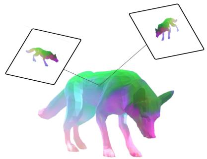

Figure 9: We aggregate the DINO features from multiple views on the 3D shape surface. Such features are then used to establish a correspondence between the 3D shape and the video frames.  
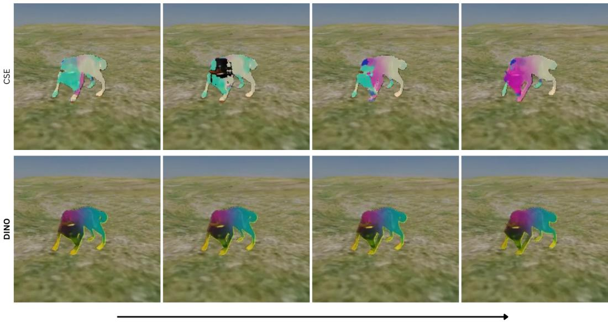  
Time  
Figure 10: Comparison between CSE features (top) and our DINO-based features (bottom). Note how the CSE features vary across visually similar frames.

## A.3 ROBUST SEMANTIC CORRESPONDENCE

Our robust semantic correspondences are derived from the textured Hunyuan3D reconstruction, whose texture provides stable visual cues for matching. We render a set of canonical views of the reconstructed mesh and extract dense DINO features from each view. Because these features capture fine-scale appearance details, such as fur patterns and local markings, they provide reliable cues for animal correspondence.

These features are then projected back onto the reconstructed surface to obtain per-vertex descriptors, which are subsequently transferred to the SMAL+ model. In Fig. 9 we depict a visualization of feature aggregation on the animal’s 3D surface. This produces a dense semantic representation on the SMAL surface, guiding the optimization toward semantically meaningful alignments. Additional details are provided in Sec. 3.4.

Compared to CSE-based correspondences (Kulkarni et al., 2019), this representation is substantially more stable over time. In practice, CSE predictions often vary across frames even under limited motion, whereas DINO-based features remain much more consistent, especially in articulated or visually distinctive regions. As shown in Fig. 10, this improved temporal stability leads to more reliable correspondences and reduces optimization drift.