# On-Policy Visual Evidence Distillation

Shaohang Wei1,‡,\*, Feifan Song1, Guangyue Peng1, Wenhao Yu3, Wei Li1, Wen Luo1, Yang Xu4, Yufan Shen2, Luke Mao2, Yang Du2, Asher Qin2, Houfeng Wang1,†

1Peking University 2Tencent 3CUHK 4Nanjing University ‡Project leader †Corresponding authors

€ Website § Code

## Abstract

Visual agents solve problems by interleaving reasoning with image operations, and on-policy distillation (OPD) provides guidance from a strong teacher on student-generated interaction trajectories. However, image operations change the evidence available for subsequent reasoning, so local errors in evidence acquisition (Acquire), reading (Read), or answer grounding (Ground) can propagate through the trajectory and lead to incorrect answers. Existing multimodal OPD methods primarily construct or contrast auxiliary views of the original image to strengthen supervision, without explicitly modeling the connections between student actions, resulting observations, and subsequent reasoning. This limits their ability to provide corrections tailored to different failure stages. We introduce Reflection on Visual Evidence (REVUE), an on-policy distillation method for visual agents. REVUE compares multiple student-generated trajectories for the same query, summarizes the observed visual evidence, and diagnoses the first failure across the Acquire, Read, and Ground stages. The resulting reflections provide training-time context for the teacher. We group and reweight token-level distillation losses according to how strongly these reflections affect the teacher’s predictions. This design translates trajectory-level evidence diagnosis into targeted token-level supervision, guiding students to improve their visual evidence acquisition and reasoning. Across 11 benchmarks spanning the Qwen2.5-VL and InternVL3.5 model families, REVUE outperforms all evaluated OPD baselines in weighted-average scores for perception, mathematical reasoning, and general tasks. REVUE also reduces redundancy in reasoning and tool calls while improving tool-call accuracy and task accuracy.

ReVuE: On-Policy Visual Evidence Distillation  
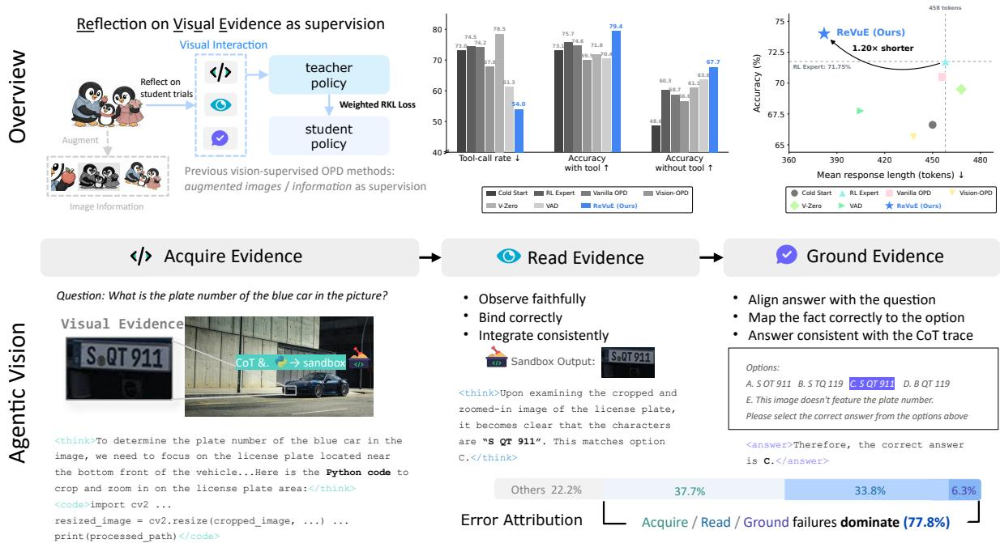  
Figure 1: REVUE overview (with HRBench-8K results) and an agentic vision example.  
\*Work done during the internship at Tencent. Correspondence to shaohang@stu.pku.edu.cn.

## 1 Introduction

High-resolution image understanding, chart analysis, and document question answering often require models to actively locate task-relevant regions, inspect fine-grained details, and incorporate their observations into subsequent reasoning (Wu & Xie, 2024; Qi et al., 2025). Visual agents address these demands by interleaving reasoning with image operations, actively gathering information needed to answer a query (Zheng et al., 2026b; Zhang et al., 2026b). As strong models develop these capabilities, effectively transferring their expertise to students becomes an important training objective. On-policy distillation (OPD) provides dense teacher feedback on student-generated trajectories (Agarwal et al., 2024; Gu et al., 2024; Wei et al., 2026), supervising the actions and reasoning decisions students actually make. Therefore, constructing teacher supervision tailored to visual interaction is a key step toward translating expert capabilities into reliable student behavior.

Visual interactions introduce a particular challenge: image operations change the evidence available for subsequent reasoning (Qi et al., 2025; Zhang et al., 2026b). Selecting the wrong region can leave critical evidence unavailable (Hou et al., 2026); obtaining a useful observation does not guarantee that the student reads it correctly; and a correctly read fact may still be mapped to the wrong answer. We refer to these stages as evidence acquisition (Acquire), visual reading (Read), and answer grounding (Ground). Errors at any stage can propagate through later actions and reasoning, ultimately producing an incorrect answer. Effective distillation therefore requires identifying the first failed stage in the evidence chain and directing corrections to where the error begins to propagate.

Representative multimodal OPD methods strengthen visual supervision through privileged visual cues or contrasts between teacher predictions under different visual conditions (Tian et al., 2026; Sun et al., 2026; Liu et al., 2026a). Vision-OPD (Yuan et al., 2026) uses evidence-centered crops to guide the teacher, while VAD (Zhang et al., 2026a) estimates the visual contribution to teacher corrections by removing relevant evidence. These methods improve how visual information informs supervision, but do not explicitly trace the links between students’ executed actions, returned observations, and subsequent reasoning. This limits their ability to identify which visual behaviors to reinforce and where the evidence chain first breaks down. This raises a central question: how can we turn students’ own interaction trajectories into more targeted teacher guidance?

Multiple attempts at the same query offer a concrete basis for such guidance. Successful attempts may complement each other: one finds more focused evidence, while another reads the relevant visual facts more accurately. Failed attempts help identify the first error in Acquire, Read, or Ground. We introduce REVUE (Reflection on Visual Evidence) to turn these experiences into visual-evidence reflections. By comparing these trajectories, REVUE selects a compact set of observed images sufficient to establish the relevant visual facts. It also summarizes how to read the evidence correctly and map the resulting facts to the answer. The resulting reflections provide training-time context for a strong teacher, helping it reinforce effective behaviors already demonstrated by the student and correct errors at the first failed stage.

Visual-evidence reflection changes the teacher’s assessment of student choices, with effects that vary across token positions. By comparing the teacher’s predictions on the same student trajectory with and without reflection, we identify where reflection most strongly changes the teacher’s support for student choices. In early training, we find that these changes concentrate on a small fraction of tokens. To emphasize supervision at these positions, we group tokens by the magnitude of these changes and apply grouped reweighting to give high-impact positions greater weight in the distillation loss. Our ablations show that this reweighting improves perception and math performance. Reflection changes the teacher’s predictions and guides how

## token-level losses are weighted.

We evaluate REVUE on 11 benchmarks across the Qwen2.5-VL (Bai et al., 2025b) and InternVL3.5 (Wang et al., 2025a) model families. REVUE consistently outperforms all OPD baselines in performance across perception, mathematical reasoning, and general tasks. It also reduces redundant reasoning and unnecessary tool calls, while improving both tool-call accuracy and overall task accuracy. On Qwen2.5-VL-7B, masking high-impact positions in the distillation loss reduces performance more than masking an equal number of low-impact positions. Our critic’s stage diagnoses agree closely with human judgments. Together, these results support the effectiveness of REVUE and the reliability of its stage diagnoses.

## Our contributions are threefold:

1. Visual evidence reflection across student trajectories. We compare multiple successful student attempts on the same query to identify minimal sufficient evidence and summarize successful reading and grounding strategies. We also locate the first failure among Acquire, Read, and Ground, providing training-time guidance to a strong teacher.

2. Reflection-aware grouped reweighting for distillation. We partition tokens according to how strongly reflection changes the teacher’s predictions, and use group-wise normalization and reweighting to focus distillation updates.

3. Cross-model gains and validation of high-impact supervision. Across two model families and 11 benchmarks, REVUE improves task and tool-call accuracy over OPD baselines while reducing reasoning and tool-call redundancy. On Qwen2.5-VL-7B, masking high-impact positions in the loss reduces performance more than masking equally many low-impact positions, supporting greater weight on high-impact supervision.

## 2 Related Work

Agentic Visual Reasoning. Agentic visual reasoning interleaves reasoning with image operations and the resulting observations. This capability appears in general-purpose models such as o3/o4-mini (OpenAI, 2025), Qwen3-VL (Bai et al., 2025a), and Kimi K2.5 (Kimi Team et al., 2026). Earlier systems use guided visual search or visual sketches to acquire and organize task-relevant evidence (Wu & Xie, 2024; Hu et al., 2024). CogCoM (Qi et al., 2025) and LATTE (Ma et al., 2025) learn sequences of visual operations through trajectory supervision. DeepEyes (Zheng et al., 2026b), VTool-R1 (Wu et al., 2026), and Pixel Reasoner (Su et al., 2025) use reinforcement learning to improve visual tool use and exploration. Mini-o3 (Lai et al., 2026) scales visual search to longer interactions and more diverse reasoning patterns. Thyme (Zhang et al., 2026b) and DeepEyesV2 (Hong et al., 2026) support broader reasoning through executable code, with DeepEyesV2 also incorporating web search. CodeV (Hou et al., 2026) uses process rewards on visual tool inputs and outputs to encourage evidence-consistent tool use. We study how students’ actual visual interactions can inform teacher guidance for on-policy distillation.

On-Policy Distillation. On-policy distillation (OPD) supervises student-generated trajectories with teacher distributions, reducing the training–inference mismatch of offline distillation (Agarwal et al., 2024; Gu et al., 2024). Qwen3 (Yang et al., 2025) and Qwen3-VL (Bai et al., 2025a) also use this approach to train smaller models. Privileged-context methods condition teachers on reference solutions, additional context, or peer trajectories (Zhao et al., 2026; Ye et al., 2026; Yu et al., 2026). Visual OPD builds teacher–student asymmetry through evidence-centered crops, recoverable visual cues, or stronger image augmentation for students (Yuan et al., 2026; Tian et al., 2026; Li et al., 2026b). Visual contrasts also support supervision gating and token selection (Sun et al., 2026; Aniri et al., 2026), grouped loss reweighting (Liu et al., 2026a), and target reconstruction (Zhang et al., 2026a). Other methods internalize visual manipulation or generated visual thoughts to reduce inference-time computation (Cai et al., 2026; Li et al., 2026a). For agents, SGCD (Ding et al., 2026) and GRSD (Zheng et al., 2026a) use guidance derived from rollout groups to modify credit assignment in reinforcement learning. REVUE instead extracts reflections from students’ visual interactions to reinforce effective behaviors and locate the first failure in Acquire, Read, or Ground. We condition the teacher on these reflections and use their effects on its predictions to group and reweight tokens for direct distillation.

## 3 Preliminaries

Agentic visual reasoning. Given an image–query pair $\begin{array} { r l r } { x } & { { } = } & { \left( I , u \right) } \end{array}$ , a student policy $\pi _ { \theta }$ with parameters θ interacts with a tool environment $P _ { \mathrm { e n v } }$ Before step $k ,$ history ${ h _ { k } } \ = \ ( x , a _ { 0 } , o _ { 1 } , \ldots , a _ { k - 1 } , o _ { k } )$ contains the input, previous actions, and returned observations, with $h _ { 0 } = x .$ . An action $a _ { k }$ contains reasoning, executable code, or a final answer. An observation $o _ { k + 1 }$ contains tool-returned text and images. The interaction follows

$$
a _ { k } \sim \pi _ { \theta } ( \cdot \mid h _ { k } ) , \qquad o _ { k + 1 } \sim P _ { \mathrm { e n v } } ( \cdot \mid h _ { k } , a _ { k } ) , \qquad h _ { k + 1 } = ( h _ { k } , a _ { k } , o _ { k + 1 } ) .\tag{1}
$$

Actions without tool calls yield $o _ { k + 1 } = \emptyset$ . A final answer $\hat { y }$ ends the interaction, and the complete sequence of actions and observations forms a trajectory τ .

Visual evidence $E _ { k }$ includes I and all tool-returned images in $h _ { k }$ . In Figure 1 (bottom), the student crops and zooms in on the blue $\mathrm { c a r ^ { \prime } s }$ plate. It reads $\mathrm { ~ \textsf ~ { ~ S ~ } ~ } \mathrm { ~ Q ~ T ~ } \mathrm { ~ } 9 1 1$ and matches it to option C. The correct visual fact $f _ { x }$ needed to answer u provides a reference for checking the student’s reading. The rule $\gamma _ { x }$ maps this fact to the answer. The evidence chain is

$$
x \xrightarrow [ ] { \mathrm { A c q u i r e } } E _ { k } \xrightarrow [ ] { \mathrm { R e a d } } f _ { x } \xrightarrow [ ] { \mathrm { G r o u n d } } \hat { y } .\tag{2}
$$

Success requires evidence sufficient to establish $f _ { x } ,$ an accurate reading, and an answer satisfying ${ \hat { y } } = \gamma _ { x } ( f _ { x } )$ . We attribute evidence-chain failures to the first unmet requirement in the dependency order Acquire, Read, and Ground. These stages can recur throughout an interaction.

On-policy distillation. On-policy distillation (OPD) (Agarwal et al., 2024) trains the student on its own sampled trajectories using token-level teacher distributions. For each input $x ,$ the current student samples M trajectories per round, forming $\mathcal { G } _ { x } = \{ \tau _ { i } \} _ { i = 1 } ^ { M }$ with trajectory index i. Token positions t are distinct from interaction steps k. Token $y _ { i , t }$ is the student’s output at position t in $\tau _ { i }$ . History $h _ { i , t }$ contains the input and preceding student outputs and tool observations. Let $\tau _ { i }$ denote the supervised student-output positions in trajectory i, with $| \mathcal { T } _ { i } |$ their number. This set covers reasoning, code, and final answers across interaction rounds. Prompts and tool returns provide context but are not prediction targets. The teacher $q _ { \phi }$ has fixed parameters $\phi .$ . Given $h _ { i , t } ,$ $p _ { i , t }$ and $q _ { i , t } ^ { 0 }$ denote the student and base-teacher next-token distributions:

$$
p _ { i , t } = \pi _ { \theta } ( \cdot \mid h _ { i , t } ) , \qquad q _ { i , t } ^ { 0 } = q _ { \phi } ( \cdot \mid h _ { i , t } ) .
$$

Superscript 0 marks the base teacher prediction. With $\mathbb { D } ^ { \mathrm { K L } }$ denoting KL divergence, the reverse-KL objective and its Monte Carlo (MC) estimate from $\mathcal { G } _ { x }$ are

$$
\mathcal { L } _ { \mathrm { O P D } } ( \theta ) = \mathbb { E } _ { \tau _ { i } \sim \pi _ { \theta } ( \cdot | x ) } \left[ \frac { 1 } { | \mathcal { T } _ { i } | } \sum _ { t \in \mathcal { T } _ { i } } \mathbb { D } ^ { \mathrm { K L } } ( p _ { i , t } | | q _ { i , t } ^ { 0 } ) \right] \stackrel { \mathrm { M C } } { \approx } \frac { 1 } { M } \sum _ { i = 1 } ^ { M } \frac { 1 } { | \mathcal { T } _ { i } | } \sum _ { t \in \mathcal { T } _ { i } } \mathbb { D } ^ { \mathrm { K L } } ( p _ { i , t } | | q _ { i , t } ^ { 0 } ) .\tag{3}
$$

The objective averages over supervised positions within each trajectory, then over the M trajectories for the same input.

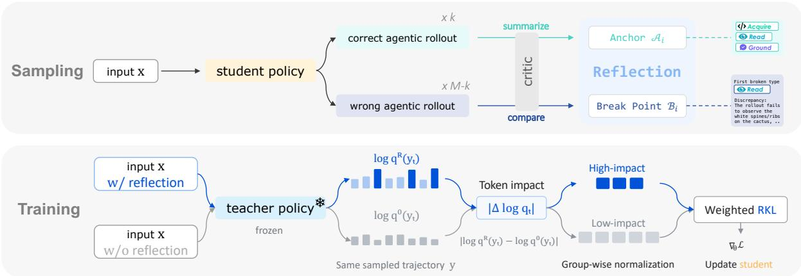  
Figure 2: Sampling and training pipeline of REVUE.

## 4 Method

REVUE converts same-query student trajectories into reflection-guided distillation, as shown in Figure 2. It first constructs a trajectory-specific visual-evidence reflection, then measures how the reflection changes a frozen teacher’s token predictions, and finally uses these changes to reweight token-level distillation losses (Algorithm 1).

## 4.1 Visual-Evidence Reflection

Our error analysis identifies Acquire, Read, and Ground as the main failure stages (Figure 1), with examples in Appendix E. Prior work also shows that attending to the correct visual evidence does not guarantee a correct answer (Liu et al., 2026b). Even with the same evidence, students may need different corrections. In the pie-chart example in Appendix E.2, both trajectories answer No. One misreads the slice ranking, while the other reads it correctly but misapplies the lower-median rule. These failures occur at the Read and Ground stages. Targeted distillation guidance therefore requires examining the student’s actions, visual observations, and reasoning to identify the specific error in evidence use.

We construct reflections from ${ \mathcal { G } } _ { x } ,$ the group of trajectories sampled by the current student for the same input. The visual evidence and correct reasoning in one attempt can provide a reference for others. A critic compares these trajectories and their visual observations to extract correct references and diagnose errors in each incorrect trajectory. For trajectory i, the complete visual-evidence reflection is

$$
\begin{array} { r } { \mathcal { R } _ { i } = ( \mathcal { A } _ { i } , \mathcal { B } _ { i } ) . } \end{array}\tag{4}
$$

The Anchor $\mathbf { \mathcal { A } } _ { i }$ provides a reference for correct visual evidence use. It includes the target visual information and supporting images actually observed within $\mathcal { G } _ { x }$ . It also records the correct visual fact $f _ { x }$ and the rule $\gamma _ { x }$ that maps this fact to the answer. For an incorrect trajectory, the Break Point $\boldsymbol { B } _ { i } = \left( \sigma _ { i } , \delta _ { i } \right)$ describes its failure relative to this reference. $\sigma _ { i }$ denotes the first failed stage in the dependency order, and $\delta _ { i }$ describes the specific discrepancy. These images and text serve as training-time teacher context for token-level supervision on the student’s sampled trajectories. The teacher can then reinforce effective evidence use and guide corrections to observed errors. Appendix A.4 shows a concrete visual-evidence reflection, and Appendices A.5–A.6 detail its construction and critic prompts.

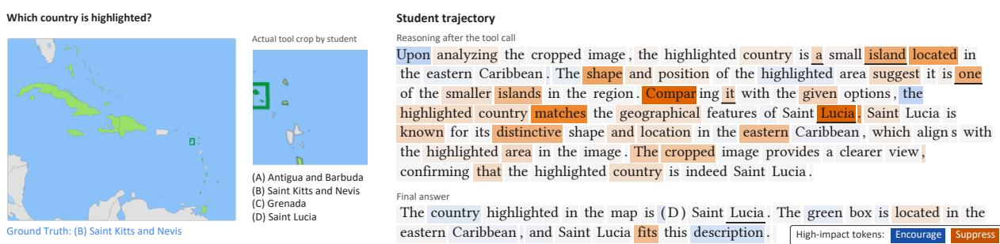  
Figure 3: Token impact on a trajectory with a reading error. The student misreads two islands as one, answering Saint Lucia instead of $\mathtt { S a i n t } ~ \mathtt { K i t t } . \mathtt { t } \mathtt { t } . \mathtt { s }$ and Nevis. Reflection identifies two islands and lowers support for the underlined island, one, and first Lucia. Blue/orange denote increased/decreased teacher support; darker shading indicates larger absolute logprobability shifts. Both evaluations score the same student trajectory; the final Lucia changes little under the fixed erroneous prefix.

## 4.2 From Reflection to Token Impact

Visual-evidence reflection provides correct references and diagnoses failures in the evidence chain. To locate where this guidance changes supervision, we compare teacher scores along the student’s sampled trajectory. On the same student history $h _ { i , t } ,$ the frozen teacher predicts $q _ { i , t } ^ { 0 }$ without reflection (Section 3) and $q _ { i , t } ^ { \mathcal { R } } = q _ { \phi } ( \cdot \mid h _ { i , t } , \mathcal { R } _ { i } )$ with it. Only the training-time teacher receives reflection; the student retains its original interaction history. Using teacher probabilities normalized over the full vocabulary, we define the log-probability shift for candidate token v:

$$
d _ { i , t } ( \boldsymbol { v } ) = \log q _ { i , t } ^ { \mathcal { R } } ( \boldsymbol { v } ) - \log q _ { i , t } ^ { 0 } ( \boldsymbol { v } ) .\tag{5}
$$

To connect these shifts to the reverse-KL objective in Equation 3, we compare both teachers on a shared vocabulary support. The training loss uses the adopted teacher’s top-K candidates; for the reflection-conditioned branch, we use these candidates as Supp for both teachers. Suppressing (i, t), write $p = p _ { i , t }$ and $\begin{array} { r } { p ^ { \mathrm { S u p p } } ( v ) = p ( v ) / \sum _ { u \in \mathrm { S u p p } } p ( u ) } \end{array}$ for $v \in \operatorname { S u p p }$ . Define $q ^ { \mathrm { S u p p } }$ analogously and let $\ell ^ { \mathrm { S u p p } } ( p , q ) = \mathbb { D } ^ { \mathrm { K L } } ( p ^ { \mathrm { S u p p } } \Vert q ^ { \mathrm { S u p p } } )$

Lemma 1 (Reflection and the distillation gradient) For fixed history, teacher predictions, and nonempty shared support, with positive student and teacher probabilities on this support, we have

$$
\nabla _ { \theta } \bigl [ \ell ^ { \mathrm { S u p p } } ( p , q ^ { \mathcal { R } } ) - \ell ^ { \mathrm { S u p p } } ( p , q ^ { 0 } ) \bigr ] = - \mathbb { E } _ { v \sim p ^ { \mathrm { S u p p } } } \bigl [ d ( v ) \nabla _ { \theta } \log p ^ { \mathrm { S u p p } } ( v ) \bigr ] .\tag{6}
$$

Equation 6 expresses the gradient change as a sum over candidate tokens, with each term weighted by its teacher-score shift $d ( v )$ (proof in Appendix D.1). We focus on the student’s sampled token $y _ { i , t }$ to locate where reflection changes teacher support for its actual choices. We define the magnitude of this shift as token impact:

$$
s _ { i , t } = | d _ { i , t } ( y _ { i , t } ) | = \left| \log q _ { i , t } ^ { \mathcal { R } } ( y _ { i , t } ) - \log q _ { i , t } ^ { 0 } ( y _ { i , t } ) \right| .\tag{7}
$$

Taking the absolute value captures both increased and decreased teacher support, covering reinforcement and correction. This score ranks positions by changes in teacher scores, not by full gradient magnitude. Each position’s loss still supervises the distribution over its support.

Token impact distinguishes positions within a trajectory by how much their teacher scores change with reflection. In Figure 3, reflection reduces support for the mistaken judgment of one island. The token one has higher impact than the final Lucia, whose teacher score changes little under the existing erroneous prefix. Section 4.3 groups positions by these scores and assigns greater distillation weight to high-impact positions.

## 4.3 Reflection-Aware Grouped Distillation

Token impact measures teacher-score changes induced by visual-evidence reflection (Section 4.2). Figure 4 pools early-training scores: approximately 20% of scored positions account for 97.6% of total impact (Appendix B.4). Uniform token averaging allocates total loss weight in proportion to group size, leaving sparse high-impact positions a small share. To emphasize their supervision, we group positions by impact and introduce weights $w _ { i , t }$ into the reverse-KL objective in Equation 3:

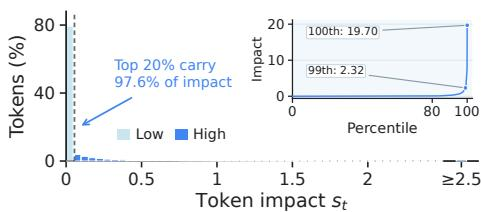  
Figure 4: Token-impact sparsity

$$
\mathcal { L } _ { \mathrm { R e V u E } } ( \theta ) = \frac { 1 } { | \mathcal { G } | } \sum _ { \tau _ { i } \in \mathcal { G } } \frac { 1 } { | \mathcal { T } _ { i } | } \sum _ { t \in \mathcal { T } _ { i } } w _ { i , t } \mathbb { D } ^ { \mathrm { K L } } \Big ( p _ { i , t } ^ { \mathrm { S u p p } _ { i , t } } \Big \Vert \left( q _ { i , t } ^ { * } \right) ^ { \mathrm { S u p p } _ { i , t } } \Big ) .\tag{8}
$$

G contains retained student trajectories in the current batch, with nonempty supervised sets $\mathcal { T } _ { i }$ The teacher target $q _ { i , t } ^ { * }$ is $q _ { i , t } ^ { \mathcal { R } }$ when reflection-conditioned scoring is valid and token-aligned, and $q _ { i , t } ^ { 0 }$ otherwise. Both distributions are renormalized over $\mathrm { S u p p } _ { i , t } = \mathrm { T o p K } ( q _ { i , t } ^ { * } )$ , as indicated by the superscripts.

Within each trajectory, we rank supervised positions by $s _ { i , t } ,$ assigning the top $\lceil \alpha \rceil \mathcal { T } _ { i } \rceil \rceil$ to $\mathcal { T } _ { i , \mathrm { H i g h } }$ and the rest to $\mathcal { T } _ { i , \mathrm { L o w } } = \mathcal { T } _ { i } \backslash \mathcal { T } _ { i , \mathrm { H i g h } } ,$ , where $\alpha \in ( 0 , 1 )$ . For nonempty groups, we allocate total loss weights $\lambda \in ( 0 , 1 )$ ) and $1 - \lambda$ to High and Low and distribute each uniformly within its group. Each position’s coefficient in Equation 8 is $w _ { i , t } / | \mathcal { T } _ { i } |$ , giving the weights

$$
w _ { i , t } = \left\{ \begin{array} { l l } { \lambda | \mathcal { T } _ { i } | / | \mathcal { T } _ { i , \mathrm { H i g h } } | , } & { t \in \mathcal { T } _ { i , \mathrm { H i g h } } , } \\ { ( 1 - \lambda ) | \mathcal { T } _ { i } | / | \mathcal { T } _ { i , \mathrm { L o w } } | , } & { t \in \mathcal { T } _ { i , \mathrm { L o w } } . } \end{array} \right.\tag{9}
$$

α controls group size, while λ controls total group weight. We set $\lambda = 0 . 5 ,$ , assigning half to each group. With teacher targets, supports, and groups fixed, $w _ { i , t }$ scales each position’s gradient relative to uniform token averaging. This multiplier exceeds one for High when the group contains fewer than half the supervised positions. Appendix D.2 and Figure 14 give the derivation and weight curves. If impacts are unavailable or either group is empty, we restore uniform averaging with $w _ { i , t } = 1$ and retain the adopted teacher target (Appendix A.1).

## 5 Experiments

## 5.1 Experimental Setup

For models, we use Thyme-SFT (Zhang et al., 2026b) cold-start checkpoints of Qwen2.5-VL-7B (Bai et al., 2025b) and InternVL3.5-4B-Instruct (Wang et al., 2025a) as students. Teachers are our reproduced Thyme-RL experts; Qwen3.5-397B-A17B (Qwen Team, 2026) is the critic. Offthe-shelf comparisons include GPT-4o (OpenAI, 2024), Gemini-3.1-Flash-Lite, Qwen2.5-VL-32B, Qwen3-VL-30B-A3B-Thinking (Bai et al., 2025a), and InternVL3.5-38B-Instruct. For baselines, we compare with Vision-OPD (Yuan et al., 2026) for visual privilege and V-Zero (Sun et al., 2026) and VAD (Zhang et al., 2026a) for visual contrast. We also include Vanilla OPD, RFT (Yuan et al., 2023), and GT-Privileged. All OPD baselines use the same RL expert teacher; details are shown in Appendix B.1. For benchmarks, we evaluate on 11 benchmarks covering perception, math, and general multimodal tasks (Appendix F). Appendix B.3 details the training data, model initialization, and training and evaluation settings.

## 5.2 Main Results

## Takeaway

1. Both model families improve across all three task categories. Both REVUE students exceed the evaluated OPD baselines and RFT in all three weighted category averages. Perception gains over Vanilla OPD are 2.40% for Qwen2.5-VL-7B and 1.70% for InternVL3.5-4B-Instruct.

2. Higher perception accuracy accompanies shorter responses and less frequent tool use. Qwen2.5-VL-7B improves all three measures over Vanilla OPD on all five perception benchmarks, with the extent of change varying by task.

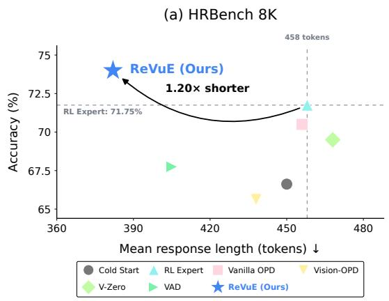

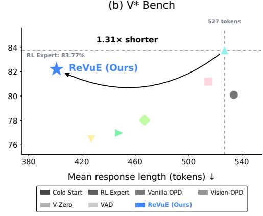

(c) HRBench 8K  
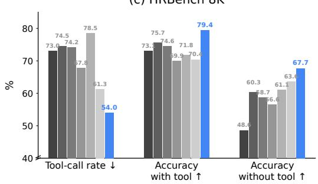

(d) V\* Bench  
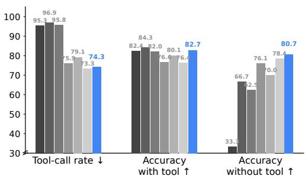  
Figure 5: Response length, accuracy, and tool use for Qwen2.5-VL-7B.

REVUE improves perception across model families, with gains in math and general tasks. In all three weighted category averages, both REVUE students outperform all evaluated OPD baselines and RFT, which trains only on teacher trajectories with correct answers (Table 1). Perception gains over Vanilla OPD are 2.40% for Qwen2.5-VL-7B and 1.70% for InternVL3.5-4B-Instruct. Qwen’s gains on HRBench 8K (+3.50%) and TreeBench (+3.10%) cover high-resolution understanding and object relations. Both models also improve in math and general tasks, with average gains of 2.83% and 1.65% for InternVL, respectively. REVUE also achieves higher category averages than baselines using privileged visual information or visual contrasts, with matched student initializations and teacher sources. The answer-privilege comparison provides further evidence: REVUE exceeds GT-Privileged on all 11 benchmarks for both students. These comparisons support guiding how students acquire, read, and use evidence; giving the teacher the correct answer alone does not yield the same gains. After reflection-assisted distillation, both students also surpass their RL Expert teachers in all three category averages. Both students also exceed GPT-4o in all three averages and the larger off-the-shelf models in their families in perception.

Table 1: Main results. Bold marks the best OPD result per column within each model family, including ties. Wtd. Avg. uses benchmark sample counts as weights. Baseline details and model labels are provided in Appendix B.1–B.2. Evaluation benchmark details are provided in Appendix F.
<table><tr><td rowspan="2">Model / Method</td><td colspan="6">Perception</td><td colspan="4">Math</td><td colspan="4">General</td></tr><tr><td>HR-4K HR-8K</td><td></td><td>V*</td><td>Tree Bench</td><td>Visual Probe</td><td>Wtd. Avg.</td><td>Math Vista</td><td>Math Verse</td><td>Visu Logic</td><td>Wtd. Avg.</td><td>Hallu Bench</td><td>CQA Pro</td><td>Info VQA</td><td>Wtd. Avg.</td></tr><tr><td colspan="10">Off-the-Shelf Models</td><td></td><td></td><td></td><td></td><td></td></tr><tr><td>GPT-40</td><td>61.00</td><td>54.00</td><td>61.78</td><td>49.88</td><td>23.88</td><td>50.28</td><td>58.83</td><td>39.21</td><td>25.20</td><td>41.22</td><td>51.37</td><td>28.67</td><td>71.17</td><td>53.28</td></tr><tr><td>Gemini3.1FL</td><td>46.00</td><td>43.00 69.25</td><td>64.92</td><td>51.85</td><td>27.96</td><td>43.89</td><td>80.80</td><td>77.92</td><td>32.40</td><td>62.63</td><td>59.92</td><td>37.03</td><td>83.50</td><td>63.57 59.29</td></tr><tr><td>Qwen2.5-32B</td><td>75.13</td><td></td><td>78.01</td><td>48.40</td><td>45.05</td><td>63.89</td><td>77.00</td><td>53.05</td><td>25.90</td><td>51.90</td><td>50.74</td><td>30.02</td><td>83.10</td><td></td></tr><tr><td>Qwen3-30B-T</td><td>77.13</td><td>71.38 62.13</td><td>80.10</td><td>45.43</td><td>36.89</td><td>63.26</td><td>80.20</td><td>66.12</td><td>25.80</td><td>56.71</td><td>61.82</td><td>35.46</td><td>85.68</td><td>64.45</td></tr><tr><td>InternVL-38B</td><td>71.50</td><td></td><td>65.97</td><td>41.98</td><td>20.97</td><td>54.34</td><td>70.90</td><td>48.48</td><td>27.20</td><td>48.89</td><td>50.74</td><td>26.98</td><td>77.70</td><td>55.71</td></tr><tr><td colspan="10">Qwen2.5-VL-7B</td><td colspan="7"></td></tr><tr><td>Base Model</td><td>69.00</td><td>63.50</td><td>75.39</td><td>37.04</td><td>41.17</td><td>57.77</td><td>69.10</td><td>44.04</td><td>25.40</td><td>46.34</td><td>40.91</td><td>20.79</td><td>75.10</td><td>50.53</td></tr><tr><td>Cold-start</td><td>74.38</td><td>66.62</td><td>80.10</td><td>37.28</td><td>41.56</td><td>60.72</td><td>68.00</td><td>44.29</td><td>26.40</td><td>46.38</td><td>41.73</td><td>21.12</td><td>79.05</td><td>52.68</td></tr><tr><td>RL Expert</td><td>75.50</td><td>71.75</td><td>83.77</td><td>40.25</td><td>44.85</td><td>63.89</td><td>70.60</td><td>45.43</td><td>26.20</td><td>47.56</td><td>43.83</td><td>21.69</td><td>79.74</td><td>53.60</td></tr><tr><td>RFT</td><td>75.38</td><td>72.00</td><td>81.20</td><td>40.00</td><td>41.75</td><td>63.12</td><td>69.50</td><td>45.81</td><td>24.60</td><td>46.70</td><td>42.33</td><td>21.18</td><td>79.57</td><td>53.07</td></tr><tr><td>Vanilla OPD GT-Privileged</td><td>75.40</td><td>70.50</td><td>81.20</td><td>38.02</td><td>42.91</td><td>62.61</td><td>70.60</td><td>46.07</td><td>26.00</td><td>47.67</td><td>42.88</td><td>21.69</td><td>79.44</td><td>53.28</td></tr><tr><td>Vision-OPD</td><td>73.62 73.00</td><td>70.50</td><td>79.58</td><td>39.75</td><td>43.10</td><td>62.26</td><td>71.20</td><td>45.69</td><td>25.20</td><td>47.49</td><td>43.45</td><td>20.84</td><td>79.70</td><td>53.23</td></tr><tr><td>V-Zero</td><td></td><td>65.62</td><td>76.44</td><td>39.01</td><td>41.36</td><td>59.98</td><td>67.70</td><td>42.39</td><td>25.70</td><td>45.48</td><td>39.89</td><td>20.79</td><td>78.75</td><td>52.08</td></tr><tr><td>VAD</td><td>75.62</td><td>69.50</td><td>78.01</td><td>37.28</td><td>43.10</td><td>62.08</td><td>69.80</td><td>43.91</td><td>26.60</td><td>46.99</td><td>42.16</td><td>21.08</td><td>79.12</td><td>52.79</td></tr><tr><td></td><td>74.75</td><td>67.75</td><td>76.96</td><td>41.98</td><td>43.89</td><td>62.08</td><td>69.00</td><td>45.56</td><td>22.30</td><td>45.62</td><td>44.24</td><td>21.73</td><td>79.65</td><td>53.65</td></tr><tr><td>REVuE(Ours)</td><td>77.10</td><td>74.00</td><td>82.20</td><td>41.12</td><td>44.66</td><td>65.01</td><td>71.60</td><td>47.08</td><td>26.50</td><td>48.49</td><td>45.12</td><td>21.81</td><td>80.27</td><td>54.14</td></tr><tr><td colspan="10">InternVL3.5-4B-Instruct</td><td colspan="7"></td></tr><tr><td>Base Model</td><td>62.00</td><td>55.00</td><td>68.59</td><td>40.49</td><td>20.58</td><td>49.32</td><td>68.50</td><td>28.93</td><td>25.80</td><td>42.00</td><td>40.04</td><td>26.01</td><td>66.04</td><td>47.78</td></tr><tr><td>Cold-start</td><td>69.50</td><td>63.25</td><td>66.49</td><td>40.99</td><td>29.90</td><td>55.66</td><td>69.30</td><td>47.21</td><td>25.80</td><td>47.45</td><td>48.50</td><td>26.24</td><td>72.98</td><td>52.79</td></tr><tr><td>RL Expert</td><td>72.62</td><td>64.62</td><td>71.73</td><td>40.74</td><td>34.56</td><td>58.20</td><td>69.30</td><td>46.32</td><td>26.90</td><td>47.60</td><td>46.92</td><td>30.59</td><td>73.93</td><td>54.38</td></tr><tr><td>RFT</td><td>71.25</td><td>66.00</td><td>71.73</td><td>40.25</td><td>35.00</td><td>58.22</td><td>70.00</td><td>45.94</td><td>24.30</td><td>46.81</td><td>47.78</td><td>29.39</td><td>74.17</td><td>54.26</td></tr><tr><td>Vanilla OPD</td><td>71.13</td><td>65.87</td><td>73.30</td><td>40.25</td><td>33.79</td><td>58.02</td><td>68.40</td><td>43.40</td><td>26.60</td><td>46.34</td><td>46.85</td><td>30.46</td><td>72.16</td><td>53.48</td></tr><tr><td>GT-Privileged</td><td>71.25</td><td>64.88</td><td>70.16</td><td>39.75</td><td>33.20</td><td>57.36</td><td>71.30</td><td>39.34</td><td>26.20</td><td>46.09</td><td>49.29</td><td>29.90</td><td>72.48</td><td>53.91</td></tr><tr><td>Vision-OPD</td><td>66.25</td><td>60.00</td><td>65.97</td><td>37.78</td><td>28.93</td><td>53.04</td><td>66.60</td><td>44.54</td><td>26.60</td><td>46.02</td><td>44.57</td><td>30.46</td><td>74.47</td><td>54.14</td></tr><tr><td>V-Zero</td><td>68.13</td><td>61.75</td><td>67.02</td><td>40.25</td><td>28.35</td><td>54.45</td><td>68.80</td><td>46.95</td><td>26.80</td><td>47.56</td><td>49.03</td><td>28.65</td><td>73.61</td><td>53.99</td></tr><tr><td>VAD</td><td>67.50</td><td>61.00</td><td>67.02</td><td>39.01</td><td>27.96</td><td>53.78</td><td>68.30</td><td>46.07</td><td>27.70</td><td>47.45</td><td>48.05</td><td>31.44</td><td>73.36</td><td>54.61</td></tr><tr><td>REVuE(Ours) 73.25</td><td></td><td>67.37</td><td>73.30</td><td>41.48</td><td>36.12</td><td>59.72</td><td>71.60</td><td>47.46</td><td>28.10</td><td>49.17</td><td>49.38</td><td>32.27</td><td>73.35</td><td>55.13</td></tr></table>

REVUE improves perception accuracy with shorter responses and less frequent tool use. Across all five perception benchmarks, the Qwen2.5-VL-7B student is more accurate than Vanilla OPD while producing shorter responses and using tools less often (Figure 5; Appendix C.4). On HRBench 8K, REVUE reduces mean response length from the RL Expert’s 458 tokens to 382, while raising accuracy from 71.75% to 74.00% (+2.25%). On HRBench 8K and V\* Bench, its answer accuracy exceeds the other plotted distillation baselines on samples both with and without tool use. Tool-use frequency alone does not explain the performance differences. On V\* Bench, VAD uses tools slightly less often (73.3% vs. 74.3%), yet REVUE achieves 5.24% higher overall accuracy. The extent of these behavioral changes varies by task. On TreeBench, REVUE reduces response length by 46.09% and tool-use rate from 64.7% to 15.8%, while improving accuracy by 3.10% over Vanilla OPD. On VisualProbe, it still uses tools on 83.7% of samples and also achieves higher accuracy. These results support more effective visual evidence use: higher accuracy with less generation and less frequent tool use, while tool reliance still varies by task.

## 6 Analysis and Discussion

## Takeaway

1. Reflection improves all three category averages; reweighting adds gains in perception and math. On Qwen2.5-VL-7B, reflection raises all three averages, and adding impact reweighting raises perception and math by another 1.31% and 0.71%, respectively. The general-task average drops by 0.28% relative to reflection alone.

2. Impact ranking identifies supervision worth prioritizing. On Qwen2.5-VL-7B, impact-based selection outperforms random selection in perception and math, and masking high-impact positions hurts more than masking equally many low-impact positions. The top 20% of pooled early-training positions carry 97.6% of total impact.

3. Prioritizing 20% of positions gives the best tested perception and math averages. General tasks on Qwen2.5-VL-7B favor the 100% setting, whose average exceeds the 20% setting by 0.28%.

4. Critic stage diagnoses agree closely with human annotation and other judges. Critic labels match one annotator on 93 of 96 rollouts (96.88%), with 95.31% agreement on the 64 incorrect rollouts. Valid pairs agree at 99.2% for a critic rerun and 92.8–93.2% across models.

Reflection brings gains across tasks; impact reweighting further improves perception and math. In the cumulative ablation on Qwen2.5-VL-7B, adding visual-evidence reflection improves all three category averages and nine of 11

Table 2: Component ablation on Qwen2.5-VL-7B.
<table><tr><td>Method</td><td>Perception ↑</td><td>Math↑</td><td>General ↑</td></tr><tr><td>Vanilla OPD</td><td>62.61</td><td>47.67</td><td>53.28</td></tr><tr><td>+reflection</td><td>63.70</td><td>47.78</td><td>54.42</td></tr><tr><td>+impact reweight</td><td>65.01</td><td>48.49</td><td>54.14</td></tr></table>

benchmark scores over Vanilla OPD (Table 2). Adding impact reweighting then raises the perception and math averages by another 1.31% and 0.71%, respectively. It also improves tasks that do not benefit from reflection alone. On TreeBench, for example, accuracy falls from 38.02% to 37.78% with reflection alone, then rises to 41.12% with reweighting. The general-task average drops by 0.28% relative to reflection alone, but REVUE still outperforms Vanilla OPD on all 11 benchmarks (Appendix C.1).

Impact ranking identifies supervision worth prioritizing. We compare impact-based and random selection on Qwen2.5-VL-7B with fixed group fractions and weights (Table 3). Compared with random selection, REVUE gains 1.37% in perception and 1.07% in math, but only 0.04% on general tasks. Masking yields the same ordering in all three cate-

Table 3: Token-impact interventions.
<table><tr><td>Method</td><td>Perception ↑ Math ↑ General ↑</td><td></td><td></td></tr><tr><td>Vanilla OPD</td><td>62.61</td><td>47.67</td><td>53.28</td></tr><tr><td>Random select 20%</td><td>63.64</td><td>47.42</td><td>54.10</td></tr><tr><td>Mask random 20%</td><td>63.85</td><td>47.35</td><td>53.78</td></tr><tr><td>Mask low 20%</td><td>65.18</td><td>48.42</td><td>53.97</td></tr><tr><td>Mask top 20%</td><td>62.26</td><td>47.17</td><td>52.51</td></tr><tr><td>REVuE(Ours)</td><td>65.01</td><td>48.49</td><td>54.14</td></tr></table>

gory averages: Mask low > Mask random > Mask top. Mask low also exceeds Mask top on all 11 benchmarks (Appendix C.2). The cases show reflection lowering teacher support for erroneous choices and raising support for correct judgments within failed trajectories. In the age case, reflection favors the correct relation above and discourages the erroneous comparison exceed (Appendix E.4). Scores can change at target selection and intermediate visual judgments while final-answer token scores remain nearly unchanged (Figure 3; Appendix E.4). The top 20% of pooled early-training positions carry 97.6% of total impact, supporting greater weight on these positions (Figure 4). Mask low gains 0.17% in perception over the full method but slightly reduces math and general averages, showing task-dependent effects.

Prioritizing 20% of positions gives the highest perception and math averages. This fraction also leads on all three math benchmarks (Table 4; Appendix C.3). With λ = 0.5, reducing α shrinks the high-weight group and increases each position’s weight within it (Appendix D.2). Neither 5% nor

Table 4: Sensitivity to α.
<table><tr><td>Fraction</td><td>Perception ↑ Math ↑ General ↑</td><td></td><td></td></tr><tr><td>Top 5%</td><td>64.70</td><td>47.49</td><td>54.12</td></tr><tr><td>Top 10%</td><td>64.55</td><td>46.92</td><td>53.85</td></tr><tr><td>Top 20% (REVuE)</td><td>65.01</td><td>48.49</td><td>54.14</td></tr><tr><td>Top 50%</td><td>64.33</td><td>47.42</td><td>54.18</td></tr><tr><td>Top 100%</td><td>63.70</td><td>47.78</td><td>54.42</td></tr></table>

10% exceeds the perception and math averages at 20%, supporting moderate concentration in this setting. The general-task average peaks at 100%, 0.28% above the 20% setting, indicating different preferences across tasks.

Critic diagnoses agree closely with human judgments, including on incorrect trajectories. One annotator independently labels 96 rollouts balanced across all-correct, mixed, and all-wrong groups before viewing critic labels. Final stage labels match 93 of 96 human labels (96.88%, Cohen’s κ = 0.957). Agreement remains 95.31% on the 64 incorrect rollouts. On 768

Table 5: Critic stage consistency.
<table><tr><td>Comparator</td><td>n Agreement (%)</td><td>κ</td></tr><tr><td>Human annotator 96</td><td></td><td>96.88 0.957</td></tr><tr><td>Qwen (rerun)</td><td>744</td><td>99.2 0.987</td></tr><tr><td>Gemini 3.8 Flash</td><td>736</td><td>93.2 0.892</td></tr><tr><td>GPT-5.6 Luna</td><td>736</td><td>92.8 0.886</td></tr></table>

n: valid pairs.

rollouts, we compare archived final training labels with fresh labels from the same critic and two external judges. Valid pairs agree at 99.2% for the same critic and 92.8–93.2% across models (Table 5). These results support human agreement and repeatability of the stage diagnoses used for reflection. Appendix B.6 details sampling and label disagreements.

## 7 Conclusion

To provide targeted supervision for visual agents, we introduced REVUE, which improves perception, mathematical reasoning, and general-task performance through visual-evidence reflection and token reweighting in on-policy distillation. The reflections provide the teacher with references for correct evidence use and diagnoses of errors in the student’s own trajectories. Token reweighting then emphasizes supervision at positions where these reflections most change the teacher’s assessment. Behavioral analysis on Qwen2.5-VL-7B also shows fewer tool calls and shorter responses on perception tasks. Ablations and token-impact interventions support the effectiveness of both components. Our study focuses on two student model families and image-based question answering; broader model coverage and more diverse visual interactions remain to be explored.

## References

Rishabh Agarwal, Nino Vieillard, Yongchao Zhou, Piotr Stanczyk, Sabela Ramos Garea, Matthieu Geist, and Olivier Bachem. On-Policy Distillation of Language Models: Learning from Self-Generated Mistakes. In International Conference on Learning Representations, pp. 21246–21263, 2024. URL https://proceedings.iclr.cc/paper\_files/paper/ 2024/file/5be69a584901a26c521c2b51e40a4c20-Paper-Conference.pdf.

Aniri, Jinhe Bi, Peng Liao, Zengjie Jin, Volker Tresp, Fei Shen, Yunpu Ma, and Tat-Seng Chua. OPD-V: Visual On-Policy Self-Distillation with Modality Balance, 2026. URL https:// arxiv.org/abs/2608.05131.

Shuai Bai, Yuxuan Cai, Ruizhe Chen, Keqin Chen, Xionghui Chen, Zesen Cheng, Lianghao Deng, Wei Ding, Chang Gao, Chunjiang Ge, Wenbin Ge, Zhifang Guo, Qidong Huang, Jie Huang, Fei Huang, Binyuan Hui, Shutong Jiang, Zhaohai Li, Mingsheng Li, Mei Li, Kaixin Li, Zicheng Lin, Junyang Lin, Xuejing Liu, Jiawei Liu, Chenglong Liu, Yang Liu, Dayiheng Liu, Shixuan Liu, Dunjie Lu, Ruilin Luo, Chenxu Lv, Rui Men, Lingchen Meng, Xuancheng Ren, Xingzhang Ren, Sibo Song, Yuchong Sun, Jun Tang, Jianhong Tu, Jianqiang Wan, Peng Wang, Pengfei Wang, Qiuyue Wang, Yuxuan Wang, Tianbao Xie, Yiheng Xu, Haiyang Xu, Jin Xu, Zhibo Yang, Mingkun Yang, Jianxin Yang, An Yang, Bowen Yu, Fei Zhang, Hang Zhang, Xi Zhang, Bo Zheng, Humen Zhong, Jingren Zhou, Fan Zhou, Jing Zhou, Yuanzhi Zhu, and Ke Zhu. Qwen3-VL Technical Report, 2025a. URL https://arxiv.org/abs/2511.21631.

Shuai Bai, Keqin Chen, Xuejing Liu, Jialin Wang, Wenbin Ge, Sibo Song, Kai Dang, Peng Wang, Shijie Wang, Jun Tang, Humen Zhong, Yuanzhi Zhu, Mingkun Yang, Zhaohai Li, Jianqiang Wan, Pengfei Wang, Wei Ding, Zheren Fu, Yiheng Xu, Jiabo Ye, Xi Zhang, Tianbao Xie, Zesen Cheng, Hang Zhang, Zhibo Yang, Haiyang Xu, and Junyang Lin. Qwen2.5-VL Technical Report, 2025b. URL https://arxiv.org/abs/2502.13923.

Yishuo Cai, Jiahui Liu, Yuanxin Liu, Haobo Deng, Linli Yao, Yuhao Zheng, Kun Ouyang, Zhimo Li, Ziyue Wang, Xu Sun, Haoli Bai, and Xiaohui Li. Thinking Without Images: Internalizing Visual Manipulation with On-Policy Self-Distillation, 2026. URL https://arxiv.org/ abs/2606.08719.

Tianyu Ding, Jianhong Xin, and Juan Pablo De la Cruz Weinstein. Keep policy gradient in charge: Sibling-guided credit distillation for long-horizon tool-use agents, 2026. URL https: //arxiv.org/abs/2606.12634.

Chaoyou Fu, Peixian Chen, Yunhang Shen, Yulei Qin, Mengdan Zhang, Xu Lin, Jinrui Yang, Xiawu Zheng, Ke Li, Xing Sun, Yunsheng Wu, Rongrong Ji, Caifeng Shan, and Ran He. MME: A comprehensive evaluation benchmark for multimodal large language models. In D. Belgrave, C. Zhang, H. Lin, R. Pascanu, P. Koniusz, M. Ghassemi, and N. Chen (eds.), Advances in Neural Information Processing Systems, volume 38. Curran Associates, Inc., 2025. doi: 10.52202/085713-4899. URL https://proceedings.neurips.cc/paper\_files/ paper/2025/file/d79a27cf2772fe00be7f341efc0eb517-Paper-Datasets\_ and\_Benchmarks\_Track.pdf.

Yuxian Gu, Li Dong, Furu Wei, and Minlie Huang. MiniLLM: Knowledge Distillation of Large Language Models. In International Conference on Learning Representations, pp. 32694–32717, 2024. URL https://proceedings.iclr.cc/paper\_files/paper/ 2024/file/8ac015d409635f196f9e3e9dcfb9a94e-Paper-Conference.pdf.

Tianrui Guan, Fuxiao Liu, Xiyang Wu, Ruiqi Xian, Zongxia Li, Xiaoyu Liu, Xijun Wang, Lichang Chen, Furong Huang, Yaser Yacoob, Dinesh Manocha, and Tianyi Zhou. HallusionBench: An advanced diagnostic suite for entangled language hallucination

and visual illusion in large vision-language models. In Proceedings of the IEEE/CVF Conference on Computer Vision and Pattern Recognition (CVPR), pp. 14375–14385, June 2024. URL https://openaccess.thecvf.com/content/CVPR2024/html/Guan\_ HallusionBench\_An\_Advanced\_Diagnostic\_Suite\_for\_Entangled\_Language\_ Hallucination\_and\_CVPR\_2024\_paper.html.

Jack Hong, Chenxiao Zhao, ChengLin Zhu, Weiheng Lu, Guohai Xu, and Xing Yu. DeepEyesV2: Toward Agentic Multimodal Model. In International Conference on Learning Representations, pp. 114851–114872, 2026. URL https://proceedings.iclr.cc/paper\_files/paper/ 2026/file/badbef7d421640fb038399e9d7271b1c-Paper-Conference.pdf.

Xinhai Hou, Shaoyuan Xu, Manan Biyani, Moyan Li, Jia Liu, Todd C Hollon, and Bryan Wang. CodeV: Code with Images for Faithful Visual Reasoning via Tool-Aware Policy Optimization. In Proceedings of the IEEE/CVF Conference on Computer Vision and Pattern Recognition (CVPR), pp. 21500–21510, 2026. URL https://openaccess.thecvf.com/content/CVPR2026/ html/Hou\_CodeV\_Code\_with\_Images\_for\_Faithful\_Visual\_Reasoning\_via\_ Tool-Aware\_CVPR\_2026\_paper.html.

Yushi Hu, Weijia Shi, Xingyu Fu, Dan Roth, Mari Ostendorf, Luke Zettlemoyer, Noah A. Smith, and Ranjay Krishna. Visual Sketchpad: Sketching as a Visual Chain of Thought for Multimodal Language Models. In Advances in Neural Information Processing Systems, volume 37, pp. 139348–139379, 2024. doi: 10.52202/ 079017-4423. URL https://proceedings.neurips.cc/paper\_files/paper/2024/ file/fb82011040977c7712409fbdb5456647-Paper-Conference.pdf.

Kimi Team, Tongtong Bai, Yifan Bai, Yiping Bao, S. H. Cai, Yuan Cao, Ziwei Chai, Y. Charles, H. S. Che, Cheng Chen, Guanduo Chen, Huarong Chen, Jia Chen, Jianlong Chen, Jun Chen, Kefan Chen, Liang Chen, Ruijue Chen, Xinhao Chen, Yanru Chen, Yanxu Chen, Yicun Chen, Yimin Chen, Yingjiang Chen, Yuankun Chen, Yujie Chen, Yutian Chen, Zhirong Chen, Ziwei Chen, Dazhi Cheng, Yean Cheng, Minghan Chu, Jialei Cui, Jiaqi Deng, Muxi Diao, Hao Ding, Mengfan Dong, Mengnan Dong, Yuxin Dong, Yuhao Dong, Angang Du, Chenzhuang Du, Dikang Du, Lingxiao Du, Yulun Du, Yu Fan, Shengjun Fang, Qiulin Feng, Yichen Feng, Garimugai Fu, Kelin Fu, Hongcheng Gao, Tong Gao, Yuyao Ge, Shangyi Geng, Chengyang Gong, Xiaochen Gong, Zhuoma Gongque, Qizheng Gu, Xinran Gu, Yicheng Gu, Longyu Guan, Shuhao Guan, Yuanying Guo, Xiaoru Hao, Dailan He, Tianhong He, Weiran He, Wenyang He, Yibo He, Yunjia He, Chao Hong, Hao Hu, Jiaxi Hu, Yangyang Hu, Zhenxing Hu, Ke Huang, Ruiyuan Huang, Weixiao Huang, Zhiqi Huang, Chaobo Jia, Tao Jiang, Zhejun Jiang, Xinyi Jin, Yu Jing, Guokun Lai, Aidi Li, C. Li, Cheng Li, Fang Li, Guanghe Li, Guanyu Li, Haitao Li, Haoyang Li, Jia Li, Jingwei Li, Junxiong Li, Lincan Li, Mo Li, Weihong Li, Wentao Li, Xinhang Li, Xinhao Li, Yang Li, Yanhao Li, Yiwei Li, Yuxiao Li, Zhaowei Li, Zhaoxi Li, Zheming Li, Weilong Liao, Jiawei Lin, Xiaohan Lin, Yibo Lin, Zhishan Lin, Zichao Lin, Cheng Liu, Chenyu Liu, Hongzhang Liu, Liang Liu, Shaowei Liu, Shudong Liu, Shuran Liu, Tianwei Liu, Tianyu Liu, Weizhou Liu, Xiangyan Liu, Yangyang Liu, Yanming Liu, Yibo Liu, Yuanxin Liu, Zhengying Liu, Zhongnuo Liu, Enzhe Lu, Haoyu Lu, Zhiyuan Lu, G. Luo, Junyu Luo, Tongxu Luo, Yashuo Luo, Long Ma, Shaoguang Mao, Yuan Mei, Xin Men, Fanqing Meng, Zhiyong Meng, Yibo Miao, Minqing Ni, Kun Ouyang, Siyuan Pan, Bo Pang, Yuchao Qian, Ruoyu Qin, Zeyu Qin, Jiezhong Qiu, Bowen Qu, Zeyu Shang, Youbo Shao, Tianxiao Shen, Zhennan Shen, Juanfeng Shi, Lidong Shi, Shengyuan Shi, Feifan Song, Pengwei Song, Tianhui Song, Xiaoxi Song, Hongjin Su, Jianlin Su, Zhaochen Su, Lin Sui, Jinsong Sun, Junyao Sun, Tongyu Sun, Flood Sung, Yunpeng Tai, Chuning Tang, Heyi Tang, Xiaojuan Tang, Zhengyang Tang, Jiawen Tao, Shiyuan Teng, Chaoran Tian, Pengfei Tian, Bowen Wang, Chensi Wang, Chuang Wang, Congcong Wang, Dingkun Wang, Dinglu Wang, Dongliang Wang, Feng Wang, Hailong Wang, Haiming Wang, Hao Wang, Hengzhi Wang, Huaqing Wang, Hui Wang, Jiahao Wang, Jinhong

Wang, Jiuzheng Wang, Kaixin Wang, Linian Wang, Qibin Wang, Shengjie Wang, Shuyi Wang, Si Wang, Wei Wang, Xiaochen Wang, Xinyuan Wang, Yao Wang, Yejie Wang, Yipu Wang, Yiqin Wang, Yucheng Wang, Yuzhi Wang, Zhaoji Wang, Zhaowei Wang, Zhengtao Wang, Zhexu Wang, Zifan Wang, Zihan Wang, Zizhe Wang, Chu Wei, Ming Wei, Chuan Wen, Zichen Wen, Chengjie Wu, Haoning Wu, Junyan Wu, Rucong Wu, Wenhao Wu, Yuefeng Wu, Yuhao Wu, Yuxin Wu, Zijian Wu, Chenjun Xiao, Jin Xie, Xiaotong Xie, Yuchong Xie, Bowei Xing, Boyu Xu, Jianfan Xu, Jing Xu, Jinjing Xu, L. H. Xu, Lin Xu, Suting Xu, Weixin Xu, Xinbo Xu, Xinran Xu, Yangchuan Xu, Yichang Xu, Yuemeng Xu, Zelai Xu, Ziyao Xu, Junjie Yan, Yuzi Yan, Guangyao Yang, Hao Yang, Junwei Yang, Kai Yang, Ningyuan Yang, Xiaofei Yang, Xinlong Yang, Xinyu Yang, Ying Yang, Yi Yang, Yi Yang, Zhen Yang, Zhilin Yang, Zonghan Yang, Haotian Yao, Dan Ye, Haoran Ye, Wenjie Ye, Zhuorui Ye, Peng Yebo, Bohong Yin, Chengzhen Yu, Longhui Yu, Tao Yu, Tianxiang Yu, Enming Yuan, Mengjie Yuan, Xiaokun Yuan, Yang Yue, Weihao Zeng, Dunyuan Zha, Haobing Zhan, Dehao Zhang, Hao Zhang, Jin Zhang, Puqi Zhang, Qiao Zhang, Rui Zhang, Xiaobin Zhang, Xiaoyun Zhang, Y. Zhang, Yadong Zhang, Yangkun Zhang, Yichi Zhang, Yizhi Zhang, Yongting Zhang, Yu Zhang, Yushun Zhang, Yutao Zhang, Yutong Zhang, Zheng Zhang, Chenguang Zhao, Feifan Zhao, Jinxiang Zhao, Shuai Zhao, Xiangyu Zhao, Xuanle Zhao, Yikai Zhao, Zijia Zhao, Huabin Zheng, Ruihan Zheng, Shaojie Zheng, Tengyang Zheng, Junfeng Zhong, Longguang Zhong, Weiming Zhong, M. Zhou, Runjie Zhou, Xinyu Zhou, Zaida Zhou, Jinguo Zhu, Liya Zhu, Xinhao Zhu, Yuxuan Zhu, Zhen Zhu, Jingze Zhuang, Weiyu Zhuang, Ying Zou, and Xinxing Zu. Kimi K2.5: Visual Agentic Intelligence, 2026. URL https://arxiv.org/abs/2602.02276.

Xin Lai, Junyi Li, Wei Li, Tao Liu, Tianjian Li, and Hengshuang Zhao. Minio3: Scaling Up Reasoning Patterns and Interaction Turns for Visual Search. In International Conference on Learning Representations, pp. 76722–76746, 2026. URL https://proceedings.iclr.cc/paper\_files/paper/2026/file/ 7c40c5050bd029a3ea7ff8b01412f735-Paper-Conference.pdf.

Pengyu Li, Zhitao Gao, Lingling Zhang, Muye Huang, Yuanming Li, Zesheng Yang, Fangzhi Xu, and Jun Liu. Visual-OPSD: Cross-Modal On-Policy Self-Distillation for Efficient Unified Multimodal Reasoning, 2026a. URL https://arxiv.org/abs/2606.18974.

Yijiang Li, Yijun Liang, Yunjie Tian, Bingyang Wang, Ke Zhang, Zhenfei Yin, Di Fu, Philip Torr, and Nuno Vasconcelos. Self-Supervised Visual On-Policy Distillation, 2026b. URL https://arxiv.org/abs/2608.14144.

Ruiqi Liu, Xiaolei Lv, Gengsheng Li, Ximo Zhu, Zhiheng Wang, Zhengbo Zhang, Junkai Chen, Zhiheng Li, Bo Li, Jun Gao, and Shu Wu. Visual-Advantage On-Policy Distillation for Vision-Language Models, 2026a. URL https://arxiv.org/abs/2605.21924.

Zhining Liu, Ziyi Chen, Hui Liu, Chen Luo, Xianfeng Tang, Suhang Wang, Jingying Zeng, Zhenwei Dai, Zhan Shi, Tianxin Wei, Hanqing Lu, Benoit Dumoulin, and Hanghang Tong. Seeing but not believing: Probing the disconnect between visual attention and answer correctness in VLMs. In C. Vondrick, B. Hariharan, C. Raffel, L. Pinto, D. Yang, and A. Faust (eds.), International Conference on Learning Representations, volume 2026, pp. 72849–72876, 2026b. URL https://proceedings.iclr.cc/paper\_files/paper/ 2026/file/76818d8d85e05e45ce3a16a8468619d1-Paper-Conference.pdf.

Pan Lu, Hritik Bansal, Tony Xia, Jiacheng Liu, Chunyuan Li, Hannaneh Hajishirzi, Hao Cheng, Kai-Wei Chang, Michel Galley, and Jianfeng Gao. MathVista: Evaluating mathematical reasoning of foundation models in visual contexts. In B. Kim, Y. Yue, S. Chaudhuri, K. Fragkiadaki, M. Khan, and Y. Sun (eds.), International Conference on Learning Representations, volume 2024, pp. 23439–23554, 2024. URL https://proceedings.iclr.cc/paper\_files/paper/ 2024/file/663bce02a0050c4a11f1eb8a7f1429d3-Paper-Conference.pdf.

Zixian Ma, Jianguo Zhang, Zhiwei Liu, Jieyu Zhang, Juntao Tan, Manli Shu, Juan Carlos Niebles, Shelby Heinecke, Huan Wang, Caiming Xiong, Ranjay Krishna, and Silvio Savarese. LATTE: Learning to Think with Vision Specialists. In Proceedings of the 2025 Conference on Empirical Methods in Natural Language Processing, pp. 11192–11229, 2025. doi: 10.18653/v1/ 2025.emnlp-main.564. URL https://aclanthology.org/2025.emnlp-main.564/.

Ahmed Masry, Mohammed Saidul Islam, Mahir Ahmed, Aayush Bajaj, Firoz Kabir, Aaryaman Kartha, Md Tahmid Rahman Laskar, Mizanur Rahman, Shadikur Rahman, Mehrad Shahmohammadi, Megh Thakkar, Md Rizwan Parvez, Enamul Hoque, and Shafiq Joty. ChartQAPro: A more diverse and challenging benchmark for chart question answering. In Wanxiang Che, Joyce Nabende, Ekaterina Shutova, and Mohammad Taher Pilehvar (eds.), Findings of the Association for Computational Linguistics: ACL 2025, pp. 19123–19151, Vienna, Austria, July 2025. Association for Computational Linguistics. ISBN 979-8-89176-256-5. doi: 10.18653/v1/2025. findings-acl.978. URL https://aclanthology.org/2025.findings-acl.978/.

Minesh Mathew, Viraj Bagal, Rubèn Tito, Dimosthenis Karatzas, Ernest Valveny, and C.V. Jawahar. InfographicVQA. In Proceedings of the IEEE/CVF Winter Conference on Applications of Computer Vision (WACV), pp. 1697–1706, January 2022. URL https://openaccess.thecvf.com/content/WACV2022/html/Mathew\_ InfographicVQA\_WACV\_2022\_paper.html.

OpenAI. GPT-4o System Card, August 2024. URL https://cdn.openai.com/ gpt-4o-system-card.pdf.

OpenAI. Thinking with images, April 2025. URL https://openai.com/index/ thinking-with-images/.

Ji Qi, Ming Ding, Weihan Wang, Yushi Bai, Qingsong Lv, Wenyi Hong, Bin Xu, Lei Hou, Juanzi Li, Yuxiao Dong, and Jie Tang. CogCoM: A Visual Language Model with Chain-of-Manipulations Reasoning. In International Conference on Learning Representations, pp. 11090–11110, 2025. URL https://proceedings.iclr.cc/paper\_files/paper/ 2025/file/1dcee1cd6890ab7fcdf173ec10526da9-Paper-Conference.pdf.

Qwen Team. Qwen3.5: Towards native multimodal agents, February 2026. URL https: //qwen.ai/blog?id=qwen3.5.

Alex Su, Haozhe Wang, Weiming Ren, Fangzhen Lin, and Wenhu Chen. Pixel Reasoner: Incentivizing Pixel-Space Reasoning with Curiosity-Driven Reinforcement Learning. In Advances in Neural Information Processing Systems, volume 38, pp. 8222–8251, 2025. doi: 10. 52202/085713-0280. URL https://proceedings.neurips.cc/paper\_files/paper/ 2025/file/0c38f54740062529aa4117a04b583f3c-Paper-Conference.pdf.

Haoxiang Sun, Zhihang Yi, Langxuan Deng, Yuhao Zhou, Peiqi Jia, Jian Zhao, Li Yuan, Jiancheng Lv, and Tao Wang. V-Zero: Answer-Label-Free On-Policy Distillation with Contrastive Evidence Gating for Fine-Grained Visual Reasoning, 2026. URL https://arxiv.org/abs/ 2606.25319.

Kanghui Tian, Siyuan Liu, Ziang Yan, Sheng Xia, Shuai Dong, and Yi Wang. ViCuR: Visual cues as recoverable privilege for multimodal on-policy distillation, 2026. URL https://arxiv. org/abs/2606.05718.

Haochen Wang, Xiangtai Li, Zilong Huang, Anran Wang, Jiacong Wang, Tao Zhang, Jiani Zheng, Sule Bai, Zijian Kang, Jiashi Feng, Zhuochen Wang, and Zhaoxiang Zhang. Traceable evidence enhanced visual grounded reasoning: Evaluation and method. In C. Vondrick, B. Hariharan, C. Raffel, L. Pinto, D. Yang, and A. Faust

(eds.), International Conference on Learning Representations, volume 2026, pp. 148769– 148794, 2026. URL https://proceedings.iclr.cc/paper\_files/paper/2026/ file/f09ab24aa37ae2664b3d923cdb0319b5-Paper-Conference.pdf.

Weiyun Wang, Zhangwei Gao, Lixin Gu, Hengjun Pu, Long Cui, Xingguang Wei, Zhaoyang Liu, Linglin Jing, Shenglong Ye, Jie Shao, Zhaokai Wang, Zhe Chen, Hongjie Zhang, Ganlin Yang, Haomin Wang, Qi Wei, Jinhui Yin, Wenhao Li, Erfei Cui, Guanzhou Chen, Zichen Ding, Changyao Tian, Zhenyu Wu, Jingjing Xie, Zehao Li, Bowen Yang, Yuchen Duan, Xuehui Wang, Zhi Hou, Haoran Hao, Tianyi Zhang, Songze Li, Xiangyu Zhao, Haodong Duan, Nianchen Deng, Bin Fu, Yinan He, Yi Wang, Conghui He, Botian Shi, Junjun He, Yingtong Xiong, Han Lv, Lijun Wu, Wenqi Shao, Kaipeng Zhang, Huipeng Deng, Biqing Qi, Jiaye Ge, Qipeng Guo, Wenwei Zhang, Songyang Zhang, Maosong Cao, Junyao Lin, Kexian Tang, Jianfei Gao, Haian Huang, Yuzhe Gu, Chengqi Lyu, Huanze Tang, Rui Wang, Haijun Lv, Wanli Ouyang, Limin Wang, Min Dou, Xizhou Zhu, Tong Lu, Dahua Lin, Jifeng Dai, Weijie Su, Bowen Zhou, Kai Chen, Yu Qiao, Wenhai Wang, and Gen Luo. InternVL3.5: Advancing Open-Source Multimodal Models in Versatility, Reasoning, and Efficiency, 2025a. URL https://arxiv.org/abs/2508.18265.

Wenbin Wang, Liang Ding, Minyan Zeng, Xiabin Zhou, Li Shen, Yong Luo, Wei Yu, and Dacheng Tao. Divide, conquer and combine: A training-free framework for high-resolution image perception in multimodal large language models. Proceedings of the AAAI Conference on Artificial Intelligence, 39(8):7907–7915, 2025b. doi: 10.1609/aaai.v39i8.32852. URL https: //ojs.aaai.org/index.php/AAAI/article/view/32852.

Shaohang Wei, Zikun Su, Feifan Song, Wen Luo, Wei Li, Guangyue Peng, and Houfeng Wang. Verifier-Induced Support Reshaping in On-Policy Optimization, 2026. URL https://arxiv. org/abs/2608.00220.

Mingyuan Wu, Jingcheng Yang, Jize Jiang, Meitang Li, Kaizhuo Yan, Hanchao Yu, Minjia Zhang, ChengXiang Zhai, and Klara Nahrstedt. VTool-R1: VLMs Learn to Think with Images via Reinforcement Learning on Multimodal Tool Use. In International Conference on Learning Representations, pp. 78298–78319, 2026. URL https://proceedings.iclr.cc/paper\_files/paper/2026/file/ 7e6f445a74cdb71931aac64f1e3f49c9-Paper-Conference.pdf.

Penghao Wu and Saining Xie. V\*: Guided visual search as a core mechanism in multimodal LLMs. In Proceedings of the IEEE/CVF Conference on Computer Vision and Pattern Recognition, pp. 13084–13094, 2024. URL https://openaccess.thecvf.com/content/CVPR2024/ html/Wu\_V\_Guided\_Visual\_Search\_as\_a\_Core\_Mechanism\_in\_Multimodal\_ CVPR\_2024\_paper.html.

Weiye Xu, Jiahao Wang, Weiyun Wang, Zhe Chen, Wengang Zhou, Aijun Yang, Lewei Lu, Houqiang Li, Xiaohua Wang, Xizhou Zhu, Wenhai Wang, Jifeng Dai, and Jinguo Zhu. VisuLogic: A benchmark for evaluating visual reasoning in multi-modal large language models. In C. Vondrick, B. Hariharan, C. Raffel, L. Pinto, D. Yang, and A. Faust (eds.), International Conference on Learning Representations, volume 2026, pp. 25966–26003, 2026. URL https://proceedings.iclr.cc/paper\_files/paper/ 2026/file/2bbc73b3d3c2de43743ce2d82c8f3d7d-Paper-Conference.pdf.

An Yang, Anfeng Li, Baosong Yang, Beichen Zhang, Binyuan Hui, Bo Zheng, Bowen Yu, Chang Gao, Chengen Huang, Chenxu Lv, Chujie Zheng, Dayiheng Liu, Fan Zhou, Fei Huang, Feng Hu, Hao Ge, Haoran Wei, Huan Lin, Jialong Tang, Jian Yang, Jianhong Tu, Jianwei Zhang, Jianxin Yang, Jiaxi Yang, Jing Zhou, Jingren Zhou, Junyang Lin, Kai Dang, Keqin Bao, Kexin Yang, Le Yu, Lianghao Deng, Mei Li, Mingfeng Xue, Mingze Li, Pei Zhang,

Peng Wang, Qin Zhu, Rui Men, Ruize Gao, Shixuan Liu, Shuang Luo, Tianhao Li, Tianyi Tang, Wenbiao Yin, Xingzhang Ren, Xinyu Wang, Xinyu Zhang, Xuancheng Ren, Yang Fan, Yang Su, Yichang Zhang, Yinger Zhang, Yu Wan, Yuqiong Liu, Zekun Wang, Zeyu Cui, Zhenru Zhang, Zhipeng Zhou, and Zihan Qiu. Qwen3 Technical Report, 2025. URL https://arxiv.org/abs/2505.09388.

Tianzhu Ye, Li Dong, Xun Wu, Shaohan Huang, and Furu Wei. On-policy context distillation for language models, 2026. URL https://arxiv.org/abs/2602.12275.

Weichen Yu, Xiaomin Li, Yizhou Zhao, Xiaoze Liu, Ruowang Zhang, Haixin Wang, Yinyi Luo, Chen Henry Wu, Gaurav Mittal, Matt Fredrikson, and Yu Hu. Multi-rollout on-policy distillation via peer successes and failures, 2026. URL https://arxiv.org/abs/2605. 12652.

Qianhao Yuan, Jie Lou, Xing Yu, Hongyu Lin, Le Sun, Xianpei Han, and Yaojie Lu. Vision-OPD: Learning to see fine details for multimodal LLMs via on-policy self-distillation, 2026. URL https://arxiv.org/abs/2605.18740.

Zheng Yuan, Hongyi Yuan, Chengpeng Li, Guanting Dong, Keming Lu, Chuanqi Tan, Chang Zhou, and Jingren Zhou. Scaling relationship on learning mathematical reasoning with large language models, 2023. URL https://arxiv.org/abs/2308.01825.

Kangning Zhang, Yixing Li, Shuai Shao, Qingyao Li, Zhengxi Lu, Zhiyuan Yao, Jianghao Lin, Wenxiang Jiao, Yuan Lu, Weiwen Liu, Weinan Zhang, and Yong Yu. VAD: Attributing visual evidence for target reconstruction in multimodal on-policy distillation, 2026a. URL https://arxiv.org/abs/2607.28590.

Renrui Zhang, Dongzhi Jiang, Yichi Zhang, Haokun Lin, Ziyu Guo, Pengshuo Qiu, Aojun Zhou, Pan Lu, Kai-Wei Chang, Yu Qiao, Peng Gao, and Hongsheng Li. MATHVERSE: Does your multi-modal LLM truly see the diagrams in visual math problems? In Computer Vision – ECCV 2024, pp. 169–186. Springer Nature Switzerland, 2025. doi: 10.1007/978-3-031-73242-3\_10. URL https://link.springer.com/chapter/10.1007/978-3-031-73242-3\_10.

Yi-Fan Zhang, Xingyu Lu, Shukang Yin, Chaoyou Fu, Wei Chen, Xiao Hu, Bin Wen, Kaiyu Jiang, Changyi Liu, Tianke Zhang, Haonan Fan, Kaibing Chen, Jiankang Chen, Haojie Ding, Kaiyu Tang, Zhang Zhang, Liang Wang, Fan Yang, Tingting Gao, and Guorui Zhou. Thyme: Think Beyond Images. In International Conference on Learning Representations, pp. 79536–79572, 2026b. URL https://proceedings.iclr.cc/paper\_files/paper/ 2026/file/8080912b919ad0344c0d34e68983dfcb-Paper-Conference.pdf.

Siyan Zhao, Zhihui Xie, Mengchen Liu, Jing Huang, Guan Pang, Feiyu Chen, and Aditya Grover. Self-Distilled Reasoner: On-Policy Self-Distillation for Large Language Models. In International Conference on Machine Learning, 2026. URL https://icml.cc/virtual/2026/poster/ 64784.

Binbin Zheng, Zijun Xie, Guanqun Zhao, Enlei Gong, Xing Ma, Xiaoliang Fu, and Zeyu Chen. Group-reflective self-distillation for agentic reinforcement learning, 2026a. URL https: //arxiv.org/abs/2607.28076.

Ziwei Zheng, Michael Yang, Jack Hong, Chenxiao Zhao, Guohai Xu, Le Yang, Chao Shen, and Xing Yu. DeepEyes: Incentivizing “Thinking with Images” via Reinforcement Learning. In International Conference on Learning Representations, pp. 126775–126798, 2026b. URL https://proceedings.iclr.cc/paper\_files/paper/2026/file/ cdb347d7516d52a9280ea9d6708911f6-Paper-Conference.pdf.

## Appendix

A Extended Method Details . 19   
A.1 Training Procedure . 19   
A.2 Supervision Scope . 20   
A.3 Teacher Conditioning 20   
A.4 A Visual-Evidence Reflection Example 21   
A.5 Critic Feedback 22   
A.6 Critic Prompt and Output Format 24   
A.7 Training Configuration 25   
B Experimental Details . 26   
B.1 Baseline Details 26   
B.2 Model Labels 27   
B.3 Training and Evaluation Settings 27   
B.4 Token-Impact Sparsity in Figure 4 27   
B.5 Error Attribution in Figure 1 28   
B.6 Critic Consistency Evaluation . 28   
C Additional Results . . . 31   
C.1 Per-Benchmark Component Ablation 31   
C.2 Token-Impact Interventions 32   
C.3 Sensitivity to the High-Impact Token Fraction 33   
C.4 Response Length and Tool Use on Perception Benchmarks . 35   
C.5 Training-Time Reflection Coverage 37   
C.6 Offline Comparison with Anchor-Only Context . 37   
D Proofs and Derivations . . 38   
D.1 Reflection-Gradient Proof . 38   
D.2 Gradient Weights under Grouped Distillation 39   
E Case Study . . . . . . . . 40   
E.1 Errors in Acquiring, Reading, and Using Visual Evidence . 40   
E.2 Different Errors with the Same Evidence . 41   
E.3 Different Errors on the Same Plot 42   
E.4 Token Impact Visualizations . 43   
F Evaluation Benchmarks . . 44   
F.1 Visual Perception . 44   
F.2 Mathematical and Logical Reasoning . 44   
F.3 General Multimodal Understanding 44

## A Extended Method Details

## A.1 Training Procedure

Algorithm 1 summarizes training from student trajectories, critic feedback, and reflection construction to student updates. Algorithms 2–4 detail answer verification, evidence-state collection, and reflection assembly, respectively.

Algorithm 1 REVUE: Training Procedure   
Require: Data D, trainable student $\pi _ { \theta } ,$ frozen teacher $q _ { \phi } ,$ fixed critic C   
Require: Rollouts per query $M ,$ support size $K ,$ high-impact fraction $\alpha ,$ group weight λ   
Ensure: Updated student πθ   
All tokenwise operations use $t \in \mathcal { T } _ { i } .$   
Superscript Supp denotes renormalization over Supp; impacts use full-vocabulary probabilities.   
1: for each training minibatch $\mathcal { X } \subset \mathcal { D }$ do   
2: 3: for each $( x , \bar { y } ^ { \star } ) \in \mathcal { X }$ do Sampling from   
$\mathcal { G } _ { x } \gets \mathrm { R O L L O U T } ( \pi _ { \theta } , x , M )$ student   
$\mathbf { c } _ { x } \gets \mathrm { V E R I F Y A N S W E R S } ( \mathcal { G } _ { x } , y ^ { \star } ) ; \mathcal { E } _ { x } \gets \mathrm { O }$ BSERVEDSTATES $\left( \mathcal { G } _ { x } \right)$   
$\mathcal { T } _ { x }  \mathcal { C } ( x , y ^ { \star } , \mathcal { G } _ { x } , \mathbf { c } _ { x } , \mathcal { E } _ { x } )$ Reflection via   
critic   
$\{ \mathcal { R } _ { i } \} _ { i = 1 } ^ { M }  \mathrm { C H E C K A N D A S S E M B L E } ( \mathcal { T } _ { x } , \mathcal { E } _ { x } , \mathbf { c } _ { x } )$   
7: 8: end for   
Let G collect retained trajectories across X with $\mathcal T _ { i } \neq \emptyset$   
9: for each $\tau _ { i } \in \mathcal G$ do   
10: $q _ { i , t } ^ { 0 }  q _ { \phi } ( \cdot \mid h _ { i , t } ) ; q _ { i , t } ^ { * }  q _ { i , t } ^ { 0 } ; s _ { i } $ unavailable   
$\mathbf { i f } \ \mathcal { R } _ { i } \neq \varnothing$ then   
$q _ { i , t } ^ { \mathcal { R } }  q _ { \phi } ( \cdot \mid h _ { i , t } , \mathcal { R } _ { i } )$   
if evaluation succeeds and completion tokens align then   
$q _ { i , t } ^ { * } \gets q _ { i , t } ^ { \mathcal { R } }$   
Attempt $s _ { i , t } \gets \left| \log q _ { i , t } ^ { \mathcal { R } } ( y _ { i , t } ) - \log q _ { i , t } ^ { 0 } ( y _ { i , t } ) \right|$   
end if Teacher evaluation   
end if Reweighting   
Gradient update   
$p _ { i , t } \gets \pi _ { \theta } ( \cdot  { | } h _ { i , t } ) ;  { \mathrm { S u p p } } _ { i , t } \gets  { \mathrm { T o p K } } ( q _ { i , t } ^ { * } )$   
$\ell _ { i , t } \gets \mathbb { D } ^ { \mathrm { K L } } \Big ( p _ { i , t } ^ { \mathrm { S u p p } _ { i , t } } \Big \lVert ( q _ { i , t } ^ { * } ) ^ { \mathrm { S u p p } _ { i , t } } \Big )$   
Compute $\ell _ { i }$ using Equation 11   
end for   
22: 23: $\mathcal L \gets \mathrm { m e a n } _ { \tau _ { i } \in \mathcal G } \ell _ { i }$ ▷ 0 if G = ∅   
θ ← OPTIMIZERSTEP $( \theta , \nabla _ { \theta } \mathcal { L } )$   
24: Refresh the rollout policy from θ   
25: end for

Let $u _ { i } = 1$ indicate a valid reflection, a successful teacher evaluation, and aligned completion tokens; otherwise set $u _ { i } = 0$ . Let $b _ { i } = 1$ indicate that impacts were also computed successfully and at least two supervised positions exist; otherwise set $b _ { i } = 0$ . An impact-computation failure retains the adopted reflection-conditioned target and replaces group weighting with uniform averaging.

$$
q _ { i , t } ^ { * } = \left\{ \begin{array} { l l } { q _ { i , t } ^ { \mathcal { R } } , } & { u _ { i } = 1 , } \\ { q _ { i , t } ^ { 0 } , } & { u _ { i } = 0 . } \end{array} \right.\tag{10}
$$

Let $\ell _ { i , t } = \mathbb { D } ^ { \mathrm { K L } } ( p _ { i , t } ^ { \mathrm { S u p p } _ { i , t } } \Vert ( q _ { i , t } ^ { * } ) ^ { \mathrm { S u p p } _ { i , t } } )$ denote the per-position KL term in Equation 8. Each trajectory

with a nonempty supervised set has loss

$$
\ell _ { i } = \left\{ \begin{array} { l l } { \displaystyle \frac { \lambda } { \left| \mathcal { T } _ { i , \mathrm { H i g h } } \right| } \sum _ { t \in \mathcal { T } _ { i , \mathrm { H i g h } } } \ell _ { i , t } + \displaystyle \frac { 1 - \lambda } { \left| \mathcal { T } _ { i , \mathrm { L o w } } \right| } \sum _ { t \in \mathcal { T } _ { i , \mathrm { L o w } } } \ell _ { i , t } , } & { b _ { i } = 1 , } \\ { \displaystyle \frac { 1 } { \left| \mathcal { T } _ { i } \right| } \sum _ { t \in \mathcal { T } _ { i } } \ell _ { i , t } , } & { b _ { i } = 0 . } \end{array} \right.\tag{11}
$$

Impacts are sorted in descending order with earlier positions breaking ties, and the high-impact group contains the first $\lceil \alpha \rceil \mathcal { T } _ { i } \rceil \rceil$ positions. The final loss averages retained trajectories equally as in Equation 8.

## A.2 Supervision Scope

Supervised positions cover student-generated reasoning, code, and final answers across all interaction rounds, with other labels set to −100:

$$
m _ { i , t } = { \bf 1 } \{ \mathrm { l a b e l } _ { i , t } \neq - 1 0 0 \} , \qquad T _ { i } = \{ t : m _ { i , t } = 1 \} , \qquad | T _ { i } | = \sum _ { t } m _ { i , t } .\tag{12}
$$

Prompts, tool-returned text, image placeholders, sandbox boundary markers, and interceptorappended suffixes are excluded from supervision targets. Tool observations remain in the input history for subsequent student predictions. Impact ranking, group sizes, and loss means use only positions in $\tau _ { i }$

## A.3 Teacher Conditioning

The base teacher scores the fixed student completion token by token, conditioned on the original task prompt, image, and preceding student interaction history. The reflection-conditioned teacher appends reflection text to the first user message and inserts supporting images after the original image and before the student’s trajectory images. The re-encoded completion must match the student’s sequence in length and in every token ID.

Reflection is generated after the rollout group is complete, so supporting evidence may come from later steps of the target trajectory or from a sibling trajectory. This retrospective information is used only for teacher supervision, while the student prefix retains its original visible history. The reference answer informs critic diagnosis, and the resulting visual fact, grounding rule, or discrepancy may convey answer semantics. Comparing the two teacher evaluations measures the effect of this added context, including both text and supporting images.

Impact uses full-vocabulary normalized log probabilities at the sampled token and is detached after computation. RKL renormalizes both distributions over the adopted teacher’s top-K candidates, without forcibly adding the sampled token. Impact ranks and weights training positions, while the loss at each position supervises the entire support distribution (Appendix D.1).

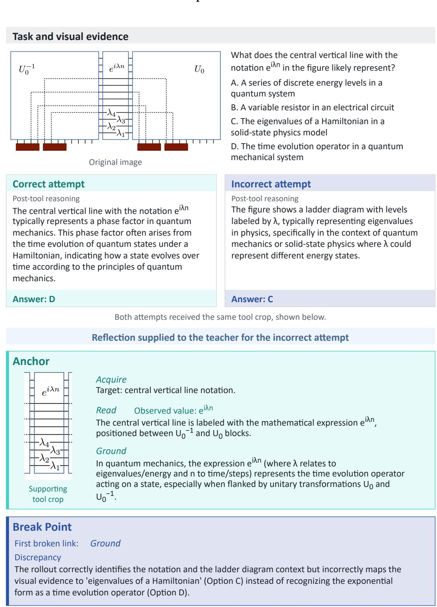  
Figure 6: A concrete visual-evidence reflection supplied to the teacher. The mixed group contains seven correct attempts and one incorrect attempt; one of each is shown with its posttool reasoning and answer. Both attempts receive identical tool crops. The Anchor uses the incorrect attempt’s own crop, and the Break Point records the critic’s Ground diagnosis.

## A.5 Critic Feedback

VERIFYANSWERS. Algorithm 2 computes binary answer labels, which classify each rollout group as all-correct, mixed, or all-wrong. When deterministic matching does not accept an answer, the answer judge evaluates only the question, extracted student answer, and reference answer as text.

Algorithm 2 VERIFYANSWERS: Answer verification   
Require: Same-query trajectories $\mathcal { G } _ { x } ,$ , reference answer $y ^ { \star }$   
Ensure: Binary correctness labels $\mathbf { c } _ { x }$   
1: $q $ shared question in $\mathcal { G } _ { x } ; \mathbf { c } _ { x } \gets \mathbf { 0 }$   
2: for each trajectory $i \in \mathcal { G } _ { x }$ do   
3: $a _ { i }$ ← text inside <answer> . . . </answer>   
4: if $a _ { i }$ is missing or empty then continue   
5: $\tilde { a } _ { i } \gets$ strip answer prefixes from $a _ { i }$   
6: if strict mathematical matching or symbolic verification accepts $( \tilde { a } _ { i } , y ^ { \star } )$ then   
7: $c _ { i } \gets 1$   
8: else   
9: $c _ { i } \gets \mathrm { A }$ NSWERJUDGE $( q , a _ { i } , y ^ { \star } ) \in \{ 0 , 1 \}$ ▷ 0 if unavailable   
10: end if   
11: end for   
12: return $\mathbf { c } _ { x }$

OBSERVEDSTATES. Algorithm 3 collects the original-image state and recorded post-tool states so the critic can associate visual evidence with a specific interaction step. Each state contains the images available up to that point, with multiple images from one tool call belonging to the same state. The counts $n _ { \mathrm { t o o l } } ( e )$ and $n _ { \mathrm { c o d e } } ( e )$ record cumulative tool rounds and code tokens, respectively.

Algorithm 3 OBSERVEDSTATES: Evidence-state collection   
Require: Same-query trajectories $\mathcal { G } _ { x } ,$ , including the original image and interaction records   
Ensure: Evidence states $\dot { \mathcal { E } } _ { x }$ with provenance, available images, and cumulative costs   
1: $\mathcal { E } _ { x } $ {original-image state; owner $\emptyset , n _ { \mathrm { t o o l } } = n _ { \mathrm { c o d e } } = 0 \}$   
2: for each recorded post-tool state e of trajectory $i \in \mathcal { G } _ { x }$ do   
3: Add $( e , i ,$ images available at $e , n _ { \mathrm { t o o l } } ( e ) , n _ { \mathrm { c o d e } } ( e ) )$ to ${ \mathcal E } _ { x }$   
4: end for   
5: return $\mathcal { E } _ { x }$

CHECKANDASSEMBLE. The critic receives the query, reference answer, original image, correctness-labeled trajectories, and evidence states. Up to eight tool images are supplied per group, prioritizing correct trajectories. For each sufficient state $e ,$ the critic is asked to identify a smallest supporting image subset $\mathcal { U } _ { e }$ that determines the required visual fact using only images available at that state. It also returns shared reading information (query slot, observed value, and visual fact), a grounding rule, and per-trajectory diagnoses $\boldsymbol { B } _ { i } = \left( \sigma _ { i } , \delta _ { i } \right)$

Algorithm 4 validates required fields, state and image references, and consistency between diagnoses and answer labels. Only mixed groups reconcile inconsistent stage labels before validation using answer correctness and the presence of an own sufficient state, while retaining the discrepancy text. All-correct groups require CORRECT labels with empty discrepancies.

Anchor selection prioritizes sufficient evidence already acquired by the trajectory and chooses among states by lexicographic cost:

$$
c ( e ) = \big ( n _ { \mathrm { t o o l } } ( e ) , n _ { \mathrm { c o d e } } ( e ) , | \mathcal { U } _ { e } | , \mathrm { i d } ( e ) \big ) ,\tag{13}
$$

Let $\mathcal { C } _ { i }$ contain sufficient post-tool states owned by trajectory $i ,$ and let ${ \mathcal { C } } _ { x } ^ { + }$ contain sufficient original-image states and sufficient states from answer-correct trajectories. Complete reflections require a nonempty group reference set $\mathcal { C } _ { x } ^ { + }$ , after which each trajectory selects evidence as

$$
e _ { i } ^ { \star } = \left\{ \begin{array} { l l } { \underset { e \in \mathcal { C } _ { i } } { \arg \operatorname* { m i n } } c ( e ) , } & { \mathcal { C } _ { i } \neq \emptyset , } \\ { \underset { e \in \mathcal { C } _ { x } ^ { + } } { \arg \operatorname* { m i n } } c ( e ) , } & { \mathcal { C } _ { i } = \emptyset . } \end{array} \right.\tag{14}
$$

If the selected state requires no tool use, assembly adds no image because the teacher context already contains the original.

Algorithm 4 CHECKANDASSEMBLE: Reflection assembly   
Require: Critic output ${ \mathcal { I } } _ { x } ,$ recorded states ${ \mathcal E } _ { x } ,$ correctness labels $\mathbf { c } _ { x }$   
Ensure: Per-trajectory reflections $\{ \mathcal { R } _ { i } \} ,$ with ∅ denoting unavailable reflection   
1: $\mathcal { R } _ { i }  \emptyset$ for all $i ; \mathbf { i } \mathbf { \bar { f } } \ \mathcal { I } _ { x }$ is missing then return $\{ \mathcal { R } _ { i } \}$   
2: if the group is mixed then reconcile stages with $\mathbf { c } _ { x }$ and own sufficient states   
3: if $\mathcal { I } _ { x }$ is inapplicable or fails validation then return $\{ \mathcal { R } _ { i } \}$   
4: $\boldsymbol { B } _ { i }  ( \sigma _ { i } , \delta _ { i } )$ from the checked diagnoses, for all i   
5: if all answers are wrong then return $\{ ( \emptyset , B _ { i } ) \} _ { i }$   
6: Resolve $\mathcal { I } _ { x } { ' } s$ sufficient states in ${ \mathcal E } _ { x }$ to form $\{ { \mathcal { C } } _ { i } \}$ and ${ \mathcal { C } } _ { x } ^ { + }$   
7: if ${ \mathcal { C } } _ { x } ^ { + } = \varnothing$ then return $\{ \mathcal { R } _ { i } \}$   
8: for each trajectory i do   
9: Select $e _ { i } ^ { \star }$ using Equation 14   
10: $\mathcal { A } _ { i }  ( e _ { i } ^ { \star } , \mathcal { U } _ { e _ { i } ^ { \star } } , \mathcal { T } _ { x }$ .reading, $\mathcal { I } _ { x }$ .grounding)   
11: $\mathcal { R } _ { i }  ( \mathcal { A } _ { i } , \mathcal { B } _ { i } ^ { \setminus } )$   
12: end for   
13: return $\{ \mathcal { R } _ { i } \}$

## A.6 Critic Prompt and Output Format

The box below reproduces the critic system prompt used for mixed groups. The all-correct prompt requires CORRECT with an empty discrepancy for every trajectory. The all-wrong prompt disallows CORRECT and permits an empty set of sufficient evidence states. It also requires a sufficient state for each READ or GROUND diagnosis, preserves verifier-label conflicts, and returns one diagnosis per trajectory.

<table><tr><td>You are a training-time multimodal evidence-chain analyst for a think-with-image VQA policy.</td></tr><tr><td>You receive one task and a group of verifier-labeled CORRECT and INCORRECT student rollouts.</td></tr><tr><td>A rollout contains chronological policy reasoning, free-form Python code, sandbox text/numeric outputs, zero/ one/multiple images returned by each sandbox interaction, and a final answer.</td></tr><tr><td>One Python code block may return MULTIPLE images. They belong to the SAME sandbox interaction and may jointly form multi-region evidence.</td></tr><tr><td>A rollout may have multiple sandbox interactions. Later interactions may correct earlier visual observations.</td></tr><tr><td>The CORRECT/INCORRECT label is defined only by the supplied VQA correctness label. Trust CORRECT rollouts as correct final solutions.</td></tr><tr><td>Your task is to identify the visual evidence chain:</td></tr><tr><td>ACQUIRE: Which actually observed Evidence States already contain sufficient task-relevant visual evidence?</td></tr><tr><td>READ:</td></tr><tr><td>What is the minimum atomic visual fact needed by the question?</td></tr><tr><td>GROUND: How does that visual fact map to the answer semantics?</td></tr><tr><td>EVIDENCE STATE:</td></tr><tr><td>ORIGINAL_STATE contains ORIGINAL_IMAGE. Every other state is the state immediately after one real sandbox interaction and lists all images currently available.</td></tr><tr><td>A state is SUFFICIENT iff some subset of its available images already contains enough visual evidence to</td></tr><tr><td>determine the task-relevant visual fact without needing a later observation.</td></tr><tr><td>For each sufficient state, return the SMALLEST supporting image subset.</td></tr><tr><td>CLOSED-SET RULE: Never invent an image, state, crop, coordinate, code, or synthetic view. Only use supplied state IDs and image</td></tr><tr><td>IDs.</td></tr><tr><td>READ: Do not use a predefined taxonomy. Return:</td></tr><tr><td>- query_slot</td></tr><tr><td>- observed_value - one atomic visual_fact</td></tr><tr><td></td></tr><tr><td>GROUND:</td></tr><tr><td>Return one concise evidence-to-answer semantic rule. Do not state only an answer/option letter.</td></tr><tr><td>ROLLOUT DIAGNOSIS:</td></tr><tr><td>CORRECT rollout -&gt; stage=CORRECT.</td></tr><tr><td></td></tr><tr><td>For INCORRECT rollouts return the FIRST broken interface:</td></tr><tr><td></td></tr><tr><td>ACQUIRE:</td></tr><tr><td>No state belonging to this rollout is sufficient.</td></tr><tr><td>Critic system prompt: mixed groups (continued)</td></tr><tr><td>READ: A sufficient state exists, but the relevant visual fact is misread.</td></tr><tr><td>GROUND: A sufficient state exists and the fact is read correctly, but final answer semantics contradict/mis-map that fact.</td></tr><tr><td>OTHER:</td></tr><tr><td>Failure is outside this visual evidence chain.</td></tr><tr><td>Return JSON only according to schema.</td></tr></table>

The output schema is supplied as a separate structured-output constraint rather than as part of the user message. The table retains its fields, types, and shared constraints.

<table><tr><td colspan="2">Critic output schema: fields and constraints</td></tr><tr><td>Field structure</td><td>Type</td></tr><tr><td>applicable sufficient_states state_id support_image_ids reading query_slot observed_value</td><td>boolean object[] string string[] object string string string object string object[] string</td></tr></table>

## A.7 Training Configuration

The full method described here uses M = 8 trajectories per query, K = 32 teacher candidates, a high-impact fraction α = 0.2, and group weight λ = 0.5. Teacher parameters, teacher supports, impacts, and group assignments remain fixed during student updates. Training uses the pure OPD loss, without a GRPO reward term or an additional reference-policy KL. Answer correctness is used for group classification and critic diagnosis, not as an advantage or a trajectory-level loss weight. For the Thyme-based Qwen2.5-VL-7B setting, the student starts from an SFT checkpoint, and the frozen teacher uses step 2150 of the corresponding RL expert. The separate critic uses Qwen3.5-397B-A17B-FP8 with temperature zero and a 2048-output-token limit per call to generate JSON-schema-constrained feedback.

Critic runtime and auxiliary resources. Training uses eight NVIDIA H20 GPUs (96 GB each), and the critic runs through a shared vLLM service on a separate machine with another eight H20 GPUs (96 GB each). This deployment leaves the training GPUs available for rollouts and allows critic requests to overlap with independent training-side computations, such as reward and answer-correctness evaluation. The critic is used only during training and is not required at inference.

Each critic request processes one group of eight trajectories, giving 20 requests per optimizer step. A test request with one image and eight trajectories took 5.8 s and produced 664 output tokens. Assuming this latency is maintained with four concurrent requests, five waves give a nominal critic service time of approximately 29 s per step, excluding additional queueing and retries. This estimate is 10.8% of the mean step time of 269 s measured across six training segments. The actual increase in training wall-clock time depends on overlap with independent computations and service scheduling.

Extrapolating to 1,075 steps gives approximately 8.7 hours of nominal critic service time. Attributing all eight service GPUs to this run during these intervals gives a resource estimate of approximately 70 GPU-hours. This estimate accounts for nominal service time; total server allocation depends on service uptime and sharing.

## B Experimental Details

## B.1 Baseline Details

All baselines start from Thyme-SFT cold-start checkpoints of Qwen2.5-VL-7B or InternVL3.5-4B-Instruct. OPD variants use the corresponding Thyme-RL Expert as teacher; RFT uses demonstrations generated by the same expert. This keeps student initializations and teacher sources consistent across comparisons.

Vanilla OPD (Agarwal et al., 2024) provides the standard on-policy distillation reference for evaluating reflection-based supervision. The RL Expert supervises student-generated prefixes token by token, without ground-truth answers, privileged crops, or evidence reflections.

Rejection sampling fine-tuning (RFT) (Yuan et al., 2023) compares offline demonstration learning with distillation on student-generated trajectories. For each prompt in the Thyme-RL training set, the corresponding RL Expert samples eight trajectories. We retain answer-correct trajectories for supervised fine-tuning of the same cold-start student. Training uses these fixed demonstrations rather than teacher distributions queried on current student prefixes.

GT-Privileged compares ground-truth answers with visual-evidence reflections as teacher privilege. Following the privileged-context design of OPSD (Zhao et al., 2026), we provide the teacher with the Thyme-RL ground-truth answer. We replace its self-teacher with the corresponding RL Expert. The student starts from the same cold-start checkpoint and generates trajectories without access to the privileged answer.

Vision-OPD (Yuan et al., 2026) provides a local visual privilege baseline for comparison with reflections that diagnose evidence use. The teacher receives an evidence-centered crop and supervises the student’s own trajectories. We replace its self-teacher with the corresponding RL Expert and use the same cold-start student.

With V-Zero (Sun et al., 2026), we compare visual-contrast trajectory weighting with reflectionbased supervision. Teacher support for the same student trajectory under relevant and irrelevant visual views determines its distillation weight. The target remains the positive-view teacher distribution. We use the corresponding RL Expert for both views and the same cold-start student.

Our comparison with VAD (Zhang et al., 2026a) examines visual target reconstruction as an alternative to direct distillation from a reflection-conditioned teacher. It contrasts teacher predictions with and without visual evidence to estimate visual corrections and reconstruct the distillation target. We replace its initial-model teacher with the corresponding RL Expert and retain the same cold-start student.

## B.2 Model Labels

In Table 1, Base Model denotes the original model before training in this work. Gemini3.1FL abbreviates Gemini-3.1-Flash-Lite. Qwen2.5-32B, Qwen3-30B-T, and InternVL-38B denote Qwen2.5-VL-32B, Qwen3-VL-30B-A3B-Thinking, and InternVL3.5-38B-Instruct, respectively.

## B.3 Training and Evaluation Settings

We initialize the Qwen2.5-VL-7B student directly from the released Thyme-SFT (Zhang et al., 2026b) checkpoint.1 We obtain the InternVL3.5-4B cold-start checkpoint by supervised finetuning of InternVL3.5-4B-Instruct on Thyme’s released SFT dataset.2 We train both RL experts from their corresponding cold-start checkpoints by reproducing Thyme-RL on its released RL dataset.3

Table 6: Training and evaluation settings.
<table><tr><td>Component</td><td>Parameter</td><td>Value</td></tr><tr><td>OPD objective</td><td>Loss</td><td>Reverse KL</td></tr><tr><td>OPD rollouts</td><td>Vocabulary support</td><td>Teacher&#x27;s top-32 candidates</td></tr><tr><td></td><td>Temperature for code tokens</td><td>0.0</td></tr><tr><td></td><td>Temperature for other tokens</td><td>1.0</td></tr><tr><td></td><td>Top-p</td><td>0.9</td></tr><tr><td></td><td>Top-k</td><td>50</td></tr><tr><td>Evaluation</td><td>Temperature</td><td>0.01</td></tr><tr><td></td><td>Top-p</td><td>0.001</td></tr><tr><td></td><td>Top-k</td><td>1</td></tr><tr><td>All experiments</td><td>Random seed</td><td>42</td></tr><tr><td>Training job</td><td>Hardware</td><td>8 × NVIDIA H20 (96 GB each)</td></tr><tr><td>Critic service</td><td>Separate hardware</td><td>8 × NVIDIA H20 (96 GB each)</td></tr></table>

We compute reverse KL after renormalizing teacher and student distributions over the teacher’s top-32 vocabulary candidates at each supervised position.

## B.4 Token-Impact Sparsity in Figure 4

Figure 4 pools offline rescoring results from 632 trajectories in a five-step early-training archive, comprising 226,726 supervised tokens with valid impact scores. We use the impact definition in Equation 7 and exclude nonsupervised positions and missing scores. The dashed line marks the pooled 80th percentile, approximately $s = 0 . 0 5 5 2 4$ . Tokens at or above this threshold comprise approximately 20% of scored tokens and account for 97.6% of total impact. High and Low in the figure describe the pooled distribution; training selects high-impact positions separately within each trajectory.

Histogram heights give the percentage of all scored tokens in each interval. Bins in [0, 2.5) have width 0.05, with the bin containing the 80th percentile split at that threshold. The final bar retains all tokens with s ≥ 2.5. The inset plots empirical percentile against impact over the full pooled score range, without smoothing or fitting.

(a) Human–critic label counts

## B.5 Error Attribution in Figure 1

The error-attribution analysis in Figure 1 uses 3,710 questions from V∗Bench (Wu & Xie, 2024), HRBench-4K (Wang et al., 2025b), HRBench-8K (Wang et al., 2025b), and MME (Fu et al., 2025).4 We use GPT-5.6-Luna as the judge for evaluation and error attribution.

Four error labels map to the three visual-evidence stages. Acquire combines faulty\_tool (29.8%) and missing\_tool (7.9%), totaling 37.7%. Read corresponds to perception\_error (33.8%). Ground corresponds to hallucination (6.3%).

## B.6 Critic Consistency Evaluation

We evaluate the final training labels of Qwen3.5-397B-A17B-FP8 on 96 groups of eight rollouts. Each group type (all-correct, mixed, and all-wrong) contributes 32 groups. One annotator independently labels one sampled rollout per group before revealing the critic label; all 96 samples receive a label. Agreement measures exact stage matches; unweighted Cohen’s κ adjusts for chance agreement.

Table 7: Final critic stage agreement.
<table><tr><td colspan="6">(a) Human-critic label counts Human \ Critic Correct Acquire Read Ground Other</td><td colspan="4">(b) Pairwise final-label agreement</td></tr><tr><td></td><td></td><td></td><td></td><td></td><td></td><td>Pair</td><td></td><td>n Agree. (%)</td><td>K</td></tr><tr><td>Correct</td><td>32</td><td>0</td><td>0</td><td></td><td>0 0</td><td></td><td>Qwen (arch.) / rerun</td><td>744</td><td>99.2 0.987</td></tr><tr><td>Acquire</td><td>0</td><td>28</td><td>0</td><td>0</td><td>0</td><td></td><td>Qwen (arch.) / Gemini 736</td><td></td><td>93.2 0.892</td></tr><tr><td>Read</td><td>0</td><td>3</td><td>23</td><td>0</td><td>0</td><td></td><td>Qwen (arch.) / Luna</td><td>736</td><td>92.80.886</td></tr><tr><td>Ground</td><td>0</td><td>0</td><td>0</td><td>9</td><td>0</td><td></td><td>Qwen (rerun) / Gemini 712</td><td></td><td>93.5 0.898</td></tr><tr><td>Other</td><td>0</td><td>0</td><td>0</td><td>0</td><td>1</td><td></td><td>Qwen (rerun) / Luna</td><td>712</td><td>93.4 0.896</td></tr><tr><td></td><td></td><td></td><td></td><td></td><td></td><td></td><td>Gemini / Luna</td><td>712</td><td>95.4 0.926</td></tr></table>

Arch. denotes archived training labels, rerun denotes one fresh evaluation, and n counts valid paired rollouts. Gemini and Luna denote Gemini 3.8 Flash and GPT-5.6 Luna, respectively.

Human agreement is 96.88% (κ = 0.957) overall and 95.31% (κ = 0.925) on incorrect rollouts.

The three human–critic disagreements occur at the Acquire–Read boundary. All three are from mixed groups: the annotator assigns Read, whereas the critic assigns Acquire. This points to disagreement over whether the available evidence is sufficient to support a judgment. Agreement with archived training labels uses 744 valid rollout pairs for a rerun by the same critic and 736 for each of the two external judges (Table 7). These comparisons use valid final stage labels.

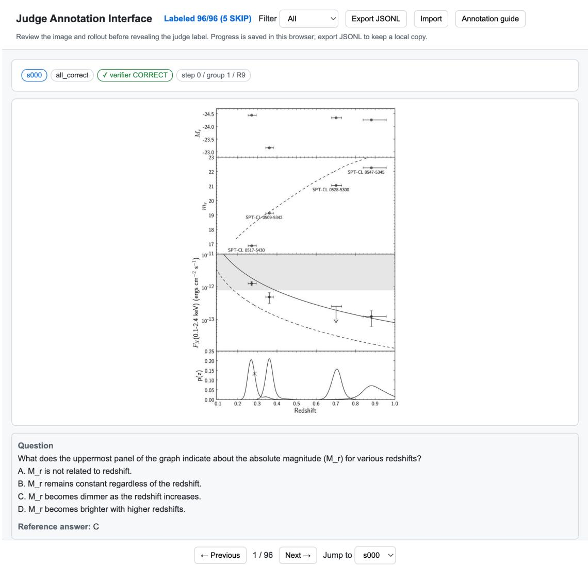  
Figure 7: Human annotation interface demo: the upper view presents the sample identifiers, original image, question, and reference answer. The page also provides progress tracking, sample filtering, navigation, and JSONL import and export controls.

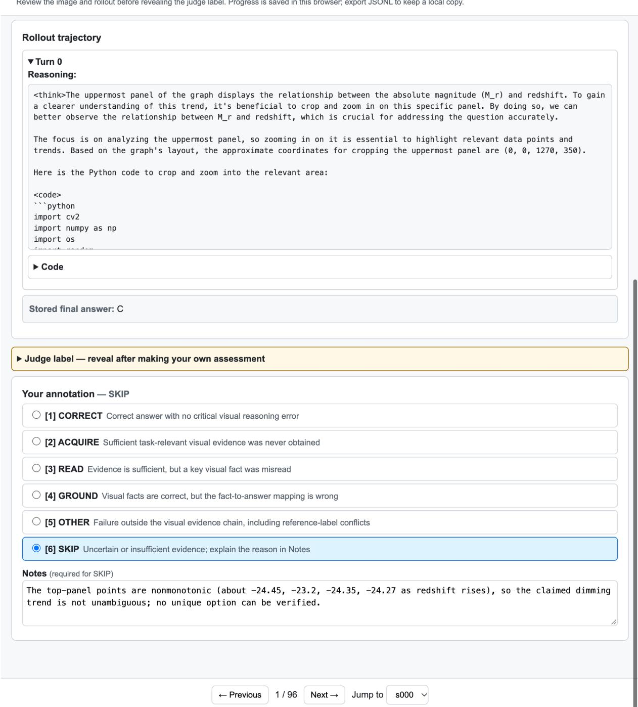  
Figure 8: Human annotation interface demo: the lower view of the same sample presents the rollout, the initially collapsed judge label, six annotation options, and a notes field. The options comprise five diagnostic labels and a SKIP option for cases that cannot be judged reliably.

## C Additional Results

This appendix reports per-benchmark component ablations, token-impact interventions, fraction sensitivity, and additional analyses of response length and tool use.

## C.1 Per-Benchmark Component Ablation

Table 8 reports scores on all 11 benchmarks for the three variants in Table 2.

Reflection improves most benchmarks, with uneven gains. Adding reflection to Vanilla OPD improves nine of 11 benchmarks and all three category averages. Perception and general-task averages increase by 1.09% and 1.14%, respectively, while math improves by 0.11%. Gains on HRBench 8K (+2.00%) and HallusionBench (+2.54%) cover high-resolution understanding and hallucination detection. TreeBench and MathVerse are the two exceptions, with accuracy decreases of 0.24% and 0.51%, respectively.

Impact reweighting improves tasks that do not benefit from reflection alone. Relative to the reflection-only model, reweighting improves seven of eight perception and math benchmarks, while V\* Bench remains at 82.20%. TreeBench rises from 37.78% to 41.12% and MathVerse from 45.56% to 47.08%, reversing their declines relative to Vanilla OPD. HRBench 8K and VisualProbe also improve by 1.50% and 0.58%, extending the reweighting gains to tasks that already benefit from reflection.

Reweighting introduces a small trade-off on general tasks. The full model scores below the reflection-only model on all three general-task benchmarks, lowering the category average by 0.28%. The decreases are 0.53% on ChartQA-Pro, 0.30% on HallusionBench, and 0.08% on InfographicVQA. All three remain above Vanilla OPD, and the full method improves over Vanilla OPD on all 11 benchmarks.

Table 8: Complete component ablation on Qwen2.5-VL-7B. Rows cumulatively add visualevidence reflection and impact reweighting, and Wtd. Avg. uses the benchmark-sample weighting of Table 1. MathVista and MathVerse denote the Mini and vision-only splits, respectively. Higher is better for every metric; gray denotes Vanilla OPD, blue marks REVUE, and bold indicates column-best results, including ties.

(a) Perception
<table><tr><td>Method</td><td>HR-4K</td><td>HR-8K</td><td>V*</td><td>Tree Bench</td><td>Visual Probe</td><td>Wtd. Avg.</td></tr><tr><td>Vanilla OPD</td><td>75.40</td><td>70.50</td><td>81.20</td><td>38.02</td><td>42.91</td><td>62.61</td></tr><tr><td>+ Visual-evidence reflection</td><td>76.25</td><td>72.50</td><td>82.20</td><td>37.78</td><td>44.08</td><td>63.70</td></tr><tr><td>+ Impact reweighting (REVUE)</td><td>77.10</td><td>74.00</td><td>82.20</td><td>41.12</td><td>44.66</td><td>65.01</td></tr></table>

(b) Math
<table><tr><td>Method</td><td>MathVista</td><td>MathVerse</td><td>VisuLogic</td><td>Wtd. Avg.</td></tr><tr><td>Vanilla OPD</td><td>70.60</td><td>46.07</td><td>26.00</td><td>47.67</td></tr><tr><td>+ Visual-evidence reflection</td><td>71.10</td><td>45.56</td><td>26.20</td><td>47.78</td></tr><tr><td>+ Impact reweighting (REVuE)</td><td>71.60</td><td>47.08</td><td>26.50</td><td>48.49</td></tr></table>

(c) General
<table><tr><td>Method</td><td>Hallusion Bench</td><td>ChartQA-Pro</td><td>Infographic VQA</td><td>Wtd. Avg.</td></tr><tr><td>Vanilla OPD</td><td>42.88</td><td>21.69</td><td>79.44</td><td>53.28</td></tr><tr><td>+ Visual-evidence reflection</td><td>45.42</td><td>22.34</td><td>80.35</td><td>54.42</td></tr><tr><td>+ Impact reweighting (REVuE)</td><td>45.12</td><td>21.81</td><td>80.27</td><td>54.14</td></tr></table>

## C.2 Token-Impact Interventions

Table 9 expands Table 3 with scores on all 11 benchmarks. Table 10 summarizes how the four variants and REVUE differ in token selection and masking.

Masking low-impact positions does not benefit every task. Compared with REVUE, Mask low 20% raises the perception average by 0.17%. Math and general-task averages decrease by 0.07% and 0.17%, respectively. Within perception, HRBench 8K and VisualProbe improve by 1.00% and 0.78%, respectively, while TreeBench drops by 1.61%. The small gain in average perception does not show that low-impact supervision is generally harmful. Across all 11 benchmarks, Mask low 20% exceeds Mask top 20%, supporting impact ranking as an indicator of supervision value.

Table 9: Complete token-impact intervention results on Qwen2.5-VL-7B. Wtd. Avg. uses the benchmark-sample weighting of Table 1. MathVista and MathVerse denote the Mini and vision-only splits, respectively. All scores are percentages and higher is better; gray denotes Vanilla OPD, blue marks REVUE, and bold indicates column-best results, including ties.  
(a) Perception
<table><tr><td>Method</td><td>HR-4K</td><td>HR-8K</td><td>V*</td><td>Tree Bench</td><td>Visual Probe</td><td>Wtd. Avg.</td></tr><tr><td>Vanilla OPD</td><td>75.40</td><td>70.50</td><td>81.20</td><td>38.02</td><td>42.91</td><td>62.61</td></tr><tr><td>Random select 20%</td><td>75.40</td><td>72.62</td><td>80.10</td><td>38.02</td><td>45.44</td><td>63.64</td></tr><tr><td>Mask random 20%</td><td>76.25</td><td>73.75</td><td>81.20</td><td>37.28</td><td>43.69</td><td>63.85</td></tr><tr><td>Mask low 20%</td><td>77.00</td><td>75.00</td><td>82.20</td><td>39.51</td><td>45.44</td><td>65.18</td></tr><tr><td>Mask top 20%</td><td>75.00</td><td>71.62</td><td>78.01</td><td>37.78</td><td>41.36</td><td>62.26</td></tr><tr><td>REVUE(Ours)</td><td>77.10</td><td>74.00</td><td>82.20</td><td>41.12</td><td>44.66</td><td>65.01</td></tr></table>

(b) Math
<table><tr><td>Method</td><td>MathVista</td><td>MathVerse</td><td>VisuLogic</td><td>Wtd. Avg.</td></tr><tr><td>Vanilla OPD</td><td>70.60</td><td>46.07</td><td>26.00</td><td>47.67</td></tr><tr><td>Random select 20%</td><td>71.30</td><td>45.56</td><td>25.00</td><td>47.42</td></tr><tr><td>Mask random 20%</td><td>70.90</td><td>44.42</td><td>26.10</td><td>47.35</td></tr><tr><td>Mask low 20%</td><td>71.80</td><td>47.08</td><td>26.10</td><td>48.42</td></tr><tr><td>Mask top 20%</td><td>71.30</td><td>45.94</td><td>24.00</td><td>47.17</td></tr><tr><td>REVUE(Ours)</td><td>71.60</td><td>47.08</td><td>26.50</td><td>48.49</td></tr></table>

(c) General
<table><tr><td>Method</td><td>Hallusion Bench</td><td>ChartQA-Pro</td><td>Infographic VQA</td><td>Wtd. Avg.</td></tr><tr><td>Vanilla OPD</td><td>42.88</td><td>21.69</td><td>79.44</td><td>53.28</td></tr><tr><td>Random select 20%</td><td>44.94</td><td>21.87</td><td>80.21</td><td>54.10</td></tr><tr><td>Mask random 20%</td><td>43.58</td><td>21.87</td><td>80.08</td><td>53.78</td></tr><tr><td>Mask low 20%</td><td>44.77</td><td>21.96</td><td>79.93</td><td>53.97</td></tr><tr><td>Mask top 20%</td><td>42.16</td><td>20.79</td><td>78.75</td><td>52.51</td></tr><tr><td>REVUE(Ours)</td><td>45.12</td><td>21.81</td><td>80.27</td><td>54.14</td></tr></table>

Table 10: Variant definitions for token-impact interventions. Percentages refer to supervised positions, and masking removes the selected positions from the distillation loss. Random select replaces the impact-selected high-weight group with a random group while retaining supervision at every position.
<table><tr><td>Method</td><td>Masked positions</td><td>Retained supervision</td></tr><tr><td>Random select 20%</td><td>None</td><td>All positions; random 20% and remaining 80% receive group loss weights 0.5 : 0.5</td></tr><tr><td>Mask random 20%</td><td>Random 20%</td><td>Remaining 80% receive total group loss weight 0.5, shared uniformly</td></tr><tr><td>Mask low 20%</td><td>Lowest-impact 20%</td><td>Highest-impact 80%, including the entire High group</td></tr><tr><td>Mask top 20%</td><td>Highest-impact 20%</td><td>Lowest-impact 80%; the entire High group is masked</td></tr><tr><td>REVUE(Ours)</td><td>None</td><td>All positions; highest-impact 20% and remaining 80% receive group loss weights 0.5 : 0.5</td></tr></table>

## C.3 Sensitivity to the High-Impact Token Fraction

Table 11 reports all 11 benchmark scores for the five fractions in Table 4. The fraction α controls the share of supervised positions assigned to the high-impact group, as defined in Section 4.3. The blue row marks the 20% setting used by REVUE.

The best fraction varies across benchmarks. Among the tested fractions, 20% achieves the highest score on all three math benchmarks. It also leads on HRBench 4K, HRBench 8K, and TreeBench. V\* Bench scores highest at 5%, while VisualProbe scores highest at 50%. The generaltask average is highest at 100%. In these experiments, 20% yields the highest perception and math averages, supporting its use as a common setting for both categories.

Table 11: Sensitivity to the high-impact token fraction on Qwen2.5-VL-7B. Wtd. Avg. is weighted by benchmark sample counts. Sample counts are (800, 800, 191, 405, 515), (1000, 788, 1000), and (1129, 1948, 2801) for perception, math, and general benchmarks, respectively. MathVista and MathVerse denote the Mini and vision-only splits, respectively. All scores are percentages and higher is better; blue marks the 20% setting of REVUE, and bold indicates column-best results, including ties.  
(a) Perception
<table><tr><td>High-impact fraction</td><td>HR-4K</td><td>HR-8K</td><td>V</td><td>Tree Bench</td><td>Visual Probe</td><td>Wtd. Avg.</td></tr><tr><td>Top 5%</td><td>77.00</td><td>73.12</td><td>83.25</td><td>40.49</td><td>44.66</td><td>64.70</td></tr><tr><td>Top 10%</td><td>75.88</td><td>73.75</td><td>82.72</td><td>40.99</td><td>44.47</td><td>64.55</td></tr><tr><td>Top 20% (REVUE)</td><td>77.10</td><td>74.00</td><td>82.20</td><td>41.12</td><td>44.66</td><td>65.01</td></tr><tr><td>Top 50%</td><td>76.50</td><td>73.50</td><td>80.63</td><td>39.26</td><td>44.85</td><td>64.33</td></tr><tr><td>Top 100%</td><td>76.25</td><td>72.50</td><td>82.20</td><td>37.78</td><td>44.08</td><td>63.70</td></tr></table>

(b) Math
<table><tr><td>High-impact fraction</td><td>MathVista</td><td>MathVerse</td><td>VisuLogic</td><td>Wtd. Avg.</td></tr><tr><td>Top 5%</td><td>71.10</td><td>46.32</td><td>24.80</td><td>47.49</td></tr><tr><td>Top 10%</td><td>71.10</td><td>44.29</td><td>24.80</td><td>46.92</td></tr><tr><td>Top 20% (REVUE)</td><td>71.60</td><td>47.08</td><td>26.50</td><td>48.49</td></tr><tr><td>Top 50%</td><td>71.10</td><td>45.30</td><td>25.40</td><td>47.42</td></tr><tr><td>Top 100%</td><td>71.10</td><td>45.56</td><td>26.20</td><td>47.78</td></tr></table>

(c) General
<table><tr><td>High-impact fraction</td><td>Hallusion Bench</td><td>ChartQA-Pro</td><td>Infographic VQA</td><td>Wtd. Avg.</td></tr><tr><td>Top 5%</td><td>46.16</td><td>21.74</td><td>79.84</td><td>54.12</td></tr><tr><td>Top 10%</td><td>44.13</td><td>21.53</td><td>80.25</td><td>53.85</td></tr><tr><td>Top 20% (REVUE)</td><td>45.12</td><td>21.81</td><td>80.27</td><td>54.14</td></tr><tr><td>Top 50%</td><td>45.66</td><td>21.86</td><td>80.09</td><td>54.18</td></tr><tr><td>Top 100%</td><td>45.42</td><td>22.34</td><td>80.35</td><td>54.42</td></tr></table>

## C.4 Response Length and Tool Use on Perception Benchmarks

The following five figure pairs report Qwen2.5-VL-7B results on all five perception benchmarks. Each pair shows overall accuracy versus mean response length on the left, and tool-call rate and accuracy on samples with and without tool use on the right. Arrows report RL Expert’s response length divided by that of REVUE; all bar-chart metrics are percentages.

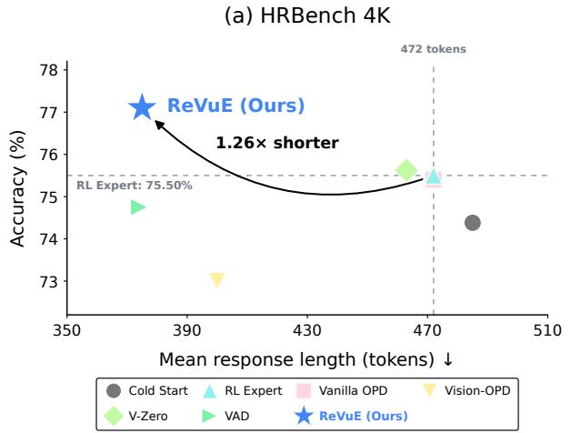  
(b) HRBench 4K

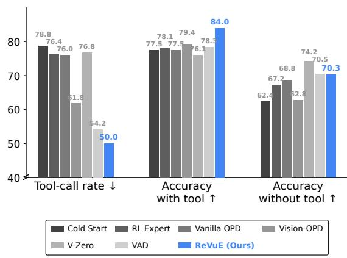  
Figure 9: Response length, accuracy, and tool use on HRBench 4K for Qwen2.5-VL-7B.

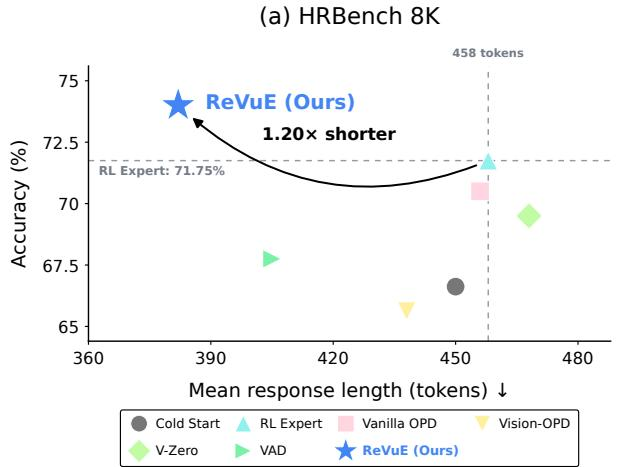

(b) HRBench 8K  
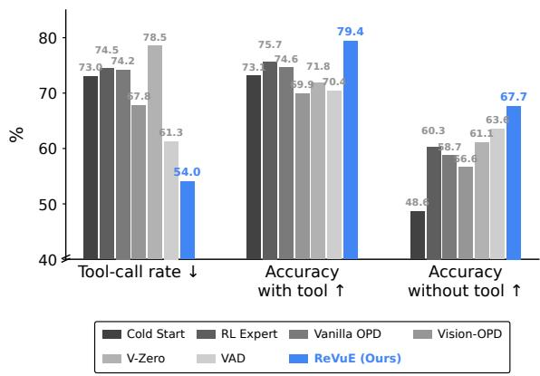  
Figure 10: Response length, accuracy, and tool use on HRBench 8K for Qwen2.5-VL-7B.

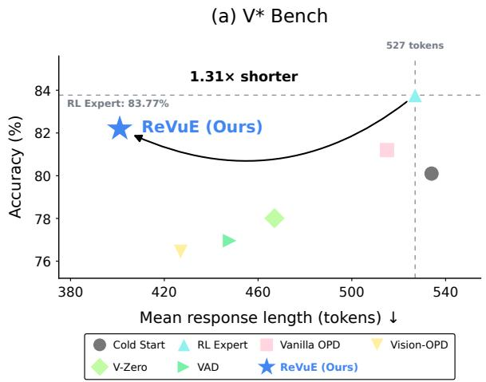

(b) V\* Bench  
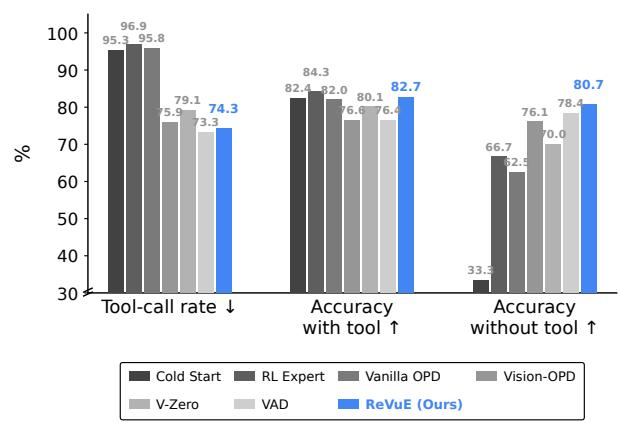  
Figure 11: Response length, accuracy, and tool use on V\* Bench for Qwen2.5-VL-7B.

(a) TreeBench  
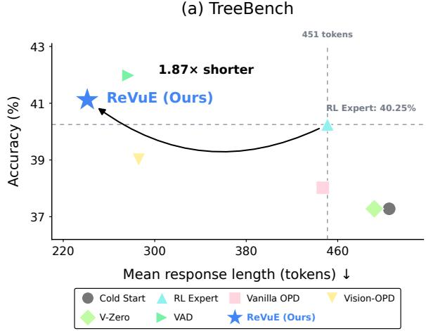

(b) TreeBench  
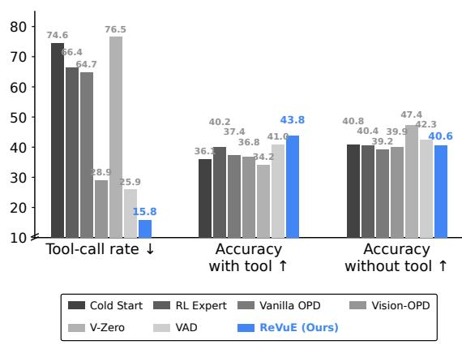  
Figure 12: Response length, accuracy, and tool use on TreeBench for Qwen2.5-VL-7B.

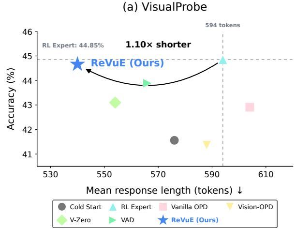

(b) VisualProbe  
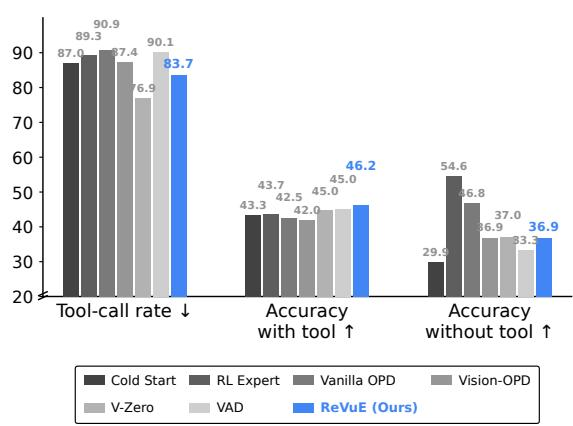  
Figure 13: Response length, accuracy, and tool use on VisualProbe for Qwen2.5-VL-7B.

## C.5 Training-Time Reflection Coverage

After deduplication, the main training run contains 1,075 optimization steps with 20 groups per step and eight rollouts per group, totaling 21,500 groups and 172,000 rollout slots. As shown in Table 12, reflections cover 161,632 slots (93.97%), comprising complete reflections (78.36%) and Break-Point-only reflections (15.61%). The Break-Point-only branch supplies valid reflections for all-wrong groups, while the remaining 6.03% of slots use the base teacher.

Table 12: Reflection coverage in the main training run. All percentages use 172,000 rollout slots as the denominator; the final row sums the first two rows.
<table><tr><td>Reflection status</td><td>Rollout slots</td><td>Share (%)</td></tr><tr><td>Complete reflection</td><td>134,784</td><td>78.36</td></tr><tr><td>Break-Point-only reflection</td><td>26,848</td><td>15.61</td></tr><tr><td>No reflection (base teacher)</td><td>10,368</td><td>6.03</td></tr><tr><td>Any reflection (subtotal)</td><td>161,632</td><td>93.97</td></tr></table>

## C.6 Offline Comparison with Anchor-Only Context

Complete reflections correct more errors and preserve more correct answers. We compare complete reflections (Anchor plus Break Point) with Anchor-only context in an offline evaluation on fixed paired cases from 311 mixed groups (Table 13). Of 139 initially incorrect answers, complete reflections correct 124, compared with 62 for Anchor-only context. Among the 172 initially correct answers, eight become incorrect with complete reflections, compared with 47 with Anchor-only context. Complete reflections outperform Anchor-only context across all six data sources. These offline results support the value of failure diagnoses for both error correction and preserving correct answers. This pattern is consistent with the token-impact cases in Appendix E.4: reflection reduces teacher support for erroneous choices and increases support for correct judgments within failed trajectories.

Table 13: Offline reflection comparison on fixed paired cases. Original predictions are the predictions before adding reflection, and accuracy changes are computed from unrounded values.
<table><tr><td>Context</td><td>Correct / 311</td><td>Accuracy (%)</td><td>∆Accuracy (%)</td></tr><tr><td>Original predictions</td><td>172</td><td>55.31</td><td></td></tr><tr><td>Anchor only</td><td>187</td><td>60.13</td><td>+4.82</td></tr><tr><td>Anchor + Break Point</td><td>288</td><td>92.60</td><td>+37.30</td></tr></table>

## D Proofs and Derivations

## D.1 Proof of Lemma 1

Fix a position (i, t) and write $p = \pi _ { \theta } ( \cdot \mid h _ { i , t } ) , q ^ { 0 } = q _ { i , t } ^ { 0 } , q ^ { \mathcal { R } } = q _ { i , t } ^ { \mathcal { R } }$ , and $\boldsymbol { d } ( \boldsymbol { v } ) = d _ { i , t } ( \boldsymbol { v } )$ . Fix the history, teacher predictions, and nonempty shared support Supp, with positive student and teacher probabilities on it. For either teacher, $\begin{array} { r } { q ( \mathrm { S u p p } ) = \sum _ { v \in \mathrm { S u p p } } q ( v ) } \end{array}$ is its probability mass on the support, while $q ^ { \mathrm { S u p p } } ( v ) = q ( v ) / q ( \mathrm { S u p p } )$ is its renormalized distribution. Subtracting the two KL losses cancels their shared student term:

$$
\begin{array} { r l } & { \ell ^ { \mathrm { S u p p } } ( p , q ^ { \mathcal { R } } ) - \ell ^ { \mathrm { S u p p } } ( p , q ^ { 0 } ) = \displaystyle \sum _ { v \in \mathrm { S u p p } } p ^ { \mathrm { S u p p } } ( v ) \log \frac { ( q ^ { 0 } ) ^ { \mathrm { S u p p } } ( v ) } { ( q ^ { \mathcal { R } } ) ^ { \mathrm { S u p p } } ( v ) } } \\ & { \qquad = - \displaystyle \sum _ { v \in \mathrm { S u p p } } p ^ { \mathrm { S u p p } } ( v ) d ( v ) + \log \frac { q ^ { \mathcal { R } } ( \mathrm { S u p p } ) } { q ^ { 0 } ( \mathrm { S u p p } ) } . } \end{array}\tag{15}
$$

The teacher normalization term is constant in θ and vanishes under differentiation. Using $\nabla _ { \boldsymbol { \theta } } p ^ { \mathrm { S u p p } } ( v ) = p ^ { \mathrm { S u p p } } ( v ) \nabla _ { \boldsymbol { \theta } }$ log $p ^ { \mathrm { S u p p } } ( v )$ gives

$$
\begin{array} { r l } {  { \nabla _ { \theta } \bigl [ \ell ^ { \mathrm { S u p p } } ( p , q ^ { \mathcal { R } } ) - \ell ^ { \mathrm { S u p p } } ( p , q ^ { 0 } ) \bigr ] = - \sum _ { v \in \mathrm { S u p p } } d ( v ) \nabla _ { \theta } p ^ { \mathrm { S u p p } } ( v ) } \quad } & { } \\ & { = - \mathbb { E } _ { v \sim p ^ { \mathrm { S u p p } } } \bigl [ d ( v ) \nabla _ { \theta } \log p ^ { \mathrm { S u p p } } ( v ) \bigr ] . } \end{array}\tag{16}
$$

This proves Equation 6. For the reflection-conditioned branch in Section 4.3, take $\mathrm { S u p p } = \mathrm { S u p p } _ { i , t }$ and normalize both teachers over this support.

From distribution shifts to a sampled-token proxy. Let $z _ { v }$ be a student logit and $d _ { \mathrm { S u p p } } =$ $\mathbb { E } _ { v \sim p ^ { \mathrm { { S u p p } } } } [ d ( v ) ]$ the student-weighted mean shift. For $v \in { \mathrm { S u p p } }$

$$
\frac { \partial } { \partial z _ { v } } \left[ \ell ^ { \mathrm { S u p p } } ( p , q ^ { \mathcal { R } } ) - \ell ^ { \mathrm { S u p p } } ( p , q ^ { 0 } ) \right] = - p ^ { \mathrm { S u p p } } ( v ) \big ( d ( v ) - \bar { d } _ { \mathrm { S u p p } } \big ) .\tag{17}
$$

The softmax derivative gives this expression and zero direct derivatives for logits outside $\operatorname { S u p p }$ The gradient change depends on student probabilities and centered shifts; parameter gradients also involve the logit Jacobian. Equation $7$ measures the teacher shift at the student’s sampled choice for ranking positions. It need not match rankings by full logit- or parameter-gradient norm.

For example, take $q ^ { 0 } = ( 0 . 1 0 , 0 . 1 5 , 0 . 3 7 5 , 0 . 3 7 5 )$ and $q ^ { \mathcal { R } } = ( 0 . 3 0 , 0 . 4 5 , 0 . 1 2 5 , 0 . 1 2 5 )$ , with Supp containing the latter’s top two candidates. Both teachers renormalize to (0.4, 0.6) on Supp, so the shared-support gradient difference is zero, although either sampled token in this set has impact log 3. The uniform shift cancels under support normalization. Impact remains defined for sampled tokens outside Supp; RKL at that position still supervises the distribution within it.

Shared support and teacher-specific top-K sets. Let $\mathrm { S u p p } ^ { \mathcal { R } } \ = \ \mathrm { T o p K } ( q ^ { \mathcal { R } } )$ and $\mathrm { { S u p p } ^ { 0 } \ = }$ $\mathrm { T o p K } ( q ^ { 0 } )$ . Comparing losses on each teacher’s own support gives

$$
\begin{array} { r l } & { \ell ^ { \mathrm { S u p p } ^ { \mathcal { R } } } ( p , q ^ { \mathcal { R } } ) - \ell ^ { \mathrm { S u p p } ^ { 0 } } ( p , q ^ { 0 } ) = \Delta _ { \mathrm { p r o b } } + \Delta _ { \mathrm { s u p p o r t } } , } \\ & { \qquad \Delta _ { \mathrm { p r o b } } = \ell ^ { \mathrm { S u p p } ^ { \mathcal { R } } } ( p , q ^ { \mathcal { R } } ) - \ell ^ { \mathrm { S u p p } ^ { \mathcal { R } } } ( p , q ^ { 0 } ) , } \\ & { \qquad \Delta _ { \mathrm { s u p p o r t } } = \ell ^ { \mathrm { S u p p } ^ { \mathcal { R } } } ( p , q ^ { 0 } ) - \ell ^ { \mathrm { S u p p } ^ { 0 } } ( p , q ^ { 0 } ) . } \end{array}\tag{18}
$$

The lemma characterizes $\nabla _ { \theta } \Delta _ { \mathrm { p r o b } } ; \nabla _ { \theta } \Delta _ { \mathrm { s u p p o r t } }$ is generally nonzero when the supports differ.   
These terms decompose the loss difference; they are not additional training objectives.

## D.2 Gradient Weights under Grouped Distillation

Equal group weights increase per-position gradient coefficients in the smaller group. We examine how the weights in Equation 9 scale each position’s gradient contribution relative to uniform token averaging. Let $\ell _ { i , t }$ denote the per-position KL term in Equation 8. With teacher targets, supports, and group assignments fixed, $w _ { i , t }$ is constant during the student update, so

$$
\nabla _ { \boldsymbol { \theta } } \left[ \frac { w _ { i , t } } { | T _ { i } | } \ell _ { i , t } \right] = w _ { i , t } \frac { \nabla _ { \boldsymbol { \theta } } \ell _ { i , t } } { | T _ { i } | } .\tag{19}
$$

The weight $w _ { i , t }$ directly gives the per-position gradient multiplier relative to uniform averaging under the same teacher target.

With $\lambda = 0 . 5$ and both groups nonempty, Equation 9 assigns half of the total loss coefficient to each group. Ignoring the rounding in $| \mathcal { T } _ { i , \mathrm { H i g h } } | = \lceil \alpha \lvert \mathcal { T } _ { i } \rvert \rceil$ gives the continuous approximations in Figure 14:

$$
w _ { \mathrm { H i g h } } \approx \frac { 0 . 5 } { \alpha } , \qquad w _ { \mathrm { L o w } } \approx \frac { 0 . 5 } { 1 - \alpha } .\tag{20}
$$

In this continuous form, High has a multiplier above one and Low below one when $\alpha < 0 . 5 ;$ both equal one at $\alpha = 0 . 5$

For a trajectory with 100 supervised positions, $\alpha = 0 . 2$ assigns 20 positions to High and the remaining 80 to Low. Uniform averaging assigns each position a coefficient of 0.01, while grouping gives High and Low positions coefficients of 0.025 and 0.00625. The corresponding gradient contributions scale by 2.5 and 0.625, with each group’s coefficients summing to 0.5.

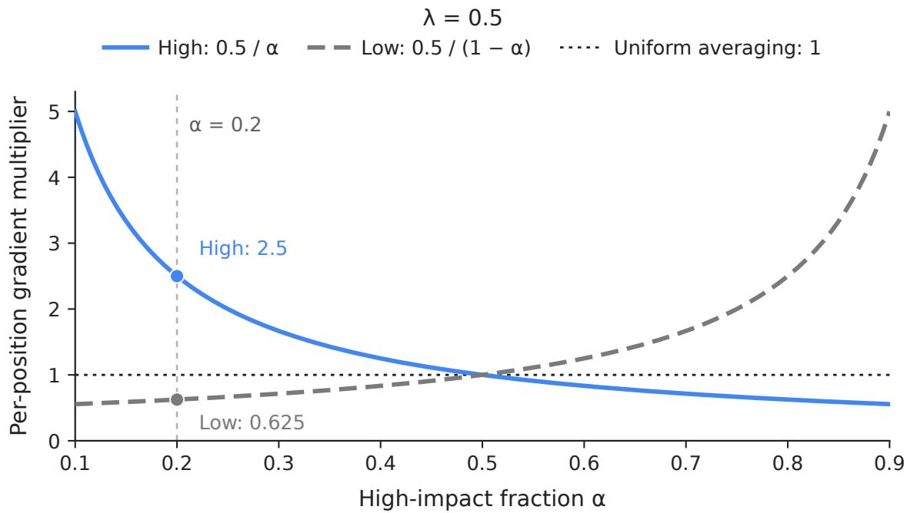  
Figure 14: Per-position gradient weights at $\lambda = 0 . 5 .$ . Blue and gray curves show the High and Low gradient multipliers relative to uniform token averaging; the black dotted line marks the unit baseline. The continuous curves ignore group-size rounding and cover $0 . 1 \leq \alpha \leq 0 . 9$ Markers at $\alpha = 0 . 2$ give the exact multipliers 2.5 and 0.625 for the 100-position example.

## E Case Study

## E.1 Errors in Acquiring, Reading, and Using Visual Evidence

Figure 15 illustrates three concrete errors in acquiring, reading, and using visual evidence in Thyme-SFT (Zhang et al., 2026b) responses.

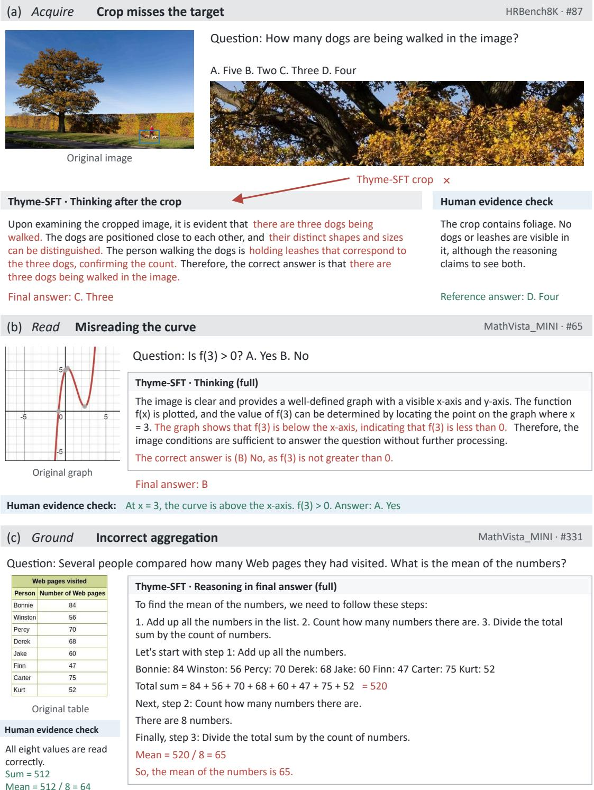  
Figure 15: In Acquire, the crop misses the queried dogs; in Read, the model describes a curve above the x-axis as lying below it; in Ground, it reads the table correctly but miscalculates the sum. The panels retain post-crop thinking in (a), full thinking in (b), and the complete reasoning-bearing final answer in (c). Red text marks errors and their consequences.

## E.2 Different Errors with the Same Evidenceff

Figure 16 compares two student trajectories for the same six-slice pie chart. Both use the original image without tool calls and answer “No”.

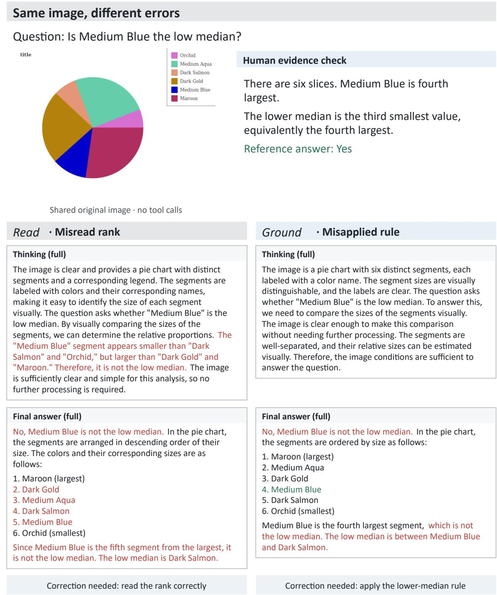  
Figure 16: Medium Blue is the fourth-largest slice, making it the lower median of six slices. The left trajectory misreads the rank (Read); the right trajectory reads it correctly but misapplies the lower-median rule (Ground). Both complete thinking traces and final answers are shown, with errors in red.

The required correction is to fix the visual rank on the left and the lower-median rule on the right. Both rollouts belong to the same all-wrong group, whose recorded training feedback contains diagnoses only.

## E.3 Different Errors on the Same Plot

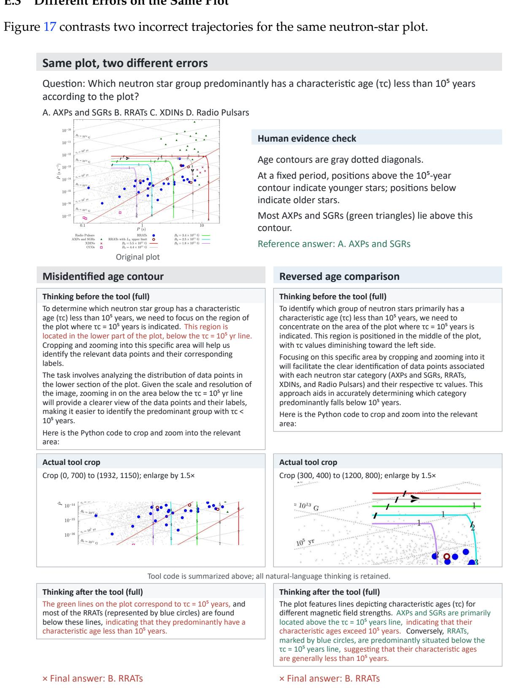  
Figure 17: Both trajectories answer B (RRATs), whereas the reference answer is A (AXPs and SGRs). The left misidentifies green lines as age contours; the right correctly places AXPs and SGRs above the age contour but interprets that position as older. Their different crops and all natural-language thinking are shown; tool code is summarized.

## E.4 Token Impact Visualizations

Figures 18 and 19 complement Figure 3 with token impact visualizations for visual target selection and age inference.

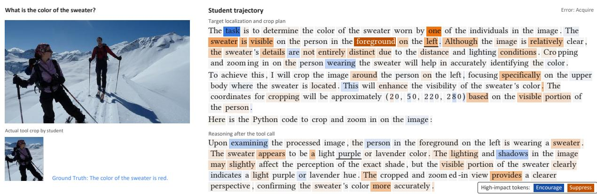  
Figure 18: Token impact on visual target selection. The student crops the foreground person and reports light purple or lavender instead of red. Reflection identifies the background person as the target and lowers support for the underlined foreground and left in the crop plan. Blue/orange denote increased/decreased teacher support; darker shading indicates larger absolute log-probability shifts on the same student trajectory.

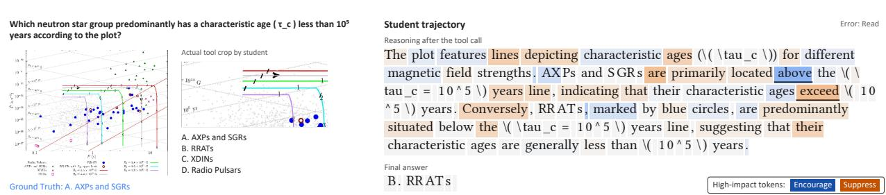  
Figure 19: Token impact on age inference. The student correctly places AXPs and SGRs above the $\tau _ { c } = 1 0 ^ { 5 }$ yr contour but infers older ages, incorrectly answering RRATs. Reflection links this position to younger ages, increasing support for the underlined correct relation above and decreasing support for the mistaken comparison exceed. Blue/orange denote increased/decreased teacher support; darker shading indicates larger absolute log-probability shifts on the same student trajectory.

## F Evaluation Benchmarks

In Table 1, MathVista and MathVerse denote the Mini and vision-only splits, respectively. HalluBench, CQA-Pro, and InfoVQA abbreviate HallusionBench, ChartQA-Pro, and InfographicVQA, respectively.

## F.1 Visual Perception

HRBench-4K/8K (Wang et al., 2025b) evaluate high-resolution perception on 4K and 8K images, covering fine-grained recognition and spatial relations.5

V∗Bench (Wu & Xie, 2024) evaluates visual search in high-resolution images, focusing on fine-grained attributes and spatial relations.6

VisualProbe (Lai et al., 2026) evaluates visual search for small targets among distractors in high-resolution images.

TreeBench (Wang et al., 2026) tests fine-grained object perception and relation understanding in complex scenes, with annotations for traceable visual evidence.8

## F.2 Mathematical and Logical Reasoning

MathVista-Mini (Lu et al., 2024) is the testmini split of MathVista, covering mathematical reasoning over diagrams, charts, and natural images.9

MathVerse (Zhang et al., 2025) evaluates diagram understanding in visual mathematics. We use its vision-only version, which presents the problem information entirely in the image.10

VisuLogic (Xu et al., 2026) tests nonverbal logical reasoning through visual patterns involving quantity, space, and attributes.11

## F.3 General Multimodal Understanding

HallusionBench (Guan et al., 2024) diagnoses language hallucinations and visual illusions through questions that require image context.12

ChartQA-Pro (Masry et al., 2025) covers diverse chart types and question formats, including conversational, hypothetical, and unanswerable questions.13

InfographicVQA (Mathew et al., 2022) requires joint reasoning over text, layout, graphics, and data visualizations to answer questions about infographics.14