# PAIQ: PATCH-ALIGNED SEMANTIC INJECTION WITH AN ORTHOGONAL BRIDGE

Pinze Ren∗ Tsinghua University rpz21@mails.tsinghua.edu.cn

Linghao Meng National University of Singapore e1583364@u.nus.edu

Yuwei Zhang∗ Beijing University of Posts and Telecommunications 2023213843@bupt.cn

Chang Li   
Tsinghua University   
lichang24@mails.tsinghua.edu.cn   
Hao Chen∗   
Tsinghua University   
chenhao26@mails.tsinghua.edu.cn

Qiankun Li† Nanyang Technological University cs-qiankun.li@ntu.edu.sg

## ABSTRACT

Language-aligned and self-supervised visual encoders offer complementary strengths in semantic abstraction and spatial detail. Harnessing this complementarity requires enriching local features while retaining distinctions between semantically related patches. We introduce PAIQ, a patch-aligned semantic injection framework that combines content-based cross-encoder matching with orthogonally constrained residual updates. Using DINOv3 patch features as the spatial base, PAIQ aggregates complementary SigLIP features through joint source allocation and injects the aggregate–base differences through a shared orthogonal transformation Q. This rotation adapts update directions while preserving residual norms and pairwise angles. For fixed projected features, we derive conditions for patch separability under similar semantic aggregates and show that rotation adds a nonnegative separation term over direct interpolation when the aggregate is shared. Only the projection and fusion parameters are trained; both visual encoders and the language model remain frozen, and fusion retains 196 visual tokens. Across diverse language backbones, PAIQ yields broad gains in judge-assessed correctness and reductions in hallucination severity over single-encoder interfaces on image description and visual question answering. On the 2B and 9B Qwen backbones, this compact interface outperforms the strongest evaluated fusion or token-compression baselines by about 2.9 correctness points on average.

## 1 INTRODUCTION

Accurate visual-language understanding requires both semantic recognition and local visual detail. Identifying an object’s category is different from resolving its attributes, parts, and spatial relations, and these judgments rely on different levels of visual representation. Image-text pretraining gives encoders such as SigLIP a strong connection between visual content and language concepts, while self-supervised training gives encoders such as DINOv3 strong local correspondence and dense representations (Zhai et al., 2023; Oquab et al., 2024; Siméoni et al., 2025). Both families encode semantic and spatial information, but with different emphases. Their complementarity therefore offers a route to visual features that are both semantically expressive and locally discriminative (Figure 1).

Existing systems combine multiple feature sources through channel fusion on a shared grid, learned queries, or cross-encoder attention while controlling the visual sequence length (Jiang et al., 2024; Shi et al., 2025; Kar et al., 2024; Tong et al., 2024a; Deria et al., 2026). Complementary sources alone, however, do not guarantee that a fused local representation will retain both semantics and detail. Several patches on the same garment may share the concept of clothing, while still differing in cuffs, patterns, and boundaries. Grid alignment and feature aggregation do not by themselves constrain how these distinctions change after fusion. The central question is how to bring complementary semantics to each location while preserving the distinctions between locations.

We introduce PAIQ, which combines the strengths of the two encoders through patch-wise semantic enrichment (Figure 2). Its guiding principle is simple: semantic evidence may be shared, while local representations need not become identical. PAIQ takes projected DINOv3 patch features as the base and reads complementary features from SigLIP through content matching. A finite-step

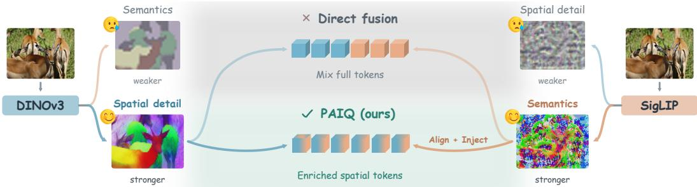  
Figure 1: Complementary visual representations and the PAIQ fusion principle. DINOv3 and SigLIP both encode semantic and local information, but with different representational preferences. PAIQ takes the spatial features as a base and introduces language-aligned features through content matching and residual enrichment, producing a patch-wise fused representation.

Sinkhorn-style sequence of row and column normalizations adjusts the readout weights jointly, so source assignment reflects both content compatibility and competition among all queries. The difference between the aggregated feature and the base feature is passed through a shared orthogonal transformation and added back at a fixed scale. Each output token is thus formed by cross-encoder correspondence followed by a constrained residual update, without appending a second visual sequence.

The shared orthogonal transformation learns update directions while preserving residual norms and pairwise angles. For fixed projected features, when two positions receive the same aggregate, the squared distance between their fused features equals the squared distance from direct interpolation plus a non-negative rotation term. When aggregates are close, an explicit lower bound gives a sufficient condition for the outputs to remain distinguishable. Positions can therefore share semantic sources while retaining different representations through their own spatial bases. PAIQ is trained with an autoregressive answer objective; both visual encoders and the language model remain frozen, and the language model still receives 196 visual tokens.

Across four datasets and diverse language backbones up to 27B, PAIQ yields broad gains in judgeassessed correctness and reductions in hallucination severity over matched single-encoder interfaces. On the 2B and 9B Qwen backbones, it achieves the highest correctness scores among the evaluated multi-encoder and token-compression methods on every dataset (Deria et al., 2026; Chung et al., 2025; Zhang et al., 2025a; Mao et al., 2026). A matched Qwen3.5-2B ablation shows that learned residual rotation improves task-macro correctness by 31.81 score points over direct interpolation, highlighting the role of the update parameterization. A local residual-removal intervention further tests whether generated answers rely on the injected evidence.

The main contributions are:

• Structured cross-encoder semantic enrichment. We introduce PAIQ, a patch-wise fusion framework that unifies content matching, joint source allocation, and orthogonal residual updates, combining spatial features with language-aligned features in a fixed-length visual sequence.

• Local separability under shared semantics. We construct a direction-adaptation mechanism that preserves residual geometry, derive an exact distance decomposition under shared aggregates, and give a sufficient lower bound for retaining local distinctions during semantic enrichment.

• Improvements across backbones and scale. We demonstrate broad gains in judge-assessed response quality across language backbones and scales, and examine the role of residual enrichment through a matched ablation and fixed-answer interventions.

## 2 RELATED WORK

Complementary visual representations. Pretraining objectives shape the visual information available to multimodal large language models (MLLMs). CLIP and SigLIP learn language-aligned features from image–text supervision (Radford et al., 2021; Zhai et al., 2023), whereas DINOv2 and DINOv3 learn self-supervised representations that encode local structure and support dense prediction (Oquab et al., 2024; Siméoni et al., 2025). These capabilities are not exclusive to either family: SigLIP 2 improves localization and dense features (Tschannen et al., 2025), while dino.txt aligns DINOv2 features with text (Jose et al., 2024). At the MLLM interface, Granulon uses a textconditioned granularity controller to guide pooling and relation-aware clustering, constructing multi granularity semantic tokens within a single DINOv3 stream (Mao et al., 2026). Complementing single stream adaptation, Eyes Wide Shut identifies visual blind spots in CLIP that persist in downstream MLLMs and mitigates them by incorporating self-supervised features (Tong et al., 2024b).

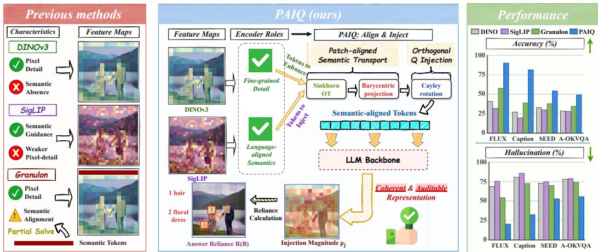  
Figure 2: PAIQ overview. Content matching aggregates SigLIP features for each DINOv3 patch, and a shared orthogonal transformation rotates the aggregate–base difference before adding it back. The two streams become 196 visual tokens; source allocation, update magnitude, and fixed-answer likelihood sensitivity describe how the representation is constructed and used.

Compact multi-encoder fusion. Multi-encoder interfaces must reconcile heterogeneous token grids while controlling the sequence length presented to the language model. Common-grid approaches align spatial layouts before fusion: COMM aggregates multilayer CLIP and DINOv2 features on a shared patch grid and fuses them along the channel dimension (Jiang et al., 2024), while Eagle resamples diverse expert features to a common grid before channel concatenation (Shi et al., 2025). For video, MERV pools features onto a shared spatiotemporal grid and predicts input-dependent, encoder-level mixture weights (Chung et al., 2025). An alternative is to aggregate features into learned queries: BRAVE’s MEQ-Former produces a fixed-length multi-encoder representation (Kar et al., 2024), while Cambrian-1 arranges queries on a two-dimensional grid and restricts each query to spatially corresponding regions across encoders (Tong et al., 2024a). CoME-VL instead uses SigLIP 2 tokens as queries over DINOv3 keys and values to fuse heterogeneous grids, with orthogonal projections applied during multilayer aggregation within each encoder (Deria et al., 2026). Focusing on token reduction, LLaVA-Mini combines query-based compression with image–text pre-fusion, reducing the explicit visual tokens passed to the main language model while also conveying visual information through conditioned text states (Zhang et al., 2025a).

Visual evidence use and intervention-based analysis. Information present in a representation need not influence the answer; attention weights alone do not establish predictive dependence (Jain & Wallace, 2019). To trace visual information flow, Zhang et al. (2025b) block image-to-text attention pathways at different depths and measure changes in answer prediction. At the component level, HalluTrace uses interventions to distinguish visual grounding failure, language-prior dominance, and cross-modal conflict as sources of hallucination (Bukkapatnam, 2026). These studies examine evidence use through output changes under specified interventions, rather than attention patterns alone.

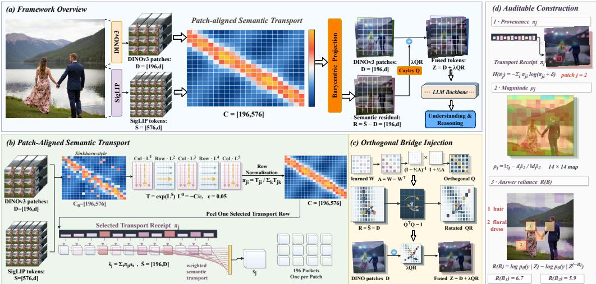  
Figure 3: Overview of PAIQ. (a) Features from two frozen visual encoders are fused into 196 tokens for a frozen language model. (b) Content matching and finite-step row–column normalization aggregate SigLIP features at DINOv3 output positions. (c) A shared Cayley-parameterized orthogonal transform rotates the aggregate–base residual; with row-stacked tokens, $\bar { Z } = D + \lambda ( \bar { S } - \bar { D ( } ) Q ^ { \top }$ (d) Aggregation weights $\pi _ { j }$ , relative update norms $\rho _ { j }$ , and fixed-answer log-likelihood differences $R ( B )$ diagnose source mixing, update size, and the effect of local residual removal, respectively. Computing R(B) requires additional teacher-forced evaluations.

## 3 METHOD

PAIQ enriches DINOv3 patch features with SigLIP features in two steps: content-based matching aggregates source features for each patch, and a shared orthogonal transform rotates the difference from the base feature before adding it back. Matching determines what each patch receives; the residual transform determines how that information updates its representation. Figure 3 summarizes the computation and its diagnostic readouts.

## 3.1 REPRESENTATIONS AND LEARNING OBJECTIVE

For an image I, frozen DINOv3 and SigLIP encoders produce $n = 1 9 6$ and $m = 5 7 6$ contextualized patch features of dimension 1024, denoted by $X _ { d }$ and $X _ { s }$ . We use the final outputs of both encoders, discarding the CLS and register tokens from DINOv3; preprocessing is specified in Appendix B.1. Independent affine projections map both streams to the language-model dimension d:

$$
\pmb { { \cal D } } = \pmb { { \cal X } } _ { d } \pmb { { \cal P } } _ { d } ^ { \top } + { \pmb { 1 } } b _ { d } ^ { \top } , \qquad \pmb { { \cal S } } = \pmb { { \cal X } } _ { s } \pmb { { \cal P } } _ { s } ^ { \top } + { \pmb { 1 } } b _ { s } ^ { \top } .\tag{1}
$$

Here $P _ { d } , P _ { s } \in \mathbb { R } ^ { d \times 1 0 2 4 }$ , with no subsequent activation or normalization. Feature matrices stack tokens as rows; individual features $\pmb { d } _ { i } , \pmb { s } _ { i } ^ { \bot } \in \mathbb { R } ^ { d }$ are column vectors. D supplies the output indices, matching queries, and residual bases; S supplies the features to aggregate.

The fused sequence $ { \boldsymbol { Z } } ( I ) \in \mathbb { R } ^ { n \times d }$ replaces the 196 image-placeholder embeddings in the languagemodel input, without appending a second visual sequence. Both visual encoders and the language model, including its output head, remain frozen. Only the projection and fusion parameters $\theta =$ $\{ P _ { d } , b _ { d } , P _ { s } , b _ { s } , \overleftarrow { W } _ { d } , W _ { s } , \overleftarrow { W } _ { Q } \}$ are trainable. For instruction $\mathbf { \bar { \rho } } _ { T }$ and target answer y including EOS, the objective is

$$
\mathcal { L } _ { \mathrm { N L L } } ( \theta ) = - \sum _ { t = 1 } ^ { | y | } \log p _ { \theta } ( y _ { t } \mid y _ { < t } , T , Z ( I ) ) .\tag{2}
$$

Only answer tokens and EOS are supervised. Gradients pass through the frozen language model to Z, jointly training the projections, matching, and residual transform, with no auxiliary transport loss, correspondence labels, or orthogonality penalty.

## 3.2 CONTENT-BASED MATCHING AND AGGREGATION

The two encoders use different patch grids, so we learn content-based associations rather than impose index-wise correspondence. Independent, bias-free matrices $W _ { d } , W _ { s } \in \mathbb { R } ^ { d \times d }$ produce normalized queries and keys and define a cosine cost:

$$
\begin{array} { r } { \hat { d } _ { j } = \mathrm { n o r m } ( W _ { d } d _ { j } ) , \quad \hat { s } _ { i } = \mathrm { n o r m } ( W _ { s } s _ { i } ) , \quad C _ { j i } = [ 1 - \hat { d } _ { j } ^ { \top } \hat { s } _ { i } ] _ { + } . } \end{array}\tag{3}
$$

Here $[ a ] _ { + } = \operatorname* { m a x } \{ a , 0 \}$ and norm is $\ell _ { 2 }$ normalization with near-zero protection. Both matrices are identity-initialized and shared across images and positions. Matching is independent of the text instruction and imposes no additional coordinate-distance or local-window constraint.

To couple source allocation across queries, we apply finite-step Sinkhorn-style normalization (Cuturi, 2013) to $K _ { j i } = - C _ { j i } / \varepsilon$ , with $\varepsilon = 0 . 0 5$ . Starting from $\alpha ^ { ( 0 ) } \stackrel { \textstyle - } { = } \beta ^ { ( 0 ) } = 0$ , each iteration updates the row factors before the column factors:

$$
\begin{array} { r l } & { \alpha _ { j } ^ { ( t ) } = \mathrm { c l i p } _ { [ - 3 0 , 3 0 ] } \Big [ - \mathrm { L S E } _ { i } ( K _ { j i } + \beta _ { i } ^ { ( t - 1 ) } ) \Big ] , } \\ & { \beta _ { i } ^ { ( t ) } = \mathrm { c l i p } _ { [ - 3 0 , 3 0 ] } \Big [ - \mathrm { L S E } _ { j } ( K _ { j i } + \alpha _ { j } ^ { ( t ) } ) \Big ] , } \end{array}\tag{4}
$$

where $\mathrm { L S E } _ { i } ( a _ { i } ) = \log \sum _ { i } e ^ { a _ { i } }$ . After $L = 5$ iterations, we compute

$$
\begin{array} { l } { { T _ { j i } = \exp \left[ \operatorname* { m i n } ( K _ { j i } + \alpha _ { j } ^ { ( L ) } + \beta _ { i } ^ { ( L ) } , 0 ) \right] , } } \\ { { \pi _ { j i } = \displaystyle \frac { T _ { j i } } { \sum _ { k } T _ { j k } + \delta } , \qquad \bar { \bf S } = \Pi { \bf S } , \qquad \delta = 1 0 ^ { - 6 } . } } \end{array}\tag{5}
$$

Thus $\bar { \pmb { s } } _ { j } = \sum _ { i } \pi _ { j i } \pmb { s } _ { i }$ aggregates the content features $s _ { i } ,$ not the matching keys $\hat { s } _ { i }$ . A source feature may contribute to multiple output positions.

Column scaling distinguishes this construction from independent row softmax. Without clipping and with $\delta = 0$ , the conditional weights take the form

$$
\pi _ { j i } ^ { \circ } = \mathrm { s o f t m a x } _ { i } \Bigl ( - C _ { j i } / \varepsilon + \beta _ { i } ^ { ( L ) } \Bigr ) .\tag{6}
$$

The source bias $\beta _ { i } ^ { ( L ) }$ is determined jointly by all queries and shared across them. The actual forward pass retains clipping and stabilization; five iterations need not satisfy exact transport marginals. Appendix A.1 derives this interpretation and its relation to uniform-marginal transport.

## 3.3 ORTHOGONAL RESIDUAL ENRICHMENT

We use the aggregate to update the base rather than replace it. Define $\pmb { r } _ { j } = \bar { \pmb { s } } _ { j } - d _ { j }$ and $\pmb { R } = \bar { \pmb { S } } - \pmb { D }$ A shared orthogonal transform learns the update direction without anisotropically rescaling these residuals. For trainable $W _ { Q } \in \mathbb { R } ^ { d \times d }$ , the Cayley parameterization gives

$$
{ \pmb A } = W _ { Q } - W _ { Q } ^ { \top } , \qquad { \pmb Q } = ( { \pmb I } - { \pmb A } / 2 ) ^ { - 1 } ( { \pmb I } + { \pmb A } / 2 ) , \qquad { \pmb Q } ^ { \top } { \pmb Q } = { \pmb I } .\tag{7}
$$

Q acts on feature channels and is shared across images and positions. With a fixed coefficient $\lambda = 0 . 6$ , the fused features are

$$
z _ { j } = { d } _ { j } + \lambda { Q } r _ { j } , \qquad Z = D + \lambda ( \Pi S - D ) { Q } ^ { \top } .\tag{8}
$$

Zero-initializing $W _ { Q }$ gives $Q = { \pmb I }$ and initial fusion $0 . 4 D + 0 . 6 \bar { S }$ . The learned update need not point toward $\bar { \pmb { s } } _ { j } ; \lambda$ sets a residual scale, not an information ratio.

The orthogonal constraint preserves relative geometry within the residual set. Writing $\Delta = Z - D =$ $\lambda R Q ^ { \top }$ , we have

$$
\Delta \Delta ^ { \top } = \lambda ^ { 2 } R R ^ { \top } , \qquad \| z _ { j } - { d _ { j } } \| _ { 2 } = \lambda \| r _ { j } \| _ { 2 } .\tag{9}
$$

Hence Q changes residual directions relative to the base while preserving angles between nonzero residuals. This constraint applies to the update, not to the final $\bar { z }$ or the trainable projections; a proof appears in Appendix $\mathrm { A } . 2 .$

Shared semantics and patch differences. Different positions may receive similar aggregates. The base path allows their outputs to remain distinct, subject to the following bounds on the projected features.

Lemma 1 (Patch differences under aggregation).

Let $0 ~ < ~ \lambda ~ < ~ 1$ and $Q ^ { \top } Q = I$ For fixed projected features, write $x _ { j k } = d _ { j } - d _ { k }$ and $e _ { j k } = \bar { \pmb { s } } _ { j } - \bar { \pmb { s } } _ { k }$

(i) Lower bound for similar aggregates. For any $j , k ,$

$$
\begin{array} { r } { \| z _ { j } - z _ { k } \| _ { 2 } \geq [ ( 1 - \lambda ) \| x _ { j k } \| _ { 2 } - \lambda \| e _ { j k } \| _ { 2 } ] + \cdot } \end{array}\tag{10}
$$

(ii) Exact decomposition for a shared aggregate. $H e _ { j k } = 0 ,$ , then

$$
\begin{array} { r } { \| z _ { j } - z _ { k } \| _ { 2 } ^ { 2 } = \underbrace { ( 1 - \lambda ) ^ { 2 } \| x _ { j k } \| _ { 2 } ^ { 2 } } _ { \mathrm { d i r e c t i n t e r p o l a t i o n } } + \underbrace { \lambda \| ( I - Q ) x _ { j k } \| _ { 2 } ^ { 2 } } _ { \mathrm { r o t a t i o n  c o n t r i b u t i o n } } . } \end{array}\tag{11}
$$

By (10), distinct base features remain distinct whenever $\| e _ { j k } \| _ { 2 } < ( 1 - \lambda ) \| x _ { j k } \| _ { 2 } / \lambda$ . For a shared aggregate and the same fixed base and aggregate features, direct interpolation retains only the first term in (11). Residual rotation contributes a nonnegative separation term, strictly positive when $Q x _ { j k } \neq x _ { j k }$ . Appendix A.3 provides the proofs, two-sided bounds, and conditions on the aggregation weights. These are conditional statements about projected features, not guarantees of lossless spatial information preservation.

For a fixed model, we separately inspect source mixing through Π, update size through the relative residual norm $\rho _ { j }$ , and the effect of removing updates through the fixed-answer log-likelihood difference $R ( B )$ after restoring a $2 \times 2$ output block to its base features. These diagnostics do not enter training; definitions appear in Appendix B.3.

## 4 EXPERIMENTS

## 4.1 EXPERIMENTAL SETUP

Benchmarks. We evaluate image description on FLUX-Reason (Fang et al., 2025) and a CC3M slice (Caption) (Sharma et al., 2018), and visual question answering on SEED-Bench (Li et al., 2023) and A-OKVQA (Schwenk et al., 2022). Matched DINOv3-only, SigLIP-only, and PAIQ models use the same fixed 1,000 records per dataset. Table 1 covers Qwen3.5-2B/9B, InternVL3.5-8B, and Llama-3.1-8B language backbones; Table 2 extends Qwen to 27B. FLUX is drawn from the training source and serves as an in-domain description diagnostic; the other datasets assess transfer to different image and question distributions.

Evaluation protocol. Following Granulon (Mao et al., 2026), we use an automatic Judge to score Accuracy and Hallucination independently on [0, 100], with higher Accuracy and lower Hallucination preferred. FLUX and Caption requests contain the image and generated response; SEED and A-OKVQA additionally provide the question, options, and reference answer. These are continuous Judge scores, not official benchmark accuracies. Within each backbone, the matched interfaces share training data and optimization. Table 1 also compares Granulon, CoME-VL, MERV, and LLaVA-Mini. Appendix C.3 details scoring and validation; Appendix H provides VQA prompts and identifies the description-template artifacts.

## 4.2 MAIN RESULTS

Overall performance. On both Qwen backbones, PAIQ achieves the highest mean Accuracy on all four datasets, exceeding the strongest competing method by 1.11 to 4.78 score points (Table 1).

Cross-backbone transfer. Across backbones, PAIQ consistently improves correctness and generally reduces hallucination severity over either matched single-encoder interface (Table 1). The gains therefore extend beyond the Qwen family: PAIQ remains competitive with specialized fusion and token-compression alternatives across architectures and achieves the highest Accuracy on three of the four InternVL tasks.

Table 1: Comparison across four language backbones and four tasks. Accuracy (↑) and Hallucination (↓) are mean Judge scores. The DINOv3, SigLIP, and PAIQ comparisons use 1,000 examples per setting. Bold and underlining mark the best and second-best displayed values, respectively, within each backbone and task metric. Colored arrows beside each baseline give the direction and size of PAIQ’s difference from that baseline in score points; green favors PAIQ and red favors the baseline.
<table><tr><td rowspan="2">Method</td><td colspan="2">FLUX-Reason</td><td rowspan="2"></td><td colspan="2">Caption</td><td colspan="2">SEED</td><td colspan="2">A-OKVQA</td></tr><tr><td>Acc. ↑</td><td>Hall. ↓</td><td>Acc. ↑</td><td>Hall. ↓</td><td>Acc. ↑</td><td>Hall. ↓</td><td>Acc. ↑</td><td>Hall. ↓</td></tr><tr><td>Qwen3.5-2B</td><td></td><td></td><td></td><td></td><td></td><td></td><td></td><td></td><td></td></tr><tr><td>DINOv3</td><td>40.59 ↑49.38</td><td>68.66 ↓48.50</td><td>26.80 ↑54.47</td><td>80.60 ↓48.36</td><td></td><td>32.70 ↑21.32</td><td>72.80↓20.17</td><td>28.29 ↑20.56</td><td>77.94↓22.46</td></tr><tr><td>SigLIP</td><td>31.72 ↑58.25</td><td>75.42</td><td>↓55.26 19.40 ↑61.87</td><td>85.59</td><td>↓53.35</td><td>29.77 ↑24.25</td><td>74.71 ↓22.08</td><td>27.68 ↑21.17</td><td>78.86 ↓23.38</td></tr><tr><td>Granulon</td><td>57.52 ↑32.45</td><td>54.13</td><td>↓33.97 38.57</td><td>72.43 ↑42.70</td><td>↓40.19</td><td>37.66 ↑16.36</td><td>69.85 ↓17.22</td><td>34.26 ↑14.59</td><td>73.85 ↓18.37</td></tr><tr><td>CoME-VL</td><td>80.83 ↑9.14</td><td>29.31</td><td>↓9.15</td><td>69.76 ↑11.51 41.10</td><td>↓8.86</td><td>47.28 ↑6.74</td><td>55.43 ↓2.80</td><td>44.25 ↑4.60</td><td>59.30 ↓3.82</td></tr><tr><td>MERV</td><td>84.35 ↑5.62</td><td>24.94↓4.78</td><td></td><td>72.93 ↑8.34</td><td>37.29 ↓5.05</td><td>49.24 ↑4.78</td><td>51.92 ↑0.71</td><td>43.49 ↑5.36</td><td>57.16 1.68</td></tr><tr><td>LLaVA-Mini</td><td>86.91 ↑3.06</td><td>21.28</td><td>77.33 ↓1.12</td><td>↑3.94</td><td>32.44 ↓0.20</td><td>44.38 ↑9.64</td><td>58.90 ↓6.27</td><td>33.77 ↑15.08</td><td>66.3410.86</td></tr><tr><td>PAIQ</td><td>89.97</td><td>20.16</td><td>81.27</td><td>32.24</td><td></td><td>54.02</td><td>52.63</td><td>48.85</td><td>55.48</td></tr><tr><td>Qwen3.5-9B</td><td></td><td></td><td></td><td></td><td></td><td></td><td></td><td></td><td></td></tr><tr><td>DINOv3</td><td>47.06 ↑46.14</td><td>62.43</td><td>↓46.94 22.08 ↑62.94</td><td></td><td>69.17↓43.77</td><td>35.64 ↑25.14</td><td></td><td></td><td></td></tr><tr><td>SigLIP</td><td>80.51</td><td>31.02</td><td>58.62</td><td>50.97</td><td></td><td>53.44</td><td>65.80 ↓22.79</td><td>32.05 ↑29.06 50.11</td><td>68.90 ↓27.24</td></tr><tr><td>Granulon</td><td>↑12.69 84.32 ↑8.88</td><td>27.51</td><td>↓15.53 ↓12.02 69.27</td><td>↑26.40 ↑15.75 41.97</td><td>↓25.57</td><td>↑7.34 54.63 ↑6.15</td><td>50.98 ↓7.97 46.20</td><td>↑11.00 56.30</td><td>53.77 ↓12.11</td></tr><tr><td>CoME-VL</td><td>90.34</td><td>17.69</td><td>↓2.20 83.91</td><td>↑1.11</td><td>↓16.57 23.72</td><td>59.65</td><td>↓3.19 43.80</td><td>↑4.81 58.89</td><td>45.17 ↓3.51</td></tr><tr><td>MERV</td><td>↑2.86 90.54 ↑2.66</td><td>20.78 ↓5.29</td><td>77.35</td><td>↑7.67 31.67</td><td>↑1.68</td><td>↑1.13 59.14 ↑1.64</td><td>↓0.79</td><td>↑2.22</td><td>42.72 ↓1.06</td></tr><tr><td>LLaVA-Mini</td><td>89.29</td><td>22.63</td><td>74.15</td><td></td><td>↓6.27 41.15</td><td></td><td>42.94 ↑0.07</td><td>55.68 ↑5.43</td><td>45.61 3.95</td></tr><tr><td>PAIQ</td><td>↑3.91 93.20</td><td>↓7.14 15.49</td><td>85.02</td><td>↑10.87 25.40</td><td>↓15.75</td><td>39.02 ↑21.76 60.78</td><td>61.56 ↓18.55 43.01</td><td>31.41 ↑29.70 61.11</td><td>69.55 ↓27.89 41.66</td></tr><tr><td>InternVL3.5-8B</td><td></td><td></td><td></td><td></td><td></td><td></td><td></td><td></td><td></td></tr><tr><td>DINOv3</td><td>82.05 ↑9.14</td><td>29.13↓10.81</td><td>71.99 ↑15.16</td><td></td><td></td><td></td><td></td><td></td><td></td></tr><tr><td>SigLIP</td><td>87.91</td><td>22.46</td><td>78.71</td><td>33.84 ↑8.44</td><td>41.11↓17.90</td><td>48.24 ↑1.45 44.49</td><td>52.67 ↓2.59</td><td>52.45 ↓0.32 48.49</td><td>50.36 ↓1.41</td></tr><tr><td>Granulon</td><td>↑3.28 85.98</td><td>↓4.14 24.99 ↓6.67</td><td>77.96 ↑9.19</td><td>36.15</td><td>↓10.63</td><td>↑5.20</td><td>56.71 ↓6.63</td><td>↑3.64 49.30</td><td>55.47 ↓6.52</td></tr><tr><td>CoME-VL</td><td>↑5.21 88.76 ↑2.43</td><td>18.69</td><td>84.65</td><td>24.88</td><td>↓12.94</td><td>44.46 ↑5.23 44.05</td><td>49.51 ↑0.57</td><td>↑2.83 49.04</td><td>47.20↑1.75</td></tr><tr><td>MERV</td><td>90.19</td><td>↓0.37 20.41</td><td>86.80</td><td>↑2.50 ↑0.35 24.61</td><td>↓1.67</td><td>↑5.64 47.80</td><td>54.14 ↓4.06</td><td>↑3.09</td><td>50.87 ↓1.92</td></tr><tr><td>LLaVA-Mini</td><td>↑1.00 89.99</td><td>↓2.09 22.22</td><td>74.25</td><td>39.89</td><td>↓1.40</td><td>↑1.89</td><td>49.44 ↑0.64</td><td>50.16 ↑1.97</td><td>47.76 ↑1.19</td></tr><tr><td>PAIQ</td><td>↑1.20 91.19</td><td>↓3.90 18.32</td><td>87.15</td><td>↑12.90 23.21</td><td>↓16.68</td><td>29.65 ↑20.04 49.69</td><td>72.88 ↓22.80 50.08</td><td>23.81 ↑28.32 52.13</td><td>76.15 ↓27.20 48.95</td></tr><tr><td>Llama-3.1-8B</td><td></td><td></td><td></td><td></td><td></td><td></td><td></td><td></td><td></td></tr><tr><td>DINOv3</td><td>34.14 ↑54.20</td><td>70.95</td><td>↓46.97 18.67</td><td>↑58.71</td><td></td><td></td><td></td><td>28.57</td><td></td></tr><tr><td>SigLIP</td><td>41.58 ↑46.76</td><td>68.79</td><td>20.44 ↑56.94</td><td>82.15</td><td>↓45.40</td><td>29.89 ↑9.98</td><td>74.52 ↓8.01</td><td>↑7.41 19.12</td><td>77.67 7↓7.41</td></tr><tr><td>Granulon</td><td>73.48 ↑14.86</td><td>↓44.81 39.94 ↓15.96</td><td>56.33</td><td>83.09 58.17</td><td>↓46.34</td><td>18.95 ↑20.92</td><td>80.35 ↓13.84</td><td>↑16.86 33.68</td><td>82.02 ↓11.76 64.95</td></tr><tr><td>CoME-VL</td><td>51.26 ↑37.08</td><td>58.90</td><td>27.87</td><td>↑21.05 78.28</td><td>↓21.42</td><td>30.48 ↑9.39</td><td>68.36 ↓1.85</td><td>↑2.30</td><td>↑5.31 87.35</td></tr><tr><td>MERV</td><td></td><td>27.65</td><td>↓34.92 73.53</td><td>↑49.51</td><td>↓41.53</td><td>13.06 ↑26.81</td><td>84.59 ↓18.08</td><td>12.87 ↑23.11</td><td>↓17.09</td></tr><tr><td></td><td>85.30 ↑3.04</td><td>↓3.67 23.18</td><td>78.55</td><td>↑3.85 40.48</td><td>↓3.73</td><td>44.78 ↓4.91</td><td>55.88 ↑10.63</td><td>43.70 ↓7.72</td><td>58.51 ↑11.75</td></tr><tr><td>LLaVA-Mini</td><td>89.38 ↓1.04</td><td>↑0.80</td><td></td><td>↓1.17 36.65 36.75</td><td>↑0.10</td><td>5.28 ↑34.59</td><td>91.08 ↓24.57</td><td>3.22 ↑32.76</td><td>92.52 ↓22.26</td></tr><tr><td>PAIQ</td><td>88.34</td><td>23.98</td><td>77.38</td><td></td><td></td><td>39.87</td><td>66.51</td><td>35.98</td><td>70.26</td></tr></table>

## 4.3 SCALING AND COMPUTE

Scaling with the language backbone. At 27B, PAIQ remains ahead of both single-encoder interfaces on every dataset and metric, showing that its benefit persists at larger scale (Table 2). The 27B setting uses a 512-token generation limit, compared with 128 tokens at smaller scales.

## 4.4 SAMPLE-LEVEL SCORE DISTRIBUTIONS

PAIQ’s gains extend beyond the mean: 67.85% of the pooled Qwen3.5-2B responses receive Accuracy scores of at least 80, compared with under 21% for either single-encoder interface (Figure 5).

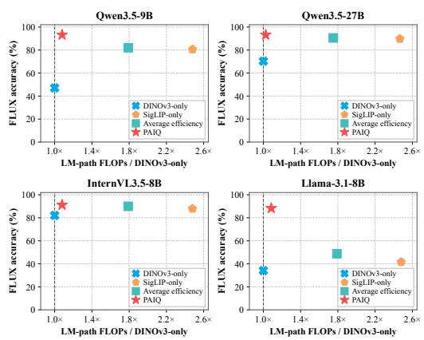

Table 2: Method-matched Qwen3.5 scaling study (1,000 examples per setting). Bold and underlining mark the best and second-best means, respectively, for each metric at each scale. Colored arrows beside baseline means show the direction and size of PAIQ’s difference in score points; green favors PAIQ and red favors the baseline.
<table><tr><td rowspan="2">Method</td><td colspan="2">FLUX-Reason</td><td colspan="2">Caption</td><td colspan="2">SEED</td><td colspan="2">A-OKVQA</td></tr><tr><td>Acc. ↑</td><td>Hall. ↓</td><td>Acc. ↑</td><td>Hall.↓</td><td>Acc. ↑</td><td>Hall. ↓</td><td> $\operatorname { A c c . \uparrow }$ </td><td>Hall.↓</td></tr><tr><td colspan="9">Qwen3.5-2B</td></tr><tr><td>DINOv3</td><td> $\underline { { 4 0 . 5 9 } } _ { \uparrow 4 9 . 3 8 }$ </td><td>68.66 ↓48.50</td><td>26.80 ↑54.47</td><td>80.60↓48.36</td><td>32.70 ↑21.32</td><td> $7 2 . 8 0 \ L _ { \perp 2 0 . 1 7 }$ </td><td>28.29 ↑20.56</td><td> ${ \underline { { 7 7 . 9 4 } } } \downarrow 2 2 . 4 6$ </td></tr><tr><td>SigLIP</td><td> $3 1 . 7 2 _ { \uparrow 5 8 . 2 5 }$ </td><td> $7 5 . 4 2 _ { \scriptstyle \downarrow 5 5 . 2 6 }$ </td><td>19.40 ↑61.87</td><td>85.59 ↓53.35</td><td>29.77 ↑24.25</td><td>74.71 ↓22.08</td><td>27.68 ↑21.17</td><td> $7 8 . 8 6 _ { \scriptstyle \downarrow 2 3 . 3 8 }$ </td></tr><tr><td>PAIQ</td><td>89.97</td><td>20.16</td><td>81.27</td><td>32.24</td><td>54.02</td><td>52.63</td><td>48.85</td><td>55.48</td></tr><tr><td colspan="9">Qwen3.5-9B</td></tr><tr><td>DINOv3</td><td> $4 7 . 0 6 _ { \uparrow 4 6 . 1 4 }$ </td><td> $6 2 . 4 3 _ { \ \downarrow 4 6 . 9 4 }$ </td><td>22.08 ↑62.94</td><td>69.17 ↓43.77</td><td>35.64 ↑25.14</td><td> $6 5 . 8 0 _ { \scriptstyle \downarrow 2 2 . 7 9 }$ </td><td> $3 2 . 0 5 _ { \uparrow 2 9 . 0 6 }$ </td><td> $6 8 . 9 0 _ { \ \downarrow 2 7 . 2 4 }$ </td></tr><tr><td>SigLIP</td><td> $\underline { { 8 0 . 5 1 } } _ { \uparrow 1 2 . 6 9 }$ </td><td>31.02 ↓15.53</td><td>58.62 ↑26.40</td><td>50.97 ↓25.57</td><td>53.44 ↑7.34</td><td> $\underline { { 5 0 . 9 8 } } _ { \perp 7 . 9 7 }$ </td><td>50.11 ↑11.00</td><td>53.77 ↓12.11</td></tr><tr><td>PAIQ</td><td>93.20</td><td>15.49</td><td>85.02</td><td>25.40</td><td>60.78</td><td>43.01</td><td>61.11</td><td>41.66</td></tr><tr><td colspan="9">Qwen3.5-27B</td></tr><tr><td>DINOv3</td><td> $7 0 . 3 0 _ { \uparrow 2 2 . 8 6 }$ </td><td> $4 2 . 6 0 _ { \ \downarrow 2 5 . 2 7 }$ </td><td> $4 1 . 2 4 _ { \uparrow 4 4 . 4 2 }$ </td><td> $5 6 . 9 0 _ { \scriptstyle \downarrow 3 2 . 0 7 }$ </td><td> $4 7 . 3 1 _ { \uparrow 2 7 . 9 4 }$ </td><td> $5 3 . 9 8 _ { \scriptstyle \downarrow 2 8 . 7 7 }$ </td><td> $5 6 . 1 3 \ r _ { 2 5 . 7 1 }$ </td><td> $4 9 . 9 7 _ { \ \downarrow 3 1 . 3 2 }$ </td></tr><tr><td>SigLIP</td><td> $\underline { { 8 9 . 7 0 } } \uparrow 3 . 4 6 $ </td><td>22.03 ↓4.70</td><td>82.57 ↑3.09</td><td>31.57 ↓6.74</td><td> $\frac { 6 9 . 0 9 } { 0 . 1 6 } \uparrow 6 . 1 6 $ </td><td> $\frac { 3 6 . 7 5 } { - 1 1 . 5 4 } \neq 1 1 1 . 5 4$ </td><td> $\underline { { 7 6 . 1 6 } } _ { \uparrow 5 . 6 8 }$ </td><td> $2 8 . 6 7 _ { \perp 1 0 . 0 2 }$ </td></tr><tr><td>PAIQ</td><td>93.16</td><td>17.33</td><td>85.66</td><td>24.83</td><td>75.25</td><td>25.21</td><td>81.84</td><td>18.65</td></tr></table>

Figure 4 shows that PAIQ exceeds the post-hoc best-of-two selector in all four displayed FLUX backbone settings. The selector chooses the completed single-encoder output with higher Accuracy for each example (Appendix D.3). This comparison shows that feature-level fusion can improve beyond choosing between the two observed single-encoder outputs after generation.

Compact visual interface. PAIQ retains 196 visual tokens, compared with 576 for SigLIP-only and 772 for concatenation. Relative to DINOv3-only, its analytical compute is 133% at 2B and 103–108% for larger backbones (Table 3). As the language backbone grows, the added visual-side cost occupies a smaller share of LM-path computation while the gain over the single-encoder interfaces remains clear.

Figure 4: FLUX Accuracy versus normalized analytical compute. The proxy includes selected vision and language terms but excludes fusion.  
Table 3: Visual-token budgets and analytical compute, normalized to DINOv3-only (Appendix E). Average efficiency is an analytical reference with an average prefix length of 386; concatenation would expose 772 tokens.
<table><tr><td rowspan="2">Method</td><td rowspan="2">LM visual tokens</td><td colspan="5">Relative analytical compute (%)↓</td></tr><tr><td>2B</td><td>9B</td><td>27B</td><td>InternVL</td><td>Llama</td></tr><tr><td>DINOv3-only</td><td>196</td><td>100</td><td>100</td><td>100</td><td>100</td><td>100</td></tr><tr><td>SigLIP-only</td><td>576</td><td>252</td><td>248</td><td>247</td><td>248</td><td>248</td></tr><tr><td>Average efficiency</td><td>386</td><td>198</td><td>179</td><td>175</td><td>179</td><td>179</td></tr><tr><td>PAIQ</td><td>196</td><td>133</td><td>108</td><td>103</td><td>108</td><td>108</td></tr></table>

## 4.5 ABLATION AND DIAGNOSTICS

Residual parameterization. Learning the residual rotation improves Qwen3.5-2B task-macro Accuracy by 31.81 score points over fixed- $Q = I$ interpolation, with consistent gains across all four datasets (Figure 6(a)).

(a) Accuracy score distribution  
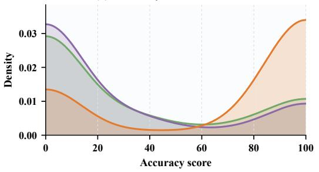

(b) Hallucination score distribution  
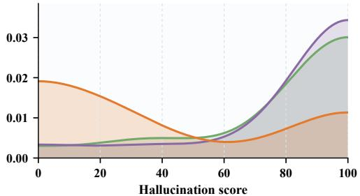  
DINOv3-only SigLIP-only PAIQ

Figure 5: Qwen3.5-2B sample-level score distributions pooled over four equally sized datasets (n = 4,000 per method). PAIQ shifts Accuracy upward and Hallucination downward relative to both single-encoder interfaces.  
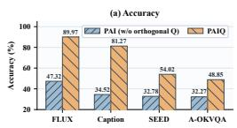

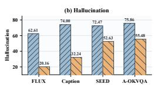  
(a) Fixed-Q ablation.

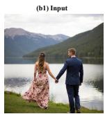

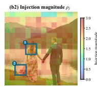

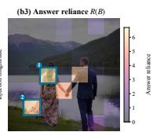  
(b) Qualitative FLUX case.  
Figure 6: Qwen3.5-2B analyses. (a) Fixing $Q = I$ during training reduces Accuracy and increases Hallucination on all four datasets; both metrics are Judge scores on [0, 100]. (b) Qualitative FLUX case. Within (b), the input, injection-magnitude map $\rho _ { j }$ , and answer-reliance map R(B) are shown from left to right as (b1), (b2), and (b3). Regions 1 and 2 highlight the woman’s hair and floral dress, respectively, and mark the same locations in both maps for direct comparison. The displayed reliance map clips negative values; these spatial correspondences are diagnostic and do not establish phrase-level causality.

Paired uncertainty. Relative to the higher-Accuracy single-encoder comparator in each setting, paired 95% bootstrap intervals favor PAIQ on both metrics in 18 of 20 backbone–dataset settings (Appendix D.2).

Answer reliance. Figure 6(b) contrasts relative update magnitude with fixed-answer sensitivity to residual removal. In this case, sensitivity concentrates near the woman’s hair and floral dress, whereas update magnitudes are more diffuse, showing that update size alone does not capture answer dependence (Appendix F).

## 5 CONCLUSION & LIMITATION

We introduced PAIQ, a compact visual interface for integrating complementary representations from heterogeneous visual encoders before language modeling. PAIQ aligns the spatially structured features of DINOv3 with the language-aligned semantics of SigLIP at the patch level, and incorporates the aligned information through orthogonal residual injection. This design keeps the visual sequence fixed at 196 tokens while allowing both streams to contribute to the downstream language model. Across five language backbones from 2B to 27B and four benchmarks, PAIQ achieves higher Accuracy than both matched single-encoder baselines in 19 of 20 settings and lower Hallucination in all 20 settings. Scaling, ablation, and diagnostic analyses support the alignment and residual-injection design under a fixed visual-token budget. Limitation: The study covers one pair of complementary visual encoders. Additional encoder families, higher-resolution and video inputs, and adaptive alignment strategies remain to be evaluated.

## AI USE STATEMENT

Generative AI tools were used during manuscript preparation to assist with language editing, writing refinement, and LaTeX formatting. They were also used for limited coding-related assistance. No scientific ideas, methodological contributions, experimental results, analyses, interpretations, or claims were autonomously generated by these tools. All AI-assisted content was carefully reviewed, verified, and revised by the authors, who take full responsibility for the content of this work.

## REPRODUCIBILITY STATEMENT

The experiments use fixed slices of 1,000 examples per dataset, frozen visual encoders and language models, seed 42, two training epochs over 200K multimodal examples, and the prompts and scoring protocol documented in the appendix. Model dimensions, token budgets, optimization settings, evaluation records, and analysis scripts are specified in the source and supplementary material. Code, configurations, and evaluation records will be released with the paper to support exact reproduction.

## ETHICS STATEMENT

This work uses public benchmark data and automated evaluation and does not involve human subjects or private personal data. Automatic judges can reflect language and cultural biases, and hallucination scores are not substitutes for comprehensive human review. The fused models may still produce incorrect or biased descriptions; their outputs should be checked by people and should not be used as the sole basis for high-stakes decisions.

## REFERENCES

Kaustubh S. Bukkapatnam. HalluTrace: Causal Attribution and Source-Targeted Decoding for Hallucination in Large Vision-Language Models. In Qianqi Yan, Syrielle Montariol, Yue Fan, Jing Gu, Jiayi Pan, Manling Li, Parisa Kordjamshidi, Alane Suhr, and Xin Eric Wang (eds.), Proceedings ofthe 4th Workshop on Advances in Language and Vision Research (ALVR), pp. 294– 300, San Diego, California, USA, July 2026. Association for Computational Linguistics. ISBN 979-8-89176-398-2. doi: 10.18653/v1/2026.alvr-main.29. URL https://aclanthology. org/2026.alvr-main.29/.

Jihoon Chung, Tyler Zhu, Max Gonzalez Saez-Diez, Juan Carlos Niebles, Honglu Zhou, and Olga Russakovsky. Unifying Specialized Visual Encoders for Video Language Models. In Aarti Singh, Maryam Fazel, Daniel Hsu, Simon Lacoste-Julien, Felix Berkenkamp, Tegan Maharaj, Kiri Wagstaff, and Jerry Zhu (eds.), Proceedings of the 42nd International Conference on Machine Learning, volume 267 of Proceedings ofMachine Learning Research, pp. 10879–10900. PMLR, 13–19 Jul 2025. URL https://proceedings.mlr.press/v267/chung25a.html.

Marco Cuturi. Sinkhorn distances: Lightspeed computation of optimal transport. In Advances in Neural Information Processing Systems, volume 26, pp. 2292–2300, 2013. URL https://proceedings.neurips.cc/paper\_files/paper/2013/ file/af21d0c97db2e27e13572cbf59eb343d-Paper.pdf.

Ankan Deria, Komal Kumar, Xilin He, Imran Razzak, Hisham Cholakkal, Fahad Shahbaz Khan, and Salman Khan. CoME-VL: Scaling Complementary Multi-Encoder Vision-Language Learning, 2026. URL https://arxiv.org/abs/2604.03231.

Rongyao Fang, Aldrich Yu, Chengqi Duan, Linjiang Huang, Shuai Bai, Yuxuan Cai, Kun Wang, Si Liu, Xihui Liu, and Hongsheng Li. FLUX-Reason-6M & PRISM-Bench: A million-scale text-to-image reasoning dataset and comprehensive benchmark. arXiv preprint arXiv:2509.09680, 2025.

Sarthak Jain and Byron C. Wallace. Attention is not Explanation. In Jill Burstein, Christy Doran, and Thamar Solorio (eds.), Proceedings ofthe 2019 Conference ofthe North American Chapter of the Association for Computational Linguistics: Human Language Technologies, Volume 1

(Long and Short Papers), pp. 3543–3556, Minneapolis, Minnesota, June 2019. Association for Computational Linguistics. doi: 10.18653/v1/N19-1357. URL https://aclanthology. org/N19-1357/.

Dongsheng Jiang, Yuchen Liu, Songlin Liu, Jin’e Zhao, Hao Zhang, Zhen Gao, Xiaopeng Zhang, Jin Li, and Hongkai Xiong. From CLIP to DINO: Visual Encoders Shout in Multi-modal Large Language Models, 2024. URL https://arxiv.org/abs/2310.08825.

Cijo Jose, Théo Moutakanni, Dahyun Kang, Federico Baldassarre, Timothée Darcet, Hu Xu, Daniel Li, Marc Szafraniec, Michaël Ramamonjisoa, Maxime Oquab, Oriane Siméoni, Huy V. Vo, Patrick Labatut, and Piotr Bojanowski. DINOv2 Meets Text: A Unified Framework for Image- and Pixel-Level Vision-Language Alignment, 2024. URL https://arxiv.org/abs/2412.16334.

Oguzhan Fatih Kar, Alessio Tonioni, Petra Poklukar, Achin Kulshrestha, Amir Zamir, and Federico˘ Tombari. BRAVE: Broadening the visual encoding of vision-language models, 2024. URL https://arxiv.org/abs/2404.07204.

Bohao Li, Rui Wang, Guangzhi Wang, Yuying Ge, Yixiao Ge, and Ying Shan. SEED-Bench: Benchmarking multimodal llms with generative comprehension. arXiv preprint arXiv:2307.16125, 2023.

Junyuan Mao, Qiankun Li, Linghao Meng, Zhicheng He, Xinliang Zhou, Kun Wang, Yang Liu, and Yueming Jin. Granulon: Awakening Pixel-Level Visual Encoders with Adaptive Multi-Granularity Semantics for MLLM, 2026. URL https://arxiv.org/abs/2603.08800.

Maxime Oquab, Timothée Darcet, Théo Moutakanni, Huy Vo, Marc Szafraniec, Vasil Khalidov, Pierre Fernandez, Daniel Haziza, Francisco Massa, Alaaeldin El-Nouby, Mahmoud Assran, Nicolas Ballas, Wojciech Galuba, Russell Howes, Po-Yao Huang, Shang-Wen Li, Ishan Misra, Michael Rabbat, Vasu Sharma, Gabriel Synnaeve, Hu Xu, Hervé Jegou, Julien Mairal, Patrick Labatut, Armand Joulin, and Piotr Bojanowski. DINOv2: Learning Robust Visual Features without Supervision, 2024. URL https://arxiv.org/abs/2304.07193.

Alec Radford, Jong Wook Kim, Chris Hallacy, Aditya Ramesh, Gabriel Goh, Sandhini Agarwal, Girish Sastry, Amanda Askell, Pamela Mishkin, Jack Clark, Gretchen Krueger, and Ilya Sutskever. Learning Transferable Visual Models From Natural Language Supervision. In Marina Meila and Tong Zhang (eds.), Proceedings of the 38th International Conference on Machine Learning, volume 139 of Proceedings ofMachine Learning Research, pp. 8748–8763. PMLR, 18–24 Jul 2021. URL https://proceedings.mlr.press/v139/radford21a.html.

Dustin Schwenk, Apoorv Khandelwal, Christopher Clark, Kenneth Marino, and Roozbeh Mottaghi. A-OKVQA: A benchmark for visual question answering using world knowledge. In European Conference on Computer Vision, 2022.

Piyush Sharma, Nan Ding, Sebastian Goodman, and Radu Soricut. Conceptual captions: A cleaned, hypernymed, image alt-text dataset for automatic image captioning. In Proceedings ofthe 56th Annual Meeting of the Association for Computational Linguistics (Volume 1: Long Papers), pp. 2556–2565, 2018. doi: 10.18653/v1/P18-1238.

Min Shi, Fuxiao Liu, Shihao Wang, Shijia Liao, Subhashree Radhakrishnan, Yilin Zhao, De-An Huang, Hongxu Yin, Karan Sapra, Yaser Yacoob, Humphrey Shi, Bryan Catanzaro, Andrew Tao, Jan Kautz, Zhiding Yu, and Guilin Liu. Eagle: Exploring The Design Space for Multimodal LLMs with Mixture of Encoders, 2025. URL https://arxiv.org/abs/2408.15998.

Oriane Siméoni, Huy V. Vo, Maximilian Seitzer, Federico Baldassarre, Maxime Oquab, Cijo Jose, Vasil Khalidov, Marc Szafraniec, Seungeun Yi, Michaël Ramamonjisoa, Francisco Massa, Daniel Haziza, Luca Wehrstedt, Jianyuan Wang, Timothée Darcet, Théo Moutakanni, Leonel Sentana, Claire Roberts, Andrea Vedaldi, Jamie Tolan, John Brandt, Camille Couprie, Julien Mairal, Hervé Jégou, Patrick Labatut, and Piotr Bojanowski. DINOv3, 2025. URL https://arxiv.org/ abs/2508.10104.

Shengbang Tong, Ellis Brown, Penghao Wu, Sanghyun Woo, Manoj Middepogu, Sai Charitha Akula, Jihan Yang, Shusheng Yang, Adithya Iyer, Xichen Pan, Ziteng Wang, Rob Fergus, Yann LeCun, and Saining Xie. Cambrian-1: A Fully Open, Vision-Centric Exploration of Multimodal LLMs, 2024a. URL https://arxiv.org/abs/2406.16860.

Shengbang Tong, Zhuang Liu, Yuexiang Zhai, Yi Ma, Yann LeCun, and Saining Xie. Eyes Wide Shut? Exploring the Visual Shortcomings of Multimodal LLMs, 2024b. URL https://arxiv. org/abs/2401.06209.

Michael Tschannen, Alexey Gritsenko, Xiao Wang, Muhammad Ferjad Naeem, Ibrahim Alabdulmohsin, Nikhil Parthasarathy, Talfan Evans, Lucas Beyer, Ye Xia, Basil Mustafa, Olivier Hénaff, Jeremiah Harmsen, Andreas Steiner, and Xiaohua Zhai. SigLIP 2: Multilingual Vision-Language Encoders with Improved Semantic Understanding, Localization, and Dense Features, 2025. URL https://arxiv.org/abs/2502.14786.

Xiaohua Zhai, Basil Mustafa, Alexander Kolesnikov, and Lucas Beyer. Sigmoid Loss for Language Image Pre-Training, 2023. URL https://arxiv.org/abs/2303.15343.

Shaolei Zhang, Qingkai Fang, Zhe Yang, and Yang Feng. LLaVA-Mini: Efficient Image and Video Large Multimodal Models with One Vision Token, 2025a. URL https://arxiv.org/abs/ 2501.03895.

Zhi Zhang, Srishti Yadav, Fengze Han, and Ekaterina Shutova. Cross-modal Information Flow in Multimodal Large Language Models, 2025b. URL https://arxiv.org/abs/2411. 18620.

## APPENDIX CONTENTS

Appendix A. Supplementary Method Analysis . . . 13   
Appendix B. Implementation and Internal Diagnostics . 17   
Appendix C. Experimental Settings and Evaluation Scope . 19   
Appendix D. Additional Results and Statistical Analysis . . 23   
Appendix E. Analytical Compute Accounting . . 25   
Appendix F. Qualitative Diagnostics and Case Interpretation . . 26   
Appendix G. Extended Qualitative Cases with Decoder Attention . . . 27   
Appendix H. Evaluator Prompts . . . 33

## A SUPPLEMENTARY METHOD ANALYSIS

We first establish the properties used in Section 3, then give the execution and diagnostic details in Appendix B. Experimental protocols, additional results, and evaluator prompts follow. Throughout, tokens are rows of feature matrices, while individual features are column vectors. The algebraic results concern projected features and exact arithmetic; only the idealized transport interpretation removes clipping and numerical stabilizers.

## A.1 MATCHING NORMALIZATION AND SOURCE ALLOCATION

Finite-step computation. For the cosine cost in (3), define the log-kernel

$$
K _ { j i } = - C _ { j i } / \varepsilon , \qquad \varepsilon = 0 . 0 5 .\tag{12}
$$

Starting from $\alpha ^ { ( 0 ) } = \beta ^ { ( 0 ) } = 0$ , perform $L = 5$ iterations, each consisting of a row update followed by a column update:

$$
\begin{array} { r l } & { \alpha _ { j } ^ { ( t ) } = \mathrm { c l i p } _ { [ - 3 0 , 3 0 ] } \Big [ - \mathrm { L S E } _ { i } \Big ( K _ { j i } + \beta _ { i } ^ { ( t - 1 ) } \Big ) \Big ] , } \\ & { \beta _ { i } ^ { ( t ) } = \mathrm { c l i p } _ { [ - 3 0 , 3 0 ] } \Big [ - \mathrm { L S E } _ { j } \Big ( K _ { j i } + \alpha _ { j } ^ { ( t ) } \Big ) \Big ] . } \end{array}\tag{13}
$$

Here $\begin{array} { r } { \mathrm { L S E } _ { i } ( a _ { i } ) = \log \sum _ { i } \exp ( a _ { i } ) } \end{array}$ . The column update uses the newly computed row factor, so five iterations comprise ten factor updates. The final weights and aggregate are

$$
\begin{array} { l } { \displaystyle T _ { j i } = \exp \left[ \operatorname* { m i n } \Bigl ( K _ { j i } + \alpha _ { j } ^ { ( L ) } + \beta _ { i } ^ { ( L ) } , 0 \Bigr ) \right] , } \\ { \displaystyle \pi _ { j i } = \frac { T _ { j i } } { q _ { j } + \delta } , \qquad q _ { j } = \sum _ { i } T _ { j i } , \qquad \bar { S } = \Pi S , \qquad \delta = 1 0 ^ { - 6 } . } \end{array}\tag{14}
$$

The values are the content features $S ,$ not the normalized matching keys. No transport objective is added to the training loss, and iteration does not terminate according to a marginal-error threshold.

For $q _ { j } > 0$ , the stabilizer separates a normalized average from a row-dependent scale:

$$
\sum _ { i } { \pi } _ { j i } = \frac { q _ { j } } { q _ { j } + \delta } , \qquad \widetilde { \pi } _ { j i } = \frac { T _ { j i } } { q _ { j } } , \qquad \eta _ { j } = \frac { q _ { j } } { q _ { j } + \delta } , \qquad \bar { s } _ { j } = \eta _ { j } \sum _ { i } \widetilde { \pi } _ { j i } { s } _ { i } .\tag{15}
$$

Thus the implemented coefficients have row sums below one. The shrinkage is small when $q _ { j } \gg \delta ;$ it is not omitted from the forward definition. Setting $\delta = 0$ recovers a row-conditioned barycentric average.

Why the queries are coupled. Remove clipping and set $\delta = 0$ only for this derivation. After L iterations,

$$
T _ { j i } ^ { \circ } = \exp ( \alpha _ { j } ^ { ( L ) } ) \exp \left( K _ { j i } + \beta _ { i } ^ { ( L ) } \right) .\tag{16}
$$

The factor $\exp ( \alpha _ { j } ^ { ( L ) } )$ cancels under row normalization, yielding

$$
\pi _ { j i } ^ { \circ } = \frac { \exp ( K _ { j i } + \beta _ { i } ^ { ( L ) } ) } { \sum _ { k } \exp ( K _ { j k } + \beta _ { k } ^ { ( L ) } ) } = \mathrm { s o f t m a x } _ { i } \Bigl ( - C _ { j i } / \varepsilon + \beta _ { i } ^ { ( L ) } \Bigr ) .\tag{17}
$$

This proves (6). Each $\beta _ { i } ^ { ( t ) }$ depends on all queries through the column update; the row factors also influence the next column update even though they cancel in the final normalization. The shared source bias is computed from the current image, not an independent parameter or a measure of semantic importance. Equation (17) explains the idealized computation and does not replace the clipped, stabilized forward pass.

Relation to uniform-marginal transport. For finite C and $\varepsilon > 0 .$ , the entropy-regularized transport problem with uniform probability marginals is (Cuturi, 2013)

$$
\begin{array} { r l } { \underset { \Gamma \geq 0 } { \mathrm { m i n } } } & { \langle \Gamma , \pmb { C } \rangle + \varepsilon \displaystyle \sum _ { j , i } \Gamma _ { j i } ( \log \Gamma _ { j i } - 1 ) , } \\ { \mathrm { s u b j e c t ~ t o } } & { \Gamma \mathbf { 1 } _ { m } = \frac { 1 } { n } \mathbf { 1 } _ { n } , \qquad \Gamma ^ { \top } \mathbf { 1 } _ { n } = \frac { 1 } { m } \mathbf { 1 } _ { m } . } \end{array}\tag{18}
$$

Its solution is obtained by positive row and column scaling of $\exp ( - C / \varepsilon )$ . Rectangular grids admit these marginals because both sides have unit total mass.

To relate the unit-sum updates to probability marginals, let R and C normalize a positive matrix to unit row sums and unit column sums, respectively. For $c > 0 , \mathcal { R } ( c M ) = \mathcal { R } ( M )$ and $\begin{array} { r } { \mathcal { C } ( c M ) = \mathcal { C } ( M ) } \end{array}$ probability-marginal updates are $( 1 / n ) \mathcal { R }$ and $( 1 / m ) \mathcal { C }$ . Starting from the same kernel, after the first column update the probability-scaled matrix is $1 / m$ times the unit-scaled matrix. The next row update cancels that global factor, and the next column update restores the factor $1 / m$ . Induction gives the same relation after every full iteration. Row conditioning cancels the factor, so the two schemes give identical conditional coefficients when clipping and δ are absent.

At convergence to $\Gamma ^ { \star }$ , these coefficients satisfy

$$
\begin{array} { r } { \mathbf { I I } ^ { \star } = n \Gamma ^ { \star } , \qquad \mathbf { I I } ^ { \star } \mathbf { 1 } _ { m } = \mathbf { 1 } _ { n } , \qquad ( \mathbf { I I } ^ { \star } ) ^ { \top } \mathbf { 1 } _ { n } = \frac { n } { m } \mathbf { 1 } _ { m } . } \end{array}\tag{19}
$$

The marginal constraint balances total source use rather than imposing one-to-one matching. Our finite, clipped updates need not satisfy (19). Balancing can discourage concentration on a few sources, but may also increase the weight of irrelevant sources; its task-level effect is empirical.

## A.2 CAYLEY ORTHOGONALITY AND RESIDUAL GEOMETRY

The residuals in the main construction are

$$
\pmb { r } _ { j } = \bar { \pmb { s } } _ { j } - \pmb { d } _ { j } , \qquad \pmb { R } = \bar { \pmb { S } } - \pmb { D } .\tag{20}
$$

We establish both the well-definedness of the Cayley transform and the geometry identity in (9).

Cayley orthogonality and residual geometry

Write $B = A / 2 ,$ so $B ^ { \top } = - B$ . For every nonzero x,

$$
\| ( I - B ) x \| _ { 2 } ^ { 2 } = \| x \| _ { 2 } ^ { 2 } + \| B x \| _ { 2 } ^ { 2 } > 0 .\tag{21}
$$

Hence $M = I - B$ is invertible; the same argument applies to $N = I + B$ . These matrices commute because both are polynomials in $B ,$ and $M ^ { \top } = N$ . Therefore

$$
\begin{array} { r } { Q ^ { \top } Q = ( M ^ { - 1 } N ) ^ { \top } M ^ { - 1 } N = M N ^ { - 1 } M ^ { - 1 } N = I . } \end{array}\tag{22}
$$

The Cayley transform along $t A , 0 \leq t \leq 1$ , is continuous and orthogonal. Its determinant remains +1, its value at $t = 0$ , so the transform is a rotation in feature space.

For $\Delta = Z - D = \lambda R Q ^ { \top }$ , orthogonality gives

$$
\mathbf { \Delta } \mathbf { \Delta } \mathbf { \Delta } ^ { \top } = \lambda ^ { 2 } R Q ^ { \top } Q R ^ { \top } = \lambda ^ { 2 } R R ^ { \top } .\tag{23}
$$

Reading diagonal and off-diagonal entries, with $\Delta _ { j } = z _ { j } - d _ { j }$ and $\lambda > 0$ , yields

$$
\| \Delta _ { j } \| _ { 2 } = \lambda \| r _ { j } \| _ { 2 } , \qquad \langle \Delta _ { j } , \Delta _ { k } \rangle = \lambda ^ { 2 } \langle r _ { j } , r _ { k } \rangle .\tag{24}
$$

Likewise,

$$
\begin{array} { r } { \| \Delta _ { j } - \Delta _ { k } \| _ { 2 } = \lambda \| \pmb { r } _ { j } - \pmb { r } _ { k } \| _ { 2 } . } \end{array}\tag{25}
$$

For nonzero residuals, dividing the inner-product identity by the corresponding norms proves angle preservation. □

This constraint concerns the residual set, not the fused representation. In particular,

$$
\| z _ { j } \| _ { 2 } ^ { 2 } = \| d _ { j } \| _ { 2 } ^ { 2 } + \lambda ^ { 2 } \| \pmb { r } _ { j } \| _ { 2 } ^ { 2 } + 2 \lambda \pmb { d } _ { j } ^ { \top } Q \pmb { r } _ { j } .\tag{26}
$$

The cross term changes with the update direction, while the trainable content projections can change both feature scales. A fixed λ consequently neither bounds the update relative to the base norm nor specifies a fraction of spatial or semantic information.

## A.3 PATCH DIFFERENCES: PROOF AND EXTENSIONS

## Proof of Lemma 1

For $x _ { j k } = d _ { j } - d _ { k }$ and $e _ { j k } = { \bar { \pmb { s } } } _ { j } - { \bar { \pmb { s } } } _ { k }$ , subtracting the two updates in (8) gives

$$
z _ { j } - z _ { k } = ( I - \lambda Q ) x _ { j k } + \lambda Q e _ { j k } .\tag{27}
$$

(i) General lower bound. The triangle and reverse triangle inequalities, together with $\| Q x \| _ { 2 } =$ ∥x∥2, imply

$$
( 1 - \lambda ) \| x \| _ { 2 } \leq \| ( I - \lambda Q ) x \| _ { 2 } \leq ( 1 + \lambda ) \| x \| _ { 2 } .\tag{28}
$$

Applying these inequalities to (27) and using $\| Q e _ { j k } \| _ { 2 } = \| e _ { j k } \| _ { 2 }$ yields

$$
\begin{array} { r l r } {  { [ ( 1 - \lambda ) \| x _ { j k } \| _ { 2 } - \lambda \| e _ { j k } \| _ { 2 } ] _ { + } \leq \| z _ { j } - z _ { k } \| _ { 2 } } } \\ & { } & { \leq ( 1 + \lambda ) \| x _ { j k } \| _ { 2 } + \lambda \| e _ { j k } \| _ { 2 } . } \end{array}\tag{29}
$$

The lower bound is (10); taking its positive part uses only nonnegativity of the norm. The inequality holds for arbitrary aggregates, although a nonzero guarantee requires their difference to be sufficiently small.

(ii) Shared aggregate. If $e _ { j k } = 0$ , orthogonality gives, for any $x ,$

$$
\begin{array} { r l } & { \| ( I - \lambda Q ) x \| _ { 2 } ^ { 2 } = ( 1 + \lambda ^ { 2 } ) \| x \| _ { 2 } ^ { 2 } - 2 \lambda x ^ { \top } Q x } \\ & { \qquad = ( 1 - \lambda ) ^ { 2 } \| x \| _ { 2 } ^ { 2 } + \lambda \| ( I - Q ) x \| _ { 2 } ^ { 2 } . } \end{array}\tag{30}
$$

Taking $x = x _ { j k }$ proves (11). The nonnegative second term gives the stated lower bound after taking square roots. □

Separation conditions. For a shared aggregate, (29) reduces to

$$
\begin{array} { r } { ( 1 - \lambda ) \| d _ { j } - d _ { k } \| _ { 2 } \leq \| z _ { j } - z _ { k } \| _ { 2 } \leq ( 1 + \lambda ) \| d _ { j } - d _ { k } \| _ { 2 } . } \end{array}\tag{31}
$$

More generally, if $x _ { j k } \neq 0$ and $\| e _ { j k } \| _ { 2 } \le \kappa \| x _ { j k } \| _ { 2 }$ for $\kappa < ( 1 - \lambda ) / \lambda$ , the output distance is at least $( 1 - \bar { \lambda ( } - \lambda \kappa ) \bar { \| } x _ { j k } \| _ { 2 } ^ { } > 0$ . The aggregate difference can also be bounded directly by the reading coefficients. With $M _ { s } = \operatorname* { m a x } _ { i } \| \pmb { s } _ { i } \| _ { 2 }$

$$
\| e _ { j k } \| _ { 2 } = \Big \| \sum _ { i } ( \pi _ { j i } - \pi _ { k i } ) \pmb { s } _ { i } \Big \| _ { 2 } \leq M _ { s } \| \pmb { \pi } _ { j } - \pmb { \pi } _ { k } \| _ { 1 } ,\tag{32}
$$

by the triangle inequality. Substitution yields

$$
\begin{array} { r } { \| z _ { j } - z _ { k } \| _ { 2 } \geq \Big [ ( 1 - \lambda ) \| d _ { j } - d _ { k } \| _ { 2 } - \lambda M _ { s } \| \pmb { \pi } _ { j } - \pmb { \pi } _ { k } \| _ { 1 } \Big ] _ { + } . } \end{array}\tag{33}
$$

This argument does not require exact row normalization, so it applies to the stabilized coefficients in the actual forward pass.

A rotation-aware refinement. The preceding lower bound discards the nonnegative rotation term. Retaining it connects the shared-aggregate identity to imperfectly shared aggregates without imposing a new modeling assumption.

Corollary (rotation-aware separation). Under the assumptions of Lemma 1, define

$$
g _ { Q } ( x ) = \sqrt { ( 1 - \lambda ) ^ { 2 } \| x \| _ { 2 } ^ { 2 } + \lambda \| ( I - Q ) x \| _ { 2 } ^ { 2 } } .\tag{34}
$$

For arbitrary $e _ { j k }$ ,

$$
\begin{array} { r } { \| z _ { j } - z _ { k } \| _ { 2 } \geq \big [ g _ { Q } ( x _ { j k } ) - \lambda \| e _ { j k } \| _ { 2 } \big ] _ { + } . } \end{array}\tag{35}
$$

In particular, $x _ { j k } \neq 0$ and $\| e _ { j k } \| _ { 2 } < g _ { Q } ( x _ { j k } ) / \lambda$ are sufficient for distinct outputs.

## Proof of the rotation-aware separation corollary

Equation (30) shows that $g _ { Q } ( x ) = \| ( I - \lambda Q ) x \| _ { 2 }$ for every $x ,$ irrespective of $e _ { j k }$ . Apply the reverse triangle inequality to (27), then use $\lVert \dot { \boldsymbol { Q } } \boldsymbol { e } _ { j k } \rVert _ { 2 } = \lVert \boldsymbol { e } _ { j k } \rVert _ { 2 }$ and nonnegativity of the norm. □

Since $g _ { Q } ( x ) \geq ( 1 - \lambda ) \| x \| _ { 2 }$ , this refinement is never weaker than (10). For fixed $x \neq 0$ with $Q x \neq x$ it permits a larger aggregate discrepancy in the sufficient separation condition. This is a feature-level guarantee, not a claim that training necessarily realizes such rotations or improves task accuracy.

Scope of the constraint. With the same base features and shared aggregate, direct interpolation $( Q = I )$ retains only the first term of (30); residual rotation adds a nonnegative term. When the aggregates differ, the two terms in (27) can still cancel. For $\lambda = 0 . 6 .$ , the coefficient 0.4 bounds projected-feature distance and is not a spatial-information retention rate. An unrestricted linear residual map need not satisfy the same guarantee: taking $G = \lambda ^ { - 1 } I$ gives

$$
\begin{array} { r } { \pmb { d } _ { j } + \lambda G ( \bar { \pmb { s } } _ { j } - \pmb { d } _ { j } ) = \bar { \pmb { s } } _ { j } , } \end{array}\tag{36}
$$

which eliminates all base differences under a shared aggregate. Orthogonality excludes this particular collapse; the example does not imply that an unconstrained model will learn it.

## A.4 EQUIVALENT PARAMETERIZATIONS WITH FREE PROJECTIONS

The geometric statements above fix the intermediate features. They should be distinguished from the expressive power of the full trainable fusion module.

Lemma 2 (Function-class equivalence to direct interpolation). Assume unrestricted affine content projections, unrestricted linear matching maps $W _ { d } , W _ { s } ,$ , no intervening activation or normalization that prevents matrix absorption, and fixed $0 < \lambda < 1$ With the same matching and aggregation rule, PAIQ and the model thatfixes $Q = I$ represent the same input–outputfunction class in exact arithmetic.

## Proof of Lemma 2

For any PAIQ parameter setting, let

$$
B _ { d } = \frac { I - \lambda Q } { 1 - \lambda } .\tag{37}
$$

Equation (28) makes $B _ { d }$ invertible. Construct parameters for the direct-interpolation model as

$$
P _ { d } ^ { \prime } = B _ { d } P _ { d } , \quad b _ { d } ^ { \prime } = B _ { d } b _ { d } , \quad W _ { d } ^ { \prime } = W _ { d } B _ { d } ^ { - 1 } ,\tag{38}
$$

$$
P _ { s } ^ { \prime } = Q P _ { s } , \quad b _ { s } ^ { \prime } = Q b _ { s } , \quad W _ { s } ^ { \prime } = W _ { s } Q ^ { \top } .
$$

Then $\pmb { d } _ { i } ^ { \prime } \ = \ B _ { d } \pmb { d } _ { j }$ and $\begin{array} { r } { \pmb { s } _ { i } ^ { \prime } \ = \ Q \pmb { s } _ { i } . } \end{array}$ , while $W _ { d } ^ { \prime } d _ { i } ^ { \prime } \ = \ W _ { d } d _ { j }$ and $W _ { s } ^ { \prime } { \pmb s } _ { i } ^ { \prime } \ = \ W _ { s } { \pmb s } _ { i } .$ . The prenormalization matching vectors, costs, and coefficients are identical, including the finite iterations, clipping, and stabilizer. Linearity of aggregation gives $\bar { \pmb { s } } _ { j } ^ { \prime } = \pmb { Q } \bar { \pmb { s } } _ { j }$ , and hence

$$
( 1 - \lambda ) { \pmb d } _ { j } ^ { \prime } + \lambda \bar { s } _ { j } ^ { \prime } = ( { \pmb I } - \lambda { \pmb Q } ) { \pmb d } _ { j } + \lambda { \pmb Q } \bar { s } _ { j } = z _ { j } .\tag{39}
$$

The reverse inclusion follows by setting $W _ { Q } = 0 , { \mathrm s o } Q = I .$ Identical visual inputs to the same frozen language model imply identical input–output functions. □

The explicit orthogonal layer therefore specifies a training parameterization rather than a larger function class under these assumptions. Equivalence does not require identical initialization, gradients, optimization trajectories, or finite-budget results, and does not imply bitwise equality after floatingpoint parameter folding.

## B IMPLEMENTATION AND INTERNAL DIAGNOSTICS

## B.1 FEATURE EXTRACTION AND EXECUTION

For one image, the two frozen encoders produce

$$
\begin{array} { r } { \pmb { X } _ { d } = E _ { d } ( \pmb { I } ) \in \mathbb { R } ^ { 1 9 6 \times 1 0 2 4 } , \qquad \pmb { X } _ { s } = E _ { s } ( \pmb { I } ) \in \mathbb { R } ^ { 5 7 6 \times 1 0 2 4 } , } \end{array}\tag{40}
$$

where each $E$ includes its preprocessing and token selection. DINOv3 uses a $2 2 4 \times 2 2 4$ RGB input, patch size 16, and the final normalized patch output; one CLS token and four register tokens are removed. SigLIP uses a 384 × 384 input and the final 24 × 24 patch features. The channel means and standard deviations are (0.485, 0.456, 0.406) and (0.229, 0.224, 0.225) for DINOv3, and (0.5, 0.5, 0.5) for both statistics in SigLIP. The encoders differ in pretraining and input resolution; semantic abstraction and spatial detail are not inferred from token counts alone.

Both content projections are independent affine maps with biases and no subsequent activation or normalization. The bias-free matching matrices are initialized to identity, and $W _ { Q }$ is initialized to zero. Thus training starts from $Q \ : = \ : I$ and $Z ~ = ~ 0 . 4 D + 0 . 6 \bar { S }$ , not from an unmodified DINOv3 representation. The same $Q$ is used for all images and positions. For fixed parameters and preprocessing, the visual fusion does not depend on the question; the language model’s use of its output can depend on the instruction.

Numerical execution. The matching linear maps are applied before converting their outputs to float32, so those maps may run under the outer mixed-precision context. Normalization, log-domain scaling, aggregation, and the Cayley solve then use float32. The rotation is computed by solving

$$
( I - A / 2 ) Q = I + A / 2 ,\tag{41}
$$

rather than forming an explicit inverse. Fusion uses $D + \lambda ( \bar { S } - D ) Q ^ { \top }$ , and the result is cast back to the input-feature precision. The exact identities in Appendix A consequently require numerical tolerances in an implementation. The current path reconstructs the dense Cayley system for each image; caching or parameter folding is not assumed in the reported execution.

Optimization and language input. The 196 fused vectors replace image-placeholder embeddings in the language-model input. The trainable parameters are $\boldsymbol { \dot { \theta } } = \dot { \{ P _ { d } , b _ { d } , \boldsymbol { \bar { P } _ { s } } , b _ { s } , W _ { d } , W _ { s } , W _ { Q } \} }$ ; both visual encoders and the language model, including its output head, remain frozen. The dependence of $p _ { \theta }$ on $\theta$ is through $Z ( I )$ , not through updated language-model weights. The prompt is followed by the target answer and EOS. Prompt, image-placeholder, and padding labels are masked; loss is computed only on answer tokens and EOS. Freezing model parameters does not block the gradient to the visual input. The answer loss is backpropagated through the language model, residual transform, aggregation, and unfolded normalization steps, with no additional correspondence, contrastive, transport, or orthogonality loss.

## B.2 PARAMETER COUNTS AND COMPUTATIONAL SCOPE

The two affine maps and three dense $d \times$ d matrices contain

$$
N _ { \mathrm { t r a i n } } = 2 ( 1 0 2 4 d + d ) + 3 d ^ { 2 }\tag{42}
$$

stored trainable parameters. Table 4 reports this count by hidden dimension. Although $W _ { Q }$ enters only through $W _ { Q } - W _ { Q } ^ { \top }$ , the full stored matrix is counted; its effective skew-symmetric degrees of freedom are not substituted for parameter storage.

Excluding both visual encoders and the language model, the dense, per-image computation scales as

$$
\mathcal { O } \big ( ( n + m ) 1 0 2 4 d + ( 2 n + m ) d ^ { 2 } + n m d + L n m + d ^ { 3 } \big ) , \qquad L = 5 .\tag{43}
$$

Table 4: Trainable parameter counts derived from the layer shapes. All figures include both content projections; they exclude frozen visual and language parameters.
<table><tr><td> $d$ </td><td>Content maps</td><td>Matching maps</td><td> $W _ { Q }$ </td><td>Total</td></tr><tr><td>2048</td><td>4,198,400</td><td>8,388,608</td><td>4,194,304</td><td>16,781,312</td></tr><tr><td>4096</td><td>8,396,800</td><td>33,554,432</td><td>16,777,216</td><td>58,728,448</td></tr><tr><td>5120</td><td>10,496,000</td><td>52,428,800</td><td>26,214,400</td><td>89,139,200</td></tr></table>

The terms account for content projections, matching and residual maps, pairwise scores and value aggregation, scaling iterations, and the Cayley solve, respectively. The fixed 196-token output limits the visual prefix seen by the language model; it does not establish end-to-end latency, memory, or FLOPs savings. The approximate compute coordinates reported in the experiments are specified in Appendix E.

## B.3 AGGREGATION AND RESIDUAL DIAGNOSTICS

The three diagnostics use different parts of the same fixed model: aggregation coefficients describe feature construction, relative norms describe update size, and likelihood differences measure sensitivity to an internal replacement. They are not additional training objectives. All quantities are defined from the actual forward tensors D, S, Π, Q, Z.

Source concentration. For output position $j , \pi _ { j } = ( \pi _ { j 1 } , . . . , \pi _ { j m } )$ records the linear mixing coefficients of contextualized SigLIP features. Their concentration is summarized by

$$
{ \cal H } ( \pmb { \pi } _ { j } ) = - \sum _ { i } \pi _ { j i } \log ( \pi _ { j i } + \delta _ { H } ) , \delta _ { H } > 0 .\tag{44}
$$

Because the row sum is below one and the logarithm contains a stabilizer, this is a concentration statistic rather than exact Shannon entropy. It is neither semantic uncertainty nor the fraction of an answer attributable to original image pixels. The source tokens have already undergone contextual processing.

Relative update magnitude. For $\| d _ { j } \| _ { 2 } > 0$ , define

$$
\rho _ { j } = \frac { \| z _ { j } - d _ { j } \| _ { 2 } } { \| d _ { j } \| _ { 2 } } = \lambda \frac { \| \bar { \bf s } _ { j } - { \bf d } _ { j } \| _ { 2 } } { \| { \bf d } _ { j } \| _ { 2 } } .\tag{45}
$$

The second equality follows from orthogonality. Arranging these values by output index gives a 14 × 14 map. A value above one is possible, and a large ratio can result from a small base norm; both numerator and denominator are relevant to its interpretation. The ratio is undefined at a zero base norm. The map locates updated output positions, not necessarily the image regions from which their aggregate content originated.

Fixed-answer likelihood sensitivity. Partition the 14 × 14 output grid into 49 non-overlapping $2 \times 2$ blocks. For each block B, restore only its updated features to the same model’s projected DINOv3 bases:

$$
z _ { j } ^ { ( - B ) } = \left\{ \begin{array} { l l } { d _ { j } , } & { j \in B , } \\ { z _ { j } , } & { j \notin B . } \end{array} \right.\tag{46}
$$

All other fused features, parameters, and text remain fixed. This does not mask image pixels, delete source tokens, recompute matching, or substitute a separately trained single-encoder baseline. For the model’s fixed generated answer y, compute

$$
R ( B ) = \log p _ { \theta } ( y \mid T , Z ) - \log p _ { \theta } ( y \mid T , Z ^ { ( - B ) } ) ,\tag{47}
$$

where each likelihood is $\begin{array} { r } { \sum _ { t } \log p _ { \theta } ( y _ { t } \mid y _ { < t } , T , \cdot ) } \end{array}$ under teacher forcing. Both passes use the same answer and prefixes, without regeneration or length normalization. Positive $R ( B )$ means removal lowers that answer’s likelihood; negative $R ( B )$ means it raises the likelihood. The result is an answer-level effect of a specified internal replacement, not phrase-level causality or an image-region attribution.

The equivalent parameterization in Lemma 2 can leave Z and Π unchanged while changing D. Consequently, $\rho _ { j }$ and the replacement baseline in (46) depend on the chosen parameterization. They describe a fixed model rather than an explanation uniquely determined by its input–output function. Decoder-attention overlays used in the qualitative examples are a separate measurement, specified in Appendix G.

## C EXPERIMENTAL SETTINGS AND EVALUATION SCOPE

## C.1 LANGUAGE BACKBONES, TRAINING, AND GENERATION

The backbone names identify the frozen language-side configurations to which the same visual fusion is attached, rather than evaluations of five unmodified official multimodal systems. In particular, the InternVL configuration uses its language weights and tokenizer, not its original vision encoder and projector. The reported training recipe uses 200K FLUX-Reason examples, two epochs, AdamW with learning rate $1 0 ^ { - 4 }$ and zero weight decay, cosine decay with 5% warmup, and seed 42. The archived 8B-scale runs use four-GPU DDP with per-device batch size 8 and four gradient-accumulation steps, giving global batch size 128; the 2B and 27B runs follow the same optimization recipe. These experiments use one training seed.

Generation is greedy. The 2B, 9B, InternVL, and Llama archives cap generation at 128 new tokens. The Qwen3.5-27B archive uses 512 for its 12,000 predictions after a diagnostic identified substantial effects of the earlier 128-token boundary. Therefore, the scaling comparison holds the metric families fixed but is not controlled for a common generation limit. Equal limits within a backbone also do not imply equal realized response lengths.

Single-encoder and clustering baselines. The DINOv3-only and SigLIP-only projections are trained independently; they are not obtained by deleting a branch from a trained PAIQ model. Their visual sequence lengths are 196 and 576, respectively. The Granulon-style comparator applies fixed-K clustering in the pairwise cosine-relation space of projected DINOv3 features, with K = 10. Ten cluster means are appended to the 196 patch features, yielding 206 visual tokens. Only its two-layer multimodal projector is trained (6,295,552 parameters), for two epochs and 3,126 optimizer steps using four distributed workers and global batch size 128. This fixed-10 adaptation does not include a text-conditioned granularity controller. The PAI comparator is trained with Q = I and otherwise retains the two-stream matching and aggregation construction.

## C.2 EVALUATION SLICES

The reported tables use fixed slices of 1,000 records per cell, aligned across methods. Table 5 gives their source indices; the ranges are inclusive. FLUX shares its source dataset with training and is treated as an in-domain diagnostic. Training-source overlap is not treated as evidence that every evaluation record was used during optimization. Caption, SEED, and A-OKVQA provide crosssource evaluations, without implying that all pretraining overlap has been excluded. The Caption source is strict\_original\_cc3m/chat.json. Dataset identities distinguish provenance, but are not included in evaluator requests. Image-only description evaluation on FLUX does not assess correctness against an original reasoning question or reference answer.

Table 5: Source slices and the evaluation information used. FLUX is a source-overlap description diagnostic, not a held-out test of reasoning-answer correctness.
<table><tr><td>Dataset</td><td>Slice</td><td>Scoring context</td></tr><tr><td>FLUX-Reason</td><td>Training-source records 500–1499</td><td>Image and generated description</td></tr><tr><td>Caption</td><td>CC3M training-slice rows 500–1499</td><td>Image and generated description</td></tr><tr><td>SEED-Bench</td><td>Test records 500–1499</td><td>Image, question, options, reference, response</td></tr><tr><td>A-OKVQA</td><td>Validation rows 500–1144, then 0–354 Image, question, options, reference,</td><td>response</td></tr></table>

## C.3 SCORING PROTOCOL AND INTERPRETATION

Each prediction receives two separate integer scores in [0, 100]: Accuracy measures task-appropriate correctness, while Hallucination measures the severity of unsupported or contradictory content. Higher Accuracy and lower Hallucination are favorable. These are judge scores, not the percentage of correct answers or the frequency of hallucinations. The two requests have no shared conversation history or access to one another’s score. They are not mathematical complements and are never constrained to sum to 100.

Table 6 distinguishes the two task families. A description is evaluated against its image; a VQA answer is evaluated against the image and a particular question with an authoritative reference. Comparisons therefore remain within a dataset, backbone, and evaluation version. A task-macro mean is an equal-weight descriptive summary, not a common accuracy scale shared by the two rubrics.

Table 6: Input context and score interpretation for the two evaluation families. Neither branch reports an official dataset metric.
<table><tr><td>Property</td><td>FLUX / Caption</td><td>SEED / A-OKVQA</td></tr><tr><td>Task family</td><td>Open-ended image description</td><td>Question-conditioned VQA</td></tr><tr><td>Factual authority</td><td>Provided image</td><td>Provided image plus authoritative reference answer</td></tr><tr><td>Text supplied</td><td>Exact model response</td><td>Question, all options, reference answer, and exact model response</td></tr><tr><td>Accuracy construct</td><td>Correspondence with visible image Semantic correctness of the answer content</td><td>to the question</td></tr><tr><td>Hallucination construct</td><td>Unsupported or contradictory image claims</td><td>False, contradictory, or unsupported answer content</td></tr><tr><td>Official dataset or exact-match metric</td><td>No</td><td>No</td></tr><tr><td>Requests per prediction</td><td>Two independent requests</td><td>Two independent requests</td></tr></table>

Image descriptions. Each request contains one image and the unedited model output. The original generation instruction, reference caption, dataset and model identities, competing responses, and earlier scores are withheld. Accuracy measures correspondence to the visible scene; Hallucination measures unsupported or contradictory visual claims. The FLUX and Caption scores use the archived image-description templates, whose response field is headed MODEL OUTPUT; their artifact locations are specified in Appendix H.2. The absence of a question or reference answer from these requests makes this a description evaluation, including on FLUX.

Question-conditioned VQA. The request includes the image, question, all answer options, authoritative reference, and unedited response, while withholding method and model identities. Options resolve label references and label–text conflicts; distractors are neither factual evidence nor claims made by the candidate. A correct label, answer text, or semantic equivalent is accepted. Reasonable background knowledge needed to connect the image to the reference answer is allowed. Accuracy measures whether the response answers the question; unsupported additions affect that score only when they contradict or undermine the selected answer, and are separately assessed for Hallucination. The two executed VQA templates are reproduced in Appendix H.1.

Empty outputs and scoring consistency. An empty candidate output and an empty evaluator response are different events. The former remains an evaluated model output; the latter is a missing score handled by the request procedure below. Table 7 reports all 330 empty or whitespace-only candidates in the evaluation archive: 249 received (0, 0), while 81 received a nonzero score on at least one axis. Of 71 empty VQA candidates, 52 violate the executed VQA prompts’ (0, 0) rule. The other 259 empty candidates belong to the description tasks; their earlier templates contain no explicit empty-output rule. We retain the original evaluator returns and all candidate records in the reported means. Thus the VQA rules in Table 8 describe the rubric, rather than guaranteed compliance of each recorded judgment.

Table 7: Recorded scores for empty or whitespace-only candidate outputs. Counts include both task families; these are evaluator returns, not prescribed scores or missing-request imputations.
<table><tr><td>Accuracy</td><td>Hallucination</td><td>Candidates</td></tr><tr><td>0</td><td>0</td><td>249</td></tr><tr><td>0</td><td>100</td><td>60</td></tr><tr><td>100</td><td>0</td><td>15</td></tr><tr><td>95</td><td>0</td><td>4</td></tr><tr><td>100</td><td>100</td><td>2</td></tr><tr><td>Total</td><td></td><td>330</td></tr></table>

Table 8: Scoring rules in the executed VQA prompts. Actual empty-output returns are reported separately in Table 7.
<table><tr><td>Candidate response</td><td>Accuracy</td><td>Hallucination</td></tr><tr><td>Correct label, text, or semantic equivalent</td><td>Exactly 100 when unambiguous</td><td>Exactly 0</td></tr><tr><td>Correct answer plus grounded explanation</td><td>Exactly 100</td><td>Exactly 0</td></tr><tr><td>Correct answer plus fabricated explanation</td><td>Preserve correctness unless contradicted</td><td>Greater than 0 according to unsupported explanation</td></tr><tr><td>Wrong answer only</td><td>Low or zero according to residual</td><td>Potentially near 100 because the only substantive claim is false</td></tr><tr><td>General image description without an</td><td>relevance Reduce according to question-answering value</td><td>Evaluate only asserted unsupported content</td></tr><tr><td>answer Label-text conflict</td><td>Evaluate the dominant or final</td><td>Score the false or contradictory</td></tr><tr><td>Unselected distractor</td><td>answer and degree of resolution No effect</td><td>portion</td></tr><tr><td>Empty or</td><td>Exactly 0</td><td>No effect</td></tr><tr><td>whitespace-only</td><td></td><td>Exactly 0; report empty coverage separately</td></tr></table>

## C.4 EVALUATOR ROUTES AND REQUEST VALIDATION

Primary evaluation. VQA requests use openai/gpt-4o through OpenRouter with the settings in Table 9. The single user message contains the rendered prompt and one image\_url element with detail high; no system message is supplied. Image-description requests primarily use OpenLux with gpt-4o, separately from this VQA route. Returned-model identifiers and provider response IDs are retained at request level.

Table 9: Primary VQA evaluator settings. FLUX and Caption use a separate image-description route.
<table><tr><td>Field</td><td>Frozen value</td></tr><tr><td>Provider / endpoint</td><td>OpenRouter; https : //openrouter.ai/api/v1/chat/completions</td></tr><tr><td>Requested model</td><td>openai/gpt-4o</td></tr><tr><td>Accepted receipt</td><td>GPT-4o family identifier matching the expression below</td></tr><tr><td>Image detail / temperature</td><td>high/0.1</td></tr><tr><td>Maximum output tokens</td><td>512</td></tr><tr><td>Response format</td><td>{&quot;type&quot;:&quot;json_object&quot;}</td></tr><tr><td>System / user messages</td><td>No system message; one user message</td></tr><tr><td>Request contents</td><td>Image, question, options, reference answer, and candidate response</td></tr><tr><td>Connect / read timeout</td><td>20 seconds / 120 seconds</td></tr><tr><td>Maximum cumulative attempts Three per request key</td><td></td></tr><tr><td>Retry payload / in-provider fallback</td><td>Semantically identical payload / disabled</td></tr></table>

The accepted returned-model expression for the primary VQA route is

Listing C.1 | Accepted VQA evaluator identifier

^(?:openai/)?gpt-4o(?:-[0-9]{4}-[0-9]{2}-[0-9]{2})?\$

Recovery of missing evaluator responses. For SEED and A-OKVQA, only exact request keys with an audited terminal class of empty\_response on the primary route are eligible for the Qwen route in Table 10. Recovery is separate from provider-side automatic fallback and does not replace a valid GPT-4o score. The rendered prompt, image, question, options, reference, and candidate response are matched to the source request; the evaluator identity remains attached to the resulting score.

Table 10: Recovery route for the audited empty-response terminals of the VQA primary evaluator.
<table><tr><td>Field</td><td>Frozen value</td></tr><tr><td>Provider / endpoint</td><td>Paratera; https: //1lmapi.paratera.com/v1/chat/completions</td></tr><tr><td></td><td>Requested and accepted model Qwen3-VL-235B-A22B-Instruct only</td></tr><tr><td>Image detail / temperature Maximum tokens / response</td><td>high/0.1</td></tr><tr><td>format</td><td>512/ {&quot;type&quot;:&quot;json_object&quot;}</td></tr><tr><td>System message Connect / read timeout</td><td>None</td></tr><tr><td>Maximum cumulative attempts Three</td><td>20 seconds / 180 seconds</td></tr><tr><td></td><td></td></tr><tr><td>Eligible scope</td><td>Exact audited GPT-4o empty_response terminal keys only</td></tr></table>

Validation and retries. An accepted result has HTTP status 200, an allowed returned-model identifier, one choice, finish\_reason=stop, nonempty content, and a nonempty provider response ID. The content must parse as one JSON object containing exactly the requested field, with an integer in [0, 100]; Booleans, floats, and extra fields are rejected. The schemas are {"accuracy\_score":

0} and {"hallucination\_score": 0}, where zero illustrates the type rather than a default score.

Retryable events include HTTP 408, 409, 425, 429 and 5xx responses; timeouts and connection failures; empty content; invalid JSON or schema; and finish\_reason=length. Each retry preserves the semantic payload. Wrong-model, authentication, and quota errors fail closed. Attempts and terminal failures remain in append-only records. A failed evaluator request is not converted to zero, dropped from coverage, or imputed from another candidate output. Record validation establishes coverage and structural consistency, not semantic correctness of the evaluator’s decisions.

## C.5 EVALUATOR-SOURCE COVERAGE

Table 11 counts request axes, not predictions: each prediction contributes an Accuracy request and a Hallucination request. Of 68,000 finalized VQA axes, 207 use Qwen recovery (0.3044%). The description archives contain five additional Qwen-recovered axes, which are outside this VQA denominator. These are hybrid-evaluator results rather than exclusively GPT-4o results. Using the

Table 11: Evaluator-source counts in the finalized SEED/A-OKVQA archives. Counts refer to scoring axes, with two axes per prediction.
<table><tr><td>Final package</td><td>Total</td><td>GPT-40</td><td>Qwen recovery</td><td>Terminal</td></tr><tr><td>Qwen3.5-9B, InternVL3.5-8B, Llama-3.1-8B, Qwen3.5-27B</td><td>48,000</td><td>47,832</td><td>168</td><td>0</td></tr><tr><td>Qwen3.5-2B</td><td>20,000</td><td>19,961</td><td>39</td><td>0</td></tr><tr><td>Combined finalized VQA scope</td><td>68,000</td><td>67,793</td><td>207</td><td>0</td></tr></table>

same prompt and output schema preserves the request definition, but does not establish calibration between evaluators. Request-level records retain provider, requested and returned model, response ID, source run, and prompt/context provenance. Coverage checks establish which requests have valid records; they do not establish inter-evaluator agreement or human-level scoring validity.

## D ADDITIONAL RESULTS AND STATISTICAL ANALYSIS

## D.1 QWEN3.5-2B VQA RESULTS AND RECOVERY

The dedicated 2B archive contains five methods on two VQA datasets: 10,000 predictions and 20,000 request axes. GPT-4o supplies 19,961 valid axes. The remaining 39 terminal empty-response keys comprise 34 Accuracy and five Hallucination requests; the Qwen recovery route returns a valid result on the first attempt for each. The final archive has 20 complete method–dataset–axis groups, each containing 1,000 records, with no missing or duplicate keys or terminal failures. Table 12 reports the resulting means and confidence intervals, using the fixed-10 clustering comparator defined in Appendix C.

Table 12: Qwen3.5-2B VQA judge scores, reported as mean [95% bootstrap CI]. Each cell contains 1,000 aligned records; the clustering comparator is the fixed-10 Granulon-style adaptation.
<table><tr><td>Method</td><td>Accuracy ↑</td><td>Hallucination↓</td></tr><tr><td>SEED-Bench</td></tr><tr><td>DINOv3 32.70 [29.89, 35.52]</td><td>72.80 [70.85, 74.74]</td></tr><tr><td>SigLIP</td><td>29.77 [27.00, 32.63] 74.71 [72.55, 76.80]</td></tr><tr><td>Granulon-style (K = 10)</td><td>37.66 [34.74, 40.66] 69.85 [67.85, 71.87]</td></tr><tr><td>PAI (w/o orthogonal Q)</td><td>32.78 [29.92, 35.70] 72.47 [70.38, 74.49]</td></tr><tr><td>PAIQ</td><td>54.02 [50.94, 57.04] 52.63 [50.34, 54.86]</td></tr><tr><td>A-OKVQA</td><td></td></tr><tr><td>DINOv3 28.29 [25.55, 30.98]</td><td>77.94 [76.12, 79.80]</td></tr><tr><td>SigLIP</td><td>27.68 [25.00, 30.49] 78.86 [76.91, 80.76]</td></tr><tr><td>Granulon-style (K = 10) 34.26 [31.38, 37.22]</td><td>73.85 [71.86, 75.83]</td></tr><tr><td>PAI (w/o orthogonal Q)</td><td>32.27 [29.37, 35.18] 75.86 [73.72, 77.95]</td></tr><tr><td>PAIQ</td><td>48.85 [45.94, 51.92] 55.48 [53.05, 57.93]</td></tr></table>

The paired-difference intervals favor PAIQ in all 16 comparisons against the four comparators across the two datasets and two axes. This statement concerns paired score differences, not a comparison of the marginal intervals displayed in the table. The intervals quantify resampling uncertainty conditional on the recorded outputs and evaluator scores.

## D.2 AGGREGATION AND PAIRED UNCERTAINTY

Within each backbone–method–dataset–axis cell, the estimate is the arithmetic mean

$$
\bar { s } = \frac { 1 } { N } \sum _ { i = 1 } ^ { N } s _ { i } , \qquad N = 1 , 0 0 0\tag{48}
$$

for a complete archival cell. Accuracy and Hallucination are aggregated separately. Candidate outputs, including empty ones, remain in the denominator. An incomplete scoring set requires an explicitly reported denominator and is not treated as a complete cell.

Confidence intervals are nonparametric percentile bootstrap intervals. Each replicate samples N aligned records with replacement and computes their mean; the 2.5th and 97.5th percentiles form a 95% interval. The FLUX/Caption archive uses 10,000 replicates and seed base 20260810. The four-backbone VQA archive uses 2,000 replicates, while the dedicated 2B VQA archive uses 10,000; both VQA packages derive seeds deterministically from stable group labels. The differing counts change Monte Carlo precision, not the target confidence level.

For Table 13, the comparator in each backbone–dataset cell is the single encoder with higher mean Accuracy, fixed before paired resampling. For the same aligned sample i, the displayed differences are

$$
\Delta _ { i } ^ { \mathrm { a c c } } = s _ { i } ^ { \mathrm { a c c } } ( \mathrm { P A I Q } ) - s _ { i } ^ { \mathrm { a c c } } ( b ) , \qquad \Delta _ { i } ^ { \mathrm { h a l l } } = s _ { i } ^ { \mathrm { h a l l } } ( b ) - s _ { i } ^ { \mathrm { h a l l } } ( \mathrm { P A I Q } ) .\tag{49}
$$

Both signs therefore favor PAIQ when positive. The paired-difference vector is resampled directly; intervals are not reconstructed from rounded cell means or by subtracting marginal interval endpoints. The raw archive uses the opposite sign for Hallucination differences, so its endpoints are sign-reversed for display.

Table 13: Paired-bootstrap 95% confidence intervals over aligned sample-level Judge scores. FLUX/- Caption use 10,000 resamples. SEED/A-OKVQA use 2,000 resamples for the four-backbone hybrid archive and 10,000 for the dedicated Qwen3.5-2B archive.
<table><tr><td>Backbone</td><td>Dataset</td><td>∆Accuracy</td><td>△Hallucination</td></tr><tr><td>Qwen3.5-2B</td><td>FLUX</td><td>[47.475, 51.289]</td><td>[46.807, 50.219]</td></tr><tr><td>Qwen3.5-2B</td><td>Caption</td><td>[52.523, 56.385]</td><td>[46.597, 50.109]</td></tr><tr><td>Qwen3.5-2B</td><td>SEED</td><td>[18.026, 24.692]</td><td>[17.823, 22.596]</td></tr><tr><td>Qwen3.5-2B</td><td>A-OKVQA</td><td>[17.109, 24.063]</td><td>[19.951, 24.944]</td></tr><tr><td>Qwen3.5-9B Qwen3.5-9B</td><td>FLUX Caption</td><td>[11.309, 14.086] [23.801, 28.979]</td><td>[14.014, 17.097] [23.108, 28.111]</td></tr><tr><td>Qwen3.5-9B Qwen3.5-9B</td><td>SEED A-OKVQA</td><td>[4.511, 10.166] [7.904, 14.036]</td><td>[5.798, 10.240] [9.279, 14.888]</td></tr><tr><td>Qwen3.5-27B Qwen3.5-27B</td><td>FLUX Caption</td><td>[2.636, 4.331] [1.204, 4.992]</td><td>[3.596, 5.853] [4.816, 8.687]</td></tr><tr><td>Qwen3.5-27B</td><td>SEED</td><td>[3.226, 8.959]</td><td>[8.922, 14.083]</td></tr><tr><td>Qwen3.5-27B</td><td>A-OKVQA</td><td>[3.101, 8.049]</td><td>[7.636, 12.357]</td></tr><tr><td>InternVL3.5-8B</td><td>FLUX</td><td>[2.149, 4.382]</td><td>[2.816, 5.470]</td></tr><tr><td>InternVL3.5-8B</td><td>Caption</td><td>[6.808, 10.044]</td><td>[8.843, 12.346]</td></tr><tr><td>InternVL3.5-8B</td><td>SEED</td><td>[-0.778,3.721]</td><td>[0.454,4.727]</td></tr><tr><td>InternVL3.5-8B</td><td>A-OKVQA</td><td>[-2.677,2.164]</td><td>[-0.888, 3.697]</td></tr><tr><td></td><td></td><td></td><td></td></tr><tr><td>Llama-3.1-8B</td><td>FLUX</td><td>[44.950, 48.596]</td><td>[43.139, 46.428]</td></tr><tr><td>Llama-3.1-8B</td><td>Caption</td><td>[54.981, 58.869]</td><td>[44.433, 48.234]</td></tr><tr><td>Llama-3.1-8B</td><td>SEED</td><td>[6.279, 13.637]</td><td>[5.379, 10.638]</td></tr><tr><td>Llama-3.1-8B</td><td>A-OKVQA</td><td>[3.831, 11.014]</td><td>[4.882, 10.176]</td></tr></table>

Interpretation. The intervals in Table 13 include zero for InternVL/SEED Accuracy and for both InternVL/A-OKVQA axes; those comparisons do not establish a nonzero mean improvement at this confidence level. All intervals are conditional on a single training seed, fixed evaluator records, and the selected comparator. They do not include training randomness, repeated-evaluator variability, prompt changes, or multiplicity correction. Some records share images (999, 1,000, 908, and 985 distinct images in the four 1,000-record slices, respectively); record-level bootstrap does not explicitly model that clustering. The reported intervals are therefore record-level, unadjusted intervals, conditional on the selected baseline; the selection step is not repeated within each bootstrap replicate.

## D.3 POST-HOC BEST-OF-TWO REFERENCE

For sample x, let $J _ { d } ^ { \mathrm { a c c } } ( x )$ and $J _ { s } ^ { \mathrm { a c c } } ( x )$ be the judged Accuracy of the independently generated DINOv3-only and SigLIP-only outputs. Select

$$
m ^ { * } ( x ) = \arg \operatorname* { m a x } _ { m \in \{ d , s \} } J _ { m } ^ { \mathrm { a c c } } ( x ) ,\tag{50}
$$

assigning exact ties to DINOv3. Report the Accuracy and Hallucination of that same output, $J _ { m ^ { * } ( x ) } ^ { \mathrm { a c c } } ( x )$ and $J _ { m ^ { * } ( x ) } ^ { \mathrm { h a l l } } ( x )$ ; Hallucination is not minimized independently. The archived comparison uses the five FLUX backbone settings. This is a post-hoc upper bound on Accuracy among the two observed complete outputs, not a learned router, a Hallucination optimum, or a bound on representations that combine both inputs.

## E ANALYTICAL COMPUTE ACCOUNTING

The efficiency coordinates use an approximate 2P T accounting, where P is a parameter count and T is a token budget. This accounting includes the selected visual-tower and language-model terms, but excludes the fusion operations detailed in (43). It uses 201 DINOv3 tower tokens and 577 SigLIP tower tokens, parameter counts of 303M and 316M, language-model visual prefixes of 196 or 576 tokens, and a fixed text budget of 64 tokens. Tower-token counts include special tokens and differ from the patch counts delivered to the fusion module.

The average-efficiency reference evaluates both visual towers and averages the costs of the 196- and 576-token language branches. It is an analytical coordinate accompanying the post-hoc comparison in Appendix D.3; it is not the execution cost of selecting the better of two already generated answers. The accounting excludes transport normalization and the full Cayley solve and does not count all operations in the implemented fusion. Consequently it is neither a complete FLOPs estimate nor a latency measurement; Equation (43) separately states the fusion’s asymptotic costs.

For the archived Qwen3.5-27B language-side parameter count $P = 2 6 , 8 9 5 , 9 9 8 , 4 6 4$ , the reported coordinates are 14,107.7, 34,791.5, 24,692.9, and $^ { 1 4 , 4 7 2 }$ .4 GFLOPs for DINOv3-only, SigLIPonly, average efficiency, and PAIQ, respectively. These values are analytical estimates rather than device measurements. The Llama ledger is configuration-derived using the untied configuration $( d , d _ { \mathrm { f } } , L , h , h _ { \mathrm { K V } } , V ) = ( 4 0 9 6 , 1 4 3 3 6 , \bar { 3 } 2 , 3 2 , 8$ , 128256). Here $L$ denotes decoder depth, not the number of normalization iterations. Device-matched timing, memory, and any benefit from caching $Q$ are outside these measurements.

## F QUALITATIVE DIAGNOSTICS AND CASE INTERPRETATION

## F.1 TRACING INJECTED EVIDENCE TO ANSWER RELIANCE

Figure 6(b) in the main text displays FLUX sample 501 from the Qwen3.5-2B PAIQ archive, stored as a $1 0 2 4 \times 1 0 2 4$ JPEG with image and array provenance. Its generated response begins: “Two individuals, a woman in a flowing floral dress and a man in a sharp navy suit, walk hand-in-hand $\cdots ^ { \mathfrak { n } } .$

Blockwise residual intervention. Partition the $1 4 \times 1 4$ fused grid into 49 non-overlapping $2 \times 2$ blocks. For a block B, let $m _ { j } ( B ) = 0$ for $j \in B$ and $m _ { j } ( B ) = 1$ otherwise. The counterfactual token is

$$
z _ { j } ^ { ( - B ) } = d _ { j } + m _ { j } ( B ) \lambda Q ( \bar { s } _ { j } - d _ { j } ) ,\tag{51}
$$

which restores the base feature only inside B and is equivalent to (46). We teacher-force the original answer $y$ under both $z$ and $Z ^ { ( - B ) }$ , holding the text, answer prefixes, and all other features fixed. The difference in summed token log-likelihoods, $R ( B )$ in (47), is positive when removing the residual lowers the answer’s likelihood. No answer is regenerated. Relative update magnitude $\rho _ { j }$ is defined in (45).

Construction and reliance maps. The relative-norm map in panel (b2) spans a broad part of the image. In panel (b3), the largest positive likelihood changes are more localized around the woman’s hair and floral dress, which also appear in the generated description. All 49 blocks are evaluated against the same answer; highlighted blocks are selected by $R ( { \dot { B } } )$

Interpretation. The visualization displays max $\{ R ( B ) , 0 \}$ , so it omits negative values, where removal increases the fixed answer’s likelihood. Spatial labels such as “hair” and “floral dress” connect the displayed boxes with answer phrases for inspection; the score sums over the full answer and does not isolate those phrases. These diagnostics depend on the fixed model’s parameterization (Appendix B.3). This single selected case illustrates the diagnostic, not its prevalence or reliability across the dataset or phrase-level causality.

## F.2 SCOPE OF THE QUALITATIVE COMPARISON

Appendix G presents six selected comparisons with decoder-attention overlays. Those overlays summarize attention to visual-token positions, whereas Π describes cross-encoder aggregation and $R ( B )$ measures a specific residual-removal effect. The case captions distinguish recognition successes from unsupported details in the same response. Neither selected examples nor attention concentration estimate population-level accuracy or establish phrase-level causality.

## G EXTENDED QUALITATIVE CASES WITH DECODER ATTENTION

We examine six selected Qwen3.5-2B examples: three FLUX descriptions and three Caption descriptions. They illustrate object and attribute errors rather than estimate their frequency. The displayed responses retain their original wording, including errors; an ellipsis marks a response that reached the 128-token generation limit. Selected image-supported phrases and unsupported or contradicted phrases are annotated in green and red, respectively. Uncolored text is unassessed, ambiguous, or stylistic; it is not an endorsement of the remaining response.

Each overlay averages decoder self-attention from the teacher-forced answer-token queries to visual token keys over all heads at zero-based layers 11, 15, 19, and 23. The visual grids are 14 × 14 for DINOv3 and PAIQ, and 24 × 24 for SigLIP. Each map is normalized independently: color intensity describes allocation within that map, not comparable total visual reliance across models. These maps are neither the cross-encoder weights Π nor the residual-removal score R(B), and do not establish object localization or phrase-level causality.

## G.1 CASE 1: FLUX 549—WATERCOLOR GRAPE CLUSTER

PAIQ identifies the purple grapes, whereas DINOv3 describes a strawberry and SigLIP describes a flower bouquet. The description is not uniformly correct: PAIQ calls the elongated cluster spherical.

  
(a) Input

  
(b) DINOv3 attention

  
(c) SigLIP attention

  
(d) PAIQ attention

DINOv3-only output. Vibrant and meticulously crafted, this digital illustration of a vibrant red strawberry stands out with its rich, glossy texture and symmetrical design. The strawberry is depicted in a side profile, showcasing its deep crimson hue and a single, prominent green leaf at the top, which adds a touch of natural elegance. The fruit’s surface is adorned with numerous small, white seeds, creating a textured appearance that enhances its realism. The background is a clean, off-white canvas, allowing the strawberry to be the sole focal point, emphasizing its vivid colors and intricate details. The composition is simple yet striking, with the strawberry positioned slightly off-center to the left. . .

SigLIP-only output. Vibrant and meticulously crafted, this image showcases a bouquet of fresh flowers, including vibrant red roses, delicate white lilies, and lush green leaves, arranged in a simple yet elegant white vase. The composition is centered, with the flowers filling the frame, creating a balanced and harmonious visual effect. The roses, with their rich red petals and subtle yellow centers, stand out prominently against the clean white background, while the lilies, with their pristine white petals and green stems, add a touch of purity and contrast. The green leaves, varying in size and shape, provide a natural frame around the flowers, enhancing the overall aesthetic appeal. . .

PAIQ output. Vibrant and meticulously rendered, this watercolor illustration captures the essence of a cluster of purple grapes, each berry glistening with a rich, deep hue that suggests freshness and ripeness. The grapes are densely packed, forming a lush, spherical cluster that exudes a sense of abundance and natural beauty. Each grape is depicted with subtle shading and highlights, enhancing their three-dimensional appearance and inviting the viewer to appreciate their intricate details. A slender brown vine extends from the top right, adorned with a single, vibrant green leaf featuring serrated edges and a glossy texture, adding a touch of organic elegance. The composition is centered around the grape cluster. . .

## G.2 CASE 2: FLUX 768—SKULL FOREARM TATTOO

PAIQ identifies the skull tattoo and its placement on a forearm; the single-encoder outputs instead describe a three-dimensional head and a baseball cap. Its statement that the forearm is partly covered by clothing remains unsupported.

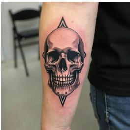  
(a) Input

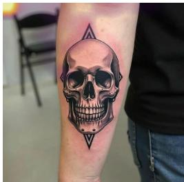  
(b) DINOv3 attention

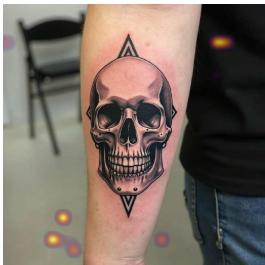  
(c) SigLIP attention

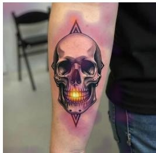  
(d) PAIQ attention

DINOv3-only output. A meticulously crafted 3D-printed model of a human head, rendered in a photorealistic style, is displayed against a plain white background. The head features a detailed, realistic face with a prominent nose, expressive eyes, and a full mouth, all rendered with high precision. The skin texture is smooth yet detailed, capturing subtle variations in tone and shading that give the model a lifelike appearance. The hair is styled in a short, dark cut, framing the face and adding to the overall realism. The model is positioned centrally, with its face turned slightly to the side, allowing a clear view of its features. The lighting. . .

SigLIP-only output. Close-up portrait captures a meticulously crafted leather baseball cap, showcasing its intricate details and craftsmanship. The cap features a prominent embroidered logo on the front, depicting a stylized figure in a dynamic pose, rendered in bold black and white threads against a textured brown leather background. The cap’s design includes a structured crown with a slightly curved brim, secured by a visible button at the top, and a strap with a metal buckle on the side, adding a touch of functionality and style. The leather material exhibits a rich, warm tone with subtle stitching and texture, emphasizing the artisanal quality of the piece. The composition focuses tightly on the cap,. . .

PAIQ output. Dominating the frame is a meticulously crafted black-and-white tattoo of a skull, positioned prominently on a person’s forearm. The skull, rendered with sharp, symmetrical precision, features hollow eye sockets, a prominent nose, and a row of sharp teeth, all accentuated by bold, clean lines. The design is framed by two triangular shapes, one above and one below the skull, adding a geometric contrast to the organic form. The tattoo is set against the smooth skin of the forearm, which is partially covered by the individual’s dark sleeve and light blue jeans, suggesting a casual yet deliberate artistic choice. The background is minimal, with a. . .

## G.3 CASE 3: FLUX 1453—RENDERED VIRUS PARTICLE

PAIQ describes the rendered virus particle and the smaller particles behind it. DINOv3 and SigLIP instead describe a snowman and a rose. The comparison concerns recognition of the depicted subject, not identification of a biological species.

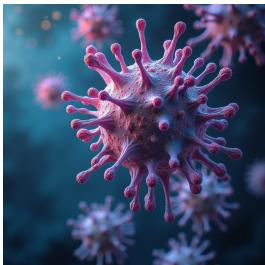  
(a) Input

  
(b) DINOv3 attention

  
(c) SigLIP attention

  
(d) PAIQ attention  
DINOv3-only output. A vividly detailed, high-contrast illustration of a snowman stands prominently against a dark, starry night sky, creating a striking visual contrast that emphasizes the snowman’s bright white form. The snowman is composed of three distinct sections: a round head adorned with a cheerful red hat and a black scarf, a square body with a black belt, and a round base with a red scarf. Each section is meticulously rendered with smooth, rounded edges and subtle shading to convey depth and texture. The background features a deep blue sky dotted with twinkling stars, enhancing the wintry atmosphere. The composition is centered, drawing the viewer’s attention. . .

SigLIP-only output. Vibrant and meticulously crafted, a single red rose stands prominently against a soft, blurred background, its petals radiating with a rich, deep crimson hue that contrasts beautifully with the delicate white stamen and green stem. The rose is positioned slightly off-center, drawing the viewer’s eye to its intricate details, including the tightly curled petals and the slender, vibrant green stem extending downward. The composition is simple yet striking, with the rose’s symmetrical arrangement and the subtle play of light and shadow enhancing its lifelike appearance. The background, rendered in soft, muted tones, ensures the rose remains the focal point, emphasizing its natural beauty. . .

PAIQ output. Vibrant and vividly detailed, a 3D-rendered virus dominates the frame, its spiky, bulbous structure radiating with a menacing yet intricate design. The virus, rendered in shades of pink and purple, features numerous protruding spikes and rounded lobes, creating a sense of dynamic movement and complexity. Its surface is textured with a mix of smooth and rough areas, enhancing its three-dimensional appearance. The background is a deep, dark blue, which contrasts sharply with the virus’s bright colors, making it stand out prominently. Scattered throughout the image are smaller, similarly styled viruses, some partially obscured by the main subject. . .

## G.4 CASE 4: CAPTION 929—NAVY ZIPPER WITH A GOLD-COLORED PULL

PAIQ identifies the zipper, fabric, and gold-colored pull, while the single-encoder outputs describe an e-bike and a comb. It nevertheless describes the zipper as partly open and gives an unsupported direction for the diagonal track.

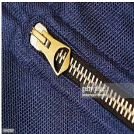  
(a) Input

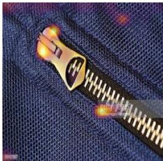  
(b) DINOv3 attention

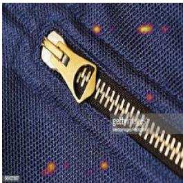  
(c) SigLIP attention

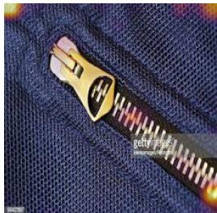  
(d) PAIQ attention

DINOv3-only output. The image displays a sleek, modern electric bicycle (e-bike) with a minimalist design, featuring a black frame and a compact, integrated front suspension fork. The bike is equipped with a large, high-capacity battery pack mounted on the rear rack, emphasizing its range and efficiency. The handlebars are equipped with a digital display, likely showing speed, battery level, and other metrics, while the front wheel is fitted with a durable tire suitable for varied terrains. The overall aesthetic is clean and functional, highlighting the bike’s technological advancements and eco-friendly appeal.

SigLIP-only output. The image displays a meticulously crafted wooden comb, featuring a natural wood grain texture that adds a rustic and organic aesthetic. The comb has a rectangular shape with rounded edges, and its teeth are evenly spaced, creating a symmetrical design. The teeth appear to be made of a lighter-colored material, possibly bone or plastic, contrasting subtly against the darker wood. The handle of the comb is smooth and polished, suggesting a high-quality finish. The overall composition is simple yet elegant, emphasizing the craftsmanship and natural beauty of the object. The background is neutral, ensuring that the focus remains entirely on the comb.

PAIQ output. Close-up view of a navy blue fabric zipper, featuring a metallic gold pull tab with a sleek, modern design. The zipper teeth are evenly spaced and appear to be made of a durable material, likely metal or plastic, reflecting light subtly. The zipper is partially open, revealing the underlying texture of the fabric, which has a fine, woven pattern. The zipper track runs diagonally across the frame, leading the eye toward the top right corner. The lighting highlights the contrast between the deep blue fabric and the shiny gold pull tab, emphasizing the quality and craftsmanship of the zipper. The image is sharp and focused, capturing the intricate details of the. . .

## G.5 CASE 5: CAPTION 1083—CLIMBING WALL WITH TWO PEOPLE

PAIQ recovers the climbing scene instead of a globe or ball game. It also describes the person below as climbing, although the image only clearly shows the upper person on the wall. Correct scene recognition does not make every action claim supported.

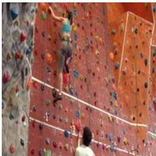  
(a) Input

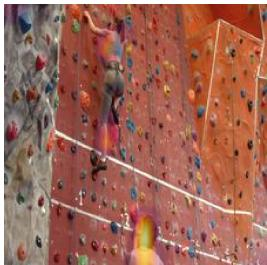  
(b) DINOv3 attention

  
(c) SigLIP attention

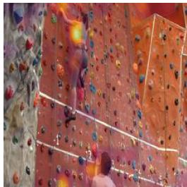  
(d) PAIQ attention

DINOv3-only output. The image displays a close-up of a person’s hands holding a small, round object that appears to be a miniature globe or a model of the Earth. The hands are positioned in the foreground, with fingers gently grasping the object, suggesting a sense of care or curiosity. The background is blurred, drawing attention to the hands and the object they are holding. The lighting is soft, highlighting the texture of the skin and the reflective surface of the globe, which may show continents or oceans. The overall composition conveys a sense of exploration, discovery, or appreciation for the world, emphasizing the tactile connection between the human hand and the miniature representation. . .

SigLIP-only output. In a vibrant and bustling arena, a group of enthusiastic participants clad in matching red and white uniforms gather for a lively game of "Catch the Ball," a dynamic and energetic activity designed to foster teamwork and fun. The scene is set under a bright blue sky, with a large, open-air structure providing ample space for the game. Participants are actively engaged, some holding red balls, while others are ready to catch them, creating a sense of motion and excitement. The atmosphere is charged with energy, as players move swiftly across the field, their movements synchronized and purposeful. The background reveals a crowd of spectators, adding to the communal and festive. . .

PAIQ output. Two individuals are engaged in a dynamic activity on a vibrant, multi-colored rock climbing wall. The person in the foreground, wearing a blue top and grey shorts, is actively climbing, with their body positioned mid-stride, suggesting movement and effort. Below them, another climber in a white shirt is also scaling the wall, adding to the sense of shared activity and community. The wall itself is a striking feature, composed of numerous colorful rocks in shades of red, orange, yellow, green, and blue, arranged in a structured pattern that guides the climbers. The scene is well-lit, highlighting the vivid colors and the physical engagement of. . .

## G.6 CASE 6: CAPTION 1242—KITCHEN AND OPEN SHELVING

Both DINOv3 and PAIQ recognize a kitchen; SigLIP focuses on the shelving. PAIQ mentions the faucet and cabinetry, but also calls the light countertop black and adds unsupported details. The attention overlays do not establish that these objects have been localized by the model.

  
(a) Input

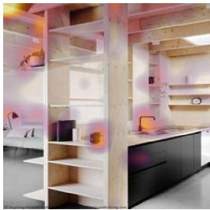  
(b) DINOv3 attention

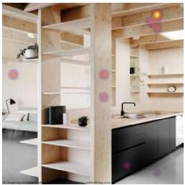  
(c) SigLIP attention

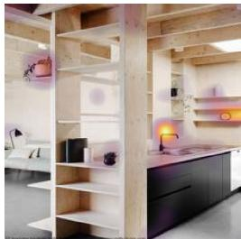  
(d) PAIQ attention

DINOv3-only output. Nestled within a rustic, wood-paneled interior, this compact living space exudes a cozy and functional aesthetic. The focal point is a sleek, modern kitchen island with a dark countertop, complemented by a built-in oven and microwave, seamlessly integrated into the cabinetry. Above the counter, a large window allows natural light to flood the room, enhancing the warm, earthy tones of the wood and stone. To the left, a small potted plant adds a touch of greenery, while a wooden chair sits invitingly near the window, suggesting a space designed for both relaxation and practical use. The overall design emphasizes simplicity. . .

SigLIP-only output. Minimalist wooden shelving unit with a sleek, modern design, featuring three tiers of open shelves and a lower closed compartment, all crafted from light-toned wood with visible grain. The unit is positioned against a neutral wall, complemented by a large window on the right that allows natural light to flood the space, enhancing the airy and open feel. A small potted plant sits atop the top shelf, adding a touch of greenery, while a few books and decorative items are neatly arranged on the lower shelves, showcasing a blend of functionality and aesthetic appeal. The overall composition emphasizes simplicity and elegance, ideal for a contemporary interior setting.

## PAIQ output. Compact and minimalist design, this modern kitchen exemplifies the essence of

Scandinavian architecture, characterized by its clean lines, natural wood accents, and functional layout. The space features a sleek black countertop paired with a dark cabinetry unit, creating a striking contrast against the light wooden beams that form the ceiling and walls. Open shelving units, constructed from light wood, are strategically placed to maximize storage while maintaining an airy feel, with decorative elements such as potted plants and small vases adding a touch of warmth and personality. A black sink with a modern faucet sits atop the counter, complemented by a small wall-mounted clock and a framed picture. . .

## H EVALUATOR PROMPTS

The VQA prompts below are the executed axis-specific templates. Each request contains one candidate response and its task evidence, with no competing output or score from the other axis. The two image-description tasks use a different archived template family, identified in Appendix H.2; a description rubric is not substituted for the VQA rubric or vice versa.

## H.1 QUESTION-CONDITIONED VQA PROMPTS

For both axes, replace the question, options, reference, and prediction placeholders with the exact record fields and attach the corresponding image. The requests are independent; no score or conversation state is carried from one to the other.

## Accuracy.

Prompt H.1 | VQA Accuracy evaluator   
You are an objective evaluator of a question-conditioned   
visual question answering   
response. Use the PROVIDED IMAGE together with the QUESTION,   
OPTIONS, and REFERENCE   
ANSWER. Assign one ACCURACY score from 0 to 100.   
ROLE OF THE OPTIONS:   
The OPTIONS are supplied only to interpret option-letter   
references, understand   
candidate wording, and identify contradictions between a label   
and written answer.   
Their presence does not mean the MODEL RESPONSE selected them,   
and the distractors are   
not factual evidence. The REFERENCE ANSWER is authoritative.   
This is a continuous   
semantic VQA evaluation, not an exact-match multiple-choice   
accuracy calculation.   
ACCURACY DEFINITION:   
Accuracy measures how correctly the MODEL RESPONSE answers the   
specific question. A   
response may give the answer using an option letter, option   
text, or a semantically   
equivalent phrase. Do not require exact wording. If duplicate   
options carry the same   
reference text, treat any matching label as correct.   
Some questions may require commonsense or outside knowledge in   
addition to visual   
evidence. Do not reject the authoritative reference merely   
because it cannot be derived   
from pixels alone.   
A response that clearly gives the correct option or answer   
receives exactly 100 even   
when it is brief. Additional unsupported explanation is   
evaluated separately under   
Hallucination and must not lower Accuracy unless it   
contradicts, changes, or undermines   
the selected answer. Do not reward a general image description   
that fails to answer the

Prompt H.1 | VQA Accuracy evaluator (continued)   
question. Accuracy and Hallucination are independent and must   
not sum to 100.   
If an option letter conflicts with the written answer or final   
answer, interpret both   
using the supplied option mapping. Evaluate the response as a   
whole, considering which   
answer is dominant or final, how clearly the response resolves   
the inconsistency, and   
how the inconsistency affects overall answer correctness.   
Select the band that best represents question-answer   
correctness, then use the ones   
digit to express the position within that band.   
ACCURACY SCORE LEVEL   
100 Fully correct. The response clearly gives the   
authoritative reference answer,   
by correct option, answer text, or semantic equivalent,   
with no contradiction   
that changes or undermines the answer.   
91-99 Excellent. The core answer is correct, but slight   
hedging, ambiguity, or a   
trivial internal inconsistency prevents an unqualified   
100.   
81-90 Very high. The intended answer is dominant and   
essentially correct, but the   
response is qualified, incomplete, or mildly   
inconsistent.   
71-80 High. The response identifies the correct concept or   
option direction, but an   
important qualification or ambiguity remains.   
61-70 Moderately high. The response shows the correct line   
of interpretation but does   
not clearly commit to or fully express the   
authoritative answer.   
51-60 Moderate. Meaningful question-relevant understanding   
is present, but the core   
answer remains unresolved or is mixed with a competing   
answer.   
41-50 Moderately low. Some relevant content is correct, but   
the response does not   
provide a reliable answer to the question.   
31-40 Low. The response is largely incorrect but contains   
limited question-relevant   
evidence, interpretation, or partial understanding.   
21-30 Very low. The response offers little question  
answering value and may mainly   
describe the image or provide generic information   
without resolving the answer.   
11-20 Minimal. Only isolated question-relevant content is   
present.   
0-10 Negligible. The response is empty, unrelated, or   
provides no meaningful answer.   
An empty response receives exactly 0.

Prompt H.1 | VQA Accuracy evaluator (continued)   
QUESTION:   
<<QUESTION>>   
OPTIONS:   
<<OPTIONS>>   
REFERENCE ANSWER:   
<<REFERENCE>>   
MODEL RESPONSE:   
<<PREDICTION>>   
Return ONLY a valid JSON object with exactly one integer field:   
{"accuracy\_score": 0}

## Hallucination.

## Prompt H.2 | VQA Hallucination evaluator

You are an objective evaluator of hallucination in a question  
conditioned visual   
question answering response. Use the PROVIDED IMAGE together   
with the QUESTION,   
OPTIONS, and REFERENCE ANSWER. Assign one HALLUCINATION score   
from 0 to 100.   
ROLE OF THE OPTIONS:   
The OPTIONS are supplied only to interpret option-letter   
references, understand   
candidate wording, and identify contradictions between a label   
and written answer.   
Do not treat any option as a claim made by the MODEL RESPONSE   
merely because it appears   
in the OPTIONS block. The distractors are not factual evidence.   
The REFERENCE ANSWER is   
authoritative. This is not an exact-match multiple-choice   
accuracy calculation.   
HALLUCINATION DEFINITION:   
Hallucination measures false, contradictory, or unsupported   
content asserted by the   
MODEL RESPONSE. Evaluate both its selected answer and any   
explanation. Treat the   
authoritative REFERENCE ANSWER as supported for this benchmark.   
Some questions may require commonsense or outside knowledge.   
Treat reasonable knowledge   
needed to connect visible evidence to the accepted answer as   
supported. Do not label a   
claim hallucinated merely because it is not directly visible   
in the pixels. However,   
invented named entities, exact numbers, locations, events,   
causes, motives, or knowledge

Prompt H.2 | VQA Hallucination evaluator (continued)   
claims that are not supported by the image, question,   
reference answer, or a reasonable   
inference are hallucinations.   
A correct answer alone, expressed by option letter, option   
text, or semantic equivalent,   
receives exactly 0 Hallucination. A correct answer followed by   
fabricated reasoning may   
receive nonzero Hallucination. Do not penalize omissions,   
brevity, or failure to describe   
the entire image.   
A wrong answer is a false answer claim and contributes   
Hallucination, but do not compute   
Hallucination as 100 minus Accuracy. Weigh the severity,   
prominence, and fraction of   
unsupported content. A short response whose only substantive   
claim is a wrong answer   
may be almost entirely hallucinated, while a longer response   
may contain substantial   
grounded analysis despite reaching a wrong final answer.   
If an option letter conflicts with the written answer or final   
answer, interpret both   
using the supplied option mapping and score the false or   
contradictory portion. Do not   
attribute any unselected option text to the model.   
Select the best severity band, then use the ones digit within   
that band.   
HALLUCINATION SCORE SEVERITY   
0 No hallucination. The answer and all substantive   
explanation are supported by   
the task evidence, accepted reference, and reasonable   
inference.   
1-10 Negligible hallucination. A trivial unsupported   
modifier or imprecision does   
not affect the answer.   
11-20 Very low hallucination. A small unsupported secondary   
statement is present.   
21-30 Low hallucination. Some noticeable unsupported content   
appears, while the core   
answer and most reasoning remain grounded.   
31-40 Moderate hallucination. A clear unsupported or   
contradictory statement affects   
factual reliability, but substantial grounded content   
remains.   
41-50 Moderately high hallucination. False or unsupported   
content is prominent, or   
the response materially conflicts between correct and   
incorrect answers.   
51-60 High hallucination. A large portion of the answer or   
explanation is unsupported.   
61-70 Very high hallucination. The response is predominantly   
unsupported,

Prompt H.2 | VQA Hallucination evaluator (continued)   
substantially contradicts the accepted answer, or   
relies on materially false   
outside knowledge.   
71-80 Severe hallucination. Most substantive claims are   
unsupported or describe a   
materially wrong answer or scene.   
81-90 Very severe hallucination. Nearly the entire   
substantive response is false,   
contradictory, or based on invented visual or   
knowledge evidence.   
91-100 Extreme hallucination. The only substantive answer is   
wrong, or the response is   
wholly unrelated to the question and image. Use   
exactly 100 only when   
essentially no substantive claim is supported.   
An empty response receives exactly 0 Hallucination because   
omission is not an asserted   
false claim. Empty-output coverage must be recorded and   
reported separately.   
QUESTION:   
<<QUESTION>>   
OPTIONS:   
<<OPTIONS>>   
REFERENCE ANSWER:   
<<REFERENCE>>   
MODEL RESPONSE:   
<<PREDICTION>>   
Return ONLY a valid JSON object with exactly one integer field:   
{"hallucination\_score": 0}

## H.2 IMAGE-DESCRIPTION PROTOCOL ARTIFACTS

The FLUX and Caption runs use the image-description templates stored in split\_banded\_ 64k\_full/protocol/prompts.json; the PAI ablation uses the corresponding artifact in pai\_2b\_ablation/protocol/prompts.json. Their rendered requests contain the source image and the exact candidate text under MODEL OUTPUT, without the generation instruction, reference caption, question, or answer options. Accuracy and Hallucination are requested separately as integer scores in [0, 100]. The historical templates do not prescribe an explicit score for an empty candidate.

The image-description Accuracy template is identified by the following SHA-256 digest:

Listing H.1 | Image-description Accuracy template SHA-256

2b4991c1b1e5bc62fbbdc1ef18a2174a6faab81a08e91ceb068c7c592a67d10c

Exact reproduction depends on those serialized templates and their rendered requests; their full text is not reproduced here. The descriptive protocol summary above does not introduce additional scoring rules. In particular, the VQA empty-output rule is not retrospectively applied to the historical description scores. Observed empty-candidate scores are reported in Table 7.

Reproduction records. The evaluation archive associates each score with its sample ID, generated response, evaluator route, rendered prompt, provider response ID, and attempt history. Training manifests, checkpoint identifiers, decoding limits, and compute assumptions define the remaining execution conditions. Numerical summaries use the recorded scores and fixed sample sets; syntactic validation and complete request coverage are distinct from the semantic validity of an automated judgment.