# Parameterized Stripe Attention for Efficient Video Generation

Xingyu Jia, Baole Ai, Ang Wang, Kang Zhao, Yong Li Alibaba Group

## Abstract

Diffusion Transformers (DiTs) enable high-quality video generation but suffer from substantial inference latency, primarily attributable to the computationally expensive full spatio-temporal attention. While sparse attention methods offer potential solutions, existing approaches face an inherent flexibility–efficiency dilemma: predefined masks lack the flexibility to capture diverse attention patterns, while runtime-determined masks introduce overheads and sacrifice hardware efficiency. We identify the lack of a unified structural characterization of DiT attention as a key limitation of existing methods, and establish that video DiT attention exhibits periodic diagonal stripe structures along both temporal and spatial dimensions. To formally encode these structured patterns within a single efficient kernel, we present PSA, a parameterized stripe attention that formalizes the observed stripe regularity, unifying diverse attention patterns for efficient mask generation. This unified representation enables a single hardware-efficient CUDA kernel to process all sparse patterns, achieving FlashAttention-3-level Model FLOPs Utilization. To determine optimal sparsity configurations, we propose a training-free offline search algorithm that automatically maximizes sparsity under a specified error tolerance for each attention head. Experiments on HunyuanVideo and Wan 2.1 demonstrate that PSA achieves 1.57× and 1.37× end-to-end speedups over FlashAttention-3 baselines, with acceptable visual quality degradation.

## 1 Introduction

Diffusion Transformers (DiTs) [18] have rapidly emerged as a foundational architecture for image and video generation. DiTs employ Transformers [24] as the backbone and leverage algorithms such as Diffusion [20, 14, 15, 18] or Flow Matching [11, 5] to iteratively generate images and videos from noise. Prominent open-source models such as Wan 2.1 [25] and HunyuanVideo [8] leverage the DiT architecture for tasks like text-to-video and image-to-video synthesis, producing high-quality, highly dynamic video content. However, DiT inference requires multi-step denoising with enormous computational costs and prolonged latency. For instance, generating a 5-second, 720p video with Wan 2.1 on an NVIDIA H100 GPU takes nearly 30 minutes [25], severely limiting practical applications. Since these models utilize full spatio-temporal 3D attention [32], the attention computation constitutes the primary bottleneck, accounting for over 60% [8] of the total inference time. Consequently, designing more efficient attention mechanisms is a critical optimization target. Sparse attention—selectively computing only the most informative token interactions—offers a promising avenue, provided the attention distribution exhibits exploitable structure.

Existing sparse attention methods for DiTs lack a principled structural characterization of attention distributions, leading to an inherent trade-off between flexibility and efficiency. The first category relies on predefined masks designed from empirical observations rather than principled analysis. SVG [28] identifies only two fixed patterns—temporal and spatial heads—without analyzing why only these two arise or where the observed periodicity originates; consequently, it cannot capture the diverse stride, offset, and hybrid patterns revealed by our analysis. STA [35] achieves efficient local computation via tile-wise sliding windows, but assumes only local attention and cannot represent long-range, strided, or hybrid structures as shown in fig. 1. Because these methods are not grounded in a comprehensive characterization of attention patterns, their fixed masks inevitably fail to cover the full diversity of sparse structures. The second category pursues more flexible pattern representations by determining the sparse mask dynamically at runtime, effectively treating attention distributions as arbitrary. For example, SVG2 [31] clusters Q and K tokens separately to enable flexible sparse patterns, overlooking the structural regularity revealed by our analysis. This abandonment of structure comes at a cost: the irregular cluster-based kernel’s reliance on FlashInfer [33] precludes Tensor Memory Accelerator (TMA) utilization and introduces non-trivial padding overhead (∼20% at 70% sparsity) despite token permutation; and the clustering procedure itself incurs additional computational cost (∼10% at 70% sparsity). Consequently, the flexibility–efficiency trade-off in existing methods stems from the lack of a principled, unified framework to characterize sparse attention: methods with fixed masks fail to cover the full diversity of DiT-specific sparse structures, while methods pursuing flexibility sacrifice efficiency by treating attention distributions as arbitrary rather than structured. This motivates the need for a more mechanistic understanding of DiT attention patterns that can support both broad pattern coverage and high-performance implementation.

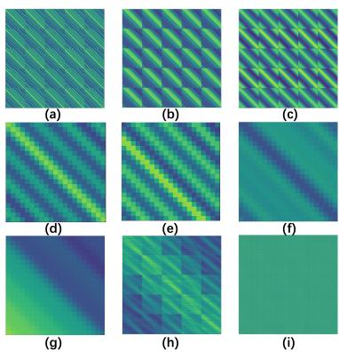  
Figure 1: Heat maps in Wan 2.1 and HunyuanVideo.

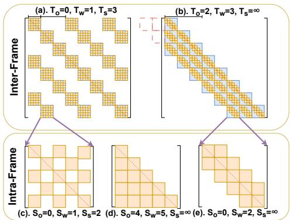  
Figure 2: Visualization of the PSA parameterization that captures various attention sparse patterns.

Concretely, sparse attention for video DiTs involves three main challenges: (1) A principled characterization of the DiT attention structure space is needed, providing a unified and sufficiently expressive description of the diverse sparse patterns that emerge across heads, layers, and denoising timesteps. (2) A hardware-aware implementation must be developed that supports various mask configurations while maximizing GPU utilization. (3) An efficient search method is required to determine per-head sparse configurations without incurring additional inference-time overhead.

To address these challenges, we propose PSA, a parameterized stripe sparse attention framework. First, we reveal that video DiT attention exhibits periodic diagonal stripe structures along both temporal and spatial dimensions, through theoretical derivation (via RoPE-3D logit decomposition and video spatio-temporal redundancy) and large-scale empirical validation across all attention heads in HunyuanVideo and Wan 2.1 (fig. 1), identifying four primary patterns: intra-frame, inter-frame, hybrid, and uniform (see section 3.1 for details). Second, based on this structural understanding, we design a parameterized mask $\mathcal { M } ( T _ { w } , T _ { o } , T _ { s } , S _ { w } , S _ { o } , S _ { s } )$ that provides a unified representation of periodic stripe sparse patterns across attention heads, with quantitative evaluation demonstrating high-fidelity approximation of full attention outputs (average cosine similarity of 0.9831). Leveraging this unified representation, we support different patterns with a single kernel, eliminating multi-kernel launch overhead. Our implementation adopts block-wise partitioning as the fundamental granularity to fully exploit modern GPU hardware resources, achieving 61% Model FLOPs Utilization (MFU) on HunyuanVideo—close to FlashAttention-3 levels—thereby resolving the flexibility–efficiency tension. Finally, observing strong similarity in attention masks across different prompts, we design an offline parallel search algorithm that requires no training and introduces no runtime search overhead, assigning the mask with the highest sparsity to each head while maintaining error bounds. Our parametric pattern representation and offline search achieve both objectives: head-adapted patterns are determined prior to inference, thereby eliminating runtime overhead while preserving adaptability. We validate our method on HunyuanVideo and Wan 2.1, achieving 1.57× and 1.37× end-to-end speedups over FlashAttention-3, respectively, with acceptable quality degradation (PSNR > 23). In summary, our main contributions are as follows.

1. We reveal that video DiT attention exhibits periodic diagonal stripe structures along both temporal and spatial dimensions, and provide both theoretical derivation and large-scale empirical validation to establish this structural property.

2. We propose a parameterized mask $\mathcal { M } ( T _ { w } , T _ { o } , T _ { s } , S _ { w } , S _ { o } , S _ { s } )$ that unifies diverse sparse patterns, enabling a single hardware-efficient CUDA kernel to process all supported patterns with FlashAttention-3-level MFU, resolving the flexibility–efficiency tension. We further introduce 3D-padding to support arbitrary video resolutions with minimal overhead (≈5% for 720p).

3. We develop a training-free offline search algorithm that maximizes sparsity under a constrained error threshold for each attention head, with support for distributed parallel search to accelerate the process.

4. The PSA achieves substantial acceleration without compromising effectiveness, outperforming state-of-the-art methods such as SVG2 and STA in both accuracy and efficiency.

## 2 Related Work

Attention mechanisms are pivotal to the success of Transformers [24], yet their quadratic complexity poses a fundamental efficiency bottleneck. Existing efficient attention methods for video generation primarily construct sparse masks by exploiting the distributional characteristics of attention heatmaps, falling into two paradigms. The first paradigm relies on predefined sparse mask formats. SVG [28] classifies attention heads into spatial and temporal types and employs online profiling to generate sparse masks. VORTA [23] trains a lightweight router to dynamically select among full attention, sliding window, and coreset attention patterns. Sparse-vDiT [3] selects from a set of predefined structural patterns, including diagonal, multi-diagonal, and vertical-stripe sparsity. Additionally, other window-based attention methods exploit the locality of attention. NATTEN [6] implements sliding window attention for vision tasks, localizing self-attention to nearest neighborhoods. STA [35] employs tile-wise window attention for improved memory access and parallelism. The second paradigm determines sparse masks dynamically during inference based on attention scores. VMoBA [27] extends Moba [16] to adapt spatio-temporal attention within DiTs. MOD-DiT [12] avoids the sampling overhead of runtime mask determination by linearly extrapolating pattern intensities from early denoising steps. RoPeSLR [13] combines block-sparse attention with a trained low-rank compensator to restore dropped background contributions. SVG2 [31] improves efficiency through k-means clustering of Q and K vectors, followed by token permutation and top-k cluster selection to identify the most relevant attention regions.

However, existing methods suffer from notable limitations: predefined pattern approaches are constrained by a limited pattern set, while dynamic mask generation leads to non-trivial overhead and poor efficiency, yielding limited speedup over optimized dense implementations such as FlashAttention [4, 19]. In contrast, PSA uniformly parameterizes diverse sparse patterns with hardware-aware kernels, achieving superior flexibility and efficiency.

## 3 Method

## 3.1 Structural Analysis of Attention Patterns

We begin by formally characterizing the structural properties of attention maps in video DiTs, aiming to move beyond empirical observation toward a mechanistic understanding of the patterns governing these distributions. Our analysis reveals that attention in video DiTs is neither arbitrary nor purely local; rather, it consistently manifests as periodic diagonal stripe structures, parameterized by their widths, offsets, and strides. We verify this structural analysis through a comprehensive examination of attention maps in HunyuanVideo and Wan 2.1, identifying four primary attention patterns as shown in fig. 1:

1. Intra-frame [Fig. (a)–(c)]: diagonal stripes with varying widths, offsets, and strides within each frame, repeating identically across frames.

2. Inter-frame [Fig. (d)–(g)]: relatively uniform intra-frame weights, with diagonal band structures of varying widths, offsets, and strides emerging between frames.

3. Hybrid [Fig. (h)]: a combination of intra-frame and inter-frame patterns.

4. Uniform [Fig. (i)]: attention weights uniformly distributed across all positions.

We show that this structure arises from two complementary properties: (1) video spatio-temporal redundancy, which concentrates high attention scores within local neighborhoods, and (2) RoPE-3D cosine periodicity, which causes attention scores to repeat at axis-dependent intervals.

Property 1: Video spatio-temporal redundancy. Videos exhibit rich spatio-temporal redundancy at multiple scales [17, 26]. Since attention is the only component in a DiT block that computes pairwise token interactions, this redundancy is directly reflected in the attention score matrix A. Concretely, fixing any two axes and varying the third, high attention scores concentrate within locality radii $\varepsilon _ { t }$ $\varepsilon _ { h } , \varepsilon _ { w }$ along the temporal, height, and width axes, respectively:

$$
| \Delta t | < \varepsilon _ { t } ( h , w \mathrm { ~ f i x e d } ) , | \Delta h | < \varepsilon _ { h } ( t , w \mathrm { ~ f i x e d } ) , | \Delta w | < \varepsilon _ { w } ( t , h \mathrm { ~ f i x e d } ) ,\tag{1}
$$

where $\Delta t = t - t ^ { \prime } , \Delta h = h - h ^ { \prime } , \Delta w = w - w ^ { \prime }$ denote relative offsets along each axis. In the 2D heatmap, the locality conditions in eq. (1) concentrate high attention along diagonal bands—forming the stripe width $\left( \varepsilon _ { t } \right.$ inter-frame, $\varepsilon _ { w }$ intra-frame)—while column-wise locality $( \varepsilon _ { h } )$ produces multiple parallel diagonals with layout-determined stride (see Appendix D).

Property 2: RoPE-3D cosine periodicity. We show that RoPE-3D [22, 8, 25] introduces structured periodicity by partitioning embedding channels into three disjoint subsets $M _ { t } , M _ { h } , M _ { w }$ encoding temporal, height, and width positions. For query $q _ { i }$ at position $( t , h , w )$ and key $k _ { j }$ at $( t ^ { \prime } , h ^ { \prime } , w ^ { \prime } )$ , the attention logit decomposes as

$$
\begin{array} { r l } { a _ { ( t , h , w ) , ( t ^ { \prime } , h ^ { \prime } , w ^ { \prime } ) } = \displaystyle \sum _ { m \in M _ { t } } \| q _ { i } ^ { ( m ) } \| \left\| k _ { j } ^ { ( m ) } \right\| \cos \Bigl ( \phi ^ { ( m ) } + \left( t - t ^ { \prime } \right) \theta _ { m } \Bigr ) } & { } \\ { + \displaystyle \sum _ { m \in M _ { h } } \| q _ { i } ^ { ( m ) } \| \left\| k _ { j } ^ { ( m ) } \right\| \cos \Bigl ( \phi ^ { ( m ) } + \left( h - h ^ { \prime } \right) \theta _ { m } \Bigr ) } & { } \\ { + \displaystyle \sum _ { m \in M _ { w } } \left\| q _ { i } ^ { ( m ) } \right\| \left\| k _ { j } ^ { ( m ) } \right\| \cos \Bigl ( \phi ^ { ( m ) } + \left( w - w ^ { \prime } \right) \theta _ { m } \Bigr ) , } \end{array}\tag{2}
$$

where $q _ { i } ^ { ( m ) } , k _ { j } ^ { ( m ) } \in \mathbb { R } ^ { 2 }$ are the content query and key slices for channel $m ; \phi ^ { ( m ) }$ is the angle between $q _ { i } ^ { ( m ) }$ and $k _ { j } ^ { ( m ) }$ ; and $\theta _ { m } = c ^ { - 2 m / d }$ is the angular frequency of channel $m _ { : }$ , with d the total embedding dimension and c the RoPE base. The periodicity becomes most pronounced when a single channel dominates its group [30]. Suppose a single channel $m _ { \lambda } ^ { * } \in M _ { \lambda }$ dominates its group, i.e.,

$$
\Big \| q _ { i } ^ { ( m _ { \lambda } ^ { * } ) } \big \| \Big \| k _ { j } ^ { ( m _ { \lambda } ^ { * } ) } \Big \| \gg \Big \| q _ { i } ^ { ( m ) } \Big \| \Big \| k _ { j } ^ { ( m ) } \Big \| \forall m \in M _ { \lambda } , m \neq m _ { \lambda } ^ { * } .\tag{3}
$$

We empirically verify this dominance assumption on Wan 2.1, where 87.55% of attention heads exhibit a dominant channel (see Appendix E for details). Then the contribution of group $\lambda \in \{ t , h , w \}$ to eq. (2) reduces to a single cosine term. Taking $\lambda = t$ as a representative example,

$$
a _ { ( t , h , w ) , ( t ^ { \prime } , h ^ { \prime } , w ^ { \prime } ) } \approx \big \| q _ { i } ^ { ( m _ { t } ^ { * } ) } \big \| \big \| k _ { j } ^ { ( m _ { t } ^ { * } ) } \big \| \cos \Big ( \phi ^ { ( m _ { t } ^ { * } ) } + ( t - t ^ { \prime } ) \theta _ { m _ { t } ^ { * } } \Big ) ,\tag{4}
$$

and analogously for $\lambda \in \{ h , w \}$ with $\left( t - t ^ { \prime } \right)$ replaced by $\left( h - h ^ { \prime } \right)$ or $( w - w ^ { \prime } )$ , respectively. The logit is thus a cosine of the relative offset along axis $\lambda ,$ yielding an axis-wise attention period of

$$
\begin{array} { l } { \displaystyle { \mathcal { T } _ { \lambda } ~ = ~ \frac { 2 \pi } { \theta _ { m _ { \lambda } ^ { * } } } ~ = ~ 2 \pi c ^ { 2 m _ { \lambda } ^ { * } / d } , \qquad \lambda \in \{ t , h , w \} . } } \end{array}\tag{5}
$$

In the heatmap visualization, this cosine periodicity means that high attention weights recur at fixed intervals $ \tau _ { \lambda } -$ producing the stride of the observed stripes. Moreover, the content-dependent phase $\phi ^ { ( m _ { \lambda } ^ { * } ) }$ can shift the cosine peak away from the main diagonal, producing the offset.

Joint effect. When A is visualized as a 2D heatmap under the flattened 1D token ordering, the two properties identified above—video redundancy and axis-wise cosine periodicity—jointly produce the observed periodic diagonal stripes: (1) Inter-frame stripes are driven by temporal locality in eq. (1): the stripe width is governed by $\varepsilon _ { t } ,$ and the stripe period is governed by $\mathcal { T } _ { t } . ( \dot { 2 } )$ Intra-frame stripes are driven by spatial locality within each frame block: the stripe width is governed by $\varepsilon _ { w }$ (row-wise locality), and the stripe period is governed by $\mathcal { T } _ { h }$ and $\mathcal { T } _ { w } \left( \mathrm { e q . } \left( 5 \right) \right)$ , with column-wise locality $( \varepsilon _ { h } )$ inducing repeated off-diagonals at intervals of W under row-major flattening.

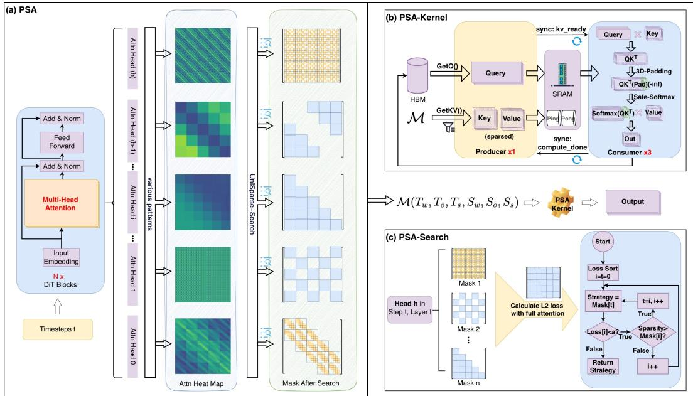  
Figure 3: An overview of the PSA framework. (a) Unified Representation: The parametric model M captures diverse per-head sparse attention patterns, covering both intra-frame and inter-frame structures with varying widths, offsets, and strides. (b) Efficient Kernel: A dedicated CUDA kernel enables high-performance, hardware-aware computation across all supported sparse patterns. (c) Automatic Search: PSA-Search automatically identifies the optimal sparse configuration for each head by maximizing sparsity subject to a predefined output degradation threshold.

## 3.2 Efficient and Flexible Kernel

Unified Representation. To efficiently encode the sparse diagonal-stripe patterns identified above and enable a single, hardware-efficient kernel, we propose a parametric formulation $\mathcal { M } ( T _ { w } , T _ { o } , T _ { s } , S _ { w } , S _ { o } , S _ { s } )$ , where six integer parameters govern inter-frame and intra-frame diagonal bands via their widths, offsets, and strides, respectively, as illustrated in fig. 2. SVG and STA are special cases: SVG corresponds to $\mathcal { M } ( T _ { w } , 0 , \bar { \infty } , S _ { w } , \bar { 0 } , \infty )$ , and STA’s sliding window to $\mathcal { M } ( T _ { w } , 0 , \bar { \infty } , S _ { w } , 0 , S _ { s } )$ , where $T _ { s } = \infty \mathrm { o r } S _ { s } = \infty$ reduces the corresponding axis to a single diagonal. These restricted configurations fail to capture multi-diagonal, hybrid, and uniform patterns, which account for over 60% of attention heads in HunyuanVideo and Wan 2.1. Our formulation expresses all four observed patterns (see fig. 3 (a)), achieving an average cosine similarity of 0.9831 with full attention across all heads. To generate attention masks, we devise the generation algorithm (algorithm 1). Given an input sequence of length $L = T \times H \times W$ , the mask generation algorithm permits an attention connection between query $q _ { i }$ and key $k _ { j }$ only when both the inter-frame and intra-frame conditions of M are satisfied.

Hardware-Aware Design. Our kernel design targets maximum computational efficiency on modern GPUs by ensuring full utilization of every scheduled thread block, eliminating idle compute units [35]. To this end, we introduce a fundamental computational abstraction called PSABlock, which represents the minimum data granularity necessary to fully saturate the resources of a single streaming multiprocessor (SM). Notably, PSABlock also aligns with the block-wise characteristics observed in the attention heatmaps (fig. 1), enabling the mask to operate naturally at this granularity. Since PSABlock is the minimum computable unit, PSA applies masking at PSABlock granularity rather than individual tokens. For video tokens organized in 3D structure, a PSABlock comprises constituent blocks along temporal, height, and width dimensions: PSABlock = PSABlock × PSABlock × PSABlock .

High-Performance Kernel. We develop a high-performance CUDA kernel, PSA-Kernel, specifically optimized for the PSA framework on the NVIDIA Hopper GPU architecture. Built upon the ThunderKittens [21] library, PSA-Kernel draws inspiration from its highly efficient FlashAttention-3 pipeline design, as illustrated in fig. 3 (b).

Algorithm 1 PSA Mask Definition   
Input: Q index i, K index $j ,$ Parameters $\mathcal { M } ( T _ { w } , T _ { o } , T _ { s } , S _ { w } , S _ { o } , S _ { s } )$   
Output: Boolean indicating if $q _ { i }$ attends to $k _ { j }$   
1: function ISATTENDING(i, j, M)   
2: $( t _ { q } , s _ { q } ) \gets ( \lfloor i / ( H \cdot W ) \rfloor , i \% ( H \cdot W ) )$   
3: $( t _ { k } , s _ { k } ) \gets ( \bar { \lfloor } j / ( H \cdot W ) \bar { \rfloor } , j \% ( H \cdot W ) )$   
4: $\Delta _ { t } \gets t _ { k } - t _ { q }$ ▷ inter-frame distance   
5: inter\_frame\_cond $ ( ( | \Delta _ { t } - T _ { o } | )$ mod $T _ { s } ) \le T _ { w } - 1$   
6: if not inter\_frame\_cond then   
7: return false   
8: end if   
9: $\Delta _ { s } \gets s _ { k } - s _ { q }$ ▷ intra-frame distance   
10: intra\_frame\_cond $ ( ( | \Delta _ { s } - S _ { o } | )$ mod $S _ { s } ) \leq S _ { w } - 1$   
11: return intra\_frame\_cond   
12: end function

The key challenge lies in maintaining high computational efficiency across diverse sparse patterns. We address this through two synergistic mechanisms. First, we reorganize the $Q , K , { \bar { V } }$ data layout from the standard $( T , \bar { H } , W )$ format to a PSABlock-centric arrangement: $( T ^ { \prime } , H ^ { \prime } , W ^ { \prime } , P S A B l o c k _ { t }$ $P S A B l o c k _ { h } , P S \dot { A } B l o c k _ { w } )$ ), where $( T ^ { \prime } , H ^ { \prime } , W ^ { \prime } )$ denotes the grid of PSABlocks. This transformation ensures contiguous memory placement within each PSABlock, enabling coalesced memory accesses—a prerequisite for the efficient kernel design that follows. Second, building on this layout, our kernel achieves FA3-level efficiency while supporting flexible masks as shown in fig. 3(b). A dedicated producer warpgroup guided by the mask logic (algorithm 1) identifies required K, V PSABlocks and asynchronously prefetches them into on-chip SRAM via TMA-driven ping-pong buffering. Concurrently, consumer warpgroups perform dense attention computations at PSABlock granularity using resident Q and prefetched K, V data. This decoupling of data movement and computation enables hardware-optimized dense operations, maximizing GPU utilization even under sparse attention patterns.

3D-Padding for Resolution Flexibility. The block-aligned computation described above requires that the token dimensions (T, H, W) be divisible by the corresponding PSABlock tile sizes $( P S A B l o c k _ { t }$ PSABlock<sub>h</sub>, PSABlock<sub>w</sub>). To support arbitrary video resolutions, we employ 3D-padding: each dimension is minimally padded to the smallest multiple of its corresponding PSABlock size, i.e., $T ^ { \prime } = \lceil T / P S A B l o c k _ { t } \rceil \ \cdot P S A B l o c k _ { t } .$ , ensuring alignment without restricting input geometry. This design enables support for arbitrary video resolutions with minimal computational overhead. For instance, at 720p resolution, padding the height dimension (H) from 45 to 48 tokens during the last 80% of generation steps incurs only 5% overhead $( \mathrm { O v e r h e a d } = p _ { \mathrm { s t e p s } } \times r _ { \mathrm { p a d d i n g } } .$ , where $p _ { \mathrm { s t e p s } }$ denotes the proportion of steps requiring padding and $r _ { \mathrm { p a d d i n g } }$ represents the relative padding ratio).

## 3.3 Automatic and Efficient Sparsity Discovery

A central challenge in applying the PSA representation is assigning an optimal mask configuration M to each attention head. We address this with PSA-Search, an automatic search algorithm grounded in a key empirical observation: attention patterns in DiT models vary significantly across timesteps, layers, and heads, yet remain remarkably stable with respect to input prompts [3] (see fig. 4 and Appendix G). This prompt-invariance enables an offline search strategy—optimal sparse configurations can be identified once using a representative dataset and subsequently applied to all future inferences, introducing no runtime overhead.

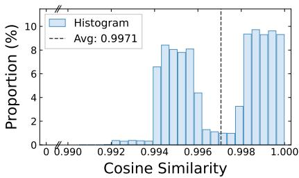  
Figure 4: Evaluation of the similarity of attention heatmaps across all 11 evaluation dimensions of VBench, where prompts 1–99 are compared against prompt 0 at the same head positions within a search space of 100 (timesteps) × 40 (layers) × 40 (heads).

The PSA-Search algorithm operates on a per-head basis, as illustrated in fig. 3 (c). For each attention head, the algorithm iterates through a predefined search space of candidate sparse configurations. Given a user-defined $L _ { 2 }$ loss threshold $\alpha ,$ the search first identifies all candidate masks satisfying this quality constraint $( \mathrm { i . e . , } L _ { 2 } \leq \alpha )$ , where the $L _ { 2 }$ loss is computed between the outputs of the sparse attention and the full attention. Among these qualified candidates, PSA-Search selects the mask achieving maximum sparsity. Furthermore, PSA-Search supports a dual-interface: users can either specify an error tolerance α to maximize sparsity, or specify a target sparsity level and obtain the corresponding mask with minimal error. To enhance search efficiency, we leverage distributed parallelization across multiple GPUs via Ulysses [7]. Searching over 100 candidate masks completes in 2.5 hours on 8 H100 GPUs, assigning each head its maximum-sparsity mask under the error constraint without the prohibitive costs of training-based methods.

Table 1: Comparative evaluation of PSA against SVG, SVG2 and STA baselines across different models. Spar denotes the average sparsity across all attention heads. “-” indicates metrics that are self-referential for the baseline.
<table><tr><td>Models</td><td>Methods</td><td>Spar (%)</td><td>E2E Speed (s)↓</td><td>OC↑</td><td>TS↑</td><td>MSE↓</td><td>PSNR↑</td><td>SSIM↑</td><td>LPIPS↓</td></tr><tr><td rowspan="5">HunyuanVideo (720×1280)</td><td>FA2</td><td>0</td><td>1793.06</td><td>26.95</td><td>24.52</td><td>1</td><td></td><td></td><td>=</td></tr><tr><td>FA3</td><td>0</td><td>1172.62 (1x)</td><td>26.95</td><td>24.52</td><td></td><td></td><td></td><td></td></tr><tr><td>SVG</td><td>56.92</td><td>906.12 (1.29x)</td><td>22.32</td><td>21.11</td><td>0.0039</td><td>24.2716</td><td>0.8686</td><td>0.3400</td></tr><tr><td>SVG2</td><td>61.92</td><td>866.10 (1.35x)</td><td>25.96</td><td>23.28</td><td>0.0016</td><td>29.6303</td><td>0.8910</td><td>0.1625</td></tr><tr><td>Ours</td><td>59.74</td><td>777.28 (1.51x)</td><td>26.00</td><td>23.63</td><td>0.0012</td><td>30.3463</td><td>0.9062</td><td>0.1523</td></tr><tr><td rowspan="6">HunyuanVideo (768×1280)</td><td>FA2</td><td>0</td><td>1684.60</td><td>26.97</td><td>24.61</td><td>=</td><td>=</td><td>=</td><td></td></tr><tr><td>FA3</td><td>0</td><td>1106.36 (1x)</td><td>26.97</td><td>24.61</td><td></td><td></td><td></td><td></td></tr><tr><td>STA</td><td>58.37</td><td>746.73 (1.48x)</td><td>26.19</td><td>23.39</td><td>0.0596</td><td>12.5239</td><td>0.6036</td><td>0.3117</td></tr><tr><td>SVG</td><td>56.98</td><td>797.57 (1.39x)</td><td>23.21</td><td>22.43</td><td>0.0053</td><td>22.9984</td><td>0.8654</td><td>0.1907</td></tr><tr><td>SVG2</td><td>63.23</td><td>773.47 (1.43x)</td><td>25.31</td><td>22.74</td><td>0.0027</td><td>25.7979</td><td>0.7855</td><td>0.2184</td></tr><tr><td>Ours</td><td>60.33</td><td>703.91 (1.57x)</td><td>26.33</td><td>23.64</td><td>0.0019</td><td>27.1983</td><td>0.8287</td><td>0.1568</td></tr><tr><td rowspan="5">Wan 2.1 14B (720×1280)</td><td>FA2</td><td>0</td><td>1873.32</td><td>25.91</td><td>23.19</td><td></td><td></td><td></td><td></td></tr><tr><td>FA3</td><td>0</td><td>1214.69 (1x)</td><td>25.91</td><td>23.19</td><td></td><td></td><td></td><td></td></tr><tr><td>SVG</td><td>58.51</td><td>944.81 (1.29x)</td><td>25.29</td><td>20.32</td><td>0.0157</td><td>18.5862</td><td>0.7056</td><td>0.2881</td></tr><tr><td>SVG2</td><td>63.40</td><td>926.78 (1.31x)</td><td>24.69</td><td>23.33</td><td>0.0051</td><td>23.4689</td><td>0.8391</td><td>0.1703</td></tr><tr><td>Ours</td><td>57.57</td><td>886.64 (1.37x)</td><td>25.29</td><td>23.59</td><td>0.0048</td><td>23.4813</td><td>0.8372</td><td>0.1601</td></tr></table>

## 4 Experiments and Results

## 4.1 Setup

Models. We evaluate two state-of-the-art text-to-video models: Wan 2.1 (14B parameters) with 81-frame sequences at 720×1280, and HunyuanVideo in two configurations—129 frames, 720×1280 and 117 frames, 768×1280.

Metrics. For quantitative evaluation of frame-level fidelity and perceptual quality, we report Mean Squared Error (MSE), Peak Signal-to-Noise Ratio (PSNR), Structural Similarity Index Measure (SSIM), and Learned Perceptual Image Patch Similarity (LPIPS) [36]. In addition to these per-frame metrics, we conduct a more holistic assessment using the VBench benchmark [34]. Specifically, we report scores for overall consistency (OC) and temporal style adherence (TS).

Baselines. We compare against three sparse attention methods: SVG and SVG2, evaluated across all models to assess generalizability; and STA, evaluated only on HunyuanVideo at 768×1280 resolution due to its tile-based architectural constraints [35]. These methods represent the two paradigms discussed in section 1: SVG and STA employ predefined masks with limited flexibility, while SVG2 determines masks dynamically at runtime, sacrificing hardware efficiency for flexibility.

Parameters. All methods target approximately 60% sparsity. For PSA, we construct a discrete candidate space for M based on attention heatmap analysis, uniformly sampling about 100 configurations per head. The threshold α is set to 0.03, 0.018, and 0.007 for HunyuanVideo (720×1280), Hunyuan-Video (768×1280), and Wan 2.1, respectively. Search uses 1–3 prompts (inter-prompt similarity is high) and evaluation uses all VBench prompts. The initial 20% of diffusion timesteps are exempted from sparsification, as early steps are critical for coarse layout and quality [28, 31, 29, 1, 2, 37].

## 4.2 PSA Performance and Video Quality

We evaluate PSA-Kernel at both kernel and end-to-end (E2E) levels on a single NVIDIA H100 GPU, benchmarking against FlashAttention-2 (FA2) [4] and FlashAttention-3 (FA3) [19].

Table 2: Kernel performance of PSA across different models with the same mask pattern. Spar denotes the kernel sparsity of each individual attention head.
<table><tr><td>Models</td><td>Methods</td><td>Spar (%)</td><td>Kernel Speed (ms)↓</td><td>TFLOPs</td><td>MFU (%)↑</td></tr><tr><td rowspan="4">HunyuanVideo (720×1280)</td><td>FA3</td><td>0</td><td>251.30 (1.00x)</td><td>173.43</td><td>69.78</td></tr><tr><td>SVG</td><td>65.41</td><td>173.40 (1.45x)</td><td>59.99</td><td>34.98</td></tr><tr><td>SVG2</td><td>65.67</td><td>156.76 (1.60x)</td><td>59.54</td><td>38.40</td></tr><tr><td>Ours</td><td>66.00</td><td>121.58 (2.07x)</td><td>58.96</td><td>49.04</td></tr><tr><td rowspan="5">HunyuanVideo (768×1280)</td><td>FA3</td><td>0</td><td>236.36 (1.00x)</td><td>163.07</td><td>69.76</td></tr><tr><td>STA</td><td>58.33</td><td>111.73 (2.12x)</td><td>67.95</td><td>61.50</td></tr><tr><td>SVG</td><td>58.43</td><td>178.59 (1.32x)</td><td>67.79</td><td>38.38</td></tr><tr><td>SVG2</td><td>57.68</td><td>182.79 (1.29x)</td><td>69.01</td><td>38.18</td></tr><tr><td>Ours</td><td>58.33</td><td>112.25 (2.11x)</td><td>67.95</td><td>61.21</td></tr><tr><td rowspan="4">Wan 2.1 14B (720×1280)</td><td>FA3</td><td>0</td><td>185.55 (1.00x)</td><td>117.05</td><td>63.78</td></tr><tr><td>SVG</td><td>75.41</td><td>77.61 (2.39x)</td><td>28.78</td><td>37.50</td></tr><tr><td>SVG2</td><td>74.84</td><td>69.86 (2.66x)</td><td>29.45</td><td>42.62</td></tr><tr><td>Ours</td><td>75.00</td><td>55.12 (3.37x)</td><td>29.26</td><td>53.68</td></tr></table>

E2E inference performance. As presented in table 1, PSA consistently outperforms existing sparse attention baselines across different model architectures. Compared to SVG, SVG2 and STA, it achieves relative speedups of 1.13×, 1.10×, and 1.06× on HunyuanVideo (768 × 1280), respectively.

Kernel performance. To isolate the computational efficiency of our core attention mechanism, we conduct detailed micro-benchmarks of PSA-Kernel against the kernels from SVG, SVG2 and STA under the same mask pattern, as shown in table 2. Implementation differences across methods may cause slight sparsity variations even under the same mask pattern. Notably, compared to the SVG and SVG2 kernels, our kernel achieves significant speedups of approximately 1.59× and 1.63× on HunyuanVideo (768×1280), respectively. Moreover, it achieves kernel performance competitive with STA while delivering superior E2E speed—the E2E advantage stems from our FA3-based implementation for unsparsified timesteps (the initial 20% of diffusion steps), whereas STA relies on a slower custom full-attention kernel during these steps. This kernel-level efficiency serves as the foundational driver of the end-to-end latency reductions, confirming that our method’s performance gains stem from a highly optimized computational core.

Video Quality. Beyond computational performance, a critical question is whether PSA preserves video generation quality. As shown in table 1, PSA achieves the best VBench scores (OC and TS) among all sparse methods across all configurations, while also delivering the best frame-level fidelity metrics (MSE, PSNR, SSIM, LPIPS). Notably, on HunyuanVideo (720×1280), PSA achieves a PSNR of 30.35 at 59.74% sparsity, confirming that the parameterized mask M faithfully captures each head’s attention structure.

## 4.3 Sensitivity Tests

Quality sensitivity tests. As shown in table 3a, we evaluate the generation quality metrics under varying levels of sparsity. The results clearly indicate that as sparsity increases from 30% to 60%, all evaluation metrics exhibit a smooth and controlled degradation. Notably, even at a high sparsity of 60%, the model maintains an acceptable generation quality (e.g., PSNR remains above 30). This demonstrates that the negative impact on generation quality is within a manageable range, even while unlocking significant computational savings.

Kernel sensitivity tests. Table 3b presents kernel performance across varying sparsity levels. Our kernel consistently outperforms SVG across all sparsity settings. While STA exhibits a marginal latency advantage at the kernel level, our kernel supports arbitrary video resolutions via 3D-padding with negligible overhead, whereas STA is constrained to a single fixed resolution. This generality, combined with competitive kernel throughput, gives our method practical deployment value.

## 4.4 Bracketing Comparison

For all baselines, sparsity is an outcome rather than an input: STA’s is fixed by its predefined window masks, SVG’s is quantized to the nearest feasible window combination, and SVG2’s emerges from data-dependent runtime clustering, so an exactly matched sparsity budget cannot be enforced on the baseline side. We therefore evaluate two operating points on HunyuanVideo (768 × 1280) whose sparsity strictly brackets all baselines: Ours-min below every baseline and Ours-max above every baseline. As shown in table 4, PSA dominates every baseline in both speed and quality at both endpoints: Ours-min is the fastest despite computing the most (1.51× vs. at most 1.48×), and Ours-max achieves the best PSNR despite computing the least (26.76 vs. 25.80), confirming that the conclusions of table 1 hold regardless of any residual sparsity mismatch.

Table 3: Sensitivity tests on quality and kernel performance.  
(a) Quality (HunyuanVideo 720 × 1280)
<table><tr><td>Sparsity</td><td>MSE↓</td><td>PSNR↑</td><td>SSIM↑</td><td>LPIPS↓</td></tr><tr><td>30%</td><td>0.0005</td><td>34.9341</td><td>0.9519</td><td>0.0834</td></tr><tr><td>40%</td><td>0.0007</td><td>33.7610</td><td>0.9431</td><td>0.0875</td></tr><tr><td>50%</td><td>0.0010</td><td>31.6886</td><td>0.9171</td><td>0.1250</td></tr><tr><td>60%</td><td>0.0012</td><td>30.3463</td><td>0.9062</td><td>0.1523</td></tr></table>

(b) Performance (ms, HunyuanVideo $7 6 8 \times 1 2 8 0 )$
<table><tr><td>Sparsity</td><td>FA3</td><td>STA</td><td>SVG</td><td>Ours</td></tr><tr><td>60%</td><td>236.366</td><td>111.508</td><td>165.028</td><td>113.494</td></tr><tr><td>70%</td><td>236.366</td><td>79.702</td><td>125.161</td><td>80.438</td></tr><tr><td>80%</td><td>236.366</td><td>53.624</td><td>85.027</td><td>54.093</td></tr><tr><td>90%</td><td>236.366</td><td>25.882</td><td>45.643</td><td>26.292</td></tr></table>

Table 4: Bracketing comparison on HunyuanVideo $( 7 6 8 \times 1 2 8 0 )$ . Ours-min and Ours-max are two operating points whose sparsity strictly brackets that of all baselines.
<table><tr><td>Method</td><td>Spar (%)</td><td>Speedup↑</td><td>PSNR↑</td></tr><tr><td>SVG</td><td>56.98</td><td>1.39×</td><td>23.00</td></tr><tr><td>STA</td><td>58.37</td><td>1.48×</td><td>12.52</td></tr><tr><td>SVG2</td><td>63.23</td><td>1.43×</td><td>25.80</td></tr><tr><td>Ours-min</td><td>56.47</td><td>1.51×</td><td>28.73</td></tr><tr><td>Ours-max</td><td>63.84</td><td>1.65×</td><td>26.76</td></tr></table>

Table 5: Fraction of dominant-channel heads across nine model settings.
<table><tr><td>Model</td><td>Type</td><td>Dominant-channel heads (%)</td></tr><tr><td>Wan 2.1 14B (50-step)</td><td>video DiT, 3D full attention</td><td>87.55</td></tr><tr><td>Wan 2.1 14B (40-step)</td><td>video DiT, 3D full attention</td><td>89.30</td></tr><tr><td>Wan 2.1 1.3B</td><td>video DiT, 3D full attention, 832×480</td><td>90.81</td></tr><tr><td>HunyuanVideo (720 × 1280)</td><td>video MM-DiT</td><td>96.61</td></tr><tr><td>HunyuanVideo (768 × 1280)</td><td>video MM-DiT</td><td>96.33</td></tr><tr><td>FLUX.1-schnell [9]</td><td>image MM-DiT, 2D RoPE</td><td>89.16</td></tr><tr><td>CogVideoX-5b [32]</td><td>video DiT, concatenated attention</td><td>90.39</td></tr><tr><td>Open-Sora v1.2</td><td>video DiT, factorized attention</td><td>91.95</td></tr><tr><td>Hunyuan-DiT v1.2 [10]</td><td>image DiT, 2D patchify</td><td>78.93</td></tr></table>

## 4.5 Generality of the Stripe Structure

To examine how broadly the structural premise underlying PSA holds, we measure the fraction of dominant-channel heads (eq. (3)) on nine model settings, following the protocol of Appendix E. As shown in table 5, the dominant-channel fraction exceeds 78.9% on all nine settings (median ≈90%), spanning resolutions (480p/720p/768p), model sizes (14B/1.3B), architectures (MM-DiT, text–visual concatenated, and factorized spatio-temporal attention), modalities (video/image), tokenizations (2D/3D patchify), and denoising schedules (50 vs. 40 steps). The attention heatmaps of all these models consistently exhibit the same periodic diagonal stripes as fig. 1. Notably, the RoPE-free spatial attention of Open-Sora v1.2 [38] still exhibits locality-induced stripes with stride W, indicating that spatio-temporal locality (eq. (1)) holds independently of RoPE and tokenization.

## 4.6 Fidelity of Searched Masks

Our masks achieve an average cosine similarity of 0.9831 with full attention. At 60% sparsity, over 93.6% of heads maintain $L _ { 2 }$ loss below $1 0 ^ { - 2 }$ , confirming that PSA-Search produces high-fidelity sparse approximations.

Table 6: Ablation study on mask at a fixed 60% sparsity (HunyuanVideo, $7 2 0 \times 1 2 8 0 )$
<table><tr><td>Config</td><td>MSE↓</td><td>PSNR↑</td><td>SSIM↑</td><td>LPIPS↓</td></tr><tr><td>SVG-like</td><td>0.0027</td><td>26.0230</td><td>0.8364</td><td>0.2073</td></tr><tr><td>STA-like</td><td>0.0026</td><td>26.1466</td><td>0.8133</td><td>0.2343</td></tr><tr><td>Inter-frame</td><td>0.0019</td><td>27.8065</td><td>0.8505</td><td>0.1757</td></tr><tr><td>Intra-frame</td><td>0.0042</td><td>24.0145</td><td>0.7838</td><td>0.2730</td></tr><tr><td>Ours</td><td>0.0012</td><td>30.3463</td><td>0.9062</td><td>0.1523</td></tr></table>

## 4.7 Ablation Studies

To further validate that $\mathcal { M } ( T _ { w } , T _ { o } , T _ { s } , S _ { w } , S _ { o } , S _ { s } )$ effectively and efficiently represents the sparse patterns of attention heads, we conduct a comprehensive ablation study. For a fair comparison, all experiments are conducted at a fixed sparsity level, and we evaluate the quality of the generated videos. The following five scenarios were tested:

1. SVG-like $( \mathcal { M } ( T _ { w } , S _ { w } ) ) \colon$ This configuration simulates the approach of SVG, where only the width of the temporal and spatial attention bands can be controlled.

2. STA-like $( \mathcal { M } ( T _ { w } , S _ { w } , S _ { s } ) ) \colon$ This mask simulates the behavior of STA. STA’s method of applying sparsity along the tile’s t, w, and h axes corresponds in the attention heatmap to defining the inter-frame width $( T _ { w } )$ , intra-frame width $( S _ { w } )$ , and the stride of intra-frame diagonals (S<sub>s</sub>).

3. Inter-frame-Only $( \mathcal { M } ( T _ { w } , T _ { o } , T _ { s } ) )$

4. Intra-frame-Only $( \mathcal { M } ( S _ { w } , S _ { o } , S _ { s } ) )$

5. Ours $( \mathcal { M } ( T _ { w } , T _ { o } , T _ { s } , S _ { w } , S _ { o } , S _ { s } ) )$

As shown in table 6, the full six-parameter model outperforms all ablated versions, achieving a PSNR of 30.35—2.5 dB higher than the next best (Inter-frame-only). This confirms that offset and stride parameters are essential for capturing multi-diagonal and hybrid patterns. Inter-frame-only (PSNR 27.81) significantly outperforms Intra-frame-only (24.01), showing that inter-frame relationships are more critical, yet only the full model captures both. Notably, our SVG-like configuration even outperforms the actual SVG in table 1, as PSA-Search assigns more accurate per-head patterns than SVG’s fixed two-pattern strategy.

## 5 Conclusion

We present PSA, a parameterized stripe attention framework for efficient video generation. Our central insight is that video DiT attention is not arbitrary but exhibits periodic diagonal stripe structures along both temporal and spatial dimensions. This structural understanding enables a unified parametric formulation $\mathcal { M } ( T _ { w } , T _ { o } , T _ { s } , S _ { w } , S _ { o } , S _ { s } )$ that resolves the flexibility–efficiency tension inherent in prior methods: it covers all observed attention patterns while permitting a single hardware-efficient CUDA kernel achieving up to 61% MFU. A training-free offline search algorithm then assigns each head its maximum-sparsity mask under an error constraint, introducing no runtime overhead. Experiments on HunyuanVideo and Wan 2.1 demonstrate end-to-end speedups of 1.57× and 1.37× over FlashAttention-3 with minimal quality degradation.

## Acknowledgments and Disclosure of Funding

This work was supported by Alibaba Group through Alibaba Research Intern Program. Like most work on large-scale video generation, developing and evaluating our method required substantial computational resources, which carries environmental costs and is currently feasible only for research groups with access to large GPU clusters. While our method is training-free—built on top of existing pretrained video generation models without requiring additional fine-tuning—and reduces per-inference compute and energy, the overall computational demands of video generation remain significant.

## References

[1] Adnan, M., Kurella, N., Arunkumar, A., Nair, P.J.: Foresight: Adaptive layer reuse for accelerated and high-quality text-to-video generation (2025), https://arxiv.org/abs/2506. 00329

[2] Chen, A., Dong, B., Li, J., Lin, J., Tian, K., Yao, Y., Wang, G.: Rainfusion: Adaptive video generation acceleration via multi-dimensional visual redundancy (2025), https://arxiv. org/abs/2505.21036

[3] Chen, P., Zeng, X., Zhao, M., Ye, P., Shen, M., Cheng, W., Yu, G., Chen, T.: Sparse-vdit: Unleashing the power of sparse attention to accelerate video diffusion transformers. arXiv preprint arXiv:2506.03065 (2025)

[4] Dao, T.: FlashAttention-2: Faster attention with better parallelism and work partitioning. In: International Conference on Learning Representations (ICLR) (2024)

[5] Esser, P., Kulal, S., Blattmann, A., Entezari, R., Müller, J., Saini, H., Levi, Y., Lorenz, D., Sauer, A., Boesel, F., et al.: Scaling rectified flow transformers for high-resolution image synthesis. In: Forty-first international conference on machine learning (2024)

[6] Hassani, A., Walton, S., Li, J., Li, S., Shi, H.: Neighborhood attention transformer. In: Proceedings of the IEEE/CVF conference on computer vision and pattern recognition. pp. 6185–6194 (2023)

[7] Jacobs, S.A., Tanaka, M., Zhang, C., Zhang, M., Song, S.L., Rajbhandari, S., He, Y.: Deepspeed ulysses: System optimizations for enabling training of extreme long sequence transformer models (2023), https://arxiv.org/abs/2309.14509

[8] Kong, W., Tian, Q., Zhang, Z., Min, R., Dai, Z., Zhou, J., Xiong, J., Li, X., Wu, B., Zhang, J., et al.: Hunyuanvideo: A systematic framework for large video generative models. arXiv preprint arXiv:2412.03603 (2024)

[9] Labs, B.F.: Flux. https://github.com/black-forest-labs/flux (2024)

[10] Li, Z., Zhang, J., Lin, Q., Xiong, J., Long, Y., Deng, X., Zhang, Y., Liu, X., Huang, M., Xiao, Z., Chen, D., He, J., Li, J., Li, W., Zhang, C., Quan, R., Lu, J., Huang, J., Yuan, X., Zheng, X., Li, Y., Zhang, J., Zhang, C., Chen, M., Liu, J., Fang, Z., Wang, W., Xue, J., Tao, Y., Zhu, J., Liu, K., Lin, S., Sun, Y., Li, Y., Wang, D., Chen, M., Hu, Z., Xiao, X., Chen, Y., Liu, Y., Liu, W., Wang, D., Yang, Y., Jiang, J., Lu, Q., et al.: Hunyuan-dit: A powerful multi-resolution diffusion transformer with fine-grained chinese understanding (2024)

[11] Lipman, Y., Chen, R.T., Ben-Hamu, H., Nickel, M., Le, M.: Flow matching for generative modeling. arXiv preprint arXiv:2210.02747 (2022)

[12] Liu, Y., Hu, Y., Zhang, Z., Jiang, K., Yuan, K.: Mixture of distributions matters: Dynamic sparse attention for efficient video diffusion transformers (2026), https://arxiv.org/abs/ 2601.11641

[13] Liu, Y., Zhang, Z., Cai, Y., Deng, R., He, Y., Yuan, K.: Ropeslr: 3d rope-driven sparse-lowrank attention for efficient diffusion transformers (2026), https://arxiv.org/abs/2605.20659

[14] Lu, C., Zhou, Y., Bao, F., Chen, J., Li, C., Zhu, J.: Dpm-solver: A fast ode solver for diffusion probabilistic model sampling in around 10 steps. Advances in neural information processing systems 35, 5775–5787 (2022)

[15] Lu, C., Zhou, Y., Bao, F., Chen, J., Li, C., Zhu, J.: Dpm-solver++: Fast solver for guided sampling of diffusion probabilistic models. Machine Intelligence Research pp. 1–22 (2025)

[16] Lu, E., Jiang, Z., Liu, J., Du, Y., Jiang, T., Hong, C., Liu, S., He, W., Yuan, E., Wang, Y., et al.: Moba: Mixture of block attention for long-context llms. arXiv preprint arXiv:2502.13189 (2025)

[17] Pan, B., Panda, R., Fosco, C., Lin, C.C., Andonian, A., Meng, Y., Saenko, K., Oliva, A., Feris, R.: Va-red<sup>2</sup>: Video adaptive redundancy reduction (2021), https://arxiv.org/abs/2102. 07887

[18] Peebles, W., Xie, S.: Scalable diffusion models with transformers. In: Proceedings of the IEEE/CVF international conference on computer vision. pp. 4195–4205 (2023)

[19] Shah, J., Bikshandi, G., Zhang, Y., Thakkar, V., Ramani, P., Dao, T.: Flashattention-3: Fast and accurate attention with asynchrony and low-precision. Advances in Neural Information Processing Systems 37, 68658–68685 (2024)

[20] Song, J., Meng, C., Ermon, S.: Denoising diffusion implicit models. arXiv preprint arXiv:2010.02502 (2020)

[21] Spector, B.F., Arora, S., Singhal, A., Fu, D.Y., Ré, C.: Thunderkittens: Simple, fast, and adorable ai kernels (2024), https://arxiv.org/abs/2410.20399

[22] Su, J., Ahmed, M., Lu, Y., Pan, S., Bo, W., Liu, Y.: Roformer: Enhanced transformer with rotary position embedding. Neurocomputing 568, 127063 (2024)

[23] Sun, W., Tu, R.C., Ding, Y., Jin, Z., Liao, J., Liu, S., Tao, D.: Vorta: Efficient video diffusion via routing sparse attention. arXiv preprint arXiv:2505.18809 (2025)

[24] Vaswani, A., Shazeer, N., Parmar, N., Uszkoreit, J., Jones, L., Gomez, A.N., Kaiser, Ł., Polosukhin, I.: Attention is all you need. Advances in neural information processing systems 30 (2017)

[25] Wan, T., Wang, A., Ai, B., Wen, B., Mao, C., Xie, C.W., Chen, D., Yu, F., Zhao, H., Yang, J., et al.: Wan: Open and advanced large-scale video generative models. arXiv preprint arXiv:2503.20314 (2025)

[26] Wang, X., Si, Q., Wu, J., Zhu, S., Cao, L., Nie, L.: Retake: Reducing temporal and knowledge redundancy for long video understanding (2025), https://arxiv.org/abs/2412.20504

[27] Wu, J., Hou, L., Yang, H., Tao, X., Tian, Y., Wan, P., Zhang, D., Tong, Y.: Vmoba: Mixture-ofblock attention for video diffusion models. arXiv preprint arXiv:2506.23858 (2025)

[28] Xi, H., Yang, S., Zhao, Y., Xu, C., Li, M., Li, X., Lin, Y., Cai, H., Zhang, J., Li, D., et al.: Sparse videogen: Accelerating video diffusion transformers with spatial-temporal sparsity. arXiv preprint arXiv:2502.01776 (2025)

[29] Xia, Y., Ling, S., Fu, F., Wang, Y., Li, H., Xiao, X., Cui, B.: Training-free and adaptive sparse attention for efficient long video generation (2025), https://arxiv.org/abs/2502.21079

[30] Yang, Q., Wang, J., Li, X., Bai, Y., Tong, X., Zhen, H., Hao, J., Yuan, M., Li, B.: Why attention patterns exist: A unifying temporal perspective analysis (2026), https://arxiv.org/abs/ 2601.21709

[31] Yang, S., Xi, H., Zhao, Y., Li, M., Zhang, J., Cai, H., Lin, Y., Li, X., Xu, C., Peng, K., et al.: Sparse videogen2: Accelerate video generation with sparse attention via semantic-aware permutation. arXiv preprint arXiv:2505.18875 (2025)

[32] Yang, Z., Teng, J., Zheng, W., Ding, M., Huang, S., Xu, J., Yang, Y., Hong, W., Zhang, X., Feng, G., et al.: Cogvideox: Text-to-video diffusion models with an expert transformer. arXiv preprint arXiv:2408.06072 (2024)

[33] Ye, Z., Chen, L., Lai, R., Lin, W., Zhang, Y., Wang, S., Chen, T., Kasikci, B., Grover, V., Krishnamurthy, A., Ceze, L.: Flashinfer: Efficient and customizable attention engine for llm inference serving (2025), https://arxiv.org/abs/2501.01005

[34] Zhang, F., Tian, S., Huang, Z., Qiao, Y., Liu, Z.: Evaluation agent: Efficient and promptable evaluation framework for visual generative models. arXiv preprint arXiv:2412.09645 (2024)

[35] Zhang, P., Chen, Y., Su, R., Ding, H., Stoica, I., Liu, Z., Zhang, H.: Fast video generation with sliding tile attention. arXiv preprint arXiv:2502.04507 (2025)

[36] Zhang, R., Isola, P., Efros, A.A., Shechtman, E., Wang, O.: The unreasonable effectiveness of deep features as a perceptual metric. In: CVPR (2018)

[37] Zhang, Y., Xing, J., Xia, B., Liu, S., Peng, B., Tao, X., Wan, P., Lo, E., Jia, J.: Training-free efficient video generation via dynamic token carving (2025), https://arxiv.org/abs/2505. 16864

[38] Zheng, Z., Peng, X., Yang, T., Shen, C., Li, S., Liu, H., Zhou, Y., Li, T., You, Y.: Open-sora: Democratizing efficient video production for all. arXiv preprint arXiv:2412.20404 (2024)

This appendix provides supplementary materials to support the main paper. We organize the content as follows:

Section A discusses the limitations of the current work and outlines potential directions for future research.

Section B presents the pseudocode implementation of PSA-Kernel, offering detailed algorithmic specifications for reproducibility.

Section C introduces the PSA-Search process, including how to initialize mask candidates and the search results.

Section D provides the formal proposition and derivation showing how video spatio-temporal locality alone produces periodic diagonal stripes in the attention heatmap.

Section E provides extensive empirical evidence, through large-scale visualization experiments on Wan 2.1 and HunyuanVideo, to validate the dominance assumption regarding $m _ { \lambda } ^ { * }$ proposed in section 3.1.

Section F demonstrates that CogVideoX-v1.5 exhibits attention heatmap characteristics consistent with our observations, confirming that our method can be effectively applied to accelerate computation in this model as well.

Section G visualizes attention heatmaps across various prompts, revealing that identical heads exhibit highly similar heatmap patterns regardless of input prompt variations.

Section H presents the loss threshold sensitivity analysis.

Section I presents a comprehensive evaluation of end-to-end performance and generation quality across varying sparsity levels.

Section J provides qualitative comparisons with the FlashAttention-3 baseline, showcasing visual quality assessments and demonstrating that our method maintains comparable generation quality while achieving significant speedups.

## A Limitations

While PSA demonstrates substantial acceleration for DiTs, two limitations warrant discussion. First, the current work is limited to video generation models, and it remains uncertain whether the same approach transfers effectively to other model families or domains, such as language models. Second, the current PSA-Search requires 2.5 hours on 8 H100 GPUs to evaluate all candidate masks for every attention head, which can be costly. In future work, we plan to accelerate this process via a two-stage search strategy: a coarse-grained stage that rapidly filters out unpromising candidates, followed by a fine-grained stage that performs detailed evaluation only on the surviving mask candidates.

## B Pseudocode for PSA-Kernel

Algorithm 2 outlines the execution flow of PSA-Kernel, which employs a producer-consumer model to maximize hardware utilization. The workload is partitioned between two concurrently operating warpgroups within each GPU thread block. The producer warpgroup interprets the sparse mask configuration M to identify required KV blocks and asynchronously loads them from HBM to shared memory. The consumer warpgroups perform block-wise attention computation on available KV blocks, including safe softmax and result accumulation. Double-buffering with kv\_ready and compute\_done flags coordinates the pipeline, effectively hiding memory latency behind computation.

## C Process of PSA-Search

## C.1 Pseudocode for PSA-Search

We present the detailed pseudocode of PSA-Search in algorithm 3. Given a list of candidate masks $\mathcal { C } _ { \mathcal { M } }$ and a user-specified loss threshold α, the algorithm independently searches for the optimal mask configuration for each attention head. For a given head h, PSA-Search first evaluates all candidate masks by computing the $L _ { 2 }$ loss between the sparse attention output and the full attention output, and sorts the results in ascending order of loss. Starting from the lowest-loss mask as the initial best candidate, the algorithm then scans through all qualified masks whose loss does not exceed α and greedily replaces the current best with any mask that achieves higher sparsity. This design ensures that the selected mask maximizes sparsity while remaining within the acceptable quality budget. After processing all heads, the algorithm returns a complete mask strategy map $s _ { \mathcal { M } }$ that assigns the sparsified yet faithful mask to each head. Notably, since PSA-Search records the per-head loss for every candidate mask, adjusting α only requires re-executing lines 10–21 without repeating the costly $L _ { 2 }$ loss evaluation, making the threshold tuning process highly efficient.

```tcl
Algorithm 2 Pseudocode for PSA-Kernel
Input: Sparsity parameters M, Tensors Q, K, V
Output: Result tensor Out
// Executed in parallel by dedicated warp groups within a thread block
1: procedure PRODUCER-WARPGROUP
2: // Determine which KV blocks are neededfor this Q block
3: $K V _ { l i s t } \gets \mathrm { G e t K V }$ Blocks $( Q _ { b l o c k } , \mathcal { M } )$ ▷ Uses logic from algorithm 1
4: for each $K V _ { b l o c k }$ in $K V _ { l i s t }$ do
5: wait until compute_done flag is set
6: Reset compute_done flag
7: Load $K V _ { b l o c k }$ from HBM into SRAM
8: Set kv_ready flag
9: end for
10: end procedure
11: procedure CONSUMER-WARPGROUP
12: for $k \gets 1$ to $| K V _ { l i s t } |$ do ▷ Loop terminates after processing all blocks
13: wait until kv_ready flag is set
14: Reset $\mathbf { k v } _ { - }$ ready flag
15: // Perform attention on data in SRAM
16: $S \gets \mathsf { Q } _ { b l o c k } \times K _ { S R A M } ^ { T }$ ▷ Compute attention scores
17: $S _ { p a d d e d }  3 \mathrm { D } \ – \mathrm { P } \mathrm { A D D I N G } ( S , - \infty )$ ▷ Pad invalid positions with −∞
18: $\bar { P } \gets \mathsf { S A F E S O F T M A X } ( S _ { p a d d e d } )$ ▷ Apply safe softmax
19: $O _ { p a r t i a l }  P \times V _ { S R A M }$ ▷ Weighted sum of values
20: Accumulate $O _ { p a r t i a l }$ into local output $O _ { l o c a l }$
21: Set compute_done flag
22: end for
23: Write final accumulated $O _ { l o c a l }$ to global memory Out
24: end procedure
```

## C.2 Initialization of Mask Candidates.

Before conducting PSA-Search, it is necessary to select appropriate masks for initialization. We choose the corresponding masks based on visualized heatmap results $( \mathrm { { f i g . ~ } 1 ) }$ . In general, for a DiT with shape $( \dot { T } , H , \dot { W } )$ and PSABlock with shape (PSABlock<sub>t</sub>, PSABlock<sub>h</sub>, PSABloc $\varsigma _ { w } )$ , we configure $\mathcal { M } \big ( T _ { w } , T _ { o } , T _ { s } , \dot { S } _ { w } , S _ { o } , S _ { s } \big )$ such that $0 < \bar { T } _ { w } < T$ /PSABlock , $T _ { o } \in \{ 0 , \pm 1 , \pm 2 \} , T _ { s } \in$ {1, 2, 3, ∞}, 0 < S < W/PSABlock $_ w , S _ { o } \in \{ 0 , \pm 1 \}$ , and $\dot { S } _ { s } \in \{ 1 , 3 , 5 , 6 , \infty \}$

For example, in Wan 2.1, the DiT shape is $2 1 \times 4 5 \times 8 0$ . After applying 3D-Padding to obtain $2 1 \times 4 8 \times 8 0$ , we set the PSABlock size to $3 \times 8 \times 1 6 .$ . Then, the ranges for $\tilde { \mathcal { M } } ( T _ { w } , T _ { o } , T _ { s } , \overleftarrow { S } _ { w } , S _ { o } , S _ { s } )$ are configured as follows: $T _ { w } < 7 , T _ { o } \in \{ 0 , \pm 1 , \pm 2 \} , T _ { s } \in \{ 1 , \bar { 2 } , 3 , \infty \} , \tilde { S } _ { w } < 5 , S _ { o } \in \{ 0 , \pm 1 \}$ $S _ { s } \in \{ 1 , \bar { 3 } , 5 , 6 , \infty \}$

Similarly, for HunyuanVideo at 720×1280 resolution, the DiT shape is $3 3 \times 4 5 \times 8 0$ . After 3D-Padding to $3 3 \times 4 8 \times 8 0$ , we design the PSABlock as $3 \times 8 \times 1 6$ . The ranges for $\mathcal { M } ( T _ { w } , T _ { o } , T _ { s } , S _ { w } , S _ { o } , S _ { s } )$ are set as: $T _ { w } < 1 1 , T _ { o } \in \bar { \{ 0 , \pm 1 , \pm 2 \} } , T _ { s } \in \{ 1 , 2 , 3 , \infty \} , S _ { w } < \bar { 5 } , S _ { o } \in \{ 0 , \pm 1 \} , S _ { s } \in \{ 1 , 3 , 5 , 6 , ^ { \circ } \}$

Algorithm 3 PSA-Search   
Input: List of candidate masks $\mathcal { C } _ { \mathcal { M } }$ , DiT model D, Loss threshold α   
Output: An optimized mask strategy $s _ { \mathcal { M } }$   
1: function $\mathrm { P S } \mathrm { A } { \cdot } \mathrm { S E A R C H } ( \mathcal { D } , \mathcal { C } _ { \mathcal { M } } , \alpha ) $   
2: $s _ { \mathcal { M } } \gets \emptyset$ ▷ Initialize an empty mask strategy map   
3: for each head h in model D do ▷ Iterate over all timesteps, layers, and heads   
4: $H e a d R e s u l t s \gets [ ]$   
5: for each mask $\mathcal { M } \bar { \in } \mathcal { C } _ { \mathcal { M } }$ do   
6: $L o s s \gets \mathrm { L 2 L o s s } ( \mathrm { P S A } ( h , \mathcal { M } )$ , FullAttn(h))   
7: Add (Loss, M) to HeadResults   
8: end for   
9: Sort HeadResults by loss in ascending order.   
10: $B e s t \mathcal { M }  H e a d R e s u l t s [ 0 ]$ .mask   
11: for each $( L _ { i } , \mathcal { M } _ { i } )$ in HeadResults do   
12: if $L _ { i } \le$ α then   
13: if Sparsity $( { \mathcal { M } } _ { i } ) >$ Sparsity(BestM) then   
14: $B e s t \mathcal { M }  \mathcal { M } _ { i }$   
15: end if   
16: end if   
17: end for   
18: $S _ { \mathcal { M } } [ h ] \gets B e s t \mathcal { M }$   
19: end for   
20: return $s _ { \mathcal { M } }$   
21: end function

For HunyuanVideo at $7 6 8 \times 1 2 8 0$ resolution, the DiT shape is $3 0 \times 4 8 \times 8 0$ without 3D-Padding. We design the PSABlock as $6 \times 8 \times 8$ , and the ranges for $\dot { \mathcal { M } } ( T _ { w } , T _ { o } , T _ { s } , S _ { w } , S _ { o } , S _ { s } )$ are configured as: $T _ { w } < 5 , T _ { o } \in \{ 0 , \pm 1 , \pm 2 \} , T _ { s } \in \{ 1 , 2 , 3 , \infty \} , \overline { { S } } _ { w } < 1 0 , \check { S } _ { o } \in \{ 0 , \pm 1 \} , \check { S } _ { s } \in \{ 1 , 3 , 5 , 6 , \infty \} \| _ { \check { S } _ { s } } ^ { - } \| _ { \check { S } _ { s } } ^ { - } \| _ { \check { S } _ { s } } ^ { - } \| _ { \check { S } _ { s } } ^ { - } \| _ { \check { S } _ { s } } ^ { - } \| _ { \check { S } _ { s } } ^ { - } \| _ { \check { S } _ { s } } ^ { - } \| _ { \check { S } _ { s } } ^ { - } \| _ { \check { S } _ { s } } ^ { - } \| _ { \check { S } _ { s } } ^ { - } \| _ { \check { S } _ { s } } ^ { - } \| _ { \check { S } _ { s } } ^ { - } \| _ { \check { S } _ { s } } ^ { - } \| _ { \check { S } _ { s } } ^ { - } \| _ { \check { S } _ { s } } ^ { - } \| _ { \check { S } _ { s } } ^ { - } \| _ { \check { S } _ { s } } ^ { - } \| _ { \check { S } _ { s } } ^ { - } \| _ { \check { S } _ { s } } ^ { - } \| _ { \check { S } _ { s } } ^ { - } \| _ { \check { S } _ { s } } ^ { - } \| _ { \check { S } _ { s } } ^ { - } \| _ { \check { S } _ { s } } ^ { - } \| _ { \check { S } _ { s } } ^ { - } \| _ { \check { S } _ { s } } ^ { - } \| _ { \check { S } _ { s } } ^ { - } \| _ { \check { S } _ { s } } ^ { - } \| _ { \check { S } _ { s } } ^ { - } \| _ { \check { S } _ { s } } ^ { - } \| _ { \check { S } _ { s } } ^ { - } \|$

It is worth noting that setting $T _ { s } = \infty \mathrm { o r } S _ { s } = \infty$ indicates that there is only one diagonal in the inter-frame or intra-frame attention, respectively. In practice, it suffices to set $T _ { s }$ no less than the number of frames T and $S _ { s }$ no less than ${ \bf { \bar { \boldsymbol { H } } } } \times { \bf { \boldsymbol { W } } }$

## C.3 Wan 2.1 14B

To demonstrate the practical effectiveness of our framework, we analyzed the mask distribution on the Wan 2.1 14B model. Using a loss tolerance of $\alpha = 0 . 0 0 7$ , our search achieved a significant 57.57% overall sparsity, as shown in table 7.

## C.4 HunyuanVideo 768×1280

On the HunyuanVideo model at a $7 6 8 \times 1 2 8 0$ resolution, we set the $L _ { 2 }$ loss threshold to $\alpha = 0 . 0 1 8$ for PSA-Search. This resulted in a heterogeneous mask combination that achieved an overall sparsity of 60.33%. The distribution of the ten most prevalent mask configurations is presented in table 8.

## C.5 HunyuanVideo 720×1280

For the HunyuanVideo model at a 720×1280 resolution, we applied PSA-Search using a loss threshold of $\alpha = 0 . 0 3$ . This process yielded a mask combination achieving 59.74% overall model sparsity. table 9 summarizes the ten most frequently chosen mask configurations discovered during this search.

## D Locality-Induced Periodic Diagonal Stripes

In section 3.1, we stated that video spatio-temporal locality alone can produce periodic diagonal stripes in the 2D attention heatmap. We now formalize this claim.

Table 7: Top 10 most frequent PSA configurations discovered by the search algorithm in Wan 2.1 14B using a search threshold of α = 0.007.
<table><tr><td rowspan="2">Mask Configuration  $\left( { { T _ { w } } , { T _ { o } } , { T _ { s } } } \right)$ </td><td colspan="2">Head Count</td></tr><tr><td> $\left( { { S } _ { w } } , { { S } _ { o } } , { { S } _ { s } } \right)$  # Heads</td><td>% Total</td></tr><tr><td>full window</td><td>32000</td><td>20.00</td></tr><tr><td>(7,0,∞) (3, 0, 3)</td><td>25257</td><td>15.79</td></tr><tr><td>(1,0,∞) (5, 0, 6)</td><td>11778</td><td>7.36</td></tr><tr><td>(7,0,∞) (1, 0, 3)</td><td>11069</td><td>6.92</td></tr><tr><td>(7,0,∞) (3, 0, 1)</td><td>9014</td><td>5.63</td></tr><tr><td>(7,0,∞) (3, 0,5)</td><td>6810</td><td>4.26</td></tr><tr><td>(7,0,∞) (1, 0, 5)</td><td>5655</td><td>3.53</td></tr><tr><td>(7,0,∞) (5, 0, 3)</td><td>5470</td><td>3.42</td></tr><tr><td>(1, 0, 3) (5, 0, 6)</td><td>5088</td><td>3.18</td></tr><tr><td>(3, 0, ∞) (5, 0, 6)</td><td>4622</td><td>2.89</td></tr><tr><td>All Other Configurations</td><td>43237</td><td>27.02</td></tr><tr><td>Total</td><td>160000</td><td>100.00</td></tr></table>

Table 8: Top 10 most frequent PSA configurations discovered for the HunyuanVideo model $( 7 6 8 \times 1 2 8 0$ resolution) using a search threshold of $\alpha = 0 . 0 1 8 .$
<table><tr><td>Mask Configuration</td><td colspan="2">Head Count</td></tr><tr><td> $( T _ { w } , T _ { o } , T _ { s } )$   $( S _ { w } , S _ { o } , S _ { s } )$ </td><td># Heads</td><td>% Total</td></tr><tr><td>full window</td><td>14404</td><td>20.00</td></tr><tr><td>(1,0,∞) (10, 0, 6)</td><td>9213</td><td>12.80</td></tr><tr><td>(5,0,∞) (1, 0, 1)</td><td>5494</td><td>7.63</td></tr><tr><td>(5,0, ∞) (1, 0, 3)</td><td>4889</td><td>6.79</td></tr><tr><td>(5,0,∞) (3, 0, 3)</td><td>4651</td><td>6.46</td></tr><tr><td>(5,0,∞) (3, 0, 1)</td><td>3828</td><td>5.32</td></tr><tr><td>(5,0,∞) (1, 0,5)</td><td>1789</td><td>2.48</td></tr><tr><td>(5,0,∞) (1, 0, 6)</td><td>1701</td><td>2.36</td></tr><tr><td>(5,0, ∞) (5, 0, 1)</td><td>1567</td><td>2.18</td></tr><tr><td>(5,0,∞) (7, 0, 6)</td><td>1522</td><td>2.11</td></tr><tr><td>All Other Configurations</td><td>22942</td><td>31.86</td></tr><tr><td>Total</td><td>72000</td><td>100.00</td></tr></table>

Proposition 1 (Locality-induced diagonal stripes). Under the row-major token ordering $i = t \cdot H W +$ $\boldsymbol { h } \cdot \boldsymbol { W } + \boldsymbol { w }$ , the locality conditions in eq. (1) produce periodic diagonal bands in the 2D attention heatmap:

1. Temporal locality $( | \Delta t | < \varepsilon _ { t } ) :$ : For tokens at the same spatial position $( h , w )$ , the 1D index difference is $\Delta i \stackrel { \cdot } { = } \Delta i \cdot H W$ , forming diagonal bands with stride HW and half-width $\varepsilon _ { t } \cdot H W$

2. Column-wise locality $( | \Delta h | < \varepsilon _ { h } ) :$ : For tokens in the same column within a frame, $\Delta i =$ $\Delta h \cdot W$ , forming diagonal bands with stride W and half-width $\varepsilon _ { h } \cdot W$

3. Row-wise locality $( | \Delta w | < \varepsilon _ { w } )$ : For tokens in the same row within a frame, $\Delta i = \Delta w$ forming a continuous band of width $2 \varepsilon _ { w }$ along the main diagonal.

The composition of these conditions yields periodic diagonal stripes with stride determined by the token layout $( H W , W )$ and width determined by the locality radii $\left( { \varepsilon _ { t } , \varepsilon _ { h } , \varepsilon _ { w } } \right)$

Discussion. This proposition shows that locality alone suffices to produce periodic diagonal stripes without invoking RoPE periodicity: the stride is determined by the token layout (HW for inter-frame, W for intra-frame), and the width by the locality radii. For the 9.70% of heads without a dominant RoPE channel (see section E), stripes arise purely from this mechanism. For heads with a dominant channel, RoPE periodicity further modulates the stride to $\mathcal { T } _ { \lambda }$ (eq. (5)) and introduces nonzero offset via $\phi ^ { ( m _ { \lambda } ^ { * } ) }$ , as described in the Joint effect paragraph of section 3.1.

Table 9: Top 10 most frequent PSA configurations for the HunyuanVideo model (720×1280 resolution) using a search threshold of α = 0.03.
<table><tr><td>Mask Configuration</td><td colspan="2">Head Count</td></tr><tr><td> $\left( { { T _ { w } } , { T _ { o } } , { T _ { s } } } \right)$   $\left( { { S } _ { w } } , { { S } _ { o } } , { { S } _ { s } } \right)$ </td><td># Heads</td><td>% Total</td></tr><tr><td>full window</td><td>14400</td><td>20.00</td></tr><tr><td>(11,0,∞) (1, 0, 1)</td><td>6223</td><td>8.64</td></tr><tr><td>(1,0,∞) (5, 0, 6)</td><td>4937</td><td>6.86</td></tr><tr><td>(3, 2, ∞) (5, 0, 6)</td><td>3995</td><td>5.55</td></tr><tr><td>(11,0,∞) (3, 0, 1)</td><td>3964</td><td>5.51</td></tr><tr><td>(11,0,∞) (1, 0, 3)</td><td>3511</td><td>4.88</td></tr><tr><td>(11,0,∞) (3, 0, 3)</td><td>2898</td><td>4.03</td></tr><tr><td>(1, 2, 2) (5, 0, 6)</td><td>2385</td><td>3.31</td></tr><tr><td>(3, 1,∞) (5, 0, 6)</td><td>2348</td><td>3.26</td></tr><tr><td>(3, 0, ∞) (5, 0, 6)</td><td>2090</td><td>2.90</td></tr><tr><td>All Other Configurations</td><td>25249</td><td>35.06</td></tr><tr><td>Total</td><td>72000</td><td>100.00</td></tr></table>

## E Empirical Support for $m _ { \lambda } ^ { * }$ in RoPE-3D

To empirically validate the existence of a predominant channel $m _ { \lambda } ^ { * } \in M _ { \lambda }$ that satisfies eq. (3) for structured attention patterns, we visualize the RoPE-channel contribution distributions of attention across a large number of attention heads in Wan 2.1 and HunyuanVideo, as shown in fig. 5. For each attention head, the RoPE-channel weights are computed by performing a dot product between the query and key vectors along each row, normalizing the resulting weights, and subsequently averaging over all rows at each corresponding position. The observations are summarized as follows:

1. Figures (a)–(b) illustrate the RoPE-channel weight distributions associated with the intra-frame pattern. In this case, the dominant channel $m ^ { * }$ is consistently localized within $M _ { w } .$ . Moreover, as the channel index within the $M _ { w }$ dimension increases, the spacing between adjacent intra-frame diagonal stripes increases accordingly, which corroborates the periodicity formulation in eq. (5).

2. Figures (c)–(d) illustrate the RoPE-channel weight distributions associated with the inter-frame pattern. Here, the dominant channel $m ^ { * }$ is consistently localized within $M _ { t } .$ . Analogously, as the channel index within the $M _ { t }$ dimension increases, the spacing between adjacent inter-frame diagonal stripes widens accordingly, consistent with the behavior described in eq. (5).

3. Figure (e) corresponds to the hybrid pattern. Under this regime, pronounced dominant channels m<sup>∗</sup> simultaneously emerge across multiple sub-groups $M _ { t } , M _ { h }$ , and $M _ { w }$ , reflecting a superposition of multiple distinct attention patterns.

4. Figure (f) corresponds to the uniform pattern. Under this regime, the weight distributions across all channels exhibit a disordered and non-structured configuration, with no discernible dominant channel.

Quantitatively, we measure the dominance ratio as $\mathrm { m a x } _ { m } w _ { m } / \mathrm { m e d i a n } _ { m } w _ { m }$ for each head, where $w _ { m }$ denotes the normalized RoPE-channel weight. On Wan 2.1, 87.55% of all attention heads exhibit a dominance ratio exceeding 3×, confirming that the single-channel dominance assumption underlying eq. (3) holds for the vast majority of heads. Through experimental observation, among the remaining 12.45% of heads, 2.74% correspond to the uniform pattern, while the remaining 9.70% still exhibit diagonal stripe structures. These stripes arise from the spatio-temporal locality $( \varepsilon _ { t } , \varepsilon _ { h } , \varepsilon _ { w } )$ described in eq. (1), and can likewise be efficiently sparsified by PSA. As formalized in section D, locality alone produces periodic diagonal stripes with stride determined by the token layout (HW, W), confirming that these heads are not exceptions but a natural sub-case of the unified stripe structure. To verify that PSA effectively handles these locality-driven heads, we separately evaluate the 9.70% of heads without a dominant RoPE channel. At 60% sparsity, these heads achieve an average cosine similarity of 0.9872 with full attention, confirming that the locality-driven stripes are equally well captured by M.

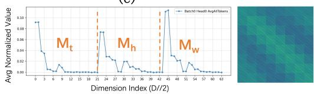

Although the uniform pattern lacks a dominant $m ^ { * }$ , PSA-Search effectively handles these heads: the discovered masks fall into two categories—wide-stripe configurations (large $T _ { w }$ or $S _ { w } )$ and checkerboard patterns (periodic small-stride masks)—both of which achieve faithful approximations of the uniform distribution (cosine similarity $> 0 . 9 8 )$ while maintaining meaningful sparsity. This confirms that the PSA mask space is expressive enough to cover all four observed pattern types.

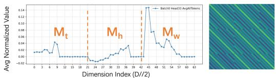  
(a)

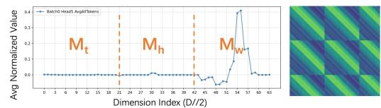

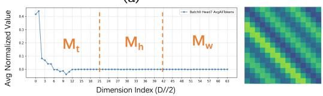  
(c)

(b)  
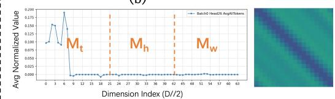

(e)  
(d)  
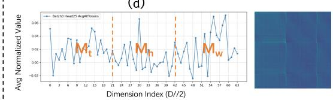  
(f)  
Figure 5: Empirical support for $m _ { \lambda } ^ { * }$ in RoPE-3D

## F Heatmaps of Different Heads in CogVideoX

As shown in fig. 6, we analyze various patterns in the attention heatmaps of CogVideoX, which exhibit behaviors consistent with HunyuanVideo and Wan 2.1. Four distinct pattern types are identified:

• Figures (b), (e)-(h) demonstrate intra-frame attention patterns. These patterns are characterized by diagonal structures with varying widths, strides, and offsets within each frame, with the pattern repeating identically across all frames.

• Figures (a), (d) showcase inter-frame attention patterns. In these patterns, attention weights within each frame are relatively uniform, while diagonal band structures with varying widths, strides, and offsets emerge between frames.

• Figure (i) presents a hybrid pattern, which can be interpreted as a combination of intraframe and inter-frame attention patterns.

• Figure (c) displays uniform pattern, where attention is uniformly distributed across all spatio-temporal positions.

Through further examination of the CogVideoX heatmap, we observe that it demonstrates sparse patterns analogous to those exhibited by Wan 2.1 and HunyuanVideo. The underlying reason is that these models all utilize DiT architectures for video generation, maintain structural similarities, and optimize toward identical objectives. Consequently, their weight distributions should also converge to comparable configurations, suggesting that the periodic locality characteristic of attention maps is universally applicable across DiT-based video generation scenarios. This demonstrates the general adaptability of PSA.

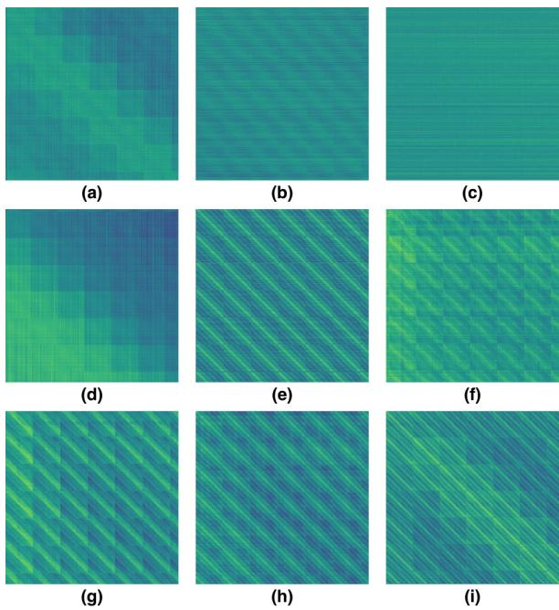  
Figure 6: CogVideoX Heatmap Patterns.

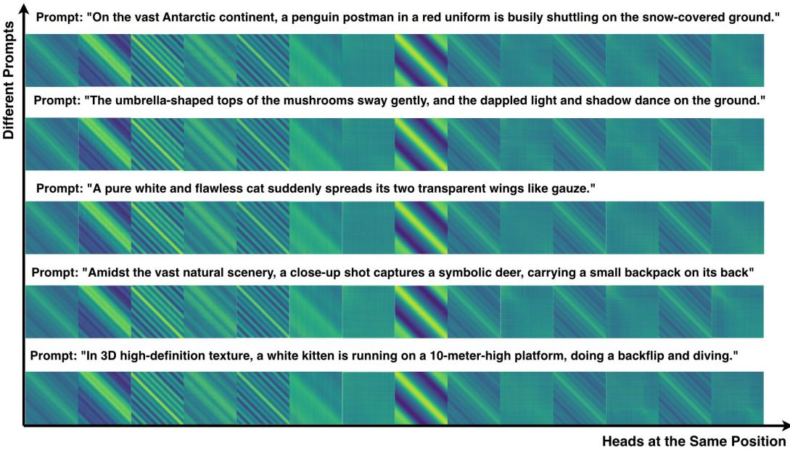  
Figure 7: Heatmap Comparison Between Prompts.

## G Heatmap Visualization Across Different Prompts

As shown in fig. 7, it can be intuitively observed that the heatmaps of the same head across different prompts exhibit extremely high similarity (cosine similarity > 0.99).

## H Loss Threshold Sensitivity Analysis

As illustrated in fig. 8, we perform loss threshold sensitivity analysis on various α values for HunyuanVideo and Wan 2.1. The experimental results indicate that larger α values correspond to higher tolerable loss thresholds, which given the design principle of PSA-Search, result in increased sparsity. To maintain sparsity at approximately 60%, we configured α as 0.03, 0.018, and 0.007 for HunyuanVideo (720 × 1280), HunyuanVideo $( 7 6 8 \times 1 2 8 0 )$ , and Wan 2.1, respectively. This observation reveals that Wan 2.1 exhibits higher sensitivity to loss, thereby necessitating a smaller α value to attain equivalent sparsity levels.

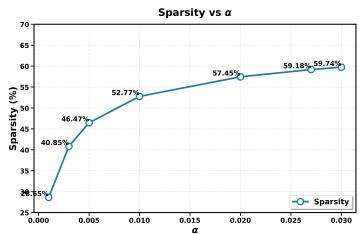  
(a) HunyuanVideo (720 × 1280)

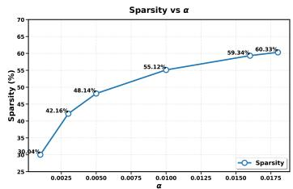  
(b) HunyuanVideo (768 × 1280)

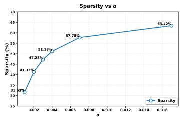  
(c) Wan 2.1 14B  
Figure 8: Sparsity variation with different α values across different models.

Furthermore, we obtain α values at various sparsity levels through our adaptive search algorithm for reference. As shown in table 10, setting the corresponding alpha value for a given sparsity level ensures optimal acceleration while minimizing the loss. Note that changing α does not require a time-consuming re-search, as PSA-Search saves the HeadResults for each head; consequently, after each adjustment of α, only the re-execution of algorithm 3 (lines 10–21) is needed, taking approximately 2 minutes.

Table 10: Alpha-sparsity correspondence for different models.
<table><tr><td colspan="2">HunyuanVideo (720 × 1280)</td><td colspan="2">HunyuanVideo (768 × 1280)</td><td colspan="2">Wan 2.1 14B</td></tr><tr><td>Sparsity (%)</td><td>α</td><td>Sparsity (%)</td><td>α</td><td>Sparsity (%)</td><td>α</td></tr><tr><td>18.72</td><td>0.0003</td><td>20.59</td><td>0.0003</td><td>19.65</td><td>0.0003</td></tr><tr><td>28.65</td><td>0.0010</td><td>30.04</td><td>0.0010</td><td>31.63</td><td>0.0010</td></tr><tr><td>40.85</td><td>0.0030</td><td>42.16</td><td>0.0030</td><td>42.05</td><td>0.0021</td></tr><tr><td>49.73</td><td>0.0070</td><td>51.66</td><td>0.0070</td><td>51.51</td><td>0.0041</td></tr><tr><td>62.80</td><td>0.0600</td><td>60.33</td><td>0.0180</td><td>61.22</td><td>0.0110</td></tr><tr><td>67.22</td><td>0.6000</td><td>69.09</td><td>0.0600</td><td>65.46</td><td>0.3000</td></tr></table>

## I End-to-End Performance and Quality Across Varying Sparsity Levels

Beyond our initial analysis at 60% sparsity to match STA’s fixed sparsity (58.37%) for a direct comparison, we evaluate 10–70% sparsity (table 11). Our method consistently outperforms SVG2 in speed/quality, and achieves a better speed–quality trade-off than SVG. SVG only achieves marginal speedup at 70% sparsity while suffering severe quality degradation.

## J Qualitative Comparison with Baselines

As shown in figs. 9 to 11, we execute multiple prompts across several models. By comparing the extracted video frames with the baseline using FlashAttention-3, we can observe that the quality is nearly lossless.

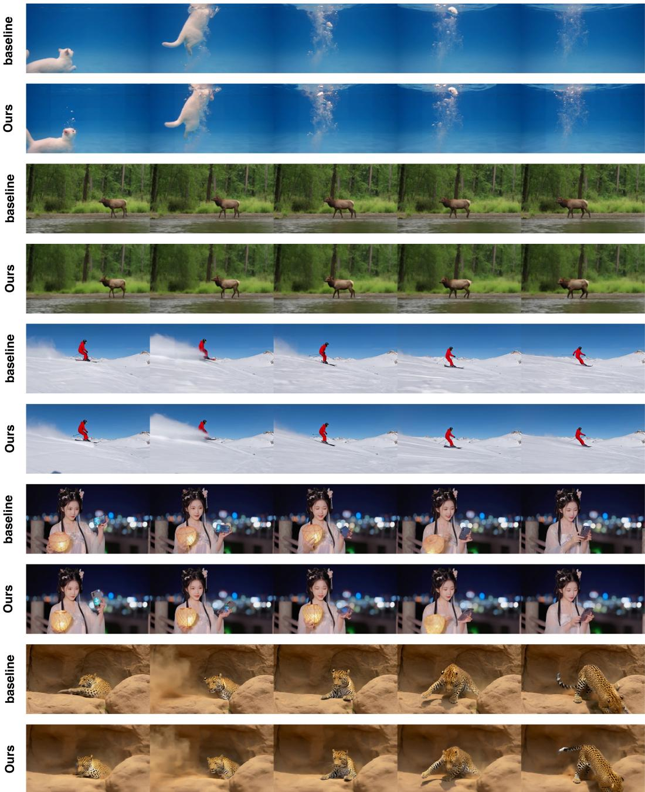  
Figure 9: HunyuanVideo(720×1280) FA3 Baseline vs. Ours.

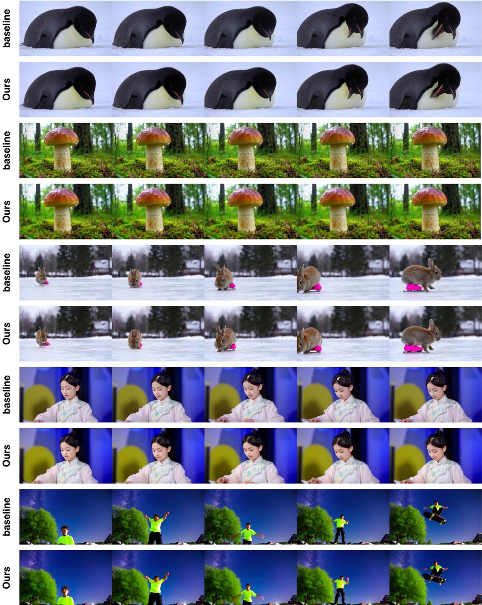  
Figure 10: HunyuanVideo(768×1280) FA3 Baseline vs. Ours.

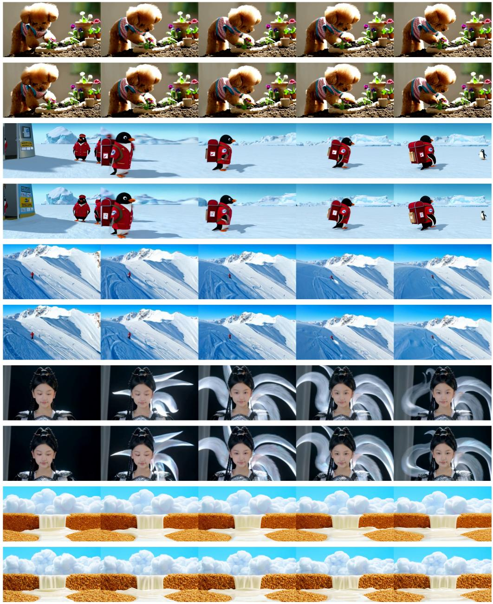  
Figure 11: Wan 2.1(720×1280) FA3 Baseline vs. Ours.

Table 11: End-to-end performance and quality comparison across varying sparsity on HunyuanVideo $( 7 6 8 \times 1 2 8 0 )$ .
<table><tr><td>Method</td><td>Sparsity</td><td>E2E(s)</td><td>PSNR↑</td><td>SSIM↑</td><td>LPIPS↓</td></tr><tr><td rowspan="4">SVG</td><td>10.48%</td><td>1393.25</td><td>30.34</td><td>0.9144</td><td>0.1247</td></tr><tr><td>30.39%</td><td>1116.87</td><td>27.68</td><td>0.8862</td><td>0.1552</td></tr><tr><td>50.32%</td><td>865.78</td><td>25.67</td><td>0.8494</td><td>0.1914</td></tr><tr><td>70.16%</td><td>622.37</td><td>21.21</td><td>0.7771</td><td>0.2651</td></tr><tr><td rowspan="4">SVG2</td><td>10.49%</td><td>1333.93</td><td>31.87</td><td>0.9076</td><td>0.1206</td></tr><tr><td>30.72%</td><td>1129.91</td><td>26.75</td><td>0.7753</td><td>0.2040</td></tr><tr><td>50.67%</td><td>945.26</td><td>26.18</td><td>0.7314</td><td>0.2352</td></tr><tr><td>70.93%</td><td>694.07</td><td>24.54</td><td>0.6610</td><td>0.2985</td></tr><tr><td rowspan="4">Ours</td><td>11.28%</td><td>1057.19</td><td>38.83</td><td>0.9647</td><td>0.0526</td></tr><tr><td>30.04%</td><td>941.44</td><td>33.99</td><td>0.9318</td><td>0.0812</td></tr><tr><td>51.66%</td><td>776.87</td><td>30.21</td><td>0.8952</td><td>0.1244</td></tr><tr><td>69.09%</td><td>632.86</td><td>24.58</td><td>0.8220</td><td>0.2340</td></tr></table>

## NeurIPS Paper Checklist

## 1. Claims

Question: Do the main claims made in the abstract and introduction accurately reflect the paper’s contributions and scope?

## Answer: [Yes]

Justification: The abstract and introduction clearly state three contributions of PSA (param eterized representation, efficient kernel, automatic search), which are consistent with the theoretical and experimental results in Sections 3–4.

## 2. Limitations

Question: Does the paper discuss the limitations of the work performed by the authors?

Answer: [Yes]

Justification: The paper discusses limitations in Appendix A.

## 3. Theory assumptions and proofs

Question: For each theoretical result, does the paper provide the full set of assumptions and a complete (and correct) proof?

Answer: [Yes]

Justification: The RoPE-3D attention logit decomposition (Eq. 1) and the dominant channel assumption (Eqs. 2–4) are presented with clear assumptions and derivations in Section 3.1.

## 4. Experimental result reproducibility

Question: Does the paper fully disclose all the information needed to reproduce the main experimental results of the paper to the extent that it affects the main claims and/or conclusions of the paper (regardless of whether the code and data are provided or not)?

Answer: [Yes]

Justification: The paper provides complete algorithm pseudocode (Algorithms 1–3), model configurations (Section 4.1), search parameter ranges (Appendix B), and kernel implementation details (Appendix A), sufficient to reproduce the main experiments.

## 5. Open access to data and code

Question: Does the paper provide open access to the data and code, with sufficient instructions to faithfully reproduce the main experimental results, as described in supplemental material?

Answer: [Yes]

Justification: The code is publicly available at https://github.com/jxyjason/PSA, with sufficient instructions to faithfully reproduce the main experimental results.

## 6. Experimental setting/details

Question: Does the paper specify all the training and test details (e.g., data splits, hyperparameters, how they were chosen, type of optimizer) necessary to understand the results?

Answer: [Yes]

Justification: Section 4.1 provides detailed descriptions of model configurations, evaluation metrics, baseline methods, search parameters, and experimental settings.

## 7. Experiment statistical significance

Question: Does the paper report error bars suitably and correctly defined or other appropriate information about the statistical significance of the experiments?

Answer: [No]

Justification: The randomness in video generation evaluation primarily stems from initial noise, while our comparison is between deterministic sparse attention and full attention outputs, so error bars are not required.

## 8. Experiments compute resources

Question: For each experiment, does the paper provide sufficient information on the computer resources (type of compute workers, memory, time of execution) needed to reproduce the experiments?

## Answer: [Yes]

Justification: The paper states that all experiments are conducted on a single NVIDIA H100 GPU, and mentions in Section 3.3 that the search completes in 2.5 hours on 8 H100 GPUs.

## 9. Code of ethics

Question: Does the research conducted in the paper conform, in every respect, with the NeurIPS Code of Ethics https://neurips.cc/public/EthicsGuidelines?

## Answer: [Yes]

Justification: This research is an efficiency optimization method for video generation and does not involve human subjects, sensitive data, or ethical risks.

## 10. Broader impacts

Question: Does the paper discuss both potential positive societal impacts and negative societal impacts of the work performed?

## Answer: [N/A]

Justification: This research is a foundational efficiency optimization method that accelerates inference of existing models and is not directly tied to specific application deployments, with no direct path to negative societal impacts.

## 11. Safeguards

Question: Does the paper describe safeguards that have been put in place for responsible release of data or models that have a high risk for misuse (e.g., pre-trained language models, image generators, or scraped datasets)?

## Answer: [N/A]

Justification: This paper does not release new pre-trained models or datasets; it only provides an attention efficiency optimization method.

## 12. Licenses for existing assets

Question: Are the creators or original owners of assets (e.g., code, data, models), used in the paper, properly credited and are the license and terms of use explicitly mentioned and properly respected?

## Answer: [Yes]

Justification: All existing assets used in this paper are properly credited, and their licenses and terms of use are explicitly stated and fully respected.

## 13. New assets

Question: Are new assets introduced in the paper well documented and is the documentation provided alongside the assets?

Answer: [Yes]

Justification: The code is released at https://github.com/jxyjason/PSA with documentation provided in the repository; no other new assets are involved.

## 14. Crowdsourcing and research with human subjects

Question: For crowdsourcing experiments and research with human subjects, does the paper include the full text of instructions given to participants and screenshots, if applicable, as well as details about compensation (if any)?

Answer: [N/A]

Justification: This paper does not involve crowdsourcing or research with human subjects.

## 15. Institutional review board (IRB) approvals or equivalent for research with human subjects

Question: Does the paper describe potential risks incurred by study participants, whether such risks were disclosed to the subjects, and whether Institutional Review Board (IRB) approvals (or an equivalent approval/review based on the requirements of your country or institution) were obtained?

Answer: [N/A]

Justification: This paper does not involve research with human subjects.

## 16. Declaration of LLM usage

Question: Does the paper describe the usage of LLMs if it is an important, original, or non-standard component of the core methods in this research? Note that if the LLM is used only for writing, editing, or formatting purposes and does not impact the core methodology, scientific rigor, or originality of the research, declaration is not required.

## Answer: [N/A]

Justification: LLMs are not a component of the core method in this research; the core method is sparse attention optimization based on parameterized stripe attention.