# Pixel-Level Transformers in Remote Sensing: A Canopy Height Case Study

Sven Ligensa sven.ligensa@uni-muenster.de University of Münster Münster, Germany

Jan Pauls   
jan.pauls@uni-muenster.de   
University of Münster   
Münster, Germany

Ibrahim Fayad ibrahim.fayad@lsce.ipsl.fr Laboratoire des Sciences du Climat et de l’Environnement Paris, France

Karsten Schrödter karsten.schroedter@uni-muenster.de University of Münster Münster, Germany

Fabian Gieseke fabian.gieseke@uni-muenster.de University of Münster Münster, Germany

## Abstract

Predicting canopy height from medium-resolution satellite imagery is a common and scalable approach for assessing the condition of the world’s forests, which play a crucial role in climate change mitigation. While Transformer-based architectures have shown strong performance in many domains, their straightforward application to dense (i.e., pixel-level) regression tasks often yields suboptimal results. In particular, the patch size has a crucial impact on the model performance. In this work, we consider pixel-level attention schemes and show that the resulting models generally outperform those relying on larger patch sizes. However, pixel-level attention can be a prohibitively resource-intensive operation. For this reason, we conduct an extensive experimental study using eficient attention variants to identify favorable trade-ofs between prediction quality and resource requirements, facilitating the practical deployment of the proposed models. In addition, we perform a comprehensive comparison with several well-established models in the field and show that, with suitable hyperparameter choices, Transformer-based architectures can outperform competing approaches. Our findings provide practical guidance for designing models for pixel-level regression tasks on medium-resolution satellite imagery, including canopy height and biomass estimation, soil moisture mapping, and yield forecasting.

## CCS Concepts

• Computing methodologies → Computer vision problems; Neural networks; Supervised learning by regression; • Applied computing → Environmental sciences; • General and reference → Experimentation; Performance.

## Keywords

Vision Transformers, Eficient Deep Learning, Remote Sensing, Canopy Height Prediction

ACM Reference Format:   
Sven Ligensa, Jan Pauls, Karsten Schrödter, Ibrahim Fayad, and Fabian Gieseke. 2026. Pixel-Level Transformers in Remote Sensing: A Canopy Height Case Study. In The 34th ACM International Conference on Advances in Geographic Information Systems (SIGSPATIAL ’26), November 03–06, 2026, Riverside, CA, USA. ACM, New York, NY, USA, 14 pages. https://doi.org/10. 1145/3841645.3842978

## 1 Introduction

Forests play a key role in the carbon cycle and in regulating climate change [1]. One important component of forest carbon stocks is above-ground biomass (AGB), which refers to the mass of living vegetation located above the soil surface, including stems, branches, bark, foliage, and shrubs [18]. While collecting field estimates of AGB is time-consuming and expensive, satellite imagery is widely available and permits the estimation of, e.g., tree height [11], which can in turn be used to estimate AGB via the approximate power-law relationship between canopy height and AGB [37]. For that reason, machine learning and in particular deep learning approaches have been employed extensively in the past to generate global-scale canopy height maps [23, 29, 30, 33, 41].

Generating a canopy height map ofglobal scale is a significant engineering challenge, requiring a considerable amount of resources for the inference [30]. The goal is to train a model, which achieves high predictive performance, while being eficient in terms of having a short training and inference time. While for high-resolution images, the semantic usually does not change significantly among a few neighbored pixels, it is diferent for dense prediction on medium-resolution satellite imagery, like Sentinel-2 data, where a single pixel typically corresponds to an area of 10 × 10 meters [11].

Recently, the importance of pixel-level attention was stressed for general Vision Transformer (ViT) models [28, 45]. In this work, we investigate the importance and efectiveness of pixel-level ViTbased architectures for dense prediction tasks in remote sensing, using canopy height estimation as a representative large-scale regression task. The patch size � ∈ N is a critical hyperparameter for ViT-based architectures, as it afects their memory and runtime complexity as well as the prediction quality [45]. Figure 1 shows exemplary pixel-level tree-height predictions on satellite images for models with varying patch size. Choosing a smaller � leads to a larger number of tokens $\begin{array} { r } { N = { \frac { H W } { P ^ { 2 } } } } \end{array}$ to be processed by ViT-based

This work is licensed under a Creative Commons Attribution 4.0 International License. SIGSPATIAL ’26, Riverside, CA, USA   
© 2026 Copyright held by the owner/author(s).   
ACM ISBN 979-8-4007-2950-8/2026/11   
https://doi.org/10.1145/3841645.3842978

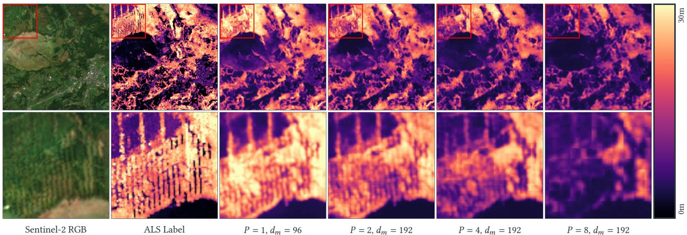  
Figure 1: Qualitative comparison of pixel-level regression by Transformer-based models with varying patch size (�) and model dimension $( d _ { m } )$ . The first column shows the input image (only RGB channels shown, while the models are trained on twelve channels), the second column shows Airborne Laser Scanning (ALS) canopy height labels, and the following columns show the predictions of models with increasingly larger patch sizes. Especially for areas with fine details, models with smaller patch sizes produce predictions of higher perceptual quality. Further details are provided in Section 5 and additional examples are given in the appendix.

models, where �, � ∈ N are the image’s width and height. With vanilla attention, memory and runtime complexity increase quadratically with the sequence length [10, 42]. For the ViT introduced by Dosovitskiy et al. [10], selecting a comparably large patch size of � = 16 was necessary to be able to process reasonably-sized images (e.g., 224 × 224 pixels). They also observed that smaller patches sizes generally improved performance; however the quadratic scaling behavior of the attention mechanism with regard to the sequence length made a smaller patch size prohibitive in practice [10]. With the introduction of more eficient attention mechanisms, such as shifted-window attention, the patch size was reduced to $P = 4 ,$ which made the ViT-architectures more suitable for dense predic tion tasks [25, 50].

To investigate the role of pixel-level ViTs for dense prediction in remote sensing, we conduct an extensive empirical study on canopy height estimation.1 Our contributions are as follows:

(1) We give practical guidance on choosing crucial hyperparameters of ViTs (like � or the model dimension $d _ { m } )$ for dense regression tasks on medium-resolution satellite images.

(2) We unveil shortcomings of traditional quantitative evalua tion of canopy height predictions, based on noisy labels.

(3) We propose a new model configuration that outperforms other well-known models on canopy height prediction.

## 2 Background

In this section, we first give an overview of related work on ViTs, recent work on pixel-level ViTs, and proposed variants for reducing the attention mechanism’s complexity. Then, specifics of the canopy height prediction task are revised.

## 2.1 Vision Transformers

The original ViT [10] adapted the Transformer architecture [42] to the task of image classification via minimal changes, giving rise to a whole new family of Vision Transformers. Hierarchical Transformers improved on the ViT’s two main weaknesses (1) by introducing hierarchical processing to account for visual elements of varying scale and (2) by reducing � from 16 to 4 pixels, which was facilitated by improving the attention computation.

The two most well-known, concurrently developed, architectures are the so-called Swin Transformer [25] and the Pyramid Vision Transformer (PVT) [47]. Both architectures comprise four stages—each consisting of multiple Transformer layers—operating on increasingly coarser spatial resolution. They difer, however, with regard to the attention mechanism used, and the way adjacent tokens are combined in between stages. The Swin Transformer uses shifted-window attention, which restricts attention to local windows applied with two alternating positions [25], while the PVT reduces the number of keys and values and thereby the number of computations of the attention by a constant factor [47]. To reduce the resolution between stages, the Swin Transformer merges the four patches inside a 2 × 2 window by concatenating them along the embedding dimension, and then linearly projecting them to twice the previous embedding dimension [25]. The PVT reduces the resolution by applying an overlapping patch embedding layer with a patch size of two at the beginning of every stage [47].

For Transformers performing dense prediction tasks like semantic segmentation (pixel-level classification) and canopy height prediction (pixel-level regression), the output needs to have the same spatial dimension as the input. To achieve that, the architectures generally follow the encoder-decoder paradigm, where the decoder constitutes the counterpart of the encoder, and increases the spatial dimensionality [2, 50, 54]. Note that as most models choose a patch size of � = 4 up to � = 16 pixels, the decoder’s output resolution is still smaller than the input resolution. To obtain a prediction for every pixel of the input image, it is common practice to perform non-parametric upsampling (e.g. bilinear interpolation) [54] or parametric upsampling (e.g. transposed convolution or patch expand) [2]. The architectures mainly difer in how they combine the hierarchical feature maps produced by the encoder. Popular Segmentation Transformers are the SETR [54], SegFormer [50], and the Swin-Unet [2]. A recently proposed variant is the U-MixFormer [51], fusing encoder and decoder features by using mix-attention, which allows the encoder feature to query the decoder feature hierarchy.

## 2.2 Pixel-Level Vision Transformers

Recent work targeting pixel-level ViTs include Nguyen et al. [28] and Wang et al. [45]. Nguyen et al. [28] first demonstrated the efectiveness of treating each pixel as a token. Due to the computational complexity, they focused on small-scale datasets like CIFAR-100. They primarily analyzed the results from the perspective of removing the locality inductive bias [28]. Wang et al. [45] performed additional experiments, thoroughly testing the impact of the patch size hyperparameter across various vision tasks, input scales, and architectures. The emerging patterns are called patchification scaling laws, stating that decreasing patch sizes generally result in lower test loss.2 In ViT-based architectures, a patch is the “basic unit of operation after the first projection layer” [28], i.e., all pixels of the same patch are considered jointly throughout the whole model. The patchification step can be viewed as a compression step, resulting in possibly irreversible information loss; operating on a pixel-level can avoid this bottleneck [45]. This compression is stronger the larger the patch size and the smaller the model dimension.

Still, training ViT-based models on tens to hundreds of thousands of tokens per image3 is challenging, as also noted by [28]. The following section gives a short overview of attention variants, which reduce the memory and runtime complexity of the operation, making pixel-level ViTs more eficient in practice.

## 2.3 Attention Mechanism Variants

Dozens of attention mechanism variants have been proposed to alleviate the memory (and runtime) complexity of the vanilla attention by Vaswani et al. [42], which is quadratic in the number oftokens �. Sparse attention reduces the number of tokens that can interact with each other. The pattern of interacting tokens can either be fixed or dynamic. Examples for fixed sparse attention mechanisms are local window attention [52], shifted window attention [25], and attention along axes [9, 17]. Dynamic (i.e., data-dependent) patterns include clustering the tokens via locality-sensitive hashing [22, 43] or �-means [3, 36, 43], and only calculating attention among tokens of the same cluster. Low-rank approximations are based on the empirical observation that the self-attention matrix can often be approximated via a low-rank matrix, meaning that it can be eficiently represented as the product of smaller lowdimensional matrices [46]. Examples are the Linformer [46], Linear Transformer [21], Performer [5], random feature attention [32], and eficient attention [40]. A more detailed description of the attention mechanisms considered in this work is given in Section 3.

## 2.4 Canopy Height Prediction

To analyze pixel-level ViTs for dense prediction in remote sensing, we consider canopy height prediction, a key task in Earth observation applications, where the goal is to predict the height of the (usually) tallest tree for each pixel of a remote sensing image, e.g., a medium-resolution satellite image. Creating such canopy height maps at a large scale relies on satellites providing spatially and temporally continuous and consistent images. Two common data sources are the Sentinel-2 mission operated by the ESA [6, 11] and the Landsat mission operated by the NASA [13]. The corresponding satellites provide, among other things, optical, i.e. passive, multispectral images at a resolution of up to 10 m and 30 m, respectively. The Sentinel-2 mission comprises two active satellites in the same sun-synchronous orbit, phased half an orbit apart [11]. The revisit time is 5 days at the equator and resolutions range from 10 m to 60 m depending on the band. The imaging instrument of Sentinel-2 captures 13 bands between 433 nm and 2280 nm, including RGB, near infrared and others [11].

Commonly used canopy height labels are either derived from space-borne instruments, such as Global Ecosystem Dynamics Investigation (GEDI) [12] or ICESat [27], or measurements from Airborne Laser Scanning (ALS) campaigns [15]. While the latter ones exhibit a much higher vertical accuracy and spatial resolution, both their spatial and temporal coverage is heavily limited. For largescale applications, models are typically trained on data from spaceborne instruments, such as the GEDI mission, as it provides data from 2019 onwards and exhibits a global coverage between 51.6◦� and 51.6◦�. The GEDI system [12] is a set of three full-waveform LiDAR sensors mounted on the ISS that capture eight parallel tracks (two power beams measuring on two tracks each and one coverage beam measuring on four tracks) with a 600 m inter-track and 60 m intra-track spacing. Each measurement has an approximate diameter of 25 m (slightly varying depending on the ISS height) and starting with the second release of the GEDI product, the geolocation accuracy has met its target of being unbiased (i.e., having a mean of zero) and having a standard deviation of less than 10 m. To convert the waveform of each measurement into a scalar label, two commonly used metrics are the relative height (rh) at which 95% (rh95) and 98% (rh98) of the cumulative returned energy was received.

ALS data on the other hand does not sufer from low geolocation accuracy or low vertical measurement quality. Typically captured by LiDAR sensors mounted on airplanes, they exhibit a resolution of 1 m up to 10 cm. Also, in contrast to GEDI’s sparse measurements, LiDAR sensors generally provide dense measurements.4

Estimating canopy height from remote sensing data has been established as a reliable source for large-scale forest monitoring, as it can be applied across vast areas more easily than field-based inventories. Such canopy height maps have been created at regional [38], national [14, 19, 37], continental [24] and global [23, 29, 30] scale and resort to either classical machine learning methods [19, 33], convolutional neural networks [30, 37, 38, 44] or attention-based architectures [14, 29]. Although not perfectly matching ALS measurements, these maps have been shown to be reliable estimators for various downstream tasks [26].

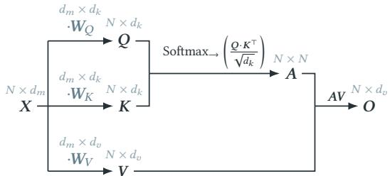  
Figure 2: Computations of a vanilla attention head [42].

## 3 Attention Mechanisms

In this section, we present and compare popular attention variants with the vanilla attention mechanism of the Transformer architecture [42]. To simplify notation, we focus on a single attention head. In practice, Transformers use Multi-Head Attention (MHA) layers, which include multiple attention heads performing attention independently and in parallel. We refer to Vaswani et al. [42] for further details.

## 3.1 Notation

Let $\pmb { X } \in \mathbb { R } ^ { N \times d _ { m } }$ be an input sequence of $N \in \mathbb { N }$ token embeddings, each of dimension $d _ { m } \in \mathbb { N } .$ . Let $d _ { k } \in \mathbb { N }$ and $d _ { v } \in \mathbb { N }$ denote the embedding dimensions for the keys and queries, and the values, respectively. The query-, key- and value-transformation matrices are denoted by $\pmb { W } _ { O } \in \mathbb { R } ^ { d _ { m } \times d _ { k } } , \pmb { W } _ { K } \in \mathbb { R } ^ { d _ { m } \times d _ { k } }$ , and $W _ { V } \in \mathbb { R } ^ { d _ { m } \times d _ { v } }$ Accordingly, the query, key and value features are defined by $\boldsymbol { Q } : =$ $\begin{array} { r } { X \cdot W _ { O } \in \bar { \mathbb { R } } ^ { N \times d _ { k } } , \bar { K } : = X \cdot W _ { K } \in \mathbb { R } ^ { N \times d _ { k } } } \end{array}$ and $V : = X \cdot W _ { V } \in \dot { \mathbb R } ^ { N \times d _ { v } }$

The row-wise softmax function Softmax : $\mathbf { \Psi } : \mathbb { R } ^ { N \times N } \to \mathbb { R } ^ { N \times N }$ normalizes the element-wise exponential of the matrix in a rowwise manner, i.e., Softmax $\mathbf { \Phi } _ {  } ( S ) _ { i , j } = \exp ( S _ { i , j } ) / { \sum _ { l = 1 } ^ { N } }$ exp(��,�) for a score matrix $S \in \mathbb { R } ^ { N \times N }$ and indices $1 \le i , j \le N$ . Similarly, the column-wise softmax Softmax $\mathbf { \Psi } : \mathbb { R } ^ { N \times N } \to \bar { \mathbb { R } } ^ { N \times N }$ normalizes the exponential column-wise.

## 3.2 Vanilla Attention

We shortly revisit the original formulation of scaled-dot product attention as introduced by Vaswani et al. [42], which we will refer to as vanilla attention in this work. In vanilla attention, the query features $Q \in \mathbb { R } ^ { N \times d _ { k } }$ and key features $K \in \mathbb { R } ^ { N \times d _ { k } }$ are used to calculate the attention matrix

$$
A : = \mathrm { S o f t m a x } _ {  } ( \frac { Q \cdot K ^ { \top } } { \sqrt { d _ { k } } } ) \in \mathbb { R } ^ { N \times N } .\tag{1}
$$

The output � of the attention head is then calculated by multiplying the attention matrix with the value features, i.e.

$$
\mathrm { A t t e n t i o n } _ { \mathsf { v a n i l l a } } ( Q , K , V ) : = O : = A \cdot V \in \mathbb { R } ^ { N \times d _ { v } } .\tag{2}
$$

The computation flow of vanilla attention is visualized in Figure 2. Vanilla attention has a runtime complexity of $O ( N ^ { 2 } d _ { m } )$ and

Ligensa et al.

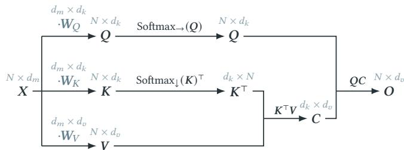  
Figure 3: Computations of an eficient attention head [40].

a memory complexity of $O ( N ^ { 2 } )$ , both of which are dominated by computing/storing the attention matrix.5

The underlying intuition stems from the observation that inside $Q \cdot K ^ { \top }$ each of the � query vectors is compared to all � key vectors via a dot-product and, after scaling, is normalized using the softmax operation. Therefore, the rows of the attention matrix $\pmb { A } \in \mathbb { R } ^ { N \times N }$ can be interpreted as indicating how much each key contributes to solving the row’s query. The corresponding attention weights are then used to obtain, for each query, a weighted sum of the corresponding values.

## 3.3 Eficient Attention

Eficient attention [40] reduces the runtime complexity to $O ( N d _ { m } ^ { 2 } )$ and the memory complexity to $O ( N d _ { m } + d _ { m } ^ { 2 } )$ by slightly rearranging the computations and at the cost of only providing an approximation of vanilla attention.6 The underlying observation is that matrix multiplication is associative and that, up to the softmax operation, vanilla attention is just a scaled multiplication of $Q , { \pmb K } ^ { \top }$ and �, where the computational bottleneck lies in the materialization of $Q \cdot K ^ { \top } \in \mathbb { R } ^ { N \times N }$ . The basic idea is to change the order of computation by first calculating $K ^ { \top } \cdot V \in \mathbb { R } ^ { d _ { k } \times d _ { v } }$ . On the way, the normalization via the softmax function needs to be adjusted. More precisely, eficient attention first calculates a column-wise softmax of the key features � and then computes

$$
C : = { \mathrm { S o f t m a x } } _ { \downarrow } ( K ) ^ { \top } \cdot V \in \mathbb { R } ^ { d _ { k } \times d _ { v } } ,\tag{3}
$$

which is multiplied with a row-wise softmax-normalized version of the query features, so that the output � is given by

$$
{ \mathrm { A t t e n t i o n } } _ { \mathrm { e f f } } ( Q , K , V ) : = O : = { \mathrm { S o f t m a x } } _ {  } ( Q ) \cdot C \in \mathbb { R } ^ { N \times d _ { v } } .\tag{4}
$$

Figure 3 illustrates the underlying computations in form of a graph. Shen et al. [40] provide the following intuition for the modified attention computations: The modified keys, i.e., Softmax $\downarrow ^ { ( K ) } \in$ $\mathbb { R } ^ { N \times d _ { k } }$ , can be seen as �� feature-maps, which indicate how a given feature is distributed across the image. They guide where to aggregate information from. The learned features could be of lower level (e.g., edge orientation) or higher level (e.g., human-made structures), depending on their location in the network. The values, $V \in \mathbb { R } ^ { N \times d _ { v } }$ containing the content of the patches, are passed on through the network (after being weighted). The product of the keys and values is the “global context” $\boldsymbol { \mathbf { \mathit { C } } } \in \mathbb { R } ^ { d _ { k } \times d _ { v } }$ . It aggregates the content (values) of the patches by the diferent features (key dimensions), thus producing a value (column) vector $C _ { i , \cdot } \in \mathbb { R } ^ { d _ { v } }$ for each feature map $1 \leq i \leq d _ { k }$ . For the query, every row of Softmax→ $( Q ) \in \mathbb { R } ^ { N \times d _ { k } }$ defines what information is important for the corresponding patch, i.e., how much each feature map contributes to this patch. Finally, the output for a patch is given by the corresponding weighted sum of the values per feature map from the global context �.

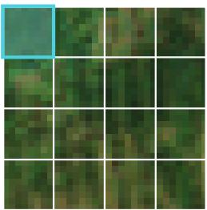

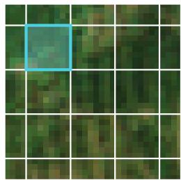  
(a) Local window [52]  
(b) Shifted window [25]  
Figure 4: Windowed attention with windows of size $8 \times 8$ pixels. Only pixels inside the same window can attend to each other. An example window is highlighted in cyan.

## 3.4 Windowed Attention

Window-based attention mechanisms reduce the number of tokens a token attends to by splitting the input into parts. The simplest variant is the local window attention (see Figure 4a), where attention is performed within non-overlapping windows of size $M \times M$ tokens [52], $M \in \mathbb { N } .$ In the context of ViTs, the input $X \in \mathbb { R } ^ { N \times d _ { m } }$ originates from an image of height �′ and width $W ^ { \prime }$ of embedding vectors with dimension $d _ { m } , \mathrm { i . e . } X \in \mathbb { R } ^ { H ^ { \prime } \times W ^ { \prime } \times d _ { m } }$ where $N = H ^ { \prime } \cdot W ^ { \prime }$ . � is then—after zero-padding if necessary— divided into windows of size $M \times M$ , formally by reshaping � to $X _ { \mathrm { r e s h a p e } } \in \mathbb { R } ^ { ( H ^ { \prime } \cdot W ^ { \prime } ) / M ^ { 2 } \times M ^ { 2 } \times d _ { m } }$ . Viewing the input as a batch of sequences of length $M ^ { 2 } ;$ , attention is performed on each window individually. This approach achieves linear memory and computational complexity in the number of patches �. Note that in windowed attention each pixel can only interact with pixels in the same win dow. Liu et al. [25] address this by using shifted windows, giving the Swin Transformer its name. The windows alternate between a regular partitioning (see Figure 4a) and one shifted by half the window size (see Figure 4b), ensuring that information can flow across window boundaries.

## 3.5 Flash Attention

Eficient attention and window-based attention achieve a runtime linear in the sequence length by approximating the attention mechanism. In contrast, FlashAttention [8], optimizes the exact calculation of attention on the hardware-side by tiling, which reduces the need of copying data between GPU high bandwidth memory and GPU on-chip SRAM. In an extension, FlashAttention-2 [7], the work partitioning between diferent thread blocks and warps on the GPU is identified as a remaining bottleneck, which achieves a 2× speedup compared to FlashAttention. Later extensions improve performance specifically for Hopper GPUs [39] and Blackwell GPUs [53].

## 4 Model Architecture

Our model architecture follows the encoder-decoder design, using an adapted version of the Mix Transformer (MiT) [50] as encoder and U-MixFormer [51] as decoder. Figure 5 shows the adapted architecture. We first revisit the original architectures and then detail our adaptations and the reasoning behind them.

## 4.1 Mix Transformer

The MiT was introduced as the encoder of the SegFormer [50], where it was combined with a lightweight MLP decoder, and achieved state-of-the-art performance for semantic segmentation in terms of eficiency and accuracy. The MiT’s design is inspired by the Pyramid Vision Transformer (PVT) [47], and thus also has four stages, which create multi-scale image features [50]. It utilizes the PVT’s spatial reduction attention [47], and performs a patch embedding at the beginning of every stage [50].

The MiT architecture is based on two main innovations: the Mix-FFN and an overlapped patch embedding (PatchEmbed) [50]. The Mix-FFN inserts a depth-wise convolution (DW-Conv) layer with a kernel size of 3 and padding and stride of 1 in between the linear layers of the FFN, which can be formalized as:

$$
Y _ { \mathrm { M i x - F r N } } = \lfloor \mathsf { i n e a r } ( \mathrm { G E L U } ( \mathsf { D W - C o n v } ( \lfloor \mathsf { i n e a r } ( X _ { \mathsf { M i x - F r N } } ) ) ) ) + X _ { \mathsf { M i x - F r N } }
$$

While this adaptation goes against the initial idea of the FFN to postprocess every token individually, it has the merit that—as the tokens interact with their surrounding tokens—no positional encoding is required [50]. The PatchEmbed layer has an increased kernel size to include information from the surrounding patches and enhance local continuity. For the initial patch embedding, a Conv layer with a kernel size 7, stride 4, and padding 3 is used, which divides the image into patches of size 4 × 4. For the subsequent ones, a Conv layer with a kernel size 3, stride 2, and padding 1 is used, halving the image size with every recurring embedding.

## 4.2 U-MixFormer

The U-MixFormer decoder also consists of four stages, each of which comprises a single Transformer block [51]. Instead of adding or concatenating the skipped encoder features and decoder features, they introduce the so-called mix-attention module to fuse them, replacing the self-attention mechanism [51]. Figure 6 shows the structure of a Transformer block with mix-attention. Self-attention projects the queries, keys and values from a single input, while cross-attention projects the queries from one input and the keys and values from another one [42]. For mix-attention, a single-scale feature is the input for the queries, while a second, multi-scale feature map is the input for the keys and values [51]. Note that the distinction between self-, cross-, and mix-attention is independent of the attention mechanism used.

The query for the decoder block with index $4 - i + 1$ with $i \in \{ 1 , . . . , 4 \}$ is obtained by linearly projecting the output of the corresponding encoder block $i , \mathrm { i . e . , } Q _ { \mathrm { d e c } _ { 4 - i + 1 } } = \mathsf { L i n e a r } ( Y _ { \mathrm { e n c } _ { i } } )$ . The keys and values for the same decoder block are derived from the hierarchical feature map constructed from all encoder outputs, where the encoder feature $Y _ { \mathrm { e n c } _ { i } }$ is replaced by its decoder feature of same dimensions $\mathbf { { { Y } } _ { \mathrm { { d e c } } _ { 4 - i + 1 } } } ,$ if it is available. Thus, for the first decoder block, $K _ { \mathrm { d e c } _ { 1 } }$ and $V _ { \mathrm { d e c } _ { 1 } }$ are derived from all the encoder features, $\{ Y _ { \mathrm { e n c _ { 1 } } } , . . . , Y _ { \mathrm { e n c _ { 4 } } } \}$ , as no decoder features are available yet, while for the last decoder block, dec , the three lower-dimensional encoder feature maps have already been created and $K _ { \mathrm { d e c } _ { 4 } }$ and $V _ { \mathrm { d e c } _ { 4 } }$ are derived from $\{ Y _ { \mathrm { e n c _ { 1 } } } , Y _ { \mathrm { d e c _ { 3 } } } , Y _ { \mathrm { d e c _ { 2 } } } , Y _ { \mathrm { d e c _ { 1 } } } \}$

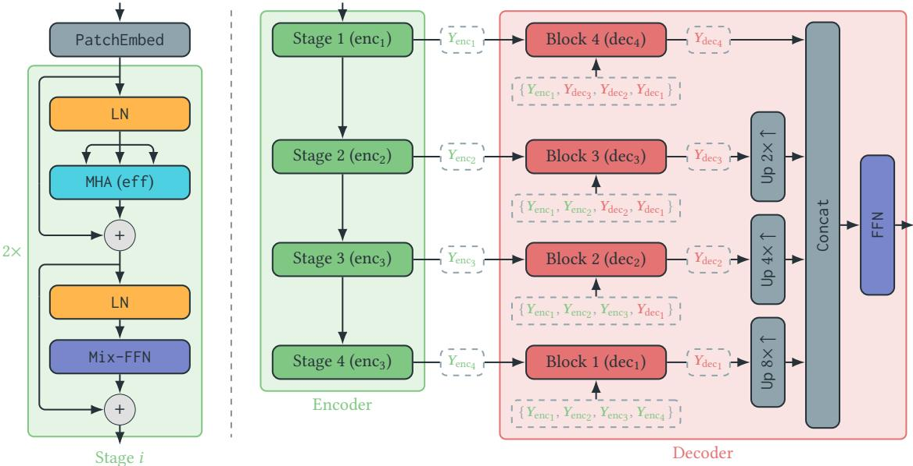  
Figure 5: Model architecture: The encoder consists of four stages, each of which starts with a PatchEmbed layer followed by two Transformer blocks, which use eficient attention and $M i x - F F N$ . The decoder consists of four blocks, which perform eficient mix-attention. The encoder and decoder features’ shapes are $\begin{array} { r } { Y _ { \mathbf { e n c } _ { i } } = Y _ { \mathbf { d e c } _ { 4 - i + 1 } } = \frac { H } { P \cdot 2 ^ { i - 1 } } \times \frac { W } { P \cdot 2 ^ { i - 1 } } \times 2 ^ { i - 1 } d _ { m } } \end{array}$ (e.g., for $P = 1$ after encoder stage 1 and decoder block 4 we have $H \times W \times d _ { m } )$ . After the decoder features’ spatial dimension is aligned via bilinear upsampling, the features are concatenated and post-processed via a simple FFN to generate the prediction.

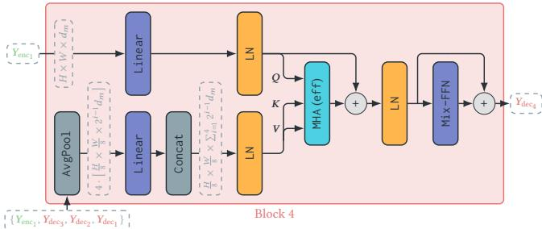  
Figure 6: Architecture of the decoder’s block 4 of a model with patch size $P = 1$ . The other blocks have a similar structure, but operate on tensors of diferent shapes. The encoder feature is the query, while the encoder-decoder feature pyramid provides the keys and values.

The transformation of the four features (of diferent resolution) into the keys and values works as follows: An AvgPool layer unifies the spatial dimensions by pooling all feature maps to the resolution of the lowest encoder block $\begin{array} { r } { ( \frac { H } { 3 2 } \times \frac { W } { 3 2 } } \end{array}$ for the original setting of $P = 4$ and $\textstyle { \frac { H } { 8 } } \times { \frac { W } { 8 } }$ when setting $P = 1 )$ . Then a Linear layer postprocesses the channel dimension and a Concat layer concatenates all feature maps. Subsequently, the spatial dimensions are flattened, and the channel dimension split into two (for the individual projections for keys and values) [51]. After computing the MHA, the tokens are postprocessed via a Mix-FFN, as introduced by the SegFormer’s MiT (see Section 4.1) [50, 51].

## 4.3 Architectural Adaptations

We adapt the original implementations in two minor yet crucial ways. In our experiments, we vary the patch size $P \in \{ 1 , 2 , 4 , 8 \}$ to study its impact. To achieve this, we implement the first overlapped patch embedding via a Conv layer with a kernel size of $2 P - 1$ , stride of �, and padding of $P - 1$ (subsequent patch embedding layers stay unchanged). A bigger patch size would result in an output with a proportionally smaller spatial resolution. To counteract this efect, we restore the original resolution by adding PatchExpand layers in front of the final linear layer, which creates the prediction. The PatchExpand layer was introduced by Cao et al. [2] to increase a tensor’s spatial resolution. It first expands the embedding dimension by a factor of two, then reshapes the tensor to twice the spatial dimension and half the original embedding dimension. This approach of parametric upsampling is common practice, and superior to the non-parametric bilinear upsampling of the predictions [2]. We further substitute all attention blocks across the model with eficient attention [40] by default and experiment with other attention variants described in Section 5.3.2.

## 5 Experiments

Followingly, we empirically study pixel-level ViTs for canopy height prediction w.r.t. prediction quality and computational eficiency. We first describe two datasets used for training and evaluation, and then analyze the impact of patch size, model dimension, and attention mechanism. Finally, we benchmark the resulting model against established dense prediction architectures.

## 5.1 Datasets

We consider two datasets for experimental evaluation: The Europe dataset is based on Pauls et al. [31] and the France dataset contains labels from the OpenCanopy dataset by Fogel et al. [15]. Both datasets have Sentinel-2 images as input, which consist of twelve channels and have a shape of 256 × 256 pixels. We take median composites across multiple months to reduce the prevalence of clouds. All channels are clipped to a per-channel reflectance range before being min-max normalized to a range of zero to one [31].

The Europe dataset consists of about 395 000 patches, which were split into a training (95%) and validation set (5%). It has a temporal coverage from 2019 to 2023. The GEDI labels follow a right-skewed distribution with the 5% quantile at $2 . 4 \mathrm { m } , ^ { 7 }$ the median at 3.7 m, and the 95% quantile at 28.2 m. This dataset does not have high-resolution ALS labels.

The France dataset combines the ALS labels provided by the OpenCanopy dataset [15] with the available GEDI labels from the same year and region. The ALS labels are available on a resolution of 1.5 m, which we resampled to 10 m by taking the maximum to match the resolution of our Sentinel-2 inputs. Using the large tiles from OpenCanopy, we use a sliding window approach to create non-overlapping cutouts of size 256 × 256 pixels (to match the resolution of the Europe dataset). The GEDI labels have the 5% quantile at 2.5 m, the median at 10.4 m and the 95% quantile at 35.7 m, while the quantiles of the ALS labels are at 0.1 m, 10.9 m, and 30.2 m. We train and evaluate our models on the Europe dataset. For the final evaluation, we consider the France dataset, ensuring that none of its patches overlap with those used during training. The geographical extent of the Europe dataset’s training and validation patches, as well as the France dataset’s evaluation patches, is shown in Figure 13 in the appendix.

## 5.2 Evaluation Metrics

Apart from perceptual (i.e. qualitative) evaluation, we quantitatively evaluate the models on validation datasets along two dimensions: predictive accuracy and computational cost. We obtain robust estimates by training each model configuration five times with diferent seeds. To assess predictive accuracy, we use two metrics. First, we compute the mean absolute error over all pixels with a label greater than 5 m $( M A E _ { > 5 \mathrm { m } } \in [ 0 , \infty )$ , lower is better). This threshold miti gates the influence of grassland pixels, which dominate the dataset, focusing on pixels containing trees. Second, we report the coefficient of determination $( R ^ { 2 } \in \mathsf { \Gamma } ( - \infty , 1 ]$ , higher is better), which quantifies the variance reduction achieved by the model relative to a constant mean prediction. We also indicate the label type (GEDI or ALS) on which the metric is computed. Computational cost is assessed by measuring the runtime of a single training step on a mini-batch containing one image (forward and backward pass), along with its peak VRAM usage. For perceptual evaluation, we show predictions of the model with the median $M A E _ { > 5 \mathrm { m } } \left( \mathrm { A L S } \right)$

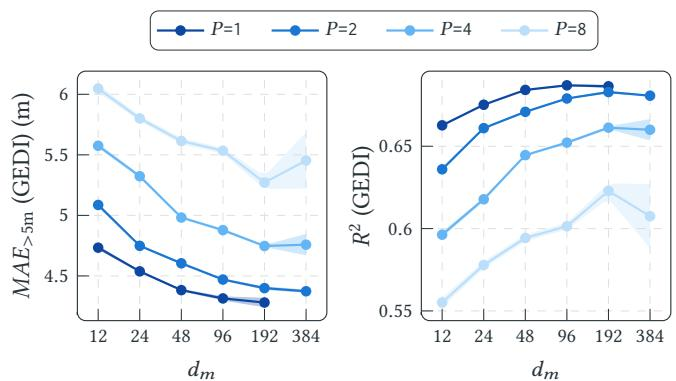  
Figure 7: Performance comparison of models with varying patch size (�) and model dimension $( d _ { m } )$ on the validation subset of the Europe dataset (GEDI labels). Shown are the mean and standard deviation of five training runs per config.

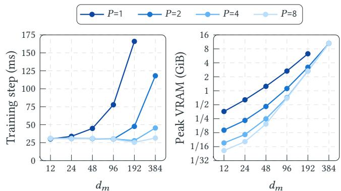  
Figure 8: Eficiency comparison of models with varying patch size (�) and model dimension $( d _ { m } )$ . Shown is the mean of 1 000 training steps on single-image batches across five runs. The standard deviation is imperceptible, due to its small scale.

## 5.3 Results

We first investigate the impact of varying patch sizes and model dimensions, fixing the attention mechanism to eficient attention. Then, we explore the impact of diferent attention mechanisms, fixing the patch size and model dimension to the optimal values determined by the first experiment. Finally, we compare the bestperforming configuration with established baseline architectures commonly used for canopy height prediction, depth estimation, and semantic segmentation more broadly. All models, except for the baselines, follow the architecture described in Section 4. The number of attention heads doubles in every stage from 1 to 8. The decoder dimension is fixed to 96.

5.3.1 Impact ofPatch Size & Model Dimension. We independently vary the patch size $P ~ \in ~ \{ 1 , 2 , 4 , 8 \}$ and model dimension $d _ { m }$ ∈ {12, 24, 48, 96, 192, 384}8, resulting in 24 model configurations.9 All models were trained for six epochs, which was enough for the models to converge (note that one epoch is based on 395 000 instances), while not requiring too many resources. No form of regularization was used, as no overfitting occurred for any of the models, presumably due to the sparsity of the supervision signal and the size and diversity of the dataset. We employed gradient checkpointing after every stage to reduce the VRAM requirements of our models [4, 16]. Models with larger patch sizes use PatchExpand layers to increase the resolution to the original input resolution.10

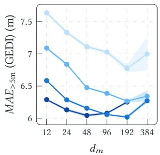

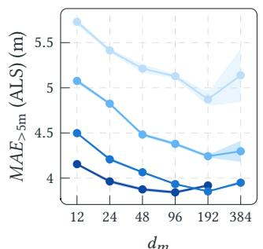

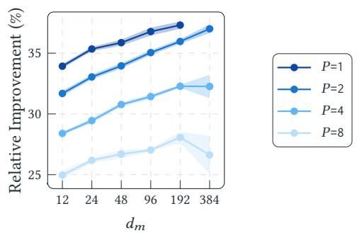  
Figure 9: Comparison of $M A E _ { > 5 \mathbf { m } }$ computed on GEDI labels (left) and ALS labels (center) of the France dataset across models with varying patch size (�) and model dimension $( d _ { m } )$ . (Right:) Relative improvement when computing the $M A E _ { > 5 \mathbf { m } }$ on ALS labels instead of GEDI labels.

Quantitative Evaluation: Figure 7 shows the two regression metrics, $M A E _ { > 5 \mathrm { m } }$ and $R ^ { 2 }$ , in dependence of the model dimension and patch size, averaged over five training runs. Both metrics follow the same trend: For a fixed model dimension, a smaller patch size results in stronger performance, which is in line with the patchification scaling laws [45]. The larger the model dimension, the weaker the efect. At the same time, for a fixed patch size, a larger model dimension generally improves performance, but with diminishing returns.

Qualitative Evaluation: Figures 1 and 18 (in the appendix) show predictions of models with varying patch size on exemplary validation patches of the France dataset. In general, the diferences in perceptual quality are most pronounced for image regions with fine details, like narrow streams or paths through a forest. For models with a patch size $P > 1$ , unpleasant grid-like artifacts arise, with the size of a grid “cell” equal to the patch size. To quantify the grids intensity, inspired by Wu and Yuen [49] and Wang et al. [48], we compute the diferences of two adjacent pixels’ residuals (based on the ALS labels) within a cell of length � (referred to as $A _ { P } )$ and across a cell’s borders $\left( B _ { P } \right)$ . Their ratio $( { B _ { P } } / { A _ { P } } )$ is shown in Figure 15 in the appendix, indicating that larger patch sizes lead to stronger grid artifacts. This is plausible, as more upsampling steps need to be performed in the decoder.

Runtime and Memory Analysis: However, the performance gains come at the price of reduced eficiency, as shown in Figure 8. Transformers are resource-intensive—even when using an attention variant with linear complexity, like eficient attention. Training time for a single instance and required memory scale roughly by a factor of $1 / P ^ { 2 }$ , i.e., halving the patch size roughly quadruples the training time. The training time as well as the models’ number of parameters grow quadratically in the model dimension, due to the nature of fully connected linear layers. The number of parameters is independent of the patch size.

GEDI vs. ALS Ground Truth: As the GEDI labels are inherently noisy, we also evaluated our models on the ALS labels given in the France dataset. The results of this evaluation are shown in Figure 9. Note that here the $M A E _ { > 5 \mathrm { m } }$ computed on the GEDI labels is substantially worse than the one computed on the Europe dataset, as the model has not seen any inputs close to the France dataset, which was only used for testing, not for training. Across all models, the $M A E _ { > 5 \mathrm { m } }$ is significantly better when computed on ALS labels instead of GEDI labels. The relative improvement ranges from 25.1% to 37.4%. Interestingly, the models which performed better initially (i.e., models with a smaller patch size or larger model dimension) have an even bigger relative improvement when evaluated on the higher-quality ALS labels. This implies that models with larger patch sizes get evaluated favorably by GEDI data, misrepresenting the actual performance diference. An explanation is that due to the label noise present with GEDI labels, models producing smoother predictions have an advantage. It can also be observed that for smaller patch sizes, models with comparably smaller model dimensions can perform better. The best models have the configurations $( P = 1 , d _ { m } = 9 6 ) , ( P = 2 , d _ { m } = 1 9 2 ) , ( P = 4 , d _ { m } = 1 9 2 )$ , and $\left( P = 8 , d _ { m } = 1 9 2 \right)$ . That the optimal model dimension is smaller, when choosing a smaller patch size, can be explained by viewing patchification as a compression step [45]: Smaller patch sizes mean less information has to be compressed into a single token, so the dimensionality of each token can be reduced.

Analyzing the error for various bins oflabel heights (see Figure 14 in the appendix), we observe that smaller patch sizes result in a lower variance of errors on ALS labels for smaller trees, and a smaller absolute error for taller trees.

Figure 10 shows the joint distribution of the labels (one with GEDI, the other with ALS labels) and the model predictions as heatmaps, and the diference between the two heatmaps. The difference for labels smaller than 10 m arises due to a particularity of GEDI labels: Structures shorter than 2.5 m are generally not reliably detected, resulting in labels of around 2.5 m, even when there is no vegetation. For labels greater than 10 m, it can be clearly seen that the density around the perfect-fit line (prediction = label) is consistently higher for the ALS-vs-prediction heatmap. Further away from the perfect-fit line, the GEDI-vs-prediction heatmap has a greater density. This shows that the model’s predictions match the ALS labels better than the GEDI labels (which it was trained on) across almost all tree heights. The observed efect is less pronounced for models with larger patch sizes (see Figure 17 in the appendix). Figure 16 in the appendix shows that GEDI and ALS labels have a surprisingly small correlation.

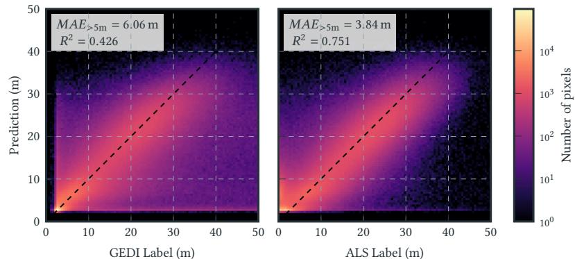

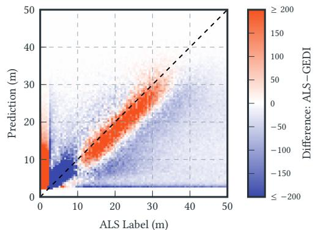  
Figure 10: (Left:) Reference canopy height (GEDI/ALS label) vs. predictions by the model with $P = 1 , d _ { m } = 9 6 .$ . Both heatmaps are computed only for pixels where both labels exist. (Right:) Diference of the heatmaps, where red color indicates a higher density of the ALS heatmap and blue color a higher density of the GEDI heatmap.

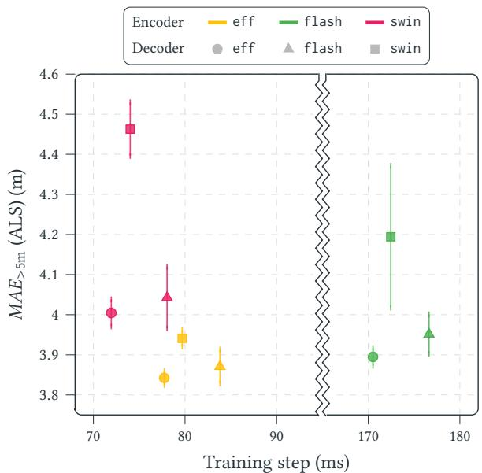  
Figure 11: Trade-of between performance $( M A E _ { > 5 \mathbf { m } }$ computed on ALS labels) and eficiency (training time for a singleimage batch). Compared are nine models with varying attention mechanisms in the encoder (indicated by marker color) and decoder (indicated by marker shape): eficient (eff), flash (flash), and shifted window (swin). Shown are the mean and standard deviation of five training runs per configuration.

5.3.2 Impact of Atention Mechanism. Next, we fix the hyperparameters to $P = 1$ and $d _ { m } = 9 6$ to investigate the impact of three well-known attention mechanisms in isolation: eficient attention (eff), flash attention (flash), and shifted window attention (swin), which we vary individually for the encoder and decoder. The window size of swin attention is set to $7 \times 7$ tokens. The other two variants do not require setting any hyperparameters other than the ones shared by all attention mechanisms, like the number of attention heads and attention dropout.

Figure 11 shows the performance-eficiency trade-of for models with varying attention mechanisms, where better models are positioned towards the bottom left corner. We observe significant performance gains when using global attention (eff or flash) instead of local attention (swin) in the decoder and/or encoder. The model with the best performance, while still being comparatively eficient, uses eficient attention in the encoder and decoder—as was also used in the previous experiment—and has an average $M A E _ { > 5 \mathrm { m } }$ (computed on ALS labels) of 3.84 m and a runtime of about 78 ms.

The training time of models with swin and eff attention is very similar, while flash takes more than twice as long. In general, the impact of the encoder’s attention mechanism is significantly bigger than the decoder’s, as the keys and values are pooled to the lowest resolution in the decoder block (see Figure 6). All architectures have a similar peak VRAM: Training the model with a batch size of 1 requires about 2.66 GiB for the architectures using eff and flash attention and about 2.81 GiB for the architecture using swin attention throughout the model. In contrast, vanilla attention already produces an out-of-memory error for inputs of this size.11

For a qualitative evaluation, predictions on an exemplary validation patch can be seen in Figure 19 in the appendix.

5.3.3 Comparison with Baseline Models. We compare the performance of the best configuration of the previous experiments12 with several models commonly used for dense prediction tasks. The U-Net architecture [35] consists of a symmetric convolutional encoder and decoder and has been used to generate a global canopy height map [30] and predict canopy height and above-ground biomass across France [37]. The Residual U-Net (ResUnet) has been used as a baseline by Tolan et al. [41], and their final model is based on the Dense Prediction Transformer, which has a default patch size of � = 16 [34]. The SegFormer consists of a Mix Transformer encoder with patch size � = 4 and a lightweight Multilayer Perceptron decoder [50]. Based on the Swin Transformer [25], the Swin-Unet is a symmetric encoder-decoder architecture, and was adapted by Pauls et al. [29] to produce a multi-year global canopy height map.

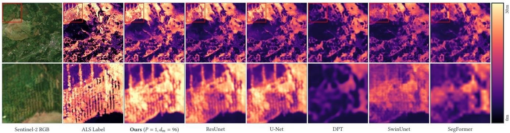  
Figure 12: Qualitative comparison of predictions made by various models. The UNet and ResUnet are strong CNN baselines, while ViT-based architectures with a high patch size produce predictions which are blurry or show a grid pattern.

Table 1: Comparison of well-known dense prediction baselines using three predictive metrics, as well as the runtime per training step (ts) in ms and peak VRAM usage in MiB. The model Ours uses $P = 1 , d _ { m } = 9 6$ and is averaged over its five seed repeats; the baselines were trained once.
<table><tr><td>Model</td><td> $M A E _ { > 5 \mathrm { m } } \downarrow$  (GEDI)</td><td> $R ^ { 2 } \uparrow$  (GEDI)</td><td> $M A E _ { > 5 \mathrm { m } } \downarrow$  (ALS)</td><td>ts ↓</td><td>VRAM↓</td></tr><tr><td>SegFormer</td><td>5.02</td><td>0.641</td><td>4.62</td><td>52.2</td><td>525</td></tr><tr><td>SwinUnet</td><td>5.17</td><td>0.629</td><td>4.66</td><td>45.3</td><td>551</td></tr><tr><td>DPT</td><td>5.35</td><td>0.615</td><td>5.04</td><td>18.1</td><td>2069</td></tr><tr><td>U-Net</td><td>4.59</td><td>0.672</td><td>4.14</td><td>8.2</td><td>851</td></tr><tr><td>ResUnet</td><td>4.56</td><td>0.674</td><td>4.19</td><td>7.4</td><td>517</td></tr><tr><td>Ours</td><td>4.31</td><td>0.687</td><td>3.84</td><td>77.7</td><td>2722</td></tr></table>

Table 1 shows the resulting metrics and Figure 12 the predictions on an example patch. While our pixel-level Transformer model achieves the strongest predictive performance (measured by $M A E _ { > 5 \mathrm { m } }$ and �2), the results also show that U-Net-based archi tectures remain highly competitive: They ofer substantially faster and more resource-eficient training while achieving performance superior to Transformer models with larger patch sizes. Meanwhile, our experiments also demonstrate that carefully configured Transformer architectures can surpass other models, suggesting that the additional computational cost can translate into meaningful gains in prediction quality.

5.3.4 Discussion. Our results should be interpreted as relative comparisons within a controlled experimental setting. As our focus lies on comparing architectural choices rather than maximizing canopy height estimation performance, the reported metrics should not be directly compared with those of existing canopy height products.

The architectural choices considered in this work only represent a small subset of the design space of Transformer-based models. While we focused on patch size, model dimension, and the attention mechanism, other factors such as model depth and decoder design may further improve performance. In particular, a stronger decoder might be able to reconstruct the spatial dimensions lost in the patchification step.

If the training is highly resource-constrained and a small performance loss is acceptable, Transformer-based models with a patch size of � = 2 or CNN-based models remain strong alternatives.

## 6 Conclusion

We conducted experiments on adapting important hyperparameters of Vision Transformer-based models: patch size, model dimension and the attention mechanism used. The results indicate that, while pixel-level Transformers are remarkably resource-hungry, choosing an appropriate model dimension and using an eficient attention approximation gives rise to models with a very strong performance. Architectures operating at a pixel level have the further benefit of being intuitive (as the image is not split into arbitrary chunks) and simpler (as the model predictions inherently have the same resolution as the input). For the studied task of canopy height prediction, even though the models are trained on noisy labels derived from GEDI data, they indeed learn fine details, which can be evaluated using higher-quality ALS labels that are only available for selected regions. Only evaluating the models on GEDI labels paints an incomplete picture ofmodel performance. Note that, while the benchmark comparison is based on the task of canopy height prediction, we believe that similar observations can be made for other remote sensing tasks such as biomass estimation, soil moisture mapping, or crop yield forecasting. Through our experiments, we hope to motivate other researchers to explore eficient pixel-level Transformers for dense prediction tasks, especially when given medium- or low-resolution satellite imagery as input.

## Acknowledgments

This work was supported via the AI4Forest project, which is funded by the German Federal Ministry of Research, Technology and Space (BMFTR; grant number 01IS23025A) and the French National Research Agency (ANR; grant number ANR-22-FAI1-0002). Calculations for this publication were performed on the HPC cluster PALMA II of the University of Münster, subsidized by the DFG (INST 211/667-1).

## References

[1] Gordon B. Bonan. 2008. Forests and Climate Change: Forcings, Feedbacks, and the Climate Benefits of Forests. Science 320, 5882 (2008), 1444–1449. doi:10.1126/ science.1155121

[2] Hu Cao, Yueyue Wang, Joy Chen, Dongsheng Jiang, Xiaopeng Zhang, Qi Tian, and Manning Wang. 2022. Swin-Unet: Unet-Like Pure Transformer for Medical Image Segmentation. In Computer Vision – ECCV 2022 Workshops. Springer-Verlag, Berlin, Heidelberg, 205–218. doi:10.1007/978-3-031-25066-8\_9

[3] Mark Chen, Alec Radford, Rewon Child, Jefrey Wu, Heewoo Jun, David Luan, and Ilya Sutskever. 2020. Generative Pretraining From Pixels. In International Conference on Machine Learning (Proceedings ofMachine Learning Research, Vol. 119). PMLR, 1691–1703. https://proceedings.mlr.press/v119/chen20s.html

[4] Tianqi Chen, Bing Xu, Chiyuan Zhang, and Carlos Guestrin. 2016. Training Deep Nets with Sublinear Memory Cost. arXiv:1604.06174 https://arxiv.org/abs/1604. 06174

[5] Krzysztof Marcin Choromanski, Valerii Likhosherstov, David Dohan, Xingyou Song, Andreea Gane, Tamas Sarlos, Peter Hawkins, Jared Quincy Davis, Afroz Mohiuddin, Lukasz Kaiser, David Benjamin Belanger, Lucy J Colwell, and Adrian Weller. 2021. Rethinking Attention with Performers. In International Conference on Learning Representations. https://openreview.net/forum?id=Ua6zuk0WRH

[6] Copernicus Sentinel-2 (processed by ESA). 2021. MSI Level-2A BOA Reflectance Product. Collection 1. doi:10.5270/S2\_-znk9xsj

[7] Tri Dao. 2024. FlashAttention-2: Faster Attention with Better Parallelism and Work Partitioning. In International Conference on Learning Representations. https: //openreview.net/forum?id=mZn2Xyh9Ec

[8] Tri Dao, Daniel Y. Fu, Stefano Ermon, Atri Rudra, and Christopher Ré. 2022. FlashAttention: Fast and Memory-Eficient Exact Attention with IO-Awareness. In Advances in Neural Information Processing Systems, Vol. 35. Curran Associates, Inc., 16344–16359. doi:10.52202/068431-1189

[9] Xiaoyi Dong, Jianmin Bao, Dongdong Chen, Weiming Zhang, Nenghai Yu, Lu Yuan, Dong Chen, and Baining Guo. 2022. CSWin Transformer: A General Vision Transformer Backbone with Cross-Shaped Windows. In IEEE/CVF Conference on Computer Vision and Pattern Recognition (CVPR’22). 12114–12124. doi:10.1109 CVPR52688.2022.01181

[10] Alexey Dosovitskiy, Lucas Beyer, Alexander Kolesnikov, Dirk Weissenborn, Xiaohua Zhai, Thomas Unterthiner, Mostafa Dehghani, Matthias Minderer, Georg Heigold, Sylvain Gelly, Jakob Uszkoreit, and Neil Houlsby. 2021. An Image is Worth 16x16 Words: Transformers for Image Recognition at Scale. In International Conference on Learning Representations. https://openreview.net/forum?id= YicbFdNTTy

[11] Matthias Drusch, Umberto del Bello, Stefane Carlier, Olivier Colin, Valérie Fer nandez, Ferran Gascón, Bianca Hoersch, Claudia Isola, Paolo Laberinti, Philippe Martimort, Aimé Meygret, François Spoto, Omar Sy, Franco Marchese, and Pier G. Bargellini. 2012. Sentinel-2: ESA’s Optical High-Resolution Mission for GMES Operational Services. Remote Sensing ofEnvironment 120 (2012), 25–36. doi:10.1016/j.rse.2011.11.026

[12] Ralph Dubayah, James Bryan Blair, Scott Goetz, Lola Fatoyinbo, Matthew Hansen, Sean Healey, Michelle Hofton, George Hurtt, James Kellner, Scott Luthcke, John Armston, Hao Tang, Laura Duncanson, Steven Hancock, Patrick Jantz, Suzanne Marselis, Paul L. Patterson, Wenlu Qi, and Carlos Silva. 2020. The Global Ecosystem Dynamics Investigation: High-resolution laser ranging of the Earth’s forests and topography. Science ofRemote Sensing 1 (2020), 100002. doi:10.1016/j.srs.2020.100002

[13] Earth Resources Observation and Science (EROS) Center. 2020. Landsat 8-9 Operational Land Imager / Thermal Infrared Sensor Level-2, Collection 2. doi:10. 5066/P9OGBGM6

[14] Ibrahim Fayad, Philippe Ciais, Martin Schwartz, Jean-Pierre Wigneron, Nicolas Baghdadi, Aurélien de Truchis, Alexandre d’Aspremont, Frederic Frappart, Sassan Saatchi, Ewan Sean, Agnes Pellissier-Tanon, and Hassan Bazzi. 2024. Hy-TeC: a hybrid vision transformer model for high-resolution and large-scale mapping of canopy height. Remote Sensing of Environment 302 (2024), 113945. doi:10.1016/j. rse.2023.113945

[15] Fajwel Fogel, Yohann Perron, Nikola Besic, Laurent Saint-André, Agnès Pellissier-Tanon, Martin Schwartz, Thomas Boudras, Ibrahim Fayad, Alexandre d’Aspremont, Loic Landrieu, and Philippe Ciais. 2025. Open-Canopy: Towards Very High Resolution Forest Monitoring. In IEEE/CVF Conference on Computer Vision and Pattern Recognition (CVPR’25). 1395–1406. doi:10.1109/CVPR52734. 2025.00138

[16] Andreas Griewank and Andrea Walther. 2000. Algorithm 799: Revolve: An Implementation of Checkpointing for the Reverse or Adjoint Mode of Computational Diferentiation. ACM Trans. Math. Software 26, 1 (2000), 19–45. doi:10.1145/347837.347846

[17] Jonathan Ho, Nal Kalchbrenner, Dirk Weissenborn, and Tim Salimans. 2019. Axial Attention in Multidimensional Transformers. arXiv:1912.12180 https://arxiv.org/ abs/1912.12180

[18] Intergovernmental Panel on Climate Change. 2006. Agriculture, Forestry and Other Land Use. In 2006 IPCC Guidelines for National Greenhouse Gas Inventories,

Harald Aalde, Patrick Gonzalez, Michael Gytarsky, Thelma Krug, Werner A. Kurz, Stephen Ogle, John Raison, Dieter Schoene, and N. H. Ravindranath (Eds.). Vol. 4. Institute for Global Environmental Strategies. https://www.ipcc-nggip.iges.or. jp/public/2006gl/vol4.html

[19] Patrick Kacic, Frank Thonfeld, Ursula Gessner, and Claudia Kuenzer. 2023. Forest Structure Characterization in Germany: Novel Products and Analysis Based on GEDI, Sentinel-1 and Sentinel-2 Data. Remote Sensing 15, 8, Article 1969 (2023). doi:10.3390/rs15081969

[20] Jared Kaplan, Sam McCandlish, Tom Henighan, Tom B. Brown, Benjamin Chess, Rewon Child, Scott Gray, Alec Radford, Jefrey Wu, and Dario Amodei. 2020. Scaling Laws for Neural Language Models. arXiv:2001.08361 https://arxiv.org/ abs/2001.08361

[21] Angelos Katharopoulos, Apoorv Vyas, Nikolaos Pappas, and François Fleuret. 2020. Transformers are RNNs: Fast Autoregressive Transformers with Linear At tention. In International Conference on Machine Learning (Proceedings ofMachine Learning Research, Vol. 119). PMLR, 5156–5165. https://proceedings.mlr.press/ v119/katharopoulos20a.htm

[22] Nikita Kitaev, Lukasz Kaiser, and Anselm Levskaya. 2020. Reformer: The Eficient Transformer. In International Conference on Learning Representations. https: //openreview.net/forum?id=rkgNKkHtvB

[23] Nico Lang, Walter Jetz, Konrad Schindler, and Jan Dirk Wegner. 2023. A High-Resolution Canopy Height Model of the Earth. Nature Ecology & Evolution 7, 11 (2023), 1778–1789. doi:10.1038/s41559-023-02206-6

[24] Siyu Liu, Martin Brandt, Thomas Nord-Larsen,Jerome Chave, Florian Reiner, Nico Lang, Xiaoye Tong, Philippe Ciais, Christian Igel, Adrian Pascual, Juan Guerra Hernandez, Sizhuo Li, Maurice Mugabowindekwe, Sassan Saatchi, Yuemin Yue, Zhengchao Chen, and Rasmus Fensholt. 2023. The overlooked contribution of trees outside forests to tree cover and woody biomass across Europe. Science Advances 9, 37 (2023), eadh4097. doi:10.1126/sciadv.adh4097

[25] Ze Liu, Yutong Lin, Yue Cao, Han Hu, Yixuan Wei, Zheng Zhang, Stephen Lin, and Baining Guo. 2021. Swin Transformer: Hierarchical Vision Transformer using Shifted Windows. In IEEE/CVF International Conference on Computer Vision (ICCV’21). 9992–10002. doi:10.1109/ICCV48922.2021.00986

[26] Petr Lukeš, Viktor Myroniuk, Andrii Shamrai, Viktor Melnichenko, Martin Schwartz, and Jan Pauls. 2026. Integrating Global Canopy Height Models with Satellite Data for Improved Forest Inventory in Ukraine. Agricultural and Forest Meteorology 388 (2026), 111265. doi:10.1016/j.agrformet.2026.111265

[27] Thorsten Markus, Tom Neumann, Anthony Martino, Waleed Abdalati, Kelly Brunt, Beata Csatho, Sinead Farrell, Helen Fricker, Alex Gardner, David Harding, Michael Jasinski, Ron Kwok, Lori Magruder, Dan Lubin, Scott Luthcke, James Morison, Ross Nelson, Amy Neuenschwander, Stephen Palm, Sorin Popescu, CK Shum, Bob E. Schutz, Benjamin Smith, Yuekui Yang, and Jay Zwally. 2017. The Ice, Cloud, and land Elevation Satellite-2 (ICESat-2): Science requirements, concept, and implementation. Remote Sensing ofEnvironment 190 (2017), 260–273. doi:10.1016/j.rse.2016.12.029

[28] Duy Kien Nguyen, Mido Assran, Unnat Jain, Martin R. Oswald, Cees G. M. Snoek, and Xinlei Chen. 2025. An Image is Worth More Than 16x16 Patches: Exploring Transformers on Individual Pixels. In International Conference on Learning Representations. https://openreview.net/forum?id=tjNf0L8QjR

[29] Jan Pauls, Karsten Schrödter, Sven Ligensa, Martin Schwartz, Berkant Turan, Max Zimmer, Sassan Saatchi, Sebastian Pokutta, Philippe Ciais, and Fabian Gieseke. 2026. ECHOSAT: Estimating Canopy HeightOverSpace AndTime. arXiv:2602.21421 https://arxiv.org/abs/2602.21421

[30] Jan Pauls, Max Zimmer, Una M. Kelly, Martin Schwartz, Sassan Saatchi, Philippe Ciais, Sebastian Pokutta, Martin Brandt, and Fabian Gieseke. 2024. Estimat ing Canopy Height at Scale. In International Conference on Machine Learning (Proceedings ofMachine Learning Research, Vol. 235). PMLR, 39972–39988. https://proceedings.mlr.press/v235/pauls24a.html

[31] Jan Pauls, Max Zimmer, Berkant Turan, Sassan Saatchi, Philippe Ciais, Sebastian Pokutta, and Fabian Gieseke. 2025. Capturing Temporal Dynamics in Large-Scale Canopy Tree Height Estimation. In International Conference on Machine Learning (Proceedings ofMachine Learning Research, Vol. 267). PMLR, 48422–48438. https://proceedings.mlr.press/v267/pauls25a.html

[32] Hao Peng, Nikolaos Pappas, Dani Yogatama, Roy Schwartz, Noah Smith, and Lingpeng Kong. 2021. Random Feature Attention. In International Conference on Learning Representations. https://openreview.net/forum?id=QtTKTdVrFBB

[33] Peter Potapov, Xinyuan Li, Andres Hernandez-Serna, Alexandra Tyukavina, Matthew C. Hansen, Anil Kommareddy, Amy Pickens, Svetlana Turubanova, Hao Tang, Carlos Edibaldo Silva, John Armston, Ralph Dubayah, J. Bryan Blair, and Michelle Hofton. 2021. Mapping Global Forest Canopy Height through Integration of GEDI and Landsat Data. Remote Sensing of Environment 253 (2021), 112165. doi:10.1016/j.rse.2020.112165

[34] René Ranftl, Alexey Bochkovskiy, and Vladlen Koltun. 2021. Vision Transformers for Dense Prediction. In IEEE/CVF International Conference on Computer Vision (ICCV’21). 12159–12168. doi:10.1109/ICCV48922.2021.01196

[35] Olaf Ronneberger, Philipp Fischer, and Thomas Brox. 2015. U-Net: Convolutional Networks for Biomedical Image Segmentation. In Medical Image Computing and Computer-Assisted Intervention (MICCAI). Springer International Publishing,

Cham, 234–241. doi:10.1007/978-3-319-24574-4\_28

[36] Aurko Roy, Mohammad Safar, Ashish Vaswani, and David Grangier. 2021. Eficient Content-Based Sparse Attention with Routing Transformers. Transactions ofthe Association for Computational Linguistics 9 (2021), 53–68. doi:10.1162/tacl\_ a\_00353

[37] Martin Schwartz, Philippe Ciais, Aurélien de Truchis, Jérôme Chave, Catherine Ottlé, Cedric Vega, Jean-Pierre Wigneron, Manuel Nicolas, Sami Jouaber, Siyu Liu, Martin Brandt, and Ibrahim Fayad. 2023. FORMS: Forest Multiple Source height, wood volume, and biomass maps in France at 10 to 30m resolution based on Sentinel-1, Sentinel-2, and Global Ecosystem Dynamics Investigation (GEDI) data with a deep learning approach. Earth System Science Data 15, 11 (2023), 4927–4945. doi:10.5194/essd-15-4927-2023

[38] Martin Schwartz, Philippe Ciais, Catherine Ottlé, Aurelien De Truchis, Cedric Vega, Ibrahim Fayad, Martin Brandt, Rasmus Fensholt, Nicolas Baghdadi, François Morneau, David Morin, Dominique Guyon, Sylvia Dayau, and Jean-Pierre Wigneron. 2024. High-resolution canopy height map in the Landes forest (France) based on GEDI, Sentinel-1, and Sentinel-2 data with a deep learning approach. International Journal ofApplied Earth Observation and Geoinformation 128 (2024), 103711. doi:10.1016/j.jag.2024.103711

[39] Jay Shah, Ganesh Bikshandi, Ying Zhang, Vijay Thakkar, Pradeep Ramani, and Tri Dao. 2024. FlashAttention-3: Fast and Accurate Attention with Asynchrony and Low-precision. In Advances in Neural Information Processing Systems, Vol. 37. Curran Associates, Inc., 68658–68685. doi:10.52202/079017-2193

[40] Zhuoran Shen, Mingyuan Zhang, Haiyu Zhao, Shuai Yi, and Hongsheng Li. 2021. Eficient Attention: Attention With Linear Complexities. In IEEE/CVF Winter Conference on Applications of Computer Vision (WACV’21). 3531–3539. doi:10.1109/WACV48630.2021.00357

[41] Jamie Tolan, Hung-I Yang, Benjamin Nosarzewski, Guillaume Couairon, Huy V. Vo, John Brandt, Justine Spore, Sayantan Majumdar, Daniel Haziza, Janaki Vamaraju, Theo Moutakanni, Piotr Bojanowski, Tracy Johns, Brian White, Tobias Tiecke, and Camille Couprie. 2024. Very High Resolution Canopy Height Maps from RGB Imagery Using Self-Supervised Vision Transformer and Convolutional Decoder Trained on Aerial Lidar. Remote Sensing of Environment 300 (2024), 113888. doi:10.1016/j.rse.2023.113888

[42] Ashish Vaswani, Noam Shazeer, Niki Parmar, Jakob Uszkoreit, Llion Jones, Aidan N Gomez, Lukasz Kaiser, and Illia Polosukhin. 2017. Attention is All you Need. In Advances in Neural Information Processing Systems, Vol. 30. Curran Associates, Inc. https://proceedings.neurips.cc/paper\_files/paper/2017/hash/ 3f5ee243547dee91fbd053c1c4a845aa-Abstract.html

[43] Apoorv Vyas, Angelos Katharopoulos, and François Fleuret. 2020. Fast Transformers with Clustered Attention. In Advances in Neural Information Processing Systems, Vol. 33. Curran Associates, Inc., 21665–21674. https://proceedings. neurips.cc/paper/2020/hash/f6a8dd1c954c8506aadc764cc32b895e-Abstract.html

[44] Fabien H Wagner, Ricardo Dalagnol, Grifin Carter, Mayumi CM Hirye, Shivraj Gill, Le Bienfaiteur Sagang Takougoum, Samuel Favrichon, Michael Keller, Jean PHB Ometto, Lorena Alves, Cynthia Creze, Stephanie P George-Chacon, Shuang Li, Zhihua Liu, Adugna Mullissa, Yan Yang, Erone G Santos, Sarah R Worden, Martin Brandt, Philippe Ciais, Stephen C Hagen, and Sassan Saatchi. 2025. High Resolution Tree Height Mapping ofthe Amazon Forest using Planet NICFI Images and LiDAR-Informed U-Net Model. arXiv:2501.10600 https://arxiv. org/abs/2501.10600

[45] Feng Wang, Yaodong Yu, Wei Shao, Yuyin Zhou, Alan Yuille, and Cihang Xie. 2025. Scaling Laws in Patchification: An Image Is Worth 50,176 Tokens And More. In International Conference on Machine Learning (Proceedings ofMachine Learning Research, Vol. 267). PMLR, 65278–65290. https://proceedings.mlr.press/ v267/wang25ed.html

[46] Sinong Wang, Belinda Z. Li, Madian Khabsa, Han Fang, and Hao Ma. 2020. Linformer: Self-Attention with Linear Complexity. arXiv:2006.04768 https://arxiv. org/abs/2006.04768

[47] Wenhai Wang, Enze Xie, Xiang Li, Deng-Ping Fan, Kaitao Song, Ding Liang, Tong Lu, Ping Luo, and Ling Shao. 2021. Pyramid Vision Transformer: A Versatile Backbone for Dense Prediction without Convolutions. In IEEE/CVF International Conference on Computer Vision (ICCV’21). 548–558. doi:10.1109/ICCV48922.2021. 00061

[48] Zhou Wang, Hamid R. Sheikh, and Alan C. Bovik. 2002. No-Reference Perceptual Quality Assessment of JPEG Compressed Images. In Proceedings. International Conference on Image Processing, Vol. 1. I–477–I–480. doi:10.1109/ICIP.2002. 1038064

[49] Hong Ren Wu and Michael Yuen. 1997. A Generalized Block-Edge Impairment Metric for Video Coding. IEEE Signal Processing Letters 4, 11 (1997), 317–320. doi:10.1109/97.641398

[50] Enze Xie, Wenhai Wang, Zhiding Yu, Anima Anandkumar, Jose M. Alvarez, and Ping Luo. 2021. SegFormer: Simple and Eficient Design for Semantic Segmentation with Transformers. In Advances in Neural Information Processing Systems, Vol. 34. Curran Associates, Inc., 12077–12090. https://proceedings.neurips.cc/ paper\_files/paper/2021/hash/64f1f27bf1b4ec22924fd0acb550c235-Abstract.html

[51] Seul-Ki Yeom and Julian Von Klitzing. 2025. U-MixFormer: UNet-Like Trans former with Mix-Attention for Eficient Semantic Segmentation. In IEEE/CVF

Winter Conference on Applications of Computer Vision (WACV’25). 1–10. doi:10. 1109/WACV61041.2025.00750

[52] Yuhui Yuan, Rao Fu, Lang Huang, Weihong Lin, Chao Zhang, Xilin Chen, and Jingdong Wang. 2021. HRFormer: High-Resolution Vision Transformer for Dense Prediction. In Advances in Neural Information Processing Systems, Vol. 34. Curran Associates, Inc., 7281–7293. https://proceedings.neurips.cc/paper\_files/paper/ 2021/hash/3bbfdde8842a5c44a0323518eec97cbe-Abstract.html

[53] Ted Zadouri, Markus Hoehnerbach, Jay Shah, Vijay Thakkar, and Tri Dao. 2026. FlashAttention-4: Algorithm and Kernel Pipelining Co-Design for Asymmetric Hardware Scaling. In Proceedings of Machine Learning and Systems (ML-Sys’26). 912–926. https://proceedings.mlsys.org/paper\_files/paper/2026/hash/ ae8b0b5838ba510daf1198474e7b984-Abstract-Conference.html

[54] Sixiao Zheng, Jiachen Lu, Hengshuang Zhao, Xiatian Zhu, Zekun Luo, Yabiao Wang, Yanwei Fu, Jianfeng Feng, Tao Xiang, Philip H.S. Torr, and Li Zhang. 2021. Rethinking Semantic Segmentation from a Sequence-to-Sequence Perspective with Transformers. In IEEE/CVF Conference on Computer Vision and Pattern Recognition (CVPR’21). 6877–6886. doi:10.1109/CVPR46437.2021.00681

## A Supporting Figures

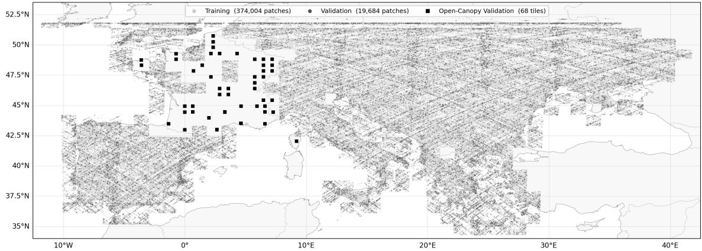  
Figure 13: Geographical distribution of training patches (light grey) and validation patches (dark grey) of the Europe dataset, and validation patches of the France dataset (black).

$$
\mid P = 1 , d _ { m } = 9 6
$$

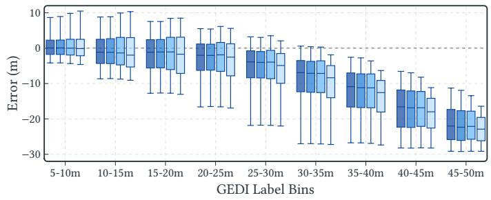

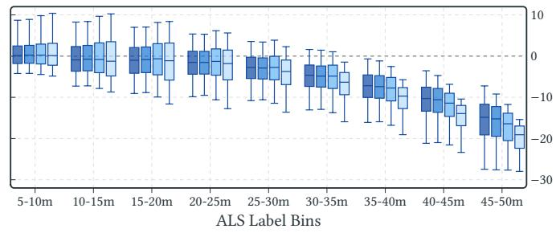

Figure 14: Comparison of errors across labels of diferent height for GEDI labels on the Europe dataset (left) and ALS labels on the France dataset (right). All models underestimate taller trees’ height, but models with smaller patch sizes less severely.  
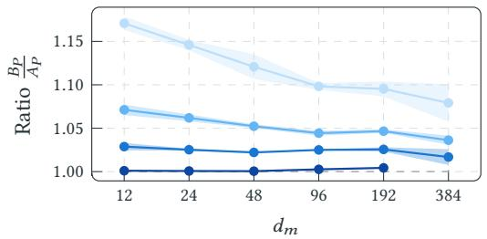

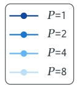

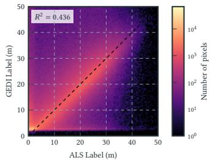  
Figure 15: Ratio $\frac { B _ { P } } { A _ { P } }$ of how much larger the diferences of residuals (computed on the France dataset’s ALS labels) are across borders of a grid cell of size $P \left( B _ { P } \right)$ compared to within a grid cell $( A _ { P } ) .$ . Deviating from this, we compute $\frac { B _ { 2 } } { A _ { 2 } }$ for the model with $P = 1 .$  
Figure 16: Correlation of ALS and GEDI labels on the France dataset (computed where both labels are available).

Table 2: Height � (equal to the width � ) of the feature maps for various patch sizes and stages, given by $H / ( P \cdot 2 ^ { i - 1 } ) \times W / ( P \cdot 2 ^ { i - 1 } )$ for an input of $H = W = 2 5 6 .$ . The channels double after every stage.
<table><tr><td></td><td colspan="4">Patch size P</td></tr><tr><td>Stage i</td><td>1</td><td>2</td><td>4</td><td>8</td></tr><tr><td>1</td><td>256</td><td>128</td><td>64</td><td>32</td></tr><tr><td>2</td><td>128</td><td>64</td><td>32</td><td>16</td></tr><tr><td>3</td><td>64</td><td>32</td><td>16</td><td>8</td></tr><tr><td>4</td><td>32</td><td>16</td><td>8</td><td>4</td></tr></table>

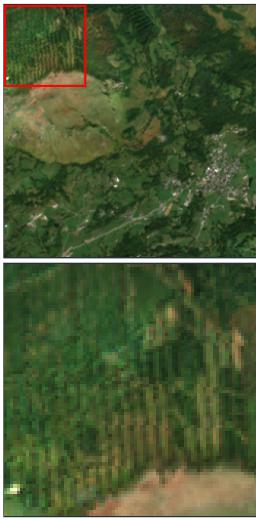

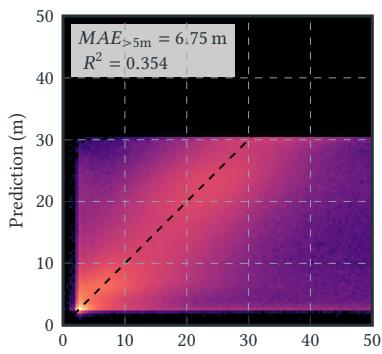  
GEDI Label (m)

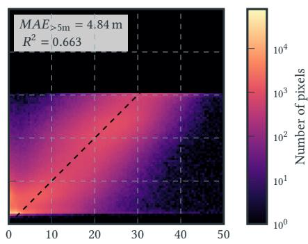  
ALS Label (m)

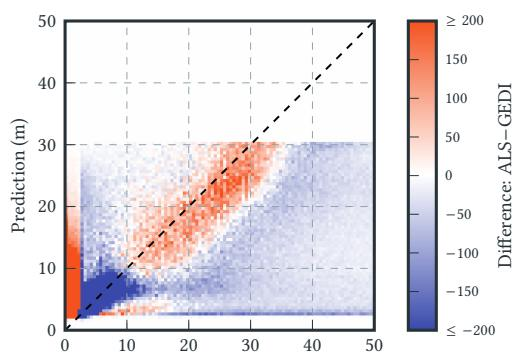  
ALS Label (m)

Figure 17: Predicted vs. reference canopy height for the $P = 8 , d _ { m } = 1 9 2$ model, over pixels where both labels exist. Evidently, the model has not (yet) learned to predict trees taller than 30 m.  
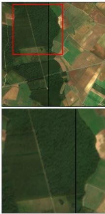  
Sentinel-2 RGB

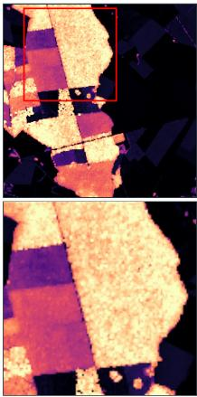  
ALS Label

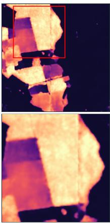  
� = 1, �� = 96

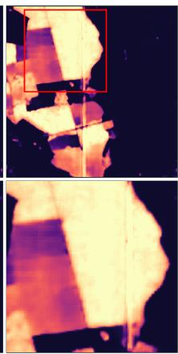  
� = 2, �� = 192

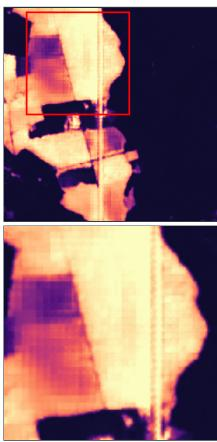  
� = 4, �� = 192

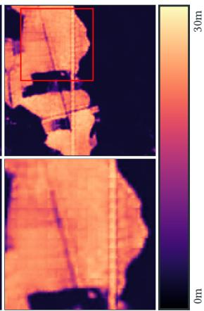  
� = 8, �� = 192

Figure 18: Qualitative comparison of models with diferent patch sizes (�) and model dimensions (� ). Models with smaller patch sizes handle the vertical line of missing input data better and produce more accurate predictions.  
Sentinel-2 RGB  
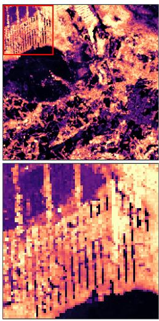  
ALS Label

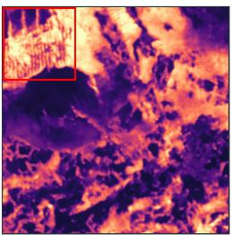

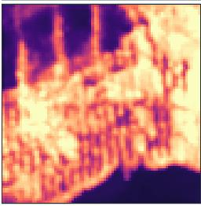  
eff

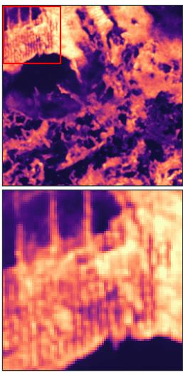  
flash

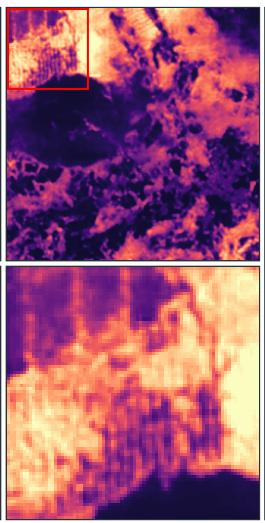

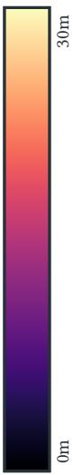  
swin  
Figure 19: Qualitative comparison of models with diferent attention mechanisms (same in encoder and decoder).