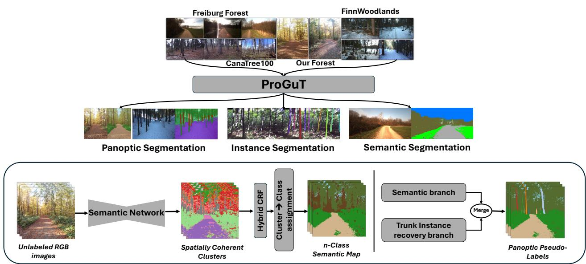
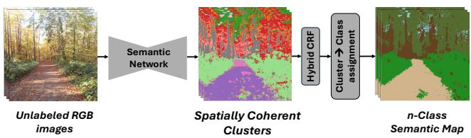
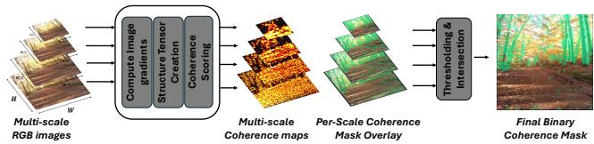
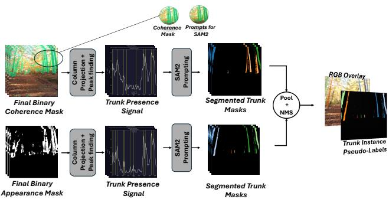
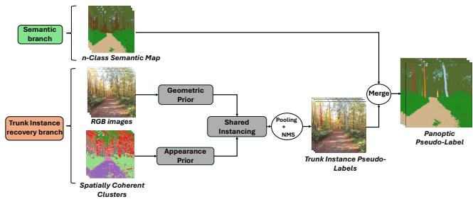
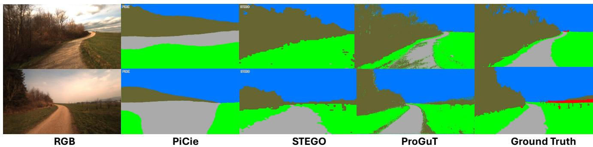
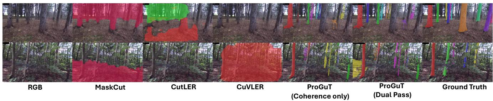
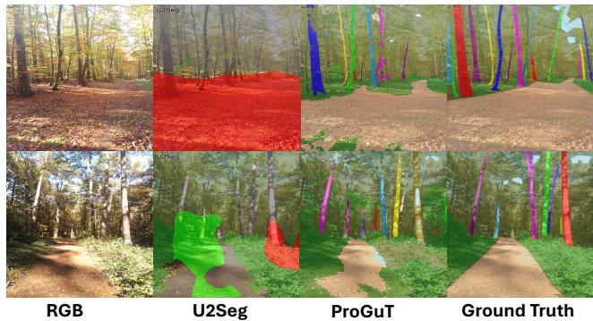
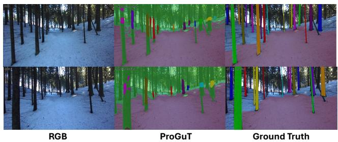

# ProGuT: Label-Efficient Panoptic Segmentation for Forest Scenes

Pankaj Deoli Robotics Research Lab, RPTU Kaiserslautern-Landau Gottlieb-Daimler-Str. 48, 67663 Kaiserslautern, Germany

Karsten Berns Robotics Research Lab, RPTU Kaiserslautern-Landau Gottlieb-Daimler-Str. 48, 67663 Kaiserslautern, Germany karsten.berns@cs.rptu.de

  
Figure 1. Results and overview of ProGuT. Top: Given unlabeled forest images, ProGuT produces Semantic, Instance and Panoptic segmentation. Bottom: The ProGuT pipeline. A semantic network clusters CLIP patch features into Spatially Coherent Clusters; followed by a hybrid CRF and cluster-to-class assignment yielding n-class semantic map. In parallel, a trunk-instance branch recovers individual trunks via multi-scale geometric prior. The 2 branches are merged to form panoptic pseudo-labels.

## Abstract

Panoptic segmentation in forest environments is bottlenecked not by semantic quality but by instance separation; existing unsupervised panoptic approaches produce usable stuff maps but near-zero thing quality. Depth or flow-based instance discovery methods needs sensors that are not always available. We present ProGuT (Prototype Guided Training), which produces panoptic pseudo-labels without per-image training masks, needing only unlabeled images and one-time cluster-to-class mapping. ProGuT clusters CLIP patch features, then recovers trunk instances

through multiscale geometric prior that falsifies non-trunk structures via structure-tensor. This is cheap compared to depth, flow or class-supervision methods to create pseudolabels. These are then used for downstream tasks which we evaluate against other unsupervised baselines. ProGuT achieves a Panoptic Quality (PQ) of 65.2 on Our-forest dataset (2.6× improvement over the initial pseudo-label quality) and reaches 65.9 mIoU on Freiburg Forest, outperforming unsupervised baselines like PiCIE (45.3 IoU) and STEGO (57.6 IoU). Additionally, ProGuT outperforms existing unsupervised methods for class-agnostic trunk in-

stance benchmark.

## 1. Introduction

When an Autonomous Ground Robot (AGR) enters a forest, it has to answer 2 questions simultaneously: Where can it drive ? and What does it see around itself ? These questions can be categorized as Semantic or Instance in nature. Panoptic Segmentation addresses both under a unified representation, hence making it an ideal approach for forest robotics. However, deploying panoptic models in forests comes with its own challenges wherein the ”common workflow” of train a model on large annotated dataset breaks down.

We argue that this breakdown is significantly due to 2 reasons. Firstly, Forests scenes violate every assumption that common instance segmentation methodologies rely on. The most common objects (i.e. tree trunks) are non-salient, often ambiguous, occluded and do not move independently of the scene. The structure breaks the anchor priors and NMS heuristics calibrated for common datasets. Secondly, manual annotations do not scale. Although annotating manually is not the issue, the preciseness and consistency of it is. The process is highly user/task dependent, and often inconsistent. One of the publicly available panoptic datasets (Finnwoodlands [20]) has only 300 annotated images from 5, 170 frames and that too on a coarse level. A densely annotated forest dataset at urban level does not exist and the economics of the domain suggests it is difficult. Altogether, these shortcomings motivate towards a different paradigm. A procedure which can be re-run from scratch, without any manual labels, each time the robots encounters a new forest. This is the methodology ProGuT (Prototype Guided Training) is designed to realize.

While semantic categorization is somewhat addressed with methods like STEGO [13] already producing decent stuff maps on forest data (see Table. 1 & Figure. 6), however, precise instance segmentation is the bottleneck. Existing unsupervised instance discovery methods such as MaskCut [33], CutLER [33], CuVLER [1] assume that objects are the most salient partitions of the image. But forests violate this assumption with the most salient partition being canopy vs ground. Tree trunks rarely emerge as separate objects, are ambiguous and occluded; the aforementioned methods fail to correctly segregate them (see Figure. 7). We interpret that this failure is structural and no amount of scale or selftraining would repair a broken prior.

Instead, with ProGuT, we argue and show that the answer to this is local-image geometry. Regardless of species, season, lighting, or camera parameters, a tree trunk projects onto the image plane as a vertically elongated structure whose intensity gradients run predominantly horizontal, across its boundary. This property is the geometric consequence of the trunk’s physical shape. At finer scales, a branch might share this property but not at coarser scales. A genuine trunk, as a consequence, is vertically coherent at every scale simultaneously. This finding that trunks can be falsified rather than detected is the foundation of our approach.

ProGuT is designed as a data engine that produces panoptic pseudo-labels for forest scenes. All components are retrained from scratch on the target environment’s images, requiring no per-image masks, only a small labeled reference set used for clusters-to-class assignment. We perform extensive evaluation across three segmentation tasks, 4 datasets and show that the model generalizes well-beyond noisy pseudo-labels. Altogether, our contributions are as follows :

• A multi-scale geometric falsification prior based on the structure tensor that separates trunk instances in dense forest without depth, or motion cues.

• ProGuT, a data engine for forest Panoptic Segmentation requiring no per-image training masks.

• The quantitative and qualitative demonstration that unsupervised instance discovery methods fail categorically on forest trunk instances, and that a geometry-based prior resolves this failure.

• comprehensive evaluation across three tasks and four datasets.

## 2. Related Work

## 2.1. Forest Scene Understanding: Datasets

On one-hand, the task of environment perception in unstructured off-road environments has been largely driven by datasets like RUGD [36], RELLIS-3D [17], GOOSE [23], TGOD [18], Freiburg Forest [29] and Wildscenes [31] which are oriented towards traversability (navigable vs nonnavigable terrain). These are mostly used for semantic segmentation. On the other hand, RGB-only instance-level forest perception datasets and methods are mostly supervised. Most approaches base their performance on SYNTH43K [11] and CanaTree100 [11] for supervised trunk detection, segmentation and keypoints estimation. Multi-modal datasets such as ForTrunkDet [6] provides RGB and thermal annotated images for the task of trunk detection and segmentation. Approaches such as TreeLearn [15] uses point clouds to segment individual trees from ground-based LiDAR, but needs pre-segmented point clouds for training. FinnWoodlands [20], a forest benchmark which has semantic, instance and panoptic annotations on RGB images, but remains small (300 coarsely annotated frames).

Here, we observe 2 specific gaps. First, RGB-only tree instance segmentation methods are supervised; a few labellight methods like ([32]) rely on depth and human review. No mask-free RGB approach exists. Second, the off-road datasets that are ”large enough” offer only terrain-level semantics, therefore not exactly transferable to a forest set-

ting.

## 2.2. Unsupervised Semantic Segmentation

Annotation-free semantic segmentation was first framed as overclustering. Methods such as IIC [16] and PiCIE [5] first partitioned the image into many clusters and merged them by enforcing consistency across geometric and photometric transformations. The quality of features was further enhanced by self-supervised vision transformers. For e.g. STEGO [13] distilled these (DINO [38] patch features) into cluster assignments using contrastive feature correspondences, thereby rivaling early supervised methods in coarse category separation. Parallel approaches have exploited these emerging semantic properties through objectcentric slot attention [37] or by combining saliency maps with feature clustering [28]. But on forest/off-road data, these methods transfer poorly by recovering only a few large-homogeneous regions (more details Sec. 4.1). To bypass these representation bottlenecks, methods such as (LSeg [21], MaskCLIP [7], OpenSeg [10]) aligns CLIP features with text for open-vocabulary segmentation. But text prompts assumes a fixed vocabulary, and therefore, we use CLIP features (broader web-scale visual prior) without the text alignment head.

## 2.3. Class-Agnostic Instance Discovery

On the instance side, approaches such as MaskCut [33], CutLER [33] and CuVLER [1] discover object instances without labels. MaskCut applies normalized cuts [27] to DINO patch affinities to isolate object-like features. CutLER then bootstraps these masks into a self-trained detector, whereas, CuVLER augments it with additional self-supervised features. All these methods perform well on object-centric benchmarks because their pre-training is dominated by salient objects. Their core assumption being an object is whatever which stands out from its background. In forestry, this assumption breaks where the most salient partition is the canopy vs ground and as a consequence, trunks rarely become distinct. Because of this reason, these methods return large blobs rather than individual trees. Hence, we say, that appearance saliency is a wrong prior for forestry environments and therefore, selftraining a detector on saliency-based pseudo-masks cannot repair it.

## 2.4. Unsupervised and Depth-Guided Panoptic Segmentation

MaskFormer [3] unified mask classification with transformer queries towards panoptic segmentation and was further refined by Mask2Former [4] with masked attention, which we adopt in our work. U2Seg [24] extended this to an unsupervised regime by pairing unsupervised semantic clustering with MaskCut-based instance discovery (thereby inheriting the same saliency assumption). CUPS [12] is the closest prior work to motivate us: it replaces appearances saliency with metric depth, and identifies things as aboveground, mutually separated clusters. However, their own ablation conveys that depth is the load-bearing component, which makes CUPS inapplicable where depth data is absent. Across all the lineages, the assumption that, instances are separable by appearance, or motion prevails which tree trunks don’t satisfy.

## 2.5. Foundation Models and Classical Priors

On a different paradigm, prompt-based segmentation methods such as SAM [19], SAM2 [26] produce high-quality masks from sparse point or box prompts. Instead of using SAM2 as an object discoverer, we use it as a mask generator driven by geometrically derived point prompts. These points come from structure tensor ([2, 9]), a classical second-moment descriptor of local gradient orientation and anisotropy underlying the Harris corner detector [14], optical flow and coherence-enhancing diffusion [34, 35]. Our contribution is not the tensor itself, but its utilization as a multi-scale falsification filter (∴ a structure which is vertically non-coherent at multiple scales is rejected as a nontrunk candidate).

To our knowledge, this geometrical-falsification prior, together with promptable segmentation to separate dense repeated instances, has not been applied to trunk instance segmentation.

## 3. Methodology

## 3.1. ProGuT - Overview

ProGuT is a 5-stage pipeline that produces panoptic pseudolabels for forest scenes and trains a downstream segmentation model from them. First, dense patch features from a pretrained CLIP encoder are clustered with K-means to discover the dataset’s dominant visual modes without supervision (Sec. 3.2). Second, a lightweight UNet refines the coarse patch-level cluster maps into dense perpixel cluster predictions (Sec. 3.3). Third, the clusters are mapped to semantic classes through a one-time majority overlap voting procedure (Sec. 3.4) and a hybrid CRF then sharpens stuff-cluster boundaries while preserving trunk geometry, after which ϕ produces the n-class semantic map (Subsec. 3.4.1). Fourth, trunk instances are recovered by a multi-scale geometric prior (Subsec. 3.5.2) that falsifies non-trunk structures via the structure tensor (Subsec. 3.5.1), localized by column-wise peak detection (Subsec. 3.5.3), and segmented by geometry-guided SAM2 prompting (Subsec. 3.5.4). Fifth, the semantic predictions and trunk instances are then assembled into COCO-format panoptic pseudo-labels (Sec. 3.6).

## 3.2. Target-Domain Feature Clustering

We start with feature extraction on the target dataset. The choice of a representation model depends on the environment and specific task. While self-supervised models like DINO are at par with distinct objects, Vision-Language Models (VLMs) like CLIP excel in unstructured natural domains since it captures abstract, universal semantic concepts for cleaner clustering [22]. We therefore, adopt CLIP ViT-B/16 patch features which cluster more cleanly into forest relevant semantic-groups (path, leaves, trunk & sky).

Once the dense patch features are extracted (at an input resolution of $7 6 8 \times 7 6 8 )$ , the encoder produces a $4 8 \times 4 8$ grid of 768-dimensional patch embeddings, each summarizing a $1 6 \times 1 6$ pixel region. Stacking the grid produces a feature matrix of $\mathbf { F } \in \bar { \mathbb { R } ^ { N \times d } }$ per image, with $N = 2 3 0 4$ patches and $d = 7 6 8 ^ { 1 }$

Once the patch features are extracted, we perform global clustering (once) over patch features of all images in the target dataset. We run K-means with $K = 1 6$ on the pooled set of patch embeddings $\{ \mathbf { f } _ { i } \} _ { i = 1 } ^ { M }$ to obtain a set of centroids (Prototypes) $\{ \mu _ { k } \} _ { k = 1 } ^ { K }$ , minimizing

$$
\sum _ { i = 1 } ^ { M } \operatorname* { m i n } _ { k \in \{ 1 , \dots , K \} } \| \mathbf { f } _ { i } - \pmb { \mu } _ { k } \| _ { 2 } ^ { 2 }\tag{1}
$$

Clustering globally ensures that the cluster indices are dataset consistent. Each patch is then assigned to its nearest centroid by cosine similarity,

$$
c _ { i } = \arg \operatorname* { m a x } _ { k \in \{ 1 , \dots , K \} } \frac { \mathbf { f } _ { i } ^ { \top } { \pmb \mu } _ { k } } { \| \mathbf { f } _ { i } \| _ { 2 } \| { \pmb \mu } _ { k } \| _ { 2 } } ,\tag{2}
$$

thereby producing 48 × 48 cluster map (Prototype labels) per image.

## 3.3. Dense cluster refinement with UNet

The prototype labels obtained are at 48 × 48 patch resolution, far too coarse for any downstream tasks. A 30 pixels trunk in a 1280×720 image may span fewer than 2 patches, and bilinear upsampling of the map may produce blocky, inaccurate boundaries. We bridge this resolution gap with a lightweight UNet trained to predict per-pixel cluster labels at native resolution, supervised by the upsampled patchlevel cluster map. We supervise the UNet with a relaxed target that softens the one-hot cluster label with a spatial Gaussian $G _ { \sigma }$ and re-normalizing,

$$
\tilde { \mathbf { t } } _ { p } = \frac { \left( G _ { \sigma } * \mathbf { 1 } [ y ] \right) _ { p } } { \left\| ( G _ { \sigma } * \mathbf { 1 } [ y ] ) _ { p } \right\| _ { 1 } } ,\tag{3}
$$

and apply cross-entropy against it,

$$
\mathcal { L } _ { \mathrm { r c e } } = - \frac { 1 } { \left| \Omega \right| } \sum _ { p \in \Omega } \sum _ { k } \tilde { t } _ { p , k } \log \hat { q } _ { p , k } ,\tag{4}
$$

where Ω is the set of pixels and ∥ the indices cluster. This reduces the penalty for predictions matching neighboring patches.

The UNet is trained on all images (train and val) of the target dataset along-with their prototype labels (full details in supplementary). Following standard practices of unsupervised segmentation [12, 13], the training is transductive (i.e. the model sees the evaluation images but never their labels). The output is dense per-pixel cluster map (Spatially Coherent Clusters) (as shown in Figure. 2).

## 3.4. Cluster-to-Class assignment

The spatially coherent clusters obtained after UNet training are semantically meaningless. In order to assign a semantic class to clusters, we perform majority-voting. When there is no GT present, a small annotation set (5-10 images) is created manually (in panoptic format). When GT is present, the training annotations are used for majority voting. In all cases, the labels only inform the mapping-ϕ, never the training.

Let C denote the labeled set, $\mathcal { P } _ { k }$ the pixels assigned to cluster k (after upsampling the cluster map to image resolution), and $G _ { s }$ the pixels labeled class s. Each cluster is assigned to the class of maximal pixel overlap,

$$
\phi ( k ) = \arg \operatorname* { m a x } _ { s } \sum _ { p \in \mathcal { C } } \left. \mathcal { P } _ { k } ( p ) \cap G _ { s } ( p ) \right. ,\tag{5}
$$

thereby yielding a lookup $\phi : \{ 1 , \ldots , K \} \to S .$

However, trunks are relatively thin compared to the 16- pixel patch, small image patches often contain a majority of background pixels, preventing any cluster from winning a plurality under Eq. 5. To address this, we apply a columnrescue: if no cluster maps to the trunk class, the cluster of largest absolute trunk-pixel count is reassigned to it,

$$
\phi ( k ^ { \star } ) = \mathrm { t r u n k , } \quad k ^ { \star } = \arg \operatorname* { m a x } _ { k } \sum _ { p \in \mathcal { C } } \left. \mathcal { P } _ { k } ( p ) \cap G _ { \mathrm { t r u n k } } ( p ) \right. .\tag{6}
$$

  
Figure 2. Output of semantic pipeline (stages 1-3): images are clustered, refined with UNet, and mapped to n-classes, thereby producing n-class semantic map.

## 3.4.1. Hybrid CRF

UNet predictions remain spatially imprecise at fine boundaries. We apply DenseCRF to all cluster predictions, after which pixels belonging to the trunk cluster are restored from the un-smoothed prediction. The trunk cluster is identified directly from the mapping ϕ (Sec. 3.4), so this restoration operates in cluster space, before the final cluster-to-class assignment. Towards the end, we get n-class semantic map (as shown in Figure. 2)

## 3.5. Multiscale Geometric Prior for Trunk Discovery

As previously stated in Sec. 1, appearance, depth and motion are not enough to separate trunk instances. Rather than asking what does a trunk look like ?, we ask what it cannot fail to be ? A trunk should be vertically coherent at every scale. Any candidate that fails this condition gets rejected. We term it as Geometric Falsification.

## 3.5.1. Structure Tensor Coherence and Orientation

In an image, the local features can be summarized by calculating the gradient orientation and edge-strength across a neighborhood. This is called Structure Tensor ([2, 9]). For an image I with spatial gradients $I _ { x } , I _ { y }$ , the structure tensor at scale σ is the Gaussian-smoothed outer product of the gradient,

$$
J _ { \sigma } = G _ { \sigma } * \left( \begin{array} { c c } { I _ { x } ^ { 2 } } & { I _ { x } I _ { y } } \\ { I _ { x } I _ { y } } & { I _ { y } ^ { 2 } } \end{array} \right) ,\tag{7}
$$

where $G _ { \sigma }$ is a Gaussian kernel of standard deviation σ and ∗ signifies convolution. The eigenvalues $\lambda _ { 1 } \geq \lambda _ { 2 } \geq 0$ of $J _ { \sigma }$ characterize the local structure: $\lambda _ { 1 } \gg \lambda _ { 2 }$ indicates a strongly oriented edge-like region, $\lambda _ { 1 } \approx \lambda _ { 2 }$ indicates an isotropic or corner region, and both near zero indicates a flat region. From the eigenvalues we form the coherence,

$$
C = \left( \frac { \lambda _ { 1 } - \lambda _ { 2 } } { \lambda _ { 1 } + \lambda _ { 2 } } \right) \in [ 0 , 1 ] ,\tag{8}
$$

which is near 1 for strongly oriented structure. With $\theta$ the edge orientation (perpendicular to the dominant gradient), a pixel is trunk-coherent at scale σ when both strongly oriented and near-vertical,

$$
m _ { \sigma } ( p ) = { \bf 1 } [ C _ { \sigma } ( p ) \geq \tau _ { C } \mathrm { ~ \land ~ } \theta _ { \sigma } ( p ) \geq \tau _ { \theta } ] ,\tag{9}
$$

with $\tau _ { \theta } = 5 5 ^ { \circ }$

  
Figure 3. Multi-scale coherence: the coherence map is produced by a structure tensor at each scale, followed by thresholding and intersecting across scales to retain structure that is vertically coherent at every scale.

## 3.5.2. Multiscale Intersection for Geometric Falsification

We observe that at a single scale, the coherence pattern is mixed (noise with a pattern for trees). At fine scales, branches, bark and shadow edges all produce highcoherence with near-vertical orientation; at coarse scale, only large structures prevail. A genuine trunk should be coherent at every scale, and false positives should fail at some scale. We, therefore, compute coherence mask at 4 scales $\sigma \in \{ \sigma _ { 1 } , \sigma _ { 2 } , \sigma _ { 3 } , \sigma _ { 4 } \}$ , corresponding to effective spatial supports of approximately 8, 16, 32, and 64 pixels, and retain only the pixels coherent at all four,

$$
M ( p ) = \bigwedge _ { \sigma \in \{ \sigma _ { 1 } , \dots , \sigma _ { 4 } \} } m _ { \sigma } ( p ) .\tag{10}
$$

This intersection showcases falsification directly and yields a sparse, high-precision mask M (as seen in Figure. 3).

## 3.5.3. Column-Wise Peak Detection for Trunk Candidate Localization

The coherence mask M marks trunk pixels but does not separate them. Since trunks are ”somewhat” vertical, we project M onto image columns,

$$
P ( x ) = \frac { 1 } { H } \sum _ { y = 1 } ^ { H } M ( x , y ) ,\tag{11}
$$

where H is the image height.

The signal $P ( x )$ is a one-dimensional representation of trunk presence across the image width: columns dominated by a trunk produce high values, and vice-versa whereas the peaks of $P$ correspond to trunk centers. However, sometimes, the column responses of closely spaced trunks can be merged into a single broad peak at coarse smoothing. We address this using a hierarchical peak search wherein the coarse peaks at $\sigma _ { \mathrm { c o a r s e } } ~ = ~ 8$ are detected and split into sub-peaks at $\sigma _ { \mathrm { f i n e } } = 6 ,$ , thereby separating touching trunks. Each peak $x _ { j }$ yields a seed $( x _ { j } , y _ { j } )$ at its strongestcoherence row.

## 3.5.4. Geometry-Guided SAM2 Prompting

In the next step, each candidate peak $x _ { j }$ acts as a prompt for SAM2. A single positive point is placed at the column center, at the row of the strongest coherence response within that column; 4 negative points at the image edges suppress masks that leak into background. SAM2 returns its highestscoring candidate , which is discarded if its overlap with the prior mask falls below a threshold.

Trunk candidates emerge from 2 priors i.e. Geometric and Appearance, each prompting SAM2 independently (see Figure. 4). The Geometric pass takes peak from multiscale coherence mask M whereas, the appearance pass takes peaks from the raw UNet trunk predictions. The 2 trunk candidates obtained are then pooled and de-duplicated by NMS.

  
Figure 4. Dual-prior trunk instancing. The coherence and appearance priors are projected to per-column trunk-presence signals; the peaks of which are used for SAM2 prompting (+ve peak center, -ve edges) that segment individual trunks. Trunks from both the priors are then pooled and de-duplicated by NMS into final trunk instance pseudo-labels.

## 3.6. Panoptic pseudo-label Assembly

The final trunk instances and stuff predictions are composited into a COCO-format panoptic label by priority. Stuff classes act as background and the trunk instances are painted over this background, overriding the stuff labels at those pixels. Trunk pixels not claimed by any instance fall back to the dominant stuff class. These are the finalpseudo labels which are then used for downstream tasks.

  
Figure 5. Trunk-instance branch: geometric and appearance prior feed into a shared instancing (column peaks + SAM2), pooled and de-duplicated with NMS into trunk instances, then merged with n-class semantic map to produce panoptic pseudo-label.

## 3.7. Datasets and Evaluation Protocol

We evaluate ProGuT on 4 forest datasets spanning 3 tasks: Panoptic segmentation on Our forest (3.7) and Finnwoodlands, semantic segmentation on Freiburg Forest, and zero-shot instance segmentation on CanaTree100. On Finnwoodlands we remap the 300 annotated images into 4 coarse classes (trunk, ground, sky, other). For Freiburg Forest, we report the standard 4-class variant (sky, trail, grass and vegetation) whereas evaluation on CanaTree100 (100 images) is purely zero-shot. Across all datasets, the labels are only usedfor cluster-to-class assignment and evaluation but never during training. We report PQ, SQ and RQ (decomposed into Things and Stuff) for panoptic segmentation, mIoU for semantic segmentation and mask AP/AP50/AP75 for instance segmentation.

Table 1. Semantic segmentation on freiburg forest (4-class mIoU). All mask-free methods use no manual training masks. †: supervised, shown for reference.
<table><tr><td>Method</td><td>Sky</td><td>Trail</td><td>Grass</td><td>Veg.</td><td>mIoU</td></tr><tr><td>PiCIE [5]</td><td>70.41</td><td>17.69</td><td>46.68</td><td>46.24</td><td>45.25</td></tr><tr><td>STEGO [13]</td><td>73.50</td><td>31.20</td><td>59.05</td><td>66.53</td><td>57.57</td></tr><tr><td>ProGuT-UNet ProGuT+DeepLabV3</td><td>79.23 85.29</td><td>32.00 38.88</td><td>54.96 65.51</td><td>66.54 73.89</td><td>58.18 65.89</td></tr><tr><td>E-Net† [25]</td><td></td><td></td><td></td><td></td><td></td></tr><tr><td>SegNet† [30]</td><td></td><td></td><td></td><td></td><td>71.40</td></tr><tr><td></td><td></td><td></td><td></td><td></td><td>74.81</td></tr><tr><td>FCN8† [30]</td><td></td><td></td><td></td><td></td><td>77.46</td></tr><tr><td>DABNet† [8]</td><td></td><td></td><td></td><td></td><td>81.50</td></tr><tr><td>DD-Net† [25]</td><td>92.90</td><td>88.90</td><td>88.50</td><td>90.70</td><td>90.20</td></tr></table>

Our forest Our primary evaluation dataset comprises of ∼3,550 images collected with a multispectral camera (3456 × 4608, resized to 2048 × 2048) in a forest (autumn). We evaluate using 5-class ontology (Tree trunk as thing; grass shrubs, path, leaves and sky as stuff). 21 images were manually annotated in COCO panoptic format for evaluation (15) and cluster-to-class assignment (6).

## 4. Experiments

## 4.1. Semantic Segmentation

We test the competitiveness of ProGuT’s semantic stage on freiburg forest dataset and compare against two unsupervised semantic segmentation methods PiCIE [5] and STEGO [13] and report supervised methods for reference. We evaluate on 4-class variant (sky, vegetation, grass and trail).

For ProGuT, the semantic pseudo-labels are the direct output of the UNet stage (Sec. 3.3), and does not include SAM2 instancing. We report 2 configurations i.e. ProGuT-UNet is the UNet cluster prediction (mapped through ϕ) directly. ProGuT-DeepLabV3 trains DeepLabV3 (ResNet-50, ImageNet-pretrained, 50 epochs, batch size 8) on trainingsplit pseudo-labels; the checkpoint is selected on a held-out validation split of the training set and evaluated once on the 136 test images. The test set is never used for model selection.

ProGuT-DeepLabV3 (Table. 1) achieves a mask-free state-of-the-art (SOTA) 65.89 mIoU, surpassing STEGO by 8.3 points and PiCIE by 20.6 points, while ProGuT-UNet alone is competitive with existing methods at 58.18 mIoU. The 7.71-point increase with ProGuT-DeepLabV3 shows that the downstream model recovers boundary precision and class consistency (Figure. 6), which the clustering based UNet cannot reach alone.

  
Figure 6. Qualitative comparison of PiCIE [5], STEGO [13] and ProGuT on Freiburg forest dataset [29].

Table 2. Instance segmentation on CanaTree100 (mean AP over 5-fold CV). No method uses CanaTree100 training data.
<table><tr><td>Method</td><td>AP</td><td>AP50</td><td>AP75</td></tr><tr><td>MaskCut [33]</td><td>0.00</td><td>0.00</td><td>0.00</td></tr><tr><td>CuVLER [1]</td><td>0.22</td><td>0.25</td><td>0.25</td></tr><tr><td>CutLER [33]</td><td>0.53</td><td>0.82</td><td>0.52</td></tr><tr><td>ProGuT (coherence-only)</td><td>13.65</td><td>28.46</td><td>12.05</td></tr><tr><td>ProGuT (dual-pass)</td><td>16.60</td><td>34.20</td><td>14.74</td></tr></table>

## 4.2. Zero-Shot Trunk Instance Segmentation

We evaluate the robustness of ProGuT’s trunk discovery component with CanaTree100 [11] dataset against 3 unsupervised instance segmentation methods i.e. MaskCut, CutLER and CuVLER. The evaluation protocol is similar; no method uses CanaTree100 training data; all are evaluated zero-shot against GT, averaged over 5-fold protocol. For ProGuT, we evaluate the SAM2 Pseudo-label masks (Sec. 3.5.4) directly, with no downstream detector training.

We see that all methods collapse on CanaTree100 with AP50 below 1% (Table. 2 and Figure. 7). As discussed earlier (in Sec. 2), all the three detect large background regions rather than individual trunks.2 ProGuT’s Dual pass, in contrast, reaches AP50 = 34.20, a 40× improvement over CutLER, depicting the superiority of geometric falsification over saliency-based methods.

Since CanaTree100 provides only 100 images, we report the results as raw pseudo-labels to avoid performance degradation when training on limited data (E.g. on Mask-RCNN).

Table 3. Panoptic segmentation on Our forest (15 held-out GT images). U2Seg [24] is the unsupervised panoptic baseline (Mask-Cut instance discovery + STEGO semantic clustering, Hungarianmatched to Our forest classes). ProGuT pseudo-labels are the direct pipeline output; ProGuT + Mask2Former is the downstream model trained on them.
<table><tr><td>Method</td><td>PQ</td><td>PQTh</td><td>PQst</td></tr><tr><td>U2Seg [24]</td><td>3.75</td><td>0.00</td><td>11.33</td></tr><tr><td>ProGuT (pseudo-labels)</td><td>25.13</td><td>17.80</td><td>43.16</td></tr><tr><td>ProGuT + Mask2Former</td><td>65.18</td><td>29.21</td><td>74.17</td></tr></table>

We thus argue that these 34%−AP50 masks provide a strong starting point for cost-effective bootstrapping compared to the supervised upper bound of 69.36-AP50.

## 4.3. Panoptic Segmentation

Additionally, we evaluate ProGuT’s main strength i.e. Panoptic segmentation on Our forest dataset against a heldout set of 15 manually annotated images. The cluster-toclass mapping was calibrated on a separate set of 6 annotated images, disjoint from these 15; the evaluation images are therefore unseen by every stage of the pipeline, including the mapping. Pseudo-labels are generated for all ∼3,550 images and used to train Mask2Former model with Swin-Tiny backbone for 50k iterations;

We report the results of panoptic track with Table 3 and Figure. 8. Mask2Former trained on ProGuT pseudo-labels reaches 65.18 PQ, a 2.6× improvement over the pseudolabels it was trained on 25.13. Similarly, we see that the downstream model generalizes well beyond its noisy training signal. However, we also see that the pseudo-labels themselves, also carry sufficient signal despite their noise. The unsupervised baseline, U2Seg reaches only 3.75 PQ with zero thing quality. We further report in Table 4, the individual components at the pseudo-label stage, on the same 15 held-out images.

We summarize the findings:

• Geometric prior is the primary source of Thing detection;

  
Figure 7. Qualitative evaluation of MaskCut [33], CutLER [33], CuVLER [1] and ProGuT on CanaTree100 dataset.

  
Figure 8. Qualitative results of U2Seg [24] and ProGuT on Our forest dataset

Table 4. Pseudo-label ablation on Our forest using 15 GT images. Each row adds one component over the row above.
<table><tr><td>Configuration</td><td>PQ</td><td>SQ</td><td>RQ</td><td> $\mathbf { P Q } _ { \mathrm { T h } }$ </td><td> $\mathbf { P Q } _ { \mathrm { S t } }$ </td></tr><tr><td>Semantic only</td><td>11.67</td><td>61.55</td><td>18.97</td><td>0.00</td><td>28.21</td></tr><tr><td>+ coherence</td><td>22.99</td><td>64.28</td><td>35.76</td><td>16.67</td><td>36.55</td></tr><tr><td>+ UNet</td><td>20.18</td><td>64.18</td><td>31.45</td><td>14.07</td><td>34.33</td></tr><tr><td>+ dual-pass</td><td>20.69</td><td>63.61</td><td>32.53</td><td>15.15</td><td>34.32</td></tr><tr><td>+ dual-pass + CRF</td><td>25.13</td><td>69.53</td><td>36.15</td><td>17.80</td><td>43.16</td></tr></table>

coherence-only raises $\mathrm { P Q } _ { \mathrm { T h } }$ from 0.00 to 16.67, while the appearance-based UNet-only prior reaches only 14.07.

• Hybrid-CRF contributes the largest single jump in stuff quality $( \mathrm { P Q } _ { \mathrm { S t } }$ 34.32 → 43.16).

• The high performance of ProGuT-Mask2Former shows generalization ability that the pseudo-labels alone cannot reach (25.13 vs 65.18)

## 4.4. Edge Case Evaluation

Additionally, we evaluate the performance of ProGuT’s panoptic track on Finnwoodlands which showcases a much difficult domain than Our forest. Finnwoodlands dataset has winter forest with snow-occluded trees. We evaluate on 50 validation images, remapped to four coarse classes (3.7), using the same pseudo-labels pipeline as Our forest.

As seen from Table. 5, at IoU= 0.50, the model matches only 12 of the 712 GT trunks $( \mathrm { t p } ~ = ~ 1 2 , ~ \mathrm { f p } ~ = ~ 2 6 2 .$ fn = 700); at a relaxed threshold (IoU = 0.08), it matches

  
Figure 9. Qualitative result of ProGuT on FinnWoodlands [20] dataset

Table 5. Panoptic segmentation on FinnWoodlands val set. Pseudo-label modes are evaluated directly against 4-class coarse GT; ProGuT + Mask2Former denotes the downstream model.
<table><tr><td>Method</td><td>PQ  $\mathbf { P Q } _ { \mathrm { T h } }$ </td><td> $\mathbf { P Q } _ { \mathrm { S t } }$ </td><td></td><td>Ground PQ</td></tr><tr><td>semantic-only</td><td>9.10</td><td>0.00</td><td>52.29</td><td>79.71</td></tr><tr><td>coherence-only</td><td>6.09</td><td>0.09</td><td>52.29</td><td>79.71</td></tr><tr><td>unet-only</td><td>7.00</td><td>0.11</td><td>52.29</td><td>79.71</td></tr><tr><td>dual-pass</td><td>5.42</td><td>0.15</td><td>52.29</td><td>79.71</td></tr><tr><td>ProGuT + Mask2Former</td><td>8.17</td><td>1.33</td><td>53.14</td><td>79.71</td></tr></table>

52% (RQ = 52.33%). We argue that trunks detection are spatially correct but vertically truncated (as seen from Figure. 9). The stuff component however, is unaffected; ground is present in every image, recovered at Ground PQ = 79.71, $\mathrm { R Q } = 1 0 0 \%$

## 5. Conclusion

We opened by asking what a robot must answer before navigating a forest: where can it drive ? and what does it see around itself ?. With ProGuT we answer both without heavy supervision. For segregating regions (stuff) (for e.g. to find a driveable path), the pseudo-labels alone train a downstream models to competitive accuracy 65.89 mIoU on Freiburg Forest, exceeding STEGO (57.57) and PiCIE (45.25) thereby making ProGuT as a data engine in order to substitute for manual annotations. In a more challenging task, to separate instances (things which the robot sees around itself), we show that simple geometrical falsification principle can be more effective than the current saliency and motion-based object discovery methods (U2Seg reaching PQ=3.75 with zero thing quality).

Future directions include using vision-language alignment to automatically ground clusters to classes, extending the geometric falsification principle to a broad set of forest/offroad classes.

## References

[1] Shahaf Arica, Or Rubin, Sapir Gershov, and Shlomi Laufer. Cuvler: Enhanced unsupervised object discoveries through exhaustive self-supervised transformers. In Proceedings of the IEEE/CVF Conference on Computer Vision and Pattern Recognition, pages 23105–23114, 2024.

[2] Josef Bigun and G ¨ osta H. Granlund. Optimal orientation¨ detection of linear symmetry. In Proceedings of the First IEEE International Conference on Computer Vision (ICCV), pages 433–438, London, UK, 1987.

[3] Bowen Cheng, Alexander G. Schwing, and Alexander Kirillov. Per-pixel classification is not all you need for semantic segmentation. 2021.

[4] Bowen Cheng, Ishan Misra, Alexander G Schwing, Alexander Kirillov, and Rohit Girdhar. Masked-attention mask transformer for universal image segmentation. In Proceedings of the IEEE/CVF conference on computer vision and pattern recognition, pages 1290–1299, 2022.

[5] Jang Hyun Cho, Utkarsh Mall, Kavita Bala, and Bharath Hariharan. Picie: Unsupervised semantic segmentation using invariance and equivariance in clustering. In Proceedings ofthe IEEE/CVF conference on computer vision and pattern recognition, pages 16794–16804, 2021.

[6] Daniel Queiros Da Silva, Filipe Neves Dos Santos, Ar-´ mando Jorge Sousa, and V´ıtor Filipe. Visible and thermal image-based trunk detection with deep learning for forestry mobile robotics. Journal ofimaging, 7(9):176, 2021.

[7] Xiaoyi Dong, Jianmin Bao, Yinglin Zheng, Ting Zhang, Dongdong Chen, Hao Yang, Ming Zeng, Weiming Zhang, Lu Yuan, Dong Chen, et al. Maskclip: Masked selfdistillation advances contrastive language-image pretraining. In Proceedings of the IEEE/CVF conference on computer vision and pattern recognition, pages 10995–11005, 2023.

[8] Raimund Edlinger, Ulrich Mitterhuber, and Andreas Nuchter. Terrain segmentation for commercial vehicles and¨ working machines. Electronic Imaging, 35:1–7, 2023.

[9] Wolfgang Forstner and Eberhard G ¨ ulch. A fast operator for ¨ detection and precise location of distinct points. In Proceedings of the Intercommission Conference on Fast Processing of Photogrammetric Data, pages 281–305, Interlaken, Switzerland, 1987.

[10] Golnaz Ghiasi, Xiuye Gu, Yin Cui, and Tsung-Yi Lin. Scaling open-vocabulary image segmentation with image-level labels. In European conference on computer vision, pages 540–557. Springer, 2022.

[11] Vincent Grondin, Jean-Michel Fortin, Franc¸ois Pomerleau, and Philippe Giguere. Tree detection and diameter estima-\` tion based on deep learning. Forestry: An International Journal ofForest Research, 2022.

[12] Oliver Hahn, Christoph Reich, Nikita Araslanov, Daniel Cremers, Christian Rupprecht, and Stefan Roth. Scene-centric unsupervised panoptic segmentation. In Proceedings of the Computer Vision and Pattern Recognition Conference, pages 24485–24495, 2025.

[13] Mark Hamilton, Zhoutong Zhang, Bharath Hariharan, Noah Snavely, and William T Freeman. Unsupervised semantic

segmentation by distilling feature correspondences. arXiv preprint arXiv:2203.08414, 2022.

[14] Chris Harris and Mike Stephens. A combined corner and edge detector. In Proceedings of the 4th Alvey Vision Con ference, pages 147–151, Manchester, UK, 1988.

[15] Jonathan Henrich, Jan van Delden, Dominik Seidel, Thomas Kneib, and Alexander S Ecker. Treelearn: A deep learning method for segmenting individual trees from ground-based lidar forest point clouds. Ecological Informatics, 84:102888, 2024.

[16] Xu Ji, Joao F Henriques, and Andrea Vedaldi. Invariant information clustering for unsupervised image classification and segmentation. In Proceedings of the IEEE/CVF international conference on computer vision, pages 9865–9874, 2019.

[17] Peng Jiang, Philip Osteen, Maggie Wigness, and Srikanth Saripalli. Rellis-3d dataset: Data, benchmarks and analysis. In 2021 IEEE international conference on robotics and automation (ICRA), pages 1110–1116. IEEE, 2021.

[18] Peng Jiang, Kasi Viswanath, Akhil Nagariya, George Chustz, Maggie Wigness, Philip Osteen, Timothy Overbye, Christian Ellis, Long Quang, and Srikanth Saripalli. Go: The great outdoors multimodal dataset. arXiv preprint arXiv:2501.19274, 2025.

[19] Alexander Kirillov, Eric Mintun, Nikhila Ravi, Hanzi Mao, Chloe Rolland, Laura Gustafson, Tete Xiao, Spencer Whitehead, Alexander C Berg, Wan-Yen Lo, et al. Segment anything. In Proceedings ofthe IEEE/CVF international conference on computer vision, pages 4015–4026, 2023.

[20] Juan Lagos, Urho Lempio, and Esa Rahtu. Finnwoodlands¨ dataset. In Scandinavian Conference on Image Analysis, pages 95–110. Springer, 2023.

[21] Boyi Li, Kilian Q Weinberger, Serge Belongie, Vladlen Koltun, and Rene Ranftl. Language-driven semantic seg-´ mentation. arXiv preprint arXiv:2201.03546, 2022.

[22] Yiming Liu, Yuhui Zhang, Dhruba Ghosh, Ludwig Schmidt, and Serena Yeung-Levy. Data or language supervision: What makes clip better than dino? arXiv preprint arXiv:2510.11835, 2025.

[23] Peter Mortimer, Raphael Hagmanns, Miguel Granero, Thorsten Luettel, Janko Petereit, and Hans-Joachim Wuensche. The goose dataset for perception in unstructured environments. In 2024 IEEE International Conference on Robotics and Automation (ICRA), pages 14838–14844. IEEE, 2024.

[24] Dantong Niu, Xudong Wang, Xinyang Han, Long Lian, Roei Herzig, and Trevor Darrell. Unsupervised universal image segmentation. In Proceedings of the IEEE/CVF conference on computer vision and pattern recognition, pages 22744– 22754, 2024.

[25] Gabriel L. Oliveira, Senthil Yogamani, Wolfram Burgard, and Thomas Brox. Beyond single stage encoder-decoder networks: Deep decoders for semantic image segmentation, 2020.

[26] Nikhila Ravi, Valentin Gabeur, Yuan-Ting Hu, Ronghang Hu, Chaitanya Ryali, Tengyu Ma, Haitham Khedr, Roman Radle, Chloe Rolland, Laura Gustafson, et al. Sam 2: Seg-¨

ment anything in images and videos. In International Conference on Learning Representations, pages 28085–28128, 2025.

[27] Jianbo Shi and J. Malik. Normalized cuts and image segmentation. IEEE Transactions on Pattern Analysis and Machine Intelligence, 22(8):888–905, 2000.

[28] Leon Sick, Dominik Engel, Pedro Hermosilla, and Timo Ropinski. Unsupervised semantic segmentation through depth-guided feature correlation and sampling. In Proceedings of the IEEE/CVF Conference on Computer Vision and Pattern Recognition, pages 3637–3646, 2024.

[29] Abhinav Valada, Gabriel Oliveira, Thomas Brox, and Wolfram Burgard. Deep multispectral semantic scene understanding of forested environments using multimodal fusion. In International Symposium on Experimental Robotics (ISER), 2016.

[30] Abhinav Valada, Johan Vertens, Ankit Dhall, and Wolfram Burgard. Adapnet: Adaptive semantic segmentation in adverse environmental conditions. In Proceedings of the IEEE International Conference on Robotics and Automation (ICRA), pages 4644–4651. IEEE, 2017.

[31] Kavisha Vidanapathirana, Joshua Knights, Stephen Hausler, Mark Cox, Milad Ramezani, Jason Jooste, Ethan Griffiths, Shaheer Mohamed, Sridha Sridharan, Clinton Fookes, et al. Wildscenes: A benchmark for 2d and 3d semantic segmentation in large-scale natural environments. The International Journal ofRobotics Research, 44(4):532–549, 2025.

[32] Brian H. Wang, Carlos Diaz-Ruiz, Jacopo Banfi, and Mark Campbell. Detecting and mapping trees in unstructured environments with a stereo camera and pseudo-lidar, 2021.

[33] Xudong Wang, Rohit Girdhar, Stella X Yu, and Ishan Misra. Cut and learn for unsupervised object detection and instance segmentation. In Proceedings of the IEEE/CVF conference on computer vision and pattern recognition, pages 3124– 3134, 2023.

[34] Joachim Weickert. Coherence-enhancing diffusion filtering. International Journal of Computer Vision, 31(2-3):111–127, 1999.

[35] Joachim Weickert. Coherence-enhancing diffusion of colour images. Image and Vision Computing, 17(3-4):199–210, 1999.

[36] Maggie Wigness, Sungmin Eum, John G Rogers, David Han, and Heesung Kwon. A rugd dataset for autonomous navigation and visual perception in unstructured outdoor environments. In 2019 IEEE/RSJ International Conference on Intelligent Robots and Systems (IROS), pages 5000–5007. IEEE, 2019.

[37] Andrii Zadaianchuk, Matthaeus Kleindessner, Yi Zhu, Francesco Locatello, and Thomas Brox. Unsupervised semantic segmentation with self-supervised object-centric representations. arXiv preprint arXiv:2207.05027, 2022.

[38] Hao Zhang, Feng Li, Shilong Liu, Lei Zhang, Hang Su, Jun Zhu, Lionel M Ni, and Heung-Yeung Shum. Dino: Detr with improved denoising anchor boxes for end-to-end object detection. arXiv preprint arXiv:2203.03605, 2022.