# Quantum Fidelity Landscape-Guided Prior Calibration for Single-Circuit QGAN Image Generation

Xue Yanga,b,c,d, Rigui Zhoua,b,\*, Dax Enshan Kohc,e,\*, Siong Thye Gohd,f,\*, Yitao Tangg, ShiZheng Jiaa,b, Young-Wook Choc, Hongyu Chenh

aSchool of Information Engineering, Shanghai Maritime University, Shanghai 201306, China

bResearch Center of Intelligent Information Processing and Quantum Intelligent Computing, Shanghai 201306, China

cQuantum Innovation Centre (Q.InC), Agency for Science, Technology and Research (A\*STAR), 2 Fusionopolis Way, Innovis #08-03, Singapore 138634, Republic of Singapore dInstitute of Advanced Intelligence and Computing (IAIC), Agency for Science, Technology and Research (A\*STAR), 1 Fusionopolis Way, #16-16 Connexis, Singapore 138632,

eEngineering Cluster, Singapore Institute of Technology, 1 Punggol Coast Road, Singapore 828608, Republic of Singapore

fLee Kong Chian School of Business, Singapore Management University (SMU), Singapore 178899, Republic of Singapore

gFu Foundation School of Engineering and Applied Science, Columbia University, New York, NY 10027, USA

hSchool of Computer Science and Technology, Tongji University, Shanghai 201804, China

## Abstract

Quantum Generative Adversarial Networks (QGANs) have emerged as representative generative models in the Noisy Intermediate-Scale Quantum (NISQ) era and have attracted increasing attention in quantum machine learning. However, most existing QGAN methods rely on patch-based decomposition strategies, which weaken the global consistency of generated images and increase quantum resource overhead. In this work, we investigate a simpler approach: pixel-level, end-to-end image generation using a single-quantumcircuit QGAN. By analyzing the structural matching relationship between the quantum prior and the target data distribution in Hilbert space, we provide a new theoretical perspective for understanding the training behavior of naive end-to-end QGANs. Specifically, we introduce the Quantum Fidelity Landscape (QFL), defined as the pairwise-fidelity structure induced by an ensemble of quantum states and preserved under shared unitary transformations of the

quantum generation process. We show that, under a fixed Lipschitz readout, this invariant imposes a one-sided bound on decoded sample separation, motivating calibration of the prior-induced QFL before adversarial training. To validate this theoretical insight, we propose BasicQGAN, a QGAN framework incorporating quantum prior calibration. Before adversarial optimization, BasicQGAN aligns the prior-induced QFL with the data-induced QFL. Experimental results on small-scale grayscale image datasets show that BasicQGAN achieves stable and efective end-to-end pixel-level image generation while requiring fewer qubits and trainable parameters than representative patchbased quantum generators. Furthermore, experiments with diferent initial quantum-state ensembles show that QFL-calibrated ensembles achieve better generative performance.

Keywords: QGAN, QML, GAN, quantum prior, image generation, quantum fidelity

## 1. Introduction

Quantum machine learning (QML) (Biamonte et al., 2017) is an emerging interdisciplinary field at the intersection of quantum computing and classical machine learning. It leverages quantum mechanical properties to enhance classical machine learning algorithms. Among various QML models (Peruzzo et al., 2014; Farhi et al., 2014; Lloyd and Weedbrook, 2018), QGANs (Lloyd and Weedbrook, 2018; Dallaire-Demers and Killoran, 2018; Niu et al., 2022) have emerged as a promising paradigm for learning complex data distributions, particularly in image generation (Vieloszynski et al., 2024; Thomas et al., 2025).

Problem. Quantum generative adversarial networks (QGANs) have been widely studied for modeling complex data distributions and have gradually been extended to high-dimensional tasks such as image generation (Stein et al., 2021). Most existing QGAN image models follow a patch-based paradigm (Huang et al., 2021; Tsang et al., 2023), where a full image is decomposed into local patches, each patch is generated by a separate quantum subcircuit, and the patches are stitched back to form the final output. This strategy partially mitigates the dimensional burden of high-resolution images, but it also introduces two major limitations: (i) independently generated patches often weaken global consistency and structural coherence; and (ii) as resolution increases, both the number of quantum circuits and the parameter budget grow rapidly, leading to prohibitive quantum resource costs. We therefore focus on end-to-end, pixel-level image generation with a single parameterized quantum circuit, avoiding patch-wise generation and stitching altogether. The central question is why naive single-circuit QGANs often fail to train, and how to make this cleaner generation paradigm stable.

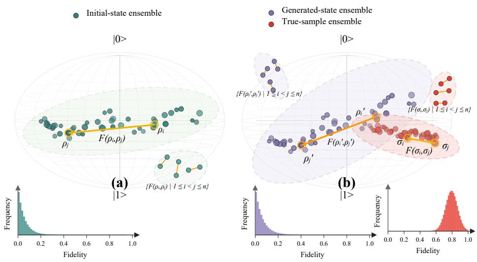  
Figure 1: The green dots in (a) denote a discrete initial-state ensemble sampled from the quantum prior, and the blue dots in (b) represent the corresponding generated-state ensemble after the generator’s unitary evolution. In (b), we also show a denser ensemble example (red dots), whose QFL histogram exhibits a markedly diferent distribution from the other two ensembles. In each QFL histogram, the horizontal axis denotes the pairwise fidelity between distinct quantum states, while the vertical axis gives the frequency of state pairs falling into each fidelity bin; each unordered pair is counted once, with self-pairs excluded.

Diagnosis. We identify the quantum prior as a structural factor in singlecircuit QGAN training. Because the generator applies the same unitary to every input state, it preserves all pairwise fidelities induced by the initialstate ensemble. Consequently, the relative positions among the states, as reflected by their pairwise fidelities, remain unchanged throughout the shared unitary evolution. We refer to this invariant pairwise structure as the Quantum Fidelity Landscape (QFL). As illustrated in Figure 1, the initial-state ensemble and its unitary-evolved generated-state ensemble therefore share the same QFL histogram, whereas an ensemble with a diferent state-space distribution can induce a markedly diferent QFL histogram. For a fixed Lipschitz readout, we further show that QFL imposes a one-sided bound on decoded sample separation: pairs with high quantum fidelity cannot be mapped arbitrarily far apart in the output space. The amplitude-readout setting used by BasicQGAN admits a more explicit Euclidean-distance bound. These results connect the geometry of the quantum prior to the attainable geometry of generated samples and motivate calibrating the prior before adversarial training.

Method. Building on this analysis, we introduce BasicQGAN, an ofline–online framework for single-circuit, end-to-end image generation. In the ofline stage, real images are amplitude encoded to construct the data-induced QFL, and the parameters of the initial-state preparation distribution are optimized to align the empirical prior-induced and data-induced QFL distributions. The calibration objective combines a KDE-based density discrepancy with explicit mean and variance matching. In the online stage, the calibrated initial-state ensemble is passed through a shared quantum generator, decoded by a fixed amplitude readout, and optimized adversarially with a WGAN-GP critic.

Evidence. We evaluate each part of this mechanism through controlled comparisons. Using the same generator circuit, BasicQGAN produces clearer samples and lower FID than a naive global QGAN with a conventional prior. The prior ablation further shows that mismatched QFLs lead to training failure or mode collapse, whereas the calibrated ensemble produces diverse samples and achieves the lowest FID among the evaluated prior constructions. At 16 × 16 resolution, BasicQGAN is competitive with classical WGAN-GP and consistently outperforms the patch-based PQWGAN across MNIST digit classes; it also obtains lower FID than PQWGAN on the Uppercase Letters and Geometric Shapes datasets. Resource comparisons show that the single-circuit generator requires fewer qubits and trainable parameters than representative patch-based quantum generators, while the ancilla-qubit experiment demonstrates that the QFL calibration principle also applies to an auxiliary-system architecture.

Our main contributions are summarized as follows:

• We formalize the Quantum Fidelity Landscape as the pairwise-fidelity structure of a quantum-state ensemble and show that it is invariant under the shared unitary evolution of a quantum generator.

• We connect this Hilbert-space invariant to classical generation by deriving a general one-sided output-separation bound for fixed Lipschitz readouts and an explicit Euclidean bound for amplitude readout.

• We develop BasicQGAN, an ofline–online framework that calibrates the prior-induced QFL against the data-induced QFL before single-circuit WGAN-GP adversarial training.

• Simulations show that BasicQGAN achieves efective, generalizable generation with compact quantum resources across datasets.

• We further validate the efectiveness of QFL calibration through prior ablations and robustness to auxiliary-system extensions.

## 2. Background and Related Work

## 2.1. Quantum-Information Preliminaries

We use the squared Uhlmann fidelity to quantify the similarity between two quantum states. For density operators ρ and σ, it is defined as

$$
F ( \rho , \sigma ) = \left( \operatorname { T r } { \sqrt { { \sqrt { \rho } } \sigma { \sqrt { \rho } } } } \right) ^ { 2 } .\tag{1}
$$

For pure states $\rho = | \psi \rangle \langle \psi |$ and $\sigma = | \phi \rangle \langle \phi |$ , this reduces to

$$
F ( \rho , \sigma ) = \left| \left. \psi \mid \phi \right. \right| ^ { 2 } .\tag{2}
$$

Two standard properties of fidelity underpin our analysis (Nielsen and Chuang, 2010). First, fidelity is invariant under a common unitary transformation:

$$
F ( U \rho U ^ { \dagger } , U \sigma U ^ { \dagger } ) = F ( \rho , \sigma ) .\tag{3}
$$

Second, quantum measurement cannot increase state distinguishability. Let M be a fixed measurement, and let $p _ { \rho }$ and $p _ { \sigma }$ denote its outcome distributions for $\rho$ and $\sigma ,$ respectively. Then

$$
\mathrm { T V } ( p _ { \rho } , p _ { \sigma } ) \leq D _ { \mathrm { t r } } ( \rho , \sigma ) \leq \sqrt { 1 - F ( \rho , \sigma ) } ,\tag{4}
$$

where $D _ { \mathrm { t r } } ( \rho , \sigma ) = \frac { 1 } { 2 } \| \rho - \sigma \| _ { 1 }$ is the trace distance and $\begin{array} { r } { \mathrm { T V } ( p , q ) = \frac { 1 } { 2 } \sum _ { k } \left| p _ { k } - q _ { k } \right| } \end{array}$ is the classical total variation distance. The first inequality follows from data processing under quantum measurement, and the second is the upper Fuchs– van de Graaf inequality under the squared-fidelity convention (Fuchs and van de Graaf, 1999; Nielsen and Chuang, 2010).

These properties play distinct roles in our method. Unitary invariance determines which pairwise relations cannot be changed by the shared quantum generator, while Eq. (4) connects those relations to the distinguishability of measurement outcomes.

## 2.2. Related Work

Classical adversarial training. Generative adversarial networks learn a data distribution through competition between a generator and a discriminator (Goodfellow et al., 2014). Wasserstein GAN replaces the original divergencebased objective with the Wasserstein-1 distance (Arjovsky et al., 2017), and WGAN-GP enforces the critic’s Lipschitz constraint using a gradient penalty (Gulrajani et al., 2017). BasicQGAN adopts WGAN-GP as the objective for its online adversarial training stage.

Quantum adversarial learning and fidelity measures. Foundational formulations of QGANs extended adversarial learning to quantum data and parameterized quantum circuits (Lloyd and Weedbrook, 2018; Dallaire-Demers and Killoran, 2018). Lloyd and Weedbrook (2018) further showed that quantum adversarial learning may ofer an exponential advantage when the data consist of measurement samples from certain high-dimensional quantum systems. Fidelity has also appeared directly in QGAN objectives: QuGAN uses swaptest estimates of quantum-state fidelity to construct quantum generator and discriminator losses (Stein et al., 2021). In contrast, QFL does not serve as the online adversarial loss between individual real and generated states. It describes the pairwise-fidelity geometry of the entire initial-state ensemble and the structure preserved by a shared unitary generator.

Quantum image-generation architectures. Early experimental QGAN image generation includes the patch-based construction of Huang et al. (2021), which assigns image regions to multiple quantum subcircuits and stitches their outputs. Tsang et al. (2023) combined this strategy with Wasserstein training to generate 28 × 28 grayscale images. Patch-based generators reduce the qubit requirement of each subcircuit, but they do not explicitly model dependencies across independently generated patches, and their total circuit and parameter requirements grow with the number of patches. These methods also use fixed uniform latent priors, including $U ( 0 , \pi / 2 )$ for rotation angles in Huang et al. (2021) and U(0, 1) in Tsang et al. (2023). Other approaches generate lowerdimensional representations for subsequent classical reconstruction. MosaiQ uses PCA-derived feature spaces (Silver et al., 2023), while LaSt-QGAN operates in the latent space of a classical autoencoder (Chang et al., 2024). These designs improve scalability but difer from direct pixel generation because a classical transformation or decoder maps the quantum output back to the image space.

Latent sampling and processing in QGANs. Existing image-oriented QGANs typically sample latent variables from simple prescribed distributions. For example, PQWGAN considers latent variables drawn from either a uniform distribution U[0, 1) or a standard Gaussian distribution $\mathcal { N } ( 0 , 1 )$ , and adopts the uniform prior in its main experiments (Tsang et al., 2023). Similarly, LaSt-QGAN samples each component of its latent noise independently from a standard normal distribution, $\mathbf z \sim \mathcal { N } ( 0 , I )$ (Chang et al., 2024). More recently, VAE-QWGAN replaces such prescribed priors with a data-informed latent distribution: latent representations are first obtained using a classical VAE encoder, and a Gaussian mixture model is subsequently fitted to these representations for latent sampling at inference time (Thomas et al., 2025). These approaches primarily modify the distribution from which latent variables are sampled. Related studies have also explored alternative mechanisms for processing latent noise in quantum image generation, including the neural noise encoding used in ReQGAN (Yang et al., 2026a) and the enhanced noise-input strategies considered by J¨ager et al. (J¨ager et al., 2026). These approaches primarily modify the distribution from which latent variables are sampled or the way latent noise is processed. In contrast, our work focuses on the pairwise-fidelity geometry induced after latent variables are encoded into quantum states.

## 3. Method: BasicQGAN

## 3.1. Problem Setting and Overview

Let z denote a latent variable used to prepare an initial quantum state $\rho _ { z }$ The quantum generator applies the same parameterized unitary $U _ { \theta }$ to every input, and a fixed readout map D converts the resulting state into a classical image:

$$
G _ { \theta } ( z ) = { \cal { D } } \Big ( U _ { \theta } \rho _ { z } U _ { \theta } ^ { \dagger } \Big ) .\tag{5}
$$

Unlike patch-based generators, BasicQGAN uses one shared circuit to produce the complete pixel vector. This design is resource eficient, but it raises a structural question: which relations among input samples can be changed by training the shared unitary?

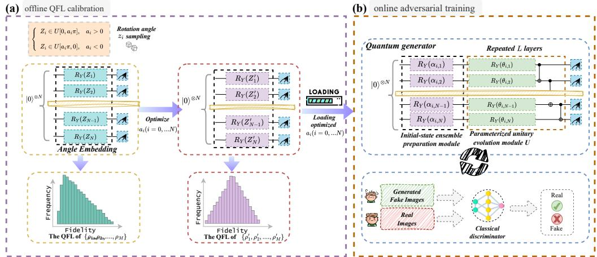  
Figure 2: Overall framework of BasicQGAN. (a) During ofline QFL calibration, the state-preparation parameters $z _ { 1 } , z _ { 2 } , \ldots , z _ { n }$ are optimized to transform the initial ensemble $\rho _ { 1 } , \rho _ { 2 } , \ldots , \rho _ { n }$ into a calibrated ensemble $\rho _ { 1 } ^ { \prime } , \rho _ { 2 } ^ { \prime } , \ldots , \rho _ { n } ^ { \prime }$ . (b) During online adversarial training, the calibrated preparation parameters $z _ { 1 } ^ { \prime } , z _ { 2 } ^ { \prime } , \ldots , z _ { n } ^ { \prime }$ initialize the state ensemble used by the single-circuit quantum generator.

Our analysis and method follow three steps. First, we identify a pairwise geometry of the prior ensemble that is invariant under a shared unitary. Second, we relate this invariant to the separation of classically decoded outputs, first for a general stable readout and then more explicitly for amplitude readout. Third, we use the resulting principle to calibrate the quantum prior before standard adversarial training. Figure 2 summarizes this ofline–online pipeline.

## 3.2. QFL as a Prior-Determined Invariant

Definition 3.1 (Quantum fidelity landscape). For an ensemble $\mathcal { E } = \{ \rho _ { i } \} _ { i = 1 } ^ { M }$ ， its quantum fidelity landscape (QFL) is the pairwise-fidelity matrix

$$
K _ { i j } ( \mathcal { E } ) = F ( \rho _ { i } , \rho _ { j } ) , \qquad 1 \leq i , j \leq M ,\tag{6}
$$

where F is the squared Uhlmann fidelity. For pure states, $F ( \rho _ { i } , \rho _ { j } ) ~ =$ $\vert \langle \psi _ { i } \vert \psi _ { j } \rangle \vert ^ { 2 }$ . We use the empirical distribution of the of-diagonal entries of K when comparing ensembles whose samples have no one-to-one correspondence.

Proposition 3.2 (QFL invariance under a shared unitary). Let $\rho _ { i } ^ { \theta } = U _ { \theta } \rho _ { i } U _ { \theta } ^ { \dagger }$ for all samples in E. Then, for every i, j and every θ,

$$
F ( \rho _ { i } ^ { \theta } , \rho _ { j } ^ { \theta } ) = F ( \rho _ { i } , \rho _ { j } ) .\tag{7}
$$

Consequently, optimizing θ cannot reshape the QFL induced by the prior ensemble.

The proposition does not imply that individual states remain unchanged: $U _ { \theta }$ can substantially move each state in Hilbert space. It states that their pairwise fidelity relations move with them and remain fixed. The proof is given in Appendix A.

## 3.3. From QFL to Classical Output Separation

QFL is defined in Hilbert space, whereas the discriminator receives classical images. To connect the two spaces, write a fixed readout as $\mathcal { D } = h \circ \mathcal { M }$ where the measurement M maps a state $\rho$ to a probability vector $p _ { \rho }$ and h is a fixed classical post-processing map.

Assumption 3.3 (Stable fixed readout). Let $( \mathcal { X } , d _ { \mathcal { X } } )$ be the metric space of classical outputs, and let $p = ( p _ { k } ) _ { k = 1 } ^ { K }$ and $q = ( q _ { k } ) _ { k = 1 } ^ { K }$ be probability vectors over the same K measurement outcomes. The post-processing map h satisfies

$$
d _ { \mathcal { X } } ( h ( p ) , h ( q ) ) \leq L \mathrm { T V } ( p , q )\tag{8}
$$

for some finite $L ,$ where $\begin{array} { r } { \mathrm { T V } ( p , q ) : = \frac { 1 } { 2 } \sum _ { k = 1 } ^ { K } | p _ { k } - q _ { k } | } \end{array}$ is total variation distance (Gibbs and Su, 2002); equivalently, it is the classical trace distance of Nielsen and Chuang (2010, Section 9.1).

This condition only excludes a readout that amplifies an arbitrarily small change in its measurement probabilities into an unbounded output change. It does not prescribe a particular measurement basis or image representation.

Scope with respect to classical decoders. A fixed neural post-processing map is covered by Assumption 3.3 whenever it has a finite Lipschitz constant. A trainable family $\{ h _ { \phi } \} _ { \phi \in \Phi }$ is covered uniformly only if $\mathrm { s u p } _ { \phi \in \Phi } \mathrm { L i p } ( h _ { \phi } ) < \infty$ Without such a constraint, a classical decoder may learn to amplify small readout diferences, and no parameter-independent output-separation bound follows from QFL alone. BasicQGAN avoids this ambiguity by using a fixed, parameter-free decoder, allowing its metric distortion to be characterized explicitly below.

Theorem 3.4 (QFL-induced output-separation bound). Under Assumption 3.3, any pair of outputs obtained from a shared unitary satisfies

$$
d _ { \mathcal { X } } \big ( \mathcal { D } ( \rho _ { i } ^ { \theta } ) , \mathcal { D } ( \rho _ { j } ^ { \theta } ) \big ) \leq L \sqrt { 1 - F ( \rho _ { i } , \rho _ { j } ) } .\tag{9}
$$

Thus, a high-fidelity prior pair cannot be mapped to arbitrarily distant outputs by the shared unitary and a stable fixed readout. This is a onesided constraint: low prior fidelity permits a larger separation but does not guarantee that training will realize it. In particular, QFL neither determines the generated distribution nor replaces the need for an expressive circuit and successful adversarial optimization.

For Euclidean outputs $x _ { i } = G _ { \theta } ( z _ { i } )$ with $\bar { x } = M ^ { - 1 } \textstyle \sum _ { i } x _ { i }$ , Theorem 3.4 further gives

$$
\frac { 1 } { M } \sum _ { i = 1 } ^ { M } \| x _ { i } - \bar { x } \| _ { 2 } ^ { 2 } \leq \frac { L ^ { 2 } } { 2 M ^ { 2 } } \sum _ { i , j = 1 } ^ { M } \left( 1 - F ( \rho _ { i } , \rho _ { j } ) \right) ,\tag{10}
$$

which aggregates the pairwise constraint into an upper bound on output dispersion. Proofs of Theorem 3.4 and Eq. (10) are deferred to Appendix B.

## 3.4. Amplitude-Readout Specialization

The preceding result covers a general class of stable fixed readouts. We next specialize the analysis to the amplitude representation used by BasicQGAN and obtain an explicit bound without an unspecified readout constant.

Data-induced amplitude geometry. For a nonnegative grayscale vector $x \in \mathbb { R } _ { + } ^ { d }$ 2 amplitude encoding prepares

$$
| \phi ( \boldsymbol { x } ) \rangle = \sum _ { k = 1 } ^ { d } \frac { x _ { k } } { \| \boldsymbol { x } \| _ { 2 } } | k \rangle .\tag{11}
$$

For two encoded images $x _ { i }$ and $x _ { j }$ ,

$$
F _ { i j } ^ { \mathrm { { d a t a } } } = \left( \frac { x _ { i } ^ { \top } x _ { j } } { \| x _ { i } \| _ { 2 } \| x _ { j } \| _ { 2 } } \right) ^ { 2 } ,\tag{12}
$$

$$
\left\| \frac { x _ { i } } { \| x _ { i } \| _ { 2 } } - \frac { x _ { j } } { \| x _ { j } \| _ { 2 } } \right\| _ { 2 } ^ { 2 } = 2 \left( 1 - \sqrt { F _ { i j } ^ { \mathrm { d a t a } } } \right) .\tag{13}
$$

Hence, the data QFL describes the angular geometry of normalized image vectors under this encoding.

Magnitude geometry of generated states. Let

$$
| \psi _ { i } \rangle = \sum _ { k = 1 } ^ { d } c _ { i k } | k \rangle , \qquad a _ { i } = ( | c _ { i 1 } | , . . . , | c _ { i d } | ) ^ { \top } .\tag{14}
$$

The vector $a _ { i }$ is the square-root probability representation of a computationalbasis measurement because $a _ { i k } = \sqrt { p _ { i k } } = | c _ { i k } |$

Corollary 3.5 (Magnitude-distance bound). For any two pure states in Eq. (14),

$$
\| a _ { i } - a _ { j } \| _ { 2 } ^ { 2 } \leq 2 \left( 1 - \sqrt { F ( \rho _ { i } , \rho _ { j } ) } \right) .\tag{15}
$$

This result holds for both real and complex amplitudes because it depends on $\left| c _ { i k } \right|$ . It also explains why we use square-root probabilities rather than probabilities as image coordinates: square-root probabilities recover the amplitude magnitudes and admit the direct fidelity–Euclidean relation in Eq. (15). Probability readout remains a valid alternative, but it induces a diferent geometry. The proof is provided in Appendix C.

Fixed decoder used in BasicQGAN. Let $\mathbf { 1 } \in \mathbb { R } ^ { d }$ be the all-ones vector and $\| a \| _ { \infty } : = \operatorname* { m a x } _ { k } \left| a _ { k } \right|$ . Ignoring the numerical stabilizer for clarity, the decoder is

$$
\widetilde { x } _ { i } = 2 \frac { a _ { i } } { \| a _ { i } \| _ { \infty } } - \mathbf { 1 } .\tag{16}
$$

It maps each sample to $[ - 1 , 1 ] ^ { d }$ before reshaping it into an image. The samplewise maximum normalization changes scale but preserves the normalized amplitude direction:

$$
{ \frac { { \widetilde { x } } _ { i } + \mathbf { 1 } } { \| { \widetilde { x } } _ { i } + \mathbf { 1 } \| _ { 2 } } } = a _ { i } .\tag{17}
$$

Therefore, Corollary 3.5 applies directly to the normalized output directions. Importantly, Eq. (17) is an invertibility statement, not an isometry claim: it shows that the amplitude-magnitude vector can be recovered from the decoded sample, but it does not assert preservation of raw Euclidean distances. For the decoder $T ( a ) : = 2 a / \| a \| _ { \infty } - { \bf 1 }$ on nonnegative unit vectors $a , b \in \mathbb { R } _ { + } ^ { d }$ ， Appendix C proves the metric bounds

$$
\| a - b \| _ { 2 } \leq \| T ( a ) - T ( b ) \| _ { 2 } \leq 2 ( d + \sqrt { d } ) \| a - b \| _ { 2 } .\tag{18}
$$

Consequently, the implemented normalization may distort pairwise Euclidean distances, but only by fixed dimension-dependent factors; together with Eq. (15), it yields the one-sided bound

$$
\| T ( a _ { i } ) - T ( a _ { j } ) \| _ { 2 } \leq 2 ( d + \sqrt { d } ) \sqrt { 2 \left( 1 - \sqrt { F ( \rho _ { i } , \rho _ { j } ) } \right) } .\tag{19}
$$

Thus, QFL constrains rather than reconstructs the Euclidean geometry seen after decoding. The implication remains one-sided because the magnitude readout discards amplitude signs and phases: two low-fidelity states can still yield the same magnitude vector and hence the same decoded image. QFL calibration should therefore be interpreted as a structural prior for the subsequent adversarial optimization, rather than as a guarantee of Euclideandistance matching or distribution recovery. In our implementation, both state preparation and the generator use only $R _ { Y }$ and CNOT gates, whose ideal matrices are real. The statevector is consequently real-valued, and the implemented quantity $| \operatorname { R e } ( c _ { k } ) |$ equals $| c _ { k } | = { \sqrt { p _ { k } } }$ up to numerical precision. The theoretical formulation in terms of $\left| c _ { k } \right|$ is more general: if complex-valued gates are used, the same decoder should be implemented as $\sqrt { p _ { k } }$ rather than by retaining only the real part.

## 3.5. QFL-Guided Quantum Prior Calibration

Proposition 3.2 shows that the prior QFL cannot be corrected by updating the shared unitary during adversarial training. Equations (13) and (15) further show that, under the amplitude representation, this invariant is connected to the geometry of the decoded samples. These observations motivate calibrating the prior before adversarial training.

Because prior and data samples have no pairwise correspondence, BasicQ-GAN does not match two QFL matrices entry by entry. For an ensemble $\mathcal { E } ,$ we instead define the empirical distribution of of-diagonal fidelities as

$$
{ \widehat { \mu } } \varepsilon = { \frac { 2 } { M ( M - 1 ) } } \sum _ { 1 \leq i < j \leq M } \delta _ { F ( \rho _ { i } , \rho _ { j } ) } .\tag{20}
$$

Here $\delta _ { t }$ denotes the Dirac point mass located at $t \in [ 0 , 1 ]$ . Real images are amplitude encoded to construct $\widehat { \mu } _ { \mathrm { d a t a } }$ . A parameterized state-preparation distribution with parameters $\alpha = ( a _ { 1 } , \ldots , a _ { N } )$ induces $\widehat { \mu } _ { \mathrm { p r i o r } } ( \alpha )$

For qubit $i ,$ we reparameterize the sampled rotation as $Z _ { i } = \pi a _ { i } u _ { i }$ , where $u _ { i } \sim U [ 0 , 1 ]$ . This is equivalent to sampling from $U [ 0 , a _ { i } \pi ]$ when $a _ { i } \geq 0$ and from $U [ a _ { i } \pi , 0 ]$ otherwise. We optimize

$$
\alpha ^ { * } = \arg \operatorname* { m i n } _ { \alpha } \mathcal { L } _ { \mathrm { Q F L } } ( \alpha ) ,\tag{21}
$$

where

$$
\begin{array} { r l } & { \mathcal { L } _ { \mathrm { Q F L } } = D _ { \mathrm { K D E } } ( \widehat { \mu } _ { \mathrm { p r i o r } } , \widehat { \mu } _ { \mathrm { d a t a } } ) + \left| \widehat { m } _ { \mathrm { p r i o r } } - \widehat { m } _ { \mathrm { d a t a } } \right| } \\ & { \qquad + \left| \widehat { v } _ { \mathrm { p r i o r } } - \widehat { v } _ { \mathrm { d a t a } } \right| . } \end{array}\tag{22}
$$

Here $\widehat { m }$ and $\widehat { v }$ are the empirical mean and variance of pairwise fidelities. We evaluate both kernel-density estimates on a common grid $\{ q _ { b } \} _ { b = 1 } ^ { B }$ and use the discretized absolute discrepancy

$$
D _ { \mathrm { K D E } } ( \mu , \nu ) = \frac { 1 } { B } \sum _ { b = 1 } ^ { B } | \widehat { f } _ { \mu } ( q _ { b } ) - \widehat { f } _ { \nu } ( q _ { b } ) | .\tag{23}
$$

For the empirical QFL distributions induced by finite state ensembles, we combine a smoothed density discrepancy with explicit moment constraints. The KDE term compares the overall density profiles while retaining sensitivity to diferences in local peaks and low-density regions. The mean and variance terms explicitly constrain the overall fidelity level and the degree of concentration, respectively. By jointly matching distributional shape, location, and dispersion, this composite objective provides a statistically interpretable optimization signal for quantum-prior calibration. It can be viewed as one finite-sample surrogate for QFL calibration; other statistical measures of discrepancy between the prior and data QFLs may also be explored within this framework. Algorithm 1 summarizes the ofline stage.

This objective matches distributional statistics rather than asserting exact equality of the two finite QFL matrices. Calibration is performed once, and $\alpha ^ { * }$ remains fixed during online adversarial training. Thus, QFL calibration supplies a prior geometry; it does not replace the adversarial objective or guarantee successful generation by itself.

Consistency of finite-ensemble estimation. The $\binom { M } { 2 }$ pairwise fidelities in Eq. (20) are dependent because each state participates in multiple pairs. If $\rho _ { 1 } , \ldots , \rho _ { M }$ are i.i.d. states sampled under a fixed prior parameter α, then, for any bounded measurable $\varphi : [ 0 , 1 ] \to \mathbb { R } .$

Algorithm 1 QFL-guided quantum prior calibration   
Input: Number of epochs $n _ { \mathrm { e p o c h } }$ , number of qubits $\overline { { N } }$ , ensemble size ${ \overline { { M } } } ,$   
learning rate η, data QFL distribution $\widehat { \mu } _ { \mathrm { d a t a } }$ , and trainable prior parameters   
α.   
1: Initialize $\alpha = ( a _ { 1 } , \ldots , a _ { N } )$   
2: for $t = 1 , \ldots , n _ { \mathrm { e p o c h } }$ do   
3: Sample $u _ { i } ^ { ( m ) } \sim U [ 0 , 1 ]$ and set $Z _ { i } ^ { ( m ) } = \pi a _ { i } u _ { i } ^ { ( m ) }$ for $m = 1 , \ldots , M .$   
4: Prepare M initial states and compute all pairwise fidelities.   
5: Construct $\widehat { \mu } _ { \mathrm { p r i o r } } ( \alpha )$ using Eq. (20).   
6: Evaluate ${ \mathcal { L } } _ { \mathrm { Q F L } }$ using Eq. (22).   
7: Update $\alpha \gets \mathrm { A }$ dam $( \mathcal { L } _ { \mathrm { Q F L } } , \alpha , \eta )$   
8: end for   
9: Return the calibrated sampling parameters $\alpha ^ { * }$

$$
{ \frac { 2 } { M ( M - 1 ) } } \sum _ { i < j } \varphi ( F ( \rho _ { i } , \rho _ { j } ) ) \ { \xrightarrow { \mathrm { a . s . } } } \ \mathbb { E } [ \varphi ( F ( \rho _ { 1 } , \rho _ { 2 } ) ) ] .\tag{24}
$$

The left-hand side is an order-two U-statistic. By choosing $\varphi$ for the first and second moments or for a fixed-bandwidth KDE evaluated on a fixed finite grid, Eq. (24) establishes consistency of the empirical QFL descriptors, including its mean, variance, and KDE values. Consequently, as M increases, the empirical QFL histogram converges to the corresponding population histogram when a common bin partition is used across ensemble sizes. The composite loss in Eq. (22) is computed from these consistent QFL estimates. Appendix D provides the complete proof. Figure 3 compares QFL estimates obtained from 500, 1000, 1500, and 2000 states for digit 0 at $1 6 \times 1 6$ resolution. Based on the observed trade-of between estimation stability and computational cost, we use 1500 states for the remaining QFL calculations.

Figure 4 compares the data QFL with priors produced by several sampling ranges. The broad priors $U [ 0 , \pi ]$ and $U [ 0 , 1 ]$ and the highly concentrated setting $Z _ { 0 } \sim U [ 0 , 0 . 0 1 ]$ R $Z _ { i } ~ = ~ 0$ for $i > 0$ , all yield visibly diferent QFL distributions. The calibrated prior more closely matches the data-QFL statistics. Corresponding results for other datasets are reported in Appendix F.

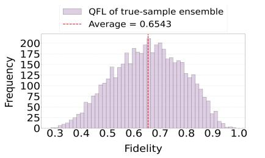  
(a)

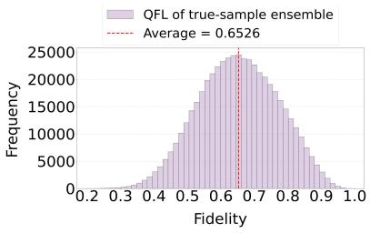  
(b)

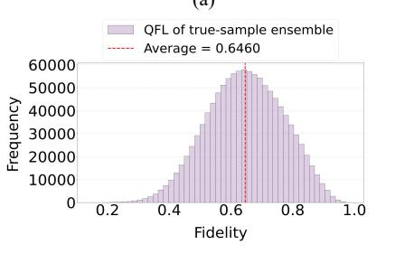  
(c)

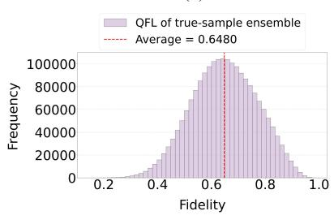  
(d)  
Figure 3: Empirical QFL distributions computed from 500, 1000, 1500, and 2000 real samples of MNIST digit 0 at $1 6 \times 1 6$ resolution.

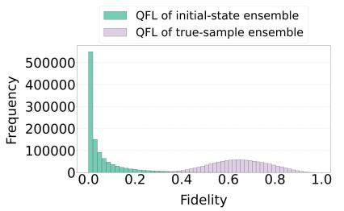  
(a)

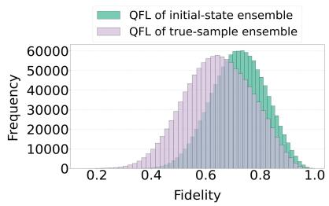

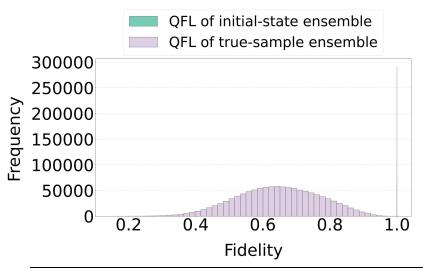  
(c)

(b)  
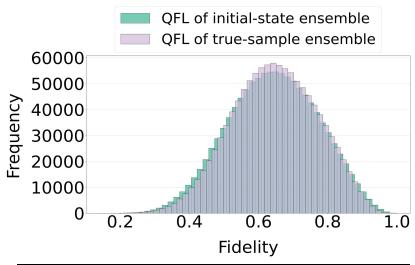  
(d)  
Figure 4: QFL distributions induced by diferent prior preparations and by real data. Panels (a)–(c) use uncalibrated sampling schemes, whereas panel (d) uses the QFL-calibrated prior.

## 3.6. Single-Circuit Generation and Online Training

The BasicQGAN generator has $N = \log _ { 2 }$ d qubits for a d-pixel image. The calibrated rotation distribution first prepares

$$
| \psi _ { z } ^ { 0 } \rangle = \left[ \bigotimes _ { i = 1 } ^ { N } R _ { Y } ( Z _ { i } ) \right] | 0 \rangle ^ { \otimes N } .\tag{25}
$$

The shared generator then applies $L$ layers of trainable $R _ { Y }$ rotations and nearest-neighbor CNOT gates:

$$
| \psi _ { z } ^ { \theta } \rangle = U _ { \theta } | \psi _ { z } ^ { 0 } \rangle = \sum _ { k = 1 } ^ { d } c _ { k } ( z , \theta ) | k \rangle .\tag{26}
$$

The fixed decoder in Eq. (16) converts this state into the complete pixel vector; no patch-wise generation or trainable classical decoder is used.

We use the same classical discriminator architecture as PQWGAN and optimize the generator and discriminator with WGAN-GP. Denoting the critic by $D _ { \omega }$ , the objective is

$$
\begin{array} { r l } { \underset { \theta } { \mathrm { m i n } } \underset { \omega } { \mathrm { m a x } } } & { \mathbb { E } _ { \boldsymbol { x } \sim P _ { \mathrm { d a t a } } } [ D _ { \omega } ( \boldsymbol { x } ) ] - \mathbb { E } _ { \boldsymbol { z } \sim P _ { \alpha ^ { * } } } [ D _ { \omega } ( G _ { \theta } ( \boldsymbol { z } ) ) ] } \\ & { - \lambda _ { \mathrm { G P } } \mathbb { E } _ { \widehat { \boldsymbol { x } } } \left( \| \nabla _ { \widehat { \boldsymbol { x } } } D _ { \omega } ( \widehat { \boldsymbol { x } } ) \| _ { 2 } - 1 \right) ^ { 2 } . } \end{array}\tag{27}
$$

The ofline stage optimizes α to calibrate the prior $\mathrm { Q F L , }$ whereas the online stage holds $\alpha ^ { * }$ fixed and optimizes θ and ω to learn the image distribution. The complete alternating optimization procedure is given in Appendix G.

## 4. Experiments

Datasets. Given the current scale of quantum resources, we focus on smallscale grayscale image benchmarks. Accordingly, we curated four datasets derived from three public repositories: MNIST (Deng, 2012), EMNIST (Cohen et al., 2017), and HDS (Robert, 2022). These benchmarks include two MNIST variants (original $2 8 \times 2 8$ and downsampled $1 6 \times 1 6$ , 10 classes), Geometric Shapes $( 1 6 \times 1 6$ , 4 classes), and Uppercase Letters $( 1 6 \times 1 6$ , 10 classes). Further details are provided in Appendix H.

Baselines and Evaluation Metric. Our objective is direct end-to-end, pixellevel synthesis of full images using a single quantum circuit, and we therefore choose PQWGAN (Tsang et al., 2023) as the baseline. With Patch=1 (i.e., without patch-wise decomposition), PQWGAN can be viewed as a naive end-to-end variant of the prevailing patch-based QGAN paradigm, enabling a direct and controlled comparison to assess whether our architecture alleviates the inherent limitations of conventional designs. We denote the Patch=1 configuration of PQWGAN as PQWGAN(Global). In addition, we also benchmark our method against the patch-based quantum model PQWGAN and the classical model WGAN-GP. PQWGAN uses a fully quantum generator and represents the current state-of-the-art for directly modeling pixel data. Classical WGAN-GP can be considered a classical analogue of BasicQGAN. Generated images are evaluated using the Fr´echet Inception Distance (FID) (Yang et al., 2026b; Karras et al., 2021), a standard metric for visual quality and diversity, where a lower score indicates better performance. The FID is calculated using formula $F I D = \Vert \mu _ { r } - \mu _ { g } \Vert ^ { 2 } + \operatorname { T r } \left( \Sigma _ { r } + \Sigma _ { g } - 2 \left( \Sigma _ { r } \Sigma _ { g } \right) ^ { 1 / 2 } \right)$ where $\mu _ { r }$ and $\mu _ { g }$ represent the feature means of the real images and the generated images, respectively. $\Sigma _ { r }$ and $\Sigma _ { g }$ denote the feature covariance matrices of the real and generated images, respectively. Tr means the matrix trace.

Implementation Details. All experiments in this study were simulated using PyTorch and PennyLane on a 13th Gen Intel(R) Core(TM) i5-13490F CPU with 32.0 GB of RAM. The initial-state ensemble preparation algorithm was trained using Adam with an initial learning rate of 0.3. During adversarial training, both the classical critic and quantum generator were optimized using Adam with initial learning rates of 0.0002 and 0.01, respectively, and momentum hyperparameters of 0 and 0.9. All models were trained for 50 epochs with a batch size of 5.

## 5. Results

We organize the empirical evidence around the paper’s main claim. First, we test whether a naive global QGAN baseline fails in the single-circuit end-to-end setting. Second, we evaluate whether QFL calibration restores stable training and improves generation quality. Third, we compare against patch-based and classical baselines across resolutions and datasets. Finally, we examine resource overhead and ablations to clarify where the proposed prior calibration helps and where it remains limited.

## 5.1. Naive End-to-End Baseline

As shown in Figure 5, we compare BasicQGAN with PQWGAN(Global) on MNIST at $1 6 \times 1 6$ . PQWGAN(Global) removes patch-wise decomposition but keeps a conventional prior, making it a controlled test of naive single-circuit generation. BasicQGAN and PQWGAN(Global) use the same quantum generator circuit, so the comparison isolates the efect of QFL-guided prior calibration. PQWGAN(Global) produces blurrier samples with less distinguishable digit contours, while BasicQGAN yields clearer and more stable structures. As reported in Figure 6, BasicQGAN also achieves lower FID. This comparison supports our diagnosis that the main dificulty is not merely the use of one circuit, but the mismatch between the initial quantum prior and the data-induced fidelity structure.

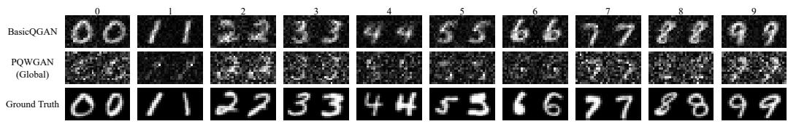  
Figure 5: BasicQGAN produces clearer MNIST samples than the end-to-end PQW-GAN(Global) baseline at 16 × 16 resolution.

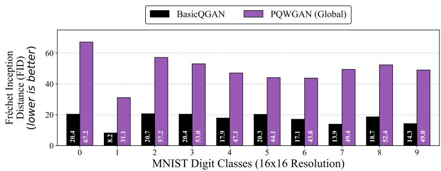  
Figure 6: BasicQGAN obtains lower FID scores than PQWGAN(Global) across MNIST classes at 16 × 16 resolution.

## 5.2. Impact of Prior QFL on Generation Performance

The quantum-prior ablation examines how diferent prior-induced QFLs afect generation performance. As shown in Figure 7, we replace the calibrated prior with $Z _ { i } \sim U [ 0 , \pi ] , \ Z _ { i } \sim U [ 0 , 1 ]$ , and an extreme narrow setting $Z _ { 0 } \sim$ $U [ 0 , 0 . 0 1 ]$ . The QFLs induced by these priors have been shown earlier in Figure 4; all of them deviate visibly from the real-data QFL. Consistently, the broad priors lead to complete training failure in Figure $\mathrm { 7 ( a ) }$ and Figure 7(b), while the overly narrow prior results in severe mode collapse in Figure $7 ( \mathrm { c ) }$ This indicates that generation training becomes dificult when the priorinduced QFL difers substantially from the real-data QFL. In particular, when the prior sampling range is too narrow, the generated quantum states become overly concentrated in Hilbert space, making the subsequent adversarial training prone to mode collapse. In contrast, our initial-state ensemble preparation algorithm calibrates the quantum prior and enables the subsequent QGAN training to generate diverse samples, as shown in Figure 7(d), achieving the lowest FID of 20.38 in Table 1.

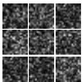  
(a)

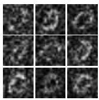  
(b)

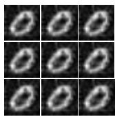  
(c)

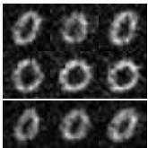  
(d)  
Figure 7: Ablation study on the initial-state preparation algorithm for BasicQGAN on the 16×16 digit ’0’ generation task. (a) and (b) show complete training failure resulting from sampling initial parameters from wide intervals, $U [ 0 , \pi ]$ and $U [ 0 , 1 ]$ , respectively. (c) demonstrates severe mode collapse when using an extremely narrow interval, $U [ 0 , 0 . 0 1 ]$ In contrast, (d) shows that our proposed algorithm successfully generates a diverse set of high-quality images.

Table 1: Quantitative comparison of BasicQGAN against variants with diferent initial-state ensemble preparation methods.
<table><tr><td>Model FID</td></tr><tr><td>BasicQGAN with  $Z _ { i } \sim U ( 0 , \pi )$  73.93</td></tr><tr><td>BasicQGAN with  $Z _ { i } \sim U ( 0 , 1 )$  72.64</td></tr><tr><td>BasicQGAN  $Z _ { 0 } \sim U ( 0 , 0 . 0 1 ) , Z _ { i } = 0 ( i > 0 )$  33.97</td></tr><tr><td>BasicQGAN (Our algorithm) 20.38</td></tr></table>

Digit 0

## 5.3. Multi-Scale Performance

We evaluate diferent methods at two resolutions. As shown in Figures 8– 10, BasicQGAN and WGAN-GP produce relatively natural and smooth samples at $1 6 \times 1 6$ resolution, whereas PQWGAN generates visually stifer digits and yields higher FID. BasicQGAN already produces images closeBasicQGAN to those of the classical WGAN-GP baseline, indicating that single-circuit end-to-end generation is feasible at lower resolution. At $2 8 \times 2 8$ resolution, BasicQGAN exhibits more visible noise in its generated samples. The FIDBasicQGAN PQWGAN GAN BasicQGAN PQWGA scores of the three methods are generally close, with BasicQGAN slightly higher than the other baselines; meanwhile, PQWGAN still shows noticeable discrete artifacts in its generated samples. We attribute the degradation of BasicQGAN at $2 8 \times 2 8$ mainly to two factors: (1) the significant increase in16size\_naive data dimensionality and computational complexity, which enlarges the QFL matching error; and (2) the increased complexity of the image distribution, which may exceed the expressive capacity of the current quantum circuit. Thus, the $2 8 \times 2 8$ results further show the feasibility of single-circuit end-to-Digit 0 Digit 5 Digit 9 Digit 0 Digit 5 Digit 9 end generation in a higher-dimensional image space, while also leaving roomPQWGAN for improving generation quality at higher resolutions.WGAN-GP

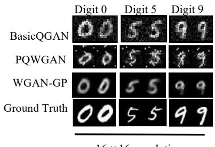  
16 ×16 resolution

Digit 5  
Digit 9  
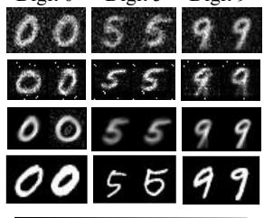

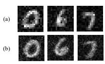  
28 × 28 resolution  
Figure 8: Visual comparison of generated MNIST samples at $1 6 \times 1 6$ and $2 8 \times 2 8$ resolutions. Left: BasicQGAN and WGAN-GP produce relatively smooth and natural images at both resolutions, whereas the images generated by PQWGAN are blurrier and less natural, particularly for digits $\cdot _ { 5 } \cdot$ and $\mathbf { \nabla } ^ { \cdot } \mathbf { 9 } ^ { \cdot }$ . Right: magnified BasicQGAN samples at $1 6 \times 1 6$ resolution (a) and $2 8 \times 2 8$ resolution (b), where the latter exhibits increased noise artifacts.

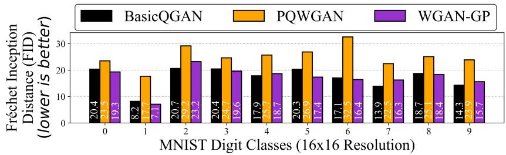  
Figure 9: WGAN-GP and BasicQGAN achieve similar FID scores across diferent classes of the 16×16 MNIST dataset, and both consistently obtain lower scores than PQWGAN.

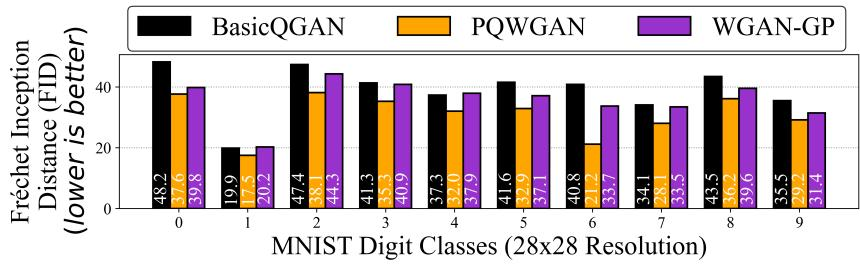  
Figure 10: At 28 × 28 resolution, BasicQGAN obtains higher FID scores than the baselines, while PQWGAN achieves the lowest FID scores among the compared methods.WGAN-GP

## 5.4. Cross-Dataset Generalization

We evaluate the cross-dataset generalization ability of diferent quantum models on two additional 16 × 16 datasets: Geometric Shapes and Uppercase Letters. As shown in Figure 11, BasicQGAN generates relatively smooth and natural samples on both datasets. In contrast, PQWGAN produces blurrier and less natural samples. Quantitatively, Figures 12 and 13 show that BasicQGAN achieves the lowest FID on both datasets.

Letter A Letter D Letter J  
Square Straightcross  
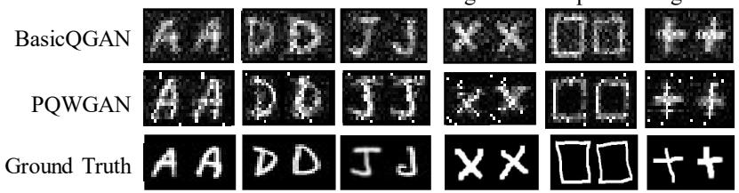  
Figure 11: Quantum model performance comparison on the Uppercase Letters and Geomet ric Shapes datasets. BasicQGAN produces smoother and more natural samples, whereas PQWGAN generates blurrier and less natural outputs.

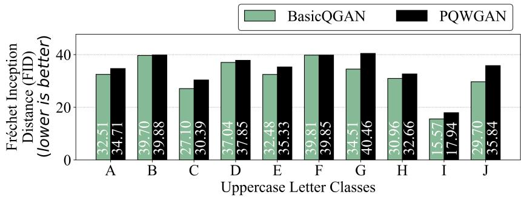  
Figure 12: BasicQGAN obtains lower FID scores than PQWGAN across diferent classes of the Uppercase Letter dataset.

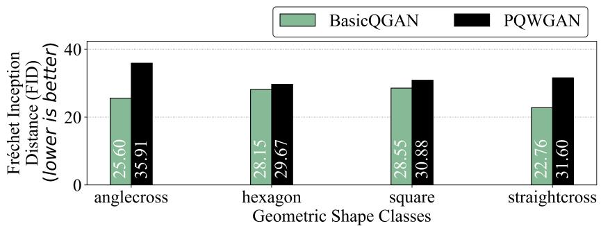  
Figure 13: BasicQGAN obtains lower FID scores than PQWGAN across diferent classes of the Geometric Shape dataset.

## 5.5. Resource Eficiency

Table 2 summarizes the generator resource overhead of the compared methods at $1 6 \times 1 6$ and $2 8 \times 2 8$ resolutions. Among the quantum models, BasicQGAN consistently requires fewer qubits and trainable parameters than both PQWGAN(Global) and the patch-based PQWGAN. The diference becomes more pronounced at the higher resolution, where the resource demand of patch-based PQWGAN increases substantially. Compared with the classical WGAN-GP, BasicQGAN also uses a much smaller number of trainable parameters. Overall, BasicQGAN maintains a compact generator architecture across both resolutions.

Table 2: Comparison of the resource overhead of the generators from diferent methods on the MNIST dataset at $1 6 \times 1 6$ and $2 8 \times 2 8$ resolutions.
<table><tr><td>Method</td><td>Type Qubit Parameter Qubit Parameter</td><td>MNIST Dataset MNIST Dataset 16×16</td><td></td><td>28×28</td></tr><tr><td>PQWGAN(Global) Quantum</td><td></td><td>9</td><td>540</td><td>11 660</td></tr><tr><td>BasicQGAN</td><td>Quantum</td><td>8</td><td>320</td><td>10 400</td></tr><tr><td>PQWGAN</td><td>Quantum</td><td>80</td><td>800</td><td>168 5120</td></tr><tr><td>WGAN-GP</td><td>Classical</td><td></td><td>945152</td><td>1732352</td></tr></table>

## 5.6. Auxiliary-System Ablation

BasicQGAN employs an n-qubit unitary generator without auxiliary qubits. To examine whether QFL calibration also applies when the quantum generator is extended with an auxiliary system, we construct BasicQGAN w/ Ancilla qubit by appending one auxiliary qubit initialized identically as $R _ { Y } ( 0 ) | 0 \rangle = | 0 \rangle$ . Thus, the i-th calibrated initial state becomes

$$
\widetilde { \rho } _ { i } = \rho _ { i } \otimes | 0 \rangle \langle 0 | .\tag{28}
$$

By the multiplicativity of quantum fidelity under tensor products (Nielsen and Chuang, 2010),

$$
\begin{array} { r l } & { F ( \widetilde { \rho } _ { i } , \widetilde { \rho } _ { j } ) = F ( \rho _ { i } , \rho _ { j } ) F ( | 0 \rangle \langle 0 | , | 0 \rangle \langle 0 | ) } \\ & { \qquad = F ( \rho _ { i } , \rho _ { j } ) . } \end{array}\tag{29}
$$

Therefore, appending the auxiliary state leaves the prior-induced QFL unchanged, showing that the QFL-calibrated initial-state construction extends directly to the enlarged system. The subsequent shared unitary evolution also preserves the joint-state fidelities. We compare BasicQGAN with BasicQGAN w/ Ancilla qubit on MNIST at $1 6 \times 1 6$ resolution. As shown in Figures 14 and 15, BasicQGAN w/ Ancilla qubit produces recognizable samples and obtains FID scores comparable to those of BasicQGAN. These results demonstrate that QFL calibration is also applicable to this auxiliary-system architecture.

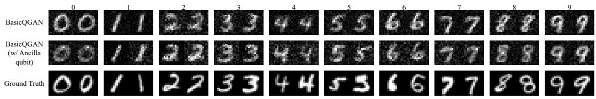  
Figure 14: Comparison between BasicQGAN and BasicQGAN w/ Ancilla qubit on MNIST at 16 × 16 resolution.

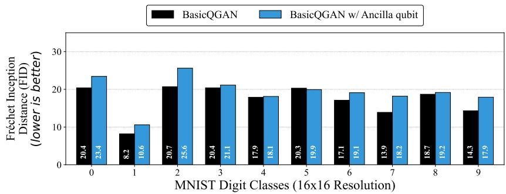  
Figure 15: FID comparison between BasicQGAN and BasicQGAN w/ Ancilla qubit across diferent MNIST classes at 16 × 16 resolution.

Further details regarding the aforementioned experiments are provided in Appendix I. We also report additional experiments on the learning rate used by the initial-state ensemble preparation algorithm and on the impact of quantum circuit depth on BasicQGAN’s performance in Appendix J and Appendix K.

## 6. Conclusion and Limitations

We studied single-circuit, end-to-end pixel-level image generation with QGANs from the perspective of quantum-prior geometry. Our analysis identified the Quantum Fidelity Landscape (QFL) as a pairwise-fidelity structure fixed by the initial-state ensemble and preserved by shared unitary evolution. Under a fixed Lipschitz readout, this invariant further imposes a one-sided constraint on the separation of decoded samples, connecting the geometry of the quantum prior to the behavior of the generated distribution.

Guided by this insight, we developed BasicQGAN, which calibrates the prior-induced QFL against the data-induced QFL before WGAN-GP adversarial training. In the evaluated settings, QFL calibration avoids the training failure or mode collapse observed with mismatched priors and produces diverse samples. BasicQGAN achieves competitive generation performance on 16 × 16 MNIST and two additional grayscale datasets, while requiring fewer qubits and trainable parameters than representative patch-based quantum generators. The auxiliary-system experiment further shows that the same QFL calibration principle applies when the generator is extended with an ancilla qubit.

The present study has several limitations. The experiments are conducted in ideal, noise-free simulation, and the behavior on real NISQ hardware remains to be evaluated. The current validation also focuses mainly on small-scale grayscale images. In particular, BasicQGAN degrades at $2 8 \times 2 8$ resolution, indicating that improved circuit design and prior calibration strategies are needed for higher-resolution or multi-channel generation. Together, these results support QFL-guided prior calibration as a practical basis for compact, single-circuit QGAN image generation, while motivating further development toward higher-dimensional and hardware-based settings.

## Appendix A. Proof of QFL Invariance

Throughout the appendix, $\rho$ and σ denote density operators on a finitedimensional Hilbert space, Tr denotes the matrix trace, and $A ^ { \dagger }$ denotes the conjugate transpose of an operator A. Following the standard definition in Nielsen and Chuang (2010), we use the squared Uhlmann fidelity convention

$$
F ( \rho , \sigma ) = \left( \operatorname { T r } { \sqrt { { \sqrt { \rho } } \sigma { \sqrt { \rho } } } } \right) ^ { 2 } .\tag{A.1}
$$

where $\sqrt { \rho }$ is the unique positive-semidefinite square root of $\rho .$ Unitary invariance is a standard property of quantum fidelity (Nielsen and Chuang, 2010): for any density operators $\rho , \sigma$ and any unitary U,

$$
F ( U \rho U ^ { \dagger } , U \sigma U ^ { \dagger } ) = F ( \rho , \sigma )\tag{A.2}
$$

Proof of Proposition 3.2. Let $\mathcal { E } _ { 0 } = \{ \rho _ { i } \} _ { i = 1 } ^ { M }$ be an ensemble of M initial states, let θ denote the trainable circuit parameters, and define the generated ensemble $\mathcal { E } _ { \theta } = \{ \rho _ { i } ^ { \theta } \} _ { i = 1 } ^ { M }$ . For every pair of indices $i , j \in \{ 1 , \ldots , M \}$ , the shared generator produces

$$
\rho _ { i } ^ { \theta } = U _ { \theta } \rho _ { i } U _ { \theta } ^ { \dagger } , \qquad \rho _ { j } ^ { \theta } = U _ { \theta } \rho _ { j } U _ { \theta } ^ { \dagger } .\tag{A.3}
$$

Applying Eq. (A.2) with $U = U _ { \theta }$ gives

$$
F ( \rho _ { i } ^ { \theta } , \rho _ { j } ^ { \theta } ) = F ( U _ { \theta } \rho _ { i } U _ { \theta } ^ { \dagger } , U _ { \theta } \rho _ { j } U _ { \theta } ^ { \dagger } )\tag{A.4}
$$

$$
\begin{array} { r } { \mathbf { \rho } = F ( \rho _ { i } , \rho _ { j } ) . } \end{array}\tag{A.5}
$$

Equation (A.5) holds for every pair and every θ. Therefore, every entry of the QFL matrix $K ( \mathcal { E } )$ , defined in Eq. (6), satisfies $K _ { i j } ( \mathcal { E } _ { \theta } ) = F ( \rho _ { i } ^ { \theta } , \rho _ { j } ^ { \theta } )$ equals the corresponding entry of $K _ { i j } ( \mathcal { E } _ { 0 } )$ . The complete QFL matrix, and consequently its empirical of-diagonal distribution, is invariant under generator updates.

For completeness, in the pure-state setting used by BasicQGAN, write $| \psi _ { i } ^ { \theta } \rangle = U _ { \theta } | \psi _ { i } \rangle$ and $| \psi _ { j } ^ { \theta } \rangle = U _ { \theta } | \psi _ { j } \rangle$ . Since a unitary satisfies $U _ { \theta } ^ { \dagger } U _ { \theta } = I$ , where I is the identity operator,

$$
F ( \rho _ { i } ^ { \theta } , \rho _ { j } ^ { \theta } ) = | \langle \psi _ { i } ^ { \theta } | \psi _ { j } ^ { \theta } \rangle | ^ { 2 }\tag{A.6}
$$

$$
= | \langle \psi _ { i } | U _ { \theta } ^ { \dagger } U _ { \theta } | \psi _ { j } \rangle | ^ { 2 }\tag{A.7}
$$

$$
= | \langle \psi _ { i } | \psi _ { j } \rangle | ^ { 2 } = F ( \rho _ { i } , \rho _ { j } ) ,\tag{A.8}
$$

which gives the same result directly.

## Appendix B. Proof of the General Output-Separation Bound

We first recall the standard definitions of trace norm and trace distance from quantum information theory (Nielsen and Chuang, 2010). For a matrix A, let $\| A \| _ { 1 } : = \operatorname { T r } { \sqrt { A ^ { \dagger } A } }$ denote its trace norm. The trace distance between density operators is

$$
D _ { \mathrm { t r } } ( \rho , \sigma ) = \frac { 1 } { 2 } \| \rho - \sigma \| _ { 1 } ,\tag{B.1}
$$

For two probability vectors $p = ( p _ { k } ) _ { k = 1 } ^ { K }$ and $q = ( q _ { k } ) _ { k = 1 } ^ { K }$ over the same K measurement outcomes, we use the total variation distance convention of Gibbs and Su (2002). This quantity is also the classical trace distance used by Nielsen and Chuang (2010, Section 9.1):

$$
\mathrm { T V } ( p , q ) = { \frac { 1 } { 2 } } \sum _ { k } | p _ { k } - q _ { k } | .\tag{B.2}
$$

Result 1: contractivity under measurement.. In the standard channel formulation of quantum measurements (Nielsen and Chuang, 2010), any fixed measurement M is a completely positive trace-preserving (CPTP) quantumto-classical map. Let Λ denote an arbitrary CPTP map. The data-processing inequality for trace distance states that trace distance is contractive under Λ (Nielsen and Chuang, 2010):

$$
D _ { \mathrm { t r } } ( \Lambda ( \rho ) , \Lambda ( \sigma ) ) \leq D _ { \mathrm { t r } } ( \rho , \sigma ) .\tag{B.3}
$$

For the measurement channel M, let $p _ { k } ~ = ~ \mathrm { T r } ( E _ { k } \rho )$ and $q _ { k } \ = \ \mathrm { T r } ( E _ { k } \sigma )$ where $\{ E _ { k } \} _ { k = 1 } ^ { K }$ is its positive-operator-valued measure, satisfying $E _ { k } \succeq 0$ and $\textstyle \sum _ { k = 1 } ^ { K } E _ { k } = I$ . This is the standard positive-operator-valued measure (POVM) representation (Nielsen and Chuang, 2010). A quantum-to-classical representation of the measurement stores the outcome probabilities in diagonal density operators:

$$
\mathcal { M } ( \rho ) = \sum _ { k } p _ { k } | k \rangle \langle k | , \qquad \mathcal { M } ( \sigma ) = \sum _ { k } q _ { k } | k \rangle \langle k | .\tag{B.4}
$$

Using Eqs. (B.1) and (B.2), their trace distance is exactly

$$
D _ { \mathrm { t r } } ( \mathcal { M } ( \rho ) , \mathcal { M } ( \sigma ) ) = \frac { 1 } { 2 } \left\| \sum _ { k } ( p _ { k } - q _ { k } ) | k \rangle \langle k | \right\| _ { 1 }\tag{B.5}
$$

$$
= { \frac { 1 } { 2 } } \sum _ { k } \left| p _ { k } - q _ { k } \right|\tag{B.6}
$$

$$
= { \mathrm { T V } } ( p , q ) .\tag{B.7}
$$

The second equality follows because the trace norm of a diagonal Hermitian matrix is the sum of the absolute values of its eigenvalues. Combining Eqs. (B.3) and (B.7) gives

$$
\mathrm { T V } ( p , q ) \leq D _ { \mathrm { t r } } ( \rho , \sigma ) .\tag{B.8}
$$

Result 2: Fuchs–van de Graaf inequalities.. Under the squared-fidelity convention in Eq. (A.1), the Fuchs–van de Graaf inequalities (Fuchs and van de Graaf, 1999; Nielsen and Chuang, 2010) are

$$
1 - { \sqrt { F ( \rho , \sigma ) } } \leq D _ { \operatorname { t r } } ( \rho , \sigma ) \leq { \sqrt { 1 - F ( \rho , \sigma ) } } .\tag{B.9}
$$

Only the upper bound is needed below.

Proof of Theorem 3.4. Let $( \mathcal { X } , d _ { \mathcal { X } } )$ be the metric space of classical outputs. Let h be the fixed classical post-processing map in Assumption 3.3, and let $L < \infty$ be its Lipschitz constant with respect to total variation distance. Let

$$
\rho _ { i } ^ { \theta } = U _ { \theta } \rho _ { i } U _ { \theta } ^ { \dag } , \qquad p _ { i } ^ { \theta } = \mathcal { M } ( \rho _ { i } ^ { \theta } ) ,\tag{B.10}
$$

and define $\rho _ { j } ^ { \theta }$ and $p _ { j } ^ { \theta }$ analogously. Because $\mathcal { D } = h \circ \mathcal { M }$

$$
\begin{array} { r } { \mathcal { D } ( \rho _ { i } ^ { \theta } ) = h ( p _ { i } ^ { \theta } ) , \qquad \mathcal { D } ( \rho _ { j } ^ { \theta } ) = h ( p _ { j } ^ { \theta } ) . } \end{array}\tag{B.11}
$$

We now apply the assumptions and standard results in sequence. First, the stable-readout condition in Assumption 3.3 gives

$$
\begin{array} { r l } & { d _ { \mathcal { X } } \big ( \mathcal { D } ( \rho _ { i } ^ { \theta } ) , \mathcal { D } ( \rho _ { j } ^ { \theta } ) \big ) } \\ & { \quad \quad = d _ { \mathcal { X } } \big ( h ( p _ { i } ^ { \theta } ) , h ( p _ { j } ^ { \theta } ) \big ) } \\ & { \quad \quad \le L \operatorname * { T V } ( p _ { i } ^ { \theta } , p _ { j } ^ { \theta } ) . } \end{array}\tag{B.12}
$$

(B.13)

Second, measurement contractivity in Eq. (B.8) yields

$$
\mathrm { T V } ( p _ { i } ^ { \theta } , p _ { j } ^ { \theta } ) \leq D _ { \mathrm { t r } } ( \rho _ { i } ^ { \theta } , \rho _ { j } ^ { \theta } ) .\tag{B.14}
$$

Third, the upper Fuchs–van de Graaf bound in Eq. (B.9) gives

$$
D _ { \mathrm { t r } } ( \rho _ { i } ^ { \theta } , \rho _ { j } ^ { \theta } ) \leq \sqrt { 1 - F ( \rho _ { i } ^ { \theta } , \rho _ { j } ^ { \theta } ) } .\tag{B.15}
$$

Finally, Proposition 3.2 gives

$$
F ( \rho _ { i } ^ { \theta } , \rho _ { j } ^ { \theta } ) = F ( \rho _ { i } , \rho _ { j } ) .\tag{B.16}
$$

Substituting Eqs. (B.14)–(B.16) into Eq. (B.13), we obtain

$$
d _ { \mathcal { X } } \big ( \mathcal { D } ( \rho _ { i } ^ { \theta } ) , \mathcal { D } ( \rho _ { j } ^ { \theta } ) \big )
$$

$$
\leq L \mathrm { T V } ( p _ { i } ^ { \theta } , p _ { j } ^ { \theta } )\tag{B.17}
$$

$$
\leq L D _ { \mathrm { t r } } ( \rho _ { i } ^ { \theta } , \rho _ { j } ^ { \theta } )\tag{B.18}
$$

$$
\leq L \sqrt { 1 - F ( \rho _ { i } ^ { \theta } , \rho _ { j } ^ { \theta } ) }\tag{B.19}
$$

$$
= L { \sqrt { 1 - F ( \rho _ { i } , \rho _ { j } ) } } ,\tag{B.20}
$$

which is Eq. (9).

Uniformity over trainable classical decoders.. Theorem 3.4 also clarifies the role of a trainable classical post-processing map. Consider a family of decoders $\mathcal { D } _ { \phi } = h _ { \phi } \circ \mathcal { M }$ indexed by trainable parameters $\phi \in \Phi$ . For each fixed $\phi ,$ the proof above remains valid with the corresponding Lipschitz constant $L _ { \phi } : = \mathrm { L i p } ( h _ { \phi } )$ . A bound that is uniform over training requires a finite constant

$$
L _ { * } : = \operatorname* { s u p } _ { \phi \in \Phi } L _ { \phi } < \infty ,\tag{B.21}
$$

in which case Eq. (9) holds with $L _ { * }$ at every training step. If Eq. (B.21) is not enforced, the learned map may amplify an arbitrarily small nonzero diference between measurement vectors, so QFL alone provides no parameterindependent bound on the final Euclidean separation. It still cannot recover information already removed by the measurement: if $\mathcal { M } ( \rho _ { i } ^ { \theta } ) = \mathcal { M } ( \rho _ { j } ^ { \theta } )$ , then every shared deterministic decoder satisfies $\mathcal { D } _ { \phi } ( \rho _ { i } ^ { \theta } ) = \mathcal { D } _ { \phi } ( \rho _ { j } ^ { \theta } )$

Proof of $E q . \ ( 1 0 )$ . For each state $\rho _ { i } ^ { \theta }$ , define its decoded output as $\begin{array} { r l } { x _ { i } } & { { } : = { } } \end{array}$ $\mathcal { D } ( \rho _ { i } ^ { \theta } ) \in \mathbb { R } ^ { d _ { \mathrm { o u t } } }$ , where $d _ { \mathrm { o u t } }$ is the number of output coordinates. Let ${ \bar { x } } =$ $M ^ { - 1 } \textstyle \sum _ { i = 1 } ^ { M } x _ { i }$ . We first derive the pairwise-variance identity rather than invoking it without proof. Expanding the squared Euclidean distance gives

$$
\sum _ { i , j = 1 } ^ { M } \| x _ { i } - x _ { j } \| _ { 2 } ^ { 2 } = \sum _ { i , j = 1 } ^ { M } \left( \| x _ { i } \| _ { 2 } ^ { 2 } + \| x _ { j } \| _ { 2 } ^ { 2 } - 2 x _ { i } ^ { \top } x _ { j } \right)\tag{B.22}
$$

$$
= 2 M \sum _ { i = 1 } ^ { M } \| x _ { i } \| _ { 2 } ^ { 2 } - 2 \left\| \sum _ { i = 1 } ^ { M } x _ { i } \right\| _ { 2 } ^ { 2 } .\tag{B.23}
$$

The second equality uses $\begin{array} { r } { \sum _ { i , j } \| x _ { i } \| _ { 2 } ^ { 2 } = M \sum _ { i } \| x _ { i } \| _ { 2 } ^ { 2 } } \end{array}$ and $\begin{array} { r } { \sum _ { i , j } x _ { i } ^ { \top } x _ { j } = \| \sum _ { i } x _ { i } \| _ { 2 } ^ { 2 } } \end{array}$ Since $\textstyle \sum _ { i } x _ { i } = M { \bar { x } }$ , Eq. (B.23) becomes

$$
\sum _ { i , j = 1 } ^ { M } \| x _ { i } - x _ { j } \| _ { 2 } ^ { 2 } = 2 M \sum _ { i = 1 } ^ { M } \| x _ { i } \| _ { 2 } ^ { 2 } - 2 M ^ { 2 } \| \bar { x } \| _ { 2 } ^ { 2 } .\tag{B.24}
$$

On the other hand, direct expansion around the mean gives

$$
\sum _ { i = 1 } ^ { M } \| x _ { i } - \bar { x } \| _ { 2 } ^ { 2 } = \sum _ { i = 1 } ^ { M } \left( \| x _ { i } \| _ { 2 } ^ { 2 } - 2 x _ { i } ^ { \top } \bar { x } + \| \bar { x } \| _ { 2 } ^ { 2 } \right)\tag{B.25}
$$

$$
= \sum _ { i = 1 } ^ { M } \| x _ { i } \| _ { 2 } ^ { 2 } - M \| \bar { x } \| _ { 2 } ^ { 2 } ,\tag{B.26}
$$

where the last equality uses $\begin{array} { r } { \sum _ { i } x _ { i } = M \bar { x } } \end{array}$ . Comparing Eqs. (B.24) and (B.26) yields

$$
{ \frac { 1 } { M } } \sum _ { i = 1 } ^ { M } \| x _ { i } - { \bar { x } } \| _ { 2 } ^ { 2 } = { \frac { 1 } { 2 M ^ { 2 } } } \sum _ { i , j = 1 } ^ { M } \| x _ { i } - x _ { j } \| _ { 2 } ^ { 2 } .\tag{B.27}
$$

For the Euclidean output metric, Theorem 3.4 states that

$$
\| x _ { i } - x _ { j } \| _ { 2 } \leq L \sqrt { 1 - F ( \rho _ { i } , \rho _ { j } ) } .\tag{B.28}
$$

Both sides of Eq. (B.28) are nonnegative. Squaring therefore preserves the inequality and gives

$$
\| x _ { i } - x _ { j } \| _ { 2 } ^ { 2 } \leq L ^ { 2 } \left( 1 - F ( \rho _ { i } , \rho _ { j } ) \right) .\tag{B.29}
$$

Summing Eq. (B.29) over all ordered pairs $( i , j )$ , dividing by $2 M ^ { 2 }$ , and using Eq. (B.27), we obtain

$$
\frac { 1 } { M } \sum _ { i = 1 } ^ { M } \| x _ { i } - \bar { x } \| _ { 2 } ^ { 2 } = \frac { 1 } { 2 M ^ { 2 } } \sum _ { i , j = 1 } ^ { M } \| x _ { i } - x _ { j } \| _ { 2 } ^ { 2 }\tag{B.30}
$$

$$
\leq \frac { L ^ { 2 } } { 2 M ^ { 2 } } \sum _ { i , j = 1 } ^ { M } \left( 1 - F ( \rho _ { i } , \rho _ { j } ) \right) ,\tag{B.31}
$$

which proves Eq. (10).

## Appendix C. Proof of the Magnitude-Readout Bound

Proof of Corollary 3.5. Let $\{ | k \rangle \} _ { k = 1 } ^ { d }$ be an orthonormal computational basis of a d-dimensional Hilbert space. For $i , j$ indexing two pure states, let

$$
| \psi _ { i } \rangle = \sum _ { k = 1 } ^ { d } c _ { i k } | k \rangle , \qquad | \psi _ { j } \rangle = \sum _ { k = 1 } ^ { d } c _ { j k } | k \rangle ,\tag{C.1}
$$

where $c _ { i k } , c _ { j k } \in \mathbb { C }$ are complex amplitudes, and let $\rho _ { i } : = | \psi _ { i } \rangle \langle \psi _ { i } |$ and $\rho _ { j } : =$ $| \psi _ { j } \rangle \langle \psi _ { j } |$ be the corresponding density operators. Define their nonnegative magnitude vectors

$$
a _ { i } = ( | c _ { i 1 } | , \ldots , | c _ { i d } | ) ^ { \top } , \qquad a _ { j } = ( | c _ { j 1 } | , \ldots , | c _ { j d } | ) ^ { \top } .\tag{C.2}
$$

Because quantum states are normalized,

$$
\| a _ { i } \| _ { 2 } ^ { 2 } = \sum _ { k } | c _ { i k } | ^ { 2 } = 1 , \qquad \| a _ { j } \| _ { 2 } ^ { 2 } = \sum _ { k } | c _ { j k } | ^ { 2 } = 1 .\tag{C.3}
$$

For pure states, the standard reduction of Uhlmann fidelity (Nielsen and Chuang, 2010), under our squared-fidelity convention, is

$$
{ \sqrt { F ( \rho _ { i } , \rho _ { j } ) } } = | \langle \psi _ { i } | \psi _ { j } \rangle | .\tag{C.4}
$$

Here $( \cdot ) ^ { * }$ denotes complex conjugation and $( \cdot ) ^ { \top }$ denotes vector transpose. Expanding the inner product and applying the triangle inequality for complex

numbers, $\begin{array} { r }  \vert \sum _ { k } z _ { k } \vert \le \sum _ { k } \vert z _ { k } \vert \le \vert \vert \ge \vert \vert z _ { k } \vert \le \vert \vert \vert \ge \vert \vert \vert \nabla \vert \vert \le \vert \vert \vert \vert \nabla \vert \vert \vert \le \vert \vert \vert \vert \vert \cdot \vert \vert \vert \vert \vert \le \vert \vert \vert \vert \vert \vert \cdot \vert \vert \vert \vert \vert \le 1 \vert \vert \vert \vert \vert \le 1 \vert \vert \vert \vert \vert \cdot \vert \vert \vert \vert \vert \le 1 \vert \vert \vert \vert \vert \vert \le 1 \vert \vert \vert \vert \vert \vert \cdot \vert \vert \vert \vert \vert \vert \le 1 \vert \vert \vert \vert \vert \vert \vert \le 1 \vert \vert \vert \vert \vert \vert \vert \cdot \vert \vert \vert \vert \vert \vert \vert \vert \vert \vert \vert \vert \le 1 \vert \vert \vert \vert \vert \vert \vert \vert \vert \vert \vert \vert \vert \vert \vert \vert \vert \vert \vert \vert \vert \vert \vert \vert \vert \vert \vert \vert \vert \vert \vert \vert \vert \vert \vert \vert \vert \vert \vert \vert \vert \vert \vert \vert \vert \vert \vert \vert \vert \vert \vert \vert \vert \vert \vert \vert \vert \vert \vert \vert \vert \vert \vert \vert \vert \vert \vert \vert \vert \vert \vert \vert \vert \vert \vert \vert \vert \vert \vert \vert \vert \vert \vert \vert \vert \vert \vert \vert \vert \vert \vert \vert \vert \vert \vert \vert \vert \vert \vert \vert \vert \vert \vert \vert \vert \vert \vert \vert \vert \vert \vert \vert \vert \vert \vert \vert \vert \vert \vert \vert \vert \vert \vert \vert \vert \vert \vert \vert \vert \vert \vert \vert \vert \vert \vert \vert \vert \vert \vert \vert \vert \vert \vert \vert \vert \vert \vert \vert \vert \vert \vert \vert \vert \vert \vert \vert \vert \vert \vert \vert \vert \vert \vert \vert \vert \vert \vert \vert \vert \vert \vert \vert \vert \vert \vert \vert \vert \vert \vert \vert \vert \vert \vert \vert \vert \vert \vert \vert \vert \vert \vert \vert \vert \vert \vert \vert \vert \vert \vert \vert \vert \vert \vert \vert \vert \vert \vert \vert \vert \vert \vert \vert \vert \vert \vert \vert \vert \vert \vert \vert \vert \vert \vert \vert \vert \vert \vert \vert \vert \vert \vert \vert \vert \vert  \end{array}$ , gives

$$
\sqrt { F ( \rho _ { i } , \rho _ { j } ) } = \left| \sum _ { k = 1 } ^ { d } c _ { i k } ^ { * } c _ { j k } \right|\tag{C.5}
$$

$$
\leq \sum _ { k = 1 } ^ { d } \left| c _ { i k } ^ { * } c _ { j k } \right|\tag{C.6}
$$

$$
= \sum _ { k = 1 } ^ { d } | c _ { i k } | | c _ { j k } |\tag{C.7}
$$

$$
= a _ { i } ^ { \top } a _ { j } .\tag{C.8}
$$

The squared Euclidean distance between the two magnitude vectors is

$$
\begin{array} { r } { \| a _ { i } - a _ { j } \| _ { 2 } ^ { 2 } = \| a _ { i } \| _ { 2 } ^ { 2 } + \| a _ { j } \| _ { 2 } ^ { 2 } - 2 a _ { i } ^ { \top } a _ { j } } \end{array}\tag{C.9}
$$

$$
= 2 - 2 a _ { i } ^ { \top } a _ { j } ,\tag{C.10}
$$

where Eq. (C.3) is used in the second line. From Eq. (C.8), $a _ { i } ^ { \top } a _ { j } \geq \sqrt { F ( \rho _ { i } , \rho _ { j } ) }$ ; multiplying by −2 reverses the inequality:

$$
- 2 a _ { i } ^ { \top } a _ { j } \leq - 2 \sqrt { F ( \rho _ { i } , \rho _ { j } ) } .\tag{C.11}
$$

Adding 2 to both sides and using Eq. (C.10) gives

$$
\| a _ { i } - a _ { j } \| _ { 2 } ^ { 2 } \leq 2 \left( 1 - \sqrt { F ( \rho _ { i } , \rho _ { j } ) } \right) ,\tag{C.12}
$$

which proves Eq. (15). The derivation uses amplitude magnitudes only and therefore does not require $c _ { i k }$ or $c _ { j k }$ to be real. □

Connection to the implemented readout.. In our implementation, the circuit ansatz consists only of $R _ { Y }$ and CNOT gates. Because both gates have real-valued matrix representations in the computational basis and the initial state $| 0 \rangle ^ { \otimes N }$ is real, the ideal output statevector has real-valued amplitudes. Therefore, the practical readout $| \operatorname { R e } ( c _ { i k } ) |$ coincides with the amplitude magnitude $\left| c _ { i k } \right|$ , up to floating-point error, and the bound in Eq. (15) applies directly. For an extension containing complex-valued gates, the corresponding implementation should instead use $| c _ { i k } | = \sqrt { p _ { i k } }$ , where $p _ { i k } = | c _ { i k } | ^ { 2 }$ is the computational-basis measurement probability.

Efect of the BasicQGAN normalization.. For a vector $\boldsymbol { a } = ( a _ { k } ) _ { k = 1 } ^ { d }$ , define $\| a \| _ { \infty } : = \operatorname* { m a x } _ { 1 \leq k \leq d } \left| a _ { k } \right|$ , and let $\mathbf { 1 } \in \mathbb { R } ^ { d }$ denote the all-ones vector. Ignoring the numerical stabilizer ϵ for the displayed algebraic identity, the decoder is

$$
\widetilde { x } _ { i } = 2 \frac { a _ { i } } { \| a _ { i } \| _ { \infty } } - \mathbf { 1 } .\tag{C.13}
$$

Therefore,

$$
{ \widetilde { x } } _ { i } + \mathbf { 1 } = 2 { \frac { a _ { i } } { \| a _ { i } \| _ { \infty } } } .\tag{C.14}
$$

Taking the Euclidean norm of Eq. (C.14) and using $\| a _ { i } \| _ { 2 } = 1$ gives

$$
\| { \widetilde { x } } _ { i } + \mathbf { 1 } \| _ { 2 } = { \frac { 2 \| a _ { i } \| _ { 2 } } { \| a _ { i } \| _ { \infty } } } = { \frac { 2 } { \| a _ { i } \| _ { \infty } } } .\tag{C.15}
$$

Dividing Eq. (C.14) by this norm yields

$$
{ \frac { { \widetilde { x } } _ { i } + \mathbf { 1 } } { \| { \widetilde { x } } _ { i } + \mathbf { 1 } \| _ { 2 } } } = a _ { i } .\tag{C.16}
$$

Thus, sample-wise maximum normalization changes the radial scale but preserves the normalized magnitude direction. The implementation includes a fixed numerical stabilizer $\epsilon > 0$ in both normalization steps. Writing $s _ { i } : = \| a _ { i } \| _ { 1 }$ and $u _ { i } : = a _ { i } / ( s _ { i } + \epsilon )$ , the implemented output is

$$
T _ { \epsilon } ( a _ { i } ) + \mathbf { 1 } = 2 \frac { u _ { i } } { \| u _ { i } \| _ { \infty } + \epsilon } = \frac { 2 a _ { i } } { \| a _ { i } \| _ { \infty } + \epsilon ( s _ { i } + \epsilon ) } .\tag{C.17}
$$

The right-hand side is a positive sample-dependent scalar multiple of $a _ { i } ;$ hence $( T _ { \epsilon } ( a _ { i } ) + \mathbf { 1 } ) / \lVert T _ { \epsilon } ( a _ { i } ) + \mathbf { 1 } \rVert _ { 2 } = a _ { i }$ still holds because $\| a _ { i } \| _ { 2 } = 1$ . Moreover, $\| a _ { i } \| _ { \infty } \geq 1 / \sqrt { d }$ on the normalized amplitude domain, so the denominator in Eq. (C.17) is bounded away from zero. Because the absolute-value, $\ell _ { 1 } { \mathrm { - n o r m } }$ maximum, and quotient operations are Lipschitz on this restricted domain, $T _ { \epsilon }$ is also Lipschitz there. The stabilizer changes the corresponding constant but introduces no trainable mapping.

The preceding identity establishes recoverability of $a _ { i }$ , but recoverability should not be confused with preservation of Euclidean distance. We next quantify the metric distortion for the idealized decoder without ϵ. Let $T ( a ) : =$ $2 a / \| a \| _ { \infty } - 1$ and consider arbitrary $a , b \in \mathbb { R } _ { + } ^ { d }$ satisfying $\| a \| _ { 2 } = \| b \| _ { 2 } = 1$

Write $\alpha : = \| a \| _ { \infty }$ and $\beta : = \| b \| _ { \infty }$ . Since a vector’s largest coordinate is at least its root-mean-square coordinate,

$$
\alpha \geq { \frac { \| a \| _ { 2 } } { \sqrt { d } } } = { \frac { 1 } { \sqrt { d } } } , \qquad \beta \geq { \frac { \| b \| _ { 2 } } { \sqrt { d } } } = { \frac { 1 } { \sqrt { d } } } .\tag{C.18}
$$

Using the triangle inequality, $\| b \| _ { 2 } = 1$ , and the reverse triangle inequality $| \alpha - \beta | \leq \| a - b \| _ { \infty } \leq \| a - b \| _ { 2 }$ , we obtain

$$
\| T ( a ) - T ( b ) \| _ { 2 } = 2 \left\| { \frac { a } { \alpha } } - { \frac { b } { \beta } } \right\| _ { 2 }\tag{C.19}
$$

$$
\leq 2 \left( { \frac { \| a - b \| _ { 2 } } { \alpha } } + \| b \| _ { 2 } \left| { \frac { 1 } { \alpha } } - { \frac { 1 } { \beta } } \right| \right)\tag{C.20}
$$

$$
= 2 \left( { \frac { \| a - b \| _ { 2 } } { \alpha } } + { \frac { | \alpha - \beta | } { \alpha \beta } } \right)\tag{C.21}
$$

$$
\leq 2 ( { \sqrt { d } } + d ) \| a - b \| _ { 2 } .\tag{C.22}
$$

This proves the upper inequality in Eq. (18).

For the reverse direction, set $u : = T ( a ) + { \bf 1 } = 2 a / \alpha$ and $v : = T ( b ) + \mathbf { 1 } =$ $2 b / \beta$ . The standard normalization inequality

$$
\left. \frac { u } { \| u \| _ { 2 } } - \frac { v } { \| v \| _ { 2 } } \right. _ { 2 } \leq \frac { 2 \| u - v \| _ { 2 } } { \operatorname* { m i n } \{ \| u \| _ { 2 } , \| v \| _ { 2 } \} }\tag{C.23}
$$

follows by adding and subtracting $v / \| u \| _ { 2 }$ , applying the triangle inequality, and using $| \| u \| _ { 2 } - \| v \| _ { 2 } | \leq \| u - v \| _ { 2 }$ . Here $\| u \| _ { 2 } = 2 / \alpha \ge 2$ and $\| v \| _ { 2 } = 2 / \beta \ge 2$ Moreover, $u / \| u \| _ { 2 } = a$ and $v / \| v \| _ { 2 } = b$ . Equation (C.23) therefore gives

$$
\begin{array} { r } { \| a - b \| _ { 2 } \leq \| u - v \| _ { 2 } = \| T ( a ) - T ( b ) \| _ { 2 } , } \end{array}\tag{C.24}
$$

which proves the lower inequality in Eq. (18). Finally, substituting Eq. (15) into Eq. (C.22) gives Eq. (19). Hence maximum normalization does not preserve Euclidean distance exactly, but it is a fixed bi-Lipschitz transformation on the nonnegative unit sphere. The numerical stabilizer changes the constants slightly while preserving the same sample direction; no trainable transformation is introduced.

## Appendix D. Consistency of Finite-Ensemble QFL Statistics

We use the strong law of large numbers for U-statistics. Let $X _ { 1 } , X _ { 2 } , . . .$ be independent and identically distributed (i.i.d.) random elements, let $r \geq 1$ be the order of the statistic, and let $h ( X _ { 1 } , \ldots , X _ { r } )$ be a symmetric integrable kernel, where integrability means $\mathbb { E } [ | h ( X _ { 1 } , \ldots , X _ { r } ) | ] < \infty$ . Then the associated U-statistic converges almost surely to $\mathbb { E } [ h ( X _ { 1 } , \ldots , X _ { r } ) ]$ , where E denotes expectation (Serfling, 1980, Chapter 5).

Let $\rho _ { 1 } , \ldots , \rho _ { M }$ be i.i.d. random states drawn from a fixed population distribution over density operators, and define the pairwise fidelity $G _ { i j } : =$ $F ( \rho _ { i } , \rho _ { j } ) \in [ 0 , 1 ]$ . Although the collection $\{ G _ { i j } : i < j \}$ is dependent, averages over all unordered pairs have the U-statistic structure needed below.

Theorem Appendix D.1 (Consistency of finite-ensemble QFL statistics). For any bounded measurable function $\varphi : [ 0 , 1 ]  \mathbb { R }$ , define

$$
U _ { M } ( \varphi ) : = \frac { 2 } { M ( M - 1 ) } \sum _ { 1 \le i < j \le M } \varphi ( G _ { i j } ) .\tag{D.1}
$$

Then

$$
U _ { M } ( \varphi ) \stackrel { \mathrm { a . s . } } { \longrightarrow } \mathbb { E } [ \varphi ( F ( \rho _ { 1 } , \rho _ { 2 } ) ) ] \qquad a s \ M  \infty .\tag{D.2}
$$

Consequently, as M increases, the empirical QFL histogram converges almost surely to the corresponding population histogram when a common finite bin partition is used across ensemble sizes. Separately, for a fixed bounded KDE kernel, fixed bandwidth, and fixed finite evaluation grid, the KDE values used in the calibration loss are also consistent. The empirical mean, variance, and composite loss in $E q .$ (22) therefore converge almost surely to their corresponding population quantities for every fixed prior parameter α.

Proof. Define the two-argument kernel

$$
h _ { \varphi } ( \rho , \sigma ) : = \varphi ( F ( \rho , \sigma ) ) .\tag{D.3}
$$

Quantum fidelity is symmetric, so $h _ { \varphi } ( \rho , \sigma ) = h _ { \varphi } ( \sigma , \rho )$ . Because $\varphi$ is bounded, there exists $C _ { \varphi } <$ ∞ such that $| h _ { \varphi } ( \rho , \sigma ) | \le C _ { \varphi }$ , and hence $\mathbb { E } | h _ { \varphi } ( \rho _ { 1 } , \rho _ { 2 } ) | <$ $\infty$ . Equation (D.1) is therefore an order-two U-statistic with a symmetric integrable kernel. Applying the strong law for U-statistics stated above proves Eq. (D.2).

We now derive the statistics used in the paper as special cases. First, for a measurable histogram bin $A \subset [ 0 , 1 ]$ , choose $\varphi _ { A } ( t ) : = { \bf 1 } \{ t \in A \}$ , where $\mathbf { 1 } \{ E \}$ is one if event E occurs and zero otherwise. Then $U _ { M } ( \varphi _ { A } )$ is the empirical QFL mass in A, and Eq. (D.2) gives

$$
U _ { M } ( \varphi _ { A } ) \xrightarrow { \mathrm { a . s . } } \operatorname* { P r } ( F ( \rho _ { 1 } , \rho _ { 2 } ) \in A ) .\tag{D.4}
$$

For a fixed finite histogram partition, this convergence holds simultaneously for all bins because there are only finitely many of them. Hence the vector of empirical QFL bin masses converges almost surely to the corresponding population bin-mass vector, which formalizes convergence of the empirical QFL histogram to the corresponding population histogram under a common bin partition.

Second, let $K : \mathbb { R }  \mathbb { R }$ be the bounded kernel used by the KDE, let $h > 0$ be its fixed bandwidth, and define, for a fixed grid point $q _ { b } .$

$$
\varphi _ { q _ { b } , h } ( t ) : = \frac { 1 } { h } K \bigg ( \frac { q _ { b } - t } { h } \bigg ) .\tag{D.5}
$$

The empirical KDE at $q _ { b }$ is exactly

$$
\widehat { f } _ { M } ( q _ { b } ) = U _ { M } ( \varphi _ { q _ { b } , h } ) .\tag{D.6}
$$

Since K is bounded and h is fixed, $\varphi _ { q _ { b } , h }$ is bounded. Therefore,

$$
\widehat { f } _ { M } ( q _ { b } ) \ { \overset { \mathrm { a . s . } } { \longrightarrow } } \ \mathbb { E } \left[ { \frac { 1 } { h } } K \left( { \frac { q _ { b } - F ( \rho _ { 1 } , \rho _ { 2 } ) } { h } } \right) \right] .\tag{D.7}
$$

Because the grid $\{ q _ { b } \} _ { b = 1 } ^ { B }$ is finite, the convergence is simultaneous for all B grid values. Thus the KDE values used by the finite-grid calibration objective are consistent estimators of their population counterparts.

Third, choosing $\varphi _ { 1 } ( t ) = t$ and $\varphi _ { 2 } ( t ) = t ^ { 2 }$ is valid because $t , t ^ { 2 } \in [ 0 , 1 ]$ Thus the empirical first and second moments satisfy

$$
\widehat { m } _ { M } : = U _ { M } ( \varphi _ { 1 } ) \ { \overset { { \mathrm { a . s . } } } { \longrightarrow } } \ m : = \mathbb { E } [ F ( \rho _ { 1 } , \rho _ { 2 } ) ] ,\tag{D.8}
$$

$$
\widehat { s } _ { M } : = U _ { M } ( \varphi _ { 2 } ) \ { \xrightarrow { \mathrm { a . s . } } } \ s : = \mathbb { E } [ F ( \rho _ { 1 } , \rho _ { 2 } ) ^ { 2 } ] .\tag{D.9}
$$

For the empirical variance convention used in Eq. (22), $\widehat { v } _ { M } = \widehat { s } _ { M } - \widehat { m } _ { M } ^ { 2 }$ Continuity of subtraction and squaring then gives

$$
{ \widehat { v } } _ { M } \ { \xrightarrow { \mathrm { a . s . } } } \ s - m ^ { 2 } = \operatorname { V a r } ( F ( \rho _ { 1 } , \rho _ { 2 } ) ) .\tag{D.10}
$$

Apply these results separately to the prior and data ensembles. Finite sums, absolute values, addition, and subtraction are continuous operations. Hence the discretized KDE discrepancy in Eq. (23), the two moment discrepancies, and their sum ${ \mathcal { L } } _ { \mathrm { Q F I } }$ converge almost surely to the same expressions formed from the corresponding population smoothed KDE values and moments.

Implication for QFL stability. Consequently, as M increases, the empirical QFL histogram converges to the corresponding population histogram when a common bin partition is used across ensemble sizes. This is the stability property illustrated by the finite-ensemble comparisons in Figure 3.

## Appendix E. Additional Quantum Fidelity Landscape (QFL) Stability Validation

To further demonstrate the stability of QFL, we extend the analysis beyond digit 0 presented in the main text. Figure E.16 and Figure E.17 visualize the QFLs for digits 1 and 2 of the 16 × 16 MNIST dataset, respectively.

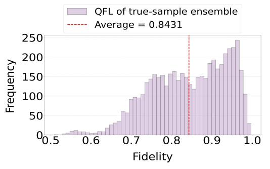

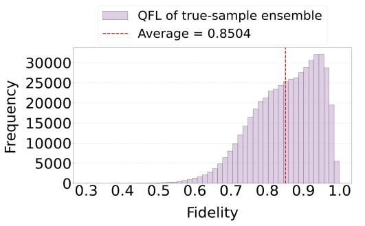

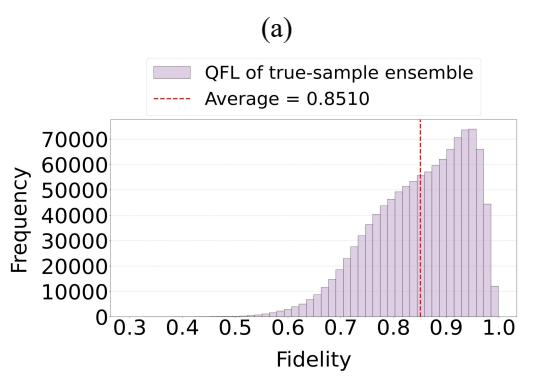  
(c)

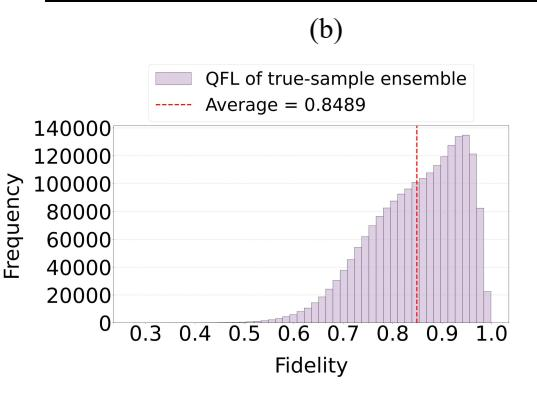  
(d)  
Figure E.16: QFLs computed from diferent numbers of real samples for digit 1 in the 16 × 16 MNIST dataset. Subfigures (a)–(d) use sample sizes of 500, 1000, 1500, and 2000, respectively.

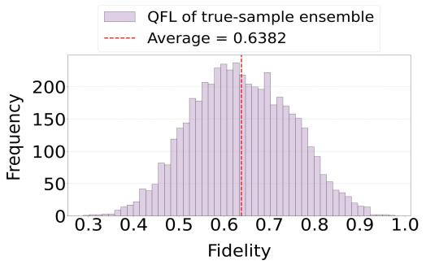

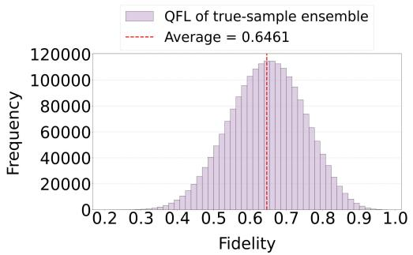

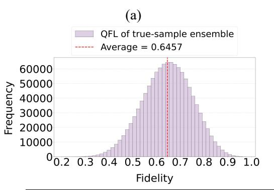  
(c)

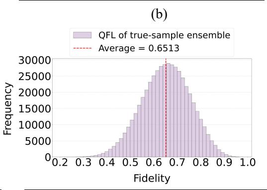  
(d)  
附录 统计Figure E.17: QFLs computed from diferent numbers of real samples for digit 2 in the 16 × 16 MNIST dataset. Subfigures (a)–(d) use sample sizes of 500, 1000, 1500, and 2000, respectively.

## Appendix F. Achieving QFL Alignment on Diverse Datasets using the Quantum Fidelity Landscape (QFL) optimization algorithm

This appendix provides additional QFL-alignment results achieved by our initial-state ensemble preparation algorithm. As highlighted in the main paper, accurate alignment between the initial-state ensemble and the truesample ensemble is crucial for BasicQGAN. Figures F.18 and F.19 present the QFL-alignment results for each digit class (0–9) on the $1 6 \times 1 6$ and $2 8 \times 2 8$ MNIST datasets, respectively.

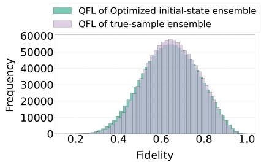  
(a)

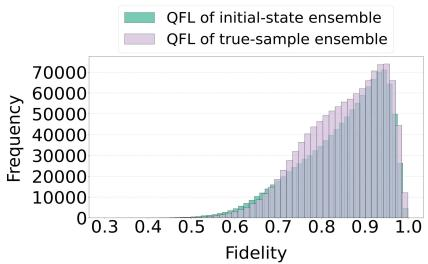  
(b)

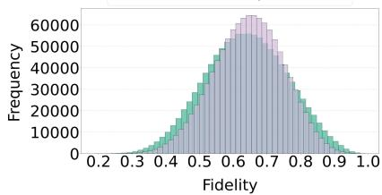  
(c)

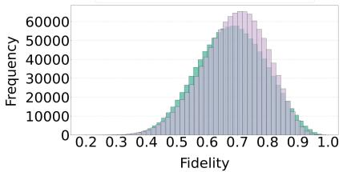  
(d)

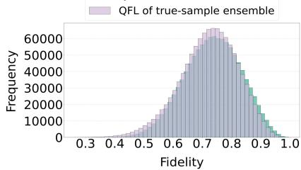  
(e)

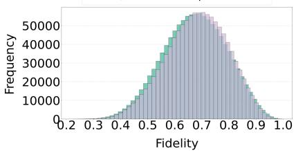  
(f)

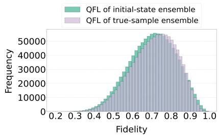  
(g)

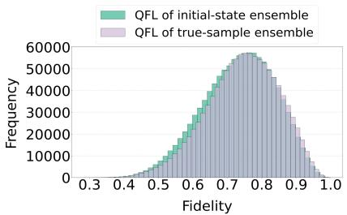  
(h)

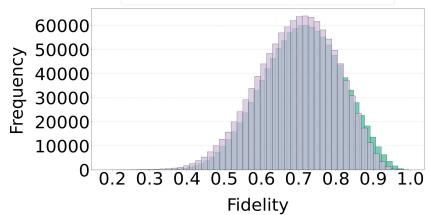  
(i)

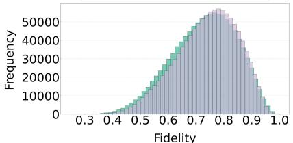  
(j)  
Figure F.18: QFL alignment on 16 × 16 MNIST (digits 0–9). Subfigures (a)–(j) show, for each digit, the QFL of the optimized initial-state ensemble and the true-sample ensemble.

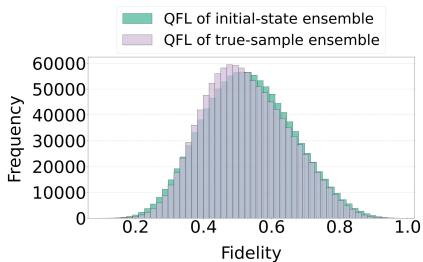  
(a)

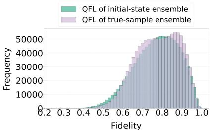  
(b)

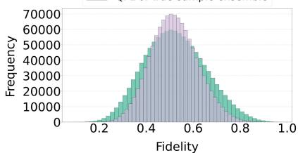  
(c)

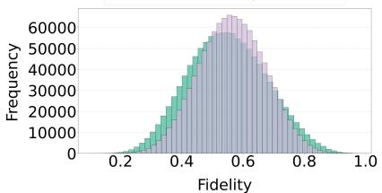

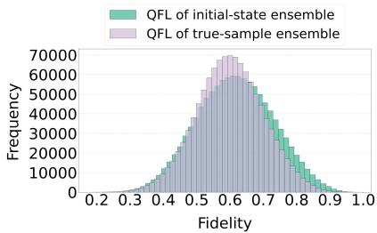  
(e)

(d)  
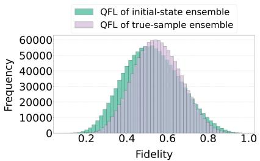  
(f)

  
(g)

  
(i)

(h)  
  
(j)  
Figure F.19: QFL alignment on 28 × 28 MNIST (digits 0–9). Subfigures (a)–(j) show, for each digit, the QFL of the optimized initial-state ensemble and the true-sample ensemble. 40

## Appendix G. The Objective Function and Training Algorithm of BasicQGAN

Objective Function Here, we detail the specific objective functions utilized by the generator and discriminator within the BasicQGAN framework. Specifically, the discriminator aims to distinguish between real and generated data. The corresponding loss function is given by:

$$
L _ { D } = \mathbb { E } _ { \boldsymbol { x } \sim p _ { \mathrm { d a t a } } } [ D ( \boldsymbol { x } ) ] - \mathbb { E } _ { \boldsymbol { z } ^ { \prime } \sim p ( \boldsymbol { z } ^ { \prime } ) } [ D ( G ( \boldsymbol { z } ^ { \prime } ) ) ] - \lambda \mathbb { E } _ { \hat { \boldsymbol { x } } \sim p _ { \hat { \boldsymbol { x } } } } [ ( \| \nabla _ { \hat { \boldsymbol { x } } } D ( \hat { \boldsymbol { x } } ) \| _ { 2 } - 1 ) ^ { 2 } ] .\tag{G.1}
$$

where $\hat { x }$ is uniformly interpolated between a real sample $x \sim p _ { \mathrm { d a t a } }$ and a generated sample $\tilde { x } \sim p _ { G } , p ( Z ^ { \prime } )$ denotes the optimized distribution over the state-preparation rotation angles $Z ^ { \prime }$ , and $\lambda$ is the gradient-penalty coeficient. The quantum generator strives to create images so realistic that they can fool the discriminator. The corresponding loss function is given by:

$$
{ \cal L } _ { G } = - E _ { Z ^ { \prime } \sim p ( Z ^ { \prime } ) } [ D ( G ( Z ^ { \prime } ) ) ]\tag{G.2}
$$

Training Algorithm The training algorithm for BasicQGAN follows the WGAN-GP training algorithm, with the primary diference being the use of the quantum generator. We optimize the model using an alternating training strategy. Within a training epoch, the parameters of the generator $G$ are first fixed, and the discriminator D is trained. Subsequently, the parameters of the discriminator D are fixed, and the generator G is trained. These two steps are repeatedly alternated until a Nash equilibrium is reached. The complete training algorithm for BasicQGAN is detailed in Algorithm 2.

Algorithm 2 Pseudocode of training algorithm for BasicQGAN   
Input: Gradient penalty coeficient λ, number of epochs $n _ { \mathrm { { e p o c h } } } ,$ batch   
size $m ,$ critic update every $n _ { c }$ iterations, Adam momentum hyperpa  
rameters $b _ { 1 } , \quad b _ { 2 } ,$ the learning rate hyperparameter of the generator   
$\eta _ { 1 }$ the learning rate hyperparameter of the critic $\eta _ { 2 }$ , random num  
ber $\xi ~ \sim ~ U [ 0 , 1 ]$ , optimized rotation angle sampling distribution $Z ^ { \prime } \sim$   
$P ( Z ^ { \prime } )$   
1: Initialize discriminator parameters $\omega ,$ generator parameters $\theta .$   
2: batchnum := 0   
3: for epoch $= 1 , \ldots , n _ { \mathrm { e p o c h } }$ do   
4: for $i = 1 , \ldots , m$ do   
5: Sample real data $x \sim P _ { \mathrm { d a t a } } ( x )$ , rotation angle $Z ^ { \prime } \sim P ( Z ^ { \prime } )$   
6: ${ x ^ { \prime } } ^ { \mathrm { m e a s u r e m e n t } } | \psi \rangle  G ( \theta , Z ^ { \prime } )$   
7: $\hat { x }  \xi x + ( 1 - \xi ) x ^ { \prime }$   
8: $L _ { D } \gets D ( \boldsymbol { x ^ { \prime } } ) - \bar { D } ( \boldsymbol { x } ) + \lambda \left( \| \nabla _ { \boldsymbol { \hat { x } } } D ( \boldsymbol { \hat { x } } ) \| _ { 2 } - 1 \right) ^ { 2 }$   
9: $\begin{array} { r } { \omega \gets \mathrm { A d a m } \left( \frac { 1 } { m } \sum _ { i = 1 } ^ { m } L _ { D } , \omega , \eta _ { 2 } , b _ { 1 } , b _ { 2 } \right) } \end{array}$   
10: batchnum := batchnum $+ 1$   
11: if batchnum mod $n _ { c } = = 0$ then   
12: ${ x ^ { \prime } } ^ { \mathrm { m e a s u r e m e n t } } | \psi \rangle  G ( \theta , Z ^ { \prime } )$   
13: $L _ { G } \gets D ( x ^ { \prime } )$   
14: $\begin{array} { r } { \theta \gets \mathrm { A d a m } \left( \frac { 1 } { m } \sum _ { i = 1 } ^ { m } L _ { G } , \theta , \eta _ { 1 } , b _ { 1 } , b _ { 2 } \right) } \end{array}$   
15: end if   
16: end for   
17: end for

## Appendix H. Dataset Descriptions

Most existing baselines for QGAN image generation are benchmarked on small-scale grayscale datasets. Following this common practice, we construct four datasets from public repositories (MNIST, EMNIST, and HDS), as shown in Figure H.20 and summarized in Table H.3.

  
(a)

  
(b)

  
(c)  
Figure H.20: Representative samples from our used datasets: (a) MNIST, (b) Uppercase Letters, and (c) Geometric Shapes.

Table H.3: A summary of the datasets.
<table><tr><td>DATASET</td><td>IMAGE</td><td>No. OF RESOLUTION TRAINING INSTANCES</td><td>No. OF CLASSES</td></tr><tr><td>MNIST</td><td> $2 8 \times 2 8$ </td><td>1500</td><td>10 OBJECT CATEGORIES</td></tr><tr><td>MNIST</td><td> $1 6 \times 1 6$ </td><td>1500</td><td>10 OBJECT CATEGORIES</td></tr><tr><td>UPPERCASE LETTERS</td><td> $1 6 \times 1 6$ </td><td>1500</td><td>10 OBJECT CATEGORIES</td></tr><tr><td>GEOMETRIC SHAPES</td><td> $1 6 \times 1 6$ </td><td>400</td><td>4 OBJECT CATEGORIES</td></tr></table>

## Appendix I. Additional Experimental Results and Training Details

This appendix provides supplementary experimental results and further details regarding the training processes mentioned in the main paper. Figure I.21, Figure I.22, Figure I.23, and Figure I.24 showcase more generated image samples from BasicQGAN, PQWGAN, and WGAN-GP across various datasets. In addition, Figure I.25 reports the FID curves over training epochs on MNIST at two resolutions.

  
Figure I.21: The generated samples for all digit classes (0-9) produced by various models28size\_naive on the 16×16 MNIST dataset.

  
Figure I.22: The generated samples for all digit classes (0-9) produced by various models on the 28×28 MNIST dataset.

  
Figure I.23: The generated samples for all shape classes (angleCross,hexagon, square and straightCross) produced by various models on the 16×16 Geometric Shapes dataset.

  
Figure I.24: The generated samples (A-J) for all letter classes produced by various models on the 16×16 Uppercase Letters dataset.

(a)  
  
(b)  
Figure I.25: FID curves over training epochs on MNIST at two resolutions: (a) 16 × 16 and $\mathrm { ( b ) 2 8 \times 2 8 }$ . Each line reports the per-digit FID, showing a consistent decrease and gradual convergence as training proceeds.

## Appendix J. Analysis of quantum circuit layers

In this section, we analyze the efect of quantum-generator circuit depth on generation performance. As shown in Figure J.26, circuits with 40 layers generate clearer and more diverse images than circuits with 10 or 20 layers. This improvement is consistent with the increased expressive power provided by deeper parameterized circuits. However, further increasing the depth to 60 or 80 layers reduces sample diversity, likely because deeper variational circuits are more susceptible to barren plateaus and harder to optimize efectively. Table J.4 reports the corresponding FID scores. The best score is achieved层数 with 40 layers, after which FID increases.

  
10 layers

  
20 layers

  
40 layers

  
60 layers

  
80 layers

Figure J.26: Qualitative comparison of BasicQGAN generated samples on the 16 × 16 MNIST setting with diferent generator depths (10, 20, 40, 60, and 80 layers). The 40-layer configuration is used as our default setting.  
Table J.4: Comparison of BasicQGAN performance across diferent generator depths.
<table><tr><td>LAYER</td><td>10</td><td>20</td><td>40 (OURS)</td><td>60</td><td>80</td></tr><tr><td>FID</td><td>25.12</td><td>20.71</td><td>20.38</td><td>21.74</td><td>26.24</td></tr></table>

## Appendix K. Analysis of diferent learning rate

This section analyzes how the learning rate in the Quantum Fidelity Landscape (QFL) optimization algorithm afects the generation performance of BasicQGAN. To quantify how well the optimized initial-state QFL matches the true-sample QFL, we measure the discrepancy between the two distributions using the 1D Wasserstein distance. Following the sum form (i.e., omitting the $1 / n$ scaling), for two sorted sets of discrete values $A = \left\{ a _ { 1 } \leq \cdots \leq a _ { n } \right\}$ and $B = \{ b _ { 1 } \leq \cdots \leq b _ { n } \}$ , we compute

$$
W _ { 1 } ( A , B ) = \sum _ { i = 1 } ^ { n } \lvert a _ { ( i ) } - b _ { ( i ) } \rvert .\tag{K.1}
$$

Figure $\mathrm { K . 2 7 ( a ) - ( d ) }$ visualizes the alignment between the QFL of the optimized initial-state ensemble and that of the true-sample ensemble under diferent learning rates, and reports the corresponding Wasserstein distances for each setting. A smaller Wasserstein distance indicates a closer match to the true-sample QFL. In addition, Figure K.27(e) shows the average-fidelity training curves during the initial-state sampling optimization.

Overall, the optimized initial-state QFLs obtained with diferent learning rates are all close to the true-sample QFL. The smallest Wasserstein distances are achieved with learning rates of 0.5 and 0.3 (0.0890 and 0.0882, respectively). Moreover, the average-fidelity curve is smoother under a learning rate of 0.3, indicating more stable convergence. Considering both matching quality and training stability, we choose a learning rate of 0.3.

QFL of optimized initial-state ensemble QFL of true-sample ensemble  
  
(a) lr=0.1 [ wasserstein distance: 0.0915 ]

  
(b) lr=0.3 [ wasserstein distance: 0.0890 ]

  
(c) lr=0.5 [ wasserstein distance: 0.0882 ]

  
(d) lr=0.7 [ wasserstein distance: 0.0930 ]

  
(e) Average fidelity training curves for different learning rates used in the Quantum Fidelity Landscape (QFL) optimization algorithm.

Figure K.27: Efect of the diferent learning rate in Quantum Fidelity Landscape (QFL) optimization algorithm. (a)–(d) histograms of QFL values for the optimized initial-state ensemble and the true-sample ensemble under diferent learning rates; the corresponding 1D Wasserstein distances are reported in each subplot. (e) Average-fidelity training curves for diferent learning rates during the optimization, where the dashed line denotes the target average fidelity.

## References

Arjovsky, M., Chintala, S., Bottou, L., 2017. Wasserstein generative adversarial networks, in: Precup, D., Teh, Y.W. (Eds.), Proceedings of the 34th International Conference on Machine Learning, PMLR. pp. 214–223. URL: https://proceedings.mlr.press/v70/arjovsky17a.html.

Biamonte, J., Wittek, P., Pancotti, N., Rebentrost, P., Wiebe, N., Lloyd, S., 2017. Quantum machine learning. Nature 549, 195–202. doi:10.1038/ nature23474.

Chang, S.Y., Thanasilp, S., Saux, B.L., Vallecorsa, S., Grossi, M., 2024. Latent style-based quantum GAN for high-quality image generation. arXiv preprint arXiv:2406.02668. doi:10.48550/arXiv.2406.02668.

Cohen, G., Afshar, S., Tapson, J., van Schaik, A., 2017. EMNIST: Extending MNIST to handwritten letters, in: 2017 International Joint Conference on Neural Networks (IJCNN), pp. 2921–2926. doi:10.1109/IJCNN.2017. 7966217.

Dallaire-Demers, P.L., Killoran, N., 2018. Quantum generative adversarial networks. Physical Review A 98, 012324.

Deng, L., 2012. The MNIST database of handwritten digit images for machine learning research. IEEE Signal Processing Magazine 29, 141–142. doi:10.1109/MSP.2012.2211477.

Farhi, E., Goldstone, J., Gutmann, S., 2014. A quantum approximate optimization algorithm. arXiv preprint arXiv:1411.4028. doi:10.48550/ arXiv.1411.4028.

Fuchs, C.A., van de Graaf, J., 1999. Cryptographic distinguishability measures for quantum-mechanical states. IEEE Transactions on Information Theory 45, 1216–1227. doi:10.1109/18.761271.

Gibbs, A.L., Su, F.E., 2002. On choosing and bounding probability metrics. International Statistical Review 70, 419–435. doi:10.1111/j.1751-5823. 2002.tb00178.x.

Goodfellow, I.J., Pouget-Abadie, J., Mirza, M., Xu, B., Warde-Farley, D., Ozair, S., Courville, A., Bengio, Y., 2014. Generative adversarial nets,

in: Ghahramani, Z., Welling, M., Cortes, C., Lawrence, N., Weinberger, K. (Eds.), Advances in Neural Information Processing Systems, Curran Associates, Inc. URL: https://proceedings.neurips.cc/paper\_files/ paper/2014/file/f033ed80deb0234979a61f95710dbe25-Paper.pdf.

Gulrajani, I., Ahmed, F., Arjovsky, M., Dumoulin, V., Courville, A., 2017. Improved training of Wasserstein GANs, in: Guyon, I., Luxburg, U.V., Bengio, S., Wallach, H., Fergus, R., Vishwanathan, S., Garnett, R. (Eds.), Advances in Neural Information Processing Systems, Curran Associates, Inc. URL: https://proceedings.neurips.cc/paper\_files/ paper/2017/file/892c3b1c6dccd52936e27cbd0ff683d6-Paper.pdf.

Huang, H.L., Du, Y., Gong, M., Zhao, Y., Wu, Y., Wang, C., Li, S., Liang, F., Lin, J., Xu, Y., et al., 2021. Experimental quantum generative adversarial networks for image generation. Physical Review Applied 16, 024051. doi:10. 1103/PhysRevApplied.16.024051.

J¨ager, J., Kiwit, F.J., Riofr´ıo, C.A., 2026. Scaling quantum machine learning without tricks: full-resolution and diverse image generation. Quantum Science and Technology 11, 035042. URL: http://dx.doi.org/10.1088/ 2058-9565/ae7ea9, doi:10.1088/2058-9565/ae7ea9.

Karras, T., Laine, S., Aila, T., 2021. A style-based generator architecture for generative adversarial networks. IEEE Transactions on Pattern Analysis and Machine Intelligence 43, 4217–4228. doi:10.1109/TPAMI.2020.2970919.

Lloyd, S., Weedbrook, C., 2018. Quantum generative adversarial learning. Physical Review Letters 121, 040502. doi:10.1103/PhysRevLett.121. 040502.

Nielsen, M.A., Chuang, I.L., 2010. Quantum computation and quantum information. Cambridge university press. doi:10.1017/CBO9780511976667.

Niu, M.Y., Zlokapa, A., Broughton, M., Boixo, S., Mohseni, M., Smelyanskyi, V., Neven, H., 2022. Entangling quantum generative adversarial networks. Physical review letters 128, 220505. doi:10.1103/PhysRevLett. 128.220505.

Peruzzo, A., McClean, J., Shadbolt, P., Yung, M.H., Zhou, X.Q., Love, P.J., Aspuru-Guzik, A., O’brien, J.L., 2014. A variational eigenvalue

solver on a photonic quantum processor. Nature communications 5, 4213. doi:10.1038/ncomms5213.

Robert, F., 2022. Hand-drawn Shapes (HDS) Dataset. https://www. kaggle.com/datasets/frobert/handdrawn-shapes-hds-dataset. Accessed: 2025-08-02.

Serfling, R.J., 1980. Approximation Theorems of Mathematical Statistics. Wiley, New York. doi:10.1002/9780470316481.

Silver, D., Ranjan, A., Patel, T., Gandhi, H., Cutler, W., Tiwari, D., 2023. MosaiQ: Quantum Generative Adversarial Networks for Image Generation on NISQ Computers, in: 2023 IEEE/CVF International Conference on Computer Vision (ICCV), pp. 7007–7016. doi:10.1109/ICCV51070.2023. 00647.

Stein, S.A., Baheri, B., Chen, D., Mao, Y., Guan, Q., Li, A., Fang, B., Xu, S., 2021. QuGAN: A Quantum State Fidelity based Generative Adversarial Network, in: 2021 IEEE International Conference on Quantum Computing and Engineering (QCE), pp. 71–81. doi:10.1109/QCE52317.2021.00023.

Thomas, A.M., Youel, H., Jose, S.T., 2025. VAE-QWGAN: addressing mode collapse in quantum GANs via autoencoding priors. Quantum Machine Intelligence 7, 91. URL: https://doi.org/10.1007/s42484-025-00314-z, doi:10.1007/s42484-025-00314-z.

Tsang, S.L., West, M.T., Erfani, S.M., Usman, M., 2023. Hybrid quantum–classical generative adversarial network for high-resolution image generation. IEEE Transactions on Quantum Engineering 4, 1–19. doi:10. 1109/TQE.2023.3319319.

Vieloszynski, A., Cherkaoui, S., Ahmad, O., Laprade, J.F., Nahman-L´evesque, O., Aaraba, A., Wang, S., 2024. LatentQGAN: A Hybrid QGAN with Classical Convolutional Autoencoder, in: 2024 IEEE 10th World Forum on Internet of Things (WF-IoT), pp. 1–7. doi:10.1109/WF-IoT62078.2024. 10811384.

Yang, X., Zhou, R., Jia, S., Koh, D.E., Goh, S.T., Li, Y., Chen, H., Xiong, F., 2026a. End-to-end qgan-based image synthesis via neural noise encoding and intensity calibration. URL: https://arxiv.org/abs/2603.18554, arXiv:2603.18554.

Yang, X., Zhou, R., Jia, S., Li, Y., Yan, J., Long, Z., Guo, W., Xiong, F., Xu, W., 2026b. iHQGAN: A lightweight invertible hybrid quantumclassical generative adversarial networks for unsupervised image-to-image translation. Expert Systems with Applications 296, 128865. doi:10.1016/ j.eswa.2025.128865.