# On the Relaxation of Conditional Independence Assumption for Image Segmentation

Zixun Wang Department of Statistics and Data Science The Chinese University of Hong Kong 1155225012@link.cuhk.edu.hk

Ben Dai Department of Statistics and Data Science The Chinese University of Hong Kong bendai@cuhk.edu.hk

## Abstract

In semantic segmentation, a recent line of RankSEG methods directly optimizes Dice/IoU scores at inference time, improving alignment with evaluation metrics without modifying model training. Despite its theoretical and empirical success, RankSEG relies on the restrictive Conditional Independence Assumption (CIA), which ignores crucial label correlations and therefore degrades performance in ambiguous or low-contrast scenarios. However, accounting for full label dependence is computationally prohibitive, requiring O(d3) time. To address this, we replace the CIA with a Spatially Localized Dependence (SLD) structure that captures local label correlations while keeping the dependence model tractable. We further overcome the remaining computational bottleneck via a Reciprocal Moment Approximation coupled with a novel fixed-point optimization strategy that eliminates exhaustive search. The proposed algorithm achieves a highly practical O(d log d) complexity and consistently outperforms conventional argmax and CIA-based RankSEG across diverse segmentation benchmarks. Improvements are significant in lowcontrast or small-object scenarios, where label dependence offers valuable signals complementary to image information for accurate segmentation. The code of experiments is available at https://github.com/ZixunWang/RankSEG-DEP.

## 1 Introduction

Semantic segmentation is a fundamental computer vision task that partitions an image into regions corresponding to different classes. It has a wide range of applications, including medical imaging [1], autonomous driving [2], and image editing [3].

Most existing approaches generate segmentation mask by applying thresholding or argmax operations to pixel-wise probabilities estimated by neural networks [4–7]. However, they do not directly optimize the evaluation metrics commonly used in segmentation tasks, such as the Dice score or Intersection over Union (IoU), which are set-based metrics that evaluate the overall quality of the predicted mask.

Although several surrogate loss functions have been proposed in an attempt to optimize these target metrics, such as soft-Dice/IoU loss [8, 9] and Lovász loss [10, 11], they still suffer from three main limitations: (1) their theoretical consistency [12] with the target metrics is either negative (Lovász hinge [13]) or unknown (soft-Dice/IoU); (2) unlike cross-entropy loss, they do not produce calibrated probabilities, which are crucial for uncertainty quantification in high-stakes settings such as medical imaging [14]; and (3) likely due to non-convexity, they are typically combined with cross-entropy loss through a weighted sum to stabilize training, introducing additional hyperparameters to tune.

To address these limitations, a recent series of work [15, 16], known as RankSEG, have developed algorithms that directly optimize the Dice/IoU scores with theoretical guarantees. RankSEG takes calibrated probabilities as input and replaces the thresholding/argmax operation in the original inference step without modifying model training, making it easy to integrate into pre-trained models

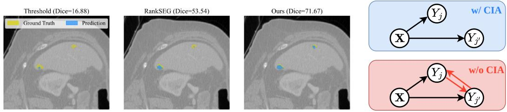  
((a)) Comparison of different methods in tumor segmentation.  
((b)) Graphical model.

Figure 1: (a) The intensity contrast, and consequently the foreground probabilities, are uniformly low, so traditional thresholding barely detects any tumor and RankSEG almost entirely misses the tumor in the upper right. In contrast, our proposed method more fully recovers the tumor by leveraging label dependencies within the tumor region. (b) When predicting $Y _ { j ^ { \prime } } ,$ , only information from $\bar { \boldsymbol { X } }$ is used under CIA, whereas both X and the neighboring label $Y _ { j }$ are utilized when the CIA is not assumed.

as a performance-enhancing post-processing module. Despite its theoretical and empirical success, RankSEG relies on the conditional independence assumption $( \mathrm { C I A } ) , \mathrm { i . e . , } Y _ { j } \perp \perp Y _ { j ^ { \prime } } | X$ for $j \neq j ^ { \prime }$ where X is the image and $Y _ { j }$ and $Y _ { j ^ { \prime } }$ denote the labels of pixels j and $j ^ { \prime }$ , respectively. This assumption ignores the correlation between labels of different pixels and thus loses valuable information; for example, if two pixels are similar in both intensity and position, they are very likely to share the same label. Such information is especially useful in challenging tasks where the image itself is too noisy to provide sufficient information for accurate segmentation.

Figure 1(a) illustrates such an example: the tumor region is hardly distinguishable due to low intensity contrast in the image, and both traditional thresholding and RankSEG fail to recover the tumor in the upper right. In contrast, our proposed method, which leverages the label dependencies within this region, successfully captures the tumor more completely. Using graphical models, Figure 1(b) depicts the information flow of methods with and without CIA: when predicting a particular label $Y _ { j ^ { \prime } }$ , both methods rely on the image information X, typically encoded as pixel-wise probabilities produced by deep neural networks. However, the graphical model without CIA explicitly accounts for the influence of other label $Y _ { j }$ on the prediction of $Y _ { j ^ { \prime } }$ , and vice versa.

Therefore, a natural question arises: can we develop an efficient method that directly optimizes the Dice/IoU scores yet without relying on CIA? This question is challenging primarily because the computational efficiency of RankSEG critically depends on the CIA; without this assumption, the associated optimization in RankSEG incurs a complexity of $\mathcal { O } ( d ^ { 3 } )$ , where d is the number of pixels in the image. Such complexity is impractical for real-world applications, since d typically reaches hundreds of thousands $( \mathbf { \bar { e } . g . } , \dot { d } \approx 1 0 ^ { 5 }$ for a $3 8 4 \times 3 8 4$ image).

To answer this question, we relax the CIA to a more realistic Spatially Localized Dependence (SLD) structure, which is strictly weaker than the CIA and well suited to image segmentation tasks. Under SLD, we develop an algorithm within the RankSEG framework that optimizes Dice/IoU in O(d log d). Our main contributions are summarized as follows:

• Relaxation of the CIA: We relax the CIA to SLD within the RankSEG framework, preserving valuable dependency information and improving predictions in low-contrast or ambiguous regions where independence assumptions fail.

• An ${ \mathcal { O } } ( d \log d )$ algorithm: Building upon this relaxed assumption, we develop a novel and efficient algorithm grounded in the RankSEG framework that directly optimizes Dice/IoU scores without relying on the CIA, making it practical for real-world applications.

• Empirical validation: We conduct extensive experiments on multiple image segmentation datasets, demonstrating the superior performance of our method compared to CIA-based methods (argmax/thresholding and RankSEG), especially in challenging scenarios with low image contrast.

## 2 Preliminaries

We start with binary segmentation for ease of clarification. Let $\pmb { X } \in \mathbb { R } ^ { d } , \pmb { Y } \in \{ 0 , 1 \} ^ { d }$ represent the random variables for an image and its corresponding segmentation mask, respectively. The segmentation function $\pmb \delta : \mathbb { R } ^ { d }  \bar { \{ 0 , 1 \} } ^ { d }$ produces a predicted mask ${ \pmb \delta } ( { \pmb x } ) \in \{ 0 , 1 \} ^ { d }$ for a test image $\pmb { x } \in \mathbb { R } ^ { d }$ . Our objective is to find the segmentation rule δ that maximizes the expected Dice score:

$$
\mathbb { E } _ { X , Y } \mathrm { ( D i c e ( } \delta \mathrm { ) ) } = \mathbb { E } _ { X , Y } \Big ( \frac { 2 \delta ^ { \intercal } ( X ) Y } { \| \delta ( X ) \| _ { 1 } + \| Y \| _ { 1 } } \Big ) .\tag{1}
$$

We denote $[ d ] = \{ 1 , \cdots , d \}$ as the index set of pixels, and $p _ { j } ( \pmb { x } ) = \mathbb { P } ( Y _ { j } = 1 | \pmb { x } )$ as the conditional probability of pixel j being a foreground pixel given the image x. In practice, the probability mask $\mathbf { \bar { \boldsymbol { p } } } ( \mathbf { \boldsymbol { x } } ) \in [ \dot { 0 } , 1 ] ^ { d }$ is estimated by a deep neural network, and our focus is on how to derive the final segmentation mask from ${ \pmb p } ( { \pmb x } )$ . For notational convenience, we henceforth suppress the conditioning on $\mathbf { \nabla } X = x$ and write, $\mathrm { e . g . , } p _ { j }$ in place of $p _ { j } ( { \pmb x } )$ .

## 2.1 Thresholding/Argmax over probability

The traditional approach to segmentation applies the argmax operation to the probability mask for each pixel, which, in the binary case, is equivalent to thresholding at 0.5:

$$
\begin{array} { r } { \tilde { \delta } _ { j } = \mathbb { 1 } ( p _ { j } \geq 0 . 5 ) \quad \mathrm { f o r ~ a l l ~ } j \in [ d ] . } \end{array}\tag{2}
$$

However, this method has been shown to be suboptimal with respect to Dice/IoU [15, 16]. Intuitively, this is because it makes pixel-wise decisions, whereas Dice/IoU assesses the overall overlap between the predicted and ground-truth masks. In contrast, as we show later, RankSEG accounts for this global evaluation criterion by ranking pixels according to their contributions to the expected score.

## 2.2 RankSEG

Although the original RankSEG [15] is formulated under the CIA, we present the corresponding Theorem 1 without this assumption to better illustrate the associated computational challenges. Notably, this theorem partially coincides with the Bayes rule for optimizing F-measure in multi-label classification with label dependencies [17].

Theorem 1 ([17, 15]). The optimal segmentation rule $\delta ^ { * } = \operatorname { a r g m a x } \mathbb { E } ( D i c e ( \delta ) )$ is given by: $\delta _ { j } ^ { * } =$ $\mathbb { 1 } \left( j \in T o p _ { \tau ^ { * } } ( S _ { 1 : d , \tau ^ { * } } ) \right)$

$$
\begin{array} { r l } { w h e r e } & { { } \tau ^ { * } = \underset { \tau \in [ d ] } { \operatorname { a r g m a x } } \omega _ { \tau } , \quad \omega _ { \tau } = \sum _ { j \in T o p _ { \tau } ( S _ { 1 : d , \tau } ) } S _ { j , \tau } } \end{array}\tag{3}
$$

$$
a n d \quad S _ { j , \tau } = p _ { j } \mathbb { E } ( \tau + \Gamma _ { j } ) ^ { - 1 } = p _ { j } \left( \sum _ { k = 1 } ^ { d } \frac { \mathbb { P } ( \Gamma _ { j } = k ) } { \tau + k } \right) .\tag{4}
$$

$$
\begin{array} { r } { \Gamma _ { j } \ d i s t r i b u t e d a s \ \| \boldsymbol { Y } \| _ { 1 } \ | \ ( Y _ { j } = 1 ) , i . e . , \mathbb { P } ( \Gamma _ { j } = k ) = \mathbb { P } ( \| \boldsymbol { Y } \| _ { 1 } = k | Y _ { j } = 1 ) f o r \ a l l \ k \in [ d ] . } \end{array}
$$

Intuition. $\omega _ { \tau }$ denotes the expected Dice score when predicting the best τ pixels as foreground, and $S _ { j , \tau }$ quantifies the contribution of pixel $j$ to this score. $\Gamma _ { j }$ is interpreted as the expected volume conditioned on $Y _ { j } = 1$ , and τ as the volume we consider to predict. $\Gamma _ { j }$ and $\tau$ correspond to $\| \mathbf { Y } \| _ { 1 }$ and $\| \pmb { \delta } ( \pmb { X } ) \| _ { 1 }$ in the denominator of (1), respectively, while $p _ { j }$ corresponds to the numerator; this explains why $S _ { j , \tau }$ represents the contribution of pixel $j$ to the expected Dice score.

Under the CIA, Dai and Li [15] further showed that $S _ { j , \tau }$ is monotonically increasing in $p _ { j }$ for any fixed $\tau ,$ so ranking pixels by $S _ { j , \tau }$ reduces to ranking by $p _ { j }$ . This induces a global ranking invariant to $\tau { : }$ the optimal segmentation simply selects the $\tau ^ { * }$ pixels with the highest probabilities. Without the CIA, however, $S _ { j , \tau }$ depends on the full joint distribution of $\mathbf { Y }$ , and may no longer be monotone in $p _ { j }$ Consequently, the optimal segmentation instead requires explicitly ranking pixels by $S _ { j , \tau }$ for each τ.

## 2.3 Challenges without CIA and main ideas

Computational challenges. Theorem 1 naturally suggests a four-step procedure to obtain the optimal segmentation: (i) compute the contribution scores $_ { s }$ according to (4); (ii) for each candidate volume $\tau \in [ d ]$ , sort the column $S _ { 1 : d , \tau } \in [ 0 , 1 ] ^ { d }$ and compute the expected Dice score $\omega _ { \tau }$ by summing its top τ entries; (iii) determine the optimal volume $\tau ^ { * }$ by maximizing $\omega _ { \tau } ;$ and (iv) predict the top $\tau ^ { * }$ pixels in $S _ { 1 : d , \tau ^ { * } }$ as foreground. This procedure is computationally prohibitive for high-resolution images. The inefficiency stems from three primary bottlenecks:

(a) Modeling full dependence within Y. Although label dependence offers valuable predictive signals, modeling arbitrarily complex dependencies renders the distribution of $\Gamma _ { j }$ intractable.

(b) Computing $\mathbb { E } ( \tau + \Gamma _ { j } ) ^ { - 1 }$ . Even given the distribution of $\Gamma _ { j } ,$ performing the summation for all $j , \tau \in [ d ]$ according to (4) incurs a prohibitive $\mathcal { O } ( d ^ { 3 } )$ complexity.

(c) Re-ranking across varying $\tau .$ Evaluating $\omega _ { \tau }$ for each candidate τ requires a fresh sorting over $S _ { : , \tau }$ , which precludes reusing intermediate results from $\omega _ { \tau }$ when computing $\omega _ { \tau + 1 }$

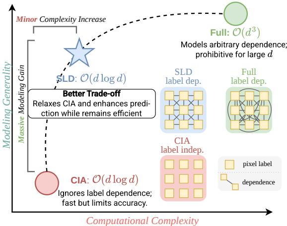  
Figure 2: Trade-off in dependence modeling. The two endpoints represent the extremes of CIA and Full dependence. By relaxing CIA to local dependence, SLD strikes a better trade-off. The graphs depict the label dependence (dep.) under each model: none under CIA, arbitrary under Full, and neighboring-only under SLD.

Dependence Modeling. To overcome these challenges, we begin by reconsidering how to model the joint distribution of $\breve { Y }$ . Instead of attempting to model full correlations among all d labels, we propose to model Spatially Localized Dependence (SLD). The key intuition is that, in image segmentation, spatially neighboring pixels exhibit stronger label correlations, whereas distant pixels behave almost independently. By restricting the dependence to these local neighborhoods, it transforms an intractable global distribution into a structured and tractable form. Crucially, SLD provides a better trade-off between efficiency and generality, as illustrated in Figure 2.

Algorithmic Contributions. Building on SLD, we introduce two key algorithmic contributions to address the remaining computational bottlenecks. First, we adopt the Reciprocal Moment Approximation [16] that replaces $\mathbb { E } ( \tau + \Gamma _ { j } ) ^ { - 1 }$ with (τ +

$\mathbb { E } \Gamma _ { j } ) ^ { - 1 }$ , decoupling the expectation from $\tau$ and reducing the problem to merely computing $\mathbb { E } \Gamma _ { j }$ SLD then enables to formulate this as a convolution, paired with an ${ \mathcal { O } } ( d \log d )$ solution via the Fast Fourier Transform. Second, we propose afixed-point optimization strategy to avoid the costly re-ranking for each τ. Instead of sorting from scratch each time, we maintain a single global ranking and alternate between updating τ based on the current ranking and refining the ranking from the updated τ. This procedure converges quickly to an approximate $\tau ^ { * }$ without exhaustive enumeration.

## 3 Method

In this section, we develop an efficient inference algorithm that incorporates SLD into the RankSEG framework. We first introduce the SLD assumption in Section 3.1, which relaxes the CIA to a local covariance structure tailored to image segmentation. These changes pose two challenges: evaluating the conditional reciprocal moment and avoiding repeated sorting across volumes. We address the first in Section 3.2 using a Reciprocal Moment $\mathbf { A } _ { \mathbf { l } }$ pproximation, which reduces score computation to the conditional mean $\mathbb { E } \Gamma _ { j }$ and exploits the SLD structure to compute all such means efficiently by convolution and FFT. We address the second in Section 3.3 through a fixed-point optimization that iteratively refines the ranking and prediction volume without exhaustive search.

## 3.1 Spatially Localized Dependence

Completely removing the CIA introduces significant theoretical and methodological challenges due to the vast dimensionality of the joint label distribution. However, in the context of image segmentation, assuming arbitrary dependencies between all pairs of pixels is unnecessarily complex. Visual structures naturally exhibit spatial locality: physically proximate pixels are highly likely to share the same semantic label, while the correlation between distant pixels drops off rapidly.

We formalize this intuition through the SLD assumption in Assumption 1.

Assumption 1 (Spatially Localized Dependence; SLD). Denote the covariance matrix of Y as Σ, $\mathrm { i . e . , } \Sigma _ { i j } = \mathrm { C o v } ( \bar { Y _ { i } } , Y _ { j } )$ . The covariance between any two labels satisfies:

$$
\Sigma _ { i j } = \sqrt { \Sigma _ { i i } \Sigma _ { j j } } \cdot K ( r ( i , j ) ) \quad \mathrm { w i t h } \quad K ( r ) = \exp ( - r ^ { 2 } / 2 \theta ^ { 2 } ) ,\tag{5}
$$

where K is a Gaussian kernel, θ controls the decay rate, $r ( i , j )$ is the distance between i and $j ,$ and $\Sigma _ { i i } = p _ { i } ( 1 - p _ { i } )$ is the variance of $Y _ { i }$

The SLD explicitly encodes a structural prior: the covariance between two labels is the geometric mean of their individual variances, weighted by an exponentially decaying kernel of their spatial distance. Notably, this formulation is strictly weaker than the CIA, as it permits local dependence and therefore enables the exploitation of such useful information for improved performance.

Leveraging local dependence is a well-established principle in image segmentation literature, as exemplified by Conditional Random Fields (CRFs) [18–20]. However, these methods target Maximum A Posteriori (MAP) inference, seeking the single most probable joint label map, while do not directly optimize set-based metrics like the Dice score. In contrast, we incorporate spatial priors into RankSEG to directly optimize such metrics. See Appendix E for a more detailed discussion.

## 3.2 Reciprocal Moment Approximation under SLD

The primary bottleneck in evaluating the pixel contribution score $S _ { j , \tau }$ lies in the reciprocal moment $\mathbb { E } ( \tau + \Gamma _ { j } ) ^ { - 1 }$ . Due to its nonlinearity in $\Gamma _ { j }$ , exact evaluation takes $\mathcal O ( d )$ terms according to (4). In contrast, evaluating the first moment, $\mathbb { E } \Gamma _ { j } .$ , is straightforward, as it reduces to summing the individual means. To bridge this gap, we adopt the Reciprocal Moment Approximation (RMA) used in Wang and Dai [16] to replace $\bar { \mathbb { E } } ( \tau + \Gamma _ { j } ) ^ { \frac { \cdot } { - 1 } }$ with $( \bar { \tau + \mathbb { E } } \Gamma _ { j } ) ^ { - 1 }$ , which yields the following approximation:

$$
M _ { j , \tau } = \frac { p _ { j } } { \tau + \mathbb { E } \Gamma _ { j } } \approx p _ { j } \mathbb { E } ( \tau + \Gamma _ { j } ) ^ { - 1 } = S _ { j , \tau } .\tag{6}
$$

This approximation effectively interchanges the reciprocal and expectation, and can also be viewed as a first-order Taylor approximation to the reciprocal moment. Crucially, it depends only on the first moment $\mu _ { j } : = \mathbb { E } \Gamma _ { j }$ . The following computation indicates that the SLD enables a more accurate estimate of $\mu _ { j }$ by incorporating label correlations through a correction term beyond the CIA:

$$
\mu _ { j } = \mathbb { E } \Gamma _ { j } = \sum _ { i = 1 } ^ { d } \mathbb { E } \Big ( Y _ { i } \mid Y _ { j } = 1 \Big ) = \left\{ \begin{array} { l l } { \displaystyle \sum _ { i = 1 } ^ { d } \mathbb { E } ( Y _ { i } ) = \sum _ { i = 1 } ^ { d } p _ { i } , } \\ { \displaystyle \sum _ { i = 1 } ^ { d } p _ { i } + \frac { \sqrt { \sum _ { j j } } } { p _ { j } } \sum _ { i = 1 } ^ { d } \sqrt { \sum _ { i i } } K ( r ( i , j ) ) . } \end{array} \right.\tag{CIA}
$$

(7)

(SLD)

Under the CIA, label independence reduces $\mathbb { E } ( Y _ { i } | Y _ { j } = 1 )$ to the marginal $\mathbb { E } ( Y _ { i } )$ , so $\mu _ { j }$ collapses to a sum of probabilities that is independent of $j ,$ , discarding critical structural information. The SLD instead leverages the covariance structure, adding a correction term that captures local dependencies. While the SLD expression for $\mu _ { j }$ appears complex, computing all $j \in [ d ]$ simultaneously reveals a convolutional form. Let $\begin{array} { r } { q = \sum _ { j = 1 } ^ { d } p _ { j } } \end{array}$ and $\pmb { \nu } = \sqrt { \mathrm { d i a g } ( \pmb { \Sigma } ) } \in \mathbb { R } ^ { d }$ , then

$$
\mu = q \cdot { \bf 1 } + \frac { \nu } { p } \cdot ( \nu \star \kappa ) , \quad \mathrm { w h e r e } \quad ( \nu \star \kappa ) _ { j } = \sum _ { i = 1 } ^ { d } \nu _ { i } \kappa _ { d - j + i } = \sum _ { i = 1 } ^ { d } \sqrt { \Sigma _ { i i } } K ( r ( i , j ) ) ,\tag{8}
$$

$$
\begin{array} { r l } { \mathrm { a n d } } & { \kappa = ( K ( d - 1 ) , K ( d - 2 ) , \cdots , K ( 0 ) , K ( 1 ) , \cdots , K ( d - 1 ) ) ^ { \intercal } \in { \mathbb { R } } ^ { 2 d - 1 } . } \end{array}\tag{9}
$$

Here we adopt a 1D notation for simplicity; the rigorous 2D form on the image grid is given in Appendix B. The convolution $( \nu \star \kappa )$ can be efficiently evaluated via FFT in $\mathcal { O } ( d \log d )$ time, with the remaining element-wise operations costing $\mathcal O ( d )$ . Moreover, this is a one-time cost: once $\pmb { \mu }$ is precomputed, each RMA-based score $M _ { j , \tau } = p _ { j } / ( \tau + \mu _ { j } )$ is obtained in $\mathcal { O } ( 1 )$ cost.

With the RMA reducing the reciprocal moment to the first moment $\pmb { \mu } ,$ , which admits efficient computation as shown above, the optimal volume follows as

$$
\tau ^ { * } = \underset { \tau \in [ d ] } { \operatorname { a r g m a x } } \sum _ { j \in \mathrm { I o p } _ { \tau } ( M _ { 1 : d , \tau } ) } M _ { j , \tau } .\tag{10}
$$

However, unlike under CIA, the ranking of $M _ { 1 : d , \tau }$ depends on $\tau ,$ which we resolve via a fixed-point iteration in the next section.

## 3.3 Fixed-point Optimization for Solving $\tau ^ { * }$

While RMA accelerates the evaluation of individual pixel scores, finding the optimal volume $\tau ^ { * }$ remains another bottleneck. Solving (10) naively requires re-ranking the score vector $M _ { 1 : d , \tau }$ for each candidate $\tau ,$ resulting in $\mathcal { O } ( d ^ { 2 } \log d )$ complexity. In contrast, under the CIA-based RankSEG

framework [15, 16], the ranking is invariant across τ and is solely decided by the pixel-wise probabilities $\mathbf { \delta } _ { p . }$ Motivated by this observation, we isolate the global ranking from the volume selection by formulating the search for $\tau ^ { * }$ as a fixed-point iteration.

We introduce a coupled operator $T : [ d ]  [ d ]$ that alternates between two steps: (i) computing the global ranking based on a fixed volume, and (ii) selecting the optimal volume based on that ranking:

$$
T ( \tau ) = \underset { \tau ^ { \prime } \in [ d ] } { \mathrm { a r g m a x } } \pi _ { \tau ^ { \prime } } \big ( o ( \tau ) \big ) = \underset { \tau ^ { \prime } \in [ d ] } { \mathrm { a r g m a x } } \sum _ { j = 1 } ^ { \tau ^ { \prime } } M _ { o _ { j } ( \tau ) , \tau ^ { \prime } } \quad \mathrm { w i t h } \quad o ( \tau ) = \underset { \tau \in [ d ] } { \mathrm { a r g s o r t } } ( M _ { 1 : d , \tau } ) .\tag{11}
$$

The following lemma confirms that every optimal volume $\tau ^ { * }$ of Equation (10) is a fixed point of $T$ Lemma 1. Denote $F i x ( T ) = \{ \tau \in [ d ] : T ( \tau ) = \tau \}$ as the set offixed points ofT, then $\tau ^ { * } \in F i x ( T )$

This leads to a natural fixed-point iteration for finding $\tau ^ { * }$ ,

$$
\tau ^ { ( t + 1 ) } = T ( \tau ^ { ( t ) } ) = \underset { \tau ^ { \prime } \in [ d ] } { \operatorname { a r g m a x } } \pi _ { \tau ^ { \prime } } \big ( o ( \tau ^ { ( t ) } ) \big ) ,
$$

where $\pmb { o } ( \tau ^ { ( 0 ) } ) : = \mathrm { a r g s o r t } ( p )$ is the initial global ranking induced by the pixel-wise probabilities. The procedure terminates when the ranking stabilizes.

Lemma 2 (Monotone Ascent). Let $\{ \tau ^ { ( t ) } \} _ { t \geq 0 }$ be the sequence generated $b y \tau ^ { ( t + 1 ) } = T ( \tau ^ { ( t ) } )$ , and define $\Phi ( \tau ) = \pi _ { \tau } ( o ( \tau ) ) ,$ ). Then:

(a) $\Phi ( \tau ^ { ( t + 1 ) } ) \geq \Phi ( \tau ^ { ( t ) } ) f o r a l l t \geq 0 .$

(b) If the maximizer in T is unique $f o r$ every $\tau \in [ d ] ,$ , the iterates converge to a fixed point of T.

The uniqueness condition in Lemma 2 (b) is exceedingly mild: non-uniqueness requires $\tau ^ { \prime } \mapsto$ $\pi _ { \tau ^ { \prime } } ( o ( \tau ) )$ ) to attain identical values at two or more distinct integers, a degeneracy that defines an algebraic variety of measure zero in $( p , \mu )$ space. In particular, when the probabilities p are produced by a neural network with continuous-valued outputs, the condition holds almost surely.

Lemma 3 (One-Step Convergence). If the label distribution satisfies the following condition:

$$
p _ { j } \geq p _ { j ^ { \prime } } \implies \mu _ { j } \leq \mu _ { j ^ { \prime } } \quad f o r a l l j \neq j ^ { \prime } ,
$$

then $M _ { 1 : d , \tau }$ shares the same ranking as p for all $\tau ,$ and the iteration converges $t o \tau ^ { * }$ in one step.

Surprisingly, the iteration typically converges in a single step in practice. Lemma 3 offers a partial explanation by establishing a sufficient condition under which the initial ranking induced by p already matches with the true global ranking. More broadly, we conjecture that the ranking induced by p remains close to that of $M _ { 1 : d , \tau ^ { * } }$ even when the condition in Lemma 3 does not hold exactly. The empirical prevalence of single-step convergence suggests that typical label distributions in segmentation yield a well-behaved landscape for $\mathbf { \bar { \rho } } _ { T }$

With the approximate cumulative sums pre-computed as described in Appendix C, each iteration of (11) costs ${ \bar { \mathcal { O } } } ( d \log d )$ , dominated by the sorting operation. Given the one-step convergence observed in practice, we conclude that the overall complexity remains ${ \mathcal { O } } ( d \log d )$

## 4 Error Analysis of RMA

Theorem 2 provides bounds on the reciprocal moment in terms of the first and second moments.

Theorem 2 (Reciprocal Moment Approximation [21]). Let Γ be a sum of dependent Bernoulli random variables with mean $\mu$ and variance $\sigma ^ { 2 } .$ . For any $\tau > 0 _ { : }$ , it satisfies:

$$
( \mu + \tau ) ^ { - 1 } \leq \mathbb { E } ( \tau + \Gamma ) ^ { - 1 } \leq \frac { \mu + \sigma ^ { 2 } / \tau } { \mu ( \mu + \tau ) + \sigma ^ { 2 } } .\tag{12}
$$

The approximation error, defined as the difference between the upper and lower bounds, satisfies:

$$
\mathcal { E } \leq \frac { \sigma ^ { 2 } } { \tau [ \mu ( \mu + \tau ) + \sigma ^ { 2 } ] } .\tag{13}
$$

This theorem generalizes the result of Wang and Dai [16], which applies only to sums of independent Bernoulli random variables, to the setting where CIA does not hold. Moreover, under SLD, the covariance between labels decays exponentially, so the variance of the sum does not fluctuate significantly, growing only at the rate $\mathcal O ( d )$ Consequently, as shown in Theorem 3, the error decays at the rate $\mathcal { O } ( \breve { d } ^ { - 1 } )$ , coinciding with that of Wang and Dai [16], which is desirable for image segmentation tasks where d is typically large. The additional regularity assumptions are mild and naturally satisfied in practice: the condition $\mu _ { j } / d = \Theta ( 1 )$ simply requires that the target object occupies a non-vanishing fraction of the image; while the strict positivity of the softmax function followed from the neural network inherently ensures $p _ { j }$ is bounded away from zero.

Theorem 3 (RMA error under SLD). For $\textstyle \Gamma _ { j } = \sum _ { i = 1 } ^ { d } Y _ { i } \mid Y _ { j } = 1$ , denote $\sigma _ { j } ^ { 2 } = V a r ( \Gamma _ { j } )$ . Then:

(a) Under Assumption 1 and $p _ { j } \geq c > 0 .$ for some constant, $\sigma _ { j } ^ { 2 } = \mathcal { O } ( d ) f o r a l l j \in [ d ] ,$

(b) Further assuming $\mu _ { j } / d = \Theta ( 1 )$ , then $| M _ { j , \tau } - S _ { j , \tau } | = \mathcal { O } ( d ^ { - 1 } )$ for all $j , \tau \in [ d ] .$

In words, the SLD structure prevents accumulated variance from growing faster than $\mathcal O ( d )$ . Consequently, when the target occupies a non-vanishing fraction of the image and pixel probabilities are nondegenerate, the RMA score approximation becomes increasingly accurate as d grows.

## 5 Experiments

## 5.1 Settings

Datasets. We evaluate our method on five publicly available datasets spanning diverse applications: LiTS [1] and KiTS [22] for medical imaging, DeepGlobe Land [23] for remote sensing, and ADE20K [24] and Cityscapes [25] for natural image segmentation.

Networks. Since our method is model-agnostic and applies as a post-processing step on the predicted probability map, we evaluate it across diverse segmentation networks, including UNet [4], DeepLabV3+ [26], PSPNet [6], UPerNet [27], and SegFormer [7]. The first four are CNN-based models, while SegFormer is a transformer-based model. See Appendix G for more training details.

Compared Methods. To demonstrate the benefits of relaxing CIA to SLD and to evaluate our method as a training-free post-processing module, we compare against approaches using the same predicted probability map without modifying training: (i) Argmax-prob, which assigns each pixel the highest-probability category. This is the most widely used inference rule prior to the RankSEG; (ii) CIA-RankSEG [16], which optimizes Dice/IoU under the CIA assumption. We also evaluated CRF [18], but since it consistently underperformed Argmax-prob, we defer its results to Appendix E.

Evaluation Metrics. We report the image-wise mDice and mIoU for all datasets, following the computation of mDiceI and mIoUI defined in Wang et al. [28].

Algorithmic Details. We uniformly set θ = 300 for the Gaussian kernel in SLD across all datasets and networks. For multi-class segmentation, we adopt the same strategy as Wang and Dai [16]: first apply binary RankSEG to each class independently, and then resolve conflicts by selecting the class with the highest score increment; See details in Appendix F.

## 5.2 Main Results

We evaluate our method against the traditional Argmax-prob baseline and state-of-the-art CIA-RankSEG. As summarized in Tables 1 and 2, our method yields consistent improvements by relaxing the CIA to SLD and capturing label dependence. We highlight the following observations:

Model- and Dataset-Agnostic Improvements. Gains are robust across both architectures and data domains. They hold uniformly across CNN- and transformer-based backbones, showing insensitivity to the model design, and transfer seamlessly from medical to natural segmentation. This dual robustness confirms that our method serves as a versatile post-processing module.

Pronounced Gains on Low-Contrast Datasets. The improvements are most pronounced on lowcontrast medical images with ambiguous boundaries (LiTS, KiTS), where label dependence provides a crucial signal for accurate segmentation. For example, on LiTS and KiTS with DeepLabV3+, our method gains +2.49 and +2.91 Dice over Argmax-prob, which are +0.37 and +0.51 over

Table 1: Comparison of performance (Dice and IoU %) in LiTS and KiTS.
<table><tr><td rowspan="2">Model</td><td rowspan="2">Prediction</td><td colspan="2">KiTS</td><td colspan="2">LiTS</td></tr><tr><td>IoU</td><td>Dice</td><td>IoU</td><td>Dice</td></tr><tr><td rowspan="3">UNet</td><td>Argmax-prob</td><td>51.00</td><td>57.36</td><td>38.45</td><td>47.58</td></tr><tr><td>CIA-RankSEG</td><td>53.54</td><td>60.07</td><td>40.70</td><td>50.07</td></tr><tr><td>Ours</td><td>53.92</td><td>60.48</td><td>40.77</td><td>50.16</td></tr><tr><td rowspan="2">DeepLabV3+</td><td>Argmax-prob CIA-RankSEG</td><td>54.19</td><td>61.16</td><td>38.34</td><td>47.38</td></tr><tr><td>Ours</td><td>56.22 56.70</td><td>63.56 64.07</td><td>40.09 40.49</td><td>49.50 49.88</td></tr></table>

Table 2: Comparison of performance (mDice and mIoU %) in ADE20K, Cityscapes, and DeepGlobe.
<table><tr><td rowspan="2">Model</td><td rowspan="2">Prediction</td><td colspan="2">ADE20K</td><td colspan="2">Cityscapes</td><td colspan="2">DeepGlobe</td></tr><tr><td>mloU</td><td>mDice</td><td>mloU</td><td>mDice</td><td>mloU</td><td>mDice</td></tr><tr><td rowspan="3">PSPNet</td><td>Argmax-prob</td><td>51.32</td><td>58.66</td><td>73.07</td><td>80.45</td><td>57.24</td><td>66.23</td></tr><tr><td>CIA-RankSEG</td><td>51.57</td><td>59.17</td><td>73.72</td><td>81.14</td><td>58.20</td><td>67.82</td></tr><tr><td>Ours</td><td>51.92</td><td>59.49</td><td>73.84</td><td>81.27</td><td>58.47</td><td>68.14</td></tr><tr><td rowspan="3">DeepLabV3+</td><td>Argmax-prob</td><td>52.53</td><td>59.57</td><td>73.37</td><td>80.59</td><td>57.75</td><td>66.73</td></tr><tr><td>CIA-RankSEG</td><td>52.64</td><td>59.95</td><td>73.92</td><td>81.24</td><td>58.38</td><td>67.94</td></tr><tr><td>Ours</td><td>53.02</td><td>60.27</td><td>74.08</td><td>81.42</td><td>58.69</td><td>68.27</td></tr><tr><td rowspan="3">SegFormer</td><td>Argmax-prob</td><td>54.09</td><td>61.03</td><td>73.32</td><td>80.53</td><td>59.87</td><td>68.74</td></tr><tr><td>CIA-RankSEG</td><td>54.72</td><td>61.92</td><td>74.10</td><td>81.38</td><td>60.87</td><td>70.14</td></tr><tr><td>Ours Argmax-prob</td><td>55.07 56.94</td><td>62.23 63.98</td><td>74.23</td><td>81.51</td><td>61.12</td><td>70.42</td></tr><tr><td rowspan="2">UPerNet</td><td>CIA-RankSEG</td><td>57.67</td><td>64.92</td><td>75.66 76.17</td><td>82.61 83.21</td><td>59.49 60.19</td><td>68.60 69.57</td></tr><tr><td>Ours</td><td>57.94</td><td>65.19</td><td>76.25</td><td>83.31</td><td>60.53</td><td>69.91</td></tr></table>

CIA-RankSEG, respectively. This corroborates our motivation that capturing label dependence is especially valuable when predictions are inherently uncertain.

## 5.3 Fined-grained Improvements

To investigate the source of our improvements, we conduct a fine-grained analysis along two dimensions: (i) easy vs. hard cases, where difficulty is measured by Argmax-prob performance; and (ii) small vs. large categories, where difficulty is measured by the average pixel area of each category. In both analyses, we report relative improvements over baselines to account for varying difficulty levels.

Easy vs. Hard cases: We split KiTS into subsets by the lower quantile of Argmax-prob performance, where lower values correspond to harder cases. As shown in Table 3, our method yields larger gains on harder subsets, while improvements on easier subsets become modest. This confirms that modeling label dependence is most valuable when segmentation is challenging.

Small vs. Large categories: We divide ADE20K categories into small, medium, and large groups of equal size based on their average pixel area. As shown in Table 4, we observe a similar trend: improvements are more pronounced on smaller categories, which are typically harder to segment and benefit more from modeling label dependence.

Table 3: Relative Dice improvements over baselines on KiTS subsets, formed by the lower quantiles of Argmax-prob performance.
<table><tr><td>Quantile</td><td>0.2</td><td>0.4</td><td>0.6</td></tr><tr><td>Argmax-prob</td><td>+14.37 %</td><td>+7.46 %</td><td>+3.97 %</td></tr><tr><td>CIA-RankSEG</td><td>+2.51 %</td><td>+1.04 %</td><td>+0.48 %</td></tr></table>

Table 4: Relative Dice improvements over baselines on ADE20K across category groups, defined by average pixel area.
<table><tr><td>Group</td><td>small</td><td>medium</td><td>large</td></tr><tr><td>Argmax-prob</td><td>+5.47 %</td><td>+2.92 %</td><td>+2.01 %</td></tr><tr><td>CIA-RankSEG</td><td>+1.19 %</td><td>+0.82 %</td><td>+0.42 %</td></tr></table>

## 5.4 Statistical Significance of Improvements

We conduct 10 independent retraining runs with different random seeds on ADE20K, Cityscapes, and DeepGlobe using UPerNet, and report per-run performance comparison between CIA-RankSEG and our method in Figure 3. Each plot also reports the p-value of a paired t-test, which is well below 0.01, confirming the statistical significance of the improvements. Furthermore, our method consistently outperforms CIA-RankSEG across all runs, reinforcing its role as an effective training-free inference module that squeezes additional performance from pre-trained networks.

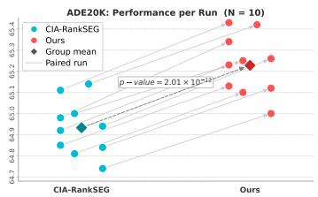

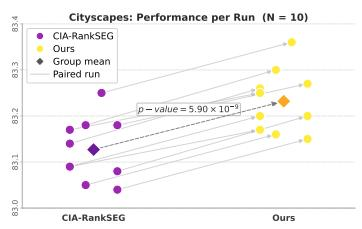

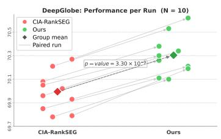  
Figure 3: Our method consistently outperforms CIA-RankSEG across 10 retraining runs on (a) ADE20K, (b) Cityscapes, and (c) DeepGlobe, with paired t-test p-values $\ll 0 . 0 1$ confirming the statistical significance.

## 5.5 Runtime Comparison

To assess practicality, we compare the runtime of our method with CIA-RankSEG, using DeepLabV3+ on LiTS/KiTS and UPerNet on the remaining datasets. All experiments run on a single NVIDIA A100 GPU, with runtime measured over the entire inference process on the test set. As shown in Figure 4, the model forward pass (bottom bar) dominates the overall inference time, and the additional cost introduced by our method is marginal relative to CIA-RankSEG. This efficiency stems from a careful algorithmic design that reduces the complexity to ${ \mathcal { O } } ( d \log d )$ , matching CIA-RankSEG up to a slightly larger constant factor arising from the additional convolution steps. These results confirm that our method serves as a practical module that can be readily integrated into existing segmentation pipelines without incurring significant computational overhead.

## 5.6 Parameter Robustness in SLD

Our method introduces a single hyperparameter, the SLD kernel bandwidth θ, which controls the decay rate of label covariance. We perform a sensitivity analysis by sweeping θ from 3 to 600 on KiTS and LiTS with DeepLabV3+. As shown in Figure 5, the curve exhibits two distinct regimes. (a) Robust plateau $( 1 0 0 \leq \theta \leq 6 0 0 )$ : performance is nearly invariant across this range, indicating that our method requires no careful tuning and delivers consistent gains out of the box. (b) Baseline convergence $( \theta < 1 0 0 ) ;$ : as $\theta  0$ , performance degrades toward the CIA-RankSEG baseline. This behavior directly follows from (5): as $\theta  0$ , the covariance vanishes for all distinct label pairs, reducing SLD to CIA. This further validates our theoretical motivation of our method, and serves as an implicit ablation, underscoring the importance of incorporating label dependence.

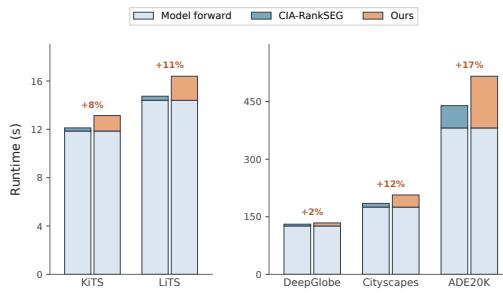  
Figure 4: Runtime comparison between CIA-RankSEG and our method during the inference. The additional cost of our method is minor compared to the overall inference time.

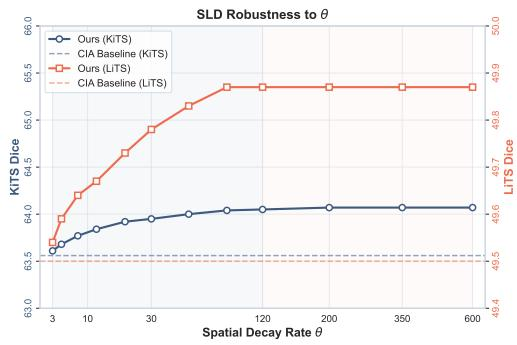  
Figure 5: Robustness to θ in SLD. The performance is stable and saturates as $\theta \geq 1 0 0 ^ { \circ }$

## 6 Conclusion

In this work, we addressed a critical limitation in image segmentation by relaxing the CIA to SLD modeling. We incorporated local label correlations into RankSEG while developing an efficient algorithm for optimizing Dice/IoU with practical ${ \mathcal { O } } ( d \log d )$ complexity. Extensive experiments across multiple datasets demonstrate that our method consistently outperforms CIA-based methods, especially on challenging cases where image information is noisy and label dependence is critical. One limitation of our work is that the proposed SLD captures label dependence purely through spatial structure, without exploiting appearance cues such as similarities between $X _ { i }$ and $X _ { j }$ or between $p _ { i }$ and $p _ { j }$ . Incorporating such cues is highly non-trivial, as it requires careful redesign to effectively capture the complex interplay between appearance and spatial structure, while preserving computational efficiency. We leave this as a promising direction for future work.

## References

[1] Patrick Bilic, Patrick Christ, Hongwei Bran Li, Eugene Vorontsov, Avi Ben-Cohen, Georgios Kaissis, Adi Szeskin, Colin Jacobs, Gabriel Efrain Humpire Mamani, Gabriel Chartrand, et al. The liver tumor segmentation benchmark (lits). Medical Image Analysis, 84:102680, 2023.

[2] Mennatullah Siam, Mostafa Gamal, Moemen Abdel-Razek, Senthil Yogamani, Martin Jagersand, and Hong Zhang. A comparative study of real-time semantic segmentation for autonomous driving. In Proceedings of the IEEE conference on computer vision and pattern recognition workshops, pages 587–597, 2018.

[3] Huan Ling, Karsten Kreis, Daiqing Li, Seung Wook Kim, Antonio Torralba, and Sanja Fidler. Editgan: High-precision semantic image editing. Advances in Neural Information Processing Systems, 34:16331–16345, 2021.

[4] Olaf Ronneberger, Philipp Fischer, and Thomas Brox. U-net: Convolutional networks for biomedical image segmentation. In International Conference on Medical image computing and computer-assisted intervention, pages 234–241. Springer, 2015.

[5] Liang-Chieh Chen, George Papandreou, Florian Schroff, and Hartwig Adam. Rethinking atrous convolution for semantic image segmentation. arXiv Preprint arXiv:1706.05587, 2017.

[6] Hengshuang Zhao, Jianping Shi, Xiaojuan Qi, Xiaogang Wang, and Jiaya Jia. Pyramid scene parsing network. In Proceedings of the IEEE Conference on Computer Vision and Pattern Recognition, pages 2881–2890, 2017.

[7] Enze Xie, Wenhai Wang, Zhiding Yu, Anima Anandkumar, Jose M Alvarez, and Ping Luo. Segformer: Simple and efficient design for semantic segmentation with transformers. Advances in Neural Information Processing Systems, 34:12077–12090, 2021.

[8] Md Atiqur Rahman and Yang Wang. Optimizing intersection-over-union in deep neural networks for image segmentation. In International Symposium on Visual Computing, pages 234–244. Springer, 2016.

[9] Tom Eelbode, Jeroen Bertels, Maxim Berman, Dirk Vandermeulen, Frederik Maes, Raf Bisschops, and Matthew B Blaschko. Optimization for medical image segmentation: theory and practice when evaluating with dice score or jaccard index. IEEE Transactions on Medical Imaging, 39(11):3679–3690, 2020.

[10] Maxim Berman, Amal Rannen Triki, and Matthew B Blaschko. The lovász-softmax loss: A tractable surrogate for the optimization of the intersection-over-union measure in neural networks. In Proceedings ofthe IEEE Conference on Computer Vision and Pattern Recognition, pages 4413–4421, 2018.

[11] Jiaqian Yu and Matthew B Blaschko. The lovász hinge: A novel convex surrogate for submodular losses. IEEE Transactions on Pattern Analysis and Machine Intelligence, 42(3):735–748, 2018.

[12] Ambuj Tewari and Peter L Bartlett. On the consistency of multiclass classification methods. Journal ofMachine Learning Research, 8(5), 2007.

[13] Jessica J Finocchiaro, Rafael Frongillo, and Enrique B Nueve. The structured abstain problem and the lovász hinge. In Conference on Learning Theory, pages 3718–3740. PMLR, 2022.

[14] Alireza Mehrtash, William M Wells, Clare M Tempany, Purang Abolmaesumi, and Tina Kapur. Confidence calibration and predictive uncertainty estimation for deep medical image segmentation. IEEE Transactions on Medical Imaging, 39(12):3868–3878, 2020.

[15] Ben Dai and Chunlin Li. Rankseg: a consistent ranking-based framework for segmentation. Journal ofMachine Learning Research, 24(224):1–50, 2023.

[16] Zixun Wang and Ben Dai. Rankseg-rma: An efficient segmentation algorithm via reciprocal moment approximation. arXiv Preprint arXiv:2510.15362, 2025.

[17] Krzysztof Dembczynski, Arkadiusz Jachnik, Wojciech Kotlowski, Willem Waegeman, and Eyke Hüllermeier. Optimizing the f-measure in multi-label classification: Plug-in rule approach versus structured loss minimization. In International conference on machine learning, pages 1130–1138. PMLR, 2013.

[18] Philipp Krähenbühl and Vladlen Koltun. Efficient inference in fully connected crfs with gaussian edge potentials. Advances in Neural Information Processing Systems, 24, 2011.

[19] Clement Farabet, Camille Couprie, Laurent Najman, and Yann LeCun. Learning hierarchical features for scene labeling. IEEE Transactions on Pattern Analysis and Machine Intelligence, 35(8):1915–1929, 2012.

[20] Liang-Chieh Chen, George Papandreou, Iasonas Kokkinos, Kevin Murphy, and Alan L Yuille. Semantic image segmentation with deep convolutional nets and fully connected crfs. arXiv Preprint arXiv:1412.7062, 2014.

[21] David A Wooff. Bounds on reciprocal moments with applications and developments in stein estimation and post-stratification. Journal ofthe Royal Statistical Society: Series B (Methodological), 47(2):362–371, 1985.

[22] Nicholas Heller, Fabian Isensee, Klaus H Maier-Hein, Xiaoshuai Hou, Chunmei Xie, Fengyi Li, Yang Nan, Guangrui Mu, Zhiyong Lin, Miofei Han, et al. The state of the art in kidney and kidney tumor segmentation in contrast-enhanced ct imaging: Results of the kits19 challenge. Medical Image Analysis, 67:101821, 2021.

[23] Ilke Demir, Krzysztof Koperski, David Lindenbaum, Guan Pang, Jing Huang, Saikat Basu, Forest Hughes, Devis Tuia, and Ramesh Raskar. Deepglobe 2018: A challenge to parse the earth through satellite images. In Proceedings ofthe IEEE conference on computer vision and pattern recognition workshops, pages 172–181, 2018.

[24] Bolei Zhou, Hang Zhao, Xavier Puig, Sanja Fidler, Adela Barriuso, and Antonio Torralba. Scene parsing through ade20k dataset. In Proceedings of the IEEE conference on computer vision and pattern recognition, pages 633–641, 2017.

[25] Marius Cordts, Mohamed Omran, Sebastian Ramos, Timo Rehfeld, Markus Enzweiler, Rodrigo Benenson, Uwe Franke, Stefan Roth, and Bernt Schiele. The cityscapes dataset for semantic urban scene understanding. In Proceedings of the IEEE conference on computer vision and pattern recognition, pages 3213–3223, 2016.

[26] Liang-Chieh Chen, Yukun Zhu, George Papandreou, Florian Schroff, and Hartwig Adam. Encoder-decoder with atrous separable convolution for semantic image segmentation. In Proceedings ofthe European conference on computer vision (ECCV), pages 801–818, 2018.

[27] Tete Xiao, Yingcheng Liu, Bolei Zhou, Yuning Jiang, and Jian Sun. Unified perceptual parsing for scene understanding. In Proceedings of the European conference on computer vision (ECCV), pages 418–434, 2018.

[28] Zifu Wang, Maxim Berman, Amal Rannen-Triki, Philip Torr, Devis Tuia, Tinne Tuytelaars, Luc V Gool, Jiaqian Yu, and Matthew Blaschko. Revisiting evaluation metrics for semantic segmentation: Optimization and evaluation of fine-grained intersection over union. Advances in Neural Information Processing Systems, 36:60144–60225, 2023.

[29] Alfred Tarski. A lattice-theoretical fixpoint theorem and its applications. 1955.

[30] James M Ortega and Werner C Rheinboldt. Iterative solution of nonlinear equations in several variables. SIAM, 2000.

[31] John Lafferty, Andrew McCallum, and Fernando CN Pereira. Conditional random fields: Probabilistic models for segmenting and labeling sequence data. 2001.

## Table of Contents

A Proofs 12   
A.1 Proof of Lemma 1 12   
A.2 Proof of Lemma 2 . 13   
A.3 Proof of Lemma 3 13   
A.4 Proof of Theorem 3 13   
A.5 Proof of Theorem 1 and Theorem 2 . 14   
B Two-Dimensional Convolutional Form of $\mu$ 15   
C Efficient Cumulative Sums in Fixed-Point Iteration via Taylor Approximation 16   
D Convergence of the Fixed-Point Optimization 16   
D.1 Convergence within Three Steps 16   
D.2 Convergent Point is Near-Optimal . 17   
E Discussion on SLD and CRF 17   
E.1 The Conditional Random Field (CRF) Model . 17   
E.2 Key Distinction between SLD and CRF . 18   
F Extension to Multi-class Segmentation 19   
G Training Details 19   
H Qualitative Results 19

## A Proofs

## A.1 Proof of Lemma 1

Proof. From (10), $\tau ^ { * }$ can be expressed as:

$$
\begin{array} { r } { \tau ^ { * } = \mathrm { a r g m a x } _ { \tau \in [ d ] } \operatorname* { m a x } _ { l \in \rho _ { [ d ] } } \sum _ { j = 1 } ^ { \tau } M _ { l _ { j } , \tau } , } \end{array}
$$

where $\rho _ { [ d ] }$ denotes the set of all permutations of $[ d ]$ . Since $\begin{array} { r } { \pmb { o } ( \tau ^ { * } ) = a r g s o r t { ( M _ { 1 : d , \tau ^ { * } } ) } } \end{array}$ already maximizes the inner sum for $\tau ^ { * }$ , so we have

$$
\begin{array} { r l } & { \displaystyle \sum _ { j = 1 } ^ { \tau ^ { * } } M _ { o _ { j } ( \tau ^ { * } ) , \tau ^ { * } } = \operatorname* { m a x } _ { \tau \in [ d ] } \operatorname* { m a x } _ { \scriptstyle { l \in \rho _ { [ d ] } } } \sum _ { j = 1 } ^ { \tau } M _ { l _ { j } , \tau } \geq \operatorname* { m a x } _ { \tau \in [ d ] } \sum _ { j = 1 } ^ { \tau } M _ { o _ { j } ( \tau ^ { * } ) , \tau } } \end{array}
$$

The inequality is due to replacing the inner maximizer with a specific choice ${ } _ { o ( \tau ^ { * } ) }$ . The right-hand side is precisely what is maximized in $T ,$ , and thus $T ( \tau ^ { * } ) = \tau ^ { * }$ □

## A.2 Proof of Lemma 2

Proof. For any $\tau \in [ d ]$ , we can establish the following chain of inequalities:

$$
\begin{array} { r l } { \Phi ( T ( \tau ) ) = \pi _ { T ( \tau ) } \left( o ( T ( \tau ) ) \right) } & { \left( = \displaystyle \sum _ { j = 1 } ^ { T ( \tau ) } M _ { o _ { j } ( T ( \tau ) ) , T ( \tau ) } \right) } \\ { \ge \pi _ { T ( \tau ) } \left( o ( \tau ) \right) } & { \qquad \left( = \displaystyle \sum _ { j = 1 } ^ { T ( \tau ) } M _ { o _ { j } ( \tau ) , T ( \tau ) } \right) } \\ { \ge \pi _ { \tau } \left( o ( \tau ) \right) } & { \qquad \left( = \displaystyle \sum _ { j = 1 } ^ { \tau } M _ { o _ { j } ( \tau ) , \tau } \right) } \\ { = \Phi ( \tau ) . } \end{array}
$$

The first inequality holds because $o ( T ( \tau ) ) = \mathrm { a r g s o r t } ( M _ { 1 : d , T ( \tau ) } )$ maximizes the $\scriptstyle { \mathrm { t o p } } - T ( \tau )$ partial sum over all permutations, and the second follows from $T ( \tau ) = \mathrm { a r g m a x } _ { \tau ^ { \prime } } \pi _ { \tau ^ { \prime } } ( { \pmb o } ( \tau ) )$ . This establishes claim (a).

For claim (b), if the maximizer in T is always unique and $T ( \tau ) \neq \tau$ , the second inequality above is strict, giving $\Phi ( T ( \tau ) ) > \Phi ( \tau )$ . Applied along the iterates, this means $\Phi ( \tau ^ { ( t + 1 ) } ) > \Phi \bar { ( } \tau ^ { ( t ) } )$ whenever $T ( \tau ^ { ( t ) } ) \neq \tau ^ { ( t ) }$ . If this strict inequality were to hold for all $t \in \{ 0 , 1 , \ldots , d \}$ , we would obtain $d + 1$ pairwise distinct values $\Phi ( \tau ^ { ( 0 ) } ) < \Phi ( \tau ^ { ( 1 ) } ) < \cdots < \Phi ( \tau ^ { ( d ) } )$ , contradicting the fact that Φ takes at most d values on the finite set [d]. Hence there exists a smallest index $t ^ { \star } \leq d$ with $T ( \tau ^ { ( t ^ { \star } ) } ) = \tau ^ { ( t ^ { \star } ) }$ Setting $\tau ^ { \star } : = \tau ^ { ( t ^ { \star } ) }$ , a trivial induction gives $\tau ^ { ( t ^ { \star } + s ) } = \tau ^ { \star }$ for all $s \geq 0$ , so the iterates reach the fixed point $\tau ^ { \star }$ of T in at most d steps. □

## A.3 Proof of Lemma 3

Proof. Recall the definition $M _ { j , \tau } = p _ { j } / ( \tau + \mu _ { j } )$ . For any $j \neq j ^ { \prime }$ such that $p _ { j } \ \geq \ p _ { j \prime }$ , we have $\mu _ { j } \leq \mu _ { j { ' } }$ by assumption, and thus

$$
M _ { j , \tau } = \frac { p _ { j } } { \tau + \mu _ { j } } \geq \frac { p _ { j ^ { \prime } } } { \tau + \mu _ { j ^ { \prime } } } = M _ { j ^ { \prime } , \tau } \quad \mathrm { f o r ~ a l l } ~ \tau .
$$

Hence, the ranking of $M _ { 1 : d , \cdot }$ τ is exactly identical to that of $\pmb { p }$ for all τ . In particular, $o ( \tau ) =$ argsort ${ \cal M } _ { 1 : d , \tau } ) = \mathrm { a r g s o r t } ( p )$ for all $\tau .$ Since we initialize with $\pmb { o } ( \tau ^ { ( 0 ) } ) = \mathrm { a r g s o r t } ( p )$ , the iteration converges in one step. □

## A.4 Proof of Theorem 3

Proof. Without loss of generality, let the image be an $L \times L$ grid where $d = L ^ { 2 }$ . Each pixel index $i \in [ d ]$ maps to a 2D coordinate $( u _ { i } , v _ { i } ) \in [ L ] ^ { \asymp }$ given by:

$$
u _ { i } = \lfloor ( i - 1 ) / L \rfloor + 1 , \quad v _ { i } = ( ( i - 1 ) \bmod L ) + 1 .
$$

The squared Euclidean distance between pixels i and k is then given by:

$$
r ( i , k ) ^ { 2 } = ( u _ { i } - u _ { k } ) ^ { 2 } + ( v _ { i } - v _ { k } ) ^ { 2 } .
$$

Step 1: Bound the unconditional variance. Denote $\textstyle \Gamma = \sum _ { i = 1 } ^ { d } Y _ { i }$ . Its variance under SLD is:

$$
\mathrm { V a r } ( \Gamma ) = \sum _ { i = 1 } ^ { d } \sum _ { k = 1 } ^ { d } \Sigma _ { i k } , \quad \mathrm { w h e r e } \quad \Sigma _ { i k } = \sqrt { \Sigma _ { i i } \Sigma _ { k k } } \exp \left( - \frac { r ( i , k ) ^ { 2 } } { 2 \theta ^ { 2 } } \right) .
$$

Note $\Sigma _ { i i } = p _ { i } ( 1 - p _ { i } ) \leq 1 / 4$ for all i. It follows that

$$
\Sigma _ { i k } \leq 0 . 2 5 \exp \left( - \frac { ( u _ { i } - u _ { k } ) ^ { 2 } } { 2 \theta ^ { 2 } } \right) \exp \left( - \frac { ( v _ { i } - v _ { k } ) ^ { 2 } } { 2 \theta ^ { 2 } } \right) .
$$

For a fixed pixel $i ,$ we can extend the summation boundaries from the finite $L \times L$ grid to the infinite $\mathbb { Z } ^ { 2 }$ grid, and obtain

$$
\sum _ { k = 1 } ^ { d } \Sigma _ { i k } \leq 0 . 2 5 \left( \sum _ { \Delta u = - \infty } ^ { \infty } \exp \left( - \frac { \Delta u ^ { 2 } } { 2 \theta ^ { 2 } } \right) \right) \left( \sum _ { \Delta v = - \infty } ^ { \infty } \exp \left( - \frac { \Delta v ^ { 2 } } { 2 \theta ^ { 2 } } \right) \right) .
$$

Consider ${ \scriptstyle \sum _ { k = - \infty } ^ { \infty } } \exp ( { - k ^ { 2 } / 2 \theta ^ { 2 } } )$ , since the terms decay exponentially, the series converges to a finite constant that depends only on θ, denoted as $C _ { \theta }$ . Hence $\begin{array} { r } { \sum _ { k = 1 } ^ { d } \Sigma _ { i k } \le 0 . 2 5 C _ { \theta } ^ { 2 } = : K _ { \theta } } \end{array}$ for all i, and therefore

$$
\mathrm { V a r } ( \Gamma ) = \sum _ { i = 1 } ^ { d } \sum _ { k = 1 } ^ { d } \Sigma _ { i k } \leq \sum _ { i = 1 } ^ { d } K _ { \theta } = K _ { \theta } d = \mathcal { O } ( d ) .
$$

Step 2: Bound the conditional variance. We decompose $\mathrm { V a r } ( \Gamma )$ conditioning on $Y _ { j }$ by the law of total variance:

$$
\operatorname { V a r } ( \Gamma ) = \mathbb { E } _ { Y _ { j } } \left[ \operatorname { V a r } ( \Gamma \mid Y _ { j } ) \right] + \operatorname { V a r } _ { Y _ { j } } \left[ \mathbb { E } ( \Gamma \mid Y _ { j } ) \right] .
$$

Dropping the second term gives

$$
p _ { j } \operatorname { V a r } ( \Gamma \mid Y _ { j } = 1 ) + ( 1 - p _ { j } ) \operatorname { V a r } ( \Gamma \mid Y _ { j } = 0 ) = \mathbb { E } _ { Y _ { j } } \left[ \operatorname { V a r } ( \Gamma \mid Y _ { j } ) \right] \leq \operatorname { V a r } ( \Gamma ) = \mathcal { O } ( d ) .
$$

Since $p _ { j } \geq c > 0$ for some constant $c ,$ we have $\operatorname { V a r } ( \Gamma \mid Y _ { j } = 1 ) = { \mathcal { O } } ( d )$ . This proves claim (a).

Step 3: Bound the RMA error. From Theorem 2, the approximation error of RMA is bounded by $\mathcal { E } \tilde { \leq } \sigma _ { j } ^ { 2 } / [ \tau ( \mu _ { j } ( \mu _ { j } + \tau ) + \sigma _ { j } ^ { 2 } ) ]$ ]. Note that $\begin{array} { r } { \left| M _ { j , \tau } - S _ { j , \tau } \right| ^ { \ast } \leq p _ { j } \mathcal { E } } \end{array}$ , and $p _ { j } \leq 1$ . Under the additional assumption $\mu _ { j } = \Theta ( d )$ , we have:

$$
| M _ { j , \tau } - S _ { j , \tau } | \le \mathscr { E } \le \frac { \sigma _ { j } ^ { 2 } } { \tau [ \mu _ { j } ( \mu _ { j } + \tau ) + \sigma _ { j } ^ { 2 } ] } = \frac { \mathscr { O } ( d ) } { \tau [ \Theta ( d ) ( \Theta ( d ) + \tau ) + \mathscr { O } ( d ) ] } \le \frac { \mathscr { O } ( d ) } { \Theta ( d ^ { 2 } ) } = \mathscr { O } ( d ^ { - 1 } ) .
$$

This proves claim (b).

## A.5 Proof of Theorem 1 and Theorem 2

Theorem 1 combines results from Dembczynski et al. [17] and Dai and Li [15], and Theorem 2 is a direct application of Wooff [21, Theorem 1]. For completeness, we provide the proof of Theorem 1 here, while deferring the proof of Theorem 2 to the original paper.

Proof. Recall that the expected Dice score for a segmentation mask $\pmb { \delta } \in \{ 0 , 1 \} ^ { d }$ is defined as:

$$
\mathbb { E } [ \mathrm { D i c e } ( \pmb \delta ) ] = \mathbb { E } \left[ \frac { 2 \pmb \delta ^ { \top } \pmb Y } { \lVert \pmb \delta \rVert _ { 1 } + \lVert \pmb Y \rVert _ { 1 } } \right] = \mathbb { E } \left[ \frac { 2 \sum _ { j = 1 } ^ { d } \delta _ { j } Y _ { j } } { \lVert \pmb \delta \rVert _ { 1 } + \lVert \pmb Y \rVert _ { 1 } } \right] .
$$

Let $\tau = \| \pmb { \delta } \| _ { 1 }$ 1 denote the predicted volume. The expected Dice score can then be rewritten as:

$$
\mathbb { E } [ \mathrm { D i c e } ( \delta ) ] = 2 \sum _ { j = 1 } ^ { d } \delta _ { j } \mathbb { E } \left[ \frac { Y _ { j } } { \tau + \Gamma _ { j } } \right] = 2 \sum _ { j = 1 } ^ { d } \delta _ { j } p _ { j } \mathbb { E } \left[ \frac { 1 } { \tau + \Gamma _ { j } } \mid Y _ { j } = 1 \right] = 2 \sum _ { j = 1 } ^ { d } \delta _ { j } p _ { j } \mathbb { E } ( \tau + \Gamma _ { j } ) ^ { - 1 } .
$$

Denote the contribution of pixel $j$ for a fixed volume τ as $S _ { j , \tau } = p _ { j } \mathbb { E } ( \tau + \Gamma _ { j } ) ^ { - 1 }$ . We decompose the maximization into bi-level optimization:

$$
\begin{array} { r } { \operatorname* { m a x } _ { \tau \in [ d ] } \operatorname* { m a x } _ { \{ \delta \in \{ 0 , 1 \} ^ { d } : \| \delta \| _ { 1 } = \tau \} } 2 \sum _ { j = 1 } ^ { d } \delta _ { j } S _ { j , \tau } . } \end{array}
$$

For the inner maximization with τ fixed, the optimal strategy is to set $\delta _ { j } = 1$ for the top-τ pixels with the largest $S _ { j , \tau }$ , yielding $\begin{array} { r } { \omega _ { \tau } = \sum _ { j \in \mathrm { I o p } _ { \tau } ( S _ { 1 : d , \tau } ) } S _ { j , \tau } } \end{array}$ . For the outer maximization, we evaluate $\omega _ { \tau }$ for all τ and select the best one. This completes the proof of Theorem 1. □

## B Two-Dimensional Convolutional Form of $\pmb { \mu }$

In Section 3.2, we express µ through a one-dimensional convolution over the vectorized labels for notational simplicity, where the kernel entry $\kappa _ { d - j + i } = \mathcal { K } ( | i - j | )$ is indexed by the offset between the 1D indices i and $j .$ . For images, however, the distance $r ( i , j )$ in Assumption 1 is the spatial distance between two pixels on the 2D grid, which is not a function of $| i - j |$ after vectorization. In this section, we present the rigorous two-dimensional counterpart, which is what our implementation computes.

Setup. Consider an image of height H and width $W$ , so that $d = H W$ . Following the notation in the proof of Theorem $^ { 3 , }$ each pixel index $j \in [ d ]$ maps to a 2D coordinate $( u _ { j } , v _ { j } ) \overline { { \in \left[ H \right] } } \times \left[ W \right]$ under the row-major ordering:

$$
u _ { j } = \lfloor ( j - 1 ) / W \rfloor + 1 , \quad v _ { j } = ( ( j - 1 ) \bmod W ) + 1 ,
$$

and the distance in Assumption 1 is the Euclidean distance on the grid, i.e., $r ( i , j ) \ =$ $\sqrt { ( u _ { i } - u _ { j } ) ^ { 2 } + ( v _ { i } - v _ { j } ) ^ { 2 } }$ . Accordingly, we reshape p, $\pmb { \nu } = \sqrt { \mathrm { d i a g } ( \pmb { \Sigma } ) }$ , and $\pmb { \mu }$ into matrices $\overset { \cdot } { P } , V , U \in \mathbb { R } ^ { H \times W }$ , with $P _ { u _ { j } , v _ { j } } = p _ { j } , V _ { u _ { j } , v _ { j } } = \sqrt { \Sigma _ { j j } }$ , and $U _ { u _ { j } , v _ { j } } = \mu _ { j }$ . Throughout this section, $( u , v ) \in [ H ] \times [ W ]$ denotes a generic 2D coordinate, while $i , j \in [ d ]$ are reserved for 1D pixel indices.

2D convolutional form. Define the 2D kernel $\pmb { \kappa } \in \mathbb { R } ^ { ( 2 H - 1 ) \times ( 2 W - 1 ) }$ that stores the kernel values at all possible displacements $( \Delta u , \Delta v )$

$$
\begin{array} { r } { \mathcal { K } _ { H + \Delta u , W + \Delta v } = K \Big ( \sqrt { \Delta u ^ { 2 } + \Delta v ^ { 2 } } \Big ) , \quad | \Delta u | \leq H - 1 , | \Delta v | \leq W - 1 , } \end{array}
$$

so that the center entry $\mathcal { K } _ { H , W } = \mathcal { K } ( 0 ) = 1$ corresponds to zero displacement. Then the SLD correction term in $\mu _ { j }$ can be written as a 2D convolution (cross-correlation) of V with K:

$$
\begin{array} { l } { \displaystyle \sum _ { i = 1 } ^ { d } \sqrt { \Sigma _ { i i } } { \mathcal K } ( r ( i , j ) ) = \displaystyle \sum _ { u = 1 } ^ { H } \sum _ { v = 1 } ^ { W } V _ { u , v } { \mathcal K } \Big ( \sqrt { ( u - u _ { j } ) ^ { 2 } + ( v - v _ { j } ) ^ { 2 } } \Big ) } \\ { \displaystyle = \sum _ { u = 1 } ^ { H } \sum _ { v = 1 } ^ { W } V _ { u , v } { \mathcal K } _ { H + u - u _ { j } , W + v - v _ { j } } = : ( V \star { \mathcal K } ) _ { u _ { j } , v _ { j } } . } \end{array}
$$

Therefore, computing all $j \in [ d ]$ simultaneously yields the matrix form

$$
U = q \cdot \mathbf { 1 } _ { H \times W } + \frac { V } { P } \odot ( V \star \mathcal { K } ) ,\tag{14}
$$

where $\begin{array} { r } { q = \sum _ { j = 1 } ^ { d } p _ { j } , \mathbf { 1 } _ { H \times W } } \end{array}$ is the all-ones matrix, and both the division and ⊙ are element-wise. (14) is the exact 2D analogue of the 1D expression in Section 3.2: the vector $\kappa \in \mathbb { R } ^ { 2 d - 1 }$ is replaced by the matrix $\pmb { \kappa } \in \mathbb { R } ^ { ( 2 H - 1 ) \times ( 2 W - 1 ) }$ , and the 1D offset $| i - j |$ is replaced by the 2D displacement $( u _ { i } - u _ { j } , v _ { i } - v _ { j } )$

Computational complexity. The 2D convolution $V \star \kappa$ can be evaluated via the 2D FFT: after zero-padding V and K to a common size of $\mathcal { O } ( H ) \times \mathcal { O } ( W )$ to avoid circular wrap-around, the cost is $\mathcal { O } ( H W \bar { \log } ( H W ) ) = \mathcal { O } ( d \log d )$ , matching the complexity stated in Section 3.2. The remaining element-wise operations in (14) cost $\mathcal O ( d )$

Moreover, the Gaussian kernel is separable: since $\mathcal { K } ( \sqrt { \Delta u ^ { 2 } + \Delta v ^ { 2 } } )$ = $\mathrm { e x p } ( - \Delta u ^ { 2 } / 2 \theta ^ { 2 } ) \mathrm { e x p } ( - \Delta v ^ { 2 } / 2 \theta ^ { 2 } ) = \mathcal { K } ( | \Delta u | ) \mathcal { K } ( | \Delta v | )$ , the 2D kernel is rank-one, $\kappa = \kappa _ { H } \kappa _ { W } ^ { \intercal }$ where

$$
\begin{array} { r } { \kappa _ { H } = ( K ( H - 1 ) , \cdots , K ( 0 ) , \cdots , K ( H - 1 ) ) ^ { \intercal } \in \mathbb { R } ^ { 2 H - 1 } , } \end{array}
$$

$$
\kappa _ { W } = ( K ( W - 1 ) , \cdots , K ( 0 ) , \cdots , K ( W - 1 ) ) ^ { \intercal } \in \mathbb { R } ^ { 2 W - 1 } .
$$

Consequently, the 2D convolution decomposes into two 1D convolutions of the same form as in Section 3.2: first convolving each column of $V$ with $\kappa _ { H }$ , and then convolving each row of the result with $\kappa _ { W } , \mathrm { i . e . }$

$$
( V \star \mathcal { K } ) _ { u _ { j } , v _ { j } } = \sum _ { v = 1 } ^ { W } K ( | v - v _ { j } | ) \sum _ { u = 1 } ^ { H } K ( | u - u _ { j } | ) V _ { u , v } .
$$

Using the 1D FFT for each row and column, the total cost is $\mathcal { O } ( H W ( \log H + \log W ) ) = \mathcal { O } ( d \log d )$ This also clarifies the role of the 1D notation in Section 3.2: it is exactly the building block of the separable 2D convolution. The same argument extends directly to 3D volumes $( { \mathrm { e . g . , } } { \mathrm { \overline { { H } } } } \times W \times D$ voxels) with a separable 3D Gaussian kernel, again with $\mathcal { O } ( d \log d )$ complexity.

## C Efficient Cumulative Sums in Fixed-Point Iteration via Taylor Approximation

We turn to the efficient implementation of the fixed-point iteration described in (11), focusing on the computation after $o ( \tau )$ is obtained. Without loss of generality, we regard the ranking $o ( \tau )$ as the natural ordering and simplify the notation to $\textstyle \pi _ { \tau } = \sum _ { i = 1 } ^ { \tilde { \tau } } p _ { j } / ( \tilde { \tau } + \mu _ { j } )$ . A direct implementation requires $\mathcal O ( d )$ time for each $\tau ,$ resulting in $\mathcal { O } ( d ^ { 2 } )$ total complexity. The core inefficiency arises because the denominator tightly couples $\tau$ and $j ,$ preventing the reuse of intermediate quantities. To decouple $\tau$ from $j ,$ we consider the Taylor expansion of $x \stackrel { \smile } { \mapsto } ( \tau + x ) ^ { - 1 }$ around $\begin{array} { r } { \bar { \mu } _ { \tau } = \dot { \bar { \tau } } \sum _ { j = 1 } ^ { \tau } \mu _ { j } \colon } \end{array}$

$$
\frac { 1 } { \tau + \mu _ { j } } = \frac { 1 } { \tau + \bar { \mu } _ { \tau } } - \frac { \mu _ { j } - \bar { \mu } _ { \tau } } { ( \tau + \bar { \mu } _ { \tau } ) ^ { 2 } } + \frac { ( \mu _ { j } - \bar { \mu } _ { \tau } ) ^ { 2 } } { ( \tau + \bar { \mu } _ { \tau } ) ^ { 3 } } + \mathcal { O } \left( \frac { ( \mu _ { j } - \bar { \mu } _ { \tau } ) ^ { 3 } } { ( \tau + \bar { \mu } _ { \tau } ) ^ { 4 } } \right) .
$$

Truncating at the second-order term is an empirical trade-off between approximation accuracy and numerical stability. This yields our final approximation

$$
\begin{array} { r l } { \pi _ { \tau } = \displaystyle \sum _ { j = 1 } ^ { \tau } \frac { p _ { j } } { \tau + \mu _ { j } } \approx \tilde { \pi } _ { \tau } = \displaystyle \sum _ { j = 1 } ^ { \tau } p _ { j } \left( \frac { 1 } { \tau + \bar { \mu } _ { \tau } } - \frac { \mu _ { j } - \bar { \mu } _ { \tau } } { ( \tau + \bar { \mu } _ { \tau } ) ^ { 2 } } + \frac { ( \mu _ { j } - \bar { \mu } _ { \tau } ) ^ { 2 } } { ( \tau + \bar { \mu } _ { \tau } ) ^ { 3 } } \right) } & { } \\ { = \displaystyle \frac { Z _ { \tau } ^ { 0 } } { \tau + \bar { \mu } _ { \tau } } - \frac { Z _ { \tau } ^ { 1 } - \bar { \mu } _ { \tau } Z _ { \tau } ^ { 0 } } { ( \tau + \bar { \mu } _ { \tau } ) ^ { 2 } } + \frac { Z _ { \tau } ^ { 2 } - 2 \bar { \mu } _ { \tau } Z _ { \tau } ^ { 1 } + \bar { \mu } _ { \tau } ^ { 2 } Z _ { \tau } ^ { 0 } } { ( \tau + \bar { \mu } _ { \tau } ) ^ { 3 } } , } & { } \\ { \mathrm { w h e r e } } & { Z _ { \tau } ^ { 0 } = \displaystyle \sum _ { j = 1 } ^ { \tau } p _ { j } , \quad Z _ { \tau } ^ { 1 } = \displaystyle \sum _ { j = 1 } ^ { \tau } p _ { j } \mu _ { j } , \quad Z _ { \tau } ^ { 2 } = \displaystyle \sum _ { j = 1 } ^ { \tau } p _ { j } \mu _ { j } ^ { 2 } . } \end{array}
$$

${ \cal Z } _ { 1 : d } ^ { 0 } , { \cal Z } _ { 1 : d } ^ { 1 } ,$ , and $ { \boldsymbol { Z } } _ { 1 : d } ^ { 2 }$ can be computed in $\mathcal O ( d )$ via cumulative sums, and $\tilde { \pi } _ { 1 : d }$ is obtained in $\mathcal O ( d )$

## D Convergence of the Fixed-Point Optimization

In Section 3.3, we established two theoretical guarantees for the fixed-point iteration $\tau ^ { ( t + 1 ) } = T ( \tau ^ { ( t ) } )$ under the uniqueness condition for the maximizer of $T _ { \ast }$ , the iterates monotonically increase the objective Φ and converge to a fixed point (Lemma 2); moreover, when the label distribution satisfies certain conditions, convergence to the global optimum $\tau ^ { * }$ is achieved in a single step (Lemma 3). Although these conditions are difficult to verify analytically on real data, the empirical results in this section show that the iteration behaves in close accordance with these guarantees: it converges within a few steps and reaches a point that is essentially near the global optimum. Specifically, we address two questions: (Q1) How many iterations are required for convergence in practice? (Q2) How close is the limit point to the global optimum? The findings below provide strong support for the practical effectiveness of the algorithm and offer empirical validation of Lemmas 2 and 3.

## D.1 Convergence within Three Steps

Table 5 reports the distribution of the number of iterations required for convergence across all test samples. For multi-class datasets, we average the number of steps over classes for each sample. Across all five benchmarks, the iteration terminates within 2.5 steps for over 99.8% of samples, and the fraction of samples requiring more than 2.5 steps never exceeds 0.22%.

These results indicate that the fixed-point optimization converges substantially faster than the worstcase bound, allowing us to safely conclude that the proposed algorithm runs in ${ \mathcal { O } } ( d \log d )$ time in practice. We attribute this fast convergence to two factors: (i) the initialization $\tau ^ { ( 0 ) }$ induced by the probabilities $\pmb { p }$ is already close to the optimal $\tau ^ { * }$ , and (ii) the landscape of $T$ is well-behaved, with a large basin of attraction around $\tau ^ { * }$

Table 5: Distribution of the number of iterations required for convergence across all test samples. On every dataset, the iteration terminates within 2.5 steps for the vast majority of samples, with only a negligible fraction requiring more.
<table><tr><td>Dataset</td><td>LiTS</td><td>KiTS</td><td>ADE20K</td><td>Cityscapes</td><td>DeepGlobe</td></tr><tr><td> $\# \mathrm { S t e p s } < 1 . 5$ </td><td>63.36%</td><td>88.52%</td><td>9.30%</td><td>2.80%</td><td>40.49%</td></tr><tr><td> $1 . 5 \leq \# \mathrm { S t e p s } < 2 . 5$ </td><td>36.42%</td><td>11.41%</td><td>90.55%</td><td>97.20%</td><td>50.51%</td></tr><tr><td> $2 . 5 \leq \# \mathrm { S t e p s }$ </td><td>0.22%</td><td>0.07%</td><td>0.15%</td><td>0.00%</td><td>0.00%</td></tr></table>

## D.2 Convergent Point is Near-Optimal

To assess whether the iteration locates the global optimum, we conduct a brute-force search on LiTS and KiTS, for which exhaustive enumeration is computationally affordable, and compare the performance between the global optimum and the convergent point of the fixed-point optimization.

Table 6: Comparison between the convergent point obtained by the fixed-point optimization and the global optimum obtained by brute-force search. The performance gap is at most 0.03 on both metrics, indicating that the iteration consistently recovers a near-optimal fixed point.
<table><tr><td>Dataset</td><td colspan="2">KiTS</td><td colspan="2">LiTS</td></tr><tr><td>Metric</td><td>IoU</td><td>Dice</td><td>IoU</td><td>Dice</td></tr><tr><td>Fixed-point Optimization Brute-force Search</td><td>56.70 56.73</td><td>64.07 64.10</td><td>40.48 40.48</td><td>49.88 49.88</td></tr></table>

As shown in Table 6, the gap between the fixed-point solution and the global optimum is at most 0.03 across both datasets and both metrics, and is essentially zero on LiTS. These results suggest that the fixed-point optimization not only converges rapidly but also reliably identifies a solution that is very close to the best achievable performance. This near-optimality can again be attributed to the favorable initialization and the well-behaved landscape of $\dot { T } \left[ 2 9 , 3 0 \right]$

## E Discussion on SLD and CRF

In Section 3.1, we introduced the SLD model as a more realistic alternative to the CIA for modeling label distributions in image segmentation. A natural question is how SLD relates to the widely used Conditional Random Field (CRF) model [31, 18], which also captures local label correlations and acts as a post-processing step following the network outputs [20]. In this section, we clarify the distinction between these two models and explain why SLD is more suitable for our purpose.

## E.1 The Conditional Random Field (CRF) Model

CRFs have been a cornerstone of semantic segmentation, typically used to refine pixel-wise predictions by modeling the posterior distribution $\mathbb { P } ( { \bar { \mathbf { Y } } } \mid X )$ . A CRF represents the conditional distribution as a Gibbs distribution:

$$
\operatorname { \mathbb { P } } ( Y \mid X ) = { \frac { 1 } { Z ( X ) } } \exp ( - E ( Y , X ) ) ,
$$

where $E ( \pmb { Y } , \pmb { X } )$ is the energy function (we omit the dependence on X hereafter), usually decomposed into unary and pairwise potentials [18]:

$$
E ( \pmb { Y } ) = \sum _ { i = 1 } ^ { d } \psi _ { u } ( Y _ { i } ) + \sum _ { i < j } \psi _ { p } ( Y _ { i } , Y _ { j } ) .
$$

Table 7: Performance comparison of CRF, Argmax-prob, CIA-RankSEG, and our method using UPerNet.
<table><tr><td rowspan="2">Method</td><td colspan="2">CRF</td><td colspan="2">Argmax-prob</td><td colspan="2">CIA-RankSEG</td><td colspan="2">Ours</td></tr><tr><td>mIoU</td><td>mDice</td><td>mIoU</td><td>mDice</td><td>mIoU</td><td>mDice</td><td>mIoU</td><td>mDice</td></tr><tr><td>DeepGlobe</td><td>58.61</td><td>67.40</td><td>59.49</td><td>68.60</td><td>60.19</td><td>69.57</td><td>60.52</td><td>69.91</td></tr><tr><td>Cityscapes</td><td>73.26</td><td>80.35</td><td>75.66</td><td>82.61</td><td>76.17</td><td>83.21</td><td>76.25</td><td>83.31</td></tr><tr><td>ADE20K</td><td>56.05</td><td>62.61</td><td>56.94</td><td>63.98</td><td>57.67</td><td>64.92</td><td>57.94</td><td>65.19</td></tr></table>

The unary potential $\psi _ { u }$ is typically the negative log-probability from the network output, while the pairwise potential $\psi _ { p }$ is designed as:

$$
\psi _ { p } ( Y _ { i } , Y _ { j } ) = \mu ( Y _ { i } , Y _ { j } ) \left( w ^ { ( 1 ) } \underbrace { \exp \left( - \frac { \lvert u _ { i } - u _ { j } \rvert ^ { 2 } } { 2 \theta _ { \alpha } ^ { 2 } } - \frac { \lvert X _ { i } - X _ { j } \rvert ^ { 2 } } { 2 \theta _ { \beta } ^ { 2 } } \right) } _ { \mathrm { a p p e a r a c e ~ k e m e l } } + w ^ { ( 2 ) } \underbrace { \exp \left( - \frac { \lvert u _ { i } - u _ { j } \rvert ^ { 2 } } { 2 \theta _ { \gamma } ^ { 2 } } \right) } _ { \mathrm { s m o o t h n e s s ~ k e m e l } } \right) ,
$$

where $\mu ( Y _ { i } , Y _ { j } ) = \mathbb { 1 } ( Y _ { i } \neq Y _ { j } )$ measures the label compatibility, and $u _ { i }$ and $X _ { i }$ denote the spatial coordinate and RGB value of pixel i, respectively. The appearance kernel encourages nearby pixels with similar colors to share the same label, while the smoothness kernel encourages nearby pixels to share the same label regardless of their colors.

After modeling the conditional distribution, CRF-based methods typically perform Maximum a Posteriori (MAP) inference, through certain approximate inference techniques, to obtain the final segmentation mask:

$$
\delta _ { \mathrm { M A P } } = \operatorname { a r g m a x } _ { \mathbf { \theta } _ { \mathbf { \delta } } \in \{ 0 , 1 \} ^ { d } } \mathbb { P } ( \pmb { Y } = \pmb { \delta } \mid \pmb { X } ) = \operatorname { a r g m i n } _ { \pmb { \delta } \in \{ 0 , 1 \} ^ { d } } E ( \pmb { \delta } ) .
$$

## E.2 Key Distinction between SLD and CRF

Although both SLD and CRF leverage Gaussian kernels to capture spatial locality, they differ fundamentally in their mathematical formulation and intent:

• Covariance vs. Energy Modeling: SLD explicitly specifies the covariance structure of the label distribution. This allows us to efficiently compute the moment of $\Gamma _ { j }$ , which is the core requirement for optimizing the Dice/IoU expectation. In contrast, CRFs specify the joint energy. The resulting covariance matrix of a CRF is implicitly defined and generally lacks the closed-form structure needed for efficient RankSEG integration.

• MAP Inference vs. Metric Optimization: CRF-based methods typically perform MAP inference to find the single most probable joint configuration. However, the MAP solution is not necessarily optimal for set-based metrics like Dice or IoU. SLD is designed specifically to facilitate direct metric optimization by max E[Dice(δ)].

• Parameter Complexity: SLD requires only a single decay parameter θ to control spatial dependence. CRFs typically rely on a suite of hyperparameters $( \theta _ { \alpha } , \theta _ { \beta } , \theta _ { \gamma } , w ^ { ( 1 ) }$ , and $w ^ { ( 2 ) } )$ that often require exhaustive cross-validation to tune for specific datasets.

The diminishing returns of CRF post-processing in modern pipelines are illustrated by the evolution of the DeepLab series. While DeepLabv2 [20] utilized CRFs to sharpen boundaries, subsequent versions [5, 26] removed them, finding that deep architectures capture sufficient context internally.

Our empirical results in Table 7 corroborate this: CRFs can even degrade performance compared to simple Argmax-prob. While the MAP prior was useful for refining probability masks in early vision tasks, it may actually hinder performance when applied to the highly accurate, calibrated probabilities produced by modern networks.

## F Extension to Multi-class Segmentation

In non-overlapping multi-class segmentation, each pixel is assigned to exactly one class; that is, we seek $\phi \in [ C ] ^ { \hat { d } }$ , where C denotes the number of classes. To extend our method to this setting, we adopt the incremental score strategy of Wang and Dai [16]. Specifically, we first apply the RankSEG algorithm independently to each class, yielding C binary masks $\pmb { \delta } \in \{ 0 , 1 \} ^ { C \times \hat { d } }$ . Based on these masks, we define the following three index sets:

Pixels predicted as class c :

Overlapping pixels:

Non-overlapping pixels of class c :

$$
\begin{array} { r l } & { \mathcal { T } _ { c } ^ { + } = \{ j : \delta _ { c , j } = 1 \} , } \\ & { \mathcal { T } ^ { \mathrm { o v e r l a p } } = \cup _ { c \neq c ^ { \prime } } ( \mathcal { T } _ { c } ^ { + } \cap \mathcal { T } _ { c ^ { \prime } } ^ { + } ) , } \\ & { \mathcal { T } _ { c } = \mathcal { T } _ { c } ^ { + } \setminus \mathcal { T } ^ { \mathrm { o v e r l a p } } . } \end{array}
$$

Pixels in $\mathcal { T } _ { c }$ are safely assigned to class c. For each overlapping pixel $j \in \mathcal { T } ^ { \mathrm { o v e r l a p } }$ , we assign it to the class that yields the largest incremental score:

where

$$
\begin{array} { r l } & { \phi _ { j } = \underset { c \in [ \mathcal { C } ] } { \operatorname { a r g m a x } } \Delta _ { c , j } , \quad \forall j \in \mathcal { T } ^ { \mathrm { o v e r l a p } } , } \\ & { \Delta _ { c , j } = \underbrace { \left( \sum _ { i \in \mathcal { I } _ { c } } \frac { p _ { c , i } } { | \mathcal { I } _ { c } | + 1 + \mu _ { c , i } } + \frac { p _ { c , j } } { | \mathcal { I } _ { c } | + 1 + \mu _ { c , j } } \right) } _ { \mathrm { s c o r e ~ a d f i e r ~ a d d i n g ~ p i r e l ~ j ~ t o ~ c l a s s ~ } c } - \underbrace { \sum _ { i \in \mathcal { I } _ { c } } \frac { p _ { c , i } } { | \mathcal { I } _ { c } | + \mu _ { c , i } } } _ { \mathrm { s c o r e ~ b e f o r e ~ a d d i n g ~ p i r e l ~ j ~ t o ~ c l a s s ~ } c } . } \end{array}
$$

Here, $p _ { c , i }$ and $\mu _ { c , i }$ denote the probability and conditional mean of pixel i for class c, respectively, analogous to the binary case. Since $\Delta _ { c , j }$ quantifies the score gain from assigning pixel j to class $c ,$ it is natural to assign j to the class that maximizes this gain. This procedure is guaranteed to produce a valid non-overlapping segmentation mask.

## G Training Details

The training settings follow Wang et al. [28], Wang and Dai [16], and we provide the details here for completeness. All models are trained with the standard cross-entropy loss to estimate calibrated probability masks. For DeepGlobe Land, Cityscapes, and ADE20K, we adopt the AdamW optimizer with a weight decay of 0.01. The learning rate starts from 1e-6 and is linearly warmed up during the first 1% of iterations to the initial learning rate of 6e-5. Subsequently, the learning rate is decayed under a “poly” policy with an exponent of 1. The number of warm-up iterations is 400 for Cityscapes, and 800 for ADE20K. The total number of training iterations is 20,000 for DeepGlobe Land, 40,000 for Cityscapes, and 80,000 for ADE20K. Data augmentation consists of (i) random scaling within the range [0.5, 2.0] and (ii) random horizontal flipping with a probability of 0.5. Since ADE20K and Cityscapes provide designated validation sets, we report performance on the validation set for these two datasets. For DeepGlobe Land, we manually split the original training set into a training subset (80%) and a validation subset (20%), and report performance on the validation subset.

For LiTS and KiTS, we train the models using SGD with an initial learning rate of 0.01, momentum of 0.9, and weight decay of 0.0005. The learning rate is decayed under a “poly” policy with an exponent of 0.9. The batch size is 8, and the number of epochs is 60. Although these two datasets are originally multi-class segmentation tasks, we convert them into binary segmentation problems by treating only the tumor as the foreground. This conversion is necessary because we compare our method with RankDice-BA, which is applicable only to binary segmentation. Moreover, since LiTS and KiTS do not include designated test sets, we employ 5-fold cross-validation to evaluate performance.

## H Qualitative Results

We complement the quantitative results in the main paper with qualitative visualizations. Figures 6 and 7 present representative examples from LiTS and KiTS, comparing the segmentation masks produced by different methods. In these medical datasets, the foreground objects (tumors) are often small and exhibit low contrast relative to the background. Such challenging conditions frequently lead to incomplete predictions by the baselines and require exploiting label dependence to recover the full object shape. In contrast, our method consistently produces more complete objects and more accurate shapes than the baselines, in line with the observed improvements in Dice and IoU scores.

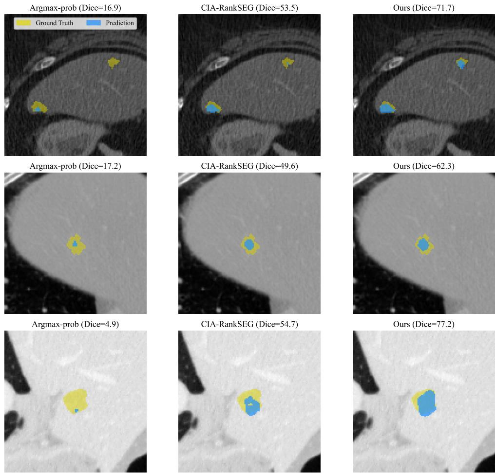  
Figure 6: Qualitative comparison of segmentation masks produced by different methods on LiTS.

Figures 8 to 10 present examples from ADE20K, Cityscapes, and DeepGlobe Land. On these natural-image datasets, our method primarily improves the segmentation of thin and distant structures whose pixel footprint is too small for the baselines to resolve. For instance, in both examples in Figure 9, our method successfully identifies or recovers more complete shapes of the distant human figures. Although these pedestrians occupy only a small number of pixels, accurately localizing them is critical for downstream tasks such as autonomous driving.

Argmax-prob (Dice=0.0)  
CIA-RankSEG (Dice=35.5)  
Ours (Dice=56.1)  
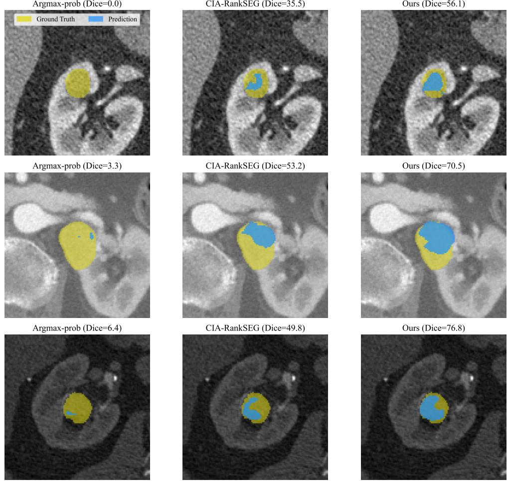  
Figure 7: Qualitative comparison of segmentation masks produced by different methods on KiTS.

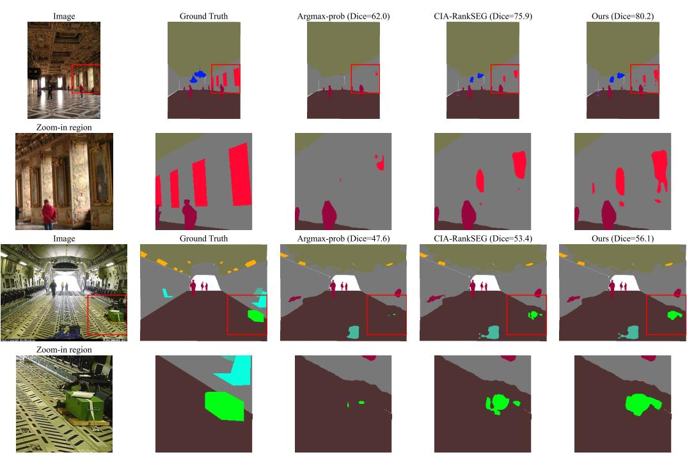  
Figure 8: Qualitative comparison on ADE20K. Each case spans two rows, where the first row shows the original image and the second row zooms in on the most distinctive region.

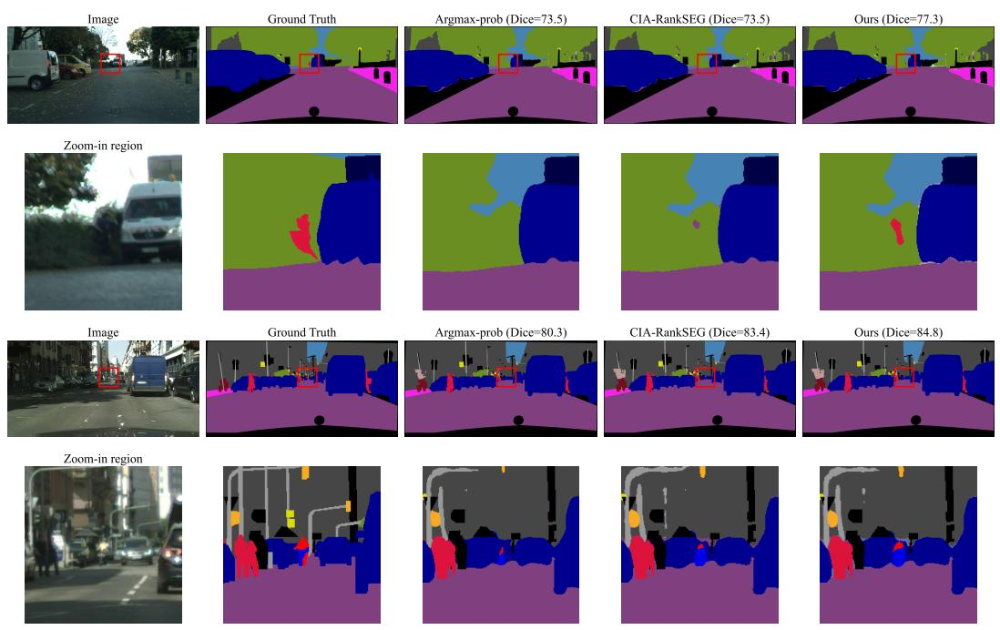  
Figure 9: Qualitative comparison on Cityscapes. Each case spans two rows, where the first row shows the original image and the second row zooms in on the most distinctive region.

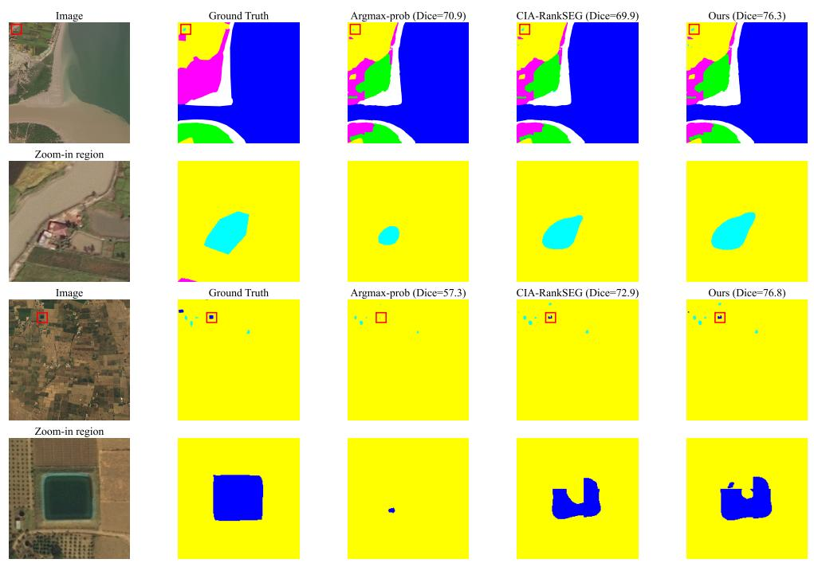  
Figure 10: Qualitative comparison on DeepGlobe Land. Each case spans two rows, where the first row shows the original image and the second row zooms in on the most distinctive region.