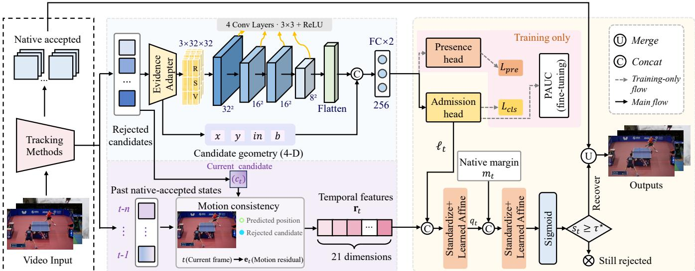
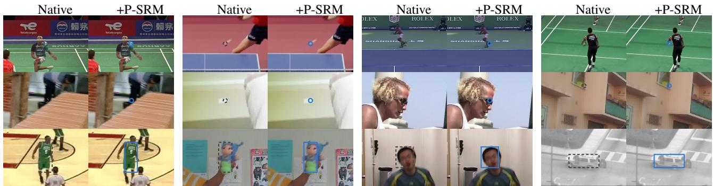

# P-SRM: SELECTIVE RECOVERY OF REJECTED PREDICTIONS IN VISUAL TRACKING

Youbin He

The Hong Kong Polytechnic University 25091865d@connect.polyu.hk

## ABSTRACT

Many visual tracking methods use rejection mechanisms to suppress unreliable predictions. However, these mechanisms can also reject correctly localized candidates, leaving useful information unused. We investigate how to identify and recover these candidates while preserving native accepted outputs and candidate coordinates. To this end, we propose P-SRM (Post-rejection Selective Recovery Method), which combines spatial responses, past accepted states, and native decision margins to reassess candidates and selectively restore reliable predictions. We evaluate P-SRM on six trackers and four datasets spanning category-specific, point, and generic object tracking. Across all nine configurations, P-SRM improves rejected-candidate ranking and overall tracking performance. These results show that postrejection verification can identify and recover useful predictions discarded by native rejection, demonstrating the value of reusing rejected information. Project repository: https://github.com/PalestyHR/P-SRM.

Index Terms— Visual tracking, selective recovery, candidate verification, rejection mechanisms.

## 1. INTRODUCTION

Visual tracking estimates target locations across video frames. Many tracking methods use explicit rejection mechanisms to filter unreliable predictions. The TrackNet family targets small, fast-moving sports objects, including tennis balls and shuttlecocks. It decodes positions from heatmaps and suppresses weak responses before reporting locations [1, 2, 3]. TAP-Net and TAPIR track specified points on physical surfaces and use visibility or localization uncertainty to judge prediction validity [4, 5]. KCF locates generic objects using correlation-filter responses [6]; the implementation used here accepts or rejects predictions based on the response peak. These mechanisms serve their respective tasks by separating accepted outputs from rejected candidates.

Native rejection, however, does not necessarily imply incorrect localization. For example, a tracker may correctly locate a fast-moving shuttlecock in a blurred frame, yet withhold that position because its confidence score or heatmap peak falls below the threshold. Recovering this correctly localized but rejected candidate can restore a missing output.

Siwei Wang

## The University of Hong Kong u3656944@connect.hku.hk

Yet rejected candidates also include mislocalizations and predictions made when the target is invisible. The key challenge is therefore to distinguish correctly localized candidates from these actual errors.

Related work addresses the distinction between reliable predictions and errors. Confidence calibration aligns predicted probabilities with correctness likelihood [7]. Mask Scoring R-CNN and MFTIQ estimate the quality of masks and flow correspondences, respectively [8, 9]. ByteTrack uses low-score detections through association [10], while SelectiveNet jointly learns prediction and rejection [11]. These approaches aim to improve confidence reliability, quality assessment, or prediction association and selection. We instead study candidate verification after native rejection: can the original tracker’s evidence identify and recover correctly localized candidates while preserving native accepted outputs and candidate coordinates?

To answer this question, we propose P-SRM (Postrejection Selective Recovery Method). P-SRM combines adapted spatial evidence, motion history, and native decision margins to reassess rejected candidates and selectively readmit reliable predictions (Fig. 1). Our experiments confirm that native rejection does discard correctly localized candidates that can be identified and recovered. The results further show that recovering these candidates can also improve tracking performance.

Overall, our contributions include: (i) we identify correctly localized predictions excluded by native rejection, distinguishing admission errors from localization failures; (ii) we develop P-SRM to recover these candidates while preserving native accepted outputs and candidate coordinates; and (iii) we validate its identification and tracking benefits across six trackers and four datasets.

## 2. METHOD

P-SRM applies to trackers that expose an explicit validity decision together with rejected candidate locations and spatial evidence (Fig. 1).

## 2.1. Problem setting and recoverable candidates

For candidate $\mathbf { c } _ { t }$ at frame $t , d _ { t } = 1$ denotes native acceptance and $d _ { t } = 0$ rejection. Within the rejected set, we distinguish three classes: C, visible and correctly localized; $L ,$ visible but mislocalized; and A, the target is annotated as invisible. Point candidates are correct when $\| \mathbf { c } _ { t } - \mathbf { c } _ { t } ^ { \star } \| _ { 2 } \leq \epsilon .$ , where $\mathbf { c } _ { t } ^ { \star }$ is the annotation and ϵ the localization tolerance. Box candidates require an intersection-over-union of at least 0.5 with the annotated box.

  
Fig. 1. Overview of P-SRM. Rejected candidates are selectively recovered using spatial, historical, and native decision evidence. Dashed arrows indicate training-only paths.

With candidate coordinates fixed, C is the recoverable class. Annotations define the correctness target $y _ { t } = 1$ for C and $y _ { t } = 0$ otherwise; inference estimates correctness from available evidence.

## 2.2. Spatial evidence adaptation and quality learning

Identifying recoverable candidates requires assessing target presence and its spatial agreement with the candidate. The adapter aligns $\mathbf { c } _ { t }$ with evidence $E _ { t }$ from the same native forward pass, producing response plane $R _ { t } ,$ candidate support $S _ { t } ,$ , and valid support $V _ { t }$ . These encode the response distribution, candidate location, and usable image regions, respectively:

$$
( X _ { t } , \mathbf { g } _ { t } ) = \mathcal { A } _ { b } ( E _ { t } , \mathbf { c } _ { t } ) , \quad X _ { t } = R _ { t } \parallel S _ { t } \parallel V _ { t } .\tag{1}
$$

Here b identifies the tracker and ∥ denotes concatenation. Geometry $\mathbf { g } _ { t }$ contains normalized candidate coordinates and inframe and support-boundary indicators.

Encoder $f _ { \theta }$ extracts response patterns; projection gθ combines them with candidate geometry for the admission head [8]:

$$
\mathbf { z } _ { t } = g _ { \theta } \big ( \mathrm { v e c } \big ( f _ { \theta } \big ( X _ { t } \big ) \big ) \ \lVert \ \mathbf { g } _ { t } \big ) , \qquad \ell _ { t } = \mathbf { w } _ { q } ^ { \top } \mathbf { z } _ { t } + b _ { q } .\tag{2}
$$

The quality score $p _ { t } = \sigma ( \ell _ { t } )$ is trained against $y _ { t }$

A training-only presence head $u _ { t } = \mathbf { w } _ { a } ^ { \top } \mathbf { z } _ { t } + b _ { a }$ complements correctness supervision with visibility labels $a _ { t } ~ = ~ 1$

for $C \cup L$ and $a _ { t } = 0$ for A:

$$
\mathcal { L } _ { \mathrm { i n i t } } = \mathbb { E } _ { t \in \mathcal { R } _ { \mathrm { t r } } } \left[ \mathcal { L } _ { \mathrm { c l s } , t } + \lambda _ { a } \mathcal { L } _ { \mathrm { p r e } , t } \right] .\tag{3}
$$

Here $\mathcal { L } _ { \mathrm { c l s } , t } = B _ { w _ { y } } ( p _ { t } , y _ { t } )$ and $\mathcal { L } _ { \mathrm { p r e } , t } = B _ { w _ { a } } ( \sigma ( u _ { t } ) , a _ { t } )$ are admission and presence losses. $B _ { w }$ is positive-class-weighted binary cross-entropy on rejected training set $\mathcal { R } _ { \mathrm { t r } } .$ , with auxiliary weight $\lambda _ { a }$ . Only the admission logit enters fusion.

Ranking refinement uses positive and negative sets $\mathcal { P } , \mathcal { N }$ defined by $y _ { t } .$ Pairwise loss $L _ { i j } = [ \kappa - ( p _ { i } - p _ { j } ) ] _ { + } ^ { 2 }$ , for $i \in \mathcal { P } , j \in \mathcal { N }$ , encourages higher scores for correct candidates. The KL-DRO partial-AUC (pAUC) objective [12] emphasizes larger pairwise errors:

$$
\mathcal { L } _ { \mathrm { p A U C } } = \frac { \Lambda } { | \mathcal { P } | } \sum _ { i \in \mathcal { P } } \log \left[ \frac { 1 } { | \mathcal { N } | } \sum _ { j \in \mathcal { N } } \exp \left( \frac { L _ { i j } } { \Lambda } \right) \right] .\tag{4}
$$

Here $[ x ] _ { + } = \operatorname* { m a x } ( x , 0 )$ , κ is the desired score separation, and Λ controls the emphasis on larger pairwise errors.

## 2.3. History and native decision fusion

To complement spatial evidence with motion consistency, P-SRM uses past accepted states $ \mathcal { H } _ { t } ~ = ~ \{ ( k , \mathbf { c } _ { k } , \pmb { \xi } _ { k } ) ~ : ~ k ~ <$ $t , d _ { k } = 1 \}$ , where $\xi _ { k }$ stores confidence information.

When at least two past acceptances are available, the latest positions at $t _ { 1 } < t _ { 2 } < t$ provide a velocity estimate. Extrapolating it to the current frame gives the candidate’s deviation from the expected position:

$$
\mathbf { v } _ { t } = { \frac { \mathbf { c } _ { t _ { 2 } } - \mathbf { c } _ { t _ { 1 } } } { t _ { 2 } - t _ { 1 } } } , \qquad \mathbf { e } _ { t } = \mathbf { c } _ { t } - \mathbf { c } _ { t _ { 2 } } - ( t - t _ { 2 } ) \mathbf { v } _ { t } .\tag{5}
$$

History descriptor $\mathbf { r } _ { t } = \psi ( \mathbf { c } _ { t } , \mathcal { H } _ { t } )$ combines this deviation, time gaps, and confidence statistics. Unavailable terms are

Table 1. Tracking results (%). RTX 4090 inference (KCF: CPU). $N _ { C } { \mathrm { : } }$ correct rejected candidates; $\bar { n } _ { C } \colon$ three-seed mean correct recoveries (recovery %). ‡: TAP-Net FPS uses clip-amortized latency. Overhead includes clip-to-frame evidence preparation; separate profiling measures 3.94 ms/frame for preparation and 1.08 for core recovery.
<table><tr><td colspan="8"></td></tr><tr><td>Method / Source Dataset</td><td>Setting Acc.</td><td>Pre. Rec. F1</td><td> $\operatorname { A P } _ { r }$  AJ</td><td>OA</td><td> $N _ { C }$ </td><td> $\bar { n } _ { C }$  (recovery %)</td><td>Extra latency FPS (ms/frame)</td></tr><tr><td colspan="2">Category-specific tracking</td><td></td><td></td><td></td><td></td><td></td><td></td><td></td></tr><tr><td rowspan="3">TrackNetV1 AVSS 2019 [2]</td><td rowspan="3">Shuttlecock</td><td>Native 52.0688.99 46.4861.0662.83</td><td></td><td></td><td>125</td><td></td><td>25.3</td><td rowspan="3">7.14</td></tr><tr><td>+P-SRM 52.89</td><td>88.14 47.92 62.0973.72</td><td></td><td></td><td>124.3 (99.47)</td><td>21.5</td></tr><tr><td>Native</td><td>55.40 79.5759.1867.8849.21</td><td></td><td></td><td>23</td><td>25.3</td></tr><tr><td rowspan="4">TrackNetV2 ICPAI 2020 [3]</td><td rowspan="2">RacketVision Shuttlecock</td><td>+P-SRM 55.61 78.79</td><td>60.06 68.16 54.02</td><td></td><td></td><td rowspan="2"></td><td>22.0 (95.65) 21.5</td><td></td></tr><tr><td>Native</td><td>83.62 97.60 82.35 89.33 53.92</td><td></td><td></td><td></td><td>39.8</td></tr><tr><td rowspan="2">RacketVision</td><td>+P-SRM 84.42 97.30 83.57 89.91 66.08</td><td></td><td></td><td>771</td><td>113.3 (14.70)</td><td>34.0</td></tr><tr><td>Native 64.8987.4567.6276.2735.70</td><td></td><td></td><td>365</td><td>25.3 (6.94)</td><td>39.8</td></tr><tr><td rowspan="4">TrackNetV3 MM Asia 2023 [1]</td><td rowspan="2">Shuttlecock</td><td>Native 92.2598.24 92.4595.2554.40</td><td>+P-SRM 65.26 87.23 68.28 76.60 51.38</td><td></td><td></td><td rowspan="2"></td><td>34.0</td><td rowspan="2"></td></tr><tr><td>+P-SRM 92.37</td><td></td><td></td><td>392</td><td>20.7 (5.27)</td><td>8.5</td></tr><tr><td rowspan="2">RacketVision</td><td></td><td>98.11 92.71 95.3355.48</td><td></td><td></td><td rowspan="2"></td><td>8.2 8.5</td><td rowspan="2">5.30</td></tr><tr><td>Native +P-SRM 76.7588.5882.8185.60 74.00</td><td>75.0388.5980.4784.3360.48</td><td></td><td>394</td><td></td></tr><tr><td>Point tracking</td><td></td><td></td><td></td><td></td><td></td><td></td><td>106.7 (27.07) 8.2</td><td></td></tr><tr><td>TAP-Net NeurIPS 2022 [4]</td><td>TAP-Vid Kinetics</td><td>Native 80.3775.3691.0382.4619.9238.6879.62</td><td></td><td></td><td>54,759</td><td></td><td>517.3‡</td><td>4.99‡</td></tr><tr><td rowspan="2">Online TAPIR</td><td rowspan="2">TAP-Vid Kinetics</td><td>+P-SRM</td><td>80.81 75.38 92.29 82.98 52.05 39.13 80.29</td><td></td><td></td><td rowspan="2">7,657.3 (13.98) 144.4‡</td><td></td><td rowspan="2"></td></tr><tr><td>Native 89.8388.5793.2390.8434.9150.1283.93</td><td></td><td></td><td>44,115</td><td>54.9</td></tr><tr><td rowspan="2">Generic object tracking</td><td rowspan="2"></td><td rowspan="2"></td><td>+P-SRM 89.92 88.16 94.00 90.99 42.55 50.29 84.35</td><td></td><td></td><td rowspan="2"></td><td>5,022.7 (11.39) 49.7</td><td rowspan="2">1.90</td></tr><tr><td></td><td></td><td></td><td></td></tr><tr><td>KCF</td><td></td><td>Native</td><td></td><td></td><td></td><td></td><td></td><td></td><td></td></tr><tr><td>TPAMI 2015 [6]</td><td>OTB2013</td><td>+P-SRM 33.5186.8235.2950.1845.04</td><td>32.7287.3134.3449.2943.50</td><td></td><td></td><td>2,552</td><td>279.7 (10.96)</td><td>252.7 209.4</td><td>0.82</td></tr></table>

dates when $s _ { t } \geq \tau ^ { \star }$

zero-filled before standardization, with flags for zero, one, or at least two past acceptances.

Native margin $m _ { t }$ indicates the candidate’s position relative to the native admission boundary. Fusion combines spatial quality logit $\ell _ { t }$ with history $\mathbf { r } _ { t } .$ , then incorporates mt:

$$
\begin{array} { r l } & { q _ { t } = \mathbf { a } ^ { \top } T _ { 1 } ( \ell _ { t } \parallel \mathbf { r } _ { t } ) + b _ { 1 } , } \\ & { s _ { t } = \sigma \bigl ( \mathbf { b } ^ { \top } T _ { 2 } ( q _ { t } \parallel m _ { t } ) + b _ { 2 } \bigr ) . } \end{array}\tag{6}
$$

With the quality network fixed, the readouts are fitted sequentially using video-grouped five-fold cross-fitting and $L _ { 2 ^ { - } }$ regularized, class-balanced binary cross-entropy against $y _ { t } .$ The second uses the first’s out-of-fold logits. Standardization transforms $T _ { 1 } , T _ { 2 }$ estimate means and standard deviations from each fitting partition. Readouts and transforms are refitted on all source fitting data and fixed for external evaluation.

## 2.4. Selective recovery

We select $\tau ^ { \star }$ from pooled out-of-fold scores of the second readout to maximize correct recoveries under the predefined source-domain calibration rules. The threshold is then fixed, preserving native acceptances and readmitting rejected candi-

$$
\widehat { d } _ { t } = \left\{ \begin{array} { l l } { 1 , } & { d _ { t } = 1 , } \\ { \mathbb { I } [ s _ { t } \geq \tau ^ { \star } ] , } & { d _ { t } = 0 , } \end{array} \right.\tag{7}
$$

where $\mathbb { I } [ \cdot ]$ is the indicator function. Admitted candidates retain their original coordinates.

## 3. EXPERIMENTS AND RESULTS

## 3.1. Benchmarks and evaluation protocol

We evaluate P-SRM in category-specific, point, and generic object tracking, covering six trackers and four datasets (Table 1) [13, 4, 14]. TrackNet and point-tracking configurations use source data for fitting and calibration, followed by evaluation on separate splits. KCF uses video-grouped five-fold evaluation on OTB2013 with supplementary visibility annotations.

Native predictions are fixed. P-SRM is fitted and OOFcalibrated for each tracker configuration. Main results average seeds 42, 3407, and 8008; cue ablations in Table 2 use seed 42.

$\mathsf { A P } _ { r }$ is the primary metric for identifying correct candidates within the native rejection set. Final tracking metrics measure the benefits realized after selective admission. Accuracy, precision, recall, and F1 pool events; Average Jaccard (AJ) and Occlusion Accuracy (OA) average videos.

  
Fig. 2. Recovery examples across three tracking categories. Gray dashed markers show native-rejected candidates; blue markers show the same candidates after recovery. Examples are from RacketVision, Shuttlecock, Kinetics, and OTB2013.

## 3.2. Rejected-candidate identification and recovery

Table 1 shows that every native rejection set contains correctly localized candidates. P-SRM identifies and recovers these candidates without changing their coordinates, improving AP across all nine configurations. The 95% pairedbootstrap confidence intervals for pooled F1 gains over Native also lie entirely above zero in every configuration.

Even in configurations with low correct-candidate recovery rates, AP improves substantially. This finding highlights the value of assessing rejected-candidate quality separately from the final admission decision.

## 3.3. Ablation and sensitivity analysis

To assess the need for full P-SRM, we compare simpler recovery schemes using quality (Q), history (H), and native margin (M): M, Q, M+H, Q+H, and Q+M (Table 2). M uses only the native scalar margin through a one-dimensional logistic readout calibrated on source-domain OOF scores. For both trackers, the final fitted mapping is increasing, making its admission rule equivalent to native-score thresholding while preserving native accepted outputs. All schemes share candidates, source partitions, and calibration rules, with separately calibrated thresholds.

Full outperforms M and M+H in ranking and recovery for both point trackers, demonstrating the value of spatial quality information not fully exploited by native scores and history. Comparisons with Q, Q+H, and Q+M further support the cues’ complementary value for ranking. It should be clarified that the complementary value of these cues for ranking does not imply higher final tracking metrics in every setting. Because trackers process candidates differently, the contribution of the same cue may vary across settings, allowing some simpler combinations to achieve better results in certain cases. We nevertheless adopt Full for its applicability across tracking settings and demonstrated identification and tracking gains.

We additionally assess sensitivity to training hyperparameters by varying one parameter at a time in TAP-Net/Kinetics and TrackNetV3/Shuttlecock. Tracking performance remains broadly stable across the tested settings, with consistent gains over Native (Table 3).

Table 2. Cue ablations (pp); CIs: 10,000 paired video bootstraps with fixed models/thresholds. ∆t: five-run mean endto-end change (ms/frame, RTX 4090).
<table><tr><td>Comparison</td><td>∆t</td><td>∆APr</td><td> $\Delta \mathrm { F } 1 _ { \mathrm { p o o l } }$ </td><td> $\Delta \mathrm { F l } _ { \mathrm { v i d e o } }$  [95% CI]</td></tr><tr><td>TAP-Net Q→Q+H</td><td>1.00</td><td>3.92</td><td>0.020</td><td>0.017 [-0.046, 0.076]</td></tr><tr><td>Q+H→Full Q+M →Full</td><td>0.30 1.36</td><td>0.11 4.04</td><td>-0.011 -0.001</td><td>-0.016 [-0.024, 0.007] -0.010 [−0.070, 0.044]</td></tr><tr><td>M →Full M+H→Full</td><td>6.26 5.51</td><td>32.89 20.16</td><td>0.588 0.508</td><td>0.917 [0.620, 1.258] 0.715 [0.460, 1.008]</td></tr><tr><td>Online TAPIR</td><td></td><td></td><td></td><td></td></tr><tr><td>Q→Q+H</td><td>1.08</td><td>4.66</td><td>0.026</td><td>0.028 [−0.014, 0.065]</td></tr><tr><td>Q+H→Full</td><td>0.53</td><td>1.48</td><td>0.042</td><td>0.050 [0.001, 0.092]</td></tr><tr><td></td><td>0.98</td><td></td><td></td><td></td></tr><tr><td></td><td></td><td></td><td></td><td>0.050 [0.012, 0.083]</td></tr><tr><td>Q+M →Full</td><td></td><td>2.34</td><td>0.048</td><td></td></tr><tr><td></td><td></td><td></td><td></td><td></td></tr><tr><td></td><td></td><td></td><td></td><td></td></tr><tr><td>M →Full M+H→Full</td><td>2.84 1.08</td><td>7.89 5.25</td><td>0.146 0.092</td><td>0.200 [0.127, 0.273] 0.122 [0.063, 0.185]</td></tr></table>

Table 3. Hyperparameter sensitivity analysis. Defaults: (λa, κ, Λ) = (0.5, 0.6, 1). Seed: 3407.
<table><tr><td colspan="3">TAP-Net</td><td colspan="2">TrackNetV3</td></tr><tr><td>Setting</td><td>APr (%)</td><td>F1 (%)</td><td>APr (%)</td><td>F1 (%)</td></tr><tr><td>Default</td><td>51.27</td><td>82.85</td><td>55.22</td><td>95.34</td></tr><tr><td>λa = 0.25</td><td>51.18</td><td>83.17</td><td>55.20</td><td>95.35</td></tr><tr><td>λa = 1.0</td><td>47.29</td><td>82.91</td><td>55.18</td><td>95.36</td></tr><tr><td>κ = 0.4</td><td>51.18</td><td>82.57</td><td>55.20</td><td>95.35</td></tr><tr><td>κ = 0.8</td><td>51.33</td><td>82.89</td><td>55.23</td><td>95.34</td></tr><tr><td>Λ = 0.5</td><td>51.27</td><td>82.68</td><td>55.21</td><td>95.34</td></tr><tr><td>Λ = 2.0</td><td>51.24</td><td>82.90</td><td>55.23</td><td>95.34</td></tr></table>

## 4. CONCLUSION

P-SRM demonstrates that correctly localized predictions can be recovered after native rejection. Across multiple trackers and datasets, this improves candidate identification and tracking performance, establishing post-rejection verification as a practical way to reuse existing predictions.

## COMPLIANCE WITH ETHICAL STANDARDS

All experiments use existing, publicly available datasets: Shuttlecock, RacketVision, TAP-Vid Kinetics, and OTB2013. We use dataset-provided annotations, including the corrected Shuttlecock Test labels released with TrackNetV3. For OTB2013, we retain the original bounding-box annotations and add supplementary target-visibility labels. This study involves no new participant recruitment or video recording.

## ACKNOWLEDGMENTS

This work was funded personally by the first author. No external funding was received. The authors declare no competing interests.

## REFERENCES

[1] Yu-Jou Chen and Yu-Shuen Wang, “TrackNetV3: Enhancing shuttlecock tracking with augmentations and trajectory rectification,” in ACM Multimedia Asia 2023. December 2023, pp. 1–7, ACM.

[2] Yu-Chuan Huang, I-No Liao, Ching-Hsuan Chen, Tsi-Ui Ik, and Wen-Chih Peng, “TrackNet: A deep learning network for tracking high-speed and tiny objects in sports applications,” in 2019 16th IEEE International Conference on Advanced Video and Signal Based Surveillance (AVSS). September 2019, pp. 1–8, IEEE.

[3] Nien-En Sun, Yu-Ching Lin, Shao-Ping Chuang, Tzu-Han Hsu, Dung-Ru Yu, Ho-Yi Chung, and Tsi-Ui Ik, “TrackNetV2: Efficient shuttlecock tracking network,” in 2020 International Conference on Pervasive Artificial Intelligence (ICPAI). December 2020, pp. 86–91, IEEE.

[4] Carl Doersch, Ankush Gupta, Larisa Markeeva, Adria Recasens, Lucas Smaira, Yusuf Aytar, Joao Carreira, Andrew Zisserman, and Yi Yang, “TAP-Vid: A benchmark for tracking any point in a video,” in Advances in Neural Information Processing Systems. 2022, vol. 35, pp. 13610–13626, Curran Associates, Inc.

[5] Carl Doersch, Yi Yang, Mel Vecerik, Dilara Gokay, Ankush Gupta, Yusuf Aytar, Joao Carreira, and Andrew Zisserman, “TAPIR: Tracking any point with perframe initialization and temporal refinement,” in Proceedings of the IEEE/CVF International Conference on Computer Vision, October 2023, pp. 10061–10072.

[6] Joao F. Henriques, Rui Caseiro, Pedro Martins, and Jorge Batista, “High-speed tracking with kernelized correlation filters,” IEEE Transactions on Pattern Analysis and Machine Intelligence, vol. 37, no. 3, pp. 583–596, 2015.

[7] Chuan Guo, Geoff Pleiss, Yu Sun, and Kilian Q. Weinberger, “On calibration of modern neural networks,” in Proceedings of the 34th International Conference on Machine Learning. 2017, vol. 70 of Proceedings ofMachine Learning Research, pp. 1321–1330, PMLR.

[8] Zhaojin Huang, Lichao Huang, Yongchao Gong, Chang Huang, and Xinggang Wang, “Mask scoring R-CNN,” in Proceedings of the IEEE/CVF Conference on Computer Vision and Pattern Recognition, June 2019, pp. 6409–6418.

[9] Jonas Serych, Michal Neoral, and Jiri Matas, “MFTIQ: Multi-flow tracker with independent matching quality estimation,” in Proceedings of the Winter Conference on Applications of Computer Vision, February 2025, pp. 8068–8078.

[10] Yifu Zhang, Peize Sun, Yi Jiang, Dongdong Yu, Fucheng Weng, Zehuan Yuan, Ping Luo, Wenyu Liu, and Xinggang Wang, “ByteTrack: Multi-object tracking by associating every detection box,” in Computer Vision – ECCV 2022. 2022, pp. 1–21, Springer Nature Switzerland.

[11] Yonatan Geifman and Ran El-Yaniv, “SelectiveNet: A deep neural network with an integrated reject option,” in Proceedings of the 36th International Conference on Machine Learning. 2019, vol. 97 of Proceedings ofMachine Learning Research, pp. 2151–2159, PMLR.

[12] Dixian Zhu, Gang Li, Bokun Wang, Xiaodong Wu, and Tianbao Yang, “When AUC meets DRO: Optimizing partial AUC for deep learning with non-convex convergence guarantee,” in Proceedings of the 39th International Conference on Machine Learning. 2022, vol. 162 of Proceedings of Machine Learning Research, pp. 27548–27573, PMLR.

[13] Linfeng Dong, Yuchen Yang, Hao Wu, Wei Wang, Yuenan Hou, Zhihang Zhong, and Xiao Sun, “RacketVision: A multiple racket sports benchmark for unified ball and racket analysis,” in Proceedings of the AAAI Conference on Artificial Intelligence, 2026, vol. 40, pp. 3632–3640.

[14] Yi Wu, Jongwoo Lim, and Ming-Hsuan Yang, “Online object tracking: A benchmark,” in Proceedings of the IEEE Conference on Computer Vision and Pattern Recognition, 2013, pp. 2411–2418.