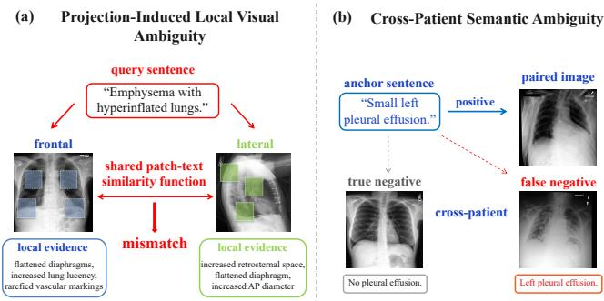
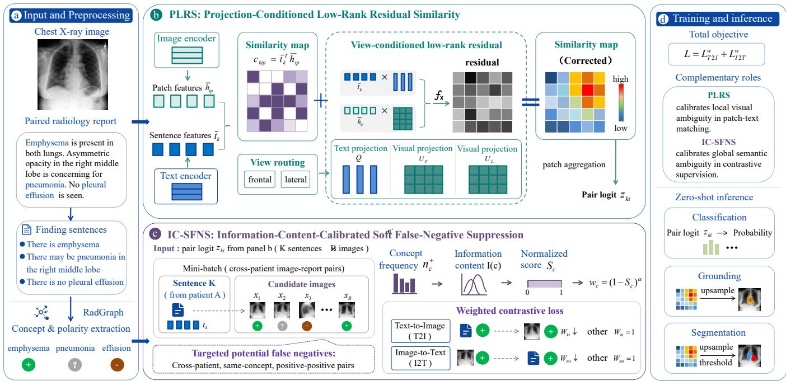
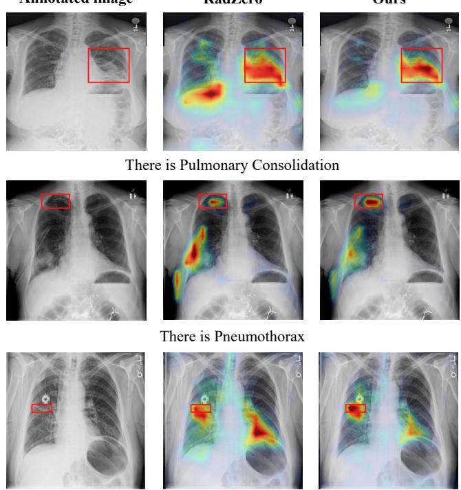
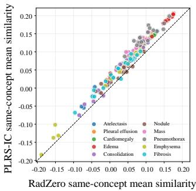
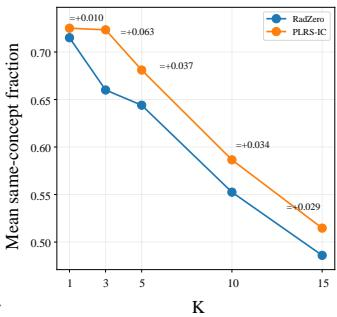

# PLRS-IC: A Dual-Calibration Framework for Chest X-Ray Vision-Language Alignment

Qixing Zhao, Jinpeng Li\*

South China University of Technology lijinpeng@scut.edu.cn

## Abstract

Fine-grained vision-language alignment in chest radiography enables zero-shot classification, grounding, and segmentation without task-specific annotations. However, this alignment is fundamentally hindered by two intertwined sources of ambiguity: projection-induced visual mismatch and patientagnostic semantic overlap. First, at the local feature level, frontal and lateral radiographs exhibit distinct appearances for the same clinical finding, rendering a shared patch-text similarity geometry inherently suboptimal. Compounding this visual ambiguity is a semantic mismatch during global contrastive optimization, where instance-level objectives penalize cross-patient pairs as strict negatives even when they share identical positive clinical concepts. To address this dual ambiguity, we propose PLRS-IC, a unified dual-calibration framework for chest X-ray representation learning. At the local alignment stage, Projection-Conditioned Low-Rank Residual Similarity (PLRS) dynamically adapts patch-text matching to projection-specific manifolds using a bounded, parametereficient low-rank residual. At the global optimization stage, Information-Content-Calibrated Soft False-Negative Suppression (IC-SFNS) leverages a corpus-derived informationtheoretic prior to soften the penalty of semantically overlap ping negatives without altering original contrastive assignments. Extensive experiments across nine public zero-shot benchmark settings demonstrate that our framework yields consistent improvements in classification, grounding, and segmentation, validating the necessity of dual-calibration in medical vision-language pre-training.

## Introduction

Chest radiography is routinely used to assess a broad range of thoracic conditions. Obtaining detailed chest X-ray annotations is costly because the process requires clinical expertise. The burden increases further when annotations must also specify the locations of clinical findings. Vision-language pre-training ofers an alternative by learning from paired radiographs and reports (Zhang et al. 2022; Zhou et al. 2022). It supports zero-shot medical image understanding without requiring a separate classifier for each finding (Tiu et al. 2022; Huang et al. 2021). Zero-shot chest X-ray understanding therefore depends on aligning free-text clinical queries with the visual evidence that supports them.

Fine-grained image-text alignment is essential because a finding sentence often refers to evidence confined to a local region (Huang et al. 2024; Chen et al. 2024). Recent medical vision-language methods extend global image-report matching through phrase-level or patch-level interactions (Huang et al. 2021; Wang et al. 2022a; Park et al. 2025). Yet, this finegrained alignment is hindered by projection-induced visual ambiguity. Chest radiographs are acquired under diferent projections, and the same finding can produce distinct local evidence across views. As shown in Figure 1(a), frontal manifestations of emphysema include increased lung lucency and rarefied vascular markings. The lateral view instead emphasizes increased retrosternal space and an enlarged anteroposterior diameter. Despite these diferences, existing methods compare both projections with the same query through a shared patch-text similarity function. A shared similarity geometry struggles to accommodate projection-dependent appearances across both views, which inevitably reduces the precision of phrase-region correspondence. This necessitates explicit projection conditioning at the local similarity level to dynamically calibrate visual matching.

  
Figure 1: The dual-ambiguity in chest X-ray visionlanguage alignment. (a) Local ambiguity. Frontal and lateral radiographs are independently compared with the same query using a shared patch-text similarity function, despite projection-specific local evidence. (b) Global ambiguity. CLIP-style contrastive learning treats cross-patient pairs as negatives, creating a potential false negative when another patient shares the same positive finding.

Compounding this local visual ambiguity is a patientagnostic semantic mismatch introduced during global contrastive optimization. Standard CLIP-style objectives treat a finding sentence and its source image as a positive pair, while images from other patients serve as negatives. As shown in Figure 1(b), the anchor sentence “Small left pleural efusion” is correctly paired with its source image. Another patient’s image can depict the identical finding but still remain a strict negative, alongside a true negative without pleural effusion. Treating these cross-patient pairs as equally reliable negatives introduces false-negative supervision and pushes clinically consistent image-text evidence apart (Lian et al. 2026; Zhang et al. 2026). While existing methods address this problem by changing pair roles or mining latent positives (Lian et al. 2026; Zhang et al. 2026), sharing a positive concept does not imply complete clinical or visual equivalence between patients. We instead investigate whether unreliable cross-patient negatives can be softly calibrated using an information-theoretic prior, preserving their original assignments while mitigating semantic overlap.

To address this dual ambiguity, we introduce PLRS-IC, a unified dual-calibration framework for zero-shot chest X-ray vision-language alignment. PLRS dynamically conditions local patch-text similarity on the radiographic projection, rectifying the visual mismatch. Simultaneously, IC-SFNS calibrates selected cross-patient negative terms using corpusderived concept statistics, softening the backward semantic mismatch. The two components operate in tandem on local similarity estimation and global contrastive supervision. Our main contributions include:

• We introduce PLRS, a projection-conditioned low-rank correction for patch-text similarity. It adapts local matching to projection-specific visual manifolds with few additional parameters, while preserving the base similarity and bounding the correction magnitude.

• We propose IC-SFNS, an optimization strategy to downweight selected cross-patient negatives. The attenuation weights are derived from a corpus-level concept information-content prior, achieving soft false-negative suppression while the original pair labels remain.

• We evaluate PLRS-IC on nine public zero-shot chest Xray benchmarks for classification, grounding, and segmentation, demonstrating consistent performance improvements and validating the eficacy of our dualcalibration framework.

## Related Work

Fine-Grained Chest X-Ray Vision-Language Alignment. Chest X-ray vision-language pre-training learns from paired radiographs and reports without dense task-specific annotations (Zhou et al. 2022, 2023; Boecking et al. 2022; Liu et al. 2024). GLoRIA and MGCA extend global alignment through region-word or multi-granularity supervision (Huang et al. 2021; Wang et al. 2022a), while CARZero and RadZero further model local image-text interactions for zero-shot interpretation (Lai et al. 2024; Park et al. 2025). RadZero directly derives similarity maps for classification, grounding, and segmentation. These methods improve local feature interaction and aggregation, but a shared patch-text similarity function leaves projection-induced local ambiguity unresolved. PLRS addresses this local ambiguity by conditioning the similarity geometry on the known projection of each radiograph.

Projection-Aware Modeling of Chest Radiographs. Frontal and lateral radiographs provide complementary anatomical evidence and have motivated multi-view chest X-ray vision-language models. CXR-CLIP uses multiple images and report sections from the same radiographic study to construct study-level supervision (You et al. 2023). This strategy expands the available image-text combinations, but does not explicitly distinguish projection-specific local appearances. Med-ST introduces a Mixture of View Experts to encode frontal and lateral radiographs (Yang et al. 2024). It combines the view-specific features through cross-view integration and global-local image-text alignment. Although the experts retain projection-related information, the architecture fuses radiographs that are jointly available from the same study. Pathology-relevant patches have also been aggregated across multiple radiographic views (Qiao et al. 2026). Their Frontal-Lateral Alignment preserves view-specific pathological features while encouraging semantic consistency across projections. These approaches integrate complementary evidence from paired views, whereas our setting concerns projection-induced ambiguity within the local alignment of a single radiograph. PLRS calibrates this local similarity according to the known projection without requiring paired frontal and lateral inputs.

False-Negative Handling in Medical Contrastive Learning. Medical image-text contrastive learning usually treats paired samples as positives and cross-patient samples as negatives (Radford et al. 2021; Zhai et al. 2022). This assumption becomes unreliable when diferent patients share the same positive clinical finding. MedCLIP relaxes strict pair-based supervision by constructing semantic matching targets from clinical labels (Wang et al. 2022b). These targets broadly redefine image-text relatedness instead of selectively adjusting unreliable cross-patient negative terms. Recent methods incorporate richer clinical semantics into contrastive supervision (Ko and Park 2025). CoNNS constructs a hierarchical concept ontology and assigns cross-patient relationships according to their clinical semantics (Lian et al. 2026). FaNe identifies latent positives through report-level semantic similarity and incorporates them into a multi-positive contrastive objective (Zhang et al. 2026). Both methods reduce false-negative noise by changing the relation or training role of selected image-text pairs. We instead view cross-patient concept overlap as a source of global semantic ambiguity in contrastive supervision. Because sharing a positive concept is not suficient to establish complete clinical or visual equivalence, IC-SFNS preserves the original pair assignment and calibrates only its negative contribution. The calibration strength is determined by corpus-derived concept information content.

## Method

Figure 2 illustrates the PLRS-IC workflow. Given paired radiographs and finding sentences, PLRS produces projectionconditioned patch-text similarity maps and image-sentence logits. IC-SFNS then calibrates selected cross-patient negative terms when these logits enter the bidirectional contrastive objective. The corrected maps and logits support zero-shot classification, grounding, and segmentation.

  
Figure 2: Overview of the PLRS-IC framework. PLRS addresses projection-induced local ambiguity by calibrating patch-text similarity, while IC-SFNS mitigates cross-patient semantic ambiguity by calibrating selected negative contributions during global contrastive optimization.

## Local Calibration with Projection-Conditioned Low-Rank Residual Similarity

Base local alignment. Consider a minibatch of radiographs $\mathcal { X } = \{ \stackrel { \smile } { x _ { i } } \} _ { i = 1 } ^ { B }$ and finding sentences $\mathcal { Q } = \{ q _ { k } \} _ { k = 1 } ^ { K } .$ Because one radiograph may correspond to multiple sentences, $g ( k )$ denotes the image paired with sentence $q _ { k }$ . The image encoder extracts patch features $\mathbf { h } _ { i p } \ \in \ \mathbb { R } ^ { D }$ , where $p \in \{ 1 , \ldots , P \}$ indexes the image patches. The text encoder produces a sentence representation $\mathbf { \widehat { t } } _ { k } \in \mathbb { R } ^ { D }$ . The base patchtext similarity is

$$
c _ { k i p } = \bar { \mathbf { t } } _ { k } ^ { \top } \bar { \mathbf { h } } _ { i p } ,\tag{1}
$$

where $\bar { \mathbf { t } } _ { k }$ and $\bar { \mathbf { h } } _ { i p }$ denote the ℓ2-normalized sentence and patch representations, respectively. The patch-level similarity map is aggregated into the image-sentence logit $z _ { k i }$

Projection-conditioned residual. Projection-induced local ambiguity arises because frontal and lateral radiographs express the same clinical finding through diferent local visual patterns. Although the image encoder may represent part of this variation, Eq. (1) evaluates both projections within the same cosine-similarity geometry. PLRS addresses this local ambiguity by conditioning patch-text matching on the known radiographic projection.

Let $v _ { i } ~ \in ~ \{ F , L \}$ denote a reliable projection label for image $x _ { i } ,$ where F includes frontal projections such as posteroanterior and anteroposterior views, and L denotes lateral views. PLRS introduces a shared text projection $\mathbf { Q } \in \mathbb { R } ^ { D \times d _ { r } }$ and two view-specific visual projections $\mathbf { \bar { U } } _ { F } , \mathbf { U } _ { L } \mathbf { \bar { \Psi } } \in \mathbb { R } ^ { D \times d _ { r } }$ where $d _ { r } \ll D$ is the residual rank. We use $\mathbf { U } _ { v _ { i } } = \mathbf { U } _ { F }$ for frontal images and $\mathbf { U } _ { v _ { i } } = \mathbf { U } _ { L }$ for lateral images. When a reliable frontal or lateral label is unavailable, the routed visual projection is set to zero, so that the residual branch is bypassed and the base cosine similarity is retained. The shared projection Q preserves a common textual space, while $\mathbf { U } _ { v _ { i } }$ adapts visual matching to the observed projection. The low-rank residual score is

$$
r _ { k i p } = \frac { \left( \mathbf { Q } ^ { \top } \bar { \mathbf { t } } _ { k } \right) ^ { \top } \left( \mathbf { U } _ { v _ { i } } ^ { \top } \bar { \mathbf { h } } _ { i p } \right) } { \sqrt { d _ { r } } } .\tag{2}
$$

This formulation represents a projection-conditioned lowrank bilinear interaction. It models additional text-visual correspondence without replacing the base cosine similarity. The factor $\sqrt { d _ { r } }$ stabilizes the residual scale across diferent rank settings.

Bounded similarity correction. PLRS adds the residual to the base similarity as follows:

$$
\widetilde { c } _ { k i p } = c _ { k i p } + \gamma \operatorname { t a n h } ( r _ { k i p } ) ,\tag{3}
$$

where $\gamma > 0$ is a fixed residual scale. Since tanh $( r _ { k i p } ) \in$ $[ - 1 , 1 ]$ , the correction magnitude is bounded by $\gamma .$ . This bound prevents the residual branch from dominating the base cosine similarity.

The visual projection matrices $\mathbf { U } _ { F }$ and $\mathbf { U } _ { L }$ are initialized to zero. This initialization gives $r _ { k i p } = 0$ and $\widetilde { c } _ { k i p } = c _ { k i p }$ at the start of training. PLRS thus begins with the base alignment function and gradually learns projection-specific corrections. The text projection $\mathbf { Q }$ is initialized from a normal distribution. The zero-initialized visual branches preserve the initial identity mapping.

Integration and parameter eficiency. The corrected similarity map $\widetilde { \mathbf { C } } _ { k i } = \{ \widetilde { c } _ { k i p } \} _ { p = 1 } ^ { P }$ replaces the original patch-text similarity map in the unchanged aggregation module. The module aggregates this map into the image-sentence logit $z _ { k i }$ for contrastive learning. The corrected map is also retained for zero-shot grounding and segmentation.

PLRS introduces $3 D d _ { r }$ trainable projection parameters through $Q , U _ { F } ,$ , and $U _ { L }$ . The residual scale γ is a fixed scalar hyperparameter. Because $d _ { r }$ is much smaller than the feature dimension $D ,$ the additional trainable parameter cost remains limited. PLRS thus provides the local calibration branch of PLRS-IC, adapting projection-dependent similarity without duplicating the image encoder or requiring paired frontal and lateral inputs.

## Global Calibration with Soft False-Negative Suppression

Concept-polarity representation. Cross-patient semantic ambiguity arises when images from diferent patients share the anchor sentence’s positive concept but remain negatives in the contrastive batch. IC-SFNS identifies these cases through clinical concept-polarity overlap and calibrates their negative contributions without changing the original pair assignments.

RadGraph is applied ofline to extract clinical entities and polarity states from each finding sentence. After normalization, the entities are mapped to a fixed inventory $\mathcal { C }$ containing 25 canonical chest X-ray concepts. Each successfully mapped sentence $q _ { k }$ is represented by $\left( c _ { k } , \pi _ { k } \right)$ , where $c _ { k } \in \mathcal { C }$ and $\bar { \pi } _ { k } \in \{ + , - , \hat { ? } \}$ denotes positive, negative, or uncertain polarity. Sentences that cannot be mapped to the inventory are not selected for suppression.

Sentence-level annotations are further aggregated into an image-level concept-polarity state $y _ { i } ( c ) \in \{ + , - , ? , \emptyset \}$ . The symbol ∅ indicates that the source report does not identify concept c. Images associated with the same report inherit the same annotations, which are used only for training-time negative calibration.

Information-content prior. Not all cross-patient concept overlaps create the same degree of global semantic ambiguity. Common findings may occur in many patients with otherwise unrelated clinical profiles, whereas a rare positive finding provides more specific evidence of semantic overlap. We therefore use corpus-level information content to calibrate the strength of global negative attenuation.

For each concept $c \in { \mathcal { C } } .$ , let $n _ { c } ^ { + }$ denote its number of positive occurrences in the training corpus, and let N denote the total number of training samples used to construct the prior. The empirical positive occurrence rate is

$$
p ( c ) = \frac { n _ { c } ^ { + } } { N } .\tag{4}
$$

A larger $p ( c )$ indicates that concept c occurs positively in a larger proportion of the training corpus. The information content of concept c is

$$
I ( c ) = - \log p ( c ) .\tag{5}
$$

Frequent concepts have lower information content, whereas rare concepts have higher information content. We normalize these values across the fixed concept inventory:

$$
S _ { c } = \frac { I ( c ) } { \operatorname* { m a x } _ { c ^ { \prime } \in \mathcal { C } } I ( c ^ { \prime } ) } .\tag{6}
$$

The normalized score satisfies $0 \leq S _ { c } \leq 1$ . A score closer to one represents a rarer and more informative concept. The concept-dependent attenuation weight is

$$
\begin{array} { r } { w _ { c } = ( 1 - S _ { c } ) ^ { \alpha } . } \end{array}\tag{7}
$$

The exponent α controls the strength ofconcept-dependent attenuation. A common concept has a relatively small $S _ { c } ,$ so its weight $w _ { c }$ remains close to one. Its negative contribution is therefore attenuated only weakly. A rare concept has a larger $S _ { c }$ and receives a smaller $w _ { c } .$ . Its negative contribution is attenuated more strongly when two patients share the same positive concept.

The information-content score determines only the attenuation magnitude. It is not a calibrated probability that an image-text pair is a false negative. All concept statistics are computed once from the training corpus and remain fixed throughout optimization.

Targeted pair weighting. Let $a _ { i }$ denote the patient identity associated with image $x _ { i }$ . For anchor sentence $q _ { k }$ and candidate image $x _ { i }$ , IC-SFNS defines

$$
W _ { k i } = { \left\{ \begin{array} { l l } { w _ { c k } , } & { ~ a _ { i } \neq a _ { g ( k ) } , \pi _ { k } = + , } \\ { ~ y _ { i } ( c _ { k } ) = + } \\ { 1 , } & { { \mathrm { o t h e r w i s e } } . } \end{array} \right. }\tag{8}
$$

Attenuation first requires the anchor sentence and candidate image to come from diferent patients. In addition, both reports must identify the anchor concept with positive polarity. All other image-text pairs retain unit weight.

We restrict attenuation to positive-positive concept collisions because positive mentions indicate that the finding is present in both patients. The two images may therefore contain clinically consistent visual evidence for the same concept. A negative-negative match only indicates that both reports deny the finding. Absence does not define a shared local pattern and can occur in otherwise unrelated radiographs. Attenuating these pairs would suppress many informative negatives and weaken contrastive discrimination. Pairs involving negative or uncertain states therefore retain unit weight.

Weighted bidirectional contrastive learning. Let $z _ { k i }$ denote the image-sentence logit obtained from the PLRScorrected similarity map for sentence $q _ { k }$ and image $x _ { i }$ . For compactness, define the weighted exponential term as

$$
\phi _ { k i } = W _ { k i } \exp \left( \frac { z _ { k i } } { \tau } \right) ,\tag{9}
$$

where τ denotes the contrastive temperature. When $W _ { k i } =$ 1, the term is identical to its standard contrastive counterpart. When $W _ { k i } < 1$ , only the contribution of the selected negative pair is reduced.

Each sentence has one source image. The weighted textto-image objective is

$$
\mathcal { L } _ { \mathrm { T 2 I } } ^ { w } = - \frac { 1 } { K } \sum _ { k = 1 } ^ { K } \log \frac { \exp \left( z _ { k , g ( k ) } / \tau \right) } { \exp \left( z _ { k , g ( k ) } / \tau \right) + \sum _ { i \neq g ( k ) } \phi _ { k i } } .\tag{10}
$$

The numerator in Eq. (10) remains the original source image, while IC-SFNS rescales only selected negative terms in the denominator.

For image $x _ { i }$ , let ${ \mathcal { P } } _ { i } = \{ k \mid g ( k ) = i \}$ denote its positive sentence set. The weighted image-to-text objective is

$$
\mathcal { L } _ { \mathrm { I 2 T } } ^ { w } = - \frac { 1 } { K } \sum _ { i = 1 } ^ { B } \sum _ { k \in \mathcal { P } _ { i } } \log \frac { \exp { ( z _ { k i } / \tau ) } } { \exp { ( z _ { k i } / \tau ) } + \sum _ { m : g ( m ) \neq i } \phi _ { m i } } .\tag{11}
$$

In both directions, the original positive targets and numerators remain unchanged. IC-SFNS only rescales selected cross-patient negative terms in the denominators, thereby calibrating contrastive pressure without redefining pair identities. It introduces no trainable parameters and is used only during training. The final dual-calibration objective is

$$
\mathcal { L } = \mathcal { L } _ { \mathrm { T 2 I } } ^ { w } + \mathcal { L } _ { \mathrm { I 2 T } } ^ { w } .\tag{12}
$$

## Experiments

We evaluate PLRS-IC on six public chest X-ray datasets under nine zero-shot settings covering classification, grounding, and segmentation. These tasks jointly assess whether local similarity calibration and global supervision calibration improve both semantic discrimination and spatial correspondence. Training uses only paired radiographs and reports, without task-specific class labels, bounding boxes, or segmentation masks.

## Experimental Setup

Training Data. We train PLRS-IC on the oficial training split of MIMIC-CXR (Johnson et al. 2019). The dataset contains 377,110 radiographs from 227,835 studies and 65,379 patients. Each study includes one report and one or more frontal or lateral radiographs. We retain the findings and impression sections and divide each report into finding sentences. Every radiograph is associated with the sentences from its source study.

RadGraph (Jain et al. 2021) is applied ofline to extract clinical concepts and polarity labels. The concepts are normalized and mapped to a fixed inventory of 25 canonica chest X-ray concepts. The inventory and information-content prior are constructed only from the training split. Available projection labels are retained for PLRS.

Evaluation Protocol. We evaluate classification on Open-I (Demner-Fushman et al. 2016), ChestXray14 (Wang et al. 2017), CheXpert (Irvin et al. 2019), ChestXDet10 (Liu, Lian, and Yu 2020), SIIM (Society for Imaging Informatics in Medicine and American College of Radiology 2019), and RSNA (Shih et al. 2019). A sigmoid function converts each image-sentence logit into a similarity probability, and performance is measured by AUROC.

Grounding is evaluated on ChestXDet10. For each query, the corrected patch-text similarity map is interpolated to the input resolution. Pointing Game measures whether the maximum response lies inside the annotated bounding box. We report the mean score and the ten finding-specific scores.

Segmentation is evaluated on SIIM and RSNA. The interpolated map is thresholded to produce a binary mask. Dice is calculated on positive samples using the threshold-selection protocol of RadZero (Park et al. 2025).

Implementation Details. We use XrayDINOv2 (Oquab et al. 2024) as the image encoder and all-mpnet-basev2 (Song et al. 2020; Reimers and Gurevych 2019) as the text encoder. All radiographs are resized to 224 × 224 pixels. PLRS uses residual rank $d _ { r } = 8$ and fixed residual scale $\gamma = 0 . 1 0$ . IC-SFNS uses $\alpha = 2 .$ , and its information-content prior remains fixed throughout training. The model is trained for 20 epochs on two NVIDIA RTX 5090 GPUs with a batch size of 128 per GPU. We optimize the model with AdamW using a learning rate of $1 \times \mathrm { 1 0 ^ { - 5 } }$ and bfloat16 precision.

## Results and Analysis

We compare PLRS-IC with GLoRIA (Huang et al. 2021), BioViL-T (Bannur et al. 2023), MedKLIP (Wu et al. 2023), KAD (Zhang et al. 2023), CARZero (Lai et al. 2024), and RadZero(224px) (Park et al. 2025).

Classification. Table 1 shows that PLRS-IC improves RadZero on all six classification datasets, with gains of 0.006–0.013 and an increase in mean AUROC from 0.850 to 0.859. It ranks first on Open-I, ChestXray14, and SIIM and second on the remaining datasets. The consistent gains across diferent label spaces and acquisition settings indicate improved cross-dataset zero-shot generalization. Because PLRS-IC is trained only on MIMIC-CXR and evaluated without target-domain fine-tuning, these improvements reflect transferable alignment rather than benchmark-specific adaptation.

Segmentation. PLRS-IC achieves the best Dice scores of 0.114 on SIIM and 0.573 on RSNA, exceeding the previous best results by 0.014 and 0.011, respectively. Because Dice evaluates the full predicted region rather than only the peak response, these gains indicate that the corrected similarity maps produce more spatially coherent regions after thresholding. The improvements on both datasets show that the benefit extends beyond peak localization to the spatial extent of the recovered findings. Notably, these results are obtained without task-specific segmentation supervision, suggesting that dual calibration improves the transferability of the learned spatial correspondence.

<table><tr><td rowspan="2">Method</td><td colspan="6">Classification</td><td colspan="2">Segmentation</td></tr><tr><td>Open-I</td><td>ChestXray14</td><td>CheXpert</td><td>ChestXDet10</td><td>SIIM</td><td>RSNA</td><td>SIIM</td><td>RSNA</td></tr><tr><td>GLoRIA</td><td>0.589</td><td>0.610</td><td>0.750</td><td>0.645</td><td></td><td>1</td><td></td><td>0.347</td></tr><tr><td>BioViL-T</td><td>0.702</td><td>0.729</td><td>0.789</td><td>0.708</td><td></td><td></td><td></td><td></td></tr><tr><td>MedKLIP</td><td>0.759</td><td>0.726</td><td>0.879</td><td>0.713</td><td>0.897</td><td>0.869</td><td>0.044</td><td>0.465</td></tr><tr><td>KAD</td><td>0.807</td><td>0.789</td><td>0.905</td><td>0.735</td><td></td><td></td><td></td><td></td></tr><tr><td>CARZero</td><td>0.838</td><td>0.811</td><td>0.923</td><td>0.796</td><td>0.924</td><td>0.747</td><td>0.100</td><td>0.540</td></tr><tr><td>RadZero</td><td>0.846</td><td>0.807</td><td>0.903</td><td>0.785</td><td>0.916</td><td>0.842</td><td>0.092</td><td>0.562</td></tr><tr><td>PLRS-IC</td><td>0.854</td><td>0.813</td><td>0.911</td><td>0.792</td><td>0.929</td><td>0.854</td><td>0.114</td><td>0.573</td></tr></table>

Table 1: Zero-shot classification AUROC and segmentation Dice scores. The best and second-best results are shown in bold and underlined, respectively.
<table><tr><td rowspan="2">Method</td><td colspan="10">Grounding</td></tr><tr><td>Mean</td><td>ATE</td><td>CALC</td><td>CONS</td><td>EFF</td><td>EMPH</td><td>FIB</td><td>FX</td><td>MASS</td><td>NOD</td><td>PTX</td></tr><tr><td>GLoRIA</td><td>0.367</td><td>0.479</td><td>0.053</td><td>0.737</td><td>0.528</td><td>0.667</td><td>0.366</td><td>0.013</td><td>0.533</td><td>0.156</td><td>0.143</td></tr><tr><td>BioViL-T</td><td>0.351</td><td>0.438</td><td>0.000</td><td>0.630</td><td>0.504</td><td>0.846</td><td>0.390</td><td>0.026</td><td>0.500</td><td>0.000</td><td>0.171</td></tr><tr><td>MedKLIP</td><td>0.481</td><td>0.625</td><td>0.132</td><td>0.837</td><td>0.675</td><td>0.734</td><td>0.305</td><td>0.224</td><td>0.733</td><td>0.312</td><td>0.229</td></tr><tr><td>KAD</td><td>0.391</td><td>0.646</td><td>0.132</td><td>0.699</td><td>0.618</td><td>0.644</td><td>0.244</td><td>0.199</td><td>0.267</td><td>0.316</td><td>0.143</td></tr><tr><td>CARZero</td><td>0.543</td><td>0.604</td><td>0.184</td><td>0.824</td><td>0.782</td><td>0.846</td><td>0.561</td><td>0.184</td><td>0.700</td><td>0.286</td><td>0.457</td></tr><tr><td>RadZero</td><td>0.535</td><td>0.604</td><td>0.237</td><td>0.806</td><td>0.794</td><td>0.897</td><td>0.427</td><td>0.184</td><td>0.733</td><td>0.325</td><td>0.343</td></tr><tr><td>PLRS-IC</td><td>0.557</td><td>0.667</td><td>0.263</td><td>0.827</td><td>0.806</td><td>0.821</td><td>0.463</td><td>0.171</td><td>0.767</td><td>0.325</td><td>0.457</td></tr></table>

Table 2: Zero-shot Pointing Game scores on ChestXDet10. Mean and per-finding results are reported. The best and second-best results are shown in bold and underlined, respectively.

Grounding. Table 2 shows that PLRS-IC achieves the highest mean Pointing Game score of 0.557, exceeding RadZero by 0.022 and the previous best result by 0.014. It improves seven of ten findings. The largest gains over RadZero occur for pneumothorax (+0.114), atelectasis (+0.063), fibrosis (+0.036), and mass (+0.034), showing that the overall improvement is not driven by a single category. Since Pointing Game depends on the location of the strongest response, these gains indicate that the calibrated similarity maps place their peak activations more accurately within the annotated regions. Nodule remains unchanged, while emphysema and fracture decline, indicating that the benefit is substantial overall but not uniform across categories.

Qualitative Grounding Analysis. Figure 3 compares query-conditioned similarity maps from RadZero and PLRS-IC for pulmonary consolidation, pneumothorax, and fibrosis. RadZero often exhibits broad or competing responses outside the annotated regions, indicating that the strongest activations are not aligned with the queried finding. In contrast, PLRS-IC suppresses of-target responses and concentrates activations within or closer to the target boxes. This pattern remains consistent across findings with diferent visual appearances and spatial extents. These results complement the Pointing Game improvements and suggest that dual calibration produces more spatially selective similarity maps and more precise phrase-region correspondence.

RadZero  
Ours  
  
There is Fibrosis

Figure 3: Qualitative comparison of similarity maps generated by PLRS-IC and RadZero. Red bounding boxes indicate the ground-truth regions, and heatmaps show queryconditioned responses.

  
(a)

  
(b)  
Figure 4: Cross-patient semantic relation analysis. (a) Mean similarity to same-concept cross-patient images. (b) Same-concept fraction among top-K retrieved images. Images from the anchor patient are excluded.

Cross-Patient Semantic Analysis. Figure 4 provides two complementary analyses using 200 anchors from ten concepts and identical cross-patient candidate sets for both models. In Figure 4(a), each point compares the mean similarity of one anchor to same-concept cross-patient images under RadZero and PLRS-IC. Points above the diagonal indicate higher similarity under PLRS-IC, whereas points below it indicate lower similarity. PLRS-IC places 195 of 200 anchors above the diagonal and increases the mean similarity by 0.0267. Figure 4(b) reports the mean fraction of sameconcept images among the top-K retrieved cross-patient candidates, where K denotes the number of highest-ranked images considered. PLRS-IC outperforms RadZero at every evaluated K = 1, 3, 5, 10, and 15, with gains of 0.010, 0.063, 0.037, 0.034, and 0.029, respectively. These results show that PLRS-IC assigns stronger similarity to same-concept images and ranks them earlier in cross-patient retrieval.

## Ablation Studies

We evaluate component contributions, projection conditioning, and the IC-SFNS exponent α. Cls. Avg. denotes the mean AUROC across six classification datasets, and CXD10 denotes the mean ChestXDet10 Pointing Game score. Nontarget settings are fixed within each comparison.

Component Contributions. Table 3 shows complementary task profiles. PLRS yields the larger grounding gain, consistent with its direct calibration of patch-text similarity maps. IC-SFNS produces stronger segmentation gains, suggesting that calibrating cross-patient contrastive pressure also changes the within-pair spatial correspondence learned through the shared image-sentence logits. This efect is learned during training even though IC-SFNS introduces no inference-time operation. Their combination achieves the best classification, grounding, and SIIM results; on RSNA, it is 0.001 below IC-SFNS alone.

Projection Conditioning. Table 4 compares a shared lowrank correction with separate frontal and lateral projections. Relative to the shared variant, view-specific projections improve classification and grounding by 0.002 and 0.012, while

<table><tr><td rowspan="2">PLRS</td><td rowspan="2">IC-SFNS</td><td rowspan="2">Cls. Avg.</td><td rowspan="2">CXD10</td><td colspan="2">Seg. Dice</td></tr><tr><td>SIIM</td><td>RSNA</td></tr><tr><td rowspan="2">√</td><td></td><td>0.855</td><td>0.552</td><td>0.105</td><td>0.565</td></tr><tr><td>√</td><td>0.854</td><td>0.539</td><td>0.107</td><td>0.574</td></tr><tr><td>√</td><td>√</td><td>0.859</td><td>0.557</td><td>0.114</td><td>0.573</td></tr></table>

Table 3: Component ablation of PLRS and IC-SFNS.
<table><tr><td>Variant</td><td>Cls. Avg.</td><td>CXD10</td><td colspan="2">Seg. Dice</td></tr><tr><td></td><td></td><td></td><td>SIIM</td><td>RSNA</td></tr><tr><td>Shared</td><td>0.857</td><td>0.545</td><td>0.106</td><td>0.566</td></tr><tr><td>View-specific</td><td>0.859</td><td>0.557</td><td>0.114</td><td>0.573</td></tr></table>

Table 4: Ablation of projection conditioning.
<table><tr><td>α</td><td>Cls. Avg.</td><td>CXD10</td><td colspan="2">Seg. Dice</td></tr><tr><td></td><td></td><td></td><td>SIIM</td><td>RSNA</td></tr><tr><td>1</td><td>0.854</td><td>0.532</td><td>0.103</td><td>0.566</td></tr><tr><td>2</td><td>0.859</td><td>0.557</td><td>0.114</td><td>0.573</td></tr><tr><td>3</td><td>0.855</td><td>0.544</td><td>0.121</td><td>0.567</td></tr></table>

Table 5: Efect of the IC-SFNS exponent α.

SIIM and RSNA Dice increase by 0.008 and 0.007, respectively. The largest gain occurs in grounding, supporting the benefit of explicit projection conditioning over a shared lowrank correction. Both variants activate only one visual projection per image and therefore require the same per-image residual computation.

Information-Content Exponent. Table 5 evaluates the attenuation strength controlled by α. Increasing α from 1 to 2 improves every metric, whereas α = 3 further improves SIIM Dice but degrades classification, grounding, and RSNA Dice. Weak attenuation at α = 1 leaves excessive unreliable negative pressure, whereas stronger attenuation at α = 3 may weaken useful distinctions between clinically non-equivalent patients. We therefore use α = 2, which provides the best overall balance and indicates that unreliable negatives should be calibrated rather than maximally suppressed.

## Conclusion

We present PLRS-IC, a unified dual-calibration framework for two intertwined ambiguities in chest X-ray visionlanguage alignment, including projection-induced ambiguity in local patch-text matching and cross-patient semantic ambiguity in global contrastive optimization. PLRS applies a bounded, projection-conditioned low-rank residual to calibrate local similarity, while IC-SFNS uses a corpus-derived information-content prior to calibrate selected global negative contributions without changing their original pair assignments. Extensive experiments on nine zero-shot benchmark settings, covering classification, grounding, and segmentation, demonstrate the efectiveness of PLRS-IC across diverse chest X-ray understanding tasks.

## References

Bannur, S.; Hyland, S.; Liu, Q.; Pérez-García, F.; Ilse, M.; Castro, D. C.; Boecking, B.; Sharma, H.; Bouzid, K.; Thieme, A.; Schwaighofer, A.; Wetscherek, M.; Lungren, M. P.; Nori, A.; Alvarez-Valle, J.; and Oktay, O. 2023. Learning to Exploit Temporal Structure for Biomedical Vision-Language Processing. In Proceedings ofthe IEEE/CVF Conference on Computer Vision and Pattern Recognition, 15016–15027.

Boecking, B.; Usuyama, N.; Bannur, S.; Castro, D. C.; Schwaighofer, A.; Hyland, S.; Wetscherek, M.; Naumann, T.; Nori, A.; Alvarez-Valle, J.; Poon, H.; and Oktay, O. 2022. Making the Most of Text Semantics to Improve Biomedical Vision-Language Processing. In European Conference on Computer Vision, 1–21.

Chen, W.; Shen, L.; Lin, J.; Luo, J.; Li, X.; and Yuan, Y. 2024. Fine-Grained Image-Text Alignment in Medical Imaging Enables Explainable Cyclic Image-Report Generation. In Proceedings of the 62nd Annual Meeting of the Association for Computational Linguistics, 9494–9509. Association for Computational Linguistics.

Demner-Fushman, D.; Kohli, M. D.; Rosenman, M. B.; Shooshan, S. E.; Rodriguez, L.; Antani, S.; Thoma, G. R.; and McDonald, C. J. 2016. Preparing a Collection of Radiology Examinations for Distribution and Retrieval. Journal of the American Medical Informatics Association, 23(2): 304–310.

Huang, S.-C.; Shen, L.; Lungren, M. P.; and Yeung, S. 2021. GLoRIA: A Multimodal Global-Local Representation Learning Framework for Label-Eficient Medical Image Recognition. In Proceedings ofthe IEEE/CVF International Conference on Computer Vision, 3942–3951.

Huang, W.; Li, C.; Zhou, H.-Y.; Yang, H.; Liu, J.; Liang, Y.; Zheng, H.; Zhang, S.; and Wang, S. 2024. Enhancing Representation in Radiography-Reports Foundation Model: A Granular Alignment Algorithm Using Masked Contrastive Learning. Nature Communications, 15: 7620.

Irvin, J.; Rajpurkar, P.; Ko, M.; Yu, Y.; Ciurea-Ilcus, S.; Chute, C.; Marklund, H.; Haghgoo, B.; Ball, R.; Shpanskaya, K.; Seekins, J.; Mong, D. A.; Halabi, S. S.; Sandberg, J. K.; Jones, R.; Larson, D. B.; Langlotz, C. P.; Patel, B. N.; Lungren, M. P.; and Ng, A. Y. 2019. CheXpert: A Large Chest Radiograph Dataset with Uncertainty Labels and Expert Comparison. In Proceedings of the AAAI Conference on Artificial Intelligence, volume 33, 590–597.

Jain, S.; Agrawal, A.; Saporta, A.; Truong, S. Q. H.; Duong, D. N.; Bui, T.; Chambon, P.; Zhang, Y.; Lungren, M. P.; Ng, A. Y.; Langlotz, C. P.; and Rajpurkar, P. 2021. RadGraph: Extracting Clinical Entities and Relations from Radiology Reports. In Proceedings of the Neural Information Processing Systems Track on Datasets and Benchmarks, volume 1.

Johnson, A. E. W.; Pollard, T. J.; Berkowitz, S. J.; Greenbaum, N. R.; Lungren, M. P.; Deng, C.-y.; Mark, R. G.; and Horng, S. 2019. MIMIC-CXR, a De-Identified Publicly Available Database of Chest Radiographs with Free-Text Reports. Scientific Data, 6: 317.

Ko, H.; and Park, C.-M. 2025. Bringing CLIP to the Clinic: Dynamic Soft Labels and Negation-Aware Learning for Med-

ical Analysis. In Proceedings of the IEEE/CVF Conference on Computer Vision and Pattern Recognition, 25897–25906.

Lai, H.; Yao, Q.; Jiang, Z.; Wang, R.; He, Z.; Tao, X.; and Zhou, S. K. 2024. CARZero: Cross-Attention Alignment for Radiology Zero-Shot Classification. In Proceedings of the IEEE/CVF Conference on Computer Vision and Pattern Recognition, 11137–11146.

Lian, C.; Zhou, H.-Y.; Wong, C.-K.; and Qin, J. 2026. Concept-Guided Noisy Negative Suppression for Zero-Shot Classification and Grounding of Chest X-Ray Findings. arXiv:2605.19374.

Liu, C.; Ouyang, C.; Cheng, S.; Shah, A.; Bai, W.; and Arcucci, R. 2024. G2D: From Global to Dense Radiography Representation Learning via Vision-Language Pre-training. In Advances in Neural Information Processing Systems, volume 37, 14751–14773.

Liu, J.; Lian, J.; and Yu, Y. 2020. ChestX-Det10: Chest X-Ray Dataset on Detection of Thoracic Abnormalities. arXiv:2006.10550.

Oquab, M.; Darcet, T.; Moutakanni, T.; Vo, H.; Szafraniec, M.; Khalidov, V.; Fernandez, P.; Haziza, D.; Massa, F.; El-Nouby, A.; Assran, M.; Ballas, N.; Galuba, W.; Howes, R.; Huang, P.-Y.; Li, S.-W.; Misra, I.; Rabbat, M.; Sharma, V.; Synnaeve, G.; Xu, H.; Jégou, H.; Mairal, J.; Labatut, P.; Joulin, A.; and Bojanowski, P. 2024. DINOv2: Learning Robust Visual Features without Supervision. Transactions on Machine Learning Research.

Park, J.; Yoon, B.; Kim, S.; and Choi, K. 2025. RadZero: Similarity-Based Cross-Attention for Explainable Vision-Language Alignment in Chest X-ray with Zero-Shot Multi-Task Capability. In Advances in Neural Information Processing Systems, volume 38.

Qiao, L.; Gong, J.; Shu, Y.; Zhou, L.; Xu, X.; Li, B.; Li, W.; and Lei, B. 2026. Multi-View Chest X-Ray Vision-Language Pre-Training via Semantic-Aware Masked Language Modeling and High-Order Alignment. IEEE Transactions on Medical Imaging. Early Access.

Radford, A.; Kim, J. W.; Hallacy, C.; Ramesh, A.; Goh, G.; Agarwal, S.; Sastry, G.; Askell, A.; Mishkin, P.; Clark, J.; Krueger, G.; and Sutskever, I. 2021. Learning Transferable Visual Models From Natural Language Supervision. In Proceedings of the 38th International Conference on Machine Learning, volume 139 of Proceedings of Machine Learning Research, 8748–8763. PMLR.

Reimers, N.; and Gurevych, I. 2019. Sentence-BERT: Sentence Embeddings Using Siamese BERT-Networks. In Proceedings of the 2019 Conference on Empirical Methods in Natural Language Processing and the 9th International Joint Conference on Natural Language Processing, 3982–3992. Association for Computational Linguistics.

Shih, G.; Wu, C. C.; Halabi, S. S.; Kohli, M. D.; Prevedello, L. M.; Cook, T. S.; Sharma, A.; Amorosa, J. K.; Arteaga, V.; Galperin-Aizenberg, M.; Gill, R. R.; Godoy, M. C. B.; Hobbs, S.; Jeudy, J.; Laroia, A.; Shah, P. N.; Vummidi, D.; Yaddanapudi, K.; and Stein, A. 2019. Augmenting the National Institutes of Health Chest Radiograph Dataset with

Expert Annotations of Possible Pneumonia. Radiology: Artificial Intelligence, 1(1): e180041.

Society for Imaging Informatics in Medicine and American College of Radiology. 2019. SIIM-ACR Pneumothorax Segmentation Dataset. Kaggle competition dataset.

Song, K.; Tan, X.; Qin, T.; Lu, J.; and Liu, T.-Y. 2020. MP-Net: Masked and Permuted Pre-Training for Language Understanding. Advances in Neural Information Processing Systems, 33: 16857–16867.

Tiu, E.; Talius, E.; Patel, P.; Langlotz, C. P.; Ng, A. Y.; and Rajpurkar, P. 2022. Expert-Level Detection of Pathologies from Unannotated Chest X-Ray Images via Self-Supervised Learning. Nature Biomedical Engineering, 6(12): 1399– 1406.

Wang, F.; Zhou, Y.; Wang, S.; Vardhanabhuti, V.; and Yu, L. 2022a. Multi-Granularity Cross-Modal Alignment for Generalized Medical Visual Representation Learning. Advances in Neural Information Processing Systems, 35: 33536–33549.

Wang, X.; Peng, Y.; Lu, L.; Lu, Z.; Bagheri, M.; and Summers, R. M. 2017. ChestX-ray8: Hospital-Scale Chest X-Ray Database and Benchmarks on Weakly-Supervised Classification and Localization of Common Thorax Diseases. In Proceedings of the IEEE Conference on Computer Vision and Pattern Recognition, 2097–2106.

Wang, Z.; Wu, Z.; Agarwal, D.; and Sun, J. 2022b. Med-CLIP: Contrastive Learning from Unpaired Medical Images and Text. In Proceedings ofthe 2022 Conference on Empirical Methods in Natural Language Processing, 3876–3887. Association for Computational Linguistics.

Wu, C.; Zhang, X.; Zhang, Y.; Wang, Y.; and Xie, W. 2023. MedKLIP: Medical Knowledge Enhanced Language-Image Pre-Training for X-Ray Diagnosis. In Proceedings of the IEEE/CVF International Conference on Computer Vision, 21372–21383.

Yang, J.; Su, B.; Zhao, X.; and Wen, J.-R. 2024. Unlocking the Power of Spatial and Temporal Information in Medical Multimodal Pre-training. In Proceedings of the 41st International Conference on Machine Learning, volume 235 of Proceedings of Machine Learning Research, 56382–56396. PMLR.

You, K.; Gu, J.; Ham, J.; Park, B.; Kim, J.; Hong, E. K.; Baek, W.; and Roh, B. 2023. CXR-CLIP: Toward Large Scale Chest X-Ray Language-Image Pre-Training. In Medical Image Computing and Computer Assisted Intervention, volume 14221 of Lecture Notes in Computer Science, 101– 111. Springer.

Zhai, X.; Wang, X.; Mustafa, B.; Steiner, A.; Keysers, D.; Kolesnikov, A.; and Beyer, L. 2022. LiT: Zero-Shot Transfer With Locked-Image Text Tuning. In Proceedings of the IEEE/CVF Conference on Computer Vision and Pattern Recognition, 18123–18133.

Zhang, P.; Lai, Z.; Chen, W.; Wu, X.; and Kong, H. 2026. FaNe: Towards Fine-Grained Cross-Modal Contrast with False-Negative Reduction and Text-Conditioned Sparse Attention. In Proceedings of the AAAI Conference on Artificial Intelligence, volume 40, 12681–12689.

Zhang, X.; Wu, C.; Zhang, Y.; Xie, W.; and Wang, Y. 2023. Knowledge-Enhanced Visual-Language Pre-Training on Chest Radiology Images. Nature Communications, 14(1): 4542.

Zhang, Y.; Jiang, H.; Miura, Y.; Manning, C. D.; and Langlotz, C. P. 2022. Contrastive Learning of Medical Visual Representations from Paired Images and Text. In Machine Learning for Healthcare Conference, 2–25.

Zhou, H.-Y.; Chen, X.; Zhang, Y.; Luo, R.; Wang, L.; and Yu, Y. 2022. Generalized Radiograph Representation Learning via Cross-Supervision Between Images and Free-Text Radiology Reports. Nature Machine Intelligence, 4(1): 32–40.

Zhou, H.-Y.; Lian, C.; Wang, L.; and Yu, Y. 2023. Advancing Radiograph Representation Learning with Masked Record Modeling. In The Eleventh International Conference on Learning Representations.