# PartiCam: Camera Controlled Video Generation with Reward Guidance

Amine Ouasfi3, Runjia Li2, Junlin Han1,2, Eric Marchand3, Philip H.S. Torr2, Adnane Boukhayma3

2 University of Oxford 3 INRIA, Univ. Rennes, CNRS, IRISA

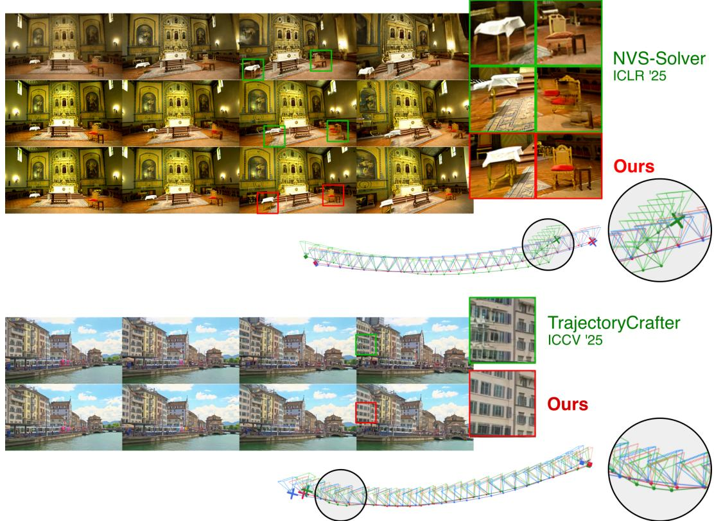  
Figure 1. Our method improves camera controlled video generation. We show a top-down view of the estimated camera trajectories from the videos generated with our method, its baselines and the Ground-truth. We show improvement over TrajectoryCrafter [82], and NVS Solver[78] using both SVD (top) [7] and CogVideo (Bottom) [33] backbones

## 1. Abstract

We present PartiCam, a training-free Particle filtering rooted method for improved Camera controlled video generation. Generating videos that follow a precisely specified camera trajectory remains challenging for large video diffusion models. Training-free approaches are backboneagnostic and avoid the need to construct large cameraannotated datasets by steering pretrained models toward the desired camera motion at test time. This enables the generation of camera-controlled video data that can subsequently be used to train camera-conditioned video diffusion models. Existing sampling-based guidance approaches often suffer from unstable trajectories: they either explore too broadly and fail to respect the target camera motion or collapse early and lose visual diversity over time. We introduce a global–local refinement framework for diffusion reward guidance, enabling accurate and consistent camera control during video generation. Our method builds on Sequential Monte-Carlo (SMC) guidance, but introduces a local refinement stage based on particle filtered resampling. Experiments show large improvements in camera trajectory adherence, reduced drift, and better visual quality, without

requiring model retraining.

## 2. Introduction

Recent advances in multimodal generation via diffusion and flow models have revolutionized creative fields, giving rise to video generation models [11, 18, 53, 55, 83] of impressive quality alongside emerging zero-shot generalization capabilities [68]. Yet these models often lack finegrained control mechanisms. Building generation models that are action-conditioned, causally and physically controllable, and 3D-grounded represents a key step toward the vision of comprehensive world models. Open-source latent video models such as SVD [7], CogVideo [33, 75], Wan [67], and Hunyuan [41], etc. provide a practical and manageable testbed for developing ideas that can scale to larger models and broader modalities.

Among the most important axes of control in visual data is camera viewpoint, which accounts for a dominant source of variation in images and videos and arguably offers the most intuitive form of control for these modalities. The task of camera trajectory control in video generation from a single reference image, sparse views, or a few frames of a dynamic scene is closely analogous to few-shot novel view synthesis [37, 48]: the video model serves as a spatiotemporal prior that enables educated completion of unobserved viewpoints. The notorious difficulty of these tasks in classical computer vision and graphics underscores their inherent challenges, chief among them ensuring 3D and 4D scene consistency alongside photorealistic inpainting of occluded regions. Camera control can be achieved by training conditional models from scratch or via adapter like finetuning [29, 82]. However, the scarcity of large-scale paired supervision, prohibitive computational training costs, and out-of-distribution (OOD) generalization failures on challenging geometries or novel camera trajectories can make such approaches expensive or suboptimal. A further, more practical concern is obsolescence: open-source latent video models are evolving rapidly, and a control module finetuned for one backbone is bound to that backbone’s architecture, latent space, and conditioning interface, so it risks being superseded before it is widely adopted. Training-free methods, by contrast, are largely backbone-agnostic and inherit the improvements of each new generation of base models at no additional training cost.

This motivates training-free, test-time alternatives, which have become an increasingly active direction. Beyond their immediate utility, we argue that such methods are also a prerequisite for the training-based approaches they appear to compete with: a reliable test-time procedure is a generator of paired camera-annotated video data, whose samples can be distilled back into model weights. This mirrors the trajectory of LLM post-training, where sampling from a model and fine-tuning on the verified subset, i.e. rejection sampling fine-tuning [60, 84, 85], converts an expensive inference-time procedure into cheap model capability, and where the filter proved far easier to construct than the generator.

One of the established approaches to training-free camera control is score modulation (e.g. [78]): at each denoising step, the score function is adjusted using warped input views as scene priors, steering the latent trajectory toward the target camera pose. We build on this formulation without loss of generality as our underlying control mechanism. Despite its effectiveness, score modulation operates over a single denoising trajectory. Errors made early in sampling, when an unlucky noise realization places the model on a poor generative path, compound through subsequent steps and become increasingly difficult to correct, leading to persistent camera drift even as the number of inference steps increases.

One natural remedy is to introduce stochastic restarts [73] during sampling: by re-injecting forward-diffusion noise into an intermediate latent and re-denoising, the model is given an opportunity to escape poor generative trajectories and recover camera consistency. However, unrestricted restarts are unstable in practice and can severely degrade generation quality by discarding useful structure accumulated during denoising. To stabilize restarts, we propose equipping them with reward-guided resampling: at each restart, we draw N perturbed candidate continuations via noising-denoising, score each against a camera alignment reward, and retain the best according to these scores. Our formulation can support both differentiable and nondifferentiable reward functions, enabling flexible integration of arbitrary camera consistency or visual quality metrics. This local procedure, which we term PF-Restart, substantially improves trajectory coherence. Yet because it operates independently for each candidate, it provides no mechanism to leverage a broader population of trajectories for global exploration, and is therefore still susceptible to collective drift when all candidates enter a similarly poor region of latent space.

We address this by embedding local PF-Restart within a global Sequential Monte Carlo (SMC) framework. Rather than steering a single trajectory, our method maintains a population of K candidate video trajectories (i.e. particles) which are jointly propagated through the denoising process and globally reweighted and resampled according to how well they satisfy the target camera trajectory and desired visual properties. High-reward particles are preferentially retained and diversified via local PF-Restart restarts, whereas low-reward ones are discarded, giving the sampler a principled mechanism to continuously reallocate compute toward geometrically coherent and visually appealing trajectories. This combination of global population filtering and local reward-guided refinement empirically mitigates early drift, avoids collapse into low-quality or geometrically inconsistent solutions, and preserves sample diversity – limitations that plague both score modulation and unrestricted restart strategies individually. Importantly, our method is not limited to the training-free setting: it can be applied on top of trained camera control baselines (e.g. [29, 82]), mitigating some of their OOD generalization failures on challenging geometries or out-of-distribution trajectories.

We validate our approach through quantitative and qualitative evaluation on video reshooting from images and videos for static and dynamic scenes, following the experimental protocol of NVSSolver [78]. Our method achieves state-of-the-art performance across these benchmarks, yielding superior visual results and stronger consistency with the desired camera trajectory, with improvements over both popular training-free [78] and trainingbased [82] methods.

In summary, our contributions are:

• A training-free strategy for enhanced camera control in video model generation via reward-guidance combining global SMC trajectory exploration with local particle filtering steered restarts (PF-Restart).

• Analysis of reward functions that benefit the task of camera control in this context.

• Demonstrated improvements over both training-free and training-based camera control state-of-the-art methods, hedging against score modulation drift and OOD generalization limits respectively.

• State-of-the-art performance on video re-shooting benchmarks across single-image and monocular video settings.

## 3. Related Work

Controllable Diffusion Models. Denoising diffusion probabilistic models [32] and efficient samplers such as DDIM [58] and DPM-Solver [45] have become the dominant generative paradigm for images and video, with latent diffusion models [57] enabling scalable highresolution synthesis. Training-based controlled generation paradigms including ControlNet [87], IP-Adapter [76], T2I-Adapter [50], and classifier-free guidance [31] require paired training data and considerable computational resources. In contrast, training-free Guidance enable control without parameter update and with fractional cost. Inference-time steering of diffusion models generally falls into three categories: noise/attention manipulation, gradient-based guidance, and particle filtering. Attentionbased methods (e.g. [1, 30, 34, 42, 49]) are effective for image and video editing but difficult to adapt to complex geometric 3D constraints. Gradient-based methods (e.g. [5, 16, 80? ]) utilize auxiliary energy functions to steer the denoising process. DPS [15], for instance injects differentiable likelihoods directly into the reverse process. However, computing gradients through a video diffusion model at every step is computationally expensive and prone to high variance. Our method belongs to the third category, using reward-weighted Sequential Monte Carlo (SMC) to steer the generation without requiring expensive gradient backpropagation.

Stochastic Sampling and Restart Mechanisms. Song et al. [59] establish predictor-corrector samplers under the SDE framework, showing that mid-trajectory Langevin corrections reduce deviation from the data manifold. CCDF [14] enforces conditioning via partial forward– reverse noise cycles, and MCG [13] projects corrector steps onto the data manifold. RePaint [47] alternates noising and denoising to harmonize inpainted regions with their surroundings; Restart [73] periodically re-injects noise to escape low-quality basins; ZigZag [4] parameterises the schedule as learnable forward–backward passes. All act as local annealing but lack principled weighting across candidates. Our PF-Restart component formalises this as particle filtering with reward-weighted resampling at each selected timestep, turning ad hoc noise injection into a principled selection procedure.

Inference-Time Alignment and Sequential Monte Carlo. A growing body of work frames conditional diffusion as reward alignment via Sequential Monte Carlo (SMC) [19, 22], motivated by the shift toward post-training optimisation [62]. Tweedie’s formula [23] enables reward evaluation throughout the denoising chain without model updates. TDS [70] constructs twisted proposals targeting a reward-weighted posterior; Dou and Song [21] connect DPS to exact Kalman filtering. Kim et al. [39] combine SMC with adaptive resampling to avoid reward overoptimisation, and Kim et al. [38] scale inference-time compute for flow models. Ψ-Sampler [77] shows that Gaussian prior initialisation wastes particle diversity in lowreward regions, and proposes pCNL as a dimension-robust, gradient-informed MCMC sampler to draw initial particles from the reward-aware posterior, yielding consistent gains on layout, counting, and aesthetic tasks. SMC has also been applied to protein design [61] and language decoding [51]. Training-based aligners such as DPOK [25], DDPO [6], and RAFT [20] require parameter updates and are orthogonal to our approach. Our global SMC stage builds on TDS weighting and shares Ψ-Sampler’s motivation of targeting rewardrelevant regions early in the chain, extended to the video latent space for camera trajectory alignment.

Camera-Controlled Generation. Stand-alone models like NeRF [48] and 3DGS [37] can learn scene-specific 3D representations renderable from any viewpoint given calibrated multi-view images. Dynamic versions can render dynamic scenes [46, 54, 56, 69] by modeling typically a canonical 3D and deformation fields jointly. Data and regularization priors result in versions that are less likely to break under sparse input views [9, 10, 12, 52, 72, 74, 79]. However, reconstruction-based approaches are limited to observed geometry and struggle with large viewpoint extrapolation or disocclusions. Some of these limitations can be mitigated with hybrid methods distilling image or video diffusion priors into explicit 3D representations [2, 44, 64]. Feed-forward multi-view diffusion models synthesize new viewpoints from one or few images [8, 24, 27, 43, 63]. While requiring costly multi-view training data, many remain restricted to static or short-baseline settings with limited temporal consistency.

## 4. Method

We propose a probabilistic control framework for diffusionbased video generation models, designed to steer the generation process toward a desired camera trajectory. Our method operates in the latent space of the diffusion model, maintaining and refining a population of stochastic trajectories. The procedure combines a global Sequential Monte Carlo (SMC) component for trajectory exploration and a local refinement component that merges particle filtering with Restarts [4, 47, 73].

## 4.1. Problem Setting

Let $\mathcal { D } _ { \theta }$ denote a video diffusion model with parameters $\theta ,$ which defines a stochastic generative process over a sequence of latent states along the sampling trajectory $\mathbf { z } _ { 0 : T } =$ $\bf \Gamma  ( \bf { z } _ { 0 } , \ldots , \bf { z } _ { \it T } )$

$$
p _ { \boldsymbol { \theta } } \big ( \mathbf { z } _ { 0 : T } \big ) = p ( \mathbf { z } _ { T } ) \prod _ { t = 0 } ^ { T - 1 } p _ { \boldsymbol { \theta } } \big ( \mathbf { z } _ { t } \mid \mathbf { z } _ { t + 1 } \big ) ,
$$

and the generated video is decoded from the latent $\mathbf { z } _ { 0 }$ as $\mathbf { x } _ { 0 } = \mathcal { G } _ { \theta } ( \mathbf { z } _ { 0 } )$

We aim to sample trajectories that follow a target camera path and exhibit desired properties such as background consistency, motion smoothness, high aesthetic quality, quantified by reward functions

$$
R ( \mathbf { z } _ { t } ) = \sum _ { i = 1 } \alpha _ { i } R _ { i } ( \mathbf { x } _ { t } ) ,
$$

where each $R _ { i }$ is a user-defined reward measuring align ment between the generated views and the intended camera trajectory or motion constraints, weighted by $\alpha _ { i }$

## 4.2. Preliminaries: Score Modulation for Camera Control

To control video diffusion models at inference time, we adopt score modulation via a latent transformation that adjusts the current latent $\mathbf { z } _ { t }$ based on the input view and the target camera pose. Methods such as NVS-Solver [78] apply this principle by warping the conditioning image to the target viewpoint and injecting the warped features into the denoising update. Throughout the paper, we follow this formulation and treat the score of $\mathcal { D } _ { \theta }$ as the modulated score. Please refer to [78] for exhaustive details.

A fundamental limitation of Score Modulation methods is that errors made early in sampling compound and become difficult to correct later, even when increasing the number of inference steps. When the early noise realization places sampling on a poor generative trajectory, the model often remains trapped there, resulting in camera drift confirmed by high ATE scores in our experiments (see Table 2). One way to mitigate this problem efficiently is to introduce stochastic perturbations in the form of Restarts [73] during sampling to recover correct camera trajectories by escaping such failure modes. Yet, in practice, unrestricted restarts are unstable and can degrade generation quality. To stabilize this mechanism, we propose to incorporate inference-time alignment [62] and convert the stochastic exploration into a structured filtering procedure.

We employ Sequential Monte Carlo (SMC) as an inference-time guidance mechanism. SMC naturally filters trajectory candidates by assigning each particle an importance weight derived from the reward and resampling the population so that high-reward trajectories, $i . e .$ those consistent with the target camera motion and desired visual quality, are preferentially retained. This filtering is applied globally across a population of particles throughout the diffusion process, allowing the sampler to continuously steer generation toward trajectories that remain both geometrically coherent and visually appealing. In parallel, each particle undergoes a local restart procedure: from its latent state $\mathbf { z } _ { t } .$ , we draw $N _ { r }$ perturbations by injecting forward-diffusion noise and then denoise each one back to time t. These proposals constitute a local candidate set on which we again apply reward-weighted resampling during the backward update. The combination of global population filtering and local restart-based refinement mitigates early drift, avoids collapse into low-quality or geometrically inconsistent trajectories, and yields temporally stable video samples that follow the prescribed motion while maintaining high aesthetic fidelity.

## 4.3. Global Trajectory Exploration via SMC

We aim to sample trajectories from a reward-weighted diffusion path distribution [22, 70]. :

$$
p ( \mathbf { z } _ { 0 : T } \mid R ) \propto p _ { \theta } ( \mathbf { z } _ { 0 : T } ) \exp \bigl ( \beta R ( \mathbf { x } _ { 0 } ) \bigr ) ,\tag{1}
$$

where $\mathbf { z } _ { \mathrm { 0 : } T }$ denotes the latent diffusion trajectory, $p _ { \theta } ( \mathbf { z } _ { 0 : T } )$ is the diffusion prior induced by the reverse process, and $R ( \mathbf { x } _ { 0 } )$ is an aesthetic reward evaluated on the decoded video $\mathbf { x } _ { \mathrm { 0 } }$

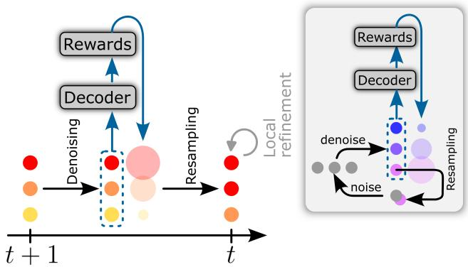  
Figure 2. One denoising step with Global SMC.

To approximate this distribution we employ a Sequential Monte Carlo sampler with K particles:

$$
\{ ( \mathbf { z } _ { t } ^ { ( k ) } , w _ { t } ^ { ( k ) } ) \} _ { k = 1 } ^ { K } ,
$$

which represents a weighted approximation of the intermediate target distributions.

Sequential target distributions. Following the SMC framework, we define a sequence of intermediate targets:

$$
\gamma _ { t } ( \mathbf { z } _ { t : T } ) \propto p _ { \theta } ( \mathbf { z } _ { t : T } ) \psi _ { t } ( \mathbf { z } _ { t } ) ,\tag{2}
$$

where $\psi _ { t } ( \mathbf { z } _ { t } )$ is a twisting potential representing the expected future reward conditioned on the current latent state:

$$
\psi _ { t } ( \mathbf { z } _ { t } ) = \mathbb { E } [ \exp ( \beta R ( \mathbf { x } _ { 0 } ) ) \mid \mathbf { z } _ { t } ] .\tag{3}
$$

In practice we approximate this potential by exp $\left( \beta R _ { t } ( { \bf x } _ { t } ) \right)$ , where $\mathbf { x } _ { t }$ is decoded from the Tweedie estimate $\hat { \mathbf { z } } _ { 0 } ( \mathbf { z } _ { t } )$

Propagation. At each diffusion timestep particles are propagated using the reverse diffusion transition:

$$
\mathbf { z } _ { t - 1 } ^ { ( k ) } \sim p _ { \boldsymbol \theta } ( \mathbf { z } _ { t - 1 } \mid \mathbf { z } _ { t } ^ { ( k ) } ) ,\tag{4}
$$

which corresponds to one denoising update of the diffusion model.

Weight update. Particle weights are updated using the incremental SMC importance weight:

$$
\tilde { w } _ { t - 1 } ^ { ( k ) } = w _ { t } ^ { ( k ) } \frac { \psi _ { t - 1 } ( \mathbf { z } _ { t - 1 } ^ { ( k ) } ) } { \psi _ { t } ( \mathbf { z } _ { t } ^ { ( k ) } ) } .\tag{5}
$$

Because we propose from the reverse transition itself, $q _ { t } = p _ { \theta } ( \mathbf { z } _ { t - 1 } \mid \mathbf { z } _ { t } )$ , the prior and proposal densities cancel in the twisted incremental weight, leaving only the ratio

of consecutive potentials. Using the practical reward approximation, this reduces to the following

$$
\tilde { w } _ { t - 1 } ^ { ( k ) } = w _ { t } ^ { ( k ) } \exp \Bigl ( \beta R _ { t - 1 } ( \mathbf { x } _ { t - 1 } ^ { ( k ) } ) - \beta R _ { t } ( \mathbf { x } _ { t } ^ { ( k ) } ) \Bigr ) .\tag{6}
$$

Weights are normalized accordingly:

$$
w _ { t - 1 } ^ { ( k ) } = \frac { \tilde { w } _ { t - 1 } ^ { ( k ) } } { \sum _ { j } \tilde { w } _ { t - 1 } ^ { ( j ) } } .\tag{7}
$$

Resampling. To avoid particle degeneracy we perform resampling whenever the effective sample size is below a predefined threshold. Particles are then resampled according to their normalized weights. This global SMC filtering step is applied every $n _ { s m c }$ iterations to continuously bias the trajectory population toward high-reward regions while maintaining stochastic diversity across particles.

## 4.4. Local Refinement via Guided Restarts

To further improve local exploration around each trajectory we introduce a refinement step inspired by Restarts [17, 47, 73] and particle filtering.

At selected timesteps ${ \mathcal { T } } _ { \mathrm { r e f } } \ \subseteq \ \{ 1 , \ldots , T \}$ , each particle spawns $N _ { r }$ candidate latents via a short noising–denoising cycle:

$$
\tilde { \mathbf { z } } _ { t } ^ { ( k , n ) } = \mathrm { D e n o i s e } \big ( \mathrm { N o i s e } ( \mathbf { z } _ { t } ^ { ( k ) } , \sigma _ { t + 1 } ) \big ) , \qquad n = 1 , \dots , N _ { r } .\tag{8}
$$

This one step restart results in a diverse set of candidates that form a local proposal distribution around the current particle state.

Local evaluation. Each proposal is scored using the reward $\tilde { w } _ { t } ^ { ( k , n ) } \propto \exp \bigl ( \beta R _ { t } ( \tilde { \mathbf { x } } _ { t } ^ { ( k , n ) } ) \bigr )$ , where $\tilde { \mathbf { x } } _ { t } ^ { ( k , n ) }$ denotes the decoded frame corresponding to $\tilde { \mathbf { z } } _ { t } ^ { ( k , n ) }$ . The weights are normalized within each particle’s proposal set $r _ { t } ^ { ( k , n ) } =$ $\frac { \tilde { w } _ { t } ^ { ( k , n ) } } { \sum _ { m = 1 } ^ { N _ { r } } } \tilde { w } _ { t } ^ { ( k , m ) }$

Local resampling. A refined latent state is finally selected as follows:

$$
\mathbf { z } _ { t } ^ { ( k ) } \gets \tilde { \mathbf { z } } _ { t } ^ { ( k , n ^ { * } ) } , \quad n ^ { * } \sim \mathrm { C a t } ( r _ { t } ^ { ( k , 1 ) } , \dots , r _ { t } ^ { ( k , N _ { r } } ) ) .\tag{9}
$$

This allows to locally explore the latent neighborhood while preserving high-rewards.

Since the noising–denoising cycle approximately preserves the diffusion marginal at t [47, 73], resampling the candidates $\tilde { \mathbf { z } } _ { t } ^ { ( k , n ) }$ according to $r _ { t } ^ { ( k , n ) }$ leaves the particle approximately distributed as $p _ { \theta } ( \cdot \mid \mathbf { z } _ { t + 1 } ^ { ( k ) } ) \psi _ { t } ( \cdot )$ , i.e. the twisted proposal, at $t \in \tau _ { \mathrm { r e f } }$ . Refinement thus concentrates proposals in high-reward regions, flattening the incremental weights of Eq. (6) and reducing particle degeneracy at fixed K. We keep the weight update unchanged, so that w(k)t only reflects the selected candidate and not the quality of the local candidate set it was drawn from [26].

For more clarity, we provide an overall algorithm description in the supplementary material.

## 5. Implementation Details

Our method consists of two complementary components: a local refinement module (PF-Restart) and a global exploration module based on Sequential Monte Carlo (SMC). The local refinement step corrects camera trajectories through restart operations combined with reward-guided resampling, while the global component maintains a set of reward-weighted trajectories that are periodically resampled to preserve diversity.

For local refinement, we use the camera reward, as this stage is specifically designed to correct the camera trajectory. In contrast, the global SMC exploration relies on the aesthetic reward. As shown in our ablations, this separation provides a favorable trade-off between aesthetic quality and camera accuracy.

In practice, we use $N _ { r } = 2$ local candidates and $K = 2$ global particles, and run the diffusion model for 100 iterations. To ensure reliable reward estimates, both local and global refinement are activated starting at iteration 8. Local refinement is applied until iteration 32, while global SMC continues until iteration 40. Both global and local updates are performed every 4 iterations. The local refinement step is repeated 4 times at each iteration.

These design choices allow us to maintain the overall inference time below that of NVS-SOLVER while preserving both trajectory accuracy and visual quality.

## 6. Experiments

Datasets We evaluate our method on both static and dynamic scenes following the experimental setting introduced by NVS-Solver[78]. The static scenes consist of six scenes from Tanks and Temples dataset [40] and three additional scenes selected by [78] to cover both outdoor and indoor environments. On the other hand dynamic scenes consist of nine monocular videos capturing both urban and natural settings.

Metrics We evaluate our approach in terms of camera accuracy and visual quality. For camera accuracy, we use Particle-SFM [88] to estimate the camera trajectory of the generated videos and compute relative translation (RPE-T) and rotation (RPE-R) errors [28] as well as absolute trajectory error (ATE) [28]. We used FID to evaluate for visual quality of our results.

Baselines We compare to state-of-the-art methods including reconstruction ones SparseGS [72], Text2NeRF [86], Def-Gaussian [46], 4DGS [69], in addition to feedforward methods Photo-NVS [81], 3D-aware [71], MotionCtrl [66], NVS-Solver [78], TrajectoryCrafter [82]. Unless stated differently, our method represents our guidance applied to NVS-Solver [78] with Cogvideo [33] backbone at inference time. Additional results can be found in the supplementary material.

Table 1. Quantitative comparison of different methods on NVS from single image of static scenes. For all metrics, the lower, the better.
<table><tr><td>Methods</td><td>Overfitting</td><td>FID</td><td>ATE</td><td>RPE-T</td><td>RPE-R</td></tr><tr><td>SparseGS [72]</td><td>√</td><td>369.19</td><td></td><td></td><td></td></tr><tr><td>Text2NeRF [86]</td><td>√</td><td>187.05</td><td>2.223</td><td>0.718</td><td>0.107</td></tr><tr><td>Photo-NVS [81]</td><td>X</td><td>193.87</td><td>7.64</td><td>1.19</td><td>1.45</td></tr><tr><td>3D-aware [71]</td><td>X</td><td>217.19</td><td>2.836</td><td>1.258</td><td>1.662</td></tr><tr><td>MotionCtrl [66]</td><td>X</td><td>179.24</td><td>3.851</td><td>0.705</td><td>0.835</td></tr><tr><td>NVS-S (DGS) [78]</td><td>×</td><td>166.50</td><td>4.533</td><td>0.810</td><td>0.742</td></tr><tr><td>NVS-S (Post) [78]</td><td>X</td><td>165.12</td><td>0.767</td><td>0.156</td><td>0.170</td></tr><tr><td>Ours</td><td>X</td><td>121.56</td><td>0.526</td><td>0.122</td><td>0.144</td></tr></table>

We evaluate the camera control in static scenes by generating novel-views from single image following prescribed camera trajectories. A quantitative comparison is presented in Table 1, while Figure 3 offers a visual comparison to state-of-the-art methods. Our approach, based on reward guidance outperforms other methods in terms of camera accuracy as well as in visual quality. For camera accuracy, our method is significantly better at preserving the global trajectories, as evidenced by ATE errors compared to NVS-Solver. In terms of visual quality, our method is able to generate better structures in the occluded regions, as reflected by the FID results.

Figure 1 shows an additional visual comparison in this setting. We illustrate cases where our strategy can improve on top of a training-free method (NVS-Solver), as well as a state-of-the-art training-based method (TrajectoryCrafter) as backbone, both in synthesis quality and input camera trajectory adherence.

## 6.1. Camera Control in Dynamic Scenes

We evaluate camera control on dynamic scenes using monocular videos as input while enforcing prescribed camera trajectories. Quantitative results are reported in Table 2, and qualitative comparisons are shown in Figure 4.

Our reward-guided sampling strategy consistently improves camera accuracy compared to existing approaches. In particular, methods such as NVS-Solver (training-free) and MotionCtrl (training-based) often struggle to follow the target trajectory in the presence of scene dynamics and occlusions. In contrast, our method achieves substantially lower Absolute Trajectory Error (ATE), as well as lower relative pose errors (RPE-T and RPE-R), indicating more accurate and faithful recovery of the desired camera motion.

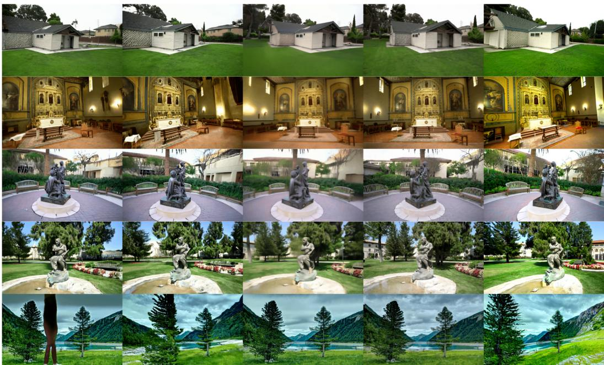  
Figure 3. Qualitative comparison of different methods on NVS from single image of static scenes. We compare to methods NVS Solver [78], NVS-Solver DGS [78], MotionCtrl [66], Text2NeRF [86].

Table 2. Quantitative comparison of different methods on NVS from monocular videos of dynamic scenes. For all metrics, the lower, the better.
<table><tr><td>Methods</td><td>Overfitting</td><td>FID</td><td>ATE RPE-T</td><td>RPE-R</td></tr><tr><td>Def-Gaussian [46]</td><td>V</td><td>115.82 1.813</td><td>0.678</td><td>0.613</td></tr><tr><td>4DGS [69]</td><td>√</td><td>74.34 2.087</td><td>0.625</td><td>0.825</td></tr><tr><td>3D-aware [71]</td><td>×</td><td>159.03 3.100</td><td>1.343</td><td>1.368</td></tr><tr><td>MotionCtrl [66]</td><td>X</td><td>70.35 3.384</td><td>1.069</td><td>0.653</td></tr><tr><td>NVS-S (DGS) [78]</td><td>×</td><td>37.973 2.236</td><td>0.691</td><td>0.446</td></tr><tr><td>NVS-S (Post) [78]</td><td>×</td><td>39.86 2.308</td><td>0.725</td><td>0.400</td></tr><tr><td>Ours</td><td>×</td><td>31.86 0.807</td><td>0.061</td><td>0.414</td></tr></table>

Beyond trajectory accuracy, our approach also improves the visual quality of the generated videos. By exploring multiple candidate trajectories during sampling and reallocating computation toward high-reward solutions, the method better handles disocclusions and dynamic regions. As a result, the generated videos exhibit sharper structures, more consistent geometry, and fewer motion artifacts, leading to more realistic and temporally coherent renderings.

## 6.2. Ablation Studies

We conduct an ablative analysis on the static scenes from the NVS-Solver benchmark [78] using right-sweep trajectories, evaluating each component of our method using ATE, RPE-T, RPE-R, and FID. Results are summarised in Figure 5.

Table 3. Ablation study of our method with respect to the choice of the backbone video model for NVS from monocular videos of dynamic scenes. For all metrics, the lower, the better.
<table><tr><td>Methods</td><td>FID ATE RPE-T</td><td>RPE-R</td></tr><tr><td>NVS-S (CogVideo) [78]</td><td>41.08 0.981 0.128</td><td>0.431</td></tr><tr><td>Ours (CogVideo)</td><td>31.86 0.807 0.061</td><td>0.414</td></tr><tr><td>NVS-S (SVD) [78]</td><td>39.86 2.308 0.725</td><td>0.400</td></tr><tr><td>Ours (SVD)</td><td>38.26 1.912 0.521</td><td>0.489</td></tr><tr><td>TrajectoryCrafter [82]</td><td>29.86 0.767 0.095</td><td>0.460</td></tr><tr><td>Ours (TrajectoryCrafter)</td><td>30.01 0.712 0.070</td><td>0.428</td></tr></table>

Effect of restart sampling Starting from the NVS-Solver baseline (ATE: 1.56, RPE-T: 0.52, RPE-R: 0.27, FID: 133.96), introducing a simple restart without reward guidance already yields meaningful improvements across all metrics (ATE: 1.09, RPE-T: 0.27, RPE-R: 0.24, FID: 117.07). However, as evidenced by the wide interquartile ranges in Figure 5, plain restart suffers from high variance across scenes: while some scenes benefit substantially, others show little or no improvement. This indicates that without any reward signal to guide resampling, noise injection makes the generation process unstable.

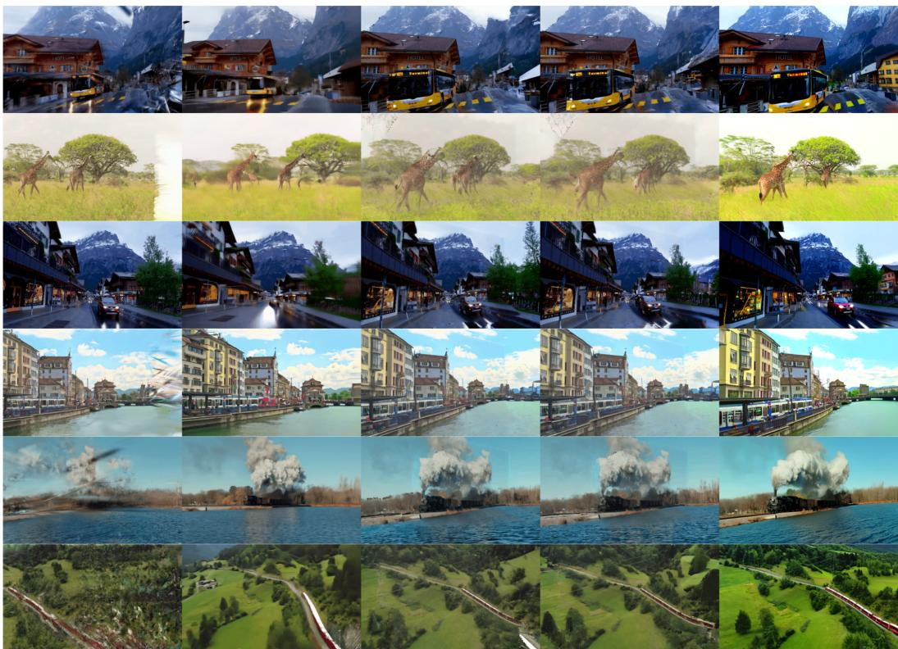  
Figure 4. Qualitative comparison of different methods on NVS from monocular videos of dynamic scenes. We compare to methods 4DGS [69], MotionCtrl [66], NVS-Solver [78], NVS-Solver DGS [78].

Effect of reward-guided local refinement (PF-Restart) Incorporating reward-guided resampling into the restart procedure (PF-Restart) significantly tightens this variance while further improving trajectory accuracy. With $N _ { r } = 2$ local candidates, PF-Restart reduces ATE to 0.76 and RPE T to 0.17 . Increasing to $N _ { r } = 4$ pushes these to 0.54 and 0.14 respectively, while maintaining FID at 114.15 in both settings. Compared to unguided restart, the reward-guided resampling yields a notably more compact distribution of per-scene errors, confirming that reward alignment stabilizes the local search.

Effect of global SMC exploration Global Sequential Monte Carlo sampling alone (K=4) reduces ATE to 1.03 and RPE-R to 0.19, but fails to achieve satisfactory performance on translation accuracy (RPE-T: 0.31 ) and actually degrades FID relative to NVS-Solver (135.84 vs. 133.96). This counterintuitive finding highlights a fundamental limitation of population-level exploration without local correction: while global diversity prevents early collapse into poor basins, it does not provide the fine-grained per-particle guidance needed to correct individual trajectory errors. This result confirms that global SMC alone is insufficient.

Complementarity of global and local components Combining global SMC with local PF-Restart, our full method achieves the best overall performance and validates the complementarity of the two mechanisms. With $K = 2$ and $N _ { r } ~ = ~ 2$ , using the aesthetic reward for global exploration and the camera reward for local refinement, the joint method reaches RPE-T: 0.09 , RPE-R: 0.09, ATE: 0.37, and FID: 103.82, which is a 6× reduction in translation error and 4× reduction in ATE relative to NVS-Solver, while simultaneously improving visual quality. Increasing N to 4 does not monotonically help: ATE slightly degrades from 0.37 to 0.46 and RPE-R worsens from $0 . 0 9 ^ { \circ }$ to 0.14°, suggesting that local restarting with more particle budget can undermine global trajectory consistency when the control signal is not strong enough. The sweet spot in our setting is $K = 2 , N _ { r } = 2$

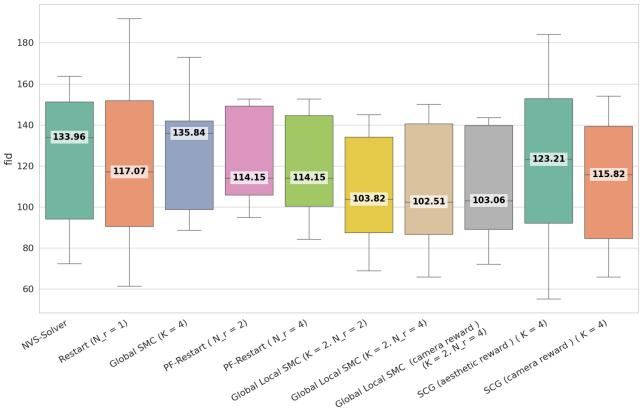  
(a) FID

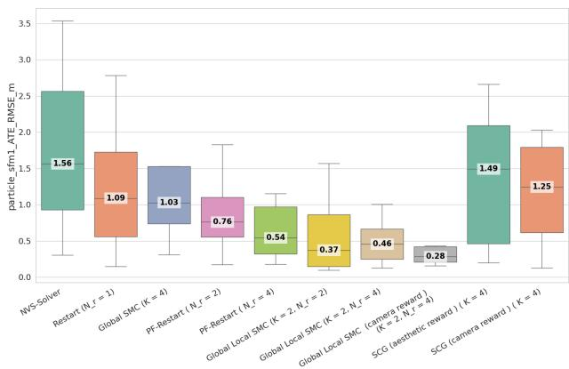  
(b) ATE

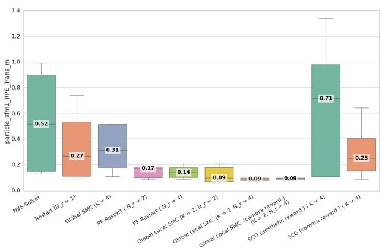  
(c) RPE Translation

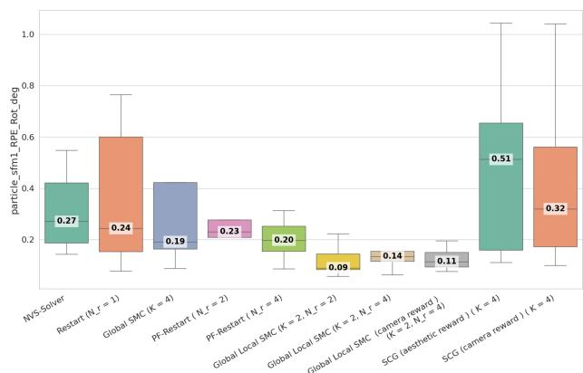  
(d) RPE Rotation  
Figure 5. Ablation results of our method on Static Scenes. We use Aesthetic reward for Global SMC and Camera reward for loca refinement. The number of local candidates is denoted as Nr while the number of global particles is referred to as K.

Effect of reward design A crucial choice for our method is the choice of the reward function we use to guide the sampling. We experimented in the paper with camera error using VGGT [65] to estimate trajectories in addition to aesthetic reward used in [36]. In our default configuration, the global stage uses the aesthetic reward to preserve visual diversity across particles, while the local stage uses the camera reward to correct geometric drift. We additionally evaluate a variant where the camera reward drives both stages $( \ K = 2 , N _ { r } = 4 )$ . Replacing the aesthetic reward with the camera reward in the global SMC yields the best absolute ATE of 0.28: a further 24% improvement over the aesthetic-global variant at the same $N _ { r }$ and also improves RPE-R from 0.14 to 0.11 relative to the aesthetic variant. This comes at a minor cost in visual quality (FID: 103.06 vs. 102.51) and a slight regression in RPE-R relative to the $K = 2 , N _ { r } = 2$ default (0.11 vs. 0.09). These results reveal a clear trade-off: using the camera reward globally sharpens trajectory adherence but reduces the diversity of particle proposals. The default separation with aesthetic reward globally and camera reward locally provides a good balance between geometric accuracy and visual quality, and is the configuration adopted throughout our main experiments. Similarly, we can see that for SCG using the camera reward significantly improves the camera metrics (ATE: 1.49 vs 1.25). For PF-Restart, we noted that they both perform equally well for scenes without large occlusion as in this case the quality of the video is enough to guide the model to generate meaningful content in the occluded regions. However when the motion is ambiguous due to large occlusions, Camera reward shows significantly better results improving the Absolute Trajectory Error (ATE) from 1.00 to 0.71.

Comparison to other possible guidance methods These methods differ in how they estimate reward, how they sample candidate trajectories, and how they select the best samples. We seek a method that can quickly explore the space of diffusion trajectories and accurately select the best ones. TDS [70] and Ψ-Sampler [77] are the closest to our method but they require differentiating through the reward function and to backpropagate through the diffusion model which is impractical for reward functions like the camera reward and recent video diffusion models like Cog-Video or Wan. On the other hand, SCG [35] has the advantage of maintaining one global particle and sampling candidates using the reverse SDE which results in less diverse samples throughout the iterations. With aesthetic reward it performs the worst of all evaluated configurations on trajectory metrics (RPE-T: 0.71, ATE: 1.49), confirming that a non-geometric reward is insufficient to guide camera-accurate generation under this sampler. SCG with camera reward recovers partially (RPE-T: 0.25, ATE: 1.25) but still falls far behind our full method. Consequently, beyond the choice of the reward, our approach lies in the bi-level SMC framework itself: global exploration and local reward-guided refinement together achieve what neither component nor SCG can accomplish alone.

Backbone Our proposed method can be applied to any latent video diffusion model. Throughout the paper, we primarily used CogVideo [33]. To evaluate the generality of our approach, we perform an ablation study by applying our method to SVD [7] and TrajectoryCrafter [82].

As shown in Table 3, our method consistently improves upon NVS-Solver both in the cases where the video model backbone is SVD and CogVideo. This result highlights the effectiveness of our Camera Control strategy in mitigating the weaknesses of score modulation.

On the other hand, TrajectoryCrafter, which is a finetuned version of CogVideo specifically designed for camera control, already achieves very competitive performance even without additional guidance. Interestingly, when applying our method to TrajectoryCrafter, we observe further improvements in camera accuracy while maintaining comparable visual quality.

## 6.3. Mitigating limitations of TrajectoryCrafter[82]

Training based camera controlled video generation methods can display visual artefacts, inconsistencies and misalignment with the input camera trajectory, which can be framed as generalization issues. We show here examples where our method can help recover from such failures. We challenge the state-of-the-art training based method TrajectoryCrafter[82] with harder camera trajectories at test time, following the camera trajectory sampling in [78]. Figure 7 shows our inference-time improvement over this method using some of the demo videos of TrajectoryCrafter[82].

## 6.4. Mitigating limitations of ReCamMaster[3]

Training based method ReCamMaster[3] displays visual artifacts especially under challenging camera trajectories. Figure 6 shows our inference-time improvement over this method.

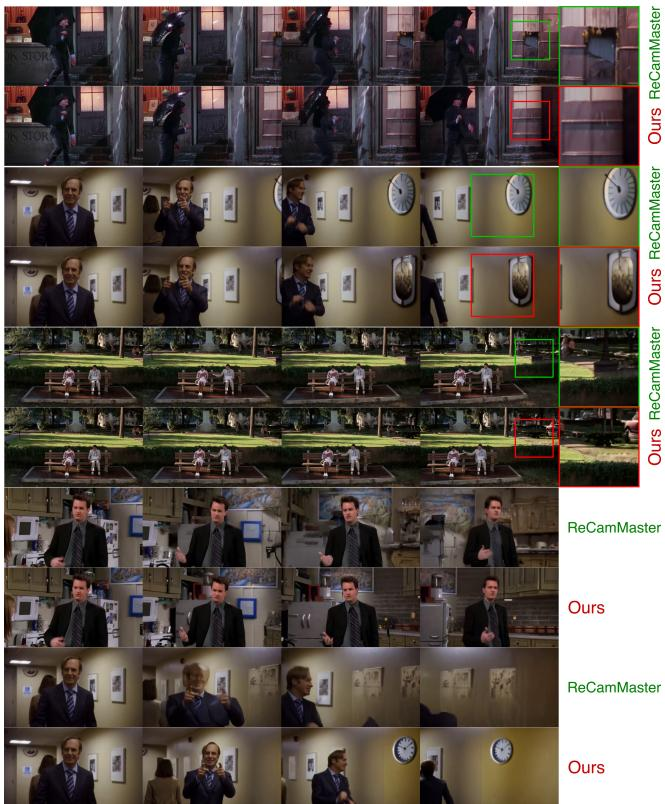  
Figure 6. Qualitative comparison in monocular video reshooting of dynamic scenes to ReCamMaster [3].

## 7. Limitations

Our method can require a larger denoising budget due to maintaining multiple candidate trajectories. Conversely, reward guidance can also accelerate convergence by steering sampling toward better solutions early. Overall, the approach represents a reasonable trade-off when generation quality and adherence to the control signal are prioritized. Additionally, the effectiveness of the framework depends on the design of the reward function, which may require taskspecific tuning.

## 8. Conclusion

We presented PartiCam, a training-free framework for improving camera trajectory control in diffusion-based video generation. Our approach combines global Sequential Monte Carlo (SMC) trajectory exploration with local particle-filtered restarts (PF–Restart), enabling rewardguided sampling that balances exploration and refinement during the denoising process. This formulation mitigates common failure modes of existing approaches, including early trajectory drift in score-modulated sampling and limited robustness to OOD camera motions. By maintaining a population of candidate trajectories and reallocating sampling effort toward high-reward solutions, our method produces videos that better adhere to the desired camera trajectory while maintaining visual quality and temporal coherence.

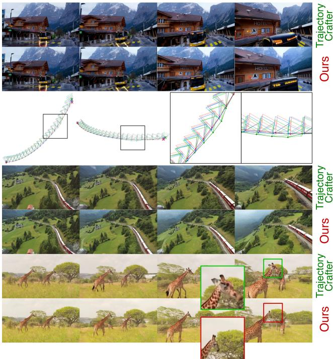  
Figure 7. Qualitative comparison in monocular video reshooting of dynamic scenes to TrajectoryCrafter [82]. We We show a two views of the estimated camera trajectories from the videos generated with our method, TrajectoryCrafter and the Ground-truth.

Beyond camera control, the proposed framework provides a general mechanism for reward-guided steering of diffusion processes without requiring gradient backpropagation or model retraining. We believe this populationbased inference strategy may extend naturally to other controlled generation tasks and forms a promising direction for future work.

## References

[1] Yuval Alaluf, Daniel Garibi, Or Patashnik, Hadar Averbuch-Elor, and Daniel Cohen-Or. Cross-image attention for zeroshot appearance transfer. In ACM SIGGRAPH 2024 conference papers, pages 1–12, 2024. 3

[2] Sherwin Bahmani, Tianchang Shen, Jiawei Ren, Jiahui Huang, Yifeng Jiang, Haithem Turki, Andrea Tagliasacchi, David B. Lindell, Zan Gojcic, Sanja Fidler, Huan Ling, Jun Gao, and Xuanchi Ren. Lyra: Generative 3d scene reconstruction via video diffusion model self-distillation. arXiv preprint arXiv:2509.19296, 2025. 4

[3] Jianhong Bai, Menghan Xia, Xiao Fu, Xintao Wang, Lianrui Mu, Jinwen Cao, Zuozhu Liu, Haoji Hu, Xiang Bai, Pengfei Wan, and Di Zhang. ReCamMaster: Camera-controlled generative rendering from a single video. In Proceedings of

the IEEE/CVF International Conference on Computer Vision (ICCV), 2025. Best Paper Finalist. 10

[4] Lichen Bai, Shitong Shao, Zikai Zhou, Zipeng Qi, Zhiqiang Xu, Haoyi Xiong, and Zeke Xie. Zigzag diffusion sampling: Diffusion models can self-improve via self-reflection, 2024. 3, 4

[5] Arpit Bansal, Hong-Min Chu, Avi Schwarzschild, Roni Sengupta, Micah Goldblum, Jonas Geiping, and Tom Goldstein. Universal guidance for diffusion models. In International Conference on Learning Representations (ICLR), 2024. 3

[6] Kevin Black, Michael Janner, Yilun Du, Ilya Kostrikov, and Sergey Levine. Training diffusion models with reinforcement learning. In International Conference on Learning Representations (ICLR), 2024. 3

[7] Andreas Blattmann, Tim Dockhorn, Sumith Kulal, Daniel Mendelevitch, Maciej Kilian, Dominik Lorenz, Yam Levi, Zion English, Vikram Voleti, Adam Letts, and Varun Jam pani. Stable video diffusion: Scaling latent video diffusion models to large datasets. arXiv preprint arXiv:2311.15127, 2023. 1, 2, 10

[8] Chenjie Cao, Chaohui Yu, Shang Liu, Fan Wang, Xiangyang Xue, and Yanwei Fu. Mvgenmaster: Scaling multi-view generation from any image via 3d priors enhanced diffusion model. In Proceedings of the IEEE/CVF Conference on Computer Vision and Pattern Recognition (CVPR), pages 6045–6056, 2025. 4

[9] David Charatan, Sizhe Lester Li, Andrea Tagliasacchi, and Vincent Sitzmann. pixelsplat: 3d gaussian splats from image pairs for scalable generalizable 3d reconstruction. In Proceedings of the IEEE/CVF Conference on Computer Vision and Pattern Recognition (CVPR), pages 19457–19467, 2024. 4

[10] Anpei Chen, Zexiang Xu, Fuqiang Zhao, Xiaoshuai Zhang, Fanbo Xiang, Jingyi Yu, and Hao Su. MVSNeRF: Fast Generalizable Radiance Field Reconstruction from Multi-View Stereo. In 2021 IEEE/CVF International Conference on Computer Vision (ICCV), pages 14104–14113. IEEE, 2021. 4

[11] Shoufa Chen, Chongjian Ge, Yuqi Zhang, et al. Goku: Flow based video generative foundation models. In Proceedings of the IEEE/CVF Conference on Computer Vision and Pattern Recognition (CVPR), pages 23516–23527, 2025. 2

[12] Yuedong Chen, Haofei Xu, Chuanxia Zheng, Bohan Zhuang, Marc Pollefeys, Andreas Geiger, Tat-Jen Cham, and Jianfe Cai. Mvsplat: Efficient 3d gaussian splatting from sparse multi-view images. In European conference on computer vision, pages 370–386. Springer, 2024. 4

[13] Hyungjin Chung, Byeongsu Sim, Dohoon Ryu, and Jong Chul Ye. Improving Diffusion Models for Inverse Problems Using Manifold Constraints. In Advances in Neu ral Information Processing Systems 35, pages 25683–25696. Neural Information Processing Systems Foundation, Inc. (NeurIPS), 2022. 3

[14] Hyungjin Chung, Byeongsu Sim, and Jong Chul Ye. Come-closer-diffuse-faster: Accelerating conditional diffu sion models for inverse problems through stochastic contrac tion. In Proceedings of the IEEE/CVF Conference on Com puter Vision and Pattern Recognition (CVPR), 2022. 3

[15] Hyungjin Chung, Jeongsol Kim, Michael T. McCann, Marc L. Klasky, and Jong Chul Ye. Diffusion posterior sampling for general noisy inverse problems. In Proceedings of the International Conference on Learning Representations (ICLR), 2023. 3

[16] Giannis Daras, Hyungjin Chung, Chieh-Hsin Lai, Yuki Mitsufuji, Jong Chul Ye, Peyman Milanfar, Alexandros G. Dimakis, and Mauricio Delbracio. A survey on diffusion models for inverse problems, 2024. 3

[17] Benjamin De Bruyne and Francesco Mori. Resetting in stochastic optimal control. Physical Review Research, 5(1): 013122, 2023. 5

[18] Google DeepMind. Veo 3: Video generation with native audio by google deepmind. https://deepmind. google/en/models/veo/, 2025. Accessed: 2025-11- 13. 2

[19] Pierre Del Moral, Arnaud Doucet, and Ajay Jasra. Sequential monte carlo samplers. Journal of the Royal Statistical Society Series B: Statistical Methodology, 68(3):411–436, 2006. 3

[20] Hanze Dong, Wei Xiong, Deepanshu Goyal, Rui Pan, Shizhe Diao, Jipeng Zhang, Kashun Shum, and Tong Zhang. RAFT: Reward ranked finetuning for generative foundation model alignment, 2023. 3

[21] Zehao Dou and Yang Song. Diffusion posterior sampling for linear inverse problem solving: A filtering perspective. In International Conference on Learning Representations (ICLR), 2024. 3

[22] Arnaud Doucet, Nando De Freitas, Neil James Gordon, et al. Sequential Monte Carlo Methods in Practice. Springer, 2001. 3, 4

[23] Bradley Efron. Tweedie’s formula and selection bias. Journal of the American Statistical Association, 106(496):1602– 1614, 2011. 3

[24] Noam Elata, Bahjat Kawar, Yaron Ostrovsky-Berman, Miriam Farber, and Ron Sokolovsky. Novel view synthesis with pixel-space diffusion models. In Proceedings of the IEEE/CVF Conference on Computer Vision and Pattern Recognition (CVPR), pages 26756–26766, 2025. 4

[25] Ying Fan, Olivia Watkins, Yuqing Du, Hao Liu, Moonkyung Ryu, Craig Boutilier, Pieter Abbeel, Mohammad Ghavamzadeh, Kangwook Lee, and Kimin Lee. DPOK: Reinforcement learning for fine-tuning text-to-image diffusion models. In Advances in Neural Information Processing Systems (NeurIPS), 2023. 3

[26] Paul Fearnhead, Omiros Papaspiliopoulos, and Gareth O. Roberts. Particle filters for partially observed diffusions. Journal ofthe Royal Statistical Society: Series B, 70(4):755– 777, 2008. 6

[27] Ruiqi Gao, Aleksander Hołynski, Philipp Henzler, Arthur´ Brussee, Ricardo Martin-Brualla, Pratul P. Srinivasan, Jonathan T. Barron, and Ben Poole. Cat3d: Create anything in 3d with multi-view diffusion models. Advances in Neural Information Processing Systems, 2024. 4

[28] Puneet Goel, Stergios I Roumeliotis, and Gaurav S Sukhatme. Robust localization using relative and absolute position estimates. In Proceedings 1999 IEEE/RSJ International Conference on Intelligent Robots and Systems. Human

and Environment Friendly Robots with High Intelligence and Emotional Quotients (Cat. No. 99CH36289), pages 1134– 1140. IEEE, 1999. 6

[29] Hao He, Yinghao Xu, Yuwei Guo, Gordon Wetzstein, Bo Dai, Hongsheng Li, and Ceyuan Yang. Cameractrl: Enabling camera control for text-to-video generation, 2024. 2, 3

[30] Amir Hertz, Ron Mokady, Jay Tenenbaum, Kfir Aberman, Yael Pritch, and Daniel Cohen-Or. Prompt-to-prompt image editing with cross attention control. In International Confer ence on Learning Representations (ICLR), 2023. 3

[31] Jonathan Ho and Tim Salimans. Classifier-free diffusion guidance. In NeurIPS Workshop on Deep Generative Models and Downstream Applications, 2021. 3

[32] Jonathan Ho, Ajay Jain, and Pieter Abbeel. Denoising diffusion probabilistic models. In Advances in Neural Informa tion Processing Systems (NeurIPS), 2020. 3

[33] Wenyi Hong, Ming Ding, Wendi Zheng, Xinghan Liu, and Jie Tang. Cogvideo: Large-scale pretraining for text-to-video generation via transformers. In Proceedings of the International Conference on Learning Representations (ICLR), 2023. 1, 2, 6, 10, 15

[34] Litao Hua, Fan Liu, Jie Su, Xingyu Miao, Zizhou Ouyang, Zeyu Wang, Runze Hu, Zhenyu Wen, Bing Zhai, Yang Long, et al. Attention in diffusion model: A survey. arXiv preprint arXiv:2504.03738, 2025. 3

[35] Yujia Huang, Adishree Ghatare, Yuanzhe Liu, Ziniu Hu, Qinsheng Zhang, Chandramouli S Sastry, Siddharth Guru rani, Sageev Oore, and Yisong Yue. Symbolic music gen eration with non-differentiable rule guided diffusion. arXiv preprint arXiv:2402.14285, 2024. 10

[36] Ziqi Huang, Yinan He, Jiashuo Yu, Fan Zhang, Chenyang Si, Yuming Jiang, Yuanhan Zhang, Tianxing Wu, Qingyang Jin, Nattapol Chanpaisit, Yaohui Wang, Xinyuan Chen, Limin Wang, Dahua Lin, Yu Qiao, and Ziwei Liu. VBench: Comprehensive benchmark suite for video generative models. In Proceedings of the IEEE/CVF Conference on Computer Vision and Pattern Recognition, 2024. 9

[37] Bernhard Kerbl, Georgios Kopanas, Thomas Leimkuehler, and George Drettakis. 3D Gaussian Splatting for Real-Time Radiance Field Rendering. ACM Transactions on Graphics, 42(4):1–14, 2023. 2, 3

[38] Jaihoon Kim, Taehoon Yoon, Jisung Hwang, and Minhyuk Sung. Inference-time scaling for flow models via stochastic generation and rollover budget forcing, 2025. 3

[39] Sunwoo Kim, Minkyu Kim, and Dongmin Park. Testtime alignment of diffusion models without reward overoptimization. In International Conference on Learning Rep resentations (ICLR), 2025. 3

[40] Arno Knapitsch, Jaesik Park, Qian-Yi Zhou, and Vladlen Koltun. Tanks and temples: Benchmarking large-scale scene reconstruction. ACM Transactions on Graphics (ToG), 36 (4):1–13, 2017. 6

[41] Weijie Kong, Qi Tian, Zijian Zhang, Rox Min, Zuozhuo Dai, Jin Zhou, Jia-Liang Xiong, Xin Li, Bo Wu, Jianwei Zhang, Kathrina Wu, Qin Lin, Junkun Yuan, Yanxin Long, Aladdin Wang, Andong Wang, Changlin Li, Duojun Huang, Fan Yang, Hao Tan, Hongmei Wang, Jacob Song, Jiawang Bai,

Jianbing Wu, Jinbao Xue, Joey Wang, Kai Wang, Mengyang Liu, Pengyuan Li, Shuai Li, Weiyan Wang, Wenqing Yu, Xi Deng, Yang Li, Yi Chen, Yutao Cui, Yuanbo Peng, Zhen Yu, Zhiyu He, Zhiyong Xu, Zixiang Zhou, Zunnan Xu, Yang-Dan Tao, Qinglin Lu, Songtao Liu, Daquan Zhou, Hongfa Wang, Yong Yang, Di Wang, Yuhong Liu, Jie Jiang, and Caesar Zhong. Hunyuanvideo: A systematic framework for large video generative models. ArXiv, abs/2412.03603, 2024. 2

[42] Juil Koo, Paul Guerrero, Chun-Hao P Huang, Duygu Ceylan, and Minhyuk Sung. Videohandles: Editing 3d object compositions in videos using video generative priors. In Proceedings of the Computer Vision and Pattern Recognition Conference, pages 17692–17701, 2025. 3

[43] Jeong-gi Kwak, Erqun Dong, Yuhe Jin, Hanseok Ko, Shweta Mahajan, and Kwang Moo Yi. Vivid-1-to-3: Novel view synthesis with video diffusion models. In Proceedings of the IEEE/CVF Conference on Computer Vision and Pattern Recognition (CVPR), pages 6775–6785, 2024. 4

[44] Chenguo Lin, Panwang Pan, Bangbang Yang, Zeming Li, and Yadong Mu. Diffsplat: Repurposing image diffusion models for scalable gaussian splat generation. In Proceedings of the International Conference on Learning Representations (ICLR), 2025. 4

[45] Cheng Lu, Yuhao Zhou, Fan Bao, Jianfei Chen, Chongxuan Li, and Jun Zhu. DPM-Solver: A fast ODE solver for diffusion probabilistic model sampling in around 10 steps. In Advances in Neural Information Processing Systems (NeurIPS), 2022. 3

[46] Zhicheng Lu, Xiang Guo, Le Hui, Tianrui Chen, Min Yang, Xiao Tang, Feng Zhu, and Yuchao Dai. 3d geometry-aware deformable gaussian splatting for dynamic view synthesis. In Proceedings of the IEEE/CVF Conference on Computer Vision and Pattern Recognition (CVPR), pages 8900–8910, 2024. 3, 6, 7

[47] Andreas Lugmayr, Martin Danelljan, Andres Romero, Fisher Yu, Radu Timofte, and Luc Van Gool. Repaint: Inpainting using denoising diffusion probabilistic models, 2022. 3, 4, 5

[48] Ben Mildenhall, Pratul P. Srinivasan, Matthew Tancik, Jonathan T. Barron, Ravi Ramamoorthi, and Ren Ng. Nerf: Representing scenes as neural radiance fields for view synthesis. In Proceedings ofthe European Conference on Computer Vision (ECCV), pages 478–495, 2020. 2, 3

[49] Ron Mokady, Amir Hertz, Kfir Aberman, Yael Pritch, and Daniel Cohen-Or. Null-text inversion for editing real images using guided diffusion models. In Proceedings of the IEEE/CVF Conference on Computer Vision and Pattern Recognition (CVPR), pages 6038–6047, 2023. 3

[50] Chong Mou, Xintao Wang, Liangbin Xie, Yanze Wu, Jian Zhang, Zhongang Qi, and Ying Shan. T2I-Adapter: Learning adapters to dig out more controllable ability for text-to-image diffusion models. In Proceedings ofthe AAAI Conference on Artificial Intelligence, 2024. 3

[51] Sidharth Mudgal, Jong Lee, Harish Ganapathy, YaGuang Li, Tao Wang, Yanping Huang, Zhifeng Chen, Heng-Tze Cheng, Michael Collins, Trevor Strohman, et al. Controlled decoding from language models, 2023. 3

[52] Michael Niemeyer, Jonathan T. Barron, Ben Mildenhall, Mehdi S. M. Sajjadi, Andreas Geiger, and Noha Radwan.

Regnerf: Regularizing neural radiance fields for view syn thesis from sparse inputs. In Proceedings of the IEEE/CVF Conference on Computer Vision and Pattern Recognition (CVPR), pages 5470–5480, 2022. 4

[53] OpenAI. Sora: Text-to-video generation by openai. https: //openai.com/research/sora, 2024. Accessed: 2025-11-13. 2

[54] Keunhong Park, Utkarsh Sinha, Peter Hedman, Jonathan T. Barron, Sofien Bouaziz, Dan B Goldman, Ricardo Martin-Brualla, and Steven M. Seitz. Hypernerf: a higherdimensional representation for topologically varying neural radiance fields. ACM Trans. Graph., 40(6), 2021. 3

[55] Meta Platforms. Movie gen: A cast of media foundation models for video, audio, and image generation. https: //ai.meta.com/research/moviegen, 2024. Ac cessed: 2025-11-13. 2

[56] Albert Pumarola, Enric Corona, Gerard Pons-Moll, and Francesc Moreno-Noguer. D-NeRF: Neural Radiance Fields for Dynamic Scenes. In 2021 IEEE/CVF Conference on Computer Vision and Pattern Recognition (CVPR), pages 10313–10322. IEEE, 2021. 3

[57] Robin Rombach, Andreas Blattmann, Dominik Lorenz, Patrick Esser, and Bjorn Ommer. High-resolution image¨ synthesis with latent diffusion models. In Proceedings of the IEEE/CVF Conference on Computer Vision and Pattern Recognition (CVPR), 2022. 3

[58] Jiaming Song, Chenlin Meng, and Stefano Ermon. Denoising diffusion implicit models. In International Conference on Learning Representations (ICLR), 2021. 3

[59] Yang Song, Jascha Sohl-Dickstein, Diederik P. Kingma, Abhishek Kumar, Stefano Ermon, and Ben Poole. Score-based generative modeling through stochastic differential equations. In International Conference on Learning Represen tations (ICLR), 2021. 3

[60] Hugo Touvron, Louis Martin, Kevin Stone, Peter Albert, Amjad Almahairi, Yasmine Babaei, Nikolay Bashlykov, Soumya Batra, Prajjwal Bhargava, Shruti Bhosale, Dan Bikel, Lukas Blecher, Cristian Canton Ferrer, Moya Chen, Guillem Cucurull, David Esiobu, Jude Fernandes, Jeremy Fu, Wenyin Fu, Brian Fuller, Cynthia Gao, Vedanuj Goswami, Naman Goyal, Anthony Hartshorn, Saghar Hosseini, Rui Hou, Hakan Inan, Marcin Kardas, Viktor Kerkez, Madian Khabsa, Isabel Kloumann, Artem Korenev, Punit Singh Koura, Marie-Anne Lachaux, Thibaut Lavril, Jenya Lee, Diana Liskovich, Yinghai Lu, Yuning Mao, Xavier Martinet, Todor Mihaylov, Pushkar Mishra, Igor Molybog, Yixin Nie, Andrew Poulton, Jeremy Reizenstein, Rashi Rungta, Kalyan Saladi, Alan Schelten, Ruan Silva, Eric Michael Smith, Ranjan Subramanian, Xiaoqing Ellen Tan, Binh Tang, Ross Taylor, Adina Williams, Jian Xiang Kuan, Puxin Xu, Zheng Yan, Iliyan Zarov, Yuchen Zhang, Angela Fan, Melanie Kambadur, Sharan Narang, Aurelien Rodriguez, Robert Stojnic, Sergey Edunov, and Thomas Scialom. Llama 2: Open foundation and finetuned chat models, 2023. 2

[61] Brian L. Trippe, Jason Yim, Doug Tischer, David Baker, Tamara Broderick, Regina Barzilay, and Tommi S. Jaakkola. Diffusion probabilistic modeling of protein backbones in 3D

for the motif-scaffolding problem. In International Conference on Learning Representations (ICLR), 2023. 3

[62] Masatoshi Uehara, Yulai Zhao, Chenyu Wang, Xiner Li, Aviv Regev, Sergey Levine, and Tommaso Biancalani. Inference-time alignment in diffusion models with rewardguided generation: Tutorial and review. arXiv preprint arXiv:2501.09685, 2025. 3, 4

[63] Vikram Voleti, Chun-Han Yao, Mark Boss, Adam Letts, David Pankratz, Dmitrii Tochilkin, Christian Laforte, Robin Rombach, and Varun Jampani. SV3D: Novel multi-view synthesis and 3D generation from a single image using latent video diffusion. In European Conference on Computer Vision (ECCV), pages 439–457. Springer, 2024. 4

[64] Hanyang Wang, Fangfu Liu, Jiawei Chi, and Yueqi Duan. Videoscene: Distilling video diffusion model to generate 3d scenes in one step. In Proceedings ofthe IEEE/CVF Conference on Computer Vision and Pattern Recognition (CVPR), pages 16475–16485, 2025. 4

[65] Jianyuan Wang, Minghao Chen, Nikita Karaev, Andrea Vedaldi, Christian Rupprecht, and David Novotny. Vggt: Visual geometry grounded transformer, 2025. 9

[66] Zhouxia Wang, Ziyang Yuan, Xintao Wang, Yaowei Li, Tianshui Chen, Menghan Xia, Ping Luo, and Ying Shan. Motionctrl: A unified and flexible motion controller for video generation. In ACM SIGGRAPH Conference Proceedings, 2024. 6, 7, 8, 15, 16

[67] WanTeam, Ang Wang, Baole Ai, Bin Wen, Chaojie Mao, Chen-Wei Xie, Di Chen, Feiwu Yu, Haiming Zhao, Jianxiao Yang, Jianyuan Zeng, Jiayu Wang, Jingfeng Zhang, Jingren Zhou, Jinkai Wang, Jixuan Chen, Kai Zhu, Kang Zhao, Keyu Yan, Lianghua Huang, Mengyang Feng, Ningyi Zhang, Pandeng Li, Pingyu Wu, Ruihang Chu, Ruili Feng, Shiwei Zhang, Siyang Sun, Tao Fang, Tianxing Wang, Tianyi Gui, Tingyu Weng, Tong Shen, Wei Lin, Wei Wang, Wenmeng Zhou, Wente Wang, Wenting Shen, Wenyuan Yu, Xianzhong Shi, Xiaoming Huang, Xin Xu, Yan Kou, Yangyu Lv, Yifei Li, Yijing Liu, Yiming Wang, Yingya Zhang, Yitong Huang, Yong Li, You Wu, Yu Liu, Yulin Pan, Yun Zheng, Yuntao Hong, Yupeng Shi, and Yutong Feng. Wan: Open and advanced large-scale video generative models, 2025. 2

[68] Thaddaus Wiedemer, Yuxuan Li, Paul Vicol, et al. Video¨ models are zero-shot learners and reasoners. arXiv preprint arXiv:2509.20328, 2025. 2

[69] Guanjun Wu, Taoran Yi, Jiemin Fang, Lingxi Xie, Xiaopeng Zhang, Wei Wei, Wenyu Liu, Qi Tian, and Xinggang Wang. 4d gaussian splatting for real-time dynamic scene rendering. In Proceedings of the IEEE/CVF Conference on Computer Vision and Pattern Recognition (CVPR), pages 20310– 20320, 2024. 3, 6, 7, 8, 15, 16

[70] Luhuan Wu, Brian L. Trippe, Christian A. Naesseth, David M. Blei, and John P. Cunningham. Practical and asymptotically exact conditional sampling in diffusion models, 2024. 3, 4, 9

[71] Jianfeng Xiang, Jiaolong Yang, Binbin Huang, and Xin Tong. 3d-aware image generation using 2d diffusion models. In Proceedings of the IEEE/CVF International Conference on Computer Vision (ICCV), pages 2383–2393, 2023. 6, 7

[72] Haolin Xiong, Sairisheek Muttukuru, Rishi Upadhyay, Pradyumna Chari, and Achuta Kadambi. Sparsegs: Real-time 360° sparse view synthesis using gaussian splat ting. arXiv preprint arXiv:2312.00206, 2023. 4, 6

[73] Yilun Xu, Mingyang Deng, Xiang Cheng, Yonglong Tian, Ziming Liu, and Tommi Jaakkola. Restart sampling for im proving generative processes, 2023. 2, 3, 4, 5

[74] Jiawei Yang, Marco Pavone, and Yue Wang. Freenerf: Im proving few-shot neural rendering with free frequency regu larization. In Proceedings of the IEEE/CVF Conference on Computer Vision and Pattern Recognition (CVPR), 2023. 4

[75] Zhuoyi Yang, Jiayan Teng, Wendi Zheng, Ming Ding, Shiyu Huang, Jiazheng Xu, Yuanming Yang, Wenyi Hong, Xiaohan Zhang, Guanyu Feng, et al. Cogvideox: Text-to-video diffusion models with an expert transformer. arXiv preprint arXiv:2408.06072, 2024. 2

[76] Hu Ye, Jun Zhang, Siyi Liu, Xiao Han, and Wei Yang. Ip adapter: Text compatible image prompt adapter for text-to image diffusion models. ArXiv, abs/2308.06721, 2023. 3

[77] Taehoon Yoon, Yunhong Min, Kyeongmin Yeo, and Minhyuk Sung. ψ-Sampler: Initial particle sampling for SMC-based inference-time reward alignment in score models. In Advances in Neural Information Processing Systems (NeurIPS), 2025. arXiv:2506.01320. 3, 9

[78] Meng You, Zhiyu Zhu, Hui Liu, and Junhui Hou. Nvssolver: Video diffusion model as zero-shot novel view synthesizer. In International Conference on Learning Representations (ICLR), 2025. 1, 2, 3, 4, 6, 7, 8, 10, 15, 16

[79] Alex Yu, Vickie Ye, Matthew Tancik, and Angjoo Kanazawa. Pixelnerf: Neural radiance fields from one or few images. In Proceedings of the IEEE/CVF Conference on Computer Vision and Pattern Recognition (CVPR), pages 4578–4587, 2021. 4

[80] Jiwen Yu, Yinhuai Wang, Chen Zhao, Bernard Ghanem, and Jian Zhang. FreeDoM: Training-free energy-guided conditional diffusion model. In Proceedings ofthe IEEE/CVF In ternational Conference on Computer Vision (ICCV), 2023. 3

[81] Jason J. Yu, Fereshteh Forghani, Konstantinos G. Derpanis, and Marcus A. Brubaker. Long-term photometric consistent novel view synthesis with diffusion models. In Proceedings ofthe IEEE/CVF International Conference on Computer Vision (ICCV), pages 7094–7104, 2023. 6

[82] Mark Yu, Wenbo Hu, Jinbo Xing, and Ying Shan. TrajectoryCrafter: Redirecting camera trajectory for monocular videos via diffusion models. In Proceedings of the IEEE/CVF International Conference on Computer Vision (ICCV), 2025. Oral. 1, 2, 3, 6, 7, 10, 11

[83] Sihyun Yu, Meera Hahn, Dan Kondratyuk, et al. Malt diffusion: Memory-augmented latent transformers for any-length video generation, 2025. 2

[84] Zheng Yuan, Hongyi Yuan, Chengpeng Li, Guanting Dong, Keming Lu, Chuanqi Tan, Chang Zhou, and Jingren Zhou. Scaling relationship on learning mathematical reasoning with large language models, 2023. 2

[85] Eric Zelikman, Yuhuai Wu, Jesse Mu, and Noah Goodman. Star: Bootstrapping reasoning with reasoning. In Advances

Algorithm 1 SMC Diffusion with Local Guided Restarts   
Require: diffusion model $p _ { \theta }$ , reward R, particles K, local   
proposals $N _ { \mathrm { r } }$ , refinement steps $\mathcal { T } _ { \mathrm { r e f } } , N _ { p f }$ repetitions of   
local refinement.   
1: Initialize $\mathbf z _ { T } ^ { ( k ) } \sim \mathcal { N } ( 0 , I ) , w _ { T } ^ { ( k ) } = 1 / K$   
2: for $t = T , \bar { \dots } , 1$ do   
3: if $t \in \mathcal { T } _ { \mathrm { r e f } }$ then   
4: for $k = 1 , \ldots , N _ { p f }$ do   
5: for $k = 1 , \ldots , K$ do   
6: Generate $\tilde { \mathbf { z } } _ { t } ^ { ( k , n ) }$   
Denoise(Noise $( \mathbf { z } _ { t } ^ { ( k ) } , \sigma _ { t + 1 } ) ) , n = 1 \dots N _ { \mathrm { r } }$   
7: Score $r _ { t } ^ { ( k , n ) } \propto \exp ( \beta R _ { t } ( \tilde { \mathbf { x } } _ { t } ^ { ( k , n ) } ) )$   
8: Sample $\begin{array} { r l r } { { \bf z } _ { t } ^ { ( k ) } } & { { }  } & { { \bf \tilde { z } } _ { t } ^ { ( \bar { k } , \bar { n ^ { * } } ) } , n ^ { * } } \end{array}$ ∼   
Cat $( r _ { t } ^ { ( k , : ) } )$   
9: end for   
10: end for   
11: end if   
12: for $k = 1 , \ldots , K$ do   
13: Sample $\mathbf { z } _ { t - 1 } ^ { ( k ) } \sim p _ { \boldsymbol \theta } ( \mathbf { z } _ { t - 1 } \mid \mathbf { z } _ { t } ^ { ( k ) } )$   
14: Update $\begin{array} { r c l } { \tilde { w } _ { t - 1 } ^ { ( k ) } } & { \gets } & { w _ { t } ^ { ( k ) } \exp ( \beta R _ { t - 1 } ( \mathbf { x } _ { t - 1 } ^ { ( k ) } ) \ - } \end{array}$   
$\beta R _ { t } ( \mathbf { x } _ { t } ^ { ( k ) } ) )$   
15: end for   
16: Normalize weights $w _ { t - 1 } ^ { ( k ) } \propto \tilde { w } _ { t - 1 } ^ { ( k ) }$ ; resample if ESS   
below threshold   
17: end for   
18: return $\{ \mathbf { x } _ { 0 } ^ { ( k ) } \} _ { k = 1 } ^ { K }$

in Neural Information Processing Systems, pages 15476–   
15488. Curran Associates, Inc., 2022. 2   
[86] Jingbo Zhang, Xiaoyu Li, Ziyu Wan, Can Wang, and Jing   
Liao. Text2nerf: Text-driven 3d scene generation with neural   
radiance fields. arXiv preprint arXiv:2305.11588, 2023. 6, 7   
[87] Lvmin Zhang, Anyi Rao, and Maneesh Agrawala. Adding   
conditional control to text-to-image diffusion models. In   
Proceedings of the IEEE/CVF International Conference on   
Computer Vision (ICCV), 2023. 3   
[88] Wang Zhao, Shaohui Liu, Hengkai Guo, Wenping Wang, and   
Yong-Jin Liu. Particlesfm: Exploiting dense point trajecto  
ries for localizing moving cameras in the wild. In European   
Conference on Computer Vision, pages 523–542. Springer,   
2022. 6

## 9. Supplementary Material

## 10. Algorithm

Algorithm 1 summarizes our proposed method.

## 11. Qualitative results

We provide additional qualitative results and comparisons in this section. Figures 8 and 9 complement Figure 4 in the main paper. While the main paper shows only a singleframe comparison with our method building on CogVideo [33] based NVS-Solver [78], here we present additional frames for each method.

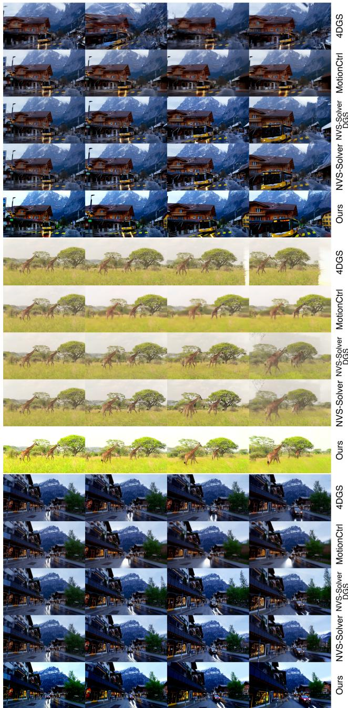  
Figure 8. Qualitative comparison of different methods on monocular video reshooting of dynamic scenes. We compare to methods 4DGS [69], MotionCtrl [66], NVS-Solver [78], NVS-Solver DGS [78].

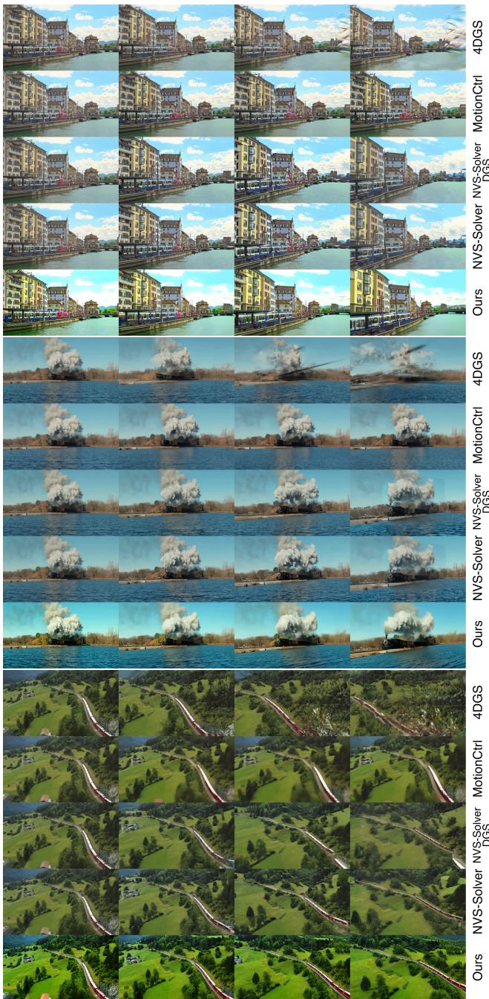  
Figure 9. Qualitative comparison of different methods on monocular video re-shooting of dynamic scenes. We compare to methods 4DGS [69], MotionCtrl [66], NVS-Solver [78], NVS-Solver DGS [78].