# Perceptual Color Diference Modeling Using Machine Learning and Human Similarity Judgments

Elnara Kadyrgali∗, Muragul Muratbekova∗, Adilet Yerkin∗, Nuray Toganas∗, Ayan Igali∗,

Malika Ziyada∗, Aruzhan Burambekova∗, Jamaladdin Hasanov†, Pakizar Shamoi∗

∗ School of Information Technology and Engineering (SITE), Kazakh-British Technical University, Almaty, Kazakhstan † School of Information Technology and Engineering (SITE), ADA University, Baku, Azerbaijan Email: p.shamoi@kbtu.kz

Abstract—Accurate assessment of color diferences is essential for applications ranging from digital design to quality control. While existing color diference metrics, such as CIEDE2000, aim to approximate human perception, they may still exhibit inconsistencies with perceptual judgments. In this study, we investigate a data-driven approach to color-diference estimation based directly on human evaluations. We collect similarity judgments for 2,000 systematically generated color pairs, each rated by seven observers using a four-point ordinal scale. These judgments are then used to train regression models using diferent color representations, including RGB channel diferences, HSI diferences, and COLIBRI fuzzy linguistic categories. Experiments with five regression algorithms show that the choice of color model has a greater influence on prediction performance than the choice of regression algorithm. Using COLIBRI features alone, linear regression achieves an R2 of 0.595, outperforming RGB and HSI representations, which achieve R2 values of 0.479 and 0.493, respectively. The best performance is obtained by LightGBM using the combined representation, reaching an R2 of 0.703. The results indicate that human perceptual color diferences are better captured when numerical color coordinates are complemented by graded perceptual categories, highlighting the potential of data-driven models for perceptually aligned colordiference estimation.

Index Terms—Color models; color diference metrics; image processing; machine learning; human perception

## I. Introduction

Color is a fundamental visual attribute that plays a key role in describing and distinguishing image content [1], [2]. It is central to image segmentation, retrieval, and classification tasks [3].

Color diference estimation plays a crucial role in intelligent image processing systems [4], [5]. Modern computer vision, quality control automation, image retrieval, and visualization rely on quantitative color-distance metrics. However, traditional mathematical models, such as Euclidean distance in RGB space or perceptually refined models like CIE76, CIE94, CMC (l : c), and CIEDE2000, are handcrafted mathematical models designed to approximate perceptual uniformity rather than learned representations derived from human judgments. They do not always capture subtle variations as humans perceive them. In addition, CIEDE2000 is computationally heavy for large-scale CV tasks [6].

Although CIEDE2000 remains the most widely accepted perceptual metric, it is inherently static and parametric. It does not adapt to contextual factors, presentation conditions, or observer variability. This raises a critical limitation: human color perception is nonlinear, context-dependent, and subject to cognitive and spatial influences, while most existing colordiference metrics are deterministic and globally fixed.

To investigate this problem, we conducted two controlled perceptual experiments to construct a structured dataset of human similarity judgments. A total of 2000 unique color pairs were systematically generated in the RGB space using controlled Euclidean shift levels to uniformly cover a broad spectrum of color diferences. Participants evaluated perceived similarity using a four-point ordinal scale (1 – Not similar, 2 – Somewhat similar, 3 – Similar, 4 – Very similar).

The experiments were conducted under two distinct spatial configurations: (i) separated color patches and (ii) directly adjacent patches with no visible gap. This dual-condition design allows analysis of how presentation structure influences similarity perception.

The collected perceptual dataset enables:

• Learning perceptual similarity thresholds via logistic regression.

• Quantifying inter-observer agreement using Fleiss Kappa.

• Comparing human similarity judgments with analytical metrics such as CIEDE2000.

Unlike traditional studies that validate fixed color-diference formulas, this work frames perceptual color diference as a supervised similarity-learning problem. By integrating humanlabeled similarity data with computational intelligence techniques, we move toward adaptive, context-aware perceptual metrics that bridge the gap between mathematical color spaces and human visual cognition.

The main contributions of this study are as follows:

• Construction of a structured perceptual similarity dataset based on 2000 systematically generated RGB color pairs.

• Provision of regression coeficients that enable perceptual color diference to be calculated directly from two RGB color values and provide interpretability by quantifying the contribution of individual color features.

• Comparative analysis between human similarity judgments and conventional color-diference formulas.

• Empirical demonstration that spatial presentation conditions significantly afect perceptual similarity thresholds.

The structure of the paper is as follows. Section I is this introduction. Section II reviews related work on perceptual color-diference metrics. Section III presents the methodology. Section IV describes the experimental design and data generation process. Section V reports experimental results and analysis. Section VIII concludes the paper and provides ideas for future work.

## II. Related Work

Color perception has long been studied as an important aspect of human cognition and visual understanding. Early studies by Berlin and Kay demonstrated that people across diferent cultures tend to identify similar focal colors, whereas category boundaries vary considerably [19]. These findings suggest that color perception is shaped not only by physical stimuli but also by perceptual and cognitive mechanisms. Building on this idea, color diference research focuses on understanding how humans perceive similarities and diferences between colors.

Xu et al. [17] investigated color-diference perception across threshold and suprathreshold levels and demonstrated that perceptual discrimination is nonlinear. Their results showed that CIEDE2000 provides better agreement with human judgments than alternative color-diference models, contributing to the development of modern perceptual color metrics. Furthermore, studies on dental shade matching [20] highlighted that, although instrumental measurements provide greater objectivity, subjective human perception remains an essential component of color evaluation. Similarly, Huang et al. [21] demonstrated that observer experience and lighting conditions significantly influence color-diference perception and improve the prediction accuracy of perceptual color-diference models.

The importance of color diference extends beyond perception itself. Wang et al. [22] showed that increasing color diversity among targets and reducing target–distractor distinctiveness both impair tracking performance in multiple object tracking tasks. Their results indicate that visual performance depends primarily on perceptual distinctiveness rather than on the number of colors alone.

To quantify perceptual color diferences, a variety of color spaces and distance metrics have been developed. Rodriguez et al. [23] demonstrated that CIEDE2000 outperforms alternative measures such as SAM and RMSE in image quality evaluation. Despite its relatively high computational complexity [24], CIEDE2000 remains widely used because of its strong correspondence with human visual perception [25]. In addition, as an alternative to fixed formula-based color-diference evaluation, an ANFIS was proposed to model color closeness [26].

Although earlier color-diference formulas improved prediction accuracy, they remained largely dependent on the CIELAB space and were limited in modeling viewing conditions and perceptual adaptation. This motivated the development of perceptually uniform color appearance models, evolving from CIECAM02 and CAM02-UCS to CAM16 and CAM16-UCS [27], [28]. Similarly, Mirjalili et al. [29] showed that viewing conditions significantly influence perceived color diferences, while Konovalenko et al. [30] proposed the proLab color space to improve perceptual uniformity while preserving linear color relationships.

The geometric properties of color spaces have also received considerable attention. Misue [31] developed an interactive visualization tool for exploring CIE76, CIE94, and CIEDE2000, demonstrating substantial diferences in perceptual distance regions, particularly for highly saturated colors. More broadly, Lissner and Urban [32] argued that no single color space can efectively support all perception-based image processing tasks and emphasized the need for unified frameworks capable of handling both threshold and suprathreshold color diferences.

Color-diference information is widely used in image processing and computer vision tasks. Niu et al. [33] proposed the Color Contrast Similarity and Color Value Diference (CSVD) metric for evaluating color correction quality and demonstrated stronger agreement with subjective assessments than numerous existing image quality metrics.

Several studies have incorporated perceptually uniform color spaces into image quality assessment and saliency detection. Achanta et al. [34], Lee et al. [35], and Zhang et al. [36] employed CIELAB-based representations to better reflect human visual perception. Lee et al. [35], [37] further demonstrated that incorporating lightness, hue, and chroma improves color image quality assessment. In addition, Shi et al. [38] proposed a no-reference sharpness assessment model based on color-diference variations, achieving improved prediction accuracy with lower computational complexity. Similarly, Liu et al. [39] showed that perceptually motivated color diferences in the Lab\* space contribute to more accurate salient object detection.

Beyond image analysis, color-diference models have been applied in visualization, design, and optimization tasks. Szafir et al. [40] demonstrated that color discriminability depends not only on color diferences but also on visualization context, leading to probabilistic models that improve color encoding in data visualization.

Misue [41] developed a CIELAB-based tool for constructing perceptually consistent sequential, divergent, and qualitative color schemes, highlighting challenges associated with gamut constraints and perceptual distinguishability. Similarly, Kosesoy et al. [42] employed CIEDE2000 in a nature-inspired color palette generation framework, demonstrating its usefulness for design-oriented applications. Wu et al. [43] further showed that color-diference metrics can support environmentally sustainable printing by reducing ink consumption while preserving perceptual print quality.

Overall, previous studies have significantly advanced the understanding of color diference perception, perceptually uniform color spaces, and their applications in image processing, visualization, and design [17], [28], [30], [33], [40]. Existing research has demonstrated that color diferences influence human perception, attention, and decision-making, while modern color-diference models have improved the prediction of perceptual similarity under a variety of viewing conditions [21]– [23], [29]. However, most current approaches focus primarily on perceptual distinguishability, visual quality assessment, or color appearance consistency, with relatively limited attention given to the emotional meaning associated with color diferences. Furthermore, although observer-dependent factors have been acknowledged in color perception studies [20], [21], the subjective and uncertain nature of color–emotion associations remains insuficiently represented in existing colordiference frameworks. This limitation becomes particularly important in multimodal environments, where visual and textual information jointly contribute to emotional interpretation. Therefore, there is a need for approaches capable of modeling color–emotion relationships while explicitly accounting for uncertainty and subjectivity through fuzzy and multimodal representations.

Table I: Summary of Prior Studies on the Efect of Sample Separation on color-Diference Evaluation. Studies are grouped by stimulus type. The number of observers ranged from 4 to 46 across studies; see original sources for details. NS = no separation; — = not reported in original source.
<table><tr><td>Study</td><td>Separation conditions</td><td>Color pairs</td><td>Color difference range</td><td>Assessment method</td><td>Key finding (separation effect)</td></tr><tr><td colspan="6">Vision science foundations</td></tr><tr><td>Boynton et al., 1977 [7]</td><td>Juxtaposed; with gap</td><td></td><td>Threshold</td><td>Threshold detection</td><td>Foundational gap effect study: gap impaired luminance discrimination but improved chromatic discrimination; explained by contour enhancement and spatial averaging</td></tr><tr><td>Sharpe &amp; Wyszecki, 1976 [8]</td><td>Juxtaposed; with gap</td><td></td><td>Threshold &amp; supra</td><td>Ratio comparison; liminal det.; color</td><td>Separation impairs lightness more than chromaticness; proposed a proximity factor for color-difference formulas</td></tr><tr><td>Eskew, 1989 [9]</td><td>Juxtaposed; narrow gap (isoluminant fill)</td><td></td><td>Threshold</td><td>matching Threshold detection</td><td>Luminance or chromatic gap prevents spatial integration, enhancing chromatic sensitivity; gap had little effect for</td></tr><tr><td>Danilova &amp; Mollon, 2006 [10]</td><td>Juxtaposed; separated up to 10°</td><td></td><td>Threshold</td><td>2AFC threshold</td><td>flashed stimuli Discrimination optimal at small gap; thresholds rose moderately with increasing separation; gap effect more</td></tr><tr><td colspan="6">Psychophysical experiments — surface &amp; printed colors</td></tr><tr><td>Witt, 1990 [11]</td><td>Gap vs. no gap</td><td></td><td>Threshold</td><td>Threshold detection</td><td>Gap raised the color-difference threshold consistently, especially for darker CIE color centres</td></tr><tr><td>Guan &amp; Luo, 1999 [12]</td><td>Hairline &amp; 3-inch gap</td><td>75</td><td>≈3∆E* (CIELAB)</td><td>Gray-scale; pair comparison</td><td>Hairline separation gave 8% larger perceived ∆E than 3-inch gap; both psychophysical methods yielded similar</td></tr><tr><td>Ting Xu et al., 2019 [13]</td><td>With gap; without gap</td><td>460</td><td>1, 2, 4, 8 ∆E* (CIELAB)</td><td>Gray-scale</td><td>results Gap effect more pronounced at smaller ∆E; CAM16-UCS outperformed CIÈDE2000, CIE94, CMC, CIELAB</td></tr><tr><td>Mirjalili et al., 2019 [14]</td><td>No separation (hairline as reference)</td><td>1012</td><td>1, 2, 4,8 ∆E* (CIELAB)</td><td>Gray-scale</td><td>Clear separation effect vs. hairline reference; proposed ∆ENs (modified CIEDE2000); for ∆E00 &lt;9.1 larger</td></tr><tr><td>Brusola et al., 2019 [15]</td><td>NS; 0.5 mm black gap; 3 mm white gap</td><td></td><td>Threshold</td><td>Strip-pair comparison</td><td>magnitude increases perceived lightness border Separation type had little effect on chromaticity-discrimination ellipse shape; strip method</td></tr><tr><td colspan="6">Psychophysical experiments — display colors (CRT/LCD)</td></tr><tr><td>Cui et al., 2001 [16]</td><td>NS; 1-px; 2-px; large gap</td><td></td><td></td><td>Gray-scale</td><td>Gap size had minor effect on overall ∆E but shifted lightness/chromatic weighting; clear difference between NS</td></tr><tr><td>Xu &amp; Yaguchi, 2005 [17]</td><td>Hairline separation</td><td></td><td>Threshold to large supra</td><td>Interleaved staircase; constant stimuli</td><td>and any gap condition Inter-observer variability ≈40% higher at small ∆E; CIEDE2000 outperformed CMC, CIE94, CIELAB across full threshold-to-suprathreshold range</td></tr><tr><td>Qiang Xu et al., dep2022 [18]</td><td>.Separation; no separation</td><td>1120</td><td>4,8∆E* (CIELAB)</td><td>Gray-scale</td><td>CIEDE2000 best for gap pairs; all models worse for NS pairs; CMF had negligible influence on ∆E values</td></tr><tr><td>This study</td><td>Gap; no separation</td><td>2000</td><td>0-222 (Euclidean RGB)△E*</td><td>4-point ordinal similarity scale (web-based)</td><td>First to examine separation effect across wide ∆E range 0–222 (Euclidean RGB) on display; develops predictive model for both NS and gap conditions</td></tr></table>

## III. Methodology

In this study, we conduct a perceptual experiment to understand how people judge color diferences and how spatial separation influences their perception. The experiment focuses on collecting subjective similarity assessments, which are then used to build a training dataset for a machine learningbased model and to compare human judgments with existing color diference measures. We also evaluate diferent feature representations and learning algorithms to determine which combination best reflects human perception.

## A. Data collection

The RGB color model constitutes the de facto standard for color representation in contemporary digital display systems. Accordingly, all stimuli were specified in the RGB format to ensure reproducibility and facilitate comparability across experimental conditions and setups. The RGB color space encompasses 16,777,216 distinct colors, which yields more than 1.4 × 1014 possible unordered color pairs. A compre-ˆ hensive, exhaustive evaluation of such a large combinatorial space is both computationally intractable and experimentally unmanageable. Therefore, it is necessary to employ an eficient sampling strategy that selects a representative subset of color pairs while preserving the statistical robustness and reliability of the experimental outcomes.

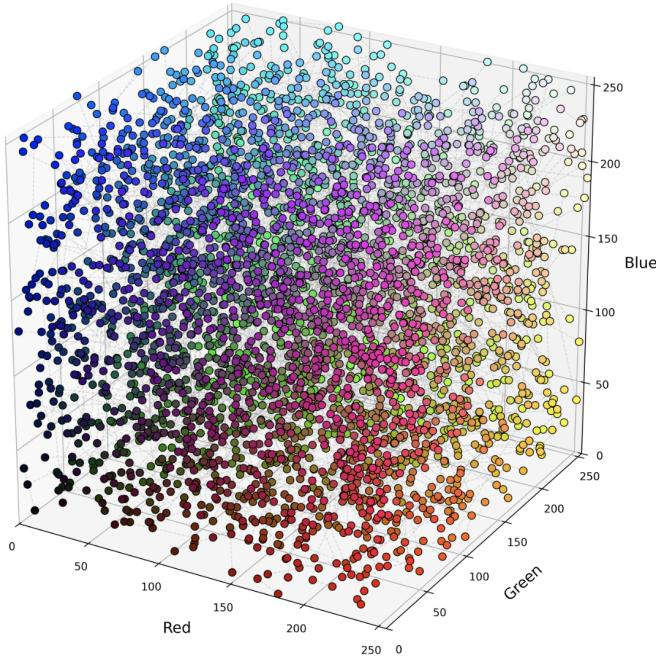

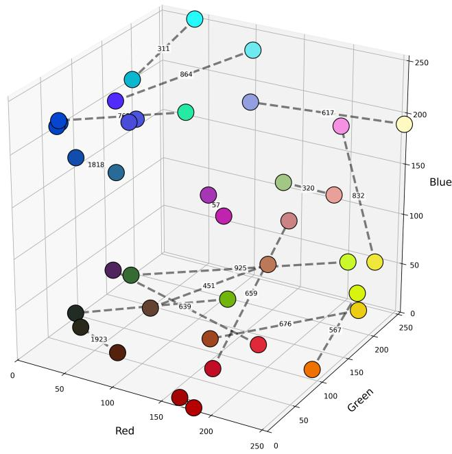  
(a) Color pairs in RGB representation  
(b) Color pairs example  
Figure 1: Color pairs visualization

For the experiment, we generated 2000 distinct color pairs (see Fig. 1a) constructed to systematically span a broad range of perceptual color diferences. Each color was specified in the RGB color space, with channel values sampled from the discrete interval [0, 255].

Initially, a random reference color $\mathbf { C } _ { 1 } ( R _ { 1 } , G _ { 1 } , B _ { 1 } )$ was sampled from the RGB color space. Subsequently, a second color ${ \bf C } _ { 2 } ( R _ { 2 } , G _ { 2 } , B _ { 2 } )$ was iteratively selected such that the Euclidean distance between $\mathbf { C } _ { 1 }$ and $\mathbf { C } _ { 2 }$ in RGB space matched a predefined shift magnitude within a specified tolerance. The color diference $\bf { D } ( C _ { 1 } , C _ { 2 } )$ between two colors $\mathbf { C } _ { 1 }$ and $\mathbf { C } _ { 2 }$ was calculated as:

$$
D ( \mathbf { C } _ { 1 } , \mathbf { C } _ { 2 } ) = \sqrt { ( R _ { 1 } - R _ { 2 } ) ^ { 2 } + ( G _ { 1 } - G _ { 2 } ) ^ { 2 } + ( B _ { 1 } - B _ { 2 } ) ^ { 2 } } .\tag{1}
$$

A uniform sampling of color diferences across the designated range was achieved by varying the shift levels from 0 to 220 and generating independent color pairs for each shift level (some examples illustrated in Fig. 1b). The resulting color distances ranged roughly from 1.00 to 221.79 because of the applied tolerance and the discrete nature of the RGB space. Color diferences in the range greater than 220 were excluded, as extremely large diferences produce pairs that are trivially unlike each other and therefore do not enable meaningful similarity-based categorization in the experiment.

Due to the wide and finely spaced range of color diference magnitudes achieved with this controlled sampling approach, the experiment was able to assess perceptual judgments for both very small and very large color diferences. To support reproducibility and additional analysis, all generated color pairs were saved along with their RGB values, hexadecimal codes, and precise computed distances.

## B. Experiment Design

The study includes two controlled experiments on color similarity judgements to examine how people subjectively perceive color diference/similarity under two diferent presentation conditions, as shown in Fig. 2.

A web-based interface was used to manage both experiments, guaranteeing automated data collection and uniform stimulus presentation. Each experiment started with instructions, after which participants had to enter their names in order to proceed. Prior to the main experimental phase, a practice trial was provided to familiarize participants with the task and the rating scale (responses from trial were not included in the analysis).

Participants rated the perceived similarity of color pairs using a pre-described four-point ordinal scale:

1) Not similar

2) Somewhat similar

3) Similar

4) Very similar.

During the first experimental phase (see Fig. 2a), participants were presented with pairs of colors drawn from a prepared stimulus set and displayed simultaneously as two spatially separated color patches of equal size. The order of color pairs was randomized independently for each participant. The system recorded the participant identifier, the color pair identifier, the predefined color diference (Euclidian distance) and the selected similarity rating.

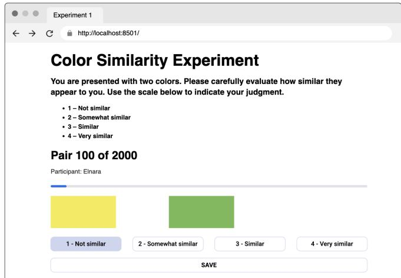  
(a) Experiment 1: Color pairs with spatial separation

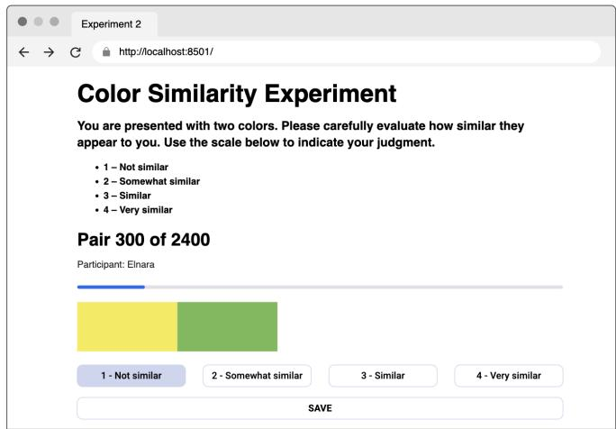  
(b) Experiment 2: Color pairs with no separation  
Figure 2: Interfaces used in the color similarity judgement experiments

The same stimulus pool and rating scale were used in the second experiment, to maintain comparability with Experiment 1. To assess intra-participant consistency, a subset of 400 color pairs was randomly selected from the original stimulus set and duplicated. These duplicated pairs were merged with the full stimulus set, and the resulting list was randomly shufled so that repeated presentations occurred at unpredictable positions within the sequence. In contrast to Experiment 1, the two colors in each pair were displayed as adjacent color patches with no spatial separation (see Fig. 2b), to facilitate direct perceptual comparison and to reduce potential visual segmentation efects. The other experimental settings of the second experiment were identical to Experiment 1. Right after the completion of each experiment, all responses were automatically saved for subsequent statistical analysis.

Together, the two experiments made it possible to analyse response consistency through repeated stimulus evaluations and to conduct a systematic investigation of color similarity perception under various presentation conditions.

## C. Spatial Separation Conditions

Experimental studies on color-diference perception difer not only in the employed color-diference models but also in the spatial arrangement of the color samples being compared. The spatial relationship between compared color samples plays a critical role in visual perception. Three principal presentation conditions are commonly distinguished: hairline separation, separation with a visible gap, and no-separation.

Hairline separation refers to a configuration in which two color samples are placed side by side with only a minimal boundary between them - suficient to perceptually segment the samples. This condition has been widely adopted as a standard reference in classical color-diference studies and in the development of color-diference formulae, as it limits spatial interaction efects while maintaining clear sample boundaries [12], [16].

Separation with a visible gap involves a clearly noticeable spatial distance between color samples, typically filled with a neutral background. This configuration reduces spatial interaction between adjacent colors and is used to investigate the influence of separation distance on perceived color differences. Under such conditions, perceptual evaluations have been reported to show greater consistency with conventional color-diference models compared to the no-separation condition [12], [16].

In contrast, the no-separation condition is characterized by the direct adjacency of color samples with no boundary between them. This configuration is representative of many realworld scenarios, such as printed images and digital displays. Experimental studies have demonstrated that no-separation conditions systematically alter the perceived balance between lightness and chromatic diferences: in some conditions, observers show increased sensitivity to lightness variations, leading to deviations from the predictions of traditional colordiference formulae [13], [16], [18].

These three conditions difer not only in their physical configuration but also in how they afect the relative weighting of lightness and chromatic components in perceived color diference. The manner in which color pairs are presented has been shown to systematically influence color-diference judgments across a range of materials and viewing conditions [8], [9], [14].

Table I summarizes the experimental characteristics of previous studies and highlights the gap addressed by the present work: to our knowledge, no prior study has examined the separation efect across a wide ∆E range (0–220) on a display medium.

## D. Color Models

Three complementary color models are considered in this study: RGB, HSI, and COLIBRI.

RGB represents color using three numerical channels (Red, Green, Blue) and is the standard representation for digital images, whereas HSI separates color information into perceptually meaningful hue, saturation, and intensity components [44]. In contrast, COLIBRI provides a fuzzy linguistic representation of color, describing hue, saturation, and intensity through perceptually motivated categories with gradual membership rather than strict numerical boundaries [45].

## E. Machine Learning algorithms

We implement five machine learning (ML) algorithms for the regression task of computing the color diference between two colors: Linear Regression, Decision Tree, Random Forest, LightGBM, and XGBoost. These models were selected to cover diferent levels of model complexity, ranging from a simple linear baseline to nonlinear tree-based and ensemble methods. This allows us to examine whether perceptual color diferences can be represented by a relatively simple relationship or require more complex nonlinear modeling.

1) Linear Regression: Linear Regression is a baseline ML algorithm [46] that models the relationship between features and the target using interpretable coeficients, which aligns with our approach to perceptual human color diference. The prediction of the model can be expressed as

$$
\hat { y } = \beta _ { 0 } + \sum _ { j = 1 } ^ { p } \beta _ { j } x _ { j } ,\tag{2}
$$

where $x _ { j } , ~ j ~ = ~ 1 , \ldots , p .$ , are the input features, $\beta _ { 0 }$ is the intercept, $\beta _ { j }$ are the learned coeficients, and $\hat { y }$ is the predicted value.

2) Decision Tree: A decision tree [47] is a supervised ML algorithm that adopts a hierarchical tree structure. At each node, the algorithm selects a feature and a threshold that provide the best split of the data. The optimal split is obtained by minimizing the weighted impurity of the resulting subsets,

$$
s ^ { * } = \arg \operatorname* { m i n } _ { s } \left[ \frac { n _ { \mathrm { l e f t } } } { n } L ( D _ { \mathrm { l e f t } } ) + \frac { n _ { \mathrm { r i g h t } } } { n } L ( D _ { \mathrm { r i g h t } } ) \right] ,\tag{3}
$$

where s denotes a candidate split, $D _ { \mathrm { l e f t } }$ and $D _ { \mathrm { r i g h t } }$ are the resulting subsets containing $n _ { \mathrm { l e f t } }$ and $n _ { \mathrm { r i g h t } }$ samples, $n =$ $n _ { \mathrm { l e f t } } + n _ { \mathrm { r i g h t } }$ , and $L$ is the impurity function, taken as the within-node mean squared error for regression.

3) Random Forest: Random Forest [48] is an ensemble ML algorithm that builds multiple decision trees on bootstrap samples with randomized feature selection, and whose overall prediction is obtained by averaging the predictions of the individual trees. The final prediction for a regression task is given by

$$
\hat { y } = \frac { 1 } { B } \sum _ { b = 1 } ^ { B } f _ { b } ( x ) ,\tag{4}
$$

where B is the number of trees and $f _ { b } ( x )$ is the prediction of the b-th tree.

4) LightGBM: LightGBM (Light Gradient Boosting Machine) [49] is a gradient boosting decision tree algorithm designed for computational eficiency and scalability. While traditional gradient boosting methods grow trees level-wise, LightGBM uses a leaf-wise strategy, splitting the leaf that provides the largest reduction in the objective function. As a boosting algorithm, the model is updated iteratively according to

$$
F _ { m } ( x ) = F _ { m - 1 } ( x ) + \eta f _ { m } ( x ) , \qquad m = 1 , \ldots , M ,\tag{5}
$$

where $F _ { m - 1 } ( x )$ is the current model, $f _ { m } ( x )$ is the newly added tree, η is the learning rate, and M is the number of boosting iterations.

5) XGBoost: XGBoost (eXtreme Gradient Boosting) [50] is an ML algorithm that builds decision trees sequentially, where each new tree aims to correct the errors made by the previous ones. In contrast to regular gradient boosting, XG-Boost incorporates explicit regularization to reduce overfitting, uses second-order gradient information for optimization, and eficiently handles sparse and missing data. At iteration t, the training objective is formulated as

$$
\mathcal { L } ^ { ( t ) } = \sum _ { i = 1 } ^ { n } l \Big ( y _ { i } , \thinspace \hat { y } _ { i } ^ { ( t - 1 ) } + f _ { t } ( x _ { i } ) \Big ) + \Omega ( f _ { t } ) ,\tag{6}
$$

$$
\Omega ( f _ { t } ) = \gamma T + \frac { 1 } { 2 } \lambda \| w \| ^ { 2 } ,\tag{7}
$$

where l is the prediction loss, $\hat { y } _ { i } ^ { ( t - 1 ) }$ is the prediction of the model after t−1 iterations, and $\Omega ( f _ { t } )$ is the regularization term penalizing model complexity through the number of leaves $T$ and the leaf weights $w ,$ with $\gamma$ and λ as regularization parameters.

## F. Color Diference Metrics

To quantify the perceptual diference between color pairs, several widely used color diference formulas are used to evaluate the proposed method and compare with them.

1) CIE76 (CIELAB Euclidean Distance) : The CIE76 metric defines color diference as the Euclidean distance between two points in the CIELAB color space. For two colors represented by $( L _ { 1 } ^ { * } , a _ { 1 } ^ { * } , b _ { 1 } ^ { * } )$ and $( L _ { 2 } ^ { * } , a _ { 2 } ^ { * } , b _ { 2 } ^ { * } )$ , the color diference is given by [51]:

$$
\Delta E _ { a b } ^ { * } = \sqrt { ( L _ { 2 } ^ { * } - L _ { 1 } ^ { * } ) ^ { 2 } + ( a _ { 2 } ^ { * } - a _ { 1 } ^ { * } ) ^ { 2 } + ( b _ { 2 } ^ { * } - b _ { 1 } ^ { * } ) ^ { 2 } } .\tag{8}
$$

Although simple and computationally eficient, this formulation assumes perceptual uniformity of the CIELAB space, which has been shown to be inaccurate in regions of high chroma and low lightness.

2) CIE94: To address perceptual non-uniformities of CIE76, the CIE94 model introduces separate weighting of lightness, chroma, and hue components [52]:

$$
\Delta E _ { 9 4 } ^ { * } = \sqrt { \left( \frac { \Delta L ^ { * } } { k _ { L } S _ { L } } \right) ^ { 2 } + \left( \frac { \Delta C _ { a b } ^ { * } } { k _ { C } S _ { C } } \right) ^ { 2 } + \left( \frac { \Delta H _ { a b } ^ { * } } { k _ { H } S _ { H } } \right) ^ { 2 } } .\tag{9}
$$

Here, $\Delta L ^ { * } , \Delta C _ { a b } ^ { * }$ , and $\Delta H _ { a b } ^ { * }$ denote the diferences in lightness, chroma, and hue, respectively, while $S _ { L } , ~ S _ { C }$ , and $S _ { H }$

are weighting functions dependent on the reference color. The parameters $k _ { L } , k _ { C }$ , and $k _ { H }$ account for viewing conditions.

3) CIEDE2000: The CIEDE2000 formula further improves perceptual uniformity by introducing nonlinear corrections and a rotation term accounting for chroma–hue interactions [53]:

$$
\begin{array} { c } { { \Delta E _ { 0 0 } = \displaystyle \left[ \left( \frac { \Delta L ^ { \prime } } { k _ { L } S _ { L } } \right) ^ { 2 } + \left( \frac { \Delta C ^ { \prime } } { k _ { C } S _ { C } } \right) ^ { 2 } \right. } } \\ { { \left. + \left( \frac { \Delta H ^ { \prime } } { k _ { H } S _ { H } } \right) ^ { 2 } \right. } } \\ { { \left. + R _ { T } \left( \frac { \Delta C ^ { \prime } } { k _ { C } S _ { C } } \right) \left( \frac { \Delta H ^ { \prime } } { k _ { H } S _ { H } } \right) \right] ^ { \frac { 1 } { 2 } } . } } \end{array}\tag{10}
$$

The corrected terms $\Delta L ^ { \prime } , \Delta C ^ { \prime } ,$ , and $\Delta H ^ { \prime }$ reflect perceptual adjustments in lightness, chroma, and hue, while $R _ { T }$ models the interaction between chroma and hue in the blue region of the color space.

4) CMC $( l : c ) { : \atop }$ The CMC model introduces adjustable parameters that control the relative weighting of lightness and chroma diferences [54]:

$$
\Delta E _ { C M C } = \sqrt { \left( \frac { \Delta L ^ { * } } { l S _ { L } } \right) ^ { 2 } + \left( \frac { \Delta C _ { a b } ^ { * } } { c S _ { C } } \right) ^ { 2 } + \left( \frac { \Delta H _ { a b } ^ { * } } { S _ { H } } \right) ^ { 2 } } .\tag{11}
$$

The parameters l and c determine the tolerance for lightness and chroma variations, respectively, while $S _ { L } , \ S _ { C }$ , and $S _ { H }$ are weighting functions dependent on the reference color. In particular, $S _ { L }$ and $S _ { C }$ are functions of lightness and chroma, whereas $S _ { H }$ additionally depends on the hue angle through a trigonometric term and a chroma-dependent factor F, defined as $\begin{array} { r } { F = \sqrt { \frac { C ^ { * 4 } } { C ^ { * 4 } + 1 9 0 0 } } } \end{array}$ . The hue weighting term T is computed as a piecewise function of the hue angle. This formulation allows for application-specific perceptual tuning, with common parameter settings such as $l : c = 2 : 1$ for acceptability and 1 : 1 for perceptibility.

5) Judd–Hunter (NBS): An early perceptually motivated model expresses color diference using weighted luminance and chromatic components [55]:

$$
\Delta E _ { A N } = \sqrt { ( \Delta L ) ^ { 2 } + ( \Delta A ) ^ { 2 } + ( \Delta B ) ^ { 2 } } ,\tag{12}
$$

with

$$
L = 9 . 2 Y , ~ A = 4 0 ( X - Y ) , ~ B = 1 6 ( Y - Z ) .\tag{13}
$$

A refined NBS formulation incorporates luminance-dependent chromatic sensitivity:

$$
\Delta E _ { N B S } = f _ { g } \sqrt { \left[ 2 2 1 Y ^ { 1 / 4 } \sqrt { ( \Delta \alpha ) ^ { 2 } + ( \Delta \beta ) ^ { 2 } } \right] ^ { 2 } + \left[ k ( \Delta Y ^ { 1 / 2 } ) \right] ^ { 2 } } .\tag{14}
$$

## IV. Results

## A. Our Model

Figure 3 illustrates the overall workflow of the proposed color diference/similarity prediction framework. Starting from a pair of RGB colors, multiple feature representations are extracted and used to train machine learning models that predict human judgments.

1) Dataset: The training dataset was constructed from the annotations collected during the two perceptual experiments described in Section III-B. Each sample consists of a pair of RGB colors and the corresponding similarity score assigned by human experts on a four-point scale , where 1 denotes “not similar” and 4 denotes “very similar”. Table II summarizes the main characteristics of the resulting dataset.

The final dataset contains 2,000 unique color pairs evaluated by seven human experts, resulting in 28,600 individual similarity ratings.

To formulate the task as a regression problem, the four-point ordinal similarity scale was treated as approximately equally spaced using

$$
S = { \frac { Y - 1 } { 3 } } ,\tag{15}
$$

where Y is the original expert rating and S is the normalized similarity score used as the prediction target.

Under this modeling assumption, the original ratings were linearly transformed to the interval [0, 1] according to Eq. 15. Accordingly, the categories Not similar, Somewhat similar, Similar, and Very similar were mapped to 0, $1 / 3 , 2 / 3 ,$ , and 1, respectively. This transformation preserves the ordering of the original ratings while assuming equal numerical spacing between adjacent response categories.

2) Feature Generation: For each color pair, three complementary feature representations were extracted.

The RGB representation was described using the absolute diferences between the corresponding color channels:

$$
d R = | R _ { 1 } - R _ { 2 } | , \quad d G = | G _ { 1 } - G _ { 2 } | , \quad d B = | B _ { 1 } - B _ { 2 } | .\tag{16}
$$

The colors were additionally converted into the HSI color space, where perceptually meaningful diferences were computed. Hue diference was calculated as the minimum circular angular distance,

$$
d _ { H } = { \frac { \operatorname * { m i n } ( | H _ { 1 } - H _ { 2 } | , 3 6 0 - | H _ { 1 } - H _ { 2 } | ) } { 1 8 0 } } ,\tag{17}
$$

while saturation and intensity diferences were normalized as

$$
d _ { S } = \frac { | S _ { 1 } - S _ { 2 } | } { 1 0 0 } , d _ { I } = \frac { | I _ { 1 } - I _ { 2 } | } { 2 5 5 } .\tag{18}
$$

Finally, each color was represented using the COLIBRI model, consisting of 9 hue categories, 4 saturation levels, and 5 intensity levels. The diferences between the corresponding COLIBRI categories were used as additional perceptual features.

Based on these representations, seven feature sets were constructed: RGB, HSI, COLIBRI, RGB+HSI, RGB+COLIBRI, HSI+COLIBRI, and RGB+HSI+COLIBRI.

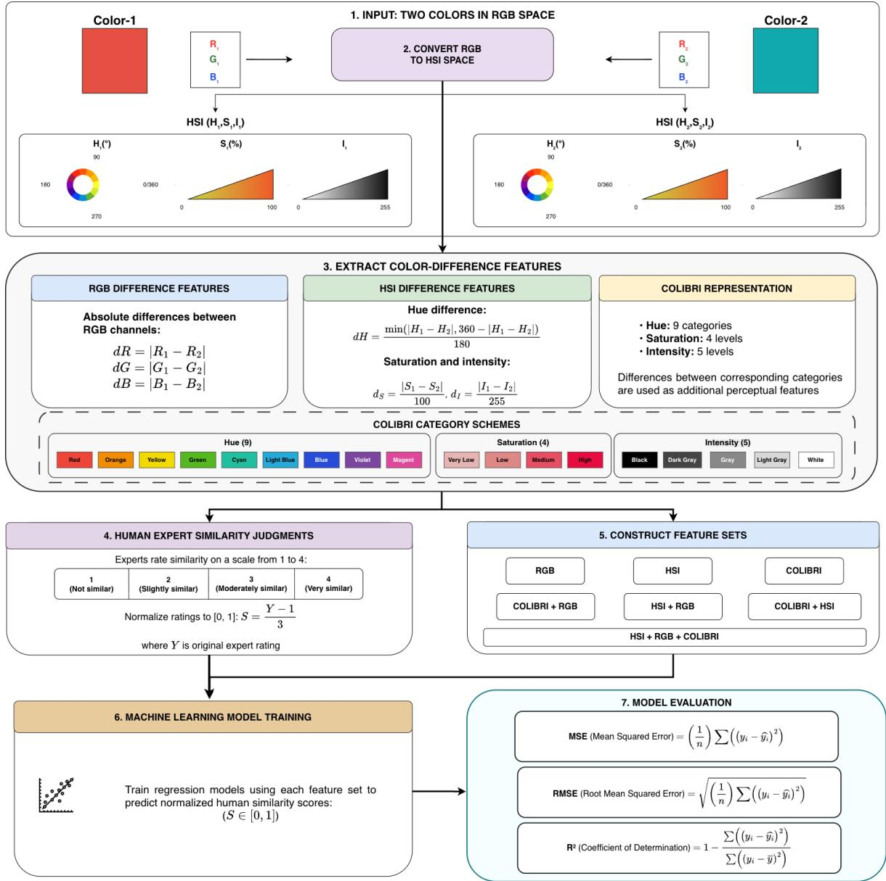  
Figure 3: Proposed framework for perceptual color diference modeling

3) Model Training: The normalized expert similarity scores served as the regression targets. Separate regression models were trained for each feature set to evaluate the predictive capability of the individual color representations and their combinations. This experimental design enables a direct comparison of the contribution of RGB, HSI, and COLIBRI features to the prediction of perceived color similarity.

Model performance was evaluated using five-fold grouped cross-validation, with each unique color pair treated as a grouping variable. All perceptual evaluations corresponding to the same color pair were assigned exclusively to either the training or testing subset within each fold, thereby preventing the same color pair from appearing in both subsets and reducing potential information leakage. Across the five folds, each group was used for test once, while the remaining groups were used for model training.

Model performance was assessed using three standard regression metrics: Mean Squared Error (MSE), Root Mean Squared Error (RMSE), and the coeficient of determination (R2):

$$
\mathrm { M S E } = \frac { 1 } { n } \sum _ { i = 1 } ^ { n } ( y _ { i } - \hat { y } _ { i } ) ^ { 2 } ,\tag{19}
$$

$$
\mathrm { R M S E } = \sqrt { \frac { 1 } { n } \sum _ { i = 1 } ^ { n } ( y _ { i } - \hat { y } _ { i } ) ^ { 2 } } ,\tag{20}
$$

$$
R ^ { 2 } = 1 - \frac { \sum _ { i = 1 } ^ { n } ( y _ { i } - \hat { y } _ { i } ) ^ { 2 } } { \sum _ { i = 1 } ^ { n } ( y _ { i } - \bar { y } ) ^ { 2 } } .\tag{21}
$$

Here, $y _ { i }$ denotes the actual perceptual similarity score, $\hat { y } _ { i }$ is the predicted score, y¯ is the mean of the actual scores, and n is the number of observations. MSE and RMSE quantify the prediction error, with lower values indicating better predictive performance, while $R ^ { 2 }$ represents the proportion of variance in the observed scores explained by the model.

Table II: Summary of the perceptual color similarity dataset and grouped cross-validation design.
<table><tr><td>Dataset characteristic</td><td>Value</td></tr><tr><td>Participants Unique color pairs Total evaluations</td><td>7 2 000 28 600</td></tr><tr><td>Human similarity rating distribution</td><td></td></tr><tr><td>Not similar Somewhat similar Similar Very similar</td><td>9501 (33.22%) 7 192 (25.15%) 6 762 (23.64%) 5 145 (17.99%)</td></tr><tr><td>Grouped cross-validation design</td><td>5</td></tr><tr><td>Number of folds Grouping unit Training color pairs per fold Validation color pairs per fold Training evaluations per fold Validation evaluations per fold</td><td>Unique color pair 1 600 400 ≈ 22 845 ≈ 5 755</td></tr></table>

Together, these metrics provide a comprehensive comparison of the diferent feature representations. The performance of the machine learning models across diferent feature sets, evaluated in terms of RMSE, MSE, and $( R ^ { 2 } )$ , is presented in Table III.

The reported RMSE, MSE, and $R ^ { 2 }$ values represent the mean ± standard deviation across the five validation folds. The original four-level similarity rating was used only to derive the normalized regression target and was not included among the predictive features.

4) Comparative evaluation of models: Table III compares the predictive performance of the five regression algorithms across the seven feature representations using five-fold grouped cross-validation. The reported values are expressed as mean ± standard deviation across the validation folds, providing an assessment of both predictive accuracy and stability for unseen color pairs.

A notable result was observed for the COLIBRI representation under Linear Regression. When used as the sole input representation, COLIBRI achieved an average $R ^ { 2 }$ of $0 . 5 9 5 4 \pm 0 . 0 2 3$ , compared with $0 . 4 7 9 0 \pm 0 . 0 1 6$ for RGB and $0 . 4 9 3 2 \pm 0 . 0 1 7$ for HSI. This indicates that the fuzzy semantic representation captures a substantially more informative relationship with human similarity judgments under a linear modeling assumption. Combining COLIBRI with RGB further increased the average $R ^ { 2 }$ to $0 . 6 2 5 3 \pm 0 . 0 2 5$ , while the complete RGB+HSI+COLIBRI representation achieved $R ^ { 2 } = 0 . 6 2 7 3 \pm 0 . 0 2 3$

Among the nonlinear algorithms, LightGBM demonstrated the strongest overall predictive performance. Using the complete RGB+HSI+COLIBRI representation, LightGBM achieved the numerically highest average coeficient of determination, $R ^ { 2 } \ = \ 0 . 7 0 3 1 \pm 0 . 0 1 3 .$ , together with RMSE= $0 . 2 0 0 2 { \scriptstyle \pm 0 . 0 0 2 }$ and $\mathrm { M S E } = 0 . 0 4 0 1 { \scriptstyle \pm 0 . 0 0 1 }$ . The low variability across folds indicates stable performance across diferent subsets of previously unseen color pairs. LightGBM also benefited consistently from combining multiple feature representations, with $R ^ { 2 }$ increasing from 0.5600 for RGB alone to 0.6939 for RGB+COLIBRI and 0.7031 for the complete feature set.

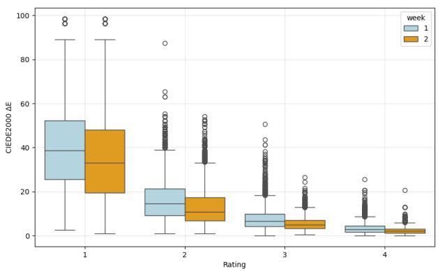  
Figure 4: Experimental results for Experiment 1 and 2 side to side

Table IV presents the Linear Regression parameters for each feature representation, including the intercept and slope coeficients. Each coeficient quantifies the direction and magnitude of the contribution of the corresponding color-diference feature.

The predicted perceptual similarity is expressed as

$$
\hat { S } _ { \mathrm { p e r c } } = \beta _ { 0 } + \sum _ { j = 1 } ^ { 2 4 } \beta _ { j } x _ { j } ,\tag{22}
$$

where $\beta _ { 0 }$ denotes the intercept, $\beta _ { j }$ is the regression coeficient associated with the j-th feature, and $x _ { j }$ represents the corresponding color-diference feature.

The perceptual color diference is calculated as

$$
\hat { D } _ { \mathrm { p e r c } } = 1 - \hat { S } _ { \mathrm { p e r c } } ,\tag{23}
$$

5) Experimental results analysis: - Analysis of experimental findings. -Outcomes

Figure 4 shows us results of both experiments as boxplots as side by side. Clearly can be seen that regardless of the experiments $\Delta E$ of "Not similar" are similar by results of the both experiments. That result brings us to the hypothesis that it is easier for people to say whenever two colors are diferent than similar.

The correlation between participants’ ratings across the two experiments was 0.817. To further evaluate reliability of similarity judgments, we computed the Intraclass Correlation Coeficient (ICC). The obtained value $\operatorname { I C C } ( 2 , 1 ) = 0 . 8 2 6$ (95% CI $[ 0 . 7 7 , 0 . 8 7 ] , \mathrm { p } < 0 . 0 0 1 ,$ ) indicates good agreement between participants ( reference ICC paper). Ratings of duplicated

Table III: Performance comparison of regression models across diferent feature sets using five-fold grouped cross-validation. Values are shown as mean ± standard deviation across folds.
<table><tr><td>Metric</td><td>Feature Set</td><td>Linear Regression</td><td>Decision Tree</td><td>Random Forest</td><td>LightGBM</td><td>XGBoost</td></tr><tr><td rowspan="7">RMSE</td><td>RGB</td><td> $0 . 2 6 5 3 \pm 0 . 0 0 3$ </td><td> $0 . 2 7 9 4 \pm 0 . 0 0 6$ </td><td> $0 . 2 5 1 9 \pm 0 . 0 0 4$ </td><td> $0 . 2 4 3 8 \pm 0 . 0 0 4$ </td><td> $0 . 2 5 3 0 \pm 0 . 0 0 5$ </td></tr><tr><td>HSI</td><td> $0 . 2 6 1 6 \pm 0 . 0 0 4$ </td><td> $0 . 2 5 4 6 \pm 0 . 0 0 7$ </td><td> $0 . 2 3 1 2 \pm 0 . 0 0 3$ </td><td> $0 . 2 2 6 8 \pm 0 . 0 0 1$ </td><td> $0 . 2 3 4 4 \pm 0 . 0 0 2$ </td></tr><tr><td>COLIBRI</td><td> $0 . 2 3 3 7 \pm 0 . 0 0 4$ </td><td> $0 . 2 6 5 4 \pm 0 . 0 0 9$ </td><td> $0 . 2 3 4 1 \pm 0 . 0 0 6$ </td><td> $0 . 2 2 7 4 \pm 0 . 0 0 5$ </td><td> $0 . 2 3 6 4 \pm 0 . 0 0 3$ </td></tr><tr><td> $\mathrm { R G B } + \mathrm { H S I }$ </td><td> $0 . 2 5 5 2 \pm 0 . 0 0 4$ </td><td> $0 . 2 4 0 9 \pm 0 . 0 0 5$ </td><td> $0 . 2 1 5 5 \pm 0 . 0 0 3$ </td><td> $0 . 2 1 1 6 \pm 0 . 0 0 3$ </td><td> $0 . 2 1 6 1 \pm 0 . 0 0 3$ </td></tr><tr><td> $\mathrm { R G B } + \mathrm { C O L I B R I }$ </td><td> $0 . 2 2 4 8 \pm 0 . 0 0 5$ </td><td> $0 . 2 4 2 2 \pm 0 . 0 0 3$ </td><td> $0 . 2 1 1 8 \pm 0 . 0 0 1$ </td><td> $0 . 2 0 3 3 \pm 0 . 0 0 2$ </td><td> $0 . 2 0 9 1 \pm 0 . 0 0 2$ </td></tr><tr><td> $\mathrm { H S I } + \mathrm { C O L I B R I }$ </td><td> $0 . 2 3 1 5 \pm 0 . 0 0 4$ </td><td> $0 . 2 4 1 3 \pm 0 . 0 0 2$ </td><td> $0 . 2 1 4 3 \pm 0 . 0 0 2$ </td><td> $0 . 2 1 0 4 \pm 0 . 0 0 2$ </td><td> $0 . 2 1 5 6 \pm 0 . 0 0 1$ </td></tr><tr><td> $\mathrm { R G B } + \mathrm { H S I } + \mathrm { C O L I B R I }$ </td><td> $0 . 2 2 4 2 \pm 0 . 0 0 4$ </td><td> $0 . 2 3 0 5 \pm 0 . 0 0 5$ </td><td> $0 . 2 0 5 2 \pm 0 . 0 0 2$ </td><td> $0 . 2 0 0 2 \pm 0 . 0 0 2$ </td><td> $0 . 2 0 3 6 \pm 0 . 0 0 2$ </td></tr><tr><td rowspan="8">MSE</td><td>RGB</td><td> $0 . 0 7 0 4 \pm 0 . 0 0 2$ </td><td> $0 . 0 7 8 1 \pm 0 . 0 0 3$ </td><td> $0 . 0 6 3 5 \pm 0 . 0 0 2$ </td><td> $0 . 0 5 9 5 \pm 0 . 0 0 2$ </td><td> $0 . 0 6 4 0 \pm 0 . 0 0 3$ </td></tr><tr><td>HSI</td><td> $0 . 0 6 8 5 \pm 0 . 0 0 2$ </td><td> $0 . 0 6 4 9 \pm 0 . 0 0 4$ </td><td> $0 . 0 5 3 5 \pm 0 . 0 0 1$ </td><td> $0 . 0 5 1 4 \pm 0 . 0 0 1$ </td><td> $0 . 0 5 4 9 \pm 0 . 0 0 1$ </td></tr><tr><td>COLIBRI</td><td> $0 . 0 5 4 6 \pm 0 . 0 0 2$ </td><td> $0 . 0 7 0 5 \pm 0 . 0 0 5$ </td><td> $0 . 0 5 4 8 \pm 0 . 0 0 3$ </td><td> $0 . 0 5 1 7 \pm 0 . 0 0 2$ </td><td> $0 . 0 5 5 9 \pm 0 . 0 0 2$ </td></tr><tr><td>RGB + HSI</td><td> $0 . 0 6 5 2 \pm 0 . 0 0 2$ </td><td> $0 . 0 5 8 0 \pm 0 . 0 0 2$ </td><td> $0 . 0 4 6 5 \pm 0 . 0 0 1$ </td><td> $0 . 0 4 4 8 \pm 0 . 0 0 1$ </td><td> $0 . 0 4 6 7 \pm 0 . 0 0 1$ </td></tr><tr><td> $\mathrm { R G B } + \mathrm { C O L I B R I }$ </td><td> $0 . 0 5 0 6 \pm 0 . 0 0 2$ </td><td> $0 . 0 5 8 7 \pm 0 . 0 0 2$ </td><td> $0 . 0 4 4 9 \pm 0 . 0 0 1$ </td><td> $0 . 0 4 1 3 \pm 0 . 0 0 1$ </td><td> $0 . 0 4 3 7 \pm 0 . 0 0 1$ </td></tr><tr><td> $\mathrm { H S I } + \mathrm { C O L I B R I }$ </td><td> $0 . 0 5 3 6 \pm 0 . 0 0 2$ </td><td> $0 . 0 5 8 2 \pm 0 . 0 0 1$ </td><td> $0 . 0 4 5 9 \pm 0 . 0 0 1$ </td><td> $0 . 0 4 4 3 \pm 0 . 0 0 1$ </td><td> $0 . 0 4 6 5 \pm 0 . 0 0 1$ </td></tr><tr><td> $\mathrm { R G B } + \mathrm { H S I } + \mathrm { C O L I B R I }$ </td><td> $0 . 0 5 0 3 \pm 0 . 0 0 2$ </td><td> $0 . 0 5 3 2 \pm 0 . 0 0 3$ </td><td> $0 . 0 4 2 1 \pm 0 . 0 0 1$ </td><td> $0 . 0 4 0 1 \pm 0 . 0 0 1$ </td><td> $0 . 0 4 1 5 \pm 0 . 0 0 1$ </td></tr><tr><td>RGB</td><td> $0 . 4 7 9 0 \pm 0 . 0 1 6$ </td><td> $0 . 4 2 1 2 \pm 0 . 0 4 1$ </td><td> $0 . 5 2 9 9 \pm 0 . 0 2 3$ </td><td></td><td></td></tr><tr><td rowspan="7"> $R ^ { 2 }$ </td><td>HSI</td><td> $0 . 4 9 3 2 \pm 0 . 0 1 7$ </td><td></td><td></td><td> $0 . 5 6 0 0 \pm 0 . 0 1 5$ </td><td> $0 . 5 2 6 0 \pm 0 . 0 2 6$ </td></tr><tr><td>COLIBRI</td><td> $0 . 5 9 5 4 \pm 0 . 0 2 3$ </td><td> $0 . 5 1 9 8 \pm 0 . 0 2 6$ </td><td> $0 . 6 0 4 1 \pm 0 . 0 1 5$ </td><td> $0 . 6 1 9 2 \pm 0 . 0 1 2$ </td><td> $0 . 5 9 3 1 \pm 0 . 0 1 4$ </td></tr><tr><td>RGB + HSI</td><td> $0 . 5 1 7 7 \pm 0 . 0 1 9$ </td><td> $0 . 4 7 8 8 \pm 0 . 0 2 5$ </td><td> $0 . 5 9 4 6 \pm 0 . 0 1 2$ </td><td> $0 . 6 1 7 1 \pm 0 . 0 1 3$ </td><td> $0 . 5 8 6 3 \pm 0 . 0 1 0$ </td></tr><tr><td>RGB + COLIBRI</td><td> $0 . 6 2 5 3 \pm 0 . 0 2 5$ </td><td> $0 . 5 7 0 3 \pm 0 . 0 2 2$   $0 . 5 6 5 8 \pm 0 . 0 1 4$ </td><td> $0 . 6 5 6 0 \pm 0 . 0 1 5$   $0 . 6 6 7 6 \pm 0 . 0 1 4$ </td><td> $0 . 6 6 8 5 \pm 0 . 0 1 6$ </td><td> $0 . 6 5 4 2 \pm 0 . 0 1 5$ </td></tr><tr><td> $\mathrm { H S I } + \mathrm { C O L I B R I }$ </td><td> $0 . 6 0 2 9 \pm 0 . 0 2 5$ </td><td> $0 . 5 6 9 0 \pm 0 . 0 1 0$ </td><td> $0 . 6 5 9 8 \pm 0 . 0 1 5$ </td><td> $0 . 6 9 3 9 \pm 0 . 0 1 4$   $0 . 6 7 1 9 \pm 0 . 0 1 6$ </td><td> $0 . 6 7 6 3 \pm 0 . 0 1 0$ </td></tr><tr><td> $\mathrm { R G B } + \mathrm { H S I } + \mathrm { C O L I B R I }$ </td><td> $0 . 6 2 7 3 \pm 0 . 0 2 3$ </td><td> $0 . 6 0 6 4 \pm 0 . 0 1 9$ </td><td> $0 . 6 8 8 2 \pm 0 . 0 1 4$ </td><td> $0 . 7 0 3 1 \pm 0 . 0 1 3$ </td><td> $0 . 6 5 5 9 \pm 0 . 0 1 2$ </td></tr><tr><td></td><td></td><td></td><td></td><td></td><td> $0 . 6 9 2 9 \pm 0 . 0 1 3$ </td></tr></table>

Table IV: Linear regression coeficients for perceptual color similarity across diferent feature representations using five-fold grouped cross-validation. Values are shown as mean ± standard deviation across folds.
<table><tr><td rowspan="2">Model Dependency</td><td rowspan="2">Feature</td><td colspan="7">Coefficient (Mean ± SD)</td></tr><tr><td>RGB</td><td>HSI</td><td>COLIBRI</td><td> $\mathbf { R G B } + \mathbf { H S I }$ </td><td>RGB + COLIBRI</td><td>HSI + COLIBRI</td><td>RGB + HSI + COLIBRI</td></tr><tr><td rowspan="3"></td><td>Intercept</td><td> $0 . 6 9 3 0 \pm 0 . 0 0 5$ </td><td>0.6792 ± 0.005</td><td> $0 . 7 8 5 1 \pm 0 . 0 0 5$ </td><td> $0 . 6 9 5 4 \pm 0 . 0 0 5$ </td><td> $0 . 7 8 9 9 \pm 0 . 0 0 5$ </td><td> $0 . 7 7 9 9 \pm 0 . 0 0 5$ </td><td> $0 . 7 9 3 7 \pm 0 . 0 0 5$ </td></tr><tr><td>Red Channel</td><td> $- 0 . 0 0 2 7 \pm 0 . 0$ </td><td></td><td></td><td> $- 0 . 0 0 1 4 \pm 0 . 0$ </td><td> $- 0 . 0 0 1 5 \pm 0 . 0$ </td><td></td><td> $- 0 . 0 0 1 8 \pm 0 . 0$ </td></tr><tr><td>Green Channel</td><td> $- 0 . 0 0 2 9 \pm 0 . 0$ </td><td></td><td></td><td> $- 0 . 0 0 1 6 \pm 0 . 0$ </td><td> $- 0 . 0 0 1 3 \pm 0 . 0$ </td><td></td><td> $- 0 . 0 0 1 6 \pm 0 . 0$ </td></tr><tr><td rowspan="3">RGB HSI</td><td>Blue Channel</td><td> $- 0 . 0 0 2 4 \pm 0 . 0$ </td><td></td><td></td><td> $- 0 . 0 0 1 3 \pm 0 . 0$ </td><td> $- 0 . 0 0 1 1 \pm 0 . 0$ </td><td></td><td> $- 0 . 0 0 1 4 \pm 0 . 0 0 0$ </td></tr><tr><td>Hue</td><td></td><td> $- 0 . 7 8 4 8 \pm 0 . 0 0 7$ </td><td></td><td> $- 0 . 4 9 5 4 \pm 0 . 0 1 0$ </td><td></td><td> $- 0 . 2 2 8 2 \pm 0 . 0 0 8$ </td><td> $0 . 0 9 5 0 \pm 0 . 0 1 6$ </td></tr><tr><td>Saturation</td><td></td><td> $- 0 . 2 4 0 6 \pm 0 . 0 1 1$ </td><td></td><td> $- 0 . 0 9 0 2 \pm 0 . 0 1 1$ </td><td></td><td> $- 0 . 1 1 1 7 \pm 0 . 0 2 5$ </td><td> $0 . 1 1 0 4 \pm 0 . 0 2 1$ </td></tr><tr><td rowspan="20">COLIBRI</td><td>Intensity</td><td></td><td> $- 0 . 8 2 7 0 \pm 0 . 0 3 8$ </td><td></td><td> $- 0 . 1 7 1 2 \pm 0 . 0 4 1$ </td><td></td><td> $- 0 . 2 0 4 2 \pm 0 . 0 7 8$ </td><td> $0 . 6 1 1 9 \pm 0 . 1 1 4$ </td></tr><tr><td>Hue – Blue</td><td></td><td></td><td>−0.2608 ± 0.010</td><td></td><td></td><td> $- 0 . 2 0 8 7 \pm 0 . 0 0 9$ </td><td></td></tr><tr><td>Hue – Cyan</td><td></td><td></td><td>−0.2329 ± 0.011</td><td></td><td>−0.1951 ± 0.007 -0.1666 ± 0.005</td><td>−0.1956 ± 0.009</td><td>-0.2026 ± 0.008</td></tr><tr><td>Hue – Green</td><td></td><td></td><td>-0.3199 ± 0.003</td><td></td><td>−0.2121 ± 0.003</td><td>−0.2379 ± 0.004</td><td>−0.1700 ± 0.005 −0.2234 ± 0.004</td></tr><tr><td>Hue – Light Blue</td><td></td><td></td><td>−0.2005 ± 0.005</td><td></td><td>−0.2004 ± 0.005</td><td>−0.1928 ± 0.005</td><td>−0.2013 ± 0.005</td></tr><tr><td>Hue – Magenta</td><td></td><td></td><td>−0.2685 ± 0.004</td><td></td><td>−0.2062 ± 0.002</td><td>−0.2126 ± 0.004</td><td>−0.2173 ± 0.004</td></tr><tr><td>Hue – Orange</td><td></td><td></td><td>-0.2503 ± 0.004</td><td></td><td>-0.2111 ± 0.005</td><td>−0.2247 ± 0.004</td><td>−0.2147 ± 0.006</td></tr><tr><td>Hue – Red</td><td></td><td></td><td>−0.2436 ± 0.011</td><td></td><td>−0.2095 ± 0.009</td><td>−0.2186 ± 0.009</td><td>−0.2111 ± 0.009</td></tr><tr><td>Hue – Violet</td><td></td><td></td><td>−0.2746 ± 0.007</td><td></td><td>−0.2072 ± 0.004</td><td>−0.2216 ± 0.006</td><td>−0.2131 ± 0.007</td></tr><tr><td>Hue – Yellow</td><td></td><td></td><td>-0.3266 ± 0.018</td><td></td><td>−0.2874 ± 0.015</td><td>−0.2989 ± 0.015</td><td>−0.2964 ± 0.015</td></tr><tr><td>Saturation – High</td><td></td><td></td><td>-0.0219 ± 0.004</td><td></td><td>0.0497 ± 0.006</td><td>0.0320 ± 0.009</td><td>0.0208 ± 0.007</td></tr><tr><td>Saturation – Low</td><td></td><td></td><td>-0.1219 ± 0.007</td><td></td><td>-0.1029 ± 0.004</td><td>-0.0827 ± 0.009</td><td>−0.1322 ± 0.007</td></tr><tr><td>Saturation – Medium</td><td></td><td></td><td>−0.0762 ± 0.006</td><td></td><td>−0.0836 ± 0.005</td><td>−0.0880 ± 0.007</td><td>−0.0802 ± 0.005</td></tr><tr><td>Saturation – Very Low</td><td></td><td></td><td>-0.0705 ± 0.013</td><td></td><td>−0.1146 ± 0.020</td><td>−0.0118 ± 0.018</td><td>−0.1786 ± 0.022</td></tr><tr><td>Intensity – Black</td><td></td><td></td><td> $- 0 . 0 7 9 1 \pm 0 . 0 1 3$ </td><td></td><td>−0.0143 ± 0.014</td><td>−0.0125 ± 0.025</td><td>−0.1335 ± 0.026</td></tr><tr><td>Intensity – Dark gray</td><td></td><td></td><td> $- 0 . 0 7 8 9 \pm 0 . 0 1 4$ </td><td></td><td>−0.0027 ± 0.012</td><td>-0.0499 ± 0.016</td><td>−0.0610 ± 0.017</td></tr><tr><td>Intensity – Gray</td><td></td><td></td><td> $- 0 . 1 3 3 8 \pm 0 . 0 1 1$ </td><td></td><td>−0.0678 ± 0.011</td><td>−0.1040 ± 0.014</td><td>−0.0964 ± 0.012</td></tr><tr><td>Intensity – Light gray</td><td></td><td></td><td> $- 0 . 1 7 9 8 \pm 0 . 0 1 4$ </td><td></td><td>0.0154 ± 0.013</td><td>−0.1133 ± 0.016</td><td> $- 0 . 1 2 6 8 \pm 0 . 0 2 7$ </td></tr><tr><td>Intensity – White</td><td></td><td></td><td> $- 0 . 0 9 2 5 \pm 0 . 0 2 2$ </td><td></td><td>−0.1117 ± 0.057</td><td>−0.0757 ± 0.038</td><td></td></tr><tr><td></td><td></td><td></td><td></td><td></td><td></td><td></td><td> $- 0 . 1 3 3 0 \pm 0 . 0 3 8$ </td></tr></table>

Table V: Perceptual similarity decision boundaries thresholds
<table><tr><td>Category</td><td>Experiment 1</td><td>Experiment 2</td></tr><tr><td>Very Similar</td><td> $\Delta E \le 4 . 2 2 1$ </td><td> $\Delta E \le 2 . 0 6 9$ </td></tr><tr><td>Similar</td><td> $4 . 2 2 1 < \Delta E \le 1 1 . 4 0 6$ </td><td> $2 . 0 6 9 < \overline { { \Delta } } E \le 6 . 7 4 3$ </td></tr><tr><td>Somewhat Similar</td><td> $1 1 . 4 0 6 < \Delta E \leq 2 4 . 2 6 6$ </td><td> $6 . 7 4 3 < \Delta E \le 1 8 . 8 8 9$ </td></tr><tr><td>Not Similar</td><td> $\Delta E > 2 4 . 2 6 6$ </td><td> $\Delta E > 1 8 . 8 8 9$ </td></tr></table>

To obtain numerical boundaries between perceptual similarity categories, we fitted logistic regression models using the color diference $\Delta E$ as the predictor and binarized rating thresholds (rating $\geq 4 , \geq 3 , \geq 2 )$ as target variables, results are illustrated in Table V.

color pairs in the second experiment were excluded from the calculation.

To compare how participants voted to the experiments we calculated Fleiss’ Kappa agreement score for both experiments. Following agreement scores were obtained: 0.679 and 0.417 for the first and second experiments respectfully.

## B. Performance Evaluation

To further examine the perceptual behavior of the proposed approach, we compared its predictions with conventional color-diference measures, including CIE76, CIE94, CIEDE2000, and CMC (2:1). Representative color pairs and the corresponding metric values are illustrated in Figure 5.

The proposed model produces a normalized color-diference score $D _ { \mathrm { m o d e l } } \in [ 0 , 1 ] .$ , where larger values indicate a greater perceived diference. For interpretation in terms of perceptual similarity, the predicted diference was converted as

$$
S _ { \mathrm { m o d e l } } = 1 - D _ { \mathrm { m o d e l } } .\tag{24}
$$

The resulting similarity score was then mapped back to the four linguistic categories used in the perceptual experiment. According to the adopted normalization, Not similar, Somewhat similar, Similar, and Very similar correspond to the anchor values 0, 1/3, 2/3, and 1, respectively. Each continuous prediction was assigned to the nearest anchor value. Therefore, the category boundaries were defined at the midpoints between adjacent anchors: $1 / 6 \approx 0 . 1 6 7 , 1 / 2 = 0 . 5 0 0$ , and $5 / 6 ~ \approx ~ 0 . 8 3 3$ . Thus, $S _ { \mathrm { m o d e l } } ~ < ~ 0 . 1 6 7$ was interpreted as Not similar, $0 . 1 6 7 \leq S _ { \mathrm { m o d e l } } < 0 . 5 0 0$ as Somewhat similar, $0 . 5 0 0 \leq S _ { \mathrm { m o d e l } } < 0 . 8 3 3$ as Similar, and $S _ { \mathrm { m o d e l } } \geq 0 . 8 3 3$ as Very similar.

For comparison, CIEDE2000 was interpreted using conventional linguistic color-diference ranges, from Hardly perceptible to Strongly diferent. Table VI presents the numerical and linguistic interpretations produced by the proposed our model and CIEDE2000 for the selected color pairs.

## V. Conclusion

This study presents a perceptual color diference through human similarity judgments and machine learning. Two controlled experiments were conducted using 2,000 unique color pairs under separated and no-separation presentation conditions, resulting in 28,600 individual evaluations from seven observers.

The results show that perceived color similarity depends not only on color distance but also on spatial presentation. In particular, the "Very Similar" boundary decreased from $\Delta E \ \leq \ 4 . 2 2 1$ under separation to $\Delta E \le 2 . 0 6 9$ under no separation, demonstrating a substantial shift in perceptual similarity thresholds. Machine learning experiments further showed that combining complementary color representations improves prediction of human judgments. LightGBM using RGB+HSI+COLIBRI features achieved the best performance $( R ^ { 2 } ~ = ~ 0 . 7 0 3 1$ , RMSE= 0.2002). Notably, COLIBRI alone outperformed RGB and HSI under linear regression.

The main limitations are the relatively small observer group, the assumption of equal spacing between ordinal similarity categories, and the use of web-based display conditions. Besides this, a limitation of the regression formulation is that the four-point similarity scale is ordinal by design, whereas its normalization to [0, 1] assumes equal numerical spacing between adjacent categories. Therefore, the transformation should be interpreted as a practical modeling approximation rather than evidence that the perceptual distance between consecutive rating categories is inherently equal.

Future work will involve larger-scale perceptual experiments, controlled display conditions, and adaptive neuro-fuzzy approaches for learning perceptual similarity directly from human judgments.

## Acknowledgement

This research has been funded by the Science Committee of the Ministry of Science and Higher Education of the Republic of Kazakhstan (Grant No. AP22786412)

## References

[1] J. D. Cho, “A study of multi-sensory experience and color recognition in visual arts appreciation of people with visual impairment,” Electronics, vol. 10, no. 4, 2021. [Online]. Available: https://www.mdpi.com/2079- 9292/10/4/470

[2] L. Cieplinski, “MPEG-7 Color Descriptors and Their Applications,” in Computer Analysis of Images and Patterns, W. Skarbek, Ed. Berlin, Heidelberg: Springer Berlin Heidelberg, 2001, pp. 11–20.

[3] F. García, J. Cervantes, A. López-Chau, and L. Rodríguez-Mazahua, “Segmentation of images by color features: A survey,” Neurocomputing, vol. 292, pp. 1–27, 2018.

[4] J. He, Z. Wang, L. Wang, T.-I. Liu, Y. Fang, Q. Sun, and K. Ma, “Multiscale sliced wasserstein distances as perceptual color diference measures,” 2024. [Online]. Available: https://arxiv.org/abs/2407.10181

[5] H. Chen, Z. Wang, Y. Yang, Q. Sun, and K. Ma, “Learning a deep color diference metric for photographic images,” in Proceedings of the IEEE/CVF Conference on Computer Vision and Pattern Recognition (CVPR), 2023, pp. 22 242–22 251.

[6] A. Pereira, P. Carvalho, G. Coelho, and L. Côrte-Real, “Eficient ciede2000-based color similarity decision for computer vision,” IEEE Transactions on Circuits and Systems for Video Technology, vol. 30, pp. 2141–2154, 2020.

[7] R. M. Boynton, M. M. Hayhoe, and D. I. A. MacLeod, “The gap efect: chromatic and achromatic visual discrimination as afected by field separation,” Optica Acta: International Journal of Optics, vol. 24, no. 2, pp. 159–177, 1977.

[8] L. T. Sharpe and G. Wyszecki, “Proximity factor in colordiference evaluations.” Journal of the Optical Society of America, vol. 66 1, pp. 40–8, 1976. [Online]. Available: https://api.semanticscholar.org/CorpusID:20246255

[9] R. T. Eskew, “The gap efect revisited: Slow changes in chromatic sensitivity as afected by luminance and chromatic borders,” Vision Research, vol. 29, pp. 717–729, 1989. [Online]. Available: https://api.semanticscholar.org/CorpusID:37938076

[10] M. V. Danilova and J. D. Mollon, “The comparison of spatially separated colours,” Vision Research, vol. 46, no. 6–7, pp. 823–836, 2006.

[11] K. Witt, “Parametric efects on surface color-diference evaluation at threshold†,” Color Research and Application, vol. 15, pp. 189–199, 1990. [Online]. Available: https://api.semanticscholar.org/CorpusID:123290770

[12] Guan and Luo, “Investigation of parametric efects using small colour diferences,” Color Research & Application, vol. 24, 1999.

[13] T. Xu, G. Cui, L. Jiang, M. R. Luo, F. Mirjalili, and J. Morovič, “Efect of printed color sample separation and color-diference magnitude on perceived color diference,” Advances in Graphic Communication, Printing and Packaging, 2019. [Online]. Available: https://api.semanticscholar.org/CorpusID:133080260

[14] F. Mirjalili, M. Luo, G. Cui, and J. Morovic, “Color-diference formula for evaluating color pairs with no separation: δens,” Journal of the Optical Society of America A, vol. 36, pp. 789–799, 04 2019.

[15] F. Brusola, I. Tortajada, B. Jordá, and M. Melgosa, “Parametric efects on the evaluation of threshold chromaticity diferences using red printed samples,” Journal of the Optical Society ofAmerica A, vol. 36, pp. 510– 517, 03 2019.

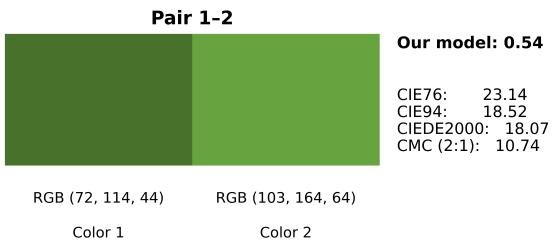

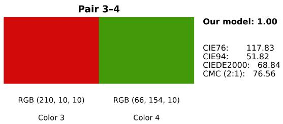

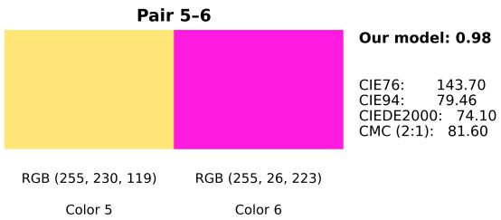

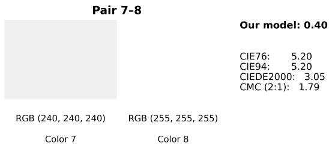

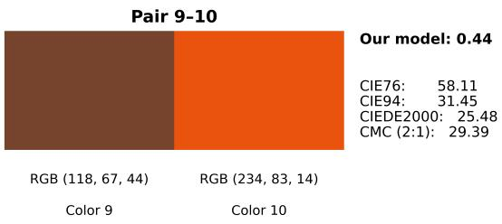

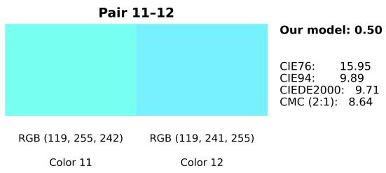

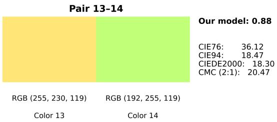

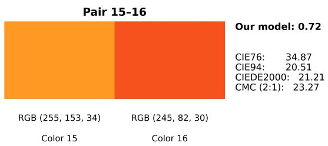  
Figure 5: Comparison of the proposed model with conventional color-diference measures.

Table VI: Linguistic comparison between the proposed model and CIEDE2000.
<table><tr><td>Pair</td><td>Model Difference</td><td>Model Similarity</td><td>Model Interpretation</td><td>∆E0o</td><td>CIEDE2000 Interpretation</td></tr><tr><td>1-2</td><td>0.539</td><td>0.461</td><td>Somewhat similar</td><td>18.066</td><td>Very much</td></tr><tr><td>3-4</td><td>1.000</td><td>0.000</td><td>Not similar</td><td>68.840</td><td>Strongly</td></tr><tr><td>5-6</td><td>0.982</td><td>0.018</td><td>Not similar</td><td>74.104</td><td>Strongly</td></tr><tr><td>7-8</td><td>0.403</td><td>0.597</td><td>Similar</td><td>3.047</td><td>Appreciable</td></tr><tr><td>9-10</td><td>0.444</td><td>0.556</td><td>Similar</td><td>25.478</td><td>Strongly</td></tr><tr><td>11-12</td><td>0.498</td><td>0.502</td><td>Similar</td><td>9.713</td><td>Much</td></tr><tr><td>13-14</td><td>0.878</td><td>0.122</td><td>Not similar</td><td>18.303</td><td>Very much</td></tr><tr><td>15-16</td><td>0.724</td><td>0.276</td><td>Somewhat similar</td><td>21.214</td><td>Very much</td></tr></table>

[16] G. Cui, M. R. Luo, B. Rigg, and L. Wei, “Colour-diference evaluation using crt colours. part ii: Parametric efects,” Color Research and Application, vol. 26, pp. 403–412, 2001. [Online]. Available: https://api.semanticscholar.org/CorpusID:122870100

[17] H. Xu and H. Yaguchi, “Visual evaluation at scale of threshold to suprathreshold color diference,” Color Research & Application, vol. 30, no. 3, pp. 198–208, 2005.

[18] Q. Xu, K. Shi, and M. R. Luo, “A parametric colourdiference study on the separation and cmf efects,” Color and Imaging Conference, 2022. [Online]. Available: https://api.semanticscholar.org/CorpusID:256723822

[19] B. Berlin and P. Kay, Basic color terms: Their university and evolution. California UP, 1969.

[20] O. E. Pecho, R. Ghinea, R. Alessandretti, M. M. Pérez, and A. Della Bona, “Visual and instrumental shade matching using cielab and ciede2000 color diference formulas,” Dental Materials, vol. 32, no. 1, pp. 82–92, 2016. [Online]. Available: https://www.sciencedirect.com/science/article/pii/S0109564115004455

[21] M. Huang, X. Shang, X. Gong, M. Wei, D. Wang, Y. Liu, and X. Li, “Acceptable color diferences for printed color samples,” Color Research & Application, vol. 50, no. 5, pp. 508–518, 2025.

[22] C. Wang, L. Hu, T. Talhelm, and X. Zhang, “The efects of colour complexity and similarity on multiple object tracking performance,” Quarterly Journal of Experimental Psychology, vol. 72, no. 8, p. 977–986, 2019.

[23] D. Rodríguez-Esparragón, J. Marcello, C. Gonzalo-Martín, Á. García-

Pedrero, and F. Eugenio, “Assessment of the spectral quality of fused images using the ciede2000 distance,” Computing, vol. 100, no. 11, pp. 1175–1188, 2018.

[24] S. Aligholi, R. Khajavi, and M. Razmara, “Automated mineral identification algorithm using optical properties of crystals,” Computers & geosciences, vol. 85, pp. 175–183, 2015.

[25] M. Melgosa, L. Gómez-Robledo, P. A. García, S. Morillas, C. Fernandez-Maloigne, N. Richard, M. Huang, C. Li, and G. Cui, “Color-quality control using color-diference formulas: progress and problems,” in Third International Conference on Applications of Optics and Photonics, vol. 10453. SPIE, 2017, pp. 201–207.

[26] J. Hasanov, S. Garibov, and A. Javadov, “Approximation of ciede2000 color closeness function using neuro-fuzzy networks,” Applied Intelligence, vol. 51, 12 2021.

[27] M. R. Luo, G. Cui, and C. Li, “Uniform colour spaces based on ciecam02 colour appearance model,” Color Research & Application: Endorsed by Inter-Society Color Council, The Colour Group (Great Britain), Canadian Society for Color, Color Science Association of Japan, Dutch Society for the Study of Color, The Swedish Colour Centre Foundation, Colour Society of Australia, Centre Français de la Couleur, vol. 31, no. 4, pp. 320–330, 2006.

[28] C. Li, Z. Li, Z. Wang, Y. Xu, M. R. Luo, G. Cui, M. Melgosa, M. H. Brill, and M. Pointer, “Comprehensive color solutions: Cam16, cat16, and cam16-ucs,” Color Research & Application, vol. 42, no. 6, pp. 703– 718, 2017.

[29] F. Mirjalili, M. R. Luo, G. Cui, and J. Morovic, “Color-diference formula for evaluating color pairs with no separation: ∆ENS,” Journal of the Optical Society of America A, vol. 36, no. 5, pp. 789–799, 2019.

[30] I. A. Konovalenko, A. A. Smagina, D. P. Nikolaev, and P. P. Nikolaev, “Prolab: a perceptually uniform projective color coordinate system,” IEEE Access, vol. 9, pp. 133 023–133 042, 2021.

[31] K. Misue, “Development of a tool to help understand color spaces and color diferences,” in 2020 24th International Conference Information Visualisation (IV), 2020, pp. 565–572.

[32] I. Lissner and P. Urban, “Toward a unified color space for perception-based image processing,” IEEE Transactions on Image Processing, vol. 21, pp. 1153–1168, 3 2012. [Online]. Available: https://ieeexplore.ieee.org/document/5975217

[33] Y. Niu, H. Zhang, W. Guo, and R. Ji, “Image quality assessment for color correction based on color contrast similarity and color value diference,” IEEE Transactions on Circuits and Systems for Video Technology, vol. 28, no. 4, pp. 849–862, 2018.

[34] R. Achanta, S. Hemami, F. Estrada, and S. Susstrunk, “Frequency-tuned salient region detection,” in 2009 IEEE conference on computer vision and pattern recognition. IEEE, 2009, pp. 1597–1604.

[35] D. Lee and K. N. Plataniotis, “Towards a full-reference quality assessment for color images using directional statistics,” IEEE Transactions on image processing, vol. 24, no. 11, pp. 3950–3965, 2015.

[36] L. Zhang, Z. Gu, and H. Li, “Sdsp: a novel saliency detection method by combining simple priors,” in 2013 IEEE international conference on image processing. IEEE, 2013, pp. 171–175.

[37] D. Lee and K. N. Plataniotis, “Towards anovel perceptual color diference metric using circular processing of hue components,” in 2014 IEEE International Conference on Acoustics, Speech and Signal Processing (ICASSP). IEEE, 2014, pp. 166–170.

[38] C. Shi and Y. Lin, “No reference image sharpness assessment based on global color diference variation,” Chinese Journal of Electronics, vol. 33, no. 1, pp. 293–302, 2024.

[39] G.-H. Liu and J.-Y. Yang, “Exploiting color volume and color diference for salient region detection,” IEEE Transactions on Image Processing, vol. 28, no. 1, pp. 6–16, 2019.

[40] D. A. Szafir, “Modeling color diference for visualization design,” IEEE Transactions on Visualization and Computer Graphics, vol. 24, no. 1, pp. 392–401, 2018.

[41] K. Misue and H. Kitajima, “Design tool of color schemes on the cielab space,” in 2016 20th International Conference Information Visualisation (IV), 2016, pp. 33–38.

[42] M. B. Kösesoy and S. Yilmaz, “A novel color diference-based method for palette extraction and evaluation using images of birds,” IEEE Access, 2025.

[43] P.-C. Wu and C.-H. Lin, “A green and practical color photograph printing technology based on color diference model and human perception,” IEEE Access, vol. 10, pp. 649–666, 2021.

[44] M. Muratbekova, N. Toganas, A. Igali, M. Shagyrov, E. Kadyrgali, A. Yerkin, and P. Shamoi, “Color models in image processing: a review and experimental comparison,” Discover Applied Sciences, vol. 8, no. 5, Mar. 2026. [Online]. Available: http://dx.doi.org/10.1007/s42452-025- 08192-7

[45] P. Shamoi, N. Toganas, M. Muratbekova, E. Kadyrgali, A. Yerkin, A. Igali, M. Ziyada, A. Adilova, A. Karatayev, and Y. Torekhan, “Colibri fuzzy model: Color linguistic-based representation and interpretation,” IEEE Access, vol. 13, pp. 205 932–205 956, 2025.

[46] T. Hastie, R. Tibshirani, and J. Friedman, The Elements of Statistical Learning: Data Mining, Inference, and Prediction, 2nd ed. New York: Springer, 2009.

[47] L. Breiman, J. H. Friedman, R. A. Olshen, and C. J. Stone, Classification and Regression Trees. Belmont, CA: Wadsworth, 1984.

[48] L. Breiman, “Random forests,” Machine Learning, vol. 45, no. 1, pp. 5–32, 2001.

[49] G. Ke, Q. Meng, T. Finley, T. Wang, W. Chen, W. Ma, Q. Ye, and T.-Y. Liu, “LightGBM: A highly eficient gradient boosting decision tree,” in Advances in Neural Information Processing Systems 30 (NIPS 2017), 2017, pp. 3146–3154.

[50] T. Chen and C. Guestrin, “XGBoost: A scalable tree boosting system,” in Proceedings of the 22nd ACM SIGKDD International Conference on Knowledge Discovery and Data Mining (KDD ’16), 2016, pp. 785–794.

[51] S.-S. Guan and M. R. Luo, “Recommendations on uniform color spaces, color-diference equations, psychometric color terms,” Commission Internationale de l’Eclairage (CIE), Tech. Rep. Publication No. 15, 1976.

[52] Commission Internationale de l’Eclairage, “Industrial colour-diference evaluation,” Commission Internationale de l’Eclairage (CIE), Tech. Rep. Publication No. 116, 1995.

[53] G. Sharma, W. Wu, and E. N. Dalal, “The ciede2000 color-diference formula: Implementation notes, supplementary test data, and mathematical observations,” Color Research and Application, vol. 30, no. 1, pp. 21–30, 2005.

[54] F. J. J. Clarke, R. McDonald, and B. Rigg, “Modification to the jpc79 colour-diference formula,” Journal of the Society of Dyers and Colourists, vol. 100, pp. 128–132, 1984.

[55] D. B. Judd and R. S. Hunter, “A new method for specifying color tolerances,” Journal of the Optical Society of America, vol. 38, no. 12, pp. 1095–1104, 1948.