# Physis-Lang: Self-Evolving Language as a Physical Representation for Video World Model

Liming Lu†2, Xianzheng Ma†3, Wenkun He†2, Guanqi Zhan†\*1 Yilin Zhao1, Junyu Chen1, Mengyao Xu1, Jiaojiao Fan1, Wenhang Ge1, Yuchao Gu1, Yunze Liu1 Boyi Li1, Zhen Dong1, Victor Prisacariu3, Ming-Yu Liu1, Song Han1, Han Cai\*1

1NVIDIA 2MIT 3University of Oxford † Equal Contribution, \*corresponding

Video world models are expected to predict how the physical world evolves, yet they often produce visually plausible videos that violate basic physical principles. Existing approaches commonly assume that natural language is insuficient to represent the physical knowledge required for reliable generation, and therefore introduce additional visual, latent, numerical, or planning-based signals. We revisit this assumption and introduce Physis-Lang, a self-evolving framework that treats physical language as a shared and optimizable representation across data curation, model training, and video generation. Physis-Lang represents physical processes through language that describes their relevant entities, causes, interactions, governing principles, temporal evolution, and efects. To improve this representation, we construct PhysCapBench, which decomposes physical processes into atomic assertions and evaluates captions using recall and precision. An agentic loop iteratively analyzes assertion-level errors and refines the instruction used to produce physical captions. Physis Lang further converts model deficiencies into textual descriptions and uses language-guided retrieval to identify visually diverse videos that cover missing physical processes. Experiments on four widely used physical video benchmarks with Wan and Cosmos backbones demonstrate consistent improvements in physical plausibility. Notably, starting from open-source Cosmos3-Nano backbones, our Physis-Lang-enhanced models surpass the leading proprietary Veo 3.1 model.

## Conventional Caption

Butter melts as the temperature rises.

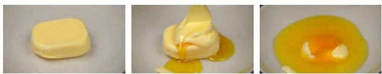

Our Physical Caption  
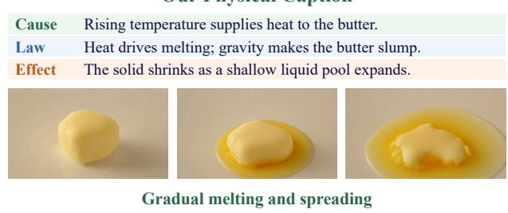  
Unnatural deformation and spreading

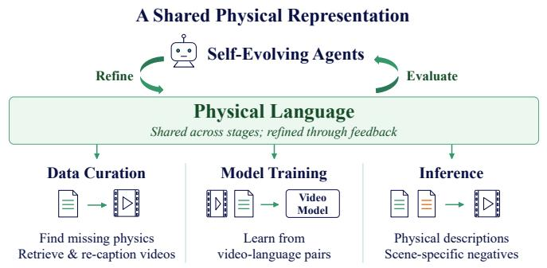

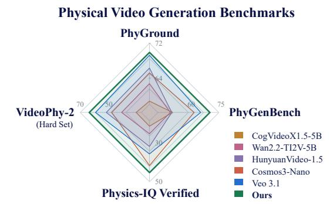  
Figure 1 | Overview of Physis-Lang. Existing approaches treat language mainly as a conditioning interface and introduce physical knowledge through separate visual, latent, numerical, or planning-based signals. Physis-Lang instead treats physical language as a shared and optimizable representation: an agentic loop evaluates and refines physical descriptions, language-guided retrieval expands the training data toward missing physical processes, and the evolved language supervises training and guides inference toward physicall plausible video generation.

## 1. Introduction

Video world models are expected not only to synthesize visually appealing videos, but also to predict how the physical world evolves. This capability is fundamental to embodied intelligence, robotics, autonomous systems, and interactive simulation, where a model must anticipate the consequences of actions rather than merely render plausible-looking frames. However, conventional video–text training primarily optimizes visual fidelity and semantic alignment, without explicitly representing the physical knowledge underlying observed dynamics; as a result, current video generation models still frequently violate basic physical principles: objects deform or disappear unexpectedly, collisions produce implausible outcomes, fluids move unnaturally, and causal events occur in the wrong order. Recent benchmarks have further shown that perceptual realism does not necessarily imply physical understanding [1, 2, 3, 4]. Improving the physical plausibility of video world models therefore remains a central challenge on the path toward general-purpose world simulation.

Existing eforts improve the physical plausibility of video generation by complementing the standard language interface with additional sources of physical information. They enrich video–text data with physics-focused videos or physical annotations [5, 6], introduce auxiliary signals about geometry, motion, or physical correctness during training [7, 8], and provide structured plans, retrieved examples, or external judgments during generation [9, 10]. Despite their diferent implementations, these approaches reflect a common design choice: natural language is primarily used to specify semantic content, while more detailed physical information is conveyed through complementary visual, geometric, latent, numerical, or human-designed signals. These complementary signals can provide useful supervision for aspects of physical processes that language alone may not fully capture. Yet an important possibility remains relatively unexplored: can language itself, when made more explicit and systematically optimized, serve as a unified representation of physical knowledge across the video-generation pipeline?

Motivated by this question, we hypothesize that the limited role of language in current video models may stem from language not yet being fully exploited as a representation of physical processes, rather than from an intrinsic limitation of language itself. Based on this view, we introduce Physis-Lang, a self-evolving agentic framework that constructs, evaluates, and refines physical language as a shared representation, as illustrated in Fig. 1. At the caption level, Physis-Lang goes beyond describing visible actions and makes the relevant physical entities, causal interactions, governing principles, and resulting efects explicit. The self-evolving representation is then reused throughout the pipeline: it guides data curation by identifying missing physical domains and selecting relevant videos, provides supervision for training on video–language pairs, and guides inference through scene-specific physical descriptions. In this way, the three components shown at the bottom of Fig. 1 are connected by the shared physical language at its center, enabling the system to organize, evaluate, and transfer physical knowledge across data curation, training, and inference.

To build this shared representation, we first instantiate it at the caption level through an agentic captionevolution loop grounded by our physics-aware critic and PhysCapBench. Given a fixed captioning model and an initial instruction, the model generates candidate physical descriptions for videos in our development set. For each video, we provides human-curated reference assertions organized around cause, physical law, and efect. Using these references, our critic evaluates each candidate description along two dimensions: its coverage of the relevant physical knowledge and the faithfulness of its individual claims to the visual evidence. An evolution agent uses this diagnostic feedback to identify omissions, unsupported claims, and vague causal relations, and then revises the captioning instruction without updating the captioner’s weights. Each instruction is then evaluated on our PhysCapBench within the same loop, which continues until benchmark performance saturates. The best-performing instruction is then used to re-caption the training corpus. Thus, our physics-aware critic provides the loop feedback and PhysCapBench provides stopping criterion for language evolution, while Physis-Lang turns that feedback into improved physical descriptions for video-model training and inference.

The self-evolving physical language also enables Physis-Lang to expand the training distribution toward physical domains that the target video model handles poorly. It first summarizes the model’s failures into a category-level deficiency profile. These deficient domains are then matched against physics tags associated with videos in a large gallery. Unlike retrieval based solely on visual similarity, this language-guided matching selects videos according to their physical content rather than their appearance, allowing the data engine to target missing physical domains and collect visually diverse examples relevant to the same deficiency. The selected videos are re-captioned with the self-evolving guidelines and added to the training corpus, directing additional supervision toward the model’s weaknesses. Together with positive physical reasoning and scene-specific negative descriptions at inference time, this language-guided data engine connects targeted data curation, model training, and generation through a shared physical-language representation.

Our main contributions are summarized as follows:

• We introduce a new perspective that treats language as a physical world representation. We show that language, when explicitly structured and self-evolving, can serve as a representation for carrying, refining, and applying physical knowledge in video world models.

• We develop a self-evolving agent system that optimizes physical-language guidelines using a physicsaware critic. We introduce PhysCapBench to evaluate physical coverage and claim faithfulness and to guide iterative refinement.

• We build a language-guided data engine that uses physics-domain tags and text-level matching to select training videos relevant to model deficiencies, then enriches them with self-evolving physical captions.

• Extensive experiments on four physical video benchmarks demonstrate significant and consistent improvements on both Wan and Cosmos backbones. Our resulting models also outperform Veo 3.1 under the same evaluation protocols, validating language as a practical representation for improving video world models.

## 2. Related Work

Physics-Aware Video Generation. Recent eforts to enhance the physical plausibility of video generative models can be categorized by the source of the physical priors they exploit. The largest line of work draws physical priors from pretrained vision-language or foundation models, utilizing them to distill implicit physical dynamics into auxiliary branches [11, 12, 7, 13, 14, 15, 16], retrieve physically grounded reference motions [17, 18, 19], verify or critique generated contents [9, 20, 21, 22, 23, 24, 25, 26], or plan over intermediate representations before rendering [27, 28, 29, 30, 31]. A second line treats physical plausibility as an objective to be optimized via reinforcement learning or preference optimization, aligning the generator with reward or preference signals derived from physics-aware judges or contrastive trajectories [32, 33, 34, 35, 36, 37, 38, 39, 40]. A third line of works injects explicit graphics- or simulator-derived structures like physical equations, trajectories, or executable simulation code into the generation pipeline [8, 41, 42, 43, 44, 10, 45, 46, 47, 48]. Some works also curate large-scale physics-annotated datasets [6, 5, 49].

Despite these advances, most existing approaches rely on auxiliary mechanisms, such as reward models, intermediate features, or retrieved samples, to incorporate physical knowledge. Simulation-based approaches, on the other hand, are constrained by high computational costs and limited generalizability. In contrast, we posit that language provides a compact, explicit, and transferable representation of physical knowledge. Building on this view, we introduce an agentic self-evolution prompting scheme that iteratively refines the language representation to better capture physical priors. Diferent from the views of many recent works, we prove that language alone is very powerful to lead to physically plausible video generation if we utilize it properly.

Agentic Self-Evolution. Self-evolution has emerged as a distinct paradigm for improving agents, which has been applied to a range of tasks, including web navigation [50, 51, 52, 53], mathematical and code reasoning [54, 55, 56, 57, 58, 59, 60], general instruction-following and question answering [61, 62], as well as interactive tool use [63, 64, 65]. Across these tasks, an agent’s prompts, policy, memory, or tools are iteratively refined. Representative methods involve revising subsequent attempts through verbal self-critique of past failures [66, 67, 68], using the model itself as a judge to construct preference data for iterative alignment training [69, 70], or training agents via multi-turn reinforcement learning within an interactive environment [71, 72, 73]. In contrast, we are the first to apply agentic self-evolution to physics reasoning that ultimately enhances the physical realism of video generation tasks. We establish a physics caption benchmark to evaluate the agents, which allows the upsampled prompts to converge toward a format that is optimally suited for generating physically realistic videos.

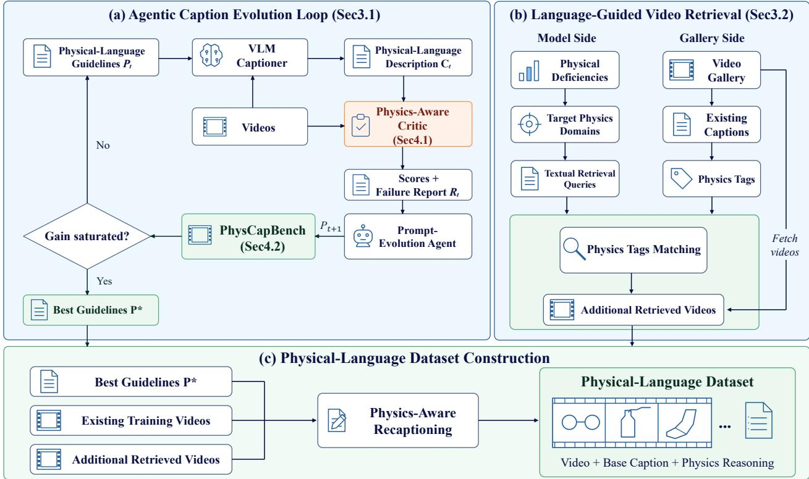  
Figure 2 | Overview of our method. Physical processes are represented through natural language, including a base caption, explicit physics reasoning, and scene-adaptive negative physics descriptions. A PhysCapBench driven agentic loop evaluates and refines this physical language, which is then used to expand the training data, supervise video-model training, and guide inference toward physically plausible generation.

## 3. Method

## 3.1. Self-Evolving Agents to Improve Physics Caption

Fig. 2(a) demonstrates the overview of our agentic caption evolution loop. Conventional captions often describe scene semantics without explaining physical causes and consequences. We make these mechanisms explicit in language so that video–text training can provide richer supervision for physical dynamics. To this end, we augment base caption with a natural-language physics\_reasoning field describing physical details, dynamics, and causal relations. The same representation supports training supervision and image/text-conditioned prompt expansion at inference. Because captioning instructions can omit key details or induce unsupported reasoning, we use a self-evolving agent to iteratively refine the instruction while keeping the captioning model fixed.

To enable systematic prompt evolution, we first develop a physics-aware critic that evaluates the correctness and completeness of physical descriptions. The detailed protocol is introduced in Sec. 4.1. Based on this critic, we further introduce PhysCapBench, a held-out benchmark of 246 physical videos for evaluating physics-aware video captioning. It serves both as a standalone benchmark and as the validation set for prompt evolution.

We then construct an agentic self-evolution loop over a fixed 20-video development set. At iteration $t ,$ a fixed captioner uses prompt $P _ { t }$ to generate captions $\mathcal { C } _ { t }$ . The critic produces a score and diagnostic report $R _ { t }$ which summarizes errors and guides an evolution agent to revise the prompt: $P _ { t } \to \mathcal { C } _ { t } \to R _ { t } \to P _ { t + 1 }$ . After each iteration, the updated prompt is evaluated on PhysCapBench. We continue the loop while benchmark performance improves and stop once the gain saturates, selecting the best-performing prompt as the final physics-captioning instruction. Detailed implementation is provided in App. B.2.

During training, we apply the final captioner to re-caption the collected videos with physics-rich descriptions. During inference, we construct a corresponding upsampler that expands short text prompt and an input image (optional) into a detailed physics-aware prompt, providing the video generator with more explicit physical guidance and improving the physical realism of the generated video. We further derive a scene-specific physics\_negative\_prompt describing likely physically implausible evolutions, which serves as negative conditioning to suppress physical inconsistencies and improve generation realism at inference time.

## 3.2. Language-Guided Video Retrieval

Beyond improving the linguistic representation of physical processes, we further leverage language as a key modality for targeted data expansion, using it to identify and collect training examples that address the physical deficiencies of pretrained video generative models. Fig. 2(b) illustrates the framework of this data collecting pipeline.

We first build a GPT-5.5-based diagnosis agent to identify physical failures in generated videos and assign each failure to physics categories, such as rigid-body motion, collision and fluid dynamics. Aggregating these results yields a category-level deficiency profile that captures the model’s dominant physical weaknesses. We then utilize this profile to retrieve targeted training data from a large video gallery, where each candidate video is tagged with physics-domain labels derived from its caption, enabling retrieval that matches the deficient categories. The retrieved videos are added to the training set and re-captioned with our physics-aware pipeline in Sec. 3.1. In this way, language connects model diagnosis, data indexing, and targeted data acquisition, allowing the training distribution to be adapted to the generator’s observed physical weaknesses.

## 3.3. PhysThinker for Physics Reasoning

The VLM captioner and upsampler introduced in Sec. 3.1 are initially instantiated with proprietary models. While these models provide strong physics reasoning capability, relying on them for large-scale video recaptioning and inference-time upsampling incurs high monetary cost.

To address this issue, we replace the costly GPT-based captioner and upsampler by distilling their physics reasoning capabilities into two eficient 4B vision-language models: PhysThinker-C for physics-aware video captioning and PhysThinker-U for inference-time prompt upsampling. PhysThinker-C learns from GPT-generated video-to-text annotations, while PhysThinker-U is trained to expand short text or imagetext conditions into physics-rich prompts. Together, they provide scalable and low-cost alternatives to commercial models for large-scale annotation and inference. Training details of our PhysThinker are provided in App. B.5.3.

## 4. Benchmark and Critic

## 4.1. Critics for Physics Caption

Fig. 3(b) illustrates the overview of our physics-aware critic used in the agentic loop. To systematically evaluate whether a video caption faithfully and comprehensively represents the physical dynamics in a video, inspired by the caption evaluation protocol used by Cosmos 3 [74], we adopt precision and recall on the atomic assertions as critics, and specialize both metrics to physical content. Precision evaluates whether generated physical claims are visually supported by the video, while recall measures coverage of salient physical processes.

For evaluation of precision, the critic first decomposes the complete generated caption into atomic and independently verifiable claims. The critic is then given the full video together with each atomic claim and classifies it as correct, incorrect, or uncertain. We compute micro-averaged precision as Precision = $N _ { \mathrm { c o r r e c t } } / ( N _ { \mathrm { c o r r e c t } } + N _ { \mathrm { i n c o r r e c t } } )$ . Recall instead focuses specifically on physical dynamics. The critic receives the generated caption together with a set of human-curated atomic physical assertions and determines whether each ground-truth assertion is suficiently covered by the caption. An assertion receives a positive match only when the caption explicitly states or unambiguously entails its complete physical meaning. Recall is therefore computed as Recal $\mathsf { l } = N _ { \mathrm { p a s s } } / N _ { \mathrm { g r o u n d - t r u t h } }$ . We finally report the F1 score, defined as the harmonic mean of precision and recall, $\mathrm { F 1 } \stackrel { - } { = } 2 \cdot \mathrm { P r e c i s i o n } \cdot \mathrm { R e c a l l } / ( \mathrm { P r e c i s i o n } + \mathrm { R e c a l l } )$ , as an overall measure of caption quality.

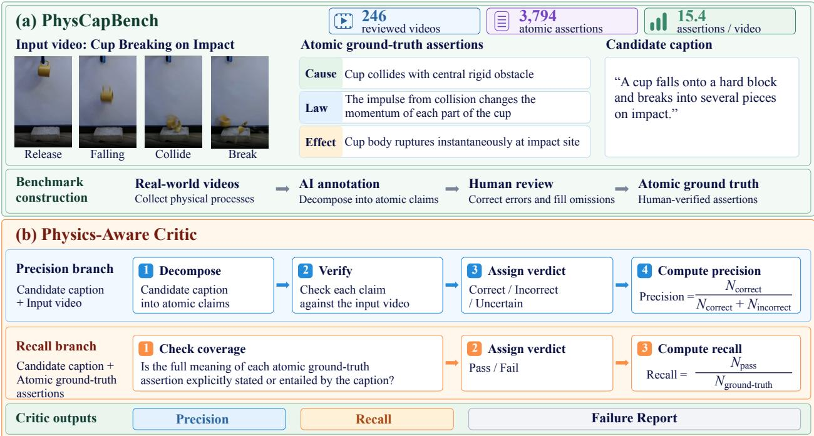  
Figure 3 | Overview of our physics-aware critic and physics caption benchmark. The critic evaluates generated captions from complementary precision and recall perspectives by verifying atomic claims against the input video and measuring the coverage of human-curated physical assertions.

## 4.2. Physics Caption Benchmark

Based on the critic, we further introduce PhysCapBench (Fig. 3(a)), a dedicated benchmark for evaluating whether video captioning models can faithfully and comprehensively describe salient physical phenomena and their underlying dynamics, consisting of 246 physics-rich videos collected from Physics-IQ [3] and YouTube. We construct fine-grained physical annotations for each video using an agent-assisted, human-verified pipeline. AI annotators identify salient physical processes and decompose them into atomic assertions describing causes, relevant physical laws and efects. All candidate annotations are subsequently reviewed by humans, who remove incorrect or ambiguous assertions and supplement missing ones when necessary.

The final PhysCapBench contains 3,794 human-verified physical assertions over 246 videos, with an average of 15.4 assertions per video. These annotations provide fine-grained supervision for evaluating whether a caption captures the key physical dynamics and reasoning in each video. Detailed implementations are provided in App. B.1, and benchmark samples are listed in App. E.

## 5. Experiment

## 5.1. Experimental Details

Dataset and Backbones. At the core of Physis-Lang is the construction of a physics-enriched video– language training dataset comprising 183K real-world videos. It combines 71K high-quality samples filtered from WISA-80K [75] with 112K additional videos selected through our deficiency-guided retrieval pipeline (Sec. 3.2). We use the dataset to fine-tune several existing video-generation backbones without modifying their architectures and training objectives. Specifically, we consider Wan2.1-14B [76], for which the T2V-14B and I2V-14B variants are fine-tuned separately, and the Cosmos3 family [74], including Edge (4B), Nano (16B), and Super (64B), whose unified backbone supports both T2V and I2V generations. Further implementation details are provided in App. B.

Baselines and Evaluation. Our comparison involves cutting-edge pretrained models, including CogVideoX1.5- 5B [77], Wan2.2-TI2V-5B [76], HunyuanVideo-1.5 [78], and the closed-source Veo 3.1. We also compare with other methods for promoting physical realism, including PhysVid [27], PhyGDPO [79], Self-Refinement [26], Kandinsky-WM [80], and PhiZero [31]. The evaluation is conducted on four widely used physical benchmarks: VideoPhy-2 [2] and PhyGenBench [1] for Text-to-Video (T2V) generation, and PhyGround [81] and Physics-IQ Verified [82] for Image-to-Video (I2V) generation. To better distinguish diferences in generation quality, we replace the original ofline VLM evaluators of VideoPhy-2 and PhyGenBench with GPT-5.5, which provides more discriminative assessments in our comparisons (App. G). We evaluate all models using the same scoring protocol within each benchmark to ensure fair comparisons.

Table 1 | Physical fidelity on Physics-IQ Verified.
<table><tr><td>Model</td><td>ST</td><td>S</td><td>wS</td><td>MSE</td><td>Final</td></tr><tr><td>CogVideoX1.5-5B [77]</td><td>17.41</td><td>34.49</td><td>21.71</td><td>16.18</td><td>22.45</td></tr><tr><td>Wan2.2-TI2V-5B [76]</td><td>23.26</td><td>33.89</td><td>23.18</td><td>23.19</td><td>25.88</td></tr><tr><td>HunyuanVideo-1.5 [78]</td><td>22.80</td><td>47.10</td><td>30.46</td><td>26.05</td><td>31.60</td></tr><tr><td>Veo 3.1</td><td>19.01</td><td>52.16</td><td>35.45</td><td>33.32</td><td>34.99</td></tr><tr><td>Kandinsky-WM [80]</td><td>25.69</td><td>36.37</td><td>17.22</td><td>12.69</td><td>22.99</td></tr><tr><td>Self-Refinement [26]</td><td>22.49</td><td>37.93</td><td>23.25</td><td>25.13</td><td>27.20</td></tr><tr><td>PhiZero [31]</td><td>56.79</td><td>37.01</td><td>27.59</td><td>42.29</td><td>40.91</td></tr><tr><td>Cosmos3-Nano</td><td>29.38</td><td>51.76</td><td>38.92</td><td>40.87</td><td>40.23</td></tr><tr><td>Ours (Cosmos3-Nano)</td><td>33.59</td><td>55.38</td><td>42.45</td><td>42.23</td><td>43.41</td></tr></table>

Table 3 | Physical correctness on PhyGenBench.

Table 2 | Physical adherence on PhyGround.
<table><tr><td>Model</td><td>General</td><td>Physics</td><td>Overall</td></tr><tr><td>CogVideoX1.5-5B [77]</td><td>59.02</td><td>58.36</td><td>58.68</td></tr><tr><td>Wan2.2-TI2V-5B [76]]</td><td>62.94</td><td>62.46</td><td>62.70</td></tr><tr><td>HunyuanVideo-1.5 [78]</td><td>67.14</td><td>65.42</td><td>66.28</td></tr><tr><td>Veo 3.1</td><td>71.92</td><td>66.54</td><td>69.24</td></tr><tr><td>Kandinsky-WM [80]</td><td>58.96</td><td>57.28</td><td>58.12</td></tr><tr><td>Self-Refinement [26]</td><td>58.54</td><td>57.88</td><td>58.22</td></tr><tr><td>PhiZero [31]</td><td>52.27</td><td>63.42</td><td>57.85</td></tr><tr><td>Cosmos3-Nano</td><td>65.46</td><td>64.90</td><td>65.18</td></tr><tr><td>Ours (Cosmos3-Nano)</td><td>71.54</td><td>68.26</td><td>69.90</td></tr></table>

<table><tr><td>Model</td><td>Force</td><td>Light</td><td>Heat</td><td>Material</td><td>Overall</td></tr><tr><td>CogVideoX1.5-5B [77]</td><td>38.33</td><td>57.33</td><td>55.56</td><td>43.33</td><td>48.75</td></tr><tr><td>Wan2.2-TI2V-5B [76]</td><td>40.83</td><td>60.67</td><td>43.33</td><td>40.83</td><td>47.50</td></tr><tr><td>HunyuanVideo-1.5 [78]</td><td>47.50</td><td>56.67</td><td>44.44</td><td>41.67</td><td>48.33</td></tr><tr><td>Veo 3.1</td><td>65.00</td><td>70.67</td><td>57.78</td><td>65.83</td><td>65.63</td></tr><tr><td>PhysVid [27]</td><td>48.33</td><td>62.00</td><td>33.33</td><td>40.83</td><td>47.92</td></tr><tr><td>PhyGDPO [79]</td><td>43.33</td><td>62.67</td><td>43.33</td><td>41.67</td><td>48.96</td></tr><tr><td>Self-Refinement [26]</td><td>46.67</td><td>59.33</td><td>44.44</td><td>42.50</td><td>49.17</td></tr><tr><td>Cosmos3-Nano</td><td>64.17</td><td>64.00</td><td>57.78</td><td>59.17</td><td>61.67</td></tr><tr><td>Ours (Cosmos3-Nano)</td><td>67.50</td><td>72.67</td><td>75.56</td><td>69.17</td><td>71.04</td></tr></table>

Table 4 | Physical commonsense on VideoPhy-2.
<table><tr><td>Model</td><td>SA</td><td>PC</td><td>SA≥4</td><td>PC≥4</td><td>All</td><td>Hard</td></tr><tr><td>CogVideoX1.5-5B [77]</td><td>3.74</td><td>4.10</td><td>63.79</td><td>74.79</td><td>49.41</td><td>33.15</td></tr><tr><td>Wan2.2-TI2V-5B [76]]</td><td>3.69</td><td>4.39</td><td>60.91</td><td>85.45</td><td>53.98</td><td>42.13</td></tr><tr><td>HunyuanVideo-1.5 [78]</td><td>3.84</td><td>4.57</td><td>67.85</td><td>92.39</td><td>62.94</td><td>51.69</td></tr><tr><td>Veo 3.1</td><td>4.39</td><td>4.06</td><td>84.43</td><td>80.54</td><td>68.87</td><td>58.43</td></tr><tr><td>PhysVid [27]</td><td>3.50</td><td>4.27</td><td>55.33</td><td>82.74</td><td>48.22</td><td>29.78</td></tr><tr><td>PhyGDPO [79]</td><td>3.74</td><td>4.64</td><td>62.27</td><td>93.57</td><td>59.56</td><td>44.94</td></tr><tr><td>Self-Refinement [26]</td><td>3.60</td><td>4.26</td><td>56.01</td><td>82.91</td><td>47.88</td><td>28.09</td></tr><tr><td>Cosmos3-Nano</td><td>3.86</td><td>4.49</td><td>66.33</td><td>90.19</td><td>60.41</td><td>48.31</td></tr><tr><td>Ours (Cosmos3-Nano)</td><td>4.09</td><td>4.44</td><td>75.97</td><td>89.00</td><td>68.02</td><td>62.36</td></tr></table>

## 5.2. Comparison with State-of-the-Art Models

Tables 1–4 compare Cosmos3-Nano fine-tuned using our Physis-Lang with cutting-edge generative models and other baselines designed to improve physical realism in video generation. For better comparison, we rescale each benchmark to a 100-point scoring scale. We highlight three key advantages of our method: (i) Consistent and significant improvement over base model. Building on pretrained Cosmos3, Physis-Lang further improves its performance across all four evaluated physical video benchmarks. (ii) State-of-the-art among open-source models. Our method achieves the strongest performance among all open-source models and methods across the four benchmarks. (iii) Outperforming the best closed-source model. Our method surpasses Veo 3.1 on Physics-IQ Verified, PhyGround, and PhyGenBench, and remains competitive on VideoPhy-2, trailing by only 0.85 points on the full set (68.02 vs. 68.87) while outperforming it by 3.93 points on the hard split (62.36 vs. 58.43). Qualitative examples in App. C demonstrate the improved generation quality of our method across the evaluated benchmarks, while App. D further shows our strong performance in driving and robotics scenarios.

## 5.3. Generalization across Backbones and Scales

Tab. 5 evaluates whether our method generalizes across model families and parameter scales. We draw three conclusions: (i) Consistent gains across model families. Our method improves Wan2.1-14B and Cosmos3-Nano-16B by 7.05 and 6.22 points on average, respectively, with gains on all four physical benchmarks. (ii) Efectiveness across model scales. Within the Cosmos 3 family, our method yields average gains of 3.24, 6.22, and 5.02 points on Edge-4B, Nano-16B, and Super-64B, respectively. These results demonstrate benefits across a broad range of model sizes. (iii) Preserved general video quality. Our fine-tuning strategy does not compromise general video generation quality; please refer to App. H for more details.

Table 5 | Efectiveness on diferent backbones. Each cell shows the improvement brought by our method. Mean Δ is the average improvement across the four benchmarks.
<table><tr><td>Generator</td><td></td><td>PhyGenBench Physics-IQ Verified VideoPhy-2 PhyGround</td><td></td><td></td><td></td><td></td><td>Mean ∆</td></tr><tr><td colspan="8"> $A c r o s s ~ m o d e l ~ f a m i l i e s$ </td></tr><tr><td> $\mathrm { W a n 2 . 1 - 1 4 B }$ </td><td> $5 6 . 6 7  6 5 . 8 3$ </td><td> $2 7 . 8 7  3 5 . 1 5$ </td><td></td><td> $5 7 . 0 2  6 5 . 6 5$ </td><td> $6 1 . 5 2  6 4 . 6 4$ </td><td></td><td>+7.05</td></tr><tr><td> $\mathrm { C o s m o s 3 - N a n o - 1 6 B }$ </td><td> $6 1 . 6 7  7 1 . 0 4$ </td><td> $4 0 . 2 3  4 3 . 4 1$ </td><td></td><td> $6 0 . 4 1  6 8 . 0 2$ </td><td> $6 5 . 1 8  6 9 . 9 0$ </td><td></td><td>+6.22</td></tr><tr><td colspan="8"> $_ { A c r o s s \ C o s m o s \ s c a l e s }$ </td></tr><tr><td> $\mathrm { C o s m o s 3 - E d g e - 4 B }$ </td><td> $4 8 . 9 6  5 2 . 5 0$ </td><td> $3 2 . 8 0 \to 3 4 . 6 9$ </td><td></td><td> $3 2 . 9 9 \to 4 0 . 6 1$ </td><td></td><td> $6 6 . 6 6 \to 6 6 . 5 6$ </td><td>+3.24</td></tr><tr><td> $\mathrm { C o s m o s 3 - N a n o - 1 6 B }$ </td><td> $6 1 . 6 7  7 1 . 0 4$ </td><td> $4 0 . 2 3  4 3 . 4 1$ </td><td></td><td> $6 0 . 4 1  6 8 . 0 2$ </td><td></td><td> $6 5 . 1 8  6 9 . 9 0$ </td><td>+6.22</td></tr><tr><td> $\mathrm { C o s m o s 3 - S u p e r - 6 4 B }$ </td><td> $6 6 . 0 4  7 0 . 2 1$ </td><td> $4 5 . 9 2  5 0 . 0 0$ </td><td></td><td> $6 0 . 9 1  7 2 . 4 2$ </td><td></td><td> $6 8 . 6 7  6 8 . 9 8$ </td><td>+5.02</td></tr></table>

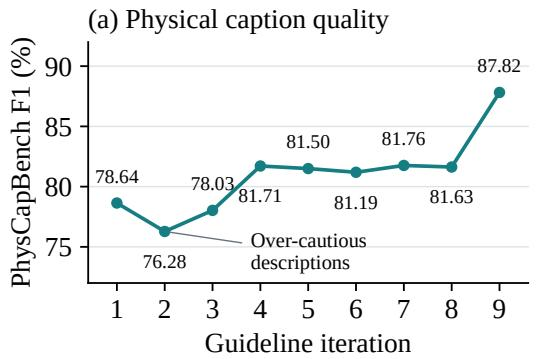

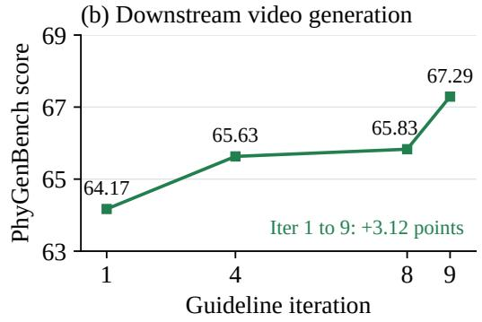  
Figure 4 | From caption evolution to video generation. Left: PhysCapBench F1 at diferent iterations. Right: physics-aware video generation performance of the same pretrained Cosmos3 model with inference captions produced at diferent iterations.

## 5.4. Ablation and Analysis

## 5.4.1. Agentic Caption Evolution

Fig. 4 evaluates whether caption evolution improves both physical descriptions and downstream video generation. We highlight two observations: (i) The agentic loop improves physical caption quality. On PhysCapBench, the F1 score increases from 78.64 at Iteration 1 to 87.82 at Iteration 9, showing the efectiveness of critic-guided guideline refinement. (ii) The self-evolving guidelines improve video generation. Keeping the pretrained Cosmos3-Nano fixed, we change only the inference captions produced using guidelines from Iterations 1, 4, 8 and 9. PhyGenBench scores increase from 64.17 to 65.63, 65.83 and 67.29, respectively. App. A provides the complete evolution trajectory. App. F analyses the efect of physics\_reasoning derived from our agentic loop.

## 5.4.2. Language-Guided Data Curation

Language-guided data curation (Sec. 3.2) consistently improves physical generation. Adding retrieved videos to the training set improves benchmarks, for an average gain of 3.01 points (Tab. 6). To further examine whether these gains are consistent across our physical tags, we break down the improvements on VideoPhy-2 by physical category (a sample may belong to multiple categories). The gains are positive across all frequently represented categories, such as chemical processes (+8.00), fracture mechanics (+7.45), and cloth deformation (+7.19 points) (Fig. 5).

## 5.4.3. Prompting, Fine-Tuning, and Negative Guidance

Tab. 7 highlights three findings: (i) Physical prompting is efective without fine-tuning. Our physical reasoning prompt improves the pretrained model from 61.67 to 63.33 (A → C), demonstrating a zero-shot gain. Moreover, our agentic loop further improves over the manually designed prompt [79](B → C), validating the efectiveness. (ii) SFT provides additional gains. With inference prompts fixed, fine-tuning brings further improvement: 3.55 points (C → G) and 3.75 points (D → H). (iii) Negative guidance complements SFT.

Table 6 | Efect of retrieved training data. Benchmark scores before and after data expansion.
<table><tr><td>Benchmark</td><td>WISA + Retrieved Gain</td><td></td><td></td></tr><tr><td>PhyGenBench</td><td>68.12</td><td>71.04 +2.92</td><td></td></tr><tr><td>Physics-IQ Verified</td><td>40.68</td><td>43.41+2.73</td><td></td></tr><tr><td>VideoPhy-2</td><td>64.63</td><td>68.02 +3.39</td><td></td></tr><tr><td>Mean</td><td>57.81</td><td>60.82 +3.01</td><td></td></tr></table>

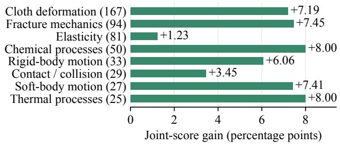  
Figure 5 | VideoPhy-2 category gains after retrieval.

Table 7 | Prompting and SFT on PhyGenBench. Base: base caption; M: manually designed physics caption; P: physics\_reasoning; N: physics\_negative\_prompt.
<table><tr><td>ID</td><td>SFT data</td><td>Prompt</td><td>Score</td><td>ID</td><td>SFT data</td><td></td><td>Prompt</td><td></td><td></td><td>Score</td></tr><tr><td>A</td><td>None</td><td>Base</td><td>61.67</td><td>E</td><td>WISA</td><td></td><td>Base + P</td><td></td><td></td><td>65.62</td></tr><tr><td>B</td><td>None</td><td>M</td><td>61.86</td><td>F</td><td>WISA</td><td></td><td> $\mathrm { B a s e + P + N }$ </td><td></td><td></td><td>68.12</td></tr><tr><td>C</td><td>None</td><td>Base + P</td><td>63.33</td><td>G</td><td></td><td>WISA + retrieved</td><td>Base + P</td><td></td><td></td><td>66.88</td></tr><tr><td>D</td><td>None</td><td> $\mathrm { B a s e + P + N }$ </td><td>67.29</td><td>H</td><td></td><td>WISA + retrieved</td><td> $\mathrm { B a s e + P + N }$ </td><td></td><td></td><td>71.04</td></tr></table>

Adding physics negative prompts improves the fine-tuned model by 2.50 (E → F) and 4.16 points (G → H), respectively.

## 5.5. Open-Source Deployment with PhysThinker

We train PhysThinker-C and PhysThinker-U for video captioning and inference-time prompt upsampling, respectively. Tab. 8 demonstrates an accuracy–cost trade-of: commercial, captioner-only replacement, and fully local pipelines improve over the pretrained baseline by 7.05, 6.76, and 4.76 points on average, while estimated external annotation costs decrease from \$24.12K to \$0.12K and \$0. Costs cover the re-captioning of training data and the upsampling for benchmarks, whereas accuracy is averaged on four reported benchmarks.

Table 8 | PhysThinker replacement on Wan2.1-14B. VideoPhy-2 reports All / Hard; Cost denotes API expenditure for training-data captioning and benchmark upsampling (USD).
<table><tr><td>Captioner</td><td>Upsampler</td><td></td><td>PhyGenBench Physics-IQ Verified</td><td>VideoPhy-2</td><td>PhyGround Mean ∆</td><td></td><td>Cost (USD)</td></tr><tr><td>Pretrained Wan2.1-14B</td><td></td><td>56.67</td><td>27.87</td><td>57.02 / 43.82</td><td>61.52</td><td></td><td></td></tr><tr><td>Commercial</td><td>Commercial</td><td>65.83</td><td>35.15</td><td>65.65 59.55</td><td>64.64</td><td>+7.05</td><td>~24.12K</td></tr><tr><td>PhysThinker-C</td><td>Commercial</td><td>65.00</td><td>34.71</td><td>65.99 54.49</td><td>64.40</td><td>+6.76</td><td>~0.12K</td></tr><tr><td>PhysThinker-C PhysThinker-U</td><td></td><td>63.33</td><td>34.13</td><td>60.07 55.06</td><td>64.60</td><td>+4.76</td><td>0</td></tr></table>

## 6. Conclusion

Video world models require physical plausibility beyond visual quality. We introduce Physis-Lang, which treats structured physical language as a shared representation across data curation, model training, and inference. PhysCapBench and an agentic self-evolution loop refine physical captions, while language-guided retrieval targets missing physical processes. Experiments with Wan2.1 and Cosmos3 family models across four physical benchmarks of video generation show consistent and significant improvements over the pretrained models. These results show that language, when explicitly structured and self-evolving, can serve not merely as a conditioning interface, but as a practical representation for carrying, refining, and applying physical knowledge in video world models.

## References

[1] Fanqing Meng, Jiaqi Liao, Xinyu Tan, Quanfeng Lu, Wenqi Shao, Kaipeng Zhang, Yu Cheng, Dianqi Li, and Ping Luo. Towards world simulator: Crafting physical commonsense-based benchmark for video generation. In International Conference on Machine Learning, pages 43781–43806. PMLR, 2025.

[2] Hritik Bansal, Clark Peng, Yonatan Bitton, Roman Goldenberg, Aditya Grover, and Kai-Wei Chang. VideoPhy-2: A challenging action-centric physical commonsense evaluation in video generation. In International Conference on Learning Representations, 2026.

[3] Saman Motamed, Laura Culp, Kevin Swersky, Priyank Jaini, and Robert Geirhos. Do generative video models understand physical principles? In Proceedings of the IEEE/CVF Winter Conference on Applications of Computer Vision, pages 948–958, 2026.

[4] Fengzhe Zhou, Jiannan Huang, Jialuo Li, Deva Ramanan, and Humphrey Shi. PAI-Bench: A comprehensive benchmark for physical AI. In Proceedings of the IEEE/CVF Conference on Computer Vision and Pattern Recognition, pages 21522–21536, 2026.

[5] Chenyu Li, Oscar Michel, Xichen Pan, Sainan Liu, Mike Roberts, and Saining Xie. PISA experiments: Exploring physics post-training for video difusion models by watching stuf drop. In International Conference on Machine Learning, pages 35685–35709. PMLR, 2025.

[6] Siyuan Zhou, Hejun Wang, Hu Cheng, Jinxi Li, Dongsheng Wang, Junwei Jiang, Yixiao Jin, Jiayue Huang, Shiwei Mao, Shangjia Liu, Yafei Yang, Hongkang Song, Shenxing Wei, Zihui Zhang, Bing Wang, Zhihua Wang, Chuhang Zou, and Bo Yang. PhysInOne: Visual physics learning and reasoning in one suite. In Proceedings of the IEEE/CVF Conference on Computer Vision and Pattern Recognition, pages 33131–33142, 2026.

[7] Ying Shen, Jerry Xiong, Tianjiao Yu, and Ismini Lourentzou. PHANTOM: Physics-infused video generation via joint modeling of visual and latent physical dynamics. In Proceedings of the IEEE/CVF Conference on Computer Vision and Pattern Recognition, pages 11185–11194, 2026.

[8] Yu Yuan, Xijun Wang, Tharindu Wickremasinghe, Zeeshan Nadir, Bole Ma, and Stanley H. Chan. NewtonGen: Physics-consistent and controllable text-to-video generation via neural Newtonian dynamics. In International Conference on Learning Representations, 2026.

[9] Yutong Hao, Chen Chen, Ajmal Saeed Mian, Chang Xu, and Daochang Liu. Enhancing physical plausibility in video generation by reasoning the implausibility. arXiv preprint arXiv:2509.24702, 2025.

[10] Sihan Zhuang, Xinyuan Chen, Tianfan Xue, and Yaohui Wang. Causalmotion: Structured physical reasoning as keyframe and trajectory guidance for training-free video generation. arXiv preprint arXiv:2606.14317, 2026.

[11] Aritra Bhowmik, Denis Korzhenkov, Cees G. M. Snoek, Amirhossein Habibian, and Mohsen Ghafoorian. MoAlign: Motion-centric representation alignment for video difusion models. In International Conference on Learning Representations, 2026.

[12] Siddarth Nilol Kundur Satish, Devesh Jaiswal, Hongyu Chen, and Abhishek Bakshi. Physvideogenerator: Towards physically aware video generation via latent physics guidance. arXiv preprint arXiv:2601.03665, 2026.

[13] Shubo Lin, Xuanyang Zhang, Wei Cheng, Weiming Hu, Gang Yu, and Jin Gao. Mmphysvideo: Physically plausible video generation through joint rgb-perception modeling. arXiv preprint arXiv:2604.02817, 2026.

[14] Selena Song, Ziming Xu, Zijun Zhang, Kun Zhou, Jiaxian Guo, Lianhui Qin, and Biwei Huang. Learning plug-and-play memory for guiding video difusion models. arXiv preprint arXiv:2511.19229, 2025.

[15] Manjin Kim, Suha Kwak, and Minsu Cho. Tempered self-similarity alignment for physically plausible video generation. In Proceedings of the IEEE/CVF Conference on Computer Vision and Pattern Recognition Workshops, pages 5148–5158, 2026.

[16] Zijun Wang, Panwen Hu, Jing Wang, Terry Jingchen Zhang, Yuhao Cheng, Long Chen, Yiqiang Yan, Zutao Jiang, Hanhui Li, and Xiaodan Liang. ProPhy: Progressive physical alignment for dynamic world simulation. In Proceedings of the IEEE/CVF Conference on Computer Vision and Pattern Recognition, pages 14492–14501, 2026.

[17] Elia Peruzzo, Dejia Xu, Xingqian Xu, Humphrey Shi, and Nicu Sebe. RagMe: Retrieval augmented video generation for enhanced motion realism. In Proceedings of the 2025 International Conference on Multimedia Retrieval, pages 1081–1090, 2025.

[18] Chenhui Zhu, Yilu Wu, Shuai Wang, Gangshan Wu, and Limin Wang. MotionRAG: Motion retrieval-augmented image-to-video generation. Advances in Neural Information Processing Systems, 38:192087–192110, 2025.

[19] Kexu Cheng, Zicheng Liu, Mingju Gao, Chunhe Song, and Hao Tang. PhysRAG: Enhancing physics-awareness in video generation via retrieval-augmented generation. In European Conference on Computer Vision, pages 558–578. Springer, 2026.

[20] Subin Kim, Sangwoo Mo, Mamshad Nayeem Rizve, Yiran Xu, Difan Liu, Jinwoo Shin, and Tobias Hinz. Rethinking prompt design for inference-time scaling in text-to-visual generation. In Proceedings of the IEEE/CVF Conference on Computer Vision and Pattern Recognition, pages 22090–22099, 2026.

[21] Chujun Tang, Lei Zhong, and Fangqiang Ding. Seeking physics in difusion noise. arXiv preprint arXiv:2603.14294, 2026.

[22] Jianhao Yuan, Xiaofeng Zhang, Felix Friedrich, Nicolas Beltran-Velez, Melissa Hall, Reyhane Askari-Hemmat, Xiaochuang Han, Nicolas Ballas, Michal Drozdzal, and Adriana Romero-Soriano. Inference-time physics alignment of video generative models with latent world models. In Proceedings of the IEEE/CVF Conference on Computer Vision and Pattern Recognition, pages 16118–16129, 2026.

[23] Zengqun Zhao, Ziquan Liu, Yu Cao, Shaogang Gong, Zhensong Zhang, Jifei Song, Jiankang Deng, and Ioannis Patras. LatSearch: Latent reward-guided search for faster inference-time scaling in video difusion. In European Conference on Computer Vision, pages 170–189. Springer, 2026.

[24] Ke Zhang, Cihan Xiao, Jiacong Xu, Yiqun Mei, and Vishal M. Patel. Think before you difuse: Infusing physical rules into video difusion. arXiv preprint arXiv:2505.21653, 2025.

[25] Qiyao Xue, Xiangyu Yin, Boyuan Yang, and Wei Gao. PhyT2V: LLM-guided iterative self-refinement for physics-grounded text-to-video generation. In Proceedings of the IEEE/CVF Conference on Computer Vision and Pattern Recognition (CVPR), pages 18826–18836, 2025.

[26] Yang Liu, Xilin Zhao, Peisong Wen, Siran Dai, and Qingming Huang. Bootstrapping physics-grounded video generation through vlm-guided iterative self-refinement. arXiv preprint arXiv:2511.20280, 2025.

[27] Saurabh Pathak, Elahe Arani, Mykola Pechenizkiy, and Bahram Zonooz. PhysVid: Physics aware local conditioning for generative video models. In Proceedings of the IEEE/CVF Conference on Computer Vision and Pattern Recognition, pages 41847–41858, 2026.

[28] Yuxiang Feng, Juncheng Wang, Chao Xu, Yijie Qian, Huihan Wang, Wenlong Hou, Yang Liu, Baigui Sun, Yong Liu, and Shujun Wang. Newton: Agentic planning for physically grounded video generation. arXiv preprint arXiv:2605.18396, 2026.

[29] Zixuan Wang, Yixin Hu, Haolan Wang, Feng Chen, Yan Liu, Wen Li, and Yinjie Lei. Chain of event-centric causal thought for physically plausible video generation. In Proceedings of the IEEE/CVF Conference on Computer Vision and Pattern Recognition, pages 38122–38131, 2026.

[30] Ziqi Huang, Ning Yu, Gordon Chen, Haonan Qiu, Paul Debevec, and Ziwei Liu. VChain: Chain-of-visual-thought for reasoning in video generation. In Findings of the Association for Computational Linguistics: ACL 2026, pages 226–250, 2026.

[31] Shuyao Shang, Yuqi Wang, Ruopeng Gao, Xu Chen, Tieniu Tan, Lue Fan, and Zhaoxiang Zhang. Phizero: A world model built around physical language. arXiv preprint arXiv:2607.28624, 2026.

[32] Harold Haodong Chen, Haojian Huang, Qifeng Chen, Harry Yang, and Ser-Nam Lim. Hierarchical fine-grained preference optimization for physically plausible video generation. Advances in Neural Information Processing Systems, 38:148434–148466, 2025.

[33] Peiyao Wang, Weining Wang, and Qi Li. Physcorr: Dual-reward dpo for physics-constrained text-to-video generation with automated preference selection. arXiv preprint arXiv:2511.03997, 2025.

[34] Pu Zhao, Juyi Lin, Timothy Rupprecht, Arash Akbari, Chence Yang, Rahul Chowdhury, Elaheh Motamedi, Arman Akbari, Yumei He, Chen Wang, Geng Yuan, Weiwei Chen, and Yanzhi Wang. Phyworld: Physics-faithful world model for video generation. arXiv preprint arXiv:2605.19242, 2026.

[35] Jingyuan Zhu, Biaolong Chen, Le Zhang, Aixi Zhang, Hao Jiang, and Pipei Huang. Difusion-apo: Trajectory-aware direct preference alignment for video difusion transformers. arXiv preprint arXiv:2605.07503, 2026.

[36] Siwei Meng, Yawei Luo, Shu Zhang, and Ping Liu. When physical preferences meet semantic constraints: Physical and semantic direct preference optimization for text-to-video generation. arXiv preprint arXiv:2607.16947, 2026. Accepted to ACM Multimedia 2026.

[37] Jiaxing Li, Jiepeng Wang, Junyao Gao, Yang Liu, Eric Li, Bo An, and Hao-Xiang Guo. DynamicsBoost: Dynamic plausible video generation via annotation-free continuation preference optimization. In Proceedings of the IEEE/CVF Conference on Computer Vision and Pattern Recognition, pages 20024–20033, 2026.

[38] Shang Wu, Chenwei Xu, Zhuofan Xia, Weijian Li, Lie Lu, Pranav Maneriker, Fan Du, Manling Li, and Han Liu. Phyprompt: Rl-based prompt refinement for physically plausible text-to-video generation. arXiv preprint arXiv:2603.03505, 2026.

[39] Yifan Wang, Yanyu Li, Gordon Guocheng Qian, Sergey Tulyakov, Yun Fu, and Anil Kag. Difusion-drf: Free, rich, and diferentiable reward for video difusion fine-tuning. arXiv preprint arXiv:2601.04153, 2026.

[40] Abolfazl Meyarian, Amin Karimi Monsefi, Rajiv Ramnath, and Ser-Nam Lim. Direct: Disentangled regularization of contrastive trajectories for physics-refined video generation. arXiv preprint arXiv:2603.25931, 2026.

[41] Zhifei Chen, Tianshuo Xu, Leyi Wu, Luozhou Wang, Dongyu Yan, Zihan You, Wenting Luo, Guo Zhang, and Yingcong Chen. Stance: Motion coherent video generation via sparse-to-dense anchored encoding. arXiv preprint arXiv:2510.14588, 2025.

[42] Xueyu Luan and Chenwei Shi. Ph-dreamer: A physics-driven world model via port-hamiltonian generative dynamics. arXiv preprint arXiv:2605.18303, 2026.

[43] Stefan Andreas Baumann, Jannik Wiese, Tommaso Martorella, Mahdi M. Kalayeh, and Björn Ommer. Envisioning the future, one step at a time. In Proceedings of the IEEE/CVF Conference on Computer Vision and Pattern Recognition, pages 6823–6836, 2026.

[44] Nick Stracke, Kolja Bauer, Stefan Andreas Baumann, Miguel Ángel Bautista, Josh Susskind, and Björn Ommer. Learning long-term motion embeddings for eficient kinematics generation. In Proceedings of the IEEE/CVF Conference on Computer Vision and Pattern Recognition, pages 42581–42591, 2026.

[45] Guofeng Zhang, Angtian Wang, Jacob Zhiyuan Fang, Liming Jiang, Haotian Yang, Bo Liu, Yiding Yang, Guang Chen, Longyin Wen, Alan Yuille, and Chongyang Ma. TGT: Text-grounded trajectories for locally controlled video generation. In Proceedings of the IEEE/CVF Conference on Computer Vision and Pattern Recognition, pages 22028–22037, 2026.

[46] Tianshuo Xu, Zhifei Chen, Leyi Wu, Hao Lu, and Ying-cong Chen. Motion forcing: A decoupled framework for robust video generation in motion dynamics. arXiv preprint arXiv:2603.10408, 2026.

[47] Xiangyu Bai, He Liang, Bishoy Galoaa, Utsav Nandi, Shayda Moezzi, Yuhang He, and Sarah Ostadabbas. MoReGen: Multi-agent motion-reasoning engine for code-based text-to-video synthesis. In Proceedings of the IEEE/CVF Conference on Computer Vision and Pattern Recognition, pages 7632–7642, 2026.

[48] Haodong Li, Tianfei Ren, Xiaoxiao Ma, Chunmei Qing, Zhen Fang, Sipeng He, Ziyu Guo, Haoyu Wu, Juanxi Tian, Yihang Zou, Ruichuan An, Dongzhi Jiang, Boxue Yang, Ji Xie, Xu Huang, Wenhao Yan, Jialv Zou, Zhengrong Yue, Yaxin Luo, Xiaotong Li, Yuzhu Wang, Junyan Ye, Jinjing Zhao, Zehui Chen, Lin Chen, Renye Yan, Feng Zhao, and Pheng-Ann Heng. Videococo: Code-as-cot for physically-consistent video generation via an agentic dual-engine system. arXiv preprint arXiv:2607.27380, 2026.

[49] Yanxun Li, Hao Wen, Bingze Song, Jiashu Zhu, Aiming Hao, Chubin Chen, Jintao Chen, Jiahong Wu, Xiangxiang Chu, and Miao Wang. Learning explicit physical parameter control and benchmarking for video generation. arXiv preprint arXiv:2607.18924, 2026.

[50] Pranav Putta, Edmund Mills, Naman Garg, Sumeet Motwani, Chelsea Finn, Divyansh Garg, and Rafael Rafailov. Agent q: Advanced reasoning and learning for autonomous ai agents. arXiv preprint arXiv:2408.07199, 2024.

[51] Tianqing Fang, Hongming Zhang, Zhisong Zhang, Kaixin Ma, Wenhao Yu, Haitao Mi, and Dong Yu. WebEvolver: Enhancing web agent self-improvement with co-evolving world model. In Proceedings of the 2025 Conference on Empirical Methods in Natural Language Processing, pages 8959–8975, 2025.

[52] Shikhar Murty, Christopher D. Manning, Peter Shaw, Mandar Joshi, and Kenton Lee. BAGEL: Bootstrapping agents by guiding exploration with language. In International Conference on Machine Learning, pages 36894–36910. PMLR, 2024.

[53] Hongliang He, Wenlin Yao, Kaixin Ma, Wenhao Yu, Hongming Zhang, Tianqing Fang, Zhenzhong Lan, and Dong Yu. OpenWebVoyager: Building multimodal web agents via iterative real-world exploration, feedback and optimization. In Proceedings of the 63rd Annual Meeting of the Association for Computational Linguistics (Volume 1: Long Papers), pages 27545–27564, 2025.

[54] Chengsong Huang, Wenhao Yu, Xiaoyang Wang, Hongming Zhang, Zongxia Li, Ruosen Li, Jiaxin Huang, Haitao Mi, and Dong Yu. R-Zero: Self-evolving reasoning LLM from zero data. In International Conference on Learning Representations, 2026.

[55] Mert Yuksekgonul, Federico Bianchi, Joseph Boen, Sheng Liu, Zhi Huang, Carlos Guestrin, and James Zou. Textgrad: Automatic "diferentiation" via text. arXiv preprint arXiv:2406.07496, 2024.

[56] Lakshya A. Agrawal, Shangyin Tan, Dilara Soylu, Noah Ziems, Rishi Khare, Krista Opsahl-Ong, Arnav Singhvi, Herumb Shandilya, Michael J. Ryan, Meng Jiang, Christopher Potts, Koushik Sen, Alexandros G. Dimakis, Ion Stoica, Dan Klein, Matei Zaharia, and Omar Khattab. GEPA: Reflective prompt evolution can outperform reinforcement learning. In International Conference on Learning Representations, 2026.

[57] Mirac Suzgun, Mert Yuksekgonul, Federico Bianchi, Dan Jurafsky, and James Zou. Dynamic cheatsheet: Test-time learning with adaptive memory. In Proceedings of the 19th Conference of the European Chapter of the Association for Computational Linguistics (Volume 1: Long Papers), pages 7080–7106, 2026.

[58] Qizheng Zhang, Changran Hu, Shubhangi Upasani, Boyuan Ma, Fenglu Hong, Vamsidhar Kamanuru, Jay Rainton, Chen Wu, Mengmeng Ji, Hanchen Li, Urmish Thakker, James Zou, and Kunle Olukotun. Agentic context engineering: Evolving contexts for self-improving language models. In International Conference on Learning Representations, 2026.

[59] Xunjian Yin, Xinyi Wang, Liangming Pan, Li Lin, Xiaojun Wan, and William Yang Wang. Gödel agent: A self-referential agent framework for recursively self-improvement. In Proceedings of the 63rd Annual Meeting of the Association for Computational Linguistics (Volume 1: Long Papers), pages 27890–27913, 2025.

[60] Chen Ling, Pei Chen, Albert Guan, Jiaming Qu, Shayan Ali Akbar, Madhu Gopinathan, and Erwin Cornejo. Pace: Two-timescale self-evolution for small language model agents. arXiv preprint arXiv:2605.23019, 2026.

[61] Yizhong Wang, Yeganeh Kordi, Swaroop Mishra, Alisa Liu, Noah A. Smith, Daniel Khashabi, and Hannaneh Hajishirzi. Self-instruct: Aligning language models with self-generated instructions. In Proceedings of the 61st Annual Meeting of the Association for Computational Linguistics (Volume 1: Long Papers), pages 13484–13508, 2023.

[62] Can Xu, Qingfeng Sun, Kai Zheng, Xiubo Geng, Pu Zhao, Jiazhan Feng, Chongyang Tao, Qingwei Lin, and Daxin Jiang. WizardLM: Empowering large pre-trained language models to follow complex instructions. In International Conference on Learning Representations, 2024.

[63] Yunpeng Zhai, Shuchang Tao, Cheng Chen, Anni Zou, Ziqian Chen, Qingxu Fu, Shinji Mai, Li Yu, Jiaji Deng, Zouying Cao, Zhaoyang Liu, Bolin Ding, and Jingren Zhou. Agentevolver: Towards eficient self-evolving agent system. arXiv preprint arXiv:2511.10395, 2025.

[64] Zherui Yang, Fan Liu, Yansong Ning, and Hao Liu. EvoDS: Self-evolving autonomous data science agent with skill learning and context management. In Proceedings of the 32nd ACM SIGKDD Conference on Knowledge Discovery and Data Mining V.2, pages 6128–6139, 2026.

[65] Qifan Zhang, Dongyang Ma, Tianqing Fang, Jia Li, Jing Tang, Nuo Chen, Haitao Mi, and Yan Wang. Training llm agents for spontaneous, reward-free self-evolution via world knowledge exploration. arXiv preprint arXiv:2604.18131, 2026.

[66] Noah Shinn, Federico Cassano, Ashwin Gopinath, Karthik Narasimhan, and Shunyu Yao. Reflexion: Language agents with verbal reinforcement learning. Advances in Neural Information Processing Systems, 36, 2023.

[67] Akari Asai, Zeqiu Wu, Yizhong Wang, Avirup Sil, and Hannaneh Hajishirzi. Self-RAG: Learning to retrieve, generate, and critique through self-reflection. In International Conference on Learning Representations, 2024.

[68] Minda Hu, Tianqing Fang, Jianshu Zhang, Jun-Yu Ma, Zhisong Zhang, Jingyan Zhou, Hongming Zhang, Haitao Mi, Dong Yu, and Irwin King. WebCoT: Enhancing web agent reasoning by reconstructing chain-of-thought in reflection, branching, and rollback. In Findings of the Association for Computational Linguistics: EMNLP 2025, pages 5155–5173, 2025.

[69] Renat Aksitov, Sobhan Miryoosefi, Zonglin Li, Daliang Li, Sheila Babayan, Kavya Kopparapu, Zachary Fisher, Ruiqi Guo, Sushant Prakash, Pranesh Srinivasan, Manzil Zaheer, Felix Yu, and Sanjiv Kumar. Rest meets react: Self-improvement for multi-step reasoning llm agent. arXiv preprint arXiv:2312.10003, 2023.

[70] Weizhe Yuan, Richard Yuanzhe Pang, Kyunghyun Cho, Xian Li, Sainbayar Sukhbaatar, Jing Xu, and Jason E. Weston. Self-rewarding language models. In International Conference on Machine Learning, pages 57905–57923. PMLR, 2024.

[71] Zihan Wang, Kangrui Wang, Qineng Wang, Pingyue Zhang, Linjie Li, Zhengyuan Yang, Xing Jin, Kefan Yu, Minh Nhat Nguyen, Licheng Liu, Eli Gottlieb, Yiping Lu, Kyunghyun Cho, Jiajun Wu, Li Fei-Fei, Lijuan Wang, Yejin Choi, and Manling Li. Ragen: Understanding self-evolution in llm agents via multi-turn reinforcement learning. arXiv preprint arXiv:2504.20073, 2025.

[72] Guhong Chen, Yingcheng Shi, Yongbin Li, Binhua Li, Xander Xu, Hu Wei, Shiwen Ni, Min Yang, and Jieping Ye. Evotrainer: Co-evolving llm policies and training harnesses for autonomous agentic reinforcement learning. arXiv preprint arXiv:2606.03108, 2026.

[73] Yihao Hu, Zhihao Wen, Xiujin Liu, Pan Wang, Xin Zhang, and Wei Wu. Seal: Synergistic co-evolution of agents and learning environments. arXiv preprint arXiv:2605.24426, 2026.

[74] NVIDIA, Aditi, Niket Agarwal, Arslan Ali, Jon Allen, Martin Antolini, Adeline Aubame, Alisson Azzolini, Junjie Bai, Maciej Bala, Yogesh Balaji, Josh Bapst, Aarti Basant, Mukesh Beladiya, Mohammad Qazim Bhat, Zaid Pervaiz Bhat, Dan Blick, Vanni Brighella, Han Cai, Tifany Cai, Eric Cameracci, Jiaxin Cao, Yulong Cao, Mark Carlson, Carlos Casanova, Ting-Yun Chang, Yan Chang, Yu-Wei Chao, Prithvijit Chattopadhyay, Roshan Chaudhari, Chieh-Yun Chen, Junyu Chen, Ke Chen, Qizhi Chen, Wenkai Chen, Xiaotong Chen, Yu Chen, An-Chieh Cheng, Click Cheng, Xiu Chia, Jeana Choi, Chaeyeon Chung, Wenyan Cong, Yin Cui, Magdalena Dadela, Nalin Dadhich, Wenliang Dai, Joyjit Daw, Alperen Degirmenci, Rodrigo Vieira Del Monte, Robert Denomme, Sameer Dharur, Marco Di Lucca, Ke Ding, Wenhao Ding, Yifan Ding, Yuzhu Dong, Nicole Drumheller, Yilun Du, Aigul Dzhumamuratova, Aleksandr Efitorov, Hamid Eghbalzadeh, Naomi Eigbe, Imad El Hanafi, Hassan Eslami, Benedikt Falk, Jiaojiao Fan, Jim Fan, Amol Fasale, Sergiy Fefilatyev, Liang Feng, Francesco Ferroni, Sanja Fidler, Xiao Fu, Vikram Fugro, Prashant Gaikwad, TJ Galda, Katelyn Gao, Yihuai Gao, Wenhang Ge, Sreyan Ghosh, Arushi Goel, Vivek Goel, Akash Gokul, Rama Govindaraju, Jinwei Gu, Miguel Guerrero, Elfie Guo, Aryaman Gupta, Siddharth Gururani, Hugo Hadfield, Song Han, Ankur Handa, Zekun Hao, Mohammad Harrim, Ali Hassani, Nathan Hayes-Roth, Yufan He, Chris Helvig, Cyrus Hogg, Madison Huang, Michael Huang, Sophia Huang, Yufan Huang, Jacob Hufman, DeLesley Hutchins, Suneel Indupuru, Boris Ivanovic, Arihant Jain, Joel Jang, Ryan Ji, Yanan Jian, Dongfu Jiang, Jingyi Jin, Atharva Joshi, Nikhilesh Joshi, Pranjali Joshi, Andy Ju, Jaehun Jung, Weiwei Kang, Scott Kassekert, Jan Kautz, Ashna Khetan, Julia Kiczka, Slawek Kierat, Gwanghyun Kim, Kuno Kim, Sunny Kim, Kezhi Kong, Xin Kong, Zhifeng Kong, Tomasz Kornuta, Egor Krivov, Hui Kuang, Saurav Kumar, Chia-Wen Kuo, George Kurian, Wojciech Kutak, JF Lafleche, Himangshu Lahkar, Omar Laymoun, Jayjun Lee, Sanggil Lee, Gabriele Leone, Boyi Li, Freya Li, Jiajun Li, Jinfeng Li, Ling Li, Pengcheng Li, Shangru Li, Tingle Li, Xiaolong Li, Xuan Li, Zhaoshuo Li, Zhiqi Li, Hao Liang, Maosheng Liao, Chen-Hsuan Lin, Tsung-Yi Lin, Ming-Yu Liu, Sifei Liu, Zihan Liu, Hai Loc Lu, Xiangyu Lu, Alice Luo, Ruipu Luo, Wenjie Luo, Jiangran Lyu, Martin Ding Ma, Nic Ma, Qianli Ma, Dawid Majchrowski, Louis Marcoux, Miguel Martin, Qing Miao, Ashkan Mirzaei, Shreyas Misra, Kaichun Mo, Durra Mohsin, Hyejin Moon, Pawel Morkisz, Saeid Motiian, Kirill Motkov, Seungjun Nah, Yashraj Narang, Deepak Narayanan, Thabang Ngazimbi, Julian Ouyang, Shubham Pachori, David Page, Yatian Pang, Sehwi Park, Mahesh Patekar, Mostofa Patwary, Marco Pavone, Trung Pham, Wei Ping, Soha Pouya, Shrimai Prabhumoye, Varun Praveen, Delin Qu, Hesam Rabeti, Morteza Ramezanali, Marilyn Reeb, Xuanchi Ren, Kristen Rumley, Wojciech Rymer, Jun Saito, Yeongho Seol, John Shao, Piyush Shekdar, Tianwei Shen, Humphrey Shi, Min Shi, Stella Shi, Kevin Shih, Mohammad Shoeybi, Mateusz Sieniawski, Shuran Song, Alexander Sotelo, Amir Sotoodeh, Sunil Srinivasa, Vignesh Srinivasakumar, Bartosz Stefaniak, Rahul Heinrich Steiger, Shangkun Sun, Jiaxiang Tang, Shitao Tang, Yangyang Tang, Yue Tang, Tolou Tavakkoli, Kayley Ting, Krzysztof Tomala, Wei-Cheng Tseng, Jibin Varghese, Sergei Vasilev, Thomas Volk, Raju Wagwani, Roger Walefe, Andrew Z. Wang, Boxiang Wang, Haoxiang Wang, Qiao Wang, Shihao Wang, Shijie Wang, Ting-Chun Wang, Yan Wang, Yu Wang, Rohit Watve, David Wehr, Fangyin Wei, Xinshuo Weng, Jay Zhangjie Wu, Kedi Wu, Hongchi Xia, Summer Xiao, Tianjun Xiao, Kevin Xie, Daguang Xu, Jiashu Xu, Mengyao Xu, Ruqing Xu, Xingqian Xu, Yao Xu, Dinghao Yang, Dong Yang, Hans Yang, Xiaodong Yang, Xuning Yang, Yichu Yang, Yurong You, Zhiding Yu, Hao Yuan, Simon Yuen, Xiaohui Zeng, Pengcuo Zeren, Cindy Zha, Haotian Zhang, Jenny Zhang, Jing Zhang, Liangkai Zhang, Paris Zhang, Shun Zhang, Xuanmeng Zhang, Zhizheng Zhang, Ann Zhao, Yilin Zhao, Yuliya Zhautouskaya, Charles Zhou, Fengzhe Zhou, Shilin Zhu, Yuke Zhu, Dima Zhylko, and Artur Zolkowski. Cosmos 3: Omnimodal world models for physical ai. arXiv preprint arXiv:2606.02800, 2026.

[75] Jing Wang, Ao Ma, Ke Cao, Jun Zheng, Zhanjie Zhang, Jiasong Feng, Shanyuan Liu, Yuhang Ma, Bo Cheng, Dawei Leng, Yuhui Yin, and Xiaodan Liang. Wisa: World simulator assistant for physics-aware text-to-video generation, 2025.

[76] Team Wan, Ang Wang, Baole Ai, Bin Wen, Chaojie Mao, Chen-Wei Xie, Di Chen, Feiwu Yu, Haiming Zhao, Jianxiao Yang, Jianyuan Zeng, Jiayu Wang, Jingfeng Zhang, Jingren Zhou, Jinkai Wang, Jixuan Chen, Kai Zhu, Kang Zhao, Keyu Yan, Lianghua Huang, Mengyang Feng, Ningyi Zhang, Pandeng Li, Pingyu Wu, Ruihang Chu, Ruili Feng, Shiwei Zhang, Siyang Sun, Tao Fang, Tianxing Wang, Tianyi Gui, Tingyu Weng, Tong Shen, Wei Lin, Wei Wang, Wei Wang, Wenmeng Zhou, Wente Wang, Wenting Shen, Wenyuan Yu, Xianzhong Shi, Xiaoming Huang, Xin Xu, Yan Kou, Yangyu Lv, Yifei Li, Yijing Liu, Yiming Wang, Yingya Zhang, Yitong Huang, Yong Li, You Wu, Yu Liu, Yulin Pan, Yun Zheng, Yuntao Hong, Yupeng Shi, Yutong Feng, Zeyinzi Jiang, Zhen Han, Zhi-Fan Wu, and Ziyu Liu. Wan: Open and advanced large-scale video generative models. arXiv preprint arXiv:2503.20314, 2025.

[77] Zhuoyi Yang, Jiayan Teng, Wendi Zheng, Ming Ding, Shiyu Huang, Jiazheng Xu, Yuanming Yang, Wenyi Hong, Xiaohan Zhang, Guanyu Feng, et al. CogVideoX: Text-to-video difusion models with an expert transformer. In International Conference on Learning Representations, 2025.

[78] Tencent Hunyuan Foundation Model Team. Hunyuanvideo 1.5 technical report. arXiv preprint arXiv:2511.18870, 2025.

[79] Yuanhao Cai, Kunpeng Li, Menglin Jia, Jialiang Wang, Junzhe Sun, Feng Liang, Weifeng Chen, Felix Juefei-Xu, Chu Wang, Ali Thabet, Xiaoliang Dai, Xuan Ju, Alan Yuille, and Ji Hou. PhyGDPO: Physics-aware groupwise direct preference optimization for physically consistent text-to-video generation. In European Conference on Computer Vision, pages 91–109. Springer, 2026.

[80] Kandinsky Lab. Kandinsky wm 1.0: A family of models for physical ai. https://github.com/kandinskylab kandinsky-wm, 2026. Image-to-video models for autonomous driving, robotics, and general physics.

[81] Juyi Lin, Arash Akbari, Yumei He, Lin Zhao, Haichao Zhang, Arman Akbari, Xingchen Xu, Zoe Y. Lu, Enfu Nan, Hokin Deng, Edmund Yeh, Sarah Ostadabbas, Yun Fu, Jennifer Dy, Pu Zhao, and Yanzhi Wang. Phyground: Benchmarking physical reasoning in generative world models. arXiv preprint arXiv:2605.10806, 2026.

[82] Tim Rädsch, Yuki M Asano, Hilde Kuehne, Stefan Bauer, Priyank Jaini, Robert Geirhos, and Carsten T. Lüth. Physics-iq verified, 2026.

[83] Hyung Won Chung, Noah Constant, Xavier Garcia, Adam Roberts, Yi Tay, Sharan Narang, and Orhan Firat. UniMax: Fairer and more efective language sampling for large-scale multilingual pretraining. In International Conference on Learning Representations, 2023.

## Appendix

## A. Prompt Self-Evolution Analysis

As mentioned in Sec. 5.4.1, to better understand how the captioning prompt evolves during iterations, here we visualize the F1-score curve on PhysCapBench in Fig. 6. The annotations summarize five observed representative modifications to the prompt design.

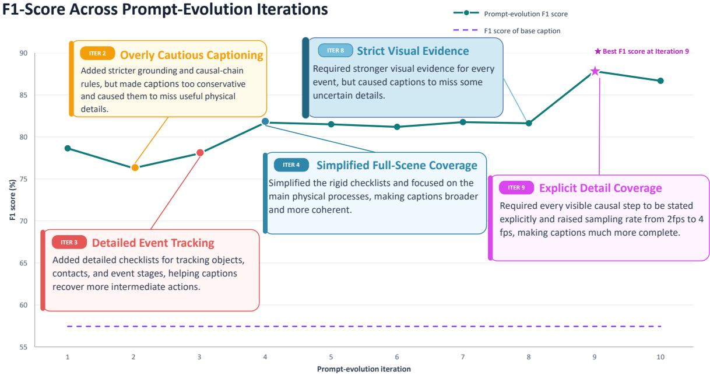

Figure 6 | F1-score trajectory across prompt self-evolution iterations on PhysCapBench. The dashed purple line denotes the F1 score of base caption. The five callouts summarize the representative prompt modifications introduced at Iterations 2, 3, 4, 8 and 9. The star identifies the best-performing iteration. The annotations describe the prompt-design changes, whereas all plotted F1 scores are obtained from PhysCapBench.

## B. Additional Implementation Details

## B.1. Physcapbench and Evaluation Protocol

As illustrated in Sec. 4.2, our PhysCapBench contains 246 videos and includes 3,794 human-verified physicaldynamics assertions with a mean of 15.42 assertions per video. All captions are evaluated by Gemini-3-Flash, using temperature 0.1, a 65,536-token JSON-output limit, and batches of at most 30 claims. Precision decomposes the caption into atomic claims, verifies each against the video, and computes $N _ { \mathrm { c o r r e c t } } / ( N _ { \mathrm { c o r r e c t } } +$ $N _ { \mathrm { { i n c o r r e c t } } } )$ . Recall denotes the proportion of the 3,794 reference assertions supported by the generated caption.

## B.2. More Details on the Agentic Loop

Here we elaborate more implementation details for our agentic loop described in Sec. 3.1. We optimized the physics captions through a generate–critic–revise loop on a fixed development set of 20 videos, which is randomly sampled from our training set, with 273 human-verified atomic physics assertions in total. At each iteration, a fixed GPT-5.5 captioner processed temporally ordered frames and jointly generated physics\_reasoning and physics\_negative\_prompt in a single call, while only physics\_reasoning was scored. We use Gemini-3.1-Pro to measure assertion-level recall and video-grounded claim precision, and the evolution agent used both aggregate scores and claim-level failure rationales to revise the prompt.

To construct the upsampling prompt, we preserved the physics-focused requirements of the final caption prompt while adapting its input interface. Instead of describing the visual content from scratch, the upsampler expands the original short benchmark caption, together with visual inputs when required, into the same structured physics\_reasoning and physics\_negative\_prompt fields.

## B.3. Long Context Support on Wan

In Sec. 5.1, one of the backbones going through our fine-tuning is Wan2.1 [76]. The text encoder UMT5- XXL [83] of Wan2.1 imposes a maximum context length of 512 tokens, which can be restrictive for our physics-aware prompts that contain both detailed descriptions and reasoning. To accommodate arbitrarily long captions without modifying the pretrained text encoder, we adopt a sliding-window strategy. Specifically, an over-length prompt is partitioned into overlapping windows, each within the 512-token limit, and the resulting text representations are aggregated to provide conditioning for the video generation model. In practice, the overlap between two consecutive context windows is set to 192 tokens, and we take the average of the embeddings from the two windows over the overlapping region, as shown in Fig. 7.

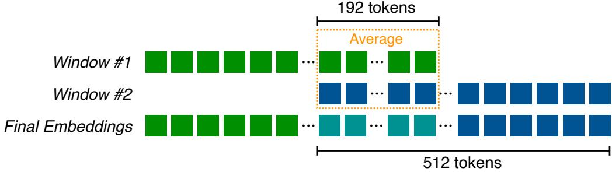  
Figure 7 | Sliding-window mechanism for text encoding in Wan2.1.

## B.4. More Details on Physics Video Generation Benchmarks

In Sec. 5, we evaluate models on four benchmarks: PhyGenBench and VideoPhy-2 for Text-to-Video generation, and Physics-IQ Verified and PhyGround for Image-to-Video generation. In this section, we briefly describe the evaluation protocol and the physical capabilities assessed by each benchmark.

PhyGenBench. The 160 prompts of PhyGenBench can be divided into four categories of physical phenomena: force, light, heat, and material. We calculate the video-level score with the oficial scripts, but replacing the evaluator with GPT-5.5. Each video is graded on a 0–3 scale, where 0 indicates a complete fantastical physical behavior and 3 indicates strong physical realism. The final score is obtained by averaging across all 160 samples.

VideoPhy-2. VideoPhy-2 evaluates generated videos from two aspects: semantic consistency (SA) and physical correctness (PC), each is graded on a 0–5 scale. Its test set contains 591 samples covering common physical phenomena in everyday scenarios, with 178 challenging samples selected to form a Hard subset. We replace its ofline VLM evaluator with GPT-5.5 (App. G). The joint accuracy measures the fraction of videos that simultaneously satisfy both SA ≥ 4 and PC ≥ 4.

Physics-IQ Verified. Physics-IQ (verified version) evaluates generated videos across multiple physical concepts using four complementary metrics: spatial consistency (S), spatial-temporal consistency (ST), weighted-spatial consistency (WS), and mean squared error (MSE). It contains 66 physical scenarios, with three perspectives evaluated per scenario (198 samples in total). It provides ground-truth videos for reference. The final score is computed by aggregating the scores across these metrics and averaging over all evaluated samples.

PhyGround. PhyGround evaluates each generated video using semantic adherence (General) and physical temporal validity (Physics). Each criterion is scored on a 1–5 scale, and averaged across all 250 samples.

## B.5. Training Details

Here we ofer training details for Cosmos3, Wan2.1 and our PhysThinker in Sec. 5.

## B.5.1. Cosmos 3 family

Cosmos3-Nano. We fine-tuned Cosmos3-Nano using the dataset of about 183K video–caption pairs (Sec. 5.1), including 71K WISA-80K samples retained after filtering for motion and aesthetic quality and removing multi-shot or metadata-incomplete videos, plus 112K videos selected through our deficiency-guided retrieval data pipeline. Each video was paired with a caption combining the base visual description and the generated physics-reasoning annotation. Videos were processed at a spatial resolution of (256 × 256), with a maximum caption length of 4,096 tokens and a maximum packed sequence length of 45,056 tokens. During training, the conditioning format was sampled as 70% text-to-video, 20% image-to-video using the first frame, and 10% video-to-video using the first five frames; classifier-free guidance dropout was set to 0.1. We applied LoRA only to the query, key, value, and output projections of the attention layers, using rank 16 and scaling factor 32. Training used bfloat16 precision, fully sharded data parallelism, and full activation checkpointing across 16 GPUs on two nodes. Each GPU processed one packed sequence at a time, with four gradient-accumulation steps, giving a nominal global batch size of 64 packed sequences per optimizer update. We optimized the model with fused AdamW using a learning rate of $( 5 \times 1 0 ^ { - 4 } )$ , (�1 = 0.9), (�2 = 0.95), $( \epsilon = 1 0 ^ { - 6 } )$ , no weight decay, and gradient clipping at 0.1. The checkpoint at iteration 1,340 was used for the reported benchmark evaluation.

Cosmos3-Super. We fine-tuned Cosmos3-Super on the same training set and caption format described above. Videos were resized and center-cropped using aspect-ratio-dependent buckets at the 256-resolution tier (e.g., 256 × 256 for square videos and 320 × 192 for landscape 16:9 videos), with a maximum caption length of 4,096 tokens and a maximum packed sequence length of 45,056 tokens. The conditioning format was sampled as 70% text-to-video, 20% image-to-video using the first frame, and 10% video-to-video using the first two latent frames, corresponding to five video frames under temporal compression by a factor of four. Classifier-free guidance dropout was set to 0.1. We applied LoRA only to the query, key, value, and output projections of the generation expert’s attention layers, using rank 16 and scaling factor 32. Training used bfloat16 precision, fully sharded data parallelism, and full activation checkpointing across 16 GPUs on four nodes, with context-parallel degree 4 and data-parallel degree 4. Each data-parallel replica processed one packed sequence per microstep, distributed across its four context-parallel ranks. With two gradient-accumulation steps, this yielded a nominal global batch size of eight packed sequences per optimizer update. We used fused AdamW with a learning rate of $5 \times 1 0 ^ { - 4 } , \beta _ { 1 } = 0 . 9 , \beta _ { 2 } = 0 . 9 5 , \epsilon = 1 0 ^ { - 6 }$ , zero weight decay, and gradient clipping at 0.1. The checkpoint at iteration 1000 was used for evaluation.

Cosmos3-Edge. We fine-tuned Cosmos3-Edge from its pretrained initialization on the same training set and caption format described above. Videos were processed using aspect-ratio-dependent buckets at the 480-resolution tier $( \mathrm { e . g . , 8 3 2 \times 4 8 0 }$ for landscape 16:9 videos), with at most 121 frames per video and a maximum caption length of 8,192 tokens. Training used sample-count-based packing with at most two samples per packed batch and a model token capacity of 90,112. The conditioning format was sampled as 70% text-to-video and 30% image-to-video using the first frame; video-to-video conditioning was not used. Classifier-free guidance dropout was set to 0.1. We applied LoRA only to the query, key, value, and output projections of the generation expert’s attention layers, using rank 16 and scaling factor 32. The main training run used bfloat16 precision, fully sharded data parallelism, and full activation checkpointing across 32 GPUs on eight nodes, with context-parallel degree 1, data-parallel degree 32, and no gradient accumulation. This corresponds to a nominal global batch size of 64 samples per optimizer update when every packed batch contains two samples. We used fused AdamW with a learning rate of $5 \times 1 0 ^ { - 4 } , \beta _ { 1 } = 0 . 9 , \beta _ { 2 } = 0 . 9 5 , \epsilon = 1 0 ^ { - 6 }$ zero weight decay, and gradient clipping at 0.1. Checkpoints were evaluated at 500-update intervals; the checkpoint at iteration 2,000 was used for the reported benchmark evaluation.

## B.5.2. Wan2.1

We fine-tuned both Wan2.1-T2V-14B and Wan2.1-I2V-14B using the identical dataset described in B.5.1. Each caption contains both the base visual description and the generated physics-reasoning annotation. During training, classifier-free guidance dropout was set to 0.1. We applied LoRA only to the query, key, value, and output projections of the generation expert’s attention layers, using rank 256 and scaling factor 512, while the patch embedder and output modules are fully fine-tuned. Training used bfloat16 precision, fully sharded data parallelism, and full activation checkpointing across 16 NVIDIA H100 GPUs. The global batch size is set to 32. We optimized the model with fused AdamW using a learning rate of $( 5 \times 1 0 ^ { - 4 } )$ with 1000 warmup steps, $( \beta _ { 1 } = 0 . 9 ) , ( \beta _ { 2 } = 0 . 9 5 ) , ( \epsilon = 1 0 ^ { - 6 } )$ , no weight decay, and gradient clipping at 0.1. The checkpoint at iteration 8,000 was used for the reported benchmark evaluation.

## B.5.3. PhysThinker

PhysThinker consists of two Qwen3-VL-4B-Instruct models fine-tuned with our training data, difering only in the conditioning modality. The captioner is trained on videos paired with GPT-generated physics captions, while the upsampler is trained on short text prompts, with or without a conditioning image, paired with GPT-expanded physics-rich prompts. We applied LoRA with rank $^ { 8 , }$ scaling factor 32, and dropout 0.05 to all linear projections of the language model, while the entire vision stack (ViT and aligner) is fully fine-tuned. Training used bfloat16 precision, FlashAttention-2, DeepSpeed ZeRO-3 with optimizer and parameter ofload to host memory, and full activation checkpointing including the vision tower. Examples are packed to a 57,344-token budget, with video sampled at 4 fps up to 64 frames. The global batch size is 256 packed sequences. We optimized with fused AdamW at a learning rate of $( 1 \times 1 0 ^ { - 4 } )$ for the language-model adapters and $( 2 \times 1 0 ^ { - 5 } )$ for the vision tower and aligner, using a cosine schedule with 5% linear warmup, $( \beta _ { 1 } = 0 . 9 )$ $( \beta _ { 2 } = 0 . 9 5 ) , ( \epsilon = 1 0 ^ { - 8 } )$ , weight decay 0.1, and gradient clipping at 1.0. Both models were trained for 3 epochs.

The video-conditioned reasoner takes a video alone and was trained across 128 A100 GPUs. The checkpoint at step 650 was used for the reported benchmark evaluation. The prompt upsampler expands a short generation prompt, and is trained as a two-mode mixture: text-only, and text together with the clip’s first frame. Each corpus contributes to both modes, trained across 32 A100 GPUs. The final checkpoint at step 258 was used for the reported benchmark evaluation.

## C. More Qualitative Comparisons

As a supplement to Sec. 5.2, here we show the qualitative examples across the evaluated benchmarks.

2.12 s

0.00 s

## PhyGenBench: stone sinking

Official prompt: A stone is gently placed on the surface of a poo filled with water.

3.62 s  
5.00 s  
1.83 s  
Baseline  
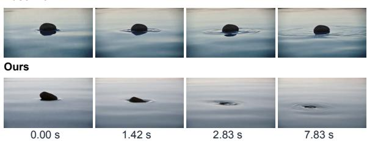  
physics\_reasoning: “The stone weight remains larger than the buoyant force because a typical stone is denser than water. After the support releases the stone, gravity accelerates the unsupported stone downward into the pool. The stone penetrates through the water surface instead of remaining on top of the surface.”

physics\_negative\_prompt: “The stone remains floating motionless on top of the pool surface after release.”

## Physics-IQ Verified: domino propagation

Official prompt (excerpt): The platform rotates clockwise and the wooden stick hits the first block as it rotates.

Baseline  
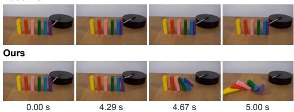  
physics\_reasoning: “The falling purple block contacts the right side of the upright blue block. The purple-blue collision transfers impulse and angular momentum from the purple block to the blue block. The blue block begins rotating leftward about its lower edge while table friction limits bottom sliding.”  
physics\_negative\_prompt: “The colored blocks topple in separate directions instead of transferring leftward collision impulses along the row.”

## VideoPhy-2: baseball-wall contact

Official prompt: A baseball is thrown with great force; it hits a brick wall and leaves a visible mark.

Baseline  
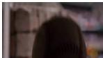  
Ours

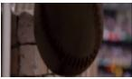

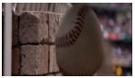

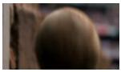

  
0.00 s  
0.92 s

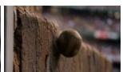

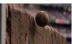  
physics\_reasoning: “At impact, the baseball contacts the brick wall over a small area. The brick wall exerts a large normal force on the baseball opposite the baseball's incoming velocity. The baseball exerts an equal and opposite force on the brick surface through Newton's third law. The short collision time produces a large impulse that sharply reduces the baseball's forward momentum.”  
physics\_negative\_prompt: “The baseball passes through the brick wall without slowing or transferring momentum.”

## PhyGenBench: potassium flame

Official prompt: A piece of potassium is ignited, emitting a vivid and unique flame as it burns steadily.

Baseline  
  
Ours

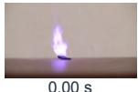

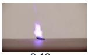

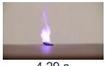

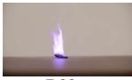  
physics\_reasoning: “Ignition supplies heat to the exposed potassium surface. ... A vivid violet-lilac flame forms at the potassium surface and remains attached to the burning region. The flame color comes from excited potassium atoms and ions emitting characteristic visible wavelengths as the excited electrons lose energy.”

physics\_negative\_prompt: “The flame burns as a steady orange candleshaped plume with no potassium-colored violet-lilac emission.”

## Physics-IQ Verified: load-induced cup collapse

Official prompt: A 30lb kettlebell is slowly lowered onto a white styrofoam cup placed on a wooden table on its side. Static shot with no camera movement.

Baseline  
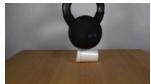

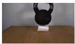

Ours  
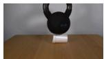  
0.00 s

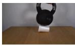

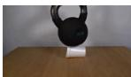

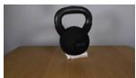  
0.92 s

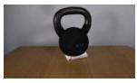

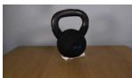  
5.00 s  
physics\_reasoning: “The kettlebell applies a large downward contact force to a small region of the styrofoam cup wall. ... The cup material deforms because the compressive stress exceeds the stiffness and strength of the thin styrofoam wall. ... The kettlebell center of mass moves downward as the collapsing cup loses height.”  
physics\_negative\_prompt: “The white cup collapses downward while the black kettlebell remains suspended in place without following the lost support.”

## VideoPhy-2: golf chip

Official prompt: A golfer chips the ball onto the green, the ball rolling smoothly towards the hole.

Baseline  
  
Ours

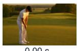

0.00 s  
  
1.04 s

  
physics\_reasoning: “The clubhead contacts the ball during the swing. The clubhead applies a short, strong impulse to the ball at impact. Newton's third law makes the ball apply an equal and opposite impulse back on the clubhead. The impulse changes the ball from rest to forward and upward motion.”  
physics\_negative\_prompt: “The golf ball launches into the air before the clubhead contacts it. The ball flies in a straight horizontal line without downward curvature from gravity.”

Figure 8 | Qualitative comparisons on diferent physics benchmarks. Each case compares frames generated by the Cosmos3-Nano base model using base caption (Baseline) with those generated by our trained model using base caption augmented with our physics\_reasoning and physics\_negative\_prompt (Ours) at identical timestamps. Oficial prompts and selected physics reasoning and negative-prompt excerpts are shown, with bold phrases highlighting physical constraints. Negative excerpts describe violations to avoid. All frames are uncropped.

## D. Demos in Driving and Robotics Scenarios

As stated in Sec. 5.2, here we ofer 6 demos to illustrate the strong performance of our method in driving and robotics scenarios.

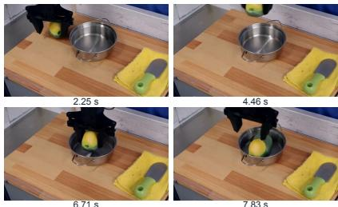  
7.83 s  
7.83 s  
5.58 s

## Driving

## Approaching queued traffic

Caption excerpt: “The police car travels forward along a suburban paved road toward a signalized intersection.”

  
5.58 s

  
physics\_reasoning: “As the police car nears the queue, the police car decelerates to avoid the stopped vehicles. Brake force at the police car tires opposes the car's forward motion. The braking force reduces the police car forward momentum over time rather than stopping the car instantaneously.”  
7.83 s

physics\_negative\_prompt: “The white van snaps from forward travel to a complete stop with no braking distance while surrounding traffic continues through it.”

## Congested city traffic

Caption excerpt: “A large bus farther ahead remains aligned with the same traffic queue.”

  
4.46 s

  
7.83 s  
physics\_reasoning: “Each moving vehicle is constrained by tire-road friction and steering geometry, so each vehicle follows the road direction rather than sliding sideways. Engine force and braking force balance closely in congestion, so the vehicles have small accelerations and very low speeds.”

physics\_negative\_prompt: “The gray sedan and bus slide sideways across the lane without tire rotation or steering.

## Driving through snowfall

Caption excerpt: “The vehicle travels forward along a snow-covered urban road.”

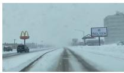

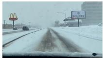

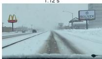

physics\_reasoning: “Heavy snow falls through the air across the whole view. Gravity accelerates unsupported snowflakes downward. Air drag limits each snowflake's speed and makes the flakes drift and flutter instead of dropping as rigid projectiles.”

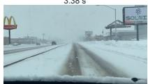  
6.71 s  
7.83 s  
physics\_reasoning: “The gripper jaws open above the pot. Opening the jaws removes the inward normal forces on the toy avocado. Removing the jaw contact removes the frictional support that held the toy avocado against gravity. The toy avocado becomes unsupported over the pot interior. Gravity accelerates the toy avocado downward into the stainless steel pot.”

physics\_negative\_prompt: “The falling snow moves upward from the road into the sky while the vehicle travels forward.”

## Robotics

Caption excerpt: “The robotic arm positions the toy avocado over the pot opening.”

physics\_negative\_prompt: “The green toy avocado hangs motionless in the air after the claw opens above the pot.”

## Transferring a spoon

Caption excerpt: “The spoon moves laterally from the left side of the pot toward the right side of the pot.”

5.58 s  
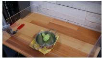

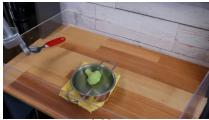

7.83 s  
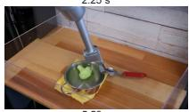

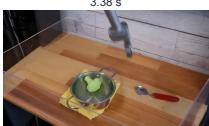  
physics\_reasoning: “The countertop contacts the underside of the spoon when the spoon reaches the surface. ... Static friction between the spoon and the wooden countertop resists residual horizontal motion. The spoon decelerates to rest to the right of the pot.”

physics\_negative\_prompt: “The released spoon remains hovering to the right of the pot instead of settling onto the wooden countertop.”

## Closing a drawer

Caption excerpt: “The drawer rails constrain the drawer to nearly horizontal translation.”

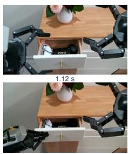  
6.71 s

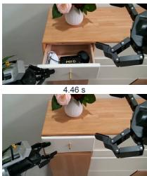

physics\_reasoning: “During the closing phase, the left robotic hand applies a sustained horizontal inward contact force to the drawer front or front edge. The drawer applies an equal and opposite contact reaction force back on the left robotic hand according to Newton's third law. The inward contact force accelerates the drawer along its slide direction toward the cabinet.”

physics\_negative\_prompt: “The white drawer slides closed while the left robotic hand never contacts the drawer front or edge.”

Figure 9 | Qualitative results on driving and robotics. All sequences are generated by our trained model using base caption augmented with our physics\_reasoning and physics\_negative\_prompt. Each example includes four uncropped video frames with timestamps, a caption excerpt, and selected physics reasoning and negative-prompt excerpts.

## E. More Examples of PhysCapBench

We provide two examples from PhysCapBench (Sec. 4.2): a falling cup that fractures upon impact and a Newton’s cradle exhibiting coupled collisions. Each example includes six chronological video frames and its complete set of 20 human-curated annotations, categorized as Cause, Law, or Efect. Together, these examplesMore Examples of PhysCapBench illustrate how the benchmark captures initiating interactions, governing physical principles, and observable outcomes beyond coarse event descriptions.

Cup drop and brittle fracture 8.00 s | 20 assertions  
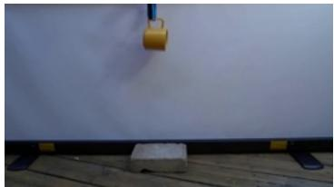  
2.83 s Falling

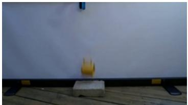  
3.03 s Before impact

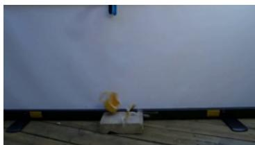  
3.10 s Fracture

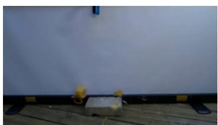  
3.20 s Fragment dispersal

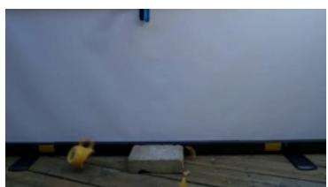  
3.40 s Rebound

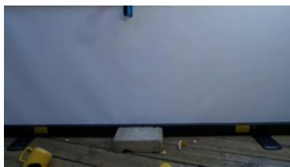  
4.40 s Debris at rest

<table><tr><td>ID</td><td>Type</td><td>Annotation</td></tr><tr><td>01</td><td>Effect</td><td>Cup body ruptures instantaneously at impact site</td></tr><tr><td>02</td><td>Cause</td><td>The impact force from the obstacle triggers cup body rupture</td></tr><tr><td>03</td><td>Effect</td><td>Cup body breaks into fragments of different sizes</td></tr><tr><td>04</td><td>Effect</td><td>Cup body fragments scatter in multiple directions from impact point</td></tr><tr><td>05</td><td>Cause</td><td>Cup collides with central rigid obstacle</td></tr><tr><td>06</td><td>Law</td><td>The impulse from collision changes the momentum of each part of the cup</td></tr><tr><td>07</td><td>Effect</td><td>The main cup body rebounds to the left side of the frame from the impact point</td></tr><tr><td>08</td><td>Effect</td><td>Small fragments fly away to the right of the obstacle from the impact point</td></tr><tr><td>09</td><td>Law</td><td>The obstacle applies a reverse contact force to the cup body</td></tr><tr><td>10</td><td>Law</td><td>Impact energy converts to material fracture energy</td></tr><tr><td>11</td><td>Cause</td><td>Gravity drives the cup downward</td></tr><tr><td>12</td><td>Effect</td><td>Cup falls downward from top of frame toward central obstacle</td></tr><tr><td>13</td><td>Law</td><td>Cup's falling speed increases with time</td></tr><tr><td>14</td><td>Law</td><td>Cup's gravitational potential energy converts to falling kinetic energy</td></tr><tr><td>15</td><td>Effect</td><td>Cup body separates from obstacle after impact</td></tr><tr><td>16</td><td>Law</td><td>Aerial fragments fall along a parabolic path under gravity</td></tr><tr><td>17</td><td>Effect</td><td>After landing the main cup body slides to the left side of the frame</td></tr><tr><td>18</td><td>Law</td><td>The ground applies a supporting force to the debris</td></tr><tr><td>19</td><td>Law</td><td>Ground friction reduces the fragments' sliding speed</td></tr><tr><td>20</td><td>Effect</td><td>Cup body fragments eventually scatter on both sides of obstacle</td></tr><tr><td>01</td><td>Cause</td><td>The outer steel ball swinging inward collides with an adjacent steel ball</td></tr><tr><td>02</td><td>Law</td><td>The impulse from collision propagates along the steel ball chain</td></tr><tr><td>03</td><td>Effect</td><td>The opposite outer sphere swings outward after collision</td></tr><tr><td>04</td><td>Effect</td><td>Incident sphere significantly decelerates after collision</td></tr><tr><td>05</td><td>Law</td><td>Contact steel ball experiences an equal and opposite force</td></tr><tr><td>06</td><td>Law</td><td>The middle steel ball array transmits most of the incident momentum</td></tr><tr><td>07</td><td>Effect</td><td>The middle steel ball maintains a small overall displacement</td></tr><tr><td>08</td><td>Law</td><td>Tension in suspension line constrains outer ball to follow arc motion</td></tr><tr><td>09</td><td>Cause</td><td>The outer ball displaced from equilibrium possesses gravitational potential energy</td></tr><tr><td>10</td><td>Cause</td><td>Gravity tangential component drives the outer sphere to swing back</td></tr><tr><td>11</td><td>Effect</td><td>The outer ball swinging downward accelerates toward the lowest point</td></tr><tr><td>12</td><td>Effect</td><td>The outer ball reaches a high speed near the lowest point</td></tr><tr><td>13</td><td>Law</td><td>The outer ball swinging upward decelerates with increasing height</td></tr><tr><td>14</td><td>Effect</td><td>The outer ball changes direction at the lateral high point</td></tr><tr><td>15</td><td>Effect</td><td>The outer balls at both ends periodically alternate approaching the steel ball array</td></tr><tr><td>16</td><td>Law</td><td>Dissipation causes the swing amplitude to gradually decrease</td></tr><tr><td>17</td><td>Effect</td><td>The two balls on the far left swing together to the right</td></tr><tr><td>18</td><td>Effect</td><td>The two balls on the far right swing together to the right</td></tr><tr><td>19</td><td>Effect</td><td>The number of balls lifted on each side is identical</td></tr><tr><td>20</td><td>Law</td><td>Momentum is conserved in all ball collisions</td></tr></table>

Figure 10 | Cup drop, impact, and fracture. Six chronological frames accompany the reference physical assertions in their original wording and rank order. Phase labels summarize the displayed frames; assertion IDs are not temporal alignments.

## Newton’s cradle: coupled collisions 8.00 s | 20 assertions

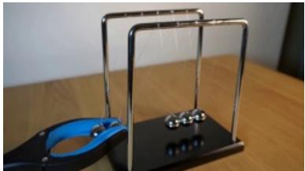  
2.80 s Displaced pair

  
3.00 s Inward swing

  
3.03 s Collision

  
3.23 s Outward swing

  
3.43 s Return swing

  
3.57 s Opposite excursion  
Figure 11 | Newton’s cradle and momentum transfer. Six chronological frames accompany the reference physical assertions in their original wording and rank order. Phase labels summarize the displayed frames; assertion IDs are not temporal alignments.

## F. Analysis on Video Generation Attention Maps

As in Sec. 5.4.1, to measure the efect of physics\_reasoning derived by self-evolution iterations in Physis-Lang, we use Cosmos3-Nano as the backbone and compare two configurations: inference with base caption only using the pretrained model, and inference with base caption + physics\_reasoning using the model after SFT on the data we re-captioned with physics\_reasoning field. Cosmos3 processes text tokens and video latent tokens in a unified attention sequence. To measure the importance of each token, we compute the attention from sampled visual queries to all text tokens. Specifically, we capture the normalized query and key features after mRoPE and compute the text-conditional attention

$$
A ( w , q ) = \frac { 1 } { H } \sum _ { h = 1 } ^ { H } \mathrm { S o f t m a x } _ { w ^ { \prime } } \bigg ( \frac { Q _ { h } ( q ) K _ { h } ( w ^ { \prime } ) ^ { \top } } { \sqrt { d _ { h } } } \bigg ) _ { w } ,\tag{1}
$$

where � is the given text token, and $q$ is the video-latent query. � denotes the number of attention heads. The score of a token is obtained by averaging $A ( w , q )$ over the uniformly sampled visual tokens, denoising steps, and all transformer layers. For better visualization, we divide each word score by the mean score of all word occurrences in the same prompt. Therefore, the larger the scaled score of a text token is, the greater the role that corresponding word plays in video generation.

Similarly, to obtain the focal regions of an RGB frame with respect to a key sentence $S ,$ we average the attention assigned to all text tokens within the span of �:

$$
M _ { S } ( q ) = \frac { 1 } { | T ( S ) | } \sum _ { w \in \mathcal { T } ( S ) } A ( w , q ) ,\tag{2}
$$

where $q$ is a visual latent token encoded from the RGB frame, and $\mathcal { T } ( S )$ denotes the corresponding token set. Each sampled visual query retains its latent coordinate (�, �, �), allowing the values $M _ { S } ( q )$ to be arranged into a spatial map.

  
Figure 12 | Visualization for the attention scores of visual and text tokens. When adding physics\_reasoning into the SFT and inference process, the generative model can better capture the keywords for the core physical process, and generate videos with physical realism.

As shown in Fig. 12, when incorporating physics\_reasoning into the SFT and inference process, the model can better locate the keywords which determine the physical process, like “copper-colored" and “greenish" in the base caption, and “photons", “wavelengths" and “energy" in the physics reasoning. For the RGB frames, the region depicting the flame color reaction is also more prominent on the attention map.

Moreover, to examine the important role of our fine-tuning in enabling the model to efectively utilize physics\_reasoning, we separately feed base caption + physics\_reasoning into the pretrained model and the fine-tuned model. Tab. 9 lists the relative increase in the attention scores of keywords in physics\_reasoning after training.

Table 9 | Relative increase of attention scores of physical keywords after fine-tuning.

<table><tr><td>Caption</td><td>∆(%)</td></tr><tr><td>...Regions directly under fingertips COMPRESS frst and most strongly. ..</td><td>19.2</td></tr><tr><td>...HEAT TRANSFER lowers the average molecular kinetic energy of the juice, ...</td><td>52.2</td></tr><tr><td>...GRAVITY still acts downward on all gas and particle mass, ...</td><td>22.5</td></tr><tr><td>...The change in light speed at the lens surfaces BENDS the rays. ...</td><td>48.7</td></tr></table>

## G. Validation of GPT-5.5 as a Better Evaluator

In Sec. 5.1, we replace the ofline VLM evaluators for PhyGenBench and VideoPhy-2 with GPT-5.5. In this section, we illustrate the rationale for this replacement using VideoPhy-2 as an example.

As shown in Fig. 13 and Tab. 10, distinct video generative models often receive nearly identical scores from the pretrained VLM, leading to results that do not faithfully reflect their physical performance. In contrast, GPT-5.5 produces assessments that align with human judgment in most cases.

GPT-5.5: Shows a bowling alley with pins and balls, but the balls appear airborne/near the side and do not roll down the lane or hit the pins. SA = 2. Multiple bowling balls appear to float or fly through the air with unrealistic trajectories and no plausible gravity, rolling, or collisions. PC = 1.

  
GPT-5.5: The video clearly shows a bowling ball rolling down a polished wooden lane and striking the pins at the end. Some details are of, such as an unusual pin arrangement/count. SA = 4. The ball rolls down the lane and knocks pins over in a generally plausible way, with realistic reflections and collision efects. PC = 5. VideoPhy-2-AutoEval: SA = 2. PC = 3.  
GPT-5.5: Shows a blue balloon against a cardboard-like background, but there is no clear target impact or clean burst visible. SA = 2. The balloon remains mostly stationary without visible collision; the brief white puf appears/disappears automatically with little physical interaction. PC = 2. VideoPhy-2-AutoEval: SA = 2. PC = 3.

  
GPT-5.5: The video shows a blue water balloon hitting a large target and bursting cleanly on impact. SA = 5. The blue projectile moves and deforms on impact with the target, producing a plausible splash consistent with real-world physics. PC = 5. VideoPhy-2-AutoEval: SA = 3. PC = 3.

Figure 13 | Diferent evaluators for videos generated by CogVideoX1.5-5B and Cosmos3-Nano. While the auto-evaluator of VideoPhy-2 tends to assign similar mid-range scores to videos with substantially diferent levels of physical realism, GPT-5.5 provides more discriminative assessments, better reflecting the diferences in physical realism across videos.  
Table 10 | Comparison of VideoPhy-2 scores under diferent evaluators.
<table><tr><td>Generative Model</td><td>Pretrained VLM</td><td>GPT-5.5</td></tr><tr><td>CogVideoX1.5-5B</td><td>23.01</td><td>49.41</td></tr><tr><td>Wan2.1-T2V-14B</td><td>23.52</td><td>57.02</td></tr><tr><td>Cosmos3-Nano</td><td>22.50</td><td>60.41</td></tr><tr><td>Veo-3.1</td><td>23.69</td><td>68.87</td></tr></table>

## H. General Generative Capability of Physis-Lang

In Sec. 5.3, we demonstrate that Physis-Lang explicitly optimizes captions and improves the physical realism of generated videos. A natural question is whether such physics-aware captions could compromise the model’s general capability of video generation. To investigate further, we evaluate the pretrained and Physis-Langenhanced models on VBench for the I2V task. As shown in Tab. 11, Physis-Lang maintains comparable performance to the pretrained models, suggesting that the richer and more structured captions introduced by Physis-Lang can provide useful information beyond explicitly physical scenarios.

Table 11 | Comparison of diferent models on VBench.
<table><tr><td>Model</td><td>VBench-I2V</td></tr><tr><td>Wan2.1-14B (Pretrained) Wan2.1-14B (Physis-Lang)</td><td>86.86</td></tr><tr><td></td><td>87.51</td></tr><tr><td>Cosmos3-Nano (Pretrained)</td><td>88.32</td></tr><tr><td>Cosmos3-Nano (Physis-Lang)</td><td>88.69</td></tr></table>