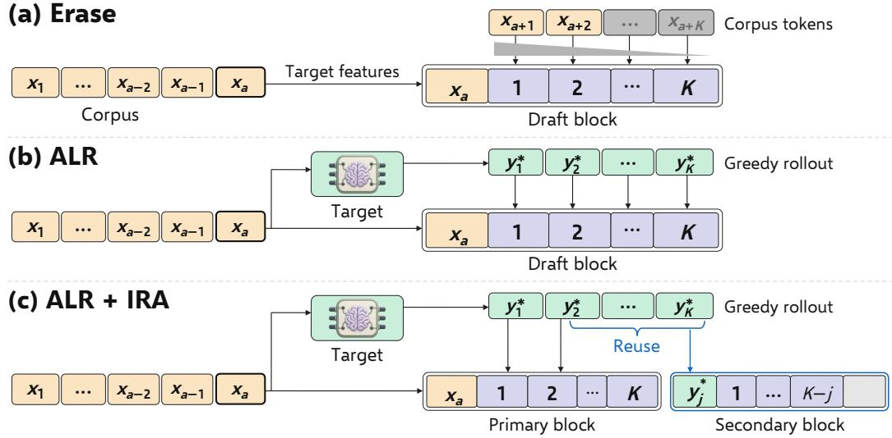
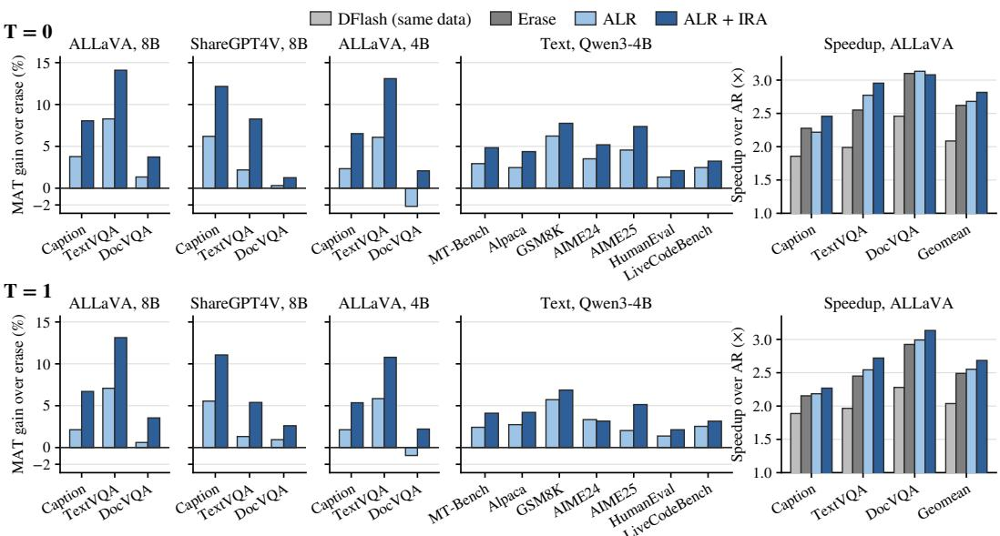
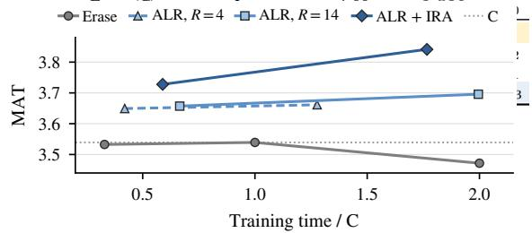
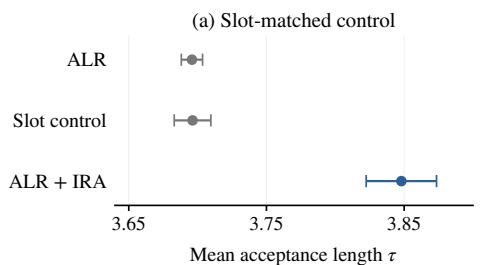
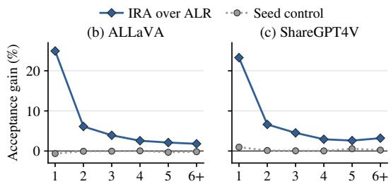

# RECOVERING OFF-POLICY SUPERVISION FOR SPECULATIVE DECODING

Jungseob Lee1 omanma1928@korea.ac.kr

Chanjun Park2 chanjun.park@ssu.ac.kr

Sugyeong Eo3,† s.eo@yonsei.ac.kr

Hyeonseok Moon4,† hyns.moon@sookmyung.ac.kr

1Korea University 2Soongsil University 3Yonsei University Mirae Campus 4Sookmyung Women’s University

## ABSTRACT

Block drafters for speculative decoding are commonly trained on corpora written by external models, where a single off-policy token invalidates supervision for all subsequent slots in a block. Existing approaches discard these divergent slots, resulting in severe supervision loss. To resolve this problem while preserving the training corpus, we propose a rollout-based training framework that recovers full supervision through two complementary components. The first component, Anchor-Label Relabelling (ALR), replaces corpus labels with distributions from greedy target rollouts, restoring valid supervision across all predicted slots. The second component, In-Rollout Anchors (IRA), places draft blocks directly inside these rollouts to expose the drafter to target-generated context, reusing precomputed rollout features at no additional target cost. Across fixed vision-language and text corpora, our framework increases greedy accepted length by up to 36.5% over DFlash and consistently outperforms erasing baselines. Notably, a single epoch of our method surpasses the best erase schedules. After three epochs, it matches the acceptance length of training on target-regenerated responses. These results show that our framework provides an effective and compute-efficient approach for training speculative drafters on fixed corpora without modifying the original text. Code is available at https://github.com/js-lee-AI/ ALR-IRA.

## 1 INTRODUCTION

In autoregressive language models, speculative decoding reduces generation latency while preserving the target distribution in exact arithmetic (Leviathan et al., 2023; Chen et al., 2023). A small drafter proposes several candidate tokens, and the primary model to be accelerated (the target) verifies them in a single forward pass. The resulting speedup depends on the accepted length, defined as the number of tokens committed in each verification round, and on the relative cost of drafting and verification. Recent work increases accepted length by improving agreement between the drafter and the target, and by training with verification (Cai et al., 2024; Li et al., 2024a; 2025; Zhou et al., 2023; An et al., 2026). The same framework now also serves vision-language models (Kang et al., 2025; Tong et al., 2026), whose instruction-tuning corpora typically consist of responses written by a stronger proprietary model (Liu et al., 2023a; Chen et al., 2024a;b). Such a corpus is off-policy for the target, and its responses often differ from the continuations the target itself would produce.

Block drafters are especially sensitive to this mismatch (An et al., 2025; Chen et al., 2026). Given an anchor token, a block drafter predicts all slots of a block in parallel, and each slot is trained on the corpus token at the same position. The label of a later slot therefore depends on the intermediate corpus tokens, which the drafter does not observe. If one of these tokens differs from the greedy choice of the target, every subsequent label in the block continues a prefix that the target would not generate at inference.

PARD-2 (An et al., 2026) addresses this problem by down-weighting such slots. Each slot is weighted by the probability that the target assigns to the preceding corpus tokens in the block, and this weight decays toward zero once the prefix departs from the target distribution. Supervision is thus retained where the corpus agrees with the target and erased where it diverges. Regenerating the corpus with the target avoids this loss of supervision (Kim & Rush, 2016; Cai et al., 2024; Li et al., 2025; An et al., 2025; Chen et al., 2026). However, regeneration requires a separate generation stage before training and replaces the original responses, which may need to be kept, for example when only an audited or licensed release can be used for training. In imitation learning, this mismatch is framed as covariate shift, and the standard remedy is to train on newly collected trajectories (Ross et al., 2010; Agarwal et al., 2023; Gu et al., 2023; Liu et al., 2023b). This approach likewise replaces the underlying training text.

In this paper, we show that a block drafter learns more from greedy continuations of the target than from erasing the off-policy slots of a fixed corpus. The first component of our method, Anchor-Label Relabelling (ALR), leaves the corpus unchanged and updates only the training labels. From each anchor, the target continues the corpus prefix greedily, and each slot is labeled with the target distribution conditioned on the prefix and preceding rollout tokens, erasing none of them. As in standard training, the drafter receives the anchor token and the target features of the corpus prefix. The rollout is computed within the training step by reusing the cached forward pass of the target, avoiding the need to generate or store full responses in advance. For ALR in isolation, a short rollout depth is sufficient.

ALR alone still leaves a residual gap to a drafter trained on responses regenerated by the target at matched lengths. A position-wise analysis shows no measurable gap over the first 16 generated tokens, with the deficit emerging only in later positions. From that point on, the recent context of the drafter at inference consists of text generated by the target, whereas a block anchored strictly in the corpus never observes such context during training. The second component of our method, In-Rollout Anchors (IRA), supplies this target-generated context. IRA keeps the total number of blocks fixed and relocates half of them into the rollouts of the other half. Each relocated block is anchored on a token generated by the target and conditioned on features already computed during the rollout, requiring no additional forward pass of the target. Thus, ALR corrects the labels, while IRA reduces the discrepancy between training and inference contexts.

We evaluate both components on two fixed vision-language corpora and one fixed text corpus. Under greedy decoding, ALR + IRA improves accepted length by up to 36.5% over DFlash trained on the same data and by up to 8.54% over the erasing baseline. It also achieves a higher accepted length than the erasing baseline on every evaluated domain and benchmark. These improvements hold for a smaller vision-language target and for a text-only target on seven benchmarks, under both greedy and sampled decoding. With the other training settings matched, a single epoch of ALR + IRA outperforms the best erase schedule we evaluated on either vision-language corpus, at less than twice the cost of one erase epoch. After three epochs of training, ALR + IRA achieves greedy decoding speedups of 2.82× on ALLaVA and 2.77× on ShareGPT4V over autoregressive decoding, compared with 2.62× for erase on both corpora. On ALLaVA, its accepted length is within 0.4% of drafters trained on responses regenerated by the target, even though the original corpus is kept fixed. The gain of IRA over ALR is largest at positions in held-out captions where an independent drafter fails to predict the first token. Ultimately, our findings show that target-generated context complements label relabelling, demonstrating that training-time target rollouts provide a practical alternative to response regeneration when the original corpus must be preserved.

## 2 RELATED WORK ON DRAFT TRAINING

PARD-2 (An et al., 2026) aligns parallel draft training with consecutive token acceptance through confidence-adaptive loss weights. Each weight is the product of the target’s probabilities for the preceding corpus tokens within the block. Our erase comparator applies this weighting to knowledge distillation on the fixed corpus. Its labels remain target distributions conditioned on corpus continuations, while unlikely corpus tokens reduce supervision for later slots. ALR obtains these distributions along a greedy target rollout from the same corpus prefix, and IRA also supplies rollout features as drafter context. This extends target alignment to the text that determines both the labels and the drafter’s context, while preserving the original corpus.

The EAGLE family generates draft tokens autoregressively using target features (Li et al., 2024a;b). EAGLE-3 and HASS train on hidden states generated by the drafter to reduce the mismatch between training and multi-step drafting (Li et al., 2025; Zhang et al., 2024). Parallel drafters predict several future positions in one forward pass (Stern et al., 2018; Cai et al., 2024; Xiao et al., 2024; An et al., 2025), while semi-autoregressive methods combine sequential and parallel drafting (Gao et al., 2025). We use DFlash (Chen et al., 2026), a small block-diffusion drafter conditioned on target features. Our method keeps this architecture unchanged while obtaining supervision and context from the target’s own continuations.

Knowledge distillation aligns a drafter’s output distributions with those of the target (Hinton et al., 2015; Zhou et al., 2023). On-policy distillation uses student-generated continuations (Agarwal et al., 2023; Gu et al., 2023), while online speculative decoding adapts the drafter using feedback collected during serving (Liu et al., 2023b). Model-generated responses also support sequence-level and reasoning distillation (Kim & Rush, 2016; Lee et al., 2026), and several draft-training methods use target-generated responses (Cai et al., 2024; Goel et al., 2024; Zafrir et al., 2025; Hong et al., 2025). Regenerating the corpus provides target-written supervision and context, but replaces the original responses. When these responses must be preserved, computing target distributions along them still leaves supervision conditioned on continuations that may differ from the target’s own. Our ALR + IRA addresses this mismatch with short target rollouts from corpus prefixes during training, supplying both supervision and context without rewriting the corpus.

For vision-language targets, prior work has developed both visual processing and training strategies. ViSpec (Kang et al., 2025) compresses image tokens with a vision adaptor, DREAM (Hu et al., 2025) fuses target features through cross-attention, and MSD (Lin et al., 2025) processes visual and text tokens differently and gradually introduces multimodal data after text-only training. ViSpec, DREAM, and MASSV (Ganesan et al., 2025) also train on target-generated responses. Our ALR + IRA changes training labels and anchor context through short target rollouts on a fixed corpus, without introducing image-specific components.

## 3 RELABELLING ANCHOR BLOCKS WITH THE TARGET’S OWN ROLLOUT

For a response sequence x from the training corpus and an index $^ { a , }$ an anchor block spans $K + 1$ slots beginning at position a. Slot 0 contains the anchor token $x _ { a } .$ , and the drafter predicts slots 1 through K in parallel conditioned on the target hidden representations up to position $a .$ Under the standard corpus objective, slot k receives the one-hot target $x _ { a + k }$ . Following DFlash (Chen et al., 2026), we set $K = 1 5$ with a five-layer architecture that receives target features from layers 1, 9, 17, 25, and 33, sampling 128 anchors per training sequence. All drafters are initialized from the publicly released text-only DFlash head corresponding to the target base model without architectural changes. Appendix A details these checkpoints and additional training hyperparameters. The compared objectives vary the target distribution and loss weight assigned to each slot, while IRA additionally relocates half of the draft blocks into rollout trajectories. Figure 1 illustrates label construction across erase, ALR, and ALR + IRA. We denote the target next-token distribution by pT, omitting prompt and image conditioning tokens from the notation for simplicity.

## 3.1 LABELS FROM THE CORPUS PREFIX

Every objective beyond the corpus baseline replaces the one-hot target with a distribution $\pi _ { a , k }$ and assigns a slot weight $\omega _ { a , k }$

$$
\begin{array} { r } { \mathcal { L } ( \boldsymbol { \theta } ) = \frac { \sum _ { a \in \mathcal { A } } \sum _ { k = 1 } ^ { K } \omega _ { a , k } \ell ( \pi _ { a , k } , q _ { \boldsymbol { \theta } } ^ { k } ( \cdot \mathbf { \sigma } | \mathbf { \sigma }  | a ) ) } { \sum _ { a \in \mathcal { A } } \sum _ { k = 1 } ^ { K } \omega _ { a , k } } , \qquad w _ { k } = e ^ { - ( k - 1 ) / \gamma } , } \end{array}\tag{1}
$$

where A denotes the set of anchors in a batch, $q _ { \theta } ^ { k } ( \cdot \mid a )$ is the drafter prediction for slot k at anchor a, and ℓ evaluates soft cross-entropy against the target distribution restricted to the top 8 tokens with the residual probability mass grouped into a tail bin. Normalization by the total weight allows gating $\omega _ { a , k }$ to redistribute supervision across slots without shrinking the overall loss scale. All distillation objectives incorporate the decay envelope $w _ { k }$ into $\omega _ { a , k }$ , setting $\gamma = 2$ by default. For the fixed-corpus baseline, we apply knowledge distillation (KD) (Zhou et al., 2023) using $\pi _ { a , k } =$ $p _ { T } ( \cdot \mid x _ { < a + k } )$ ) and $\omega _ { a , k } = w _ { k }$ . This formulation leaves labels conditioned on corpus continuations $x _ { a + 1 } , \ldots , x _ { a + k - 1 }$ that the target may not generate. During inference, a block is drafted over text generated by the target itself, and slot k contributes to the accepted length only when the target accepts all preceding candidate tokens.

  
Figure 1: Label construction from a fixed corpus. Amber and green denote corpus and target-rollout tokens, respectively. Purple cells are draft slots, and black downward arrows supply the target distributions predicting the tokens above them. Erase down-weights corpus-conditioned labels, whereas ALR uses rollout-conditioned labels. IRA retains the corpus context and reuses rollout features and labels in a secondary block without another target pass. Its gray tail is unsupervised.

Erasing off-policy slots. Under the erase objective, we retain the distillation distribution and scale the slot weight by a survival gate,

$$
g _ { a , k } = \prod _ { 1 \leq j < k } p _ { T } { \left( x _ { a + j } \mid x _ { < a + j } \right) } , \qquad \omega _ { a , k } = w _ { k } g _ { a , k } ,\tag{2}
$$

adapting the confidence-adaptive survival weighting of PARD-2 (An et al., 2026) to distillation. The gate equals 1 at slot 1, decreases monotonically along the block, and down-weights slots whose preceding corpus tokens have low probability under the target. A hard variant replaces each factor with the indicator $\mathbf { 1 } [ x _ { a + j } = { \hat { y } } _ { a + j } ]$ , where $\hat { y } _ { a + j }$ denotes the target greedy prediction after $x _ { < a + j } ,$ discarding all subsequent slots upon the first mismatch. We adopt the soft survival formulation as the primary erase comparator throughout this work. In both variants, supervision remains conditioned on the corpus continuation, with only the loss weights changed.

## 3.2 LABELS FROM THE TARGET’S ROLLOUT

Anchor-label relabelling (ALR) retains the corpus context while substituting the corpus continuation with greedy rollouts generated by the target. Starting from each anchor, the target extends $x _ { \leq a }$ greedily, providing slot k with the target distribution conditioned on the preceding $k - 1$ rollout tokens,

$$
y _ { i } ^ { * } = \arg \operatorname* { m a x } _ { v } p _ { T } \big ( v \mid x _ { \leq a } , y _ { < i } ^ { * } \big ) , \qquad \pi _ { a , k } = p _ { T } \big ( \cdot \mid x _ { \leq a } , y _ { < k } ^ { * } \big ) ,\tag{3}
$$

where the rollout depth R counts the greedy tokens fed back to the target, yielding up to $R + 1$ slot distributions. We set $R = K - \bar { 1 }$ to provide supervision across all K slots whenever the target does not terminate early. In-rollout anchors introduced below require this full depth and are never evaluated with shorter rollouts. Consequently, experimental configurations with $\bar { R } < K - 1$ evaluate ALR in isolation, leaving slots beyond $R + 1$ unconstrained. Slots following early sequence termination are masked, while remaining slots retain $\omega _ { a , k } ~ = ~ w _ { k }$ , ensuring that full-depth ALR preserves supervision across every active position.

On a greedy target rollout, the hard variant of the gate in Eq. (2) equals 1 across all active slots. The soft gate can still decrease because greedy tokens need not have probability one, so ALR omits it. Slot 1 receives identical supervision under KD, erase, and ALR, as $y _ { < 1 } ^ { * }$ is empty. For subsequent slots, each label aligns with the greedy target trajectory verified during greedy decoding. Since slot k contributes to the accepted length only when slots 1 through $k - 1$ match $y _ { 1 } ^ { * } , \ldots , y _ { k - 1 } ^ { * } .$ , the ALR distribution matches the verification distribution whenever slot k contributes to the accepted length. Drafter inputs, consisting of the anchor token and target representations up to $^ { a , }$ remain unchanged from the standard corpus objective.

Table 4b compares ALR against a drafter trained with the same KD loss on target-regenerated responses truncated to the corpus lengths. On COCO captions, ALR matches this regeneration reference over the initial 16 generated tokens before exhibiting a performance deficit that subsequently plateaus. Every anchor in a regenerated response follows context generated by the target in preceding tokens. In contrast, an ALR block encounters target-generated tokens only in its supervision labels, as drafter features condition strictly on the corpus prefix up to a. We attribute this gap to the absence of target-generated context, motivating a secondary anchor block described next.

In-rollout anchors. In-rollout anchors (IRA) preserve ALR’s anchor draw and total block count $m = \operatorname* { m i n } ( v , 1 2 8 )$ , where v is the number of valid anchor positions in the sample, while partitioning the blocks into two subsets. The $\lceil m / 2 \rceil$ primary blocks follow the standard ALR formulation in Eq. (3). Each of the $\lfloor m / 2 \rfloor$ secondary blocks is positioned within a primary rollout at an offset $j \sim \mathcal { U } \{ 2 , \dots , K - 1 \}$ . Its conditioning context concatenates the target representations of the corpus prefix up to a with the intermediate representations stored for $y _ { 1 } ^ { * } , \ldots , y _ { j - 1 } ^ { * } .$ . Slot 0 is assigned the target-generated token $y _ { j } ^ { * }$ , and slot k inherits the primary block label at position $j + k ,$

$$
\pi _ { a , k } ^ { ( j ) } = \pi _ { a , j + k } = p _ { T } \big ( \cdot \mid x \leq a , y _ { < j + k } ^ { * } \big ) , \qquad \omega _ { a , k } ^ { ( j ) } = w _ { k } \mathbf { 1 } [ j + k \leq K ] .\tag{4}
$$

A secondary block provides an anchor whose immediate prefix consists of target-generated text, supervising up to $K - j$ slots, averaging seven slots prior to sequence termination. This design incurs no additional forward passes over the target model, as representations for $y _ { < j } ^ { * }$ and target distributions past index $j$ are already computed during the primary rollout. Only the $\lceil m / 2 \rceil$ primary blocks initiate rollout generation, compared to all m blocks in ALR. By reusing rollout features and distributions from primary blocks, IRA introduces secondary anchors without increasing target forward computation.

## 4 ACCEPTED LENGTH AND SPEEDUP ON A FIXED CORPUS

Experimental setup. For vision-language experiments, we adopt Qwen3-VL-8B-Instruct (Bai et al., 2025) as the target model and pair it with a DFlash block drafter (Chen et al., 2026) initialized from the public text-only DFlash head. We train drafters on either the allava laion split of ALLaVA (Chen et al., 2024a) or ShareGPT4V captions (Chen et al., 2024b), matching both corpora to an identical count of image-text pairs. For the text-only target Qwen3-4B (Yang et al., 2025), we train all four methods on the same UltraChat subset (Ding et al., 2023), keeping all three training corpora strictly fixed. We evaluate vision-language drafting on COCO captioning (Lin et al., 2014), TextVQA (Singh et al., 2019), and DocVQA (Mathew et al., 2021), and assess text-only drafting across seven benchmarks spanning instruction following, mathematical reasoning, and code generation.

Evaluation metrics. We report mean acceptance length τ (MAT), counting accepted draft tokens plus one target token per verification step, alongside wall-clock speedup over autoregressive decoding (AR). To compute aggregate acceptance lengths, we take the geometric mean across evaluation tasks within each training seed and then average across seeds. For vision-language benchmarks, we evaluate the first 100 prompts per domain, capping generation at 256 new tokens across all tasks. We examine both greedy decoding $( T { = } 0 )$ and stochastic sampling $( T { = } 1 )$ We provide detailed evaluation protocols in Appendices B and D. Given that bf16 tree verification trajectories can vary slightly across GPU architectures, we measure acceptance length for the primary vision-language target on RTX A6000 hardware and evaluate the smaller vision-language and text-only targets on H100 GPUs. We measure the speedups in Table 1 on H100 GPUs. In Appendix G, we document training replicates and sensitivity analyses, and in Appendix E, we define the formal comparison rule for vision-language evaluations.

Table 1: Speedup over autoregressive decoding (AR) and mean acceptance length τ after three epochs on each fixed training corpus. Vision values summarize COCO captioning, TextVQA and DocVQA. Text rows identify evaluation benchmarks. Aggregates are geometric means across benchmarks, averaged over available replicates.
<table><tr><td colspan="7">Vision</td></tr><tr><td>Target</td><td colspan="4">Qwen3-VL-8B</td><td colspan="2">Qwen3-VL-4B</td></tr><tr><td rowspan="3">Train corpus Method</td><td colspan="2">ALLaVA</td><td colspan="2">ShareGPT4V</td><td colspan="2">ALLaVA</td></tr><tr><td>Speedup</td><td></td><td>Speedup</td><td>T</td><td>Speedup</td><td>T</td></tr><tr><td colspan="7">T=0</td></tr><tr><td>DFlash</td><td>2.09×</td><td>2.88</td><td>2.01×</td><td>2.80</td><td>2.19×</td><td>2.92</td></tr><tr><td>Erase</td><td>2.62×</td><td>3.54</td><td>2.62×</td><td>3.57</td><td>2.62×</td><td>3.56</td></tr><tr><td>ALR</td><td>2.68×</td><td>3.70</td><td>2.80×</td><td>3.67</td><td>2.65×</td><td>3.63</td></tr><tr><td>ALR + IRA</td><td>2.82×</td><td>3.84</td><td>2.77×</td><td>3.83</td><td>2.77×</td><td>3.81</td></tr><tr><td colspan="7">T=1</td></tr><tr><td>DFlash</td><td>2.04×</td><td>2.79</td><td>1.90×</td><td>2.71</td><td>2.04×</td><td>2.78</td></tr><tr><td>Erase</td><td>2.49×</td><td>3.39</td><td>2.54×</td><td>3.39</td><td>2.45×</td><td>3.33</td></tr><tr><td>ALR</td><td>2.55×</td><td>3.50</td><td>2.54×</td><td>3.48</td><td>2.53×</td><td>3.41</td></tr><tr><td>ALR + IRA</td><td>2.68×</td><td>3.65</td><td>2.58×</td><td>3.60</td><td>2.67×</td><td>3.53</td></tr><tr><td colspan="7"></td></tr><tr><td colspan="7">DFlash Erase ALR</td></tr><tr><td>Benchmark</td><td colspan="2">T</td><td>T</td><td colspan="2">Speedup T</td><td colspan="2">ALR + IRA Speedup T</td></tr><tr><td colspan="7">Speedup</td></tr><tr><td>MT-Bench</td><td></td><td></td><td>T=0</td><td></td><td></td><td>2.13×</td><td></td></tr><tr><td></td><td>1.82× 1.56×</td><td>2.50 2.17</td><td>2.07× 2.85 2.52</td><td>2.09× 1.87×</td><td>2.94 2.58</td><td>1.92×</td><td>2.99</td></tr><tr><td>Alpaca GSM8K</td><td></td><td></td><td>1.88×</td><td>3.38×</td><td>4.76</td><td>3.55×</td><td>2.62</td></tr><tr><td>AIME24</td><td>2.79× 2.61×</td><td>3.96</td><td>3.16×</td><td>4.48</td><td>4.20</td><td>2.97×</td><td>4.83</td></tr><tr><td>AIME25</td><td>2.76×</td><td>3.69 4.07</td><td>2.85×</td><td>4.06 4.34</td><td>2.91× 2.94×</td><td></td><td>4.27</td></tr><tr><td></td><td></td><td></td><td>3.01×</td><td>4.92</td><td>4.53</td><td>3.14×</td><td>4.66</td></tr><tr><td>HumanEval</td><td>2.98×</td><td>4.22</td><td>3.46× 2.64×</td><td>3.56× 3.72</td><td>4.98</td><td>3.63×</td><td>5.02</td></tr><tr><td>LiveCodeBench Avg. (7 tasks)</td><td>2.33× 2.35×</td><td>3.25 3.32</td><td></td><td>2.62×</td><td>3.81 3.87</td><td>2.73× 2.80×</td><td>3.84 3.93</td></tr><tr><td colspan="8">2.67× 3.75 2.70× T=1</td></tr><tr><td>MT-Bench</td><td>1.79×</td><td>2.42</td><td>1.97×</td><td>2.72 2.06×</td><td>2.79</td><td>2.15×</td><td>2.83</td></tr><tr><td>Alpaca</td><td>1.52×</td><td>2.16</td><td>1.72× 2.47</td><td>1.78×</td><td>2.54</td><td>1.80×</td><td>2.57</td></tr><tr><td>GSM8K</td><td>2.71×</td><td>3.78</td><td>3.01× 4.26</td><td>3.19×</td><td>4.50</td><td>3.29×</td><td>4.55</td></tr><tr><td>AIME24</td><td>2.41×</td><td>3.35</td><td>2.49×</td><td>2.58×</td><td>3.66</td><td>2.59×</td><td>3.65</td></tr><tr><td>AIME25</td><td>2.40×</td><td>3.49</td><td>2.62×</td><td>3.54 3.77 2.46×</td><td>3.85</td><td>2.66×</td><td>3.96</td></tr><tr><td>HumanEval</td><td>2.89×</td><td>3.97</td><td>3.22×</td><td>4.57</td><td>3.19× 4.63</td><td>3.20×</td><td>4.66</td></tr><tr><td>LiveCodeBench</td><td>2.20×</td><td>3.00</td><td>2.44×</td><td>3.38 2.42×</td><td>3.47</td><td>2.52×</td><td>3.49</td></tr><tr><td>Avg. (7 tasks)</td><td>2.23×</td><td>3.10</td><td>2.45×</td><td>3.46</td><td>2.48× 3.56</td><td>2.55×</td><td>3.60</td></tr></table>

## 4.1 ACCEPTED LENGTH ACROSS TARGETS

Table 1 summarizes accepted lengths and decoding speedups following three epochs of training on each fixed corpus. Under greedy decoding (T=0), ALR + IRA attains the highest accepted length across all three vision-language configurations. On both 8B corpora, ALR consistently improves upon the soft survival-weighted erase baseline from PARD-2 (An et al., 2026), with IRA providing an additional boost that reaches an 8.54% margin over erase on ALLaVA. Both steps clear the registered comparison threshold on these datasets. As reported in Appendix G, soft gating outperforms matched ungated distillation, establishing erase as a competitive baseline. The relative ordering across methods remains consistent within each domain of both 8B corpora (Table 8), where DocVQA exhibits the narrowest gap. Under stochastic sampling (T=1), the aggregate ranking is preserved even though the training labels derive from greedy target rollouts. Figure 2 illustrates these benchmark-level gains over erase under both temperature settings. Furthermore, Table 15 documents a 5.90% aggregate accepted-length improvement over erase for ALR + IRA under chain verification at T=0 on ALLaVA, demonstrating that the gain does not rely on tree branching.

  
Figure 2: MAT gain over erase across vision-language and text benchmarks, and ALLaVA decoding speedup over autoregressive decoding after three training epochs. The top and bottom rows show T=0 and T=1, respectively. Gains use means across training replicates.

ALR + IRA outperforms DFlash and the best erase schedules. ALR + IRA improves accepted length over DFlash trained on identical data by up to 36.5% at T=0 and 33.1% at T=1 across both 8B settings (Table 1). Across training horizons, the combined framework also surpasses the strongest evaluated erase schedule on each corpus at T=0 (Table 12). On ShareGPT4V, where the top baseline reference corresponds to single-epoch erase, ALR + IRA maintains a 5.09% lead.

The gain repeats with a second target. These improvements generalize to an alternative target model, where ALR + IRA exceeds erase by 7.13% in accepted length at T=0 using Qwen3-VL-4B-Instruct (Table 1). On DocVQA, ALR in isolation falls below erase at both decoding temperatures, whereas ALR + IRA rises above it (Figure 2). This reversal confirms the distinct value of IRA in regimes where relabelling alone does not overcome erase.

## 4.2 DECODING SPEEDUP

Figure 2 shows that ALR + IRA decodes faster than erase on ALLaVA at both temperatures: 2.82× versus 2.62× over AR at T=0, and 2.68× versus 2.49× at T=1. At T=0, captioning and TextVQA drive the speed gain while DocVQA is nearly tied despite higher accepted length. At T=1, ALR + IRA is faster than erase in all three domains. Table 1 shows the speed advantage also holds on ShareGPT4V under sampling, and Table 16 reports a 4.1% advantage over its one-epoch erase reference at T=0. Appendix I reports the separate EAGLE-3 comparison at both temperatures.

The gains extend to a text-only target. Table 1 shows that ALR + IRA has the highest aggregate accepted length and decoding speedup across the seven text benchmarks at both temperatures. Its accepted-length gain over erase reaches 4.96% at T=0 and 4.10% at T=1. Table 11 confirms aggregate speed gains over erase of 4.62% at T=0 and 3.89% at T=1 under repeated A100 timing on a fixed text subset.

## 5 WHAT THE RECOVERED SUPERVISION COSTS AND WHERE IT ACTS

Table 2 pairs training time with accepted length for one-epoch ALR and ALR + IRA and for C, the best erase schedule measured on each vision-language corpus. This comparison accounts for target-rollout compute alongside data exposure. Appendix F gives the full epoch, envelope and rollout-depth sweeps.

One epoch exceeds the best erase schedules. Table 2 shows that a single epoch of $\mathrm { A L R } + \mathrm { I R A }$ exceeds the best erase schedule on both corpora, while costing less than two epochs of erase. On ALLaVA, it achieves this higher accepted length in 41% less training time than the best erase schedule.

Additional training preserves the advantage. Figure 3 shows that ALR + IRA improves from one to three epochs, while training erase for six epochs does not close the gap. At both recorded epoch counts, ALR + IRA achieves higher accepted length than full-depth ALR in less training time. Its secondary blocks reuse features and labels from the primary rollouts. This reuse reduces rollout computation while providing target-generated context. The trajectories suggest that recovering supervision is more effective than additional passes over th

Table 2: One-epoch training and the best erase schedules C at T=0. ALR uses R=4, and $\mathrm { A L R } + \mathrm { I R A }$ uses R=14. Mean ± SD.
<table><tr><td>Method</td><td>Epochs</td><td>Time/C</td><td>T</td></tr><tr><td></td><td colspan="2">ALLaVA</td><td></td></tr><tr><td>Erase</td><td>1</td><td>0.33</td><td>3.533±0.006</td></tr><tr><td>ALR</td><td>1</td><td>0.42</td><td>3.649±0.014</td></tr><tr><td>ALR + IRA</td><td>1</td><td>0.59</td><td>3.728±0.005</td></tr></table>

  
Figure 3: ALLaVA training cost at $T { = } 0$ . Points show one and three epochs, plus six for erase. Time is relative to C, whose MAT the dotted line marks.

Short rollouts suffice for ALR. Table 3 shows that R = 4 is the shortest tested ALR depth that is non-inferior to $R =$ 14 after three epochs on ALLaVA. It also meets the comparison criterion on ShareGPT4V and trains faster than R = 14 on both corpora, supporting its use for the low-cost ALR setting in Table 2. The criterion is defined in Appendix E, and Table 13 gives the full sweep. The main three-epoch comparison keeps R = 14 for both ALR and ALR + IRA. IRA needs that depth because it draws secondary anchors at offsets up to $K - 1$ inside the rollout.

ALR + IRA matches length-matched regeneration on a fixed corpus. Table 4-(a) shows that, after three epochs on fixed ALLaVA, our ALR + IRA comes within 0.4% of both targetregeneration references in aggregate accepted length. Response regeneration aligns the drafter’s training text with the target (Cai et al., 2024; Zhou et al., 2023); our two references use the same distillation loss and control supervised response length by truncation or a loss window. This agreement suggests that rollout labels and in-rollout context can recover the accepted-length benefit of length-controlled regeneration without replacing the training corpus.

Table 3: ALR depth after three epochs at T=0. Mean ± SD.
<table><tr><td>Rollout depth R</td><td>MAT ↑</td></tr><tr><td colspan="2">ALLaVA</td></tr><tr><td>14</td><td>3.696±0.005</td></tr><tr><td>6</td><td> $3 . 6 8 2 { \scriptstyle \pm 0 . 0 0 4 }$ </td></tr><tr><td></td><td> $3 . 6 6 1 _ { \pm 0 . 0 2 3 }$ </td></tr><tr><td>42</td><td> $3 . 5 9 7 { \scriptstyle \pm 0 . 0 1 7 }$ </td></tr><tr><td colspan="2">ShareGPT4V</td></tr><tr><td>14</td><td>3.673±0.007</td></tr><tr><td>4</td><td> $3 . 6 5 9 _ { \pm 0 . 0 1 4 }$ </td></tr></table>

Table 4: Length-matched target regeneration on the same ALLaVA prompts after three epochs at T=0. (a) Overall MAT with Qwen3-VL-8B. (b) MAT gains over ALR by round-start token offset on COCO captions.
<table><tr><td></td><td>(a) Overall (b) COCO gain over ALR (%)</td></tr><tr><td>Method</td><td>MAT↑ 0-15 16–63 64-127 128+</td></tr><tr><td>ALR</td><td>3.696 0.00 0.00 0.00 0.00</td></tr><tr><td>ALR + IRA</td><td>3.841 +1.32 +5.60 +5.15 +3.57</td></tr><tr><td>Truncated</td><td>Target regeneration</td></tr><tr><td>Loss window</td><td>3.833 +1.49 +5.61 +4.51 +4.72</td></tr><tr><td></td><td>3.856 +3.60 +7.21  $+ 5 . 1 2 \ + 5 . 6 5$ </td></tr></table>

IRA gains beyond changing slot weights. Figure 4-(a) shows that ALR + IRA achieves 4.10% higher accepted length than the slot-matched control on ALLaVA after three epochs. The control matches IRA’s block count, offsets and slot weights while keeping all blocks at corpus anchors, yet performs similarly to ALR. This supports placing anchors inside target rollouts to train the drafter on both recent target-generated context and its continuation labels.

IRA’s gain concentrates where drafting is hard. Figure 4-(b)–(c) groups drafting offsets in heldout captions, disjoint from the main evaluation, by the acceptance length of an independent drafter trained on the other corpus. This drafter is the compared arms’ common parent. On both corpora, IRA’s gain is largest where that drafter misses the first token, whereas the seed control stays flat and the gain is smaller where it accepts five or more tokens. Appendix G gives additional controls.

  
Acceptance length of an outside drafter  
Figure 4: IRA controls. (a) Slot-matched control on ALLaVA at T=0. Error bars show sample SD across matched training replicates. (b,c) IRA’s acceptance-length gain over ALR on held-out captions, grouped by an independent drafter’s acceptance length, with an ALR seed control.

IRA’s benefit grows beyond the opening tokens. Table 4-(b) shows that IRA’s gain over ALR is larger at later positions in COCO captions. The truncated regeneration reference shows a related pattern: its advantage over ALR grows after the first 16 caption tokens and then levels off. Together, these patterns support exposing the drafter to the target-generated context that accumulates during decoding. The positional rise also persists when all drafters are scored on fixed text, while an ALR seed control shows no such rise, as detailed in Appendix G.

Rollout labels improve acceptance under either weighting rule. Table 5 shows that rollout-conditioned labels improve aggregate accepted length under both choices of survival weighting on the fixed text corpus. The four arms keep the training recipe and corpus anchors fixed, separating label construction from the use of the gate. Survival weighting helps corpus-conditioned labels but adds little to rollout-conditioned labels at either decoding weighting rule is retained, supporting the use of pervision.

Table 5: Label source and survival weighting after three epochs on fixed UltraChat. MAT aggregates seven text benchmarks. Entries report mean ± SD across matched training replicates.
<table><tr><td>Label source</td><td>Soft gate</td><td>T=0</td><td>T=1</td></tr><tr><td>Corpus (KD)</td><td>Off</td><td> $3 . 5 8 6 \pm \ : 0 . 0 0 0 4$ </td><td> $3 . 3 0 6 \pm 0 . 0 0 5$ </td></tr><tr><td>Corpus (erase)</td><td>On</td><td> $3 . 7 5 8 \pm 0 . 0 1 5$ </td><td> $3 . 4 8 3 \pm 0 . 0 2 7$ </td></tr><tr><td>Target rollout</td><td>On</td><td> $3 . 8 8 6 \pm 0 . 0 0 1$ </td><td> $3 . 5 8 3 \pm 0 . 0 0 7$ </td></tr><tr><td>Target rollout (ALR)</td><td>Off</td><td> $3 . 8 8 4 \pm 0 . 0 0 8$  </td><td> $3 . 5 8 0 \pm 0 . 0 3 5$ </td></tr></table>

## 6 CONCLUSION

In this work, we demonstrated that block drafters trained on fixed off-policy corpora benefit substantially more from supervision along target greedy rollouts than from pruning divergent slots. Our framework recovers this missing supervision through two complementary mechanisms. Anchor-Label Relabelling (ALR) derives valid target distributions along greedy rollouts across all draft positions, while In-Rollout Anchors (IRA) position secondary blocks within these trajectories to expose the drafter to target-generated context. By reusing intermediate representations computed during the primary rollout, IRA supplies this recent context without incurring additional forward passes over the target model. Across two fixed vision-language corpora, the integrated framework improves greedy accepted length by up to 36.5% over DFlash trained on identical data and consistently outperforms the strongest evaluated erase schedules. These empirical gains translate into concrete decoding speedups, generalize to a smaller vision-language target, and transfer directly to text-only benchmarks. Crucially, on ALLaVA, ALR + IRA matches the acceptance length of training on target-regenerated responses, confirming that rollout-based training provides a practical and compute-efficient alternative when the original training corpus must remain intact. Ultimately, our findings establish target rollouts as a robust foundation for off-policy draft training, and we plan to extend this framework to broader drafter architectures in future work.

## ETHICS STATEMENT

This work trains draft models for speculative decoding using public text and image-text corpora and public language and vision-language models. It involves no human-subject experiments or new data

collection. Speculative decoding preserves the target distribution in exact arithmetic, and the method inherits the target’s biases and failure modes (Lee et al., 2022). The vision-language training costs are reported in Section 5, and the text experiment protocol is given in Appendix D.

## REFERENCES

Rishabh Agarwal, Nino Vieillard, Yongchao Zhou, Piotr Stanczyk, Sabela Ramos, Matthieu Geist,´ and Olivier Bachem. On-Policy Distillation of Language Models: Learning from Self-Generated Mistakes, 2023. URL http://arxiv.org/abs/2306.13649.

Zihao An, Huajun Bai, Ziqiong Liu, Dong Li, and Emad Barsoum. PARD: Accelerating LLM Inference with Low-Cost PARallel Draft Model Adaptation, 2025. URL https://arxiv. org/abs/2504.18583.

Zihao An, Taichi Liu, Ziqiong Liu, Dong Li, Ruofeng Liu, and Emad Barsoum. PARD-2: Target-Aligned Parallel Draft Model for Dual-Mode Speculative Decoding, 2026. URL https:// arxiv.org/abs/2605.08632.

Shuai Bai, Yuxuan Cai, Ruizhe Chen, Keqin Chen, Xionghui Chen, Zesen Cheng, Lianghao Deng, Wei Ding, Chang Gao, Chunjiang Ge, Wenbin Ge, Zhifang Guo, Qidong Huang, Jie Huang, Fei Huang, Binyuan Hui, Shutong Jiang, Zhaohai Li, Mingsheng Li, Mei Li, Kaixin Li, Zicheng Lin, Junyang Lin, Xuejing Liu, Jiawei Liu, Chenglong Liu, Yang Liu, Dayiheng Liu, Shixuan Liu, Dunjie Lu, Ruilin Luo, Chenxu Lv, Rui Men, Lingchen Meng, Xuancheng Ren, Xingzhang Ren, Sibo Song, Yuchong Sun, Jun Tang, Jianhong Tu, Jianqiang Wan, Peng Wang, Pengfei Wang, Qiuyue Wang, Yuxuan Wang, Tianbao Xie, Yiheng Xu, Haiyang Xu, Jin Xu, Zhibo Yang, Mingkun Yang, Jianxin Yang, An Yang, Bowen Yu, Fei Zhang, Hang Zhang, Xi Zhang, Bo Zheng, Humen Zhong, Jingren Zhou, Fan Zhou, Jing Zhou, Yuanzhi Zhu, and Ke Zhu. Qwen3-VL Technical Report, 2025. URL https://arxiv.org/abs/2511.21631.

Tianle Cai, Yuhong Li, Zhengyang Geng, Hongwu Peng, Jason D. Lee, Deming Chen, and Tri Dao. Medusa: Simple LLM Inference Acceleration Framework with Multiple Decoding Heads, 2024. URL http://arxiv.org/abs/2401.10774.

Charlie Chen, Sebastian Borgeaud, Geoffrey Irving, Jean-Baptiste Lespiau, Laurent Sifre, and John Jumper. Accelerating Large Language Model Decoding with Speculative Sampling, 2023. URL http://arxiv.org/abs/2302.01318.

Guiming Hardy Chen, Shunian Chen, Ruifei Zhang, Junying Chen, Xiangbo Wu, Zhiyi Zhang, Zhihong Chen, Jianquan Li, Xiang Wan, and Benyou Wang. ALLaVA: Harnessing GPT4V-Synthesized Data for Lite Vision-Language Models, 2024a. URL http://arxiv.org/abs/ 2402.11684.

Jian Chen, Yesheng Liang, and Zhijian Liu. DFlash: Block Diffusion for Flash Speculative Decoding, 2026. URL https://arxiv.org/abs/2602.06036.

Lin Chen, Jinsong Li, Xiaoyi Dong, Pan Zhang, Conghui He, Jiaqi Wang, Feng Zhao, and Dahua Lin. ShareGPT4V: Improving Large Multi-modal Models with Better Captions, 2024b. URL https://doi.org/10.1007/978-3-031-72643-9\_22.

Mark Chen, Jerry Tworek, Heewoo Jun, Qiming Yuan, Henrique Ponde de Oliveira Pinto, Jared Kaplan, Harri Edwards, Yuri Burda, Nicholas Joseph, Greg Brockman, Alex Ray, Raul Puri, Gretchen Krueger, Michael Petrov, Heidy Khlaaf, Girish Sastry, Pamela Mishkin, Brooke Chan, Scott Gray, Nick Ryder, Mikhail Pavlov, Alethea Power, Lukasz Kaiser, Mohammad Bavarian, Clemens Winter, Philippe Tillet, Felipe Petroski Such, Dave Cummings, Matthias Plappert, Fotios Chantzis, Elizabeth Barnes, Ariel Herbert-Voss, William Hebgen Guss, Alex Nichol, Alex Paino, Nikolas Tezak, Jie Tang, Igor Babuschkin, Suchir Balaji, Shantanu Jain, William Saunders, Christopher Hesse, Andrew N. Carr, Jan Leike, Josh Achiam, Vedant Misra, Evan Morikawa, Alec Radford, Matthew Knight, Miles Brundage, Mira Murati, Katie Mayer, Peter Welinder, Bob Mc-Grew, Dario Amodei, Sam McCandlish, Ilya Sutskever, and Wojciech Zaremba. Evaluating Large Language Models Trained on Code, 2021. URL https://arxiv.org/abs/2107.03374.

Karl Cobbe, Vineet Kosaraju, Mohammad Bavarian, Mark Chen, Heewoo Jun, Lukasz Kaiser, Matthias Plappert, Jerry Tworek, Jacob Hilton, Reiichiro Nakano, Christopher Hesse, and John Schulman. Training Verifiers to Solve Math Word Problems, 2021. URL https://arxiv. org/abs/2110.14168.

Ning Ding, Yulin Chen, Bokai Xu, Yujia Qin, Shengding Hu, Zhiyuan Liu, Maosong Sun, and Bowen Zhou. Enhancing chat language models by scaling high-quality instructional conversations. In Houda Bouamor, Juan Pino, and Kalika Bali (eds.), Proceedings ofthe 2023 Conference on Empirical Methods in Natural Language Processing, pp. 3029–3051, Singapore, December 2023. Association for Computational Linguistics. doi: 10.18653/v1/2023.emnlp-main.183. URL https://aclanthology.org/2023.emnlp-main.183/.

Mugilan Ganesan, Shane Segal, Ankur Aggarwal, Nish Sinnadurai, Sean Lie, and Vithursan Thangarasa. MASSV: Multimodal Adaptation and Self-Data Distillation for Speculative Decoding of Vision-Language Models, 2025. URL https://doi.org/10.18653/v1/2025. findings-emnlp.656.

Xiangxiang Gao, Weisheng Xie, Yiwei Xiang, and Feng Ji. Falcon: Faster and Parallel Inference of Large Language Models Through Enhanced Semi-Autoregressive Drafting and Custom-Designed Decoding Tree, 2025. URL https://doi.org/10.1609/aaai.v39i22.34566.

Raghavv Goel, Mukul Gagrani, Wonseok Jeon, Junyoung Park, Mingu Lee, and Christopher Lott. Direct Alignment of Draft Model for Speculative Decoding with Chat-Fine-Tuned LLMs, 2024. URL http://arxiv.org/abs/2403.00858.

Yuxian Gu, Li Dong, Furu Wei, and Minlie Huang. MiniLLM: On-Policy Distillation of Large Language Models, 2023. URL http://arxiv.org/abs/2306.08543.

Geoffrey E. Hinton, O. Vinyals, and J. Dean. Distilling the Knowledge in a Neural Network, 2015. URL https://arxiv.org/abs/1503.02531.

Fenglu Hong, Ravi Raju, Jonathan Lingjie Li, Bo Li, Urmish Thakker, Avinash Ravichandran, Swayambhoo Jain, and Changran Hu. Training Domain Draft Models for Speculative Decoding: Best Practices and Insights, 2025. URL http://arxiv.org/abs/2503.07807.

Yunhai Hu, Tianhua Xia, Zining Liu, Rahul Raman, Xingyu Liu, BO BAO, Eric Sather, Vithursan Thangarasa, and Sai Qian Zhang. DREAM: Drafting with Refined Target Features and Entropy-Adaptive Cross-Attention Fusion for Multimodal Speculative Decoding, 2025. URL https: //doi.org/10.52202/085713-5586.

Naman Jain, King Han, Alex Gu, Wen-Ding Li, Fanjia Yan, Tianjun Zhang, Sida Wang, Armando Solar-Lezama, Koushik Sen, and Ion Stoica. LiveCodeBench: Holistic and Contamination Free Evaluation of Large Language Models for Code, 2024. URL https://arxiv.org/abs/ 2403.07974.

Jialiang Kang, Han Shu, Wenshuo Li, Yingjie Zhai, and Xinghao Chen. ViSpec: Accelerating Vision-Language Models with Vision-Aware Speculative Decoding, 2025. URL https: //doi.org/10.52202/085713-3852.

Yoon Kim and Alexander M. Rush. Sequence-Level Knowledge Distillation, 2016. URL https: //doi.org/10.18653/v1/d16-1139.

Jungseob Lee, Midan Shim, Suhyune Son, Chanjun Park, Yujin Kim, and Heuiseok Lim. There is no rose without a thorn: Finding weaknesses on BlenderBot 2.0 in terms of Model, Data and User-Centric Approach, 2022. URL https://arxiv.org/abs/2201.03239.

Jungseob Lee, Seungyoon Lee, Suhyune Son, Dongyub Jude Lee, Sungbin Han, Sugyeong Eo, and Heuiseok Lim. Answer-Conditioned Chains of Thought Degrade Verifiable-Reasoning Distillation in Large Language Models, 2026. URL https://arxiv.org/abs/2607.14552.

Yaniv Leviathan, Matan Kalman, and Yossi Matias. Fast Inference from Transformers via Speculative Decoding. In Proceedings of the 40th International Conference on Machine Learning, volume 202 of Proceedings of Machine Learning Research, pp. 19274–19286. PMLR, 2023. URL https://proceedings.mlr.press/v202/leviathan23a.html.

Yuhui Li, Fangyun Wei, Chao Zhang, and Hongyang Zhang. EAGLE: Speculative Sampling Requires Rethinking Feature Uncertainty, 2024a. URL http://arxiv.org/abs/2401. 15077.

Yuhui Li, Fangyun Wei, Chao Zhang, and Hongyang Zhang. EAGLE-2: Faster Inference of Language Models with Dynamic Draft Trees, 2024b. URL https://doi.org/10.18653/v1/ 2024.emnlp-main.422.

Yuhui Li, Fangyun Wei, Chao Zhang, and Hongyang Zhang. EAGLE-3: Scaling up Inference Acceleration of Large Language Models via Training-Time Test, 2025. URL https://doi. org/10.52202/085713-4562.

Luxi Lin, Zhihang Lin, Zhanpeng Zeng, and Rongrong Ji. Speculative Decoding Reimagined for Multimodal Large Language Models, 2025. URL http://arxiv.org/abs/2505.14260.

Tsung-Yi Lin, Michael Maire, Serge Belongie, James Hays, Pietro Perona, Deva Ramanan, Piotr Dollar, and C. Lawrence Zitnick. Microsoft COCO: Common Objects in Context, 2014. URL´ https://doi.org/10.1007/978-3-319-10602-1\_48.

Haotian Liu, Chunyuan Li, Qingyang Wu, and Yong Jae Lee. Visual Instruction Tuning, 2023a. URL https://doi.org/10.52202/075280-1516.

Xiaoxuan Liu, Lanxiang Hu, Peter Bailis, Alvin Cheung, Zhijie Deng, Ion Stoica, and Hao Zhang. Online Speculative Decoding, 2023b. URL http://arxiv.org/abs/2310.07177.

Minesh Mathew, Dimosthenis Karatzas, and C. V. Jawahar. DocVQA: A Dataset for VQA on Document Images, 2021. URL https://doi.org/10.1109/wacv48630.2021.00225.

Stephane Ross, Geoffrey J. Gordon, and J. Andrew Bagnell. A Reduction of Imitation Learning´ and Structured Prediction to No-Regret Online Learning, 2010. URL https://arxiv.org/ abs/1011.0686.

Amanpreet Singh, Vivek Natarajan, Meet Shah, Yu Jiang, Xinlei Chen, Dhruv Batra, Devi Parikh, and Marcus Rohrbach. Towards VQA Models That Can Read, 2019. URL https://arxiv. org/abs/1904.08920.

Mitchell Stern, Noam Shazeer, and Jakob Uszkoreit. Blockwise Parallel Decoding for Deep Autoregressive Models, 2018. URL http://arxiv.org/abs/1811.03115.

Yujia Tong, Tian Zhang, Yunyang Wan, Kaiwei Lin, Jingling Yuan, and Chuang Hu. SAGE: Accelerating Vision-Language Models via Entropy-Guided Adaptive Speculative Decoding, 2026. URL https://arxiv.org/abs/2602.00523.

Zilin Xiao, Hongming Zhang, Tao Ge, Siru Ouyang, Vicente Ordo´nez, and Dong Yu. ParallelSpec:˜ Parallel Drafter for Efficient Speculative Decoding, 2024. URL http://arxiv.org/abs/ 2410.05589.

An Yang, Anfeng Li, Baosong Yang, Beichen Zhang, Binyuan Hui, Bo Zheng, Bowen Yu, Chang Gao, Chengen Huang, Chenxu Lv, Chujie Zheng, Dayiheng Liu, Fan Zhou, Fei Huang, Feng Hu, Hao Ge, Haoran Wei, Huan Lin, Jialong Tang, Jian Yang, Jianhong Tu, Jianwei Zhang, Jianxin Yang, Jiaxi Yang, Jing Zhou, Jingren Zhou, Junyang Lin, Kai Dang, Keqin Bao, Kexin Yang, Le Yu, Lianghao Deng, Mei Li, Mingfeng Xue, Mingze Li, Pei Zhang, Peng Wang, Qin Zhu, Rui Men, Ruize Gao, Shixuan Liu, Shuang Luo, Tianhao Li, Tianyi Tang, Wenbiao Yin, Xingzhang Ren, Xinyu Wang, Xinyu Zhang, Xuancheng Ren, Yang Fan, Yang Su, Yichang Zhang, Yinger Zhang, Yu Wan, Yuqiong Liu, Zekun Wang, Zeyu Cui, Zhenru Zhang, Zhipeng Zhou, and Zihan Qiu. Qwen3 Technical Report, 2025. URL https://arxiv.org/abs/2505.09388.

Ofir Zafrir, Igor Margulis, Dorin Shteyman, Shira Guskin, and Guy Boudoukh. FastDraft: How to Train Your Draft, 2025. URL https://doi.org/10.18653/v1/2025. findings-acl.1156.

Lefan Zhang, Xiaodan Wang, Yanhua Huang, and Ruiwen Xu. Learning Harmonized Representations for Speculative Sampling, 2024. URL http://arxiv.org/abs/2408.15766.

Yifan Zhang and Team Math-AI. American Invitational Mathematics Examination (AIME) 2025. Math-AI dataset release on Hugging Face, 2025. URL https://math-ai-org.github. io/aime25/.

Lianmin Zheng, Wei-Lin Chiang, Ying Sheng, Siyuan Zhuang, Zhanghao Wu, Yonghao Zhuang, Zi Lin, Zhuohan Li, Dacheng Li, Eric Xing, Hao Zhang, Joseph Gonzalez, and Ion Stoica. Judging llm-as-a-judge with mt-bench and chatbot arena. In A. Oh, T. Naumann, A. Globerson, K. Saenko, M. Hardt, and S. Levine (eds.), Advances in Neural Information Processing Systems, volume 36, pp. 46595–46623. Curran Associates, Inc., 2023. doi: 10.52202/075280-2020. URL https://proceedings.neurips.cc/paper\_files/paper/2023/file/ 91f18a1287b398d378ef22505bf41832-Paper-Datasets\_and\_Benchmarks. pdf.

Yongchao Zhou, Kaifeng Lyu, Ankit Singh Rawat, Aditya Krishna Menon, Afshin Rostamizadeh, Sanjiv Kumar, Jean-Franc¸ois Kagy, and Rishabh Agarwal. DistillSpec: Improving Speculative Decoding via Knowledge Distillation, 2023. URL http://arxiv.org/abs/2310.08461.

## A TRAINING CONFIGURATION

Table 6 lists the shared vision-language training configuration. These arms differ only in the objective, number of epochs, rollout depth R or envelope γ named in the comparison. Appendix D gives the text-only configuration.

Table 6: Shared vision-language training configuration.
<table><tr><td>Setting</td><td>Value</td></tr><tr><td colspan="2">Target</td></tr><tr><td>Model</td><td>Qwen3-VL-8B-Instruct</td></tr><tr><td>Second target</td><td>Qwen3-VL-4B-Instruct, text decoder hidden 2560, 36 layers, tied embeddings</td></tr><tr><td>Text decoder hidden size</td><td>4096</td></tr><tr><td>Text decoder layers</td><td>36</td></tr><tr><td>Attention heads Vocabulary</td><td>32 151,936</td></tr><tr><td colspan="2">Drafter</td></tr><tr><td>Architecture</td><td>DFlash block drafter, 5 layers</td></tr><tr><td></td><td>1, 9, 17, 25, 33</td></tr><tr><td>Target feature layers Block</td><td>16 slots, slot 0 the anchor, slots 1 to 15 predicted in parallel</td></tr><tr><td>Warm start</td><td>z-1ab/Qwen3-8B-DFlash-b16, text-only; z-lab/Qwen3-4B-DFlash-b16 for the 4B target</td></tr><tr><td>Architecture after warm start</td><td>kept unchanged Data</td></tr><tr><td>ALLaVA dataset</td><td>FreedomIntelligence/ALLaVA-4V, instruction file of the</td></tr><tr><td>ALLaVA content</td><td>allava_laion subset LAION images, GPT-4V-style responses</td></tr><tr><td>ALLaVA selection</td><td>rows shuffled with a fixed seed, then the first 26,196 that are single- turn, have their image in the first released image chunk and a re-</td></tr><tr><td>ShareGPT4V source</td><td>sponse of at least 40 characters GPT-4V captions of cap10 0k whose images come from LLaVA- Pretrain (LÃION, CC, SBU), 30,000 rows</td></tr><tr><td>ShareGPT4V selection</td><td>sorted by id, shuffled with a fixed seed, first 26,196 kept to match</td></tr><tr><td>Maximum length</td><td>the ALLaVA row count</td></tr><tr><td>Image size</td><td>4096 tokens 50,176 to 200,704 pixels</td></tr><tr><td>Vision tokens per image</td><td>16 to 64 after merging</td></tr><tr><td colspan="2">Optimisation</td></tr><tr><td>Hardware Batch size</td><td>4 H100 80 GB GPUs, FSDP 6 per GPU</td></tr><tr><td>Learning rate</td><td>1.4697 × 10−3, the same for every objective</td></tr><tr><td>Optimiser</td><td>AdamW on fp32 copies of the bf16 weights, β = (0.9, 0.999), no</td></tr><tr><td></td><td>weight decay</td></tr><tr><td>Schedule Gradient-norm clip</td><td>cosine annealing after a linear warmup over 4% of the steps 1.0</td></tr><tr><td>Epochs</td><td>3, unless a row names another schedule</td></tr><tr><td>Steps for 3 epochs, ALLaVA</td><td></td></tr><tr><td>Steps for 3 epochs, ShareGPT4V</td><td>3,261 3,273</td></tr><tr><td>Anchors per sample</td><td>128</td></tr><tr><td>Precision</td><td>bf16</td></tr><tr><td>Attention</td><td>sdpa</td></tr><tr><td colspan="2">Loss</td></tr><tr><td></td><td>soft cross-entropy against the target&#x27;s top-8 probabilities plus one bucket for the remaining mass, weighted mean over slots</td></tr><tr><td>KD loss scale λ</td><td>1.013441, matching the cross-entropy loss scale at initialisation</td></tr><tr><td>Slot envelope</td><td> $w _ { k } = e ^ { - ( k - 1 ) / \gamma }$ </td></tr><tr><td>Envelope γ</td><td>2, except one erase schedule at 0.5</td></tr><tr><td>Rollout depth R</td><td>14 for ALR and ALR + IRA</td></tr><tr><td>Depth sweep, ALR alone</td><td>R ∈ {2, 4, 6}</td></tr><tr><td>Secondary-anchor offset</td><td> $j \sim \mathcal { U } \{ 2 , \dots , 1 4 \}$ </td></tr></table>

Rollout implementation. The rollout runs inside the training step and reuses the target’s forward pass over the corpus sample. That pass fills a key-value cache, and the rollout then takes R greedy steps, each of which runs all anchors of a sample through the target’s decoder layers as one batch. The query of an anchor attends under a single softmax to the cached corpus keys up to its anchor, which all anchors share, and to its own rollout keys so far, which are kept in a separate per-anchor buffer. The corpus keys are therefore never copied per anchor, and grouped-query attention forms its scores per key-value head without repeating them. Rollout positions continue the anchor’s text position, with the three M-RoPE axes advancing together. Each step reads the labels from the target’s final normalised hidden state through its output head, keeping the 8 most probable tokens and the remaining mass, and greedy ties go to the lower token id. For IRA, the same steps also store the outputs of the five target layers the drafter reads for $y _ { 1 } ^ { * } , \ldots , y _ { 1 3 } ^ { * } ,$ , which become the context of the secondary blocks. On four H100 GPUs, an epoch on the ALLaVA rows takes 0.75 GPU-hours for erase, 1.49 for ALR, 0.95 for ALR at R=4 and 1.32 for ALR + IRA.

## B EVALUATION PROTOCOL

Table 7 lists the DFlash-family vision-language evaluation protocol. The images of both training corpora come from LAION, CC and SBU, and none of the evaluation image sources is shared with either training corpus.

Table 7: DFlash-family vision-language evaluation protocol.
<table><tr><td>Setting</td><td>Value</td></tr><tr><td colspan="2">Prompts</td></tr><tr><td>Captioning</td><td>COCO val2017, detailed captioning</td></tr><tr><td>Captioning prompt</td><td>“Describe this image in detail.&quot;</td></tr><tr><td>TextVQA</td><td>training split</td></tr><tr><td>DocVQA</td><td>validation split</td></tr><tr><td>Prompts per domain</td><td>the first 100, of which 99 are scored after one warm-up</td></tr><tr><td>Maximum new tokens</td><td>256</td></tr><tr><td>Temperature</td><td>0, and 1 for the sampling readings</td></tr><tr><td colspan="2">Decoder</td></tr><tr><td>Verification</td><td>tree, one target forward pass per round</td></tr><tr><td>Tree budget</td><td>63 drafted tokens</td></tr><tr><td>Candidates per slot</td><td>the drafter&#x27;s 8 most probable tokens</td></tr><tr><td>Tree construction</td><td>best-first by path log-probability, prefix-closed; a path can reach all 15 slots</td></tr><tr><td>Mean acceptance length τ (MAT)</td><td>accepted draft tokens plus the one token the target adds in each verification round</td></tr><tr><td>Chain decoding</td><td>one robustness reading: the top token of all 15 slots, verified as one chain</td></tr><tr><td>Attention Precision</td><td>sdpa bf16</td></tr><tr><td colspan="2"></td></tr><tr><td>Batch size</td><td>Hardware one prompt at a time, for both the drafter and the baseline</td></tr><tr><td>MAT</td><td>one RTX A6000 per evaluation; one H100 for the 4B target</td></tr><tr><td>Speed</td><td>one H100 assigned to each evaluator</td></tr><tr><td>Speed baseline</td><td>autoregressive decoding timed in the same run</td></tr></table>

## C VISION-LANGUAGE RESULTS BY DOMAIN

Table 8 disaggregates the vision-language results of Table 1 by evaluation domain and reports training-seed variation. ALLaVA and ShareGPT4V name training corpora, while COCO, TextVQA and DocVQA name evaluation datasets.

Table 8: Vision-language mean acceptance length τ by evaluation domain after three training epochs. Subscripts show training-seed standard deviations. Avg. is the geometric mean across domains within each seed, averaged across seeds.
<table><tr><td>Method</td><td>COCO</td><td>TextVQA</td><td>DocVQA</td><td>Avg.</td></tr><tr><td colspan="5">Qwen3-VL-8B trained on ALLaVA, T=0</td></tr><tr><td>DFlash</td><td> $2 . 5 6 3 { \scriptstyle \pm 0 . 0 0 6 }$ </td><td> $2 . 6 5 5 { \scriptstyle \pm 0 . 0 1 0 }$ </td><td> $3 . 5 0 1 { \scriptstyle \pm 0 . 0 1 0 }$ </td><td> $2 . 8 7 8 _ { \pm 0 . 0 0 7 }$ </td></tr><tr><td>Erase</td><td> $3 . 1 2 4 { \scriptstyle \pm 0 . 0 0 6 }$ </td><td> $3 . 3 7 5 { \scriptstyle \pm 0 . 0 0 5 }$ </td><td> $4 . 2 0 4 _ { \pm 0 . 0 3 7 }$ </td><td> $3 . 5 3 9 _ { \pm 0 . 0 1 0 }$ </td></tr><tr><td>ALR</td><td> $3 . 2 4 2 _ { \pm 0 . 0 0 7 }$ </td><td> $3 . 6 5 5 { \scriptstyle \pm 0 . 0 2 4 }$ </td><td> $4 . 2 6 1 { \scriptstyle \pm 0 . 0 1 6 }$ </td><td> $3 . 6 9 6 { \scriptstyle \pm 0 . 0 0 5 }$ </td></tr><tr><td> $\mathrm { A L R } + \mathrm { I R A }$ </td><td> $3 . 3 7 6 _ { \pm 0 . 0 0 7 }$ </td><td> $3 . 8 5 1 _ { \pm 0 . 0 1 1 }$ </td><td> $4 . 3 6 1 _ { \pm 0 . 0 6 5 }$ </td><td> $3 . 8 4 1 _ { \pm 0 . 0 2 1 }$ </td></tr><tr><td colspan="5">Qwen3-VL-8B trained on ALLaVA, T=1</td></tr><tr><td>DFlash</td><td> $2 . 4 3 5 { \scriptstyle \pm 0 . 0 0 9 }$ </td><td> $2 . 6 0 1 { \scriptstyle \pm 0 . 0 1 3 }$ </td><td> $3 . 4 3 6 _ { \pm 0 . 0 0 5 }$ </td><td> $2 . 7 9 2 _ { \pm 0 . 0 0 2 }$ </td></tr><tr><td>Erase</td><td> $2 . 9 5 2 _ { \pm 0 . 0 0 7 }$ </td><td> $3 . 1 9 6 _ { \pm 0 . 0 1 2 }$ </td><td> $4 . 1 1 5 { \scriptstyle \pm 0 . 0 2 1 }$ </td><td> $3 . 3 8 6 _ { \pm 0 . 0 0 9 }$ </td></tr><tr><td>ALR</td><td> $3 . 0 1 5 _ { \pm 0 . 0 1 2 }$ </td><td> $3 . 4 2 2 _ { \pm 0 . 0 2 4 }$ </td><td> $4 . 1 4 0 { \scriptstyle \pm 0 . 0 2 6 }$ </td><td> $3 . 4 9 5 _ { \pm 0 . 0 0 7 }$ </td></tr><tr><td> $\mathrm { A L R } + \mathrm { I R A }$ </td><td> $3 . 1 5 0 { \scriptstyle \pm 0 . 0 0 6 }$ </td><td> $3 . 6 1 5 { \scriptstyle \pm 0 . 0 1 5 }$ </td><td> $4 . 2 6 1 { \scriptstyle \pm 0 . 0 2 6 }$ </td><td> $3 . 6 4 7 { \scriptstyle \pm 0 . 0 0 5 }$ </td></tr><tr><td colspan="5"> $Q w e n 3  – V L – 8 B \ t r a i n e d o n S h a r e G P T 4 V , T { = } 0$ </td></tr><tr><td>DFlash</td><td> $2 . 5 4 2 _ { \pm 0 . 0 0 9 }$ </td><td> $2 . 6 9 1 _ { \pm 0 . 0 0 4 }$ </td><td> $3 . 2 1 6 _ { \pm 0 . 0 2 8 }$ </td><td> $2 . 8 0 2 _ { \pm 0 . 0 0 3 }$ </td></tr><tr><td>Erase</td><td> $3 . 4 0 3 _ { \pm 0 . 0 1 0 }$ </td><td> $3 . 3 2 6 _ { \pm 0 . 0 2 3 }$ </td><td> $4 . 0 2 3 { \scriptstyle \pm 0 . 0 3 6 }$ </td><td> $3 . 5 7 1 { \scriptstyle \pm 0 . 0 1 6 }$ </td></tr><tr><td>ALR</td><td> $3 . 6 1 4 { \scriptstyle \pm 0 . 0 0 3 }$ </td><td> $3 . 3 9 8 _ { \pm 0 . 0 0 9 }$ </td><td> $4 . 0 3 5 { \scriptstyle \pm 0 . 0 1 7 }$ </td><td> $3 . 6 7 3 { \scriptstyle \pm 0 . 0 0 7 }$ </td></tr><tr><td> $\mathrm { A L R } + \mathrm { I R A }$ </td><td> $3 . 8 1 7 _ { \pm 0 . 0 2 4 }$ </td><td> $3 . 6 0 0 { \scriptstyle \pm 0 . 0 2 4 }$ </td><td> $4 . 0 7 3 { \scriptstyle \pm 0 . 0 4 0 }$ </td><td> $3 . 8 2 5 { \scriptstyle \pm 0 . 0 2 9 }$ </td></tr><tr><td colspan="5"> $Q w e n 3  – V L – 8 B \ t r a i n e d o n S h a r e G P T 4 V , T { = } 1$ </td></tr><tr><td>DFlash</td><td> $2 . 3 9 5 { \scriptstyle \pm 0 . 0 0 3 }$ </td><td> $2 . 5 9 9 _ { \pm 0 . 0 0 7 }$ </td><td> $3 . 1 8 3 _ { \pm 0 . 0 0 0 }$ </td><td> $2 . 7 0 6 _ { \pm 0 . 0 0 3 }$ </td></tr><tr><td>Erase</td><td> $3 . 1 3 2 { \scriptstyle \pm 0 . 0 0 0 }$ </td><td> $3 . 2 0 7 { \scriptstyle \pm 0 . 0 3 1 }$ </td><td> $3 . 8 7 4 { \scriptstyle \pm 0 . 0 1 4 }$ </td><td> $3 . 3 8 8 { \scriptstyle \pm 0 . 0 1 5 }$ </td></tr><tr><td>ALR</td><td> $3 . 3 0 6 _ { \pm 0 . 0 2 0 }$ </td><td> $3 . 2 4 9 _ { \pm 0 . 0 0 4 }$ </td><td> $3 . 9 1 0 { \scriptstyle \pm 0 . 0 2 1 }$ </td><td> $3 . 4 7 6 _ { \pm 0 . 0 1 5 }$ </td></tr><tr><td> $\mathrm { A L R } + \mathrm { I R A }$ </td><td> $3 . 4 7 8 _ { \pm 0 . 0 0 4 }$ </td><td> $3 . 3 7 9 _ { \pm 0 . 0 1 9 }$ </td><td> $3 . 9 7 5 { \scriptstyle \pm 0 . 0 3 0 }$ </td><td> $3 . 6 0 2 _ { \pm 0 . 0 1 7 }$ </td></tr><tr><td colspan="5"> $\scriptstyle Q w e n 3 - V L - 4 B { \ t r a i n e d  o n { A L L a } V A } , \ T = 0$ </td></tr><tr><td>DFlash</td><td> $2 . 6 1 9 { \scriptstyle \pm 0 . 0 0 5 }$ </td><td> $2 . 7 0 4 { \scriptstyle \pm 0 . 0 0 8 }$ </td><td> $3 . 5 2 9 { \scriptstyle \pm 0 . 0 0 3 }$ </td><td> $2 . 9 2 4 _ { \pm 0 . 0 0 6 }$ </td></tr><tr><td>Erase</td><td> $3 . 1 8 5 _ { \pm 0 . 0 0 7 }$ </td><td> $3 . 3 4 7 _ { \pm 0 . 0 1 6 }$ </td><td> $4 . 2 1 5 { \scriptstyle \pm 0 . 0 4 4 }$ </td><td> $3 . 5 5 5 { \scriptstyle \pm 0 . 0 0 4 }$ </td></tr><tr><td>ALR</td><td> $3 . 2 5 9 { \scriptstyle \pm 0 . 0 0 2 }$ </td><td> $3 . 5 5 0 { \scriptstyle \pm 0 . 0 2 5 }$ </td><td> $4 . 1 2 4 { \scriptstyle \pm 0 . 0 5 1 }$ </td><td> $3 . 6 2 7 { \scriptstyle \pm 0 . 0 2 4 }$ </td></tr><tr><td> $\mathrm { A L R } + \mathrm { I R A }$ </td><td> $3 . 3 9 2 _ { \pm 0 . 0 0 2 }$ </td><td> $3 . 7 8 5 { \scriptstyle \pm 0 . 0 1 7 }$ </td><td> $4 . 3 0 3 { \scriptstyle \pm 0 . 0 1 9 }$ </td><td> $3 . 8 0 9 _ { \pm 0 . 0 1 1 }$ </td></tr><tr><td colspan="5"> $\scriptstyle Q w e n 3 - V L - 4 B { \ t r a i n e d  o n { A L L a } V A } , \ T = 1$ </td></tr><tr><td>DFlash</td><td> $2 . 4 7 6 { \scriptstyle \pm 0 . 0 0 0 }$ </td><td> $2 . 5 5 4 { \scriptstyle \pm 0 . 0 0 1 }$ </td><td> $3 . 3 8 3 { \scriptstyle \pm 0 . 0 0 7 }$ </td><td> $2 . 7 7 6 { \scriptstyle \pm 0 . 0 0 2 }$ </td></tr><tr><td>Erase</td><td> $2 . 9 4 7 _ { \pm 0 . 0 0 4 }$ </td><td> $3 . 1 0 5 _ { \pm 0 . 0 2 4 }$ </td><td> $4 . 0 4 6 _ { \pm 0 . 0 1 4 }$ </td><td> $3 . 3 3 3 { \scriptstyle \pm 0 . 0 1 1 }$ </td></tr><tr><td>ALR</td><td> $3 . 0 1 0 { \scriptstyle \pm 0 . 0 1 1 }$ </td><td> $3 . 2 8 7 _ { \pm 0 . 0 4 2 }$ </td><td> $4 . 0 0 8 _ { \pm 0 . 0 4 7 }$ </td><td> $3 . 4 1 0 _ { \pm 0 . 0 2 4 }$ </td></tr><tr><td> $\mathrm { A L R } + \mathrm { I R A }$ </td><td> $3 . 1 0 5 { \scriptstyle \pm 0 . 0 0 5 }$ </td><td> $3 . 4 4 0 { \scriptstyle \pm 0 . 0 1 8 }$ </td><td> $4 . 1 3 5 { \scriptstyle \pm 0 . 0 2 4 }$ </td><td> $3 . 5 3 5 { \scriptstyle \pm 0 . 0 0 2 }$ </td></tr></table>

## D TEXT-ONLY EVALUATION

We train DFlash, erase, ALR and ALR + IRA for three epochs on the same fixed UltraChat subset with Qwen3-4B as the target and thinking disabled. The selection contains 26,196 conversations, of which 25,555 pass the minimum assistant-token filter. All methods start from $_ { \mathrm { z - l a b / Q w e n 3 - 4 B - D F l a s h - b 1 6 } }$ and use two training replicates, effective batch size 24, learning rate $1 . 4 6 9 7 \times 1 0 ^ { - 3 }$ , maximum training length 1,024, 128 anchors, block size $1 6 , \gamma = 2$ and KD scale 1.0. Corpus selection and data order stay fixed. The four-H100 training configuration uses batch size 6 per GPU.

Evaluation covers seven benchmarks at T=0 and T=1, with at most 256 generated tokens. It includes all 80 MT-Bench first turns (Zheng et al., 2023), 1,319 GSM8K test questions (Cobbe et al., 2021) and 164 HumanEval tasks (Chen et al., 2021), plus the four benchmarks described below. The full-benchmark evaluations use one H100, bf16, SDPA and the public DFlash chain decoder. $\mathrm { { A t } } T \mathrm { { = } } 1$ , target sampling preserves the target distribution in exact arithmetic but does not force identical outputs across methods. We measure decoding efficiency rather than answer accuracy or code pass rate. Acceptance length pools verification rounds within each task. The Text panel of Table 1 reports task means and their aggregate. Tables 9 and 10 add standard deviations across the two training seeds. The aggregate first takes the geometric mean across all seven tasks within each seed, then averages across seeds.

Table 9: Text-only generation speedup over autoregressive decoding and mean accepted length τ on Qwen3-4B. All methods train for three epochs on the same fixed UltraChat corpus. Subscripts show standard deviations across training seeds.
<table><tr><td rowspan="2">Method</td><td colspan="2">MT-Bench</td><td colspan="2">GSM8K</td><td colspan="2">HumanEval</td></tr><tr><td>Speedup</td><td>T</td><td>Speedup</td><td>T</td><td>Speedup</td><td>T</td></tr><tr><td colspan="7"> $T { = } 0$ </td></tr><tr><td>DFlash</td><td> $1 . 8 2 _ { \pm 0 . 0 7 } \times$ </td><td> $2 . 5 0 { \scriptstyle \pm 0 . 0 1 }$ </td><td> $2 . 7 9 _ { \pm 0 . 0 5 } \times$ </td><td> $3 . 9 6 _ { \pm 0 . 0 1 }$ </td><td> $2 . 9 8 _ { \pm 0 . 0 7 } \times$ </td><td> $4 . 2 2 _ { \pm 0 . 0 2 }$ </td></tr><tr><td>Erase</td><td> $2 . 0 7 _ { \pm 0 . 0 4 } \times$ </td><td> $2 . 8 5 { \scriptstyle \pm 0 . 0 1 }$ </td><td> $3 . 1 6 _ { \pm 0 . 0 8 } \times$ </td><td> $4 . 4 8 _ { \pm 0 . 0 1 }$ </td><td> $3 . 4 6 _ { \pm 0 . 1 0 } \times$ </td><td> $4 . 9 2 _ { \pm 0 . 0 0 }$ </td></tr><tr><td>ALR</td><td> $2 . 0 9 _ { \pm 0 . 0 1 } \times$ </td><td> $2 . 9 4 { \scriptstyle \pm 0 . 0 2 }$ </td><td> $3 . 3 8 { \scriptstyle \pm 0 . 0 9 } \times$ </td><td> $4 . 7 6 { \scriptstyle \pm 0 . 0 0 }$ </td><td> $3 . 5 6 { \scriptstyle \pm 0 . 1 3 \times }$ </td><td> $4 . 9 8 _ { \pm 0 . 0 6 }$ </td></tr><tr><td> $\mathrm { A L R } + \mathrm { I R A }$ </td><td> $2 . 1 3 _ { \pm 0 . 0 2 } \times$ </td><td> $2 . 9 9 _ { \pm 0 . 0 0 }$ </td><td> $3 . 5 5 { \scriptstyle \pm 0 . 0 6 } \times$ </td><td> $4 . 8 3 _ { \pm 0 . 0 7 }$ </td><td> $3 . 6 3 _ { \pm 0 . 0 0 } \times$ </td><td> $5 . 0 2 _ { \pm 0 . 0 6 }$ </td></tr><tr><td colspan="7"> $T { = } 1$ </td></tr><tr><td>DFlash</td><td> $1 . 7 9 { \scriptstyle \pm 0 . 0 3 \times }$ </td><td> $2 . 4 2 _ { \pm 0 . 0 5 }$ </td><td> $2 . 7 1 { \scriptstyle \pm 0 . 0 5 \times }$ </td><td> $3 . 7 8 { \scriptstyle \pm 0 . 0 1 }$ </td><td> $2 . 8 9 { \scriptstyle \pm 0 . 0 2 } \times$ </td><td> $3 . 9 7 { \scriptstyle \pm 0 . 0 7 }$ </td></tr><tr><td>Erase</td><td> $1 . 9 7 _ { \pm 0 . 0 4 } \times$ </td><td> $2 . 7 2 _ { \pm 0 . 0 4 }$ </td><td> $3 . 0 1 _ { \pm 0 . 0 9 } \times$ </td><td> $4 . 2 6 _ { \pm 0 . 0 1 }$ </td><td> $3 . 2 2 _ { \pm 0 . 0 2 } \times$ </td><td> $4 . 5 7 _ { \pm 0 . 1 0 }$ </td></tr><tr><td>ALR</td><td> $2 . 0 6 _ { \pm 0 . 0 3 } \times$ </td><td> $2 . 7 9 _ { \pm 0 . 0 2 }$ </td><td> $3 . 1 9 _ { \pm 0 . 0 8 } \times$ </td><td> $4 . 5 0 { \scriptstyle \pm 0 . 0 3 }$ </td><td> $3 . 1 9 _ { \pm 0 . 0 7 } \times$ </td><td> $4 . 6 3 _ { \pm 0 . 0 0 }$ </td></tr><tr><td> $\mathrm { A L R } + \mathrm { I R A }$ </td><td> $2 . 1 5 { \scriptstyle \pm 0 . 0 4 } \times$ </td><td> $2 . 8 3 { \scriptstyle \pm 0 . 0 1 }$ </td><td> $3 . 2 9 { \scriptstyle \pm 0 . 0 5 } \times$ </td><td> $4 . 5 5 { \scriptstyle \pm 0 . 0 2 }$ </td><td> $3 . 2 0 { \scriptstyle \pm 0 . 1 1 \times }$ </td><td> $4 . 6 6 \pm 0 . 0 1$ </td></tr></table>

Table 10: Generation speedup over autoregressive decoding and mean acceptance length τ on additional text benchmarks. Subscripts show standard deviations across two training seeds.
<table><tr><td rowspan="2">Method</td><td colspan="2">T=0</td><td colspan="2"> $T { = } 1$ </td></tr><tr><td>Speedup</td><td>T</td><td>Speedup</td><td>T</td></tr><tr><td colspan="5">Alpaca</td></tr><tr><td>DFlash</td><td> $1 . 5 6 { \scriptstyle \pm 0 . 0 2 } \times$ </td><td> $2 . 1 7 _ { \pm 0 . 0 0 }$ </td><td> $1 . 5 2 _ { \pm 0 . 0 4 } \times$ </td><td> $2 . 1 6 _ { \pm 0 . 0 1 }$ </td></tr><tr><td>Erase</td><td> $1 . 8 8 { \scriptstyle \pm 0 . 0 1 } \times$ </td><td> $2 . 5 2 _ { \pm 0 . 0 1 }$ </td><td> $1 . 7 2 _ { \pm 0 . 0 9 } \times$ </td><td> $2 . 4 7 _ { \pm 0 . 0 1 }$ </td></tr><tr><td>ALR</td><td> $1 . 8 7 _ { \pm 0 . 0 7 } \times$ </td><td> $2 . 5 8 _ { \pm 0 . 0 2 }$ </td><td> $1 . 7 8 { \scriptstyle \pm 0 . 1 3 \times }$ </td><td> $2 . 5 4 _ { \pm 0 . 0 1 }$ </td></tr><tr><td> $\mathrm { A L R } + \mathrm { I R A }$ </td><td> $1 . 9 2 _ { \pm 0 . 0 4 } \times$ </td><td> $2 . 6 2 _ { \pm 0 . 0 0 }$ </td><td> $1 . 8 0 { \scriptstyle \pm 0 . 0 8 } \times$ </td><td> $2 . 5 7 _ { \pm 0 . 0 0 }$ </td></tr><tr><td colspan="5">AIME24</td></tr><tr><td>DFlash</td><td> $2 . 6 1 _ { \pm 0 . 0 2 } \times$ </td><td> $3 . 6 9 _ { \pm 0 . 0 3 }$ </td><td> $2 . 4 1 _ { \pm 0 . 0 3 } \times$ </td><td> $3 . 3 5 { \scriptstyle \pm 0 . 0 5 }$ </td></tr><tr><td>Erase</td><td> $2 . 8 5 _ { \pm 0 . 0 4 } \times$ </td><td> $4 . 0 6 _ { \pm 0 . 0 1 }$ </td><td> $2 . 4 9 _ { \pm 0 . 0 4 } \times$ </td><td> $3 . 5 4 _ { \pm 0 . 0 7 }$ </td></tr><tr><td>ALR</td><td> $2 . 9 1 _ { \pm 0 . 0 7 } \times$ </td><td> $4 . 2 0 _ { \pm 0 . 0 4 }$ </td><td> $2 . 5 8 { \scriptstyle \pm 0 . 1 4 } \times$ </td><td> $3 . 6 6 _ { \pm 0 . 0 5 }$ </td></tr><tr><td> $\mathrm { A L R } + \mathrm { I R A }$ </td><td> $2 . 9 7 _ { \pm 0 . 1 1 } \times$ </td><td> $4 . 2 7 _ { \pm 0 . 0 5 }$ </td><td> $2 . 5 9 _ { \pm 0 . 0 2 } \times$ </td><td> $3 . 6 5 { \scriptstyle \pm 0 . 0 4 }$ </td></tr><tr><td colspan="5">AIME25</td></tr><tr><td>DFlash</td><td> $2 . 7 6 { \scriptstyle \pm 0 . 1 4 } \times$ </td><td> $4 . 0 7 _ { \pm 0 . 0 4 }$ </td><td> $2 . 4 0 _ { \pm 0 . 0 4 } \times$ </td><td> $3 . 4 9 _ { \pm 0 . 1 3 }$ </td></tr><tr><td>Erase</td><td> $3 . 0 1 _ { \pm 0 . 0 3 } \times$ </td><td> $4 . 3 4 _ { \pm 0 . 0 2 }$ </td><td> $2 . 6 2 _ { \pm 0 . 0 5 } \times$ </td><td> $3 . 7 7 _ { \pm 0 . 0 6 }$ </td></tr><tr><td>ALR</td><td> $2 . 9 4 { \scriptstyle \pm 0 . 0 4 } \times$ </td><td> $4 . 5 3 { \scriptstyle \pm 0 . 0 8 }$ </td><td> $2 . 4 6 { \scriptstyle \pm 0 . 0 3 \times }$ </td><td> $3 . 8 5 { \scriptstyle \pm 0 . 0 6 }$ </td></tr><tr><td> $\mathrm { A L R } + \mathrm { I R A }$ </td><td> $3 . 1 4 _ { \pm 0 . 0 1 } \times$ </td><td> $4 . 6 6 _ { \pm 0 . 0 6 }$ </td><td> $2 . 6 6 _ { \pm 0 . 0 4 } \times$ </td><td> $3 . 9 6 _ { \pm 0 . 0 1 }$ </td></tr><tr><td colspan="5"> $L i \nu e C o d e B e n c h$ </td></tr><tr><td>DFlash</td><td> $2 . 3 3 { \scriptstyle \pm 0 . 0 1 } \times$ </td><td> $3 . 2 5 { \scriptstyle \pm 0 . 0 5 }$ </td><td> $2 . 2 0 { \scriptstyle \pm 0 . 0 6 } \times$ </td><td> $3 . 0 0 { \scriptstyle \pm 0 . 0 4 }$ </td></tr><tr><td>Erase</td><td> $2 . 6 4 _ { \pm 0 . 0 6 } \times$ </td><td> $3 . 7 2 _ { \pm 0 . 0 1 }$ </td><td> $2 . 4 4 _ { \pm 0 . 0 0 } \times$ </td><td> $3 . 3 8 _ { \pm 0 . 0 2 }$ </td></tr><tr><td>ALR</td><td> $2 . 6 2 _ { \pm 0 . 1 1 } \times$ </td><td> $3 . 8 1 _ { \pm 0 . 0 3 }$ </td><td> $2 . 4 2 _ { \pm 0 . 0 9 } \times$ </td><td> $3 . 4 7 _ { \pm 0 . 0 1 }$ </td></tr><tr><td> $\mathrm { A L R } + \mathrm { I R A }$ </td><td> $2 . 7 3 { \scriptstyle \pm 0 . 1 3 \times }$ </td><td> $3 . 8 4 _ { \pm 0 . 0 2 }$ </td><td> $2 . 5 2 { \scriptstyle \pm 0 . 1 5 \times }$ </td><td> $3 . 4 9 { \scriptstyle \pm 0 . 0 1 }$ </td></tr></table>

Within each text benchmark and temperature, all methods use the same AR timing reference. Model loading and tokenization are excluded.

Additional text benchmarks. The additional benchmarks comprise 80 Alpaca prompts distributed with EAGLE-3 (Li et al., 2025), all 30 AIME24 problems from the 2024 I and II contests,1 30 AIME25 problems (Zhang & Team Math-AI, 2025) and 400 LiveCodeBench release v1 tasks (Jain et al., 2024). Dataset revisions and prompt formatting are fixed across all four methods and both training seeds. The target, decoder, temperatures and 256-token output limit remain the same. Table 10 reports seed variation for these four benchmarks.

Table 11: Aggregate generation speedup over AR on 220 fixed prompts from seven text benchmarks, measured on A100. Gain compares ALR + IRA with erase. Brackets give paired-prompt 95% bootstrap intervals.
<table><tr><td>Method</td><td>T=0</td><td>T=1</td></tr><tr><td>Erase</td><td>2.66×</td><td>2.48×</td></tr><tr><td>ALR + IRA</td><td>2.79×</td><td>2.58×</td></tr><tr><td>Gain over erase (%)</td><td>4.62 [3.80, 5.42]</td><td>3.89 [2.52, 5.28]</td></tr></table>

Repeated timing. Table 11 tests the aggregate speed advantage with fresh AR references and balanced execution order. We select 32 prompts per benchmark by identifier hash and all 30 from each AIME set, giving 220 fixed prompts. The target, decoder and output limit remain unchanged. After warm-up, each prompt runs on the same A100 for all methods. For each prompt and temperature, two trained checkpoint pairs and three timing repeats cover all six AR/erase/ALR + IRA execution orders. Sampling randomness stays fixed across timing repeats. We average total generation milliseconds per token over repeats and then prompts within each task. Speedups are geometric means of task latency ratios within each checkpoint pair, averaged over pairs. Gain uses the erase/ALR + IRA ratio directly. The 95% intervals use 10,000 paired prompt resamples stratified by task, retaining all methods, checkpoints, temperatures and repeats together. They condition on the measured hardware and trained checkpoint pairs.

Label controls. Table 5 uses the same text recipe with a separate matched pair of training repli cates. Gates use probabilities along the selected continuation.

## E EVALUATION DETERMINISM

Device consistency. The main 8B DFlash-family acceptance-length comparisons and per-prompt analyses use RTX A6000 evaluations; the 4B comparison uses H100, as does the separate EAGLE-3 comparison for both drafter families. An evaluation is bitwise repeatable for the same checkpoint and GPU model, including across hosts, but bf16 near-ties can change the greedy verification path across GPU models. Evaluating identical 8B checkpoints on A100 and RTX A6000 gives relative MAT shifts from −1.66% to +0.77% (mean −0.21%, sd 0.46%), which informs the comparison band below.

Replicate variance. The comparison rule uses a pooled seed standard deviation of 0.35%, based on the estimate of 0.349% from four RTX A6000 settings. Across all settings evaluated on RTX A6000, the pooled standard deviation is 0.355%, and the standard deviation across the two data orders is 0.16%.

Comparison rule. We compare relative MAT differences between DFlash-family vision-language methods using a prespecified rule. A tolerance of 1.66% corresponds to the largest observed crossdevice MAT shift with identical checkpoints. The lower and upper thresholds lie two standard deviations of the difference below and above this tolerance. They are 0.96% and 2.36% with two training replicates for each method, and 1.09% and 2.23% with three. An improvement is supported above the upper threshold. Differences between the thresholds are inconclusive, and those below the lower threshold do not meet the improvement criterion. For non-inferiority of a cheaper setting, we reflect the thresholds below zero. With three training replicates for each method, a difference above −1.09% meets the non-inferiority criterion, one below −2.23% does not, and intermediate values remain inconclusive.

Prompt resampling. Tables 1 and 2 provide the drafter results and erase references used in our prompt-resampling analysis. We resampled the 99 scored prompts of each domain with replacement 10,000 times, applying each resample to both arms and every seed. The 95% intervals for ALR + IRA’s relative gain over erase are 7.71–9.36% on ALLaVA, 4.39–5.79% on ShareGPT4V and 6.36–7.91% with the smaller target. All three intervals remain above zero.

Table 12: Mean acceptance length τ under different training durations at $T { = } 0 .$ . Rollouts use $R = 1 4 .$ All rows use $\gamma = 2$ unless stated otherwise. Subscripts show training-seed standard deviations, and Avg. is the geometric mean across domains.
<table><tr><td>Method</td><td>Epochs</td><td>COCO</td><td>TextVQA</td><td>DocVQA</td><td>Avg.</td></tr><tr><td colspan="6">ALLaVA</td></tr><tr><td>Erase</td><td>1</td><td> $3 . 1 0 6 _ { \pm 0 . 0 1 4 }$ </td><td> $3 . 3 8 1 { \scriptstyle \pm 0 . 0 2 8 }$ </td><td> $4 . 1 9 7 _ { \pm 0 . 0 3 6 }$ </td><td> $3 . 5 3 3 { \scriptstyle \pm 0 . 0 0 6 }$ </td></tr><tr><td>ALR</td><td>1</td><td> $3 . 1 9 9 _ { \pm 0 . 0 0 6 }$ </td><td> $3 . 5 9 3 _ { \pm 0 . 0 2 7 }$ </td><td> $4 . 2 5 5 { \scriptstyle \pm 0 . 0 2 0 }$ </td><td> $3 . 6 5 7 _ { \pm 0 . 0 1 7 }$ </td></tr><tr><td> $\mathrm { A L R } + \mathrm { I R A }$ </td><td>1</td><td> $3 . 2 6 3 { \scriptstyle \pm 0 . 0 1 1 }$ </td><td> $3 . 7 3 2 { \scriptstyle \pm 0 . 0 0 6 }$ </td><td> $4 . 2 5 4 { \scriptstyle \pm 0 . 0 3 0 }$ </td><td> $3 . 7 2 8 { \scriptstyle \pm 0 . 0 0 5 }$ </td></tr><tr><td>Erase</td><td>3</td><td> $3 . 1 2 4 { \scriptstyle \pm 0 . 0 0 6 }$ </td><td> $3 . 3 7 5 { \scriptstyle \pm 0 . 0 0 5 }$ </td><td> $4 . 2 0 4 _ { \pm 0 . 0 3 7 }$ </td><td> $3 . 5 3 9 _ { \pm 0 . 0 1 0 }$ </td></tr><tr><td>Erase (γ=0.5)</td><td></td><td> $3 . 0 9 0 { \scriptstyle \pm 0 . 0 0 9 }$ </td><td> $3 . 3 4 1 _ { \pm 0 . 0 0 4 }$ </td><td> $4 . 1 1 5 { \scriptstyle \pm 0 . 0 1 6 }$ </td><td> $3 . 4 8 9 _ { \pm 0 . 0 0 6 }$ </td></tr><tr><td>ALR</td><td>33</td><td> $3 . 2 4 2 _ { \pm 0 . 0 0 7 }$ </td><td> $3 . 6 5 5 { \scriptstyle \pm 0 . 0 2 4 }$ </td><td> $4 . 2 6 1 _ { \pm 0 . 0 1 6 }$ </td><td> $3 . 6 9 6 _ { \pm 0 . 0 0 5 }$ </td></tr><tr><td> $\mathrm { A L R } + \mathrm { I R A }$ </td><td>3</td><td> $3 . 3 7 6 _ { \pm 0 . 0 0 7 }$ </td><td> $3 . 8 5 1 _ { \pm 0 . 0 1 1 }$ </td><td> $4 . 3 6 1 _ { \pm 0 . 0 6 5 }$ </td><td> $3 . 8 4 1 _ { \pm 0 . 0 2 1 }$ </td></tr><tr><td>Erase</td><td>6</td><td> $3 . 0 8 3 _ { \pm 0 . 0 1 0 }$ </td><td> $3 . 2 8 3 _ { \pm 0 . 0 0 3 }$ </td><td> $4 . 1 3 4 _ { \pm 0 . 0 3 4 }$ </td><td> $3 . 4 7 2 _ { \pm 0 . 0 1 4 }$ </td></tr><tr><td colspan="6">ShareGPT4V</td></tr><tr><td>Erase</td><td>0.5</td><td> $3 . 3 0 2 _ { \pm 0 . 0 0 9 }$ </td><td> $3 . 4 0 8 _ { \pm 0 . 0 1 4 }$ </td><td> $4 . 1 5 1 _ { \pm 0 . 0 2 9 }$ </td><td> $3 . 6 0 1 { \scriptstyle \pm 0 . 0 1 7 }$ </td></tr><tr><td>Erase</td><td>1</td><td> $3 . 3 6 2 { \scriptstyle \pm 0 . 0 1 8 }$ </td><td> $3 . 4 0 9 { \scriptstyle \pm 0 . 0 0 4 }$ </td><td> $4 . 2 0 8 { \scriptstyle \pm 0 . 0 1 3 }$ </td><td> $3 . 6 4 0 { \scriptstyle \pm 0 . 0 0 2 }$ </td></tr><tr><td>ALR + IRA</td><td>1</td><td> $3 . 6 5 8 { \scriptstyle \pm 0 . 0 1 2 }$ </td><td> $3 . 5 4 2 _ { \pm 0 . 0 3 2 }$ </td><td> $4 . 1 6 3 _ { \pm 0 . 0 1 4 }$ </td><td> $3 . 7 7 8 _ { \pm 0 . 0 0 3 }$ </td></tr><tr><td>Erase</td><td>3</td><td> $3 . 4 0 3 _ { \pm 0 . 0 1 0 }$ </td><td> $3 . 3 2 6 _ { \pm 0 . 0 2 3 }$ </td><td> $4 . 0 2 3 { \scriptstyle \pm 0 . 0 3 6 }$ </td><td> $3 . 5 7 1 { \scriptstyle \pm 0 . 0 1 6 }$ </td></tr><tr><td>ALR</td><td>3</td><td> $3 . 6 1 4 { \scriptstyle \pm 0 . 0 0 3 }$ </td><td> $3 . 3 9 8 _ { \pm 0 . 0 0 9 }$ </td><td> $4 . 0 3 5 { \scriptstyle \pm 0 . 0 1 7 }$ </td><td> $3 . 6 7 3 { \scriptstyle \pm 0 . 0 0 7 }$ </td></tr><tr><td> $\mathrm { A L R } + \mathrm { I R A }$ </td><td>3</td><td> $3 . 8 1 7 _ { \pm 0 . 0 2 4 }$ </td><td> $3 . 6 0 0 { \scriptstyle \pm 0 . 0 2 4 }$ </td><td> $4 . 0 7 3 { \scriptstyle \pm 0 . 0 4 0 }$ </td><td> $3 . 8 2 5 { \scriptstyle \pm 0 . 0 2 9 }$ </td></tr></table>

## F TRAINING SCHEDULES AND ROLLOUT DEPTHS

Table 12 reports the epoch and envelope sweep, grouping methods by training corpus and epoch count. Table 13 holds the epoch count fixed within each group to isolate ALR’s rollout depth. Table 3 summarizes its three-epoch aggregate results. These sweeps select the erase references and the short-rollout ALR setting in Table 2. The three-epoch results in Table 1 instead keep $R = 1 4$ for both ALR and ALR + IRA. ALLaVA times use a standalone reference, with the short-rollout ALR time calibrated against a rollout-depth control measured under the same load. ShareGPT4V ratios use numerator and denominator measurements from runs with the same node-sharing conditions.

Table 2 reports the one-epoch comparison and the best erase references. The best erase schedule uses three epochs on ALLaVA and one on ShareGPT4V, although differences among erase schedules remain below the preregistered resolution threshold. Figure 3 extends the ALLaVA comparison across training epochs.

## G REPLICATES AND ROBUSTNESS

Training seeds. For the primary vision-language target, the DFlash-family ALLaVA settings use three training replicates, except for erase at six epochs, erase with $\gamma = 0 . 5$ in Table 12 and both regeneration references in Table 4, which use two. Every ShareGPT4V setting, smaller-target setting and text-only method also uses two replicates. Within each setting, the seeds vary training randomness, including anchor sampling, from a common initialization. Corpus selection and data order remain fixed across these replicates. Table 1 reports means. Tables 2, 3, 8, 9, 12 and 13 also give sample standard deviations of acceptance length.

Common-seed check. Table 14 shows that restricting the ALLaVA comparisons to their two common training replicates changes ALR + IRA’s gain over the highest measured erase schedule by about 0.1 percentage points at T=0. The depth comparison still identifies $R = 4$ as sufficient and R = 2 as insufficient, so neither conclusion depends on unequal replicate counts.

Data order, sampling and decoder. Figure 2 compares greedy and sampled decoding using the same methods and benchmarks.

Table 15 shows that ALR’s gain in accepted length over erase persists across data orders on ALLaVA and that sampling at T=1 preserves the ordering of erase, ALR and ALR + IRA. ALR + IRA remains

Table 13: Mean acceptance length τ for ALR at different rollout depths R, with $T { = } 0 .$ Subscripts show training-seed standard deviations, and Avg. is the geometric mean across domains.
<table><tr><td>Method</td><td>COCO</td><td>TextVQA</td><td>DocVQA</td><td> $\operatorname { A v g } .$ </td></tr><tr><td colspan="5">ALLaVA, one epoch</td></tr><tr><td>ALR</td><td></td><td></td><td></td><td></td></tr><tr><td> $R { = } 1 4$ </td><td> $3 . 1 9 9 _ { \pm 0 . 0 0 6 }$ </td><td> $3 . 5 9 3 _ { \pm 0 . 0 2 7 }$ </td><td> $4 . 2 5 5 { \scriptstyle \pm 0 . 0 2 0 }$ </td><td> $3 . 6 5 7 _ { \pm 0 . 0 1 7 }$ </td></tr><tr><td> $R { = } 6$ </td><td> $3 . 1 9 4 _ { \pm 0 . 0 0 9 }$ </td><td> $3 . 5 8 7 _ { \pm 0 . 0 2 2 }$ </td><td> $4 . 2 5 0 { \scriptstyle \pm 0 . 0 1 9 }$ </td><td> $3 . 6 5 2 _ { \pm 0 . 0 0 1 }$ </td></tr><tr><td> $R { = } 4$ </td><td> $3 . 1 9 5 _ { \pm 0 . 0 0 6 }$ </td><td> $3 . 5 9 1 _ { \pm 0 . 0 2 8 }$ </td><td> $4 . 2 3 6 { \scriptstyle \pm 0 . 0 1 8 }$ </td><td> $3 . 6 4 9 _ { \pm 0 . 0 1 4 }$ </td></tr><tr><td colspan="5">ALLaVA, three epochs</td></tr><tr><td>ALR</td><td></td><td></td><td></td><td></td></tr><tr><td> $R { = } 1 4$ </td><td> $3 . 2 4 2 _ { \pm 0 . 0 0 7 }$ </td><td> $3 . 6 5 5 { \scriptstyle \pm 0 . 0 2 4 }$ </td><td> $4 . 2 6 1 _ { \pm 0 . 0 1 6 }$ </td><td> $3 . 6 9 6 _ { \pm 0 . 0 0 5 }$ </td></tr><tr><td>R=6</td><td> $3 . 2 3 0 { \scriptstyle \pm 0 . 0 1 0 }$ </td><td> $3 . 6 2 9 _ { \pm 0 . 0 1 8 }$ </td><td> $4 . 2 5 8 { \scriptstyle \pm 0 . 0 0 8 }$ </td><td> $3 . 6 8 2 _ { \pm 0 . 0 0 4 }$ </td></tr><tr><td>R=4</td><td> $3 . 2 3 2 _ { \pm 0 . 0 1 6 }$ </td><td> $3 . 6 0 6 _ { \pm 0 . 0 3 9 }$ </td><td> $4 . 2 1 1 { \scriptstyle \pm 0 . 0 6 3 }$ </td><td> $3 . 6 6 1 _ { \pm 0 . 0 2 3 }$ </td></tr><tr><td>R=2</td><td> $3 . 2 0 5 _ { \pm 0 . 0 0 2 }$ </td><td> $3 . 4 8 9 _ { \pm 0 . 0 2 6 }$ </td><td> $4 . 1 6 1 _ { \pm 0 . 0 3 2 }$ </td><td> $3 . 5 9 7 _ { \pm 0 . 0 1 7 }$ </td></tr><tr><td colspan="5">ShareGPT4V, one epoch</td></tr><tr><td>ALR  $R { = } 4$ </td><td></td><td></td><td></td><td></td></tr><tr><td> $3 . 5 2 4 { \scriptstyle \pm 0 . 0 0 5 }$ </td><td></td><td> $3 . 4 6 0 { \scriptstyle \pm 0 . 0 2 0 }$ </td><td> $4 . 1 3 9 { \scriptstyle \pm 0 . 0 1 9 }$ </td><td> $3 . 6 9 5 { \scriptstyle \pm 0 . 0 1 1 }$ </td></tr><tr><td colspan="5">ShareGPT4V, three epochs</td></tr><tr><td> $\mathrm { A L R }$ </td><td></td><td></td><td></td><td></td></tr><tr><td> $R { = } 1 4$ </td><td> $3 . 6 1 4 { \scriptstyle \pm 0 . 0 0 3 }$ </td><td> $3 . 3 9 8 { \scriptstyle \pm 0 . 0 0 9 }$ </td><td> $4 . 0 3 5 { \scriptstyle \pm 0 . 0 1 7 }$ </td><td> $3 . 6 7 3 { \scriptstyle \pm 0 . 0 0 7 }$ </td></tr><tr><td> $R { = } 4$ </td><td> $3 . 6 0 6 _ { \pm 0 . 0 0 5 }$ </td><td> $3 . 3 8 4 { \scriptstyle \pm 0 . 0 1 9 }$ </td><td> $4 . 0 1 6 { \scriptstyle \pm 0 . 0 1 9 }$ </td><td> $3 . 6 5 9 { \scriptstyle \pm 0 . 0 1 4 }$ </td></tr></table>

Table 14: Relative MAT differences on ALLaVA at $T { = } 0$ using all available training replicates or two matched replicates. Erase uses its highest measured schedule. Rollout depths are compared after three epochs.
<table><tr><td>Comparison</td><td>All seeds (%)</td><td>Common seeds (%)</td></tr><tr><td> $\mathrm { A L R } + \mathrm { I R A } , 1$  epoch vs. erase</td><td>+5.33</td><td>+5.24</td></tr><tr><td> $\mathrm { A L R } + \mathrm { I R A } , 3$  epochs vs. erase</td><td>+8.54</td><td>+8.64</td></tr><tr><td> $\mathrm { A L R } , R { = } 6 \ \mathrm { v s } . \ \bar { R } { = } 1 4$ </td><td>-0.37</td><td>-0.31</td></tr><tr><td> $\mathrm { A L R } , R { = } 4 \ \mathrm { v s } . \ R { = } 1 4$ </td><td>-0.93</td><td>-0.81</td></tr><tr><td> $\mathrm { A L R , } R \mathrm { = } 2 \ \mathrm { v s . } \ R \mathrm { = } 1 4$ </td><td>-2.68</td><td>-2.41</td></tr></table>

5.90% above erase when each block is verified as a single chain, showing that its improvement does not require tree branching. The mean gain across data orders and the gains under sampling and chain verification exceed the comparison thresholds in Appendix E. ALR + IRA also outperforms the slot-matched control using either all available replicates or the matched subset in Figure 4a.

Table 15: Relative MAT difference $\Delta$ on ALLaVA from erase outside the main data order, under sampling and with chain decoding, and from a slot-matched control. Sampling uses common random numbers for both arms. Blue shading marks ALR + IRA.
<table><tr><td>Setting</td><td>Seeds per arm ∆ MAT (%)</td></tr><tr><td>ALR, greedy decoding, other data orders</td></tr><tr><td>Data-order replicate 1 +3.99</td></tr><tr><td>Data-order replicate 2 +4.37</td></tr><tr><td>Mean of the two orders 1 per order +4.18</td></tr><tr><td>Sampling at T=1 on the main data order</td></tr><tr><td>ALR 3 +3.23</td></tr><tr><td> $\mathrm { A L R } + \mathrm { I R A }$  3 +7.72</td></tr><tr><td>Chain decoding of all 15 slots at T=0</td></tr><tr><td> $\mathrm { A L R } + \mathrm { I R A }$  3 +5.90</td></tr><tr><td>Against the slot-matched control at T=0</td></tr><tr><td> $\mathrm { A L R } + \mathrm { I R A }$  3 and 2 +3.92</td></tr></table>

Displaced-block control. Figure 4a compares ALR + IRA with a control that retains corpus anchors for the blocks IRA would move into target rollouts. The control matches IRA’s block count, supervised offsets and slot weights, yet its accepted length remains close to ALR. The contrast tests the joint change in context and continuation labels introduced by IRA.

Choice of erase comparator. Table 1 uses the soft survival weight of PARD-2 as the erase comparator. With the same KD loss and training conditions at γ = 2, the hard gate in Eq. (2) scores 0.62% lower, and removing the gate scores 4.85% lower. These checks make soft-gated distillation a strong reference for evaluating relabelling.

Difficulty stratification. Figure 4b–c stratifies drafting offsets in held-out captions by the acceptance length of the compared methods’ common parent, a distillation drafter trained on the other corpus. These captions are disjoint from the main evaluation. At first-token failures, IRA adds about 0.39 accepted tokens at each offset on both corpora, exceeding the gain from relabelling alone.

Regeneration comparison. Table 4a first takes the geometric mean of MAT across COCO, TextVQA and DocVQA within each training replicate, then averages across replicates. The position profiles in Table 4b use one checkpoint of each method and group COCO verification rounds by their starting token offset.

Position profile. Table 4b shows that IRA’s gain over ALR is larger in the later COCO caption bins for drafters trained on ALLaVA. A seed control shows no such rise. Scoring every drafter on one fixed text preserves this pattern: the mean gain of the last three bins exceeds the first by 3.47 percentage points, compared with 3.45 in the original scoring. For drafters trained on ShareGPT4V, IRA’s gain is already large in the first bin, so we report this positional pattern for ALLaVA training.

Regeneration gap. Table 4b also shows that the truncated regeneration reference’s advantage over ALR grows after the first 16 caption tokens and then levels off. The first-bin gap remains below its 3.83% comparison threshold. This pattern motivates exposing the drafter to recent target-generated context through IRA.

## H SPEED MEASUREMENT

Table 16 reports timing results for the trained drafters. The speedup of a domain is the ratio of autoregressive to drafter milliseconds per token in the same run, and the geometric mean over the three domains gives the speedup of a row. AR timing excludes the first target token, and drafter timing excludes the first draft construction. Both timers divide elapsed decoding time by the number of returned output tokens.

The additional vision-language timings in Table 1 use the same paired AR protocol, with concurrent evaluators on separate H100 GPUs. These measurements also include sampled decoding. The smaller-target ALR speedups average two timing runs, one per training seed.

Repeated timing. Table 16 averages three paired timing runs for ALLaVA erase and four for ALR + IRA. ALR + IRA’s averaged advantage over erase is 0.20×, with a 95% Welch interval of 0.13– 0.26×. Repeating ALR + IRA at the start and end of the first session gave a 0.62% drift, below the prespecified 3% threshold. Autoregressive timing had a coefficient of variation of 3.4–5.6% across the three domains in that session, so we base close comparisons on accepted length rather than small speed differences.

## I H100 COMPARISON WITH EAGLE-3

Table 17 compares the ALLaVA drafters with the same Qwen3-VL-8B target on H100. EAGLE-3 (HF) uses the official dynamic-tree proposal (Li et al., 2025) in our Hugging Face adapter, with 60 packed nodes including the anchor, depth 7 and top-K 10 fixed before evaluation. Both families use the common target runtime and, at T=1, target sampling with common random numbers at each output position. Each method uses one checkpoint and one evaluation of each domain, with 100 prompts, one excluded warmup and a 256-token output limit.

Table 16: Decoding speedup over autoregressive decoding on one H100, by domain and as the geometric mean. Runs gives the timing runs averaged, with the standard deviation of their speedups in parentheses, and MAT carries its seed count n. Blue shading marks ALR + IRA.
<table><tr><td></td><td></td><td colspan="3">Speedup per domain (×)</td><td></td><td></td></tr><tr><td>Row</td><td>Speedup (×) Caption TextVQA DocVQA</td><td></td><td></td><td></td><td>Runs</td><td>MAT (n)</td></tr><tr><td colspan="7">Trained on the fixed ALLaVA corpus</td></tr><tr><td>DFlash, iso-data</td><td>2.09</td><td>1.86</td><td>1.99</td><td>2.46</td><td></td><td>2.878 (3)</td></tr><tr><td>Erase (PARD-2 soft survival weight)</td><td>2.62</td><td>2.28</td><td>2.55</td><td>3.10</td><td>3 (0.03)</td><td>3.539 (3)</td></tr><tr><td>ALR</td><td>2.68</td><td>2.22</td><td>2.77</td><td>3.13</td><td>1</td><td>3.696 (3)</td></tr><tr><td>ALR, rollout depth R=4, one epoch</td><td>2.77</td><td>2.34</td><td>2.71</td><td>3.37</td><td>1</td><td>3.649 (3)</td></tr><tr><td>ALR + IRA, one epoch</td><td>2.69</td><td>2.27</td><td>2.75</td><td>3.11</td><td>1</td><td>3.728 (3)</td></tr><tr><td> $\mathrm { A L R } + \mathrm { I R A }$ </td><td>2.82</td><td>2.46</td><td>2.95</td><td>3.08</td><td></td><td>4 (0.03) 3.841 (3)</td></tr><tr><td colspan="7">Trained on target-regenerated ALLaVA responses</td></tr><tr><td>Regeneration, truncated</td><td>2.89</td><td>2.49</td><td>3.01</td><td>3.23</td><td>1</td><td>3.833 (2)</td></tr><tr><td colspan="7">Trained on the fixed ShareGPT4V corpus</td></tr><tr><td>Erase, one epoch</td><td>2.66</td><td>2.46</td><td>2.55</td><td>3.01</td><td>1</td><td>3.640 (2)</td></tr><tr><td> $\mathrm { A L R } + \mathrm { I R A }$ </td><td>2.77</td><td>2.72</td><td>2.67</td><td>2.93</td><td>1</td><td>3.825 (2)</td></tr></table>

Table 17 uses the paired AR reference and the decoding window defined in Appendix H, excluding the first draft construction. This comparison uses a separate H100 timing session from the main results. Including the first draft construction gives EAGLE-3 speedups of 1.26× at T=0 and 1.23× at T=1. These H100 acceptance lengths are separate from the A6000 measurements in the main table.

Table 17: Observed H100 decoding speedup over AR and mean acceptance length τ for Qwen3- VL-8B drafters trained on ALLaVA. Values are geometric means across COCO, TextVQA and DocVQA. EAGLE-3 (HF) denotes our Hugging Face adapter.
<table><tr><td rowspan="2">Method</td><td colspan="2">T=0</td><td colspan="2">T=1</td></tr><tr><td>Speedup</td><td>T</td><td>Speedup</td><td>T</td></tr><tr><td>EAGLE-3 (HF)</td><td>1.27×</td><td>2.32</td><td>1.24×</td><td>2.29</td></tr><tr><td>DFlash</td><td>2.09×</td><td>2.87</td><td>2.04×</td><td>2.78</td></tr><tr><td>Erase</td><td>2.65×</td><td>3.54</td><td>2.49×</td><td>3.38</td></tr><tr><td>ALR</td><td>2.68×</td><td>3.69</td><td>2.55×</td><td>3.47</td></tr><tr><td>ALR + IRA</td><td>2.85×</td><td>3.84</td><td>2.68×</td><td>3.63</td></tr></table>

## J LIMITATION

Our implementation trains feature-conditioned block drafters and requires access to the target’s hidden states and token distributions. Its rollouts are greedy, while the resulting drafter supports both greedy and sampled decoding. Constructing rollouts for the sampling policy used at inference is a natural extension.