# REGAIN: RESTORING SUBJECT FIDELITY IN PERSON-ALIZATION ON SYNTHETIC IMAGES

Shubhang Bhatnagar Ishan Bhatnagar Viraj Shah Narendra Ahuja

University of Illinois Urbana-Champaign

{sb56, vjshah3, n-ahuja}@illinois.edu, ishanb98@gmail.com

## ABSTRACT

Text-to-image diffusion models are personalized to a subject by DreamBooth finetuning on a handful of its images. Increasingly, these images come from a diffusion model rather than a camera. We show that fine-tuning on such synthetic images degrades subject fidelity, producing oversaturated color and excess highfrequency detail. To isolate the cause, we fine-tune two models from the same base model with the same DreamBooth recipe, one on real photos of a subject and one on synthetic images of that subject generated by the first. We trace the degradation to classifier-free guidance (CFG). For the model personalized on synthetic images, the angle between the conditional and unconditional noise predictions, and with it the norm of their difference, is much larger than for the model personalized on real photos. This inflation grows toward high frequencies and also appears at other prompts semantically close to the subject, such as its class noun, but not at unrelated ones. We propose ReGain, a training-free correction applied at sampling time that measures how much each frequency band of the guidance is inflated relative to the base model and scales that band down accordingly. Re-Gain needs no real photos. On Stable Diffusion v1.5, ReGain closes 51–64% of the subject-fidelity gap to the model personalized on real photos, as measured by DINO, DINOv2 and CLIP-I. It also improves subject fidelity on SDXL and SD 3.5 and preserves text alignment on all three backbones.

## 1 INTRODUCTION

Text-to-image diffusion models (Rombach et al., 2022) are personalized to a user’s subject so that text prompts can place it in novel scenes on demand. DreamBooth style (Ruiz et al., 2023) personalization methods fine-tune a diffusion model on a handful of subject images to associate it with a unique identifier. Increasingly, however, the subject images themselves come from a generative model rather than a camera, e.g. as edited variants of a real subject.

We study this change of data provenance under controlled conditions: $M _ { \mathrm { r e a l } }$ is personalized with DreamBooth (Ruiz et al., 2023) on real photographs, and $M _ { \mathrm { s y n } }$ is fine-tuned from the same base with an identical recipe on images generated by $M _ { \mathrm { r e a l } } .$ , so any difference in their outputs is due to the training data alone. With the same prompt and seeds, $M _ { \mathrm { r e a l } }$ produces a clean image, while $M _ { \mathrm { s y n } } \mathrm { \ ' } _ { \mathrm { s } }$ is oversaturated and overloaded with high-frequency texture as seen in Fig. 1 (left). Its output latents carry more power at every frequency, and the excess grows in the high bands (Fig. 1, top right). We trace this back to guidance. Classifier-free guidance (CFG) (Ho & Salimans, 2022) steers each denoising step along $\Delta = \epsilon _ { c } - \epsilon _ { \emptyset }$ , and for $M _ { \mathrm { s y n } } , \| \Delta \|$ is inflated throughout denoising, with a gap that widens as sampling proceeds (Fig. 1, bottom right).

Findings. The $\Delta$ inflation has four properties. (1) Angle-driven. The norms of $\epsilon _ { c }$ and $\epsilon _ { \emptyset }$ do not grow, but the angle between them exceeds $M _ { \mathrm { r e a l } } \mathrm { ' s }$ at every step so their vector difference $\| \Delta \|$ inflates(2) Semantic. Prompts without the identifier, using only the subject’s class name (e.g., “a dog”), show similar inflation, and so do related classes (e.g. cats) never seen in fine-tuning. Unrelated prompts show none. (3) A property of the model. The inflation also appears away from $M _ { \mathrm { s y n } } \mathrm { \ ' } _ { \mathrm { s } }$ sampling trajectories, when it denoises noisy copies of its own training images. (4) High-frequency and time-varying. High-frequency bands inflate several-fold over the early-to-middle trajectory, far more than low-frequency bands. Each band follows its own time profile. A lower guidance scale acts uniformly across bands and steps, so it cannot undo this.

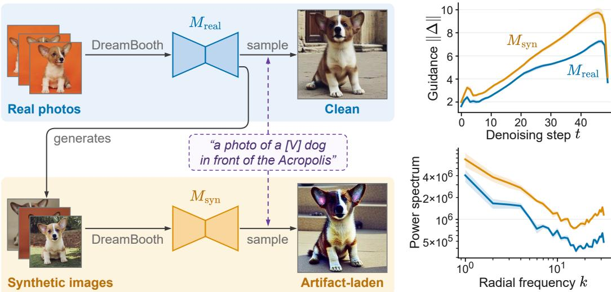  
Figure 1: Personalizing a model on synthetic images of a subject degrades its fidelity. Left: $M _ { \mathrm { r e a l } }$ is DreamBooth fine-tuned from the base model $M _ { \mathrm { b a s e } }$ on real photographs of the subject, and $M _ { \mathrm { s y n } }$ is finetuned from the same base with an identical recipe on images generated by $M _ { \mathrm { r e a l } }$ . Both are sampled with the same prompt and the same 10 seeds. Right: compared to $M _ { \mathrm { r e a l } } , M _ { \mathrm { s y n } }$ shows an inflated per-step ∥∆∥ across denoising steps and an inflated latent power spectrum in its generated images.

Method. Based on these findings we propose ReGain, a training-free correction applied at sampling time, so it also repairs already-trained checkpoints. Correcting the inflation requires a reference for how large $\Delta$ should be. $M _ { \mathrm { r e a l } }$ could help, but it is available only in our analysis experiments, not in practical settings. The base model that $M _ { \mathrm { s y n } }$ was fine-tuned from, however, is freely available, and its $\Delta$ for the subject’s class is uninflated. Because the inflation appears away from sampling (finding 3), ReGain measures it once, before sampling, it runs $M _ { \mathrm { s y n } }$ and the base model on noisy copies of $M _ { \mathrm { s y n } } \mathrm { \ ' } _ { \mathrm { s } }$ training images and records how much larger $\dot { M } _ { \mathrm { s y n } } \mathrm { ' s } ~ \Delta$ is in each frequency band and denoising step. At sampling time, it lowers the guidance of each band and step by that factor (findings 1 and 4), where the subject tokens govern the prediction (finding 2), with plain CFG elsewhere.

## Contributions.

• We show that DreamBooth fine-tuning on synthetic subject images inflates the CFG guidance term ∆, and characterize this inflation in four findings.

• Using these findings, we propose ReGain, a training-free correction that lowers the guidance per frequency band and denoising step, using the public base model as the reference. It needs no real photos, retraining or per-subject tuning.

• We evaluate ReGain on the 30 subjects of the DreamBooth dataset with DreamBooth and DreamBooth-LoRA on SD 1.5 and with DreamBooth-LoRA on SDXL and SD 3.5. In all four settings, ReGain significantly improves subject fidelity (DINO, DINOv2 and CLIP-I) while preserving prompt fidelity (CLIP-T). On SD 1.5, it closes 51–64% of the subjectfidelity gap to a model personalized on real photos.

## 2 RELATED WORK

Subject personalization. Perosnalization methods may bind a subject to a unique identifier by training on a handful of its images (Ruiz et al., 2023; Gal et al., 2023), updating all weights, selected layers (Kumari et al., 2023), or low-rank adapters (Hu et al., 2022; Shah et al., 2024), optionally with drift regularization (Lee et al., 2024; Kim et al., 2026). Tuning-free methods condition on the subject images through encoders or adapters (Ye et al., 2023; Tan et al., 2025; Wu et al., 2025) but reproduce fine identity detail less faithfully, so fine-tuning remains the choice when fidelity matters.

Training on synthetic data. Subject images used for personalization are increasingly produced by generative models (Avrahami et al., 2024; Kumari et al., 2025; Li et al., 2026). Generative models retrained on their own outputs over several generations lose diversity and fidelity (Shumailov et al., 2024; Alemohammad et al., 2024; Bertrand et al., 2024), and proposed remedies mix real data back into training (Gerstgrasser et al., 2024) or guide sampling away from a model trained on selfgenerated data (Alemohammad et al., 2025). Yoon et al. (2025) identify the CFG guidance scale as a driver of collapse over many generations of training. In contrast to these works, our work studies (1) a single round of DreamBooth fine-tuning, not generic training (without a subject token) of a chain of models, and (2) in our case we show that the CFG guidance term (not the scale) itself is miscalibrated as the angle between conditional and unconditional predictions increases, inflating guidance in a band-specific way, and correct it without training.

Guidance analyses and fixes. Classifier-free guidance (Ho & Salimans, 2022) is the standard steering mechanism of text-to-image diffusion (Rombach et al., 2022), and many works adjust when, where, or how strongly it is applied (Kynka¨anniemi et al., 2024; Sadat et al., 2024; Lin et al., 2024;¨ Sadat et al., 2025a; Karras et al., 2024; Shen et al., 2024; Chung et al., 2025), including per frequency band (Sadat et al., 2025b) and for personalized models (Chan et al., 2024; Park et al., 2025; Jeong & Kim, 2025). These works do not consider the inflation of the guidance term itself caused by model personalization on synthetic images, which ReGain corrects before any of them are applied.

## 3 METHOD

## 3.1 SETUP AND NOTATION

To isolate what synthetic training data does to the guidance, we compare two models trained from the same base model $M _ { \mathrm { b a s e } }$ by the DreamBooth objective (Ruiz et al., 2023) (Figure 4A). The first, $M _ { \mathrm { r e a l } }$ , is fine-tuned on real photographs of a subject, binding it to a unique identifier [V]. As a running example we use subject dog6 of the DreamBooth dataset on SD 1.5. Its subject prompt $c _ { \mathrm { s u b j } } , \ ^ { \ast } a$ photo of a $I V J d o g ^ { , \bar { \prime } }$ , names the subject through [V], and its class prompt $c _ { \mathrm { c l a s s } } .$ , “a photo $o f a d o g '$ , omits it. The second model, $M _ { \mathrm { s y n } } .$ , is fine-tuned by the same recipe on synthetic images of the subject generated by $M _ { \mathrm { r e a l } }$ . Because the two models share the base weights and the training recipe, any difference in their guidance traces to the training images alone. The two training sets are comparably diverse (see Appendix A.1), so what distinguishes them is the origin of their images . In practice, only $M _ { \mathrm { s y n } } ,$ its training images, and $M _ { \mathrm { b a s e } }$ are available. $M _ { \mathrm { r e a l } }$ is used solely for the analysis in Section 3.2 and for evaluation.

At step t (counted from the noisiest state, $t = 0 )$ , the noisy latent $z _ { t }$ has signal and noise variances $\hat { \alpha } _ { t }$ and $1 - \bar { \alpha } _ { t }$ . Classifier-free guidance (Ho & Salimans, 2022) combines predictions under the prompt c and the null prompt ∅:

$$
\epsilon _ { w } = \epsilon _ { \emptyset } + w ( \epsilon _ { c } - \epsilon _ { \emptyset } ) , \quad \quad \Delta = \epsilon _ { c } - \epsilon _ { \emptyset } ,\tag{1}
$$

with guidance weight w. Superscripts denote the source model, e.g. $\Delta ^ { M _ { \mathrm { r e a l } } }$ is the guidance of $M _ { \mathrm { r e a l } }$

## 3.2 WHY FINE-TUNING ON SYNTHETIC IMAGES INFLATES GUIDANCE

We compare the noise predictions of $M _ { \mathrm { s y n } }$ and $M _ { \mathrm { r e a l } }$ at every step as both sample $c _ { \mathrm { s u b j } }$ from the same 10 initial noises with the CFG of equation 1. The guidance term $\Delta$ of $M _ { \mathrm { s y n } }$ is systematically larger in norm than that of $M _ { \mathrm { r e a l } }$ , an excess we call the $\bar { \Delta }$ inflation. Its norm is controlled by three quantities: the unconditional norm $r = \| \epsilon _ { \mathcal { O } } \|$ , the ratio $\delta = \| \epsilon _ { c } \| / \| \epsilon _ { \mathcal { D } } \|$ , and the angle θ between $\epsilon _ { \emptyset }$ and $\epsilon _ { c } \mathrm { : }$

$$
\| \Delta \| ^ { 2 } = r ^ { 2 } \big ( 1 + \delta ^ { 2 } - 2 \delta \cos \theta \big ) , \qquad \theta = \operatorname { a r c c o s } \big ( \langle \epsilon _ { \mathcal { O } } , \epsilon _ { c } \rangle / \| \epsilon _ { \mathcal { O } } \| \| \epsilon _ { c } \| \big ) .\tag{2}
$$

We report these measurements on one DreamBooth subject, dog6, and repeat them on all 30 subjects in Appendix A.4.

(1) The ∆ inflation is angle-driven. Of the three scalars, only the angle raises $\| \Delta \|$ as seen in Figure $2 ( \mathrm { a } ) . \theta ^ { M _ { \mathrm { s y n } } }$ exceeds $\cdot \theta ^ { M _ { \mathrm { r e a l } } }$ at every step, by 37% on average over the 50 steps. δ stays within 1% of unity for both models, and $r ^ { M _ { \mathrm { s y n } } }$ stays within 3% of $r ^ { M _ { \mathrm { r e a l } } }$ until step 30 and then falls below it, which works against the inflation. Rewriting equation 2 as $\| \Delta \| ^ { 2 } = r ^ { 2 } \big / \big ( 1 - \delta ) ^ { 2 } + 4 \delta \sin ^ { 2 } ( \theta / 2 ) \big ]$ $\delta \approx 1$ gives $\lVert \Delta \rVert \approx 2 r \sin ( \theta / 2 ) \approx r \theta ,$ , so the guidance norm follows the angle: $\| \Delta ^ { M _ { \mathrm { s y n } } } \|$ is larger at every step, by 29% on average. Repeated on all 30 DreamBooth subjects in Appendix A.4, the excess averages 48%. Since CFG adds w∆ to $\epsilon _ { \emptyset } , M _ { \mathrm { s y n } }$ is over-guided at the same w.

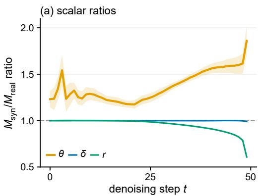

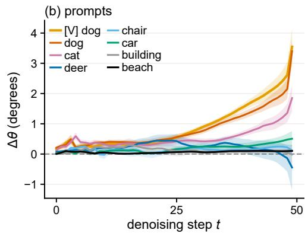  
Figure $2 \colon { ( \mathrm { a } ) M _ { \mathrm { s y n } } } / { M _ { \mathrm { r e a l } } }$ ratio of θ, δ and r. (b) Angle excess $\theta ^ { M _ { \mathrm { s y n } } } ( t ) - \theta ^ { M _ { \mathrm { r e a l } } } ( t )$ for the subject prompt and increasingly semantically distant prompts. 10 seeds mean.

(2) The $\Delta$ inflation follows the subject’s semantic neighborhood. In prompt space, the angle excess $\theta ^ { M _ { \mathrm { s y n } } } ( t ) - \theta ^ { M _ { \mathrm { r e a l } } } ( t )$ (mean over seeds) for prompts at increasing semantic distance from the identifier splits into two tiers (Figure 2b). The class noun (“a photo of a dog”) inherits nearly the full inflation, and cat, an animal never seen in fine-tuning, about half of it. Prompts farther away (deer, chair, car, building, beach) show little to no inflation until the final steps.

(3) The $\Delta$ inflation persists when both models see the same input. Findings 1 and 2 compare the two models on their own sampling trajectories, which differ. Toward a fix, we test whether the inflation persists when both models are evaluated at the same inputs, namely forward-noised training images of $M _ { \mathrm { s y n } } , z _ { t } = \sqrt { \bar { \alpha } _ { t } } z _ { 0 } + \sqrt { 1 - \bar { \alpha } _ { t } } n$ , with $z _ { 0 }$ the latent encoding of a training image and $n \sim \mathcal { N } ( 0 , I )$ drawn afresh at every step. There, where $M _ { \mathrm { s y n } }$ should be most faithful, the guidance term of $M _ { \mathrm { s y n } }$ still exceeds that of $M _ { \mathrm { r e a l } }$ in band energy. Retraining $M _ { \mathrm { s y n } }$ on images sampled from $M _ { \mathrm { r e a l } }$ at lower guidance weights leaves the inflation in place (dog6, Appendix A.2). Adding the prior-preservation loss of DreamBooth to fine-tuning does not remove it either (Appendix A.3).

(4) The ∆ inflation concentrates in high frequencies and varies over time. We next ask whether the inflation is uniform across frequencies and steps, since neural networks learn different frequencies at different rates (Rahaman et al., 2019). We split $\Delta$ into K frequency bands, from the constant component $( k = 0 )$ to the finest detail $( k = K - 1 )$ , with $B _ { k } ( \Delta )$ denoting the component of $\Delta$ in band k. For analysis we group the bands into low, mid and high (boundaries in Appendix C).

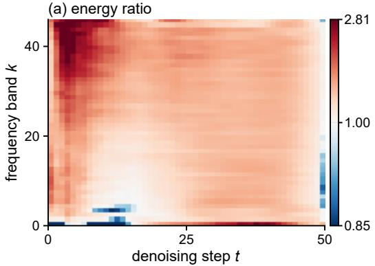

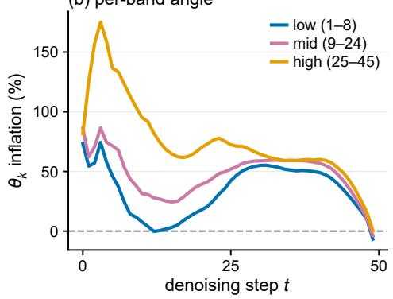  
Figure 3: (a) $M _ { \mathrm { s y n } } / M _ { \mathrm { r e a l } }$ band-energy ratio of $\Delta$ per frequency band k and step t; red marks inflation. (b) θ inflation of the low, mid and high bands over steps. 10 seeds mean.

A. Personalization  
B. Guidance geometry  
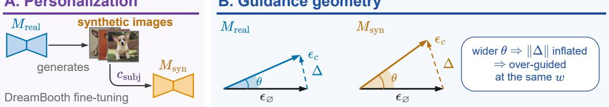

C. ReGain  
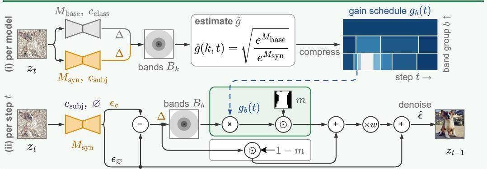  
Figure 4: Overview. (A) $M _ { \mathrm { s y n } }$ is DreamBooth fine-tuned on synthetic subject images generated by $M _ { \mathrm { r e a l } }$ (B) The angle θ between the unconditional and conditional predictions is wider for $M _ { \mathrm { s y n } } ,$ , so its guidance term $\Delta = \epsilon _ { c } - \epsilon _ { \emptyset }$ is inflated. (C) ReGain. (i) Once per model, $M _ { \mathrm { b a s e } }$ and $M _ { \mathrm { s y n } }$ are evaluated at forwardnoised training images $z _ { t } ;$ the square root of the ratio of their masked band energies e gives the gain $\hat { g } ( \boldsymbol { k } , t )$ compressed into the schedule $g _ { b } ( t )$ (darker blue attenuates more; Figure 5). (ii) At each step, ∆ is rescaled per band group by $g _ { b } ( t )$ inside the subject mask m (green) and left unchanged outside it (grey), then scaled by w and added to $\epsilon _ { \mathcal { D } } ,$ equation $5 .$

Both models are evaluated at the states $M _ { \mathrm { s y n } }$ visits during sampling. To measure the inflation in each band, we compare the band energies of the two guidance terms, averaged over seeds, as $\sqrt { \| B _ { k } ( \Delta ^ { M _ { \mathrm { s y n } } } ) \| ^ { 2 } / \| B _ { k } ( \Delta ^ { M _ { \mathrm { r e a l } } } ) \| ^ { 2 } }$ . Figure 3a shows this ratio for every band and step. The inflation grows from the low to the high bands and peaks earliest in the high bands as seen in Figure 3 (a, b). Each band has its own time profile, so no single guidance weight describes the inflation.

## 3.3 REGAIN: RESTORING THE GUIDANCE FROM THE BASE MODEL

To correct the inflation at sampling time, ReGain needs a reference for how large $\Delta$ should be at each band and step. We take this reference from the base model $M _ { \mathrm { b a s e } } ,$ which never saw the synthetic images. Concretely, ReGain has two parts as shown in Figure $4 \mathrm { C } : ( 1 )$ a one-time calibration, which estimates how much $M _ { \mathrm { s y n } } \mathrm { \ ' s }$ guidance exceeds $M _ { \mathrm { b a s e } } \mathrm { ^ { * } s }$ in each band and step, as a gain $g ( k , t )$ , and quantizes it into a compact schedule; and (2) a correction at sampling time, which rescales each band of $\Delta$ by the scheduled gain inside the subject mask. Neither part involves training.

Measuring the $\Delta$ inflation against the base model. To measure how much $M _ { \mathrm { s y n } } \mathrm { \ ' } _ { \mathrm { s } }$ guidance exceeds that of the base model, we evaluate both at the forward-noised training images of finding 3 with the same noise draws: $M _ { \mathrm { b a s e } }$ under $c _ { \mathrm { c l a s s } } .$ , since it has never seen the identifier, and $M _ { \mathrm { s y n } }$ under $c _ { \mathrm { s u b j } }$ . At each band k and step t, the masked band energy of the guidance term is given by

$$
e ( k , t ) \ = \ \frac { \left\| m \odot B _ { k } ( \Delta ) \right\| ^ { 2 } } { | m | C } ,\tag{3}
$$

where $m$ is a binary subject mask and $| m |$ and $C$ are the numbers of masked latent pixels and latent channels. The mask is read from the attention maps of $M _ { \mathrm { s y n } }$ at the same state, by the segmentation stage of S-CFG (Shen et al., 2024) on U-Net models and by Seg4Diff (Kim et al., 2025) on transformer models, and is shared by both models so that their energies are compared over the same pixels. Appendix B details its construction. We define the gain as the square root of the ratio of their

means,

$$
\hat { g } ( k , t ) ~ = ~ \sqrt { \mathbb { E } \big [ e ^ { M _ { \mathrm { b a s e } } } ( k , t ) \big ] \big / \mathbb { E } \big [ e ^ { M _ { \mathrm { s y n } } } ( k , t ) \big ] } ~ .\tag{4}
$$

The gain schedule. The estimated gain $\hat { g } ( k , t )$ has one entry per band and step, each computed from only a few training images and noise draws, so it is noisy at this resolution. To average out this noise and obtain a compact schedule, we compress it into a small number of rectangular cells of constant gain over contiguous bands and steps. The compression proceeds in two stages: the bands are first cut into the fewest contiguous band groups $b ,$ and the steps of each group are then cut into the fewest contiguous segments, such that at each stage the cells deviate from $\hat { g }$ by at most a tolerance τ in root mean square. Each stage is solved exactly by a onedimensional dynamic program on the squared error (tolerance in Section 4.1). The DC band is exempt from this compression and keeps its measured gain. Figure 5 shows the resulting schedule for the running dog6 example.

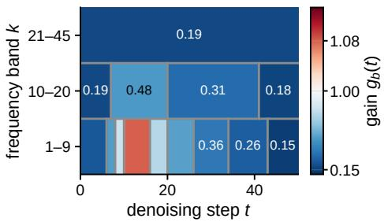  
Figure 5: Gain schedule $g _ { b } ( t )$ for dog6 from the base model (equation 4), one row per band group $b .$

Correcting at sampling time. Because the inflation varies across bands (finding 4) and is tied to the subject (finding 2), the correction rescales each band group separately and acts only where the subject tokens govern the prediction, a choice the ablation of Table 3 validates. The bands partition the spectrum, so $\begin{array} { r } { \Delta = \sum _ { b } ^ { } B _ { b } ( \Delta ) } \end{array}$ exactly for any grouping of the K bands into contiguous band groups b, with $\begin{array} { r } { B _ { b } = \sum _ { k \in b } { B _ { k } } } \end{array}$ . Rescaling each group by a gain $g _ { b } ( t )$ and applying the result inside a binary subject mask m, with plain CFG outside, gives the corrected prediction at guidance weight w:

$$
\hat { \epsilon } = \epsilon _ { \otimes } + w m \odot \sum _ { b } g _ { b } ( t ) B _ { b } ( \Delta ) + w ( 1 - m ) \odot \Delta ,\tag{5}
$$

where ⊙ is the elementwise product. The band projections $B _ { b } ( \Delta )$ are computed on the full guidance term, and the mask is applied to the result, so that each band is rescaled globally before the spatial split. At sampling, m is read at each step from $M _ { \mathrm { s y n } }$ under the sampled prompt, whose scene words serve as the background tokens; Appendix B details both constructions. When every $g _ { b } = 1$ equation 5 reduces to plain CFG.

## 4 EXPERIMENTS

## 4.1 SETUP

Dataset. We evaluate on the DreamBooth dataset (Ruiz et al., 2023), 30 subjects with 4–6 real photographs each, 25 evaluation prompts per subject, 3 seeds, and one image per prompt and seed.

Baselines. For every subject we build the $M _ { \mathrm { r e a l } } { - } M _ { \mathrm { s y n } }$ pair of Section 3.1, with $M _ { \mathrm { s y n } }$ fine-tuned on five images generated by $M _ { \mathrm { r e a l } } .$ , in four settings: DreamBooth and DreamBooth-LoRA (Hu et al., 2022) on Stable Diffusion v1.5 (SD1.5) (Rombach et al., 2022), and DreamBooth-LoRA on SDXL (Podell et al., 2024) and Stable Diffusion 3.5 (SD3.5) (Esser et al., 2024), each over all 30 subjects. In each setting we compare $M _ { \mathrm { s y n } }$ with plain CFG against $M _ { \mathrm { s y n } }$ with ReGain, sampled at the same seed, prompt, sampler and guidance weight w, with the gain schedule estimated once per subject from its five training images, and report $M _ { \mathrm { r e a l } }$ as the reference. On SD1.5 we also compare with three guidance methods applied to $M _ { \mathrm { s y n } }$ S-CFG (Shen et al., 2024) rescales the guidance per semantic region, CFG++ (Chung et al., 2025) renoises each step with the unconditional prediction, and FDG (Sadat et al., 2025b) guides the low and high frequencies with separate weights. Each runs with its authors’ default settings at the same seed, prompt and number of sampling steps. All training and sampling hyperparameters, including those of the baselines, are listed in Appendix C.

Subject mask. The mask m of Section 3.3 is rebuilt at every sampling step from $M _ { \mathrm { s y n } } ?$ s attention under the prompt being sampled. Its construction at calibration, sampling, and visualization are in Appendix B.

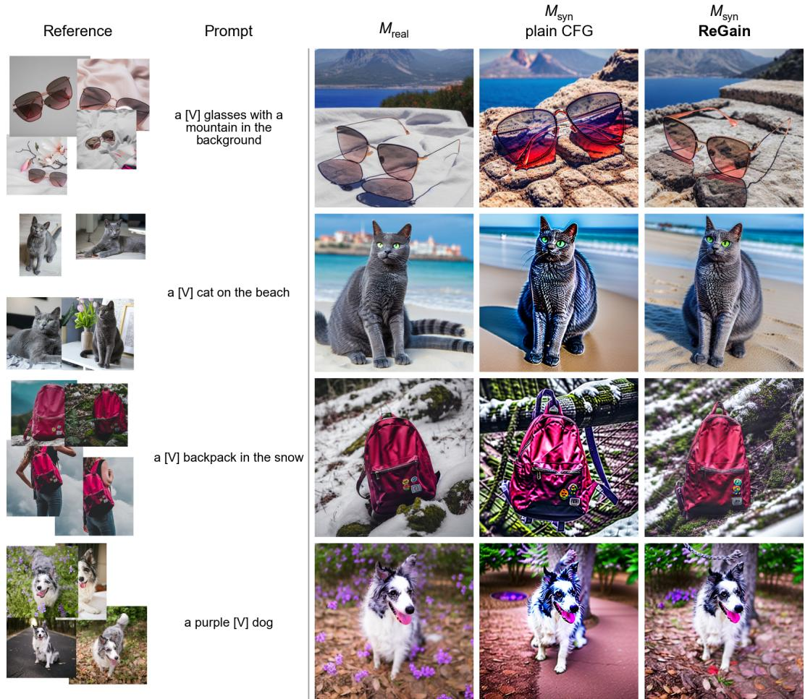  
Figure 6: Qualitative comparison on SD1.5 with DreamBooth. Each row is one subject, prompt and seed shared by the three models. More subjects and settings are in Appendix E.

Metrics. Subject fidelity is the cosine similarity between embeddings of a generated image and the subject’s real photographs, with CLIP ViT-B/32 (CLIP-I), DINO ViT-S/16 (DINO) and DINOv2 ViT-S/14 (DINOv2) (Radford et al., 2021; Caron et al., 2021; Oquab et al., 2024). Prompt fidelity (CLIP-T) is the cosine similarity between the CLIP embeddings of the image and of the prompt with the identifier removed. Over-guidance artifacts are measured by mean saturation, root-mean-square contrast and the high-band energy share defined in Section 4.3.

Implementation details. All models except SD3.5 are sampled with DDIM (Song et al., 2021) for $T = 5 0$ steps at guidance weight $w = 7 . 5 .$ , and SD3.5 with its flow-matching Euler sampler for 40 steps at $w = 7 . 0$ . The gain schedule is compressed with tolerance $\tau = 0 . 0 5$ . The measurement setup of Section 3.2, the frequency bands and the full fine-tuning and sampling settings are in Appendix C.

## 4.2 MAIN COMPARISON

Quantitative results. Table 1 reports subject and prompt fidelity in the four settings. Fine-tuning on model-generated images costs subject fidelity on every metric and in every setting, and ReGain recovers a consistent share of that loss at sampling time, with no retraining: more than half of the gap to $M _ { \mathrm { r e a l } }$ on SD1.5, and between a fifth and a half on SDXL and SD3.5. Prompt fidelity is left intact: CLIP-T changes by at most 0.004 relative to plain CFG in every setting. None of the three guidance baselines closes the gap. FDG recovers at most a sixth of it, none of it on DINO, and lowers CLIP-T. S-CFG and CFG++ score at or below plain CFG on all three subject fidelity metrics. The over-guidance artifacts behind the fidelity loss, which these metrics capture only indirectly, are measured in Section 4.3.

Table 1: Subject and prompt fidelity on DreamBooth, averaged over 30 subjects, 25 prompts and 3 seeds (higher is better). The first row is the reference model $M _ { \mathrm { r e a l } } .$ , and every other row samples from $M _ { \mathrm { s y n } }$ . Baselines, on SD1.5 only: S-CFG (Shen et al., 2024), CFG++ (Chung et al., 2025) and FDG (Sadat et al., 2025b). Bold marks the best $M _ { \mathrm { s y n } }$ result. Gap recovered is the part of the drop from $M _ { \mathrm { r e a l } }$ to $M _ { \mathrm { s y n } }$ , both with CFG, that ReGain wins back. For CLIP-T we report the change from $M _ { \mathrm { s y n } } \overset { \cdot } { + } \mathbf { C F G }$ instead.
<table><tr><td></td><td colspan="4">SD1.5, DreamBooth</td><td colspan="4">SD1.5, DreamBooth-LoRA</td></tr><tr><td>Method</td><td>CLIP-I</td><td>DINO</td><td>DINOv2</td><td>CLIP-T</td><td>CLIP-I</td><td>DINO</td><td>DINOv2</td><td>CLIP-T</td></tr><tr><td> $M _ { \mathrm { r e a l } } + \mathrm { C F G }$ </td><td>0.814</td><td>0.681</td><td>0.661</td><td>0.300</td><td>0.791</td><td>0.630</td><td>0.606</td><td>0.306</td></tr><tr><td> $M _ { \mathrm { s y n } } + \mathrm { C F G }$ </td><td>0.788</td><td>0.611</td><td>0.611</td><td>0.289</td><td>0.750</td><td>0.540</td><td>0.510</td><td>0.300</td></tr><tr><td> $M _ { \mathrm { s y n } } + \mathrm { S } { \mathrm { - } } \mathrm { C F G }$ </td><td>0.781</td><td>0.605</td><td>0.604</td><td>0.292</td><td>0.744</td><td>0.536</td><td>0.503</td><td>0.302</td></tr><tr><td> $M _ { \mathrm { s y n } } + \mathrm { C F G } + +$ </td><td>0.788</td><td>0.606</td><td>0.608</td><td>0.289</td><td>0.748</td><td>0.535</td><td>0.508</td><td>0.299</td></tr><tr><td> $M _ { \mathrm { s y n } } + \mathrm { F D G }$ </td><td>0.792</td><td>0.608</td><td>0.614</td><td>0.284</td><td>0.755</td><td>0.538</td><td>0.517</td><td>0.297</td></tr><tr><td> $M _ { \mathrm { s y n } } + \mathrm { C F G } + \mathrm { R e G a i n }$ </td><td>0.802</td><td>0.647</td><td>0.643</td><td>0.290</td><td>0.775</td><td>0.594</td><td>0.568</td><td>0.304</td></tr><tr><td>↔ Gap recovered</td><td>54%</td><td>51%</td><td>64%</td><td>+0.001</td><td>61%</td><td>60%</td><td>60%</td><td>+0.004</td></tr><tr><td colspan="7">SDXL, DreamBooth-LoRA</td><td colspan="2">SD3.5, DreamBooth-LoRA</td></tr><tr><td> $M _ { \mathrm { r e a l } } + \mathrm { C F G }$ </td><td>0.757</td><td>0.558</td><td>0.535</td><td>0.289</td><td>0.811</td><td>0.682</td><td>0.650</td><td>0.311</td></tr><tr><td> $M _ { \mathrm { s y n } } + \mathrm { C F G }$ </td><td>0.724</td><td>0.477</td><td>0.467</td><td>0.278</td><td>0.776</td><td>0.586</td><td>0.567</td><td>0.307</td></tr><tr><td> $M _ { \mathrm { s y n } } + \mathrm { C F G } + \mathrm { R e G a i n }$ </td><td>0.736</td><td>0.502</td><td>0.494</td><td>0.279</td><td>0.792</td><td>0.605</td><td>0.596</td><td>0.307</td></tr><tr><td> Gap recovered</td><td>36%</td><td>31%</td><td>40%</td><td>+0.001</td><td>46%</td><td>20%</td><td>35%</td><td>0.000</td></tr></table>

Qualitative results. Figure 6 shows four subjects, each at one prompt and seed shared by the three models. Under plain CFG, $M _ { \mathrm { s y n } }$ renders the subject with oversaturated color, harsh contrast and excess fine texture, the over-guidance artifacts of Figure 1, and the scene loses detail around it. ReGain, from the same model and seed, brings the subject’s color and texture back toward $M _ { \mathrm { r e a l } } \mathrm { ' s }$ while keeping the prompt’s scene, and the attribute change of the last column (the dog recolored purple) is still carried out. Figure 7 shows the same behavior under DreamBooth-LoRA on SD1.5, on SDXL and on SD3.5.

## 4.3 OVER-GUIDANCE ARTIFACT METRICS

Over-guided samples carry a characteristic artifact signature: excess saturation and contrast and inflated high-frequency content, the known symptoms of over-guidance (Sadat et al., 2025a) and the same signature reported for models trained on their own high-CFG samples (Yoon et al., 2025). We quantify it with three per-image statistics, mean HSV saturation, root-mean-square grayscale contrast and the high-frequency fraction of the image’s Fourier power (definitions in Appendix D),

Table 2: Over-guidance artifacts inside the subject region (SD1.5, DreamBooth). Bold marks the $M _ { \mathrm { s y n } }$ row closer to $M _ { \mathrm { r e a l } }$
<table><tr><td>Method</td><td>Saturation Contrast High band</td><td></td><td></td></tr><tr><td> $M _ { \mathrm { r e a l } } + \mathrm { C F G }$ </td><td>0.301</td><td>0.211</td><td>0.061</td></tr><tr><td> $M _ { \mathrm { s y n } } + \mathrm { C F G }$ </td><td>0.355</td><td>0.258</td><td>0.069</td></tr><tr><td> $M _ { \mathrm { s y n } } + \mathbf { C F G } +$  ReGain</td><td>0.309</td><td>0.234</td><td>0.066</td></tr><tr><td>→ Gap recovered</td><td>85%</td><td>51%</td><td>38%</td></tr></table>

and take $\bar { M } _ { \mathrm { r e a l } } \ ' _ { \mathrm { s } }$ value as the target, since the goal is to restore the reference model’s image statistics.   
This section evaluates the SD1.5 DreamBooth setting.

Where they are measured. The correction acts inside the subject mask and leaves plain CFG outside it. We therefore report the three statistics inside the mask that steered $M _ { \mathrm { s y n } } ,$ , over identical pixels for all three methods (Appendix D), and the full-frame values in the text.

Results. Table 2 reports the three statistics inside the subject region. Under plain CFG, $M _ { \mathrm { s y n } }$ is 18% over-saturated, 22% over-contrasted and carries 13% excess high-band power relative to $M _ { \mathrm { r e a l } } { \mathrm { : } }$ the over-guidance artifacts of Figure 1, and the image-space counterpart of the spectral excess in Figure 3a. ReGain moves all three statistics back toward $M _ { \mathrm { r e a l } }$ and overshoots none of them. Most of the saturation excess is removed, along with about half of the contrast excess and a third of the high-band excess. On the full frame the same recoveries read 77%, 35% and 5%, diluted by the background, which covers most of the frame and is generated under plain CFG in every method.

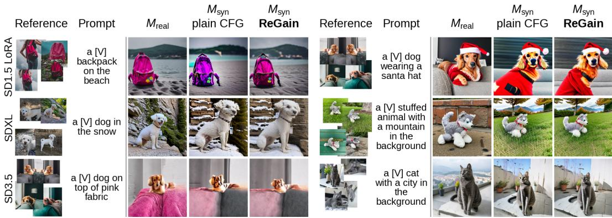  
Figure 7: Qualitative comparison across fine-tuning forms and base models. Each row is one base model and each half one subject, prompt and seed shared by the three models; nothing is retuned per base model. The SD3.5 row shows the chain of Table 1.

Table 3: Subject-agnostic alternatives and the subject-mask ablation (SD v1.5, DreamBooth): a lower guidance weight w, APG (Sadat et al., 2025a), and ReGain w/o mask, which applies the gain to every pixel; $w { = } 7 . 5$ unless stated. Saturation is inside the subject region; bold marks the $M _ { \mathrm { s y n } }$ row closest to $M _ { \mathrm { r e a l } }$  
Table 4: ∆ inflation at the calibration states before and after the gain schedule, by band group and compression tolerance (RMS, target 1, mean ± std over 30 subjects).
<table><tr><td>Method</td><td>DINO CLIP-T</td><td>Saturation</td></tr><tr><td> $M _ { \mathrm { r e a l } }$ </td><td>0.681 0.300</td><td>0.301</td></tr><tr><td> $M _ { \mathrm { s y n } } ,$  plain CFG</td><td>0.611 0.289</td><td>0.355</td></tr><tr><td> $M _ { \mathrm { s y n } } ,$  plain CFG (w=5.0)</td><td>0.632 0.286</td><td>0.326</td></tr><tr><td> $M _ { \mathrm { s y n } } ,$  plain CFG (w=3.0)</td><td>0.647 0.281</td><td>0.292</td></tr><tr><td> $M _ { \mathrm { s y n } } ,$  APG</td><td>0.641 0.283</td><td>0.240</td></tr><tr><td> $M _ { \mathrm { s y n } } .$  ReGain</td><td>0.647 0.290</td><td>0.309</td></tr><tr><td> $M _ { \mathrm { s y n } } ,$  ReGain w/o mask</td><td>0.652 0.282</td><td>0.293</td></tr></table>

<table><tr><td>Band</td><td></td><td colspan="4">After, by tolerance</td></tr><tr><td>cells</td><td>Before</td><td>0.02 70</td><td>0.05 18</td><td>0.1 6</td><td>0.2 2</td></tr><tr><td>Low k</td><td> $4 . 7 0 \pm 1 . 1 9$ </td><td>1.02</td><td>1.06</td><td>1.13</td><td>1.29</td></tr><tr><td>Mid k</td><td> $4 . 9 5 \pm 1 . 1 9$ </td><td>1.01</td><td>1.05</td><td>1.16</td><td>1.35</td></tr><tr><td>High k</td><td> $5 . 7 6 \pm 1 . 3 8$ </td><td>1.03</td><td>1.11</td><td>1.30</td><td>1.57</td></tr><tr><td>All</td><td> $5 . 3 1 \pm 1 . 2 6$ </td><td>1.02</td><td>1.08</td><td>1.22</td><td>1.45</td></tr></table>

## 4.4 ANALYSIS AND ABLATIONS

All experiments in this section use DreamBooth on SD1.5 with the 30 subjects, prompts and seeds of Table 1.

Effect of subject-agnostic guidance changes. The inflation is structured in frequency and time and follows the subject tokens (findings 2 and 4, Section 3.2), so no change applied alike to every band and step should repair it. We test two such changes on $M _ { \mathrm { s y n } } { \mathrm { : } }$ lowering the guidance weight to $w \in \{ 5 . 0 , 3 . 0 \}$ , and adaptive projected guidance (APG) (Sadat et al., 2025a), which removes the component of the guidance term parallel to the conditional prediction. As seen in Table 3 and Figure 8, (1) lowering w removes guidance from the scene as well as from the subject: CLIP-T falls by 0.003 at $w { = } 5 . 0$ and by 0.008 at $w { = } 3 . 0 .$ , the prompt’s accessory or setting fades first, and neither weight recovers DINO; (2) APG over-corrects: saturation drops to 0.240, well below $M _ { \mathrm { r e a l } } \mathrm { ' s 0 . 3 0 1 }$ the frame is washed out, and CLIP-T falls by 0.006. ReGain is the only method that moves all three metrics toward $M _ { \mathrm { r e a l } }$ without overshooting any of them.

Effect of the gain schedule. Table 4 measures the excess guidance energy the schedule is built to remove: the square root of the ratio of $M _ { \mathrm { s y n } } \mathrm { \ ' s }$ masked band energy equation 3 to the base model’s at the same forward-noised training images, the inverse of the gain equation 4, so that values above 1 are inflation. As seen in Table 4, (1) before correction the inflation rises from the low-k to the high-k group, the ordering of the per-band angle inflation of Section 3.2, and (2) after the gain schedule at $\tau = 0 . 0 5$ it lies within 10% of 1 on average (residual by step in Appendix C).

Effect of the compression tolerance $\tau .$ . The tolerance sets how closely the compressed schedule follows the dense gain gˆ. We vary it over $\tau \in \{ 0 . 0 2 , 0 . 0 5 , 0 . 1 , 0 . 2 \}$ . As seen in Table 4, a coarser tolerance leaves more residual inflation, most in the high-k group, where the gain varies fastest over time, and $( 2 ) \tau = 0 . 0 5$ is the coarsest tolerance that keeps the inflation within 10%.

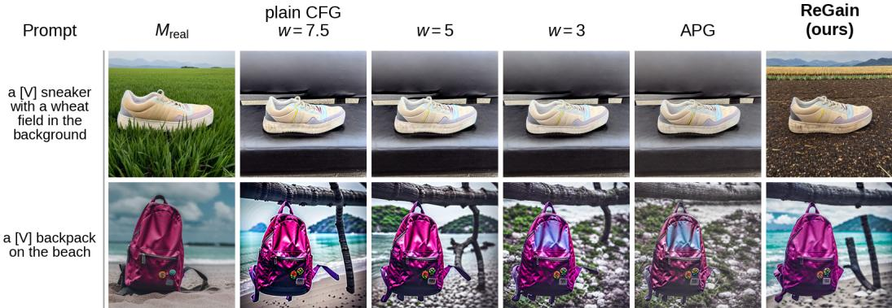  
Figure 8: Example generations from the baselines of Table 3, all at the same seed.

Effect of the subject mask. The mask restricts the correction to the subject. We remove it and apply the gain schedule to every pixel, the background included. As seen in Table 3, CLIP-T drops by 0.008 to 0.282, below plain CFG’s 0.289: attenuating the background costs prompt fidelity. The mask is what lets ReGain leave prompt fidelity intact while correcting the subject.

Compute overhead. Calibration runs once per fine-tuned model and takes 12 minutes per subject on one RTX A4000 for SD1.5. At sampling, ReGain takes 1.1× the wall-clock time of plain CFG (5.4 vs 4.9 s per image on the same GPU), mostly for building the mask from the attention maps.

## 5 LIMITATIONS

ReGain corrects the inflation at sampling time, using the base model’s guidance as an imperfectly calibrated reference, so it cannot fully match $M _ { \mathrm { r e a l } }$ . A training-time correction during personalization on synthetic images could close this gap. ReGain also relies on a subject mask from existing segmentation methods, so where the mask misses part of the subject or spills onto the background, it attenuates the guidance in the wrong region. In addition, we measure the inflation only at the model’s output, in its noise predictions. Mechanistically tracing where it originates inside the network, e.g., in the cross-attention in intermediate activations, is left for future work.

## 6 CONCLUSION

We studied how personalizing a text-to-image diffusion model on synthetic rather than real images of a subject affects its outputs. With the base model and the DreamBooth recipe held fixed, the change of training data alone inflates the CFG term as the angle between the conditional and unconditional noise predictions widens. This happens most strongly in high frequencies, with its strength varying at each denoising step. Building on these findings, ReGain measures the inflation once against base model (before personalization) and attenuates the guidance per frequency band and step inside the subject region. It needs no real photographs or retraining, recovers 51–64% of the subject-fidelity gap on SD1.5, improves subject fidelity on SDXL and SD3.5, while preserving prompt fidelity.

## AI USE STATEMENT

In this work, we used a generative AI coding assistant to help write measurement and figuregeneration code and to help draft and edit the manuscript text. All experimental designs, measurements, and claims were specified, executed, and verified by the authors; AI-assisted code was reviewed and its outputs cross-checked by the authors. We take responsibility for the final content of this work, including text, claims, and artifacts produced with the aid of generative AI.

## ETHICS STATEMENT

Our study uses no human-subject data or personally identifiable information; subject images come from the public DreamBooth dataset, and we follow the licenses of Stable Diffusion v1.5 and that dataset.

## REPRODUCIBILITY STATEMENT

All models and data are public (Stable Diffusion v1.5, DreamBooth dataset). Full implementation details, including the fine-tuning recipe, sampler settings, guidance weights, and seeds, are given in Appendix C.

## REFERENCES

Sina Alemohammad, Josue Casco-Rodriguez, Lorenzo Luzi, Ahmed Imtiaz Humayun, Hossein Babaei, Daniel LeJeune, Ali Siahkoohi, and Richard Baraniuk. Self-consuming generative models go MAD. In The Twelfth International Conference on Learning Representations, 2024. URL https://openreview.net/forum?id=ShjMHfmPs0.

Sina Alemohammad, Ahmed Imtiaz Humayun, Shruti Agarwal, John Collomosse, and Richard Baraniuk. Self-improving diffusion models with synthetic data. In Scaling Self-Improving Foundation Models without Human Supervision, 2025. URL https://openreview.net/ forum?id=FHTCV0iE06.

Omri Avrahami, Amir Hertz, Yael Vinker, Moab Arar, Shlomi Fruchter, Ohad Fried, Daniel Cohen-Or, and Dani Lischinski. The chosen one: Consistent characters in text-to-image diffusion models. In ACM SIGGRAPH 2024 conference papers, pp. 1–12, 2024.

Quentin Bertrand, Joey Bose, Alexandre Duplessis, Marco Jiralerspong, and Gauthier Gidel. On the stability of iterative retraining of generative models on their own data. In The Twelfth International Conference on Learning Representations, 2024. URL https://openreview.net/forum? id=JORAfH2xFd.

Mathilde Caron, Hugo Touvron, Ishan Misra, Herve J´ egou, Julien Mairal, Piotr Bojanowski, and´ Armand Joulin. Emerging properties in self-supervised vision transformers. In 2021 IEEE/CVF international conference on computer vision (ICCV), pp. 9630–9640. IEEE, 2021.

Kelvin CK Chan, Yang Zhao, Xuhui Jia, Ming-Hsuan Yang, and Huisheng Wang. Improving subject-driven image synthesis with subject-agnostic guidance. In 2024 IEEE/CVF Conference on Computer Vision and Pattern Recognition (CVPR), pp. 6733–6742. IEEE, 2024.

Hyungjin Chung, Jeongsol Kim, Geon Yeong Park, Hyelin Nam, and Jong Chul Ye. CFG++: Manifold-constrained classifier free guidance for diffusion models. In The Thirteenth International Conference on Learning Representations, 2025. URL https://openreview.net/ forum?id=E77uvbOTtp.

Patrick Esser, Sumith Kulal, Andreas Blattmann, Rahim Entezari, Jonas Muller, Harry Saini, Yam¨ Levi, Dominik Lorenz, Axel Sauer, Frederic Boesel, et al. Scaling rectified flow transformers for high-resolution image synthesis. In Forty-first international conference on machine learning, 2024.

Rinon Gal, Yuval Alaluf, Yuval Atzmon, Or Patashnik, Amit Haim Bermano, Gal Chechik, and Daniel Cohen-Or. An image is worth one word: Personalizing text-to-image generation using textual inversion. In The Eleventh International Conference on Learning Representations, 2023. URL https://openreview.net/forum?id=NAQvF08TcyG.

Matthias Gerstgrasser, Rylan Schaeffer, Apratim Dey, Rafael Rafailov, Tomasz Korbak, Henry Sleight, Rajashree Agrawal, John Hughes, Dhruv Bhandarkar Pai, Andrey Gromov, Dan Roberts, Diyi Yang, David L. Donoho, and Sanmi Koyejo. Is model collapse inevitable? breaking the curse of recursion by accumulating real and synthetic data. In First Conference on Language Modeling, 2024. URL https://openreview.net/forum?id=5B2K4LRgmz.

Jonathan Ho and Tim Salimans. Classifier-free diffusion guidance. arXiv preprint arXiv:2207.12598, 2022.

Edward J. Hu, Yelong Shen, Phillip Wallis, Zeyuan Allen-Zhu, Yuanzhi Li, Shean Wang, Lu Wang, and Weizhu Chen. LoRA: Low-rank adaptation of large language models. In International Conference on Learning Representations, 2022.

Seulgi Jeong and Jaeil Kim. Mindiff: Mask-integrated negative attention for controlling overfitting in text-to-image personalization. In 2025 IEEE/CVF International Conference on Computer Vision Workshops (ICCVW), pp. 6981–6990. IEEE, 2025.

Tero Karras, Miika Aittala, Tuomas Kynka¨anniemi, Jaakko Lehtinen, Timo Aila, and Samuli Laine.¨ Guiding a diffusion model with a bad version of itself. In Advances in Neural Information Processing Systems, 2024.

Chaehyun Kim, Heeseong Shin, Eunbeen Hong, Heeji Yoon, Anurag Arnab, Paul Hongsuck Seo, Sunghwan Hong, and Seungryong Kim. Seg4diff: Unveiling open-vocabulary semantic segmentation in text-to-image diffusion transformers. In The Thirty-ninth Annual Conference on Neural Information Processing Systems, 2025. URL https://openreview.net/forum?id= ENp2kCdYE8.

Gihoon Kim, Hyungjin Park, and Taesup Kim. Preserve and personalize: Personalized text-toimage diffusion models without distributional drift. In International Conference on Learning Representations, volume 2026, pp. 15591–15615, 2026.

Nupur Kumari, Bingliang Zhang, Richard Zhang, Eli Shechtman, and Jun-Yan Zhu. Multi-concept customization of text-to-image diffusion. In CVPR, 2023.

Nupur Kumari, Xi Yin, Jun-Yan Zhu, Ishan Misra, and Samaneh Azadi. Generating multi-image synthetic data for text-to-image customization. In 2025 IEEE/CVF International Conference on Computer Vision (ICCV), pp. 16524–16534. IEEE, 2025.

Tuomas Kynka¨anniemi, Miika Aittala, Tero Karras, Samuli Laine, Timo Aila, and Jaakko Lehtinen.¨ Applying guidance in a limited interval improves sample and distribution quality in diffusion models. In The Thirty-eighth Annual Conference on Neural Information Processing Systems, 2024. URL https://openreview.net/forum?id=nAIhvNy15T.

Kyungmin Lee, Sangkyung Kwak, Kihyuk Sohn, and Jinwoo Shin. Direct consistency optimization for robust customization of text-to-image diffusion models. Advances in neural information processing systems, 37:103269–103304, 2024.

Yaowei Li, Xiaoyu Li, Zhaoyang Zhang, Yuxuan Bian, Gan Liu, Xinyuan Li, Jiale Xu, Wenbo Hu, yating liu, Lingen Li, Jing Cai, Yuexian Zou, Yancheng He, and Ying Shan. IC-custom: Diverse image customization via in-context learning. In The Fourteenth International Conference on Learning Representations, 2026. URL https://openreview.net/forum?id= gv2cr8kABL.

Shanchuan Lin, Bingchen Liu, Jiashi Li, and Xiao Yang. Common diffusion noise schedules and sample steps are flawed. In Proceedings of the IEEE/CVF Winter Conference on Applications of Computer Vision, 2024.

Maxime Oquab, Timothee Darcet, Th´ eo Moutakanni, Huy V. Vo, Marc Szafraniec, Vasil Khali-´ dov, Pierre Fernandez, Daniel HAZIZA, Francisco Massa, Alaaeldin El-Nouby, Mido Assran, Nicolas Ballas, Wojciech Galuba, Russell Howes, Po-Yao Huang, Shang-Wen Li, Ishan Misra, Michael Rabbat, Vasu Sharma, Gabriel Synnaeve, Hu Xu, Herve Jegou, Julien Mairal, Patrick Labatut, Armand Joulin, and Piotr Bojanowski. DINOv2: Learning robust visual features without supervision. Transactions on Machine Learning Research, 2024. ISSN 2835-8856. URL https://openreview.net/forum?id=a68SUt6zFt. Featured Certification.

Sunghyun Park, Seokeon Choi, Hyoungwoo Park, and Sungrack Yun. Steering guidance for personalized text-to-image diffusion models. In 2025 IEEE/CVF International Conference on Computer Vision (ICCV), pp. 15907–15916. IEEE, 2025.

Dustin Podell, Zion English, Kyle Lacey, Andreas Blattmann, Tim Dockhorn, Jonas Muller, Joe¨ Penna, and Robin Rombach. SDXL: Improving latent diffusion models for high-resolution image synthesis. In The Twelfth International Conference on Learning Representations, 2024. URL https://openreview.net/forum?id=di52zR8xgf.

Alec Radford, Jong Wook Kim, Chris Hallacy, Aditya Ramesh, Gabriel Goh, Sandhini Agarwal, Girish Sastry, Amanda Askell, Pamela Mishkin, Jack Clark, et al. Learning transferable visual models from natural language supervision. In International conference on machine learning, pp. 8748–8763. PMLR, 2021.

Nasim Rahaman, Aristide Baratin, Devansh Arpit, Felix Draxler, Min Lin, Fred Hamprecht, Yoshua Bengio, and Aaron Courville. On the spectral bias of neural networks. In International conference on machine learning, pp. 5301–5310. PMLR, 2019.

Robin Rombach, Andreas Blattmann, Dominik Lorenz, Patrick Esser, and Bjorn Ommer. High-¨ resolution image synthesis with latent diffusion models. In 2022 IEEE/CVF conference on com puter vision and pattern recognition (CVPR), pp. 10674–10685. ieee, 2022.

Nataniel Ruiz, Yuanzhen Li, Varun Jampani, Yael Pritch, Michael Rubinstein, and Kfir Aberman. Dreambooth: Fine tuning text-to-image diffusion models for subject-driven generation. In 2023 IEEE/CVF Conference on Computer Vision and Pattern Recognition (CVPR), pp. 22500–22510. IEEE, 2023.

Seyedmorteza Sadat, Jakob Buhmann, Derek Bradley, Otmar Hilliges, and Romann M. Weber. CADS: Unleashing the diversity of diffusion models through condition-annealed sampling. In International Conference on Learning Representations, 2024.

Seyedmorteza Sadat, Otmar Hilliges, and Romann M. Weber. Eliminating oversaturation and artifacts of high guidance scales in diffusion models. In The Thirteenth International Conference on Learning Representations, 2025a. URL https://openreview.net/forum?id= e2ONKX6qzJ.

Seyedmorteza Sadat, Tobias Vontobel, Farnood Salehi, and Romann M Weber. Guidance in the frequency domain enables high-fidelity sampling at low cfg scales. arXiv preprint arXiv:2506.19713, 2025b.

Viraj Shah, Nataniel Ruiz, Forrester Cole, Erika Lu, Svetlana Lazebnik, Yuanzhen Li, and Varun Jampani. ZipLoRA: Any subject in any style by effectively merging LoRAs. In European Conference on Computer Vision, 2024.

Dazhong Shen, Guanglu Song, Zeyue Xue, Fu-Yun Wang, and Yu Liu. Rethinking the spatial inconsistency in classifier-free diffusion guidance. In Proceedings of the IEEE/CVF Conference on Computer Vision and Pattern Recognition, 2024.

Ilia Shumailov, Zakhar Shumaylov, Yiren Zhao, Nicolas Papernot, Ross Anderson, and Yarin Gal. Ai models collapse when trained on recursively generated data. Nature, 631(8022):755–759, 2024.

Jiaming Song, Chenlin Meng, and Stefano Ermon. Denoising diffusion implicit models. In International Conference on Learning Representations, 2021. URL https://openreview.net/ forum?id=St1giarCHLP.

Zhenxiong Tan, Songhua Liu, Xingyi Yang, Qiaochu Xue, and Xinchao Wang. Ominicontrol: Minimal and universal control for diffusion transformer. In 2025 IEEE/CVF International Conference on Computer Vision (ICCV), pp. 14940–14950. IEEE, 2025.

Shaojin Wu, Mengqi Huang, Wenxu Wu, Yufeng Cheng, Fei Ding, and Qian He. Less-to-more generalization: Unlocking more controllability by in-context generation. In 2025 IEEE/CVF International Conference on Computer Vision (ICCV), pp. 18682–18692. IEEE, 2025.

Hu Ye, Jun Zhang, Sibo Liu, Xiao Han, and Wei Yang. Ip-adapter: Text compatible image prompt adapter for text-to-image diffusion models. arXiv preprint arXiv:2308.06721, 2023.

Youngseok Yoon, Dainong Hu, Iain Weissburg, Yao Qin, and Haewon Jeong. Model collapse in the self-consuming chain of diffusion finetuning: A novel perspective from quantitative trait modeling. In ICLR 2025 Workshop on Navigating and Addressing Data Problems for Foundation Models, 2025. URL https://openreview.net/forum?id=1MIgdKsvjX.

## APPENDIX

A Synthetic training images as the source of the $\Delta$ inflation 15   
A.1 Diversity of the training images . 15   
A.2 Guidance weight of the training images 15   
A.3 Prior-preservation loss 16   
A.4 The $\Delta$ inflation on all subjects . 16   
B Subject mask 17   
C Implementation details 18   
C.1 Evaluation prompts 19   
D Over-guidance artifact metrics 19   
E Additional qualitative results 20

## A SYNTHETIC TRAINING IMAGES AS THE SOURCE OF THE $\Delta$ INFLATION

Section 3.2 attributes the $\Delta$ inflation of $M _ { \mathrm { s y n } }$ to its training images having been generated by $M _ { \mathrm { r e a l } }$ Two other properties of the generated images could account for it: they could be less diverse than the real photographs $M _ { \mathrm { r e a l } }$ was trained on, or they could inherit the guidance weight at which $M _ { \mathrm { r e a l } }$ sampled them. Neither accounts for the inflation. Nor is the inflation specific to fine-tuning without the prior-preservation loss of DreamBooth.

## A.1 DIVERSITY OF THE TRAINING IMAGES

$M _ { \mathrm { r e a l } }$ and $M _ { \mathrm { s y n } }$ are fine-tuned on different images, the subject’s real photographs and the five images that $M _ { \mathrm { r e a l } }$ generated. The $\Delta$ inflation of Section 3.2 could therefore be attributed to the synthetic set being less diverse than the real one rather than to its origin. For each set we measure diversity as the mean, over all pairs of images in the set, of one minus the cosine similarity between their CLIP ViT-B/32 embeddings (Section 4.1), which does not depend on the number of images, and report the mean and standard deviation over the 30 subjects: $\bar { 0 . 1 4 2 } \pm 0 . 0 5 0$ for the real photographs and $0 . 1 4 0 \pm 0 . 0 5 2$ for the five images that $M _ { \mathrm { r e a l } }$ generated. The two sets are comparably diverse, so what separates $M _ { \mathrm { r e a l } }$ from $\bar { M _ { \mathrm { s y n } } }$ is the origin of their training images and not their diversity.

## A.2 GUIDANCE WEIGHT OF THE TRAINING IMAGES

Every $M _ { \mathrm { s y n } }$ in the paper is trained on images that $M _ { \mathrm { r e a l } }$ sampled at the guidance weight of Table 6, $w = 7 . 5$ on Stable Diffusion v1.5. A higher guidance weight drives each sample further along the guidance direction, so the inflation could be inherited from the weight at which the training images were sampled and would then fall at lower weights. For dog6, the subject of Figure 5, we resample the five training images from the same $M _ { \mathrm { r e a l } }$ at $w = 5$ and $w = 3$ with the same prompts and seeds, train $M _ { \mathrm { s y n } }$ on each set with the Stable Diffusion v1.5 DreamBooth recipe of Table $^ { 6 , }$ unchanged, and repeat the measurement of Table 4. Table 5 reports the inflation at the calibration states, before correction, by band group; the value at 7.5, 5.57, sits within the 30-subject mean of Table 4, $5 . 3 1 \pm 1 . 2 6$ . The inflation stays large at all three weights and keeps its ordering from the low-k to the high-k group. Lowering the weight from 7.5 to 3 reduces it by about 12%, and most of that drop is already reached at 5.

Table 5: ∆ inflation of dog6 against the base model, by band group, for $M _ { \mathrm { s y n } }$ trained on images sampled from $M _ { \mathrm { r e a l } }$ at three guidance weights (root mean square over the group’s bands and all steps at the calibration states, as the Before column of Table 4). The 7.5 row is the $M _ { \mathrm { s y n } }$ used throughout the paper.
<table><tr><td>Guidance weight w</td><td>Low k</td><td>Mid k</td><td>High k</td><td>All</td></tr><tr><td>7.5</td><td>4.16</td><td>4.71</td><td>6.55</td><td>5.57</td></tr><tr><td>5.0</td><td>3.86</td><td>4.28</td><td>5.80</td><td>4.98</td></tr><tr><td>3.0</td><td>3.50</td><td>4.09</td><td>5.79</td><td>4.88</td></tr></table>

## A.3 PRIOR-PRESERVATION LOSS

DreamBooth (Ruiz et al., 2023) can add a prior-preservation loss, which also trains the model on images of the subject’s class that the base model generates under the class prompt, so that the class noun does not drift toward the subject. The models in the paper are fine-tuned without it (Table 6). To test whether it would prevent the inflation, for dog6 we fine-tune $M _ { \mathrm { r e a l } }$ and $M _ { \mathrm { s y n } }$ as in the main experiments with this loss added, training for 800 steps following the Diffusers recommendation, with $M _ { \mathrm { s y n } }$ again trained on five images generated by $M _ { \mathrm { r e a l } }$ , and repeat the measurement of Table 4. At the calibration states, before correction and computed as in Table 5, the inflation against the base model is 7.38, 7.35 and 9.47 in the low-, mid- and high-k groups and 8.41 over all bands. The prior-preservation loss therefore does not remove the inflation, which remains largest in the high-k group. Since it leaves the inflation in place, we keep the simpler setup without it.

## A.4 THE ∆ INFLATION ON ALL SUBJECTS

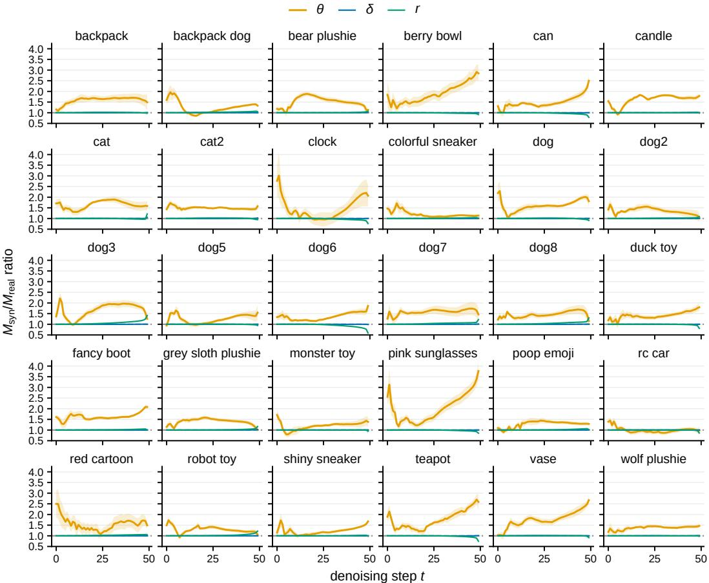  
Figure 9: Per-step $M _ { \mathrm { s y n } } / M _ { \mathrm { r e a l } }$ ratio of θ, δ and r for the 30 DreamBooth subjects, as in Figure 2a. Mean over 5 seeds, shading is the standard error.

We repeat the measurement of finding 1 on all 30 DreamBooth subjects, each with its own $M _ { \mathrm { r e a l } }$ and $M _ { \mathrm { s y n } }$ , under the subject prompt with the subject’s class noun and 5 seeds. Figure 9 shows the per-step ratios of θ, δ and r for every subject. Averaged over the 50 steps, ∥∆∥ of $M _ { \mathrm { s y n } }$ exceeds that of $M _ { \mathrm { r e a l } }$ in 29 of the 30 subjects, by $4 8 \pm 2 2 \%$ (mean and standard deviation over subjects), and θ by $4 8 \pm 2 2 \%$ , while δ and r change by $- 0 . 1 \pm 0 . 1 \%$ and $0 . 6 \pm 2 . 2 \%$ . The exception, rc car, shows no excess in either.

## B SUBJECT MASK

The subject mask m of equation 5 is built from existing segmentation methods, used unchanged.

Saliency maps. On Stable Diffusion v1.5 and SDXL we use the segmentation stage of S-CFG (Shen et al., 2024) unchanged: the cross-attention maps of the conditional pass at the two coarsest U-Net resolutions (16 × 16 and $8 \times 8$ on Stable Diffusion v1.5) are refined by propagation over the self-attention affinity graph (SSGC, four hops), normalized per token to unit spatial mean, averaged over layers, upsampled to the coarsest resolution and smoothed with a $3 \times 3$ Gaussian $( \sigma = 0 . 5 )$ This gives one saliency map $s _ { j }$ per prompt token. Stable Diffusion 3.5 has no cross-attention. There we follow Seg4Diff (Kim et al., 2025) and read the maps from the joint attention of transformer block 9, taking the image queries against the 77 CLIP text keys, with the T5 encoder omitted from this one evaluation, on the $6 4 \times 6 4$ token grid and without smoothing, at the cost of one additional conditional evaluation per sampling step.

Competition rule. The mask is a per-pixel competition between two token sets with no free parameters:

$$
m ( p ) = \mathbb { k } \bigg [ \operatorname* { m a x } _ { j \in \mathcal { S } } s _ { j } ( p ) > \operatorname* { m a x } _ { j \in \mathcal { B } } s _ { j } ( p ) \bigg ] ,\tag{6}
$$

where S holds the sub-word tokens of the identifier and the class noun and B the prompt’s scene content words. Function words and generic framing words such as photo are excluded through a fixed stopword list: after per-token normalization their maps are nearly flat at unit height and would outcompete the subject wherever its saliency is not sharply peaked, collapsing the mask to the subject’s most discriminative parts. The maximum within each set keeps the rule invariant to the number of words in it. Pixels claimed by neither set resolve to the subject, so the mask errs toward over-coverage of texture-free background. Such pixels receive the rescaled guidance term of equation 5. The same construction is used at every sampling step, across seeds, prompts and subjects (Figure 10).

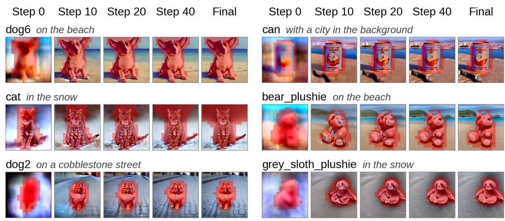  
Figure 10: Subject mask m during sampling. The mask of equation 6 (red) at steps 0, 10, 20 and 40 of a 50-step plain-CFG trajectory of $M _ { \mathrm { s y n } } ,$ drawn on the clean image predicted at that step, and the mask of the last step on the final sample. Stable Diffusion v1.5, DreamBooth, seed 100. Each row gives the subject and the scene phrase of its evaluation prompt ${ } ^ { \dag } a \left[ V \right]$ ⟨class⟩ . . . ” (Appendix C.1).

Mask at calibration. The calibration prompts of Section 3.3 name no scene content, so B would be empty. The mask is therefore read from one auxiliary evaluation of $M _ { \mathrm { s y n } }$ at the same forwardnoised state under the subject prompt extended with the fixed phrase “in a scene”, whose single content word fills B. The rule equation 6 is otherwise unchanged and no caption of the training images is used. Where the captions are known they permit a check: masks built with the generic phrase agree with masks built from each training image’s own caption at IoU 0.86, averaged over the five training images and all 50 steps. At sampling, the same auxiliary evaluation supplies the mask when the sampled prompt names no scene content.

## C IMPLEMENTATION DETAILS

Table 6 lists the fine-tuning and sampling parameters of the four settings of Table 1. Within a setting, $M _ { \mathrm { r e a l } }$ and $M _ { \mathrm { s y n } }$ are trained with the same procedure and hyperparameters and differ only in their training images: $M _ { \mathrm { r e a l } }$ is trained on the subject’s real photographs and $M _ { \mathrm { s y n } }$ on the five images that $M _ { \mathrm { r e a l } }$ generated. The identifier [V] is the token monadikos and the fine-tuning prompt is “a photo ofmonadikos ⟨class⟩” throughout.

Table 6: Fine-tuning and sampling settings. One column per setting of Table 1. LoRA adapters use a scaling factor α equal to the rank and are merged into the base model weights before sampling. All text encoders are frozen and no prior-preservation loss is used. The synthetic training set is sampled with each base model’s default scheduler and evaluation uses DDIM, except on Stable Diffusion 3.5, which uses its flow-matching Euler scheduler (shift 3.0) in both cases.
<table><tr><td></td><td>SD v1.5 DreamBooth</td><td>SD v1.5 DreamBooth-LoRA</td><td>SDXL 1.0 DreamBooth-LoRA</td><td>SD 3.5 Medium DreamBooth-LoRA</td></tr><tr><td colspan="5">Fine-tuning</td></tr><tr><td>Trained weights</td><td>full U-Net</td><td>U-Net attention</td><td>U-Net attention</td><td>MMDiT</td></tr><tr><td>LoRA rank</td><td></td><td>16</td><td>4</td><td>4</td></tr><tr><td>Learning rate (constant)</td><td> $5 \times 1 0 ^ { - 6 }$ </td><td>10-4</td><td> $5 \times 1 0 ^ { - 4 }$ </td><td> $4 \times 1 0 ^ { - 4 }$ </td></tr><tr><td>Steps</td><td>500</td><td>500</td><td>500</td><td>600</td></tr><tr><td>Batch size</td><td>1</td><td>1</td><td>1</td><td>1</td></tr><tr><td>Gradient accumulation</td><td>1</td><td>1</td><td>1</td><td>4</td></tr><tr><td>Resolution</td><td>512</td><td>512</td><td>1024</td><td>512</td></tr><tr><td>Precision</td><td>fp32</td><td>fp32</td><td>fp16</td><td>bf16</td></tr><tr><td>Subjects</td><td>30</td><td>30</td><td>30</td><td>30</td></tr><tr><td colspan="5">Synthetic training set of  $M _ { \mathrm { s y n } }$  (generated by  $M _ { \mathrm { r e a l } } )$ </td></tr><tr><td>Images</td><td>5</td><td>5</td><td>5</td><td>5</td></tr><tr><td>Sampler, steps Guidance weight</td><td>PNDM, 50 7.5</td><td>PNDM, 50 7.5</td><td>Euler, 50 7.5</td><td>flow Euler, 40 7.0</td></tr><tr><td>Resolution</td><td>512</td><td>512</td><td>1024</td><td>1024</td></tr><tr><td></td><td></td><td></td><td></td><td></td></tr><tr><td colspan="5">Evaluation sampling (all models)</td></tr><tr><td>Sampler, steps</td><td>DDIM, 50</td><td>DDIM, 50</td><td>DDIM, 50</td><td>flow Euler, 40</td></tr><tr><td>Guidance weight w</td><td>7.5</td><td>7.5</td><td>7.5</td><td>7.0</td></tr><tr><td>Resolution</td><td>512</td><td>512</td><td>1024</td><td>1024</td></tr><tr><td>Seeds</td><td>100-102</td><td>100-102</td><td>100-102</td><td>100-102</td></tr></table>

Synthetic training set. $M _ { \mathrm { r e a l } }$ generates one image under each of five prompt templates shared by all subjects and disjoint from the evaluation prompts: a close-up photo of the subject, and “a photo ofmonadikos $\langle c l a s s \rangle ^ { \prime \prime }$ completed by one of outdoors in a backyard on a sunny day, on a couch, on a staircase and infront ofa brick wall.

Guidance baselines. The three baselines of Table 1 are sampled from the same $M _ { \mathrm { s y n } }$ on both Stable Diffusion v1.5 settings, with DDIM for 50 steps at the seeds and prompts of ReGain and with the settings of their official implementations. S-CFG (Shen et al., 2024) uses $w = 7 . 5$ and rescales the guidance of each attention region at every step, with the rate clipped to $[ 0 . 8 , 3 . 0 ]$ . CFG++ (Chung et al., 2025) uses $\lambda = 0 . 6 .$ , the value its authors match to $w = 7 . 5$ at 50 steps. FDG (Sadat et al., 2025b) splits the guidance with a one-level Laplacian pyramid and uses $w = 7 . 5$ on the high band and $w = 3$ on the low band, the setting its authors report for Stable Diffusion 2.1.

Trajectory measurements. The measurements of Section 3.2 are made on one dog subject (dog6), with $M _ { \mathrm { r e a l } }$ and $M _ { \mathrm { s y n } }$ obtained by DreamBooth fine-tuning of Stable Diffusion v1.5. Both models are sampled with DDIM for 50 steps at $w = 7 . 5$ , with 10 seeds shared by both models and one image per prompt and seed. For the band-resolved comparison, $M _ { \mathrm { r e a l } }$ is evaluated at the states that $M _ { \mathrm { s y n } }$ visits. The frequency bands are computed on the 64 × 64 latent, which gives $K = 4 6$ bands, and the low, mid and high band groups are k = 1 to 8, 9 to 24 and 25 to 45.

Schedule estimation. The estimator equation 4 is evaluated at the five training images, each forward-noised with 10 independent noise draws at every step, the same draws for both models. The estimated gain $\hat { g } ( \boldsymbol { k } , t )$ has one band per ring of the model’s latent grid, 46 on the $6 4 \times 6 4$ latent of Stable Diffusion v1.5 and 91 on the 128 × 128 latent of SDXL and Stable Diffusion 3.5, and one column per sampling step (50, or 40 on Stable Diffusion 3.5). The compression uses the root-mean-square tolerance $\tau = 0 . 0 5$ at each of its two stages. The number of cells is determined by the compression and varies by subject: dog6 has 3 band groups and 15 cells (Figure 5), and the mean over the 30 subjects of Table 4 is 18 cells. The DC band is kept as measured. At the calibration states, the residual inflation after the compressed schedule (Table 4) sits in the last five steps, where the schedule’s time cells are coarsest. Figure 11 shows the schedules of three further subjects. Across all 30 subjects, the highest band group is attenuated at every step, with gains between 0.11 and 0.79 (median 0.21).

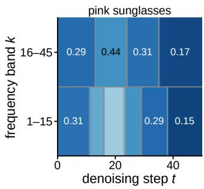

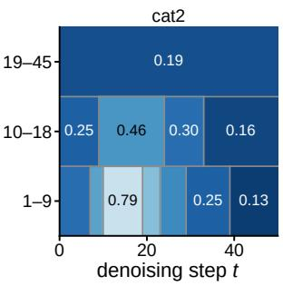

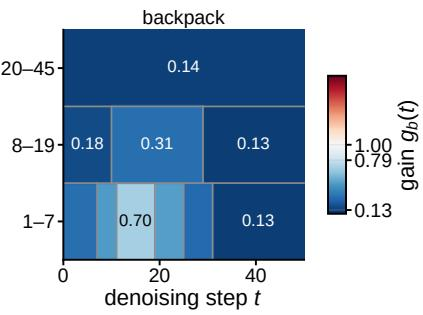  
Figure 11: Estimated gain schedules of three further subjects. The compressed schedule $g _ { b } ( t )$ at $\tau = 0 . 0 5$ of the pink sunglasses, cat2 and backpack subjects of Figure 6, Stable Diffusion v1.5 DreamBooth, in the layout of Figure 5: one row per band group, one column per sampling step, and color and label giving the gain.

## C.1 EVALUATION PROMPTS

Evaluation uses the official DreamBooth prompt lists (Ruiz et al., 2023) verbatim, instantiated as “a monadikos ⟨class⟩ . . . ” with each subject’s official class noun. Object subjects use 25 prompts: in the jungle, in the snow, on the beach, on a cobblestone street, on top ofpink fabric, on top of a wooden floor, with a city in the background, with a mountain in the background, with a blue house in the background, on top of a purple rug in a forest, with a wheat field in the background, with a tree and autumn leaves in the background, with the Eiffel Tower in the background, floating on top of water, floating in an ocean of milk, on top of green grass with sunflowers around it, on top of a mirror, on top of the sidewalk in a crowded street, on top of a dirt road, on top of a white rug, and the property modifications red, purple, shiny, wet and cube shaped. Live subjects use 25 prompts: the first ten recontextualization prompts above, the accessorization prompts wearing a red hat, wearing a santa hat, wearing a rainbow scarf, wearing a black top hat and a monocle, in a chef outfit, in a firefighter outfit, in a police outfit, wearing pink glasses, wearing a yellow shirt, in a purple wizard outfit, and the same five property modifications.

## D OVER-GUIDANCE ARTIFACT METRICS

Definitions. Saturation is the mean of the HSV S channel, and root-mean-square contrast is the standard deviation of ITU-R 601 grayscale intensity, both on [0, 1]. The high-band fraction is the share of Fourier power, with the zero-frequency term removed, beyond a radial cutoff at a quarter of the Nyquist frequency, the pixel-space image of the low-band boundary of Section 3.2. Removing the mean matters: with the DC term left in the denominator it dominates the total power and scales with brightness and variance, so the statistic would then track contrast as well as spectral shape.

Measurement region. The region of Table 2 is the mask that steered $M _ { \mathrm { s y n } } ,$ taken once per subject, prompt and seed and applied to all three methods so that they are compared over identical pixels. Over the evaluation set it covers 43% of the frame. The high-band fraction needs a rectangular grid and is measured on the mask’s bounding box.

## E ADDITIONAL QUALITATIVE RESULTS

Figures 12 and 13 repeat the comparison of Figure 6 in the DreamBooth-LoRA setting on Stable Diffusion v1.5 and SDXL, Figure 14 adds further subjects and prompts, and Figure 15 adds further rows of Figure 8.

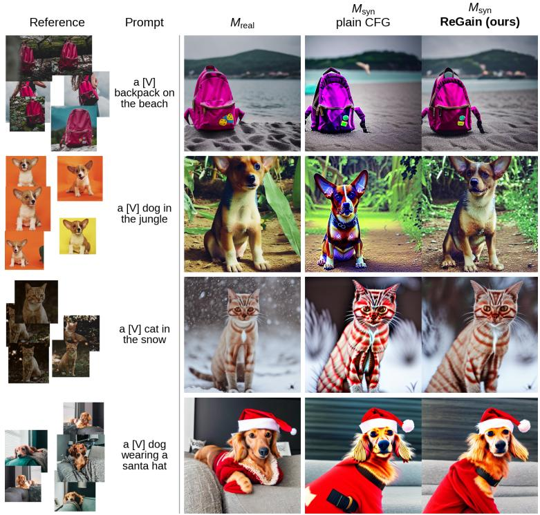  
Figure 12: DreamBooth-LoRA, Stable Diffusion v1.5. The block of Figure 6 in the DreamBooth-LoRA setting: the subject’s reference photos, the prompt, and then $M _ { \mathrm { r e a l } } , M _ { \mathrm { s y n } }$ under plain CFG, and the same $M _ { \mathrm { s y n } }$ under its estimated gain schedule (ReGain, ours), at one seed and $w { = } 7 . 5 ,$

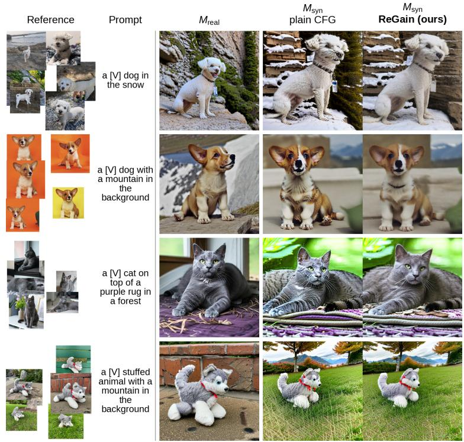  
Figure 13: DreamBooth-LoRA, SDXL base 1.0. The same block on SDXL at 1024 × 1024. Columns and protocol follow Figure 12.

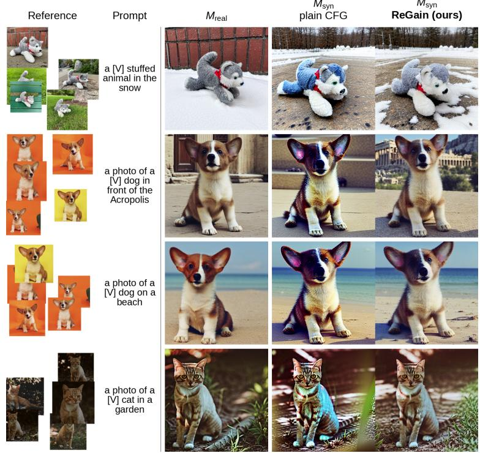  
Figure 14: Additional subjects and prompts. Four further subject and prompt combinations, shown in the same block at the same seed and guidance weight (w=7.5, 50 steps): the subject’s reference photos, the prompt, then $M _ { \mathrm { r e a l } } , M _ { \mathrm { s y n } }$ under plain CFG, and the same $M _ { \mathrm { s y n } }$ under its estimated gain schedule (ReGain, ours).

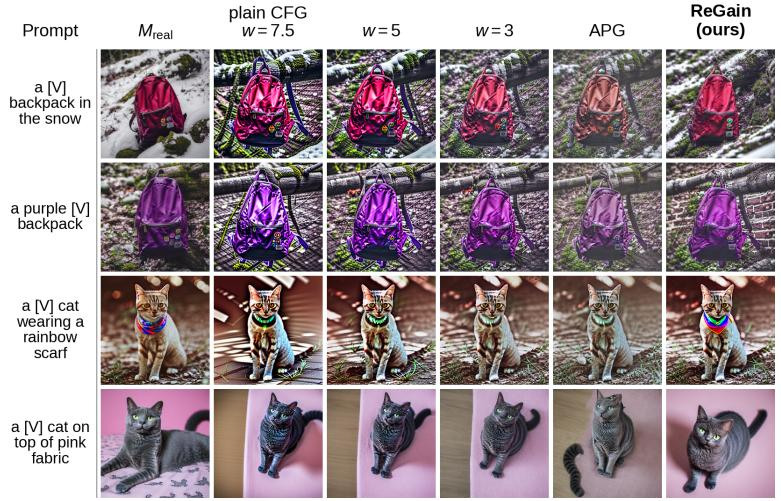  
Figure 15: Subject-agnostic alternatives, further rows. Four more rows in the layout of Figure 8, showing $\bar { M _ { \mathrm { r e a l } } } , M _ { \mathrm { s y n } }$ under plain CFG at w=7.5, 5.0 and 3.0, under APG at $w { = } 7 . 5$ , and under ReGain, at the same seed across columns.