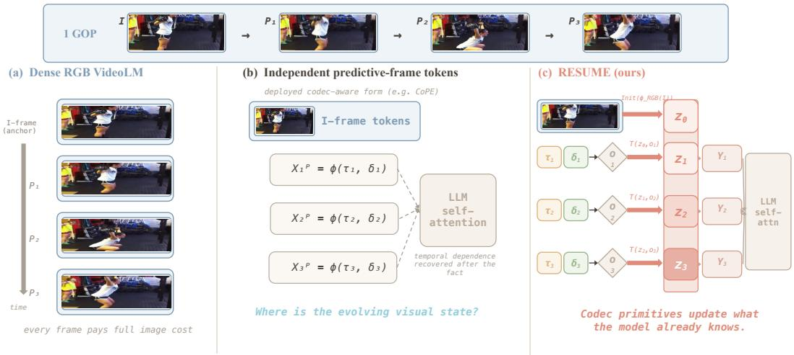
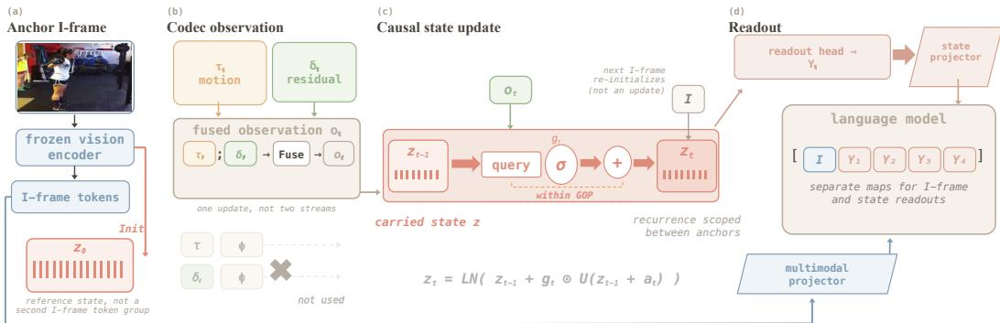
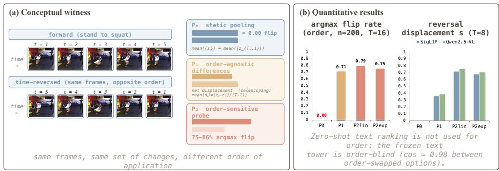
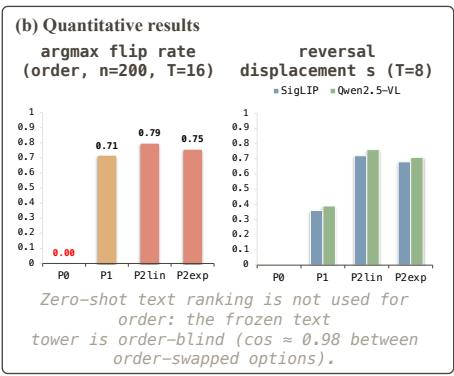
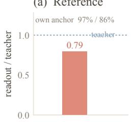
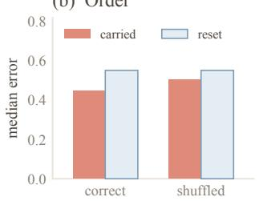
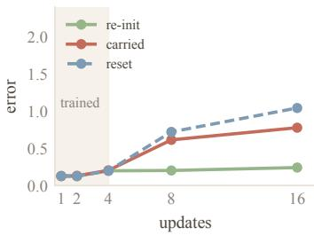
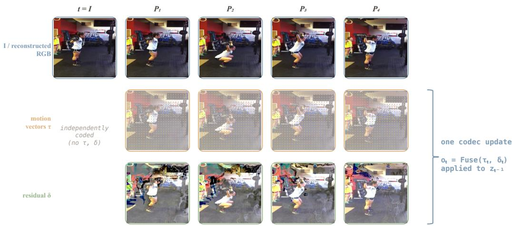
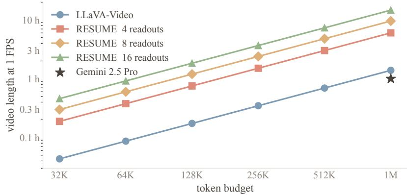

# RESUME: RECURRENT STATE UPDATES FROM MO-TION AND RESIDUAL SIGNALS FOR EFFICIENT VIDEO LANGUAGE MODELING

Can Zhang1,2, Xiaotian Han2∗, Junyuan Shang2, Yuchen Ding2, Zhenyu Zhang2, Shuohuan Wang2, Dianhai Yu2, Ruirui Li1†

1Beijing University of Chemical Technology 2Baidu, Inc.

alexlessend@gmail.com, {hanxiaotian, shangjunyuan, dingyuchen, zhangzhenyu07, wangshuohuan, yudianhai}@baidu.com, ilydouble@gmail.com

## ABSTRACT

Existing video language models encode sampled RGB frames independently, so a long video must either exhaust the token budget or drop the changes between sampled frames. Codec-aware front-ends read the motion vectors and residuals that encoding already produced, but in their deployed form each predictive frame is still tokenized on its own: the tokens are a function of the current primitives, not of a carried reference. We argue that a more natural function is of both—the current primitives and a carried reference. A clip and its time reversal share the same frames and differ only in the order of changes—an axis that symmetric pooling discards by construction, and that is non-empty in the frozen vision features VideoLMs actually use—and the codec recurrence already composes those changes in order against a reference state. We introduce RESUME, a stateful codec representation: an anchor I-frame initializes a compact latent state, each subsequent predictive frame is consumed as an update to that state, and a shared readout exposes VideoLM-compatible tokens from the accumulated state. Codec prediction is thereby kept at the representation level and handed to the language model as a trajectory, not as a set of independent token groups. At the same per-predictive-frame token budget as prior codec-aware methods, a predictive frame enters the language model as a readout of what the front-end already knows, not as an encoding of the current primitives alone. Across ten benchmarks, the gains concentrate on temporal reasoning: on all three temporal benchmarks RESUME improves over both the RGB-frame baseline LLaVA-Video-7B (by 2.8, 5.1, and 3.9 points on TempCompass, TOMATO, and MVBench) and the codecbased baseline CoPE-7B, while staying competitive on general and long-form QA. Frozen-transition tests further show anchor dependence, order sensitivity, and useful rollout behavior beyond the training horizon.

## 1 INTRODUCTION

Video language models encode visual observations so that a language model can reason about actions, event order, and cross-frame relations. Recent systems improve video question answering through stronger vision backbones, larger instruction corpora, and longer context windows (Zhang et al., 2023; 2024c). Their standard abstraction, however, remains a collection of independently encoded RGB snapshots.

Dense RGB sampling preserves transient actions and state changes but repeatedly pays the full image-encoding and token cost. Sparse keyframe sampling is cheaper but discards the changes between sampled frames; the central limitation is therefore representational rather than a lack of context length.

The question is representational: what must a video representation preserve for temporal questions to be answerable? A clip and its time reversal contain the same frames but differ in the order of changes, so symmetric pooling is invariant to reversal by construction. A training-free probe study on frozen vision encoders confirms that static pooling is exactly invariant, while an order-sensitive probe flips on 75–86% of reversed clips (Figure 3). Temporal order is therefore a distinct information axis discarded by symmetric aggregation and preserved by a state updated in sequence.

Video codecs already exploit temporal redundancy by storing an independently coded I-frame and describing each predictive frame with motion vectors and residuals (Le Gall, 1991; Wiegand et al., 2003). Compressed-domain recognition established that these primitives carry usable dynamics (Wu et al., 2018; Wang et al., 2021; Das Biswas et al., 2025), and codec-aware VideoLMs such as Video-LaVIT (Jin et al., 2024), EMA (Zhao et al., 2025), and CoPE-VideoLM (Sarkar et al., 2026) use them to cover more timestamps at lower visual-token cost. However, their deployed encoders emit an independent token group for each predictive frame, leaving reference dependence and tempora composition to language-model attention.

The codec recurrence states more than that $\tau _ { t }$ and $\delta _ { t }$ are sparse:

$$
\hat { I } _ { t } = \operatorname { W a r p } ( \hat { I } _ { t - 1 } , \tau _ { t } ) + \delta _ { t } .\tag{1}
$$

A predictive frame is a function of a reference state. Three consequences follow. First, reference dependence: the same rightward motion field means “the ball moves right” against one reference and “the person shifts right” against another, so $( \tau _ { t } , \delta _ { t } )$ alone does not determine the updated content. Second, compositionality: video events are typically accumulations of small changes, which become an event only when applied in sequence to a state that keeps changing. Third, path depen dence: the outcome depends on the order in which updates are applied, not on the set of updates. These are not properties imposed on the data; they are what the recurrence already computes. They are preserved by construction in a state that is updated in sequence, and left to be reconstructed by language-model attention when each predictive frame is tokenized independently. Prior codecaware work is not unaware of the recurrence: CoPE-VideoLM emulates one warping step in feature space during pre-training. But that step reads its reference from a decoded RGB frame rather than from a carried state, and it is removed before the encoder meets the language model, so nothing accumulates and nothing survives into inference.

The question is therefore not how to represent each predictive frame with fewer tokens, but how a VideoLM front-end can keep the codec’s own predictive structure at the representation level, from one anchor to the next, rather than leaving it for language-model attention to reconstruct.

We introduce RESUME, a stateful codec representation that carries a latent state across an anchor’s predictive frames instead of tokenizing each one independently (Figure 1). Each anchor I-frame initializes a compact latent state, subsequent motion-residual observations update that state causally, and a shared readout exposes VideoLM-compatible tokens from the accumulated state. The state is reset at the next anchor, while frozen vision features provide its initial condition and supervision space. Unlike independent tokenization, RESUME learns previous state + current primitive → next state at the same per-predictive-frame token budget.

Training has two stages. Stage 1 learns the transition from multi-step ordered rollouts, supervising both intermediate readouts and their changes. Stage 2 attaches the frozen transition to a VideoLM, packs the state readouts with each I-frame token group, and trains the language model to use them through a dedicated projector.

The experiments support both the representation-level claim and its downstream effect. In a trainingfree probe study, the order-sensitive probe flips on 75–86% of reversed clips, while static pooling is exactly invariant and order-agnostic difference statistics move only through endpoint displacement. On the frozen transition, applying the same updates to different anchors preserves anchor-dependent context, the correct update order wins on 65% of videos, and the carried state is more accurate than a memoryless control on 75% and 68% of videos at rollout horizons of 8 and 16 steps. With the language model, RESUME improves over LLaVA-Video-7B by 2.8, 5.1, and 3.9 points on TempCompass, TOMATO, and MVBench, and improves over CoPE-7B by 0.5, 1.7, and 0.6 points, respectively, while using the same per-predictive-frame readout budget. These results connect the information hierarchy to the final VideoLM interface: preserving ordered codec changes in a carried state improves the benchmarks that require temporal evolution.

  
Figure 1: Three ways to turn a group of pictures into visual tokens. (a) Dense RGB encoding treats every frame as a full image. (b) Deployed codec-aware tokenization reads motion vectors and residuals, but emits an independent token group per predictive frame; temporal dependence is left to language-model attention. (c) RESUME initializes a compact latent state from the anchor I-frame and updates that same state with each codec observation; the tokens of a predictive frame are a readout of the accumulated state. The two codec columns tokenize each predictive frame; only (c) maintains a reference-dependent state in the visual front-end.

## Our contributions are:

1. Problem formulation. We formulate codec-aware video representation as a causal latent state transition between successive anchors. This formulation identifies reference dependence, compositionality, and path dependence as the properties that independent predictiveframe tokenization leaves to language-model attention to reconstruct.

2. Stateful codec representation. We instantiate this formulation with RESUME: an anchor I-frame initializes a compact latent state, motion vectors and residuals are fused into one codec observation, and a causal transition carries the state across predictive frames. The resulting state encoder contains approximately 21M parameters, while a shared readout exposes VideoLM-compatible tokens at the same per-predictive-frame budget as prior codec-aware methods.

3. Empirical evidence. Training-free probes on frozen vision encoders show that temporal order is a non-empty information axis discarded by symmetric aggregation (Figure 3). Frozen-transition experiments verify anchor dependence, order sensitivity, and useful rollout behavior beyond the training horizon (Figure 4). On all three temporal benchmarks, RESUME improves over both the RGB-frame baseline LLaVA-Video-7B (by 2.8, 5.1, and 3.9 points) and the codec-based baseline CoPE-7B, while staying competitive on general and long-form QA.

## 2 RELATED WORK

## 2.1 FRAME-BASED VIDEOLMS AND POST-HOC COMPRESSION

VideoLMs extend image VLMs by supplying visual tokens at multiple timestamps. Video-LLaMA (Zhang et al., 2023), VideoChat2 (Li et al., 2023b), VideoLLaMA2 (Cheng et al., 2024), LLaVA-NeXT-Video (Liu et al., 2024a), and LLaVA-Video (Zhang et al., 2024c) established the standard workflow: sample RGB frames, tokenize each independently, and let a temporal module or the language model reason over the sequence. Subsequent work reduces the resulting token count by pooling, merging, pruning, or learnable resampling (Li et al., 2023a; Yao et al., 2024; Bolya et al., 2023; Chen et al., 2024a; Yang et al., 2024; Tao et al., 2025; Sun et al., 2025). These compressions are post-hoc: they operate after a dense RGB representation has been produced, so the encoding cost is already paid and each retained frame remains an independent observation.

  
Figure 2: RESUME as a codec-driven transition system. An anchor I-frame initializes a compact latent state $z _ { 0 }$ and, in parallel, keeps its own token path into the language model. Each predictive frame contributes one fused observation $o _ { t }$ from motion vectors and residuals, written into the carried state. A shared head reads $Y _ { t }$ from $z _ { t }$ at the same per-predictive-frame token budget used by prior codec-aware front-ends. The state is reset at the next I-frame. A dedicated projector adapts state readouts to the language embedding space; the original multimodal projector is left untouched for I-frame tokens.

## 2.2 CODEC PRIMITIVES AS VIDEOLM INPUT

Compressed-domain recognition showed that I-frames, motion vectors, and residuals carry usable dynamics without decoding most frames (Wu et al., 2018; Wang et al., 2021; Das Biswas et al., 2025). Video-LaVIT (Jin et al., 2024) discretizes motion into language-like tokens but largely discards residuals; EMA (Zhao et al., 2025) aggregates an I-frame and motion into a fixed-length GOP summary, collapsing P-frame order. A further group uses codec signals as a selection cue—keeping salient patches or refreshing a cache according to bitstream activity—which reduces what is encoded without changing what a predictive frame’s representation is a function of (Yang et al., 2026; Tang et al., 2026; An et al., 2026). AdaCodec (Hou et al., 2026) regresses codec-derived tokens onto a frozen teacher and drops the auxiliary head before language-model training.

CoPE-VideoLM (Sarkar et al., 2026) encodes motion vectors and residuals into compact perpredictive-frame tokens. Its pre-training emulates a feature-space warping step using a reference re-measured from decoded RGB, but the auxiliary modules are removed before VideoLM integration. At inference, each predictive-frame token group depends on the current primitives rather than a carried visual state; temporal order is retained in the token sequence.

Codec-driven state propagation also appears outside this interface. Compressed-domain recognition maintains separate motion and residual states without I-frame initialization (Das Biswas et al., 2025), while video super-resolution propagates hidden states for reconstruction rather than language-model readout. ReMoRa (Yashima et al., 2026) uses a bidirectional I-frame–motion scan with one GOPlevel readout and no residual input. RESUME instead combines causal GOP-local updates, I-frame initialization, early motion-residual fusion, and per-predictive-frame readouts at the same token budget as CoPE.

## 3 METHOD

The question above is how a VideoLM front-end can keep the codec’s own predictive structure at the representation level, rather than leaving it for language-model attention to reconstruct. We instanti ate that as a transition system (Figure 2). The architecture below is one realization; the constraints come from the three properties the codec recurrence already computes: reference dependence, com positionality, and path dependence.

## 3.1 FROM INDEPENDENT TOKENIZATION TO STATE TRANSITION

A video $V = ( F _ { 1 } , \dots , F _ { T } )$ is organized into groups of pictures (GOPs). Each GOP begins with an intra-coded I-frame and continues with predictive frames. Following the codec convention we write

$$
\boldsymbol { F } _ { t } = \left\{ \begin{array} { l l } { \boldsymbol { I } _ { t } , } & { \boldsymbol { F } _ { t } \mathrm { ~ i s ~ i n t r a - c o d e d } , } \\ { \boldsymbol { P } _ { t } = ( \boldsymbol { \tau } _ { t } , \delta _ { t } ) , } & { \boldsymbol { F } _ { t } \mathrm { ~ i s ~ p r e d i c t i v e } , } \end{array} \right.\tag{2}
$$

with block-wise motion vectors $\tau _ { t } \ \in \ \mathbb { R } ^ { H _ { G } \times W _ { G } \times 2 }$ and residuals $\delta _ { t } \in \mathbb { R } ^ { H \times W \times 3 }$ . We use only Iand P-frames: bidirectional B-frames require future references and break the causal order that both streaming and autoregressive language modeling assume.

Independent predictive-frame tokenization implements $X _ { t } ^ { P } = \phi ( \tau _ { t } , \delta _ { t } )$ : the tokens of a predictive frame are a function of the current primitives alone. The codec recurrence equation 1 is not of this form. It is a transition—the next frame is a function of a reference and an update—so the front-end we implement is a transition system,

$$
\begin{array} { r } { z _ { 0 } = \operatorname { I n i t } \bigl ( \phi _ { \mathrm { R G B } } ( I _ { 0 } ) \bigr ) , \qquad o _ { t } = \mathrm { O b s } ( \tau _ { t } , \delta _ { t } ) , \qquad z _ { t } = \mathcal { T } ( z _ { t - 1 } , o _ { t } ) , \qquad Y _ { t } = \mathrm { R e a d } ( z _ { t } ) , } \end{array}\tag{3}
$$

where $z _ { t }$ is a persistent latent state, $o _ { t }$ is the codec observation at step t, and $Y _ { t }$ is an on-demand readout in the vision-encoder feature space.

The binding is what makes the three properties design constraints: $z _ { \mathrm { 0 } }$ is initialized from the code ${ \boldsymbol { \cdot } } { \boldsymbol { \varsigma } }$ own anchor, $o _ { t }$ is the codec-native pair $( \tau _ { t } , \delta _ { t } )$ , T is causal and is the representation that reaches the language model, and $Y _ { t }$ is read out at the same per-predictive-frame budget as prior codec-aware work. Reference dependence requires $\tau$ to take $z _ { t - 1 }$ as an argument. Compositionality requires updates to accumulate in one latent variable. Path dependence requires $\tau$ not to be permutationinvariant in t. The rest of this section is one realization of these constraints, and the training that makes them the solution the model actually finds.

## 3.2 REALIZING THE TRANSITION

Anchor as initial condition. Given the I-frame of a GOP, a frozen vision encoder produces patch tokens $X _ { I }$ . A state initializer projects them to the state width, concatenates a compact set of learnable queries $q ,$ and keeps the query positions after a stack of transformer layers:

$$
\begin{array} { r } { z _ { 0 } = \mathrm { L N } \Big ( \mathrm { L a y e r s } \big ( [ q ; W _ { \mathrm { i n } } X _ { I } ] \big ) _ { q } \Big ) . } \end{array}\tag{4}
$$

This $z _ { \mathrm { 0 } }$ is not a second token group for the I-frame—the I-frame keeps its own path into the language model—but the reference on which every subsequent codec update operates. Without it, $\tau$ would have nothing to condition on, and reference dependence would be vacated.

One observation per codec update. Motion states how existing content should be displaced; the residual states what motion compensation cannot explain. They are two halves of one codec step, not two independently consumable modalities. Encoding them in separate branches and concatenating the results, as prior codec-aware encoders do, would reintroduce the decomposition that the recurrence forbids. We therefore fuse them at a common spatial position. Motion vectors are patchified and embedded; residuals are embedded by a convolutional stem whose stride matches the motion grid; the two streams are concatenated position-wise and fused to state width:

$$
o _ { t } = \mathrm { F u s e } \big ( [ \mathrm { M o t i o n E m b } ( \tau _ { t } ) ; \mathrm { R e s E m b } ( \delta _ { t } ) ] \big ) .\tag{5}
$$

The observation that enters $\tau$ is therefore one innovation, matching the right-hand side of the codec recurrence.

Causal state update. At each step the state slots query this observation and write a gated residual into the carried state:

$$
a _ { t } = \mathrm { C r o s s A t t n } \big ( \mathrm { L N } \big ( z _ { t - 1 } \big ) , \mathrm { L N } \big ( o _ { t } \big ) \big ) , \quad g _ { t } = \sigma \big ( W _ { g } \big [ z _ { t - 1 } ; a _ { t } \big ] \big ) , \quad z _ { t } = \mathrm { L N } \big ( z _ { t - 1 } + g _ { t } \odot U \big ( z _ { t - 1 } + a _ { t } \big ) \big ) ,\tag{6}
$$

with $U$ a small MLP. Cross-attention lets each slot select the spatial part of the update that concerns the content it holds; the gate controls how much of the candidate is written, the latent analogue of a residual being applied only where motion compensation left error. This is one realization of $\tau { : }$ it takes $z _ { t - 1 }$ as an argument, accumulates in one variable, and is ordered in t. Other operators with the same interface would serve the same principle.

Readout of the accumulated state. The tokens that reach the language model are not an encoding of $( \tau _ { t } , \delta _ { t } )$ . They are a readout of $z _ { t } , \mathrm { ~ A ~ }$ compact set of learnable queries r attends over the state and is projected back to the vision-encoder width:

$$
Y _ { t } = W _ { \mathrm { o u t } } \operatorname { L N } \Bigl ( \operatorname { L a y e r s } \bigl ( [ r ; z _ { t } ] \bigr ) _ { r } \Bigr ) .\tag{7}
$$

Because the same head is applied at every step, readouts at different timestamps live in one coordinate system, and the language model receives a trajectory rather than a set of independent token groups. Readout frequency is then a free variable at inference—dense for fine-grained motion, sparse for long videos—without changing $\tau$

## 3.3 LEARNING A TRAJECTORY, THEN READING IT

The transition makes the three properties possible; training has to make them the solution the model finds.

Stage 1 learns the transition in isolation. From an anchor I-frame the model consumes a short sequence of temporally ordered updates,

$$
z _ { 0 } \xrightarrow { o _ { 1 } } z _ { 1 } \xrightarrow { o _ { 2 } } \cdots \xrightarrow { o _ { T } } z _ { T } ,\tag{8}
$$

and the shared head reads out every intermediate state, not only the last. Targets come from the same frozen vision encoder applied to the true target frames, pooled so that a readout and its target are comparable:

$$
\begin{array} { r } { \bar { X } _ { t } = \mathrm { P o o l } \big ( \phi _ { \mathrm { R G B } } ( I _ { t } ) \big ) . } \end{array}\tag{9}
$$

The objective has three terms:

$$
\mathcal { L } = \underbrace { \frac { 1 } { T } \sum _ { t } \Vert Y _ { t } - \bar { X } _ { t } \Vert _ { 2 } ^ { 2 } } _ { \mathrm { s t a t e n a t e n u i n g } } + \lambda _ { \mathrm { c o s } } \underbrace { \frac { 1 } { T } \sum _ { t } \left( 1 - \cos ( Y _ { t } , \bar { X } _ { t } ) \right) } _ { \mathrm { d r e c t i o n } } + \lambda _ { \Delta } \underbrace { \frac { 1 } { T - 1 } \sum _ { t } \Vert ( Y _ { t } - Y _ { t - 1 } ) - ( \bar { X } _ { t } - \bar { X } _ { t - 1 } ) \Vert _ { 2 } ^ { 2 } } _ { \mathrm { u r q c t o r y } } .\tag{10}
$$

The first two terms fit each readout to a semantic endpoint. The third fits the change between consecutive readouts, without which a model can score well by mapping each state to a plausible frame embedding while leaving the trajectory unconstrained.

Stage 2 attaches the pre-trained transition to a released VideoLM without changing the language architecture or its objective. For each selected GOP, the I-frame initializes $z _ { \mathrm { 0 } }$ and the $\mathrm { G O P ^ { \circ } s }$ motionresidual updates drive $\tau .$ . The shared head reads the intermediate states; the readouts are packed in temporal order and interleaved with the I-frame tokens for the language model. A predictive frame therefore enters the language model as a compact readout of accumulated state, not as a full image.

## 3.4 PREDICTIONS AND SCOPE

The formulation makes predictions that isolate carrying state. Keeping the base VideoLM’s sampled frames fixed, and interleaving readouts of the predictive frames between them, should improve temporal, motion, and state-change reasoning over that sampling alone. Applying a fixed $( \bar { \tau , \delta } )$ to different anchors should change the readout in a content-consistent way (reference dependence); shuffling updates between two anchors should degrade matching, whereas resetting the state before every update is invariant to that perturbation (path dependence). A model trained on short rollouts should extrapolate to longer horizons with error above a per-step re-initialization oracle and below a memoryless control. That curve diagnoses extrapolation of the transition; it is not evidence of a state maintained across a whole video, because inference re-initializes at every anchor.

Four boundaries follow. Stage-1 supervision comes from a frozen vision encoder: semantic features define the initial condition and the measurement space, while codec primitives parameterize the transition. The latent state carries no physical annotation, so we call it a codec-conditioned latent state. Efficiency is a property of the codec domain; the claim is the representational structure obtained at the same per-predictive-frame cost. And the recurrence spans the predictive frames between two anchors, not a whole video: an I-frame re-initializes the state. Claims concern the representation of a group of pictures; long-range aggregation remains the language model’s responsibility.

Table 1: Question answering across general, temporal, and long-form benchmarks. RESUME uses at most 64 I-frames, and each of the four predictive updates per I-frame produces one 8-token readout. Prior numbers are as reported by CoPE-VideoLM (cited in the table); a dash means that source does not report the benchmark. Video-MME is without subtitles. ActivityNet-QA is scored by Claude Opus 4.8 (Anthropic, 2026) for RESUME and by a language model for the rows above. (a) General QA (b) Temporal (c) Long-form
<table><tr><td>PT NQA AQA VMME</td></tr><tr><td>Proprietary GPT-5</td></tr><tr><td>(OpenAI, 2025) 86.3 83.3</td></tr><tr><td>Gemini 3 Pro (Google, 2025) 84.3 88.6</td></tr><tr><td>Gemini 2.5 Pro</td></tr><tr><td>(Gemini Team, 2025) 85.3 87.8 Claude 4.5</td></tr><tr><td>(Anthropic, 2025) 79.2 74.2</td></tr><tr><td>Open-source VILA-40B</td></tr><tr><td>(Lin et al., 2024) 54.0 67.9 58.0 60.1 İXC-2.5-7B</td></tr><tr><td>(Zhang et al., 2024a) 34.4 71.0 52.8 55.8</td></tr><tr><td>LLaVA-OV-7B (Li et al., 2024a) 57.1 79.4 56.6 58.2</td></tr><tr><td>Oryx-7B (Liu et al., 2024c) 68.6 81.9 一 58.3</td></tr><tr><td>LLaVA-Video-7B (Zhang et al., 2024c) 67.9 83.2 56.5 63.3</td></tr><tr><td>CoPE-7B</td></tr><tr><td>(Sarkar et al., 2026) 70.3 82.1 60.3 61.9 RESUME 71.2 81.9 60.9 61.9</td></tr></table>

<table><tr><td rowspan=1 colspan=1>TC TOM MVB</td></tr><tr><td rowspan=1 colspan=1>Proprietary</td></tr><tr><td rowspan=1 colspan=1>GPT-5          80.453.0 74.1</td></tr><tr><td rowspan=1 colspan=1>Gemini 3 Pro     82.8 48.3 70.4</td></tr><tr><td rowspan=1 colspan=1>Gemini 2.5 Pro   81.9 48.6 70.6</td></tr><tr><td rowspan=1 colspan=1>Claude 4.5       72.8 39.6 62.1</td></tr><tr><td rowspan=1 colspan=1>Open-source</td></tr><tr><td rowspan=1 colspan=1>IXC-2.5-7B      67.1      69.1</td></tr><tr><td rowspan=1 colspan=1>LLaVA-OV-7B    64.8 25.5 56.7VideoLLaMA2(Cheng et al., 2024)     18.5 54.6İnternVL2-8B(Chen et al., 2024b)65.3 21.7 65.8VideoChat2-7B(Li et al., 2023b)  45.5      51.1</td></tr><tr><td rowspan=1 colspan=1>LLaVA-Video-7B  66.624.9 58.6</td></tr><tr><td rowspan=1 colspan=1>CoPE-7B        68.9 28.3 61.9</td></tr><tr><td rowspan=1 colspan=1>RESUME       69.4 30.0 62.5</td></tr></table>

<table><tr><td>VTT VMMU LVB</td></tr><tr><td>Proprietary GPT-5</td></tr><tr><td>68.8 一 Gemini 3 Pro 78.0</td></tr><tr><td>Gemini 2.5 Pro 一 78.4</td></tr><tr><td>Claude 4.5 50.5 Open-source</td></tr><tr><td>LongVA-7B (Zhang et al., 2024b) 23.9</td></tr><tr><td>LLaVA-OV-7B 44.0 33.9 38.1</td></tr><tr><td>InternVL2-8B 37.4</td></tr><tr><td>LLaVA-Video-7B 41.8 36.1 44.2</td></tr><tr><td>CoPE-7B 45.5 38.2 46.4</td></tr><tr><td></td></tr><tr><td>RESUME 45.7 38.2 43.2</td></tr></table>

## 4 EXPERIMENTS

We first report question-answering results across general, temporal, and long-form benchmarks, then examine the information hierarchy and test whether the transition carries state across predictive updates.

## 4.1 EVALUATION BENCHMARKS

We evaluate the model on ten benchmarks spanning general video question answering, temporal and motion reasoning, and long-form video. General video question answering: Video-MME (Fu et al., 2024), PerceptionTest (Patr ˘ aucean et al., 2023), NExT-QA (Xiao et al., 2021),˘ and ActivityNet-QA (Yu et al., 2019). Temporal and motion reasoning: TempCompass (Liu et al., 2024b), TOMATO (Shangguan et al., 2024), and MVBench (Li et al., 2024b). Long-form video: LVBench (Wang et al., 2024), Video-TT (Zhang et al., 2025), and Video-MMMU (Hu et al., 2025). Each video uses at most 64 I-frames, and each of the four predictive updates per I-frame produces one 8-token readout. ActivityNet-QA is scored by Claude Opus 4.8 (Anthropic, 2026). Evaluation details and data are described in the appendix.

## 4.2 MAIN RESULTS

Results. RESUME shows consistent gains on the temporal benchmarks that directly test motion, order, and change. Compared with LLaVA-Video-7B, it improves by 2.8, 5.1, and 3.9 points on TempCompass, TOMATO, and MVBench, respectively. Compared with the codec-based CoPE-7B baseline, the corresponding gains are 0.5, 1.7, and 0.6 points. The improvements across both RGBframe and codec-based baselines indicate that the carried state contributes beyond simply increasing temporal coverage: it provides a representation that preserves and accumulates predictive changes before they reach the language model.

On general and long-form video QA the picture is mixed. PerceptionTest and ActivityNet-QA improve over both LLaVA-Video-7B and CoPE-7B; Video-TT and Video-MMMU match CoPE-7B. Video-MME is 1.4 points below LLaVA-Video-7B and tied with CoPE-7B; LVBench is 3.2 points below CoPE-7B. Those two cells track the Stage-2 mixture: we fine-tune only on LLaVA-Video-178K, without the academic QA split or the image-alignment data used for the released base, and Video-MME is sensitive to that composition. Taken together, the stateful codec representation is most effective when the benchmark requires reasoning over temporal evolution, at the same perpredictive-frame readout budget.

  
Figure 3: The reversal axis separates static content, net change, and temporal order. (a) We compare frame-symmetric (P0), difference-symmetric (P1), and order-sensitive (P2) probes on a clip and its time reversal. (b) The probes are evaluated on order questions and on two frozen vision towers.

## 4.3 MOTIVATION STUDY: THE INFORMATION HIERARCHY

The reversal experiment provides a direct separation witness for the information hierarchy. A clip and its time reversal contain exactly the same frames, so any representation that is symmetric over frames must produce the same score. As shown in Figure 3, static pooling (P0) is exactly reversalinvariant on both SigLIP and Qwen2.5-VL, with score displacement 0.0000. The order-agnostic difference probe (P1) changes only through the net displacement between endpoints, as predicted by the telescoping identity, yielding an argmax flip rate of 0.68–0.71. By contrast, the time-weighted order-sensitive probe (P2) flips on 0.75–0.86 of clips. These results establish that order is a separate, measurable axis in frozen visual features rather than a by-product of static content or net change.

The same conclusion holds for the question-based probe. Order-swapped answer pairs are nearly indistinguishable in pooled text space (cos ≈ 0.98–0.99), whereas content-different pairs are substantially more separated (0.58–0.72). We therefore use QA ranking for the static and net-change buckets, and use the reversal axis to measure order sensitivity. Together, the two views motivate a representation that accumulates changes in sequence instead of reducing a clip to symmetric frame statistics. Full probe definitions and results are described in the appendix.

## 4.4 CARRIED STATE BETWEEN SAMPLED FRAMES

To verify whether the frozen transition preserves anchor-dependent and ordered information, we conduct a study on 40 videos from Video-MME (Fu et al., 2024) without language-model training; the results are summarized in Figure 4. We compare readouts with frozen SigLIP features of the corresponding frames and report the median over videos.

To isolate anchor dependence, we apply the same updates to two different anchors. The resulting readouts move 0.79× as far as the teacher features, while remaining closer to their respective anchors on 97% and 86% of videos (Figure 4(a)). The transition therefore preserves anchor-dependent context while incorporating the current codec update.

Order sensitivity is examined by comparing correctly ordered and shuffled update sequences (Figure 4(b)). The carried state produces lower error in the correct order and wins on 65% of videos, whereas resetting to the anchor before every update removes order dependence and gives a median error of 0.55. To probe behavior beyond the training horizon, we roll the transition forward for longer sequences (Figure 4(c)). The carried state remains between the true-frame re-initialization lower bound and the memoryless control, and is more accurate than the latter on 75% and 68% of videos at horizons of 8 and 16 steps, respectively. These results show that the transition carries useful state beyond the immediate update and remains informative past the training horizon.

(a) Reference  

(b) Order  

(c) Horizon  
  
Figure $4 { : }$ The frozen transition carries state across predictive updates. (a) Anchor sensitivity, (b) order sensitivity, and (c) rollout behavior are compared with state controls.

Table 2: Ablation of the codec-driven state readouts under a matched I-frame budget. Each pair uses exactly the same $N _ { I }$ I-frames; “+ readouts” augments them with the 256 state readouts. Accuracy (%) on Video-MME (without subtitles) and LVBench.
<table><tr><td rowspan="2"> $N _ { I }$ </td><td colspan="2">Video-MME</td><td colspan="2">LVBench</td></tr><tr><td>I-frames only</td><td>+ readouts</td><td>I-frames only</td><td>+readouts</td></tr><tr><td>8</td><td>53.3</td><td>54.1+0.8</td><td>36.7</td><td>37.3+0.6</td></tr><tr><td>16</td><td>57.3</td><td> $\mathbf { 5 8 . 6 } _ { + 1 . 3 }$ </td><td>39.1</td><td> $\bf { 4 0 . 0 \mathrm { _ { + 0 . 9 } } }$ </td></tr></table>

With a language model, we keep the base VideoLM’s own sampled frames and interleave a readout of each predictive frame those samples skip. The frames, the vision tower, and the language model stay as in the base model; the readouts are how the changes between sampled frames enter it.

## 4.5 ABLATIONS

To isolate the contribution of codec-driven state readouts, we construct paired evaluations under a matched I-frame budget. The base input contains at most 64 I-frames, and each I-frame’s four predictive updates each produce one 8-token readout, giving 256 readouts in total. For each choice of retained I-frames, $\bar { N _ { I } } ~ \in ~ \{ 8 , 1 6 \}$ , we compare two inputs built from exactly the same $N _ { I }$ Iframes: one retains only the corresponding I-frame tokens, while the other augments those tokens with all 256 state readouts. Since the I-frame content and sampling are identical within each pair, the performance difference isolates the contribution of the codec-driven state readouts.

Table 2 reports the comparison. Adding the state readouts improves accuracy over the I-frame-only input at both retained-I-frame budgets and on both benchmarks. At 8 retained I-frames the readouts add 0.8 points on Video-MME (53.3 → 54.1) and 0.6 on LVBench $( 3 6 . 7  3 7 . 3 ) ;$ at 16 I-frames they add 1.3 points on Video-MME (57.3 → 58.6) and 0.9 on LVBench $( 3 9 . 1  4 0 . 0 ) $ . Because the two inputs of each pair are built from identical I-frames, these gains are attributable to the carried state alone rather than to additional I-frame coverage.

## 5 CONCLUSION

RESUME treats codec prediction as a representation-level state transition rather than a collection of independent predictive-frame token groups. By initializing a codec-conditioned latent state from each I-frame and updating it with fused motion-residual observations, the model preserves reference dependence and ordered change before the information reaches the language model. The experiments support this view: order is measurable in frozen visual features, the carried state responds to both anchors and update order, and the resulting readouts improve temporal reasoning over both RGB-frame and codec-based baselines at a matched per-predictive-frame budget. The state is carried only between successive I-frames: the next I-frame re-initializes it rather than updating it. We therefore do not claim a state held across a whole video; ordered change within a group of pictures is represented in the front-end, and aggregation across groups remains the language model’s responsibility.

## REFERENCES

Xiang An, Yin Xie, Feilong Tang, Yunyao Yan, Huajie Tan, Didi Zhu, et al. Llava-onevision-2: Towards next-generation perceptual intelligence. arXiv preprint arXiv:2605.25979, 2026.

Anthropic. Claude sonnet 4.5 system card. System card, 2025.

Anthropic. Claude opus 4.8 system card. System card, 2026.

Shuai Bai, Keqin Chen, Xuejing Liu, Jialin Wang, Wenbin Ge, Sibo Song, Kai Dang, Peng Wang, Shijie Wang, Jun Tang, Humen Zhong, Yuanzhi Zhu, Mingkun Yang, Zhaohai Li, Jianqiang Wan, Pengfei Wang, Wei Ding, Zheren Fu, Yiheng Xu, Jiabo Ye, Xi Zhang, Tianbao Xie, Zesen Cheng, Hang Zhang, Zhibo Yang, Haiyang Xu, and Junyang Lin. Qwen2.5-VL technical report. arXiv preprint arXiv:2502.13923, 2025.

Daniel Bolya, Cheng-Yang Fu, Xiaoliang Dai, Peizhao Zhang, Christoph Feichtenhofer, and Judy Hoffman. Token merging: Your ViT but faster. In International Conference on Learning Representations, 2023.

Liang Chen, Haozhe Zhao, Tianyu Liu, Shuai Bai, Junyang Lin, Chang Zhou, and Baobao Chang. An image is worth 1/2 tokens after layer 2: Plug-and-play inference acceleration for large visionlanguage models, 2024a.

Zhe Chen, Weiyun Wang, Yue Cao, Yangzhou Liu, Zhangwei Gao, Erfei Cui, Jinguo Zhu, Shenglong Ye, Hao Tian, Zhaoyang Liu, et al. Expanding performance boundaries of open-source multimodal models with model, data, and test-time scaling, 2024b.

Zesen Cheng, Sicong Leng, Hang Zhang, Yifei Xin, Xin Li, Guanzheng Chen, Yongxin Zhu, Wenqi Zhang, Ziyang Luo, Deli Zhao, and Lidong Bing. VideoLLaMA 2: Advancing spatial-temporal modeling and audio understanding in video-LLMs. arXiv preprint arXiv:2406.07476, 2024.

Shristi Das Biswas, Efstathia Soufleri, Arani Roy, and Kaushik Roy. Towards scalable modeling of compressed videos for efficient action recognition, 2025.

Chaoyou Fu, Yuhan Dai, Yondong Luo, Lei Li, Shuhuai Ren, Renrui Zhang, Zihan Wang, Chenyu Zhou, Yunhang Shen, Mengdan Zhang, et al. Video-MME: The first-ever comprehensive evaluation benchmark of multi-modal LLMs in video analysis. arXiv preprint arXiv:2405.21075, 2024.

Gemini Team. Gemini 2.5: Pushing the frontier with advanced reasoning, multimodality, long context, and next generation agentic capabilities. arXiv preprint arXiv:2507.06261, 2025.

Google. Gemini 3 pro model card. Model card, 2025. DeepMind.

Kaiming He, Xiangyu Zhang, Shaoqing Ren, and Jian Sun. Deep residual learning for image recognition. Proceedings of the IEEE Conference on Computer Vision and Pattern Recognition, pp. 770–778, 2016.

Haowen Hou, Zhen Huang, Zheming Liang, Qingyi Si, Chenglin Li, Shuai Dong, Kele Shao, Ruilin Li, Dianyi Wang, and Nan Duan. Adacodec: A predictive visual code for video mllms. arXiv preprint arXiv:2606.02569, 2026.

Kairui Hu, Penghao Wu, Fanyi Pu, Wang Xiao, Yuanhan Zhang, Xiang Yue, Bo Li, and Ziwei Liu. Video-MMMU: Evaluating knowledge acquisition from multi-discipline professional videos, 2025.

Yang Jin, Zhicheng Sun, Kun Xu, Liwei Chen, Hao Jiang, Quzhe Huang, Chengru Song, Yuliang Liu, Di Zhang, Yang Song, Kun Gai, and Yadong Mu. Video-LaVIT: Unified video-language pretraining with decoupled visual-motional tokenization. In International Conference on Machine Learning, pp. 22185–22209, 2024.

Didier Le Gall. MPEG: a video compression standard for multimedia applications. Communications ofthe ACM, 1991.

Bo Li, Yuanhan Zhang, Dong Guo, Renrui Zhang, Feng Li, Hao Zhang, Kaichen Zhang, Yanwei Li, Ziwei Liu, and Chunyuan Li. LLaVA-onevision: Easy visual task transfer, 2024a.

Junnan Li, Dongxu Li, Silvio Savarese, and Steven C. H. Hoi. BLIP-2: Bootstrapping languageimage pre-training with frozen image encoders and large language models. In International Conference on Machine Learning, 2023a.

KunChang Li, Yinan He, Yi Wang, Yizhuo Li, Wenhai Wang, Ping Luo, Yali Wang, Limin Wang, and Yu Qiao. VideoChat: Chat-centric video understanding. arXiv preprint arXiv:2305.06355, 2023b.

Kunchang Li, Yali Wang, Yinan He, Yizhuo Li, Yi Wang, Yi Liu, Zun Wang, Jilan Xu, Guo Chen, Ping Luo, et al. MVBench: A comprehensive multi-modal video understanding benchmark. In Proceedings of the IEEE/CVF Conference on Computer Vision and Pattern Recognition, pp. 22195–22206, 2024b.

Ji Lin, Hongxu Yin, Wei Ping, Yao Lu, Pavlo Molchanov, Andrew Tao, Huizi Mao, Jan Kautz, Mohammad Shoeybi, and Song Han. VILA: On pre-training for visual language models, 2024.

Haotian Liu, Chunyuan Li, Yuheng Li, Bo Li, Yuanhan Zhang, Sheng Shen, and Yong Jae Lee. LLaVA-NeXT: Improved reasoning, OCR, and world knowledge, 2024a. URL https: //llava-vl.github.io/blog/2024-01-30-llava-next/.

Yuanxin Liu, Shicheng Li, Yi Liu, Yuxiang Wang, Shuhuai Ren, Lei Li, Sishuo Chen, Xu Sun, and Lu Hou. TempCompass: Do video LLMs really understand videos? arXiv preprint arXiv:2403.00476, 2024b.

Zuyan Liu, Yuhao Dong, Ziwei Liu, Winston Hu, Jiwen Lu, and Yongming Rao. Oryx MLLM: On-demand spatial-temporal understanding at arbitrary resolution, 2024c.

OpenAI. GPT-5 system card, 2025.

Viorica Patr˘ aucean, Lucas Smaira, Ankush Gupta, Adri˘ a Recasens, Larisa Markeeva, Dylan Ba-\` narse, Skanda Koppula, Joseph Heyward, Mateusz Malinowski, Yi Yang, Carl Doersch, Tatiana Matejovicova, Yury Sulsky, Antoine Miech, Alex Frechette, Hanna Klimczak, Raphael Koster, Junlin Zhang, Stephanie Winkler, Yusuf Aytar, Simon Osindero, Dima Damen, Andrew Zisserman, and Joao Carreira. Perception test: A diagnostic benchmark for multimodal video models.˜ In Advances in Neural Information Processing Systems, 2023.

Sayan Deb Sarkar, Remi Pautrat, Ondrej Miksik, Marc Pollefeys, Iro Armeni, Mahdi Rad, and Mihai´ Dusmanu. Cope-videolm: Leveraging codec primitives for efficient video language modeling. arXiv preprint arXiv:2602.13191, 2026. URL https://microsoft.github.io/CoPE.

Ziyao Shangguan, Chuhan Li, Yuxuan Ding, Yanan Zheng, Yilun Zhao, Tesca Fitzgerald, and Arman Cohan. TOMATO: Assessing visual temporal reasoning capabilities in multimodal foundation models, 2024.

Boyuan Sun, Jiaxing Zhao, Xihan Wei, and Qibin Hou. LLaVA-Scissor: Token compression with semantic connected components for video LLMs. arXiv preprint arXiv:2506.21862, 2025.

Feilong Tang, Xiang An, Yunyao Yan, Yin Xie, Bin Qin, Kaicheng Yang, Yifei Shen, Yuanhan Zhang, Chunyuan Li, Shikun Feng, et al. Onevision-encoder: Codec-aligned sparsity as a foun dational principle for multimodal intelligence. arXiv preprint arXiv:2602.08683, 2026.

Keda Tao, Can Qin, Haoxuan You, Yang Sui, and Huan Wang. DyCoke: Dynamic compression of tokens for fast video large language models. In Proceedings of the IEEE/CVF Conference on Computer Vision and Pattern Recognition, pp. 18992–19001, 2025.

Weihan Wang, Zehai He, Wenyi Hong, Yean Cheng, Xiaohan Zhang, Ji Qi, Shiyu Huang, Bin Xu, Yuxiao Dong, Ming Ding, and Jie Tang. LVBench: An extreme long video understanding benchmark, 2024.

Zhengwei Wang, Qi She, and Aljosa Smolic. TEAM-Net: Multi-modal learning for video action recognition with partial decoding. arXiv preprint arXiv:2110.08814, 2021.

Thomas Wiegand, Gary J. Sullivan, Gisle Bjøntegaard, and Ajay Luthra. Overview of the H.264/AVC video coding standard. IEEE Transactions on Circuits and Systems for Video Technology, 13:560–576, 2003.

Chao-Yuan Wu, Manzil Zaheer, Hexiang Hu, R Manmatha, Alexander J Smola, and Philipp Krahenb ¨ uhl. Compressed video action recognition. In ¨ Proceedings of the IEEE Conference on Computer Vision and Pattern Recognition, 2018.

Junbin Xiao, Xindi Shang, Angela Yao, and Tat-Seng Chua. NExT-QA: Next phase of questionanswering to explaining temporal actions. In Proceedings ofthe IEEE/CVF Conference on Computer Vision and Pattern Recognition, pp. 9777–9786, 2021.

Senqiao Yang, Yukang Chen, Zhuotao Tian, Chengyao Wang, Jingyao Li, Bei Yu, and Jiaya Jia. VisionZip: Longer is better but not necessary in vision language models. arXiv preprint arXiv:2412.04467, 2024.

Senqiao Yang, Kaichen Zhang, Zhaoyang Jia, Jinghao Guo, Yifei Shen, Xinjie Zhang, Xiaoyi Zhang, Haoqing Wang, Xiao Li, Peng Zhang, et al. Mage-vl: An efficient codec-native streaming multimodal foundation model. arXiv preprint arXiv:2607.24904, 2026.

Yuan Yao, Tianyu Yu, Ao Zhang, Chongyi Wang, Junbo Cui, Hongji Zhu, Tianchi Cai, Haoyu Li, Weilin Zhao, Zhihui He, et al. MiniCPM-V: A GPT-4V level MLLM on your phone. arXiv preprint arXiv:2408.01800, 2024.

Daichi Yashima, Shuhei Kurita, Yusuke Oda, and Komei Sugiura. Remora: Multimodal large language model based on refined motion representation for long-video understanding. In Proceedings ofthe IEEE/CVF Conference on Computer Vision and Pattern Recognition, 2026.

Zhou Yu, Dejing Xu, Jun Yu, Ting Yu, Zhou Zhao, Yueting Zhuang, and Dacheng Tao. ActivityNet-QA: A dataset for understanding complex web videos via question answering. In AAAI, pp. 9127–9134, 2019.

Xiaohua Zhai, Basil Mustafa, Alexander Kolesnikov, and Lucas Beyer. Sigmoid loss for language image pre-training. Proceedings ofthe IEEE/CVF International Conference on Computer Vision, pp. 11941–11952, 2023.

Hang Zhang, Xin Li, and Lidong Bing. Video-LLaMA: An instruction-tuned audio-visual language model for video understanding. arXiv preprint arXiv:2306.02858, 2023.

Pan Zhang, Xiaoyi Dong, Yuhang Zang, Yuhang Cao, Rui Qian, Lin Chen, Qipeng Guo, Haodong Duan, Bin Wang, Linke Ouyang, et al. Internlm-xcomposer-2.5: A versatile large vision language model supporting long-contextual input and output, 2024a.

Peiyuan Zhang, Kaichen Zhang, Bo Li, Guangtao Zeng, Jingkang Yang, Yuanhan Zhang, Ziyue Wang, Haoran Tan, Chunyuan Li, and Ziwei Liu. Long context transfer from language to vision, 2024b.

Yuanhan Zhang, Jinming Wu, Wei Li, Bo Li, Zejun Ma, Ziwei Liu, and Chunyuan Li. Video instruction tuning with synthetic data, 2024c.

Yuanhan Zhang, Yunice Chew, Yuhao Dong, Aria Leo, Bo Hu, and Ziwei Liu. Towards video thinking test: A holistic benchmark for advanced video reasoning and understanding, 2025.

Zijia Zhao, Yuqi Huo, Tongtian Yue, Longteng Guo, Haoyu Lu, Bingning Wang, Weipeng Chen, and Jing Liu. Efficient motion-aware video MLLM. Proceedings of the IEEE/CVF Conference on Computer Vision and Pattern Recognition, pp. 24159–24168, 2025.

## A TRAINING DETAILS

The frozen vision encoder is SigLIP (Zhai et al., 2023). The latent state has $S { = } 1 6$ slots of width $d _ { z } = 5 1 2$ , and the readout uses $\bar { N } { = } 8$ tokens. Initialization and readout each use two pre-norm transformer layers. Motion vectors are patchified and embedded by a shared MLP; residuals are embedded by a truncated ResNet-18 (He et al., 2016) whose stride matches the motion grid.

Stage 1 trains only the state transition. The vision encoder stays frozen, and the objective is to regress each readout onto the frozen visual features of the corresponding frame. It unrolls $T { = } 4$ ordered updates, and teacher features are pooled to the readout length. Optimization uses AdamW with peak learning rate $2 \times 1 0 ^ { - 4 }$ , weight decay 0.01, and gradient clipping at 1.0. The learning rate follows a cosine schedule: it warms up for 100 steps and then decays over 1500 steps to a quarter of the peak, $5 \times 1 0 ^ { - 5 }$ . Training uses 64 GPUs at a global batch size of 16384, in bfloat16. A readout is supervised at every step.

Stage 2 starts from LLaVA-Video-7B (Zhang et al., 2024c) and trains on LLaVA-Video-178K, with a context length of 32768. The transition, the vision tower, and the original multimodal projector stay frozen; only the language model and a dedicated state projector are trained. The projector has the same shape as the multimodal projector but is independently initialized, because I-frame tokens represent absolute appearance and state readouts represent accumulated relative change. The objective is next-token prediction on the assistant text, and visual tokens are masked out of the loss. Optimization uses AdamW with peak learning rate $1 \times 1 0 ^ { - 5 }$ , weight decay 0, and gradient clipping at 1.0. The learning rate follows a cosine schedule with a floor of $1 \times 1 0 ^ { - 6 }$ and a warmup ratio of 0.03. The global batch size is 128, and training runs for 10000 steps. Each training video uses at most 64 I-frames. Each I-frame is followed by four predictive updates, and one 8-token readout is taken at each step.

## B TRAINING DATA CONSTRUCTION

We build the training data from the videos of LLaVA-Video-178K, pairing each video with its question–answer annotations at training time. Each video is partitioned into at most 64 groups, adaptively to its duration so that longer videos yield more groups. Each group is initialized by an RGB anchor and consists of that anchor followed by four predictive updates; the predictive frames are sampled at a fixed stride of about one per second, shortened for very short groups, and we extract the motion vectors and residuals of each relative to the anchor, consistent with the definition of a codec P-frame. I-frames are resized to 384 to match the vision-encoder input. At training time the visual content of each group—the I-frame through the vision encoder, the motion vectors and residuals through the state transition—is combined with the question–answer annotation of the corresponding video into a training example.

## C BENCHMARKS

General video question answering. Video-MME (Fu et al., 2024) contains 900 videos and 2,700 multiple-choice questions, spanning six domains and three durations: short (under 2 minutes), medium (4–15 minutes), and long (30–60 minutes). We report it without subtitles.

PerceptionTest (Patr˘ aucean et al., 2023) (val) is a diagnostic suite over memory, abstraction, physics,˘ and semantics. Its questions ask the model to describe, explain, predict, or consider a counterfactual, and are written so that a language prior is not enough to guess the answer.

NExT-QA (Xiao et al., 2021) is built from everyday videos and splits its five-way questions into causal (why or how an event happens), temporal (what happens before or after), and descriptive. Causal and temporal questions are the majority.

ActivityNet-QA (Yu et al., 2019) asks open-ended questions about activities in web video, covering motion, objects, and time. Answers are short, and scoring is done by an external language-model judge.

Temporal and motion reasoning. TempCompass (Liu et al., 2024b) pairs clips that share their static content and differ in one temporal aspect, so a single frame is not enough. The aspects are action, direction, speed, event order, and attribute change, and each is asked in more than one format, including multiple choice, yes/no, and caption matching.

TOMATO (Shangguan et al., 2024) contains 1,484 human-annotated questions on 1,417 videos, over action counting, direction, rotation, shape and trend, velocity and frequency, and visual cues. The clips are chosen so that one frame, or the frames in the wrong order, does not determine the answer.

MVBench (Li et al., 2024b) turns static image questions into twenty video tasks that a single frame cannot solve, from perception through to cognition. They include action sequence, movement direction, object interaction, scene transition, counting, and counterfactual inference.

Long-form video. LVBench (Wang et al., 2024) uses videos of tens of minutes to several hours, with 1,549 four-way questions whose number grows with duration. The questions cover long-range retrieval, tracking of entities and events, and reasoning across segments.

Video-TT (Zhang et al., 2025) uses 1,000 short videos. Each has one open question and four adversarial follow-ups, separating a failure of frame sampling from a failure to follow the visual or narrative content.

Video-MMMU (Hu et al., 2025) uses 300 instructional videos and 900 questions across six disciplines. Each video is paired with questions at three stages of acquiring knowledge: perception, comprehension, and adaptation of what was learned to a new case.

## D EVALUATION DATA CONSTRUCTION

We convert the raw videos of each evaluation benchmark into the same codec representation used at training time: an RGB anchor together with the motion vectors and residuals of its subsequent predictive frames. So that frame-indexed sampling is deterministic and reproducible, we first reencode every video to a fixed structure of 30 fps with I- and P-frames only and one I-frame every 8 seconds. We then sample in the same units as training: each group consists of one RGB anchor followed by four predictive updates and does not cross an I-frame boundary. The number of groups adapts to video length, with at most 64 groups per video. For each predictive update we read the encoder’s motion vectors and resample them to a 24 × 24 macroblock grid (matching the 384 input resolution), and take the residual as the difference between the true target frame and its motion compensated prediction, consistent with the definition of a codec P-frame. Each video therefore yields up to 64 I-frame anchors, and the four predictive updates of each group are read out as state readouts; the ablations in the main text either retain the I-frame tokens of only a subset of groups o drop the readouts entirely at evaluation time, without changing the underlying data.

## E A GROUP OF PICTURES

  
Figure 5: Codec primitives inside one group of pictures. The I-frame is an independently coded RGB image. Each predictive frame is stored as block-wise motion vectors τ (where existing content moves) and residuals δ (what motion compensation cannot explain). RESUME consumes $( \tau , \delta )$ as a single observation that updates a state initialized from the I-frame, rather than encoding each predictive frame as an independent token group. Motion vectors are the bitstream quiver overlaid on a faded reconstruction of the same frame.

## F TOKEN BUDGET AT ONE FRAME PER SECOND

We compare visual-token budget with the video length it covers at one frame per second (Figure 6). As a dense-readout upper bound, every predictive frame at one frame per second is read out as eight tokens, and we vary the number of readouts per I-frame. At one million tokens, 4, 8, and 16 readouts per I-frame cover about 6, 10, and 15 hours, respectively. Under the same budget, encoding every frame as LLaVA-Video does covers about 1.4 hours, and the published working point of Gemini 2.5 Pro is about one hour (Gemini Team, 2025).

  
Figure 6: Video length covered at one frame per second, against the visual-token budget. Markers distinguish dense frame encoding from three dense-readout settings (4, 8, or 16 eight-token readouts per I-frame). The star is the published Gemini 2.5 Pro point.

## G INFERENCE LATENCY

Beyond question answering, we measure inference latency. Each sample spans about 64 seconds at one frame per second. We generate 64 text tokens with batch size 1, greedy decoding, and a key–value cache.

Five inputs are compared. The first three cover the same span while reducing the I-frames that enter the language model and replacing the dropped anchors with additional groups of readouts: 32 Iframes with 32 readout groups, 16 I-frames with 48 readout groups, and 8 I-frames with 56 readout groups. The other two send no readouts: the same weights with 64 I-frames only, and the original LLaVA-Video-7B with 64 frames.

Time to first token is the prefill latency to the first text token. End-to-end latency is the time to generate 64 tokens. After two warm-up runs we report the mean of five measurements.

Table 3: Inference latency for a 64-second clip at one frame per second, generating 64 text tokens. Time to first token (TTFT) is prefill; E2EL is the time to emit 64 tokens.
<table><tr><td>Input</td><td>TTFT (s)</td><td>E2EL (s)</td></tr><tr><td>32 I-frames + 32 readout groups</td><td>0.461</td><td>1.795</td></tr><tr><td>16 I-frames + 48 readout groups</td><td>0.570</td><td>1.895</td></tr><tr><td>8 I-frames + 56 readout groups</td><td>0.631</td><td>1.954</td></tr><tr><td>64 I-frames (same weights)</td><td>0.619</td><td>1.938</td></tr><tr><td>64 frames, LLaVA-Video-7B</td><td>0.686</td><td>2.094</td></tr></table>

Relative to 64-frame LLaVA-Video-7B, all three readout configurations are faster: TTFT is lower by 0.225, 0.116, and 0.055 seconds, and E2EL by 0.299, 0.199, and 0.140 seconds. Relative to the same weights with 64 I-frames only, 32+32 lowers TTFT by 0.158 seconds and 16+48 by 0.049 seconds. From 32+32 to 16+48 to 8+56, fewer I-frames enter the language model but more groups are unrolled, and TTFT rises from 0.461 to 0.570 to 0.631 seconds. At 8+56 the first-token time is close to that of 64 I-frames (0.631 versus 0.619), so the extra state updates offset the saving from sending fewer I-frames. End-to-end latency follows the same order; decoding does not change it.

## H TRAINING-DATA SCALE AND DISTRIBUTION

RESUME attaches the codec pathway to the released LLaVA-Video-7B and fine-tunes Stage 2 on LLaVA-Video-178K alone, without the three academic QA corpora or the LLaVA-OneVision imagealignment data that were used to build the released checkpoint. Our Stage-2 mixture is therefore both smaller and differently distributed than the data behind the base model.

Table 4 reproduces the incremental training stages of LLaVA-Video as reported in (Zhang et al., 2024c). Video-MME shifts with the training mixture: the image-alignment corpus raises it (63.2 → 63.4) and is absent from our mixture, while the academic QA split moves it the other way (63.2 → 61.9). We include these rows only to note that Video-MME is sensitive to training-data scale and composition, and we do not attempt a controlled attribution. With this difference in mind, RESUME improves PerceptionTest (+3.3) and ActivityNet-QA (+4.4) over the base and lifts every temporal benchmark at a smaller and differently composed Stage-2 mixture.

Table 4: Training-data scale and distribution. LLaVA-Video rows are as reported in (Zhang et al., 2024c) across incremental training stages; RESUME fine-tunes Stage 2 on LLaVA-Video-178K only. The three QA datasets are the training splits of PerceptionTest, NextQA, and ActivityNet-QA.
<table><tr><td>Training data</td><td>Total</td><td>NextQA</td><td>PerceptionTest</td><td>Video-MME</td></tr><tr><td colspan="5">LLaVA-Video (Zhang et al., 2024c)</td></tr><tr><td>LLaVA-Hound</td><td>0.25M</td><td>64.4</td><td>51.4</td><td>54.1</td></tr><tr><td>+ LLaVA-Video-178K</td><td>1.58M</td><td>80.1</td><td>57.1</td><td>63.2</td></tr><tr><td>+ 3 QA datasets</td><td>1.64M</td><td>80.1</td><td>69.0</td><td>61.9</td></tr><tr><td>+ LLaVA-OV (images)</td><td>2.74M</td><td>83.2</td><td>67.9</td><td>63.4</td></tr><tr><td>LLaVA-Video-178K (sampled)</td><td>1.08M</td><td>73.2</td><td>55.9</td><td>59.6</td></tr><tr><td>RESUME (Stage 2 on 178K)</td><td>1.58M</td><td>81.9</td><td>71.2</td><td>61.9</td></tr></table>

## I TRAINING-FREE PROBES OF THE INFORMATION HIERARCHY

A clip and its time reversal contain the same frames and the same average content; only the order in which changes were applied differs. Any representation that pools those frames symmetrically is invariant to the reversal by construction. Whether the discarded axis is empty in the frozen vision features that video language models actually use is a question that can be measured. We therefore build three parameter-free probes on the same frozen frame features, differing only in their symmetry over time. Let $z _ { 1 } , \dots , z _ { T }$ be uniformly sampled frame features and $d _ { t } = z _ { t + 1 } - z _ { t }$ the consecutive differences. The frame-symmetric probe takes the mean together with the two endpoints. Reversal only swaps the endpoints, the multiset of components is unchanged, and the score is identical. The difference-symmetric probe takes the mean, the standard deviation, and the maximum absolute value of the differences. The last two statistics are invariant to reversal. The mean obeys the telescoping identity mean $( d ) \ : = \ : ( z _ { T } \ : - \ : z _ { 1 } ) / ( T \ : - \ : 1 )$ and only changes sign under reversal, so it carries net displacement rather than a path. The order-sensitive probe is a time-weighted sum of the differences, with weights given either by the time index, $\sum _ { t } t d _ { t }$ , or by an exponential in that index, $\textstyle \sum _ { t } ( 0 . 8 ) ^ { t } d _ { t }$ Because the weights are tied to time, reversal changes the sum. A probe is scored by the mean, over its components, of its cosine similarity with a candidate vector. Nothing is trained, and the probes have no parameters. We use $T \in \{ 8 , 1 6 \}$ , and features from two frozen towers that differ in both architecture and training objective: a contrastively trained SigLIP tower (Zhai et al., 2023) and the vision tower of Qwen2.5-VL (Bai et al., 2025).

Questions are split by the information they require, with 200 items in each bucket. The static bucket is drawn from the descriptive questions of NExT-QA (Xiao et al., 2021) and the action questions of TempCompass (Liu et al., 2024b); the net-change bucket from temporal questions about a final state and from attribute-change questions; the order bucket from questions about which event came first. Order cannot be witnessed by question-answering rank. Swapping “A, and then $B ^ { \prime \prime }$ with “B, and then $A ^ { \prime \prime }$ leaves the two sentences at cosine 0.98–0.99 in pooled text space, against 0.58–0.72 for pairs that differ in content. The zero-shot text criterion is itself nearly order-blind, so no video-side probe can rank such options by it. Question-answering rank is therefore used only on the static and net-change buckets. Evidence that order is separable comes from the reversal axis: the same clip played forward and backward, and whether the probe’s decision changes. To compare the two towers without a shared text space, we also measure the displacement of the score vector against a fixed bank of random anchors.

On the 200 order questions, the rate at which reversal flips the argmax matches these symmetries. At T=8 the frame-symmetric probe flips on none of the clips, the difference-symmetric probe on 0.68, and the linear and exponential order-sensitive probes on 0.80 and 0.86. At T=16 the rates are 0.00, 0.71, 0.79, and 0.75. The zero of the frame-symmetric probe is an identity, not an estimate near zero. The flips of the difference-symmetric probe come from the sign change of its mean, at the magnitude the telescoping identity predicts. Across both weights and both lengths, the order-sensitive probe flips on 0.75–0.86 of clips. On the same clips, the relative displacement of the anchor-bank score nearly coincides across towers. Under reversal at T=16, SigLIP moves by 0.0000, 0.912, 1.554, and 1.430 for the four probes in the order above; Qwen2.5-VL moves by 0.0000, 0.892, 1.566, and 1.456. At T=8 the frame-symmetric displacement is again exactly zero, the difference-symmetric displacement is 0.922–0.926, and the order-sensitive displacements lie between 1.59 and 1.71.

Question-answering rank is readable only where the option text itself is separable. At T=16, scored against that text, the frame-symmetric probe reaches 0.685 on the static bucket, while the three difference probes score 0.195, 0.265, and 0.290, level with a random probe at 0.200. Differences discard static appearance beyond the endpoints. On the net-change bucket every probe scores between 0.335 and 0.365, only slightly above the random probe at 0.290, and no clean hierarchy appears. Ranking on the order bucket stays near that random floor, consistent with an order-blind text criterion, and is not offered as evidence about order.

Symmetric pooling therefore discards an axis that is not empty. In frozen visual features, a clip and its reverse are inseparable for the frame-symmetric probe, separable for an order-agnostic difference probe only through net displacement, and separable for a minimal order-sensitive probe. The same hierarchy recurs, at nearly the same values, on SigLIP and on Qwen2.5-VL, and is a property of frozen video representations rather than of one tower. Static appearance is carried by the endpoints and the mean. Order and content are different axes, not a refinement of one another.

Video language models encode sampled frames independently. When the number of frames is limited by the token budget, the changes between samples are dropped; pooling those frames symmetrically discards the order of the changes as well, by construction. This study shows that the discarded axis is non-empty in the feature spaces those models actually use, and that it can be read without training. What it supplies is the motivation for a stateful codec representation, not an ablation of one. A state updated in order applies the current observation to a reference it already carries, so order is preserved by construction and the readout stays in the space of visual features. The study trains no transition and compares no architecture. It only identifies the axis a representation has to keep.