# RETHINKING GENERATIVE IMAGE COMPRESSION AT EXTREMELY LOW BITRATES

Tianyu Zhang Zhaoyang Jia Houqiang Li Dong Liu

University of Science and Technology of China

## ABSTRACT

Generative image compression produces visually plausible reconstructions at low bitrates, yet their behavior as the rate approaches zero remains largely unexplored. When pushed below normal operating rates, representative codecs undergo semantic collapse: rather than gracefully losing source-specific detail, they produce malformed or unrecognizable content. Our analysis identifies two factors. As the bitrate decreases, reconstruction losses increasingly conflict with semantic objectives on gradients and visual results, while pixel-space and reconstruction-oriented VAE diffusion models become less efficient on semantic preservation. Guided by these findings, we introduce RAE-CoD, a compression-oriented diffusion (CoD) built in a representation autoencoder (RAE) space with direct alignment between compressed and source representations, preserving recognizable, naturally structured content for a 256×256 image with as few as 16 bits. We evaluate this framework using five vision foundation models (VFM) and a blinded vision-language model protocol. On MSCOCO-30K, RAE-CoD stands out from all evaluation. At 0.001-0.008 bpp, it reduces relative VFM feature MSE and Frechet Distance´ ratio by at least 25.7% and 69.1% over the best competitors. Meanwhile, semantic recognizability and quality of the reconstructions remain nearly constant while source consistency falls smoothly, replacing abrupt semantic collapse with a graceful transition toward unconditional generation. Code will be released at https://github.com/LuizScarlet/RAE-CoD.

## 1 INTRODUCTION

Learned image compression (Balle et al., 2016) steadily improves the efficiency of mapping images ´ to entropy-coded latents. At low bitrates, however, minimizing distortion favors smooth averages that lack realistic details. Generative codecs address this limitation by incorporating adversarial training or diffusion priors to synthesize plausible reconstructions (Mentzer et al., 2020; Careil et al., 2024), yet existing evaluations nevertheless stop at a method-specific minimum rate. What happens in the remaining interval between that operating point and zero bits is largely unknown.

This limiting regime exposes a distinction that conventional compression curves often obscure. As the rate approaches zero, a codec must lose source-specific information, but its output need not cease to be a coherent natural image, since an unconditional generative decoder can still sample recognizable objects and valid scenes even though they no longer correspond to the input. Ideally, semantic recognizability and naturalness should therefore remain high while source consistency degrades gradually. When we push representative generative codecs below their reported ranges, we instead observe an abrupt failure: objects deform, salient entities disappear, and scene structure becomes implausible, as illustrated in Fig. 1. We term this behavior semantic collapse. It suggests that existing codecs are not merely running out of bits. Their objectives and generative spaces fail to prioritize coherent semantic structure under an extreme bottleneck.

We investigate the factors separately. First, for reconstruction-driven codecs, which typically rely on reconstruction objectives like MSE and LPIPS (Zhang et al., 2018) to traverse the rate-distortionperception tradeoff (Blau & Michaeli, 2019), we compare decoder feature gradients induced by MSE, LPIPS, and semantic similarities from vision foundation models. Reconstruction losses agree with one another but are nearly orthogonal to the semantic objectives, with negative alignment be coming more frequent at lower rates. Second, for diffusion-driven codecs, we use a zero-shot com pression method (Liu et al., 2025) to compare pretrained diffusion transformers (DiT) (Peebles & Xie, 2023) established in pixel space, a reconstruction-oriented VAE space, and a representation autoencoder (RAE) space. Though pixel diffusion and VAE-based latent diffusion have been widely adopted in generative codecs (Jia et al., 2026b; Li et al., 2024; Zhang et al., 2025), both of them retains poor semantic preservation as the rate decreases. These findings motivate moving beyond reconstruction-centric supervision and diffusion modeling at extremely low bitrates.

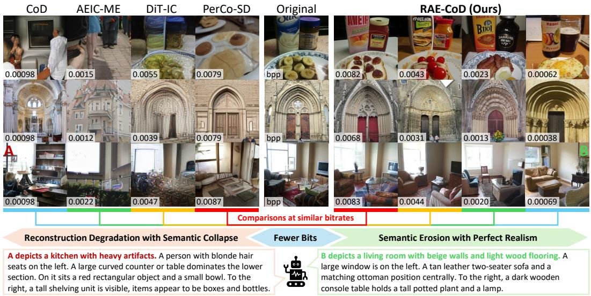  
Figure 1: Generative image compression below normal operating rates on MSCOCO-30K. All methods are trained or finetuned and evaluated at 256 × 256. As the rate decreases, (Left) existing codecs exhibit reconstruction degradation followed by semantic collapse, whereas (Right) RAE-CoD maintains realistic and recognizable content while source consistency degrades more gradually. Captions are generated by Qwen3.5-9B. Numbers denote bits per pixel (bpp). Best viewed on screen.

Based on the analysis, we introduce RAE-CoD, a compression-oriented diffusion constructed in the semantic space of a RAE (Zheng et al., 2026; Singh et al., 2026). RAE-CoD exploits DI NOv3 (Simeoni et al., 2025) to supply the clean representation target, while a latent codec fuses´ representation and pixels into entropy-coded latents. A conditional decoupled diffusion transformer (DDT) (Wang et al., 2026) then generates the source representation from the decoded condition. Instead of reconstruction objectives, we align the codec directly with the clean representation.

Evaluation at extremely low bitrates also requires separating whether an output is semantically well formed from whether it still depicts the source. We therefore introduce a two-level protocol. Vision foundation models (VFM) including CLIP, DINOv2, Inception-v3, SigLIP2, and ConvNeXtv2 (Radford et al., 2021; Oquab et al., 2023; Szegedy et al., 2016; Tschannen et al., 2025; Woo et al., 2023) measure paired feature similarity and distributional distance, while a metadata-blind visionlanguage model (VLM) judges semantic recognizability (SR), quality (SQ), and consistency (SC). On MSCOCO-30K (256 × 256), RAE-CoD exhibits the strongest semantic fidelity in the evaluated range and maintains semantically coherent outputs down to 16 bits. Its SR and SQ remain nearly constant as the rate decreases, whereas SC falls smoothly, indicating the intended transition from source-conditioned generation toward unconditional generation. Our contributions include:

• We explore the behavior of generative image codecs between conventional operating ranges and zero bits. Specifically, we identify semantic collapse and analyze its causes through limitations of reconstruction-oriented training targets and diffusion spaces.

• Guided by the analysis, we develop RAE-CoD, a compression-oriented diffusion constructed upon the representation space with direct alignment to the source representation, enabling semantic image coding with perfect realism towards 16 bits.

• We combine multiple VFMs’ evaluation with a blinded VLM protocol that disentangles semantic recognizability, quality, and consistency. Extensive comparisons show that RAE-CoD substantially improves semantics throughout the extremely low-rate scenarios.

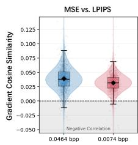

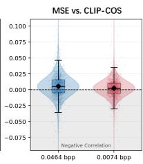

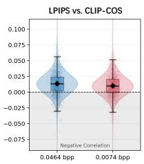

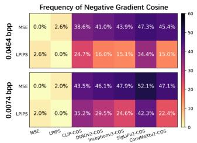

Figure 2: Gradient geometry of reconstruction and semantic objectives. We compute per-sample cosine similarities between loss gradients with respect to decoder features of a pretrained AEIC-ME on MSCOCO-30K. The first three panels show distributions for gradient pairs among MSE, LPIPS, and CLIP cosine similarity (CLIP-COS) at two rates. The right panel reports the frequency of negative gradient cosines between MSE/LPIPS and the cosine objectives of five VFMs.  
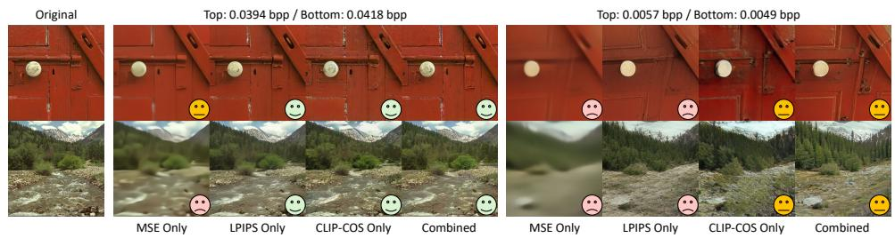  
Figure 3: Extreme test of decoder adaptation under different objectives. We finetune pretrained AEIC-ME’s decoder with MSE only, LPIPS only, CLIP-COS only, or their combination.

## 2 GENERATIVE IMAGE COMPRESSION AT EXTREMELY LOW BITRATES

## 2.1 WHAT HAPPENS AT EXTREMELY LOW BITRATES?

Most generative codecs are evaluated only down to a method-specific minimum rate. We instead study the largely unexplored interval between this operating point and zero bits. According to the rate-distortion-perception tradeoff, source-specific information inevitably vanishes as the bitrate approaches zero. This does not, however, require the output itself to become semantically invalid. A zero-rate generative decoder can still sample from the natural-image distribution and attain perfect marginal realism, albeit without instance-level correspondence to the source. Empirically, pushing existing codecs below their reported operating ranges reveals a different failure. As shown in Fig. 1, recognizable objects deform into implausible structures, salient entities disappear, and scene meaning changes abruptly before the bitstream vanishes. We call this phenomenon semantic collapse, in which reconstructions retain neither source-consistent nor naturally formed semantic units.

## 2.2 ANALYSIS OF SEMANTIC COLLAPSE

To investigate its cause, we group generative codecs into reconstruction- and diffusion-driven methods according to their dominant learning signal. We examine how reconstruction objectives and the intrinsic compression properties of diffusion spaces affect semantic preservation at extreme bitrates.

Directions of Reconstruction Objectives. Reconstruction-driven methods, including GAN-based codecs and one-step diffusion codecs (Mentzer et al., 2020; Zhang et al., 2025; Xue et al., 2026), exploit generative priors for perceptual compression but still rely heavily on reconstruction-oriented objectives, typically MSE and perceptual losses such as LPIPS. These losses help traverse the ratedistortion-perception trade-off, yet neither explicitly preserves the identities, relations, or global meaning of visible content. MSE penalizes pixel error, while LPIPS compares latents from a perceptual feature network. In Fig. 2, we use the pretrained one-step diffusion codec AEIC-ME (Zhang et al., 2026b) and analyze decoder feature gradients from seven losses: MSE, LPIPS, and cosine distances under CLIP, DINOv2, Inception-v3, SigLIP2, and ConvNeXt-v2. MSE and LPIPS rarely conflict with each other, but their gradients are nearly orthogonal to semantic objectives and become negatively aligned more frequently at the lower rate. The extreme test in Fig. 3 visualizes that MSE favors blur, while LPIPS produces structured artifacts as the bitrate decreases, both deviating entirely from semantic supervision which retains relatively better recognizable content. These findings indicate that reconstruction objectives do not reliably preserve semantics and can oppose semantic supervision, with this limitation becoming more consequential as the bit budget shrinks.

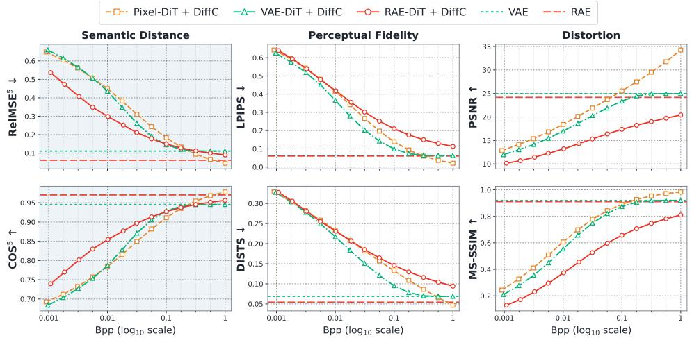  
Figure 4: Zero-shot compression with different diffusion models. We apply the DiffC protocol to pretrained class-conditioned Pixel-DiT, VAE-DiT, and RAE-DiT on 5K ImageNet validation images at $2 5 6 \times 2 5 6$ . All diffusion backbones use DDT-XL or comparable variants. Semantic distance is measured by the average relative MSE $( \mathrm { R e l M S E } ^ { 5 } )$ and cosine similarity $\mathrm { ( C O S ^ { 5 } ) }$ over five VFMs.

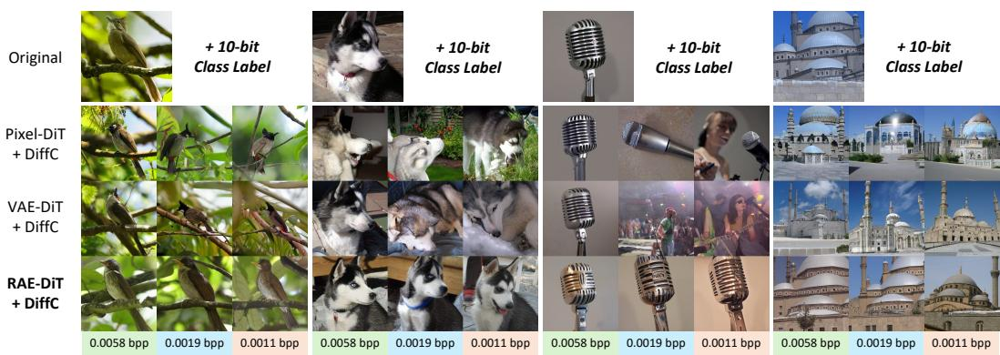  
Figure 5: Qualitative DiffC comparison on ImageNet at 256 × 256.

Compression Properties of Diffusion Models. Diffusion-driven methods (Careil et al., 2024; Jia et al., 2026b; Ke et al., 2025) jointly optimize a codec and a conditional generative model in pixel or latent space. Their denoising loss learns a conditional posterior in the chosen data space, but does not make pixel coordinates or reconstruction-oriented VAE latents semantic by construction. We isolate the effect of that space using DiffC (Liu et al., 2025), which performs reverse-channel coding with a pretrained diffusion model. Under the same protocol, we compare class-conditioned Pixel-DiT (Ma et al., 2026), VAE-DiT (Wang et al., 2026), and RAE-DiT (Singh et al., 2026) models with comparable DDT-XL backbones. Fig. 4 reveals a clear specialization: Pixel-DiT provides the strongest rate-distortion behavior and high-rate ceiling, VAE-DiT favors perceptual fidelity evaluated under LPIPS and DISTS (Ding et al., 2020) at moderate rates. RAE-DiT, despite weaker distortion, preserves semantic representations most efficiently. Fig. 5 further shows that RAE-DiT retains coherent entities and scene layouts for substantially longer as the bitrate decreases. These results suggest that pixel-space and reconstruction-oriented VAE diffusion offer no intrinsic advantage for semantic preservation at extremely low rates.

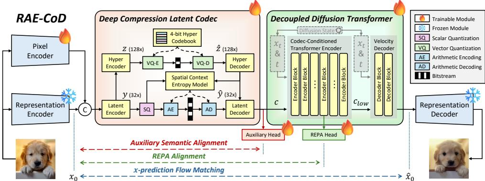  
Figure 6: Framework of RAE-CoD. RAE-CoD comprises a frozen representation autoencoder, a deep compression latent codec, and a codec-conditioned decoupled diffusion transformer (DDT). All training objectives are performed in the semantically structured representation space.

## 3 COMPRESSION-ORIENTED DIFFUSION WITH RAE

The above analysis yields two findings for semantic collapse at extremely low bitrates. First, reconstruction objectives can conflict with semantics in their gradient directions. Second, diffusion in a representation space preserves semantics more efficiently as the bitrate decreases. In this section, we integrate both findings and introduce RAE-CoD (Fig. 6), a compression-oriented diffusion model built with RAE and direct semantic condition alignment. It is designed to replace abrupt semantic collapse with a gradual loss of source consistency while retaining realistic, recognizable content.

## 3.1 PIPELINE

Representation Latent Space. We adopt the DINOv3 encoder and its pretrained RAEv2 decoder (Singh et al., 2026). Following the generalized RAE, we aggregate intermediate DINOv3 features, reshape the patch tokens spatially, and standardize them to obtain the clean diffusion target $x _ { 0 }$ at 1/16 of the input resolution. The representation decoder maps a generated $\scriptstyle { \hat { x } } _ { 0 }$ back to pixels.

Deep Compression Latent Codec. The latent codec places its entropy bottlenecks substantially deeper than standard neural codecs to support extremely low bitrates (Zhang et al., 2025). A convolutional pixel encoder complements the frozen representation encoder with flexible pixel-level features. The codec concatenates their 1/16-resolution outputs and produces a main latent y at $1 / 3 2$ and a hyper latent z at 1/128. At extreme rates, the factorized model (Balle et al., 2018) for ´ z can dominate the bits. We instead vector-quantize z with a 4-bit (or 0.000244 bpp) codebook (Esser et al., 2021). The latent decoder reconstructs the 1/16-resolution codec condition c from yˆ and zˆ.

Conditional Decoupled Diffusion Transformer. We initialize the denoiser from a pretrained RAEv2 DDT and replace its class-conditioning interface with the codec condition c. Following DDT (Wang et al., 2026), the noisy representation tokens, timestep tokens, and projected codec tokens are concatenated and processed by a deep transformer encoder to produce a low-frequency self-condition $c _ { l o w } .$ . A shallow but wide decoder head, reparameterized for x-prediction, uses $c _ { l o w }$ to modulate the diffusion state and predict the clean representation ${ \hat { x } } _ { 0 }$

## 3.2 DIFFUSION TRAINING STRATEGY

Loss Function. We train RAE-CoD using x-prediction flow matching loss $\mathcal { L } _ { \mathrm { F M } }$ (Liu et al., 2022) and representation alignment. Following the RAE convention, a noisy latent is sampled along $x _ { t } =$ $( 1 - t ) x _ { 0 } + t \epsilon$ , where $\epsilon \sim \mathcal { N } ( 0 , I )$ , and the full DDT predicts $x _ { 0 }$ through $\mathcal { L } _ { \mathrm { F M } }$ . The early REPA head attached to the transformer encoder produces a second prediction $\breve { \hat { x } } _ { 0 } ^ { \mathrm { r e p a } }$ . Because $x _ { 0 }$ is itself the target vision representation, this head implements $\mathcal { L } _ { \mathrm { { R E P A } } }$ (Yu et al., 2024) as explicit early-layer x-prediction and also provides the weaker prediction used for internal guidance (Zhou et al., 2026).

Although $\mathcal { L } _ { \mathrm { F M } }$ and $\mathcal { L } _ { \mathrm { { R E P A } } }$ back-propagate through the codec condition, both are mediated by a randomly noised diffusion state and can provide an ambiguous learning signal when the codec is trained under a severe bottleneck. We therefore add a deterministic auxiliary objective $\mathcal { L } _ { \mathrm { a u x } }$ to the condition c. An auxiliary MLP head projects $c ,$ and $\mathcal { L } _ { \mathrm { a u x } }$ measures the cosine distance relative to the clean target $x _ { 0 }$ , requiring the entropy-constrained c to preserve semantics (Zhang et al., 2026a). Given the entropy $\mathcal { R } _ { y }$ and the commitment loss $\mathcal { L } _ { \mathrm { V Q } }$ (Esser et al., 2021), the complete objective is

$$
\mathcal { L } = \lambda _ { \mathrm { r a t e } } \mathcal { R } _ { y } + \lambda _ { \mathrm { v q } } \mathcal { L } _ { \mathrm { V Q } } + \mathcal { L } _ { \mathrm { F M } } + \lambda _ { \mathrm { r e p a } } \mathcal { L } _ { \mathrm { R E P A } } + \lambda _ { \mathrm { a u x } } \mathcal { L } _ { \mathrm { a u x } } .\tag{1}
$$

Progressive Training towards Extremely Low Bitrates. Directly imposing a severe rate penalty can destroy the pretrained diffusion prior. Inspired by implicit bitrate pruning (Zhang et al., 2025), we progressively increase $\lambda _ { \mathrm { { r a t e } } }$ in training Stage I while applying LoRA (Hu et al., 2021) for the pretrained DDT. In Stage II, we branch from the corresponding Stage-I checkpoints, fix $\lambda _ { \mathrm { { r a t e } } }$ at each target value, merge the LoRA weights, and fine-tune all DDT parameters jointly with the codec.

Implementation. We train on 23.2M 256 × 256 images from ImageNet-21K (Russakovsky et al., 2015) and CC12M (Changpinyo et al., 2021). We set $\lambda _ { \mathrm { r e p a } } = 1 , \lambda _ { \mathrm { v q } } = 0 . 2 5$ , and $\lambda _ { \mathrm { a u x } } = 0 . 5$ . In Stage I, we use rank-32 LoRA and increase $\lambda _ { \mathrm { { r a t e } } }$ from 0.1 through {2, 12, 16, 24, 32, 48} at 30Kiteration intervals with a learning rate of $1 0 ^ { - 4 }$ . In Stage II, we fix $\lambda _ { \mathrm { { r a t e } } } \in \{ 1 2 , 1 6 , 2 4 , 3 2 , 4 8 \}$ and train each operating point for 100K iterations at $1 0 ^ { - 5 }$ . Both stages use AdamW, an effective batch size of 128, bfloat16 mixed precision, and an EMA with decay 0.9995 on four NVIDIA A100 GPUs.

## 4 EVALUATION PROTOCOL

Pixel distortion and perceptual fidelity, though commonly adopted in evaluating generative image compression, fail to distinguish the semantic differences at extremely low bitrates identified in Fig. 3 and 4. We therefore introduce a two-level evaluation protocol that combines deterministic vision foundation model (VFM) features with a blinded vision-language model (VLM) judge.

VFM-Based Evaluation. Let $\Phi ~ = ~ \{ \phi _ { m } \} _ { m = 1 } ^ { 5 }$ contain Inception-v3, ConvNeXt-v2, DINOv2, SigLIP2, and CLIP, spanning supervised, self-supervised, and vision-language objectives. For each source-reconstruction pair, we compute feature MSE and cosine similarity to measure semantic distance, and report the average relative MSE $( \mathrm { R e l M S E } ^ { 5 } )$ and cosine similarity $\mathrm { ( C O S ^ { 5 } ) }$ for aggregation across five VFMs. For distributional distance, we compute Frechet Distance (FD) on different´ VFMs, and adapts the FD ratio (Yang et al., 2026) to compression. Let X denote the source images, $\hat { \mathcal X }$ the reconstructions for evaluation, and $\hat { \mathcal { X } } _ { \mathrm { A } }$ the reconstructions of an anchor codec. We define

$$
\mathrm { F D r } ^ { 5 } ( \hat { \mathcal X } ) = \frac { 1 } { 5 } \sum _ { m = 1 } ^ { 5 } \frac { \mathrm { F D } _ { \phi _ { m } } ( \mathcal X , \hat { \mathcal X } ) } { \mathrm { F D } _ { \phi _ { m } } ( \mathcal X , \hat { \mathcal X } _ { \mathrm { A } } ) } .\tag{2}
$$

VLM-Based Evaluation. Features can overlook failures that are obvious to a human, such as malformed objects and changed relations. We therefore complement them with a blinded Qwen3.5-9B judge (Qwen Team, 2026) and evaluate three distinct properties. Semantic recognizability (SR) asks what content can be identified from the reconstruction alone. Semantic quality (SQ) asks whether that recognizable content is coherent, structurally intact, natural, and not dominated by artifacts. Semantic consistency (SC) instead asks how faithfully the meaning of the source is retained.

To compute SR and $\mathrm { S Q }$ , the VLM sees only an anonymous reconstruction and decomposes its visible content into nonredundant semantic units, such as entities, actions, and relations. For each unit $c ,$ it assigns semantic importance $w _ { c } .$ , identity confidence $p _ { c } .$ , and intrinsic quality $q _ { c } .$ . The raw scores $\mathrm { S R } ^ { \mathrm { r a w } }$ and $\mathrm { S Q } ^ { \mathrm { r a w } }$ are importance-weighted averages. Since VLM does not use the raw [0, 100] scale uniformly across images, we normalize $\mathrm { S R } ^ { \mathrm { r a w } }$ and $\mathrm { S Q } ^ { \mathrm { r a w } }$ using per-image controls. For metric $\mathrm { { M } } \in \{ \mathrm { { S h } } , \mathrm { { S Q } } \}$ , the clean source provides an upper anchor $\mathrm { U } ^ { \mathrm { M } }$ , while a minimum-quality JPEG compression of that source provides a lower anchor $\mathrm { L ^ { M } }$ . The final scores are computed as:

$$
\mathrm { S R } ^ { \mathrm { r a w } } = \frac { \sum _ { c } w _ { c } p _ { c } } { \sum _ { c } w _ { c } } , \quad \mathrm { S Q } ^ { \mathrm { r a w } } = \frac { \sum _ { c } w _ { c } q _ { c } } { \sum _ { c } w _ { c } } , \quad \mathrm { M } = 1 0 0 \cdot \mathbf { c l i p } \left[ \frac { \mathrm { M } ^ { \mathrm { r a w } } - \mathrm { L } ^ { \mathrm { M } } } { \mathrm { U } ^ { \mathrm { M } } - \mathrm { L } ^ { \mathrm { M } } } , 0 , 1 \right] .\tag{3}
$$

To compute SC, the VLM independently inventories the source; the two inventories are then matched in a separate text-only call, without using the SR/SQ judgments. This produces semantic recall $\rho ,$ which measures retained source content, and semantic precision π, which penalizes invented or substituted content. Their harmonic mean F is combined with global scene similarity G:

$$
F = 2 \rho \pi / ( \rho + \pi ) , \qquad \mathrm { S C } = 0 . 4 \cdot G + 0 . 6 \cdot F .\tag{4}
$$

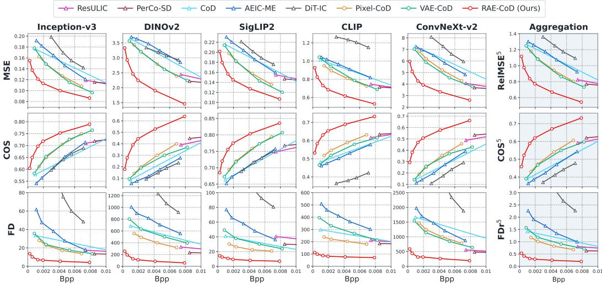  
Figure 7: VFM-based semantic and quality evaluation on MSCOCO-30K.

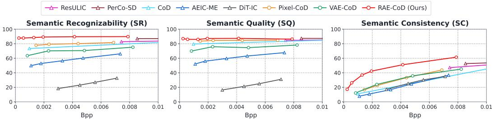  
Figure 8: VLM-based semantic and quality evaluation on MSCOCO-30K.

## 5 EXPERIMENTS

## 5.1 SETTINGS

Compared Methods. We compare with five representative generative codecs: PerCo-SD (Korber¨ et al., 2024), ResULIC (Ke et al., 2025), CoD (Jia et al., 2026b), AEIC-ME (Zhang et al., 2026b), and DiT-IC (Shi et al., 2026). To reach extreme rates, we start from the lowest-rate official checkpoints and finetune them at 256 × 256 using their code. We also construct two space-controlled variants. Pixel-CoD replaces RAE-DiT with a pretrained pixel-space DDT (Ma et al., 2026), while VAE-CoD uses a pretrained VAE-space DDT (Wang et al., 2026); both retain our deep latent codec and training strategy. Pixel-CoD differs from CoD (Jia et al., 2026b) mainly in using a pretrained DeCo rather than training from scratch, and using an entropy model instead of a VQ bottleneck.

Test Data and Evaluation. We primarily use MSCOCO-30K (Careil et al., 2024; Lin et al., 2014) for all evaluation, a 30K-image subset of commonly used in image compression. We also adopt Kodak (Eastman Kodak Company, 1999). All images are resized and center-cropped to $2 5 6 \times 2 5 6 .$ We report theoretical bits per pixel (bpp) estimated from the learned likelihoods. Following Sec. 4, the VFM evaluation measures features MSE, COS, and FD under five VFMs. We aggregate them as RelMSE5, COS5, and $\mathrm { F D r ^ { 5 } }$ $\mathrm { F D r ^ { 5 } }$ is normalized by the corresponding highest-rate AEIC-ME value. We further apply the Qwen3.5-9B protocol to report SR, SQ, and SC.

## 5.2 MAIN RESULTS

Quantitative Comparisons. Fig. 7 shows that RAE-CoD establishes the strongest semantic envelope throughout the evaluated range, on both aggregated results and specific VFMs. Around 0.008 bpp, RAE-CoD obtains a 25.7% reduction in RelMSE5 and a 69.1% reduction in $\mathrm { F D r ^ { 5 } }$ relative to the best competing value, while the advantage grows in the more challenging region near 0.001 bpp. The consistent gap over Pixel-CoD and VAE-CoD isolates the benefit of constructing compressionoriented diffusion in the RAE space. The VLM results in Fig. 8 reveal the behavior hidden by a single similarity score. Across the full RAE-CoD curve, SR remains within 86.7–87.2 and SQ within 69.2–70.7, while SC decreases from 61.5 to 17.2. This is the desired behavior: reconstructions remain recognizable and semantically well formed, but progressively less tied to the source.

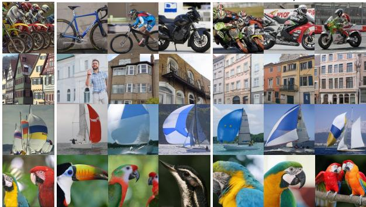

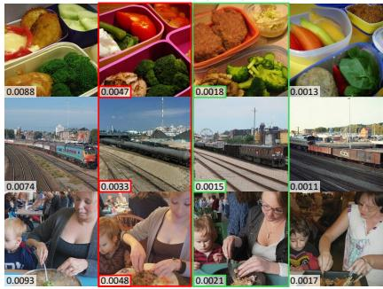

Original  
AEIC-ME  
PerCo-SD  
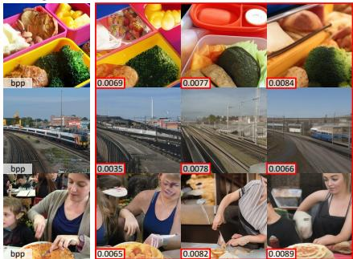  
ResULIC

Pixel-CoD  
VAE-CoD  
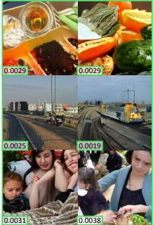  
RAE-CoD (Ours)  
Figure 9: Qualitative comparison on MSCOCO-30K at 256 × 256. Red and green borders high light comparisons at similar bitrates. RAE-CoD is shown in increasingly aggressive bitrates.

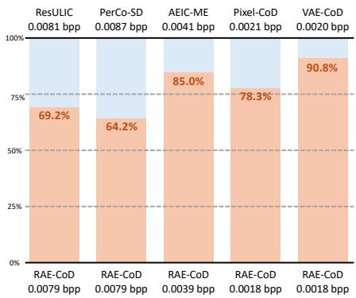  
Figure 10: User study on Kodak.  
Original  
RAE-CoD: 16 bits  
RAE-CoD + 1-step DiffC: 20 bits  
Figure 11: 16-bit RAE-CoD on Kodak at 256 × 256.

Human Preference Study and Qualitative Comparisons. Fig. 10 reports pairwise preferences on Kodak, with 120 votes from 10 participants for each comparison. At similar bitrates, RAE-CoD is preferred in all five comparisons against ResULIC, PerCo-SD, AEIC-ME and CoD variants, receiving 64.2-90.8% of the votes. The examples in Fig. 9 show the consistent trend. RAE-CoD better preserves the salient content and remains visually coherent as the rate decreases, while competing methods lose source entities or develop malformed structures.

## 5.3 DISCUSSION AND ABLATION STUDY

16-Bit Compression. At the lowest operating point, we drop the main latent and finetuning the model sorely relying on the 16-bit hyper latent. Fig. 11 shows that this 16-bit message is already sufficient to bias the generation toward the broad scene semantics, but different noise samples can largely change object identity or layout details at this bitrate. We therefore test a lightweight improvement using a single DiffC reverse-channel-coding step (Liu et al., 2025). Communicating around four additional bits (as theoretically estimated) constrains the sampled diffusion state and improves semantic stability, while the total rate remains only 20 bits, or 0.000305 bpp.

Auxiliary Codec Alignment. Table 1 compares the losses applied to the codec condition using BD-rate (Bjontegaard, 2001), where we test pixel-level MSE as the reconstruction loss. Semantic alignment alone yields substantially stronger performance, which agrees with Fig. 2 and 3 that reconstruction supervision can interferes with the semantic signal under an extreme bitrate bottleneck.

Table 1: Ablation on the auxiliary losses. BDrate is computed over four points from 0.001 to 0.008 bpp relative to no auxiliary loss.
<table><tr><td>Auxiliary Objective</td><td colspan="2">BD-rate (↓ %) RelMSE⁵  $\mathrm { C O S ^ { 5 } }$   $\mathrm { F D r ^ { 5 } }$ </td></tr><tr><td>None</td><td>0</td><td>0</td></tr><tr><td>Pixel MSE only</td><td>-43.38</td><td>0 -41.75 -73.20</td></tr><tr><td>Semantic only</td><td>-76.87</td><td>-77.18 -87.49</td></tr><tr><td>Both</td><td>-65.58</td><td>-64.90 -81.98</td></tr></table>

Table 2: Ablation on the encoders. BD-rate is computed over four points from 0.001 to 0.008 bpp relative to RAE encoder only.
<table><tr><td rowspan=1 colspan=1>Encoder Selection</td><td rowspan=1 colspan=1>BD-rate (↓ %) $\mathrm { R e l M S E } ^ { 5 }$    $\mathrm { C O S ^ { 5 } }$     $\mathrm { F D r ^ { 5 } }$ </td></tr><tr><td rowspan=1 colspan=1>RAE encoder only</td><td rowspan=2 colspan=1>0       0      0 $+ 5 0 . 6 5 + 4 9 . 4 7 + 3 7 . 3 5$ </td></tr><tr><td rowspan=1 colspan=1>Pixel encoder only</td></tr><tr><td rowspan=1 colspan=1>Both</td><td rowspan=1 colspan=1> $\mathbf { - 3 2 . 1 0 - 3 2 . 9 2 \ - 6 6 . 3 4 }$ </td></tr></table>

Selection of Encoders. Table 2 studies the inputs for the latent codec. Using only the pixel encoder requires at least 37.35% more bits than using only the RAE encoder at matched aggregate quality, confirming that representation features provide the more compression-efficient semantic basis. Nevertheless, the two encoders are complementary as fusing pixel and RAE features reduces bitrate by 32.10% under $\mathrm { R e l M S E } ^ { 5 }$ , 32.92% under $\mathrm { C O S ^ { \bar { 5 } } }$ , and 66.34% under $\mathrm { F D r ^ { 5 } }$ relative to RAE-E alone.

## 6 RELATED WORK

Diffusion-based Generative Image Compression. Diffusion-based codecs introduce learned priors to improve realism, broadly involving reverse-channel coding with a pretrained diffusion (Theis et al., 2022; Liu et al., 2025), generative refinement (Ghouse et al., 2023; Hoogeboom et al., 2023), and end-to-end training of a conditional diffusion decoder (Yang & Mandt, 2023). Ultra-low-rate variants further communicate side information and compressed controls (Lei et al., 2023; Careil et al., 2024; Li et al., 2024; Ke et al., 2025), while recent work emphasizes one-step generation, lightweight coding, and compression-specific pretraining (Guo et al., 2026; Zhang et al., 2025; Xue et al., 2026; Jia et al., 2026b; Zhang et al., 2026b; Jia et al., 2026a). In contrast, we explore the behavior of representative generative codecs when pushed below their operating bitrates.

Vision Representation in Image Generation. Self-supervised and language-supervised vision encoders provide richer semantic and spatial structure (Rombach et al., 2022; He et al., 2022; Oquab et al., 2023; Radford et al., 2021). Image generation exploits these representations by aligned denoiser features (Yu et al., 2024; Leng et al., 2025; Singh et al., 2025) and redesigned generative latent through semantic regularization, masked representation learning or frozen representation encoders (Yao et al., 2025; Xu et al., 2025; Chen et al., 2025; Zheng et al., 2026; Gao et al., 2026; Singh et al., 2026). These trends establish representation structure as central to generation, we instead study their ability to preserve semantics for generative image compression at extreme bitrates.

## 7 CONCLUSION

We studied generative image compression in the largely unexplored interval between conventional operating rates and zero bits. Representative codecs do not always lose source information gracefully in this regime. Instead, they undergo semantic collapse. Our analysis connected this failure to the weak alignment between reconstruction and semantic objectives and to the limited semantic efficiency of pixel and reconstruction-oriented VAE diffusion spaces. These observations led to RAE-CoD, which performs compression-oriented diffusion in a pretrained representation space and directly aligns its compressed condition with the source representation. Together with our VFM and VLM evaluation protocol, the experiments show that RAE-CoD preserves recognizable, naturally structured content down to 16 bits while allowing source consistency to decrease gradually. We hope these findings encourage future work to push the lower bitrate frontier of generative compression.

Limitations. Our experiments are primarily limited to 256 × 256 images and a 0.9B-parameter decoupled diffusion transformer due to computational constraints. We therefore do not establish a scaling law: it remains unclear how larger generative models built in the representation space can further improve the semantic stability and quality at extremely low bitrates, or whether highresolution image semantics can be preserved with similar or even smaller bitstreams. Exploring model and resolution scaling is an important direction for future work.

## REFERENCES

Johannes Balle, Valero Laparra, and Eero P Simoncelli. End-to-end optimized image compression.´ arXiv preprint arXiv:1611.01704, 2016.

Johannes Balle, David Minnen, Saurabh Singh, Sung Jin Hwang, and Nick Johnston. Variational´ image compression with a scale hyperprior. arXiv preprint arXiv:1802.01436, 2018.

Gisle Bjontegaard. Calculation of average psnr differences between rd-curves. ITU SG16 Doc. VCEG-M33, 2001.

Yochai Blau and Tomer Michaeli. Rethinking lossy compression: The rate-distortion-perception tradeoff. In International Conference on Machine Learning, pp. 675–685. PMLR, 2019.

Marlene Careil, Matthew J Muckley, Jakob Verbeek, and Stephane Lathuili ´ ere. Towards image \` compression with perfect realism at ultra-low bitrates. In International conference on learning representations, volume 2024, pp. 15544–15564, 2024.

Soravit Changpinyo, Piyush Sharma, Nan Ding, and Radu Soricut. Conceptual 12m: Pushing webscale image-text pre-training to recognize long-tail visual concepts. In 2021 IEEE/CVF Confer ence on Computer Vision and Pattern Recognition (CVPR), pp. 3557–3567. IEEE, 2021.

Hao Chen, Yujin Han, Fangyi Chen, Xiang Li, Yidong Wang, Jindong Wang, Ze Wang, Zicheng Liu, Difan Zou, and Bhiksha Raj. Masked autoencoders are effective tokenizers for diffusion models. In Forty-second International Conference on Machine Learning, 2025.

Keyan Ding, Kede Ma, Shiqi Wang, and Eero P Simoncelli. Image quality assessment: Unifying structure and texture similarity. IEEE transactions on pattern analysis and machine intelligence, 44(5):2567–2581, 2020.

Eastman Kodak Company. Kodak lossless true color image suite. http://r0k.us/graphics/ kodak/, 1999.

Patrick Esser, Robin Rombach, and Bjorn Ommer. Taming transformers for high-resolution image synthesis. In Proceedings of the IEEE/CVF conference on computer vision and pattern recognition, pp. 12873–12883, 2021.

Yuan Gao, Chen Chen, and Jiatao Gu. One layer is enough: Adapting pretrained visual encoders for image generation. In Proceedings ofthe IEEE/CVF Conference on Computer Vision and Pattern Recognition, pp. 4688–4697, 2026.

Noor Fathima Ghouse, Jens Petersen, Auke Wiggers, Tianlin Xu, and Guillaume Sautiere. A residual diffusion model for high perceptual quality codec augmentation. arXiv preprint arXiv:2301.05489, 2023.

Jinpei Guo, Yifei Ji, Zheng Chen, Kai Liu, Min Liu, Wang Rao, Wenbo Li, Yong Guo, and Yulun Zhang. Oscar: One-step diffusion codec across multiple bit-rates. Advances in Neural Information Processing Systems, 38:85267–85286, 2026.

Kaiming He, Xinlei Chen, Saining Xie, Yanghao Li, Piotr Dollar, and Ross Girshick. Masked´ autoencoders are scalable vision learners. In 2022 IEEE/CVF conference on computer vision and pattern recognition (CVPR), pp. 15979–15988. IEEE, 2022.

Emiel Hoogeboom, Eirikur Agustsson, Fabian Mentzer, Luca Versari, George Toderici, and Lucas Theis. High-fidelity image compression with score-based generative models. arXiv preprint arXiv:2305.18231, 2023.

Edward J Hu, Yelong Shen, Phillip Wallis, Zeyuan Allen-Zhu, Yuanzhi Li, Shean Wang, Lu Wang, and Weizhu Chen. Lora: Low-rank adaptation of large language models. arXiv preprint arXiv:2106.09685, 2021.

Zhaoyang Jia, Naifu Xue, Zihan Zheng, Jiahao Li, Bin Li, Xiaoyi Zhang, Zongyu Guo, Yuan Zhang, Houqiang Li, and Yan Lu. Cod-lite: Real-time diffusion-based generative image compression. arXiv preprint arXiv:2604.12525, 2026a.

Zhaoyang Jia, Zihan Zheng, Naifu Xue, Jiahao Li, Bin Li, Zongyu Guo, Xiaoyi Zhang, Houqiang Li, and Yan Lu. Cod: A diffusion foundation model for image compression. In Proceedings of the IEEE/CVF Conference on Computer Vision and Pattern Recognition, pp. 38420–38429, 2026b.

Anle Ke, Xu Zhang, Tong Chen, Ming Lu, Chao Zhou, Jiawen Gu, and Zhan Ma. Ultra lowrate image compression with semantic residual coding and compression-aware diffusion. arXiv preprint arXiv:2505.08281, 2025.

Nikolai Korber, Eduard Kromer, Andreas Siebert, Sascha Hauke, Daniel Mueller-Gritschneder, and¨ Bjorn Schuller. Perco (sd): Open perceptual compression. ¨ arXiv preprint arXiv:2409.20255, 2024.

Eric Lei, Yigit Berkay Uslu, Hamed Hassani, and Shirin Saeedi Bidokhti. Text+ sketch: Image˘ compression at ultra low rates. arXiv preprint arXiv:2307.01944, 2023.

Xingjian Leng, Jaskirat Singh, Yunzhong Hou, Zhenchang Xing, Saining Xie, and Liang Zheng. Repa-e: Unlocking vae for end-to-end tuning with latent diffusion transformers. In 2025 IEEE/CVF International Conference on Computer Vision (ICCV), pp. 18262–18272. IEEE, 2025.

Zhiyuan Li, Yanhui Zhou, Hao Wei, Chenyang Ge, and Jingwen Jiang. Toward extreme image compression with latent feature guidance and diffusion prior. IEEE Transactions on Circuits and Systems for Video Technology, 35(1):888–899, 2024.

Tsung-Yi Lin, Michael Maire, Serge Belongie, James Hays, Pietro Perona, Deva Ramanan, Piotr Dollar, and C Lawrence Zitnick. Microsoft coco: Common objects in context. In ´ European conference on computer vision, pp. 740–755. Springer, 2014.

Feng Liu et al. Lossy compression with pretrained diffusion models. In International Conference on Learning Representations, volume 2025, pp. 687–702, 2025.

Xingchao Liu, Chengyue Gong, and Qiang Liu. Flow straight and fast: Learning to generate and transfer data with rectified flow. arXiv preprint arXiv:2209.03003, 2022.

Zehong Ma, Longhui Wei, Shuai Wang, Shiliang Zhang, and Qi Tian. Deco: Frequency-decoupled pixel diffusion for end-to-end image generation. In Proceedings of the IEEE/CVF Conference on Computer Vision and Pattern Recognition, pp. 43600–43610, 2026.

Fabian Mentzer, George D Toderici, Michael Tschannen, and Eirikur Agustsson. High-fidelity generative image compression. Advances in neural information processing systems, 33:11913–11924, 2020.

Maxime Oquab, Timothee Darcet, Th´ eo Moutakanni, Huy Vo, Marc Szafraniec, Vasil Khalidov,´ Pierre Fernandez, Daniel Haziza, Francisco Massa, Alaaeldin El-Nouby, et al. Dinov2: Learning robust visual features without supervision. arXiv preprint arXiv:2304.07193, 2023.

William Peebles and Saining Xie. Scalable diffusion models with transformers. In 2023 IEEE/CVF International Conference on Computer Vision (ICCV), pp. 4172–4182. IEEE, 2023.

Qwen Team. Qwen3.5: Towards native multimodal agents. https://qwen.ai/blog?id= qwen3.5, 2026.

Alec Radford, Jong Wook Kim, Chris Hallacy, Aditya Ramesh, Gabriel Goh, Sandhini Agarwal, Girish Sastry, Amanda Askell, Pamela Mishkin, Jack Clark, et al. Learning transferable visual models from natural language supervision. In International conference on machine learning, pp. 8748–8763. PmLR, 2021.

Robin Rombach, Andreas Blattmann, Dominik Lorenz, Patrick Esser, and Bjorn Ommer. High-¨ resolution image synthesis with latent diffusion models. In 2022 IEEE/CVF conference on computer vision and pattern recognition (CVPR), pp. 10674–10685. ieee, 2022.

Olga Russakovsky, Jia Deng, Hao Su, Jonathan Krause, Sanjeev Satheesh, Sean Ma, Zhiheng Huang, Andrej Karpathy, Aditya Khosla, Michael Bernstein, et al. Imagenet large scale visual recognition challenge. International journal ofcomputer vision, 115(3):211–252, 2015.

Junqi Shi, Ming Lu, Xingchen Li, Anle Ke, Ruiqi Zhang, and Zhan Ma. Dit-ic: Aligned diffusion transformer for efficient image compression. arXiv preprint arXiv:2603.13162, 2026.

Oriane Simeoni, Huy V Vo, Maximilian Seitzer, Federico Baldassarre, Maxime Oquab, Cijo Jose,´ Vasil Khalidov, Marc Szafraniec, Seungeun Yi, Michael Ramamonjisoa, et al. Dinov3.¨ arXiv preprint arXiv:2508.10104, 2025.

Jaskirat Singh, Xingjian Leng, Zongze Wu, Liang Zheng, Richard Zhang, Eli Shechtman, and Saining Xie. What matters for representation alignment: Global information or spatial structure? In The Fourteenth International Conference on Learning Representations, 2025.

Jaskirat Singh, Boyang Zheng, Zongze Wu, Richard Zhang, Eli Shechtman, and Saining Xie. Improved baselines with representation autoencoders. arXiv preprint arXiv:2605.18324, 2026.

Christian Szegedy, Vincent Vanhoucke, Sergey Ioffe, Jon Shlens, and Zbigniew Wojna. Rethinking the inception architecture for computer vision. In Proceedings of the IEEE conference on computer vision and pattern recognition, pp. 2818–2826, 2016.

Lucas Theis, Tim Salimans, Matthew D Hoffman, and Fabian Mentzer. Lossy compression with gaussian diffusion. arXiv preprint arXiv:2206.08889, 2022.

Michael Tschannen, Alexey Gritsenko, Xiao Wang, Muhammad Ferjad Naeem, Ibrahim Alabdul mohsin, Nikhil Parthasarathy, Talfan Evans, Lucas Beyer, Ye Xia, Basil Mustafa, et al. Siglip 2: Multilingual vision-language encoders with improved semantic understanding, localization, and dense features. arXiv preprint arXiv:2502.14786, 2025.

Shuai Wang, Zhi Tian, Weilin Huang, and Limin Wang. Ddt: Decoupled diffusion transformer. In Proceedings of the IEEE/CVF conference on computer vision and pattern recognition, pp. 40633–40642, 2026.

Sanghyun Woo, Shoubhik Debnath, Ronghang Hu, Xinlei Chen, Zhuang Liu, In So Kweon, and Saining Xie. Convnext v2: Co-designing and scaling convnets with masked autoencoders. In 2023 IEEE/CVF Conference on Computer Vision and Pattern Recognition (CVPR), pp. 16133– 16142. Ieee, 2023.

Wanghan Xu, Xiaoyu Yue, Zidong Wang, Yao Teng, Wenlong Zhang, Xihui Liu, Luping Zhou, Wanli Ouyang, and Lei Bai. Exploring representation-aligned latent space for better generation. arXiv preprint arXiv:2502.00359, 2025.

Naifu Xue, Zhaoyang Jia, Jiahao Li, Bin Li, Yuan Zhang, and Yan Lu. One-step diffusion-based image compression with semantic distillation. Advances in neural information processing systems, 38:37108–37144, 2026.

Jiawei Yang, Zhengyang Geng, Xuan Ju, Yonglong Tian, and Yue Wang. Representation fr\’echet loss for visual generation. arXiv preprint arXiv:2604.28190, 2026.

Ruihan Yang and Stephan Mandt. Lossy image compression with conditional diffusion models. Advances in Neural Information Processing Systems, 36:64971–64995, 2023.

Jingfeng Yao, Bin Yang, and Xinggang Wang. Reconstruction vs. generation: Taming optimization dilemma in latent diffusion models. In 2025 IEEE/CVF Conference on Computer Vision and Pattern Recognition (CVPR), pp. 15703–15712. IEEE, 2025.

Sihyun Yu, Sangkyung Kwak, Huiwon Jang, Jongheon Jeong, Jonathan Huang, Jinwoo Shin, and Saining Xie. Representation alignment for generation: Training diffusion transformers is easier than you think. 2024.

Bingliang Zhang, Wenda Chu, Yizhuo Li, Linjie Yang, Yisong Yue, Katherine Bouman, Yang Song, and Qiushan Guo. Speediff: Scalable pixel-anchored end-to-end latent diffusion model. In Proceedings of the IEEE/CVF Conference on Computer Vision and Pattern Recognition (CVPR), pp. 35893–35903, June 2026a.

Richard Zhang, Phillip Isola, Alexei A Efros, Eli Shechtman, and Oliver Wang. The unreasonable effectiveness of deep features as a perceptual metric. In 2018 IEEE/CVF conference on computer vision and pattern recognition, pp. 586–595. IEEE, 2018.

Tianyu Zhang, Xin Luo, Li Li, and Dong Liu. Stablecodec: Taming one-step diffusion for extreme image compression. In 2025 IEEE/CVF International Conference on Computer Vision (ICCV), pp. 17379–17389. IEEE, 2025.

Tianyu Zhang, Dong Liu, and Chang Wen Chen. Ultra-low bitrate perceptual image compression with shallow encoder. In Proceedings of the IEEE/CVF Conference on Computer Vision and Pattern Recognition, pp. 12118–12128, 2026b.

Boyang Zheng, Nanye Ma, Shengbang Tong, and Saining Xie. Diffusion transformers with representation autoencoders. In International Conference on Learning Representations, volume 2026, pp. 35791–35820, 2026.

Xingyu Zhou, Qifan Li, Xiaobin Hu, Hai Chen, and Shuhang Gu. Guiding a diffusion transformer with the internal dynamics of itself. In Proceedings of the IEEE/CVF Conference on Computer Vision and Pattern Recognition, pp. 11536–11545, 2026.

Table 3: VFM configurations used for evaluation.
<table><tr><td>Model</td><td>Checkpoint identifier</td><td></td><td>Arch. Input Dim.</td><td></td></tr><tr><td>Inception-v3 (Szegedy et al., 2016)</td><td>inception_v3</td><td>CNN 2992 2048</td><td></td><td></td></tr><tr><td>ConvNeXt-v2 (Woo et al., 2023)</td><td>convnextv2_base.fcmae_ft_in22k_in1k</td><td>CNN</td><td> $2 2 4 ^ { 2 }$ </td><td>1024</td></tr><tr><td>DINOv2 (Oquab et al., 2023)</td><td>vit_large-patch14_dinov2.lvd142m</td><td>ViT</td><td> $2 5 6 ^ { 2 }$ </td><td>1024</td></tr><tr><td>SigLIP2 (Tschannen et al., 2025)</td><td>vit_so400m_patch16_siglip_256.v2_webli ViT</td><td></td><td> $2 2 4 ^ { 2 }$ </td><td>1152</td></tr><tr><td>CLIP (Radford et al., 2021)</td><td>vit_large-patch14_clip-224.openai</td><td>ViT</td><td> $2 5 6 ^ { 2 }$ </td><td>1024</td></tr></table>

Table 4: ImageNet-1K linear probing with frozen representations. The five VFMs used in our VLM-based evaluation appear above the separator.
<table><tr><td>Representation</td><td>Feature</td><td>Top-1 (%)</td><td>Top-5 (%)</td></tr><tr><td>ConvNeXt-v2</td><td>spatial average</td><td>86.47</td><td>97.98</td></tr><tr><td>DINOv2</td><td>class token</td><td>85.99</td><td>97.44</td></tr><tr><td>SigLIP2</td><td>attention pool</td><td>85.56</td><td>97.78</td></tr><tr><td>CLIP</td><td>class token</td><td>83.27</td><td>97.14</td></tr><tr><td>Inception-v3</td><td>spatial average</td><td>77.73</td><td>93.89</td></tr><tr><td>LPIPS-VGG (Zhang et al., 2018)</td><td>pooled multilevel features</td><td>66.09</td><td>86.73</td></tr><tr><td>SD2.1 VAE (Rombach et al., 2022)</td><td>flattened spatial latent</td><td>5.62</td><td>13.74</td></tr></table>

## A DISCUSSION ON VISION FOUNDATION MODELS

## A.1 MODEL CONFIGURATIONS AND EVALUATION

The five vision foundation models (VFMs) used in Sec. 4 were selected to cover different architec tures and pretraining signals rather than to rely on one notion of visual similarity. Table 3 gives the exact configurations. All networks are frozen. Images are loaded in RGB, converted to the value range of [0, 1], resized with the preprocessing associated with each checkpoint, and normalized using its pretrained statistics. For the transformer encoders, we extract one global token from the fina layer; for the convolutional encoders, we average the final spatial feature map.

For source $x _ { i }$ , reconstruction $\hat { x } _ { i }$ , and encoder $\phi _ { m }$ , the implementation computes

$$
\mathrm { R e l M S E } _ { m , i } = \frac { \mathrm { m e a n } [ ( \phi _ { m } ( x _ { i } ) - \phi _ { m } ( \hat { x } _ { i } ) ) ^ { 2 } ] } { \mathrm { m e a n } [ \phi _ { m } ( x _ { i } ) ^ { 2 } ] + \epsilon } , \qquad \mathrm { C O S } _ { m , i } = \frac { \phi _ { m } ( x _ { i } ) ^ { \top } \phi _ { m } ( \hat { x } _ { i } ) } { \| \phi _ { m } ( x _ { i } ) \| _ { 2 } \| \phi _ { m } ( \hat { x } _ { i } ) \| _ { 2 } } .\tag{5}
$$

We average $\mathrm { R e l M S E } _ { m , i }$ and $\mathrm { C O S } _ { m , i }$ first over images and then equally over the five models to obtain RelMSE5 and $\mathrm { C O S ^ { 5 } }$ . Frechet Distance (Yang et al., 2026) (FD) is computed independently´ in each feature space from means and covariances. As described in Sec. 4, the five distances are normalized separately before being averaged into $\mathrm { F D r ^ { 5 } }$ . Per-model normalization and equal averaging prevent a representation with a larger dimension or numerical scale from dominating the aggregate.

## A.2 LINEAR PROBING COMPARISON

We use linear probing to verify that the selected representations expose class-level semantics. Features are precomputed from the frozen encoder for the 1,281,167 training and 50,000 validation images of ImageNet-1K. A single linear layer with 1,000 outputs is then trained using SGD with momentum 0.9, zero weight decay, a cosine learning-rate schedule, and 300 epochs. We sweep learning rates {0.01, 0.1} and report the checkpoint with the highest validation top-1 accuracy. For context, we also probe pooled LPIPS-VGG features and a flattened Stable-Diffusion-2.1 VAE latent.

All five evaluation encoders provide substantially more linearly accessible category information than the reconstruction-oriented references. DINOv2, SigLIP2, and CLIP obtain high accuracy through self-supervised or vision–language training, while ConvNeXt-v2 and Inception-v3 contribute features shaped by supervised recognition. The result confirms that each selected space contains strong high-level information and motivates averaging across models with different inductive biases. The very low linear separability of the VAE latent is also consistent with the DiffC analysis in Sec. 2.2.

Table 5: Three-stage VLM evaluation. A semantic unit may describe a scene, entity, identitydefining attribute, action or state, relation or layout, meaningful text or symbol, or context. Degradation itself is recorded as quality evidence rather than as a semantic unit.
<table><tr><td></td><td>Stage Input to the VLM</td><td>Structured output</td><td>Role</td></tr><tr><td>A</td><td>Source image only</td><td>12 nonredundant units, each with dently for all metrics. importance  $w _ { r } \in \{ 1 , \ldots , 5 \}$ </td><td>Global interpretation and at most Defines source semantics indepen-</td></tr><tr><td>B</td><td>Reconstruction only</td><td>at most 12 units with impor- SR and SQ without reference. tance, identity confidence, and</td><td>Visible-content description and Produces source-blind evidence for</td></tr><tr><td>C</td><td>A and B only</td><td>four intrinsic-quality ratings tion semantic unit</td><td>Text inventories from Global similarity and one match Measures source coverage in both di- for every source and reconstruc- rections; images and the SR/SQ con- fidence and quality are withheld.</td></tr></table>

## B EVALUATION DETAILS WITH QWEN3.5-9B

## B.1 DETAILED EVALUATION PROTOCOL

The VLM evaluation deliberately separates the source-blind questions “what is recognizable?” and “how well formed is $\mathrm { i t ? } ^ { \flat }$ from the source-aware question “does it preserve the input meaning?”. Table 5 summarizes the three calls. The reference inventory is cached once per source image and reused for every codec and bitrate.

For each reconstruction unit c, identity confidence $p _ { c } \in [ 0 , 1 0 0 ]$ measures whether an unprimed observer can defend its stated identity. Four integer ratings in [0, 10] assess semantic clarity, structural integrity, appearance naturalness, and artifact non-dominance. Their weighted intrinsic quality is

$$
q _ { c } = 1 0 \cdot \left( 0 . 3 \cdot q _ { c } ^ { \mathrm { c l a r i t y } } + 0 . 3 \cdot q _ { c } ^ { \mathrm { s t r u c t u r e } } + 0 . 2 \cdot q _ { c } ^ { \mathrm { n a t u r a l n e s s } } + 0 . 2 \cdot q _ { c } ^ { \mathrm { a r t i f a c t } } \right) .\tag{6}
$$

For the reconstruction inventory $\mathcal { C } _ { i }$ , raw semantic recognizability and quality are

$$
\mathrm { S R } _ { i } ^ { \mathrm { r a w } } = \frac { \sum _ { c \in \mathcal { C } _ { i } } w _ { c } p _ { c } } { \sum _ { c \in \mathcal { C } _ { i } } w _ { c } } , \qquad \mathrm { S Q } _ { i } ^ { \mathrm { r a w } } = \frac { \sum _ { c \in \mathcal { C } _ { i } } w _ { c } q _ { c } } { \sum _ { c \in \mathcal { C } _ { i } } w _ { c } } ,\tag{7}
$$

with both scores set to zero when no semantic unit is recognizable. SR therefore reflects identity confidence, whereas SQ measures the integrity of the recognized content rather than fidelity to the source or aesthetic preference.

For source units $\mathcal { R } _ { i }$ , the text-only matcher supplies a similarity for each source-to-reconstruction and reconstruction-to-source match. The two directions yield importance-weighted semantic recall and precision,

$$
\rho _ { i } = \frac { \sum _ { r \in \mathcal { R } _ { i } } w _ { r } s ( r , \mathcal { C } _ { i } ) } { \sum _ { r \in \mathcal { R } _ { i } } w _ { r } } , \qquad \pi _ { i } = \frac { \sum _ { c \in \mathcal { C } _ { i } } w _ { c } s ( c , \mathcal { R } _ { i } ) } { \sum _ { c \in \mathcal { C } _ { i } } w _ { c } } .\tag{8}
$$

Recall penalizes missing source content, while precision penalizes invented or substituted reconstruction content. Their harmonic mean is combined with global scene similarity $G _ { i } { \mathrm { : } }$

$$
F _ { i } = \frac { 2 \rho _ { i } \pi _ { i } } { \rho _ { i } + \pi _ { i } } , \qquad \mathrm { S C } _ { i } = 0 . 4 \cdot G _ { i } + 0 . 6 \cdot F _ { i } .\tag{9}
$$

Empty inventories use fixed deterministic rules. In particular, a nonempty source paired with an empty reconstruction inventory receives zero unit-level consistency.

JPEG-identity normalization. The VLM does not use the nominal [0, 100] range uniformly across image content: even a clean source may score below 100, while severe degradation may receive nonzero confidence. We therefore evaluate two image-matched controls with the same reconstruction-only prompt. For $\mathrm { ~ M ~ } \in \ \{ \mathrm { S R } , \mathrm { S Q } \}$ , the identity anchor $\mathrm { U } _ { i } ^ { \mathrm { M } }$ is obtained by submitting the clean source as an anonymous candidate; the lower anchor $\mathrm { L } _ { i } ^ { \mathrm { M } }$ is obtained from the same source compressed with baseline JPEG at quality 1 and 4:2:0 chroma subsampling:

$$
\mathrm { S R } _ { i } = 1 0 0 \cdot \mathbf { c l i p } \left[ \frac { \mathrm { S R } _ { i } ^ { \mathrm { r a w } } - \mathrm { L } _ { i } ^ { \mathrm { S R } } } { \mathrm { U } _ { i } ^ { \mathrm { S R } } - \mathrm { L } _ { i } ^ { \mathrm { S R } } } , 0 , 1 \right] , \qquad \mathrm { S Q } _ { i } = 1 0 0 \cdot \mathbf { c l i p } \left[ \frac { \mathrm { S Q } _ { i } ^ { \mathrm { r a w } } - \mathrm { L } _ { i } ^ { \mathrm { S Q } } } { \mathrm { U } _ { i } ^ { \mathrm { S Q } } - \mathrm { L } _ { i } ^ { \mathrm { S Q } } } , 0 , 1 \right] .\tag{10}
$$

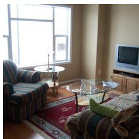  
(a) Original Bpp SR / SQ / SC

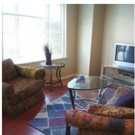  
(b) RAE-CoD 0.008260 95.8 / 100.0 / 70.2

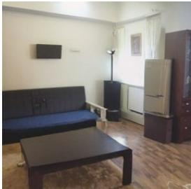  
(c) 16-bit RAE-CoD 0.000244 95.2 / 100.0 / 26.5

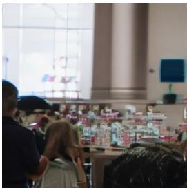  
(d) AEIC-ME 0.003482 53.0 / 24.4 / 5.0  
Figure 12: Qualitative examples at 256 × 256 for the VLM evaluation. RAE-CoD at 0.008260 bpp preserves the room layout and principal objects. Its 16-bit reconstruction remains coherent and recognizable but replaces much of the source-specific furniture. AEIC-ME at 0.003482 bpp instead produces a severely degraded, source-unrelated scene, yielding low SR, SQ, and SC.

Table 6: Candidate-unit outputs for the reconstructions in Fig. 12. The quality tuple is ordered as (clarity, structure, naturalness, artifact non-dominance).
<table><tr><td rowspan=1 colspan=4>Case Unit Reconstruction-only semantic description                                 Wc pcQuality tuple → qc</td></tr><tr><td rowspan=9 colspan=4>C1 A living room interior with furniture arranged around a central coffee table595 (6, 7, 6, 4)) → 59C2 A patterned armchair with a floral or paisley design in earth tones          490 (6, 7, 6, 5)C3 A glass-topped coffee table with a metal base in the center of the room     490 (6, 7,6,5)→ 61C4 A large areà rug with a geometric pattern of blue, red, and white squares   385 (6, 7, 6, 5)→ 61C5 A small, round, dark-colored side table with curved legs near the window  3 85 (6,7,6,5)(b)C6 A television set on a low cabinet in the background right                   3 80 (5,6,5,5)→ 53C7 A large window with horizontal blinds on the left wall                     2 90 7,8,8,7C8 A vase containing dried branches or twigs on the side table                2 75 (5, 6, 6, 5)→ 55C9 A partial view of a matching patterned sofa in the right foreground         2 80 (6, 7, 6, 5)C10 Reddish-brown flooring, likely wood or laminate                            70 (5, 6, 5, 5)→ 53</td></tr><tr><td rowspan=1 colspan=1>→ 61</td></tr><tr><td rowspan=1 colspan=1>→ 61</td></tr><tr><td rowspan=1 colspan=1>→ 61</td></tr><tr><td rowspan=1 colspan=1>→ 61</td></tr><tr><td rowspan=1 colspan=1>→ 53</td></tr><tr><td rowspan=1 colspan=1>→ 75</td></tr><tr><td rowspan=1 colspan=2>275(5,6.6.5</td><td rowspan=1 colspan=1>→ 55</td></tr><tr><td rowspan=1 colspan=1>→ 61</td></tr><tr><td rowspan=10 colspan=3>C1 A sparsely furnished living room or studio apartment interior              5 95 (6, 7, 7, 4)C2 A dark, rectangular coffee table in the foreground                         490 (7,8,8,7)C3 A dark futon or sofa bed with a blue mattress cover                        490C4 A tall, beige refrigerator standing on a dark pedestal                       385 (6, 7, 7,6)C5 A tall, dark wooden cabinet or hutch                                      380(c)C6 A black floor lamp in the corner                                           2 80 (6, 7, 7, 6)C7 A window with sheer white curtains                                       2 85 (6, 7, 7,6)C8 A small, dark rectangular object mounted on the wall                      2 60 (5, 6, 6, 6)C9 Light-colored walls and wood-laminate flooring                           2 90C10 Flash-photography lighting                                                190</td><td rowspan=1 colspan=1>→ 61</td></tr><tr><td rowspan=1 colspan=1>7,8,8,7</td><td rowspan=1 colspan=1>→ 75</td></tr><tr><td rowspan=1 colspan=1>7,8.8.7</td><td rowspan=1 colspan=1> → 75</td></tr><tr><td rowspan=1 colspan=1>6.7.7.6</td><td rowspan=1 colspan=1>→ 65</td></tr><tr><td rowspan=1 colspan=1>6,7,7,6</td><td rowspan=1 colspan=1>→ 65</td></tr><tr><td rowspan=1 colspan=1>6.7.7.6</td><td rowspan=1 colspan=1>→ 65</td></tr><tr><td rowspan=1 colspan=1>6,7,7,6</td><td rowspan=1 colspan=1>→ 65</td></tr><tr><td rowspan=1 colspan=1>5, 6, 6, 6</td><td rowspan=1 colspan=1>→ 57</td></tr><tr><td rowspan=1 colspan=1>7.8.7.7</td><td rowspan=1 colspan=1>→ 73</td></tr><tr><td rowspan=1 colspan=1>8,8,5,7</td><td rowspan=1 colspan=1>→ 72</td></tr><tr><td rowspan=6 colspan=2>C1 A crowded indoor public space, likely a retail or exhibition area           560C2 A group of people seen from behind and looking toward the display        4 70C3 A long reflective counter containing many small, indistinct colorful items  460(d)C4 A large, light-colored structural pillar in the middle ground                380C5 A large background window admitting bright, overexposed light           2 80C6 A blue square object mounted on the background wall                     2 70</td><td rowspan=1 colspan=1>(3, 4, 4, 2)</td><td rowspan=1 colspan=1>→ 33</td></tr><tr><td rowspan=1 colspan=1>(3, 4, 4, 3)</td><td rowspan=1 colspan=1>→ 35</td></tr><tr><td rowspan=1 colspan=1>(2,4,3,3)</td><td rowspan=1 colspan=1>→ 30</td></tr><tr><td rowspan=1 colspan=1>(4, 6, 5, 6)</td><td rowspan=1 colspan=1>→ 52</td></tr><tr><td rowspan=1 colspan=1>(3, 5, 4, 5)</td><td rowspan=1 colspan=1>→ 42</td></tr><tr><td rowspan=1 colspan=1>(3, 5, 4, 5)</td><td rowspan=1 colspan=1>→ 42</td></tr></table>

The frozen evaluator uses Qwen3.5-9B with greedy decoding and schema-constrained JSON output. Codec identity, bitrate, filename, conventional metrics, and other methods’ outputs are never supplied to the model. We retain the raw scores, normalized scores, SC subcomponents, and the fractions clipped at either anchor. The three metrics are intentionally independent: a natural but source-unrelated image can obtain high SR and SQ but low SC. These model-based judgments are used as a large-scale diagnostic rather than a replacement for human evaluation.

## B.2 QUALITATIVE EXAMPLES

We use image MSCOCO-30K/000000002347.png to contrast three reconstruction outcomes: a source-preserving RAE-CoD reconstruction, a recognizable but source-divergent RAE-CoD reconstruction at 16 bits, and a semantically collapsed AEIC-ME reconstruction with low recognizability, quality, and consistency. Fig. 12 reports the final SR, SQ and SC scores. The unit-level evidence underlying the raw scores is summarized in Table 6.

JPEG-identity normalization for this source. For SR, the identity and JPEG anchors are $( \mathrm { U ^ { S R } , L ^ { S R } } ) \stackrel { \bullet } { = } ( 8 8 . 1 4 8 , 4 5 . 2 9 4 )$ ; for SQ, $( \mathrm { U } ^ { \mathrm { S Q } } , \mathrm { L } ^ { \mathrm { S Q } } ) = ( 5 3 . 7 7 8 , 3 2 . 1 \dot { 7 } 6 )$ . The $( \mathrm { S R } ^ { \mathrm { r a w } } , \mathrm { S Q } ^ { \mathrm { r a w } } )$ pairs for RAE-CoD, 16-bit RAE-CoD, and AEIC-ME are (86.379, 60.103), (86.071, 67.393), and (68.000, 37.450), respectively. Per-image normalization maps them to the final pairs (95.872, 100.000), (95.153, 100.000), and (52.985, 24.414) shown in Fig. 12. The two RAE-CoD SQ values exceed the clean-image SQ anchor and are therefore clipped to 100, whereas the AEIC ME value lies between the JPEG and identity anchors.

RAE-CoD: source-preserving reconstruction. The source inventory describes a naturally lit living room containing striped seating, a glass coffee table, a red patterned rug, a television and stand, and a side table with a lamp. At 0.008260 bpp, RAE-CoD retains the room type, principal furniture, and overall layout, although some colors and smaller attributes change. After JPEG-identity normalization, its final scores are SR = 95.872 and $\mathrm { S Q } ~ = ~ 1 0 0 . 0 \bar { 0 } 0$ The source-to-candidate similarities are $( 8 5 , 6 0 , 9 5 , 5 5 , 9 0 , 4 5 , 9 0 , 8 5 , 0 , 0 )$ , and the reverse similarities are (85, 60, 95, 55, 90, 90, 90, 40, 60, 85). These outputs give global similarity $G = 6 5 . 0 0 0$ , recall $\rho = 7 1 . 1 1 1$ , precision $\pi = 7 6 . 3 7 9$ , and $F = 7 3 . 6 5 1$ , producing $\mathrm { S C } = 7 0 . 1 9 1$

16-bit RAE-CoD: high-quality but source-divergent reconstruction. At 16 bits (0.000244 bpp), the reconstruction-only inventory still recognizes a coherent living room or studio apartment, including a coffee table, futon, refrigerator, cabinet, lamp, and window. It therefore retains high final source-blind scores, with $\mathrm { S R } = 9 5 . 1 5 3 $ and $\mathrm { S Q } = 1 0 0 . 0 0 0$ . However, most source-specific content has been replaced: the source-to-candidate similarities fall to (40, 30, 30, 0, 20, 40, 50, 60, 60, 0), while the reverse similarities are (40, 30, 30, 0, 20, 40, 50, 20, 60, 0). Consequently, $G = 2 0 . 0 0 \dot { 0 }$ $\rho = 3 1 . 8 5 2 , \pi = 3 0 . 0 0 0$ , and $F = 3 0 . 8 9 8 ,$ giving $\mathrm { S C } = 2 6 . 5 3 9$

AEIC-ME: low-quality and source-inconsistent reconstruction. Although AEIC-ME uses 0.003482 bpp, more than fourteen times the rate of the 16-bit RAE-CoD, its output is interpreted as a crowded retail or exhibition space containing several people, a display counter, a pillar, and a window. Heavy blur, block, lost detail, and color smearing make the semantic units difficult to identify and poorly formed. Its final scores fall to $\mathrm { S R } ~ \stackrel { - } { = } ~ 5 2 . 9 8 5$ and $\mathrm { S Q } ~ = ~ 2 4 . 4 1 4$ The only unit-level overlap is the generic presence of a window: the source-to-candidate similarities are $( 0 , 0 , 0 , 0 , 0 , \bar { 0 , } 2 0 , 0 , 0 , \bar { 0 } )$ and the reverse similarities are $( 0 , 0 , 0 , 0 , 2 0 , 0 )$ . Together with $G = 1 0 . 0 0 0$ , this gives ρ = 1.481, π = 2.000, $F = 1 . 7 0 2$ , and $\mathrm { S C } = 5 . 0 2 1$ . The example therefore captures semantic collapse: the reconstruction is both difficult to recognize as coherent content and largely unrelated to the source, despite receiving substantially more bits than the 16-bit RAE-CoD.

## C REVERSE-CHANNEL CODING WITH DIFFC

## C.1 ALGORITHM

DiffC turns the variational structure of a pretrained diffusion model into a progressive lossy code (Theis et al., 2022; Liu et al., 2025). Let $x _ { 0 }$ denote the datum in the model’s native space and consider the variance-preserving forward marginal

$$
q ( x _ { t } \mid x _ { 0 } ) = { \cal N } \big ( \sqrt { \bar { \alpha } _ { t } } x _ { 0 } , \bar { \beta } _ { t } I \big ) , \qquad \bar { \beta } _ { t } = 1 - \bar { \alpha } _ { t } .\tag{11}
$$

For a transition from noise level t to a cleaner level $s < t ,$ let $\alpha _ { t | s } = \bar { \alpha } _ { t } / \bar { \alpha } _ { s }$ and $\beta _ { t | s } = 1 - \alpha _ { t | s }$ The tractable Gaussian bridge is

$$
q ( x _ { s } \mid x _ { t } , x _ { 0 } ) = \mathcal { N } ( A _ { s , t } x _ { 0 } + B _ { s , t } x _ { t } , \sigma _ { s , t } ^ { 2 } I ) ,\tag{12}
$$

where

$$
A _ { s , t } = \frac { \sqrt { \bar { \alpha } _ { s } } \beta _ { t | s } } { \bar { \beta } _ { t } } , \quad B _ { s , t } = \frac { \sqrt { \alpha _ { t | s } } \bar { \beta } _ { s } } { \bar { \beta } _ { t } } , \quad \sigma _ { s , t } ^ { 2 } = \frac { \bar { \beta } _ { s } } { \bar { \beta } _ { t } } \beta _ { t | s } .\tag{13}
$$

The encoder knows $x _ { 0 }$ , whereas both encoder and decoder can evaluate the diffusion prediction $\hat { x } _ { 0 } = f _ { \theta } ( x _ { t } , t )$ from their shared state. Replacing $x _ { 0 }$ by $\scriptstyle { \hat { x } } _ { 0 }$ defines the model proposal

$$
p _ { \theta } ( x _ { s } \mid \boldsymbol { x } _ { t } ) = \mathcal { N } ( A _ { s , t } \hat { x } _ { 0 } + B _ { s , t } x _ { t } , \sigma _ { s , t } ^ { 2 } I ) .\tag{14}
$$

After standardizing by the common covariance, the proposal and target are $P = \mathcal { N } ( 0 , I )$ and $Q =$ $\mathcal { N } ( m , I )$ , where

$$
m = { \frac { A _ { s , t } } { \sigma _ { s , t } } } ( x _ { 0 } - { \hat { x } } _ { 0 } ) , \qquad D _ { \mathrm { K L } } ( Q \| P ) = { \frac { \| m \| _ { 2 } ^ { 2 } } { 2 \ln 2 } } { \mathrm { ~ b i t s . } }\tag{15}
$$

Thus, a better diffusion prediction directly reduces the information needed to communicate the next posterior state.

Reverse-channel coding communicates a draw from $Q$ when both parties know P and share pseudorandomness. In the Poisson functional representation (PFR) used by DiffC, both parties generate candidates $z _ { n } \sim P$ and exponential arrival times $T _ { n }$ . The encoder selects

$$
n ^ { * } = \arg \operatorname* { m i n } _ { n } T _ { n } { \frac { p ( z _ { n } ) } { q ( z _ { n } ) } }\tag{16}
$$

and transmits only the winning index; the decoder regenerates the same sequence and recovers $z _ { n ^ { * } }$ . Its expected description length is close to $D _ { \mathrm { K L } } ( Q \| P )$ , with logarithmic overhead. Since candidate search grows exponentially with the number of bits, the implementation partitions the latent coordinates into independent chunks, limits each chunk to a small bit budget, and arithmeticcodes the winner indices under the induced Zipf model.

Starting from shared $x _ { T } \sim \mathcal { N } ( 0 , I )$ , the encoder progressively communicates posterior samples toward $x _ { 0 }$ . In the idealized scheme, the cumulative rate down to a stopping time $t ^ { * }$ is

$$
R ( t ^ { * } ) \simeq D _ { \mathrm { K L } } ( q ( x _ { T } \mid x _ { 0 } ) \| p ( x _ { T } ) ) + \sum _ { ( t , s ) : T  t ^ { * } } D _ { \mathrm { K L } } ( q ( x _ { s } \mid x _ { t } , x _ { 0 } ) \| p _ { \theta } ( x _ { s } \mid x _ { t } ) ) .\tag{17}
$$

Exact coding continues to $x _ { 0 }$ . For lossy compression, DiffC stops at $x _ { t } { \mathrm { : } }$ ∗ and completes the trajectory with deterministic probability-flow denoising. Stopping earlier transmits fewer bits and delegates more decisions to the generative prior; the code is progressive because each additional transition refines the previously shared state.

The three models evaluated in Sec. 2.2 are trained with a linear flow path $y _ { t } = ( 1 - t ) x _ { 0 } + t \epsilon$ . We convert it to the variance-preserving (VP) form in Eq. equation 11 by

$$
n ( t ) = \sqrt { ( 1 - t ) ^ { 2 } + t ^ { 2 } } , \qquad x _ { t } = \frac { y _ { t } } { n ( t ) } , \qquad \bar { \alpha } _ { t } = \frac { ( 1 - t ) ^ { 2 } } { n ( t ) ^ { 2 } } , \quad \bar { \beta } _ { t } = \frac { t ^ { 2 } } { n ( t ) ^ { 2 } } .\tag{18}
$$

The denoiser is evaluated in its native flow coordinates to obtain ${ \hat { x } } _ { 0 } ;$ the common Gaussian bridge and reverse-channel coder can then be applied without retraining.

## C.2 DIFFC ON DIFFERENT DIFFUSION MODELS

We wrap three pretrained class-conditioned generators with the same DiffC pipeline. The evaluation set is a balanced subset of 5,000 ImageNet validation images, containing five center-cropped 256 × 256 images from each of the 1,000 classes. The source class is available to both parties and is charged as a fixed 10-bit message, or $1 0 / 2 5 6 ^ { 2 } = 0 . 0 0 0 1 5 3$ bpp. For each image, progressive encoding is run once to the maximum rate, and the state nearest each target rate is retained. The reported coding rate consists of the arithmetic-coded PFR payload and the class label. File headers and stored experimental timestep/KL metadata are excluded consistently for all three models.

For Pixel-DiT, the source itself, scaled to [−1, 1], is the diffusion datum. For VAE-DiT, we use a deterministically seeded sample from the frozen VAE posterior; for RAE-DiT, we use the normalized DINOv3 representation. Since all three generators use rectified flow, Eq. equation 18 supplies a common VP process for reverse-channel coding. After the selected noisy state is recovered, each model follows its native Euler trajectory and released guidance setting. These controls isolate the effect of diffusion space while preserving the model-specific sampler required for valid generation.

Fig. 13 gives the corresponding unaggregated semantic values for Fig. 5. Across all five VFMs, RAE-DiT has the best feature MSE, cosine similarity and Frechet Distance throughout the extreme- ´ rate range up to approximately 0.056 bpp. At higher rates, Pixel-DiT eventually overtakes it because direct pixel generation has no autoencoder reconstruction ceiling.

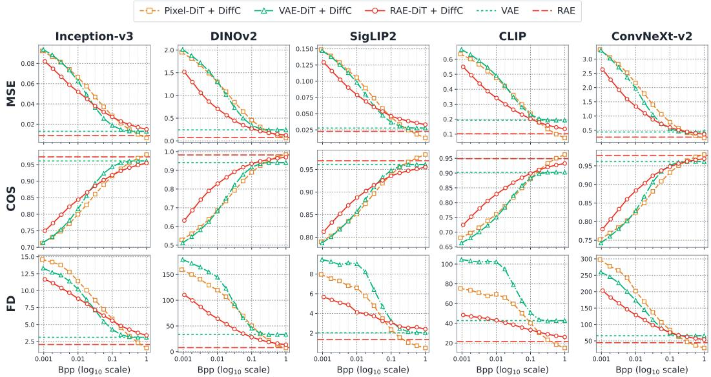  
Figure 13: Unaggregated semantic results for the DiffC space comparison. Rows report feature MSE, cosine similarity, and Frechet Distance; columns correspond to the five VFMs used by our´ aggregate metrics. Horizontal lines denote the reconstruction ceilings of the frozen VAE and RAE. These are the per-representation results underlying Fig. 4.

## C.3 ONE-STEP DIFFC FOR 16-BIT RAE-COD

The 16-bit RAE-CoD condition constrains broad content but does not determine a unique reconstruction, so different initial noise samples can change identity or layout. The one-step experiment in Sec. 5.3 adds a single target-dependent transition near the pure-noise endpoint while leaving RAE-CoD unchanged. The encoder forms the clean normalized RAEv2 target $x _ { 0 }$ and the decoded codec condition c. Both sides start from the same seeded $x _ { 1 } \sim \mathcal { N } ( 0 , I )$ and evaluate the conditioned denoiser to obtain $\hat { x } _ { 0 } = f _ { \theta } ( x _ { 1 } , 1 , c )$ . For a destination time $s < 1$ , the posterior and proposal simplify to

$$
\begin{array} { r } { q ( x _ { s } \mid x _ { 0 } ) = \mathcal { N } ( \sqrt { \bar { \alpha } _ { s } } x _ { 0 } , \bar { \beta } _ { s } I ) , \qquad p ( x _ { s } \mid x _ { 1 } , c ) = \mathcal { N } ( \sqrt { \bar { \alpha } _ { s } } \hat { x } _ { 0 } , \bar { \beta } _ { s } I ) , } \end{array}\tag{19}
$$

so the ideal additional rate is

$$
R _ { \mathrm { D i f f C } } = \frac { 1 } { 2 \ln 2 } \left( \frac { 1 - s } { s } \right) ^ { 2 } \| x _ { 0 } - \hat { x } _ { 0 } \| _ { 2 } ^ { 2 } \quad \mathrm { b i t s } .\tag{20}
$$

A chunked PFR search selects a source-compatible noisy state, the receiver reproduces it from shared randomness and the winner indices, and the original 100-step shifted Euler sampler of RAE-CoD resumes at s. The matched no-DiffC baseline uses the same codec condition, initial noise, and sampler but starts directly at t = 1.

The approximately four extra bits quoted in Sec. 5.3 are the ideal KL quantity in Eq. equation 20. The current diagnostic executes both PFR sides and verifies exact equality of the recovered noisy states, but passes the winner indices and KL metadata in memory. It does not yet serialize a standalone DiffC fragment or count its arithmetic-coder termination, metadata, byte-alignment, and container overhead. The 20-bit point should therefore be interpreted as a theoretical-rate analysis showing that very little additional source information can reduce sampling ambiguity, rather than as the measured size of a deployable file.

## D ADDITIONAL IMPLEMENTATION DETAILS

## D.1 MODEL DETAILS

Table 7 traces RAE-CoD at 256 × 256 resolution. The frozen RAEv2 encoder adopts the DINOv3- L/16 encoder and extracts layers {11, 13, 15, 17, 19, 21, 23}, averages their patch tokens, adds a broadcast global mean from the last selected layer, and applies the pretrained RAEv2 channel-wise normalization. This produces $x _ { 0 } \in \mathbb { R } ^ { 1 0 2 4 \times 1 6 \times \tilde { 1 6 } }$ . The pixel encoder uses Inception-style depthwise convolutions and gated channel mixing (Zhang et al., 2025). Its output is concatenated with the spatial DINOv3 map before producing $y .$ The four spatial masks decode complementary subsets of y sequentially; at each pass, the hyperprior and previously decoded coefficients predict a Gaussian mean and scale for the next subset. The reconstructed main latent $\hat { y }$ and hyperprior are concatenated and decoded into 256 condition tokens. The final codec contains approximately 57.2M parameters. Its auxiliary head is used only for training and aligns conditions with the DINOv3 targets. The RAEv2 DDT contains approximately 875.4M parameters, and the RAEv2 decoder remains frozen.

Table 7: RAE-CoD architecture at $2 5 6 \times 2 5 6 .$ Spatial sizes omit the batch dimension.
<table><tr><td>Component</td><td>Construction</td><td>Output</td></tr><tr><td></td><td>RAEv2 encoder DINOv3-L/16 with seven-layer aggregation and normalization</td><td> $x _ { 0 } : 1 0 2 4 \times 1 6 \times 1 6$ </td></tr><tr><td>Pixel encoder</td><td>Four 2× downsampling stages with channels 64, 128, 192, 256</td><td> $2 5 6 \times 1 6 \times 1 6$ </td></tr><tr><td>Latent encoder</td><td>Concatenate both maps, project, and downsample once</td><td> $y : 2 5 6 \times 8 \times 8$ </td></tr><tr><td>Hyper encoder</td><td>Two 2× downsampling stages</td><td> $z : 2 5 6 \times 2 \times 2$ </td></tr><tr><td>VQ bottleneck</td><td>4-bit (16-entry) vector codebook</td><td> $\hat { z } : 2 5 6 \times 2 \times 2$ </td></tr><tr><td>Hyper decoder</td><td>Two 2× upsampling stages to produce a hyperprior</td><td> $2 5 6 \times 2 \times 2$ </td></tr><tr><td>Entropy model</td><td>Scalar quantization with 4-step quadtree-partition spatial context and a Gaussian entropy model</td><td> $\hat { y } : 2 5 6 \times 8 \times 8$ </td></tr><tr><td>Latent decoder</td><td>Fuse ê and  $\hat { y } ,$  and two 2× upsampling stages</td><td> $c : 1 1 5 2 \times 1 6 \times 1 6$ </td></tr><tr><td>Auxiliary head</td><td>Token-wise MLP  $\mathrm { 1 1 5 2 \to 1 0 2 4 \to 1 0 2 4 }$ </td><td>256 tokens</td></tr><tr><td>RAEv2 DDT</td><td>28 transformer encoder blocks (width 1440, 20 heads) and 2 trans- former decoder blocks (width 2048, 16 heads)</td><td> $\hat { x } _ { 0 } : 1 0 2 4 \times 1 6 \times 1 6$ </td></tr><tr><td></td><td>RAEv2 decoder 28-layer transformer, width 1152, 16 heads, patch size 16</td><td> $3 \times 2 5 6 \times 2 5 6$ </td></tr></table>

## D.2 TRAINING DETAILS

Training uses 23.2M images from ImageNet-21K and CC12M, resized and center-cropped to $2 5 6 \times$ 256. The RAEv2 encoder and decoder remain frozen, while the codec is learned from scratch. Diffusion time is sampled by drawing u = sigmoid(ξ) for $\xi \sim \mathcal { N } ( 0 , 1 )$ and applying $t = 8 u / [ 1 +$ 7u]. The conditioning input is dropped with probability 0.1 to train the unconditional branch used by guidance. The full DDT output and the early output after encoder block 8 are trained against the same flow target. We use $\lambda _ { \mathrm { R E P A } } = 1 , \lambda _ { \mathrm { V Q } } = 0 . 2 5$ , and $\lambda _ { \mathrm { a u x } } = 0 . 5$

During Stage I, LoRA is inserted into the attention, feed-forward, adaptive-normalization, and output projections of the pretrained DDT. The base parameters remain frozen while the new codec, condition projection, and LoRA parameters adapt to compression. After the initial warm-up, the increasing rate weight progressively removes information from y. During Stage II, the appropriate Stage-I checkpoint initializes each target rate, the LoRA weights are merged, and the complete DDT is optimized jointly with the codec. This separation avoids abruptly perturbing the pretrained prior when compression training begins.

## D.3 INFERENCE DETAILS

We evaluate the EMA model weights. The hyper latent z is replaced by its nearest entry in the 4-bit codebook (16-entry), and the main latent $y$ is rounded using means predicted from the hyperprior and previously decoded partitions. The reported rate for a $2 5 6 \times 2 5 6$ image is

$$
R = { \frac { - \log _ { 2 } p ( { \hat { y } } ) + 1 6 } { 2 5 6 ^ { 2 } } } \quad { \mathrm { b p p } } ,\tag{21}
$$

where the 16-bit term is the exact fixed-length hyper latent payload. The decoded condition is flattened into 256 tokens and reused at every diffusion step. We initialize a $1 0 2 4 \times 1 6 \times 1 6$ Gaussian state, integrate the shifted Euler trajectory for 100 steps, and apply internal guidance as $x _ { \mathrm { b a s e } } + 1 . 7 8$ $( x _ { \mathrm { f u l l } } - x _ { \mathrm { b a s e } } )$ over $t \in [ 0 . 1 , 1 ]$ following (Singh et al., 2026). Classifier-free guidance is disabled. Finally, the frozen RAE decoder maps the generated representation back to RGB pixels.

Table 8: RAE-CoD training and inference configuration.
<table><tr><td>Setting</td><td>Stage I</td><td>Stage II / inference</td></tr><tr><td>Initialization</td><td>Pretrained RAEv2 encoder, DDT and de- Corresponding Stage-I rate checkpoint coder; new codec, DDT LoRAs and con- dition projection</td><td></td></tr><tr><td></td><td>Trainable parameters Codec, LoRA (r = 32), condition pro- Codec and all DDT parameters jection, and output interfaces</td><td></td></tr><tr><td>Frozen modules</td><td>RAEv2 encoder, decoder and the base RAEv2 encoder and decoder DDT parameters</td><td></td></tr><tr><td>Rate weight λrate</td><td>Undergoes 0.1, 2, 12, 16, 24, 32, and 48 Fixed in {12, 16, 24, 32, 48}</td><td></td></tr><tr><td>Rate schedule</td><td>0.1 at step 0, 2 at 20K, then 12, 16, 24, 100K steps for each operating point 32, 48 at 30K intervals starting at 30K</td><td></td></tr><tr><td>Learning rate</td><td> $1 0 ^ { - 4 }$ </td><td>10⁻⁵</td></tr><tr><td>Optimizer</td><td>AdamW, zero weight decay</td><td>AdamW, zero weight decay</td></tr><tr><td>Precision</td><td>BF16 mixed precision</td><td>BF16 mixed precision</td></tr><tr><td>Effective batch</td><td>128</td><td>128</td></tr><tr><td>GPU hardware</td><td>Four NVIDIA A100 GPUs</td><td>Four NVIDIA A100 GPUs</td></tr><tr><td>EMA</td><td>Decay 0.9995</td><td>Decay 0.9995</td></tr><tr><td>Sampling</td><td></td><td>100-step Euler; time shift 8; internal guidance 1.78 on t ∈ [0.1, 1]; no CFG</td></tr></table>

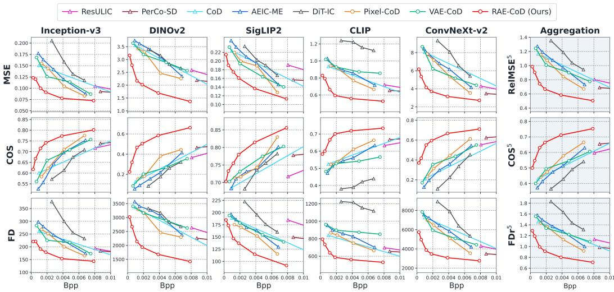  
Figure 14: VFM-based semantic evaluation on Kodak at $2 5 6 \times 2 5 6$ . We report feature MSE, cosine similarity, and Frechet Distance in five VFM spaces, together with their aggregate metrics.´

## E ADDITIONAL COMPARISON ON KODAK

Fig. 14 extends the VFM comparison to Kodak. RAE-CoD traces the strongest overall rate-semantic envelope, obtaining lower feature MSE and Frechet Distance and higher cosine similarity than the´ alternatives at comparable rates across the aggregate metrics and individual VFM spaces. This advantage persists toward the 16-bit endpoint.

## F ADDITIONAL VISUALIZATION

Fig. 15 shows the progressive visual behavior of RAE-CoD on more examples. As the rate decreases from roughly 0.007–0.008 bpp to 16 bits, fine appearance and source-specific attributes are lost first, followed by changes in object identity and spatial arrangement. Nevertheless, the outputs remain

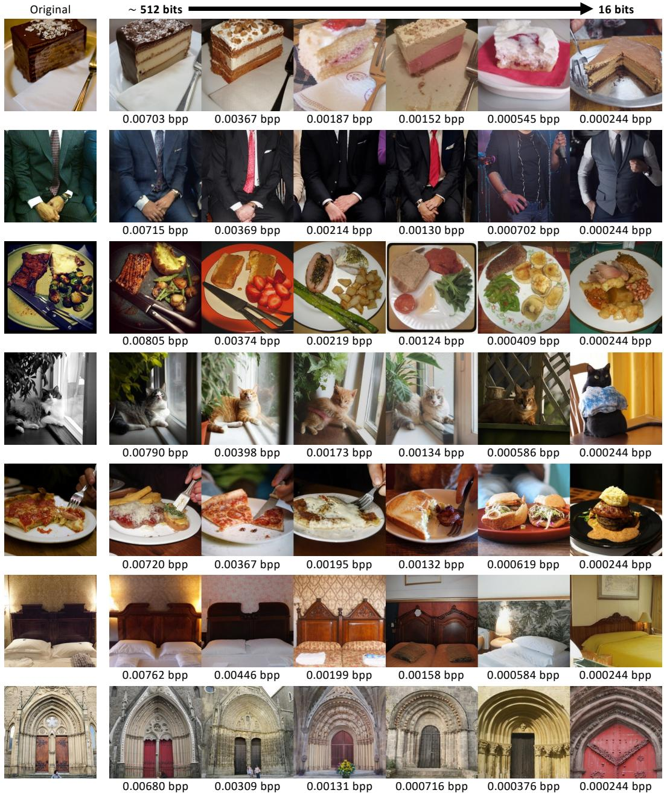  
Figure 15: Additional visual examples of RAE-CoD on MSCOCO-30K at 256 × 256. From approximately 512 bits to 16 bits (0.000244 bpp), the reconstructions exhibit graceful semantic erosion from the source while remaining visually coherent.

recognizable and naturally structured even when their correspondence to the source becomes weak. The repeated transition across examples visually supports the intended shift from faithful reconstruction toward unconditional generation, rather than an abrupt collapse into malformed content.