# RETHINKING MULTI-IMAGE RE-REPRESENTATION IN MULTI-IMAGE UNDERSTANDING

Gengyuan Zhang∗ † LMU Munich MCML

Xiao Han∗ LMU Munich

Xinyu Xie LMU Munich

Tong Liu LMU Munich MCML

Volker Tresp LMU Munich MCML

## ABSTRACT

Multi-image understanding requires MLLMs not only to recognise the content of individual images, but also to organise visual evidence distributed across them. We study this problem through multi-image re-representation, viewing prompted Chainof-Thought reasoning and agentic visual tool use as different ways of re-organising visual evidence during reasoning. We introduce Mosaic, a general-purpose multiimage visual harness that enables an MLLM to actively construct visual intermediates with ten composable image operations. We compare five re-representation settings on existing multi-image benchmarks and on MosaicBench, a new groundingfocused benchmark for fine-grained multi-image understanding. Our experiments show that the relative benefits of textual and visual re-representation are strongly task-dependent. Visual re-representation is particularly effective for tasks requiring precise visual evidence, including hypothesis testing, precision comparison, and orientation-sensitive reasoning, while tasks dominated by higher-level semantic content show smaller or less consistent gains. Building on this finding, we train MosaicAgent-8B to use Mosaic with reinforcement learning using only accuracy and format rewards. Without demonstration trajectories or rewards for specific tool-use, the agent learns to compose visual operations over multiple steps and exhibits diverse problem-solving patterns unpromptedly. Code and data will be released at https://github.com/gengyuanmax/Mosaic.

## 1 INTRODUCTION

Current multimodal large language models (MLLMs) handle varied vision tasks using contexts that interleave text and multiple images, across domains such as general visual question answering, video understanding, and embodied vision. Many such tasks require more than recognising the content of each image independently: the relevant evidence may be subtle, differently oriented, distributed across images, or only apparent after the images are transformed or combined. A conventional MLLM encodes each image into visual tokens and reasons over them together with text (Bai et al., 2025; An et al., 2025). Cross-image relations can therefore be represented implicitly in the model’s context. During reasoning, however, the same visual evidence can also be re-organised into intermediate representations that make task-relevant details or relations easier to use. We refer to this process as multi-image re-representation: constructing intermediate representations from the source images to support subsequent reasoning. This formulation also covers single-image inputs, since iterative visual operations can create multiple derived views that the model reasons over.

Re-representation can take different forms. Multimodal chain-of-thought (CoT) organises evidence in language, for example by describing image content, referring back to source images, and expressing relations between them (Wei et al., 2022). By contrast, agentic approaches advocate revisiting the raw vision space instead to construct new image views that the model can inspect during subsequent reasoning. Recent Thinking-with-Images methods (Zheng et al., 2025; Su et al., 2025b; Hu et al., 2024) enable operations such as cropping or zooming during inference as active perception. The distinction is simple but important: textual re-representation changes how visual evidence is expressed in language, whereas visual re-representation can also change how that evidence is presented.

RQ1: This raises a basic question for multi-image understanding: when is visual re-representation more useful than textual reasoning? The answer is unlikely to be uniform across tasks. Some questions can be answered from the semantic content already available across the images, whereas others depend on precise appearance, orientation, spatial relations, or the visual consequences of applying a transformation. As we later show in Sec. 4.1, existing multi-image benchmarks mix these different demands, making it difficult to identify when the visual re-representation itself is beneficial.

We study this question by comparing several forms of multi-image re-representation within a common framework. Our settings range from direct answering and free-form textual reasoning to guided textual re-description, online visual re-representation, and prefabricated visual intermediates. To instantiate visual re-representation, we introduce Mosaic, a multi-image visual harness that allows an MLLM to construct and reuse intermediate image views through operations such as cropping, geometric transformation, and image composition. This lets us compare not only textual and visual forms of re-representation, but also the use of visual intermediates with their online construction. We find that the relative benefits of textual and visual re-representation are strongly task-dependent. Visual re-representation is particularly effective for tasks that require precise visual evidence or finegrained relations across images, while tasks dominated by higher-level semantic content often show smaller or inconsistent gains. To examine these cases in greater detail, we introduce MosaicBench, a grounding-focused benchmark for fine-grained multi-image understanding.

RQ2: These results motivate a second question: how does an agent learn to construct useful visual re-representations? Unlike textual reasoning, visual re-representation requires the agent to choose which image assets to operate on, which operations to apply, and how to proceed from the resulting views. We train a model with Mosaic using reinforcement learning with only accuracy and format rewards, without demonstration trajectories or rewards for specific tool sequences. We find that this is sufficient for the agent to learn multi-step compositions of visual operations. Its trajectories also exhibit diverse problem-solving patterns that are not explicitly prescribed by the training objective.

Our main contributions include:

1. formulating multi-image re-representation and defining five re-representation settings.

2. introducing Mosaic, a multi-image visual harness for constructing, retaining, and reusing visual intermediates through composable image operations.

3. introducing MosaicBench and the training suite, providing grounding-focused evaluation and training data for fine-grained multi-image understanding.

4. training MosaicAgent-8B with simple rewards and showing that it learns multi-step visual tool use with diverse problem-solving behaviours.

## 2 RELATED WORK

Multi-image understanding. Multi-image understanding spans temporal reasoning over video frames, spatial reasoning across views, and comparison across image collections (Meng et al., 2024). MANTIS develops multi-image abilities through interleaved instruction tuning (Jiang et al., 2024). BLINK evaluates perception-intensive tasks, MMIU covers diverse semantic, temporal, and spatial relationships, and M4Bench tests alignment and discrimination across domains and granularities (Fu et al., 2024; Meng et al., 2024; Ye et al., 2025).

MLLMs for multi-image inputs. MLLMs accommodate multi-image inputs by conditioning language generation on interleaved images and text (Alayrac et al., 2022; Jiang et al., 2024). In this encode-then-reason setting, cross-image relationships are established through computation over the encoded visual context. Explicit textual reasoning provides an additional means of organising visual evidence: Multimodal-CoT generates intermediate rationales (Zhang et al., 2023), while PromptCap and QG-CoC use question-guided descriptions and multi-image caption chains, respectively (Hu et al., 2023; Kao et al., 2025).

Multi-image reasoning with visual agents. Thinking with Images enables models to inspect and manipulate visual inputs through external tools (Su et al., 2025b). DeepEyes learns local image inspection, while Visual Sketchpad and PyVision construct visual intermediates through sketching and executable code (Zheng et al., 2025; Hu et al., 2024; Zhao et al., 2025). VipAct combines focused captioning and multi-image comparison agents with perception tools (Zhang et al., 2026). Recent works focus on training such tool-mediated agents with reinforcement learning (Wu et al., 2025; Su et al., 2025a; Zhao et al., 2026). Task-specific agents for multi-image reasoning are also an emerging research direction (Wang et al., 2025a; Wu et al., 2026).

## 3 MULTI-IMAGE RE-REPRESENTATION FOR MULTI-IMAGE UNDERSTANDING

## 3.1 MULTI-IMAGE RE-REPRESENTATION

Answering a multi-image question can require grounding visual evidence dispersed across images. Rerepresentation organises this evidence into intermediate records for reasoning. Let $x = ( q , I _ { 1 } , \ldots , I _ { n } )$ contain a question and its ordered source images, and let $y$ denote an answer.

Definition 1 (Multi-image re-representation). Multi-image re-representation constructs a variablelength intermediate record $z \in \mathcal { Z } _ { m }$ from x to organise visual evidence for answering q. A rerepresenter is specified by the conditional distribution $p _ { \theta } ^ { m } ( z \mid x )$ , where $m \in \{ \mathrm { t e x t } , \mathrm { v i s u a l } \}$ denotes the representation form.

A solver $p _ { \phi } ( y \mid x , z )$ uses the record alongside the original input, giving the answer distribution

$$
p _ { \theta , \phi } ^ { m } ( \boldsymbol { y } \mid \boldsymbol { x } ) = \sum _ { z \in \mathcal { Z } _ { m } } \underbrace { p _ { \theta } ^ { m } ( z \mid x ) } _ { \mathrm { r e \mathrm { \mathrm { \mathrm { - } r e p r e s e n t e r } } } } \underbrace { p _ { \phi } ( \boldsymbol { y } \mid \boldsymbol { x } , z ) } _ { \mathrm { s o l v e r } } , \qquad m \in \{ \mathrm { t e x t } , \mathrm { v i s u a l } \} .\tag{1}
$$

The re-representer and solver are usually the same model.

Definition 2 (Textual re-representation). Textual re-representation uses a text sequence $z = d =$ $( d _ { 1 } , \ldots , d _ { L } ) \in \mathcal { V } ^ { * }$ as its intermediate record, where $\dot { \nu }$ is the text vocabulary. The sequence is generated autoregressively conditioned on x.

The textual record can describe visual content and express cross-image relations. Tool interaction additionally allows the model to construct new image views for inspection (Yao et al., 2022; Hu et al., 2024).

Definition 3 (Visual re-representation). Visual re-representation constructs visual intermediates through image operations. In the online setting, its record is the multimodal interaction trace $z = \tau = ( a _ { 1 } , o _ { 1 } , \dots , a _ { T } , o _ { T } )$ , where $a _ { t }$ contains model-generated text and a tool request or stop action, and $o _ { t }$ is the returned observation.

The trace ends with a stop action and an empty observation. Its distribution factorises as

$$
p _ { \theta } ^ { \mathrm { v i s u a l } } ( \tau \mid x ) = \prod _ { t = 1 } ^ { T } p _ { \theta } ( a _ { t } \mid x , \tau _ { < t } ) P _ { \mathrm { e n v } } ( o _ { t } \mid x , a _ { t } , \tau _ { < t } ) .\tag{2}
$$

The environment transforms or combines source images and retained intermediates. Each result is returned as a rendered image with a reusable reference and remains available for subsequent operations. The harness and tool interface are described in Sec. 3.2.

Both forms of re-representation organise evidence from the provided input. The following property characterises their information content relative to that input.

Closed-evidence re-representation. Let X, Z, and $Y ^ { \star }$ denote the random variables corresponding to the complete original input x (question and source images before visual tokenisation), the intermediate record z, and the ground-truth answer, respectively. In the closed-evidence setting, the model and tools obtain no external evidence or additional observations. With model parameters and tool implementations fixed, write $Z = g ( X , U )$ , where U collects the randomness used to generate the record and satisfies $U \perp Y ^ { \star } \mid X$ . Thus $Y ^ { \star } \perp Z \mid X$ , implying

$$
I ( Y ^ { \star } ; Z \mid X ) = 0 .\tag{3}
$$

This conditional-independence property follows from the stated assumptions; it is not an empirical finding. It concerns information about the answer beyond the complete input X. Cropping and re-encoding may expose details absent from the initial compressed visual tokens and improve their accessibility to the solver; conditional independence need not hold when conditioning only on those tokens.

Re-representation settings. We compare five settings that retain the original images and question and share the final-answer format.

A. No explicit re-representation $( N o \mathrm { - R e } ^ { 2 } )$ . The model returns only the final answer, without an explicit intermediate reasoning trace.

B. Free-form textual re-representation $( T \mathrm { - R e } ^ { 2 } )$ . The model generates a free-form reasoning trace before answering, using standard CoT prompting (Wei et al., 2022).

C. Prompt-guided textual re-representation $( P G { \mathrm { - R e } } ^ { 2 } ) $ . We extend $\mathrm { T } { \cdot } \mathrm { R e } ^ { 2 }$ with question-guided redescription instructions: describe relevant visual content, identify its source images, and organise cross-image comparisons (Kao et al., 2025).

D. Visual re-representation $( V { \mathrm { - R e } } ^ { 2 } )$ . The model performs online visual re-representation with Mosaic, following the interaction process in Eq. (2).

E. Prefabricated visual re-representation $( P V { \mathrm { R e } } ^ { 2 } )$ . We provide visual intermediates constructed in advance alongside the original input, omitting the interaction traces used to produce them. The model uses the same answer-stage prompt as $\mathrm { { T } { \cdot } \mathrm { { R e } ^ { 2 } } }$ without tool access. This setting separates the use of visual intermediates from their construction.

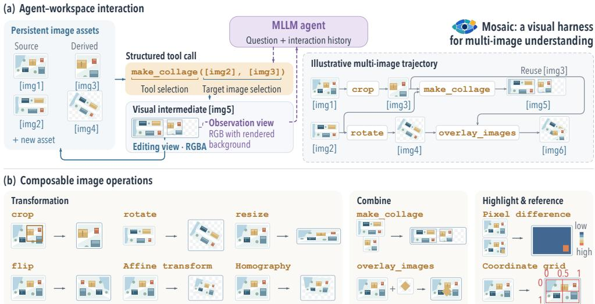  
Figure 1: Mosaic: a visual harness for multi-image understanding. (a) The model selects source or derived image assets, issues a structured operation call, and inspects the returned view. Each output is retained as a new asset for subsequent reuse. (b) Image operations transform individual views, combine evidence across images, and expose pixel-level differences.

## 3.2 MOSAIC: A MULTI-IMAGE VISUAL HARNESS

Multi-image reasoning can require selecting and re-organising visual evidence within and across images. Mosaic provides a persistent workspace in which an MLLM transforms and combines source images and retained intermediates into task-driven visual representations (Fig. 1).

Persistent image workspace. Source images and derived views are stored as separate assets with stable references, such as [img1]. Operations create new assets without modifying their inputs, allowing the model to build on a result or revisit an earlier version. In the shared workspace, each image asset has its own transparent canvas that expands to accommodate transformed or composited content beyond its original boundaries. Regions without image content remain transparent for subsequent composition. Each asset has an editing view (RGBA image) for subsequent processing and an observation view (RGB image) with transparent checkered background as MLLM inputs.

Composable image operations. Mosaic provides ten deterministic image operations on the source images and their derivatives. The model can construct visual representations over successive calls, using the output of one operation as the input to another. Geometric operations select or transform individual views; collage and overlay combine content from multiple assets. Pixel differencing exposes intensity discrepancies between aligned images, while a coordinate grid provides spatial references. Each operation is invoked through a structured call specifying the input assets and parameters. The harness stores the output as a new asset and returns its rendered view and reference to the model. Full tool specifications and rendering details are provided in Appx. A.1.

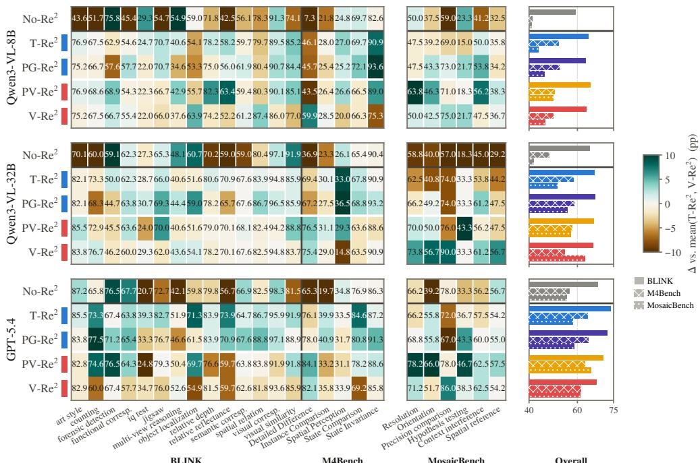  
Figure 2: Task-level comparison of re-representation methods. Rows show the five settings for Qwen3-VL-8B, Qwen3-VL-32B, and GPT-5.4. Cell values are accuracy (%) on BLINK and M4Bench tasks and on MosaicBench. from the mean of $\mathrm { T } \mathrm { { R e } ^ { 2 } }$ and $\mathrm { { V } { - } \mathrm { { R e } } ^ { 2 } }$ for each model and task. Bars on the right show overall benchmark accuracy.

## 4 COMPARING MULTI-IMAGE RE-REPRESENTATION METHODS

We first ask which form of multi-image re-representation is beneficial for which tasks.

## 4.1 EVALUATING ON EXISTING BENCHMARKS

Evaluation setup. We evaluate on BLINK (Fu et al., 2024), M4Bench (Ye et al., 2025) with finegrained subtasks. We compare $\mathrm { N o - R e ^ { 2 } , T - R e ^ { 2 } , P G - R e ^ { 2 } , P V - R e ^ { 2 } }$ , and $\mathrm { { \dot { V } - R e ^ { 2 } } }$ for Qwen3-VL-8B, Qwen3-VL-32B, and GPT-5.4, which are representative models with basic tool-calling capabilities. The prefabricated visual intermediates for $\mathrm { \bar { P } V - R e ^ { 2 } }$ are generated in advance by MosaicAgent-8B using Mosaic and are shared across all solvers.

The benefits vary across tasks. On M4Bench’s Detailed Difference task, Qwen3-VL-8B improves from 7.3% under $\mathrm { N o - R e ^ { 2 } }$ to 46.1% under $\mathrm { T } { \cdot } \mathrm { R e } ^ { 2 }$ and 59.9% under $\mathrm { { V - R e ^ { 2 } } }$ . Prompt-guided textual re-description reaches 45.7%. Visual re-representation also improves Detailed Difference over $\mathrm { T } { \mathrm { - R e } } ^ { 2 }$ for Qwen3-VL-32B and GPT-5.4, by 6.0 percentage points each. On State Comparison, however, all three models perform worse under $\mathrm { { \dot { V } { - } R e ^ { 2 } } }$ than under $\mathrm { \bar { T } \mathrm { - R e } ^ { 2 } }$ . The effect of re-representation therefore depends on the subtask required, even within the same benchmark.

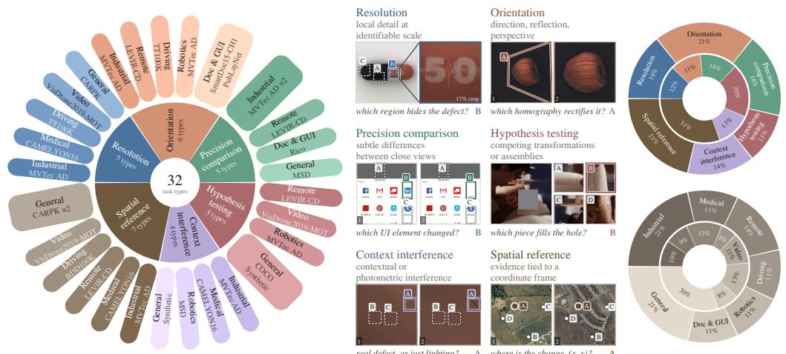  
Figure 3: MosaicBench overview. Left: task types organised by their categories and domains. Center: representative multi-image examples. Right: distributions across task (top) and domains (bottom).

Visual inputs and online construction have different effects. On BLINK’s Relative Depth task, Qwen3-VL-8B reaches 82.3% with prefabricated visual intermediates, compared with 78.2% under $\mathrm { T } { \cdot } \mathrm { R e } ^ { 2 }$ and 74.2% under $\mathrm { { V - R e ^ { 2 } } }$ . Thus, providing visual intermediates can improve performance on a task where online re-representation does not. This distinction motivates examining both the usefulness of visual representations and the policy that constructs and uses them.

These results motivate a more focused evaluation of tasks that require fine-grained visual recognition, geometric reasoning, and spatial localisation. We introduce MosaicBench next to examine these tasks in greater detail. The differences between $\mathrm { P V } { \mathrm { - R e } } ^ { \mathrm { 2 } }$ and $\mathrm { { V - R e ^ { 2 } } }$ motivate studying how visua intermediates are constructed during interaction. We next train a policy with Mosaic and examine changes in its performance and re-representation behaviour.

## 4.2 MOSAICBENCH: A GROUNDING-FOCUSED VISUAL UNDERSTANDING BENCHMARK

We introduce MosaicBench to evaluate re-representation on tasks requiring precise visual evidence and relations.

Task coverage. We construct 32 task types for training and evaluation, grouped by their core visual challenge: resolution, orientation, precision comparison, hypothesis testing, context interference, and spatial reference. Each example contains one to five images and a task-specific question. Fig. 3 illustrates representative tasks and their visual evidence.

Data construction. We draw images and annotations from 12 public datasets (VisDrone2019- MOT Wen et al. (2019), TT100K Zhu et al. (2016), CAMELYON16 Ehteshami Bejnordi et al. (2017), MVTec AD Bergmann et al. (2019), CARPK Hsieh et al. (2017), PubLayNet Zhong et al. (2019), LEVIR-CD Chen & Shi (2020), SmartDoc15-CH1 Burie et al. (2015), MSD Yang et al. (2019), Rico Deka et al. (2017), COCO Lin et al. (2014), and BDD100K Yu et al. (2020)) to construct multiimage visual tasks from annotation augmentation. Annotation-based selection identifies relevant objects, regions, and correspondences. Controlled transformations create related views through geometric changes, local edits, and rearrangements. Ground-truth answers follow source annotations or known construction parameters.

Evaluation. We construct MosaicBench from the same generated data, excluding overlap with the training suite at the sample, source, and image levels. The resulting benchmark contains 560 examples across 28 task types, with 20 examples per type. Detailed task-construction procedures are provided in Appx. B.5 and B.6. Of the 28 task types, 26 use four answer options with balanced correct-answer positions.

Table 1: Overall performance. We report performance on five benchmarks including MosaicBench. Bold scores mark the best reported result among the open-weight baselines and MosaicAgent-8B.
<table><tr><td rowspan="2">Model</td><td colspan="7">MosaicBench</td><td colspan="4">M4Bench</td><td>Mantis</td><td>BLINK</td><td>MMIU</td></tr><tr><td>Resol.</td><td>Orient.</td><td>Prec.Comp. Hyp.Test</td><td></td><td>Ctx.Int.</td><td>Spat.Ref.</td><td>Overall</td><td>D.Diff</td><td>S.Comp</td><td>I.Comp</td><td>Overall</td><td>Overall</td><td>Overall</td><td>Overall</td></tr><tr><td>Open-weight baselines</td><td></td><td></td><td></td><td></td><td></td><td></td><td></td><td></td><td></td><td></td><td></td><td></td><td></td><td></td></tr><tr><td>InternVL3.5-8B (Wang et al., 2025b)</td><td>.438</td><td>.392</td><td>.390</td><td>.167</td><td>.463</td><td>.292</td><td>.363</td><td>.218</td><td>.649</td><td>.228</td><td>.373</td><td>.696</td><td>.581</td><td>.524</td></tr><tr><td>LLaVA-OV-1.5-8B (An et al., 2025)</td><td>.338</td><td>.375</td><td>.340</td><td>.267</td><td>.400</td><td>.233</td><td>.325</td><td>.000</td><td>.601</td><td>.254</td><td>.315</td><td>.567</td><td>.460</td><td>.417</td></tr><tr><td>GLM-4.6V-Flash (GLM-V Team, 2025)</td><td>.625</td><td>.475</td><td>.690</td><td>.300</td><td>.600</td><td>.342</td><td>.505</td><td>.606</td><td>.740</td><td>.197</td><td>.536</td><td>.737</td><td>.695</td><td>.627</td></tr><tr><td>MiniCPM-V-4.5 (Yao et al., 2025)</td><td>.500</td><td>.475</td><td>.550</td><td>.267</td><td>.500</td><td>.425</td><td>.463</td><td>.349</td><td>.664</td><td>.254</td><td>.466</td><td>.728</td><td>.612</td><td>.552</td></tr><tr><td>Qwen3-VL-8B-Thinking (Bai et al., 2025)</td><td>.538</td><td>.408</td><td>.500</td><td>.317</td><td>.500</td><td>.358</td><td>.436</td><td>.591</td><td>.697</td><td>.259</td><td>.551</td><td>.774</td><td>.634</td><td>.606</td></tr><tr><td>Qwen3.5-27B (Qwen Team, 2026)</td><td>.800</td><td>.508</td><td>.810</td><td>.283</td><td>.600</td><td>.583</td><td>.609</td><td>.666</td><td>.692</td><td>.259</td><td>.575</td><td>.807</td><td>.723</td><td>.695</td></tr><tr><td>Qwen3.5-9B (Qwen Team, 2026)</td><td>.763</td><td>.517</td><td>.800</td><td>.317</td><td>.688</td><td>.525</td><td>.607</td><td>.657</td><td>.659</td><td>.316</td><td>.571</td><td>.793</td><td>.705</td><td>.668</td></tr><tr><td>Qwen3-VL-8B (Bai et al., 2025)</td><td>.497±.005</td><td>.429±.014</td><td>.621±.026</td><td>.179±.038</td><td></td><td>.541±.058 .381±.037</td><td>.452±.043</td><td></td><td></td><td></td><td>.455±.024 .692±.013 .271±.030 .513±.012</td><td></td><td>.819±.010 .644±.004</td><td>.610</td></tr><tr><td>Proprietary models</td><td></td><td></td><td></td><td></td><td></td><td></td><td></td><td></td><td></td><td></td><td></td><td></td><td></td><td></td></tr><tr><td>GPT-4o-mini Openai (2024)</td><td>.388</td><td>.425</td><td>.320</td><td>.183</td><td>.363</td><td>.233</td><td>.325</td><td>.004</td><td>.654</td><td>.311</td><td>.334</td><td>.724</td><td>.566</td><td></td></tr><tr><td>GPT-5.4 Openai (2026)</td><td>.663</td><td>.558</td><td>.720</td><td>.367</td><td>.575</td><td>.542</td><td>.580</td><td>.761</td><td>.846</td><td>.399</td><td>.665</td><td>.765</td><td>.739</td><td></td></tr><tr><td>Claude Sonnet 5 (Anthropic, 2026)</td><td>.688</td><td>.608</td><td>.830</td><td>.383</td><td>.650</td><td>.583</td><td>.636</td><td>.703</td><td>.736</td><td>.316</td><td>.636</td><td>.816</td><td>.695</td><td></td></tr><tr><td>Visual Harness</td><td></td><td></td><td></td><td></td><td></td><td></td><td></td><td></td><td></td><td></td><td></td><td></td><td></td><td></td></tr><tr><td>GPT-4o-mini + Mosaic</td><td>.550</td><td>.392</td><td>.670</td><td>.250</td><td>.338</td><td>.317</td><td>.425</td><td>.381</td><td>.625</td><td>.301</td><td>.422</td><td>.728</td><td>.569</td><td></td></tr><tr><td>GPT-5.4 + Mosaic</td><td>.713</td><td>.517</td><td>.860</td><td>.383</td><td>.625</td><td>.542</td><td>.613</td><td>.821</td><td>.692</td><td>.358</td><td>.654</td><td>.779</td><td>.683</td><td>_</td></tr><tr><td>MosaicAgent-8B</td><td></td><td>.697±.026 .569±.012</td><td>.870±.007</td><td>.629±.022</td><td>.575±.023 .496±.042</td><td></td><td></td><td></td><td></td><td></td><td></td><td></td><td>.633±.011 .744±.014 .704±.010 .280±.031 .618±.014 .816±.012 .628±.010</td><td>.572</td></tr></table>

## 5 LEARNING MULTI-IMAGE VISUAL RE-REPRESENTATION

The preceding experiments compare re-representation methods. We now study how an agent learns to construct and use visual intermediates. Performance with the harness also depends on the policy’s ability to select operations and reason from their outputs. We train the policy through reinforcement learning and analyse changes in its performance and interaction behaviour.

## 5.1 TRAINING AN AGENT WITH MOSAIC

We initialise the policy with Qwen3-VL-8B-Instruct (Bai et al., 2025) and train it using Group Relative Policy Optimization (GRPO) (Shao et al., 2024), without supervised warm-up or demonstration trajectories. We use the training suite, introduced in Sec. 4.2; data selection and separation from MosaicBench are detailed in Appx. B.5. Further details on the training setup are provided in Sec. A.3.

Reward. For an interaction trace τ and final response y, we assign a reward based on answer accuracy and format compliance:

$$
r ( \tau , y , y ^ { \star } ) = \operatorname { a c c } ( y , y ^ { \star } ) + \operatorname { f m t } ( \tau , y ) .\tag{4}
$$

Both terms are binary. The accuracy term checks whether the extracted final answer exactly matches the ground truth. The format term requires a parseable answer within <answer>...</answer> tags and a minimum amount of preceding model-generated text. For each training prompt, we sample eight rollouts and compute advantages from group-normalised rewards. Each episode allows up to ten assistant turns.

Training data. We generate 400 examples for each of the 32 task types described in Sec. 4.2, using the source datasets listed there. This yields 12,800 examples. Using the initial policy, we perform eight tool-enabled rollouts with Mosaic and one no-tool run per example. We retain examples answered incorrectly in the no-tool run and correctly in two to seven of the eight tool-enabled rollouts. The resulting training suite contains 3,509 examples across 32 task types. Detailed selection protocols and overlap checks are provided in Appx. B.5.

## 5.2 EXPERIMENTAL ANALYSIS

Overall performance. MosaicAgent-8B achieves 63.3% on MosaicBench and 61.8% on M4Bench, exceeding the strongest evaluated open-weight baseline on each benchmark by 2.4 and 4.3 percentage points, respectively (Tab. 1) and even on par with closed-sourced models. On Mantis, it reaches 81.6%, close to the highest open-weight result of 81.9%. The largest advantage on MosaicBench is in hypothesis testing, where MosaicAgent-8B reaches 62.9%, compared with 31.7% for the strongest open-weight baseline. It also leads the open-weight baselines in precision comparison and orientation by 6.0 and 5.2 percentage points. On M4Bench, the largest lead is in D.Diff, at 74.4% versus 66.6%.

Training dynamics and tool-use distribution. Over 218 RL steps, the mean accuracy reward increases from 0.48 to 0.63 and the format reward from 0.91 to 0.99, comparing the first and last ten steps (Fig. 4). On MosaicBench, total tool calls increase from 1,830 before training to 3,037 afterwards, a 1.66× increase. The distribution also shifts: cropping rises from 36.7% to 54.8% of all calls, and collage from 0.5% to 6.2%. Pixel differencing, by contrast, falls from 16.1% to 3.3%. The trained policy thus allocates a larger share of its calls to extracting image regions and composing views, alongside the increase in overall tool use.

Table 2: RL training with and without the visual harness. Both RL policies use the same training suite. The backbone and harness-trained MosaicAgent-8B are evaluated under both $\mathrm { T } { \cdot } \mathrm { R e } ^ { 2 }$ and $\mathrm { { V } { - } \mathrm { { R e } ^ { \mathrm { { \bar { 2 } } } } } }$ , while the CoT RL control is evaluated under T-Re2. Results are accuracy (%).
<table><tr><td>Training</td><td>MosaicBench</td><td>Mantis</td><td>BLINK</td><td>M4Bench</td><td>MMIU</td></tr><tr><td>Mosaic w/o RL</td><td>45.2±1.44</td><td>81.9±1.00</td><td>64.4±0.40</td><td>51.3±1.20</td><td>61.0</td></tr><tr><td>RL w/o Mosaic</td><td>53.0±0.54</td><td>80.4±1.47</td><td>58.2±0.60</td><td>51.6±0.80</td><td>56.8</td></tr><tr><td>RL w/ Mosaic</td><td>63.3±1.10</td><td>81.6±1.20</td><td>62.8±1.00</td><td>61.8±1.40</td><td>57.2</td></tr></table>

Training with and without the harness. We compare the pre-RL backbone with MosaicAgent-8B and a CoT policy trained on the same training suite without visual harness (Tab. 2). RL training without harness (CoT RL) increases accuracy on MosaicBench from 45.2% to 53.0%, while M4Bench changes from 51.3% to 51.6%. With Mosaic available during both training and inference, MosaicAgent-8B reaches 63.3% and 61.8%, exceeding the CoT RL control by 10.3 and 10.2 percentage points, respectively. Thus, the performance gains are not attributable to RL alone; harness-enabled visual re-representation provides a substantial additional benefit beyond CoT RL on the same training data.

## 5.3 DOES TRAINING IMPROVE RE-REPRESENTATION CONSTRUCTION OR UTILISATION?

Fixed-prefix forced-answer probing. To measure what can be answered from an intermediate trajectory state, we reconstruct each recorded trajectory by deterministically replaying its tool calls in the same visual workspace. For question i, let $H _ { i , t } ^ { p }$ denote the reconstructed context after t tool transitions of a trajectory produced by checkpoint $p .$ The context contains the original question and source images together with all intermediate model text, tool calls, tool feedback, and visual observations available up to that point. $\mathbf { A } \mathbf { t } t = 0 .$ , it contains only the original input.

At each prefix, we freeze the trajectory: the solver cannot continue reasoning or invoke additional tools. Following early-answering interventions (Lanham et al., 2023), we append the standard answer instruction and an <answer> prefix, then read the next-token logits for the valid candidate answers. For solver checkpoint s, we have

$$
v _ { p , s } ( i , t ) = \mathbb { I } \left[ \arg \operatorname* { m a x } _ { y \in \mathcal { Y } _ { i } } \ell _ { s } ( y \mid H _ { i , t } ^ { p } ) = y _ { i } ^ { \star } \right] .\tag{5}
$$

Prefix answerability is the mean of $v _ { p , s } ( i , t )$ over trajectories. Because probing does not alter or extend the recorded trajectory, changes in answerability reflect the information available at each prefix rather than additional inference performed by the solver.

We cross trajectories produced by the backbone (pre-RL) and MosaicAgent-8B (post-RL) with both solver checkpoints. Holding the solver fixed compares trajectory construction; holding the trajectory fixed compares answer readout from the same context. We retain trajectories with at least one tool call and a valid final response, and pair re-representer comparisons over the 441 questions meeting these criteria for both checkpoints.

Post-training trajectories improve final-prefix accuracy. With the solver fixed, trajectories produced after training increase final-prefix answerability by 11.0 percentage points with the backbone solver and 10.5 points with the trained solver as shown in Fig. 5. For fixed trajectories, switching to the trained solver changes the area under the normalised-progress curve by +0.019 on pre-training trajectories and +0.014 on post-training trajectories. The re-representer gains transfer to both solvers, supporting improved trajectory construction as the training benefit. The gains emerge later in the interaction. Post-training trajectories contain more tool steps on average (5.41 vs. 3.16). We therefore also compare answerability against absolute tool-step budgets. The re-representer advantage is absent over the first two steps.

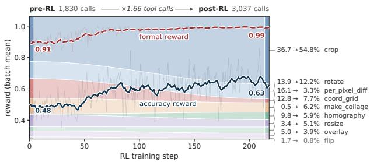

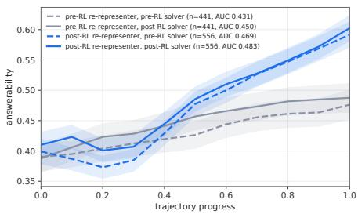  
Figure 4: Training rewards and tool use shift. Curves Figure 5: Crossed evaluation of trajecshow batch-mean accuracy and format rewards over train- tory construction and answer readout. ing, with exponential moving-average smoothing (α = Colour identifies the re-representer that 0.12). Background bands show each tool’s usage distribu- generated the trajectory, while line style tion on MosaicBench before and after training; intermedi- identifies the solver used for forced answer ate band widths are interpolated for display. ing. Bands show ±1 standard error.

## 5.4 HOW ANSWERABILITY EVOLVES DURING RE-REPRESENTATION

We next inquire how agents with Mosaic proactively solve the multi-image tasks.

Answerability profiles. Among trajectories with a correct final-prefix probe, we identify two transition patterns. Progression starts incorrect and becomes correct without a later reversal, while self-correction contains at least one correct-to-incorrect transition followed by recovery. Trajectories that remain correct at every prefix are consistently correct. Separately, we measure post-stabilisation continuation: at least two additional tool steps after the probed answer stabilises, which may reflect verification or unnecessary tool use. Fig. 6 compares 210 final-prefix-correct trajectories before training and 335 after training.

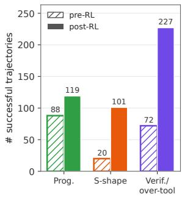  
(a)

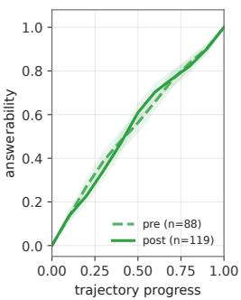  
(b)

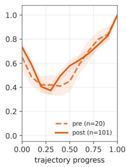  
(c)

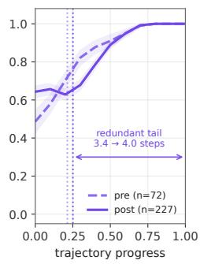  
(d)  
Figure 6: Profiling answerability throughout trajectories. (a) Counts exhibiting progression, self-correction, or overtooling. (b)–(d) Mean prefix answerability within each group of trajectories on normalised trajectory progress. Dashed lines for pre-RL and solid lines for post-RL; bands show ±1 standard error. Dotted lines in (d) mark the mean stabilisation point where tool benefits saturate.

Progression and self-correction. Progression captures the direct case in which successive visual operations make the available evidence sufficient for answering. Self-correction reveals a less monotonic process: an intermediate representation can move the model away from a correct answer before later operations recover it. Its increased prevalence after training suggests that successful visual reasoning can involve revising intermediate rather than only accumulating evidence.

Verification and overtooling. Post-stabilisation continuation captures a different behaviour: the agent keeps processing visual evidence after the probed answer has already stabilised. Such steps may verify an existing answer by inspecting additional evidence, or may constitute unnecessary tool use. Their increased frequency after training shows that the learned policy does not simply stop once a correct answer becomes available.

Training changes the mixture of problem-solving modes. Training does not simply produce more monotonic progression: although its absolute count increases, its share decreases from 41.9% to 35.5%, while self-correction and post-stabilisation continuation become substantially more frequent. The learned policy therefore exhibits a different mixture of progression, revision, and continued processing rather than converging to a single strategy.

## 6 CONCLUSION

In this work, we studied when textual and visual re-representation improve multi-image understanding and how an agent learns to construct task-driven visual representations. We introduced Mosaic, a visual harness for re-organising evidence within and across images, and MosaicBench, a grounding-focused benchmark for multi-image understanding. Our empirical study shows that the relative benefits of textual and visual re-representation depend on the task. The visual harness is particularly effective on tasks requiring precise visual evidence, including hypothesis testing, precision comparison, and orientation-sensitive tasks. We further show that reinforcement learning with accuracy and format rewards enables an agent to compose visual tools over multiple steps. The resulting policy exhibits diverse problem-solving patterns without demonstration trajectories or rewards that prescribe specific behaviours. These findings highlight the construction of task-driven visual representations as a learnable component of multi-image reasoning.

## AI USE STATEMENT

In this work, we used generative AI tools to assist with translation, provide feedback on research methodology, and support qualitative and thematic data analysis.preprint We did not use generative AI to generate dataset examples or develop theoretical models. Additionally, we used generative AI tools to create artefacts, identify relevant literature, summarise or analyse existing literature, and create or modify scientific figures or images. We reviewed all AI-assisted work. All code was reviewed by at least three authors. The authors verified all scientific claims. AI-assisted figure generation was limited to visual styling and did not modify the underlying data. We take responsibility for the final content of this work, including text, claims or artefacts produced with the aid of generative AI.

## REFERENCES

Jean-Baptiste Alayrac, Jeff Donahue, Pauline Luc, Antoine Miech, Iain Barr, Yana Hasson, Karel Lenc, Arthur Mensch, Katherine Millican, Malcolm Reynolds, et al. Flamingo: a visual language model for few-shot learning. Advances in neural information processing systems, 35:23716–23736, 2022.

Xiang An, Yin Xie, Kaicheng Yang, Wenkang Zhang, Xiuwei Zhao, Zheng Cheng, Yirui Wang, Songcen Xu, Changrui Chen, Didi Zhu, et al. Llava-onevision-1.5: Fully open framework for democratized multimodal training. arXiv preprint arXiv:2509.23661, 2025.

Anthropic. Introducing claude sonnet 5, 2026. URL: https://www.anthropic.com/news /claude-sonnet-5.

Shuai Bai, Yuxuan Cai, Ruizhe Chen, Keqin Chen, Xionghui Chen, Zesen Cheng, Lianghao Deng, Wei Ding, Chang Gao, Chunjiang Ge, et al. Qwen3-vl technical report. arXiv preprint arXiv:2511.21631, 2025.

Paul Bergmann, Michael Fauser, David Sattlegger, and Carsten Steger. MVTec AD—a comprehensive real-world dataset for unsupervised anomaly detection. In Proceedings of the IEEE/CVF Conference on Computer Vision and Pattern Recognition, pp. 9592–9600, 2019. URL https://openaccess.thecvf.com/content\_CVPR\_2019/html/Bergmann\_MV Tec\_AD\_--\_A\_Comprehensive\_Real-World\_Dataset\_for\_Unsupervised\_An omaly\_CVPR\_2019\_paper.html.

Jean-Christophe Burie, Joseph Chazalon, Mickael Coustaty, S¨ ebastien Eskenazi, Muhammad Muzza-´ mil Luqman, Maroua Mehri, Nibal Nayef, Jean-Marc Ogier, Sophea Prum, and Marc¸al Rusinol.˜ ICDAR2015 competition on smartphone document capture and OCR (SmartDoc). In 13th International Conference on Document Analysis and Recognition, pp. 1161–1165, 2015. doi:

10.1109/ICDAR.2015.7333943. URL https://sites.google.com/site/icdar15s martdoc/challenge-1/dataset.

Hao Chen and Zhenwei Shi. A spatial-temporal attention-based method and a new dataset for remote sensing image change detection. Remote Sensing, 12(10), 2020. ISSN 2072-4292. doi: 10.3390/rs12101662. URL https://www.mdpi.com/2072-4292/12/10/1662.

Biplab Deka, Zifeng Huang, Chad Franzen, Joshua Hibschman, Daniel Afergan, Yang Li, Jeffrey Nichols, and Ranjitha Kumar. Rico: A mobile app dataset for building data-driven design applications. In Proceedings of the 30th Annual Symposium on User Interface Software and Technology, UIST ’17, 2017.

Babak Ehteshami Bejnordi, Mitko Veta, Paul Johannes van Diest, Bram Van Ginneken, Nico Karssemeijer, Geert Litjens, Jeroen AWM Van Der Laak, Camelyon16 Consortium, Meyke Hermsen, Quirine F Manson, et al. Diagnostic assessment of deep learning algorithms for detection of lymph node metastases in women with breast cancer. Jama, 318(22):2199–2210, 2017.

Xingyu Fu, Yushi Hu, Bangzheng Li, Yu Feng, Haoyu Wang, Xudong Lin, Dan Roth, Noah A Smith, Wei-Chiu Ma, and Ranjay Krishna. Blink: Multimodal large language models can see but not perceive. In European Conference on Computer Vision, pp. 148–166. Springer, 2024.

GLM-V Team. GLM-4.5V and GLM-4.1V-Thinking: Towards versatile multimodal reasoning with scalable reinforcement learning. arXiv preprint arXiv:2507.01006, 2025.

Meng-Ru Hsieh, Yen-Liang Lin, and Winston H. Hsu. Drone-based object counting by spatially regularized regional proposal network. In Proceedings ofthe IEEE International Conference on Computer Vision, 2017. URL https://openaccess.thecvf.com/content\_iccv\_2 017/html/Hsieh\_Drone-Based\_Object\_Counting\_ICCV\_2017\_paper.html.

Yushi Hu, Hang Hua, Zhengyuan Yang, Weijia Shi, Noah A Smith, and Jiebo Luo. Promptcap: Prompt-guided image captioning for vqa with gpt-3. In 2023 IEEE/CVF International Conference on Computer Vision (ICCV), pp. 2951–2963. IEEE, 2023.

Yushi Hu, Weijia Shi, Xingyu Fu, Dan Roth, Mari Ostendorf, Luke Zettlemoyer, Noah A Smith, and Ranjay Krishna. Visual sketchpad: Sketching as a visual chain of thought for multimodal language models. Advances in Neural Information Processing Systems, 37:139348–139379, 2024.

Dongfu Jiang, Xuan He, Huaye Zeng, Cong Wei, Max Ku, Qian Liu, and Wenhu Chen. Mantis: Interleaved multi-image instruction tuning. arXiv preprint arXiv:2405.01483, 2024.

Kuei-Chun Kao, Hsu Tzu-Yin, Yunqi Hong, Ruochen Wang, and Cho-Jui Hsieh. Qg-coc: Questionguided chain-of-captions for large multimodal models. arXiv preprint arXiv:2511.03206, 2025.

Tamera Lanham, Anna Chen, Ansh Radhakrishnan, Benoit Steiner, Carson Denison, Danny Hernandez, Dustin Li, Esin Durmus, Evan Hubinger, Jackson Kernion, Kamile Luko˙ siˇ ut¯ e, Karina˙ Nguyen, Newton Cheng, Nicholas Joseph, Nicholas Schiefer, Oliver Rausch, Robin Larson, Sam McCandlish, Sandipan Kundu, Saurav Kadavath, Shannon Yang, Thomas Henighan, Timothy Maxwell, Timothy Telleen-Lawton, Tristan Hume, Zac Hatfield-Dodds, Jared Kaplan, Jan Brauner, Samuel R. Bowman, and Ethan Perez. Measuring faithfulness in chain-of-thought reasoning. arXiv preprint arXiv:2307.13702, 2023. URL https://arxiv.org/abs/2307.13702.

Tsung-Yi Lin, Michael Maire, Serge Belongie, James Hays, Pietro Perona, Deva Ramanan, Piotr Dollar, and C. Lawrence Zitnick. Microsoft COCO: Common objects in context. In´ European Conference on Computer Vision, pp. 740–755, 2014. doi: 10.1007/978-3-319-10602-1 48. URL https://arxiv.org/abs/1405.0312.

Fanqing Meng, Jin Wang, Chuanhao Li, Quanfeng Lu, Hao Tian, Jiaqi Liao, Xizhou Zhu, Jifeng Dai, Yu Qiao, Ping Luo, Kaipeng Zhang, and Wenqi Shao. MMIU: Multimodal multi-image understanding for evaluating large vision-language models. arXiv preprint arXiv:2408.02718, 2024. URL https://arxiv.org/abs/2408.02718.

Openai. Introducing gpt-4o, 2024. URL: https://openai.com/index/hello-gpt-4o/.

Openai. Introducing gpt-5.4, 2026. URL: https://openai.com/index/introducing-g pt-5-4/.

Qwen Team. Qwen3.5: Towards native multimodal agents, February 2026. URL https://qwen .ai/blog?id=qwen3.5.

Zhihong Shao, Peiyi Wang, Qihao Zhu, Runxin Xu, Junxiao Song, Xiao Bi, Haowei Zhang, Mingchuan Zhang, Y. K. Li, Y. Wu, and Daya Guo. DeepSeekMath: Pushing the limits of mathematical reasoning in open language models. arXiv preprint arXiv:2402.03300, 2024. URL https://arxiv.org/abs/2402.03300.

Zhaochen Su, Linjie Li, Mingyang Song, Yunzhuo Hao, Zhengyuan Yang, Jun Zhang, Guanjie Chen, Jiawei Gu, Juntao Li, Xiaoye Qu, and Yu Cheng. OpenThinkIMG: Learning to think with images via visual tool reinforcement learning. arXiv preprint arXiv:2505.08617, 2025a. URL https://arxiv.org/abs/2505.08617.

Zhaochen Su, Peng Xia, Hangyu Guo, Zhenhua Liu, Yan Ma, Xiaoye Qu, Jiaqi Liu, Yanshu Li, Kaide Zeng, Zhengyuan Yang, et al. Thinking with images for multimodal reasoning: Foundations, methods, and future frontiers. arXiv preprint arXiv:2506.23918, 2025b.

Kaishen Wang, Ruibo Chen, Tong Zheng, and Heng Huang. Imagent: A unified multimodal agent framework for test-time scalable image generation. arXiv preprint arXiv:2511.11483, 2025a.

Weiyun Wang, Zhangwei Gao, Lixin Gu, Hengjun Pu, Long Cui, Xingguang Wei, Zhaoyang Liu, Linglin Jing, Shenglong Ye, Jie Shao, et al. Internvl3. 5: Advancing open-source multimodal models in versatility, reasoning, and efficiency. arXiv preprint arXiv:2508.18265, 2025b.

Jason Wei, Xuezhi Wang, Dale Schuurmans, Maarten Bosma, Brian Ichter, Fei Xia, Ed Chi, Quoc Le, and Denny Zhou. Chain-of-thought prompting elicits reasoning in large language models. In Advances in Neural Information Processing Systems, 2022. URL https://arxiv.org/ab s/2201.11903.

Longyin Wen, Pengfei Zhu, Dawei Du, Xiao Bian, Haibin Ling, Qinghua Hu, Jiayu Zheng, Tao Peng, Xinyao Wang, Yue Zhang, Liefeng Bo, Hailin Shi, Rui Zhu, Ajit Jadhav, Bing Dong, Brejesh Lall, Chang Liu, Chunhui Zhang, Dong Wang, Feng Ni, Filiz Bunyak, Gaoang Wang, Guizhong Liu, Guna Seetharaman, Guorong Li, Hakan Ardo, Haotian Zhang, Hongyang Yu, Huchuan Lu, Jenq-Neng Hwang, Jiatong Mu, Jinrong Hu, Kannappan Palaniappan, Long Chen, Lu Ding, Martin Lauer, Mikael Nilsson, Noor M. Al-Shakarji, Prerana Mukherjee, Qingming Huang, Robert Laganiere, Shuhao Chen, Siyang Pan, Vinay Kaushik, Wei Shi, Wei Tian, Weiqiang Li, Xin Chen, Xinyu Zhang, Yanting Zhang, Yanyun Zhao, Yong Wang, Yuduo Song, Yuehan Yao, Zhaotang Chen, Zhenyu Xu, Zhibin Xiao, and Zhihang Tong. Visdrone-mot2019: The vision meets drone multiple object tracking challenge results. In Proceedings ofthe IEEE/CVF International Conference on Computer Vision (ICCV) Workshops, Oct 2019.

Junfei Wu, Jian Guan, Kaituo Feng, Qiang Liu, Shu Wu, Liang Wang, Wei Wu, and Tieniu Tan. Reinforcing spatial reasoning in vision-language models with interwoven thinking and visual drawing. Advances in Neural Information Processing Systems, 38:143297–143330, 2026.

Mingyuan Wu, Jingcheng Yang, Jize Jiang, Meitang Li, Kaizhuo Yan, Hanchao Yu, Minjia Zhang, Chengxiang Zhai, and Klara Nahrstedt. VTool-R1: VLMs learn to think with images via reinforcement learning on multimodal tool use. arXiv preprint arXiv:2505.19255, 2025. URL https://arxiv.org/abs/2505.19255.

Xin Yang, Haiyang Mei, Ke Xu, Xiaopeng Wei, Baocai Yin, and Rynson WH Lau. Where is my mirror? In Proceedings of the IEEE/CVF international conference on computer vision, pp. 8809–8818, 2019.

Shunyu Yao, Jeffrey Zhao, Dian Yu, Nan Du, Izhak Shafran, Karthik Narasimhan, and Yuan Cao. React: Synergizing reasoning and acting in language models. arXiv preprint arXiv:2210.03629, 2022.

Yuan Yao, Tianyu Yu, Shengding Hu, Maosong Sun, et al. MiniCPM-V 4.5: Cooking efficient MLLMs via architecture, data, and training recipe. arXiv preprint arXiv:2509.18154, 2025.

Xiaojun Ye, Guanbao Liang, Chun Wang, Liangcheng Li, Pengfei Ke, Rui Wang, Bingxin Jia, Gang Huang, Qiao Sun, and Sheng Zhou. M4Bench: A benchmark of multi-domain multigranularity multi-image understanding for multi-modal large language models. In Proceedings of the Thirty-Fourth International Joint Conference on Artificial Intelligence, 2025. URL https: //www.ijcai.org/proceedings/2025/762.

Fisher Yu, Haofeng Chen, Xin Wang, Wenqi Xian, Yingying Chen, Fangchen Liu, Vashisht Madhavan, and Trevor Darrell. BDD100K: A diverse driving dataset for heterogeneous multitask learning. In Proceedings ofthe IEEE/CVF Conference on Computer Vision and Pattern Recognition, 2020. URL https://openaccess.thecvf.com/content\_CVPR\_2020/html/Yu\_BDD1 00K\_A\_Diverse\_Driving\_Dataset\_for\_Heterogeneous\_Multitask\_Learni ng\_CVPR\_2020\_paper.html.

Zhehao Zhang, Ryan A Rossi, Tong Yu, Franck Dernoncourt, Ruiyi Zhang, Jiuxiang Gu, Sungchul Kim, Xiang Chen, Zichao Wang, and Nedim Lipka. Vipact: Visual-perception enhancement via specialized vlm agent collaboration and tool-use. In Proceedings of the AAAI Conference on Artificial Intelligence, volume 40, pp. 36536–36546, 2026.

Zhuosheng Zhang, Aston Zhang, Mu Li, Hai Zhao, George Karypis, and Alex Smola. Multimodal chain-of-thought reasoning in language models. arXiv preprint arXiv:2302.00923, 2023.

Shitian Zhao, Haoquan Zhang, Shaoheng Lin, Ming Li, Qilong Wu, Kaipeng Zhang, and Chen Wei. Pyvision: Agentic vision with dynamic tooling. arXiv preprint arXiv:2507.07998, 2025.

Shitian Zhao, Shaoheng Lin, Ming Li, Haoquan Zhang, Wenshuo Peng, Kaipeng Zhang, and Chen Wei. PyVision-RL: Forging open agentic vision models via RL. arXiv preprint arXiv:2602.20739, 2026. URL https://arxiv.org/abs/2602.20739.

Ziwei Zheng, Michael Yang, Jack Hong, Chenxiao Zhao, Guohai Xu, Le Yang, Chao Shen, and Xing Yu. DeepEyes: Incentivizing “thinking with images” via reinforcement learning. arXiv preprint arXiv:2505.14362, 2025. URL https://arxiv.org/abs/2505.14362.

Xu Zhong, Jianbin Tang, and Antonio Jimeno Yepes. PubLayNet: Largest dataset ever for document layout analysis. In International Conference on Document Analysis and Recognition, 2019. URL https://arxiv.org/abs/1908.07836.

Zhe Zhu, Dun Liang, Songhai Zhang, Xiaolei Huang, Baoli Li, and Shimin Hu. Traffic-sign detection and classification in the wild. In Proceedings ofthe IEEE Conference on Computer Vision and Pattern Recognition, pp. 2110–2118, 2016. URL https://openaccess.thecvf.com/co ntent\_cvpr\_2016/html/Zhu\_Traffic-Sign\_Detection\_and\_CVPR\_2016\_pa per.html.

## APPENDIX

The appendix is organised as follows.

• Appendix A: Mosaic visual harness. Tool definitions, prompting setup, and training details.

• Appendix B: MosaicBench dataset. Task coverage, data sources and provenance, sample format, validation and shortcut checks, training and evaluation set construction, task-specific construction, and reproducibility details.

• Appendix C: Extended results. Tool ablations beyond cropping, model comparisons, and failure-pattern analysis.

## A MOSAIC: A VISUAL HARNESS FOR MULTI-IMAGE UNDERSTANDING

Mosaic is the image workspace and executes the visual operations used in this study. This section documents its tool interfaces, system prompts, and training setup.

## A.1 TOOL DEFINITIONS

The harness exposes ten composable operations over image assets. The definitions below specify the inputs and outputs of each operation.

crop Crops a rectangular region from one image. It accepts an input target image and the crop box corner coordinates x1, y1, x2, y2 as inputs. It returns: a new image containing only the cropped region.

rotate Rotates one image by an arbitrary angle in degrees. It accepts an input target image and the angle as inputs. It returns: a new image rotated by the angle.

resize Resizes one image to an exact width and height in pixels. It accepts an input target image and the width and height as inputs. It returns: a new image at exactly width x height.

flip Flips one image horizontally or vertically. It accepts an input target image and the mode as inputs. It returns: a new image flipped by the given mode.

apply affine transformation Applies a 2D affine transform — rotation, uniform scaling, and translation — to one image. It accepts an input target image and the rotation angle, translation dx, translation dy, and scale as inputs. It returns: a new image with the affine transform applied.

draw normalized coordinate grid Draws a normalised coordinate grid over one image as a spatial reference. It accepts an input target image and the grid row and column numbers as inputs. It returns: a new image with red gridlines drawn over the input and normalised 0-1 tick labels along the top and left edges.

compare per pixel image difference Compares two images pixel by pixel. It accepts two input images of the same size as inputs. It returns: a heatmap image where warmer colors mark larger per-pixel differences and cool colors mark identical or near-identical pixels.

apply homography transformation Applies a 3x3 projective homography transform to one image. It accepts an input target image and a 3x3 homography matrix as inputs. It returns: a new image with the homography applied.

make collage Tiles N input images into a single output image arranged as a rows x cols grid, filled in row-major order. It accepts the input target images and the rows and cols as inputs. It returns: a new image with the input images arranged in a rows x cols grid.

overlay images Overlays the foreground image onto the background image at a normalised position. It accepts the background and foreground images and the x and y coordinates in the background image as inputs. It returns: a new image with the foreground image composited onto the background image.

## A.2 PROMPT ENGINEERING

We use different system prompts depending on whether visual tools are available. The templates below document both settings and their differences.

Tool mode The system message sent when the agent has the toolbox available. The tool signatures inside <tools> are generated from the tool registry (one JSON object per tool, using each tool’s description baseline).

You are an agent for multi-image visual reasoning in an environment   
that provides a suite of tools to support reasoning and task-solving   
through information processing, visual evidence gathering,   
transformation, comparison, and verification. Keep working on the   
user’s question until it is fully resolved, and only end your turn   
once you are sure of the answer. The question always has a correct   
answer, so never give up or claim it cannot be determined --- keep   
reasoning and using tools until you find it.   
Solve the problem step by step. Look closely at the actual content of   
the images and reason about what they show. When the answer cannot be   
determined from the images alone, use the provided tools to gather   
more visual evidence --- for example zooming in by cropping a region,   
rotating or flipping an image, comparing two images, or warping one   
image by a candidate transform.   
You MUST use a tool WHENEVER it can improve your understanding of the   
images to solve the task. You MUST plan extensively before each tool   
call, and reflect extensively on the tool result of the previous step.   
The provided images are labelled in order as [img1], [img2], ..., each   
followed by its pixel size --- e.g. [img1] (640x480). To pick which   
image(s) a tool operates on, pass only the imgN token (never the size)   
in that tool’s image argument(s), as declared in its schema. Any   
image a tool produces becomes the next [imgN], labelled the same way.   
Environment:   
Image tools operate in a shared workspace in which each image asset   
has its own transparent canvas. They let you transform and combine   
images --- including rotating, flipping, cropping, collaging   
(arranging images into a grid), compositing, and overlaying one image   
onto another. Each tool call renders its result as a new image,   
appended as the next [imgN], which you can inspect and operate on   
further. Each asset’s canvas expands automatically to fit results   
that don’t fill a plain rectangle, leaving transparent padding in the   
empty areas (see Conventions).   
Conventions:   
- Coordinates: the origin (0, 0) is at the top-left corner of the   
rendered canvas --- the full image you see, transparent checkerboard   
regions included --- NOT the top-left of the opaque content within it.   
Coordinates (points and boxes) refer to that canvas; all tools except   
apply affine transformation (whose translation dx / translation dy are   
in pixels) take them normalised to 0-1 of the canvas size. The x-axis   
increases to the right and the y-axis increases downward.   
- Rotation: angles are measured in degrees. A positive angle rotates   
the image counter-clockwise; a negative angle rotates it clockwise.   
- Transparency: the canvas auto-expands only when an operation   
produces content that does not fill a plain rectangle --- e.g.   
rotating an image (its corners no longer align to the frame),   
collaging images of differing sizes, or overlaying/compositing with an

offset. The resulting empty areas are shown as a gray-and-white   
checkerboard (the standard Photoshop "transparency" indicator).   
Operations whose result is already a full rectangle --- such as   
flipping or cropping --- produce no transparent region, and the canvas   
matches the image content exactly. The checkerboard is NEVER part of   
the image content: it only marks empty pixels and does not exist in   
the real image. Ignore it and reason only about the actual opaque   
content.   
# Tools   
You may call one or more functions to assist with the user query.   
You are provided with function signatures within <tools></tools> XML   
tags:   
<tools>   
[One JSON signature per tool (10 tools total); full descriptions   
omitted here for brevity.]   
</tools>   
For each function call, return a JSON object with function name and   
arguments within <tool call></tool call> XML tags:   
<tool call>   
{"name": <function-name>, "arguments": <args-json-object>}   
</tool call>

Vanilla mode (no tools) The no-tool baseline uses the system prompt below. Both prompts share the task objective and image identifiers, but tool mode additionally provides image sizes, tool and canvas conventions, and explicit planning and reflection requirements. The comparison therefore measures the combined effect of tool access and these prompt differences. A control that isolates tool availability would need to match the image metadata and general reasoning instructions across settings.

You are an agent for multi-image visual reasoning. Keep working on   
the user’s question until it is fully resolved, and only end your turn   
once you are sure of the answer. The question always has a correct   
answer, so never give up or claim it cannot be determined --- keep   
reasoning until you find it.   
Solve the problem step by step. Look closely at the actual content of   
the images and reason about what they show.   
The provided images are labelled in order as [img1], [img2], .... To   
point to a specific image, use exactly that imgN token.

## A.3 TRAINING SETUP

For each prompt, GRPO samples 8 rollouts and computes advantages using group-relative normalization without a learned critic. We use AdamW with a constant learning rate of $1 \times 1 0 ^ { - 6 }$ , a batch size of 32 prompts, and 1 epoch. Both the KL coefficient and entropy coefficient are set to 0. Training is conducted on 4 NVIDIA H100 GPUs.

Rollouts are generated with a maximum prompt length of 16,384 tokens and a maximum response length of 20,480 tokens. Each multi-turn episode is limited to 10 assistant turns.

## B MOSAICBENCH: A DATASET FOR MULTI-IMAGE UNDERSTANDING

This section documents the construction of MosaicBench and the associated training data. It covers task definitions, source provenance, validation, and dataset construction procedures.

## B.1 DATASET OVERVIEW AND TASK COVERAGE

We construct 32 task types to produce the training suite and MosaicBench. Table 3 lists the tasks by their main visual challenge, together with their source material and number of input images. Source usage is documented in Sec. B.2, and the selection of training and evaluation examples is described in Sec. B.5.

Table 3: Task coverage of the 32-type construction. Tasks are grouped by their main visual challenge. “Images” denotes the number of input images per example.
<table><tr><td>ID</td><td>Task</td><td>Source</td><td># Images</td></tr><tr><td colspan="4">Resolution</td></tr><tr><td>1.1</td><td>Small-target cross-frame tracking</td><td>VisDrone2019-MOT</td><td>4</td></tr><tr><td>1.3</td><td>Distant sign reading</td><td>TT100K</td><td>1</td></tr><tr><td>1.5</td><td>Pathology zoom</td><td>CAMELYON16</td><td>1</td></tr><tr><td>1.6</td><td>Micro-scratch detection</td><td>MVTec AD</td><td>1</td></tr><tr><td>1.7</td><td>Dense small-object counting</td><td>CARPK</td><td>1</td></tr><tr><td colspan="4">Orientation</td></tr><tr><td>2.3</td><td>Assembly orientation alignment</td><td>MVTec AD</td><td>2</td></tr><tr><td>2.5</td><td>Mirror sign reading</td><td>TT100K</td><td>1</td></tr><tr><td>2.6</td><td>Orthorectification</td><td>LEVIR-CD</td><td>1</td></tr><tr><td>2.8</td><td>Oblique part rectification</td><td>MVTec AD</td><td>2</td></tr><tr><td>2.9</td><td>Oblique document rectification</td><td>SmartDoc15-CH1</td><td>1</td></tr><tr><td>2.10</td><td>Text-orientation recovery</td><td>PubLayNet</td><td>1</td></tr><tr><td colspan="4">Precision comparison</td></tr><tr><td>3.8</td><td>Bitemporal change detection</td><td>LEVIR-CD</td><td>2</td></tr><tr><td>3.10</td><td>Golden-sample comparison</td><td>MVTec AD</td><td>2</td></tr><tr><td>3.11</td><td>Symmetric self-comparison</td><td>MVTec AD</td><td>1</td></tr><tr><td>3.12</td><td>Spot the difference</td><td>MSD</td><td>2</td></tr><tr><td>3.13</td><td>GUI regression verification</td><td>Rico</td><td>2</td></tr><tr><td colspan="4">Hypothesis testing</td></tr><tr><td>4.2</td><td>Camera-motion verification</td><td>VisDrone2019-MOT</td><td>2</td></tr><tr><td>4.3</td><td>Template rotation for grasping</td><td>MVTec AD</td><td>2</td></tr><tr><td>4.6</td><td>Multi-tile reassembly</td><td>LEVIR-CD</td><td>4</td></tr><tr><td>4.11</td><td>Puzzle-piece restoration</td><td>COCO</td><td>5</td></tr><tr><td>4.12</td><td>Mental rotation</td><td>Synthetic (polyominoes)</td><td>5</td></tr><tr><td colspan="4">Context interference</td></tr><tr><td>5.2</td><td>Mirror reflection vs. real</td><td>MSD</td><td>1</td></tr><tr><td>5.5</td><td>Simultaneous-contrast confusion</td><td>CAMELYON16</td><td>1</td></tr><tr><td>5.6</td><td>Illumination vs. defect</td><td>MVTec AD</td><td>2</td></tr><tr><td>5.7</td><td>Illusion patch comparison</td><td>Synthetic (illusions)</td><td>1</td></tr><tr><td colspan="4">Spatial reference</td></tr><tr><td>6.1</td><td>Trajectory grid coordinates</td><td>VisDrone2019-MOT</td><td>4</td></tr><tr><td>6.4</td><td>Drivable-zone point query</td><td>BDD100K</td><td>1</td></tr><tr><td>6.5</td><td>Change-coordinate localisation</td><td>LEVIR-CD</td><td>2</td></tr><tr><td>6.6</td><td>Lesion-centre localisation</td><td>CAMELYON16</td><td>1</td></tr><tr><td>6.7</td><td>Defect coordinate report</td><td>MVTec AD</td><td>1</td></tr><tr><td>6.8</td><td>Systematic grid scan</td><td>CARPK</td><td>1</td></tr><tr><td>6.9</td><td>Zonal counting</td><td>CARPK</td><td>1</td></tr></table>

## B.2 DATA SOURCES AND PROVENANCE

We use 12 public datasets and two procedural generators. Table 4 lists the source material, subsets used, and associated task IDs.

Table 4: Sources used to construct the task collection. Task IDs follow Table 3. Source subsets refer to the upstream datasets, not the final training and evaluation sets.
<table><tr><td>Source Dataset Annotations</td><td></td><td>Task IDs</td></tr><tr><td>VisDrone2019- MOT</td><td>Aerial video frames and object-track annotations</td><td>1.1, 4.2, 6.1</td></tr><tr><td>TT100K</td><td>Street images and traffic-sign annotations</td><td>1.3,2.5</td></tr><tr><td></td><td>CAMELYON16 Whole-slide images and lesion annotations; slide backgrounds</td><td>1.5, 5.5, 6.6</td></tr><tr><td>MVTec AD</td><td>for contrast tasks Normal images, annotated defect 1.6, 2.3, 2.8, 3.10, 3.11, 4.3, 5.6, images, and defect patches</td><td>6.7</td></tr><tr><td>CARPK</td><td>Aerial parking-lot images and car 1.7, 6.8, 6.9</td><td></td></tr><tr><td>PubLayNet</td><td>annotations Document-page images</td><td>2.10</td></tr><tr><td>LEVIR-CD</td><td>Co-registered aerial image pairs 2.6, 3.8, 4.6, 6.5 and building-change masks</td><td></td></tr><tr><td>SmartDoc15- CH1</td><td>Document video frames and annotated page corners</td><td>2.9</td></tr><tr><td>MSD</td><td>Scene images and mirror masks</td><td>3.12,5.2</td></tr><tr><td>Rico</td><td>Mobile screenshots and annotated UI-element boxes</td><td>3.13</td></tr><tr><td>COCO</td><td>Natural-scene images</td><td>4.11</td></tr><tr><td>BDD100K</td><td>Road images and drivable-area masks</td><td>6.4</td></tr><tr><td>Polyomino generator</td><td>Chiral shapes rendered under rotations and reflections</td><td>4.12</td></tr><tr><td>Illusion generator</td><td>Brightness-contrast, Müller-Lyer, 5.7 and Ebbinghaus images</td><td></td></tr></table>

SmartDoc subset. SmartDoc15-CH1 has no official training split. We use the first 24 of its 30 sorted document identifiers across all five backgrounds, giving 120 videos. The remaining six identifiers, comprising 30 videos, are held out from construction.

Provenance records. Each sample records its source, source split, source fingerprint, and source licence. The split exception field records source-specific exceptions, including the use of annotated MVTec AD defects, the custom SmartDoc subset, and sources without an official split. Source fingerprints support auditing of repeated source use. The separation of training and evaluation examples at the source level is described in Sec. B.5.

Overlap with external evaluation. We exclude an HPatches-based stitching-matrix verification task because the same source corpus is used by a homography-estimation task in an external multiimage benchmark. The exclusion applies to the entire task type rather than to individual samples.

## B.3 SAMPLE FORMAT AND SHARED CONSTRUCTION

Each example is stored as a JSON record with the fields listed in Table 5.

Table 5: Shared sample schema.
<table><tr><td>Field</td><td>Content</td></tr><tr><td>sample_id</td><td>Sample identifier.</td></tr><tr><td>prompt</td><td>Task question, input layout, and task-specific instructions.</td></tr><tr><td>images</td><td>Input-image references in the order used by the prompt.</td></tr><tr><td>task_type</td><td>Task identifier corresponding to Table 3.</td></tr><tr><td>target</td><td>Ground-truth answer used for scoring.</td></tr><tr><td>metadata</td><td>Task-specific construction and audit information.</td></tr></table>

Shared construction. Each task specifies an input selection or generation rule, a question template, and a ground-truth relation. Labels are derived from source annotations or known construction parameters. Task-specific filters check target visibility, spatial separation, and geometric or assembly consistency. The builders generate 400 examples for each of the 32 task types, yielding 12,800 examples before training and evaluation selection (Sec. B.5). Validation procedures are described in Sec. B.4, and individual task constructions in Sec. B.6.

Spatial conventions. Point and region coordinates are normalised and specified in the prompt. Their pixel-coordinate equivalents are retained in metadata for auditing and are not shown in the prompt. For grid-based tasks, the prompt defines the grid size and indexing convention.

Image resolution. Input images include source-resolution frames, level-0 whole-slide crops, and views constructed on task-specific canvases. Stored image dimensions and task-specific preprocessing are specified in Sec. B.6.

Scoring. The parsed final answer is evaluated by exact match against target.value. Missing or unparseable answers are scored as incorrect.

## B.4 VALIDATION AND SHORTCUT CHECKS

We apply shared structural checks to all constructed examples and validate labels against task-specific criteria.

Structural consistency. We check that the image list matches the declared input count, every referenced file exists, and the target agrees with its copy in the metadata.

Label validation. Region-based checks verify window bounds, overlap, and the target-containment or coverage conditions specified by each task. Point-localisation tasks enforce a tolerance around the ground-truth position and a minimum separation from competing locations. Homography and affine transformations are checked by corner reprojection error, and rotations by circular angular error. Assembly tasks use seam-continuity thresholds to distinguish the original arrangement from alternative layouts or pieces.

Mask-based queries additionally check mirror coverage, overlap with dilated masks, and window texture, or local drivable-zone purity and membership. The thresholds and additional checks for each task are specified in Sec. B.6.

Shortcut probes. We evaluate heuristics that use the supplied matrices, angles, or coordinates without inspecting the images (Table 6). For camera-motion verification (4.2), candidate generation uses rejection sampling against both the centroid and outlier probes.

Source-annotation audit. For a subset of examples, ground-truth labels are re-derived directly from source annotations rather than from the builder’s intermediate state. The audit results are logged with the build.

Table 6: Shortcut probes based on transformation and spatial geometry. These heuristics do not inspect image content.
<table><tr><td>Probe</td><td>Scope</td><td>Decision rule</td></tr><tr><td>Centroid / outlier</td><td>Matrix-based tasks</td><td>Select the transformation nearest to or furthest from the mean of the supplied transformations.</td></tr><tr><td>Pair member / singleton</td><td>Text-orientation recovery (2.10)</td><td>Select an angle from the pair separated by 180°, or the angle outside that pair.</td></tr><tr><td>Central-x / lowest-y</td><td>Drivable-zone point query (6.4)</td><td>Select the most horizontally central point or the lowest point in the image.</td></tr></table>

Table 7: Rollout outcomes and data selection. The second row contains examples answered incorrectly in the single no-tool run. The final three rows partition the constructed examples.
<table><tr><td rowspan="3"></td><td colspan="9">Tool successes k out of eight runs</td></tr><tr><td>0</td><td>1</td><td>2</td><td>3</td><td>4</td><td>5 6</td><td>7</td><td>8</td><td>Total</td></tr><tr><td></td><td>3116 1647</td><td></td><td>995</td><td>769</td><td>756</td><td>715</td><td>2604</td><td>12,800</td></tr><tr><td>Constructed examples Incorrect without tools</td><td>2603</td><td>1429</td><td>1268 1026</td><td>735</td><td>546 449</td><td>395</td><td>930 358</td><td>669 8,210</td></tr><tr><td>the training suite</td><td></td><td>一</td><td>1026</td><td>735</td><td>546 449</td><td>395</td><td>358</td><td></td></tr><tr><td>Held-out hard subset</td><td>2603</td><td>1429</td><td></td><td></td><td></td><td></td><td>一</td><td>3,509 4,032</td></tr><tr><td></td><td>513</td><td>218</td><td></td><td></td><td></td><td>572</td><td></td><td></td></tr><tr><td>Remaining examples</td><td></td><td></td><td>242</td><td>260 223</td><td>307</td><td>320</td><td>2604</td><td>5,259</td></tr></table>

## B.5 TRAINING AND EVALUATION SET CONSTRUCTION

The candidate pool is filtered using tool-enabled and no-tool rollouts to form the training suite. The evaluation set is constructed with overlap checks against the selected training data.

Rollout-based selection. For each constructed example, we run the same policy eight times with tool access and once without tools. The tool-enabled runs use temperature sampling with distinct seeds. Question prompts, answer parsing, and scoring are held fixed across the two settings. Let $k \in \{ 0 , \ldots , 8 \}$ denote the number of correct tool-enabled runs. Table 7 summarises the outcomes and the resulting selection.

Selecting the training suite. We retain examples answered incorrectly in the no-tool run and correctly in two to seven of the eight tool-enabled runs. The resulting training suite contains 3,509 examples and 7,155 images across 32 task types. Orthorectification (2.6) contributes no examples because all its success counts are either k = 0 or k = 8.

Held-out hard subset. The 4,032 examples answered incorrectly without tools and correctly in at most one tool-enabled run are retained as a hard subset. They span all 32 task types and are not used for training.

Constructing MosaicBench. We select benchmark examples from the constructed data after removing overlap with the training suite at three levels:

1. Sample identity. Exclude examples whose sample id appears in training.

2. Source provenance. Exclude examples sharing a source container with any training example, across all task types. The source unit is a VisDrone scene, a CAMELYON slide, a SmartDoc video, or otherwise an individual source image.

3. Image similarity. Exclude examples containing an image byte-identical to a training image. For synthetic and CARPK tasks, every retained image must additionally have a distance of at least four from every training image under a 64-bit perceptual hash.

The image-level checks address duplicate synthetic renders and near-identical frames with different source identifiers. Visually similar product and document images from distinct physical instances are retained and listed in the benchmark manifest.

The resulting MosaicBench contains 560 examples across 28 task types, with 20 examples per type. The three VisDrone-derived tasks (1.1, 4.2, and 6.1) are excluded because training examples cover all 56 source sequences. Mental rotation (4.12) is excluded because no synthetic render survives the image-level filter.

## B.6 TASK-SPECIFIC CONSTRUCTION

For each task, we describe the inputs, question, ground-truth relation, and task-specific construction checks. Shared sample conventions and validation procedures are described in Secs. B.3 and B.4.

## B.6.1 RESOLUTION

These tasks involve small visual targets or dense collections of objects. Target-size records include the extent relative to the source frame and the corresponding size at a 768-pixel reference input scale.

1.1 Small-target cross-frame tracking. Inputs and construction. Four 1904 × 1071 frames are sampled from one VisDrone2019-MOT sequence, with a per-example stride of 10–35 frames. One annotated track is designated as the target. Its mean width is 1.9% of the frame width, corresponding to approximately 15 pixels at the reference input scale.

Question. Given the target’s normalised position in the first frame, identify its position in the fourth frame.

Ground truth and checks. The target position is obtained from the track annotation. A correct candidate lies within a normalised Chebyshev distance of 0.02 from this position; distractors are at least 0.08 away. Distractors use the fourth-frame positions of other annotated tracks in the same scene. In negative examples, no candidate lies within 0.08 of the target position.

1.3 Distant sign reading. Inputs and construction. A 2048 × 2048 TT100K street image contains exactly one speed-limit sign. The sign’s longest side is restricted to 22–44 pixels in the source image.

Question. Read the speed limit displayed on the sign.

Ground truth and checks. The answer is derived from the sign’s annotated class. Distractor values are drawn from other speed limits in the same sign family.

1.5 Pathology zoom. Inputs and construction. A 2048 × 2048 region is read at level 0 from a CAMELYON16 whole-slide image. The region contains an annotated metastatic lesion a few hundred level-0 pixels across.

Question. Identify which proposed region contains metastatic tumour.

Ground truth and checks. Labels are derived from the lesion annotation. A positive window fully contains the lesion, which touches no other candidate window. All candidate windows have equal dimensions and satisfy a tissue-coverage threshold.

1.6 Micro-scratch detection. Inputs and construction. A 1024 × 1024 MVTec AD image contains a real annotated surface defect, such as a scratch, cut, crack, poke, or thread. Candidate windows have equal dimensions and a width of approximately 0.12 of the image width.

Question. Identify the window containing the defect.

Ground truth and checks. Labels are derived from the defect mask. A positive window fully contains the mask, which touches no distractor window. All candidate windows lie on the part surface.

1.7 Dense small-object counting. Inputs and construction. A 1280 × 720 CARPK parking-lot image is paired with complete car annotations. Per-quadrant counts are recorded and used during sampling to vary the spatial distribution of cars.

Question. Count all cars in the image.

Ground truth and checks. The answer is the total annotated car count. Distractors are nearby counts, and the rank of the true count among the numerical candidates varies across examples.

## B.6.2 ORIENTATION

These tasks involve recovering or identifying image geometry under rotation, reflection, and perspective changes.

2.3 Assembly orientation alignment. Inputs and construction. A normal MVTec AD image provides the reference orientation. A known rotation produces a second view of the same part.

Question. Identify the counterclockwise rotation that aligns the query view with the reference.

Ground truth and checks. The target angle is determined by the construction rotation. Candidate angles are separated by at least 30◦. The transformed views are checked for visual distinguishability to exclude ambiguous cases caused by approximate rotational symmetry.

2.5 Mirror sign reading. Inputs and construction. A crop containing a TT100K speed-limit sign is reflected horizontally.

Question. Read the speed limit displayed on the reflected sign.

Ground truth and checks. The label is the annotated class of the original sign.

2.6 Orthorectification. Inputs and construction. A 1024×1024 LEVIR-CD aerial image is warped by a known projective transformation to produce an oblique view.

Question. Identify the homography that reverses the perspective distortion.

Ground truth and checks. The ground-truth matrix is the inverse of the applied warp, with zero corner reprojection error normalised by the image diagonal. Distractor matrices are perturbations whose errors fall within a task-specific non-zero band. In negative examples, the inverse is omitted and every proposed matrix exceeds the specified error floor.

2.8 Oblique part rectification. Inputs and construction. An MVTec AD part image is warped by a known homography. The original image is supplied alongside the warped view as the rectification reference.

Question. Identify the homography that maps the oblique view back to the reference.

Ground truth and checks. The ground-truth matrix inverts the applied warp. Corner-error checks and distractor construction follow Task 2.6.

2.9 Oblique document rectification. Inputs and construction. A 1920 × 1080 frame is selected from SmartDoc15-CH1. Annotated document corners define the mapping to an upright page with A4 aspect ratio.

Question. Identify the homography that rectifies the document to the target page geometry.

Ground truth and checks. The ground-truth homography maps the annotated quadrilateral to the upright page. Corner-error checks follow Task 2.6.

2.10 Text-orientation recovery. Inputs and construction. A PubLayNet document page is rotated by a known angle. Pages are selected to contain enough text lines to define an upright reading orientation.

Question. Identify the additional counterclockwise rotation that restores upright text.

Ground truth and checks. A correct restoring angle has zero circular error relative to the constructionderived angle. Incorrect angles differ by at least 25◦. Each example includes exactly one pair of proposed angles separated by 180◦. The corresponding angle-structure probes are described in Sec. B.4.

## B.6.3 PRECISION COMPARISON

These tasks concern local changes or asymmetries. Selected constructions introduce photometric or encoding variation alongside the target difference.

3.8 Bitemporal change detection. Inputs and construction. Two co-registered 1024×1024 LEVIR-CD images depict the same area at different dates. Building-change masks distinguish the target changes from other appearance variation.

Question. Locate building construction or demolition between the two images.

Ground truth and checks. A positive window contains at least the task-specific minimum number of annotated change pixels. The change mask does not intersect any distractor window. Candidate windows have equal dimensions.

3.10 Golden-sample comparison. Inputs and construction. A normal MVTec AD image serves as the reference. A pixel-aligned copy receives a real annotated defect patch in positive examples. Independent photometric jitter is then applied to both views.

Question. Identify the region containing a defect absent from the reference.

Ground truth and checks. The composited defect mask determines the target window. Photometric differences outside the mask are unrelated to the defect label.

3.11 Symmetric self-comparison. Inputs and construction. An MVTec AD image is made bilaterally symmetric by mirroring one half onto the other. In positive examples, a real defect patch is composited onto one side.

Question. Identify the region containing the defect that breaks the expected symmetry.

Ground truth and checks. The composited mask identifies the defective region. Its mirrored counterpart is included as a distractor in every positive example.

3.12 Spot the difference. Inputs and construction. Two copies of an MSD scene are encoded at JPEG quality levels 92 and 88. Positive examples contain one synthetic local edit; negative examples contain only the encoding differences.

Question. Locate the edited region, distinguishing it from compression noise.

Ground truth and checks. The recorded edit location determines the target window. Examples without an edit are labelled as having no target change.

3.13 GUI regression verification. Inputs and construction. Two 1080 × 1920 views are derived from a Rico screenshot and encoded at different JPEG qualities. In positive examples, one annotated UI element is recoloured, shifted by a few pixels, or removed. The edit magnitude is recorded.

Question. Identify the region containing the changed UI element.

Ground truth and checks. Candidate regions are based on annotated UI-element boxes. The target region contains the box of the edited element.

## B.6.4 HYPOTHESIS TESTING

These tasks evaluate proposed transformations, arrangements, or shape matches against visual evidence.

4.2 Camera-motion verification. Inputs and construction. Two 768 × 768 views are derived from a VisDrone frame. The second is generated from the first by a known 2 × 3 affine transformation comprising translation, scaling, and rotation.

Question. Identify the affine transformation that maps the first view to the second.

Ground truth and checks. The construction matrix has zero corner reprojection error. Distractor matrices lie within a specified non-zero error band. Candidate generation uses rejection sampling against the centroid and outlier probes described in Sec. B.4.

4.3 Template rotation for grasping. Inputs and construction. An MVTec AD image serves as a canonical template. A known rotation generates the observed view.

Question. Identify the counterclockwise rotation that maps the template to the observed view.

Ground truth and checks. The target is the applied rotation angle. Candidate angles are separated by at least 30◦, and the resulting views are checked for visual distinguishability.

4.6 Multi-tile reassembly. Inputs and construction. Four 512 × 512 tiles are cut from a LEVIR-CD image on a 2 × 2 grid and presented in shuffled order.

Question. Identify the assignment of tiles to grid positions that restores the original image.

Ground truth and checks. The original tile-to-position assignment defines the label. Its mean absolute seam discontinuity must fall below a task-specific threshold. Every distractor arrangement must exceed a separate, higher threshold.

4.11 Puzzle-piece restoration. Inputs and construction. The inputs comprise a 480 × 480 COCO image with a square region removed and candidate pieces shown under sampled rotations. The candidates include the original piece, its reflection, and patches from other locations in the same image.

Question. Identify the piece that restores the missing region.

Ground truth and checks. The original piece must produce a seam error below the acceptance threshold when restored to its original position and orientation. Each distractor must exceed a higher error threshold.

4.12 Mental rotation. Inputs and construction. Five 448 × 448 images depict a chiral polyomino: a reference, a rotated copy, and reflected copies at different orientations.

Question. Identify the figure related to the reference by an in-plane rotation without reflection.

Ground truth and checks. Labels follow the known rotation and reflection operations used to generate each image. The rotated copy is the target; reflected copies are distractors.

## B.6.5 CONTEXT INTERFERENCE

These tasks distinguish target properties from surrounding structure, reflections, or photometric variation.

5.2 Mirror reflection vs. real. Inputs and construction. An MSD indoor image contains an annotated mirror. Equal-sized candidate windows are selected inside and outside the mirror region.

Question. Identify a window containing only mirror reflection.

Ground truth and checks. The positive window must have at least 98% mirror coverage under both the original mask and its dilated version. Distractor windows have zero overlap with the dilated mask. Every window must meet a minimum greyscale standard deviation to exclude untextured regions.

5.5 Simultaneous-contrast confusion. Inputs and construction. A low-magnification CAME-LYON16 slide image provides the background for three uniform grey patches with mid-tone, bright, and dark surrounds. Positive examples change one patch by a signed intensity difference of magnitude 6–12 on the 0–255 scale. Other examples retain identical patch intensities.

Question. Determine whether one patch differs in grey value and identify it when present.

Ground truth and checks. Labels are computed from the printed patch intensities, independently of their surrounding backgrounds.

5.6 Illumination vs. defect. Inputs and construction. Two pixel-aligned MVTec AD views depict the same part. The second receives synthetic spotlight illumination. Positive examples additionally contain a composited real defect; negative examples contain only the lighting change. The illumination perturbation produces larger raw intensity differences than the defect.

Question. Locate a real defect while disregarding the lighting change.

Ground truth and checks. The composited defect mask determines the target region. Relighting-only examples are labelled as having no defect.

5.7 Illusion patch comparison. Inputs and construction. Images are generated from three illusion families: Muller-Lyer figures with horizontal segments and terminal fins, Ebbinghaus figures with¨ central and surrounding circles, and brightness-contrast figures with squares on different backgrounds. The compared elements have known pixel lengths, diameters, or intensities.

Question. Compare the designated elements by length, diameter, or intensity, including the case of equality.

Ground truth and checks. The relation is computed directly from the rendering parameters. Each record also stores the relation suggested by the surrounding illusion.

## B.6.6 SPATIAL REFERENCE

These tasks associate visual evidence with a specified coordinate system, grid cell, or region.

6.1 Trajectory grid coordinates. Inputs and construction. Four VisDrone2019-MOT frames from a fixed viewpoint contain an annotated target track. The prompt defines a 6 × 6 grid with 1-based row and column indexing.

Question. Report the target’s grid-cell sequence across the four frames.

Ground truth and checks. The sequence is computed from the annotated track positions. Distractors follow other real tracks in the same scene and differ from the target sequence in at least two frames.

6.4 Drivable-zone point query. Inputs and construction. A 1280 × 720 BDD100K road image is selected with drivable-area annotations distinguishing direct, alternative, and non-drivable regions.

Question. Identify a normalised point on the directly drivable corridor ahead of the ego vehicle.

Ground truth and checks. The positive point lies in the directly drivable region; distractors lie outside it. Each point’s local patch must have at least 95% zone purity, and candidate points have a minimum separation of 0.08. The central-x and lowest-y probes are described in Sec. B.4.

6.5 Change-coordinate localisation. Inputs and construction. A co-registered LEVIR-CD image pair is selected with its annotated building-change mask.

Question. Report the centre of the main building change as a normalised (x, y) point.

Ground truth and checks. The target is derived from the change-mask centroid. The correct point lies within 0.07 of the centroid, while distractors are at least 0.2 away.

6.6 Lesion-centre localisation. Inputs and construction. A level-0 CAMELYON16 slide region contains exactly one annotated metastatic lesion.

Question. Report the lesion centre as a normalised point.

Ground truth and checks. The lesion annotation defines the target centre. The localisation tolerance is 0.07, with a minimum distractor separation of 0.2.

6.7 Defect coordinate report. Inputs and construction. An MVTec AD image contains exactly one annotated defect region.

Question. Report the defect centre as a normalised point.

Ground truth and checks. The defect annotation defines the target centre. The localisation tolerance is 0.06, with a minimum distractor separation of 0.18.

6.8 Systematic grid scan. Inputs and construction. A CARPK image with complete car annotations is paired with a grid whose size varies from 4 × 4 to 8 × 8. The prompt specifies 1-based row and column indexing.

Question. Identify the unique cell containing exactly k car centres, where $k \in \{ 1 , 2 \}$

Ground truth and checks. Annotation-derived counts verify that exactly one cell satisfies the query. Distractor cells are empty or contain at least four cars. An edge guard keeps car centres away from cell boundaries.

6.9 Zonal counting. Inputs and construction. A CARPK image is paired with a grid ranging from   
5 × 5 to 8 × 8, with one cell designated as the query. Grid indexing follows Task 6.8.

Question. Count the cars whose centres lie in the specified cell.

Ground truth and checks. The answer is computed from the annotated car centres. Boundary checks follow Task 6.8. The rank of the true count among the proposed numerical values varies across examples.

## B.7 REPRODUCIBILITY AND RELEASE DETAILS

This section records construction seeds, source access procedures, and release information needed to reproduce the task collection.

Construction seeds. The builders use seed 20260807 for 32 task types and 20260808 for the remaining type. Seeded sampling controls source selection, window placement, and distractor generation.

Source access. The builders access source data without extracting complete archives. MVTec AD is read from a local ZIP archive. CAMELYON16, TT100K, and COCO are accessed through HTTP range requests that retrieve the selected source content. LEVIR-CD and Rico are read row-wise from Parquet files. These access patterns avoid requiring full local copies of the remote source files.

Source attribution. Source attribution and licence information are recorded per sample, as described in Sec. B.2.

## C EXTENDED RESULTS

This section reports additional tool and model comparisons and examines failure profiles. These analyses complement the main results by characterising tool use and intermediate answers.

## C.1 BEYOND CROPPING

We evaluate the same trained MosaicAgent-8B checkpoint with either crop alone or the full visual toolset (Table 8). The full toolset increases accuracy by 9.4 percentage points on MosaicBench and 3.0 points on M4Bench. Gains are smaller on Mantis and BLINK, at 1.0 and 0.4 points, respectively, while accuracy on MMIU decreases by 1.1 points. The benefit of operations beyond cropping is therefore most pronounced on MosaicBench.

Table 8: Visual tool ablation of Mosaic Agent. We compare the full visual toolset with a restricted setting where only the Crop tool is available.
<table><tr><td>Available Visual Tools</td><td>MosaicBench</td><td>Mantis</td><td>BLINK</td><td>M4Bench</td><td>MMIU</td></tr><tr><td>Crop only</td><td>.539</td><td>.806</td><td>.624</td><td>.588</td><td>.583</td></tr><tr><td>Full toolset</td><td> $. 6 3 3 { \scriptstyle \pm . 0 1 1 }$ </td><td> $. 8 1 6 { \scriptstyle \pm . 0 1 2 }$ </td><td> $. 6 2 8 { \pm } . 0 1 0$ </td><td> $. 6 1 8 { \pm } . 0 1 4$ </td><td>.572</td></tr></table>

Table 9: Comparison between Qwen3-VL-8B and Mosaic Agent under matched inference settings.
<table><tr><td>Model</td><td>Setting</td><td>MosaicBench</td><td>Mantis</td><td>BLINK</td><td>M4Bench</td><td>MMIU</td></tr><tr><td rowspan="2">Qwen3-VL-8B</td><td> $\mathrm { T } { \cdot } \mathrm { R e } ^ { 2 }$ </td><td> $. 4 5 2 { \scriptstyle \pm . 0 4 3 }$ </td><td> $. 8 1 9 2 . 0 1 0$ </td><td> $. 6 4 4 { \scriptstyle \pm . 0 0 4 }$ </td><td> $. 5 1 3 { \scriptstyle \pm . 0 1 2 }$ </td><td>.610</td></tr><tr><td> $\mathrm { { V } { - } R e } ^ { 2 }$ </td><td> $. 4 7 2 { \scriptstyle \pm . 0 1 5 }$ </td><td> $. 7 9 7 { \scriptstyle \pm . 0 1 6 }$ </td><td> $. 6 3 6 { \scriptstyle \pm . 0 0 2 }$ </td><td> $. 5 1 8 { \pm } . 0 0 3$ </td><td>.566</td></tr><tr><td rowspan="2">MosaicAgent-8B</td><td> $\mathrm { T } { \cdot } \mathrm { R e } ^ { 2 }$ </td><td> $. 4 6 0 { \scriptstyle \pm . 0 1 2 }$ </td><td> $. 8 2 8 { \scriptstyle \pm . 0 0 4 }$ </td><td> $. 6 3 7 { \scriptstyle \pm . 0 0 4 }$ </td><td> $. 5 1 3 { \pm } . 0 1 4$ </td><td>.594</td></tr><tr><td> $\mathrm { { V } { - } R e } ^ { 2 }$ </td><td> $. 6 3 3 { \scriptstyle \pm . 0 1 1 }$ </td><td> $. 8 1 6 { \pm } . 0 1 2$ </td><td> $. 6 2 8 { \scriptstyle \pm . 0 1 0 }$ </td><td> $. 6 1 8 { \pm } . 0 1 4$ </td><td>.572</td></tr></table>

## C.2 FAILURE PATTERNS

The profiles in Fig. 7 capture three failure behaviours: losing an initially correct probe answer, obtaining a correct intermediate probe answer but later losing it, and continued processing without a correct probe answer. These profiles describe the timing of failure and motivate examining answer retention and stopping decisions.

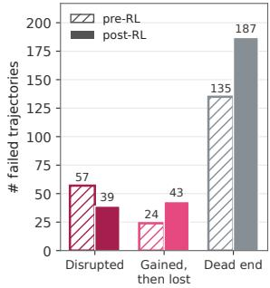  
(a)

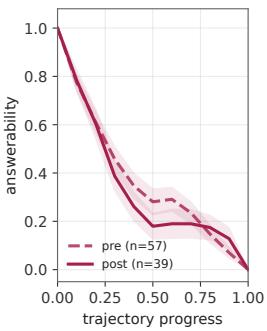  
(b)

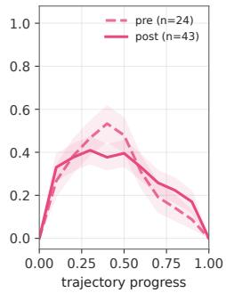  
(c)

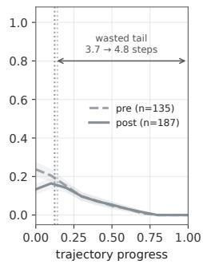  
(d)  
Figure 7: Answerability profiles before and after RL on failed tasks. Training leaves the number of failures almost unchanged (231 → 221) but reshapes them: fewer trajectories destroy an answer the model already had (a, b), while more find an answer they cannot hold (a, c) and more settle into a wrong answer several steps before stopping (a, d).