# Reconstructing the Dynamic World: A Representation-Centric View of 4D Scene Reconstruction

Ziren Gong, Guo Chen, Yongjia Li, Yihua Shao, Fabio Tosi, Stefano Mattoccia, Matteo Poggi, Hao Tang†, Fei Ma, Shuyan Li, Ziyang Yan†, Nicu Sebe, Senior Member, IEEE, Ling Shao, Fellow, IEEE, Jianfei Cai, Fellow, IEEE, Qi Tian, Fellow, IEEE, and Ming-Hsuan Yang, Fellow, IEEE

Abstract—4D scene reconstruction aims to recover the evolving geometry, appearance, and motion of dynamic environments from visual observations. Despite substantial progress in neural scene representations, reconstructing dynamic scenes remains challenging due to non-rigid motion, occlusions, temporal inconsistencies, and the trade-offs between reconstruction fidelity and computational efficiency. Recent advances in Neural Radiance Fields (NeRF) and 3D Gaussian Splatting (3DGS) have introduced diverse approaches to representing and reconstructing dynamic scenes, yet their relationships, underlying design choices, and evaluation protocols remain fragmented. In this paper, we present a unified perspective on 4D scene reconstruction, organizing existing methods around their scene representations, temporal modeling strategies, reconstruction pipelines, and optimization objectives. Through this framework, we examine how different design choices affect geometric fidelity, appearance consistency, motion representation, and computational efficiency. We further consolidate commonly used datasets and evaluation metrics, identify limitations in current experimental practices, and discuss open challenges in reconstructing complex, dynamic real-world environments. By connecting methodological developments with their underlying assumptions and evaluation evidence, this work provides a structured foundation for understanding existing approaches and identifying future research directions. An evolving collection of relevant papers and resources is available at the project webpage.

Index Terms—4D Scene Reconstruction, Neural Radiance Field, Gaussian Splatting, Methodological Evaluation

## 1 INTRODUCTION

Scene reconstruction is a core problem in robotics and spatial AI, aiming to recover the three-dimensional structure and appearance of real-world environments from multiview observations. It remains a fundamental challenge in computer vision and graphics, with applications spanning navigation, scene understanding, and novel view synthesis [1]–[5]. Considerable efforts have been devoted to developing methods for dense, accurate, and high-fidelity reconstruction.

The field has evolved substantially over the past three decades. Early approaches were based on classical geometric pipelines, with Structure from Motion (SfM) and Multi-View Stereo (MVS) forming the foundation of threedimensional reconstruction. SfM estimates camera poses and sparse scene geometry via feature matching and bundle adjustment, while MVS densifies these reconstructions using photometric consistency across calibrated views, producing detailed surface models of static scenes [6]–[10]. Despite their effectiveness, these methods are limited by computational efficiency and their reliance on hand-crafted features and geometric assumptions.

With the development of Simultaneous Localization and Mapping (SLAM) [11], scene reconstruction has progressed from offline batch processing to online frameworks that jointly perform camera tracking and environment mapping. However, traditional geometric pipelines remain sensitive to noise in incremental inputs, leading to cumulative trajectory drift and motion-induced artifacts that degrade reconstruction quality over time [5], [12].

The field has undergone a paradigm shift with the advent of deep learning and neural representations. Neural Radiance Fields (NeRF) [13] represent scenes as continuous implicit functions, enabling high-quality view synthesis. Subsequent extensions have improved training efficiency, rendering speed, and robustness [14]–[17]. More recently,

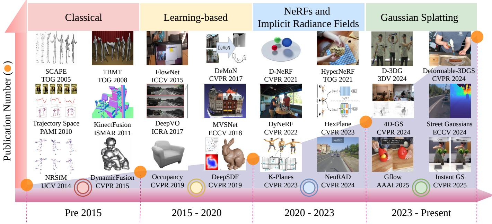  
Fig. 1. Trends in 4D reconstruction. The increasing adoption of NeRF- and GS-based methods for dynamic scene modeling has led to a rapid growth in related publications in recent years.

3D Gaussian Splatting (3DGS) [18] has emerged as an effective alternative, representing scenes with anisotropic 3D Gaussians and leveraging a differentiable tile-based rasterizer for real-time rendering while preserving fine details. These approaches depart from discrete geometric representations and instead learn continuous scene representations that capture complex geometry and appearance.

Despite advances in static scene modeling, extending reconstruction to dynamic environments introduces substantially greater complexity. High-fidelity 4D reconstruction must address the ambiguities of non-rigid motion, preserve long-range spatio-temporal coherence, and disentangle time-varying radiance from geometric deformation.

The rapid development of 4D dynamic reconstruction, driven by the transition from implicit neural representations to explicit Gaussian primitives, has led to an increasingly diverse and fragmented research landscape [19]–[23]. As illustrated in Fig. 1, the field is undergoing a shift in design choices, with evolving trade-offs among rendering speed, temporal consistency, and memory efficiency. This survey is motivated by the need to consolidate recent advances into a coherent framework and provide a structured reference for both established methods and emerging approaches such as 4D Gaussian Splatting (4DGS).

Existing surveys [14], [24]–[29] primarily focus on static neural rendering and often treat dynamic reconstruction as a secondary topic. As a result, a systematic review of 4D dynamic reconstruction using scene-specific optimization remains lacking. In this survey, we focus on the two principal paradigms for scene-specific optimization in dynamic reconstruction: implicit 4D Neural Radiance Fields (4D NeRF) and explicit 4D Gaussian Splatting (4DGS). While classical Simultaneous Localization and Mapping (SLAM) and Structure from Motion (SfM) provide the geometric foundation for camera tracking and mapping, they are typically predicated on rigid-body assumptions or sparse representations. Emerging feed-forward, generalizable 4D reconstruction approaches enable rapid, offline-style inference across diverse scenes; however, they are fundamentally constrained by reliance on pre-trained dataset biases, often resulting in a fidelity ceiling in out-of-distribution scenarios. We emphasize per-scene optimization approaches, which remain the gold standard for achieving high-fidelity reconstruction and temporal consistency. Both 4D NeRF and 4DGS mitigate the generalization gap of feed-forward models by anchoring reconstruction to scene-specific observations, rather than the statistical priors of a training set. Furthermore, we analyze the performance of representative methods on benchmark datasets and discuss key open challenges for future research.

## 2 PRELIMINARIES

## 2.1 History of Dynamic Scene Reconstruction

As shown in Fig. 1, dynamic scene reconstruction has evolved over the past two decades from geometry-based pipelines to learning-based methods and, more recently, to implicit neural representations. The introduction of NeRF established 4D reconstruction as a central research direction, further accelerated by 3DGS. This has led to rapid growth in recent work. This section reviews this progression and highlights key developments underlying modern radiance field and Gaussian-based approaches.

Classical Approaches: From Geometry to Volumetric Fusion (Pre 2015). Early work was dominated by geometrybased pipelines. Multi-view stereo (MVS) and structurefrom-motion (SfM) were extended to dynamic settings, leading to non-rigid SfM (NRSfM) [30] and template-based mesh tracking [31]. These methods estimate per-frame geometry and track deformations relative to a canonical model. In parallel, depth sensors enabled volumetric fusion methods, such as KinectFusion [32] and DynamicFusion [33], which integrate depth maps into a canonical volume with non-rigid alignment.

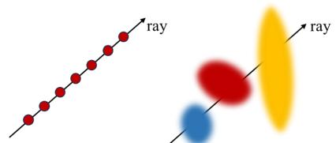  
Fig. 2. Comparison between NeRF and 3DGS. NeRF (left) evaluates an MLP along each ray, whereas 3DGS (right) renders by rasterizing and blending Gaussians.

These approaches have several limitations. Explicit ${ \mathrm { g e } } \mathrm { - }$ ometry restricts modeling of complex deformations and topology changes. Per-frame optimization limits scalability for long sequences and high-resolution scenes. Appearance modeling is also limited, typically relying on texture maps and lacking view-dependent effects.

Transition to Learning-based Models (2015–2020). With the rise of deep learning, reconstruction methods began incorporating learned priors. Early works [34]–[39] improved components such as depth, scene flow, and pose estimation, while retaining classical pipelines. A key shift was the adoption of implicit representations, including occupancy networks [40] and neural SDFs [41], which model scenes as continuous fields. These representations are more expressive and compact, and enable dynamic extensions.

Dynamic NeRFs and Implicit Radiance Fields (2020–2023). Neural Radiance Fields (NeRF) [13] enable high-quality novel view synthesis by modeling scenes as continuous radiance fields. Dynamic variants, such as D-NeRF [42], Nerfies [43], and HyperNeRF [44], represent scenes using canonical fields with deformation models. These methods capture complex non-rigid motion. However, dynamic NeRFs are computationally expensive. Training often requires long runtimes, and inference is slow due to volumetric rendering. Temporal consistency remains difficult over long sequences. Later methods, including TiNeuVox [45] and NSFF [46], introduce explicit structures or motion priors to improve efficiency, but scalability remains limited. Dynamic 3D Gaussian Splatting (2023–Present). Gaussian Splatting (GS) [18] represents scenes as sets of anisotropic 3D Gaussians with learnable parameters, including position, scale, opacity, rotation, and appearance. Dynamic extensions incorporate temporal modeling through deformation or perframe transformations, leading to 4D Gaussian Splatting (4DGS). GS enables real-time rendering via rasterization. Its explicit structure facilitates handling occlusions and nonrigid motion. Each Gaussian jointly encodes geometry and appearance, yielding a compact representation. However, dynamic GS methods often require many primitives, leading to high memory usage [47], [48]. Improving efficiency and scalability remains an open problem.

## 2.2 Representing Radiance Fields

Recent advances in radiance field representations have improved 4D scene reconstruction, enabling high-fidelity modeling of geometry and appearance over time. Both NeRF and 3DGS represent scenes as radiance fields but differ in formulation. NeRF models the scene implicitly using a neural network that maps 3D coordinates and viewing directions to color and density. In contrast, 3DGS represents the scene explicitly with anisotropic 3D Gaussians optimized for efficient rendering. We briefly review these approaches and summarize their differences in Fig. 2.

Neural Radiance Fields. NeRF [13] models a 3D scene as a continuous function that maps a 3D point and viewing direction to color and density:

$$
F _ { \theta } ( \mathbf { x } , \mathbf { d } ) \to ( \mathbf { c } , \sigma ) .\tag{1}
$$

Novel views are synthesized via differentiable volume rendering, where pixel color is computed by integrating radiance along a camera ray:

$$
\hat { C } ( \mathbf { r } ) = \sum _ { i = 1 } ^ { N } T _ { i } \left( 1 - e ^ { - \sigma _ { i } \delta _ { i } } \right) \mathbf { c } _ { i } , \quad T _ { i } = \exp \left( - \sum _ { j = 1 } ^ { i - 1 } \sigma _ { j } \delta _ { j } \right) .\tag{2}
$$

To capture high-frequency details, NeRF applies positional encoding to the input coordinates, enabling the MLP to represent complex geometry and appearance.

3D Gaussian Splatting. 3DGS [18] represents a scene explicitly as a set of anisotropic 3D Gaussians. Each Gaussian encodes position, density, and appearance, analogous to volumetric elements in NeRF but in an explicit form. Initialized from a sparse SfM point cloud, each Gaussian is parameterized by its mean $\mu$ and covariance $\Sigma \colon$

$$
\begin{array} { r } { G ( x ) = \exp \left( - \frac { 1 } { 2 } ( x - \mu ) ^ { \top } \Sigma ^ { - 1 } ( x - \mu ) \right) , \quad \Sigma = R S S ^ { \top } R ^ { \top } . } \end{array}\tag{3}
$$

For rendering, Gaussians are projected to the image plane and composited via alpha blending:

$$
C = \sum _ { i } c _ { i } \alpha _ { i } \prod _ { j < i } ( 1 - \alpha _ { j } ) .\tag{4}
$$

Each Gaussian defines a continuous density in space and contributes to pixel color along a camera ray, analogous to volumetric rendering in NeRF.

## 2.3 Comparison with Existing Surveys

Recent advances in radiance field representations have driven the development of 4D reconstruction methods based on NeRF and 3DGS, with applications across diverse domains. Table 1 compares recent surveys in this area. Our survey provides broader coverage by including both NeRF- and GS-based methods, summarizing commonly used datasets and evaluation protocols, and incorporating a quantitative analysis for performance comparison.

Among existing works, Zhu et al. [49] is most closely related, but covers fewer methods (52 vs. 102) and datasets (10 vs. 22), and omits several scene types, such as autonomous driving. In addition, it does not provide a unified taxonomy or a comprehensive evaluation. This survey aims to offer a structured and comprehensive reference for 4D scene reconstruction.

## 3 DYNAMIC NEURAL RADIANCE FIELDS 3.1 Preliminaries of 4D NeRF

To extend static NeRF to dynamic scenes, temporal dynamics are incorporated by introducing a time dimension into the radiance field formulation. As shown in Fig. 3, existing approaches adopt different strategies to encode temporal information within neural radiance fields. Based on the taxonomy in Table 2, these methods can be categorized into four main classes.

TABLE 1  
Comparison of existing surveys on 4D scene reconstruction.
<table><tr><td rowspan="2">Survey</td><td colspan="2">4D Scene Types</td><td>Evaluation Coverage</td><td>Datasets</td><td>Methods</td><td>Taxonomy</td></tr><tr><td>Fan et al. [50]</td><td>Human and animal motion</td><td></td><td></td><td>90</td><td></td></tr><tr><td>Zhu et al. [49]</td><td></td><td>General</td><td>NVS, Efficiency</td><td>10</td><td>52</td><td>√</td></tr><tr><td>He et al. [51]</td><td></td><td>Autonomous driving</td><td></td><td></td><td>36</td><td>一</td></tr><tr><td>Cao et al. [52]</td><td></td><td>General</td><td></td><td></td><td>111</td><td></td></tr><tr><td></td><td></td><td>Zhao et al. [53] Object, human, and animal motion</td><td></td><td>21</td><td>62</td><td></td></tr><tr><td>Ours</td><td></td><td>General</td><td>NVS, Geometry, Efficiency</td><td>22</td><td>102</td><td></td></tr></table>

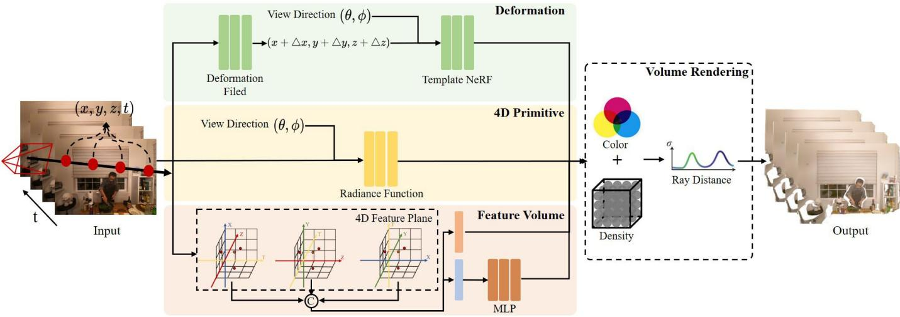  
Fig. 3. General pipeline of NeRF-based 4D scene reconstruction methods. The pipeline illustrates representative strategies, including deformation based, 4D primitive-based, and 4D feature volume-based frameworks. Temporal prior-based methods are not included due to their diversity.

Deformation-Field-Based Methods extend static NeRF by maintaining a canonical 3D representation and learning time-dependent spatial transformations. This approach is based on the observation that many dynamic scenes can be modeled as deformations of a canonical state, where geometric changes are captured by learnable displacement functions. The formulation decomposes the 4D problem into a canonical NeRF and a deformation network. The canonical NeRF $F _ { \theta }$ models a reference frame, while the deformation network $D _ { \phi }$ maps spatial coordinates at time t to the canonical space:

$$
\begin{array} { r } { \mathbf { x } ^ { \prime } = D _ { \phi } ( \mathbf { x } , t ) , } \\ { F _ { \theta } : ( \mathbf { x } ^ { \prime } , \mathbf { d } ) \to ( \mathbf { c } , \sigma ) , \quad } \end{array}\tag{5}
$$

where $\mathbf { x } ^ { \prime }$ denotes the canonical coordinate and t is the temporal variable. This formulation leverages static NeRF priors while introducing a compact mechanism to model temporal variations.

Implicit 4D Primitive-Based Methods model time as an additional input alongside spatial coordinates and viewing direction. This formulation extends NeRF to a unified 4D representation without explicit decomposition into canonical and deformation components. The radiance field directly maps space-time coordinates to color and density:

$$
F _ { \theta } : ( \mathbf { x } , \mathbf { d } , t ) \to ( \mathbf { c } , \sigma ) ,\tag{6}
$$

where the temporal variable t is encoded jointly with spatial inputs, enabling the model to capture temporal variations. This formulation offers high flexibility for modeling complex dynamics but increases computational cost and requires careful temporal sampling.

4D Feature-Volume-Based Methods improve efficiency by decomposing the space-time domain into structured representations. The key idea is to approximate the 4D volume using lower-dimensional components, reducing memory and computation while preserving expressiveness. A common approach factorizes the 4D space using plane-based representations, such as tri-plane extensions:

$$
\begin{array} { r } { \mathbf { f } ( \mathbf { x } , t ) = \mathbf { f } _ { x y } ( x , y ) \odot \mathbf { f } _ { x z } ( x , z ) \odot \mathbf { f } _ { y z } ( y , z ) } \\ { \odot \mathbf { f } _ { x t } ( x , t ) \odot \mathbf { f } _ { y t } ( y , t ) \odot \mathbf { f } _ { z t } ( z , t ) , } \end{array}\tag{7}
$$

$$
F _ { \theta } : \mathbf { f } ( \mathbf { x } , t )  ( \mathbf { c } , \sigma ) ,\tag{8}
$$

where $\odot$ denotes element-wise multiplication and $\mathbf { f } _ { x y } , \mathbf { f } _ { x t } , \mathbf { f } _ { y t }$ denote spatial and spatiotemporal feature planes. Alternative approaches use tensor decomposition (e.g., CP or Tucker) to represent the 4D volume with lowrank components, enabling efficient storage and rendering while maintaining temporal coherence.

Temporal-Prior-Based Methods incorporate external temporal cues as auxiliary supervision, rather than explicitly parameterizing time within the radiance field. The key idea is to enforce temporal coherence through additional constraints derived from complementary signals, without modifying the underlying NeRF formulation. These methods augment standard training with temporal consistency losses and motion priors:

$$
\begin{array} { r l r } & { } & { F _ { \theta } : ( { \bf x } , { \bf d } , t ) \to ( { \bf c } , \sigma ) , \quad \quad } \\ & { } & { { \mathcal { L } } = { \mathcal { L } } _ { \mathrm { r e c o n } } + \lambda _ { 1 } { \mathcal { L } } _ { \mathrm { f l o w } } ( t ) + \lambda _ { 2 } { \mathcal { L } } _ { \mathrm { t e m p } } ( t ) , } \end{array}\tag{9}
$$

where ${ \mathcal { L } } _ { \mathrm { f l o w } }$ encodes motion cues (e.g., optical or scene flow) to enforce geometric consistency, and $\mathcal { L } _ { \mathrm { t e m p } }$ enforces temporal smoothness. These approaches improve coherence and can be combined with other designs.

## 3.2 Deformation-Field-Based Methods

These methods extend static NeRF by maintaining a canonical 3D representation and learning deformation functions $D ( \mathbf { x } , t ) \ \to \ \mathbf { x } ^ { \prime }$ to model temporal variations. To address non-rigid reconstruction without explicit geometry, early methods employ deformation MLPs to map spatio-temporal coordinates into a canonical space, e.g., D-NeRF [42]. On the other hand, NR-NeRF [54] introduces rigidity regularization to improve temporal correspondence. However, these methods remain less effective in the presence of significant topological changes or large displacements due to the limitations of a single continuous deformation field.

For complex scenes with articulated structures or multiple interacting objects, global deformation fields are often insufficient to capture localized motions. STAR [55], Total-Recon [60], and NDR [56] address this limitation by factorizing scenes into motion-aware canonical subspaces. With trajectory-based constraints, these methods jointly optimize geometry, camera poses, and non-rigid transformations. However, the optimization process remains computationally expensive and sensitive to the quality of the initial trajectory or pose estimates.

Reconstructing high-fidelity dynamic radiance fields from sparse observations or uncalibrated cameras remains challenging. To improve stability, DeVRF [57] and Ro-DynRF [59] employ voxel-based representations for efficient canonicalization. These methods further incorporate auxiliary priors, such as monocular depth, disparity, and reprojection constraints, to jointly estimate camera motion and dynamic scene evolution. However, their performance depends heavily on the quality of the external priors, and inaccurate disparity estimates can introduce artifacts into the 4D representation.

Typical deformation models often struggle with viewdependent specularities and motion blur, leading to entangled geometry and appearance. To alleviate this issue, Dy-BluRF [61] and NeRF-DS [58] incorporate surface-normal conditioning and mask-guided deformation to separate transient appearance effects from scene geometry. However, modeling complex radiance variations remains challenging in regions with rapid motion or strong reflections, often resulting in blurred textures or residual artifacts.

## 3.3 Implicit 4D Primitive-Based Methods

These methods extend NeRF by directly modeling dynamics through an explicit temporal dimension, where the radiance field is defined as $F ( \mathbf { \hat { x } } , t , \mathbf { d } ) \ \to \ ( \sigma , \mathbf { c } )$ . This formulation avoids canonical decomposition and provides a unified space-time representation. To improve temporal coherence in dynamic scenes, several methods incorporate explicit motion fields into volumetric representations. NSFF [46] introduced neural scene flow fields to jointly optimize geometry, radiance, and dense 3D motion, while NeRFlow [64] coupled radiance fields with continuous flow for consistent monocular view synthesis. However, these methods remain sensitive to flow estimation errors, often producing artifacts or blurred geometry under rapid motion.

To address the under-constrained nature of monocular reconstruction, several works adopt static–dynamic decomposition. DynNeRF [63] and Video-NeRF [62] incorporate monocular depth priors to regularize geometry and appearance, enabling stable free-viewpoint rendering of dynamic content. DetNeRF [71] further extends this by employing occlusion-aware modeling to explicitly separate static backgrounds from moving components. The efficacy of these methods is strictly bounded by the quality of external priors

For long sequences and complex scenes with multiple moving agents, DecouplingNeRF [70] and ML-NSG [69] use hierarchical neural scene graphs to decompose scenes into object-centric components for scalable reconstruction. However, the hierarchical design introduces additional complexity, and these methods may struggle with objects exhibiting unpredictable motion or frequent occlusions.

Recent advances increasingly focus on modeling motion dynamics and incorporating non-RGB sensors. Sync-NeRF [67] and MonoNeRF [66] learn implicit velocity fields and feature correspondences to improve temporal alignment and robustness. Beyond RGB inputs, 4D-NDF [68] models LiDAR sequences using time-dependent signed distance functions (SDFs) to jointly reconstruct static structures and dynamic objects. However, velocity-based methods remain sensitive to temporal aliasing, while multimodal approaches are affected by modality-specific noise.

## 3.4 4D Feature-Volume-Based Methods

To improve efficiency, these methods replace implicit neural fields with structured representations that factorize the 4D space-time domain into lower-dimensional components. Common strategies include tensor decomposition, planar factorization, and multi-resolution grids, enabling faster training and rendering with reduced memory.

To reduce the computational cost of coordinate-based MLPs, several methods decompose 4D space into lowerdimensional representations. HexPlane [72] and K-Planes [73] project 4D volumes onto orthogonal 2D planes, while HyperReel [76] and MixVoxels [77] combine voxel grids with ray-conditioned sampling and deformation modeling. These factorizations enable efficient high-quality rendering through structured memory layouts, but often involve a trade-off between memory usage and spatial resolution.

To ensure smooth transitions between temporal snapshots, several methods incorporate temporal interpolation and frequency-aware modeling. TID-NeRF [75] integrates temporal modeling into explicit representations, while BLiRF [81] models radiance fields as band-limited signals using neural trajectory bases and low-rank spatial decomposition. NeRFPlayer [80] decomposes scenes into static and dynamic components with sliding-window temporal encoding. Ced-NeRF [82] improves generalization with hybrid grid-based representations, and DaReNeRF [84] encodes temporal information using direction-aware wavelet representations. However, high-frequency motion and abrupt topological changes are often blurred by the underlying spectral constraints or interpolation schemes.

TABLE 2  
Overview of NeRF-based 4D dynamic scene reconstruction methods. Methods are categorized into four types. For each method, we summarize its scene representation, key components, and additional priors.
<table><tr><td>Method</td><td></td><td>Venue</td><td>Inputs</td><td>Scenario</td><td>Target Domain</td><td>4D-style</td><td>Scene Encoding</td><td>Flow</td><td>Normal</td><td>Segment.</td><td>Extra Prior</td></tr><tr><td>D-NeRF [42]</td><td></td><td>CVPR2021</td><td>RGB</td><td>Indoor</td><td>Entity-Centric</td><td>Deformation Fields</td><td>MLP</td><td></td><td></td><td></td><td></td></tr><tr><td>NR-NeRF [54]</td><td></td><td>CVPR2021</td><td>RGB</td><td>In-the-Wild</td><td>Scene-Centric</td><td>Deformation Fields</td><td>MLP</td><td></td><td></td><td></td><td></td></tr><tr><td>STaR [55]</td><td></td><td>CVPR2021</td><td>RGB</td><td>Indoor</td><td>Scene-Centric</td><td>Deformation Fields</td><td>MLP</td><td></td><td></td><td></td><td></td></tr><tr><td>Nerfies [43]</td><td></td><td>ICCV2021</td><td>RGB</td><td>Indoor</td><td>Entity-Centric</td><td>Deformation Fields</td><td>MLP</td><td></td><td></td><td></td><td></td></tr><tr><td>HyperNeRF [44]</td><td></td><td>TOG2021</td><td>RGB</td><td>Indoor</td><td>Entity-Centric</td><td>Deformation Fields</td><td>MLP</td><td></td><td></td><td></td><td></td></tr><tr><td>NDR [56]</td><td></td><td>NIPS2022</td><td>RGBD</td><td>Indoor</td><td>Entity-Centric</td><td>Deformation Fields</td><td>MLP</td><td></td><td></td><td></td><td></td></tr><tr><td>DeVRF [57]</td><td></td><td>RGBNIPS2022</td><td>RGB</td><td>Indoor</td><td>Entity-Centric</td><td>Deformation Fields</td><td>Voxel Grid + MLP</td><td>√</td><td></td><td></td><td>RAFT</td></tr><tr><td>TiNeuVox [45]</td><td></td><td>ACM SIG. 2022</td><td>RGB</td><td>Indoor</td><td>Entity-Centric</td><td>Deformation Fields</td><td>MLP</td><td></td><td></td><td></td><td></td></tr><tr><td>NeRF-DS [58]</td><td></td><td>CVPR2023</td><td>RGB</td><td>Indoor</td><td>Entity-Centric</td><td>Deformation Fields</td><td>MLP</td><td></td><td>√</td><td></td><td></td></tr><tr><td>RoDynRF [59]</td><td></td><td>CVPR2023</td><td>RGB</td><td>In-the-Wild</td><td>Scene-Centric</td><td>Deformation Fields</td><td>Voxel Grid + MLP</td><td>√</td><td></td><td></td><td>RAFT</td></tr><tr><td>Total-Recon [60]</td><td></td><td>ICCV2023</td><td>RGBD</td><td>Indoor</td><td>Scene-Centric</td><td>Deformation Fields</td><td>MLP</td><td>√</td><td></td><td></td><td>VCN</td></tr><tr><td>DyBluRF [61]</td><td></td><td>CVPR2024</td><td>RGB</td><td>In-the-Wild</td><td>Scene-Centric</td><td>Deformation Fields</td><td>MLP</td><td>√</td><td></td><td></td><td>RAFT</td></tr><tr><td>NSFF [46]</td><td></td><td>CVPR2021</td><td>RGB</td><td>In-the-Wild</td><td>Scene-Centric</td><td>4D Primitive</td><td>MLP</td><td>√</td><td></td><td></td><td>RAFT</td></tr><tr><td>Video-NeRF [62]</td><td></td><td>CVPR2021</td><td>RGBD</td><td>In-the-Wild</td><td>Entity-Centric</td><td>4D Primitive</td><td>MLP</td><td></td><td></td><td></td><td></td></tr><tr><td>DynNeRF [63]</td><td></td><td>ICCV2021</td><td>RGB</td><td>In-the-Wild</td><td>Scene-Centric</td><td>4D Primitive</td><td>MLP</td><td>√</td><td></td><td></td><td>RAFT</td></tr><tr><td>NeRFlow [64]</td><td></td><td>ICCV2021</td><td>RGB</td><td>Indoor</td><td>Entity-Centric</td><td>4D Primitive</td><td>MLP</td><td>√</td><td></td><td></td><td>Farneback G.</td></tr><tr><td>DyNeRF [65]</td><td></td><td>CVPR2022</td><td>RGB</td><td>Indoor</td><td>Scene-Centric</td><td>4D Primitive</td><td>MLP</td><td></td><td></td><td></td><td></td></tr><tr><td>MonoNeRF [66]</td><td></td><td>ICCV2023</td><td>RGB</td><td>In-the-Wild</td><td>Scene-Centric</td><td>4D Primitive</td><td>MLP</td><td>√</td><td></td><td></td><td>RAFT</td></tr><tr><td>Sync-NeRF [67]</td><td></td><td>AAAI2024</td><td>RGB</td><td>Indoor</td><td>Scene-Centric</td><td>4D Primitive</td><td>MLP</td><td></td><td></td><td></td><td></td></tr><tr><td>4DNDF [68]</td><td></td><td>CVPR2024</td><td>LiDAR</td><td>Auto. Driving</td><td>Scene-Centric</td><td>4D Primitive</td><td>Hash Grid + MLP</td><td></td><td></td><td>√</td><td></td></tr><tr><td>Ml-nsg [69]</td><td></td><td>CVPR2024</td><td>RGB</td><td>Auto. Driving</td><td>Scene-Centric</td><td>4D Primitive</td><td>Hash Grid + MLP</td><td></td><td></td><td></td><td></td></tr><tr><td>DecouplingNeRF [70]</td><td></td><td>TVCG2024</td><td>RGB</td><td>In-the-Wild</td><td>Scene-Centric</td><td>4D Primitive</td><td>MLP</td><td></td><td></td><td></td><td>NSFF</td></tr><tr><td>DetNeRF [71]</td><td></td><td>AAAI2025</td><td>RGB</td><td>In-the-Wild</td><td>Scene-Centric</td><td>4D Primitive</td><td>MLP</td><td>√</td><td></td><td></td><td>RAFT</td></tr><tr><td>HexPlane [72]</td><td></td><td>CVPR2023</td><td>RGB</td><td>Indoor</td><td>Entity-Centric</td><td>4D Feature Volumes</td><td>Feat. Plane + MLP</td><td></td><td></td><td></td><td></td></tr><tr><td>K-Planes [73]</td><td></td><td>CVPR2023</td><td>RGB</td><td>Indoor</td><td>Entity-Centric</td><td>4D Feature Volumes</td><td>Feat. Plane + MLP</td><td></td><td></td><td></td><td></td></tr><tr><td>SUDS [74]</td><td></td><td>CVPR2023</td><td>RGBD</td><td>Auto. Driving</td><td>Scene-Centric</td><td>4D Feature Volumes</td><td>Hash Grid + MLP</td><td></td><td></td><td></td><td>RAFT &amp; DINO</td></tr><tr><td>TIDNeRF [75]</td><td></td><td>CVPR2023</td><td>RGB</td><td>Indoor</td><td>Multi.-Centric</td><td>4D Feature Volumes</td><td>Hash Grid + MLP</td><td></td><td></td><td></td><td></td></tr><tr><td>HyperReel [76]</td><td></td><td>CVPR2023</td><td>RGB</td><td>Indoor</td><td>Entity-Centric</td><td>4D Feature Volumes</td><td>Feat. Plane + MLP</td><td></td><td></td><td></td><td></td></tr><tr><td>MixVoxels [77]</td><td></td><td>ICCV2023</td><td>RGB</td><td>In. &amp; Wild</td><td>Scene-Centric</td><td>4D Feature Volumes</td><td>Voxel Grid + MLP</td><td></td><td></td><td></td><td></td></tr><tr><td>MSTH [78]</td><td></td><td>NIPS2023</td><td>RGB</td><td>Indoor</td><td>Scene-Centric</td><td>4D Feature Volumes</td><td>Hash Grid + MLP</td><td></td><td></td><td></td><td>Kendall and Gal</td></tr><tr><td>NVFi [79]</td><td></td><td>NIPS2023</td><td>RGB</td><td>In. &amp; wild</td><td>Multi.-Centric</td><td>4D Feature Volumes</td><td>Feat. Plane + MLP</td><td></td><td></td><td></td><td>HexPlane</td></tr><tr><td>NeRFPlayer [80]</td><td></td><td>TVCG2023</td><td>RGB</td><td>Indoor</td><td>Scene-Centric</td><td>4D Feature Volumes</td><td>Hybrid + MLP</td><td></td><td></td><td></td><td></td></tr><tr><td>BLiRF [81]</td><td></td><td>AAAI2024</td><td>RGB</td><td>Indoor</td><td>Multi.-Centric</td><td>4D Feature Volumes</td><td>MLP</td><td></td><td></td><td></td><td></td></tr><tr><td>Ced-NeRF [82]</td><td></td><td>AAAI2024</td><td>RGB</td><td>Indoor</td><td>Multi.-Centric</td><td>4D Feature Volumes</td><td>Hash Grid + MLP</td><td></td><td></td><td></td><td>flow MLP</td></tr><tr><td>LiDAR4D [83]</td><td>DaReNeRF [84]</td><td>CVPR2024 CVPR2024</td><td>LiDAR RGB</td><td>Auto. Driving Indoor</td><td>Scene-Centric Scene-Centric</td><td>4D Feature Volumes 4D Feature Volumes</td><td>Hybrid + MLP Feat. Plane + MLP</td><td>√</td></table>

For large-scale scenes, hash-based encodings improve scalability. SUDS [74] and MSTH [78] utilize multiresolution hash grids with uncertainty-aware masking to handle complex urban dynamics, while NeuRAD [86] and RoDUS [88] incorporate rolling shutter compensation and semantic signals for robust performance in autonomous driving scenarios. EmerNeRF [89] and LiDAR4D [83] further extend these ideas to multimodal settings by using learned flow and temporal feature slots to aggregate information across sparse frames. However, hash-based representations may suffer from feature collisions in complex scenes, potentially introducing aliasing artifacts or geometric noise.

Hybrid representations support specialized tasks by incorporating domain-specific inductive biases. NVFi [79] introduces physics-informed velocity fields for motion transfer and future-state prediction, while Gear-NeRF [85] leverages semantic priors for object-level tracking and motionaware sampling. Methods such as S-DyRF [87] further enable temporally consistent stylization in dynamic scenes.

However, the reliance on specialized priors can limit generalization across diverse scenarios.

## 3.5 Temporal-Prior-Based Methods

While previous approaches explicitly parameterize time within the radiance field, practical reconstruction often benefits from external temporal cues used as constraints or guidance. These methods leverage signals such as optical flow, physical constraints, or sequential modeling to regularize the under-constrained dynamic reconstruction problem. To support real-time and streaming applications, several frameworks replace global optimization with temporally incremental updates. StreamRF [91], for example, employs a grid-based representation with sequential updates, modeling temporal evolution through incremental changes to a base model and enabling efficient streaming via differencebased compression. However, these methods are prone to error accumulation, where small update misalignments propagate over long sequences.

For scenes with complex stochastic motion, OTNeRF [92] enforces temporal consistency by modeling scene dynamics as low-frequency shifts in pixel distributions. However, such statistical regularization often suppresses highfrequency geometric details. In scenarios with sparse observations or severe occlusions, incorporating physics-based or geometric priors from non-RGB sensors becomes important. STGC-NeRF [93] introduces spatio-temporal geometric constraints for LiDAR-based reconstruction, using scene flow to establish cross-frame correspondences and improve robustness under sparse inputs. However, the effectiveness of these constraints depends heavily on motion estimation quality, and large inter-frame displacements can introduce temporal aliasing in high-speed scenes.

## 4 DYNAMIC 3D GAUSSIAN SPLATTING

The core challenge in extending 3DGS to the temporal domain lies in parameterizing dynamic scene evolution [94]. Existing 4D reconstruction frameworks differ in how they model time, ranging from explicit geometric embedding to implicit motion modeling. As shown in Fig. 4 and Table 3, these approaches can be grouped into three paradigms: (i) Explicit 4D Primitive-Based Methods, which treat time as a geometric dimension; (ii) Deformation Field-Based Methods, which separate geometry and motion via learned transformations; and (iii) Frame-wise Training Methods, which optimize discrete states for temporal consistency. These paradigms involve trade-offs in flexibility, efficiency, and temporal coherence.

## 4.1 Fundamentals of 4DGS

The standard 3DGS framework represents scenes using static primitives, limiting its applicability to stationary environments [95]. Extending to the 4D spatio-temporal domain requires modeling the evolution of scene attributes—position, rotation, and appearance—over time. Existing methods differ in how this temporal evolution is formulated.

Explicit 4D Primitive-Based Methods treat time as an intrinsic dimension and represent scenes using 4D Gaussian primitives. Each primitive is parameterized by a mean $\pmb { \mu } \in \bar { \mathbb { R } } ^ { 4 }$ and covariance $\pmb { \Sigma } \in \mathbb { R } ^ { 4 \times 4 }$ , decomposed into rotation and scaling:

$$
\begin{array} { r } { \pmb { \Sigma } = \mathbf { R S S } ^ { \top } \mathbf { R } ^ { \top } , ~ \mathbf { S } = \mathrm { d i a g } ( s _ { x } , s _ { y } , s _ { z } , s _ { t } ) , } \end{array}\tag{10}
$$

where the rotation R couples spatial and temporal dimensions. To render a frame at time t, the 4D Gaussian is sliced into a 3D Gaussian via the conditional distribution $p ( \mathbf { x } \mid t )$ By partitioning µ and Σ into spatial $( \mu _ { x } , \Sigma _ { x x } )$ , temporal $( \mu _ { t } , \Sigma _ { t t } )$ , and cross terms $( \Sigma _ { x t } )$ , the resulting 3D Gaussian parameters are:

$$
\begin{array} { r } { \pmb { \mu } ^ { \prime } = \pmb { \mu } _ { x } + \pmb { \Sigma } _ { x t } \pmb { \Sigma } _ { t t } ^ { - 1 } ( t - \mu _ { t } ) , \quad \pmb { \Sigma } ^ { \prime } = \pmb { \Sigma } _ { x x } - \pmb { \Sigma } _ { x t } \pmb { \Sigma } _ { t t } ^ { - 1 } \pmb { \Sigma } _ { x t } ^ { \top } . } \end{array}\tag{11}
$$

This formulation enables integration with standard splatting while maintaining temporal consistency.

Deformation Field-Based Methods decouple temporal dynamics from scene geometry by maintaining static 3D Gaussians in a canonical space $\dot { \mathcal { G } _ { \mathrm { c a n } } } . \mathrm { A }$ learnable deformation network $\mathcal { F } _ { \theta }$ maps canonical coordinates and time to attribute offsets. Given a query point p and time $t ,$ the network predicts:

$$
( \Delta \mu , \Delta q , \Delta s ) = \mathscr { F } _ { \theta } ( \mathbf { p } , t ) ,\tag{12}
$$

where p is typically the Gaussian center $\pmb { \mu }$ [96]. The deformed Gaussian set at time t is:

$$
\mathscr { G } ( t ) = \{ \pmb { \mu } + \Delta \pmb { \mu } , q \otimes \Delta q , s + \Delta s , \alpha , c \} ,\tag{13}
$$

where $\otimes$ denotes quaternion multiplication. Rendering is performed using standard differentiable splatting.

Frame-Wise Training Methods optimize Gaussian parameters independently at each timestamp, often guided by priors such as rigidity or optical flow. The state of Gaussian i at time t is updated from the previous frame:

$$
\mu _ { i , t } = \mathbf { R } _ { i , t } \pmb { \mu } _ { i , t - 1 } + \mathbf { T } _ { i , t } , \quad q _ { i , t } = q ( \mathbf { R } _ { i , t } ) \otimes q _ { i , t - 1 } ,\tag{14}
$$

where $\mathbf { R } _ { i , t }$ and $\mathbf { T } _ { i , t }$ denote local rotation and translation. To handle topology changes, the Gaussian set is dynamically updated:

$$
\mathcal G _ { t } = \hat { \mathcal G } _ { t } \cup \mathcal G _ { \mathrm { n e w } } ,\tag{15}
$$

where $\hat { \mathcal { G } } _ { t }$ denotes propagated Gaussians and $\mathcal { G } _ { \mathrm { n e w } }$ newly initialized ones.

## 4.2 Explicit 4D Primitive-Based Methods

These methods extend 3D Gaussian Splatting by incorporating time directly into Gaussian primitives. Combined with temporal slicing and tile-based rasterization, they achieve high reconstruction quality and temporal coherence.

4DGS [97] generalizes 3DGS to 4D by treating time as an additional dimension. It uses 4D scaling and dual quaternions for rotation, and renders by slicing 4D Gaussians into conditional 3D Gaussians.

Subsequent works refine spatial–temporal disentanglement. 4D-RotorGS [98] adopts rotor-based rotation with entropy regularization, while SpaceTimeGS [99] models topology changes using temporal basis functions and compact feature decoding.

To better capture motion, CD-3DGS [100] and Free-TimeGS [101] parameterize motion using Fourier or linear functions, with additional supervision such as optical flow. SplatFlow [102] further incorporates learned motion flow fields. In order to improve robustness, DriveDreamer4D [103] and DeSiRe-GS [104] introduce external supervision, including synthetic data and motion-aware decomposition, to handle occlusions and sparse observations.

Explicit 4D primitive-based methods directly embed time into Gaussian parameterization, achieving strong temporal consistency through conditional slicing of 4D Gaussians into 3D counterparts [97]. Combined with tilebased rasterization, this formulation enables efficient realtime rendering. Extensions such as temporal basis functions [99] and rotor-based rotation with entropy regularization [98] further improve spatio-temporal disentanglement and topology modeling. However, the higher per-primitive parameter dimensionality introduces substantial memory overhead, as each Gaussian requires a 4D mean and $\mathsf { a } \ 4 \times 4$ covariance matrix. These methods are particularly suitable for indoor dynamic scenes with dense multi-view capture and real-time rendering requirements.

## 4.3 Deformation-Field-Based Methods

Deformation field-based methods model dynamics by applying a learnable deformation field to a canonical set of 3D

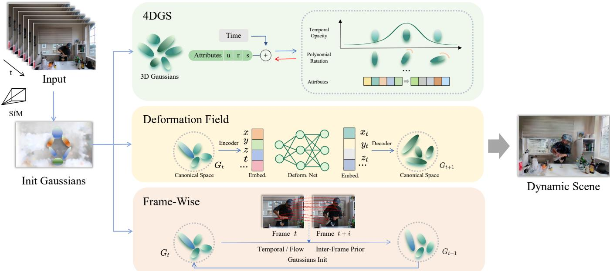  
Fig. 4. General pipeline of 3DGS-style 4D scene reconstruction methods. The pipeline presents the representative 4D strategies in explicit 4D primitive-based, deformation-field-based, and frame-wise-training frameworks.

Gaussians, typically implemented as an MLP. This approach decouples appearance from motion by predicting only the temporal changes in position, rotation, and scale, while assuming other Gaussian attributes remain fixed.

Deformable 3D-GS [96] introduces deformation fields into 3DGS by mapping Gaussians to a canonical space and using an MLP to predict position, scale, and rotation offsets, with annealing to reduce rendering jitter. Subsequent works improve efficiency and structural consistency through sparse control. SC-GS [111] and SP-GS [125] drive dense Gaussians using sparse control points and superpoints, respectively, while GaussianPrediction [116] employs graph convolutional networks on clustered key points for motion prediction. Feature encoding is further optimized by 4D-GS [109], which uses K-Planes with voxel encoding, and GaGS [112], which combines point-based MLPs with voxel U-Nets for geometry-aware features.

To reduce artifacts from global deformation, several methods separate static and dynamic components. GauFRe [150] and SWinGS [115] restrict deformation to dynamic regions. HUGS [108] models static backgrounds and dynamic objects with separate parameterizations. Gflow [126] and EfficientGS [151] further incorporate priors such as depth and optical flow to localize deformable regions.

Hierarchical methods address multi-scale dynamics. Grid4D [119] decomposes spatiotemporal encoding using hash grids and attention. MoDec-GS [130] and Hicom [122] adopt global-to-local cascades, while ADC-GS [139] uses anchor-driven deformation to combine transformations with local refinement.

In addition, external priors and structured models are introduced to regularize deformation. MotionGS [123] and MoDGS [138] use optical flow decomposition. BARD-GS [129] and 4D-GS Wild [121] address challenging scenarios with pose interpolation and diffusion-based regularization. TaylorGaussian [136], Gaussian-Flow [107], and SplineGS [131] model motion using analytic representations, while FreeGave [132] enforces physical constraints.

Specialized designs target specific scenarios. SpectroMotion [137] handles specular materials, while GIFStream [133] and MoSca [135] enable efficient streaming. Marbles [118] and MonoFusion [152] address monocular settings with simplified primitives and motion models. OmniRe [140] adopts neural scene graphs to separate static and dynamic components under a shared deformation field.

Deformation-field-based methods decouple temporal dynamics from canonical geometry by predicting per-Gaussian attribute offsets through a learnable deformation network [96], offering improved parameter efficiency over explicit 4D primitives. This formulation is particularly effective for modeling non-rigid motion and view-dependent specularities. However, MLP-based deformation prediction may introduce rendering jitter, while the additional network inference can limit rendering speed. As one of the most widely explored paradigms, deformation-field-based methods are well-suited for scenes with non-rigid motion and complex appearance changes, and naturally support downstream tasks such as scene editing [111], [134] and neural scene graph decomposition [140].

## 4.4 Frame-Wise Training Methods

Frame-wise methods optimize 3D Gaussians independently at each timestamp via per-frame reconstruction, optionally incorporating inter-frame constraints for temporal consistency. These approaches are simple and flexible but often incur high storage cost and limited long-term coherence.

D-3DG [141] models Gaussian centers and orientations as time-varying, while keeping color, opacity, and scale fixed. Motion is guided by rigidity and rotation priors. However, independent optimization can lead to weak temporal consistency and high storage overhead.

To reduce redundancy in complex scenes, many methods adopt dynamic–static decomposition. Street Gaussians [144] and DrivingGaussian [145] use graph-based representations to separate static backgrounds and dynamic objects [153]. Casual-FVS [146] decomposes scenes into static planes and dynamic points with flow-based blending, while LiveSplats [154] employs hierarchical optimization for real-time processing.

TABLE 3  
Overview of 3DGS-based 4D dynamic scene reconstruction methods. Methods are categorized into three types. For each method, we summarize its key components and additional priors.
<table><tr><td>Method</td><td>Venue</td><td>Input</td><td>Scenario</td><td>Target Domain</td><td>4D-style</td><td>Text</td><td>Flow</td><td>Normal</td><td>Segment.</td><td>Extra Prior</td></tr><tr><td>4DGS [97]</td><td>ICLR2024</td><td>RGB</td><td>Indoor</td><td>Multi.-Centric</td><td>Explicit 4D Primitive</td><td></td><td></td><td></td><td></td><td></td></tr><tr><td>CD-3DGS [100]</td><td></td><td>ECCV2024 RGB</td><td>Indoor</td><td>Entity-Centric</td><td>Explicit 4D Primitive</td><td></td><td></td><td></td><td></td><td>RAFT</td></tr><tr><td>SpacetimeGS [99]</td><td></td><td>CVPR2024 RGB</td><td>Indoor</td><td>Entity-Centric</td><td>Explicit 4D Primitive</td><td></td><td></td><td></td><td></td><td></td></tr><tr><td>4DRotorGS [98]</td><td>ACM SIG. 2024</td><td>RGB</td><td>Indoor</td><td>Entity-Centric</td><td>Explicit 4D Primitive</td><td></td><td></td><td></td><td></td><td></td></tr><tr><td>FreeTimeGS [101]</td><td>CVPR2025</td><td>RGB</td><td>Indoor</td><td>Multi.-Centric</td><td>Explicit 4D Primitive</td><td></td><td></td><td></td><td></td><td>ROMA</td></tr><tr><td>DeSiRe-GS [104]</td><td>CVPR2025</td><td>RGBD</td><td>Auto. Driving</td><td>Scene-Centric</td><td>Explicit 4D Primitive</td><td></td><td></td><td>√</td><td></td><td></td></tr><tr><td>SplatFlow [102]</td><td>CVPR2025</td><td>RGBD</td><td>Auto. Driving</td><td>Scene-Centric</td><td>Explicit 4D Primitive</td><td></td><td></td><td></td><td>√</td><td>RAFT</td></tr><tr><td>DriveDreamer4D [103]</td><td>CVPR2025</td><td>RGBD</td><td>Auto. Driving</td><td>Scene-Centric</td><td>Explicit 4D Primitive</td><td></td><td></td><td></td><td></td><td></td></tr><tr><td>ST-4DGS [105]</td><td>ACM SIG. 2024</td><td>RGB</td><td>In. &amp; Wild</td><td>Entity-Centric</td><td>Deformation Fields</td><td></td><td>√</td><td></td><td></td><td>RAFT</td></tr><tr><td>SaRO-GS [106]</td><td></td><td>ACM MM2024 RGB</td><td>Indoor</td><td>Entity-Centric</td><td>Deformation Fields</td><td></td><td></td><td></td><td></td><td></td></tr><tr><td>GaussianFlow [107]</td><td></td><td>CVPR2024 RGB</td><td>Indoor</td><td>Entity-Centric</td><td>Deformation Fields</td><td></td><td>√</td><td></td><td></td><td>Videoflow</td></tr><tr><td>HUGS [108]</td><td></td><td>CVPR2024 RGB</td><td>Auto. Driving</td><td>Scene-Centric</td><td>Deformation Fields</td><td></td><td>V</td><td></td><td></td><td></td></tr><tr><td>4D-GS [109]</td><td>CVPR2024</td><td>RGB</td><td>Indoor</td><td>Entity-Centric</td><td>Deformation Fields</td><td></td><td></td><td></td><td></td><td>Unimatch</td></tr><tr><td>DeformGS [110]</td><td>CVPR2024</td><td>RGB</td><td>Indoor</td><td>Entity-Centric</td><td>Deformation Fields</td><td></td><td></td><td></td><td></td><td></td></tr><tr><td>SC-GS [111]</td><td>CVPR2024</td><td>RGB</td><td>In. &amp; Wild</td><td>Entity-Centric</td><td>Deformation Fields</td><td></td><td></td><td></td><td></td><td></td></tr><tr><td>Deformable-3DGS [96]</td><td>CVPR2024</td><td>RGB</td><td>Indoor</td><td>Entity-Centric</td><td>Deformation Fields</td><td></td><td></td><td></td><td></td><td></td></tr><tr><td>GaGS [112]</td><td>CVPR2024</td><td>RGB</td><td>In. &amp; Wild</td><td>Entity-Centric</td><td>Deformation Fields</td><td></td><td></td><td></td><td></td><td></td></tr><tr><td>DynMF [113]</td><td>ECCV2024</td><td>RGB</td><td>Indoor</td><td>Entity-Centric</td><td>Deformation Fields</td><td></td><td></td><td></td><td></td><td></td></tr><tr><td>ED-3DGS [114]</td><td>ECCV2024</td><td>RGB</td><td>In. &amp; Wild</td><td>Multi.-Centric</td><td>Deformation Fields</td><td></td><td></td><td></td><td></td><td></td></tr><tr><td>SwinGS [115]</td><td></td><td>ECCV2024 RGB</td><td>Indoor</td><td>Entity-Centric</td><td>Deformation Fields</td><td></td><td></td><td></td><td></td><td></td></tr><tr><td>GSPrediction [116]</td><td></td><td>ACM SIG.2024 RGB</td><td>Indoor</td><td>Entity-Centric</td><td>Deformation Fields</td><td></td><td></td><td></td><td></td><td>RAFT</td></tr><tr><td>AmbientGaussian [117]</td><td></td><td>ACM SIG. 2024 RGB</td><td>In-the-Wild</td><td>Scene-Centric</td><td>Deformation Fields</td><td></td><td></td><td></td><td></td><td></td></tr><tr><td>Marbles [118]</td><td></td><td>SIG-ASIA 2024 RGB</td><td>Indoor</td><td>Entity-Centric</td><td>Deformation Fields</td><td></td><td></td><td></td><td></td><td></td></tr><tr><td>Grid4D [119]</td><td></td><td>NIPS2024 RGB</td><td>Indoor</td><td>Entity-Centric</td><td>Deformation Fields</td><td></td><td></td><td></td><td>√</td><td>Trackanything</td></tr><tr><td>Vidu4D [120]</td><td></td><td>NIPS2024 RGB</td><td>Indoor</td><td>Entity-Centric</td><td>Deformation Fields</td><td></td><td></td><td></td><td>√</td><td></td></tr><tr><td>4D-GS Wild [121]</td><td></td><td>NIPS2024 RGB</td><td>In. &amp; Wild</td><td>Multi.-Centric</td><td>Deformation Fields</td><td>V</td><td></td><td></td><td></td><td></td></tr><tr><td>HiCoM [122]</td><td></td><td>NIPS2024 RGB</td><td>Indoor</td><td>Entity-Centric</td><td>Deformation Fields</td><td></td><td>V</td><td></td><td></td><td>RAFT &amp; BLIP &amp; Stable Diffusion</td></tr><tr><td>MotionGS [123]</td><td></td><td>NIPS2024 RGB</td><td>Indoor</td><td>Multi.-Centric</td><td>Deformation Fields</td><td></td><td></td><td></td><td></td><td></td></tr><tr><td>DN-4DGS [124]</td><td></td><td>NIPS2024</td><td>RGB In. &amp; Wild</td><td>Entity-Centric</td><td>Deformation Fields</td><td></td><td></td><td></td><td></td><td>Gaussianflow</td></tr><tr><td>SP-GS [125]</td><td></td><td>ICML2024 RGB</td><td>Indoor</td><td>Entity-Centric</td><td>Deformation Fields</td><td></td><td></td><td></td><td></td><td></td></tr><tr><td>Gflow [126]</td><td></td><td>AAAI2025</td><td>RGB In-the-Wild</td><td>Scene-Centric</td><td>Deformation Fields</td><td></td><td></td><td></td><td></td><td>SuperPoint</td></tr><tr><td>EfficientGS [127]</td><td></td><td>AAAI2025</td><td>RGB Indoor</td><td>Multi.-Centric</td><td>Deformation Fields</td><td></td><td>√</td><td></td><td></td><td>DUSt3R &amp; UniMatch</td></tr><tr><td>Instant GS [128]</td><td></td><td>CVPR2025</td><td>RGB Indoor</td><td>Entity-Centric</td><td>Deformation Fields</td><td></td><td>√</td><td></td><td></td><td>COLMAP</td></tr><tr><td>BARD-GS [129]</td><td></td><td>CVPR2025</td><td>RGB Indoor</td><td>Entity-Centric</td><td>Deformation Fields</td><td></td><td></td><td></td><td></td><td>GM-Flow</td></tr><tr><td>MoDec-GS [130]</td><td></td><td>CVPR2025</td><td>RGB In. &amp; Wild</td><td>Multi.-Centric</td><td>Deformation Fields</td><td></td><td></td><td></td><td></td><td></td></tr><tr><td>SplineGS [131]</td><td></td><td>CVPR2025</td><td>RGB In-the-Wild</td><td>Scene-Centric</td><td>Deformation Fields</td><td></td><td></td><td></td><td></td><td></td></tr><tr><td>FreeGave [132]</td><td></td><td>CVPR2025</td><td>RGB Indoor</td><td>Entity-Centric</td><td>Deformation Fields</td><td></td><td></td><td></td><td>√</td><td>SAM</td></tr><tr><td>GIFStream [133]</td><td>Instruct-4DGS [134] CVPR2025</td><td>CVPR2025</td><td>RGB Indoor RGB Indoor</td><td>Entity-Centric Entity-Centric</td><td>Deformation Fields</td></table>

For online scenarios with topology changes, 3DGStream [142] introduces a Neural Transformation Cache to transform existing Gaussians and incrementally add new ones. 4D-Fly [148] propagates Gaussians across frames using anchor-based updates, expanding the representation only when needed.

In order to reduce storage, interpolation-based methods use keyframes. Ex4DGS [147] and 4DGC [47] reconstruct intermediate frames via interpolation or motion prediction. Ex4DGS applies CHip and Slerp for trajectory smoothing, while 4DGC uses multi-resolution motion grids for efficient transformation estimation. On the other hand, several methods incorporate strong supervision to enforce temporal consistency. GaussianFlow [155] enforces consistency between 3D motion and 2D observations via optical flow. MAGS [149] further improve supervision using dense correspondences and uncertainty-aware flow modeling.

Frame-wise methods provide architectural simplicity and flexibility by optimizing 3D Gaussians independently at each timestamp, with dynamic set updates $( \bar { \mathcal { G } } _ { t } \ = \hat { \mathcal { G } } \ *$ t ∪ G ∗ new) that naturally handle topology changes [142], [148]. This design is particularly suitable for online and streaming scenarios. However, the independent per-frame parameterization results in storage costs that grow linearly with sequence length, while long-range temporal coherence remains limited without explicit inter-frame coupling. Keyframe interpolation [47], [147] and flow-supervised consistency losses [149] partially alleviate these issues, but introduce approximation errors or reliance on external priors. Consequently, this paradigm is best suited for short sequences, casual monocular videos [146], and streaming reconstruction tasks where real-time adaptability is prioritized over long-term temporal consistency [156], [157].

## 5 PERFORMANCE EVALUATION

In this section, we summarize representative datasets for dynamic scene synthesis, categorizing them according to key properties and research objectives (Table 4). In addition, we explore novel view synthesis and geometric reconstruction in representative benchmarks, highlighting the best results as first , second , and third . We organize quantitative data from papers with a common evaluation protocol and cross-verified results. Since some works do not release codes or specific configurations, our priority is to include papers with consistent benchmarks, ensuring a reliable basis for verifiable comparison with a shared evaluation framework across multiple sources.

## 5.1 Benchmark Datasets

## 5.1.1 Synthetic vs. Real-world Data

Synthetic: D-NeRF [42] and ParticleNeRF [158] provide clean articulated and deformable scenes, making them suitable for evaluating deformation modeling and motion tracking. In autonomous driving, SS3DM [159] offers synchronized RGB, LiDAR, and semantic annotations, enabling controlled evaluation of multimodal fusion methods. However, limited domain diversity and simplified rendering reduce their ability to assess real-world robustness.

Real-world: HyperNeRF [44] and Technicolor [165] introduce complex lighting, calibration errors, and dynamic backgrounds. These datasets are more suitable for evaluating generalization and robustness, but often lack accurate ground truth, making quantitative evaluation more challenging.

## 5.1.2 Monocular vs. Multi-view Capture

Monocular: D-NeRF [42], HyperNeRF [44], and DAVIS [160] contain sequences captured from a single moving camera. These benchmarks are well-suited for evaluating methods that rely on strong priors, such as generative models or deformation-aware representations. However, monocular setups often suffer from scale ambiguity and limited spatial coverage.

Multi-view: Panoptic Studio [163] and Google Immersive [168] provide dense spatial coverage, making them suitable for evaluating reconstruction fidelity and view consistency. Intermediate-scale datasets such as NeRF-DS [58] and KITTI [174] instead offer sparse multi-view setups that better reflect real-world constraints and are useful for evaluating view-sparse reconstruction methods.

## 5.1.3 Short-term vs. Long-term Horizons

Short Horizon: Neu3DV [65] and Meeting Room [167] typically contain short clips with localized motions. These datasets are well-suited for evaluating deformation modeling and short-term motion consistency, but may not capture long-range dynamics.

Long Horizon: Argoverse 2 [171] and nuScenes [170] provide large-scale temporal data across diverse driving environments. These benchmarks are useful for evaluating temporal consistency and long-term prediction, although sparse viewpoints and noisy annotations introduce additional challenges.

## 5.1.4 Human-Centric vs. General Dynamic Scenes

Human-Centric: Panoptic Studio [163] and ENeRF-Outdoor [164] focus on articulated human motion. These datasets are particularly suitable for evaluating deformation modeling, skeletal motion tracking, and fine-grained geometry reconstruction.

General Dynamics: NVIDIA Dynamic Scene [166] and Stereo4D [162] include diverse dynamic elements such as animals, fluids, and object interactions. These datasets better reflect real-world complexity, but introduce greater challenges for motion decomposition and scene understanding.

## 5.1.5 RGB-only vs. Multimodal Datasets

RGB-only: Technicolor [165] and WayveScenes101 [175] rely solely on visual inputs. These benchmarks are suitable for evaluating appearance modeling, but suffer from depth ambiguity and sensitivity to lighting variations.

Multimodal: Waymo Open Dataset [169], PandaSet [172], and OmniHD-Scenes [173] integrate LiDAR, radar, and IMU signals, making them suitable for evaluating geometric accuracy and robust reconstruction under challenging conditions. DyCheck [161] further incorporates smartphone LiDAR, enabling evaluation in lightweight capture settings.

## 5.2 Evaluation Metrics

Evaluation of 4D reconstruction involves three primary aspects: rendering quality, geometric accuracy, and computational efficiency. We adopt widely used metrics in the literature and further analyze their strengths and limitations for dynamic 4D reconstruction.

## 5.2.1 View Synthesis Metrics

PSNR measures reconstruction fidelity through pixel-wise error. Although widely used for novel view synthesis, it primarily evaluates per-frame appearance quality and does not fully capture temporal consistency in dynamic scenes.

SSIM evaluates perceptual similarity in terms of structure and contrast. Compared to PSNR, it better reflects structural preservation, but remains a frame-wise metric without explicit temporal modeling.

LPIPS measures perceptual similarity using deep feature representations. While it correlates better with human perception, it mainly evaluates appearance quality rather than dynamic geometric accuracy.

## 5.2.2 Geometric and Spatiotemporal Metrics

Chamfer Distance (CD) measures geometric similarity between predicted and ground-truth point sets. It is widely used to evaluate geometric fidelity, but remains sensitive to point density and may not adequately capture topology changes in dynamic scenes.

F-Score evaluates reconstruction quality through precision and recall under a distance threshold. It provides a more balanced assessment of geometric accuracy, although the results can vary with threshold selection.

TABLE 4  
Taxonomy of dynamic scene datasets based on benchmark properties. Datasets are grouped by their primary research focus and capture characteristics.
<table><tr><td>Dataset</td><td>Scene Type</td><td>Sensor Setup</td><td>Resolution</td><td>Frame Rate</td><td>Scene/Seq</td><td>Temporal Scale</td></tr><tr><td colspan="7">Synthetic Datasets (Ground Truth Geometry/Motion)</td></tr><tr><td>D-NeRF [42]</td><td>Indoor</td><td>1 Cam</td><td>800×800</td><td></td><td>8</td><td>50–200 frames</td></tr><tr><td>ParticleNeRF [158]</td><td>Indoor</td><td>40 Cams</td><td></td><td></td><td>6</td><td></td></tr><tr><td>SS3DM [159]</td><td>Autonomous Driving</td><td>6 Cams + 5 LiDAR</td><td></td><td>10 FPS</td><td>28</td><td>13K frames</td></tr><tr><td colspan="7">Real-world: Monocular &amp; Sparse View</td></tr><tr><td>DAVIS [160]</td><td>Outdoor</td><td>1 Cam</td><td></td><td></td><td>150</td><td>10k frames total</td></tr><tr><td>HyperNeRF [44]</td><td>Indoor/Outdoor</td><td>1-2 Cams</td><td>540×960</td><td>15 FPS</td><td>17</td><td>8–15s/seq</td></tr><tr><td>DyCheck [161]</td><td>Indoor</td><td>1 iPhone + 7 Static</td><td></td><td></td><td>14</td><td>200–500 frames</td></tr><tr><td>Stereo4D [162]</td><td>Indoor/Outdoor</td><td>2 Cams</td><td>Diverse</td><td>一</td><td>200K clips</td><td></td></tr><tr><td>NeRF-DS [58]</td><td>Outdoor</td><td>2 Cams</td><td></td><td></td><td>8</td><td></td></tr><tr><td colspan="7">Real-world: Dense Multi-view &amp; Human-Centric</td></tr><tr><td>Panoptic Studio [163]</td><td>Indoor</td><td>480 Cams</td><td></td><td></td><td>5</td><td></td></tr><tr><td>ENeRF-Outdoor [164]</td><td>Outdoor</td><td>18 Cams</td><td></td><td></td><td>3</td><td>1200 frames</td></tr><tr><td>Neu3DV [65]</td><td>Indoor</td><td>18–21 Cams</td><td>2704×2028</td><td>30 FPS</td><td>6</td><td>10s/seq</td></tr><tr><td>Technicolor [165]</td><td>Indoor (RGB-only)</td><td>16 Cams</td><td>2048×1088</td><td>25 FPS</td><td>12</td><td></td></tr><tr><td>NVIDIA Dynamic [166]</td><td>Outdoor</td><td>12 Cams</td><td></td><td></td><td>7</td><td>90–200 frames</td></tr><tr><td>Meeting Room [167]</td><td>Indoor</td><td>13 Cams</td><td>1280×720</td><td>30 FPS</td><td>3</td><td>300 frames</td></tr><tr><td>Google Immersive [168]</td><td>Indoor/Outdoor</td><td>≤46 Cams</td><td></td><td></td><td>15</td><td></td></tr><tr><td colspan="7">Real-world: Long Horizon &amp; Multimodal</td></tr><tr><td>Waymo Open [169]</td><td>Autonomous Driving</td><td>5 Cams + 5 LiDAR</td><td>1920×1280</td><td>10 FPS</td><td>1150</td><td>~12M frames</td></tr><tr><td>nuScenes [170]</td><td>Autonomous Driving</td><td></td><td>1600×900</td><td>12 FPS</td><td>1000</td><td>~5.5h</td></tr><tr><td>Argoverse 2 [171]</td><td>Autonomous Driving</td><td>6 Cams + LiDAR 7 Cams + LiDAR</td><td>1920×1200</td><td>30 FPS</td><td>1000</td><td>~1000h</td></tr><tr><td>PandaSet [172]</td><td>Autonomous Driving</td><td>6 Cams + LiDAR</td><td>1920×1080</td><td>20 FPS</td><td>103</td><td>~1h</td></tr><tr><td>OmniHD-Scenes [173]</td><td>Autonomous Driving</td><td>6C + LiDAR + 6R</td><td>Diverse</td><td>15 FPS</td><td>1501</td><td>~30s/seq</td></tr><tr><td>KITTI [174]</td><td>Autonomous Driving</td><td>2 Stereo + LiDAR</td><td>1242×375</td><td>10 FPS</td><td>22</td><td>~6h</td></tr><tr><td>WayveScenes101 [175]</td><td>Autonomous Driving (RGB-only)</td><td>5 Cams</td><td></td><td>10 FPS</td><td>101</td><td>20s/seq</td></tr></table>

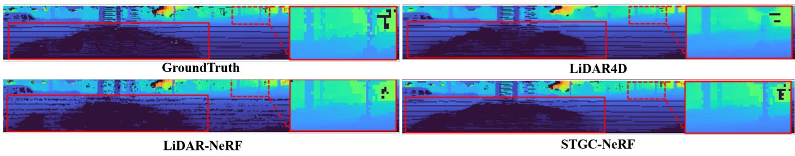  
Fig. 5. Qualitative reconstruction point map and depth of NeRF-style methods on the NuScenes [170] dataset. Image from [93].

RMSE measures the error between predicted and groundtruth geometry. While it offers a direct measure of geometric accuracy, it is sensitive to outliers and may not fully reflect perceptual quality.

## 5.2.3 Efficiency and Practicality

FPS measures inference speed and computational efficiency. However, FPS alone does not capture other practical factors such as memory consumption and scalability, which are also critical in 4D reconstruction.

Despite these limitations, these metrics remain widely adopted in existing 4D reconstruction works and provide a common basis for comparison. However, the lack of standardized protocols for evaluating temporal coherence, topology changes, and long-term consistency remains an open challenge in dynamic 4D reconstruction.

## 5.3 Novel View Synthesis

We evaluate rendering fidelity using PSNR, D-SSIM, SSIM, and LPIPS. Benchmarks are conducted on widely used datasets, including Neu3D [65], D-NeRF [42], NeRF-DS [58], NVIDIA Dynamic Scene [166], and Waymo [169].

TABLE 5  
Neu3D [65] NeRF-style 4D reconstruction results. PSNR (↑), SSIM (↑), and LPIPS (↓) are used as metrics.
<table><tr><td rowspan=1 colspan=2>Methods           PSNR (↑)</td><td rowspan=1 colspan=1>SSIM (↑)</td><td rowspan=1 colspan=1>LPIPS (↓)</td></tr><tr><td rowspan=1 colspan=2>DyNeRF             29.6</td><td rowspan=1 colspan=1>0.961</td><td rowspan=1 colspan=1>0.083</td></tr><tr><td rowspan=1 colspan=2>StreamRF            28.3</td><td rowspan=1 colspan=1></td><td rowspan=1 colspan=1></td></tr><tr><td rowspan=1 colspan=2>HexPlane            29.5</td><td rowspan=1 colspan=1></td><td rowspan=1 colspan=1>0.097</td></tr><tr><td rowspan=1 colspan=2>K-Planes             31.6</td><td rowspan=1 colspan=1>0.964</td><td rowspan=1 colspan=1></td></tr><tr><td rowspan=1 colspan=2>TIDNeRF             29.9</td><td rowspan=1 colspan=1></td><td rowspan=1 colspan=1>0.096</td></tr><tr><td rowspan=1 colspan=1>HyperReel</td><td rowspan=1 colspan=1>31.1</td><td rowspan=1 colspan=1>0.927</td><td rowspan=1 colspan=1>0.096</td></tr><tr><td rowspan=1 colspan=1>MixVoxels</td><td rowspan=1 colspan=1>31.7</td><td rowspan=1 colspan=1>0.944</td><td rowspan=1 colspan=1>0.064</td></tr><tr><td rowspan=1 colspan=1>MSTH</td><td rowspan=1 colspan=1>32.4</td><td rowspan=1 colspan=1></td><td rowspan=1 colspan=1>0.056</td></tr><tr><td rowspan=1 colspan=1>NeRFPlayer</td><td rowspan=1 colspan=1>30.7</td><td rowspan=1 colspan=1>0.931</td><td rowspan=1 colspan=1>0.111</td></tr><tr><td rowspan=1 colspan=1>Sync-NeRF</td><td rowspan=1 colspan=1>31.9</td><td rowspan=1 colspan=1>0.916</td><td rowspan=1 colspan=1>0.146</td></tr><tr><td rowspan=1 colspan=1>DecouplingNeRF</td><td rowspan=1 colspan=1>28.6</td><td rowspan=1 colspan=1>0.917</td><td rowspan=1 colspan=1>0.123</td></tr><tr><td rowspan=1 colspan=1>Ced-NeRF</td><td rowspan=1 colspan=1>30.6</td><td rowspan=1 colspan=1>0.919</td><td rowspan=1 colspan=1></td></tr><tr><td rowspan=1 colspan=1>Gear-NeRF</td><td rowspan=1 colspan=1>31.8</td><td rowspan=1 colspan=1>0.936</td><td rowspan=1 colspan=1>0.058</td></tr><tr><td rowspan=1 colspan=1>DaReNeRF</td><td rowspan=1 colspan=1>32.3</td><td rowspan=1 colspan=1></td><td rowspan=1 colspan=1>0.084</td></tr></table>

Neu3D. Table 5 reports NeRF-style results under the protocol of [65]. Performance steadily improves from early implicit models to recent hybrid approaches. DyNeRF establishes a strong baseline, while MSTH and DaReNeRF further advance the state of the art. A notable trend is the strong performance of 4D feature-volume-based architec-

TABLE 6  
Neu3D [65] 3DGS-style 4D reconstruction results. PSNR (↑), SSIM (↑), and LPIPS (↓) are used as the evaluation metrics.
<table><tr><td rowspan=1 colspan=4>PSNR (↑)  SSIM (↑)  LPIPS (↓)</td></tr><tr><td rowspan=1 colspan=4>4DGS              32.01                  0.055</td></tr><tr><td rowspan=1 colspan=1>4DRotorGS</td><td rowspan=1 colspan=1>31.62</td><td rowspan=1 colspan=1>0.940</td><td rowspan=1 colspan=1>0.140</td></tr><tr><td rowspan=1 colspan=1>FreeTimeGS</td><td rowspan=1 colspan=1>33.19</td><td rowspan=1 colspan=1></td><td rowspan=1 colspan=1>0.036</td></tr><tr><td rowspan=1 colspan=1>SpacetimeGS</td><td rowspan=1 colspan=1>32.05</td><td rowspan=1 colspan=1></td><td rowspan=1 colspan=1>0.044</td></tr><tr><td rowspan=1 colspan=1>CD-3DGS</td><td rowspan=1 colspan=1>30.46</td><td rowspan=1 colspan=1>0.955</td><td rowspan=1 colspan=1>0.150</td></tr><tr><td rowspan=1 colspan=1>SaRO-GS</td><td rowspan=1 colspan=1>32.15</td><td rowspan=1 colspan=1></td><td rowspan=1 colspan=1>0.044</td></tr><tr><td rowspan=1 colspan=1>ST-4DGS</td><td rowspan=1 colspan=1>32.67</td><td rowspan=1 colspan=1>0.946</td><td rowspan=1 colspan=1>0.166</td></tr><tr><td rowspan=1 colspan=1>4DGC</td><td rowspan=1 colspan=1>31.58</td><td rowspan=1 colspan=1>0.943</td><td rowspan=1 colspan=1></td></tr><tr><td rowspan=1 colspan=1>ADC-GS</td><td rowspan=1 colspan=1>31.67</td><td rowspan=1 colspan=1>0.981</td><td rowspan=1 colspan=1>0.061</td></tr><tr><td rowspan=1 colspan=1>GIFStream</td><td rowspan=1 colspan=1>31.75</td><td rowspan=1 colspan=1>0.938</td><td rowspan=1 colspan=1>0.051</td></tr><tr><td rowspan=1 colspan=1>TaylorGaussian</td><td rowspan=1 colspan=1>33.02</td><td rowspan=1 colspan=1>0.970</td><td rowspan=1 colspan=1>0.053</td></tr><tr><td rowspan=1 colspan=1>GaGS</td><td rowspan=1 colspan=1>31.31</td><td rowspan=1 colspan=1>0.950</td><td rowspan=1 colspan=1>0.140</td></tr><tr><td rowspan=1 colspan=1>DynMF</td><td rowspan=1 colspan=1>31.70</td><td rowspan=1 colspan=1>0.946</td><td rowspan=1 colspan=1>0.180</td></tr><tr><td rowspan=1 colspan=1>DN-4DGS</td><td rowspan=1 colspan=1>32.02</td><td rowspan=1 colspan=1>0.944</td><td rowspan=1 colspan=1>0.043</td></tr><tr><td rowspan=1 colspan=1>ED-3DGS</td><td rowspan=1 colspan=1>31.31</td><td rowspan=1 colspan=1>0.945</td><td rowspan=1 colspan=1>0.037</td></tr><tr><td rowspan=1 colspan=1>Ex4DGS</td><td rowspan=1 colspan=1>32.11</td><td rowspan=1 colspan=1>0.970</td><td rowspan=1 colspan=1>0.048</td></tr><tr><td rowspan=1 colspan=1>MAGS</td><td rowspan=1 colspan=1>31.30</td><td rowspan=1 colspan=1>0.943</td><td rowspan=1 colspan=1>0.053</td></tr></table>

TABLE 7

D-NeRF [42] NeRF-style 4D reconstruction results. PSNR (↑), SSIM (↑), and LPIPS (↓) are used as metrics.
<table><tr><td rowspan=1 colspan=4>Methods     PSNR (↑)  SSIM (↑)  LPIPS (↓)</td></tr><tr><td rowspan=1 colspan=2>D-NeRF       30.50</td><td rowspan=1 colspan=1>0.95</td><td rowspan=1 colspan=1>0.070</td></tr><tr><td rowspan=1 colspan=1>TiNeuVox</td><td rowspan=1 colspan=1>32.67</td><td rowspan=1 colspan=1>0.97</td><td rowspan=1 colspan=1>0.041</td></tr><tr><td rowspan=1 colspan=1>HexPlane</td><td rowspan=1 colspan=1>31.04</td><td rowspan=1 colspan=1>0.97</td><td rowspan=1 colspan=1>0.040</td></tr><tr><td rowspan=1 colspan=1>K-Planes</td><td rowspan=1 colspan=1>31.61</td><td rowspan=1 colspan=1>0.97</td><td rowspan=1 colspan=1>0.049</td></tr><tr><td rowspan=1 colspan=1>TIDNeRF</td><td rowspan=1 colspan=1>32.73</td><td rowspan=1 colspan=1>0.97</td><td rowspan=1 colspan=1>0.033</td></tr><tr><td rowspan=1 colspan=1>Ced-NeRF</td><td rowspan=1 colspan=1>34.21</td><td rowspan=1 colspan=1>0.99</td><td rowspan=1 colspan=1>0.037</td></tr><tr><td rowspan=1 colspan=1>DaReNeRF</td><td rowspan=1 colspan=1>31.95</td><td rowspan=1 colspan=1>0.97</td><td rowspan=1 colspan=1>0.030</td></tr><tr><td rowspan=1 colspan=1>SLS4D</td><td rowspan=1 colspan=1>34.84</td><td rowspan=1 colspan=1>0.98</td><td rowspan=1 colspan=1>0.025</td></tr></table>

tures, which consistently achieve leading results across multiple metrics. In addition, specialized designs highlight the benefits of structured priors; for example, the uncertaintyaware modeling in MSTH and the semantic segmentation constraints in Gear-NeRF demonstrate the effectiveness of incorporating probabilistic cues and geometric semantics into dynamic scene optimization.

Table 6 presents results for 3DGS-based methods. Recent approaches, such as FreeTimeGS and TaylorGaussian, outperform earlier methods in PSNR while maintaining strong perceptual quality. Deformation-based methods also perform competitively: ADC-GS achieves the best SSIM, and ED-3DGS yields strong LPIPS scores. A key observation from the evaluation is the performance improvement enabled by integrating external priors. In addition, specialized frameworks highlight the effectiveness of structured constraints; for example, the feature matching priors in FreeTimeGS, which achieves high rendering fidelity, and the optical flow constraints used in ST-4DGS and CD-3DGS demonstrate the benefits of external guidance for dynamic scene optimization. These priors effectively regularize Gaussian primitives in highly dynamic regions, reducing floaters and multi-view inconsistencies commonly observed in purely photometric optimization. Figure 8 shows qualitative comparisons on Neu3D.

D-NeRF. Table 7 reports reconstruction quality under the protocol of [42], showing that 4D feature-volume-based methods consistently achieve state-of-the-art performance across diverse dynamic benchmarks. While earlier approaches such as TiNeuVox establish strong baselines, Ced-NeRF and SLS4D leverage semi-explicit representations and high-dimensional feature volumes to better disentangle static geometry from temporal dynamics. This trend reflects a broader shift in modeling small-scale dynamic indoor scenes, where grid-based feature structures outperform purely coordinate-based MLPs.

TABLE 8  
NeRF-DS [58] 3DGS-style 4D reconstruction results. PSNR (↑), SSIM (↑), and LPIPS (↓) are used as metrics.
<table><tr><td>Methods</td><td>PSNR (↑)</td><td>SSIM (↑)</td><td>LPIPS (↓)</td></tr><tr><td>Deformable-3DGS</td><td>24.10</td><td>0.85</td><td>0.18</td></tr><tr><td>SC-GS</td><td>24.10</td><td>0.89</td><td>0.14</td></tr><tr><td>4D-GS</td><td>24.18</td><td>0.88</td><td>0.14</td></tr><tr><td>SP-GS</td><td>23.33</td><td>0.84</td><td>0.21</td></tr><tr><td>MotionGS</td><td>24.54</td><td>0.87</td><td>0.17</td></tr><tr><td>DN-4DGS</td><td>24.36</td><td>0.87</td><td>0.17</td></tr><tr><td>EfficientGS</td><td>24.65</td><td>0.90</td><td>0.14</td></tr></table>

NeRF-DS. Table 8 reports rendering performance under the protocol of [58]. EfficientGS achieves the best results, while motion-aware methods such as MotionGS and DN-4DGS perform strongly on dynamic regions. This trend highlights the effectiveness of deformation-field-based representations for explicit 4D modeling. By decoupling temporal motion from canonical geometry, these methods avoid the parameter growth associated with unified 4D primitives. Moreover, this formulation is well-suited for modeling complex nonrigid dynamics and view-dependent specularities, which are particularly challenging in the NeRF-DS dataset.

NVIDIA Dynamic Scene Dataset. Qualitative evaluations in unstructured, in-the-wild environments (Fig. 7) highlight the strong performance of frameworks incorporating geometric priors. DynNeRF maintains superior free-view consistency and temporal stability, largely due to its use of multi-view constraints and 3D scene flow for regularization. This demonstrates the effectiveness of geometric priors in dynamic scene reconstruction.

Waymo. As illustrated in Figure 6, general-purpose 4D reconstruction methods often struggle with distant or fastmoving objects in large-scale driving scenes, leading to ghosting artifacts or geometric collapse. In contrast, EmerNeRF achieves more robust results by integrating 3D scene flow with DINOv2 features, providing a more stable optimization signal and improved robustness to lighting variations. OmniRE further delivers high-fidelity reconstruction by incorporating category-specific semantic priors for human modeling, effectively constraining the solution space to physically plausible structures. These results highlight the importance of semantic guidance and structural priors for 4D reconstruction under limited viewpoint overlap.

## 5.4 Geometric Reconstruction

We evaluate geometric fidelity using surface extraction and point-based metrics, considering both vision-only and vision-LiDAR methods. For image-based methods, we follow the D-NeRF [42] surface extraction pipeline. For vision– LiDAR methods, we directly compute point cloud error via nearest-neighbor distance. Meshes are extracted from SDF zero-crossings using marching cubes [176]. We report Chamfer Distance (CD), RMSE, and F1-score (F1) with a 5 cm threshold.

NuScenes. Evaluations on the NuScenes dataset (Table 9) show that frameworks incorporating LiDAR supervision significantly outperform vision-only approaches, highlighting the importance of active depth sensing for resolving scale ambiguities in large-scale environments. STGC-NeRF and LiDAR4D achieve the lowest global geometric error (Fig. 5) by leveraging spatio-temporal flow and surface normal priors for reconstruction regularization. Furthermore, the 3DGS-based OmniRE yields superior local depth accuracy and robustness to outliers, suggesting that deformation-field-based representations are effective for capturing fine geometric details and preserving structural integrity in dynamic driving scenes.

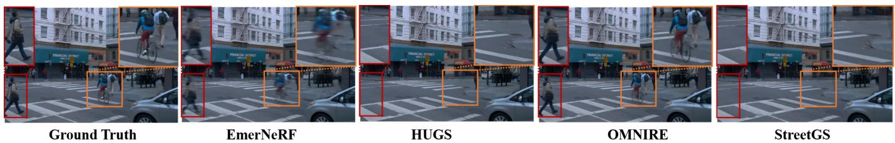  
Fig. 6. Qualitative novel view synthesis results of 4D reconstruction methods on the Waymo [169] dataset. Image from [140].

TABLE 9  
NuScenes [170] 3D geometric reconstruction results. \* denotes methods with LiDAR supervision; † uses protocols from [140].
<table><tr><td rowspan=1 colspan=4>methods              CD (↓) F-Score (↑)  RMSE (↓)</td></tr><tr><td rowspan=1 colspan=4>NeRF-style</td></tr><tr><td rowspan=1 colspan=4>D-NeRF                0.33       0.85         7.11</td></tr><tr><td rowspan=1 colspan=1>TiNeuVox-B</td><td rowspan=1 colspan=3>0.39       0.86         7.21</td></tr><tr><td rowspan=1 colspan=1>K-Planes</td><td rowspan=1 colspan=3>0.30       0.89         6.80</td></tr><tr><td rowspan=1 colspan=1>LiDAR4D*</td><td rowspan=1 colspan=3>0.24       0.89         6.78</td></tr><tr><td rowspan=1 colspan=1>STGC-NeRF*</td><td rowspan=1 colspan=3>0.22       0.91         6.54</td></tr><tr><td rowspan=1 colspan=4>3DGS-style</td></tr><tr><td rowspan=1 colspan=1>Deformable-3DGS†</td><td rowspan=1 colspan=2>0.38</td><td rowspan=1 colspan=1>2.97</td></tr><tr><td rowspan=1 colspan=1>StreetGaussian†</td><td rowspan=1 colspan=1>0.27</td><td rowspan=1 colspan=1></td><td rowspan=1 colspan=1>2.19</td></tr><tr><td rowspan=1 colspan=1>OmniRE↑</td><td rowspan=1 colspan=1>0.24</td><td rowspan=1 colspan=1></td><td rowspan=1 colspan=1>1.89</td></tr></table>

## 5.5 Model Efficiency

We evaluate efficiency using GPU memory (peak GB), FPS, and training time on four NVIDIA A100 GPUs. Table 10 summarizes results for NeRF-style and 3DGS-style methods on Neu3D. Among NeRF-style methods, DevRF and StreamRF are the most efficient due to voxel-based representations and compact temporal encoding. In contrast, 3DGSbased methods achieve higher rendering speed owing to efficient rasterization, with 4DRotorGS attaining the highest FPS. Overall, 3DGS-based methods offer superior speed but require larger model capacity, while NeRF-style methods are more memory-efficient at the cost of slower rendering.

## 6 FUTURE PROSPECTS

## 6.1 Technical Prospects

Feed-Forward 4D Representations. Existing NeRF and Gaussian Splatting methods largely rely on per-scene optimization, resulting in high computational cost and limited scalability. A major trend is the transition toward generalizable feed-forward models. By leveraging large reconstruction models and transformer-based architectures [177]– [180], the field is gradually shifting from optimizing individual scenes to directly inferring scene representations. This paradigm enables near real-time 4D reconstruction from sparse inputs and helps bridge low-level reconstruction with higher-level spatio-temporal understanding.

TABLE 10  
Performance analysis of 4D reconstruction methods. GPU memory, frame per second (FPS), and training time are evaluated.
<table><tr><td>Methods</td><td>4D-style</td><td>FPS</td><td>training time (h)</td><td>Params (Mb)</td></tr><tr><td colspan="5">NeRF-style</td></tr><tr><td>D-NeRF</td><td>Deformation fields</td><td>&lt;1</td><td>22.3</td><td>3</td></tr><tr><td>DyNeRF</td><td>4D Primitive</td><td>&lt;1</td><td>1344</td><td>7</td></tr><tr><td>NeRFPlayer</td><td>4D feature volumes</td><td>&lt;1</td><td>6</td><td>-</td></tr><tr><td>HyperReel</td><td>4D feature volumes</td><td>6.1</td><td>2.2</td><td>360</td></tr><tr><td>MixVoxel</td><td>4D feature volumes</td><td>4.3</td><td>1.3</td><td>500</td></tr><tr><td>K-Planes</td><td>4D feature volumes</td><td></td><td>3.7</td><td>51</td></tr><tr><td>HexPlanes</td><td>4D feature volumes</td><td></td><td>12</td><td>200</td></tr><tr><td>MSTH</td><td>4D feature volumes</td><td>15</td><td>0.3</td><td>135</td></tr><tr><td>Ced-NeRF</td><td>4D feature volumes</td><td>6.3</td><td>0.2</td><td></td></tr><tr><td>StreamRF</td><td>Temporal prior</td><td>10.9</td><td>0.3</td><td>31</td></tr><tr><td colspan="5">3DGS-style</td></tr><tr><td>4DGS</td><td>Explicit 4D Primitive</td><td>30</td><td>5.0</td><td>1183</td></tr><tr><td>4DRotorGS</td><td>Explicit 4D Primitive</td><td>277</td><td>1.0</td><td></td></tr><tr><td>SpacetimeGS</td><td>Explicit 4D Primitive</td><td>140</td><td>0.31</td><td>200</td></tr><tr><td>CD-3DGS</td><td>Explicit 4D Primitive</td><td>118</td><td>1.0</td><td>338</td></tr><tr><td>4D-GS</td><td>Deformation Fields</td><td>30</td><td>0.67</td><td>90</td></tr><tr><td>ST-4DGS</td><td>Deformation Fields</td><td>37</td><td>2.7</td><td>339</td></tr><tr><td>Instant Gaussian Stream</td><td>Deformation Fields</td><td>204</td><td>0.23</td><td>2370</td></tr><tr><td>GaGS</td><td>Deformation Fields</td><td>12</td><td>2.0</td><td>48</td></tr><tr><td>DynMF</td><td>Deformation Fields</td><td>135</td><td>0.67</td><td></td></tr><tr><td>HiCoM</td><td>Deformation Fields</td><td>274</td><td>1.7</td><td>270</td></tr><tr><td>DN-4DGS</td><td>Deformation Fields</td><td>15</td><td>0.83</td><td>112</td></tr><tr><td>ED-3DGS</td><td>Deformation Fields</td><td>74.5</td><td>1.87</td><td>35</td></tr><tr><td>Ex4DGS</td><td>Frame-wise training</td><td>121</td><td>0.6</td><td>115</td></tr><tr><td>3DGStream</td><td>Frame-wise training</td><td>215</td><td>1.0</td><td>2340</td></tr><tr><td>4DGC</td><td>Frame-wise training</td><td>168</td><td>1.2</td><td>150</td></tr></table>

Hybrid Explicit–Implicit Representations. The distinction between explicit and implicit representations is increasingly converging toward hybrid paradigms. Future 4D models are expected to combine explicit structures for efficient rasterization with implicit latent fields for modeling non-Lambertian effects and temporal topology changes [137], [181]. Such hybrid designs are important for scaling 4D representations to open-world dynamic scenes, where purely explicit methods face memory limitations and purely implicit methods struggle with real-time interaction.

Integration with Generative Priors. Another emerging direction is the integration of generative models [182], [183] into 4D reconstruction pipelines. Unlike traditional optimization-based methods that rely heavily on observations, generative priors enable plausible completion, motion prediction, and view synthesis under sparse or degraded inputs [184], [185]. This integration may shift reconstruction from purely observation-driven modeling toward predictive and generative frameworks, leading to more robust 4D reconstruction and synthesis.

Interactive and Controllable 4D Scenes. Beyond passive reconstruction, future 4D systems are expected to support interaction and controllability [111]. These capabilities enable users to manipulate dynamic scenes, edit object behaviors, and simulate alternative scenarios. Such developments may

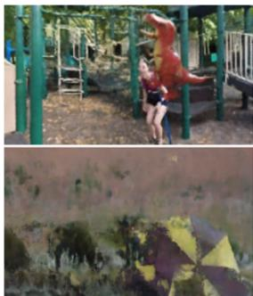  
NeRF+Time

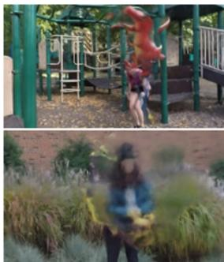  
NR-NeRF

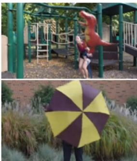  
NSFF

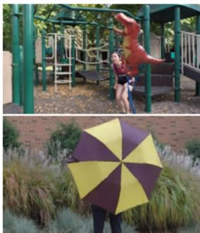  
DynNeRF

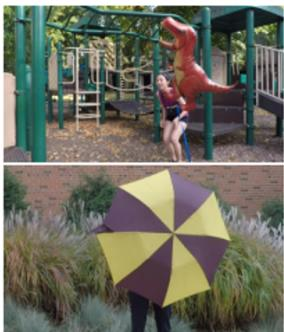  
Ground Truth

Fig. 7. Qualitative novel view synthesis results of NeRF-style methods on the NVIDIA Dynamic Scene [166] dataset. Image from [63].  
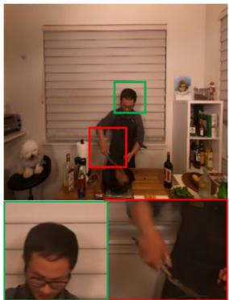  
SaRO-GS

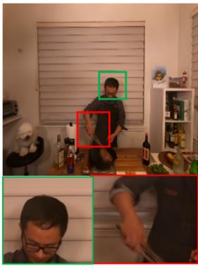  
4DGS

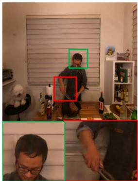  
3DGStream

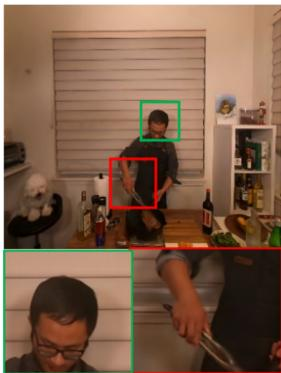  
InstantGS

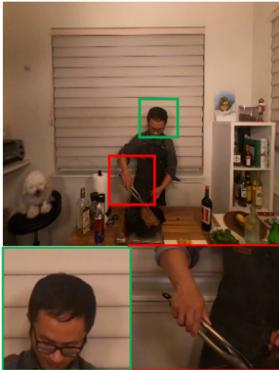  
GroundTruth

Fig. 8. Qualitative Novel View Synthesis results of 3DGS-style framework on the Neu3D [65] dataset. Image sourced from [128].

transform 4D representations into interactive world models for applications in simulation, digital twins, and content creation.

## 6.2 Application Prospects

Embodied AI Simulation. 4D reconstruction enables temporally consistent environments for embodied AI [142], [186], [187]. Compared with static representations, dynamic 4D scenes provide richer interaction signals and more realistic training environments, supporting robust perception, planning, and interaction in complex settings [188]–[190]. Dynamic Scene Understanding and Editing. 4D representations facilitate scene understanding, navigation, and editing in dynamic environments [191]–[193]. By modeling temporal evolution, these methods support motion prediction, scene simulation, and controllable editing for both analysis and content generation.

Human-Centered Applications. 4D reconstruction further enables accurate modeling of human motion and interaction [194]–[196]. These capabilities support applications in AR/VR, telepresence, healthcare, and digital twins. Future systems may further improve realism and interactivity, enabling more immersive user experiences.

## 7 CONCLUSION

4D scene reconstruction advances spatio-temporal 3D vision by modeling dynamic environments. This survey reviews NeRF- and 3DGS-based approaches, analyzing their efficiency, scalability, and temporal coherence. We further summarize representative datasets, evaluation metrics, and existing methods. Finally, we discuss open challenges and future directions, including feed-forward modeling, hybrid representations, and generative priors, as well as applications in embodied AI and dynamic scene understanding. This survey serves as both a reference and a roadmap for future research in 4D scene reconstruction.

## REFERENCES

[1] Jiahui Zhang, Yuelei Li, Anpei Chen, Muyu Xu, Kunhao Liu, Jianyuan Wang, Xiao-Xiao Long, Hanxue Liang, Zexiang Xu, Hao Su, et al., “Advances in feed-forward 3d reconstruction and view synthesis: A survey,” arXiv preprint arXiv:2507.14501, 2025. 1

[2] Shuting He, Peilin Ji, Yitong Yang, Changshuo Wang, Jiayi Ji, Yinglin Wang, and Henghui Ding, “A survey on 3d gaussian splatting applications: Segmentation, editing, and generation,” arXiv preprint arXiv:2508.09977, 2025. 1

[3] Ziyang Yan, Yihua Shao, Minwen Liao, Siyu Chen, Nan Wang, Muyuan Lin, Jenq-Neng Hwang, Hao Zhao, Fabio Remondino, and Lei Li, “3dsceneeditor: Controllable 3d scene editing with gaussian splatting,” in Proceedings of the IEEE/CVF Winter Conference on Applications of Computer Vision (WACV), March 2026, pp. 1852–1863. 1

[4] Hong Li, Chongjie Ye, Houyuan Chen, Weiqing Xiao, Ziyang Yan, Lixing Xiao, Zhaoxi Chen, Jianfeng Xiang, Shaocong Xu, Xuhui Liu, et al., “Near: Coupled neural asset-renderer stack,” arXiv preprint arXiv:2511.18600, 2025. 1

[5] Ziyang Yan, Mengrui Yin, Yihua Shao, and Fabio Remondino, “Evaluating 3d gaussian splatting for urban scene reconstruction,” The International Archives of the Photogrammetry, Remote Sensing and Spatial Information Sciences, vol. 48, pp. 251–258, 2025. 1

[6] Johannes L Schonberger and Jan-Michael Frahm, “Structurefrom-motion revisited,” in Proceedings of the IEEE conference on computer vision and pattern recognition, 2016, pp. 4104–4113. 1

[7] Nazanin Padkan, Ziyan Yan, and Fabio Remondino, “Evaluating monocular depth estimation methods on industrial objects,” The International Archives of the Photogrammetry, Remote Sensing and Spatial Information Sciences, vol. 48, pp. 175–181, 2025. 1

[8] Yihua Shao, Jia Li, Siyu Chen, Xinyu Luo, Yang Liu, Kecheng Chen, Xinwei Long, Lingyu Zhu, Fanhu Zeng, Maolin Wang, et al., “List: Local-simplex test-time lora fusion,” arXiv preprint arXiv:2608.22370, 2026. 1

[9] Yihua Shao, Yan Gu, Minxi Yan, Siyu Chen, Haiyang Liu, Ziyang Yan, Yongjia Li, Yan Wang, Qun SONG, Hao Tang, et al., “Gradient enhancement task aware post-training quantization,” in 35th International Joint Conference on Artificial Intelligence (IJCAI 2026), 2026. 1

[10] Yihua Shao, Yeling Xu, Xinwei Long, Siyu Chen, Ziyang Yan, Haoting Liu, Yan Wang, Hao Tang, and Yang Yang, “Accidentblip: Agent of accident warning based on ma-former,” in 2025 IEEE Intelligent Vehicles Symposium (IV). IEEE, 2025, pp. 2156– 2161. 1

[11] Peter Cheeseman, Robert Smith, and Michael Self, “A stochastic map for uncertain spatial relationships,” in 4th international symposium on robotic research. MIT Press Cambridge, 1987, pp. 467–474. 1

[12] Fernando Nobre, Michael Kasper, and Christoffer Heckman, “Drift-correcting self-calibration for visual-inertial slam,” in 2017 IEEE International Conference on Robotics and Automation (ICRA). IEEE, 2017, pp. 6525–6532. 1

[13] Ben Mildenhall, Pratul P Srinivasan, Matthew Tancik, Jonathan T Barron, Ravi Ramamoorthi, and Ren Ng, “Nerf: Representing scenes as neural radiance fields for view synthesis,” Communications of the ACM, vol. 65, no. 1, pp. 99–106, 2021. 1, 3

[14] Kyle Gao, Yina Gao, Hongjie He, Dening Lu, Linlin Xu, and Jonathan Li, “Nerf: Neural radiance field in 3d vision, a comprehensive review,” arXiv preprint arXiv:2210.00379, 2022. 1, 2

[15] Fabio Remondino, Ali Karami, Ziyang Yan, Gabriele Mazzacca, Simone Rigon, and Rongjun Qin, “A critical analysis of nerfbased 3d reconstruction,” Remote Sensing, vol. 15, no. 14, pp. 3585, 2023. 1

[16] Ziyang Yan, Gabriele Mazzacca, Simone Rigon, Elisa Mariarosaria Farella, Pawel Trybala, Fabio Remondino, et al., “Nerfbk: a holistic dataset for benchmarking nerf-based 3d reconstruction,” International Archives of the Photogrammetry, Remote Sensing and Spatial Information Sciences, vol. 48, no. 1, pp. 219–226, 2023. 1

[17] Ziyang Yan, Nazanin Padkan, Paweł Trybała, Elisa Mariarosaria Farella, and Fabio Remondino, “Learning-based 3d reconstruction methods for non-collaborative surfaces—a metrological evaluation,” Metrology, vol. 5, no. 2, pp. 20, 2025. 1

[18] Bernhard Kerbl, Georgios Kopanas, Thomas Leimkuhler, and ¨ George Drettakis, “3d gaussian splatting for real-time radiance field rendering.,” ACM Trans. Graph., vol. 42, no. 4, pp. 139–1, 2023. 2, 3

[19] Minwen Liao, Haobo Dong, Xinyi Wang, Kurban Ubul, Yihua Shao, and Ziyang Yan, “Gm-moe: Low-light enhancement with gated-mechanism mixture-of-experts,” in Proceedings of the IEEE/CVF International Conference on Computer Vision, 2025, pp. 8766–8776. 2

[20] Yihua Shao, Deyang Lin, Minxi Yan, Siyu Chen, Fanhu Zeng, Minwen Liao, Ao Ma, Ziyang Yan, Haozhe Wang, Yan Wang, et al., “Tr-dq: Time-rotation diffusion quantization,” in Proceedings of the AAAI Conference on Artificial Intelligence, 2026, vol. 40, pp. 8869–8877. 2

[21] Ziyang Yan et al., “3d reconstruction and scene understanding with 3d gaussian splatting representation,” 2026. 2

[22] Gen Li, Nan Wang, YunLong Li, Ziyang Yan, Yinghao Shuai, Saining Zhang, Shu Han, Shaocong Xu, Baijun Ye, Lu Zhang, et al., “Gen-ncap: A generative simulator for corner case benchmarking in end-to-end autonomous driving,” in Proceedings of IASEAI Conference, 2026, vol. 2, pp. 369–381. 2

[23] Ziyang Yan, Xingyu Liu, Yihua Shao, and Fabio Remondino, “Colla-gaussian: High quality surface reconstruction of noncollaborative objects with gaussian splatting,” PFG–Journal of Photogrammetry, Remote Sensing and Geoinformation Science, pp. 1– 19, 2026. 2

[24] Yiheng Xie, Towaki Takikawa, Shunsuke Saito, Or Litany, Shiqin Yan, Numair Khan, Federico Tombari, James Tompkin, Vincent Sitzmann, and Srinath Sridhar, “Neural fields in visual computing and beyond,” in Computer graphics forum. Wiley Online Library, 2022, vol. 41, pp. 641–676. 2

[25] Ben Fei, Jingyi Xu, Rui Zhang, Qingyuan Zhou, Weidong Yang, and Ying He, “3d gaussian splatting as new era: A survey,” IEEE Transactions on Visualization and Computer Graphics, vol. 31, pp. 4429–4449, 2024. 2

[26] Tong Wu, Yu-Jie Yuan, Ling-Xiao Zhang, Jie Yang, Yan-Pei Cao, Ling-Qi Yan, and Lin Gao, “Recent advances in 3d gaussian splatting,” Computational Visual Media, vol. 10, no. 4, pp. 613–642, 2024. 2

[27] Yanqi Bao, Tianyu Ding, Jing Huo, Yaoli Liu, Yuxin Li, Wenbin Li, Yang Gao, and Jiebo Luo, “3d gaussian splatting: Survey, technologies, challenges, and opportunities,” IEEE Transactions on Circuits and Systems for Video Technology, 2025. 2

[28] Guikun Chen and Wenguan Wang, “A survey on 3d gaussian splatting,” arXiv preprint arXiv:2401.03890, 2024. 2

[29] Fabio Tosi, Youmin Zhang, Ziren Gong, Erik Sandstrom, Stefano¨ Mattoccia, Martin R Oswald, and Matteo Poggi, “How nerfs and 3d gaussian splatting are reshaping slam: a survey,” arXiv preprint arXiv:2402.13255, vol. 4, pp. 1, 2024. 2

[30] Yuchao Dai, Hongdong Li, and Mingyi He, “A simple priorfree method for non-rigid structure-from-motion factorization,” International Journal of Computer Vision, vol. 107, no. 2, pp. 101– 122, 2014. 2

[31] Edilson De Aguiar, Carsten Stoll, Christian Theobalt, Naveed Ahmed, Hans-Peter Seidel, and Sebastian Thrun, “Performance capture from sparse multi-view video,” in ACM SIGGRAPH 2008 papers, pp. 1–10. ACM New York, NY, USA, 2008. 2

[32] Richard A Newcombe, Shahram Izadi, Otmar Hilliges, David Molyneaux, David Kim, Andrew J Davison, Pushmeet Kohi, Jamie Shotton, Steve Hodges, and Andrew Fitzgibbon, “Kinectfusion: Real-time dense surface mapping and tracking,” in 2011 10th IEEE international symposium on mixed and augmented reality. Ieee, 2011, pp. 127–136. 2

[33] Richard A Newcombe, Dieter Fox, and Steven M Seitz, “Dynamicfusion: Reconstruction and tracking of non-rigid scenes in real-time,” in Proceedings of the IEEE conference on computer vision and pattern recognition, 2015, pp. 343–352. 2

[34] Yao Yao, Zixin Luo, Shiwei Li, Tian Fang, and Long Quan, “Mvsnet: Depth inference for unstructured multi-view stereo,” in Proceedings of the European conference on computer vision (ECCV), 2018, pp. 785–801. 3

[35] Benjamin Ummenhofer, Huizhong Zhou, Jonas Uhrig, Nikolaus Mayer, Eddy Ilg, Alexey Dosovitskiy, and Thomas Brox, “Demon: Depth and motion network for learning monocular stereo,” in Proceedings of the IEEE conference on computer vision and pattern recognition, 2017, pp. 5622–5631. 3

[36] Alexey Dosovitskiy, Philipp Fischer, Eddy Ilg, Philip Hausser, Caner Hazirbas, Vladimir Golkov, Patrick Van Der Smagt, Daniel Cremers, and Thomas Brox, “Flownet: Learning optical flow with convolutional networks,” in Proceedings of the IEEE international conference on computer vision, 2015, pp. 2758–2766. 3

[37] Eddy Ilg, Nikolaus Mayer, Tonmoy Saikia, Margret Keuper, Alexey Dosovitskiy, and Thomas Brox, “Flownet 2.0: Evolution of optical flow estimation with deep networks,” in Proceedings of the IEEE conference on computer vision and pattern recognition, 2017, pp. 1647–1655. 3

[38] Sudheendra Vijayanarasimhan, Susanna Ricco, Cordelia Schmid, Rahul Sukthankar, and Katerina Fragkiadaki, “Sfm-net: Learning of structure and motion from video,” arXiv preprint arXiv:1704.07804, 2017. 3

[39] Sen Wang, Ronald Clark, Hongkai Wen, and Niki Trigoni, “Deepvo: Towards end-to-end visual odometry with deep recurrent convolutional neural networks,” in 2017 IEEE international conference on robotics and automation (ICRA). IEEE, 2017, pp. 2043– 2050. 3

[40] Lars Mescheder, Michael Oechsle, Michael Niemeyer, Sebastian Nowozin, and Andreas Geiger, “Occupancy networks: Learning 3d reconstruction in function space,” in Proceedings of the IEEE/CVF conference on computer vision and pattern recognition, 2019, pp. 4455–4465. 3

[41] Jeong Joon Park, Peter Florence, Julian Straub, Richard Newcombe, and Steven Lovegrove, “Deepsdf: Learning continuous signed distance functions for shape representation,” in Proceedings of the IEEE/CVF conference on computer vision and pattern recognition, 2019, pp. 165–174. 3

[42] Albert Pumarola, Enric Corona, Gerard Pons-Moll, and Francesc Moreno-Noguer, “D-nerf: Neural radiance fields for dynamic scenes,” in Proceedings of the IEEE/CVF conference on computer

vision and pattern recognition, 2021, pp. 10313–10322. 3, 5, 6, 10, 11, 12

[43] Keunhong Park, Utkarsh Sinha, Jonathan T Barron, Sofien Bouaziz, Dan B Goldman, Steven M Seitz, and Ricardo Martin-Brualla, “Nerfies: Deformable neural radiance fields,” in Proceedings of the IEEE/CVF international conference on computer vision, 2021, pp. 5865–5874. 3, 6

[44] Keunhong Park, Utkarsh Sinha, Peter Hedman, Jonathan T Barron, Sofien Bouaziz, Dan B Goldman, Ricardo Martin-Brualla, and Steven M Seitz, “Hypernerf: A higher-dimensional representation for topologically varying neural radiance fields,” arXiv preprint arXiv:2106.13228, 2021. 3, 6, 10, 11

[45] Jiemin Fang, Taoran Yi, Xinggang Wang, Lingxi Xie, Xiaopeng Zhang, Wenyu Liu, Matthias Nießner, and Qi Tian, “Fast dynamic radiance fields with time-aware neural voxels,” in SIGGRAPH Asia 2022 Conference Papers, 2022, pp. 1–9. 3, 6

[46] Zhengqi Li, Simon Niklaus, Noah Snavely, and Oliver Wang, “Neural scene flow fields for space-time view synthesis of dynamic scenes,” in Proceedings of the IEEE/CVF conference on computer vision and pattern recognition, 2021, pp. 6494–6504. 3, 5, 6

[47] Qiang Hu, Zihan Zheng, Houqiang Zhong, Sihua Fu, Li Song, Xiaoyun Zhang, Guangtao Zhai, and Yanfeng Wang, “4dgc: Rate-aware 4d gaussian compression for efficient streamable freeviewpoint video,” in Proceedings of the Computer Vision and Pattern Recognition Conference, 2025, pp. 875–885. 3, 9

[48] Yuheng Yuan, Qiuhong Shen, Xingyi Yang, and Xinchao Wang, “1000+ fps 4d gaussian splatting for dynamic scene rendering,” arXiv preprint arXiv:2503.16422, 2025. 3

[49] Jiaxuan Zhu and Hao Tang, “Dynamic scene reconstruction: Recent advance in real-time rendering and streaming,” arXiv preprint arXiv:2503.08166, 2025. 3, 4

[50] Jinlong Fan, Xuepu Zeng, Jing Zhang, Mingming Gong, Yuxiang Yang, and Dacheng Tao, “Advances in radiance field for dynamic scene: From neural field to gaussian field,” arXiv preprint arXiv:2505.10049, 2025. 4

[51] Lei He, Leheng Li, Wenchao Sun, Zeyu Han, Yichen Liu, Sifa Zheng, Jianqiang Wang, and Keqiang Li, “Neural radiance field in autonomous driving: A survey,” arXiv preprint arXiv:2404.13816, 2024. 4

[52] Yukang Cao, Jiahao Lu, Zhisheng Huang, Zhuowen Shen, Chengfeng Zhao, Fangzhou Hong, Zhaoxi Chen, Xin Li, Wenping Wang, Yuan Liu, et al., “Reconstructing 4d spatial intelligence: A survey,” arXiv preprint arXiv:2507.21045, 2025. 4

[53] Mingrui Zhao, Sauradip Nag, Kai Wang, Aditya Vora, Guangda Ji, Peter Chun, Ali Mahdavi-Amiri, and Hao Zhang, “Advances in 4d representation: Geometry, motion, and interaction,” arXiv preprint arXiv:2510.19255, 2025. 4

[54] Edgar Tretschk, Ayush Tewari, Vladislav Golyanik, Michael Zollhofer, Christoph Lassner, and Christian Theobalt, “Non-rigid¨ neural radiance fields: Reconstruction and novel view synthesis of a dynamic scene from monocular video,” in Proceedings of the IEEE/CVF international conference on computer vision, 2021, pp. 12939–12950. 5, 6

[55] Wentao Yuan, Zhaoyang Lv, Tanner Schmidt, and Steven Lovegrove, “Star: Self-supervised tracking and reconstruction of rigid objects in motion with neural rendering,” in Proceedings of the IEEE/CVF Conference on Computer Vision and Pattern Recognition, 2021, pp. 13139–13147. 5, 6

[56] Hongrui Cai, Wanquan Feng, Xuetao Feng, Yan Wang, and Juyong Zhang, “Neural surface reconstruction of dynamic scenes with monocular rgb-d camera,” Advances in Neural Information Processing Systems, vol. 35, pp. 967–981, 2022. 5, 6

[57] Jia-Wei Liu, Yan-Pei Cao, Weijia Mao, Wenqiao Zhang, David Junhao Zhang, Jussi Keppo, Ying Shan, Xiaohu Qie, and Mike Zheng Shou, “Devrf: Fast deformable voxel radiance fields for dynamic scenes,” Advances in Neural Information Processing Systems, vol. 35, pp. 36762–36775, 2022. 5, 6

[58] Zhiwen Yan, Chen Li, and Gim Hee Lee, “Nerf-ds: Neural radiance fields for dynamic specular objects,” in Proceedings ofthe IEEE/CVF Conference on Computer Vision and Pattern Recognition, 2023, pp. 8285–8295. 5, 6, 10, 11, 12

[59] Yu-Lun Liu, Chen Gao, Andreas Meuleman, Hung-Yu Tseng, Ayush Saraf, Changil Kim, Yung-Yu Chuang, Johannes Kopf, and Jia-Bin Huang, “Robust dynamic radiance fields,” in Proceedings of the IEEE/CVF Conference on Computer Vision and Pattern Recognition, 2023, pp. 13–23. 5, 6

[60] Chen Gao et al., “Total-recon: Deformable scene reconstruction for embodied view synthesis,” arXiv preprint arXiv:2304.12317, 2023. 5, 6

[61] Huiqiang Sun, Xingyi Li, Liao Shen, Xinyi Ye, Ke Xian, and Zhiguo Cao, “Dyblurf: Dynamic neural radiance fields from blurry monocular video,” in Proceedings of the IEEE/CVF Conference on Computer Vision and Pattern Recognition, 2024, pp. 7517– 7527. 5, 6

[62] Wenqi Xian, Jia-Bin Huang, Johannes Kopf, and Changil Kim, “Space-time neural irradiance fields for free-viewpoint video,” in Proceedings of the IEEE/CVF conference on computer vision and pattern recognition, 2021, pp. 9416–9426. 5, 6

[63] Chen Gao, Ayush Saraf, Johannes Kopf, and Jia-Bin Huang, “Dynamic view synthesis from dynamic monocular video,” in Proceedings of the IEEE/CVF International Conference on Computer Vision, 2021, pp. 5692–5701. 5, 6, 14

[64] Yilun Du, Yinan Zhang, Hong-Xing Yu, Joshua B Tenenbaum, and Jiajun Wu, “Neural radiance flow for 4d view synthesis and video processing,” in 2021 IEEE/CVF International Conference on Computer Vision (ICCV). IEEE Computer Society, 2021, pp. 14304– 14314. 5, 6

[65] Tianye Li, Mira Slavcheva, Michael Zollhoefer, Simon Green, Christoph Lassner, Changil Kim, Tanner Schmidt, Steven Lovegrove, Michael Goesele, Richard Newcombe, et al., “Neural 3d video synthesis from multi-view video,” in Proceedings of the IEEE/CVF conference on computer vision and pattern recognition, 2022, pp. 5511–5521. 6, 10, 11, 12, 14

[66] Fengrui Tian, Shaoyi Du, and Yueqi Duan, “Mononerf: Learning a generalizable dynamic radiance field from monocular videos,” in Proceedings ofthe IEEE/CVF International Conference on Computer Vision, 2023, pp. 17857–17867. 5, 6

[67] Seoha Kim, Jeongmin Bae, Youngsik Yun, Hahyun Lee, Gun Bang, and Youngjung Uh, “Sync-nerf: Generalizing dynamic nerfs to unsynchronized videos,” in Proceedings of the AAAI Conference on Artificial Intelligence, 2024, vol. 38, pp. 2777–2785. 5, 6

[68] Xingguang Zhong, Yue Pan, Cyrill Stachniss, and Jens Behley, “3d lidar mapping in dynamic environments using a 4d implicit neural representation,” in Proceedings of the IEEE/CVF Conference on Computer Vision and Pattern Recognition, 2024, pp. 15417–15427. 5, 6

[69] Tobias Fischer, Lorenzo Porzi, Samuel Rota Bulo, Marc Pollefeys, and Peter Kontschieder, “Multi-level neural scene graphs for dynamic urban environments,” in Proceedings of the IEEE/CVF Conference on Computer Vision and Pattern Recognition, 2024, pp. 21125–21135. 5, 6

[70] Meng You and Junhui Hou, “Decoupling dynamic monocular videos for dynamic view synthesis,” IEEE Transactions on Visualization and Computer Graphics, 2024. 5, 6

[71] Boyu Zhang, Wenbo Xu, Zheng Zhu, and Guan Huang, “Detachable novel views synthesis of dynamic scenes using distributiondriven neural radiance fields,” arXiv preprint arXiv:2301.00411, 2023. 5, 6

[72] Ang Cao and Justin Johnson, “Hexplane: A fast representation for dynamic scenes,” in Proceedings of the IEEE/CVF Conference on Computer Vision and Pattern Recognition, 2023, pp. 130–141. 5, 6

[73] Sara Fridovich-Keil, Giacomo Meanti, Frederik Rahbæk Warburg, Benjamin Recht, and Angjoo Kanazawa, “K-planes: Explicit radiance fields in space, time, and appearance,” in Proceedings of the IEEE/CVF Conference on Computer Vision and Pattern Recognition, 2023, pp. 12479–12488. 5, 6

[74] Haithem Turki, Jason Y Zhang, Francesco Ferroni, and Deva Ramanan, “Suds: Scalable urban dynamic scenes,” in Proceedings of the IEEE/CVF Conference on Computer Vision and Pattern Recognition, 2023, pp. 12375–12385. 6

[75] Sungheon Park, Minjung Son, Seokhwan Jang, Young Chun Ahn, Ji-Yeon Kim, and Nahyup Kang, “Temporal interpolation is all you need for dynamic neural radiance fields,” in Proceedings of the IEEE/CVF conference on computer vision and pattern recognition, 2023, pp. 4212–4221. 5, 6

[76] Benjamin Attal, Jia-Bin Huang, Christian Richardt, Michael Zollhoefer, Johannes Kopf, Matthew O’Toole, and Changil Kim, “Hyperreel: High-fidelity 6-dof video with ray-conditioned sampling,” in Proceedings of the IEEE/CVF Conference on Computer Vision and Pattern Recognition, 2023, pp. 16610–16620. 5, 6

[77] Feng Wang, Sinan Tan, Xinghang Li, Zeyue Tian, Yafei Song, and Huaping Liu, “Mixed neural voxels for fast multi-view video

synthesis,” in Proceedings of the IEEE/CVF International Conference on Computer Vision, 2023, pp. 19649–19659. 5, 6

[78] Feng Wang, Zilong Chen, Guokang Wang, Yafei Song, and Huaping Liu, “Masked space-time hash encoding for efficient dynamic scene reconstruction,” Advances in neural information processing systems, vol. 36, pp. 70497–70510, 2023. 6

[79] Jinxi Li, Ziyang Song, and Bo Yang, “Nvfi: Neural velocity fields for 3d physics learning from dynamic videos,” Advances in Neural Information Processing Systems, vol. 36, pp. 34723–34751, 2023. 6

[80] Liangchen Song, Anpei Chen, Zhong Li, Zhang Chen, Lele Chen, Junsong Yuan, Yi Xu, and Andreas Geiger, “Nerfplayer: A streamable dynamic scene representation with decomposed neural radiance fields,” IEEE Transactions on Visualization and Computer Graphics, vol. 29, no. 5, pp. 2732–2742, 2023. 5, 6

[81] Sameera Ramasinghe, Violetta Shevchenko, Gil Avraham, and Anton Van Den Hengel, “Blirf: Bandlimited radiance fields for dynamic scene modeling,” in Proceedings of the AAAI Conference on Artificial Intelligence, 2024, vol. 38, pp. 4641–4649. 5, 6

[82] Youtian Lin, “Ced-nerf: A compact and efficient method for dynamic neural radiance fields,” in Proceedings of the AAAI Conference on Artificial Intelligence, 2024, vol. 38, pp. 3504–3512. 5, 6

[83] Zehan Zheng, Fan Lu, Weiyi Xue, Guang Chen, and Changjun Jiang, “Lidar4d: Dynamic neural fields for novel space-time view lidar synthesis,” in Proceedings of the IEEE/CVF Conference on Computer Vision and Pattern Recognition, 2024, pp. 5145–5154. 6

[84] Ange Lou, Benjamin Planche, Zhongpai Gao, Yamin Li, Tianyu Luan, Hao Ding, Terrence Chen, Jack Noble, and Ziyan Wu, “Darenerf: Direction-aware representation for dynamic scenes,” in Proceedings of the IEEE/CVF Conference on Computer Vision and Pattern Recognition, 2024, pp. 5031–5042. 6

[85] Xinhang Liu, Yu-Wing Tai, Chi-Keung Tang, Pedro Miraldo, Suhas Lohit, and Moitreya Chatterjee, “Gear-nerf: free-viewpoint rendering and tracking with motion-aware spatio-temporal sampling,” in Proceedings of the IEEE/CVF Conference on Computer Vision and Pattern Recognition, 2024, pp. 19667–19679. 6

[86] Adam Tonderski, Carl Lindstrom, Georg Hess, William Ljung-¨ bergh, Lennart Svensson, and Christoffer Petersson, “Neurad: Neural rendering for autonomous driving,” in Proceedings of the IEEE/CVF Conference on Computer Vision and Pattern Recognition, 2024, pp. 14895–14904. 6

[87] Xingyi Li, Zhiguo Cao, Yizheng Wu, Kewei Wang, Ke Xian, Zhe Wang, and Guosheng Lin, “S-dyrf: Reference-based stylized radiance fields for dynamic scenes,” in Proceedings of the IEEE/CVF Conference on Computer Vision and Pattern Recognition, 2024, pp. 20102–20112. 6

[88] Thang-Anh-Quan Nguyen, Luis Roldao, Nathan Piasco, ˜ Moussab Bennehar, and Dzmitry Tsishkou, “Rodus: Robust decomposition of static and dynamic elements in urban scenes,” in European Conference on Computer Vision. Springer, 2024, pp. 112– 130. 6

[89] Jiawei Yang, Boris Ivanovic, Or Litany, Xinshuo Weng, Seung Wook Kim, Boyi Li, Tong Che, Danfei Xu, Sanja Fidler, Marco Pavone, et al., “Emernerf: Emergent spatialtemporal scene decomposition via self-supervision,” arXiv preprint arXiv:2311.02077, 2023. 6

[90] Qi-Yuan Feng, Hao-Xiang Chen, Qun-Ce Xu, and Tai-Jiang Mu, “Sls4d: sparse latent space for 4d novel view synthesis,” IEEE Transactions on Visualization and Computer Graphics, 2024. 6

[91] Lingzhi Li, Zhen Shen, Zhongshu Wang, Li Shen, and Ping Tan, “Streaming radiance fields for 3d video synthesis,” Advances in Neural Information Processing Systems, vol. 35, pp. 13485–13498, 2022. 6

[92] Sameera Ramasinghe, Violetta Shevchenko, Gil Avraham, Hisham Husain, and Anton Hengel, “Improving the convergence of dynamic nerfs via optimal transport,” in International Conference on Representation Learning, B. Kim, Y. Yue, S. Chaudhuri, K. Fragkiadaki, M. Khan, and Y. Sun, Eds., 2024, vol. 2024, pp. 19823–19840. 6

[93] Shangshu Yu, Xiaotian Sun, Wen Li, Qingshan Xu, Zhimin Yuan, Sijie Wang, Rui She, and Cheng Wang, “Stgc-nerf: Spatialtemporal geometric consistency for lidar neural radiance fields in dynamic scenes,” in Proceedings ofthe AAAI Conference on Artificial Intelligence, 2025, vol. 39, pp. 9644–9652. 6, 7, 11

[94] Hong Li, Chongjie Ye, Houyuan Chen, Weiqing Xiao, Ziyang Yan, Lixing Xiao, Zhaoxi Chen, Jianfeng Xiang, Shaocong Xu, Xuhui Liu, et al., “Near: Coupled neural asset-renderer stack,”

in Proceedings of the IEEE/CVF Conference on Computer Vision and Pattern Recognition, 2026, pp. 29834–29844. 7

[95] Wei Yao, Shuzhao Xie, Letian Li, Weixiang Zhang, Zhixin Lai, Shiqi Dai, Ke Zhang, and Zhi Wang, “Sd-gs: Structured deformable 3d gaussians for efficient dynamic scene reconstruction,” arXiv preprint arXiv:2507.07465, 2025. 7

[96] Ziyi Yang, Xinyu Gao, Wen Zhou, Shaohui Jiao, Yuqing Zhang, and Xiaogang Jin, “Deformable 3d gaussians for high-fidelity monocular dynamic scene reconstruction,” in Proceedings of the IEEE/CVF conference on computer vision and pattern recognition, 2024, pp. 20331–20341. 7, 8, 9

[97] Zeyu Yang, Hongye Yang, Zijie Pan, and Li Zhang, “Real-time photorealistic dynamic scene representation and rendering with 4d gaussian splatting,” in International Conference on Learning Representations (ICLR), 2024. 7, 9

[98] Yuanxing Duan, Fangyin Wei, Qiyu Dai, Yuhang He, Wenzheng Chen, and Baoquan Chen, “4d-rotor gaussian splatting: towards efficient novel view synthesis for dynamic scenes,” in ACM SIGGRAPH 2024 Conference Papers, 2024, pp. 1–11. 7, 9

[99] Zhan Li, Zhang Chen, Zhong Li, and Yi Xu, “Spacetime gaussian feature splatting for real-time dynamic view synthesis,” in Proceedings of the IEEE/CVF Conference on Computer Vision and Pattern Recognition, 2024, pp. 8508–8520. 7, 9

[100] Kai Katsumata, Duc Minh Vo, and Hideki Nakayama, “A compact dynamic 3d gaussian representation for real-time dynamic view synthesis,” in European Conference on Computer Vision. Springer, 2024, pp. 394–412. 7, 9

[101] Yifan Wang, Peishan Yang, Zhen Xu, Jiaming Sun, Zhanhua Zhang, Yong Chen, Hujun Bao, Sida Peng, and Xiaowei Zhou, “Freetimegs: Free gaussian primitives at anytime anywhere for dynamic scene reconstruction,” in Proceedings of the Computer Vision and Pattern Recognition Conference, 2025, pp. 21750–21760. 7, 9

[102] Su Sun, Cheng Zhao, Zhuoyang Sun, Yingjie Victor Chen, and Mei Chen, “Splatflow: Self-supervised dynamic gaussian splatting in neural motion flow field for autonomous driving,” in Proceedings of the Computer Vision and Pattern Recognition Conference, 2025, pp. 27487–27496. 7, 9

[103] Guosheng Zhao, Chaojun Ni, Xiaofeng Wang, Zheng Zhu, Xueyang Zhang, Yida Wang, Guan Huang, Xinze Chen, Boyuan Wang, Youyi Zhang, et al., “Drivedreamer4d: World models are effective data machines for 4d driving scene representation,” in Proceedings of the Computer Vision and Pattern Recognition Conference, 2025, pp. 12015–12026. 7, 9

[104] Chensheng Peng, Chengwei Zhang, Yixiao Wang, Chenfeng Xu, Yichen Xie, Wenzhao Zheng, Kurt Keutzer, Masayoshi Tomizuka, and Wei Zhan, “Desire-gs: 4d street gaussians for static-dynamic decomposition and surface reconstruction for urban driving scenes,” in Proceedings of the Computer Vision and Pattern Recognition Conference, 2025, pp. 6782–6791. 7, 9

[105] Deqi Li, Shi-Sheng Huang, Zhiyuan Lu, Xinran Duan, and Hua Huang, “St-4dgs: Spatial-temporally consistent 4d gaussian splatting for efficient dynamic scene rendering,” in ACM SIG-GRAPH 2024 Conference Papers, 2024, pp. 1–11. 9

[106] Jinbo Yan, Rui Peng, Luyang Tang, and Ronggang Wang, “4d gaussian splatting with scale-aware residual field and adaptive optimization for real-time rendering of temporally complex dynamic scenes,” in Proceedings of the 32nd ACM International Conference on Multimedia, 2024, pp. 7871–7880. 9

[107] Youtian Lin, Zuozhuo Dai, Siyu Zhu, and Yao Yao, “Gaussianflow: 4d reconstruction with dynamic 3d gaussian particle,” in Proceedings of the IEEE/CVF Conference on Computer Vision and Pattern Recognition, 2024, pp. 21136–21145. 8, 9

[108] Hongyu Zhou, Jiahao Shao, Lu Xu, Dongfeng Bai, Weichao Qiu, Bingbing Liu, Yue Wang, Andreas Geiger, and Yiyi Liao, “Hugs: Holistic urban 3d scene understanding via gaussian splatting,” in Proceedings of the IEEE/CVF Conference on Computer Vision and Pattern Recognition, 2024, pp. 21336–21345. 8, 9

[109] Guanjun Wu, Taoran Yi, Jiemin Fang, Lingxi Xie, Xiaopeng Zhang, Wei Wei, Wenyu Liu, Qi Tian, and Xinggang Wang, “4d gaussian splatting for real-time dynamic scene rendering, in Proceedings of the IEEE/CVF conference on computer vision and pattern recognition, 2024, pp. 20310–20320. 8, 9

[110] Bardienus P Duisterhof, Zhao Mandi, Yunchao Yao, Jia-Wei Liu, Jenny Seidenschwarz, Mike Zheng Shou, Deva Ramanan, Shuran Song, Stan Birchfield, Bowen Wen, et al., “Deformgs: Scene flow

in highly deformable scenes for deformable object manipulation,” arXiv preprint arXiv:2312.00583, 2023. 9

[111] Yi-Hua Huang, Yang-Tian Sun, Ziyi Yang, Xiaoyang Lyu, Yan-Pei Cao, and Xiaojuan Qi, “Sc-gs: Sparse-controlled gaussian splatting for editable dynamic scenes,” in Proceedings of the IEEE/CVF conference on computer vision and pattern recognition, 2024, pp. 4220–4230. 8, 9, 13

[112] Zhicheng Lu, Xiang Guo, Le Hui, Tianrui Chen, Min Yang, Xiao Tang, Feng Zhu, and Yuchao Dai, “3d geometry-aware deformable gaussian splatting for dynamic view synthesis,” in Proceedings of the IEEE/CVF Conference on Computer Vision and Pattern Recognition, 2024, pp. 8900–8910. 8, 9

[113] Agelos Kratimenos, Jiahui Lei, and Kostas Daniilidis, “Dynmf: Neural motion factorization for real-time dynamic view synthesis with 3d gaussian splatting,” in European Conference on Computer Vision. Springer, 2024, pp. 252–269. 9

[114] Jeongmin Bae, Seoha Kim, Youngsik Yun, Hahyun Lee, Gun Bang, and Youngjung Uh, “Per-gaussian embedding-based deformation for deformable 3d gaussian splatting,” in European Conference on Computer Vision. Springer, 2024, pp. 321–335. 9

[115] Richard Shaw, Michal Nazarczuk, Jifei Song, Arthur Moreau, Sibi Catley-Chandar, Helisa Dhamo, and Eduardo Perez-Pellitero,´ “Swings: sliding windows for dynamic 3d gaussian splatting,” in European Conference on Computer Vision. Springer, 2024, pp. 37– 54. 8, 9

[116] Boming Zhao, Yuan Li, Ziyu Sun, Lin Zeng, Yujun Shen, Rui Ma, Yinda Zhang, Hujun Bao, and Zhaopeng Cui, “Gaussianprediction: Dynamic 3d gaussian prediction for motion extrapolation and free view synthesis,” in ACM SIGGRAPH 2024 Conference Papers, 2024, pp. 1–12. 8, 9

[117] Meng-Li Shih, Jia-Bin Huang, Changil Kim, Rajvi Shah, Johannes Kopf, and Chen Gao, “Modeling ambient scene dynamics for free-view synthesis,” in ACM SIGGRAPH 2024 Conference Papers, 2024, pp. 1–11. 9

[118] Colton Stearns, Adam Harley, Mikaela Uy, Florian Dubost, Federico Tombari, Gordon Wetzstein, and Leonidas Guibas, “Dynamic gaussian marbles for novel view synthesis of casual monocular videos,” in SIGGRAPH Asia 2024 Conference Papers, 2024, pp. 1–11. 8, 9

[119] Jiawei Xu, Zexin Fan, Jian Yang, and Jin Xie, “Grid4d: 4d decomposed hash encoding for high-fidelity dynamic gaussian splatting,” Advances in Neural Information Processing Systems, vol. 37, pp. 123787–123811, 2024. 8, 9

[120] Yikai Wang, Xinzhou Wang, Zilong Chen, Zhengyi Wang, Fuchun Sun, and Jun Zhu, “Vidu4d: Single generated video to highfidelity 4d reconstruction with dynamic gaussian surfels,” Advances in Neural Information Processing Systems, vol. 37, pp. 131316–131343, 2024. 9

[121] Mijeong Kim, Jongwoo Lim, and Bohyung Han, “4d gaussian splatting in the wild with uncertainty-aware regularization,” Advances in Neural Information Processing Systems, vol. 37, pp. 129209–129226, 2024. 8, 9

[122] Qiankun Gao, Jiarui Meng, Chengxiang Wen, Jie Chen, and Jian Zhang, “Hicom: Hierarchical coherent motion for dynamic streamable scenes with 3d gaussian splatting,” Advances in Neural Information Processing Systems, vol. 37, pp. 80609–80633, 2024. 8, 9

[123] Ruijie Zhu, Yanzhe Liang, Hanzhi Chang, Jiacheng Deng, Jiahao Lu, Wenfei Yang, Tianzhu Zhang, and Yongdong Zhang, “Motiongs: Exploring explicit motion guidance for deformable 3d gaussian splatting,” Advances in Neural Information Processing Systems, vol. 37, pp. 101790–101817, 2024. 8, 9

[124] Jiahao Lu, Jiacheng Deng, Ruijie Zhu, Yanzhe Liang, Wenfei Yang, Xu Zhou, and Tianzhu Zhang, “Dn-4dgs: Denoised deformable network with temporal-spatial aggregation for dynamic scene rendering,” Advances in Neural Information Processing Systems, vol. 37, pp. 84114–84138, 2024. 9

[125] Diwen Wan, Ruijie Lu, and Gang Zeng, “Superpoint gaussian splatting for real-time high-fidelity dynamic scene reconstruction,” arXiv preprint arXiv:2406.03697, 2024. 8, 9

[126] Shizun Wang, Xingyi Yang, Qiuhong Shen, Zhenxiang Jiang, and Xinchao Wang, “Gflow: Recovering 4d world from monocular video,” in Proceedings of the AAAI Conference on Artificial Intelligence, 2025, vol. 39, pp. 7862–7870. 8, 9

[127] Hanyang Kong, Xingyi Yang, and Xinchao Wang, “Efficient gaussian splatting for monocular dynamic scene rendering via sparse time-variant attribute modeling,” in Proceedings of the

AAAI Conference on Artificial Intelligence, 2025, vol. 39, pp. 4374– 4382. 9

[128] Jinbo Yan, Rui Peng, Zhiyan Wang, Luyang Tang, Jiayu Yang, Jie Liang, Jiahao Wu, and Ronggang Wang, “Instant gaussian stream: Fast and generalizable streaming of dynamic scene reconstruction via gaussian splatting,” in Proceedings of the Computer Vision and Pattern Recognition Conference, 2025, pp. 16520–16531. 9, 14

[129] Yiren Lu, Yunlai Zhou, Disheng Liu, Tuo Liang, and Yu Yin, “Bard-gs: Blur-aware reconstruction of dynamic scenes via gaussian splatting,” in Proceedings of the Computer Vision and Pattern Recognition Conference, 2025, pp. 16532–16542. 8, 9

[130] Sangwoon Kwak, Joonsoo Kim, Jun Young Jeong, Won-Sik Cheong, Jihyong Oh, and Munchurl Kim, “Modec-gs: Globalto-local motion decomposition and temporal interval adjustment for compact dynamic 3d gaussian splatting,” in Proceedings of the Computer Vision and Pattern Recognition Conference, 2025, pp. 11338–11348. 8, 9

[131] Jongmin Park, Minh-Quan Viet Bui, Juan Luis Gonzalez Bello, Jaeho Moon, Jihyong Oh, and Munchurl Kim, “Splinegs: Robust motion-adaptive spline for real-time dynamic 3d gaussians from monocular video,” in Proceedings of the Computer Vision and Pattern Recognition Conference, 2025, pp. 26866–26875. 8, 9

[132] Jinxi Li, Ziyang Song, Siyuan Zhou, and Bo Yang, “Freegave: 3d physics learning from dynamic videos by gaussian velocity,” in Proceedings of the Computer Vision and Pattern Recognition Conference, 2025, pp. 12433–12443. 8, 9

[133] Hao Li, Sicheng Li, Xiang Gao, Abudouaihati Batuer, Lu Yu, and Yiyi Liao, “Gifstream: 4d gaussian-based immersive video with feature stream,” in Proceedings of the Computer Vision and Pattern Recognition Conference, 2025, pp. 21761–21770. 8, 9

[134] Joohyun Kwon, Hanbyel Cho, and Junmo Kim, “Instruct-4dgs: Efficient dynamic scene editing via 4d gaussian-based staticdynamic separation,” arXiv preprint arXiv:2502.02091, 2025. 8, 9

[135] Jiahui Lei, Yijia Weng, Adam W Harley, Leonidas Guibas, and Kostas Daniilidis, “Mosca: Dynamic gaussian fusion from casual videos via 4d motion scaffolds,” in Proceedings of the Computer Vision and Pattern Recognition Conference, 2025, pp. 6165–6177. 8, 9

[136] Bingbing Hu, Yanyan Li, Rui Xie, Bo Xu, Haoye Dong, Junfeng Yao, and Gim Hee Lee, “Learnable infinite taylor gaussian for dynamic view rendering,” in Proceedings of the Computer Vision and Pattern Recognition Conference, 2025, pp. 26844–26854. 8, 9

[137] Cheng-De Fan, Chen-Wei Chang, Yi-Ruei Liu, Jie-Ying Lee, Jiun-Long Huang, Yu-Chee Tseng, and Yu-Lun Liu, “Spectromotion: Dynamic 3d reconstruction of specular scenes,” in Proceedings of the Computer Vision and Pattern Recognition Conference, 2025, pp. 21328–21338. 8, 9, 13

[138] LIU Qingming, Yuan Liu, Jiepeng Wang, Xianqiang Lyu, Peng Wang, Wenping Wang, and Junhui Hou, “Modgs: Dynamic gaussian splatting from casually-captured monocular videos with depth priors,” in The Thirteenth International Conference on Learning Representations, 2025. 8, 9

[139] He Huang, Qi Yang, Mufan Liu, Yiling Xu, and Zhu Li, “Adc-gs: Anchor-driven deformable and compressed gaussian splatting for dynamic scene reconstruction,” arXiv preprint arXiv:2505.08196, 2025. 8, 9

[140] Ziyu Chen, Jiawei Yang, Jiahui Huang, Riccardo de Lutio, Janick Martinez Esturo, Boris Ivanovic, Or Litany, Zan Gojcic, Sanja Fidler, Marco Pavone, et al., “Omnire: Omni urban scene reconstruction,” arXiv preprint arXiv:2408.16760, 2024. 8, 9, 13

[141] Jonathon Luiten, Georgios Kopanas, Bastian Leibe, and Deva Ramanan, “Dynamic 3d gaussians: Tracking by persistent dynamic view synthesis,” in 2024 International Conference on 3D Vision (3DV). IEEE, 2024, pp. 800–809. 8, 9

[142] Jiakai Sun, Han Jiao, Guangyuan Li, Zhanjie Zhang, Lei Zhao, and Wei Xing, “3dgstream: On-the-fly training of 3d gaussians for efficient streaming of photo-realistic free-viewpoint videos,” in Proceedings of the IEEE/CVF Conference on Computer Vision and Pattern Recognition, 2024, pp. 20675–20685. 9, 14

[143] Devikalyan Das, Christopher Wewer, Raza Yunus, Eddy Ilg, and Jan Eric Lenssen, “Neural parametric gaussians for monocular non-rigid object reconstruction,” in Proceedings of the IEEE/CVF Conference on Computer Vision and Pattern Recognition, 2024, pp. 10715–10725. 9

[144] Yunzhi Yan, Haotong Lin, Chenxu Zhou, Weijie Wang, Haiyang Sun, Kun Zhan, Xianpeng Lang, Xiaowei Zhou, and Sida Peng, “Street gaussians: Modeling dynamic urban scenes with gaussian splatting,” in European Conference on Computer Vision. Springer, 2024, pp. 156–173. 9

[145] Xiaoyu Zhou, Zhiwei Lin, Xiaojun Shan, Yongtao Wang, Deqing Sun, and Ming-Hsuan Yang, “Drivinggaussian: Composite gaussian splatting for surrounding dynamic autonomous driving scenes,” in Proceedings of the IEEE/CVF conference on computer vision and pattern recognition, 2024, pp. 21634–21643. 9

[146] Yao-Chih Lee, Zhoutong Zhang, Kevin Blackburn-Matzen, Simon Niklaus, Jianming Zhang, Jia-Bin Huang, and Feng Liu, “Fast view synthesis of casual videos with soup-of-planes,” in European Conference on Computer Vision. Springer, 2024, pp. 278–296. 9, 10

[147] Junoh Lee, ChangYeon Won, Hyunjun Jung, Inhwan Bae, and Hae-Gon Jeon, “Fully explicit dynamic gaussian splatting,” Advances in Neural Information Processing Systems, vol. 37, pp. 5384–5409, 2024. 9

[148] Diankun Wu, Fangfu Liu, Yi-Hsin Hung, Yue Qian, Xiaohang Zhan, and Yueqi Duan, “4d-fly: Fast 4d reconstruction from a single monocular video,” in Proceedings ofthe Computer Vision and Pattern Recognition Conference, 2025, pp. 16663–16673. 9

[149] Zhiyang Guo, Wengang Zhou, Li Li, Min Wang, and Houqiang Li, “Motion-aware 3d gaussian splatting for efficient dynamic scene reconstruction,” IEEE Transactions on Circuits and Systems for Video Technology, 2024. 9

[150] Yiqing Liang, Numair Khan, Zhengqin Li, Thu Nguyen-Phuoc, Douglas Lanman, James Tompkin, and Lei Xiao, “Gaufre: Gaussian deformation fields for real-time dynamic novel view synthesis,” in 2025 IEEE/CVF Winter Conference on Applications of Computer Vision (WACV). IEEE, 2025, pp. 2642–2652. 8

[151] Wenkai Liu, Tao Guan, Bin Zhu, Luoyuan Xu, Zikai Song, Dan Li, Yuesong Wang, and Wei Yang, “Efficientgs: Streamlining gaussian splatting for large-scale high-resolution scene representation,” IEEE MultiMedia, 2025. 8

[152] Zihan Wang, Jeff Tan, Tarasha Khurana, Neehar Peri, and Deva Ramanan, “Monofusion: Sparse-view 4d reconstruction via monocular fusion,” arXiv preprint arXiv:2507.23782, 2025. 8

[153] Guo Chen, Jiarun Liu, Sicong Du, Chenming Wu, Deqi Li, Shi-Sheng Huang, Guofeng Zhang, and Sheng Yang, “Gsroadpatching: Inpainting gaussians via 3d searching and placing for driving scenes,” in ACM SIGGRAPH 2025 Conference Papers, 2025, pp. 1–11. 9

[154] Junkai Huang, Saswat Subhajyoti Mallick, Alejandro Amat, Marc Ruiz Olle, Albert Mosella-Montoro, Bernhard Kerbl, Francisco Vicente Carrasco, and Fernando De la Torre, “Echoes of the coliseum: Towards 3d live streaming of sports events,” ACM Transactions on Graphics (TOG), vol. 44, no. 4, pp. 1–17, 2025. 9

[155] Quankai Gao, Qiangeng Xu, Zhe Cao, Ben Mildenhall, Wenchao Ma, Le Chen, Danhang Tang, and Ulrich Neumann, “Gaussianflow: Splatting gaussian dynamics for 4d content creation,” arXiv preprint arXiv:2403.12365, 2024. 9

[156] Yihua Shao, Haojin He, Sijie Li, Siyu Chen, Xinwei Long, Fanhu Zeng, Yuxuan Fan, Muyang Zhang, Ziyang Yan, Ao Ma, et al., “Eventvad: Training-free event-aware video anomaly detection,” in Proceedings of the 33rd ACM International Conference on Multimedia, 2025, pp. 2586–2595. 10

[157] Yihua Shao, Yeling Xu, Xinwei Long, Siyu Chen, Ziyang Yan, Yang Yang, Haoting Liu, Yan Wang, Hao Tang, and Zhen Lei, “Accidentblip: Agent of accident warning based on ma-former,” arXiv preprint arXiv:2404.12149, 2024. 10

[158] Jad Abou-Chakra, Feras Dayoub, and Niko Sunderhauf, “Par-¨ ticlenerf: A particle-based encoding for online neural radiance fields,” in Proceedings of the IEEE/CVF Winter Conference on Applications of Computer Vision, 2024, pp. 5963–5972. 10, 11

[159] Yubin Hu, Kairui Wen, Heng Zhou, Xiaoyang Guo, and Yong-jin Liu, “Ss3dm: Benchmarking street-view surface reconstruction with a synthetic 3d mesh dataset,” Advances in Neural Information Processing Systems, vol. 37, pp. 106649–106666, 2024. 10, 11

[160] Jordi Pont-Tuset, Federico Perazzi, Sergi Caelles, Pablo Arbelaez, Alex Sorkine-Hornung, and Luc Van Gool, “The 2017´ davis challenge on video object segmentation,” arXiv preprint arXiv:1704.00675, 2017. 10, 11

[161] Hang Gao, Ruilong Li, Shubham Tulsiani, Bryan Russell, and Angjoo Kanazawa, “Monocular dynamic view synthesis: A reality check,” Advances in Neural Information Processing Systems, vol. 35, pp. 33768–33780, 2022. 10, 11

[162] Linyi Jin, Richard Tucker, Zhengqi Li, David Fouhey, Noah Snavely, and Aleksander Holynski, “Stereo4d: Learning how things move in 3d from internet stereo videos,” arXiv preprint arXiv:2412.09621, 2024. 10, 11

[163] Hanbyul Joo, Hao Liu, Lei Tan, Lin Gui, Bart Nabbe, Iain Matthews, Takeo Kanade, Shohei Nobuhara, and Yaser Sheikh, “Panoptic studio: A massively multiview system for social motion capture,” in Proceedings of the IEEE international conference on computer vision, 2015, pp. 3334–3342. 10, 11

[164] Haotong Lin, Sida Peng, Zhen Xu, Yunzhi Yan, Qing Shuai, Hujun Bao, and Xiaowei Zhou, “Efficient neural radiance fields for interactive free-viewpoint video,” in SIGGRAPH Asia 2022 Conference Papers, 2022, pp. 1–9. 10, 11

[165] Facebook Research, “Technicolor dataset for hyperreel,” https: //github.com/facebookresearch/hyperreel. 10, 11

[166] Jae Shin Yoon, Kihwan Kim, Orazio Gallo, Hyun Soo Park, and Jan Kautz, “Novel view synthesis of dynamic scenes with globally coherent depths from a monocular camera,” in Proceedings of the IEEE/CVF Conference on Computer Vision and Pattern Recognition, 2020, pp. 5336–5345. 10, 11, 14

[167] “Meeting room image classification dataset,” https://images.cv/ dataset/meeting-room-image-classification-dataset. 10, 11

[168] Michael Broxton, John Flynn, Ryan Overbeck, Daniel Erickson, Peter Hedman, Matthew Duvall, Jason Dourgarian, Jay Busch, Matt Whalen, and Paul Debevec, “Immersive light field video with a layered mesh representation,” ACM Transactions on Graphics (TOG), vol. 39, no. 4, pp. 86–1, 2020. 10, 11

[169] Pei Sun, Henrik Kretzschmar, Xerxes Dotiwalla, Aurelien Chouard, Vijaysai Patnaik, Paul Tsui, James Guo, Yin Zhou, Yuning Chai, Benjamin Caine, et al., “Scalability in perception for autonomous driving: Waymo open dataset,” in Proceedings of the IEEE/CVF conference on computer vision and pattern recognition, 2020, pp. 2443–2451. 10, 11, 13

[170] Holger Caesar, Varun Bankiti, Alex H Lang, Sourabh Vora, Venice Erin Liong, Qiang Xu, Anush Krishnan, Yu Pan, Giancarlo Baldan, and Oscar Beijbom, “nuscenes: A multimodal dataset for autonomous driving,” in Proceedings of the IEEE/CVF conference on computer vision and pattern recognition, 2020, pp. 11621–11631. 10, 11, 13

[171] Benjamin Wilson, William Qi, Tanmay Agarwal, John Lambert, Jagjeet Singh, Siddhesh Khandelwal, Bowen Pan, Ratnesh Kumar, Andrew Hartnett, Jhony Kaesemodel Pontes, et al., “Argoverse 2: Next generation datasets for self-driving perception and forecasting,” arXiv preprint arXiv:2301.00493, 2023. 10, 11

[172] Pengchuan Xiao, Zhenlei Shao, Steven Hao, Zishuo Zhang, Xiaolin Chai, Judy Jiao, Zesong Li, Jian Wu, Kai Sun, Kun Jiang, et al., “Pandaset: Advanced sensor suite dataset for autonomous driving,” in 2021 IEEE international intelligent transportation systems conference (ITSC). IEEE, 2021, pp. 3095–3101. 10, 11

[173] Lianqing Zheng, Long Yang, Qunshu Lin, Wenjin Ai, Minghao Liu, Shouyi Lu, Jianan Liu, Hongze Ren, Jingyue Mo, Xiaokai Bai, et al., “Omnihd-scenes: A next-generation multimodal dataset for autonomous driving,” arXiv preprint arXiv:2412.10734, 2024. 10, 11

[174] Andreas Geiger, Philip Lenz, Christoph Stiller, and Raquel Urtasun, “Vision meets robotics: The kitti dataset,” The international journal of robotics research, vol. 32, no. 11, pp. 1231–1237, 2013. 10, 11

[175] Jannik Zurn, Paul Gladkov, Sofia Dudas, Fergal Cotter, Sofi¨ Toteva, Jamie Shotton, Vasiliki Simaiaki, and Nikhil Mohan, “Wayvescenes101: A dataset and benchmark for novel view synthesis in autonomous driving,” arXiv preprint arXiv:2407.08280, 2024. 10, 11

[176] William E Lorensen and Harvey E Cline, “Marching cubes: A high resolution 3d surface construction algorithm,” in Seminal graphics: pioneering efforts that shaped the field, pp. 347–353. ACM New York, NY, USA, 1998. 12

[177] Hanxue Liang, Jiawei Ren, Ashkan Mirzaei, Antonio Torralba, Ziwei Liu, Igor Gilitschenski, Sanja Fidler, Cengiz Oztireli, Huan Ling, Zan Gojcic, et al., “Feed-forward bullet-time reconstruction of dynamic scenes from monocular videos,” arXiv preprint arXiv:2412.03526, 2024. 13

[178] Kai Zhang, Sai Bi, Hao Tan, Yuanbo Xiangli, Nanxuan Zhao, Kalyan Sunkavalli, and Zexiang Xu, “Gs-lrm: Large reconstruction model for 3d gaussian splatting,” in European Conference on Computer Vision. Springer, 2024, pp. 1–19. 13

[179] Chieh Hubert Lin, Zhaoyang Lv, Songyin Wu, Zhen Xu, Thu Nguyen-Phuoc, Hung-Yu Tseng, Julian Straub, Numair Khan, Lei Xiao, Ming-Hsuan Yang, et al., “Dgs-lrm: Real-time deformable 3d gaussian reconstruction from monocular videos,” arXiv preprint arXiv:2506.09997, 2025. 13

[180] Zhen Xu, Zhengqin Li, Zhao Dong, Xiaowei Zhou, Richard Newcombe, and Zhaoyang Lv, “4dgt: Learning a 4d gaussian transformer using real-world monocular videos,” arXiv preprint arXiv:2506.08015, 2025. 13

[181] Shuangkang Fang, I Shen, Takeo Igarashi, Yufeng Wang, ZeSheng Wang, Yi Yang, Wenrui Ding, Shuchang Zhou, et al., “Nerf is a valuable assistant for 3d gaussian splatting,” arXiv preprint arXiv:2507.23374, 2025. 13

[182] Jiawei Ren, Cheng Xie, Ashkan Mirzaei, Karsten Kreis, Ziwei Liu, Antonio Torralba, Sanja Fidler, Seung Wook Kim, Huan Ling, et al., “L4gm: Large 4d gaussian reconstruction model,” Advances in Neural Information Processing Systems, vol. 37, pp. 56828–56858, 2024. 13

[183] Ziqiao Ma, Xuweiyi Chen, Shoubin Yu, Sai Bi, Kai Zhang, Chen Ziwen, Sihan Xu, Jianing Yang, Zexiang Xu, Kalyan Sunkavalli, et al., “4d-lrm: Large space-time reconstruction model from and to any view at any time,” arXiv preprint arXiv:2506.18890, 2025. 13

[184] Yinghao Chen, Yeying Jin, Xiang Chen, Yanyan Wei, Ziyang Yan, and Yaowen Fu, “Unpaired image deraining using reward-guided self-reinforcement strategy,” in Proceedings of the IEEE/CVF Conference on Computer Vision and Pattern Recognition, 2026, pp. 1342–1354. 13

[185] Chongcong Jiang, Tianxingjian Ding, Chuhan Song, Jiachen Tu, Ziyang Yan, Yihua Shao, Zhenyi Wang, Yuzhang Shang, Tianyu Han, and Yu Tian, “Medical sam3: A foundation model for universal prompt-driven medical image segmentation,” arXiv preprint arXiv:2601.10880, 2026. 13

[186] Haozhe Lou, Yurong Liu, Yike Pan, Yiran Geng, Jianteng Chen, Wenlong Ma, Chenglong Li, Lin Wang, Hengzhen Feng, Lu Shi, et al., “Robo-gs: A physics consistent spatial-temporal model for robotic arm with hybrid representation,” in 2025 IEEE International Conference on Robotics and Automation (ICRA). IEEE, 2025, pp. 15379–15386. 14

[187] Timothy Chen, Ola Shorinwa, Joseph Bruno, Aiden Swann, Javier Yu, Weijia Zeng, Keiko Nagami, Philip Dames, and Mac Schwager, “Splat-nav: Safe real-time robot navigation in gaussian splatting maps,” IEEE Transactions on Robotics, 2025. 14

[188] Yihua Shao, Siyu Liang, Zijian Ling, Minxi Yan, Haiyang Liu, Siyu Chen, Ziyang Yan, Chenyu Zhang, Haotong Qin, Michele Magno, et al., “Gwq: Gradient-aware weight quantization for large language models,” arXiv preprint arXiv:2411.00850, 2024. 14

[189] Yihua Shao, Minxi Yan, Yang Liu, Siyu Chen, Wenjie Chen, Xinwei Long, Ziyang Yan, Lei Li, Chenyu Zhang, Nicu Sebe, et al., “In-context meta lora generation,” arXiv preprint arXiv:2501.17635, 2025. 14

[190] Yihua Shao, Xiaofeng Lin, Xinwei Long, Siyu Chen, Minxi Yan, Yang Liu, Ziyang Yan, Ao Ma, Hao Tang, and Jingcai Guo, “Icm-fusion: in-context meta-optimized lora fusion for multi-task adaptation,” in Proceedings of the AAAI Conference on Artificial Intelligence, 2026, vol. 40, pp. 8860–8868. 14

[191] Ziyang Yan, Wenzhen Dong, Yihua Shao, Yuhang Lu, Haiyang Liu, Jingwen Liu, Haozhe Wang, Zhe Wang, Yan Wang, Fabio Remondino, et al., “Renderworld: World model with selfsupervised 3d label,” in 2025 IEEE International Conference on Robotics and Automation (ICRA). IEEE, 2025, pp. 6063–6070. 14

[192] Nan Wang, Yuantao Chen, Lixing Xiao, Weiqing Xiao, Bohan Li, Zhaoxi Chen, Chongjie Ye, Shaocong Xu, Saining Zhang, Ziyang Yan, et al., “Unifying appearance codes and bilateral grids for driving scene gaussian splatting,” arXiv preprint arXiv:2506.05280, 2025. 14

[193] Shijie Zhou, Hui Ren, Yijia Weng, Shuwang Zhang, Zhen Wang, Dejia Xu, Zhiwen Fan, Suya You, Zhangyang Wang, Leonidas Guibas, et al., “Feature4x: Bridging any monocular video to 4d agentic ai with versatile gaussian feature fields,” in Proceedings of the Computer Vision and Pattern Recognition Conference, 2025, pp. 14179–14190. 14

[194] Zhe Fan, Shi-Sheng Huang, Yichi Zhang, Dachao Shang, Juyong Zhang, Yudong Guo, and Hua Huang, “Rgavatar: Relightable 4d gaussian avatar from monocular videos,” IEEE Transactions on Visualization and Computer Graphics, 2025. 14

[195] Zhixia Zhao, Qiyue Li, Jie Li, Richang Hong, and Zhi Liu, “Viewgauss: A head movement dataset for 6dof gaussian splatting video viewing,” in Proceedings of the 33rd ACM International Conference on Multimedia, 2025, pp. 13016–13022. 14

[196] Pinxuan Dai, Peiquan Zhang, Zheng Dong, Ke Xu, Yifan Peng, Dandan Ding, Yujun Shen, Yin Yang, Xinguo Liu, Rynson WH Lau, et al., “4d gaussian videos with motion layering,” ACM Transactions on Graphics (TOG), vol. 44, no. 4, pp. 1–14, 2025. 14