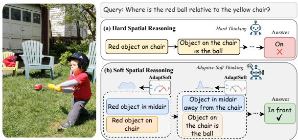
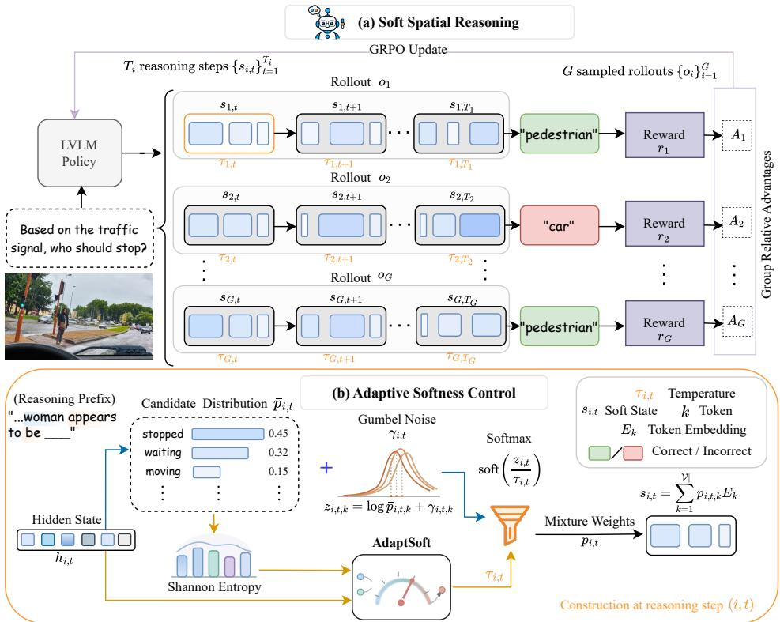
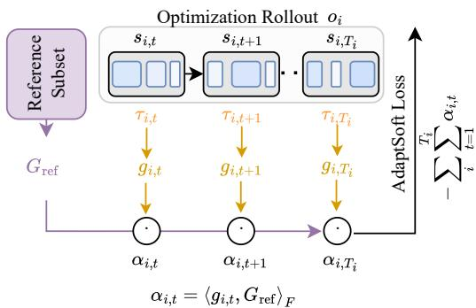
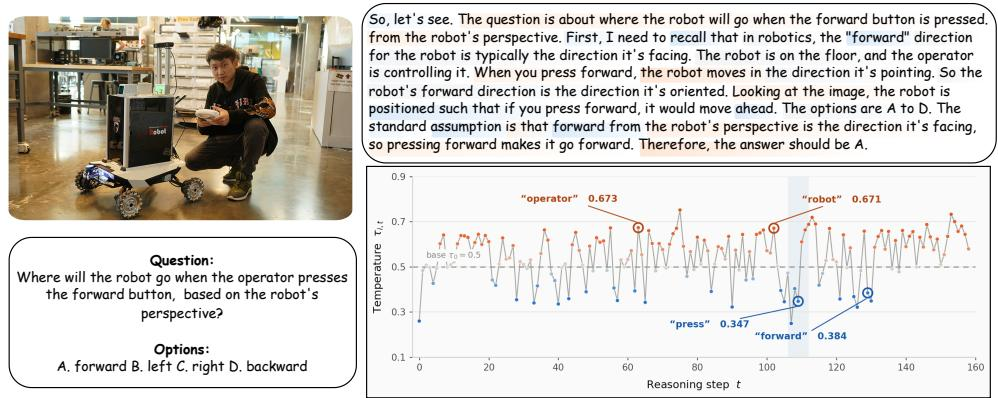
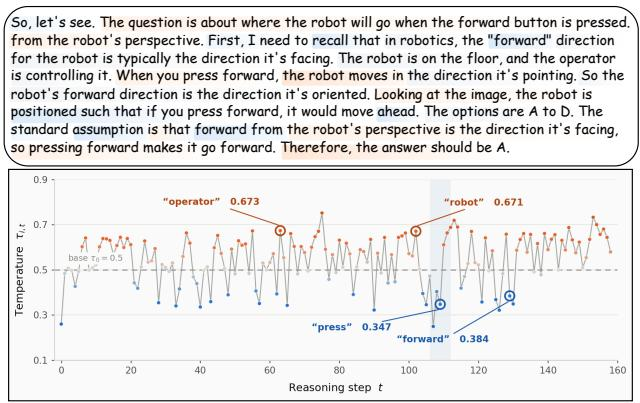
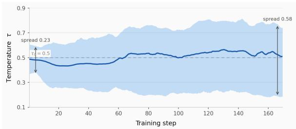
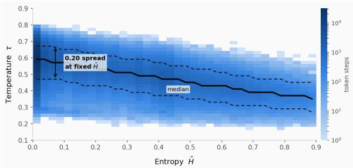
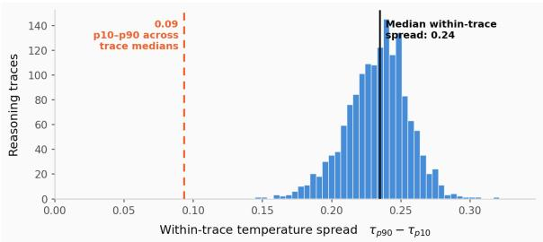

# SOFT SPATIAL REASONING

Rafi Ibn Sultan1 Md. Sajid Alam Chowdhury1 Saleh Zare Zade1

Chengyin Li2 Prashant Khanduri1 Marco Brocanelli3 Dongxiao Zhu1,4

1Department of Computer Science, Wayne State University

2Department of Radiation Oncology, Henry Ford Health

3Department of Electrical and Computer Engineering, The Ohio State University

4Institute for AI and Data Science, Wayne State University

## ABSTRACT

Large Vision-Language Models (LVLMs) commonly perform spatial reasoning through chain-of-thought (CoT), encoding intermediate reasoning as autoregressive sequences of discrete language tokens. Such hard thinking requires committing to a single token at each step, even when the correct spatial interpretation remains uncertain. This early commitment constitutes premature discretization: an incorrect token selection can propagate errors through subsequent reasoning. We propose Soft Spatial Reasoning, a post-training framework that introduces soft thinking for spatial tasks in LVLMs. At each intermediate reasoning step, the LVLM forms a continuous soft state by mixing token embeddings rather than selecting a single token, allowing multiple candidate continuations to influence the next step. The appropriate degree of softness, however, can vary across reasoning steps: retaining multiple candidates may preserve a useful spatial interpretation, but if those candidates imply conflicting spatial relations, mixing them may interfere with subsequent reasoning. At the core of Soft Spatial Reasoning is AdaptSoft, a controller that uses the current hidden state and predictive uncertainty to adapt the degree of softness at each reasoning step. To train AdaptSoft, we introduce a gradient-alignment learning objective that provides a step-specific learning signal for softness control without intermediate reasoning supervision. Across diverse spatial benchmarks, Soft Spatial Reasoning outperforms hard and fixed-soft CoT baselines using the same backbone, as well as a range of existing LVLMs. The source code is available at https: //github.com/rafiibnsultan/Soft\_Spatial\_Reasoning.

## 1 INTRODUCTION

Large Vision-Language Models (LVLMs) Alayrac et al. (2022); Li et al. (2023); Liu et al. (2023); Dai et al. (2023); Bai et al. (2023) have demonstrated capabilities across a range of tasks involving visual understanding Yin et al. (2024); Li et al. (2024) and spatial reasoning Liu et al. (2026); Stogiannidis et al. (2025). To support complex reasoning, these models commonly use chain-of-thought (CoT) Wei et al. (2022), generating intermediate reasoning steps before producing a final answer. Standard CoT expresses these steps as an autoregressive sequence of discrete language tokens, a process we refer to as hard thinking. As an alternative to this discrete formulation, recent work on Large Language Models (LLMs) Hao et al.

  
Figure 1: Hard versus adaptive soft thinking for spatial reasoning. (a) Hard thinking commits to one token at each CoT step, allowing early errors to propagate. (b) Our Soft Spatial Reasoning forms continuous intermediate states by mixing token embeddings, carrying information from multiple candidate continuations through the CoT. AdaptSoft adjusts the mixture’s softness at each step based on the current reasoning state and predictive uncertainty.

(2024); Zhang et al. (2026b); Zheng et al. (2025a) has explored soft thinking, in which continuous intermediate states carry information from multiple candidate continuations Zhu et al. (2026); Zhang et al. (2026a) while the final answer is expressed in language.

LVLMs, however, typically use hard thinking for spatial reasoning tasks Li et al. (2025); Gholami et al. (2025); Wang & Ling (2025). During the CoT, several spatial interpretations may still appear plausible to the model Zhang et al. (2025). Consider the question in Figure 1a, which asks where the red ball is relative to the yellow chair. Before resolving which red object is the ball, the model may identify the object on the chair as the ball in its CoT, even though the object in midair remains a plausible candidate. Subsequent reasoning may then treat the object on the chair as the ball, producing the answer on rather than in front. This illustrates premature discretization: committing to a discrete continuation before resolving the spatial interpretation can allow an early error to propagate through the remaining CoT Hao et al. (2024); Hu et al. (2026). Human cognition offers a useful contrast: people can think through a spatial problem before reaching an answer, without putting every thought into words Quiroga et al. (2005); Fedorenko & Varley (2016).

Reasoning without verbalizing every intermediate step is also emerging in LVLMs. Some approaches maintain and refine continuous visual tokens alongside the CoT Yang et al. (2026); Li et al. (2026a;b). In these approaches, softness lies in the visual representations, while the CoT still advances through discrete token selections and may commit prematurely to one interpretation. Other approaches extend soft thinking to the CoT itself Hu et al. (2026); Jeon et al. (2026); Wang et al. (2026b), forming soft states that carry information from multiple candidate continuations and may delay commitment to a single reasoning path. However, the benefit of preserving these alternatives depends on what they represent. In spatial reasoning, alternative interpretations of a scene can imply different spatial relations. During the CoT, a soft state may keep a useful interpretation available at one step; at another, mixing interpretations that imply conflicting relations may interfere with subsequent reasoning. A fixed degree of softness may not suit both situations (Figure 1b).

## Research Question

## How should LVLMs dynamically control representation softness during spatial reasoning?

To address this question, we propose Soft Spatial Reasoning (Figure 1b), a post-training framework that introduces adaptive soft thinking for spatial reasoning in LVLMs using soft states at each intermediate CoT step. Central to the framework is AdaptSoft, a controller that adjusts the softness of the token-embedding mixtures forming these states. AdaptSoft uses the LVLM’s hidden state at each step to account for the ongoing reasoning and predictive uncertainty to gauge the model’s confidence in its next continuation. By varying softness, it adjusts the distribution of weights across candidate continuations within each soft state, with the aim of guiding subsequent reasoning toward a correct final answer. We further introduce a gradient-alignment objective that measures agreement between each step’s contribution to the LVLM policy gradient and a reference gradient. This provides step-level credit alongside task-level rewards for jointly post-training AdaptSoft and the LVLM, without requiring intermediate reasoning annotations.

Our contributions are fourfold:

• We introduce Soft Spatial Reasoning, to our knowledge the first framework dedicated to soft thinking for spatial reasoning in LVLMs.

• We design AdaptSoft to control softness at each reasoning step using the current reasoning state and predictive uncertainty.

• We develop a gradient-alignment objective that provides step-specific credit without external evaluators or intermediate reasoning annotations.

• Extensive experiments covering 19 spatial reasoning categories demonstrate overall improvements over strong spatial reasoning baselines.

## 2 RELATED WORKS

Hard Spatial Reasoning in LVLMs. Several approaches support spatial reasoning by providing LVLMs with explicit scene geometry and object relationships Cheng et al. (2024); Ma et al. (2025b); Cai et al. (2025b); Liu et al. (2025); Chen et al. (2024b); Hu et al. (2025); Wang et al. (2025c);

Cai et al. (2025a); Chen et al. (2025a); Sultan et al. (2026); Daxberger et al. (2025); Hong et al. (2023); Wu et al. (2025a); Xu et al. (2026a); Zhao et al. (2025b). Others organize spatial evidence into intermediate representations for grounding and reasoning across perspectives Bigverdi et al. (2025); Wan et al. (2025); Ning et al. (2025); Gholami et al. (2025); Lee et al. (2025); Yang et al. (2025a); Chen et al. (2026c); Zhou et al. (2026a). Post-training methods optimize grounded reasoning and spatial predictions through supervision or task-specific rewards Kancheti et al. (2026); Xu et al. (2025); Zheng et al. (2025b); Ma et al. (2026); Chen et al. (2025c); Batra et al. (2025); Wang & Ling (2025); Wu et al. (2025b); Sarch et al. (2025); Zhao et al. (2025a); Li et al. (2025); Chen et al. (2026b); Li et al. (2026c), whereas training-free methods guide inference through spatial prompting or interventions on visual processing Liao et al. (2024); Ma et al. (2024); Mitra et al. (2024); Chen et al. (2025b); Yan et al. (2026). These methods strengthen spatial evidence and its use, but premature commitment to a single continuation can remain in discrete CoT.

Continuous and Soft Thinking. Recent work explores continuous intermediate states in place of discrete CoT generation in LLMs Hao et al. (2024); Wei et al. (2026b); Zhou et al. (2026c). Soft thinking retains multiple candidate continuations through mixtures of token embeddings Zhang et al. (2026b); Butt et al. (2026); Zheng et al. (2025a); Wang et al. (2025a). Other work explores discrete CoT paths Dang et al. (2026); Zhou et al. (2026b); Yu et al. (2026); Wei et al. (2026a) or switches between continuous and discrete reasoning Shi et al. (2026); Xu et al. (2026b;c). In LVLMs, continuous representations support multimodal reasoning, including soft thinking within the CoT Hu et al. (2026); Sun et al. (2026); Chen et al. (2026a); Shen et al. (2025); Pham & Ngo (2026); Ma et al. (2025a); Jeon et al. (2026); Wang et al. (2026b); Ray et al. (2026); Huang & Shan (2026), while complementary approaches construct or refine visual representations for subsequent reasoning Yang et al. (2026); Li et al. (2026a;b). These approaches do not learn step-specific softness for tokenembedding mixtures. Soft Spatial Reasoning uses the hidden state and predictive uncertainty to adjust softness, with gradient alignment guiding training.

## 3 METHOD

Soft Spatial Reasoning (Figure 2a) is a post-training framework that enables adaptive soft thinking for spatial tasks in LVLMs through continuous intermediate states and discrete final answers. Its controller, AdaptSoft (Figure 2b), determines step-specific softness from the current hidden state and predictive uncertainty. Gradient-Alignment Learning (Figure 3) trains this controller by deriving step-specific credit from alignment between each step’s policy gradient and a reference gradient.

## 3.1 PROBLEM SETUP

Given an image I and a spatial reasoning query q, an LVLM policy $\pi _ { \theta }$ generates a rollout $o = ( C , a )$ consisting of a CoT C and a discrete final answer a. Hard thinking represents $C$ as a sequence of discrete language tokens, each conditioning subsequent predictions. Soft thinking instead represents C as continuous states (Section 3.2).

The LVLM policy is post-trained using Group Relative Policy Optimization (GRPO) Shao et al. (2024), which uses relative rewards within groups of sampled rollouts without requiring ground-truth CoT supervision. As illustrated in Figure 2a, for each image–query pair $( I , q )$ , the rollout policy $\pi _ { \theta _ { \mathrm { o l d } } }$ samples a group of G rollouts:

$$
o _ { i } \sim \pi _ { \theta _ { \mathrm { o l d } } } ( \cdot \mid I , q ) , \qquad i = 1 , \ldots , G .\tag{1}
$$

Each rollout receives an answer reward $R _ { \mathrm { a n s } } ^ { ( i ) }$ and a format reward $R _ { \mathrm { f m t } } ^ { ( i ) }$ . The answer reward assigns full credit (1) when the final answer is correct and no credit (0) otherwise, while the format reward evaluates compliance with the required reasoning-and-answer structure. Using reward weights $w _ { \mathrm { a n s } }$ and $w _ { \mathrm { f m t } }$ , and a small constant ϵ for numerical stability, we define the task reward and its group-normalized advantage as

$$
r _ { i } = w _ { \mathrm { a n s } } R _ { \mathrm { a n s } } ^ { ( i ) } + w _ { \mathrm { f m t } } R _ { \mathrm { f m t } } ^ { ( i ) } , \qquad A _ { i } ^ { \mathrm { t a s k } } = \frac { r _ { i } - \mathrm { m e a n } ( \{ r _ { j } \} _ { j = 1 } ^ { G } ) } { \mathrm { s t d } ( \{ r _ { j } \} _ { j = 1 } ^ { G } ) + \epsilon } .\tag{2}
$$

  
Figure 2: Overview of Soft Spatial Reasoning. (a) The LVLM policy is post-trained to carry multiple candidate continuations through soft states during reasoning, then generate the final answer as discrete tokens. Rollout rewards yield group-relative advantages for the GRPO update. (b) At each reasoning step, AdaptSoft sets the mixture temperature from the current hidden state and candidate-distribution entropy. The resulting mixture weights combine token embeddings into the next soft state.

## 3.2 SOFT CHAIN-OF-THOUGHT (COT)

Within each rollout $o _ { i }$ , the intermediate CoT is represented by a sequence of $T _ { i }$ soft states $\{ s _ { i , t } \} _ { t = 1 } ^ { T _ { i } } .$ formed by feeding continuous mixtures of token embeddings back into the language backbone at successive reasoning steps (Figure 2a) Zhang et al. (2026b); Butt et al. (2026). After the reasoning steps, the model switches to discrete token generation for the final answer.

Stochastic Soft Rollout. To produce different soft CoTs within the rollout group, independent Gumbel perturbations are applied to the vocabulary log-probabilities at each reasoning step Zheng et al. (2025a); Wu et al. (2026), as illustrated in Figure 2b. Specifically, conditioned on $( I , q )$ and the preceding states $s _ { i , < t }$ , the rollout policy produces the unperturbed distribution $\bar { p } _ { i , t }$ . For each token $k ,$ an independent Gumbel sample $\gamma _ { i , t , k }$ is then added to $\log { \bar { p } } _ { i , t , k } ,$ , yielding the perturbed score $z _ { i , t , k } \mathrm { : }$

$$
\begin{array} { r } { \bar { p } _ { i , t } = \pi _ { \theta _ { \mathrm { o l d } } } \left( \cdot  { | \ I , q , s _ { i , < t }  , \qquad } \gamma _ { i , t , k } \overset { \mathrm { i . i . d . } } { \sim } \mathrm { G u m b e l } ( 0 , 1 ) , } \\ { \right)z _ { i , t , k } = \log \bar { p } _ { i , t , k } + \gamma _ { i , t , k } . \qquad } \end{array}\tag{3}
$$

A temperature-controlled softmax (Figure 2b) converts the perturbed scores into token-mixture weights $p _ { i , i }$ , whose weighted combination of token embeddings forms the soft state $s _ { i , t } \colon$

$$
p _ { i , t } = \operatorname { s o f t m a x } \left( \frac { z _ { i , t } } { \tau _ { i , t } } \right) , \qquad s _ { i , t } = \sum _ { k = 1 } ^ { | \mathcal { V } | } p _ { i , t , k } E _ { k } ,\tag{4}
$$

where V is the language vocabulary. At each step, the softmax is applied to its top-K candidate tokens, with $p _ { i , t , k } = 0$ for all other tokens. Here, k indexes vocabulary tokens, and $\dot { \boldsymbol { E } } _ { k } \in \mathbb { R } ^ { d }$ is the embedding of token k. The temperature $\tau _ { i , t } > 0$ controls mixture concentration: lower values move $s _ { i , t }$ toward the highest-scoring token’s embedding, while higher values spread weight across token embeddings.

Gumbel-Reparameterized Likelihood. GRPO requires a likelihood ratio between the current and rollout policies at each reasoning step. Unlike a discrete CoT step, a soft state $s _ { i , t }$ combines token embeddings without selecting an individual token, so the standard sampled-token likelihood does not apply. The perturbed score vector $z _ { i , t }$ is the sampled variable that, given $\tau _ { i , t }$ , deterministically specifies $s _ { i , t }$ (Equations (3) and (4)). The likelihood ratio is therefore defined over $z _ { i , t }$ , evaluating the same recorded score vector under both policies.

During the policy update, the sampled scores and corresponding temperatures from the preceding steps reconstruct $s _ { i , < t }$ , ensuring that both policies are evaluated on the same reasoning prefix. Conditioned on $( I , q , s _ { i , < t } )$ , the current policy produces $\bar { p } _ { i , t } ^ { \theta }$ . For each recorded score $z _ { i , t , k }$ , subtracting the current token log-probability yields the Gumbel noise value implied by the current policy. Evaluating the implied noise values under independent standard Gumbel densities gives the conditional joint log-density of $z _ { i , t }$ , with conditioning on $( I , q , s _ { i , < t } )$ omitted for compactness:

$$
\begin{array} { r l r } & { } & { \bar { p } _ { i , t } ^ { \theta } = \pi _ { \theta } ( \cdot  { | \ I , q , s _ { i , < t } ) , \qquad } \widetilde { \gamma } _ { i , t , k } ^ { \theta } = z _ { i , t , k } - \log \bar { p } _ { i , t , k } ^ { \theta } , } \\ & { } & { \log P _ { \theta } ( z _ { i , t } ) = \displaystyle \sum _ { k = 1 } ^ { | \mathcal { V } | } \left[ - \widetilde { \gamma } _ { i , t , k } ^ { \theta } - \exp \left( - \widetilde { \gamma } _ { i , t , k } ^ { \theta } \right) \right] . \qquad } \end{array}\tag{5}
$$

Evaluating the same scores under the rollout policy gives $P _ { \theta _ { \mathrm { o l d } } } ( z _ { i , t } )$ , yielding the soft-step GRPO ratio:

$$
\rho _ { i , t } ^ { \mathrm { s o f t } } ( \theta ) = \exp ( \log P _ { \theta } ( z _ { i , t } ) - \log P _ { \theta _ { \mathrm { o l d } } } ( z _ { i , t } ) ) .\tag{6}
$$

As detailed in Section 3.3, the rollout temperatures are reintroduced through AdaptSoft when reconstructing the soft states, allowing gradients from subsequent reasoning steps to propagate to its parameters. A derivation of the density and likelihood ratio is provided in Appendix Section C.1.

## 3.3 ADAPTSOFT: ADAPTIVE SOFTNESS CONTROL

Step-Specific Softness Controller. At reasoning step t of rollout $o _ { i } ,$ let $h _ { i , t } \in \mathbb { R } ^ { d }$ denote the final-layer hidden state and $\bar { p } _ { i , t }$ the unperturbed next-token distribution. The hidden state summarizes the accumulated reasoning context, while the entropy of $\bar { p } _ { i , t }$ measures predictive uncertainty among candidate continuations. The entropy is standardized as

$$
\widehat { H } _ { i , t } = \frac { H ( \bar { p } _ { i , t } ) - \mu _ { H } } { \sigma _ { H } + \epsilon _ { H } } ,\tag{7}
$$

where $H ( \cdot )$ denotes Shannon entropy. The mean $\mu _ { H }$ and standard deviation $\sigma _ { H }$ are estimated once from the next-token entropies of the initial policy and remain fixed throughout post-training. The constant $\epsilon _ { H } > 0$ prevents division by zero.

Before entering the controller, $h _ { i , t }$ is layer-normalized and projected to $d _ { p } < d$ dimensions using a fixed random matrix $\mathbf { P } \in \mathbb { R } ^ { d _ { p } \times d }$ . This compact representation reduces the rollout storage required for controller training. The projected state is concatenated with $\widehat { H } _ { i , t }$ t and passed to an MLP $f _ { \phi }$ , whose scalar output parameterizes the temperature:

$$
\begin{array} { r } { u _ { i , t } = f _ { \phi } \left( \left[ \mathbf { P } \ \operatorname { L N } ( h _ { i , t } ) \ \Big | \ \Big | \ \widehat { H } _ { i , t } \right] \right) , \qquad \tau _ { i , t } = \tau _ { 0 } + \Delta \operatorname { t a n h } ( u _ { i , t } ) , } \end{array}\tag{8}
$$

where LN denotes layer normalization, ∥ denotes concatenation, and $\phi$ contains the learnable controller parameters. Since tanh $( u _ { i , t } ) \ \in \ ( - 1 , 1 )$ , τ0 sets the base temperature and $\Delta$ sets its maximum step-specific deviation, yielding $\tau _ { i , t } \in ( \tau _ { 0 } - \Delta , \tau _ { 0 } + \Delta )$ . We require $0 < \Delta < \tau _ { 0 }$ to keep all temperatures above zero.

Within this range, AdaptSoft uses the current reasoning context and predictive uncertainty to adjust the softness of each mixture. As described in Section 3.2, the sampled soft states are reconstructed during the policy update from the recorded scores and rollout temperatures. To train AdaptSoft without altering these sampled states, the controller inputs and outputs are retained during rollout. A stop-gradient construction uses the recorded temperature in the forward computation while passing gradients through its recomputed value to ϕ; details are provided in Appendix Section C.2.

## 3.4 POST-TRAINING OPTIMIZATION

The LVLM policy is optimized with GRPO, while AdaptSoft is trained through step-specific gradient alignment.

GRPO for the LVLM Policy. For each sampled step, $\rho _ { i , t } ( \boldsymbol { \theta } )$ compares its likelihood under the current and rollout policies. Soft reasoning steps use the density ratio $\rho _ { i , t } ^ { \mathrm { s o f t } } ( \theta )$ in Equation $^ { 6 , }$ while discrete final-answer tokens use the token-probability ratio. Each ratio is weighted by the shared rollout advantage $A _ { i } ^ { \mathrm { t a s k } }$ , encouraging steps from higher-reward rollouts and discouraging those from lower-reward rollouts. The clipped surrogate limits the incentive for large ratio changes, while KL regularization over the LVLM’s next-token distributions penalizes deviation from $\pi _ { \mathrm { r e f } } .$ . Averaging over steps and rollouts gives

$$
\begin{array} { c l } { \displaystyle \mathcal { I } ( \theta ) = \mathbb { E } _ { \{ o _ { i } \} \sim \pi _ { \theta _ { \mathrm { o l d } } } } [ \frac { 1 } { G } \sum _ { i = 1 } ^ { G } \frac { 1 } { | o _ { i } | } \sum _ { t = 1 } ^ { | o _ { i } | } ( \operatorname* { m i n } \{ \rho _ { i , t } ( \theta ) A _ { i } ^ { \mathrm { t a s k } } ,   } \\ { \displaystyle   \mathrm { c l i p } ( \rho _ { i , t } ( \theta ) , 1 - \delta , 1 + \delta ) A _ { i } ^ { \mathrm { t a s k } } \} - \eta D _ { \mathrm { K L } } ( \pi _ { \theta } \| \pi _ { \mathrm { r e f } } ) ) ] . } \end{array}\tag{9}
$$

Here, $\left| o _ { i } \right|$ counts soft reasoning steps and discrete final-answer token $\mathbf { \sigma } _ { \mathbf { \mathbf { S } } } , \delta$ is the clipping threshold, and η weights the KL penalty against the reference LVLM policy $\pi _ { \mathrm { r e f } } .$ . The KL distributions are conditioned on $( I , q )$ and the preceding steps. Optimization minimizes $\mathcal { L } _ { \mathrm { G R P O } } ( \theta ) = - \mathcal { I } ( \theta )$

Step-Specific Gradient Alignment for Adapt-Soft. To train AdaptSoft, we introduce a gradient-alignment objective that provides a stepspecific learning signal for each predicted temperature. The shared rollout-level advantage in GRPO does not directly distinguish how softness should vary across reasoning steps. The proposed objective provides this signal by comparing each step’s contribution to the LVLM policy gradient with a reference gradient (Figure 3). Each batch of sampled rollouts is divided into disjoint reference and optimization subsets. The reference subset provides a gradient $G _ { \mathrm { r e f } }$ , while each soft reasoning step t of rollout $o _ { i }$ in the optimization subset contributes a gradient $g _ { i , t }$ . Both gradients are computed with respect to the LVLM outputlayer weights W.

  
Figure 3: Gradient-Alignment Learning. At each soft reasoning step t, the temperature $\tau _ { i , t }$ controls the state $s _ { i , t } ,$ whose contribution $g _ { i , t }$ to the LVLM outputlayer gradient is compared with a reference gradient $G _ { \mathrm { r e f } }$ computed from a disjoint subset of rollouts. The resulting alignment scores $\alpha _ { i , t }$ are aggregated to form the AdaptSoft loss.

The alignment score $\alpha _ { i , t }$ is defined as the Frobenius inner product of these gradients. The Adapt-

Soft loss $\bar { \mathcal { L } } _ { \mathrm { A S } } ( \phi )$ is the negative sum of the alignment scores across soft reasoning steps in the optimization subset:

$$
\begin{array} { r l r } & { } & { G _ { \mathrm { r e f } } = \nabla _ { W } \mathcal { L } _ { \mathrm { G R P O } } ^ { \mathrm { r e f } } , \qquad g _ { i , t } = \nabla _ { W } \mathcal { L } _ { \mathrm { G R P O } } ^ { ( i , t ) } , } \\ & { } & { \alpha _ { i , t } = \langle g _ { i , t } , G _ { \mathrm { r e f } } \rangle _ { F } , \qquad \mathcal { L } _ { \mathrm { A S } } ( \phi ) = - \displaystyle \sum _ { i } \sum _ { t = 1 } ^ { T _ { i } } \alpha _ { i , t } , } \end{array}\tag{10}
$$

where $\mathcal { L } _ { \mathrm { G R P O } } ^ { \mathrm { r e f } }$ is the GRPO loss on the reference subset, $\mathcal { L } _ { \mathrm { { G R P O } } } ^ { ( i , t ) }$ is the contribution of step t in rollout $o _ { i }$ to the GRPO loss, and i ranges over the optimization subset. For a small update $W ^ { \prime } = \bar { W } - \lambda g _ { i , t }$ with step size $\lambda > 0$ , the first-order change in the reference loss is $\scriptstyle - \lambda \alpha _ { i , t }$ . Minimizing ${ \mathcal { L } } _ { \mathrm { A S } }$ thus favors temperatures whose resulting step-specific gradients align with the reference gradient.

The gradients $g _ { i , t }$ are computed through the reconstructed soft states and remain differentiable with respect to the temperatures. Holding $G _ { \mathrm { r e f } }$ and the GRPO logit residuals fixed, differentiation provides a first-order alignment signal to temperatures through subsequent reasoning steps. To emphasize differences across reasoning steps, the mean temperature gradient is subtracted within each rollout:

Table 1: OmniSpatial Jia et al. (2025) results across 10 spatial reasoning task categories. Soft Spatial Reasoning is compared against proprietary models, general open-source LVLMs, soft thinking models, and specialized spatial reasoning models. Proprietary models are included as reference points; the best open-source or specialized result is shown in bold. Average accuracy is weighted by category sample size.
<table><tr><td rowspan="2">Method</td><td rowspan="2">Average</td><td colspan="2">Dynamic Reasoning</td><td colspan="3">Spatial Interaction</td><td colspan="2">Complex Logic</td><td colspan="3">Perspective Taking</td></tr><tr><td>Mani-</td><td>Motion Anal.</td><td>Traffic</td><td>Loca-</td><td>Geospa.</td><td>Pattern</td><td>Geometric</td><td>Ego</td><td>Allo</td><td>Hypo-</td></tr><tr><td>Reference Baselines</td><td></td><td>pulation</td><td></td><td>Anal.</td><td>lization</td><td>Strategy</td><td>Rec.</td><td>Reasoning</td><td>Centric</td><td>Centric</td><td>thetical</td></tr><tr><td>Random Choice</td><td>24.98</td><td>24.86</td><td>26.30</td><td>25.88</td><td>23.43</td><td>27.27</td><td>21.44</td><td>24.77</td><td>22.55</td><td>24.84</td><td>25.78</td></tr><tr><td>Human Evaluation</td><td>92.63</td><td>94.62</td><td>96.07</td><td>91.38</td><td>95.11</td><td>92.15</td><td>89.02</td><td>85.90</td><td>98.53</td><td>94.30</td><td>90.26</td></tr><tr><td>Proprietary Models</td><td></td><td></td><td></td><td></td><td></td><td></td><td></td><td></td><td></td><td></td><td></td></tr><tr><td>GPT-4.1-mini Open (2025)</td><td>48.87</td><td>64.32</td><td>56.53</td><td>59.06</td><td>60.19</td><td>56.36</td><td>29.28</td><td>30.19</td><td>72.55</td><td>39.57</td><td>39.28</td></tr><tr><td>Gemini-2.5-flash-preview Team et al. (2023)</td><td>52.12</td><td>67.57</td><td>62.72</td><td>68.24</td><td>73.33</td><td>60.91</td><td>38.14</td><td>34.19</td><td>75.49</td><td>35.90</td><td>33.73</td></tr><tr><td>04-mini OpenAI (2025)</td><td>52.77</td><td>72.97</td><td>59.83</td><td>60.00</td><td>73.33</td><td>61.82</td><td>34.02</td><td>36.77</td><td>73.53</td><td>40.69</td><td>40.96</td></tr><tr><td>Gemini-2.5-flash Team et al. (2023)</td><td>53.16</td><td>70.27</td><td>64.74</td><td>61.18</td><td>72.38</td><td>58.18</td><td>35.05</td><td>36.13</td><td>74.12</td><td>40.96</td><td>32.53</td></tr><tr><td>Open-weights Models</td><td></td><td></td><td></td><td></td><td></td><td></td><td></td><td></td><td></td><td></td><td></td></tr><tr><td>LLaVA-1.5-7B Liu et al. (2024)</td><td>34.97</td><td>54.46</td><td>31.23</td><td>35.29</td><td>36.19</td><td>33.94</td><td>29.01</td><td>24.18</td><td>55.60</td><td>34.66</td><td>36.14</td></tr><tr><td>InternVL3-8B Zhu et al. (2025)</td><td>41.60</td><td>52.43</td><td>40.87</td><td>48.94</td><td>51.05</td><td>44.77</td><td>24.95</td><td>28.63</td><td>64.20</td><td>38.62</td><td>40.96</td></tr><tr><td>InternVL3-14B Zhu et al. (2025)</td><td>45.94</td><td>54.32</td><td>60.17</td><td>50.35</td><td>51.81</td><td>51.45</td><td>28.04</td><td>28.26</td><td>68.04</td><td>35.37</td><td>34.46</td></tr><tr><td>Qwen2.5-VL-7B Wang et al. (2024)</td><td>39.18</td><td>58.38</td><td>35.09</td><td>50.12</td><td>45.33</td><td>44.00</td><td>31.13</td><td>29.42</td><td>64.51</td><td>33.19</td><td>37.35</td></tr><tr><td>Gemma-3-12B Gemma Team et al. (2025)</td><td>43.71</td><td>54.05</td><td>54.91</td><td>54.12</td><td>47.62</td><td>45.45</td><td>16.49</td><td>30.32</td><td>63.73</td><td>36.70</td><td>33.73</td></tr><tr><td>Soft Thinking Models</td><td></td><td></td><td></td><td></td><td></td><td></td><td></td><td></td><td></td><td></td><td></td></tr><tr><td>LVR Li et al. (2026a)</td><td>41.86</td><td>54.05</td><td>35.83</td><td>44.70</td><td>53.33</td><td>48.18</td><td>28.86</td><td>27.74</td><td>72.54</td><td>38.29</td><td>50.60</td></tr><tr><td>Laser Wang et al. (2026b)</td><td>42.78</td><td>55.40</td><td>45.95</td><td>57.64</td><td>54.28</td><td>50.00</td><td>20.61</td><td>24.51</td><td>72.54</td><td>33.51</td><td>44.57</td></tr><tr><td>LaCoT Sun et al. (2026)</td><td>45.66</td><td>59.45</td><td>53.75</td><td>56.47</td><td>50.47</td><td>48.18</td><td>28.86</td><td>33.54</td><td>67.64</td><td>34.57</td><td>44.57</td></tr><tr><td>Spatial Reasoning Models</td><td></td><td></td><td></td><td></td><td></td><td></td><td></td><td></td><td></td><td></td><td></td></tr><tr><td>SpaceMantis-13B Chen et al. (2024a)</td><td>36.36</td><td>47.03</td><td>36.59</td><td>40.94</td><td>34.86</td><td>33.09</td><td>22.27</td><td>24.39</td><td>49.22</td><td>38.25</td><td>39.28</td></tr><tr><td>SpaceQwen2.5-VL-3B Chen et al. (2024a)</td><td>40.25</td><td>58.11</td><td>39.88</td><td>41.18</td><td>40.95</td><td>40.91</td><td>29.90</td><td>25.81</td><td>63.73</td><td>38.83</td><td>39.76</td></tr><tr><td>SpaceThinkerQwen2.5VL-3B Chen et al. (2024a)</td><td>40.42</td><td>47.84</td><td>53.06</td><td>43.29</td><td>35.43</td><td>38.73</td><td>24.33</td><td>28.00</td><td>58.04</td><td>35.11</td><td>31.08</td></tr><tr><td>VST-RL-7B Yang et al. (2025b)</td><td>41.09</td><td>56.75</td><td>43.39</td><td>44.75</td><td>46.66</td><td>42.72</td><td>25.51</td><td>28.38</td><td>72.54</td><td>32.89</td><td>43.37</td></tr><tr><td>SoFar-Qwen2.5VL-3B Qi et al. (2025)</td><td>45.14</td><td>56.49</td><td>51.16</td><td>54.12</td><td>53.14</td><td>52.73</td><td>31.75</td><td>22.88</td><td>71.60</td><td>36.56</td><td>41.69</td></tr><tr><td>SpatialLadder-3B Li et al. (2025)</td><td>40.50</td><td>59.45</td><td>39.01</td><td>50.58</td><td>48.57</td><td>42.72</td><td>26.80</td><td>23.87</td><td>71.56</td><td>35.10</td><td>39.75</td></tr><tr><td>Backbone and Our Variants</td><td></td><td></td><td></td><td></td><td></td><td></td><td></td><td></td><td></td><td></td><td></td></tr><tr><td>Qwen3-VL-8B-Thinking (Base) Bai et al. (2025)</td><td>43.90</td><td>57.14</td><td>54.28</td><td></td><td>54.95</td><td>48.67</td><td>24.77</td><td></td><td>71.56</td><td>31.11</td><td></td></tr><tr><td>Hard Thinking + GRPO</td><td>45.92</td><td>61.32</td><td>54.30</td><td>36.04 55.88</td><td>58.33</td><td>46.18</td><td>25.90</td><td>23.12 25.00</td><td>72.92</td><td></td><td>38.82</td></tr><tr><td>Soft Thinking + GRPO</td><td>46.93</td><td>61.82</td><td>55.85</td><td>52.21</td><td>62.62</td><td>49.77</td><td>25.26</td><td>25.00</td><td>76.35</td><td>36.57</td><td>42.53</td></tr><tr><td>Soft Spatial Reasoning (Ours)</td><td>49.68</td><td>63.51</td><td>62.14</td><td>57.65</td><td>62.86</td><td>50.00</td><td>29.90</td><td>34.84</td><td>75.49</td><td>36.23 34.93</td><td>45.88 46.34</td></tr></table>

$$
\widetilde { g } _ { i , t } ^ { \tau } = \frac { \partial \mathcal { L } _ { \mathrm { A S } } } { \partial \tau _ { i , t } } - \frac { 1 } { T _ { i } } \sum _ { t ^ { \prime } = 1 } ^ { T _ { i } } \frac { \partial \mathcal { L } _ { \mathrm { A S } } } { \partial \tau _ { i , t ^ { \prime } } } .\tag{11}
$$

The centered gradients satisfy $\begin{array} { r } { \sum _ { t = 1 } ^ { T _ { i } } \widetilde { g } _ { i , t } ^ { \tau } = 0 } \end{array}$ . Alignment scores are computed using the outer-product structure of the output-layer gradients, avoiding a separate $| \nu | \times d$ gradient matrix for each soft reasoning step.

Parameter Updates. Each training step updates the LVLM parameters θ using $\mathcal { L } _ { \mathrm { G R P O } }$ from Equation 9. The AdaptSoft parameters ϕ are updated by backpropagating the centered temperature gradients from Equation 11 through the controller in Equation 8 (detailed in Appendix Section C.3).

## 4 EXPERIMENTS

## 4.1 IMPLEMENTATION DETAILS

We instantiate Soft Spatial Reasoning with a Qwen3-VL-8B-Thinking backbone Bai et al. (2025) and train for two epochs on the OmniSpatial training split Jia et al. (2025). GRPO uses $G = 8$ rollouts per prompt, a batch size of 64 prompts, and two optimizer updates per batch. The LVLM policy is optimized with AdamW at a learning rate of $1 0 ^ { - 6 }$ and regularized toward its frozen initialization using a KL coefficient of $1 0 ^ { - 3 }$ . AdaptSoft is implemented as a two-layer MLP with projection dimension $d _ { p } = 8$ and optimized with AdamW at a learning rate of $1 0 ^ { - 3 }$ . Additional optimization, preprocessing, sequence-length, and system details are provided in Appendix Section B.1.

## 4.2 BASELINES

We compare Soft Spatial Reasoning against open-source LVLMs, including models specialized in spatial reasoning and soft thinking, and report proprietary models as reference points. We also train controlled hard- and soft-thinking baselines using the same backbone and post-training setup. Evaluation covers three complementary settings. The held-out OmniSpatial test set Jia et al. (2025) evaluates post-training performance across its spatial-reasoning taxonomy. SpatiaLab Wasi et al.

  
Figure 4: Soft Spatial Reasoning on a randomly selected example from OmniSpatial. AdaptSoft varies softness across the CoT. For readability, greedy decoding is used only to display the soft states as text. Shading shows each span’s mean temperature (blue: lower; orange: higher). The plot below shows temperature at every reasoning step and labels several words with their temperatures.

Table 2: SpatiaLab Wasi et al. (2026) results across 6 spatial reasoning task categories in the zero-shot setting. Proprietary models are included as reference points; the best open-source or specialized result is shown in bold. Average accuracy is weighted by category sample size.
<table><tr><td rowspan="2">Method</td><td rowspan="2">Average</td><td colspan="6">Question Categories</td></tr><tr><td>3D Geom.</td><td>Dep. &amp; Occu.</td><td>Orientation</td><td>Relat. Posit.</td><td>Size &amp; Scale</td><td>Spati. Navig.</td></tr><tr><td>Reference Baselines</td><td></td><td></td><td></td><td></td><td></td><td></td><td></td></tr><tr><td>Random Choice</td><td>25.00</td><td>25.00</td><td>25.00</td><td>25.00</td><td>25.00</td><td>25.00</td><td>25.00</td></tr><tr><td>Human Baseline</td><td>87.57</td><td>93.70</td><td>74.13</td><td>91.58</td><td>91.51</td><td>88.89</td><td>87.76</td></tr><tr><td>Proprietary Models</td><td></td><td></td><td></td><td></td><td></td><td></td><td></td></tr><tr><td>GPT-4o-mini Hurst et al. (2024)</td><td>46.50</td><td>47.06</td><td>39.00</td><td>47.03</td><td>47.17</td><td>49.60</td><td>49.79</td></tr><tr><td>Gemini-2.5-Flash Team et al. (2023)</td><td>48.29</td><td>44.96</td><td>48.26</td><td>48.02</td><td>56.13</td><td>42.46</td><td>51.05</td></tr><tr><td>Mistral Medium 3.1 Mistral AI (2025)</td><td>47.93</td><td>46.64</td><td>49.81</td><td>47.52</td><td>61.79</td><td>41.67</td><td>41.77</td></tr><tr><td>Open-weights Models</td><td></td><td></td><td></td><td></td><td></td><td></td><td></td></tr><tr><td>Qwen2.5-VL-3B-Instruct Wang et al. (2024)</td><td>41.43</td><td>41.18</td><td>35.52</td><td>46.04</td><td>40.09</td><td>47.22</td><td>39.24</td></tr><tr><td>InternVL3.5-4B Wang et al. (2025b)</td><td>43.29</td><td>42.86</td><td>42.86</td><td>42.08</td><td>54.72</td><td>36.51</td><td>42.19</td></tr><tr><td>Gemma-3-4B-it Gemma Team et al. (2025)</td><td>40.57</td><td>43.70</td><td>34.36</td><td>46.53</td><td>45.75</td><td>37.30</td><td>37.97</td></tr><tr><td>LLaVA-1.5-7B Liu et al. (2024)</td><td>38.64</td><td>40.33</td><td>34.74</td><td>31.68</td><td>40.56</td><td>40.07</td><td>43.88</td></tr><tr><td>Qwen2.5-VL-7B-Instruct Wang et al. (2024)</td><td>41.00</td><td>42.86</td><td>37.84</td><td>42.57</td><td>46.23</td><td>42.06</td><td>35.44</td></tr><tr><td>Soft Thinking Models</td><td></td><td></td><td></td><td></td><td></td><td></td><td></td></tr><tr><td>LVR Li et al. (2026a)</td><td>45.78</td><td>48.31</td><td>43.62</td><td>51.98</td><td>49.52</td><td>40.07</td><td>43.03</td></tr><tr><td>Laser Wang et al. (2026b)</td><td>44.78</td><td>46.21</td><td>43.24</td><td>46.03</td><td>50.47</td><td>40.07</td><td>43.88</td></tr><tr><td>LaCoT Sun et al. (2026)</td><td>45.50</td><td>46.63</td><td>40.15</td><td>47.52</td><td>53.30</td><td>43.25</td><td>43.88</td></tr><tr><td>Spatial Reasoning Models</td><td></td><td></td><td></td><td></td><td></td><td></td><td></td></tr><tr><td>SpaceOm Chen et al. (2024a)</td><td>41.36</td><td>42.44</td><td>38.61</td><td>48.02</td><td>37.74</td><td>42.86</td><td>39.24</td></tr><tr><td>SpaceThinker-Qwen2.5VL-3B Chen et al. (2024a)</td><td>40.64</td><td>40.34</td><td>37.84</td><td>47.03</td><td>38.21</td><td>43.25</td><td>37.97</td></tr><tr><td>SpaceQwen2.5-VL-3B-Instruct Chen et al. (2024a)</td><td>40.14</td><td>31.51</td><td>35.14</td><td>37.62</td><td>37.74</td><td>50.79</td><td>47.26</td></tr><tr><td>SpatialLadder-3B Li et al. (2025) Backbone and Our Variants</td><td>35.28</td><td>39.91</td><td>34.61</td><td>39.90</td><td>38.20</td><td>25.39</td><td>33.19</td></tr><tr><td></td><td></td><td></td><td></td><td></td><td></td><td></td><td></td></tr><tr><td>Qwen3-VL-8B-Thinking (Base) Bai et al. (2025)</td><td>44.78</td><td>42.01</td><td>47.10</td><td>47.02</td><td>51.88</td><td>40.47</td><td>41.35</td></tr><tr><td>Hard Thinking + GRPO</td><td>46.21</td><td>43.70</td><td>47.88</td><td>47.52</td><td>54.25</td><td>41.27</td><td>43.88</td></tr><tr><td>Soft Thinking + GRPO</td><td>46.86</td><td>44.12</td><td>48.26</td><td>48.02</td><td>55.66</td><td>41.67</td><td>44.73</td></tr><tr><td>Soft Spatial Reasoning (Ours)</td><td>48.71</td><td>46.22</td><td>49.42</td><td>48.51</td><td>58.96</td><td>42.46</td><td>48.10</td></tr></table>

(2026) measures zero-shot transfer to realistic, unconstrained scenes from an unseen benchmark. MindCube Wang et al. (2026a) evaluates zero-shot spatial mental modeling from limited views through cognitive mapping, perspective-taking, and mental simulation. Dataset and evaluation details are provided in Appendix Section D.1.

## 4.3 RESULTS

What Adaptive Softness Adds to Spatial Reasoning. On OmniSpatial, Soft Spatial Reasoning leads the non-proprietary models in weighted-average accuracy (Table 1), surpassing InternVL3-14B, SoFar, and LaCoT by 3.74, 4.54, and 4.02 percentage points, respectively. With the same backbone and post-training setup, basic soft thinking improves on hard thinking by 1.01 points, while adaptive softness adds another 2.75 points. Geometric Reasoning illustrates this distinction: hard and basic soft thinking both score 25.00, whereas adaptation reaches 34.84. Motion Analysis also rises from 55.85 to 62.14 over basic soft thinking. The absence of a geometric gain from basic soft thinking suggests that preserving alternatives alone may not suffice. Geometry and motion can involve competing spatial configurations whose usefulness changes across reasoning steps. Adaptive softness may help retain useful possibilities while limiting interference from conflicting relations as the reasoning context changes. Relative to the original backbone, the full model improves in all ten categories, including a 21.61-point gain in Traffic Analysis.

Figure 4 illustrates how Soft Spatial Reasoning answers a spatial question about an image. The displayed CoT traces the model’s reasoning about the robot’s movement, reaching the correct answer as softness varies across steps. The text highlights connect this reasoning to the temperature plot below: “operator” and “robot” correspond to higher temperatures, while “press” and “forward” correspond to lower temperatures. These adjustments let broader candidate continuations contribute at some steps and concentrate their influence at others, showing how adaptive softness operates throughout reasoning. Further analysis of temperature variation appears in Section A.

What Adaptive Softness Adds in Zero-Shot Transfer. On the unseen SpatiaLab benchmark (Table 2), Soft Spatial Reasoning achieves 48.71, exceeding the strongest prior openweights model, LVR, by 2.93 percentage points. The matched-backbone comparison shows that adaptive softness contributes a further 1.85 points over basic soft thinking, compared with the 0.65-point gain from hard to basic soft thinking. Thus, the larger benefit from adjusting softness across reasoning steps observed on OmniSpatial persists under zero-shot transfer.

Unlike on OmniSpatial, adaptive softness improves over basic soft thinking in every category. The gains are nevertheless uneven: Relative Position (+3.30) and Spatial Navigation (+3.37) improve substantially more than Orientation (+0.49) and Size & Scale (+0.79). The consistent direction of these improvements supports the transferability of learned softness control, while their differing magnitudes indicate that its benefit depends on the spatial task.

What Adaptive Softness Adds to Spatial Mental Modeling. MindCube Wang et al. (2026a) requires integrating limited views to infer unseen spatial relations and reason about hypothetical movements. In this zero-shot setting, Soft Spatial Rea soning achieves 38.13 weighted-average accuracy, the highest among the compared non-proprietary models, and improves on

Table 3: Zero-shot results on MindCube Wang et al. (2026a) across three spatial mental-modeling settings. Proprietary models are included as reference points, and Overall is weighted by setting size.
<table><tr><td>Method</td><td>Overall</td><td>Rotation</td><td>Among</td><td>Around</td></tr><tr><td>Reference Baseline</td><td></td><td></td><td></td><td></td></tr><tr><td>Random Choice</td><td>32.35</td><td>36.36</td><td>32.29</td><td>30.66</td></tr><tr><td>Proprietary Models</td><td></td><td></td><td></td><td></td></tr><tr><td>Gemini-2.5-Pro Team et al. (2023)</td><td>47.05</td><td>85.50</td><td>25.95</td><td>38.40</td></tr><tr><td>Claude-4-Sonnet Anthropic (2024)</td><td>44.75</td><td>48.42</td><td>44.21</td><td>47.62</td></tr><tr><td>Open-weight Models</td><td></td><td></td><td></td><td></td></tr><tr><td>InternVL3-8B Wang et al. (2025b)</td><td>37.50</td><td>26.00</td><td>42.03</td><td>36.00</td></tr><tr><td>Qwen3-VL-8B-Thinking (Base) Bai et al. (2025)</td><td>33.62</td><td>45.14</td><td>33.26</td><td>30.44</td></tr><tr><td>Soft-Thinking Models</td><td></td><td></td><td></td><td></td></tr><tr><td>LVR Li et al. (2026a)</td><td>29.53</td><td>36.07</td><td>29.44</td><td>26.59</td></tr><tr><td>Laser Wang et al. (2026b)</td><td>27.29</td><td>37.65</td><td>30.12</td><td>21.02</td></tr><tr><td></td><td></td><td></td><td></td><td></td></tr><tr><td>Spatial Reasoning Models</td><td></td><td></td><td></td><td></td></tr><tr><td>SpaceMantis Chen et al. (2024a)</td><td>22.81</td><td>37.65</td><td>21.26</td><td>29.32</td></tr><tr><td>SpaceQwen Chen et al. (2024a)</td><td>33.28</td><td>38.02</td><td>33.71</td><td>26.32</td></tr><tr><td>Proposed Method</td><td></td><td></td><td></td><td></td></tr><tr><td>Soft Spatial Reasoning (Ours)</td><td>38.13</td><td>47.36</td><td>38.18</td><td>32.37</td></tr></table>

its backbone by 4.51 points (Table 3). Improvements span all three settings, extending the framework’s benefits to reasoning about partially observed scenes. Adaptive softness may support this process by preserving plausible spatial interpretations while combining evidence from different views.

Ablation Study. All four ablations reduce accuracy in every perspective-taking category (Table 4). Replacing AdaptSoft’s stepspecific gradient alignment with the rolloutlevel task advantage produces the largest average decline (4.07 points), including a 6.52-point drop in Hypothetical reasoning. This suggests that the shared GRPO signal provides less guidance for controlling softness at individual steps. Removing the final-layer hidden state $h _ { i , t }$ from AdaptSoft reduces average accuracy by 3.53 points,

Table 4: OmniSpatial Perspective Taking ablations Jia et al. (2025). All variants share the backbone and policy GRPO setup, with post-training and evaluation on the corresponding training and test splits. Averages are sample-weighted.

<table><tr><td>Variant</td><td>Avg.</td><td>Ego centric</td><td>Allo centric</td><td>Hypo thetical</td></tr><tr><td>Soft Spatial Reasoning (Full)</td><td>42.75</td><td>81.37</td><td>32.53</td><td>41.46</td></tr><tr><td>w/o  $h _ { i , t }$  in AdaptSoft</td><td>39.22</td><td>77.45</td><td>29.52</td><td>36.14</td></tr><tr><td>w/o predictive uncertainty</td><td>40.64</td><td>78.43</td><td>30.85</td><td>38.55</td></tr><tr><td>w/o gradient alignment</td><td>38.68</td><td>76.47</td><td>29.26</td><td>34.94</td></tr><tr><td>w/o gradient centering</td><td>41.18</td><td>79.41</td><td>31.12</td><td>39.76</td></tr></table>

compared with 2.11 points without predictive uncertainty, supporting the use of the ongoing reasoning state alongside predictive uncertainty to control softness. Omitting gradient centering reduces accuracy in all three categories, with a smaller average decline of 1.57 points.

## 5 CONCLUSION

We introduced Soft Spatial Reasoning, a post-training framework that enables adaptive soft thinking for spatial reasoning in LVLMs. AdaptSoft controls softness using the reasoning state and predictive uncertainty, with step-specific guidance from gradient alignment. Across three benchmarks, our framework achieves the highest weighted-average accuracy among the evaluated non-proprietary models, with gains extending to unseen benchmarks.

Limitations. AdaptSoft lacks an explicit measure of uncertainty in visual evidence. Future work could incorporate visual uncertainty at individual CoT steps, allowing softness to reflect ambiguity in both visual evidence and language generation.

## REFERENCES

Jean-Baptiste Alayrac, Jeff Donahue, Pauline Luc, Antoine Miech, Iain Barr, Yana Hasson, Karel Lenc, Arthur Mensch, Katherine Millican, Malcolm Reynolds, et al. Flamingo: a visual language model for few-shot learning. Advances in neural information processing systems, 35:23716–23736, 2022.

Sonnet Anthropic. Model card addendum: Claude 3.5 haiku and upgraded claude 3.5 sonnet. URL https://api. semanticscholar. org/CorpusID, 273639283:24, 2024.

Jinze Bai, Shuai Bai, Yunfei Chu, Zeyu Cui, Kai Dang, Xiaodong Deng, Yang Fan, Wenbin Ge, Yu Han, Fei Huang, et al. Qwen technical report. arXiv preprint arXiv:2309.16609, 2023.

Shuai Bai, Yuxuan Cai, Ruizhe Chen, Keqin Chen, Xionghui Chen, Zesen Cheng, Lianghao Deng, Wei Ding, Chang Gao, Chunjiang Ge, et al. Qwen3-vl technical report. arXiv preprint arXiv:2511.21631, 2025.

Hunar Batra, Haoqin Tu, Hardy Chen, Yuanze Lin, Cihang Xie, and Ronald Clark. Spatialthinker: Reinforcing 3d reasoning in multimodal llms via spatial rewards. arXiv preprint arXiv:2511.07403, 2025.

Mahtab Bigverdi, Zelun Luo, Cheng-Yu Hsieh, Ethan Shen, Dongping Chen, Linda G Shapiro, and Ranjay Krishna. Perception tokens enhance visual reasoning in multimodal language models. In Proceedings of the Computer Vision and Pattern Recognition Conference, pp. 3836–3845, 2025.

Natasha Butt, Ariel Kwiatkowski, Ismail Labiad, Julia Kempe, and Yann Ollivier. Soft tokens, hard truths. In International Conference on Learning Representations, volume 2026, pp. 114650– 114675, 2026.

Wenxiao Cai, Iaroslav Ponomarenko, Jianhao Yuan, Xiaoqi Li, Wankou Yang, Hao Dong, and Bo Zhao. Spatialbot: Precise spatial understanding with vision language models. In 2025 IEEE International Conference on Robotics and Automation (ICRA), pp. 9490–9498. IEEE, 2025a.

Zhipeng Cai, Ching-Feng Yeh, Hu Xu, Zhuang Liu, Gregory Meyer, Xinjie Lei, Changsheng Zhao, Shang-Wen Li, Vikas Chandra, and Yangyang Shi. Depthlm: Metric depth from vision language models. arXiv preprint arXiv:2509.25413, 2025b.

Boyuan Chen, Zhuo Xu, Sean Kirmani, Brain Ichter, Dorsa Sadigh, Leonidas Guibas, and Fei Xia. Spatialvlm: Endowing vision-language models with spatial reasoning capabilities. In Proceedings of the IEEE/CVF Conference on Computer Vision and Pattern Recognition, pp. 14455–14465, 2024a.

Chao Chen, Zhixin Ma, Yongqi Li, Yupeng Hu, Yinwei Wei, Wenjie Li, and Liqiang Nie. Reasoning in the dark: Interleaved vision-text reasoning in latent space. In Findings ofthe Associationfor Computational Linguistics: ACL 2026, pp. 39117–39129, 2026a.

Pingyi Chen, Yujing Lou, Shen Cao, Jinhui Guo, Lubin Fan, Yue Wu, Lin Yang, Lizhuang Ma, and Jieping Ye. Sd-vlm: Spatial measuring and understanding with depth-encoded vision-language models. In The Thirty-ninth Annual Conference on Neural Information Processing Systems, 2025a.

Shiqi Chen, Tongyao Zhu, Ruochen Zhou, Jinghan Zhang, Siyang Gao, Juan Carlos Niebles, Mor Geva, Junxian He, Jiajun Wu, and Manling Li. Why is spatial reasoning hard for vlms? an attention mechanism perspective on focus areas. arXiv preprint arXiv:2503.01773, 2025b.

Sijin Chen, Xin Chen, Chi Zhang, Mingsheng Li, Gang Yu, Hao Fei, Hongyuan Zhu, Jiayuan Fan, and Tao Chen. Ll3da: Visual interactive instruction tuning for omni-3d understanding reasoning and planning. In Proceedings of the IEEE/CVF conference on computer vision and pattern recognition, pp. 26428–26438, 2024b.

Siyi Chen, Mikaela Angelina Uy, Chan Hee Song, Faisal Ladhak, Adithyavairavan Murali, Qing Qu, Stan Birchfield, Valts Blukis, and Jonathan Tremblay. Spacetools: Tool-augmented spatial reasoning via double interactive rl. In Proceedings of the IEEE/CVF Conference on Computer Vision and Pattern Recognition, pp. 37109–37120, 2026b.

Zhangquan Chen, Ruihui Zhao, Chuwei Luo, Mingze Sun, Xinlei Yu, Yangyang Kang, and Ruqi Huang. Sifthinker: Spatially-aware image focus for visual reasoning. arXiv preprint arXiv:2508.06259, 2025c.

Zhangquan Chen, Manyuan Zhang, Xinlei Yu, Xufang Luo, Mingze Sun, Zihao Pan, Xiang An, Yan Feng, Peng Pei, Xunliang Cai, et al. Think with 3d: Geometric imagination grounded spatial reasoning from limited views. In Proceedings of the IEEE/CVF Conference on Computer Vision and Pattern Recognition, pp. 2613–2624, 2026c.

An-Chieh Cheng, Hongxu Yin, Yang Fu, Qiushan Guo, Ruihan Yang, Jan Kautz, Xiaolong Wang, and Sifei Liu. Spatialrgpt: Grounded spatial reasoning in vision-language models. Advances in Neural Information Processing Systems, 37:135062–135093, 2024.

Wenliang Dai, Junnan Li, Dongxu Li, Anthony Tiong, Junqi Zhao, Weisheng Wang, Boyang Li, Pascale N Fung, and Steven Hoi. Instructblip: Towards general-purpose vision-language models with instruction tuning. Advances in neural information processing systems, 36:49250–49267, 2023.

Haoran Dang, Cuiling Lan, Hai Wan, Xibin Zhao, and Yan Lu. Temperature as a meta-policy: Adaptive temperature in llm reinforcement learning. arXiv preprint arXiv:2602.11779, 2026.

Erik Daxberger, Nina Wenzel, David Griffiths, Haiming Gang, Justin Lazarow, Gefen Kohavi, Kai Kang, Marcin Eichner, Yinfei Yang, Afshin Dehghan, et al. MM-Spatial: Exploring 3D spatial understanding in multimodal LLMs. In Proceedings of the IEEE/CVF International Conference on Computer Vision (ICCV), 2025.

Evelina Fedorenko and Rosemary Varley. Language and thought are not the same thing: evidence from neuroimaging and neurological patients. Annals ofthe New York Academy ofSciences, 1369 (1):132–153, 2016.

Gemma Team et al. Gemma 3 technical report, 2025. URL https://arxiv.org/abs/2503. 19786.

Mohsen Gholami, Ahmad Rezaei, Zhou Weimin, Sitong Mao, Shunbo Zhou, Yong Zhang, and Mohammad Akbari. Spatial reasoning with vision-language models in ego-centric multi-view scenes. arXiv preprint arXiv:2509.06266, 2025.

Shibo Hao, Sainbayar Sukhbaatar, DiJia Su, Xian Li, Zhiting Hu, Jason Weston, and Yuandong Tian. Training large language models to reason in a continuous latent space. arXiv preprint arXiv:2412.06769, 2024.

Yining Hong, Chunru Lin, Yilun Du, Zhenfang Chen, Joshua B Tenenbaum, and Chuang Gan. 3d concept learning and reasoning from multi-view images. In Proceedings of the IEEE/CVF Conference on Computer Vision and Pattern Recognition, pp. 9202–9212, 2023.

Lianyu Hu, Shengqian Qin, Zeqin Liao, Qing Guo, Liang Wan, Wei Feng, and Yang Liu. Colt: Teaching multi-modal models to think with chain of latent thoughts. arXiv preprint arXiv:2606.31986, 2026.

Wenbo Hu, Jingli Lin, Yilin Long, Yunlong Ran, Lihan Jiang, Yifan Wang, Chenming Zhu, Runsen Xu, Tai Wang, and Jiangmiao Pang. G2-VLM: Geometry grounded vision language model with unified 3d reconstruction and spatial reasoning. arXiv preprint arXiv:2511.21688, 2025.

David Huang and Lianlei Shan. Dlwm: Diverse latent world models for efficient multimodal reasoning. arXiv preprint arXiv:2606.15160, 2026.

Aaron Hurst, Adam Lerer, Adam P Goucher, Adam Perelman, Aditya Ramesh, Aidan Clark, AJ Ostrow, Akila Welihinda, Alan Hayes, Alec Radford, et al. Gpt-4o system card. arXiv preprint arXiv:2410.21276, 2024.

Byungwoo Jeon, Yoonwoo Jeong, Hyunseok Lee, Minsu Cho, and Jinwoo Shin. Vision-aligned latent reasoning for multi-modal large language model. arXiv preprint arXiv:2602.04476, 2026.

Mengdi Jia, Zekun Qi, Shaochen Zhang, Wenyao Zhang, Xinqiang Yu, Jiawei He, He Wang, and Li Yi. Omnispatial: Towards comprehensive spatial reasoning benchmark for vision language models. arXiv preprint arXiv:2506.03135, 2025.

Sai Srinivas Kancheti, Aditya Kanade, Rohit Sinha, Vineeth N Balasubramanian, and Tanuja Ganu. Faithful grpo: Improving visual spatial reasoning in multimodal language models via constrained policy optimization. arXiv preprint arXiv:2604.08476, 2026.

Phillip Y Lee, Jihyeon Je, Chanho Park, Mikaela Angelina Uy, Leonidas Guibas, and Minhyuk Sung. Perspective-aware reasoning in vision-language models via mental imagery simulation. In Proceedings of the IEEE/CVF International Conference on Computer Vision, pp. 9241–9251, 2025.

Bangzheng Li, Ximeng Sun, Jiang Liu, Ze Wang, Jialian Wu, Xiaodong Yu, Emad Barsoum, Muhao Chen, and Zicheng Liu. Latent visual reasoning. In International Conference on Learning Representations, volume 2026, pp. 148076–148090, 2026a.

Hongxing Li, Dingming Li, Zixuan Wang, Yuchen Yan, Hang Wu, Wenqi Zhang, Yongliang Shen, Weiming Lu, Jun Xiao, and Yueting Zhuang. Spatialladder: Progressive training for spatial reasoning in vision-language models. arXiv preprint arXiv:2510.08531, 2025.

Junnan Li, Dongxu Li, Silvio Savarese, and Steven Hoi. Blip-2: Bootstrapping language-image pre-training with frozen image encoders and large language models. In International conference on machine learning, pp. 19730–19742. PMLR, 2023.

Kelvin Li, Chuyi Shang, Leonid Karlinsky, Rogerio Feris, Trevor Darrell, and Roei Herzig. Latent implicit visual reasoning. In Proceedings of the IEEE/CVF Conference on Computer Vision and Pattern Recognition, pp. 33457–33466, 2026b.

Lin Li, Guikun Chen, Hanrong Shi, Jun Xiao, and Long Chen. A survey on multimodal benchmarks: In the era of large ai models. arXiv preprint arXiv:2409.18142, 2024.

Zongzhao Li, Zongyang Ma, Mingze Li, Songyou Li, Yu Rong, Tingyang Xu, Ziqi Zhang, Deli Zhao, and Wenbing Huang. Star-r1: Multi-view spatial transformation reasoning by reinforcing multimodal llms. In Proceedings of the IEEE/CVF Conference on Computer Vision and Pattern Recognition, pp. 12041–12051, 2026c.

Yuan-Hong Liao, Rafid Mahmood, Sanja Fidler, and David Acuna. Reasoning paths with reference objects elicit quantitative spatial reasoning in large vision-language models. In Proceedings ofthe 2024 Conference on Empirical Methods in Natural Language Processing, pp. 17028–17047, 2024.

Disheng Liu, Tuo Liang, Zhe Hu, Jierui Peng, Yiren Lu, Yi Xu, Yun Fu, and Yu Yin. Spatial intelligence in vision-language models: A comprehensive survey. Artificial Intelligence Review, 2026.

Haotian Liu, Chunyuan Li, Qingyang Wu, and Yong Jae Lee. Visual instruction tuning. Advances in neural information processing systems, 36:34892–34916, 2023.

Haotian Liu, Chunyuan Li, Yuheng Li, and Yong Jae Lee. Improved baselines with visual instruction tuning. In Proceedings of the IEEE/CVF conference on computer vision and pattern recognition, pp. 26296–26306, 2024.

Yang Liu, Ming Ma, Xiaomin Yu, Pengxiang Ding, Han Zhao, Mingyang Sun, Siteng Huang, and Donglin Wang. Ssr: Enhancing depth perception in vision-language models via rationale-guided spatial reasoning. arXiv preprint arXiv:2505.12448, 2025.

Chenyang Ma, Kai Lu, Ta-Ying Cheng, Niki Trigoni, and Andrew Markham. Spatialpin: Enhancing spatial reasoning capabilities of vision-language models through prompting and interacting 3d priors. Advances in neural information processing systems, 37:68803–68832, 2024.

Jizheng Ma, Xiaofei Zhou, Yanlong Song, and Han Yan. Cocova: Chain of continuous visionlanguage thought for latent space reasoning. arXiv e-prints, pp. arXiv–2511, 2025a.

Weijian Ma, Shizhao Sun, Tianyu Yu, Ruiyu Wang, Tat-Seng Chua, and Jiang Bian. Thinking with blueprints: Assisting vision-language models in spatial reasoning via structured object representation. arXiv preprint arXiv:2601.01984, 2026.

Wufei Ma, Luoxin Ye, Celso M de Melo, Alan Yuille, and Jieneng Chen. Spatialllm: A compound 3d-informed design towards spatially-intelligent large multimodal models. In Proceedings of the Computer Vision and Pattern Recognition Conference, pp. 17249–17260, 2025b.

Mistral AI. Mistral medium 3.1. https://docs.mistral.ai/models/ mistral-medium-3-1-25-08, August 2025. Model version: mistral-medium-2508.

Chancharik Mitra, Brandon Huang, Trevor Darrell, and Roei Herzig. Compositional chain-of-thought prompting for large multimodal models. In Proceedings ofthe IEEE/CVF Conference on Computer Vision and Pattern Recognition, pp. 14420–14431, 2024.

Zhenhua Ning, Zhuotao Tian, Shaoshuai Shi, Guangming Lu, Daojing He, Wenjie Pei, and Li Jiang. Enhancing spatial reasoning in multimodal large language models through reasoning-based segmentation. In Proceedings of the IEEE/CVF International Conference on Computer Vision, pp. 7851–7860, 2025.

AI Open. Introducing gpt-4.1 in the api, 2025.

OpenAI. Openai o3 and o4-mini system card. https://openai.com/index/ o3-o4-mini-system-card/, April 2025. Accessed: 2026-04-21.

Tan-Hanh Pham and Chris Ngo. Multimodal chain of continuous thought for latent-space reasoning in vision-language models, 2026. URL https://openreview.net/forum?id= UhkMZDmp4J.

Zekun Qi, Wenyao Zhang, Yufei Ding, Runpei Dong, Xinqiang Yu, Jingwen Li, Lingyun Xu, Baoyu Li, Xialin He, Guofan Fan, et al. Sofar: Language-grounded orientation bridges spatial reasoning and object manipulation. arXiv preprint arXiv:2502.13143, 2025.

R Quian Quiroga, Leila Reddy, Gabriel Kreiman, Christof Koch, and Itzhak Fried. Invariant visual representation by single neurons in the human brain. Nature, 435(7045):1102–1107, 2005.

Arijit Ray, Ahmed Abdelkader, Chengzhi Mao, Bryan A Plummer, Kate Saenko, Ranjay Krishna, Leonidas Guibas, and Wen-Sheng Chu. Mull-tokens: Modality-agnostic latent thinking. In Proceedings of the IEEE/CVF Conference on Computer Vision and Pattern Recognition, pp. 9477–9488, 2026.

Gabriel Sarch, Snigdha Saha, Naitik Khandelwal, Ayush Jain, Michael J Tarr, Aviral Kumar, and Katerina Fragkiadaki. Grounded reinforcement learning for visual reasoning. arXiv preprint arXiv:2505.23678, 2025.

Zhihong Shao, Peiyi Wang, Qihao Zhu, Runxin Xu, Junxiao Song, Xiao Bi, Haowei Zhang, Mingchuan Zhang, YK Li, Yang Wu, et al. Deepseekmath: Pushing the limits of mathematical reasoning in open language models. arXiv preprint arXiv:2402.03300, 2024.

Xuan Shen, Yizhou Wang, Yufa Zhou, Xiangxi Shi, Pu Zhao, Yanzhi Wang, and Jiuxiang Gu. Efficient reasoning with hidden thinking. arXiv preprint arXiv:2501.19201, 2025.

Dachuan Shi, Abedelkadir Asi, Keying Li, Xiangchi Yuan, Leyan Pan, Wenke Lee, and Wen Xiao. Swireasoning: Switch-thinking in latent and explicit for pareto-superior reasoning llms. In International Conference on Learning Representations, volume 2026, pp. 137060–137093, 2026.

Ilias Stogiannidis, Steven McDonagh, and Sotirios A Tsaftaris. Mind the gap: Benchmarking spatial reasoning in vision-language models. arXiv preprint arXiv:2503.19707, 2025.

Rafi Ibn Sultan, Hui Zhu, Xiangyu Zhou, Chengyin Li, Prashant Khanduri, Marco Brocanelli, and Dongxiao Zhu. Walkgpt: Grounded vision-language conversation with depth-aware segmentation for pedestrian navigation. arXiv preprint arXiv:2603.10703, 2026.

Guohao Sun, Hang Hua, Jian Wang, Jiebo Luo, Sohail Dianat, Majid Rabbani, Raghuveer Rao, and Zhiqiang Tao. Latent chain-of-thought for visual reasoning. Advances in neural information processing systems, 38:103739–103762, 2026.

Gemini Team, Rohan Anil, Sebastian Borgeaud, Jean-Baptiste Alayrac, Jiahui Yu, Radu Soricut, Johan Schalkwyk, Andrew M Dai, Anja Hauth, Katie Millican, et al. Gemini: a family of highly capable multimodal models. arXiv preprint arXiv:2312.11805, 2023.

Jiaxu Wan, Xu Wang, Mengwei Xie, Hang Zhang, Mu Xu, Yang Han, Hong Zhang, Ding Yuan, and Yifan Yang. Eaglevision: A dual-stage framework with bev-grounding-based chain-of-thought for spatial intelligence. arXiv preprint arXiv:2512.15160, 2025.

Kang Wang, Xiangyu Duan, and Tianyi Du. Improving latent reasoning in llms via soft concept mixing. arXiv preprint arXiv:2511.16885, 2025a.

Peiyao Wang and Haibin Ling. Svqa-r1: Reinforcing spatial reasoning in mllms via view-consistent reward optimization. arXiv preprint arXiv:2506.01371, 2025.

Peng Wang, Shuai Bai, Sinan Tan, Shijie Wang, Zhihao Fan, Jinze Bai, Keqin Chen, Xuejing Liu, Jialin Wang, Wenbin Ge, et al. Qwen2-vl: Enhancing vision-language model’s perception of the world at any resolution. arXiv preprint arXiv:2409.12191, 2024.

Qineng Wang, Baiqiao Yin, Pingyue Zhang, Jianshu Zhang, Kangrui Wang, Zihan Wang, Jieyu Zhang, Keshigeyan Chandrasegaran, Han Liu, Ranjay Krishna, Saining Xie, Jiajun Wu, Li Fei-Fei, and Manling Li. Mindcube: Spatial mental modeling from limited views, 2026a. URL https://arxiv.org/abs/2506.21458.

Weiyun Wang, Zhangwei Gao, Lixin Gu, Hengjun Pu, Long Cui, Xingguang Wei, Zhaoyang Liu, Linglin Jing, Shenglong Ye, Jie Shao, et al. Internvl3. 5: Advancing open-source multimodal models in versatility, reasoning, and efficiency. arXiv preprint arXiv:2508.18265, 2025b.

Yubo Wang, Juntian Zhang, Yichen Wu, Yankai Lin, Nils Lukas, and Yuhan Liu. Forest before trees: Latent superposition for efficient visual reasoning. In Proceedings ofthe 64th Annual Meeting of the Association for Computational Linguistics (Volume 1: Long Papers), pp. 11272–11288, 2026b.

Yuxin Wang, Lei Ke, Boqiang Zhang, Tianyuan Qu, Hanxun Yu, Zhenpeng Huang, Meng Yu, Dan Xu, and Dong Yu. N3d-vlm: Native 3d grounding enables accurate spatial reasoning in vision-language models. arXiv preprint arXiv:2512.16561, 2025c.

Azmine Toushik Wasi, Wahid Faisal, Abdur Rahman, Mahfuz Ahmed Anik, Munem Shahriar, Mohsin Mahmud Topu, Sadia Tasnim Meem, Rahatun Nesa Priti, Sabrina Afroz Mitu, Md Iqramul Hoque, et al. Spatialab: Can vision-language models perform spatial reasoning in the wild? arXiv preprint arXiv:2602.03916, 2026.

Jason Wei, Xuezhi Wang, Dale Schuurmans, Maarten Bosma, Fei Xia, Ed Chi, Quoc V Le, Denny Zhou, et al. Chain-of-thought prompting elicits reasoning in large language models. Advances in neural information processing systems, 35:24824–24837, 2022.

Shuyu Wei, Jian Sun, Delai Qiu, Yining Wang, Shengping Liu, Jiaen Liang, Ying Fu, Wei Huang, and Jitao Sang. Taming the thinker: Conditional entropy shaping for adaptive llm reasoning. arXiv preprint arXiv:2605.19358, 2026a.

Xilin Wei, Xiaoran Liu, Yuhang Zang, Xiaoyi Dong, Yuhang Cao, Jiaqi Wang, Xipeng Qiu, and Dahua Lin. Sim-cot: Supervised implicit chain-of-thought. In International Conference on Learning Representations, volume 2026, pp. 56721–56742, 2026b.

Diankun Wu, Fangfu Liu, Yi-Hsin Hung, and Yueqi Duan. Spatial-mllm: Boosting mllm capabilities in visual-based spatial intelligence. arXiv preprint arXiv:2505.23747, 2025a.

Junfei Wu, Jian Guan, Kaituo Feng, Qiang Liu, Shu Wu, Liang Wang, Wei Wu, and Tieniu Tan. Reinforcing spatial reasoning in vision-language models with interwoven thinking and visual drawing. arXiv preprint arXiv:2506.09965, 2025b.

Junhong Wu, Jinliang Lu, Zixuan Ren, Gangqiang Hu, Zhi Wu, Dai Dai, et al. Llms are singlethreaded reasoners: Demystifying the working mechanism of soft thinking. In International Conference on Learning Representations, volume 2026, pp. 4533–4548, 2026.

Beining Xu, Siting Zhu, Zhao Jin, Junxian Li, and Hesheng Wang. S2-MLLM: Boosting spatial reasoning capability of MLLMs for 3D visual grounding with structural guidance. In Proceedings ofthe IEEE/CVF Conference on Computer Vision and Pattern Recognition, pp. 2557–2569, 2026a.

Xin Xu, Tong Yu, Xiang Chen, Haoliang Wang, Julian McAuley, and Saayan Mitra. Thinkrouter: Efficient reasoning via routing thinking between latent and discrete spaces. arXiv preprint arXiv:2602.11683, 2026b.

Yi Xu, Chengzu Li, Han Zhou, Xingchen Wan, Caiqi Zhang, Anna Korhonen, and Ivan Vulic. Visual´ planning: Let’s think only with images. arXiv preprint arXiv:2505.11409, 2025.

Zhongxing Xu, Zhonghua Wang, Zhe Qian, Dachuan Shi, Feilong Tang, Ming Hu, Shiyan Su, Xiaocheng Zou, Wei Feng, Dwarikanath Mahapatra, et al. Thinking in uncertainty: Mitigating hallucinations in mlrms with latent entropy-aware decoding. arXiv preprint arXiv:2603.13366, 2026c.

Jiadong Yan, Ke Zhang, Chenyang Zhao, Shoushan Li, and Xizhao Luo. Grasp: Awakening latent spatial reasoning in lvlms via training-free geometric rectification. In Forty-third International Conference on Machine Learning, 2026.

Jihan Yang, Shusheng Yang, Anjali W Gupta, Rilyn Han, Li Fei-Fei, and Saining Xie. Thinking in space: How multimodal large language models see, remember, and recall spaces. In Proceedings ofthe Computer Vision and Pattern Recognition Conference, pp. 10632–10643, 2025a.

Rui Yang, Ziyu Zhu, Yanwei Li, Jingjia Huang, Shen Yan, Siyuan Zhou, Zhe Liu, Xiangtai Li, Shuangye Li, Wenqian Wang, et al. Visual spatial tuning. arXiv preprint arXiv:2511.05491, 2025b.

Zeyuan Yang, Xueyang Yu, Delin Chen, Maohao Shen, and Chuang Gan. Machine mental imagery: Empower multimodal reasoning with latent visual tokens. In Proceedings of the IEEE/CVF Conference on Computer Vision and Pattern Recognition, pp. 33510–33520, 2026.

Shukang Yin, Chaoyou Fu, Sirui Zhao, Ke Li, Xing Sun, Tong Xu, and Enhong Chen. A survey on multimodal large language models. National Science Review, 11(12):nwae403, 12 2024. ISSN 2095-5138. doi: 10.1093/nsr/nwae403. URL https://doi.org/10.1093/nsr/ nwae403.

Zhiyuan Yu, Shijian Xiao, Cam-Tu Nguyen, Zhangyue Yin, Lekai Xing, Wenzhong Li, and Sanglu Lu. Thermometer of thoughts: Enhancing llm’s exploration via attention temperature modulation. In Proceedings of the 64th Annual Meeting of the Association for Computational Linguistics (Volume 1: Long Papers), pp. 4355–4368, 2026.

Yue Zhang, Zun Wang, Han Lin, Yonatan Bitton, Idan Szpektor, and Mohit Bansal. Seeing isn’t knowing: Do vlms know when not to answer spatial questions (and why)? arXiv preprint arXiv:2605.30557, 2026a.

Zhen Zhang, Xuehai He, Weixiang Yan, Ao Shen, Chenyang Zhao, and Xin Wang. Soft thinking: Unlocking the reasoning potential of llms in continuous concept space. Advances in Neural Information Processing Systems, 38:168990–169012, 2026b.

Zheyuan Zhang, Fengyuan Hu, Jayjun Lee, Freda Shi, Parisa Kordjamshidi, Joyce Chai, and Ziqiao Ma. Do vision-language models represent space and how? evaluating spatial frame of reference under ambiguities. In The Thirteenth International Conference on Learning Representations, 2025. URL https://openreview.net/forum?id=84pDoCD4lH.

Baining Zhao, Ziyou Wang, Jianjie Fang, Chen Gao, Fanhang Man, Jinqiang Cui, Xin Wang, Xinlei Chen, Yong Li, and Wenwu Zhu. Embodied-r: Collaborative framework for activating embodied spatial reasoning in foundation models via reinforcement learning. In Proceedings of the 33rd ACM International Conference on Multimedia, pp. 11071–11080, 2025a.

Ruosen Zhao, Zhikang Zhang, Jialei Xu, Jiahao Chang, Dong Chen, Lingyun Li, Weijian Sun, and Zizhuang Wei. Spacemind: Camera-guided modality fusion for spatial reasoning in vision-language models. arXiv preprint arXiv:2511.23075, 2025b.

Zhi Zheng, Yu Gu, Wei Liu, Yee Whye Teh, and Wee Sun Lee. Soft-grpo: Surpassing discrete-token llm reinforcement learning via gumbel-reparameterized soft-thinking policy optimization. arXiv preprint arXiv:2511.06411, 2025a.

Ziwei Zheng, Michael Yang, Jack Hong, Chenxiao Zhao, Guohai Xu, Le Yang, Chao Shen, and Xing Yu. Deepeyes: Incentivizing" thinking with images" via reinforcement learning. arXiv preprint arXiv:2505.14362, 2025b.

Shengchao Zhou, Yuxin Chen, Yuying Ge, Wei Huang, Jiehong Lin, Ying Shan, and Xiaojuan Qi. Learning to reason in 4d: Dynamic spatial understanding for vision language models. In Proceedings of the IEEE/CVF Conference on Computer Vision and Pattern Recognition, pp. 9637–9646, 2026a.

Yixiao Zhou, Yang Li, Dongzhou Cheng, Hehe Fan, and Yu Cheng. Look inward to explore outward: Learning temperature policy from llm internal states via hierarchical rl. arXiv preprint arXiv:2602.13035, 2026b.

Yuyan Zhou, Jiarui Yu, Hande Dong, Zhezheng Hao, Hong Wang, Jianqing Zhang, and Qiang Lin. Lepo: Latent reasoning policy optimization for large language models. In Findings of the Associationfor Computational Linguistics: ACL 2026, pp. 14416–14427, 2026c.

Hanlin Zhu, Shibo Hao, Zhiting Hu, Jiantao Jiao, Stuart J Russell, and Yuandong Tian. Reasoning by superposition: A theoretical perspective on chain of continuous thought. Advances in Neural Information Processing Systems, 38:79931–79963, 2026.

Jinguo Zhu, Weiyun Wang, Zhe Chen, Zhaoyang Liu, Shenglong Ye, Lixin Gu, Hao Tian, Yuchen Duan, Weijie Su, Jie Shao, et al. Internvl3: Exploring advanced training and test-time recipes for open-source multimodal models. arXiv preprint arXiv:2504.10479, 2025.

## A APPENDIX: ADDITIONAL ANALYSIS

AdaptSoft Learns to Vary Softness. As training progresses, Figure 5 shows AdaptSoft assigning temperatures over a wider range while their mean stays close to $\tau _ { 0 } ~ = ~ 0 . 5$ (0.488 to 0.510). The min–max span grows from 0.23 to 0.58, extending on both sides of the base value. AdaptSoft thus produces broader mixtures at some steps and more concentrated ones at others without shifting average softness. This spread develops over successive updates and persists later in training, revealing learned variation that the stable mean would obscure. Basic soft thinking can vary mixture weights as token

  
Figure 5: AdaptSoft Temperatures During Training. The line shows the mean temperature $\tau _ { i , t }$ across soft steps in each rollout batch; shading spans their minimum and maximum. The dashed line marks $\tau _ { 0 } = 0 . 5$

probabilities change, but its temperature remains fixed. AdaptSoft also learns how soft each mixture should be; Figure 4 illustrates these adjustments within an individual soft CoT.

Predictive Uncertainty and Softness. Figure 6 plots the temperature and predictive uncertainty at each soft reasoning step across inference rollouts of the trained model. As normalized topk entropy increases, median temperature falls from 0.590 to 0.350, with a correlation of −0.613 across all steps. When probability is spread across more candidates, these lower temperatures concentrate their influence and may reduce interference from conflicting spatial interpretations. AdaptSoft also assigns substantially different temperatures at similar uncertainty. Within every entropy bin, the 10th–90th percentile range is 0.18–0.20, nearly as large as the 0.24 change in me-

  
Figure 6: AdaptSoft Temperature and Predictive Uncertainty. Temperatures and predictive uncertainty are measured across soft reasoning steps during inference on the test set. Color shows the number of steps on a logarithmic scale. The solid line shows median temperature in each entropy bin; dashed lines mark the 10th and 90th percentiles.

dian across the full entropy range. Even the lowest-entropy bin, containing 48.4% of steps, spans 0.470–0.670 between these percentiles. Removing the hidden-state input leaves AdaptSoft with predictive uncertainty alone and lowers average accuracy by 3.53 points (Table 4).

AdaptSoft Varies Softness Within CoTs. Figure 7 compares temperature variation within individual test-set CoTs during inference with variation across their median temperatures. The median within-trace spread is 0.235, about 2.5 times the 0.093 spread across trace medians: AdaptSoft changes softness more as a CoT unfolds than it differs between CoTs. Even the smallest within-trace spread is 0.145, showing that these changes occur across the test set. Correct and incorrect traces have similar median spreads (0.233 and 0.237), so the variation is not limited to successful answers. It also persists in short and long traces (0.218 below 100 steps and 0.241 at

  
Figure 7: AdaptSoft Varies Softness Within CoTs. The histogram shows the 90th–10th percentile temperature spread within each test-set reasoning trace generated during inference. The solid line marks the median within-trace spread; the dashed line marks the corresponding spread across tracemedian temperatures.

You are a spatial-reasoning assistant for visual multiple-choice   
questions.   
The answer options may be listed in the text, or they may appear   
inside the image itself — if they are not in the text, read them   
from the image. Inside <think>, briefly think step by step about   
the image to work out the answer. Then close with </think> exactly   
once and output exactly one capital letter: A, B, C, or D. Output   
nothing after that letter.   
Do not refuse. If uncertain, choose the most plausible answer based   
on the image.  
Figure 8: System prompt used to standardize the reasoning format during Soft Spatial Reasoning training.

300 steps or more), rather than arising simply because longer CoTs offer more steps over which temperature can change.

## B APPENDIX: IMPLEMENTATION DETAILS

## B.1 HYPERPARAMETER SETTINGS

Table 5 reports the main hyperparameters used for Soft Spatial Reasoning post-training, including the GRPO training setup, optimization settings, and reward configuration.

## B.2 REASONING FORMAT AND DISCRETE ANSWER GENERATION

We use the fixed system prompt in Figure 8 during training to enforce a consistent reasoning format. Since the chat template of Qwen3-VL-Thinking Bai et al. (2025) automatically prefills the opening <think> token after the user message, the prompt does not ask the model to generate <think>; it only requires the model to close the reasoning segment with </think>.

During rollout generation, each reasoning step feeds a mixture of token embeddings back to the model. We also retain the highest-weight token at each step as a discrete spine, which marks where reasoning ends. When the spine emits </think>, subsequent steps sample discrete tokens from the full vocabulary to generate the final answer. The delimiter itself remains part of the soft reasoning phase; the switch occurs immediately afterward.

## C APPENDIX: TECHNICAL DERIVATIONS

## C.1 DERIVATION OF THE GUMBEL-REPARAMETERIZED LIKELIHOOD

The likelihood in Equation 5 follows the Gumbel-reparameterized construction of SofT-GRPO Zheng et al. (2025a). The sampled variable at each soft reasoning step is the perturbed score vector $z _ { i , t }$ while the soft state is constructed deterministically from $z _ { i , t }$ and $\tau _ { i , t }$ . Conditioning on $( I , q , s _ { i , < t } )$ is omitted below for compactness.

During rollout, each score is obtained by adding independent standard Gumbel noise to the rolloutpolicy log-probability. Under the current policy, the same recorded score implies a different noise value:

$$
\begin{array} { r l r } & { } & { z _ { i , t , k } = \log \bar { p } _ { i , t , k } + \gamma _ { i , t , k } , \qquad \gamma _ { i , t , k } \overset { \mathrm { i . i . d . } } { \sim } \mathrm { G u m b e l } ( 0 , 1 ) , } \\ & { } & { f _ { \mathrm { G u m } } ( \gamma ) = \exp [ - \gamma - \exp ( - \gamma ) ] , \quad \widetilde { \gamma } _ { i , t , k } ^ { \theta } = z _ { i , t , k } - \log \bar { p } _ { i , t , k } ^ { \theta } . } \end{array}\tag{12}
$$

The transformation from $\widetilde { \gamma } _ { i , t , k } ^ { \theta }$ to $z _ { i , t , k }$ is additive and therefore has unit Jacobian. Independence across vocabulary tokens gives the density and its logarithm, recovering Equation 5:

$$
P _ { \theta } ( z _ { i , t } ) = \prod _ { k = 1 } ^ { | \mathcal { V } | } f _ { \mathrm { G u m } } \left( \widetilde { \gamma } _ { i , t , k } ^ { \theta } \right) , \qquad \log P _ { \theta } ( z _ { i , t } ) = \sum _ { k = 1 } ^ { | \mathcal { V } | } \left[ - \widetilde { \gamma } _ { i , t , k } ^ { \theta } - \exp \left( - \widetilde { \gamma } _ { i , t , k } ^ { \theta } \right) \right] .\tag{13}
$$

Under the rollout policy, the implied noise equals the originally sampled value. Evaluating the same score vector under both policies therefore gives

$$
\begin{array} { r l r } {  { \widetilde { \gamma } _ { i , t , k } ^ { \theta _ { \mathrm { o l d } } } = z _ { i , t , k } - \log \bar { p } _ { i , t , k } = \gamma _ { i , t , k } , } } & { \ \log { P } _ { \theta _ { \mathrm { o l d } } } ( z _ { i , t } ) = \sum _ { k = 1 } ^ { | \mathcal { V } | } [ - \gamma _ { i , t , k } - \exp ( - \gamma _ { i , t , k } ) ] , } \\ & { } & { \rho _ { i , t } ^ { \mathrm { s o f t } } ( \theta ) = \frac { P _ { \theta } ( z _ { i , t } ) } { P _ { \theta _ { \mathrm { o l d } } } ( z _ { i , t } ) } = \exp ( \log { P _ { \theta } ( z _ { i , t } ) } - \log { P _ { \theta _ { \mathrm { o l d } } } ( z _ { i , t } ) } ) . } \end{array}\tag{14}
$$

The likelihood ratio in Equation 6 evaluates the recorded perturbed scores $z _ { i , t }$ under both policies. Equation 4 then constructs $s _ { i , t }$ deterministically from $( z _ { i , t } , \tau _ { i , t } )$ , so the ratio requires no separate density over soft states.

## C.2 STOP-GRADIENT RECONSTRUCTION FOR ADAPTSOFT

Training AdaptSoft requires gradients through the step-specific temperature, but retaining the language-backbone computation graph for every rollout step would be memory intensive. We therefore store the projected hidden state, standardized entropy, and AdaptSoft output during rollout. Let

$$
\begin{array} { r } { \boldsymbol { x } _ { i , t } ^ { \mathrm { r o l l } } = [ \mathbf { P } \mathrm { L N } ( h _ { i , t } ) \ \| \ \widehat { H } _ { i , t } ] , \qquad \boldsymbol { u } _ { i , t } ^ { \mathrm { r o l l } } = f _ { \phi _ { \mathrm { r o l l } } } \big ( \boldsymbol { x } _ { i , t } ^ { \mathrm { r o l l } } \big ) } \end{array}\tag{15}
$$

denote the stored input and output, where $\phi _ { \mathrm { r o l l } }$ denotes the AdaptSoft parameters used to generate the rollout.

During the update, AdaptSoft recomputes its output from the stored input using the current parameters $\phi .$ The operator $\operatorname { s g } ( \cdot )$ stops gradients through recorded values; the construction below preserves the rollout temperature in the forward pass while allowing gradients to reach $\phi \colon$

$$
\begin{array} { r l r } & { } & { \widetilde { u } _ { i , t } = f _ { \phi } \big ( \mathrm { s g } ( \boldsymbol { x } _ { i , t } ^ { \mathrm { r o l l } } ) \big ) , ~ } \\ & { } & { u _ { i , t } ^ { \mathrm { u p d } } = \mathrm { s g } ( u _ { i , t } ^ { \mathrm { r o l l } } ) + \widetilde { u } _ { i , t } - \mathrm { s g } ( \widetilde { u } _ { i , t } ) , ~ \tau _ { i , t } ^ { \mathrm { u p d } } = \tau _ { 0 } + \Delta \operatorname { t a n h } ( u _ { i , t } ^ { \mathrm { u p d } } ) , } \\ & { } & { u _ { i , t } ^ { \mathrm { u p d } } = u _ { i , t } ^ { \mathrm { r o l l } } , ~ \tau _ { i , t } ^ { \mathrm { u p d } } = \tau _ { i , t } ^ { \mathrm { r o l l } } ~ \mathrm { ~ ( f o r w a r d ~ p a s s ) } . ~ } \end{array}\tag{16}
$$

With the recorded perturbed scores, the forward pass reproduces the rollout mixture weights and, if token embeddings are unchanged, the rollout soft state. Gradients to ϕ pass through the recomputed AdaptSoft output:

$$
\begin{array} { r } { \nabla _ { \phi } u _ { i , t } ^ { \mathrm { u p d } } = \nabla _ { \phi } \widetilde { u } _ { i , t } , \qquad \nabla _ { \phi } \tau _ { i , t } ^ { \mathrm { u p d } } = \Delta \left[ 1 - \operatorname { t a n h } ^ { 2 } ( u _ { i , t } ^ { \mathrm { r o l l } } ) \right] \nabla _ { \phi } \widetilde { u } _ { i , t } . } \end{array}\tag{17}
$$

Recomputing AdaptSoft from its stored, detached input gives the update a gradient path to $\phi$ without another backbone pass to obtain $h _ { i , t }$ or backpropagation through that stored state.

## C.3 DIFFERENTIABLE RECONSTRUCTION AND ADAPTSOFT GRADIENT PROPAGATION

AdaptSoft must preserve the temperatures used to generate each rollout while retaining a gradient path to its current parameters. Let $\operatorname { s g } ( \cdot )$ denote stop-gradient, and define the recorded AdaptSoft input as $\xi _ { i , t } = [ \mathbf { P } \operatorname { L N } ( h _ { i , t } ) \| \widehat { H } _ { i , t } ]$ . During rollout, AdaptSoft records $\xi _ { i , t }$ and its output $u _ { i , t } ^ { \mathrm { r o l l } }$ , produced using the rollout parameters $\phi _ { \mathrm { r o l l } }$ . At update time, the output is recomputed using the current parameters and combined with its recorded value:

$$
\begin{array} { r l } & { \widetilde { u } _ { i , t } = f _ { \phi } ( \mathrm { s g } ( \xi _ { i , t } ) ) , \qquad u _ { i , t } ^ { \mathrm { u p d } } = \mathrm { s g } \big ( u _ { i , t } ^ { \mathrm { r o l l } } \big ) + \widetilde { u } _ { i , t } - \mathrm { s g } ( \widetilde { u } _ { i , t } ) , } \\ & { \qquad \tau _ { i , t } ^ { \mathrm { u p d } } = \tau _ { 0 } + \Delta \operatorname { t a n h } \\\\big ( u _ { i , t } ^ { \mathrm { u p d } } \big ) . } \end{array}\tag{18}
$$

In the forward pass, $\widetilde { u } _ { i , t } - \mathrm { s g } ( \widetilde { u } _ { i , t } ) = 0 ;$ hence $u _ { i , t } ^ { \mathrm { u p d } } = u _ { i , t } ^ { \mathrm { r o l l } }$ and $\tau _ { i , t } ^ { \mathrm { u p d } } = \tau _ { i , t } ^ { \mathrm { r o l l } }$ . The recorded perturbed scores and candidate token identities consequently reproduce the rollout temperature and mixture weights even if ϕ has changed since rollout generation.

The stop-gradient terms vanish in the backward pass, allowing the recomputed output to carry gradients to ϕ. Together with the dependence of the mixture weights on temperature, this gives

$$
\begin{array} { r l r } & { \frac { \partial \tau _ { i , t } ^ { \mathrm { u p d } } } { \partial \phi } = \Delta \left[ 1 - \operatorname { t a n h } ^ { 2 } \left( u _ { i , t } ^ { \mathrm { r o l l } } \right) \right] \frac { \partial \widetilde { u } _ { i , t } } { \partial \phi } , } & \\ & { \frac { \partial p _ { i , t , k } } { \partial \tau _ { i , t } } = - \frac { p _ { i , t , k } } { \tau _ { i , t } ^ { 2 } } \left( z _ { i , t , k } - \displaystyle \sum _ { j = 1 } ^ { | \mathcal { V } | } p _ { i , t , j } z _ { i , t , j } \right) . } & \end{array}\tag{19}
$$

Gradients can therefore pass through the mixture weights, the resulting soft states, and the subsequent language-model computation to the step-specific temperatures and AdaptSoft parameters. Equation 18 uses the recorded rollout temperatures in the forward pass and the recomputed AdaptSoft output to update ϕ.

Differentiable Gradient Alignment. Let $v _ { i , t }$ denote the hidden representation provided to the language-model output layer, with logits $\ell _ { i , t } = W v _ { i , t }$ . The GRPO logit residual is detached when constructing the step-specific output-layer gradient. The reference gradient is similarly detached after aggregation over the reference steps R included in $\mathcal { L } _ { \mathrm { G R P O } } ^ { \mathrm { r e f } }$

$$
\begin{array} { r l r } & { d _ { i , t } = \mathrm { s g } \left( \frac { \partial \mathcal { L } _ { \mathrm { G R P O } } } { \partial \ell _ { i , t } } \right) , } & { g _ { i , t } = d _ { i , t } v _ { i , t } ^ { \top } , } \\ & { G _ { \mathrm { r e f } } = \mathrm { s g } \left( \displaystyle \sum _ { ( j , s ) \in \mathcal { R } } d _ { j , s } v _ { j , s } ^ { \top } \right) , } & { \alpha _ { i , t } = \langle g _ { i , t } , G _ { \mathrm { r e f } } \rangle _ { F } = d _ { i , t } ^ { \top } G _ { \mathrm { r e f } } v _ { i , t } , } \\ & { } & { \frac { \partial \alpha _ { i , t } } { \partial v _ { i , t } } = G _ { \mathrm { r e f } } ^ { \top } d _ { i , t } . } \end{array}\tag{20}
$$

With $d _ { i , t }$ and $G _ { \mathrm { r e f } }$ detached, the alignment score provides a first-order gradient through $v _ { i , t }$ to earlier temperatures, since $v _ { i , t }$ precedes $s _ { i , t }$

Gradient Scaling and Centering. We scale the alignment objective using a detached moving estimate of the root-mean-square alignment score. For the optimization steps $\check { \tau }$ in each micro-batch, the per-worker values of $q _ { b }$ are averaged before updating m :

$$
\begin{array} { r l r l } & { q _ { b } = \sqrt { \displaystyle \frac { 1 } { | \mathcal { T } | } \sum _ { ( i , t ) \in \mathcal { T } } \mathrm { s g } ( \alpha _ { i , t } ) ^ { 2 } } , } & & { m _ { b } = \beta m _ { b - 1 } + ( 1 - \beta ) q _ { b } , } \\ & { \kappa _ { b } = \operatorname* { m i n } \biggl ( \kappa _ { \mathrm { m a x } } , \frac { c _ { \mathrm { s c } } } { m _ { b } + \varepsilon _ { \mathrm { s c } } } \biggr ) , } & { \mathcal { L } _ { \mathrm { A S } } ^ { \mathrm { s c a l e d } } = \frac { \kappa _ { b } } { | \mathcal { T } | } \mathcal { L } _ { \mathrm { A S } } = - \frac { \kappa _ { b } } { | \mathcal { T } | } \sum _ { ( i , t ) \in \mathcal { T } } \alpha _ { i , t } . } \end{array}\tag{21}
$$

With $\beta = 0 . 9 9 , \kappa _ { \mathrm { m a x } } = 1 0 ^ { 6 } , c _ { \mathrm { s c } } = 1 0 ^ { - 3 }$ , and $\varepsilon _ { \mathrm { s c } } = 1 0 ^ { - 3 0 }$ , the resulting temperature gradients are centered within each rollout and applied to AdaptSoft through a surrogate objective:

$$
\begin{array} { c c } { { g _ { i , t } ^ { \tau } = \displaystyle \frac { \partial \mathcal { L } _ { \mathrm { A S } } ^ { \mathrm { s c a l e d } } } { \partial \tau _ { i , t } } , } } & { { \overline { { { g } } } _ { i } ^ { \tau } = \displaystyle \frac { 1 } { | \mathcal { T } _ { i } | } \sum _ { t \in \mathcal { T } _ { i } } g _ { i , t } ^ { \tau } , } } \\ { { \displaystyle \widetilde { g } _ { i , t } ^ { \tau } = \mathrm { s g } \big ( g _ { i , t } ^ { \tau } - \overline { { { g } } } _ { i } ^ { \tau } \big ) ~ , } } & { { \widetilde { \mathcal { L } } _ { \mathrm { A S } } ( \phi ) = \displaystyle \sum _ { i } \sum _ { t \in \mathcal { T } _ { i } } \sum _ { t \in \mathcal { I } _ { i } } \widetilde { g } _ { i , t } ^ { \tau } \tau _ { i , t } ^ { \mathrm { u p d } } , } } \\ { { \nabla _ { \phi } \widetilde { \mathcal { L } } _ { \mathrm { A S } } = \displaystyle \sum _ { i } \sum _ { t \in \mathcal { T } _ { i } } \widetilde { g } _ { i , t } ^ { \tau } \displaystyle \frac { \partial \tau _ { i , t } ^ { \mathrm { u p d } } } { \partial \phi } . } } \end{array}\tag{22}
$$

Centering removes the component shared by the temperature-gradient signals within a rollout, retaining their differences across steps. The reference-gradient factors are shared across workers, and

AdaptSoft gradients are averaged before its optimizer step. Only the centered alignment gradient updates ϕ: accumulated GRPO gradients on ϕ are discarded, and the alignment computation does not accumulate gradients on θ.

## D APPENDIX: BENCHMARK AND EVALUATION DETAILS

## D.1 BENCHMARKS

We evaluate Soft Spatial Reasoning on OmniSpatial Jia et al. (2025), SpatiaLab Wasi et al. (2026), and MindCube Wang et al. (2026a). OmniSpatial provides the post-training and held-out evaluation splits; the other two benchmarks are used only for zero-shot evaluation.

OmniSpatial Jia et al. (2025). OmniSpatial comprises more than 8.4K question–answer pairs spanning dynamic reasoning, spatial interaction, complex spatial logic, and perspective taking. These four dimensions contain 50 fine-grained task subcategories. We use its official 6,902-sample training split for post-training and its 1,533-sample held-out test split for evaluation.

SpatiaLab Wasi et al. (2026). SpatiaLab comprises 1,400 question–answer pairs drawn from realistic, unconstrained scenes. Its six categories are relative positioning, depth and occlusion, orientation, size and scale, spatial navigation, and 3D geometry; each contains five task types. We evaluate in the multiple-choice setting. No SpatiaLab samples are used for post-training.

MindCube Wang et al. (2026a). MindCube contains 21,154 questions across 3,268 images and examines spatial mental modeling from limited views. Its Rotation, Among, and Around settings test reasoning about spatial relationships as viewpoints change and objects become partially visible. We evaluate its multiple-choice questions without using MindCube samples for post-training.

## D.2 EVALUATION PROTOCOL

For all three benchmarks, a response is correct when its selected option matches the ground-truth answer. We report accuracy by category for OmniSpatial and SpatiaLab and by setting for MindCube. Overall accuracy for Soft Spatial Reasoning is computed over all evaluated questions, equivalently weighting each category or setting by its sample count.

Table 5: Post-training and evaluation configuration for Soft Spatial Reasoning.
<table><tr><td>Hyperparameter</td><td>Value</td><td>Notes</td></tr><tr><td colspan="3">Model configuration</td></tr><tr><td>Backbone</td><td>Qwen3-VL-8B-Thinking</td><td></td></tr><tr><td>Language-model adaptation</td><td>Full fine-tuning</td><td>No LoRA</td></tr><tr><td>Numerical precision</td><td>BF16</td><td>FSDP2 mixed precision</td></tr><tr><td>Parameter sharding</td><td>FSDP2</td><td>Parameter and optimizer offload</td></tr><tr><td colspan="3">Data preparation</td></tr><tr><td>Training-image pixel budget</td><td> $1 2 8 \times 2 8 ^ { 2 }$ </td><td>Aspect ratio preserved; dimensions floored</td></tr><tr><td>Evaluation image resolution</td><td></td><td>to multiples of 28</td></tr><tr><td>Maximum prompt length</td><td>Native 10,240 tokens</td><td>No resizing Overlong prompts discarded</td></tr><tr><td colspan="3">Training configuration</td></tr><tr><td>Training GPUs</td><td></td><td>Two nodes × four H100s</td></tr><tr><td>Training steps</td><td>200</td><td>≈ 2 epochs</td></tr><tr><td>Prompt batch size</td><td>64</td><td>Per GRPO step</td></tr><tr><td>Rollouts per prompt</td><td> $G = 8$ </td><td>GRPO group size</td></tr><tr><td>Optimizer mini-batch size</td><td>32</td><td>Two prompt mini-batches per GRPO batch</td></tr><tr><td>Micro-batch size</td><td>4 sequences/GPU</td><td>Dynamic batching disabled</td></tr><tr><td colspan="3">Maximum training response length</td></tr><tr><td>Policy optimization Optimizer</td><td>AdamW</td><td>Policy parameters</td></tr><tr><td>Learning rate</td><td> $1 \times 1 0 ^ { - 6 }$ </td><td></td></tr><tr><td>Learning-rate schedule</td><td>Cosine</td><td>10% minimum-LR floor</td></tr><tr><td>Warmup ratio</td><td>0.05</td><td></td></tr><tr><td>KL coefficient</td><td> $1 \times 1 0 ^ { - 3 }$ </td><td>Loss-only; frozen reference policy</td></tr><tr><td>Entropy coefficient</td><td>0.0</td><td>No entropy bonus</td></tr><tr><td>Advantage estimation</td><td>GRPO</td><td>Group-normalized</td></tr><tr><td colspan="3">Soft thinking</td></tr><tr><td>Candidate set</td><td> $\mathrm { T o p } { \cdot } k = 5$ </td><td>Per reasoning step</td></tr><tr><td>Softness temperature</td><td>Step-specific</td><td>Predicted by AdaptSoft</td></tr><tr><td>Gumbel-noise scale</td><td>1.0</td><td>Added to candidate log-probabilities</td></tr><tr><td>Application span</td><td>Reasoning tokens only</td><td>Ends at  $< / \mathrm { t h i n k } > ;$  discrete answer</td></tr><tr><td colspan="3">AdaptSoft  $f _ { \phi }$ </td></tr><tr><td>Projection dimension</td><td> $d _ { p } = 8$ </td><td>Fixed random projection</td></tr><tr><td>AdaptSoft architecture</td><td>Two-layer MLP</td><td>Width 256; GELU</td></tr><tr><td>Temperature map</td><td> $\tau _ { i , t } = 0 . 5 + 0 . 4 \operatorname { t a n h } ( u _ { i , t } )$ </td><td> $\tau _ { i , t } \in ( 0 . 1 , 0 . 9 )$ </td></tr><tr><td>AdaptSoft initialization</td><td> $a = 0 , b = 0$ </td><td>Starts at  $\tau = 0 . 5$ </td></tr><tr><td>Entropy standardization</td><td> $\mu _ { H } = 0 . 1 7 3 , \sigma _ { H } = 0 . 2 2 4$ </td><td>Estimated from the initial policy and held</td></tr><tr><td>AdaptSoft optimizer</td><td> $\mathrm { A d a m w } , 1 \times 1 0 ^ { - 3 }$ </td><td>fixed Separate from policy optimizer</td></tr><tr><td>Gradient centering</td><td>Per rollout</td><td>Across soft reasoning steps</td></tr><tr><td>Reference subset</td><td>25% of each batch</td><td>Disjoint and all-gathered</td></tr><tr><td colspan="3">Reward</td></tr><tr><td></td><td></td><td></td></tr><tr><td>Answer-reward weight Format-reward weight</td><td>1.0 0.2</td><td>Exact answer match One &lt;think&gt; block; final letter A-D</td></tr><tr><td colspan="3"></td></tr><tr><td>Evaluation</td><td></td><td></td></tr><tr><td>Samples per question</td><td>8</td><td>Mean@8</td></tr><tr><td>Decôding temperature</td><td>0.6</td><td></td></tr><tr><td>Decoding top-k</td><td>5 3,072 tokens</td><td></td></tr><tr><td colspan="3">Maximum rêsponse length</td></tr><tr><td>Infrastructure RL framework</td><td>verl 0.8.0</td><td>GRPO; FSDP2</td></tr><tr><td>Rollout engine</td><td>SGLang 0.5.12</td><td> $\mathrm { T P } = 1 ; \mathrm { D P } = 8$ </td></tr><tr><td>GPU memory fraction</td><td>0.4</td><td>Rollout engine</td></tr><tr><td>Orchestration</td><td>Ray and Slurm</td><td>Multi-node execution</td></tr></table>