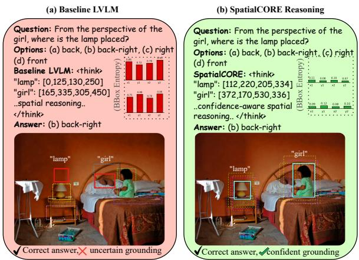
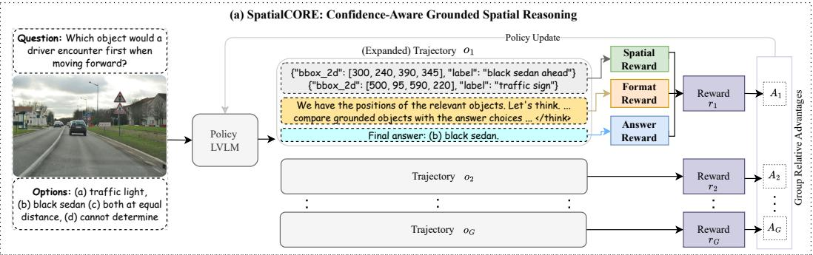
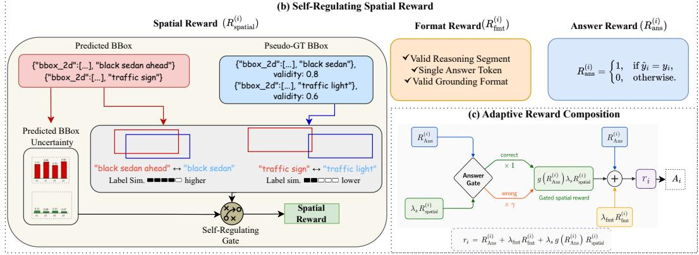
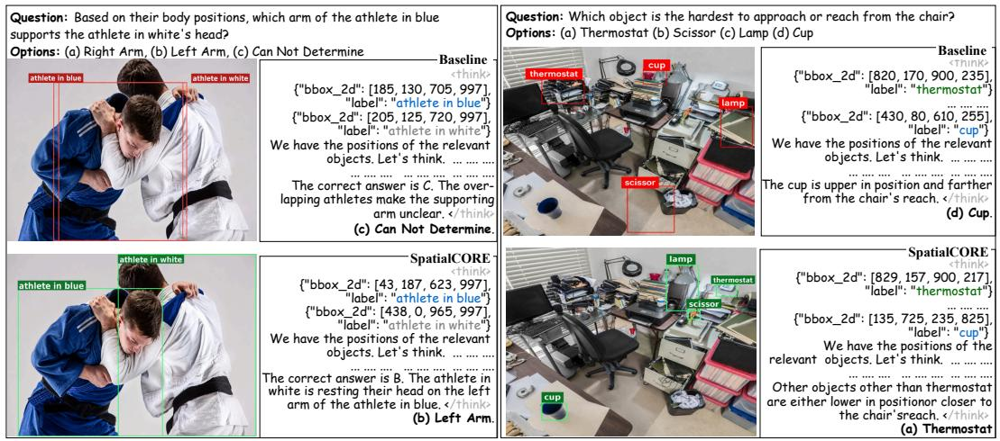
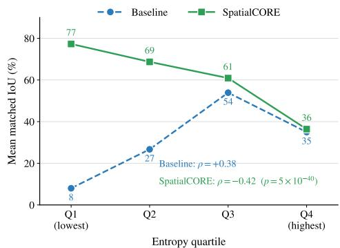
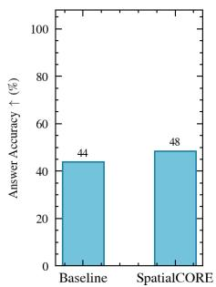
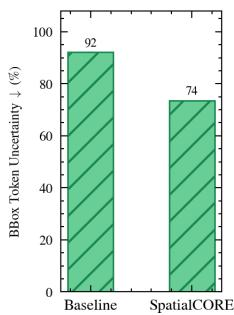
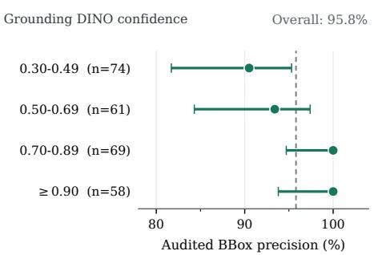
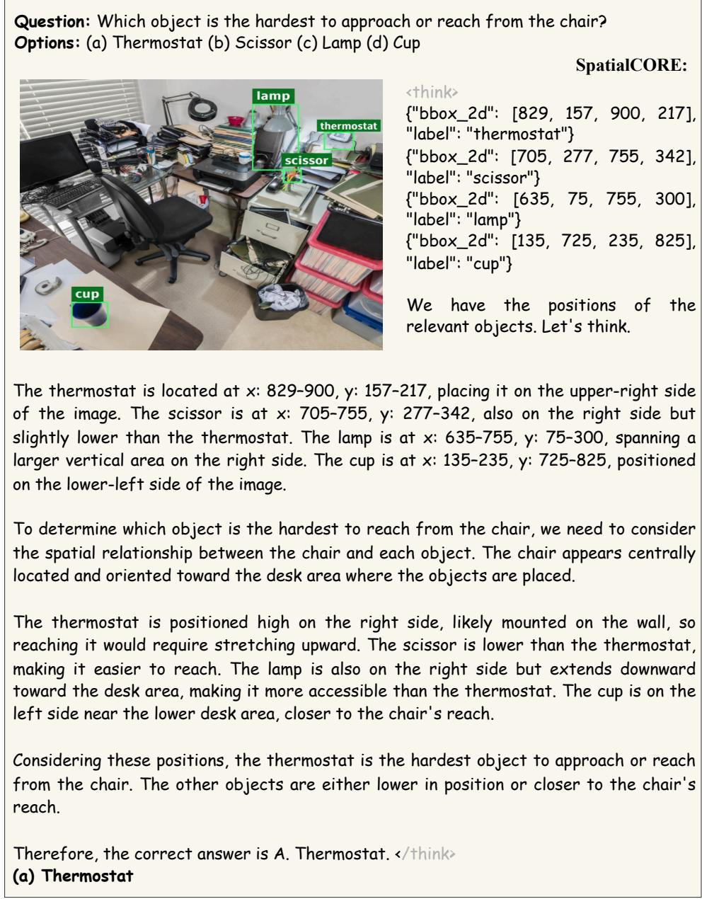

# SPATIALCORE: CONFIDENCE-AWARE GROUNDED SPATIAL REASONING IN LARGE VISION–LANGUAGE MODELS

Rafi Ibn Sultan1 Xiangyu Zhou1 Md. Sajid Alam Chowdhury1

Chengyin Li2 Prashant Khanduri1 Marco Brocanelli3 Dongxiao Zhu1,4

1Department of Computer Science, Wayne State University

2Department of Radiation Oncology, Henry Ford Health

3Department of Electrical and Computer Engineering, The Ohio State University

4Institute for AI and Data Science, Wayne State University

## ABSTRACT

Large Vision-Language Models (LVLMs) have made remarkable progress across visual perception tasks, yet spatial reasoning remains a persistent weakness, especially for questions that require reasoning over visual space. Recent spatialreasoning methods incorporate generated grounding, where models predict bounding boxes, masks, or other localization outputs for task-relevant objects as part of their reasoning trace. However, these approaches typically optimize finalanswer correctness alone, allowing correct answers to be rewarded even when the model does not reason from confidently localized task-relevant objects. We introduce SpatialCORE (Spatially COnfident REasoning), a post-training framework that turns the model’s own confidence in generated grounding into a learning signal for spatial reasoning. Its central idea is to reinforce grounding that is both accurate and confident, encouraging the model to reason from confidently localized task-relevant objects. SpatialCORE realizes this through a selfregulating spatial reward that weights each predicted grounding, i.e., bounding box’s matching quality by its coordinate-token confidence. An answer gate further ties grounding optimization to final-answer correctness. Spatial-CORE achieves state-of-the-art results among open-source and specialized spatial reasoning models across diverse benchmarks, and transfers effectively in zero-shot settings to unseen data distributions. The source code is available at https://github.com/rafiibnsultan/SpatialCORE.

## 1 INTRODUCTION

Large Vision–Language Models (LVLMs) Alayrac et al. (2022); Li et al. (2023); Liu et al. (2023a); Dai et al. (2023); Bai et al. (2023) have achieved strong performance on multimodal perception tasks, yet they remain unreliable when reasoning about spatial structure Qi et al. (2025a); Ranasinghe et al. (2024); Zhou et al. (2025); Xu et al. (2026b); Yang et al. (2025a); Song et al. (2025). Even with accurate object identification, they often struggle to understand spatial arrangements and relationships Liu et al. (2026); Zhang et al. (2025); Yu et al. (2025); Sun et al. (2025); Liu et al. (2025a). Spatial reasoning requires the model to move beyond recognizing scene elements and construct a coherent understanding of the environment through fine-grained relationships among objects Yang et al. (2025b); Gholami et al. (2025); Batra et al. (2025); Lee et al. (2025). This gap between object recognition and spatial understanding limits the use of LVLMs in real-world settings such as robotics Goral et al. (2024), autonomous driving Wu et al. (2024), and pedestrian´ assistance Sultan et al. (2026), where correct decisions depend on reasoning about spatial relationships rather than recognizing objects alone.

Efforts to address this weakness have taken different forms. Some methods rely on external guidance, such as user-provided points, regions, or spatial anchors, to indicate where task-relevant objects are located or how they should be compared spatially Pothiraj et al. (2025); Cheng et al. (2024); Cai et al. (2025b); Gholami et al. (2025); Shen et al. (2025). While effective, these methods depend on such guidance and do not directly train the model to reason spatially on its own. A second line post-trains LVLMs on spatial reasoning tasks by supervising grounding predictions, such as segmentation masks or BBoxes, as model outputs Ning et al. (2025); Chen et al. (2024a); Yang et al. (2025b); Ranasinghe et al. (2024). While this improves localization as a standalone training objective, the grounding remains separate from the reasoning trace. Most recently, inspired by “Thinking with Images” OpenAI (2025b), models have been encouraged to incorporate generated grounding during reasoning Wu et al. (2025b); Zheng et al. (2025); Ma et al. (2026); Batra et al. (2025); Chen et al. (2025c); Li et al. (2025). In these methods, generated grounding indicates the task-relevant objects the model uses while reasoning, typically through bounding boxes (BBoxes), masks, or similar localization cues. However, neither answer correctness nor localization quality alone explicitly captures the model’s confidence in generated grounding.

This is especially problematic for spatial reasoning, where generated grounding should localize the task-relevant objects needed to compare positions, distances, and relationships. Most training objectives primarily reward correct final answers Li et al. (2025); Ma et al. (2026); Batra et al. (2025), even when reasoning includes predicted BBoxes for these objects. Some of these methods add spatial or trajectorylevel rewards, but still do not account for how confidently the model generates its grounding. A predicted BBox’s coordinatetoken uncertainty provides a way to estimate this confidence during reasoning. Figure 1a illustrates this distinction: the baseline correctly answers “back-right” when asked where the lamp is relative to the girl, yet generates high-uncertainty BBoxes that poorly localize both objects. Because the answer is correct, a final-answer reward reinforces the entire trajectory, including its uncertain grounding. This motivates our central question: Can spatial reasoning in LVLMs be improved by learningfrom the

  
Figure 1: Correct final answers do not necessarily imply confident grounding. Although both models answer correctly, (a) the baseline LVLM produces high-entropy predicted BBoxes, with dashed candidate BBoxes spread across off-target locations. (b) Our SpatialCORE produces lower-entropy predicted BBoxes, with dashed candidate BBoxes concentrated around the selected BBoxes, and more confidently localizing the task-relevant objects. Solid BBoxes denote the predicted BBoxes in the reasoning trace; dashed BBoxes denote candidate BBoxes reflected by spatial uncertainty.

## confidence of their own generated grounding?

To address this, we propose Spatially COnfident REasoning (SpatialCORE), a post-training framework that enhances spatial reasoning in LVLMs by learning to ground with confidence. As illustrated in Figure 1b, SpatialCORE encourages correct answers to be supported by low-uncertainty BBoxes for task-relevant objects. Its self-regulating spatial reward uses the model’s own confidence, estimated from BBox coordinate uncertainty, to weight geometric overlap with reference BBoxes. This makes grounding confidence a learning signal even among trajectories reaching the same correct answer. An answer gate further couples spatial and answer rewards by scaling the spatial reward according to final-answer correctness.

Our contributions are summarized as follows:

• We introduce SpatialCORE, a novel post-training framework that makes the model’s own confidence in generated grounding an explicit learning signal for spatial reasoning in LVLMs.

• We propose a self-regulating spatial reward that evaluates generated grounding through both localization quality and coordinate-token confidence, with an answer gate connecting grounding optimization to final-answer correctness.

• We demonstrate state-of-the-art results among open-source and specialized spatial reasoning models, with effective zero-shot generalization. Controlled ablations establish the value of confidence weighting, while grounding analyses reveal improved alignment between confidence and localization quality.

## 2 RELATED WORKS

Externally Guided Spatial Grounding. A common strategy for improving spatial reasoning in LVLMs is to provide explicit spatial anchors as input. Points, regions, masks, or referenced objects are supplied with the query to direct the model toward task-relevant objects Bigverdi et al. (2025); Yang et al. (2025b); Cheng et al. (2024); Shen et al. (2025); Ma et al. (2025); Cai et al. (2025b). These approaches are effective when reliable anchors are available, but their dependence on inference-time guidance limits open-ended use: when anchors are absent or ambiguous, the model must still identify relevant objects on its own. Thus, spatial reasoning may not transfer to settings without external anchors.

Geometry-Enhanced Visual Understanding. Another line improves spatial reasoning by adding geometric cues to the visual representation. These methods use depth maps, point clouds, segmentation masks, or multi-view geometry to encode scene layout and spatial relationships Liu et al. (2025b); Chen et al. (2024b); Hu et al. (2025); Wang et al. (2025b); Wan et al. (2025); Cai et al. (2025a); Chen et al. (2025a); Sultan et al. (2026); Ning et al. (2025); Daxberger et al. (2025); Hong et al. (2023); Wu et al. (2025a); Xu et al. (2026a); Zhao et al. (2025b); Chen et al. (2026b); Zhou et al. (2026). Such representations can improve spatial perception, but they mainly change what the model observes, not how it learns to generate and use grounding during reasoning. These representations do not by themselves specify how grounding confidence should affect the post-training reward.

Inference-Time Reasoning Scaffolds. Spatial reasoning can also be improved at inference time by structuring the model’s response without post-training. These methods guide reasoning through cognitive maps, scene graphs, perspective-aware representations, compositional prompting, or related scaffolds Liao et al. (2024); Gholami et al. (2025); Lee et al. (2025); Ma et al. (2024); Mitra et al. (2024); Yang et al. (2025a), and may also intervene at decoding time Chen et al. (2025b); Huang et al. (2025); Yan et al. (2026). While training-free, their gains are often tied to specific task formats, prompts, scaffolds, or decoding procedures, leaving the model’s spatial reasoning behavior unoptimized.

Training-Based Spatial Reasoning. A more direct strategy is to optimize spatial reasoning during training Kancheti et al. (2026); Chen et al. (2026a); Li et al. (2026). One line enriches the reasoning trace with spatial content, such as generated grounding or other task-relevant spatial outputs Ma et al. (2026); Chen et al. (2025c); Batra et al. (2025); Wang & Ling (2025). Inspired by “Thinking with Images” OpenAI (2025b), a related line further supervises generated grounding in the reasoning trace with RL-based objectives that reward correct localization of task-relevant objects Wu et al. (2025b); Zheng et al. (2025); Xu et al. (2025); Sarch et al. (2025); Zhao et al. (2025a); Li et al. (2025). These approaches emphasize what grounding is produced and whether it is correct. SpatialCORE introduces the model’s confidence in producing that grounding as an additional learning signal, training spatial reasoning through both grounding quality and certainty.

## 3 METHOD

We develop SpatialCORE (Figure 2a), a post-training framework that improves spatial reasoning in LVLMs through confidence-aware grounding. Built on Group Relative Policy Optimization (GRPO) Shao et al. (2024), SpatialCORE optimizes sampled reasoning trajectories using a selfregulating spatial reward that weights generated grounding by model confidence, encouraging reasoning from confidently localized task-relevant objects. The reward measures uncertainty in predicted bounding-box coordinates (Figure 2b) and is combined with format and answer rewards through an answer gate. The resulting trajectory-level rewards are normalized within each rollout group for the GRPO policy update (Figure 2c).

## 3.1 PROBLEM FORMULATION

Given an image I and a spatial reasoning query q, a LVLM policy $\pi _ { \theta }$ generates a trajectory $o =$ $( x _ { 1 } , \dots , x _ { T } )$ consisting of a reasoning trace with generated grounding tokens that specify predicted bounding boxes (BBoxes), followed by a final answer. Based on the next-token distribution $\pi _ { \boldsymbol { \theta } } ( \cdot$ |

  
(b) Self-Regulating Spatial Reward

  
Figure 2: Overview of SpatialCORE. (a) The LVLM policy samples trajectories comprising a reasoning trace with generated grounding expressed as bounding boxes (BBoxes), followed by a final answer. (b) The self-regulating spatial reward uses predicted BBox coordinate-token uncertainty to estimate the grounding confidence, which then weights each BBox’s matching quality. Predicted BBoxes are matched to pseudo-GT BBoxes using geometric overlap, label similarity, and pseudo-GT validity. For example, black sedan ahead and black sedan have high label similarity, while higher pseudo-GT validity, such as black sedan, validity: 0.8, gives the match more weight. (c) Spatial, format, and answer rewards are composed through an answer gate to produce trajectory-level rewards, which are used to compute group-relative advantages for policy update.

$x _ { < t } , I , q )$ , the trajectory likelihood $\pi _ { \boldsymbol { \theta } } ( o \mid I , \boldsymbol { q } )$ is defined as

$$
\pi _ { \boldsymbol { \theta } } { \bigl ( } o \mid I , q { \bigr ) } = \prod _ { t = 1 } ^ { T } \pi _ { \boldsymbol { \theta } } { \bigl ( } x _ { t } \mid x _ { < t } , I , q { \bigr ) } .\tag{1}
$$

For each input $( I , q )$ , the policy performs a GRPO rollout by sampling a group of $G$ trajectories $\{ o _ { i } \} _ { i = 1 } ^ { G }$ , as illustrated in Figure 2a. The rollout assigns each trajectory a reward $r _ { i }$ and computes the corresponding group-relative advantage $A _ { i }$ , which then enters the GRPO policy objective:

$$
r _ { i } = R ( o _ { i } ) , \qquad A _ { i } = \frac { r _ { i } - \frac { 1 } { G } \sum _ { j = 1 } ^ { G } r _ { j } } { \sigma _ { G } + \varepsilon } ,\tag{2}
$$

where $\sigma _ { G }$ is the standard deviation of the group rewards and $\varepsilon$ is a small constant for numerical stability.

## 3.2 SELF-REGULATING SPATIAL REWARD

The self-regulating spatial reward operates on predicted BBoxes within each reasoning trajectory. It estimates BBox confidence from the current policy’s coordinate-token uncertainty, so low-uncertainty BBoxes contribute more to the reward, while high-uncertainty BBoxes contribute less (Figure 2b). To obtain pseudo-ground-truth bounding boxes (pseudo-GT BBoxes), we use a Referring Expression Comprehension (REC) model (e.g. Grounding DINO Liu et al. (2024b)) to localize task-relevant objects. During reward computation, each pseudo-GT BBox is weighted by its REC validity, so a higher-validity localization such as black sedan with validity 0.8 contributes more than a lowervalidity localization such as traffic light with validity 0.6.

## 3.2.1 CONFIDENCE-AWARE SPATIAL REWARD

Pseudo-GT-Guided Spatial Matching. During each trajectory $o _ { i } .$ , the LVLM policy generates predicted BBoxes for task-relevant objects referenced in the question and answer options as part of the reasoning trace. These predicted BBoxes are evaluated against precomputed pseudo-GT BBoxes from a REC model G. For each image-question pair, G localizes the extracted objects into tuples $( b _ { k } ^ { \mathrm { g t } } , \ell _ { k } ^ { \mathrm { g t } } , v _ { k } )$ , where $b _ { k } ^ { \mathrm { g t } }$ is the pseudo-GT BBox, $\ell _ { k } ^ { \mathrm { g t } }$ is the corresponding label of a task-relevant object, and $v _ { k } \in [ 0 , 1 ]$ is the validity produced by G for the localized pseudo-GT BBox.

As illustrated in Figure 2b, each trajectory may generate multiple predicted BBoxes, so matching them to pseudo-GT BBoxes cannot rely on geometric overlap alone. A generated label such as black sedan ahead should match black sedan more strongly than a mismatched label such as traffic sign. We therefore compute a pairwise BBox reward for each predicted BBox $b _ { j }$ with object label $\ell _ { j }$ against each pseudo-GT BBox $b _ { k } ^ { \mathrm { g t } }$ , using both geometric overlap and label similarity:

$$
\begin{array} { r } { R _ { \mathrm { B B o x } } ^ { ( j , k ) } = \left( w _ { \mathrm { i o u } } \cdot \operatorname* { m a x } \big ( 0 , \mathrm { I o U } ( b _ { j } , b _ { k } ^ { \mathrm { g t } } ) - \tau _ { \mathrm { i o u } } \big ) + w _ { \mathrm { l a b e l } } \cdot \mathrm { S i m } ( \ell _ { j } , \ell _ { k } ^ { \mathrm { g t } } ) \right) \cdot v _ { k } , } \end{array}\tag{3}
$$

where $w _ { \mathrm { i o u } } + w _ { \mathrm { l a b e l } } = 1$ and $\tau _ { \mathrm { i o u } }$ is an IoU margin. The clipped IoU term suppresses weak geometric overlap, while Sim $( \ell _ { j } , \ell _ { k } ^ { \mathrm { g t } } )$ measures label similarity using cosine similarity between semantic label representations. The pseudo-GT validity $v _ { k }$ scales the pairwise BBox reward, assigning a larger weight to higher-validity pseudo-GT BBoxes and reducing the influence of noisier ones. This makes the spatial reward depend more on reliable pseudo-GT BBoxes during matching. We then use Hungarian matching Kuhn (1955) to obtain the optimal one-to-one assignment between predicted BBoxes and pseudo-GT BBoxes:

$$
\mathcal { M } _ { i } ^ { * } = \arg \operatorname* { m a x } _ { \mathcal { M } _ { i } } \sum _ { ( j , k ) \in \mathcal { M } _ { i } } R _ { \mathrm { B B o x } } ^ { ( j , k ) } .\tag{4}
$$

The matched pairs in $\mathcal { M } _ { i } ^ { * }$ are then used to compute the confidence-weighted spatial reward.

BBox Coordinate-Token Uncertainty. We estimate the confidence of generated grounding from the tokens that produce each predicted BBox. A BBox is emitted as $" { \mathrm { b b o x } } _ { - } 2 { \mathrm { d } } " : \qquad [ { \bf x } _ { - } 1 , \mathrm {  ~ \nabla ~ y } _ { - } 1 $ $\mathrm { x } _ { - } 2 , \quad \mathrm { y } _ { - } 2 ]$ , with each coordinate generated autoregressively as digit tokens that determine its location; their uncertainty therefore estimates confidence in the predicted BBox.

Let $\mathcal { C } = \{ x _ { 1 } , y _ { 1 } , x _ { 2 } , y _ { 2 } \}$ denote the BBox coordinates and $\mathcal { S } _ { i , j , c }$ the digit-token positions of coordinate $c \in { \mathcal { C } }$ of predicted BBox $b _ { j }$ in trajectory $o _ { i } ,$ excluding brackets, commas, and spaces. Let $h _ { i , t }$ denote the Shannon entropy of $\cdot P _ { \theta } ( \cdot \mid x _ { i , < t } , I , q )$ over the full vocabulary V, and $\mathcal { D } \subset \mathcal { V }$ the set of digit tokens. We define the uncertainty of $b _ { j }$ as the normalized entropy averaged over digits within each coordinate, then over coordinates:

$$
H _ { i , j } = \mathrm { c l i p } _ { [ 0 , 1 ] } \left( \frac { 1 } { | \mathcal { C } | \log | \mathcal { D } | } \sum _ { c \in \mathcal { C } } \frac { 1 } { | S _ { i , j , c } | } \sum _ { t \in S _ { i , j , c } } h _ { i , t } \right) .\tag{5}
$$

Full-vocabulary entropy also rises when probability shifts to non-digit tokens, while log $| \mathcal D |$ , the entropy of a uniform choice over digits, sets its scale. Lower $H _ { i , j }$ indicates higher confidence in $b _ { j }$

Confidence-Weighted Spatial Reward. We weight each matched predicted BBox by its confidence, estimated from coordinate-token uncertainty $H _ { i , j } { \mathrm { : } }$

$$
C _ { i , j } = 1 - H _ { i , j } , \qquad \omega _ { i , j } = \beta + \left( 1 - \beta \right) C _ { i , j } ,\tag{6}
$$

where $C _ { i , j }$ denotes the confidence of predicted BBox $b _ { j } , \beta \in ( 0 , 1 )$ is a confidence floor, and $( j , k ) \in \tilde { \mathcal { M } } _ { i } ^ { * }$ denotes a matched prediction–pseudo-GT pair. The confidence weight gives highcertainty groundings greater contribution while remaining positive even under high uncertainty. The resulting weighted matching scores collectively define a confidence-weighted measure of matching quality,

$$
P _ { i } = \frac { 1 } { \vert \mathcal { M } _ { i } ^ { * } \vert } \sum _ { ( j , k ) \in \mathcal { M } _ { i } ^ { * } } \omega _ { i , j } \ : R _ { \mathrm { B B o x } } ^ { ( j , k ) } ,\tag{7}
$$

where $P _ { i } = 0$ when no match is found. This term evaluates matched prediction–pseudo-GT pairs under the one-to-one assignment, so ambiguous or duplicated assignments cannot inflate the matching quality.

To encourage broader coverage of the pseudo-GT BBoxes for the input $( I , q )$ , denoted by P, we define a soft recall term weighted by pseudo-GT validity:

$$
\mathrm { R e c a l l } _ { i } = \left( \sum _ { k \in \mathcal { P } } v _ { k } \right) ^ { - 1 } \sum _ { k \in \mathcal { P } } \operatorname* { m a x } _ { j } R _ { \mathrm { B B o x } } ^ { ( j , k ) } , \qquad R _ { \mathrm { s p a t i a l } } ^ { ( i ) } = F _ { \alpha } ( P _ { i } , \mathrm { R e c a l l } _ { i } ) = \frac { ( 1 + \alpha ^ { 2 } ) P _ { i } \mathrm { R e c a l l } _ { i } } { \alpha ^ { 2 } P _ { i } + \mathrm { R e c a l l } _ { i } } .\tag{8}
$$

$\begin{array} { r } { \mathrm { I f } \sum _ { k \in \mathcal { P } } v _ { k } = 0 } \end{array}$ or the $F _ { \alpha }$ denominator is zero, we set $R _ { \mathrm { s p a t i a l } } ^ { ( i ) } = 0 .$ . Here, Recall measures how well the pseudo-GT BBoxes are covered by the set of predictions, rewarding each task-relevant object that is localized by at least one predicted BBox. The spatial reward combines matching quality and pseudo-GT coverage through an α-weighted harmonic mean, with $\alpha > 1$ mildly emphasizing coverage and discouraging trajectories that localize only a subset of task-relevant objects.

## 3.2.2 FORMAT AND ANSWER REWARDS

Format Reward. We use a format reward to enforce the trajectory structure required for grounded reasoning. As shown in Figure 2b, a trajectory is rewarded for three format properties: a valid reasoning segment, a single final answer token, and a valid grounding format for predicted BBoxes. Malformed outputs, repeated object labels, or BBoxes placed outside the reasoning segment reduce the format reward.

Answer Reward. The answer reward assigns a unit reward to a correct final answer and zero otherwise:

$$
R _ { \mathrm { a n s } } ^ { ( i ) } = \left\{ { \begin{array} { l l } { 1 , } & { { \mathrm { i f ~ } } \hat { y } _ { i } = y _ { i } , } \\ { 0 , } & { { \mathrm { o t h e r w i s e . } } } \end{array} } \right.\tag{9}
$$

## 3.3 ADAPTIVE REWARD COMPOSITION

We integrate the answer, format, and confidence-aware spatial rewards to assign a single reward to each sampled trajectory. The spatial term is adaptively modulated by an answer gate, so the spatial reward remains tied to final-answer correctness (Figure 2c):

$$
r _ { i } = R _ { \mathrm { a n s } } ^ { ( i ) } + \lambda _ { \mathrm { f m t } } R _ { \mathrm { f m t } } ^ { ( i ) } + \lambda _ { s } g \Big ( R _ { \mathrm { a n s } } ^ { ( i ) } \Big ) R _ { \mathrm { s p a t i a l } } ^ { ( i ) } ,\tag{10}
$$

where $g ( 1 ) = 1$ and $g ( 0 ) = \gamma ,$ , with $\gamma \in ( 0 , 1 )$ . When the final answer is correct, the full spatial reward is used; when the final answer is incorrect, positive spatial rewards are reduced by γ. This allows incorrect-answer trajectories to retain partial credit for useful generated grounding.

## 3.4 POLICY OPTIMIZATION

The policy is optimized using a GRPO-style clipped objective with KL regularization against a reference policy $\pi _ { \mathrm { r e f } }$ . Let $\rho _ { i } ( \theta ) = \pi _ { \theta } ( o _ { i } \mid I , q ) / \pi _ { \theta _ { \mathrm { o l d } } } ( o _ { i } \mid I , q )$ denote the importance ratio for trajectory $o _ { i } ,$ , where $\pi _ { \theta _ { \mathrm { o l d } } }$ is the rollout policy used to sample the current group. Using the grouprelative advantages $\{ A _ { i } \} _ { i = 1 } ^ { G }$ defined above, we optimize the following objective, where δ is the clipping threshold and η is the KL penalty coefficient:

$$
\mathcal { I } ( \theta ) = \mathbb { E } _ { ( I , q ) \sim \mathcal { D } , \{ o _ { \perp } \} \sim \pi _ { o _ { \mathrm { o l d } } } } \left[ \frac { 1 } { G } \sum _ { i = 1 } ^ { G } \operatorname* { m i n } ( \rho _ { i } ( \theta ) A _ { i } , \mathrm { c l i p } ( \rho _ { i } ( \theta ) , 1 - \delta , 1 + \delta ) A _ { i } ) - \eta D _ { \mathrm { K L } } ( \pi _ { \theta } \| \pi _ { \mathrm { r e f } } ) \right] .\tag{11}
$$

## 4 EXPERIMENTS

## 4.1 IMPLEMENTATION DETAILS

We instantiate SpatialCORE with Qwen3-VL-Thinking Bai et al. (2025) backbones: SpatialCORE-8B uses Qwen3-VL-8B-Thinking, while the lighter SpatialCORE-4B variant uses Qwen3-VL-4B-Thinking. Both are post-trained with LoRA Ding et al. (2023) on all language-model linear layers $( r = 3 2 , \alpha = 6 4$ , dropout 0.05) and the vision encoder $( r = 4 , \alpha = 8 )$ . We train for 3 epochs on the

Table 1: OmniSpatial Jia et al. (2025) results across 10 spatial reasoning task categories. SpatialCORE is compared against proprietary models, general open-source LVLMs, and specialized spatial reasoning models. Proprietary models are included as reference points; the best open-source or specialized result is shown in bold. Average accuracy is weighted by category sample size.
<table><tr><td rowspan="2">Method</td><td rowspan="2">Average</td><td colspan="2">Dynamic Reasoning</td><td colspan="3">Spatial Interaction</td><td colspan="2">Complex Logic</td><td colspan="3">Perspective Taking</td></tr><tr><td>Mani-</td><td>Motion</td><td>Traffic</td><td>Loca-</td><td>Geospa.</td><td>Pattern</td><td>Geometric</td><td>Ego</td><td>Allo</td><td>Hypo-</td></tr><tr><td>Reference Baselines</td><td></td><td>pulation</td><td>Anal.</td><td>Anal.</td><td>lization</td><td>Strategy</td><td>Rec.</td><td>Reasoning</td><td>Centric</td><td>Centric</td><td>thetical</td></tr><tr><td>Random Choice</td><td>24.98</td><td>24.86</td><td>26.30</td><td>25.88</td><td>23.43</td><td>27.27</td><td>21.44</td><td>24.77</td><td>22.55</td><td>24.84</td><td>25.78</td></tr><tr><td>Human Evaluation</td><td>92.63</td><td>94.62</td><td>96.07</td><td>91.38</td><td>95.11</td><td>92.15</td><td>89.02</td><td>85.90</td><td>98.53</td><td>94.30</td><td>90.26</td></tr><tr><td>Proprietary Models</td><td></td><td></td><td></td><td></td><td></td><td></td><td></td><td></td><td></td><td></td><td></td></tr><tr><td>GPT-4.1-mini Open (2025)</td><td>48.87</td><td>64.32</td><td>56.53</td><td>59.06</td><td>60.19</td><td>56.36</td><td>29.28</td><td>30.19</td><td>72.55</td><td>39.57</td><td>39.28</td></tr><tr><td>Gemini-2.5-flash-preview Team et al. (2023)</td><td>52.12</td><td>67.57</td><td>62.72</td><td>68.24</td><td>73.33</td><td>60.91</td><td>38.14</td><td>34.19</td><td>75.49</td><td>35.90</td><td>33.73</td></tr><tr><td>o4-mini OpenAI (2025a)</td><td>52.77</td><td>72.97</td><td>59.83</td><td>60.00</td><td>73.33</td><td>61.82</td><td>34.02</td><td>36.77</td><td>73.53</td><td></td><td>40.96</td></tr><tr><td>Gemini-2.5-flash Team et al. (2023)</td><td>53.16</td><td>70.27</td><td>64.74</td><td>61.18</td><td>72.38</td><td>58.18</td><td>35.05</td><td>36.13</td><td>74.12</td><td>40.69 40.96</td><td>32.53</td></tr><tr><td>Open-source Models</td><td></td><td></td><td></td><td></td><td></td><td></td><td></td><td></td><td></td><td></td><td></td></tr><tr><td>LLaVA-1.5-7B Liu et al. (2024a)</td><td>34.97</td><td>54.46</td><td>31.23</td><td>35.29</td><td>36.19</td><td>33.94</td><td></td><td>24.18</td><td>55.60</td><td>34.66</td><td>36.14</td></tr><tr><td>LLaVA-OV-7B Li et al. (2024)</td><td>35.68</td><td>43.24</td><td>38.15</td><td>32.94</td><td>29.52</td><td>41.82</td><td>29.01 28.87</td><td>22.58</td><td></td><td>36.17</td><td>37.35</td></tr><tr><td>InternVL3-8B Zhu et al. (2025)</td><td>41.60</td><td>52.43</td><td>40.87</td><td>48.94</td><td></td><td></td><td>24.95</td><td></td><td>47.06</td><td></td><td>40.96</td></tr><tr><td>InternVL3-14B Zhu et al. (2025)</td><td>45.94</td><td>54.32</td><td>60.17</td><td></td><td>51.05</td><td>44.77</td><td></td><td>28.63</td><td>64.20</td><td>38.62</td><td>34.46</td></tr><tr><td>Qwen2.5-VL-7B Wang et al. (2024)</td><td>39.18</td><td>58.38</td><td>35.09</td><td>50.35</td><td>51.81</td><td>51.45</td><td>28.04</td><td>28.26</td><td>68.04</td><td>35.37</td><td></td></tr><tr><td>Gemma-3-12B Gemma Team et al. (2025)</td><td>43.71</td><td>54.05</td><td>54.91</td><td>50.12</td><td>45.33</td><td>44.00</td><td>31.13</td><td>29.42</td><td>64.51</td><td>33.19</td><td>37.35</td></tr><tr><td>Spatial Reasoning Models</td><td></td><td></td><td></td><td>54.12</td><td>47.62</td><td>45.45</td><td>16.49</td><td>30.32</td><td>63.73</td><td>36.70</td><td>33.73</td></tr><tr><td>SpaceMantis-13B Chen et al. (2024a)</td><td></td><td>47.03</td><td></td><td></td><td></td><td></td><td></td><td></td><td></td><td></td><td></td></tr><tr><td>SpaceQwen2.5-VL-3B Chen et al. (2024a)</td><td>36.36</td><td>58.11</td><td>36.59</td><td>40.94</td><td>34.86</td><td>33.09</td><td>22.27</td><td>24.39</td><td>49.22</td><td>38.25</td><td>39.28</td></tr><tr><td></td><td>40.25</td><td></td><td>39.88</td><td>41.18</td><td>40.95</td><td>40.91</td><td>29.90</td><td>25.81</td><td>63.73</td><td>38.83</td><td>39.76</td></tr><tr><td>SpaceThinkerQwen2.5VL-3B Chen et al. (2024a)</td><td>40.42</td><td>47.84</td><td>53.06</td><td>43.29</td><td>35.43</td><td>38.73</td><td>24.33</td><td>28.00</td><td>58.04</td><td>35.11</td><td>31.08</td></tr><tr><td>RoboPoint-vicuna-v1.5-7B-lora Cai et al. (2025a)</td><td>35.85</td><td>57.03</td><td>28.61</td><td>34.82</td><td>37.33</td><td>40.55</td><td>29.90</td><td>22.71</td><td>50.20</td><td>38.72</td><td>40.96</td></tr><tr><td>RoboPoint-vicuna-v1.5-13B Liu et al. (2023b)</td><td>34.60</td><td>55.68</td><td>28.15 43.39</td><td>42.82</td><td>32.19</td><td>32.55</td><td>24.12</td><td>27.74</td><td>49.02</td><td>37.66</td><td>33.49</td></tr><tr><td>VST-RL-7B Yang et al. (2025b)</td><td>41.09</td><td>56.75</td><td></td><td>44.75</td><td>46.66</td><td>42.72</td><td>25.51</td><td>28.38</td><td>72.54</td><td>32.89</td><td>43.37</td></tr><tr><td>SoFar-Qwen2.5VL-3B Qi et al. (2025b)</td><td>45.14</td><td>56.49</td><td>51.16</td><td>54.12</td><td>53.14</td><td>52.73</td><td>31.75</td><td>22.88</td><td>71.60</td><td>36.56</td><td>41.69</td></tr><tr><td>SpatialLadder-3B Li et al. (2025)</td><td>40.50</td><td>59.45</td><td>39.01</td><td>50.58</td><td>48.57</td><td>42.72</td><td>26.80</td><td>23.87</td><td>71.56</td><td>35.10</td><td>39.75</td></tr><tr><td>Backbone and Our Variants</td><td></td><td></td><td></td><td></td><td></td><td></td><td></td><td></td><td></td><td></td><td></td></tr><tr><td>SpatialCORE-4B</td><td>44.68</td><td>64.68</td><td>51.73</td><td>50.58</td><td>63.80</td><td>46.36</td><td>19.58</td><td>27.74</td><td>66.66</td><td>34.84</td><td>44.57</td></tr><tr><td>Qwen3-VL-8B-Thinking (Base) Bai et al. (2025)</td><td>43.90</td><td>57.14</td><td>54.28</td><td>36.04</td><td>54.95</td><td>48.67</td><td>24.77</td><td>23.12</td><td>71.56</td><td>31.11</td><td>38.82</td></tr><tr><td>Qwen3-VL-8B-Thinking + GRPO SpatialCORE-8B</td><td>45.92 48.46</td><td>61.32 64.86</td><td>54.30 56.64</td><td>55.88 57.64</td><td>58.33 62.85</td><td>46.18 53.63</td><td>25.90 30.92</td><td>25.00 36.77</td><td>72.92 72.54</td><td>36.57 31.91</td><td>42.53 40.96</td></tr></table>

Table 2: SpatiaLab Wasi et al. (2026) results across 6 spatial reasoning task categories in the zero-shot setting. SpatialCORE is compared against proprietary models, general open-source LVLMs, and specialized spatial reasoning models. Proprietary models are included as reference points; the best open-source or specialized result is shown in bold. Average accuracy is weighted by category sample size.
<table><tr><td rowspan="2">Method</td><td rowspan="2">Average</td><td colspan="6">Question Categories</td></tr><tr><td>3D Geom.</td><td>Dep. &amp; Occu.</td><td>Orientation</td><td>Relat. Posit.</td><td>Size &amp; Scale</td><td>Spati. Navig.</td></tr><tr><td>Reference Baselines</td><td></td><td></td><td></td><td></td><td></td><td></td><td></td></tr><tr><td>Random Choice</td><td>25.00</td><td>25.00</td><td>25.00</td><td>25.00</td><td>25.00</td><td>25.00</td><td>25.00</td></tr><tr><td>Human Baseline</td><td>87.57</td><td>93.70</td><td>74.13</td><td>91.58</td><td>91.51</td><td>88.89</td><td>87.76</td></tr><tr><td>Proprietary Models</td><td></td><td></td><td></td><td></td><td></td><td></td><td></td></tr><tr><td>GPT-4o-mini Hurst et al. (2024)</td><td>46.50</td><td>47.06</td><td>39.00</td><td>47.03</td><td>47.17</td><td>49.60</td><td>49.79</td></tr><tr><td>Gemini-2.5-Flash Team et al. (2023)</td><td>48.29</td><td>44.96</td><td>48.26</td><td>48.02</td><td>56.13</td><td>42.46</td><td>51.05</td></tr><tr><td>Claude 3.5 Haiku Anthropic (2024)</td><td>42.93</td><td>42.44</td><td>42.08</td><td>46.53</td><td>46.23</td><td>35.71</td><td>45.99</td></tr><tr><td>Mistral Medium 3.1 Mistral AI (2025)</td><td>47.93</td><td>46.64</td><td>49.81</td><td>47.52</td><td>61.79</td><td>41.67</td><td>41.77</td></tr><tr><td>Kimi-VL-A3B-Thinking-2506 Team et al. (2025)</td><td>42.71</td><td>42.86</td><td>41.31</td><td>40.59</td><td>51.42</td><td>39.68</td><td>41.35</td></tr><tr><td>Open-source Models</td><td></td><td></td><td></td><td></td><td></td><td></td><td></td></tr><tr><td>InternVL3.5-1B Wang et al. (2025a)</td><td>31.64</td><td>33.61</td><td>32.43</td><td>23.27</td><td>37.26</td><td>31.75</td><td>30.80</td></tr><tr><td>InternVL3.5-2B Wang et al. (2025a)</td><td>33.71</td><td>34.03</td><td>31.66</td><td>31.68</td><td>40.57</td><td>32.54</td><td>32.49</td></tr><tr><td>Qwen2.5-VL-3B-Instruct Wang et al. (2024)</td><td>41.43</td><td>41.18</td><td>35.52</td><td>46.04</td><td>40.09</td><td>47.22</td><td>39.24</td></tr><tr><td>InternVL3.5-4B Wang et al. (2025a)</td><td>43.29</td><td>42.86</td><td>42.86</td><td>42.08</td><td>54.72</td><td>36.51</td><td>42.19</td></tr><tr><td>Gemma-3-4B-it Gemma Team et al. (2025)</td><td>40.57</td><td>43.70</td><td>34.36</td><td>46.53</td><td>45.75</td><td>37.30</td><td>37.97</td></tr><tr><td>LLaVA-1.5-7B Liu et al. (2024a)</td><td>38.64</td><td>40.33</td><td>34.74</td><td>31.68</td><td>40.56</td><td>40.07</td><td>43.88</td></tr><tr><td>Qwen2.5-VL-7B-Instruct Wang et al. (2024)</td><td>41.00</td><td>42.86</td><td>37.84</td><td>42.57</td><td>46.23</td><td>42.06</td><td>35.44</td></tr><tr><td>Llama-3.2-11B-Vision-Instruct</td><td>30.50</td><td>26.47</td><td>30.50</td><td>20.30</td><td>42.92</td><td>30.56</td><td>32.07</td></tr><tr><td>Spatial Reasoning Models</td><td></td><td></td><td></td><td></td><td></td><td></td><td></td></tr><tr><td>SpaceOm Chen et al. (2024a)</td><td>41.36</td><td>42.44</td><td>38.61</td><td>48.02</td><td>37.74</td><td>42.86</td><td>39.24</td></tr><tr><td>SpaceThinker-Qwen2.5VL-3B Chen et al. (2024a)</td><td>40.64</td><td>40.34</td><td>37.84</td><td>47.03</td><td>38.21</td><td>43.25</td><td>37.97</td></tr><tr><td>SpaceQwen2.5-VL-3B-Instruct Chen et al. (2024a)</td><td>40.14</td><td>31.51</td><td>35.14</td><td>37.62</td><td>37.74</td><td>50.79</td><td>47.26</td></tr><tr><td>RoboPoint-vicuna-v1.5-7B-lora Cai et al. (2025a)</td><td>38.00</td><td>38.65</td><td>34.74</td><td>30.69</td><td>47.64</td><td>36.11</td><td>40.50</td></tr><tr><td>RoboPoint-vicuna-v1.5-13B Cai et al. (2025a)</td><td>38.64</td><td>42.01</td><td>33.97</td><td>32.67</td><td>44.33</td><td>36.90</td><td>42.19</td></tr><tr><td>SpatialLadder-3B Li et al. (2025)</td><td>35.28</td><td>39.91</td><td>34.61</td><td>39.90</td><td>38.20</td><td>25.39</td><td>33.19</td></tr><tr><td>Backbone and Our Variants</td><td></td><td></td><td></td><td></td><td></td><td></td><td></td></tr><tr><td>SpatialCORE-4B</td><td>44.71</td><td>46.22</td><td>46.33</td><td>42.57</td><td>53.77</td><td>36.51</td><td>43.88</td></tr><tr><td>Qwen3-VL-8B-Thinking Bai et al. (2025) (Base)</td><td>44.78</td><td>42.01</td><td>47.10</td><td>47.02</td><td>51.88</td><td>40.47</td><td>41.35</td></tr><tr><td>Qwen3-VL-8B-Thinking + GRPO</td><td>46.21</td><td>43.70</td><td>47.88</td><td>47.52</td><td>54.25</td><td>41.27</td><td>43.88</td></tr><tr><td>SpatialCORE-8B</td><td>47.91</td><td>45.38</td><td>48.65</td><td>47.52</td><td>58.49</td><td>41.67</td><td>47.22</td></tr></table>

OmniSpatial Jia et al. (2025) training split using two H100 GPUs, an effective batch size of 32, and G = 4 rollout generations. We use AdamW $( 5 \times 1 0 ^ { - 5 }$ , cosine schedule, 5% warmup, $\eta = 0 . 0 1 )$ Pseudo-GT BBoxes are precomputed offline with Grounding DINO Liu et al. (2024b). We manually audit these BBoxes and test robustness to corruption (Section A.3). Reward hyperparameters are $\lambda _ { \mathrm { f m t } } = 0 . 2 , \lambda _ { s } = 1 . 0 , \gamma = 0 . 3 , \beta = 0 . 1 , \alpha = 2 . \hat { 0 } , w _ { \mathrm { i o u } } = 0 . 8 ,$ and $w _ { \mathrm { l a b e l } } = 0 . 2$ . Full details appear in Section A.1.

  
Figure 3: Qualitative examples from OmniSpatial Jia et al. (2025) (left) and SpatiaLab Wasi et al. (2026) (right). In both cases, the baseline (Qwen3-VL-8B-Thinking Bai et al. (2025)) produces predicted BBoxes that mislocalize the task-relevant objects, leading to incorrect or poorly grounded answers. SpatialCORE generates more accurate predicted bounding boxes and reaches the correct final answer. Bounding boxes are overlaid for visualization; full reasoning traces are in the Appendix Section C.

## 4.2 BASELINES

We compare SpatialCORE against the Qwen3-VL-8B-Thinking backbone, its standard GRPO-trained variant, and open-source and specialized spatial reasoning LVLMs; proprietary models serve as references. We evaluate on the held-out OmniSpatial Jia et al. (2025) test set (4 reasoning dimensions, 50 subcategories) and zero-shot on SpatiaLab Wasi et al. (2026) (6 categories, 30 task types in naturalistic scenes) to assess transfer across task designs and visual contexts. Details appear in Section A.5.

## 4.3 RESULTS

Spatial Reasoning on Diverse and Challenging Tasks. Table 1 shows that SpatialCORE-8B achieves the highest weighted-average accuracy among open-source and specialized spatial reasoning models on OmniSpatial, surpassing the GRPO-trained backbone and showing particularly strong gains in categories requiring object-centric spatial comparison.

Against specialized spatial reasoning models, the margins are particularly large: SpatialCORE-8B outperforms VST-RL-7B by 7.37% and SpaceThinkerQwen2.5VL-3B by 8.04%, suggesting that confidence-aware grounding provides a stronger training signal than grounding supervision alone. Against open-source LVLMs, SpatialCORE-8B outperforms SoFar-Qwen2.5VL-3B by 3.32%, InternVL3-14B by 2.52%, and Gemma-3-12B by 4.75%. The 4.56% gain over its own backbone (2.54% gain over the trained backbone) demonstrates the effectiveness of SpatialCORE, while the matched GRPO ablation in Table 3 isolates the contribution of the spatial reward. Gains are strongest in traffic analysis and localization, tasks that require simultaneously comparing the positions of multiple task-relevant objects, where confident BBoxes provide direct spatial evidence for the final answer. Allocentric and hypothetical reasoning show smaller gains, as they require reasoning across multiple viewpoints, an input-level limitation that predicted BBoxes from a single egocentric view cannot address. Notably, SpatialCORE-8B reaches the performance range of proprietary models as an open-source system, and SpatialCORE-4B remains competitive at 44.68% average accuracy.

  
Figure 4: Mean matched BBox IoU across model-specific coordinate-token entropy quartiles for the unadapted Qwen3-VL-8B-Thinking backbone (Baseline) and SpatialCORE-8B. Lower entropy corresponds to more accurate grounding after SpatialCORE post-training, whereas the baseline shows no consistent relationship.

Zero-Shot Transfer to Unseen Distributions. On SpatiaLab (Table 2), SpatialCORE-8B leads open-source and specialized models on average and also outperforms the GRPO-trained backbone under zero-shot evaluation. The improvements over specialized models are substantial: 12.63% over SpatialLadder-3B, 7.27% over SpaceThinker-Qwen2.5VL-3B, and 6.55% over SpaceOm, with SpatialCORE-8B also surpasses larger open-source LVLMs such as InternVL3.5-4B and Qwen2.5- VL-7B-Instruct. The 3.2% gain over its own backbone (1.7% gain over the trained backbone) confirms that confidence-aware grounding transfers to benchmarks with different task designs and visual distributions. Gains are strongest in Relational Positioning, where confident predicted BBoxes over multiple task-relevant objects provide direct evidence for spatial comparisons. Size and Scale estimation show smaller gains, suggesting that confidence-aware grounding primarily benefits objectcentric spatial comparisons, while scene-level scale estimation remains a distinct challenge. Notably, on average, SpatialCORE-8B matches the performance range of proprietary systems on a fully unseen benchmark, suggesting that the self-regulating spatial reward instills a grounding behavior that generalizes beyond the training distribution.

Qualitative Analysis. Figure 3 shows representative examples from OmniSpatial and SpatiaLab. In both cases, the baseline produces grounding that fails to support the correct spatial decision, while Spatial-CORE generates more accurate BBoxes and leverages them to reach the correct final answer. Notably, the examples reveal distinct failure modes: overlapping BBoxes can obscure relative-position reasoning, while mislocalized objects can corrupt reachability judgments.

Learning to Ground with Confidence. The selfregulating spatial reward reinforces grounding according to both its localization quality and the model’s confidence, encouraging confident predictions where task-relevant objects are accurately localized. This distinction matters because the baseline often assigns low uncertainty to poorly localized BBoxes (Figure 4). After SpatialCORE post-training, the most confident grounding achieves the highest localization quality: mean matched IoU against pseudo-GT BBoxes reaches 77% in the lowest-uncertainty quartile and decreases consistently to 36% in the highest. The entropy–IoU correlation correspondingly shifts from $\rho = + 0 . 3 8 \mathrm { t o } \rho = - 0 . 4 2$ making lower uncertainty a stronger indicator of accurate localization. This change accompanies improved spatial reasoning on the analyzed OmniSpatial test samples: answer accuracy rises from 44% to 48%, while BBox coordinate uncertainty falls from 92% to 74% relative to Qwen3-VL-8B-Thinking Bai et al. (2025) (Figure 5).

  
Figure 5: Bar plots comparing answer accuracy and predicted BBox coordinate-token uncertainty for the unadapted Qwen3-VL-8B-Thinking backbone (Baseline) and SpatialCORE-8B. Lower uncertainty indicates greater confidence in BBoxes generated during reasoning.

Ablation Study. Table 3 tests the defining feature of the self-regulating spatial reward: weighting BBox localization quality by confidence in the generated grounding. In separate matched GRPO runs on OmniSpatial’s Spatial Interaction subset, Spatial-CORE reaches 56.33% accuracy; removing confidence weighting while retaining the localization reward lowers it to 52.33%, the largest individual drop. This four-point gap shows the value of learning from confi-

Table 3: Ablation study on the spatial interaction subset of OmniSpatial Jia et al. (2025). Average is weighted by category sample size. Best result is bold.
<table><tr><td>Variant</td><td>Avg.</td><td>Traffic Anal.</td><td>Loca- lization</td><td>Geospa. Strategy</td></tr><tr><td>SpatialCORE-8B (Full)</td><td>56.33</td><td>54.11</td><td>62.85</td><td>51.81</td></tr><tr><td>w/o vision LoRA</td><td>53.00</td><td>50.59</td><td>58.10</td><td>50.00</td></tr><tr><td>w/o conf. weighting</td><td>52.33</td><td>49.41</td><td>58.09</td><td>49.09</td></tr><tr><td>w/o answer gate</td><td>54.67</td><td>52.94</td><td>60.00</td><td>50.91</td></tr><tr><td>w/o pseudo-GT validity</td><td>53.33</td><td>51.76</td><td>59.05</td><td>49.09</td></tr></table>

dence beyond rewarding localization alone. Vision LoRA and pseudo-GT validity contribute 3.33 and 3.00 points, respectively, while the answer gate contributes 1.66 points by tying rewarded grounding to final-answer correctness.

## 5 CONCLUSION

Spatial reasoning in LVLMs has largely focused on correct answers or accurate localization, overlooking confidence in generated grounding. SpatialCORE uses this confidence as a learning signal through a self-regulating spatial reward. Benchmark gains and controlled ablations demonstrate its value; grounding analyses show stronger alignment between confidence and localization quality. Together, these findings advance confidence-aware spatial reasoning: learning not only to produce grounding, but to reason from it with confidence.

Limitations and Future Work SpatialCORE modifies the BBox-based post-training objective, leaving the backbone and input representation unchanged. Future work could add depth, multi-view context, or geometry-enhanced encoders to address 3D and non-boxable spatial concepts.

## REFERENCES

Jean-Baptiste Alayrac, Jeff Donahue, Pauline Luc, Antoine Miech, Iain Barr, Yana Hasson, Karel Lenc, Arthur Mensch, Katherine Millican, Malcolm Reynolds, et al. Flamingo: a visual language model for few-shot learning. Advances in neural information processing systems, 35:23716–23736, 2022.

Sonnet Anthropic. Model card addendum: Claude 3.5 haiku and upgraded claude 3.5 sonnet. URL https://api. semanticscholar. org/CorpusID, 273639283:24, 2024.

Jinze Bai, Shuai Bai, Yunfei Chu, Zeyu Cui, Kai Dang, Xiaodong Deng, Yang Fan, Wenbin Ge, Yu Han, Fei Huang, et al. Qwen technical report. arXiv preprint arXiv:2309.16609, 2023.

Shuai Bai, Yuxuan Cai, Ruizhe Chen, Keqin Chen, Xionghui Chen, Zesen Cheng, Lianghao Deng, Wei Ding, Chang Gao, Chunjiang Ge, et al. Qwen3-vl technical report. arXiv preprint arXiv:2511.21631, 2025.

Hunar Batra, Haoqin Tu, Hardy Chen, Yuanze Lin, Cihang Xie, and Ronald Clark. Spatialthinker: Reinforcing 3d reasoning in multimodal llms via spatial rewards. arXiv preprint arXiv:2511.07403, 2025.

Mahtab Bigverdi, Zelun Luo, Cheng-Yu Hsieh, Ethan Shen, Dongping Chen, Linda G Shapiro, and Ranjay Krishna. Perception tokens enhance visual reasoning in multimodal language models. In Proceedings of the Computer Vision and Pattern Recognition Conference, pp. 3836–3845, 2025.

Wenxiao Cai, Iaroslav Ponomarenko, Jianhao Yuan, Xiaoqi Li, Wankou Yang, Hao Dong, and Bo Zhao. Spatialbot: Precise spatial understanding with vision language models. In 2025 IEEE International Conference on Robotics and Automation (ICRA), pp. 9490–9498. IEEE, 2025a.

Zhipeng Cai, Ching-Feng Yeh, Hu Xu, Zhuang Liu, Gregory Meyer, Xinjie Lei, Changsheng Zhao, Shang-Wen Li, Vikas Chandra, and Yangyang Shi. Depthlm: Metric depth from vision language models. arXiv preprint arXiv:2509.25413, 2025b.

Boyuan Chen, Zhuo Xu, Sean Kirmani, Brain Ichter, Dorsa Sadigh, Leonidas Guibas, and Fei Xia. Spatialvlm: Endowing vision-language models with spatial reasoning capabilities. In Proceedings of the IEEE/CVF Conference on Computer Vision and Pattern Recognition, pp. 14455–14465, 2024a.

Pingyi Chen, Yujing Lou, Shen Cao, Jinhui Guo, Lubin Fan, Yue Wu, Lin Yang, Lizhuang Ma, and Jieping Ye. Sd-vlm: Spatial measuring and understanding with depth-encoded vision-language models. In The Thirty-ninth Annual Conference on Neural Information Processing Systems, 2025a.

Shiqi Chen, Tongyao Zhu, Ruochen Zhou, Jinghan Zhang, Siyang Gao, Juan Carlos Niebles, Mor Geva, Junxian He, Jiajun Wu, and Manling Li. Why is spatial reasoning hard for vlms? an attention mechanism perspective on focus areas. arXiv preprint arXiv:2503.01773, 2025b.

Sijin Chen, Xin Chen, Chi Zhang, Mingsheng Li, Gang Yu, Hao Fei, Hongyuan Zhu, Jiayuan Fan, and Tao Chen. Ll3da: Visual interactive instruction tuning for omni-3d understanding reasoning and planning. In Proceedings of the IEEE/CVF conference on computer vision and pattern recognition, pp. 26428–26438, 2024b.

Siyi Chen, Mikaela Angelina Uy, Chan Hee Song, Faisal Ladhak, Adithyavairavan Murali, Qing Qu, Stan Birchfield, Valts Blukis, and Jonathan Tremblay. Spacetools: Tool-augmented spatial reasoning via double interactive rl. In Proceedings of the IEEE/CVF Conference on Computer Vision and Pattern Recognition, pp. 37109–37120, 2026a.

Zhangquan Chen, Ruihui Zhao, Chuwei Luo, Mingze Sun, Xinlei Yu, Yangyang Kang, and Ruqi Huang. Sifthinker: Spatially-aware image focus for visual reasoning. arXiv preprint arXiv:2508.06259, 2025c.

Zhangquan Chen, Manyuan Zhang, Xinlei Yu, Xufang Luo, Mingze Sun, Zihao Pan, Xiang An, Yan Feng, Peng Pei, Xunliang Cai, et al. Think with 3d: Geometric imagination grounded spatial reasoning from limited views. In Proceedings of the IEEE/CVF Conference on Computer Vision and Pattern Recognition, pp. 2613–2624, 2026b.

An-Chieh Cheng, Hongxu Yin, Yang Fu, Qiushan Guo, Ruihan Yang, Jan Kautz, Xiaolong Wang, and Sifei Liu. Spatialrgpt: Grounded spatial reasoning in vision-language models. Advances in Neural Information Processing Systems, 37:135062–135093, 2024.

Wenliang Dai, Junnan Li, Dongxu Li, Anthony Tiong, Junqi Zhao, Weisheng Wang, Boyang Li, Pascale N Fung, and Steven Hoi. Instructblip: Towards general-purpose vision-language models with instruction tuning. Advances in neural information processing systems, 36:49250–49267, 2023.

Erik Daxberger, Nina Wenzel, David Griffiths, Haiming Gang, Justin Lazarow, Gefen Kohavi, Kai Kang, Marcin Eichner, Yinfei Yang, Afshin Dehghan, et al. MM-Spatial: Exploring 3D spatial understanding in multimodal LLMs. In Proceedings ofthe IEEE/CVF International Conference on Computer Vision (ICCV), 2025.

Ning Ding, Yujia Qin, Guang Yang, Fuchao Wei, Zonghan Yang, Yusheng Su, Shengding Hu, Yulin Chen, Chi-Min Chan, Weize Chen, et al. Parameter-efficient fine-tuning of large-scale pre-trained language models. Nature Machine Intelligence, 5(3):220–235, 2023.

Gemma Team et al. Gemma 3 technical report, 2025. URL https://arxiv.org/abs/2503. 19786.

Mohsen Gholami, Ahmad Rezaei, Zhou Weimin, Sitong Mao, Shunbo Zhou, Yong Zhang, and Mohammad Akbari. Spatial reasoning with vision-language models in ego-centric multi-view scenes. arXiv preprint arXiv:2509.06266, 2025.

Gracjan Goral, Alicja Ziarko, Michal Nauman, and Maciej Wołczyk. Seeing through their eyes:´ Evaluating visual perspective taking in vision language models. arXiv preprint arXiv:2409.12969, 2024.

Yining Hong, Chunru Lin, Yilun Du, Zhenfang Chen, Joshua B Tenenbaum, and Chuang Gan. 3d concept learning and reasoning from multi-view images. In Proceedings of the IEEE/CVF Conference on Computer Vision and Pattern Recognition, pp. 9202–9212, 2023.

Wenbo Hu, Jingli Lin, Yilin Long, Yunlong Ran, Lihan Jiang, Yifan Wang, Chenming Zhu, Runsen Xu, Tai Wang, and Jiangmiao Pang. G2-VLM: Geometry grounded vision language model with unified 3d reconstruction and spatial reasoning. arXiv preprint arXiv:2511.21688, 2025.

Xinmiao Huang, Qisong He, Zhenglin Huang, Boxuan Wang, Zhuoyun Li, Guangliang Cheng, Yi Dong, and Xiaowei Huang. Spatial-dise: A unified benchmark for evaluating spatial reasoning in vision-language models. arXiv preprint arXiv:2510.13394, 2025.

Aaron Hurst, Adam Lerer, Adam P Goucher, Adam Perelman, Aditya Ramesh, Aidan Clark, AJ Ostrow, Akila Welihinda, Alan Hayes, Alec Radford, et al. Gpt-4o system card. arXiv preprint arXiv:2410.21276, 2024.

Mengdi Jia, Zekun Qi, Shaochen Zhang, Wenyao Zhang, Xinqiang Yu, Jiawei He, He Wang, and Li Yi. Omnispatial: Towards comprehensive spatial reasoning benchmark for vision language models. arXiv preprint arXiv:2506.03135, 2025.

Sai Srinivas Kancheti, Aditya Kanade, Rohit Sinha, Vineeth N Balasubramanian, and Tanuja Ganu. Faithful grpo: Improving visual spatial reasoning in multimodal language models via constrained policy optimization. arXiv preprint arXiv:2604.08476, 2026.

Harold W Kuhn. The hungarian method for the assignment problem. Naval research logistics quarterly, 2(1-2):83–97, 1955.

Phillip Y Lee, Jihyeon Je, Chanho Park, Mikaela Angelina Uy, Leonidas Guibas, and Minhyuk Sung. Perspective-aware reasoning in vision-language models via mental imagery simulation. In Proceedings ofthe IEEE/CVF International Conference on Computer Vision, pp. 9241–9251, 2025.

Bo Li, Yuanhan Zhang, Dong Guo, Renrui Zhang, Feng Li, Hao Zhang, Kaichen Zhang, Peiyuan Zhang, Yanwei Li, Ziwei Liu, et al. Llava-onevision: Easy visual task transfer. arXiv preprint arXiv:2408.03326, 2024.

Hongxing Li, Dingming Li, Zixuan Wang, Yuchen Yan, Hang Wu, Wenqi Zhang, Yongliang Shen, Weiming Lu, Jun Xiao, and Yueting Zhuang. Spatialladder: Progressive training for spatial reasoning in vision-language models. arXiv preprint arXiv:2510.08531, 2025.

Junnan Li, Dongxu Li, Silvio Savarese, and Steven Hoi. Blip-2: Bootstrapping language-image pre-training with frozen image encoders and large language models. In International conference on machine learning, pp. 19730–19742. PMLR, 2023.

Zongzhao Li, Zongyang Ma, Mingze Li, Songyou Li, Yu Rong, Tingyang Xu, Ziqi Zhang, Deli Zhao, and Wenbing Huang. Star-r1: Multi-view spatial transformation reasoning by reinforcing multimodal llms. In Proceedings ofthe IEEE/CVF Conference on Computer Vision and Pattern Recognition, pp. 12041–12051, 2026.

Yuan-Hong Liao, Rafid Mahmood, Sanja Fidler, and David Acuna. Reasoning paths with reference objects elicit quantitative spatial reasoning in large vision-language models. In Proceedings of the 2024 Conference on Empirical Methods in Natural Language Processing, pp. 17028–17047, 2024.

Disheng Liu, Tuo Liang, Zhe Hu, Jierui Peng, Yiren Lu, Yi Xu, Yun Fu, and Yu Yin. Spatial intelligence in vision-language models: A comprehensive survey. Artificial Intelligence Review, 2026.

Haotian Liu, Chunyuan Li, Qingyang Wu, and Yong Jae Lee. Visual instruction tuning. Advances in neural information processing systems, 36:34892–34916, 2023a.

Haotian Liu, Chunyuan Li, Yuheng Li, and Yong Jae Lee. Improved baselines with visual instruction tuning. In Proceedings of the IEEE/CVF conference on computer vision and pattern recognition, pp. 26296–26306, 2024a.

Jingping Liu, Ziyan Liu, Zhedong Cen, Yan Zhou, Yinan Zou, Weiyan Zhang, Haiyun Jiang, and Tong Ruan. Can multimodal large language models understand spatial relations? In Proceedings of the 63rd Annual Meeting of the Association for Computational Linguistics (Volume 1: Long Papers), pp. 620–632, 2025a.

Shilong Liu, Zhaoyang Zeng, Tianhe Ren, Feng Li, Hao Zhang, Jie Yang, Qing Jiang, Chunyuan Li, Jianwei Yang, Hang Su, et al. Grounding dino: Marrying dino with grounded pre-training for open-set object detection. In European conference on computer vision, pp. 38–55. Springer, 2024b.

Yang Liu, Ming Ma, Xiaomin Yu, Pengxiang Ding, Han Zhao, Mingyang Sun, Siteng Huang, and Donglin Wang. Ssr: Enhancing depth perception in vision-language models via rationale-guided spatial reasoning. arXiv preprint arXiv:2505.12448, 2025b.

Yuan Liu, Cheng Lin, Zijiao Zeng, Xiaoxiao Long, Lingjie Liu, Taku Komura, and Wenping Wang. Syncdreamer: Generating multiview-consistent images from a single-view image. arXiv preprint arXiv:2309.03453, 2023b.

Chenyang Ma, Kai Lu, Ta-Ying Cheng, Niki Trigoni, and Andrew Markham. Spatialpin: Enhancing spatial reasoning capabilities of vision-language models through prompting and interacting 3d priors. Advances in neural information processing systems, 37:68803–68832, 2024.

Weijian Ma, Shizhao Sun, Tianyu Yu, Ruiyu Wang, Tat-Seng Chua, and Jiang Bian. Thinking with blueprints: Assisting vision-language models in spatial reasoning via structured object representation. arXiv preprint arXiv:2601.01984, 2026.

Wufei Ma, Luoxin Ye, Celso M de Melo, Alan Yuille, and Jieneng Chen. Spatialllm: A compound 3d-informed design towards spatially-intelligent large multimodal models. In Proceedings ofthe Computer Vision and Pattern Recognition Conference, pp. 17249–17260, 2025.

Mistral AI. Mistral medium 3.1. https://docs.mistral.ai/models/ mistral-medium-3-1-25-08, August 2025. Model version: mistral-medium-2508.

Chancharik Mitra, Brandon Huang, Trevor Darrell, and Roei Herzig. Compositional chain-of-thought prompting for large multimodal models. In Proceedings ofthe IEEE/CVF Conference on Computer Vision and Pattern Recognition, pp. 14420–14431, 2024.

Zhenhua Ning, Zhuotao Tian, Shaoshuai Shi, Guangming Lu, Daojing He, Wenjie Pei, and Li Jiang. Enhancing spatial reasoning in multimodal large language models through reasoning-based segmentation. In Proceedings ofthe IEEE/CVF International Conference on Computer Vision, pp. 7851–7860, 2025.

AI Open. Introducing gpt-4.1 in the api, 2025.

OpenAI. Openai o3 and o4-mini system card. https://openai.com/index/ o3-o4-mini-system-card/, April 2025a. Accessed: 2026-04-21.

OpenAI. Thinking with images. OpenAI Technical Report, 2025b. URL https://openai.com/ research/thinking-with-images.

Atin Pothiraj, Elias Stengel-Eskin, Jaemin Cho, and Mohit Bansal. Capture: Evaluating spatial reasoning in vision language models via occluded object counting. In Proceedings ofthe IEEE/CVF International Conference on Computer Vision (ICCV), pp. 8001–8010, October 2025.

Jianing Qi, Jiawei Liu, Hao Tang, and Zhigang Zhu. Beyond semantics: Rediscovering spatial awareness in vision-language models. arXiv preprint arXiv:2503.17349, 2025a.

Zekun Qi, Wenyao Zhang, Yufei Ding, Runpei Dong, Xinqiang Yu, Jingwen Li, Lingyun Xu, Baoyu Li, Xialin He, Guofan Fan, et al. Sofar: Language-grounded orientation bridges spatial reasoning and object manipulation. arXiv preprint arXiv:2502.13143, 2025b.

Kanchana Ranasinghe, Satya Narayan Shukla, Omid Poursaeed, Michael S Ryoo, and Tsung-Yu Lin. Learning to localize objects improves spatial reasoning in visual-llms. In Proceedings ofthe IEEE/CVF Conference on Computer Vision and Pattern Recognition, pp. 12977–12987, 2024.

Gabriel Sarch, Snigdha Saha, Naitik Khandelwal, Ayush Jain, Michael J Tarr, Aviral Kumar, and Katerina Fragkiadaki. Grounded reinforcement learning for visual reasoning. arXiv preprint arXiv:2505.23678, 2025.

Zhihong Shao, Peiyi Wang, Qihao Zhu, Runxin Xu, Junxiao Song, Xiao Bi, Haowei Zhang, Mingchuan Zhang, YK Li, Yang Wu, et al. Deepseekmath: Pushing the limits of mathematical reasoning in open language models. arXiv preprint arXiv:2402.03300, 2024.

Yifan Shen, Yuanzhe Liu, Jingyuan Zhu, Xu Cao, Xiaofeng Zhang, Yixiao He, Wenming Ye, James Matthew Rehg, and Ismini Lourentzou. Fine-grained preference optimization improves spatial reasoning in vlms. arXiv preprint arXiv:2506.21656, 2025.

Chan Hee Song, Valts Blukis, Jonathan Tremblay, Stephen Tyree, Yu Su, and Stan Birchfield. Robospatial: Teaching spatial understanding to 2d and 3d vision-language models for robotics. In Proceedings of the Computer Vision and Pattern Recognition Conference, pp. 15768–15780, 2025.

Rafi Ibn Sultan, Hui Zhu, Xiangyu Zhou, Chengyin Li, Prashant Khanduri, Marco Brocanelli, and Dongxiao Zhu. Walkgpt: Grounded vision-language conversation with depth-aware segmentation for pedestrian navigation. arXiv preprint arXiv:2603.10703, 2026.

Peiwen Sun, Shiqiang Lang, Dongming Wu, Yi Ding, Kaituo Feng, Huadai Liu, Zhen Ye, Rui Liu, Yun-Hui Liu, Jianan Wang, et al. Spacevista: All-scale visual spatial reasoning from mm to km. arXiv preprint arXiv:2510.09606, 2025.

Gemini Team, Rohan Anil, Sebastian Borgeaud, Jean-Baptiste Alayrac, Jiahui Yu, Radu Soricut, Johan Schalkwyk, Andrew M Dai, Anja Hauth, Katie Millican, et al. Gemini: a family of highly capable multimodal models. arXiv preprint arXiv:2312.11805, 2023.

Kimi Team, Angang Du, Bohong Yin, Bowei Xing, Bowen Qu, Bowen Wang, Cheng Chen, Chenlin Zhang, Chenzhuang Du, Chu Wei, et al. Kimi-vl technical report. arXiv preprint arXiv:2504.07491, 2025.

Jiaxu Wan, Xu Wang, Mengwei Xie, Hang Zhang, Mu Xu, Yang Han, Hong Zhang, Ding Yuan, and Yifan Yang. Eaglevision: A dual-stage framework with bev-grounding-based chain-of-thought for spatial intelligence. arXiv preprint arXiv:2512.15160, 2025.

Peiyao Wang and Haibin Ling. Svqa-r1: Reinforcing spatial reasoning in mllms via view-consistent reward optimization. arXiv preprint arXiv:2506.01371, 2025.

Peng Wang, Shuai Bai, Sinan Tan, Shijie Wang, Zhihao Fan, Jinze Bai, Keqin Chen, Xuejing Liu, Jialin Wang, Wenbin Ge, et al. Qwen2-vl: Enhancing vision-language model’s perception of the world at any resolution. arXiv preprint arXiv:2409.12191, 2024.

Weiyun Wang, Zhangwei Gao, Lixin Gu, Hengjun Pu, Long Cui, Xingguang Wei, Zhaoyang Liu, Linglin Jing, Shenglong Ye, Jie Shao, et al. Internvl3. 5: Advancing open-source multimodal models in versatility, reasoning, and efficiency. arXiv preprint arXiv:2508.18265, 2025a.

Yuxin Wang, Lei Ke, Boqiang Zhang, Tianyuan Qu, Hanxun Yu, Zhenpeng Huang, Meng Yu, Dan Xu, and Dong Yu. N3d-vlm: Native 3d grounding enables accurate spatial reasoning in vision-language models. arXiv preprint arXiv:2512.16561, 2025b.

Azmine Toushik Wasi, Wahid Faisal, Abdur Rahman, Mahfuz Ahmed Anik, Munem Shahriar, Mohsin Mahmud Topu, Sadia Tasnim Meem, Rahatun Nesa Priti, Sabrina Afroz Mitu, Md Iqramul Hoque, et al. Spatialab: Can vision-language models perform spatial reasoning in the wild? arXiv preprint arXiv:2602.03916, 2026.

Diankun Wu, Fangfu Liu, Yi-Hsin Hung, and Yueqi Duan. Spatial-mllm: Boosting mllm capabilities in visual-based spatial intelligence. arXiv preprint arXiv:2505.23747, 2025a.

Junfei Wu, Jian Guan, Kaituo Feng, Qiang Liu, Shu Wu, Liang Wang, Wei Wu, and Tieniu Tan. Reinforcing spatial reasoning in vision-language models with interwoven thinking and visual drawing. arXiv preprint arXiv:2506.09965, 2025b.

Qiucheng Wu, Handong Zhao, Michael Saxon, Trung Bui, William Yang Wang, Yang Zhang, and Shiyu Chang. Vsp: Assessing the dual challenges of perception and reasoning in spatial planning tasks for vlms. arXiv preprint arXiv:2407.01863, 2024.

Beining Xu, Siting Zhu, Zhao Jin, Junxian Li, and Hesheng Wang. S2-MLLM: Boosting spatial reasoning capability of MLLMs for 3D visual grounding with structural guidance. In Proceedings of the IEEE/CVF Conference on Computer Vision and Pattern Recognition, pp. 2557–2569, 2026a.

Yi Xu, Chengzu Li, Han Zhou, Xingchen Wan, Caiqi Zhang, Anna Korhonen, and Ivan Vulic. Visual´ planning: Let’s think only with images. arXiv preprint arXiv:2505.11409, 2025.

Zhongxing Xu, Zhonghua Wang, Zhe Qian, Dachuan Shi, Feilong Tang, Ming Hu, Shiyan Su, Xiaocheng Zou, Wei Feng, Dwarikanath Mahapatra, et al. Thinking in uncertainty: Mitigating hallucinations in mlrms with latent entropy-aware decoding. arXiv preprint arXiv:2603.13366, 2026b.

Jiadong Yan, Ke Zhang, Chenyang Zhao, Shoushan Li, and Xizhao Luo. Grasp: Awakening latent spatial reasoning in lvlms via training-free geometric rectification. In Forty-third International Conference on Machine Learning, 2026.

Jihan Yang, Shusheng Yang, Anjali W Gupta, Rilyn Han, Li Fei-Fei, and Saining Xie. Thinking in space: How multimodal large language models see, remember, and recall spaces. In Proceedings ofthe Computer Vision and Pattern Recognition Conference, pp. 10632–10643, 2025a.

Rui Yang, Ziyu Zhu, Yanwei Li, Jingjia Huang, Shen Yan, Siyuan Zhou, Zhe Liu, Xiangtai Li, Shuangye Li, Wenqian Wang, et al. Visual spatial tuning. arXiv preprint arXiv:2511.05491, 2025b.

Songsong Yu, Yuxin Chen, Hao Ju, Lianjie Jia, Fuxi Zhang, Shaofei Huang, Yuhan Wu, Rundi Cui, Binghao Ran, Zaibin Zhang, et al. How far are vlms from visual spatial intelligence? a benchmark-driven perspective. arXiv preprint arXiv:2509.18905, 2025.

Wanyue Zhang, Yibin Huang, Yangbin Xu, JingJing Huang, Helu Zhi, Shuo Ren, Wang Xu, and Jiajun Zhang. Why do mllms struggle with spatial understanding? a systematic analysis from data to architecture. arXiv preprint arXiv:2509.02359, 2025.

Baining Zhao, Ziyou Wang, Jianjie Fang, Chen Gao, Fanhang Man, Jinqiang Cui, Xin Wang, Xinlei Chen, Yong Li, and Wenwu Zhu. Embodied-r: Collaborative framework for activating embodied spatial reasoning in foundation models via reinforcement learning. In Proceedings of the 33rd ACM International Conference on Multimedia, pp. 11071–11080, 2025a.

Ruosen Zhao, Zhikang Zhang, Jialei Xu, Jiahao Chang, Dong Chen, Lingyun Li, Weijian Sun, and Zizhuang Wei. Spacemind: Camera-guided modality fusion for spatial reasoning in vision-language models. arXiv preprint arXiv:2511.23075, 2025b.

Ziwei Zheng, Michael Yang, Jack Hong, Chenxiao Zhao, Guohai Xu, Le Yang, Chao Shen, and Xing Yu. Deepeyes: Incentivizing” thinking with images” via reinforcement learning. arXiv preprint arXiv:2505.14362, 2025.

Enshen Zhou, Cheng Chi, Yibo Li, Jingkun An, Jiayuan Zhang, Shanyu Rong, Yi Han, Yuheng Ji, Mengzhen Liu, Pengwei Wang, et al. Robotracer: Mastering spatial trace with reasoning in vision-language models for robotics. arXiv preprint arXiv:2512.13660, 2025.

Shengchao Zhou, Yuxin Chen, Yuying Ge, Wei Huang, Jiehong Lin, Ying Shan, and Xiaojuan Qi. Learning to reason in 4d: Dynamic spatial understanding for vision language models. In Proceedings of the IEEE/CVF Conference on Computer Vision and Pattern Recognition, pp. 9637–9646, 2026.

Jinguo Zhu, Weiyun Wang, Zhe Chen, Zhaoyang Liu, Shenglong Ye, Lixin Gu, Hao Tian, Yuchen Duan, Weijie Su, Jie Shao, et al. Internvl3: Exploring advanced training and test-time recipes for open-source multimodal models. arXiv preprint arXiv:2504.10479, 2025.

Table 4: Hyperparameter settings for post-training SpatialCORE-8B with GRPO, including model configuration, training setup, optimization parameters, and reward weights.
<table><tr><td>Hyperparameter</td><td>Value</td><td>Notes</td></tr><tr><td>Model and architecture</td><td></td><td></td></tr><tr><td>Base model</td><td>Qwen3-VL-8B-Thinking</td><td>Reasoning backbone</td></tr><tr><td>LoRA rank</td><td>32</td><td>Language-side LoRA</td></tr><tr><td>LoRA alpha</td><td>64</td><td>Language-side LoRA</td></tr><tr><td>LoRA dropout</td><td>0.05</td><td></td></tr><tr><td>LoRA target modules</td><td>Default</td><td>Architecture defaults</td></tr><tr><td>Precision</td><td>BF16</td><td></td></tr><tr><td>Attention</td><td>Flash Attention 2</td><td></td></tr><tr><td>Training</td><td></td><td></td></tr><tr><td>Number of GPUs</td><td>2</td><td>H100 GPUs</td></tr><tr><td>Epochs</td><td>3</td><td></td></tr><tr><td>Per-device batch size</td><td>2</td><td></td></tr><tr><td>Rollout generations</td><td>4</td><td>GRPO group size G</td></tr><tr><td>Gradient accumulation steps</td><td>8</td><td></td></tr><tr><td>Effective batch size</td><td>32</td><td> $2 \times 2 \times 8$ </td></tr><tr><td>Total rollouts per update</td><td>128</td><td>32 × 4 generations</td></tr><tr><td>Max completion length</td><td>3,072 tokens</td><td></td></tr><tr><td>Optimization</td><td></td><td></td></tr><tr><td>Optimizer</td><td>AdamW</td><td></td></tr><tr><td>Learning rate</td><td> $5 \times 1 0 ^ { - 5 }$ </td><td></td></tr><tr><td>LR scheduler</td><td>Cosine</td><td>Minimum  $\mathrm { L R } = 5 \times 1 0 ^ { - 6 }$ </td></tr><tr><td>Warmup ratio</td><td>0.05</td><td></td></tr><tr><td>KL coefficient</td><td>0.01</td><td>KL to reference policy</td></tr><tr><td>Reward</td><td></td><td></td></tr><tr><td>Answer reward weight</td><td>1.0</td><td></td></tr><tr><td>Format reward weight</td><td>0.2</td><td></td></tr><tr><td>Grounding reward weight</td><td>1.0</td><td></td></tr><tr><td>Spatial answer gate</td><td>0.3</td><td>Spatial reward scale for incorrect answers</td></tr><tr><td>Uncertainty floor</td><td>0.1</td><td>Floor in confidence weighting ω</td></tr><tr><td>Grounding F-beta</td><td>2.0</td><td>Coverage-weighted harmonic mean</td></tr><tr><td>IoU weight</td><td>0.8</td><td>Pairwise matching score</td></tr><tr><td>Label weight</td><td>0.2</td><td>Pairwise matching score</td></tr><tr><td>Over-prediction penalty</td><td>0.3</td><td>Per unmatched predicted BBox</td></tr><tr><td>BBox attempt bonus</td><td>0.05</td><td>Added to format reward per valid grounding attempt</td></tr><tr><td>Uncertainty weighting</td><td>Enabled</td><td>Active from step 0</td></tr></table>

## A APPENDIX: TRAINING CONFIGURATION AND ALGORITHM

## A.1 HYPERPARAMETER SETTINGS

Table 4 reports the main hyperparameters used for SpatialCORE-8B post-training, including the GRPO training setup, optimization settings, and reward configuration.

## A.2 TRAINING ALGORITHM

Algorithm 1 summarizes one training iteration of SpatialCORE.

Algorithm 1 Training SpatialCORE with self-regulating spatial reward   
Require: LVLM policy $\pi _ { \theta } .$ , reference policy $\pi _ { \mathrm { r e f } }$ , training set D, rollout size G, precomputed   
pseudo-GT grounding BBoxes   
1: for each training step do   
2: Sample batch $B \subset { \mathcal { D } }$   
3: for each $( I , q , y ) \in B$ do   
4: Retrieve pseudo-GT BBoxes $\{ ( b _ { k } ^ { \mathrm { g t } } , \ell _ { k } ^ { \mathrm { g t } } , v _ { k } ) \}$   
5: Rollout: $\{ o _ { i } \} _ { i = 1 } ^ { G } \sim \pi _ { \theta } ( \cdot \mid I , q )$   
6: for each trajectory $o _ { i }$ do   
7: Generated grounding: parse $\{ b _ { j } , \ell _ { j } , S _ { i , j } \}$ from $o _ { i }$   
8: Matching: compute pairwise $R _ { \mathrm { B B o x } } ^ { ( j , k ) }$ and $\mathcal { M } _ { i } ^ { * }$   
9: Uncertainty: compute $H _ { i , j }$ from BBox coordinate tokens   
10: Confidence: compute $C _ { i , j } ^ { \phantom { } \tilde { j } } = 1 - H _ { i , j }$ and $\omega _ { i , j }$   
11: Spatial reward: compute $R _ { \mathrm { s p a t i a l } } ^ { ( i ) }$ from $R _ { \mathrm { B B o x } } ^ { ( j , k ) } , \mathcal { M } _ { i } ^ { * }$ , and $\omega _ { i , j }$   
12: Format/answer rewards: compute $R _ { \mathrm { f m t } } ^ { ( i ) }$ and $R _ { \mathrm { a n s } } ^ { ( i ) }$   
13: Adaptive reward: compose $r _ { i }$ from R(i)ans, $R _ { \mathrm { f m t } } ^ { ( i ) }$ , and answer-gated $R _ { \mathrm { { s p a t i a l } } } ^ { ( i ) }$   
14: end for   
15: Advantage: compute $\{ A _ { i } \} _ { i = 1 } ^ { G }$ from $\{ r _ { i } \} _ { i = 1 } ^ { G }$   
16: end for   
17: Update: optimize θ with GRPO and KL regularization to $\pi _ { \mathrm { r e f } }$   
18: end for

## A.3 PSEUDO-GT SUPERVISION AND RELIABILITY

BBox Construction. The spatial reward compares generated BBoxes with reference locations for task-relevant objects. We construct these pseudo-GT annotations offline, before policy optimization. Each retained annotation is represented as $( b _ { k } ^ { \mathrm { g t } } , \ell _ { k } ^ { \mathrm { g t } } , v _ { k } )$ , where $b _ { k } ^ { \mathrm { g t } }$ is a BBox in the LVLM’s normalized image coordinates, $\ell _ { k } ^ { \mathrm { g t } }$ is its object label, and $v _ { k } \in [ 0 , 1 ]$ is the pseudo-GT validity used in reward computation.

We first identify the entities to localize. Given an image-question pair, a fixed GPT-4o-mini Hurst et al. (2024) prompt extracts physical objects and persons mentioned in the question and answer options. It preserves modifiers that distinguish instances, such as boy in orange clothes, blue gear, and gray vehicle. We filter non-visual terms and relational or directional expressions, including left, right, front, distance, and direction, because they do not define object BBoxes.

When no suitable object or person is identified, the phrase list remains empty. Otherwise, the extracted phrases become queries for the grounding model.

We then localize those phrases with Grounding DINO Liu et al. (2024b). For each sample with nonempty queries, we concatenate the phrases into a text prompt and run zero-shot detection on the image. From the candidate BBoxes, labels, and detection scores, we retain the highest-scoring BBox per returned label and discard detections below the 0.3 confidence threshold. BBox coordinates are scaled to the LVLM’s [0, 1000] image-coordinate convention, and each retained detection score becomes its validity $v _ { k }$ . We omit pseudo-GT construction for task types where object-level generated grounding is not meaningful. Finally, we save the sample-level phrases and BBoxes in a JSON file for reward computation.

Quality Audit. The spatial reward uses pseudo-GT BBoxes as localization targets, so their reliability matters to the learning signal. We manually audited 262 retained BBoxes from 200 randomly sampled training examples, counting a BBox as correct if it localized the intended task-relevant object. Overall, 251 were correct (95.8%). All 11 observed errors occurred in the two lower Grounding DINO confidence ranges; every audited BBox with confidence at least 0.70 was correct (Figure 6). This pattern motivates retaining detector confidence as pseudo-GT validity $v _ { k } .$ giving less reliable references less influence on the spatial reward. The matched ablation reinforces this choice: removing validity weighting reduces accuracy from 56.33% to 53.33% (Table 3).

  
Figure 6: Manual audit precision of pseudo-GT BBoxes across Grounding DINO confidence ranges. Points show precision and whiskers show 95% confidence intervals; labels give audited BBox counts. The dashed line marks overall precision.

Pipeline Coverage. We trace pseudo-GT construction across the full OmniSpatial training split. Of 5,643 samples containing BBox-localizable task-relevant objects, phrase extraction yields queries for 4,063, and 4,007 receive at least one valid Grounding DINO BBox above the 0.3 confidence threshold. The resulting coverage is 71.0% of these samples and 98.6% of those with phrase queries. Samples without a valid reference often belong to Complex Logic or Dynamic Reasoning tasks, where paths, sequences, or spatial relationships may matter more to the answer than object localization alone.

The spatial reward applies only when grounding can be evaluated against a valid reference. If no pseudo-GT BBox is available, the spatial reward is zero; training continues with the answer and format rewards, and generated BBoxes are neither rewarded nor penalized. If a valid reference is available but the model generates no BBox, it receives a negative spatial reward with coefficient 0.3, scaled by pseudo-GT validity. This distinguishes the absence of a reference from failure to ground an available target.

Robustness to Corrupted Pseudo-GT. The quality audit assesses the pseudo-GT BBoxes produced by our pipeline. To test how strongly SpatialCORE depends on their accuracy, we retrain SpatialCORE-8B after corrupting 40% of valid pseudo-GT BBoxes. Each selected BBox is randomly removed, assigned the label of a different valid object in the same sample, or displaced until its IoU with the original BBox falls below 0.6. These interventions either remove spatial supervision or introduce a misleading grounding target. We evaluate the resulting model on the full OmniSpatial test set.

Even with two in five reference BBoxes corrupted, SpatialCORE-8B reaches 46.70% accuracy, remaining 2.80 percentage points above the unadapted backbone (Table 5). Relative to training with original pseudo-GT, accuracy falls by 1.76 points, showing that reference quality contributes to the gain. At the same time, the improvement persists when spatial supervision is partly missing

Table 5: Robustness to pseudo-GT corruption on the full OmniSpatial test set. Base denotes Qwen3-VL-8B-Thinking.
<table><tr><td>Training setting</td><td>Acc. (%)</td></tr><tr><td>Base</td><td>43.90</td></tr><tr><td rowspan="2">SpatialCORE-8B (40% corrupted) SpatialCORE-8B (original)</td><td>46.70</td></tr><tr><td>48.46</td></tr></table>

or misleading: 60% of the BBoxes remain intact, and the answer and format rewards continue to provide learning signals for every sample. Together with the quality audit, this experiment establishes both the value of reliable pseudo-GT and the resilience of SpatialCORE to substantial corruption of its grounding targets.

## A.4 REWARD AND IMPLEMENTATION DETAILS

Pseudo-GT Matching. Generated grounding in a rollout may not align one-to-one with the precomputed pseudo-GT BBoxes. The policy can produce a different number of BBoxes than the pseudo-GT set, and its labels may use different but compatible wording. For example, a generated label black sedan ahead should still match a pseudo-GT label black sedan. Conversely, geometric overlap alone is insufficient: a predicted BBox labeled traffic sign may overlap a pseudo-GT BBox for $\mathtt { t r a f f i c \_ l i g h t }$ , but the semantic mismatch should make this assignment weaker. We therefore match predicted and pseudo-GT BBoxes using both geometric overlap and label similarity.

For a predicted BBox with object label $( b _ { j } , \ell _ { j } )$ and a pseudo-GT BBox $( b _ { k } ^ { \mathrm { g t } } , \ell _ { k } ^ { \mathrm { g t } } , v _ { k } )$ , we define the pairwise BBox reward as

$$
R _ { \mathrm { B B o x } } ^ { ( j , k ) } = \left( w _ { \mathrm { i o u } } \operatorname* { m a x } \left( 0 , \mathrm { I o U } ( b _ { j } , b _ { k } ^ { \mathrm { g t } } ) - \tau _ { \mathrm { i o u } } \right) + w _ { \mathrm { l a b e l } } \mathrm { S i m } ( \ell _ { j } , \ell _ { k } ^ { \mathrm { g t } } ) \right) v _ { k } ,\tag{12}
$$

where $w _ { \mathrm { i o u } } + w _ { \mathrm { l a b e l } } = 1$ and $\tau _ { \mathrm { i o u } }$ is an IoU margin. The clipped IoU term suppresses weak geometric overlap, while the label-similarity term favors assignments between semantically compatible object phrases. This prevents overlapping but mismatched BBoxes from being treated as strong matches.

We compute label similarity through semantic label representations i.e., a lightweight bag-of-words representation. Each label is tokenized into words and represented by a binary word-presence vector. For example, black sedan ahead and black sedan share the key words black and sedan, yielding high cosine similarity, whereas traffic sign and traffic light share only traffic and receive lower similarity. Formally, let ϕ(ℓ) denote the bag-of-words vector for label ℓ. We compute

$$
\mathrm { S i m } ( \ell _ { j } , \ell _ { k } ^ { \mathrm { g t } } ) = \frac { \phi ( \ell _ { j } ) ^ { \top } \phi ( \ell _ { k } ^ { \mathrm { g t } } ) } { \| \phi ( \ell _ { j } ) \| _ { 2 } \| \phi ( \ell _ { k } ^ { \mathrm { g t } } ) \| _ { 2 } } .\tag{13}
$$

This lexical similarity is sufficient for our setting because labels are short object phrases extracted from questions, answer options, and generated grounding. It also avoids adding an external embedding model to reward computation.

The pseudo-GT validity $v _ { k }$ scales the pairwise reward by the reliability of the grounding-model localization. High-validity pseudo-GT BBoxes therefore have a stronger effect on matching, while lower-validity or noisier BBoxes contribute less to the spatial reward.

After computing all pairwise rewards, we use Hungarian matching Kuhn (1955) to obtain a maximumreward one-to-one assignment:

$$
\mathcal { M } _ { i } ^ { * } = \arg \operatorname* { m a x } _ { \mathcal { M } _ { i } } \sum _ { ( j , k ) \in \mathcal { M } _ { i } } R _ { \mathrm { B B o x } } ^ { ( j , k ) } .\tag{14}
$$

The one-to-one constraint prevents a single predicted BBox from matching multiple pseudo-GT BBoxes and prevents multiple predictions from claiming the same pseudo-GT BBox. The matched pairs in $\mathcal { M } _ { i } ^ { * }$ are then used to compute the confidence-weighted spatial reward.

Additional Reward Shaping. We use two lightweight shaping terms for training stability. First, the format reward includes a BBox attempt bonus of 0.05 when pseudo-GT BBoxes are available and the trajectory contains at least one valid predicted BBox whose label overlaps with the question or answer options. This reduces the incentive to avoid BBox generation while filtering out irrelevant grounding attempts. Second, the spatial reward applies an over-prediction penalty of 0.3 to valid predicted BBoxes that remain unmatched after one-to-one assignment with pseudo-GT BBoxes, limiting extra generated grounding beyond the task-relevant objects. These auxiliary terms stabilize the grounded format during post-training, while the main spatial supervision is provided by the confidence-weighted matching reward.

SFT Cold Start. Before GRPO post-training, we perform a supervised cold-start stage on 1,000 OmniSpatial Jia et al. (2025) training samples. This stage initializes the policy with the required grounded reasoning format and teaches the distinction between boxable task-relevant objects and non-boxable spatial terms. When reliable pseudo-GT BBoxes are available, the target completions include BBox lines, followed by a reasoning trace and final answer in the same format used during reinforcement learning. We train a LoRA adapter with completion-only cross-entropy, masking prompt tokens while freezing the visual encoder and updating only language-side adaptation parameters. The resulting adapter initializes the GRPO policy, after which SpatialCORE optimizes the self-regulating spatial reward described in the main method.

To assess the necessity of this initialization, we additionally train the base model with GRPO for one full epoch without the 1,000-sample SFT cold start. Without SFT, the model does not converge to the grounded format: the grounding reward remains between −0.125 and +0.003, ends at 0.000, and the model ultimately stops generating BBoxes. Its general reasoning and final-answer format remain stable, indicating that the collapse is specific to generated grounding. In contrast, with the cold start, SpatialCORE maintains a positive grounding reward between 0.15 and 0.33 and generates BBoxes in 95–100% of training responses throughout GRPO. These dynamics indicate that the cold start primarily establishes the grounded output structure; once this structure is maintained, the spatial reward drives subsequent improvement.

System Prompt Design. We use the fixed system prompt in Figure 7 during training to enforce a consistent grounded reasoning format. Since Qwen3-VL-Thinking Bai et al. (2025) automatically prefills the opening <think> token after the user message, the prompt does not ask the model to generate <think>; it only requires the model to close the reasoning segment with </think>. The prompt further instructs the model to output relevant BBoxes before the reasoning trace and produce a single final answer letter after </think>, allowing the training pipeline to parse generated grounding, reasoning, and final answers consistently across sampled trajectories.

Compute Resources. The main training configuration is described in Section 4.1 and Table 4. The final SpatialCORE GRPO run was performed on 2 NVIDIA H100 GPUs using BF16 precision and vLLM-based rollout generation. Training required approximately 31 hours, corresponding to about 62 H100 GPU-hours. This includes rollout sampling, reward computation, and policy optimization for the final reported model. Runtime may vary depending on the generation backend, rollout length, decoding settings, batching efficiency, and system load. The reported estimate is therefore intended as a practical reference for reproducing the main training run rather than an exact hardware-independent cost. It excludes preliminary debugging, hyperparameter exploration, failed runs, and additional baseline or ablation experiments.

## A.5 BENCHMARK DETAILS

OmniSpatial. OmniSpatial Jia et al. (2025) contains more than 8.4K question–answer pairs covering four spatial reasoning dimensions: dynamic reasoning, spatial interaction, complex spatial logic, and perspective taking. These dimensions are further divided into 50 fine-grained task subcategories. We use the official training split of 6,902 samples for SpatialCORE post-training and evaluate on the official held-out test split of 1,533 samples.

SpatiaLab. SpatiaLab Wasi et al. (2026) contains 1,400 visual question–answer pairs from realistic, unconstrained scenes. It covers six spatial reasoning categories: relative positioning, depth and occlusion, orientation, size and scale, spatial navigation, and 3D geometry, with five task types per category. We evaluate SpatialCORE in the multiple-choice setting. No SpatiaLab samples are used during post-training.

We evaluate SpatialCORE on OmniSpatial Jia et al. (2025) and SpatiaLab Wasi et al. (2026). OmniSpatial is used for post-training and held-out evaluation, while SpatiaLab is used only for zero-shot evaluation.

Evaluation Protocol. For both benchmarks, we report accuracy. A prediction is counted as correct if the selected option matches the ground-truth answer. Category-level scores are computed over the samples in each category. Overall accuracy is computed over the full evaluation set and is equivalently reported as a sample-weighted average across categories.

## B APPENDIX: RATIONALE FOR CONFIDENCE-GUIDED GROUNDING

We provide an optimization-based rationale for confidence-guided generated grounding in Spatial-CORE, using the GRPO policy optimization framework Shao et al. (2024). Under answer-only rewards, trajectories that produce the same final answer receive the same reward signal, even if their generated grounding differs in confidence. This can make the objective insensitive to whether predicted BBoxes are confidently localized. The confidence-weighted spatial reward reduces this indifference by incorporating predicted BBox coordinate-token uncertainty into the reward signal.

## B.1 GRADIENT INDIFFERENCE UNDER ANSWER-ONLY SUPERVISION

Under standard GRPO, the policy objective over a group of G trajectories is:

$$
J ( \theta ) = \mathbb { E } _ { ( I , q ) \sim \mathcal { D } , \left\{ \ o _ { i } \right\} \sim \pi _ { \mathrm { e a d } } } \left[ \frac { 1 } { G } \sum _ { i = 1 } ^ { G } \operatorname* { m i n } ( \rho _ { i } ( \theta ) A _ { i } , \ \mathrm { c l i p } ( \rho _ { i } ( \theta ) , 1 - \delta , 1 + \delta ) A _ { i } ) - \eta D _ { \mathrm { K L } } ( \pi _ { \theta } | | \pi _ { \mathrm { r e f } } ) \right] ,\tag{15}
$$

where $\rho _ { i } ( \theta ) = \pi _ { \theta } ( o _ { i } \mid I , q ) / \pi _ { \theta _ { \mathrm { o l d } } } ( o _ { i } \mid I , q )$ is the importance ratio and $A _ { i }$ is the group-relative advantage.

Under answer-only supervision, $r _ { i } = R _ { \mathrm { a n s } } ^ { ( i ) }$ , and the advantage $A _ { i }$ depends only on whether the final answer is correct. Consider two trajectories $o _ { i }$ and $o _ { i ^ { \prime } }$ that produce the same correct final answer but differ in predicted BBox coordinate-token uncertainty: $o _ { i }$ produces low-uncertainty generated grounding $H _ { i , j } \approx 0$ , while $o _ { i ^ { \prime } }$ produces high-uncertainty generated grounding $H _ { i ^ { \prime } , j } \approx 1$ . Since $R _ { \mathrm { a n s } } ^ { ( i ) } = R _ { \mathrm { a n s } } ^ { ( i ^ { \prime } ) } = 1$ , their answer-only rewards are identical, and their group-relative advantages provide no preference between confident and uncertain generated grounding. For the unclipped policy-gradient term, coordinate tokens from these trajectories therefore receive the same advantage whenever the final answers match:

$$
\begin{array} { r } { A _ { i } = A _ { i ^ { \prime } } \quad \Rightarrow \quad \nabla _ { \theta } \log \pi _ { \theta } ( x _ { i , t } \mid x _ { i , < t } , I , q ) A _ { i } \mathrm { ~ a n d ~ } \nabla _ { \theta } \log \pi _ { \theta } ( x _ { i ^ { \prime } , t } \mid x _ { i ^ { \prime } , < t } , I , q ) A _ { i ^ { \prime } } } \end{array}\tag{16}
$$

are weighted by the same trajectory-level advantage, for $x _ { i , t } \in S _ { i , j }$ and $x _ { i ^ { \prime } , t } \in S _ { i ^ { \prime } , j }$ . Thus, answeronly supervision provides no gradient signal that separates low-uncertainty generated grounding from high-uncertainty generated grounding. As a result, uncertain generated grounding may still be reinforced when it co-occurs with a correct final answer.

## B.2 CONFIDENCE-WEIGHTED REWARDS BREAK THIS INDIFFERENCE

SpatialCORE introduces a spatial reward $R _ { \mathrm { s p a t i a l } } ^ { ( i ) }$ that depends on the confidence weight

$$
\omega _ { i , j } = \beta + ( 1 - \beta ) ( 1 - H _ { i , j } ) ,\tag{17}
$$

where $H _ { i , j }$ is the normalized predicted BBox coordinate-token uncertainty and $\beta$ is the confidence floor. This makes the spatial reward sensitive to generated grounding confidence. For trajectories with the same answer and format rewards, the composite reward in Equation (10) can still differ through the spatial term:

$$
r _ { i } - r _ { i ^ { \prime } } = \lambda _ { s } \left( g ( R _ { \mathrm { a n s } } ^ { ( i ) } ) R _ { \mathrm { s p a t i a l } } ^ { ( i ) } - g ( R _ { \mathrm { a n s } } ^ { ( i ^ { \prime } ) } ) R _ { \mathrm { s p a t i a l } } ^ { ( i ^ { \prime } ) } \right) .\tag{18}
$$

When two trajectories have comparable matched BBox quality but different coordinate-token uncertainty, the lower-uncertainty trajectory receives a larger confidence weight $\omega _ { i , j }$ and therefore a larger spatial reward. This creates an advantage gap that favors confident generated grounding over uncertain generated grounding, even when both trajectories reach the same final answer.

## B.3 ANSWER GATE PRESERVES GENERATED GROUNDING SIGNAL ON INCORRECT TRAJECTORIES

A further concern is whether the spatial reward is lost when the final answer is incorrect. Under answer-only supervision, incorrect trajectories receive $r _ { i } = 0$ regardless of whether their generated grounding is useful. SpatialCORE addresses this through the answer gate $g ( \cdot )$ in Equation (10), which keeps a reduced spatial reward when the final answer is incorrect:

$$
r _ { i } = \lambda _ { \mathrm { { f m t } } } R _ { \mathrm { { f m t } } } ^ { ( i ) } + \lambda _ { s } \gamma R _ { \mathrm { { s p a t i a l } } } ^ { ( i ) } , \quad \mathrm { { i f } } \ R _ { \mathrm { { a n s } } } ^ { ( i ) } = 0 ,\tag{19}
$$

where $\gamma \in ( 0 , 1 )$ . Thus, trajectories with incorrect final answers can still retain partial credit for useful generated grounding. This allows generated grounding to improve before the model consistently predicts the correct final answer.

## C APPENDIX: ADDITIONAL QUALITATIVE RESULTS

Figure 8 presents a complete SpatialCORE trajectory. The example includes the predicted BBoxes generated in the reasoning trace, the subsequent spatial reasoning, and the final answer. It shows how SpatialCORE makes generated grounding part of the reasoning process, using localized task-relevant objects as evidence for the final spatial decision.

You are a spatial-reasoning assistant for visual multiple-choice   
questions. Your task is to answer a question about one image by   
grounding relevant visible entities, reasoning over the image, and   
outputting exactly one final answer letter.   
IMPORTANT CONTEXT:   
- You are given one image and one question about that image.   
- Answer options may be provided in the text, or they may appear   
inside the image.   
- If the options are not fully written in the text, identify them   
from the image.   
- Use the image as the primary source of truth.   
- Do NOT hallucinate objects, text, or spatial relations.   
- Do NOT refuse. If uncertain, choose the most plausible answer   
based on the image.   
OUTPUT PROCEDURE:   
Step 1 — Inside thinking, first output bbox lines for relevant   
visible entities, if any are boxable.   
Step 2 — Each bbox line must use exactly this JSON format:   
{"bbox\_2d": [x\_min, y\_min, x\_max, y\_max], "label": "descriptive   
noun phrase"}   
Step 3 — After the bbox lines, output this exact transition   
sentence:   
We have the positions of the relevant objects. Let's think.   
Step 4 — After that sentence, continue with reasoning.   
Step 5 — Then close thinking with: </think>   
Step 6 — Immediately after </think>, output exactly one capital   
letter:   
A, B, C, or D   
Step 7 — Output nothing after that answer letter.  
Figure 7: System prompt used to standardize generated grounding trajectories during SpatialCORE training. Continued on the next page.

GROUNDING RULES:   
- Bounding boxes must correspond ONLY to objects or entities   
explicitly mentioned in the question or answer options.   
- Do NOT generate boxes for any other visible objects.   
- Do NOT introduce new object names, inferred descriptions, or   
scene elements.   
- The bbox label must be a short object name or descriptive   
noun phrase extracted from the question or answer options.   
- Never use a full sentence or action phrase as a bbox label.   
BBOX RULES:   
- Only output bbox lines for visible, boxable noun phrases.   
- Actions, decisions, and abstract concepts are not boxable.   
- Output at most one bbox per referenced object or phrase.   
- Do not repeat, refine, or split the same object into   
multiple boxes.   
- Coordinates must be integers from 0 to 1000.   
- x increases from left to right; y increases from top to   
bottom.   
- Only include boxes for entities that are actually visible.   
- If nothing is boxable, output no bbox lines and continue   
directly.   
- If the same noun phrase refers to multiple instances, select   
only the single most relevant instance.   
- Do NOT output multiple bounding boxes with the same label.   
- Each label may appear at most once.   
REASONING RULES:   
- Use visible evidence such as position, distance, depth,   
ordering, overlap, perspective, and text in the image.   
- Refer to grounded objects when present.   
- Base the answer on visual evidence from the image.   
FORMAT CONSTRAINTS:   
- Do not start with conversational filler.   
- If bbox lines are present, they must be the first content   
inside <think>.   
- Do not place bbox JSON after </think>.   
- Do not place any text between </think> and the final answer.   
- After </think>, output only a single capital letter: A, B,   
C, or D.   
- Do not output anything after that letter.   
FINAL REQUIREMENT:   
Your response must follow the exact output order above.   
The final output after must be exactly one capital letter.  
Figure 7: System prompt used to standardize generated grounding trajectories during SpatialCORE training, continued.

  
Figure 8: Qualitative example of confidence-aware grounded spatial reasoning with SpatialCORE. The model first generates predicted BBoxes for the task-relevant objects, including thermostat, scissor, lamp, and cup, and then reasons over their localized positions relative to the chair. By producing confident generated grounding during the reasoning trace, SpatialCORE identifies the wall-mounted thermostat as the hardest object to reach and selects the correct final answer. Bounding boxes are overlaid only for visualization.