# STRUCTURAL LIMITS OF THE INFORMATION-THEORETIC UNCERTAINTY DECOMPOSITION

Jakob Lønborg Christensen ∗ DTU Compute   
Technical University of Denmark Email: jloch@dtu.dk

Morten Rieger Hannemose DTU Compute Technical University of Denmark Email: mohan@dtu.dk

Vedrana Andersen Dahl   
DTU Compute   
Technical University of Denmark   
Email: vand@dtu.dk

Christian F. Baumgartner Faculty of Health Sciences and Medicine University of Lucerne Email: christian.baumgartner@unilu.ch

Anders Bjorholm Dahl   
DTU Compute   
Technical University of Denmark   
Email: abda@dtu.dk

## ABSTRACT

Uncertainty estimation in machine learning typically decomposes uncertainty into aleatoric uncertainty (AU) and epistemic uncertainty (EU) using the standard information-theoretic framework. However, in practice, two critical issues arise: entanglement (AU and EU are highly correlated) and epistemic collapse (EU magnitude shrinks with increasing model capacity). We analyze this framework on a functional level and discover that significant portions of the assumed AU, EU range are infeasible in finite settings, and cannot be attained with any class probabilities. We characterize how this infeasible region scales with the number of classes and Monte Carlo samples N (e.g., from ensembles with N members), revealing it is bounded by $\mathrm { A U } \le \log ( 2 ) / N$ . Crucially, the infeasible region’s boundary helps explain epistemic collapse: when model confidence is high, AU > EU is guaranteed by this fundamental structural limitation. Our findings show that increasing ensemble size mitigates epistemic collapse by reducing the infeasible area. Lastly, we caution against interpreting AU and EU as independent quantities in low AU regimes, since we show they are coupled when $\mathrm { A U } \overset { \cdot } { \leq } \log ( 2 ) \overset { \cdot } { / } N$

## 1 INTRODUCTION

Predictive uncertainty is commonly decomposed into aleatoric uncertainty (AU), associated with ambiguity in the data, and epistemic uncertainty (EU), associated with limited model knowledge. This distinction is important because it can lead to different decisions in downstream uncertainty estimation tasks (e.g. out-of-distribution detection, calibration, ambiguity modeling).

For a finite set of model predictions, the standard information-theoretic decomposition (Houlsby et al., 2011; Kendall & Gal, 2017; Depeweg et al., 2018) defines total uncertainty (TU) as the entropy of the mean predictive distribution, AU as the mean entropy of individual predictions, and EU as the difference between TU and AU. We use posterior sample broadly for each predictive distribution in this finite set: it may be generated by an approximate Bayesian method, such as MC dropout or SWAG, or by an ensemble member. Despite its widespread use, studies report strong empirical correlation and entanglement between AU and EU and question whether the measures consistently isolate their intended uncertainty sources (Wimmer et al., 2023; Mucsanyi et al., 2024;´ Kahl et al., 2024; Christensen et al., 2026; Baur et al., 2026). A related concern is epistemic uncertainty collapse: EU can decrease as model capacity increases, even when limitations in training data or distribution shift persist (Fellaji & Pennerath, 2024; Kirsch, 2025).

We show that the functional dependence of AU and EU partly explains these shortcomings. Figure 1 plots (AU, EU) pairs for synthetic probabilities drawn from correlated Gaussian logits for two scenarios and for predictions from a trained ensemble. The points follow a parametric form that results directly from the information theoretic decomposition. Moreover, it can be seen that depending on the choice of number of classes C and number of posterior samples N, certain areas of the plane are infeasible. Further details of the simulation are provided in Appendix A. These observations motivate a systematic analysis of the uncertainty space.

Our contributions are:

• We establish bounds on the attainable (AU, TU) space for finite sets of posterior samples, exposing regions that cannot be realized. Specifically, we show the infeasible region evolves with the posterior sample count N and number of classes C, and we derive a $A U \le \log ( 2 ) / N$ upper bound on it.

• We support our theoretical analysis, showing it adheres to numerical experiments both trained and simulated. We train ensembles and Monte Carlo dropout models on CIFAR-10 and MNIST.

• Our work shines light on the dynamics behind epistemic collapse. The fraction of epistemic uncertainty grows with N, while the epistemic uncertainty fraction shrinks for larger (more confident) models. Both can be explained by the first curve of the infeasible boundary.

## 2 BACKGROUND

## 2.1 INFORMATION-THEORETIC DECOMPOSITION

In classification, the standard approach decomposes predictive (or total) uncertainty (TU) into AU and EU using an information-theoretic identity Houlsby et al. (2011); Depeweg et al. (2018):

$$
\begin{array} { r } { \mathbf { A U } = \underbrace { \mathbb { E } _ { \theta } [ H ( p \theta ) ] } _ { \mathrm { E x p e c t e d ~ E n t r o p y } } , \qquad \mathbf { T U } = \underbrace { H ( \mathbb { E } _ { \theta } [ p _ { \theta } ] ) } _ { \mathrm { P r e d i c t i v e ~ E n t r o p y } } , \qquad \mathbf { E U } = \underbrace { \mathbb { I } ( Y ; \theta \mid x , \mathcal { D } ) } _ { \mathrm { M u t u a l ~ I n f o r m a t i o n } } = \mathbf { T U } - \mathbf { A U } . } \end{array}\tag{1}
$$

Here, H denotes Shannon entropy, θ the model parameters, pθ the predictive distribution given parameters θ, Y the label, x the input, and  the training data.

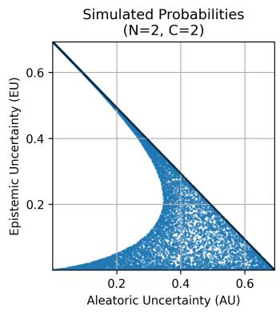

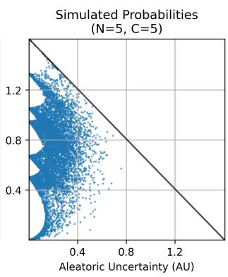

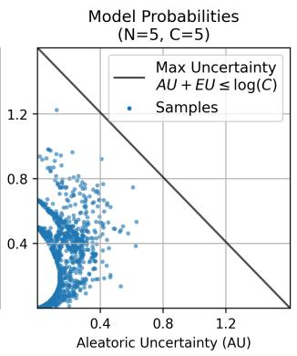  
Figure 1: Visualizations of the uncertainty space (Aleatoric Uncertainty vs Epistemic Uncertainty) along with sample uncertainties from probabilities in different settings. The probabilities are simulated in the first two panels, while the last panel shows real probabilities from an ensemble of five models $( N = 5 )$ trained on $C = 5$ classes of CIFAR-10.

For finite-sample analysis, we represent the N equally weighted posterior samples for an input as $P = ( p _ { 1 } , \dotsc , p _ { N } ) \mathbf { \bar { \Psi } } \in \ \mathbb { R } ^ { N \times C }$ , where each $p _ { i } \in \Delta ^ { \bar { C } - 1 }$ is a probability vector on the C-class probability simplex. The corresponding empirical mean prediction is $\begin{array} { r } { q = \frac { \dot { 1 } } { N } \sum _ { i = 1 } ^ { N } p _ { i } } \end{array}$ , giving AU = $\begin{array} { r } { \frac { 1 } { N } \sum _ { i = 1 } ^ { N } H ( p _ { i } ) } \end{array}$ $\mathrm { T U } = H ( q )$ , and $\mathrm { E U } = \mathrm { T U } - \mathrm { A U }$ . Equivalently, EU is the mutual information between the uniformly sampled posterior sample index and the predicted class. These finite-sample quantities depend on the predictions in P, not on how they were generated.

## 2.2 RELATED WORK

The information-theoretic decomposition has received increasing scrutiny. Wimmer et al. (2023) analyze whether conditional entropy and mutual information have the properties expected of AU and EU. Their theoretical and empirical results identify discrepancies between the measures and the intended uncertainty sources, raising questions about whether the additive decomposition separates AU and EU faithfully.

Mucsanyi et al. (2024) report strong correlations between estimated AU and EU across uncertainty-´ estimation methods for image classification. They discuss this association as evidence of limited dis entanglement and emphasize task-specific evaluation. For semantic segmentation, Kahl et al. (2024) introduce ValUES, a framework for evaluating uncertainty estimates under ambiguity and distribution shift. Their results show that disentanglement in simulated data does not consistently transfer to real data. EU measures can also capture annotator disagreement and successful disentanglement depends on the data and evaluation setting. Other studies have highlighted similar challenges in disentangling different sources of uncertainty, emphasizing the need for careful interpretation and evaluation of information-theoretic measures (Baur et al., 2026; Christensen et al., 2026).

A further concern is epistemic uncertainty collapse, in which estimated EU decreases despite persistent limitations in training information. Fellaji & Pennerath (2024) describe an “epistemic uncertainty hole” in which EU becomes small as model size increases, including with limited training data, and examine its effect on out-of-distribution detection. Kirsch (2025) proposes implicit ensembling as a possible mechanism: averaging within larger networks may reduce disagreement between ensemble members. The authors provide experimental evidence based on ensembles of ensembles and wider networks that is consistent with this hypothesis.

Closely related mathematical work studies entropy-bounded information maximization. Ebrahimi et al. (2024) maximize mutual information between a source variable with a prescribed distribution and an output variable subject to an output-entropy constraint. Taking the source to be a uniformly sampled prediction index and the output to be the predicted class identifies these quantities with EU and TU, respectively. At fixed TU, maximizing EU is equivalent to minimizing AU. They characterize optimal perturbations near deterministic mappings and propose an envelope construction whose global optimality remains conjectural. Our analysis examines the attainable uncertainty region for equally weighted finite sets of posterior samples, including its dependence on sample count and class count, and connects this geometry to epistemic uncertainty collapse.

## 3 THEORY

Theorem 1 (Bounds on the range of (AU, TU) pairs). The range ofvalid (AU, TU) pairs is bounded by thefollowing inequalities:

$$
T U \geq A U ,\tag{2}
$$

$$
E U = T U - A U \leq \log ( \operatorname* { m i n } ( C , N ) ) ,\tag{3}
$$

$$
T U \leq \log ( C )\tag{4}
$$

Proof. $\mathrm { T U } \geq \mathrm { A U }$ follows from the non-negativity of mutual information. EU is the mutual information between posterior sample identity and the predicted label, so it is bounded by the logarithm of the smaller support, log(min(C, N)). Finally, the entropy of a categorical distribution over C classes is at most log(C), which gives the third inequality. □

Theorem 2 (Valid TU values when $\mathrm { A U } = 0 )$ . When $A U = 0 ,$ , the valid $( A U , T U )$ pairs correspond to integer partitions of N into at most C parts. Dividing each partition vector by N gives a possible mean prediction q and hence an attainable TU value. The other zero-AU pairs are infeasible.

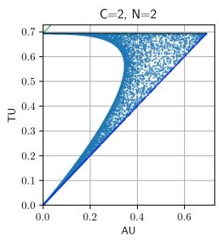

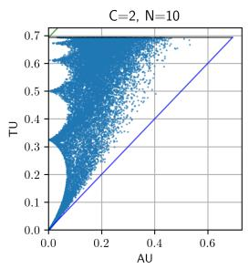

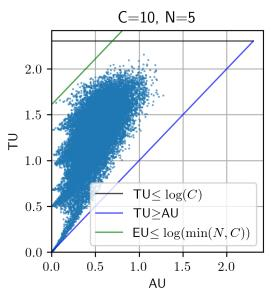

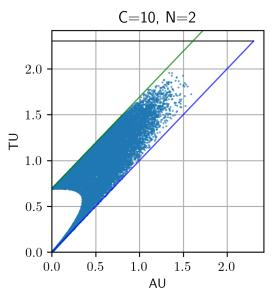

Figure 2: Simulated (AU, TU) values for different posterior sample counts N and class counts C, with the bounds from Theorem 1.  
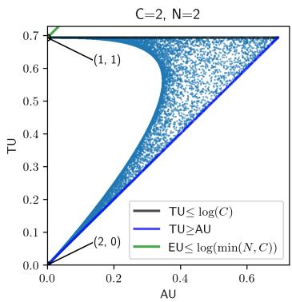

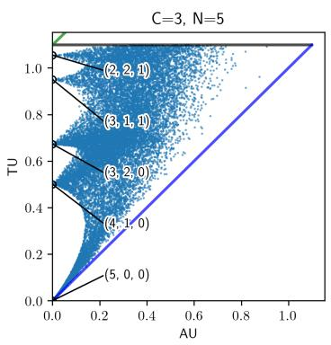

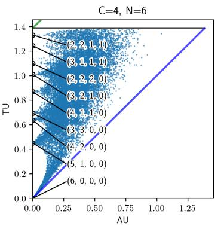  
Figure 3: Simulated (AU, TU) values for different posterior sample counts N and class counts $C .$ The points with $\mathbf { A U } = 0$ are highlighted and labeled by their class counts $N q$

Proof. If $\begin{array} { r } { \mathrm { A U } ( P ) = \frac { 1 } { N } \sum _ { i = 1 } ^ { N } H ( p _ { i } ) = 0 } \end{array}$ , each prediction $p _ { i }$ is deterministic. There are $C ^ { N }$ assignments of N posterior samples to $C$ classes, but TU depends only on the mean prediction $q =$ $\frac { 1 } { N } \sum _ { i } p _ { i }$ . Since entropy is invariant to class permutations, assignments with the same sorted class counts yield the same TU. These count vectors are the integer partitions of N into at most C parts and the zero-AU pairs not generated by such partitions are infeasible. Figure 3 shows these points. For example, with $N = 5$ and $C = { \dot { 3 } } .$ , the partition $( 3 , 2 , 0 )$ gives $q = \bar { ( 3 , 2 , 0 ) } / 5 = ( 0 . 6 , \bar { 0 . 4 } , 0 )$ (three posterior samples predict (1, 0, 0) and two predict (0, 1, 0)). □

To characterize the infeasible region boundary, we need the following definition and conjecture. Definition 1 (Deterministic configurations with at most one non-deterministic posterior sample, ). We define the set of posterior sample configurations such that

$$
\begin{array} { l } { \displaystyle \mathcal { D } = \big \{ \big ( p _ { 1 } , p _ { 2 } , \ldots , p _ { N } \big ) \in \mathbb { R } ^ { N \times C } : p _ { i } \in \Delta ^ { C - 1 } \forall i , } \\ { \displaystyle \left( \sum _ { i = 1 } ^ { N } \sum _ { j = 1 } ^ { C } \mathbb { 1 } ( 0 < p _ { i , j } < 1 ) \right) \le 2 \big \} , } \end{array}\tag{5}
$$

where $\mathbb { 1 } ( \cdot )$ is the indicator function and $\Delta ^ { C - 1 }$ is the C-class probability simplex. Thus,  contains configurations with $N - 1$ deterministic posterior samples and at most one posterior sample on an edge between two simplex vertices.

Conjecture 1 (Infeasible boundary). Let $T U _ { m a x } ^ { D } = \operatorname* { m a x } _ { P \in { \mathcal { D } } } ( T U ( P ) )$ denote the maximum TU value attainable by points in . Then, for a fixed total uncertainty $\hat { T } \hat { U } < T U _ { m a x } ^ { \mathcal { D } } ,$ only points in can minimize the aleatoric uncertainty AU.

For $\mathrm { T U } < \mathrm { T U } _ { \operatorname* { m a x } } ^ { \mathcal { D } } ,$ , the conjecture implies that the infeasible boundary is the lower envelope of the image of under the (AU, TU) mapping. This image is connected because is connected and the mapping is continuous. It contains $( 0 , 0 )$ , attained when all posterior samples deterministically predict the same class, and therefore the boundary connects to the origin.

Numerical simulations and empirical results support the conjecture, and it is closely related to the conjectured global optimality of the envelope construction in Ebrahimi et al. (2024, Section 3.2). We prove it for $C = 2$ , where the image of does not branch in the (AU, TU) plane (Figure 6). The general case remains open.

Proof (special case). Let $C = 2$ and N be arbitrary. It suffices to show that every $P \notin { \mathcal { D } }$ is suboptimal for minimizing AU at fixed TU. Such a P has at least two non-deterministic predictions, say those of posterior samples i and k. Without loss of generality, let $p _ { i , 1 } = \operatorname* { m i n } ( p _ { i , 1 } , p _ { i , 2 } , p _ { k , 1 } , p _ { k , 2 } )$ For sufficiently small $\epsilon > 0$ , transfer probability mass between these predictions as follows:

$$
\tilde { P } _ { [ i , k ] , [ 1 , 2 ] } = \binom { \tilde { p } _ { i , 1 } } { \tilde { p } _ { k , 1 } } \tilde { p } _ { i , 2 } \sp { \ L } = \binom { p _ { i , 1 } } { p _ { k , 1 } } p _ { i , 2 } \sp { \ L } ) + \binom { - \epsilon } { \epsilon } \stackrel { \epsilon } { - \epsilon } \sp { \ L } ,\tag{6}
$$

The column sums are unchanged, so $q$ and TU remain fixed. Let h denote binary entropy. The perturbation changes the two relevant entropy terms to $h ( p _ { i , 1 } - \epsilon ) + h ( p _ { k , 1 } + \epsilon )$ , whose derivative at $\epsilon = 0 \mathrm { i s } - h ^ { \prime } ( p _ { i , 1 } ) + h ^ { \prime } ( p _ { k , 1 } )$ . Since $p _ { i , 1 } \leq p _ { k , 1 }$ and $h ^ { \prime }$ is decreasing, this derivative is non-positive. Strict concavity then implies that a sufficiently small positive perturbation decreases the summed entropy (Figure 4). The prediction space is compact and the (AU, TU) mapping is continuous, so a minimizer exists and it lies in . □

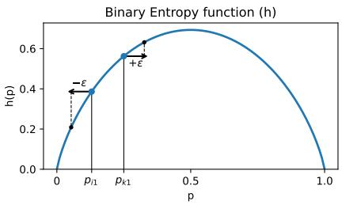  
Figure 4: Binary entropy at the original and perturbed prediction probabilities.

Under the conjecture, the infeasible boundary is the lower envelope of curves obtained by interpolating between zero-AU points. Each point from the curves/simplex edges corresponds to a posterior sample configuration in ${ \mathcal { D } } ,$ , and the infeasible region lies below this envelope (Figure 5). To be precise, we define the infeasible region as the set pairs of (AU, TU) or (AU, EU) that cannot be realized for a finite set of posterior samples but can be realized in the limit of an infinite number of posterior samples.

As an example of the conjecture, consider the base case where $N = C = 2$ . The $\mathbf { A U } = 0$ points are (0, 0) and (0, log 2), with mean predictions $q = ( 1 , 0 )$ and $q = ( 1 / 2 , 1 / 2 )$ . Varying one posterior sample’s prediction between the two classes gives $p _ { 1 } = ( 1 , 0 ) , p _ { 2 } = ( 1 - s , s )$ , and $q = ( 1 -$ $s / 2 , s / 2 )$ with $s \in [ 0 , 1 ]$ . The corresponding uncertainties are

$$
\mathrm { A U } ( s ) = { \frac { 1 } { 2 } } H ( [ 1 , 0 ] ) + { \frac { 1 } { 2 } } H ( [ 1 - s , s ] ) = { \frac { 1 } { 2 } } H ( [ 1 - s , s ] )
$$

$$
= - { \frac { 1 } { 2 } } \left( ( 1 - s ) \log ( 1 - s ) + s \log ( s ) \right) ,\tag{7}
$$

$$
\mathrm { T U } ( s ) = { \cal H } ( q ) = { \cal H } ( [ 1 - s / 2 , s / 2 ] ) = - ( 1 - s / 2 ) \log ( 1 - s / 2 ) - ( s / 2 ) \log ( s / 2 ) .\tag{8}
$$

The resulting curve is shown in Figure 5 (left). This example only has one boundary curve, but the number of boundary curves increases with N and $C .$ . The expression for AU generalizes with $1 / 2$ replaced by $1 / N$ , which we state in the following theorem.

Theorem 3 (AU component of simplex edges). The AU component of the simplex edges can be expressed as

$$
A U ( s ) = - \frac { 1 } { N } \left( ( 1 - s ) \log ( 1 - s ) + s \log ( s ) \right) ,\tag{9}
$$

and therefore $A U \le \log ( 2 ) / N _ { \cdot }$ for all simplex edges.

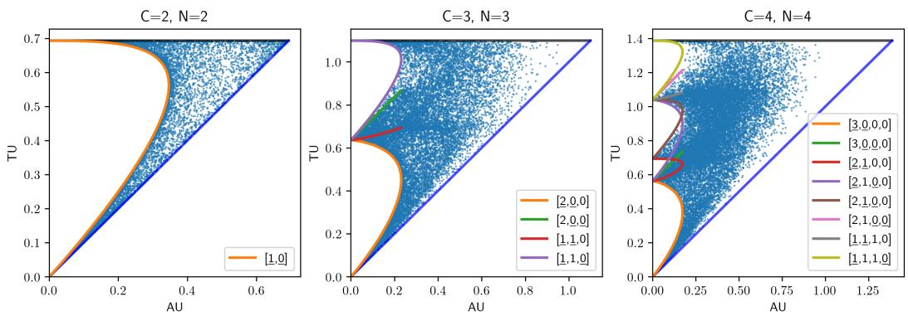

Figure 5: Simulated (AU, TU) values for different posterior sample counts N and class counts C. Curves from are labeled by deterministic class counts. The underlined entries mark the two classes supported by the non-deterministic posterior sample. For example, [2, 0, 0] connects the count vectors [3, 0, 0] and [2, 1, 0].  
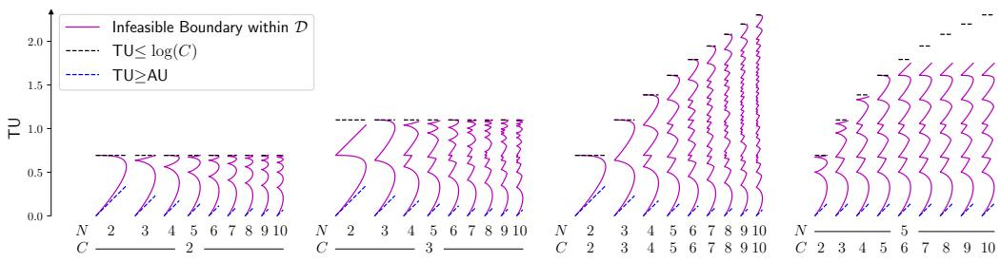  
Figure 6: Infeasible-boundary shapes, shown as lower envelopes of interpolating curves, for different posterior sample counts N and class counts C.

Proof. The only change with respect to the AU calculation in equation 7 is the replacement of $1 / 2 \ \mathrm { \ b y ^ { ' } } 1 / N$ . The maximum of $\operatorname { A U } ( s )$ occurs at $s \ = \ 1 / 2$ , giving $\begin{array} { r l } { \mathbf { A U } _ { \operatorname* { m a x } } } & { { } = } \end{array}$ $- { \frac { 1 } { N } } \left( ( 1 / 2 ) \ln ( 1 / 2 ) + ( 1 / 2 ) \ln ( 1 / 2 ) \right) = { \frac { \ln ( 2 ) } { N } }$ , which establishes the upper bound. □

Theorem 4 (Lowest TU boundary curve). The curve connecting $N q ^ { ( N ) } \ = \ [ N , 0 , 0 , . . . ]$ and ${ \cal N } q ^ { ( N - 1 ) } = [ N - 1 , 1 , 0 , . . . ]$ attains the lowest TU values among the infeasible-boundary curves. Its interior TU values are not attained by any other such curve. We call it thefirst bubble.

Proof. Each boundary curve connects two fully deterministic configurations. From $q ^ { ( N ) }$ , the smallest increase in TU occurs when one posterior sample changes its prediction to a second class, yielding $\boldsymbol { q } ^ { ( N - 1 ) }$ . Thus, $\mathrm { T U } ( q ^ { ( N ) } ) < \mathrm { T \bar { U } } ( q ^ { ( N - 1 ) } ) < \mathrm { T U } ( \hat { q } )$ for any other deterministic configuration qˆ. The lemma of Appendix C shows that TU attains its minimum along each curve at an endpoint. Therefore, every other curve has minimum a TU at of least $\mathrm { T U } \big ( q ^ { ( N - 1 ) } \big )$ . □

## 4 EXPERIMENTS

## 4.1 EXPERIMENTAL SETUP

To evaluate the impact of ensemble size and network capacity on uncertainty estimation, we conduct a series of experiments varying these factors systematically. Our aim is to understand how these factors relate to epistemic collapse, i.e., the reduction of epistemic uncertainty, commonly observed when model capacity grows.

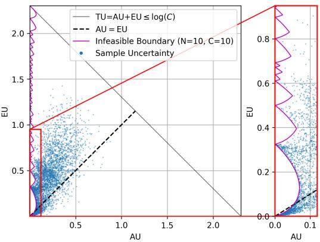  
Figure 7: Visualizations of the (AU, EU) space along with points from an ensemble of 10 EfficientNet-B0 networks trained on CIFAR-10.

Our theory suggests that when AU is low, there is a direct dependence between AU and EU since some pairs of (AU,EU) are infeasible. This dependence could relate to the observed entanglement in uncertainty estimation. For this, we track performance for out-of-distribution (OOD) detection as it allows us to assess the entanglement between AU and EU in practice. For OOD detection, we expect EU to be more informative than AU, and we therefore say that there is entanglement when AU performance exceeds EU performance. For OOD detection, we designate the final three classes of each dataset as OOD and the remaining classes as in-distribution (ID). We use EU to score OOD examples and report the area under the receiver operating characteristic curve (AUROC).

We evaluate on CIFAR-10 (Krizhevsky, 2009) and MNIST (LeCun et al., 1998) using Efficient-Net (Tan & Le, 2019) models B0 (4.02M parameters), B2 (7.72M), B4 (17.57M), and B6 (40.76M). We estimate uncertainty using either deep ensembles (Lakshminarayanan et al., 2017) or Monte Carlo (MC) dropout (Gal & Ghahramani, 2016). For MC dropout, we enable dropout at test time and insert layers with rate p = 0.2 before each SiLU activation in EfficientNet. All results are shown on validation data using standard splits.

We train all models from scratch using AdamW (Loshchilov & Hutter, 2019) without weight decay, gradient clipping at 1.0, batch size 128, and an initial learning rate of 0.001 with cosine decay. Training lasts 200–1200 epochs, depending on model capacity and dataset. These durations were selected based on validation-performance plateaus observed in preliminary experiments.

## 4.2 ADHERENCE TO THE THEORETICAL PREDICTIONS

We first test whether posterior samples obtained from trained models satisfy the predicted constraints. Figure 7 shows that the predictions respect the infeasible boundary in the (AU, EU) plane. Many examples also lie near the origin, indicating low estimated uncertainty in both components.

## 4.3 VARYING THE POSTERIOR SAMPLE COUNT

Increasing the posterior sample count (N) improves OOD detection performance (Figure 8) for both AU and EU, but no clear trend is observed in how entangled the measures are. The relative EU fraction, EU/TU, also increases with N, counteracting the effects of epistemic collapse. This trend must be interpreted in light of finite-sample bias: for independent predictions sampled from a fixed distribution over networks, the plug-in EU estimate is downward biased, with bias decreasing as N increases. We therefore report jackknife-corrected estimates in Figure 8 (Quenouille, 1956). Appendix B describes the correction and its limitations.

Figure 9 shows that fewer examples concentrate near the origin as N increases. By Theorem 3, AU along the infeasible boundary is bounded by log(2)/N. Thus, the boundary’s extent in the AU direction decreases as N increases.

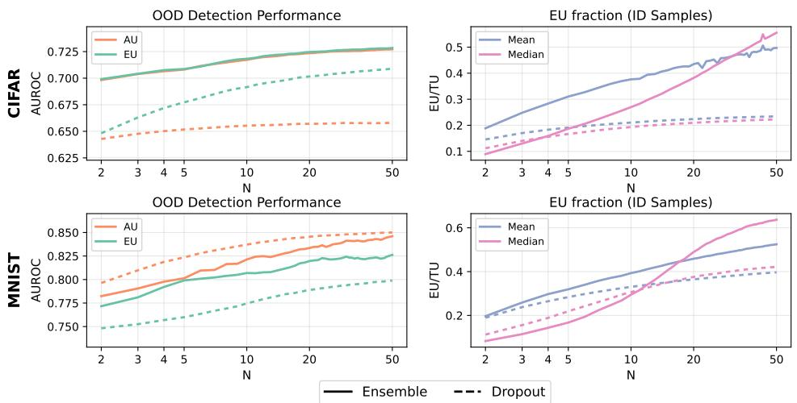

Figure 8: OOD detection performance and epistemic collapse as the number of Enet-B0 network (N) is varied.  
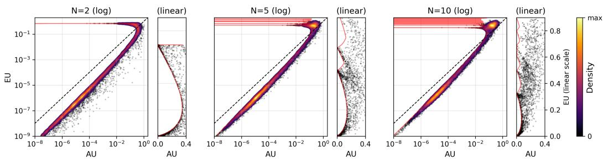  
Figure 9: Visualizations of the (AU, EU) space along with points from an Enet-B4 ensemble trained on CIFAR as the number of networks (N) is varied. The infeasible boundary is shown in red, and the dashed line is AU = EU.

## 4.4 VARYING THE NETWORK CAPACITY

As model capacity increases, both AU and EU decrease, while accuracy and OOD detection performance improve (Figure 10). The relative EU fraction, EU/TU, also declines, reaching approximately 20% for the largest models. This trend is consistent with reports of increased epistemic collapse at larger model sizes (Fellaji & Pennerath, 2024). Entanglement is also clearly visible as AU often exceeds EU in OOD detection performance.

Figure 11 shows the (AU, EU) distributions on logarithmic axes. As capacity increases, more examples approach the origin. The first-bubble boundary (Theorem 4) constrains the attainable values in this region, ensuring AU > EU. The highly confident points therefore attain low EU relative to AU.

## 5 DISCUSSION

The information-theoretic decomposition imposes structural constraints on the AU and EU pairs attainable from a finite set of posterior samples. Beyond the broad entropy bounds, an infeasible region remains in low-AU regimes. The first boundary curve severely impacts attainable combinations, restricting them to AU > EU in this regime. Thus, AU and EU cannot be interpreted as independently varying coordinates for finite-sample predictions here.

These constraints provide one perspective on epistemic collapse. As is well-documented in the literature, larger models produce more highly confident predictions Guo et al. (2017). Such predictions accumulate near the first infeasible boundary, where the geometry restricts the relative sizes of AU and EU. The boundary therefore offers a structural contribution to the observed decrease in the EU fraction as model capacity grows, although it is not the only cause of collapse. In our experiments, the number posterior samples (N) in the ensemble also plays a role: increasing the ensemble size reduces epistemic collapse. Our derived bound $\mathrm { A U } \le \log ( 2 ) / N$ (Theorem 3) helps explain why. More generally, increasing the posterior sample count can lessen this particular geometric limitation, although it also incurs additional computational cost.

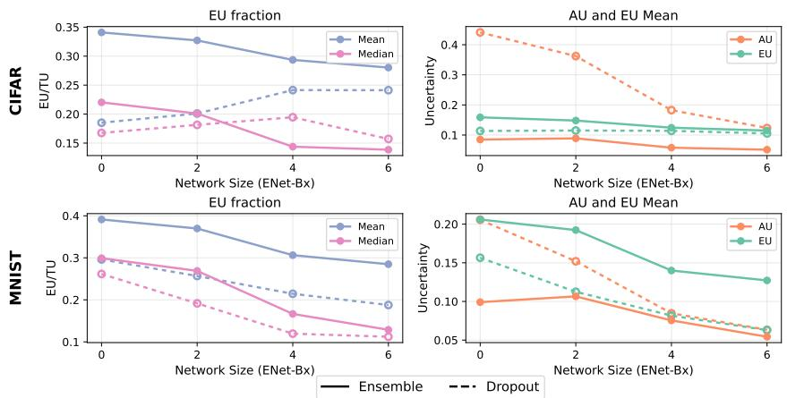  
Figure 10: OOD detection performance and epistemic collapse as the network capacity is varied.

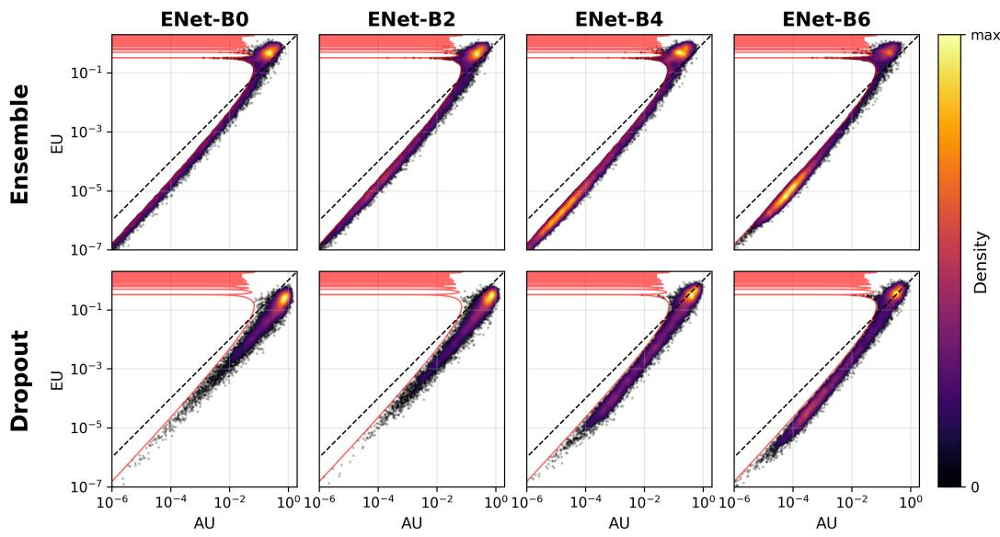  
Figure 11: Visualizations of the (AU, EU) space along with points from an ensemble/dropout model as the network capacity is varied. The model is trained on CIFAR. The infeasible boundary is shown in red, and the dashed line is $\boldsymbol { \mathrm { A U } } = \boldsymbol { \mathrm { E U } }$

Our analysis is limited to the information-theoretic decomposition and does not generalize to other frameworks such as EPKL (Expected Pairwise Kullback-Leibler) (Schweighofer et al., 2023). We do not provide a method to eliminate the boundary effect at fixed posterior sample count. Future work could investigate alternative uncertainty frameworks, develop methods for interpreting or correcting finite-sample estimates, and test whether tiered strategies (e.g., ensembles of SWAG (Stochastic Weight Averaging Gaussian) (Maddox et al., 2019) or dropout models (Gal & Ghahramani, 2016)) can approach the performance of larger ensembles at lower computational cost.

## 6 CONCLUSION

We characterize structural limits on the information-theoretic decomposition of predictive uncertainty for finite sets of posterior samples. The attainable AU–EU region has an infeasible boundary that depends on posterior sample count and class count. Simulations and experiments on CIFAR-10 and MNIST show how this geometry relates to observed uncertainty patterns, including changes in epistemic uncertainty with model capacity. These findings motivate interpreting information theoretic estimates in light of finite-sample constraints. Extending the boundary analysis beyond the binary-class proof and developing practical mitigation strategies remain open directions.

## REFERENCES

Simon Baur, Wojciech Samek, and Jackie Ma. Benchmarking uncertainty and its disentanglement in multi-label chest X-ray classification. In Carole H. Sudre, Mobarak I. Hoque, Raghav Mehta, Cheng Ouyang, Chen Qin, Marianne Rakic, and William M. Wells (eds.), Uncertainty for Safe Utilization of Machine Learning in Medical Imaging, pp. 193–203, Cham, 2026. Springer Nature Switzerland.

Jakob Lønborg Christensen, Vedrana Andersen Dahl, Morten Rieger Hannemose, Anders Bjorholm Dahl, and Christian F. Baumgartner. Rethinking uncertainty quantification and entanglement in image segmentation. In Asian Conference on Computer Vision (ACCV), 2026. URL https: //arxiv.org/abs/2603.18792. Accepted for publication.

Stefan Depeweg, Jose-Miguel Hernandez-Lobato, Finale Doshi-Velez, and Steffen Udluft. Decomposition of uncertainty in Bayesian deep learning for efficient and risk-sensitive learning. In Jennifer Dy and Andreas Krause (eds.), Proceedings of the 35th International Conference on Machine Learning, volume 80 of Proceedings of Machine Learning Research, pp. 1184–1193. PMLR, 10–15 Jul 2018.

M. Reza Ebrahimi, Jun Chen, and Ashish Khisti. Minimum entropy coupling with bottleneck. In A. Globerson, L. Mackey, D. Belgrave, A. Fan, U. Paquet, J. Tomczak, and C. Zhang (eds.), Advances in Neural Information Processing Systems, volume 37, pp. 59655–59688. Curran Associates, Inc., 2024. doi: 10.52202/079017-1906.

Mohammed Fellaji and Fred´ eric Pennerath. The epistemic uncertainty hole: an issue of Bayesian´ neural networks, 2024. URL https://arxiv.org/abs/2407.01985.

Yarin Gal and Zoubin Ghahramani. Dropout as a Bayesian approximation: Representing model uncertainty in deep learning. In Maria Florina Balcan and Kilian Q. Weinberger (eds.), Proceedings of The 33rd International Conference on Machine Learning, volume 48 of Proceedings of Ma chine Learning Research, pp. 1050–1059, New York, New York, USA, 20–22 Jun 2016. PMLR.

Chuan Guo, Geoff Pleiss, Yu Sun, and Kilian Q. Weinberger. On calibration of modern neural networks. In Doina Precup and Yee Whye Teh (eds.), Proceedings of the 34th International Conference on Machine Learning, volume 70 of Proceedings ofMachine Learning Research, pp. 1321–1330. PMLR, 06–11 Aug 2017.

Neil Houlsby, Ferenc Huszar, Zoubin Ghahramani, and M´ at´ e Lengyel. Bayesian active learning for´ classification and preference learning, 2011. URL https://arxiv.org/abs/1112.5745.

Kim-Celine Kahl, Carsten T. Luth, Maximilian Zenk, Klaus Maier-Hein, and Paul F. Jaeger. Val-¨ UES: A framework for systematic validation of uncertainty estimation in semantic segmentation. In The Twelfth International Conference on Learning Representations, 2024. URL https://openreview.net/forum?id=yV6fD7LYkF.

Alex Kendall and Yarin Gal. What uncertainties do we need in Bayesian deep learning for computer vision? In I. Guyon, Ulrike von Luxburg, S. Bengio, H. Wallach, R. Fergus, S. Vishwanathan, and R. Garnett (eds.), Advances in Neural Information Processing Systems, volume 30. Curran Associates, Inc., 2017.

Andreas Kirsch. (Implicit) ensembles of ensembles: Epistemic uncertainty collapse in large models. Transactions on Machine Learning Research, 2025. URL https://openreview.net/ forum?id=ON7dtdEHVQ.

Alex Krizhevsky. Learning multiple layers of features from tiny images. Technical report, University of Toronto, 2009.

Balaji Lakshminarayanan, Alexander Pritzel, and Charles Blundell. Simple and scalable predictive uncertainty estimation using deep ensembles. In I. Guyon, U. Von Luxburg, S. Bengio, H. Wallach, R. Fergus, S. Vishwanathan, and R. Garnett (eds.), Advances in Neural Information Processing Systems, volume 30. Curran Associates, Inc., 2017.

Y. LeCun, L. Bottou, Y. Bengio, and P. Haffner. Gradient-based learning applied to document recognition. Proceedings ofthe IEEE, 86(11):2278–2324, 1998. doi: 10.1109/5.726791.

Ilya Loshchilov and Frank Hutter. Decoupled weight decay regularization. In International Conference on Learning Representations, 2019. URL https://arxiv.org/abs/1711.05101.

Wesley J Maddox, Pavel Izmailov, Timur Garipov, Dmitry Vetrov, and Andrew Gordon Wilson. A simple baseline for Bayesian uncertainty in deep learning. In H. Wallach, H. Larochelle, A. Beygelzimer, Florence d’Alche Buc, E. Fox, and R. Garnett (eds.),´ Advances in Neural Information Processing Systems, volume 32. Curran Associates, Inc., 2019.

Balint Mucs´ anyi, Michael Kirchhof, and Seong Joon Oh. Benchmarking uncertainty disentan-´ glement: Specialized uncertainties for specialized tasks. In A. Globerson, L. Mackey, D. Belgrave, A. Fan, U. Paquet, J. Tomczak, and C. Zhang (eds.), Advances in Neural Information Processing Systems, volume 37, pp. 50972–51038. Curran Associates, Inc., 2024. doi: 10.52202/079017-1614.

M. H. Quenouille. Notes on bias in estimation. Biometrika, 43(3-4):353–360, 12 1956. ISSN 0006-3444. doi: 10.1093/biomet/43.3-4.353.

Kajetan Schweighofer, Lukas Aichberger, Mykyta Ielanskyi, and Sepp Hochreiter. Introducing an improved information-theoretic measure of predictive uncertainty, 2023. URL https: //arxiv.org/abs/2311.08309.

Mingxing Tan and Quoc Le. EfficientNet: Rethinking model scaling for convolutional neural networks. In Kamalika Chaudhuri and Ruslan Salakhutdinov (eds.), Proceedings of the 36th International Conference on Machine Learning, volume 97 of Proceedings of Machine Learning Research, pp. 6105–6114. PMLR, 09–15 Jun 2019.

Lisa Wimmer, Yusuf Sale, Paul Hofman, Bernd Bischl, and Eyke Hullermeier. Quantifying aleatoric¨ and epistemic uncertainty in machine learning: Are conditional entropy and mutual information appropriate measures? In Robin J. Evans and Ilya Shpitser (eds.), Proceedings of the Thirty-Ninth Conference on Uncertainty in Artificial Intelligence, volume 216 of Proceedings ofMachine Learning Research, pp. 2282–2292. PMLR, 31 Jul–04 Aug 2023.

## A LOGIT SIMULATION

We generate logits with Gaussian noise and introduce dependence across posterior samples and classes using correlation parameters $\rho _ { N }$ and $\rho _ { C }$ . The resulting probabilities illustrate how the attainable uncertainty region changes with the simulation settings.

Algorithm 1 Simulate Probabilistic Predictions   
procedure SIMULATEPROBS(N, C, n, σL, ρN, ρC)   
▷ Initialize logits with independent Gaussian noise   
$\mathbf { L }  \mathcal { N } ( 0 , \sigma _ { L } ^ { 2 } ) \in \mathbb { R } ^ { N \times C \times n }$   
▷ Apply posterior sample-wise correlation   
$\mathbf { L }  \rho _ { N } \cdot \mathcal { N } ( 0 , \sigma _ { L } ^ { 2 } ) _ { 1 \times C \times n } + ( 1 - \rho _ { N } ) \cdot \mathbf { L }$   
▷ Apply class-wise correlation   
$\mathbf { L }  \rho _ { C } \cdot \mathcal { N } ( 0 , \sigma _ { L } ^ { 2 } ) _ { N \times 1 \times n } + ( 1 - \rho _ { C } ) \cdot \mathbf { L }$   
▷ Convert logits to probabilities   
$\mathbf { P } \gets \operatorname { s o f t m a x } ( \mathbf { L } , \mathrm { a x i s = 2 } )$   
return P   
end procedure

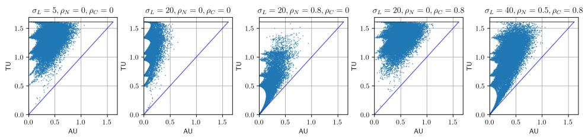  
Figure 12: Simulated (AU, TU) values for different settings with $C = N = 5$

## B FINITE-SAMPLE BIAS AND JACKKNIFE CORRECTION

The finite-sample estimator of epistemic uncertainty (EU) is biased downward because it uses the entropy of the sample-mean prediction. This appendix characterizes that bias and describes the jackknife correction used in our experiments.

For a fixed input, let $\mathit { p 1 } , \dots , \mathit { p } _ { N }$ be independent posterior samples from the same predictive distribution, and define

$$
q _ { N } = \frac { 1 } { N } \sum _ { i = 1 } ^ { N } p _ { i } , \qquad q _ { \infty } = \mathbb { E } _ { \theta } [ p _ { \theta } ] .\tag{10}
$$

The usual estimator can be written as an average divergence from the sample mean:

$$
{ \widehat { \mathrm { E U } } } _ { N } = H ( q _ { N } ) - { \frac { 1 } { N } } \sum _ { i = 1 } ^ { N } H ( p _ { i } ) = { \frac { 1 } { N } } \sum _ { i = 1 } ^ { N } D _ { \mathrm { K L } } ( p _ { i } \| q _ { N } ) .\tag{11}
$$

Its population counterpart is $\begin{array} { r } { \mathrm { E U } _ { \infty } = H ( q _ { \infty } ) - \mathbb { E } _ { \theta } [ H ( p _ { \theta } ) ] } \end{array}$ . Although the sample mean $q _ { N }$ and the AU estimator are unbiased, the concavity of entropy makes ${ \cal { H } } ( q _ { N } )$ , and consequently the EU estimator, downward biased. In particular,

$$
\begin{array} { r } { \mathrm { E U } _ { \infty } - \mathbb { E } [ \widehat { \mathrm { E U } } _ { N } ] = \mathbb { E } [ D _ { \mathrm { K L } } ( q _ { N } \Vert q _ { \infty } ) ] \geq 0 , } \end{array}\tag{12}
$$

where expectations are over posterior samples. Under these assumptions, the expected EU estimate is nondecreasing with N and converges to $\mathrm { \bar { E } U _ { \infty } }$ . Thus, EU can increase with posterior sample count even when the underlying predictive distribution remains fixed.

Unlike squared Euclidean distance, KL divergence does not admit a universal multiplicative correction of the form $N / ( N - 1 )$ . We instead use the jackknife bias correction of Quenouille (1956). For

$N \geq 2 ,$ , define the leave-one-out estimates

$$
q _ { - i } = \frac { 1 } { N - 1 } \sum _ { j \neq i } p _ { j } , \qquad { \widehat { \mathrm { E U } } } _ { - i } = H ( q _ { - i } ) - \frac { 1 } { N - 1 } \sum _ { j \neq i } H ( p _ { j } ) .\tag{13}
$$

The corrected estimator is

$$
\widehat { \mathrm { E U } } _ { \mathrm { J K } } = N \widehat { \mathrm { E U } } _ { N } - \frac { N - 1 } { N } \sum _ { i = 1 } ^ { N } \widehat { \mathrm { E U } } _ { - i } .\tag{14}
$$

Each leave-one-out estimate measures sensitivity to sample size. If the expected uncorrected estimator has a smooth expansion in powers of $1 / { \cal N } .$ , its leading bias term is proportional to $1 / N$ . The jackknife combination cancels this term because $N ( 1 / N ) \stackrel { \smile } { - } ( N - 1 ) ( 1 / \lbrack N ^ { ' } - 1 ) ) = 0 .$ . Applying the same construction to the uncorrected sample variance recovers the usua $1 / ( N - 1 )$ correction exactly.

For EU, the AU terms in the leave-one-out average equal the full-sample AU estimate. Consequently, the correction acts only on TU:

$$
\widehat { \mathrm { T U } } _ { \mathrm { J K } } = N H ( q _ { N } ) - \frac { N - 1 } { N } \sum _ { i = 1 } ^ { N } H ( q _ { - i } ) , \qquad \widehat { \mathrm { E U } } _ { \mathrm { J K } } = \widehat { \mathrm { T U } } _ { \mathrm { J K } } - \widehat { \mathrm { A U } } _ { N } .\tag{15}
$$

No additional model evaluations are required.

The correction is approximate and need not remove bias for small sample counts, particularly when predictions lie near the simplex boundary. Here, it reduces finite-sample bias when comparing trends across N. Because it targets population uncertainty rather than uncertainty of the finite empirical sample, the main-text finite-sample bounds do not directly apply to corrected estimates. Separate corrections to TU and EU also do not guarantee an unbiased estimate of their ratio EU/TU.

We illustrate the effect of the jackknife correction on EU estimates for different posterior sample counts N in Figures 13 and 14. It is evident that the correction reduces finite-sample bias, as the mean EU curves are mostly flat after correction. When $N < C$ the EU still increases with N due to the second inequality in Theorem 1, which limits the maximum achievable EU to log(min(C, N)).

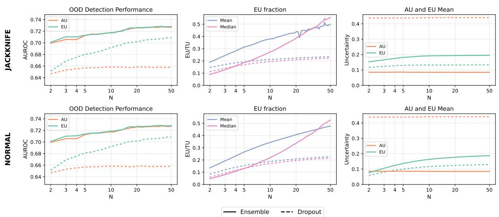  
Figure 13: Comparison of jackknife-corrected EU estimates for different posterior sample counts N on CIFAR.

## C BOUNDARY CURVE MINIMUM LEMMA

Lemma 1 (Endpoint minimum of boundary curves). For any boundary curve $( A U ( s ) , T U ( s ) )$ , the minimum TU occurs at an endpoint.

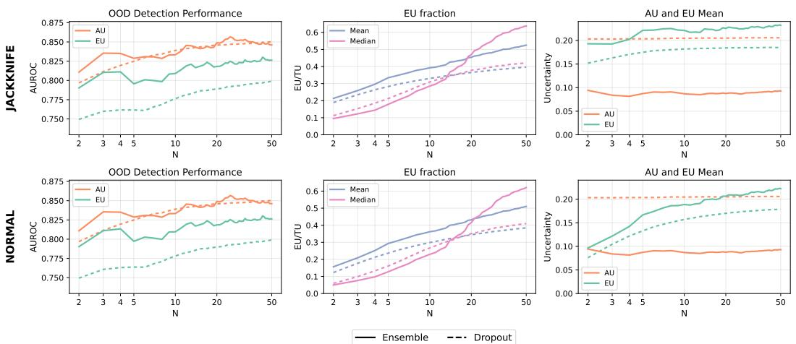  
Figure 14: Comparison of jackknife-corrected EU estimates for different posterior sample counts N on MNIST.

Proof. Let $\alpha \neq \beta$ index the two components of $q$ that vary with s. Then

$$
\mathbf { T U } ( s ) = H ( q ) = - \sum _ { i = 1 } ^ { C } q _ { i } \log ( q _ { i } ) = \underbrace { - \sum _ { i \neq \alpha , \beta } q _ { i } \log ( q _ { i } ) } _ { \mathrm { c o n s t a n t i n } s } - q _ { \alpha } \log ( q _ { \alpha } ) - q _ { \beta } \log ( q _ { \beta } )\tag{16}
$$

Since $f ( x ) = - x$ log x is concave and $q _ { \alpha } , q _ { \beta }$ are linear in s, TU is concave in s. A concave function on an interval attains its minimum at an endpoint, so the minimum is either TU(0) or TU(1).