(c) Motivation

Reconstruction quality ×16 (axis from 22 dB)

(d) Quality and efficiency

(a) Existing methods

# SUPER-RESOLVING UNSEEN HYPERSPECTRALSENSORS AT ANY SCALE VIA SPATIAL OPERATORS

Ji-Xuan He1 Guohang Zhuang2 Bo Junge1 Tingyi Li2 Lingchen1 Miaomiao Cai3 Yanan Qiao1,† Xiujin Liu4 Junfeng Fang3 1Xi’an Jiaotong University 2Hefei University of Technology 3National University of Singapore 4University of Michigan †Corresponding author.

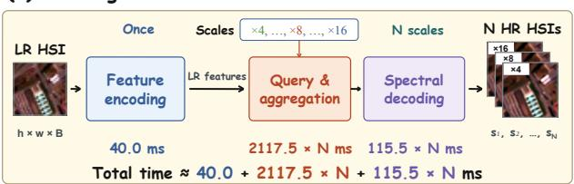

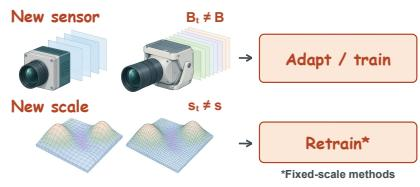

(b) OmniHSR  
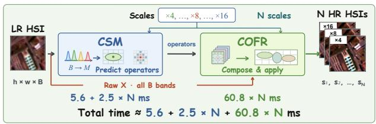

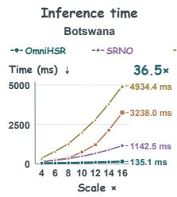

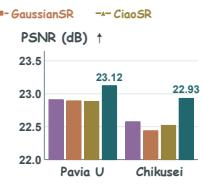  
Figure 1: Cross-sensor, arbitrary-scale reconstruction with OmniHSR. (a) Existing methods, here CiaoSR, decode the spectral values of every band from features and repeat querying and decoding per requested scale. (b) OmniHSR predicts local spatial operators with CSM and applies them to all observed bands with COFR. (c) A new sensor requires adapting or retraining existing methods, and a new scale requires retraining fixed-scale methods. (d) At ×16, OmniHSR reaches a higher zero-shot PSNR than the baselines on Pavia U and Chikusei and runs 36.5× faster than CiaoSR on the 145-band Botswana. N is the number of requested scales; times are measured on Botswana.

## ABSTRACT

Achieving cross-sensor generalization and arbitrary-scale reconstruction with a single model remains challenging in hyperspectral super-resolution (HSR). Although recent methods support arbitrary-scale reconstruction, applying them to new sensors or scales beyond the training range often requires additional data and computation to maintain reconstruction quality. To address these challenges, we propose OmniHSR, which predicts band-shared spatial operators rather than spectral values. Cross-Spectral Mapping (CSM) resamples inputs with any number of bands to fixed reference positions and predicts local operators with Gaussian supports. Continuous Operator-Field Reconstruction (COFR) composes these operators into a continuous field and applies them to all original bands for arbitraryscale reconstruction. Experiments demonstrate that operator prediction outperforms direct spectral-value prediction on all seven datasets. Trained solely on ARAD with only 0.538M parameters, OmniHSR outperforms all directly transferred baselines on six unseen datasets without target-domain training data or adaptation. Across twelve upsampling factors from ×2 to ×48, it improves average PSNR on Pavia U and Chikusei by 0.55 dB over the strongest baseline. It also surpasses baselines trained from scratch or adapted on the target sensor and achieves up to 36× faster inference. Our code will be publicly released soon.

## 1 INTRODUCTION

Hyperspectral images provide rich spectral information but often lack sufficient spatial detail for practical applications, motivating hyperspectral image super-resolution (HSR) (Bian et al., 2024; Li et al., 2025; Ciotola et al., 2025; Guo et al., 2023). Most existing HSR methods are designed for fixed upsampling factors such as ×2, ×4, and ×8 (Wang et al., 2022; Zhang et al., 2023; Chen et al., 2024b; 2025b), while recent arbitrary-scale methods handle different factors with a single model (Chen et al., 2021; Hu et al., 2025; Jiang et al., 2024; Chen et al., 2024a). Hyperspectral sensors also differ in their band configurations, from 31 to more than one hundred bands, and the public data of a remote-sensing sensor is often a single scene. Achieving cross-sensor generalization and arbitrary-scale reconstruction with a single model remains challenging.

Existing HSR networks output the spectral values of every band, with as many output channels as the training sensor has bands (Figure 1a). To serve a new sensor, they either run on sliding windows of bands, which multiplies the inference cost with the band count, or are trained from scratch or adapted on the target sensor (Scheibenreif et al., 2024; Thoreau et al., 2025), which needs target data (Figure 1c). Beyond their training range of factors, fixed-scale methods must be retrained and arbitrary-scale methods lose accuracy. In all these cases, the network itself still predicts the spectral values, for every band and at every factor.

To address these challenges, we propose OmniHSR, which predicts band-shared spatial operator instead of spectral values (Figure 1b). Every pixel of a low-resolution observation is a spatial mixture of the high-resolution spectra within its footprint, and all bands are mixed in the same way, so a highresolution spectrum at any position can be approximated by combining the observed spectra around it, and the network only has to decide how they are combined. Such an operator carries no band dimension, so it acts on all bands of any sensor, and the network runs once regardless of the band count. Networks that predict filters for their input already work this way in denoising and video super-resolution (Mildenhall et al., 2018; Jo et al., 2018), for a fixed set of channels on a fixed output grid.

Predicting such operators for any sensor at any factor poses two difficulties. The network needs an input of fixed size while the band count changes with the sensor, and the operators are predicted on the low-resolution grid but must act on a target grid at any factor. Cross-Spectral Mapping (CSM) resamples an input with any number of bands to fixed reference positions and predicts, for every low-resolution pixel, a local operator with a Gaussian support (Kerbl et al., 2023; Hu et al., 2025; Chen et al., 2025a). Continuous Operator-Field Reconstruction (COFR) composes these operators along their supports into a continuous field, evaluates it on the target grid at any factor, and applies it to all original bands.

With the backbone and training shared, predicting operators is more accurate than predicting spectral values on all seven datasets. Trained solely on the 31-band ARAD (Arad et al., 2022) with only 0.538M parameters, OmniHSR outperforms all directly transferred baselines on six unseen datasets without target-domain training data or adaptation, and across twelve factors from ×2 to ×48 it improves the average PSNR on Pavia U (Gamba, 2002) and Chikusei (Yokoya & Iwasaki, 2016) by 0.55 dB over the strongest baseline. It also surpasses the baselines trained from scratch or adapted on the target sensor and runs up to 36× faster on sensors with more than 31 bands (Figure 1d). Our main contributions are as follows.

• We propose OmniHSR, a cross-sensor arbitrary-scale HSR framework that predicts bandshared spatial operators instead of spectral values, so that one model trained once serves unseen sensors at any factor zero-shot.

• We propose CSM, which maps an input with any number of bands to fixed reference positions and predicts local operators with Gaussian supports, and COFR, which composes these operators into a continuous field and applies it to all original bands for arbitrary-scale reconstruction.

• Experiments on seven datasets from six sensors show that, with the backbone and training shared, predicting operators is more accurate than predicting spectral values on every dataset, and that the zero-shot OmniHSR outperforms the baselines whether they are transferred directly, trained from scratch or adapted on the target sensor, and runs up to 36× faster.

## 2 RELATED WORK

Hyperspectral image super-resolution. Single-image hyperspectral super-resolution has moved from grouped convolutional networks to attention, transformer and state-space designs (Wang et al., 2022; Zhang et al., 2023; Chen et al., 2024b; 2025b). These networks are trained on one sensor at a time, and their last layer has as many channels as that sensor has bands. SQformer, SPG-ASSR and later methods (Jiang et al., 2024; Chen et al., 2024a; Zhang et al., 2025; Wang et al., 2026) extend single-image hyperspectral super-resolution to arbitrary factors. For varying band counts, denoisers that run 3D convolutions or quasi-recurrent units along the spectral axis accept any band count, and models trained on 31-band natural scenes run on sensors with more bands (Wei et al., 2021; Lai et al., 2023). EigenSR (Su et al., 2025) super-resolves the spatial eigenimages of a hyperspectral image with a pretrained RGB network, and MLSR (Zhang et al., 2022) is guided by an RGB image and handles band sets sampled from 31-band datasets, with one model per factor. Remote-sensing foundation models accept different sets of channels through spatial-spectral tokens, wavelength-conditioned embeddings, hypernetworks or attention across channels for recognition and interpretation (Hong et al., 2024; Li et al., 2025; Wang et al., 2025b; Baumann et al., 2026). Fusion methods reach arbitrary factors or band counts with a high-resolution guide image (Chen et al., 2022; Liang et al., 2026; Li et al., 2026; Wang et al., 2025a), and high-pass filtering in pansharpening adds the high-pass detail of a panchromatic image to the resampled multispectral bands (Chavez et al., 1991). OmniHSR needs no wavelength, guide image or adaptation, covers any factor with one model, transfers from 31 to up to 145 bands, and its network outputs no spectral value.

Arbitrary-scale super-resolution and predicted filters. Meta-SR (Hu et al., 2019) and ArbSR (Wang et al., 2021) condition the upsampling layer on the factor, LIIF (Chen et al., 2021) queries a local implicit function at continuous coordinates, and later work refines the query with texture estimation, learned ensembles, latent modulation, neural operators, normalizing flows and diffusion (Lee & Jin, 2022; Cao et al., 2023; He & Jin, 2024; Wei & Zhang, 2023; Yao et al., 2023; Gao et al., 2023; Xu et al., 2025); CUF (Vasconcelos et al., 2023) learns continuous upsampling kernels inside such a network. Gaussian splatting represents a scene or an image with primitives of continuous spatial support (Kerbl et al., 2023; Zhang et al., 2024), and GaussianSR, GSASR and ContinuousSR (Hu et al., 2025; Chen et al., 2025a; Peng et al., 2026) predict 2D Gaussians from the low-resolution image and render them onto any target grid. These methods decode the value at a query position from network features into a number of channels fixed at training time. Predicting a filter and applying it to the input is established in dynamic filtering, burst denoising, video super-resolution and feature upsampling (Jia et al., 2016; Mildenhall et al., 2018; Jo et al., 2018; Wang et al., 2019). In joint image filtering, DKN (Kim et al., 2021) makes each predicted kernel sum to zero, applies it to the bicubic-upsampled target and adds the result back, and it runs separately on each channel of a multi-channel target. LeRF (Li et al., 2023) interpolates the input image with an anisotropic Gaussian predicted for every input pixel, and Wronski et al. (2019) merge a burst by splatting anisotropic kernels onto an arbitrary output grid. OmniHSR keeps the continuous support of the Gaussian primitives and lets every primitive carry one zero-sum operator, which is predicted from the low-resolution image alone and acts on every band of an unseen sensor following the band-shared prior.

## 3 PROPOSED METHOD

Cross-sensor arbitrary-scale HSR reconstructs a high-resolution hyperspectral image $\hat { Y } \in$ $\mathbb { R } ^ { s h \times s w \times B }$ from a low-resolution observation $X \in \mathbb { R } ^ { h \times w \times B }$ , where the band number B varies across sensors and the scale factor s is arbitrary. OmniHSR aims to build a unified model that generalizes across different band configurations and generates outputs at arbitrary scales.

OmniHSR consists of two modules, Cross-Spectral Mapping (CSM) and Continuous Operator-Field Reconstruction (COFR), and its overall pipeline is illustrated in Figure 2. Specifically, First, CSM resamples X along the band axis to a fixed number M of bands, feeds the result to an encoder and predicts hw 2D Gaussian primitives conditioned on the factor s. Each primitive has a Gaussian spatial support, given by its center $\mu _ { n }$ , covariance $\Sigma _ { n }$ and opacity $\alpha _ { n }$ , and a local spatial operator $\mathbf { k } _ { n } .$ , which is a small spatial filter,

$$
\{ X , s \} \xrightarrow { \mathrm { \tiny ~ C S M } } \left\{ \left( \mu _ { n } , \Sigma _ { n } , \alpha _ { n } , \mathbf { k } _ { n } \right) \right\} _ { n = 1 } ^ { h w } .\tag{1}
$$

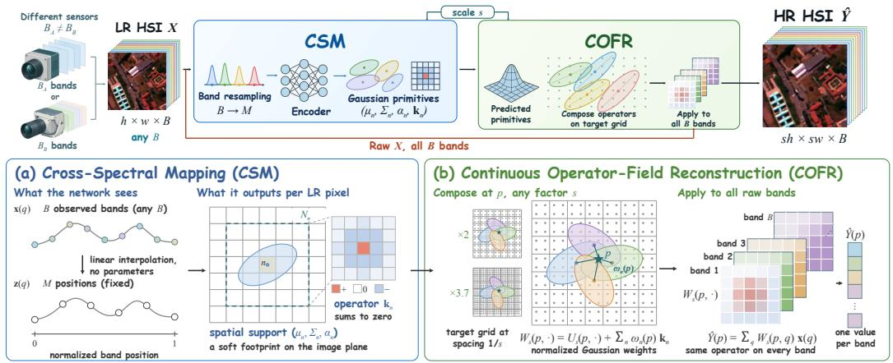  
Figure 2: Overview of OmniHSR. (a) CSM resamples B input bands to M fixed normalized band positions and predicts scale-conditioned spatial supports and zero-sum operators. (b) COFR composes the operators with normalized Gaussian weights into one operator at target positions spaced 1/s apart and applies it to all raw B bands.

These primitives carry no band axis, and the M bands appear only inside the network. Then, COFR composes the operators of all primitives according to their spatial supports into one reconstruction operator on the sh × sw target grid and applies it to the raw input X, with all B bands sharing the same coefficients, which gives $\hat { Y }$

$$
\begin{array} { r } { \biggr ( \bigl \{ \bigl ( \mu _ { n } , \Sigma _ { n } , \alpha _ { n } , \mathbf { k } _ { n } \bigr ) \bigr \} _ { n = 1 } ^ { h w } , X , s \biggr ) \xrightarrow { \mathrm { C O F R } } \hat { Y } . } \end{array}\tag{2}
$$

## 3.1 BAND-SHARED OPERATOR PRIOR

Observation and band-shared operator prior. Let $Y \in \mathbb { R } ^ { s h \times s w \times B }$ be the high-resolution image, and let the observation X be obtained by applying the same spatial degradation to every band. The bicubic upsampling $U _ { s } X$ combines the observed pixels with fixed weights that sum to one and recovers only the smooth part of Y. Within a local window, we let a zero-sum $5 \times 5$ operator k change how the observed pixels are combined,

$$
Y _ { b } \approx U _ { s } \big ( ( \delta + { \mathbf { k } } ) * X _ { b } \big ) , \qquad \sum _ { q } k _ { q } = 0 ,\tag{3}
$$

where b indexes the bands, ∗ applies the operator of each window on the low-resolution grid and δ is the identity operator, so the combination $\delta + \mathbf { k }$ keeps weights that sum to one and reduces to bicubic interpolation when $\mathbf k = 0$ . When all bands undergo the same spatial degradation, how the pixels in a window are combined is decided by the same spatial structure, so one k should serve all bands, which we call the band-shared operator prior.

This prior decides what the network should output. One operator serves all bands, so the network only needs to output one operator without a band dimension for every primitive. This operator can be determined from a fixed set of bands, so the network input only needs a fixed set of band positions. CSM realizes these two points (Section 3.2). The values differ from band to band, and COFR takes them directly from the raw observation while it places the operators on the target grid at any factor (Section 3.3).

## 3.2 CROSS-SPECTRAL MAPPING

Input side. Let the B bands of X be ordered by increasing wavelength, with the normalized position of band b written as $( b - 1 ) / ( B - 1 )$ . CSM interpolates the spectrum of every pixel linearly along the band axis onto M equally spaced reference positions in [0, 1], which gives the network input $\bar { Z , }$

then extracts features with an encoder $E _ { \theta }$ and modulates them by the factor s,

$$
\mathbf { z } ( q ) = C _ { B } \mathbf { x } ( q ) , \qquad F _ { s } = \gamma ( s ) \odot E _ { \theta } ( Z ) + \beta ( s ) ,\tag{4}
$$

where ${ \bf x } ( q ) \in \mathbb { R } ^ { B }$ and $\mathbf { z } ( q ) \in \mathbb { R } ^ { M }$ are the spectra of X and $Z$ at low-resolution pixel $q , C _ { B } \in$ $\mathbb { R } ^ { M \times B }$ is the matrix of this linear interpolation, which depends only on $B$ and has no learnable parameter, and $M = 3 1$ in this paper; $\gamma ( s )$ and $\beta ( s )$ are produced from $\log _ { 2 } s$ by a two-layer perceptron.

These reference positions record only the order of the bands, so sensors with different spectral ranges share one input axis without wavelength values. Band order is enough because $Z$ serves only to predict spatial operators, which are decided by the spatial structure shared by all bands (Section 3.1).

Output side. From $F _ { s } ,$ CSM predicts one 2D Gaussian primitive at every low-resolution pixel, hw primitives in total, and the pixel of primitive n is written as $q _ { n } . \mathrm { A }$ primitive is described by a center $\mu _ { n }$ , a covariance $\Sigma _ { n }$ , an opacity $\alpha _ { n }$ and a $5 \times 5$ local spatial operator $\mathbf { k } _ { n }$

$$
\begin{array} { r } { \big ( \mu _ { n } , ~ \Sigma _ { n } , ~ \alpha _ { n } , ~ \mathbf { k } _ { n } \big ) , \qquad \mu _ { n } \in \mathbb { R } ^ { 2 } , \quad \Sigma _ { n } \in \mathbb { R } ^ { 2 \times 2 } , \quad \alpha _ { n } \in ( 0 , 1 ) , \quad \mathbf { k } _ { n } \in \mathbb { R } ^ { 2 5 } . } \end{array}\tag{5}
$$

The first three give the spatial support of the primitive, and $\mathbf { k } _ { n }$ is the operator that this primitive will apply to X. The prediction head outputs 25 coefficients, and their mean is subtracted so that they sum to zero,

$$
\sum _ { q \in \mathcal { N } _ { n } } k _ { n , q } = 0 ,\tag{6}
$$

where $\textstyle { \mathcal { N } } _ { n }$ is the $5 \times 5$ window of low-resolution pixels centered at $q _ { n }$ and $k _ { n , q }$ is the entry of $\mathbf { k } _ { n }$ at $q .$ With the zero sum, the weights with which the observed pixels are combined still sum to one, so a region whose pixels are all equal stays unchanged. No parameter of the network is tied to $B ,$ so one set of weights serves any band count.

## 3.3 CONTINUOUS OPERATOR-FIELD RECONSTRUCTION

Eq. (3) places the operator of a window on the target grid with bicubic weights, which are fixed and symmetric around every low-resolution pixel. COFR lets every primitive carry its own operator and places it with the anisotropic Gaussian support of the primitive, which can stretch along the edges that run between low-resolution pixels and can be evaluated at any continuous position.

Composing onto any target grid. All positions are measured in units of low-resolution pixels, so the target grid at factor s has a pixel spacing of $1 / s$ . At a continuous position $p ,$ the response of primitive n is given by an anisotropic Gaussian, and normalizing it by the total response of all primitives gives the weight $\omega _ { n } ( \boldsymbol { p } )$ ,

$$
G _ { n } ( p ) = \mathrm { e x p } \Big ( - { \textstyle \frac { 1 } { 2 } } \left( p - \mu _ { n } \right) ^ { \top } \Sigma _ { n } ^ { - 1 } ( p - \mu _ { n } ) \Big ) , \qquad \omega _ { n } ( p ) = \frac { \alpha _ { n } G _ { n } ( p ) } { \sum _ { j } \alpha _ { j } G _ { j } ( p ) + \epsilon } ,\tag{7}
$$

where ϵ is a small constant.

Continuous operator field. At a continuous position $p ,$ mixing the operators of the primitives around $p$ with these weights gives one local operator on the observed pixels,

$$
A _ { s } ( p , q ) = \sum _ { n : q \in \mathcal { N } _ { n } } \omega _ { n } ( p ) k _ { n , q } .\tag{8}
$$

Each coefficient $A _ { s } ( p , q )$ is a scalar that does not depend on the band. In this way, the discrete operators $\mathbf { k } _ { n }$ extend to a continuous operator field $A _ { s }$ over the whole image plane, and the target grid at factor s is one sampling of $A _ { s }$

Reconstruction as an operator. COFR adds the operator field to the bicubic weights, which sum to one, and applies the result to all bands of X. With the spatial positions flattened, the reconstruction reads

$$
\begin{array} { r l r l r } { \hat { Y } = W _ { s } X , } & { { } } & { W _ { s } = U _ { s } + R _ { Z , s } K _ { Z , s } , } & { { } } & { W _ { s } { \bf 1 } = { \bf 1 } , } \end{array}\tag{9}
$$

where $X$ and $\hat { Y }$ are flattened into $h w \times B$ and $s ^ { 2 } h w \times B$ matrices, $U _ { s }$ is the bicubic upsampling matrix at factor $s ,$ and 1 is the all-ones vector. Row n of $K _ { Z , \varepsilon }$ holds $\mathbf { k } _ { n }$ placed on the window $\bar { \mathcal { N } _ { n } }$ and $R _ { Z , s }$ collects the weights $\omega _ { n } ( p )$ ; both are predicted from $Z$ and $s ,$ and the entries of $R _ { Z , s } K _ { Z , * }$ s are the coefficients $A _ { s } ( p , q )$ of Eq. (8). Every row of $U _ { s }$ sums to one and every row of $K _ { Z , s }$ sums to zero, so every row of $W _ { s }$ sums to one, and $W _ { s }$ reduces to bicubic interpolation when every operator is zero. Row p of Eq. (9), drawn in Figure 2b, reads $\begin{array} { r } { \hat { Y } ( p ) = \sum _ { q } W _ { s } ( p , q ) \mathbf { x } ( q ) } \end{array}$ with $W _ { s } ( p , q ) = U _ { s } ( p , q ) + A _ { s } ( p , q )$ , so the network decides only how the observed pixels are combined, and every spectrum of $\hat { Y }$ is an affine combination of the spectra of $X .$

Table 1: PSNR↑ (dB) at twelve factors on the in-domain ARAD and on two unseen sensors. Bold: best; underline: second best; gray: below bicubic interpolation. Time: mean time per image.
<table><tr><td rowspan="2">Dataset</td><td rowspan="2">Method</td><td colspan="3">In-range integers</td><td colspan="4">In-range fractional</td><td colspan="5">Out-of-range extrapolation</td><td rowspan="2">Time (ms)</td></tr><tr><td> $\times 2$ </td><td>×4</td><td>×8</td><td>×2.5</td><td>×3.7</td><td>×5.3</td><td>×7.6</td><td>×12</td><td>×16</td><td>×24</td><td>×36</td><td>×48</td></tr><tr><td rowspan="10">(3a ds) ARAD</td><td>Bicubic</td><td>44.04</td><td>37.50</td><td>33.37</td><td>41.60</td><td>38.08</td><td>35.61</td><td>33.70</td><td>31.52</td><td>30.50</td><td>29.20</td><td>27.94</td><td>27.05</td><td></td></tr><tr><td>LIIF</td><td>44.48</td><td>37.96</td><td>33.56</td><td>42.15</td><td>38.56</td><td>35.99</td><td>33.90</td><td>31.47</td><td>30.31 1</td><td>28.89</td><td>27.55</td><td>26.65</td><td>16.5</td></tr><tr><td>LTE</td><td>45.33</td><td>38.38</td><td>33.87</td><td>42.83</td><td>39.01</td><td>36.34</td><td>34.23</td><td>31.79</td><td>30.65</td><td>29.22</td><td>27.79</td><td>26.87</td><td>17.6</td></tr><tr><td>Meta-SR</td><td>45.42</td><td>38.33</td><td>33.81</td><td>42.79</td><td>38.94</td><td>36.27</td><td>34.16</td><td>31.73</td><td>30.60</td><td>29.17</td><td>27.75</td><td>26.84</td><td>51.1</td></tr><tr><td>CiaoSR</td><td>45.39</td><td>38.39</td><td>33.86</td><td>42.80</td><td>39.00</td><td>36.34</td><td>34.21</td><td>31.75</td><td>30.59</td><td>29.12</td><td>27.66</td><td>26.71</td><td>57.2</td></tr><tr><td>SRNO</td><td>45.58</td><td>38.49</td><td>33.92</td><td>42.94</td><td>39.10</td><td>36.41</td><td>34.28</td><td>31.83</td><td>30.67</td><td>29.26</td><td>27.82</td><td>26.76</td><td>15.6</td></tr><tr><td>GaussianSR</td><td>44.71</td><td>38.23</td><td>33.72</td><td>42.46</td><td>38.81</td><td>36.19</td><td>34.08</td><td>31.62</td><td>30.47</td><td>28.99</td><td>27.49</td><td>26.47</td><td>12.5</td></tr><tr><td>OmniHSR</td><td>48.41</td><td>40.33</td><td>35.24</td><td>45.34</td><td>41.03</td><td>38.00</td><td>35.63</td><td>33.02</td><td>31.71</td><td>30.09</td><td>28.43</td><td>27.42</td><td>11.5</td></tr><tr><td>Bicubic</td><td>32.64</td><td>28.13</td><td>25.04</td><td>30.92</td><td>28.51</td><td>26.78</td><td>25.32</td><td>23.51</td><td>22.93</td><td>22.41</td><td>21.89</td><td>21.54</td><td></td></tr><tr><td rowspan="9">(10a ds) Paviu</td><td>LIIF</td><td>32.62</td><td>28.11</td><td>24.93 3</td><td>30.96</td><td>28.52</td><td>26.74</td><td>25.20</td><td>23.39</td><td>22.81</td><td>22.28</td><td>21.75</td><td>21.43</td><td>115.4</td></tr><tr><td>LTE</td><td>33.03</td><td>28.34</td><td>25.13</td><td>31.28</td><td>28.75</td><td>26.93</td><td>25.39</td><td>23.47</td><td>22.91</td><td>22.37</td><td>21.84</td><td>21.47</td><td>120.2</td></tr><tr><td>Meta-SR</td><td>33.14</td><td>28.35</td><td>25.07</td><td>31.30</td><td>28.76</td><td>26.91</td><td>25.33</td><td>23.45</td><td>22.89</td><td>22.34</td><td>21.80</td><td>21.43</td><td>357.4</td></tr><tr><td>CiaoSR</td><td>33.03</td><td>28.35</td><td>25.12</td><td>31.25</td><td>28.75</td><td>26.94</td><td>25.38</td><td>23.48</td><td>22.88</td><td>22.30</td><td>21.71</td><td>21.39</td><td>398.3</td></tr><tr><td>SRNO</td><td>33.24</td><td>28.44</td><td>25.19</td><td>31.37</td><td>28.83</td><td>27.01</td><td>25.45</td><td>23.49</td><td>22.91</td><td>22.37</td><td>21.84</td><td>21.34</td><td>106.9</td></tr><tr><td>GaussianSR</td><td>32.88</td><td>28.31</td><td>25.07</td><td>31.18</td><td>28.71</td><td>26.87</td><td>25.33</td><td>23.47</td><td>22.89</td><td>22.35</td><td>21.80</td><td>21.43</td><td>85.0</td></tr><tr><td>OmniHSR</td><td>34.29</td><td>28.94</td><td>25.62</td><td>32.17</td><td>29.33</td><td>27.46</td><td>25.90</td><td>23.84</td><td>23.12</td><td>22.57</td><td>21.98</td><td>21.57</td><td>20.5</td></tr><tr><td>Bicubic</td><td>33.04</td><td>27.60</td><td>24.50</td><td>31.17</td><td>28.07</td><td>26.05</td><td>24.70</td><td>23.26</td><td>22.53</td><td>21.78</td><td>21.10</td><td>20.66</td><td></td></tr><tr><td rowspan="8">(12 ds) Chikuseiı</td><td>LIIF</td><td>32.82</td><td>27.52</td><td>24.38</td><td>31.09</td><td>28.02</td><td>25.98</td><td>24.61</td><td>23.12</td><td>22.38</td><td>21.60</td><td>20.93</td><td>20.53</td><td>165.3</td></tr><tr><td>LTE</td><td>33.65</td><td>27.89</td><td>24.58</td><td>31.71</td><td>28.42</td><td>26.26</td><td>24.82</td><td>23.32</td><td>22.55</td><td>21.73</td><td>21.01</td><td>20.57</td><td>171.4</td></tr><tr><td>Meta-SR</td><td>33.76</td><td>27.85</td><td>24.54</td><td>31.71</td><td>28.38</td><td>26.21</td><td>24.77</td><td>23.26</td><td>22.50</td><td>21.68</td><td>20.98</td><td>20.56</td><td>512.3</td></tr><tr><td>CiaoSR</td><td>33.68</td><td>27.88</td><td>24.58</td><td>31.68</td><td>28.39</td><td>26.24</td><td>24.81</td><td>23.29</td><td>22.52</td><td>21.66</td><td>20.90</td><td>20.50</td><td>570.0</td></tr><tr><td>SRNO</td><td>33.81</td><td>27.96</td><td>24.62</td><td>31.81</td><td>28.48</td><td>26.31</td><td>24.85</td><td>23.35</td><td>22.57</td><td>21.74</td><td>21.03</td><td>20.58</td><td>152.4</td></tr><tr><td>GaussianSR</td><td>33.31</td><td>27.76</td><td>24.48</td><td>31.48</td><td>28.27</td><td>26.13</td><td>24.70</td><td>23.20</td><td>22.44</td><td>21.62</td><td>20.90</td><td>20.47</td><td>121.3</td></tr><tr><td>OmniHSR</td><td>35.44</td><td>28.95</td><td>25.20</td><td>33.13</td><td>29.51</td><td>27.10</td><td>25.47</td><td>23.78</td><td>22.93</td><td>21.92</td><td>21.10</td><td>20.67</td><td>27.1</td></tr><tr><td></td><td></td><td></td><td></td><td></td><td></td><td></td><td></td><td></td><td></td><td></td><td></td><td></td><td></td></tr></table>

What the operators add. Applied to $X ,$ , the operator field adds to the bicubic reconstruction at $p$

$$
\sum _ { q } A _ { s } ( p , q ) \mathbf { x } ( q ) = \sum _ { n } \omega _ { n } ( p ) \mathbf { r } _ { n } , \qquad \mathbf { r } _ { n } = \sum _ { q \in N _ { n } } k _ { n , q } \mathbf { x } ( q ) = \sum _ { q \in N _ { n } } k _ { n , q } \big [ \mathbf { x } ( q ) - \mathbf { x } ( q _ { n } ) \big ] ,\tag{10}
$$

where the first equality exchanges the order of summation in Eq. (8) and the last follows from Eq. (6), so ${ \bf r } _ { n }$ consists entirely of spectral differences to the center pixel and is computed without any parameter that depends on $B .$

For a given $W _ { s }$ , the reconstruction commutes with any affine spectral map applied to every pixel. For any $P \in \mathbb { R } ^ { B ^ { \prime } \times B }$ and $\mathbf { c } \in \mathbb { R } ^ { B ^ { \prime } }$

$$
W _ { s } \big ( X P ^ { \top } + { \mathbf { 1 } } \mathbf { c } ^ { \top } \big ) = \big ( W _ { s } X \big ) P ^ { \top } + { \mathbf { 1 } } \mathbf { c } ^ { \top } ,\tag{11}
$$

where the linear part holds because $W _ { s }$ acts only on the spatial axes, and the constant part holds because every row of $W _ { s }$ sums to one. Taking a subset of the bands, merging neighboring bands and applying a per-band gain and offset are all such maps, and for a given $\bar { W _ { s } }$ they pass through the reconstruction exactly, so the band definition of a sensor reaches the output of OmniHSR only through the prediction of $W _ { s }$ from $Z ,$ while it reaches every output value of a network that outputs spectral values. Section 4 tests this prediction on sensors unseen in training. Rows that sum to one are also the partition-of-unity condition of interpolation kernels, which the zero sum keeps for the learned operator field. Computationally, the encoder $E _ { \theta } ( Z )$ runs once for any number of requested factors, and the only step whose cost grows with B is the product $W _ { s } X$ , which is linear in $\bar { B . }$

Table 2: SSIM↑ and SAM↓ (degrees) on Pavia U at the factors of Table 1. Bold: best; underline: second best; gray: worse than bicubic interpolation.
<table><tr><td rowspan="2">Metric</td><td rowspan="2">Method</td><td colspan="3">In-range integers</td><td colspan="4">In-range fractional</td><td colspan="4">Out-of-range extrapolation</td></tr><tr><td>×2</td><td>×4</td><td>×8</td><td>×2.5</td><td>×3.7</td><td>×5.3</td><td>×7.6</td><td>×12</td><td>×16 ×24</td><td>×36</td><td>×48</td></tr><tr><td rowspan="8">SM</td><td>Bicubic</td><td>0.918</td><td>0.762</td><td>0.604</td><td>0.875</td><td>0.781</td><td>0.692</td><td>0.617</td><td>0.538</td><td>0.516</td><td>0.499</td><td>0.489</td><td>0.483</td></tr><tr><td>LIIF</td><td>0.917</td><td>0.764</td><td>0.602</td><td>0.876</td><td>0.783</td><td>0.694</td><td>0.616</td><td>0.536</td><td>0.513</td><td>0.497</td><td>0.486</td><td>0.481</td></tr><tr><td>LTE</td><td>0.923</td><td>0.774</td><td>0.612</td><td>0.884</td><td>0.793</td><td>0.703</td><td>0.625</td><td>0.541</td><td>0.517</td><td>0.500</td><td>0.488</td><td>0.482</td></tr><tr><td>Meta-SR</td><td>0.926</td><td>0.774</td><td>0.610</td><td>0.885</td><td>0.793</td><td>0.702</td><td>0.623</td><td>0.539</td><td>0.516</td><td>0.499</td><td>0.487</td><td>0.481</td></tr><tr><td>CiaoSR</td><td>0.924</td><td>0.773</td><td>0.612</td><td>0.883</td><td>0.792</td><td>0.703</td><td>0.625</td><td>0.540</td><td>0.516</td><td>0.498</td><td>0.486</td><td>0.481</td></tr><tr><td>SRNO</td><td>0.927</td><td>0.777</td><td>0.614</td><td>0.886</td><td>0.795</td><td>0.706</td><td>0.628</td><td>0.541</td><td>0.517</td><td>0.499</td><td>0.487</td><td>0.478</td></tr><tr><td>GaussianSR</td><td>0.922</td><td>0.772</td><td>0.609</td><td>0.882</td><td>0.790</td><td>0.700</td><td>0.622</td><td>0.539</td><td>0.516</td><td>0.498</td><td>0.487</td><td>0.481</td></tr><tr><td>OmniHSR</td><td>0.943</td><td>0.803</td><td>0.639</td><td>0.907</td><td>0.819</td><td>0.732</td><td>0.654</td><td>0.557</td><td>0.526</td><td>0.504</td><td>0.490</td><td>0.483</td></tr><tr><td rowspan="7">SA ↑eg)</td><td>Bicubic</td><td>3.45</td><td>5.16</td><td>7.28</td><td>4.00</td><td>4.98</td><td>5.94</td><td></td><td>7.03</td><td>8.93 9.85</td><td>11.00</td><td>12.20</td><td>13.06</td></tr><tr><td>LIIF</td><td>3.53</td><td>5.20</td><td>7.56</td><td>4.02</td><td>4.99</td><td>6.05</td><td></td><td>7.30</td><td>9.28 10.24</td><td>11.43</td><td>12.69</td><td>13.45</td></tr><tr><td>LTE</td><td>3.28</td><td>4.93</td><td>7.21</td><td>3.77</td><td>4.74</td><td>5.76</td><td>6.95</td><td></td><td>8.97 9.89</td><td>11.11</td><td>12.37</td><td>13.28</td></tr><tr><td>Meta-SR</td><td>3.24</td><td>4.93</td><td>7.26</td><td>3.77</td><td>4.74</td><td>5.77</td><td>7.00</td><td>9.02</td><td>9.98</td><td>11.25</td><td>12.54</td><td>13.43</td></tr><tr><td>CiaoSR</td><td>3.27</td><td>4.95</td><td>7.24</td><td>3.80</td><td>4.76</td><td>5.77</td><td>6.98</td><td>9.02</td><td>10.00</td><td>11.29</td><td>12.65</td><td>13.41</td></tr><tr><td>SRNO</td><td>3.22</td><td>4.91</td><td>7.28</td><td>3.75</td><td>4.72</td><td>5.75</td><td>7.01</td><td>9.06</td><td>10.03</td><td>11.22</td><td>12.49</td><td>13.65</td></tr><tr><td>GaussianSR</td><td>3.45</td><td>5.05</td><td>7.38</td><td>3.92</td><td>4.86</td><td>5.89</td><td>7.12</td><td>9.09</td><td>10.03</td><td>11.24</td><td>12.52</td><td>13.40</td></tr><tr><td>OmniHSR</td><td>3.09</td><td>4.70</td><td>6.62</td><td>3.63</td><td></td><td>4.55</td><td>5.42</td><td>6.41</td><td>8.37</td><td>9.40</td><td>10.61 11.99</td><td>12.89</td></tr></table>

## 4 EXPERIMENTS

## 4.1 EXPERIMENTAL SETUP

Datasets. OmniHSR is trained on the 900 ARAD training images alone, and the other six datasets, CAVE (Yasuma et al., 2010), Harvard (Chakrabarti & Zickler, 2011), Pavia U and Pavia C (Gamba, 2002), Chikusei (Yokoya & Iwasaki, 2016) and Botswana (Ham et al., 2005), serve only for testing. They come from five sensors unseen in training, with 31 to 145 bands spanning the visible to the short-wave infrared.

Baselines. We compare with six arbitrary-scale methods, the factor-conditioned Meta-SR (Hu et al., 2019), the coordinate-query methods LIIF (Chen et al., 2021), LTE (Lee & Jin, 2022), CiaoSR (Cao et al., 2023) and SRNO (Wei & Zhang, 2023), and the Gaussian-based GaussianSR (Hu et al., 2025). They use the ESSAformer encoder (Zhang et al., 2023) of OmniHSR at twice its width or more and are trained on ARAD for 2000 epochs. Their output dimension equals the training band count, so on a new sensor they run on sliding windows of 31 adjacent bands, with no target-domain training. We also train every baseline on the target scene of Pavia U and Chikusei, from scratch or through two 1×1 band adapters on its frozen ARAD body, and test it on tiles that do not overlap the training tiles.

Metrics and protocol. Every low-resolution input is generated by antialiased bicubic downsampling applied identically to all bands, the shared degradation assumed in Section 3.1. We report PSNR and the spectral angle SAM in degrees. Tables 1 and 2 use 256×256 crops of ARAD, Pavia U and Chikusei at twelve factors, of which ×12 to ×48 lie outside the training range, and Table 4 uses center crops for close-range data and 64×64 tiles for remote-sensing scenes; values are compared within one table only.

Implementation details. OmniHSR uses the ESSAformer encoder with C=32, has 0.538M parameters and is trained for 2000 epochs with Adam, batch size 2, 256×256 patches and factors drawn uniformly from [1.5, 8], at a learning rate of $2 \times 1 0 ^ { - 4 }$ halved at epochs 600, 1200 and 1600. The loss adds a degradation-consistency term, a spectral-angle term and a spectral-curvature term to a Charbonnier reconstruction term.

Bicubic  
LIIF  
SRNO GaussianSR Ours  
GT  
Spectrum at the marked pixel  
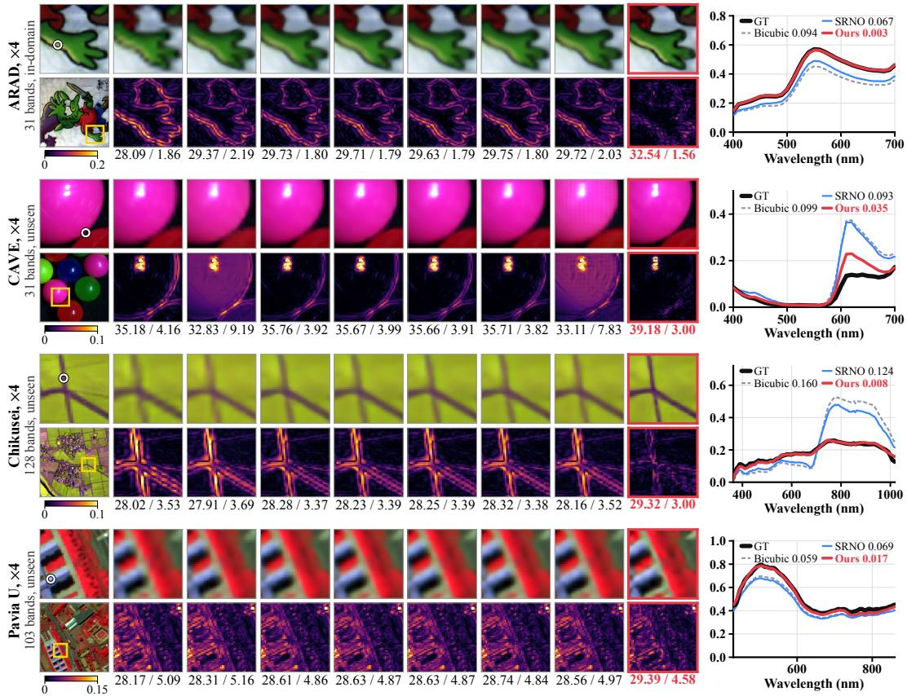  
Figure 3: Visual comparison at ×4 on ARAD (in-domain) and on CAVE, Chikusei and Pavia U (unseen sensors, zero-shot). For each dataset, the top row shows a false-color zoom, Chikusei in the near-infrared composite of bands 70, 100 and 36 and Pavia U in that of about 810, 650 and 550 nm, and the bottom row the absolute error averaged over bands; the first column gives the full 256×256 crop with the zoom window. Numbers are PSNR / SAM on the crop. The right column plots the spectrum at the circled pixel with its RMSE in the legend.

## 4.2 COMPARISON ON UNSEEN SENSORS

Quantitative comparison. As shown in Table 1, with every model trained on ARAD alone, OmniHSR is the best at all twelve factors on the in-domain ARAD and on both unseen sensors. For example, it leads the strongest baseline SRNO by 1.84 dB on ARAD at ×4. On Pavia U and Chikusei it leads the best baseline at each factor by 0.10 to 1.05 dB and by 0.07 to 1.63 dB, and by 0.55 dB on average over the twelve factors of both sensors. All six baselines fall below bicubic interpolation from ×36 on ARAD, ×24 on Chikusei and ×12 on Pavia U, and OmniHSR never does. In Table 2, OmniHSR has the lowest SAM at all twelve factors on Pavia U and the highest SSIM at eleven, level with bicubic interpolation at ×48. It is also the fastest on all three datasets in the time column, and on the 145-band Botswana at ×16 it runs 36.5× faster than CiaoSR (Figure 1d).

Seven datasets. Table 1 tests two unseen sensors at twelve factors, and Table 4 tests one model on many unseen sensors. It runs the same ARAD model on all seven datasets at ×4 against the best of the six baselines in each metric, which run on sliding windows of 31 bands. OmniHSR leads on all seven datasets, by 0.32 to 2.07 dB in PSNR and by 0.10 to 0.40◦ in SAM, and it is better than bicubic interpolation in both metrics everywhere, while the best baseline falls below bicubic interpolation in PSNR on Botswana and in SAM on Harvard and Botswana.

Training on the target sensor. Training the baselines on the target scene does not close the gap. On the test tiles of Pavia U and Chikusei, the best baseline trained from scratch or through band adapters stays 0.10 to 1.03 dB below the zero-shot OmniHSR at all six factors from ×3.5 to ×12.

Table 3: Ablation at ×4; time and memory on Chikusei. Spectral values: the network outputs the value of every band in place of the operators.
<table><tr><td rowspan="2">Variant</td><td colspan="3">Pavia U (103) Chikusei (128)</td><td rowspan="2">ms MiB</td></tr><tr><td>PSNR↑ SAM↓</td><td></td><td>PSNR↑ SAM↓</td></tr><tr><td>Bicubic</td><td>28.13</td><td>5.16</td><td>27.60</td><td>3.95</td><td></td></tr><tr><td rowspan="4">Spectral values w/o zero-sum w/o COFR</td><td>27.84</td><td>6.86</td><td>25.31</td><td>8.59</td><td>14.8 441</td></tr><tr><td>28.82</td><td>4.89</td><td>28.68</td><td>3.55</td><td>16.4 524</td></tr><tr><td>28.41</td><td>5.09</td><td>27.86</td><td>3.89</td><td>14.2 344</td></tr><tr><td>28.92</td><td>4.75</td><td>28.79</td><td>3.62</td><td>13.9 651</td></tr><tr><td>OmniHSR</td><td>28.94</td><td>4.70</td><td>28.95</td><td>3.38</td><td>32.2 716</td></tr></table>

Table 4: Zero-shot comparison at ×4 with the best of the six baselines in each metric; ARAD is in-domain.
<table><tr><td rowspan="2">Dataset</td><td colspan="3">PSNR↑/SAM↓</td></tr><tr><td>Bicubic</td><td>Best baseline</td><td>OmniHSR</td></tr><tr><td>ARAD (31)</td><td>37.50/1.74</td><td>38.49/1.63</td><td>40.33/1.38</td></tr><tr><td>CAVE (31) Harvard (31)</td><td>34.88/3.12 43.09/2.38</td><td>35.59/2.93 43.53/2.41</td><td>37.66/2.53 44.85/2.28</td></tr><tr><td>Pavia U (103)</td><td>29.04/5.38</td><td>29.40/5.17</td><td>29.98/4.91</td></tr><tr><td>Pavia C (102)</td><td>30.05/6.39</td><td>30.43/6.19</td><td>31.11/5.97</td></tr><tr><td>Chikusei (128) Botswana (145)</td><td>29.10/11.09 53.07/2.38</td><td>929.73/10.93 52.94/2.44</td><td>30.92/10.65 53.26/2.34</td></tr></table>

Qualitative comparison. Figure 3 compares the reconstructions at ×4 at the level of pixels and spectra. On the in-domain ARAD, the error map of OmniHSR is clearly darker along the outlines. On the unseen CAVE, GaussianSR leaves a grid pattern and the other baselines keep visible errors along the outline of the ball, while the error map of OmniHSR stays dark. At the circled pixel on the edge of the ball, the baselines mix in the spectrum of the neighboring red ball above 600 nm. On the unseen Chikusei, the error maps of the baselines are almost identical to that of bicubic interpolation, and the thin roads between the paddy fields blur into wide bands, which OmniHSR recovers thin and continuous. At the circled road pixel, the baselines mix in the spectra of the neighboring fields, and the spectrum of OmniHSR coincides with the ground truth. On Pavia U, OmniHSR renders the edges of the building rows sharper, and at the circled pixel its spectral RMSE is 0.017 against 0.069 for SRNO.

## 4.3 ABLATION STUDY

Ablation. Table 3 changes the output of the network and removes the key designs of Section 3 one at a time on the two unseen sensors. Outputting the spectral values outright, with no observed pixels combined, falls below bicubic interpolation on both sensors, by 2.3 dB on Chikusei. Without COFR the operators act once on the low-resolution grid and the result is upsampled bicubically, which costs 0.53 dB on Pavia U and 1.09 dB on Chikusei. Dropping the zero-sum constraint costs 0.12 and 0.27 dB, and applying the operators to 31 resampled bands costs 0.02 and 0.16 dB.

Band sharing. Section 3.1 assumes that one operator serves all bands. A zero-sum 5×5 operator fitted by least squares, with no network, on four bands of every 16×16 window is at least as accurate on the other bands as per-band operators, on held-out pixels of all seven datasets at ×2 and ×4, and one fitted on a single band loses at most 0.01 dB on six of them and up to 0.29 dB on CAVE. Eq. (11) predicts that redefining the bands passes through the reconstruction, and keeping every other band, averaging neighboring pairs or applying a per-band gain or offset before OmniHSR matches applying it afterwards within 0.05 dB on all seven datasets.

## 5 CONCLUSION

This paper shows that success in cross-sensor HSR depends on what the network outputs. With the backbone and training shared, a network that outputs spectral values is less accurate than one that predicts band-shared spatial operators on every dataset, even when it serves any band count (Section 4.3), and adapting its interface or training it on the target sensor still leaves it less accurate than a model that has never seen that sensor (Section 4.2). OmniHSR only decides how the observed pixels are combined, transfers from the 31 bands of ARAD to sensors with up to 145 bands without target data (Table 4), and keeps its lead at factors far beyond its training range (Table 1). The spectrum of a new sensor is already in its observation, and what is worth learning is how its pixels are combined in space. One operator shared by all bands assumes that they share their spatial blur and registration, and bands that differ in either call for operators that vary across bands. The lowresolution inputs in this paper are all synthesized, and real or noisy observations remain to be tested.

## AI USE STATEMENT

We have not used generative AI tools for any task that requires disclosure under the ICLR 2027 AI Policy for Authors: no such tool was used to develop the method or its conceptual framework, to formulate hypotheses or claims, to design the experiments, to implement the method, to generate or process data, to translate, or to interpret the results. We used generative AI tools only to edit and rephrase the text of this paper for readability. We have reviewed all AI-assisted edits, and we take responsibility for the final content of this work, including text, claims or artifacts produced with the aid of generative AI.

## ETHICS STATEMENT

This work uses only the public ARAD, CAVE, Harvard, Pavia University, Pavia Centre, Chikusei and Botswana hyperspectral datasets under their original terms of use and involves no new data collection or human subjects. We are not aware of ethical concerns specific to this work.

## REPRODUCIBILITY STATEMENT

All experiments use the seven public datasets listed in Appendix A, with the crops, the bicubic degradation and the metrics described in Section 4.1. The same appendix specifies the parameterization of the primitives, the rendering width, the losses and their weights, the operator window, the initialization and the random seed of OmniHSR, and Section 4.1 gives its optimizer, learning-rate schedule and number of epochs. Appendix B.1 specifies how every baseline is used on a new sensor, directly, trained from scratch or through band adapters, and Appendix D gives the protocol of the time measurements. The code will be publicly released.

## REFERENCES

Boaz Arad, Radu Timofte, Rony Yahel, Nimrod Morag, Amir Bernat, et al. NTIRE 2022 spectral recovery challenge and data set. In Proceedings of the IEEE/CVF Conference on Computer Vision and Pattern Recognition Workshops (CVPRW), pp. 863–881, 2022.

Alexander Baumann, Leonardo Ayala, Silvia Seidlitz, Jan Sellner, Alexander Studier-Fischer, Berkin Ozdemir, Lena Maier-Hein, and Slobodan Ilic. CARL: Camera-agnostic representation¨ learning for spectral image analysis. In International Conference on Learning Representations (ICLR), 2026.

Liheng Bian, Zhen Wang, Yuzhe Zhang, Lianjie Li, Yinuo Zhang, Chen Yang, Wen Fang, Jiajun Zhao, Chunli Zhu, Qinghao Meng, Xuan Peng, and Jun Zhang. A broadband hyperspectral image sensor with high spatio-temporal resolution. Nature, 635(8037):73–81, 2024.

Jiezhang Cao, Qin Wang, Yongqin Xian, Yawei Li, Bingbing Ni, Zhiming Pi, Kai Zhang, Yulun Zhang, Radu Timofte, and Luc Van Gool. CiaoSR: Continuous implicit attention-in-attention network for arbitrary-scale image super-resolution. In Proceedings of the IEEE/CVF Conference on Computer Vision and Pattern Recognition (CVPR), pp. 1796–1807, 2023.

Ayan Chakrabarti and Todd Zickler. Statistics of real-world hyperspectral images. In Proceedings of the IEEE Conference on Computer Vision and Pattern Recognition (CVPR), pp. 193–200, 2011.

Pat S. Chavez, Stuart C. Sides, and Jeffrey A. Anderson. Comparison of three different methods to merge multiresolution and multispectral data: Landsat TM and SPOT panchromatic. Photogrammetric Engineering and Remote Sensing, 57(3):295–303, 1991.

Du Chen, Liyi Chen, Zhengqiang Zhang, and Lei Zhang. Generalized and efficient 2D Gaussian splatting for arbitrary-scale super-resolution. In Proceedings ofthe IEEE/CVF International Conference on Computer Vision (ICCV), pp. 26435–26445, 2025a.

Guochao Chen, Jiangtao Nie, Wei Wei, Lei Zhang, and Yanning Zhang. Arbitrary-scale hyperspectral image super-resolution from a fusion perspective with spatial priors. IEEE Transactions on Geoscience and Remote Sensing, 62:1–11, 2024a.

Lihui Chen, Zhibing Lai, Gemine Vivone, Gwanggil Jeon, Jocelyn Chanussot, and Xiaomin Yang. ArbRPN: A bidirectional recurrent pansharpening network for multispectral images with arbitrary numbers of bands. IEEE Transactions on Geoscience and Remote Sensing, 60:1–18, 2022.

Shi Chen, Lefei Zhang, and Liangpei Zhang. Cross-scope spatial-spectral information aggregation for hyperspectral image super-resolution. IEEE Transactions on Image Processing, 33:5878– 5891, 2024b.

Shi Chen, Lefei Zhang, and Liangpei Zhang. HSRMamba: Contextual spatial-spectral state space model for single hyperspectral image super-resolution. In Proceedings of the International Joint Conference on Artificial Intelligence (IJCAI), pp. 810–818, 2025b.

Yinbo Chen, Sifei Liu, and Xiaolong Wang. Learning continuous image representation with local implicit image function. In Proceedings of the IEEE/CVF Conference on Computer Vision and Pattern Recognition (CVPR), pp. 8628–8638, 2021.

Matteo Ciotola, Giuseppe Guarino, Gemine Vivone, Giovanni Poggi, Jocelyn Chanussot, Antonio Plaza, and Giuseppe Scarpa. Hyperspectral pansharpening: Critical review, tools, and future perspectives. IEEE Geoscience and Remote Sensing Magazine, 13(1):311–338, 2025.

Paolo Gamba. Hyperspectral remote sensing scenes: Pavia Centre and University. https://www. ehu.eus/ccwintco/index.php/Hyperspectral\_Remote\_Sensing\_Scenes, 2002. ROSIS-03 airborne scenes acquired over Pavia, Italy, in 2002.

Sicheng Gao, Xuhui Liu, Bohan Zeng, Sheng Xu, Yanjing Li, Xiaoyan Luo, Jianzhuang Liu, Xiantong Zhen, and Baochang Zhang. Implicit diffusion models for continuous super-resolution. In Proceedings of the IEEE/CVF Conference on Computer Vision and Pattern Recognition (CVPR), pp. 10021–10030, 2023.

Wen-jin Guo, Weiying Xie, Kai Jiang, Yunsong Li, Jie Lei, and Leyuan Fang. Toward stable, interpretable, and lightweight hyperspectral super-resolution. In Proceedings of the IEEE/CVF Conference on Computer Vision and Pattern Recognition (CVPR), pp. 22272–22281, 2023.

Jisoo Ham, Yangchi Chen, Melba M. Crawford, and Joydeep Ghosh. Investigation of the random forest framework for classification of hyperspectral data. IEEE Transactions on Geoscience and Remote Sensing, 43(3):492–501, 2005.

Zongyao He and Zhi Jin. Latent modulated function for computational optimal continuous image representation. In Proceedings of the IEEE/CVF Conference on Computer Vision and Pattern Recognition (CVPR), pp. 26026–26035, 2024.

Danfeng Hong, Bing Zhang, Xuyang Li, Yuxuan Li, Chenyu Li, Jing Yao, Naoto Yokoya, Hao Li, Pedram Ghamisi, Xiuping Jia, Antonio Plaza, Paolo Gamba, Jon Atli Benediktsson, and Jocelyn Chanussot. SpectralGPT: Spectral remote sensing foundation model. IEEE Transactions on Pattern Analysis and Machine Intelligence, 46(8):5227–5244, 2024.

Jintong Hu, Bin Xia, Bin Chen, Wenming Yang, and Lei Zhang. GaussianSR: High fidelity 2D Gaussian splatting for arbitrary-scale image super-resolution. In Proceedings of the AAAI Conference on Artificial Intelligence, pp. 3554–3562, 2025.

Xuecai Hu, Haoyuan Mu, Xiangyu Zhang, Zilei Wang, Tieniu Tan, and Jian Sun. Meta-SR: A magnification-arbitrary network for super-resolution. In Proceedings of the IEEE/CVF Conference on Computer Vision and Pattern Recognition (CVPR), pp. 1575–1584, 2019.

Xu Jia, Bert De Brabandere, Tinne Tuytelaars, and Luc Van Gool. Dynamic filter networks. In Advances in Neural Information Processing Systems (NeurIPS), 2016.

Shuguo Jiang, Nanying Li, Meng Xu, Shuyu Zhang, and Sen Jia. SQformer: Spectral-query transformer for hyperspectral image arbitrary-scale super-resolution. IEEE Transactions on Geoscience and Remote Sensing, 62:1–15, 2024.

Younghyun Jo, Seoung Wug Oh, Jaeyeon Kang, and Seon Joo Kim. Deep video super-resolution network using dynamic upsampling filters without explicit motion compensation. In Proceedings of the IEEE Conference on Computer Vision and Pattern Recognition (CVPR), pp. 3224–3232, 2018.

Bernhard Kerbl, Georgios Kopanas, Thomas Leimkuhler, and George Drettakis. 3D Gaussian splat-¨ ting for real-time radiance field rendering. ACM Transactions on Graphics, 42(4):1–14, 2023.

Beomjun Kim, Jean Ponce, and Bumsub Ham. Deformable kernel networks for joint image filtering. International Journal ofComputer Vision, 129(2):579–600, 2021.

Zeqiang Lai, Chenggang Yan, and Ying Fu. Hybrid spectral denoising transformer with guided attention. In Proceedings of the IEEE/CVF International Conference on Computer Vision (ICCV), pp. 13019–13029, 2023.

Jaewon Lee and Kyong Hwan Jin. Local texture estimator for implicit representation function. In Proceedings ofthe IEEE/CVF Conference on Computer Vision and Pattern Recognition (CVPR), pp. 1929–1938, 2022.

Jiacheng Li, Chang Chen, Wei Huang, Zhiqiang Lang, Fenglong Song, Youliang Yan, and Zhiwei Xiong. Learning steerable function for efficient image resampling. In Proceedings of the IEEE/CVF Conference on Computer Vision and Pattern Recognition (CVPR), 2023.

Jingtao Li, Yingyi Liu, Xinyu Wang, Yunning Peng, Chen Sun, Shaoyu Wang, Zhendong Sun, Tian Ke, Xiao Jiang, Tangwei Lu, Anran Zhao, and Yanfei Zhong. HyperFree: A channel-adaptive and tuning-free foundation model for hyperspectral remote sensing imagery. In Proceedings of the IEEE/CVF Conference on Computer Vision and Pattern Recognition (CVPR), pp. 23048–23058, 2025.

Wei Li, Honghui Xu, Yueqian Quan, Zhe Chen, and Jianwei Zheng. Arbitrary-scale spatial-spectral fusion using kernel integral and progressive resampling. Information Fusion, 131:104143, 2026.

Yu-Jie Liang, Zihan Cao, Liang-Jian Deng, Yang Yang, and Malu Zhang. Hyperspectral image fusion with spectral-band and fusion-scale agnosticism. In Proceedings ofthe International Conference on Machine Learning (ICML), 2026.

Ben Mildenhall, Jonathan T. Barron, Jiawen Chen, Dillon Sharlet, Ren Ng, and Robert Carroll. Burst denoising with kernel prediction networks. In Proceedings ofthe IEEE Conference on Computer Vision and Pattern Recognition (CVPR), pp. 2502–2510, 2018.

Long Peng, Anran Wu, Wenbo Li, Peizhe Xia, Xinjie Zhang, Xueyuan Dai, Xin Di, Haoze Sun, Renjing Pei, Yang Wang, Yang Cao, and Zheng-Jun Zha. Pixel to Gaussian: Ultra-fast continuous super-resolution with 2D Gaussian modeling. In International Conference on Learning Representations (ICLR), 2026.

Linus Scheibenreif, Michael Mommert, and Damian Borth. Parameter efficient self-supervised geospatial domain adaptation. In Proceedings ofthe IEEE/CVF Conference on Computer Vision and Pattern Recognition (CVPR), pp. 27841–27851, 2024.

Xi Su, Xiangfei Shen, Mingyang Wan, Jing Nie, Lihui Chen, Haijun Liu, and Xichuan Zhou. EigenSR: Eigenimage-bridged pre-trained RGB learners for single hyperspectral image superresolution. In Proceedings of the AAAI Conference on Artificial Intelligence, pp. 7033–7041, 2025.

Romain Thoreau, Valerio Marsocci, and Dawa Derksen. Parameter-efficient adaptation of geospatial foundation models through embedding deflection. In Proceedings ofthe IEEE/CVF International Conference on Computer Vision (ICCV), pp. 9594–9604, 2025.

Cristina N. Vasconcelos, Cengiz Oztireli, Mark Matthews, Milad Hashemi, Kevin Swersky, and Andrea Tagliasacchi. CUF: Continuous upsampling filters. In Proceedings of the IEEE/CVF Conference on Computer Vision and Pattern Recognition (CVPR), pp. 9999–10008, 2023.

Jiaqi Wang, Kai Chen, Rui Xu, Ziwei Liu, Chen Change Loy, and Dahua Lin. CARAFE: Contentaware ReAssembly of FEatures. In Proceedings of the IEEE/CVF International Conference on Computer Vision (ICCV), pp. 3007–3016, 2019.

Longguang Wang, Yingqian Wang, Zaiping Lin, Jungang Yang, Wei An, and Yulan Guo. Learning a single network for scale-arbitrary super-resolution. In Proceedings of the IEEE/CVF International Conference on Computer Vision (ICCV), pp. 4781–4790, 2021.

Shuo Wang, Mi Wang, Jiaming Wang, and Zhenbei Zhang. DCMArb: Decoupled-collaborative Mamba for arbitrary-scale hyperspectral super-resolution. ISPRS Journal of Photogrammetry and Remote Sensing, 239:399–418, 2026.

Ting Wang, Zipei Yan, Jizhou Li, Xile Zhao, Chao Wang, and Michael Ng. Hyperspectral and multispectral image fusion with arbitrary resolution through self-supervised representations. International Journal ofComputer Vision, 133(11):7515–7535, 2025a.

Xinya Wang, Qian Hu, Junjun Jiang, and Jiayi Ma. A group-based embedding learning and integration network for hyperspectral image super-resolution. IEEE Transactions on Geoscience and Remote Sensing, 60:1–16, 2022.

Yi Wang, Zhitong Xiong, Chenying Liu, Adam J. Stewart, Thomas Dujardin, Nikolaos Ioannis Bountos, Angelos Zavras, Franziska Gerken, Ioannis Papoutsis, Laura Leal-Taixe, and Xiao Xi-´ ang Zhu. Towards a unified Copernicus foundation model for Earth vision. In Proceedings of the IEEE/CVF International Conference on Computer Vision (ICCV), pp. 9888–9899, 2025b.

Kaixuan Wei, Ying Fu, and Hua Huang. 3-D quasi-recurrent neural network for hyperspectral image denoising. IEEE Transactions on Neural Networks and Learning Systems, 32(1):363–375, 2021.

Min Wei and Xuesong Zhang. Super-resolution neural operator. In Proceedings of the IEEE/CVF Conference on Computer Vision and Pattern Recognition (CVPR), pp. 18247–18256, 2023.

Bartlomiej Wronski, Ignacio Garcia-Dorado, Manfred Ernst, Damien Kelly, Michael Krainin, Chia-Kai Liang, Marc Levoy, and Peyman Milanfar. Handheld multi-frame super-resolution. ACM Transactions on Graphics, 38(4):1–18, 2019.

Zihao Xu, Yuzhi Tang, Bowen Xu, and Qingquan Li. NeurOp-Diff: Continuous remote sensing image super-resolution via neural operator diffusion. In Proceedings ofthe IEEE/CVF International Conference on Computer Vision (ICCV), pp. 12491–12501, 2025.

Jie-En Yao, Li-Yuan Tsao, Yi-Chen Lo, Roy Tseng, Chia-Che Chang, and Chun-Yi Lee. Local implicit normalizing flow for arbitrary-scale image super-resolution. In Proceedings of the IEEE/CVF Conference on Computer Vision and Pattern Recognition (CVPR), pp. 1776–1785, 2023.

Fumihito Yasuma, Tomoo Mitsunaga, Daisuke Iso, and Shree K. Nayar. Generalized assorted pixel camera: Postcapture control of resolution, dynamic range, and spectrum. IEEE Transactions on Image Processing, 19(9):2241–2253, 2010.

Naoto Yokoya and Akira Iwasaki. Airborne hyperspectral data over Chikusei. Technical Report SAL-2016-05-27, Space Application Laboratory, University of Tokyo, Japan, May 2016.

Mingjin Zhang, Chi Zhang, Qiming Zhang, Jie Guo, Xinbo Gao, and Jing Zhang. ESSAformer: Efficient transformer for hyperspectral image super-resolution. In Proceedings of the IEEE/CVF International Conference on Computer Vision (ICCV), pp. 23073–23084, 2023.

Mingyang Zhang, Shuang Wu, Xiangyu Wang, Maoguo Gong, Fenlong Jiang, Yu Zhou, and Yue Wu. Meta-collaborative learning for arbitrarily scaled hyperspectral image super-resolution. IEEE Transactions on Geoscience and Remote Sensing, 63:1–18, 2025.

Xinjie Zhang, Xingtong Ge, Tongda Xu, Dailan He, Yan Wang, Hongwei Qin, Guo Lu, Jing Geng, and Jun Zhang. GaussianImage: 1000 FPS image representation and compression by 2D Gaussian splatting. In Proceedings of the European Conference on Computer Vision (ECCV), pp. 327–345, 2024.

Zhongyang Zhang, Zhiyang Xu, Zia Ahmed, Asif Salekin, and Tauhidur Rahman. Hyperspectral image super-resolution in arbitrary input-output band settings. In Proceedings of the IEEE/CVF Winter Conference on Applications ofComputer Vision (WACV) Workshops, 2022.

## APPENDIX

## A DATASETS AND IMPLEMENTATION DETAILS

Datasets. Table 5 lists the sensor, platform, band count, spectral range and test size of the seven datasets. Tables 1 and 2 use the center 256×256 crop of each of the 50 ARAD test images, six crops on a 3×2 grid over the 610×340 Pavia U scene and the eight Chikusei test tiles, with a lowresolution side of round(256/s) at factor s. Every low-resolution input is obtained by antialiased bicubic downsampling, and every model receives the effective factor, the ratio of the high- to the low-resolution side. The seven-dataset evaluation uses center 256×256 crops for close-range data and 64×64 tiles for remote-sensing scenes.

Table 5: Datasets. OmniHSR is trained on ARAD alone; every other dataset is used for testing only, with no target-domain training. Test counts are images for close-range data and non-overlapping 64×64 tiles for remote-sensing scenes. Spectral ranges are those of the sensors; the model receives normalized band positions and no wavelength. Botswana keeps 145 of the 242 Hyperion bands after the removal of water-absorption and noisy bands, so its bands are not evenly spaced in wavelength.
<table><tr><td>Dataset</td><td>Sensor</td><td>Platform</td><td>Bands</td><td>Range (nm)</td><td>Test</td></tr><tr><td>ARAD (Arad et al., 2022)</td><td>Specim IQ</td><td>ground</td><td>31</td><td>400-700</td><td>50</td></tr><tr><td>CAVE (Yasuma et al., 2010)</td><td>CCD with tunable filter</td><td>laboratory</td><td>31</td><td>400-700</td><td>31</td></tr><tr><td>Harvard (Chakrabarti &amp; Zickler, 2011)</td><td>Nuance FX</td><td>ground</td><td>31</td><td>420-720</td><td>16</td></tr><tr><td>Pavia U (Gamba, 2002)</td><td>ROSIS-03</td><td>airborne</td><td>103</td><td>430-860</td><td>10 / 45</td></tr><tr><td>Pavia C (Gamba, 2002)</td><td>ROSIS-03</td><td>airborne</td><td>102</td><td>430-860</td><td>187</td></tr><tr><td>Chikusei (Yokoya &amp; Iwasaki, 2016)</td><td>Headwall Hyperspec-VNIR-C</td><td>airborne</td><td>128</td><td>363-1018</td><td>311</td></tr><tr><td>Botswana (Ham et al., 2005)</td><td>Hyperion (EO-1)</td><td>spaceborne</td><td>145</td><td>400-2500</td><td>92</td></tr></table>

Forward pass. Algorithm 1 lists the forward pass of OmniHSR at a factor s, and the paragraphs below give the details of each step.

Algorithm 1: Forward pass of OmniHSR at a factor s.   
Input: $\overline { { \boldsymbol { X } : ( h , w , B ) } }$ , factor s   
Output: $\hat { Y } : ( s h , s w , B )$   
$Z \dot {  } C _ { B } X ; / / [ \dot { h } \times \dot { w } \times M ] .$ , Eq. (4)   
${ \cal F } _ { s } \gets \gamma ( s ) \odot \dot { E _ { \theta } } ( Z ) + \beta ( s ) ;$   
$\{ ( \mu _ { n } , \Sigma _ { n } , \alpha _ { n } , \tilde { \mathbf { k } } _ { n } ) \} _ { n = 1 } ^ { h w }  \mathrm { H e a d } ( F _ { s } ) : / /$ one primitive per pixel $q _ { n }$   
$\mathbf { k } _ { n }  \tilde { \mathbf { k } } _ { n } -$ mean $( \tilde { \mathbf { k } } _ { n } ) : / /$ [hw × 25], Eq. (6)   
for $n \in [ 1 , h w ]$ do   
$\begin{array} { r } { \underline { { \mathbf { r } } } _ { n } \longleftarrow \sum _ { \boldsymbol { q } \in \mathcal { N } _ { n } } k _ { n , \boldsymbol { q } } \mathbf { x } ( \boldsymbol { q } ) ; \boldsymbol { \mathcal { \prime } } / \left[ B \right] . } \end{array}$ , Eq. (10)   
$\hat { Y } \gets U _ { s } X ; { / } /$ bicubic, $[ s h \times s w \times B ]$   
for each target position p, spaced $1 / s$ apart do   
$\begin{array} { r } { \omega _ { n } ( p )  \alpha _ { n } G _ { n } ( p ) / ( \sum _ { j } \alpha _ { j } G _ { j } ( p ) + \epsilon ) ; / / } \end{array}$ Eqs. (7), (12)   
$\begin{array} { r } { \hat { Y } ( p ) \gets \hat { Y } ( p ) + \sum _ { n } \omega _ { n } ( p ) \mathbf { r } _ { n } \ : ; / / } \end{array}$ all B bands

Primitives. The center of primitive n is its pixel center plus an offset of $0 . 5 \operatorname { t a n h } ( \cdot )$ lowresolution pixels. The covariance is $\Sigma _ { n } = R ( \theta _ { n } \overset { \cdot } { ) } \mathrm { d i a g } ( \sigma _ { n , 1 } ^ { 2 } , \overset { \cdot } { \sigma _ { n , 2 } ^ { 2 } } ) R ( \theta _ { n } ) ^ { \top }$ with the rotation angle $\theta _ { n } = \pi \operatorname { t a n h } ( \cdot )$ and the widths $\sigma _ { n , i } =$ softplus $( \cdot ) + 0 . 0 5$ clipped to $[ 0 . 0 5 , 2 . 5 ]$ low-resolution pixels, and the opacity is $\alpha _ { n } = \mathrm { s i g m o i d } ( \cdot )$

Rendering width. The width that each Gaussian uses at rendering carries an analytic anti-aliasing floor that shrinks with the factor and holds no learnable parameter,

$$
\sigma _ { \mathrm { e f f } } = \sqrt { \sigma ^ { 2 } + ( a / s ) ^ { 2 } } ,\tag{12}
$$

where $\sigma$ is the predicted width and $a = 0 . 5$ . Each primitive is rendered in a square window of radius $\lceil 3 \sigma _ { \mathrm { m a x } } s \rceil$ high-resolution pixels, where $\sigma _ { \mathrm { m a x } }$ is the largest $\sigma _ { \mathrm { e f f } }$ in the image, and $\epsilon = 1 0 ^ { - 6 }$ in Eq. (7).

Training. The reconstruction term is the Charbonnier loss $\sqrt { ( \hat { Y } - Y ) ^ { 2 } + 1 0 ^ { - 6 } }$ averaged over pixels and bands. The degradation-consistency term downsamples $\hat { Y }$ to the input size with antialiased bicubic interpolation and applies the same loss against X. The spectral-angle term averages the angle between the predicted and the true spectrum over pixels, with the cosine clipped to $[ \breve { - } 1 + 1 0 ^ { - 6 } , 1 - 1 0 ^ { - 6 } ]$ , and the spectral-curvature term is the mean absolute difference between the second differences of $\hat { Y }$ and $Y$ along the band axis. The degradation-consistency, spectral-angle and spectral-curvature terms are weighted 0.1, 0.1 and 0.05, and training runs on one RTX 4090D with seed 2026.

Operator window and initialization. The $5 \times 5$ window uses replicate padding at the image border, and Appendix C.3 compares other window sizes. The output layer that predicts the operators has zero-initialized weights and bias, so every operator starts at zero and the initial reconstruction operator $W _ { s }$ is bicubic interpolation.

## B COMPARISON WITH BASELINES

## B.1 THE THREE EXISTING ROUTES

Figure 4 and Table 6 compare the three ways to use a baseline on a new sensor. They keep the protocol of the target-trained baselines, the 64×64 test tiles of Pavia U and Chikusei that do not overlap their training tiles, with a low-resolution side of round $( 6 4 / s )$ Direct transfer runs the ARAD model on sliding windows of 31 adjacent bands and averages the overlaps, with no targetdomain training. Training from scratch follows each method’s original recipe on the target scene for 2000 epochs. Adapter tuning freezes the ARAD body, attaches one 1×1 convolution before it and one after it to convert the band count, trains only these two layers from an exact linear band resampling, and runs until the learning rate has annealed.

Figure 4 averages each way over the seven factors from $\times 3 . 5 \mathrm { t o } \times 1 6$ , taking the best of the six baselines at each factor. Adapter tuning is the strongest of the three ways, and the zero-shot OmniHSR stays above it by 0.21 dB on Pavia U and by 0.60 dB on Chikusei. It also has the highest PSNR of all eighteen configurations at every factor, by 0.03 to 1.03 dB. Direct transfer lifts the stronger methods above bicubic interpolation at small factors, and all six methods fall below it at $\times 1 2$ on Pavia U and at $\times 1 6$ on both scenes. Training from scratch leaves all six methods below direct transfer of the same model at $\times 1 2$ on Chikusei, most for SRNO at 22.87 against 24.60 dB. Adapter tuning lifts every method, and the size of the lift is almost entirely set by the starting point, with a correlation of −0.93 between the two at $\times 4$ on Pavia U and −0.99 on Chikusei. After adapter tuning, LIIF remains below bicubic interpolation at all seven factors on Chikusei, and only Meta-SR among the six methods is above it at $\times 1 2$ on Pavia U and at $\times 1 6$ on both scenes.

The main model can also be run as a 31-band model on sliding windows: under the protocol of Table 1 at $\times 4 .$ PSNR rises from 28.94 to 29.12 dB on Pavia U and from 28.95 to 29.13 dB on Chikusei, at the cost of $7$ to 10 forward passes, 3.6 to 3.8 times the latency, and the requirement of at least 31 bands.

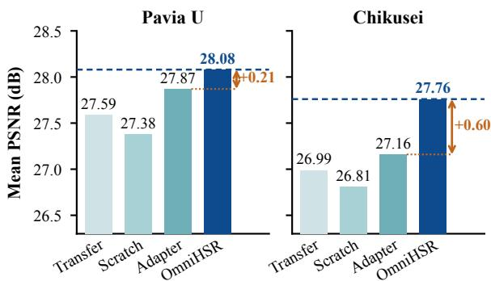  
Figure 4: Zero-shot OmniHSR against the best of the six baselines under each way of reusing them on a new sensor, mean PSNR (dB) over seven factors from ×3.5 to ×16 on test tiles of Pavia U and Chikusei. Orange: lead of OmniHSR over the best of the three ways.

Table 6: The three ways to reuse a baseline on a new sensor at seven factors from ×3.5 to ×16 (PSNR↑, dB), the data behind Figure 4. Transfer: the ARAD model run on sliding windows of 31 bands, no target training. Scratch: trained on the target scene for 2000 epochs. Adapter: ARAD body frozen, two 1×1 band adapters tuned on the target scene. Gray: below bicubic interpolation.
<table><tr><td rowspan="2">Method</td><td rowspan="2">Route</td><td colspan="7">Pavia U (103 bands)</td><td colspan="7">Chikusei (128 bands)</td></tr><tr><td>×3.5</td><td>×4</td><td>×5.5</td><td>×8</td><td>×9.5</td><td>×12</td><td>×16</td><td>×3.5</td><td>×4</td><td>×5.5</td><td>×8</td><td>×9.5</td><td>×12</td><td>×16</td></tr><tr><td>Bicubic</td><td></td><td>30.62</td><td>29.94</td><td>28.52</td><td>26.89</td><td>26.38</td><td>25.48</td><td>24.96</td><td>29.98</td><td>29.21</td><td>27.67</td><td>26.05</td><td>25.59</td><td>24.60</td><td>24.04</td></tr><tr><td rowspan="3">LIIF</td><td>Transfer</td><td>30.23</td><td>29.53</td><td>28.10</td><td>26.50</td><td>26.05</td><td>25.19</td><td>24.70</td><td>29.70</td><td>28.94</td><td>27.42</td><td>25.81</td><td>25.34</td><td>24.34</td><td>23.77</td></tr><tr><td>Scratch</td><td>29.69</td><td>29.09</td><td>27.83</td><td>26.28</td><td>25.88</td><td>25.03</td><td>24.58</td><td>30.50</td><td>29.53</td><td>27.59</td><td>25.73</td><td>25.21</td><td>23.98</td><td>23.36</td></tr><tr><td>Adapter</td><td>30.67</td><td>29.99</td><td>28.54</td><td>26.90</td><td>26.37</td><td>25.36</td><td>24.83</td><td>29.89</td><td>29.14</td><td>27.61</td><td>25.96</td><td>25.47</td><td>24.44</td><td>23.85</td></tr><tr><td rowspan="3">LTE</td><td>Transfer</td><td>30.86</td><td>30.15</td><td>28.63</td><td>26.82</td><td>26.34</td><td>25.34</td><td>24.80</td><td>30.53</td><td>29.70</td><td>28.03</td><td>26.23</td><td>25.72</td><td>24.62</td><td>23.99</td></tr><tr><td>Scratch</td><td>30.39</td><td>29.71</td><td>28.23</td><td>26.47</td><td>26.02</td><td>25.16</td><td>24.75</td><td>30.60</td><td>29.60</td><td>27.64</td><td>25.63</td><td>25.09</td><td>23.78</td><td>23.07</td></tr><tr><td>Adapter</td><td>31.14</td><td>30.42</td><td>28.89</td><td>27.09</td><td>26.58</td><td>25.46</td><td>24.91</td><td>30.72</td><td>29.91</td><td>28.24</td><td>26.41</td><td>25.89</td><td>24.72</td><td>24.02</td></tr><tr><td rowspan="3">Meta-SR</td><td>Transfer</td><td>30.83</td><td>30.10</td><td>28.57</td><td>26.80</td><td>26.32</td><td>25.33</td><td>24.80</td><td>30.43</td><td>29.59</td><td>27.92</td><td>26.14</td><td>25.63</td><td>24.57</td><td>23.97</td></tr><tr><td>Scratch</td><td>30.28</td><td>29.59</td><td>28.20</td><td>26.48</td><td>26.02</td><td>25.15</td><td>24.72</td><td>30.78</td><td>29.88</td><td>27.99</td><td>26.01</td><td>25.44</td><td>24.13</td><td>23.44</td></tr><tr><td>Adapter</td><td>31.17</td><td>30.49</td><td>28.96</td><td>27.15</td><td>26.61</td><td>25.52</td><td>24.98</td><td>30.67</td><td>29.85</td><td>28.18</td><td>26.38</td><td>25.87</td><td>24.76</td><td>24.11</td></tr><tr><td rowspan="3">CiaoSR</td><td>Transfer</td><td>30.80</td><td>30.07</td><td>28.48</td><td>26.63</td><td>26.11</td><td>25.14</td><td>24.77</td><td>30.44</td><td>29.60</td><td>27.90</td><td>26.08</td><td>25.55</td><td>24.46</td><td>23.91</td></tr><tr><td>Scratch</td><td>30.12</td><td>29.50</td><td>28.16</td><td>26.58</td><td>26.15</td><td>25.31</td><td>24.82</td><td>30.56</td><td>29.58</td><td>27.44</td><td>25.22</td><td>24.75</td><td>23.62</td><td>23.02</td></tr><tr><td>Adapter</td><td>31.07</td><td>30.38</td><td>28.78</td><td>26.98</td><td>26.45</td><td>25.36</td><td>24.83</td><td>30.66</td><td>29.87</td><td>28.19</td><td>26.35</td><td>25.81</td><td>24.66</td><td>24.01</td></tr><tr><td rowspan="3">SRNO</td><td>Transfer</td><td>30.94</td><td>30.21</td><td>28.65</td><td>26.81</td><td>26.28</td><td>24.98</td><td>24.05</td><td>30.56</td><td>29.73</td><td>28.04</td><td>26.24</td><td>25.72</td><td>24.60</td><td>23.91</td></tr><tr><td>Scratch</td><td>30.66</td><td>29.91</td><td>28.23</td><td>26.31</td><td>25.85</td><td>24.92</td><td>24.48</td><td>30.56</td><td>29.61</td><td>27.57</td><td>25.36</td><td>24.68</td><td>22.87</td><td>21.80</td></tr><tr><td>Adapter</td><td>31.27</td><td>30.56</td><td>28.97</td><td>27.12</td><td>26.59</td><td>25.39</td><td>24.87</td><td>30.78</td><td>29.95</td><td>28.24</td><td>26.41</td><td>25.88</td><td>24.72</td><td>23.93</td></tr><tr><td rowspan="3">GaussianSR</td><td>Transfer</td><td>30.78</td><td>30.08</td><td>28.52</td><td>26.75</td><td>26.26</td><td>25.30</td><td>24.78</td><td>30.21</td><td>29.40</td><td>27.70</td><td>25.93</td><td>25.41</td><td>24.31</td><td>23.69</td></tr><tr><td>Scratch</td><td>29.72</td><td>29.16</td><td>27.78</td><td>26.15</td><td>25.70</td><td>24.86</td><td>24.48</td><td>30.52</td><td>29.55</td><td>27.54</td><td>25.51</td><td>24.93</td><td>23.69</td><td>23.07</td></tr><tr><td>Adapter</td><td>31.04</td><td>30.36</td><td>28.81</td><td>27.00</td><td>26.45</td><td>25.42</td><td>24.86</td><td>30.38</td><td>29.61</td><td>27.97</td><td>26.20</td><td>25.68</td><td>24.58</td><td>23.94</td></tr><tr><td>OmniHSR</td><td>zero-shot</td><td>31.53</td><td>30.83</td><td>29.19</td><td>27.41</td><td>26.96</td><td>25.62</td><td>25.01</td><td>31.81</td><td>30.92</td><td>29.03</td><td>26.92</td><td>26.33</td><td>25.01</td><td>24.30</td></tr></table>

## B.2 ALL BASELINES ON SEVEN DATASETS

Table 7 is the full version of Table 4, with every baseline at ×2, ×4 and ×8. OmniHSR is ahead of every baseline in PSNR and SAM on every dataset at every factor. GaussianSR falls below bicubic interpolation in PSNR on all six unseen datasets at ×8 and on CAVE, Harvard and Botswana at all three factors, and LIIF on all six unseen datasets at ×4 and ×8. On the 145-band Botswana, which extends to the short-wave infrared, every baseline falls below bicubic interpolation in PSNR at ×4 and ×8, and on Harvard and Botswana every baseline has a higher SAM than bicubic interpolation at all three factors. Paired over the test images and tiles, the PSNR gain of OmniHSR over bicubic interpolation has a 95% bootstrap interval above zero on every dataset at every factor, and at ×4 OmniHSR is above SRNO on every image and tile of all seven datasets.

Table 7: One ARAD-trained model on seven datasets at ×2, ×4 and ×8 (PSNR↑ / SAM↓); the full version of Table 4 with every baseline. Baselines run on sliding windows of 31 bands with no target training; ARAD is in-domain. Remote-sensing scenes are scored on 64×64 test tiles, not on the 256×256 crops of Table 1. Gray: worse than bicubic interpolation. Bold: best.
<table><tr><td>Method</td><td>ARAD (31)</td><td>CAVE (31)</td><td>Harvard (31)</td><td>Pavia U (103)</td><td>Pavia C (102)</td><td>Chikusei (128)</td><td>Botswana (145)</td></tr><tr><td rowspan="7">LIIF LTE ×2</td><td>Bicubic 44.04/0.91</td><td>40.83/1.95</td><td>47.47/1.90</td><td></td><td>33.49/3.5634.60/4.60</td><td>34.62/9.46</td><td>56.31/1.64</td></tr><tr><td>44.48/1.22</td><td></td><td>37.03/5.5641.33/7.1633.39/3.7434.61/4.83</td><td></td><td></td><td>34.41/9.73</td><td>50.34/5.12</td></tr><tr><td></td><td></td><td>45.33/0.9041.44/1.9047.76/1.97</td><td>34.13/3.4035.27/4.44</td><td></td><td>35.64/9.34</td><td>56.22/1.68</td></tr><tr><td>Meta-SR</td><td>45.42/0.87</td><td>41.51/1.87 47.71/1.96</td><td></td><td>34.24/3.3635.38/4.40</td><td>35.72/9.30</td><td>56.36/1.65</td></tr><tr><td>CiaoSR</td><td>45.39/0.88</td><td>41.27/1.91 47.78/1.97</td><td>34.14/3.39</td><td>35.29/4.44</td><td>35.68/9.34</td><td>56.17/1.70</td></tr><tr><td>SRNO</td><td>45.58/0.8741.49/1.89</td><td>47.88/1.96</td><td>34.34/3.34</td><td>35.48/4.38</td><td>35.81/9.32</td><td>56.22/1.69</td></tr><tr><td>GaussianSR44.71/1.16 OmniHSR</td><td>48.41/0.68</td><td>37.64/5.00 41.04/6.96</td><td>34.02/3.58 35.39/3.19</td><td>35.16/4.69 36.67 /4.20</td><td>35.16/9.57 37.49/9.13</td><td>50.78/4.92 57.03/1.55</td></tr><tr><td rowspan="7">×4</td><td>Bicubic</td><td>37.50/1.74</td><td>44.27/1.59 34.88/3.12</td><td>49.02/1.81 43.09/2.38</td><td>29.04/5.38</td><td>30.05/6.39</td><td>29.10/11.09</td><td>53.07/2.38</td></tr><tr><td>LIIF LTE</td><td></td><td>37.96/1.9433.45/6.29</td><td>39.04/7.39</td><td>28.81/5.62</td><td>29.84/6.62</td><td>28.94/11.32</td><td>48.58/5.57</td></tr><tr><td></td><td></td><td>38.38/1.6435.52/2.93</td><td>43.39/2.42</td><td>29.35/5.17</td><td>30.41/6.19</td><td>29.70/10.93</td><td>52.94/2.44</td></tr><tr><td>Meta-SR</td><td></td><td>38.33/1.6635.41/2.97</td><td>43.23/2.41</td><td></td><td>29.30/5.1930.34/6.21</td><td>29.59/10.9652.86/2.45</td><td></td></tr><tr><td>CiaoSR</td><td>38.39/1.6435.54/2.9443.51/2.42</td><td></td><td></td><td></td><td>29.27/5.2130.33/6.23</td><td>29.59/10.9752.85/2.45</td><td></td></tr><tr><td>SRNO</td><td>38.49/1.63</td><td>35.59/2.93</td><td>43.53/2.41</td><td></td><td>29.40/5.2030.43/6.24</td><td>29.73/10.94</td><td>52.81/2.46</td></tr><tr><td>GaussianSR38.23/1.81</td><td></td><td>33.79/5.48</td><td>38.65/7.14</td><td></td><td>29.28/5.3030.33/6.31</td><td>29.39/11.14</td><td>49.23/5.33</td></tr><tr><td rowspan="7">×8</td><td>OmniHSR LIIF</td><td>40.33/1.38</td><td>37.66/2.53</td><td>44.85/2.28</td><td>29.98/4.91</td><td>31.11/5.97</td><td>30.92/10.65</td><td>53.26/2.34</td></tr><tr><td>Bicubic</td><td>33.37/2.72</td><td>30.86/4.71</td><td>39.56/2.76</td><td>26.12/7.63</td><td>27.12/8.18</td><td>26.00/12.73</td><td>51.22/3.00</td></tr><tr><td></td><td>33.56/2.89</td><td>30.16/7.58</td><td>36.49/7.65</td><td>25.77/8.21</td><td>26.77/8.61</td><td>25.80/13.04</td><td>47.14/6.01</td></tr><tr><td>LTE</td><td></td><td></td><td>33.87/2.5831.37/4.4039.88/2.78</td><td></td><td></td><td>26.14/7.7427.18/8.1426.23/12.6651.08/3.06</td><td></td></tr><tr><td>Meta-SR</td><td>33.81/2.6331.23/4.47</td><td></td><td>39.66/2.79</td><td>26.09/7.76</td><td>27.10/8.17</td><td>26.14/12.70</td><td>50.94/3.09</td></tr><tr><td>CiaoSR</td><td>33.86/2.57</td><td>31.39/4.41</td><td>39.94/2.78</td><td>25.93/7.90</td><td>26.97/8.32</td><td>26.08/12.75</td><td>51.02/3.08</td></tr><tr><td>SRNO GaussianSR33.72/2.77</td><td>33.92/2.58</td><td></td><td>31.48/4.4239.99/2.78 30.46/6.7836.17/7.45</td><td>26.01/8.00 26.04/7.8627.03/8.3425.93/12.94</td><td>27.05/8.45</td><td>26.23/12.72</td><td>50.44/3.13</td></tr></table>

The figures of this appendix choose their crops and zoom windows by fixed rules that look at no reconstruction. Each dataset contributes the 256×256 crop with the median bicubic PSNR at ×4 among its candidates, which are the center crops of the test images for ARAD, CAVE and Harvard, the crops of Table 1 for Pavia U and Chikusei, and non-overlapping crops for Pavia C and Botswana. The zoom window is the one with the strongest gradients of the band-averaged ground truth.

Figure 5 extends Figure 3 to the other three unseen datasets at ×4. OmniHSR has the highest PSNR and the lowest SAM on all three crops.

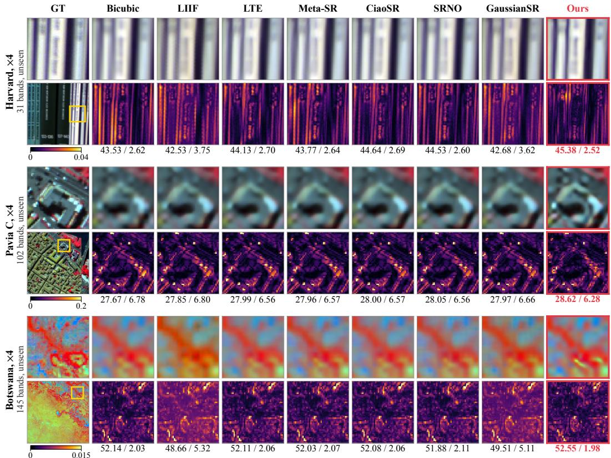  
Figure 5: Zero-shot reconstructions at ×4 on the other three unseen datasets, laid out as Figure 3 without the spectra. Pavia C and Botswana use a near-infrared composite of about 810, 650 and 550 nm. Numbers are PSNR / SAM on the crop.

## B.3 SSIM AND SAM

Tables 8 and 9 give SSIM and SAM on Chikusei and on the in-domain ARAD under the models, protocol and twelve factors of Table 1, the counterparts of Table 2. On both datasets OmniHSR has the highest SSIM and the lowest SAM at all twelve factors. On Chikusei, every baseline has a higher SAM than bicubic interpolation from ×24 on and a lower SSIM from ×36 on, while OmniHSR stays better than interpolation in both.

Table 10 gives SSIM under the target-trained usages of Appendix B.1, with the better of training from scratch and adapter tuning for each baseline, at ×4, ×8 and ×12, the factors measured for every configuration. The zero-shot OmniHSR has the highest SSIM at ×4 and ×8 on both scenes, and at ×12 all methods and bicubic interpolation lie within 0.02 of each other.

Figure 6 plots the RMSE of every band over the crops of the seven datasets. OmniHSR has the lowest error of all methods in every band on five datasets and in 94% and 84% of the bands on ARAD and Harvard, including the near-infrared bands of Pavia U, Pavia C and Chikusei and the short-wave infrared bands of Botswana, which lie outside the 400 to 700 nm of the training sensor. Taking the 10% of pixels with the strongest gradients of the band-averaged ground truth as edge pixels, among the tenth of edge pixels where bicubic interpolation errs most, the spectrum of OmniHSR is closer to the ground truth than that of SRNO at 76 to 90% of the pixels.

Table 8: SSIM↑ and SAM↓ (degrees) on Chikusei at the factors of Table 1; the Chikusei counterpart of Table 2.
<table><tr><td rowspan="2">Metric</td><td rowspan="2">Method</td><td colspan="3">In-range integers</td><td colspan="4">In-range fractional</td><td colspan="4">Out-of-range extrapolation</td></tr><tr><td>×2</td><td>×4</td><td>×8</td><td>×2.5</td><td>×3.7</td><td>×5.3</td><td>×7.6</td><td>×12</td><td>×16</td><td>×24 ×36</td><td>×48</td></tr><tr><td rowspan="8">SIM</td><td>Bicubic</td><td>0.929</td><td>0.753</td><td>0.587</td><td>0.889</td><td>0.776</td><td>0.668</td><td>0.596</td><td>0.536</td><td>0.515</td><td>0.500</td><td>0.485</td><td>0.477</td></tr><tr><td>LIIF</td><td>0.924</td><td>0.752</td><td>0.587</td><td>0.887</td><td>0.775</td><td>0.669</td><td>0.597</td><td>0.535</td><td>0.514</td><td>0.496</td><td>0.482</td><td>0.473</td></tr><tr><td>LTE</td><td>0.936</td><td>0.767</td><td>0.598</td><td>0.900</td><td>0.791</td><td>0.684</td><td>0.608</td><td>0.542</td><td>0.520</td><td>0.500</td><td>0.484</td><td>0.475</td></tr><tr><td>Meta-SR</td><td>0.938</td><td>0.766</td><td>0.595</td><td>0.900</td><td>0.789</td><td>0.681</td><td>0.605</td><td>0.540</td><td>0.518</td><td>0.498</td><td>0.482</td><td>0.473</td></tr><tr><td>CiaoSR</td><td>0.936</td><td>0.766</td><td>0.597</td><td>0.899</td><td>0.789</td><td>0.683</td><td>0.607</td><td>0.541</td><td>0.519</td><td>0.498</td><td>0.481</td><td>0.472</td></tr><tr><td>SRNO</td><td>0.938</td><td>0.770</td><td>0.599</td><td>0.902</td><td>0.793</td><td>0.686</td><td>0.608</td><td>0.542</td><td>0.520</td><td>0.500</td><td>0.484</td><td>0.473</td></tr><tr><td>GaussianSR</td><td>0.932</td><td>0.762</td><td>0.592</td><td>0.895 0.928</td><td>0.785</td><td>0.678</td><td>0.601</td><td>0.537</td><td>0.515</td><td>0.495</td><td>0.479</td><td>0.470</td></tr><tr><td>OmniHSR</td><td>0.957</td><td>0.813</td><td>0.631</td><td></td><td>0.834</td><td>0.731 4.76</td><td>0.643</td><td>0.558</td><td>0.529</td><td>0.503</td><td>0.487</td><td>0.479</td></tr><tr><td rowspan="6">S(A deg)</td><td>Bicubic</td><td>2.10</td><td>3.95</td><td>5.79</td><td>2.58</td><td>3.73</td><td></td><td></td><td>5.65</td><td>6.91</td><td>7.64</td><td>8.46</td><td>9.42</td><td>10.15</td></tr><tr><td>LIIF</td><td>2.31</td><td>4.02</td><td>5.90</td><td>2.74</td><td></td><td>3.80</td><td>4.81</td><td>5.74</td><td>7.12</td><td>7.90</td><td>8.81</td><td>9.81</td><td>10.57</td></tr><tr><td>LTE</td><td>1.95</td><td>3.71</td><td>5.64</td><td>2.39</td><td></td><td>3.49</td><td>4.53</td><td>5.48</td><td>6.83</td><td>7.61</td><td>8.53</td><td>9.57</td><td>10.43</td></tr><tr><td>Meta-SR</td><td>1.91</td><td>3.73</td><td>5.68</td><td>2.38</td><td></td><td>3.51</td><td>4.57</td><td>5.53</td><td>6.90</td><td>7.68</td><td>8.61</td><td>9.65</td><td>10.47</td></tr><tr><td>CiaoSR</td><td>1.95</td><td>3.73</td><td>5.65</td><td>2.41</td><td></td><td>3.51</td><td>4.55</td><td>5.50</td><td>6.86</td><td>7.63</td><td>8.64</td><td>9.80</td><td>10.60</td></tr><tr><td>SRNO</td><td>1.93</td><td>3.71</td><td>5.65</td><td>2.38</td><td></td><td>3.49</td><td>4.54</td><td>5.49</td><td>6.85</td><td>7.64</td><td>8.56</td><td>9.64</td><td>10.45</td></tr><tr><td>GaussianSR</td><td></td><td>2.16</td><td>3.85</td><td>5.81</td><td>2.59</td><td>3.64</td><td>4.69</td><td>5.65</td><td>7.02</td><td>7.81</td><td>8.75</td><td>9.83</td><td></td><td>10.65</td></tr><tr><td></td><td>OmniHSR</td><td>1.70</td><td>3.38</td><td>5.29</td><td>2.14</td><td>3.17</td><td></td><td>4.18</td><td>5.10</td><td>6.49</td><td>7.26</td><td>8.27</td><td>9.41</td><td>10.09</td></tr></table>

Table 9: SSIM↑ and SAM↓ (degrees) on the in-domain ARAD at the factors of Table 1; the ARAD counterpart of Table 2.
<table><tr><td rowspan="2">Metric</td><td rowspan="2">Method</td><td colspan="3">In-range integers</td><td colspan="4">In-range fractional</td><td colspan="4">Out-of-range extrapolation</td></tr><tr><td>×2</td><td>×4</td><td>×8</td><td>×2.5</td><td>×3.7</td><td>×5.3</td><td>×7.6</td><td>×12</td><td>×16</td><td>×24 ×36</td><td>×48</td></tr><tr><td rowspan="8">SM</td><td>Bicubic</td><td>0.978</td><td>0.915</td><td>0.841</td><td>0.963</td><td>0.924</td><td>0.883</td><td>0.847</td><td>0.807</td><td>0.790</td><td>0.768</td><td>0.748 0.731</td></tr><tr><td>LIIF</td><td>0.981</td><td>0.923</td><td>0.849</td><td>0.967</td><td>0.931</td><td>0.891</td><td>0.855</td><td>0.812</td><td>0.792</td><td>0.769 0.747</td><td>0.730</td></tr><tr><td>LTE</td><td>0.982</td><td>0.926</td><td>0.853</td><td>0.970</td><td>0.934</td><td>0.895</td><td>0.860</td><td>0.817</td><td>0.796 0.773</td><td>0.749</td><td>0.732</td></tr><tr><td>Meta-SR</td><td>0.983</td><td>0.926</td><td>0.853</td><td>0.970</td><td>0.934</td><td>0.895</td><td>0.859</td><td>0.816</td><td>0.796 0.772</td><td>0.748</td><td>0.730</td></tr><tr><td>CiaoSR</td><td>0.983</td><td>0.926</td><td>0.853</td><td>0.970</td><td>0.934</td><td>0.895</td><td>0.859</td><td>0.815</td><td>0.795 0.770</td><td>0.746</td><td>0.728</td></tr><tr><td>SRNO</td><td>0.983</td><td>0.928</td><td>0.853</td><td>0.970</td><td>0.936</td><td>0.896</td><td>0.859</td><td>0.815</td><td>0.795 0.772</td><td>0.750</td><td>0.731</td></tr><tr><td>GaussianSR</td><td>0.982</td><td>0.926</td><td>0.852</td><td>0.969</td><td>0.934 0.951</td><td>0.894</td><td>0.858 0.880</td><td>0.814</td><td>0.793 0.769</td><td>0.743</td><td>0.723</td></tr><tr><td>OmniHSR</td><td>0.989</td><td>0.944 0.874</td><td></td><td>0.980</td><td></td><td>0.916</td><td></td><td>0.836</td><td>0.813</td><td>0.786 0.758</td><td>0.741</td></tr><tr><td rowspan="8">SA ↑g)</td><td>Bicubic</td><td>0.91</td><td>1.74</td><td>2.72</td><td>1.15</td><td>1.64</td><td>2.13</td><td>2.62</td><td>3.38</td><td>3.84</td><td>4.52</td><td>5.43</td><td></td></tr><tr><td>LIIF</td><td>1.22</td><td>1.94</td><td>2.89</td><td>1.42</td><td>1.85</td><td>2.31</td><td>2.80</td><td>3.57</td><td>4.06</td><td>4.79</td><td>5.76</td><td>6.22 6.51</td></tr><tr><td>LTE</td><td>0.90</td><td>1.64</td><td>2.58</td><td>1.10</td><td>1.54</td><td>2.01</td><td></td><td>2.50 3.24</td><td>3.70</td><td>4.39</td><td>5.31</td><td>6.06</td></tr><tr><td>Meta-SR</td><td>0.87</td><td>1.66</td><td>2.63</td><td>1.09</td><td>1.56</td><td></td><td>2.04</td><td>2.53</td><td>3.29 3.77</td><td>4.46</td><td>5.39</td><td>6.11</td></tr><tr><td>CiaoSR</td><td>0.88</td><td>1.64</td><td>2.57</td><td>1.10</td><td>1.54</td><td>2.00</td><td>2.48</td><td>3.23</td><td>3.69</td><td>4.39</td><td>5.33</td><td>6.12</td></tr><tr><td>SRNO</td><td>0.87</td><td>1.63</td><td>2.58</td><td>1.09</td><td>1.54</td><td>2.00</td><td>2.49</td><td>3.24</td><td>3.71</td><td>4.40</td><td>5.33</td><td>6.14</td></tr><tr><td>GaussianSR</td><td>1.16</td><td>1.81</td><td>2.77</td><td>1.31</td><td>1.72</td><td>2.18</td><td>2.68</td><td>3.45</td><td>3.94</td><td>4.67</td><td>5.69</td><td>6.50</td></tr><tr><td>OmniHSR</td><td>0.68</td><td>1.38</td><td>2.25</td><td>0.88</td><td>1.29</td><td>1.71</td><td>2.16</td><td>2.86</td><td>3.32</td><td>3.98</td><td>4.98</td><td>5.79</td></tr></table>

Table 10: SSIM↑ under the target-trained configurations of Table 6, at the three factors for which every configuration was measured. †: training from scratch was better than adapter tuning. Bold: best; underline: second best.
<table><tr><td rowspan="2">Method</td><td colspan="3">Pavia U (103 bands)</td><td colspan="3">Chikusei (128 bands)</td></tr><tr><td>×4</td><td>×8</td><td>×12</td><td>×4</td><td>×8</td><td>×12</td></tr><tr><td>Bicubic</td><td>0.785</td><td>0.641</td><td>0.591</td><td>0.792</td><td>0.648</td><td>0.594</td></tr><tr><td>LIIF</td><td>0.794</td><td>0.646</td><td>0.590</td><td>0.810†</td><td>0.661†</td><td>0.600†</td></tr><tr><td>LTE</td><td>0.809</td><td>0.655</td><td>0.593</td><td>0.818</td><td>0.672</td><td>0.608</td></tr><tr><td>Meta-SR</td><td>0.811</td><td>0.656</td><td>0.595</td><td>0.816</td><td>0.668</td><td>0.605</td></tr><tr><td>CiaoSR</td><td>0.808</td><td>0.651</td><td>0.589</td><td>0.817</td><td>0.670</td><td>0.604</td></tr><tr><td>SRNO</td><td>0.812</td><td>0.657</td><td>0.593</td><td>0.819</td><td>0.671</td><td>0.603</td></tr><tr><td>GaussianSR</td><td>0.806</td><td>0.652</td><td>0.591</td><td>0.813†</td><td>0.656</td><td>0.593†</td></tr><tr><td>OmniHSR</td><td>0.824</td><td>0.669</td><td>0.594</td><td>0.843</td><td>0.683</td><td>0.602</td></tr></table>

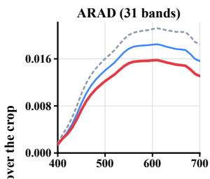

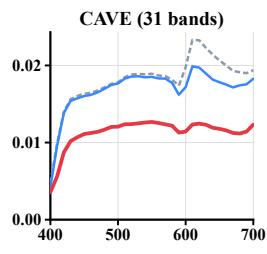

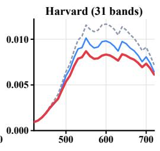

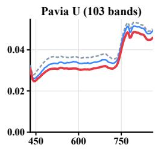

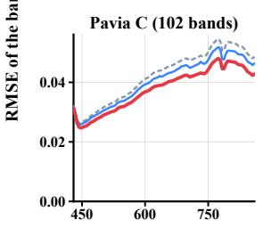

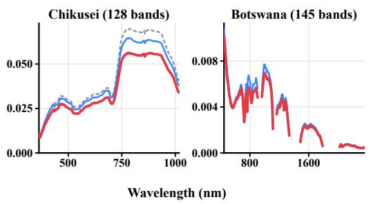  
Figure 6: RMSE of every band over the crop at ×4 on the seven datasets, with the crops chosen as in Appendix B.2.

LIIF  
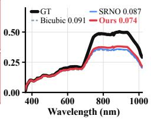  
CiaoSR  
LTE

## B.4 RECONSTRUCTIONS AT ×24

Figure 7 compares the reconstructions at $\times 2 4$ , outside the training range, under the protocol of Table 1, where the input has only 11×11 pixels. The baselines reproduce the blur of bicubic interpolation, while OmniHSR keeps the building rows of Pavia U and the river bank of Chikusei sharper, with the highest PSNR and the lowest SAM on both crops.

GT  
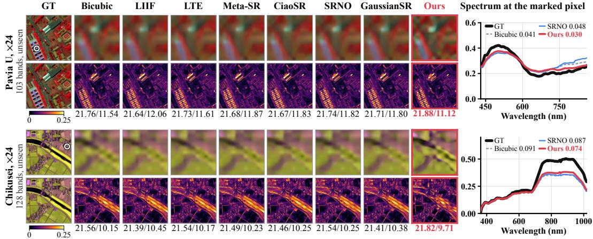

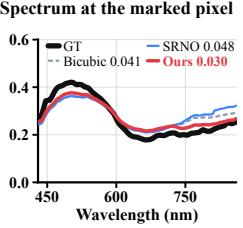  
Figure 7: Zero-shot reconstructions at $\times 2 4$ on Pavia U and Chikusei, laid out as Figure 3. The input has 11×11 pixels, so the zoom shows the whole crop. Numbers are PSNR / SAM on the crop, and the spectrum is taken at the edge pixel with the median bicubic RMSE.

## C ANALYSIS OF OMNIHSR

## C.1 TESTING THE BAND-SHARED OPERATOR PRIOR

Table 11 tests the band-shared operator prior of Section 3.1 without any network. The images, crops and degradation are those of the seven-dataset evaluation (Section 4.1 and Table 12). For every image and factor $s \in \{ 2 , 4 \}$ , we describe $Y _ { b }$ in every window of 16 × 16 low-resolution pixels by Eq. (3), with a zero-sum $5 \times 5$ operator k of 24 free coefficients. The low-resolution pixels of a window are split into two halves in a checkerboard pattern; k is fitted by least squares with a small ridge term on the high-resolution pixels of one half and evaluated on the other half, so no high-resolution pixel is used for both.

A shared operator is fitted on a subset of the bands, either one band, four interior bands evenly spaced over the spectrum, or the first half of the spectrum, and is applied unchanged to all bands outside the subset. As the reference, a per-band operator is fitted for every band on the same pixels. The gain of an operator is $\mathrm { 1 0 \log _ { 1 0 } }$ of the ratio between the squared errors of bicubic interpolation and of the operator, where the errors are accumulated over all windows and evaluated bands of an image and the gains are averaged over the images.

An operator fitted on four bands is at least as accurate as the per-band operators on all seven datasets at both factors, and an operator fitted on the first half of the spectrum serves the second half equally well on all datasets except CAVE. These two operators are fitted on more pixels than a per-band operator, which explains their slight advantage. The one-band operator is fitted on as many pixels as a per-band operator, so its column separates the sharing from the number of fitting pixels. It loses at most 0.01 dB on six datasets, while on CAVE it loses 0.29 dB at $\times 2$ and 0.13 dB at $\times 4 ,$ so the operator should be determined from several bands spread over the spectrum, which the fixed band positions of CSM provide. The per-band gains, 0.2 to 1.2 dB, come from a linear operator fitted per window and serve only as the reference for sharing. The operators of OmniHSR form a finer class, one for every primitive placed with a Gaussian support, and this test covers the coarser class of one operator per window.

Table 11: Test of the band-shared operator prior at ×2 and ×4, with no network. Per band: PSNR gain (dB) over bicubic interpolation of the operators fitted on each band. Other columns: gain of one shared operator, fitted on one band, four bands or the first half of the spectrum and applied to the remaining bands, minus that of the per-band operators on the same bands. Gray: the shared operator is less accurate.
<table><tr><td rowspan="2">Dataset</td><td colspan="4">×2</td><td colspan="4">×4</td></tr><tr><td>Per band</td><td>1 band</td><td>4 bands</td><td>First half</td><td>Per band</td><td>1 band</td><td>4 bands</td><td>First half</td></tr><tr><td>ARAD (31)</td><td>1.19</td><td>-0.01</td><td>+0.03</td><td>+0.01</td><td>0.49</td><td>+0.01</td><td>+0.02</td><td>+0.01</td></tr><tr><td>CAVE (31)</td><td>0.73</td><td>-0.29</td><td>+0.07</td><td>-0.10</td><td>0.33</td><td>-0.13</td><td>+0.04</td><td>-0.06</td></tr><tr><td>Harvard (31)</td><td>0.59</td><td>+0.06</td><td>+0.10</td><td>+0.10</td><td>0.57</td><td>+0.01</td><td>+0.03</td><td>+0.03</td></tr><tr><td>Pavia U (103)</td><td>0.64</td><td>+0.04</td><td>+0.17</td><td>+0.05</td><td>0.31</td><td>+0.04</td><td>+0.08</td><td>+0.04</td></tr><tr><td>Pavia C (102)</td><td>0.67</td><td>+0.04</td><td>+0.14</td><td>+0.08</td><td>0.31</td><td>+0.01</td><td>+0.06</td><td>+0.03</td></tr><tr><td>Chikusei (128)</td><td>0.82</td><td>+0.00</td><td>+0.09</td><td>+0.06</td><td>0.34</td><td>+0.02</td><td>+0.06</td><td>+0.03</td></tr><tr><td>Botswana (145)</td><td>0.37</td><td>+0.01</td><td>+0.12</td><td>+0.12</td><td>0.17</td><td>+0.01</td><td>+0.04</td><td>+0.04</td></tr></table>

## C.2 OUTPUT PATH AND OPERATOR CONSTRAINT

Table 12 compares outputs of the network at ×2, ×4 and ×8 on all seven datasets, with the backbone and training shared. The spectral-value column outputs the spectral values outright and combines no observed pixels, and it falls below bicubic interpolation in PSNR in 19 of the 21 rows and below OmniHSR in all 21. The free-kernel column drops the zero-sum constraint of the operator, the counterpart of the w/o zero-sum row of Table 3. It stays above bicubic interpolation in every row and below OmniHSR in PSNR in 20 of the 21 rows.

Table 12: Output path and operator constraint at ×2, ×4 and ×8 on seven datasets (PSNR↑ / SAM↓). Every model, OmniHSR included, is trained on the 900 ARAD images with the same schedule, shorter than that of the main model, so the OmniHSR column differs from the main model in Table 7. Remote-sensing scenes are scored on 64×64 test tiles, not on the 256×256 crops of Table 1. Gray: worse than bicubic interpolation. Bold: best in the row.
<table><tr><td rowspan=1 colspan=2>Predicted       FreeDataset           Bicubic                                   OmniHSRspectral values   kernel</td></tr><tr><td rowspan=1 colspan=2>ARAD (31)     44.04/0.91   43.98/1.94  47.85/0.71 47.94/0.69</td></tr><tr><td rowspan=1 colspan=1>CAVE (31)     40.83/1.95  35.07/11.63  43.81/1.64</td><td rowspan=1 colspan=1>44.00/1.62</td></tr><tr><td rowspan=1 colspan=1>Harvard (31)    47.47/1.90  40.04/8.61  48.84/1.82</td><td rowspan=1 colspan=1>48.91/1.81</td></tr><tr><td rowspan=2 colspan=1>×2 Pavia U (103)   33.49/3.56  32.50/5.79  35.26/3.26Pavia C (102)   34.60/4.60  34.03/6.99  36.50/4.25</td><td rowspan=1 colspan=1>35.28/3.21</td></tr><tr><td rowspan=1 colspan=1>36.55/4.21</td></tr><tr><td rowspan=1 colspan=1>Chikusei (128) 34.62/9.46  29.26/14.60  37.07/9.19</td><td rowspan=1 colspan=1>37.23/9.16</td></tr><tr><td rowspan=1 colspan=1>Botswana (145) 56.31/1.64  40.06/15.20 56.82/1.56</td><td rowspan=1 colspan=1>57.04/1.54</td></tr><tr><td rowspan=1 colspan=1>ARAD (31)     37.50/1.74  38.22/2.42  39.86/1.45</td><td rowspan=1 colspan=1>39.94/1.42</td></tr><tr><td rowspan=1 colspan=1>CAVE (31)     34.88/3.12  32.30/11.96  37.22/2.61</td><td rowspan=1 colspan=1>37.37 /2.58</td></tr><tr><td rowspan=1 colspan=1>Harvard (31)    43.09/2.38  38.20/8.79  44.54/2.29</td><td rowspan=1 colspan=1>44.62/2.29</td></tr><tr><td rowspan=2 colspan=1>×4 Pavia U (103)   29.04/5.38  28.66/7.05  29.87/5.09Pavia C (102)   30.05/6.39  29.88/8.16  30.95/6.09</td><td rowspan=1 colspan=1>29.92/5.02</td></tr><tr><td rowspan=1 colspan=1>31.04/6.05</td></tr><tr><td rowspan=1 colspan=1>Chikusei (128) 29.10/11.09 26.39/15.42 30.53/10.78</td><td rowspan=1 colspan=1>30.69/10.73</td></tr><tr><td rowspan=1 colspan=1>Botswana (145)53.07/2.38  39.41/15.26  53.17/2.35</td><td rowspan=1 colspan=1>53.32/2.32</td></tr><tr><td rowspan=1 colspan=1>ARAD (31)     33.37/2.72  34.04/3.13  34.88/2.35</td><td rowspan=1 colspan=1>34.96/2.33</td></tr><tr><td rowspan=1 colspan=1>CAVE (31)     30.86/4.71  29.62/12.53  32.59/3.97</td><td rowspan=1 colspan=1>32.68/3.96</td></tr><tr><td rowspan=5 colspan=1>Harvard (31)    39.56/2.76  35.83/8.98  40.74/2.67×8 Pavia U (103)   26.12/7.63  25.89/8.90  26.66/7.19Pavia C (102)   27.12/8.18  26.91/9.65  27.61/7.92Chikusei (128) 26.00/12.73 24.27/16.49 26.71/12.48Botswana (145) 51.22/3.00  38.64/15.44  51.23/2.99</td><td rowspan=1 colspan=1>40.68/2.67</td></tr><tr><td rowspan=1 colspan=1>26.69/7.14</td></tr><tr><td rowspan=1 colspan=1>27.66/7.89</td></tr><tr><td rowspan=1 colspan=1>26.74/12.47</td></tr><tr><td rowspan=1 colspan=1>51.29/2.98</td></tr></table>

Figure 8 compares outputting the spectral values with the operators, both from Table 12, on three unseen datasets at $\times 4 .$ . Outputting the spectral values outright shifts the colors of whole regions on CAVE and fails on the 145-band Botswana, where its error exceeds the color scale everywhere, and its error is above that of the operators in every band of all three crops.

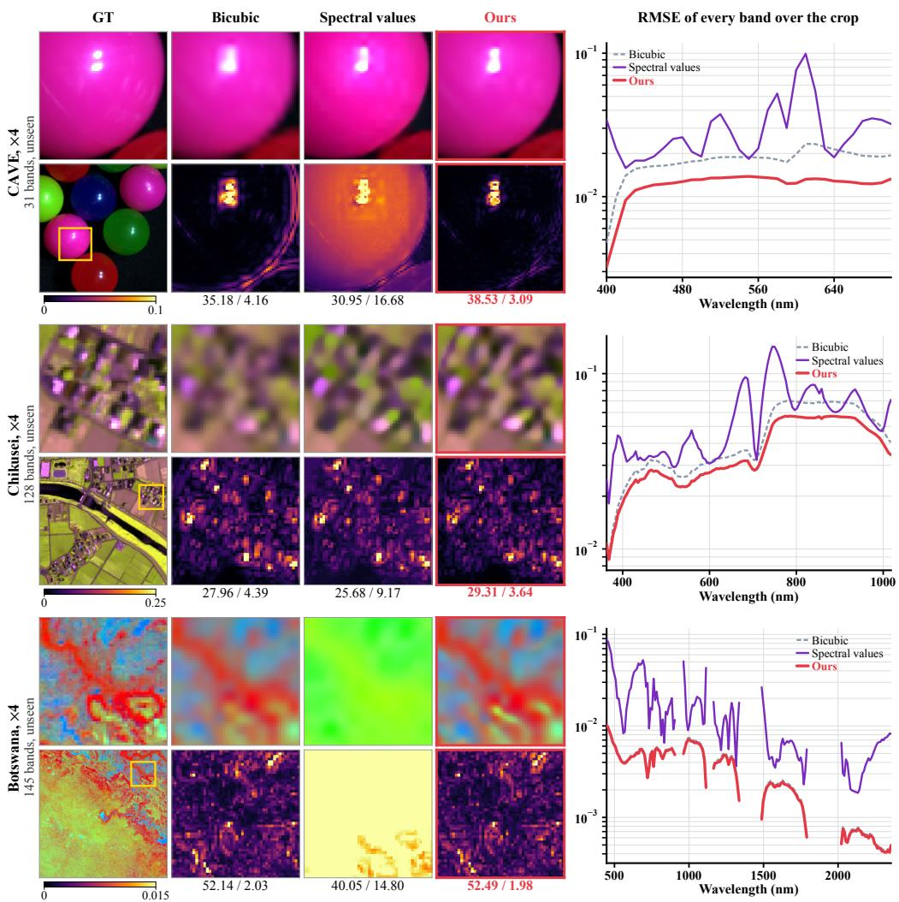  
Figure 8: Output paths at ×4 with the models of Table 12. Spectral values: the network outputs the value of every band. The right column gives the RMSE of every band over the crop on a log scale. Numbers are PSNR / SAM on the crop.

## C.3 REFERENCE POSITIONS AND OPERATOR WINDOW

Table 13 varies the number M of reference positions from 1 to 62. Each model is retrained on the 900 ARAD images and evaluated on the $2 5 6 \times 2 5 6$ crops of Table 1. From $M { = } 8 ~ \mathrm { o n }$ , including M=62, the PSNR on all three datasets stays within 0.1 dB of M=31. With a single position, ARAD and Chikusei lose 0.41 and 0.55 dB at ×4 and remain above bicubic interpolation. Time and peak memory show no monotonic trend in M.

Table 14 varies the operator window from 3×3 to 9×9 with the same budget, and its $5 \times 5$ row is the model in the $M { = } 3 1$ row of Table 13. In PSNR, the $7 \times 7$ window stays within 0.04 dB of $5 \times 5$ on all three datasets. The $3 { \times } 3$ window is 0.10 to 0.25 dB below 5×5 and keeps 72 to 82% of the gain of $5 \times 5$ over bicubic interpolation on the two unseen sensors and about 90% on ARAD. The 9×9 window is 0.01 to 0.09 dB below 5×5. The window changes the parameter count by at most 0.4%, and no larger window is slower than 5×5.

Table 13: Number M of reference positions (PSNR↑ / SAM↓). Every row is trained on the 900 ARAD images with the same schedule, shorter than that of the main model, so the M=31 row, the setting of the main model, differs from Table 1. Time and peak memory on Chikusei.
<table><tr><td>M</td><td>ARAD (31 bands)</td><td>Pavia U (103 bands)</td><td>Chikusei (128 bands)</td><td>Time (ms)</td><td>Memory (MiB)</td></tr><tr><td colspan="6">×4</td></tr><tr><td>Bicubic</td><td>37.50 / 1.74</td><td>28.13 / 5.16</td><td>27.60 / 3.95</td><td></td><td></td></tr><tr><td>1</td><td>39.53 / 1.52</td><td>28.86 / 4.91</td><td>28.23 / 3.81</td><td>15.4</td><td>490</td></tr><tr><td>2</td><td>39.76 / 1.46</td><td>28.82 / 4.93</td><td>28.61 / 3.52</td><td>18.7</td><td>524</td></tr><tr><td>4</td><td>39.83 / 1.45</td><td>28.87 / 4.83</td><td>28.72 /3.45</td><td>23.2</td><td>596</td></tr><tr><td>8</td><td>39.89 / 1.42</td><td>28.92 / 4.78</td><td>28.84 /3.44</td><td>23.1</td><td>595</td></tr><tr><td>16</td><td>39.86 / 1.42</td><td>28.89 / 4.79</td><td>28.80 / 3.46</td><td>21.8</td><td>559</td></tr><tr><td>31</td><td>39.94 /1.42</td><td>28.91 /4.81</td><td>28.78 / 3.48</td><td>21.8</td><td>559</td></tr><tr><td>62</td><td>39.91 / 1.42</td><td>28.92 / 4.79</td><td>28.80 / 3.46</td><td>20.9</td><td>556</td></tr><tr><td colspan="6">×8</td></tr><tr><td>Bicubic</td><td>33.37 / 2.72</td><td>25.04 / 7.28</td><td>24.50 / 5.79</td><td></td><td></td></tr><tr><td>1</td><td>34.72 / 2.45</td><td>25.65 / 6.76</td><td>24.88 / 5.65</td><td>14.0</td><td>414</td></tr><tr><td>2</td><td>34.84 /2.38</td><td>25.54 /7.00</td><td>25.03 / 5.44</td><td>14.1</td><td>425</td></tr><tr><td>4</td><td>34.84 / 2.35</td><td>25.61 / 6.81</td><td>25.08 / 5.37</td><td>14.2</td><td>425</td></tr><tr><td>8</td><td>34.91 / 2.33</td><td>25.58 / 6.76</td><td>25.13 / 5.39</td><td>19.2</td><td>497</td></tr><tr><td>16</td><td>34.91 / 2.32</td><td>25.59 /6.78</td><td>25.11 / 5.43</td><td>15.2</td><td>467</td></tr><tr><td>31</td><td>34.96 / 2.33</td><td>25.58 / 6.81</td><td>25.09 / 5.42</td><td>15.1</td><td>468</td></tr><tr><td>62</td><td>34.94 / 2.32</td><td>25.59 / 6.80</td><td>25.10 /5.41</td><td>14.0</td><td>426</td></tr></table>

Table 14: Operator window (PSNR↑ / SAM↓). Every row is trained on the 900 ARAD images with the same schedule, shorter than that of the main model, so the 5×5 row, the setting of the main model, differs from Table 1. Time and peak memory on Chikusei.
<table><tr><td>Window</td><td>ARAD (31 bands)</td><td>Pavia U (103 bands)</td><td>Chikusei (128 bands)</td><td>Time (ms)</td><td>Memory (MiB)</td></tr><tr><td colspan="6">×4</td></tr><tr><td>Bicubic</td><td>37.50 / 1.74</td><td>28.13 / 5.16</td><td>27.60 / 3.95</td><td></td><td></td></tr><tr><td>3×3</td><td>39.70 / 1.49</td><td>28.69 / 5.00</td><td>28.53 / 3.56</td><td>32.1</td><td>684</td></tr><tr><td>5×5</td><td>39.94 / 1.42</td><td>28.91 /4.81</td><td>28.78 / 3.48</td><td>21.8</td><td>559</td></tr><tr><td>7×7</td><td>39.95 / 1.42</td><td>28.92 / 4.78</td><td>28.82 / 3.44</td><td>21.2</td><td>605</td></tr><tr><td>9×9</td><td>39.85 / 1.44</td><td>28.82 / 4.90</td><td>28.73 / 3.52</td><td>21.8</td><td>666</td></tr><tr><td colspan="6">×8</td></tr><tr><td>Bicubic</td><td>33.37 / 2.72</td><td>25.04 / 7.28</td><td>24.50 / 5.79</td><td></td><td></td></tr><tr><td>3×3</td><td>34.81 / 2.37</td><td>25.48 / 7.05</td><td>24.98 / 5.48</td><td>18.4</td><td>489</td></tr><tr><td>5×5</td><td>34.96 / 2.33</td><td>25.58 / 6.81</td><td>25.09 / 5.42</td><td>15.1</td><td>468</td></tr><tr><td>7×7</td><td>34.94 / 2.31</td><td>25.58 / 6.80</td><td>25.10 /5.39</td><td>14.9</td><td>451</td></tr><tr><td>9×9</td><td>34.87 / 2.33</td><td>25.57 / 6.93</td><td>25.06 / 5.48</td><td>14.2</td><td>441</td></tr></table>

## C.4 TRAINING ON A DIFFERENT SOURCE SENSOR

Table 15 swaps the training sensor for the 128-band Chikusei, keeps everything else fixed, and places this model next to the ARAD-trained main model on the seven datasets at ×2, ×4 and ×8. On the three 31-band datasets, PSNR and SAM are above bicubic interpolation at ×2, ×4 and ×8 throughout, and so are the remaining datasets except Botswana at ×8, where the model ties with interpolation. Transfer holds in both directions, and 31 is only the choice made for the main model of this paper. The Chikusei-trained model gains less than the ARAD-trained one; its training data is 234 tiles of a single scene.

Table 15: Training sensor swapped: the same framework trained on the 128-band Chikusei (234 tiles, 2000 epochs) against the main model trained on the 31-band ARAD (900 images, 2000 epochs), PSNR↑ / SAM↓ on the seven datasets at $\times 2 .$ , ×4 and $\times 8 ,$ , single forward pass, no targetdomain data for either. ARAD is in-domain for the ARAD-trained model and Chikusei for the Chikusei-trained one. Gray: worse than bicubic interpolation.
<table><tr><td>Dataset</td><td>Bicubic</td><td>OmniHSR trained on ARAD (31 bands)</td><td>OmniHSR trained on Chikusei (128 bands)</td></tr><tr><td rowspan="5"> $\times 2$ </td><td>ARAD (31)</td><td>44.04/0.91</td><td>48.41/0.68</td><td>46.59/0.79 43.12/1.76</td></tr><tr><td>CAVE (31)</td><td>40.83/1.95</td><td>44.27/1.59</td><td>48.44/1.83</td></tr><tr><td>Harvard (31)</td><td>47.47/1.90</td><td>49.02/1.81</td><td></td></tr><tr><td>Pavia U (103)</td><td>33.49/3.56</td><td>35.39/3.19</td><td>35.11/3.25</td></tr><tr><td>Pavia C (102) Chikusei (128)</td><td>34.60/4.60 34.62/9.46</td><td>36.67/4.20 37.49/9.13</td><td>36.33/4.30 37.68/9.01</td></tr><tr><td rowspan="5">×4</td><td>Botswana (145) ARAD (31)</td><td>56.31/1.64</td><td>57.03/1.55</td><td>57.02/1.55</td></tr><tr><td>CAVE (31)</td><td>37.50/1.74 34.88/3.12</td><td>40.33/1.38</td><td>38.99/1.60</td></tr><tr><td>Harvard (31)</td><td>43.09/2.38</td><td>37.66/2.53 44.85/2.28</td><td>36.33/2.87</td></tr><tr><td>Pavia U (103)</td><td>29.04/5.38</td><td>29.98/4.91</td><td>43.93/2.32</td></tr><tr><td>Pavia C (102) Chikusei (128)</td><td>30.05/6.39</td><td>31.11/5.97</td><td>29.72/5.17 30.82/6.20</td></tr><tr><td rowspan="5"></td><td>Botswana (145)</td><td>29.10/11.09 53.07/2.38</td><td>30.92/10.65 53.26/2.34</td><td>31.39/10.37 53.22/2.35</td></tr><tr><td></td><td></td><td></td><td></td></tr><tr><td>ARAD (31)</td><td>33.37/2.72</td><td>35.24/2.25</td><td>34.33/2.59</td></tr><tr><td>CAVE (31)</td><td>30.86/4.71</td><td>33.01/3.84</td><td>31.82/4.38</td></tr><tr><td>Harvard (31)</td><td>39.56/2.76</td><td>40.97/2.65</td><td></td></tr><tr><td rowspan="5"> $\times 8$ </td><td>Pavia U (103)</td><td></td><td></td><td>40.10/2.73</td></tr><tr><td></td><td>26.12/7.63</td><td>26.70/7.04</td><td>26.39/7.44</td></tr><tr><td>Pavia C (102)</td><td>27.12/8.18</td><td>27.73/7.79</td><td>27.44/8.07</td></tr><tr><td>Chikusei (128)</td><td>26.00/12.73</td><td>26.92/12.36</td><td>27.53/11.95</td></tr><tr><td>Botswana (145)</td><td>51.22/3.00</td><td>51.25/3.00</td><td>51.23/3.01</td></tr></table>

## C.5 REDEFINING THE BANDS

Eq. (11) holds for a given $W _ { s } ,$ , and the band definition of a sensor reaches the output of OmniHSR only through the prediction of $W _ { s }$ from $Z$ (Section 3.3). Table 16 redefines the bands of every test image of the seven-dataset evaluation in four ways and runs OmniHSR on the redefined input $_ { T X }$ . It compares the result f(TX) with $T f ( X )$ , the reconstruction of the original bands redefined afterwards, which Eq. (11) makes equal to f(TX) if the predicted $W _ { s }$ does not change. The relative change $r = \| f ( T X ) - T f ( X ) \| / \| T f ( X ) - U _ { s } T X \|$ measures how much of the contribution of the operator field moves, and $\Delta$ compares the two against the redefined ground truth TY, without clipping. $\mathrm { { A t } \times 4 , }$ , the median $r$ is no more than 0.09 for subsets and merges and 0.17 for gains and offsets, and at $\times 2 .$ , ×4 and $\times 8$ the PSNR changes by at most 0.05 dB for every transform and dataset. Redefining the bands changes the predicted operators little and leaves the accuracy of the reconstruction unchanged.

Table 16: Redefining the input bands at ×4. Subset: every other band; merge: means of neighboring pairs; gain and offset: a random per-band gain in [0.8, 1.25] or offset in [0, 0.05]. r: relative change of the contribution of the operator field, median over images; ∆: PSNR of $f ( T X )$ minus that of $T f ( X )$ , both against TY (dB).
<table><tr><td rowspan="2">Dataset</td><td colspan="2">Subset</td><td colspan="2">Merge</td><td colspan="2">Gain</td><td colspan="2">Offset</td></tr><tr><td>r</td><td>∆</td><td>r</td><td>∆</td><td>r</td><td>∆</td><td>r</td><td>∆</td></tr><tr><td>ARAD (31)</td><td>0.008</td><td>0.00</td><td>0.049</td><td>-0.01</td><td>0.060</td><td>0.00</td><td>0.089</td><td>-0.02</td></tr><tr><td>CAVE (31)</td><td>0.021</td><td>+0.01</td><td>0.064</td><td>-0.01</td><td>0.063</td><td>0.00</td><td>0.071</td><td>+0.01</td></tr><tr><td>Harvard (31)</td><td>0.060</td><td>0.00</td><td>0.090</td><td>+0.01</td><td>0.064</td><td>0.00</td><td>0.104</td><td>-0.03</td></tr><tr><td>Pavia U (103)</td><td>0.007</td><td>0.00</td><td>0.038</td><td>+0.01</td><td>0.077</td><td>+0.02</td><td>0.160</td><td>+0.04</td></tr><tr><td>Pavia C (102)</td><td>0.017</td><td>0.00</td><td>0.038</td><td>+0.01</td><td>0.144</td><td>0.00</td><td>0.136</td><td>-0.03</td></tr><tr><td>Chikusei (128)</td><td>0.013</td><td>0.00</td><td>0.025</td><td>0.00</td><td>0.076</td><td>-0.03</td><td>0.053</td><td>0.00</td></tr><tr><td>Botswana (145)</td><td>0.018</td><td>0.00</td><td>0.037</td><td>0.00</td><td>0.108</td><td>-0.01</td><td>0.160</td><td>0.00</td></tr></table>

## C.6 BLUR THAT GROWS ALONG THE SPECTRUM

Every other experiment degrades all bands identically, the setting that the band-shared prior assumes. Table 17 lets the blur grow along the spectrum. Before the antialiased bicubic downsampling, band b is blurred by a Gaussian of standard deviation $\kappa s ( b - 1 ) / ( B - 1 )$ high-resolution pixels, so at $\kappa = 0 . 5$ the last band carries an extra blur of half a low-resolution pixel, and the models are the ARAD-trained ones of Table 4. Every method loses accuracy as κ grows. $\mathrm { A t } \ \kappa = 0 . 5 .$ , OmniHSR is above SRNO on every image and tile of the seven datasets, by 0.49 to 1.78 dB on average, and above bicubic interpolation on every dataset, with the lowest SAM of the three methods; SRNO stays below bicubic interpolation on Botswana.

Table 17: Blur that grows along the spectrum, PSNR↑ (dB) at ×4. Band b is blurred by a Gaussian of standard deviation $\kappa s ( b - 1 ) / ( B - 1 )$ high-resolution pixels before the antialiased bicubic down sampling; κ = 0 is the setting of Table 4. Gray: below bicubic interpolation. Bold: best for each κ.
<table><tr><td rowspan="2">Dataset</td><td colspan="3">κ = 0</td><td colspan="3">κ = 0.25</td><td colspan="3">κ = 0.5</td></tr><tr><td>Bicubic</td><td>SRNO</td><td>OmniHSR</td><td>Bicubic</td><td>SRNO</td><td>OmniHSR</td><td>Bicubic</td><td>SRNO</td><td>OmniHSR</td></tr><tr><td>ARAD (31)</td><td>37.50</td><td>38.49</td><td>40.33</td><td>37.34</td><td>38.27</td><td>40.16</td><td>36.85</td><td>37.57</td><td>39.18</td></tr><tr><td>CAVE (31)</td><td>34.88</td><td>35.59</td><td>37.66</td><td>34.72</td><td>35.38</td><td>37.51</td><td>34.21</td><td>34.73</td><td>36.51</td></tr><tr><td>Harvard (31)</td><td>43.09</td><td>43.53</td><td>44.85</td><td>42.94</td><td>43.37</td><td>44.72</td><td>42.49</td><td>42.85</td><td>43.99</td></tr><tr><td>Pavia U (103)</td><td>29.04</td><td>29.40</td><td>29.98</td><td>28.92</td><td>29.28</td><td>29.94</td><td>28.57</td><td>28.90</td><td>29.56</td></tr><tr><td>Pavia C (102)</td><td>30.05</td><td>30.43</td><td>31.11</td><td>29.93</td><td>30.30</td><td>31.08</td><td>29.56</td><td>29.88</td><td>30.63</td></tr><tr><td>Chikusei (128)</td><td>29.10</td><td>29.73</td><td>30.92</td><td>28.98</td><td>29.58</td><td>30.88</td><td>28.62</td><td>29.13</td><td>30.28</td></tr><tr><td>Botswana (145)</td><td>53.07</td><td>52.81</td><td>53.26</td><td>52.98</td><td>52.74</td><td>53.22</td><td>52.75</td><td>52.54</td><td>53.03</td></tr></table>

## C.7 TEST-TIME DEGRADATIONS

Table 18 changes only how the test inputs are generated, on the crops of Table 1. Noise adds i.i.d. Gaussian noise with standard deviation σ to the bicubic input. Blur applies an isotropic Gaussian with a standard deviation of 0.25s, 0.40s or 0.55s high-resolution pixels and keeps every s-th pixel, and area averages s×s blocks.

## C.8 WHAT THE NETWORK PREDICTS

Figure 9 shows the primitives and operators that OmniHSR predicts at ×4 on crops of ARAD and Chikusei chosen as in Appendix B.2. At edges the supports stretch along the edge. We call a primitive an edge primitive when the gradient magnitude of the band-averaged ground truth at its low-resolution pixel is in the top 10%, and a flat primitive when it is in the bottom half. Among the edge primitives with an axis ratio of at least 1.2, the long axis lies within $3 0 ^ { \circ }$ of the edge direction for 98.5% on ARAD and 94.8% on Chikusei. The median axis ratio is 3.9 at edges and 1.3 in flat regions on ARAD, and 3.8 and 1.6 on Chikusei. The operators concentrate on edges as well, with a median norm of 3.5 at edges and 0.9 in flat regions on ARAD and 2.8 and 1.4 on Chikusei, so the correction to bicubic interpolation is small away from edges.

Table 18: PSNR↑ (dB) under test-time degradations on the crops of Table 1. For each dataset: bicubic interpolation, the best of the six baselines, and OmniHSR. Gray: below bicubic interpolation; bold: best.
<table><tr><td rowspan="2">Test input</td><td colspan="3">ARAD (31)</td><td colspan="3">Pavia U (103)</td><td colspan="3">Chikusei (128)</td></tr><tr><td>Bicubic</td><td>Best</td><td>OmniHSR</td><td>Bicubic</td><td>Best</td><td>OmniHSR</td><td>Bicubic</td><td>Best</td><td>OmniHSR</td></tr><tr><td colspan="10">×4</td></tr><tr><td>Bicubic (as in training)</td><td>37.50</td><td>38.49</td><td>40.36</td><td>28.13</td><td>28.44</td><td>28.92</td><td>27.60</td><td>27.96</td><td>28.94</td></tr><tr><td>Noise σ=0.01</td><td>35.07</td><td>36.66</td><td>36.75</td><td>27.92</td><td>28.23</td><td>28.30</td><td>27.31</td><td>27.72</td><td>27.82</td></tr><tr><td>Noise σ=0.02</td><td>32.65</td><td>35.21</td><td>35.25</td><td>27.34</td><td>28.00</td><td>27.87</td><td>26.65</td><td>27.42</td><td>27.26</td></tr><tr><td>Noise σ=0.03</td><td>30.64</td><td>33.87</td><td>30.78</td><td>26.55</td><td>27.68</td><td>26.64</td><td>25.85</td><td>27.12</td><td>25.92</td></tr><tr><td>Blur 0.25s</td><td>36.83</td><td>37.77</td><td>37.79</td><td>27.59</td><td>27.84</td><td>27.82</td><td>27.14</td><td>27.46</td><td>27.45</td></tr><tr><td>Blur 0.40s</td><td>36.34</td><td>36.97</td><td>38.06</td><td>27.31</td><td>27.49</td><td>27.97</td><td>26.87</td><td>27.12</td><td>27.83</td></tr><tr><td>Blur 0.55s</td><td>35.44</td><td>35.79</td><td>36.58</td><td>26.63</td><td>26.71</td><td>27.10</td><td>26.16</td><td>26.30</td><td>26.90</td></tr><tr><td>Area</td><td>37.53</td><td>38.76</td><td>39.35</td><td>28.14</td><td>28.48</td><td>28.49</td><td>27.59</td><td>27.98</td><td>28.36</td></tr><tr><td colspan="10">×8</td></tr><tr><td>Bicubic (as in training)</td><td>33.37</td><td>33.92</td><td>35.26</td><td>25.04</td><td>25.19</td><td>25.59</td><td>24.50</td><td>24.62</td><td>25.16</td></tr><tr><td>Noise σ=0.01</td><td>31.98</td><td>32.78</td><td>32.91</td><td>24.94</td><td>25.02</td><td>25.08</td><td>24.34</td><td>24.49</td><td>24.57</td></tr><tr><td>Noise σ=0.02</td><td>30.40</td><td>31.85</td><td>31.99</td><td>24.63</td><td>24.80</td><td>24.76</td><td>23.97</td><td>24.25</td><td>24.20</td></tr><tr><td>Noise σ=0.03</td><td>28.95</td><td>30.95</td><td>29.07</td><td>24.17</td><td>24.65</td><td>24.22</td><td>23.47</td><td>24.11</td><td>23.55</td></tr><tr><td>Blur 0.25s</td><td>33.27</td><td>33.97</td><td>33.97</td><td>24.99</td><td>25.15</td><td>25.12</td><td>24.36</td><td>24.55</td><td>24.51</td></tr><tr><td>Blur 0.40s</td><td>32.91</td><td>33.37</td><td>34.52</td><td>24.68</td><td>24.82</td><td>25.33</td><td>24.23</td><td>24.34</td><td>24.90</td></tr><tr><td>Blur 0.55s</td><td>32.21</td><td>32.47</td><td>33.23</td><td>24.11</td><td>24.22</td><td>24.59</td><td>23.77</td><td>23.84</td><td>24.23</td></tr><tr><td>Area</td><td>33.37</td><td>34.00</td><td>34.48</td><td>25.05</td><td>25.20</td><td>25.36</td><td>24.48</td><td>24.60</td><td>24.76</td></tr></table>

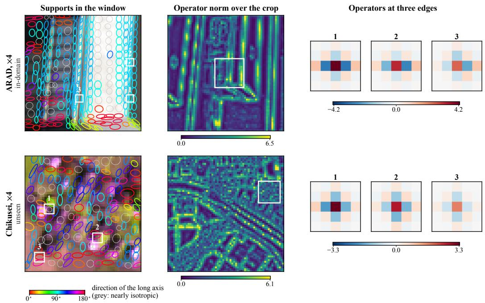  
Figure 9: What the network predicts at ×4. Left: the supports in the window, colored by the direction of the long axis (grey: axis ratio below 1.2). Middle: the norm of every 5×5 operator over the crop. Right: the three edge operators in the window with the largest norm.

## D INFERENCE COST

Timing in Figure 1. Panels (a,b) profile cached multi-scale inference, whereas (d) times each output independently. Both use three 32×32×145 Botswana inputs, one NVIDIA A40, batch size 1 and FP32 with TF32 disabled. For (a,b), each run requests factors 4, 6, 8, 10, 12, 14, 16, reusing scale-independent features in both models. After two warm-up bundles, we time five bundles and select the median-total-time run per input, retaining its paired stage durations, then average across the three inputs. CSM performs feature encoding once but repeats scale conditioning and operator prediction for each output. The displayed per-output coefficients average over these seven factors and approximate this workload. Panel (d) averages per-input medians from twelve independent runs after three warm-ups at each factor.

Latency on an A40. Table 19 reports latency on one NVIDIA A40; all seven datasets, ×8 and peak memory are in Table 20. On the 31-band ARAD at ×4, every method takes between 9 and 33 ms and OmniHSR takes 11.8 ms; from ×8 on, OmniHSR is the fastest, and at ×16 it is 2.7 times faster than the fastest baseline. With more than 31 bands, the output head of a baseline is tied to 31 bands, so it runs the network 7 to 11 times over sliding windows of bands and its latency grows in proportion; OmniHSR runs once, its latency at ×4 rises only from 11.8 ms at 31 bands to 22.3 ms at 145 bands, and it is 3.6 to 8.5 times faster than the strongest baseline, SRNO, and up to 36.5 times faster than the slowest. At ×4, OmniHSR has the lowest peak memory of all methods. Figure 10 pushes the factor to ×48: the latency of OmniHSR grows with the number of output pixels but with the lowest slope, reaching 613 ms at ×48 on 128 bands, 7.3 to 32 times faster than the baselines that reach this factor; Meta-SR runs out of memory from ×12 on, and SRNO and GaussianSR at ×48. The time column of Table 1 and the time and memory of Table 3 are measured on one RTX 4090D with a batch size of 1 in FP32, on the first test image of each dataset, as the median of 12 synchronized runs after three warm-ups; Table 1 averages them over the twelve factors.

Table 20 is the full version of Table 19: latency and peak memory on all seven datasets at ×4, ×8 and ×16, on the same A40 with the same timing discipline. Latency depends only on the input size

Table 19: Inference latency in ms on one NVIDIA A40 at ×4 and ×16 on four band counts, batch size 1, FP32, 32×32 input. Bold: lowest.
<table><tr><td rowspan="2">Method</td><td rowspan="2">Params (M)</td><td colspan="2">ARAD (31)</td><td colspan="2">Pavia U (103)</td><td colspan="2">Chikusei (128)</td><td colspan="2">Botswana (145)</td></tr><tr><td>×4</td><td>×16</td><td>×4</td><td>×16</td><td>×4</td><td>×16</td><td>×4</td><td>×16</td></tr><tr><td>LIIF</td><td>2.03</td><td>11.6</td><td>120.2</td><td>76.8</td><td>831.1</td><td>109.5</td><td>1187.1</td><td>120.5</td><td>1304.1</td></tr><tr><td>LTE</td><td>2.18</td><td>12.4</td><td>124.1</td><td>80.3</td><td>853.9</td><td>114.1</td><td>1224.1</td><td>127.3</td><td>1342.8</td></tr><tr><td>Meta-SR</td><td>6.27</td><td>23.8</td><td>271.1</td><td>171.0</td><td>1914.3</td><td>237.0</td><td>2765.6</td><td>264.6</td><td>3024.7</td></tr><tr><td>CiaoSR</td><td>3.11</td><td>33.1</td><td>450.4</td><td>227.0</td><td>3147.8</td><td>322.4</td><td>4489.7</td><td>354.1</td><td>4934.4</td></tr><tr><td>SRNO</td><td>2.48</td><td>12.3</td><td>106.0</td><td>79.0</td><td>727.9</td><td>112.1</td><td>1039.7</td><td>123.9</td><td>1142.5</td></tr><tr><td>GaussianSR</td><td>6.97</td><td>8.9</td><td>296.7</td><td>58.3</td><td>2061.8</td><td>82.1</td><td>2939.3</td><td>90.3</td><td>3238.0</td></tr><tr><td>OmniHSR</td><td>0.538</td><td>11.8</td><td>39.1</td><td>22.1</td><td>148.7</td><td>21.4</td><td>129.1</td><td>22.3</td><td>135.1</td></tr><tr><td>Forward passes of a baseline</td><td></td><td>1</td><td>1</td><td>7</td><td>7</td><td>10</td><td>10</td><td>11</td><td>11</td></tr></table>

and the band count, so the three 31-band datasets take the same time, and so do Pavia C and Pavia U with 102 and 103 bands.  
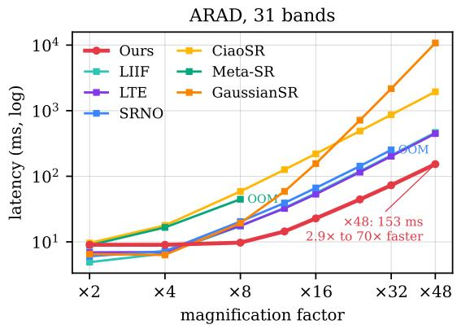

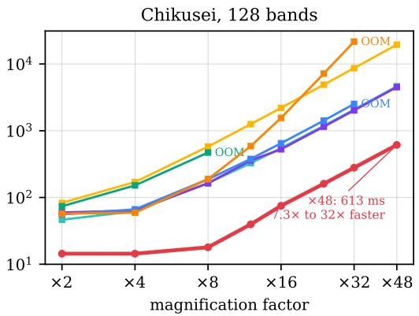  
Figure 10: Latency against magnification factor on one RTX 4090D (24 GB). The same $3 2 \times 3 2$ low-resolution input is magnified by ×2 to ×48 (outputs of 64 to 1536 pixels), left on the 31-band ARAD and right on the 128-band Chikusei, log-log axes. The x-axis is the magnification factor of a single output and every point is one independent inference, not the accumulated time of rendering many scales from one encoding. A baseline stops where all three inputs run out of memory (OOM). The annotation gives the latency of OmniHSR at ×48 and its ratio to the fastest and the slowest baseline that reach this factor.

Table 20: Full version of Table 19: latency in ms / peak allocated memory in MiB on one NVIDIA A40, batch size 1, FP32, from a 32×32 low-resolution input (median of 12 synchronized runs, averaged over three inputs), for all seven datasets at ×4, ×8 and ×16. On inputs with more than 31 bands a baseline runs its 31-band model on sliding windows of bands, which takes the number of forward passes in the last row; OmniHSR runs once. No configuration ran out of memory on the 46 GB card. Bold: lowest latency. Params counts the source model.
<table><tr><td>Method</td><td>Params Factor (M)</td><td></td><td>ARAD (31)</td><td>CAVE (31)</td><td>Harvard (31)</td><td>Pavia U (103)</td><td>Pavia C (102)</td><td>Chikusei (128)</td><td>Botswana (145)</td></tr><tr><td rowspan="3">LIIF</td><td rowspan="3">2.030</td><td>x4</td><td>11.6/134</td><td>11.6/134</td><td>11.6/134</td><td>76.8/141</td><td>77.1/141</td><td>109.5/143</td><td>120.5/144</td></tr><tr><td>×8</td><td>34.0/141</td><td>34.1/141</td><td>34.1/141</td><td>229.4/167</td><td>232.7/167</td><td>328.1/174</td><td>360.3/178</td></tr><tr><td>×16</td><td>120.2/167</td><td>120.2/167</td><td>121.0/167</td><td>831.1/272</td><td>829.0/270</td><td>1187.1/296</td><td>1304.1/314</td></tr><tr><td rowspan="3">LTE</td><td rowspan="3">2.180</td><td>x4</td><td>12.4/123</td><td>12.4/123</td><td>12.5/123</td><td>80.3/130</td><td>80.9/130</td><td>114.1/132</td><td>127.3/133</td></tr><tr><td>×8</td><td>35.2/130</td><td>38.9/130</td><td>35.5/130</td><td>237.1/156</td><td>236.6/156</td><td>337.3/163</td><td>370.6/167</td></tr><tr><td>×16</td><td>124.1/156</td><td>125.5/156</td><td>124.2/156</td><td>853.9/261</td><td>857.9/259</td><td>1224.1/285</td><td>1342.8/312</td></tr><tr><td rowspan="3">Meta-SR</td><td>6.270</td><td>x4</td><td>23.8/2305</td><td>24.3/2305</td><td>24.5/2305</td><td>171.0/2313</td><td>168.7/2313</td><td>237.0/2315</td><td>264.6/2316</td></tr><tr><td rowspan="2"></td><td>×8</td><td>74.9/9122</td><td>74.6/9122</td><td>75.5/9122</td><td>553.1/9149</td><td>546.0/9149</td><td>795.9/9155</td><td>859.4/9160</td></tr><tr><td>×16</td><td>271.1/36388</td><td>271.3/36388</td><td>274.3/36388</td><td>1914.3/36493</td><td>1932.1/36491</td><td>2765.6/36518</td><td>3024.7/36536</td></tr><tr><td rowspan="3">CiaoSR</td><td>3.110</td><td>x4</td><td>33.1/874</td><td>33.2/874</td><td>33.1/874</td><td>227.0/881</td><td>226.8/881</td><td>322.4/883</td><td>354.1/884</td></tr><tr><td></td><td>×8 ×16</td><td>125.1/881 450.4/911</td><td>119.5/881</td><td>117.5/881</td><td>813.0/908</td><td>812.4/908</td><td>1159.7/914</td><td>1271.2/918</td></tr><tr><td></td><td></td><td></td><td>451.1/911</td><td>450.4/911</td><td>3147.8/1016</td><td>3153.5/1014</td><td>4489.7/1041</td><td>4934.4/1059</td></tr><tr><td rowspan="3">SRNO</td><td>2.480</td><td>x4</td><td>12.3/264</td><td>12.2/264</td><td>12.3/264</td><td>79.0/271</td><td>79.4/271</td><td>112.1/273</td><td>123.9/274</td></tr><tr><td></td><td>×8 ×16</td><td>31.0/1001 106.0/3951</td><td>31.2/1001</td><td>31.1/1001 105.8/3951</td><td>205.3/1028</td><td>205.7/1028</td><td>292.2/1035</td><td>320.9/1039</td></tr><tr><td></td><td></td><td></td><td>105.9/3951</td><td></td><td>727.9/4056</td><td>727.4/4054</td><td>1039.7/4080</td><td>1142.5/4099</td></tr><tr><td rowspan="3">GaussianSR</td><td>6.970</td><td>x4</td><td>8.9/273 33.7/688</td><td>9.0/273</td><td>9.0/273</td><td>58.3/281</td><td>58.4/281</td><td>82.1/284</td><td>90.3/284</td></tr><tr><td></td><td>×8 ×16</td><td>296.7/2345</td><td>34.2/688</td><td>33.2/688 295.8/2345</td><td>231.7/715</td><td>227.1/715</td><td>328.0/721</td><td>358.9/726</td></tr><tr><td></td><td></td><td></td><td>296.1/2345</td><td></td><td>2061.8/2449</td><td>2062.5/2447</td><td>2939.3/2474</td><td>3238.0/2492</td></tr><tr><td rowspan="3">OmniHSR</td><td>0.538</td><td>×4</td><td>11.8/66</td><td>12.5/66</td><td>12.6/57</td><td>22.1/110</td><td>21.2/102</td><td>21.4/88</td><td>22.3/89</td></tr><tr><td></td><td>×8</td><td>17.6/209</td><td>17.8/206</td><td>16.3/169</td><td>48.2/355</td><td>46.7/347</td><td>42.8/259</td><td>45.4/254</td></tr><tr><td></td><td>×16</td><td>39.1/764</td><td>39.2/761</td><td>33.6/623</td><td>148.7/1317</td><td>147.8/1319</td><td>129.1/959</td><td>135.1/927</td></tr><tr><td></td><td>Forward passes of a baseline</td><td></td><td>1</td><td>1</td><td>1</td><td>7</td><td>7</td><td>10</td><td>11</td></tr></table>